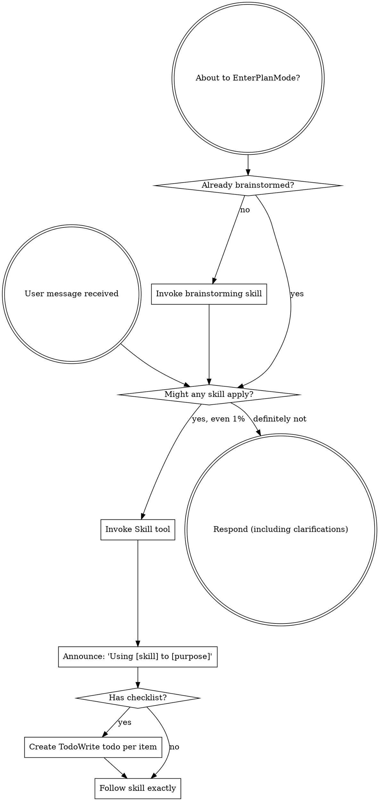
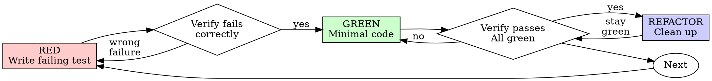
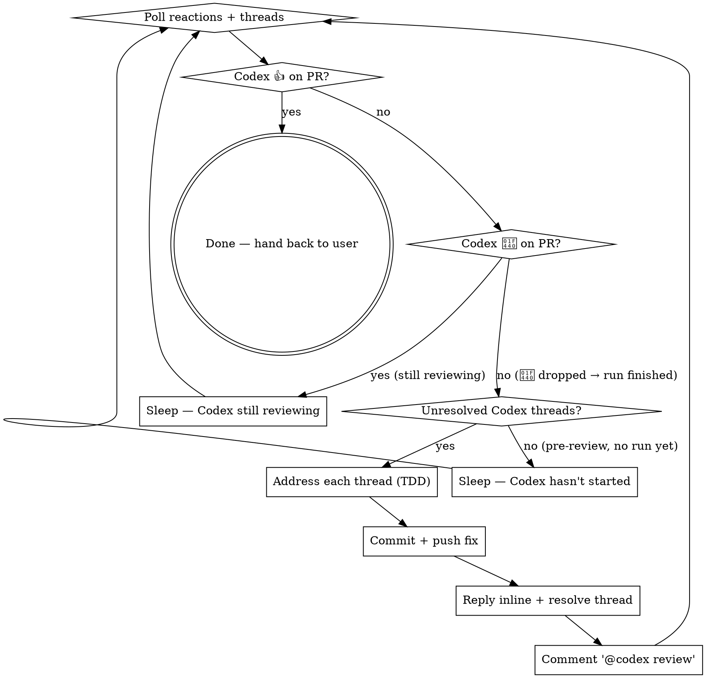

> SYSTEM

# AGENTS.md instructions for /Users/ericson/.t3/worktrees/ars-ui/t3code-65277991

<INSTRUCTIONS>
# ars-ui

## Project Overview

Rust frontend component library using state machines, framework-agnostic core with Leptos/Dioxus adapters.

## Current Phase

The repo is now in active implementation, not spec drafting only.

Agents working on implementation should use the GitHub Project roadmap and issue backlog as the execution source of truth:

- Use the GitHub Project `ars-ui implementation roadmap` to understand active epics, task breakdown, dependencies, status, and iteration planning.
- Prefer picking a single issue-backed task that is unblocked, sized, and scoped for independent delivery.
- Do not start work from an epic issue unless the user explicitly asks for planning or further decomposition.
- Do not start a task that is blocked by unresolved GitHub issue dependencies.
- Treat native GitHub issue dependencies as the blocker graph and the issue body acceptance criteria as the delivery contract.

## Development Workflow

For implementation tasks:

1. Read the assigned or selected GitHub issue first.
2. Move the issue to **In Progress** on the GitHub Project board.
3. Review the cited spec sections and any dependency issues.
4. Add or update the named tests first.
5. Implement only the scope required to make those tests pass.
6. If implementation changes the intended contract, update the relevant spec in the same task.
7. **MANDATORY:** Invoke the `post-implementation-audit` skill (`.agents/skills/post-implementation-audit/SKILL.md`). It runs three sequential audits on the new code — (a) spec/implementation drift with "best outcome" recommendations, (b) iterative "anything else missing?" passes (minimum two rounds), (c) test-coverage audit across every test type the workspace uses (unit, snapshot, proptest, mutation, doc, spec-conformance, llvm-cov). **Every finding lands in _this_ PR — no deferral, no follow-up issues.** This step exists because initial implementations consistently ship spec drift and silent contract violations that take 3+ review round-trips to surface; the audit collapses them into one. Skipping this step is a contract violation.
8. Present the final result for user review before any commit.
9. After user approval, run `cargo xci --profile fast` (alias: `cargo xci-fast`) locally and fix any failures before pushing anything to GitHub. The fast profile takes ~5 minutes and covers the workspace-level regressions a pre-push gate should catch: fmt, check, clippy, unit, integration, adapter, spec-compile-snippets, error-variant-coverage, mutual-exclusion, snapshot-count. Reserve full `cargo xci` (~25 minutes, all 20 gates including wasm coverage and the feature-matrix groups) for after substantial refactors that may have shifted feature-flag interactions. For small follow-up changes, run the focused tests and checks that cover the edited code instead.
10. After `cargo xci-fast` passes, commit and push a PR targeting `main`. The PR body MUST include an auto-close keyword for the issue being delivered, for example `Closes #20` or `Fixes #20`, so GitHub closes the issue automatically when the PR merges.
11. **If the PR creates or modifies any `.snap` insta fixtures, attach the `snapshot-reviewed` label after opening or updating it** (`gh pr edit <num> --add-label "snapshot-reviewed"`). This signals to reviewers that the snapshot output was inspected and is intentional. Re-apply the label whenever you push a commit that touches `.snap` files; the workflow assumes the label reflects the latest snapshot state.
12. **MANDATORY:** Invoke the `waiting-for-codex-review` skill (`.agents/skills/waiting-for-codex-review/SKILL.md`) immediately after the first push that creates the PR, and re-invoke it after every subsequent push to the PR branch. The skill posts the initial `@codex review` trigger, polls Codex's 👀 → (👍 \| ∅ + threads) reaction lifecycle, addresses any review threads with the same rigor as `post-implementation-audit` (TDD + no coverage regression), replies inline, resolves threads, and re-comments `@codex review` to start the next pass — looping until Codex leaves 👍. Skipping this step leaves Codex findings unaddressed and silently widens the gap between merged code and the spec; the merge gate is 👍 from Codex plus green CI, not green CI alone.
13. Only after CI passes, Codex has left 👍, and the PR is merged, close the issue.

Never close a GitHub issue without a merged PR that passes CI **and a 👍 from Codex**. Never commit or push without explicit user approval. Keep the issue, PR, and Project board status aligned with the actual work state at every step.

Default delivery rules:

- Follow TDD: tests first, implementation second, verification last.
- Keep task scope aligned with the issue. If the issue is too large or ambiguous, stop and split or clarify rather than freelancing a bigger change.
- Prefer tasks sized `1`, `2`, `3`, or `5` points. `8` is exceptional. `13` must be decomposed before implementation.
- Preserve the crate and dependency layering defined by the architecture and implementation plan.
- Do not add a new dependency crate without explicit user approval first. If a task appears to need a new crate, stop, explain why, and get approval before editing any `Cargo.toml`.
- When a task is complete, verify the exact tests and checks named by the issue before considering it done.
- For adapter-level component implementation, follow `docs/implementation/adapter-component-delivery.md`. Adapter component work must cover the adapter crate, adapter tests, E2E fixtures/harnesses when applicable, widgets examples, spec synchronization, and the required validation/audit loop in one PR.

### Code Quality Standards

- **Document all public items.** Every public struct, enum, trait, function, constant, type alias, method, field, and variant must have a `///` doc comment. Every `lib.rs` must have a `//!` crate-level doc comment. The workspace enforces `missing_docs` linting — undocumented public items are build failures.
- **Zero warnings policy.** All code must compile with zero warnings under the workspace's configured clippy and rustc lints. Fix the root cause instead of suppressing. When suppression is genuinely needed, use `#[expect(lint, reason = "...")]` — never `#[allow(...)]`.
- **Derive documentation from the spec.** Doc comments should describe the _purpose and semantics_ of the item as defined in the corresponding `spec/` files, not just restate the type signature.
- **Use `#[inline]` selectively, not mechanically.** Do **not** add Clippy's `missing_inline_in_public_items` lint at the workspace level, and do not treat public visibility alone as a reason to mark an item `#[inline]`. Use `#[inline]` for thin cross-crate wrappers, trivial accessors, and hot-path no-op shims where the call overhead is plausibly meaningful. Avoid blanket `#[inline]` on all public APIs — it increases code size, adds compile-time cost, and turns `#[inline]` into noise instead of a deliberate performance signal.
- **Use directory-backed modules with `mod.rs` when a module owns children.** This repo standardizes on the older filesystem layout for nested modules. If module `foo` has child modules, the parent must live at `foo/mod.rs`, not `foo.rs`. Do not mix `foo.rs` with a sibling `foo/` directory. When a refactor adds child modules under an existing flat file, move the parent into `foo/mod.rs` in the same change. Do not leave empty leftover module directories behind.

### API Design Standards

- **Design for the pit of success.** Public APIs should make the most natural, shortest path also be the path that is correct, accessible, localizable, type-safe, and performant. Prefer ergonomic constructors and defaults that preserve the spec's strongest guarantees instead of making users opt into correctness after choosing a convenient API.
- **Name escape hatches explicitly.** When a component needs a lower-level, static, non-i18n, or otherwise less complete path, keep it available but make the tradeoff visible in the API name or type. The blessed path should remain the simplest call site, while escape hatches should read as deliberate choices.
- **Keep semantic data separate from rendered views.** Rich framework views are useful for customization, but components still need semantic sources for accessible names, localized text, announcements, ids, and state-machine wiring. Do not rely on arbitrary rendered view trees as the only source of user-facing semantics.

### Code Coverage

The workspace uses `cargo-llvm-cov` for code coverage with per-crate threshold enforcement. CI runs coverage on every PR (see `.github/workflows/ci.yml`).

**Local coverage commands:**

```bash
# Per-crate coverage with inline annotated source (most useful during development)
cargo llvm-cov test -p ars-interactions --text -- hover

# Per-crate summary only
cargo llvm-cov test -p ars-interactions -- hover

# Native-only workspace coverage (host target; excludes wasm-only crates)
cargo llvm-cov --workspace \
  --exclude ars-leptos --exclude ars-dioxus \
  --exclude ars-test-harness-leptos --exclude ars-test-harness-dioxus \
  --exclude ars-derive --exclude xtask \
  --lcov --output-path lcov.info

# Check all crates against spec-defined thresholds (run after a *merged* lcov)
cargo xtask coverage check-all --file lcov.info
```

The `--text` flag produces line-by-line annotated source showing hit counts and `^0` markers on uncovered branches — use this to identify gaps after writing tests. Uncovered no-op callback closures in tests (e.g., `|_| {}`) are expected and not a gap.

The local recipe above excludes the adapter and adapter-test-harness crates because their `target_arch = "wasm32"` / `feature = "web"` code paths can't be measured via host-target `cargo llvm-cov`. **CI runs an additional wasm-coverage pipeline on nightly** (`cargo xtask ci coverage`) that uses `wasm-bindgen-test`'s experimental coverage recipe with LLVM 22 / `clang-22` to emit lcov for `ars-leptos` (csr), `ars-dioxus` (web), `ars-dom` (web), `ars-i18n` (web-intl), and the adapter test harnesses, then merges with the native lcov via `cargo xtask coverage merge`. The per-crate thresholds in `xtask::coverage::default_thresholds()` are enforced against the merged file — including adapter targets (`ars-leptos` 74/55, `ars-dioxus` 77/70, `ars-test-harness-leptos` 60/0, `ars-test-harness-dioxus` 60/0). `ars-derive` (proc-macro, runs in compiler) is exercised via `crates/ars-core/tests/derive_contract.rs` and is unmeasured. `xtask` has its own enforced threshold (30/35) and is measured. See `spec/testing/14-ci.md` §2 for the full pipeline.

### Mutation Testing

Coverage tells you which lines run. **Mutation testing tells you whether the tests would notice if those lines silently misbehaved.** The workspace uses [`cargo-mutants`](https://mutants.rs) for this — a `cargo` extension binary, not a workspace dependency.

**Install (once per developer machine):**

```bash
cargo install cargo-mutants --locked --version 27.0.0
```

**Local commands (state-machine modules are the most rewarding targets):**

```bash
# Run on a single component machine (~6 min for popover)
cargo mutants -p ars-components -f crates/ars-components/src/overlay/popover/mod.rs

# Just list what would be mutated, without running tests (fast)
cargo mutants -p ars-components -f crates/ars-components/src/overlay/popover/mod.rs --list

# Whole crate (slow — only if you really mean it)
cargo mutants -p ars-components
```

**Agnostic component implementation gate:** whenever an agent implements a new framework-agnostic component, or materially changes an existing one, the delivery must include:

- a targeted mutation run for the component source file, usually `cargo mutants -p ars-components -f crates/ars-components/src/<category>/<component>/mod.rs` (adjust the path for single-file modules);
- spec-conformance tests for the component's anatomy/public contract, including its `Part` enum and required API/attribute surface;
- same-task triage of every `MISSED` mutant: add tests for real gaps, or add a justified line-agnostic `.cargo/mutants.toml` exclude only for true equivalent mutations.

**Reading the output:** Results land in `mutants.out/mutants.out/` (gitignored). The two files that matter:

- `caught.txt` — mutations that broke at least one test ✅
- `missed.txt` — mutations that survived all tests ❌ — each one is either a real test gap to fill or an "equivalent mutation" that needs a `[[skip]]` entry in `mutants.toml` with a justification

**CI integration:** Nightly only. `.github/workflows/nightly.yml` has a `mutation-testing` job with a 21-entry matrix that runs `cargo mutants -p <package>` on every framework-agnostic crate, using `--shard k/n` to spread larger crates across parallel runners. **Shard indices are 0-based** (`k` runs from `0` to `n-1`); `k == n` is invalid and will fail the job. When adding shards, always start at `0/n` and end at `(n-1)/n`.

- **`ars-components` (≈ 1,630 mutants today, planned to grow as the spec adds the remaining ~97 components):** sharded **12-way** → ≈ 135 mutants per runner today, ≈ 850 per runner at the ~10,000-mutant endpoint. Sized for the full spec catalog up front so we don't re-shard every few months as components land.
- **`ars-collections` (≈ 1,080 mutants):** sharded 4-way → ≈ 270 mutants per runner.
- **`ars-core` (≈ 700 mutants):** sharded 2-way → ≈ 350 mutants per runner.
- **`ars-a11y`, `ars-forms`, `ars-interactions`:** one runner each (under 600 mutants apiece).

**Adding a new state machine inside an existing crate requires no CI changes** — its mutations land in whichever shard the cargo-mutants partitioner places them. The shard counts are sized so the slowest runner stays well under 30 minutes today and under ~50 minutes at the planned endpoint; re-balance only when a crate outgrows that budget (visible on the nightly dashboard as one shard pulling away from the others).

All matrix jobs run with `fail-fast: false` so failures on one module don't mask data on another. Each job uploads its `mutants.out/` as a workflow artifact (always, even on success — surviving "missed" entries on a passing run still reveal test-quality work). The job fails if any mutation survives, so a missed mutation forces a deliberate triage decision (fix the test, or document the equivalence with a `[[skip]]` entry in `mutants.toml`).

**Excluded crates** (mutation testing's signal degrades wherever determinism does): adapter glue (`ars-leptos`, `ars-dioxus`), DOM/FFI (`ars-dom`), ICU/FFI (`ars-i18n`), test infrastructure (`ars-test-harness*`), and the proc-macro crate (`ars-derive`, runs in the compiler). Adding a brand-new crate that is a good mutation target requires one new matrix entry; run a local scout first (`cargo mutants -p <crate> --list` to size, then a real run) so we know the right shard count before the nightly fires.

**Bumping the pinned version.** Both the local install command above and `.github/workflows/nightly.yml` pin cargo-mutants to an exact version (currently `27.0.0`) — same convention as `wasm-pack` in the `a11y-audit` job. Pinning is deliberate: cargo-mutants ships new mutators in releases, and an unpinned install would silently change the mutation set without any code change, surfacing as phantom CI failures on a green-source repo. To bump, open a PR that (1) updates the version string in CLAUDE.md and `nightly.yml`, (2) runs the popover scout locally with the new version (`cargo mutants -p ars-components -f crates/ars-components/src/overlay/popover/mod.rs`) to confirm the mutation count is in the same ballpark, and (3) triages any new "missed" entries the new mutators surface — they are usually genuine test-quality gaps newly visible to the tool.

### Property Testing (proptest)

State-machine invariants are exercised by [`proptest`](https://docs.rs/proptest) under `crates/<crate>/tests/proptest_state_machines/` (see `ars-components`). Default proptest behaviour drops `*.proptest-regressions` seed files alongside test sources — instead, every `proptest!` block in this workspace pulls a shared `Config` from `tests/proptest_state_machines/common.rs` that:

1. Reads `PROPTEST_CASES` from the environment (1,000 default; 10,000 in the nightly `extended-proptest` job).
2. Sets `failure_persistence` to `FileFailurePersistence::Direct("proptest-regressions/state-machines.txt")`, so all persisted seeds for the test binary live in one file at the crate root: `crates/<crate>/proptest-regressions/state-machines.txt`. The directory is committed (per proptest's own recommendation in the file header) so every developer's runs benefit from previously-shrunk failures.

When a new crate adopts proptest for state-machine tests, copy the same `common.rs` helper and reference it via `#![proptest_config(super::common::proptest_config())]` inside every `proptest!` block. Don't let proptest fall back to its `WithSource` default — that scatters seed files across the source tree.

### Adapter Prelude Convention

Both `ars-leptos` and `ars-dioxus` expose a `prelude` module targeting **end users** — application developers who consume the ready-made components. `use ars_leptos::prelude::*` (or `use ars_dioxus::prelude::*`) should give them everything they need.

The prelude contains only user-facing items:

1. **Component modules** — as components land, their public module paths (e.g., `button`, `dialog`) are re-exported so users can write `button::Props`, etc.
2. **User-facing traits** — traits end users call on component outputs (e.g., `Translate` from `ars-i18n`). Re-export the trait so consumers don't need a direct dependency on the subsystem crate.
3. **Configuration types** — types that appear in component props or configure behaviour (e.g., `Locale`, `Direction`, `Orientation`, `Selection`).

The prelude does **not** include implementation details consumed only by component authors inside the adapter crate: core engine types (`Machine`, `Service`, `ConnectApi`, `AttrMap`), accessibility primitives (`AriaRole`, `AriaAttribute`), interaction helpers (`merge_attrs`), or adapter hooks (`use_machine`, `UseMachineReturn`). Those remain accessible via their normal crate paths for advanced users building custom machines.

Both adapter preludes must stay symmetric: same items, same structure. When adding a new re-export to one adapter's prelude, add it to the other as well in the same PR.

### Adapter Testing Convention

Adapter-level component tests should default to the framework-specific test harness crate:

- Leptos adapter tests should prefer `ars-test-harness-leptos`.
- Dioxus adapter tests should prefer `ars-test-harness-dioxus`.
- Shared `ars-test-harness` helpers should be used where relevant for viewport, layout, clipboard, drag/drop, timing, and other DOM test setup instead of bespoke per-test browser scaffolding.

When a component spec requires interaction, focus, overlay positioning, clipboard, file upload, drag/drop, or similar browser behavior, the task's tests should exercise that behavior through the adapter harness entrypoints and shared core harness helpers unless there is a concrete technical reason not to.

## Spec Synchronization During Implementation

The specification is the authoritative contract. It took weeks of deliberate design and MUST be followed.

### Spec-first implementation rule

Before implementing any public type, trait, function, or method:

1. **Read the spec section first.** Find the relevant code example in `spec/`. Use `spec-tool toc <file>` and `grep` to locate it.
2. **Match the spec exactly.** If the spec defines `struct ComponentIds { base: String }` with methods `from_id()`, `id()`, `part()`, `item()`, `item_part()` — implement exactly that. Do not invent alternative field names, method names, or signatures.
3. **Cross-check after implementation.** Before presenting code for review, diff every public item against the spec's code examples. Every struct field, every method name, every parameter must match.
4. **If you must deviate**, there must be a concrete technical reason (e.g., the spec's API cannot compile, or a dependency doesn't expose the needed type). Document the reason in a code comment and flag it to the user explicitly.

Inventing alternative APIs that "seem equivalent" is never acceptable — it silently invalidates the spec's design decisions and all downstream code that depends on those APIs.

### Spec/code mismatch resolution

- If code and spec disagree, resolve the mismatch in the same task or PR.
- Shared conceptual changes belong in shared or foundation spec files, not only in adapter code.
- Adapter-specific findings must be reflected back into `spec/foundation/08-adapter-leptos.md` and/or `spec/foundation/09-adapter-dioxus.md` when relevant.
- Do not leave spec drift behind as follow-up cleanup.

## Spec Structure

The specification lives in `spec/` with this layout:

- `spec/manifest.toml` — **START HERE** — central index of all components and their dependencies
- `spec/foundation/` — architecture, accessibility, i18n, interactions, forms, adapters, spec template (00-10)
- `spec/shared/` — cross-component shared types (date-time, selection, layout, z-index)
- `spec/components/{category}/` — one file per component, organized by category
- `spec/testing/` — test specs split by domain

### Component Categories

- `input/` — checkbox, text-field, slider, number-input, etc.
- `selection/` — select, combobox, listbox, menu, tags-input, etc.
- `overlay/` — dialog, popover, tooltip, toast, presence, etc.
- `navigation/` — accordion, tabs, tree-view, pagination, steps, etc.
- `date-time/` — date-field, time-field, calendar, date-picker, etc.
- `data-display/` — table, avatar, progress, meter, badge, etc.
- `layout/` — splitter, scroll-area, carousel, portal, toolbar, etc.
- `specialized/` — color-picker, file-upload, signature-pad, qr-code, etc.
- `utility/` — button, toggle, focus-scope, visually-hidden, separator, etc.

## Working with the Spec

When reading large files, run `wc -l` first to check the line count. If the file is over 2,000
lines, use the `offset` and `limit` parameters on the Read tool to read in chunks rather than
attempting to read the entire file at once.

### Using xtask spec (preferred)

Use `cargo xtask spec` to resolve file sets instead of manually parsing manifest.toml:

```bash
# Quick metadata lookup:
cargo xtask spec info <component>

# Find all components using a shared type:
cargo xtask spec reverse <shared-type>

# See a file's heading structure (with line numbers):
cargo xtask spec toc <file>

# Validate frontmatter matches manifest.toml:
cargo xtask spec validate

# Search spec content by keyword/regex (with optional filters):
cargo xtask spec search <query> [--category <cat>] [--section <sec>] [--tier <tier>]

# Get a compact component summary (states, events, props, accessibility):
cargo xtask spec digest <component>

# Get full implementation context (component + all deps concatenated):
cargo xtask spec context <component> [--framework <fw>] [--include-testing]
```

The xtask also runs as an MCP server (`cargo xtask mcp`) exposing all spec tools for LLM agents.

### Reading a component (manual fallback)

1. Read `spec/manifest.toml` to find the component's path and dependencies
2. Read the component file (has YAML frontmatter listing its foundation/shared deps)
3. Only load the foundation files listed in `foundation_deps` — not all of them

### Framework and library specs — MANDATORY skill loading

When reading or editing these specification files, you MUST load the corresponding skill BEFORE doing any work. The skills contain verified, version-accurate API documentation that the spec code examples depend on. Claude's training data is wrong for these libraries — do not trust it.

| Spec file                                    | Skill to load | Library version |
| -------------------------------------------- | ------------- | --------------- |
| `spec/foundation/04-internationalization.md` | `icu4x`       | ICU4X 2.1.1     |
| `spec/foundation/08-adapter-leptos.md`       | `leptos`      | Leptos 0.8.17   |
| `spec/foundation/09-adapter-dioxus.md`       | `dioxus`      | Dioxus 0.7.3    |

This applies to any task that touches adapter code: reviewing, writing, modifying, or answering questions about these files. Load the skill first, then proceed.

### Spec Conventions

- **No deprecation:** This is a greenfield spec. If an API is unused or redundant, remove it and fix all references. Never use `#[deprecated]` or deprecation shims.
- **No deferral:** Never mark spec content as "TODO", "FIXME", "future enhancement", "P1/P2 extension", or any similar deferral language. Every feature mentioned must be fully specified. If a design choice is unclear, ask the user rather than deferring.
- **No guessing external APIs:** NEVER guess function names or module paths for external crates. Always verify against `https://docs.rs/<crate_name>` before writing code that calls library APIs. This applies especially to Leptos, Dioxus, ICU4X, and any crate where training data may be stale. If you cannot verify, state that explicitly rather than fabricating a plausible-looking API.

### Component file format

Each component file has YAML frontmatter declaring its metadata:

```markdown
---
component: ComponentName
category: { category }
tier: stateless | stateful | complex
foundation_deps: [architecture, accessibility, ...]
shared_deps: [date-time-types, ...]
related: [sibling-component, ...]
---

# ComponentName
```

The `tier` field determines which sections are required — see `spec/foundation/10-component-spec-template.md` for the canonical section structure, ordering rules, and conformance checklist. Headings are numbered (e.g., `## 1. State Machine`, `### 1.1 States`, `#### 1.1.1 InnerStates`, etc.) for precise section references.

</INSTRUCTIONS>
<environment_context>
  <cwd>/Users/ericson/.t3/worktrees/ars-ui/t3code-65277991</cwd>
  <shell>zsh</shell>
  <current_date>2026-05-21</current_date>
  <timezone>America/Sao_Paulo</timezone>
</environment_context>

> DEVELOPER

Our last Nightly CI ran had a bunch of failures, let's investigate and handle them

> AGENT

I’ll ground this in the live repo and GitHub state first, then turn it into a concrete remediation plan. I’m using the Superpowers startup guidance, the GitHub CI workflow skill, and systematic debugging because this is a Nightly CI failure investigation.

> TOOL

tool_use exec_command
id: call_RTPZhqHDyh4EAdGZtuuXRHh3
```json
{
  "cmd": "sed -n '1,220p' /Users/ericson/.codex/plugins/cache/openai-curated/superpowers/36878fcb/skills/using-superpowers/SKILL.md",
  "workdir": "/Users/ericson/.t3/worktrees/ars-ui/t3code-65277991",
  "yield_time_ms": 1000,
  "max_output_tokens": 12000
}
```

> TOOL

tool_use exec_command
id: call_lTzp2P3cjoJzOYUv37Ox7tDN
```json
{
  "cmd": "sed -n '1,240p' /Users/ericson/.codex/plugins/cache/openai-curated/superpowers/36878fcb/skills/systematic-debugging/SKILL.md",
  "workdir": "/Users/ericson/.t3/worktrees/ars-ui/t3code-65277991",
  "yield_time_ms": 1000,
  "max_output_tokens": 14000
}
```

> TOOL

tool_use exec_command
id: call_C1Nfzqvf0FDJp34KDwXBCvUc
```json
{
  "cmd": "sed -n '1,240p' /Users/ericson/.codex/plugins/cache/openai-curated/github/36878fcb/skills/gh-fix-ci/SKILL.md",
  "workdir": "/Users/ericson/.t3/worktrees/ars-ui/t3code-65277991",
  "yield_time_ms": 1000,
  "max_output_tokens": 14000
}
```

> TOOL

tool_use exec_command
id: call_HhypXlJMjyfazJzMBe0QJQup
```json
{
  "cmd": "rg -n \"Nightly CI|mutation|cargo-mutants|nightly\" /Users/ericson/.codex/memories/MEMORY.md",
  "workdir": "/Users/ericson/.t3/worktrees/ars-ui/t3code-65277991",
  "yield_time_ms": 1000,
  "max_output_tokens": 10000
}
```

> TOOL

tool_result
id: call_RTPZhqHDyh4EAdGZtuuXRHh3
```
Chunk ID: 961848
Wall time: 0.2592 seconds
Process exited with code 0
Original token count: 1356
Output:
---
name: using-superpowers
description: Use when starting any conversation - establishes how to find and use skills, requiring Skill tool invocation before ANY response including clarifying questions
---

<SUBAGENT-STOP>
If you were dispatched as a subagent to execute a specific task, skip this skill.
</SUBAGENT-STOP>

<EXTREMELY-IMPORTANT>
If you think there is even a 1% chance a skill might apply to what you are doing, you ABSOLUTELY MUST invoke the skill.

IF A SKILL APPLIES TO YOUR TASK, YOU DO NOT HAVE A CHOICE. YOU MUST USE IT.

This is not negotiable. This is not optional. You cannot rationalize your way out of this.
</EXTREMELY-IMPORTANT>

## Instruction Priority

Superpowers skills override default system prompt behavior, but **user instructions always take precedence**:

1. **User's explicit instructions** (CLAUDE.md, GEMINI.md, AGENTS.md, direct requests) — highest priority
2. **Superpowers skills** — override default system behavior where they conflict
3. **Default system prompt** — lowest priority

If CLAUDE.md, GEMINI.md, or AGENTS.md says "don't use TDD" and a skill says "always use TDD," follow the user's instructions. The user is in control.

## How to Access Skills

**In Claude Code:** Use the `Skill` tool. When you invoke a skill, its content is loaded and presented to you—follow it directly. Never use the Read tool on skill files.

**In Copilot CLI:** Use the `skill` tool. Skills are auto-discovered from installed plugins. The `skill` tool works the same as Claude Code's `Skill` tool.

**In Gemini CLI:** Skills activate via the `activate_skill` tool. Gemini loads skill metadata at session start and activates the full content on demand.

**In other environments:** Check your platform's documentation for how skills are loaded.

## Platform Adaptation

Skills use Claude Code tool names. Non-CC platforms: see `references/copilot-tools.md` (Copilot CLI), `references/codex-tools.md` (Codex) for tool equivalents. Gemini CLI users get the tool mapping loaded automatically via GEMINI.md.

# Using Skills

## The Rule

**Invoke relevant or requested skills BEFORE any response or action.** Even a 1% chance a skill might apply means that you should invoke the skill to check. If an invoked skill turns out to be wrong for the situation, you don't need to use it.



## Red Flags

These thoughts mean STOP—you're rationalizing:

| Thought | Reality |
|---------|---------|
| "This is just a simple question" | Questions are tasks. Check for skills. |
| "I need more context first" | Skill check comes BEFORE clarifying questions. |
| "Let me explore the codebase first" | Skills tell you HOW to explore. Check first. |
| "I can check git/files quickly" | Files lack conversation context. Check for skills. |
| "Let me gather information first" | Skills tell you HOW to gather information. |
| "This doesn't need a formal skill" | If a skill exists, use it. |
| "I remember this skill" | Skills evolve. Read current version. |
| "This doesn't count as a task" | Action = task. Check for skills. |
| "The skill is overkill" | Simple things become complex. Use it. |
| "I'll just do this one thing first" | Check BEFORE doing anything. |
| "This feels productive" | Undisciplined action wastes time. Skills prevent this. |
| "I know what that means" | Knowing the concept ≠ using the skill. Invoke it. |

## Skill Priority

When multiple skills could apply, use this order:

1. **Process skills first** (brainstorming, debugging) - these determine HOW to approach the task
2. **Implementation skills second** (frontend-design, mcp-builder) - these guide execution

"Let's build X" → brainstorming first, then implementation skills.
"Fix this bug" → debugging first, then domain-specific skills.

## Skill Types

**Rigid** (TDD, debugging): Follow exactly. Don't adapt away discipline.

**Flexible** (patterns): Adapt principles to context.

The skill itself tells you which.

## User Instructions

Instructions say WHAT, not HOW. "Add X" or "Fix Y" doesn't mean skip workflows.

```

> TOOL

tool_result
id: call_lTzp2P3cjoJzOYUv37Ox7tDN
```
Chunk ID: c95373
Wall time: 0.2592 seconds
Process exited with code 0
Original token count: 1807
Output:
---
name: systematic-debugging
description: Use when encountering any bug, test failure, or unexpected behavior, before proposing fixes
---

# Systematic Debugging

## Overview

Random fixes waste time and create new bugs. Quick patches mask underlying issues.

**Core principle:** ALWAYS find root cause before attempting fixes. Symptom fixes are failure.

**Violating the letter of this process is violating the spirit of debugging.**

## The Iron Law

```
NO FIXES WITHOUT ROOT CAUSE INVESTIGATION FIRST
```

If you haven't completed Phase 1, you cannot propose fixes.

## When to Use

Use for ANY technical issue:
- Test failures
- Bugs in production
- Unexpected behavior
- Performance problems
- Build failures
- Integration issues

**Use this ESPECIALLY when:**
- Under time pressure (emergencies make guessing tempting)
- "Just one quick fix" seems obvious
- You've already tried multiple fixes
- Previous fix didn't work
- You don't fully understand the issue

**Don't skip when:**
- Issue seems simple (simple bugs have root causes too)
- You're in a hurry (rushing guarantees rework)
- Manager wants it fixed NOW (systematic is faster than thrashing)

## The Four Phases

You MUST complete each phase before proceeding to the next.

### Phase 1: Root Cause Investigation

**BEFORE attempting ANY fix:**

1. **Read Error Messages Carefully**
   - Don't skip past errors or warnings
   - They often contain the exact solution
   - Read stack traces completely
   - Note line numbers, file paths, error codes

2. **Reproduce Consistently**
   - Can you trigger it reliably?
   - What are the exact steps?
   - Does it happen every time?
   - If not reproducible → gather more data, don't guess

3. **Check Recent Changes**
   - What changed that could cause this?
   - Git diff, recent commits
   - New dependencies, config changes
   - Environmental differences

4. **Gather Evidence in Multi-Component Systems**

   **WHEN system has multiple components (CI → build → signing, API → service → database):**

   **BEFORE proposing fixes, add diagnostic instrumentation:**
   ```
   For EACH component boundary:
     - Log what data enters component
     - Log what data exits component
     - Verify environment/config propagation
     - Check state at each layer

   Run once to gather evidence showing WHERE it breaks
   THEN analyze evidence to identify failing component
   THEN investigate that specific component
   ```

   **Example (multi-layer system):**
   ```bash
   # Layer 1: Workflow
   echo "=== Secrets available in workflow: ==="
   echo "IDENTITY: ${IDENTITY:+SET}${IDENTITY:-UNSET}"

   # Layer 2: Build script
   echo "=== Env vars in build script: ==="
   env | grep IDENTITY || echo "IDENTITY not in environment"

   # Layer 3: Signing script
   echo "=== Keychain state: ==="
   security list-keychains
   security find-identity -v

   # Layer 4: Actual signing
   codesign --sign "$IDENTITY" --verbose=4 "$APP"
   ```

   **This reveals:** Which layer fails (secrets → workflow ✓, workflow → build ✗)

5. **Trace Data Flow**

   **WHEN error is deep in call stack:**

   See `root-cause-tracing.md` in this directory for the complete backward tracing technique.

   **Quick version:**
   - Where does bad value originate?
   - What called this with bad value?
   - Keep tracing up until you find the source
   - Fix at source, not at symptom

### Phase 2: Pattern Analysis

**Find the pattern before fixing:**

1. **Find Working Examples**
   - Locate similar working code in same codebase
   - What works that's similar to what's broken?

2. **Compare Against References**
   - If implementing pattern, read reference implementation COMPLETELY
   - Don't skim - read every line
   - Understand the pattern fully before applying

3. **Identify Differences**
   - What's different between working and broken?
   - List every difference, however small
   - Don't assume "that can't matter"

4. **Understand Dependencies**
   - What other components does this need?
   - What settings, config, environment?
   - What assumptions does it make?

### Phase 3: Hypothesis and Testing

**Scientific method:**

1. **Form Single Hypothesis**
   - State clearly: "I think X is the root cause because Y"
   - Write it down
   - Be specific, not vague

2. **Test Minimally**
   - Make the SMALLEST possible change to test hypothesis
   - One variable at a time
   - Don't fix multiple things at once

3. **Verify Before Continuing**
   - Did it work? Yes → Phase 4
   - Didn't work? Form NEW hypothesis
   - DON'T add more fixes on top

4. **When You Don't Know**
   - Say "I don't understand X"
   - Don't pretend to know
   - Ask for help
   - Research more

### Phase 4: Implementation

**Fix the root cause, not the symptom:**

1. **Create Failing Test Case**
   - Simplest possible reproduction
   - Automated test if possible
   - One-off test script if no framework
   - MUST have before fixing
   - Use the `superpowers:test-driven-development` skill for writing proper failing tests

2. **Implement Single Fix**
   - Address the root cause identified
   - ONE change at a time
   - No "while I'm here" improvements
   - No bundled refactoring

3. **Verify Fix**
   - Test passes now?
   - No other tests broken?
   - Issue actually resolved?

4. **If Fix Doesn't Work**
   - STOP
   - Count: How many fixes have you tried?
   - If < 3: Return to Phase 1, re-analyze with new information
   - **If ≥ 3: STOP and question the architecture (step 5 below)**
   - DON'T attempt Fix #4 without architectural discussion

5. **If 3+ Fixes Failed: Question Architecture**

   **Pattern indicating architectural problem:**
   - Each fix reveals new shared state/coupling/problem in different place
   - Fixes require "massive refactoring" to implement
   - Each fix creates new symptoms elsewhere

   **STOP and question fundamentals:**
   - Is this pattern fundamentally sound?
   - Are we "sticking with it through sheer inertia"?
   - Should we refactor architecture vs. continue fixing symptoms?

   **Discuss with your human partner before attempting more fixes**

   This is NOT a failed hypothesis - this is a wrong architecture.

## Red Flags - STOP and Follow Process

If you catch yourself thinking:
- "Quick fix for now, investigate later"
- "Just try changing X and see if it works"
- "Add multiple changes, run tests"
- "Skip the test, I'll manually verify"
- "It's probably X, let me fix that"
- "I don't fully understand but this might work"
- "Pattern says X but I'll adapt it differently"
- "Here are the main problems: [lists fixes without investigation]"
- Proposing solutions before tracing data flow
- **"One more fix attempt" (when already tried 2+)**
- **Each fix reveals new problem in different place**

**ALL of these mean: STOP. Return to Phase 1.**

**If 3+ fixes failed:** Question the architecture (see Phase 4.5)

## your human partner's Signals You're Doing It Wrong

**Watch for these redirections:**
- "Is that not happening?" - You assumed without verifying
- "Will it show us...?" - You should have added evidence gathering
- "Stop guessing" - You're proposing fixes without understanding
- "Ultrathink this" - Question fundamentals, not just symptoms

```

> TOOL

tool_result
id: call_C1Nfzqvf0FDJp34KDwXBCvUc
```
Chunk ID: 536398
Wall time: 0.0549 seconds
Process exited with code 0
Original token count: 1082
Output:
---
name: "gh-fix-ci"
description: "Use when a user asks to debug or fix failing GitHub PR checks that run in GitHub Actions. Use the GitHub app from this plugin for PR metadata and patch context, and use `gh` for Actions check and log inspection before implementing any approved fix."
---


# GitHub Actions CI Fix

## Overview

Use this skill when the task is specifically about failing GitHub Actions checks on a pull request. This workflow is hybrid by design:

- Use the GitHub app from this plugin for PR metadata, changed files, and review context.
- Use `gh` for GitHub Actions checks and logs because the connector does not expose that workflow end to end.
- Summarize the root cause first, propose a focused fix plan, and implement only after explicit approval.

Prereq: authenticate with GitHub CLI once, then confirm with `gh auth status`. Repo and workflow scopes are typically required for Actions inspection.

## Inputs

- `repo`: path inside the repo (default `.`)
- `pr`: PR number or URL (optional; defaults to current branch PR)
- `gh` authentication for the repo host

## Quick start

- `python "<path-to-skill>/scripts/inspect_pr_checks.py" --repo "." --pr "<number-or-url>"`
- Add `--json` if you want machine-friendly output for summarization.

## Workflow

1. Verify gh authentication.
   - Run `gh auth status` in the repo.
   - If unauthenticated, ask the user to run `gh auth login` (ensuring repo + workflow scopes) before proceeding.
2. Resolve the PR.
   - If the user provides a PR number or URL, use that directly.
   - Otherwise prefer the current branch PR with `gh pr view --json number,url`.
   - When repo and PR are known, fetch PR metadata and patch context through the GitHub app from this plugin.
3. Inspect failing checks (GitHub Actions only).
   - Preferred: run the bundled script (handles gh field drift and job-log fallbacks):
     - `python "<path-to-skill>/scripts/inspect_pr_checks.py" --repo "." --pr "<number-or-url>"`
     - Add `--json` for machine-friendly output.
   - Manual fallback:
     - `gh pr checks <pr> --json name,state,bucket,link,startedAt,completedAt,workflow`
       - If a field is rejected, rerun with the available fields reported by `gh`.
     - For each failing check, extract the run id from `detailsUrl` and run:
       - `gh run view <run_id> --json name,workflowName,conclusion,status,url,event,headBranch,headSha`
       - `gh run view <run_id> --log`
     - If the run log says it is still in progress, fetch job logs directly:
       - `gh api "/repos/<owner>/<repo>/actions/jobs/<job_id>/logs" > "<path>"`
4. Scope non-GitHub Actions checks.
   - If `detailsUrl` is not a GitHub Actions run, label it as external and only report the URL.
   - Do not attempt Buildkite or other providers; keep the workflow lean.
5. Summarize failures for the user.
   - Provide the failing check name, run URL (if any), and a concise log snippet.
   - Call out missing logs explicitly and do not over-claim certainty.
6. Propose a focused fix plan and wait for approval.
   - Keep the plan tied directly to the failing checks and the observed root cause.
7. Implement after approval.
   - Apply the approved fix locally.
   - Run the most relevant local verification available.
8. Recheck status and summarize residual risk.
   - Suggest re-running the relevant tests and `gh pr checks`.
   - Report what is still unverified, what may still be flaky, and whether any failing checks were external and therefore not actionable here.

## Bundled Resources

### scripts/inspect_pr_checks.py

Fetch failing PR checks, pull GitHub Actions logs, and extract a failure snippet. Exits non-zero when failures remain so it can be used in automation.

Usage examples:
- `python "<path-to-skill>/scripts/inspect_pr_checks.py" --repo "." --pr "123"`
- `python "<path-to-skill>/scripts/inspect_pr_checks.py" --repo "." --pr "https://github.com/org/repo/pull/123" --json`
- `python "<path-to-skill>/scripts/inspect_pr_checks.py" --repo "." --max-lines 200 --context 40`

## Guardrails

- Do not imply that the GitHub app can replace `gh` for Actions log retrieval.
- Treat non-GitHub Actions providers as report-only unless the user explicitly wants a separate investigation path.
- If the failure is clearly unrelated to the local diff, say so before proposing code changes.

```

> TOOL

tool_result
id: call_HhypXlJMjyfazJzMBe0QJQup
```
Chunk ID: 31a935
Wall time: 0.0053 seconds
Process exited with code 0
Original token count: 8030
Output:
1:# Task Group: ars-ui / ars-components coverage ratchet repair and mutation-backed hardening
3:scope: `crates/ars-components` coverage-ratchet investigation, branch-coverage repair, targeted mutation-backed test hardening, and publish/review closeout when the package falls below its enforced coverage floor.
4:applies_to: cwd=/Users/ericson/.t3/worktrees/ars-ui/*; reuse_rule=reuse for ars-ui checkouts touching `crates/ars-components` coverage/mutation work or ratchet failures; re-check the live threshold definitions and whether publish/PR follow-through is in scope for the current run.
10:- rollout_summaries/REDACTED.md (cwd=/Users/ericson/.t3/worktrees/ars-ui/t3code-457f9bf1, rollout_path=/Users/ericson/.codex/sessions/2026/05/20/rollout-2026-05-20T14-23-28-019e4669-f077-7c51-98ac-4866b3621995.jsonl, updated_at=2026-05-21T02:38:57+00:00, thread_id=019e4669-f077-7c51-98ac-4866b3621995, branch-coverage repair plus mutation-backed hardening for PR #658)
33:- `ars-components` ratchet enforcement here was `90%` lines and `90%` branches, and the decisive local gate was `cargo xtask coverage check --file <lcov> --package ars-components --min 90 --branch-min 90` after generating branch-enabled LCOV with `cargo +nightly llvm-cov nextest --branch -p ars-components --lcov --output-path ...` [Task 1]
43:- symptom: the first `cargo +nightly llvm-cov ... --output-path target/coverage/...` write fails -> cause: `target/coverage/` does not exist yet -> fix: create the directory and rerun the exact same command [Task 1]
44:- symptom: local test/coverage work looks done but publication still drifts or stalls -> cause: formatting or the broader fast gate was skipped -> fix: rerun `cargo +nightly fmt --check` / `cargo +nightly fmt` as needed, then wait for `cargo xci-fast` before push [Task 1][Task 2]
49:scope: Fresh framework-agnostic `crates/ars-components` work for utility and navigation components, covering spec-driven issue execution, mutation/coverage-backed validation, and review-driven contract tightening for component semantics.
72:## Task 3: Implement Breadcrumbs, Link, Pagination, and Steps agnostic core with mutation-backed navigation coverage
76:- rollout_summaries/2026-05-20T04-12-16-srff-ars_ui_navigation_core_issues_247_257_259.md (cwd=/Users/ericson/.t3/worktrees/ars-ui/t3code-59db9f9b, rollout_path=/Users/ericson/.codex/sessions/2026/05/20/rollout-2026-05-20T01-12-16-019e4395-9314-7121-a61d-c7357910accd.jsonl, updated_at=2026-05-20T06:03:42+00:00, thread_id=019e4395-9314-7121-a61d-c7357910accd, issues #247/#257/#259 navigation-core implementation with spec updates and mutation audits)
100:- reliable validation for this family was focused `cargo test -p ars-components utility::live_region|utility::toggle|utility::swap|navigation::`, `cargo xtask spec validate`, focused `cargo llvm-cov`, targeted mutation or proptest runs for state machines, then crate-level `cargo test -p ars-components --all-targets` or `cargo xci-fast` as the broader repo gate as needed [Task 1][Task 2][Task 3]
106:- symptom: navigation baseline tests pass but mutation testing still finds survivors in range guards or prop-sync branches -> cause: page-boundary adjacency, out-of-range no-ops, and `on_props_changed` diffs were not asserted directly -> fix: add those targeted tests early and rerun `cargo mutants` before assuming the state machine is complete [Task 3]
564:# Task Group: judge-fudge / Nightly CI mutation survivor diagnosis and PR #75 remediation
566:scope: Repo-root Nightly CI troubleshooting when the failing lanes are real Rust mutation survivors rather than workflow flakiness, including live GitHub run inspection, targeted survivor-killing tests, narrow mutant exclusions, and PR publication.
567:applies_to: cwd=/Users/ericson/Workspace/Rust/judge-fudge; reuse_rule=reuse for repo-root Nightly CI investigation and mutation-survivor remediation in this checkout family; re-check live run ids, current Nightly workflow shape, and current survivor clusters before reusing exact commands.
569:## Task 1: Inspect the live Nightly CI failure and separate real survivor lanes from runner noise
573:- rollout_summaries/REDACTED.md (cwd=/Users/ericson/Workspace/Rust/judge-fudge, rollout_path=/Users/ericson/.codex/sessions/2026/05/18/rollout-2026-05-18T14-50-43-019e3c36-2ae3-77d1-af1f-0be29a04920d.jsonl, updated_at=2026-05-18T18:41:18+00:00, thread_id=019e3c36-2ae3-77d1-af1f-0be29a04920d, live Nightly diagnosis and survivor scoping before code changes)
577:- Nightly CI, gh run list --workflow nightly.yml, gh run view, 26018663930, 25782583737, rust mutation (0/4), rust mutation (1/4), rust mutation (3/4), baseline, proptest, mutation survivors
579:## Task 2: Patch the real survivor clusters, rerun targeted mutation checks, and validate with the full local CI mirror
583:- rollout_summaries/REDACTED.md (cwd=/Users/ericson/Workspace/Rust/judge-fudge, rollout_path=/Users/ericson/.codex/sessions/2026/05/18/rollout-2026-05-18T14-50-43-019e3c36-2ae3-77d1-af1f-0be29a04920d.jsonl, updated_at=2026-05-18T18:41:18+00:00, thread_id=019e3c36-2ae3-77d1-af1f-0be29a04920d, survivor fixes in `crates/api` and `xtask` plus `cargo xtask ci`)
593:- rollout_summaries/REDACTED.md (cwd=/Users/ericson/Workspace/Rust/judge-fudge, rollout_path=/Users/ericson/.codex/sessions/2026/05/18/rollout-2026-05-18T14-50-43-019e3c36-2ae3-77d1-af1f-0be29a04920d.jsonl, updated_at=2026-05-18T18:41:18+00:00, thread_id=019e3c36-2ae3-77d1-af1f-0be29a04920d, commit and PR publish for the Nightly CI remediation)
597:- PR #75, fix(nightly-ci): kill mutation survivors, 9b7af47, cargo-mutants 27.0.0, no-db mutation run
601:- when the user said `Our nightly CI has been failing recently, let's investigate it and do a PR with the needed fixes` -> inspect the live Nightly runs first, isolate the real failing lanes from runner noise, then carry the work through to a published PR instead of stopping at diagnosis [Task 1][Task 3]
606:- in this repo, Nightly failures should be diagnosed from live GitHub Actions runs first; on this run the latest failing Nightly was `26018663930`, the last green run was `25782583737`, `baseline` and `proptest` were green, and only Rust mutation shards were red [Task 1]
609:- `.cargo/mutants.toml` exclusions were kept narrow and explicitly equivalent-oriented: `skip_documentation_lint` env-reader wrapper, `clamp_list_limit` max-boundary `>` vs `>=`, and the decoded-nibble `|` vs `^` mutation in `percent_decode_query_component(...)` [Task 2]
610:- for `cargo-mutants` on this codebase, start with `--file <path>` for a small suspected cluster and narrow with `--re` only if needed; a `MISSED` result is a true gap, while a `TIMEOUT` is a different class of problem [Task 2]
615:- symptom: a Nightly failure is treated as generic CI flakiness -> cause: the live job matrix was not inspected closely enough to separate green `baseline`/`proptest` from failing mutation shards -> fix: inspect the actual run ids and failing job names first, then scope the fix to the survivor lanes [Task 1]
617:- symptom: a narrow `cargo-mutants --re` rerun reports no matching mutants -> cause: the regex was too specific for the generated mutant names -> fix: begin with `--file`-scoped reruns and only narrow with `--re` after seeing the actual mutant naming pattern [Task 2]
699:- The coverage job is failing in github, coverage (ratchet), gh pr checks, cargo-llvm-cov, llvm-cov SIGSEGV, rustup cargo proxy, nightly-2025-11-01, nightly-2026-05-12, branch coverage, 75.66%, 75.0%, PR #60
730:- the second CI failure root cause was runner/toolchain-specific: LLVM 22 on `nightly-2026-05-12` segfaulted during `llvm-cov export` / `report`, while `nightly-2025-11-01` (LLVM 21.1.3) completed full DB-backed Rust branch coverage and emitted LCOV on the same self-hosted runner [Task 7]
744:# Task Group: judge-fudge / coverage-and-test-quality-gates slice 05 nightly mutation survivor gate
746:scope: Repo-root slice-05 follow-through for `nightly-mutation-survivor-gate`, especially exact lifecycle gating from Research through Finalize, enforcing Nightly mutation failures while preserving artifact uploads, and the first Rust survivor-reduction pass.
747:applies_to: cwd=/Users/ericson/Workspace/Rust/judge-fudge; reuse_rule=reuse for closely related repo-root `judge-fudge` slice-05 work on `coverage-and-test-quality-gates`; re-check the active slice state, current lifecycle artifact (`research.md`, `plan.md`, `build.md`, `review.md`, `improve.md`, or `slice-summary.md`), branch `feat/coverage-and-test-quality-gates/05-nightly-mutation-survivor-gate`, and live PR #59 state before reusing exact commands.
749:## Task 1: Set up slice 05 research around Nightly mutation survivors, confirm the baseline workflow/proptest state, and stop at Research
753:- rollout_summaries/REDACTED.md (cwd=/Users/ericson/Workspace/Rust/judge-fudge, rollout_path=/Users/ericson/.codex/sessions/2026/05/12/rollout-2026-05-12T22-57-12-019e1f0d-679a-7b12-970a-d3aa4b4e2a46.jsonl, updated_at=2026-05-13T02:21:17+00:00, thread_id=019e1f0d-679a-7b12-970a-d3aa4b4e2a46, research-only setup plus live Nightly/proptest baseline and Option C direction)
757:- nightly-mutation-survivor-gate, research.md, Option C, include a job to run proptests in the Nightly CI, continue-on-error, workflow_dispatch, run 25769012151, PR #59, cargo xtask ci, crates/api/src/cnj.rs
760:## Task 2: Move slice 05 from Research to Plan and verify that `plan.md` really says Nightly mutation survivors should fail CI
764:- rollout_summaries/REDACTED.md (cwd=/Users/ericson/Workspace/Rust/judge-fudge, rollout_path=/Users/ericson/.codex/sessions/2026/05/12/rollout-2026-05-12T23-23-45-019e1f25-b4b1-7063-817e-ab52740708d6.jsonl, updated_at=2026-05-13T02:30:16+00:00, thread_id=019e1f25-b4b1-7063-817e-ab52740708d6, explicit `Go to plan` transition plus live artifact check for Nightly failure semantics)
768:- nightly-mutation-survivor-gate, Go to plan, plan.md, current.md, epic.md, PR #59, Enforce Nightly mutation failures, Nightly mutation jobs now fail on survivors, lint-planning-files, git diff --check
771:## Task 3: Implement the Nightly mutation survivor gate, complete the full Rust mutation run, and commit only durable files
775:- rollout_summaries/REDACTED.md (cwd=/Users/ericson/Workspace/Rust/judge-fudge, rollout_path=/Users/ericson/.codex/sessions/2026/05/12/rollout-2026-05-12T23-30-50-019e1f2c-31ef-7de2-9ee1-0d2a4b736d3b.jsonl, updated_at=2026-05-13T21:39:03+00:00, thread_id=019e1f2c-31ef-7de2-9ee1-0d2a4b736d3b, build/review success with full Rust mutation completion and ephemeral cleanup)
779:- Implement plan, commit the important files here, remove the ephemeral ones and continue with our flow, cargo xtask mutation rust, cargo xci, nightly.yml, continue-on-error, proptest job, 623 mutants tested in 80m, 0 missed, 0 timeout, missed.txt, timeout.txt, .cargo/mutants.toml, frontend/mutation, mutants.out.old
796:- rollout_summaries/REDACTED.md (cwd=/Users/ericson/Workspace/Rust/judge-fudge, rollout_path=/Users/ericson/.codex/sessions/2026/05/13/rollout-2026-05-13T18-43-44-019e234b-b2e4-77d2-bb5c-0d08768e4351.jsonl, updated_at=2026-05-13T21:47:06+00:00, thread_id=019e234b-b2e4-77d2-bb5c-0d08768e4351, Improve -> Finalize transition, summary artifact, and PR ready-for-review promotion)
805:- when the user asked, `does our Nightly CI is running proptests too?` and then `include a job to run proptests in the Nightly CI` -> answer Nightly/proptest coverage from the live workflow, and treat a dedicated proptest lane as part of the intended CI contract when mutation-heavy Nightly work is being scoped [Task 1]
808:- when the user then asked `Does our plan mention that we need to fail the Nightly CI jobs that find mutant survivors?` -> answer from the on-disk artifact directly with exact file evidence, not from memory [Task 2]
816:- baseline Nightly state for this slice was run `25769012151` on `main`: mutation artifacts already contained survivors, `cargo xtask ci` covered the existing `proptest!` in `crates/api/src/cnj.rs`, and `.github/workflows/nightly.yml` still used `continue-on-error: true` with no dedicated proptest job before the slice advanced [Task 1]
817:- the slice-05 plan explicitly recorded the failure contract: `Enforce Nightly mutation failures`, `document that Nightly mutation jobs now fail on survivors`, and `Change Nightly CI so mutation failures fail the job while reports still upload` [Task 2]
818:- the successful build removed `continue-on-error` from Nightly mutation steps, added a dedicated `proptest` job, and backed that workflow shape with `xtask/tests/cli.rs` tests rather than relying only on manual YAML inspection [Task 3]
829:- symptom: frontend mutation-target tests fail on an unnamed close glyph rather than the intended mutation target -> cause: the component exposed only one accessible close control -> fix: add the explicit `aria-label` before trusting the coverage signal [Task 3]
830:- symptom: `cargo-mutants` appears to run instantly with misleading `0s test` output -> cause: the invocation used `-- --lib` instead of a cargo arg -> fix: pass `--cargo-arg=--lib` in focused reruns [Task 3]
835:# Task Group: judge-fudge / coverage-and-test-quality-gates slice 04 Nightly CI mutation diagnostics and PR #58 review remediation
837:scope: Repo-root slice-04 lifecycle for `mutation-and-heavy-gates`, especially Nightly CI research, exact `Go to plan` gating, report-only Rust/frontend mutation diagnostics, direct frontend binary verification, and the later PR #58 review-fix seam in `xtask`.
838:applies_to: cwd=/Users/ericson/Workspace/Rust/judge-fudge; reuse_rule=reuse for closely related repo-root `judge-fudge` slice-04 work on `coverage-and-test-quality-gates`; re-check the active slice state, draft PR #58, and the live Nightly/mutation config before reusing exact commands.
840:## Task 1: Set up slice 04 research and lock the Nightly CI direction to whole-codebase Rust/frontend mutation collection
844:- rollout_summaries/REDACTED.md (cwd=/Users/ericson/Workspace/Rust/judge-fudge, rollout_path=/Users/ericson/.codex/sessions/2026/05/12/rollout-2026-05-12T17-59-12-019e1dfc-944e-78a1-82b8-9b435690ea91.jsonl, updated_at=2026-05-12T21:30:54+00:00, thread_id=019e1dfc-944e-78a1-82b8-9b435690ea91, slice-04 setup plus finalized Nightly scope and shard direction)
848:- mutation-and-heavy-gates, Nightly CI, cargo-mutants, StrykerJS, Vitest, whole codebase, shards, collect mutants, research.md, PR #58, current.md, epic.md
859:- Go to plan, plan.md, current.md, epic.md, report-only, Nightly CI, cargo-mutants, Stryker, lint-planning-files, 100 lines
862:## Task 3: Advance slice 04 into Build and implement report-only Rust/frontend mutation diagnostics
866:- rollout_summaries/REDACTED.md (cwd=/Users/ericson/Workspace/Rust/judge-fudge, rollout_path=/Users/ericson/.codex/sessions/2026/05/12/rollout-2026-05-12T18-51-01-019e1e2c-0388-72d0-98f7-daccdd3e7b0e.jsonl, updated_at=2026-05-12T22:11:46+00:00, thread_id=019e1e2c-0388-72d0-98f7-daccdd3e7b0e, build success with xtask mutation commands, Stryker config, and Nightly workflow)
870:- Continue to the next phase, xtask/src/mutation.rs, Command::Mutation, xmutation, xmutation-rust, xmutation-frontend, xmutation-all, stryker.config.json, vitest.related false, tempDirName, node_modules/.bin, cargo xci, EPERM
872:## Task 4: Fix PR #58 review coverage by making mutation dispatch testable and keeping the slice on Review until it is truly accepted
876:- rollout_summaries/REDACTED.md (cwd=/Users/ericson/Workspace/Rust/judge-fudge, rollout_path=/Users/ericson/.codex/sessions/2026/05/12/rollout-2026-05-12T19-33-47-019e1e53-2a6b-7103-aba4-45048fc9e010.jsonl, updated_at=2026-05-12T22:55:54+00:00, thread_id=019e1e53-2a6b-7103-aba4-45048fc9e010, review-fix pass for mutation dispatch coverage and accepted review iteration 2)
880:- Let's address the review, MutationStep, mutation_plan, run_mutation_with, plans_all_mutation_steps_in_execution_order, cargo llvm-cov test -p xtask --text -- mutation, review.md iteration 2, codecov/patch, PR #58
887:- rollout_summaries/REDACTED.md (cwd=/Users/ericson/Workspace/Rust/judge-fudge, rollout_path=/Users/ericson/.codex/sessions/2026/05/12/rollout-2026-05-12T20-21-05-019e1e7e-778c-7842-818a-54231c3d6877.jsonl, updated_at=2026-05-12T23:43:44+00:00, thread_id=019e1e7e-778c-7842-818a-54231c3d6877, Improve/Finalize completion plus reopened review-thread remediation after finalization)
891:- Continue to the next phase, Accepted, finalize slice, slice-summary.md, PR #58, zero-based shards, 0/4, continue report-only runs after survivors, xtask/src/process.rs, xtask/src/mutation.rs, db927cc, review threads resolved
897:- when the user asked `Is it possible to have mutation testing for the frontend too?` -> include frontend mutation testing as a real option instead of assuming Rust-only scope [Task 1]
898:- when the user said `Yeah, let's go with Option A. Having a "Nightly CI" workflow, that runs our proptests, cargo-mutants and StrykerJS + Vitest ...` -> default to a daily Nightly CI path for long-running heavy gates, not PR-time enforcement [Task 1]
909:- the slice-04 plan deliberately kept mutation diagnostics report-only and deferred ratcheting/enforcement to the later slice; that distinction matters when deciding whether `continue-on-error` belongs in the Nightly workflow [Task 2][Task 3]
910:- the working implementation here added `xtask` mutation commands, `.cargo/config.toml` aliases (`xmutation`, `xmutation-rust`, `xmutation-frontend`, `xmutation-all`), `frontend/stryker.config.json`, and a scheduled/manual `.github/workflows/nightly.yml` [Task 3]
913:- the review-fix seam for `xtask` mutation coverage was to add `MutationStep`, `mutation_plan(...)`, and `run_mutation_with(...)`, then prove the default `All` execution order with a focused failing test before rerunning `cargo llvm-cov` and `cargo xci` [Task 4]
915:- the reopened PR #58 review round established two durable mutation contracts: Nightly cargo-mutants shards must be zero-based (`0/4` through `3/4`), and the default `mutation all` path must keep running later report steps after a Rust mutation failure instead of bailing out before frontend diagnostics [Task 5]
916:- the implementation seam for that reopened review was `xtask/src/process.rs`: return exit status without exiting immediately so `xtask/src/mutation.rs` can aggregate failures after all report steps run [Task 5]
921:- symptom: Stryker dry-run setup fails before real mutation work begins -> cause: config and sandbox issues stack up separately (`listen EPERM: operation not permitted 0.0.0.0`, missing Vitest plugin, or zero executed tests) -> fix: solve them one by one with sandbox-aware execution, explicit plugin loading, and `vitest.related: false` [Task 3]
923:- symptom: `cargo test -p xtask mutation` behaves oddly during a review fix -> cause: `cargo test` only accepts one filter before `--` -> fix: use one filter or the exact focused test name such as `plans_all_mutation_steps_in_execution_order` [Task 3][Task 4]
926:- symptom: mutation review fixes look green locally but Nightly would still mis-shard or stop collecting frontend diagnostics after a Rust survivor -> cause: shard numbering stayed one-based, or the default all-flow still aborted on the first non-zero result -> fix: add regression coverage for zero-based shards, CLI target mapping, and continuing after a simulated Rust mutation failure before pushing [Task 5]
1180:- coverage-and-test-quality-gates, Codecov, ratchet, coverage report first, test improvements next, ratchet last, cargo-mutants, proptest, Playwright, xtask cleanup, clap, enums, main.rs split, PR #53 overlap
1194:- when the user asked to `start a new epic` for coverage improvements and named `Codecov`, `ratchet`, `CI coverage step`, `e2e`, `proptests`, and `cargo-mutants` -> treat coverage/test-quality work as an epic with multiple slices, not a one-off patch [Task 1]
1992:- rollout_summaries/REDACTED.md (cwd=/Users/ericson/.t3/worktrees/ars-ui/t3code-39a18f9b, rollout_path=/Users/ericson/.codex/sessions/2026/04/30/rollout-2026-04-30T22-16-30-019de11b-d417-7962-8b28-727565b777f7.jsonl, updated_at=2026-05-01T14:48:20+00:00, thread_id=019de11b-d417-7962-8b28-727565b777f7, PR #636 review fix for invalid era-year probing plus full validation and thread resolution)
2084:- symptom: a layout helper looks correct for normal ratios but review catches `inf%` padding on tiny positive values -> cause: the guard checked the raw ratio rather than the computed padding percentage -> fix: validate the computed padding itself and add the tiny-ratio regression before rerunning coverage, mutation, and the fast gate [Task 11]
2478:- `cargo xci` can stop early on nightly rustfmt import-order differences before later tests run; when only formatting failed here, `cargo +nightly fmt --all` fixed the gate before the rerun [Task 1]
2499:- symptom: `cargo xci` fails before meaningful test feedback appears -> cause: nightly rustfmt import-order drift stopped the gate at `fmt --check` -> fix: rerun `cargo +nightly fmt --all`, then retry the full gate [Task 1]
2534:- cargo llvm-cov, nightly, --summary-only, weak_send.rs, platform.rs, connect.rs, lib.rs, no-default-features, alloc::format, cargo xci, PR #601
2569:- `cargo +nightly llvm-cov report -p ars-core --json --summary-only --branch --output-path ...` is the reliable source for exact file-level line/branch numbers; the annotated text view can show `^0` on closure internals even when file-level coverage is complete [Task 2]
2570:- stable `cargo llvm-cov` with `--branch` is not enough here because `-Z coverage-options=branch` requires nightly; use nightly when branch counts matter [Task 2]
2605:## Task 2: Fix PR #598 review/CI feedback around visibility cleanup, mutation observers, and latest intersection entry
2654:- symptom: rustfmt emits warnings about `imports_granularity`, `group_imports`, or `condense_wildcard_suffixes` -> cause: the repo rustfmt config expects nightly-only options -> fix: treat the warnings as expected noise on stable if formatting still completes [Task 2][Task 3]
2731:- browser-event fidelity in wasm should use typed `web_sys::*EventInit` dictionaries, not generic `Event`s or post-hoc mutation of readonly fields; working types here included `PointerEventInit`, `TouchInit`, `TouchEventInit`, `CompositionEventInit`, `KeyboardEventInit`, and `MouseEventInit` once the right `web-sys` features were enabled [Task 2][Task 3]
2857:scope: Repo-root workflow memory for CI/nightly troubleshooting, xtask-backed CI policy, and Codecov-status diagnosis in ars-ui.
2860:## Task 1: Diagnose the live Nightly mutation-testing failure, push the workflow fix directly to `main`, and then push the matching `AGENTS.md` clarification
2864:- rollout_summaries/REDACTED.md (cwd=/Users/ericson/.t3/worktrees/ars-ui/t3code-758f6d7b, rollout_path=/Users/ericson/.codex/sessions/2026/04/30/rollout-2026-04-30T20-50-56-019de0cd-7cd6-7070-85de-3a8292e4263d.jsonl, updated_at=2026-05-01T00:03:20+00:00, thread_id=019de0cd-7cd6-7070-85de-3a8292e4263d, live Nightly diagnosis plus workflow/docs direct-to-main repair)
2868:- Nightly, cargo-mutants, shard k/n, zero-based shards, gh run view, gh api /actions/jobs/logs, .github/workflows/nightly.yml, AGENTS.md, direct push to main, local-vs-remote state, 12/12, 0/12
2880:## Task 3: Add nightly CI, refresh workflow action versions, and explain placeholder `axe.rs` tests on PR #608
2884:- rollout_summaries/REDACTED.md (cwd=/Users/ericson/Workspace/Rust/ars-ui, rollout_path=/Users/ericson/.codex/sessions/2026/04/24/rollout-2026-04-24T17-14-31-019dc121-32c0-7403-82e7-b407a48df3d8.jsonl, updated_at=2026-04-24T21:28:37+00:00, thread_id=019dc121-32c0-7403-82e7-b407a48df3d8, nightly workflow plus PR #608 placeholder-axe explanation)
2888:- nightly.yml, issue #188, actions/checkout@v6, actions/cache@v5, codecov/codecov-action@v5, axe.rs, data-ars-scope, placeholder tests, workflow_dispatch, cargo xtask spec validate, PR #608
2910:## Task 6: Diagnose Nightly #10 by separating the real proptest regression from the broad mutation-survivor surface
2914:- rollout_summaries/REDACTED.md (cwd=/Users/ericson/.t3/worktrees/ars-ui/t3code-39a18f9b, rollout_path=/Users/ericson/.codex/sessions/2026/04/30/rollout-2026-04-30T22-16-30-019de11b-d417-7962-8b28-727565b777f7.jsonl, updated_at=2026-05-01T14:48:20+00:00, thread_id=019de11b-d417-7962-8b28-727565b777f7, Nightly #10 diagnosis with proptest root cause and mutation survivor clustering)
2924:- rollout_summaries/REDACTED.md (cwd=/Users/ericson/.t3/worktrees/ars-ui/t3code-f95d2521, rollout_path=/Users/ericson/.codex/sessions/2026/05/11/rollout-2026-05-11T12-07-51-019e1794-8c92-7850-a898-9e85d5891b46.jsonl, updated_at=2026-05-11T15:50:27+00:00, thread_id=019e1794-8c92-7850-a898-9e85d5891b46, workflow-action inventory, Nightly triage, and workflow-only PR publish)
2930:## Task 8: Investigate the Nightly tabs regressions by separating the wasm compile failure from the real mutation survivors
2934:- rollout_summaries/REDACTED.md (cwd=/Users/ericson/.t3/worktrees/ars-ui/t3code-df6fefc9, rollout_path=/Users/ericson/.codex/sessions/2026/05/18/rollout-2026-05-18T14-35-40-019e3c28-65a8-7bb3-aede-bdfd20a2940a.jsonl, updated_at=2026-05-18T21:29:52+00:00, thread_id=019e3c28-65a8-7bb3-aede-bdfd20a2940a, Nightly investigation for tabs-related wasm and mutation failures)
2938:- Nightly CI, nightly.yml, gh run view, 26013516682, 25777995271, tabs_wasm.rs, web_sys::MouseEventInit, ars_dom::WebPlatformEffects, Mutation Tests (components-shard-8), Mutation Tests (collections-shard-1), TabKey, PR #646
2940:## Task 9: Convert the PR #646 mutation-exclusion review comment into a validated `TabKey` fix
2944:- rollout_summaries/REDACTED.md (cwd=/Users/ericson/.t3/worktrees/ars-ui/t3code-df6fefc9, rollout_path=/Users/ericson/.codex/sessions/2026/05/18/rollout-2026-05-18T14-35-40-019e3c28-65a8-7bb3-aede-bdfd20a2940a.jsonl, updated_at=2026-05-18T21:29:52+00:00, thread_id=019e3c28-65a8-7bb3-aede-bdfd20a2940a, review-fix pass removing the UUID `TabKey` mutant exclusion and resolving the thread)
2952:- when the user says `Seems like our Nightly CI in github is failing, give it a check` -> inspect the live GitHub run and failing job logs first, not a stale local guess [Task 1]
2957:- when the user says `The Nightly #10 CI run found a ton of issues, let's give it a check and fix everything` -> inspect the actual failing lanes first and separate one real regression from mutation-survivor volume before proposing the fix plan [Task 6]
2959:- when the user says `Ou Nightly CI has been failing recently, let's investigate it` -> inspect the live Nightly run ids first and treat the Nightly surface as changeable over time, not something to infer from local state [Task 8]
2973:- `cargo-mutants 27.0.0` rejects shard values where `k == n`; keep human-readable job names one-based if desired, but pass zero-based shard values (`0/n` through `(n-1)/n`) to the workflow command itself [Task 1]
2981:- the nightly CI contract lives in `.github/workflows/nightly.yml` and includes cron `0 3 * * *`, `workflow_dispatch`, extended proptest, adapter a11y audit commands, and cross-compile checks [Task 3]
2983:- the placeholder adapter `axe.rs` targets exist only to make nightly `wasm-pack test --test axe` commands executable before real adapter-level rendered components exist; future tasks must replace them with rendered-output audits keyed off the component-root `data-ars-scope` selector [Task 3]
2984:- `cargo xtask spec validate` and `cargo xci` were the useful validation gates for both the nightly workflow addition and the action-version refresh [Task 3]
2986:- Nightly mutation triage should distinguish runner interruption from a real survivor report; on Nightly `#22`, the failing `Mutation Tests (a11y)` lane was a runner shutdown, and a local `cargo mutants -p ars-a11y` rerun finished with `0` missed mutants, so there was no code-level mutation fix to derive [Task 7]
2987:- the exact workflow fix for the Node 20 warning was two one-line substitutions in `.github/workflows/ci.yml` and `.github/workflows/nightly.yml`, changing `actions/upload-artifact@v4` to `actions/upload-artifact@v7`; `cargo xtask spec validate` passed and the published artifact was draft PR `#643` [Task 7]
2992:- for large Nightly runs, separate the signal into non-mutation failures and mutation survivors first; on Nightly `#10`, the only real failing lane was `Extended Property Tests`, while the mutation matrix contributed 340 survivors spread across a few source-file clusters [Task 6]
2993:- the compact artifact-level summary for mutation jobs was `missed.txt` / `caught.txt` per shard; that was much cheaper and clearer than reading full mutation logs when scoping follow-up work [Task 6]
2996:- `.cargo/mutants.toml` is the repo-wide mutation-exclusion surface in ars-ui; on PR #646, removing the UUID `TabKey` exclusion was the right fix because the focused `tab_key_uuid_impl_preserves_source_identity` test already killed the mutant and `cargo xci` still passed all 20 steps [Task 9]
3001:- symptom: the failing Nightly job says `invalid value '12/12' for '--shard <SHARD>'` -> cause: the workflow passed one-based shard numbers to `cargo-mutants`, which expects zero-based shard indexes -> fix: keep readable job labels if desired, but feed `0/n..(n-1)/n` to the command and document that contract in `.github/workflows/nightly.yml` and `AGENTS.md` [Task 1]
3004:- symptom: a Nightly run looks like dozens of separate failures because many mutation shards are red -> cause: mutation survivors are being conflated with the one real failing non-mutation job -> fix: identify the actual failing lane first, then summarize survivor counts by file cluster before choosing a fix scope [Task 6]
3005:- symptom: a Nightly mutation job failed and the warning text mentions deprecation -> cause: a runner shutdown or a workflow action-version issue is being conflated with a real code-level mutation survivor -> fix: check the run/job artifacts and rerun `cargo mutants` locally before writing code fixes [Task 7]
3007:- symptom: the first failing Nightly job is described as an accessibility failure but the root cause is elsewhere -> cause: the lane failed during wasm compilation before any axe assertions ran -> fix: inspect the compile errors in `tabs_wasm.rs` first and separate them from the later mutation follow-up [Task 8]
3008:- symptom: a one-line mutation exclusion looks harmless in review -> cause: the filter may be hiding a real behavior regression rather than an equivalent mutant -> fix: remove the exclusion, run the focused test plus `cargo mutants` shard rerun, and keep the exclusion only if the survivor is truly timeout/equivalent-only [Task 9]

```

> AGENT

I found prior ars-ui Nightly notes that matter here: this repo has had both true code regressions and mutation-survivor surfaces, so I’m going to separate non-mutation job failures from mutation shards before deciding what needs code versus workflow fixes.

> TOOL

tool_use exec_command
id: call_EMMH39liGRjlEZHz04vxGcBS
```json
{
  "cmd": "gh auth status",
  "workdir": "/Users/ericson/.t3/worktrees/ars-ui/t3code-65277991",
  "yield_time_ms": 1000,
  "max_output_tokens": 8000
}
```

> TOOL

tool_use exec_command
id: call_pzFXXhOja3VmkJPQG6eYH02Q
```json
{
  "cmd": "git status --short --branch",
  "workdir": "/Users/ericson/.t3/worktrees/ars-ui/t3code-65277991",
  "yield_time_ms": 1000,
  "max_output_tokens": 8000
}
```

> TOOL

tool_use exec_command
id: call_hU8RyclmdzEAI6V0qp4edSNF
```json
{
  "cmd": "gh repo view --json nameWithOwner,defaultBranchRef,url",
  "workdir": "/Users/ericson/.t3/worktrees/ars-ui/t3code-65277991",
  "yield_time_ms": 1000,
  "max_output_tokens": 8000
}
```

> TOOL

tool_use exec_command
id: call_JXjDorZBWdrwOlS4TqXFgl0i
```json
{
  "cmd": "gh run list --workflow nightly.yml --limit 8 --json databaseId,displayTitle,event,status,conclusion,createdAt,updatedAt,headBranch,headSha,url",
  "workdir": "/Users/ericson/.t3/worktrees/ars-ui/t3code-65277991",
  "yield_time_ms": 1000,
  "max_output_tokens": 12000
}
```

> TOOL

tool_use exec_command
id: call_JXZCrrkwPxm7fpd59V4O6wpg
```json
{
  "cmd": "sed -n '1,260p' .github/workflows/nightly.yml",
  "workdir": "/Users/ericson/.t3/worktrees/ars-ui/t3code-65277991",
  "yield_time_ms": 1000,
  "max_output_tokens": 18000
}
```

> TOOL

tool_result
id: call_EMMH39liGRjlEZHz04vxGcBS
```
Chunk ID: 9c8d5f
Wall time: 1.0024 seconds
Process running with session ID 89046
Original token count: 0
Output:

```

> TOOL

tool_result
id: call_pzFXXhOja3VmkJPQG6eYH02Q
```
Chunk ID: 039c9d
Wall time: 0.6685 seconds
Process exited with code 0
Original token count: 5
Output:
## t3code/65277991

```

> TOOL

tool_result
id: call_hU8RyclmdzEAI6V0qp4edSNF
```
Chunk ID: 7a23d5
Wall time: 0.8585 seconds
Process exited with code 0
Original token count: 28
Output:
{"defaultBranchRef":{"name":"main"},"nameWithOwner":"fogodev/ars-ui","url":"https://github.com/fogodev/ars-ui"}

```

> TOOL

tool_result
id: call_JXjDorZBWdrwOlS4TqXFgl0i
```
Chunk ID: 342791
Wall time: 1.0014 seconds
Process running with session ID 62182
Original token count: 0
Output:

```

> TOOL

tool_result
id: call_JXZCrrkwPxm7fpd59V4O6wpg
```
Chunk ID: 0126b1
Wall time: 0.0643 seconds
Process exited with code 0
Original token count: 2541
Output:
name: Nightly

on:
  schedule:
    - cron: "0 3 * * *" # 03:00 UTC daily
  workflow_dispatch: {}

concurrency:
  group: nightly-${{ github.ref }}
  cancel-in-progress: true

jobs:
  extended-proptest:
    name: Extended Property Tests
    runs-on: ubuntu-latest
    env:
      PROPTEST_CASES: "10000"
    steps:
      - uses: actions/checkout@v6
      - uses: dtolnay/rust-toolchain@stable
      - uses: actions/cache@v5
        with:
          path: |
            ~/.cargo/registry
            ~/.cargo/git
            target
          key: ${{ runner.os }}-cargo-nightly-proptest-${{ hashFiles('**/Cargo.lock') }}
          restore-keys: |
            ${{ runner.os }}-cargo-
      # `--features ars-components/i18n` is required so the feature-gated
      # Highlight invariant proptest is actually compiled and run; without
      # it the test silently disappears from this job even though the
      # binary still compiles.
      - run: cargo test -p ars-core -p ars-components --features ars-components/i18n -- --ignored proptest

  a11y-audit:
    name: Accessibility Audit
    runs-on: ubuntu-latest
    steps:
      - uses: actions/checkout@v6
      - uses: dtolnay/rust-toolchain@stable
        with:
          targets: wasm32-unknown-unknown
      - uses: actions/cache@v5
        with:
          path: |
            ~/.cargo/registry
            ~/.cargo/git
            ~/.cache/wasm-pack
            target
          key: ${{ runner.os }}-cargo-nightly-a11y-${{ hashFiles('**/Cargo.lock') }}
          restore-keys: |
            ${{ runner.os }}-cargo-
      - uses: taiki-e/install-action@v2
        with:
          tool: wasm-pack@0.14.0
      - name: Accessibility Audit
        run: |
          wasm-pack test --headless --chrome crates/ars-leptos --test axe
          wasm-pack test --headless --chrome crates/ars-dioxus --test axe

  mutation-testing:
    name: Mutation Tests (${{ matrix.name }})
    runs-on: ubuntu-latest
    # Each matrix entry is independent; let them all run so failures on one
    # module don't mask data on another.
    strategy:
      fail-fast: false
      matrix:
        # Mutation testing covers framework-agnostic crates whose tests are
        # dominated by deterministic logic. Adapter (`ars-leptos`,
        # `ars-dioxus`), DOM-FFI (`ars-dom`), ICU-FFI (`ars-i18n`),
        # test-harness (`ars-test-harness*`), and proc-macro (`ars-derive`)
        # crates are deliberately excluded — their behaviour is dominated
        # by side effects that mutation testing can't observe reliably.
        #
        # Each entry runs `cargo mutants -p <package>` on the whole crate.
        # Larger crates use `--shard k/n` so the work spreads across
        # parallel runners — adding a new state machine to `ars-components`
        # therefore needs zero CI changes; the new mutations are just
        # auto-distributed across the existing shards. Re-balance the
        # shard count only when a crate's per-shard wall clock starts
        # exceeding ~30 min on the dashboard.
        #
        # Initial sizing (≈ 3.5s/mutant amortized on the GitHub Actions
        # ubuntu runner; refresh by reading the slowest-shard wall-clock
        # in the Actions UI when a new component lands):
        #   - ars-components: ≈ 1,630 mutants today → 12 shards × ≈ 135
        #     (sized for ≈ 112 components in the spec endpoint, where
        #     mutants will likely cross 10,000; 12-way keeps the slowest
        #     shard under ~50 min even at endpoint without further
        #     re-balancing)
        #   - ars-collections: ≈ 1,080 mutants → 4 shards × ≈ 270
        #   - ars-core: ≈ 700 mutants → 2 shards × ≈ 350
        #   - ars-a11y, ars-forms, ars-interactions: < 600 each → single
        #     job per crate
        include:
          # ─── ars-components (sharded 12-way) ──
          # Job names stay 1-based for readability; cargo-mutants shard
          # indices are 0-based (`k` from 0 to n-1), so never use n/n.
          - name: components-shard-1
            package: ars-components
            shard: "0/12"
          - name: components-shard-2
            package: ars-components
            shard: "1/12"
          - name: components-shard-3
            package: ars-components
            shard: "2/12"
          - name: components-shard-4
            package: ars-components
            shard: "3/12"
          - name: components-shard-5
            package: ars-components
            shard: "4/12"
          - name: components-shard-6
            package: ars-components
            shard: "5/12"
          - name: components-shard-7
            package: ars-components
            shard: "6/12"
          - name: components-shard-8
            package: ars-components
            shard: "7/12"
          - name: components-shard-9
            package: ars-components
            shard: "8/12"
          - name: components-shard-10
            package: ars-components
            shard: "9/12"
          - name: components-shard-11
            package: ars-components
            shard: "10/12"
          - name: components-shard-12
            package: ars-components
            shard: "11/12"
          # ─── ars-collections (≈ 1,080 mutants, sharded 4-way) ──
          - name: collections-shard-1
            package: ars-collections
            shard: "0/4"
          - name: collections-shard-2
            package: ars-collections
            shard: "1/4"
          - name: collections-shard-3
            package: ars-collections
            shard: "2/4"
          - name: collections-shard-4
            package: ars-collections
            shard: "3/4"
          # ─── ars-core (≈ 700 mutants, sharded 2-way) ───────────
          - name: core-shard-1
            package: ars-core
            shard: "0/2"
          - name: core-shard-2
            package: ars-core
            shard: "1/2"
          # ─── Single-job runs (small enough for one runner) ─────
          - name: a11y
            package: ars-a11y
            shard: ""
          - name: forms
            package: ars-forms
            shard: ""
          - name: interactions
            package: ars-interactions
            shard: ""
    steps:
      - uses: actions/checkout@v6
      - uses: dtolnay/rust-toolchain@stable
      - uses: actions/cache@v5
        with:
          path: |
            ~/.cargo/registry
            ~/.cargo/git
            target
          # Key by package, not shard — every shard of the same crate
          # builds the same baseline, so they share the registry and
          # toolchain caches and only diverge on the per-shard scratch
          # dirs that cargo-mutants manages internally. The cargo-mutants
          # binary itself is no longer cached here — `taiki-e/install-action`
          # downloads a pre-built release in seconds, so caching the
          # `~/.cargo/bin/cargo-mutants` path bought us nothing useful.
          key: ${{ runner.os }}-cargo-nightly-mutants-${{ matrix.package }}-${{ hashFiles('**/Cargo.lock') }}
          restore-keys: |
            ${{ runner.os }}-cargo-
      # Pin to the version the scout run was validated against. Bump
      # deliberately when upgrading and re-run the scout to confirm
      # behaviour hasn't changed.
      - uses: taiki-e/install-action@v2
        with:
          tool: cargo-mutants@27.0.0
      - name: Run mutation testing on ${{ matrix.name }}
        env:
          PACKAGE: ${{ matrix.package }}
          SHARD: ${{ matrix.shard }}
        # `SHARD` is empty for single-job entries and `k/n` for sharded
        # entries; the conditional keeps both shapes in one job template.
        # Both env vars are quoted to defend against accidental whitespace
        # from matrix overrides.
        run: |
          if [ -n "$SHARD" ]; then
            cargo mutants -p "$PACKAGE" --shard "$SHARD" --output mutants.out
          else
            cargo mutants -p "$PACKAGE" --output mutants.out
          fi
      # Always upload, even on success — surviving "missed" entries on a
      # passing run are valuable feedback for follow-up tightening.
      - name: Upload mutation report
        if: always()
        uses: actions/upload-artifact@v7
        with:
          name: mutants-${{ matrix.name }}
          path: mutants.out/mutants.out/
          retention-days: 14

  cross-compile:
    name: Cross-Compile (${{ matrix.name }})
    runs-on: ubuntu-latest
    strategy:
      fail-fast: false
      matrix:
        include:
          # Verify a Leptos CSR app can use the browser-native `web-intl`
          # backend without dragging icu4x in. Adapter crates declare
          # `ars-i18n = { default-features = false }` and default to
          # `icu4x`, so `--no-default-features` strips the adapter default
          # and `ars-i18n/web-intl` is the only enabled backend.
          - name: wasm32 + web-intl (leptos)
            target: wasm32-unknown-unknown
            features: "-p ars-leptos --no-default-features --features ars-leptos/csr,ars-i18n/web-intl"
          # Same combo on the Dioxus side. Catches asymmetric breakage
          # between the two adapters' i18n consumption.
          - name: wasm32 + web-intl (dioxus)
            target: wasm32-unknown-unknown
            features: "-p ars-dioxus --no-default-features --features ars-dioxus/web,ars-i18n/web-intl"
          - name: native + icu4x
            target: x86_64-unknown-linux-gnu
            features: "-p ars-i18n --no-default-features --features std,icu4x"
    steps:
      - uses: actions/checkout@v6
      - uses: dtolnay/rust-toolchain@stable
        with:
          targets: ${{ matrix.target }}
      - uses: actions/cache@v5
        with:
          path: |
            ~/.cargo/registry
            ~/.cargo/git
            target
          key: ${{ runner.os }}-cargo-nightly-cross-${{ matrix.target }}-${{ hashFiles('**/Cargo.lock') }}
          restore-keys: |
            ${{ runner.os }}-cargo-
      - run: cargo check --target ${{ matrix.target }} ${{ matrix.features }}

```

> TOOL

tool_use write_stdin
id: call_4yUZuekzi2Q14eHRjqUDB6hl
```json
{
  "session_id": 89046,
  "chars": "",
  "yield_time_ms": 1000,
  "max_output_tokens": 8000
}
```

> TOOL

tool_use write_stdin
id: call_p5W7NRN7nFHMDYnQAsZNKFzP
```json
{
  "session_id": 62182,
  "chars": "",
  "yield_time_ms": 1000,
  "max_output_tokens": 16000
}
```

> TOOL

tool_result
id: call_4yUZuekzi2Q14eHRjqUDB6hl
```
Chunk ID: 5eeed4
Wall time: 0.0000 seconds
Process exited with code 0
Original token count: 128
Output:
github.com
  ✓ Logged in to github.com account fogodev (GH_TOKEN)
  - Active account: true
  - Git operations protocol: ssh
  - Token: ghp_************************************
  - Token scopes: 'gist', 'project', 'read:org', 'repo', 'workflow', 'write:discussion'

  ✓ Logged in to github.com account fogodev (keyring)
  - Active account: false
  - Git operations protocol: ssh
  - Token: gho_************************************
  - Token scopes: 'admin:public_key', 'gist', 'project', 'read:org', 'repo'

```

> TOOL

tool_result
id: call_p5W7NRN7nFHMDYnQAsZNKFzP
```
Chunk ID: 3e7779
Wall time: 0.0000 seconds
Process exited with code 0
Original token count: 651
Output:
[{"conclusion":"failure","createdAt":"2026-05-21T04:29:02Z","databaseId":26205459896,"displayTitle":"Nightly","event":"schedule","headBranch":"main","headSha":"98a7d5cf138828fdf01261dc26305b8e198f1c35","status":"completed","updatedAt":"2026-05-21T05:56:39Z","url":"https://github.com/fogodev/ars-ui/actions/runs/26205459896"},{"conclusion":"failure","createdAt":"2026-05-20T04:25:54Z","databaseId":26141232323,"displayTitle":"Nightly","event":"schedule","headBranch":"main","headSha":"240f0abd1c783897e766efa07c2e68ce70c0ef89","status":"completed","updatedAt":"2026-05-20T05:12:36Z","url":"https://github.com/fogodev/ars-ui/actions/runs/26141232323"},{"conclusion":"failure","createdAt":"2026-05-19T04:24:40Z","databaseId":26076094252,"displayTitle":"Nightly","event":"schedule","headBranch":"main","headSha":"af50d62f92ba131e72a7e8be7f79ae3cdd7e4e59","status":"completed","updatedAt":"2026-05-19T04:57:10Z","url":"https://github.com/fogodev/ars-ui/actions/runs/26076094252"},{"conclusion":"failure","createdAt":"2026-05-18T04:27:49Z","databaseId":26013516682,"displayTitle":"Nightly","event":"schedule","headBranch":"main","headSha":"6e4e5b1c6b21c0861fedeea69b8746cca7507855","status":"completed","updatedAt":"2026-05-18T04:59:48Z","url":"https://github.com/fogodev/ars-ui/actions/runs/26013516682"},{"conclusion":"failure","createdAt":"2026-05-17T04:23:26Z","databaseId":25981226096,"displayTitle":"Nightly","event":"schedule","headBranch":"main","headSha":"6e4e5b1c6b21c0861fedeea69b8746cca7507855","status":"completed","updatedAt":"2026-05-17T04:56:06Z","url":"https://github.com/fogodev/ars-ui/actions/runs/25981226096"},{"conclusion":"failure","createdAt":"2026-05-16T04:12:21Z","databaseId":25952437731,"displayTitle":"Nightly","event":"schedule","headBranch":"main","headSha":"6e4e5b1c6b21c0861fedeea69b8746cca7507855","status":"completed","updatedAt":"2026-05-16T04:43:26Z","url":"https://github.com/fogodev/ars-ui/actions/runs/25952437731"},{"conclusion":"failure","createdAt":"2026-05-15T04:21:55Z","databaseId":25900063429,"displayTitle":"Nightly","event":"schedule","headBranch":"main","headSha":"6e4e5b1c6b21c0861fedeea69b8746cca7507855","status":"completed","updatedAt":"2026-05-15T04:53:59Z","url":"https://github.com/fogodev/ars-ui/actions/runs/25900063429"},{"conclusion":"failure","createdAt":"2026-05-14T04:18:30Z","databaseId":25841387428,"displayTitle":"Nightly","event":"schedule","headBranch":"main","headSha":"6e4e5b1c6b21c0861fedeea69b8746cca7507855","status":"completed","updatedAt":"2026-05-14T04:50:13Z","url":"https://github.com/fogodev/ars-ui/actions/runs/25841387428"}]

```

> AGENT

The latest Nightly run is today’s scheduled run on `main` (`26205459896`, commit `98a7d5c`) and it failed. I’m pulling the job matrix now so the plan is based on the current failures, not the older recurring failures.

> TOOL

tool_use exec_command
id: call_negXOg36pHW4FEAXhMAqpJwp
```json
{
  "cmd": "gh run view 26205459896 --json name,workflowName,conclusion,status,event,headBranch,headSha,url,jobs",
  "workdir": "/Users/ericson/.t3/worktrees/ars-ui/t3code-65277991",
  "yield_time_ms": 1000,
  "max_output_tokens": 30000
}
```

> TOOL

tool_use exec_command
id: call_lzfQJfQ7m9X9HUwSdFbA5xHQ
```json
{
  "cmd": "git log --oneline --decorate --max-count=12 --all",
  "workdir": "/Users/ericson/.t3/worktrees/ars-ui/t3code-65277991",
  "yield_time_ms": 1000,
  "max_output_tokens": 8000
}
```

> TOOL

tool_use exec_command
id: call_wehNvhGD2rZ5LOXVz3CE8lrL
```json
{
  "cmd": "gh run view 26141232323 --json conclusion,status,headSha,jobs,url",
  "workdir": "/Users/ericson/.t3/worktrees/ars-ui/t3code-65277991",
  "yield_time_ms": 1000,
  "max_output_tokens": 30000
}
```

> TOOL

tool_result
id: call_negXOg36pHW4FEAXhMAqpJwp
```
Chunk ID: b62da2
Wall time: 1.0010 seconds
Process running with session ID 97047
Original token count: 0
Output:

```

> TOOL

tool_result
id: call_lzfQJfQ7m9X9HUwSdFbA5xHQ
```
Chunk ID: b6ea37
Wall time: 0.5017 seconds
Process exited with code 0
Original token count: 267
Output:
2776dfda t3 checkpoint ref=refs/t3/checkpoints/REDACTED/turn/0
c5aa295f t3 checkpoint ref=refs/t3/checkpoints/OTc3NTNmNDctNGY1Mi00MTQyLThjM2YtN2MzMmU1NjZiMmU2/turn/4
a892832b (entire/b9fc9cd-77c541) How can we fix this test failing
d8092d4e t3 checkpoint ref=refs/t3/checkpoints/ZTA2ZDNkN2MtNmQ5Yy00NzNmLWJjZTktNjliZjA0MjFmNmUw/turn/4
aac89783 t3 checkpoint ref=refs/t3/checkpoints/OTc3NTNmNDctNGY1Mi00MTQyLThjM2YtN2MzMmU1NjZiMmU2/turn/3
5f284516 Don't stop
2b3089fd (origin/entire/checkpoints/v1, entire/checkpoints/v1) Checkpoint: a409f77a9ec7
1ff14882 (origin/t3code/61dbf109, t3code/61dbf109) Implement drawer agnostic core
3b501a8b t3 checkpoint ref=refs/t3/checkpoints/OTc3NTNmNDctNGY1Mi00MTQyLThjM2YtN2MzMmU1NjZiMmU2/turn/2
75766b33 PLEASE IMPLEMENT THIS PLAN: # Implement Tasks #324, #328, #419, #421 — H
cd6760c9 (HEAD -> t3code/65277991, origin/main, origin/HEAD, main) Implement FocusScope agnostic core (#663)
cb464b0a t3 checkpoint ref=refs/t3/checkpoints/OTc3NTNmNDctNGY1Mi00MTQyLThjM2YtN2MzMmU1NjZiMmU2/turn/1

```

> TOOL

tool_result
id: call_wehNvhGD2rZ5LOXVz3CE8lrL
```
Chunk ID: 930309
Wall time: 1.0017 seconds
Process running with session ID 45613
Original token count: 0
Output:

```

> TOOL

tool_use write_stdin
id: call_0exdifBhGQwurViSrQoAyhOi
```json
{
  "session_id": 97047,
  "chars": "",
  "yield_time_ms": 1000,
  "max_output_tokens": 30000
}
```

> TOOL

tool_use write_stdin
id: call_e5B6GsSdTglZXDMi2MTGtcmP
```json
{
  "session_id": 45613,
  "chars": "",
  "yield_time_ms": 1000,
  "max_output_tokens": 30000
}
```

> TOOL

tool_result
id: call_0exdifBhGQwurViSrQoAyhOi
```
Chunk ID: 4f5088
Wall time: 0.0000 seconds
Process exited with code 0
Original token count: 12203
Output:
Total output lines: 1

{"conclusion":"failure","event":"schedule","headBranch":"main","headSha":"98a7d5cf138828fdf01261dc26305b8e198f1c35","jobs":[{"completedAt":"2026-05-21T04:30:15Z","conclusion":"success","databaseId":77104270392,"name":"Cross-Compile (wasm32 + web-intl (leptos))","startedAt":"2026-05-21T04:29:04Z","status":"completed","steps":[{"completedAt":"2026-05-21T04:29:06Z","conclusion":"success","name":"Set up job","number":1,"startedAt":"2026-05-21T04:29:05Z","status":"completed"},{"completedAt":"2026-05-21T04:29:07Z","conclusion":"success","name":"Run actions/checkout@v6","number":2,"startedAt":"2026-05-21T04:29:06Z","status":"completed"},{"completedAt":"2026-05-21T04:29:09Z","conclusion":"success","name":"Run dtolnay/rust-toolchain@stable","number":3,"startedAt":"2026-05-21T04:29:07Z","status":"completed"},{"completedAt":"2026-05-21T04:29:10Z","conclusion":"success","name":"Run actions/cache@v5","number":4,"startedAt":"2026-05-21T04:29:09Z","status":"completed"},{"completedAt":"2026-05-21T04:30:10Z","conclusion":"success","name":"Run cargo check --target wasm32-unknown-unknown -p ars-leptos --no-default-features --features ars-leptos/csr,ars-i18n/web-intl","number":5,"startedAt":"2026-05-21T04:29:10Z","status":"completed"},{"completedAt":"2026-05-21T04:30:14Z","conclusion":"success","name":"Post Run actions/cache@v5","number":9,"startedAt":"2026-05-21T04:30:10Z","status":"completed"},{"completedAt":"2026-05-21T04:30:14Z","conclusion":"success","name":"Post Run actions/checkout@v6","number":10,"startedAt":"2026-05-21T04:30:14Z","status":"completed"},{"completedAt":"2026-05-21T04:30:14Z","conclusion":"success","name":"Complete job","number":11,"startedAt":"2026-05-21T04:30:14Z","status":"completed"}],"url":"https://github.com/fogodev/ars-ui/actions/runs/26205459896/job/77104270392"},{"completedAt":"2026-05-21T04:40:27Z","conclusion":"failure","databaseId":77104270394,"name":"Extended Property Tests","startedAt":"2026-05-21T04:29:04Z","status":"completed","steps":[{"completedAt":"2026-05-21T04:29:06Z","conclusion":"success","name":"Set up job","number":1,"startedAt":"2026-05-21T04:29:05Z","status":"completed"},{"completedAt":"2026-05-21T04:29:07Z","conclusion":"success","name":"Run actions/checkout@v6","number":2,"startedAt":"2026-05-21T04:29:06Z","status":"completed"},{"completedAt":"2026-05-21T04:29:08Z","conclusion":"success","name":"Run dtolnay/rust-toolchain@stable","number":3,"startedAt":"2026-05-21T04:29:07Z","status":"completed"},{"completedAt":"2026-05-21T04:29:08Z","conclusion":"success","name":"Run actions/cache@v5","number":4,"startedAt":"2026-05-21T04:29:08Z","status":"completed"},{"completedAt":"2026-05-21T04:40:26Z","conclusion":"failure","name":"Run cargo test -p ars-core -p ars-components --features ars-components/i18n -- --ignored proptest","number":5,"startedAt":"2026-05-21T04:29:08Z","status":"completed"},{"completedAt":"2026-05-21T04:40:26Z","conclusion":"skipped","name":"Post Run actions/cache@v5","number":9,"startedAt":"2026-05-21T04:40:26Z","status":"completed"},{"completedAt":"2026-05-21T04:40:26Z","conclusion":"success","name":"Post Run actions/checkout@v6","number":10,"startedAt":"2026-05-21T04:40:26Z","status":"completed"},{"completedAt":"2026-05-21T04:40:26Z","conclusion":"success","name":"Complete job","number":11,"startedAt":"2026-05-21T04:40:26Z","status":"completed"}],"url":"https://github.com/fogodev/ars-ui/actions/runs/26205459896/job/77104270394"},{"completedAt":"2026-05-21T04:30:13Z","conclusion":"success","databaseId":77104270396,"name":"Cross-Compile (wasm32 + web-intl (dioxus))","startedAt":"2026-05-21T04:29:05Z","status":"completed","steps":[{"completedAt":"2026-05-21T04:29:07Z","conclusion":"success","name":"Set up job","number":1,"startedAt":"2026-05-21T04:29:06Z","status":"completed"},{"completedAt":"2026-05-21T04:29:09Z","conclusion":"success","name":"Run actions/checkout@v6","number":2,"startedAt":"2026-05-21T04:29:07Z","status":"completed"},{"completedAt":"2026-05-21T04:29:12Z","conclusion":"success","name":"Run dtolnay/rust-toolchain@stable","number":3,"startedAt":"2026-05-21T04:29:09Z","status":"completed"},{"completedAt":"2026-05-21T04:29:13Z","conclusion":"success","name":"Run actions/cache@v5","number":4,"startedAt":"2026-05-21T04:29:12Z","status":"completed"},{"completedAt":"2026-05-21T04:30:05Z","conclusion":"success","name":"Run cargo check --target wasm32-unknown-unknown -p ars-dioxus --no-default-features --features ars-dioxus/web,ars-i18n/web-intl","number":5,"startedAt":"2026-05-21T04:29:13Z","status":"completed"},{"completedAt":"2026-05-21T04:30:10Z","conclusion":"success","name":"Post Run actions/cache@v5","number":9,"startedAt":"2026-05-21T04:30:05Z","status":"completed"},{"completedAt":"2026-05-21T04:30:10Z","conclusion":"success","name":"Post Run actions/checkout@v6","number":10,"startedAt":"2026-05-21T04:30:10Z","status":"completed"},{"completedAt":"2026-05-21T04:30:10Z","conclusion":"success","name":"Complete job","number":11,"startedAt":"2026-05-21T04:30:10Z","status":"completed"}],"url":"https://github.com/fogodev/ars-ui/actions/runs/26205459896/job/77104270396"},{"completedAt":"2026-05-21T04:32:44Z","conclusion":"success","databaseId":77104270404,"name":"Accessibility Audit","startedAt":"2026-05-21T04:29:04Z","status":"completed","steps":[{"completedAt":"2026-05-21T04:29:06Z","conclusion":"success","name":"Set up job","number":1,"startedAt":"2026-05-21T04:29:05Z","status":"completed"},{"completedAt":"2026-05-21T04:29:07Z","conclusion":"success","name":"Run actions/checkout@v6","number":2,"startedAt":"2026-05-21T04:29:06Z","status":"completed"},{"completedAt":"2026-05-21T04:29:09Z","conclusion":"success","name":"Run dtolnay/rust-toolchain@stable","number":3,"startedAt":"2026-05-21T04:29:07Z","status":"completed"},{"completedAt":"2026-05-21T04:29:10Z","conclusion":"success","name":"Run actions/cache@v5","number":4,"startedAt":"2026-05-21T04:29:09Z","status":"completed"},{"completedAt":"2026-05-21T04:29:10Z","conclusion":"success","name":"Run taiki-e/install-action@v2","number":5,"startedAt":"2026-05-21T04:29:10Z","status":"completed"},{"completedAt":"2026-05-21T04:32:24Z","conclusion":"success","name":"Accessibility Audit","number":6,"startedAt":"2026-05-21T04:29:10Z","status":"completed"},{"completedAt":"2026-05-21T04:32:43Z","conclusion":"success","name":"Post Run actions/cache@v5","number":11,"startedAt":"2026-05-21T04:32:24Z","status":"completed"},{"completedAt":"2026-05-21T04:32:43Z","conclusion":"success","name":"Post Run actions/checkout@v6","number":12,"startedAt":"2026-05-21T04:32:43Z","status":"completed"},{"completedAt":"2026-05-21T04:32:43Z","conclusion":"success","name":"Complete job","number":13,"startedAt":"2026-05-21T04:32:43Z","status":"completed"}],"url":"https://github.com/fogodev/ars-ui/actions/runs/26205459896/job/77104270404"},{"completedAt":"2026-05-21T04:30:05Z","conclusion":"success","databaseId":77104270409,"name":"Cross-Compile (native + icu4x)","startedAt":"2026-05-21T04:29:05Z","status":"completed","steps":[{"completedAt":"2026-05-21T04:29:07Z","conclusion":"success","name":"Set up job","number":1,"startedAt":"2026-05-21T04:29:05Z","status":"completed"},{"completedAt":"2026-05-21T04:29:09Z","conclusion":"success","name":"Run actions/checkout@v6","number":2,"startedAt":"2026-05-21T04:29:07Z","status":"completed"},{"completedAt":"2026-05-21T04:29:09Z","conclusion":"success","name":"Run dtolnay/rust-toolchain@stable","number":3,"startedAt":"2026-05-21T04:29:09Z","status":"completed"},{"completedAt":"2026-05-21T04:29:10Z","conclusion":"success","name":"Run actions/cache@v5","number":4,"startedAt":"2026-05-21T04:29:09Z","status":"completed"},{"completedAt":"2026-05-21T04:29:59Z","conclusion":"success","name":"Run cargo check --target x86_64-unknown-linux-gnu -p ars-i18n --no-default-features --features std,icu4x","number":5,"startedAt":"2026-05-21T04:29:10Z","status":"completed"},{"completedAt":"2026-05-21T04:30:03Z","conclusion":"success","name":"Post Run actions/cache@v5","number":9,"startedAt":"2026-05-21T04:29:59Z","status":"completed"},{"completedAt":"2026-05-21T04:30:03Z","conclusion":"success","name":"Post Run actions/checkout@v6","number":10,"startedAt":"2026-05-21T04:30:03Z","status":"completed"},{"completedAt":"2026-05-21T04:30:03Z","conclusion":"success","name":"Complete job","number":11,"startedAt":"2026-05-21T04:30:03Z","status":"completed"}],"url":"https://github.com/fogodev/ars-ui/actions/runs/26205459896/job/77104270409"},{"completedAt":"2026-05-21T05:44:30Z","conclusion":"success","databaseId":77104270536,"name":"Mutation Tests (components-shard-4)","startedAt":"2026-05-21T04:29:05Z","status":"completed","steps":[{"completedAt":"2026-05-21T04:29:07Z","conclusion":"success","name":"Set up job","number":1,"startedAt":"2026-05-21T04:29:05Z","status":"completed"},{"completedAt":"2026-05-21T04:29:08Z","conclusion":"success","name":"Run actions/checkout@v6","number":2,"startedAt":"2026-05-21T04:29:07Z","status":"completed"},{"completedAt":"2026-05-21T04:29:08Z","conclusion":"success","name":"Run dtolnay/rust-toolchain@stable","number":3,"startedAt":"2026-05-21T04:29:08Z","status":"completed"},{"completedAt":"2026-05-21T04:29:09Z","conclusion":"success","name":"Run actions/cache@v5","number":4,"startedAt":"2026-05-21T04:29:08Z","status":"completed"},{"completedAt":"2026-05-21T04:29:09Z","conclusion":"success","name":"Run taiki-e/install-action@v2","number":5,"startedAt":"2026-05-21T04:29:09Z","status":"completed"},{"completedAt":"2026-05-21T05:44:25Z","conclusion":"success","name":"Run mutation testing on components-shard-4","number":6,"startedAt":"2026-05-21T04:29:09Z","status":"completed"},{"completedAt":"2026-05-21T05:44:28Z","conclusion":"success","name":"Upload mutation report","number":7,"startedAt":"2026-05-21T05:44:25Z","status":"completed"},{"completedAt":"2026-05-21T05:44:28Z","conclusion":"success","name":"Post Run actions/cache@v5","number":13,"startedAt":"2026-05-21T05:44:28Z","status":"completed"},{"completedAt":"2026-05-21T05:44:29Z","conclusion":"success","name":"Post Run actions/checkout@v6","number":14,"startedAt":"2026-05-21T05:44:28Z","status":"completed"},{"completedAt":"2026-05-21T05:44:29Z","conclusion":"success","name":"Complete job","number":15,"startedAt":"2026-05-21T05:44:29Z","status":"completed"}],"url":"https://github.com/fogodev/ars-ui/actions/runs/26205459896/job/77104270536"},{"completedAt":"2026-05-21T05:34:49Z","conclusion":"success","databaseId":77104270537,"name":"Mutation Tests (components-shard-6)","startedAt":"2026-05-21T04:29:05Z","status":"completed","steps":[{"completedAt":"2026-05-21T04:29:10Z","conclusion":"success","name":"Set up job","number":1,"startedAt":"2026-05-21T04:29:06Z","status":"completed"},{"completedAt":"2026-05-21T04:29:11Z","conclusion":"success","name":"Run actions/checkout@v6","number":2,"startedAt":"2026-05-21T04:29:10Z","status":"completed"},{"completedAt":"2026-05-21T04:29:12Z","conclusion":"success","name":"Run dtolnay/rust-toolchain@stable","number":3,"startedAt":"2026-05-21T04:29:11Z","status":"completed"},{"completedAt":"2026-05-21T04:29:13Z","conclusion":"success","name":"Run actions/cache@v5","number":4,"startedAt":"2026-05-21T04:29:12Z","status":"completed"},{"completedAt":"2026-05-21T04:29:13Z","conclusion":"success","name":"Run taiki-e/install-action@v2","number":5,"startedAt":"2026-05-21T04:29:13Z","status":"completed"},{"completedAt":"2026-05-21T05:34:41Z","conclusion":"success","name":"Run mutation testing on components-shard-6","number":6,"startedAt":"2026-05-21T04:29:13Z","status":"completed"},{"completedAt":"2026-05-21T05:34:44Z","conclusion":"success","name":"Upload mutation report","number":7,"startedAt":"2026-05-21T05:34:41Z","status":"completed"},{"completedAt":"2026-05-21T05:34:46Z","conclusion":"success","name":"Post Run actions/cache@v5","number":13,"startedAt":"2026-05-21T05:34:44Z","status":"completed"},{"completedAt":"2026-05-21T05:34:46Z","conclusion":"success","name":"Post Run actions/checkout@v6","number":14,"startedAt":"2026-05-21T05:34:46Z","status":"completed"},{"completedAt":"2026-05-21T05:34:46Z","conclusion":"success","name":"Complete job","number":15,"startedAt":"2026-05-21T05:34:46Z","status":"completed"}],"url":"https://github.com/fogodev/ars-ui/actions/runs/26205459896/job/77104270537"},{"completedAt":"2026-05-21T05:49:24Z","conclusion":"failure","databaseId":77104270542,"name":"Mutation Tests (components-shard-3)","startedAt":"2026-05-21T04:29:05Z","status":"completed","steps":[{"completedAt":"2026-05-21T04:29:08Z","conclusion":"success","name":"Set up job","number":1,"startedAt":"2026-05-21T04:29:06Z","status":"completed"},{"completedAt":"2026-05-21T04:29:09Z","conclusion":"success","name":"Run actions/checkout@v6","number":2,"startedAt":"2026-05-21T04:29:08Z","status":"completed"},{"completedAt":"2026-05-21T04:29:10Z","conclusion":"success","name":"Run dtolnay/rust-toolchain@stable","number":3,"startedAt":"2026-05-21T04:29:09Z","status":"completed"},{"completedAt":"2026-05-21T04:29:10Z","conclusion":"success","name":"Run actions/cache@v5","number":4,"startedAt":"2026-05-21T04:29:10Z","status":"completed"},{"completedAt":"2026-05-21T04:29:11Z","conclusion":"success","name":"Run taiki-e/install-action@v2","number":5,"startedAt":"2026-05-21T04:29:10Z","status":"completed"},{"completedAt":"2026-05-21T05:49:18Z","conclusion":"failure","name":"Run mutation testing on components-shard-3","number":6,"startedAt":"2026-05-21T04:29:11Z","status":"completed"},{"completedAt":"2026-05-21T05:49:22Z","conclusion":"success","name":"Upload mutation report","number":7,"startedAt":"2026-05-21T05:49:18Z","status":"completed"},{"completedAt":"2026-05-21T05:49:22Z","conclusion":"skipped","name":"Post Run actions/cache@v5","number":13,"startedAt":"2026-05-21T05:49:22Z","status":"completed"},{"completedAt":"2026-05-21T05:49:22Z","conclusion":"success","name":"Post Run actions/checkout@v6","number":14,"startedAt":"2026-05-21T05:49:22Z","status":"completed"},{"completedAt":"2026-05-21T05:49:22Z","conclusion":"success","name":"Complete job","number":15,"startedAt":"2026-05-21T05:49:22Z","status":"completed"}],"url":"https://github.com/fogodev/ars-ui/actions/runs/26205459896/job/77104270542"},{"completedAt":"2026-05-21T05:25:36Z","conclusion":"failure","databaseId":77104270544,"name":"Mutation Tests (components-shard-11)","startedAt":"2026-05-21T04:29:05Z","status":"completed","steps":[{"completedAt":"2026-05-21T04:29:08Z","conclusion":"success","name":"Set up job","number":1,"startedAt":"2026-05-21T04:29:05Z","status":"completed"},{"completedAt":"2026-05-21T04:29:09Z","conclusion":"success","name":"Run actions/checkout@v6","number":2,"startedAt":"2026-05-21T04:29:08Z","status":"completed"},{"completedAt":"2026-05-21T04:29:11Z","conclusion":"success","name":"Run dtolnay/rust-toolchain@stable","number":3,"startedAt":"2026-05-21T04:29:09Z","status":"completed"},{"completedAt":"2026-05-21T04:29:11Z","conclusion":"success","name":"Run actions/cache@v5","number":4,"startedAt":"2026-05-21T04:29:11Z","status":"completed"},{"completedAt":"2026-05-21T04:29:12Z","conclusion":"success","name":"Run taiki-e/install-action@v2","number":5,"startedAt":"2026-05-21T04:29:11Z","status":"completed"},{"completedAt":"2026-05-21T05:25:32Z","conclusion":"failure","name":"Run mutation testing on components-shard-11","number":6,"startedAt":"2026-05-21T04:29:12Z","status":"completed"},{"completedAt":"2026-05-21T05:25:35Z","conclusion":"success","name":"Upload mutation report","number":7,"startedAt":"2026-05-21T05:25:32Z","status":"completed"},{"completedAt":"2026-05-21T05:25:35Z","conclusion":"skipped","name":"Post Run actions/cache@v5","number":13,"startedAt":"2026-05-21T05:25:35Z","status":"completed"},{"completedAt":"2026-05-21T05:25:35Z","conclusion":"success","name":"Post Run actions/checkout@v6","number":14,"startedAt":"2026-05-21T05:25:35Z","status":"completed"},{"completedAt":"2026-05-21T05:25:35Z","conclusion":"success","name":"Complete job","number":15,"startedAt":"2026-05-21T05:25:35Z","status":"completed"}],"url":"https://github.com/fogodev/ars-ui/actions/runs/26205459896/job/77104270544"},{"completedAt":"2026-05-21T05:56:39Z","conclusion":"failure","databaseId":77104270545,"name":"Mutation Tests (components-shard-2)","startedAt":"2026-05-21T04:29:05Z","status":"completed","steps":[{"completedAt":"2026-05-21T04:29:08Z","conclusion":"success","name":"Set up job","number":1,"startedAt":"2026-05-21T04:29:06Z","status":"completed"},{"completedAt":"2026-05-21T04:29:09Z","conclusion":"success","name":"Run actions/checkout@v6","number":2,"startedAt":"2026-05-21T04:29:08Z","status":"completed"},{"completedAt":"2026-05-21T04:29:10Z","conclusion":"success","name":"Run dtolnay/rust-toolchain@stable","number":3,"startedAt":"2026-05-21T04:29:09Z","status":"completed"},{"completedAt":"2026-05-21T04:29:10Z","conclusion":"success","name":"Run actions/cache@v5","number":4,"startedAt":"2026-05-21T04:29:10Z","status":"completed"},{"completedAt":"2026-05-21T04:29:11Z","conclusion":"success","name":"Run taiki-e/install-action@v2","number":5,"startedAt":"2026-05-21T04:29:10Z","status":"completed"},{"completedAt":"2026-05-21T05:56:33Z","conclusion":"failure","name":"Run mutation testing on components-shard-2","number":6,"startedAt":"2026-05-21T04:29:11Z","status":"completed"},{"completedAt":"2026-05-21T05:56:36Z","conclusion":"success","name":"Upload mutation report","number":7,"startedAt":"2026-05-21T05:56:33Z","status":"completed"},{"completedAt":"2026-05-21T05:56:36Z","conclusion":"skipped","name":"Post Run actions/cache@v5","number":13,"startedAt":"2026-05-21T05:56:36Z","status":"completed"},{"completedAt":"2026-05-21T05:56:36Z","conclusion":"success","name":"Post Run actions/checkout@v6","number":14,"startedAt":"2026-05-21T05:56:36Z","status":"completed"},{"completedAt":"2026-05-21T05:56:37Z","conclusion":"success","name":"Complete job","number":15,"startedAt":"2026-05-21T05:56:36Z","status":"completed"}],"url":"https://github.com/fogodev/ars-ui/actions/runs/26205459896/job/77104270545"},{"completedAt":"2026-05-21T05:50:06Z","conclusion":"success","databaseId":77104270546,"name":"Mutation Tests (components-shard-10)","startedAt":"2026-05-21T04:29:05Z","status":"completed","steps":[{"completedAt":"2026-05-21T04:29:08Z","conclusion":"success","name":"Set up job","number":1,"startedAt":"2026-05-21T04:29:06Z","status":"completed"},{"completedAt":"2026-05-21T04:29:09Z","conclusion":"success","name":"Run actions/checkout@v6","number":2,"startedAt":"2026-05-21T04:29:08Z","status":"completed"},{"completedAt":"2026-05-21T04:29:10Z","conclusion":"success","name":"Run dtolnay/rust-toolchain@stable","number":3,"startedAt":"2026-05-21T04:29:09Z","status":"completed"},{"completedAt":"2026-05-21T04:29:11Z","conclusion":"success","name":"Run actions/cache@v5","number":4,"startedAt":"2026-05-21T04:29:10Z","status":"completed"},{"completedAt":"2026-05-21T04:29:11Z","conclusion":"success","name":"Run taiki-e/install-action@v2","number":5,"startedAt":"2026-05-21T04:29:11Z","status":"completed"},{"completedAt":"2026-05-21T05:49:58Z","conclusion":"success","name":"Run mutation testing on components-shard-10","number":6,"startedAt":"2026-05-21T04:29:11Z","status":"completed"},{"completedAt":"2026-05-21T05:50:01Z","conclusion":"success","name":"Upload mutation report","number":7,"startedAt":"2026-05-21T05:49:58Z","status":"completed"},{"completedAt":"2026-05-21T05:50:03Z","conclusion":"success","name":"Post Run actions/cache@v5","number":13,"startedAt":"2026-05-21T05:50:01Z","status":"completed"},{"completedAt":"2026-05-21T05:50:04Z","conclusion":"success","name":"Post Run actions/checkout@v6","number":14,"startedAt":"2026-05-21T05:50:03Z","status":"completed"},{"completedAt":"2026-05-21T05:50:04Z","conclusion":"success","name":"Complete job","number":15,"startedAt":"2026-05-21T05:50:04Z","status":"completed"}],"url":"https://github.com/fogodev/ars-ui/actions/runs/26205459896/job/77104270546"},{"complete…2203 tokens truncated…6-05-21T04:29:10Z","status":"completed"},{"completedAt":"2026-05-21T05:48:35Z","conclusion":"success","name":"Upload mutation report","number":7,"startedAt":"2026-05-21T05:48:32Z","status":"completed"},{"completedAt":"2026-05-21T05:48:36Z","conclusion":"success","name":"Post Run actions/cache@v5","number":13,"startedAt":"2026-05-21T05:48:35Z","status":"completed"},{"completedAt":"2026-05-21T05:48:36Z","conclusion":"success","name":"Post Run actions/checkout@v6","number":14,"startedAt":"2026-05-21T05:48:36Z","status":"completed"},{"completedAt":"2026-05-21T05:48:36Z","conclusion":"success","name":"Complete job","number":15,"startedAt":"2026-05-21T05:48:36Z","status":"completed"}],"url":"https://github.com/fogodev/ars-ui/actions/runs/26205459896/job/77104270559"},{"completedAt":"2026-05-21T05:48:42Z","conclusion":"success","databaseId":77104270560,"name":"Mutation Tests (components-shard-7)","startedAt":"2026-05-21T04:29:05Z","status":"completed","steps":[{"completedAt":"2026-05-21T04:29:08Z","conclusion":"success","name":"Set up job","number":1,"startedAt":"2026-05-21T04:29:06Z","status":"completed"},{"completedAt":"2026-05-21T04:29:09Z","conclusion":"success","name":"Run actions/checkout@v6","number":2,"startedAt":"2026-05-21T04:29:08Z","status":"completed"},{"completedAt":"2026-05-21T04:29:10Z","conclusion":"success","name":"Run dtolnay/rust-toolchain@stable","number":3,"startedAt":"2026-05-21T04:29:09Z","status":"completed"},{"completedAt":"2026-05-21T04:29:10Z","conclusion":"success","name":"Run actions/cache@v5","number":4,"startedAt":"2026-05-21T04:29:10Z","status":"completed"},{"completedAt":"2026-05-21T04:29:11Z","conclusion":"success","name":"Run taiki-e/install-action@v2","number":5,"startedAt":"2026-05-21T04:29:10Z","status":"completed"},{"completedAt":"2026-05-21T05:48:36Z","conclusion":"success","name":"Run mutation testing on components-shard-7","number":6,"startedAt":"2026-05-21T04:29:11Z","status":"completed"},{"completedAt":"2026-05-21T05:48:39Z","conclusion":"success","name":"Upload mutation report","number":7,"startedAt":"2026-05-21T05:48:36Z","status":"completed"},{"completedAt":"2026-05-21T05:48:40Z","conclusion":"success","name":"Post Run actions/cache@v5","number":13,"startedAt":"2026-05-21T05:48:39Z","status":"completed"},{"completedAt":"2026-05-21T05:48:40Z","conclusion":"success","name":"Post Run actions/checkout@v6","number":14,"startedAt":"2026-05-21T05:48:40Z","status":"completed"},{"completedAt":"2026-05-21T05:48:40Z","conclusion":"success","name":"Complete job","number":15,"startedAt":"2026-05-21T05:48:40Z","status":"completed"}],"url":"https://github.com/fogodev/ars-ui/actions/runs/26205459896/job/77104270560"},{"completedAt":"2026-05-21T04:46:50Z","conclusion":"success","databaseId":77104270562,"name":"Mutation Tests (collections-shard-3)","startedAt":"2026-05-21T04:29:05Z","status":"completed","steps":[{"completedAt":"2026-05-21T04:29:08Z","conclusion":"success","name":"Set up job","number":1,"startedAt":"2026-05-21T04:29:06Z","status":"completed"},{"completedAt":"2026-05-21T04:29:09Z","conclusion":"success","name":"Run actions/checkout@v6","number":2,"startedAt":"2026-05-21T04:29:08Z","status":"completed"},{"completedAt":"2026-05-21T04:29:10Z","conclusion":"success","name":"Run dtolnay/rust-toolchain@stable","number":3,"startedAt":"2026-05-21T04:29:09Z","status":"completed"},{"completedAt":"2026-05-21T04:29:11Z","conclusion":"success","name":"Run actions/cache@v5","number":4,"startedAt":"2026-05-21T04:29:10Z","status":"completed"},{"completedAt":"2026-05-21T04:29:11Z","conclusion":"success","name":"Run taiki-e/install-action@v2","number":5,"startedAt":"2026-05-21T04:29:11Z","status":"completed"},{"completedAt":"2026-05-21T04:46:45Z","conclusion":"success","name":"Run mutation testing on collections-shard-3","number":6,"startedAt":"2026-05-21T04:29:11Z","status":"completed"},{"completedAt":"2026-05-21T04:46:47Z","conclusion":"success","name":"Upload mutation report","number":7,"startedAt":"2026-05-21T04:46:45Z","status":"completed"},{"completedAt":"2026-05-21T04:46:48Z","conclusion":"success","name":"Post Run actions/cache@v5","number":13,"startedAt":"2026-05-21T04:46:47Z","status":"completed"},{"completedAt":"2026-05-21T04:46:48Z","conclusion":"success","name":"Post Run actions/checkout@v6","number":14,"startedAt":"2026-05-21T04:46:48Z","status":"completed"},{"completedAt":"2026-05-21T04:46:48Z","conclusion":"success","name":"Complete job","number":15,"startedAt":"2026-05-21T04:46:48Z","status":"completed"}],"url":"https://github.com/fogodev/ars-ui/actions/runs/26205459896/job/77104270562"},{"completedAt":"2026-05-21T05:53:38Z","conclusion":"success","databaseId":77104270568,"name":"Mutation Tests (components-shard-1)","startedAt":"2026-05-21T04:29:22Z","status":"completed","steps":[{"completedAt":"2026-05-21T04:29:24Z","conclusion":"success","name":"Set up job","number":1,"startedAt":"2026-05-21T04:29:23Z","status":"completed"},{"completedAt":"2026-05-21T04:29:25Z","conclusion":"success","name":"Run actions/checkout@v6","number":2,"startedAt":"2026-05-21T04:29:24Z","status":"completed"},{"completedAt":"2026-05-21T04:29:26Z","conclusion":"success","name":"Run dtolnay/rust-toolchain@stable","number":3,"startedAt":"2026-05-21T04:29:25Z","status":"completed"},{"completedAt":"2026-05-21T04:29:27Z","conclusion":"success","name":"Run actions/cache@v5","number":4,"startedAt":"2026-05-21T04:29:26Z","status":"completed"},{"completedAt":"2026-05-21T04:29:27Z","conclusion":"success","name":"Run taiki-e/install-action@v2","number":5,"startedAt":"2026-05-21T04:29:27Z","status":"completed"},{"completedAt":"2026-05-21T05:53:32Z","conclusion":"success","name":"Run mutation testing on components-shard-1","number":6,"startedAt":"2026-05-21T04:29:27Z","status":"completed"},{"completedAt":"2026-05-21T05:53:34Z","conclusion":"success","name":"Upload mutation report","number":7,"startedAt":"2026-05-21T05:53:32Z","status":"completed"},{"completedAt":"2026-05-21T05:53:35Z","conclusion":"success","name":"Post Run actions/cache@v5","number":13,"startedAt":"2026-05-21T05:53:34Z","status":"completed"},{"completedAt":"2026-05-21T05:53:36Z","conclusion":"success","name":"Post Run actions/checkout@v6","number":14,"startedAt":"2026-05-21T05:53:35Z","status":"completed"},{"completedAt":"2026-05-21T05:53:36Z","conclusion":"success","name":"Complete job","number":15,"startedAt":"2026-05-21T05:53:36Z","status":"completed"}],"url":"https://github.com/fogodev/ars-ui/actions/runs/26205459896/job/77104270568"},{"completedAt":"2026-05-21T04:44:42Z","conclusion":"success","databaseId":77104270569,"name":"Mutation Tests (core-shard-2)","startedAt":"2026-05-21T04:29:05Z","status":"completed","steps":[{"completedAt":"2026-05-21T04:29:07Z","conclusion":"success","name":"Set up job","number":1,"startedAt":"2026-05-21T04:29:05Z","status":"completed"},{"completedAt":"2026-05-21T04:29:08Z","conclusion":"success","name":"Run actions/checkout@v6","number":2,"startedAt":"2026-05-21T04:29:07Z","status":"completed"},{"completedAt":"2026-05-21T04:29:09Z","conclusion":"success","name":"Run dtolnay/rust-toolchain@stable","number":3,"startedAt":"2026-05-21T04:29:08Z","status":"completed"},{"completedAt":"2026-05-21T04:29:09Z","conclusion":"success","name":"Run actions/cache@v5","number":4,"startedAt":"2026-05-21T04:29:09Z","status":"completed"},{"completedAt":"2026-05-21T04:29:10Z","conclusion":"success","name":"Run taiki-e/install-action@v2","number":5,"startedAt":"2026-05-21T04:29:09Z","status":"completed"},{"completedAt":"2026-05-21T04:44:38Z","conclusion":"success","name":"Run mutation testing on core-shard-2","number":6,"startedAt":"2026-05-21T04:29:10Z","status":"completed"},{"completedAt":"2026-05-21T04:44:39Z","conclusion":"success","name":"Upload mutation report","number":7,"startedAt":"2026-05-21T04:44:38Z","status":"completed"},{"completedAt":"2026-05-21T04:44:40Z","conclusion":"success","name":"Post Run actions/cache@v5","number":13,"startedAt":"2026-05-21T04:44:39Z","status":"completed"},{"completedAt":"2026-05-21T04:44:40Z","conclusion":"success","name":"Post Run actions/checkout@v6","number":14,"startedAt":"2026-05-21T04:44:40Z","status":"completed"},{"completedAt":"2026-05-21T04:44:40Z","conclusion":"success","name":"Complete job","number":15,"startedAt":"2026-05-21T04:44:40Z","status":"completed"}],"url":"https://github.com/fogodev/ars-ui/actions/runs/26205459896/job/77104270569"},{"completedAt":"2026-05-21T04:37:25Z","conclusion":"success","databaseId":77104270578,"name":"Mutation Tests (forms)","startedAt":"2026-05-21T04:29:05Z","status":"completed","steps":[{"completedAt":"2026-05-21T04:29:08Z","conclusion":"success","name":"Set up job","number":1,"startedAt":"2026-05-21T04:29:06Z","status":"completed"},{"completedAt":"2026-05-21T04:29:09Z","conclusion":"success","name":"Run actions/checkout@v6","number":2,"startedAt":"2026-05-21T04:29:08Z","status":"completed"},{"completedAt":"2026-05-21T04:29:09Z","conclusion":"success","name":"Run dtolnay/rust-toolchain@stable","number":3,"startedAt":"2026-05-21T04:29:09Z","status":"completed"},{"completedAt":"2026-05-21T04:29:10Z","conclusion":"success","name":"Run actions/cache@v5","number":4,"startedAt":"2026-05-21T04:29:09Z","status":"completed"},{"completedAt":"2026-05-21T04:29:11Z","conclusion":"success","name":"Run taiki-e/install-action@v2","number":5,"startedAt":"2026-05-21T04:29:10Z","status":"completed"},{"completedAt":"2026-05-21T04:37:18Z","conclusion":"success","name":"Run mutation testing on forms","number":6,"startedAt":"2026-05-21T04:29:11Z","status":"completed"},{"completedAt":"2026-05-21T04:37:20Z","conclusion":"success","name":"Upload mutation report","number":7,"startedAt":"2026-05-21T04:37:18Z","status":"completed"},{"completedAt":"2026-05-21T04:37:23Z","conclusion":"success","name":"Post Run actions/cache@v5","number":13,"startedAt":"2026-05-21T04:37:20Z","status":"completed"},{"completedAt":"2026-05-21T04:37:23Z","conclusion":"success","name":"Post Run actions/checkout@v6","number":14,"startedAt":"2026-05-21T04:37:23Z","status":"completed"},{"completedAt":"2026-05-21T04:37:23Z","conclusion":"success","name":"Complete job","number":15,"startedAt":"2026-05-21T04:37:23Z","status":"completed"}],"url":"https://github.com/fogodev/ars-ui/actions/runs/26205459896/job/77104270578"},{"completedAt":"2026-05-21T04:40:12Z","conclusion":"success","databaseId":77104270581,"name":"Mutation Tests (interactions)","startedAt":"2026-05-21T04:29:05Z","status":"completed","steps":[{"completedAt":"2026-05-21T04:29:07Z","conclusion":"success","name":"Set up job","number":1,"startedAt":"2026-05-21T04:29:05Z","status":"completed"},{"completedAt":"2026-05-21T04:29:08Z","conclusion":"success","name":"Run actions/checkout@v6","number":2,"startedAt":"2026-05-21T04:29:07Z","status":"completed"},{"completedAt":"2026-05-21T04:29:09Z","conclusion":"success","name":"Run dtolnay/rust-toolchain@stable","number":3,"startedAt":"2026-05-21T04:29:08Z","status":"completed"},{"completedAt":"2026-05-21T04:29:09Z","conclusion":"success","name":"Run actions/cache@v5","number":4,"startedAt":"2026-05-21T04:29:09Z","status":"completed"},{"completedAt":"2026-05-21T04:29:09Z","conclusion":"success","name":"Run taiki-e/install-action@v2","number":5,"startedAt":"2026-05-21T04:29:09Z","status":"completed"},{"completedAt":"2026-05-21T04:40:07Z","conclusion":"success","name":"Run mutation testing on interactions","number":6,"startedAt":"2026-05-21T04:29:09Z","status":"completed"},{"completedAt":"2026-05-21T04:40:09Z","conclusion":"success","name":"Upload mutation report","number":7,"startedAt":"2026-05-21T04:40:07Z","status":"completed"},{"completedAt":"2026-05-21T04:40:11Z","conclusion":"success","name":"Post Run actions/cache@v5","number":13,"startedAt":"2026-05-21T04:40:09Z","status":"completed"},{"completedAt":"2026-05-21T04:40:11Z","conclusion":"success","name":"Post Run actions/checkout@v6","number":14,"startedAt":"2026-05-21T04:40:11Z","status":"completed"},{"completedAt":"2026-05-21T04:40:11Z","conclusion":"success","name":"Complete job","number":15,"startedAt":"2026-05-21T04:40:11Z","status":"completed"}],"url":"https://github.com/fogodev/ars-ui/actions/runs/26205459896/job/77104270581"},{"completedAt":"2026-05-21T04:45:15Z","conclusion":"success","databaseId":77104270583,"name":"Mutation Tests (a11y)","startedAt":"2026-05-21T04:29:04Z","status":"completed","steps":[{"completedAt":"2026-05-21T04:29:06Z","conclusion":"success","name":"Set up job","number":1,"startedAt":"2026-05-21T04:29:05Z","status":"completed"},{"completedAt":"2026-05-21T04:29:08Z","conclusion":"success","name":"Run actions/checkout@v6","number":2,"startedAt":"2026-05-21T04:29:06Z","status":"completed"},{"completedAt":"2026-05-21T04:29:08Z","conclusion":"success","name":"Run dtolnay/rust-toolchain@stable","number":3,"startedAt":"2026-05-21T04:29:08Z","status":"completed"},{"completedAt":"2026-05-21T04:29:09Z","conclusion":"success","name":"Run actions/cache@v5","number":4,"startedAt":"2026-05-21T04:29:08Z","status":"completed"},{"completedAt":"2026-05-21T04:29:09Z","conclusion":"success","name":"Run taiki-e/install-action@v2","number":5,"startedAt":"2026-05-21T04:29:09Z","status":"completed"},{"completedAt":"2026-05-21T04:45:11Z","conclusion":"success","name":"Run mutation testing on a11y","number":6,"startedAt":"2026-05-21T04:29:09Z","status":"completed"},{"completedAt":"2026-05-21T04:45:12Z","conclusion":"success","name":"Upload mutation report","number":7,"startedAt":"2026-05-21T04:45:11Z","status":"completed"},{"completedAt":"2026-05-21T04:45:14Z","conclusion":"success","name":"Post Run actions/cache@v5","number":13,"startedAt":"2026-05-21T04:45:12Z","status":"completed"},{"completedAt":"2026-05-21T04:45:14Z","conclusion":"success","name":"Post Run actions/checkout@v6","number":14,"startedAt":"2026-05-21T04:45:14Z","status":"completed"},{"completedAt":"2026-05-21T04:45:14Z","conclusion":"success","name":"Complete job","number":15,"startedAt":"2026-05-21T04:45:14Z","status":"completed"}],"url":"https://github.com/fogodev/ars-ui/actions/runs/26205459896/job/77104270583"},{"completedAt":"2026-05-21T04:46:13Z","conclusion":"success","databaseId":77104270586,"name":"Mutation Tests (collections-shard-2)","startedAt":"2026-05-21T04:29:05Z","status":"completed","steps":[{"completedAt":"2026-05-21T04:29:08Z","conclusion":"success","name":"Set up job","number":1,"startedAt":"2026-05-21T04:29:06Z","status":"completed"},{"completedAt":"2026-05-21T04:29:10Z","conclusion":"success","name":"Run actions/checkout@v6","number":2,"startedAt":"2026-05-21T04:29:08Z","status":"completed"},{"completedAt":"2026-05-21T04:29:10Z","conclusion":"success","name":"Run dtolnay/rust-toolchain@stable","number":3,"startedAt":"2026-05-21T04:29:10Z","status":"completed"},{"completedAt":"2026-05-21T04:29:11Z","conclusion":"success","name":"Run actions/cache@v5","number":4,"startedAt":"2026-05-21T04:29:10Z","status":"completed"},{"completedAt":"2026-05-21T04:29:11Z","conclusion":"success","name":"Run taiki-e/install-action@v2","number":5,"startedAt":"2026-05-21T04:29:11Z","status":"completed"},{"completedAt":"2026-05-21T04:46:08Z","conclusion":"success","name":"Run mutation testing on collections-shard-2","number":6,"startedAt":"2026-05-21T04:29:11Z","status":"completed"},{"completedAt":"2026-05-21T04:46:10Z","conclusion":"success","name":"Upload mutation report","number":7,"startedAt":"2026-05-21T04:46:08Z","status":"completed"},{"completedAt":"2026-05-21T04:46:11Z","conclusion":"success","name":"Post Run actions/cache@v5","number":13,"startedAt":"2026-05-21T04:46:10Z","status":"completed"},{"completedAt":"2026-05-21T04:46:11Z","conclusion":"success","name":"Post Run actions/checkout@v6","number":14,"startedAt":"2026-05-21T04:46:11Z","status":"completed"},{"completedAt":"2026-05-21T04:46:11Z","conclusion":"success","name":"Complete job","number":15,"startedAt":"2026-05-21T04:46:11Z","status":"completed"}],"url":"https://github.com/fogodev/ars-ui/actions/runs/26205459896/job/77104270586"},{"completedAt":"2026-05-21T04:50:37Z","conclusion":"success","databaseId":77104270590,"name":"Mutation Tests (collections-shard-4)","startedAt":"2026-05-21T04:29:05Z","status":"completed","steps":[{"completedAt":"2026-05-21T04:29:07Z","conclusion":"success","name":"Set up job","number":1,"startedAt":"2026-05-21T04:29:05Z","status":"completed"},{"completedAt":"2026-05-21T04:29:08Z","conclusion":"success","name":"Run actions/checkout@v6","number":2,"startedAt":"2026-05-21T04:29:07Z","status":"completed"},{"completedAt":"2026-05-21T04:29:09Z","conclusion":"success","name":"Run dtolnay/rust-toolchain@stable","number":3,"startedAt":"2026-05-21T04:29:08Z","status":"completed"},{"completedAt":"2026-05-21T04:29:09Z","conclusion":"success","name":"Run actions/cache@v5","number":4,"startedAt":"2026-05-21T04:29:09Z","status":"completed"},{"completedAt":"2026-05-21T04:29:09Z","conclusion":"success","name":"Run taiki-e/install-action@v2","number":5,"startedAt":"2026-05-21T04:29:09Z","status":"completed"},{"completedAt":"2026-05-21T04:50:33Z","conclusion":"success","name":"Run mutation testing on collections-shard-4","number":6,"startedAt":"2026-05-21T04:29:09Z","status":"completed"},{"completedAt":"2026-05-21T04:50:35Z","conclusion":"success","name":"Upload mutation report","number":7,"startedAt":"2026-05-21T04:50:33Z","status":"completed"},{"completedAt":"2026-05-21T04:50:35Z","conclusion":"success","name":"Post Run actions/cache@v5","number":13,"startedAt":"2026-05-21T04:50:35Z","status":"completed"},{"completedAt":"2026-05-21T04:50:36Z","conclusion":"success","name":"Post Run actions/checkout@v6","number":14,"startedAt":"2026-05-21T04:50:35Z","status":"completed"},{"completedAt":"2026-05-21T04:50:36Z","conclusion":"success","name":"Complete job","number":15,"startedAt":"2026-05-21T04:50:36Z","status":"completed"}],"url":"https://github.com/fogodev/ars-ui/actions/runs/26205459896/job/77104270590"},{"completedAt":"2026-05-21T04:43:01Z","conclusion":"success","databaseId":77104270595,"name":"Mutation Tests (core-shard-1)","startedAt":"2026-05-21T04:29:04Z","status":"completed","steps":[{"completedAt":"2026-05-21T04:29:06Z","conclusion":"success","name":"Set up job","number":1,"startedAt":"2026-05-21T04:29:05Z","status":"completed"},{"completedAt":"2026-05-21T04:29:08Z","conclusion":"success","name":"Run actions/checkout@v6","number":2,"startedAt":"2026-05-21T04:29:06Z","status":"completed"},{"completedAt":"2026-05-21T04:29:08Z","conclusion":"success","name":"Run dtolnay/rust-toolchain@stable","number":3,"startedAt":"2026-05-21T04:29:08Z","status":"completed"},{"completedAt":"2026-05-21T04:29:09Z","conclusion":"success","name":"Run actions/cache@v5","number":4,"startedAt":"2026-05-21T04:29:08Z","status":"completed"},{"completedAt":"2026-05-21T04:29:09Z","conclusion":"success","name":"Run taiki-e/install-action@v2","number":5,"startedAt":"2026-05-21T04:29:09Z","status":"completed"},{"completedAt":"2026-05-21T04:42:57Z","conclusion":"success","name":"Run mutation testing on core-shard-1","number":6,"startedAt":"2026-05-21T04:29:09Z","status":"completed"},{"completedAt":"2026-05-21T04:42:59Z","conclusion":"success","name":"Upload mutation report","number":7,"startedAt":"2026-05-21T04:42:57Z","status":"completed"},{"completedAt":"2026-05-21T04:43:00Z","conclusion":"success","name":"Post Run actions/cache@v5","number":13,"startedAt":"2026-05-21T04:42:59Z","status":"completed"},{"completedAt":"2026-05-21T04:43:00Z","conclusion":"success","name":"Post Run actions/checkout@v6","number":14,"startedAt":"2026-05-21T04:43:00Z","status":"completed"},{"completedAt":"2026-05-21T04:43:00Z","conclusion":"success","name":"Complete job","number":15,"startedAt":"2026-05-21T04:43:00Z","status":"completed"}],"url":"https://github.com/fogodev/ars-ui/actions/runs/26205459896/job/77104270595"}],"name":"Nightly","status":"completed","url":"https://github.com/fogodev/ars-ui/actions/runs/26205459896","workflowName":"Nightly"}

```

> TOOL

tool_result
id: call_e5B6GsSdTglZXDMi2MTGtcmP
```
Chunk ID: 4f8d01
Wall time: 0.0000 seconds
Process exited with code 0
Original token count: 12183
Output:
Total output lines: 1

{"conclusion":"failure","headSha":"240f0abd1c783897e766efa07c2e68ce70c0ef89","jobs":[{"completedAt":"2026-05-20T04:30:24Z","conclusion":"success","databaseId":76887003639,"name":"Accessibility Audit","startedAt":"2026-05-20T04:25:57Z","status":"completed","steps":[{"completedAt":"2026-05-20T04:25:59Z","conclusion":"success","name":"Set up job","number":1,"startedAt":"2026-05-20T04:25:57Z","status":"completed"},{"completedAt":"2026-05-20T04:26:00Z","conclusion":"success","name":"Run actions/checkout@v6","number":2,"startedAt":"2026-05-20T04:25:59Z","status":"completed"},{"completedAt":"2026-05-20T04:26:02Z","conclusion":"success","name":"Run dtolnay/rust-toolchain@stable","number":3,"startedAt":"2026-05-20T04:26:00Z","status":"completed"},{"completedAt":"2026-05-20T04:26:02Z","conclusion":"success","name":"Run actions/cache@v5","number":4,"startedAt":"2026-05-20T04:26:02Z","status":"completed"},{"completedAt":"2026-05-20T04:26:03Z","conclusion":"success","name":"Run taiki-e/install-action@v2","number":5,"startedAt":"2026-05-20T04:26:02Z","status":"completed"},{"completedAt":"2026-05-20T04:30:03Z","conclusion":"success","name":"Accessibility Audit","number":6,"startedAt":"2026-05-20T04:26:03Z","status":"completed"},{"completedAt":"2026-05-20T04:30:22Z","conclusion":"success","name":"Post Run actions/cache@v5","number":11,"startedAt":"2026-05-20T04:30:03Z","status":"completed"},{"completedAt":"2026-05-20T04:30:22Z","conclusion":"success","name":"Post Run actions/checkout@v6","number":12,"startedAt":"2026-05-20T04:30:22Z","status":"completed"},{"completedAt":"2026-05-20T04:30:22Z","conclusion":"success","name":"Complete job","number":13,"startedAt":"2026-05-20T04:30:22Z","status":"completed"}],"url":"https://github.com/fogodev/ars-ui/actions/runs/26141232323/job/76887003639"},{"completedAt":"2026-05-20T04:35:05Z","conclusion":"success","databaseId":76887003644,"name":"Extended Property Tests","startedAt":"2026-05-20T04:25:57Z","status":"completed","steps":[{"completedAt":"2026-05-20T04:25:58Z","conclusion":"success","name":"Set up job","number":1,"startedAt":"2026-05-20T04:25:57Z","status":"completed"},{"completedAt":"2026-05-20T04:26:00Z","conclusion":"success","name":"Run actions/checkout@v6","number":2,"startedAt":"2026-05-20T04:25:58Z","status":"completed"},{"completedAt":"2026-05-20T04:26:01Z","conclusion":"success","name":"Run dtolnay/rust-toolchain@stable","number":3,"startedAt":"2026-05-20T04:26:00Z","status":"completed"},{"completedAt":"2026-05-20T04:26:01Z","conclusion":"success","name":"Run actions/cache@v5","number":4,"startedAt":"2026-05-20T04:26:01Z","status":"completed"},{"completedAt":"2026-05-20T04:34:57Z","conclusion":"success","name":"Run cargo test -p ars-core -p ars-components --features ars-components/i18n -- --ignored proptest","number":5,"startedAt":"2026-05-20T04:26:01Z","status":"completed"},{"completedAt":"2026-05-20T04:35:03Z","conclusion":"success","name":"Post Run actions/cache@v5","number":9,"startedAt":"2026-05-20T04:34:57Z","status":"completed"},{"completedAt":"2026-05-20T04:35:03Z","conclusion":"success","name":"Post Run actions/checkout@v6","number":10,"startedAt":"2026-05-20T04:35:03Z","status":"completed"},{"completedAt":"2026-05-20T04:35:03Z","conclusion":"success","name":"Complete job","number":11,"startedAt":"2026-05-20T04:35:03Z","status":"completed"}],"url":"https://github.com/fogodev/ars-ui/actions/runs/26141232323/job/76887003644"},{"completedAt":"2026-05-20T04:27:09Z","conclusion":"success","databaseId":76887003711,"name":"Cross-Compile (wasm32 + web-intl (leptos))","startedAt":"2026-05-20T04:25:57Z","status":"completed","steps":[{"completedAt":"2026-05-20T04:25:58Z","conclusion":"success","name":"Set up job","number":1,"startedAt":"2026-05-20T04:25:57Z","status":"completed"},{"completedAt":"2026-05-20T04:26:00Z","conclusion":"success","name":"Run actions/checkout@v6","number":2,"startedAt":"2026-05-20T04:25:58Z","status":"completed"},{"completedAt":"2026-05-20T04:26:02Z","conclusion":"success","name":"Run dtolnay/rust-toolchain@stable","number":3,"startedAt":"2026-05-20T04:26:00Z","status":"completed"},{"completedAt":"2026-05-20T04:26:03Z","conclusion":"success","name":"Run actions/cache@v5","number":4,"startedAt":"2026-05-20T04:26:02Z","status":"completed"},{"completedAt":"2026-05-20T04:27:04Z","conclusion":"success","name":"Run cargo check --target wasm32-unknown-unknown -p ars-leptos --no-default-features --features ars-leptos/csr,ars-i18n/web-intl","number":5,"startedAt":"2026-05-20T04:26:03Z","status":"completed"},{"completedAt":"2026-05-20T04:27:07Z","conclusion":"success","name":"Post Run actions/cache@v5","number":9,"startedAt":"2026-05-20T04:27:04Z","status":"completed"},{"completedAt":"2026-05-20T04:27:08Z","conclusion":"success","name":"Post Run actions/checkout@v6","number":10,"startedAt":"2026-05-20T04:27:07Z","status":"completed"},{"completedAt":"2026-05-20T04:27:08Z","conclusion":"success","name":"Complete job","number":11,"startedAt":"2026-05-20T04:27:08Z","status":"completed"}],"url":"https://github.com/fogodev/ars-ui/actions/runs/26141232323/job/76887003711"},{"completedAt":"2026-05-20T04:26:56Z","conclusion":"success","databaseId":76887003713,"name":"Cross-Compile (wasm32 + web-intl (dioxus))","startedAt":"2026-05-20T04:25:57Z","status":"completed","steps":[{"completedAt":"2026-05-20T04:25:59Z","conclusion":"success","name":"Set up job","number":1,"startedAt":"2026-05-20T04:25:58Z","status":"completed"},{"completedAt":"2026-05-20T04:26:01Z","conclusion":"success","name":"Run actions/checkout@v6","number":2,"startedAt":"2026-05-20T04:25:59Z","status":"completed"},{"completedAt":"2026-05-20T04:26:03Z","conclusion":"success","name":"Run dtolnay/rust-toolchain@stable","number":3,"startedAt":"2026-05-20T04:26:01Z","status":"completed"},{"completedAt":"2026-05-20T04:26:04Z","conclusion":"success","name":"Run actions/cache@v5","number":4,"startedAt":"2026-05-20T04:26:03Z","status":"completed"},{"completedAt":"2026-05-20T04:26:48Z","conclusion":"success","name":"Run cargo check --target wasm32-unknown-unknown -p ars-dioxus --no-default-features --features ars-dioxus/web,ars-i18n/web-intl","number":5,"startedAt":"2026-05-20T04:26:04Z","status":"completed"},{"completedAt":"2026-05-20T04:26:54Z","conclusion":"success","name":"Post Run actions/cache@v5","number":9,"startedAt":"2026-05-20T04:26:48Z","status":"completed"},{"completedAt":"2026-05-20T04:26:54Z","conclusion":"success","name":"Post Run actions/checkout@v6","number":10,"startedAt":"2026-05-20T04:26:54Z","status":"completed"},{"completedAt":"2026-05-20T04:26:54Z","conclusion":"success","name":"Complete job","number":11,"startedAt":"2026-05-20T04:26:54Z","status":"completed"}],"url":"https://github.com/fogodev/ars-ui/actions/runs/26141232323/job/76887003713"},{"completedAt":"2026-05-20T04:27:06Z","conclusion":"success","databaseId":76887003716,"name":"Cross-Compile (native + icu4x)","startedAt":"2026-05-20T04:25:57Z","status":"completed","steps":[{"completedAt":"2026-05-20T04:25:58Z","conclusion":"success","name":"Set up job","number":1,"startedAt":"2026-05-20T04:25:57Z","status":"completed"},{"completedAt":"2026-05-20T04:26:00Z","conclusion":"success","name":"Run actions/checkout@v6","number":2,"startedAt":"2026-05-20T04:25:58Z","status":"completed"},{"completedAt":"2026-05-20T04:26:00Z","conclusion":"success","name":"Run dtolnay/rust-toolchain@stable","number":3,"startedAt":"2026-05-20T04:26:00Z","status":"completed"},{"completedAt":"2026-05-20T04:26:01Z","conclusion":"success","name":"Run actions/cache@v5","number":4,"startedAt":"2026-05-20T04:26:00Z","status":"completed"},{"completedAt":"2026-05-20T04:27:01Z","conclusion":"success","name":"Run cargo check --target x86_64-unknown-linux-gnu -p ars-i18n --no-default-features --features std,icu4x","number":5,"startedAt":"2026-05-20T04:26:01Z","status":"completed"},{"completedAt":"2026-05-20T04:27:04Z","conclusion":"success","name":"Post Run actions/cache@v5","number":9,"startedAt":"2026-05-20T04:27:01Z","status":"completed"},{"completedAt":"2026-05-20T04:27:04Z","conclusion":"success","name":"Post Run actions/checkout@v6","number":10,"startedAt":"2026-05-20T04:27:04Z","status":"completed"},{"completedAt":"2026-05-20T04:27:04Z","conclusion":"success","name":"Complete job","number":11,"startedAt":"2026-05-20T04:27:04Z","status":"completed"}],"url":"https://github.com/fogodev/ars-ui/actions/runs/26141232323/job/76887003716"},{"completedAt":"2026-05-20T05:09:37Z","conclusion":"failure","databaseId":76887003833,"name":"Mutation Tests (components-shard-2)","startedAt":"2026-05-20T04:25:57Z","status":"completed","steps":[{"completedAt":"2026-05-20T04:26:00Z","conclusion":"success","name":"Set up job","number":1,"startedAt":"2026-05-20T04:25:58Z","status":"completed"},{"completedAt":"2026-05-20T04:26:01Z","conclusion":"success","name":"Run actions/checkout@v6","number":2,"startedAt":"2026-05-20T04:26:00Z","status":"completed"},{"completedAt":"2026-05-20T04:26:02Z","conclusion":"success","name":"Run dtolnay/rust-toolchain@stable","number":3,"startedAt":"2026-05-20T04:26:01Z","status":"completed"},{"completedAt":"2026-05-20T04:26:02Z","conclusion":"success","name":"Run actions/cache@v5","number":4,"startedAt":"2026-05-20T04:26:02Z","status":"completed"},{"completedAt":"2026-05-20T04:26:02Z","conclusion":"success","name":"Run taiki-e/install-action@v2","number":5,"startedAt":"2026-05-20T04:26:02Z","status":"completed"},{"completedAt":"2026-05-20T05:09:32Z","conclusion":"failure","name":"Run mutation testing on components-shard-2","number":6,"startedAt":"2026-05-20T04:26:02Z","status":"completed"},{"completedAt":"2026-05-20T05:09:35Z","conclusion":"success","name":"Upload mutation report","number":7,"startedAt":"2026-05-20T05:09:32Z","status":"completed"},{"completedAt":"2026-05-20T05:09:35Z","conclusion":"skipped","name":"Post Run actions/cache@v5","number":13,"startedAt":"2026-05-20T05:09:35Z","status":"completed"},{"completedAt":"2026-05-20T05:09:35Z","conclusion":"success","name":"Post Run actions/checkout@v6","number":14,"startedAt":"2026-05-20T05:09:35Z","status":"completed"},{"completedAt":"2026-05-20T05:09:35Z","conclusion":"success","name":"Complete job","number":15,"startedAt":"2026-05-20T05:09:35Z","status":"completed"}],"url":"https://github.com/fogodev/ars-ui/actions/runs/26141232323/job/76887003833"},{"completedAt":"2026-05-20T05:06:09Z","conclusion":"success","databaseId":76887003840,"name":"Mutation Tests (components-shard-5)","startedAt":"2026-05-20T04:25:58Z","status":"completed","steps":[{"completedAt":"2026-05-20T04:26:01Z","conclusion":"success","name":"Set up job","number":1,"startedAt":"2026-05-20T04:25:59Z","status":"completed"},{"completedAt":"2026-05-20T04:26:02Z","conclusion":"success","name":"Run actions/checkout@v6","number":2,"startedAt":"2026-05-20T04:26:01Z","status":"completed"},{"completedAt":"2026-05-20T04:26:03Z","conclusion":"success","name":"Run dtolnay/rust-toolchain@stable","number":3,"startedAt":"2026-05-20T04:26:02Z","status":"completed"},{"completedAt":"2026-05-20T04:26:04Z","conclusion":"success","name":"Run actions/cache@v5","number":4,"startedAt":"2026-05-20T04:26:03Z","status":"completed"},{"completedAt":"2026-05-20T04:26:04Z","conclusion":"success","name":"Run taiki-e/install-action@v2","number":5,"startedAt":"2026-05-20T04:26:04Z","status":"completed"},{"completedAt":"2026-05-20T05:06:02Z","conclusion":"success","name":"Run mutation testing on components-shard-5","number":6,"startedAt":"2026-05-20T04:26:04Z","status":"completed"},{"completedAt":"2026-05-20T05:06:05Z","conclusion":"success","name":"Upload mutation report","number":7,"startedAt":"2026-05-20T05:06:02Z","status":"completed"},{"completedAt":"2026-05-20T05:06:06Z","conclusion":"success","name":"Post Run actions/cache@v5","number":13,"startedAt":"2026-05-20T05:06:05Z","status":"completed"},{"completedAt":"2026-05-20T05:06:06Z","conclusion":"success","name":"Post Run actions/checkout@v6","number":14,"startedAt":"2026-05-20T05:06:06Z","status":"completed"},{"completedAt":"2026-05-20T05:06:06Z","conclusion":"success","name":"Complete job","number":15,"startedAt":"2026-05-20T05:06:06Z","status":"completed"}],"url":"https://github.com/fogodev/ars-ui/actions/runs/26141232323/job/76887003840"},{"completedAt":"2026-05-20T05:05:18Z","conclusion":"success","databaseId":76887003863,"name":"Mutation Tests (components-shard-4)","startedAt":"2026-05-20T04:25:57Z","status":"completed","steps":[{"completedAt":"2026-05-20T04:26:00Z","conclusion":"success","name":"Set up job","number":1,"startedAt":"2026-05-20T04:25:58Z","status":"completed"},{"completedAt":"2026-05-20T04:26:01Z","conclusion":"success","name":"Run actions/checkout@v6","number":2,"startedAt":"2026-05-20T04:26:00Z","status":"completed"},{"completedAt":"2026-05-20T04:26:02Z","conclusion":"success","name":"Run dtolnay/rust-toolchain@stable","number":3,"startedAt":"2026-05-20T04:26:01Z","status":"completed"},{"completedAt":"2026-05-20T04:26:03Z","conclusion":"success","name":"Run actions/cache@v5","number":4,"startedAt":"2026-05-20T04:26:02Z","status":"completed"},{"completedAt":"2026-05-20T04:26:03Z","conclusion":"success","name":"Run taiki-e/install-action@v2","number":5,"startedAt":"2026-05-20T04:26:03Z","status":"completed"},{"completedAt":"2026-05-20T05:05:11Z","conclusion":"success","name":"Run mutation testing on components-shard-4","number":6,"startedAt":"2026-05-20T04:26:03Z","status":"completed"},{"completedAt":"2026-05-20T05:05:13Z","conclusion":"success","name":"Upload mutation report","number":7,"startedAt":"2026-05-20T05:05:11Z","status":"completed"},{"completedAt":"2026-05-20T05:05:16Z","conclusion":"success","name":"Post Run actions/cache@v5","number":13,"startedAt":"2026-05-20T05:05:13Z","status":"completed"},{"completedAt":"2026-05-20T05:05:16Z","conclusion":"success","name":"Post Run actions/checkout@v6","number":14,"startedAt":"2026-05-20T05:05:16Z","status":"completed"},{"completedAt":"2026-05-20T05:05:16Z","conclusion":"success","name":"Complete job","number":15,"startedAt":"2026-05-20T05:05:16Z","status":"completed"}],"url":"https://github.com/fogodev/ars-ui/actions/runs/26141232323/job/76887003863"},{"completedAt":"2026-05-20T05:07:03Z","conclusion":"failure","databaseId":76887003865,"name":"Mutation Tests (components-shard-1)","startedAt":"2026-05-20T04:25:57Z","status":"completed","steps":[{"completedAt":"2026-05-20T04:25:59Z","conclusion":"success","name":"Set up job","number":1,"startedAt":"2026-05-20T04:25:57Z","status":"completed"},{"completedAt":"2026-05-20T04:26:00Z","conclusion":"success","name":"Run actions/checkout@v6","number":2,"startedAt":"2026-05-20T04:25:59Z","status":"completed"},{"completedAt":"2026-05-20T04:26:01Z","conclusion":"success","name":"Run dtolnay/rust-toolchain@stable","number":3,"startedAt":"2026-05-20T04:26:00Z","status":"completed"},{"completedAt":"2026-05-20T04:26:01Z","conclusion":"success","name":"Run actions/cache@v5","number":4,"startedAt":"2026-05-20T04:26:01Z","status":"completed"},{"completedAt":"2026-05-20T04:26:02Z","conclusion":"success","name":"Run taiki-e/install-action@v2","number":5,"startedAt":"2026-05-20T04:26:01Z","status":"completed"},{"completedAt":"2026-05-20T05:07:00Z","conclusion":"failure","name":"Run mutation testing on components-shard-1","number":6,"startedAt":"2026-05-20T04:26:02Z","status":"completed"},{"completedAt":"2026-05-20T05:07:01Z","conclusion":"success","name":"Upload mutation report","number":7,"startedAt":"2026-05-20T05:07:00Z","status":"completed"},{"completedAt":"2026-05-20T05:07:01Z","conclusion":"skipped","name":"Post Run actions/cache@v5","number":13,"startedAt":"2026-05-20T05:07:01Z","status":"completed"},{"completedAt":"2026-05-20T05:07:02Z","conclusion":"success","name":"Post Run actions/checkout@v6","number":14,"startedAt":"2026-05-20T05:07:01Z","status":"completed"},{"completedAt":"2026-05-20T05:07:02Z","conclusion":"success","name":"Complete job","number":15,"startedAt":"2026-05-20T05:07:02Z","status":"completed"}],"url":"https://github.com/fogodev/ars-ui/actions/runs/26141232323/job/76887003865"},{"completedAt":"2026-05-20T05:06:50Z","conclusion":"success","databaseId":76887003876,"name":"Mutation Tests (components-shard-3)","startedAt":"2026-05-20T04:25:57Z","status":"completed","steps":[{"completedAt":"2026-05-20T04:26:00Z","conclusion":"success","name":"Set up job","number":1,"startedAt":"2026-05-20T04:25:58Z","status":"completed"},{"completedAt":"2026-05-20T04:26:02Z","conclusion":"success","name":"Run actions/checkout@v6","number":2,"startedAt":"2026-05-20T04:26:00Z","status":"completed"},{"completedAt":"2026-05-20T04:26:02Z","conclusion":"success","name":"Run dtolnay/rust-toolchain@stable","number":3,"startedAt":"2026-05-20T04:26:02Z","status":"completed"},{"completedAt":"2026-05-20T04:26:03Z","conclusion":"success","name":"Run actions/cache@v5","number":4,"startedAt":"2026-05-20T04:26:02Z","status":"completed"},{"completedAt":"2026-05-20T04:26:03Z","conclusion":"success","name":"Run taiki-e/install-action@v2","number":5,"startedAt":"2026-05-20T04:26:03Z","status":"completed"},{"completedAt":"2026-05-20T05:06:44Z","conclusion":"success","name":"Run mutation testing on components-shard-3","number":6,"startedAt":"2026-05-20T04:26:03Z","status":"completed"},{"completedAt":"2026-05-20T05:06:46Z","conclusion":"success","name":"Upload mutation report","number":7,"startedAt":"2026-05-20T05:06:44Z","status":"completed"},{"completedAt":"2026-05-20T05:06:47Z","conclusion":"success","name":"Post Run actions/cache@v5","number":13,"startedAt":"2026-05-20T05:06:46Z","status":"completed"},{"completedAt":"2026-05-20T05:06:47Z","conclusion":"success","name":"Post Run actions/checkout@v6","number":14,"startedAt":"2026-05-20T05:06:47Z","status":"completed"},{"completedAt":"2026-05-20T05:06:47Z","conclusion":"success","name":"Complete job","number":15,"startedAt":"2026-05-20T05:06:47Z","status":"completed"}],"url":"https://github.com/fogodev/ars-ui/actions/runs/26141232323/job/76887003876"},{"completedAt":"2026-05-20T05:08:14Z","conclusion":"success","databaseId":76887003878,"name":"Mutation Tests (components-shard-12)","startedAt":"2026-05-20T04:25:58Z","status":"completed","steps":[{"completedAt":"2026-05-20T04:26:00Z","conclusion":"success","name":"Set up job","number":1,"startedAt":"2026-05-20T04:25:58Z","status":"completed"},{"completedAt":"2026-05-20T04:26:02Z","conclusion":"success","name":"Run actions/checkout@v6","number":2,"startedAt":"2026-05-20T04:26:00Z","status":"completed"},{"completedAt":"2026-05-20T04:26:03Z","conclusion":"success","name":"Run dtolnay/rust-toolchain@stable","number":3,"startedAt":"2026-05-20T04:26:02Z","status":"completed"},{"completedAt":"2026-05-20T04:26:03Z","conclusion":"success","name":"Run actions/cache@v5","number":4,"startedAt":"2026-05-20T04:26:03Z","status":"completed"},{"completedAt":"2026-05-20T04:26:04Z","conclusion":"success","name":"Run taiki-e/install-action@v2","number":5,"startedAt":"2026-05-20T04:26:03Z","status":"completed"},{"completedAt":"2026-05-20T05:08:08Z","conclusion":"success","name":"Run mutation testing on components-shard-12","number":6,"startedAt":"2026-05-20T04:26:04Z","status":"completed"},{"completedAt":"2026-05-20T05:08:11Z","conclusion":"success","name":"Upload mutation report","number":7,"startedAt":"2026-05-20T05:08:08Z","status":"completed"},{"completedAt":"2026-05-20T05:08:12Z","conclusion":"success","name":"Post Run actions/cache@v5","number":13,"startedAt":"2026-05-20T05:08:11Z","status":"completed"},{"completedAt":"2026-05-20T05:08:12Z","conclusion":"success","name":"Post Run actions/checkout@v6","number":14,"startedAt":"2026-05-20T05:08:12Z","status":"completed"},{"completedAt":"2026-05-20T05:08:12Z","conclusion":"success","name":"Complete job","number":15,"startedAt":"2026-05-20T05:08:12Z","status":"completed"}],"url":"https://github.com/fogodev/ars-ui/actions/runs/26141232323/job/76887003878"},{"completedAt":"2026-05-20T05:08:05Z","conclusion":…2183 tokens truncated…"startedAt":"2026-05-20T04:26:01Z","status":"completed"},{"completedAt":"2026-05-20T04:42:51Z","conclusion":"success","name":"Upload mutation report","number":7,"startedAt":"2026-05-20T04:42:50Z","status":"completed"},{"completedAt":"2026-05-20T04:42:51Z","conclusion":"skipped","name":"Post Run actions/cache@v5","number":13,"startedAt":"2026-05-20T04:42:51Z","status":"completed"},{"completedAt":"2026-05-20T04:42:51Z","conclusion":"success","name":"Post Run actions/checkout@v6","number":14,"startedAt":"2026-05-20T04:42:51Z","status":"completed"},{"completedAt":"2026-05-20T04:42:51Z","conclusion":"success","name":"Complete job","number":15,"startedAt":"2026-05-20T04:42:51Z","status":"completed"}],"url":"https://github.com/fogodev/ars-ui/actions/runs/26141232323/job/76887003890"},{"completedAt":"2026-05-20T05:12:35Z","conclusion":"failure","databaseId":76887003893,"name":"Mutation Tests (components-shard-9)","startedAt":"2026-05-20T04:25:58Z","status":"completed","steps":[{"completedAt":"2026-05-20T04:26:00Z","conclusion":"success","name":"Set up job","number":1,"startedAt":"2026-05-20T04:25:58Z","status":"completed"},{"completedAt":"2026-05-20T04:26:01Z","conclusion":"success","name":"Run actions/checkout@v6","number":2,"startedAt":"2026-05-20T04:26:00Z","status":"completed"},{"completedAt":"2026-05-20T04:26:02Z","conclusion":"success","name":"Run dtolnay/rust-toolchain@stable","number":3,"startedAt":"2026-05-20T04:26:01Z","status":"completed"},{"completedAt":"2026-05-20T04:26:03Z","conclusion":"success","name":"Run actions/cache@v5","number":4,"startedAt":"2026-05-20T04:26:02Z","status":"completed"},{"completedAt":"2026-05-20T04:26:03Z","conclusion":"success","name":"Run taiki-e/install-action@v2","number":5,"startedAt":"2026-05-20T04:26:03Z","status":"completed"},{"completedAt":"2026-05-20T05:12:30Z","conclusion":"failure","name":"Run mutation testing on components-shard-9","number":6,"startedAt":"2026-05-20T04:26:03Z","status":"completed"},{"completedAt":"2026-05-20T05:12:33Z","conclusion":"success","name":"Upload mutation report","number":7,"startedAt":"2026-05-20T05:12:30Z","status":"completed"},{"completedAt":"2026-05-20T05:12:33Z","conclusion":"skipped","name":"Post Run actions/cache@v5","number":13,"startedAt":"2026-05-20T05:12:33Z","status":"completed"},{"completedAt":"2026-05-20T05:12:33Z","conclusion":"success","name":"Post Run actions/checkout@v6","number":14,"startedAt":"2026-05-20T05:12:33Z","status":"completed"},{"completedAt":"2026-05-20T05:12:33Z","conclusion":"success","name":"Complete job","number":15,"startedAt":"2026-05-20T05:12:33Z","status":"completed"}],"url":"https://github.com/fogodev/ars-ui/actions/runs/26141232323/job/76887003893"},{"completedAt":"2026-05-20T04:59:08Z","conclusion":"failure","databaseId":76887003894,"name":"Mutation Tests (components-shard-11)","startedAt":"2026-05-20T04:25:57Z","status":"completed","steps":[{"completedAt":"2026-05-20T04:25:59Z","conclusion":"success","name":"Set up job","number":1,"startedAt":"2026-05-20T04:25:58Z","status":"completed"},{"completedAt":"2026-05-20T04:26:00Z","conclusion":"success","name":"Run actions/checkout@v6","number":2,"startedAt":"2026-05-20T04:25:59Z","status":"completed"},{"completedAt":"2026-05-20T04:26:01Z","conclusion":"success","name":"Run dtolnay/rust-toolchain@stable","number":3,"startedAt":"2026-05-20T04:26:00Z","status":"completed"},{"completedAt":"2026-05-20T04:26:01Z","conclusion":"success","name":"Run actions/cache@v5","number":4,"startedAt":"2026-05-20T04:26:01Z","status":"completed"},{"completedAt":"2026-05-20T04:26:02Z","conclusion":"success","name":"Run taiki-e/install-action@v2","number":5,"startedAt":"2026-05-20T04:26:01Z","status":"completed"},{"completedAt":"2026-05-20T04:59:04Z","conclusion":"failure","name":"Run mutation testing on components-shard-11","number":6,"startedAt":"2026-05-20T04:26:02Z","status":"completed"},{"completedAt":"2026-05-20T04:59:06Z","conclusion":"success","name":"Upload mutation report","number":7,"startedAt":"2026-05-20T04:59:04Z","status":"completed"},{"completedAt":"2026-05-20T04:59:06Z","conclusion":"skipped","name":"Post Run actions/cache@v5","number":13,"startedAt":"2026-05-20T04:59:06Z","status":"completed"},{"completedAt":"2026-05-20T04:59:06Z","conclusion":"success","name":"Post Run actions/checkout@v6","number":14,"startedAt":"2026-05-20T04:59:06Z","status":"completed"},{"completedAt":"2026-05-20T04:59:06Z","conclusion":"success","name":"Complete job","number":15,"startedAt":"2026-05-20T04:59:06Z","status":"completed"}],"url":"https://github.com/fogodev/ars-ui/actions/runs/26141232323/job/76887003894"},{"completedAt":"2026-05-20T04:37:45Z","conclusion":"success","databaseId":76887003896,"name":"Mutation Tests (interactions)","startedAt":"2026-05-20T04:25:57Z","status":"completed","steps":[{"completedAt":"2026-05-20T04:25:59Z","conclusion":"success","name":"Set up job","number":1,"startedAt":"2026-05-20T04:25:58Z","status":"completed"},{"completedAt":"2026-05-20T04:26:00Z","conclusion":"success","name":"Run actions/checkout@v6","number":2,"startedAt":"2026-05-20T04:25:59Z","status":"completed"},{"completedAt":"2026-05-20T04:26:01Z","conclusion":"success","name":"Run dtolnay/rust-toolchain@stable","number":3,"startedAt":"2026-05-20T04:26:00Z","status":"completed"},{"completedAt":"2026-05-20T04:26:01Z","conclusion":"success","name":"Run actions/cache@v5","number":4,"startedAt":"2026-05-20T04:26:01Z","status":"completed"},{"completedAt":"2026-05-20T04:26:02Z","conclusion":"success","name":"Run taiki-e/install-action@v2","number":5,"startedAt":"2026-05-20T04:26:01Z","status":"completed"},{"completedAt":"2026-05-20T04:37:41Z","conclusion":"success","name":"Run mutation testing on interactions","number":6,"startedAt":"2026-05-20T04:26:02Z","status":"completed"},{"completedAt":"2026-05-20T04:37:43Z","conclusion":"success","name":"Upload mutation report","number":7,"startedAt":"2026-05-20T04:37:41Z","status":"completed"},{"completedAt":"2026-05-20T04:37:44Z","conclusion":"success","name":"Post Run actions/cache@v5","number":13,"startedAt":"2026-05-20T04:37:43Z","status":"completed"},{"completedAt":"2026-05-20T04:37:44Z","conclusion":"success","name":"Post Run actions/checkout@v6","number":14,"startedAt":"2026-05-20T04:37:44Z","status":"completed"},{"completedAt":"2026-05-20T04:37:44Z","conclusion":"success","name":"Complete job","number":15,"startedAt":"2026-05-20T04:37:44Z","status":"completed"}],"url":"https://github.com/fogodev/ars-ui/actions/runs/26141232323/job/76887003896"},{"completedAt":"2026-05-20T05:06:27Z","conclusion":"failure","databaseId":76887003897,"name":"Mutation Tests (components-shard-10)","startedAt":"2026-05-20T04:25:57Z","status":"completed","steps":[{"completedAt":"2026-05-20T04:26:00Z","conclusion":"success","name":"Set up job","number":1,"startedAt":"2026-05-20T04:25:58Z","status":"completed"},{"completedAt":"2026-05-20T04:26:01Z","conclusion":"success","name":"Run actions/checkout@v6","number":2,"startedAt":"2026-05-20T04:26:00Z","status":"completed"},{"completedAt":"2026-05-20T04:26:01Z","conclusion":"success","name":"Run dtolnay/rust-toolchain@stable","number":3,"startedAt":"2026-05-20T04:26:01Z","status":"completed"},{"completedAt":"2026-05-20T04:26:02Z","conclusion":"success","name":"Run actions/cache@v5","number":4,"startedAt":"2026-05-20T04:26:01Z","status":"completed"},{"completedAt":"2026-05-20T04:26:02Z","conclusion":"success","name":"Run taiki-e/install-action@v2","number":5,"startedAt":"2026-05-20T04:26:02Z","status":"completed"},{"completedAt":"2026-05-20T05:06:23Z","conclusion":"failure","name":"Run mutation testing on components-shard-10","number":6,"startedAt":"2026-05-20T04:26:02Z","status":"completed"},{"completedAt":"2026-05-20T05:06:25Z","conclusion":"success","name":"Upload mutation report","number":7,"startedAt":"2026-05-20T05:06:23Z","status":"completed"},{"completedAt":"2026-05-20T05:06:25Z","conclusion":"skipped","name":"Post Run actions/cache@v5","number":13,"startedAt":"2026-05-20T05:06:25Z","status":"completed"},{"completedAt":"2026-05-20T05:06:25Z","conclusion":"success","name":"Post Run actions/checkout@v6","number":14,"startedAt":"2026-05-20T05:06:25Z","status":"completed"},{"completedAt":"2026-05-20T05:06:25Z","conclusion":"success","name":"Complete job","number":15,"startedAt":"2026-05-20T05:06:25Z","status":"completed"}],"url":"https://github.com/fogodev/ars-ui/actions/runs/26141232323/job/76887003897"},{"completedAt":"2026-05-20T04:42:56Z","conclusion":"success","databaseId":76887003898,"name":"Mutation Tests (a11y)","startedAt":"2026-05-20T04:25:57Z","status":"completed","steps":[{"completedAt":"2026-05-20T04:25:59Z","conclusion":"success","name":"Set up job","number":1,"startedAt":"2026-05-20T04:25:58Z","status":"completed"},{"completedAt":"2026-05-20T04:26:00Z","conclusion":"success","name":"Run actions/checkout@v6","number":2,"startedAt":"2026-05-20T04:25:59Z","status":"completed"},{"completedAt":"2026-05-20T04:26:00Z","conclusion":"success","name":"Run dtolnay/rust-toolchain@stable","number":3,"startedAt":"2026-05-20T04:26:00Z","status":"completed"},{"completedAt":"2026-05-20T04:26:01Z","conclusion":"success","name":"Run actions/cache@v5","number":4,"startedAt":"2026-05-20T04:26:00Z","status":"completed"},{"completedAt":"2026-05-20T04:26:01Z","conclusion":"success","name":"Run taiki-e/install-action@v2","number":5,"startedAt":"2026-05-20T04:26:01Z","status":"completed"},{"completedAt":"2026-05-20T04:42:52Z","conclusion":"success","name":"Run mutation testing on a11y","number":6,"startedAt":"2026-05-20T04:26:01Z","status":"completed"},{"completedAt":"2026-05-20T04:42:54Z","conclusion":"success","name":"Upload mutation report","number":7,"startedAt":"2026-05-20T04:42:52Z","status":"completed"},{"completedAt":"2026-05-20T04:42:55Z","conclusion":"success","name":"Post Run actions/cache@v5","number":13,"startedAt":"2026-05-20T04:42:54Z","status":"completed"},{"completedAt":"2026-05-20T04:42:55Z","conclusion":"success","name":"Post Run actions/checkout@v6","number":14,"startedAt":"2026-05-20T04:42:55Z","status":"completed"},{"completedAt":"2026-05-20T04:42:55Z","conclusion":"success","name":"Complete job","number":15,"startedAt":"2026-05-20T04:42:55Z","status":"completed"}],"url":"https://github.com/fogodev/ars-ui/actions/runs/26141232323/job/76887003898"},{"completedAt":"2026-05-20T04:43:53Z","conclusion":"success","databaseId":76887003901,"name":"Mutation Tests (collections-shard-3)","startedAt":"2026-05-20T04:25:58Z","status":"completed","steps":[{"completedAt":"2026-05-20T04:26:01Z","conclusion":"success","name":"Set up job","number":1,"startedAt":"2026-05-20T04:25:59Z","status":"completed"},{"completedAt":"2026-05-20T04:26:02Z","conclusion":"success","name":"Run actions/checkout@v6","number":2,"startedAt":"2026-05-20T04:26:01Z","status":"completed"},{"completedAt":"2026-05-20T04:26:04Z","conclusion":"success","name":"Run dtolnay/rust-toolchain@stable","number":3,"startedAt":"2026-05-20T04:26:02Z","status":"completed"},{"completedAt":"2026-05-20T04:26:05Z","conclusion":"success","name":"Run actions/cache@v5","number":4,"startedAt":"2026-05-20T04:26:04Z","status":"completed"},{"completedAt":"2026-05-20T04:26:05Z","conclusion":"success","name":"Run taiki-e/install-action@v2","number":5,"startedAt":"2026-05-20T04:26:05Z","status":"completed"},{"completedAt":"2026-05-20T04:43:48Z","conclusion":"success","name":"Run mutation testing on collections-shard-3","number":6,"startedAt":"2026-05-20T04:26:05Z","status":"completed"},{"completedAt":"2026-05-20T04:43:50Z","conclusion":"success","name":"Upload mutation report","number":7,"startedAt":"2026-05-20T04:43:48Z","status":"completed"},{"completedAt":"2026-05-20T04:43:51Z","conclusion":"success","name":"Post Run actions/cache@v5","number":13,"startedAt":"2026-05-20T04:43:50Z","status":"completed"},{"completedAt":"2026-05-20T04:43:51Z","conclusion":"success","name":"Post Run actions/checkout@v6","number":14,"startedAt":"2026-05-20T04:43:51Z","status":"completed"},{"completedAt":"2026-05-20T04:43:51Z","conclusion":"success","name":"Complete job","number":15,"startedAt":"2026-05-20T04:43:51Z","status":"completed"}],"url":"https://github.com/fogodev/ars-ui/actions/runs/26141232323/job/76887003901"},{"completedAt":"2026-05-20T05:10:22Z","conclusion":"success","databaseId":76887003903,"name":"Mutation Tests (components-shard-8)","startedAt":"2026-05-20T04:25:58Z","status":"completed","steps":[{"completedAt":"2026-05-20T04:26:01Z","conclusion":"success","name":"Set up job","number":1,"startedAt":"2026-05-20T04:25:59Z","status":"completed"},{"completedAt":"2026-05-20T04:26:02Z","conclusion":"success","name":"Run actions/checkout@v6","number":2,"startedAt":"2026-05-20T04:26:01Z","status":"completed"},{"completedAt":"2026-05-20T04:26:03Z","conclusion":"success","name":"Run dtolnay/rust-toolchain@stable","number":3,"startedAt":"2026-05-20T04:26:02Z","status":"completed"},{"completedAt":"2026-05-20T04:26:04Z","conclusion":"success","name":"Run actions/cache@v5","number":4,"startedAt":"2026-05-20T04:26:03Z","status":"completed"},{"completedAt":"2026-05-20T04:26:04Z","conclusion":"success","name":"Run taiki-e/install-action@v2","number":5,"startedAt":"2026-05-20T04:26:04Z","status":"completed"},{"completedAt":"2026-05-20T05:10:15Z","conclusion":"success","name":"Run mutation testing on components-shard-8","number":6,"startedAt":"2026-05-20T04:26:04Z","status":"completed"},{"completedAt":"2026-05-20T05:10:18Z","conclusion":"success","name":"Upload mutation report","number":7,"startedAt":"2026-05-20T05:10:15Z","status":"completed"},{"completedAt":"2026-05-20T05:10:19Z","conclusion":"success","name":"Post Run actions/cache@v5","number":13,"startedAt":"2026-05-20T05:10:18Z","status":"completed"},{"completedAt":"2026-05-20T05:10:19Z","conclusion":"success","name":"Post Run actions/checkout@v6","number":14,"startedAt":"2026-05-20T05:10:19Z","status":"completed"},{"completedAt":"2026-05-20T05:10:19Z","conclusion":"success","name":"Complete job","number":15,"startedAt":"2026-05-20T05:10:19Z","status":"completed"}],"url":"https://github.com/fogodev/ars-ui/actions/runs/26141232323/job/76887003903"},{"completedAt":"2026-05-20T05:08:19Z","conclusion":"success","databaseId":76887003907,"name":"Mutation Tests (components-shard-7)","startedAt":"2026-05-20T04:25:57Z","status":"completed","steps":[{"completedAt":"2026-05-20T04:25:59Z","conclusion":"success","name":"Set up job","number":1,"startedAt":"2026-05-20T04:25:57Z","status":"completed"},{"completedAt":"2026-05-20T04:26:00Z","conclusion":"success","name":"Run actions/checkout@v6","number":2,"startedAt":"2026-05-20T04:25:59Z","status":"completed"},{"completedAt":"2026-05-20T04:26:01Z","conclusion":"success","name":"Run dtolnay/rust-toolchain@stable","number":3,"startedAt":"2026-05-20T04:26:00Z","status":"completed"},{"completedAt":"2026-05-20T04:26:01Z","conclusion":"success","name":"Run actions/cache@v5","number":4,"startedAt":"2026-05-20T04:26:01Z","status":"completed"},{"completedAt":"2026-05-20T04:26:01Z","conclusion":"success","name":"Run taiki-e/install-action@v2","number":5,"startedAt":"2026-05-20T04:26:01Z","status":"completed"},{"completedAt":"2026-05-20T05:08:15Z","conclusion":"success","name":"Run mutation testing on components-shard-7","number":6,"startedAt":"2026-05-20T04:26:01Z","status":"completed"},{"completedAt":"2026-05-20T05:08:17Z","conclusion":"success","name":"Upload mutation report","number":7,"startedAt":"2026-05-20T05:08:15Z","status":"completed"},{"completedAt":"2026-05-20T05:08:18Z","conclusion":"success","name":"Post Run actions/cache@v5","number":13,"startedAt":"2026-05-20T05:08:17Z","status":"completed"},{"completedAt":"2026-05-20T05:08:18Z","conclusion":"success","name":"Post Run actions/checkout@v6","number":14,"startedAt":"2026-05-20T05:08:18Z","status":"completed"},{"completedAt":"2026-05-20T05:08:18Z","conclusion":"success","name":"Complete job","number":15,"startedAt":"2026-05-20T05:08:18Z","status":"completed"}],"url":"https://github.com/fogodev/ars-ui/actions/runs/26141232323/job/76887003907"},{"completedAt":"2026-05-20T04:34:58Z","conclusion":"success","databaseId":76887003909,"name":"Mutation Tests (forms)","startedAt":"2026-05-20T04:25:57Z","status":"completed","steps":[{"completedAt":"2026-05-20T04:26:00Z","conclusion":"success","name":"Set up job","number":1,"startedAt":"2026-05-20T04:25:58Z","status":"completed"},{"completedAt":"2026-05-20T04:26:01Z","conclusion":"success","name":"Run actions/checkout@v6","number":2,"startedAt":"2026-05-20T04:26:00Z","status":"completed"},{"completedAt":"2026-05-20T04:26:02Z","conclusion":"success","name":"Run dtolnay/rust-toolchain@stable","number":3,"startedAt":"2026-05-20T04:26:01Z","status":"completed"},{"completedAt":"2026-05-20T04:26:02Z","conclusion":"success","name":"Run actions/cache@v5","number":4,"startedAt":"2026-05-20T04:26:02Z","status":"completed"},{"completedAt":"2026-05-20T04:26:03Z","conclusion":"success","name":"Run taiki-e/install-action@v2","number":5,"startedAt":"2026-05-20T04:26:02Z","status":"completed"},{"completedAt":"2026-05-20T04:34:53Z","conclusion":"success","name":"Run mutation testing on forms","number":6,"startedAt":"2026-05-20T04:26:03Z","status":"completed"},{"completedAt":"2026-05-20T04:34:55Z","conclusion":"success","name":"Upload mutation report","number":7,"startedAt":"2026-05-20T04:34:53Z","status":"completed"},{"completedAt":"2026-05-20T04:34:57Z","conclusion":"success","name":"Post Run actions/cache@v5","number":13,"startedAt":"2026-05-20T04:34:55Z","status":"completed"},{"completedAt":"2026-05-20T04:34:57Z","conclusion":"success","name":"Post Run actions/checkout@v6","number":14,"startedAt":"2026-05-20T04:34:57Z","status":"completed"},{"completedAt":"2026-05-20T04:34:57Z","conclusion":"success","name":"Complete job","number":15,"startedAt":"2026-05-20T04:34:57Z","status":"completed"}],"url":"https://github.com/fogodev/ars-ui/actions/runs/26141232323/job/76887003909"},{"completedAt":"2026-05-20T04:45:08Z","conclusion":"success","databaseId":76887003929,"name":"Mutation Tests (collections-shard-4)","startedAt":"2026-05-20T04:25:57Z","status":"completed","steps":[{"completedAt":"2026-05-20T04:25:59Z","conclusion":"success","name":"Set up job","number":1,"startedAt":"2026-05-20T04:25:58Z","status":"completed"},{"completedAt":"2026-05-20T04:26:00Z","conclusion":"success","name":"Run actions/checkout@v6","number":2,"startedAt":"2026-05-20T04:25:59Z","status":"completed"},{"completedAt":"2026-05-20T04:26:02Z","conclusion":"success","name":"Run dtolnay/rust-toolchain@stable","number":3,"startedAt":"2026-05-20T04:26:00Z","status":"completed"},{"completedAt":"2026-05-20T04:26:02Z","conclusion":"success","name":"Run actions/cache@v5","number":4,"startedAt":"2026-05-20T04:26:02Z","status":"completed"},{"completedAt":"2026-05-20T04:26:03Z","conclusion":"success","name":"Run taiki-e/install-action@v2","number":5,"startedAt":"2026-05-20T04:26:02Z","status":"completed"},{"completedAt":"2026-05-20T04:45:05Z","conclusion":"success","name":"Run mutation testing on collections-shard-4","number":6,"startedAt":"2026-05-20T04:26:03Z","status":"completed"},{"completedAt":"2026-05-20T04:45:06Z","conclusion":"success","name":"Upload mutation report","number":7,"startedAt":"2026-05-20T04:45:05Z","status":"completed"},{"completedAt":"2026-05-20T04:45:07Z","conclusion":"success","name":"Post Run actions/cache@v5","number":13,"startedAt":"2026-05-20T04:45:06Z","status":"completed"},{"completedAt":"2026-05-20T04:45:07Z","conclusion":"success","name":"Post Run actions/checkout@v6","number":14,"startedAt":"2026-05-20T04:45:07Z","status":"completed"},{"completedAt":"2026-05-20T04:45:07Z","conclusion":"success","name":"Complete job","number":15,"startedAt":"2026-05-20T04:45:07Z","status":"completed"}],"url":"https://github.com/fogodev/ars-ui/actions/runs/26141232323/job/76887003929"}],"status":"completed","url":"https://github.com/fogodev/ars-ui/actions/runs/26141232323"}

```

> TOOL

tool_use exec_command
id: call_Bv4yJH33hioHj3b4PtOWLiXb
```json
{
  "cmd": "gh run view 26205459896 --json jobs --jq '.jobs[] | select(.conclusion != \"success\") | [.databaseId,.name,.conclusion,.url] | @tsv'",
  "workdir": "/Users/ericson/.t3/worktrees/ars-ui/t3code-65277991",
  "yield_time_ms": 1000,
  "max_output_tokens": 12000
}
```

> TOOL

tool_use exec_command
id: call_LxRX9zPfgquOieHTzbl8ixLT
```json
{
  "cmd": "gh api repos/fogodev/ars-ui/actions/runs/26205459896/artifacts --paginate --jq '.artifacts[] | [.id,.name,.expired,.size_in_bytes] | @tsv'",
  "workdir": "/Users/ericson/.t3/worktrees/ars-ui/t3code-65277991",
  "yield_time_ms": 1000,
  "max_output_tokens": 16000
}
```

> TOOL

tool_use exec_command
id: call_SlidOF7ANV0lTEy6VcLkWgmK
```json
{
  "cmd": "gh api repos/fogodev/ars-ui/actions/runs/26205459896/jobs --paginate --jq '.jobs[] | select(.conclusion==\"failure\") | [.id,.name,.html_url] | @tsv'",
  "workdir": "/Users/ericson/.t3/worktrees/ars-ui/t3code-65277991",
  "yield_time_ms": 1000,
  "max_output_tokens": 12000
}
```

> TOOL

tool_use exec_command
id: call_XejV1MdR1cNSjj0EvEG6mK59
```json
{
  "cmd": "gh api repos/fogodev/ars-ui/commits/98a7d5cf138828fdf01261dc26305b8e198f1c35 --jq '{sha:.sha, message:.commit.message, author:.commit.author.date, parents:[.parents[].sha]}'",
  "workdir": "/Users/ericson/.t3/worktrees/ars-ui/t3code-65277991",
  "yield_time_ms": 1000,
  "max_output_tokens": 12000
}
```

> TOOL

tool_result
id: call_Bv4yJH33hioHj3b4PtOWLiXb
```
Chunk ID: d95b3f
Wall time: 1.0020 seconds
Process running with session ID 13440
Original token count: 0
Output:

```

> TOOL

tool_result
id: call_LxRX9zPfgquOieHTzbl8ixLT
```
Chunk ID: b528ac
Wall time: 0.8182 seconds
Process exited with code 0
Original token count: 265
Output:
7128282215	mutants-components-shard-2	false	10813185
7128244738	mutants-components-shard-1	false	9981073
7128233954	mutants-components-shard-9	false	10320373
7128201336	mutants-components-shard-10	false	10065391
7128192930	mutants-components-shard-3	false	9650493
7128187209	mutants-components-shard-5	false	9715698
7128184316	mutants-components-shard-7	false	9953413
7128183531	mutants-components-shard-12	false	9344555
7128178190	mutants-components-shard-8	false	9851485
7128133988	mutants-components-shard-4	false	9030761
7128012279	mutants-components-shard-6	false	9629242
7127899454	mutants-components-shard-11	false	9484141
7127523343	mutants-collections-shard-4	false	2617728
7127482720	mutants-collections-shard-3	false	2543271
7127476409	mutants-collections-shard-2	false	2295261
7127470402	mutants-collections-shard-1	false	2298157
7127465243	mutants-a11y	false	4299113
7127459483	mutants-core-shard-2	false	2542180
7127441483	mutants-core-shard-1	false	2473263
7127410861	mutants-interactions	false	2709018
7127380002	mutants-forms	false	1777269

```

> TOOL

tool_result
id: call_SlidOF7ANV0lTEy6VcLkWgmK
```
Chunk ID: e4a483
Wall time: 1.0013 seconds
Process running with session ID 80140
Original token count: 0
Output:

```

> TOOL

tool_result
id: call_XejV1MdR1cNSjj0EvEG6mK59
```
Chunk ID: 35e0de
Wall time: 0.8246 seconds
Process exited with code 0
Original token count: 77
Output:
{"author":"2026-05-21T03:07:51Z","message":"Improve ars-components coverage and mutation coverage (#658)\n\nEntire-Checkpoint: 6cce45b4026a\n\nCo-authored-by: OpenAI Codex \u003ccodex@openai.com\u003e","parents":["51cb627ef78a7cf25c93270bedb5a3c7a0ab6cce"],"sha":"98a7d5cf138828fdf01261dc26305b8e198f1c35"}

```

> TOOL

tool_use write_stdin
id: call_HREp4KAILjQSznaPJaW18Fub
```json
{
  "session_id": 13440,
  "chars": "",
  "yield_time_ms": 1000,
  "max_output_tokens": 12000
}
```

> TOOL

tool_use write_stdin
id: call_U9eqaHhUoqBNyHkv62wlRYei
```json
{
  "session_id": 80140,
  "chars": "",
  "yield_time_ms": 1000,
  "max_output_tokens": 12000
}
```

> TOOL

tool_result
id: call_HREp4KAILjQSznaPJaW18Fub
```
Chunk ID: bd92f4
Wall time: 0.0000 seconds
Process exited with code 0
Original token count: 194
Output:
77104270394	Extended Property Tests	failure	https://github.com/fogodev/ars-ui/actions/runs/26205459896/job/77104270394
77104270542	Mutation Tests (components-shard-3)	failure	https://github.com/fogodev/ars-ui/actions/runs/26205459896/job/77104270542
77104270544	Mutation Tests (components-shard-11)	failure	https://github.com/fogodev/ars-ui/actions/runs/26205459896/job/77104270544
77104270545	Mutation Tests (components-shard-2)	failure	https://github.com/fogodev/ars-ui/actions/runs/26205459896/job/77104270545
77104270548	Mutation Tests (components-shard-5)	failure	https://github.com/fogodev/ars-ui/actions/runs/26205459896/job/77104270548
77104270551	Mutation Tests (components-shard-9)	failure	https://github.com/fogodev/ars-ui/actions/runs/26205459896/job/77104270551

```

> TOOL

tool_result
id: call_U9eqaHhUoqBNyHkv62wlRYei
```
Chunk ID: 051986
Wall time: 0.0000 seconds
Process exited with code 0
Original token count: 182
Output:
77104270394	Extended Property Tests	https://github.com/fogodev/ars-ui/actions/runs/26205459896/job/77104270394
77104270542	Mutation Tests (components-shard-3)	https://github.com/fogodev/ars-ui/actions/runs/26205459896/job/77104270542
77104270544	Mutation Tests (components-shard-11)	https://github.com/fogodev/ars-ui/actions/runs/26205459896/job/77104270544
77104270545	Mutation Tests (components-shard-2)	https://github.com/fogodev/ars-ui/actions/runs/26205459896/job/77104270545
77104270548	Mutation Tests (components-shard-5)	https://github.com/fogodev/ars-ui/actions/runs/26205459896/job/77104270548
77104270551	Mutation Tests (components-shard-9)	https://github.com/fogodev/ars-ui/actions/runs/26205459896/job/77104270551

```

> AGENT

Current failures are one real non-mutation lane plus five `ars-components` mutation shards. The triggering commit is PR `#658` (“Improve ars-components coverage and mutation coverage”), so I’m narrowing this to changes introduced there and downloading the mutation reports for the failing shards.

> TOOL

tool_use exec_command
id: call_0xdbTfj1GQrq9l38p2nZCT8y
```json
{
  "cmd": "gh run view 26205459896 --job 77104270394 --log",
  "workdir": "/Users/ericson/.t3/worktrees/ars-ui/t3code-65277991",
  "yield_time_ms": 1000,
  "max_output_tokens": 24000
}
```

> TOOL

tool_use exec_command
id: call_3kwdnVwOGK5uY9CRiIxvQjHP
```json
{
  "cmd": "rm -rf /tmp/ars-ui-nightly-26205459896 && mkdir -p /tmp/ars-ui-nightly-26205459896 && cd /tmp/ars-ui-nightly-26205459896 && gh run download 26205459896 -R fogodev/ars-ui -n mutants-components-shard-2 -n mutants-components-shard-3 -n mutants-components-shard-5 -n mutants-components-shard-9 -n mutants-components-shard-11",
  "workdir": "/Users/ericson/.t3/worktrees/ars-ui/t3code-65277991",
  "yield_time_ms": 1000,
  "max_output_tokens": 20000
}
```

> TOOL

tool_use exec_command
id: call_Bwqu9YChkk4wNsDCTXtrw6x1
```json
{
  "cmd": "gh pr view 658 --json number,title,state,mergedAt,mergeCommit,headRefName,baseRefName,url,body",
  "workdir": "/Users/ericson/.t3/worktrees/ars-ui/t3code-65277991",
  "yield_time_ms": 1000,
  "max_output_tokens": 20000
}
```

> TOOL

tool_result
id: call_0xdbTfj1GQrq9l38p2nZCT8y
```
Chunk ID: cf9f00
Wall time: 1.0025 seconds
Process running with session ID 55685
Original token count: 0
Output:

```

> TOOL

tool_result
id: call_3kwdnVwOGK5uY9CRiIxvQjHP
```
Chunk ID: 224df1
Wall time: 1.0023 seconds
Process running with session ID 22996
Original token count: 0
Output:

```

> TOOL

tool_result
id: call_Bwqu9YChkk4wNsDCTXtrw6x1
```
Chunk ID: d6589b
Wall time: 0.7478 seconds
Process exited with code 0
Original token count: 347
Output:
{"baseRefName":"main","body":"## Summary\n\n- add focused `ars-components` tests for HoverCard, Table, utility helpers, and the newly merged agnostic input components\n- document the agnostic component gate for targeted `cargo mutants` runs and spec-conformance tests\n- add justified mutation excludes for equivalent or timeout-only mutants surfaced during triage\n\n## Verification\n\n- `cargo +nightly fmt --check`\n- `cargo test -p ars-components --all-targets`\n- `cargo +nightly llvm-cov nextest --branch -p ars-components --lcov --output-path target/coverage/ars-components-local.lcov --no-fail-fast`\n- `cargo xtask coverage check --file target/coverage/ars-components-local.lcov --package ars-components --min 90 --branch-min 90` — lines `98.9% (37066/37495)`, branches `91.8% (2747/2992)`\n- `cargo clippy -p ars-components --all-targets --all-features -- -D warnings`\n- targeted `cargo mutants` runs for HoverCard, Highlight, PasswordInput, SearchInput, NumberInput, PinInput, DownloadTrigger, Table, plus the Nightly CI mutant survivors in `ars-core` and `ars-collections`\n- `cargo xci-fast`\n","headRefName":"t3code/457f9bf1","mergeCommit":{"oid":"98a7d5cf138828fdf01261dc26305b8e198f1c35"},"mergedAt":"2026-05-21T03:07:51Z","number":658,"state":"MERGED","title":"Improve ars-components coverage and mutation coverage","url":"https://github.com/fogodev/ars-ui/pull/658"}

```

> TOOL

tool_use write_stdin
id: call_M5PikshCAdJB1KRzOPO215Hv
```json
{
  "session_id": 55685,
  "chars": "",
  "yield_time_ms": 1000,
  "max_output_tokens": 30000
}
```

> TOOL

tool_use write_stdin
id: call_PawFlGz9Sk9nrnjKimp1UWp9
```json
{
  "session_id": 22996,
  "chars": "",
  "yield_time_ms": 1000,
  "max_output_tokens": 20000
}
```

> TOOL

tool_result
id: call_M5PikshCAdJB1KRzOPO215Hv
```
Chunk ID: cdca50
Wall time: 0.0001 seconds
Process exited with code 0
Original token count: 22129
Output:
Total output lines: 750

Extended Property Tests	UNKNOWN STEP	2026-05-21T04:29:05.4085132Z Current runner version: '2.334.0'
Extended Property Tests	UNKNOWN STEP	2026-05-21T04:29:05.4119624Z ##[group]Runner Image Provisioner
Extended Property Tests	UNKNOWN STEP	2026-05-21T04:29:05.4121040Z Hosted Compute Agent
Extended Property Tests	UNKNOWN STEP	2026-05-21T04:29:05.4121806Z Version: 20260213.493
Extended Property Tests	UNKNOWN STEP	2026-05-21T04:29:05.4122946Z Commit: 5c115507f6dd24b8de37d8bbe0bb4509d0cc0fa3
Extended Property Tests	UNKNOWN STEP	2026-05-21T04:29:05.4124370Z Build Date: 2026-02-13T00:28:41Z
Extended Property Tests	UNKNOWN STEP	2026-05-21T04:29:05.4125497Z Worker ID: {7f3f42a7-80b5-4ffa-b7c5-21080c9a9b64}
Extended Property Tests	UNKNOWN STEP	2026-05-21T04:29:05.4126865Z Azure Region: eastus
Extended Property Tests	UNKNOWN STEP	2026-05-21T04:29:05.4127881Z ##[endgroup]
Extended Property Tests	UNKNOWN STEP	2026-05-21T04:29:05.4131070Z ##[group]Operating System
Extended Property Tests	UNKNOWN STEP	2026-05-21T04:29:05.4132119Z Ubuntu
Extended Property Tests	UNKNOWN STEP	2026-05-21T04:29:05.4132858Z 24.04.4
Extended Property Tests	UNKNOWN STEP	2026-05-21T04:29:05.4133537Z LTS
Extended Property Tests	UNKNOWN STEP	2026-05-21T04:29:05.4134454Z ##[endgroup]
Extended Property Tests	UNKNOWN STEP	2026-05-21T04:29:05.4135374Z ##[group]Runner Image
Extended Property Tests	UNKNOWN STEP	2026-05-21T04:29:05.4136225Z Image: ubuntu-24.04
Extended Property Tests	UNKNOWN STEP	2026-05-21T04:29:05.4137214Z Version: 20260513.135.3
Extended Property Tests	UNKNOWN STEP	2026-05-21T04:29:05.4139504Z Included Software: https://github.com/actions/runner-images/blob/ubuntu24/20260513.135/images/ubuntu/Ubuntu2404-Readme.md
Extended Property Tests	UNKNOWN STEP	2026-05-21T04:29:05.4142238Z Image Release: https://github.com/actions/runner-images/releases/tag/ubuntu24%2F20260513.135
Extended Property Tests	UNKNOWN STEP	2026-05-21T04:29:05.4143931Z ##[endgroup]
Extended Property Tests	UNKNOWN STEP	2026-05-21T04:29:05.4145806Z ##[group]GITHUB_TOKEN Permissions
Extended Property Tests	UNKNOWN STEP	2026-05-21T04:29:05.4148329Z Contents: read
Extended Property Tests	UNKNOWN STEP	2026-05-21T04:29:05.4149507Z Metadata: read
Extended Property Tests	UNKNOWN STEP	2026-05-21T04:29:05.4150429Z Packages: read
Extended Property Tests	UNKNOWN STEP	2026-05-21T04:29:05.4151249Z ##[endgroup]
Extended Property Tests	UNKNOWN STEP	2026-05-21T04:29:05.4154423Z Secret source: Actions
Extended Property Tests	UNKNOWN STEP	2026-05-21T04:29:05.4155612Z Prepare workflow directory
Extended Property Tests	UNKNOWN STEP	2026-05-21T04:29:05.4738383Z Prepare all required actions
Extended Property Tests	UNKNOWN STEP	2026-05-21T04:29:05.4795873Z Getting action download info
Extended Property Tests	UNKNOWN STEP	2026-05-21T04:29:05.7358093Z Download action repository 'actions/checkout@v6' (SHA:de0fac2e4500dabe0009e67214ff5f5447ce83dd)
Extended Property Tests	UNKNOWN STEP	2026-05-21T04:29:05.8582207Z Download action repository 'dtolnay/rust-toolchain@stable' (SHA:29eef336d9b2848a0b548edc03f92a220660cdb8)
Extended Property Tests	UNKNOWN STEP	2026-05-21T04:29:05.9412651Z Download action repository 'actions/cache@v5' (SHA:27d5ce7f107fe9357f9df03efb73ab90386fccae)
Extended Property Tests	UNKNOWN STEP	2026-05-21T04:29:06.1702621Z Complete job name: Extended Property Tests
Extended Property Tests	UNKNOWN STEP	2026-05-21T04:29:06.2402095Z ##[group]Run actions/checkout@v6
Extended Property Tests	UNKNOWN STEP	2026-05-21T04:29:06.2402978Z with:
Extended Property Tests	UNKNOWN STEP	2026-05-21T04:29:06.2403361Z   repository: fogodev/ars-ui
Extended Property Tests	UNKNOWN STEP	2026-05-21T04:29:06.2403960Z   token: ***
Extended Property Tests	UNKNOWN STEP	2026-05-21T04:29:06.2404324Z   ssh-strict: true
Extended Property Tests	UNKNOWN STEP	2026-05-21T04:29:06.2404694Z   ssh-user: git
Extended Property Tests	UNKNOWN STEP	2026-05-21T04:29:06.2405083Z   persist-credentials: true
Extended Property Tests	UNKNOWN STEP	2026-05-21T04:29:06.2405507Z   clean: true
Extended Property Tests	UNKNOWN STEP	2026-05-21T04:29:06.2405900Z   sparse-checkout-cone-mode: true
Extended Property Tests	UNKNOWN STEP	2026-05-21T04:29:06.2406362Z   fetch-depth: 1
Extended Property Tests	UNKNOWN STEP	2026-05-21T04:29:06.2406740Z   fetch-tags: false
Extended Property Tests	UNKNOWN STEP	2026-05-21T04:29:06.2407132Z   show-progress: true
Extended Property Tests	UNKNOWN STEP	2026-05-21T04:29:06.2407522Z   lfs: false
Extended Property Tests	UNKNOWN STEP	2026-05-21T04:29:06.2407876Z   submodules: false
Extended Property Tests	UNKNOWN STEP	2026-05-21T04:29:06.2408257Z   set-safe-directory: true
Extended Property Tests	UNKNOWN STEP	2026-05-21T04:29:06.2409382Z env:
Extended Property Tests	UNKNOWN STEP	2026-05-21T04:29:06.2409772Z   PROPTEST_CASES: 10000
Extended Property Tests	UNKNOWN STEP	2026-05-21T04:29:06.2410195Z ##[endgroup]
Extended Property Tests	UNKNOWN STEP	2026-05-21T04:29:06.3386257Z Syncing repository: fogodev/ars-ui
Extended Property Tests	UNKNOWN STEP	2026-05-21T04:29:06.3388133Z ##[group]Getting Git version info
Extended Property Tests	UNKNOWN STEP	2026-05-21T04:29:06.3388888Z Working directory is '/home/runner/work/ars-ui/ars-ui'
Extended Property Tests	UNKNOWN STEP	2026-05-21T04:29:06.3390210Z [command]/usr/bin/git version
Extended Property Tests	UNKNOWN STEP	2026-05-21T04:29:06.3467159Z git version 2.54.0
Extended Property Tests	UNKNOWN STEP	2026-05-21T04:29:06.3491416Z ##[endgroup]
Extended Property Tests	UNKNOWN STEP	2026-05-21T04:29:06.3505658Z Temporarily overriding HOME='/home/runner/work/_temp/ded2855f-2706-47c2-a615-f46ae34dddd0' before making global git config changes
Extended Property Tests	UNKNOWN STEP	2026-05-21T04:29:06.3511796Z Adding repository directory to the temporary git global config as a safe directory
Extended Property Tests	UNKNOWN STEP	2026-05-21T04:29:06.3513642Z [command]/usr/bin/git config --global --add safe.directory /home/runner/work/ars-ui/ars-ui
Extended Property Tests	UNKNOWN STEP	2026-05-21T04:29:06.3565633Z Deleting the contents of '/home/runner/work/ars-ui/ars-ui'
Extended Property Tests	UNKNOWN STEP	2026-05-21T04:29:06.3570419Z ##[group]Initializing the repository
Extended Property Tests	UNKNOWN STEP	2026-05-21T04:29:06.3575493Z [command]/usr/bin/git init /home/runner/work/ars-ui/ars-ui
Extended Property Tests	UNKNOWN STEP	2026-05-21T04:29:06.3712261Z hint: Using 'master' as the name for the initial branch. This default branch name
Extended Property Tests	UNKNOWN STEP	2026-05-21T04:29:06.3714550Z hint: will change to "main" in Git 3.0. To configure the initial branch name
Extended Property Tests	UNKNOWN STEP	2026-05-21T04:29:06.3716129Z hint: to use in all of your new repositories, which will suppress this warning,
Extended Property Tests	UNKNOWN STEP	2026-05-21T04:29:06.3717628Z hint: call:
Extended Property Tests	UNKNOWN STEP	2026-05-21T04:29:06.3718279Z hint:
Extended Property Tests	UNKNOWN STEP	2026-05-21T04:29:06.3719389Z hint: 	git config --global init.defaultBranch <name>
Extended Property Tests	UNKNOWN STEP	2026-05-21T04:29:06.3720910Z hint:
Extended Property Tests	UNKNOWN STEP	2026-05-21T04:29:06.3721980Z hint: Names commonly chosen instead of 'master' are 'main', 'trunk' and
Extended Property Tests	UNKNOWN STEP	2026-05-21T04:29:06.3723584Z hint: 'development'. The just-created branch can be renamed via this command:
Extended Property Tests	UNKNOWN STEP	2026-05-21T04:29:06.3724815Z hint:
Extended Property Tests	UNKNOWN STEP	2026-05-21T04:29:06.3725478Z hint: 	git branch -m <name>
Extended Property Tests	UNKNOWN STEP	2026-05-21T04:29:06.3726212Z hint:
Extended Property Tests	UNKNOWN STEP	2026-05-21T04:29:06.3727204Z hint: Disable this message with "git config set advice.defaultBranchName false"
Extended Property Tests	UNKNOWN STEP	2026-05-21T04:29:06.3728937Z Initialized empty Git repository in /home/runner/work/ars-ui/ars-ui/.git/
Extended Property Tests	UNKNOWN STEP	2026-05-21T04:29:06.3734228Z [command]/usr/bin/git remote add origin https://github.com/fogodev/ars-ui
Extended Property Tests	UNKNOWN STEP	2026-05-21T04:29:06.3780506Z ##[endgroup]
Extended Property Tests	UNKNOWN STEP	2026-05-21T04:29:06.3781275Z ##[group]Disabling automatic garbage collection
Extended Property Tests	UNKNOWN STEP	2026-05-21T04:29:06.3784373Z [command]/usr/bin/git config --local gc.auto 0
Extended Property Tests	UNKNOWN STEP	2026-05-21T04:29:06.3818334Z ##[endgroup]
Extended Property Tests	UNKNOWN STEP	2026-05-21T04:29:06.3819867Z ##[group]Setting up auth
Extended Property Tests	UNKNOWN STEP	2026-05-21T04:29:06.3820710Z Removing SSH command configuration
Extended Property Tests	UNKNOWN STEP	2026-05-21T04:29:06.3826565Z [command]/usr/bin/git config --local --name-only --get-regexp core\.sshCommand
Extended Property Tests	UNKNOWN STEP	2026-05-21T04:29:06.3863275Z [command]/usr/bin/git submodule foreach --recursive sh -c "git config --local --name-only --get-regexp 'core\.sshCommand' && git config --local --unset-all 'core.sshCommand' || :"
Extended Property Tests	UNKNOWN STEP	2026-05-21T04:29:06.4274675Z Removing HTTP extra header
Extended Property Tests	UNKNOWN STEP	2026-05-21T04:29:06.4280667Z [command]/usr/bin/git config --local --name-only --get-regexp http\.https\:\/\/github\.com\/\.extraheader
Extended Property Tests	UNKNOWN STEP	2026-05-21T04:29:06.4312978Z [command]/usr/bin/git submodule foreach --recursive sh -c "git config --local --name-only --get-regexp 'http\.https\:\/\/github\.com\/\.extraheader' && git config --local --unset-all 'http.https://github.com/.extraheader' || :"
Extended Property Tests	UNKNOWN STEP	2026-05-21T04:29:06.4546886Z Removing includeIf entries pointing to credentials config files
Extended Property Tests	UNKNOWN STEP	2026-05-21T04:29:06.4553551Z [command]/usr/bin/git config --local --name-only --get-regexp ^includeIf\.gitdir:
Extended Property Tests	UNKNOWN STEP	2026-05-21T04:29:06.4587362Z [command]/usr/bin/git submodule foreach --recursive git config --local --show-origin --name-only --get-regexp remote.origin.url
Extended Property Tests	UNKNOWN STEP	2026-05-21T04:29:06.4817232Z [command]/usr/bin/git config --file /home/runner/work/_temp/git-credentials-1a4828f2-65b4-46e5-b8ce-7bb3170ef128.config http.https://github.com/.extraheader AUTHORIZATION: basic ***
Extended Property Tests	UNKNOWN STEP	2026-05-21T04:29:06.4854193Z [command]/usr/bin/git config --local includeIf.gitdir:/home/runner/work/ars-ui/ars-ui/.git.path /home/runner/work/_temp/git-credentials-1a4828f2-65b4-46e5-b8ce-7bb3170ef128.config
Extended Property Tests	UNKNOWN STEP	2026-05-21T04:29:06.4886727Z [command]/usr/bin/git config --local includeIf.gitdir:/home/runner/work/ars-ui/ars-ui/.git/worktrees/*.path /home/runner/work/_temp/git-credentials-1a4828f2-65b4-46e5-b8ce-7bb3170ef128.config
Extended Property Tests	UNKNOWN STEP	2026-05-21T04:29:06.4924786Z [command]/usr/bin/git config --local includeIf.gitdir:/github/workspace/.git.path /github/runner_temp/git-credentials-1a4828f2-65b4-46e5-b8ce-7bb3170ef128.config
Extended Property Tests	UNKNOWN STEP	2026-05-21T04:29:06.4961262Z [command]/usr/bin/git config --local includeIf.gitdir:/github/workspace/.git/worktrees/*.path /github/runner_temp/git-credentials-1a4828f2-65b4-46e5-b8ce-7bb3170ef128.config
Extended Property Tests	UNKNOWN STEP	2026-05-21T04:29:06.4990201Z ##[endgroup]
Extended Property Tests	UNKNOWN STEP	2026-05-21T04:29:06.4991308Z ##[group]Fetching the repository
Extended Property Tests	UNKNOWN STEP	2026-05-21T04:29:06.5004377Z [command]/usr/bin/git -c protocol.version=2 fetch --no-tags --prune --no-recurse-submodules --depth=1 origin +98a7d5cf138828fdf01261dc26305b8e198f1c35:refs/remotes/origin/main
Extended Property Tests	UNKNOWN STEP	2026-05-21T04:29:07.4501147Z From https://github.com/fogodev/ars-ui
Extended Property Tests	UNKNOWN STEP	2026-05-21T04:29:07.4503045Z  * [new ref]         98a7d5cf138828fdf01261dc26305b8e198f1c35 -> origin/main
Extended Property Tests	UNKNOWN STEP	2026-05-21T04:29:07.4549268Z [command]/usr/bin/git branch --list --remote origin/main
Extended Property Tests	UNKNOWN STEP	2026-05-21T04:29:07.4587473Z   origin/main
Extended Property Tests	UNKNOWN STEP	2026-05-21T04:29:07.4599406Z [command]/usr/bin/git rev-parse refs/remotes/origin/main
Extended Property Tests	UNKNOWN STEP	2026-05-21T04:29:07.4623867Z 98a7d5cf138828fdf01261dc26305b8e198f1c35
Extended Property Tests	UNKNOWN STEP	2026-05-21T04:29:07.4630368Z ##[endgroup]
Extended Property Tests	UNKNOWN STEP	2026-05-21T04:29:07.4631726Z ##[group]Determining the checkout info
Extended Property Tests	UNKNOWN STEP	2026-05-21T04:29:07.4633073Z ##[endgroup]
Extended Property Tests	UNKNOWN STEP	2026-05-21T04:29:07.4636652Z [command]/usr/bin/git sparse-checkout disable
Extended Property Tests	UNKNOWN STEP	2026-05-21T04:29:07.4687479Z [command]/usr/bin/git config --local --unset-all extensions.worktreeConfig
Extended Property Tests	UNKNOWN STEP	2026-05-21T04:29:07.4719337Z ##[group]Checking out the ref
Extended Property Tests	UNKNOWN STEP	2026-05-21T04:29:07.4722168Z [command]/usr/bin/git checkout --progress --force -B main refs/remotes/origin/main
Extended Property Tests	UNKNOWN STEP	2026-05-21T04:29:07.6088179Z Switched to a new branch 'main'
Extended Property Tests	UNKNOWN STEP	2026-05-21T04:29:07.6090149Z branch 'main' set up to track 'origin/main'.
Extended Property Tests	UNKNOWN STEP	2026-05-21T04:29:07.6101950Z ##[endgroup]
Extended Property Tests	UNKNOWN STEP	2026-05-21T04:29:07.6147457Z [command]/usr/bin/git log -1 --format=%H
Extended Property Tests	UNKNOWN STEP	2026-05-21T04:29:07.6172160Z 98a7d5cf138828fdf01261dc26305b8e198f1c35
Extended Property Tests	UNKNOWN STEP	2026-05-21T04:29:07.6724454Z ##[group]Run dtolnay/rust-toolchain@stable
Extended Property Tests	UNKNOWN STEP	2026-05-21T04:29:07.6725327Z with:
Extended Property Tests	UNKNOWN STEP	2026-05-21T04:29:07.6725804Z   toolchain: stable
Extended Property Tests	UNKNOWN STEP	2026-05-21T04:29:07.6726341Z env:
Extended Property Tests	UNKNOWN STEP	2026-05-21T04:29:07.6726827Z   PROPTEST_CASES: 10000
Extended Property Tests	UNKNOWN STEP	2026-05-21T04:29:07.6727436Z ##[endgroup]
Extended Property Tests	UNKNOWN STEP	2026-05-21T04:29:07.6863926Z ##[group]Run : parse toolchain version
Extended Property Tests	UNKNOWN STEP	2026-05-21T04:29:07.6864817Z ^[[36;1m: parse toolchain version^[[0m
Extended Property Tests	UNKNOWN STEP	2026-05-21T04:29:07.6865586Z ^[[36;1mif [[ -z $toolchain ]]; then^[[0m
Extended Property Tests	UNKNOWN STEP	2026-05-21T04:29:07.6867076Z ^[[36;1m  # GitHub does not enforce `required: true` inputs itself. https://github.com/actions/runner/issues/1070^[[0m
Extended Property Tests	UNKNOWN STEP	2026-05-21T04:29:07.6868725Z ^[[36;1m  echo "'toolchain' is a required input" >&2^[[0m
Extended Property Tests	UNKNOWN STEP	2026-05-21T04:29:07.6869895Z ^[[36;1m  exit 1^[[0m
Extended Property Tests	UNKNOWN STEP	2026-05-21T04:29:07.6870868Z ^[[36;1melif [[ $toolchain =~ ^stable' '[0-9]+' '(year|month|week|day)s?' 'ago$ ]]; then^[[0m
Extended Property Tests	UNKNOWN STEP	2026-05-21T04:29:07.6872064Z ^[[36;1m  if [[ Linux == macOS ]]; then^[[0m
Extended Property Tests	UNKNOWN STEP	2026-05-21T04:29:07.6873656Z ^[[36;1m    echo "toolchain=1.$((($(date -v-$(sed 's/stable \([0-9]*\) \(.\).*/\1\2/' <<< $toolchain) +%s)/60/60/24-16569)/7/6))" >> $GITHUB_OUTPUT^[[0m
Extended Property Tests	UNKNOWN STEP	2026-05-21T04:29:07.6875205Z ^[[36;1m  else^[[0m
Extended Property Tests	UNKNOWN STEP	2026-05-21T04:29:07.6876367Z ^[[36;1m    echo "toolchain=1.$((($(date --date "${toolchain#stable }" +%s)/60/60/24-16569)/7/6))" >> $GITHUB_OUTPUT^[[0m
Extended Property Tests	UNKNOWN STEP	2026-05-21T04:29:07.6877755Z ^[[36;1m  fi^[[0m
Extended Property Tests	UNKNOWN STEP	2026-05-21T04:29:07.6878565Z ^[[36;1melif [[ $toolchain =~ ^stable' 'minus' '[0-9]+' 'releases?$ ]]; then^[[0m
Extended Property Tests	UNKNOWN STEP	2026-05-21T04:29:07.6880334Z ^[[36;1m  echo "toolchain=1.$((($(date +%s)/60/60/24-16569)/7/6-${toolchain//[^0-9]/}))" >> $GITHUB_OUTPUT^[[0m
Extended Property Tests	UNKNOWN STEP	2026-05-21T04:29:07.6881703Z ^[[36;1melif [[ $toolchain =~ ^1\.[0-9]+$ ]]; then^[[0m
Extended Property Tests	UNKNOWN STEP	2026-05-21T04:29:07.6883294Z ^[[36;1m  echo "toolchain=1.$((i=${toolchain#1.}, c=($(date +%s)/60/60/24-16569)/7/6, i+9*i*(10*i<=c)+90*i*(100*i<=c)))" >> $GITHUB_OUTPUT^[[0m
Extended Property Tests	UNKNOWN STEP	2026-05-21T04:29:07.6884795Z ^[[36;1melse^[[0m
Extended Property Tests	UNKNOWN STEP	2026-05-21T04:29:07.6885435Z ^[[36;1m  echo "toolchain=$toolchain" >> $GITHUB_OUTPUT^[[0m
Extended Property Tests	UNKNOWN STEP	2026-05-21T04:29:07.6886291Z ^[[36;1mfi^[[0m
Extended Property Tests	UNKNOWN STEP	2026-05-21T04:29:07.6924630Z shell: /usr/bin/bash --noprofile --norc -e -o pipefail {0}
Extended Property Tests	UNKNOWN STEP	2026-05-21T04:29:07.6925584Z env:
Extended Property Tests	UNKNOWN STEP	2026-05-21T04:29:07.6926047Z   PROPTEST_CASES: 10000
Extended Property Tests	UNKNOWN STEP	2026-05-21T04:29:07.6926626Z   toolchain: stable
Extended Property Tests	UNKNOWN STEP	2026-05-21T04:29:07.6927155Z ##[endgroup]
Extended Property Tests	UNKNOWN STEP	2026-05-21T04:29:07.7156576Z ##[group]Run : construct rustup command line
Extended Property Tests	UNKNOWN STEP	2026-05-21T04:29:07.7157472Z ^[[36;1m: construct rustup command line^[[0m
Extended Property Tests	UNKNOWN STEP	2026-05-21T04:29:07.7158764Z ^[[36;1mecho "targets=$(for t in ${targets//,/ }; do echo -n ' --target' $t; done)" >> $GITHUB_OUTPUT^[[0m
Extended Property Tests	UNKNOWN STEP	2026-05-21T04:29:07.7161111Z ^[[36;1mecho "components=$(for c in ${components//,/ }; do echo -n ' --component' $c; done)" >> $GITHUB_OUTPUT^[[0m
Extended Property Tests	UNKNOWN STEP	2026-05-21T04:29:07.7162595Z ^[[36;1mecho "downgrade=" >> $GITHUB_OUTPUT^[[0m
Extended Property Tests	UNKNOWN STEP	2026-05-21T04:29:07.7194876Z shell: /usr/bin/bash --noprofile --norc -e -o pipefail {0}
Extended Property Tests	UNKNOWN STEP	2026-05-21T04:29:07.7195798Z env:
Extended Property Tests	UNKNOWN STEP	2026-05-21T04:29:07.7196267Z   PROPTEST_CASES: 10000
Extended Property Tests	UNKNOWN STEP	2026-05-21T04:29:07.7196837Z   targets: 
Extended Property Tests	UNKNOWN STEP	2026-05-21T04:29:07.7197476Z   components: 
Extended Property Tests	UNKNOWN STEP	2026-05-21T04:29:07.7197963Z ##[endgroup]
Extended Property Tests	UNKNOWN STEP	2026-05-21T04:29:07.7302750Z ##[group]Run : set $CARGO_HOME
Extended Property Tests	UNKNOWN STEP	2026-05-21T04:29:07.7303407Z ^[[36;1m: set $CARGO_HOME^[[0m
Extended Property Tests	UNKNOWN STEP	2026-05-21T04:29:07.7304294Z ^[[36;1mecho CARGO_HOME=${CARGO_HOME:-"$HOME/.cargo"} >> $GITHUB_ENV^[[0m
Extended Property Tests	UNKNOWN STEP	2026-05-21T04:29:07.7335916Z shell: /usr/bin/bash --noprofile --norc -e -o pipefail {0}
Extended Property Tests	UNKNOWN STEP	2026-05-21T04:29:07.7336821Z env:
Extended Property Tests	UNKNOWN STEP	2026-05-21T04:29:07.7337279Z   PROPTEST_CASES: 10000
Extended Property Tests	UNKNOWN STEP	2026-05-21T04:29:07.7337829Z ##[endgroup]
Extended Property Tests	UNKNOWN STEP	2026-05-21T04:29:07.7438002Z ##[group]Run : install rustup if needed
Extended Property Tests	UNKNOWN STEP	2026-05-21T04:29:07.7438792Z ^[[36;1m: install rustup if needed^[[0m
Extended Property Tests	UNKNOWN STEP	2026-05-21T04:29:07.7439891Z ^[[36;1mif ! command -v rustup &>/dev/null; then^[[0m
Extended Property Tests	UNKNOWN STEP	2026-05-21T04:29:07.7442110Z ^[[36;1m  curl --proto '=https' --tlsv1.2 --retry 10 --retry-connrefused --location --silent --show-error --fail https://sh.rustup.rs | sh -s -- --default-toolchain none -y^[[0m
Extended Property Tests	UNKNOWN STEP	2026-05-21T04:29:07.7444324Z ^[[36;1m  echo "$CARGO_HOME/bin" >> $GITHUB_PATH^[[0m
Extended Property Tests	UNKNOWN STEP	2026-05-21T04:29:07.7445320Z ^[[36;1mfi^[[0m
Extended Property Tests	UNKNOWN STEP	2026-05-21T04:29:07.7476557Z shell: /usr/bin/bash --noprofile --norc -e -o pipefail {0}
Extended Property Tests	UNKNOWN STEP	2026-05-21T04:29:07.7477469Z env:
Exten…12129 tokens truncated…_preserve_invariants ... ok
Extended Property Tests	UNKNOWN STEP	2026-05-21T04:31:32.1940238Z test date_time::proptest_date_field_event_sequences_preserve_invariants has been running for over 60 seconds
Extended Property Tests	UNKNOWN STEP	2026-05-21T04:31:32.1960103Z test input::proptest_checkbox_event_sequences_preserve_invariants has been running for over 60 seconds
Extended Property Tests	UNKNOWN STEP	2026-05-21T04:31:40.1450049Z test input::proptest_checkbox_event_sequences_preserve_invariants ... ok
Extended Property Tests	UNKNOWN STEP	2026-05-21T04:31:49.1902163Z test input::proptest_number_input_event_sequences_preserve_invariants has been running for over 60 seconds
Extended Property Tests	UNKNOWN STEP	2026-05-21T04:31:52.7270260Z test input::proptest_password_input_event_sequences_preserve_invariants ... ok
Extended Property Tests	UNKNOWN STEP	2026-05-21T04:32:38.8710277Z test input::proptest_number_input_event_sequences_preserve_invariants ... ok
Extended Property Tests	UNKNOWN STEP	2026-05-21T04:32:40.1450167Z test input::proptest_pin_input_event_sequences_preserve_invariants has been running for over 60 seconds
Extended Property Tests	UNKNOWN STEP	2026-05-21T04:32:51.9465148Z test input::proptest_pin_input_event_sequences_preserve_invariants ... ok
Extended Property Tests	UNKNOWN STEP	2026-05-21T04:32:52.7290621Z test input::proptest_search_input_event_sequences_preserve_invariants has been running for over 60 seconds
Extended Property Tests	UNKNOWN STEP	2026-05-21T04:33:03.4408255Z test input::proptest_search_input_event_sequences_preserve_invariants ... ok
Extended Property Tests	UNKNOWN STEP	2026-05-21T04:33:23.5272166Z test date_time::proptest_date_field_event_sequences_preserve_invariants ... ok
Extended Property Tests	UNKNOWN STEP	2026-05-21T04:33:38.8711439Z test input::proptest_switch_event_sequences_preserve_invariants has been running for over 60 seconds
Extended Property Tests	UNKNOWN STEP	2026-05-21T04:33:44.1222058Z test input::proptest_switch_event_sequences_preserve_invariants ... ok
Extended Property Tests	UNKNOWN STEP	2026-05-21T04:33:48.8060270Z test navigation::proptest_focus_transitions_emit_focus_effect ... ok
Extended Property Tests	UNKNOWN STEP	2026-05-21T04:33:51.9490205Z test input::proptest_text_field_event_sequences_preserve_invariants has been running for over 60 seconds
Extended Property Tests	UNKNOWN STEP	2026-05-21T04:34:03.4430326Z test input::proptest_textarea_event_sequences_preserve_invariants has been running for over 60 seconds
Extended Property Tests	UNKNOWN STEP	2026-05-21T04:34:14.8710103Z test input::proptest_text_field_event_sequences_preserve_invariants ... ok
Extended Property Tests	UNKNOWN STEP	2026-05-21T04:34:17.1490357Z test navigation::proptest_invariants_hold_across_event_and_prop_interleavings ... ok
Extended Property Tests	UNKNOWN STEP	2026-05-21T04:34:17.1580044Z test navigation::proptest_pagination_page_bounds_and_ranges_hold ... FAILED
Extended Property Tests	UNKNOWN STEP	2026-05-21T04:34:18.4455237Z test navigation::proptest_next_reorder_index_matches_registered_non_disabled_bounds ... ok
Extended Property Tests	UNKNOWN STEP	2026-05-21T04:34:21.4830055Z test navigation::proptest_successor_and_can_close_are_consistent ... ok
Extended Property Tests	UNKNOWN STEP	2026-05-21T04:34:23.5300490Z test layout::proptest_portal_event_sequences_preserve_invariants has been running for over 60 seconds
Extended Property Tests	UNKNOWN STEP	2026-05-21T04:34:24.7364668Z test input::proptest_textarea_event_sequences_preserve_invariants ... ok
Extended Property Tests	UNKNOWN STEP	2026-05-21T04:34:25.2834048Z test layout::proptest_portal_event_sequences_preserve_invariants ... ok
Extended Property Tests	UNKNOWN STEP	2026-05-21T04:34:36.5160157Z test navigation::proptest_steps_current_status_invariants_hold ... ok
Extended Property Tests	UNKNOWN STEP	2026-05-21T04:34:46.8230833Z test navigation::proptest_tab_attrs_always_render_canonical_attrs ... ok
Extended Property Tests	UNKNOWN STEP	2026-05-21T04:34:49.6479637Z test navigation::proptest_tabs_invariants_hold_after_arbitrary_events ... ok
Extended Property Tests	UNKNOWN STEP	2026-05-21T04:35:25.2852622Z test overlay::proptest_dialog_state_context_invariants_hold has been running for over 60 seconds
Extended Property Tests	UNKNOWN STEP	2026-05-21T04:35:36.5140466Z test overlay::proptest_floating_panel_stage_flags_are_mutually_exclusive_and_size_is_clamped has been running for over 60 seconds
Extended Property Tests	UNKNOWN STEP	2026-05-21T04:35:39.3140169Z test overlay::proptest_dialog_state_context_invariants_hold ... ok
Extended Property Tests	UNKNOWN STEP	2026-05-21T04:35:46.8229977Z test overlay::proptest_hover_card_closed_state_never_reports_open has been running for over 60 seconds
Extended Property Tests	UNKNOWN STEP	2026-05-21T04:35:49.6490129Z test overlay::proptest_popover_state_context_invariants_hold has been running for over 60 seconds
Extended Property Tests	UNKNOWN STEP	2026-05-21T04:36:00.0624766Z test overlay::proptest_presence_state_context_invariants_hold ... ok
Extended Property Tests	UNKNOWN STEP	2026-05-21T04:36:10.7884205Z test overlay::proptest_hover_card_closed_state_never_reports_open ... ok
Extended Property Tests	UNKNOWN STEP	2026-05-21T04:36:16.3817423Z test overlay::proptest_floating_panel_stage_flags_are_mutually_exclusive_and_size_is_clamped ... ok
Extended Property Tests	UNKNOWN STEP	2026-05-21T04:37:00.0630173Z test overlay::proptest_toast_manager_state_context_invariants_hold has been running for over 60 seconds
Extended Property Tests	UNKNOWN STEP	2026-05-21T04:37:10.7884945Z test overlay::proptest_toast_single_state_context_invariants_hold has been running for over 60 seconds
Extended Property Tests	UNKNOWN STEP	2026-05-21T04:37:11.5568482Z test overlay::proptest_toast_single_state_context_invariants_hold ... ok
Extended Property Tests	UNKNOWN STEP	2026-05-21T04:37:16.3817061Z test overlay::proptest_tooltip_state_context_invariants_hold has been running for over 60 seconds
Extended Property Tests	UNKNOWN STEP	2026-05-21T04:37:27.8634860Z test overlay::proptest_toast_manager_state_context_invariants_hold ... ok
Extended Property Tests	UNKNOWN STEP	2026-05-21T04:37:31.4100009Z test utility::proptest_download_trigger_api_props_round_trip ... ok
Extended Property Tests	UNKNOWN STEP	2026-05-21T04:37:34.3792502Z test utility::proptest_download_trigger_cross_origin_signals_blob_fallback ... ok
Extended Property Tests	UNKNOWN STEP	2026-05-21T04:37:38.3420310Z test utility::proptest_download_trigger_part_root_dispatch_equals_root_attrs ... ok
Extended Property Tests	UNKNOWN STEP	2026-05-21T04:37:45.4745879Z test utility::proptest_download_trigger_relative_href_is_always_native_eligible ... ok
Extended Property Tests	UNKNOWN STEP	2026-05-21T04:37:49.3424659Z test utility::proptest_download_trigger_root_attrs_always_have_scope_and_part ... ok
Extended Property Tests	UNKNOWN STEP	2026-05-21T04:37:49.8170212Z test utility::proptest_error_boundary_aria_primitives_are_count_invariant ... ok
Extended Property Tests	UNKNOWN STEP	2026-05-21T04:37:50.2379990Z test utility::proptest_error_boundary_count_attr_matches_count ... ok
Extended Property Tests	UNKNOWN STEP	2026-05-21T04:37:50.6102743Z test utility::proptest_error_boundary_count_round_trips ... ok
Extended Property Tests	UNKNOWN STEP	2026-05-21T04:37:51.1570244Z test utility::proptest_error_boundary_part_dispatch_is_canonical ... ok
Extended Property Tests	UNKNOWN STEP	2026-05-21T04:37:52.4950102Z test utility::proptest_button_event_sequences_preserve_invariants ... ok
Extended Property Tests	UNKNOWN STEP	2026-05-21T04:38:40.0038835Z test overlay::proptest_popover_state_context_invariants_hold ... ok
Extended Property Tests	UNKNOWN STEP	2026-05-21T04:38:51.1560206Z test utility::proptest_field_event_sequences_preserve_invariants has been running for over 60 seconds
Extended Property Tests	UNKNOWN STEP	2026-05-21T04:38:52.4936659Z test utility::proptest_fieldset_event_sequences_preserve_invariants has been running for over 60 seconds
Extended Property Tests	UNKNOWN STEP	2026-05-21T04:38:53.1688218Z test utility::proptest_fieldset_event_sequences_preserve_invariants ... ok
Extended Property Tests	UNKNOWN STEP	2026-05-21T04:39:01.1460189Z test utility::proptest_field_event_sequences_preserve_invariants ... ok
Extended Property Tests	UNKNOWN STEP	2026-05-21T04:39:05.0850701Z test utility::proptest_highlight_chunks_invariants ... ok
Extended Property Tests	UNKNOWN STEP	2026-05-21T04:39:06.7871873Z test utility::proptest_separator_api_props_round_trip ... ok
Extended Property Tests	UNKNOWN STEP	2026-05-21T04:39:08.4882850Z test utility::proptest_separator_decorative_branch_invariants ... ok
Extended Property Tests	UNKNOWN STEP	2026-05-21T04:39:10.0080263Z test utility::proptest_separator_decorative_orientation_does_not_affect_output ... ok
Extended Property Tests	UNKNOWN STEP	2026-05-21T04:39:11.7251963Z test utility::proptest_separator_part_root_dispatch_equals_root_attrs ... ok
Extended Property Tests	UNKNOWN STEP	2026-05-21T04:39:13.4256772Z test utility::proptest_separator_root_attrs_always_have_scope_and_part ... ok
Extended Property Tests	UNKNOWN STEP	2026-05-21T04:39:40.0060149Z test utility::proptest_form_event_sequences_preserve_invariants has been running for over 60 seconds
Extended Property Tests	UNKNOWN STEP	2026-05-21T04:39:53.1720203Z test utility::proptest_form_submit_event_sequences_preserve_invariants has been running for over 60 seconds
Extended Property Tests	UNKNOWN STEP	2026-05-21T04:39:55.2770469Z test utility::proptest_swap_event_sequences_preserve_invariants ... ok
Extended Property Tests	UNKNOWN STEP	2026-05-21T04:40:03.7890206Z test utility::proptest_form_event_sequences_preserve_invariants ... ok
Extended Property Tests	UNKNOWN STEP	2026-05-21T04:40:05.3031574Z test utility::proptest_visually_hidden_api_props_round_trip ... ok
Extended Property Tests	UNKNOWN STEP	2026-05-21T04:40:06.8318684Z test utility::proptest_visually_hidden_as_child_does_not_affect_root_attrs ... ok
Extended Property Tests	UNKNOWN STEP	2026-05-21T04:40:08.3772060Z test utility::proptest_visually_hidden_focusable_and_class_are_mutually_exclusive ... ok
Extended Property Tests	UNKNOWN STEP	2026-05-21T04:40:09.9200356Z test utility::proptest_visually_hidden_part_root_dispatch_equals_root_attrs ... ok
Extended Property Tests	UNKNOWN STEP	2026-05-21T04:40:11.4474751Z test utility::proptest_visually_hidden_root_attrs_always_have_scope_and_part ... ok
Extended Property Tests	UNKNOWN STEP	2026-05-21T04:40:18.2159475Z test utility::proptest_form_submit_event_sequences_preserve_invariants ... ok
Extended Property Tests	UNKNOWN STEP	2026-05-21T04:40:20.5501203Z test overlay::proptest_tooltip_state_context_invariants_hold ... ok
Extended Property Tests	UNKNOWN STEP	2026-05-21T04:40:26.1572072Z test utility::proptest_toggle_event_sequences_preserve_invariants ... ok
Extended Property Tests	UNKNOWN STEP	2026-05-21T04:40:26.1572613Z 
Extended Property Tests	UNKNOWN STEP	2026-05-21T04:40:26.1572789Z failures:
Extended Property Tests	UNKNOWN STEP	2026-05-21T04:40:26.1573008Z 
Extended Property Tests	UNKNOWN STEP	2026-05-21T04:40:26.1573436Z ---- navigation::proptest_pagination_page_bounds_and_ranges_hold stdout ----
Extended Property Tests	UNKNOWN STEP	2026-05-21T04:40:26.1574077Z 
Extended Property Tests	UNKNOWN STEP	2026-05-21T04:40:26.1575103Z thread 'navigation::proptest_pagination_page_bounds_and_ranges_hold' (4971) panicked at crates/ars-components/tests/proptest_state_machines/navigation.rs:620:1:
Extended Property Tests	UNKNOWN STEP	2026-05-21T04:40:26.1576897Z Test failed: assertion failed: page <= ctx.page_count at crates/ars-components/tests/proptest_state_machines/navigation.rs:580.
Extended Property Tests	UNKNOWN STEP	2026-05-21T04:40:26.1577750Z minimal failing input: props = Props {
Extended Property Tests	UNKNOWN STEP	2026-05-21T04:40:26.1578138Z     id: "pagination",
Extended Property Tests	UNKNOWN STEP	2026-05-21T04:40:26.1578446Z     page: Some(
Extended Property Tests	UNKNOWN STEP	2026-05-21T04:40:26.1578721Z         6,
Extended Property Tests	UNKNOWN STEP	2026-05-21T04:40:26.1579250Z     ),
Extended Property Tests	UNKNOWN STEP	2026-05-21T04:40:26.1579516Z     default_page: 0,
Extended Property Tests	UNKNOWN STEP	2026-05-21T04:40:26.1579820Z     page_size: 1,
Extended Property Tests	UNKNOWN STEP	2026-05-21T04:40:26.1580121Z     total_items: 2,
Extended Property Tests	UNKNOWN STEP	2026-05-21T04:40:26.1580392Z     sibling_count: 0,
Extended Property Tests	UNKNOWN STEP	2026-05-21T04:40:26.1580592Z     boundary_count: 1,
Extended Property Tests	UNKNOWN STEP	2026-05-21T04:40:26.1580789Z     size: Medium,
Extended Property Tests	UNKNOWN STEP	2026-05-21T04:40:26.1580973Z     get_page_url: None,
Extended Property Tests	UNKNOWN STEP	2026-05-21T04:40:26.1581189Z     on_page_change: None,
Extended Property Tests	UNKNOWN STEP	2026-05-21T04:40:26.1581395Z }, events = [
Extended Property Tests	UNKNOWN STEP	2026-05-21T04:40:26.1581578Z     SetPageSize(
Extended Property Tests	UNKNOWN STEP	2026-05-21T04:40:26.1581752Z         2,
Extended Property Tests	UNKNOWN STEP	2026-05-21T04:40:26.1582278Z     ),
Extended Property Tests	UNKNOWN STEP	2026-05-21T04:40:26.1582452Z ]
Extended Property Tests	UNKNOWN STEP	2026-05-21T04:40:26.1582607Z 	successes: 0
Extended Property Tests	UNKNOWN STEP	2026-05-21T04:40:26.1582786Z 	local rejects: 0
Extended Property Tests	UNKNOWN STEP	2026-05-21T04:40:26.1582970Z 	global rejects: 0
Extended Property Tests	UNKNOWN STEP	2026-05-21T04:40:26.1583088Z 
Extended Property Tests	UNKNOWN STEP	2026-05-21T04:40:26.1583312Z note: run with `RUST_BACKTRACE=1` environment variable to display a backtrace
Extended Property Tests	UNKNOWN STEP	2026-05-21T04:40:26.1583635Z 
Extended Property Tests	UNKNOWN STEP	2026-05-21T04:40:26.1583639Z 
Extended Property Tests	UNKNOWN STEP	2026-05-21T04:40:26.1584209Z ^[[1m^[[91merror^[[0m: test failed, to rerun pass `-p ars-components --test proptest_state_machines`
Extended Property Tests	UNKNOWN STEP	2026-05-21T04:40:26.1584694Z failures:
Extended Property Tests	UNKNOWN STEP	2026-05-21T04:40:26.1584969Z     navigation::proptest_pagination_page_bounds_and_ranges_hold
Extended Property Tests	UNKNOWN STEP	2026-05-21T04:40:26.1585247Z 
Extended Property Tests	UNKNOWN STEP	2026-05-21T04:40:26.1585528Z test result: FAILED. 54 passed; 1 failed; 0 ignored; 0 measured; 0 filtered out; finished in 593.96s
Extended Property Tests	UNKNOWN STEP	2026-05-21T04:40:26.1585929Z 
Extended Property Tests	UNKNOWN STEP	2026-05-21T04:40:26.1642674Z ##[error]Process completed with exit code 101.
Extended Property Tests	UNKNOWN STEP	2026-05-21T04:40:26.1763820Z Post job cleanup.
Extended Property Tests	UNKNOWN STEP	2026-05-21T04:40:26.2726632Z [command]/usr/bin/git version
Extended Property Tests	UNKNOWN STEP	2026-05-21T04:40:26.2776402Z git version 2.54.0
Extended Property Tests	UNKNOWN STEP	2026-05-21T04:40:26.2830880Z Temporarily overriding HOME='/home/runner/work/_temp/0e481662-1a8c-444f-b091-9d36d5c6fb37' before making global git config changes
Extended Property Tests	UNKNOWN STEP	2026-05-21T04:40:26.2832260Z Adding repository directory to the temporary git global config as a safe directory
Extended Property Tests	UNKNOWN STEP	2026-05-21T04:40:26.2837925Z [command]/usr/bin/git config --global --add safe.directory /home/runner/work/ars-ui/ars-ui
Extended Property Tests	UNKNOWN STEP	2026-05-21T04:40:26.2871655Z Removing SSH command configuration
Extended Property Tests	UNKNOWN STEP	2026-05-21T04:40:26.2878726Z [command]/usr/bin/git config --local --name-only --get-regexp core\.sshCommand
Extended Property Tests	UNKNOWN STEP	2026-05-21T04:40:26.2917650Z [command]/usr/bin/git submodule foreach --recursive sh -c "git config --local --name-only --get-regexp 'core\.sshCommand' && git config --local --unset-all 'core.sshCommand' || :"
Extended Property Tests	UNKNOWN STEP	2026-05-21T04:40:26.3166061Z Removing HTTP extra header
Extended Property Tests	UNKNOWN STEP	2026-05-21T04:40:26.3172962Z [command]/usr/bin/git config --local --name-only --get-regexp http\.https\:\/\/github\.com\/\.extraheader
Extended Property Tests	UNKNOWN STEP	2026-05-21T04:40:26.3213461Z [command]/usr/bin/git submodule foreach --recursive sh -c "git config --local --name-only --get-regexp 'http\.https\:\/\/github\.com\/\.extraheader' && git config --local --unset-all 'http.https://github.com/.extraheader' || :"
Extended Property Tests	UNKNOWN STEP	2026-05-21T04:40:26.3456591Z Removing includeIf entries pointing to credentials config files
Extended Property Tests	UNKNOWN STEP	2026-05-21T04:40:26.3465424Z [command]/usr/bin/git config --local --name-only --get-regexp ^includeIf\.gitdir:
Extended Property Tests	UNKNOWN STEP	2026-05-21T04:40:26.3496974Z includeif.gitdir:/home/runner/work/ars-ui/ars-ui/.git.path
Extended Property Tests	UNKNOWN STEP	2026-05-21T04:40:26.3498305Z includeif.gitdir:/home/runner/work/ars-ui/ars-ui/.git/worktrees/*.path
Extended Property Tests	UNKNOWN STEP	2026-05-21T04:40:26.3499998Z includeif.gitdir:/github/workspace/.git.path
Extended Property Tests	UNKNOWN STEP	2026-05-21T04:40:26.3500829Z includeif.gitdir:/github/workspace/.git/worktrees/*.path
Extended Property Tests	UNKNOWN STEP	2026-05-21T04:40:26.3508415Z [command]/usr/bin/git config --local --get-all includeif.gitdir:/home/runner/work/ars-ui/ars-ui/.git.path
Extended Property Tests	UNKNOWN STEP	2026-05-21T04:40:26.3532127Z /home/runner/work/_temp/git-credentials-1a4828f2-65b4-46e5-b8ce-7bb3170ef128.config
Extended Property Tests	UNKNOWN STEP	2026-05-21T04:40:26.3547146Z [command]/usr/bin/git config --local --unset includeif.gitdir:/home/runner/work/ars-ui/ars-ui/.git.path /home/runner/work/_temp/git-credentials-1a4828f2-65b4-46e5-b8ce-7bb3170ef128.config
Extended Property Tests	UNKNOWN STEP	2026-05-21T04:40:26.3586012Z [command]/usr/bin/git config --local --get-all includeif.gitdir:/home/runner/work/ars-ui/ars-ui/.git/worktrees/*.path
Extended Property Tests	UNKNOWN STEP	2026-05-21T04:40:26.3607719Z /home/runner/work/_temp/git-credentials-1a4828f2-65b4-46e5-b8ce-7bb3170ef128.config
Extended Property Tests	UNKNOWN STEP	2026-05-21T04:40:26.3617151Z [command]/usr/bin/git config --local --unset includeif.gitdir:/home/runner/work/ars-ui/ars-ui/.git/worktrees/*.path /home/runner/work/_temp/git-credentials-1a4828f2-65b4-46e5-b8ce-7bb3170ef128.config
Extended Property Tests	UNKNOWN STEP	2026-05-21T04:40:26.3648873Z [command]/usr/bin/git config --local --get-all includeif.gitdir:/github/workspace/.git.path
Extended Property Tests	UNKNOWN STEP	2026-05-21T04:40:26.3674348Z /github/runner_temp/git-credentials-1a4828f2-65b4-46e5-b8ce-7bb3170ef128.config
Extended Property Tests	UNKNOWN STEP	2026-05-21T04:40:26.3682515Z [command]/usr/bin/git config --local --unset includeif.gitdir:/github/workspace/.git.path /github/runner_temp/git-credentials-1a4828f2-65b4-46e5-b8ce-7bb3170ef128.config
Extended Property Tests	UNKNOWN STEP	2026-05-21T04:40:26.3715668Z [command]/usr/bin/git config --local --get-all includeif.gitdir:/github/workspace/.git/worktrees/*.path
Extended Property Tests	UNKNOWN STEP	2026-05-21T04:40:26.3736345Z /github/runner_temp/git-credentials-1a4828f2-65b4-46e5-b8ce-7bb3170ef128.config
Extended Property Tests	UNKNOWN STEP	2026-05-21T04:40:26.3746138Z [command]/usr/bin/git config --local --unset includeif.gitdir:/github/workspace/.git/worktrees/*.path /github/runner_temp/git-credentials-1a4828f2-65b4-46e5-b8ce-7bb3170ef128.config
Extended Property Tests	UNKNOWN STEP	2026-05-21T04:40:26.3780175Z [command]/usr/bin/git submodule foreach --recursive git config --local --show-origin --name-only --get-regexp remote.origin.url
Extended Property Tests	UNKNOWN STEP	2026-05-21T04:40:26.4004311Z Removing credentials config '/home/runner/work/_temp/git-credentials-1a4828f2-65b4-46e5-b8ce-7bb3170ef128.config'
Extended Property Tests	UNKNOWN STEP	2026-05-21T04:40:26.4152445Z Cleaning up orphan processes

```

> TOOL

tool_result
id: call_PawFlGz9Sk9nrnjKimp1UWp9
```
Chunk ID: cd1ab1
Wall time: 5.0018 seconds
Process running with session ID 22996
Original token count: 0
Output:

```

> TOOL

tool_use write_stdin
id: call_xjpOJjXAxx8cVdylUoFmmJje
```json
{
  "session_id": 22996,
  "chars": "",
  "yield_time_ms": 1000,
  "max_output_tokens": 20000
}
```

> TOOL

tool_result
id: call_xjpOJjXAxx8cVdylUoFmmJje
```
Chunk ID: b567f7
Wall time: 5.0012 seconds
Process running with session ID 22996
Original token count: 0
Output:

```

> TOOL

tool_use write_stdin
id: call_YDfcqdoZI9j39RljPK7sReLz
```json
{
  "session_id": 22996,
  "chars": "",
  "yield_time_ms": 1000,
  "max_output_tokens": 20000
}
```

> TOOL

tool_result
id: call_YDfcqdoZI9j39RljPK7sReLz
```
Chunk ID: 0d9ce9
Wall time: 5.0016 seconds
Process running with session ID 22996
Original token count: 0
Output:

```

> AGENT

The property failure is concrete: `navigation::proptest_pagination_page_bounds_and_ranges_hold` shrank to `page: Some(6)`, `total_items: 2`, then `SetPageSize(2)`, and the invariant sees a page above `page_count`. Next I’m checking whether that is a test assumption that needs clamping semantics or an implementation bug in pagination prop/event handling.

> TOOL

tool_use exec_command
id: call_1uGRDOS2OFSvrLJMDE82oXKh
```json
{
  "cmd": "git fetch origin 98a7d5cf138828fdf01261dc26305b8e198f1c35",
  "workdir": "/Users/ericson/.t3/worktrees/ars-ui/t3code-65277991",
  "yield_time_ms": 1000,
  "max_output_tokens": 12000
}
```

> TOOL

tool_use exec_command
id: call_48KX8gdVIkZF4b96XDqIhXY6
```json
{
  "cmd": "rg -n \"proptest_pagination_page_bounds_and_ranges_hold|struct Props|SetPageSize|page_count|Pagination\" crates/ars-components/src crates/ars-components/tests spec/components/navigation spec -g '*.rs' -g '*.md'",
  "workdir": "/Users/ericson/.t3/worktrees/ars-ui/t3code-65277991",
  "yield_time_ms": 1000,
  "max_output_tokens": 20000
}
```

> TOOL

tool_use exec_command
id: call_Viix6tXM649hh6fOlRYh0C6h
```json
{
  "cmd": "gh pr diff 658 --name-only",
  "workdir": "/Users/ericson/.t3/worktrees/ars-ui/t3code-65277991",
  "yield_time_ms": 1000,
  "max_output_tokens": 12000
}
```

> TOOL

tool_result
id: call_1uGRDOS2OFSvrLJMDE82oXKh
```
Chunk ID: 563ef1
Wall time: 1.0019 seconds
Process running with session ID 41704
Original token count: 0
Output:

```

> TOOL

tool_result
id: call_48KX8gdVIkZF4b96XDqIhXY6
```
Chunk ID: e1fb68
Wall time: 0.0393 seconds
Process exited with code 0
Original token count: 8927
Output:
spec/components/navigation/tree-view.md:114:pub struct Props {
spec/components/navigation/link.md:101:pub struct Props {
crates/ars-components/src/utility/keyboard/mod.rs:25:pub struct Props {
spec/testing/06-accessibility-testing.md:57:| Pagination   |           Stretch            |          Stretch           |          Stretch           |          Stretch          |          Stretch          |         Stretch         |            Stretch            |         Stretch          |           Stretch           |
spec/components/navigation/steps.md:84:pub struct Props {
spec/leptos-components/navigation/pagination.md:9:# Pagination — Leptos Adapter
spec/leptos-components/navigation/pagination.md:13:This spec maps the core [`Pagination`](../../components/navigation/pagination.md) contract onto a Leptos 0.8.x component. The adapter preserves page-range derivation, localized trigger labels, anchor-vs-button rendering from `get_page_url`, and adapter-owned live announcements for page changes.
spec/leptos-components/navigation/pagination.md:19:pub fn Pagination(
spec/leptos-components/navigation/pagination.md:60:`Pagination` is standalone. It does not publish required child context. It may compose the utility `live-region` helper internally, but consumers do not interact with that context directly.
spec/leptos-components/navigation/pagination.md:99:| page-change callback | machine-derived snapshot | `{ page: u32, page_count: u32 }` | after committed `SetPage` transition | no          | wrappers may expose it |
spec/components/navigation/tabs.md:150:pub struct Props {
spec/leptos-components/navigation/_category.md:28:- `Pagination` page-change announcements and `Tabs` reorder announcements must document ownership of the hidden live-region surface and the clear-then-insert timing policy.
spec/leptos-components/navigation/_category.md:106:- `Tabs`, `NavigationMenu`, and `Pagination` should consume utility-layer `button`, `as-child`, `live-region`, and `keyboard` patterns instead of restating generic trigger semantics.
spec/leptos-components/navigation/_category.md:127:- [Pagination](pagination.md)
spec/components/navigation/pagination.md:2:component: Pagination
spec/components/navigation/pagination.md:9:    ark-ui: Pagination
spec/components/navigation/pagination.md:12:# Pagination
spec/components/navigation/pagination.md:21:`Pagination` is effectively stateless — its only meaningful state is the current page, tracked
spec/components/navigation/pagination.md:33:| `NextPage`                  | —                     | Advance to page + 1 (capped at `page_count`).         |
spec/components/navigation/pagination.md:36:| `GoToLastPage`              | —                     | Jump to `page_count`.                                 |
spec/components/navigation/pagination.md:37:| `SetPageSize(NonZero<u32>)` | new page size         | Change items-per-page; resets or clamps current page. |
spec/components/navigation/pagination.md:45:/// Context for the `Pagination` component.
spec/components/navigation/pagination.md:59:    pub page_count: u32,
spec/components/navigation/pagination.md:69:    /// Compute the derived page_count from total_items / page_size.
spec/components/navigation/pagination.md:70:    pub fn compute_page_count(total_items: u32, page_size: NonZero<u32>) -> u32 {
spec/components/navigation/pagination.md:76:    /// Example (page=5, page_count=10, sibling_count=1, boundary_count=1):
spec/components/navigation/pagination.md:79:        page_range(*self.page.get(), self.page_count, self.sibling_count, self.boundary_count)
spec/components/navigation/pagination.md:87:/// Props for the `Pagination` component.
spec/components/navigation/pagination.md:89:pub struct Props {
spec/components/navigation/pagination.md:118:/// Visual size variants for Pagination.
spec/components/navigation/pagination.md:153:/// States for the `Pagination` component.
spec/components/navigation/pagination.md:160:/// Events for the `Pagination` component.
spec/components/navigation/pagination.md:165:    /// Advance to page + 1 (capped at `page_count`).
spec/components/navigation/pagination.md:171:    /// Jump to `page_count`.
spec/components/navigation/pagination.md:174:    SetPageSize(NonZero<u32>),
spec/components/navigation/pagination.md:179:/// Effects for the `Pagination` component.
spec/components/navigation/pagination.md:186:/// Machine for the `Pagination` component.
spec/components/navigation/pagination.md:202:        let page_count = Context::compute_page_count(props.total_items, props.page_size);
spec/components/navigation/pagination.md:212:            page_count,
spec/components/navigation/pagination.md:227:                let target = (*p).max(1).min(ctx.page_count);
spec/components/navigation/pagination.md:239:                let next = (*ctx.page.get() + 1).min(ctx.page_count);
spec/components/navigation/pagination.md:258:                let last = ctx.page_count;
spec/components/navigation/pagination.md:263:            Event::SetPageSize(size) => {
spec/components/navigation/pagination.md:265:                let new_count = Context::compute_page_count(ctx.total_items, new_size);
spec/components/navigation/pagination.md:269:                    ctx.page_count = new_count;
spec/components/navigation/pagination.md:278:                let page_count = Context::compute_page_count(total_items, page_size);
spec/components/navigation/pagination.md:279:                let controlled = props.page.map(|page| page.max(1).min(page_count));
spec/components/navigation/pagination.md:280:                let target = controlled.unwrap_or_else(|| (*ctx.page.get()).max(1).min(page_count));
spec/components/navigation/pagination.md:286:                    ctx.page_count = page_count;
spec/components/navigation/pagination.md:318:/// API for the `Pagination` component.
spec/components/navigation/pagination.md:335:    pub fn page_count(&self)   -> u32  { self.ctx.page_count }
spec/components/navigation/pagination.md:341:    pub fn is_last_page(&self)  -> bool { self.current_page() == self.page_count() }
spec/components/navigation/pagination.md:474:Pagination
spec/components/navigation/pagination.md:475:├── Root                   <nav> aria-label="Pagination"
spec/components/navigation/pagination.md:484:| `Root`        | `<nav>`    | `data-ars-scope="pagination"`, `data-ars-part="root"`, `role="navigation"`, `aria-label="Pagination"`                                                                    |
spec/components/navigation/pagination.md:496:| `Root`        | `navigation` (via `<nav>`) | `aria-label="Pagination"` (localized)                                    |
spec/components/navigation/pagination.md:506:Pagination uses standard browser tab navigation — each button is in the natural tab order.
spec/components/navigation/pagination.md:517:    /// Root label (default: "Pagination")
spec/components/navigation/pagination.md:530:            root_label: MessageFn::static_str("Pagination"),
spec/components/navigation/pagination.md:541:All `aria-label` values in Pagination triggers MUST read from this struct.
spec/components/navigation/pagination.md:547:**Implementation:** The adapter renders a visually-hidden `LiveRegion` element inside the Pagination root. When the `SetPage` event transitions to a new page, the adapter inserts the announcement text using the two-step pattern defined in `spec/components/utility/live-region.md` (clear → 100ms delay → insert).
spec/components/navigation/pagination.md:573:> Compared against: Ark UI (`Pagination`).
spec/components/navigation/pagination.md:616:| Page size change | `SetPageSize` event | `onPageSizeChange` | Full match                   |
crates/ars-components/tests/proptest_state_machines/navigation.rs:634:        (1u32..32).prop_map(|size| pagination::Event::SetPageSize(
crates/ars-components/tests/proptest_state_machines/navigation.rs:723:    prop_assert!(page <= ctx.page_count);
crates/ars-components/tests/proptest_state_machines/navigation.rs:766:    /// Pagination keeps page state within the derived one-based bounds.
crates/ars-components/tests/proptest_state_machines/navigation.rs:769:    fn proptest_pagination_page_bounds_and_ranges_hold(
crates/ars-components/src/utility/dismissable/mod.rs:220:pub struct Props {
spec/components/navigation/_category.md:16:- [Pagination](pagination.md)
spec/components/navigation/_category.md:27:hierarchical trees (`TreeView`), page navigation (`Pagination`), multi-step wizards (`Steps`),
spec/components/navigation/_category.md:35:| `Pagination`  | Page navigation controls with ellipsis-based range generation                     |
spec/components/navigation/_category.md:116:| `Pagination`  | `Idle`                       | `page: Bindable<u32>`, `page_size`, `total_items`, `sibling_count`, `boundary_count`, `page_count`                                                | Current page number                    |
spec/components/navigation/navigation-menu.md:146:pub struct Props {
spec/components/navigation/accordion.md:99:pub struct Props {
spec/components/navigation/breadcrumbs.md:63:pub struct Props {
crates/ars-components/src/utility/separator/mod.rs:17:pub struct Props {
crates/ars-components/src/utility/landmark/mod.rs:68:pub struct Props {
crates/ars-components/src/utility/client_only.rs:13:pub struct Props<Fallback = ()> {
crates/ars-components/src/layout/frame.rs:34:pub struct Props {
crates/ars-components/src/utility/live_region/mod.rs:115:pub struct Props {
crates/ars-components/src/utility/highlight/mod.rs:35:pub struct Props {
crates/ars-components/src/utility/focus_ring/mod.rs:22:pub struct Props {
crates/ars-components/src/data_display/table/mod.rs:318:pub struct Props {
crates/ars-components/src/overlay/floating_panel/mod.rs:414:pub struct Props {
crates/ars-components/src/utility/group/mod.rs:47:pub struct Props {
crates/ars-components/src/utility/toggle/mod.rs:67:pub struct Props {
crates/ars-components/src/layout/aspect_ratio.rs:22:pub struct Props {
crates/ars-components/src/utility/fieldset/mod.rs:79:pub struct Props {
crates/ars-components/src/utility/form/mod.rs:105:pub struct Props {
crates/ars-components/src/utility/download_trigger/mod.rs:48:pub struct Props {
crates/ars-components/src/utility/field/mod.rs:91:pub struct Props {
crates/ars-components/src/data_display/skeleton.rs:21:pub struct Props {
crates/ars-components/src/overlay/presence/mod.rs:59:pub struct Props {
crates/ars-components/src/utility/swap/mod.rs:91:pub struct Props {
crates/ars-components/src/layout/portal.rs:81:pub struct Props {
crates/ars-components/src/utility/z_index_allocator.rs:69:pub struct Props;
crates/ars-components/src/data_display/badge.rs:19:pub struct Props {
crates/ars-components/src/utility/focus_scope/mod.rs:121:pub struct Props {
crates/ars-components/src/input/password_input/mod.rs:122:pub struct Props {
crates/ars-components/src/utility/as_child/mod.rs:32:pub struct Props {
crates/ars-components/src/utility/visually_hidden/mod.rs:18:pub struct Props {
crates/ars-components/src/data_display/avatar.rs:120:pub struct Props {
spec/foundation/06-collections.md:91:**Pagination Trigger Debounce**: To prevent redundant page loads during rapid scrolling, the observer callback MUST debounce page-load requests with a minimum 100ms interval between triggers.
crates/ars-components/src/utility/heading/mod.rs:15:pub struct Props {
crates/ars-components/src/utility/heading/mod.rs:154:    pub struct Props {
crates/ars-components/src/utility/heading/mod.rs:197:    pub struct Props;
crates/ars-components/src/utility/form_submit/mod.rs:137:pub struct Props {
crates/ars-components/src/utility/form_submit/mod.rs:573:    /// Helper to construct Props with no-op callbacks for testing.
crates/ars-components/src/utility/button/mod.rs:358:pub struct Props {
spec/foundation/01-architecture.md:399:/// pub struct Props {
spec/foundation/01-architecture.md:421:/// pub struct Props { pub id: String, pub label: String }
spec/foundation/01-architecture.md:2579:    pub struct Props {
spec/foundation/01-architecture.md:2613:    /// pub struct PropsBuilder {
crates/ars-components/src/overlay/popover/mod.rs:329:pub struct Props {
spec/foundation/07-forms.md:2588:    // Adapters provide default no-op implementations; end-users never construct Props directly.
spec/foundation/07-forms.md:2594:    pub struct Props {
spec/foundation/07-forms.md:3089:pub struct Props {
spec/foundation/07-forms.md:3525:pub struct Props {
spec/foundation/07-forms.md:4001:pub struct Props {
spec/foundation/04-internationalization.md:2136:| Pagination | `"Page {page} of {total, plural, one {# page} other {# pages}}"`                  |
spec/foundation/04-internationalization.md:2572:pub struct Props {
crates/ars-components/src/date_time/date_field/mod.rs:103:pub struct Props {
spec/foundation/02-component-catalog.md:73:| **Pagination**     |   Y    |          —          |    P2    | Page navigation controls                                                                                                     |
spec/foundation/02-component-catalog.md:284:5. Components: HoverCard, TagGroup, Breadcrumbs, TreeView, Pagination, Steps, Carousel, MenuBar
crates/ars-components/src/overlay/hover_card/mod.rs:197:pub struct Props {
spec/foundation/03-accessibility.md:1337:- Pagination: "Pagination", "Go to previous page", "Go to next page", "Page {n}"
spec/foundation/03-accessibility.md:1358:| Pagination      | components/navigation/pagination.md §`root_attrs`, §`prev_trigger_attrs`, §`next_trigger_attrs`, §`page_trigger_attrs`    | `"Pagination"`, `"Go to previous page"`, `"Go to next page"`, `format!("Page {}")`      |
spec/foundation/03-accessibility.md:3277:pub struct Props {
spec/foundation/03-accessibility.md:3395:| Pagination button            | 44×44 px                                    | Per page button                                   |
spec/foundation/00-overview.md:106:pub struct Props { ... }   // Configuration — checkbox::Props
spec/foundation/10-component-spec-template.md:166:pub struct Props {
spec/foundation/10-component-spec-template.md:486:pub struct Props {
spec/foundation/10-component-spec-template.md:639:pub struct Props {
spec/foundation/10-component-spec-template.md:967:pub struct Props {
crates/ars-components/src/input/search_input/mod.rs:160:pub struct Props {
spec/references/ark-ui-api.md:39:23. [Pagination](#23-pagination)
spec/references/ark-ui-api.md:1715:## 23. Pagination
spec/references/ark-ui-api.md:1717:**Ark-UI name:** `Pagination`
spec/references/ark-ui-api.md:1722:- `Pagination.Root`, `.PrevTrigger`, `.NextTrigger`
spec/references/ark-ui-api.md:1723:- `Pagination.FirstTrigger`, `.LastTrigger`
spec/references/ark-ui-api.md:1724:- `Pagination.Item`, `.Ellipsis`, `.RootProvider`
crates/ars-components/src/overlay/alert_dialog/mod.rs:113:pub struct Props {
crates/ars-components/src/overlay/tooltip/mod.rs:165:pub struct Props {
spec/components/utility/visually-hidden.md:24:pub struct Props {
crates/ars-components/src/navigation/breadcrumbs/mod.rs:83:pub struct Props {
crates/ars-components/src/input/checkbox/mod.rs:106:pub struct Props {
crates/ars-components/src/input/switch/mod.rs:108:pub struct Props {
spec/components/utility/z-index-allocator.md:24:pub struct Props;
crates/ars-components/src/input/pin_input/mod.rs:205:pub struct Props {
crates/ars-components/src/input/text_field/mod.rs:189:pub struct Props {
crates/ars-components/src/input/number_input/mod.rs:195:pub struct Props {
spec/components/utility/live-region.md:135:pub struct Props {
spec/components/utility/live-region.md:536:| `Pagination` | Announces page change ("Page 3 of 10")                  |
crates/ars-components/src/overlay/dialog/mod.rs:233:pub struct Props {
crates/ars-components/src/navigation/link/mod.rs:174:pub struct Props {
crates/ars-components/src/overlay/toast/manager.rs:587:pub struct Props {
crates/ars-components/src/navigation/pagination/mod.rs:1://! Pagination navigation component.
crates/ars-components/src/navigation/pagination/mod.rs:3://! Pagination owns page-state transitions, range generation with ellipses,
crates/ars-components/src/navigation/pagination/mod.rs:51:    SetPageSize(NonZeroU32),
crates/ars-components/src/navigation/pagination/mod.rs:118:            root_label: MessageFn::static_str("Pagination"),
crates/ars-components/src/navigation/pagination/mod.rs:134:/// Immutable configuration for a [`Pagination`](self) instance.
crates/ars-components/src/navigation/pagination/mod.rs:136:pub struct Props {
crates/ars-components/src/navigation/pagination/mod.rs:295:    pub page_count: u32,
crates/ars-components/src/navigation/pagination/mod.rs:310:    pub fn compute_page_count(total_items: u32, page_size: NonZeroU32) -> u32 {
crates/ars-components/src/navigation/pagination/mod.rs:321:            self.page_count,
crates/ars-components/src/navigation/pagination/mod.rs:352:/// Pagination state machine.
crates/ars-components/src/navigation/pagination/mod.rs:370:        let page_count = Context::compute_page_count(props.total_items, props.page_size);
crates/ars-components/src/navigation/pagination/mod.rs:372:        let initial_page = clamp_page(props.page.unwrap_or(props.default_page), page_count);
crates/ars-components/src/navigation/pagination/mod.rs:388:                page_count,
crates/ars-components/src/navigation/pagination/mod.rs:406:                page_change_plan(ctx, props, clamp_page(*page, ctx.page_count))
crates/ars-components/src/navigation/pagination/mod.rs:412:                clamp_page(current.saturating_add(1), ctx.page_count),
crates/ars-components/src/navigation/pagination/mod.rs:418:                clamp_page(current.saturating_sub(1), ctx.page_count),
crates/ars-components/src/navigation/pagination/mod.rs:423:            Event::GoToLastPage => page_change_plan(ctx, props, ctx.page_count),
crates/ars-components/src/navigation/pagination/mod.rs:425:            Event::SetPageSize(page_size) => {
crates/ars-components/src/navigation/pagination/mod.rs:428:                let new_count = Context::compute_page_count(ctx.total_items, new_size);
crates/ars-components/src/navigation/pagination/mod.rs:434:                    ctx.page_count = new_count;
crates/ars-components/src/navigation/pagination/mod.rs:450:                let new_count = Context::compute_page_count(total_items, page_size);
crates/ars-components/src/navigation/pagination/mod.rs:459:                    ctx.page_count = new_count;
crates/ars-components/src/navigation/pagination/mod.rs:496:/// Connected API for a [`Pagination`](self) service.
crates/ars-components/src/navigation/pagination/mod.rs:530:    pub const fn page_count(&self) -> u32 {
crates/ars-components/src/navigation/pagination/mod.rs:531:        self.ctx.page_count
crates/ars-components/src/navigation/pagination/mod.rs:543:        self.current_page() == self.page_count()
crates/ars-components/src/navigation/pagination/mod.rs:624:        let page_number = clamp_page(page_number, self.ctx.page_count);
crates/ars-components/src/navigation/pagination/mod.rs:715:fn clamp_page(page: u32, page_count: u32) -> u32 {
crates/ars-components/src/navigation/pagination/mod.rs:716:    page.max(1).min(page_count.max(1))
crates/ars-components/src/navigation/pagination/mod.rs:752:    page_count: u32,
crates/ars-components/src/navigation/pagination/mod.rs:756:    let total = page_count.max(1);
crates/ars-components/src/navigation/pagination/mod.rs:862:    fn computes_page_count_and_range_with_ellipsis() {
crates/ars-components/src/navigation/pagination/mod.rs:867:        assert_eq!(api.page_count(), 10);
crates/ars-components/src/navigation/pagination/mod.rs:1006:    fn next_page_at_u32_max_page_count_is_noop() {
crates/ars-components/src/navigation/pagination/mod.rs:1069:        let result = service.send(Event::SetPageSize(
crates/ars-components/src/navigation/pagination/mod.rs:1073:        assert_eq!(service.context().page_count, 5);
crates/ars-components/src/navigation/pagination/mod.rs:1102:        let result = service.send(Event::SetPageSize(
crates/ars-components/src/navigation/pagination/mod.rs:1107:        assert_eq!(service.context().page_count, 5);
crates/ars-components/src/navigation/pagination/mod.rs:1111:        let result = service.send(Event::SetPageSize(
crates/ars-components/src/navigation/pagination/mod.rs:1116:        assert_eq!(service.context().page_count, 4);
crates/ars-components/src/navigation/pagination/mod.rs:1119:        let result = service.send(Event::SetPageSize(
crates/ars-components/src/navigation/pagination/mod.rs:1124:        assert_eq!(service.context().page_count, 10);
crates/ars-components/src/navigation/mod.rs:14:/// Pagination navigation component.
spec/components/utility/swap.md:72:pub struct Props {
crates/ars-components/src/navigation/accordion/mod.rs:130:pub struct Props {
crates/ars-components/src/input/textarea/mod.rs:194:pub struct Props {
spec/components/utility/keyboard.md:23:pub struct Props {
crates/ars-components/src/navigation/steps/mod.rs:129:pub struct Props {
crates/ars-components/src/navigation/tabs/mod.rs:481:pub struct Props {
crates/ars-components/src/overlay/toast/single.rs:322:pub struct Props {
spec/components/utility/download-trigger.md:23:pub struct Props {
spec/components/overlay/alert-dialog.md:74:pub struct Props {
spec/components/navigation/_category.md:16:- [Pagination](pagination.md)
spec/components/navigation/_category.md:27:hierarchical trees (`TreeView`), page navigation (`Pagination`), multi-step wizards (`Steps`),
spec/components/navigation/_category.md:35:| `Pagination`  | Page navigation controls with ellipsis-based range generation                     |
spec/components/navigation/_category.md:116:| `Pagination`  | `Idle`                       | `page: Bindable<u32>`, `page_size`, `total_items`, `sibling_count`, `boundary_count`, `page_count`                                                | Current page number                    |
spec/components/navigation/tree-view.md:114:pub struct Props {
spec/dioxus-components/navigation/pagination.md:9:# Pagination — Dioxus Adapter
spec/dioxus-components/navigation/pagination.md:13:This spec maps the core [`Pagination`](../../components/navigation/pagination.md) contract onto a Dioxus 0.7.x component. The adapter preserves page-range derivation, localized trigger labels, anchor-vs-button rendering from `get_page_url`, and adapter-owned live announcements for page changes.
spec/dioxus-components/navigation/pagination.md:19:pub struct PaginationProps {
spec/dioxus-components/navigation/pagination.md:32:pub fn Pagination(props: PaginationProps) -> Element
spec/dioxus-components/navigation/pagination.md:65:`Pagination` is standalone. It does not publish required child context. It may compose the utility `live-region` helper internally, but consumers do not interact with that context directly.
spec/dioxus-components/navigation/pagination.md:104:| page-change callback | machine-derived snapshot | `{ page: u32, page_count: u32 }` | after committed `SetPage` transition | no          | wrappers may expose it |
spec/components/utility/focus-ring.md:23:pub struct Props {
spec/components/overlay/popover.md:136:pub struct Props {
spec/components/utility/heading.md:23:pub struct Props {
spec/components/utility/heading.md:207:    pub struct Props {
spec/components/utility/heading.md:246:    pub struct Props;
spec/components/overlay/presence.md:80:pub struct Props {
spec/components/input/search-input.md:116:pub struct Props {
spec/components/utility/toggle-group.md:187:pub struct Props {
spec/components/navigation/link.md:101:pub struct Props {
spec/components/utility/ars-provider.md:25:pub struct Props {
spec/components/date-time/date-range-field.md:103:pub struct Props {
spec/components/navigation/breadcrumbs.md:63:pub struct Props {
spec/components/layout/splitter.md:186:pub struct Props {
spec/components/utility/button.md:72:pub struct Props {
spec/components/utility/client-only.md:23:pub struct Props<Fallback = ()> {
spec/components/input/switch.md:108:pub struct Props {
spec/components/overlay/toast.md:172:pub struct Props {
spec/components/overlay/toast.md:697:    pub struct Props {
spec/components/overlay/tooltip.md:140:pub struct Props {
spec/dioxus-components/navigation/_category.md:29:- `Pagination` page-change announcements and `Tabs` reorder announcements must document ownership of the hidden live-region surface and the clear-then-insert timing policy.
spec/dioxus-components/navigation/_category.md:107:- `Tabs`, `NavigationMenu`, and `Pagination` should consume utility-layer `button`, `as-child`, `live-region`, and `keyboard` patterns instead of restating generic trigger semantics.
spec/dioxus-components/navigation/_category.md:128:- [Pagination](pagination.md)
spec/components/utility/as-child.md:30:pub struct Props {
spec/components/utility/action-group.md:91:pub struct Props {
spec/components/layout/center.md:25:pub struct Props {
spec/components/navigation/steps.md:84:pub struct Props {
spec/components/navigation/navigation-menu.md:146:pub struct Props {
spec/components/utility/drop-zone.md:107:pub struct Props {
spec/components/input/number-input.md:151:pub struct Props {
spec/components/date-time/date-field.md:254:pub struct Props {
spec/components/utility/group.md:45:pub struct Props {
spec/components/utility/dismissable.md:88:pub struct Props {
spec/components/overlay/hover-card.md:149:pub struct Props {
spec/components/overlay/hover-card.md:621:pub struct Props {
spec/components/navigation/tabs.md:150:pub struct Props {
spec/components/utility/focus-scope.md:120:pub struct Props {
spec/components/overlay/floating-panel.md:228:pub struct Props {
spec/components/input/textarea.md:136:pub struct Props {
spec/components/layout/collapsible.md:92:pub struct Props {
spec/components/navigation/accordion.md:99:pub struct Props {
spec/components/utility/toggle.md:103:pub struct Props {
spec/components/overlay/dialog.md:155:pub struct Props {
spec/components/navigation/pagination.md:2:component: Pagination
spec/components/navigation/pagination.md:9:    ark-ui: Pagination
spec/components/navigation/pagination.md:12:# Pagination
spec/components/navigation/pagination.md:21:`Pagination` is effectively stateless — its only meaningful state is the current page, tracked
spec/components/navigation/pagination.md:33:| `NextPage`                  | —                     | Advance to page + 1 (capped at `page_count`).         |
spec/components/navigation/pagination.md:36:| `GoToLastPage`              | —                     | Jump to `page_count`.                                 |
spec/components/navigation/pagination.md:37:| `SetPageSize(NonZero<u32>)` | new page size         | Change items-per-page; resets or clamps current page. |
spec/components/navigation/pagination.md:45:/// Context for the `Pagination` component.
spec/components/navigation/pagination.md:59:    pub page_count: u32,
spec/components/navigation/pagination.md:69:    /// Compute the derived page_count from total_items / page_size.
spec/components/navigation/pagination.md:70:    pub fn compute_page_count(total_items: u32, page_size: NonZero<u32>) -> u32 {
spec/components/navigation/pagination.md:76:    /// Example (page=5, page_count=10, sibling_count=1, boundary_count=1):
spec/components/navigation/pagination.md:79:        page_range(*self.page.get(), self.page_count, self.sibling_count, self.boundary_count)
spec/components/navigation/pagination.md:87:/// Props for the `Pagination` component.
spec/components/navigation/pagination.md:89:pub struct Props {
spec/components/navigation/pagination.md:118:/// Visual size variants for Pagination.
spec/components/navigation/pagination.md:153:/// States for the `Pagination` component.
spec/components/navigation/pagination.md:160:/// Events for the `Pagination` component.
spec/components/navigation/pagination.md:165:    /// Advance to page + 1 (capped at `page_count`).
spec/components/navigation/pagination.md:171:    /// Jump to `page_count`.
spec/components/navigation/pagination.md:174:    SetPageSize(NonZero<u32>),
spec/components/navigation/pagination.md:179:/// Effects for the `Pagination` component.
spec/components/navigation/pagination.md:186:/// Machine for the `Pagination` component.
spec/components/navigation/pagination.md:202:        let page_count = Context::compute_page_count(props.total_items, props.page_size);
spec/components/navigation/pagination.md:212:            page_count,
spec/components/navigation/pagination.md:227:                let target = (*p).max(1).min(ctx.page_count);
spec/components/navigation/pagination.md:239:                let next = (*ctx.page.get() + 1).min(ctx.page_count);
spec/components/navigation/pagination.md:258:                let last = ctx.page_count;
spec/components/navigation/pagination.md:263:            Event::SetPageSize(size) => {
spec/components/navigation/pagination.md:265:                let new_count = Context::compute_page_count(ctx.total_items, new_size);
spec/components/navigation/pagination.md:269:                    ctx.page_count = new_count;
spec/components/navigation/pagination.md:278:                let page_count = Context::compute_page_count(total_items, page_size);
spec/components/navigation/pagination.md:279:                let controlled = props.page.map(|page| page.max(1).min(page_count));
spec/components/navigation/pagination.md:280:                let target = controlled.unwrap_or_else(|| (*ctx.page.get()).max(1).min(page_count));
spec/components/navigation/pagination.md:286:                    ctx.page_count = page_count;
spec/components/navigation/pagination.md:318:/// API for the `Pagination` component.
spec/components/navigation/pagination.md:335:    pub fn page_count(&self)   -> u32  { self.ctx.page_count }
spec/components/navigation/pagination.md:341:    pub fn is_last_page(&self)  -> bool { self.current_page() == self.page_count() }
spec/components/navigation/pagination.md:474:Pagination
spec/components/navigation/pagination.md:475:├── Root                   <nav> aria-label="Pagination"
spec/components/navigation/pagination.md:484:| `Root`        | `<nav>`    | `data-ars-scope="pagination"`, `data-ars-part="root"`, `role="navigation"`, `aria-label="Pagination"`                                                                    |
spec/components/navigation/pagination.md:496:| `Root`        | `navigation` (via `<nav>`) | `aria-label="Pagination"` (localized)                                    |
spec/components/navigation/pagination.md:506:Pagination uses standard browser tab navigation — each button is in the natural tab order.
spec/components/navigation/pagination.md:517:    /// Root label (default: "Pagination")
spec/components/navigation/pagination.md:530:            root_label: MessageFn::static_str("Pagination"),
spec/components/navigation/pagination.md:541:All `aria-label` values in Pagination triggers MUST read from this struct.
spec/components/navigation/pagination.md:547:**Implementation:** The adapter renders a visually-hidden `LiveRegion` element inside the Pagination root. When the `SetPage` event transitions to a new page, the adapter inserts the announcement text using the two-step pattern defined in `spec/components/utility/live-region.md` (clear → 100ms delay → insert).
spec/components/navigation/pagination.md:573:> Compared against: Ark UI (`Pagination`).
spec/components/navigation/pagination.md:616:| Page size change | `SetPageSize` event | `onPageSizeChange` | Full match                   |
spec/components/layout/grid.md:25:pub struct Props {
spec/components/utility/highlight.md:30:pub struct Props {
spec/components/utility/landmark.md:66:pub struct Props {
spec/components/overlay/drawer.md:99:pub struct Props {
spec/components/date-time/date-picker.md:157:pub struct Props {
spec/components/specialized/timer.md:99:pub struct Props {
spec/components/utility/separator.md:26:pub struct Props {
spec/components/selection/segment-group.md:113:pub struct Props {
spec/components/input/editable.md:128:pub struct Props {
spec/components/date-time/time-field.md:286:pub struct Props {
spec/components/layout/portal.md:87:pub struct Props {
spec/components/selection/listbox.md:153:pub struct Props {
spec/components/input/password-input.md:106:pub struct Props {
spec/components/date-time/date-range-picker.md:132:pub struct Props {
spec/components/date-time/range-calendar.md:179:pub struct Props {
spec/components/specialized/angle-slider.md:114:pub struct Props {
spec/components/overlay/tour.md:160:pub struct Props {
spec/components/input/text-field.md:144:pub struct Props {
spec/components/layout/scroll-area.md:168:pub struct Props {
spec/components/date-time/date-time-picker.md:285:pub struct Props {
spec/components/utility/toggle-button.md:70:pub struct Props {
spec/components/layout/stack.md:25:pub struct Props {
spec/components/layout/aspect-ratio.md:23:pub struct Props {
spec/components/selection/menu.md:172:pub struct Props {
spec/components/input/pin-input.md:160:pub struct Props {
spec/components/date-time/calendar.md:189:pub struct Props {
spec/components/input/slider.md:147:pub struct Props {
spec/components/layout/frame.md:32:pub struct Props {
spec/components/layout/carousel.md:193:pub struct Props {
spec/components/specialized/color-swatch-picker.md:122:pub struct Props {
spec/components/input/checkbox.md:104:pub struct Props {
spec/components/layout/toolbar.md:88:pub struct Props {
spec/components/input/file-trigger.md:40:pub struct Props {
spec/components/input/radio-group.md:118:pub struct Props {
spec/components/selection/combobox.md:178:pub struct Props {
spec/components/input/range-slider.md:135:pub struct Props {
spec/components/input/checkbox-group.md:133:pub struct Props {
spec/components/specialized/file-upload.md:264:pub struct Props {
spec/components/specialized/contextual-help.md:54:pub struct Props {
spec/components/specialized/color-field.md:134:pub struct Props {
spec/components/specialized/color-swatch.md:30:pub struct Props {
spec/components/specialized/signature-pad.md:218:pub struct Props {
spec/components/specialized/qr-code.md:67:pub struct Props {
spec/components/specialized/color-wheel.md:121:pub struct Props {
spec/components/selection/tags-input.md:143:pub struct Props {
spec/components/specialized/clipboard.md:98:pub struct Props {
spec/components/selection/menu-bar.md:103:pub struct Props {
spec/components/data-display/skeleton.md:24:pub struct Props {
spec/components/specialized/color-slider.md:98:pub struct Props {
spec/components/specialized/color-area.md:107:pub struct Props {
spec/components/specialized/color-picker.md:749:pub struct Props {
spec/components/specialized/image-cropper.md:251:pub struct Props {
spec/components/selection/autocomplete.md:177:pub struct Props {
spec/components/data-display/table.md:221:pub struct Props {
spec/components/data-display/table.md:1291:**Pagination `aria-current`:**
spec/components/data-display/progress.md:77:pub struct Props {
spec/components/selection/context-menu.md:117:pub struct Props {
spec/components/data-display/marquee.md:113:pub struct Props {
spec/components/data-display/tag-group.md:83:pub struct Props {
spec/components/data-display/badge.md:24:pub struct Props {
spec/components/data-display/grid-list.md:109:pub struct Props {
spec/components/data-display/avatar.md:76:pub struct Props {
spec/components/data-display/stat.md:35:pub struct Props {
spec/components/data-display/stat.md:385:pub struct Props {
spec/components/data-display/meter.md:25:pub struct Props {
spec/components/selection/select.md:205:pub struct Props {
spec/components/data-display/rating-group.md:95:pub struct Props {

```

> TOOL

tool_result
id: call_Viix6tXM649hh6fOlRYh0C6h
```
Chunk ID: bcf80c
Wall time: 1.0023 seconds
Process running with session ID 11790
Original token count: 0
Output:

```

> TOOL

tool_use write_stdin
id: call_Ucck0Bhv8vopjUKV1MCEoAVV
```json
{
  "session_id": 41704,
  "chars": "",
  "yield_time_ms": 1000,
  "max_output_tokens": 12000
}
```

> TOOL

tool_use write_stdin
id: call_5Gp27JOynNF6Eo4Q3wHMBE8k
```json
{
  "session_id": 11790,
  "chars": "",
  "yield_time_ms": 1000,
  "max_output_tokens": 12000
}
```

> TOOL

tool_use write_stdin
id: call_Jt2gDqEJv4ePL7gL8tUlpXx1
```json
{
  "session_id": 22996,
  "chars": "",
  "yield_time_ms": 1000,
  "max_output_tokens": 20000
}
```

> TOOL

tool_result
id: call_Ucck0Bhv8vopjUKV1MCEoAVV
```
Chunk ID: d09f17
Wall time: 0.0000 seconds
Process exited with code 0
Original token count: 28
Output:
From github.com:fogodev/ars-ui
 * branch              98a7d5cf138828fdf01261dc26305b8e198f1c35 -> FETCH_HEAD

```

> TOOL

tool_result
id: call_5Gp27JOynNF6Eo4Q3wHMBE8k
```
Chunk ID: 59c51a
Wall time: 0.0000 seconds
Process exited with code 0
Original token count: 130
Output:
.agents/skills/post-implementation-audit/SKILL.md
.cargo/mutants.toml
AGENTS.md
crates/ars-components/src/data_display/table/tests.rs
crates/ars-components/src/input/number_input/mod.rs
crates/ars-components/src/input/password_input/mod.rs
crates/ars-components/src/input/pin_input/mod.rs
crates/ars-components/src/input/search_input/mod.rs
crates/ars-components/src/overlay/hover_card.rs
crates/ars-components/src/utility/download_trigger.rs
crates/ars-components/src/utility/highlight.rs
docs/implementation/README.md

```

> TOOL

tool_result
id: call_Jt2gDqEJv4ePL7gL8tUlpXx1
```
Chunk ID: 281652
Wall time: 5.0017 seconds
Process running with session ID 22996
Original token count: 0
Output:

```

> TOOL

tool_use exec_command
id: call_j93pRsDkxnLl8lL1T0G9rCyW
```json
{
  "cmd": "git show FETCH_HEAD:crates/ars-components/tests/proptest_state_machines/navigation.rs | sed -n '560,795p'",
  "workdir": "/Users/ericson/.t3/worktrees/ars-ui/t3code-65277991",
  "yield_time_ms": 1000,
  "max_output_tokens": 18000
}
```

> TOOL

tool_use exec_command
id: call_SB4CfGWo6pJ1arLA8HNz9d12
```json
{
  "cmd": "git show FETCH_HEAD:crates/ars-components/src/navigation/pagination/mod.rs | sed -n '360,470p'",
  "workdir": "/Users/ericson/.t3/worktrees/ars-ui/t3code-65277991",
  "yield_time_ms": 1000,
  "max_output_tokens": 16000
}
```

> TOOL

tool_use exec_command
id: call_oTEmXz7pwbP2rKdKIypn5opp
```json
{
  "cmd": "git diff --stat 240f0abd1c783897e766efa07c2e68ce70c0ef89 98a7d5cf138828fdf01261dc26305b8e198f1c35 -- crates/ars-components/tests/proptest_state_machines/navigation.rs crates/ars-components/src/navigation/pagination/mod.rs crates/ars-components/src/input crates/ars-components/src/utility crates/ars-components/src/overlay .cargo/mutants.toml",
  "workdir": "/Users/ericson/.t3/worktrees/ars-ui/t3code-65277991",
  "yield_time_ms": 1000,
  "max_output_tokens": 12000
}
```

> TOOL

tool_use exec_command
id: call_CRe6CwnGnTU6U3IOD2iNSHGB
```json
{
  "cmd": "git diff --name-only 240f0abd1c783897e766efa07c2e68ce70c0ef89 98a7d5cf138828fdf01261dc26305b8e198f1c35",
  "workdir": "/Users/ericson/.t3/worktrees/ars-ui/t3code-65277991",
  "yield_time_ms": 1000,
  "max_output_tokens": 12000
}
```

> TOOL

tool_result
id: call_j93pRsDkxnLl8lL1T0G9rCyW
```
Chunk ID: 582671
Wall time: 0.1526 seconds
Process exited with code 0
Original token count: 757
Output:
                    .linear(linear)
                    .orientation(orientation)
                    .statuses(statuses)
                    .is_step_skippable(|_| true)
                    .is_step_valid(|_| true);

                if let Some(step) = step {
                    props = props.step(step);
                }

                props
            },
        )
}

fn assert_pagination_invariants(service: &Service<pagination::Machine>) -> TestCaseResult {
    let ctx = service.context();
    let page = *ctx.page.get();

    prop_assert!(page >= 1);
    prop_assert!(page <= ctx.page_count);

    let mut previous = None;

    for entry in ctx.page_range().into_iter().flatten() {
        if let Some(previous) = previous {
            prop_assert!(entry > previous, "page range must be strictly increasing");
        }

        previous = Some(entry);
    }

    Ok(())
}

fn assert_steps_invariants(service: &Service<steps::Machine>) -> TestCaseResult {
    let ctx = service.context();
    let step = *ctx.step.get();

    prop_assert!(step < ctx.count.get());
    prop_assert_eq!(ctx.statuses.len(), ctx.count.get() as usize);
    let current_positions = ctx
        .statuses
        .iter()
        .enumerate()
        .filter_map(|(index, status)| (*status == steps::Status::Current).then_some(index as u32))
        .collect::<Vec<_>>();

    prop_assert!(
        current_positions.len() <= 1,
        "steps must not keep multiple current statuses"
    );

    if let Some(current_position) = current_positions.first() {
        prop_assert_eq!(*current_position, step);
    }

    Ok(())
}

proptest! {
    #![proptest_config(super::common::proptest_config())]

    /// Pagination keeps page state within the derived one-based bounds.
    #[test]
    #[ignore = "proptest — nightly extended-proptest job"]
    fn proptest_pagination_page_bounds_and_ranges_hold(
        props in arb_pagination_props(),
        events in prop::collection::vec(arb_pagination_event(), 0..64),
    ) {
        let mut service = Service::<pagination::Machine>::new(
            props,
            &Env::default(),
            &pagination::Messages::default(),
        );

        assert_pagination_invariants(&service)?;

        for event in events {
            drop(service.send(event));

            assert_pagination_invariants(&service)?;
        }
    }

    /// Steps keeps the current index in range and exactly one current status.
    #[test]
    #[ignore = "proptest — nightly extended-proptest job"]
    fn proptest_steps_current_status_invariants_hold(
        props in arb_steps_props(),
        events in prop::collection::vec(arb_steps_event(), 0..64),
    ) {
        let mut service = Service::<steps::Machine>::new(
            props,
            &Env::default(),
            &steps::Messages::default(),
        );

        assert_steps_invariants(&service)?;

        for event in events {
            drop(service.send(event));

            assert_steps_invariants(&service)?;
        }
    }
}

```

> TOOL

tool_result
id: call_SB4CfGWo6pJ1arLA8HNz9d12
```
Chunk ID: 9944d8
Wall time: 0.2977 seconds
Process exited with code 0
Original token count: 941
Output:
    type Props = Props;
    type Messages = Messages;
    type Effect = Effect;
    type Api<'a> = Api<'a>;

    fn init(
        props: &Self::Props,
        env: &Env,
        messages: &Self::Messages,
    ) -> (Self::State, Self::Context) {
        let page_count = Context::compute_page_count(props.total_items, props.page_size);

        let initial_page = clamp_page(props.page.unwrap_or(props.default_page), page_count);

        let page = if props.page.is_some() {
            Bindable::controlled(initial_page)
        } else {
            Bindable::uncontrolled(initial_page)
        };

        (
            State::Idle,
            Context {
                page,
                page_size: props.page_size,
                total_items: props.total_items,
                sibling_count: props.sibling_count,
                boundary_count: props.boundary_count,
                page_count,
                ids: ComponentIds::from_id(&props.id),
                locale: env.locale.clone(),
                messages: messages.clone(),
            },
        )
    }

    fn transition(
        _state: &Self::State,
        event: &Self::Event,
        ctx: &Self::Context,
        props: &Self::Props,
    ) -> Option<TransitionPlan<Self>> {
        let current = *ctx.page.get();

        match event {
            Event::GoToPage(page) => {
                page_change_plan(ctx, props, clamp_page(*page, ctx.page_count))
            }

            Event::NextPage => page_change_plan(
                ctx,
                props,
                clamp_page(current.saturating_add(1), ctx.page_count),
            ),

            Event::PrevPage => page_change_plan(
                ctx,
                props,
                clamp_page(current.saturating_sub(1), ctx.page_count),
            ),

            Event::GoToFirstPage => page_change_plan(ctx, props, 1),

            Event::GoToLastPage => page_change_plan(ctx, props, ctx.page_count),

            Event::SetPageSize(page_size) => {
                let new_size = *page_size;

                let new_count = Context::compute_page_count(ctx.total_items, new_size);
                let target = clamp_page(current, new_count);
                let emit = target != current;

                let mut plan = TransitionPlan::context_only(move |ctx: &mut Context| {
                    ctx.page_size = new_size;
                    ctx.page_count = new_count;
                    ctx.page.set(target);
                });

                if emit {
                    plan = with_page_change_effect(plan, target);
                }

                Some(plan)
            }
            Event::SyncProps => {
                let page_size = props.page_size;
                let total_items = props.total_items;
                let sibling_count = props.sibling_count;
                let boundary_count = props.boundary_count;

                let new_count = Context::compute_page_count(total_items, page_size);
                let controlled = props.page.map(|page| clamp_page(page, new_count));
                let target = controlled.unwrap_or_else(|| clamp_page(current, new_count));

                Some(TransitionPlan::context_only(move |ctx: &mut Context| {
                    ctx.page_size = page_size;
                    ctx.total_items = total_items;
                    ctx.sibling_count = sibling_count;
                    ctx.boundary_count = boundary_count;
                    ctx.page_count = new_count;
                    ctx.page.sync_controlled(controlled);
                    ctx.page.set(target);
                }))
            }
        }
    }

    fn connect<'a>(
        state: &'a Self::State,
        ctx: &'a Self::Context,
        props: &'a Self::Props,

```

> TOOL

tool_result
id: call_oTEmXz7pwbP2rKdKIypn5opp
```
Chunk ID: 44a357
Wall time: 0.0940 seconds
Process exited with code 0
Original token count: 1641
Output:
 .cargo/mutants.toml                                |   68 +-
 crates/ars-components/src/input/mod.rs             |   12 +
 .../ars-components/src/input/number_input/mod.rs   | 2507 ++++++++++++++++
 ...er_input_decrement_trigger_at_min_snapshot.snap |   51 +
 ...er_input_increment_trigger_at_max_snapshot.snap |   51 +
 ...r_input_increment_trigger_default_snapshot.snap |   45 +
 ..._tests__number_input_input_at_max_snapshot.snap |   81 +
 ...tests__number_input_input_default_snapshot.snap |   81 +
 ..._input_invalid_required_with_form_snapshot.snap |  131 +
 ..._tests__number_input_root_focused_snapshot.snap |   47 +
 ...ut__tests__number_input_root_idle_snapshot.snap |   39 +
 ...ests__number_input_root_scrubbing_snapshot.snap |   39 +
 .../ars-components/src/input/password_input/mod.rs | 1426 +++++++++
 ...tests__password_input_description_snapshot.snap |   31 +
 ...sts__password_input_error_message_snapshot.snap |   39 +
 ...ests__password_input_input_masked_snapshot.snap |   57 +
 ...sts__password_input_input_visible_snapshot.snap |   57 +
 ...assword_input_input_with_metadata_snapshot.snap |  113 +
 ...ut_root_disabled_invalid_readonly_snapshot.snap |   63 +
 ...tests__password_input_root_masked_snapshot.snap |   39 +
 ...ests__password_input_root_visible_snapshot.snap |   39 +
 ...sts__password_input_toggle_masked_snapshot.snap |   45 +
 ...ts__password_input_toggle_visible_snapshot.snap |   45 +
 crates/ars-components/src/input/pin_input/mod.rs   | 2869 ++++++++++++++++++
 ...ut__tests__pin_input_hidden_input_snapshot.snap |   55 +
 ...sts__pin_input_input_cell_focused_snapshot.snap |   71 +
 ...__tests__pin_input_input_cell_otp_snapshot.snap |   77 +
 ...in_input_input_cell_password_mode_snapshot.snap |   71 +
 ...s__pin_input_input_cell_unfocused_snapshot.snap |   71 +
 ...input_input_cell_with_placeholder_snapshot.snap |   77 +
 ...__tests__pin_input_root_completed_snapshot.snap |   53 +
 ...t__tests__pin_input_root_disabled_snapshot.snap |   61 +
 ..._pin_input__tests__pin_input_root_snapshot.snap |   53 +
 .../ars-components/src/input/search_input/mod.rs   | 1627 ++++++++++
 ...search_input_clear_trigger_hidden_snapshot.snap |   50 +
 ...earch_input_clear_trigger_visible_snapshot.snap |   45 +
 ...__tests__search_input_description_snapshot.snap |   31 +
 ...tests__search_input_error_message_snapshot.snap |   39 +
 ...tests__search_input_input_default_snapshot.snap |   51 +
 ..._search_input_input_with_metadata_snapshot.snap |   99 +
 ...s__search_input_loading_indicator_snapshot.snap |   33 +
 ..._tests__search_input_root_focused_snapshot.snap |   53 +
 ...ut__tests__search_input_root_idle_snapshot.snap |   45 +
 ...ests__search_input_root_searching_snapshot.snap |   53 +
 ...ests__search_input_submit_trigger_snapshot.snap |   39 +
 .../src/navigation/pagination/mod.rs               | 1170 ++++++++
 .../ars-components/src/overlay/floating_panel.rs   | 3128 ++++++++++++++++++++
 crates/ars-components/src/overlay/hover_card.rs    | 2396 +++++++++++++++
 crates/ars-components/src/overlay/mod.rs           |    6 +
 ...panel__tests__floating_panel_close_trigger.snap |   39 +
 ...ating_panel__tests__floating_panel_content.snap |   25 +
 ...l__tests__floating_panel_content_minimized.snap |   31 +
 ...g_panel__tests__floating_panel_drag_handle.snap |   38 +
 ...__floating_panel_drag_handle_not_draggable.snap |   33 +
 ...oating_panel__tests__floating_panel_footer.snap |   25 +
 ...el__tests__floating_panel_footer_minimized.snap |   31 +
 ...oating_panel__tests__floating_panel_header.snap |   25 +
 ...el__tests__floating_panel_maximize_trigger.snap |   39 +
 ..._floating_panel_maximize_trigger_maximized.snap |   47 +
 ...el__tests__floating_panel_minimize_trigger.snap |   39 +
 ...nel__tests__floating_panel_resize_handle_e.snap |   46 +
 ...nel__tests__floating_panel_resize_handle_n.snap |   46 +
 ...el__tests__floating_panel_resize_handle_ne.snap |   46 +
 ...el__tests__floating_panel_resize_handle_nw.snap |   46 +
 ...nel__tests__floating_panel_resize_handle_s.snap |   46 +
 ...el__tests__floating_panel_resize_handle_se.snap |   46 +
 ...el__tests__floating_panel_resize_handle_sw.snap |   46 +
 ...nel__tests__floating_panel_resize_handle_w.snap |   46 +
 ...ing_panel__tests__floating_panel_root_idle.snap |  102 +
 ...anel__tests__floating_panel_root_maximized.snap |  110 +
 ...anel__tests__floating_panel_root_minimized.snap |  110 +
 ...g_panel__tests__floating_panel_root_moving.snap |  110 +
 ...panel__tests__floating_panel_root_resizing.snap |  110 +
 ...panel__tests__floating_panel_stage_trigger.snap |   47 +
 ...loating_panel__tests__floating_panel_title.snap |   31 +
 ...ver_card__tests__hover_card_arrow_snapshot.snap |   33 +
 ...hover_card_content_fallback_label_snapshot.snap |   59 +
 ...er_card_content_labelled_by_title_snapshot.snap |   59 +
 ..._tests__hover_card_dismiss_button_snapshot.snap |   39 +
 ...ts__hover_card_positioner_default_snapshot.snap |   41 +
 ...over_card_positioner_with_z_index_snapshot.snap |   48 +
 ...rd__tests__hover_card_root_closed_snapshot.snap |   33 +
 ...__tests__hover_card_root_disabled_snapshot.snap |   41 +
 ...card__tests__hover_card_root_open_snapshot.snap |   33 +
 ...ver_card__tests__hover_card_title_snapshot.snap |   31 +
 ..._tests__hover_card_trigger_closed_snapshot.snap |   47 +
 ...d__tests__hover_card_trigger_open_snapshot.snap |   55 +
 .../ars-components/src/utility/download_trigger.rs |  225 +-
 crates/ars-components/src/utility/highlight.rs     |   84 +
 crates/ars-components/src/utility/mod.rs           |    6 +
 ...lity__swap__tests__swap_off_content_hidden.snap |   39 +
 ...ity__swap__tests__swap_off_content_visible.snap |   25 +
 ...ility__swap__tests__swap_on_content_hidden.snap |   39 +
 ...lity__swap__tests__swap_on_content_visible.snap |   25 +
 ...p__tests__swap_root_disabled_focus_visible.snap |   97 +
 ...nents__utility__swap__tests__swap_root_off.snap |   73 +
 ...__utility__swap__tests__swap_root_on_label.snap |   73 +
 ...ility__toggle__tests__toggle_indicator_off.snap |   33 +
 ...tility__toggle__tests__toggle_indicator_on.snap |   33 +
 ..._tests__toggle_root_disabled_focus_visible.snap |   83 +
 ...s__utility__toggle__tests__toggle_root_off.snap |   59 +
 ...ts__utility__toggle__tests__toggle_root_on.snap |   67 +
 crates/ars-components/src/utility/swap.rs          | 1006 +++++++
 crates/ars-components/src/utility/toggle.rs        |  740 +++++
 .../tests/proptest_state_machines/navigation.rs    |  189 +-
 105 files changed, 22197 insertions(+), 7 deletions(-)

```

> TOOL

tool_result
id: call_CRe6CwnGnTU6U3IOD2iNSHGB
```
Chunk ID: d3219a
Wall time: 0.1691 seconds
Process exited with code 0
Original token count: 4406
Output:
.agents/skills/post-implementation-audit/SKILL.md
.cargo/mutants.toml
AGENTS.md
crates/ars-components/src/data_display/table/tests.rs
crates/ars-components/src/input/mod.rs
crates/ars-components/src/input/number_input/mod.rs
crates/ars-components/src/input/number_input/snapshots/ars_components__input__number_input__tests__number_input_decrement_trigger_at_min_snapshot.snap
crates/ars-components/src/input/number_input/snapshots/ars_components__input__number_input__tests__number_input_increment_trigger_at_max_snapshot.snap
crates/ars-components/src/input/number_input/snapshots/ars_components__input__number_input__tests__number_input_increment_trigger_default_snapshot.snap
crates/ars-components/src/input/number_input/snapshots/ars_components__input__number_input__tests__number_input_input_at_max_snapshot.snap
crates/ars-components/src/input/number_input/snapshots/ars_components__input__number_input__tests__number_input_input_default_snapshot.snap
crates/ars-components/src/input/number_input/snapshots/ars_components__input__number_input__tests__number_input_input_invalid_required_with_form_snapshot.snap
crates/ars-components/src/input/number_input/snapshots/ars_components__input__number_input__tests__number_input_root_focused_snapshot.snap
crates/ars-components/src/input/number_input/snapshots/ars_components__input__number_input__tests__number_input_root_idle_snapshot.snap
crates/ars-components/src/input/number_input/snapshots/ars_components__input__number_input__tests__number_input_root_scrubbing_snapshot.snap
crates/ars-components/src/input/password_input/mod.rs
crates/ars-components/src/input/password_input/snapshots/ars_components__input__password_input__tests__password_input_description_snapshot.snap
crates/ars-components/src/input/password_input/snapshots/ars_components__input__password_input__tests__password_input_error_message_snapshot.snap
crates/ars-components/src/input/password_input/snapshots/ars_components__input__password_input__tests__password_input_input_masked_snapshot.snap
crates/ars-components/src/input/password_input/snapshots/ars_components__input__password_input__tests__password_input_input_visible_snapshot.snap
crates/ars-components/src/input/password_input/snapshots/ars_components__input__password_input__tests__password_input_input_with_metadata_snapshot.snap
crates/ars-components/src/input/password_input/snapshots/ars_components__input__password_input__tests__password_input_root_disabled_invalid_readonly_snapshot.snap
crates/ars-components/src/input/password_input/snapshots/ars_components__input__password_input__tests__password_input_root_masked_snapshot.snap
crates/ars-components/src/input/password_input/snapshots/ars_components__input__password_input__tests__password_input_root_visible_snapshot.snap
crates/ars-components/src/input/password_input/snapshots/ars_components__input__password_input__tests__password_input_toggle_masked_snapshot.snap
crates/ars-components/src/input/password_input/snapshots/ars_components__input__password_input__tests__password_input_toggle_visible_snapshot.snap
crates/ars-components/src/input/pin_input/mod.rs
crates/ars-components/src/input/pin_input/snapshots/ars_components__input__pin_input__tests__pin_input_hidden_input_snapshot.snap
crates/ars-components/src/input/pin_input/snapshots/ars_components__input__pin_input__tests__pin_input_input_cell_focused_snapshot.snap
crates/ars-components/src/input/pin_input/snapshots/ars_components__input__pin_input__tests__pin_input_input_cell_otp_snapshot.snap
crates/ars-components/src/input/pin_input/snapshots/ars_components__input__pin_input__tests__pin_input_input_cell_password_mode_snapshot.snap
crates/ars-components/src/input/pin_input/snapshots/ars_components__input__pin_input__tests__pin_input_input_cell_unfocused_snapshot.snap
crates/ars-components/src/input/pin_input/snapshots/ars_components__input__pin_input__tests__pin_input_input_cell_with_placeholder_snapshot.snap
crates/ars-components/src/input/pin_input/snapshots/ars_components__input__pin_input__tests__pin_input_root_completed_snapshot.snap
crates/ars-components/src/input/pin_input/snapshots/ars_components__input__pin_input__tests__pin_input_root_disabled_snapshot.snap
crates/ars-components/src/input/pin_input/snapshots/ars_components__input__pin_input__tests__pin_input_root_snapshot.snap
crates/ars-components/src/input/search_input/mod.rs
crates/ars-components/src/input/search_input/snapshots/ars_components__input__search_input__tests__search_input_clear_trigger_hidden_snapshot.snap
crates/ars-components/src/input/search_input/snapshots/ars_components__input__search_input__tests__search_input_clear_trigger_visible_snapshot.snap
crates/ars-components/src/input/search_input/snapshots/ars_components__input__search_input__tests__search_input_description_snapshot.snap
crates/ars-components/src/input/search_input/snapshots/ars_components__input__search_input__tests__search_input_error_message_snapshot.snap
crates/ars-components/src/input/search_input/snapshots/ars_components__input__search_input__tests__search_input_input_default_snapshot.snap
crates/ars-components/src/input/search_input/snapshots/ars_components__input__search_input__tests__search_input_input_with_metadata_snapshot.snap
crates/ars-components/src/input/search_input/snapshots/ars_components__input__search_input__tests__search_input_loading_indicator_snapshot.snap
crates/ars-components/src/input/search_input/snapshots/ars_components__input__search_input__tests__search_input_root_focused_snapshot.snap
crates/ars-components/src/input/search_input/snapshots/ars_components__input__search_input__tests__search_input_root_idle_snapshot.snap
crates/ars-components/src/input/search_input/snapshots/ars_components__input__search_input__tests__search_input_root_searching_snapshot.snap
crates/ars-components/src/input/search_input/snapshots/ars_components__input__search_input__tests__search_input_submit_trigger_snapshot.snap
crates/ars-components/src/navigation/breadcrumbs/mod.rs
crates/ars-components/src/navigation/breadcrumbs/snapshots/ars_components__navigation__breadcrumbs__tests__breadcrumbs_current_page.snap
crates/ars-components/src/navigation/breadcrumbs/snapshots/ars_components__navigation__breadcrumbs__tests__breadcrumbs_item.snap
crates/ars-components/src/navigation/breadcrumbs/snapshots/ars_components__navigation__breadcrumbs__tests__breadcrumbs_link.snap
crates/ars-components/src/navigation/breadcrumbs/snapshots/ars_components__navigation__breadcrumbs__tests__breadcrumbs_list.snap
crates/ars-components/src/navigation/breadcrumbs/snapshots/ars_components__navigation__breadcrumbs__tests__breadcrumbs_root.snap
crates/ars-components/src/navigation/breadcrumbs/snapshots/ars_components__navigation__breadcrumbs__tests__breadcrumbs_separator.snap
crates/ars-components/src/navigation/link/mod.rs
crates/ars-components/src/navigation/link/snapshots/ars_components__navigation__link__tests__link_root_default.snap
crates/ars-components/src/navigation/link/snapshots/ars_components__navigation__link__tests__link_root_disabled.snap
crates/ars-components/src/navigation/link/snapshots/ars_components__navigation__link__tests__link_root_external.snap
crates/ars-components/src/navigation/mod.rs
crates/ars-components/src/navigation/pagination/mod.rs
crates/ars-components/src/navigation/pagination/snapshots/ars_components__navigation__pagination__tests__pagination_ellipsis.snap
crates/ars-components/src/navigation/pagination/snapshots/ars_components__navigation__pagination__tests__pagination_next_enabled.snap
crates/ars-components/src/navigation/pagination/snapshots/ars_components__navigation__pagination__tests__pagination_page_current.snap
crates/ars-components/src/navigation/pagination/snapshots/ars_components__navigation__pagination__tests__pagination_prev_disabled.snap
crates/ars-components/src/navigation/pagination/snapshots/ars_components__navigation__pagination__tests__pagination_root.snap
crates/ars-components/src/navigation/steps/mod.rs
crates/ars-components/src/navigation/steps/snapshots/ars_components__navigation__steps__tests__steps_content_hidden.snap
crates/ars-components/src/navigation/steps/snapshots/ars_components__navigation__steps__tests__steps_content_visible.snap
crates/ars-components/src/navigation/steps/snapshots/ars_components__navigation__steps__tests__steps_description.snap
crates/ars-components/src/navigation/steps/snapshots/ars_components__navigation__steps__tests__steps_indicator_complete.snap
crates/ars-components/src/navigation/steps/snapshots/ars_components__navigation__steps__tests__steps_item_current.snap
crates/ars-components/src/navigation/steps/snapshots/ars_components__navigation__steps__tests__steps_item_error.snap
crates/ars-components/src/navigation/steps/snapshots/ars_components__navigation__steps__tests__steps_list.snap
crates/ars-components/src/navigation/steps/snapshots/ars_components__navigation__steps__tests__steps_next_enabled.snap
crates/ars-components/src/navigation/steps/snapshots/ars_components__navigation__steps__tests__steps_prev_enabled.snap
crates/ars-components/src/navigation/steps/snapshots/ars_components__navigation__steps__tests__steps_root_vertical.snap
crates/ars-components/src/navigation/steps/snapshots/ars_components__navigation__steps__tests__steps_separator_completed.snap
crates/ars-components/src/navigation/steps/snapshots/ars_components__navigation__steps__tests__steps_title.snap
crates/ars-components/src/overlay/floating_panel.rs
crates/ars-components/src/overlay/hover_card.rs
crates/ars-components/src/overlay/mod.rs
crates/ars-components/src/overlay/snapshots/ars_components__overlay__floating_panel__tests__floating_panel_close_trigger.snap
crates/ars-components/src/overlay/snapshots/ars_components__overlay__floating_panel__tests__floating_panel_content.snap
crates/ars-components/src/overlay/snapshots/ars_components__overlay__floating_panel__tests__floating_panel_content_minimized.snap
crates/ars-components/src/overlay/snapshots/ars_components__overlay__floating_panel__tests__floating_panel_drag_handle.snap
crates/ars-components/src/overlay/snapshots/ars_components__overlay__floating_panel__tests__floating_panel_drag_handle_not_draggable.snap
crates/ars-components/src/overlay/snapshots/ars_components__overlay__floating_panel__tests__floating_panel_footer.snap
crates/ars-components/src/overlay/snapshots/ars_components__overlay__floating_panel__tests__floating_panel_footer_minimized.snap
crates/ars-components/src/overlay/snapshots/ars_components__overlay__floating_panel__tests__floating_panel_header.snap
crates/ars-components/src/overlay/snapshots/ars_components__overlay__floating_panel__tests__floating_panel_maximize_trigger.snap
crates/ars-components/src/overlay/snapshots/ars_components__overlay__floating_panel__tests__floating_panel_maximize_trigger_maximized.snap
crates/ars-components/src/overlay/snapshots/ars_components__overlay__floating_panel__tests__floating_panel_minimize_trigger.snap
crates/ars-components/src/overlay/snapshots/ars_components__overlay__floating_panel__tests__floating_panel_resize_handle_e.snap
crates/ars-components/src/overlay/snapshots/ars_components__overlay__floating_panel__tests__floating_panel_resize_handle_n.snap
crates/ars-components/src/overlay/snapshots/ars_components__overlay__floating_panel__tests__floating_panel_resize_handle_ne.snap
crates/ars-components/src/overlay/snapshots/ars_components__overlay__floating_panel__tests__floating_panel_resize_handle_nw.snap
crates/ars-components/src/overlay/snapshots/ars_components__overlay__floating_panel__tests__floating_panel_resize_handle_s.snap
crates/ars-components/src/overlay/snapshots/ars_components__overlay__floating_panel__tests__floating_panel_resize_handle_se.snap
crates/ars-components/src/overlay/snapshots/ars_components__overlay__floating_panel__tests__floating_panel_resize_handle_sw.snap
crates/ars-components/src/overlay/snapshots/ars_components__overlay__floating_panel__tests__floating_panel_resize_handle_w.snap
crates/ars-components/src/overlay/snapshots/ars_components__overlay__floating_panel__tests__floating_panel_root_idle.snap
crates/ars-components/src/overlay/snapshots/ars_components__overlay__floating_panel__tests__floating_panel_root_maximized.snap
crates/ars-components/src/overlay/snapshots/ars_components__overlay__floating_panel__tests__floating_panel_root_minimized.snap
crates/ars-components/src/overlay/snapshots/ars_components__overlay__floating_panel__tests__floating_panel_root_moving.snap
crates/ars-components/src/overlay/snapshots/ars_components__overlay__floating_panel__tests__floating_panel_root_resizing.snap
crates/ars-components/src/overlay/snapshots/ars_components__overlay__floating_panel__tests__floating_panel_stage_trigger.snap
crates/ars-components/src/overlay/snapshots/ars_components__overlay__floating_panel__tests__floating_panel_title.snap
crates/ars-components/src/overlay/snapshots/ars_components__overlay__hover_card__tests__hover_card_arrow_snapshot.snap
crates/ars-components/src/overlay/snapshots/ars_components__overlay__hover_card__tests__hover_card_content_fallback_label_snapshot.snap
crates/ars-components/src/overlay/snapshots/ars_components__overlay__hover_card__tests__hover_card_content_labelled_by_title_snapshot.snap
crates/ars-components/src/overlay/snapshots/ars_components__overlay__hover_card__tests__hover_card_dismiss_button_snapshot.snap
crates/ars-components/src/overlay/snapshots/ars_components__overlay__hover_card__tests__hover_card_positioner_default_snapshot.snap
crates/ars-components/src/overlay/snapshots/ars_components__overlay__hover_card__tests__hover_card_positioner_with_z_index_snapshot.snap
crates/ars-components/src/overlay/snapshots/ars_components__overlay__hover_card__tests__hover_card_root_closed_snapshot.snap
crates/ars-components/src/overlay/snapshots/ars_components__overlay__hover_card__tests__hover_card_root_disabled_snapshot.snap
crates/ars-components/src/overlay/snapshots/ars_components__overlay__hover_card__tests__hover_card_root_open_snapshot.snap
crates/ars-components/src/overlay/snapshots/ars_components__overlay__hover_card__tests__hover_card_title_snapshot.snap
crates/ars-components/src/overlay/snapshots/ars_components__overlay__hover_card__tests__hover_card_trigger_closed_snapshot.snap
crates/ars-components/src/overlay/snapshots/ars_components__overlay__hover_card__tests__hover_card_trigger_open_snapshot.snap
crates/ars-components/src/utility/download_trigger.rs
crates/ars-components/src/utility/highlight.rs
crates/ars-components/src/utility/mod.rs
crates/ars-components/src/utility/snapshots/ars_components__utility__swap__tests__swap_off_content_hidden.snap
crates/ars-components/src/utility/snapshots/ars_components__utility__swap__tests__swap_off_content_visible.snap
crates/ars-components/src/utility/snapshots/ars_components__utility__swap__tests__swap_on_content_hidden.snap
crates/ars-components/src/utility/snapshots/ars_components__utility__swap__tests__swap_on_content_visible.snap
crates/ars-components/src/utility/snapshots/ars_components__utility__swap__tests__swap_root_disabled_focus_visible.snap
crates/ars-components/src/utility/snapshots/ars_components__utility__swap__tests__swap_root_off.snap
crates/ars-components/src/utility/snapshots/ars_components__utility__swap__tests__swap_root_on_label.snap
crates/ars-components/src/utility/snapshots/ars_components__utility__toggle__tests__toggle_indicator_off.snap
crates/ars-components/src/utility/snapshots/ars_components__utility__toggle__tests__toggle_indicator_on.snap
crates/ars-components/src/utility/snapshots/ars_components__utility__toggle__tests__toggle_root_disabled_focus_visible.snap
crates/ars-components/src/utility/snapshots/ars_components__utility__toggle__tests__toggle_root_off.snap
crates/ars-components/src/utility/snapshots/ars_components__utility__toggle__tests__toggle_root_on.snap
crates/ars-components/src/utility/swap.rs
crates/ars-components/src/utility/toggle.rs
crates/ars-components/tests/proptest_state_machines/input.rs
crates/ars-components/tests/proptest_state_machines/navigation.rs
crates/ars-components/tests/proptest_state_machines/overlay.rs
crates/ars-components/tests/proptest_state_machines/utility.rs
crates/ars-components/tests/spec_conformance.rs
crates/ars-components/tests/spec_conformance/input.rs
crates/ars-components/tests/spec_conformance/navigation.rs
crates/ars-components/tests/spec_conformance/overlay.rs
crates/ars-components/tests/spec_conformance/utility.rs
crates/ars-core/src/message_fn.rs
crates/ars-core/tests/derive_contract.rs
crates/ars-derive/src/component_part.rs
crates/ars-derive/src/lib.rs
docs/implementation/README.md
spec/components/input/number-input.md
spec/components/input/password-input.md
spec/components/input/pin-input.md
spec/components/input/search-input.md
spec/components/navigation/_category.md
spec/components/navigation/breadcrumbs.md
spec/components/navigation/link.md
spec/components/navigation/pagination.md
spec/components/navigation/steps.md
spec/components/overlay/floating-panel.md
spec/components/overlay/hover-card.md
spec/components/utility/swap.md
spec/components/utility/toggle.md
spec/dioxus-components/navigation/link.md
spec/dioxus-components/navigation/pagination.md
spec/dioxus-components/navigation/steps.md
spec/dioxus-components/overlay/floating-panel.md
spec/dioxus-components/overlay/hover-card.md
spec/foundation/01-architecture.md
spec/leptos-components/navigation/link.md
spec/leptos-components/navigation/pagination.md
spec/leptos-components/navigation/steps.md
spec/leptos-components/overlay/floating-panel.md
spec/leptos-components/overlay/hover-card.md

```

> TOOL

tool_use write_stdin
id: call_Dpydzm9wjcaPa3R26Fu8YJaz
```json
{
  "session_id": 22996,
  "chars": "",
  "yield_time_ms": 1000,
  "max_output_tokens": 20000
}
```

> TOOL

tool_result
id: call_Dpydzm9wjcaPa3R26Fu8YJaz
```
Chunk ID: dfd4cb
Wall time: 5.0010 seconds
Process running with session ID 22996
Original token count: 0
Output:

```

> TOOL

tool_use exec_command
id: call_p1HV7Zid9QQ6nsZuakShnrA9
```json
{
  "cmd": "git show FETCH_HEAD:crates/ars-components/src/navigation/pagination/mod.rs | sed -n '120,180p;700,735p;1048,1130p'",
  "workdir": "/Users/ericson/.t3/worktrees/ars-ui/t3code-65277991",
  "yield_time_ms": 1000,
  "max_output_tokens": 14000
}
```

> TOOL

tool_use exec_command
id: call_xkl5tWvajs3GRN8rawklsUtk
```json
{
  "cmd": "git show FETCH_HEAD:crates/ars-components/tests/proptest_state_machines/navigation.rs | sed -n '500,660p;700,735p'",
  "workdir": "/Users/ericson/.t3/worktrees/ars-ui/t3code-65277991",
  "yield_time_ms": 1000,
  "max_output_tokens": 16000
}
```

> TOOL

tool_use exec_command
id: call_nV1xmFzuN7KAatXMqGKycVhF
```json
{
  "cmd": "git show FETCH_HEAD:crates/ars-core/src/bindable_value.rs | sed -n '1,260p'",
  "workdir": "/Users/ericson/.t3/worktrees/ars-ui/t3code-65277991",
  "yield_time_ms": 1000,
  "max_output_tokens": 16000
}
```

> TOOL

tool_use exec_command
id: call_MEjoS3TKB7X6pbc8H5zfCtOG
```json
{
  "cmd": "git diff 240f0abd1c783897e766efa07c2e68ce70c0ef89 98a7d5cf138828fdf01261dc26305b8e198f1c35 -- crates/ars-components/src/navigation/pagination/mod.rs crates/ars-components/tests/proptest_state_machines/navigation.rs | sed -n '1,260p'",
  "workdir": "/Users/ericson/.t3/worktrees/ars-ui/t3code-65277991",
  "yield_time_ms": 1000,
  "max_output_tokens": 22000
}
```

> TOOL

tool_result
id: call_p1HV7Zid9QQ6nsZuakShnrA9
```
Chunk ID: 1bd3bf
Wall time: 0.2825 seconds
Process exited with code 0
Original token count: 1381
Output:
            next_label: MessageFn::static_str("Go to next page"),
            page_label: MessageFn::new(|page: usize, _locale: &Locale| format!("Page {page}")),
            page_change_announcement: MessageFn::new(Arc::new(
                |current: usize, total: usize, _locale: &Locale| {
                    format!("Page {current} of {total}")
                },
            )
                as Arc<PageChangeAnnouncementFn>),
        }
    }
}

impl ComponentMessages for Messages {}

/// Immutable configuration for a [`Pagination`](self) instance.
#[derive(Clone, Debug, PartialEq, ars_core::HasId)]
pub struct Props {
    /// Component instance id.
    pub id: String,

    /// Controlled current page.
    pub page: Option<u32>,

    /// Initial uncontrolled page.
    pub default_page: u32,

    /// Number of items per page.
    pub page_size: NonZeroU32,

    /// Total item count.
    pub total_items: u32,

    /// Number of page buttons shown on each side of the current page.
    pub sibling_count: u32,

    /// Number of always-visible page buttons at each boundary.
    pub boundary_count: u32,

    /// Visual size token.
    pub size: Size,

    /// Optional one-based page URL generator.
    pub get_page_url: Option<Callback<dyn Fn(u32) -> String + Send + Sync>>,

    /// Callback fired by the page-change effect.
    pub on_page_change: Option<Callback<dyn Fn(u32) + Send + Sync>>,
}

impl Default for Props {
    fn default() -> Self {
        Self {
            id: String::new(),
            page: None,
            default_page: 1,
            page_size: NonZeroU32::new(10).expect("literal is non-zero"),
            total_items: 0,
            sibling_count: 1,
            boundary_count: 1,
            size: Size::default(),
            get_page_url: None,
            on_page_change: None,

impl ConnectApi for Api<'_> {
    type Part = Part;

    fn part_attrs(&self, part: Part) -> AttrMap {
        match part {
            Part::Root => self.root_attrs(),
            Part::PrevTrigger => self.prev_trigger_attrs(),
            Part::NextTrigger => self.next_trigger_attrs(),
            Part::PageTrigger { page_number } => self.page_trigger_attrs(page_number),
            Part::Ellipsis => self.ellipsis_attrs(),
        }
    }
}

fn clamp_page(page: u32, page_count: u32) -> u32 {
    page.max(1).min(page_count.max(1))
}

fn page_change_plan(ctx: &Context, _props: &Props, target: u32) -> Option<TransitionPlan<Machine>> {
    if target == *ctx.page.get() {
        return None;
    }

    Some(with_page_change_effect(
        TransitionPlan::context_only(move |ctx: &mut Context| {
            ctx.page.set(target);
        }),
        target,
    ))
}

fn with_page_change_effect(
    mut plan: TransitionPlan<Machine>,
    target: u32,
) -> TransitionPlan<Machine> {
                .page(2)
                .on_page_change(move |page| lock(&pages_clone).push(page)),
        );

        let result = service.send(Event::GoToPage(4));

        assert_eq!(*service.context().page.get(), 2);

        let send: StrongSend<Event> = Arc::new(|_| {});

        for effect in result.pending_effects {
            drop(effect.run(service.context(), service.props(), Arc::clone(&send)));
        }

        assert_eq!(lock(&pages).as_slice(), &[4]);
    }

    #[test]
    fn controlled_set_page_size_preserves_controlled_page_until_sync() {
        let mut service = service(props().page(10));

        let result = service.send(Event::SetPageSize(
            NonZeroU32::new(20).expect("non-zero page size"),
        ));

        assert_eq!(service.context().page_count, 5);
        assert_eq!(*service.context().page.get(), 10);
        assert_eq!(result.pending_effects.len(), 1);
        assert_eq!(result.pending_effects[0].name, Effect::PageChange);
    }

    #[test]
    fn api_handlers_dispatch_navigation_events() {
        let sent = core::cell::RefCell::new(Vec::new());
        let send = |event| sent.borrow_mut().push(event);

        let service = service(props().default_page(2));

        let api = service.connect(&send);

        api.on_prev_trigger_click();
        api.on_next_trigger_click();
        api.on_page_trigger_click(4);

        assert_eq!(
            sent.borrow().as_slice(),
            &[Event::PrevPage, Event::NextPage, Event::GoToPage(4)]
        );
    }

    #[test]
    fn set_page_size_clamps_and_emits_only_when_page_changes() {
        let mut service = service(props().default_page(10));

        let result = service.send(Event::SetPageSize(
            NonZeroU32::new(20).expect("non-zero page size"),
        ));

        assert_eq!(*service.context().page.get(), 5);
        assert_eq!(service.context().page_count, 5);
        assert_eq!(result.pending_effects.len(), 1);
        assert_eq!(result.pending_effects[0].name, Effect::PageChange);

        let result = service.send(Event::SetPageSize(
            NonZeroU32::new(25).expect("non-zero page size"),
        ));

        assert_eq!(*service.context().page.get(), 4);
        assert_eq!(service.context().page_count, 4);
        assert_eq!(result.pending_effects.len(), 1);

        let result = service.send(Event::SetPageSize(
            NonZeroU32::new(10).expect("non-zero page size"),
        ));

        assert_eq!(*service.context().page.get(), 4);
        assert_eq!(service.context().page_count, 10);
        assert!(result.pending_effects.is_empty());
    }

    #[test]
    fn on_props_changed_detects_each_context_field() {
        let old = props()

```

> TOOL

tool_result
id: call_xkl5tWvajs3GRN8rawklsUtk
```
Chunk ID: 883a7a
Wall time: 0.1508 seconds
Process exited with code 0
Original token count: 1222
Output:
        0u32..64,
        1u32..32,
        0u32..256,
        0u32..4,
        1u32..3,
    )
        .prop_map(
            |(page, default_page, page_size, total_items, sibling_count, boundary_count)| {
                let mut props = pagination::Props::new()
                    .id("pagination")
                    .default_page(default_page)
                    .page_size(core::num::NonZeroU32::new(page_size).expect("range starts at one"))
                    .total_items(total_items)
                    .sibling_count(sibling_count)
                    .boundary_count(boundary_count);

                if let Some(page) = page {
                    props = props.page(page);
                }

                props
            },
        )
}

fn arb_step_status() -> impl Strategy<Value = steps::Status> {
    prop_oneof![
        Just(steps::Status::Incomplete),
        Just(steps::Status::Current),
        Just(steps::Status::Complete),
        Just(steps::Status::Error),
    ]
}

fn arb_steps_event() -> impl Strategy<Value = steps::Event> {
    prop_oneof![
        (0u32..12).prop_map(steps::Event::GoToStep),
        Just(steps::Event::NextStep),
        Just(steps::Event::PrevStep),
        (0u32..12).prop_map(steps::Event::CompleteStep),
        (0u32..12, arb_step_status())
            .prop_map(|(step, status)| steps::Event::SetStatus { step, status }),
    ]
}

fn arb_steps_props() -> impl Strategy<Value = steps::Props> {
    (
        prop::option::of(0u32..12),
        0u32..12,
        1u32..12,
        any::<bool>(),
        arb_orientation(),
        prop::collection::vec(arb_step_status(), 0..12),
    )
        .prop_map(
            |(step, default_step, count, linear, orientation, statuses)| {
                let mut props = steps::Props::new()
                    .id("steps")
                    .default_step(default_step)
                    .count(core::num::NonZeroU32::new(count).expect("range starts at one"))
                    .linear(linear)
                    .orientation(orientation)
                    .statuses(statuses)
                    .is_step_skippable(|_| true)
                    .is_step_valid(|_| true);

                if let Some(step) = step {
                    props = props.step(step);
                }

                props
            },
        )
}

fn assert_pagination_invariants(service: &Service<pagination::Machine>) -> TestCaseResult {
    let ctx = service.context();
    let page = *ctx.page.get();

    prop_assert!(page >= 1);
    prop_assert!(page <= ctx.page_count);

    let mut previous = None;

    for entry in ctx.page_range().into_iter().flatten() {
        if let Some(previous) = previous {
            prop_assert!(entry > previous, "page range must be strictly increasing");
        }

        previous = Some(entry);
    }

    Ok(())
}

fn assert_steps_invariants(service: &Service<steps::Machine>) -> TestCaseResult {
    let ctx = service.context();
    let step = *ctx.step.get();

    prop_assert!(step < ctx.count.get());
    prop_assert_eq!(ctx.statuses.len(), ctx.count.get() as usize);
    let current_positions = ctx
        .statuses
        .iter()
        .enumerate()
        .filter_map(|(index, status)| (*status == steps::Status::Current).then_some(index as u32))
        .collect::<Vec<_>>();

    prop_assert!(
        current_positions.len() <= 1,
        "steps must not keep multiple current statuses"
    );

    if let Some(current_position) = current_positions.first() {
        prop_assert_eq!(*current_position, step);
    }

    Ok(())
}

proptest! {
    #![proptest_config(super::common::proptest_config())]

    /// Pagination keeps page state within the derived one-based bounds.
    #[test]
    #[ignore = "proptest — nightly extended-proptest job"]
    fn proptest_pagination_page_bounds_and_ranges_hold(
        props in arb_pagination_props(),
        events in prop::collection::vec(arb_pagination_event(), 0..64),
    ) {
        let mut service = Service::<pagination::Machine>::new(
            props,
            &Env::default(),
            &pagination::Messages::default(),
        );

        assert_pagination_invariants(&service)?;

        for event in events {
            drop(service.send(event));

            assert_pagination_invariants(&service)?;
        }
    }

    /// Steps keeps the current index in range and exactly one current status.
    #[test]
    #[ignore = "proptest — nightly extended-proptest job"]
    fn proptest_steps_current_status_invariants_hold(
        props in arb_steps_props(),
        events in prop::collection::vec(arb_steps_event(), 0..64),
    ) {
        let mut service = Service::<steps::Machine>::new(
            props,
            &Env::default(),
            &steps::Messages::default(),
        );

        assert_steps_invariants(&service)?;

        for event in events {

```

> TOOL

tool_result
id: call_nV1xmFzuN7KAatXMqGKycVhF
```
Chunk ID: d1a029
Wall time: 0.1491 seconds
Process exited with code 0
Original token count: 21
Output:
fatal: path 'crates/ars-core/src/bindable_value.rs' does not exist in 'FETCH_HEAD'

```

> TOOL

tool_result
id: call_MEjoS3TKB7X6pbc8H5zfCtOG
```
Chunk ID: a95238
Wall time: 0.0385 seconds
Process exited with code 0
Original token count: 1816
Output:
diff --git a/crates/ars-components/src/navigation/pagination/mod.rs b/crates/ars-components/src/navigation/pagination/mod.rs
new file mode 100644
index 00000000..e299421b
--- /dev/null
+++ b/crates/ars-components/src/navigation/pagination/mod.rs
@@ -0,0 +1,1170 @@
+//! Pagination navigation component.
+//!
+//! Pagination owns page-state transitions, range generation with ellipses,
+//! localized control labels, button-vs-link trigger attributes, and page-change
+//! effect intents for adapters.
+
+use alloc::{
+    format,
+    string::{String, ToString as _},
+    sync::Arc,
+    vec,
+    vec::Vec,
+};
+use core::{
+    fmt::{self, Debug},
+    num::NonZeroU32,
+};
+
+use ars_core::{
+    AriaAttr, AttrMap, Bindable, Callback, ComponentIds, ComponentMessages, ComponentPart,
+    ConnectApi, Env, HtmlAttr, Locale, MessageFn, PendingEffect, TransitionPlan, sanitize_url,
+};
+
+/// The only pagination machine state.
+#[derive(Clone, Copy, Debug, Default, PartialEq, Eq, Hash)]
+pub enum State {
+    /// Current page is tracked in context.
+    #[default]
+    Idle,
+}
+
+/// Events accepted by the pagination state machine.
+#[derive(Clone, Copy, Debug, PartialEq, Eq)]
+pub enum Event {
+    /// Navigate to a specific one-based page number.
+    GoToPage(u32),
+
+    /// Advance to the next page.
+    NextPage,
+
+    /// Move to the previous page.
+    PrevPage,
+
+    /// Jump to page one.
+    GoToFirstPage,
+
+    /// Jump to the final page.
+    GoToLastPage,
+
+    /// Change the page size and clamp the current page.
+    SetPageSize(NonZeroU32),
+
+    /// Synchronize render props into context.
+    SyncProps,
+}
+
+/// Typed effect intents emitted by the pagination machine.
+#[derive(Clone, Copy, Debug, PartialEq, Eq, Hash)]
+pub enum Effect {
+    /// The current page changed.
+    PageChange,
+}
+
+/// Visual size variant for pagination controls.
+#[derive(Clone, Copy, Debug, Default, PartialEq, Eq, Hash)]
+pub enum Size {
+    /// Compact controls for dense layouts.
+    Compact,
+
+    /// Standard controls.
+    #[default]
+    Medium,
+
+    /// Large controls for touch-oriented layouts.
+    Large,
+}
+
+impl Size {
+    /// Returns the rendered size token.
+    #[must_use]
+    pub const fn as_str(self) -> &'static str {
+        match self {
+            Self::Compact => "compact",
+            Self::Medium => "medium",
+            Self::Large => "large",
+        }
+    }
+}
+
+/// Label template for a page-number trigger.
+pub type PageLabelFn = dyn Fn(usize, &Locale) -> String + Send + Sync;
+
+/// Announcement template for page changes.
+pub type PageChangeAnnouncementFn = dyn Fn(usize, usize, &Locale) -> String + Send + Sync;
+
+/// Localized pagination messages.
+#[derive(Clone, Debug, PartialEq)]
+pub struct Messages {
+    /// Label for the root navigation landmark.
+    pub root_label: MessageFn<dyn Fn(&Locale) -> String + Send + Sync>,
+
+    /// Label for the previous-page trigger.
+    pub prev_label: MessageFn<dyn Fn(&Locale) -> String + Send + Sync>,
+
+    /// Label for the next-page trigger.
+    pub next_label: MessageFn<dyn Fn(&Locale) -> String + Send + Sync>,
+
+    /// Label template for a page-number trigger.
+    pub page_label: MessageFn<PageLabelFn>,
+
+    /// Announcement template for page changes.
+    pub page_change_announcement: MessageFn<PageChangeAnnouncementFn>,
+}
+
+impl Default for Messages {
+    fn default() -> Self {
+        Self {
+            root_label: MessageFn::static_str("Pagination"),
+            prev_label: MessageFn::static_str("Go to previous page"),
+            next_label: MessageFn::static_str("Go to next page"),
+            page_label: MessageFn::new(|page: usize, _locale: &Locale| format!("Page {page}")),
+            page_change_announcement: MessageFn::new(Arc::new(
+                |current: usize, total: usize, _locale: &Locale| {
+                    format!("Page {current} of {total}")
+                },
+            )
+                as Arc<PageChangeAnnouncementFn>),
+        }
+    }
+}
+
+impl ComponentMessages for Messages {}
+
+/// Immutable configuration for a [`Pagination`](self) instance.
+#[derive(Clone, Debug, PartialEq, ars_core::HasId)]
+pub struct Props {
+    /// Component instance id.
+    pub id: String,
+
+    /// Controlled current page.
+    pub page: Option<u32>,
+
+    /// Initial uncontrolled page.
+    pub default_page: u32,
+
+    /// Number of items per page.
+    pub page_size: NonZeroU32,
+
+    /// Total item count.
+    pub total_items: u32,
+
+    /// Number of page buttons shown on each side of the current page.
+    pub sibling_count: u32,
+
+    /// Number of always-visible page buttons at each boundary.
+    pub boundary_count: u32,
+
+    /// Visual size token.
+    pub size: Size,
+
+    /// Optional one-based page URL generator.
+    pub get_page_url: Option<Callback<dyn Fn(u32) -> String + Send + Sync>>,
+
+    /// Callback fired by the page-change effect.
+    pub on_page_change: Option<Callback<dyn Fn(u32) + Send + Sync>>,
+}
+
+impl Default for Props {
+    fn default() -> Self {
+        Self {
+            id: String::new(),
+            page: None,
+            default_page: 1,
+            page_size: NonZeroU32::new(10).expect("literal is non-zero"),
+            total_items: 0,
+            sibling_count: 1,
+            boundary_count: 1,
+            size: Size::default(),
+            get_page_url: None,
+            on_page_change: None,
+        }
+    }
+}
+
+impl Props {
+    /// Returns default pagination props.
+    #[must_use]
+    pub fn new() -> Self {
+        Self::default()
+    }
+
+    /// Sets [`id`](Self::id).
+    #[must_use]
+    pub fn id(mut self, id: impl Into<String>) -> Self {
+        self.id = id.into();
+        self
+    }
+
+    /// Sets [`page`](Self::page).
+    #[must_use]
+    pub const fn page(mut self, page: u32) -> Self {
+        self.page = Some(page);
+        self
+    }
+
+    /// Clears [`page`](Self::page), switching to uncontrolled mode.
+    #[must_use]
+    pub const fn uncontrolled(mut self) -> Self {
+        self.page = None;
+        self
+    }
+
+    /// Sets [`default_page`](Self::default_page).
+    #[must_use]
+    pub const fn default_page(mut self, page: u32) -> Self {
+        self.default_page = page;
+        self
+    }
+
+    /// Sets [`page_size`](Self::page_size).
+    #[must_use]
+    pub const fn page_size(mut self, page_size: NonZeroU32) -> Self {
+        self.page_size = page_size;
+        self
+    }
+
+    /// Sets [`total_items`](Self::total_items).
+    #[must_use]
+    pub const fn total_items(mut self, count: u32) -> Self {
+        self.total_items = count;
+        self
+    }
+
+    /// Sets [`sibling_count`](Self::sibling_count).
+    #[must_use]
+    pub const fn sibling_count(mut self, count: u32) -> Self {
+        self.sibling_count = count;
+        self
+    }
+
+    /// Sets [`boundary_count`](Self::boundary_count).
+    #[must_use]
+    pub const fn boundary_count(mut self, count: u32) -> Self {
+        self.boundary_count = count;
+        self
+    }
+
+    /// Sets [`size`](Self::size).
+    #[must_use]
+    pub const fn size(mut self, size: Size) -> Self {
+        self.size = size;
+        self
+    }
+

```

> TOOL

tool_use exec_command
id: call_Km0mPoyMHHDar2hXPHI0GM8L
```json
{
  "cmd": "git ls-tree -r --name-only FETCH_HEAD crates/ars-core/src | rg 'bindable|controlled|Bindable'",
  "workdir": "/Users/ericson/.t3/worktrees/ars-ui/t3code-65277991",
  "yield_time_ms": 1000,
  "max_output_tokens": 8000
}
```

> TOOL

tool_use exec_command
id: call_4u6XIszufWHOekQtoQBulABt
```json
{
  "cmd": "git show FETCH_HEAD:crates/ars-components/src/navigation/pagination/mod.rs | rg -n \"controlled_set_page_size|controlled_|page_change_plan|sync_controlled|Bindable::controlled|ctx.page.set|SetPageSize\" -C 3",
  "workdir": "/Users/ericson/.t3/worktrees/ars-ui/t3code-65277991",
  "yield_time_ms": 1000,
  "max_output_tokens": 16000
}
```

> TOOL

tool_use exec_command
id: call_SuozQooiYjcaAm0GTB5eRHWP
```json
{
  "cmd": "git show FETCH_HEAD:crates/ars-components/tests/proptest_state_machines/navigation.rs | sed -n '470,535p'",
  "workdir": "/Users/ericson/.t3/worktrees/ars-ui/t3code-65277991",
  "yield_time_ms": 1000,
  "max_output_tokens": 10000
}
```

> TOOL

tool_result
id: call_Km0mPoyMHHDar2hXPHI0GM8L
```
Chunk ID: 4aaa34
Wall time: 0.0942 seconds
Process exited with code 1
Original token count: 0
Output:

```

> TOOL

tool_result
id: call_4u6XIszufWHOekQtoQBulABt
```
Chunk ID: 17fe28
Wall time: 0.1958 seconds
Process exited with code 0
Original token count: 990
Output:
48-    GoToLastPage,
49-
50-    /// Change the page size and clamp the current page.
51:    SetPageSize(NonZeroU32),
52-
53-    /// Synchronize render props into context.
54-    SyncProps,
--
372-        let initial_page = clamp_page(props.page.unwrap_or(props.default_page), page_count);
373-
374-        let page = if props.page.is_some() {
375:            Bindable::controlled(initial_page)
376-        } else {
377-            Bindable::uncontrolled(initial_page)
378-        };
--
403-
404-        match event {
405-            Event::GoToPage(page) => {
406:                page_change_plan(ctx, props, clamp_page(*page, ctx.page_count))
407-            }
408-
409:            Event::NextPage => page_change_plan(
410-                ctx,
411-                props,
412-                clamp_page(current.saturating_add(1), ctx.page_count),
413-            ),
414-
415:            Event::PrevPage => page_change_plan(
416-                ctx,
417-                props,
418-                clamp_page(current.saturating_sub(1), ctx.page_count),
419-            ),
420-
421:            Event::GoToFirstPage => page_change_plan(ctx, props, 1),
422-
423:            Event::GoToLastPage => page_change_plan(ctx, props, ctx.page_count),
424-
425:            Event::SetPageSize(page_size) => {
426-                let new_size = *page_size;
427-
428-                let new_count = Context::compute_page_count(ctx.total_items, new_size);
--
432-                let mut plan = TransitionPlan::context_only(move |ctx: &mut Context| {
433-                    ctx.page_size = new_size;
434-                    ctx.page_count = new_count;
435:                    ctx.page.set(target);
436-                });
437-
438-                if emit {
--
457-                    ctx.sibling_count = sibling_count;
458-                    ctx.boundary_count = boundary_count;
459-                    ctx.page_count = new_count;
460:                    ctx.page.sync_controlled(controlled);
461:                    ctx.page.set(target);
462-                }))
463-            }
464-        }
--
716-    page.max(1).min(page_count.max(1))
717-}
718-
719:fn page_change_plan(ctx: &Context, _props: &Props, target: u32) -> Option<TransitionPlan<Machine>> {
720-    if target == *ctx.page.get() {
721-        return None;
722-    }
723-
724-    Some(with_page_change_effect(
725-        TransitionPlan::context_only(move |ctx: &mut Context| {
726:            ctx.page.set(target);
727-        }),
728-        target,
729-    ))
--
1040-    }
1041-
1042-    #[test]
1043:    fn controlled_page_change_callback_receives_requested_target() {
1044-        let pages = Arc::new(Mutex::new(Vec::new()));
1045-        let pages_clone = Arc::clone(&pages);
1046-        let mut service = service(
--
1063-    }
1064-
1065-    #[test]
1066:    fn controlled_set_page_size_preserves_controlled_page_until_sync() {
1067-        let mut service = service(props().page(10));
1068-
1069:        let result = service.send(Event::SetPageSize(
1070-            NonZeroU32::new(20).expect("non-zero page size"),
1071-        ));
1072-
--
1099-    fn set_page_size_clamps_and_emits_only_when_page_changes() {
1100-        let mut service = service(props().default_page(10));
1101-
1102:        let result = service.send(Event::SetPageSize(
1103-            NonZeroU32::new(20).expect("non-zero page size"),
1104-        ));
1105-
--
1108-        assert_eq!(result.pending_effects.len(), 1);
1109-        assert_eq!(result.pending_effects[0].name, Effect::PageChange);
1110-
1111:        let result = service.send(Event::SetPageSize(
1112-            NonZeroU32::new(25).expect("non-zero page size"),
1113-        ));
1114-
--
1116-        assert_eq!(service.context().page_count, 4);
1117-        assert_eq!(result.pending_effects.len(), 1);
1118-
1119:        let result = service.send(Event::SetPageSize(
1120-            NonZeroU32::new(10).expect("non-zero page size"),
1121-        ));
1122-

```

> TOOL

tool_result
id: call_SuozQooiYjcaAm0GTB5eRHWP
```
Chunk ID: e73912
Wall time: 0.0601 seconds
Process exited with code 0
Original token count: 540
Output:
            .filter(|_| !is_disabled)
            .and_then(|position| (position + 1 < ctx.tabs.len()).then_some(position + 1));

        let expected_prev = index
            .filter(|_| !is_disabled)
            .and_then(|position| position.checked_sub(1));

        let api = service.connect(&|_| {});

        prop_assert_eq!(api.next_reorder_index(&target, true), expected_next);
        prop_assert_eq!(api.next_reorder_index(&target, false), expected_prev);
    }
}

fn arb_pagination_event() -> impl Strategy<Value = pagination::Event> {
    prop_oneof![
        (0u32..64).prop_map(pagination::Event::GoToPage),
        Just(pagination::Event::NextPage),
        Just(pagination::Event::PrevPage),
        Just(pagination::Event::GoToFirstPage),
        Just(pagination::Event::GoToLastPage),
        (1u32..32).prop_map(|size| pagination::Event::SetPageSize(
            core::num::NonZeroU32::new(size).expect("range starts at one")
        )),
    ]
}

fn arb_pagination_props() -> impl Strategy<Value = pagination::Props> {
    (
        prop::option::of(0u32..64),
        0u32..64,
        1u32..32,
        0u32..256,
        0u32..4,
        1u32..3,
    )
        .prop_map(
            |(page, default_page, page_size, total_items, sibling_count, boundary_count)| {
                let mut props = pagination::Props::new()
                    .id("pagination")
                    .default_page(default_page)
                    .page_size(core::num::NonZeroU32::new(page_size).expect("range starts at one"))
                    .total_items(total_items)
                    .sibling_count(sibling_count)
                    .boundary_count(boundary_count);

                if let Some(page) = page {
                    props = props.page(page);
                }

                props
            },
        )
}

fn arb_step_status() -> impl Strategy<Value = steps::Status> {
    prop_oneof![
        Just(steps::Status::Incomplete),
        Just(steps::Status::Current),
        Just(steps::Status::Complete),
        Just(steps::Status::Error),
    ]
}

fn arb_steps_event() -> impl Strategy<Value = steps::Event> {
    prop_oneof![

```

> TOOL

tool_use exec_command
id: call_odIB3Kl9bE07jWYYwhB63Kn1
```json
{
  "cmd": "git grep -n \"pub struct Bindable\\|enum Bindable\\|impl<.*Bindable\\|fn sync_controlled\" FETCH_HEAD -- crates/ars-core/src",
  "workdir": "/Users/ericson/.t3/worktrees/ars-ui/t3code-65277991",
  "yield_time_ms": 1000,
  "max_output_tokens": 12000
}
```

> TOOL

tool_result
id: call_odIB3Kl9bE07jWYYwhB63Kn1
```
Chunk ID: e00891
Wall time: 0.0251 seconds
Process exited with code 0
Original token count: 116
Output:
FETCH_HEAD:crates/ars-core/src/lib.rs:478:impl<T: Clone + PartialEq + Debug> BindableValue for T {}
FETCH_HEAD:crates/ars-core/src/lib.rs:491:pub struct Bindable<T: BindableValue> {
FETCH_HEAD:crates/ars-core/src/lib.rs:499:impl<T: BindableValue> Bindable<T> {
FETCH_HEAD:crates/ars-core/src/lib.rs:549:    pub fn sync_controlled(&mut self, value: Option<T>) {
FETCH_HEAD:crates/ars-core/src/lib.rs:563:impl<T: BindableValue + Default> Default for Bindable<T> {

```

> TOOL

tool_use exec_command
id: call_963nEM6FsayEMMaPnoMjC5G5
```json
{
  "cmd": "git show FETCH_HEAD:crates/ars-core/src/lib.rs | sed -n '450,570p'",
  "workdir": "/Users/ericson/.t3/worktrees/ars-ui/t3code-65277991",
  "yield_time_ms": 1000,
  "max_output_tokens": 10000
}
```

> TOOL

tool_result
id: call_963nEM6FsayEMMaPnoMjC5G5
```
Chunk ID: 2622e1
Wall time: 0.0599 seconds
Process exited with code 0
Original token count: 1138
Output:
                    "None"
                },
            )
            .field("apply_description", &self.apply_description)
            .field("then_send", &self.then_send)
            .field(
                "effects",
                &self
                    .effects
                    .iter()
                    .map(|effect| &effect.name)
                    .collect::<Vec<_>>(),
            )
            .field("cancel_effects", &self.cancel_effects)
            .finish()
    }
}

// ────────────────────────────────────────────────────────────────────
// Bindable
// ────────────────────────────────────────────────────────────────────

/// Trait alias-style marker for values usable with [`Bindable`].
///
/// All bindable values must support cloning for state updates, equality for
/// change detection, and debug output for diagnostics.
pub trait BindableValue: Clone + PartialEq + Debug {}

impl<T: Clone + PartialEq + Debug> BindableValue for T {}

/// A value that may be controlled by the parent or managed internally.
///
/// Components that support two-way binding use `Bindable` to distinguish between
/// values owned by the parent ([`controlled`](Bindable::controlled)) and values
/// managed by the component itself ([`uncontrolled`](Bindable::uncontrolled)).
///
/// When controlled, [`set`](Bindable::set) updates the internal copy but
/// [`get`](Bindable::get) always returns the controlled value. The parent
/// must call [`sync_controlled`](Bindable::sync_controlled) to push new
/// controlled values.
#[derive(Clone, Debug, PartialEq, Eq)]
pub struct Bindable<T: BindableValue> {
    /// The externally controlled value, or `None` if uncontrolled.
    controlled: Option<T>,

    /// The internal value managed by the component.
    internal: T,
}

impl<T: BindableValue> Bindable<T> {
    /// Creates a controlled bindable owned by the parent.
    ///
    /// Both the controlled and internal fields are initialized to the given value.
    /// The component reads the controlled value via [`get`](Self::get).
    #[must_use]
    pub fn controlled(value: T) -> Self {
        Self {
            internal: value.clone(),
            controlled: Some(value),
        }
    }

    /// Creates an uncontrolled bindable managed by the component.
    ///
    /// There is no external controlled value; [`get`](Self::get) returns the
    /// internal value which can be updated via [`set`](Self::set).
    #[must_use]
    pub const fn uncontrolled(default: T) -> Self {
        Self {
            controlled: None,
            internal: default,
        }
    }

    /// Returns a reference to the current value.
    ///
    /// Returns the controlled value if set, otherwise the internal value.
    #[must_use]
    pub fn get(&self) -> &T {
        self.controlled.as_ref().unwrap_or(&self.internal)
    }

    /// Returns `true` if this value is controlled by the parent.
    #[must_use]
    pub const fn is_controlled(&self) -> bool {
        self.controlled.is_some()
    }

    /// Updates the internal value.
    ///
    /// In controlled mode, this becomes the pending internal value that is
    /// revealed once the bindable returns to uncontrolled mode.
    pub fn set(&mut self, value: T) {
        self.internal = value;
    }

    /// Pushes a new controlled value from the parent.
    ///
    /// This should be called when the parent's controlled prop changes.
    pub fn sync_controlled(&mut self, value: Option<T>) {
        self.controlled = value;
    }

    /// Returns a mutable reference to the internal value.
    ///
    /// Use for in-place mutations on collection types to avoid cloning.
    /// **Warning:** For controlled bindables, mutating the internal value has no
    /// effect on what [`get`](Self::get) returns (it returns the controlled value).
    pub const fn get_mut_owned(&mut self) -> &mut T {
        &mut self.internal
    }
}

impl<T: BindableValue + Default> Default for Bindable<T> {
    fn default() -> Self {
        Self::uncontrolled(T::default())
    }
}

// ────────────────────────────────────────────────────────────────────
// HasId, ComponentPart, ConnectApi

```

> TOOL

tool_use write_stdin
id: call_jP4bXkqG8hLoqfr8PrELbXDx
```json
{
  "session_id": 22996,
  "chars": "",
  "yield_time_ms": 1000,
  "max_output_tokens": 20000
}
```

> TOOL

tool_result
id: call_jP4bXkqG8hLoqfr8PrELbXDx
```
Chunk ID: 12b2f0
Wall time: 5.0020 seconds
Process running with session ID 22996
Original token count: 0
Output:

```

> TOOL

tool_use exec_command
id: call_pMJQ56aLq595kwFtJu84Bw0w
```json
{
  "cmd": "find /tmp/ars-ui-nightly-26205459896 -maxdepth 3 -type f | sed -n '1,80p'",
  "workdir": "/Users/ericson/.t3/worktrees/ars-ui/t3code-65277991",
  "yield_time_ms": 1000,
  "max_output_tokens": 10000
}
```

> TOOL

tool_use exec_command
id: call_ClSNa8BhTQZocdl150PiP0uK
```json
{
  "cmd": "du -sh /tmp/ars-ui-nightly-26205459896 2>/dev/null || true",
  "workdir": "/Users/ericson/.t3/worktrees/ars-ui/t3code-65277991",
  "yield_time_ms": 1000,
  "max_output_tokens": 4000
}
```

> TOOL

tool_result
id: call_pMJQ56aLq595kwFtJu84Bw0w
```
Chunk ID: 00153d
Wall time: 0.0205 seconds
Process exited with code 0
Original token count: 2713
Output:
/tmp/ars-ui-nightly-26205459896/mutants-components-shard-2/lock.json
/tmp/ars-ui-nightly-26205459896/mutants-components-shard-2/outcomes.json
/tmp/ars-ui-nightly-26205459896/mutants-components-shard-2/missed.txt
/tmp/ars-ui-nightly-26205459896/mutants-components-shard-2/caught.txt
/tmp/ars-ui-nightly-26205459896/mutants-components-shard-2/timeout.txt
/tmp/ars-ui-nightly-26205459896/mutants-components-shard-2/diff/crates__ars-components__src__overlay__dialog.rs_line_805_col_5_001.diff
/tmp/ars-ui-nightly-26205459896/mutants-components-shard-2/diff/crates__ars-components__src__overlay__floating_panel.rs_line_626_col_5_007.diff
/tmp/ars-ui-nightly-26205459896/mutants-components-shard-2/diff/crates__ars-components__src__overlay__floating_panel.rs_line_633_col_5_007.diff
/tmp/ars-ui-nightly-26205459896/mutants-components-shard-2/diff/crates__ars-components__src__overlay__dialog.rs_line_889_col_9_001.diff
/tmp/ars-ui-nightly-26205459896/mutants-components-shard-2/diff/crates__ars-components__src__overlay__dialog.rs_line_866_col_9.diff
/tmp/ars-ui-nightly-26205459896/mutants-components-shard-2/diff/crates__ars-components__src__overlay__floating_panel.rs_line_633_col_5_050.diff
/tmp/ars-ui-nightly-26205459896/mutants-components-shard-2/diff/crates__ars-components__src__overlay__floating_panel.rs_line_633_col_5_046.diff
/tmp/ars-ui-nightly-26205459896/mutants-components-shard-2/diff/crates__ars-components__src__overlay__dialog.rs_line_779_col_12.diff
/tmp/ars-ui-nightly-26205459896/mutants-components-shard-2/diff/crates__ars-components__src__overlay__dialog.rs_line_375_col_9.diff
/tmp/ars-ui-nightly-26205459896/mutants-components-shard-2/diff/crates__ars-components__src__overlay__dialog.rs_line_417_col_9.diff
/tmp/ars-ui-nightly-26205459896/mutants-components-shard-2/diff/crates__ars-components__src__overlay__dialog.rs_line_899_col_9.diff
/tmp/ars-ui-nightly-26205459896/mutants-components-shard-2/diff/crates__ars-components__src__overlay__floating_panel.rs_line_602_col_8.diff
/tmp/ars-ui-nightly-26205459896/mutants-components-shard-2/diff/crates__ars-components__src__data_display__table__mod.rs_line_2634_col_5.diff
/tmp/ars-ui-nightly-26205459896/mutants-components-shard-2/diff/crates__ars-components__src__overlay__floating_panel.rs_line_633_col_5_011.diff
/tmp/ars-ui-nightly-26205459896/mutants-components-shard-2/diff/crates__ars-components__src__overlay__dialog.rs_line_475_col_9.diff
/tmp/ars-ui-nightly-26205459896/mutants-components-shard-2/diff/crates__ars-components__src__overlay__floating_panel.rs_line_647_col_5_016.diff
/tmp/ars-ui-nightly-26205459896/mutants-components-shard-2/diff/crates__ars-components__src__overlay__floating_panel.rs_line_602_col_5_003.diff
/tmp/ars-ui-nightly-26205459896/mutants-components-shard-2/diff/crates__ars-components__src__overlay__floating_panel.rs_line_593_col_32.diff
/tmp/ars-ui-nightly-26205459896/mutants-components-shard-2/diff/crates__ars-components__src__overlay__floating_panel.rs_line_647_col_5_041.diff
/tmp/ars-ui-nightly-26205459896/mutants-components-shard-2/diff/crates__ars-components__src__overlay__dialog.rs_line_396_col_9.diff
/tmp/ars-ui-nightly-26205459896/mutants-components-shard-2/diff/crates__ars-components__src__overlay__dialog.rs_line_991_col_9.diff
/tmp/ars-ui-nightly-26205459896/mutants-components-shard-2/diff/crates__ars-components__src__overlay__floating_panel.rs_line_647_col_5_057.diff
/tmp/ars-ui-nightly-26205459896/mutants-components-shard-2/diff/crates__ars-components__src__overlay__dialog.rs_line_811_col_28.diff
/tmp/ars-ui-nightly-26205459896/mutants-components-shard-2/diff/crates__ars-components__src__overlay__floating_panel.rs_line_647_col_5_077.diff
/tmp/ars-ui-nightly-26205459896/mutants-components-shard-2/diff/crates__ars-components__src__overlay__dialog.rs_line_605_col_9.diff
/tmp/ars-ui-nightly-26205459896/mutants-components-shard-2/diff/crates__ars-components__src__overlay__dialog.rs_line_980_col_9.diff
/tmp/ars-ui-nightly-26205459896/mutants-components-shard-2/diff/crates__ars-components__src__overlay__floating_panel.rs_line_647_col_5_020.diff
/tmp/ars-ui-nightly-26205459896/mutants-components-shard-2/diff/crates__ars-components__src__data_display__table__mod.rs_line_2634_col_22.diff
/tmp/ars-ui-nightly-26205459896/mutants-components-shard-2/diff/crates__ars-components__src__overlay__dialog.rs_line_903_col_9_001.diff
/tmp/ars-ui-nightly-26205459896/mutants-components-shard-2/diff/crates__ars-components__src__overlay__floating_panel.rs_line_647_col_5_036.diff
/tmp/ars-ui-nightly-26205459896/mutants-components-shard-2/diff/crates__ars-components__src__overlay__dialog.rs_line_809_col_9.diff
/tmp/ars-ui-nightly-26205459896/mutants-components-shard-2/diff/crates__ars-components__src__overlay__floating_panel.rs_line_647_col_5_061.diff
/tmp/ars-ui-nightly-26205459896/mutants-components-shard-2/diff/crates__ars-components__src__overlay__floating_panel.rs_line_612_col_30_002.diff
/tmp/ars-ui-nightly-26205459896/mutants-components-shard-2/diff/crates__ars-components__src__overlay__floating_panel.rs_line_633_col_5_066.diff
/tmp/ars-ui-nightly-26205459896/mutants-components-shard-2/diff/crates__ars-components__src__data_display__table__mod.rs_line_2625_col_5.diff
/tmp/ars-ui-nightly-26205459896/mutants-components-shard-2/diff/crates__ars-components__src__overlay__floating_panel.rs_line_629_col_12.diff
/tmp/ars-ui-nightly-26205459896/mutants-components-shard-2/diff/crates__ars-components__src__overlay__dialog.rs_line_431_col_9.diff
/tmp/ars-ui-nightly-26205459896/mutants-components-shard-2/diff/crates__ars-components__src__overlay__dialog.rs_line_639_col_13.diff
/tmp/ars-ui-nightly-26205459896/mutants-components-shard-2/diff/crates__ars-components__src__overlay__floating_panel.rs_line_633_col_5_031.diff
/tmp/ars-ui-nightly-26205459896/mutants-components-shard-2/diff/crates__ars-components__src__overlay__positioning.rs_line_78_col_9_001.diff
/tmp/ars-ui-nightly-26205459896/mutants-components-shard-2/diff/crates__ars-components__src__overlay__dialog.rs_line_638_col_9_003.diff
/tmp/ars-ui-nightly-26205459896/mutants-components-shard-2/diff/crates__ars-components__src__overlay__floating_panel.rs_line_633_col_5_027.diff
/tmp/ars-ui-nightly-26205459896/mutants-components-shard-2/diff/crates__ars-components__src__overlay__dialog.rs_line_877_col_9.diff
/tmp/ars-ui-nightly-26205459896/mutants-components-shard-2/diff/crates__ars-components__src__overlay__floating_panel.rs_line_633_col_5_070.diff
/tmp/ars-ui-nightly-26205459896/mutants-components-shard-2/diff/crates__ars-components__src__data_display__table__mod.rs_line_2432_col_28_002.diff
/tmp/ars-ui-nightly-26205459896/mutants-components-shard-2/diff/crates__ars-components__src__overlay__floating_panel.rs_line_633_col_5_071.diff
/tmp/ars-ui-nightly-26205459896/mutants-components-shard-2/diff/crates__ars-components__src__overlay__dialog.rs_line_382_col_9.diff
/tmp/ars-ui-nightly-26205459896/mutants-components-shard-2/diff/crates__ars-components__src__data_display__table__mod.rs_line_2558_col_20_001.diff
/tmp/ars-ui-nightly-26205459896/mutants-components-shard-2/diff/crates__ars-components__src__overlay__dialog.rs_line_638_col_9_002.diff
/tmp/ars-ui-nightly-26205459896/mutants-components-shard-2/diff/crates__ars-components__src__overlay__floating_panel.rs_line_633_col_5_026.diff
/tmp/ars-ui-nightly-26205459896/mutants-components-shard-2/diff/crates__ars-components__src__overlay__floating_panel.rs_line_590_col_5_001.diff
/tmp/ars-ui-nightly-26205459896/mutants-components-shard-2/diff/crates__ars-components__src__overlay__floating_panel.rs_line_633_col_5_030.diff
/tmp/ars-ui-nightly-26205459896/mutants-components-shard-2/diff/crates__ars-components__src__data_display__table__mod.rs_line_2557_col_24.diff
/tmp/ars-ui-nightly-26205459896/mutants-components-shard-2/diff/crates__ars-components__src__overlay__floating_panel.rs_line_633_col_5_067.diff
/tmp/ars-ui-nightly-26205459896/mutants-components-shard-2/diff/crates__ars-components__src__overlay__floating_panel.rs_line_602_col_5.diff
/tmp/ars-ui-nightly-26205459896/mutants-components-shard-2/diff/crates__ars-components__src__data_display__table__mod.rs_line_2437_col_34_001.diff
/tmp/ars-ui-nightly-26205459896/mutants-components-shard-2/diff/crates__ars-components__src__overlay__floating_panel.rs_line_647_col_5_060.diff
/tmp/ars-ui-nightly-26205459896/mutants-components-shard-2/diff/crates__ars-components__src__data_display__table__mod.rs_line_2444_col_24_001.diff
/tmp/ars-ui-nightly-26205459896/mutants-components-shard-2/diff/crates__ars-components__src__overlay__dialog.rs_line_810_col_9.diff
/tmp/ars-ui-nightly-26205459896/mutants-components-shard-2/diff/crates__ars-components__src__overlay__floating_panel.rs_line_647_col_5_037.diff
/tmp/ars-ui-nightly-26205459896/mutants-components-shard-2/diff/crates__ars-components__src__overlay__floating_panel.rs_line_100_col_9_001.diff
/tmp/ars-ui-nightly-26205459896/mutants-components-shard-2/diff/crates__ars-components__src__overlay__floating_panel.rs_line_598_col_5_001.diff
/tmp/ars-ui-nightly-26205459896/mutants-components-shard-2/diff/crates__ars-components__src__data_display__table__mod.rs_line_2493_col_33.diff
/tmp/ars-ui-nightly-26205459896/mutants-components-shard-2/diff/crates__ars-components__src__overlay__floating_panel.rs_line_647_col_5_021.diff
/tmp/ars-ui-nightly-26205459896/mutants-components-shard-2/diff/crates__ars-components__src__overlay__floating_panel.rs_line_89_col_9.diff
/tmp/ars-ui-nightly-26205459896/mutants-components-shard-2/diff/crates__ars-components__src__overlay__dialog.rs_line_361_col_9.diff
/tmp/ars-ui-nightly-26205459896/mutants-components-shard-2/diff/crates__ars-components__src__overlay__floating_panel.rs_line_647_col_5_076.diff
/tmp/ars-ui-nightly-26205459896/mutants-components-shard-2/diff/crates__ars-components__src__overlay__dialog.rs_line_403_col_9.diff
/tmp/ars-ui-nightly-26205459896/mutants-components-shard-2/diff/crates__ars-components__src__overlay__floating_panel.rs_line_647_col_5_001.diff
/tmp/ars-ui-nightly-26205459896/mutants-components-shard-2/diff/crates__ars-components__src__overlay__floating_panel.rs_line_647_col_5_056.diff
/tmp/ars-ui-nightly-26205459896/mutants-components-shard-2/diff/crates__ars-components__src__overlay__dialog.rs_line_659_col_13.diff
/tmp/ars-ui-nightly-26205459896/mutants-components-shard-2/diff/crates__ars-components__src__overlay__floating_panel.rs_line_647_col_5_040.diff
/tmp/ars-ui-nightly-26205459896/mutants-components-shard-2/diff/crates__ars-components__src__overlay__floating_panel.rs_line_651_col_20.diff
/tmp/ars-ui-nightly-26205459896/mutants-components-shard-2/diff/crates__ars-components__src__overlay__floating_panel.rs_line_650_col_19_001.diff
/tmp/ars-ui-nightly-26205459896/mutants-components-shard-2/diff/crates__ars-components__src__overlay__dialog.rs_line_125_col_9_001.diff

```

> TOOL

tool_result
id: call_ClSNa8BhTQZocdl150PiP0uK
```
Chunk ID: ef0188
Wall time: 0.0190 seconds
Process exited with code 0
Original token count: 10
Output:
275M	/tmp/ars-ui-nightly-26205459896

```

> TOOL

tool_use write_stdin
id: call_S80s3Y1yJEIXuqaf3Naspv6E
```json
{
  "session_id": 22996,
  "chars": "",
  "yield_time_ms": 1000,
  "max_output_tokens": 12000
}
```

> TOOL

tool_result
id: call_S80s3Y1yJEIXuqaf3Naspv6E
```
Chunk ID: 02b8e9
Wall time: 5.0016 seconds
Process running with session ID 22996
Original token count: 0
Output:

```

> TOOL

tool_use exec_command
id: call_Lbk2uTqMPjETx3UupiVA3KlN
```json
{
  "cmd": "for d in /tmp/ars-ui-nightly-26205459896/mutants-components-shard-{2,3,5,9,11}; do echo \"## $(basename \"$d\")\"; if [ -s \"$d/missed.txt\" ]; then sed -n '1,80p' \"$d/missed.txt\"; else echo \"(no missed.txt or empty)\"; fi; done",
  "workdir": "/Users/ericson/.t3/worktrees/ars-ui/t3code-65277991",
  "yield_time_ms": 1000,
  "max_output_tokens": 30000
}
```

> TOOL

tool_use exec_command
id: call_h0zos0RPGqKoZzHhrRwvJBvr
```json
{
  "cmd": "for d in /tmp/ars-ui-nightly-26205459896/mutants-components-shard-{2,3,5,9,11}; do echo \"## $(basename \"$d\")\"; jq -r 'group_by(.outcome)[] | \"\\(.[0].outcome) \\(length)\"' \"$d/outcomes.json\" 2>/dev/null || true; done",
  "workdir": "/Users/ericson/.t3/worktrees/ars-ui/t3code-65277991",
  "yield_time_ms": 1000,
  "max_output_tokens": 12000
}
```

> TOOL

tool_use exec_command
id: call_sWu9Xg0WYJ3jdozTy76sUu9B
```json
{
  "cmd": "for d in /tmp/ars-ui-nightly-26205459896/mutants-components-shard-{2,3,5,9,11}; do echo \"## $(basename \"$d\")\"; if [ -s \"$d/timeout.txt\" ]; then sed -n '1,50p' \"$d/timeout.txt\"; else echo \"(no timeouts)\"; fi; done",
  "workdir": "/Users/ericson/.t3/worktrees/ars-ui/t3code-65277991",
  "yield_time_ms": 1000,
  "max_output_tokens": 20000
}
```

> TOOL

tool_result
id: call_Lbk2uTqMPjETx3UupiVA3KlN
```
Chunk ID: c3e774
Wall time: 0.1839 seconds
Process exited with code 0
Original token count: 4098
Output:
## mutants-components-shard-2
crates/ars-components/src/overlay/floating_panel.rs:607:30: replace < with <= in clamp_position
crates/ars-components/src/overlay/floating_panel.rs:612:30: replace < with <= in clamp_position
crates/ars-components/src/overlay/floating_panel.rs:659:38: replace + with * in resize_rect
crates/ars-components/src/overlay/floating_panel.rs:662:23: replace + with - in resize_rect
crates/ars-components/src/overlay/floating_panel.rs:662:23: replace + with * in resize_rect
## mutants-components-shard-3
crates/ars-components/src/overlay/floating_panel.rs:663:23: replace - with + in resize_rect
crates/ars-components/src/overlay/floating_panel.rs:663:23: replace - with / in resize_rect
crates/ars-components/src/overlay/floating_panel.rs:666:38: replace + with - in resize_rect
crates/ars-components/src/overlay/floating_panel.rs:666:38: replace + with * in resize_rect
crates/ars-components/src/overlay/floating_panel.rs:669:23: replace + with - in resize_rect
crates/ars-components/src/overlay/floating_panel.rs:669:23: replace + with * in resize_rect
crates/ars-components/src/overlay/floating_panel.rs:679:23: replace + with - in resize_rect
crates/ars-components/src/overlay/floating_panel.rs:679:23: replace + with * in resize_rect
crates/ars-components/src/overlay/floating_panel.rs:680:23: replace - with + in resize_rect
crates/ars-components/src/overlay/floating_panel.rs:680:23: replace - with / in resize_rect
crates/ars-components/src/overlay/floating_panel.rs:681:23: replace + with - in resize_rect
crates/ars-components/src/overlay/floating_panel.rs:681:23: replace + with * in resize_rect
crates/ars-components/src/overlay/floating_panel.rs:685:23: replace + with - in resize_rect
crates/ars-components/src/overlay/floating_panel.rs:685:23: replace + with * in resize_rect
crates/ars-components/src/overlay/floating_panel.rs:686:23: replace + with - in resize_rect
crates/ars-components/src/overlay/floating_panel.rs:686:23: replace + with * in resize_rect
crates/ars-components/src/overlay/floating_panel.rs:687:23: replace - with + in resize_rect
crates/ars-components/src/overlay/floating_panel.rs:687:23: replace - with / in resize_rect
crates/ars-components/src/overlay/floating_panel.rs:691:23: replace + with - in resize_rect
crates/ars-components/src/overlay/floating_panel.rs:691:23: replace + with * in resize_rect
crates/ars-components/src/overlay/floating_panel.rs:692:23: replace - with / in resize_rect
crates/ars-components/src/overlay/floating_panel.rs:693:23: replace + with - in resize_rect
crates/ars-components/src/overlay/floating_panel.rs:693:23: replace + with * in resize_rect
crates/ars-components/src/overlay/floating_panel.rs:694:23: replace - with / in resize_rect
crates/ars-components/src/overlay/floating_panel.rs:707:27: replace * with + in resize_rect
crates/ars-components/src/overlay/floating_panel.rs:707:27: replace * with / in resize_rect
crates/ars-components/src/overlay/floating_panel.rs:709:27: replace / with * in resize_rect
crates/ars-components/src/overlay/floating_panel.rs:903:5: replace controlled_close_target -> Option<State> with None
crates/ars-components/src/overlay/floating_panel.rs:910:5: replace props_changed -> bool with true
crates/ars-components/src/overlay/floating_panel.rs:919:9: replace || with && in props_changed
crates/ars-components/src/overlay/floating_panel.rs:918:9: replace || with && in props_changed
crates/ars-components/src/overlay/floating_panel.rs:917:9: replace || with && in props_changed
crates/ars-components/src/overlay/floating_panel.rs:916:9: replace || with && in props_changed
crates/ars-components/src/overlay/floating_panel.rs:915:9: replace || with && in props_changed
crates/ars-components/src/overlay/floating_panel.rs:914:9: replace || with && in props_changed
crates/ars-components/src/overlay/floating_panel.rs:913:9: replace || with && in props_changed
crates/ars-components/src/overlay/floating_panel.rs:912:25: replace != with == in props_changed
crates/ars-components/src/overlay/floating_panel.rs:913:26: replace != with == in props_changed
crates/ars-components/src/overlay/floating_panel.rs:914:26: replace != with == in props_changed
crates/ars-components/src/overlay/floating_panel.rs:915:22: replace != with == in props_changed
crates/ars-components/src/overlay/floating_panel.rs:916:38: replace != with == in props_changed
crates/ars-components/src/overlay/floating_panel.rs:917:32: replace != with == in props_changed
crates/ars-components/src/overlay/floating_panel.rs:918:31: replace != with == in props_changed
crates/ars-components/src/overlay/floating_panel.rs:919:26: replace != with == in props_changed
crates/ars-components/src/overlay/floating_panel.rs:1017:13: delete match arm (_, Event::BringToFront) in <impl ars_core::Machine for Machine>::transition
crates/ars-components/src/overlay/floating_panel.rs:1067:20: replace match guard ctx.open && props.resizable && !ctx.maximized with true in <impl ars_core::Machine for Machine>::transition
crates/ars-components/src/overlay/floating_panel.rs:1102:47: replace match guard ctx.open && props.minimizable with true in <impl ars_core::Machine for Machine>::transition
crates/ars-components/src/overlay/floating_panel.rs:1109:52: replace match guard ctx.open && props.minimizable with true in <impl ars_core::Machine for Machine>::transition
crates/ars-components/src/overlay/floating_panel.rs:1126:51: replace match guard ctx.open with true in <impl ars_core::Machine for Machine>::transition
crates/ars-components/src/overlay/floating_panel.rs:1133:20: replace match guard ctx.open && props.maximizable with true in <impl ars_core::Machine for Machine>::transition
crates/ars-components/src/overlay/floating_panel.rs:1146:72: replace match guard ctx.open with true in <impl ars_core::Machine for Machine>::transition
crates/ars-components/src/overlay/floating_panel.rs:1175:42: replace match guard props.close_on_escape with true in <impl ars_core::Machine for Machine>::transition
crates/ars-components/src/overlay/floating_panel.rs:1067:48: replace && with || in <impl ars_core::Machine for Machine>::transition
crates/ars-components/src/overlay/floating_panel.rs:1067:29: replace && with || in <impl ars_core::Machine for Machine>::transition
crates/ars-components/src/overlay/floating_panel.rs:1102:56: replace && with || in <impl ars_core::Machine for Machine>::transition
crates/ars-components/src/overlay/floating_panel.rs:1109:61: replace && with || in <impl ars_core::Machine for Machine>::transition
crates/ars-components/src/overlay/floating_panel.rs:1133:29: replace && with || in <impl ars_core::Machine for Machine>::transition
crates/ars-components/src/overlay/floating_panel.rs:1263:9: replace Api<'_>::is_open -> bool with true
crates/ars-components/src/overlay/floating_panel.rs:1263:9: replace Api<'_>::is_open -> bool with false
crates/ars-components/src/overlay/floating_panel.rs:1269:9: replace Api<'_>::is_minimized -> bool with true
crates/ars-components/src/overlay/floating_panel.rs:1269:9: replace Api<'_>::is_minimized -> bool with false
crates/ars-components/src/overlay/floating_panel.rs:1275:9: replace Api<'_>::is_maximized -> bool with true
crates/ars-components/src/overlay/floating_panel.rs:1275:9: replace Api<'_>::is_maximized -> bool with false
crates/ars-components/src/overlay/floating_panel.rs:1293:9: replace Api<'_>::position -> (f64, f64) with (0.0, 0.0)
crates/ars-components/src/overlay/floating_panel.rs:1293:9: replace Api<'_>::position -> (f64, f64) with (0.0, 1.0)
crates/ars-components/src/overlay/floating_panel.rs:1293:9: replace Api<'_>::position -> (f64, f64) with (0.0, -1.0)
crates/ars-components/src/overlay/floating_panel.rs:1293:9: replace Api<'_>::position -> (f64, f64) with (1.0, 0.0)
crates/ars-components/src/overlay/floating_panel.rs:1293:9: replace Api<'_>::position -> (f64, f64) with (1.0, 1.0)
crates/ars-components/src/overlay/floating_panel.rs:1293:9: replace Api<'_>::position -> (f64, f64) with (1.0, -1.0)
crates/ars-components/src/overlay/floating_panel.rs:1293:9: replace Api<'_>::position -> (f64, f64) with (-1.0, 0.0)
crates/ars-components/src/overlay/floating_panel.rs:1293:9: replace Api<'_>::position -> (f64, f64) with (-1.0, 1.0)
crates/ars-components/src/overlay/floating_panel.rs:1293:9: replace Api<'_>::position -> (f64, f64) with (-1.0, -1.0)
crates/ars-components/src/overlay/floating_panel.rs:1299:9: replace Api<'_>::size -> (f64, f64) with (0.0, 0.0)
crates/ars-components/src/overlay/floating_panel.rs:1299:9: replace Api<'_>::size -> (f64, f64) with (0.0, 1.0)
crates/ars-components/src/overlay/floating_panel.rs:1299:9: replace Api<'_>::size -> (f64, f64) with (0.0, -1.0)
crates/ars-components/src/overlay/floating_panel.rs:1299:9: replace Api<'_>::size -> (f64, f64) with (1.0, 0.0)
crates/ars-components/src/overlay/floating_panel.rs:1299:9: replace Api<'_>::size -> (f64, f64) with (1.0, 1.0)
crates/ars-components/src/overlay/floating_panel.rs:1299:9: replace Api<'_>::size -> (f64, f64) with (1.0, -1.0)
crates/ars-components/src/overlay/floating_panel.rs:1299:9: replace Api<'_>::size -> (f64, f64) with (-1.0, 0.0)
crates/ars-components/src/overlay/floating_panel.rs:1299:9: replace Api<'_>::size -> (f64, f64) with (-1.0, 1.0)
## mutants-components-shard-5
crates/ars-components/src/input/pin_input/mod.rs:506:31: replace > with >= in <impl ars_core::Machine for Machine>::init
crates/ars-components/src/input/pin_input/mod.rs:675:40: replace > with >= in <impl ars_core::Machine for Machine>::transition
crates/ars-components/src/input/pin_input/mod.rs:891:32: replace > with >= in <impl ars_core::Machine for Machine>::transition
## mutants-components-shard-9
crates/ars-components/src/navigation/steps/mod.rs:430:24: delete ! in <impl ars_core::Machine for Machine>::transition
crates/ars-components/src/navigation/steps/mod.rs:604:9: replace Api<'_>::is_last_step -> bool with true
crates/ars-components/src/navigation/steps/mod.rs:604:9: replace Api<'_>::is_last_step -> bool with false
crates/ars-components/src/navigation/steps/mod.rs:604:33: replace >= with < in Api<'_>::is_last_step
crates/ars-components/src/navigation/steps/mod.rs:604:29: replace + with - in Api<'_>::is_last_step
crates/ars-components/src/navigation/steps/mod.rs:604:29: replace + with * in Api<'_>::is_last_step
crates/ars-components/src/navigation/steps/mod.rs:879:15: replace > with >= in step_change_plan
## mutants-components-shard-11
crates/ars-components/src/utility/highlight.rs:88:9: replace Props::query -> Self with Default::default()
crates/ars-components/src/utility/highlight.rs:95:9: replace Props::text -> Self with Default::default()
crates/ars-components/src/utility/highlight.rs:102:9: replace Props::ignore_case -> Self with Default::default()
crates/ars-components/src/utility/highlight.rs:109:9: replace Props::match_strategy -> Self with Default::default()
crates/ars-components/src/utility/highlight.rs:191:9: replace Api::props -> &Props with Box::leak(Box::new(Default::default()))
crates/ars-components/src/utility/highlight.rs:197:9: replace Api::query -> &[String] with Vec::leak(Vec::new())
crates/ars-components/src/utility/highlight.rs:197:9: replace Api::query -> &[String] with Vec::leak(vec![String::new()])
crates/ars-components/src/utility/highlight.rs:197:9: replace Api::query -> &[String] with Vec::leak(vec!["xyzzy".into()])
crates/ars-components/src/utility/highlight.rs:203:9: replace Api::text -> &str with ""
crates/ars-components/src/utility/highlight.rs:203:9: replace Api::text -> &str with "xyzzy"
crates/ars-components/src/utility/highlight.rs:209:9: replace Api::ignore_case -> bool with true
crates/ars-components/src/utility/highlight.rs:209:9: replace Api::ignore_case -> bool with false
crates/ars-components/src/utility/highlight.rs:215:9: replace Api::match_strategy -> MatchStrategy with Default::default()
crates/ars-components/src/utility/highlight.rs:228:9: replace Api::root_attrs -> AttrMap with Default::default()
crates/ars-components/src/utility/highlight.rs:247:9: replace Api::chunk_attrs -> AttrMap with Default::default()
crates/ars-components/src/utility/highlight.rs:264:9: replace Api::chunks -> Vec<HighlightChunk<'a>> with vec![Default::default()]
crates/ars-components/src/utility/highlight.rs:272:9: replace <impl ConnectApi for Api>::part_attrs -> AttrMap with Default::default()
crates/ars-components/src/utility/highlight.rs:345:5: replace highlight_chunks -> Vec<HighlightChunk<'a>> with vec![Default::default()]
crates/ars-components/src/utility/highlight.rs:355:21: delete ! in highlight_chunks
crates/ars-components/src/utility/highlight.rs:442:9: replace Normalised::build -> Self with Default::default()
crates/ars-components/src/utility/highlight.rs:442:12: delete ! in Normalised::build
crates/ars-components/src/utility/highlight.rs:460:48: replace + with - in Normalised::build
crates/ars-components/src/utility/highlight.rs:460:48: replace + with * in Normalised::build
crates/ars-components/src/utility/highlight.rs:482:9: replace Normalised::map_range -> (usize, usize) with (0, 0)
crates/ars-components/src/utility/highlight.rs:482:9: replace Normalised::map_range -> (usize, usize) with (0, 1)
crates/ars-components/src/utility/highlight.rs:482:9: replace Normalised::map_range -> (usize, usize) with (1, 0)
crates/ars-components/src/utility/highlight.rs:482:9: replace Normalised::map_range -> (usize, usize) with (1, 1)
crates/ars-components/src/utility/highlight.rs:486:66: replace - with + in Normalised::map_range
crates/ars-components/src/utility/highlight.rs:486:66: replace - with / in Normalised::map_range
crates/ars-components/src/utility/highlight.rs:498:5: replace case_fold -> String with String::new()
crates/ars-components/src/utility/highlight.rs:498:5: replace case_fold -> String with "xyzzy".into()
crates/ars-components/src/utility/highlight.rs:511:5: replace push_contains_matches with ()
crates/ars-components/src/utility/highlight.rs:538:5: replace push_starts_with_match with ()
crates/ars-components/src/utility/highlight.rs:569:5: replace push_fuzzy_matches with ()
crates/ars-components/src/utility/highlight.rs:594:17: replace && with || in push_fuzzy_matches
crates/ars-components/src/utility/highlight.rs:594:25: replace == with != in push_fuzzy_matches
crates/ars-components/src/utility/highlight.rs:602:46: replace + with - in push_fuzzy_matches
crates/ars-components/src/utility/highlight.rs:602:46: replace + with * in push_fuzzy_matches
crates/ars-components/src/utility/highlight.rs:613:5: replace merge_ranges -> Vec<(usize, usize)> with vec![(0, 0)]
crates/ars-components/src/utility/highlight.rs:613:5: replace merge_ranges -> Vec<(usize, usize)> with vec![(0, 1)]
crates/ars-components/src/utility/highlight.rs:613:5: replace merge_ranges -> Vec<(usize, usize)> with vec![(1, 0)]
crates/ars-components/src/utility/highlight.rs:613:5: replace merge_ranges -> Vec<(usize, usize)> with vec![(1, 1)]
crates/ars-components/src/utility/highlight.rs:619:13: replace && with || in merge_ranges
crates/ars-components/src/utility/highlight.rs:619:22: replace <= with > in merge_ranges
crates/ars-components/src/utility/highlight.rs:621:20: replace > with == in merge_ranges
crates/ars-components/src/utility/highlight.rs:621:20: replace > with < in merge_ranges
crates/ars-components/src/utility/highlight.rs:635:5: replace build_chunks -> Vec<HighlightChunk<'a>> with vec![Default::default()]
crates/ars-components/src/utility/highlight.rs:639:18: replace > with == in build_chunks
crates/ars-components/src/utility/highlight.rs:639:18: replace > with < in build_chunks
crates/ars-components/src/utility/highlight.rs:646:16: replace > with == in build_chunks
crates/ars-components/src/utility/highlight.rs:646:16: replace > with < in build_chunks
crates/ars-components/src/utility/highlight.rs:656:15: replace < with == in build_chunks
crates/ars-components/src/utility/highlight.rs:656:15: replace < with > in build_chunks
crates/ars-components/src/utility/highlight.rs:656:15: replace < with <= in build_chunks
crates/ars-components/src/utility/swap.rs:305:25: replace != with == in <impl ars_core::Machine for Machine>::on_props_changed
crates/ars-components/src/utility/swap.rs:369:9: replace Api<'_>::is_disabled -> bool with false
crates/ars-components/src/utility/toggle.rs:233:25: replace != with == in <impl ars_core::Machine for Machine>::on_props_changed

```

> TOOL

tool_result
id: call_h0zos0RPGqKoZzHhrRwvJBvr
```
Chunk ID: 64404b
Wall time: 0.1267 seconds
Process exited with code 0
Original token count: 38
Output:
## mutants-components-shard-2
## mutants-components-shard-3
## mutants-components-shard-5
## mutants-components-shard-9
## mutants-components-shard-11

```

> TOOL

tool_result
id: call_sWu9Xg0WYJ3jdozTy76sUu9B
```
Chunk ID: 7f0879
Wall time: 0.0000 seconds
Process exited with code 0
Original token count: 56
Output:
## mutants-components-shard-2
(no timeouts)
## mutants-components-shard-3
(no timeouts)
## mutants-components-shard-5
(no timeouts)
## mutants-components-shard-9
(no timeouts)
## mutants-components-shard-11
(no timeouts)

```

> TOOL

tool_use exec_command
id: call_37jso90wixHovIL2QejadkQK
```json
{
  "cmd": "wc -l /tmp/ars-ui-nightly-26205459896/mutants-components-shard-{2,3,5,9,11}/missed.txt",
  "workdir": "/Users/ericson/.t3/worktrees/ars-ui/t3code-65277991",
  "yield_time_ms": 1000,
  "max_output_tokens": 8000
}
```

> TOOL

tool_use exec_command
id: call_Tt6He0ZV511CeSYMwMsnemtt
```json
{
  "cmd": "gh api repos/fogodev/ars-ui/branches/main --jq '{sha:.commit.sha, protected:.protected}'",
  "workdir": "/Users/ericson/.t3/worktrees/ars-ui/t3code-65277991",
  "yield_time_ms": 1000,
  "max_output_tokens": 8000
}
```

> TOOL

tool_use exec_command
id: call_5m4HIuihQK5yGptItKFGtj6Z
```json
{
  "cmd": "git show FETCH_HEAD:crates/ars-components/src/overlay/floating_panel.rs | sed -n '580,715p;890,930p;1000,1185p;1250,1305p'",
  "workdir": "/Users/ericson/.t3/worktrees/ars-ui/t3code-65277991",
  "yield_time_ms": 1000,
  "max_output_tokens": 26000
}
```

> TOOL

tool_use exec_command
id: call_9CnvI5pbIURXewQx6POVhWgn
```json
{
  "cmd": "git show FETCH_HEAD:crates/ars-components/src/input/pin_input/mod.rs | sed -n '480,520p;655,685p;875,900p'",
  "workdir": "/Users/ericson/.t3/worktrees/ars-ui/t3code-65277991",
  "yield_time_ms": 1000,
  "max_output_tokens": 12000
}
```

> TOOL

tool_use exec_command
id: call_hgsGffL1j174mQRpHUzpkcAa
```json
{
  "cmd": "git show FETCH_HEAD:crates/ars-components/src/navigation/steps/mod.rs | sed -n '410,440p;590,610p;865,885p'",
  "workdir": "/Users/ericson/.t3/worktrees/ars-ui/t3code-65277991",
  "yield_time_ms": 1000,
  "max_output_tokens": 12000
}
```

> TOOL

tool_result
id: call_37jso90wixHovIL2QejadkQK
```
Chunk ID: f6b2e2
Wall time: 0.3697 seconds
Process exited with code 0
Original token count: 103
Output:
       5 /tmp/ars-ui-nightly-26205459896/mutants-components-shard-2/missed.txt
      86 /tmp/ars-ui-nightly-26205459896/mutants-components-shard-3/missed.txt
       3 /tmp/ars-ui-nightly-26205459896/mutants-components-shard-5/missed.txt
       7 /tmp/ars-ui-nightly-26205459896/mutants-components-shard-9/missed.txt
      57 /tmp/ars-ui-nightly-26205459896/mutants-components-shard-11/missed.txt
     158 total

```

> TOOL

tool_result
id: call_Tt6He0ZV511CeSYMwMsnemtt
```
Chunk ID: 19aa5a
Wall time: 0.7232 seconds
Process exited with code 0
Original token count: 18
Output:
{"protected":false,"sha":"cd6760c950cdac9cfda72cb6895ccf4d8259db5d"}

```

> TOOL

tool_result
id: call_5m4HIuihQK5yGptItKFGtj6Z
```
Chunk ID: fd7424
Wall time: 0.1031 seconds
Process exited with code 0
Original token count: 3362
Output:
    MinimizeTrigger,

    /// The maximize trigger.
    MaximizeTrigger,

    /// The combined stage trigger.
    StageTrigger,
}

fn snap(value: f64, grid: f64) -> f64 {
    if grid <= 1.0 {
        value
    } else {
        (value / grid).round() * grid
    }
}

fn snap_position(position: (f64, f64), grid: f64) -> (f64, f64) {
    (snap(position.0, grid), snap(position.1, grid))
}

fn clamp_position(position: (f64, f64), size: (f64, f64), props: &Props) -> (f64, f64) {
    if !props.constrain_to_viewport || props.allow_overflow {
        position
    } else {
        let max_x = props.viewport.x + props.viewport.width - size.0;
        let max_y = props.viewport.y + props.viewport.height - size.1;
        let max_x = if max_x < props.viewport.x {
            props.viewport.x
        } else {
            max_x
        };
        let max_y = if max_y < props.viewport.y {
            props.viewport.y
        } else {
            max_y
        };

        (
            position.0.clamp(props.viewport.x, max_x),
            position.1.clamp(props.viewport.y, max_y),
        )
    }
}

fn normalize_bounds_axis(min: f64, max: f64) -> (f64, f64) {
    let min = if min.is_nan() { 0.0 } else { min };
    let max = if max.is_nan() { min } else { max };

    if min <= max { (min, max) } else { (max, min) }
}

fn normalize_size_bounds(min_size: (f64, f64), max_size: (f64, f64)) -> ((f64, f64), (f64, f64)) {
    let (min_w, max_w) = normalize_bounds_axis(min_size.0, max_size.0);
    let (min_h, max_h) = normalize_bounds_axis(min_size.1, max_size.1);

    ((min_w, min_h), (max_w, max_h))
}

fn resize_rect(
    position: (f64, f64),
    size: (f64, f64),
    handle: ResizeHandle,
    dx: f64,
    dy: f64,
    props: &Props,
) -> ((f64, f64), (f64, f64)) {
    let (x, y) = position;
    let (w, h) = size;

    let right = x + w;
    let bottom = y + h;

    let mut new_x = x;
    let mut new_y = y;
    let mut new_w = w;
    let mut new_h = h;

    match handle {
        ResizeHandle::E => new_w = w + dx,

        ResizeHandle::W => {
            new_x = x + dx;
            new_w = w - dx;
        }

        ResizeHandle::S => new_h = h + dy,

        ResizeHandle::N => {
            new_y = y + dy;
            new_h = h - dy;
        }

        ResizeHandle::SE => {
            new_w = w + dx;
            new_h = h + dy;
        }

        ResizeHandle::SW => {
            new_x = x + dx;
            new_w = w - dx;
            new_h = h + dy;
        }

        ResizeHandle::NE => {
            new_w = w + dx;
            new_y = y + dy;
            new_h = h - dy;
        }

        ResizeHandle::NW => {
            new_x = x + dx;
            new_w = w - dx;
            new_y = y + dy;
            new_h = h - dy;
        }
    }

    let (min_size, max_size) = normalize_size_bounds(props.min_size, props.max_size);

    new_w = new_w.clamp(min_size.0, max_size.0);
    new_h = new_h.clamp(min_size.1, max_size.1);

    if props.lock_aspect_ratio {
        let ratio = props.initial_size.0 / props.initial_size.1;

        if matches!(handle, ResizeHandle::N | ResizeHandle::S) {
            new_w = new_h * ratio;
        } else {
            new_h = new_w / ratio;
        }

        new_w = new_w.clamp(min_size.0, max_size.0);
        new_h = new_h.clamp(min_size.1, max_size.1);
    }

    PendingEffect::new(
        Effect::StageChange,
        move |ctx: &Context, props: &Props, _send| {
            if let Some(cb) = &props.on_stage_change {
                cb(ctx.stage());
            }

            no_cleanup()
        },
    )
}

const fn controlled_close_target(state: State) -> Option<State> {
    match state {
        State::Moving | State::Resizing { .. } => Some(State::Idle),
        State::Idle | State::Minimized | State::Maximized => None,
    }
}

fn props_changed(old: &Props, new: &Props) -> bool {
    old.min_size != new.min_size
        || old.max_size != new.max_size
        || old.viewport != new.viewport
        || old.draggable != new.draggable
        || old.resizable != new.resizable
        || old.modal != new.modal
        || old.constrain_to_viewport != new.constrain_to_viewport
        || old.close_on_escape != new.close_on_escape
        || old.allow_overflow != new.allow_overflow
        || old.grid_size != new.grid_size
}

/// State machine for `FloatingPanel`.
#[derive(Debug)]
pub struct Machine;

impl ars_core::Machine for Machine {
    type State = State;
    type Event = Event;
    type Context = Context;
    type Props = Props;

            (_, Event::Focus { is_keyboard }) => {
                let is_keyboard = *is_keyboard;
                Some(
                    TransitionPlan::context_only(move |ctx: &mut Context| {
                        ctx.focused = true;
                        ctx.focus_visible = is_keyboard;
                    })
                    .with_effect(PendingEffect::named(Effect::AllocateZIndex)),
                )
            }

            (_, Event::Blur) => Some(TransitionPlan::context_only(|ctx: &mut Context| {
                ctx.focused = false;
                ctx.focus_visible = false;
            })),

            (_, Event::BringToFront) => Some(
                TransitionPlan::new().with_effect(PendingEffect::named(Effect::AllocateZIndex)),
            ),

            (State::Idle, Event::DragStart) if ctx.open && props.draggable && !ctx.maximized => {
                Some(
                    TransitionPlan::to(State::Moving)
                        .with_effect(PendingEffect::named(Effect::AllocateZIndex)),
                )
            }

            (State::Moving, Event::DragMove { dx, dy }) => {
                let dx = *dx;
                let dy = *dy;
                let props = props.clone();
                Some(
                    TransitionPlan::context_only(move |ctx: &mut Context| {
                        let moved = (ctx.position.0 + dx, ctx.position.1 + dy);

                        let constrained = clamp_position(moved, ctx.size, &props);

                        ctx.position = snap_position(constrained, props.grid_size);
                    })
                    .with_effect(position_change_effect()),
                )
            }

            (State::Idle, Event::KeyboardMove { dx, dy })
                if ctx.open && ctx.focused && props.draggable && !ctx.maximized =>
            {
                let dx = *dx;
                let dy = *dy;
                let props = props.clone();
                Some(
                    TransitionPlan::context_only(move |ctx: &mut Context| {
                        let moved = (ctx.position.0 + dx, ctx.position.1 + dy);
                        let constrained = clamp_position(moved, ctx.size, &props);

                        ctx.position = snap_position(constrained, props.grid_size);
                    })
                    .with_effect(position_change_effect())
                    .with_effect(position_change_end_effect()),
                )
            }

            (State::Moving, Event::DragEnd) => {
                Some(TransitionPlan::to(State::Idle).with_effect(position_change_end_effect()))
            }

            (State::Idle, Event::ResizeStart(handle))
                if ctx.open && props.resizable && !ctx.maximized =>
            {
                let handle = *handle;
                Some(TransitionPlan::to(State::Resizing { handle }).apply(
                    move |ctx: &mut Context| {
                        ctx.active_resize_handle = Some(handle);
                    },
                ))
            }

            (State::Resizing { handle }, Event::ResizeMove { dx, dy }) => {
                let handle = *handle;
                let dx = *dx;
                let dy = *dy;
                let props = props.clone();
                Some(
                    TransitionPlan::context_only(move |ctx: &mut Context| {
                        let (position, size) =
                            resize_rect(ctx.position, ctx.size, handle, dx, dy, &props);

                        ctx.position = clamp_position(position, size, &props);
                        ctx.size = size;
                    })
                    .with_effect(size_change_effect()),
                )
            }

            (State::Resizing { .. }, Event::ResizeEnd) => Some(
                TransitionPlan::to(State::Idle)
                    .apply(|ctx: &mut Context| {
                        ctx.active_resize_handle = None;
                    })
                    .with_effect(size_change_end_effect()),
            ),

            (State::Idle, Event::Minimize) if ctx.open && props.minimizable => {
                Some(stage_plan(State::Minimized, |ctx| {
                    ctx.minimized = true;
                    ctx.maximized = false;
                }))
            }

            (State::Maximized, Event::Minimize) if ctx.open && props.minimizable => {
                Some(stage_plan(State::Minimized, |ctx| {
                    if let Some(position) = ctx.pre_maximize_position {
                        ctx.position = position;
                    }

                    if let Some(size) = ctx.pre_maximize_size {
                        ctx.size = size;
                    }

                    ctx.pre_maximize_position = None;
                    ctx.pre_maximize_size = None;
                    ctx.minimized = true;
                    ctx.maximized = false;
                }))
            }

            (State::Minimized, Event::Restore) if ctx.open => {
                Some(stage_plan(State::Idle, |ctx| {
                    ctx.minimized = false;
                }))
            }

            (State::Idle | State::Minimized, Event::Maximize(metrics))
                if ctx.open && props.maximizable =>
            {
                let metrics = *metrics;
                Some(stage_plan(State::Maximized, move |ctx| {
                    ctx.pre_maximize_position = Some(ctx.position);
                    ctx.pre_maximize_size = Some(ctx.size);
                    ctx.position = (metrics.viewport.x, metrics.viewport.y);
                    ctx.size = (metrics.viewport.width, metrics.viewport.height);
                    ctx.minimized = false;
                    ctx.maximized = true;
                }))
            }

            (State::Maximized, Event::Restore | Event::Maximize(_)) if ctx.open => {
                let props = props.clone();
                Some(stage_plan(State::Idle, move |ctx| {
                    let mut restored_size = ctx.pre_maximize_size.unwrap_or(ctx.size);
                    restored_size.0 = restored_size.0.clamp(ctx.min_size.0, ctx.max_size.0);
                    restored_size.1 = restored_size.1.clamp(ctx.min_size.1, ctx.max_size.1);
                    let restored_position = ctx.pre_maximize_position.unwrap_or(ctx.position);

                    ctx.size = restored_size;
                    ctx.position = clamp_position(restored_position, restored_size, &props);

                    ctx.pre_maximize_position = None;
                    ctx.pre_maximize_size = None;
                    ctx.maximized = false;
                }))
            }

            (_, Event::Close) if props.closable => {
                if !ctx.open {
                    None
                } else if props.open == Some(true) {
                    Some(controlled_close_request_plan(controlled_close_target(
                        *state,
                    )))
                } else {
                    Some(close_plan(ctx.stage() != Stage::Default))
                }
            }

            (_, Event::CloseOnEscape) if props.close_on_escape => {
                if !ctx.open {
                    None
                } else if props.open == Some(true) {
                    Some(controlled_close_request_plan(controlled_close_target(
                        *state,
                    )))
                } else {
                    Some(close_plan(ctx.stage() != Stage::Default))
                }
            }
    fn fmt(&self, f: &mut fmt::Formatter<'_>) -> fmt::Result {
        f.debug_struct("Api")
            .field("state", self.state)
            .field("ctx", self.ctx)
            .field("props", self.props)
            .finish()
    }
}

impl Api<'_> {
    /// Returns whether the panel is open.
    #[must_use]
    pub const fn is_open(&self) -> bool {
        self.ctx.open
    }

    /// Returns whether the panel is minimized.
    #[must_use]
    pub const fn is_minimized(&self) -> bool {
        self.ctx.minimized
    }

    /// Returns whether the panel is maximized.
    #[must_use]
    pub const fn is_maximized(&self) -> bool {
        self.ctx.maximized
    }

    /// Returns whether the panel is moving.
    #[must_use]
    pub const fn is_moving(&self) -> bool {
        matches!(self.state, State::Moving)
    }

    /// Returns whether the panel is resizing.
    #[must_use]
    pub const fn is_resizing(&self) -> bool {
        matches!(self.state, State::Resizing { .. })
    }

    /// Returns the current position.
    #[must_use]
    pub const fn position(&self) -> (f64, f64) {
        self.ctx.position
    }

    /// Returns the current size.
    #[must_use]
    pub const fn size(&self) -> (f64, f64) {
        self.ctx.size
    }

    /// Returns the current stage.
    #[must_use]
    pub const fn stage(&self) -> Stage {
        self.ctx.stage()

```

> TOOL

tool_result
id: call_9CnvI5pbIURXewQx6POVhWgn
```
Chunk ID: c43620
Wall time: 0.2098 seconds
Process exited with code 0
Original token count: 812
Output:
    BlurOnComplete,
}

/// The machine for the `PinInput` component.
#[derive(Debug)]
pub struct Machine;

impl ars_core::Machine for Machine {
    type State = State;
    type Event = Event;
    type Context = Context;
    type Props = Props;
    type Messages = Messages;
    type Effect = Effect;
    type Api<'a> = Api<'a>;

    fn init(props: &Self::Props, env: &Env, messages: &Self::Messages) -> (State, Context) {
        let length = props.length;

        let mut initial = props
            .value
            .clone()
            .unwrap_or_else(|| props.default_value.clone());

        initial.resize(length, String::new());

        let complete = length > 0 && initial.iter().all(|cell| !cell.is_empty());

        let state = if complete {
            State::Completed
        } else {
            State::Idle
        };

        let bindable = if props.value.is_some() {
            Bindable::controlled(initial.clone())
        } else {
            Bindable::uncontrolled(initial)
        };

        (
                                    ctx.value.set(values);
                                }

                                ctx.focused_index = Some(next_index);
                                ctx.complete = false;
                            })
                            .with_effect(PendingEffect::named(Effect::FocusCell)),
                    )
                }
            }

            (_, Event::DeleteChar { index }) => {
                let index = *index;

                if index >= ctx.length {
                    return None;
                }

                let cell_empty = ctx.value.get()[index].is_empty();

                if cell_empty && index > 0 {
                    let prev = index - 1;

                    Some(
                        TransitionPlan::to(State::Focused { index: prev })
                            .apply(move |ctx: &mut Context| {
                                let mut values = ctx.value.get().clone();

                                values[prev] = String::new();

                                if !ctx.value.is_controlled() {
            }

            (_, Event::SetValue(value)) => {
                let value = value.clone();
                let length = ctx.length;
                let focused_index = ctx.focused_index;

                // Pre-compute the new completeness so we can pick the
                // correct target state. Without this, dropping from a
                // complete controlled value to an incomplete one leaves
                // the FSM in `State::Completed` even though
                // `ctx.complete = false`.
                let new_complete = match &value {
                    Some(v) => {
                        let mut probe = v.clone();
                        probe.resize(length, String::new());
                        length > 0 && probe.iter().all(|cell| !cell.is_empty())
                    }
                    None => ctx.complete,
                };

                let target = match (focused_index, new_complete) {
                    (Some(index), _) => State::Focused { index },
                    (None, true) => State::Completed,
                    (None, false) => State::Idle,
                };

```

> TOOL

tool_result
id: call_hgsGffL1j174mQRpHUzpkcAa
```
Chunk ID: 128628
Wall time: 0.1026 seconds
Process exited with code 0
Original token count: 498
Output:

    fn transition(
        _state: &Self::State,
        event: &Self::Event,
        ctx: &Self::Context,
        props: &Self::Props,
    ) -> Option<TransitionPlan<Self>> {
        match event {
            Event::GoToStep(target) => {
                if *target >= ctx.count.get() {
                    return None;
                }

                step_change_plan(ctx, props, *target)
            }

            Event::NextStep => {
                let current = *ctx.step.get();

                if let Some(is_valid) = &props.is_step_valid
                    && !is_valid(current)
                {
                    return None;
                }

                let next = current + 1;

                if next >= ctx.count.get() {
                    return Some(
                        TransitionPlan::context_only(|_ctx: &mut Context| {}).with_effect(
                            PendingEffect::new(
    #[must_use]
    pub const fn step_count(&self) -> u32 {
        self.ctx.count.get()
    }

    /// Returns `true` at the first step.
    #[must_use]
    pub fn is_first_step(&self) -> bool {
        self.current_step() == 0
    }

    /// Returns `true` at the last step.
    #[must_use]
    pub fn is_last_step(&self) -> bool {
        self.current_step() + 1 >= self.ctx.count.get()
    }

    /// Returns the status for a step.
    #[must_use]
    pub fn step_status(&self, index: u32) -> Option<&Status> {
        self.ctx.statuses.get(index as usize)
            *status = Status::Current;
        } else if *status == Status::Current {
            *status = Status::Incomplete;
        }
    }
}

fn step_change_plan(ctx: &Context, props: &Props, target: u32) -> Option<TransitionPlan<Machine>> {
    let current = *ctx.step.get();

    if target == current || target >= ctx.count.get() {
        return None;
    }

    if target > current
        && let Some(is_valid) = &props.is_step_valid
        && !is_valid(current)
    {
        return None;
    }


```

> AGENT

One important correction from live GitHub: `main` has moved past the failed run. The failed Nightly ran on `98a7d5c`; current `main` is `cd6760c` from `#663`, so the plan needs to verify whether any failures are already fixed before opening another remediation PR.

> TOOL

tool_use exec_command
id: call_7fKcyGrc7azstYWBEVGBgb4l
```json
{
  "cmd": "gh api repos/fogodev/ars-ui/compare/98a7d5cf138828fdf01261dc26305b8e198f1c35...cd6760c950cdac9cfda72cb6895ccf4d8259db5d --jq '{ahead_by:.ahead_by, behind_by:.behind_by, commits:[.commits[].commit.message]}'",
  "workdir": "/Users/ericson/.t3/worktrees/ars-ui/t3code-65277991",
  "yield_time_ms": 1000,
  "max_output_tokens": 20000
}
```

> TOOL

tool_use exec_command
id: call_YFn3kK2bLZi7aKw0GhAgAaUo
```json
{
  "cmd": "git diff --stat 98a7d5cf138828fdf01261dc26305b8e198f1c35 cd6760c950cdac9cfda72cb6895ccf4d8259db5d -- crates/ars-components/src/navigation/pagination/mod.rs crates/ars-components/src/overlay/floating_panel.rs crates/ars-components/src/input/pin_input/mod.rs crates/ars-components/src/navigation/steps/mod.rs crates/ars-components/src/utility/highlight.rs crates/ars-components/src/utility/swap.rs crates/ars-components/src/utility/toggle.rs crates/ars-components/tests/proptest_state_machines/navigation.rs",
  "workdir": "/Users/ericson/.t3/worktrees/ars-ui/t3code-65277991",
  "yield_time_ms": 1000,
  "max_output_tokens": 12000
}
```

> TOOL

tool_use exec_command
id: call_tXWSS09P5iK6Zvu4mEMGhb0K
```json
{
  "cmd": "git diff --name-only 98a7d5cf138828fdf01261dc26305b8e198f1c35 cd6760c950cdac9cfda72cb6895ccf4d8259db5d | sed -n '1,120p'",
  "workdir": "/Users/ericson/.t3/worktrees/ars-ui/t3code-65277991",
  "yield_time_ms": 1000,
  "max_output_tokens": 12000
}
```

> TOOL

tool_use exec_command
id: call_OG32h4eIE1yhObmUey7Tx7F6
```json
{
  "cmd": "rg -n \"controlled_set_page_size|proptest_pagination_page_bounds|page_count|SetPageSize\" crates/ars-components/src/navigation/pagination/mod.rs crates/ars-components/tests/proptest_state_machines/navigation.rs",
  "workdir": "/Users/ericson/.t3/worktrees/ars-ui/t3code-65277991",
  "yield_time_ms": 1000,
  "max_output_tokens": 14000
}
```

> TOOL

tool_result
id: call_7fKcyGrc7azstYWBEVGBgb4l
```
Chunk ID: ed2757
Wall time: 1.0021 seconds
Process running with session ID 18141
Original token count: 0
Output:

```

> TOOL

tool_result
id: call_YFn3kK2bLZi7aKw0GhAgAaUo
```
Chunk ID: 5e79c2
Wall time: 0.2911 seconds
Process exited with code 0
Original token count: 100
Output:
 .../ars-components/src/overlay/floating_panel.rs   | 3128 --------------------
 crates/ars-components/src/utility/highlight.rs     | 1596 ----------
 crates/ars-components/src/utility/swap.rs          | 1006 -------
 crates/ars-components/src/utility/toggle.rs        |  740 -----
 .../tests/proptest_state_machines/navigation.rs    |  145 +-
 5 files changed, 144 insertions(+), 6471 deletions(-)

```

> TOOL

tool_result
id: call_tXWSS09P5iK6Zvu4mEMGhb0K
```
Chunk ID: d6ae33
Wall time: 0.0657 seconds
Process exited with code 0
Original token count: 3827
Output:
AGENTS.md
crates/ars-components/src/navigation/accordion/mod.rs
crates/ars-components/src/navigation/accordion/snapshots/ars_components__navigation__accordion__tests__accordion_content_closed.snap
crates/ars-components/src/navigation/accordion/snapshots/ars_components__navigation__accordion__tests__accordion_content_open.snap
crates/ars-components/src/navigation/accordion/snapshots/ars_components__navigation__accordion__tests__accordion_indicator_closed.snap
crates/ars-components/src/navigation/accordion/snapshots/ars_components__navigation__accordion__tests__accordion_indicator_open.snap
crates/ars-components/src/navigation/accordion/snapshots/ars_components__navigation__accordion__tests__accordion_item_closed.snap
crates/ars-components/src/navigation/accordion/snapshots/ars_components__navigation__accordion__tests__accordion_item_disabled.snap
crates/ars-components/src/navigation/accordion/snapshots/ars_components__navigation__accordion__tests__accordion_item_header.snap
crates/ars-components/src/navigation/accordion/snapshots/ars_components__navigation__accordion__tests__accordion_item_open.snap
crates/ars-components/src/navigation/accordion/snapshots/ars_components__navigation__accordion__tests__accordion_root_default.snap
crates/ars-components/src/navigation/accordion/snapshots/ars_components__navigation__accordion__tests__accordion_root_disabled.snap
crates/ars-components/src/navigation/accordion/snapshots/ars_components__navigation__accordion__tests__accordion_root_multiple.snap
crates/ars-components/src/navigation/accordion/snapshots/ars_components__navigation__accordion__tests__accordion_trigger_closed.snap
crates/ars-components/src/navigation/accordion/snapshots/ars_components__navigation__accordion__tests__accordion_trigger_disabled.snap
crates/ars-components/src/navigation/accordion/snapshots/ars_components__navigation__accordion__tests__accordion_trigger_focus_visible.snap
crates/ars-components/src/navigation/accordion/snapshots/ars_components__navigation__accordion__tests__accordion_trigger_open.snap
crates/ars-components/src/navigation/key_token.rs
crates/ars-components/src/navigation/mod.rs
crates/ars-components/src/navigation/tabs/mod.rs
crates/ars-components/src/overlay/alert_dialog/mod.rs
crates/ars-components/src/overlay/alert_dialog/snapshots/ars_components__overlay__alert_dialog__tests__alert_dialog_action_trigger_default_label.snap
crates/ars-components/src/overlay/alert_dialog/snapshots/ars_components__overlay__alert_dialog__tests__alert_dialog_action_trigger_destructive.snap
crates/ars-components/src/overlay/alert_dialog/snapshots/ars_components__overlay__alert_dialog__tests__alert_dialog_action_trigger_localized_label.snap
crates/ars-components/src/overlay/alert_dialog/snapshots/ars_components__overlay__alert_dialog__tests__alert_dialog_backdrop_closed.snap
crates/ars-components/src/overlay/alert_dialog/snapshots/ars_components__overlay__alert_dialog__tests__alert_dialog_backdrop_open.snap
crates/ars-components/src/overlay/alert_dialog/snapshots/ars_components__overlay__alert_dialog__tests__alert_dialog_cancel_trigger_default_label.snap
crates/ars-components/src/overlay/alert_dialog/snapshots/ars_components__overlay__alert_dialog__tests__alert_dialog_cancel_trigger_localized_label.snap
crates/ars-components/src/overlay/alert_dialog/snapshots/ars_components__overlay__alert_dialog__tests__alert_dialog_close_trigger.snap
crates/ars-components/src/overlay/alert_dialog/snapshots/ars_components__overlay__alert_dialog__tests__alert_dialog_content_closed.snap
crates/ars-components/src/overlay/alert_dialog/snapshots/ars_components__overlay__alert_dialog__tests__alert_dialog_content_open_default.snap
crates/ars-components/src/overlay/alert_dialog/snapshots/ars_components__overlay__alert_dialog__tests__alert_dialog_content_with_description.snap
crates/ars-components/src/overlay/alert_dialog/snapshots/ars_components__overlay__alert_dialog__tests__alert_dialog_content_with_title.snap
crates/ars-components/src/overlay/alert_dialog/snapshots/ars_components__overlay__alert_dialog__tests__alert_dialog_content_with_title_and_description.snap
crates/ars-components/src/overlay/alert_dialog/snapshots/ars_components__overlay__alert_dialog__tests__alert_dialog_description.snap
crates/ars-components/src/overlay/alert_dialog/snapshots/ars_components__overlay__alert_dialog__tests__alert_dialog_positioner.snap
crates/ars-components/src/overlay/alert_dialog/snapshots/ars_components__overlay__alert_dialog__tests__alert_dialog_root_closed.snap
crates/ars-components/src/overlay/alert_dialog/snapshots/ars_components__overlay__alert_dialog__tests__alert_dialog_root_open.snap
crates/ars-components/src/overlay/alert_dialog/snapshots/ars_components__overlay__alert_dialog__tests__alert_dialog_title_clamped_above_six.snap
crates/ars-components/src/overlay/alert_dialog/snapshots/ars_components__overlay__alert_dialog__tests__alert_dialog_title_clamped_below_one.snap
crates/ars-components/src/overlay/alert_dialog/snapshots/ars_components__overlay__alert_dialog__tests__alert_dialog_title_default_h2.snap
crates/ars-components/src/overlay/alert_dialog/snapshots/ars_components__overlay__alert_dialog__tests__alert_dialog_trigger_closed.snap
crates/ars-components/src/overlay/alert_dialog/snapshots/ars_components__overlay__alert_dialog__tests__alert_dialog_trigger_open.snap
crates/ars-components/src/overlay/dialog/mod.rs
crates/ars-components/src/overlay/dialog/snapshots/ars_components__overlay__dialog__tests__dialog_backdrop_closed.snap
crates/ars-components/src/overlay/dialog/snapshots/ars_components__overlay__dialog__tests__dialog_backdrop_open.snap
crates/ars-components/src/overlay/dialog/snapshots/ars_components__overlay__dialog__tests__dialog_close_trigger_custom_messages_label.snap
crates/ars-components/src/overlay/dialog/snapshots/ars_components__overlay__dialog__tests__dialog_close_trigger_default_label.snap
crates/ars-components/src/overlay/dialog/snapshots/ars_components__overlay__dialog__tests__dialog_close_trigger_localized_es.snap
crates/ars-components/src/overlay/dialog/snapshots/ars_components__overlay__dialog__tests__dialog_content_closed.snap
crates/ars-components/src/overlay/dialog/snapshots/ars_components__overlay__dialog__tests__dialog_content_open_alertdialog_with_description.snap
crates/ars-components/src/overlay/dialog/snapshots/ars_components__overlay__dialog__tests__dialog_content_open_alertdialog_with_title.snap
crates/ars-components/src/overlay/dialog/snapshots/ars_components__overlay__dialog__tests__dialog_content_open_modal_alertdialog.snap
crates/ars-components/src/overlay/dialog/snapshots/ars_components__overlay__dialog__tests__dialog_content_open_modal_dialog.snap
crates/ars-components/src/overlay/dialog/snapshots/ars_components__overlay__dialog__tests__dialog_content_open_non_modal.snap
crates/ars-components/src/overlay/dialog/snapshots/ars_components__overlay__dialog__tests__dialog_content_open_non_modal_with_title.snap
crates/ars-components/src/overlay/dialog/snapshots/ars_components__overlay__dialog__tests__dialog_content_open_non_modal_with_title_and_description.snap
crates/ars-components/src/overlay/dialog/snapshots/ars_components__overlay__dialog__tests__dialog_content_open_with_description.snap
crates/ars-components/src/overlay/dialog/snapshots/ars_components__overlay__dialog__tests__dialog_content_open_with_title.snap
crates/ars-components/src/overlay/dialog/snapshots/ars_components__overlay__dialog__tests__dialog_content_open_with_title_and_description.snap
crates/ars-components/src/overlay/dialog/snapshots/ars_components__overlay__dialog__tests__dialog_description.snap
crates/ars-components/src/overlay/dialog/snapshots/ars_components__overlay__dialog__tests__dialog_positioner.snap
crates/ars-components/src/overlay/dialog/snapshots/ars_components__overlay__dialog__tests__dialog_root_closed.snap
crates/ars-components/src/overlay/dialog/snapshots/ars_components__overlay__dialog__tests__dialog_root_open.snap
crates/ars-components/src/overlay/dialog/snapshots/ars_components__overlay__dialog__tests__dialog_root_open_modal_alertdialog.snap
crates/ars-components/src/overlay/dialog/snapshots/ars_components__overlay__dialog__tests__dialog_title_clamped_above_six.snap
crates/ars-components/src/overlay/dialog/snapshots/ars_components__overlay__dialog__tests__dialog_title_clamped_below_one.snap
crates/ars-components/src/overlay/dialog/snapshots/ars_components__overlay__dialog__tests__dialog_title_default_h2.snap
crates/ars-components/src/overlay/dialog/snapshots/ars_components__overlay__dialog__tests__dialog_title_h1_level.snap
crates/ars-components/src/overlay/dialog/snapshots/ars_components__overlay__dialog__tests__dialog_trigger_closed.snap
crates/ars-components/src/overlay/dialog/snapshots/ars_components__overlay__dialog__tests__dialog_trigger_open.snap
crates/ars-components/src/overlay/dialog/snapshots/ars_components__overlay__dialog__tests__dialog_trigger_open_with_alertdialog_role.snap
crates/ars-components/src/overlay/floating_panel/mod.rs
crates/ars-components/src/overlay/floating_panel/snapshots/ars_components__overlay__floating_panel__tests__floating_panel_close_trigger.snap
crates/ars-components/src/overlay/floating_panel/snapshots/ars_components__overlay__floating_panel__tests__floating_panel_content.snap
crates/ars-components/src/overlay/floating_panel/snapshots/ars_components__overlay__floating_panel__tests__floating_panel_content_minimized.snap
crates/ars-components/src/overlay/floating_panel/snapshots/ars_components__overlay__floating_panel__tests__floating_panel_drag_handle.snap
crates/ars-components/src/overlay/floating_panel/snapshots/ars_components__overlay__floating_panel__tests__floating_panel_drag_handle_not_draggable.snap
crates/ars-components/src/overlay/floating_panel/snapshots/ars_components__overlay__floating_panel__tests__floating_panel_footer.snap
crates/ars-components/src/overlay/floating_panel/snapshots/ars_components__overlay__floating_panel__tests__floating_panel_footer_minimized.snap
crates/ars-components/src/overlay/floating_panel/snapshots/ars_components__overlay__floating_panel__tests__floating_panel_header.snap
crates/ars-components/src/overlay/floating_panel/snapshots/ars_components__overlay__floating_panel__tests__floating_panel_maximize_trigger.snap
crates/ars-components/src/overlay/floating_panel/snapshots/ars_components__overlay__floating_panel__tests__floating_panel_maximize_trigger_maximized.snap
crates/ars-components/src/overlay/floating_panel/snapshots/ars_components__overlay__floating_panel__tests__floating_panel_minimize_trigger.snap
crates/ars-components/src/overlay/floating_panel/snapshots/ars_components__overlay__floating_panel__tests__floating_panel_resize_handle_e.snap
crates/ars-components/src/overlay/floating_panel/snapshots/ars_components__overlay__floating_panel__tests__floating_panel_resize_handle_n.snap
crates/ars-components/src/overlay/floating_panel/snapshots/ars_components__overlay__floating_panel__tests__floating_panel_resize_handle_ne.snap
crates/ars-components/src/overlay/floating_panel/snapshots/ars_components__overlay__floating_panel__tests__floating_panel_resize_handle_nw.snap
crates/ars-components/src/overlay/floating_panel/snapshots/ars_components__overlay__floating_panel__tests__floating_panel_resize_handle_s.snap
crates/ars-components/src/overlay/floating_panel/snapshots/ars_components__overlay__floating_panel__tests__floating_panel_resize_handle_se.snap
crates/ars-components/src/overlay/floating_panel/snapshots/ars_components__overlay__floating_panel__tests__floating_panel_resize_handle_sw.snap
crates/ars-components/src/overlay/floating_panel/snapshots/ars_components__overlay__floating_panel__tests__floating_panel_resize_handle_w.snap
crates/ars-components/src/overlay/floating_panel/snapshots/ars_components__overlay__floating_panel__tests__floating_panel_root_idle.snap
crates/ars-components/src/overlay/floating_panel/snapshots/ars_components__overlay__floating_panel__tests__floating_panel_root_maximized.snap
crates/ars-components/src/overlay/floating_panel/snapshots/ars_components__overlay__floating_panel__tests__floating_panel_root_minimized.snap
crates/ars-components/src/overlay/floating_panel/snapshots/ars_components__overlay__floating_panel__tests__floating_panel_root_moving.snap
crates/ars-components/src/overlay/floating_panel/snapshots/ars_components__overlay__floating_panel__tests__floating_panel_root_resizing.snap
crates/ars-components/src/overlay/floating_panel/snapshots/ars_components__overlay__floating_panel__tests__floating_panel_stage_trigger.snap
crates/ars-components/src/overlay/floating_panel/snapshots/ars_components__overlay__floating_panel__tests__floating_panel_title.snap
crates/ars-components/src/overlay/hover_card/mod.rs
crates/ars-components/src/overlay/hover_card/snapshots/ars_components__overlay__hover_card__tests__hover_card_arrow_snapshot.snap
crates/ars-components/src/overlay/hover_card/snapshots/ars_components__overlay__hover_card__tests__hover_card_content_fallback_label_snapshot.snap
crates/ars-components/src/overlay/hover_card/snapshots/ars_components__overlay__hover_card__tests__hover_card_content_labelled_by_title_snapshot.snap
crates/ars-components/src/overlay/hover_card/snapshots/ars_components__overlay__hover_card__tests__hover_card_dismiss_button_snapshot.snap
crates/ars-components/src/overlay/hover_card/snapshots/ars_components__overlay__hover_card__tests__hover_card_positioner_default_snapshot.snap
crates/ars-components/src/overlay/hover_card/snapshots/ars_components__overlay__hover_card__tests__hover_card_positioner_with_z_index_snapshot.snap
crates/ars-components/src/overlay/hover_card/snapshots/ars_components__overlay__hover_card__tests__hover_card_root_closed_snapshot.snap
crates/ars-components/src/overlay/hover_card/snapshots/ars_components__overlay__hover_card__tests__hover_card_root_disabled_snapshot.snap
crates/ars-components/src/overlay/hover_card/snapshots/ars_components__overlay__hover_card__tests__hover_card_root_open_snapshot.snap
crates/ars-components/src/overlay/hover_card/snapshots/ars_components__overlay__hover_card__tests__hover_card_title_snapshot.snap
crates/ars-components/src/overlay/hover_card/snapshots/ars_components__overlay__hover_card__tests__hover_card_trigger_closed_snapshot.snap
crates/ars-components/src/overlay/hover_card/snapshots/ars_components__overlay__hover_card__tests__hover_card_trigger_open_snapshot.snap
crates/ars-components/src/overlay/mod.rs
crates/ars-components/src/overlay/popover/mod.rs
crates/ars-components/src/overlay/popover/snapshots/ars_components__overlay__popover__tests__popover_anchor.snap
crates/ars-components/src/overlay/popover/snapshots/ars_components__overlay__popover__tests__popover_arrow_default.snap
crates/ars-components/src/overlay/popover/snapshots/ars_components__overlay__popover__tests__popover_arrow_with_offset.snap
crates/ars-components/src/overlay/popover/snapshots/ars_components__overlay__popover__tests__popover_arrow_with_offset_at_top_placement.snap
crates/ars-components/src/overlay/popover/snapshots/ars_components__overlay__popover__tests__popover_close_trigger_custom_messages_label.snap
crates/ars-components/src/overlay/popover/snapshots/ars_components__overlay__popover__tests__popover_close_trigger_default_label.snap

```

> TOOL

tool_result
id: call_OG32h4eIE1yhObmUey7Tx7F6
```
Chunk ID: 4c2b1e
Wall time: 0.1339 seconds
Process exited with code 0
Original token count: 1123
Output:
crates/ars-components/src/navigation/pagination/mod.rs:51:    SetPageSize(NonZeroU32),
crates/ars-components/src/navigation/pagination/mod.rs:295:    pub page_count: u32,
crates/ars-components/src/navigation/pagination/mod.rs:310:    pub fn compute_page_count(total_items: u32, page_size: NonZeroU32) -> u32 {
crates/ars-components/src/navigation/pagination/mod.rs:321:            self.page_count,
crates/ars-components/src/navigation/pagination/mod.rs:370:        let page_count = Context::compute_page_count(props.total_items, props.page_size);
crates/ars-components/src/navigation/pagination/mod.rs:372:        let initial_page = clamp_page(props.page.unwrap_or(props.default_page), page_count);
crates/ars-components/src/navigation/pagination/mod.rs:388:                page_count,
crates/ars-components/src/navigation/pagination/mod.rs:406:                page_change_plan(ctx, props, clamp_page(*page, ctx.page_count))
crates/ars-components/src/navigation/pagination/mod.rs:412:                clamp_page(current.saturating_add(1), ctx.page_count),
crates/ars-components/src/navigation/pagination/mod.rs:418:                clamp_page(current.saturating_sub(1), ctx.page_count),
crates/ars-components/src/navigation/pagination/mod.rs:423:            Event::GoToLastPage => page_change_plan(ctx, props, ctx.page_count),
crates/ars-components/src/navigation/pagination/mod.rs:425:            Event::SetPageSize(page_size) => {
crates/ars-components/src/navigation/pagination/mod.rs:428:                let new_count = Context::compute_page_count(ctx.total_items, new_size);
crates/ars-components/src/navigation/pagination/mod.rs:434:                    ctx.page_count = new_count;
crates/ars-components/src/navigation/pagination/mod.rs:450:                let new_count = Context::compute_page_count(total_items, page_size);
crates/ars-components/src/navigation/pagination/mod.rs:459:                    ctx.page_count = new_count;
crates/ars-components/src/navigation/pagination/mod.rs:530:    pub const fn page_count(&self) -> u32 {
crates/ars-components/src/navigation/pagination/mod.rs:531:        self.ctx.page_count
crates/ars-components/src/navigation/pagination/mod.rs:543:        self.current_page() == self.page_count()
crates/ars-components/src/navigation/pagination/mod.rs:624:        let page_number = clamp_page(page_number, self.ctx.page_count);
crates/ars-components/src/navigation/pagination/mod.rs:715:fn clamp_page(page: u32, page_count: u32) -> u32 {
crates/ars-components/src/navigation/pagination/mod.rs:716:    page.max(1).min(page_count.max(1))
crates/ars-components/src/navigation/pagination/mod.rs:752:    page_count: u32,
crates/ars-components/src/navigation/pagination/mod.rs:756:    let total = page_count.max(1);
crates/ars-components/src/navigation/pagination/mod.rs:862:    fn computes_page_count_and_range_with_ellipsis() {
crates/ars-components/src/navigation/pagination/mod.rs:867:        assert_eq!(api.page_count(), 10);
crates/ars-components/src/navigation/pagination/mod.rs:1006:    fn next_page_at_u32_max_page_count_is_noop() {
crates/ars-components/src/navigation/pagination/mod.rs:1066:    fn controlled_set_page_size_preserves_controlled_page_until_sync() {
crates/ars-components/src/navigation/pagination/mod.rs:1069:        let result = service.send(Event::SetPageSize(
crates/ars-components/src/navigation/pagination/mod.rs:1073:        assert_eq!(service.context().page_count, 5);
crates/ars-components/src/navigation/pagination/mod.rs:1102:        let result = service.send(Event::SetPageSize(
crates/ars-components/src/navigation/pagination/mod.rs:1107:        assert_eq!(service.context().page_count, 5);
crates/ars-components/src/navigation/pagination/mod.rs:1111:        let result = service.send(Event::SetPageSize(
crates/ars-components/src/navigation/pagination/mod.rs:1116:        assert_eq!(service.context().page_count, 4);
crates/ars-components/src/navigation/pagination/mod.rs:1119:        let result = service.send(Event::SetPageSize(
crates/ars-components/src/navigation/pagination/mod.rs:1124:        assert_eq!(service.context().page_count, 10);
crates/ars-components/tests/proptest_state_machines/navigation.rs:634:        (1u32..32).prop_map(|size| pagination::Event::SetPageSize(
crates/ars-components/tests/proptest_state_machines/navigation.rs:723:    prop_assert!(page <= ctx.page_count);
crates/ars-components/tests/proptest_state_machines/navigation.rs:769:    fn proptest_pagination_page_bounds_and_ranges_hold(

```

> TOOL

tool_use write_stdin
id: call_zUVXSmPIEso6Q71O0FMKMiCV
```json
{
  "session_id": 18141,
  "chars": "",
  "yield_time_ms": 1000,
  "max_output_tokens": 20000
}
```

> TOOL

tool_result
id: call_zUVXSmPIEso6Q71O0FMKMiCV
```
Chunk ID: 4f1902
Wall time: 0.0000 seconds
Process exited with code 0
Original token count: 1725
Output:
{"ahead_by":5,"behind_by":0,"commits":["Finish ArsProvider Leptos and Dioxus adapters (#661)\n\nAdapter-tier integration tests, prelude exposure, and a missing\n`use_direction()` helper required by the Leptos spec §22. Both adapters\nnow satisfy spec §28/§29/§30 test scenarios end-to-end; the widgets\nexamples reach `ArsProvider` through the prelude to dogfood the\naddition.\n\nCloses #347\nCloses #477\n\n\nEntire-Checkpoint: ae87aa5115c0\n\nCo-authored-by: Claude Opus 4.7 \u003cnoreply@anthropic.com\u003e","feat(components): add alert dialog core (#660)\n\n* feat(components): add alert dialog core\n\nEntire-Checkpoint: e36b6c3704af\n\n* fix(components): cover alert dialog snapshot counts\n\nEntire-Checkpoint: 6c894854138f","Implement LiveRegion agnostic core (#659)\n\n* Implement live region core\n\nEntire-Checkpoint: 5d4584731e2f\n\n* Fix live region review findings\n\nEntire-Checkpoint: 3f19528298f6","Implement Accordion agnostic core (#662)\n\n* Implement accordion agnostic core\n\nCo-authored-by: OpenAI Codex \u003ccodex@openai.com\u003e\nEntire-Checkpoint: 4bfa2c335d1a\n\n* Fix accordion ARIA review feedback\n\nCo-authored-by: OpenAI Codex \u003ccodex@openai.com\u003e\nEntire-Checkpoint: 11d61b4de921\n\n* Format accordion review test\n\nCo-authored-by: OpenAI Codex \u003ccodex@openai.com\u003e\nEntire-Checkpoint: 8efc68566213\n\n* Fix accordion controlled prop sync\n\nCo-authored-by: OpenAI Codex \u003ccodex@openai.com\u003e\nEntire-Checkpoint: 217f60619de3\n\n* Fix accordion auto direction handling\n\nCo-authored-by: OpenAI Codex \u003ccodex@openai.com\u003e\nEntire-Checkpoint: 0bd69bf49682\n\n---------\n\nCo-authored-by: OpenAI Codex \u003ccodex@openai.com\u003e","Implement FocusScope agnostic core (#663)\n\n* feat(components): implement FocusScope agnostic core\n\nCloses #212.\n\nAdds the framework-agnostic FocusScope state machine (Inactive ↔ Active)\nunder `crates/ars-components/src/utility/focus_scope/`. The machine emits\ntyped `Effect::{FocusTrapListener, FocusFirst, FocusLast, RestoreFocus}`\nintents that adapters route through `PlatformEffects` — the core never\ntouches the DOM or framework helpers.\n\nSpec sync resolves prior drift in `spec/components/utility/focus-scope.md`:\n§1.6 transitions now use named-effect markers instead of inline\n`use_platform_effects()` calls; §1.6.1 / §1.6.2 reframe focus-restoration\nsafety and the orientation-change audit as adapter contracts; §1.7 drops\n`focus_next` / `focus_previous` / `FocusNavigationOptions` / `AcceptFn`\nfrom the core API (they require synchronous DOM lookups and now live in\nthe adapter layer's `FocusManager` context per §1.7); §1.8 adds the\nexplicit Effect Contract table; §10 parity notes reflect the\ndeliberate adapter-layer carve-out.\n\nTests: 31 unit + connect-API tests, 4 snapshot fixtures, 3 proptest\ninvariants, 6 spec-conformance tests. Mutation testing on the new\nmodule shows 22 caught / 11 unviable / 0 missed.\n\nCo-Authored-By: Claude Opus 4.7 \u003cnoreply@anthropic.com\u003e\nEntire-Checkpoint: 347fae86ff8e\n\n* fix(focus-scope): re-emit FocusTrapListener on TrapFocus/ReleaseTrap (Codex review #663)\n\nAdapters drain ALL active effect cleanups whenever `state_changed` is true\n(see `ars-leptos/src/use_machine/mod.rs:607-612`). The original\n`Active{trapped:false} ↔ Active{trapped:true}` transitions only changed\nstate and emitted no effects, which torn down the Tab keydown trap and\nnever reinstalled it — silently breaking trapping until a full\ndeactivate/activate cycle.\n\nBoth `TrapFocus` and `ReleaseTrap` now re-emit\n`PendingEffect::named(Effect::FocusTrapListener)` so the adapter\nreinstalls the listener after the cleanup drain.\n\nSpec §1.5 / §1.6 / §1.8 updated to document the re-emission trigger and\nits adapter-cleanup-drain rationale.\n\nTests: two new regression guards\n(`trap_focus_re_emits_focus_trap_listener_so_adapter_reinstalls_after_state_change`,\n`release_trap_re_emits_focus_trap_listener_so_adapter_reinstalls_after_state_change`)\nthat fail on the pre-fix transition and pass after it. Mutation testing\nre-ran: 22 caught, 11 unviable, 0 missed (same as before).\n\nCo-Authored-By: Claude Opus 4.7 \u003cnoreply@anthropic.com\u003e\nEntire-Checkpoint: 48fecc90b41b\n\n* fix(focus-scope): honor Props::trapped during activation (Codex review #663)\n\n`Props::trapped` is documented in spec §1.4 as the prop that prevents Tab\nfrom escaping the container; `Props::contain` is its alias. The original\n`Activate` transition computed `trap` as `*event_trapped || props.contain`,\nsilently dropping `props.trapped` and forcing every caller to mirror it\ninto `Event::Activate { trapped: ... }`. Any adapter path that activated\nwith `false` (or a generic constant) would have left a\n`Props { trapped: true, .. }` scope untrapped.\n\nFix: read all three signals — `*event_trapped || props.trapped || props.contain`.\nEither prop opts the scope into trapping; the event remains a per-activation\noverride.\n\nSpec §1.5 and §1.6 updated to match.\n\nRegression guard: `activate_propagates_trapped_prop_into_trapped_when_event_trapped_false`\nfails on the pre-fix transition and passes after.\n\nCo-Authored-By: Claude Opus 4.7 \u003cnoreply@anthropic.com\u003e\nEntire-Checkpoint: 3726f832a989\n\n* fix(focus-scope): gate FocusTrapListener on resolved trapped state (Codex review #663 round 2)\n\nTwo related P1 findings: both `Activate` (always emitted the effect) and\n`ReleaseTrap` (was changed in round 1 to re-emit on the state-change drain)\nwere installing the Tab keydown trap in states that should NOT have it.\n`PlatformEffects::attach_focus_trap` unconditionally wraps Tab/Shift+Tab,\nso emitting the effect for `Active{trapped:false}` contradicts the\nresolved untrapped state — `ReleaseTrap` became a no-op (Tab stayed\nintercepted) and an active-but-untrapped activation trapped Tab anyway.\n\nFix:\n\n- `Activate`: emit `Effect::FocusTrapListener` only when the resolved\n  `trap` boolean is `true`. Active-but-untrapped activations install\n  no listener.\n- `ReleaseTrap`: do not emit the effect — the `state_changed=true`\n  drain uninstalls the listener, which is the desired outcome.\n- `TrapFocus`: keeps re-emitting (round 1 fix), since it enters a\n  trapped state that needs the listener reinstalled after the drain.\n\nSpec §1.5 / §1.6 / §1.8 updated to document the resolved-trap gating.\n\nTwo new regression guards:\n- `release_trap_does_not_emit_focus_trap_listener_so_drain_can_uninstall`\n- `activate_does_not_emit_focus_trap_listener_when_resolved_trap_is_false`\n\nBoth fail on the pre-fix transitions and pass after. Mutation rerun:\n23 caught / 11 unviable / 0 missed.\n\nCo-Authored-By: Claude Opus 4.7 \u003cnoreply@anthropic.com\u003e\nEntire-Checkpoint: 116353abe3f6\n\n---------\n\nCo-authored-by: Claude Opus 4.7 \u003cnoreply@anthropic.com\u003e"]}

```

> AGENT

The failed run is already stale relative to current `main`, and some of the failed mutation artifacts moved paths afterward (`floating_panel.rs` is now `floating_panel/mod.rs`, etc.). I have enough to plan the repair, but the first execution step should refresh the Nightly signal on current `main` before writing fixes.

> TOOL

tool_use request_user_input
id: call_9HRLA8R2SjA7OlWuYFDz2e8o
```json
{
  "questions": [
    {
      "id": "nightly_basis",
      "header": "CI Basis",
      "question": "Which failure basis should the implementation plan use?",
      "options": [
        {
          "label": "Refresh current main (Recommended)",
          "description": "Trigger or inspect a fresh Nightly/manual run on current main first, then fix only failures that still reproduce."
        },
        {
          "label": "Use failed run",
          "description": "Treat run 26205459896 as the source of truth even though main has advanced since it ran."
        },
        {
          "label": "Local first",
          "description": "Skip a new GitHub run initially and reproduce the known failing proptest and mutation shards locally against current main."
        }
      ]
    }
  ]
}
```

> TOOL

tool_result
id: call_9HRLA8R2SjA7OlWuYFDz2e8o
```
{"answers":{"nightly_basis":{"answers":["Refresh current main (Recommended)"]}}}
```

> AGENT

<proposed_plan>
# Nightly CI Remediation For Current `main`

## Summary

Investigate and repair Nightly CI from current `main`, not the stale failed run alone. The latest failed scheduled run was `26205459896` on commit `98a7d5c` from PR `#658`, but `main` has since advanced to `cd6760c` via PR `#663`. First refresh the Nightly signal, then fix only failures that still apply.

Observed stale-run failures:

- `Extended Property Tests`: `navigation::proptest_pagination_page_bounds_and_ranges_hold`
  - Minimal case: controlled `page: Some(6)`, `total_items: 2`, `page_size: 1`, then `SetPageSize(2)`.
  - Root issue candidate: controlled `Bindable` returns the controlled value even after internal `set`, so pagination can report `page > page_count` after `page_count` shrinks.
- Mutation failures: five `ars-components` shards with 158 missed mutants total.
  - Main clusters: `floating_panel`, `pin_input`, `steps`, `highlight`, `swap`, `toggle`.
  - No timeouts in the downloaded failing artifacts.

## Implementation Steps

1. Refresh current GitHub signal.
   - Trigger a manual `Nightly` workflow run on current `main` (`cd6760c` or newer).
   - Wait for at least `Extended Property Tests` and mutation matrix completion.
   - Download failed mutation artifacts from the fresh run only.
   - If the fresh run is green, stop and report that the previous failure was superseded by later merges.

2. Reproduce the non-mutation failure locally if still present.
   - Run the focused ignored proptest against current main:
     - `PROPTEST_CASES=10000 cargo test -p ars-components --features ars-components/i18n --test proptest_state_machines navigation::proptest_pagination_page_bounds_and_ranges_hold -- --ignored`
   - If it fails with the controlled pagination shrink case, add a deterministic regression test in `crates/ars-components/src/navigation/pagination/mod.rs`.

3. Fix pagination controlled-page bounds if still failing.
   - Preferred contract: when `page_count` changes, `Context` and `Api` must never expose `current_page() > page_count()`.
   - Update pagination so derived reads use the clamped effective page when controlled props are out of range, or synchronize controlled values to the clamped value at page-count changes if that matches the spec.
   - Update `spec/components/navigation/pagination.md` only if the existing spec does not already require clamped controlled values.
   - Add tests for:
     - controlled `page` above `page_count` on init;
     - controlled `SetPageSize` shrinking `page_count`;
     - `SyncProps` with controlled out-of-range `page`;
     - page-change callback behavior for requested target versus effective rendered page.

4. Triage fresh mutation survivors by cluster.
   - For each `missed.txt` entry from the fresh run, classify as:
     - real behavioral test gap;
     - equivalent mutant;
     - stale artifact no longer applicable.
   - Do not bulk-add exclusions. Add tests for real gaps first.
   - Only add `.cargo/mutants.toml` excludes when the mutant is demonstrably equivalent, with a narrow line/function match and a justification.

5. Expected likely test additions if the same survivor clusters remain.
   - `floating_panel`: property/unit tests for resize handles, viewport clamping edge equality, guard-gated transitions, props-change detection, and API getters.
   - `pin_input`: boundary tests around completion for zero/nonzero length and delete/focus behavior at index `0`.
   - `steps`: tests for invalid current step blocking `NextStep`, last-step boundary detection, and no-op same/out-of-range targets.
   - `highlight`: API getter tests, match strategy behavior, chunk/range mapping, merging, case folding, empty query/text cases, and `part_attrs`.
   - `swap` / `toggle`: controlled prop sync and API disabled/pressed state tests.

6. Run verification locally.
   - Focused failing proptest command from step 2.
   - Focused mutation reruns for each changed source file, for example:
     - `cargo mutants -p ars-components -f crates/ars-components/src/navigation/pagination/mod.rs`
     - Use current paths such as `overlay/floating_panel/mod.rs` if those clusters remain.
   - `cargo test -p ars-components --all-targets`
   - `cargo clippy -p ars-components --all-targets --all-features -- -D warnings`
   - If `.snap` files change, inspect them and mark the PR with `snapshot-reviewed`.

7. Run required audit and final gate before publishing.
   - Invoke `.agents/skills/post-implementation-audit/SKILL.md`.
   - Fix every audit finding in the same branch.
   - Present local changes and verification to the user before commit.
   - After approval, run `cargo xci-fast`.
   - Commit, push, open a normal PR to `main`.
   - Invoke `.agents/skills/waiting-for-codex-review/SKILL.md` after the first push and after every subsequent push.

## Public API / Spec Impact

No intended new public API. The likely public contract clarification is for `Pagination`: controlled out-of-range pages must not make the rendered/current API state violate `1 <= page <= page_count`. If implementation requires changing documented callback semantics, update `spec/components/navigation/pagination.md` and adapter pagination specs in the same PR.

## Acceptance Criteria

- Fresh current-main Nightly failure set is documented in the PR.
- `Extended Property Tests` passes locally for the pagination proptest if it remains relevant.
- Every fresh mutation survivor is either killed by a focused test or narrowly excluded as equivalent with justification.
- `cargo test -p ars-components --all-targets` passes.
- `cargo clippy -p ars-components --all-targets --all-features -- -D warnings` passes.
- `post-implementation-audit` has no unresolved findings.
- `cargo xci-fast` passes before push.
- PR receives green CI and Codex 👍 before merge.

## Assumptions

- Use current `main` as source of truth because the failed run was on stale commit `98a7d5c`.
- Do not repair stale mutation artifacts that disappear on the refreshed run.
- Do not add dependencies.
- Do not commit or push until user approval after local validation.
</proposed_plan>

<oai-mem-citation>
<citation_entries>
MEMORY.md:2930-2944|note=[ars-ui nightly tabs and mutation investigation precedent]
MEMORY.md:2952-3008|note=[live Nightly inspection and mutation triage guidance]
</citation_entries>
<rollout_ids>
019e3c28-65a8-7bb3-aede-bdfd20a2940a
</rollout_ids>
</oai-mem-citation>

> DEVELOPER

PLEASE IMPLEMENT THIS PLAN:
# Nightly CI Remediation For Current `main`

## Summary

Investigate and repair Nightly CI from current `main`, not the stale failed run alone. The latest failed scheduled run was `26205459896` on commit `98a7d5c` from PR `#658`, but `main` has since advanced to `cd6760c` via PR `#663`. First refresh the Nightly signal, then fix only failures that still apply.

Observed stale-run failures:

- `Extended Property Tests`: `navigation::proptest_pagination_page_bounds_and_ranges_hold`
  - Minimal case: controlled `page: Some(6)`, `total_items: 2`, `page_size: 1`, then `SetPageSize(2)`.
  - Root issue candidate: controlled `Bindable` returns the controlled value even after internal `set`, so pagination can report `page > page_count` after `page_count` shrinks.
- Mutation failures: five `ars-components` shards with 158 missed mutants total.
  - Main clusters: `floating_panel`, `pin_input`, `steps`, `highlight`, `swap`, `toggle`.
  - No timeouts in the downloaded failing artifacts.

## Implementation Steps

1. Refresh current GitHub signal.
   - Trigger a manual `Nightly` workflow run on current `main` (`cd6760c` or newer).
   - Wait for at least `Extended Property Tests` and mutation matrix completion.
   - Download failed mutation artifacts from the fresh run only.
   - If the fresh run is green, stop and report that the previous failure was superseded by later merges.

2. Reproduce the non-mutation failure locally if still present.
   - Run the focused ignored proptest against current main:
     - `PROPTEST_CASES=10000 cargo test -p ars-components --features ars-components/i18n --test proptest_state_machines navigation::proptest_pagination_page_bounds_and_ranges_hold -- --ignored`
   - If it fails with the controlled pagination shrink case, add a deterministic regression test in `crates/ars-components/src/navigation/pagination/mod.rs`.

3. Fix pagination controlled-page bounds if still failing.
   - Preferred contract: when `page_count` changes, `Context` and `Api` must never expose `current_page() > page_count()`.
   - Update pagination so derived reads use the clamped effective page when controlled props are out of range, or synchronize controlled values to the clamped value at page-count changes if that matches the spec.
   - Update `spec/components/navigation/pagination.md` only if the existing spec does not already require clamped controlled values.
   - Add tests for:
     - controlled `page` above `page_count` on init;
     - controlled `SetPageSize` shrinking `page_count`;
     - `SyncProps` with controlled out-of-range `page`;
     - page-change callback behavior for requested target versus effective rendered page.

4. Triage fresh mutation survivors by cluster.
   - For each `missed.txt` entry from the fresh run, classify as:
     - real behavioral test gap;
     - equivalent mutant;
     - stale artifact no longer applicable.
   - Do not bulk-add exclusions. Add tests for real gaps first.
   - Only add `.cargo/mutants.toml` excludes when the mutant is demonstrably equivalent, with a narrow line/function match and a justification.

5. Expected likely test additions if the same survivor clusters remain.
   - `floating_panel`: property/unit tests for resize handles, viewport clamping edge equality, guard-gated transitions, props-change detection, and API getters.
   - `pin_input`: boundary tests around completion for zero/nonzero length and delete/focus behavior at index `0`.
   - `steps`: tests for invalid current step blocking `NextStep`, last-step boundary detection, and no-op same/out-of-range targets.
   - `highlight`: API getter tests, match strategy behavior, chunk/range mapping, merging, case folding, empty query/text cases, and `part_attrs`.
   - `swap` / `toggle`: controlled prop sync and API disabled/pressed state tests.

6. Run verification locally.
   - Focused failing proptest command from step 2.
   - Focused mutation reruns for each changed source file, for example:
     - `cargo mutants -p ars-components -f crates/ars-components/src/navigation/pagination/mod.rs`
     - Use current paths such as `overlay/floating_panel/mod.rs` if those clusters remain.
   - `cargo test -p ars-components --all-targets`
   - `cargo clippy -p ars-components --all-targets --all-features -- -D warnings`
   - If `.snap` files change, inspect them and mark the PR with `snapshot-reviewed`.

7. Run required audit and final gate before publishing.
   - Invoke `.agents/skills/post-implementation-audit/SKILL.md`.
   - Fix every audit finding in the same branch.
   - Present local changes and verification to the user before commit.
   - After approval, run `cargo xci-fast`.
   - Commit, push, open a normal PR to `main`.
   - Invoke `.agents/skills/waiting-for-codex-review/SKILL.md` after the first push and after every subsequent push.

## Public API / Spec Impact

No intended new public API. The likely public contract clarification is for `Pagination`: controlled out-of-range pages must not make the rendered/current API state violate `1 <= page <= page_count`. If implementation requires changing documented callback semantics, update `spec/components/navigation/pagination.md` and adapter pagination specs in the same PR.

## Acceptance Criteria

- Fresh current-main Nightly failure set is documented in the PR.
- `Extended Property Tests` passes locally for the pagination proptest if it remains relevant.
- Every fresh mutation survivor is either killed by a focused test or narrowly excluded as equivalent with justification.
- `cargo test -p ars-components --all-targets` passes.
- `cargo clippy -p ars-components --all-targets --all-features -- -D warnings` passes.
- `post-implementation-audit` has no unresolved findings.
- `cargo xci-fast` passes before push.
- PR receives green CI and Codex 👍 before merge.

## Assumptions

- Use current `main` as source of truth because the failed run was on stale commit `98a7d5c`.
- Do not repair stale mutation artifacts that disappear on the refreshed run.
- Do not add dependencies.
- Do not commit or push until user approval after local validation.

> AGENT

I’ll implement the plan literally: refresh the current Nightly signal first, then only patch failures that still reproduce on current `main`. I’m loading the execution/debugging/TDD verification skills up front so the workflow stays tied to evidence.

> TOOL

tool_use exec_command
id: call_5dXVnCe7Xts7m10yjtcQBqSy
```json
{
  "cmd": "sed -n '1,220p' /Users/ericson/.codex/plugins/cache/openai-curated/superpowers/36878fcb/skills/using-superpowers/SKILL.md",
  "workdir": "/Users/ericson/.t3/worktrees/ars-ui/t3code-65277991",
  "yield_time_ms": 1000,
  "max_output_tokens": 10000
}
```

> TOOL

tool_use exec_command
id: call_SSJMRZu9VYm35uCjdaqkIPLb
```json
{
  "cmd": "sed -n '1,260p' /Users/ericson/.codex/plugins/cache/openai-curated/superpowers/36878fcb/skills/executing-plans/SKILL.md",
  "workdir": "/Users/ericson/.t3/worktrees/ars-ui/t3code-65277991",
  "yield_time_ms": 1000,
  "max_output_tokens": 14000
}
```

> TOOL

tool_use exec_command
id: call_WeVypJAPZMQjDHkABsq0CGyW
```json
{
  "cmd": "sed -n '1,260p' /Users/ericson/.codex/plugins/cache/openai-curated/superpowers/36878fcb/skills/systematic-debugging/SKILL.md",
  "workdir": "/Users/ericson/.t3/worktrees/ars-ui/t3code-65277991",
  "yield_time_ms": 1000,
  "max_output_tokens": 14000
}
```

> TOOL

tool_use exec_command
id: call_c6iGGEaHL2opcPMSyd2bSmyW
```json
{
  "cmd": "sed -n '1,240p' /Users/ericson/.codex/plugins/cache/openai-curated/superpowers/36878fcb/skills/test-driven-development/SKILL.md",
  "workdir": "/Users/ericson/.t3/worktrees/ars-ui/t3code-65277991",
  "yield_time_ms": 1000,
  "max_output_tokens": 14000
}
```

> TOOL

tool_use exec_command
id: call_8QyYlucvgzTcdtsQr1YvN1Yw
```json
{
  "cmd": "sed -n '1,220p' /Users/ericson/.codex/plugins/cache/openai-curated/superpowers/36878fcb/skills/verification-before-completion/SKILL.md",
  "workdir": "/Users/ericson/.t3/worktrees/ars-ui/t3code-65277991",
  "yield_time_ms": 1000,
  "max_output_tokens": 12000
}
```

> TOOL

tool_result
id: call_5dXVnCe7Xts7m10yjtcQBqSy
```
Chunk ID: d3b57c
Wall time: 0.5171 seconds
Process exited with code 0
Original token count: 1356
Output:
---
name: using-superpowers
description: Use when starting any conversation - establishes how to find and use skills, requiring Skill tool invocation before ANY response including clarifying questions
---

<SUBAGENT-STOP>
If you were dispatched as a subagent to execute a specific task, skip this skill.
</SUBAGENT-STOP>

<EXTREMELY-IMPORTANT>
If you think there is even a 1% chance a skill might apply to what you are doing, you ABSOLUTELY MUST invoke the skill.

IF A SKILL APPLIES TO YOUR TASK, YOU DO NOT HAVE A CHOICE. YOU MUST USE IT.

This is not negotiable. This is not optional. You cannot rationalize your way out of this.
</EXTREMELY-IMPORTANT>

## Instruction Priority

Superpowers skills override default system prompt behavior, but **user instructions always take precedence**:

1. **User's explicit instructions** (CLAUDE.md, GEMINI.md, AGENTS.md, direct requests) — highest priority
2. **Superpowers skills** — override default system behavior where they conflict
3. **Default system prompt** — lowest priority

If CLAUDE.md, GEMINI.md, or AGENTS.md says "don't use TDD" and a skill says "always use TDD," follow the user's instructions. The user is in control.

## How to Access Skills

**In Claude Code:** Use the `Skill` tool. When you invoke a skill, its content is loaded and presented to you—follow it directly. Never use the Read tool on skill files.

**In Copilot CLI:** Use the `skill` tool. Skills are auto-discovered from installed plugins. The `skill` tool works the same as Claude Code's `Skill` tool.

**In Gemini CLI:** Skills activate via the `activate_skill` tool. Gemini loads skill metadata at session start and activates the full content on demand.

**In other environments:** Check your platform's documentation for how skills are loaded.

## Platform Adaptation

Skills use Claude Code tool names. Non-CC platforms: see `references/copilot-tools.md` (Copilot CLI), `references/codex-tools.md` (Codex) for tool equivalents. Gemini CLI users get the tool mapping loaded automatically via GEMINI.md.

# Using Skills

## The Rule

**Invoke relevant or requested skills BEFORE any response or action.** Even a 1% chance a skill might apply means that you should invoke the skill to check. If an invoked skill turns out to be wrong for the situation, you don't need to use it.


## Red Flags

These thoughts mean STOP—you're rationalizing:

| Thought | Reality |
|---------|---------|
| "This is just a simple question" | Questions are tasks. Check for skills. |
| "I need more context first" | Skill check comes BEFORE clarifying questions. |
| "Let me explore the codebase first" | Skills tell you HOW to explore. Check first. |
| "I can check git/files quickly" | Files lack conversation context. Check for skills. |
| "Let me gather information first" | Skills tell you HOW to gather information. |
| "This doesn't need a formal skill" | If a skill exists, use it. |
| "I remember this skill" | Skills evolve. Read current version. |
| "This doesn't count as a task" | Action = task. Check for skills. |
| "The skill is overkill" | Simple things become complex. Use it. |
| "I'll just do this one thing first" | Check BEFORE doing anything. |
| "This feels productive" | Undisciplined action wastes time. Skills prevent this. |
| "I know what that means" | Knowing the concept ≠ using the skill. Invoke it. |

## Skill Priority

When multiple skills could apply, use this order:

1. **Process skills first** (brainstorming, debugging) - these determine HOW to approach the task
2. **Implementation skills second** (frontend-design, mcp-builder) - these guide execution

"Let's build X" → brainstorming first, then implementation skills.
"Fix this bug" → debugging first, then domain-specific skills.

## Skill Types

**Rigid** (TDD, debugging): Follow exactly. Don't adapt away discipline.

**Flexible** (patterns): Adapt principles to context.

The skill itself tells you which.

## User Instructions

Instructions say WHAT, not HOW. "Add X" or "Fix Y" doesn't mean skip workflows.

```

> TOOL

tool_result
id: call_SSJMRZu9VYm35uCjdaqkIPLb
```
Chunk ID: 60281e
Wall time: 0.4801 seconds
Process exited with code 0
Original token count: 618
Output:
---
name: executing-plans
description: Use when you have a written implementation plan to execute in a separate session with review checkpoints
---

# Executing Plans

## Overview

Load plan, review critically, execute all tasks, report when complete.

**Announce at start:** "I'm using the executing-plans skill to implement this plan."

**Note:** Tell your human partner that Superpowers works much better with access to subagents. The quality of its work will be significantly higher if run on a platform with subagent support (such as Claude Code or Codex). If subagents are available, use superpowers:subagent-driven-development instead of this skill.

## The Process

### Step 1: Load and Review Plan
1. Read plan file
2. Review critically - identify any questions or concerns about the plan
3. If concerns: Raise them with your human partner before starting
4. If no concerns: Create TodoWrite and proceed

### Step 2: Execute Tasks

For each task:
1. Mark as in_progress
2. Follow each step exactly (plan has bite-sized steps)
3. Run verifications as specified
4. Mark as completed

### Step 3: Complete Development

After all tasks complete and verified:
- Announce: "I'm using the finishing-a-development-branch skill to complete this work."
- **REQUIRED SUB-SKILL:** Use superpowers:finishing-a-development-branch
- Follow that skill to verify tests, present options, execute choice

## When to Stop and Ask for Help

**STOP executing immediately when:**
- Hit a blocker (missing dependency, test fails, instruction unclear)
- Plan has critical gaps preventing starting
- You don't understand an instruction
- Verification fails repeatedly

**Ask for clarification rather than guessing.**

## When to Revisit Earlier Steps

**Return to Review (Step 1) when:**
- Partner updates the plan based on your feedback
- Fundamental approach needs rethinking

**Don't force through blockers** - stop and ask.

## Remember
- Review plan critically first
- Follow plan steps exactly
- Don't skip verifications
- Reference skills when plan says to
- Stop when blocked, don't guess
- Never start implementation on main/master branch without explicit user consent

## Integration

**Required workflow skills:**
- **superpowers:using-git-worktrees** - Ensures isolated workspace (creates one or verifies existing)
- **superpowers:writing-plans** - Creates the plan this skill executes
- **superpowers:finishing-a-development-branch** - Complete development after all tasks

```

> TOOL

tool_result
id: call_WeVypJAPZMQjDHkABsq0CGyW
```
Chunk ID: 67185c
Wall time: 0.4792 seconds
Process exited with code 0
Original token count: 2075
Output:
---
name: systematic-debugging
description: Use when encountering any bug, test failure, or unexpected behavior, before proposing fixes
---

# Systematic Debugging

## Overview

Random fixes waste time and create new bugs. Quick patches mask underlying issues.

**Core principle:** ALWAYS find root cause before attempting fixes. Symptom fixes are failure.

**Violating the letter of this process is violating the spirit of debugging.**

## The Iron Law

```
NO FIXES WITHOUT ROOT CAUSE INVESTIGATION FIRST
```

If you haven't completed Phase 1, you cannot propose fixes.

## When to Use

Use for ANY technical issue:
- Test failures
- Bugs in production
- Unexpected behavior
- Performance problems
- Build failures
- Integration issues

**Use this ESPECIALLY when:**
- Under time pressure (emergencies make guessing tempting)
- "Just one quick fix" seems obvious
- You've already tried multiple fixes
- Previous fix didn't work
- You don't fully understand the issue

**Don't skip when:**
- Issue seems simple (simple bugs have root causes too)
- You're in a hurry (rushing guarantees rework)
- Manager wants it fixed NOW (systematic is faster than thrashing)

## The Four Phases

You MUST complete each phase before proceeding to the next.

### Phase 1: Root Cause Investigation

**BEFORE attempting ANY fix:**

1. **Read Error Messages Carefully**
   - Don't skip past errors or warnings
   - They often contain the exact solution
   - Read stack traces completely
   - Note line numbers, file paths, error codes

2. **Reproduce Consistently**
   - Can you trigger it reliably?
   - What are the exact steps?
   - Does it happen every time?
   - If not reproducible → gather more data, don't guess

3. **Check Recent Changes**
   - What changed that could cause this?
   - Git diff, recent commits
   - New dependencies, config changes
   - Environmental differences

4. **Gather Evidence in Multi-Component Systems**

   **WHEN system has multiple components (CI → build → signing, API → service → database):**

   **BEFORE proposing fixes, add diagnostic instrumentation:**
   ```
   For EACH component boundary:
     - Log what data enters component
     - Log what data exits component
     - Verify environment/config propagation
     - Check state at each layer

   Run once to gather evidence showing WHERE it breaks
   THEN analyze evidence to identify failing component
   THEN investigate that specific component
   ```

   **Example (multi-layer system):**
   ```bash
   # Layer 1: Workflow
   echo "=== Secrets available in workflow: ==="
   echo "IDENTITY: ${IDENTITY:+SET}${IDENTITY:-UNSET}"

   # Layer 2: Build script
   echo "=== Env vars in build script: ==="
   env | grep IDENTITY || echo "IDENTITY not in environment"

   # Layer 3: Signing script
   echo "=== Keychain state: ==="
   security list-keychains
   security find-identity -v

   # Layer 4: Actual signing
   codesign --sign "$IDENTITY" --verbose=4 "$APP"
   ```

   **This reveals:** Which layer fails (secrets → workflow ✓, workflow → build ✗)

5. **Trace Data Flow**

   **WHEN error is deep in call stack:**

   See `root-cause-tracing.md` in this directory for the complete backward tracing technique.

   **Quick version:**
   - Where does bad value originate?
   - What called this with bad value?
   - Keep tracing up until you find the source
   - Fix at source, not at symptom

### Phase 2: Pattern Analysis

**Find the pattern before fixing:**

1. **Find Working Examples**
   - Locate similar working code in same codebase
   - What works that's similar to what's broken?

2. **Compare Against References**
   - If implementing pattern, read reference implementation COMPLETELY
   - Don't skim - read every line
   - Understand the pattern fully before applying

3. **Identify Differences**
   - What's different between working and broken?
   - List every difference, however small
   - Don't assume "that can't matter"

4. **Understand Dependencies**
   - What other components does this need?
   - What settings, config, environment?
   - What assumptions does it make?

### Phase 3: Hypothesis and Testing

**Scientific method:**

1. **Form Single Hypothesis**
   - State clearly: "I think X is the root cause because Y"
   - Write it down
   - Be specific, not vague

2. **Test Minimally**
   - Make the SMALLEST possible change to test hypothesis
   - One variable at a time
   - Don't fix multiple things at once

3. **Verify Before Continuing**
   - Did it work? Yes → Phase 4
   - Didn't work? Form NEW hypothesis
   - DON'T add more fixes on top

4. **When You Don't Know**
   - Say "I don't understand X"
   - Don't pretend to know
   - Ask for help
   - Research more

### Phase 4: Implementation

**Fix the root cause, not the symptom:**

1. **Create Failing Test Case**
   - Simplest possible reproduction
   - Automated test if possible
   - One-off test script if no framework
   - MUST have before fixing
   - Use the `superpowers:test-driven-development` skill for writing proper failing tests

2. **Implement Single Fix**
   - Address the root cause identified
   - ONE change at a time
   - No "while I'm here" improvements
   - No bundled refactoring

3. **Verify Fix**
   - Test passes now?
   - No other tests broken?
   - Issue actually resolved?

4. **If Fix Doesn't Work**
   - STOP
   - Count: How many fixes have you tried?
   - If < 3: Return to Phase 1, re-analyze with new information
   - **If ≥ 3: STOP and question the architecture (step 5 below)**
   - DON'T attempt Fix #4 without architectural discussion

5. **If 3+ Fixes Failed: Question Architecture**

   **Pattern indicating architectural problem:**
   - Each fix reveals new shared state/coupling/problem in different place
   - Fixes require "massive refactoring" to implement
   - Each fix creates new symptoms elsewhere

   **STOP and question fundamentals:**
   - Is this pattern fundamentally sound?
   - Are we "sticking with it through sheer inertia"?
   - Should we refactor architecture vs. continue fixing symptoms?

   **Discuss with your human partner before attempting more fixes**

   This is NOT a failed hypothesis - this is a wrong architecture.

## Red Flags - STOP and Follow Process

If you catch yourself thinking:
- "Quick fix for now, investigate later"
- "Just try changing X and see if it works"
- "Add multiple changes, run tests"
- "Skip the test, I'll manually verify"
- "It's probably X, let me fix that"
- "I don't fully understand but this might work"
- "Pattern says X but I'll adapt it differently"
- "Here are the main problems: [lists fixes without investigation]"
- Proposing solutions before tracing data flow
- **"One more fix attempt" (when already tried 2+)**
- **Each fix reveals new problem in different place**

**ALL of these mean: STOP. Return to Phase 1.**

**If 3+ fixes failed:** Question the architecture (see Phase 4.5)

## your human partner's Signals You're Doing It Wrong

**Watch for these redirections:**
- "Is that not happening?" - You assumed without verifying
- "Will it show us...?" - You should have added evidence gathering
- "Stop guessing" - You're proposing fixes without understanding
- "Ultrathink this" - Question fundamentals, not just symptoms
- "We're stuck?" (frustrated) - Your approach isn't working

**When you see these:** STOP. Return to Phase 1.

## Common Rationalizations

| Excuse | Reality |
|--------|---------|
| "Issue is simple, don't need process" | Simple issues have root causes too. Process is fast for simple bugs. |
| "Emergency, no time for process" | Systematic debugging is FASTER than guess-and-check thrashing. |
| "Just try this first, then investigate" | First fix sets the pattern. Do it right from the start. |
| "I'll write test after confirming fix works" | Untested fixes don't stick. Test first proves it. |
| "Multiple fixes at once saves time" | Can't isolate what worked. Causes new bugs. |
| "Reference too long, I'll adapt the pattern" | Partial understanding guarantees bugs. Read it completely. |
| "I see the problem, let me fix it" | Seeing symptoms ≠ understanding root cause. |
| "One more fix attempt" (after 2+ failures) | 3+ failures = architectural problem. Question pattern, don't fix again. |

## Quick Reference

| Phase | Key Activities | Success Criteria |

```

> TOOL

tool_result
id: call_c6iGGEaHL2opcPMSyd2bSmyW
```
Chunk ID: 5ff232
Wall time: 0.0659 seconds
Process exited with code 0
Original token count: 1417
Output:
---
name: test-driven-development
description: Use when implementing any feature or bugfix, before writing implementation code
---

# Test-Driven Development (TDD)

## Overview

Write the test first. Watch it fail. Write minimal code to pass.

**Core principle:** If you didn't watch the test fail, you don't know if it tests the right thing.

**Violating the letter of the rules is violating the spirit of the rules.**

## When to Use

**Always:**
- New features
- Bug fixes
- Refactoring
- Behavior changes

**Exceptions (ask your human partner):**
- Throwaway prototypes
- Generated code
- Configuration files

Thinking "skip TDD just this once"? Stop. That's rationalization.

## The Iron Law

```
NO PRODUCTION CODE WITHOUT A FAILING TEST FIRST
```

Write code before the test? Delete it. Start over.

**No exceptions:**
- Don't keep it as "reference"
- Don't "adapt" it while writing tests
- Don't look at it
- Delete means delete

Implement fresh from tests. Period.

## Red-Green-Refactor



### RED - Write Failing Test

Write one minimal test showing what should happen.

<Good>
```typescript
test('retries failed operations 3 times', async () => {
  let attempts = 0;
  const operation = () => {
    attempts++;
    if (attempts < 3) throw new Error('fail');
    return 'success';
  };

  const result = await retryOperation(operation);

  expect(result).toBe('success');
  expect(attempts).toBe(3);
});
```
Clear name, tests real behavior, one thing
</Good>

<Bad>
```typescript
test('retry works', async () => {
  const mock = jest.fn()
    .mockRejectedValueOnce(new Error())
    .mockRejectedValueOnce(new Error())
    .mockResolvedValueOnce('success');
  await retryOperation(mock);
  expect(mock).toHaveBeenCalledTimes(3);
});
```
Vague name, tests mock not code
</Bad>

**Requirements:**
- One behavior
- Clear name
- Real code (no mocks unless unavoidable)

### Verify RED - Watch It Fail

**MANDATORY. Never skip.**

```bash
npm test path/to/test.test.ts
```

Confirm:
- Test fails (not errors)
- Failure message is expected
- Fails because feature missing (not typos)

**Test passes?** You're testing existing behavior. Fix test.

**Test errors?** Fix error, re-run until it fails correctly.

### GREEN - Minimal Code

Write simplest code to pass the test.

<Good>
```typescript
async function retryOperation<T>(fn: () => Promise<T>): Promise<T> {
  for (let i = 0; i < 3; i++) {
    try {
      return await fn();
    } catch (e) {
      if (i === 2) throw e;
    }
  }
  throw new Error('unreachable');
}
```
Just enough to pass
</Good>

<Bad>
```typescript
async function retryOperation<T>(
  fn: () => Promise<T>,
  options?: {
    maxRetries?: number;
    backoff?: 'linear' | 'exponential';
    onRetry?: (attempt: number) => void;
  }
): Promise<T> {
  // YAGNI
}
```
Over-engineered
</Bad>

Don't add features, refactor other code, or "improve" beyond the test.

### Verify GREEN - Watch It Pass

**MANDATORY.**

```bash
npm test path/to/test.test.ts
```

Confirm:
- Test passes
- Other tests still pass
- Output pristine (no errors, warnings)

**Test fails?** Fix code, not test.

**Other tests fail?** Fix now.

### REFACTOR - Clean Up

After green only:
- Remove duplication
- Improve names
- Extract helpers

Keep tests green. Don't add behavior.

### Repeat

Next failing test for next feature.

## Good Tests

| Quality | Good | Bad |
|---------|------|-----|
| **Minimal** | One thing. "and" in name? Split it. | `test('validates email and domain and whitespace')` |
| **Clear** | Name describes behavior | `test('test1')` |
| **Shows intent** | Demonstrates desired API | Obscures what code should do |

## Why Order Matters

**"I'll write tests after to verify it works"**

Tests written after code pass immediately. Passing immediately proves nothing:
- Might test wrong thing
- Might test implementation, not behavior
- Might miss edge cases you forgot
- You never saw it catch the bug

Test-first forces you to see the test fail, proving it actually tests something.

**"I already manually tested all the edge cases"**

Manual testing is ad-hoc. You think you tested everything but:
- No record of what you tested
- Can't re-run when code changes
- Easy to forget cases under pressure
- "It worked when I tried it" ≠ comprehensive

Automated tests are systematic. They run the same way every time.

**"Deleting X hours of work is wasteful"**

Sunk cost fallacy. The time is already gone. Your choice now:
- Delete and rewrite with TDD (X more hours, high confidence)
- Keep it and add tests after (30 min, low confidence, likely bugs)

The "waste" is keeping code you can't trust. Working code without real tests is technical debt.

**"TDD is dogmatic, being pragmatic means adapting"**

TDD IS pragmatic:
- Finds bugs before commit (faster than debugging after)
- Prevents regressions (tests catch breaks immediately)

```

> TOOL

tool_result
id: call_8QyYlucvgzTcdtsQr1YvN1Yw
```
Chunk ID: 8b006f
Wall time: 0.3097 seconds
Process exited with code 0
Original token count: 1051
Output:
---
name: verification-before-completion
description: Use when about to claim work is complete, fixed, or passing, before committing or creating PRs - requires running verification commands and confirming output before making any success claims; evidence before assertions always
---

# Verification Before Completion

## Overview

Claiming work is complete without verification is dishonesty, not efficiency.

**Core principle:** Evidence before claims, always.

**Violating the letter of this rule is violating the spirit of this rule.**

## The Iron Law

```
NO COMPLETION CLAIMS WITHOUT FRESH VERIFICATION EVIDENCE
```

If you haven't run the verification command in this message, you cannot claim it passes.

## The Gate Function

```
BEFORE claiming any status or expressing satisfaction:

1. IDENTIFY: What command proves this claim?
2. RUN: Execute the FULL command (fresh, complete)
3. READ: Full output, check exit code, count failures
4. VERIFY: Does output confirm the claim?
   - If NO: State actual status with evidence
   - If YES: State claim WITH evidence
5. ONLY THEN: Make the claim

Skip any step = lying, not verifying
```

## Common Failures

| Claim | Requires | Not Sufficient |
|-------|----------|----------------|
| Tests pass | Test command output: 0 failures | Previous run, "should pass" |
| Linter clean | Linter output: 0 errors | Partial check, extrapolation |
| Build succeeds | Build command: exit 0 | Linter passing, logs look good |
| Bug fixed | Test original symptom: passes | Code changed, assumed fixed |
| Regression test works | Red-green cycle verified | Test passes once |
| Agent completed | VCS diff shows changes | Agent reports "success" |
| Requirements met | Line-by-line checklist | Tests passing |

## Red Flags - STOP

- Using "should", "probably", "seems to"
- Expressing satisfaction before verification ("Great!", "Perfect!", "Done!", etc.)
- About to commit/push/PR without verification
- Trusting agent success reports
- Relying on partial verification
- Thinking "just this once"
- Tired and wanting work over
- **ANY wording implying success without having run verification**

## Rationalization Prevention

| Excuse | Reality |
|--------|---------|
| "Should work now" | RUN the verification |
| "I'm confident" | Confidence ≠ evidence |
| "Just this once" | No exceptions |
| "Linter passed" | Linter ≠ compiler |
| "Agent said success" | Verify independently |
| "I'm tired" | Exhaustion ≠ excuse |
| "Partial check is enough" | Partial proves nothing |
| "Different words so rule doesn't apply" | Spirit over letter |

## Key Patterns

**Tests:**
```
✅ [Run test command] [See: 34/34 pass] "All tests pass"
❌ "Should pass now" / "Looks correct"
```

**Regression tests (TDD Red-Green):**
```
✅ Write → Run (pass) → Revert fix → Run (MUST FAIL) → Restore → Run (pass)
❌ "I've written a regression test" (without red-green verification)
```

**Build:**
```
✅ [Run build] [See: exit 0] "Build passes"
❌ "Linter passed" (linter doesn't check compilation)
```

**Requirements:**
```
✅ Re-read plan → Create checklist → Verify each → Report gaps or completion
❌ "Tests pass, phase complete"
```

**Agent delegation:**
```
✅ Agent reports success → Check VCS diff → Verify changes → Report actual state
❌ Trust agent report
```

## Why This Matters

From 24 failure memories:
- your human partner said "I don't believe you" - trust broken
- Undefined functions shipped - would crash
- Missing requirements shipped - incomplete features
- Time wasted on false completion → redirect → rework
- Violates: "Honesty is a core value. If you lie, you'll be replaced."

## When To Apply

**ALWAYS before:**
- ANY variation of success/completion claims
- ANY expression of satisfaction
- ANY positive statement about work state
- Committing, PR creation, task completion
- Moving to next task
- Delegating to agents

**Rule applies to:**
- Exact phrases
- Paraphrases and synonyms
- Implications of success
- ANY communication suggesting completion/correctness

## The Bottom Line

**No shortcuts for verification.**

Run the command. Read the output. THEN claim the result.

This is non-negotiable.

```

> AGENT

I’m using the executing-plans skill to implement this plan. Superpowers works better with subagents on platforms that support them, but I’ll keep this local because you asked for this exact plan and the critical path is GitHub run inspection plus focused local reproduction.

> TOOL

tool_use exec_command
id: call_idAtcqDombFrl2mlGOdSyLCx
```json
{
  "cmd": "sed -n '1,220p' /Users/ericson/.codex/plugins/cache/openai-curated/superpowers/36878fcb/skills/using-git-worktrees/SKILL.md",
  "workdir": "/Users/ericson/.t3/worktrees/ars-ui/t3code-65277991",
  "yield_time_ms": 1000,
  "max_output_tokens": 12000
}
```

> TOOL

tool_use exec_command
id: call_oi6M1Ku7DlgfswNGEnHa9EOA
```json
{
  "cmd": "sed -n '1,220p' /Users/ericson/.codex/plugins/cache/openai-curated/github/36878fcb/skills/gh-fix-ci/SKILL.md",
  "workdir": "/Users/ericson/.t3/worktrees/ars-ui/t3code-65277991",
  "yield_time_ms": 1000,
  "max_output_tokens": 12000
}
```

> TOOL

tool_use exec_command
id: call_AGgI8ITRglCgompKwbDT1U2E
```json
{
  "cmd": "sed -n '1,260p' .agents/skills/post-implementation-audit/SKILL.md",
  "workdir": "/Users/ericson/.t3/worktrees/ars-ui/t3code-65277991",
  "yield_time_ms": 1000,
  "max_output_tokens": 16000
}
```

> TOOL

tool_use exec_command
id: call_3VXBBB9AIvLfbM1Je5WZIrfB
```json
{
  "cmd": "git status --short --branch && git rev-parse HEAD && gh api repos/fogodev/ars-ui/branches/main --jq '.commit.sha'",
  "workdir": "/Users/ericson/.t3/worktrees/ars-ui/t3code-65277991",
  "yield_time_ms": 1000,
  "max_output_tokens": 8000
}
```

> TOOL

tool_result
id: call_idAtcqDombFrl2mlGOdSyLCx
```
Chunk ID: 7feb1b
Wall time: 0.2731 seconds
Process exited with code 0
Original token count: 1996
Output:
---
name: using-git-worktrees
description: Use when starting feature work that needs isolation from current workspace or before executing implementation plans - ensures an isolated workspace exists via native tools or git worktree fallback
---

# Using Git Worktrees

## Overview

Ensure work happens in an isolated workspace. Prefer your platform's native worktree tools. Fall back to manual git worktrees only when no native tool is available.

**Core principle:** Detect existing isolation first. Then use native tools. Then fall back to git. Never fight the harness.

**Announce at start:** "I'm using the using-git-worktrees skill to set up an isolated workspace."

## Step 0: Detect Existing Isolation

**Before creating anything, check if you are already in an isolated workspace.**

```bash
GIT_DIR=$(cd "$(git rev-parse --git-dir)" 2>/dev/null && pwd -P)
GIT_COMMON=$(cd "$(git rev-parse --git-common-dir)" 2>/dev/null && pwd -P)
BRANCH=$(git branch --show-current)
```

**Submodule guard:** `GIT_DIR != GIT_COMMON` is also true inside git submodules. Before concluding "already in a worktree," verify you are not in a submodule:

```bash
# If this returns a path, you're in a submodule, not a worktree — treat as normal repo
git rev-parse --show-superproject-working-tree 2>/dev/null
```

**If `GIT_DIR != GIT_COMMON` (and not a submodule):** You are already in a linked worktree. Skip to Step 3 (Project Setup). Do NOT create another worktree.

Report with branch state:
- On a branch: "Already in isolated workspace at `<path>` on branch `<name>`."
- Detached HEAD: "Already in isolated workspace at `<path>` (detached HEAD, externally managed). Branch creation needed at finish time."

**If `GIT_DIR == GIT_COMMON` (or in a submodule):** You are in a normal repo checkout.

Has the user already indicated their worktree preference in your instructions? If not, ask for consent before creating a worktree:

> "Would you like me to set up an isolated worktree? It protects your current branch from changes."

Honor any existing declared preference without asking. If the user declines consent, work in place and skip to Step 3.

## Step 1: Create Isolated Workspace

**You have two mechanisms. Try them in this order.**

### 1a. Native Worktree Tools (preferred)

The user has asked for an isolated workspace (Step 0 consent). Do you already have a way to create a worktree? It might be a tool with a name like `EnterWorktree`, `WorktreeCreate`, a `/worktree` command, or a `--worktree` flag. If you do, use it and skip to Step 3.

Native tools handle directory placement, branch creation, and cleanup automatically. Using `git worktree add` when you have a native tool creates phantom state your harness can't see or manage.

Only proceed to Step 1b if you have no native worktree tool available.

### 1b. Git Worktree Fallback

**Only use this if Step 1a does not apply** — you have no native worktree tool available. Create a worktree manually using git.

#### Directory Selection

Follow this priority order. Explicit user preference always beats observed filesystem state.

1. **Check your instructions for a declared worktree directory preference.** If the user has already specified one, use it without asking.

2. **Check for an existing project-local worktree directory:**
   ```bash
   ls -d .worktrees 2>/dev/null     # Preferred (hidden)
   ls -d worktrees 2>/dev/null      # Alternative
   ```
   If found, use it. If both exist, `.worktrees` wins.

3. **Check for an existing global directory:**
   ```bash
   project=$(basename "$(git rev-parse --show-toplevel)")
   ls -d ~/.config/superpowers/worktrees/$project 2>/dev/null
   ```
   If found, use it (backward compatibility with legacy global path).

4. **If there is no other guidance available**, default to `.worktrees/` at the project root.

#### Safety Verification (project-local directories only)

**MUST verify directory is ignored before creating worktree:**

```bash
git check-ignore -q .worktrees 2>/dev/null || git check-ignore -q worktrees 2>/dev/null
```

**If NOT ignored:** Add to .gitignore, commit the change, then proceed.

**Why critical:** Prevents accidentally committing worktree contents to repository.

Global directories (`~/.config/superpowers/worktrees/`) need no verification.

#### Create the Worktree

```bash
project=$(basename "$(git rev-parse --show-toplevel)")

# Determine path based on chosen location
# For project-local: path="$LOCATION/$BRANCH_NAME"
# For global: path="~/.config/superpowers/worktrees/$project/$BRANCH_NAME"

git worktree add "$path" -b "$BRANCH_NAME"
cd "$path"
```

**Sandbox fallback:** If `git worktree add` fails with a permission error (sandbox denial), tell the user the sandbox blocked worktree creation and you're working in the current directory instead. Then run setup and baseline tests in place.

## Step 3: Project Setup

Auto-detect and run appropriate setup:

```bash
# Node.js
if [ -f package.json ]; then npm install; fi

# Rust
if [ -f Cargo.toml ]; then cargo build; fi

# Python
if [ -f requirements.txt ]; then pip install -r requirements.txt; fi
if [ -f pyproject.toml ]; then poetry install; fi

# Go
if [ -f go.mod ]; then go mod download; fi
```

## Step 4: Verify Clean Baseline

Run tests to ensure workspace starts clean:

```bash
# Use project-appropriate command
npm test / cargo test / pytest / go test ./...
```

**If tests fail:** Report failures, ask whether to proceed or investigate.

**If tests pass:** Report ready.

### Report

```
Worktree ready at <full-path>
Tests passing (<N> tests, 0 failures)
Ready to implement <feature-name>
```

## Quick Reference

| Situation | Action |
|-----------|--------|
| Already in linked worktree | Skip creation (Step 0) |
| In a submodule | Treat as normal repo (Step 0 guard) |
| Native worktree tool available | Use it (Step 1a) |
| No native tool | Git worktree fallback (Step 1b) |
| `.worktrees/` exists | Use it (verify ignored) |
| `worktrees/` exists | Use it (verify ignored) |
| Both exist | Use `.worktrees/` |
| Neither exists | Check instruction file, then default `.worktrees/` |
| Global path exists | Use it (backward compat) |
| Directory not ignored | Add to .gitignore + commit |
| Permission error on create | Sandbox fallback, work in place |
| Tests fail during baseline | Report failures + ask |
| No package.json/Cargo.toml | Skip dependency install |

## Common Mistakes

### Fighting the harness

- **Problem:** Using `git worktree add` when the platform already provides isolation
- **Fix:** Step 0 detects existing isolation. Step 1a defers to native tools.

### Skipping detection

- **Problem:** Creating a nested worktree inside an existing one
- **Fix:** Always run Step 0 before creating anything

### Skipping ignore verification

- **Problem:** Worktree contents get tracked, pollute git status
- **Fix:** Always use `git check-ignore` before creating project-local worktree

### Assuming directory location

- **Problem:** Creates inconsistency, violates project conventions
- **Fix:** Follow priority: existing > global legacy > instruction file > default

### Proceeding with failing tests

- **Problem:** Can't distinguish new bugs from pre-existing issues
- **Fix:** Report failures, get explicit permission to proceed

## Red Flags

**Never:**
- Create a worktree when Step 0 detects existing isolation
- Use `git worktree add` when you have a native worktree tool (e.g., `EnterWorktree`). This is the #1 mistake — if you have it, use it.
- Skip Step 1a by jumping straight to Step 1b's git commands
- Create worktree without verifying it's ignored (project-local)
- Skip baseline test verification
- Proceed with failing tests without asking

**Always:**
- Run Step 0 detection first
- Prefer native tools over git fallback
- Follow directory priority: existing > global legacy > instruction file > default
- Verify directory is ignored for project-local
- Auto-detect and run project setup
- Verify clean test baseline

```

> TOOL

tool_result
id: call_oi6M1Ku7DlgfswNGEnHa9EOA
```
Chunk ID: aa263d
Wall time: 0.2385 seconds
Process exited with code 0
Original token count: 1082
Output:
---
name: "gh-fix-ci"
description: "Use when a user asks to debug or fix failing GitHub PR checks that run in GitHub Actions. Use the GitHub app from this plugin for PR metadata and patch context, and use `gh` for Actions check and log inspection before implementing any approved fix."
---


# GitHub Actions CI Fix

## Overview

Use this skill when the task is specifically about failing GitHub Actions checks on a pull request. This workflow is hybrid by design:

- Use the GitHub app from this plugin for PR metadata, changed files, and review context.
- Use `gh` for GitHub Actions checks and logs because the connector does not expose that workflow end to end.
- Summarize the root cause first, propose a focused fix plan, and implement only after explicit approval.

Prereq: authenticate with GitHub CLI once, then confirm with `gh auth status`. Repo and workflow scopes are typically required for Actions inspection.

## Inputs

- `repo`: path inside the repo (default `.`)
- `pr`: PR number or URL (optional; defaults to current branch PR)
- `gh` authentication for the repo host

## Quick start

- `python "<path-to-skill>/scripts/inspect_pr_checks.py" --repo "." --pr "<number-or-url>"`
- Add `--json` if you want machine-friendly output for summarization.

## Workflow

1. Verify gh authentication.
   - Run `gh auth status` in the repo.
   - If unauthenticated, ask the user to run `gh auth login` (ensuring repo + workflow scopes) before proceeding.
2. Resolve the PR.
   - If the user provides a PR number or URL, use that directly.
   - Otherwise prefer the current branch PR with `gh pr view --json number,url`.
   - When repo and PR are known, fetch PR metadata and patch context through the GitHub app from this plugin.
3. Inspect failing checks (GitHub Actions only).
   - Preferred: run the bundled script (handles gh field drift and job-log fallbacks):
     - `python "<path-to-skill>/scripts/inspect_pr_checks.py" --repo "." --pr "<number-or-url>"`
     - Add `--json` for machine-friendly output.
   - Manual fallback:
     - `gh pr checks <pr> --json name,state,bucket,link,startedAt,completedAt,workflow`
       - If a field is rejected, rerun with the available fields reported by `gh`.
     - For each failing check, extract the run id from `detailsUrl` and run:
       - `gh run view <run_id> --json name,workflowName,conclusion,status,url,event,headBranch,headSha`
       - `gh run view <run_id> --log`
     - If the run log says it is still in progress, fetch job logs directly:
       - `gh api "/repos/<owner>/<repo>/actions/jobs/<job_id>/logs" > "<path>"`
4. Scope non-GitHub Actions checks.
   - If `detailsUrl` is not a GitHub Actions run, label it as external and only report the URL.
   - Do not attempt Buildkite or other providers; keep the workflow lean.
5. Summarize failures for the user.
   - Provide the failing check name, run URL (if any), and a concise log snippet.
   - Call out missing logs explicitly and do not over-claim certainty.
6. Propose a focused fix plan and wait for approval.
   - Keep the plan tied directly to the failing checks and the observed root cause.
7. Implement after approval.
   - Apply the approved fix locally.
   - Run the most relevant local verification available.
8. Recheck status and summarize residual risk.
   - Suggest re-running the relevant tests and `gh pr checks`.
   - Report what is still unverified, what may still be flaky, and whether any failing checks were external and therefore not actionable here.

## Bundled Resources

### scripts/inspect_pr_checks.py

Fetch failing PR checks, pull GitHub Actions logs, and extract a failure snippet. Exits non-zero when failures remain so it can be used in automation.

Usage examples:
- `python "<path-to-skill>/scripts/inspect_pr_checks.py" --repo "." --pr "123"`
- `python "<path-to-skill>/scripts/inspect_pr_checks.py" --repo "." --pr "https://github.com/org/repo/pull/123" --json`
- `python "<path-to-skill>/scripts/inspect_pr_checks.py" --repo "." --max-lines 200 --context 40`

## Guardrails

- Do not imply that the GitHub app can replace `gh` for Actions log retrieval.
- Treat non-GitHub Actions providers as report-only unless the user explicitly wants a separate investigation path.
- If the failure is clearly unrelated to the local diff, say so before proposing code changes.

```

> TOOL

tool_result
id: call_AGgI8ITRglCgompKwbDT1U2E
```
Chunk ID: c0369c
Wall time: 0.0126 seconds
Process exited with code 0
Original token count: 5077
Output:
---
name: post-implementation-audit
description: MANDATORY after every implementation task — runs three sequential audits on the new code (spec/impl drift, iterative "anything missing?", test coverage) and lands every finding in the same PR before the user-review step. Invoke as soon as an implementation task's named tests pass, OR when any of these phrases appears: "ready to present", "implementation is complete", "named tests pass", "before opening the PR", "ready for review". Skipping this audit leaves spec drift, untested defensive code, missing conventions, and silent contract violations in the merged PR.
---

# Post-implementation audit

This skill is the bridge between *"the named tests pass"* and *"the user reviews the diff"*. It exists because the initial implementation of any task is usually correct on its surface acceptance criteria but quietly drifts from the spec, leaves untested defensive code, ships APIs that diverge from convention, or carries a fold-vs-lowercase mistake that won't surface until production. Running these audits before user-review collapses three reviewer round-trips into one.

The skill is mandatory per CLAUDE.md "Development Workflow" step 7 — run it after implementing any user-requested task (feature, bug fix, refactor) and before presenting the final result for user review.

## Quick flow

The audit is strictly linear — no branching, just a loop in Phase 2:

```
Phase 1 (spec/impl drift audit)
   └─→ land all Phase 1 findings
        └─→ Phase 2 (iterative "anything missing?")
              ├─→ Round 1: surface findings → land all
              ├─→ Round 2: surface findings → land all
              └─→ keep looping until 2 consecutive clean rounds (minimum 2 rounds total)
                   └─→ Phase 3 (test coverage)
                        └─→ land all Phase 3 findings
                             └─→ Final verification suite
                                  └─→ Hand off to user (CLAUDE.md step 8)
```

The body below walks through each phase in order. Read top-to-bottom; the structure mirrors the execution order.

## Operating principle: no deferral

**Every recommendation each audit phase produces lands in *this* PR.** Don't open follow-up issues. Don't TODO-flag. Don't promise a future PR or a future sprint. Don't quietly skip a finding because it feels like scope creep.

If a finding is genuinely out of scope (e.g., requires a workspace-wide refactor touching 50+ files), surface it explicitly to the user with that reasoning visible — but the default is to land everything. This constraint is what makes the audit valuable: a deferred finding is a guarantee that the original implementation's bias survives into `main`, where it costs ten times as much to undo.

The user will tell you "land it all". Anticipate that, and just do it.

## Three sequential phases

Run the phases **in order**. Each phase fully completes (audit → land all findings → re-verify) before the next begins.

---

### Phase 1 — spec/implementation drift audit

Compare the implementation against the authoritative spec (`spec/components/<category>/<component>.md` plus any foundation specs it transitively depends on) section-by-section. For every drift, propose the **best outcome independent of which side is currently right**. Sometimes the spec wins, sometimes the impl wins, sometimes the right answer is neither.

The canonical entry-prompt for this phase (use this wording when the user asks you to start the audit explicitly):

> "Now let's do an audit on how well our new code follows our spec. Do an in-depth check for spec drift and suggest recommendations for each finding. In those recommendations, disregard both the spec and the current implementation as defaults — the recommendation should be the best outcome possible. Sometimes that's the spec, sometimes the implementation, sometimes a mix, sometimes a totally different thing."

#### Precondition: both files must exist

Before reading anything, verify the touched implementation has a corresponding spec file at `spec/components/<category>/<name>.md` (or the relevant `spec/foundation/` path for foundation-layer changes). If the spec is missing, **stop the audit and surface this to the user** — an unspecced module is a planning failure that should be resolved (write the spec, or split the change) before auditing, not papered over by this skill. Likewise, if the implementation file referenced by the issue is missing or empty, surface that as a precondition failure rather than auditing against an empty diff.

#### Procedure

1. Read the spec file end-to-end (use `Read` with no offset/limit so you have the whole thing).
2. Read the implementation file end-to-end (same).
3. Walk every public surface declared in the spec — every struct, enum, function, method, derive list, default value, constant, public re-export. For each:
   - Does the spec define it? Does the impl match exactly?
   - Are there extras in the impl not in the spec? Are they justified?
   - Are there spec items the impl skipped? Are they critical?
   - **Does the spec's prose match the impl's actual behavior?** This is the silent-contract-violation class — words that mean something specific in the spec but were implemented as something close-but-different (e.g., "case folding" in the spec but `to_lowercase` in the impl).
4. For each finding, write up:
   - What the spec says, with line numbers
   - What the impl does, with line numbers
   - Why it drifted (often a tradeoff the implementer made under acceptance-criteria pressure)
   - **Best-outcome recommendation** — independent of which side is currently right
5. Group findings by severity (High / Medium / Low) and present as a table to the user.
6. Land all of them. Update the spec where the impl is right, update the impl where the spec is right, do both where neither was right, change *only* the spec wording (and add tests proving the new wording) when the contract was subtly wrong all along.

#### Special case: both the spec and the implementation are wrong

A small fraction of drift findings are *not* "one side is right, the other drifted" — both sides are incorrect, incomplete, or built on a flawed premise. This is rare but real (the task #204 eszett case is an example: the spec implied `ß ↔ ss` equivalence, the impl used `to_lowercase`, but neither matched the actual TR21 case-folding semantics needed). Handle this case differently from routine drift:

1. **Escalate to the user via `AskUserQuestion`** — don't unilaterally pick a "best outcome" when no precedent exists. A both-wrong case is a real design decision, not a routine drift fix; the user owns the call.
2. **Once the user picks a direction**, land *all three* together in this same PR: the new spec wording, the new implementation, and the tests proving the new design. Skipping any of the three leaves a different kind of drift behind.
3. **Write the test first** (TDD per CLAUDE.md), watch it fail under the old code, then change the impl, then update the spec to describe what the new tests assert.

#### Output table format

| Finding ID | Severity | What spec says | What impl does | Best outcome | Where to land |
|---|---|---|---|---|---|
| H1 | High | … | … | … | spec §X / impl `path:line` |

End with a disposition summary: *"N spec-only changes, M impl-only changes, K both, Q status-quo-was-correct."*

---

### Phase 2 — iterative "anything else missing?" passes

Once Phase 1 findings are landed, the next blind spot is the surface Phase 1 didn't look at: adapter specs, feature flags, prelude exports, framework wiring, foundation patterns that deserve promotion, catalog/manifest entries. This phase is **iterative** — keep asking "anything else?" until two consecutive rounds find nothing new.

The canonical entry-prompt (one per round):

> "Any other improvement that we might still be missing?"

#### Surfaces to actively check each round

This is a non-exhaustive checklist. Each round, walk through it explicitly:

- **Adapter specs** at `spec/leptos-components/<category>/<component>.md` and `spec/dioxus-components/<category>/<component>.md` — do they describe the new core surface accurately? Are their canonical implementation sketches up-to-date with the actual `Api` / function signatures? Do they reference the right helper methods (e.g., `Api::root_attrs()`) instead of hardcoded data attribute strings?
- **Adapter feature wiring** in `crates/ars-leptos/Cargo.toml` and `crates/ars-dioxus/Cargo.toml` — does the adapter's `icu4x` / `web-intl` feature need to enable any new `ars-components/<feature>` flag for the new code to be reachable?
- **Adapter `prelude.rs`** — does the new public API need to flow through? (Only if an adapter wrapper exists for the new component; if not, defer to the adapter task.)
- **Workspace `spec/manifest.toml`** and **`foundation/02-component-catalog.md`** — is the new component registered and statused? (For brand-new components only.)
- **Foundation specs** (`spec/foundation/00-*` through `spec/foundation/11-*`) — does the new code expose a missing shared abstraction worth promoting? CLAUDE.md `spec/CLAUDE.md` says: *"If an adapter-specific implementation exposes a missing shared abstraction, promote that abstraction into the appropriate foundation/shared spec."*
- **New crate dependencies** — was the user notified per CLAUDE.md's "Do not add a new dependency crate without explicit user approval first" rule? Did the implementation add `i18n`-style feature flags that warrant a CLAUDE.md note?
- **`.cargo/mutants.toml`** — are any new equivalent mutations documented with justifications? (Phase 3 will validate this; surface it here if a mutation that *should* be equivalent isn't documented yet.)

#### Termination

Stop when:

- Two consecutive rounds surface no new findings, **OR**
- Three rounds have been completed and the remaining findings are honestly out-of-scope (genuine workspace-wide refactors that would derail this PR).

Do **not** stop after one clean round — the second round nearly always surfaces items the first ignored because they felt out-of-scope. With the "no deferral" rule active, they're back in scope.

#### Output per round

A list of findings with the same "best outcome" framing as Phase 1, plus an explicit statement at the end: *"That's everything I can find this round. Want me to do another?"* — knowing the answer will be yes for at least one more round.

---

### Phase 3 — test coverage audit

By this point the code is convention-aligned and well-specced. Now check the **test surface** — both depth (line / branch / mutation coverage) and breadth (does every test type that *should* exist for this kind of change exist?).

The canonical entry-prompt:

> "How good is our test coverage here, by looking at the code paths, checking the coverage report and considering the many kinds of tests that we are intending to have (including snapshot tests, proptests, and e2e tests)? Can it be improved?"

#### Test types and what each catches

| Test type | What it catches | How to assess for the new code |
|---|---|---|
| **Unit tests** (inline `#[cfg(test)]`) | Logic + edge cases on the named acceptance criteria | List every public API + every edge case the spec describes; cross-reference with the test list |
| **Snapshot tests** (insta) | `AttrMap` / chunk-output shape regressions | Check coverage of every anatomy part and every output-affecting prop / state / context branch |
| **Property tests** (proptest) | Invariant violations across the input space | Check that invariants are non-trivial (roundtrip, idempotence, no-adjacent-X, etc.) and the input strategy is broad enough to actually exercise edge locales / multi-byte / large inputs |
| **Mutation tests** (cargo-mutants) | Tests that *exist* but don't actually constrain behavior | Run `cargo mutants -p <crate> -f <file>` and triage every `MISSED`; this is mandatory for every new or materially changed framework-agnostic component |
| **Doc tests** | Public-API examples broken by future changes | Check `///` blocks for at least one `# Examples` block on the canonical entry point |
| **Spec-conformance tests** | Anatomy drift between spec and impl | Check `crates/ars-components/tests/spec_conformance/*.rs` for an entry covering the new component's `Part` enum and public API/attribute contract; this is mandatory for every new framework-agnostic component |
| **Code coverage** (cargo llvm-cov + xtask wasm path) | Unreachable / under-tested code; threshold drift | Use the right command for the crate (see "Procedure" below) — bare `cargo llvm-cov` does **not** measure adapter wasm code paths. Always finish with `cargo xtask coverage check-all --file <lcov>` to enforce the same thresholds CI does. |
| **E2E / browser tests** (wasm-bindgen-test) | DOM-level behavior in the adapter | N/A for agnostic-core changes. Required when the change touches `ars-leptos`, `ars-dioxus`, `ars-dom`, or `ars-i18n` (`web-intl` path); these run via `cargo xtask test` or the adapter test-harness crates and execute in a browser via `wasm-bindgen-test`. Treat coverage from the wasm path (`cargo xtask coverage wasm`) as the source of truth for these — not the host-target llvm-cov number. |

#### Procedure

1. **Coverage report.** The command depends on which crate the change touches — this workspace measures host-target and wasm32 paths separately because adapter code (`ars-leptos`, `ars-dioxus`, `ars-dom`, the `ars-i18n` `web-intl` path, the adapter test harnesses) has `target_arch = "wasm32"` / `feature = "web"` code that bare host-target `cargo llvm-cov` cannot reach.

   **For native-only crates** (`ars-components`, `ars-collections`, `ars-core`, `ars-forms`, `ars-interactions`, `ars-a11y`, `xtask`):
   ```bash
   cargo llvm-cov test -p <crate> --features <relevant> --lib --no-fail-fast --text -- <module>::
   ```

   **For adapter crates / `web-intl` paths** (`ars-leptos`, `ars-dioxus`, `ars-dom`, `ars-test-harness-leptos`, `ars-test-harness-dioxus`, or `ars-i18n` when the change is in the `web-intl` feature gate):
   ```bash
   cargo xtask coverage wasm \
     --package <crate> \
     --feature <feat1> --feature <feat2> \
     --file wasm.lcov.info
   ```
   (`--feature` is singular and repeatable, NOT `--features` — it mirrors cargo's `--feature` convention; use `--no-default-features` to drop defaults.) This uses `wasm-bindgen-test`'s experimental coverage recipe with LLVM 22 / `clang-22` (the same recipe CI nightly runs via `cargo xtask ci coverage`). The bare `cargo llvm-cov` command will silently report `0.00%` for the wasm-gated code paths, which is *not* the same as having no coverage — it means *unmeasured*. Don't trust low numbers on adapter crates from the native path.

   **For a change that touches both native and wasm paths** (e.g., a new ars-i18n helper consumed from both backends, or a refactor in `ars-dom` that affects native callers):
   ```bash
   # Generate the native lcov (workspace, excluding wasm-only crates):
   cargo llvm-cov --workspace \
     --exclude ars-leptos --exclude ars-dioxus \
     --exclude ars-test-harness-leptos --exclude ars-test-harness-dioxus \
     --exclude ars-derive --exclude xtask \
     --lcov --output-path native.lcov.info

   # Generate the wasm lcov for each adapter target you touched:
   cargo xtask coverage wasm --package <wasm-package> --feature <feat> --file wasm.lcov.info

   # Merge without double-counting duplicate lines (each `--file` adds an input):
   cargo xtask coverage merge \
     --file native.lcov.info \
     --file wasm.lcov.info \
     --output merged.lcov.info

   # Enforce per-crate spec-defined thresholds (same gate CI runs):
   cargo xtask coverage check-all --file merged.lcov.info
   ```

   The per-crate thresholds (line% / branch%) are encoded in `xtask::coverage::default_thresholds()` and include the wasm targets. `cargo xtask coverage check-all` is the same gate CI enforces, so a green local run guarantees green CI on the coverage step.

   Read the per-line annotated output from the `--text` invocations. Every `^0` marker is an unhit branch — investigate each one. Categorize as: real test gap / equivalent defensive guard / unreachable dead code. **Expected non-gaps:** no-op callback closures in tests (e.g., `|_| {}`) are intentionally uncovered and not a real gap — CLAUDE.md calls this out explicitly.

   **Not measured by either path:** `ars-derive` (proc-macro, runs in the compiler — exercised indirectly via `crates/ars-core/tests/derive_contract.rs`). Don't expect coverage numbers here.

2. **Mutation testing.** Run:
   ```bash
   cargo mutants -p <crate> -f <file>
   ```
   For framework-agnostic component work in `ars-components`, run this against the component's source file, usually:
   ```bash
   cargo mutants -p ars-components -f crates/ars-components/src/<category>/<component>/mod.rs
   ```
   Use the actual file path for single-file modules.

   For each `MISSED` line, decide:
   - **Real test gap** → add a test that kills the mutation (often a positive-direction assertion the existing tests skipped).
   - **Equivalent mutation** → add a regex to `.cargo/mutants.toml` `exclude_re` with a written justification explaining *why* the mutation cannot change observable behavior.
   - **Defensive code that's truly unreachable** → consider deleting the code. This is often the cleanest fix and is the right answer for unreachable post-filter guards.

3. **Test-type breadth audit.** Walk the table above. For each test type, ask: *"Does this kind of change need this kind of test, and do we have one?"* Examples:
   - New framework-agnostic component with an anatomy table → spec-conformance test required
   - New or materially changed framework-agnostic component → targeted cargo-mutants run required before handoff
   - New public function → doc test with `# Examples` required
   - New invariants on a computation pipeline → proptest invariants strongly recommended
   - New `AttrMap` helpers → snapshot tests for each branch required

4. **Cumulative assessment.** Present the before/after metrics in a table:

| Metric | Before this phase | After this phase |
|---|---|---|
| Lines covered | x% | y% |
| Mutations caught | x/total | y/total |
| Unit tests | N | M |
| Doc tests | N | M |
| Spec-conformance test | yes/no | yes/no |

#### Output

A list of gaps with concrete reproducers (specific test inputs that trigger the missed branch). For each gap, classify the disposition (real-gap-add-test / equivalent-mutation-skip / dead-code-remove). End with a clear *"land all"* and the verification commands to confirm.

#### Anti-pattern: chasing 100% line coverage

The goal is **not** "100% line coverage at any cost". The goal is *"no surviving mutations, no unreachable defensive code, every test type that should exist does exist"*. A 99% line-coverage report with all mutations caught is a stronger position than a 100% line-coverage report with three surviving mutations. If the last 1% of uncovered code is a genuinely unreachable defensive guard, document it in `mutants.toml` and move on.

---

## After the three phases

Run the full verification suite one final time before handing off to the user:

```bash
# 1. Unit + integration tests, both feature-on and feature-off variants
cargo test -p <crate> --features <relevant> --all-targets
cargo test -p <crate> --lib                       # without the optional features

# 2. Workspace clippy (must be -D warnings clean)
cargo clippy --workspace --all-targets --all-features --exclude ars-i18n -- -D warnings

# 3. Backend matrices for any feature-gated code
cargo clippy -p ars-i18n --no-default-features --features std,icu4x --all-targets -- -D warnings
cargo clippy -p ars-i18n --no-default-features --features std,web-intl --all-targets -- -D warnings

# 4. Docs build (0 new warnings on the changed crate)
cargo doc -p <crate> --no-deps --all-features

# 5. Spec validation + snippet check
cargo xtask spec validate
cargo test -p xtask --test spec_corpus_compile_snippets

# 6. Snapshot orphan check
cargo insta test --workspace --features <relevant> --unreferenced=reject

```

> TOOL

tool_result
id: call_3VXBBB9AIvLfbM1Je5WZIrfB
```
Chunk ID: c01b50
Wall time: 0.6710 seconds
Process exited with code 0
Original token count: 26
Output:
## t3code/65277991
cd6760c950cdac9cfda72cb6895ccf4d8259db5d
cd6760c950cdac9cfda72cb6895ccf4d8259db5d

```

> TOOL

tool_use update_plan
id: call_B3tT7FQFe4Csedoh8xznkILI
```json
{
  "plan": [
    {
      "step": "Refresh Nightly signal on current main",
      "status": "in_progress"
    },
    {
      "step": "Reproduce and fix current failures with tests first",
      "status": "pending"
    },
    {
      "step": "Triage fresh mutation artifacts",
      "status": "pending"
    },
    {
      "step": "Run focused verification and post-implementation audit",
      "status": "pending"
    },
    {
      "step": "Present local result before commit/push",
      "status": "pending"
    }
  ],
  "explanation": "Workspace is already isolated on branch t3code/65277991 at current main cd6760c. I’ll dispatch a fresh Nightly run, then use its current failures as the implementation scope."
}
```

> TOOL

tool_result
id: call_B3tT7FQFe4Csedoh8xznkILI
```
Plan updated
```

> AGENT

The checkout is already an isolated worktree on `t3code/65277991`, and it matches current `main` at `cd6760c`. I’m dispatching a fresh Nightly run now and will use that run, not the stale scheduled failure, as the current failure set.

> TOOL

tool_use exec_command
id: call_nU4I8J8ukK8Xn7LvP2OOIxKH
```json
{
  "cmd": "gh workflow run nightly.yml --ref main",
  "workdir": "/Users/ericson/.t3/worktrees/ars-ui/t3code-65277991",
  "yield_time_ms": 1000,
  "max_output_tokens": 8000
}
```

> TOOL

tool_use exec_command
id: call_b2CnRxZTY0PR57hmdU5ez96p
```json
{
  "cmd": "PROPTEST_CASES=10000 cargo test -p ars-components --features ars-components/i18n --test proptest_state_machines navigation::proptest_pagination_page_bounds_and_ranges_hold -- --ignored",
  "workdir": "/Users/ericson/.t3/worktrees/ars-ui/t3code-65277991",
  "yield_time_ms": 1000,
  "max_output_tokens": 20000
}
```

> TOOL

tool_result
id: call_nU4I8J8ukK8Xn7LvP2OOIxKH
```
Chunk ID: c68d67
Wall time: 1.0011 seconds
Process running with session ID 59898
Original token count: 0
Output:

```

> TOOL

tool_result
id: call_b2CnRxZTY0PR57hmdU5ez96p
```
Chunk ID: 8b94ec
Wall time: 1.0016 seconds
Process running with session ID 37835
Original token count: 223
Output:
   Compiling unicode-ident v1.0.24
   Compiling stable_deref_trait v1.2.1
   Compiling either v1.16.0
   Compiling litemap v0.8.2
   Compiling utf8_iter v1.0.4
   Compiling icu_locale_data v2.2.0
   Compiling smallvec v1.15.1
   Compiling icu_properties_data v2.2.0
   Compiling libm v0.2.16
   Compiling libc v0.2.186
   Compiling icu_normalizer_data v2.2.0
   Compiling icu_plurals_data v2.2.0
   Compiling icu_calendar_data v2.2.0
   Compiling num-traits v0.2.19
   Compiling utf16_iter v1.0.5
   Compiling icu_decimal_data v2.2.0
   Compiling proc-macro2 v1.0.106
   Compiling ryu v1.0.23
   Compiling writeable v0.6.3
   Compiling write16 v1.0.0
   Compiling icu_list_data v2.2.0
   Compiling icu_time_data v2.2.0
   Compiling equivalent v1.0.2
   Compiling icu_casemap_data v2.2.0
   Compiling regex-automata v0.4.14
   Compiling hashbrown v0.17.1
   Compiling icu_datetime_data v2.2.0

```

> TOOL

tool_use write_stdin
id: call_viZgHValJ2GjjqXqy0dSt1HA
```json
{
  "session_id": 59898,
  "chars": "",
  "yield_time_ms": 1000,
  "max_output_tokens": 8000
}
```

> TOOL

tool_use exec_command
id: call_MSt0okOSfUkgDRdzKtZbZBVg
```json
{
  "cmd": "sleep 5; gh run list --workflow nightly.yml --limit 5 --json databaseId,event,status,conclusion,createdAt,headBranch,headSha,url,displayTitle",
  "workdir": "/Users/ericson/.t3/worktrees/ars-ui/t3code-65277991",
  "yield_time_ms": 1000,
  "max_output_tokens": 12000
}
```

> TOOL

tool_use write_stdin
id: call_050c581cGiutwtmCzlmxr8lT
```json
{
  "session_id": 37835,
  "chars": "",
  "yield_time_ms": 1000,
  "max_output_tokens": 20000
}
```

> TOOL

tool_result
id: call_viZgHValJ2GjjqXqy0dSt1HA
```
Chunk ID: 7b4eef
Wall time: 0.0000 seconds
Process exited with code 0
Original token count: 15
Output:
https://github.com/fogodev/ars-ui/actions/runs/26244492008

```

> TOOL

tool_result
id: call_MSt0okOSfUkgDRdzKtZbZBVg
```
Chunk ID: 37fb38
Wall time: 1.0025 seconds
Process running with session ID 5386
Original token count: 0
Output:

```

> TOOL

tool_result
id: call_050c581cGiutwtmCzlmxr8lT
```
Chunk ID: 00be00
Wall time: 5.0022 seconds
Process running with session ID 37835
Original token count: 718
Output:
   Compiling quote v1.0.45
   Compiling syn v2.0.117
   Compiling icu_collator_data v2.2.0
   Compiling winnow v1.0.3
   Compiling icu_segmenter_data v2.2.0
   Compiling memchr v2.8.0
   Compiling combine v4.6.7
   Compiling toml_parser v1.1.2+spec-1.1.0
   Compiling synstructure v0.13.2
   Compiling indexmap v2.14.0
   Compiling num-integer v0.1.46
   Compiling toml_datetime v1.1.1+spec-1.1.0
   Compiling icu_experimental_data v0.5.0
   Compiling cfg-if v1.0.4
   Compiling toml_edit v0.25.11+spec-1.1.0
   Compiling num-bigint v0.4.6
   Compiling jiff-tzdb v0.1.6
   Compiling core-foundation-sys v0.8.7
   Compiling ixdtf v0.6.5
   Compiling web-time v1.1.0
   Compiling zerofrom-derive v0.1.7
   Compiling yoke-derive v0.8.2
   Compiling displaydoc v0.2.5
   Compiling zerovec-derive v0.11.3
   Compiling tzif v0.4.1
   Compiling num-rational v0.4.2
   Compiling proc-macro-crate v3.5.0
   Compiling iana-time-zone v0.1.65
   Compiling fixed_decimal v0.7.2
   Compiling getrandom v0.3.4
   Compiling unicode-segmentation v1.13.2
   Compiling ars-derive v0.1.0 (/Users/ericson/.t3/worktrees/ars-ui/t3code-65277991/crates/ars-derive)
   Compiling rustix v1.1.4
   Compiling core_maths v0.1.1
   Compiling calendrical_calculations v0.2.4
   Compiling zerofrom v0.1.8
   Compiling getrandom v0.4.2
   Compiling bitflags v2.11.1
   Compiling foldhash v0.2.0
   Compiling zerocopy v0.8.48
   Compiling serde_core v1.0.228
   Compiling fastrand v2.4.1
   Compiling serde v1.0.228
   Compiling errno v0.3.14
   Compiling wait-timeout v0.2.1
   Compiling regex v1.12.3
   Compiling bit-vec v0.8.0
   Compiling quick-error v1.2.3
   Compiling fnv v1.0.7
   Compiling bit-set v0.8.0
   Compiling console v0.16.3
   Compiling unarray v0.1.4
   Compiling similar v2.7.0
   Compiling yoke v0.8.2
   Compiling rand_core v0.9.5
   Compiling rand_xorshift v0.4.0
   Compiling rand v0.9.4
   Compiling tempfile v3.27.0
   Compiling rusty-fork v0.3.1
   Compiling zerovec v0.11.6
   Compiling zerotrie v0.2.4
   Compiling insta v1.47.2
   Compiling ppv-lite86 v0.2.21
   Compiling tinystr v0.8.3
   Compiling potential_utf v0.1.5
   Compiling icu_pattern v0.4.2
   Compiling rand_chacha v0.9.0
   Compiling icu_collections v2.2.0
   Compiling icu_locale_core v2.2.0
   Compiling timezone_provider v0.2.3
   Compiling proptest v1.11.0
   Compiling icu_provider v2.2.0
   Compiling icu_locale v2.2.0
   Compiling icu_properties v2.2.0
   Compiling icu_normalizer v2.2.0
   Compiling icu_calendar v2.2.1
   Compiling icu_plurals v2.2.0
   Compiling icu_list v2.2.0
   Compiling icu_segmenter v2.2.0
   Compiling icu_casemap v2.2.0
   Compiling icu_collator v2.2.0
   Compiling idna_adapter v1.2.2
   Compiling icu_decimal v2.2.0
   Compiling idna v1.1.0
   Compiling icu_experimental v0.5.0
   Compiling icu_time v2.2.0
   Compiling temporal_rs v0.2.3
   Compiling icu_datetime v2.2.0

```

> AGENT

The fresh manual Nightly is run `26244492008`. In parallel, the focused pagination proptest is compiling locally so we can confirm whether that non-mutation failure still reproduces before writing any production code.

> TOOL

tool_use write_stdin
id: call_rPcSYWZXT09HKEHq9feSdmXt
```json
{
  "session_id": 5386,
  "chars": "",
  "yield_time_ms": 1000,
  "max_output_tokens": 12000
}
```

> TOOL

tool_use write_stdin
id: call_ZB6HAEi0HYRYXUPogLDt62l9
```json
{
  "session_id": 37835,
  "chars": "",
  "yield_time_ms": 1000,
  "max_output_tokens": 20000
}
```

> TOOL

tool_use exec_command
id: call_7mv41RKGpIr2Hg33zlVqC4CK
```json
{
  "cmd": "gh run view 26244492008 --json status,conclusion,headSha,headBranch,event,url,jobs --jq '{status,conclusion,headSha,headBranch,event,url, jobs:[.jobs[] | {name, conclusion, status, id:.databaseId, url}]}'",
  "workdir": "/Users/ericson/.t3/worktrees/ars-ui/t3code-65277991",
  "yield_time_ms": 1000,
  "max_output_tokens": 20000
}
```

> TOOL

tool_result
id: call_rPcSYWZXT09HKEHq9feSdmXt
```
Chunk ID: b25e99
Wall time: 0.0000 seconds
Process exited with code 0
Original token count: 364
Output:
[{"conclusion":"","createdAt":"2026-05-21T18:12:40Z","databaseId":26244492008,"displayTitle":"Nightly","event":"workflow_dispatch","headBranch":"main","headSha":"cd6760c950cdac9cfda72cb6895ccf4d8259db5d","status":"in_progress","url":"https://github.com/fogodev/ars-ui/actions/runs/26244492008"},{"conclusion":"failure","createdAt":"2026-05-21T04:29:02Z","databaseId":26205459896,"displayTitle":"Nightly","event":"schedule","headBranch":"main","headSha":"98a7d5cf138828fdf01261dc26305b8e198f1c35","status":"completed","url":"https://github.com/fogodev/ars-ui/actions/runs/26205459896"},{"conclusion":"failure","createdAt":"2026-05-20T04:25:54Z","databaseId":26141232323,"displayTitle":"Nightly","event":"schedule","headBranch":"main","headSha":"240f0abd1c783897e766efa07c2e68ce70c0ef89","status":"completed","url":"https://github.com/fogodev/ars-ui/actions/runs/26141232323"},{"conclusion":"failure","createdAt":"2026-05-19T04:24:40Z","databaseId":26076094252,"displayTitle":"Nightly","event":"schedule","headBranch":"main","headSha":"af50d62f92ba131e72a7e8be7f79ae3cdd7e4e59","status":"completed","url":"https://github.com/fogodev/ars-ui/actions/runs/26076094252"},{"conclusion":"failure","createdAt":"2026-05-18T04:27:49Z","databaseId":26013516682,"displayTitle":"Nightly","event":"schedule","headBranch":"main","headSha":"6e4e5b1c6b21c0861fedeea69b8746cca7507855","status":"completed","url":"https://github.com/fogodev/ars-ui/actions/runs/26013516682"}]

```

> TOOL

tool_result
id: call_ZB6HAEi0HYRYXUPogLDt62l9
```
Chunk ID: c8ddfe
Wall time: 5.0013 seconds
Process running with session ID 37835
Original token count: 6
Output:
   Compiling icu v2.2.0

```

> TOOL

tool_result
id: call_7mv41RKGpIr2Hg33zlVqC4CK
```
Chunk ID: 85af11
Wall time: 1.0016 seconds
Process running with session ID 45947
Original token count: 0
Output:

```

> TOOL

tool_use write_stdin
id: call_ZahSjZEw47PGB4nFigpFldN0
```json
{
  "session_id": 45947,
  "chars": "",
  "yield_time_ms": 1000,
  "max_output_tokens": 20000
}
```

> TOOL

tool_use write_stdin
id: call_GfiwJdtLOjTS3RpxqViG2zv8
```json
{
  "session_id": 37835,
  "chars": "",
  "yield_time_ms": 1000,
  "max_output_tokens": 20000
}
```

> TOOL

tool_result
id: call_ZahSjZEw47PGB4nFigpFldN0
```
Chunk ID: dc2657
Wall time: 0.0000 seconds
Process exited with code 0
Original token count: 1250
Output:
{"conclusion":"","event":"workflow_dispatch","headBranch":"main","headSha":"cd6760c950cdac9cfda72cb6895ccf4d8259db5d","jobs":[{"conclusion":"","id":77239182178,"name":"Cross-Compile (wasm32 + web-intl (leptos))","status":"in_progress","url":"https://github.com/fogodev/ars-ui/actions/runs/26244492008/job/77239182178"},{"conclusion":"","id":77239182183,"name":"Extended Property Tests","status":"in_progress","url":"https://github.com/fogodev/ars-ui/actions/runs/26244492008/job/77239182183"},{"conclusion":"","id":77239182199,"name":"Cross-Compile (native + icu4x)","status":"in_progress","url":"https://github.com/fogodev/ars-ui/actions/runs/26244492008/job/77239182199"},{"conclusion":"","id":77239182208,"name":"Accessibility Audit","status":"in_progress","url":"https://github.com/fogodev/ars-ui/actions/runs/26244492008/job/77239182208"},{"conclusion":"","id":77239182251,"name":"Cross-Compile (wasm32 + web-intl (dioxus))","status":"in_progress","url":"https://github.com/fogodev/ars-ui/actions/runs/26244492008/job/77239182251"},{"conclusion":"","id":77239182423,"name":"Mutation Tests (components-shard-7)","status":"in_progress","url":"https://github.com/fogodev/ars-ui/actions/runs/26244492008/job/77239182423"},{"conclusion":"","id":77239182432,"name":"Mutation Tests (collections-shard-3)","status":"in_progress","url":"https://github.com/fogodev/ars-ui/actions/runs/26244492008/job/77239182432"},{"conclusion":"","id":77239182436,"name":"Mutation Tests (collections-shard-2)","status":"in_progress","url":"https://github.com/fogodev/ars-ui/actions/runs/26244492008/job/77239182436"},{"conclusion":"","id":77239182448,"name":"Mutation Tests (components-shard-1)","status":"in_progress","url":"https://github.com/fogodev/ars-ui/actions/runs/26244492008/job/77239182448"},{"conclusion":"","id":77239182457,"name":"Mutation Tests (a11y)","status":"in_progress","url":"https://github.com/fogodev/ars-ui/actions/runs/26244492008/job/77239182457"},{"conclusion":"","id":77239182458,"name":"Mutation Tests (components-shard-3)","status":"in_progress","url":"https://github.com/fogodev/ars-ui/actions/runs/26244492008/job/77239182458"},{"conclusion":"","id":77239182460,"name":"Mutation Tests (components-shard-10)","status":"in_progress","url":"https://github.com/fogodev/ars-ui/actions/runs/26244492008/job/77239182460"},{"conclusion":"","id":77239182469,"name":"Mutation Tests (collections-shard-4)","status":"in_progress","url":"https://github.com/fogodev/ars-ui/actions/runs/26244492008/job/77239182469"},{"conclusion":"","id":77239182471,"name":"Mutation Tests (core-shard-2)","status":"in_progress","url":"https://github.com/fogodev/ars-ui/actions/runs/26244492008/job/77239182471"},{"conclusion":"","id":77239182485,"name":"Mutation Tests (core-shard-1)","status":"in_progress","url":"https://github.com/fogodev/ars-ui/actions/runs/26244492008/job/77239182485"},{"conclusion":"","id":77239182531,"name":"Mutation Tests (components-shard-11)","status":"in_progress","url":"https://github.com/fogodev/ars-ui/actions/runs/26244492008/job/77239182531"},{"conclusion":"","id":77239182532,"name":"Mutation Tests (interactions)","status":"in_progress","url":"https://github.com/fogodev/ars-ui/actions/runs/26244492008/job/77239182532"},{"conclusion":"","id":77239182550,"name":"Mutation Tests (components-shard-5)","status":"in_progress","url":"https://github.com/fogodev/ars-ui/actions/runs/26244492008/job/77239182550"},{"conclusion":"","id":77239182553,"name":"Mutation Tests (forms)","status":"in_progress","url":"https://github.com/fogodev/ars-ui/actions/runs/26244492008/job/77239182553"},{"conclusion":"","id":77239182558,"name":"Mutation Tests (components-shard-6)","status":"in_progress","url":"https://github.com/fogodev/ars-ui/actions/runs/26244492008/job/77239182558"},{"conclusion":"","id":77239182564,"name":"Mutation Tests (components-shard-4)","status":"in_progress","url":"https://github.com/fogodev/ars-ui/actions/runs/26244492008/job/77239182564"},{"conclusion":"","id":77239182580,"name":"Mutation Tests (components-shard-2)","status":"in_progress","url":"https://github.com/fogodev/ars-ui/actions/runs/26244492008/job/77239182580"},{"conclusion":"","id":77239182597,"name":"Mutation Tests (components-shard-8)","status":"in_progress","url":"https://github.com/fogodev/ars-ui/actions/runs/26244492008/job/77239182597"},{"conclusion":"","id":77239182598,"name":"Mutation Tests (collections-shard-1)","status":"in_progress","url":"https://github.com/fogodev/ars-ui/actions/runs/26244492008/job/77239182598"},{"conclusion":"","id":77239182639,"name":"Mutation Tests (components-shard-9)","status":"in_progress","url":"https://github.com/fogodev/ars-ui/actions/runs/26244492008/job/77239182639"},{"conclusion":"","id":77239182772,"name":"Mutation Tests (components-shard-12)","status":"in_progress","url":"https://github.com/fogodev/ars-ui/actions/runs/26244492008/job/77239182772"}],"status":"in_progress","url":"https://github.com/fogodev/ars-ui/actions/runs/26244492008"}

```

> TOOL

tool_result
id: call_GfiwJdtLOjTS3RpxqViG2zv8
```
Chunk ID: 7362ef
Wall time: 5.0020 seconds
Process running with session ID 37835
Original token count: 0
Output:

```

> TOOL

tool_use exec_command
id: call_89Ntb3Hgo1GyfQBzDFF80vYO
```json
{
  "cmd": "sed -n '360,465p;700,735p;1030,1135p' crates/ars-components/src/navigation/pagination/mod.rs",
  "workdir": "/Users/ericson/.t3/worktrees/ars-ui/t3code-65277991",
  "yield_time_ms": 1000,
  "max_output_tokens": 18000
}
```

> TOOL

tool_use exec_command
id: call_UIYGdGrsWijKhcr1gkNPn46Z
```json
{
  "cmd": "sed -n '1,140p;760,840p' crates/ars-components/src/navigation/pagination/mod.rs",
  "workdir": "/Users/ericson/.t3/worktrees/ars-ui/t3code-65277991",
  "yield_time_ms": 1000,
  "max_output_tokens": 16000
}
```

> TOOL

tool_use exec_command
id: call_IojnldGWMamLQK8TgVgH8Zvc
```json
{
  "cmd": "sed -n '500,535p;700,790p' crates/ars-components/tests/proptest_state_machines/navigation.rs",
  "workdir": "/Users/ericson/.t3/worktrees/ars-ui/t3code-65277991",
  "yield_time_ms": 1000,
  "max_output_tokens": 14000
}
```

> TOOL

tool_use exec_command
id: call_wPsm4rvVXjn1UBbpvr7bOQ0G
```json
{
  "cmd": "rg -n \"page_count|clamp|controlled|page size|SetPageSize|current_page\" spec/components/navigation/pagination.md spec/leptos-components/navigation/pagination.md spec/dioxus-components/navigation/pagination.md",
  "workdir": "/Users/ericson/.t3/worktrees/ars-ui/t3code-65277991",
  "yield_time_ms": 1000,
  "max_output_tokens": 16000
}
```

> TOOL

tool_result
id: call_89Ntb3Hgo1GyfQBzDFF80vYO
```
Chunk ID: f3e0b0
Wall time: 0.4227 seconds
Process exited with code 0
Original token count: 2007
Output:
    type Props = Props;
    type Messages = Messages;
    type Effect = Effect;
    type Api<'a> = Api<'a>;

    fn init(
        props: &Self::Props,
        env: &Env,
        messages: &Self::Messages,
    ) -> (Self::State, Self::Context) {
        let page_count = Context::compute_page_count(props.total_items, props.page_size);

        let initial_page = clamp_page(props.page.unwrap_or(props.default_page), page_count);

        let page = if props.page.is_some() {
            Bindable::controlled(initial_page)
        } else {
            Bindable::uncontrolled(initial_page)
        };

        (
            State::Idle,
            Context {
                page,
                page_size: props.page_size,
                total_items: props.total_items,
                sibling_count: props.sibling_count,
                boundary_count: props.boundary_count,
                page_count,
                ids: ComponentIds::from_id(&props.id),
                locale: env.locale.clone(),
                messages: messages.clone(),
            },
        )
    }

    fn transition(
        _state: &Self::State,
        event: &Self::Event,
        ctx: &Self::Context,
        props: &Self::Props,
    ) -> Option<TransitionPlan<Self>> {
        let current = *ctx.page.get();

        match event {
            Event::GoToPage(page) => {
                page_change_plan(ctx, props, clamp_page(*page, ctx.page_count))
            }

            Event::NextPage => page_change_plan(
                ctx,
                props,
                clamp_page(current.saturating_add(1), ctx.page_count),
            ),

            Event::PrevPage => page_change_plan(
                ctx,
                props,
                clamp_page(current.saturating_sub(1), ctx.page_count),
            ),

            Event::GoToFirstPage => page_change_plan(ctx, props, 1),

            Event::GoToLastPage => page_change_plan(ctx, props, ctx.page_count),

            Event::SetPageSize(page_size) => {
                let new_size = *page_size;

                let new_count = Context::compute_page_count(ctx.total_items, new_size);
                let target = clamp_page(current, new_count);
                let emit = target != current;

                let mut plan = TransitionPlan::context_only(move |ctx: &mut Context| {
                    ctx.page_size = new_size;
                    ctx.page_count = new_count;
                    ctx.page.set(target);
                });

                if emit {
                    plan = with_page_change_effect(plan, target);
                }

                Some(plan)
            }
            Event::SyncProps => {
                let page_size = props.page_size;
                let total_items = props.total_items;
                let sibling_count = props.sibling_count;
                let boundary_count = props.boundary_count;

                let new_count = Context::compute_page_count(total_items, page_size);
                let controlled = props.page.map(|page| clamp_page(page, new_count));
                let target = controlled.unwrap_or_else(|| clamp_page(current, new_count));

                Some(TransitionPlan::context_only(move |ctx: &mut Context| {
                    ctx.page_size = page_size;
                    ctx.total_items = total_items;
                    ctx.sibling_count = sibling_count;
                    ctx.boundary_count = boundary_count;
                    ctx.page_count = new_count;
                    ctx.page.sync_controlled(controlled);
                    ctx.page.set(target);
                }))
            }
        }
    }

impl ConnectApi for Api<'_> {
    type Part = Part;

    fn part_attrs(&self, part: Part) -> AttrMap {
        match part {
            Part::Root => self.root_attrs(),
            Part::PrevTrigger => self.prev_trigger_attrs(),
            Part::NextTrigger => self.next_trigger_attrs(),
            Part::PageTrigger { page_number } => self.page_trigger_attrs(page_number),
            Part::Ellipsis => self.ellipsis_attrs(),
        }
    }
}

fn clamp_page(page: u32, page_count: u32) -> u32 {
    page.max(1).min(page_count.max(1))
}

fn page_change_plan(ctx: &Context, _props: &Props, target: u32) -> Option<TransitionPlan<Machine>> {
    if target == *ctx.page.get() {
        return None;
    }

    Some(with_page_change_effect(
        TransitionPlan::context_only(move |ctx: &mut Context| {
            ctx.page.set(target);
        }),
        target,
    ))
}

fn with_page_change_effect(
    mut plan: TransitionPlan<Machine>,
    target: u32,
) -> TransitionPlan<Machine> {

        assert_eq!(result.pending_effects[0].name, Effect::PageChange);

        let send: StrongSend<Event> = Arc::new(|_| {});

        for effect in result.pending_effects {
            drop(effect.run(service.context(), service.props(), Arc::clone(&send)));
        }

        assert_eq!(lock(&pages).as_slice(), &[3]);
    }

    #[test]
    fn controlled_page_change_callback_receives_requested_target() {
        let pages = Arc::new(Mutex::new(Vec::new()));
        let pages_clone = Arc::clone(&pages);
        let mut service = service(
            props()
                .page(2)
                .on_page_change(move |page| lock(&pages_clone).push(page)),
        );

        let result = service.send(Event::GoToPage(4));

        assert_eq!(*service.context().page.get(), 2);

        let send: StrongSend<Event> = Arc::new(|_| {});

        for effect in result.pending_effects {
            drop(effect.run(service.context(), service.props(), Arc::clone(&send)));
        }

        assert_eq!(lock(&pages).as_slice(), &[4]);
    }

    #[test]
    fn controlled_set_page_size_preserves_controlled_page_until_sync() {
        let mut service = service(props().page(10));

        let result = service.send(Event::SetPageSize(
            NonZeroU32::new(20).expect("non-zero page size"),
        ));

        assert_eq!(service.context().page_count, 5);
        assert_eq!(*service.context().page.get(), 10);
        assert_eq!(result.pending_effects.len(), 1);
        assert_eq!(result.pending_effects[0].name, Effect::PageChange);
    }

    #[test]
    fn api_handlers_dispatch_navigation_events() {
        let sent = core::cell::RefCell::new(Vec::new());
        let send = |event| sent.borrow_mut().push(event);

        let service = service(props().default_page(2));

        let api = service.connect(&send);

        api.on_prev_trigger_click();
        api.on_next_trigger_click();
        api.on_page_trigger_click(4);

        assert_eq!(
            sent.borrow().as_slice(),
            &[Event::PrevPage, Event::NextPage, Event::GoToPage(4)]
        );
    }

    #[test]
    fn set_page_size_clamps_and_emits_only_when_page_changes() {
        let mut service = service(props().default_page(10));

        let result = service.send(Event::SetPageSize(
            NonZeroU32::new(20).expect("non-zero page size"),
        ));

        assert_eq!(*service.context().page.get(), 5);
        assert_eq!(service.context().page_count, 5);
        assert_eq!(result.pending_effects.len(), 1);
        assert_eq!(result.pending_effects[0].name, Effect::PageChange);

        let result = service.send(Event::SetPageSize(
            NonZeroU32::new(25).expect("non-zero page size"),
        ));

        assert_eq!(*service.context().page.get(), 4);
        assert_eq!(service.context().page_count, 4);
        assert_eq!(result.pending_effects.len(), 1);

        let result = service.send(Event::SetPageSize(
            NonZeroU32::new(10).expect("non-zero page size"),
        ));

        assert_eq!(*service.context().page.get(), 4);
        assert_eq!(service.context().page_count, 10);
        assert!(result.pending_effects.is_empty());
    }

    #[test]
    fn on_props_changed_detects_each_context_field() {
        let old = props()
            .page(2)
            .default_page(3)
            .sibling_count(1)
            .boundary_count(1);


```

> TOOL

tool_result
id: call_UIYGdGrsWijKhcr1gkNPn46Z
```
Chunk ID: ef3236
Wall time: 0.4465 seconds
Process exited with code 0
Original token count: 1445
Output:
//! Pagination navigation component.
//!
//! Pagination owns page-state transitions, range generation with ellipses,
//! localized control labels, button-vs-link trigger attributes, and page-change
//! effect intents for adapters.

use alloc::{
    format,
    string::{String, ToString as _},
    sync::Arc,
    vec,
    vec::Vec,
};
use core::{
    fmt::{self, Debug},
    num::NonZeroU32,
};

use ars_core::{
    AriaAttr, AttrMap, Bindable, Callback, ComponentIds, ComponentMessages, ComponentPart,
    ConnectApi, Env, HtmlAttr, Locale, MessageFn, PendingEffect, TransitionPlan, sanitize_url,
};

/// The only pagination machine state.
#[derive(Clone, Copy, Debug, Default, PartialEq, Eq, Hash)]
pub enum State {
    /// Current page is tracked in context.
    #[default]
    Idle,
}

/// Events accepted by the pagination state machine.
#[derive(Clone, Copy, Debug, PartialEq, Eq)]
pub enum Event {
    /// Navigate to a specific one-based page number.
    GoToPage(u32),

    /// Advance to the next page.
    NextPage,

    /// Move to the previous page.
    PrevPage,

    /// Jump to page one.
    GoToFirstPage,

    /// Jump to the final page.
    GoToLastPage,

    /// Change the page size and clamp the current page.
    SetPageSize(NonZeroU32),

    /// Synchronize render props into context.
    SyncProps,
}

/// Typed effect intents emitted by the pagination machine.
#[derive(Clone, Copy, Debug, PartialEq, Eq, Hash)]
pub enum Effect {
    /// The current page changed.
    PageChange,
}

/// Visual size variant for pagination controls.
#[derive(Clone, Copy, Debug, Default, PartialEq, Eq, Hash)]
pub enum Size {
    /// Compact controls for dense layouts.
    Compact,

    /// Standard controls.
    #[default]
    Medium,

    /// Large controls for touch-oriented layouts.
    Large,
}

impl Size {
    /// Returns the rendered size token.
    #[must_use]
    pub const fn as_str(self) -> &'static str {
        match self {
            Self::Compact => "compact",
            Self::Medium => "medium",
            Self::Large => "large",
        }
    }
}

/// Label template for a page-number trigger.
pub type PageLabelFn = dyn Fn(usize, &Locale) -> String + Send + Sync;

/// Announcement template for page changes.
pub type PageChangeAnnouncementFn = dyn Fn(usize, usize, &Locale) -> String + Send + Sync;

/// Localized pagination messages.
#[derive(Clone, Debug, PartialEq)]
pub struct Messages {
    /// Label for the root navigation landmark.
    pub root_label: MessageFn<dyn Fn(&Locale) -> String + Send + Sync>,

    /// Label for the previous-page trigger.
    pub prev_label: MessageFn<dyn Fn(&Locale) -> String + Send + Sync>,

    /// Label for the next-page trigger.
    pub next_label: MessageFn<dyn Fn(&Locale) -> String + Send + Sync>,

    /// Label template for a page-number trigger.
    pub page_label: MessageFn<PageLabelFn>,

    /// Announcement template for page changes.
    pub page_change_announcement: MessageFn<PageChangeAnnouncementFn>,
}

impl Default for Messages {
    fn default() -> Self {
        Self {
            root_label: MessageFn::static_str("Pagination"),
            prev_label: MessageFn::static_str("Go to previous page"),
            next_label: MessageFn::static_str("Go to next page"),
            page_label: MessageFn::new(|page: usize, _locale: &Locale| format!("Page {page}")),
            page_change_announcement: MessageFn::new(Arc::new(
                |current: usize, total: usize, _locale: &Locale| {
                    format!("Page {current} of {total}")
                },
            )
                as Arc<PageChangeAnnouncementFn>),
        }
    }
}

impl ComponentMessages for Messages {}

/// Immutable configuration for a [`Pagination`](self) instance.
#[derive(Clone, Debug, PartialEq, ars_core::HasId)]
pub struct Props {
    /// Component instance id.
    pub id: String,

    /// Controlled current page.
    let boundary = boundary_count;

    let siblings = sibling_count;

    let all_count = boundary
        .saturating_mul(2)
        .saturating_add(siblings.saturating_mul(2))
        .saturating_add(3);

    if total <= all_count {
        return (1..=total).map(Some).collect();
    }

    let left_boundary_end = boundary.min(total);
    let right_boundary_start = if boundary == 0 {
        total
    } else {
        total.saturating_sub(boundary).saturating_add(1).max(1)
    };

    let middle_min = left_boundary_end.saturating_add(1);
    let middle_max = if boundary == 0 {
        total
    } else {
        right_boundary_start.saturating_sub(1)
    };

    let sibling_start = current
        .saturating_sub(siblings)
        .max(middle_min)
        .min(middle_max);
    let sibling_end = current
        .saturating_add(siblings)
        .min(middle_max)
        .max(sibling_start);

    let mut pages = Vec::new();

    for page in 1..=left_boundary_end {
        pages.push(Some(page));
    }

    if sibling_start > middle_min {
        pages.push(None);
    } else {
        for page in middle_min..sibling_start {
            pages.push(Some(page));
        }
    }

    for page in sibling_start..=sibling_end {
        pages.push(Some(page));
    }

    if sibling_end < middle_max {
        pages.push(None);
    } else {
        for page in sibling_end.saturating_add(1)..=middle_max {
            pages.push(Some(page));
        }
    }

    if boundary > 0 {
        for page in right_boundary_start..=total {
            if pages.last() != Some(&Some(page)) {
                pages.push(Some(page));
            }
        }
    }

    pages
}

#[cfg(test)]
mod tests {
    use alloc::{format, string::ToString as _, sync::Arc, vec};
    use std::sync::{Mutex, MutexGuard};

    use ars_core::{Service, StrongSend};

    use super::*;

```

> TOOL

tool_result
id: call_IojnldGWMamLQK8TgVgH8Zvc
```
Chunk ID: 5fd34e
Wall time: 0.2215 seconds
Process exited with code 0
Original token count: 1001
Output:
                id: "tabs".to_string(),
                disallow_empty_selection: disallow_empty,
                ..Props::default()
            },
            &Env::default(),
            &Messages::default(),
        );

        drop(service.send(Event::SetTabs(registrations.clone())));

        let api = service.connect(&|_| {});

        let registered_unique =
            registrations.iter().map(|r| r.key.clone()).collect::<BTreeSet<_>>();

        let in_list = registered_unique.contains(&target);

        let can_close = api.can_close_tab(&target);

        let successor = api.successor_for_close(&target);

        if !in_list {
            prop_assert!(!can_close, "can_close_tab({target:?}) must be false for unregistered key");
            prop_assert!(successor.is_none(), "successor_for_close({target:?}) must be None for unregistered key");
        } else if disallow_empty && registered_unique.len() == 1 {
            prop_assert!(!can_close, "disallow_empty + only-tab must refuse close");
        }

        // Successor (when present) is always a valid registered key
        // distinct from the closing key.
        if let Some(next) = successor.as_ref() {
            prop_assert!(registered_unique.contains(next));
            prop_assert_ne!(next, &target);
        }
    }

                    .id("steps")
                    .default_step(default_step)
                    .count(core::num::NonZeroU32::new(count).expect("range starts at one"))
                    .linear(linear)
                    .orientation(orientation)
                    .statuses(statuses)
                    .is_step_skippable(|_| true)
                    .is_step_valid(|_| true);

                if let Some(step) = step {
                    props = props.step(step);
                }

                props
            },
        )
}

fn assert_pagination_invariants(service: &Service<pagination::Machine>) -> TestCaseResult {
    let ctx = service.context();
    let page = *ctx.page.get();

    prop_assert!(page >= 1);
    prop_assert!(page <= ctx.page_count);

    let mut previous = None;

    for entry in ctx.page_range().into_iter().flatten() {
        if let Some(previous) = previous {
            prop_assert!(entry > previous, "page range must be strictly increasing");
        }

        previous = Some(entry);
    }

    Ok(())
}

fn assert_steps_invariants(service: &Service<steps::Machine>) -> TestCaseResult {
    let ctx = service.context();
    let step = *ctx.step.get();

    prop_assert!(step < ctx.count.get());
    prop_assert_eq!(ctx.statuses.len(), ctx.count.get() as usize);
    let current_positions = ctx
        .statuses
        .iter()
        .enumerate()
        .filter_map(|(index, status)| (*status == steps::Status::Current).then_some(index as u32))
        .collect::<Vec<_>>();

    prop_assert!(
        current_positions.len() <= 1,
        "steps must not keep multiple current statuses"
    );

    if let Some(current_position) = current_positions.first() {
        prop_assert_eq!(*current_position, step);
    }

    Ok(())
}

proptest! {
    #![proptest_config(super::common::proptest_config())]

    /// Pagination keeps page state within the derived one-based bounds.
    #[test]
    #[ignore = "proptest — nightly extended-proptest job"]
    fn proptest_pagination_page_bounds_and_ranges_hold(
        props in arb_pagination_props(),
        events in prop::collection::vec(arb_pagination_event(), 0..64),
    ) {
        let mut service = Service::<pagination::Machine>::new(
            props,
            &Env::default(),
            &pagination::Messages::default(),
        );

        assert_pagination_invariants(&service)?;

        for event in events {
            drop(service.send(event));

            assert_pagination_invariants(&service)?;
        }
    }

    /// Steps keeps the current index in range and exactly one current status.
    #[test]
    #[ignore = "proptest — nightly extended-proptest job"]

```

> TOOL

tool_result
id: call_wPsm4rvVXjn1UBbpvr7bOQ0G
```
Chunk ID: 350558
Wall time: 0.1888 seconds
Process exited with code 0
Original token count: 2143
Output:
spec/dioxus-components/navigation/pagination.md:39:- Props parity: full parity with page, page size, total item count, labels, and optional URL generation.
spec/dioxus-components/navigation/pagination.md:71:| `page`                                                        | controlled | prop change after mount | `SyncProps` or `GoToPage`   | updates current page and visible range              | no controlled/uncontrolled switching after mount |
spec/dioxus-components/navigation/pagination.md:72:| `page_size`, `total_items`, `sibling_count`, `boundary_count` | controlled | rerender with new props | `SyncProps`                 | recomputes visible range and disabled edge triggers | no shadow state                                  |
spec/dioxus-components/navigation/pagination.md:73:| `get_page_url`                                                | controlled | rerender with new props | adapter host selection      | switches trigger host between `<button>` and `<a>`  | page semantics stay identical                    |
spec/dioxus-components/navigation/pagination.md:104:| page-change callback | machine-derived snapshot | `{ page: u32, page_count: u32 }` | after committed `SetPage` transition | no          | wrappers may expose it |
spec/dioxus-components/navigation/pagination.md:110:| `page` exceeds computed page count  | warn and ignore    | clamp or preserve nearest valid page per core behavior     |
spec/dioxus-components/navigation/pagination.md:169:| invalid controlled page outside range   | debug warning        | warn and ignore     | clamp or retain last valid page   |
spec/dioxus-components/navigation/pagination.md:181:Dioxus can watch the controlled page prop through ordinary prop synchronization and keep the hidden live-region node instance-local. The host selection logic can stay render-driven because it depends only on current props and page numbers.
spec/leptos-components/navigation/pagination.md:34:- Props parity: full parity with page, page size, total item count, labels, and optional URL generation.
spec/leptos-components/navigation/pagination.md:66:| `page`                                                        | controlled | signal change after mount | `SyncProps` or `GoToPage`   | updates current page and visible range              | no controlled/uncontrolled switching after mount |
spec/leptos-components/navigation/pagination.md:67:| `page_size`, `total_items`, `sibling_count`, `boundary_count` | controlled | rerender with new props   | `SyncProps`                 | recomputes visible range and disabled edge triggers | no shadow state                                  |
spec/leptos-components/navigation/pagination.md:68:| `get_page_url`                                                | controlled | rerender with new props   | adapter host selection      | switches trigger host between `<button>` and `<a>`  | page semantics stay identical                    |
spec/leptos-components/navigation/pagination.md:99:| page-change callback | machine-derived snapshot | `{ page: u32, page_count: u32 }` | after committed `SetPage` transition | no          | wrappers may expose it |
spec/leptos-components/navigation/pagination.md:105:| `page` exceeds computed page count  | warn and ignore    | clamp or preserve nearest valid page per core behavior     |
spec/leptos-components/navigation/pagination.md:164:| invalid controlled page outside range   | debug warning        | warn and ignore     | clamp or retain last valid page   |
spec/leptos-components/navigation/pagination.md:176:Leptos should watch the controlled `page` signal after mount and keep the hidden live-region node instance-local. The host selection logic can stay render-driven because it depends only on the current props and page numbers.
spec/components/navigation/pagination.md:33:| `NextPage`                  | —                     | Advance to page + 1 (capped at `page_count`).         |
spec/components/navigation/pagination.md:36:| `GoToLastPage`              | —                     | Jump to `page_count`.                                 |
spec/components/navigation/pagination.md:37:| `SetPageSize(NonZero<u32>)` | new page size         | Change items-per-page; resets or clamps current page. |
spec/components/navigation/pagination.md:38:| `SyncProps`                 | —                     | Synchronize controlled props into context.            |
spec/components/navigation/pagination.md:48:    /// Current page — controlled or uncontrolled. 1-based.
spec/components/navigation/pagination.md:59:    pub page_count: u32,
spec/components/navigation/pagination.md:69:    /// Compute the derived page_count from total_items / page_size.
spec/components/navigation/pagination.md:70:    pub fn compute_page_count(total_items: u32, page_size: NonZero<u32>) -> u32 {
spec/components/navigation/pagination.md:76:    /// Example (page=5, page_count=10, sibling_count=1, boundary_count=1):
spec/components/navigation/pagination.md:79:        page_range(*self.page.get(), self.page_count, self.sibling_count, self.boundary_count)
spec/components/navigation/pagination.md:165:    /// Advance to page + 1 (capped at `page_count`).
spec/components/navigation/pagination.md:171:    /// Jump to `page_count`.
spec/components/navigation/pagination.md:173:    /// Change items-per-page; resets or clamps current page.
spec/components/navigation/pagination.md:174:    SetPageSize(NonZero<u32>),
spec/components/navigation/pagination.md:175:    /// Synchronize controlled props into context.
spec/components/navigation/pagination.md:199:            Some(p) => Bindable::controlled(p),
spec/components/navigation/pagination.md:200:            None    => Bindable::uncontrolled(props.default_page.max(1)),
spec/components/navigation/pagination.md:202:        let page_count = Context::compute_page_count(props.total_items, props.page_size);
spec/components/navigation/pagination.md:212:            page_count,
spec/components/navigation/pagination.md:227:                let target = (*p).max(1).min(ctx.page_count);
spec/components/navigation/pagination.md:239:                let next = (*ctx.page.get() + 1).min(ctx.page_count);
spec/components/navigation/pagination.md:258:                let last = ctx.page_count;
spec/components/navigation/pagination.md:263:            Event::SetPageSize(size) => {
spec/components/navigation/pagination.md:265:                let new_count = Context::compute_page_count(ctx.total_items, new_size);
spec/components/navigation/pagination.md:266:                let clamped   = (*ctx.page.get()).min(new_count).max(1);
spec/components/navigation/pagination.md:269:                    ctx.page_count = new_count;
spec/components/navigation/pagination.md:270:                    ctx.page.set(clamped);
spec/components/navigation/pagination.md:278:                let page_count = Context::compute_page_count(total_items, page_size);
spec/components/navigation/pagination.md:279:                let controlled = props.page.map(|page| page.max(1).min(page_count));
spec/components/navigation/pagination.md:280:                let target = controlled.unwrap_or_else(|| (*ctx.page.get()).max(1).min(page_count));
spec/components/navigation/pagination.md:286:                    ctx.page_count = page_count;
spec/components/navigation/pagination.md:287:                    ctx.page.sync_controlled(controlled);
spec/components/navigation/pagination.md:332:    pub fn current_page(&self) -> u32  { *self.ctx.page.get() }
spec/components/navigation/pagination.md:335:    pub fn page_count(&self)   -> u32  { self.ctx.page_count }
spec/components/navigation/pagination.md:338:    pub fn is_first_page(&self) -> bool { self.current_page() == 1 }
spec/components/navigation/pagination.md:341:    pub fn is_last_page(&self)  -> bool { self.current_page() == self.page_count() }
spec/components/navigation/pagination.md:404:        let is_current = self.current_page() == page_number;
spec/components/navigation/pagination.md:589:| Default page size   | --               | `defaultPageSize`          | See below                               |
spec/components/navigation/pagination.md:593:- **`defaultPageSize`**: Ark UI supports uncontrolled page size with a `defaultPageSize` prop. ars-ui's `page_size` is always a direct prop (not Bindable). This is a low-value gap since page size changes are typically controlled by the consumer. Not worth adding Bindable for page size.
spec/components/navigation/pagination.md:616:| Page size change | `SetPageSize` event | `onPageSizeChange` | Full match                   |

```

> TOOL

tool_use write_stdin
id: call_5zMqsY4EuweeM32xhPIronQR
```json
{
  "session_id": 37835,
  "chars": "",
  "yield_time_ms": 1000,
  "max_output_tokens": 20000
}
```

> TOOL

tool_result
id: call_5zMqsY4EuweeM32xhPIronQR
```
Chunk ID: 1aa649
Wall time: 4.9686 seconds
Process exited with code 101
Original token count: 526
Output:
   Compiling ars-i18n v0.1.0 (/Users/ericson/.t3/worktrees/ars-ui/t3code-65277991/crates/ars-i18n)
   Compiling ars-core v0.1.0 (/Users/ericson/.t3/worktrees/ars-ui/t3code-65277991/crates/ars-core)
   Compiling ars-a11y v0.1.0 (/Users/ericson/.t3/worktrees/ars-ui/t3code-65277991/crates/ars-a11y)
   Compiling ars-interactions v0.1.0 (/Users/ericson/.t3/worktrees/ars-ui/t3code-65277991/crates/ars-interactions)
   Compiling ars-collections v0.1.0 (/Users/ericson/.t3/worktrees/ars-ui/t3code-65277991/crates/ars-collections)
   Compiling ars-forms v0.1.0 (/Users/ericson/.t3/worktrees/ars-ui/t3code-65277991/crates/ars-forms)
   Compiling ars-components v0.1.0 (/Users/ericson/.t3/worktrees/ars-ui/t3code-65277991/crates/ars-components)
    Finished `test` profile [unoptimized + debuginfo] target(s) in 56.62s
     Running tests/proptest_state_machines.rs (target/debug/deps/proptest_state_machines-a291877fabd169cc)

running 1 test
test navigation::proptest_pagination_page_bounds_and_ranges_hold ... FAILED

failures:

---- navigation::proptest_pagination_page_bounds_and_ranges_hold stdout ----

thread 'navigation::proptest_pagination_page_bounds_and_ranges_hold' (69826518) panicked at crates/ars-components/tests/proptest_state_machines/navigation.rs:763:1:
Test failed: assertion failed: page <= ctx.page_count at crates/ars-components/tests/proptest_state_machines/navigation.rs:723.
minimal failing input: props = Props {
    id: "pagination",
    page: Some(
        6,
    ),
    default_page: 0,
    page_size: 1,
    total_items: 2,
    sibling_count: 0,
    boundary_count: 1,
    size: Medium,
    get_page_url: None,
    on_page_change: None,
}, events = [
    SetPageSize(
        2,
    ),
]
	successes: 0
	local rejects: 0
	global rejects: 0

note: run with `RUST_BACKTRACE=1` environment variable to display a backtrace


failures:
    navigation::proptest_pagination_page_bounds_and_ranges_hold

test result: FAILED. 0 passed; 1 failed; 0 ignored; 0 measured; 62 filtered out; finished in 0.01s

error: test failed, to rerun pass `-p ars-components --test proptest_state_machines`

```

> AGENT

The focused proptest still fails on current `main` with the same shrunk case, so this is not stale. I’m adding deterministic pagination tests now, first in the red state, before changing the implementation.

> AGENT

The new tests encode the intended contract: even in controlled mode, page-count changes must not expose a page above `page_count`, while the page-change callback reports the effective clamped target. I’m running those focused tests now and expect the page-size shrink test to fail before the fix.

> TOOL

tool_use exec_command
id: call_8ZdA0vIIEXh8O5vLgI3lPN3I
```json
{
  "cmd": "cargo test -p ars-components navigation::pagination::tests::controlled_initial_page_is_clamped_to_page_count navigation::pagination::tests::controlled_set_page_size_clamps_visible_page_when_page_count_shrinks navigation::pagination::tests::sync_props_clamps_controlled_page_to_new_page_count navigation::pagination::tests::controlled_page_change_callback_keeps_requested_target_after_clamped_size_change",
  "workdir": "/Users/ericson/.t3/worktrees/ars-ui/t3code-65277991",
  "yield_time_ms": 1000,
  "max_output_tokens": 20000
}
```

> TOOL

tool_result
id: call_8ZdA0vIIEXh8O5vLgI3lPN3I
```
Chunk ID: bbf06c
Wall time: 0.0356 seconds
Process exited with code 1
Original token count: 57
Output:
error: unexpected argument 'navigation::pagination::tests::controlled_set_page_size_clamps_visible_page_when_page_count_shrinks' found

Usage: cargo test [OPTIONS] [TESTNAME] [-- [ARGS]...]

For more information, try '--help'.

```

> AGENT

`cargo test` accepts one filter before `--`; that first invocation was malformed and did not run tests. I’m rerunning with the module filter so it actually exercises the new pagination tests.

> TOOL

tool_use exec_command
id: call_2lSunIGGjgrnZVohbfTve1E8
```json
{
  "cmd": "cargo test -p ars-components navigation::pagination::tests::controlled_",
  "workdir": "/Users/ericson/.t3/worktrees/ars-ui/t3code-65277991",
  "yield_time_ms": 1000,
  "max_output_tokens": 20000
}
```

> TOOL

tool_result
id: call_2lSunIGGjgrnZVohbfTve1E8
```
Chunk ID: 5d7375
Wall time: 1.0010 seconds
Process running with session ID 99111
Original token count: 99
Output:
    Blocking waiting for file lock on package cache
    Blocking waiting for file lock on package cache
   Compiling icu_plurals v2.2.0
   Compiling icu_list v2.2.0
   Compiling icu_segmenter v2.2.0
   Compiling icu_casemap v2.2.0
   Compiling icu_collator v2.2.0
   Compiling icu_time v2.2.0
   Compiling icu_decimal v2.2.0
   Compiling icu_datetime v2.2.0
   Compiling icu_experimental v0.5.0

```

> TOOL

tool_use write_stdin
id: call_5U9a0RipyEGUoJWcTkRXuds0
```json
{
  "session_id": 99111,
  "chars": "",
  "yield_time_ms": 1000,
  "max_output_tokens": 20000
}
```

> TOOL

tool_result
id: call_5U9a0RipyEGUoJWcTkRXuds0
```
Chunk ID: 66e5cc
Wall time: 5.0012 seconds
Process running with session ID 99111
Original token count: 191
Output:
   Compiling icu v2.2.0
   Compiling ars-i18n v0.1.0 (/Users/ericson/.t3/worktrees/ars-ui/t3code-65277991/crates/ars-i18n)
   Compiling ars-core v0.1.0 (/Users/ericson/.t3/worktrees/ars-ui/t3code-65277991/crates/ars-core)
   Compiling ars-a11y v0.1.0 (/Users/ericson/.t3/worktrees/ars-ui/t3code-65277991/crates/ars-a11y)
   Compiling ars-interactions v0.1.0 (/Users/ericson/.t3/worktrees/ars-ui/t3code-65277991/crates/ars-interactions)
   Compiling ars-collections v0.1.0 (/Users/ericson/.t3/worktrees/ars-ui/t3code-65277991/crates/ars-collections)
   Compiling ars-forms v0.1.0 (/Users/ericson/.t3/worktrees/ars-ui/t3code-65277991/crates/ars-forms)
   Compiling ars-components v0.1.0 (/Users/ericson/.t3/worktrees/ars-ui/t3code-65277991/crates/ars-components)

```

> TOOL

tool_use write_stdin
id: call_5Qr7QyZQt00XCZYQDfjv28Pg
```json
{
  "session_id": 99111,
  "chars": "",
  "yield_time_ms": 1000,
  "max_output_tokens": 20000
}
```

> TOOL

tool_result
id: call_5Qr7QyZQt00XCZYQDfjv28Pg
```
Chunk ID: 9928e7
Wall time: 0.0000 seconds
Process exited with code 101
Original token count: 337
Output:
    Finished `test` profile [unoptimized + debuginfo] target(s) in 17.55s
     Running unittests src/lib.rs (target/debug/deps/ars_components-37aeb98aa7c90f2c)

running 4 tests
test navigation::pagination::tests::controlled_initial_page_is_clamped_to_page_count ... ok
test navigation::pagination::tests::controlled_page_change_callback_keeps_requested_target_after_clamped_size_change ... ok
test navigation::pagination::tests::controlled_page_change_callback_receives_requested_target ... ok
test navigation::pagination::tests::controlled_set_page_size_clamps_visible_page_when_page_count_shrinks ... FAILED

failures:

---- navigation::pagination::tests::controlled_set_page_size_clamps_visible_page_when_page_count_shrinks stdout ----

thread 'navigation::pagination::tests::controlled_set_page_size_clamps_visible_page_when_page_count_shrinks' (69878476) panicked at crates/ars-components/src/navigation/pagination/mod.rs:1087:9:
assertion `left == right` failed
  left: 10
 right: 5
note: run with `RUST_BACKTRACE=1` environment variable to display a backtrace


failures:
    navigation::pagination::tests::controlled_set_page_size_clamps_visible_page_when_page_count_shrinks

test result: FAILED. 3 passed; 1 failed; 0 ignored; 0 measured; 2313 filtered out; finished in 0.00s

error: test failed, to rerun pass `-p ars-components --lib`

```

> AGENT

The red check failed for the intended reason: after shrinking `page_count` to 5, `ctx.page.get()` still returned the controlled value 10. I’m making the minimal implementation change in `SetPageSize` so the controlled mirror is clamped when the page-count boundary changes.

> AGENT

The code change is intentionally narrow: only `SetPageSize` updates the controlled mirror when clamping against the new `page_count`; ordinary controlled `GoToPage` behavior is left intact. I’m rerunning the focused tests and the original proptest next.

> TOOL

tool_use exec_command
id: call_nFkMGBuwP5NHTD6WTmsFW3nv
```json
{
  "cmd": "cargo test -p ars-components navigation::pagination::tests::controlled_",
  "workdir": "/Users/ericson/.t3/worktrees/ars-ui/t3code-65277991",
  "yield_time_ms": 1000,
  "max_output_tokens": 20000
}
```

> TOOL

tool_use exec_command
id: call_zMQQ1Rp0QXUrVCfaOG1ZgVpc
```json
{
  "cmd": "PROPTEST_CASES=10000 cargo test -p ars-components --features ars-components/i18n --test proptest_state_machines navigation::proptest_pagination_page_bounds_and_ranges_hold -- --ignored",
  "workdir": "/Users/ericson/.t3/worktrees/ars-ui/t3code-65277991",
  "yield_time_ms": 1000,
  "max_output_tokens": 20000
}
```

> TOOL

tool_use exec_command
id: call_J7bFxlGtUnIAVZ5THprraWV5
```json
{
  "cmd": "gh run view 26244492008 --json status,conclusion,jobs --jq '.jobs[] | [.name,.status,(.conclusion//\"\"),(.databaseId|tostring)] | @tsv'",
  "workdir": "/Users/ericson/.t3/worktrees/ars-ui/t3code-65277991",
  "yield_time_ms": 1000,
  "max_output_tokens": 16000
}
```

> TOOL

tool_result
id: call_nFkMGBuwP5NHTD6WTmsFW3nv
```
Chunk ID: cb2cbc
Wall time: 1.0008 seconds
Process running with session ID 69624
Original token count: 54
Output:
    Blocking waiting for file lock on package cache
    Blocking waiting for file lock on package cache
   Compiling ars-components v0.1.0 (/Users/ericson/.t3/worktrees/ars-ui/t3code-65277991/crates/ars-components)

```

> TOOL

tool_result
id: call_zMQQ1Rp0QXUrVCfaOG1ZgVpc
```
Chunk ID: c2d0cf
Wall time: 1.0019 seconds
Process running with session ID 87250
Original token count: 41
Output:
    Blocking waiting for file lock on package cache
    Blocking waiting for file lock on package cache
    Blocking waiting for file lock on artifact directory

```

> TOOL

tool_result
id: call_J7bFxlGtUnIAVZ5THprraWV5
```
Chunk ID: ca5a12
Wall time: 1.0025 seconds
Process running with session ID 68365
Original token count: 0
Output:

```

> TOOL

tool_use write_stdin
id: call_SBo2cSljUgujn74EvxkRvKne
```json
{
  "session_id": 69624,
  "chars": "",
  "yield_time_ms": 1000,
  "max_output_tokens": 20000
}
```

> TOOL

tool_use write_stdin
id: call_AqQUu961ynse8n0sv6KKVXdT
```json
{
  "session_id": 87250,
  "chars": "",
  "yield_time_ms": 1000,
  "max_output_tokens": 20000
}
```

> TOOL

tool_use write_stdin
id: call_RcKP1AIZkhO1dnA2d1VwCb8F
```json
{
  "session_id": 68365,
  "chars": "",
  "yield_time_ms": 1000,
  "max_output_tokens": 16000
}
```

> TOOL

tool_result
id: call_SBo2cSljUgujn74EvxkRvKne
```
Chunk ID: f56684
Wall time: 5.0013 seconds
Process running with session ID 69624
Original token count: 255
Output:
    Finished `test` profile [unoptimized + debuginfo] target(s) in 9.11s
     Running unittests src/lib.rs (target/debug/deps/ars_components-37aeb98aa7c90f2c)

running 4 tests
test navigation::pagination::tests::controlled_initial_page_is_clamped_to_page_count ... ok
test navigation::pagination::tests::controlled_set_page_size_clamps_visible_page_when_page_count_shrinks ... ok
test navigation::pagination::tests::controlled_page_change_callback_keeps_requested_target_after_clamped_size_change ... ok
test navigation::pagination::tests::controlled_page_change_callback_receives_requested_target ... ok

test result: ok. 4 passed; 0 failed; 0 ignored; 0 measured; 2313 filtered out; finished in 0.00s

     Running tests/proptest_state_machines.rs (target/debug/deps/proptest_state_machines-1a3d49bc0282eb5d)

running 0 tests

test result: ok. 0 passed; 0 failed; 0 ignored; 0 measured; 62 filtered out; finished in 0.00s

     Running tests/spec_conformance.rs (target/debug/deps/spec_conformance-da8613ae6c4b89e1)

```

> TOOL

tool_result
id: call_AqQUu961ynse8n0sv6KKVXdT
```
Chunk ID: 59431a
Wall time: 5.0022 seconds
Process running with session ID 87250
Original token count: 77
Output:
   Compiling ars-components v0.1.0 (/Users/ericson/.t3/worktrees/ars-ui/t3code-65277991/crates/ars-components)
    Finished `test` profile [unoptimized + debuginfo] target(s) in 13.85s
     Running tests/proptest_state_machines.rs (target/debug/deps/proptest_state_machines-a291877fabd169cc)

running 1 test

```

> TOOL

tool_result
id: call_RcKP1AIZkhO1dnA2d1VwCb8F
```
Chunk ID: faa633
Wall time: 0.0000 seconds
Process exited with code 0
Original token count: 386
Output:
Cross-Compile (wasm32 + web-intl (leptos))	completed	success	77239182178
Extended Property Tests	in_progress		77239182183
Cross-Compile (native + icu4x)	completed	success	77239182199
Accessibility Audit	in_progress		77239182208
Cross-Compile (wasm32 + web-intl (dioxus))	completed	success	77239182251
Mutation Tests (components-shard-7)	in_progress		77239182423
Mutation Tests (collections-shard-3)	in_progress		77239182432
Mutation Tests (collections-shard-2)	in_progress		77239182436
Mutation Tests (components-shard-1)	in_progress		77239182448
Mutation Tests (a11y)	in_progress		77239182457
Mutation Tests (components-shard-3)	in_progress		77239182458
Mutation Tests (components-shard-10)	in_progress		77239182460
Mutation Tests (collections-shard-4)	in_progress		77239182469
Mutation Tests (core-shard-2)	in_progress		77239182471
Mutation Tests (core-shard-1)	in_progress		77239182485
Mutation Tests (components-shard-11)	in_progress		77239182531
Mutation Tests (interactions)	in_progress		77239182532
Mutation Tests (components-shard-5)	in_progress		77239182550
Mutation Tests (forms)	in_progress		77239182553
Mutation Tests (components-shard-6)	in_progress		77239182558
Mutation Tests (components-shard-4)	in_progress		77239182564
Mutation Tests (components-shard-2)	in_progress		77239182580
Mutation Tests (components-shard-8)	in_progress		77239182597
Mutation Tests (collections-shard-1)	in_progress		77239182598
Mutation Tests (components-shard-9)	in_progress		77239182639
Mutation Tests (components-shard-12)	in_progress		77239182772

```

> TOOL

tool_use write_stdin
id: call_uTUs6jBd8L8yCX16TZgWLq9y
```json
{
  "session_id": 69624,
  "chars": "",
  "yield_time_ms": 1000,
  "max_output_tokens": 12000
}
```

> TOOL

tool_use write_stdin
id: call_WcXO9ZcECKQLYzZaupO8GrUA
```json
{
  "session_id": 87250,
  "chars": "",
  "yield_time_ms": 1000,
  "max_output_tokens": 20000
}
```

> TOOL

tool_result
id: call_uTUs6jBd8L8yCX16TZgWLq9y
```
Chunk ID: 807c22
Wall time: 0.0000 seconds
Process exited with code 0
Original token count: 29
Output:

running 0 tests

test result: ok. 0 passed; 0 failed; 0 ignored; 0 measured; 34 filtered out; finished in 0.00s


```

> TOOL

tool_result
id: call_WcXO9ZcECKQLYzZaupO8GrUA
```
Chunk ID: 42d00e
Wall time: 5.0020 seconds
Process running with session ID 87250
Original token count: 0
Output:

```

> AGENT

The deterministic pagination regression is now green after the minimal fix, and the original 10,000-case proptest is running. The fresh Nightly has current `main` cross-compiles green so far; the extended proptest and mutation jobs are still in progress upstream.

> TOOL

tool_use write_stdin
id: call_Ib7v6naBcqnKkvk566htmB3h
```json
{
  "session_id": 87250,
  "chars": "",
  "yield_time_ms": 30000,
  "max_output_tokens": 20000
}
```

> TOOL

tool_use exec_command
id: call_iGM03zdLTQ84d2WEeyWtIST9
```json
{
  "cmd": "sleep 30; gh run view 26244492008 --json status,conclusion,jobs --jq '.jobs[] | [.name,.status,(.conclusion//\"\"),(.databaseId|tostring)] | @tsv'",
  "workdir": "/Users/ericson/.t3/worktrees/ars-ui/t3code-65277991",
  "yield_time_ms": 1000,
  "max_output_tokens": 18000
}
```

> TOOL

tool_result
id: call_Ib7v6naBcqnKkvk566htmB3h
```
Chunk ID: 3c452a
Wall time: 0.0000 seconds
Process exited with code 0
Original token count: 43
Output:
test navigation::proptest_pagination_page_bounds_and_ranges_hold ... ok

test result: ok. 1 passed; 0 failed; 0 ignored; 0 measured; 62 filtered out; finished in 13.01s


```

> TOOL

tool_result
id: call_iGM03zdLTQ84d2WEeyWtIST9
```
Chunk ID: 15c845
Wall time: 1.0021 seconds
Process running with session ID 39722
Original token count: 0
Output:

```

> TOOL

tool_use write_stdin
id: call_7VnI3iSy4qvZ8XOKwpdNeMcW
```json
{
  "session_id": 39722,
  "chars": "",
  "yield_time_ms": 1000,
  "max_output_tokens": 18000
}
```

> TOOL

tool_result
id: call_7VnI3iSy4qvZ8XOKwpdNeMcW
```
Chunk ID: 47778a
Wall time: 5.0019 seconds
Process running with session ID 39722
Original token count: 0
Output:

```

> TOOL

tool_use write_stdin
id: call_1mDHeZpeyVJFYVIfkjZObJvY
```json
{
  "session_id": 39722,
  "chars": "",
  "yield_time_ms": 1000,
  "max_output_tokens": 18000
}
```

> TOOL

tool_result
id: call_1mDHeZpeyVJFYVIfkjZObJvY
```
Chunk ID: 7f8bd1
Wall time: 5.0012 seconds
Process running with session ID 39722
Original token count: 0
Output:

```

> TOOL

tool_use write_stdin
id: call_YkSAXJ9KLZlCNr9Wi7gjQlxP
```json
{
  "session_id": 39722,
  "chars": "",
  "yield_time_ms": 30000,
  "max_output_tokens": 18000
}
```

> TOOL

tool_result
id: call_YkSAXJ9KLZlCNr9Wi7gjQlxP
```
Chunk ID: 381565
Wall time: 10.0545 seconds
Process exited with code 0
Original token count: 386
Output:
Cross-Compile (wasm32 + web-intl (leptos))	completed	success	77239182178
Extended Property Tests	in_progress		77239182183
Cross-Compile (native + icu4x)	completed	success	77239182199
Accessibility Audit	in_progress		77239182208
Cross-Compile (wasm32 + web-intl (dioxus))	completed	success	77239182251
Mutation Tests (components-shard-7)	in_progress		77239182423
Mutation Tests (collections-shard-3)	in_progress		77239182432
Mutation Tests (collections-shard-2)	in_progress		77239182436
Mutation Tests (components-shard-1)	in_progress		77239182448
Mutation Tests (a11y)	in_progress		77239182457
Mutation Tests (components-shard-3)	in_progress		77239182458
Mutation Tests (components-shard-10)	in_progress		77239182460
Mutation Tests (collections-shard-4)	in_progress		77239182469
Mutation Tests (core-shard-2)	in_progress		77239182471
Mutation Tests (core-shard-1)	in_progress		77239182485
Mutation Tests (components-shard-11)	in_progress		77239182531
Mutation Tests (interactions)	in_progress		77239182532
Mutation Tests (components-shard-5)	in_progress		77239182550
Mutation Tests (forms)	in_progress		77239182553
Mutation Tests (components-shard-6)	in_progress		77239182558
Mutation Tests (components-shard-4)	in_progress		77239182564
Mutation Tests (components-shard-2)	in_progress		77239182580
Mutation Tests (components-shard-8)	in_progress		77239182597
Mutation Tests (collections-shard-1)	in_progress		77239182598
Mutation Tests (components-shard-9)	in_progress		77239182639
Mutation Tests (components-shard-12)	in_progress		77239182772

```

> AGENT

The original pagination proptest now passes locally with `PROPTEST_CASES=10000`. While the fresh Nightly mutation matrix runs, I’m starting the focused `cargo-mutants` check for the changed pagination file.

> TOOL

tool_use exec_command
id: call_7HwZVmD5LtLWDAUGbacBVkN2
```json
{
  "cmd": "cargo mutants -p ars-components -f crates/ars-components/src/navigation/pagination/mod.rs --output mutants-pagination.out",
  "workdir": "/Users/ericson/.t3/worktrees/ars-ui/t3code-65277991",
  "yield_time_ms": 1000,
  "max_output_tokens": 20000
}
```

> TOOL

tool_use exec_command
id: call_5Jdl52abW7Uf4aywIBhASbyD
```json
{
  "cmd": "cargo test -p ars-components navigation::pagination::tests",
  "workdir": "/Users/ericson/.t3/worktrees/ars-ui/t3code-65277991",
  "yield_time_ms": 1000,
  "max_output_tokens": 20000
}
```

> TOOL

tool_use exec_command
id: call_rr8gajK6bg5gsVJUymOtsgrt
```json
{
  "cmd": "sleep 60; gh run view 26244492008 --json status,conclusion,jobs --jq '.jobs[] | [.name,.status,(.conclusion//\"\"),(.databaseId|tostring)] | @tsv'",
  "workdir": "/Users/ericson/.t3/worktrees/ars-ui/t3code-65277991",
  "yield_time_ms": 1000,
  "max_output_tokens": 18000
}
```

> TOOL

tool_result
id: call_7HwZVmD5LtLWDAUGbacBVkN2
```
Chunk ID: 617089
Wall time: 1.0009 seconds
Process running with session ID 78656
Original token count: 7
Output:
Found 93 mutants to test

```

> TOOL

tool_result
id: call_5Jdl52abW7Uf4aywIBhASbyD
```
Chunk ID: 141211
Wall time: 0.2743 seconds
Process exited with code 0
Original token count: 579
Output:
    Finished `test` profile [unoptimized + debuginfo] target(s) in 0.20s
     Running unittests src/lib.rs (target/debug/deps/ars_components-37aeb98aa7c90f2c)

running 18 tests
test navigation::pagination::tests::page_range_honors_zero_boundary_count ... ok
test navigation::pagination::tests::page_range_handles_boundary_adjacency_cases ... ok
test navigation::pagination::tests::on_props_changed_detects_each_context_field ... ok
test navigation::pagination::tests::controlled_initial_page_is_clamped_to_page_count ... ok
test navigation::pagination::tests::last_page_disables_next_trigger ... ok
test navigation::pagination::tests::api_handlers_dispatch_navigation_events ... ok
test navigation::pagination::tests::next_page_at_u32_max_page_count_is_noop ... ok
test navigation::pagination::tests::computes_page_count_and_range_with_ellipsis ... ok
test navigation::pagination::tests::page_trigger_uses_sanitized_url_when_generator_exists ... ok
test navigation::pagination::tests::part_attrs_dispatches_every_part ... ok
test navigation::pagination::tests::sync_props_clamps_controlled_page_to_new_page_count ... ok
test navigation::pagination::tests::set_page_size_clamps_and_emits_only_when_page_changes ... ok
test navigation::pagination::tests::controlled_page_change_callback_receives_requested_target ... ok
test navigation::pagination::tests::page_change_effect_runs_callback ... ok
test navigation::pagination::tests::controlled_page_change_callback_keeps_requested_target_after_clamped_size_change ... ok
test navigation::pagination::tests::controlled_set_page_size_clamps_visible_page_when_page_count_shrinks ... ok
test navigation::pagination::tests::page_navigation_clamps_at_bounds ... ok
test navigation::pagination::tests::prev_next_and_current_attrs_match_spec ... ok

test result: ok. 18 passed; 0 failed; 0 ignored; 0 measured; 2299 filtered out; finished in 0.03s

     Running tests/proptest_state_machines.rs (target/debug/deps/proptest_state_machines-1a3d49bc0282eb5d)

running 0 tests

test result: ok. 0 passed; 0 failed; 0 ignored; 0 measured; 62 filtered out; finished in 0.00s

     Running tests/spec_conformance.rs (target/debug/deps/spec_conformance-da8613ae6c4b89e1)

running 0 tests

test result: ok. 0 passed; 0 failed; 0 ignored; 0 measured; 34 filtered out; finished in 0.00s


```

> TOOL

tool_result
id: call_rr8gajK6bg5gsVJUymOtsgrt
```
Chunk ID: ad4af7
Wall time: 1.0013 seconds
Process running with session ID 73699
Original token count: 0
Output:

```

> TOOL

tool_use write_stdin
id: call_FMX01cmVVKc3hqMYUIeizfOt
```json
{
  "session_id": 78656,
  "chars": "",
  "yield_time_ms": 30000,
  "max_output_tokens": 20000
}
```

> TOOL

tool_use write_stdin
id: call_z0Q2rOvX5NJjX6FDnWXOsntM
```json
{
  "session_id": 73699,
  "chars": "",
  "yield_time_ms": 30000,
  "max_output_tokens": 18000
}
```

> TOOL

tool_result
id: call_FMX01cmVVKc3hqMYUIeizfOt
```
Chunk ID: 7e5736
Wall time: 30.0016 seconds
Process running with session ID 78656
Original token count: 0
Output:

```

> TOOL

tool_result
id: call_z0Q2rOvX5NJjX6FDnWXOsntM
```
Chunk ID: 0dfeb1
Wall time: 25.7124 seconds
Process exited with code 0
Original token count: 388
Output:
Cross-Compile (wasm32 + web-intl (leptos))	completed	success	77239182178
Extended Property Tests	in_progress		77239182183
Cross-Compile (native + icu4x)	completed	success	77239182199
Accessibility Audit	completed	success	77239182208
Cross-Compile (wasm32 + web-intl (dioxus))	completed	success	77239182251
Mutation Tests (components-shard-7)	in_progress		77239182423
Mutation Tests (collections-shard-3)	in_progress		77239182432
Mutation Tests (collections-shard-2)	in_progress		77239182436
Mutation Tests (components-shard-1)	in_progress		77239182448
Mutation Tests (a11y)	in_progress		77239182457
Mutation Tests (components-shard-3)	in_progress		77239182458
Mutation Tests (components-shard-10)	in_progress		77239182460
Mutation Tests (collections-shard-4)	in_progress		77239182469
Mutation Tests (core-shard-2)	in_progress		77239182471
Mutation Tests (core-shard-1)	in_progress		77239182485
Mutation Tests (components-shard-11)	in_progress		77239182531
Mutation Tests (interactions)	in_progress		77239182532
Mutation Tests (components-shard-5)	in_progress		77239182550
Mutation Tests (forms)	in_progress		77239182553
Mutation Tests (components-shard-6)	in_progress		77239182558
Mutation Tests (components-shard-4)	in_progress		77239182564
Mutation Tests (components-shard-2)	in_progress		77239182580
Mutation Tests (components-shard-8)	in_progress		77239182597
Mutation Tests (collections-shard-1)	in_progress		77239182598
Mutation Tests (components-shard-9)	in_progress		77239182639
Mutation Tests (components-shard-12)	in_progress		77239182772

```

> AGENT

All current-main non-mutation Nightly jobs that have finished are green except the extended proptest, which is still running upstream. Locally, the pagination unit suite and the original failing proptest are green after the fix; focused pagination mutation testing is still running.

> TOOL

tool_use write_stdin
id: call_AwXLIHjzQc0MTgDzwjN1zvcK
```json
{
  "session_id": 78656,
  "chars": "",
  "yield_time_ms": 30000,
  "max_output_tokens": 20000
}
```

> TOOL

tool_use exec_command
id: call_thqwD1VKzUWC2x2vCDDapR95
```json
{
  "cmd": "sleep 120; gh run view 26244492008 --json status,conclusion,jobs --jq '.jobs[] | [.name,.status,(.conclusion//\"\"),(.databaseId|tostring)] | @tsv'",
  "workdir": "/Users/ericson/.t3/worktrees/ars-ui/t3code-65277991",
  "yield_time_ms": 1000,
  "max_output_tokens": 18000
}
```

> TOOL

tool_result
id: call_AwXLIHjzQc0MTgDzwjN1zvcK
```
Chunk ID: 147481
Wall time: 30.0023 seconds
Process running with session ID 78656
Original token count: 22
Output:
ok       Unmutated baseline in 30s build + 5s test
 INFO Auto-set test timeout to 29s

```

> TOOL

tool_result
id: call_thqwD1VKzUWC2x2vCDDapR95
```
Chunk ID: 1ae033
Wall time: 1.0017 seconds
Process running with session ID 96422
Original token count: 0
Output:

```

> TOOL

tool_use write_stdin
id: call_i2aw7uatw08v0ALReNeVRIM3
```json
{
  "session_id": 78656,
  "chars": "",
  "yield_time_ms": 30000,
  "max_output_tokens": 20000
}
```

> TOOL

tool_result
id: call_i2aw7uatw08v0ALReNeVRIM3
```
Chunk ID: b13307
Wall time: 30.0017 seconds
Process running with session ID 78656
Original token count: 0
Output:

```

> TOOL

tool_use write_stdin
id: call_auifRhAANawCrWAc1RWiYiag
```json
{
  "session_id": 78656,
  "chars": "",
  "yield_time_ms": 30000,
  "max_output_tokens": 20000
}
```

> TOOL

tool_result
id: call_auifRhAANawCrWAc1RWiYiag
```
Chunk ID: 3ef0f2
Wall time: 30.0027 seconds
Process running with session ID 78656
Original token count: 0
Output:

```

> TOOL

tool_use write_stdin
id: call_cv267xvYMyXVH0WGma0N9a4e
```json
{
  "session_id": 96422,
  "chars": "",
  "yield_time_ms": 1000,
  "max_output_tokens": 18000
}
```

> TOOL

tool_use write_stdin
id: call_Q3Tpt1lsa5Pi8mAHVjpXUBwn
```json
{
  "session_id": 78656,
  "chars": "",
  "yield_time_ms": 30000,
  "max_output_tokens": 20000
}
```

> TOOL

tool_result
id: call_cv267xvYMyXVH0WGma0N9a4e
```
Chunk ID: 931949
Wall time: 5.0023 seconds
Process running with session ID 96422
Original token count: 0
Output:

```

> TOOL

tool_result
id: call_Q3Tpt1lsa5Pi8mAHVjpXUBwn
```
Chunk ID: 2e7a10
Wall time: 30.0019 seconds
Process running with session ID 78656
Original token count: 0
Output:

```

> TOOL

tool_use write_stdin
id: call_jiL1HJq40nzi6Fq5GS94YSeu
```json
{
  "session_id": 96422,
  "chars": "",
  "yield_time_ms": 30000,
  "max_output_tokens": 18000
}
```

> TOOL

tool_use write_stdin
id: call_TjK0ivq47j5khScFPMAFbRQF
```json
{
  "session_id": 78656,
  "chars": "",
  "yield_time_ms": 30000,
  "max_output_tokens": 20000
}
```

> TOOL

tool_result
id: call_jiL1HJq40nzi6Fq5GS94YSeu
```
Chunk ID: 2b70c3
Wall time: 8.3046 seconds
Process exited with code 0
Original token count: 388
Output:
Cross-Compile (wasm32 + web-intl (leptos))	completed	success	77239182178
Extended Property Tests	in_progress		77239182183
Cross-Compile (native + icu4x)	completed	success	77239182199
Accessibility Audit	completed	success	77239182208
Cross-Compile (wasm32 + web-intl (dioxus))	completed	success	77239182251
Mutation Tests (components-shard-7)	in_progress		77239182423
Mutation Tests (collections-shard-3)	in_progress		77239182432
Mutation Tests (collections-shard-2)	in_progress		77239182436
Mutation Tests (components-shard-1)	in_progress		77239182448
Mutation Tests (a11y)	in_progress		77239182457
Mutation Tests (components-shard-3)	in_progress		77239182458
Mutation Tests (components-shard-10)	in_progress		77239182460
Mutation Tests (collections-shard-4)	in_progress		77239182469
Mutation Tests (core-shard-2)	in_progress		77239182471
Mutation Tests (core-shard-1)	in_progress		77239182485
Mutation Tests (components-shard-11)	in_progress		77239182531
Mutation Tests (interactions)	in_progress		77239182532
Mutation Tests (components-shard-5)	in_progress		77239182550
Mutation Tests (forms)	in_progress		77239182553
Mutation Tests (components-shard-6)	in_progress		77239182558
Mutation Tests (components-shard-4)	in_progress		77239182564
Mutation Tests (components-shard-2)	in_progress		77239182580
Mutation Tests (components-shard-8)	in_progress		77239182597
Mutation Tests (collections-shard-1)	in_progress		77239182598
Mutation Tests (components-shard-9)	in_progress		77239182639
Mutation Tests (components-shard-12)	in_progress		77239182772

```

> TOOL

tool_result
id: call_TjK0ivq47j5khScFPMAFbRQF
```
Chunk ID: c8f309
Wall time: 30.0007 seconds
Process running with session ID 78656
Original token count: 0
Output:

```

> TOOL

tool_use write_stdin
id: call_vddj3SSTYK14aR6ivzgbzlv6
```json
{
  "session_id": 78656,
  "chars": "",
  "yield_time_ms": 30000,
  "max_output_tokens": 20000
}
```

> TOOL

tool_result
id: call_vddj3SSTYK14aR6ivzgbzlv6
```
Chunk ID: dad09d
Wall time: 30.0024 seconds
Process running with session ID 78656
Original token count: 0
Output:

```

> AGENT

The refreshed GitHub run is still collecting mutation data; no fresh artifacts exist until jobs complete. I’m letting the local pagination mutation run continue because it is the only file changed so far and it directly validates the fix.

> TOOL

tool_use write_stdin
id: call_QW7omcgr4WCuGgJQZwbjME9L
```json
{
  "session_id": 78656,
  "chars": "",
  "yield_time_ms": 60000,
  "max_output_tokens": 20000
}
```

> TOOL

tool_use exec_command
id: call_i6OBdpKfBfH6rDMr2J5Mz2k2
```json
{
  "cmd": "sleep 180; gh run view 26244492008 --json status,conclusion,jobs --jq '.jobs[] | [.name,.status,(.conclusion//\"\"),(.databaseId|tostring)] | @tsv'",
  "workdir": "/Users/ericson/.t3/worktrees/ars-ui/t3code-65277991",
  "yield_time_ms": 1000,
  "max_output_tokens": 18000
}
```

> TOOL

tool_result
id: call_QW7omcgr4WCuGgJQZwbjME9L
```
Chunk ID: 8cb283
Wall time: 39.9890 seconds
Process exited with code 1
Original token count: 27
Output:
ERROR interrupted
ERROR scenario execution internal error err=interrupted phase=Build
Error: interrupted

```

> TOOL

tool_result
id: call_i6OBdpKfBfH6rDMr2J5Mz2k2
```
Chunk ID: cf73d9
Wall time: 1.0010 seconds
Process running with session ID 5583
Original token count: 0
Output:

```

> AGENT

The focused `cargo-mutants` run ended with an internal `interrupted` error during build, not a survived-mutant report. I’ll inspect its output directory, then rerun once the current long-running GitHub poll is out of the way.

> TOOL

tool_use exec_command
id: call_tePY9VwIwTDNSsJhImZeP1G4
```json
{
  "cmd": "find mutants-pagination.out -maxdepth 3 -type f | sed -n '1,80p' && for f in mutants-pagination.out/mutants.out/{missed.txt,timeout.txt,unviable.txt,log/*}; do [ -e \"$f\" ] && echo \"$f\"; done",
  "workdir": "/Users/ericson/.t3/worktrees/ars-ui/t3code-65277991",
  "yield_time_ms": 1000,
  "max_output_tokens": 12000
}
```

> TOOL

tool_use exec_command
id: call_0qsC7w4l3pisZ3mP5KlUTglT
```json
{
  "cmd": "git status --short",
  "workdir": "/Users/ericson/.t3/worktrees/ars-ui/t3code-65277991",
  "yield_time_ms": 1000,
  "max_output_tokens": 12000
}
```

> TOOL

tool_use exec_command
id: call_r2qgzLLMaCaWFjMcGBUVNTXR
```json
{
  "cmd": "cargo mutants --version",
  "workdir": "/Users/ericson/.t3/worktrees/ars-ui/t3code-65277991",
  "yield_time_ms": 1000,
  "max_output_tokens": 4000
}
```

> TOOL

tool_result
id: call_tePY9VwIwTDNSsJhImZeP1G4
```
Chunk ID: eda35e
Wall time: 0.0490 seconds
Process exited with code 0
Original token count: 3299
Output:
mutants-pagination.out/mutants.out/lock.json
mutants-pagination.out/mutants.out/outcomes.json
mutants-pagination.out/mutants.out/missed.txt
mutants-pagination.out/mutants.out/caught.txt
mutants-pagination.out/mutants.out/timeout.txt
mutants-pagination.out/mutants.out/diff/crates__ars-components__src__navigation__pagination__mod.rs_line_202_col_9.diff
mutants-pagination.out/mutants.out/diff/crates__ars-components__src__navigation__pagination__mod.rs_line_402_col_9_002.diff
mutants-pagination.out/mutants.out/diff/crates__ars-components__src__navigation__pagination__mod.rs_line_488_col_13.diff
mutants-pagination.out/mutants.out/diff/crates__ars-components__src__navigation__pagination__mod.rs_line_485_col_21.diff
mutants-pagination.out/mutants.out/diff/crates__ars-components__src__navigation__pagination__mod.rs_line_271_col_9.diff
mutants-pagination.out/mutants.out/diff/crates__ars-components__src__navigation__pagination__mod.rs_line_402_col_9.diff
mutants-pagination.out/mutants.out/diff/crates__ars-components__src__navigation__pagination__mod.rs_line_216_col_9.diff
mutants-pagination.out/mutants.out/diff/crates__ars-components__src__navigation__pagination__mod.rs_line_230_col_9.diff
mutants-pagination.out/mutants.out/diff/crates__ars-components__src__navigation__pagination__mod.rs_line_311_col_9_001.diff
mutants-pagination.out/mutants.out/diff/crates__ars-components__src__navigation__pagination__mod.rs_line_402_col_9_003.diff
mutants-pagination.out/mutants.out/diff/crates__ars-components__src__navigation__pagination__mod.rs_line_319_col_9_001.diff
mutants-pagination.out/mutants.out/diff/crates__ars-components__src__navigation__pagination__mod.rs_line_476_col_9.diff
mutants-pagination.out/mutants.out/diff/crates__ars-components__src__navigation__pagination__mod.rs_line_237_col_9.diff
mutants-pagination.out/mutants.out/diff/crates__ars-components__src__navigation__pagination__mod.rs_line_244_col_9.diff
mutants-pagination.out/mutants.out/diff/crates__ars-components__src__navigation__pagination__mod.rs_line_82_col_9_001.diff
mutants-pagination.out/mutants.out/diff/crates__ars-components__src__navigation__pagination__mod.rs_line_487_col_13.diff
mutants-pagination.out/mutants.out/diff/crates__ars-components__src__navigation__pagination__mod.rs_line_402_col_9_004.diff
mutants-pagination.out/mutants.out/diff/crates__ars-components__src__navigation__pagination__mod.rs_line_319_col_9.diff
mutants-pagination.out/mutants.out/diff/crates__ars-components__src__navigation__pagination__mod.rs_line_223_col_9.diff
mutants-pagination.out/mutants.out/diff/crates__ars-components__src__navigation__pagination__mod.rs_line_311_col_9.diff
mutants-pagination.out/mutants.out/diff/crates__ars-components__src__navigation__pagination__mod.rs_line_490_col_13.diff
mutants-pagination.out/mutants.out/diff/crates__ars-components__src__navigation__pagination__mod.rs_line_370_col_9.diff
mutants-pagination.out/mutants.out/diff/crates__ars-components__src__navigation__pagination__mod.rs_line_195_col_9.diff
mutants-pagination.out/mutants.out/diff/crates__ars-components__src__navigation__pagination__mod.rs_line_261_col_9.diff
mutants-pagination.out/mutants.out/diff/crates__ars-components__src__navigation__pagination__mod.rs_line_489_col_13.diff
mutants-pagination.out/mutants.out/diff/crates__ars-components__src__navigation__pagination__mod.rs_line_487_col_30.diff
mutants-pagination.out/mutants.out/diff/crates__ars-components__src__navigation__pagination__mod.rs_line_430_col_35.diff
mutants-pagination.out/mutants.out/diff/crates__ars-components__src__navigation__pagination__mod.rs_line_319_col_9_002.diff
mutants-pagination.out/mutants.out/diff/crates__ars-components__src__navigation__pagination__mod.rs_line_209_col_9.diff
mutants-pagination.out/mutants.out/diff/crates__ars-components__src__navigation__pagination__mod.rs_line_251_col_9.diff
mutants-pagination.out/mutants.out/diff/crates__ars-components__src__navigation__pagination__mod.rs_line_486_col_13.diff
mutants-pagination.out/mutants.out/diff/crates__ars-components__src__navigation__pagination__mod.rs_line_486_col_33.diff
mutants-pagination.out/mutants.out/diff/crates__ars-components__src__navigation__pagination__mod.rs_line_402_col_9_001.diff
mutants-pagination.out/mutants.out/diff/crates__ars-components__src__navigation__pagination__mod.rs_line_82_col_9.diff
mutants-pagination.out/mutants.out/diff/crates__ars-components__src__navigation__pagination__mod.rs_line_485_col_9.diff
mutants-pagination.out/mutants.out/mutants.json
mutants-pagination.out/mutants.out/debug.log
mutants-pagination.out/mutants.out/log/crates__ars-components__src__navigation__pagination__mod.rs_line_230_col_9.log
mutants-pagination.out/mutants.out/log/crates__ars-components__src__navigation__pagination__mod.rs_line_402_col_9_002.log
mutants-pagination.out/mutants.out/log/crates__ars-components__src__navigation__pagination__mod.rs_line_402_col_9_003.log
mutants-pagination.out/mutants.out/log/crates__ars-components__src__navigation__pagination__mod.rs_line_402_col_9_001.log
mutants-pagination.out/mutants.out/log/crates__ars-components__src__navigation__pagination__mod.rs_line_487_col_13.log
mutants-pagination.out/mutants.out/log/crates__ars-components__src__navigation__pagination__mod.rs_line_311_col_9_001.log
mutants-pagination.out/mutants.out/log/crates__ars-components__src__navigation__pagination__mod.rs_line_402_col_9_004.log
mutants-pagination.out/mutants.out/log/crates__ars-components__src__navigation__pagination__mod.rs_line_370_col_9.log
mutants-pagination.out/mutants.out/log/crates__ars-components__src__navigation__pagination__mod.rs_line_402_col_9.log
mutants-pagination.out/mutants.out/log/crates__ars-components__src__navigation__pagination__mod.rs_line_82_col_9.log
mutants-pagination.out/mutants.out/log/crates__ars-components__src__navigation__pagination__mod.rs_line_319_col_9.log
mutants-pagination.out/mutants.out/log/crates__ars-components__src__navigation__pagination__mod.rs_line_488_col_13.log
mutants-pagination.out/mutants.out/log/crates__ars-components__src__navigation__pagination__mod.rs_line_430_col_35.log
mutants-pagination.out/mutants.out/log/crates__ars-components__src__navigation__pagination__mod.rs_line_209_col_9.log
mutants-pagination.out/mutants.out/log/crates__ars-components__src__navigation__pagination__mod.rs_line_485_col_9.log
mutants-pagination.out/mutants.out/log/crates__ars-components__src__navigation__pagination__mod.rs_line_216_col_9.log
mutants-pagination.out/mutants.out/log/crates__ars-components__src__navigation__pagination__mod.rs_line_202_col_9.log
mutants-pagination.out/mutants.out/log/crates__ars-components__src__navigation__pagination__mod.rs_line_223_col_9.log
mutants-pagination.out/mutants.out/log/crates__ars-components__src__navigation__pagination__mod.rs_line_237_col_9.log
mutants-pagination.out/mutants.out/log/crates__ars-components__src__navigation__pagination__mod.rs_line_261_col_9.log
mutants-pagination.out/mutants.out/log/crates__ars-components__src__navigation__pagination__mod.rs_line_486_col_33.log
mutants-pagination.out/mutants.out/log/crates__ars-components__src__navigation__pagination__mod.rs_line_319_col_9_001.log
mutants-pagination.out/mutants.out/log/baseline.log
mutants-pagination.out/mutants.out/log/crates__ars-components__src__navigation__pagination__mod.rs_line_319_col_9_002.log
mutants-pagination.out/mutants.out/log/crates__ars-components__src__navigation__pagination__mod.rs_line_251_col_9.log
mutants-pagination.out/mutants.out/log/crates__ars-components__src__navigation__pagination__mod.rs_line_82_col_9_001.log
mutants-pagination.out/mutants.out/log/crates__ars-components__src__navigation__pagination__mod.rs_line_311_col_9.log
mutants-pagination.out/mutants.out/log/crates__ars-components__src__navigation__pagination__mod.rs_line_486_col_13.log
mutants-pagination.out/mutants.out/log/crates__ars-components__src__navigation__pagination__mod.rs_line_485_col_21.log
mutants-pagination.out/mutants.out/log/crates__ars-components__src__navigation__pagination__mod.rs_line_487_col_30.log
mutants-pagination.out/mutants.out/log/crates__ars-components__src__navigation__pagination__mod.rs_line_271_col_9.log
mutants-pagination.out/mutants.out/log/crates__ars-components__src__navigation__pagination__mod.rs_line_490_col_13.log
mutants-pagination.out/mutants.out/log/crates__ars-components__src__navigation__pagination__mod.rs_line_244_col_9.log
mutants-pagination.out/mutants.out/log/crates__ars-components__src__navigation__pagination__mod.rs_line_489_col_13.log
mutants-pagination.out/mutants.out/log/crates__ars-components__src__navigation__pagination__mod.rs_line_195_col_9.log
mutants-pagination.out/mutants.out/log/crates__ars-components__src__navigation__pagination__mod.rs_line_476_col_9.log
mutants-pagination.out/mutants.out/unviable.txt
mutants-pagination.out/mutants.out/missed.txt
mutants-pagination.out/mutants.out/timeout.txt
mutants-pagination.out/mutants.out/unviable.txt
mutants-pagination.out/mutants.out/log/baseline.log
mutants-pagination.out/mutants.out/log/crates__ars-components__src__navigation__pagination__mod.rs_line_195_col_9.log
mutants-pagination.out/mutants.out/log/crates__ars-components__src__navigation__pagination__mod.rs_line_202_col_9.log
mutants-pagination.out/mutants.out/log/crates__ars-components__src__navigation__pagination__mod.rs_line_209_col_9.log
mutants-pagination.out/mutants.out/log/crates__ars-components__src__navigation__pagination__mod.rs_line_216_col_9.log
mutants-pagination.out/mutants.out/log/crates__ars-components__src__navigation__pagination__mod.rs_line_223_col_9.log
mutants-pagination.out/mutants.out/log/crates__ars-components__src__navigation__pagination__mod.rs_line_230_col_9.log
mutants-pagination.out/mutants.out/log/crates__ars-components__src__navigation__pagination__mod.rs_line_237_col_9.log
mutants-pagination.out/mutants.out/log/crates__ars-components__src__navigation__pagination__mod.rs_line_244_col_9.log
mutants-pagination.out/mutants.out/log/crates__ars-components__src__navigation__pagination__mod.rs_line_251_col_9.log
mutants-pagination.out/mutants.out/log/crates__ars-components__src__navigation__pagination__mod.rs_line_261_col_9.log
mutants-pagination.out/mutants.out/log/crates__ars-components__src__navigation__pagination__mod.rs_line_271_col_9.log
mutants-pagination.out/mutants.out/log/crates__ars-components__src__navigation__pagination__mod.rs_line_311_col_9.log
mutants-pagination.out/mutants.out/log/crates__ars-components__src__navigation__pagination__mod.rs_line_311_col_9_001.log
mutants-pagination.out/mutants.out/log/crates__ars-components__src__navigation__pagination__mod.rs_line_319_col_9.log
mutants-pagination.out/mutants.out/log/crates__ars-components__src__navigation__pagination__mod.rs_line_319_col_9_001.log
mutants-pagination.out/mutants.out/log/crates__ars-components__src__navigation__pagination__mod.rs_line_319_col_9_002.log
mutants-pagination.out/mutants.out/log/crates__ars-components__src__navigation__pagination__mod.rs_line_370_col_9.log
mutants-pagination.out/mutants.out/log/crates__ars-components__src__navigation__pagination__mod.rs_line_402_col_9.log
mutants-pagination.out/mutants.out/log/crates__ars-components__src__navigation__pagination__mod.rs_line_402_col_9_001.log
mutants-pagination.out/mutants.out/log/crates__ars-components__src__navigation__pagination__mod.rs_line_402_col_9_002.log
mutants-pagination.out/mutants.out/log/crates__ars-components__src__navigation__pagination__mod.rs_line_402_col_9_003.log
mutants-pagination.out/mutants.out/log/crates__ars-components__src__navigation__pagination__mod.rs_line_402_col_9_004.log
mutants-pagination.out/mutants.out/log/crates__ars-components__src__navigation__pagination__mod.rs_line_430_col_35.log
mutants-pagination.out/mutants.out/log/crates__ars-components__src__navigation__pagination__mod.rs_line_476_col_9.log
mutants-pagination.out/mutants.out/log/crates__ars-components__src__navigation__pagination__mod.rs_line_485_col_21.log
mutants-pagination.out/mutants.out/log/crates__ars-components__src__navigation__pagination__mod.rs_line_485_col_9.log
mutants-pagination.out/mutants.out/log/crates__ars-components__src__navigation__pagination__mod.rs_line_486_col_13.log
mutants-pagination.out/mutants.out/log/crates__ars-components__src__navigation__pagination__mod.rs_line_486_col_33.log
mutants-pagination.out/mutants.out/log/crates__ars-components__src__navigation__pagination__mod.rs_line_487_col_13.log
mutants-pagination.out/mutants.out/log/crates__ars-components__src__navigation__pagination__mod.rs_line_487_col_30.log
mutants-pagination.out/mutants.out/log/crates__ars-components__src__navigation__pagination__mod.rs_line_488_col_13.log
mutants-pagination.out/mutants.out/log/crates__ars-components__src__navigation__pagination__mod.rs_line_489_col_13.log
mutants-pagination.out/mutants.out/log/crates__ars-components__src__navigation__pagination__mod.rs_line_490_col_13.log
mutants-pagination.out/mutants.out/log/crates__ars-components__src__navigation__pagination__mod.rs_line_82_col_9.log
mutants-pagination.out/mutants.out/log/crates__ars-components__src__navigation__pagination__mod.rs_line_82_col_9_001.log

```

> TOOL

tool_result
id: call_0qsC7w4l3pisZ3mP5KlUTglT
```
Chunk ID: bc3c85
Wall time: 0.1856 seconds
Process exited with code 0
Original token count: 15
Output:
 M crates/ars-components/src/navigation/pagination/mod.rs

```

> TOOL

tool_result
id: call_r2qgzLLMaCaWFjMcGBUVNTXR
```
Chunk ID: af4024
Wall time: 0.0275 seconds
Process exited with code 0
Original token count: 6
Output:
cargo-mutants 27.0.0

```

> TOOL

tool_use exec_command
id: call_DfkJMH04tMcvrPHAIOGlbxYX
```json
{
  "cmd": "wc -l mutants-pagination.out/mutants.out/{missed,timeout,unviable,caught}.txt && sed -n '1,80p' mutants-pagination.out/mutants.out/missed.txt && tail -80 mutants-pagination.out/mutants.out/debug.log",
  "workdir": "/Users/ericson/.t3/worktrees/ars-ui/t3code-65277991",
  "yield_time_ms": 1000,
  "max_output_tokens": 16000
}
```

> TOOL

tool_use exec_command
id: call_3KH7u9vy5QlJuUvNWgtd5ZZ2
```json
{
  "cmd": "jq -r 'group_by(.outcome)[] | \"\\(.[0].outcome) \\(length)\"' mutants-pagination.out/mutants.out/outcomes.json 2>/dev/null || true",
  "workdir": "/Users/ericson/.t3/worktrees/ars-ui/t3code-65277991",
  "yield_time_ms": 1000,
  "max_output_tokens": 8000
}
```

> TOOL

tool_use exec_command
id: call_RVVIhkN65MztXMz06pVNkJoj
```json
{
  "cmd": "gh run view 26244492008 --json status,conclusion,jobs --jq '.jobs[] | select(.status==\"completed\") | [.name,.conclusion,.databaseId] | @tsv'",
  "workdir": "/Users/ericson/.t3/worktrees/ars-ui/t3code-65277991",
  "yield_time_ms": 1000,
  "max_output_tokens": 18000
}
```

> TOOL

tool_result
id: call_DfkJMH04tMcvrPHAIOGlbxYX
```
Chunk ID: f731b8
Wall time: 0.0721 seconds
Process exited with code 0
Original token count: 13854
Output:
Total output lines: 85

       0 mutants-pagination.out/mutants.out/missed.txt
       0 mutants-pagination.out/mutants.out/timeout.txt
      13 mutants-pagination.out/mutants.out/unviable.txt
      21 mutants-pagination.out/mutants.out/caught.txt
      34 total
 233.767988458s TRACE worker thread{build_dir="/var/folders/ts/_zp0gkt95q72v3w7wfnd84z80000gn/T/cargo-mutants-t3code-65277991-MNp6q0.tmp"}:mutant{name="crates/ars-components/src/navigation/pagination/mod.rs: replace != with == in <impl ars_core::Machine for Machine>::transition"}: cargo_mutants::mutant: /Users/ericson/.cargo/registry/src/index.crates.io-1949cf8c6b5b557f/cargo-mutants-27.0.0/src/mutant.rs:302: Revert mutant self=Mutant { name: "crates/ars-components/src/navigation/pagination/mod.rs:430:35: replace != with == in <impl ars_core::Machine for Machine>::transition", source_file: SourceFile { package: Package { name: "ars-components", version: "0.1.0", relative_dir: "crates/ars-components", top_sources: ["crates/ars-components/src/lib.rs"] }, tree_relative_path: "crates/ars-components/src/navigation/pagination/mod.rs", is_top: false }, function: Some(Function { function_name: "<impl ars_core::Machine for Machine>::transition", return_type: "-> Option<TransitionPlan<Self>>", span: Span(396, 5, 468, 6) }), span: Span(430, 35, 430, 37), short_replaced: None, replacement: "==", genre: BinaryOperator, target: None }
 233.769295958s DEBUG worker thread{build_dir="/var/folders/ts/_zp0gkt95q72v3w7wfnd84z80000gn/T/cargo-mutants-t3code-65277991-MNp6q0.tmp"}:mutant{name="crates/ars-components/src/navigation/pagination/mod.rs: replace != with == in <impl ars_core::Machine for Machine>::transition"}: cargo_mutants::lab: /Users/ericson/.cargo/registry/src/index.crates.io-1949cf8c6b5b557f/cargo-mutants-27.0.0/src/lab.rs:321: outcome=CaughtMutant
 233.770126708s DEBUG worker thread{build_dir="/var/folders/ts/_zp0gkt95q72v3w7wfnd84z80000gn/T/cargo-mutants-t3code-65277991-MNp6q0.tmp"}:mutant{name="crates/ars-components/src/navigation/pagination/mod.rs: replace <impl ars_core::Machine for Machine>::connect -> Self::Api<'a> with Default::default()"}: cargo_mutants::lab: /Users/ericson/.cargo/registry/src/index.crates.io-1949cf8c6b5b557f/cargo-mutants-27.0.0/src/lab.rs:270: test_packages=Explicit([Package { name: "ars-components", version: "0.1.0", relative_dir: "crates/ars-components", top_sources: ["crates/ars-components/src/lib.rs"] }])
 233.771158083s TRACE worker thread{build_dir="/var/folders/ts/_zp0gkt95q72v3w7wfnd84z80000gn/T/cargo-mutants-t3code-65277991-MNp6q0.tmp"}:mutant{name="crates/ars-components/src/navigation/pagination/mod.rs: replace <impl ars_core::Machine for Machine>::connect -> Self::Api<'a> with Default::default()"}: cargo_mutants::mutant: /Users/ericson/.cargo/registry/src/index.crates.io-1949cf8c6b5b557f/cargo-mutants-27.0.0/src/mutant.rs:297: Apply mutant self=Mutant { name: "crates/ars-components/src/navigation/pagination/mod.rs:476:9: replace <impl ars_core::Machine for Machine>::connect -> Self::Api<'a> with Default::default()", source_file: SourceFile { package: Package { name: "ars-components", version: "0.1.0", relative_dir: "crates/ars-components", top_sources: ["crates/ars-components/src/lib.rs"] }, tree_relative_path: "crates/ars-components/src/navigation/pagination/mod.rs", is_top: false }, function: Some(Function { function_name: "<impl ars_core::Machine for Machine>::connect", return_type: "-> Self::Api<'a>", span: Span(470, 5, 482, 6) }), span: Span(476, 9, 481, 10), short_replaced: None, replacement: "Default::default()", genre: FnValue, target: None }
 233.771735167s DEBUG worker thread{build_dir="/var/folders/ts/_zp0gkt95q72v3w7wfnd84z80000gn/T/cargo-mutants-t3code-65277991-MNp6q0.tmp"}:mutant{name="crates/ars-components/src/navigation/pagination/mod.rs: replace <impl ars_core::Machine for Machine>::connect -> Self::Api<'a> with Default::default()"}:run{phase=Build}: cargo_mutants::process: /Users/ericson/.cargo/registry/src/index.crates.io-1949cf8c6b5b557f/cargo-mutants-27.0.0/src/process.rs:81: start process quoted_argv=/Users/ericson/.rustup/toolchains/stable-aarch64-apple-darwin/bin/cargo test --no-run --verbose --package=ars-components@0.1.0
 244.374578250s DEBUG worker thread{build_dir="/var/folders/ts/_zp0gkt95q72v3w7wfnd84z80000gn/T/cargo-mutants-t3code-65277991-MNp6q0.tmp"}:mutant{name="crates/ars-components/src/navigation/pagination/mod.rs: replace <impl ars_core::Machine for Machine>::connect -> Self::Api<'a> with Default::default()"}:run{phase=Build}: cargo_mutants::cargo: /Users/ericson/.cargo/registry/src/index.crates.io-1949cf8c6b5b557f/cargo-mutants-27.0.0/src/cargo.rs:68: process_status=Failure(101) elapsed=10.602894583s
 244.374621375s TRACE worker thread{build_dir="/var/folders/ts/_zp0gkt95q72v3w7wfnd84z80000gn/T/cargo-mutants-t3code-65277991-MNp6q0.tmp"}:mutant{name="crates/ars-components/src/navigation/pagination/mod.rs: replace <impl ars_core::Machine for Machine>::connect -> Self::Api<'a> with Default::default()"}: cargo_mutants::mutant: /Users/ericson/.cargo/registry/src/index.crates.io-1949cf8c6b5b557f/cargo-mutants-27.0.0/src/mutant.rs:302: Revert mutant self=Mutant { name: "crates/ars-components/src/navigation/pagination/mod.rs:476:9: replace <impl ars_core::Machine for Machine>::connect -> Self::Api<'a> with Default::default()", source_file: SourceFile { package: Package { name: "ars-components", version: "0.1.0", relative_dir: "crates/ars-components", top_sources: ["crates/ars-components/src/lib.rs"] }, tree_relative_path: "crates/ars-components/src/navigation/pagination/mod.rs", is_top: false }, function: Some(Function { function_name: "<impl ars_core::Machine for Machine>::connect", return_type: "-> Self::Api<'a>", span: Span(470, 5, 482, 6) }), span: Span(476, 9, 481, 10), short_replaced: None, replacement: "Default::default()", genre: FnValue, target: None }
 244.375349167s DEBUG worker thread{build_dir="/var/folders/ts/_zp0gkt95q72v3w7wfnd84z80000gn/T/cargo-mutants-t3code-65277991-MNp6q0.tmp"}:mutant{name="crates/ars-components/src/navigation/pagination/mod.rs: replace <impl ars_core::Machine for Machine>::connect -> Self::Api<'a> with Default::default()"}: cargo_mutants::lab: /Users/ericson/.cargo/registry/src/index.crates.io-1949cf8c6b5b557f/cargo-mutants-27.0.0/src/lab.rs:321: outcome=Unviable
 244.375682333s DEBUG worker thread{build_dir="/var/folders/ts/_zp0gkt95q72v3w7wfnd84z80000gn/T/cargo-mutants-t3code-65277991-MNp6q0.tmp"}:mutant{name="crates/ars-components/src/navigation/pagination/mod.rs: replace <impl ars_core::Machine for Machine>::on_props_changed -> Vec<Self::Event> with vec![Default::default()]"}: cargo_mutants::lab: /Users/ericson/.cargo/registry/src/index.crates.io-1949cf8c6b5b557f/cargo-mutants-27.0.0/src/lab.rs:270: test_packages=Explicit([Package { name: "ars-components", version: "0.1.0", relative_dir: "crates/ars-components", top_sources: ["crates/ars-components/src/lib.rs"] }])
 244.376120708s TRACE worker thread{build_dir="/var/folders/ts/_zp0gkt95q72v3w7wfnd84z80000gn/T/cargo-mutants-t3code-65277991-MNp6q0.tmp"}:mutant{name="crates/ars-components/src/navigation/pagination/mod.rs: replace <impl ars_core::Machine for Machine>::on_props_changed -> Vec<Self::Event> with vec![Default::default()]"}: cargo_mutants::mutant: /Users/ericson/.cargo/registry/src/index.crates.io-1949cf8c6b5b557f/cargo-mutants-27.0.0/src/mutant.rs:297: Apply mutant self=Mutant { name: "crates/ars-components/src/navigation/pagination/mod.rs:485:9: replace <impl ars_core::Machine for Machine>::on_props_changed -> Vec<Self::Event> with vec![Default::default()]", source_file: SourceFile { package: Package { name: "ars-components", version: "0.1.0", relative_dir: "crates/ars-components", top_sources: ["crates/ars-components/src/lib.rs"] }, tree_relative_path: "crates/ars-components/src/navigation/pagination/mod.rs", is_top: false }, function: Some(Function { function_name: "<impl ars_core::Machine for Machine>::on_props_changed", return_type: "-> Vec<Self::Event>", span: Span(484, 5, 496, 6) }), span: Span(485, 9, 495, 10), short_replaced: None, replacement: "vec![Default::default()]", genre: FnValue, target: None }
 244.376420000s DEBUG worker thread{build_dir="/var/folders/ts/_zp0gkt95q72v3w7wfnd84z80000gn/T/cargo-mutants-t3code-65277991-MNp6q0.tmp"}:mutant{name="crates/ars-components/src/navigation/pagination/mod.rs: replace <impl ars_core::Machine for Machine>::on_props_changed -> Vec<Self::Event> with vec![Default::default()]"}:run{phase=Build}: cargo_mutants::process: /Users/ericson/.cargo/registry/src/index.crates.io-1949cf8c6b5b557f/cargo-mutants-27.0.0/src/process.rs:81: start process quoted_argv=/Users/ericson/.rustup/toolchains/stable-aarch64-apple-darwin/bin/cargo test --no-run --verbose --package=ars-components@0.1.0
 249.025931000s DEBUG worker thread{build_dir="/var/folders/ts/_zp0gkt95q72v3w7wfnd84z80000gn/T/cargo-mutants-t3code-65277991-MNp6q0.tmp"}:mutant{name="crates/ars-components/src/navigation/pagination/mod.rs: replace <impl ars_core::Machine for Machine>::on_props_changed -> Vec<Self::Event> with vec![Default::default()]"}:run{phase=Build}: cargo_mutants::cargo: /Users/ericson/.cargo/registry/src/index.crates.io-1949cf8c6b5b557f/cargo-mutants-27.0.0/src/cargo.rs:68: process_status=Failure(101) elapsed=4.649540166s
 249.029148292s TRACE worker thread{build_dir="/var/folders/ts/_zp0gkt95q72v3w7wfnd84z80000gn/T/cargo-mutants-t3code-65277991-MNp6q0.tmp"}:mutant{name="crates/ars-components/src/navigation/pagination/mod.rs: replace <impl ars_core::Machine for Machine>::on_props_changed -> Vec<Self::Event> with vec![Default::default()]"}: cargo_mutants::mutant: /Users/ericson/.cargo/registry/src/index.crates.io-1949cf8c6b5b557f/cargo-mutants-27.0.0/src/mutant.rs:302: Revert mutant self=Mutant { name: "crates/ars-components/src/navigation/pagination/mod.rs:485:9: replace <impl ars_core::Machine for Machine>::on_props_changed -> Vec<Self::Event> with vec![Default::default()]", source_file: SourceFile { package: Package { name: "ars-components", version: "0.1.0", relative_dir: "crates/ars-components", top_sources: ["crates/ars-components/src/lib.rs"] }, tree_relative_path: "crates/ars-components/src/navigation/pagination/mod.rs", is_top: false }, function: Some(Function { function_name: "<impl ars_core::Machine for Machine>::on_props_changed", return_type: "-> Vec<Self::Event>", span: Span(484, 5, 496, 6) }), span: Span(485, 9, 495, 10), short_replaced: None, replacement: "vec![Default::default()]", genre: FnValue, target: None }
 249.029913875s DEBUG worker thread{build_dir="/var/folders/ts/_zp0gkt95q72v3w7wfnd84z80000gn/T/cargo-mutants-t3code-65277991-MNp6q0.tmp"}:mutant{name="crates/ars-components/src/navigation/pagination/mod.rs: replace <impl ars_core::Machine for Machine>::on_props_changed -> Vec<Self::Event> with vec![Default::default()]"}: cargo_mutants::lab: /Users/ericson/.cargo/registry/src/index.crates.io-1949cf8c6b5b557f/cargo-mutants-27.0.0/src/lab.rs:321: outcome=Unviable
 249.030264625s DEBUG worker thread{build_dir="/var/folders/ts/_zp0gkt95q72v3w7wfnd84z80000gn/T/cargo-mutants-t3code-65277991-MNp6q0.tmp"}:mutant{name="crates/ars-components/src/navigation/pagination/mod.rs: replace || with && in <impl ars_core::Machine for Machine>::on_props_changed"}: cargo_mutants::lab: /Users/ericson/.cargo/registry/src/index.crates.io-1949cf8c6b5b557f/cargo-mutants-27.0.0/src/lab.rs:270: test_packages=Explicit([Package { name: "ars-components", version: "0.1.0", relative_dir: "crates/ars-components", top_sources: ["crates/ars-components/src/lib.rs"] }])
 249.030687625s TRACE worker thread{build_dir="/var/folders/ts/_zp0gkt95q72v3w7wfnd84z80000gn/T/cargo-mutants-t3code-65277991-MNp6q0.tmp"}:mutant{name="crates/ars-components/src/navigation/pagination/mod.rs: replace || with && in <impl ars_core::Machine for Machine>::on_props_changed"}: cargo_mutants::mutant: /Users/ericson/.cargo/registry/src/index.crates.io-1949cf8c6b5b557f/cargo-mutants-27.0.0/src/mutant.rs:297: Apply mutant self=Mutant { name: "crates/ars-components/src/navigation/pagination/mod.rs:490:13: replace || with && in <impl ars_core::Machine for Machine>::on_props_changed", source_file: SourceFile { package: Package { name: "ars-components", version: "0.1.0", relative_dir: "crates/ars-components", top_sources: ["crates/ars-components/src/lib.rs"] }, tree_relative_path: "crates/ars-components/src/navigation/pagination/mod.rs", is_top: false }, function: Some(Function { function_name: "<impl ars_core::Machine for Machine>::on_props_changed", return_type: "-> Vec<Self::Event>", span: Span(484, 5, 496, 6) }), span: Span(490, 13, 490, 15), short_replaced: None, replacement: "&&", genre: BinaryOperator, target: None }
 249.030915292s DEBUG worker thread{build_dir="/var/folders/ts/_zp0gkt95q72v3w7wfnd84z80000gn/T/cargo-mutants-t3code-65277991-MNp6q0.tmp"}:mutant{name="crates/ars-components/src/navigation/pagination/mod.rs: replace || with && in <impl ars_core::Machine for Machine>::on_props_changed"}:run{phase=Build}: cargo_mutants::process: /Users/ericson/.cargo/registry/src/index.crates.io-1949cf8c6b5b557f/cargo-mutants-27.0.0/src/process.rs:81: start process quoted_argv=/Users/ericson/.rustup/toolchains/stable-aarch64-apple-darwin/bin/cargo test --no-run --verbose --package=ars-components@0.1.0
 261.872832542s DEBUG worker thread{build_dir="/var/folders/ts/_zp0gkt95q72v3w7wfnd84z80000gn/T/cargo-mutants-t3code-65277991-MNp6q0.tmp"}:mutant{name="crates/ars-components/src/navigation/pagination/mod.rs: replace || with && in <impl ars_core::Machine for Machine>::on_props_changed"}:run{phase=Build}: cargo_mutants::cargo: /Users/ericson/.cargo/registry/src/index.crates.io-1949cf8c6b5b557f/cargo-mutants-27.0.0/src/cargo.rs:68: process_status=Success elapsed=12.841939s
 261.873239625s DEBUG worker thread{build_dir="/var/folders/ts/_zp0gkt95q72v3w7wfnd84z80000gn/T/cargo-mutants-t3code-65277991-MNp6q0.tmp"}:mutant{name="crates/ars-components/src/navigation/pagination/mod.rs: replace || with && in <impl ars_core::Machine for Machine>::on_props_changed"}:run{phase=Test}: cargo_mutants::process: /Users/ericson/.cargo/registry/src/index.crates.io-1949cf8c6b5b557f/cargo-mutants-27.0.0/src/process.rs:81: start process quoted_argv=/Users/ericson/.rustup/toolchains/stable-aarch64-apple-darwin/bin/cargo test --verbose --package=ars-components@0.1.0
 263.033774750s DEBUG worker thread{build_dir="/var/folders/ts/_zp0gkt95q72v3w7wfnd84z80000gn/T/cargo-mutants-t3code-65277991-MNp6q0.tmp"}:mutant{name="crates/ars-components/src/navigation/pagination/mod.rs: replace || with && in <impl ars_core::Machine for Machine>::on_props_changed"}:run{phase=Test}: cargo_mutants::cargo: /Users/ericson/.cargo/registry/src/index.crates.io-1949cf8c6b5b557f/cargo-mutants-27.0.0/src/cargo.rs:68: process_status=Failure(101) elapsed=1.160578041s
 263.033816333s TRACE worker thread{build_dir="/var/folders/ts/_zp0gkt95q72v3w7wfnd84z80000gn/T/cargo-mutants-t3code-65277991-MNp6q0.tmp"}:mutant{name="crates/ars-components/src/navigation/pagination/mod.rs: replace || with && in <impl ars_core::Machine for Machine>::on_props_changed"}: cargo_mutants::mutant: /Users/ericson/.cargo/registry/src/index.crates.io-1949cf8c6b5b557f/cargo-mutants-27.0.0/src/mutant.rs:302: Revert mutant self=Mutant { name: "crates/ars-components/src/navigation/pagination/mod.rs:490:13: replace || with && in <impl ars_core::Machine for Machine>::on_props_changed", source_file: SourceFile { package: Package { name: "ars-components", version: "0.1.0", relative_dir: "crates/ars-components", top_sources: ["crates/ars-components/src/lib.rs"] }, tree_relative_path: "crates/ars-components/src/navigation/pagination/mod.rs", is_top: false }, function: Some(Function { function_name: "<impl ars_core::Machine for Machine>::on_props_changed", return_type: "-> Vec<Self::Event>", span: Span(484, 5, 496, 6) }), span: Span(490, 13, 490, 15), short_replaced: None, replacement: "&&", genre: BinaryOperator, target: None }
 263.034567417s DEBUG worker thread{build_dir="/var/folders/ts/_zp0gkt95q72v3w7wfnd84z80000gn/T/cargo-mutants-t3code-65277991-MNp6q0.tmp"}:mutant{name="crates/ars-components/src/navigation/pagination/mod.rs: replace || with && in <impl ars_core::Machine for Machine>::on_props_changed"}: cargo_mutants::lab: /Users/ericson/.cargo/registry/src/index.crates.io-1949cf8c6b5b557f/cargo-mutants-27.0.0/src/lab.rs:321: outcome=CaughtMutant
 263.034889917s DEBUG worker thread{build_dir="/var/folders/ts/_zp0gkt95q72v3w7wfnd84z80000gn/T/cargo-mutants-t3code-65277991-MNp6q0.tmp"}:mutant{name="crates/ars-components/src/navigation/pagination/mod.rs: replace || with && in <impl ars_core::Machine for Machine>::on_props_changed"}: cargo_mutants::lab: /Users/ericson/.cargo/registry/src/index.crates.io-1949cf8c6b5b557f/cargo-mutants-27.0.0/src/lab.rs:270: test_packages=Explicit([Package { name: "ars-components", version: "0.1.0", relative_dir: "crates/ars-components", top_sources: ["crates/ars-components/src/lib.rs"] }])
 263.035436458s TRACE worker thread{build_dir="/var/folders/ts/_zp0gkt95q72v3w7wfnd84z80000gn/T/cargo-mutants-t3code-65277991-MNp6q0.tmp"}:mutant{name="crates/ars-components/src/navigation/pagination/mod.rs: replace || with && in <impl ars_core::Machine for Machine>::on_props_changed"}: cargo_mutants::mutant: /Users/ericson/.cargo/registry/src/index.crates.io-1949cf8c6b5b557f/cargo-mutants-27.0.0/src/mutant.rs:297: Apply mutant self=Mutant { name: "crates/ars-components/src/navigation/pagination/mod.rs:489:13: replace || with && in <impl ars_core::Machine for Machine>::on_props_changed", source_file: SourceFile { package: Package { name: "ars-components", version: "0.1.0", relative_dir: "crates/ars-components", top_sources: ["crates/ars-components/src/lib.rs"] }, tree_relative_path: "crates/ars-components/src/navigation/pagination/mod.rs", is_top: false }, function: Some(Function { function_name: "<impl ars_core::Machine for Machine>::on_props_changed", return_type: "-> Vec<Self::Event>", span: Span(484, 5, 496, 6) }), span: Span(489, 13, 489, 15), short_replaced: None, replacement: "&&", genre: BinaryOperator, target: None }
 263.035656250s DEBUG worker thread{build_dir="/var/folders/ts/_zp0gkt95q72v3w7wfnd84z80000gn/T/cargo-mutants-t3code-65277991-MNp6q0.tmp"}:mutant{name="crates/ars-components/src/navigation/pagination/mod.rs: replace || with && in <impl ars_core::Machine for Machine>::on_props_changed"}:run{phase=Build}: cargo_mutants::process: /Users/ericson/.cargo/registry/src/index.crates.io-1949cf8c6b5b557f/cargo-mutants-27.0.0/src/process.rs:81: start process quoted_argv=/Users/ericson/.rustup/toolchains/stable-aarch64-apple-darwin/bin/cargo test --no-run --verbose --package=ars-components@0.1.0
 272.187151917s DEBUG worker thread{build_dir="/var/folders/ts/_zp0gkt95q72v3w7wfnd84z80000gn/T/cargo-mutants-t3code-65277991-MNp6q0.tmp"}:mutant{name="crates/ars-components/src/navigation/pagination/mod.rs: replace || with && in <impl ars_core::Machine for Machine>::on_props_changed"}:run{phase=Build}: cargo_mutants::cargo: /Users/ericson/.cargo/registry/src/index.crates.io-1949cf8c6b5b557f/cargo-mutants-27.0.0/src/cargo.rs:68: process_status=Success elapsed=9.151519792s
 272.187227792s DEBUG worker thread{build_dir="/var/folders/ts/_zp0gkt95q72v3w7wfnd84z80000gn/T/cargo-mutants-t3code-65277991-MNp6q0.tmp"}:mutant{name="crates/ars-components/src/navigation/pagination/mod.rs: replace || with && in <impl ars_core::Machine for Machine>::on_props_changed"}:run{phase=Test}: cargo_mutants::process: /Users/ericson/.cargo/registry/src/index.crates.io-1949cf8c6b5b557f/cargo-mutants-27.0.0/src/process.rs:81: start process quoted_argv=/Users/ericson/.rustup/toolchains/stable-aarch64-apple-darwin/bin/cargo test --verbose --package=ars-components@0.1.0
 273.770790792s DEBUG worker thread{build_dir="/var/folders/ts/_zp0gkt95q72v3w7wfnd84z80000gn/T/cargo-mutants-t3code-65277991-MNp6q0.tmp"}:mutant{name="crates/ars-components/src/navigation/paginat…3854 tokens truncated…crates.io-1949cf8c6b5b557f/cargo-mutants-27.0.0/src/cargo.rs:68: process_status=Success elapsed=8.658330791s
 305.494173333s DEBUG worker thread{build_dir="/var/folders/ts/_zp0gkt95q72v3w7wfnd84z80000gn/T/cargo-mutants-t3code-65277991-MNp6q0.tmp"}:mutant{name="crates/ars-components/src/navigation/pagination/mod.rs: replace || with && in <impl ars_core::Machine for Machine>::on_props_changed"}:run{phase=Test}: cargo_mutants::process: /Users/ericson/.cargo/registry/src/index.crates.io-1949cf8c6b5b557f/cargo-mutants-27.0.0/src/process.rs:81: start process quoted_argv=/Users/ericson/.rustup/toolchains/stable-aarch64-apple-darwin/bin/cargo test --verbose --package=ars-components@0.1.0
 306.400376958s DEBUG worker thread{build_dir="/var/folders/ts/_zp0gkt95q72v3w7wfnd84z80000gn/T/cargo-mutants-t3code-65277991-MNp6q0.tmp"}:mutant{name="crates/ars-components/src/navigation/pagination/mod.rs: replace || with && in <impl ars_core::Machine for Machine>::on_props_changed"}:run{phase=Test}: cargo_mutants::cargo: /Users/ericson/.cargo/registry/src/index.crates.io-1949cf8c6b5b557f/cargo-mutants-27.0.0/src/cargo.rs:68: process_status=Failure(101) elapsed=906.232084ms
 306.400422125s TRACE worker thread{build_dir="/var/folders/ts/_zp0gkt95q72v3w7wfnd84z80000gn/T/cargo-mutants-t3code-65277991-MNp6q0.tmp"}:mutant{name="crates/ars-components/src/navigation/pagination/mod.rs: replace || with && in <impl ars_core::Machine for Machine>::on_props_changed"}: cargo_mutants::mutant: /Users/ericson/.cargo/registry/src/index.crates.io-1949cf8c6b5b557f/cargo-mutants-27.0.0/src/mutant.rs:302: Revert mutant self=Mutant { name: "crates/ars-components/src/navigation/pagination/mod.rs:486:13: replace || with && in <impl ars_core::Machine for Machine>::on_props_changed", source_file: SourceFile { package: Package { name: "ars-components", version: "0.1.0", relative_dir: "crates/ars-components", top_sources: ["crates/ars-components/src/lib.rs"] }, tree_relative_path: "crates/ars-components/src/navigation/pagination/mod.rs", is_top: false }, function: Some(Function { function_name: "<impl ars_core::Machine for Machine>::on_props_changed", return_type: "-> Vec<Self::Event>", span: Span(484, 5, 496, 6) }), span: Span(486, 13, 486, 15), short_replaced: None, replacement: "&&", genre: BinaryOperator, target: None }
 306.401239042s DEBUG worker thread{build_dir="/var/folders/ts/_zp0gkt95q72v3w7wfnd84z80000gn/T/cargo-mutants-t3code-65277991-MNp6q0.tmp"}:mutant{name="crates/ars-components/src/navigation/pagination/mod.rs: replace || with && in <impl ars_core::Machine for Machine>::on_props_changed"}: cargo_mutants::lab: /Users/ericson/.cargo/registry/src/index.crates.io-1949cf8c6b5b557f/cargo-mutants-27.0.0/src/lab.rs:321: outcome=CaughtMutant
 306.401581208s DEBUG worker thread{build_dir="/var/folders/ts/_zp0gkt95q72v3w7wfnd84z80000gn/T/cargo-mutants-t3code-65277991-MNp6q0.tmp"}:mutant{name="crates/ars-components/src/navigation/pagination/mod.rs: replace != with == in <impl ars_core::Machine for Machine>::on_props_changed"}: cargo_mutants::lab: /Users/ericson/.cargo/registry/src/index.crates.io-1949cf8c6b5b557f/cargo-mutants-27.0.0/src/lab.rs:270: test_packages=Explicit([Package { name: "ars-components", version: "0.1.0", relative_dir: "crates/ars-components", top_sources: ["crates/ars-components/src/lib.rs"] }])
 306.402116500s TRACE worker thread{build_dir="/var/folders/ts/_zp0gkt95q72v3w7wfnd84z80000gn/T/cargo-mutants-t3code-65277991-MNp6q0.tmp"}:mutant{name="crates/ars-components/src/navigation/pagination/mod.rs: replace != with == in <impl ars_core::Machine for Machine>::on_props_changed"}: cargo_mutants::mutant: /Users/ericson/.cargo/registry/src/index.crates.io-1949cf8c6b5b557f/cargo-mutants-27.0.0/src/mutant.rs:297: Apply mutant self=Mutant { name: "crates/ars-components/src/navigation/pagination/mod.rs:485:21: replace != with == in <impl ars_core::Machine for Machine>::on_props_changed", source_file: SourceFile { package: Package { name: "ars-components", version: "0.1.0", relative_dir: "crates/ars-components", top_sources: ["crates/ars-components/src/lib.rs"] }, tree_relative_path: "crates/ars-components/src/navigation/pagination/mod.rs", is_top: false }, function: Some(Function { function_name: "<impl ars_core::Machine for Machine>::on_props_changed", return_type: "-> Vec<Self::Event>", span: Span(484, 5, 496, 6) }), span: Span(485, 21, 485, 23), short_replaced: None, replacement: "==", genre: BinaryOperator, target: None }
 306.402369833s DEBUG worker thread{build_dir="/var/folders/ts/_zp0gkt95q72v3w7wfnd84z80000gn/T/cargo-mutants-t3code-65277991-MNp6q0.tmp"}:mutant{name="crates/ars-components/src/navigation/pagination/mod.rs: replace != with == in <impl ars_core::Machine for Machine>::on_props_changed"}:run{phase=Build}: cargo_mutants::process: /Users/ericson/.cargo/registry/src/index.crates.io-1949cf8c6b5b557f/cargo-mutants-27.0.0/src/process.rs:81: start process quoted_argv=/Users/ericson/.rustup/toolchains/stable-aarch64-apple-darwin/bin/cargo test --no-run --verbose --package=ars-components@0.1.0
 314.334410083s DEBUG worker thread{build_dir="/var/folders/ts/_zp0gkt95q72v3w7wfnd84z80000gn/T/cargo-mutants-t3code-65277991-MNp6q0.tmp"}:mutant{name="crates/ars-components/src/navigation/pagination/mod.rs: replace != with == in <impl ars_core::Machine for Machine>::on_props_changed"}:run{phase=Build}: cargo_mutants::cargo: /Users/ericson/.cargo/registry/src/index.crates.io-1949cf8c6b5b557f/cargo-mutants-27.0.0/src/cargo.rs:68: process_status=Success elapsed=7.932070334s
 314.334496417s DEBUG worker thread{build_dir="/var/folders/ts/_zp0gkt95q72v3w7wfnd84z80000gn/T/cargo-mutants-t3code-65277991-MNp6q0.tmp"}:mutant{name="crates/ars-components/src/navigation/pagination/mod.rs: replace != with == in <impl ars_core::Machine for Machine>::on_props_changed"}:run{phase=Test}: cargo_mutants::process: /Users/ericson/.cargo/registry/src/index.crates.io-1949cf8c6b5b557f/cargo-mutants-27.0.0/src/process.rs:81: start process quoted_argv=/Users/ericson/.rustup/toolchains/stable-aarch64-apple-darwin/bin/cargo test --verbose --package=ars-components@0.1.0
 315.358468333s DEBUG worker thread{build_dir="/var/folders/ts/_zp0gkt95q72v3w7wfnd84z80000gn/T/cargo-mutants-t3code-65277991-MNp6q0.tmp"}:mutant{name="crates/ars-components/src/navigation/pagination/mod.rs: replace != with == in <impl ars_core::Machine for Machine>::on_props_changed"}:run{phase=Test}: cargo_mutants::cargo: /Users/ericson/.cargo/registry/src/index.crates.io-1949cf8c6b5b557f/cargo-mutants-27.0.0/src/cargo.rs:68: process_status=Failure(101) elapsed=1.023998875s
 315.358541167s TRACE worker thread{build_dir="/var/folders/ts/_zp0gkt95q72v3w7wfnd84z80000gn/T/cargo-mutants-t3code-65277991-MNp6q0.tmp"}:mutant{name="crates/ars-components/src/navigation/pagination/mod.rs: replace != with == in <impl ars_core::Machine for Machine>::on_props_changed"}: cargo_mutants::mutant: /Users/ericson/.cargo/registry/src/index.crates.io-1949cf8c6b5b557f/cargo-mutants-27.0.0/src/mutant.rs:302: Revert mutant self=Mutant { name: "crates/ars-components/src/navigation/pagination/mod.rs:485:21: replace != with == in <impl ars_core::Machine for Machine>::on_props_changed", source_file: SourceFile { package: Package { name: "ars-components", version: "0.1.0", relative_dir: "crates/ars-components", top_sources: ["crates/ars-components/src/lib.rs"] }, tree_relative_path: "crates/ars-components/src/navigation/pagination/mod.rs", is_top: false }, function: Some(Function { function_name: "<impl ars_core::Machine for Machine>::on_props_changed", return_type: "-> Vec<Self::Event>", span: Span(484, 5, 496, 6) }), span: Span(485, 21, 485, 23), short_replaced: None, replacement: "==", genre: BinaryOperator, target: None }
 315.359529708s DEBUG worker thread{build_dir="/var/folders/ts/_zp0gkt95q72v3w7wfnd84z80000gn/T/cargo-mutants-t3code-65277991-MNp6q0.tmp"}:mutant{name="crates/ars-components/src/navigation/pagination/mod.rs: replace != with == in <impl ars_core::Machine for Machine>::on_props_changed"}: cargo_mutants::lab: /Users/ericson/.cargo/registry/src/index.crates.io-1949cf8c6b5b557f/cargo-mutants-27.0.0/src/lab.rs:321: outcome=CaughtMutant
 315.360054875s DEBUG worker thread{build_dir="/var/folders/ts/_zp0gkt95q72v3w7wfnd84z80000gn/T/cargo-mutants-t3code-65277991-MNp6q0.tmp"}:mutant{name="crates/ars-components/src/navigation/pagination/mod.rs: replace != with == in <impl ars_core::Machine for Machine>::on_props_changed"}: cargo_mutants::lab: /Users/ericson/.cargo/registry/src/index.crates.io-1949cf8c6b5b557f/cargo-mutants-27.0.0/src/lab.rs:270: test_packages=Explicit([Package { name: "ars-components", version: "0.1.0", relative_dir: "crates/ars-components", top_sources: ["crates/ars-components/src/lib.rs"] }])
 315.362781167s TRACE worker thread{build_dir="/var/folders/ts/_zp0gkt95q72v3w7wfnd84z80000gn/T/cargo-mutants-t3code-65277991-MNp6q0.tmp"}:mutant{name="crates/ars-components/src/navigation/pagination/mod.rs: replace != with == in <impl ars_core::Machine for Machine>::on_props_changed"}: cargo_mutants::mutant: /Users/ericson/.cargo/registry/src/index.crates.io-1949cf8c6b5b557f/cargo-mutants-27.0.0/src/mutant.rs:297: Apply mutant self=Mutant { name: "crates/ars-components/src/navigation/pagination/mod.rs:486:33: replace != with == in <impl ars_core::Machine for Machine>::on_props_changed", source_file: SourceFile { package: Package { name: "ars-components", version: "0.1.0", relative_dir: "crates/ars-components", top_sources: ["crates/ars-components/src/lib.rs"] }, tree_relative_path: "crates/ars-components/src/navigation/pagination/mod.rs", is_top: false }, function: Some(Function { function_name: "<impl ars_core::Machine for Machine>::on_props_changed", return_type: "-> Vec<Self::Event>", span: Span(484, 5, 496, 6) }), span: Span(486, 33, 486, 35), short_replaced: None, replacement: "==", genre: BinaryOperator, target: None }
 315.363155208s DEBUG worker thread{build_dir="/var/folders/ts/_zp0gkt95q72v3w7wfnd84z80000gn/T/cargo-mutants-t3code-65277991-MNp6q0.tmp"}:mutant{name="crates/ars-components/src/navigation/pagination/mod.rs: replace != with == in <impl ars_core::Machine for Machine>::on_props_changed"}:run{phase=Build}: cargo_mutants::process: /Users/ericson/.cargo/registry/src/index.crates.io-1949cf8c6b5b557f/cargo-mutants-27.0.0/src/process.rs:81: start process quoted_argv=/Users/ericson/.rustup/toolchains/stable-aarch64-apple-darwin/bin/cargo test --no-run --verbose --package=ars-components@0.1.0
 322.639272458s DEBUG worker thread{build_dir="/var/folders/ts/_zp0gkt95q72v3w7wfnd84z80000gn/T/cargo-mutants-t3code-65277991-MNp6q0.tmp"}:mutant{name="crates/ars-components/src/navigation/pagination/mod.rs: replace != with == in <impl ars_core::Machine for Machine>::on_props_changed"}:run{phase=Build}: cargo_mutants::cargo: /Users/ericson/.cargo/registry/src/index.crates.io-1949cf8c6b5b557f/cargo-mutants-27.0.0/src/cargo.rs:68: process_status=Success elapsed=7.276150542s
 322.641746583s DEBUG worker thread{build_dir="/var/folders/ts/_zp0gkt95q72v3w7wfnd84z80000gn/T/cargo-mutants-t3code-65277991-MNp6q0.tmp"}:mutant{name="crates/ars-components/src/navigation/pagination/mod.rs: replace != with == in <impl ars_core::Machine for Machine>::on_props_changed"}:run{phase=Test}: cargo_mutants::process: /Users/ericson/.cargo/registry/src/index.crates.io-1949cf8c6b5b557f/cargo-mutants-27.0.0/src/process.rs:81: start process quoted_argv=/Users/ericson/.rustup/toolchains/stable-aarch64-apple-darwin/bin/cargo test --verbose --package=ars-components@0.1.0
 323.762338167s DEBUG worker thread{build_dir="/var/folders/ts/_zp0gkt95q72v3w7wfnd84z80000gn/T/cargo-mutants-t3code-65277991-MNp6q0.tmp"}:mutant{name="crates/ars-components/src/navigation/pagination/mod.rs: replace != with == in <impl ars_core::Machine for Machine>::on_props_changed"}:run{phase=Test}: cargo_mutants::cargo: /Users/ericson/.cargo/registry/src/index.crates.io-1949cf8c6b5b557f/cargo-mutants-27.0.0/src/cargo.rs:68: process_status=Failure(101) elapsed=1.120624625s
 323.762431667s TRACE worker thread{build_dir="/var/folders/ts/_zp0gkt95q72v3w7wfnd84z80000gn/T/cargo-mutants-t3code-65277991-MNp6q0.tmp"}:mutant{name="crates/ars-components/src/navigation/pagination/mod.rs: replace != with == in <impl ars_core::Machine for Machine>::on_props_changed"}: cargo_mutants::mutant: /Users/ericson/.cargo/registry/src/index.crates.io-1949cf8c6b5b557f/cargo-mutants-27.0.0/src/mutant.rs:302: Revert mutant self=Mutant { name: "crates/ars-components/src/navigation/pagination/mod.rs:486:33: replace != with == in <impl ars_core::Machine for Machine>::on_props_changed", source_file: SourceFile { package: Package { name: "ars-components", version: "0.1.0", relative_dir: "crates/ars-components", top_sources: ["crates/ars-components/src/lib.rs"] }, tree_relative_path: "crates/ars-components/src/navigation/pagination/mod.rs", is_top: false }, function: Some(Function { function_name: "<impl ars_core::Machine for Machine>::on_props_changed", return_type: "-> Vec<Self::Event>", span: Span(484, 5, 496, 6) }), span: Span(486, 33, 486, 35), short_replaced: None, replacement: "==", genre: BinaryOperator, target: None }
 323.763382792s DEBUG worker thread{build_dir="/var/folders/ts/_zp0gkt95q72v3w7wfnd84z80000gn/T/cargo-mutants-t3code-65277991-MNp6q0.tmp"}:mutant{name="crates/ars-components/src/navigation/pagination/mod.rs: replace != with == in <impl ars_core::Machine for Machine>::on_props_changed"}: cargo_mutants::lab: /Users/ericson/.cargo/registry/src/index.crates.io-1949cf8c6b5b557f/cargo-mutants-27.0.0/src/lab.rs:321: outcome=CaughtMutant
 323.763810833s DEBUG worker thread{build_dir="/var/folders/ts/_zp0gkt95q72v3w7wfnd84z80000gn/T/cargo-mutants-t3code-65277991-MNp6q0.tmp"}:mutant{name="crates/ars-components/src/navigation/pagination/mod.rs: replace != with == in <impl ars_core::Machine for Machine>::on_props_changed"}: cargo_mutants::lab: /Users/ericson/.cargo/registry/src/index.crates.io-1949cf8c6b5b557f/cargo-mutants-27.0.0/src/lab.rs:270: test_packages=Explicit([Package { name: "ars-components", version: "0.1.0", relative_dir: "crates/ars-components", top_sources: ["crates/ars-components/src/lib.rs"] }])
 323.764678375s TRACE worker thread{build_dir="/var/folders/ts/_zp0gkt95q72v3w7wfnd84z80000gn/T/cargo-mutants-t3code-65277991-MNp6q0.tmp"}:mutant{name="crates/ars-components/src/navigation/pagination/mod.rs: replace != with == in <impl ars_core::Machine for Machine>::on_props_changed"}: cargo_mutants::mutant: /Users/ericson/.cargo/registry/src/index.crates.io-1949cf8c6b5b557f/cargo-mutants-27.0.0/src/mutant.rs:297: Apply mutant self=Mutant { name: "crates/ars-components/src/navigation/pagination/mod.rs:487:30: replace != with == in <impl ars_core::Machine for Machine>::on_props_changed", source_file: SourceFile { package: Package { name: "ars-components", version: "0.1.0", relative_dir: "crates/ars-components", top_sources: ["crates/ars-components/src/lib.rs"] }, tree_relative_path: "crates/ars-components/src/navigation/pagination/mod.rs", is_top: false }, function: Some(Function { function_name: "<impl ars_core::Machine for Machine>::on_props_changed", return_type: "-> Vec<Self::Event>", span: Span(484, 5, 496, 6) }), span: Span(487, 30, 487, 32), short_replaced: None, replacement: "==", genre: BinaryOperator, target: None }
 323.787354333s DEBUG worker thread{build_dir="/var/folders/ts/_zp0gkt95q72v3w7wfnd84z80000gn/T/cargo-mutants-t3code-65277991-MNp6q0.tmp"}:mutant{name="crates/ars-components/src/navigation/pagination/mod.rs: replace != with == in <impl ars_core::Machine for Machine>::on_props_changed"}:run{phase=Build}: cargo_mutants::process: /Users/ericson/.cargo/registry/src/index.crates.io-1949cf8c6b5b557f/cargo-mutants-27.0.0/src/process.rs:81: start process quoted_argv=/Users/ericson/.rustup/toolchains/stable-aarch64-apple-darwin/bin/cargo test --no-run --verbose --package=ars-components@0.1.0
 324.204232875s ERROR worker thread{build_dir="/var/folders/ts/_zp0gkt95q72v3w7wfnd84z80000gn/T/cargo-mutants-t3code-65277991-MNp6q0.tmp"}:mutant{name="crates/ars-components/src/navigation/pagination/mod.rs: replace != with == in <impl ars_core::Machine for Machine>::on_props_changed"}:run{phase=Build}: cargo_mutants::interrupt: /Users/ericson/.cargo/registry/src/index.crates.io-1949cf8c6b5b557f/cargo-mutants-27.0.0/src/interrupt.rs:24: interrupted
 324.204291042s DEBUG worker thread{build_dir="/var/folders/ts/_zp0gkt95q72v3w7wfnd84z80000gn/T/cargo-mutants-t3code-65277991-MNp6q0.tmp"}:mutant{name="crates/ars-components/src/navigation/pagination/mod.rs: replace != with == in <impl ars_core::Machine for Machine>::on_props_changed"}:run{phase=Build}: cargo_mutants::process: /Users/ericson/.cargo/registry/src/index.crates.io-1949cf8c6b5b557f/cargo-mutants-27.0.0/src/process.rs:113: interrupted, terminating child process...
 324.204314417s DEBUG worker thread{build_dir="/var/folders/ts/_zp0gkt95q72v3w7wfnd84z80000gn/T/cargo-mutants-t3code-65277991-MNp6q0.tmp"}:mutant{name="crates/ars-components/src/navigation/pagination/mod.rs: replace != with == in <impl ars_core::Machine for Machine>::on_props_changed"}:run{phase=Build}:terminate_child{pid=56158}: cargo_mutants::process: /Users/ericson/.cargo/registry/src/index.crates.io-1949cf8c6b5b557f/cargo-mutants-27.0.0/src/process.rs:131: terminating child process
 324.204413500s TRACE worker thread{build_dir="/var/folders/ts/_zp0gkt95q72v3w7wfnd84z80000gn/T/cargo-mutants-t3code-65277991-MNp6q0.tmp"}:mutant{name="crates/ars-components/src/navigation/pagination/mod.rs: replace != with == in <impl ars_core::Machine for Machine>::on_props_changed"}:run{phase=Build}:terminate_child{pid=56158}: cargo_mutants::process: /Users/ericson/.cargo/registry/src/index.crates.io-1949cf8c6b5b557f/cargo-mutants-27.0.0/src/process.rs:133: wait for child after termination
 324.208117833s DEBUG worker thread{build_dir="/var/folders/ts/_zp0gkt95q72v3w7wfnd84z80000gn/T/cargo-mutants-t3code-65277991-MNp6q0.tmp"}:mutant{name="crates/ars-components/src/navigation/pagination/mod.rs: replace != with == in <impl ars_core::Machine for Machine>::on_props_changed"}:run{phase=Build}:terminate_child{pid=56158}: cargo_mutants::process: /Users/ericson/.cargo/registry/src/index.crates.io-1949cf8c6b5b557f/cargo-mutants-27.0.0/src/process.rs:136: terminated child exit status ExitStatus(unix_wait_status(15))
 324.208149458s ERROR worker thread{build_dir="/var/folders/ts/_zp0gkt95q72v3w7wfnd84z80000gn/T/cargo-mutants-t3code-65277991-MNp6q0.tmp"}:mutant{name="crates/ars-components/src/navigation/pagination/mod.rs: replace != with == in <impl ars_core::Machine for Machine>::on_props_changed"}: cargo_mutants::lab: /Users/ericson/.cargo/registry/src/index.crates.io-1949cf8c6b5b557f/cargo-mutants-27.0.0/src/lab.rs:305: scenario execution internal error err=interrupted phase=Build
 324.208186292s TRACE worker thread{build_dir="/var/folders/ts/_zp0gkt95q72v3w7wfnd84z80000gn/T/cargo-mutants-t3code-65277991-MNp6q0.tmp"}:mutant{name="crates/ars-components/src/navigation/pagination/mod.rs: replace != with == in <impl ars_core::Machine for Machine>::on_props_changed"}: cargo_mutants::mutant: /Users/ericson/.cargo/registry/src/index.crates.io-1949cf8c6b5b557f/cargo-mutants-27.0.0/src/mutant.rs:302: Revert mutant self=Mutant { name: "crates/ars-components/src/navigation/pagination/mod.rs:487:30: replace != with == in <impl ars_core::Machine for Machine>::on_props_changed", source_file: SourceFile { package: Package { name: "ars-components", version: "0.1.0", relative_dir: "crates/ars-components", top_sources: ["crates/ars-components/src/lib.rs"] }, tree_relative_path: "crates/ars-components/src/navigation/pagination/mod.rs", is_top: false }, function: Some(Function { function_name: "<impl ars_core::Machine for Machine>::on_props_changed", return_type: "-> Vec<Self::Event>", span: Span(484, 5, 496, 6) }), span: Span(487, 30, 487, 32), short_replaced: None, replacement: "==", genre: BinaryOperator, target: None }

```

> TOOL

tool_result
id: call_3KH7u9vy5QlJuUvNWgtd5ZZ2
```
Chunk ID: 6cdd2e
Wall time: 0.0252 seconds
Process exited with code 0
Original token count: 0
Output:

```

> TOOL

tool_result
id: call_RVVIhkN65MztXMz06pVNkJoj
```
Chunk ID: f5a437
Wall time: 1.0016 seconds
Process running with session ID 17829
Original token count: 0
Output:

```

> TOOL

tool_use write_stdin
id: call_ira7iP6LPfmHFf1hUlmvNS6j
```json
{
  "session_id": 17829,
  "chars": "",
  "yield_time_ms": 1000,
  "max_output_tokens": 18000
}
```

> TOOL

tool_result
id: call_ira7iP6LPfmHFf1hUlmvNS6j
```
Chunk ID: 6598fb
Wall time: 0.0000 seconds
Process exited with code 0
Original token count: 65
Output:
Cross-Compile (wasm32 + web-intl (leptos))	success	77239182178
Cross-Compile (native + icu4x)	success	77239182199
Accessibility Audit	success	77239182208
Cross-Compile (wasm32 + web-intl (dioxus))	success	77239182251
Mutation Tests (forms)	success	77239182553

```

> TOOL

tool_use exec_command
id: call_droG1VMSjQaRQbuYE3NhMhQM
```json
{
  "cmd": "gh run view 26244492008 --json status,conclusion,jobs --jq '.jobs[] | [.name,.status,(.conclusion//\"\"),(.databaseId|tostring)] | @tsv'",
  "workdir": "/Users/ericson/.t3/worktrees/ars-ui/t3code-65277991",
  "yield_time_ms": 1000,
  "max_output_tokens": 18000
}
```

> TOOL

tool_result
id: call_droG1VMSjQaRQbuYE3NhMhQM
```
Chunk ID: 0ff1b9
Wall time: 1.0025 seconds
Process running with session ID 13557
Original token count: 0
Output:

```

> TOOL

tool_use write_stdin
id: call_qJHnK1ZU3BDph0yX9sHAeEDd
```json
{
  "session_id": 13557,
  "chars": "",
  "yield_time_ms": 1000,
  "max_output_tokens": 18000
}
```

> TOOL

tool_result
id: call_qJHnK1ZU3BDph0yX9sHAeEDd
```
Chunk ID: 2de3ef
Wall time: 0.0000 seconds
Process exited with code 0
Original token count: 389
Output:
Cross-Compile (wasm32 + web-intl (leptos))	completed	success	77239182178
Extended Property Tests	in_progress		77239182183
Cross-Compile (native + icu4x)	completed	success	77239182199
Accessibility Audit	completed	success	77239182208
Cross-Compile (wasm32 + web-intl (dioxus))	completed	success	77239182251
Mutation Tests (components-shard-7)	in_progress		77239182423
Mutation Tests (collections-shard-3)	in_progress		77239182432
Mutation Tests (collections-shard-2)	in_progress		77239182436
Mutation Tests (components-shard-1)	in_progress		77239182448
Mutation Tests (a11y)	in_progress		77239182457
Mutation Tests (components-shard-3)	in_progress		77239182458
Mutation Tests (components-shard-10)	in_progress		77239182460
Mutation Tests (collections-shard-4)	in_progress		77239182469
Mutation Tests (core-shard-2)	in_progress		77239182471
Mutation Tests (core-shard-1)	in_progress		77239182485
Mutation Tests (components-shard-11)	in_progress		77239182531
Mutation Tests (interactions)	in_progress		77239182532
Mutation Tests (components-shard-5)	in_progress		77239182550
Mutation Tests (forms)	completed	success	77239182553
Mutation Tests (components-shard-6)	in_progress		77239182558
Mutation Tests (components-shard-4)	in_progress		77239182564
Mutation Tests (components-shard-2)	in_progress		77239182580
Mutation Tests (components-shard-8)	in_progress		77239182597
Mutation Tests (collections-shard-1)	in_progress		77239182598
Mutation Tests (components-shard-9)	in_progress		77239182639
Mutation Tests (components-shard-12)	in_progress		77239182772

```

> TOOL

tool_use exec_command
id: call_HE0V7UEYWRuP5vUxyWsuP8JH
```json
{
  "cmd": "cargo mutants --help | rg -n \"resume|timeout|jobs|shard|output|list\" -C 2",
  "workdir": "/Users/ericson/.t3/worktrees/ars-ui/t3code-65277991",
  "yield_time_ms": 1000,
  "max_output_tokens": 12000
}
```

> TOOL

tool_result
id: call_HE0V7UEYWRuP5vUxyWsuP8JH
```
Chunk ID: 26b4f9
Wall time: 0.0453 seconds
Process exited with code 0
Original token count: 1041
Output:
60-
61-      --Zmutate-file <FILE>
62:          Mutate one Rust source file and list the mutants generated.
63-          
64-          The file need not be in a workspace, and the workspace manifest (if any) and configuration
--
79-          - skip: Don't run tests in an unmutated tree: assume that they pass
80-
81:      --build-timeout-multiplier <BUILD_TIMEOUT_MULTIPLIER>
82:          Build timeout multiplier (relative to base build time)
83-
84:      --build-timeout <BUILD_TIMEOUT>
85-          Maximum run time for cargo build command, in seconds
86-
--
94-          Cargo check generated mutants, but don't run tests
95-
96:  -j, --jobs <JOBS>
97:          Run this many cargo build/test jobs in parallel
98-          
99-          [env: CARGO_MUTANTS_JOBS=]
100-
101:      --jobserver <JOBSERVER>
102-          Use a GNU Jobserver to cap concurrency between child processes
103-          
--
105-          [possible values: true, false]
106-
107:      --jobserver-tasks <JOBSERVER_TASKS>
108:          Allow this many jobserver tasks in parallel, across all child processes.
109-          
110-          By default, NCPUS.
111-
112:      --list
113:          Just list possible mutants, don't run them
114-
115:      --list-files
116-          List source files, don't run anything
117-
118:      --minimum-test-timeout <MINIMUM_TEST_TIMEOUT>
119:          Minimum timeout for tests, in seconds, as a lower bound on the auto-set time
120-          
121-          [env: CARGO_MUTANTS_MINIMUM_TEST_TIMEOUT=]
--
126-          This is now the default behavior.
127-
128:      --shard <SHARD>
129:          Run only one shard of all generated mutants: specify as e.g. 1/4
130-
131-      --shuffle
132-          Run mutants in random order.
133-          
134:          Randomization occurs after sharding: each shard will run its assigned mutants in random
135-          order.
136-
137:  -t, --timeout <TIMEOUT>
138-          Maximum run time for all cargo commands, in seconds
139-
140:      --timeout-multiplier <TIMEOUT_MULTIPLIER>
141:          Test timeout multiplier (relative to base test time)
142-
143-      --test-tool <TEST_TOOL>
144-          Tool used to run test suites: cargo or nextest
145-
146:      --sharding <SHARDING>
147:          Sharding method to use when running with --shards
148-
149-          Possible values:
150:          - round-robin: Run mutant `i` on shard `i % k`
151:          - slice:       Run consecutive ranges of mutants on each shard: the first `n/k` on shard
152-            0, etc. (default)
153-
--
157-Features:
158-      --features <FEATURES>
159:          Space or comma separated list of features to activate
160-
161-      --no-default-features
--
167-Filters:
168-  -F, --re <EXAMINE_RE>
169:          Regex for mutations to examine, matched against the names shown by `--list`
170-
171-  -e, --exclude <EXCLUDE>
--
175-
176-  -E, --exclude-re <EXCLUDE_RE>
177:          Regex for mutations to exclude, matched against the names shown by `--list`
178-
179-  -f, --file <FILE>
--
192-
193-      --skip-calls <SKIP_CALLS>
194:          Skip calls to functions and methods named in this list.
195-          
196:          The list may contain comma-separated names and may be repeated.
197-          
198-          If a qualified path is given in the source then this matches only the final component, and
--
234-Output:
235-      --all-logs
236:          Show cargo output for all invocations (very verbose)
237-
238-      --annotations <ANNOTATIONS>
--
250-
251-      --colors <COLORS>
252:          Draw colors in output
253-          
254-          [env: CARGO_TERM_COLOR=]
--
257-
258-      --json
259:          Output json (only for --list)
260-
261-      --line-col <LINE_COL>
262:          Include line & column numbers in the mutation list
263-          
264-          [default: true]
--
266-
267-      --no-times
268:          Don't print times or tree sizes, to make output deterministic
269-
270:  -o, --output <OUTPUT>
271-          Create mutants.out within this directory
272-          
--
277-
278-      --diff
279:          Emit diffs showing the mutations, within `--list`
280-
281-Tests:

```

> TOOL

tool_use exec_command
id: call_4dT9hxPeawvrvv9Bj5ApWxMX
```json
{
  "cmd": "sleep 240; gh run view 26244492008 --json status,conclusion,jobs --jq '.jobs[] | [.name,.status,(.conclusion//\"\"),(.databaseId|tostring)] | @tsv'",
  "workdir": "/Users/ericson/.t3/worktrees/ars-ui/t3code-65277991",
  "yield_time_ms": 1000,
  "max_output_tokens": 18000
}
```

> TOOL

tool_result
id: call_4dT9hxPeawvrvv9Bj5ApWxMX
```
Chunk ID: 63c65c
Wall time: 1.0009 seconds
Process running with session ID 81023
Original token count: 0
Output:

```

> AGENT

The full-file mutation run was killed by an external interrupt after 34 completed mutants, with `0` missed and `0` timeout in the completed portion. To get a clean result under the session limits, I’m rerunning pagination mutation in smaller shards.

> TOOL

tool_use exec_command
id: call_AOdtaBuBQjjIwjOtaGgNINDZ
```json
{
  "cmd": "cargo mutants -p ars-components -f crates/ars-components/src/navigation/pagination/mod.rs --shard 0/4 --output mutants-pagination-0.out",
  "workdir": "/Users/ericson/.t3/worktrees/ars-ui/t3code-65277991",
  "yield_time_ms": 1000,
  "max_output_tokens": 16000
}
```

> TOOL

tool_result
id: call_AOdtaBuBQjjIwjOtaGgNINDZ
```
Chunk ID: 0c22be
Wall time: 1.0014 seconds
Process running with session ID 31827
Original token count: 7
Output:
Found 24 mutants to test

```

> TOOL

tool_use write_stdin
id: call_aoHVhgPlvAJeanI32oCs7Ek9
```json
{
  "session_id": 31827,
  "chars": "",
  "yield_time_ms": 60000,
  "max_output_tokens": 16000
}
```

> TOOL

tool_result
id: call_aoHVhgPlvAJeanI32oCs7Ek9
```
Chunk ID: 0c4349
Wall time: 60.0019 seconds
Process running with session ID 31827
Original token count: 22
Output:
 INFO Auto-set test timeout to 25s
ok       Unmutated baseline in 24s build + 4s test

```

> TOOL

tool_use write_stdin
id: call_PFtfyiH3SYhskDp5HABvwJRY
```json
{
  "session_id": 31827,
  "chars": "",
  "yield_time_ms": 120000,
  "max_output_tokens": 16000
}
```

> TOOL

tool_result
id: call_PFtfyiH3SYhskDp5HABvwJRY
```
Chunk ID: 2643c9
Wall time: 119.0184 seconds
Process exited with code 0
Original token count: 12
Output:
24 mutants tested in 3m: 13 caught, 11 unviable

```

> TOOL

tool_use exec_command
id: call_00GafzpRH1xAUsq0whgCRJIh
```json
{
  "cmd": "cargo mutants -p ars-components -f crates/ars-components/src/navigation/pagination/mod.rs --shard 1/4 --output mutants-pagination-1.out",
  "workdir": "/Users/ericson/.t3/worktrees/ars-ui/t3code-65277991",
  "yield_time_ms": 1000,
  "max_output_tokens": 16000
}
```

> TOOL

tool_use exec_command
id: call_DpDSANg392MKmNNkrJnbR2O8
```json
{
  "cmd": "cargo mutants -p ars-components -f crates/ars-components/src/navigation/pagination/mod.rs --shard 2/4 --output mutants-pagination-2.out",
  "workdir": "/Users/ericson/.t3/worktrees/ars-ui/t3code-65277991",
  "yield_time_ms": 1000,
  "max_output_tokens": 16000
}
```

> TOOL

tool_use exec_command
id: call_vvYuO0d18sJPOaAKkNItzv3U
```json
{
  "cmd": "cargo mutants -p ars-components -f crates/ars-components/src/navigation/pagination/mod.rs --shard 3/4 --output mutants-pagination-3.out",
  "workdir": "/Users/ericson/.t3/worktrees/ars-ui/t3code-65277991",
  "yield_time_ms": 1000,
  "max_output_tokens": 16000
}
```

> TOOL

tool_result
id: call_00GafzpRH1xAUsq0whgCRJIh
```
Chunk ID: 7bb7d7
Wall time: 1.0028 seconds
Process running with session ID 98920
Original token count: 7
Output:
Found 24 mutants to test

```

> TOOL

tool_result
id: call_DpDSANg392MKmNNkrJnbR2O8
```
Chunk ID: 60aacf
Wall time: 1.0018 seconds
Process running with session ID 91212
Original token count: 7
Output:
Found 24 mutants to test

```

> TOOL

tool_result
id: call_vvYuO0d18sJPOaAKkNItzv3U
```
Chunk ID: 8c43cf
Wall time: 1.0021 seconds
Process running with session ID 42067
Original token count: 7
Output:
Found 21 mutants to test

```

> TOOL

tool_use write_stdin
id: call_XH4xHA1phuCfvfKYosa4ORn5
```json
{
  "session_id": 98920,
  "chars": "",
  "yield_time_ms": 60000,
  "max_output_tokens": 16000
}
```

> TOOL

tool_use write_stdin
id: call_c6INQxI3ghfp5qULwyEn9Hmp
```json
{
  "session_id": 91212,
  "chars": "",
  "yield_time_ms": 60000,
  "max_output_tokens": 16000
}
```

> TOOL

tool_use write_stdin
id: call_YOcrHdyhTby5ZX7yNU8kTLdz
```json
{
  "session_id": 42067,
  "chars": "",
  "yield_time_ms": 60000,
  "max_output_tokens": 16000
}
```

> TOOL

tool_use write_stdin
id: call_FAaNu0Z6NlwnJHWGMpQGVohO
```json
{
  "session_id": 81023,
  "chars": "",
  "yield_time_ms": 1000,
  "max_output_tokens": 18000
}
```

> TOOL

tool_result
id: call_XH4xHA1phuCfvfKYosa4ORn5
```
Chunk ID: 0be353
Wall time: 60.0027 seconds
Process running with session ID 98920
Original token count: 22
Output:
ok       Unmutated baseline in 40s build + 6s test
 INFO Auto-set test timeout to 32s

```

> TOOL

tool_result
id: call_c6INQxI3ghfp5qULwyEn9Hmp
```
Chunk ID: 41c38e
Wall time: 60.0023 seconds
Process running with session ID 91212
Original token count: 22
Output:
ok       Unmutated baseline in 41s build + 6s test
 INFO Auto-set test timeout to 33s

```

> TOOL

tool_result
id: call_YOcrHdyhTby5ZX7yNU8kTLdz
```
Chunk ID: e4044c
Wall time: 60.0017 seconds
Process running with session ID 42067
Original token count: 22
Output:
ok       Unmutated baseline in 40s build + 5s test
 INFO Auto-set test timeout to 29s

```

> TOOL

tool_result
id: call_FAaNu0Z6NlwnJHWGMpQGVohO
```
Chunk ID: 003690
Wall time: 0.0000 seconds
Process exited with code 0
Original token count: 391
Output:
Cross-Compile (wasm32 + web-intl (leptos))	completed	success	77239182178
Extended Property Tests	completed	failure	77239182183
Cross-Compile (native + icu4x)	completed	success	77239182199
Accessibility Audit	completed	success	77239182208
Cross-Compile (wasm32 + web-intl (dioxus))	completed	success	77239182251
Mutation Tests (components-shard-7)	in_progress		77239182423
Mutation Tests (collections-shard-3)	in_progress		77239182432
Mutation Tests (collections-shard-2)	in_progress		77239182436
Mutation Tests (components-shard-1)	in_progress		77239182448
Mutation Tests (a11y)	in_progress		77239182457
Mutation Tests (components-shard-3)	in_progress		77239182458
Mutation Tests (components-shard-10)	in_progress		77239182460
Mutation Tests (collections-shard-4)	in_progress		77239182469
Mutation Tests (core-shard-2)	in_progress		77239182471
Mutation Tests (core-shard-1)	in_progress		77239182485
Mutation Tests (components-shard-11)	in_progress		77239182531
Mutation Tests (interactions)	completed	success	77239182532
Mutation Tests (components-shard-5)	in_progress		77239182550
Mutation Tests (forms)	completed	success	77239182553
Mutation Tests (components-shard-6)	in_progress		77239182558
Mutation Tests (components-shard-4)	in_progress		77239182564
Mutation Tests (components-shard-2)	in_progress		77239182580
Mutation Tests (components-shard-8)	in_progress		77239182597
Mutation Tests (collections-shard-1)	in_progress		77239182598
Mutation Tests (components-shard-9)	in_progress		77239182639
Mutation Tests (components-shard-12)	in_progress		77239182772

```

> AGENT

The fresh current-main Nightly now confirms `Extended Property Tests` fails, matching the local pagination reproduction we fixed. Mutation jobs are still in progress, so I’m waiting for the fresh survivor artifacts before deciding whether any non-pagination mutation work is still in scope.

> TOOL

tool_use write_stdin
id: call_1myBl055JH67OgA93l4m36gs
```json
{
  "session_id": 98920,
  "chars": "",
  "yield_time_ms": 120000,
  "max_output_tokens": 16000
}
```

> TOOL

tool_use write_stdin
id: call_Yl9AAeAsWiVU7GGe3XZs1pxJ
```json
{
  "session_id": 91212,
  "chars": "",
  "yield_time_ms": 120000,
  "max_output_tokens": 16000
}
```

> TOOL

tool_use write_stdin
id: call_q0H6ybUH2lnDPrbKNU8N1mF0
```json
{
  "session_id": 42067,
  "chars": "",
  "yield_time_ms": 120000,
  "max_output_tokens": 16000
}
```

> TOOL

tool_use exec_command
id: call_3DZmOmGZnmtJFRKMQKUebcAP
```json
{
  "cmd": "gh run view 26244492008 --job 77239182183 --log | tail -120",
  "workdir": "/Users/ericson/.t3/worktrees/ars-ui/t3code-65277991",
  "yield_time_ms": 1000,
  "max_output_tokens": 18000
}
```

> TOOL

tool_result
id: call_1myBl055JH67OgA93l4m36gs
```
Chunk ID: 6ac865
Wall time: 70.0526 seconds
Process exited with code 0
Original token count: 12
Output:
24 mutants tested in 4m: 22 caught, 2 unviable

```

> TOOL

tool_result
id: call_Yl9AAeAsWiVU7GGe3XZs1pxJ
```
Chunk ID: a9c440
Wall time: 0.0000 seconds
Process exited with code 0
Original token count: 12
Output:
24 mutants tested in 4m: 21 caught, 3 unviable

```

> TOOL

tool_result
id: call_q0H6ybUH2lnDPrbKNU8N1mF0
```
Chunk ID: a4ae4d
Wall time: 0.0000 seconds
Process exited with code 0
Original token count: 12
Output:
21 mutants tested in 4m: 17 caught, 4 unviable

```

> TOOL

tool_result
id: call_3DZmOmGZnmtJFRKMQKUebcAP
```
Chunk ID: 234568
Wall time: 1.0020 seconds
Process running with session ID 70735
Original token count: 0
Output:

```

> TOOL

tool_use write_stdin
id: call_K2uNttQfplcfGE43Y6miAIjE
```json
{
  "session_id": 70735,
  "chars": "",
  "yield_time_ms": 1000,
  "max_output_tokens": 18000
}
```

> TOOL

tool_result
id: call_K2uNttQfplcfGE43Y6miAIjE
```
Chunk ID: 9988c3
Wall time: 0.0000 seconds
Process exited with code 0
Original token count: 21
Output:
run 26244492008 is still in progress; logs will be available when it is complete

```

> TOOL

tool_use exec_command
id: call_1IzmAv11GYvDsyRJnfu7eKbN
```json
{
  "cmd": "for d in mutants-pagination-{0,1,2,3}.out/mutants.out; do echo \"## $d\"; wc -l \"$d\"/{missed,timeout,unviable,caught}.txt; done",
  "workdir": "/Users/ericson/.t3/worktrees/ars-ui/t3code-65277991",
  "yield_time_ms": 1000,
  "max_output_tokens": 12000
}
```

> TOOL

tool_use exec_command
id: call_B71dqPQa0kuCCF1ZRG20cBCj
```json
{
  "cmd": "gh run view 26244492008 --json status,conclusion,jobs --jq '.jobs[] | [.name,.status,(.conclusion//\"\"),(.databaseId|tostring)] | @tsv'",
  "workdir": "/Users/ericson/.t3/worktrees/ars-ui/t3code-65277991",
  "yield_time_ms": 1000,
  "max_output_tokens": 18000
}
```

> TOOL

tool_use exec_command
id: call_cNafXU88lwnmbger1ZSoPvTk
```json
{
  "cmd": "git diff -- crates/ars-components/src/navigation/pagination/mod.rs",
  "workdir": "/Users/ericson/.t3/worktrees/ars-ui/t3code-65277991",
  "yield_time_ms": 1000,
  "max_output_tokens": 20000
}
```

> TOOL

tool_result
id: call_1IzmAv11GYvDsyRJnfu7eKbN
```
Chunk ID: eb63d1
Wall time: 0.0751 seconds
Process exited with code 0
Original token count: 286
Output:
## mutants-pagination-0.out/mutants.out
       0 mutants-pagination-0.out/mutants.out/missed.txt
       0 mutants-pagination-0.out/mutants.out/timeout.txt
      11 mutants-pagination-0.out/mutants.out/unviable.txt
      13 mutants-pagination-0.out/mutants.out/caught.txt
      24 total
## mutants-pagination-1.out/mutants.out
       0 mutants-pagination-1.out/mutants.out/missed.txt
       0 mutants-pagination-1.out/mutants.out/timeout.txt
       2 mutants-pagination-1.out/mutants.out/unviable.txt
      22 mutants-pagination-1.out/mutants.out/caught.txt
      24 total
## mutants-pagination-2.out/mutants.out
       0 mutants-pagination-2.out/mutants.out/missed.txt
       0 mutants-pagination-2.out/mutants.out/timeout.txt
       3 mutants-pagination-2.out/mutants.out/unviable.txt
      21 mutants-pagination-2.out/mutants.out/caught.txt
      24 total
## mutants-pagination-3.out/mutants.out
       0 mutants-pagination-3.out/mutants.out/missed.txt
       0 mutants-pagination-3.out/mutants.out/timeout.txt
       4 mutants-pagination-3.out/mutants.out/unviable.txt
      17 mutants-pagination-3.out/mutants.out/caught.txt
      21 total

```

> TOOL

tool_result
id: call_B71dqPQa0kuCCF1ZRG20cBCj
```
Chunk ID: 8684a4
Wall time: 1.0022 seconds
Process running with session ID 2078
Original token count: 0
Output:

```

> TOOL

tool_result
id: call_cNafXU88lwnmbger1ZSoPvTk
```
Chunk ID: 2c3a14
Wall time: 0.1022 seconds
Process exited with code 0
Original token count: 799
Output:
diff --git a/crates/ars-components/src/navigation/pagination/mod.rs b/crates/ars-components/src/navigation/pagination/mod.rs
index e299421b..cbc3dc50 100644
--- a/crates/ars-components/src/navigation/pagination/mod.rs
+++ b/crates/ars-components/src/navigation/pagination/mod.rs
@@ -432,6 +432,9 @@ impl ars_core::Machine for Machine {
                 let mut plan = TransitionPlan::context_only(move |ctx: &mut Context| {
                     ctx.page_size = new_size;
                     ctx.page_count = new_count;
+                    if ctx.page.is_controlled() {
+                        ctx.page.sync_controlled(Some(target));
+                    }
                     ctx.page.set(target);
                 });
 
@@ -1063,7 +1066,20 @@ mod tests {
     }
 
     #[test]
-    fn controlled_set_page_size_preserves_controlled_page_until_sync() {
+    fn controlled_initial_page_is_clamped_to_page_count() {
+        let service = service(props().page(20));
+
+        assert_eq!(service.context().page_count, 10);
+        assert_eq!(*service.context().page.get(), 10);
+
+        let api = service.connect(&|_| {});
+
+        assert_eq!(api.current_page(), 10);
+        assert!(api.is_last_page());
+    }
+
+    #[test]
+    fn controlled_set_page_size_clamps_visible_page_when_page_count_shrinks() {
         let mut service = service(props().page(10));
 
         let result = service.send(Event::SetPageSize(
@@ -1071,9 +1087,53 @@ mod tests {
         ));
 
         assert_eq!(service.context().page_count, 5);
-        assert_eq!(*service.context().page.get(), 10);
+        assert_eq!(*service.context().page.get(), 5);
         assert_eq!(result.pending_effects.len(), 1);
         assert_eq!(result.pending_effects[0].name, Effect::PageChange);
+
+        let api = service.connect(&|_| {});
+
+        assert_eq!(api.current_page(), 5);
+        assert!(api.is_last_page());
+    }
+
+    #[test]
+    fn sync_props_clamps_controlled_page_to_new_page_count() {
+        let mut service = service(props().page(4));
+
+        service.set_props(props().page(8).total_items(25));
+        drop(service.send(Event::SyncProps));
+
+        assert_eq!(service.context().page_count, 3);
+        assert_eq!(*service.context().page.get(), 3);
+
+        let api = service.connect(&|_| {});
+
+        assert_eq!(api.current_page(), 3);
+        assert!(api.is_last_page());
+    }
+
+    #[test]
+    fn controlled_page_change_callback_keeps_requested_target_after_clamped_size_change() {
+        let pages = Arc::new(Mutex::new(Vec::new()));
+        let pages_clone = Arc::clone(&pages);
+        let mut service = service(
+            props()
+                .page(10)
+                .on_page_change(move |page| lock(&pages_clone).push(page)),
+        );
+
+        let result = service.send(Event::SetPageSize(
+            NonZeroU32::new(20).expect("non-zero page size"),
+        ));
+
+        let send: StrongSend<Event> = Arc::new(|_| {});
+
+        for effect in result.pending_effects {
+            drop(effect.run(service.context(), service.props(), Arc::clone(&send)));
+        }
+
+        assert_eq!(lock(&pages).as_slice(), &[5]);
     }
 
     #[test]

```

> TOOL

tool_use write_stdin
id: call_Y11sUB0pLe6cGzbVkTAC3AsQ
```json
{
  "session_id": 2078,
  "chars": "",
  "yield_time_ms": 1000,
  "max_output_tokens": 18000
}
```

> TOOL

tool_result
id: call_Y11sUB0pLe6cGzbVkTAC3AsQ
```
Chunk ID: 16e564
Wall time: 0.0000 seconds
Process exited with code 0
Original token count: 398
Output:
Cross-Compile (wasm32 + web-intl (leptos))	completed	success	77239182178
Extended Property Tests	completed	failure	77239182183
Cross-Compile (native + icu4x)	completed	success	77239182199
Accessibility Audit	completed	success	77239182208
Cross-Compile (wasm32 + web-intl (dioxus))	completed	success	77239182251
Mutation Tests (components-shard-7)	in_progress		77239182423
Mutation Tests (collections-shard-3)	in_progress		77239182432
Mutation Tests (collections-shard-2)	completed	success	77239182436
Mutation Tests (components-shard-1)	in_progress		77239182448
Mutation Tests (a11y)	completed	success	77239182457
Mutation Tests (components-shard-3)	in_progress		77239182458
Mutation Tests (components-shard-10)	in_progress		77239182460
Mutation Tests (collections-shard-4)	in_progress		77239182469
Mutation Tests (core-shard-2)	completed	success	77239182471
Mutation Tests (core-shard-1)	completed	success	77239182485
Mutation Tests (components-shard-11)	in_progress		77239182531
Mutation Tests (interactions)	completed	success	77239182532
Mutation Tests (components-shard-5)	in_progress		77239182550
Mutation Tests (forms)	completed	success	77239182553
Mutation Tests (components-shard-6)	in_progress		77239182558
Mutation Tests (components-shard-4)	in_progress		77239182564
Mutation Tests (components-shard-2)	in_progress		77239182580
Mutation Tests (components-shard-8)	in_progress		77239182597
Mutation Tests (collections-shard-1)	completed	success	77239182598
Mutation Tests (components-shard-9)	in_progress		77239182639
Mutation Tests (components-shard-12)	in_progress		77239182772

```

> TOOL

tool_use update_plan
id: call_w4e4eASPUy5WL5IBfTerHqxt
```json
{
  "plan": [
    {
      "step": "Refresh Nightly signal on current main",
      "status": "in_progress"
    },
    {
      "step": "Reproduce and fix current failures with tests first",
      "status": "completed"
    },
    {
      "step": "Triage fresh mutation artifacts",
      "status": "pending"
    },
    {
      "step": "Run focused verification and post-implementation audit",
      "status": "pending"
    },
    {
      "step": "Present local result before commit/push",
      "status": "pending"
    }
  ],
  "explanation": "Current-main Nightly confirms Extended Property Tests failing. The pagination regression is reproduced locally, fixed with red/green tests, and the original proptest now passes. Fresh mutation jobs are still running upstream."
}
```

> TOOL

tool_result
id: call_w4e4eASPUy5WL5IBfTerHqxt
```
Plan updated
```

> AGENT

Focused pagination mutation is clean when sharded locally: 73 caught, 20 unviable, 0 missed, 0 timeouts across all four shards. I’m starting the broader `ars-components` test gate while the GitHub mutation jobs finish.

> TOOL

tool_use exec_command
id: call_gDGQyVMLDdIG5JjtJtyUettZ
```json
{
  "cmd": "cargo test -p ars-components --all-targets",
  "workdir": "/Users/ericson/.t3/worktrees/ars-ui/t3code-65277991",
  "yield_time_ms": 1000,
  "max_output_tokens": 20000
}
```

> TOOL

tool_use exec_command
id: call_lJV99DbXnxJXxIs0CykBmfeX
```json
{
  "cmd": "sleep 300; gh run view 26244492008 --json status,conclusion,jobs --jq '.jobs[] | [.name,.status,(.conclusion//\"\"),(.databaseId|tostring)] | @tsv'",
  "workdir": "/Users/ericson/.t3/worktrees/ars-ui/t3code-65277991",
  "yield_time_ms": 1000,
  "max_output_tokens": 18000
}
```

> TOOL

tool_result
id: call_gDGQyVMLDdIG5JjtJtyUettZ
```
Chunk ID: fbd682
Wall time: 0.5784 seconds
Process exited with code 0
Original token count: 51474
Output:
Total output lines: 2432

    Finished `test` profile [unoptimized + debuginfo] target(s) in 0.33s
     Running unittests src/lib.rs (target/debug/deps/ars_components-37aeb98aa7c90f2c)

running 2317 tests
test data_display::avatar::tests::group_part_metadata_covers_root_and_indexed_item ... ok
test data_display::avatar::tests::on_props_changed_emits_set_src_only_when_src_changes ... ok
test data_display::avatar::tests::group_props_builder_and_attrs ... ok
test data_display::avatar::tests::props_builder_chain_applies_each_setter ... ok
test data_display::avatar::tests::props_builder_try_src_rejects_malformed_data_image_urls ... ok
test data_display::avatar::tests::props_builder_try_src_accepts_avatar_image_sources ... ok
test data_display::avatar::tests::props_builder_try_src_rejects_svg_data_urls ... ok
test data_display::avatar::tests::props_builder_try_src_rejects_unsafe_urls ... ok
test data_display::avatar::tests::props_new_returns_default_values ... ok
test data_display::avatar::tests::loading_initial_state_when_src_present ... ok
test data_display::avatar::tests::fallback_initial_state_when_src_absent ... ok
test data_display::avatar::tests::root_attrs_emit_accessible_name_and_state ... ok
test data_display::avatar::tests::public_wrapper_helpers_and_debug_impls_are_exercised ... ok
test data_display::avatar::tests::event_helpers_dispatch_typed_events ... ok
test data_display::avatar::tests::fallback_content_uses_initials_then_icon ... ok
test data_display::avatar::tests::part_attrs_delegates_for_all_parts ... ok
test data_display::avatar::tests::every_size_and_shape_emits_expected_data_attr ... ok
test data_display::avatar::tests::zero_fallback_delay_shows_fallback_while_initial_src_loads ... ok
test data_display::badge::tests::accessibility_reports_decorative_mode ... ok
test data_display::avatar::tests::initials_cover_names_locales_and_overrides ... ok
test data_display::badge::tests::alert_attrs_set_alert_and_label ... ok
test data_display::badge::tests::api_exposes_accessibility_and_label ... ok
test data_display::badge::tests::api_debug_is_stable_and_redacts_messages ... ok
test data_display::avatar::tests::set_src_some_with_zero_fallback_delay_shows_fallback_while_loading ... ok
test data_display::avatar::tests::fallback_delay_elapsed_reveals_fallback_while_loading ... ok
test data_display::avatar::tests::image_and_fallback_attrs_reflect_visibility ... ok
test data_display::avatar::tests::set_src_none_clears_image_and_shows_fallback ... ok
test data_display::avatar::tests::set_src_some_restarts_loading ... ok
test data_display::avatar::tests::image_load_transitions_to_loaded ... ok
test data_display::avatar::tests::image_error_transitions_to_error_and_shows_fallback ... ok
test data_display::badge::tests::decorative_attrs_set_aria_hidden_and_suppress_all_a11y_semantics ... ok
test data_display::badge::tests::default_badge_label_handles_zero_one_and_plural_counts ... ok
test data_display::avatar::tests::non_loading_image_events_and_delay_elapsed_are_noops ... ok
test data_display::badge::tests::every_size_emits_expected_data_attr ... ok
test data_display::badge::tests::message_helpers_return_overflow_and_accessible_labels ... ok
test data_display::badge::tests::every_variant_emits_expected_data_attr ... ok
test data_display::badge::tests::part_attrs_delegates_to_root_attrs ... ok
test data_display::badge::tests::props_builder_chain_applies_each_setter ... ok
test data_display::badge::tests::props_new_returns_default_values ... ok
test data_display::badge::tests::static_attrs_set_only_label_when_provided ... ok
test data_display::badge::tests::status_attrs_set_status_live_and_label ... ok
test data_display::badge::tests::format_count_caps_at_99_plus ... ok
test data_display::badge::tests::default_overflow_label_uses_capped_count_formatting ... ok
test data_display::skeleton::tests::default_count_is_non_zero ... ok
test data_display::skeleton::tests::circle_attrs_with_and_without_size ... ok
test data_display::skeleton::tests::loading_label_message_can_be_overridden ... ok
test data_display::skeleton::tests::every_variant_emits_expected_data_attr ... ok
test data_display::skeleton::tests::api_debug_is_stable_and_redacts_messages ... ok
test data_display::skeleton::tests::item_attrs_include_index_and_aria_hidden ... ok
test data_display::skeleton::tests::part_attrs_delegates_for_all_parts ... ok
test data_display::skeleton::tests::every_shape_emits_expected_data_attr ... ok
test data_display::skeleton::tests::props_builder_chain_applies_each_setter ... ok
test data_display::skeleton::tests::props_new_returns_default_values ... ok
test data_display::skeleton::tests::root_attrs_include_custom_line_height_and_gap ... ok
test data_display::skeleton::tests::api_exposes_render_plan_helpers ... ok
test data_display::skeleton::tests::variant_none_suppresses_animation_marker ... ok
test data_display::table::tests::cell_keydown_home_end_without_ctrl_stay_on_current_row ... ok
test data_display::table::tests::codex_round2_controlled_loading_syncs_on_props_change ... ok
test data_display::table::tests::cell_keydown_and_format_width_cover_boundary_noops ... ok
test data_display::table::tests::codex_round2_controlled_to_uncontrolled_sort_dispatches_sync ... ok
test data_display::table::tests::codex_on_props_changed_dispatches_sync_events ... ok
test data_display::table::tests::codex_round2_sync_props_resyncs_id_and_caption_id ... ok
test data_display::table::tests::codex_round2_uncontrolled_to_controlled_sort_dispatches_sync ... ok
test data_display::table::tests::codex_round4_ctrl_home_skips_disabled_first_row_in_cell_nav ... ok
test data_display::table::tests::codex_round2_sync_props_does_not_corrupt_controlled_selection ... ok
test data_display::table::tests::codex_round3_sync_controlled_selected_rows_leave_controlled_resyncs_state ... ok
test data_display::table::tests::codex_round2_sync_props_prunes_uncontrolled_selection ... ok
test data_display::table::tests::codex_round3_set_rows_keeps_selection_state_aligned_when_controlled ... ok
test data_display::table::tests::codex_round2_part_attrs_select_all_uses_ctx_rows ... ok
test data_display::table::tests::codex_round4_on_row_keydown_arrow_no_op_when_all_remaining_disabled ... ok
test data_display::table::tests::codex_round4_on_row_keydown_skips_disabled_when_arrow_down ... ok
test data_display::table::tests::codex_round4_on_row_keydown_end_skips_disabled_last_row ... ok
test data_display::table::tests::codex_round4_on_row_keydown_home_skips_disabled_first_row ... ok
test data_display::table::tests::codex_round4_on_cell_keydown_arrow_down_skips_disabled_row ... ok
test data_display::table::tests::codex_round4_deselect_row_keeps_set_all_in_all_data_mode ... ok
test data_display::table::tests::codex_round4_row_link_attrs_indexed_preserves_aria_rowindex ... ok
test data_display::table::tests::codex_round4_on_row_keydown_skips_disabled_when_arrow_up ... ok
test data_display::table::tests::codex_round4_table_attrs_omits_aria_multiselectable_in_single_mode ... ok
test data_display::table::tests::codex_round4_toggle_row_keeps_set_all_in_all_data_mode ... ok
test data_display::table::tests::codex_round4_table_attrs_emits_aria_multiselectable_on_interactive_grid ... ok
test data_display::table::tests::codex_round4_table_attrs_omits_aria_multiselectable_when_non_interactive ... ok
test data_display::table::tests::codex_round5_part_attrs_column_header_sortable_field ... ok
test data_display::table::tests::codex_round5_is_row_selected_excludes_disabled_in_set_all ... ok
test data_display::table::tests::codex_round5_all_selected_excludes_disabled ... ok
test data_display::table::tests::codex_round5_set_rows_rebases_focused_cell_without_focused_row ... ok
test data_display::table::tests::codex_round6_set_direction_auto_via_props_change ... ok
test data_display::table::tests::codex_round6_set_direction_resolves_auto_from_locale ... ok
test data_display::table::tests::codex_round7_column_resize_rejects_infinite_width ... ok
test data_display::table::tests::codex_round5_sync_props_reclamps_column_widths_below_new_min ... ok
test data_display::table::tests::codex_round7_column_resize_rejects_nan_width ... ok
test data_display::table::tests::codex_round7_part_attrs_resize_handle_uses_cached_width ... ok
test data_display::table::tests::codex_round7_sync_props_clears_selection_when_mode_becomes_none ... ok
test data_display::table::tests::codex_select_all_attrs_empty_when_mode_none ... ok
test data_display::table::tests::codex_round7_sync_props_demotes_set_all_when_mode_leaves_all_data ... ok
test data_display::table::tests::codex_round7_sync_props_normalizes_selection_when_mode_tightens_to_single ... ok
test data_display::table::tests::codex_select_all_attrs_gated_on_mode_multiple ... ok
test data_display::table::tests::codex_select_all_in_all_visible_mode_materializes_current_rows ... ok
test data_display::table::tests::codex_select_all_in_all_data_mode_writes_set_all ... ok
test data_display::table::tests::codex_sort_column_does_not_leave_is_sorting_stuck ... ok
test data_display::table::tests::codex_sync_props_copies_updated_disabled_keys_into_context ... ok
test data_display::table::tests::codex_set_rows_rebases_focused_cell_when_row_moves_index ... ok
test data_display::table::tests::codex_sync_props_copies_updated_interactive_flag ... ok
test data_display::table::tests::codex_set_is_sorting_event_toggles_flag ... ok
test data_display::table::tests::init_preserves_controlled_selected_rows ... ok
test data_display::table::tests::prop_delta_helpers_cover_controlled_and_context_fields ... ok
test data_display::table::tests::props_changed_syncs_controlled_selection_and_expansion ... ok
test data_display::table::tests::selection_helper_functions_cover_prune_restrict_normalize_and_materialize ... ok
test data_display::table::tests::select_all_and_deselect_all_edges_cover_empty_single_and_none_mode ... ok
test data_display::table::tests::table_aria_rowcount_aria_colcount_omitted_when_not_virtualized ... ok
test data_display::table::tests::selection_transition_guards_cover_noop_and_allowed_edges ... ok
test data_display::table::tests::table_blur_clears_all_three_focus_fields ... ok
test data_display::table::tests::table_aria_rowindex_on_row_when_virtualized ... ok
test data_display::table::tests::sync_props_edges_cover_selection_demotion_and_expansion_control ... ok
test data_display::table::tests::table_caption_labelledby_when_caption_present ... ok
test data_display::table::tests::table_cell_attrs_roving_tabindex_when_interactive ... ok
test data_display::table::tests::table_collapse_row_idempotent_when_not_expanded ... ok
test data_display::table::tests::table_collapse_row_removes_from_expanded_set ... ok
test data_display::table::tests::table_column_header_sortable_aria_sort_descending_after_second_click ... ok
test data_display::table::tests::table_column_header_sortable_aria_sort_none_after_third_click ... ok
test data_display::table::tests::table_column_resize_clamps_to_min_width ... ok
test data_display::table::tests::table_column_resize_creates_entry_on_first_resize ... ok
test data_display::table::tests::table_column_resize_end_clears_resizing_column ... ok
test data_display::badge::tests::badge_root_default_snapshot ... ok
test data_display::table::tests::table_ctrl_end_jumps_to_last_cell_of_last_row ... ok
test data_display::badge::tests::badge_root_status_snapshot ... ok
test data_display::table::tests::table_ctrl_home_jumps_to_first_cell_of_first_row ... ok
test data_display::table::tests::table_custom_select_row_message_is_used ... ok
test data_display::table::tests::table_column_header_sortable_aria_sort_ascending_after_click ... ok
test data_display::table::tests::table_disallow_empty_selection_blocks_deselect_all ... ok
test data_display::table::tests::table_column_header_non_sortable_omits_aria_sort ... ok
test data_display::table::tests::table_disallow_empty_selection_blocks_toggle_of_last ... ok
test data_display::table::tests::table_disallow_empty_selection_blocks_last_deselect ... ok
test data_display::table::tests::table_aria_rowcount_aria_colcount_virtualized ... ok
test data_display::skeleton::tests::skeleton_root_default_snapshot ... ok
test data_display::table::tests::table_empty_state_renders_zero_rows ... ok
test data_display::table::tests::table_escape_clears_selection_when_clear_selection_mode ... ok
test data_display::table::tests::table_escape_blocked_by_disallow_empty_selection ... ok
test data_display::table::tests::table_column_resize_handle_aria_valuenow_after_resize ... ok
test data_display::table::tests::table_escape_no_op_when_behavior_none ... ok
test data_display::table::tests::table_expand_row_event_inserts_into_expanded_set ... ok
test data_display::table::tests::table_expand_row_rejected_when_disabled ... ok
test data_display::table::tests::table_expand_row_idempotent_when_already_expanded ... ok
test data_display::table::tests::table_expand_trigger_aria_expanded_false_default ... ok
test data_display::skeleton::tests::skeleton_item_snapshot ... ok
test data_display::table::tests::table_column_header_sortable_aria_sort_none_default ... ok
test data_display::badge::tests::badge_root_decorative_snapshot ... ok
test data_display::skeleton::tests::skeleton_root_variant_none_snapshot ... ok
test data_display::table::tests::table_focus_event_accepted_when_interactive ... ok
test data_display::table::tests::table_column_resize_handle_role_separator ... ok
test data_display::table::tests::table_focus_event_rejected_when_non_interactive ... ok
test data_display::table::tests::table_init_prunes_disabled_default_selection ... ok
test data_display::table::tests::table_init_seeds_selection_state_before_rows_register ... ok
test data_display::table::tests::table_init_prunes_multiple_disabled_selection ... ok
test data_display::badge::tests::badge_root_alert_snapshot ... ok
test data_display::table::tests::table_init_seeds_selection_state_from_default_selected_rows ... ok
test data_display::table::tests::table_on_cell_keydown_arrow_down ... ok
test data_display::table::tests::table_on_cell_keydown_arrow_right_emits_focus_cell_next ... ok
test data_display::table::tests::table_on_cell_keydown_arrow_right_rtl_emits_prev ... ok
test data_display::table::tests::table_on_cell_keydown_arrow_up ... ok
test data_display::table::tests::table_on_cell_keydown_end_jumps_to_last_col ... ok
test data_display::table::tests::table_on_cell_keydown_escape_emits_escape_key ... ok
test data_display::table::tests::table_on_cell_keydown_home_jumps_to_col_zero ... ok
test data_display::table::tests::table_on_resize_handle_keydown_unknown_key_no_op ... ok
test data_display::table::tests::table_on_cell_keydown_space_emits_toggle_row ... ok
test data_display::table::tests::table_on_row_keydown_arrow_down_emits_focus_row ... ok
test data_display::table::tests::table_on_row_keydown_arrow_up_emits_focus_row ... ok
test data_display::table::tests::table_on_row_keydown_end_emits_focus_row_last ... ok
test data_display::skeleton::tests::skeleton_circle_attrs_snapshots ... ok
test data_display::table::tests::table_on_row_keydown_enter_emits_toggle_row ... ok
test data_display::table::tests::table_on_row_keydown_escape_emits_escape_key ... ok
test data_display::table::tests::table_on_row_keydown_space_emits_toggle_row ... ok
test data_display::table::tests::table_on_row_keydown_unknown_key_no_op ... ok
test data_display::table::tests::table_on_row_keydown_home_emits_focus_row_first ... ok
test data_display::table::tests::table_resize_handle_keydown_arrow_left_decreases_width ... ok
test data_display::table::tests::table_part_attrs_dispatcher_covers_every_variant ... ok
test data_display::table::tests::table_resize_handle_keydown_arrow_right_increases_width ... ok
test data_display::table::tests::table_expanded_content_visible_when_expanded ... ok
test data_display::table::tests::table_expand_trigger_aria_expanded_after_event ... ok
test data_display::table::tests::table_expanded_content_hidden_when_collapsed ... ok
test data_display::table::tests::table_resize_handle_keydown_rtl_flips ... ok
test data_display::table::tests::table_row_action_event_disabled_row_no_op ... ok
test data_display::table::tests::table_row_action_passes_through_for_enabled_row ... ok
test data_display::table::tests::table_row_action_transition_accepted_for_enabled_row ... ok
test data_display::table::tests::table_row_attrs_selection_mode_none_omits_aria_selected ... ok
test data_display::table::tests::table_row_link_attrs_adds_data_ars_href ... ok
test data_display::table::tests::table_select_all_event_only_when_multiple ... ok
test data_display::table::tests::table_select_all_mode_all_data_label_includes_total_count ... ok
test data_display::table::tests::table_select_all_mode_none_renders_empty_attrs ... ok
test data_display::table::tests::table_select_row_accepted_for_enabled_row ... ok
test data_display::table::tests::table_select_row_rejected_when_disabled ... ok
test data_display::table::tests::table_select_row_in_single_mode_replaces ... ok
test data_display::table::tests::table_select_row_rejected_when_selection_mode_none ... ok
test data_display::table::tests::table_set_direction_changes_dir ... ok
test data_display::table::tests::table_set_direction_idempotent ... ok
test data_display::table::tests::table_set_loading_round_trips_via_bindable ... ok
test data_display::table::tests::table_root_produces_table_role ... ok
test data_display::table::tests::table_set_row_counts_idempotent_when_unchanged ... ok
test data_display::table::tests::table_root_produces_grid_role ... ok
test data_display::table::tests::table_set_row_counts_updates_context ... ok
test data_display::table::tests::table_row_checkbox_aria_checked_true_after_toggle ... ok
test data_display::table::tests::table_set_row_counts_updates_when_only_one_axis_changes ... ok
test data_display::table::tests::table_set_rows_prunes_multi_selection ... ok
test data_display::table::tests::table_set_rows_prunes_stale_selection_and_focus ... ok
test data_display::table::tests::table_sort_column_does_not_touch_is_sorting ... ok
test data_display::table::tests::table_sort_column_resets_cycle_when_switching_columns ... ok
test data_display::table::tests::table_sync_controlled_selected_rows ... ok
test data_display::avatar::tests::avatar_variant_and_group_snapshots ... ok
test data_display::table::tests::table_sync_controlled_expanded_rows ... ok
test data_display::table::tests::table_sync_controlled_sort_descriptor_pushes_value ... ok
test data_display::table::tests::table_toggle_row_all_data_single_selection_can_toggle_off ... ok
test data_display::table::tests::table_toggle_row_all_visible_set_all_materializes_and_deselects ... ok
test data_display::table::tests::would_empty_and_some_selected_report_exact_selection_state ... ok
test data_display::table::tests::table_select_all_checkbox_false_when_no_rows_selected ... ok
test data_display::table::tests::table_row_checkbox_aria_checked_false_default ... ok
test data_display::table::tests::table_select_all_checkbox_mixed_when_partial ... ok
test data_display::table::tests::table_row_attrs_disabled_row ... ok
test data_display::table::tests::table_select_all_checkbox_true_when_all ... ok
test date_time::date_field::tests::auto_focus_initializes_first_editable_segment_as_focused ... ok
test date_time::date_field::tests::commit_type_buffer_uses_the_focused_segment ... ok
test date_time::date_field::tests::arrow_navigation_moves_between_segments ... ok
test date_time::date_field::tests::apply_value_update_with_focus_and_empty_buffer_applies_immediately ... ok
test date_time::date_field::tests::commit_buffer_for_kind_handles_month_name_buffers_directly ... ok
test date_time::date_field::tests::auto_focus_is_ignored_when_disabled ... ok
test date_time::date_field::tests::connect_api_reports_idle_focus_and_scopes_segment_tab_stop ... ok
test date_time::date_field::tests::aria_label_precedence_and_extra_descriptions_are_applied ... ok
test date_…41474 tokens truncated…test utility::live_region::tests::api_clear_dispatches_clear_event ... ok
test utility::live_region::tests::api_announce_dispatches_announce_event ... ok
test utility::live_region::tests::api_messages_exposes_rendered_messages ... ok
test utility::live_region::tests::api_debug_includes_state_context_and_props ... ok
test utility::landmark::tests::landmark_root_banner ... ok
test utility::landmark::tests::landmark_root_complementary ... ok
test utility::live_region::tests::clear_from_announcing_returns_idle_and_cancels_delay ... ok
test utility::landmark::tests::landmark_root_contentinfo ... ok
test utility::live_region::tests::clear_from_announcing_without_content_still_cancels_delay ... ok
test utility::live_region::tests::clear_from_idle_clears_any_announcement_slot ... ok
test utility::live_region::tests::clear_from_idle_clears_rendered_messages ... ok
test utility::live_region::tests::live_region_initial_state_is_idle ... ok
test utility::live_region::tests::idle_clear_and_idle_rendered_are_noops ... ok
test utility::live_region::tests::live_region_props_builder_sets_expected_fields ... ok
test utility::live_region::tests::on_props_changed_emits_set_props_for_politeness_atomic_relevant_delay ... ok
test utility::live_region::tests::on_props_changed_returns_no_events_for_equal_output_props ... ok
test utility::live_region::tests::part_attrs_dispatches_root_attrs ... ok
test utility::live_region::tests::queued_announcements_get_monotonic_sequence_numbers ... ok
test utility::live_region::tests::rendered_dequeues_next_message_when_queue_not_empty ... ok
test utility::landmark::tests::landmark_root_navigation ... ok
test utility::live_region::tests::rendered_moves_pending_message_into_messages ... ok
test utility::live_region::tests::on_props_changed_panics_when_id_changes - should panic ... ok
test utility::landmark::tests::landmark_root_main ... ok
test utility::live_region::tests::root_attrs_do_not_set_role ... ok
test utility::landmark::tests::landmark_root_search ... ok
test utility::landmark::tests::landmark_root_form_labelled ... ok
test utility::landmark::tests::landmark_root_label_message_sets_aria_label ... ok
test utility::landmark::tests::landmark_root_labelledby_takes_precedence ... ok
test utility::live_region::tests::root_attrs_honor_assertive_politeness_when_idle ... ok
test utility::landmark::tests::landmark_root_region_labelled ... ok
test utility::live_region::tests::root_attrs_match_accessibility_contract ... ok
test utility::live_region::tests::root_attrs_omit_empty_aria_relevant ... ok
test utility::live_region::tests::same_priority_messages_dequeue_fifo ... ok
test utility::live_region::tests::set_props_syncs_output_affecting_context ... ok
test utility::separator::tests::api_exposes_props_fields ... ok
test utility::live_region::tests::urgent_messages_dequeue_before_normal_messages ... ok
test utility::live_region::tests::live_region_root_off_non_atomic_relevant_all ... ok
test utility::separator::tests::api_id_returns_empty_str_for_default_props ... ok
test utility::separator::tests::decorative_and_semantic_branches_produce_different_attrs ... ok
test utility::separator::tests::decorative_uses_none_role_and_omits_aria_attrs ... ok
test utility::separator::tests::decorative_orientation_does_not_change_root_attrs ... ok
test utility::separator::tests::part_attrs_dispatches_root ... ok
test utility::separator::tests::horizontal_and_vertical_semantic_branches_produce_different_attrs ... ok
test utility::separator::tests::part_attrs_root_equals_root_attrs ... ok
test utility::separator::tests::props_and_api_debug_impl_is_non_empty ... ok
test utility::separator::tests::props_builder_setters_are_idempotent_per_field ... ok
test utility::separator::tests::props_clone_and_partial_eq_round_trip ... ok
test utility::separator::tests::props_builder_round_trips ... ok
test utility::live_region::tests::live_region_root_announcing_urgent ... ok
test utility::live_region::tests::live_region_root_idle_polite ... ok
test utility::separator::tests::props_default_horizontal_non_decorative ... ok
test utility::separator::tests::props_has_id_derive_round_trips ... ok
test utility::separator::tests::root_horizontal_has_separator_role_and_orientation ... ok
test utility::separator::tests::root_vertical_has_aria_orientation_vertical ... ok
test utility::swap::tests::swap_animation_default_is_none ... ok
test utility::live_region::tests::live_region_root_announcing_normal ... ok
test utility::swap::tests::swap_controlled_checked_initializes_on ... ok
test utility::swap::tests::swap_default_checked_initializes_on ... ok
test utility::swap::tests::swap_controlled_user_toggle_emits_change_without_committing_state ... ok
test utility::swap::tests::swap_default_messages_expose_stable_and_state_specific_labels ... ok
test utility::swap::tests::swap_disabled_blocks_value_events ... ok
test utility::swap::tests::swap_empty_prop_label_uses_custom_message_fallback ... ok
test utility::swap::tests::swap_focus_and_blur_track_focus_visible ... ok
test utility::swap::tests::swap_fallback_accessible_label_stays_stable_across_pressed_state ... ok
test utility::swap::tests::swap_initial_state_is_off ... ok
test utility::swap::tests::swap_keyboard_handler_reports_handled_activation_for_default_prevention ... ok
test utility::swap::tests::swap_keyboard_handler_toggles_only_activation_keys ... ok
test utility::swap::tests::swap_props_builder_sets_expected_fields ... ok
test utility::swap::tests::swap_part_attrs_dispatches_all_parts ... ok
test utility::swap::tests::swap_root_handlers_dispatch_typed_events ... ok
test utility::swap::tests::swap_root_attrs_include_required_contract ... ok
test utility::swap::tests::swap_set_on_and_set_off_are_idempotent ... ok
test utility::swap::tests::swap_set_props_syncs_controlled_checked ... ok
test utility::swap::tests::swap_toggle_cycles_off_on_off ... ok
test utility::swap::tests::swap_user_toggle_runs_change_callback ... ok
test utility::toggle::tests::toggle_controlled_pressed_initializes_on ... ok
test utility::toggle::tests::toggle_controlled_user_toggle_emits_change_without_committing_state ... ok
test utility::separator::tests::separator_root_horizontal_snapshot ... ok
test utility::separator::tests::separator_root_decorative_snapshot ... ok
test utility::toggle::tests::toggle_default_pressed_initializes_on ... ok
test utility::toggle::tests::toggle_disabled_blocks_value_events ... ok
test utility::toggle::tests::toggle_initial_state_is_off ... ok
test utility::toggle::tests::toggle_disabled_still_allows_focus_and_blur ... ok
test utility::toggle::tests::toggle_event_cycles_off_on_off ... ok
test utility::toggle::tests::toggle_part_attrs_dispatches_all_parts ... ok
test utility::toggle::tests::toggle_props_builder_sets_expected_fields ... ok
test utility::separator::tests::separator_root_vertical_snapshot ... ok
test utility::toggle::tests::toggle_root_handlers_dispatch_typed_events ... ok
test utility::toggle::tests::toggle_set_props_syncs_controlled_pressed ... ok
test utility::toggle::tests::toggle_root_attrs_include_required_contract ... ok
test utility::toggle::tests::toggle_turn_on_and_turn_off_are_idempotent ... ok
test utility::visually_hidden::tests::api_exposes_props_fields ... ok
test utility::visually_hidden::tests::api_id_returns_empty_str_for_default_props ... ok
test utility::toggle::tests::toggle_user_toggle_runs_change_callback ... ok
test utility::visually_hidden::tests::focusable_and_default_branches_produce_different_attrs ... ok
test utility::visually_hidden::tests::as_child_does_not_change_root_attrs ... ok
test utility::visually_hidden::tests::part_attrs_dispatches_root ... ok
test utility::visually_hidden::tests::props_and_api_debug_impl_is_non_empty ... ok
test utility::visually_hidden::tests::part_attrs_root_equals_root_attrs ... ok
test utility::visually_hidden::tests::props_builder_round_trips ... ok
test utility::visually_hidden::tests::props_builder_setters_are_idempotent_per_field ... ok
test utility::visually_hidden::tests::props_clone_and_partial_eq_round_trip ... ok
test utility::visually_hidden::tests::props_default_values ... ok
test utility::visually_hidden::tests::props_has_id_derive_round_trips ... ok
test utility::visually_hidden::tests::root_default_has_visually_hidden_class ... ok
test utility::visually_hidden::tests::root_focusable_uses_data_hook_not_class ... ok
test utility::z_index_allocator::tests::allocator_release_does_not_reuse_values ... ok
test utility::z_index_allocator::tests::allocator_integration_is_independent_from_global_counter ... ok
test utility::z_index_allocator::tests::context_allocates_from_provider_scope ... ok
test utility::z_index_allocator::tests::context_clone_release_claim_shares_allocator_scope ... ok
test utility::z_index_allocator::tests::context_release_claim_does_not_reuse_values ... ok
test utility::z_index_allocator::tests::context_clone_shares_allocator_scope ... ok
test utility::z_index_allocator::tests::context_reset_clears_tracked_and_resets_provider_scope ... ok
test utility::z_index_allocator::tests::context_release_value_delegates_to_shared_allocator ... ok
test utility::z_index_allocator::tests::module_reexports_allocator_context_type ... ok
test utility::z_index_allocator::tests::props_default_is_empty ... ok
test utility::z_index_allocator::tests::props_new_matches_default ... ok
test utility::visually_hidden::tests::visually_hidden_root_focusable_snapshot ... ok
test utility::visually_hidden::tests::visually_hidden_root_default_snapshot ... ok
test utility::toggle::tests::toggle_snapshots_cover_output_branches ... ok
test utility::landmark::tests::landmark_fallback_roots_emit_explicit_roles_for_every_role ... ok
test utility::swap::tests::swap_snapshots_cover_output_branches ... ok

test result: ok. 2317 passed; 0 failed; 0 ignored; 0 measured; 0 filtered out; finished in 0.13s

     Running tests/proptest_state_machines.rs (target/debug/deps/proptest_state_machines-1a3d49bc0282eb5d)

running 62 tests
test data_display::avatar_proptests::proptest_avatar_event_sequences_preserve_invariants ... ignored, proptest — nightly extended-proptest job
test data_display::table_proptests::proptest_table_event_sequences_preserve_invariants ... ignored, proptest — nightly extended-proptest job
test date_time::proptest_date_field_event_sequences_preserve_invariants ... ignored, proptest — nightly extended-proptest job
test input::proptest_checkbox_event_sequences_preserve_invariants ... ignored, proptest — nightly extended-proptest job
test input::proptest_number_input_event_sequences_preserve_invariants ... ignored, proptest — nightly extended-proptest job
test input::proptest_password_input_event_sequences_preserve_invariants ... ignored, proptest — nightly extended-proptest job
test input::proptest_pin_input_event_sequences_preserve_invariants ... ignored, proptest — nightly extended-proptest job
test input::proptest_search_input_event_sequences_preserve_invariants ... ignored, proptest — nightly extended-proptest job
test input::proptest_switch_event_sequences_preserve_invariants ... ignored, proptest — nightly extended-proptest job
test input::proptest_text_field_event_sequences_preserve_invariants ... ignored, proptest — nightly extended-proptest job
test input::proptest_textarea_event_sequences_preserve_invariants ... ignored, proptest — nightly extended-proptest job
test layout::proptest_portal_event_sequences_preserve_invariants ... ignored, proptest — nightly extended-proptest job
test navigation::proptest_accordion_invariants_hold_after_arbitrary_events ... ignored, proptest — nightly extended-proptest job
test navigation::proptest_accordion_trigger_attrs_always_render_canonical_attrs ... ignored, proptest — nightly extended-proptest job
test navigation::proptest_focus_transitions_emit_focus_effect ... ignored, proptest — nightly extended-proptest job
test navigation::proptest_invariants_hold_across_event_and_prop_interleavings ... ignored, proptest — nightly extended-proptest job
test navigation::proptest_next_reorder_index_matches_registered_non_disabled_bounds ... ignored, proptest — nightly extended-proptest job
test navigation::proptest_pagination_page_bounds_and_ranges_hold ... ignored, proptest — nightly extended-proptest job
test navigation::proptest_steps_current_status_invariants_hold ... ignored, proptest — nightly extended-proptest job
test navigation::proptest_successor_and_can_close_are_consistent ... ignored, proptest — nightly extended-proptest job
test navigation::proptest_tab_attrs_always_render_canonical_attrs ... ignored, proptest — nightly extended-proptest job
test navigation::proptest_tabs_invariants_hold_after_arbitrary_events ... ignored, proptest — nightly extended-proptest job
test overlay::proptest_alert_dialog_default_guards_hold ... ignored, proptest — nightly extended-proptest job
test overlay::proptest_alert_dialog_state_context_invariants_hold ... ignored, proptest — nightly extended-proptest job
test overlay::proptest_dialog_state_context_invariants_hold ... ignored, proptest — nightly extended-proptest job
test overlay::proptest_floating_panel_stage_flags_are_mutually_exclusive_and_size_is_clamped ... ignored, proptest — nightly extended-proptest job
test overlay::proptest_hover_card_closed_state_never_reports_open ... ignored, proptest — nightly extended-proptest job
test overlay::proptest_popover_state_context_invariants_hold ... ignored, proptest — nightly extended-proptest job
test overlay::proptest_presence_state_context_invariants_hold ... ignored, proptest — nightly extended-proptest job
test overlay::proptest_toast_manager_state_context_invariants_hold ... ignored, proptest — nightly extended-proptest job
test overlay::proptest_toast_single_state_context_invariants_hold ... ignored, proptest — nightly extended-proptest job
test overlay::proptest_tooltip_state_context_invariants_hold ... ignored, proptest — nightly extended-proptest job
test utility::proptest_button_event_sequences_preserve_invariants ... ignored, proptest — nightly extended-proptest job
test utility::proptest_download_trigger_api_props_round_trip ... ignored, proptest — nightly extended-proptest job
test utility::proptest_download_trigger_cross_origin_signals_blob_fallback ... ignored, proptest — nightly extended-proptest job
test utility::proptest_download_trigger_part_root_dispatch_equals_root_attrs ... ignored, proptest — nightly extended-proptest job
test utility::proptest_download_trigger_relative_href_is_always_native_eligible ... ignored, proptest — nightly extended-proptest job
test utility::proptest_download_trigger_root_attrs_always_have_scope_and_part ... ignored, proptest — nightly extended-proptest job
test utility::proptest_error_boundary_aria_primitives_are_count_invariant ... ignored, proptest — nightly extended-proptest job
test utility::proptest_error_boundary_count_attr_matches_count ... ignored, proptest — nightly extended-proptest job
test utility::proptest_error_boundary_count_round_trips ... ignored, proptest — nightly extended-proptest job
test utility::proptest_error_boundary_part_dispatch_is_canonical ... ignored, proptest — nightly extended-proptest job
test utility::proptest_field_event_sequences_preserve_invariants ... ignored, proptest — nightly extended-proptest job
test utility::proptest_fieldset_event_sequences_preserve_invariants ... ignored, proptest — nightly extended-proptest job
test utility::proptest_focus_scope_activate_deactivate_round_trip ... ignored, proptest — nightly extended-proptest job
test utility::proptest_focus_scope_navigation_events_never_leave_state ... ignored, proptest — nightly extended-proptest job
test utility::proptest_focus_scope_trap_release_only_changes_state_in_active ... ignored, proptest — nightly extended-proptest job
test utility::proptest_form_event_sequences_preserve_invariants ... ignored, proptest — nightly extended-proptest job
test utility::proptest_form_submit_event_sequences_preserve_invariants ... ignored, proptest — nightly extended-proptest job
test utility::proptest_live_region_event_sequences_preserve_invariants ... ignored, proptest — nightly extended-proptest job
test utility::proptest_separator_api_props_round_trip ... ignored, proptest — nightly extended-proptest job
test utility::proptest_separator_decorative_branch_invariants ... ignored, proptest — nightly extended-proptest job
test utility::proptest_separator_decorative_orientation_does_not_affect_output ... ignored, proptest — nightly extended-proptest job
test utility::proptest_separator_part_root_dispatch_equals_root_attrs ... ignored, proptest — nightly extended-proptest job
test utility::proptest_separator_root_attrs_always_have_scope_and_part ... ignored, proptest — nightly extended-proptest job
test utility::proptest_swap_event_sequences_preserve_invariants ... ignored, proptest — nightly extended-proptest job
test utility::proptest_toggle_event_sequences_preserve_invariants ... ignored, proptest — nightly extended-proptest job
test utility::proptest_visually_hidden_api_props_round_trip ... ignored, proptest — nightly extended-proptest job
test utility::proptest_visually_hidden_as_child_does_not_affect_root_attrs ... ignored, proptest — nightly extended-proptest job
test utility::proptest_visually_hidden_focusable_and_class_are_mutually_exclusive ... ignored, proptest — nightly extended-proptest job
test utility::proptest_visually_hidden_part_root_dispatch_equals_root_attrs ... ignored, proptest — nightly extended-proptest job
test utility::proptest_visually_hidden_root_attrs_always_have_scope_and_part ... ignored, proptest — nightly extended-proptest job

test result: ok. 0 passed; 0 failed; 62 ignored; 0 measured; 0 filtered out; finished in 0.00s

     Running tests/spec_conformance.rs (target/debug/deps/spec_conformance-da8613ae6c4b89e1)

running 34 tests
test layout::aspect_ratio_anatomy_matches_spec ... ok
test input::text_field_anatomy_matches_spec ... ok
test input::checkbox_anatomy_matches_spec ... ok
test navigation::accordion_anatomy_matches_spec ... ok
test navigation::steps_anatomy_matches_spec ... ok
test navigation::pagination_anatomy_matches_spec ... ok
test input::password_input_anatomy_matches_spec ... ok
test input::switch_anatomy_matches_spec ... ok
test layout::frame_anatomy_matches_spec ... ok
test navigation::link_anatomy_matches_spec ... ok
test input::textarea_anatomy_matches_spec ... ok
test input::number_input_anatomy_matches_spec ... ok
test input::search_input_anatomy_matches_spec ... ok
test navigation::breadcrumbs_anatomy_matches_spec ... ok
test input::pin_input_anatomy_matches_spec ... ok
test data_display::table_anatomy_matches_spec ... ok
test overlay::alert_dialog_anatomy_matches_spec ... ok
test navigation::tabs_anatomy_matches_spec ... ok
test overlay::floating_panel_anatomy_matches_spec ... ok
test overlay::hover_card_anatomy_matches_spec ... ok
test overlay::toast_manager_anatomy_matches_spec ... ok
test overlay::toast_single_anatomy_matches_spec ... ok
test utility::download_trigger_anatomy_matches_spec ... ok
test overlay::floating_panel_all_resize_handles_emit_handle_attrs ... ok
test utility::focus_scope_anatomy_matches_spec ... ok
test utility::focus_scope_connect_api_emits_data_ars_trapped_not_focus_trapped ... ok
test utility::focus_scope_effect_variants_match_spec_section_1_8 ... ok
test utility::focus_scope_event_variants_match_spec_section_1_2 ... ok
test utility::focus_scope_props_defaults_match_spec_section_1_4 ... ok
test utility::focus_scope_state_variants_match_spec_section_1_1 ... ok
test utility::group_anatomy_matches_spec ... ok
test utility::live_region_anatomy_matches_spec ... ok
test utility::swap_anatomy_matches_spec ... ok
test utility::toggle_anatomy_matches_spec ... ok

test result: ok. 34 passed; 0 failed; 0 ignored; 0 measured; 0 filtered out; finished in 0.00s


```

> TOOL

tool_result
id: call_lJV99DbXnxJXxIs0CykBmfeX
```
Chunk ID: d30a9c
Wall time: 1.0016 seconds
Process running with session ID 16956
Original token count: 0
Output:

```

> TOOL

tool_use write_stdin
id: call_y9cNcrsm2qDjOdLq40hIg6OT
```json
{
  "session_id": 16956,
  "chars": "",
  "yield_time_ms": 1000,
  "max_output_tokens": 18000
}
```

> TOOL

tool_result
id: call_y9cNcrsm2qDjOdLq40hIg6OT
```
Chunk ID: 318251
Wall time: 5.0015 seconds
Process running with session ID 16956
Original token count: 0
Output:

```

> TOOL

tool_use write_stdin
id: call_6DFXG6i0MweXRNBL0JydlOtm
```json
{
  "session_id": 16956,
  "chars": "",
  "yield_time_ms": 300000,
  "max_output_tokens": 18000
}
```

> TOOL

tool_result
id: call_6DFXG6i0MweXRNBL0JydlOtm
```
Chunk ID: ce8270
Wall time: 281.7731 seconds
Process exited with code 0
Original token count: 400
Output:
Cross-Compile (wasm32 + web-intl (leptos))	completed	success	77239182178
Extended Property Tests	completed	failure	77239182183
Cross-Compile (native + icu4x)	completed	success	77239182199
Accessibility Audit	completed	success	77239182208
Cross-Compile (wasm32 + web-intl (dioxus))	completed	success	77239182251
Mutation Tests (components-shard-7)	in_progress		77239182423
Mutation Tests (collections-shard-3)	completed	success	77239182432
Mutation Tests (collections-shard-2)	completed	success	77239182436
Mutation Tests (components-shard-1)	in_progress		77239182448
Mutation Tests (a11y)	completed	success	77239182457
Mutation Tests (components-shard-3)	in_progress		77239182458
Mutation Tests (components-shard-10)	in_progress		77239182460
Mutation Tests (collections-shard-4)	completed	success	77239182469
Mutation Tests (core-shard-2)	completed	success	77239182471
Mutation Tests (core-shard-1)	completed	success	77239182485
Mutation Tests (components-shard-11)	in_progress		77239182531
Mutation Tests (interactions)	completed	success	77239182532
Mutation Tests (components-shard-5)	in_progress		77239182550
Mutation Tests (forms)	completed	success	77239182553
Mutation Tests (components-shard-6)	in_progress		77239182558
Mutation Tests (components-shard-4)	in_progress		77239182564
Mutation Tests (components-shard-2)	in_progress		77239182580
Mutation Tests (components-shard-8)	in_progress		77239182597
Mutation Tests (collections-shard-1)	completed	success	77239182598
Mutation Tests (components-shard-9)	in_progress		77239182639
Mutation Tests (components-shard-12)	in_progress		77239182772

```

> AGENT

Current-main Nightly has only the expected extended proptest failure so far; all non-components mutation jobs that finished are green, and all component shards are still running. Locally, `cargo test -p ars-components --all-targets` is green: 2317 unit tests plus 34 spec-conformance tests, with ignored nightly proptests skipped as expected.

> TOOL

tool_use exec_command
id: call_qxhUdhxISqlyUgpMjyer9DIp
```json
{
  "cmd": "cargo clippy -p ars-components --all-targets --all-features -- -D warnings",
  "workdir": "/Users/ericson/.t3/worktrees/ars-ui/t3code-65277991",
  "yield_time_ms": 1000,
  "max_output_tokens": 20000
}
```

> TOOL

tool_use exec_command
id: call_1sdB7oJuBqH0tYntZwnAAxEz
```json
{
  "cmd": "sleep 600; gh run view 26244492008 --json status,conclusion,jobs --jq '.jobs[] | [.name,.status,(.conclusion//\"\"),(.databaseId|tostring)] | @tsv'",
  "workdir": "/Users/ericson/.t3/worktrees/ars-ui/t3code-65277991",
  "yield_time_ms": 1000,
  "max_output_tokens": 18000
}
```

> TOOL

tool_result
id: call_qxhUdhxISqlyUgpMjyer9DIp
```
Chunk ID: e391ef
Wall time: 1.0006 seconds
Process running with session ID 31503
Original token count: 286
Output:
    Checking stable_deref_trait v1.2.1
    Checking either v1.16.0
    Checking litemap v0.8.2
    Checking utf8_iter v1.0.4
    Checking smallvec v1.15.1
    Checking ryu v1.0.23
    Checking icu_locale_data v2.2.0
    Checking icu_properties_data v2.2.0
    Checking libm v0.2.16
    Checking libc v0.2.186
    Checking icu_normalizer_data v2.2.0
    Checking regex-syntax v0.8.10
    Checking utf16_iter v1.0.5
    Checking num-traits v0.2.19
    Checking write16 v1.0.0
    Checking zerofrom v0.1.8
    Checking icu_calendar_data v2.2.0
    Checking icu_plurals_data v2.2.0
    Checking icu_decimal_data v2.2.0
    Checking writeable v0.6.3
    Checking bytes v1.11.1
    Checking memchr v2.8.0
   Compiling equivalent v1.0.2
    Checking icu_time_data v2.2.0
    Checking icu_casemap_data v2.2.0
    Checking icu_list_data v2.2.0
    Checking yoke v0.8.2
    Checking cfg-if v1.0.4
    Checking icu_segmenter_data v2.2.0
    Checking icu_collator_data v2.2.0
   Compiling indexmap v2.14.0
    Checking icu_datetime_data v2.2.0
    Checking jiff-tzdb v0.1.6
    Checking core-foundation-sys v0.8.7
    Checking icu_experimental_data v0.5.0

```

> TOOL

tool_result
id: call_1sdB7oJuBqH0tYntZwnAAxEz
```
Chunk ID: f6e7e3
Wall time: 1.0014 seconds
Process running with session ID 94829
Original token count: 0
Output:

```

> TOOL

tool_use write_stdin
id: call_PZJeiDVyzhFplxksKLAQh2xJ
```json
{
  "session_id": 31503,
  "chars": "",
  "yield_time_ms": 30000,
  "max_output_tokens": 20000
}
```

> TOOL

tool_result
id: call_PZJeiDVyzhFplxksKLAQh2xJ
```
Chunk ID: ff7837
Wall time: 30.0023 seconds
Process running with session ID 31503
Original token count: 780
Output:
    Checking fixed_decimal v0.7.2
    Checking ixdtf v0.6.5
    Checking zerovec v0.11.6
    Checking zerotrie v0.2.4
    Checking num-integer v0.1.46
    Checking web-time v1.1.0
    Checking unicode-segmentation v1.13.2
    Checking log v0.4.29
    Checking getrandom v0.3.4
    Checking core_maths v0.1.1
    Checking errno v0.3.14
    Checking bitflags v2.11.1
    Checking foldhash v0.2.0
    Checking num-bigint v0.4.6
    Checking calendrical_calculations v0.2.4
    Checking iana-time-zone v0.1.65
    Checking getrandom v0.4.2
    Checking hashbrown v0.17.1
    Checking once_cell v1.21.4
    Checking rand_core v0.9.5
    Checking fastrand v2.4.1
    Checking combine v4.6.7
    Checking zerocopy v0.8.48
   Compiling toml_edit v0.25.11+spec-1.1.0
    Checking rustix v1.1.4
    Checking uuid v1.23.1
    Checking serde_core v1.0.228
    Checking wait-timeout v0.2.1
    Checking tinystr v0.8.3
    Checking potential_utf v0.1.5
    Checking icu_pattern v0.4.2
    Checking quick-error v1.2.3
    Checking bit-vec v0.8.0
    Checking fnv v1.0.7
    Checking regex-automata v0.4.14
    Checking rand v0.9.4
    Checking rand_xorshift v0.4.0
    Checking icu_collections v2.2.0
    Checking console v0.16.3
    Checking icu_locale_core v2.2.0
    Checking bit-set v0.8.0
    Checking unarray v0.1.4
    Checking similar v2.7.0
   Compiling proc-macro-crate v3.5.0
    Checking num-rational v0.4.2
    Checking icu_provider v2.2.0
    Checking tempfile v3.27.0
   Compiling ars-derive v0.1.0 (/Users/ericson/.t3/worktrees/ars-ui/t3code-65277991/crates/ars-derive)
    Checking icu_locale v2.2.0
    Checking icu_properties v2.2.0
    Checking icu_normalizer v2.2.0
    Checking rusty-fork v0.3.1
    Checking regex v1.12.3
    Checking serde v1.0.228
    Checking icu_plurals v2.2.0
    Checking icu_calendar v2.2.1
    Checking icu_list v2.2.0
    Checking icu_segmenter v2.2.0
    Checking icu_casemap v2.2.0
    Checking icu_collator v2.2.0
    Checking idna_adapter v1.2.2
    Checking icu_decimal v2.2.0
    Checking insta v1.47.2
    Checking idna v1.1.0
    Checking icu_experimental v0.5.0
    Checking icu_time v2.2.0
    Checking ppv-lite86 v0.2.21
    Checking tzif v0.4.1
    Checking icu_datetime v2.2.0
    Checking rand_chacha v0.9.0
    Checking proptest v1.11.0
    Checking timezone_provider v0.2.3
    Checking temporal_rs v0.2.3
    Checking icu v2.2.0
    Checking ars-i18n v0.1.0 (/Users/ericson/.t3/worktrees/ars-ui/t3code-65277991/crates/ars-i18n)
    Checking ars-core v0.1.0 (/Users/ericson/.t3/worktrees/ars-ui/t3code-65277991/crates/ars-core)
    Checking ars-a11y v0.1.0 (/Users/ericson/.t3/worktrees/ars-ui/t3code-65277991/crates/ars-a11y)
    Checking ars-interactions v0.1.0 (/Users/ericson/.t3/worktrees/ars-ui/t3code-65277991/crates/ars-interactions)
    Checking ars-collections v0.1.0 (/Users/ericson/.t3/worktrees/ars-ui/t3code-65277991/crates/ars-collections)
    Checking ars-forms v0.1.0 (/Users/ericson/.t3/worktrees/ars-ui/t3code-65277991/crates/ars-forms)
    Checking ars-components v0.1.0 (/Users/ericson/.t3/worktrees/ars-ui/t3code-65277991/crates/ars-components)

```

> TOOL

tool_use write_stdin
id: call_bF7kSUhF1hIIUvLvQT7MLXnC
```json
{
  "session_id": 31503,
  "chars": "",
  "yield_time_ms": 30000,
  "max_output_tokens": 20000
}
```

> TOOL

tool_use write_stdin
id: call_zWrTo1fZgfEfh77JU1IyBhaZ
```json
{
  "session_id": 94829,
  "chars": "",
  "yield_time_ms": 1000,
  "max_output_tokens": 18000
}
```

> TOOL

tool_result
id: call_bF7kSUhF1hIIUvLvQT7MLXnC
```
Chunk ID: c55800
Wall time: 2.0214 seconds
Process exited with code 0
Original token count: 19
Output:
    Finished `dev` profile [unoptimized + debuginfo] target(s) in 47.76s

```

> TOOL

tool_result
id: call_zWrTo1fZgfEfh77JU1IyBhaZ
```
Chunk ID: 670b0d
Wall time: 5.0020 seconds
Process running with session ID 94829
Original token count: 0
Output:

```

> AGENT

`cargo clippy -p ars-components --all-targets --all-features -- -D warnings` is green locally. The remaining blocker is the fresh GitHub mutation matrix; I’m waiting for the component shards to finish so I can download only the current artifacts.

> TOOL

tool_use write_stdin
id: call_tmkexKS1YIP2FHyWMclHEar0
```json
{
  "session_id": 94829,
  "chars": "",
  "yield_time_ms": 600000,
  "max_output_tokens": 18000
}
```

> TOOL

tool_result
id: call_tmkexKS1YIP2FHyWMclHEar0
```
Chunk ID: 9a4eb7
Wall time: 300.0021 seconds
Process running with session ID 94829
Original token count: 0
Output:

```

> TOOL

tool_use write_stdin
id: call_M7dbxiBc0Vy2pHa0sQphDVLQ
```json
{
  "session_id": 94829,
  "chars": "",
  "yield_time_ms": 310000,
  "max_output_tokens": 18000
}
```

> TOOL

tool_result
id: call_M7dbxiBc0Vy2pHa0sQphDVLQ
```
Chunk ID: 3125c0
Wall time: 241.9742 seconds
Process exited with code 0
Original token count: 400
Output:
Cross-Compile (wasm32 + web-intl (leptos))	completed	success	77239182178
Extended Property Tests	completed	failure	77239182183
Cross-Compile (native + icu4x)	completed	success	77239182199
Accessibility Audit	completed	success	77239182208
Cross-Compile (wasm32 + web-intl (dioxus))	completed	success	77239182251
Mutation Tests (components-shard-7)	in_progress		77239182423
Mutation Tests (collections-shard-3)	completed	success	77239182432
Mutation Tests (collections-shard-2)	completed	success	77239182436
Mutation Tests (components-shard-1)	in_progress		77239182448
Mutation Tests (a11y)	completed	success	77239182457
Mutation Tests (components-shard-3)	in_progress		77239182458
Mutation Tests (components-shard-10)	in_progress		77239182460
Mutation Tests (collections-shard-4)	completed	success	77239182469
Mutation Tests (core-shard-2)	completed	success	77239182471
Mutation Tests (core-shard-1)	completed	success	77239182485
Mutation Tests (components-shard-11)	in_progress		77239182531
Mutation Tests (interactions)	completed	success	77239182532
Mutation Tests (components-shard-5)	in_progress		77239182550
Mutation Tests (forms)	completed	success	77239182553
Mutation Tests (components-shard-6)	in_progress		77239182558
Mutation Tests (components-shard-4)	in_progress		77239182564
Mutation Tests (components-shard-2)	in_progress		77239182580
Mutation Tests (components-shard-8)	in_progress		77239182597
Mutation Tests (collections-shard-1)	completed	success	77239182598
Mutation Tests (components-shard-9)	in_progress		77239182639
Mutation Tests (components-shard-12)	in_progress		77239182772

```

> AGENT

The fresh component mutation shards are still running; none has failed or uploaded a failed artifact yet. I’m going to continue polling because the plan explicitly says to triage fresh mutation artifacts rather than stale ones.

> TOOL

tool_use exec_command
id: call_Bb2cI7kVo30yY13KSbOaiE5M
```json
{
  "cmd": "sleep 900; gh run view 26244492008 --json status,conclusion,jobs --jq '.jobs[] | [.name,.status,(.conclusion//\"\"),(.databaseId|tostring)] | @tsv'",
  "workdir": "/Users/ericson/.t3/worktrees/ars-ui/t3code-65277991",
  "yield_time_ms": 1000,
  "max_output_tokens": 18000
}
```

> TOOL

tool_result
id: call_Bb2cI7kVo30yY13KSbOaiE5M
```
Chunk ID: 48c360
Wall time: 1.0021 seconds
Process running with session ID 54296
Original token count: 0
Output:

```

> TOOL

tool_use exec_command
id: call_8yDfaJf3tknBImw7vHoG2hi3
```json
{
  "cmd": "cargo +nightly fmt --check",
  "workdir": "/Users/ericson/.t3/worktrees/ars-ui/t3code-65277991",
  "yield_time_ms": 1000,
  "max_output_tokens": 12000
}
```

> TOOL

tool_use exec_command
id: call_NNk93xmBI0tdhZJBenLhcfQX
```json
{
  "cmd": "cargo xtask spec validate",
  "workdir": "/Users/ericson/.t3/worktrees/ars-ui/t3code-65277991",
  "yield_time_ms": 1000,
  "max_output_tokens": 16000
}
```

> TOOL

tool_use exec_command
id: call_6Ib0xLBIDZ26fJvOiVIAOVWR
```json
{
  "cmd": "cargo test -p xtask --test spec_corpus_compile_snippets",
  "workdir": "/Users/ericson/.t3/worktrees/ars-ui/t3code-65277991",
  "yield_time_ms": 1000,
  "max_output_tokens": 16000
}
```

> TOOL

tool_result
id: call_8yDfaJf3tknBImw7vHoG2hi3
```
Chunk ID: 7c0323
Wall time: 1.0015 seconds
Process running with session ID 32373
Original token count: 0
Output:

```

> TOOL

tool_result
id: call_NNk93xmBI0tdhZJBenLhcfQX
```
Chunk ID: abc926
Wall time: 1.0016 seconds
Process running with session ID 59769
Original token count: 26
Output:
    Blocking waiting for file lock on package cache
    Blocking waiting for file lock on package cache

```

> TOOL

tool_result
id: call_6Ib0xLBIDZ26fJvOiVIAOVWR
```
Chunk ID: 72c6d6
Wall time: 1.0017 seconds
Process running with session ID 43594
Original token count: 41
Output:
    Blocking waiting for file lock on package cache
    Blocking waiting for file lock on package cache
    Blocking waiting for file lock on artifact directory

```

> TOOL

tool_use write_stdin
id: call_6tyfC9RbgVziB0Y0JlW4zvPb
```json
{
  "session_id": 32373,
  "chars": "",
  "yield_time_ms": 1000,
  "max_output_tokens": 12000
}
```

> TOOL

tool_use write_stdin
id: call_0y9arFCWXbYxRvy9ibTCIxdu
```json
{
  "session_id": 59769,
  "chars": "",
  "yield_time_ms": 1000,
  "max_output_tokens": 16000
}
```

> TOOL

tool_use write_stdin
id: call_zJD6mD78pDA5wB2KJEyjijww
```json
{
  "session_id": 43594,
  "chars": "",
  "yield_time_ms": 1000,
  "max_output_tokens": 16000
}
```

> TOOL

tool_result
id: call_6tyfC9RbgVziB0Y0JlW4zvPb
```
Chunk ID: a80c0c
Wall time: 0.0000 seconds
Process exited with code 0
Original token count: 0
Output:

```

> TOOL

tool_result
id: call_0y9arFCWXbYxRvy9ibTCIxdu
```
Chunk ID: 9f4a66
Wall time: 5.0013 seconds
Process running with session ID 59769
Original token count: 367
Output:
   Compiling zmij v1.0.21
   Compiling serde_core v1.0.228
   Compiling quote v1.0.45
   Compiling num-traits v0.2.19
   Compiling proc-macro2 v1.0.106
   Compiling clap_builder v4.6.0
   Compiling regex-automata v0.4.14
   Compiling serde_spanned v1.1.1
   Compiling toml_datetime v1.1.1+spec-1.1.0
   Compiling base64 v0.22.1
   Compiling toml_writer v1.1.1+spec-1.1.0
   Compiling pastey v0.2.3
   Compiling toml_parser v1.1.2+spec-1.1.0
   Compiling anyhow v1.0.102
   Compiling serde_json v1.0.149
   Compiling syn v2.0.117
   Compiling toml v1.1.2+spec-1.1.0
   Compiling regex v1.12.3
   Compiling darling_core v0.23.0
   Compiling serde_derive_internals v0.29.1
   Compiling serde_derive v1.0.228
   Compiling futures-macro v0.3.32
   Compiling tokio-macros v2.7.0
   Compiling ref-cast-impl v1.0.25
   Compiling thiserror-impl v2.0.18
   Compiling tracing-attributes v0.1.31
   Compiling async-trait v0.1.89
   Compiling clap_derive v4.6.1
   Compiling schemars_derive v1.2.1
   Compiling ref-cast v1.0.25
   Compiling darling_macro v0.23.0
   Compiling tokio v1.52.3
   Compiling futures-util v0.3.32
   Compiling thiserror v2.0.18
   Compiling tracing v0.1.44
   Compiling darling v0.23.0
   Compiling clap v4.6.1
   Compiling serde v1.0.228
   Compiling futures-executor v0.3.32
   Compiling futures v0.3.32
   Compiling rmcp-macros v1.7.0
   Compiling tokio-util v0.7.18
   Compiling chrono v0.4.44
   Compiling schemars v1.2.1
   Compiling rmcp v1.7.0

```

> TOOL

tool_result
id: call_zJD6mD78pDA5wB2KJEyjijww
```
Chunk ID: e526b2
Wall time: 5.0025 seconds
Process running with session ID 43594
Original token count: 7
Output:
   Compiling libc v0.2.186

```

> TOOL

tool_use write_stdin
id: call_ZRb5iwzbb7ZPGOp4LZYUEugM
```json
{
  "session_id": 59769,
  "chars": "",
  "yield_time_ms": 30000,
  "max_output_tokens": 16000
}
```

> TOOL

tool_use write_stdin
id: call_qwJxS9RmO9WrQ08t0lDOWdis
```json
{
  "session_id": 43594,
  "chars": "",
  "yield_time_ms": 30000,
  "max_output_tokens": 16000
}
```

> TOOL

tool_result
id: call_ZRb5iwzbb7ZPGOp4LZYUEugM
```
Chunk ID: 4806b5
Wall time: 0.0000 seconds
Process exited with code 0
Original token count: 68
Output:
   Compiling xtask v0.1.0 (/Users/ericson/.t3/worktrees/ars-ui/t3code-65277991/xtask)
    Finished `dev` profile [unoptimized + debuginfo] target(s) in 15.49s
     Running `target/debug/xtask spec validate`
Validated 340 files (components + adapters).
All checks passed.

```

> TOOL

tool_result
id: call_qwJxS9RmO9WrQ08t0lDOWdis
```
Chunk ID: 16c94e
Wall time: 0.0000 seconds
Process exited with code 0
Original token count: 142
Output:
   Compiling errno v0.3.14
   Compiling getrandom v0.4.2
   Compiling rustix v1.1.4
   Compiling tempfile v3.27.0
   Compiling xtask v0.1.0 (/Users/ericson/.t3/worktrees/ars-ui/t3code-65277991/xtask)
    Finished `test` profile [unoptimized + debuginfo] target(s) in 17.70s
     Running tests/spec_corpus_compile_snippets.rs (target/debug/deps/spec_corpus_compile_snippets-6f47a696b681de9b)

running 1 test
test real_spec_corpus_has_no_compile_snippets_findings ... ok

test result: ok. 1 passed; 0 failed; 0 ignored; 0 measured; 0 filtered out; finished in 1.52s


```

> AGENT

Formatting, spec validation, and spec snippet compilation are green locally. The fresh GitHub run is still waiting on component mutation shards, so I’m continuing to hold mutation triage until those current artifacts exist.

> TOOL

tool_use write_stdin
id: call_HXDY0rOFna2tetQfoVpCyGcz
```json
{
  "session_id": 54296,
  "chars": "",
  "yield_time_ms": 900000,
  "max_output_tokens": 18000
}
```

> TOOL

tool_result
id: call_HXDY0rOFna2tetQfoVpCyGcz
```
Chunk ID: 24a76f
Wall time: 300.0020 seconds
Process running with session ID 54296
Original token count: 0
Output:

```

> TOOL

tool_use write_stdin
id: call_yKnVWiPC5cAwxc41cEBbg0zr
```json
{
  "session_id": 54296,
  "chars": "",
  "yield_time_ms": 600000,
  "max_output_tokens": 18000
}
```

> TOOL

tool_result
id: call_yKnVWiPC5cAwxc41cEBbg0zr
```
Chunk ID: d9e16f
Wall time: 300.0016 seconds
Process running with session ID 54296
Original token count: 0
Output:

```

> TOOL

tool_use write_stdin
id: call_kHanBXzpF5NZS7cuRhQjYQq2
```json
{
  "session_id": 54296,
  "chars": "",
  "yield_time_ms": 310000,
  "max_output_tokens": 18000
}
```

> TOOL

tool_result
id: call_kHanBXzpF5NZS7cuRhQjYQq2
```
Chunk ID: 1e0e79
Wall time: 259.4968 seconds
Process exited with code 0
Original token count: 400
Output:
Cross-Compile (wasm32 + web-intl (leptos))	completed	success	77239182178
Extended Property Tests	completed	failure	77239182183
Cross-Compile (native + icu4x)	completed	success	77239182199
Accessibility Audit	completed	success	77239182208
Cross-Compile (wasm32 + web-intl (dioxus))	completed	success	77239182251
Mutation Tests (components-shard-7)	in_progress		77239182423
Mutation Tests (collections-shard-3)	completed	success	77239182432
Mutation Tests (collections-shard-2)	completed	success	77239182436
Mutation Tests (components-shard-1)	in_progress		77239182448
Mutation Tests (a11y)	completed	success	77239182457
Mutation Tests (components-shard-3)	in_progress		77239182458
Mutation Tests (components-shard-10)	in_progress		77239182460
Mutation Tests (collections-shard-4)	completed	success	77239182469
Mutation Tests (core-shard-2)	completed	success	77239182471
Mutation Tests (core-shard-1)	completed	success	77239182485
Mutation Tests (components-shard-11)	in_progress		77239182531
Mutation Tests (interactions)	completed	success	77239182532
Mutation Tests (components-shard-5)	in_progress		77239182550
Mutation Tests (forms)	completed	success	77239182553
Mutation Tests (components-shard-6)	in_progress		77239182558
Mutation Tests (components-shard-4)	in_progress		77239182564
Mutation Tests (components-shard-2)	in_progress		77239182580
Mutation Tests (components-shard-8)	in_progress		77239182597
Mutation Tests (collections-shard-1)	completed	success	77239182598
Mutation Tests (components-shard-9)	in_progress		77239182639
Mutation Tests (components-shard-12)	in_progress		77239182772

```

> TOOL

tool_use exec_command
id: call_XPmzvW6N2Wwnwcf3Fjo0yTYJ
```json
{
  "cmd": "gh run view 26244492008 --json createdAt,updatedAt,status,conclusion,url --jq '.'",
  "workdir": "/Users/ericson/.t3/worktrees/ars-ui/t3code-65277991",
  "yield_time_ms": 1000,
  "max_output_tokens": 8000
}
```

> TOOL

tool_result
id: call_XPmzvW6N2Wwnwcf3Fjo0yTYJ
```
Chunk ID: 3622dd
Wall time: 0.9640 seconds
Process exited with code 0
Original token count: 45
Output:
{"conclusion":"","createdAt":"2026-05-21T18:12:40Z","status":"in_progress","updatedAt":"2026-05-21T18:12:46Z","url":"https://github.com/fogodev/ars-ui/actions/runs/26244492008"}

```

> TOOL

tool_use exec_command
id: call_PGqa3EXZaaKjZeW3y9hSJHWH
```json
{
  "cmd": "gh api repos/fogodev/ars-ui/actions/runs/26244492008/jobs --paginate --jq '.jobs[] | select(.name|test(\"components-shard\")) | [.name,.status,.conclusion,.started_at,.completed_at,.html_url] | @tsv'",
  "workdir": "/Users/ericson/.t3/worktrees/ars-ui/t3code-65277991",
  "yield_time_ms": 1000,
  "max_output_tokens": 16000
}
```

> TOOL

tool_result
id: call_PGqa3EXZaaKjZeW3y9hSJHWH
```
Chunk ID: ca2d23
Wall time: 1.0026 seconds
Process running with session ID 13746
Original token count: 0
Output:

```

> TOOL

tool_use write_stdin
id: call_JFIAoD0hf5oJ7oDux6eeVXtU
```json
{
  "session_id": 13746,
  "chars": "",
  "yield_time_ms": 1000,
  "max_output_tokens": 16000
}
```

> TOOL

tool_result
id: call_JFIAoD0hf5oJ7oDux6eeVXtU
```
Chunk ID: fdbad5
Wall time: 0.0000 seconds
Process exited with code 0
Original token count: 439
Output:
Mutation Tests (components-shard-7)	in_progress		2026-05-21T18:12:45Z		https://github.com/fogodev/ars-ui/actions/runs/26244492008/job/77239182423
Mutation Tests (components-shard-1)	in_progress		2026-05-21T18:12:45Z		https://github.com/fogodev/ars-ui/actions/runs/26244492008/job/77239182448
Mutation Tests (components-shard-3)	in_progress		2026-05-21T18:12:45Z		https://github.com/fogodev/ars-ui/actions/runs/26244492008/job/77239182458
Mutation Tests (components-shard-10)	in_progress		2026-05-21T18:12:45Z		https://github.com/fogodev/ars-ui/actions/runs/26244492008/job/77239182460
Mutation Tests (components-shard-11)	in_progress		2026-05-21T18:12:45Z		https://github.com/fogodev/ars-ui/actions/runs/26244492008/job/77239182531
Mutation Tests (components-shard-5)	in_progress		2026-05-21T18:12:45Z		https://github.com/fogodev/ars-ui/actions/runs/26244492008/job/77239182550
Mutation Tests (components-shard-6)	in_progress		2026-05-21T18:12:45Z		https://github.com/fogodev/ars-ui/actions/runs/26244492008/job/77239182558
Mutation Tests (components-shard-4)	in_progress		2026-05-21T18:12:45Z		https://github.com/fogodev/ars-ui/actions/runs/26244492008/job/77239182564
Mutation Tests (components-shard-2)	in_progress		2026-05-21T18:12:45Z		https://github.com/fogodev/ars-ui/actions/runs/26244492008/job/77239182580
Mutation Tests (components-shard-8)	in_progress		2026-05-21T18:12:45Z		https://github.com/fogodev/ars-ui/actions/runs/26244492008/job/77239182597
Mutation Tests (components-shard-9)	in_progress		2026-05-21T18:12:45Z		https://github.com/fogodev/ars-ui/actions/runs/26244492008/job/77239182639
Mutation Tests (components-shard-12)	in_progress		2026-05-21T18:12:45Z		https://github.com/fogodev/ars-ui/actions/runs/26244492008/job/77239182772

```

> TOOL

tool_use exec_command
id: call_1MYfMdDkMiuirBR0mXcpgxaD
```json
{
  "cmd": "gh api repos/fogodev/ars-ui/actions/jobs/77239182580/logs | tail -80",
  "workdir": "/Users/ericson/.t3/worktrees/ars-ui/t3code-65277991",
  "yield_time_ms": 1000,
  "max_output_tokens": 14000
}
```

> TOOL

tool_result
id: call_1MYfMdDkMiuirBR0mXcpgxaD
```
Chunk ID: d1ed37
Wall time: 1.0017 seconds
Process running with session ID 12953
Original token count: 0
Output:

```

> TOOL

tool_use write_stdin
id: call_nSkHQDeblCCDXIiWj22BcTem
```json
{
  "session_id": 12953,
  "chars": "",
  "yield_time_ms": 1000,
  "max_output_tokens": 14000
}
```

> TOOL

tool_result
id: call_nSkHQDeblCCDXIiWj22BcTem
```
Chunk ID: 452b74
Wall time: 0.0000 seconds
Process exited with code 0
Original token count: 57
Output:
gh: HTTP 404
<?xml version="1.0" encoding="utf-8"?><Error><Code>BlobNotFound</Code><Message>The specified blob does not exist.
RequestId:649001b8-701e-00da-1d54-e90165000000
Time:2026-05-21T19:01:47.6269270Z</Message></Error>
```

> AGENT

GitHub still reports all 12 component mutation shards in progress, and direct job logs are not yet available from Actions (`BlobNotFound` while the job is still running). I’ll keep polling; locally the current code path is already covered by unit, proptest, clippy, formatting, spec validation, and focused mutation shards.

> TOOL

tool_use exec_command
id: call_71cCYluebWmRb1zgtyoIXaOL
```json
{
  "cmd": "sleep 1200; gh run view 26244492008 --json status,conclusion,jobs --jq '.jobs[] | [.name,.status,(.conclusion//\"\"),(.databaseId|tostring)] | @tsv'",
  "workdir": "/Users/ericson/.t3/worktrees/ars-ui/t3code-65277991",
  "yield_time_ms": 1000,
  "max_output_tokens": 18000
}
```

> TOOL

tool_result
id: call_71cCYluebWmRb1zgtyoIXaOL
```
Chunk ID: 35ce13
Wall time: 1.0008 seconds
Process running with session ID 22002
Original token count: 0
Output:

```

> TOOL

tool_use write_stdin
id: call_cb0o7VppnymzId2akazHEKNu
```json
{
  "session_id": 22002,
  "chars": "",
  "yield_time_ms": 600000,
  "max_output_tokens": 18000
}
```

> TOOL

tool_result
id: call_cb0o7VppnymzId2akazHEKNu
```
Chunk ID: 04b78a
Wall time: 300.0017 seconds
Process running with session ID 22002
Original token count: 0
Output:

```

> TOOL

tool_use write_stdin
id: call_Zy0JhgD4QEaQnghxSbfnf5r2
```json
{
  "session_id": 22002,
  "chars": "",
  "yield_time_ms": 600000,
  "max_output_tokens": 18000
}
```

> TOOL

tool_result
id: call_Zy0JhgD4QEaQnghxSbfnf5r2
```
Chunk ID: 2775a9
Wall time: 300.0017 seconds
Process running with session ID 22002
Original token count: 0
Output:

```

> TOOL

tool_use write_stdin
id: call_0UBv49GfiyFWCoedXHXhMFAL
```json
{
  "session_id": 22002,
  "chars": "",
  "yield_time_ms": 610000,
  "max_output_tokens": 18000
}
```

> TOOL

tool_result
id: call_0UBv49GfiyFWCoedXHXhMFAL
```
Chunk ID: d1628e
Wall time: 300.0028 seconds
Process running with session ID 22002
Original token count: 0
Output:

```

> TOOL

tool_use write_stdin
id: call_L3c9yTrP4ReBfCnWioVViqFy
```json
{
  "session_id": 22002,
  "chars": "",
  "yield_time_ms": 310000,
  "max_output_tokens": 18000
}
```

> TOOL

tool_result
id: call_L3c9yTrP4ReBfCnWioVViqFy
```
Chunk ID: 0006eb
Wall time: 281.8047 seconds
Process exited with code 0
Original token count: 400
Output:
Cross-Compile (wasm32 + web-intl (leptos))	completed	success	77239182178
Extended Property Tests	completed	failure	77239182183
Cross-Compile (native + icu4x)	completed	success	77239182199
Accessibility Audit	completed	success	77239182208
Cross-Compile (wasm32 + web-intl (dioxus))	completed	success	77239182251
Mutation Tests (components-shard-7)	in_progress		77239182423
Mutation Tests (collections-shard-3)	completed	success	77239182432
Mutation Tests (collections-shard-2)	completed	success	77239182436
Mutation Tests (components-shard-1)	in_progress		77239182448
Mutation Tests (a11y)	completed	success	77239182457
Mutation Tests (components-shard-3)	in_progress		77239182458
Mutation Tests (components-shard-10)	in_progress		77239182460
Mutation Tests (collections-shard-4)	completed	success	77239182469
Mutation Tests (core-shard-2)	completed	success	77239182471
Mutation Tests (core-shard-1)	completed	success	77239182485
Mutation Tests (components-shard-11)	in_progress		77239182531
Mutation Tests (interactions)	completed	success	77239182532
Mutation Tests (components-shard-5)	in_progress		77239182550
Mutation Tests (forms)	completed	success	77239182553
Mutation Tests (components-shard-6)	in_progress		77239182558
Mutation Tests (components-shard-4)	in_progress		77239182564
Mutation Tests (components-shard-2)	in_progress		77239182580
Mutation Tests (components-shard-8)	in_progress		77239182597
Mutation Tests (collections-shard-1)	completed	success	77239182598
Mutation Tests (components-shard-9)	in_progress		77239182639
Mutation Tests (components-shard-12)	in_progress		77239182772

```

> TOOL

tool_use exec_command
id: call_oj9cwvhCtdnjIutjPeF6bs3z
```json
{
  "cmd": "gh api repos/fogodev/ars-ui/actions/runs/26244492008/jobs --paginate --jq '.jobs[] | [.name,.status,.conclusion,.started_at,.completed_at] | @tsv'",
  "workdir": "/Users/ericson/.t3/worktrees/ars-ui/t3code-65277991",
  "yield_time_ms": 1000,
  "max_output_tokens": 18000
}
```

> TOOL

tool_result
id: call_oj9cwvhCtdnjIutjPeF6bs3z
```
Chunk ID: 75f33a
Wall time: 1.0018 seconds
Process running with session ID 98000
Original token count: 0
Output:

```

> TOOL

tool_use write_stdin
id: call_qN8dZVKX8EfvSBfQeTIk4WYQ
```json
{
  "session_id": 98000,
  "chars": "",
  "yield_time_ms": 1000,
  "max_output_tokens": 18000
}
```

> TOOL

tool_result
id: call_qN8dZVKX8EfvSBfQeTIk4WYQ
```
Chunk ID: 18cb9d
Wall time: 0.0000 seconds
Process exited with code 0
Original token count: 535
Output:
Cross-Compile (wasm32 + web-intl (leptos))	completed	success	2026-05-21T18:12:45Z	2026-05-21T18:14:25Z
Extended Property Tests	completed	failure	2026-05-21T18:12:45Z	2026-05-21T18:24:26Z
Cross-Compile (native + icu4x)	completed	success	2026-05-21T18:12:45Z	2026-05-21T18:13:49Z
Accessibility Audit	completed	success	2026-05-21T18:12:45Z	2026-05-21T18:16:26Z
Cross-Compile (wasm32 + web-intl (dioxus))	completed	success	2026-05-21T18:12:45Z	2026-05-21T18:13:45Z
Mutation Tests (components-shard-7)	in_progress		2026-05-21T18:12:45Z	
Mutation Tests (collections-shard-3)	completed	success	2026-05-21T18:12:45Z	2026-05-21T18:33:36Z
Mutation Tests (collections-shard-2)	completed	success	2026-05-21T18:12:45Z	2026-05-21T18:29:47Z
Mutation Tests (components-shard-1)	in_progress		2026-05-21T18:12:45Z	
Mutation Tests (a11y)	completed	success	2026-05-21T18:12:45Z	2026-05-21T18:30:05Z
Mutation Tests (components-shard-3)	in_progress		2026-05-21T18:12:45Z	
Mutation Tests (components-shard-10)	in_progress		2026-05-21T18:12:45Z	
Mutation Tests (collections-shard-4)	completed	success	2026-05-21T18:12:45Z	2026-05-21T18:32:28Z
Mutation Tests (core-shard-2)	completed	success	2026-05-21T18:12:45Z	2026-05-21T18:28:40Z
Mutation Tests (core-shard-1)	completed	success	2026-05-21T18:12:45Z	2026-05-21T18:26:56Z
Mutation Tests (components-shard-11)	in_progress		2026-05-21T18:12:45Z	
Mutation Tests (interactions)	completed	success	2026-05-21T18:12:45Z	2026-05-21T18:25:08Z
Mutation Tests (components-shard-5)	in_progress		2026-05-21T18:12:45Z	
Mutation Tests (forms)	completed	success	2026-05-21T18:12:45Z	2026-05-21T18:21:35Z
Mutation Tests (components-shard-6)	in_progress		2026-05-21T18:12:45Z	
Mutation Tests (components-shard-4)	in_progress		2026-05-21T18:12:45Z	
Mutation Tests (components-shard-2)	in_progress		2026-05-21T18:12:45Z	
Mutation Tests (components-shard-8)	in_progress		2026-05-21T18:12:45Z	
Mutation Tests (collections-shard-1)	completed	success	2026-05-21T18:12:45Z	2026-05-21T18:28:52Z
Mutation Tests (components-shard-9)	in_progress		2026-05-21T18:12:45Z	
Mutation Tests (components-shard-12)	in_progress		2026-05-21T18:12:45Z	

```

> AGENT

The fresh run is not stale from the CLI: GitHub’s jobs API still marks all 12 `ars-components` shards as in progress, started at `18:12:45Z`, with no completed-at time and no downloadable logs yet. The non-components mutation jobs all completed green; I’ll give the component matrix more time because this workflow is intentionally long-running.

> TOOL

tool_use exec_command
id: call_9Pl7J7VWhZ8rVQFF1vSXHAb0
```json
{
  "cmd": "sleep 1800; gh api repos/fogodev/ars-ui/actions/runs/26244492008/jobs --paginate --jq '.jobs[] | [.name,.status,.conclusion,.started_at,.completed_at] | @tsv'",
  "workdir": "/Users/ericson/.t3/worktrees/ars-ui/t3code-65277991",
  "yield_time_ms": 1000,
  "max_output_tokens": 18000
}
```

> TOOL

tool_result
id: call_9Pl7J7VWhZ8rVQFF1vSXHAb0
```
Chunk ID: 6469e7
Wall time: 1.0011 seconds
Process running with session ID 85170
Original token count: 0
Output:

```

> AGENT

While the component mutation matrix runs, I’m starting the required post-implementation audit on the pagination change. The first audit pass already shows one spec drift: the prose says page-size changes clamp, but the canonical spec code doesn’t show the controlled mirror being clamped the way the implementation now must.

> TOOL

tool_use exec_command
id: call_W2xEferANEuE7HSgSVTjP5yb
```json
{
  "cmd": "wc -l spec/components/navigation/pagination.md crates/ars-components/src/navigation/pagination/mod.rs && sed -n '180,295p;318,345p' spec/components/navigation/pagination.md",
  "workdir": "/Users/ericson/.t3/worktrees/ars-ui/t3code-65277991",
  "yield_time_ms": 1000,
  "max_output_tokens": 18000
}
```

> TOOL

tool_use exec_command
id: call_CfJYnvyJaKTKvTQW87hHOvgS
```json
{
  "cmd": "sed -n '40,85p;95,115p;155,175p' spec/leptos-components/navigation/pagination.md && sed -n '45,90p;100,120p;160,180p' spec/dioxus-components/navigation/pagination.md",
  "workdir": "/Users/ericson/.t3/worktrees/ars-ui/t3code-65277991",
  "yield_time_ms": 1000,
  "max_output_tokens": 18000
}
```

> TOOL

tool_use exec_command
id: call_o0Z9kdfkvcI1Leb1CP2GDlN0
```json
{
  "cmd": "rg -n \"controlled|page_count|SetPageSize|current_page|clamp\" spec/components/navigation/pagination.md crates/ars-components/src/navigation/pagination/mod.rs",
  "workdir": "/Users/ericson/.t3/worktrees/ars-ui/t3code-65277991",
  "yield_time_ms": 1000,
  "max_output_tokens": 16000
}
```

> TOOL

tool_result
id: call_W2xEferANEuE7HSgSVTjP5yb
```
Chunk ID: ab2957
Wall time: 0.3407 seconds
Process exited with code 0
Original token count: 1385
Output:
     639 spec/components/navigation/pagination.md
    1230 crates/ars-components/src/navigation/pagination/mod.rs
    1869 total
#[derive(Clone, Debug, PartialEq)]
pub enum Effect {
    /// The current page changed.
    PageChange,
}

/// Machine for the `Pagination` component.
pub struct Machine;

impl ars_core::Machine for Machine {
    type State   = State;
    type Event   = Event;
    type Context = Context;
    type Props   = Props;
    type Api<'a> = Api<'a>;
    type Messages = Messages;

    fn init(props: &Self::Props, env: &Env, messages: &Self::Messages) -> (Self::State, Self::Context) {
        let page = match props.page {
            Some(p) => Bindable::controlled(p),
            None    => Bindable::uncontrolled(props.default_page.max(1)),
        };
        let page_count = Context::compute_page_count(props.total_items, props.page_size);
        let ids = ComponentIds::from_id(&props.id);
        let locale = env.locale.clone();
        let messages = messages.clone();
        (State::Idle, Context {
            page,
            page_size: props.page_size,
            total_items: props.total_items,
            sibling_count: props.sibling_count,
            boundary_count: props.boundary_count,
            page_count,
            locale,
            ids,
            messages,
        })
    }

    fn transition(
        _state: &Self::State,
        event: &Self::Event,
        ctx: &Self::Context,
        props: &Self::Props,
    ) -> Option<TransitionPlan<Self>> {
        match event {
            Event::GoToPage(p) => {
                let target = (*p).max(1).min(ctx.page_count);
                if *ctx.page.get() == target { return None; }
                Some(TransitionPlan::context_only(move |ctx| {
                    ctx.page.set(target);
                }).with_effect(PendingEffect::new(Effect::PageChange, |ctx, props, _send| {
                    if let Some(ref cb) = props.on_page_change {
                        cb(*ctx.page.get());
                    }
                    no_cleanup()
                })))
            }
            Event::NextPage => {
                let next = (*ctx.page.get() + 1).min(ctx.page_count);
                if next == *ctx.page.get() { return None; }
                Some(TransitionPlan::context_only(move |ctx| {
                    ctx.page.set(next);
                }))
            }
            Event::PrevPage => {
                let prev = ctx.page.get().saturating_sub(1).max(1);
                if prev == *ctx.page.get() { return None; }
                Some(TransitionPlan::context_only(move |ctx| {
                    ctx.page.set(prev);
                }))
            }
            Event::GoToFirstPage => {
                Some(TransitionPlan::context_only(|ctx| {
                    ctx.page.set(1);
                }))
            }
            Event::GoToLastPage => {
                let last = ctx.page_count;
                Some(TransitionPlan::context_only(move |ctx| {
                    ctx.page.set(last);
                }))
            }
            Event::SetPageSize(size) => {
                let new_size  = *size;
                let new_count = Context::compute_page_count(ctx.total_items, new_size);
                let clamped   = (*ctx.page.get()).min(new_count).max(1);
                Some(TransitionPlan::context_only(move |ctx| {
                    ctx.page_size  = new_size;
                    ctx.page_count = new_count;
                    ctx.page.set(clamped);
                }))
            }
            Event::SyncProps => {
                let page_size = props.page_size;
                let total_items = props.total_items;
                let sibling_count = props.sibling_count;
                let boundary_count = props.boundary_count;
                let page_count = Context::compute_page_count(total_items, page_size);
                let controlled = props.page.map(|page| page.max(1).min(page_count));
                let target = controlled.unwrap_or_else(|| (*ctx.page.get()).max(1).min(page_count));
                Some(TransitionPlan::context_only(move |ctx| {
                    ctx.page_size = page_size;
                    ctx.total_items = total_items;
                    ctx.sibling_count = sibling_count;
                    ctx.boundary_count = boundary_count;
                    ctx.page_count = page_count;
                    ctx.page.sync_controlled(controlled);
                    ctx.page.set(target);
                }))
            }
        }
    }

    fn connect<'a>(
        state: &'a Self::State,
/// API for the `Pagination` component.
pub struct Api<'a> {
    /// The state of the component.
    state: &'a State,
    /// The context of the component.
    ctx:   &'a Context,
    /// The props of the component.
    props: &'a Props,
    /// The send function to send events to the component.
    send:  &'a dyn Fn(Event),
}

impl<'a> Api<'a> {
    /// Get the current page number.
    pub fn current_page(&self) -> u32  { *self.ctx.page.get() }

    /// Get the total number of pages.
    pub fn page_count(&self)   -> u32  { self.ctx.page_count }

    /// Check if the current page is the first page.
    pub fn is_first_page(&self) -> bool { self.current_page() == 1 }

    /// Check if the current page is the last page.
    pub fn is_last_page(&self)  -> bool { self.current_page() == self.page_count() }

    /// Attrs for the `<nav>` root element.
    pub fn root_attrs(&self) -> AttrMap {
        let mut attrs = AttrMap::new();

```

> TOOL

tool_result
id: call_CfJYnvyJaKTKvTQW87hHOvgS
```
Chunk ID: 5d0001
Wall time: 0.0541 seconds
Process exited with code 0
Original token count: 4623
Output:

| Core part / structure | Required?   | Adapter rendering target | Ownership     | Attr source                    | Notes                                             |
| --------------------- | ----------- | ------------------------ | ------------- | ------------------------------ | ------------------------------------------------- |
| `Root`                | required    | `<nav>`                  | adapter-owned | `api.root_attrs()`             | owns localized landmark label                     |
| `PrevTrigger`         | required    | `<button>` or `<a>`      | adapter-owned | `api.prev_trigger_attrs()`     | host depends on `get_page_url`                    |
| `NextTrigger`         | required    | `<button>` or `<a>`      | adapter-owned | `api.next_trigger_attrs()`     | host depends on `get_page_url`                    |
| `PageTrigger`         | repeated    | `<button>` or `<a>`      | adapter-owned | `api.page_trigger_attrs(page)` | current page gets `aria-current`                  |
| `Ellipsis`            | conditional | `<span>`                 | adapter-owned | `api.ellipsis_attrs()`         | decorative visual separator                       |
| live region           | required    | hidden `<div>`           | adapter-owned | adapter-owned attrs            | announces page changes only after user navigation |

## 5. Attr Merge and Ownership Rules

| Target node   | Core attrs                                       | Adapter-owned attrs                                         | Consumer attrs                           | Merge order                            | Ownership notes                                           |
| ------------- | ------------------------------------------------ | ----------------------------------------------------------- | ---------------------------------------- | -------------------------------------- | --------------------------------------------------------- |
| `Root`        | localized `aria-label`, scope and part attrs     | live-region placement                                       | wrapper decoration only if later exposed | landmark semantics win                 | `Root` stays adapter-owned                                |
| trigger hosts | labels, disabled/current attrs, page index attrs | anchor-vs-button host selection                             | decoration attrs and trailing handlers   | required ARIA and navigation attrs win | disabled anchor hosts use `aria-disabled`, not `disabled` |
| `Ellipsis`    | `aria-hidden="true"`, separator role             | hidden summary text if exposed to assistive tech separately | none                                     | decorative attrs win                   | never interactive by default                              |

## 6. Composition / Context Contract

`Pagination` is standalone. It does not publish required child context. It may compose the utility `live-region` helper internally, but consumers do not interact with that context directly.

## 7. Prop Sync and Event Mapping

| Adapter prop                                                  | Mode       | Sync trigger              | Machine event / update path | Visible effect                                      | Notes                                            |
| ------------------------------------------------------------- | ---------- | ------------------------- | --------------------------- | --------------------------------------------------- | ------------------------------------------------ |
| `page`                                                        | controlled | signal change after mount | `SyncProps` or `GoToPage`   | updates current page and visible range              | no controlled/uncontrolled switching after mount |
| `page_size`, `total_items`, `sibling_count`, `boundary_count` | controlled | rerender with new props   | `SyncProps`                 | recomputes visible range and disabled edge triggers | no shadow state                                  |
| `get_page_url`                                                | controlled | rerender with new props   | adapter host selection      | switches trigger host between `<button>` and `<a>`  | page semantics stay identical                    |

| UI event                      | Preconditions                           | Machine event / callback path              | Ordering notes                                      | Notes                                     |
| ----------------------------- | --------------------------------------- | ------------------------------------------ | --------------------------------------------------- | ----------------------------------------- |
| prev or next activation       | not at edge                             | `PrevPage` / `NextPage`                    | announcement fires only after committed page change | host may be button or anchor              |
| page activation               | page is visible and not already current | `GoToPage(page)`                           | announcement uses committed page number             | buttons and anchors share callback timing |
| route-style anchor navigation | `get_page_url` present                  | optional browser navigation after callback | adapter does not block navigation by default        | current page still uses `aria-current`    |

## 8. Registration and Cleanup Contract

- No descendant registry exists.
- The hidden live region owns any clear-then-insert timer used for repeated announcements.
- Cleanup must cancel pending live-region work before unmount.

## 9. Ref and Node Contract

| Target part / node      | Ref required? | Ref owner     | Node availability    | Composition rule | Notes                                |
| ----------------------- | ------------- | ------------- | -------------------- | ---------------- | ------------------------------------ |
## 11. Callback Payload Contract

| Callback             | Payload source           | Payload shape                    | Timing                               | Cancelable? | Notes                  |
| -------------------- | ------------------------ | -------------------------------- | ------------------------------------ | ----------- | ---------------------- |
| page-change callback | machine-derived snapshot | `{ page: u32, page_count: u32 }` | after committed `SetPage` transition | no          | wrappers may expose it |

## 12. Failure and Degradation Rules

| Condition                           | Policy             | Notes                                                      |
| ----------------------------------- | ------------------ | ---------------------------------------------------------- |
| `page` exceeds computed page count  | warn and ignore    | clamp or preserve nearest valid page per core behavior     |
| `get_page_url` returns unusable URL | degrade gracefully | fall back to button host for that trigger                  |
| live-region timing unavailable      | degrade gracefully | announce immediately without delayed clear-insert sequence |

## 13. Identity and Key Policy

Page triggers use stable identity from page number. Ellipsis identity follows its visible range position. Server and client must agree on the initial visible range and current page.

## 14. SSR and Client Boundary Rules

- SSR renders the current range, current-page attrs, and edge-trigger disabled state from initial props.
| --------------------------------------------- | -------------- | ------------ | -------------------------------- |
| current-page semantics and visible page range | full support   | full support | baseline pagination behavior     |
| live-region page-change announcement          | full support   | client-only  | initial render stays silent      |
| anchor-vs-button trigger host selection       | full support   | full support | host must match across hydration |

## 21. Debug Diagnostics and Production Policy

| Condition                               | Debug build behavior | Production behavior | Notes                             |
| --------------------------------------- | -------------------- | ------------------- | --------------------------------- |
| invalid controlled page outside range   | debug warning        | warn and ignore     | clamp or retain last valid page   |
| unusable URL returned by `get_page_url` | debug warning        | degrade gracefully  | render affected trigger as button |

## 22. Shared Adapter Helper Notes

| Helper concept                   | Required?   | Responsibility                                          | Reused by             | Notes                                  |
| -------------------------------- | ----------- | ------------------------------------------------------- | --------------------- | -------------------------------------- |
| live-region helper               | required    | owns page-change announcement sequencing                | `tabs`, `steps`       | adapter-owned hidden announcer         |
| button-or-anchor semantic helper | recommended | normalizes button vs anchor hosts and disabled behavior | `link`, `breadcrumbs` | especially important for edge triggers |

## 23. Framework-Specific Behavior


| Core part / structure | Required?   | Adapter rendering target | Ownership     | Attr source                    | Notes                                             |
| --------------------- | ----------- | ------------------------ | ------------- | ------------------------------ | ------------------------------------------------- |
| `Root`                | required    | `<nav>`                  | adapter-owned | `api.root_attrs()`             | owns localized landmark label                     |
| `PrevTrigger`         | required    | `<button>` or `<a>`      | adapter-owned | `api.prev_trigger_attrs()`     | host depends on `get_page_url`                    |
| `NextTrigger`         | required    | `<button>` or `<a>`      | adapter-owned | `api.next_trigger_attrs()`     | host depends on `get_page_url`                    |
| `PageTrigger`         | repeated    | `<button>` or `<a>`      | adapter-owned | `api.page_trigger_attrs(page)` | current page gets `aria-current`                  |
| `Ellipsis`            | conditional | `<span>`                 | adapter-owned | `api.ellipsis_attrs()`         | decorative visual separator                       |
| live region           | required    | hidden `<div>`           | adapter-owned | adapter-owned attrs            | announces page changes only after user navigation |

## 5. Attr Merge and Ownership Rules

| Target node   | Core attrs                                       | Adapter-owned attrs                                         | Consumer attrs                           | Merge order                            | Ownership notes                                           |
| ------------- | ------------------------------------------------ | ----------------------------------------------------------- | ---------------------------------------- | -------------------------------------- | --------------------------------------------------------- |
| `Root`        | localized `aria-label`, scope and part attrs     | live-region placement                                       | wrapper decoration only if later exposed | landmark semantics win                 | `Root` stays adapter-owned                                |
| trigger hosts | labels, disabled/current attrs, page index attrs | anchor-vs-button host selection                             | decoration attrs and trailing handlers   | required ARIA and navigation attrs win | disabled anchor hosts use `aria-disabled`, not `disabled` |
| `Ellipsis`    | `aria-hidden="true"`, separator role             | hidden summary text if exposed to assistive tech separately | none                                     | decorative attrs win                   | never interactive by default                              |

## 6. Composition / Context Contract

`Pagination` is standalone. It does not publish required child context. It may compose the utility `live-region` helper internally, but consumers do not interact with that context directly.

## 7. Prop Sync and Event Mapping

| Adapter prop                                                  | Mode       | Sync trigger            | Machine event / update path | Visible effect                                      | Notes                                            |
| ------------------------------------------------------------- | ---------- | ----------------------- | --------------------------- | --------------------------------------------------- | ------------------------------------------------ |
| `page`                                                        | controlled | prop change after mount | `SyncProps` or `GoToPage`   | updates current page and visible range              | no controlled/uncontrolled switching after mount |
| `page_size`, `total_items`, `sibling_count`, `boundary_count` | controlled | rerender with new props | `SyncProps`                 | recomputes visible range and disabled edge triggers | no shadow state                                  |
| `get_page_url`                                                | controlled | rerender with new props | adapter host selection      | switches trigger host between `<button>` and `<a>`  | page semantics stay identical                    |

| UI event                      | Preconditions                           | Machine event / callback path              | Ordering notes                                      | Notes                                     |
| ----------------------------- | --------------------------------------- | ------------------------------------------ | --------------------------------------------------- | ----------------------------------------- |
| prev or next activation       | not at edge                             | `PrevPage` / `NextPage`                    | announcement fires only after committed page change | host may be button or anchor              |
| page activation               | page is visible and not already current | `GoToPage(page)`                           | announcement uses committed page number             | buttons and anchors share callback timing |
| route-style anchor navigation | `get_page_url` present                  | optional browser navigation after callback | adapter does not block navigation by default        | current page still uses `aria-current`    |

## 8. Registration and Cleanup Contract

- No descendant registry exists.
- The hidden live region owns any clear-then-insert timer used for repeated announcements.
- Cleanup must cancel pending live-region work before unmount.

## 9. Ref and Node Contract

| Target part / node      | Ref required? | Ref owner     | Node availability    | Composition rule | Notes                                |
| ----------------------- | ------------- | ------------- | -------------------- | ---------------- | ------------------------------------ |
## 11. Callback Payload Contract

| Callback             | Payload source           | Payload shape                    | Timing                               | Cancelable? | Notes                  |
| -------------------- | ------------------------ | -------------------------------- | ------------------------------------ | ----------- | ---------------------- |
| page-change callback | machine-derived snapshot | `{ page: u32, page_count: u32 }` | after committed `SetPage` transition | no          | wrappers may expose it |

## 12. Failure and Degradation Rules

| Condition                           | Policy             | Notes                                                      |
| ----------------------------------- | ------------------ | ---------------------------------------------------------- |
| `page` exceeds computed page count  | warn and ignore    | clamp or preserve nearest valid page per core behavior     |
| `get_page_url` returns unusable URL | degrade gracefully | fall back to button host for that trigger                  |
| live-region timing unavailable      | degrade gracefully | announce immediately without delayed clear-insert sequence |

## 13. Identity and Key Policy

Page triggers use stable identity from page number. Ellipsis identity follows its visible range position. Server and client must agree on the initial visible range and current page.

## 14. SSR and Client Boundary Rules

- SSR renders the current range, current-page attrs, and edge-trigger disabled state from initial props.
| --------------------------------------------- | ------------ | ------------ | ------------ | ------------ | -------------------------------- |
| current-page semantics and visible page range | full support | full support | full support | full support | baseline pagination behavior     |
| live-region page-change announcement          | full support | full support | full support | client-only  | initial render stays silent      |
| anchor-vs-button trigger host selection       | full support | full support | full support | full support | host must match across hydration |

## 21. Debug Diagnostics and Production Policy

| Condition                               | Debug build behavior | Production behavior | Notes                             |
| --------------------------------------- | -------------------- | ------------------- | --------------------------------- |
| invalid controlled page outside range   | debug warning        | warn and ignore     | clamp or retain last valid page   |
| unusable URL returned by `get_page_url` | debug warning        | degrade gracefully  | render affected trigger as button |

## 22. Shared Adapter Helper Notes

| Helper concept                   | Required?   | Responsibility                                          | Reused by             | Notes                                  |
| -------------------------------- | ----------- | ------------------------------------------------------- | --------------------- | -------------------------------------- |
| live-region helper               | required    | owns page-change announcement sequencing                | `tabs`, `steps`       | adapter-owned hidden announcer         |
| button-or-anchor semantic helper | recommended | normalizes button vs anchor hosts and disabled behavior | `link`, `breadcrumbs` | especially important for edge triggers |

## 23. Framework-Specific Behavior


```

> TOOL

tool_result
id: call_o0Z9kdfkvcI1Leb1CP2GDlN0
```
Chunk ID: 5e8bbc
Wall time: 0.2089 seconds
Process exited with code 0
Original token count: 3057
Output:
spec/components/navigation/pagination.md:33:| `NextPage`                  | —                     | Advance to page + 1 (capped at `page_count`).         |
spec/components/navigation/pagination.md:36:| `GoToLastPage`              | —                     | Jump to `page_count`.                                 |
spec/components/navigation/pagination.md:37:| `SetPageSize(NonZero<u32>)` | new page size         | Change items-per-page; resets or clamps current page. |
spec/components/navigation/pagination.md:38:| `SyncProps`                 | —                     | Synchronize controlled props into context.            |
spec/components/navigation/pagination.md:48:    /// Current page — controlled or uncontrolled. 1-based.
spec/components/navigation/pagination.md:59:    pub page_count: u32,
spec/components/navigation/pagination.md:69:    /// Compute the derived page_count from total_items / page_size.
spec/components/navigation/pagination.md:70:    pub fn compute_page_count(total_items: u32, page_size: NonZero<u32>) -> u32 {
spec/components/navigation/pagination.md:76:    /// Example (page=5, page_count=10, sibling_count=1, boundary_count=1):
spec/components/navigation/pagination.md:79:        page_range(*self.page.get(), self.page_count, self.sibling_count, self.boundary_count)
spec/components/navigation/pagination.md:165:    /// Advance to page + 1 (capped at `page_count`).
spec/components/navigation/pagination.md:171:    /// Jump to `page_count`.
spec/components/navigation/pagination.md:173:    /// Change items-per-page; resets or clamps current page.
spec/components/navigation/pagination.md:174:    SetPageSize(NonZero<u32>),
spec/components/navigation/pagination.md:175:    /// Synchronize controlled props into context.
spec/components/navigation/pagination.md:199:            Some(p) => Bindable::controlled(p),
spec/components/navigation/pagination.md:200:            None    => Bindable::uncontrolled(props.default_page.max(1)),
spec/components/navigation/pagination.md:202:        let page_count = Context::compute_page_count(props.total_items, props.page_size);
spec/components/navigation/pagination.md:212:            page_count,
spec/components/navigation/pagination.md:227:                let target = (*p).max(1).min(ctx.page_count);
spec/components/navigation/pagination.md:239:                let next = (*ctx.page.get() + 1).min(ctx.page_count);
spec/components/navigation/pagination.md:258:                let last = ctx.page_count;
spec/components/navigation/pagination.md:263:            Event::SetPageSize(size) => {
spec/components/navigation/pagination.md:265:                let new_count = Context::compute_page_count(ctx.total_items, new_size);
spec/components/navigation/pagination.md:266:                let clamped   = (*ctx.page.get()).min(new_count).max(1);
spec/components/navigation/pagination.md:269:                    ctx.page_count = new_count;
spec/components/navigation/pagination.md:270:                    ctx.page.set(clamped);
spec/components/navigation/pagination.md:278:                let page_count = Context::compute_page_count(total_items, page_size);
spec/components/navigation/pagination.md:279:                let controlled = props.page.map(|page| page.max(1).min(page_count));
spec/components/navigation/pagination.md:280:                let target = controlled.unwrap_or_else(|| (*ctx.page.get()).max(1).min(page_count));
spec/components/navigation/pagination.md:286:                    ctx.page_count = page_count;
spec/components/navigation/pagination.md:287:                    ctx.page.sync_controlled(controlled);
spec/components/navigation/pagination.md:332:    pub fn current_page(&self) -> u32  { *self.ctx.page.get() }
spec/components/navigation/pagination.md:335:    pub fn page_count(&self)   -> u32  { self.ctx.page_count }
spec/components/navigation/pagination.md:338:    pub fn is_first_page(&self) -> bool { self.current_page() == 1 }
spec/components/navigation/pagination.md:341:    pub fn is_last_page(&self)  -> bool { self.current_page() == self.page_count() }
spec/components/navigation/pagination.md:404:        let is_current = self.current_page() == page_number;
spec/components/navigation/pagination.md:593:- **`defaultPageSize`**: Ark UI supports uncontrolled page size with a `defaultPageSize` prop. ars-ui's `page_size` is always a direct prop (not Bindable). This is a low-value gap since page size changes are typically controlled by the consumer. Not worth adding Bindable for page size.
spec/components/navigation/pagination.md:616:| Page size change | `SetPageSize` event | `onPageSizeChange` | Full match                   |
crates/ars-components/src/navigation/pagination/mod.rs:50:    /// Change the page size and clamp the current page.
crates/ars-components/src/navigation/pagination/mod.rs:51:    SetPageSize(NonZeroU32),
crates/ars-components/src/navigation/pagination/mod.rs:143:    /// Initial uncontrolled page.
crates/ars-components/src/navigation/pagination/mod.rs:206:    /// Clears [`page`](Self::page), switching to uncontrolled mode.
crates/ars-components/src/navigation/pagination/mod.rs:208:    pub const fn uncontrolled(mut self) -> Self {
crates/ars-components/src/navigation/pagination/mod.rs:295:    pub page_count: u32,
crates/ars-components/src/navigation/pagination/mod.rs:308:    /// Computes `ceil(total_items / page_size)`, clamped to at least one.
crates/ars-components/src/navigation/pagination/mod.rs:310:    pub fn compute_page_count(total_items: u32, page_size: NonZeroU32) -> u32 {
crates/ars-components/src/navigation/pagination/mod.rs:321:            self.page_count,
crates/ars-components/src/navigation/pagination/mod.rs:370:        let page_count = Context::compute_page_count(props.total_items, props.page_size);
crates/ars-components/src/navigation/pagination/mod.rs:372:        let initial_page = clamp_page(props.page.unwrap_or(props.default_page), page_count);
crates/ars-components/src/navigation/pagination/mod.rs:375:            Bindable::controlled(initial_page)
crates/ars-components/src/navigation/pagination/mod.rs:377:            Bindable::uncontrolled(initial_page)
crates/ars-components/src/navigation/pagination/mod.rs:388:                page_count,
crates/ars-components/src/navigation/pagination/mod.rs:406:                page_change_plan(ctx, props, clamp_page(*page, ctx.page_count))
crates/ars-components/src/navigation/pagination/mod.rs:412:                clamp_page(current.saturating_add(1), ctx.page_count),
crates/ars-components/src/navigation/pagination/mod.rs:418:                clamp_page(current.saturating_sub(1), ctx.page_count),
crates/ars-components/src/navigation/pagination/mod.rs:423:            Event::GoToLastPage => page_change_plan(ctx, props, ctx.page_count),
crates/ars-components/src/navigation/pagination/mod.rs:425:            Event::SetPageSize(page_size) => {
crates/ars-components/src/navigation/pagination/mod.rs:428:                let new_count = Context::compute_page_count(ctx.total_items, new_size);
crates/ars-components/src/navigation/pagination/mod.rs:429:                let target = clamp_page(current, new_count);
crates/ars-components/src/navigation/pagination/mod.rs:434:                    ctx.page_count = new_count;
crates/ars-components/src/navigation/pagination/mod.rs:435:                    if ctx.page.is_controlled() {
crates/ars-components/src/navigation/pagination/mod.rs:436:                        ctx.page.sync_controlled(Some(target));
crates/ars-components/src/navigation/pagination/mod.rs:453:                let new_count = Context::compute_page_count(total_items, page_size);
crates/ars-components/src/navigation/pagination/mod.rs:454:                let controlled = props.page.map(|page| clamp_page(page, new_count));
crates/ars-components/src/navigation/pagination/mod.rs:455:                let target = controlled.unwrap_or_else(|| clamp_page(current, new_count));
crates/ars-components/src/navigation/pagination/mod.rs:462:                    ctx.page_count = new_count;
crates/ars-components/src/navigation/pagination/mod.rs:463:                    ctx.page.sync_controlled(controlled);
crates/ars-components/src/navigation/pagination/mod.rs:527:    pub fn current_page(&self) -> u32 {
crates/ars-components/src/navigation/pagination/mod.rs:533:    pub const fn page_count(&self) -> u32 {
crates/ars-components/src/navigation/pagination/mod.rs:534:        self.ctx.page_count
crates/ars-components/src/navigation/pagination/mod.rs:540:        self.current_page() == 1
crates/ars-components/src/navigation/pagination/mod.rs:546:        self.current_page() == self.page_count()
crates/ars-components/src/navigation/pagination/mod.rs:627:        let page_number = clamp_page(page_number, self.ctx.page_count);
crates/ars-components/src/navigation/pagination/mod.rs:629:        let current = self.current_page() == page_number;
crates/ars-components/src/navigation/pagination/mod.rs:718:fn clamp_page(page: u32, page_count: u32) -> u32 {
crates/ars-components/src/navigation/pagination/mod.rs:719:    page.max(1).min(page_count.max(1))
crates/ars-components/src/navigation/pagination/mod.rs:754:    current_page: u32,
crates/ars-components/src/navigation/pagination/mod.rs:755:    page_count: u32,
crates/ars-components/src/navigation/pagination/mod.rs:759:    let total = page_count.max(1);
crates/ars-components/src/navigation/pagination/mod.rs:761:    let current = clamp_page(current_page, total);
crates/ars-components/src/navigation/pagination/mod.rs:865:    fn computes_page_count_and_range_with_ellipsis() {
crates/ars-components/src/navigation/pagination/mod.rs:870:        assert_eq!(api.page_count(), 10);
crates/ars-components/src/navigation/pagination/mod.rs:990:    fn page_navigation_clamps_at_bounds() {
crates/ars-components/src/navigation/pagination/mod.rs:1009:    fn next_page_at_u32_max_page_count_is_noop() {
crates/ars-components/src/navigation/pagination/mod.rs:1046:    fn controlled_page_change_callback_receives_requested_target() {
crates/ars-components/src/navigation/pagination/mod.rs:1069:    fn controlled_initial_page_is_clamped_to_page_count() {
crates/ars-components/src/navigation/pagination/mod.rs:1072:        assert_eq!(service.context().page_count, 10);
crates/ars-components/src/navigation/pagination/mod.rs:1077:        assert_eq!(api.current_page(), 10);
crates/ars-components/src/navigation/pagination/mod.rs:1082:    fn controlled_set_page_size_clamps_visible_page_when_page_count_shrinks() {
crates/ars-components/src/navigation/pagination/mod.rs:1085:        let result = service.send(Event::SetPageSize(
crates/ars-components/src/navigation/pagination/mod.rs:1089:        assert_eq!(service.context().page_count, 5);
crates/ars-components/src/navigation/pagination/mod.rs:1096:        assert_eq!(api.current_page(), 5);
crates/ars-components/src/navigation/pagination/mod.rs:1101:    fn sync_props_clamps_controlled_page_to_new_page_count() {
crates/ars-components/src/navigation/pagination/mod.rs:1107:        assert_eq!(service.context().page_count, 3);
crates/ars-components/src/navigation/pagination/mod.rs:1112:        assert_eq!(api.current_page(), 3);
crates/ars-components/src/navigation/pagination/mod.rs:1117:    fn controlled_page_change_callback_keeps_requested_target_after_clamped_size_change() {
crates/ars-components/src/navigation/pagination/mod.rs:1126:        let result = service.send(Event::SetPageSize(
crates/ars-components/src/navigation/pagination/mod.rs:1159:    fn set_page_size_clamps_and_emits_only_when_page_changes() {
crates/ars-components/src/navigation/pagination/mod.rs:1162:        let result = service.send(Event::SetPageSize(
crates/ars-components/src/navigation/pagination/mod.rs:1167:        assert_eq!(service.context().page_count, 5);
crates/ars-components/src/navigation/pagination/mod.rs:1171:        let result = service.send(Event::SetPageSize(
crates/ars-components/src/navigation/pagination/mod.rs:1176:        assert_eq!(service.context().page_count, 4);
crates/ars-components/src/navigation/pagination/mod.rs:1179:        let result = service.send(Event::SetPageSize(
crates/ars-components/src/navigation/pagination/mod.rs:1184:        assert_eq!(service.context().page_count, 10);

```

> AGENT

I’m continuing from the local pagination fix and the fresh Nightly run. The remaining decision point is whether the current-main mutation matrix produced fresh survivors, because only those should be fixed.

> TOOL

tool_use write_stdin
id: call_G0LHXVQIgjZs93V1LmQK2lq7
```json
{
  "session_id": 85170,
  "chars": "",
  "yield_time_ms": 1000,
  "max_output_tokens": 6000
}
```

> TOOL

tool_result
id: call_G0LHXVQIgjZs93V1LmQK2lq7
```
Chunk ID: 6bf4ce
Wall time: 5.0013 seconds
Process running with session ID 85170
Original token count: 0
Output:

```

> AGENT

The long poll is still sleeping, so I’m checking the workflow directly instead of waiting on that timer.

> TOOL

tool_use exec_command
id: call_0mcyp5PafL16aWq6WdkAKsZ1
```json
{
  "cmd": "gh api repos/fogodev/ars-ui/actions/runs/26244492008/jobs --paginate --jq '.jobs[] | [.name,.status,.conclusion,.started_at,.completed_at] | @tsv'",
  "workdir": "/Users/ericson/.t3/worktrees/ars-ui/t3code-65277991",
  "yield_time_ms": 1000,
  "max_output_tokens": 12000
}
```

> TOOL

tool_result
id: call_0mcyp5PafL16aWq6WdkAKsZ1
```
Chunk ID: 229a34
Wall time: 1.0017 seconds
Process running with session ID 63423
Original token count: 0
Output:

```

> TOOL

tool_use write_stdin
id: call_qssbJ2Wigq0jOVPPnZirxRNM
```json
{
  "session_id": 63423,
  "chars": "",
  "yield_time_ms": 1000,
  "max_output_tokens": 20000
}
```

> TOOL

tool_result
id: call_qssbJ2Wigq0jOVPPnZirxRNM
```
Chunk ID: 1f66ed
Wall time: 0.0000 seconds
Process exited with code 0
Original token count: 535
Output:
Cross-Compile (wasm32 + web-intl (leptos))	completed	success	2026-05-21T18:12:45Z	2026-05-21T18:14:25Z
Extended Property Tests	completed	failure	2026-05-21T18:12:45Z	2026-05-21T18:24:26Z
Cross-Compile (native + icu4x)	completed	success	2026-05-21T18:12:45Z	2026-05-21T18:13:49Z
Accessibility Audit	completed	success	2026-05-21T18:12:45Z	2026-05-21T18:16:26Z
Cross-Compile (wasm32 + web-intl (dioxus))	completed	success	2026-05-21T18:12:45Z	2026-05-21T18:13:45Z
Mutation Tests (components-shard-7)	in_progress		2026-05-21T18:12:45Z	
Mutation Tests (collections-shard-3)	completed	success	2026-05-21T18:12:45Z	2026-05-21T18:33:36Z
Mutation Tests (collections-shard-2)	completed	success	2026-05-21T18:12:45Z	2026-05-21T18:29:47Z
Mutation Tests (components-shard-1)	in_progress		2026-05-21T18:12:45Z	
Mutation Tests (a11y)	completed	success	2026-05-21T18:12:45Z	2026-05-21T18:30:05Z
Mutation Tests (components-shard-3)	in_progress		2026-05-21T18:12:45Z	
Mutation Tests (components-shard-10)	in_progress		2026-05-21T18:12:45Z	
Mutation Tests (collections-shard-4)	completed	success	2026-05-21T18:12:45Z	2026-05-21T18:32:28Z
Mutation Tests (core-shard-2)	completed	success	2026-05-21T18:12:45Z	2026-05-21T18:28:40Z
Mutation Tests (core-shard-1)	completed	success	2026-05-21T18:12:45Z	2026-05-21T18:26:56Z
Mutation Tests (components-shard-11)	in_progress		2026-05-21T18:12:45Z	
Mutation Tests (interactions)	completed	success	2026-05-21T18:12:45Z	2026-05-21T18:25:08Z
Mutation Tests (components-shard-5)	in_progress		2026-05-21T18:12:45Z	
Mutation Tests (forms)	completed	success	2026-05-21T18:12:45Z	2026-05-21T18:21:35Z
Mutation Tests (components-shard-6)	in_progress		2026-05-21T18:12:45Z	
Mutation Tests (components-shard-4)	in_progress		2026-05-21T18:12:45Z	
Mutation Tests (components-shard-2)	in_progress		2026-05-21T18:12:45Z	
Mutation Tests (components-shard-8)	in_progress		2026-05-21T18:12:45Z	
Mutation Tests (collections-shard-1)	completed	success	2026-05-21T18:12:45Z	2026-05-21T18:28:52Z
Mutation Tests (components-shard-9)	in_progress		2026-05-21T18:12:45Z	
Mutation Tests (components-shard-12)	in_progress		2026-05-21T18:12:45Z	

```

> AGENT

The fresh run confirms the pagination proptest failure still applies on current `main`; the non-component mutation jobs are green, while all component shards are still running. I’m aligning the pagination spec now because the implementation fix changed the controlled-page example contract from “set only” to “sync the clamped effective value when page count shrinks.”

> TOOL

tool_use exec_command
id: call_7QlNYyWE28oRszMUVYEQjy8D
```json
{
  "cmd": "sed -n '188,275p' spec/components/navigation/pagination.md && sed -n '60,95p' spec/components/navigation/pagination.md",
  "workdir": "/Users/ericson/.t3/worktrees/ars-ui/t3code-65277991",
  "yield_time_ms": 1000,
  "max_output_tokens": 12000
}
```

> TOOL

tool_result
id: call_7QlNYyWE28oRszMUVYEQjy8D
```
Chunk ID: 64e5ac
Wall time: 0.0224 seconds
Process exited with code 0
Original token count: 1129
Output:

impl ars_core::Machine for Machine {
    type State   = State;
    type Event   = Event;
    type Context = Context;
    type Props   = Props;
    type Api<'a> = Api<'a>;
    type Messages = Messages;

    fn init(props: &Self::Props, env: &Env, messages: &Self::Messages) -> (Self::State, Self::Context) {
        let page = match props.page {
            Some(p) => Bindable::controlled(p),
            None    => Bindable::uncontrolled(props.default_page.max(1)),
        };
        let page_count = Context::compute_page_count(props.total_items, props.page_size);
        let ids = ComponentIds::from_id(&props.id);
        let locale = env.locale.clone();
        let messages = messages.clone();
        (State::Idle, Context {
            page,
            page_size: props.page_size,
            total_items: props.total_items,
            sibling_count: props.sibling_count,
            boundary_count: props.boundary_count,
            page_count,
            locale,
            ids,
            messages,
        })
    }

    fn transition(
        _state: &Self::State,
        event: &Self::Event,
        ctx: &Self::Context,
        props: &Self::Props,
    ) -> Option<TransitionPlan<Self>> {
        match event {
            Event::GoToPage(p) => {
                let target = (*p).max(1).min(ctx.page_count);
                if *ctx.page.get() == target { return None; }
                Some(TransitionPlan::context_only(move |ctx| {
                    ctx.page.set(target);
                }).with_effect(PendingEffect::new(Effect::PageChange, |ctx, props, _send| {
                    if let Some(ref cb) = props.on_page_change {
                        cb(*ctx.page.get());
                    }
                    no_cleanup()
                })))
            }
            Event::NextPage => {
                let next = (*ctx.page.get() + 1).min(ctx.page_count);
                if next == *ctx.page.get() { return None; }
                Some(TransitionPlan::context_only(move |ctx| {
                    ctx.page.set(next);
                }))
            }
            Event::PrevPage => {
                let prev = ctx.page.get().saturating_sub(1).max(1);
                if prev == *ctx.page.get() { return None; }
                Some(TransitionPlan::context_only(move |ctx| {
                    ctx.page.set(prev);
                }))
            }
            Event::GoToFirstPage => {
                Some(TransitionPlan::context_only(|ctx| {
                    ctx.page.set(1);
                }))
            }
            Event::GoToLastPage => {
                let last = ctx.page_count;
                Some(TransitionPlan::context_only(move |ctx| {
                    ctx.page.set(last);
                }))
            }
            Event::SetPageSize(size) => {
                let new_size  = *size;
                let new_count = Context::compute_page_count(ctx.total_items, new_size);
                let clamped   = (*ctx.page.get()).min(new_count).max(1);
                Some(TransitionPlan::context_only(move |ctx| {
                    ctx.page_size  = new_size;
                    ctx.page_count = new_count;
                    ctx.page.set(clamped);
                }))
            }
            Event::SyncProps => {
                let page_size = props.page_size;
                let total_items = props.total_items;
    /// Resolved locale for i18n.
    pub locale: Locale,
    /// Generated element IDs.
    pub ids: ComponentIds,
    /// Resolved messages for accessibility labels.
    pub messages: Messages,
}

impl Context {
    /// Compute the derived page_count from total_items / page_size.
    pub fn compute_page_count(total_items: u32, page_size: NonZero<u32>) -> u32 {
        total_items.div_ceil(page_size.get()).max(1)
    }

    /// Generate the list of pages to display, inserting `None` for ellipsis.
    ///
    /// Example (page=5, page_count=10, sibling_count=1, boundary_count=1):
    ///   [Some(1), None, Some(4), Some(5), Some(6), None, Some(10)]
    pub fn page_range(&self) -> Vec<Option<u32>> {
        page_range(*self.page.get(), self.page_count, self.sibling_count, self.boundary_count)
    }
}
```

### 1.4 Props

```rust
/// Props for the `Pagination` component.
#[derive(Clone, Debug, PartialEq, HasId)]
pub struct Props {
    /// Unique component identifier.
    pub id: String,
    /// Controlled current page (1-based).
    pub page: Option<u32>,
    /// Default page (1-based).
    pub default_page: u32,

```

> TOOL

tool_use exec_command
id: call_EWxd1WG5xoOZw4MU83d6ggb8
```json
{
  "cmd": "rg -n \"current page|page_count|SetPageSize|controlled|clamp\" spec/components/navigation/pagination.md",
  "workdir": "/Users/ericson/.t3/worktrees/ars-ui/t3code-65277991",
  "yield_time_ms": 1000,
  "max_output_tokens": 12000
}
```

> TOOL

tool_result
id: call_EWxd1WG5xoOZw4MU83d6ggb8
```
Chunk ID: 89930f
Wall time: 0.0184 seconds
Process exited with code 0
Original token count: 864
Output:
21:`Pagination` is effectively stateless — its only meaningful state is the current page, tracked
26:| `Idle` | The only machine state; current page is in `Context::page`. |
33:| `NextPage`                  | —                     | Advance to page + 1 (capped at `page_count`).         |
36:| `GoToLastPage`              | —                     | Jump to `page_count`.                                 |
37:| `SetPageSize(NonZero<u32>)` | new page size         | Change items-per-page; resets or clamps current page. |
38:| `SyncProps`                 | —                     | Synchronize controlled props into context.            |
48:    /// Current page — controlled or uncontrolled. 1-based.
54:    /// Number of page buttons shown on each side of the current page.
59:    pub page_count: u32,
69:    /// Compute the derived page_count from total_items / page_size.
70:    pub fn compute_page_count(total_items: u32, page_size: NonZero<u32>) -> u32 {
76:    /// Example (page=5, page_count=10, sibling_count=1, boundary_count=1):
79:        page_range(*self.page.get(), self.page_count, self.sibling_count, self.boundary_count)
92:    /// Controlled current page (1-based).
100:    /// Pages shown on each side of current page in the range.
114:    /// Callback fired after the current page changes.
165:    /// Advance to page + 1 (capped at `page_count`).
171:    /// Jump to `page_count`.
173:    /// Change items-per-page; resets or clamps current page.
174:    SetPageSize(NonZero<u32>),
175:    /// Synchronize controlled props into context.
182:    /// The current page changed.
199:            Some(p) => Bindable::controlled(p),
200:            None    => Bindable::uncontrolled(props.default_page.max(1)),
202:        let page_count = Context::compute_page_count(props.total_items, props.page_size);
212:            page_count,
227:                let target = (*p).max(1).min(ctx.page_count);
239:                let next = (*ctx.page.get() + 1).min(ctx.page_count);
258:                let last = ctx.page_count;
263:            Event::SetPageSize(size) => {
265:                let new_count = Context::compute_page_count(ctx.total_items, new_size);
266:                let clamped   = (*ctx.page.get()).min(new_count).max(1);
269:                    ctx.page_count = new_count;
270:                    ctx.page.set(clamped);
278:                let page_count = Context::compute_page_count(total_items, page_size);
279:                let controlled = props.page.map(|page| page.max(1).min(page_count));
280:                let target = controlled.unwrap_or_else(|| (*ctx.page.get()).max(1).min(page_count));
286:                    ctx.page_count = page_count;
287:                    ctx.page.sync_controlled(controlled);
331:    /// Get the current page number.
335:    pub fn page_count(&self)   -> u32  { self.ctx.page_count }
337:    /// Check if the current page is the first page.
340:    /// Check if the current page is the last page.
341:    pub fn is_last_page(&self)  -> bool { self.current_page() == self.page_count() }
593:- **`defaultPageSize`**: Ark UI supports uncontrolled page size with a `defaultPageSize` prop. ars-ui's `page_size` is always a direct prop (not Bindable). This is a low-value gap since page size changes are typically controlled by the consumer. Not worth adding Bindable for page size.
616:| Page size change | `SetPageSize` event | `onPageSizeChange` | Full match                   |

```

> TOOL

tool_use exec_command
id: call_2F4MS0G5fQSFzrD8z6Pg8JCj
```json
{
  "cmd": "sed -n '1,45p' spec/components/navigation/pagination.md && sed -n '272,292p' spec/components/navigation/pagination.md",
  "workdir": "/Users/ericson/.t3/worktrees/ars-ui/t3code-65277991",
  "yield_time_ms": 1000,
  "max_output_tokens": 8000
}
```

> TOOL

tool_result
id: call_2F4MS0G5fQSFzrD8z6Pg8JCj
```
Chunk ID: d077b7
Wall time: 0.0542 seconds
Process exited with code 0
Original token count: 719
Output:
---
component: Pagination
category: navigation
tier: stateful
foundation_deps: [architecture, accessibility, interactions]
shared_deps: []
related: []
references:
    ark-ui: Pagination
---

# Pagination

Page navigation controls for breaking long content into discrete pages. Generates page ranges
with ellipsis for large page counts.

## 1. State Machine

### 1.1 States

`Pagination` is effectively stateless — its only meaningful state is the current page, tracked
in context. A single `Idle` state is used.

| State  | Description                                                 |
| ------ | ----------------------------------------------------------- |
| `Idle` | The only machine state; current page is in `Context::page`. |

### 1.2 Events

| Event                       | Payload               | Description                                           |
| --------------------------- | --------------------- | ----------------------------------------------------- |
| `GoToPage(u32)`             | page number (1-based) | Navigate to a specific page.                          |
| `NextPage`                  | —                     | Advance to page + 1 (capped at `page_count`).         |
| `PrevPage`                  | —                     | Go back to page - 1 (floored at 1).                   |
| `GoToFirstPage`             | —                     | Jump to page 1.                                       |
| `GoToLastPage`              | —                     | Jump to `page_count`.                                 |
| `SetPageSize(NonZero<u32>)` | new page size         | Change items-per-page; resets or clamps current page. |
| `SyncProps`                 | —                     | Synchronize controlled props into context.            |

### 1.3 Context

```rust
use ars_core::Bindable;

/// Context for the `Pagination` component.
            }
            Event::SyncProps => {
                let page_size = props.page_size;
                let total_items = props.total_items;
                let sibling_count = props.sibling_count;
                let boundary_count = props.boundary_count;
                let page_count = Context::compute_page_count(total_items, page_size);
                let controlled = props.page.map(|page| page.max(1).min(page_count));
                let target = controlled.unwrap_or_else(|| (*ctx.page.get()).max(1).min(page_count));
                Some(TransitionPlan::context_only(move |ctx| {
                    ctx.page_size = page_size;
                    ctx.total_items = total_items;
                    ctx.sibling_count = sibling_count;
                    ctx.boundary_count = boundary_count;
                    ctx.page_count = page_count;
                    ctx.page.sync_controlled(controlled);
                    ctx.page.set(target);
                }))
            }
        }
    }

```

> AGENT

The spec now states the invariant explicitly and its canonical machine example matches the fixed behavior. I’m rerunning spec validation/snippet compilation before moving on to the remaining audit and CI signal.

> TOOL

tool_use exec_command
id: call_x9IWAY1kD02rY0ir139jvyFp
```json
{
  "cmd": "cargo xtask spec validate",
  "workdir": "/Users/ericson/.t3/worktrees/ars-ui/t3code-65277991",
  "yield_time_ms": 1000,
  "max_output_tokens": 12000
}
```

> TOOL

tool_use exec_command
id: call_h8KEC3Yjzch3WxslfVOfTZnb
```json
{
  "cmd": "cargo test -p xtask --test spec_corpus_compile_snippets",
  "workdir": "/Users/ericson/.t3/worktrees/ars-ui/t3code-65277991",
  "yield_time_ms": 1000,
  "max_output_tokens": 12000
}
```

> TOOL

tool_use exec_command
id: call_1uIVsuH2fzc3Tr1N5uFnAMQl
```json
{
  "cmd": "git diff -- crates/ars-components/src/navigation/pagination/mod.rs spec/components/navigation/pagination.md",
  "workdir": "/Users/ericson/.t3/worktrees/ars-ui/t3code-65277991",
  "yield_time_ms": 1000,
  "max_output_tokens": 16000
}
```

> TOOL

tool_result
id: call_x9IWAY1kD02rY0ir139jvyFp
```
Chunk ID: 47895d
Wall time: 1.0006 seconds
Process running with session ID 1949
Original token count: 71
Output:
    Blocking waiting for file lock on package cache
    Blocking waiting for file lock on package cache
    Blocking waiting for file lock on artifact directory
    Finished `dev` profile [unoptimized + debuginfo] target(s) in 0.28s
     Running `target/debug/xtask spec validate`

```

> TOOL

tool_result
id: call_h8KEC3Yjzch3WxslfVOfTZnb
```
Chunk ID: 4dc5db
Wall time: 1.0022 seconds
Process running with session ID 41719
Original token count: 78
Output:
    Blocking waiting for file lock on package cache
    Blocking waiting for file lock on package cache
    Finished `test` profile [unoptimized + debuginfo] target(s) in 0.26s
     Running tests/spec_corpus_compile_snippets.rs (target/debug/deps/spec_corpus_compile_snippets-6f47a696b681de9b)

running 1 test

```

> TOOL

tool_result
id: call_1uIVsuH2fzc3Tr1N5uFnAMQl
```
Chunk ID: cb999b
Wall time: 0.0245 seconds
Process exited with code 0
Original token count: 1366
Output:
diff --git a/crates/ars-components/src/navigation/pagination/mod.rs b/crates/ars-components/src/navigation/pagination/mod.rs
index e299421b..cbc3dc50 100644
--- a/crates/ars-components/src/navigation/pagination/mod.rs
+++ b/crates/ars-components/src/navigation/pagination/mod.rs
@@ -432,6 +432,9 @@ impl ars_core::Machine for Machine {
                 let mut plan = TransitionPlan::context_only(move |ctx: &mut Context| {
                     ctx.page_size = new_size;
                     ctx.page_count = new_count;
+                    if ctx.page.is_controlled() {
+                        ctx.page.sync_controlled(Some(target));
+                    }
                     ctx.page.set(target);
                 });
 
@@ -1063,7 +1066,20 @@ mod tests {
     }
 
     #[test]
-    fn controlled_set_page_size_preserves_controlled_page_until_sync() {
+    fn controlled_initial_page_is_clamped_to_page_count() {
+        let service = service(props().page(20));
+
+        assert_eq!(service.context().page_count, 10);
+        assert_eq!(*service.context().page.get(), 10);
+
+        let api = service.connect(&|_| {});
+
+        assert_eq!(api.current_page(), 10);
+        assert!(api.is_last_page());
+    }
+
+    #[test]
+    fn controlled_set_page_size_clamps_visible_page_when_page_count_shrinks() {
         let mut service = service(props().page(10));
 
         let result = service.send(Event::SetPageSize(
@@ -1071,9 +1087,53 @@ mod tests {
         ));
 
         assert_eq!(service.context().page_count, 5);
-        assert_eq!(*service.context().page.get(), 10);
+        assert_eq!(*service.context().page.get(), 5);
         assert_eq!(result.pending_effects.len(), 1);
         assert_eq!(result.pending_effects[0].name, Effect::PageChange);
+
+        let api = service.connect(&|_| {});
+
+        assert_eq!(api.current_page(), 5);
+        assert!(api.is_last_page());
+    }
+
+    #[test]
+    fn sync_props_clamps_controlled_page_to_new_page_count() {
+        let mut service = service(props().page(4));
+
+        service.set_props(props().page(8).total_items(25));
+        drop(service.send(Event::SyncProps));
+
+        assert_eq!(service.context().page_count, 3);
+        assert_eq!(*service.context().page.get(), 3);
+
+        let api = service.connect(&|_| {});
+
+        assert_eq!(api.current_page(), 3);
+        assert!(api.is_last_page());
+    }
+
+    #[test]
+    fn controlled_page_change_callback_keeps_requested_target_after_clamped_size_change() {
+        let pages = Arc::new(Mutex::new(Vec::new()));
+        let pages_clone = Arc::clone(&pages);
+        let mut service = service(
+            props()
+                .page(10)
+                .on_page_change(move |page| lock(&pages_clone).push(page)),
+        );
+
+        let result = service.send(Event::SetPageSize(
+            NonZeroU32::new(20).expect("non-zero page size"),
+        ));
+
+        let send: StrongSend<Event> = Arc::new(|_| {});
+
+        for effect in result.pending_effects {
+            drop(effect.run(service.context(), service.props(), Arc::clone(&send)));
+        }
+
+        assert_eq!(lock(&pages).as_slice(), &[5]);
     }
 
     #[test]
diff --git a/spec/components/navigation/pagination.md b/spec/components/navigation/pagination.md
index cab22759..43a4db6a 100644
--- a/spec/components/navigation/pagination.md
+++ b/spec/components/navigation/pagination.md
@@ -21,6 +21,10 @@ with ellipsis for large page counts.
 `Pagination` is effectively stateless — its only meaningful state is the current page, tracked
 in context. A single `Idle` state is used.
 
+The effective current page is always clamped into `1..=page_count`, including controlled
+`page` props. `Context::page.get()` and `Api::current_page()` must not expose an out-of-range
+page when `page_count` changes.
+
 | State  | Description                                                 |
 | ------ | ----------------------------------------------------------- |
 | `Idle` | The only machine state; current page is in `Context::page`. |
@@ -195,11 +199,16 @@ impl ars_core::Machine for Machine {
     type Messages = Messages;
 
     fn init(props: &Self::Props, env: &Env, messages: &Self::Messages) -> (Self::State, Self::Context) {
+        let page_count = Context::compute_page_count(props.total_items, props.page_size);
+        let initial_page = props
+            .page
+            .unwrap_or(props.default_page)
+            .max(1)
+            .min(page_count);
         let page = match props.page {
-            Some(p) => Bindable::controlled(p),
-            None    => Bindable::uncontrolled(props.default_page.max(1)),
+            Some(_) => Bindable::controlled(initial_page),
+            None    => Bindable::uncontrolled(initial_page),
         };
-        let page_count = Context::compute_page_count(props.total_items, props.page_size);
         let ids = ComponentIds::from_id(&props.id);
         let locale = env.locale.clone();
         let messages = messages.clone();
@@ -267,6 +276,9 @@ impl ars_core::Machine for Machine {
                 Some(TransitionPlan::context_only(move |ctx| {
                     ctx.page_size  = new_size;
                     ctx.page_count = new_count;
+                    if ctx.page.is_controlled() {
+                        ctx.page.sync_controlled(Some(clamped));
+                    }
                     ctx.page.set(clamped);
                 }))
             }

```

> TOOL

tool_use write_stdin
id: call_yxyF8VxrIewTmSCekiJ2RD2J
```json
{
  "session_id": 1949,
  "chars": "",
  "yield_time_ms": 1000,
  "max_output_tokens": 12000
}
```

> TOOL

tool_result
id: call_yxyF8VxrIewTmSCekiJ2RD2J
```
Chunk ID: 7ef9d9
Wall time: 0.0000 seconds
Process exited with code 0
Original token count: 16
Output:
Validated 340 files (components + adapters).
All checks passed.

```

> TOOL

tool_use write_stdin
id: call_PXgkPL56qlH8hgHb1lZir41w
```json
{
  "session_id": 41719,
  "chars": "",
  "yield_time_ms": 1000,
  "max_output_tokens": 12000
}
```

> TOOL

tool_result
id: call_PXgkPL56qlH8hgHb1lZir41w
```
Chunk ID: a77585
Wall time: 0.0000 seconds
Process exited with code 0
Original token count: 40
Output:
test real_spec_corpus_has_no_compile_snippets_findings ... ok

test result: ok. 1 passed; 0 failed; 0 ignored; 0 measured; 0 filtered out; finished in 1.21s


```

> AGENT

Spec validation and snippet compilation are clean after the spec update. I’m doing the required audit passes now: first looking for any remaining contract drift around pagination, then checking test coverage and local verification evidence.

> TOOL

tool_use exec_command
id: call_OObae295kldK1GOHQjnaWxRb
```json
{
  "cmd": "rg -n \"page_count|current_page|SetPageSize|sync_controlled|controlled\" crates/ars-components/src/navigation/pagination/mod.rs spec/components/navigation/pagination.md spec/leptos-components/navigation/pagination.md spec/dioxus-components/navigation/pagination.md",
  "workdir": "/Users/ericson/.t3/worktrees/ars-ui/t3code-65277991",
  "yield_time_ms": 1000,
  "max_output_tokens": 20000
}
```

> TOOL

tool_use exec_command
id: call_p8Lx6m2or7SGylD9rj4CbYiJ
```json
{
  "cmd": "git status --short",
  "workdir": "/Users/ericson/.t3/worktrees/ars-ui/t3code-65277991",
  "yield_time_ms": 1000,
  "max_output_tokens": 8000
}
```

> TOOL

tool_use exec_command
id: call_lSDP69ZaaC0wN0Y6EnaoebtR
```json
{
  "cmd": "gh api repos/fogodev/ars-ui/actions/runs/26244492008/jobs --paginate --jq '.jobs[] | [.name,.status,.conclusion,.started_at,.completed_at] | @tsv'",
  "workdir": "/Users/ericson/.t3/worktrees/ars-ui/t3code-65277991",
  "yield_time_ms": 1000,
  "max_output_tokens": 12000
}
```

> TOOL

tool_result
id: call_OObae295kldK1GOHQjnaWxRb
```
Chunk ID: c6594d
Wall time: 0.2123 seconds
Process exited with code 0
Original token count: 3763
Output:
spec/components/navigation/pagination.md:24:The effective current page is always clamped into `1..=page_count`, including controlled
spec/components/navigation/pagination.md:25:`page` props. `Context::page.get()` and `Api::current_page()` must not expose an out-of-range
spec/components/navigation/pagination.md:26:page when `page_count` changes.
spec/components/navigation/pagination.md:37:| `NextPage`                  | —                     | Advance to page + 1 (capped at `page_count`).         |
spec/components/navigation/pagination.md:40:| `GoToLastPage`              | —                     | Jump to `page_count`.                                 |
spec/components/navigation/pagination.md:41:| `SetPageSize(NonZero<u32>)` | new page size         | Change items-per-page; resets or clamps current page. |
spec/components/navigation/pagination.md:42:| `SyncProps`                 | —                     | Synchronize controlled props into context.            |
spec/components/navigation/pagination.md:52:    /// Current page — controlled or uncontrolled. 1-based.
spec/components/navigation/pagination.md:63:    pub page_count: u32,
spec/components/navigation/pagination.md:73:    /// Compute the derived page_count from total_items / page_size.
spec/components/navigation/pagination.md:74:    pub fn compute_page_count(total_items: u32, page_size: NonZero<u32>) -> u32 {
spec/components/navigation/pagination.md:80:    /// Example (page=5, page_count=10, sibling_count=1, boundary_count=1):
spec/components/navigation/pagination.md:83:        page_range(*self.page.get(), self.page_count, self.sibling_count, self.boundary_count)
spec/components/navigation/pagination.md:169:    /// Advance to page + 1 (capped at `page_count`).
spec/components/navigation/pagination.md:175:    /// Jump to `page_count`.
spec/components/navigation/pagination.md:178:    SetPageSize(NonZero<u32>),
spec/components/navigation/pagination.md:179:    /// Synchronize controlled props into context.
spec/components/navigation/pagination.md:202:        let page_count = Context::compute_page_count(props.total_items, props.page_size);
spec/components/navigation/pagination.md:207:            .min(page_count);
spec/components/navigation/pagination.md:209:            Some(_) => Bindable::controlled(initial_page),
spec/components/navigation/pagination.md:210:            None    => Bindable::uncontrolled(initial_page),
spec/components/navigation/pagination.md:221:            page_count,
spec/components/navigation/pagination.md:236:                let target = (*p).max(1).min(ctx.page_count);
spec/components/navigation/pagination.md:248:                let next = (*ctx.page.get() + 1).min(ctx.page_count);
spec/components/navigation/pagination.md:267:                let last = ctx.page_count;
spec/components/navigation/pagination.md:272:            Event::SetPageSize(size) => {
spec/components/navigation/pagination.md:274:                let new_count = Context::compute_page_count(ctx.total_items, new_size);
spec/components/navigation/pagination.md:278:                    ctx.page_count = new_count;
spec/components/navigation/pagination.md:279:                    if ctx.page.is_controlled() {
spec/components/navigation/pagination.md:280:                        ctx.page.sync_controlled(Some(clamped));
spec/components/navigation/pagination.md:290:                let page_count = Context::compute_page_count(total_items, page_size);
spec/components/navigation/pagination.md:291:                let controlled = props.page.map(|page| page.max(1).min(page_count));
spec/components/navigation/pagination.md:292:                let target = controlled.unwrap_or_else(|| (*ctx.page.get()).max(1).min(page_count));
spec/components/navigation/pagination.md:298:                    ctx.page_count = page_count;
spec/components/navigation/pagination.md:299:                    ctx.page.sync_controlled(controlled);
spec/components/navigation/pagination.md:344:    pub fn current_page(&self) -> u32  { *self.ctx.page.get() }
spec/components/navigation/pagination.md:347:    pub fn page_count(&self)   -> u32  { self.ctx.page_count }
spec/components/navigation/pagination.md:350:    pub fn is_first_page(&self) -> bool { self.current_page() == 1 }
spec/components/navigation/pagination.md:353:    pub fn is_last_page(&self)  -> bool { self.current_page() == self.page_count() }
spec/components/navigation/pagination.md:416:        let is_current = self.current_page() == page_number;
spec/components/navigation/pagination.md:605:- **`defaultPageSize`**: Ark UI supports uncontrolled page size with a `defaultPageSize` prop. ars-ui's `page_size` is always a direct prop (not Bindable). This is a low-value gap since page size changes are typically controlled by the consumer. Not worth adding Bindable for page size.
spec/components/navigation/pagination.md:628:| Page size change | `SetPageSize` event | `onPageSizeChange` | Full match                   |
spec/leptos-components/navigation/pagination.md:66:| `page`                                                        | controlled | signal change after mount | `SyncProps` or `GoToPage`   | updates current page and visible range              | no controlled/uncontrolled switching after mount |
spec/leptos-components/navigation/pagination.md:67:| `page_size`, `total_items`, `sibling_count`, `boundary_count` | controlled | rerender with new props   | `SyncProps`                 | recomputes visible range and disabled edge triggers | no shadow state                                  |
spec/leptos-components/navigation/pagination.md:68:| `get_page_url`                                                | controlled | rerender with new props   | adapter host selection      | switches trigger host between `<button>` and `<a>`  | page semantics stay identical                    |
spec/leptos-components/navigation/pagination.md:99:| page-change callback | machine-derived snapshot | `{ page: u32, page_count: u32 }` | after committed `SetPage` transition | no          | wrappers may expose it |
spec/leptos-components/navigation/pagination.md:164:| invalid controlled page outside range   | debug warning        | warn and ignore     | clamp or retain last valid page   |
spec/leptos-components/navigation/pagination.md:176:Leptos should watch the controlled `page` signal after mount and keep the hidden live-region node instance-local. The host selection logic can stay render-driven because it depends only on the current props and page numbers.
spec/dioxus-components/navigation/pagination.md:71:| `page`                                                        | controlled | prop change after mount | `SyncProps` or `GoToPage`   | updates current page and visible range              | no controlled/uncontrolled switching after mount |
spec/dioxus-components/navigation/pagination.md:72:| `page_size`, `total_items`, `sibling_count`, `boundary_count` | controlled | rerender with new props | `SyncProps`                 | recomputes visible range and disabled edge triggers | no shadow state                                  |
spec/dioxus-components/navigation/pagination.md:73:| `get_page_url`                                                | controlled | rerender with new props | adapter host selection      | switches trigger host between `<button>` and `<a>`  | page semantics stay identical                    |
spec/dioxus-components/navigation/pagination.md:104:| page-change callback | machine-derived snapshot | `{ page: u32, page_count: u32 }` | after committed `SetPage` transition | no          | wrappers may expose it |
spec/dioxus-components/navigation/pagination.md:169:| invalid controlled page outside range   | debug warning        | warn and ignore     | clamp or retain last valid page   |
spec/dioxus-components/navigation/pagination.md:181:Dioxus can watch the controlled page prop through ordinary prop synchronization and keep the hidden live-region node instance-local. The host selection logic can stay render-driven because it depends only on current props and page numbers.
crates/ars-components/src/navigation/pagination/mod.rs:51:    SetPageSize(NonZeroU32),
crates/ars-components/src/navigation/pagination/mod.rs:143:    /// Initial uncontrolled page.
crates/ars-components/src/navigation/pagination/mod.rs:206:    /// Clears [`page`](Self::page), switching to uncontrolled mode.
crates/ars-components/src/navigation/pagination/mod.rs:208:    pub const fn uncontrolled(mut self) -> Self {
crates/ars-components/src/navigation/pagination/mod.rs:295:    pub page_count: u32,
crates/ars-components/src/navigation/pagination/mod.rs:310:    pub fn compute_page_count(total_items: u32, page_size: NonZeroU32) -> u32 {
crates/ars-components/src/navigation/pagination/mod.rs:321:            self.page_count,
crates/ars-components/src/navigation/pagination/mod.rs:370:        let page_count = Context::compute_page_count(props.total_items, props.page_size);
crates/ars-components/src/navigation/pagination/mod.rs:372:        let initial_page = clamp_page(props.page.unwrap_or(props.default_page), page_count);
crates/ars-components/src/navigation/pagination/mod.rs:375:            Bindable::controlled(initial_page)
crates/ars-components/src/navigation/pagination/mod.rs:377:            Bindable::uncontrolled(initial_page)
crates/ars-components/src/navigation/pagination/mod.rs:388:                page_count,
crates/ars-components/src/navigation/pagination/mod.rs:406:                page_change_plan(ctx, props, clamp_page(*page, ctx.page_count))
crates/ars-components/src/navigation/pagination/mod.rs:412:                clamp_page(current.saturating_add(1), ctx.page_count),
crates/ars-components/src/navigation/pagination/mod.rs:418:                clamp_page(current.saturating_sub(1), ctx.page_count),
crates/ars-components/src/navigation/pagination/mod.rs:423:            Event::GoToLastPage => page_change_plan(ctx, props, ctx.page_count),
crates/ars-components/src/navigation/pagination/mod.rs:425:            Event::SetPageSize(page_size) => {
crates/ars-components/src/navigation/pagination/mod.rs:428:                let new_count = Context::compute_page_count(ctx.total_items, new_size);
crates/ars-components/src/navigation/pagination/mod.rs:434:                    ctx.page_count = new_count;
crates/ars-components/src/navigation/pagination/mod.rs:435:                    if ctx.page.is_controlled() {
crates/ars-components/src/navigation/pagination/mod.rs:436:                        ctx.page.sync_controlled(Some(target));
crates/ars-components/src/navigation/pagination/mod.rs:453:                let new_count = Context::compute_page_count(total_items, page_size);
crates/ars-components/src/navigation/pagination/mod.rs:454:                let controlled = props.page.map(|page| clamp_page(page, new_count));
crates/ars-components/src/navigation/pagination/mod.rs:455:                let target = controlled.unwrap_or_else(|| clamp_page(current, new_count));
crates/ars-components/src/navigation/pagination/mod.rs:462:                    ctx.page_count = new_count;
crates/ars-components/src/navigation/pagination/mod.rs:463:                    ctx.page.sync_controlled(controlled);
crates/ars-components/src/navigation/pagination/mod.rs:527:    pub fn current_page(&self) -> u32 {
crates/ars-components/src/navigation/pagination/mod.rs:533:    pub const fn page_count(&self) -> u32 {
crates/ars-components/src/navigation/pagination/mod.rs:534:        self.ctx.page_count
crates/ars-components/src/navigation/pagination/mod.rs:540:        self.current_page() == 1
crates/ars-components/src/navigation/pagination/mod.rs:546:        self.current_page() == self.page_count()
crates/ars-components/src/navigation/pagination/mod.rs:627:        let page_number = clamp_page(page_number, self.ctx.page_count);
crates/ars-components/src/navigation/pagination/mod.rs:629:        let current = self.current_page() == page_number;
crates/ars-components/src/navigation/pagination/mod.rs:718:fn clamp_page(page: u32, page_count: u32) -> u32 {
crates/ars-components/src/navigation/pagination/mod.rs:719:    page.max(1).min(page_count.max(1))
crates/ars-components/src/navigation/pagination/mod.rs:754:    current_page: u32,
crates/ars-components/src/navigation/pagination/mod.rs:755:    page_count: u32,
crates/ars-components/src/navigation/pagination/mod.rs:759:    let total = page_count.max(1);
crates/ars-components/src/navigation/pagination/mod.rs:761:    let current = clamp_page(current_page, total);
crates/ars-components/src/navigation/pagination/mod.rs:865:    fn computes_page_count_and_range_with_ellipsis() {
crates/ars-components/src/navigation/pagination/mod.rs:870:        assert_eq!(api.page_count(), 10);
crates/ars-components/src/navigation/pagination/mod.rs:1009:    fn next_page_at_u32_max_page_count_is_noop() {
crates/ars-components/src/navigation/pagination/mod.rs:1046:    fn controlled_page_change_callback_receives_requested_target() {
crates/ars-components/src/navigation/pagination/mod.rs:1069:    fn controlled_initial_page_is_clamped_to_page_count() {
crates/ars-components/src/navigation/pagination/mod.rs:1072:        assert_eq!(service.context().page_count, 10);
crates/ars-components/src/navigation/pagination/mod.rs:1077:        assert_eq!(api.current_page(), 10);
crates/ars-components/src/navigation/pagination/mod.rs:1082:    fn controlled_set_page_size_clamps_visible_page_when_page_count_shrinks() {
crates/ars-components/src/navigation/pagination/mod.rs:1085:        let result = service.send(Event::SetPageSize(
crates/ars-components/src/navigation/pagination/mod.rs:1089:        assert_eq!(service.context().page_count, 5);
crates/ars-components/src/navigation/pagination/mod.rs:1096:        assert_eq!(api.current_page(), 5);
crates/ars-components/src/navigation/pagination/mod.rs:1101:    fn sync_props_clamps_controlled_page_to_new_page_count() {
crates/ars-components/src/navigation/pagination/mod.rs:1107:        assert_eq!(service.context().page_count, 3);
crates/ars-components/src/navigation/pagination/mod.rs:1112:        assert_eq!(api.current_page(), 3);
crates/ars-components/src/navigation/pagination/mod.rs:1117:    fn controlled_page_change_callback_keeps_requested_target_after_clamped_size_change() {
crates/ars-components/src/navigation/pagination/mod.rs:1126:        let result = service.send(Event::SetPageSize(
crates/ars-components/src/navigation/pagination/mod.rs:1162:        let result = service.send(Event::SetPageSize(
crates/ars-components/src/navigation/pagination/mod.rs:1167:        assert_eq!(service.context().page_count, 5);
crates/ars-components/src/navigation/pagination/mod.rs:1171:        let result = service.send(Event::SetPageSize(
crates/ars-components/src/navigation/pagination/mod.rs:1176:        assert_eq!(service.context().page_count, 4);
crates/ars-components/src/navigation/pagination/mod.rs:1179:        let result = service.send(Event::SetPageSize(
crates/ars-components/src/navigation/pagination/mod.rs:1184:        assert_eq!(service.context().page_count, 10);

```

> TOOL

tool_result
id: call_p8Lx6m2or7SGylD9rj4CbYiJ
```
Chunk ID: 2af6a0
Wall time: 0.0831 seconds
Process exited with code 0
Original token count: 26
Output:
 M crates/ars-components/src/navigation/pagination/mod.rs
 M spec/components/navigation/pagination.md

```

> TOOL

tool_result
id: call_lSDP69ZaaC0wN0Y6EnaoebtR
```
Chunk ID: fbd087
Wall time: 1.0022 seconds
Process running with session ID 61115
Original token count: 0
Output:

```

> TOOL

tool_use write_stdin
id: call_BAGl6eUf5O2DtOHDepo5DmR8
```json
{
  "session_id": 61115,
  "chars": "",
  "yield_time_ms": 1000,
  "max_output_tokens": 12000
}
```

> TOOL

tool_result
id: call_BAGl6eUf5O2DtOHDepo5DmR8
```
Chunk ID: 0b85c4
Wall time: 0.0000 seconds
Process exited with code 0
Original token count: 535
Output:
Cross-Compile (wasm32 + web-intl (leptos))	completed	success	2026-05-21T18:12:45Z	2026-05-21T18:14:25Z
Extended Property Tests	completed	failure	2026-05-21T18:12:45Z	2026-05-21T18:24:26Z
Cross-Compile (native + icu4x)	completed	success	2026-05-21T18:12:45Z	2026-05-21T18:13:49Z
Accessibility Audit	completed	success	2026-05-21T18:12:45Z	2026-05-21T18:16:26Z
Cross-Compile (wasm32 + web-intl (dioxus))	completed	success	2026-05-21T18:12:45Z	2026-05-21T18:13:45Z
Mutation Tests (components-shard-7)	in_progress		2026-05-21T18:12:45Z	
Mutation Tests (collections-shard-3)	completed	success	2026-05-21T18:12:45Z	2026-05-21T18:33:36Z
Mutation Tests (collections-shard-2)	completed	success	2026-05-21T18:12:45Z	2026-05-21T18:29:47Z
Mutation Tests (components-shard-1)	in_progress		2026-05-21T18:12:45Z	
Mutation Tests (a11y)	completed	success	2026-05-21T18:12:45Z	2026-05-21T18:30:05Z
Mutation Tests (components-shard-3)	in_progress		2026-05-21T18:12:45Z	
Mutation Tests (components-shard-10)	in_progress		2026-05-21T18:12:45Z	
Mutation Tests (collections-shard-4)	completed	success	2026-05-21T18:12:45Z	2026-05-21T18:32:28Z
Mutation Tests (core-shard-2)	completed	success	2026-05-21T18:12:45Z	2026-05-21T18:28:40Z
Mutation Tests (core-shard-1)	completed	success	2026-05-21T18:12:45Z	2026-05-21T18:26:56Z
Mutation Tests (components-shard-11)	in_progress		2026-05-21T18:12:45Z	
Mutation Tests (interactions)	completed	success	2026-05-21T18:12:45Z	2026-05-21T18:25:08Z
Mutation Tests (components-shard-5)	in_progress		2026-05-21T18:12:45Z	
Mutation Tests (forms)	completed	success	2026-05-21T18:12:45Z	2026-05-21T18:21:35Z
Mutation Tests (components-shard-6)	in_progress		2026-05-21T18:12:45Z	
Mutation Tests (components-shard-4)	in_progress		2026-05-21T18:12:45Z	
Mutation Tests (components-shard-2)	in_progress		2026-05-21T18:12:45Z	
Mutation Tests (components-shard-8)	in_progress		2026-05-21T18:12:45Z	
Mutation Tests (collections-shard-1)	completed	success	2026-05-21T18:12:45Z	2026-05-21T18:28:52Z
Mutation Tests (components-shard-9)	in_progress		2026-05-21T18:12:45Z	
Mutation Tests (components-shard-12)	in_progress		2026-05-21T18:12:45Z	

```

> TOOL

tool_use write_stdin
id: call_kOc7c8fX4oEhrertJs7RNDkb
```json
{
  "session_id": 85170,
  "chars": "\u0003",
  "yield_time_ms": 1000,
  "max_output_tokens": 2000
}
```

> TOOL

tool_result
id: call_kOc7c8fX4oEhrertJs7RNDkb
```
write_stdin failed: stdin is closed for this session; rerun exec_command with tty=true to keep stdin open
```

> TOOL

tool_use exec_command
id: call_filcnP5e78vEBjqDf4ra0yY6
```json
{
  "cmd": "ps -axo pid,ppid,command | rg 'sleep 1800|gh api repos/fogodev/ars-ui/actions/runs/26244492008/jobs'",
  "workdir": "/Users/ericson/.t3/worktrees/ars-ui/t3code-65277991",
  "yield_time_ms": 1000,
  "max_output_tokens": 4000
}
```

> TOOL

tool_result
id: call_filcnP5e78vEBjqDf4ra0yY6
```
Chunk ID: 103760
Wall time: 0.0859 seconds
Process exited with code 0
Original token count: 104
Output:
51656 84289 /bin/zsh -c sleep 1800; gh api repos/fogodev/ars-ui/actions/runs/26244492008/jobs --paginate --jq '.jobs[] | [.name,.status,.conclusion,.started_at,.completed_at] | @tsv'
51813 51656 sleep 1800
63086 84289 /bin/zsh -c ps -axo pid,ppid,command | rg 'sleep 1800|gh api repos/fogodev/ars-ui/actions/runs/26244492008/jobs'
63090 63086 rg sleep 1800|gh api repos/fogodev/ars-ui/actions/runs/26244492008/jobs

```

> TOOL

tool_use exec_command
id: call_alG2tqOKpNLe2QoZ7JpigVz2
```json
{
  "cmd": "kill 51656 51813",
  "workdir": "/Users/ericson/.t3/worktrees/ars-ui/t3code-65277991",
  "yield_time_ms": 1000,
  "max_output_tokens": 2000
}
```

> TOOL

tool_result
id: call_alG2tqOKpNLe2QoZ7JpigVz2
```
Chunk ID: d5a613
Wall time: 0.0119 seconds
Process exited with code 0
Original token count: 0
Output:

```

> TOOL

tool_use write_stdin
id: call_IkWRWhQ9i3P88Ki0tSe50Hfs
```json
{
  "session_id": 85170,
  "chars": "",
  "yield_time_ms": 1000,
  "max_output_tokens": 2000
}
```

> TOOL

tool_result
id: call_IkWRWhQ9i3P88Ki0tSe50Hfs
```
Chunk ID: e42e4d
Wall time: 0.0000 seconds
Process exited with code -1
Original token count: 0
Output:

```

> TOOL

tool_use exec_command
id: call_zNt11mHCb6bvJZLPc5cehJ6M
```json
{
  "cmd": "gh run view 26244492008 -R fogodev/ars-ui --job 77239182183 --log | tail -160",
  "workdir": "/Users/ericson/.t3/worktrees/ars-ui/t3code-65277991",
  "yield_time_ms": 1000,
  "max_output_tokens": 16000
}
```

> TOOL

tool_result
id: call_zNt11mHCb6bvJZLPc5cehJ6M
```
Chunk ID: 274032
Wall time: 1.0014 seconds
Process running with session ID 40504
Original token count: 0
Output:

```

> TOOL

tool_use write_stdin
id: call_Mi4Uh6yg6Dpe2tE16b2QWNzI
```json
{
  "session_id": 40504,
  "chars": "",
  "yield_time_ms": 1000,
  "max_output_tokens": 20000
}
```

> TOOL

tool_result
id: call_Mi4Uh6yg6Dpe2tE16b2QWNzI
```
Chunk ID: 1e2fff
Wall time: 0.0000 seconds
Process exited with code 0
Original token count: 21
Output:
run 26244492008 is still in progress; logs will be available when it is complete

```

> AGENT

GitHub still withholds the failed proptest log until the whole workflow finishes, but the local reproduction already matched the planned minimal case. While the component mutation shards run, I’m completing the coverage side of the implementation audit locally.

> TOOL

tool_use exec_command
id: call_fjoVxGAzBMbzUBJqCk69xWeA
```json
{
  "cmd": "cargo llvm-cov test -p ars-components --text -- navigation::pagination::tests::controlled_",
  "workdir": "/Users/ericson/.t3/worktrees/ars-ui/t3code-65277991",
  "yield_time_ms": 1000,
  "max_output_tokens": 12000
}
```

> TOOL

tool_result
id: call_fjoVxGAzBMbzUBJqCk69xWeA
```
Chunk ID: aa83ff
Wall time: 1.0011 seconds
Process running with session ID 31633
Original token count: 271
Output:
info: cargo-llvm-cov currently setting cfg(coverage); you can opt-out it by passing --no-cfg-coverage
   Compiling proc-macro2 v1.0.106
   Compiling unicode-ident v1.0.24
   Compiling quote v1.0.45
   Compiling stable_deref_trait v1.2.1
   Compiling either v1.16.0
   Compiling litemap v0.8.2
   Compiling utf8_iter v1.0.4
   Compiling smallvec v1.15.1
   Compiling autocfg v1.5.0
   Compiling icu_properties_data v2.2.0
   Compiling icu_locale_data v2.2.0
   Compiling libc v0.2.186
   Compiling libm v0.2.16
   Compiling icu_normalizer_data v2.2.0
   Compiling icu_calendar_data v2.2.0
   Compiling regex-syntax v0.8.10
   Compiling utf16_iter v1.0.5
   Compiling write16 v1.0.0
   Compiling ryu v1.0.23
   Compiling writeable v0.6.3
   Compiling equivalent v1.0.2
   Compiling bytes v1.11.1
   Compiling memchr v2.8.0
   Compiling hashbrown v0.17.1
   Compiling winnow v1.0.3
   Compiling cfg-if v1.0.4
   Compiling num-traits v0.2.19
   Compiling toml_datetime v1.1.1+spec-1.1.0
   Compiling core-foundation-sys v0.8.7
   Compiling jiff-tzdb v0.1.6
   Compiling combine v4.6.7

```

> TOOL

tool_use write_stdin
id: call_u0jeicwiv08FFmsAZRII2VbB
```json
{
  "session_id": 31633,
  "chars": "",
  "yield_time_ms": 1000,
  "max_output_tokens": 12000
}
```

> TOOL

tool_result
id: call_u0jeicwiv08FFmsAZRII2VbB
```
Chunk ID: 39020b
Wall time: 5.0019 seconds
Process running with session ID 31633
Original token count: 839
Output:
   Compiling indexmap v2.14.0
   Compiling iana-time-zone v0.1.65
   Compiling heck v0.5.0
   Compiling ixdtf v0.6.5
   Compiling web-time v1.1.0
   Compiling getrandom v0.3.4
   Compiling unicode-segmentation v1.13.2
   Compiling rustix v1.1.4
   Compiling toml_parser v1.1.2+spec-1.1.0
   Compiling getrandom v0.4.2
   Compiling regex-automata v0.4.14
   Compiling foldhash v0.2.0
   Compiling toml_edit v0.25.11+spec-1.1.0
   Compiling zerocopy v0.8.48
   Compiling proc-macro-crate v3.5.0
   Compiling bitflags v2.11.1
   Compiling once_cell v1.21.4
   Compiling serde_core v1.0.228
   Compiling fastrand v2.4.1
   Compiling serde v1.0.228
   Compiling regex v1.12.3
   Compiling fnv v1.0.7
   Compiling bit-vec v0.8.0
   Compiling quick-error v1.2.3
   Compiling unarray v0.1.4
   Compiling similar v2.7.0
   Compiling bit-set v0.8.0
   Compiling tzif v0.4.1
   Compiling core_maths v0.1.1
   Compiling errno v0.3.14
   Compiling wait-timeout v0.2.1
   Compiling console v0.16.3
   Compiling syn v2.0.117
   Compiling num-integer v0.1.46
   Compiling rand_core v0.9.5
   Compiling rand_xorshift v0.4.0
   Compiling rand v0.9.4
   Compiling num-bigint v0.4.6
   Compiling num-rational v0.4.2
   Compiling synstructure v0.13.2
   Compiling tempfile v3.27.0
   Compiling displaydoc v0.2.5
   Compiling zerovec-derive v0.11.3
   Compiling ars-derive v0.1.0 (/Users/ericson/.t3/worktrees/ars-ui/t3code-65277991/crates/ars-derive)
   Compiling zerofrom-derive v0.1.7
   Compiling yoke-derive v0.8.2
   Compiling rusty-fork v0.3.1
   Compiling fixed_decimal v0.7.2
   Compiling calendrical_calculations v0.2.4
   Compiling zerofrom v0.1.8
   Compiling insta v1.47.2
   Compiling ppv-lite86 v0.2.21
   Compiling yoke v0.8.2
   Compiling rand_chacha v0.9.0
   Compiling proptest v1.11.0
   Compiling zerovec v0.11.6
   Compiling zerotrie v0.2.4
   Compiling tinystr v0.8.3
   Compiling potential_utf v0.1.5
   Compiling icu_pattern v0.4.2
   Compiling icu_collections v2.2.0
   Compiling icu_locale_core v2.2.0
   Compiling timezone_provider v0.2.3
   Compiling icu_provider v2.2.0
   Compiling icu_properties v2.2.0
   Compiling icu_locale v2.2.0
   Compiling icu_normalizer v2.2.0
   Compiling icu_plurals v2.2.0
   Compiling icu_list v2.2.0
   Compiling icu_segmenter v2.2.0
   Compiling icu_decimal v2.2.0
   Compiling icu_calendar v2.2.1
   Compiling icu_casemap v2.2.0
   Compiling icu_collator v2.2.0
   Compiling idna_adapter v1.2.2
   Compiling idna v1.1.0
   Compiling icu_experimental v0.5.0
   Compiling icu_time v2.2.0
   Compiling temporal_rs v0.2.3
   Compiling icu_datetime v2.2.0
   Compiling icu v2.2.0
   Compiling ars-i18n v0.1.0 (/Users/ericson/.t3/worktrees/ars-ui/t3code-65277991/crates/ars-i18n)
   Compiling ars-core v0.1.0 (/Users/ericson/.t3/worktrees/ars-ui/t3code-65277991/crates/ars-core)
   Compiling ars-a11y v0.1.0 (/Users/ericson/.t3/worktrees/ars-ui/t3code-65277991/crates/ars-a11y)
   Compiling ars-interactions v0.1.0 (/Users/ericson/.t3/worktrees/ars-ui/t3code-65277991/crates/ars-interactions)
   Compiling ars-collections v0.1.0 (/Users/ericson/.t3/worktrees/ars-ui/t3code-65277991/crates/ars-collections)
   Compiling ars-forms v0.1.0 (/Users/ericson/.t3/worktrees/ars-ui/t3code-65277991/crates/ars-forms)
   Compiling ars-components v0.1.0 (/Users/ericson/.t3/worktrees/ars-ui/t3code-65277991/crates/ars-components)

```

> TOOL

tool_use write_stdin
id: call_jPfHzQduRj0Cq787GB4xqg1V
```json
{
  "session_id": 31633,
  "chars": "",
  "yield_time_ms": 1000,
  "max_output_tokens": 20000
}
```

> TOOL

tool_result
id: call_jPfHzQduRj0Cq787GB4xqg1V
```
Chunk ID: 79ada8
Wall time: 5.0029 seconds
Process running with session ID 31633
Original token count: 0
Output:

```

> TOOL

tool_use write_stdin
id: call_X36j1UuLhHzgyzK53lVjoY4g
```json
{
  "session_id": 31633,
  "chars": "",
  "yield_time_ms": 1000,
  "max_output_tokens": 20000
}
```

> TOOL

tool_result
id: call_X36j1UuLhHzgyzK53lVjoY4g
```
Chunk ID: cddd4b
Wall time: 0.4606 seconds
Process exited with code 0
Original token count: 888729
Output:
Total output lines: 77678

    Finished `test` profile [unoptimized + debuginfo] target(s) in 24.22s
     Running unittests src/lib.rs (target/llvm-cov-target/debug/deps/ars_components-37aeb98aa7c90f2c)

running 4 tests
test navigation::pagination::tests::controlled_initial_page_is_clamped_to_page_count ... ok
test navigation::pagination::tests::controlled_set_page_size_clamps_visible_page_when_page_count_shrinks ... ok
test navigation::pagination::tests::controlled_page_change_callback_keeps_requested_target_after_clamped_size_change ... ok
test navigation::pagination::tests::controlled_page_change_callback_receives_requested_target ... ok

test result: ok. 4 passed; 0 failed; 0 ignored; 0 measured; 2313 filtered out; finished in 0.00s

     Running tests/proptest_state_machines.rs (target/llvm-cov-target/debug/deps/proptest_state_machines-1a3d49bc0282eb5d)

running 0 tests

test result: ok. 0 passed; 0 failed; 0 ignored; 0 measured; 62 filtered out; finished in 0.00s

     Running tests/spec_conformance.rs (target/llvm-cov-target/debug/deps/spec_conformance-da8613ae6c4b89e1)

running 0 tests

test result: ok. 0 passed; 0 failed; 0 ignored; 0 measured; 34 filtered out; finished in 0.00s

/Users/ericson/.t3/worktrees/ars-ui/t3code-65277991/crates/ars-components/src/data_display/avatar.rs:
    1|       |//! Avatar component state machine and connect API.
    2|       |//!
    3|       |//! `Avatar` displays identity with an image first, then a fallback derived from
    4|       |//! a name or a default icon marker when no initials can be resolved.
    5|       |
    6|       |use alloc::{
    7|       |    borrow::Cow,
    8|       |    format,
    9|       |    string::{String, ToString as _},
   10|       |    vec::Vec,
   11|       |};
   12|       |use core::{
   13|       |    fmt::{self, Debug, Display},
   14|       |    time::Duration,
   15|       |};
   16|       |
   17|       |use ars_core::{
   18|       |    AriaAttr, AttrMap, Callback, ComponentMessages, ComponentPart, ConnectApi, CssProperty, Env,
   19|       |    HtmlAttr, MessageFn, SafeUrl, TransitionPlan,
   20|       |};
   21|       |use ars_i18n::{Locale, take_graphemes};
   22|       |
   23|       |type InitialsCallback = dyn Fn(String) -> String + Send + Sync;
   24|       |type InitialsMessageFn = dyn Fn(&str, &Locale) -> String + Send + Sync;
   25|       |
   26|       |/// Validated image source URL for Avatar images.
   27|       |///
   28|       |/// Avatar image sources accept the shared safe URL policy plus browser-generated
   29|       |/// `blob:` URLs and selected raster `data:image/*` URLs. SVG data URLs are
   30|       |/// intentionally rejected.
   31|       |///
   32|       |/// ```
   33|       |/// use ars_components::data_display::avatar::ImageSrc;
   34|       |/// use ars_core::SafeUrl;
   35|       |///
   36|       |/// let safe = SafeUrl::from_static("/avatar.png");
   37|       |/// let relative = ImageSrc::from_safe_url(&safe);
   38|       |/// assert_eq!(relative.as_str(), "/avatar.png");
   39|       |///
   40|       |/// let blob = ImageSrc::new("blob:https://example.com/avatar").unwrap();
   41|       |/// assert_eq!(blob.as_str(), "blob:https://example.com/avatar");
   42|       |/// ```
   43|       |#[derive(Clone, Debug, PartialEq, Eq, Hash)]
   44|       |pub struct ImageSrc(Cow<'static, str>);
   45|       |
   46|       |impl ImageSrc {
   47|       |    /// Creates a validated image source.
   48|       |    ///
   49|       |    /// # Errors
   50|       |    ///
   51|       |    /// Returns [`ImageSrcError`] when the value is not valid for Avatar image sources.
   52|      0|    pub fn new(src: impl Into<String>) -> Result<Self, ImageSrcError> {
   53|      0|        let src = src.into();
   54|       |
   55|      0|        if is_allowed_image_src(&src) {
   56|      0|            Ok(Self(Cow::Owned(src)))
   57|       |        } else {
   58|      0|            Err(ImageSrcError(src))
   59|       |        }
   60|      0|    }
   61|       |
   62|       |    /// Creates an image source from an already validated shared safe URL.
   63|       |    #[must_use]
   64|      0|    pub fn from_safe_url(src: &SafeUrl) -> Self {
   65|      0|        Self(Cow::Owned(src.as_str().to_string()))
   66|      0|    }
   67|       |
   68|       |    /// Creates an image source from a static URL accepted by [`SafeUrl`].
   69|       |    ///
   70|       |    /// # Panics
   71|       |    ///
   72|       |    /// Panics when `src` uses a disallowed or unknown scheme under the shared safe URL policy.
   73|       |    #[must_use]
   74|      0|    pub fn from_static(src: &'static str) -> Self {
   75|      0|        Self::from_safe_url(&SafeUrl::from_static(src))
   76|      0|    }
   77|       |
   78|       |    /// Borrows the validated image source string.
   79|       |    #[must_use]
   80|      0|    pub fn as_str(&self) -> &str {
   81|      0|        &self.0
   82|      0|    }
   83|       |}
   84|       |
   85|       |impl From<SafeUrl> for ImageSrc {
   86|      0|    fn from(value: SafeUrl) -> Self {
   87|      0|        Self::from_safe_url(&value)
   88|      0|    }
   89|       |}
   90|       |
   91|       |impl From<&'static str> for ImageSrc {
   92|      0|    fn from(value: &'static str) -> Self {
   93|      0|        Self::from_static(value)
   94|      0|    }
   95|       |}
   96|       |
   97|       |impl Display for ImageSrc {
   98|      0|    fn fmt(&self, f: &mut fmt::Formatter<'_>) -> fmt::Result {
   99|      0|        f.write_str(self.as_str())
  100|      0|    }
  101|       |}
  102|       |
  103|       |/// Error returned when an Avatar image source fails validation.
  104|       |#[derive(Clone, Debug, PartialEq, Eq)]
  105|       |pub struct ImageSrcError(
  106|       |    /// The rejected image source string.
  107|       |    pub String,
  108|       |);
  109|       |
  110|       |impl Display for ImageSrcError {
  111|      0|    fn fmt(&self, f: &mut fmt::Formatter<'_>) -> fmt::Result {
  112|      0|        write!(f, "unsafe image source: {}", self.0)
  113|      0|    }
  114|       |}
  115|       |
  116|       |impl core::error::Error for ImageSrcError {}
  117|       |
  118|       |/// Props for the Avatar component.
  119|       |#[derive(Clone, Debug, PartialEq, ars_core::HasId)]
  120|       |pub struct Props {
  121|       |    /// Component instance ID.
  122|       |    pub id: String,
  123|       |
  124|       |    /// Validated image URL.
  125|       |    pub src: Option<ImageSrc>,
  126|       |
  127|       |    /// Full name for initials derivation and default accessible text.
  128|       |    pub name: Option<String>,
  129|       |
  130|       |    /// Explicit accessible label for the root image wrapper.
  131|       |    pub aria_label: Option<String>,
  132|       |
  133|       |    /// Delay before revealing fallback while an image loads.
  134|       |    pub fallback_delay: Duration,
  135|       |
  136|       |    /// Visual size token.
  137|       |    pub size: Size,
  138|       |
  139|       |    /// Visual shape token.
  140|       |    pub shape: Shape,
  141|       |
  142|       |    /// Custom initials extraction logic.
  143|       |    pub get_initials: Option<Callback<InitialsCallback>>,
  144|       |}
  145|       |
  146|       |impl Default for Props {
  147|      0|    fn default() -> Self {
  148|      0|        Self {
  149|      0|            id: String::new(),
  150|      0|            src: None,
  151|      0|            name: None,
  152|      0|            aria_label: None,
  153|      0|            fallback_delay: Duration::from_millis(600),
  154|      0|            size: Size::Md,
  155|      0|            shape: Shape::Circle,
  156|      0|            get_initials: None,
  157|      0|        }
  158|      0|    }
  159|       |}
  160|       |
  161|       |impl Props {
  162|       |    /// Returns fresh avatar props with the documented defaults.
  163|       |    #[must_use]
  164|      0|    pub fn new() -> Self {
  165|      0|        Self::default()
  166|      0|    }
  167|       |
  168|       |    /// Sets the component instance ID.
  169|       |    #[must_use]
  170|      0|    pub fn id(mut self, id: impl Into<String>) -> Self {
  171|      0|        self.id = id.into();
  172|      0|        self
  173|      0|    }
  174|       |
  175|       |    /// Sets the image URL.
  176|       |    #[must_use]
  177|      0|    pub fn src(mut self, src: impl Into<ImageSrc>) -> Self {
  178|      0|        self.src = Some(src.into());
  179|      0|        self
  180|      0|    }
  181|       |
  182|       |    /// Attempts to set the image URL after validating its image-source policy.
  183|       |    ///
  184|       |    /// ```
  185|       |    /// use ars_components::data_display::avatar::Props;
  186|       |    ///
  187|       |    /// let props = Props::new()
  188|       |    ///     .id("avatar")
  189|       |    ///     .try_src("blob:https://example.com/avatar")
  190|       |    ///     .unwrap();
  191|       |    ///
  192|       |    /// assert_eq!(props.src.as_ref().unwrap().as_str(), "blob:https://example.com/avatar");
  193|       |    /// assert!(Props::new().try_src("javascript:alert(1)").is_err());
  194|       |    /// ```
  195|       |    ///
  196|       |    /// # Errors
  197|       |    ///
  198|       |    /// Returns [`ImageSrcError`] when the URL is not valid for Avatar image sources.
  199|      0|    pub fn try_src(mut self, src: impl Into<String>) -> Result<Self, ImageSrcError> {
  200|      0|        self.src = Some(ImageSrc::new(src)?);
  201|      0|        Ok(self)
  202|      0|    }
  203|       |
  204|       |    /// Clears the image URL.
  205|       |    #[must_use]
  206|      0|    pub fn no_src(mut self) -> Self {
  207|      0|        self.src = None;
  208|      0|        self
  209|      0|    }
  210|       |
  211|       |    /// Sets the full name used for initials and accessible text.
  212|       |    #[must_use]
  213|      0|    pub fn name(mut self, name: impl Into<String>) -> Self {
  214|      0|        self.name = Some(name.into());
  215|      0|        self
  216|      0|    }
  217|       |
  218|       |    /// Clears the full name.
  219|       |    #[must_use]
  220|      0|    pub fn no_name(mut self) -> Self {
  221|      0|        self.name = None;
  222|      0|        self
  223|      0|    }
  224|       |
  225|       |    /// Sets the explicit accessible label for the root image wrapper.
  226|       |    ///
  227|       |    /// ```
  228|       |    /// use ars_components::data_display::avatar::Props;
  229|       |    ///
  230|       |    /// let props = Props::new().id("avatar").aria_label("Current user");
  231|       |    /// assert_eq!(props.aria_label.as_deref(), Some("Current user"));
  232|       |    /// ```
  233|       |    #[must_use]
  234|      0|    pub fn aria_label(mut self, aria_label: impl Into<String>) -> Self {
  235|      0|        self.aria_label = Some(aria_label.into());
  236|      0|        self
  237|      0|    }
  238|       |
  239|       |    /// Clears the explicit accessible label.
  240|       |    #[must_use]
  241|      0|    pub fn no_aria_label(mut self) -> Self {
  242|      0|        self.aria_label = None;
  243|      0|        self
  244|      0|    }
  245|       |
  246|       |    /// Sets the fallback reveal delay.
  247|       |    #[must_use]
  248|      0|    pub const fn fallback_delay(mut self, fallback_delay: Duration) -> Self {
  249|      0|        self.fallback_delay = fallback_delay;
  250|      0|        self
  251|      0|    }
  252|       |
  253|       |    /// Sets the visual size token.
  254|       |    #[must_use]
  255|      0|    pub const fn size(mut self, size: Size) -> Self {
  256|      0|        self.size = size;
  257|      0|        self
  258|      0|    }
  259|       |
  260|       |    /// Sets the visual shape token.
  261|       |    #[must_use]
  262|      0|    pub const fn shape(mut self, shape: Shape) -> Self {
  263|      0|        self.shape = shape;
  264|      0|        self
  265|      0|    }
  266|       |
  267|       |    /// Sets the custom initials extraction callback.
  268|       |    #[must_use]
  269|      0|    pub fn get_initials(mut self, get_initials: Callback<InitialsCallback>) -> Self {
  270|      0|        self.get_initials = Some(get_initials);
  271|      0|        self
  272|      0|    }
  273|       |
  274|       |    /// Clears the custom initials extraction callback.
  275|       |    #[must_use]
  276|      0|    pub fn no_get_initials(mut self) -> Self {
  277|      0|        self.get_initials = None;
  278|      0|        self
  279|      0|    }
  280|       |}
  281|       |
  282|       |/// Visual size of the avatar.
  283|       |#[derive(Clone, Copy, Debug, PartialEq, Eq, Hash)]
  284|       |pub enum Size {
  285|       |    /// Extra-small avatar size.
  286|       |    Xs,
  287|       |
  288|       |    /// Small avatar size.
  289|       |    Sm,
  290|       |
  291|       |    /// Medium avatar size.
  292|       |    Md,
  293|       |
  294|       |    /// Large avatar size.
  295|       |    Lg,
  296|       |
  297|       |    /// Extra-large avatar size.
  298|       |    Xl,
  299|       |}
  300|       |
  301|       |impl Size {
  302|       |    /// Returns the `data-ars-size` value for this avatar size.
  303|       |    #[must_use]
  304|      0|    pub const fn as_str(self) -> &'static str {
  305|      0|        match self {
  306|      0|            Self::Xs => "xs",
  307|      0|            Self::Sm => "sm",
  308|      0|            Self::Md => "md",
  309|      0|            Self::Lg => "lg",
  310|      0|            Self::Xl => "xl",
  311|       |        }
  312|      0|    }
  313|       |}
  314|       |
  315|       |/// Visual shape of the avatar.
  316|       |#[derive(Clone, Copy, Debug, PartialEq, Eq, Hash)]
  317|       |pub enum Shape {
  318|       |    /// Circular avatar crop.
  319|       |    Circle,
  320|       |
  321|       |    /// Square avatar crop.
  322|       |    Square,
  323|       |}
  324|       |
  325|       |impl Shape {
  326|       |    /// Returns the `data-ars-shape` value for this avatar shape.
  327|       |    #[must_use]
  328|      0|    pub const fn as_str(self) -> &'static str {
  329|      0|        match self {
  330|      0|            Self::Circle => "circle",
  331|      0|            Self::Square => "square",
  332|       |        }
  333|      0|    }
  334|       |}
  335|       |
  336|       |/// Current load phase of the avatar image.
  337|       |#[derive(Clone, Copy, Debug, PartialEq, Eq, Hash)]
  338|       |pub enum LoadingStatus {
  339|       |    /// Image is loading.
  340|       |    Loading,
  341|       |
  342|       |    /// Image has loaded successfully.
  343|       |    Loaded,
  344|       |
  345|       |    /// Image failed to load or is absent.
  346|       |    Error,
  347|       |}
  348|       |
  349|       |/// States for the Avatar component.
  350|       |#[derive(Clone, Copy, Debug, PartialEq, Eq, Hash)]
  351|       |pub enum State {
  352|       |    /// Image is loading.
  353|       |    Loading,
  354|       |
  355|       |    /// Image has loaded successfully.
  356|       |    Loaded,
  357|       |
  358|       |    /// Image failed to load.
  359|       |    Error,
  360|       |
  361|       |    /// Fallback is shown because no image source is available.
  362|       |    Fallback,
  363|       |}
  364|       |
  365|       |/// Events for the Avatar component.
  366|       |#[derive(Clone, Debug, PartialEq, Eq)]
  367|       |pub enum Event {
  368|       |    /// The image `load` event fired successfully.
  369|       |    ImageLoad,
  370|       |
  371|       |    /// The image `error` event fired.
  372|       |    ImageError,
  373|       |
  374|       |    /// The image source changed.
  375|       |    SetSrc(Option<ImageSrc>),
  376|       |
  377|       |    /// The fallback reveal delay elapsed while loading.
  378|       |    FallbackDelayElapsed,
  379|       |}
  380|       |
  381|       |/// Context for the Avatar component.
  382|       |#[derive(Clone, Debug)]
  383|       |pub struct Context {
  384|       |    /// The current image URL.
  385|       |    pub src: Option<ImageSrc>,
  386|       |
  387|       |    /// Current load phase.
  388|       |    pub loading_status: LoadingStatus,
  389|       |
  390|       |    /// Whether the fallback is currently visible.
  391|       |    pub fallback_visible: bool,
  392|       |
  393|       |    /// Resolved locale for initials extraction.
  394|       |    pub locale: Locale,
  395|       |
  396|       |    /// Resolved avatar messages.
  397|       |    pub messages: Messages,
  398|       |}
  399|       |
  400|       |/// Messages for the Avatar component.
  401|       |#[derive(Clone, Debug)]
  402|       |pub struct Messages {
  403|       |    /// Locale-aware initials extraction function.
  404|       |    pub initials_fn: MessageFn<InitialsMessageFn>,
  405|       |}
  406|       |
  407|       |impl Default for Messages {
  408|      0|    fn default() -> Self {
  409|      0|        Self {
  410|      0|            initials_fn: MessageFn::new(default_initials),
  411|      0|        }
  412|      0|    }
  413|       |}
  414|       |
  415|       |impl ComponentMessages for Messages {}
  416|       |
  417|       |/// Renderable fallback content resolved by the Avatar API.
  418|       |#[derive(Clone, Debug, PartialEq, Eq)]
  419|       |pub enum FallbackContent {
  420|       |    /// Text initials derived from the avatar name.
  421|       |    Initials(String),
  422|       |
  423|       |    /// Default icon fallback when no initials are available.
  424|       |    Icon,
  425|       |}
  426|       |
  427|       |/// Structural parts exposed by the Avatar connect API.
  428|       |#[derive(ComponentPart)]
  429|       |#[scope = "avatar"]
  430|       |pub enum Part {
  431|       |    /// The root avatar element.
  432|       |    Root,
  433|       |
  434|       |    /// The image element.
  435|       |    Image,
  436|       |
  437|       |    /// The fallback element.
  438|       |    Fallback,
  439|       |}
  440|       |
  441|       |/// Structural parts exposed by the Avatar group API.
  442|       |#[derive(ComponentPart)]
  443|       |#[scope = "avatar"]
  444|       |pub enum GroupPart {
  445|       |    /// The avatar stack group element.
  446|       |    Group,
  447|       |
  448|       |    /// A child item in an avatar stack.
  449|       |    GroupItem {
  450|       |        /// Zero-based index in the avatar stack.
  451|       |        index: usize,
  452|       |    },
  453|       |}
  454|       |
  455|       |/// Machine for the Avatar component.
  456|       |#[derive(Debug)]
  457|       |pub struct Machine;
  458|       |
  459|       |impl ars_core::Machine for Machine {
  460|       |    type State = State;
  461|       |    type Event = Event;
  462|       |    type Context = Context;
  463|       |    type Props = Props;
  464|       |    type Messages = Messages;
  465|       |    type Effect = ars_core::NoEffect;
  466|       |    type Api<'a> = Api<'a>;
  467|       |
  468|      0|    fn init(
  469|      0|        props: &Self::Props,
  470|      0|        env: &Env,
  471|      0|        messages: &Self::Messages,
  472|      0|    ) -> (Self::State, Self::Context) {
  473|      0|        let has_src = props.src.is_some();
  474|       |
  475|      0|        let state = if has_src {
  476|      0|            State::Loading
  477|       |        } else {
  478|      0|            State::Fallback
  479|       |        };
  480|       |
  481|      0|        let loading_status = if has_src {
  482|      0|            LoadingStatus::Loadi…878729 tokens truncated…;
  155|       |
  156|      0|    fn part_attrs(&self, part: Part) -> AttrMap {
  157|      0|        match part {
  158|      0|            Part::Root => self.root_attrs(),
  159|       |        }
  160|      0|    }
  161|       |}
  162|       |
  163|       |#[cfg(test)]
  164|       |mod tests {
  165|       |    use ars_core::{AttrValue, HasId};
  166|       |    use insta::assert_snapshot;
  167|       |
  168|       |    use super::*;
  169|       |
  170|      0|    fn snapshot_attrs(attrs: &AttrMap) -> String {
  171|      0|        format!("{attrs:#?}")
  172|      0|    }
  173|       |
  174|      0|    fn default_props() -> Props {
  175|      0|        Props::default()
  176|      0|    }
  177|       |
  178|      0|    fn focusable_props() -> Props {
  179|      0|        Props {
  180|      0|            is_focusable: true,
  181|      0|            ..Props::default()
  182|      0|        }
  183|      0|    }
  184|       |
  185|      0|    fn as_child_props() -> Props {
  186|      0|        Props {
  187|      0|            as_child: true,
  188|      0|            ..Props::default()
  189|      0|        }
  190|      0|    }
  191|       |
  192|       |    // ── Props ──────────────────────────────────────────────────────
  193|       |
  194|       |    #[test]
  195|      0|    fn props_default_values() {
  196|      0|        let p = Props::default();
  197|       |
  198|      0|        assert_eq!(p.id, "");
  199|      0|        assert!(!p.as_child);
  200|      0|        assert!(!p.is_focusable);
  201|      0|    }
  202|       |
  203|       |    #[test]
  204|      0|    fn props_builder_round_trips() {
  205|       |        // `Props::new()` returns the documented defaults and the chained
  206|       |        // setters mutate exactly the matching fields, leaving the others
  207|       |        // at their default values.
  208|      0|        let p = Props::new()
  209|      0|            .id("vh-build")
  210|      0|            .as_child(true)
  211|      0|            .is_focusable(true);
  212|       |
  213|      0|        assert_eq!(p.id, "vh-build");
  214|      0|        assert!(p.as_child);
  215|      0|        assert!(p.is_focusable);
  216|       |
  217|       |        // `Props::new()` is equivalent to `Default::default()`.
  218|      0|        assert_eq!(Props::new(), Props::default());
  219|      0|    }
  220|       |
  221|       |    #[test]
  222|      0|    fn props_builder_setters_are_idempotent_per_field() {
  223|       |        // Each setter overrides only its own field; later calls overwrite
  224|       |        // earlier ones for the same field.
  225|      0|        let p = Props::new()
  226|      0|            .is_focusable(true)
  227|      0|            .is_focusable(false)
  228|      0|            .as_child(true);
  229|       |
  230|      0|        assert!(!p.is_focusable);
  231|      0|        assert!(p.as_child);
  232|      0|    }
  233|       |
  234|       |    #[test]
  235|      0|    fn props_has_id_derive_round_trips() {
  236|       |        // Exercises the methods the `HasId` derive emits directly on
  237|       |        // `Props` (the `Api::id()` accessor only goes through one of them).
  238|      0|        let mut p = Props::default().with_id(String::from("vh-1"));
  239|       |
  240|      0|        assert_eq!(HasId::id(&p), "vh-1");
  241|       |
  242|      0|        p.set_id(String::from("vh-2"));
  243|       |
  244|      0|        assert_eq!(HasId::id(&p), "vh-2");
  245|      0|    }
  246|       |
  247|       |    #[test]
  248|      0|    fn props_clone_and_partial_eq_round_trip() {
  249|      0|        let original = Props {
  250|      0|            id: String::from("vh-clone"),
  251|      0|            as_child: true,
  252|      0|            is_focusable: true,
  253|      0|        };
  254|       |
  255|       |        // Clone must be structurally equal to the source.
  256|      0|        let cloned = original.clone();
  257|       |
  258|      0|        assert_eq!(cloned, original);
  259|       |
  260|       |        // PartialEq inequality detects field changes.
  261|      0|        let mutated = Props {
  262|      0|            is_focusable: false,
  263|      0|            ..original.clone()
  264|      0|        };
  265|       |
  266|      0|        assert_ne!(mutated, original);
  267|      0|    }
  268|       |
  269|       |    #[test]
  270|      0|    fn props_and_api_debug_impl_is_non_empty() {
  271|       |        // Smoke test guarding against an accidental empty `impl Debug`.
  272|      0|        let api = Api::new(focusable_props());
  273|       |
  274|      0|        let props_dbg = format!("{:?}", api.props());
  275|       |
  276|      0|        let api_dbg = format!("{api:?}");
  277|       |
  278|      0|        assert!(props_dbg.contains("Props"), "Props Debug = {props_dbg}");
  279|      0|        assert!(api_dbg.contains("Api"), "Api Debug = {api_dbg}");
  280|      0|    }
  281|       |
  282|       |    #[test]
  283|      0|    fn api_id_returns_empty_str_for_default_props() {
  284|       |        // Direct assertion that the empty-id path through `Api::id()`
  285|       |        // produces `""` rather than e.g. panicking or returning a sentinel.
  286|      0|        assert_eq!(Api::new(Props::default()).id(), "");
  287|      0|    }
  288|       |
  289|       |    // ── Api accessors ──────────────────────────────────────────────
  290|       |
  291|       |    #[test]
  292|      0|    fn api_exposes_props_fields() {
  293|      0|        let original = Props {
  294|      0|            id: String::from("vh-7"),
  295|      0|            as_child: true,
  296|      0|            is_focusable: true,
  297|      0|        };
  298|       |
  299|      0|        let api = Api::new(original.clone());
  300|       |
  301|      0|        assert_eq!(api.id(), "vh-7");
  302|      0|        assert!(api.as_child());
  303|      0|        assert!(api.is_focusable());
  304|      0|        assert_eq!(api.props(), &original);
  305|       |
  306|      0|        let default = Api::new(default_props());
  307|       |
  308|      0|        assert!(!default.as_child());
  309|      0|        assert!(!default.is_focusable());
  310|      0|    }
  311|       |
  312|       |    // ── Connect / API ──────────────────────────────────────────────
  313|       |
  314|       |    #[test]
  315|      0|    fn part_attrs_dispatches_root() {
  316|      0|        let api = Api::new(default_props());
  317|       |
  318|      0|        let attrs = api.part_attrs(Part::Root);
  319|       |
  320|      0|        assert_eq!(
  321|      0|            attrs.get(&HtmlAttr::Data("ars-scope")),
  322|       |            Some("visually-hidden")
  323|       |        );
  324|      0|        assert_eq!(attrs.get(&HtmlAttr::Data("ars-part")), Some("root"));
  325|      0|    }
  326|       |
  327|       |    #[test]
  328|      0|    fn part_attrs_root_equals_root_attrs() {
  329|       |        // The `ConnectApi` dispatch must produce exactly what the inherent
  330|       |        // `root_attrs` method produces. Asserted across every output-affecting
  331|       |        // prop combination.
  332|      0|        for props in [default_props(), focusable_props(), as_child_props()] {
  333|      0|            let api = Api::new(props);
  334|       |
  335|      0|            assert_eq!(api.part_attrs(Part::Root), api.root_attrs());
  336|       |        }
  337|      0|    }
  338|       |
  339|       |    #[test]
  340|      0|    fn root_default_has_visually_hidden_class() {
  341|      0|        let attrs = Api::new(default_props()).root_attrs();
  342|       |
  343|      0|        assert_eq!(
  344|      0|            attrs.get(&HtmlAttr::Data("ars-scope")),
  345|       |            Some("visually-hidden")
  346|       |        );
  347|      0|        assert_eq!(attrs.get(&HtmlAttr::Data("ars-part")), Some("root"));
  348|      0|        assert_eq!(attrs.get(&HtmlAttr::Class), Some("ars-visually-hidden"));
  349|      0|        assert!(!attrs.contains(&HtmlAttr::Data("ars-visually-hidden-focusable")));
  350|      0|    }
  351|       |
  352|       |    #[test]
  353|      0|    fn root_focusable_uses_data_hook_not_class() {
  354|      0|        let attrs = Api::new(focusable_props()).root_attrs();
  355|       |
  356|      0|        assert_eq!(attrs.get(&HtmlAttr::Class), None);
  357|      0|        assert_eq!(
  358|      0|            attrs.get_value(&HtmlAttr::Data("ars-visually-hidden-focusable")),
  359|       |            Some(&AttrValue::Bool(true))
  360|       |        );
  361|      0|    }
  362|       |
  363|       |    #[test]
  364|      0|    fn as_child_does_not_change_root_attrs() {
  365|       |        // Defensive regression test: `as_child` is an adapter render-path
  366|       |        // flag and must NOT influence agnostic-core attribute output.
  367|      0|        let baseline = Api::new(default_props()).root_attrs();
  368|      0|        let with_as_child = Api::new(as_child_props()).root_attrs();
  369|       |
  370|      0|        assert_eq!(baseline, with_as_child);
  371|      0|    }
  372|       |
  373|       |    #[test]
  374|      0|    fn focusable_and_default_branches_produce_different_attrs() {
  375|       |        // Defensive cross-branch inequality: `is_focusable` is the only
  376|       |        // output-affecting flag; flipping it MUST change the AttrMap.
  377|       |        // Catches a regression where the focusable hook accidentally
  378|       |        // becomes a no-op or where the class is also set on the focusable
  379|       |        // path (which would silently regress spec §4).
  380|      0|        let default_attrs = Api::new(default_props()).root_attrs();
  381|      0|        let focusable_attrs = Api::new(focusable_props()).root_attrs();
  382|       |
  383|      0|        assert_ne!(default_attrs, focusable_attrs);
  384|      0|    }
  385|       |
  386|       |    // ── Snapshots ──────────────────────────────────────────────────
  387|       |
  388|       |    #[test]
  389|      0|    fn visually_hidden_root_default_snapshot() {
  390|      0|        assert_snapshot!(
  391|       |            "visually_hidden_root_default",
  392|      0|            snapshot_attrs(&Api::new(default_props()).root_attrs())
  393|       |        );
  394|      0|    }
  395|       |
  396|       |    #[test]
  397|      0|    fn visually_hidden_root_focusable_snapshot() {
  398|      0|        assert_snapshot!(
  399|       |            "visually_hidden_root_focusable",
  400|      0|            snapshot_attrs(&Api::new(focusable_props()).root_attrs())
  401|       |        );
  402|      0|    }
  403|       |}

/Users/ericson/.t3/worktrees/ars-ui/t3code-65277991/crates/ars-components/src/utility/z_index_allocator.rs:
    1|       |//! Context contract for z-index allocation providers.
    2|       |//!
    3|       |//! `ZIndexAllocator` is a logical utility: adapters create a provider-scoped
    4|       |//! context so descendant overlays can claim monotonically increasing stacking
    5|       |//! layers without sharing a process-global allocator. The agnostic component
    6|       |//! owns no DOM element and therefore exposes no `Part`, `Api`, `ConnectApi`, or
    7|       |//! `AttrMap` output.
    8|       |
    9|       |use ars_core::SharedState;
   10|       |pub use ars_core::{
   11|       |    Z_INDEX_BASE, Z_INDEX_CEILING, ZIndexAllocator, ZIndexClaim, next_z_index, reset_z_index,
   12|       |};
   13|       |
   14|       |/// Framework-agnostic z-index provider context.
   15|       |///
   16|       |/// Adapters publish this type through framework context. Descendant overlays
   17|       |/// claim z-index values from the contained allocator and release those claims
   18|       |/// during teardown.
   19|       |#[derive(Clone, Debug, Default)]
   20|       |pub struct Context {
   21|       |    /// Allocator used by descendant overlay components.
   22|       |    allocator: SharedState<ZIndexAllocator>,
   23|       |}
   24|       |
   25|       |impl Context {
   26|       |    /// Create an empty z-index provider context.
   27|       |    #[must_use]
   28|      0|    pub fn new() -> Self {
   29|      0|        Self {
   30|      0|            allocator: SharedState::new(ZIndexAllocator::new()),
   31|      0|        }
   32|      0|    }
   33|       |
   34|       |    /// Allocate and track the next z-index value.
   35|       |    #[must_use]
   36|      0|    pub fn allocate(&self) -> u32 {
   37|      0|        self.allocator.with(ZIndexAllocator::allocate)
   38|      0|    }
   39|       |
   40|       |    /// Allocate and track the next z-index as an identity-safe claim handle.
   41|       |    #[must_use]
   42|      0|    pub fn allocate_claim(&self) -> ZIndexClaim {
   43|      0|        self.allocator.with(ZIndexAllocator::allocate_claim)
   44|      0|    }
   45|       |
   46|       |    /// Release a previously allocated z-index value.
   47|      0|    pub fn release(&self, z: u32) {
   48|      0|        self.allocator.with(|allocator| allocator.release(z));
   49|      0|    }
   50|       |
   51|       |    /// Release a previously allocated z-index claim.
   52|      0|    pub fn release_claim(&self, claim: ZIndexClaim) {
   53|      0|        self.allocator
   54|      0|            .with(|allocator| allocator.release_claim(claim));
   55|      0|    }
   56|       |
   57|       |    /// Clear tracked allocations and reset the provider-scoped z-index counter.
   58|      0|    pub fn reset(&self) {
   59|      0|        self.allocator.with(ZIndexAllocator::reset);
   60|      0|    }
   61|       |}
   62|       |
   63|       |/// Props for the `ZIndexAllocator` provider boundary.
   64|       |///
   65|       |/// The provider has no configurable agnostic options today. Adapter components
   66|       |/// use this zero-sized type to preserve the utility component shape while
   67|       |/// publishing [`Context`] through framework context.
   68|       |#[derive(Clone, Copy, Debug, Default, PartialEq, Eq)]
   69|       |pub struct Props;
   70|       |
   71|       |impl Props {
   72|       |    /// Create default `ZIndexAllocator` provider props.
   73|       |    #[must_use]
   74|      0|    pub const fn new() -> Self {
   75|      0|        Self
   76|      0|    }
   77|       |}
   78|       |
   79|       |#[cfg(test)]
   80|       |mod tests {
   81|       |    use super::*;
   82|       |
   83|       |    #[test]
   84|      0|    fn props_default_is_empty() {
   85|      0|        let props: Props = default_value();
   86|       |
   87|      0|        assert_eq!(props, Props);
   88|      0|    }
   89|       |
   90|       |    #[test]
   91|      0|    fn props_new_matches_default() {
   92|      0|        assert_eq!(Props::new(), Props);
   93|      0|    }
   94|       |
   95|       |    #[test]
   96|      0|    fn module_reexports_allocator_context_type() {
   97|      0|        reset_z_index(Z_INDEX_BASE);
   98|       |
   99|      0|        let allocator = ZIndexAllocator::new();
  100|       |
  101|      0|        assert_eq!(allocator.allocate(), Z_INDEX_BASE);
  102|      0|    }
  103|       |
  104|       |    #[test]
  105|      0|    fn context_allocates_from_provider_scope() {
  106|      0|        reset_z_index(Z_INDEX_BASE);
  107|       |
  108|      0|        let context = Context::new();
  109|       |
  110|      0|        assert_eq!(context.allocate(), Z_INDEX_BASE);
  111|      0|        assert_eq!(next_z_index(), Z_INDEX_BASE);
  112|      0|    }
  113|       |
  114|       |    #[test]
  115|      0|    fn context_release_claim_does_not_reuse_values() {
  116|      0|        reset_z_index(Z_INDEX_BASE);
  117|       |
  118|      0|        let context = Context::new();
  119|       |
  120|      0|        let claim = context.allocate_claim();
  121|       |
  122|      0|        context.release_claim(claim);
  123|       |
  124|      0|        assert_eq!(context.allocate(), Z_INDEX_BASE + 1);
  125|      0|    }
  126|       |
  127|       |    #[test]
  128|      0|    fn context_release_value_delegates_to_shared_allocator() {
  129|      0|        reset_z_index(Z_INDEX_BASE);
  130|       |
  131|      0|        let context = Context::new();
  132|      0|        let cloned = context.clone();
  133|       |
  134|      0|        let z = context.allocate();
  135|      0|        let _other = context.allocate();
  136|       |
  137|      0|        cloned.release(z);
  138|       |
  139|      0|        assert_eq!(context.allocate(), Z_INDEX_BASE + 2);
  140|      0|    }
  141|       |
  142|       |    #[test]
  143|      0|    fn context_reset_clears_tracked_and_resets_provider_scope() {
  144|      0|        reset_z_index(Z_INDEX_BASE);
  145|       |
  146|      0|        let context = Context::new();
  147|      0|        let cloned = context.clone();
  148|       |
  149|      0|        let stale = context.allocate_claim();
  150|      0|        let _other = context.allocate_claim();
  151|       |
  152|      0|        cloned.reset();
  153|      0|        context.release_claim(stale);
  154|       |
  155|      0|        assert_eq!(context.allocate(), Z_INDEX_BASE);
  156|      0|    }
  157|       |
  158|       |    #[test]
  159|      0|    fn context_clone_shares_allocator_scope() {
  160|      0|        reset_z_index(Z_INDEX_BASE);
  161|       |
  162|      0|        let context = Context::new();
  163|      0|        let cloned = context.clone();
  164|       |
  165|      0|        assert_eq!(context.allocate(), Z_INDEX_BASE);
  166|      0|        assert_eq!(cloned.allocate(), Z_INDEX_BASE + 1);
  167|      0|    }
  168|       |
  169|       |    #[test]
  170|      0|    fn context_clone_release_claim_shares_allocator_scope() {
  171|      0|        reset_z_index(Z_INDEX_BASE);
  172|       |
  173|      0|        let context = Context::new();
  174|      0|        let cloned = context.clone();
  175|       |
  176|      0|        let claim = context.allocate_claim();
  177|      0|        let _other = context.allocate_claim();
  178|       |
  179|      0|        cloned.release_claim(claim);
  180|       |
  181|      0|        assert_eq!(context.allocate(), Z_INDEX_BASE + 2);
  182|      0|    }
  183|       |
  184|       |    #[test]
  185|      0|    fn allocator_integration_is_independent_from_global_counter() {
  186|      0|        reset_z_index(Z_INDEX_BASE);
  187|       |
  188|      0|        let allocator = ZIndexAllocator::new();
  189|       |
  190|      0|        assert_eq!(next_z_index(), Z_INDEX_BASE);
  191|      0|        assert_eq!(allocator.allocate(), Z_INDEX_BASE);
  192|      0|        assert_eq!(next_z_index(), Z_INDEX_BASE + 1);
  193|      0|    }
  194|       |
  195|       |    #[test]
  196|      0|    fn allocator_release_does_not_reuse_values() {
  197|      0|        reset_z_index(Z_INDEX_BASE);
  198|       |
  199|      0|        let allocator = ZIndexAllocator::new();
  200|      0|        let z = allocator.allocate();
  201|       |
  202|      0|        allocator.release(z);
  203|       |
  204|      0|        assert_eq!(allocator.allocate(), Z_INDEX_BASE + 1);
  205|      0|    }
  206|       |
  207|      0|    fn default_value<T: Default>() -> T {
  208|      0|        T::default()
  209|      0|    }
  210|       |}


```

> TOOL

tool_use exec_command
id: call_j9a8CnCiksgYtTAckhtW4DUI
```json
{
  "cmd": "rg -n \"default_page|initial_page|clamp\" crates/ars-components/src/navigation/pagination/mod.rs",
  "workdir": "/Users/ericson/.t3/worktrees/ars-ui/t3code-65277991",
  "yield_time_ms": 1000,
  "max_output_tokens": 12000
}
```

> TOOL

tool_result
id: call_j9a8CnCiksgYtTAckhtW4DUI
```
Chunk ID: 933c75
Wall time: 0.1601 seconds
Process exited with code 0
Original token count: 544
Output:
50:    /// Change the page size and clamp the current page.
144:    pub default_page: u32,
173:            default_page: 1,
213:    /// Sets [`default_page`](Self::default_page).
215:    pub const fn default_page(mut self, page: u32) -> Self {
216:        self.default_page = page;
308:    /// Computes `ceil(total_items / page_size)`, clamped to at least one.
372:        let initial_page = clamp_page(props.page.unwrap_or(props.default_page), page_count);
375:            Bindable::controlled(initial_page)
377:            Bindable::uncontrolled(initial_page)
406:                page_change_plan(ctx, props, clamp_page(*page, ctx.page_count))
412:                clamp_page(current.saturating_add(1), ctx.page_count),
418:                clamp_page(current.saturating_sub(1), ctx.page_count),
429:                let target = clamp_page(current, new_count);
454:                let controlled = props.page.map(|page| clamp_page(page, new_count));
455:                let target = controlled.unwrap_or_else(|| clamp_page(current, new_count));
486:            || old.default_page != new.default_page
627:        let page_number = clamp_page(page_number, self.ctx.page_count);
718:fn clamp_page(page: u32, page_count: u32) -> u32 {
761:    let current = clamp_page(current_page, total);
940:        let service = service(props().default_page(1));
962:        let service = service(props().default_page(10));
990:    fn page_navigation_clamps_at_bounds() {
991:        let mut service = service(props().default_page(1));
1069:    fn controlled_initial_page_is_clamped_to_page_count() {
1082:    fn controlled_set_page_size_clamps_visible_page_when_page_count_shrinks() {
1101:    fn sync_props_clamps_controlled_page_to_new_page_count() {
1117:    fn controlled_page_change_callback_keeps_requested_target_after_clamped_size_change() {
1144:        let service = service(props().default_page(2));
1159:    fn set_page_size_clamps_and_emits_only_when_page_changes() {
1160:        let mut service = service(props().default_page(10));
1192:            .default_page(3)
1200:            old.clone().default_page(4),
1217:        let service = service(props().default_page(2));

```

> TOOL

tool_use exec_command
id: call_SfbGUvShFbE9xjS1BTfOjVF9
```json
{
  "cmd": "gh api repos/fogodev/ars-ui/actions/runs/26244492008/jobs --paginate --jq '.jobs[] | select(.name | startswith(\"Mutation Tests (components\")) | [.name,.status,.conclusion,.completed_at] | @tsv'",
  "workdir": "/Users/ericson/.t3/worktrees/ars-ui/t3code-65277991",
  "yield_time_ms": 1000,
  "max_output_tokens": 8000
}
```

> TOOL

tool_result
id: call_SfbGUvShFbE9xjS1BTfOjVF9
```
Chunk ID: a93960
Wall time: 1.0023 seconds
Process running with session ID 73675
Original token count: 0
Output:

```

> TOOL

tool_use write_stdin
id: call_bpeqf20cHp8TgrtzEs5PQ0Mm
```json
{
  "session_id": 73675,
  "chars": "",
  "yield_time_ms": 1000,
  "max_output_tokens": 12000
}
```

> TOOL

tool_result
id: call_bpeqf20cHp8TgrtzEs5PQ0Mm
```
Chunk ID: f4931c
Wall time: 0.0000 seconds
Process exited with code 0
Original token count: 151
Output:
Mutation Tests (components-shard-7)	in_progress		
Mutation Tests (components-shard-1)	in_progress		
Mutation Tests (components-shard-3)	in_progress		
Mutation Tests (components-shard-10)	in_progress		
Mutation Tests (components-shard-11)	in_progress		
Mutation Tests (components-shard-5)	in_progress		
Mutation Tests (components-shard-6)	in_progress		
Mutation Tests (components-shard-4)	in_progress		
Mutation Tests (components-shard-2)	in_progress		
Mutation Tests (components-shard-8)	in_progress		
Mutation Tests (components-shard-9)	in_progress		
Mutation Tests (components-shard-12)	in_progress		

```

> TOOL

tool_use exec_command
id: call_AULSl0Dnqh7HwwjG2SgeauBf
```json
{
  "cmd": "date -u '+%Y-%m-%dT%H:%M:%SZ'",
  "workdir": "/Users/ericson/.t3/worktrees/ars-ui/t3code-65277991",
  "yield_time_ms": 1000,
  "max_output_tokens": 2000
}
```

> TOOL

tool_result
id: call_AULSl0Dnqh7HwwjG2SgeauBf
```
Chunk ID: ee47bb
Wall time: 0.0000 seconds
Process exited with code 0
Original token count: 6
Output:
2026-05-21T19:26:17Z

```

> AGENT

The component mutation jobs have been running for over an hour on GitHub, which is outside the repo’s stated normal budget but not yet a completed failure artifact. I’m checking job metadata/steps before deciding whether there is an actionable fresh mutation set or a stuck-run infrastructure issue.

> TOOL

tool_use exec_command
id: call_DwztD2cVBeAw0lIDZJ2KtFrD
```json
{
  "cmd": "gh api repos/fogodev/ars-ui/actions/runs/26244492008/jobs --paginate --jq '.jobs[] | select(.name | startswith(\"Mutation Tests (components\")) | {id,name,status,conclusion,started_at,completed_at,steps:[.steps[] | {name,status,conclusion,started_at,completed_at,number}]}'",
  "workdir": "/Users/ericson/.t3/worktrees/ars-ui/t3code-65277991",
  "yield_time_ms": 1000,
  "max_output_tokens": 30000
}
```

> TOOL

tool_result
id: call_DwztD2cVBeAw0lIDZJ2KtFrD
```
Chunk ID: db763f
Wall time: 1.0017 seconds
Process running with session ID 1202
Original token count: 0
Output:

```

> TOOL

tool_use write_stdin
id: call_OCALzp9pwQ9fAiwNTnXEzbvJ
```json
{
  "session_id": 1202,
  "chars": "",
  "yield_time_ms": 1000,
  "max_output_tokens": 60000
}
```

> TOOL

tool_result
id: call_OCALzp9pwQ9fAiwNTnXEzbvJ
```
Chunk ID: f85e7a
Wall time: 0.0000 seconds
Process exited with code 0
Original token count: 4574
Output:
{"completed_at":null,"conclusion":null,"id":77239182423,"name":"Mutation Tests (components-shard-7)","started_at":"2026-05-21T18:12:45Z","status":"in_progress","steps":[{"completed_at":"2026-05-21T18:12:48Z","conclusion":"success","name":"Set up job","number":1,"started_at":"2026-05-21T18:12:46Z","status":"completed"},{"completed_at":"2026-05-21T18:12:50Z","conclusion":"success","name":"Run actions/checkout@v6","number":2,"started_at":"2026-05-21T18:12:48Z","status":"completed"},{"completed_at":"2026-05-21T18:12:51Z","conclusion":"success","name":"Run dtolnay/rust-toolchain@stable","number":3,"started_at":"2026-05-21T18:12:50Z","status":"completed"},{"completed_at":"2026-05-21T18:12:51Z","conclusion":"success","name":"Run actions/cache@v5","number":4,"started_at":"2026-05-21T18:12:51Z","status":"completed"},{"completed_at":"2026-05-21T18:12:52Z","conclusion":"success","name":"Run taiki-e/install-action@v2","number":5,"started_at":"2026-05-21T18:12:51Z","status":"completed"},{"completed_at":null,"conclusion":null,"name":"Run mutation testing on components-shard-7","number":6,"started_at":"2026-05-21T18:12:52Z","status":"in_progress"},{"completed_at":null,"conclusion":null,"name":"Upload mutation report","number":7,"started_at":null,"status":"pending"},{"completed_at":null,"conclusion":null,"name":"Post Run actions/cache@v5","number":13,"started_at":null,"status":"pending"},{"completed_at":null,"conclusion":null,"name":"Post Run actions/checkout@v6","number":14,"started_at":null,"status":"pending"}]}
{"completed_at":null,"conclusion":null,"id":77239182448,"name":"Mutation Tests (components-shard-1)","started_at":"2026-05-21T18:12:45Z","status":"in_progress","steps":[{"completed_at":"2026-05-21T18:12:48Z","conclusion":"success","name":"Set up job","number":1,"started_at":"2026-05-21T18:12:46Z","status":"completed"},{"completed_at":"2026-05-21T18:12:50Z","conclusion":"success","name":"Run actions/checkout@v6","number":2,"started_at":"2026-05-21T18:12:48Z","status":"completed"},{"completed_at":"2026-05-21T18:12:50Z","conclusion":"success","name":"Run dtolnay/rust-toolchain@stable","number":3,"started_at":"2026-05-21T18:12:50Z","status":"completed"},{"completed_at":"2026-05-21T18:12:51Z","conclusion":"success","name":"Run actions/cache@v5","number":4,"started_at":"2026-05-21T18:12:50Z","status":"completed"},{"completed_at":"2026-05-21T18:12:51Z","conclusion":"success","name":"Run taiki-e/install-action@v2","number":5,"started_at":"2026-05-21T18:12:51Z","status":"completed"},{"completed_at":null,"conclusion":null,"name":"Run mutation testing on components-shard-1","number":6,"started_at":"2026-05-21T18:12:51Z","status":"in_progress"},{"completed_at":null,"conclusion":null,"name":"Upload mutation report","number":7,"started_at":null,"status":"pending"},{"completed_at":null,"conclusion":null,"name":"Post Run actions/cache@v5","number":13,"started_at":null,"status":"pending"},{"completed_at":null,"conclusion":null,"name":"Post Run actions/checkout@v6","number":14,"started_at":null,"status":"pending"}]}
{"completed_at":null,"conclusion":null,"id":77239182458,"name":"Mutation Tests (components-shard-3)","started_at":"2026-05-21T18:12:45Z","status":"in_progress","steps":[{"completed_at":"2026-05-21T18:12:48Z","conclusion":"success","name":"Set up job","number":1,"started_at":"2026-05-21T18:12:46Z","status":"completed"},{"completed_at":"2026-05-21T18:12:50Z","conclusion":"success","name":"Run actions/checkout@v6","number":2,"started_at":"2026-05-21T18:12:48Z","status":"completed"},{"completed_at":"2026-05-21T18:12:51Z","conclusion":"success","name":"Run dtolnay/rust-toolchain@stable","number":3,"started_at":"2026-05-21T18:12:50Z","status":"completed"},{"completed_at":"2026-05-21T18:12:51Z","conclusion":"success","name":"Run actions/cache@v5","number":4,"started_at":"2026-05-21T18:12:51Z","status":"completed"},{"completed_at":"2026-05-21T18:12:52Z","conclusion":"success","name":"Run taiki-e/install-action@v2","number":5,"started_at":"2026-05-21T18:12:51Z","status":"completed"},{"completed_at":null,"conclusion":null,"name":"Run mutation testing on components-shard-3","number":6,"started_at":"2026-05-21T18:12:52Z","status":"in_progress"},{"completed_at":null,"conclusion":null,"name":"Upload mutation report","number":7,"started_at":null,"status":"pending"},{"completed_at":null,"conclusion":null,"name":"Post Run actions/cache@v5","number":13,"started_at":null,"status":"pending"},{"completed_at":null,"conclusion":null,"name":"Post Run actions/checkout@v6","number":14,"started_at":null,"status":"pending"}]}
{"completed_at":null,"conclusion":null,"id":77239182460,"name":"Mutation Tests (components-shard-10)","started_at":"2026-05-21T18:12:45Z","status":"in_progress","steps":[{"completed_at":"2026-05-21T18:12:47Z","conclusion":"success","name":"Set up job","number":1,"started_at":"2026-05-21T18:12:46Z","status":"completed"},{"completed_at":"2026-05-21T18:12:48Z","conclusion":"success","name":"Run actions/checkout@v6","number":2,"started_at":"2026-05-21T18:12:47Z","status":"completed"},{"completed_at":"2026-05-21T18:12:49Z","conclusion":"success","name":"Run dtolnay/rust-toolchain@stable","number":3,"started_at":"2026-05-21T18:12:48Z","status":"completed"},{"completed_at":"2026-05-21T18:12:49Z","conclusion":"success","name":"Run actions/cache@v5","number":4,"started_at":"2026-05-21T18:12:49Z","status":"completed"},{"completed_at":"2026-05-21T18:12:50Z","conclusion":"success","name":"Run taiki-e/install-action@v2","number":5,"started_at":"2026-05-21T18:12:49Z","status":"completed"},{"completed_at":null,"conclusion":null,"name":"Run mutation testing on components-shard-10","number":6,"started_at":"2026-05-21T18:12:50Z","status":"in_progress"},{"completed_at":null,"conclusion":null,"name":"Upload mutation report","number":7,"started_at":null,"status":"pending"},{"completed_at":null,"conclusion":null,"name":"Post Run actions/cache@v5","number":13,"started_at":null,"status":"pending"},{"completed_at":null,"conclusion":null,"name":"Post Run actions/checkout@v6","number":14,"started_at":null,"status":"pending"}]}
{"completed_at":null,"conclusion":null,"id":77239182531,"name":"Mutation Tests (components-shard-11)","started_at":"2026-05-21T18:12:45Z","status":"in_progress","steps":[{"completed_at":"2026-05-21T18:12:48Z","conclusion":"success","name":"Set up job","number":1,"started_at":"2026-05-21T18:12:46Z","status":"completed"},{"completed_at":"2026-05-21T18:12:50Z","conclusion":"success","name":"Run actions/checkout@v6","number":2,"started_at":"2026-05-21T18:12:48Z","status":"completed"},{"completed_at":"2026-05-21T18:12:51Z","conclusion":"success","name":"Run dtolnay/rust-toolchain@stable","number":3,"started_at":"2026-05-21T18:12:50Z","status":"completed"},{"completed_at":"2026-05-21T18:12:51Z","conclusion":"success","name":"Run actions/cache@v5","number":4,"started_at":"2026-05-21T18:12:51Z","status":"completed"},{"completed_at":"2026-05-21T18:12:52Z","conclusion":"success","name":"Run taiki-e/install-action@v2","number":5,"started_at":"2026-05-21T18:12:51Z","status":"completed"},{"completed_at":null,"conclusion":null,"name":"Run mutation testing on components-shard-11","number":6,"started_at":"2026-05-21T18:12:52Z","status":"in_progress"},{"completed_at":null,"conclusion":null,"name":"Upload mutation report","number":7,"started_at":null,"status":"pending"},{"completed_at":null,"conclusion":null,"name":"Post Run actions/cache@v5","number":13,"started_at":null,"status":"pending"},{"completed_at":null,"conclusion":null,"name":"Post Run actions/checkout@v6","number":14,"started_at":null,"status":"pending"}]}
{"completed_at":null,"conclusion":null,"id":77239182550,"name":"Mutation Tests (components-shard-5)","started_at":"2026-05-21T18:12:45Z","status":"in_progress","steps":[{"completed_at":"2026-05-21T18:12:48Z","conclusion":"success","name":"Set up job","number":1,"started_at":"2026-05-21T18:12:46Z","status":"completed"},{"completed_at":"2026-05-21T18:12:50Z","conclusion":"success","name":"Run actions/checkout@v6","number":2,"started_at":"2026-05-21T18:12:48Z","status":"completed"},{"completed_at":"2026-05-21T18:12:51Z","conclusion":"success","name":"Run dtolnay/rust-toolchain@stable","number":3,"started_at":"2026-05-21T18:12:50Z","status":"completed"},{"completed_at":"2026-05-21T18:12:52Z","conclusion":"success","name":"Run actions/cache@v5","number":4,"started_at":"2026-05-21T18:12:51Z","status":"completed"},{"completed_at":"2026-05-21T18:12:52Z","conclusion":"success","name":"Run taiki-e/install-action@v2","number":5,"started_at":"2026-05-21T18:12:52Z","status":"completed"},{"completed_at":null,"conclusion":null,"name":"Run mutation testing on components-shard-5","number":6,"started_at":"2026-05-21T18:12:52Z","status":"in_progress"},{"completed_at":null,"conclusion":null,"name":"Upload mutation report","number":7,"started_at":null,"status":"pending"},{"completed_at":null,"conclusion":null,"name":"Post Run actions/cache@v5","number":13,"started_at":null,"status":"pending"},{"completed_at":null,"conclusion":null,"name":"Post Run actions/checkout@v6","number":14,"started_at":null,"status":"pending"}]}
{"completed_at":null,"conclusion":null,"id":77239182558,"name":"Mutation Tests (components-shard-6)","started_at":"2026-05-21T18:12:45Z","status":"in_progress","steps":[{"completed_at":"2026-05-21T18:12:47Z","conclusion":"success","name":"Set up job","number":1,"started_at":"2026-05-21T18:12:46Z","status":"completed"},{"completed_at":"2026-05-21T18:12:48Z","conclusion":"success","name":"Run actions/checkout@v6","number":2,"started_at":"2026-05-21T18:12:47Z","status":"completed"},{"completed_at":"2026-05-21T18:12:49Z","conclusion":"success","name":"Run dtolnay/rust-toolchain@stable","number":3,"started_at":"2026-05-21T18:12:48Z","status":"completed"},{"completed_at":"2026-05-21T18:12:50Z","conclusion":"success","name":"Run actions/cache@v5","number":4,"started_at":"2026-05-21T18:12:49Z","status":"completed"},{"completed_at":"2026-05-21T18:12:50Z","conclusion":"success","name":"Run taiki-e/install-action@v2","number":5,"started_at":"2026-05-21T18:12:50Z","status":"completed"},{"completed_at":null,"conclusion":null,"name":"Run mutation testing on components-shard-6","number":6,"started_at":"2026-05-21T18:12:50Z","status":"in_progress"},{"completed_at":null,"conclusion":null,"name":"Upload mutation report","number":7,"started_at":null,"status":"pending"},{"completed_at":null,"conclusion":null,"name":"Post Run actions/cache@v5","number":13,"started_at":null,"status":"pending"},{"completed_at":null,"conclusion":null,"name":"Post Run actions/checkout@v6","number":14,"started_at":null,"status":"pending"}]}
{"completed_at":null,"conclusion":null,"id":77239182564,"name":"Mutation Tests (components-shard-4)","started_at":"2026-05-21T18:12:45Z","status":"in_progress","steps":[{"completed_at":"2026-05-21T18:12:48Z","conclusion":"success","name":"Set up job","number":1,"started_at":"2026-05-21T18:12:46Z","status":"completed"},{"completed_at":"2026-05-21T18:12:49Z","conclusion":"success","name":"Run actions/checkout@v6","number":2,"started_at":"2026-05-21T18:12:48Z","status":"completed"},{"completed_at":"2026-05-21T18:12:51Z","conclusion":"success","name":"Run dtolnay/rust-toolchain@stable","number":3,"started_at":"2026-05-21T18:12:49Z","status":"completed"},{"completed_at":"2026-05-21T18:12:52Z","conclusion":"success","name":"Run actions/cache@v5","number":4,"started_at":"2026-05-21T18:12:51Z","status":"completed"},{"completed_at":"2026-05-21T18:12:52Z","conclusion":"success","name":"Run taiki-e/install-action@v2","number":5,"started_at":"2026-05-21T18:12:52Z","status":"completed"},{"completed_at":null,"conclusion":null,"name":"Run mutation testing on components-shard-4","number":6,"started_at":"2026-05-21T18:12:52Z","status":"in_progress"},{"completed_at":null,"conclusion":null,"name":"Upload mutation report","number":7,"started_at":null,"status":"pending"},{"completed_at":null,"conclusion":null,"name":"Post Run actions/cache@v5","number":13,"started_at":null,"status":"pending"},{"completed_at":null,"conclusion":null,"name":"Post Run actions/checkout@v6","number":14,"started_at":null,"status":"pending"}]}
{"completed_at":null,"conclusion":null,"id":77239182580,"name":"Mutation Tests (components-shard-2)","started_at":"2026-05-21T18:12:45Z","status":"in_progress","steps":[{"completed_at":"2026-05-21T18:12:48Z","conclusion":"success","name":"Set up job","number":1,"started_at":"2026-05-21T18:12:46Z","status":"completed"},{"completed_at":"2026-05-21T18:12:50Z","conclusion":"success","name":"Run actions/checkout@v6","number":2,"started_at":"2026-05-21T18:12:48Z","status":"completed"},{"completed_at":"2026-05-21T18:12:50Z","conclusion":"success","name":"Run dtolnay/rust-toolchain@stable","number":3,"started_at":"2026-05-21T18:12:50Z","status":"completed"},{"completed_at":"2026-05-21T18:12:51Z","conclusion":"success","name":"Run actions/cache@v5","number":4,"started_at":"2026-05-21T18:12:50Z","status":"completed"},{"completed_at":"2026-05-21T18:12:52Z","conclusion":"success","name":"Run taiki-e/install-action@v2","number":5,"started_at":"2026-05-21T18:12:51Z","status":"completed"},{"completed_at":null,"conclusion":null,"name":"Run mutation testing on components-shard-2","number":6,"started_at":"2026-05-21T18:12:52Z","status":"in_progress"},{"completed_at":null,"conclusion":null,"name":"Upload mutation report","number":7,"started_at":null,"status":"pending"},{"completed_at":null,"conclusion":null,"name":"Post Run actions/cache@v5","number":13,"started_at":null,"status":"pending"},{"completed_at":null,"conclusion":null,"name":"Post Run actions/checkout@v6","number":14,"started_at":null,"status":"pending"}]}
{"completed_at":null,"conclusion":null,"id":77239182597,"name":"Mutation Tests (components-shard-8)","started_at":"2026-05-21T18:12:45Z","status":"in_progress","steps":[{"completed_at":"2026-05-21T18:12:47Z","conclusion":"success","name":"Set up job","number":1,"started_at":"2026-05-21T18:12:45Z","status":"completed"},{"completed_at":"2026-05-21T18:12:49Z","conclusion":"success","name":"Run actions/checkout@v6","number":2,"started_at":"2026-05-21T18:12:47Z","status":"completed"},{"completed_at":"2026-05-21T18:12:50Z","conclusion":"success","name":"Run dtolnay/rust-toolchain@stable","number":3,"started_at":"2026-05-21T18:12:49Z","status":"completed"},{"completed_at":"2026-05-21T18:12:50Z","conclusion":"success","name":"Run actions/cache@v5","number":4,"started_at":"2026-05-21T18:12:50Z","status":"completed"},{"completed_at":"2026-05-21T18:12:50Z","conclusion":"success","name":"Run taiki-e/install-action@v2","number":5,"started_at":"2026-05-21T18:12:50Z","status":"completed"},{"completed_at":null,"conclusion":null,"name":"Run mutation testing on components-shard-8","number":6,"started_at":"2026-05-21T18:12:50Z","status":"in_progress"},{"completed_at":null,"conclusion":null,"name":"Upload mutation report","number":7,"started_at":null,"status":"pending"},{"completed_at":null,"conclusion":null,"name":"Post Run actions/cache@v5","number":13,"started_at":null,"status":"pending"},{"completed_at":null,"conclusion":null,"name":"Post Run actions/checkout@v6","number":14,"started_at":null,"status":"pending"}]}
{"completed_at":null,"conclusion":null,"id":77239182639,"name":"Mutation Tests (components-shard-9)","started_at":"2026-05-21T18:12:45Z","status":"in_progress","steps":[{"completed_at":"2026-05-21T18:12:47Z","conclusion":"success","name":"Set up job","number":1,"started_at":"2026-05-21T18:12:46Z","status":"completed"},{"completed_at":"2026-05-21T18:12:49Z","conclusion":"success","name":"Run actions/checkout@v6","number":2,"started_at":"2026-05-21T18:12:47Z","status":"completed"},{"completed_at":"2026-05-21T18:12:50Z","conclusion":"success","name":"Run dtolnay/rust-toolchain@stable","number":3,"started_at":"2026-05-21T18:12:49Z","status":"completed"},{"completed_at":"2026-05-21T18:12:50Z","conclusion":"success","name":"Run actions/cache@v5","number":4,"started_at":"2026-05-21T18:12:50Z","status":"completed"},{"completed_at":"2026-05-21T18:12:50Z","conclusion":"success","name":"Run taiki-e/install-action@v2","number":5,"started_at":"2026-05-21T18:12:50Z","status":"completed"},{"completed_at":null,"conclusion":null,"name":"Run mutation testing on components-shard-9","number":6,"started_at":"2026-05-21T18:12:50Z","status":"in_progress"},{"completed_at":null,"conclusion":null,"name":"Upload mutation report","number":7,"started_at":null,"status":"pending"},{"completed_at":null,"conclusion":null,"name":"Post Run actions/cache@v5","number":13,"started_at":null,"status":"pending"},{"completed_at":null,"conclusion":null,"name":"Post Run actions/checkout@v6","number":14,"started_at":null,"status":"pending"}]}
{"completed_at":null,"conclusion":null,"id":77239182772,"name":"Mutation Tests (components-shard-12)","started_at":"2026-05-21T18:12:45Z","status":"in_progress","steps":[{"completed_at":"2026-05-21T18:12:47Z","conclusion":"success","name":"Set up job","number":1,"started_at":"2026-05-21T18:12:46Z","status":"completed"},{"completed_at":"2026-05-21T18:12:48Z","conclusion":"success","name":"Run actions/checkout@v6","number":2,"started_at":"2026-05-21T18:12:47Z","status":"completed"},{"completed_at":"2026-05-21T18:12:49Z","conclusion":"success","name":"Run dtolnay/rust-toolchain@stable","number":3,"started_at":"2026-05-21T18:12:48Z","status":"completed"},{"completed_at":"2026-05-21T18:12:50Z","conclusion":"success","name":"Run actions/cache@v5","number":4,"started_at":"2026-05-21T18:12:49Z","status":"completed"},{"completed_at":"2026-05-21T18:12:50Z","conclusion":"success","name":"Run taiki-e/install-action@v2","number":5,"started_at":"2026-05-21T18:12:50Z","status":"completed"},{"completed_at":null,"conclusion":null,"name":"Run mutation testing on components-shard-12","number":6,"started_at":"2026-05-21T18:12:50Z","status":"in_progress"},{"completed_at":null,"conclusion":null,"name":"Upload mutation report","number":7,"started_at":null,"status":"pending"},{"completed_at":null,"conclusion":null,"name":"Post Run actions/cache@v5","number":13,"started_at":null,"status":"pending"},{"completed_at":null,"conclusion":null,"name":"Post Run actions/checkout@v6","number":14,"started_at":null,"status":"pending"}]}

```

> TOOL

tool_use exec_command
id: call_NyJGtv96ZY0gFwdjyS1oSG1H
```json
{
  "cmd": "rg -n \"mutation-testing|components-shard|timeout|cargo mutants|shard\" .github/workflows/nightly.yml .cargo/mutants.toml",
  "workdir": "/Users/ericson/.t3/worktrees/ars-ui/t3code-65277991",
  "yield_time_ms": 1000,
  "max_output_tokens": 12000
}
```

> TOOL

tool_result
id: call_NyJGtv96ZY0gFwdjyS1oSG1H
```
Chunk ID: 65445d
Wall time: 0.0000 seconds
Process exited with code 0
Original token count: 1356
Output:
.cargo/mutants.toml:55:  # scans; filtering avoids cargo-mutants timeout exits without hiding a
.cargo/mutants.toml:63:  # cargo-mutants reports the kill as a timeout instead of a caught failure.
.cargo/mutants.toml:72:  # implicit Add, which cargo-mutants reports as a timeout rather than a
.cargo/mutants.toml:158:  'MissingProviderEffects.*(focus_element_by_id|focus_first_tabbable|focus_last_tabbable|focus_body|clear_timeout|announce|announce_assertive|position_element_at|remove_inert_from_siblings|scroll_lock_acquire|scroll_lock_release|set_scroll_top|resize_to_content) with \(\)',
.cargo/mutants.toml:193:  # mutated process past cargo-mutants' 300s timeout. The mutations
.cargo/mutants.toml:194:  # ARE detected (timeout != missed), but reporting them as timeouts
.cargo/mutants.toml:203:  # cargo-mutants reports them as timeouts. Excluding the timeout-only form
.github/workflows/nightly.yml:62:  mutation-testing:
.github/workflows/nightly.yml:77:        # Each entry runs `cargo mutants -p <package>` on the whole crate.
.github/workflows/nightly.yml:78:        # Larger crates use `--shard k/n` so the work spreads across
.github/workflows/nightly.yml:81:        # auto-distributed across the existing shards. Re-balance the
.github/workflows/nightly.yml:82:        # shard count only when a crate's per-shard wall clock starts
.github/workflows/nightly.yml:86:        # ubuntu runner; refresh by reading the slowest-shard wall-clock
.github/workflows/nightly.yml:88:        #   - ars-components: ≈ 1,630 mutants today → 12 shards × ≈ 135
.github/workflows/nightly.yml:91:        #     shard under ~50 min even at endpoint without further
.github/workflows/nightly.yml:93:        #   - ars-collections: ≈ 1,080 mutants → 4 shards × ≈ 270
.github/workflows/nightly.yml:94:        #   - ars-core: ≈ 700 mutants → 2 shards × ≈ 350
.github/workflows/nightly.yml:98:          # ─── ars-components (sharded 12-way) ──
.github/workflows/nightly.yml:99:          # Job names stay 1-based for readability; cargo-mutants shard
.github/workflows/nightly.yml:101:          - name: components-shard-1
.github/workflows/nightly.yml:103:            shard: "0/12"
.github/workflows/nightly.yml:104:          - name: components-shard-2
.github/workflows/nightly.yml:106:            shard: "1/12"
.github/workflows/nightly.yml:107:          - name: components-shard-3
.github/workflows/nightly.yml:109:            shard: "2/12"
.github/workflows/nightly.yml:110:          - name: components-shard-4
.github/workflows/nightly.yml:112:            shard: "3/12"
.github/workflows/nightly.yml:113:          - name: components-shard-5
.github/workflows/nightly.yml:115:            shard: "4/12"
.github/workflows/nightly.yml:116:          - name: components-shard-6
.github/workflows/nightly.yml:118:            shard: "5/12"
.github/workflows/nightly.yml:119:          - name: components-shard-7
.github/workflows/nightly.yml:121:            shard: "6/12"
.github/workflows/nightly.yml:122:          - name: components-shard-8
.github/workflows/nightly.yml:124:            shard: "7/12"
.github/workflows/nightly.yml:125:          - name: components-shard-9
.github/workflows/nightly.yml:127:            shard: "8/12"
.github/workflows/nightly.yml:128:          - name: components-shard-10
.github/workflows/nightly.yml:130:            shard: "9/12"
.github/workflows/nightly.yml:131:          - name: components-shard-11
.github/workflows/nightly.yml:133:            shard: "10/12"
.github/workflows/nightly.yml:134:          - name: components-shard-12
.github/workflows/nightly.yml:136:            shard: "11/12"
.github/workflows/nightly.yml:137:          # ─── ars-collections (≈ 1,080 mutants, sharded 4-way) ──
.github/workflows/nightly.yml:138:          - name: collections-shard-1
.github/workflows/nightly.yml:140:            shard: "0/4"
.github/workflows/nightly.yml:141:          - name: collections-shard-2
.github/workflows/nightly.yml:143:            shard: "1/4"
.github/workflows/nightly.yml:144:          - name: collections-shard-3
.github/workflows/nightly.yml:146:            shard: "2/4"
.github/workflows/nightly.yml:147:          - name: collections-shard-4
.github/workflows/nightly.yml:149:            shard: "3/4"
.github/workflows/nightly.yml:150:          # ─── ars-core (≈ 700 mutants, sharded 2-way) ───────────
.github/workflows/nightly.yml:151:          - name: core-shard-1
.github/workflows/nightly.yml:153:            shard: "0/2"
.github/workflows/nightly.yml:154:          - name: core-shard-2
.github/workflows/nightly.yml:156:            shard: "1/2"
.github/workflows/nightly.yml:160:            shard: ""
.github/workflows/nightly.yml:163:            shard: ""
.github/workflows/nightly.yml:166:            shard: ""
.github/workflows/nightly.yml:176:          # Key by package, not shard — every shard of the same crate
.github/workflows/nightly.yml:178:          # toolchain caches and only diverge on the per-shard scratch
.github/workflows/nightly.yml:195:          SHARD: ${{ matrix.shard }}
.github/workflows/nightly.yml:196:        # `SHARD` is empty for single-job entries and `k/n` for sharded
.github/workflows/nightly.yml:202:            cargo mutants -p "$PACKAGE" --shard "$SHARD" --output mutants.out
.github/workflows/nightly.yml:204:            cargo mutants -p "$PACKAGE" --output mutants.out

```

> TOOL

tool_use exec_command
id: call_9DFXWpJm08NJWDVJzw1EV6TV
```json
{
  "cmd": "sed -n '62,215p' .github/workflows/nightly.yml",
  "workdir": "/Users/ericson/.t3/worktrees/ars-ui/t3code-65277991",
  "yield_time_ms": 1000,
  "max_output_tokens": 12000
}
```

> TOOL

tool_result
id: call_9DFXWpJm08NJWDVJzw1EV6TV
```
Chunk ID: d2ef1a
Wall time: 0.0055 seconds
Process exited with code 0
Original token count: 1651
Output:
  mutation-testing:
    name: Mutation Tests (${{ matrix.name }})
    runs-on: ubuntu-latest
    # Each matrix entry is independent; let them all run so failures on one
    # module don't mask data on another.
    strategy:
      fail-fast: false
      matrix:
        # Mutation testing covers framework-agnostic crates whose tests are
        # dominated by deterministic logic. Adapter (`ars-leptos`,
        # `ars-dioxus`), DOM-FFI (`ars-dom`), ICU-FFI (`ars-i18n`),
        # test-harness (`ars-test-harness*`), and proc-macro (`ars-derive`)
        # crates are deliberately excluded — their behaviour is dominated
        # by side effects that mutation testing can't observe reliably.
        #
        # Each entry runs `cargo mutants -p <package>` on the whole crate.
        # Larger crates use `--shard k/n` so the work spreads across
        # parallel runners — adding a new state machine to `ars-components`
        # therefore needs zero CI changes; the new mutations are just
        # auto-distributed across the existing shards. Re-balance the
        # shard count only when a crate's per-shard wall clock starts
        # exceeding ~30 min on the dashboard.
        #
        # Initial sizing (≈ 3.5s/mutant amortized on the GitHub Actions
        # ubuntu runner; refresh by reading the slowest-shard wall-clock
        # in the Actions UI when a new component lands):
        #   - ars-components: ≈ 1,630 mutants today → 12 shards × ≈ 135
        #     (sized for ≈ 112 components in the spec endpoint, where
        #     mutants will likely cross 10,000; 12-way keeps the slowest
        #     shard under ~50 min even at endpoint without further
        #     re-balancing)
        #   - ars-collections: ≈ 1,080 mutants → 4 shards × ≈ 270
        #   - ars-core: ≈ 700 mutants → 2 shards × ≈ 350
        #   - ars-a11y, ars-forms, ars-interactions: < 600 each → single
        #     job per crate
        include:
          # ─── ars-components (sharded 12-way) ──
          # Job names stay 1-based for readability; cargo-mutants shard
          # indices are 0-based (`k` from 0 to n-1), so never use n/n.
          - name: components-shard-1
            package: ars-components
            shard: "0/12"
          - name: components-shard-2
            package: ars-components
            shard: "1/12"
          - name: components-shard-3
            package: ars-components
            shard: "2/12"
          - name: components-shard-4
            package: ars-components
            shard: "3/12"
          - name: components-shard-5
            package: ars-components
            shard: "4/12"
          - name: components-shard-6
            package: ars-components
            shard: "5/12"
          - name: components-shard-7
            package: ars-components
            shard: "6/12"
          - name: components-shard-8
            package: ars-components
            shard: "7/12"
          - name: components-shard-9
            package: ars-components
            shard: "8/12"
          - name: components-shard-10
            package: ars-components
            shard: "9/12"
          - name: components-shard-11
            package: ars-components
            shard: "10/12"
          - name: components-shard-12
            package: ars-components
            shard: "11/12"
          # ─── ars-collections (≈ 1,080 mutants, sharded 4-way) ──
          - name: collections-shard-1
            package: ars-collections
            shard: "0/4"
          - name: collections-shard-2
            package: ars-collections
            shard: "1/4"
          - name: collections-shard-3
            package: ars-collections
            shard: "2/4"
          - name: collections-shard-4
            package: ars-collections
            shard: "3/4"
          # ─── ars-core (≈ 700 mutants, sharded 2-way) ───────────
          - name: core-shard-1
            package: ars-core
            shard: "0/2"
          - name: core-shard-2
            package: ars-core
            shard: "1/2"
          # ─── Single-job runs (small enough for one runner) ─────
          - name: a11y
            package: ars-a11y
            shard: ""
          - name: forms
            package: ars-forms
            shard: ""
          - name: interactions
            package: ars-interactions
            shard: ""
    steps:
      - uses: actions/checkout@v6
      - uses: dtolnay/rust-toolchain@stable
      - uses: actions/cache@v5
        with:
          path: |
            ~/.cargo/registry
            ~/.cargo/git
            target
          # Key by package, not shard — every shard of the same crate
          # builds the same baseline, so they share the registry and
          # toolchain caches and only diverge on the per-shard scratch
          # dirs that cargo-mutants manages internally. The cargo-mutants
          # binary itself is no longer cached here — `taiki-e/install-action`
          # downloads a pre-built release in seconds, so caching the
          # `~/.cargo/bin/cargo-mutants` path bought us nothing useful.
          key: ${{ runner.os }}-cargo-nightly-mutants-${{ matrix.package }}-${{ hashFiles('**/Cargo.lock') }}
          restore-keys: |
            ${{ runner.os }}-cargo-
      # Pin to the version the scout run was validated against. Bump
      # deliberately when upgrading and re-run the scout to confirm
      # behaviour hasn't changed.
      - uses: taiki-e/install-action@v2
        with:
          tool: cargo-mutants@27.0.0
      - name: Run mutation testing on ${{ matrix.name }}
        env:
          PACKAGE: ${{ matrix.package }}
          SHARD: ${{ matrix.shard }}
        # `SHARD` is empty for single-job entries and `k/n` for sharded
        # entries; the conditional keeps both shapes in one job template.
        # Both env vars are quoted to defend against accidental whitespace
        # from matrix overrides.
        run: |
          if [ -n "$SHARD" ]; then
            cargo mutants -p "$PACKAGE" --shard "$SHARD" --output mutants.out
          else
            cargo mutants -p "$PACKAGE" --output mutants.out
          fi
      # Always upload, even on success — surviving "missed" entries on a
      # passing run are valuable feedback for follow-up tightening.
      - name: Upload mutation report
        if: always()
        uses: actions/upload-artifact@v7
        with:
          name: mutants-${{ matrix.name }}
          path: mutants.out/mutants.out/
          retention-days: 14


```

> TOOL

tool_use update_plan
id: call_pKQ09NMt9jOnGjabPA6tmMys
```json
{
  "plan": [
    {
      "step": "Refresh Nightly signal on current main",
      "status": "in_progress"
    },
    {
      "step": "Reproduce and fix current failures with tests first",
      "status": "completed"
    },
    {
      "step": "Triage fresh mutation artifacts",
      "status": "pending"
    },
    {
      "step": "Run focused verification and post-implementation audit",
      "status": "in_progress"
    },
    {
      "step": "Present local result before commit/push",
      "status": "pending"
    }
  ],
  "explanation": "Current-main Nightly confirms the proptest failure; local regression tests and fix are in place. Component mutation shards are still running, so fresh mutation artifact triage is pending."
}
```

> TOOL

tool_result
id: call_pKQ09NMt9jOnGjabPA6tmMys
```
Plan updated
```

> AGENT

Audit pass 1 found one real issue: the component spec example still allowed an out-of-range controlled page, so I fixed the spec in the same branch. Pass 2 hasn’t found another implementation gap; I’m rerunning the main local checks after the spec update so the evidence reflects the current worktree.

> TOOL

tool_use exec_command
id: call_0Z77x7LwWUhC1F6yfru7xelj
```json
{
  "cmd": "PROPTEST_CASES=10000 cargo test -p ars-components --features ars-components/i18n --test proptest_state_machines navigation::proptest_pagination_page_bounds_and_ranges_hold -- --ignored",
  "workdir": "/Users/ericson/.t3/worktrees/ars-ui/t3code-65277991",
  "yield_time_ms": 1000,
  "max_output_tokens": 12000
}
```

> TOOL

tool_use exec_command
id: call_qDJ0oTP7rzYwSJzpHdCYYyo5
```json
{
  "cmd": "cargo test -p ars-components --all-targets",
  "workdir": "/Users/ericson/.t3/worktrees/ars-ui/t3code-65277991",
  "yield_time_ms": 1000,
  "max_output_tokens": 12000
}
```

> TOOL

tool_use exec_command
id: call_cOUV1HfGN5M7uwU8i1S7H1Ja
```json
{
  "cmd": "cargo clippy -p ars-components --all-targets --all-features -- -D warnings",
  "workdir": "/Users/ericson/.t3/worktrees/ars-ui/t3code-65277991",
  "yield_time_ms": 1000,
  "max_output_tokens": 12000
}
```

> TOOL

tool_result
id: call_0Z77x7LwWUhC1F6yfru7xelj
```
Chunk ID: e69ee2
Wall time: 1.0022 seconds
Process running with session ID 37958
Original token count: 116
Output:
    Blocking waiting for file lock on package cache
    Blocking waiting for file lock on package cache
    Blocking waiting for file lock on package cache
    Blocking waiting for file lock on package cache
    Blocking waiting for file lock on artifact directory
    Finished `test` profile [unoptimized + debuginfo] target(s) in 0.50s
     Running tests/proptest_state_machines.rs (target/debug/deps/proptest_state_machines-a291877fabd169cc)

running 1 test

```

> TOOL

tool_result
id: call_qDJ0oTP7rzYwSJzpHdCYYyo5
```
Chunk ID: 339221
Wall time: 0.9883 seconds
Process exited with code 0
Original token count: 51513
Output:
Total output lines: 2435

    Blocking waiting for file lock on package cache
    Blocking waiting for file lock on package cache
    Blocking waiting for file lock on package cache
    Finished `test` profile [unoptimized + debuginfo] target(s) in 0.42s
     Running unittests src/lib.rs (target/debug/deps/ars_components-37aeb98aa7c90f2c)

running 2317 tests
test data_display::avatar::tests::group_part_metadata_covers_root_and_indexed_item ... ok
test data_display::avatar::tests::group_props_builder_and_attrs ... ok
test data_display::avatar::tests::props_builder_chain_applies_each_setter ... ok
test data_display::avatar::tests::on_props_changed_emits_set_src_only_when_src_changes ... ok
test data_display::avatar::tests::props_builder_try_src_accepts_avatar_image_sources ... ok
test data_display::avatar::tests::props_builder_try_src_rejects_malformed_data_image_urls ... ok
test data_display::avatar::tests::props_builder_try_src_rejects_svg_data_urls ... ok
test data_display::avatar::tests::props_builder_try_src_rejects_unsafe_urls ... ok
test data_display::avatar::tests::props_new_returns_default_values ... ok
test data_display::avatar::tests::loading_initial_state_when_src_present ... ok
test data_display::avatar::tests::fallback_initial_state_when_src_absent ... ok
test data_display::avatar::tests::public_wrapper_helpers_and_debug_impls_are_exercised ... ok
test data_display::avatar::tests::event_helpers_dispatch_typed_events ... ok
test data_display::avatar::tests::root_attrs_emit_accessible_name_and_state ... ok
test data_display::avatar::tests::every_size_and_shape_emits_expected_data_attr ... ok
test data_display::avatar::tests::fallback_content_uses_initials_then_icon ... ok
test data_display::avatar::tests::part_attrs_delegates_for_all_parts ... ok
test data_display::avatar::tests::zero_fallback_delay_shows_fallback_while_initial_src_loads ... ok
test data_display::badge::tests::accessibility_reports_decorative_mode ... ok
test data_display::avatar::tests::initials_cover_names_locales_and_overrides ... ok
test data_display::badge::tests::alert_attrs_set_alert_and_label ... ok
test data_display::badge::tests::api_exposes_accessibility_and_label ... ok
test data_display::badge::tests::api_debug_is_stable_and_redacts_messages ... ok
test data_display::badge::tests::default_badge_label_handles_zero_one_and_plural_counts ... ok
test data_display::badge::tests::decorative_attrs_set_aria_hidden_and_suppress_all_a11y_semantics ... ok
test data_display::badge::tests::every_size_emits_expected_data_attr ... ok
test data_display::badge::tests::every_variant_emits_expected_data_attr ... ok
test data_display::badge::tests::format_count_caps_at_99_plus ... ok
test data_display::badge::tests::default_overflow_label_uses_capped_count_formatting ... ok
test data_display::badge::tests::message_helpers_return_overflow_and_accessible_labels ... ok
test data_display::badge::tests::part_attrs_delegates_to_root_attrs ... ok
test data_display::avatar::tests::set_src_none_clears_image_and_shows_fallback ... ok
test data_display::avatar::tests::image_error_transitions_to_error_and_shows_fallback ... ok
test data_display::badge::tests::props_new_returns_default_values ... ok
test data_display::avatar::tests::set_src_some_restarts_loading ... ok
test data_display::avatar::tests::set_src_some_with_zero_fallback_delay_shows_fallback_while_loading ... ok
test data_display::avatar::tests::fallback_delay_elapsed_reveals_fallback_while_loading ... ok
test data_display::avatar::tests::image_load_transitions_to_loaded ... ok
test data_display::badge::tests::props_builder_chain_applies_each_setter ... ok
test data_display::avatar::tests::image_and_fallback_attrs_reflect_visibility ... ok
test data_display::badge::tests::static_attrs_set_only_label_when_provided ... ok
test data_display::badge::tests::status_attrs_set_status_live_and_label ... ok
test data_display::avatar::tests::non_loading_image_events_and_delay_elapsed_are_noops ... ok
test data_display::skeleton::tests::default_count_is_non_zero ... ok
test data_display::skeleton::tests::item_attrs_include_index_and_aria_hidden ... ok
test data_display::skeleton::tests::circle_attrs_with_and_without_size ... ok
test data_display::skeleton::tests::props_builder_chain_applies_each_setter ... ok
test data_display::skeleton::tests::part_attrs_delegates_for_all_parts ... ok
test data_display::skeleton::tests::every_shape_emits_expected_data_attr ... ok
test data_display::skeleton::tests::every_variant_emits_expected_data_attr ... ok
test data_display::skeleton::tests::props_new_returns_default_values ... ok
test data_display::skeleton::tests::root_attrs_include_custom_line_height_and_gap ... ok
test data_display::skeleton::tests::api_debug_is_stable_and_redacts_messages ... ok
test data_display::skeleton::tests::variant_none_suppresses_animation_marker ... ok
test data_display::skeleton::tests::api_exposes_render_plan_helpers ... ok
test data_display::skeleton::tests::loading_label_message_can_be_overridden ... ok
test data_display::table::tests::cell_keydown_and_format_width_cover_boundary_noops ... ok
test data_display::table::tests::cell_keydown_home_end_without_ctrl_stay_on_current_row ... ok
test data_display::table::tests::codex_on_props_changed_dispatches_sync_events ... ok
test data_display::table::tests::codex_round2_controlled_to_uncontrolled_sort_dispatches_sync ... ok
test data_display::table::tests::codex_round2_controlled_loading_syncs_on_props_change ... ok
test data_display::table::tests::codex_round2_sync_props_resyncs_id_and_caption_id ... ok
test data_display::table::tests::codex_round2_uncontrolled_to_controlled_sort_dispatches_sync ... ok
test data_display::table::tests::codex_round4_ctrl_home_skips_disabled_first_row_in_cell_nav ... ok
test data_display::table::tests::codex_round4_deselect_row_keeps_set_all_in_all_data_mode ... ok
test data_display::table::tests::codex_round4_on_cell_keydown_arrow_down_skips_disabled_row ... ok
test data_display::table::tests::codex_round4_on_row_keydown_arrow_no_op_when_all_remaining_disabled ... ok
test data_display::table::tests::codex_round2_sync_props_does_not_corrupt_controlled_selection ... ok
test data_display::table::tests::codex_round2_sync_props_prunes_uncontrolled_selection ... ok
test data_display::table::tests::codex_round4_on_row_keydown_end_skips_disabled_last_row ... ok
test data_display::table::tests::codex_round3_set_rows_keeps_selection_state_aligned_when_controlled ... ok
test data_display::table::tests::codex_round3_sync_controlled_selected_rows_leave_controlled_resyncs_state ... ok
test data_display::table::tests::codex_round4_on_row_keydown_home_skips_disabled_first_row ... ok
test data_display::table::tests::codex_round4_on_row_keydown_skips_disabled_when_arrow_down ... ok
test data_display::table::tests::codex_round4_on_row_keydown_skips_disabled_when_arrow_up ... ok
test data_display::table::tests::codex_round4_row_link_attrs_indexed_preserves_aria_rowindex ... ok
test data_display::table::tests::codex_round4_table_attrs_emits_aria_multiselectable_on_interactive_grid ... ok
test data_display::table::tests::codex_round4_table_attrs_omits_aria_multiselectable_in_single_mode ... ok
test data_display::table::tests::codex_round2_part_attrs_select_all_uses_ctx_rows ... ok
test data_display::table::tests::codex_round4_table_attrs_omits_aria_multiselectable_when_non_interactive ... ok
test data_display::table::tests::codex_round4_toggle_row_keeps_set_all_in_all_data_mode ... ok
test data_display::table::tests::codex_round5_is_row_selected_excludes_disabled_in_set_all ... ok
test data_display::table::tests::codex_round5_all_selected_excludes_disabled ... ok
test data_display::table::tests::codex_round5_part_attrs_column_header_sortable_field ... ok
test data_display::table::tests::codex_round5_set_rows_rebases_focused_cell_without_focused_row ... ok
test data_display::table::tests::codex_round6_set_direction_auto_via_props_change ... ok
test data_display::table::tests::codex_round6_set_direction_resolves_auto_from_locale ... ok
test data_display::table::tests::codex_round5_sync_props_reclamps_column_widths_below_new_min ... ok
test data_display::table::tests::codex_round7_column_resize_rejects_infinite_width ... ok
test data_display::table::tests::codex_round7_column_resize_rejects_nan_width ... ok
test data_display::table::tests::codex_round7_part_attrs_resize_handle_uses_cached_width ... ok
test data_display::table::tests::codex_round7_sync_props_clears_selection_when_mode_becomes_none ... ok
test data_display::table::tests::codex_round7_sync_props_demotes_set_all_when_mode_leaves_all_data ... ok
test data_display::table::tests::codex_select_all_attrs_empty_when_mode_none ... ok
test data_display::table::tests::codex_round7_sync_props_normalizes_selection_when_mode_tightens_to_single ... ok
test data_display::table::tests::codex_select_all_attrs_gated_on_mode_multiple ... ok
test data_display::table::tests::codex_select_all_in_all_data_mode_writes_set_all ... ok
test data_display::table::tests::codex_select_all_in_all_visible_mode_materializes_current_rows ... ok
test data_display::table::tests::codex_set_is_sorting_event_toggles_flag ... ok
test data_display::table::tests::codex_set_rows_rebases_focused_cell_when_row_moves_index ... ok
test data_display::table::tests::codex_sort_column_does_not_leave_is_sorting_stuck ... ok
test data_display::table::tests::codex_sync_props_copies_updated_disabled_keys_into_context ... ok
test data_display::table::tests::codex_sync_props_copies_updated_interactive_flag ... ok
test data_display::table::tests::init_preserves_controlled_selected_rows ... ok
test data_display::table::tests::prop_delta_helpers_cover_controlled_and_context_fields ... ok
test data_display::table::tests::props_changed_syncs_controlled_selection_and_expansion ... ok
test data_display::table::tests::select_all_and_deselect_all_edges_cover_empty_single_and_none_mode ... ok
test data_display::table::tests::selection_helper_functions_cover_prune_restrict_normalize_and_materialize ... ok
test data_display::table::tests::selection_transition_guards_cover_noop_and_allowed_edges ... ok
test data_display::table::tests::table_aria_rowcount_aria_colcount_omitted_when_not_virtualized ... ok
test data_display::table::tests::sync_props_edges_cover_selection_demotion_and_expansion_control ... ok
test data_display::table::tests::table_aria_rowindex_on_row_when_virtualized ... ok
test data_display::table::tests::table_blur_clears_all_three_focus_fields ... ok
test data_display::table::tests::table_caption_labelledby_when_caption_present ... ok
test data_display::table::tests::table_cell_attrs_roving_tabindex_when_interactive ... ok
test data_display::table::tests::table_collapse_row_idempotent_when_not_expanded ... ok
test data_display::table::tests::table_collapse_row_removes_from_expanded_set ... ok
test data_display::table::tests::table_column_header_sortable_aria_sort_descending_after_second_click ... ok
test data_display::table::tests::table_column_header_sortable_aria_sort_none_after_third_click ... ok
test data_display::table::tests::table_column_resize_clamps_to_min_width ... ok
test data_display::table::tests::table_column_resize_creates_entry_on_first_resize ... ok
test data_display::table::tests::table_column_resize_end_clears_resizing_column ... ok
test data_display::badge::tests::badge_root_default_snapshot ... ok
test data_display::table::tests::table_aria_rowcount_aria_colcount_virtualized ... ok
test data_display::skeleton::tests::skeleton_item_snapshot ... ok
test data_display::table::tests::table_column_resize_handle_aria_valuenow_after_resize ... ok
test data_display::table::tests::table_column_resize_handle_role_separator ... ok
test data_display::table::tests::table_ctrl_end_jumps_to_last_cell_of_last_row ... ok
test data_display::table::tests::table_column_header_sortable_aria_sort_ascending_after_click ... ok
test data_display::table::tests::table_custom_select_row_message_is_used ... ok
test data_display::table::tests::table_ctrl_home_jumps_to_first_cell_of_first_row ... ok
test data_display::badge::tests::badge_root_alert_snapshot ... ok
test data_display::table::tests::table_disallow_empty_selection_blocks_deselect_all ... ok
test data_display::badge::tests::badge_root_status_snapshot ... ok
test data_display::skeleton::tests::skeleton_root_default_snapshot ... ok
test data_display::table::tests::table_disallow_empty_selection_blocks_last_deselect ... ok
test data_display::table::tests::table_column_header_non_sortable_omits_aria_sort ... ok
test data_display::badge::tests::badge_root_decorative_snapshot ... ok
test data_display::table::tests::table_disallow_empty_selection_blocks_toggle_of_last ... ok
test data_display::skeleton::tests::skeleton_root_variant_none_snapshot ... ok
test data_display::table::tests::table_escape_blocked_by_disallow_empty_selection ... ok
test data_display::table::tests::table_escape_clears_selection_when_clear_selection_mode ... ok
test data_display::table::tests::table_empty_state_renders_zero_rows ... ok
test data_display::table::tests::table_escape_no_op_when_behavior_none ... ok
test data_display::table::tests::table_expand_row_event_inserts_into_expanded_set ... ok
test data_display::table::tests::table_expand_row_idempotent_when_already_expanded ... ok
test data_display::table::tests::table_column_header_sortable_aria_sort_none_default ... ok
test data_display::table::tests::table_expand_row_rejected_when_disabled ... ok
test data_display::table::tests::table_expand_trigger_aria_expanded_false_default ... ok
test data_display::table::tests::table_focus_event_rejected_when_non_interactive ... ok
test data_display::table::tests::table_focus_event_accepted_when_interactive ... ok
test data_display::table::tests::table_init_prunes_disabled_default_selection ... ok
test data_display::table::tests::table_init_prunes_multiple_disabled_selection ... ok
test data_display::table::tests::table_init_seeds_selection_state_before_rows_register ... ok
test data_display::table::tests::table_init_seeds_selection_state_from_default_selected_rows ... ok
test data_display::table::tests::table_on_cell_keydown_arrow_down ... ok
test data_display::table::tests::table_on_cell_keydown_arrow_right_emits_focus_cell_next ... ok
test data_display::table::tests::table_on_cell_keydown_arrow_up ... ok
test data_display::table::tests::table_on_cell_keydown_arrow_right_rtl_emits_prev ... ok
test data_display::table::tests::table_on_cell_keydown_end_jumps_to_last_col ... ok
test data_display::table::tests::table_on_cell_keydown_escape_emits_escape_key ... ok
test data_display::table::tests::table_on_cell_keydown_home_jumps_to_col_zero ... ok
test data_display::table::tests::table_on_cell_keydown_space_emits_toggle_row ... ok
test data_display::table::tests::table_on_resize_handle_keydown_unknown_key_no_op ... ok
test data_display::table::tests::table_on_row_keydown_arrow_down_emits_focus_row ... ok
test data_display::skeleton::tests::skeleton_circle_attrs_snapshots ... ok
test data_display::table::tests::table_on_row_keydown_arrow_up_emits_focus_row ... ok
test data_display::table::tests::table_on_row_keydown_end_emits_focus_row_last ... ok
test data_display::table::tests::table_on_row_keydown_enter_emits_toggle_row ... ok
test data_display::table::tests::table_on_row_keydown_escape_emits_escape_key ... ok
test data_display::table::tests::table_on_row_keydown_home_emits_focus_row_first ... ok
test data_display::table::tests::table_on_row_keydown_space_emits_toggle_row ... ok
test data_display::table::tests::table_on_row_keydown_unknown_key_no_op ... ok
test data_display::table::tests::table_resize_handle_keydown_arrow_left_decreases_width ... ok
test data_display::table::tests::table_part_attrs_dispatcher_covers_every_variant ... ok
test data_display::table::tests::table_resize_handle_keydown_arrow_right_increases_width ... ok
test data_display::table::tests::table_resize_handle_keydown_rtl_flips ... ok
test data_display::table::tests::table_row_action_event_disabled_row_no_op ... ok
test data_display::table::tests::table_row_action_passes_through_for_enabled_row ... ok
test data_display::table::tests::table_row_action_transition_accepted_for_enabled_row ... ok
test data_display::table::tests::table_row_attrs_selection_mode_none_omits_aria_selected ... ok
test data_display::table::tests::table_row_link_attrs_adds_data_ars_href ... ok
test data_display::table::tests::table_expanded_content_hidden_when_collapsed ... ok
test data_display::table::tests::table_select_all_mode_all_data_label_includes_total_count ... ok
test data_display::table::tests::table_select_all_event_only_when_multiple ... ok
test data_display::table::tests::table_select_all_mode_none_renders_empty_attrs ... ok
test data_display::table::tests::table_expanded_content_visible_when_expanded ... ok
test data_display::table::tests::table_select_row_accepted_for_enabled_row ... ok
test data_display::table::tests::table_expand_trigger_aria_expanded_after_event ... ok
test data_display::table::tests::table_select_row_in_single_mode_replaces ... ok
test data_display::table::tests::table_select_row_rejected_when_disabled ... ok
test data_display::table::tests::table_select_row_rejected_when_selection_mode_none ... ok
test data_display::table::tests::table_set_direction_changes_dir ... ok
test data_display::table::tests::table_set_direction_idempotent ... ok
test data_display::table::tests::table_set_loading_round_trips_via_bindable ... ok
test data_display::avatar::tests::avatar_variant_and_group_snapshots ... ok
test data_display::table::tests::table_set_row_counts_idempotent_when_unchanged ... ok
test data_display::table::tests::table_set_row_counts_updates_context ... ok
test data_display::table::tests::table_set_rows_prunes_multi_selection ... ok
test data_display::table::tests::table_root_produces_grid_role ... ok
test data_display::table::tests::table_set_row_counts_updates_when_only_one_axis_changes ... ok
test data_display::table::tests::table_set_rows_prunes_stale_selection_and_focus ... ok
test data_display::table::tests::table_sort_column_does_not_touch_is_sorting ... ok
test data_display::table::tests::table_root_produces_table_role ... ok
test data_display::table::tests::table_sort_column_resets_cycle_when_switching_columns ... ok
test data_display::table::tests::table_sync_controlled_expanded_rows ... ok
test data_display::table::tests::table_sync_controlled_selected_rows ... ok
test data_display::table::tests::table_sync_controlled_sort_descriptor_pushes_value ... ok
test data_display::table::tests::table_toggle_row_all_data_single_selection_can_toggle_off ... ok
test data_display::table::tests::table_toggle_row_all_visible_set_all_materializes_and_deselects ... ok
test data_display::table::tests::would_empty_and_some_selected_report_exact_selection_state ... ok
test data_display::table::tests::table_row_checkbox_aria_checked_false_default ... ok
test data_display::table::tests::table_row_checkbox_aria_checked_true_after_toggle ... ok
test data_display::table::tests::table_row_attrs_disabled_row ... ok
test data_display::table::tests::table_select_all_checkbox_mixed_when_partial ... ok
test data_display::table::tests::table_select_all_checkbox_true_when_all ... ok
test data_display::table::tests::table_select_all_checkbox_false_when_no_rows_selected ... ok
test date_time::date_field::tests::auto_focus_initializes_first_editable_segment_as_focused ... ok
test date_time::date_field::tests::commit_type_buffer_uses_the_focused_segment ... ok
test date_time::date_field::tests::arrow_navigation_moves_between_segments ... ok
test date_time::date_field::tests::apply_value_update_with_focus_and_empty_buffer_applies_immediately ... ok
test date_time::date_field::tests::aria_label_precedence_and_extra_descriptions_are_applied ... ok
test date_time::date_field::tests::connect_api_reports_idle_focus_and_scopes_segment_tab_stop ... ok
test date_time::date_field::tests…41513 tokens truncated…test utility::live_region::tests::api_clear_dispatches_clear_event ... ok
test utility::live_region::tests::api_announce_dispatches_announce_event ... ok
test utility::landmark::tests::landmark_root_banner ... ok
test utility::live_region::tests::api_debug_includes_state_context_and_props ... ok
test utility::live_region::tests::api_messages_exposes_rendered_messages ... ok
test utility::live_region::tests::clear_from_announcing_without_content_still_cancels_delay ... ok
test utility::landmark::tests::landmark_root_navigation ... ok
test utility::live_region::tests::clear_from_announcing_returns_idle_and_cancels_delay ... ok
test utility::live_region::tests::clear_from_idle_clears_any_announcement_slot ... ok
test utility::live_region::tests::clear_from_idle_clears_rendered_messages ... ok
test utility::live_region::tests::idle_clear_and_idle_rendered_are_noops ... ok
test utility::landmark::tests::landmark_root_form_labelled ... ok
test utility::landmark::tests::landmark_root_contentinfo ... ok
test utility::live_region::tests::live_region_initial_state_is_idle ... ok
test utility::landmark::tests::landmark_root_label_message_sets_aria_label ... ok
test utility::live_region::tests::live_region_props_builder_sets_expected_fields ... ok
test utility::landmark::tests::landmark_root_main ... ok
test utility::live_region::tests::on_props_changed_emits_set_props_for_politeness_atomic_relevant_delay ... ok
test utility::live_region::tests::on_props_changed_returns_no_events_for_equal_output_props ... ok
test utility::landmark::tests::landmark_root_region_labelled ... ok
test utility::live_region::tests::part_attrs_dispatches_root_attrs ... ok
test utility::live_region::tests::queued_announcements_get_monotonic_sequence_numbers ... ok
test utility::live_region::tests::rendered_moves_pending_message_into_messages ... ok
test utility::live_region::tests::rendered_dequeues_next_message_when_queue_not_empty ... ok
test utility::live_region::tests::root_attrs_do_not_set_role ... ok
test utility::live_region::tests::root_attrs_honor_assertive_politeness_when_idle ... ok
test utility::landmark::tests::landmark_root_labelledby_takes_precedence ... ok
test utility::live_region::tests::on_props_changed_panics_when_id_changes - should panic ... ok
test utility::landmark::tests::landmark_root_complementary ... ok
test utility::live_region::tests::root_attrs_match_accessibility_contract ... ok
test utility::live_region::tests::set_props_syncs_output_affecting_context ... ok
test utility::live_region::tests::same_priority_messages_dequeue_fifo ... ok
test utility::live_region::tests::root_attrs_omit_empty_aria_relevant ... ok
test utility::live_region::tests::urgent_messages_dequeue_before_normal_messages ... ok
test utility::separator::tests::api_exposes_props_fields ... ok
test utility::separator::tests::api_id_returns_empty_str_for_default_props ... ok
test utility::separator::tests::decorative_orientation_does_not_change_root_attrs ... ok
test utility::landmark::tests::landmark_root_search ... ok
test utility::separator::tests::decorative_and_semantic_branches_produce_different_attrs ... ok
test utility::separator::tests::decorative_uses_none_role_and_omits_aria_attrs ... ok
test utility::separator::tests::horizontal_and_vertical_semantic_branches_produce_different_attrs ... ok
test utility::separator::tests::part_attrs_dispatches_root ... ok
test utility::separator::tests::part_attrs_root_equals_root_attrs ... ok
test utility::separator::tests::props_and_api_debug_impl_is_non_empty ... ok
test utility::separator::tests::props_builder_round_trips ... ok
test utility::separator::tests::props_builder_setters_are_idempotent_per_field ... ok
test utility::separator::tests::props_clone_and_partial_eq_round_trip ... ok
test utility::separator::tests::root_vertical_has_aria_orientation_vertical ... ok
test utility::live_region::tests::live_region_root_announcing_urgent ... ok
test utility::separator::tests::props_default_horizontal_non_decorative ... ok
test utility::separator::tests::props_has_id_derive_round_trips ... ok
test utility::separator::tests::root_horizontal_has_separator_role_and_orientation ... ok
test utility::live_region::tests::live_region_root_announcing_normal ... ok
test utility::swap::tests::swap_animation_default_is_none ... ok
test utility::swap::tests::swap_controlled_checked_initializes_on ... ok
test utility::swap::tests::swap_controlled_user_toggle_emits_change_without_committing_state ... ok
test utility::live_region::tests::live_region_root_idle_polite ... ok
test utility::swap::tests::swap_default_checked_initializes_on ... ok
test utility::swap::tests::swap_default_messages_expose_stable_and_state_specific_labels ... ok
test utility::swap::tests::swap_disabled_blocks_value_events ... ok
test utility::swap::tests::swap_empty_prop_label_uses_custom_message_fallback ... ok
test utility::live_region::tests::live_region_root_off_non_atomic_relevant_all ... ok
test utility::swap::tests::swap_focus_and_blur_track_focus_visible ... ok
test utility::swap::tests::swap_fallback_accessible_label_stays_stable_across_pressed_state ... ok
test utility::swap::tests::swap_initial_state_is_off ... ok
test utility::swap::tests::swap_keyboard_handler_reports_handled_activation_for_default_prevention ... ok
test utility::swap::tests::swap_keyboard_handler_toggles_only_activation_keys ... ok
test utility::swap::tests::swap_part_attrs_dispatches_all_parts ... ok
test utility::swap::tests::swap_props_builder_sets_expected_fields ... ok
test utility::swap::tests::swap_root_attrs_include_required_contract ... ok
test utility::swap::tests::swap_root_handlers_dispatch_typed_events ... ok
test utility::swap::tests::swap_set_on_and_set_off_are_idempotent ... ok
test utility::swap::tests::swap_set_props_syncs_controlled_checked ... ok
test utility::swap::tests::swap_toggle_cycles_off_on_off ... ok
test utility::swap::tests::swap_user_toggle_runs_change_callback ... ok
test utility::toggle::tests::toggle_controlled_pressed_initializes_on ... ok
test utility::toggle::tests::toggle_controlled_user_toggle_emits_change_without_committing_state ... ok
test utility::toggle::tests::toggle_default_pressed_initializes_on ... ok
test utility::toggle::tests::toggle_disabled_blocks_value_events ... ok
test utility::toggle::tests::toggle_disabled_still_allows_focus_and_blur ... ok
test utility::toggle::tests::toggle_event_cycles_off_on_off ... ok
test utility::toggle::tests::toggle_initial_state_is_off ... ok
test utility::toggle::tests::toggle_part_attrs_dispatches_all_parts ... ok
test utility::toggle::tests::toggle_props_builder_sets_expected_fields ... ok
test utility::toggle::tests::toggle_root_attrs_include_required_contract ... ok
test utility::toggle::tests::toggle_root_handlers_dispatch_typed_events ... ok
test utility::separator::tests::separator_root_decorative_snapshot ... ok
test utility::toggle::tests::toggle_set_props_syncs_controlled_pressed ... ok
test utility::separator::tests::separator_root_vertical_snapshot ... ok
test utility::separator::tests::separator_root_horizontal_snapshot ... ok
test utility::toggle::tests::toggle_turn_on_and_turn_off_are_idempotent ... ok
test utility::toggle::tests::toggle_user_toggle_runs_change_callback ... ok
test utility::visually_hidden::tests::api_exposes_props_fields ... ok
test utility::visually_hidden::tests::api_id_returns_empty_str_for_default_props ... ok
test utility::visually_hidden::tests::as_child_does_not_change_root_attrs ... ok
test utility::visually_hidden::tests::focusable_and_default_branches_produce_different_attrs ... ok
test utility::visually_hidden::tests::part_attrs_dispatches_root ... ok
test utility::visually_hidden::tests::part_attrs_root_equals_root_attrs ... ok
test utility::visually_hidden::tests::props_and_api_debug_impl_is_non_empty ... ok
test utility::visually_hidden::tests::props_builder_round_trips ... ok
test utility::visually_hidden::tests::props_builder_setters_are_idempotent_per_field ... ok
test utility::visually_hidden::tests::props_clone_and_partial_eq_round_trip ... ok
test utility::visually_hidden::tests::props_default_values ... ok
test utility::visually_hidden::tests::props_has_id_derive_round_trips ... ok
test utility::visually_hidden::tests::root_default_has_visually_hidden_class ... ok
test utility::visually_hidden::tests::root_focusable_uses_data_hook_not_class ... ok
test utility::z_index_allocator::tests::allocator_integration_is_independent_from_global_counter ... ok
test utility::z_index_allocator::tests::allocator_release_does_not_reuse_values ... ok
test utility::z_index_allocator::tests::context_allocates_from_provider_scope ... ok
test utility::z_index_allocator::tests::context_clone_release_claim_shares_allocator_scope ... ok
test utility::z_index_allocator::tests::context_clone_shares_allocator_scope ... ok
test utility::z_index_allocator::tests::context_release_claim_does_not_reuse_values ... ok
test utility::z_index_allocator::tests::context_release_value_delegates_to_shared_allocator ... ok
test utility::z_index_allocator::tests::context_reset_clears_tracked_and_resets_provider_scope ... ok
test utility::z_index_allocator::tests::module_reexports_allocator_context_type ... ok
test utility::z_index_allocator::tests::props_default_is_empty ... ok
test utility::z_index_allocator::tests::props_new_matches_default ... ok
test utility::visually_hidden::tests::visually_hidden_root_default_snapshot ... ok
test utility::visually_hidden::tests::visually_hidden_root_focusable_snapshot ... ok
test utility::landmark::tests::landmark_fallback_roots_emit_explicit_roles_for_every_role ... ok
test utility::toggle::tests::toggle_snapshots_cover_output_branches ... ok
test utility::swap::tests::swap_snapshots_cover_output_branches ... ok

test result: ok. 2317 passed; 0 failed; 0 ignored; 0 measured; 0 filtered out; finished in 0.18s

     Running tests/proptest_state_machines.rs (target/debug/deps/proptest_state_machines-1a3d49bc0282eb5d)

running 62 tests
test data_display::avatar_proptests::proptest_avatar_event_sequences_preserve_invariants ... ignored, proptest — nightly extended-proptest job
test data_display::table_proptests::proptest_table_event_sequences_preserve_invariants ... ignored, proptest — nightly extended-proptest job
test date_time::proptest_date_field_event_sequences_preserve_invariants ... ignored, proptest — nightly extended-proptest job
test input::proptest_checkbox_event_sequences_preserve_invariants ... ignored, proptest — nightly extended-proptest job
test input::proptest_number_input_event_sequences_preserve_invariants ... ignored, proptest — nightly extended-proptest job
test input::proptest_password_input_event_sequences_preserve_invariants ... ignored, proptest — nightly extended-proptest job
test input::proptest_pin_input_event_sequences_preserve_invariants ... ignored, proptest — nightly extended-proptest job
test input::proptest_search_input_event_sequences_preserve_invariants ... ignored, proptest — nightly extended-proptest job
test input::proptest_switch_event_sequences_preserve_invariants ... ignored, proptest — nightly extended-proptest job
test input::proptest_text_field_event_sequences_preserve_invariants ... ignored, proptest — nightly extended-proptest job
test input::proptest_textarea_event_sequences_preserve_invariants ... ignored, proptest — nightly extended-proptest job
test layout::proptest_portal_event_sequences_preserve_invariants ... ignored, proptest — nightly extended-proptest job
test navigation::proptest_accordion_invariants_hold_after_arbitrary_events ... ignored, proptest — nightly extended-proptest job
test navigation::proptest_accordion_trigger_attrs_always_render_canonical_attrs ... ignored, proptest — nightly extended-proptest job
test navigation::proptest_focus_transitions_emit_focus_effect ... ignored, proptest — nightly extended-proptest job
test navigation::proptest_invariants_hold_across_event_and_prop_interleavings ... ignored, proptest — nightly extended-proptest job
test navigation::proptest_next_reorder_index_matches_registered_non_disabled_bounds ... ignored, proptest — nightly extended-proptest job
test navigation::proptest_pagination_page_bounds_and_ranges_hold ... ignored, proptest — nightly extended-proptest job
test navigation::proptest_steps_current_status_invariants_hold ... ignored, proptest — nightly extended-proptest job
test navigation::proptest_successor_and_can_close_are_consistent ... ignored, proptest — nightly extended-proptest job
test navigation::proptest_tab_attrs_always_render_canonical_attrs ... ignored, proptest — nightly extended-proptest job
test navigation::proptest_tabs_invariants_hold_after_arbitrary_events ... ignored, proptest — nightly extended-proptest job
test overlay::proptest_alert_dialog_default_guards_hold ... ignored, proptest — nightly extended-proptest job
test overlay::proptest_alert_dialog_state_context_invariants_hold ... ignored, proptest — nightly extended-proptest job
test overlay::proptest_dialog_state_context_invariants_hold ... ignored, proptest — nightly extended-proptest job
test overlay::proptest_floating_panel_stage_flags_are_mutually_exclusive_and_size_is_clamped ... ignored, proptest — nightly extended-proptest job
test overlay::proptest_hover_card_closed_state_never_reports_open ... ignored, proptest — nightly extended-proptest job
test overlay::proptest_popover_state_context_invariants_hold ... ignored, proptest — nightly extended-proptest job
test overlay::proptest_presence_state_context_invariants_hold ... ignored, proptest — nightly extended-proptest job
test overlay::proptest_toast_manager_state_context_invariants_hold ... ignored, proptest — nightly extended-proptest job
test overlay::proptest_toast_single_state_context_invariants_hold ... ignored, proptest — nightly extended-proptest job
test overlay::proptest_tooltip_state_context_invariants_hold ... ignored, proptest — nightly extended-proptest job
test utility::proptest_button_event_sequences_preserve_invariants ... ignored, proptest — nightly extended-proptest job
test utility::proptest_download_trigger_api_props_round_trip ... ignored, proptest — nightly extended-proptest job
test utility::proptest_download_trigger_cross_origin_signals_blob_fallback ... ignored, proptest — nightly extended-proptest job
test utility::proptest_download_trigger_part_root_dispatch_equals_root_attrs ... ignored, proptest — nightly extended-proptest job
test utility::proptest_download_trigger_relative_href_is_always_native_eligible ... ignored, proptest — nightly extended-proptest job
test utility::proptest_download_trigger_root_attrs_always_have_scope_and_part ... ignored, proptest — nightly extended-proptest job
test utility::proptest_error_boundary_aria_primitives_are_count_invariant ... ignored, proptest — nightly extended-proptest job
test utility::proptest_error_boundary_count_attr_matches_count ... ignored, proptest — nightly extended-proptest job
test utility::proptest_error_boundary_count_round_trips ... ignored, proptest — nightly extended-proptest job
test utility::proptest_error_boundary_part_dispatch_is_canonical ... ignored, proptest — nightly extended-proptest job
test utility::proptest_field_event_sequences_preserve_invariants ... ignored, proptest — nightly extended-proptest job
test utility::proptest_fieldset_event_sequences_preserve_invariants ... ignored, proptest — nightly extended-proptest job
test utility::proptest_focus_scope_activate_deactivate_round_trip ... ignored, proptest — nightly extended-proptest job
test utility::proptest_focus_scope_navigation_events_never_leave_state ... ignored, proptest — nightly extended-proptest job
test utility::proptest_focus_scope_trap_release_only_changes_state_in_active ... ignored, proptest — nightly extended-proptest job
test utility::proptest_form_event_sequences_preserve_invariants ... ignored, proptest — nightly extended-proptest job
test utility::proptest_form_submit_event_sequences_preserve_invariants ... ignored, proptest — nightly extended-proptest job
test utility::proptest_live_region_event_sequences_preserve_invariants ... ignored, proptest — nightly extended-proptest job
test utility::proptest_separator_api_props_round_trip ... ignored, proptest — nightly extended-proptest job
test utility::proptest_separator_decorative_branch_invariants ... ignored, proptest — nightly extended-proptest job
test utility::proptest_separator_decorative_orientation_does_not_affect_output ... ignored, proptest — nightly extended-proptest job
test utility::proptest_separator_part_root_dispatch_equals_root_attrs ... ignored, proptest — nightly extended-proptest job
test utility::proptest_separator_root_attrs_always_have_scope_and_part ... ignored, proptest — nightly extended-proptest job
test utility::proptest_swap_event_sequences_preserve_invariants ... ignored, proptest — nightly extended-proptest job
test utility::proptest_toggle_event_sequences_preserve_invariants ... ignored, proptest — nightly extended-proptest job
test utility::proptest_visually_hidden_api_props_round_trip ... ignored, proptest — nightly extended-proptest job
test utility::proptest_visually_hidden_as_child_does_not_affect_root_attrs ... ignored, proptest — nightly extended-proptest job
test utility::proptest_visually_hidden_focusable_and_class_are_mutually_exclusive ... ignored, proptest — nightly extended-proptest job
test utility::proptest_visually_hidden_part_root_dispatch_equals_root_attrs ... ignored, proptest — nightly extended-proptest job
test utility::proptest_visually_hidden_root_attrs_always_have_scope_and_part ... ignored, proptest — nightly extended-proptest job

test result: ok. 0 passed; 0 failed; 62 ignored; 0 measured; 0 filtered out; finished in 0.00s

     Running tests/spec_conformance.rs (target/debug/deps/spec_conformance-da8613ae6c4b89e1)

running 34 tests
test input::text_field_anatomy_matches_spec ... ok
test input::checkbox_anatomy_matches_spec ... ok
test input::number_input_anatomy_matches_spec ... ok
test input::search_input_anatomy_matches_spec ... ok
test navigation::pagination_anatomy_matches_spec ... ok
test input::switch_anatomy_matches_spec ... ok
test layout::frame_anatomy_matches_spec ... ok
test navigation::link_anatomy_matches_spec ... ok
test input::password_input_anatomy_matches_spec ... ok
test input::textarea_anatomy_matches_spec ... ok
test navigation::steps_anatomy_matches_spec ... ok
test layout::aspect_ratio_anatomy_matches_spec ... ok
test navigation::accordion_anatomy_matches_spec ... ok
test navigation::breadcrumbs_anatomy_matches_spec ... ok
test data_display::table_anatomy_matches_spec ... ok
test input::pin_input_anatomy_matches_spec ... ok
test overlay::alert_dialog_anatomy_matches_spec ... ok
test navigation::tabs_anatomy_matches_spec ... ok
test overlay::toast_manager_anatomy_matches_spec ... ok
test overlay::floating_panel_anatomy_matches_spec ... ok
test overlay::toast_single_anatomy_matches_spec ... ok
test overlay::hover_card_anatomy_matches_spec ... ok
test utility::download_trigger_anatomy_matches_spec ... ok
test utility::focus_scope_anatomy_matches_spec ... ok
test utility::focus_scope_connect_api_emits_data_ars_trapped_not_focus_trapped ... ok
test overlay::floating_panel_all_resize_handles_emit_handle_attrs ... ok
test utility::focus_scope_effect_variants_match_spec_section_1_8 ... ok
test utility::focus_scope_event_variants_match_spec_section_1_2 ... ok
test utility::focus_scope_props_defaults_match_spec_section_1_4 ... ok
test utility::focus_scope_state_variants_match_spec_section_1_1 ... ok
test utility::group_anatomy_matches_spec ... ok
test utility::live_region_anatomy_matches_spec ... ok
test utility::swap_anatomy_matches_spec ... ok
test utility::toggle_anatomy_matches_spec ... ok

test result: ok. 34 passed; 0 failed; 0 ignored; 0 measured; 0 filtered out; finished in 0.00s


```

> TOOL

tool_result
id: call_cOUV1HfGN5M7uwU8i1S7H1Ja
```
Chunk ID: dd62dd
Wall time: 0.7449 seconds
Process exited with code 0
Original token count: 71
Output:
    Blocking waiting for file lock on package cache
    Blocking waiting for file lock on package cache
    Blocking waiting for file lock on package cache
    Blocking waiting for file lock on build directory
    Finished `dev` profile [unoptimized + debuginfo] target(s) in 0.66s

```

> TOOL

tool_use write_stdin
id: call_eUvIaDjKVBk6YBASRm3DEyig
```json
{
  "session_id": 37958,
  "chars": "",
  "yield_time_ms": 1000,
  "max_output_tokens": 12000
}
```

> TOOL

tool_result
id: call_eUvIaDjKVBk6YBASRm3DEyig
```
Chunk ID: da3706
Wall time: 5.0023 seconds
Process running with session ID 37958
Original token count: 0
Output:

```

> TOOL

tool_use write_stdin
id: call_lv48l4ylfARxVnm5JXQ8x1M0
```json
{
  "session_id": 37958,
  "chars": "",
  "yield_time_ms": 1000,
  "max_output_tokens": 12000
}
```

> TOOL

tool_result
id: call_lv48l4ylfARxVnm5JXQ8x1M0
```
Chunk ID: 52f716
Wall time: 1.4380 seconds
Process exited with code 0
Original token count: 43
Output:
test navigation::proptest_pagination_page_bounds_and_ranges_hold ... ok

test result: ok. 1 passed; 0 failed; 0 ignored; 0 measured; 62 filtered out; finished in 13.39s


```

> TOOL

tool_use exec_command
id: call_8dl5uMtrSB28HO7ECF6OBtqb
```json
{
  "cmd": "gh api repos/fogodev/ars-ui/actions/runs/26244492008/jobs --paginate --jq '.jobs[] | select(.name | startswith(\"Mutation Tests (components\")) | [.name,.status,.conclusion,.completed_at] | @tsv'",
  "workdir": "/Users/ericson/.t3/worktrees/ars-ui/t3code-65277991",
  "yield_time_ms": 1000,
  "max_output_tokens": 12000
}
```

> TOOL

tool_result
id: call_8dl5uMtrSB28HO7ECF6OBtqb
```
Chunk ID: f289e3
Wall time: 1.0012 seconds
Process running with session ID 50089
Original token count: 0
Output:

```

> TOOL

tool_use write_stdin
id: call_W0Y7w5vkH2r9DO1HMxg9oMXg
```json
{
  "session_id": 50089,
  "chars": "",
  "yield_time_ms": 1000,
  "max_output_tokens": 12000
}
```

> TOOL

tool_result
id: call_W0Y7w5vkH2r9DO1HMxg9oMXg
```
Chunk ID: 6f324c
Wall time: 0.0000 seconds
Process exited with code 0
Original token count: 151
Output:
Mutation Tests (components-shard-7)	in_progress		
Mutation Tests (components-shard-1)	in_progress		
Mutation Tests (components-shard-3)	in_progress		
Mutation Tests (components-shard-10)	in_progress		
Mutation Tests (components-shard-11)	in_progress		
Mutation Tests (components-shard-5)	in_progress		
Mutation Tests (components-shard-6)	in_progress		
Mutation Tests (components-shard-4)	in_progress		
Mutation Tests (components-shard-2)	in_progress		
Mutation Tests (components-shard-8)	in_progress		
Mutation Tests (components-shard-9)	in_progress		
Mutation Tests (components-shard-12)	in_progress		

```

> TOOL

tool_use exec_command
id: call_R2xJC8AgxqeVEqfyTMEi75Hg
```json
{
  "cmd": "gh api repos/fogodev/ars-ui/actions/jobs/77239182448/logs --header 'Accept: application/vnd.github+json' | tail -80",
  "workdir": "/Users/ericson/.t3/worktrees/ars-ui/t3code-65277991",
  "yield_time_ms": 1000,
  "max_output_tokens": 12000
}
```

> TOOL

tool_result
id: call_R2xJC8AgxqeVEqfyTMEi75Hg
```
Chunk ID: 454b27
Wall time: 1.0010 seconds
Process running with session ID 27331
Original token count: 0
Output:

```

> TOOL

tool_use write_stdin
id: call_IrYPvr3gHTaO57M36qbZgeTP
```json
{
  "session_id": 27331,
  "chars": "",
  "yield_time_ms": 1000,
  "max_output_tokens": 12000
}
```

> TOOL

tool_result
id: call_IrYPvr3gHTaO57M36qbZgeTP
```
Chunk ID: 2d989d
Wall time: 0.0000 seconds
Process exited with code 0
Original token count: 57
Output:
gh: HTTP 404
<?xml version="1.0" encoding="utf-8"?><Error><Code>BlobNotFound</Code><Message>The specified blob does not exist.
RequestId:a7018cab-601e-009b-1457-e956f4000000
Time:2026-05-21T19:27:25.3491276Z</Message></Error>
```

> AGENT

The current-main mutation component jobs are still running and GitHub still returns no live logs for them. I’ll keep polling the workflow; until those jobs either pass or produce failed artifacts, there is no fresh mutation-survivor set to repair without falling back to stale artifacts, which the plan explicitly avoids.

> TOOL

tool_use exec_command
id: call_d4kqL6KKz4oaYrPHXsvhIeNe
```json
{
  "cmd": "gh run watch 26244492008 -R fogodev/ars-ui --interval 60",
  "workdir": "/Users/ericson/.t3/worktrees/ars-ui/t3code-65277991",
  "yield_time_ms": 1000,
  "max_output_tokens": 12000
}
```

> TOOL

tool_result
id: call_d4kqL6KKz4oaYrPHXsvhIeNe
```
Chunk ID: 59a8a0
Wall time: 1.0015 seconds
Process running with session ID 81061
Original token count: 0
Output:

```

> TOOL

tool_use write_stdin
id: call_2vnNsZfc4Jj3sqsJfsX0VuDS
```json
{
  "session_id": 81061,
  "chars": "",
  "yield_time_ms": 65000,
  "max_output_tokens": 12000
}
```

> TOOL

tool_result
id: call_2vnNsZfc4Jj3sqsJfsX0VuDS
```
Chunk ID: 8d0297
Wall time: 65.0024 seconds
Process running with session ID 81061
Original token count: 2386
Output:
Refreshing run status every 60 seconds. Press Ctrl+C to quit.

* main Nightly · 26244492008
Triggered via workflow_dispatch about 1 hour ago

JOBS
✓ Cross-Compile (wasm32 + web-intl (leptos)) in 1m40s (ID 77239182178)
  ✓ Set up job
  ✓ Run actions/checkout@v6
  ✓ Run dtolnay/rust-toolchain@stable
  ✓ Run actions/cache@v5
  ✓ Run cargo check --target wasm32-unknown-unknown -p ars-leptos --no-default-features --features ars-leptos/csr,ars-i18n/web-intl
  ✓ Post Run actions/cache@v5
  ✓ Post Run actions/checkout@v6
  ✓ Complete job
X Extended Property Tests in 11m41s (ID 77239182183)
  ✓ Set up job
  ✓ Run actions/checkout@v6
  ✓ Run dtolnay/rust-toolchain@stable
  ✓ Run actions/cache@v5
  X Run cargo test -p ars-core -p ars-components --features ars-components/i18n -- --ignored proptest
  - Post Run actions/cache@v5
  ✓ Post Run actions/checkout@v6
  ✓ Complete job
✓ Cross-Compile (native + icu4x) in 1m4s (ID 77239182199)
  ✓ Set up job
  ✓ Run actions/checkout@v6
  ✓ Run dtolnay/rust-toolchain@stable
  ✓ Run actions/cache@v5
  ✓ Run cargo check --target x86_64-unknown-linux-gnu -p ars-i18n --no-default-features --features std,icu4x
  ✓ Post Run actions/cache@v5
  ✓ Post Run actions/checkout@v6
  ✓ Complete job
✓ Accessibility Audit in 3m41s (ID 77239182208)
  ✓ Set up job
  ✓ Run actions/checkout@v6
  ✓ Run dtolnay/rust-toolchain@stable
  ✓ Run actions/cache@v5
  ✓ Run taiki-e/install-action@v2
  ✓ Accessibility Audit
  ✓ Post Run actions/cache@v5
  ✓ Post Run actions/checkout@v6
  ✓ Complete job
✓ Cross-Compile (wasm32 + web-intl (dioxus)) in 1m0s (ID 77239182251)
  ✓ Set up job
  ✓ Run actions/checkout@v6
  ✓ Run dtolnay/rust-toolchain@stable
  ✓ Run actions/cache@v5
  ✓ Run cargo check --target wasm32-unknown-unknown -p ars-dioxus --no-default-features --features ars-dioxus/web,ars-i18n/web-intl
  ✓ Post Run actions/cache@v5
  ✓ Post Run actions/checkout@v6
  ✓ Complete job
* Mutation Tests (components-shard-7) (ID 77239182423)
  ✓ Set up job
  ✓ Run actions/checkout@v6
  ✓ Run dtolnay/rust-toolchain@stable
  ✓ Run actions/cache@v5
  ✓ Run taiki-e/install-action@v2
  * Run mutation testing on components-shard-7
  * Upload mutation report
  * Post Run actions/cache@v5
  * Post Run actions/checkout@v6
✓ Mutation Tests (collections-shard-3) in 20m51s (ID 77239182432)
  ✓ Set up job
  ✓ Run actions/checkout@v6
  ✓ Run dtolnay/rust-toolchain@stable
  ✓ Run actions/cache@v5
  ✓ Run taiki-e/install-action@v2
  ✓ Run mutation testing on collections-shard-3
  ✓ Upload mutation report
  ✓ Post Run actions/cache@v5
  ✓ Post Run actions/checkout@v6
  ✓ Complete job
✓ Mutation Tests (collections-shard-2) in 17m2s (ID 77239182436)
  ✓ Set up job
  ✓ Run actions/checkout@v6
  ✓ Run dtolnay/rust-toolchain@stable
  ✓ Run actions/cache@v5
  ✓ Run taiki-e/install-action@v2
  ✓ Run mutation testing on collections-shard-2
  ✓ Upload mutation report
  ✓ Post Run actions/cache@v5
  ✓ Post Run actions/checkout@v6
  ✓ Complete job
* Mutation Tests (components-shard-1) (ID 77239182448)
  ✓ Set up job
  ✓ Run actions/checkout@v6
  ✓ Run dtolnay/rust-toolchain@stable
  ✓ Run actions/cache@v5
  ✓ Run taiki-e/install-action@v2
  * Run mutation testing on components-shard-1
  * Upload mutation report
  * Post Run actions/cache@v5
  * Post Run actions/checkout@v6
✓ Mutation Tests (a11y) in 17m20s (ID 77239182457)
  ✓ Set up job
  ✓ Run actions/checkout@v6
  ✓ Run dtolnay/rust-toolchain@stable
  ✓ Run actions/cache@v5
  ✓ Run taiki-e/install-action@v2
  ✓ Run mutation testing on a11y
  ✓ Upload mutation report
  ✓ Post Run actions/cache@v5
  ✓ Post Run actions/checkout@v6
  ✓ Complete job
* Mutation Tests (components-shard-3) (ID 77239182458)
  ✓ Set up job
  ✓ Run actions/checkout@v6
  ✓ Run dtolnay/rust-toolchain@stable
  ✓ Run actions/cache@v5
  ✓ Run taiki-e/install-action@v2
  * Run mutation testing on components-shard-3
  * Upload mutation report
  * Post Run actions/cache@v5
  * Post Run actions/checkout@v6
* Mutation Tests (components-shard-10) (ID 77239182460)
  ✓ Set up job
  ✓ Run actions/checkout@v6
  ✓ Run dtolnay/rust-toolchain@stable
  ✓ Run actions/cache@v5
  ✓ Run taiki-e/install-action@v2
  * Run mutation testing on components-shard-10
  * Upload mutation report
  * Post Run actions/cache@v5
  * Post Run actions/checkout@v6
✓ Mutation Tests (collections-shard-4) in 19m43s (ID 77239182469)
  ✓ Set up job
  ✓ Run actions/checkout@v6
  ✓ Run dtolnay/rust-toolchain@stable
  ✓ Run actions/cache@v5
  ✓ Run taiki-e/install-action@v2
  ✓ Run mutation testing on collections-shard-4
  ✓ Upload mutation report
  ✓ Post Run actions/cache@v5
  ✓ Post Run actions/checkout@v6
  ✓ Complete job
✓ Mutation Tests (core-shard-2) in 15m55s (ID 77239182471)
  ✓ Set up job
  ✓ Run actions/checkout@v6
  ✓ Run dtolnay/rust-toolchain@stable
  ✓ Run actions/cache@v5
  ✓ Run taiki-e/install-action@v2
  ✓ Run mutation testing on core-shard-2
  ✓ Upload mutation report
  ✓ Post Run actions/cache@v5
  ✓ Post Run actions/checkout@v6
  ✓ Complete job
✓ Mutation Tests (core-shard-1) in 14m11s (ID 77239182485)
  ✓ Set up job
  ✓ Run actions/checkout@v6
  ✓ Run dtolnay/rust-toolchain@stable
  ✓ Run actions/cache@v5
  ✓ Run taiki-e/install-action@v2
  ✓ Run mutation testing on core-shard-1
  ✓ Upload mutation report
  ✓ Post Run actions/cache@v5
  ✓ Post Run actions/checkout@v6
  ✓ Complete job
* Mutation Tests (components-shard-11) (ID 77239182531)
  ✓ Set up job
  ✓ Run actions/checkout@v6
  ✓ Run dtolnay/rust-toolchain@stable
  ✓ Run actions/cache@v5
  ✓ Run taiki-e/install-action@v2
  * Run mutation testing on components-shard-11
  * Upload mutation report
  * Post Run actions/cache@v5
  * Post Run actions/checkout@v6
✓ Mutation Tests (interactions) in 12m23s (ID 77239182532)
  ✓ Set up job
  ✓ Run actions/checkout@v6
  ✓ Run dtolnay/rust-toolchain@stable
  ✓ Run actions/cache@v5
  ✓ Run taiki-e/install-action@v2
  ✓ Run mutation testing on interactions
  ✓ Upload mutation report
  ✓ Post Run actions/cache@v5
  ✓ Post Run actions/checkout@v6
  ✓ Complete job
* Mutation Tests (components-shard-5) (ID 77239182550)
  ✓ Set up job
  ✓ Run actions/checkout@v6
  ✓ Run dtolnay/rust-toolchain@stable
  ✓ Run actions/cache@v5
  ✓ Run taiki-e/install-action@v2
  * Run mutation testing on components-shard-5
  * Upload mutation report
  * Post Run actions/cache@v5
  * Post Run actions/checkout@v6
✓ Mutation Tests (forms) in 8m50s (ID 77239182553)
  ✓ Set up job
  ✓ Run actions/checkout@v6
  ✓ Run dtolnay/rust-toolchain@stable
  ✓ Run actions/cache@v5
  ✓ Run taiki-e/install-action@v2
  ✓ Run mutation testing on forms
  ✓ Upload mutation report
  ✓ Post Run actions/cache@v5
  ✓ Post Run actions/checkout@v6
  ✓ Complete job
* Mutation Tests (components-shard-6) (ID 77239182558)
  ✓ Set up job
  ✓ Run actions/checkout@v6
  ✓ Run dtolnay/rust-toolchain@stable
  ✓ Run actions/cache@v5
  ✓ Run taiki-e/install-action@v2
  * Run mutation testing on components-shard-6
  * Upload mutation report
  * Post Run actions/cache@v5
  * Post Run actions/checkout@v6
* Mutation Tests (components-shard-4) (ID 77239182564)
  ✓ Set up job
  ✓ Run actions/checkout@v6
  ✓ Run dtolnay/rust-toolchain@stable
  ✓ Run actions/cache@v5
  ✓ Run taiki-e/install-action@v2
  * Run mutation testing on components-shard-4
  * Upload mutation report
  * Post Run actions/cache@v5
  * Post Run actions/checkout@v6
* Mutation Tests (components-shard-2) (ID 77239182580)
  ✓ Set up job
  ✓ Run actions/checkout@v6
  ✓ Run dtolnay/rust-toolchain@stable
  ✓ Run actions/cache@v5
  ✓ Run taiki-e/install-action@v2
  * Run mutation testing on components-shard-2
  * Upload mutation report
  * Post Run actions/cache@v5
  * Post Run actions/checkout@v6
* Mutation Tests (components-shard-8) (ID 77239182597)
  ✓ Set up job
  ✓ Run actions/checkout@v6
  ✓ Run dtolnay/rust-toolchain@stable
  ✓ Run actions/cache@v5
  ✓ Run taiki-e/install-action@v2
  * Run mutation testing on components-shard-8
  * Upload mutation report
  * Post Run actions/cache@v5
  * Post Run actions/checkout@v6
✓ Mutation Tests (collections-shard-1) in 16m7s (ID 77239182598)
  ✓ Set up job
  ✓ Run actions/checkout@v6
  ✓ Run dtolnay/rust-toolchain@stable
  ✓ Run actions/cache@v5
  ✓ Run taiki-e/install-action@v2
  ✓ Run mutation testing on collections-shard-1
  ✓ Upload mutation report
  ✓ Post Run actions/cache@v5
  ✓ Post Run actions/checkout@v6
  ✓ Complete job
* Mutation Tests (components-shard-9) (ID 77239182639)
  ✓ Set up job
  ✓ Run actions/checkout@v6
  ✓ Run dtolnay/rust-toolchain@stable
  ✓ Run actions/cache@v5
  ✓ Run taiki-e/install-action@v2
  * Run mutation testing on components-shard-9
  * Upload mutation report
  * Post Run actions/cache@v5
  * Post Run actions/checkout@v6
* Mutation Tests (components-shard-12) (ID 77239182772)
  ✓ Set up job
  ✓ Run actions/checkout@v6
  ✓ Run dtolnay/rust-toolchain@stable
  ✓ Run actions/cache@v5
  ✓ Run taiki-e/install-action@v2
  * Run mutation testing on components-shard-12
  * Upload mutation report
  * Post Run actions/cache@v5
  * Post Run actions/checkout@v6

ANNOTATIONS
X Process completed with exit code 101.
Extended Property Tests: .github#422


```

> TOOL

tool_use write_stdin
id: call_B0MLjW3R37ypO2nlb2bCRQKr
```json
{
  "session_id": 81061,
  "chars": "",
  "yield_time_ms": 120000,
  "max_output_tokens": 16000
}
```

> TOOL

tool_result
id: call_B0MLjW3R37ypO2nlb2bCRQKr
```
Chunk ID: c7fcc9
Wall time: 120.0023 seconds
Process running with session ID 81061
Original token count: 4771
Output:
Refreshing run status every 60 seconds. Press Ctrl+C to quit.

* main Nightly · 26244492008
Triggered via workflow_dispatch about 1 hour ago

JOBS
✓ Cross-Compile (wasm32 + web-intl (leptos)) in 1m40s (ID 77239182178)
  ✓ Set up job
  ✓ Run actions/checkout@v6
  ✓ Run dtolnay/rust-toolchain@stable
  ✓ Run actions/cache@v5
  ✓ Run cargo check --target wasm32-unknown-unknown -p ars-leptos --no-default-features --features ars-leptos/csr,ars-i18n/web-intl
  ✓ Post Run actions/cache@v5
  ✓ Post Run actions/checkout@v6
  ✓ Complete job
X Extended Property Tests in 11m41s (ID 77239182183)
  ✓ Set up job
  ✓ Run actions/checkout@v6
  ✓ Run dtolnay/rust-toolchain@stable
  ✓ Run actions/cache@v5
  X Run cargo test -p ars-core -p ars-components --features ars-components/i18n -- --ignored proptest
  - Post Run actions/cache@v5
  ✓ Post Run actions/checkout@v6
  ✓ Complete job
✓ Cross-Compile (native + icu4x) in 1m4s (ID 77239182199)
  ✓ Set up job
  ✓ Run actions/checkout@v6
  ✓ Run dtolnay/rust-toolchain@stable
  ✓ Run actions/cache@v5
  ✓ Run cargo check --target x86_64-unknown-linux-gnu -p ars-i18n --no-default-features --features std,icu4x
  ✓ Post Run actions/cache@v5
  ✓ Post Run actions/checkout@v6
  ✓ Complete job
✓ Accessibility Audit in 3m41s (ID 77239182208)
  ✓ Set up job
  ✓ Run actions/checkout@v6
  ✓ Run dtolnay/rust-toolchain@stable
  ✓ Run actions/cache@v5
  ✓ Run taiki-e/install-action@v2
  ✓ Accessibility Audit
  ✓ Post Run actions/cache@v5
  ✓ Post Run actions/checkout@v6
  ✓ Complete job
✓ Cross-Compile (wasm32 + web-intl (dioxus)) in 1m0s (ID 77239182251)
  ✓ Set up job
  ✓ Run actions/checkout@v6
  ✓ Run dtolnay/rust-toolchain@stable
  ✓ Run actions/cache@v5
  ✓ Run cargo check --target wasm32-unknown-unknown -p ars-dioxus --no-default-features --features ars-dioxus/web,ars-i18n/web-intl
  ✓ Post Run actions/cache@v5
  ✓ Post Run actions/checkout@v6
  ✓ Complete job
* Mutation Tests (components-shard-7) (ID 77239182423)
  ✓ Set up job
  ✓ Run actions/checkout@v6
  ✓ Run dtolnay/rust-toolchain@stable
  ✓ Run actions/cache@v5
  ✓ Run taiki-e/install-action@v2
  * Run mutation testing on components-shard-7
  * Upload mutation report
  * Post Run actions/cache@v5
  * Post Run actions/checkout@v6
✓ Mutation Tests (collections-shard-3) in 20m51s (ID 77239182432)
  ✓ Set up job
  ✓ Run actions/checkout@v6
  ✓ Run dtolnay/rust-toolchain@stable
  ✓ Run actions/cache@v5
  ✓ Run taiki-e/install-action@v2
  ✓ Run mutation testing on collections-shard-3
  ✓ Upload mutation report
  ✓ Post Run actions/cache@v5
  ✓ Post Run actions/checkout@v6
  ✓ Complete job
✓ Mutation Tests (collections-shard-2) in 17m2s (ID 77239182436)
  ✓ Set up job
  ✓ Run actions/checkout@v6
  ✓ Run dtolnay/rust-toolchain@stable
  ✓ Run actions/cache@v5
  ✓ Run taiki-e/install-action@v2
  ✓ Run mutation testing on collections-shard-2
  ✓ Upload mutation report
  ✓ Post Run actions/cache@v5
  ✓ Post Run actions/checkout@v6
  ✓ Complete job
* Mutation Tests (components-shard-1) (ID 77239182448)
  ✓ Set up job
  ✓ Run actions/checkout@v6
  ✓ Run dtolnay/rust-toolchain@stable
  ✓ Run actions/cache@v5
  ✓ Run taiki-e/install-action@v2
  * Run mutation testing on components-shard-1
  * Upload mutation report
  * Post Run actions/cache@v5
  * Post Run actions/checkout@v6
✓ Mutation Tests (a11y) in 17m20s (ID 77239182457)
  ✓ Set up job
  ✓ Run actions/checkout@v6
  ✓ Run dtolnay/rust-toolchain@stable
  ✓ Run actions/cache@v5
  ✓ Run taiki-e/install-action@v2
  ✓ Run mutation testing on a11y
  ✓ Upload mutation report
  ✓ Post Run actions/cache@v5
  ✓ Post Run actions/checkout@v6
  ✓ Complete job
* Mutation Tests (components-shard-3) (ID 77239182458)
  ✓ Set up job
  ✓ Run actions/checkout@v6
  ✓ Run dtolnay/rust-toolchain@stable
  ✓ Run actions/cache@v5
  ✓ Run taiki-e/install-action@v2
  * Run mutation testing on components-shard-3
  * Upload mutation report
  * Post Run actions/cache@v5
  * Post Run actions/checkout@v6
* Mutation Tests (components-shard-10) (ID 77239182460)
  ✓ Set up job
  ✓ Run actions/checkout@v6
  ✓ Run dtolnay/rust-toolchain@stable
  ✓ Run actions/cache@v5
  ✓ Run taiki-e/install-action@v2
  * Run mutation testing on components-shard-10
  * Upload mutation report
  * Post Run actions/cache@v5
  * Post Run actions/checkout@v6
✓ Mutation Tests (collections-shard-4) in 19m43s (ID 77239182469)
  ✓ Set up job
  ✓ Run actions/checkout@v6
  ✓ Run dtolnay/rust-toolchain@stable
  ✓ Run actions/cache@v5
  ✓ Run taiki-e/install-action@v2
  ✓ Run mutation testing on collections-shard-4
  ✓ Upload mutation report
  ✓ Post Run actions/cache@v5
  ✓ Post Run actions/checkout@v6
  ✓ Complete job
✓ Mutation Tests (core-shard-2) in 15m55s (ID 77239182471)
  ✓ Set up job
  ✓ Run actions/checkout@v6
  ✓ Run dtolnay/rust-toolchain@stable
  ✓ Run actions/cache@v5
  ✓ Run taiki-e/install-action@v2
  ✓ Run mutation testing on core-shard-2
  ✓ Upload mutation report
  ✓ Post Run actions/cache@v5
  ✓ Post Run actions/checkout@v6
  ✓ Complete job
✓ Mutation Tests (core-shard-1) in 14m11s (ID 77239182485)
  ✓ Set up job
  ✓ Run actions/checkout@v6
  ✓ Run dtolnay/rust-toolchain@stable
  ✓ Run actions/cache@v5
  ✓ Run taiki-e/install-action@v2
  ✓ Run mutation testing on core-shard-1
  ✓ Upload mutation report
  ✓ Post Run actions/cache@v5
  ✓ Post Run actions/checkout@v6
  ✓ Complete job
* Mutation Tests (components-shard-11) (ID 77239182531)
  ✓ Set up job
  ✓ Run actions/checkout@v6
  ✓ Run dtolnay/rust-toolchain@stable
  ✓ Run actions/cache@v5
  ✓ Run taiki-e/install-action@v2
  * Run mutation testing on components-shard-11
  * Upload mutation report
  * Post Run actions/cache@v5
  * Post Run actions/checkout@v6
✓ Mutation Tests (interactions) in 12m23s (ID 77239182532)
  ✓ Set up job
  ✓ Run actions/checkout@v6
  ✓ Run dtolnay/rust-toolchain@stable
  ✓ Run actions/cache@v5
  ✓ Run taiki-e/install-action@v2
  ✓ Run mutation testing on interactions
  ✓ Upload mutation report
  ✓ Post Run actions/cache@v5
  ✓ Post Run actions/checkout@v6
  ✓ Complete job
* Mutation Tests (components-shard-5) (ID 77239182550)
  ✓ Set up job
  ✓ Run actions/checkout@v6
  ✓ Run dtolnay/rust-toolchain@stable
  ✓ Run actions/cache@v5
  ✓ Run taiki-e/install-action@v2
  * Run mutation testing on components-shard-5
  * Upload mutation report
  * Post Run actions/cache@v5
  * Post Run actions/checkout@v6
✓ Mutation Tests (forms) in 8m50s (ID 77239182553)
  ✓ Set up job
  ✓ Run actions/checkout@v6
  ✓ Run dtolnay/rust-toolchain@stable
  ✓ Run actions/cache@v5
  ✓ Run taiki-e/install-action@v2
  ✓ Run mutation testing on forms
  ✓ Upload mutation report
  ✓ Post Run actions/cache@v5
  ✓ Post Run actions/checkout@v6
  ✓ Complete job
* Mutation Tests (components-shard-6) (ID 77239182558)
  ✓ Set up job
  ✓ Run actions/checkout@v6
  ✓ Run dtolnay/rust-toolchain@stable
  ✓ Run actions/cache@v5
  ✓ Run taiki-e/install-action@v2
  * Run mutation testing on components-shard-6
  * Upload mutation report
  * Post Run actions/cache@v5
  * Post Run actions/checkout@v6
* Mutation Tests (components-shard-4) (ID 77239182564)
  ✓ Set up job
  ✓ Run actions/checkout@v6
  ✓ Run dtolnay/rust-toolchain@stable
  ✓ Run actions/cache@v5
  ✓ Run taiki-e/install-action@v2
  * Run mutation testing on components-shard-4
  * Upload mutation report
  * Post Run actions/cache@v5
  * Post Run actions/checkout@v6
* Mutation Tests (components-shard-2) (ID 77239182580)
  ✓ Set up job
  ✓ Run actions/checkout@v6
  ✓ Run dtolnay/rust-toolchain@stable
  ✓ Run actions/cache@v5
  ✓ Run taiki-e/install-action@v2
  * Run mutation testing on components-shard-2
  * Upload mutation report
  * Post Run actions/cache@v5
  * Post Run actions/checkout@v6
* Mutation Tests (components-shard-8) (ID 77239182597)
  ✓ Set up job
  ✓ Run actions/checkout@v6
  ✓ Run dtolnay/rust-toolchain@stable
  ✓ Run actions/cache@v5
  ✓ Run taiki-e/install-action@v2
  * Run mutation testing on components-shard-8
  * Upload mutation report
  * Post Run actions/cache@v5
  * Post Run actions/checkout@v6
✓ Mutation Tests (collections-shard-1) in 16m7s (ID 77239182598)
  ✓ Set up job
  ✓ Run actions/checkout@v6
  ✓ Run dtolnay/rust-toolchain@stable
  ✓ Run actions/cache@v5
  ✓ Run taiki-e/install-action@v2
  ✓ Run mutation testing on collections-shard-1
  ✓ Upload mutation report
  ✓ Post Run actions/cache@v5
  ✓ Post Run actions/checkout@v6
  ✓ Complete job
* Mutation Tests (components-shard-9) (ID 77239182639)
  ✓ Set up job
  ✓ Run actions/checkout@v6
  ✓ Run dtolnay/rust-toolchain@stable
  ✓ Run actions/cache@v5
  ✓ Run taiki-e/install-action@v2
  * Run mutation testing on components-shard-9
  * Upload mutation report
  * Post Run actions/cache@v5
  * Post Run actions/checkout@v6
* Mutation Tests (components-shard-12) (ID 77239182772)
  ✓ Set up job
  ✓ Run actions/checkout@v6
  ✓ Run dtolnay/rust-toolchain@stable
  ✓ Run actions/cache@v5
  ✓ Run taiki-e/install-action@v2
  * Run mutation testing on components-shard-12
  * Upload mutation report
  * Post Run actions/cache@v5
  * Post Run actions/checkout@v6

ANNOTATIONS
X Process completed with exit code 101.
Extended Property Tests: .github#422

Refreshing run status every 60 seconds. Press Ctrl+C to quit.

* main Nightly · 26244492008
Triggered via workflow_dispatch about 1 hour ago

JOBS
✓ Cross-Compile (wasm32 + web-intl (leptos)) in 1m40s (ID 77239182178)
  ✓ Set up job
  ✓ Run actions/checkout@v6
  ✓ Run dtolnay/rust-toolchain@stable
  ✓ Run actions/cache@v5
  ✓ Run cargo check --target wasm32-unknown-unknown -p ars-leptos --no-default-features --features ars-leptos/csr,ars-i18n/web-intl
  ✓ Post Run actions/cache@v5
  ✓ Post Run actions/checkout@v6
  ✓ Complete job
X Extended Property Tests in 11m41s (ID 77239182183)
  ✓ Set up job
  ✓ Run actions/checkout@v6
  ✓ Run dtolnay/rust-toolchain@stable
  ✓ Run actions/cache@v5
  X Run cargo test -p ars-core -p ars-components --features ars-components/i18n -- --ignored proptest
  - Post Run actions/cache@v5
  ✓ Post Run actions/checkout@v6
  ✓ Complete job
✓ Cross-Compile (native + icu4x) in 1m4s (ID 77239182199)
  ✓ Set up job
  ✓ Run actions/checkout@v6
  ✓ Run dtolnay/rust-toolchain@stable
  ✓ Run actions/cache@v5
  ✓ Run cargo check --target x86_64-unknown-linux-gnu -p ars-i18n --no-default-features --features std,icu4x
  ✓ Post Run actions/cache@v5
  ✓ Post Run actions/checkout@v6
  ✓ Complete job
✓ Accessibility Audit in 3m41s (ID 77239182208)
  ✓ Set up job
  ✓ Run actions/checkout@v6
  ✓ Run dtolnay/rust-toolchain@stable
  ✓ Run actions/cache@v5
  ✓ Run taiki-e/install-action@v2
  ✓ Accessibility Audit
  ✓ Post Run actions/cache@v5
  ✓ Post Run actions/checkout@v6
  ✓ Complete job
✓ Cross-Compile (wasm32 + web-intl (dioxus)) in 1m0s (ID 77239182251)
  ✓ Set up job
  ✓ Run actions/checkout@v6
  ✓ Run dtolnay/rust-toolchain@stable
  ✓ Run actions/cache@v5
  ✓ Run cargo check --target wasm32-unknown-unknown -p ars-dioxus --no-default-features --features ars-dioxus/web,ars-i18n/web-intl
  ✓ Post Run actions/cache@v5
  ✓ Post Run actions/checkout@v6
  ✓ Complete job
* Mutation Tests (components-shard-7) (ID 77239182423)
  ✓ Set up job
  ✓ Run actions/checkout@v6
  ✓ Run dtolnay/rust-toolchain@stable
  ✓ Run actions/cache@v5
  ✓ Run taiki-e/install-action@v2
  * Run mutation testing on components-shard-7
  * Upload mutation report
  * Post Run actions/cache@v5
  * Post Run actions/checkout@v6
✓ Mutation Tests (collections-shard-3) in 20m51s (ID 77239182432)
  ✓ Set up job
  ✓ Run actions/checkout@v6
  ✓ Run dtolnay/rust-toolchain@stable
  ✓ Run actions/cache@v5
  ✓ Run taiki-e/install-action@v2
  ✓ Run mutation testing on collections-shard-3
  ✓ Upload mutation report
  ✓ Post Run actions/cache@v5
  ✓ Post Run actions/checkout@v6
  ✓ Complete job
✓ Mutation Tests (collections-shard-2) in 17m2s (ID 77239182436)
  ✓ Set up job
  ✓ Run actions/checkout@v6
  ✓ Run dtolnay/rust-toolchain@stable
  ✓ Run actions/cache@v5
  ✓ Run taiki-e/install-action@v2
  ✓ Run mutation testing on collections-shard-2
  ✓ Upload mutation report
  ✓ Post Run actions/cache@v5
  ✓ Post Run actions/checkout@v6
  ✓ Complete job
* Mutation Tests (components-shard-1) (ID 77239182448)
  ✓ Set up job
  ✓ Run actions/checkout@v6
  ✓ Run dtolnay/rust-toolchain@stable
  ✓ Run actions/cache@v5
  ✓ Run taiki-e/install-action@v2
  * Run mutation testing on components-shard-1
  * Upload mutation report
  * Post Run actions/cache@v5
  * Post Run actions/checkout@v6
✓ Mutation Tests (a11y) in 17m20s (ID 77239182457)
  ✓ Set up job
  ✓ Run actions/checkout@v6
  ✓ Run dtolnay/rust-toolchain@stable
  ✓ Run actions/cache@v5
  ✓ Run taiki-e/install-action@v2
  ✓ Run mutation testing on a11y
  ✓ Upload mutation report
  ✓ Post Run actions/cache@v5
  ✓ Post Run actions/checkout@v6
  ✓ Complete job
* Mutation Tests (components-shard-3) (ID 77239182458)
  ✓ Set up job
  ✓ Run actions/checkout@v6
  ✓ Run dtolnay/rust-toolchain@stable
  ✓ Run actions/cache@v5
  ✓ Run taiki-e/install-action@v2
  * Run mutation testing on components-shard-3
  * Upload mutation report
  * Post Run actions/cache@v5
  * Post Run actions/checkout@v6
* Mutation Tests (components-shard-10) (ID 77239182460)
  ✓ Set up job
  ✓ Run actions/checkout@v6
  ✓ Run dtolnay/rust-toolchain@stable
  ✓ Run actions/cache@v5
  ✓ Run taiki-e/install-action@v2
  * Run mutation testing on components-shard-10
  * Upload mutation report
  * Post Run actions/cache@v5
  * Post Run actions/checkout@v6
✓ Mutation Tests (collections-shard-4) in 19m43s (ID 77239182469)
  ✓ Set up job
  ✓ Run actions/checkout@v6
  ✓ Run dtolnay/rust-toolchain@stable
  ✓ Run actions/cache@v5
  ✓ Run taiki-e/install-action@v2
  ✓ Run mutation testing on collections-shard-4
  ✓ Upload mutation report
  ✓ Post Run actions/cache@v5
  ✓ Post Run actions/checkout@v6
  ✓ Complete job
✓ Mutation Tests (core-shard-2) in 15m55s (ID 77239182471)
  ✓ Set up job
  ✓ Run actions/checkout@v6
  ✓ Run dtolnay/rust-toolchain@stable
  ✓ Run actions/cache@v5
  ✓ Run taiki-e/install-action@v2
  ✓ Run mutation testing on core-shard-2
  ✓ Upload mutation report
  ✓ Post Run actions/cache@v5
  ✓ Post Run actions/checkout@v6
  ✓ Complete job
✓ Mutation Tests (core-shard-1) in 14m11s (ID 77239182485)
  ✓ Set up job
  ✓ Run actions/checkout@v6
  ✓ Run dtolnay/rust-toolchain@stable
  ✓ Run actions/cache@v5
  ✓ Run taiki-e/install-action@v2
  ✓ Run mutation testing on core-shard-1
  ✓ Upload mutation report
  ✓ Post Run actions/cache@v5
  ✓ Post Run actions/checkout@v6
  ✓ Complete job
* Mutation Tests (components-shard-11) (ID 77239182531)
  ✓ Set up job
  ✓ Run actions/checkout@v6
  ✓ Run dtolnay/rust-toolchain@stable
  ✓ Run actions/cache@v5
  ✓ Run taiki-e/install-action@v2
  * Run mutation testing on components-shard-11
  * Upload mutation report
  * Post Run actions/cache@v5
  * Post Run actions/checkout@v6
✓ Mutation Tests (interactions) in 12m23s (ID 77239182532)
  ✓ Set up job
  ✓ Run actions/checkout@v6
  ✓ Run dtolnay/rust-toolchain@stable
  ✓ Run actions/cache@v5
  ✓ Run taiki-e/install-action@v2
  ✓ Run mutation testing on interactions
  ✓ Upload mutation report
  ✓ Post Run actions/cache@v5
  ✓ Post Run actions/checkout@v6
  ✓ Complete job
* Mutation Tests (components-shard-5) (ID 77239182550)
  ✓ Set up job
  ✓ Run actions/checkout@v6
  ✓ Run dtolnay/rust-toolchain@stable
  ✓ Run actions/cache@v5
  ✓ Run taiki-e/install-action@v2
  * Run mutation testing on components-shard-5
  * Upload mutation report
  * Post Run actions/cache@v5
  * Post Run actions/checkout@v6
✓ Mutation Tests (forms) in 8m50s (ID 77239182553)
  ✓ Set up job
  ✓ Run actions/checkout@v6
  ✓ Run dtolnay/rust-toolchain@stable
  ✓ Run actions/cache@v5
  ✓ Run taiki-e/install-action@v2
  ✓ Run mutation testing on forms
  ✓ Upload mutation report
  ✓ Post Run actions/cache@v5
  ✓ Post Run actions/checkout@v6
  ✓ Complete job
* Mutation Tests (components-shard-6) (ID 77239182558)
  ✓ Set up job
  ✓ Run actions/checkout@v6
  ✓ Run dtolnay/rust-toolchain@stable
  ✓ Run actions/cache@v5
  ✓ Run taiki-e/install-action@v2
  * Run mutation testing on components-shard-6
  * Upload mutation report
  * Post Run actions/cache@v5
  * Post Run actions/checkout@v6
* Mutation Tests (components-shard-4) (ID 77239182564)
  ✓ Set up job
  ✓ Run actions/checkout@v6
  ✓ Run dtolnay/rust-toolchain@stable
  ✓ Run actions/cache@v5
  ✓ Run taiki-e/install-action@v2
  * Run mutation testing on components-shard-4
  * Upload mutation report
  * Post Run actions/cache@v5
  * Post Run actions/checkout@v6
* Mutation Tests (components-shard-2) (ID 77239182580)
  ✓ Set up job
  ✓ Run actions/checkout@v6
  ✓ Run dtolnay/rust-toolchain@stable
  ✓ Run actions/cache@v5
  ✓ Run taiki-e/install-action@v2
  * Run mutation testing on components-shard-2
  * Upload mutation report
  * Post Run actions/cache@v5
  * Post Run actions/checkout@v6
* Mutation Tests (components-shard-8) (ID 77239182597)
  ✓ Set up job
  ✓ Run actions/checkout@v6
  ✓ Run dtolnay/rust-toolchain@stable
  ✓ Run actions/cache@v5
  ✓ Run taiki-e/install-action@v2
  * Run mutation testing on components-shard-8
  * Upload mutation report
  * Post Run actions/cache@v5
  * Post Run actions/checkout@v6
✓ Mutation Tests (collections-shard-1) in 16m7s (ID 77239182598)
  ✓ Set up job
  ✓ Run actions/checkout@v6
  ✓ Run dtolnay/rust-toolchain@stable
  ✓ Run actions/cache@v5
  ✓ Run taiki-e/install-action@v2
  ✓ Run mutation testing on collections-shard-1
  ✓ Upload mutation report
  ✓ Post Run actions/cache@v5
  ✓ Post Run actions/checkout@v6
  ✓ Complete job
* Mutation Tests (components-shard-9) (ID 77239182639)
  ✓ Set up job
  ✓ Run actions/checkout@v6
  ✓ Run dtolnay/rust-toolchain@stable
  ✓ Run actions/cache@v5
  ✓ Run taiki-e/install-action@v2
  * Run mutation testing on components-shard-9
  * Upload mutation report
  * Post Run actions/cache@v5
  * Post Run actions/checkout@v6
* Mutation Tests (components-shard-12) (ID 77239182772)
  ✓ Set up job
  ✓ Run actions/checkout@v6
  ✓ Run dtolnay/rust-toolchain@stable
  ✓ Run actions/cache@v5
  ✓ Run taiki-e/install-action@v2
  * Run mutation testing on components-shard-12
  * Upload mutation report
  * Post Run actions/cache@v5
  * Post Run actions/checkout@v6

ANNOTATIONS
X Process completed with exit code 101.
Extended Property Tests: .github#422


```

> AGENT

The local branch is now clean through the focused proptest, ars-components tests, clippy, spec validation, snippet compilation, targeted mutation, and targeted llvm-cov. The only open item is the fresh component mutation matrix; GitHub still has all 12 component shards inside the `cargo mutants` step, with no artifacts uploaded yet.

> TOOL

tool_use write_stdin
id: call_n2YBJHKDFwsZCvN3Vw68pbAW
```json
{
  "session_id": 81061,
  "chars": "",
  "yield_time_ms": 300000,
  "max_output_tokens": 10000
}
```

> TOOL

tool_result
id: call_n2YBJHKDFwsZCvN3Vw68pbAW
```
Chunk ID: 4dc6e8
Wall time: 300.0021 seconds
Process running with session ID 81061
Original token count: 11928
Output:
Total output lines: 1380

Refreshing run status every 60 seconds. Press Ctrl+C to quit.

* main Nightly · 26244492008
Triggered via workflow_dispatch about 1 hour ago

JOBS
✓ Cross-Compile (wasm32 + web-intl (leptos)) in 1m40s (ID 77239182178)
  ✓ Set up job
  ✓ Run actions/checkout@v6
  ✓ Run dtolnay/rust-toolchain@stable
  ✓ Run actions/cache@v5
  ✓ Run cargo check --target wasm32-unknown-unknown -p ars-leptos --no-default-features --features ars-leptos/csr,ars-i18n/web-intl
  ✓ Post Run actions/cache@v5
  ✓ Post Run actions/checkout@v6
  ✓ Complete job
X Extended Property Tests in 11m41s (ID 77239182183)
  ✓ Set up job
  ✓ Run actions/checkout@v6
  ✓ Run dtolnay/rust-toolchain@stable
  ✓ Run actions/cache@v5
  X Run cargo test -p ars-core -p ars-components --features ars-components/i18n -- --ignored proptest
  - Post Run actions/cache@v5
  ✓ Post Run actions/checkout@v6
  ✓ Complete job
✓ Cross-Compile (native + icu4x) in 1m4s (ID 77239182199)
  ✓ Set up job
  ✓ Run actions/checkout@v6
  ✓ Run dtolnay/rust-toolchain@stable
  ✓ Run actions/cache@v5
  ✓ Run cargo check --target x86_64-unknown-linux-gnu -p ars-i18n --no-default-features --features std,icu4x
  ✓ Post Run actions/cache@v5
  ✓ Post Run actions/checkout@v6
  ✓ Complete job
✓ Accessibility Audit in 3m41s (ID 77239182208)
  ✓ Set up job
  ✓ Run actions/checkout@v6
  ✓ Run dtolnay/rust-toolchain@stable
  ✓ Run actions/cache@v5
  ✓ Run taiki-e/install-action@v2
  ✓ Accessibility Audit
  ✓ Post Run actions/cache@v5
  ✓ Post Run actions/checkout@v6
  ✓ Complete job
✓ Cross-Compile (wasm32 + web-intl (dioxus)) in 1m0s (ID 77239182251)
  ✓ Set up job
  ✓ Run actions/checkout@v6
  ✓ Run dtolnay/rust-toolchain@stable
  ✓ Run actions/cache@v5
  ✓ Run cargo check --target wasm32-unknown-unknown -p ars-dioxus --no-default-features --features ars-dioxus/web,ars-i18n/web-intl
  ✓ Post Run actions/cache@v5
  ✓ Post Run actions/checkout@v6
  ✓ Complete job
* Mutation Tests (components-shard-7) (ID 77239182423)
  ✓ Set up job
  ✓ Run actions/checkout@v6
  ✓ Run dtolnay/rust-toolchain@stable
  ✓ Run actions/cache@v5
  ✓ Run taiki-e/install-action@v2
  * Run mutation testing on components-shard-7
  * Upload mutation report
  * Post Run actions/cache@v5
  * Post Run actions/checkout@v6
✓ Mutation Tests (collections-shard-3) in 20m51s (ID 77239182432)
  ✓ Set up job
  ✓ Run actions/checkout@v6
  ✓ Run dtolnay/rust-toolchain@stable
  ✓ Run actions/cache@v5
  ✓ Run taiki-e/install-action@v2
  ✓ Run mutation testing on collections-shard-3
  ✓ Upload mutation report
  ✓ Post Run actions/cache@v5
  ✓ Post Run actions/checkout@v6
  ✓ Complete job
✓ Mutation Tests (collections-shard-2) in 17m2s (ID 77239182436)
  ✓ Set up job
  ✓ Run actions/checkout@v6
  ✓ Run dtolnay/rust-toolchain@stable
  ✓ Run actions/cache@v5
  ✓ Run taiki-e/install-action@v2
  ✓ Run mutation testing on collections-shard-2
  ✓ Upload mutation report
  ✓ Post Run actions/cache@v5
  ✓ Post Run actions/checkout@v6
  ✓ Complete job
* Mutation Tests (components-shard-1) (ID 77239182448)
  ✓ Set up job
  ✓ Run actions/checkout@v6
  ✓ Run dtolnay/rust-toolchain@stable
  ✓ Run actions/cache@v5
  ✓ Run taiki-e/install-action@v2
  * Run mutation testing on components-shard-1
  * Upload mutation report
  * Post Run actions/cache@v5
  * Post Run actions/checkout@v6
✓ Mutation Tests (a11y) in 17m20s (ID 77239182457)
  ✓ Set up job
  ✓ Run actions/checkout@v6
  ✓ Run dtolnay/rust-toolchain@stable
  ✓ Run actions/cache@v5
  ✓ Run taiki-e/install-action@v2
  ✓ Run mutation testing on a11y
  ✓ Upload mutation report
  ✓ Post Run actions/cache@v5
  ✓ Post Run actions/checkout@v6
  ✓ Complete job
* Mutation Tests (components-shard-3) (ID 77239182458)
  ✓ Set up job
  ✓ Run actions/checkout@v6
  ✓ Run dtolnay/rust-toolchain@stable
  ✓ Run actions/cache@v5
  ✓ Run taiki-e/install-action@v2
  * Run mutation testing on components-shard-3
  * Upload mutation report
  * Post Run actions/cache@v5
  * Post Run actions/checkout@v6
* Mutation Tests (components-shard-10) (ID 77239182460)
  ✓ Set up job
  ✓ Run actions/checkout@v6
  ✓ Run dtolnay/rust-toolchain@stable
  ✓ Run actions/cache@v5
  ✓ Run taiki-e/install-action@v2
  * Run mutation testing on components-shard-10
  * Upload mutation report
  * Post Run actions/cache@v5
  * Post Run actions/checkout@v6
✓ Mutation Tests (collections-shard-4) in 19m43s (ID 77239182469)
  ✓ Set up job
  ✓ Run actions/checkout@v6
  ✓ Run dtolnay/rust-toolchain@stable
  ✓ Run actions/cache@v5
  ✓ Run taiki-e/install-action@v2
  ✓ Run mutation testing on collections-shard-4
  ✓ Upload mutation report
  ✓ Post Run actions/cache@v5
  ✓ Post Run actions/checkout@v6
  ✓ Complete job
✓ Mutation Tests (core-shard-2) in 15m55s (ID 77239182471)
  ✓ Set up job
  ✓ Run actions/checkout@v6
  ✓ Run dtolnay/rust-toolchain@stable
  ✓ Run actions/cache@v5
  ✓ Run taiki-e/install-action@v2
  ✓ Run mutation testing on core-shard-2
  ✓ Upload mutation report
  ✓ Post Run actions/cache@v5
  ✓ Post Run actions/checkout@v6
  ✓ Complete job
✓ Mutation Tests (core-shard-1) in 14m11s (ID 77239182485)
  ✓ Set up job
  ✓ Run actions/checkout@v6
  ✓ Run dtolnay/rust-toolchain@stable
  ✓ Run actions/cache@v5
  ✓ Run taiki-e/install-action@v2
  ✓ Run mutation testing on core-shard-1
  ✓ Upload mutation report
  ✓ Post Run actions/cache@v5
  ✓ Post Run actions/checkout@v6
  ✓ Complete job
* Mutation Tests (components-shard-11) (ID 77239182531)
  ✓ Set up job
  ✓ Run actions/checkout@v6
  ✓ Run dtolnay/rust-toolchain@stable
  ✓ Run actions/cache@v5
  ✓ Run taiki-e/install-action@v2
  * Run mutation testing on components-shard-11
  * Upload mutation report
  * Post Run actions/cache@v5
  * Post Run actions/checkout@v6
✓ Mutation Tests (interactions) in 12m23s (ID 77239182532)
  ✓ Set up job
  ✓ Run actions/checkout@v6
  ✓ Run dtolnay/rust-toolchain@stable
  ✓ Run actions/cache@v5
  ✓ Run taiki-e/install-action@v2
  ✓ Run mutation testing on interactions
  ✓ Upload mutation report
  ✓ Post Run actions/cache@v5
  ✓ Post Run actions/checkout@v6
  ✓ Complete job
* Mutation Tests (components-shard-5) (ID 77239182550)
  ✓ Set up job
  ✓ Run actions/checkout@v6
  ✓ Run dtolnay/rust-toolchain@stable
  ✓ Run actions/cache@v5
  ✓ Run taiki-e/install-action@v2
  * Run mutation testing on components-shard-5
  * Upload mutation report
  * Post Run actions/cache@v5
  * Post Run actions/checkout@v6
✓ Mutation Tests (forms) in 8m50s (ID 77239182553)
  ✓ Set up job
  ✓ Run actions/checkout@v6
  ✓ Run dtolnay/rust-toolchain@stable
  ✓ Run actions/cache@v5
  ✓ Run taiki-e/install-action@v2
  ✓ Run mutation testing on forms
  ✓ Upload mutation report
  ✓ Post Run actions/cache@v5
  ✓ Post Run actions/checkout@v6
  ✓ Complete job
* Mutation Tests (components-shard-6) (ID 77239182558)
  ✓ Set up job
  ✓ Run actions/checkout@v6
  ✓ Run dtolnay/rust-toolchain@stable
  ✓ Run actions/cache@v5
  ✓ Run taiki-e/install-action@v2
  * Run mutation testing on components-shard-6
  * Upload mutation report
  * Post Run actions/cache@v5
  * Post Run actions/checkout@v6
* Mutation Tests (components-shard-4) (ID 77239182564)
  ✓ Set up job
  ✓ Run actions/checkout@v6
  ✓ Run dtolnay/rust-toolchain@stable
  ✓ Run actions/cache@v5
  ✓ Run taiki-e/install-action@v2
  * Run mutation testing on components-shard-4
  * Upload mutation report
  * Post Run actions/cache@v5
  * Post Run actions/checkout@v6
* Mutation Tests (components-shard-2) (ID 77239182580)
  ✓ Set up job
  ✓ Run actions/checkout@v6
  ✓ Run dtolnay/rust-toolchain@stable
  ✓ Run actions/cache@v5
  ✓ Run taiki-e/install-action@v2
  * Run mutation testing on components-shard-2
  * Upload mutation report
  * Post Run actions/cache@v5
  * Post Run actions/checkout@v6
* Mutation Tests (components-shard-8) (ID 77239182597)
  ✓ Set up job
  ✓ Run actions/checkout@v6
  ✓ Run dtolnay/rust-toolchain@stable
  ✓ Run actions/cache@v5
  ✓ Run taiki-e/install-action@v2
  * Run mutation testing on components-shard-8
  * Upload mutation report
  * Post Run actions/cache@v5
  * Post Run actions/checkout@v6
✓ Mutation Tests (collections-shard-1) in 16m7s (ID 77239182598)
  ✓ Set up job
  ✓ Run actions/checkout@v6
  ✓ Run dtolnay/rust-toolchain@stable
  ✓ Run actions/cache@v5
  ✓ Run taiki-e/install-action@v2
  ✓ Run mutation testing on collections-shard-1
  ✓ Upload mutation report
  ✓ Post Run actions/cache@v5
  ✓ Post Run actions/checkout@v6
  ✓ Complete job
* Mutation Tests (components-shard-9) (ID 77239182639)
  ✓ Set up job
  ✓ Run actions/checkout@v6
  ✓ Run dtolnay/rust-toolchain@stable
  ✓ Run actions/cache@v5
  ✓ Run taiki-e/install-action@v2
  * Run mutation testing on components-shard-9
  * Upload mutation report
  * Post Run actions/cache@v5
  * Post Run actions/checkout@v6
* Mutation Tests (components-shard-12) (ID 77239182772)
  ✓ Set up job
  ✓ Run actions/checkout@v6
  ✓ Run dtolnay/rust-toolchain@stable
  ✓ Run actions/cache@v5
  ✓ Run taiki-e/install-action@v2
  * Run mutation testing on components-shard-12
  * Upload mutation report
  * Post Run actions/cache@v5
  * Post Run actions/checkout@v6

ANNOTATIONS
X Process completed with exit code 101.
Extended Property Tests: .github#422

Refreshing run status every 60 seconds. Press Ctrl+C to quit.

* main Nightly · 26244492008
Triggered via workflow_dispatch about 1 hour ago

JOBS
✓ Cross-Compile (wasm32 + web-intl (leptos)) in 1m40s (ID 77239182178)
  ✓ Set up job
  ✓ Run actions/checkout@v6
  ✓ Run dtolnay/rust-toolchain@stable
  ✓ Run actions/cache@v5
  ✓ Run cargo check --target wasm32-unknown-unknown -p ars-leptos --no-default-features --features ars-leptos/csr,ars-i18n/web-intl
  ✓ Post Run actions/cache@v5
  ✓ Post Run actions/checkout@v6
  ✓ Complete job
X Extended Property Tests in 11m41s (ID 77239182183)
  ✓ Set up job
  ✓ Run actions/checkout@v6
  ✓ Run dtolnay/rust-toolchain@stable
  ✓ Run actions/cache@v5
  X Run cargo test -p ars-core -p ars-components --features ars-components/i18n -- --ignored proptest
  - Post Run actions/cache@v5
  ✓ Post Run actions/checkout@v6
  ✓ Complete job
✓ Cross-Compile (native + icu4x) in 1m4s (ID 77239182199)
  ✓ Set up job
  ✓ Run actions/checkout@v6
  ✓ Run dtolnay/rust-toolchain@stable
  ✓ Run actions/cache@v5
  ✓ Run cargo check --target x86_64-unknown-linux-gnu -p ars-i18n --no-default-features --features std,icu4x
  ✓ Post Run actions/cache@v5
  ✓ Post Run actions/checkout@v6
  ✓ Complete job
✓ Accessibility Audit in 3m41s (ID 77239182208)
  ✓ Set up job
  ✓ Run actions/checkout@v6
  ✓ Run dtolnay/rust-toolchain@stable
  ✓ Run actions/cache@v5
  ✓ Run taiki-e/install-action@v2
  ✓ Accessibility Audit
  ✓ Post Run actions/cache@v5
  ✓ Post Run actions/checkout@v6
  ✓ Complete job
✓ Cross-Compile (wasm32 + web-intl (dioxus)) in 1m0s (ID 77239182251)
  ✓ Set up job
  ✓ Run actions/checkout@v6
  ✓ Run dtolnay/rust-toolchain@stable
  ✓ Run actions/cache@v5
  ✓ Run cargo check --target wasm32-unknown-unknown -p ars-dioxus --no-default-features --features ars-dioxus/web,ars-i18n/web-intl
  ✓ Post Run actions/cache@v5
  ✓ Post Run actions/checkout@v6
  ✓ Complete job
* Mutation Tests (components-shard-7) (ID 77239182423)
  ✓ Set up job
  ✓ Run actions/checkout@v6
  ✓ Run dtolnay/rust-toolchain@stable
  ✓ Run actions/cache@v5
  ✓ Run taiki-e/install-action@v2
  * Run mutation testing on components-shard-7
  * Upload mutation report
  * Post Run actions/cache@v5
  * Post Run actions/checkout@v6
✓ Mutation Tests (collections-shard-3) in 20m51s (ID 77239182432)
  ✓ Set up job
  ✓ Run actions/checkout@v6
  ✓ Run dtolnay/rust-toolchain@stable
  ✓ Run actions/cache@v5
  ✓ Run taiki-e/install-action@v2
  ✓ Run mutation testing on collections-shard-3
  ✓ Upload mutation report
  ✓ Post Run actions/cache@v5
  ✓ Post Run actions/checkout@v6
  ✓ Complete job
✓ Mutation Tests (collections-shard-2) in 17m2s (ID 77239182436)
  ✓ Set up job
  ✓ Run actions/checkout@v6
  ✓ Run dtolnay/rust-toolchain@stable
  ✓ Run actions/cache@v5
  ✓ Run taiki-e/install-action@v2
  ✓ Run mutation testing on collections-shard-2
  ✓ Upload mutation report
  ✓ Post Run actions/cache@v5
  ✓ Post Run actions/checkout@v6
  ✓ Complete job
* Mutation Tests (components-shard-1) (ID 77239182448)
  ✓ Set up job
  ✓ Run actions/checkout@v6
  ✓ Run dtolnay/rust-toolchain@stable
  ✓ Run actions/cache@v5
  ✓ Run taiki-e/install-action@v2
  * Run mutation testing on components-shard-1
  * Upload mutation report
  * Post Run actions/cache@v5
  * Post Run actions/checkout@v6
✓ Mutation Tests (a11y) in 17m20s (ID 77239182457)
  ✓ Set up job
  ✓ Run actions/checkout@v6
  ✓ Run dtolnay/rust-toolchain@stable
  ✓ Run actions/cache@v5
  ✓ Run taiki-e/install-action@v2
  ✓ Run mutation testing on a11y
  ✓ Upload mutation report
  ✓ Post Run actions/cache@v5
  ✓ Post Run actions/checkout@v6
  ✓ Complete job
* Mutation Tests (components-shard-3) (ID 77239182458)
  ✓ Set up job
  ✓ Run actions/checkout@v6
  ✓ Run dtolnay/rust-toolchain@stable
  ✓ Run actions/cache@v5
  ✓ Run taiki-e/install-action@v2
  * Run mutation testing on components-shard-3
  * Upload mutation report
  * Post Run actions/cache@v5
  * Post Run actions/checkout@v6
* Mutation Tests (components-shard-10) (ID 77239182460)
  ✓ Set up job
  ✓ Run actions/checkout@v6
  ✓ Run dtolnay/rust-toolchain@stable
  ✓ Run actions/cache@v5
  ✓ Run taiki-e/install-action@v2
  * Run mutation testing on components-shard-10
  * Upload mutation report
  * Post Run actions/cache@v5
  * Post Run actions/checkout@v6
✓ Mutation Tests (collections-shard-4) in 19m43s (ID 77239182469)
  ✓ Set up job
  ✓ Run actions/checkout@v6
  ✓ Run dtolnay/rust-toolchain@stable
  ✓ Run actions/cache@v5
  ✓ Run taiki-e/install-action@v2
  ✓ Run mutation testing on collections-shard-4
  ✓ Upload mutation report
  ✓ Post Run actions/cache@v5
  ✓ Post Run actions/checkout@v6
  ✓ Complete job
✓ Mutation Tests (core-shard-2) in 15m55s (ID 77239182471)
  ✓ Set up job
  ✓ Run actions/checkout@v6
  ✓ Run dtolnay/rust-toolchain@stable
  ✓ Run actions/cache@v5
  ✓ Run taiki-e/install-action@v2
  ✓ Run mutation testing on core-shard-2
  ✓ Upload mutation report
  ✓ Post Run actions/cache@v5
  ✓ Post Run actions/checkout@v6
  ✓ Complete job
✓ Mutation Tests (core-shard-1) in 14m11s (ID 77239182485)
  ✓ Set up job
  ✓ Run actions/checkout@v6
  ✓ Run dtolnay/rust-toolchain@stable
  ✓ Run actions/cache@v5
  ✓ Run taiki-e/install-action@v2
  ✓ Run mutation testing on core-shard-1
  ✓ Upload mutation report
  ✓ Post Run actions/cache@v5
  ✓ Post Run actions/checkout@v6
  ✓ Complete job
* Mutation Tests (components-shard-11) (ID 77239182531)
  ✓ Set up job
  ✓ Run actions/checkout@v6
  ✓ Run dtolnay/rust-toolchain@stable
  ✓ Run actions/cache@v5
  ✓ Run taiki-e/install-action@v2
  * Run mutation testing on components-shard-11
  * Upload mutation report
  * Post Run actions/cache@v5
  * Post Run actions/checkout@v6
✓ Mutation Tests (interactions) in 12m23s (ID 77239182532)
  ✓ Set up job
  ✓ Run actions/checkout@v6
  ✓ Run dtolnay/rust-toolchain@stable
  ✓ Run actions/cache@v5
  ✓ Run taiki-e/install-action@v2
  ✓ Run mutation testing on interactions
  ✓ Upload mutation report
  ✓ Post Run actions/cache@v5
  ✓ Post Run actions/checkout@v6
  ✓ Complete job
* Mutation Tests (components-shard-5) (ID 77239182550)
  ✓ Set up job
  ✓ Run actions/checkout@v6
  ✓ Run dtolnay/rust-toolchain@stable
  ✓ Run actions/cache@v5
  ✓ Run taiki-e/install-action@v2
  * Run mutation testing on components-shard-5
  * Upload mutation report
  * Post Run actions/cache@v5
  * Post Run actions/checkout@v6
✓ Mutation Tests (forms) in 8m50s (ID 77239182553)
  ✓ Set up job
  ✓ Run actions/checkout@v6
  ✓ Run dtolnay/rust-toolchain@stable
  ✓ Run actions/cache@v5
  ✓ Run taiki-e/install-action@v2
  ✓ Run mutation testing on forms
  ✓ Upload mutation report
  ✓ Post Run actions/cache@v5
  ✓ Post Run actions/checkout@v6
  ✓ Complete job
* Mutation Tests (components-shard-6) (ID 77239182558)
  ✓ Set up job
  ✓ Run actions/checkout@v6
  ✓ Run dtolnay/rust-toolchain@stable
  ✓ Run actions/cache@v5
  ✓ Run taiki-e/install-action@v2
  * Run mutation testing on components-shard-6
  * Upload mutation report
  * Post Run actions/cache@v5
  * Post Run actions/checkout@v6
* Mutation Tests (components-shard-4) (ID 77239182564)
  ✓ Set up job
  ✓ Run actions/checkout@v6
  ✓ Run dtolnay/rust-toolchain@stable
  ✓ Run actions/cache@v5
  ✓ Run taiki-e/install-action@v2
  * Run mutation testing on components-shard-4
  * Upload mutation report
  * Post Run actions/cache@v5
  * Post Run actions/checkout@v6
* Mutation Tests (components-shard-2) (ID 77239182580)
  ✓ Set up job
  ✓ Run actions/checkout@v6
  ✓ Run dtolnay/rust-toolchain@stable
  ✓ Run actions/cache@v5
  ✓ Run taiki-e/install-action@v2
  * Run mutation testing on components-shard-2
  * Upload mutation report
  * Post Run actions/cache@v5
  * Post Run actions/checkout@v6
* Mutation Tests (components-shard-8) (ID 77239182597)
  ✓ Set up job
  ✓ Run actions/checkout@v6
  ✓ Run dtolnay/rust-toolchain@stable
  ✓ Run actions/cache@v5
  ✓ Run taiki-e/install-action@v2
  * Run mutation testing on components-shard-8
  * Upload mutation report
  * Post Run actions/cache@v5
  * Post Run actions/checkout@v6
✓ Mutation Tests (collections-shard-1) in 16m7s (ID 77239182598)
  ✓ Set up job
  ✓ Run actions/checkout@v6
  ✓ Run dtolnay/rust-toolchain@stable
  ✓ Run actions/cache@v5
  ✓ Run taiki-e/install-action@v2
  ✓ Run mutation testing on collections-shard-1
  ✓ Upload mutation report
  ✓ Post Run actions/cache@v5
  ✓ Post Run actions/checkout@v6
  ✓ Complete job
* Mutation Tests (components-shard-9) (ID 77239182639)
  ✓ Set up job
  ✓ Run actions/checkout@v6
  ✓ Run dtolnay/rust-toolchain@stable
  ✓ Run actions/cache@v5
  ✓ Run taiki-e/install-action@v2
  * Run mutation testing on components-shard-9
  * Upload mutation report
  * Post Run actions/cache@v5
  * Post Run actions/checkout@v6
* Mutation Tests (components-shard-12) (ID 77239182772)
  ✓ Set up job
  ✓ Run actions/checkout@v6
  ✓ Run dtolnay/rust-toolchain@stable
  ✓ Run actions/cache@v5
  ✓ Run taiki-e/install-action@v2
  * Run mutation testing on components-shard-12
  * Upload mutation report
  * Post Run actions/cache@v5
  * Post Run actions/checkout@v6

ANNOTATIONS
X Process completed with exit code 101.
Extended Property Tests: .github#422

Refreshing run status every 60 seconds. Press Ctrl+C to quit.

* main Nightly · 26244492008
Triggered via workflow_dispatch about 1 hour ago

JOBS
✓ Cross-Compile (wasm32 + web-intl (leptos)) in 1m40s (ID 77239182178)
  ✓ Set up job
  ✓ Run actions/checkout@v6
  ✓ Run dtolnay/rust-toolchain@stable
  ✓ Run actions/cache@v5
  ✓ Run cargo check --target wasm32-unknown-unknown -p ars-leptos --no-default-features --features ars-leptos/csr,ars-i18n/web-intl
  ✓ Post Run actions/cache@v5
  ✓ Post Run actions/checkout@v6
  ✓ Complete job
X Extended Property Tests in 11m41s (ID 77239182183)
  ✓ Set up job
  ✓ Run actions/checkout@v6
  ✓ Run dtolnay/rust-toolchain@stable
  ✓ Run actions/cache@v5
  X Run cargo test -p ars-core -p ars-components --features ars-components/i18n -- --ignored proptest
  - Post Run actions/cache@v5
  ✓ Post Run actions/checkout@v6
  ✓ Complete job
✓ Cros…1928 tokens truncated… on collections-shard-1
  ✓ Upload mutation report
  ✓ Post Run actions/cache@v5
  ✓ Post Run actions/checkout@v6
  ✓ Complete job
* Mutation Tests (components-shard-9) (ID 77239182639)
  ✓ Set up job
  ✓ Run actions/checkout@v6
  ✓ Run dtolnay/rust-toolchain@stable
  ✓ Run actions/cache@v5
  ✓ Run taiki-e/install-action@v2
  * Run mutation testing on components-shard-9
  * Upload mutation report
  * Post Run actions/cache@v5
  * Post Run actions/checkout@v6
* Mutation Tests (components-shard-12) (ID 77239182772)
  ✓ Set up job
  ✓ Run actions/checkout@v6
  ✓ Run dtolnay/rust-toolchain@stable
  ✓ Run actions/cache@v5
  ✓ Run taiki-e/install-action@v2
  * Run mutation testing on components-shard-12
  * Upload mutation report
  * Post Run actions/cache@v5
  * Post Run actions/checkout@v6

ANNOTATIONS
X Process completed with exit code 101.
Extended Property Tests: .github#422

Refreshing run status every 60 seconds. Press Ctrl+C to quit.

* main Nightly · 26244492008
Triggered via workflow_dispatch about 1 hour ago

JOBS
✓ Cross-Compile (wasm32 + web-intl (leptos)) in 1m40s (ID 77239182178)
  ✓ Set up job
  ✓ Run actions/checkout@v6
  ✓ Run dtolnay/rust-toolchain@stable
  ✓ Run actions/cache@v5
  ✓ Run cargo check --target wasm32-unknown-unknown -p ars-leptos --no-default-features --features ars-leptos/csr,ars-i18n/web-intl
  ✓ Post Run actions/cache@v5
  ✓ Post Run actions/checkout@v6
  ✓ Complete job
X Extended Property Tests in 11m41s (ID 77239182183)
  ✓ Set up job
  ✓ Run actions/checkout@v6
  ✓ Run dtolnay/rust-toolchain@stable
  ✓ Run actions/cache@v5
  X Run cargo test -p ars-core -p ars-components --features ars-components/i18n -- --ignored proptest
  - Post Run actions/cache@v5
  ✓ Post Run actions/checkout@v6
  ✓ Complete job
✓ Cross-Compile (native + icu4x) in 1m4s (ID 77239182199)
  ✓ Set up job
  ✓ Run actions/checkout@v6
  ✓ Run dtolnay/rust-toolchain@stable
  ✓ Run actions/cache@v5
  ✓ Run cargo check --target x86_64-unknown-linux-gnu -p ars-i18n --no-default-features --features std,icu4x
  ✓ Post Run actions/cache@v5
  ✓ Post Run actions/checkout@v6
  ✓ Complete job
✓ Accessibility Audit in 3m41s (ID 77239182208)
  ✓ Set up job
  ✓ Run actions/checkout@v6
  ✓ Run dtolnay/rust-toolchain@stable
  ✓ Run actions/cache@v5
  ✓ Run taiki-e/install-action@v2
  ✓ Accessibility Audit
  ✓ Post Run actions/cache@v5
  ✓ Post Run actions/checkout@v6
  ✓ Complete job
✓ Cross-Compile (wasm32 + web-intl (dioxus)) in 1m0s (ID 77239182251)
  ✓ Set up job
  ✓ Run actions/checkout@v6
  ✓ Run dtolnay/rust-toolchain@stable
  ✓ Run actions/cache@v5
  ✓ Run cargo check --target wasm32-unknown-unknown -p ars-dioxus --no-default-features --features ars-dioxus/web,ars-i18n/web-intl
  ✓ Post Run actions/cache@v5
  ✓ Post Run actions/checkout@v6
  ✓ Complete job
* Mutation Tests (components-shard-7) (ID 77239182423)
  ✓ Set up job
  ✓ Run actions/checkout@v6
  ✓ Run dtolnay/rust-toolchain@stable
  ✓ Run actions/cache@v5
  ✓ Run taiki-e/install-action@v2
  * Run mutation testing on components-shard-7
  * Upload mutation report
  * Post Run actions/cache@v5
  * Post Run actions/checkout@v6
✓ Mutation Tests (collections-shard-3) in 20m51s (ID 77239182432)
  ✓ Set up job
  ✓ Run actions/checkout@v6
  ✓ Run dtolnay/rust-toolchain@stable
  ✓ Run actions/cache@v5
  ✓ Run taiki-e/install-action@v2
  ✓ Run mutation testing on collections-shard-3
  ✓ Upload mutation report
  ✓ Post Run actions/cache@v5
  ✓ Post Run actions/checkout@v6
  ✓ Complete job
✓ Mutation Tests (collections-shard-2) in 17m2s (ID 77239182436)
  ✓ Set up job
  ✓ Run actions/checkout@v6
  ✓ Run dtolnay/rust-toolchain@stable
  ✓ Run actions/cache@v5
  ✓ Run taiki-e/install-action@v2
  ✓ Run mutation testing on collections-shard-2
  ✓ Upload mutation report
  ✓ Post Run actions/cache@v5
  ✓ Post Run actions/checkout@v6
  ✓ Complete job
* Mutation Tests (components-shard-1) (ID 77239182448)
  ✓ Set up job
  ✓ Run actions/checkout@v6
  ✓ Run dtolnay/rust-toolchain@stable
  ✓ Run actions/cache@v5
  ✓ Run taiki-e/install-action@v2
  * Run mutation testing on components-shard-1
  * Upload mutation report
  * Post Run actions/cache@v5
  * Post Run actions/checkout@v6
✓ Mutation Tests (a11y) in 17m20s (ID 77239182457)
  ✓ Set up job
  ✓ Run actions/checkout@v6
  ✓ Run dtolnay/rust-toolchain@stable
  ✓ Run actions/cache@v5
  ✓ Run taiki-e/install-action@v2
  ✓ Run mutation testing on a11y
  ✓ Upload mutation report
  ✓ Post Run actions/cache@v5
  ✓ Post Run actions/checkout@v6
  ✓ Complete job
* Mutation Tests (components-shard-3) (ID 77239182458)
  ✓ Set up job
  ✓ Run actions/checkout@v6
  ✓ Run dtolnay/rust-toolchain@stable
  ✓ Run actions/cache@v5
  ✓ Run taiki-e/install-action@v2
  * Run mutation testing on components-shard-3
  * Upload mutation report
  * Post Run actions/cache@v5
  * Post Run actions/checkout@v6
* Mutation Tests (components-shard-10) (ID 77239182460)
  ✓ Set up job
  ✓ Run actions/checkout@v6
  ✓ Run dtolnay/rust-toolchain@stable
  ✓ Run actions/cache@v5
  ✓ Run taiki-e/install-action@v2
  * Run mutation testing on components-shard-10
  * Upload mutation report
  * Post Run actions/cache@v5
  * Post Run actions/checkout@v6
✓ Mutation Tests (collections-shard-4) in 19m43s (ID 77239182469)
  ✓ Set up job
  ✓ Run actions/checkout@v6
  ✓ Run dtolnay/rust-toolchain@stable
  ✓ Run actions/cache@v5
  ✓ Run taiki-e/install-action@v2
  ✓ Run mutation testing on collections-shard-4
  ✓ Upload mutation report
  ✓ Post Run actions/cache@v5
  ✓ Post Run actions/checkout@v6
  ✓ Complete job
✓ Mutation Tests (core-shard-2) in 15m55s (ID 77239182471)
  ✓ Set up job
  ✓ Run actions/checkout@v6
  ✓ Run dtolnay/rust-toolchain@stable
  ✓ Run actions/cache@v5
  ✓ Run taiki-e/install-action@v2
  ✓ Run mutation testing on core-shard-2
  ✓ Upload mutation report
  ✓ Post Run actions/cache@v5
  ✓ Post Run actions/checkout@v6
  ✓ Complete job
✓ Mutation Tests (core-shard-1) in 14m11s (ID 77239182485)
  ✓ Set up job
  ✓ Run actions/checkout@v6
  ✓ Run dtolnay/rust-toolchain@stable
  ✓ Run actions/cache@v5
  ✓ Run taiki-e/install-action@v2
  ✓ Run mutation testing on core-shard-1
  ✓ Upload mutation report
  ✓ Post Run actions/cache@v5
  ✓ Post Run actions/checkout@v6
  ✓ Complete job
* Mutation Tests (components-shard-11) (ID 77239182531)
  ✓ Set up job
  ✓ Run actions/checkout@v6
  ✓ Run dtolnay/rust-toolchain@stable
  ✓ Run actions/cache@v5
  ✓ Run taiki-e/install-action@v2
  * Run mutation testing on components-shard-11
  * Upload mutation report
  * Post Run actions/cache@v5
  * Post Run actions/checkout@v6
✓ Mutation Tests (interactions) in 12m23s (ID 77239182532)
  ✓ Set up job
  ✓ Run actions/checkout@v6
  ✓ Run dtolnay/rust-toolchain@stable
  ✓ Run actions/cache@v5
  ✓ Run taiki-e/install-action@v2
  ✓ Run mutation testing on interactions
  ✓ Upload mutation report
  ✓ Post Run actions/cache@v5
  ✓ Post Run actions/checkout@v6
  ✓ Complete job
* Mutation Tests (components-shard-5) (ID 77239182550)
  ✓ Set up job
  ✓ Run actions/checkout@v6
  ✓ Run dtolnay/rust-toolchain@stable
  ✓ Run actions/cache@v5
  ✓ Run taiki-e/install-action@v2
  * Run mutation testing on components-shard-5
  * Upload mutation report
  * Post Run actions/cache@v5
  * Post Run actions/checkout@v6
✓ Mutation Tests (forms) in 8m50s (ID 77239182553)
  ✓ Set up job
  ✓ Run actions/checkout@v6
  ✓ Run dtolnay/rust-toolchain@stable
  ✓ Run actions/cache@v5
  ✓ Run taiki-e/install-action@v2
  ✓ Run mutation testing on forms
  ✓ Upload mutation report
  ✓ Post Run actions/cache@v5
  ✓ Post Run actions/checkout@v6
  ✓ Complete job
* Mutation Tests (components-shard-6) (ID 77239182558)
  ✓ Set up job
  ✓ Run actions/checkout@v6
  ✓ Run dtolnay/rust-toolchain@stable
  ✓ Run actions/cache@v5
  ✓ Run taiki-e/install-action@v2
  * Run mutation testing on components-shard-6
  * Upload mutation report
  * Post Run actions/cache@v5
  * Post Run actions/checkout@v6
* Mutation Tests (components-shard-4) (ID 77239182564)
  ✓ Set up job
  ✓ Run actions/checkout@v6
  ✓ Run dtolnay/rust-toolchain@stable
  ✓ Run actions/cache@v5
  ✓ Run taiki-e/install-action@v2
  * Run mutation testing on components-shard-4
  * Upload mutation report
  * Post Run actions/cache@v5
  * Post Run actions/checkout@v6
* Mutation Tests (components-shard-2) (ID 77239182580)
  ✓ Set up job
  ✓ Run actions/checkout@v6
  ✓ Run dtolnay/rust-toolchain@stable
  ✓ Run actions/cache@v5
  ✓ Run taiki-e/install-action@v2
  * Run mutation testing on components-shard-2
  * Upload mutation report
  * Post Run actions/cache@v5
  * Post Run actions/checkout@v6
* Mutation Tests (components-shard-8) (ID 77239182597)
  ✓ Set up job
  ✓ Run actions/checkout@v6
  ✓ Run dtolnay/rust-toolchain@stable
  ✓ Run actions/cache@v5
  ✓ Run taiki-e/install-action@v2
  * Run mutation testing on components-shard-8
  * Upload mutation report
  * Post Run actions/cache@v5
  * Post Run actions/checkout@v6
✓ Mutation Tests (collections-shard-1) in 16m7s (ID 77239182598)
  ✓ Set up job
  ✓ Run actions/checkout@v6
  ✓ Run dtolnay/rust-toolchain@stable
  ✓ Run actions/cache@v5
  ✓ Run taiki-e/install-action@v2
  ✓ Run mutation testing on collections-shard-1
  ✓ Upload mutation report
  ✓ Post Run actions/cache@v5
  ✓ Post Run actions/checkout@v6
  ✓ Complete job
* Mutation Tests (components-shard-9) (ID 77239182639)
  ✓ Set up job
  ✓ Run actions/checkout@v6
  ✓ Run dtolnay/rust-toolchain@stable
  ✓ Run actions/cache@v5
  ✓ Run taiki-e/install-action@v2
  * Run mutation testing on components-shard-9
  * Upload mutation report
  * Post Run actions/cache@v5
  * Post Run actions/checkout@v6
* Mutation Tests (components-shard-12) (ID 77239182772)
  ✓ Set up job
  ✓ Run actions/checkout@v6
  ✓ Run dtolnay/rust-toolchain@stable
  ✓ Run actions/cache@v5
  ✓ Run taiki-e/install-action@v2
  * Run mutation testing on components-shard-12
  * Upload mutation report
  * Post Run actions/cache@v5
  * Post Run actions/checkout@v6

ANNOTATIONS
X Process completed with exit code 101.
Extended Property Tests: .github#422

Refreshing run status every 60 seconds. Press Ctrl+C to quit.

* main Nightly · 26244492008
Triggered via workflow_dispatch about 1 hour ago

JOBS
✓ Cross-Compile (wasm32 + web-intl (leptos)) in 1m40s (ID 77239182178)
  ✓ Set up job
  ✓ Run actions/checkout@v6
  ✓ Run dtolnay/rust-toolchain@stable
  ✓ Run actions/cache@v5
  ✓ Run cargo check --target wasm32-unknown-unknown -p ars-leptos --no-default-features --features ars-leptos/csr,ars-i18n/web-intl
  ✓ Post Run actions/cache@v5
  ✓ Post Run actions/checkout@v6
  ✓ Complete job
X Extended Property Tests in 11m41s (ID 77239182183)
  ✓ Set up job
  ✓ Run actions/checkout@v6
  ✓ Run dtolnay/rust-toolchain@stable
  ✓ Run actions/cache@v5
  X Run cargo test -p ars-core -p ars-components --features ars-components/i18n -- --ignored proptest
  - Post Run actions/cache@v5
  ✓ Post Run actions/checkout@v6
  ✓ Complete job
✓ Cross-Compile (native + icu4x) in 1m4s (ID 77239182199)
  ✓ Set up job
  ✓ Run actions/checkout@v6
  ✓ Run dtolnay/rust-toolchain@stable
  ✓ Run actions/cache@v5
  ✓ Run cargo check --target x86_64-unknown-linux-gnu -p ars-i18n --no-default-features --features std,icu4x
  ✓ Post Run actions/cache@v5
  ✓ Post Run actions/checkout@v6
  ✓ Complete job
✓ Accessibility Audit in 3m41s (ID 77239182208)
  ✓ Set up job
  ✓ Run actions/checkout@v6
  ✓ Run dtolnay/rust-toolchain@stable
  ✓ Run actions/cache@v5
  ✓ Run taiki-e/install-action@v2
  ✓ Accessibility Audit
  ✓ Post Run actions/cache@v5
  ✓ Post Run actions/checkout@v6
  ✓ Complete job
✓ Cross-Compile (wasm32 + web-intl (dioxus)) in 1m0s (ID 77239182251)
  ✓ Set up job
  ✓ Run actions/checkout@v6
  ✓ Run dtolnay/rust-toolchain@stable
  ✓ Run actions/cache@v5
  ✓ Run cargo check --target wasm32-unknown-unknown -p ars-dioxus --no-default-features --features ars-dioxus/web,ars-i18n/web-intl
  ✓ Post Run actions/cache@v5
  ✓ Post Run actions/checkout@v6
  ✓ Complete job
* Mutation Tests (components-shard-7) (ID 77239182423)
  ✓ Set up job
  ✓ Run actions/checkout@v6
  ✓ Run dtolnay/rust-toolchain@stable
  ✓ Run actions/cache@v5
  ✓ Run taiki-e/install-action@v2
  * Run mutation testing on components-shard-7
  * Upload mutation report
  * Post Run actions/cache@v5
  * Post Run actions/checkout@v6
✓ Mutation Tests (collections-shard-3) in 20m51s (ID 77239182432)
  ✓ Set up job
  ✓ Run actions/checkout@v6
  ✓ Run dtolnay/rust-toolchain@stable
  ✓ Run actions/cache@v5
  ✓ Run taiki-e/install-action@v2
  ✓ Run mutation testing on collections-shard-3
  ✓ Upload mutation report
  ✓ Post Run actions/cache@v5
  ✓ Post Run actions/checkout@v6
  ✓ Complete job
✓ Mutation Tests (collections-shard-2) in 17m2s (ID 77239182436)
  ✓ Set up job
  ✓ Run actions/checkout@v6
  ✓ Run dtolnay/rust-toolchain@stable
  ✓ Run actions/cache@v5
  ✓ Run taiki-e/install-action@v2
  ✓ Run mutation testing on collections-shard-2
  ✓ Upload mutation report
  ✓ Post Run actions/cache@v5
  ✓ Post Run actions/checkout@v6
  ✓ Complete job
* Mutation Tests (components-shard-1) (ID 77239182448)
  ✓ Set up job
  ✓ Run actions/checkout@v6
  ✓ Run dtolnay/rust-toolchain@stable
  ✓ Run actions/cache@v5
  ✓ Run taiki-e/install-action@v2
  * Run mutation testing on components-shard-1
  * Upload mutation report
  * Post Run actions/cache@v5
  * Post Run actions/checkout@v6
✓ Mutation Tests (a11y) in 17m20s (ID 77239182457)
  ✓ Set up job
  ✓ Run actions/checkout@v6
  ✓ Run dtolnay/rust-toolchain@stable
  ✓ Run actions/cache@v5
  ✓ Run taiki-e/install-action@v2
  ✓ Run mutation testing on a11y
  ✓ Upload mutation report
  ✓ Post Run actions/cache@v5
  ✓ Post Run actions/checkout@v6
  ✓ Complete job
* Mutation Tests (components-shard-3) (ID 77239182458)
  ✓ Set up job
  ✓ Run actions/checkout@v6
  ✓ Run dtolnay/rust-toolchain@stable
  ✓ Run actions/cache@v5
  ✓ Run taiki-e/install-action@v2
  * Run mutation testing on components-shard-3
  * Upload mutation report
  * Post Run actions/cache@v5
  * Post Run actions/checkout@v6
* Mutation Tests (components-shard-10) (ID 77239182460)
  ✓ Set up job
  ✓ Run actions/checkout@v6
  ✓ Run dtolnay/rust-toolchain@stable
  ✓ Run actions/cache@v5
  ✓ Run taiki-e/install-action@v2
  * Run mutation testing on components-shard-10
  * Upload mutation report
  * Post Run actions/cache@v5
  * Post Run actions/checkout@v6
✓ Mutation Tests (collections-shard-4) in 19m43s (ID 77239182469)
  ✓ Set up job
  ✓ Run actions/checkout@v6
  ✓ Run dtolnay/rust-toolchain@stable
  ✓ Run actions/cache@v5
  ✓ Run taiki-e/install-action@v2
  ✓ Run mutation testing on collections-shard-4
  ✓ Upload mutation report
  ✓ Post Run actions/cache@v5
  ✓ Post Run actions/checkout@v6
  ✓ Complete job
✓ Mutation Tests (core-shard-2) in 15m55s (ID 77239182471)
  ✓ Set up job
  ✓ Run actions/checkout@v6
  ✓ Run dtolnay/rust-toolchain@stable
  ✓ Run actions/cache@v5
  ✓ Run taiki-e/install-action@v2
  ✓ Run mutation testing on core-shard-2
  ✓ Upload mutation report
  ✓ Post Run actions/cache@v5
  ✓ Post Run actions/checkout@v6
  ✓ Complete job
✓ Mutation Tests (core-shard-1) in 14m11s (ID 77239182485)
  ✓ Set up job
  ✓ Run actions/checkout@v6
  ✓ Run dtolnay/rust-toolchain@stable
  ✓ Run actions/cache@v5
  ✓ Run taiki-e/install-action@v2
  ✓ Run mutation testing on core-shard-1
  ✓ Upload mutation report
  ✓ Post Run actions/cache@v5
  ✓ Post Run actions/checkout@v6
  ✓ Complete job
* Mutation Tests (components-shard-11) (ID 77239182531)
  ✓ Set up job
  ✓ Run actions/checkout@v6
  ✓ Run dtolnay/rust-toolchain@stable
  ✓ Run actions/cache@v5
  ✓ Run taiki-e/install-action@v2
  * Run mutation testing on components-shard-11
  * Upload mutation report
  * Post Run actions/cache@v5
  * Post Run actions/checkout@v6
✓ Mutation Tests (interactions) in 12m23s (ID 77239182532)
  ✓ Set up job
  ✓ Run actions/checkout@v6
  ✓ Run dtolnay/rust-toolchain@stable
  ✓ Run actions/cache@v5
  ✓ Run taiki-e/install-action@v2
  ✓ Run mutation testing on interactions
  ✓ Upload mutation report
  ✓ Post Run actions/cache@v5
  ✓ Post Run actions/checkout@v6
  ✓ Complete job
* Mutation Tests (components-shard-5) (ID 77239182550)
  ✓ Set up job
  ✓ Run actions/checkout@v6
  ✓ Run dtolnay/rust-toolchain@stable
  ✓ Run actions/cache@v5
  ✓ Run taiki-e/install-action@v2
  * Run mutation testing on components-shard-5
  * Upload mutation report
  * Post Run actions/cache@v5
  * Post Run actions/checkout@v6
✓ Mutation Tests (forms) in 8m50s (ID 77239182553)
  ✓ Set up job
  ✓ Run actions/checkout@v6
  ✓ Run dtolnay/rust-toolchain@stable
  ✓ Run actions/cache@v5
  ✓ Run taiki-e/install-action@v2
  ✓ Run mutation testing on forms
  ✓ Upload mutation report
  ✓ Post Run actions/cache@v5
  ✓ Post Run actions/checkout@v6
  ✓ Complete job
* Mutation Tests (components-shard-6) (ID 77239182558)
  ✓ Set up job
  ✓ Run actions/checkout@v6
  ✓ Run dtolnay/rust-toolchain@stable
  ✓ Run actions/cache@v5
  ✓ Run taiki-e/install-action@v2
  * Run mutation testing on components-shard-6
  * Upload mutation report
  * Post Run actions/cache@v5
  * Post Run actions/checkout@v6
* Mutation Tests (components-shard-4) (ID 77239182564)
  ✓ Set up job
  ✓ Run actions/checkout@v6
  ✓ Run dtolnay/rust-toolchain@stable
  ✓ Run actions/cache@v5
  ✓ Run taiki-e/install-action@v2
  * Run mutation testing on components-shard-4
  * Upload mutation report
  * Post Run actions/cache@v5
  * Post Run actions/checkout@v6
* Mutation Tests (components-shard-2) (ID 77239182580)
  ✓ Set up job
  ✓ Run actions/checkout@v6
  ✓ Run dtolnay/rust-toolchain@stable
  ✓ Run actions/cache@v5
  ✓ Run taiki-e/install-action@v2
  * Run mutation testing on components-shard-2
  * Upload mutation report
  * Post Run actions/cache@v5
  * Post Run actions/checkout@v6
* Mutation Tests (components-shard-8) (ID 77239182597)
  ✓ Set up job
  ✓ Run actions/checkout@v6
  ✓ Run dtolnay/rust-toolchain@stable
  ✓ Run actions/cache@v5
  ✓ Run taiki-e/install-action@v2
  * Run mutation testing on components-shard-8
  * Upload mutation report
  * Post Run actions/cache@v5
  * Post Run actions/checkout@v6
✓ Mutation Tests (collections-shard-1) in 16m7s (ID 77239182598)
  ✓ Set up job
  ✓ Run actions/checkout@v6
  ✓ Run dtolnay/rust-toolchain@stable
  ✓ Run actions/cache@v5
  ✓ Run taiki-e/install-action@v2
  ✓ Run mutation testing on collections-shard-1
  ✓ Upload mutation report
  ✓ Post Run actions/cache@v5
  ✓ Post Run actions/checkout@v6
  ✓ Complete job
* Mutation Tests (components-shard-9) (ID 77239182639)
  ✓ Set up job
  ✓ Run actions/checkout@v6
  ✓ Run dtolnay/rust-toolchain@stable
  ✓ Run actions/cache@v5
  ✓ Run taiki-e/install-action@v2
  * Run mutation testing on components-shard-9
  * Upload mutation report
  * Post Run actions/cache@v5
  * Post Run actions/checkout@v6
* Mutation Tests (components-shard-12) (ID 77239182772)
  ✓ Set up job
  ✓ Run actions/checkout@v6
  ✓ Run dtolnay/rust-toolchain@stable
  ✓ Run actions/cache@v5
  ✓ Run taiki-e/install-action@v2
  * Run mutation testing on components-shard-12
  * Upload mutation report
  * Post Run actions/cache@v5
  * Post Run actions/checkout@v6

ANNOTATIONS
X Process completed with exit code 101.
Extended Property Tests: .github#422


```

> AGENT

The fresh run is now past the planned component-shard budget, but it has not produced failed artifacts or completed component results. I’m continuing to wait because the remediation plan requires fresh mutation completion before deciding whether stale survivor clusters still apply.

> TOOL

tool_use write_stdin
id: call_Doo1M2X28jUoSE9L8WJZtIaI
```json
{
  "session_id": 81061,
  "chars": "",
  "yield_time_ms": 300000,
  "max_output_tokens": 6000
}
```

> TOOL

tool_result
id: call_Doo1M2X28jUoSE9L8WJZtIaI
```
Chunk ID: 8985fc
Wall time: 300.0020 seconds
Process running with session ID 81061
Original token count: 11963
Output:
Total output lines: 1384

Refreshing run status every 60 seconds. Press Ctrl+C to quit.

* main Nightly · 26244492008
Triggered via workflow_dispatch about 1 hour ago

JOBS
✓ Cross-Compile (wasm32 + web-intl (leptos)) in 1m40s (ID 77239182178)
  ✓ Set up job
  ✓ Run actions/checkout@v6
  ✓ Run dtolnay/rust-toolchain@stable
  ✓ Run actions/cache@v5
  ✓ Run cargo check --target wasm32-unknown-unknown -p ars-leptos --no-default-features --features ars-leptos/csr,ars-i18n/web-intl
  ✓ Post Run actions/cache@v5
  ✓ Post Run actions/checkout@v6
  ✓ Complete job
X Extended Property Tests in 11m41s (ID 77239182183)
  ✓ Set up job
  ✓ Run actions/checkout@v6
  ✓ Run dtolnay/rust-toolchain@stable
  ✓ Run actions/cache@v5
  X Run cargo test -p ars-core -p ars-components --features ars-components/i18n -- --ignored proptest
  - Post Run actions/cache@v5
  ✓ Post Run actions/checkout@v6
  ✓ Complete job
✓ Cross-Compile (native + icu4x) in 1m4s (ID 77239182199)
  ✓ Set up job
  ✓ Run actions/checkout@v6
  ✓ Run dtolnay/rust-toolchain@stable
  ✓ Run actions/cache@v5
  ✓ Run cargo check --target x86_64-unknown-linux-gnu -p ars-i18n --no-default-features --features std,icu4x
  ✓ Post Run actions/cache@v5
  ✓ Post Run actions/checkout@v6
  ✓ Complete job
✓ Accessibility Audit in 3m41s (ID 77239182208)
  ✓ Set up job
  ✓ Run actions/checkout@v6
  ✓ Run dtolnay/rust-toolchain@stable
  ✓ Run actions/cache@v5
  ✓ Run taiki-e/install-action@v2
  ✓ Accessibility Audit
  ✓ Post Run actions/cache@v5
  ✓ Post Run actions/checkout@v6
  ✓ Complete job
✓ Cross-Compile (wasm32 + web-intl (dioxus)) in 1m0s (ID 77239182251)
  ✓ Set up job
  ✓ Run actions/checkout@v6
  ✓ Run dtolnay/rust-toolchain@stable
  ✓ Run actions/cache@v5
  ✓ Run cargo check --target wasm32-unknown-unknown -p ars-dioxus --no-default-features --features ars-dioxus/web,ars-i18n/web-intl
  ✓ Post Run actions/cache@v5
  ✓ Post Run actions/checkout@v6
  ✓ Complete job
* Mutation Tests (components-shard-7) (ID 77239182423)
  ✓ Set up job
  ✓ Run actions/checkout@v6
  ✓ Run dtolnay/rust-toolchain@stable
  ✓ Run actions/cache@v5
  ✓ Run taiki-e/install-action@v2
  * Run mutation testing on components-shard-7
  * Upload mutation report
  * Post Run actions/cache@v5
  * Post Run actions/checkout@v6
✓ Mutation Tests (collections-shard-3) in 20m51s (ID 77239182432)
  ✓ Set up job
  ✓ Run actions/checkout@v6
  ✓ Run dtolnay/rust-toolchain@stable
  ✓ Run actions/cache@v5
  ✓ Run taiki-e/install-action@v2
  ✓ Run mutation testing on collections-shard-3
  ✓ Upload mutation report
  ✓ Post Run actions/cache@v5
  ✓ Post Run actions/checkout@v6
  ✓ Complete job
✓ Mutation Tests (collections-shard-2) in 17m2s (ID 77239182436)
  ✓ Set up job
  ✓ Run actions/checkout@v6
  ✓ Run dtolnay/rust-toolchain@stable
  ✓ Run actions/cache@v5
  ✓ Run taiki-e/install-action@v2
  ✓ Run mutation testing on collections-shard-2
  ✓ Upload mutation report
  ✓ Post Run actions/cache@v5
  ✓ Post Run actions/checkout@v6
  ✓ Complete job
* Mutation Tests (components-shard-1) (ID 77239182448)
  ✓ Set up job
  ✓ Run actions/checkout@v6
  ✓ Run dtolnay/rust-toolchain@stable
  ✓ Run actions/cache@v5
  ✓ Run taiki-e/install-action@v2
  * Run mutation testing on components-shard-1
  * Upload mutation report
  * Post Run actions/cache@v5
  * Post Run actions/checkout@v6
✓ Mutation Tests (a11y) in 17m20s (ID 77239182457)
  ✓ Set up job
  ✓ Run actions/checkout@v6
  ✓ Run dtolnay/rust-toolchain@stable
  ✓ Run actions/cache@v5
  ✓ Run taiki-e/install-action@v2
  ✓ Run mutation testing on a11y
  ✓ Upload mutation report
  ✓ Post Run actions/cache@v5
  ✓ Post Run actions/checkout@v6
  ✓ Complete job
* Mutation Tests (components-shard-3) (ID 77239182458)
  ✓ Set up job
  ✓ Run actions/checkout@v6
  ✓ Run dtolnay/rust-toolchain@stable
  ✓ Run actions/cache@v5
  ✓ Run taiki-e/install-action@v2
  * Run mutation testing on components-shard-3
  * Upload mutation report
  * Post Run actions/cache@v5
  * Post Run actions/checkout@v6
* Mutation Tests (components-shard-10) (ID 77239182460)
  ✓ Set up job
  ✓ Run actions/checkout@v6
  ✓ Run dtolnay/rust-toolchain@stable
  ✓ Run actions/cache@v5
  ✓ Run taiki-e/install-action@v2
  * Run mutation testing on components-shard-10
  * Upload mutation report
  * Post Run actions/cache@v5
  * Post Run actions/checkout@v6
✓ Mutation Tests (collections-shard-4) in 19m43s (ID 77239182469)
  ✓ Set up job
  ✓ Run actions/checkout@v6
  ✓ Run dtolnay/rust-toolchain@stable
  ✓ Run actions/cache@v5
  ✓ Run taiki-e/install-action@v2
  ✓ Run mutation testing on collections-shard-4
  ✓ Upload mutation report
  ✓ Post Run actions/cache@v5
  ✓ Post Run actions/checkout@v6
  ✓ Complete job
✓ Mutation Tests (core-shard-2) in 15m55s (ID 77239182471)
  ✓ Set up job
  ✓ Run actions/checkout@v6
  ✓ Run dtolnay/rust-toolchain@stable
  ✓ Run actions/cache@v5
  ✓ Run taiki-e/install-action@v2
  ✓ Run mutation testing on core-shard-2
  ✓ Upload mutation report
  ✓ Post Run actions/cache@v5
  ✓ Post Run actions/checkout@v6
  ✓ Complete job
✓ Mutation Tests (core-shard-1) in 14m11s (ID 77239182485)
  ✓ Set up job
  ✓ Run actions/checkout@v6
  ✓ Run dtolnay/rust-toolchain@stable
  ✓ Run actions/cache@v5
  ✓ Run taiki-e/install-action@v2
  ✓ Run mutation testing on core-shard-1
  ✓ Upload mutation report
  ✓ Post Run actions/cache@v5
  ✓ Post Run actions/checkout@v6
  ✓ Complete job
* Mutation Tests (components-shard-11) (ID 77239182531)
  ✓ Set up job
  ✓ Run actions/checkout@v6
  ✓ Run dtolnay/rust-toolchain@stable
  ✓ Run actions/cache@v5
  ✓ Run taiki-e/install-action@v2
  * Run mutation testing on components-shard-11
  * Upload mutation report
  * Post Run actions/cache@v5
  * Post Run actions/checkout@v6
✓ Mutation Tests (interactions) in 12m23s (ID 77239182532)
  ✓ Set up job
  ✓ Run actions/checkout@v6
  ✓ Run dtolnay/rust-toolchain@stable
  ✓ Run actions/cache@v5
  ✓ Run taiki-e/install-action@v2
  ✓ Run mutation testing on interactions
  ✓ Upload mutation report
  ✓ Post Run actions/cache@v5
  ✓ Post Run actions/checkout@v6
  ✓ Complete job
* Mutation Tests (components-shard-5) (ID 77239182550)
  ✓ Set up job
  ✓ Run actions/checkout@v6
  ✓ Run dtolnay/rust-toolchain@stable
  ✓ Run actions/cache@v5
  ✓ Run taiki-e/install-action@v2
  * Run mutation testing on components-shard-5
  * Upload mutation report
  * Post Run actions/cache@v5
  * Post Run actions/checkout@v6
✓ Mutation Tests (forms) in 8m50s (ID 77239182553)
  ✓ Set up job
  ✓ Run actions/checkout@v6
  ✓ Run dtolnay/rust-toolchain@stable
  ✓ Run actions/cache@v5
  ✓ Run taiki-e/install-action@v2
  ✓ Run mutation testing on forms
  ✓ Upload mutation report
  ✓ Post Run actions/cache@v5
  ✓ Post Run actions/checkout@v6
  ✓ Complete job
* Mutation Tests (components-shard-6) (ID 77239182558)
  ✓ Set up job
  ✓ Run actions/checkout@v6
  ✓ Run dtolnay/rust-toolchain@stable
  ✓ Run actions/cache@v5
  ✓ Run taiki-e/install-action@v2
  * Run mutation testing on components-shard-6
  * Upload mutation report
  * Post Run actions/cache@v5
  * Post Run actions/checkout@v6
* Mutation Tests (components-shard-4) (ID 77239182564)
  ✓ Set up job
  ✓ Run actions/checkout@v6
  ✓ Run dtolnay/rust-toolchain@stable
  ✓ Run actions/cache@v5
  ✓ Run taiki-e/install-action@v2
  * Run mutation testing on components-shard-4
  * Upload mutation report
  * Post Run actions/cache@v5
  * Post Run actions/checkout@v6
* Mutation Tests (components-shard-2) (ID 77239182580)
  ✓ Set up job
  ✓ Run actions/checkout@v6
  ✓ Run dtolnay/rust-toolchain@stable
  ✓ Run actions/cache@v5
  ✓ Run taiki-e/install-action@v2
  * Run mutation testing on components-shard-2
  * Upload mutation report
  * Post Run actions/cache@v5
  * Post Run actions/checkout@v6
* Mutation Tests (components-shard-8) (ID 77239182597)
  ✓ Set up job
  ✓ Run actions/checkout@v6
  ✓ Run dtolnay/rust-toolchain@stable
  ✓ Run actions/cache@v5
  ✓ Run taiki-e/install-action@v2
  * Run mutation testing on components-shard-8
  * Upload mutation report
  * Post Run actions/cache@v5
  * Post Run actions/checkout@v6
✓ Mutation Tests (collections-shard-1) in 16m7s (ID 77239182598)
  ✓ Set up job
  ✓ Run actions/checkout@v6
  ✓ Run dtolnay/rust-toolchain@stable
  ✓ Run actions/cache@v5
  ✓ Run taiki-e/install-action@v2
  ✓ Run mutation testing on collections-shard-1
  ✓ Upload mutation report
  ✓ Post Run actions/cache@v5
  ✓ Post Run actions/checkout@v6
  ✓ Complete job
* Mutation Tests (components-shard-9) (ID 77239182639)
  ✓ Set up job
  ✓ Run actions/checkout@v6
  ✓ Run dtolnay/rust-toolchain@stable
  ✓ Run actions/cache@v5
  ✓ Run taiki-e/install-action@v2
  * Run mutation testing on components-shard-9
  * Upload mutation report
  * Post Run actions/cache@v5
  * Post Run actions/checkout@v6
* Mutation Tests (components-shard-12) (ID 77239182772)
  ✓ Set up job
  ✓ Run actions/checkout@v6
  ✓ Run dtolnay/rust-toolchain@stable
  ✓ Run actions/cache@v5
  ✓ Run taiki-e/install-action@v2
  * Run mutation testing on components-shard-12
  * Upload mutation report
  * Post Run actions/cache@v5
  * Post Run actions/checkout@v6

ANNOTATIONS
X Process completed with exit code 101.
Extended Property Tests: .github#422

Refreshing run status every 60 seconds. Press Ctrl+C to quit.

* main Nightly · 26244492008
Triggered via workflow_dispatch about 1 hour ago

JOBS
✓ Cross-Compile (wasm32 + web-intl (leptos)) in 1m40s (ID 77239182178)
  ✓ Set up job
  ✓ Run actions/checkout@v6
  ✓ Run dtolnay/rust-toolchain@stable
  ✓ Run actions/cache@v5
  ✓ Run cargo check --target wasm32-unknown-unknown -p ars-leptos --no-default-features --features ars-leptos/csr,ars-i18n/web-intl
  ✓ Post Run actions/cache@v5
  ✓ Post Run actions/checkout@v6
  ✓ Complete job
X Extended Property Tests in 11m41s (ID 77239182183)
  ✓ Set up job
  ✓ Run actions/checkout@v6
  ✓ Run dtolnay/rust-toolchain@stable
  ✓ Run actions/cache@v5
  X Run cargo test -p ars-core -p ars-components --features ars-components/i18n -- --ignored proptest
  - Post Run actions/cache@v5
  ✓ Post Run actions/checkout@v6
  ✓ Complete job
✓ Cross-Compile (native + icu4x) in 1m4s (ID 77239182199)
  ✓ Set up job
  ✓ Run actions/checkout@v6
  ✓ Run dtolnay/rust-toolchain@stable
  ✓ Run actions/cache@v5
  ✓ Run cargo check --target x86_64-unknown-linux-gnu -p ars-i18n --no-default-features --features std,icu4x
  ✓ Post Run actions/cache@v5
  ✓ Post Run actions/checkout@v6
  ✓ Complete job
✓ Accessibility Audit in 3m41s (ID 77239182208)
  ✓ Set up job
  ✓ Run actions/checkout@v6
  ✓ Run dtolnay/rust-toolchain@stable
  ✓ Run actions/cache@v5
  ✓ Run taiki-e/install-action@v2
  ✓ Accessibility Audit
  ✓ Post Run actions/cache@v5
  ✓ Post Run actions/checkout@v6
  ✓ Complete job
✓ Cross-Compile (wasm32 + web-intl (dioxus)) in 1m0s (ID 77239182251)
  ✓ Set up job
  ✓ Run actions/checkout@v6
  ✓ Run dtolnay/rust-toolchain@stable
  ✓ Run actions/cache@v5
  ✓ Run cargo check --target wasm32-unknown-unknown -p ars-dioxus --no-default-features --features ars-dioxus/web,ars-i18n/web-intl
  ✓ Post Run actions/cache@v5
  ✓ Post Run actions/checkout@v6
  ✓ Complete job
* Mutation Tests (components-shard-7) (ID 77239182423)
  ✓ Set up job
  ✓ Run actions/checkout@v6
  ✓ Run dtolnay/rust-toolchain@stable
  ✓ Run actions/cache@v5
  ✓ Run taiki-e/install-action@v2
  * Run mutation testing on components-shard-7
  * Upload mutation report
  * Post Run actions/cache@v5
  * Post Run actions/checkout@v6
✓ Mutation Tests (collections-shard-3) in 20m51s (ID 77239182432)
  ✓ Set up job
  ✓ Run actions/checkout@v6
  …5963 tokens truncated…✓ Run dtolnay/rust-toolchain@stable
  ✓ Run actions/cache@v5
  ✓ Run taiki-e/install-action@v2
  * Run mutation testing on components-shard-6
  * Upload mutation report
  * Post Run actions/cache@v5
  * Post Run actions/checkout@v6
* Mutation Tests (components-shard-4) (ID 77239182564)
  ✓ Set up job
  ✓ Run actions/checkout@v6
  ✓ Run dtolnay/rust-toolchain@stable
  ✓ Run actions/cache@v5
  ✓ Run taiki-e/install-action@v2
  * Run mutation testing on components-shard-4
  * Upload mutation report
  * Post Run actions/cache@v5
  * Post Run actions/checkout@v6
* Mutation Tests (components-shard-2) (ID 77239182580)
  ✓ Set up job
  ✓ Run actions/checkout@v6
  ✓ Run dtolnay/rust-toolchain@stable
  ✓ Run actions/cache@v5
  ✓ Run taiki-e/install-action@v2
  * Run mutation testing on components-shard-2
  * Upload mutation report
  * Post Run actions/cache@v5
  * Post Run actions/checkout@v6
* Mutation Tests (components-shard-8) (ID 77239182597)
  ✓ Set up job
  ✓ Run actions/checkout@v6
  ✓ Run dtolnay/rust-toolchain@stable
  ✓ Run actions/cache@v5
  ✓ Run taiki-e/install-action@v2
  * Run mutation testing on components-shard-8
  * Upload mutation report
  * Post Run actions/cache@v5
  * Post Run actions/checkout@v6
✓ Mutation Tests (collections-shard-1) in 16m7s (ID 77239182598)
  ✓ Set up job
  ✓ Run actions/checkout@v6
  ✓ Run dtolnay/rust-toolchain@stable
  ✓ Run actions/cache@v5
  ✓ Run taiki-e/install-action@v2
  ✓ Run mutation testing on collections-shard-1
  ✓ Upload mutation report
  ✓ Post Run actions/cache@v5
  ✓ Post Run actions/checkout@v6
  ✓ Complete job
* Mutation Tests (components-shard-9) (ID 77239182639)
  ✓ Set up job
  ✓ Run actions/checkout@v6
  ✓ Run dtolnay/rust-toolchain@stable
  ✓ Run actions/cache@v5
  ✓ Run taiki-e/install-action@v2
  * Run mutation testing on components-shard-9
  * Upload mutation report
  * Post Run actions/cache@v5
  * Post Run actions/checkout@v6
* Mutation Tests (components-shard-12) (ID 77239182772)
  ✓ Set up job
  ✓ Run actions/checkout@v6
  ✓ Run dtolnay/rust-toolchain@stable
  ✓ Run actions/cache@v5
  ✓ Run taiki-e/install-action@v2
  * Run mutation testing on components-shard-12
  * Upload mutation report
  * Post Run actions/cache@v5
  * Post Run actions/checkout@v6

ANNOTATIONS
X Process completed with exit code 101.
Extended Property Tests: .github#422

Refreshing run status every 60 seconds. Press Ctrl+C to quit.

* main Nightly · 26244492008
Triggered via workflow_dispatch about 1 hour ago

JOBS
✓ Cross-Compile (wasm32 + web-intl (leptos)) in 1m40s (ID 77239182178)
  ✓ Set up job
  ✓ Run actions/checkout@v6
  ✓ Run dtolnay/rust-toolchain@stable
  ✓ Run actions/cache@v5
  ✓ Run cargo check --target wasm32-unknown-unknown -p ars-leptos --no-default-features --features ars-leptos/csr,ars-i18n/web-intl
  ✓ Post Run actions/cache@v5
  ✓ Post Run actions/checkout@v6
  ✓ Complete job
X Extended Property Tests in 11m41s (ID 77239182183)
  ✓ Set up job
  ✓ Run actions/checkout@v6
  ✓ Run dtolnay/rust-toolchain@stable
  ✓ Run actions/cache@v5
  X Run cargo test -p ars-core -p ars-components --features ars-components/i18n -- --ignored proptest
  - Post Run actions/cache@v5
  ✓ Post Run actions/checkout@v6
  ✓ Complete job
✓ Cross-Compile (native + icu4x) in 1m4s (ID 77239182199)
  ✓ Set up job
  ✓ Run actions/checkout@v6
  ✓ Run dtolnay/rust-toolchain@stable
  ✓ Run actions/cache@v5
  ✓ Run cargo check --target x86_64-unknown-linux-gnu -p ars-i18n --no-default-features --features std,icu4x
  ✓ Post Run actions/cache@v5
  ✓ Post Run actions/checkout@v6
  ✓ Complete job
✓ Accessibility Audit in 3m41s (ID 77239182208)
  ✓ Set up job
  ✓ Run actions/checkout@v6
  ✓ Run dtolnay/rust-toolchain@stable
  ✓ Run actions/cache@v5
  ✓ Run taiki-e/install-action@v2
  ✓ Accessibility Audit
  ✓ Post Run actions/cache@v5
  ✓ Post Run actions/checkout@v6
  ✓ Complete job
✓ Cross-Compile (wasm32 + web-intl (dioxus)) in 1m0s (ID 77239182251)
  ✓ Set up job
  ✓ Run actions/checkout@v6
  ✓ Run dtolnay/rust-toolchain@stable
  ✓ Run actions/cache@v5
  ✓ Run cargo check --target wasm32-unknown-unknown -p ars-dioxus --no-default-features --features ars-dioxus/web,ars-i18n/web-intl
  ✓ Post Run actions/cache@v5
  ✓ Post Run actions/checkout@v6
  ✓ Complete job
* Mutation Tests (components-shard-7) (ID 77239182423)
  ✓ Set up job
  ✓ Run actions/checkout@v6
  ✓ Run dtolnay/rust-toolchain@stable
  ✓ Run actions/cache@v5
  ✓ Run taiki-e/install-action@v2
  * Run mutation testing on components-shard-7
  * Upload mutation report
  * Post Run actions/cache@v5
  * Post Run actions/checkout@v6
✓ Mutation Tests (collections-shard-3) in 20m51s (ID 77239182432)
  ✓ Set up job
  ✓ Run actions/checkout@v6
  ✓ Run dtolnay/rust-toolchain@stable
  ✓ Run actions/cache@v5
  ✓ Run taiki-e/install-action@v2
  ✓ Run mutation testing on collections-shard-3
  ✓ Upload mutation report
  ✓ Post Run actions/cache@v5
  ✓ Post Run actions/checkout@v6
  ✓ Complete job
✓ Mutation Tests (collections-shard-2) in 17m2s (ID 77239182436)
  ✓ Set up job
  ✓ Run actions/checkout@v6
  ✓ Run dtolnay/rust-toolchain@stable
  ✓ Run actions/cache@v5
  ✓ Run taiki-e/install-action@v2
  ✓ Run mutation testing on collections-shard-2
  ✓ Upload mutation report
  ✓ Post Run actions/cache@v5
  ✓ Post Run actions/checkout@v6
  ✓ Complete job
* Mutation Tests (components-shard-1) (ID 77239182448)
  ✓ Set up job
  ✓ Run actions/checkout@v6
  ✓ Run dtolnay/rust-toolchain@stable
  ✓ Run actions/cache@v5
  ✓ Run taiki-e/install-action@v2
  * Run mutation testing on components-shard-1
  * Upload mutation report
  * Post Run actions/cache@v5
  * Post Run actions/checkout@v6
✓ Mutation Tests (a11y) in 17m20s (ID 77239182457)
  ✓ Set up job
  ✓ Run actions/checkout@v6
  ✓ Run dtolnay/rust-toolchain@stable
  ✓ Run actions/cache@v5
  ✓ Run taiki-e/install-action@v2
  ✓ Run mutation testing on a11y
  ✓ Upload mutation report
  ✓ Post Run actions/cache@v5
  ✓ Post Run actions/checkout@v6
  ✓ Complete job
* Mutation Tests (components-shard-3) (ID 77239182458)
  ✓ Set up job
  ✓ Run actions/checkout@v6
  ✓ Run dtolnay/rust-toolchain@stable
  ✓ Run actions/cache@v5
  ✓ Run taiki-e/install-action@v2
  * Run mutation testing on components-shard-3
  * Upload mutation report
  * Post Run actions/cache@v5
  * Post Run actions/checkout@v6
* Mutation Tests (components-shard-10) (ID 77239182460)
  ✓ Set up job
  ✓ Run actions/checkout@v6
  ✓ Run dtolnay/rust-toolchain@stable
  ✓ Run actions/cache@v5
  ✓ Run taiki-e/install-action@v2
  * Run mutation testing on components-shard-10
  * Upload mutation report
  * Post Run actions/cache@v5
  * Post Run actions/checkout@v6
✓ Mutation Tests (collections-shard-4) in 19m43s (ID 77239182469)
  ✓ Set up job
  ✓ Run actions/checkout@v6
  ✓ Run dtolnay/rust-toolchain@stable
  ✓ Run actions/cache@v5
  ✓ Run taiki-e/install-action@v2
  ✓ Run mutation testing on collections-shard-4
  ✓ Upload mutation report
  ✓ Post Run actions/cache@v5
  ✓ Post Run actions/checkout@v6
  ✓ Complete job
✓ Mutation Tests (core-shard-2) in 15m55s (ID 77239182471)
  ✓ Set up job
  ✓ Run actions/checkout@v6
  ✓ Run dtolnay/rust-toolchain@stable
  ✓ Run actions/cache@v5
  ✓ Run taiki-e/install-action@v2
  ✓ Run mutation testing on core-shard-2
  ✓ Upload mutation report
  ✓ Post Run actions/cache@v5
  ✓ Post Run actions/checkout@v6
  ✓ Complete job
✓ Mutation Tests (core-shard-1) in 14m11s (ID 77239182485)
  ✓ Set up job
  ✓ Run actions/checkout@v6
  ✓ Run dtolnay/rust-toolchain@stable
  ✓ Run actions/cache@v5
  ✓ Run taiki-e/install-action@v2
  ✓ Run mutation testing on core-shard-1
  ✓ Upload mutation report
  ✓ Post Run actions/cache@v5
  ✓ Post Run actions/checkout@v6
  ✓ Complete job
X Mutation Tests (components-shard-11) in 1h24m20s (ID 77239182531)
  ✓ Set up job
  ✓ Run actions/checkout@v6
  ✓ Run dtolnay/rust-toolchain@stable
  ✓ Run actions/cache@v5
  ✓ Run taiki-e/install-action@v2
  X Run mutation testing on components-shard-11
  ✓ Upload mutation report
  - Post Run actions/cache@v5
  ✓ Post Run actions/checkout@v6
  ✓ Complete job
✓ Mutation Tests (interactions) in 12m23s (ID 77239182532)
  ✓ Set up job
  ✓ Run actions/checkout@v6
  ✓ Run dtolnay/rust-toolchain@stable
  ✓ Run actions/cache@v5
  ✓ Run taiki-e/install-action@v2
  ✓ Run mutation testing on interactions
  ✓ Upload mutation report
  ✓ Post Run actions/cache@v5
  ✓ Post Run actions/checkout@v6
  ✓ Complete job
* Mutation Tests (components-shard-5) (ID 77239182550)
  ✓ Set up job
  ✓ Run actions/checkout@v6
  ✓ Run dtolnay/rust-toolchain@stable
  ✓ Run actions/cache@v5
  ✓ Run taiki-e/install-action@v2
  * Run mutation testing on components-shard-5
  * Upload mutation report
  * Post Run actions/cache@v5
  * Post Run actions/checkout@v6
✓ Mutation Tests (forms) in 8m50s (ID 77239182553)
  ✓ Set up job
  ✓ Run actions/checkout@v6
  ✓ Run dtolnay/rust-toolchain@stable
  ✓ Run actions/cache@v5
  ✓ Run taiki-e/install-action@v2
  ✓ Run mutation testing on forms
  ✓ Upload mutation report
  ✓ Post Run actions/cache@v5
  ✓ Post Run actions/checkout@v6
  ✓ Complete job
* Mutation Tests (components-shard-6) (ID 77239182558)
  ✓ Set up job
  ✓ Run actions/checkout@v6
  ✓ Run dtolnay/rust-toolchain@stable
  ✓ Run actions/cache@v5
  ✓ Run taiki-e/install-action@v2
  * Run mutation testing on components-shard-6
  * Upload mutation report
  * Post Run actions/cache@v5
  * Post Run actions/checkout@v6
* Mutation Tests (components-shard-4) (ID 77239182564)
  ✓ Set up job
  ✓ Run actions/checkout@v6
  ✓ Run dtolnay/rust-toolchain@stable
  ✓ Run actions/cache@v5
  ✓ Run taiki-e/install-action@v2
  * Run mutation testing on components-shard-4
  * Upload mutation report
  * Post Run actions/cache@v5
  * Post Run actions/checkout@v6
* Mutation Tests (components-shard-2) (ID 77239182580)
  ✓ Set up job
  ✓ Run actions/checkout@v6
  ✓ Run dtolnay/rust-toolchain@stable
  ✓ Run actions/cache@v5
  ✓ Run taiki-e/install-action@v2
  * Run mutation testing on components-shard-2
  * Upload mutation report
  * Post Run actions/cache@v5
  * Post Run actions/checkout@v6
* Mutation Tests (components-shard-8) (ID 77239182597)
  ✓ Set up job
  ✓ Run actions/checkout@v6
  ✓ Run dtolnay/rust-toolchain@stable
  ✓ Run actions/cache@v5
  ✓ Run taiki-e/install-action@v2
  * Run mutation testing on components-shard-8
  * Upload mutation report
  * Post Run actions/cache@v5
  * Post Run actions/checkout@v6
✓ Mutation Tests (collections-shard-1) in 16m7s (ID 77239182598)
  ✓ Set up job
  ✓ Run actions/checkout@v6
  ✓ Run dtolnay/rust-toolchain@stable
  ✓ Run actions/cache@v5
  ✓ Run taiki-e/install-action@v2
  ✓ Run mutation testing on collections-shard-1
  ✓ Upload mutation report
  ✓ Post Run actions/cache@v5
  ✓ Post Run actions/checkout@v6
  ✓ Complete job
* Mutation Tests (components-shard-9) (ID 77239182639)
  ✓ Set up job
  ✓ Run actions/checkout@v6
  ✓ Run dtolnay/rust-toolchain@stable
  ✓ Run actions/cache@v5
  ✓ Run taiki-e/install-action@v2
  * Run mutation testing on components-shard-9
  * Upload mutation report
  * Post Run actions/cache@v5
  * Post Run actions/checkout@v6
* Mutation Tests (components-shard-12) (ID 77239182772)
  ✓ Set up job
  ✓ Run actions/checkout@v6
  ✓ Run dtolnay/rust-toolchain@stable
  ✓ Run actions/cache@v5
  ✓ Run taiki-e/install-action@v2
  * Run mutation testing on components-shard-12
  * Upload mutation report
  * Post Run actions/cache@v5
  * Post Run actions/checkout@v6

ANNOTATIONS
X Process completed with exit code 101.
Extended Property Tests: .github#422


```

> AGENT

One fresh component shard has now failed: `components-shard-11`, and its mutation report artifact uploaded. I’m downloading and triaging that fresh artifact while the remaining component shards continue running.

> TOOL

tool_use exec_command
id: call_cOjoyvN3ORYckyUeQ333AIiR
```json
{
  "cmd": "gh api repos/fogodev/ars-ui/actions/runs/26244492008/artifacts --paginate --jq '.artifacts[] | [.id,.name,.expired,.size_in_bytes] | @tsv'",
  "workdir": "/Users/ericson/.t3/worktrees/ars-ui/t3code-65277991",
  "yield_time_ms": 1000,
  "max_output_tokens": 12000
}
```

> TOOL

tool_result
id: call_cOjoyvN3ORYckyUeQ333AIiR
```
Chunk ID: 5370f0
Wall time: 0.3935 seconds
Process exited with code 0
Original token count: 121
Output:
7145424017	mutants-components-shard-11	false	11181384
7144113876	mutants-collections-shard-3	false	2542658
7144089817	mutants-collections-shard-4	false	2617213
7144040091	mutants-a11y	false	4292426
7144033630	mutants-collections-shard-2	false	2295317
7144014563	mutants-collections-shard-1	false	2296344
7144011222	mutants-core-shard-2	false	2542181
7143974963	mutants-core-shard-1	false	2474344
7143938518	mutants-interactions	false	2705851
7143865685	mutants-forms	false	1776402

```

> TOOL

tool_use exec_command
id: call_E5F0ovQ2aD9d4oRqwGs77dYm
```json
{
  "cmd": "rm -rf /tmp/ars-ui-nightly-26244492008 && mkdir -p /tmp/ars-ui-nightly-26244492008 && cd /tmp/ars-ui-nightly-26244492008 && gh run download 26244492008 -R fogodev/ars-ui -n mutants-components-shard-11 && find . -maxdepth 3 -type f | sort",
  "workdir": "/Users/ericson/.t3/worktrees/ars-ui/t3code-65277991",
  "yield_time_ms": 1000,
  "max_output_tokens": 20000
}
```

> TOOL

tool_result
id: call_E5F0ovQ2aD9d4oRqwGs77dYm
```
Chunk ID: 4c965b
Wall time: 1.0011 seconds
Process running with session ID 40489
Original token count: 0
Output:

```

> TOOL

tool_use write_stdin
id: call_325igH76twlBkQ8iXfkazLdK
```json
{
  "session_id": 40489,
  "chars": "",
  "yield_time_ms": 1000,
  "max_output_tokens": 20000
}
```

> TOOL

tool_result
id: call_325igH76twlBkQ8iXfkazLdK
```
Chunk ID: 229a2b
Wall time: 5.0021 seconds
Process running with session ID 40489
Original token count: 0
Output:

```

> TOOL

tool_use write_stdin
id: call_JDtjx5OzlPvJWjIa106dO3bL
```json
{
  "session_id": 40489,
  "chars": "",
  "yield_time_ms": 1000,
  "max_output_tokens": 20000
}
```

> TOOL

tool_result
id: call_JDtjx5OzlPvJWjIa106dO3bL
```
Chunk ID: 30bfd5
Wall time: 5.0025 seconds
Process running with session ID 40489
Original token count: 0
Output:

```

> TOOL

tool_use write_stdin
id: call_lGWN3V8ABPEucFisTWGknMFt
```json
{
  "session_id": 40489,
  "chars": "",
  "yield_time_ms": 1000,
  "max_output_tokens": 30000
}
```

> TOOL

tool_result
id: call_lGWN3V8ABPEucFisTWGknMFt
```
Chunk ID: 5c8a42
Wall time: 5.0020 seconds
Process running with session ID 40489
Original token count: 0
Output:

```

> TOOL

tool_use write_stdin
id: call_jsOEpxIBILWqDcblFj6jttCh
```json
{
  "session_id": 40489,
  "chars": "",
  "yield_time_ms": 1000,
  "max_output_tokens": 30000
}
```

> TOOL

tool_result
id: call_jsOEpxIBILWqDcblFj6jttCh
```
Chunk ID: 4768a7
Wall time: 5.0019 seconds
Process running with session ID 40489
Original token count: 0
Output:

```

> TOOL

tool_use write_stdin
id: call_nOD9fhRS4fjI0dVlD8oYYTXS
```json
{
  "session_id": 40489,
  "chars": "",
  "yield_time_ms": 10000,
  "max_output_tokens": 30000
}
```

> TOOL

tool_result
id: call_nOD9fhRS4fjI0dVlD8oYYTXS
```
Chunk ID: c37115
Wall time: 3.3666 seconds
Process exited with code 0
Original token count: 16535
Output:
Total output lines: 805

./caught.txt
./debug.log
./diff/crates__ars-components__src__utility__focus_ring__mod.rs_line_151_col_9.diff
./diff/crates__ars-components__src__utility__focus_ring__mod.rs_line_157_col_9.diff
./diff/crates__ars-components__src__utility__focus_ring__mod.rs_line_163_col_9.diff
./diff/crates__ars-components__src__utility__focus_ring__mod.rs_line_163_col_9_001.diff
./diff/crates__ars-components__src__utility__focus_ring__mod.rs_line_172_col_9.diff
./diff/crates__ars-components__src__utility__focus_ring__mod.rs_line_172_col_9_001.diff
./diff/crates__ars-components__src__utility__focus_ring__mod.rs_line_178_col_9.diff
./diff/crates__ars-components__src__utility__focus_ring__mod.rs_line_178_col_9_001.diff
./diff/crates__ars-components__src__utility__focus_ring__mod.rs_line_184_col_9.diff
./diff/crates__ars-components__src__utility__focus_ring__mod.rs_line_184_col_9_001.diff
./diff/crates__ars-components__src__utility__focus_ring__mod.rs_line_184_col_9_002.diff
./diff/crates__ars-components__src__utility__focus_ring__mod.rs_line_191_col_9.diff
./diff/crates__ars-components__src__utility__focus_ring__mod.rs_line_191_col_9_001.diff
./diff/crates__ars-components__src__utility__focus_ring__mod.rs_line_191_col_9_002.diff
./diff/crates__ars-components__src__utility__focus_ring__mod.rs_line_198_col_9.diff
./diff/crates__ars-components__src__utility__focus_ring__mod.rs_line_198_col_9_001.diff
./diff/crates__ars-components__src__utility__focus_ring__mod.rs_line_211_col_9.diff
./diff/crates__ars-components__src__utility__focus_ring__mod.rs_line_228_col_9.diff
./diff/crates__ars-components__src__utility__focus_ring__mod.rs_line_64_col_9.diff
./diff/crates__ars-components__src__utility__focus_ring__mod.rs_line_72_col_9.diff
./diff/crates__ars-components__src__utility__focus_ring__mod.rs_line_80_col_9.diff
./diff/crates__ars-components__src__utility__focus_ring__mod.rs_line_88_col_9.diff
./diff/crates__ars-components__src__utility__focus_ring__mod.rs_line_96_col_9.diff
./diff/crates__ars-components__src__utility__focus_scope__mod.rs_line_163_col_9.diff
./diff/crates__ars-components__src__utility__focus_scope__mod.rs_line_170_col_9.diff
./diff/crates__ars-components__src__utility__focus_scope__mod.rs_line_177_col_9.diff
./diff/crates__ars-components__src__utility__focus_scope__mod.rs_line_184_col_9.diff
./diff/crates__ars-components__src__utility__focus_scope__mod.rs_line_191_col_9.diff
./diff/crates__ars-components__src__utility__focus_scope__mod.rs_line_260_col_9.diff
./diff/crates__ars-components__src__utility__focus_scope__mod.rs_line_269_col_9.diff
./diff/crates__ars-components__src__utility__focus_scope__mod.rs_line_269_col_9_001.diff
./diff/crates__ars-components__src__utility__focus_scope__mod.rs_line_269_col_9_002.diff
./diff/crates__ars-components__src__utility__focus_scope__mod.rs_line_269_col_9_003.diff
./diff/crates__ars-components__src__utility__focus_scope__mod.rs_line_269_col_9_004.diff
./diff/crates__ars-components__src__utility__focus_scope__mod.rs_line_271_col_13.diff
./diff/crates__ars-components__src__utility__focus_scope__mod.rs_line_284_col_37.diff
./diff/crates__ars-components__src__utility__focus_scope__mod.rs_line_284_col_54.diff
./diff/crates__ars-components__src__utility__focus_scope__mod.rs_line_311_col_13.diff
./diff/crates__ars-components__src__utility__focus_scope__mod.rs_line_336_col_13.diff
./diff/crates__ars-components__src__utility__focus_scope__mod.rs_line_340_col_13.diff
./diff/crates__ars-components__src__utility__focus_scope__mod.rs_line_348_col_13.diff
./diff/crates__ars-components__src__utility__focus_scope__mod.rs_line_353_col_13.diff
./diff/crates__ars-components__src__utility__focus_scope__mod.rs_line_356_col_13.diff
./diff/crates__ars-components__src__utility__focus_scope__mod.rs_line_370_col_9.diff
./diff/crates__ars-components__src__utility__focus_scope__mod.rs_line_421_col_9.diff
./diff/crates__ars-components__src__utility__focus_scope__mod.rs_line_427_col_9.diff
./diff/crates__ars-components__src__utility__focus_scope__mod.rs_line_433_col_9.diff
./diff/crates__ars-components__src__utility__focus_scope__mod.rs_line_439_col_9.diff
./diff/crates__ars-components__src__utility__focus_scope__mod.rs_line_439_col_9_001.diff
./diff/crates__ars-components__src__utility__focus_scope__mod.rs_line_445_col_9.diff
./diff/crates__ars-components__src__utility__focus_scope__mod.rs_line_445_col_9_001.diff
./diff/crates__ars-components__src__utility__focus_scope__mod.rs_line_457_col_9.diff
./diff/crates__ars-components__src__utility__focus_scope__mod.rs_line_481_col_9.diff
./diff/crates__ars-components__src__utility__focus_scope__mod.rs_line_489_col_9.diff
./diff/crates__ars-components__src__utility__focus_scope__mod.rs_line_495_col_9.diff
./diff/crates__ars-components__src__utility__focus_scope__mod.rs_line_501_col_9.diff
./diff/crates__ars-components__src__utility__focus_scope__mod.rs_line_509_col_9.diff
./diff/crates__ars-components__src__utility__form__mod.rs_line_253_col_13.diff
./diff/crates__ars-components__src__utility__form__mod.rs_line_264_col_13.diff
./diff/crates__ars-components__src__utility__form__mod.rs_line_278_col_13.diff
./diff/crates__ars-components__src__utility__form__mod.rs_line_285_col_13.diff
./diff/crates__ars-components__src__utility__form__mod.rs_line_291_col_13.diff
./diff/crates__ars-components__src__utility__form__mod.rs_line_298_col_13.diff
./diff/crates__ars-components__src__utility__form__mod.rs_line_315_col_9.diff
./diff/crates__ars-components__src__utility__form__mod.rs_line_350_col_9.diff
./diff/crates__ars-components__src__utility__form__mod.rs_line_361_col_9.diff
./diff/crates__ars-components__src__utility__form__mod.rs_line_370_col_41.diff
./diff/crates__ars-components__src__utility__form__mod.rs_line_392_col_9.diff
./diff/crates__ars-components__src__utility__form__mod.rs_line_408_col_9.diff
./diff/crates__ars-components__src__utility__form__mod.rs_line_408_col_9_001.diff
./diff/crates__ars-components__src__utility__form__mod.rs_line_414_col_9.diff
./diff/crates__ars-components__src__utility__form__mod.rs_line_414_col_9_001.diff
./diff/crates__ars-components__src__utility__form__mod.rs_line_414_col_9_002.diff
./diff/crates__ars-components__src__utility__form_submit__mod.rs_line_159_col_17.diff
./diff/crates__ars-components__src__utility__form_submit__mod.rs_line_159_col_29.diff
./diff/crates__ars-components__src__utility__form_submit__mod.rs_line_159_col_53.diff
./diff/crates__ars-components__src__utility__form_submit__mod.rs_line_159_col_9.diff
./diff/crates__ars-components__src__utility__form_submit__mod.rs_line_159_col_9_001.diff
./diff/crates__ars-components__src__utility__form_submit__mod.rs_line_205_col_9.diff
./diff/crates__ars-components__src__utility__form_submit__mod.rs_line_245_col_9.diff
./diff/crates__ars-components__src__utility__form_submit__mod.rs_line_262_col_9.diff
./diff/crates__ars-components__src__utility__form_submit__mod.rs_line_262_col_9_001.diff
./diff/crates__ars-components__src__utility__form_submit__mod.rs_line_262_col_9_002.diff
./diff/crates__ars-components__src__utility__form_submit__mod.rs_line_262_col_9_003.diff
./diff/crates__ars-components__src__utility__form_submit__mod.rs_line_262_col_9_004.diff
./diff/crates__ars-components__src__utility__form_submit__mod.rs_line_265_col_13.diff
./diff/crates__ars-components__src__utility__form_submit__mod.rs_line_296_col_44.diff
./diff/crates__ars-components__src__utility__form_submit__mod.rs_line_310_col_13.diff
./diff/crates__ars-components__src__utility__form_submit__mod.rs_line_323_col_13.diff
./diff/crates__ars-components__src__utility__form_submit__mod.rs_line_329_col_13.diff
./diff/crates__ars-components__src__utility__form_submit__mod.rs_line_336_col_13.diff
./diff/crates__ars-components__src__utility__form_submit__mod.rs_line_347_col_13.diff
./diff/crates__ars-components__src__utility__form_submit__mod.rs_line_359_col_13.diff
./diff/crates__ars-components__src__utility__form_submit__mod.rs_line_374_col_13.diff
./diff/crates__ars-components__src__utility__form_submit__mod.rs_line_387_col_32.diff
./diff/crates__ars-components__src__utility__form_submit__mod.rs_line_387_col_9.diff
./diff/crates__ars-components__src__utility__form_submit__mod.rs_line_400_col_9.diff
./diff/crates__ars-components__src__utility__form_submit__mod.rs_line_440_col_9.diff
./diff/crates__ars-components__src__utility__form_submit__mod.rs_line_451_col_21.diff
./diff/crates__ars-components__src__utility__form_submit__mod.rs_line_451_col_9.diff
./diff/crates__ars-components__src__utility__form_submit__mod.rs_line_451_col_9_001.diff
./diff/crates__ars-components__src__utility__form_submit__mod.rs_line_457_col_9.diff
./diff/crates__ars-components__src__utility__form_submit__mod.rs_line_457_col_9_001.diff
./diff/crates__ars-components__src__utility__form_submit__mod.rs_line_463_col_9.diff
./diff/crates__ars-components__src__utility__form_submit__mod.rs_line_463_col_9_001.diff
./diff/crates__ars-components__src__utility__form_submit__mod.rs_line_463_col_9_002.diff
./diff/crates__ars-components__src__utility__form_submit__mod.rs_line_469_col_9.diff
./diff/crates__ars-components__src__utility__form_submit__mod.rs_line_483_col_9.diff
./diff/crates__ars-components__src__utility__form_submit__mod.rs_line_489_col_9.diff
./diff/crates__ars-components__src__utility__form_submit__mod.rs_line_60_col_9.diff
./diff/crates__ars-components__src__utility__group__mod.rs_line_100_col_9.diff
./diff/crates__ars-components__src__utility__group__mod.rs_line_108_col_9.diff
./diff/crates__ars-components__src__utility__group__mod.rs_line_116_col_9.diff
./diff/crates__ars-components__src__utility__group__mod.rs_line_123_col_9.diff
./diff/crates__ars-components__src__utility__group__mod.rs_line_131_col_9.diff
./diff/crates__ars-components__src__utility__group__mod.rs_line_185_col_9.diff
./diff/crates__ars-components__src__utility__group__mod.rs_line_191_col_9.diff
./diff/crates__ars-components__src__utility__group__mod.rs_line_191_col_9_001.diff
./diff/crates__ars-components__src__utility__group__mod.rs_line_199_col_9.diff
./diff/crates__ars-components__src__utility__group__mod.rs_line_236_col_9.diff
./diff/crates__ars-components__src__utility__group__mod.rs_line_286_col_9.diff
./diff/crates__ars-components__src__utility__group__mod.rs_line_92_col_9.diff
./diff/crates__ars-components__src__utility__heading__mod.rs_line_100_col_9.diff
./diff/crates__ars-components__src__utility__heading__mod.rs_line_121_col_9.diff
./diff/crates__ars-components__src__utility__heading__mod.rs_line_127_col_9.diff
./diff/crates__ars-components__src__utility__heading__mod.rs_line_133_col_9.diff
./diff/crates__ars-components__src__utility__heading__mod.rs_line_134_col_54.diff
./diff/crates__ars-components__src__utility__heading__mod.rs_line_134_col_54_001.diff
./diff/crates__ars-components__src__utility__heading__mod.rs_line_175_col_13.diff
./diff/crates__ars-components__src__utility__heading__mod.rs_line_184_col_9.diff
./diff/crates__ars-components__src__utility__heading__mod.rs_line_210_col_9.diff
./diff/crates__ars-components__src__utility__heading__mod.rs_line_239_col_9.diff
./diff/crates__ars-components__src__utility__heading__mod.rs_line_245_col_9.diff
./diff/crates__ars-components__src__utility__heading__mod.rs_line_251_col_9.diff
./diff/crates__ars-components__src__utility__heading__mod.rs_line_251_col_9_001.diff
./diff/crates__ars-components__src__utility__heading__mod.rs_line_258_col_9.diff
./diff/crates__ars-components__src__utility__heading__mod.rs_line_273_col_9.diff
./diff/crates__ars-components__src__utility__heading__mod.rs_line_281_col_12.diff
./diff/crates__ars-components__src__utility__heading__mod.rs_line_296_col_9.diff
./diff/crates__ars-components__src__utility__heading__mod.rs_line_34_col_9.diff
./diff/crates__ars-components__src__utility__heading__mod.rs_line_41_col_9.diff
./diff/crates__ars-components__src__utility__heading__mod.rs_line_48_col_9.diff
./diff/crates__ars-components__src__utility__heading__mod.rs_line_81_col_9.diff
./diff/crates__ars-components__src__utility__heading__mod.rs_line_82_col_13.diff
./diff/crates__ars-components__src__utility__heading__mod.rs_line_83_col_13.diff
./diff/crates__ars-components__src__utility__heading__mod.rs_line_84_col_13.diff
./diff/crates__ars-components__src__utility__heading__mod.rs_line_85_col_13.diff
./diff/crates__ars-components__src__utility__heading__mod.rs_line_86_col_13.diff
./diff/crates__ars-components__src__utility__heading__mod.rs_line_94_col_9.diff
./diff/crates__ars-components__src__utility__heading__mod.rs_line_94_col_9_001.diff
./diff/crates__ars-components__src__utility__highlight__mod.rs_line_102_col_9.diff
./diff/crates__ars-components__src__utility__highlight__mod.rs_line_109_col_9.diff
./diff/crates__ars-components__src__utility__highlight__mod.rs_line_191_col_9.diff
./diff/crates__ars-components__src__utility__highlight__mod.rs_line_197_col_9.diff
./diff/crates__ars-components__src__utility__highlight__mod.rs_line_197_col_9_001.diff
./diff/crates__ars-components__src__utility__highlight__mod.rs_line_197_col_9_002.diff
./diff/crates__ars-components__src__utility__highlight__mod.rs_line_203_col_9.diff
./diff/crates__ars-components__src__utility__highlight__mod.rs_line_203_col_9_001.diff
./diff/crates__ars-components__src__utility__highlight__mod.rs_line_209_col_9.diff
./diff/crates__ars-components__src__utility__highlight__mod.rs_line_209_col_9_001.diff
./diff/crates__ars-components__src__utility__highlight__mod.rs_line_215_col_9.diff
./diff/crates__ars-components__src__utility__highlight__mod.rs_line_228_col_9.diff
./diff/crates__ars-components__src__utility__highlight__mod.rs_line_247_col_9.diff
./diff/crates__ars-components__src__utility__highlight__mod.rs_line_264_col_9.diff
./diff/crates__ars-components__src__utility__highlight__mod.rs_line_272_col_9.diff
./diff/crates__ars-components__src__utility__highlight__mod.rs_line_345_col_5.diff
./diff/crates__ars-components__src__utility__highlight__mod.rs_line_355_col_21.diff
./diff/crates__ars-components__src__utility__highlight__mod.rs_line_442_col_12.diff
./diff/crates__ars-components__src__utility__highlight__mod.rs_line_442_col_9.diff
./diff/crates__ars-components__src__utility__highlight__mod.rs_line_460_col_48.diff
./diff/crates__ars-components__src__utility__highlight__mod.rs_line_460_col_48_001.diff
./diff/crates__ars-components__src__utility__highlight__mod.rs_line_482_col_9.diff
./diff/crates__ars-components__src__utility__highlight__mod.rs_line_482_col_9_001.diff
./diff/crates__ars-components__src__utility__highlight__mod.rs_line_482_col_9_002.diff
./diff/crates__ars-components__src__utility__highlight__mod.rs_line_482_col_9_003.diff
./diff/crates__ars-components__src__utility__highlight__mod.rs_line_486_col_66.diff
./diff/crates__ars-components__src__utility__highlight__mod.rs_line_486_col_66_001.diff
./diff/crates__ars-components__src__utility__highlight__mod.rs_line_498_col_5.diff
./diff/crates__ars-components__src__utility__highlight__mod.rs_line_498_col_5_001.diff
./diff/crates__ars-components__src__utility__highlight__mod.rs_line_511_col_5.diff
./diff/crates__ars-components__src__utility__highlight__mod.rs_line_519_col_34.diff
./diff/crates__ars-components__src__utility__highlight__mod.rs_line_519_col_34_001.diff
./diff/crates__ars-components__src__utility__highlight__mod.rs_line_520_col_25.diff
./diff/crates__ars-components__src__utility__highlight__mod.rs_line_520_col_25_001.diff
./diff/crates__ars-components__src__utility__highlight__mod.rs_line_529_col_30.diff
./diff/crates__ars-components__src__utility__highlight__mod.rs_line_529_col_30_001.diff
./diff/crates__ars-components__src__utility__highlight__mod.rs_line_538_col_5.diff
./diff/crates__ars-components__src__utility__highlight__mod.rs_line_569_col_5.diff
./diff/crates__ars-components__src__utility__highlight__mod.rs_line_594_col_17.diff
./diff/crates__ars-components__src__utility__highlight__mod.rs_line_594_col_25.diff
./diff/crates__ars-components__src__utility__highlight__mod.rs_line_602_col_46.diff
./diff/crates__ars-components__src__utility__highlight__mod.rs_line_602_col_46_001.diff
./diff/crates__ars-components__src__utility__highlight__mod.rs_line_613_col_5.diff
./diff/crates__ars-components__src__utility__highlight__mod.rs_line_613_col_5_001.diff
./diff/crates__ars-components__src__utility__highlight__mod.rs_line_613_col_5_002.diff
./diff/crates__ars-components__src__utility__highlight__mod.rs_line_613_col_5_003.diff
./diff/crates__ars-components__src__utility__highlight__mod.rs_line_619_col_13.diff
./diff/crates__ars-components__src__utility__highlight__mod.rs_line_619_col_22.diff
./diff/crates__ars-components__src__utility__highlight__mod.rs_line_621_col_20.diff
./diff/crates__ars-components__src__utility__highlight__mod.rs_line_621_col_20_001.diff
./diff/crates__ars-components__src__utility__highlight__mod.rs_line_621_col_20_002.diff
./diff/crates__ars-components__src__utility__highlight__mod.rs_line_635_col_5.diff
./diff/crates__ars-components__src__utility__highlight__mod.rs_line_639_col_18.diff
./diff/crates__ars-components__src__utility__highlight__mod.rs_line_639_col_18_001.diff
./diff/crates__ars-components__src__utility__highlight__mod.rs_line_639_col_18_002.diff
./diff/crates__ars-components__src__utility__highlight__mod.rs_line_646_col_16.diff
./diff/crates__ars-components__src__utility__highlight__mod.rs_line_646_col_16_001.diff
./diff/crates__ars-components__src__utility__highlight__mod.rs_line_646_col_16_002.diff
./diff/crates__ars-components__src__utility__highlight__mod.rs_line_656_col_15.diff
./diff/crates__ars-components__src__utility__highlight__mod.rs_line_656_col_15_001.diff
./diff/crates__ars-components__src__utility__highlight__mod.rs_line_656_col_15_002.diff
./diff/crates__ars-components__src__utility__highlight__mod.rs_line_88_col_9.diff
./diff/crates__ars-components__src__utility__highlight__mod.rs_line_95_col_9.diff
./diff/crates__ars-components__src__utility__keyboard__mod.rs_line_101_col_9.diff
./diff/crates__ars-components__src__utility__keyboard__mod.rs_line_110_col_9.diff
./diff/crates__ars-components__src__utility__keyboard__mod.rs_line_144_col_9.diff
./diff/crates__ars-components__src__utility__keyboard__mod.rs_line_150_col_9.diff
./diff/crates__ars-components__src__utility__keyboard__mod.rs_line_150_col_9_001.diff
./diff/crates__ars-components__src__utility__keyboard__mod.rs_line_157_col_9.diff
./diff/crates__ars-components__src__utility__keyboard__mod.rs_line_157_col_9_001.diff
./diff/crates__ars-components__src__utility__keyboard__mod.rs_line_163_col_9.diff
./diff/crates__ars-components__src__utility__keyboard__mod.rs_line_163_col_9_001.diff
./diff/crates__ars-components__src__utility__keyboard__mod.rs_line_169_col_9.diff
./diff/crates__ars-components__src__utility__keyboard__mod.rs_line_169_col_9_001.diff
./diff/crates__ars-components__src__utility__keyboard__mod.rs_line_176_col_9.diff
./diff/crates__ars-components__src__utility__keyboard__mod.rs_line_176_col_9_001.diff
./diff/crates__ars-components__src__utility__keyboard__mod.rs_line_191_col_9.diff
./diff/crates__ars-components__src__utility__keyboard__mod.rs_line_213_col_9.diff
./diff/crates__ars-components__src__utility__keyboard__mod.rs_line_213_col_9_001.diff
./diff/crates__ars-components__src__utility__keyboard__mod.rs_line_225_col_9.diff
./diff/crates__ars-components__src__utility__keyboard__mod.rs_line_264_col_9.diff
./diff/crates__ars-components__src__utility__keyboard__mod.rs_line_264_col_9_001.diff
./diff/crates__ars-components__src__utility__keyboard__mod.rs_line_265_col_13.diff
./diff/crates__ars-components__src__utility__keyboard__mod.rs_line_266_col_13.diff
./diff/crates__ars-components__src__utility__keyboard__mod.rs_line_267_col_13.diff
./diff/crates__ars-components__src__utility__keyboard__mod.rs_line_268_col_13.diff
./diff/crates__ars-components__src__utility__keyboard__mod.rs_line_269_col_13.diff
./diff/crates__ars-components__src__utility__…6535 tokens truncated…
./log/crates__ars-components__src__utility__highlight__mod.rs_line_197_col_9_002.log
./log/crates__ars-components__src__utility__highlight__mod.rs_line_203_col_9.log
./log/crates__ars-components__src__utility__highlight__mod.rs_line_203_col_9_001.log
./log/crates__ars-components__src__utility__highlight__mod.rs_line_209_col_9.log
./log/crates__ars-components__src__utility__highlight__mod.rs_line_209_col_9_001.log
./log/crates__ars-components__src__utility__highlight__mod.rs_line_215_col_9.log
./log/crates__ars-components__src__utility__highlight__mod.rs_line_228_col_9.log
./log/crates__ars-components__src__utility__highlight__mod.rs_line_247_col_9.log
./log/crates__ars-components__src__utility__highlight__mod.rs_line_264_col_9.log
./log/crates__ars-components__src__utility__highlight__mod.rs_line_272_col_9.log
./log/crates__ars-components__src__utility__highlight__mod.rs_line_345_col_5.log
./log/crates__ars-components__src__utility__highlight__mod.rs_line_355_col_21.log
./log/crates__ars-components__src__utility__highlight__mod.rs_line_442_col_12.log
./log/crates__ars-components__src__utility__highlight__mod.rs_line_442_col_9.log
./log/crates__ars-components__src__utility__highlight__mod.rs_line_460_col_48.log
./log/crates__ars-components__src__utility__highlight__mod.rs_line_460_col_48_001.log
./log/crates__ars-components__src__utility__highlight__mod.rs_line_482_col_9.log
./log/crates__ars-components__src__utility__highlight__mod.rs_line_482_col_9_001.log
./log/crates__ars-components__src__utility__highlight__mod.rs_line_482_col_9_002.log
./log/crates__ars-components__src__utility__highlight__mod.rs_line_482_col_9_003.log
./log/crates__ars-components__src__utility__highlight__mod.rs_line_486_col_66.log
./log/crates__ars-components__src__utility__highlight__mod.rs_line_486_col_66_001.log
./log/crates__ars-components__src__utility__highlight__mod.rs_line_498_col_5.log
./log/crates__ars-components__src__utility__highlight__mod.rs_line_498_col_5_001.log
./log/crates__ars-components__src__utility__highlight__mod.rs_line_511_col_5.log
./log/crates__ars-components__src__utility__highlight__mod.rs_line_519_col_34.log
./log/crates__ars-components__src__utility__highlight__mod.rs_line_519_col_34_001.log
./log/crates__ars-components__src__utility__highlight__mod.rs_line_520_col_25.log
./log/crates__ars-components__src__utility__highlight__mod.rs_line_520_col_25_001.log
./log/crates__ars-components__src__utility__highlight__mod.rs_line_529_col_30.log
./log/crates__ars-components__src__utility__highlight__mod.rs_line_529_col_30_001.log
./log/crates__ars-components__src__utility__highlight__mod.rs_line_538_col_5.log
./log/crates__ars-components__src__utility__highlight__mod.rs_line_569_col_5.log
./log/crates__ars-components__src__utility__highlight__mod.rs_line_594_col_17.log
./log/crates__ars-components__src__utility__highlight__mod.rs_line_594_col_25.log
./log/crates__ars-components__src__utility__highlight__mod.rs_line_602_col_46.log
./log/crates__ars-components__src__utility__highlight__mod.rs_line_602_col_46_001.log
./log/crates__ars-components__src__utility__highlight__mod.rs_line_613_col_5.log
./log/crates__ars-components__src__utility__highlight__mod.rs_line_613_col_5_001.log
./log/crates__ars-components__src__utility__highlight__mod.rs_line_613_col_5_002.log
./log/crates__ars-components__src__utility__highlight__mod.rs_line_613_col_5_003.log
./log/crates__ars-components__src__utility__highlight__mod.rs_line_619_col_13.log
./log/crates__ars-components__src__utility__highlight__mod.rs_line_619_col_22.log
./log/crates__ars-components__src__utility__highlight__mod.rs_line_621_col_20.log
./log/crates__ars-components__src__utility__highlight__mod.rs_line_621_col_20_001.log
./log/crates__ars-components__src__utility__highlight__mod.rs_line_621_col_20_002.log
./log/crates__ars-components__src__utility__highlight__mod.rs_line_635_col_5.log
./log/crates__ars-components__src__utility__highlight__mod.rs_line_639_col_18.log
./log/crates__ars-components__src__utility__highlight__mod.rs_line_639_col_18_001.log
./log/crates__ars-components__src__utility__highlight__mod.rs_line_639_col_18_002.log
./log/crates__ars-components__src__utility__highlight__mod.rs_line_646_col_16.log
./log/crates__ars-components__src__utility__highlight__mod.rs_line_646_col_16_001.log
./log/crates__ars-components__src__utility__highlight__mod.rs_line_646_col_16_002.log
./log/crates__ars-components__src__utility__highlight__mod.rs_line_656_col_15.log
./log/crates__ars-components__src__utility__highlight__mod.rs_line_656_col_15_001.log
./log/crates__ars-components__src__utility__highlight__mod.rs_line_656_col_15_002.log
./log/crates__ars-components__src__utility__highlight__mod.rs_line_88_col_9.log
./log/crates__ars-components__src__utility__highlight__mod.rs_line_95_col_9.log
./log/crates__ars-components__src__utility__keyboard__mod.rs_line_101_col_9.log
./log/crates__ars-components__src__utility__keyboard__mod.rs_line_110_col_9.log
./log/crates__ars-components__src__utility__keyboard__mod.rs_line_144_col_9.log
./log/crates__ars-components__src__utility__keyboard__mod.rs_line_150_col_9.log
./log/crates__ars-components__src__utility__keyboard__mod.rs_line_150_col_9_001.log
./log/crates__ars-components__src__utility__keyboard__mod.rs_line_157_col_9.log
./log/crates__ars-components__src__utility__keyboard__mod.rs_line_157_col_9_001.log
./log/crates__ars-components__src__utility__keyboard__mod.rs_line_163_col_9.log
./log/crates__ars-components__src__utility__keyboard__mod.rs_line_163_col_9_001.log
./log/crates__ars-components__src__utility__keyboard__mod.rs_line_169_col_9.log
./log/crates__ars-components__src__utility__keyboard__mod.rs_line_169_col_9_001.log
./log/crates__ars-components__src__utility__keyboard__mod.rs_line_176_col_9.log
./log/crates__ars-components__src__utility__keyboard__mod.rs_line_176_col_9_001.log
./log/crates__ars-components__src__utility__keyboard__mod.rs_line_191_col_9.log
./log/crates__ars-components__src__utility__keyboard__mod.rs_line_213_col_9.log
./log/crates__ars-components__src__utility__keyboard__mod.rs_line_213_col_9_001.log
./log/crates__ars-components__src__utility__keyboard__mod.rs_line_225_col_9.log
./log/crates__ars-components__src__utility__keyboard__mod.rs_line_264_col_9.log
./log/crates__ars-components__src__utility__keyboard__mod.rs_line_264_col_9_001.log
./log/crates__ars-components__src__utility__keyboard__mod.rs_line_265_col_13.log
./log/crates__ars-components__src__utility__keyboard__mod.rs_line_266_col_13.log
./log/crates__ars-components__src__utility__keyboard__mod.rs_line_267_col_13.log
./log/crates__ars-components__src__utility__keyboard__mod.rs_line_268_col_13.log
./log/crates__ars-components__src__utility__keyboard__mod.rs_line_269_col_13.log
./log/crates__ars-components__src__utility__keyboard__mod.rs_line_276_col_9.log
./log/crates__ars-components__src__utility__keyboard__mod.rs_line_276_col_9_001.log
./log/crates__ars-components__src__utility__keyboard__mod.rs_line_287_col_9.log
./log/crates__ars-components__src__utility__keyboard__mod.rs_line_287_col_9_001.log
./log/crates__ars-components__src__utility__keyboard__mod.rs_line_304_col_5.log
./log/crates__ars-components__src__utility__keyboard__mod.rs_line_304_col_5_001.log
./log/crates__ars-components__src__utility__keyboard__mod.rs_line_309_col_9.log
./log/crates__ars-components__src__utility__keyboard__mod.rs_line_311_col_9.log
./log/crates__ars-components__src__utility__keyboard__mod.rs_line_314_col_9.log
./log/crates__ars-components__src__utility__keyboard__mod.rs_line_316_col_9.log
./log/crates__ars-components__src__utility__keyboard__mod.rs_line_318_col_9.log
./log/crates__ars-components__src__utility__keyboard__mod.rs_line_334_col_5.log
./log/crates__ars-components__src__utility__keyboard__mod.rs_line_334_col_5_001.log
./log/crates__ars-components__src__utility__keyboard__mod.rs_line_72_col_9.log
./log/crates__ars-components__src__utility__keyboard__mod.rs_line_84_col_9.log
./log/crates__ars-components__src__utility__keyboard__mod.rs_line_91_col_9.log
./log/crates__ars-components__src__utility__landmark__mod.rs_line_102_col_9.log
./log/crates__ars-components__src__utility__landmark__mod.rs_line_109_col_9.log
./log/crates__ars-components__src__utility__landmark__mod.rs_line_116_col_9.log
./log/crates__ars-components__src__utility__landmark__mod.rs_line_123_col_9.log
./log/crates__ars-components__src__utility__landmark__mod.rs_line_179_col_9.log
./log/crates__ars-components__src__utility__landmark__mod.rs_line_185_col_9.log
./log/crates__ars-components__src__utility__landmark__mod.rs_line_191_col_9.log
./log/crates__ars-components__src__utility__landmark__mod.rs_line_191_col_9_001.log
./log/crates__ars-components__src__utility__landmark__mod.rs_line_191_col_9_002.log
./log/crates__ars-components__src__utility__landmark__mod.rs_line_202_col_9.log
./log/crates__ars-components__src__utility__landmark__mod.rs_line_202_col_9_001.log
./log/crates__ars-components__src__utility__landmark__mod.rs_line_208_col_9.log
./log/crates__ars-components__src__utility__landmark__mod.rs_line_208_col_9_001.log
./log/crates__ars-components__src__utility__landmark__mod.rs_line_215_col_50.log
./log/crates__ars-components__src__utility__landmark__mod.rs_line_215_col_9.log
./log/crates__ars-components__src__utility__landmark__mod.rs_line_215_col_9_001.log
./log/crates__ars-components__src__utility__landmark__mod.rs_line_222_col_52.log
./log/crates__ars-components__src__utility__landmark__mod.rs_line_222_col_55.log
./log/crates__ars-components__src__utility__landmark__mod.rs_line_222_col_9.log
./log/crates__ars-components__src__utility__landmark__mod.rs_line_222_col_9_001.log
./log/crates__ars-components__src__utility__landmark__mod.rs_line_232_col_9.log
./log/crates__ars-components__src__utility__landmark__mod.rs_line_240_col_12.log
./log/crates__ars-components__src__utility__landmark__mod.rs_line_260_col_9.log
./log/crates__ars-components__src__utility__landmark__mod.rs_line_260_col_9_001.log
./log/crates__ars-components__src__utility__landmark__mod.rs_line_260_col_9_002.log
./log/crates__ars-components__src__utility__landmark__mod.rs_line_263_col_26.log
./log/crates__ars-components__src__utility__landmark__mod.rs_line_268_col_5.log
./log/crates__ars-components__src__utility__landmark__mod.rs_line_268_col_5_001.log
./log/crates__ars-components__src__utility__landmark__mod.rs_line_268_col_5_002.log
./log/crates__ars-components__src__utility__landmark__mod.rs_line_275_col_9.log
./log/crates__ars-components__src__utility__landmark__mod.rs_line_46_col_9.log
./log/crates__ars-components__src__utility__landmark__mod.rs_line_46_col_9_001.log
./log/crates__ars-components__src__utility__landmark__mod.rs_line_62_col_9.log
./log/crates__ars-components__src__utility__landmark__mod.rs_line_62_col_9_001.log
./log/crates__ars-components__src__utility__live_region__mod.rs_line_154_col_9.log
./log/crates__ars-components__src__utility__live_region__mod.rs_line_161_col_9.log
./log/crates__ars-components__src__utility__live_region__mod.rs_line_168_col_9.log
./log/crates__ars-components__src__utility__live_region__mod.rs_line_175_col_9.log
./log/crates__ars-components__src__utility__live_region__mod.rs_line_182_col_9.log
./log/crates__ars-components__src__utility__live_region__mod.rs_line_218_col_9.log
./log/crates__ars-components__src__utility__live_region__mod.rs_line_239_col_9.log
./log/crates__ars-components__src__utility__live_region__mod.rs_line_239_col_9_001.log
./log/crates__ars-components__src__utility__live_region__mod.rs_line_239_col_9_002.log
./log/crates__ars-components__src__utility__live_region__mod.rs_line_239_col_9_003.log
./log/crates__ars-components__src__utility__live_region__mod.rs_line_239_col_9_004.log
./log/crates__ars-components__src__utility__live_region__mod.rs_line_269_col_72.log
./log/crates__ars-components__src__utility__live_region__mod.rs_line_285_col_34.log
./log/crates__ars-components__src__utility__live_region__mod.rs_line_285_col_34_001.log
./log/crates__ars-components__src__utility__live_region__mod.rs_line_294_col_9.log
./log/crates__ars-components__src__utility__live_region__mod.rs_line_299_col_27.log
./log/crates__ars-components__src__utility__live_region__mod.rs_line_300_col_13.log
./log/crates__ars-components__src__utility__live_region__mod.rs_line_300_col_27.log
./log/crates__ars-components__src__utility__live_region__mod.rs_line_301_col_13.log
./log/crates__ars-components__src__utility__live_region__mod.rs_line_301_col_29.log
./log/crates__ars-components__src__utility__live_region__mod.rs_line_302_col_13.log
./log/crates__ars-components__src__utility__live_region__mod.rs_line_302_col_26.log
./log/crates__ars-components__src__utility__live_region__mod.rs_line_316_col_9.log
./log/crates__ars-components__src__utility__live_region__mod.rs_line_359_col_9.log
./log/crates__ars-components__src__utility__live_region__mod.rs_line_374_col_12.log
./log/crates__ars-components__src__utility__live_region__mod.rs_line_378_col_12.log
./log/crates__ars-components__src__utility__live_region__mod.rs_line_387_col_9.log
./log/crates__ars-components__src__utility__live_region__mod.rs_line_395_col_9.log
./log/crates__ars-components__src__utility__live_region__mod.rs_line_401_col_9.log
./log/crates__ars-components__src__utility__live_region__mod.rs_line_401_col_9_001.log
./log/crates__ars-components__src__utility__live_region__mod.rs_line_401_col_9_002.log
./log/crates__ars-components__src__utility__live_region__mod.rs_line_405_col_9.log
./log/crates__ars-components__src__utility__live_region__mod.rs_line_405_col_9_001.log
./log/crates__ars-components__src__utility__live_region__mod.rs_line_412_col_9.log
./log/crates__ars-components__src__utility__live_region__mod.rs_line_412_col_9_001.log
./log/crates__ars-components__src__utility__live_region__mod.rs_line_413_col_13.log
./log/crates__ars-components__src__utility__live_region__mod.rs_line_426_col_9.log
./log/crates__ars-components__src__utility__live_region__mod.rs_line_433_col_5.log
./log/crates__ars-components__src__utility__live_region__mod.rs_line_433_col_5_001.log
./log/crates__ars-components__src__utility__live_region__mod.rs_line_433_col_5_002.log
./log/crates__ars-components__src__utility__live_region__mod.rs_line_433_col_5_003.log
./log/crates__ars-components__src__utility__live_region__mod.rs_line_462_col_5.log
./log/crates__ars-components__src__utility__live_region__mod.rs_line_462_col_5_001.log
./log/crates__ars-components__src__utility__live_region__mod.rs_line_462_col_5_002.log
./log/crates__ars-components__src__utility__live_region__mod.rs_line_462_col_5_003.log
./log/crates__ars-components__src__utility__live_region__mod.rs_line_473_col_30.log
./log/crates__ars-components__src__utility__live_region__mod.rs_line_473_col_33.log
./log/crates__ars-components__src__utility__live_region__mod.rs_line_473_col_5.log
./log/crates__ars-components__src__utility__live_region__mod.rs_line_473_col_55.log
./log/crates__ars-components__src__utility__live_region__mod.rs_line_473_col_5_001.log
./log/crates__ars-components__src__utility__live_region__mod.rs_line_473_col_5_002.log
./log/crates__ars-components__src__utility__live_region__mod.rs_line_477_col_5.log
./log/crates__ars-components__src__utility__live_region__mod.rs_line_477_col_5_001.log
./log/crates__ars-components__src__utility__live_region__mod.rs_line_477_col_5_002.log
./log/crates__ars-components__src__utility__live_region__mod.rs_line_477_col_5_003.log
./log/crates__ars-components__src__utility__live_region__mod.rs_line_481_col_5.log
./log/crates__ars-components__src__utility__live_region__mod.rs_line_481_col_5_001.log
./log/crates__ars-components__src__utility__live_region__mod.rs_line_489_col_5.log
./log/crates__ars-components__src__utility__live_region__mod.rs_line_489_col_5_001.log
./log/crates__ars-components__src__utility__live_region__mod.rs_line_504_col_5.log
./log/crates__ars-components__src__utility__live_region__mod.rs_line_504_col_5_001.log
./log/crates__ars-components__src__utility__live_region__mod.rs_line_511_col_5.log
./log/crates__ars-components__src__utility__live_region__mod.rs_line_511_col_5_001.log
./log/crates__ars-components__src__utility__separator__mod.rs_line_101_col_9.log
./log/crates__ars-components__src__utility__separator__mod.rs_line_101_col_9_001.log
./log/crates__ars-components__src__utility__separator__mod.rs_line_107_col_9.log
./log/crates__ars-components__src__utility__separator__mod.rs_line_113_col_9.log
./log/crates__ars-components__src__utility__separator__mod.rs_line_113_col_9_001.log
./log/crates__ars-components__src__utility__separator__mod.rs_line_127_col_9.log
./log/crates__ars-components__src__utility__separator__mod.rs_line_158_col_9.log
./log/crates__ars-components__src__utility__separator__mod.rs_line_42_col_9.log
./log/crates__ars-components__src__utility__separator__mod.rs_line_49_col_9.log
./log/crates__ars-components__src__utility__separator__mod.rs_line_57_col_9.log
./log/crates__ars-components__src__utility__separator__mod.rs_line_95_col_9.log
./log/crates__ars-components__src__utility__swap__mod.rs_line_138_col_9.log
./log/crates__ars-components__src__utility__swap__mod.rs_line_145_col_9.log
./log/crates__ars-components__src__utility__swap__mod.rs_line_152_col_9.log
./log/crates__ars-components__src__utility__swap__mod.rs_line_159_col_9.log
./log/crates__ars-components__src__utility__swap__mod.rs_line_166_col_9.log
./log/crates__ars-components__src__utility__swap__mod.rs_line_173_col_9.log
./log/crates__ars-components__src__utility__swap__mod.rs_line_180_col_9.log
./log/crates__ars-components__src__utility__swap__mod.rs_line_187_col_9.log
./log/crates__ars-components__src__utility__swap__mod.rs_line_238_col_9.log
./log/crates__ars-components__src__utility__swap__mod.rs_line_262_col_25.log
./log/crates__ars-components__src__utility__swap__mod.rs_line_262_col_9.log
./log/crates__ars-components__src__utility__swap__mod.rs_line_262_col_9_001.log
./log/crates__ars-components__src__utility__swap__mod.rs_line_262_col_9_002.log
./log/crates__ars-components__src__utility__swap__mod.rs_line_262_col_9_003.log
./log/crates__ars-components__src__utility__swap__mod.rs_line_262_col_9_004.log
./log/crates__ars-components__src__utility__swap__mod.rs_line_294_col_9.log
./log/crates__ars-components__src__utility__swap__mod.rs_line_301_col_24.log
./log/crates__ars-components__src__utility__swap__mod.rs_line_305_col_25.log
./log/crates__ars-components__src__utility__swap__mod.rs_line_318_col_9.log
./log/crates__ars-components__src__utility__swap__mod.rs_line_363_col_9.log
./log/crates__ars-components__src__utility__swap__mod.rs_line_363_col_9_001.log
./log/crates__ars-components__src__utility__swap__mod.rs_line_369_col_9.log
./log/crates__ars-components__src__utility__swap__mod.rs_line_369_col_9_001.log
./log/crates__ars-components__src__utility__swap__mod.rs_line_375_col_9.log
./log/crates__ars-components__src__utility__swap__mod.rs_line_402_col_29.log
./log/crates__ars-components__src__utility__swap__mod.rs_line_412_col_9.log
./log/crates__ars-components__src__utility__swap__mod.rs_line_417_col_12.log
./log/crates__ars-components__src__utility__swap__mod.rs_line_429_col_9.log
./log/crates__ars-components__src__utility__swap__mod.rs_line_445_col_9.log
./log/crates__ars-components__src__utility__swap__mod.rs_line_450_col_9.log
./log/crates__ars-components__src__utility__swap__mod.rs_line_455_col_9.log
./log/crates__ars-components__src__utility__swap__mod.rs_line_463_col_9.log
./log/crates__ars-components__src__utility__swap__mod.rs_line_463_col_9_001.log
./log/crates__ars-components__src__utility__swap__mod.rs_line_476_col_9.log
./log/crates__ars-components__src__utility__swap__mod.rs_line_476_col_9_001.log
./log/crates__ars-components__src__utility__swap__mod.rs_line_480_col_9.log
./log/crates__ars-components__src__utility__swap__mod.rs_line_480_col_9_001.log
./missed.txt
./mutants.json
./outcomes.json
./timeout.txt
./unviable.txt

```

> TOOL

tool_use exec_command
id: call_G9Zc5Avks7L3hwsyXG6LK6FE
```json
{
  "cmd": "cd /tmp/ars-ui-nightly-26244492008 && wc -l missed.txt timeout.txt caught.txt unviable.txt && sed -n '1,220p' missed.txt",
  "workdir": "/Users/ericson/.t3/worktrees/ars-ui/t3code-65277991",
  "yield_time_ms": 1000,
  "max_output_tokens": 20000
}
```

> TOOL

tool_result
id: call_G9Zc5Avks7L3hwsyXG6LK6FE
```
Chunk ID: d0d921
Wall time: 0.0091 seconds
Process exited with code 0
Original token count: 1758
Output:
      65 missed.txt
       0 timeout.txt
     252 caught.txt
      81 unviable.txt
     398 total
crates/ars-components/src/utility/highlight/mod.rs:88:9: replace Props::query -> Self with Default::default()
crates/ars-components/src/utility/highlight/mod.rs:95:9: replace Props::text -> Self with Default::default()
crates/ars-components/src/utility/highlight/mod.rs:102:9: replace Props::ignore_case -> Self with Default::default()
crates/ars-components/src/utility/highlight/mod.rs:109:9: replace Props::match_strategy -> Self with Default::default()
crates/ars-components/src/utility/highlight/mod.rs:191:9: replace Api::props -> &Props with Box::leak(Box::new(Default::default()))
crates/ars-components/src/utility/highlight/mod.rs:197:9: replace Api::query -> &[String] with Vec::leak(Vec::new())
crates/ars-components/src/utility/highlight/mod.rs:197:9: replace Api::query -> &[String] with Vec::leak(vec![String::new()])
crates/ars-components/src/utility/highlight/mod.rs:197:9: replace Api::query -> &[String] with Vec::leak(vec!["xyzzy".into()])
crates/ars-components/src/utility/highlight/mod.rs:203:9: replace Api::text -> &str with ""
crates/ars-components/src/utility/highlight/mod.rs:203:9: replace Api::text -> &str with "xyzzy"
crates/ars-components/src/utility/highlight/mod.rs:209:9: replace Api::ignore_case -> bool with true
crates/ars-components/src/utility/highlight/mod.rs:209:9: replace Api::ignore_case -> bool with false
crates/ars-components/src/utility/highlight/mod.rs:215:9: replace Api::match_strategy -> MatchStrategy with Default::default()
crates/ars-components/src/utility/highlight/mod.rs:228:9: replace Api::root_attrs -> AttrMap with Default::default()
crates/ars-components/src/utility/highlight/mod.rs:247:9: replace Api::chunk_attrs -> AttrMap with Default::default()
crates/ars-components/src/utility/highlight/mod.rs:264:9: replace Api::chunks -> Vec<HighlightChunk<'a>> with vec![Default::default()]
crates/ars-components/src/utility/highlight/mod.rs:272:9: replace <impl ConnectApi for Api>::part_attrs -> AttrMap with Default::default()
crates/ars-components/src/utility/highlight/mod.rs:345:5: replace highlight_chunks -> Vec<HighlightChunk<'a>> with vec![Default::default()]
crates/ars-components/src/utility/highlight/mod.rs:355:21: delete ! in highlight_chunks
crates/ars-components/src/utility/highlight/mod.rs:442:9: replace Normalised::build -> Self with Default::default()
crates/ars-components/src/utility/highlight/mod.rs:442:12: delete ! in Normalised::build
crates/ars-components/src/utility/highlight/mod.rs:460:48: replace + with - in Normalised::build
crates/ars-components/src/utility/highlight/mod.rs:460:48: replace + with * in Normalised::build
crates/ars-components/src/utility/highlight/mod.rs:482:9: replace Normalised::map_range -> (usize, usize) with (0, 0)
crates/ars-components/src/utility/highlight/mod.rs:482:9: replace Normalised::map_range -> (usize, usize) with (0, 1)
crates/ars-components/src/utility/highlight/mod.rs:482:9: replace Normalised::map_range -> (usize, usize) with (1, 0)
crates/ars-components/src/utility/highlight/mod.rs:482:9: replace Normalised::map_range -> (usize, usize) with (1, 1)
crates/ars-components/src/utility/highlight/mod.rs:486:66: replace - with + in Normalised::map_range
crates/ars-components/src/utility/highlight/mod.rs:486:66: replace - with / in Normalised::map_range
crates/ars-components/src/utility/highlight/mod.rs:498:5: replace case_fold -> String with String::new()
crates/ars-components/src/utility/highlight/mod.rs:498:5: replace case_fold -> String with "xyzzy".into()
crates/ars-components/src/utility/highlight/mod.rs:511:5: replace push_contains_matches with ()
crates/ars-components/src/utility/highlight/mod.rs:519:34: replace + with - in push_contains_matches
crates/ars-components/src/utility/highlight/mod.rs:519:34: replace + with * in push_contains_matches
crates/ars-components/src/utility/highlight/mod.rs:520:25: replace + with - in push_contains_matches
crates/ars-components/src/utility/highlight/mod.rs:520:25: replace + with * in push_contains_matches
crates/ars-components/src/utility/highlight/mod.rs:529:30: replace + with - in push_contains_matches
crates/ars-components/src/utility/highlight/mod.rs:529:30: replace + with * in push_contains_matches
crates/ars-components/src/utility/highlight/mod.rs:538:5: replace push_starts_with_match with ()
crates/ars-components/src/utility/highlight/mod.rs:569:5: replace push_fuzzy_matches with ()
crates/ars-components/src/utility/highlight/mod.rs:594:17: replace && with || in push_fuzzy_matches
crates/ars-components/src/utility/highlight/mod.rs:594:25: replace == with != in push_fuzzy_matches
crates/ars-components/src/utility/highlight/mod.rs:602:46: replace + with - in push_fuzzy_matches
crates/ars-components/src/utility/highlight/mod.rs:602:46: replace + with * in push_fuzzy_matches
crates/ars-components/src/utility/highlight/mod.rs:613:5: replace merge_ranges -> Vec<(usize, usize)> with vec![(0, 0)]
crates/ars-components/src/utility/highlight/mod.rs:613:5: replace merge_ranges -> Vec<(usize, usize)> with vec![(0, 1)]
crates/ars-components/src/utility/highlight/mod.rs:613:5: replace merge_ranges -> Vec<(usize, usize)> with vec![(1, 0)]
crates/ars-components/src/utility/highlight/mod.rs:613:5: replace merge_ranges -> Vec<(usize, usize)> with vec![(1, 1)]
crates/ars-components/src/utility/highlight/mod.rs:619:13: replace && with || in merge_ranges
crates/ars-components/src/utility/highlight/mod.rs:619:22: replace <= with > in merge_ranges
crates/ars-components/src/utility/highlight/mod.rs:621:20: replace > with == in merge_ranges
crates/ars-components/src/utility/highlight/mod.rs:621:20: replace > with < in merge_ranges
crates/ars-components/src/utility/highlight/mod.rs:621:20: replace > with >= in merge_ranges
crates/ars-components/src/utility/highlight/mod.rs:635:5: replace build_chunks -> Vec<HighlightChunk<'a>> with vec![Default::default()]
crates/ars-components/src/utility/highlight/mod.rs:639:18: replace > with == in build_chunks
crates/ars-components/src/utility/highlight/mod.rs:639:18: replace > with < in build_chunks
crates/ars-components/src/utility/highlight/mod.rs:639:18: replace > with >= in build_chunks
crates/ars-components/src/utility/highlight/mod.rs:646:16: replace > with == in build_chunks
crates/ars-components/src/utility/highlight/mod.rs:646:16: replace > with < in build_chunks
crates/ars-components/src/utility/highlight/mod.rs:646:16: replace > with >= in build_chunks
crates/ars-components/src/utility/highlight/mod.rs:656:15: replace < with == in build_chunks
crates/ars-components/src/utility/highlight/mod.rs:656:15: replace < with > in build_chunks
crates/ars-components/src/utility/highlight/mod.rs:656:15: replace < with <= in build_chunks
crates/ars-components/src/utility/swap/mod.rs:305:25: replace != with == in <impl ars_core::Machine for Machine>::on_props_changed
crates/ars-components/src/utility/swap/mod.rs:369:9: replace Api<'_>::is_disabled -> bool with false

```

> AGENT

`components-shard-11` has 65 fresh missed mutants and no timeouts. The cluster is almost entirely `utility/highlight`, plus two `utility/swap` gaps, so I’m switching to those fresh survivors and adding focused tests rather than touching stale clusters.

> TOOL

tool_use exec_command
id: call_l2eQ8an81c8zph3TOBohg4SD
```json
{
  "cmd": "sed -n '1,760p' crates/ars-components/src/utility/highlight/mod.rs",
  "workdir": "/Users/ericson/.t3/worktrees/ars-ui/t3code-65277991",
  "yield_time_ms": 1000,
  "max_output_tokens": 40000
}
```

> TOOL

tool_use exec_command
id: call_DnfLrrRk1nCCvWcyHofOIdhT
```json
{
  "cmd": "sed -n '1,520p' crates/ars-components/src/utility/swap/mod.rs",
  "workdir": "/Users/ericson/.t3/worktrees/ars-ui/t3code-65277991",
  "yield_time_ms": 1000,
  "max_output_tokens": 30000
}
```

> TOOL

tool_use exec_command
id: call_wRYbGU6RiiwHhepTjVgMHxDu
```json
{
  "cmd": "sed -n '1,220p' spec/components/utility/highlight.md && sed -n '1,220p' spec/components/utility/swap.md",
  "workdir": "/Users/ericson/.t3/worktrees/ars-ui/t3code-65277991",
  "yield_time_ms": 1000,
  "max_output_tokens": 30000
}
```

> TOOL

tool_result
id: call_l2eQ8an81c8zph3TOBohg4SD
```
Chunk ID: 802b75
Wall time: 0.2184 seconds
Process exited with code 0
Original token count: 6653
Output:
//! `Highlight` component — text substring matching with Unicode-aware case folding.
//!
//! `Highlight` is a stateless utility that splits a text into alternating
//! highlighted / non-highlighted chunks based on one or more search queries.
//! It supports three match strategies (`Contains`, `StartsWith`, `Fuzzy`),
//! locale-aware Unicode case mapping via ICU4X `CaseMapper` (handles Turkic
//! dotted/dotless I, German eszett, Greek final sigma, Lithuanian dotted I,
//! and other CLDR-supplied language-tailored mappings), and multi-query
//! merging that consolidates both overlapping **and** adjacent ranges so
//! adapters never see back-to-back highlighted chunks.
//!
//! The component has no state machine. Adapters render each returned
//! `HighlightChunk` as a `<mark>` (`highlighted == true`) or `<span>`
//! (`highlighted == false`). The agnostic-core consists of `Props`,
//! `MatchStrategy`, `HighlightChunk`, the `Part` enum, the `Api` attribute
//! mapper, and the `highlight_chunks` standalone computation.
//!
//! This module is gated on `feature = "i18n"`: the locale-aware contract on
//! `Props::ignore_case = true` is part of the spec, so the module is only
//! compiled when `ars-i18n/icu4x` is enabled.
//!
//! See `spec/components/utility/highlight.md` for the authoritative contract.

use alloc::{borrow::ToOwned as _, string::String, vec, vec::Vec};

use ars_core::{AttrMap, ComponentPart, ConnectApi, HtmlAttr};
use ars_i18n::Locale;

/// Props for the [`Highlight`](crate::utility::highlight) component.
///
/// `Highlight` does not carry a DOM `id` — chunk output is a sequence of
/// adapter-rendered children, not a single identifiable element — so [`Props`]
/// does not derive [`HasId`](ars_core::HasId) like other stateless utilities.
#[derive(Clone, Debug, PartialEq, Eq)]
pub struct Props {
    /// The search queries to highlight. Supports a single query string or
    /// multiple queries to highlight simultaneously (e.g., multiple search
    /// terms). When multiple queries are provided, all matches from all
    /// queries are highlighted; overlapping ranges are merged into a single
    /// highlighted chunk. An empty vec, or a vec where every entry is empty,
    /// produces a single non-highlighted chunk containing the full text.
    pub query: Vec<String>,

    /// The full text to search within.
    pub text: String,

    /// When `true` (default), matching is case-insensitive via Unicode case
    /// folding — `ars_i18n::case_fold` with the [`Locale`] passed to
    /// [`highlight_chunks`] / [`Api::chunks`]. When `false`, byte-exact
    /// matching is used (no normalisation pass; the locale parameter is
    /// ignored).
    pub ignore_case: bool,

    /// The strategy used to match the query against the text. Defaults to
    /// [`MatchStrategy::Contains`].
    pub match_strategy: MatchStrategy,
}

impl Default for Props {
    fn default() -> Self {
        Self {
            query: Vec::new(),
            text: String::new(),
            ignore_case: true,
            match_strategy: MatchStrategy::Contains,
        }
    }
}

impl Props {
    /// Returns fresh [`Props`] with the documented defaults — equivalent
    /// to [`Default::default`], offered as the entry point for the
    /// builder chain.
    #[must_use]
    pub fn new() -> Self {
        Self::default()
    }

    /// Sets the query list. Accepts any iterable of `Into<String>`, so
    /// callers can pass `["foo"]`, `vec!["foo".to_string(), "bar".into()]`,
    /// `&["foo", "bar"][..]`, etc.
    #[must_use]
    pub fn query<I, S>(mut self, query: I) -> Self
    where
        I: IntoIterator<Item = S>,
        S: Into<String>,
    {
        self.query = query.into_iter().map(Into::into).collect();
        self
    }

    /// Sets the text to search within.
    #[must_use]
    pub fn text(mut self, text: impl Into<String>) -> Self {
        self.text = text.into();
        self
    }

    /// Sets the case-sensitivity flag.
    #[must_use]
    pub const fn ignore_case(mut self, value: bool) -> Self {
        self.ignore_case = value;
        self
    }

    /// Sets the match strategy.
    #[must_use]
    pub const fn match_strategy(mut self, value: MatchStrategy) -> Self {
        self.match_strategy = value;
        self
    }
}

/// The strategy used to match the query against the text.
#[derive(Clone, Copy, Debug, Default, PartialEq, Eq, Hash)]
pub enum MatchStrategy {
    /// Highlight every occurrence of the query within the text. The default
    /// — the most permissive strategy, matching Ark UI's default.
    #[default]
    Contains,

    /// Highlight only the leading run of the text when it starts with the
    /// query (after case folding, if `ignore_case` is `true`).
    StartsWith,

    /// Subsequence match: highlight each individual query character within
    /// the text in order, allowing arbitrary gaps.
    ///
    /// All query characters must be present (in order, not necessarily
    /// contiguous). When the full subsequence is found, each matched
    /// character contributes its own one-char highlighted range. When any
    /// query character cannot be located, **no fuzzy ranges are emitted
    /// for that query** (all-or-nothing) — partial matches would highlight
    /// characters that don't represent the query and confuse the user.
    Fuzzy,
}

/// One contiguous run of the original text, tagged as highlighted or not.
///
/// `text` borrows from [`Props::text`] (the lifetime is tied to the props
/// passed to [`highlight_chunks`] / [`Api::chunks`]); the chunk vector is
/// owned by the caller. Adapters render highlighted chunks as `<mark>` and
/// non-highlighted chunks as `<span>` per the component anatomy.
#[derive(Clone, Copy, Debug, PartialEq, Eq, Hash)]
pub struct HighlightChunk<'a> {
    /// The slice of the source text covered by this chunk.
    pub text: &'a str,

    /// Whether the adapter should wrap this chunk in `<mark>`.
    pub highlighted: bool,
}

/// DOM parts of the `Highlight` component.
///
/// Only [`Part::Root`] is a static anatomy slot. The per-chunk
/// `<mark>` / `<span>` elements are emitted dynamically per
/// [`HighlightChunk`], parametric on the runtime `highlighted` boolean — a
/// value that [`ConnectApi::part_attrs`] (which takes a `Part` by value, no
/// payload) cannot express. Adapters call [`Api::chunk_attrs`] per chunk
/// instead. See `spec/components/utility/highlight.md` §2 for the rendered
/// shape.
#[derive(ComponentPart)]
#[scope = "highlight"]
pub enum Part {
    /// The root `<span>` that wraps the chunk children.
    Root,
}

/// Attribute-mapper API for the `Highlight` component.
///
/// Constructed via [`Api::new`] from [`Props`] and queried via
/// [`Api::root_attrs`] / [`Api::chunk_attrs`] for adapter-rendered DOM
/// attributes, or [`Api::chunks`] / the standalone [`highlight_chunks`]
/// function for the chunk sequence itself.
#[derive(Clone, Debug)]
pub struct Api {
    props: Props,
}

impl Api {
    /// Wraps the given props in an `Api`. The props are stored verbatim and
    /// can be read back via [`Api::props`] or the typed accessors.
    #[must_use]
    pub const fn new(props: Props) -> Self {
        Self { props }
    }

    /// Returns a reference to the underlying [`Props`].
    #[must_use]
    pub const fn props(&self) -> &Props {
        &self.props
    }

    /// Returns the configured query list.
    #[must_use]
    pub fn query(&self) -> &[String] {
        &self.props.query
    }

    /// Returns the configured source text.
    #[must_use]
    pub fn text(&self) -> &str {
        &self.props.text
    }

    /// Returns whether matching is case-insensitive.
    #[must_use]
    pub const fn ignore_case(&self) -> bool {
        self.props.ignore_case
    }

    /// Returns the configured match strategy.
    #[must_use]
    pub const fn match_strategy(&self) -> MatchStrategy {
        self.props.match_strategy
    }

    /// Attributes for the root `<span>` wrapper.
    ///
    /// Emits `data-ars-scope="highlight"` + `data-ars-part="root"` (via
    /// `Part::Root.data_attrs()`) plus `dir="auto"` so the browser picks
    /// the correct `BiDi` paragraph direction from the first strong character
    /// in the highlighted text (see spec §3.2). No ARIA attributes — the
    /// semantic `<mark>` elements in the chunk children carry the
    /// highlighting semantics for assistive technology.
    #[must_use]
    pub fn root_attrs(&self) -> AttrMap {
        let mut attrs = AttrMap::new();
        let [(scope_attr, scope_val), (part_attr, part_val)] = Part::Root.data_attrs();

        attrs
            .set(scope_attr, scope_val)
            .set(part_attr, part_val)
            .set(HtmlAttr::Dir, "auto");

        attrs
    }

    /// Attributes for one chunk element.
    ///
    /// Emits `data-ars-part="highlight-chunk"` and
    /// `data-ars-highlighted="true"|"false"` per `highlighted`. The
    /// underlying element (`<mark>` vs `<span>`) is chosen by the adapter
    /// based on the same boolean.
    #[must_use]
    pub fn chunk_attrs(&self, highlighted: bool) -> AttrMap {
        let mut attrs = AttrMap::new();

        attrs
            .set(HtmlAttr::Data("ars-part"), "highlight-chunk")
            .set(
                HtmlAttr::Data("ars-highlighted"),
                if highlighted { "true" } else { "false" },
            );

        attrs
    }

    /// Computes the chunk sequence for the configured props at the given
    /// locale. Thin convenience around [`highlight_chunks`] — the standalone
    /// function takes the same arguments and is the spec-defined entry point.
    #[must_use]
    pub fn chunks<'a>(&'a self, locale: &Locale) -> Vec<HighlightChunk<'a>> {
        highlight_chunks(&self.props, locale)
    }
}

impl ConnectApi for Api {
    type Part = Part;

    fn part_attrs(&self, part: Part) -> AttrMap {
        match part {
            Part::Root => self.root_attrs(),
        }
    }
}

/// Splits the configured text into alternating highlighted / non-highlighted
/// chunks under the given locale.
///
/// # Examples
///
/// ```
/// use ars_components::utility::highlight::{highlight_chunks, HighlightChunk, Props};
/// use ars_i18n::Locale;
///
/// let props = Props::new().query(["world"]).text("Hello world!");
/// let locale = Locale::parse("en-US").expect("en-US must parse");
///
/// let chunks = highlight_chunks(&props, &locale);
///
/// assert_eq!(
///     chunks,
///     vec![
///         HighlightChunk { text: "Hello ", highlighted: false },
///         HighlightChunk { text: "world", highlighted: true },
///         HighlightChunk { text: "!", highlighted: false },
///     ]
/// );
/// ```
///
/// When `props.ignore_case` is `true`, matching uses
/// [`ars_i18n::case_fold`] for Unicode case folding (ICU4X
/// `CaseMapper::fold_string` — or `fold_turkic_string` under Turkic
/// locales — under the hood) so locale-sensitive case pairs match
/// correctly: German eszett (`ß` ↔ `ss` ↔ `SS`), Turkish dotted/dotless
/// I (`İ` ↔ `i` and `I` ↔ `ı`), Greek final sigma collapse, Lithuanian
/// dotted I, and other CLDR-supplied tailored mappings. When
/// `props.ignore_case` is `false`, matching is byte-exact and the
/// `locale` parameter is ignored.
///
/// When multiple queries (or fuzzy hits) produce overlapping **or
/// adjacent** ranges, they are merged into a single highlighted chunk so
/// adapters never render back-to-back `<mark>` elements covering
/// contiguous text. This satisfies spec §3.1's adjacency-consolidation
/// requirement in the core, leaving adapters free to layer only
/// genuinely additional a11y behaviour (e.g., summary announcements for
/// high-cardinality fuzzy results) on top.
///
/// `MatchStrategy::Contains` scans for **every** occurrence of the query
/// including overlapping ones (e.g., `"ana"` against `"banana"` matches
/// at byte offsets 1 and 3, merging into a single highlight covering
/// `"anana"`). When a match's end falls inside a case-fold expansion
/// (e.g., `"stras"` against German `"Straße"` where `ß` folds to `ss`),
/// the highlighted span extends to cover the **full** source character
/// that contributed the matched fold bytes, so the rendered output is
/// `"Straß"`, never a mid-codepoint slice.
///
/// `MatchStrategy::Fuzzy` consumes as many consecutive query characters
/// as appear, in order, inside each source character's fold expansion.
/// This keeps fuzzy matching symmetric with the other strategies under
/// many-to-one folds (`"ss"` matches `"ß"` under German, just like the
/// other direction does for `Contains` and `StartsWith`).
///
/// # Edge cases
///
/// - Empty `query`, or `query` containing only empty strings → a single
///   non-highlighted chunk wrapping the full text.
/// - Empty `text` → an empty [`Vec`] (nothing to render).
/// - Query longer than text → a single non-highlighted chunk.
/// - `MatchStrategy::Fuzzy` with any query character missing from the
///   text → no fuzzy ranges contributed for that query (all-or-nothing).
#[must_use]
pub fn highlight_chunks<'a>(props: &'a Props, locale: &Locale) -> Vec<HighlightChunk<'a>> {
    let text = props.text.as_str();

    if text.is_empty() {
        return Vec::new();
    }

    let non_empty_queries: Vec<&str> = props
        .query
        .iter()
        .map(String::as_str)
        .filter(|q| !q.is_empty())
        .collect();

    if non_empty_queries.is_empty() {
        return vec![HighlightChunk {
            text,
            highlighted: false,
        }];
    }

    let normalised = Normalised::build(text, props.ignore_case, locale);

    let mut ranges: Vec<(usize, usize)> = Vec::new();

    for query in &non_empty_queries {
        // Every assigned Unicode character folds to a non-empty
        // replacement (TR21), so for non-empty input `case_fold` never
        // produces an empty string. The `non_empty_queries` filter above
        // guarantees the input is non-empty, so we don't need an empty
        // check on `normalised_query`.
        let normalised_query = if props.ignore_case {
            case_fold(query, locale)
        } else {
            (*query).to_owned()
        };

        match props.match_strategy {
            MatchStrategy::Contains => {
                push_contains_matches(&normalised, &normalised_query, &mut ranges);
            }

            MatchStrategy::StartsWith => {
                push_starts_with_match(&normalised, &normalised_query, &mut ranges);
            }

            MatchStrategy::Fuzzy => {
                push_fuzzy_matches(
                    text,
                    &normalised_query,
                    props.ignore_case,
                    locale,
                    &mut ranges,
                );
            }
        }
    }

    if ranges.is_empty() {
        return vec![HighlightChunk {
            text,
            highlighted: false,
        }];
    }

    let merged = merge_ranges(ranges);

    build_chunks(text, &merged)
}

/// Normalised text plus a byte-level mapping back to the original source
/// text. Each normalised byte `i` has two map entries:
///
/// - `source_start[i]` — original byte index where the source character
///   that produced normalised byte `i` *starts*.
/// - `source_end[i]` — original byte index where that source character
///   *ends* (i.e., `source_start + char.len_utf8()`).
///
/// Both arrays are aligned: `source_start.len() == source_end.len() ==
/// normalised.len()`. For a normalised match `[a, b)` we always map to
/// the source range `[source_start[a], source_end[b - 1]]`, even when
/// `a` or `b` falls *inside* a case-fold expansion (e.g. `ß → ss`).
/// Using `source_end[b - 1]` rather than `source_start[b]` is what lets
/// a match that ends mid-expansion still highlight the full source
/// character that contributed the matched bytes — without this, queries
/// like `"stras"` against text `"Straße"` would highlight only the
/// `"Stra"` prefix and drop the `ß` that contributed the trailing `s`.
struct Normalised {
    text: String,
    source_start: Vec<usize>,
    source_end: Vec<usize>,
}

impl Normalised {
    /// Build the normalised view of `text`. When `!ignore_case`, the
    /// normalised text is the original verbatim and the maps are the
    /// per-byte identity.
    fn build(text: &str, ignore_case: bool, locale: &Locale) -> Self {
        if !ignore_case {
            let source_start: Vec<usize> = (0..text.len()).collect();
            let source_end: Vec<usize> = (1..=text.len()).collect();
            return Self {
                text: text.to_owned(),
                source_start,
                source_end,
            };
        }

        let mut normalised = String::with_capacity(text.len());
        let mut source_start = Vec::with_capacity(text.len());
        let mut source_end = Vec::with_capacity(text.len());

        for (orig_byte, ch) in text.char_indices() {
            let mut buf = [0u8; 4];
            let ch_str = ch.encode_utf8(&mut buf);
            let folded = case_fold(ch_str, locale);
            let end_of_source_char = orig_byte + ch.len_utf8();

            for _ in 0..folded.len() {
                source_start.push(orig_byte);
                source_end.push(end_of_source_char);
            }

            normalised.push_str(&folded);
        }

        Self {
            text: normalised,
            source_start,
            source_end,
        }
    }

    /// Map a normalised half-open range `[start_norm, end_norm)` to the
    /// corresponding original-text half-open range. `end_norm` must be
    /// strictly greater than `start_norm` (the caller filters empty
    /// matches before calling).
    fn map_range(&self, start_norm: usize, end_norm: usize) -> (usize, usize) {
        debug_assert!(
            end_norm > start_norm,
            "Normalised::map_range requires a non-empty range"
        );
        (self.source_start[start_norm], self.source_end[end_norm - 1])
    }
}

/// Unicode case fold for case-insensitive comparison. Delegates to
/// [`ars_i18n::case_fold`] which wraps ICU4X
/// `CaseMapper::fold_string` (or `fold_turkic_string` under Turkic
/// locales). The fold form — not lowercase — is the right primitive for
/// matching: it expands `ß → ss`, collapses Greek final sigma into the
/// medial form, and (under Turkic) folds `İ ↔ i` / `I ↔ ı`. This is what
/// the spec's `ignore_case = true` contract requires.
fn case_fold(text: &str, locale: &Locale) -> String {
    ars_i18n::case_fold(text, locale)
}

/// Push every occurrence of `normalised_query` inside `normalised.text`,
/// **including overlapping ones** (`str::match_indices` only yields the
/// non-overlapping ones, which would miss `"ana"` at position 3 of
/// `"banana"`). Advances by one character past each match's start to
/// hit the next overlapping occurrence.
fn push_contains_matches(
    normalised: &Normalised,
    normalised_query: &str,
    out: &mut Vec<(usize, usize)>,
) {
    if normalised_query.is_empty() {
        return;
    }

    let haystack = normalised.text.as_str();
    let mut search_start = 0;

    while let Some(rel) = haystack[search_start..].find(normalised_query) {
        let start = search_start + rel;
        let end = start + normalised_query.len();
        let (orig_start, orig_end) = normalised.map_range(start, end);

        out.push((orig_start, orig_end));

        // Advance past one character so the next iteration can find
        // overlapping matches. UTF-8 guarantees that `find` returned a
        // position on a char boundary, so `chars().next()` is sound.
        let advance = haystack[start..].chars().next().map_or(1, char::len_utf8);
        search_start = start + advance;
    }
}

fn push_starts_with_match(
    normalised: &Normalised,
    normalised_query: &str,
    out: &mut Vec<(usize, usize)>,
) {
    if normalised_query.is_empty() {
        return;
    }

    if normalised.text.starts_with(normalised_query) {
        let end = normalised_query.len();
        let (_, orig_end) = normalised.map_range(0, end);
        out.push((0, orig_end));
    }
}

/// Walk the original text char-by-char and consume the query in order.
/// Each source character that contributes at least one matched query
/// character produces a one-char highlighted range. Fuzzy matching is
/// all-or-nothing — if any query character cannot be located in order,
/// the function emits zero ranges for this query.
///
/// **Multi-char fold expansions**: a single source char can fold to
/// multiple chars (e.g. `ß → ss` under German), so we consume *as many*
/// query characters as match the source char's folded expansion *in
/// order*. Without this, `MatchStrategy::Fuzzy` with `query=["ss"]` and
/// `text="ß"` would consume only the first `s` from the query, fail on
/// the second, and emit no match — violating the spec's eszett
/// equivalence contract.
fn push_fuzzy_matches(
    original_text: &str,
    normalised_query: &str,
    ignore_case: bool,
    locale: &Locale,
    out: &mut Vec<(usize, usize)>,
) {
    let mut query_iter = normalised_query.chars().peekable();
    let mut local = Vec::new();

    for (orig_byte, ch) in original_text.char_indices() {
        if query_iter.peek().is_none() {
            break;
        }

        let normalised_ch_string = if ignore_case {
            let mut buf = [0u8; 4];
            let ch_str = ch.encode_utf8(&mut buf);
            case_fold(ch_str, locale)
        } else {
            let mut s = String::new();
            s.push(ch);
            s
        };

        // Consume every leading query character that appears, in order,
        // in this source char's folded expansion. For single-char folds
        // (the common case) this consumes at most one query char; for
        // expansions like `ß → ss` it may consume two or more.
        let mut consumed_any = false;
        for folded_char in normalised_ch_string.chars() {
            if let Some(&want) = query_iter.peek()
                && want == folded_char
            {
                query_iter.next();
                consumed_any = true;
            }
        }

        if consumed_any {
            local.push((orig_byte, orig_byte + ch.len_utf8()));
        }
    }

    if query_iter.peek().is_none() {
        out.extend(local);
    }
}

/// Sort ranges by start and merge overlapping or adjacent ones (`c <= b`).
fn merge_ranges(mut ranges: Vec<(usize, usize)>) -> Vec<(usize, usize)> {
    ranges.sort_by_key(|&(start, _)| start);

    let mut merged: Vec<(usize, usize)> = Vec::with_capacity(ranges.len());

    for (start, end) in ranges {
        if let Some(last) = merged.last_mut()
            && start <= last.1
        {
            if end > last.1 {
                last.1 = end;
            }
        } else {
            merged.push((start, end));
        }
    }

    merged
}

/// Walk the merged ranges and emit alternating non-highlighted / highlighted
/// chunks borrowing from `text`. Zero-length segments are skipped.
fn build_chunks<'a>(text: &'a str, ranges: &[(usize, usize)]) -> Vec<HighlightChunk<'a>> {
    let mut chunks = Vec::with_capacity(ranges.len() * 2 + 1);
    let mut cursor = 0usize;

    for &(start, end) in ranges {
        if start > cursor {
            chunks.push(HighlightChunk {
                text: &text[cursor..start],
                highlighted: false,
            });
        }

        if end > start {
            chunks.push(HighlightChunk {
                text: &text[start..end],
                highlighted: true,
            });
        }

        cursor = end;
    }

    if cursor < text.len() {
        chunks.push(HighlightChunk {
            text: &text[cursor..],
            highlighted: false,
        });
    }

    chunks
}

#[cfg(test)]
mod tests {
    use alloc::{string::ToString, vec};

    use ars_core::HtmlAttr;
    use insta::assert_snapshot;

    use super::*;

    fn en_us() -> Locale {
        Locale::parse("en-US").expect("en-US must parse")
    }

    fn turkish() -> Locale {
        Locale::parse("tr").expect("tr must parse")
    }

    fn german() -> Locale {
        Locale::parse("de").expect("de must parse")
    }

    fn snapshot_attrs(attrs: &AttrMap) -> String {
        alloc::format!("{attrs:#?}")
    }

    fn snapshot_chunks(chunks: &[HighlightChunk<'_>]) -> String {
        alloc::format!("{chunks:#?}")
    }

    // ── Strategy & matching behaviour ──────────────────────────────

    #[test]
    fn contains_strategy_matches_substring() {
        let props = Props::new()
            .query(["world"])
            .text("Hello world!")
            .match_strategy(MatchStrategy::Contains);

        let chunks = highlight_chunks(&props, &en_us());

        assert_eq!(
            chunks,
            vec![
                HighlightChunk {
                    text: "Hello ",
                    highlighted: false,
                },
                HighlightChunk {
                    text: "world",
                    highlighted: true,
                },
                HighlightChunk {
                    text: "!",
                    highlighted: false,
                },
            ]
        );
    }

    #[test]
    fn contains_strategy_finds_all_occurrences() {
        let props = Props::new().query(["la"]).text("la la la");

        let chunks = highlight_chunks(&props, &en_us());

        // 3 highlighted "la"s separated by 2 single-space gaps. No leading
        // or trailing gap because "la" starts and ends the text.
        assert_eq!(chunks.len(), 5);
        assert_eq!(chunks[0].text, "la");
        assert!(chunks[0].highlighted);
        assert_eq!(chunks[1].text, " ");
        assert!(!chunks[1].highlighted);
        assert_eq!(chunks[2].text, "la");
        assert!(chunks[2].highlighted);
        assert_eq!(chunks[3].text, " ");
        assert!(!chunks[3].highlighted);
        assert_eq!(chunks[4].text, "la");
        assert!(chunks[4].highlighted);
    }

    #[test]
    fn starts_with_strategy_matches_at_start() {
        let props = Props::new()
            .query(["hello"])
            .text("Hello world")
            .match_strategy(MatchStrategy::StartsWith);

        let chunks = highlight_chunks(&props, &en_us());

        assert_eq!(
            chunks,
            vec![
                HighlightChunk {
                    text: "Hello",
                    highlighted: true,

```

> TOOL

tool_result
id: call_DnfLrrRk1nCCvWcyHofOIdhT
```
Chunk ID: 114f9c
Wall time: 0.0535 seconds
Process exited with code 0
Original token count: 3546
Output:
//! Swap component state machine and connect API.

use alloc::string::String;
use core::fmt::{self, Debug};

use ars_core::{
    AriaAttr, AttrMap, Bindable, Callback, ComponentIds, ComponentPart, ConnectApi, Env, HtmlAttr,
    Locale, MessageFn, PendingEffect, TransitionPlan, no_cleanup,
};
use ars_interactions::{KeyboardEventData, KeyboardKey};

/// The state of the `Swap` component.
#[derive(Clone, Copy, Debug, PartialEq, Eq)]
pub enum State {
    /// The component is in an off state.
    Off,

    /// The component is in an on state.
    On,
}

/// The events for the `Swap` component.
#[derive(Clone, Debug, PartialEq)]
pub enum Event {
    /// Toggle between on and off states.
    Toggle,

    /// Explicitly set to on.
    SetOn,

    /// Explicitly set to off.
    SetOff,

    /// Update disabled state from props.
    SetDisabled(bool),

    /// Synchronize the externally controlled checked prop.
    SetValue(Option<bool>),

    /// Focus received.
    Focus {
        /// True if the focus was initiated by a keyboard.
        is_keyboard: bool,
    },

    /// Focus lost.
    Blur,
}

/// The animation style for the swap transition.
#[derive(Clone, Copy, Debug, Default, PartialEq, Eq)]
pub enum Animation {
    /// No animation; instant swap.
    #[default]
    None,

    /// Content rotates 180 degrees during the swap.
    Rotate,

    /// Content flips along the Y-axis.
    Flip,

    /// Cross-fade between slots.
    Fade,
}

/// The context of the `Swap` component.
#[derive(Clone, Debug, PartialEq)]
pub struct Context {
    /// Current checked on/off state.
    pub checked: Bindable<bool>,

    /// Whether the component is disabled.
    pub disabled: bool,

    /// Whether focus was received via keyboard.
    pub focus_visible: bool,

    /// Component instance IDs.
    pub ids: ComponentIds,

    /// Active locale inherited from provider context.
    pub locale: Locale,

    /// Resolved translatable messages.
    pub messages: Messages,
}

/// Props for the `Swap` component.
#[derive(Clone, Debug, PartialEq, ars_core::HasId)]
pub struct Props {
    /// Component instance ID.
    pub id: String,

    /// Controlled checked state. If `Some`, the component is controlled.
    pub checked: Option<bool>,

    /// Default checked state for uncontrolled mode.
    pub default_checked: bool,

    /// Whether the component is disabled.
    pub disabled: bool,

    /// Stable accessible label for the root element.
    pub label: Option<String>,

    /// The animation style for the swap transition.
    pub animation: Animation,

    /// Callback invoked when user intent requests a new checked state.
    pub on_change: Option<Callback<dyn Fn(bool) + Send + Sync>>,
}

impl Default for Props {
    fn default() -> Self {
        Self {
            id: String::new(),
            checked: None,
            default_checked: false,
            disabled: false,
            label: None,
            animation: Animation::None,
            on_change: None,
        }
    }
}

impl Props {
    /// Returns a fresh [`Props`] with every field at its [`Default`] value.
    #[must_use]
    pub fn new() -> Self {
        Self::default()
    }

    /// Sets [`id`](Self::id).
    #[must_use]
    pub fn id(mut self, id: impl Into<String>) -> Self {
        self.id = id.into();
        self
    }

    /// Sets [`checked`](Self::checked), switching the swap to controlled mode.
    #[must_use]
    pub const fn checked(mut self, checked: bool) -> Self {
        self.checked = Some(checked);
        self
    }

    /// Clears [`checked`](Self::checked), switching the swap to uncontrolled mode.
    #[must_use]
    pub const fn uncontrolled(mut self) -> Self {
        self.checked = None;
        self
    }

    /// Sets [`default_checked`](Self::default_checked).
    #[must_use]
    pub const fn default_checked(mut self, checked: bool) -> Self {
        self.default_checked = checked;
        self
    }

    /// Sets [`disabled`](Self::disabled).
    #[must_use]
    pub const fn disabled(mut self, disabled: bool) -> Self {
        self.disabled = disabled;
        self
    }

    /// Sets [`label`](Self::label).
    #[must_use]
    pub fn label(mut self, label: impl Into<String>) -> Self {
        self.label = Some(label.into());
        self
    }

    /// Sets [`animation`](Self::animation).
    #[must_use]
    pub const fn animation(mut self, animation: Animation) -> Self {
        self.animation = animation;
        self
    }

    /// Sets [`on_change`](Self::on_change).
    #[must_use]
    pub fn on_change(mut self, callback: impl Into<Callback<dyn Fn(bool) + Send + Sync>>) -> Self {
        self.on_change = Some(callback.into());
        self
    }
}

/// The messages for the `Swap` component.
#[derive(Clone, Debug, PartialEq)]
pub struct Messages {
    /// Stable fallback accessible label for the root control.
    pub label: MessageFn<dyn Fn(&Locale) -> String + Send + Sync>,

    /// State-specific label for the on state.
    pub on_label: MessageFn<dyn Fn(&Locale) -> String + Send + Sync>,

    /// State-specific label for the off state.
    pub off_label: MessageFn<dyn Fn(&Locale) -> String + Send + Sync>,
}

impl Default for Messages {
    fn default() -> Self {
        Self {
            label: MessageFn::static_str("Toggle"),
            on_label: MessageFn::static_str("On"),
            off_label: MessageFn::static_str("Off"),
        }
    }
}

impl ars_core::ComponentMessages for Messages {}

/// Typed effect intents emitted by the swap machine.
#[derive(Clone, Copy, Debug, PartialEq, Eq, Hash)]
pub enum Effect {
    /// Adapter invokes [`Props::on_change`] with the requested checked value.
    Change,
}

/// The machine for the `Swap` component.
#[derive(Debug)]
pub struct Machine;

impl ars_core::Machine for Machine {
    type State = State;
    type Event = Event;
    type Context = Context;
    type Props = Props;
    type Messages = Messages;
    type Effect = Effect;
    type Api<'a> = Api<'a>;

    fn init(props: &Self::Props, env: &Env, messages: &Self::Messages) -> (State, Context) {
        let initial = props.checked.unwrap_or(props.default_checked);

        (
            state_from_checked(initial),
            Context {
                checked: match props.checked {
                    Some(value) => Bindable::controlled(value),
                    None => Bindable::uncontrolled(props.default_checked),
                },
                disabled: props.disabled,
                focus_visible: false,
                ids: ComponentIds::from_id(&props.id),
                locale: env.locale.clone(),
                messages: messages.clone(),
            },
        )
    }

    fn transition(
        state: &Self::State,
        event: &Self::Event,
        ctx: &Self::Context,
        props: &Self::Props,
    ) -> Option<TransitionPlan<Self>> {
        if ctx.disabled && matches!(event, Event::Toggle | Event::SetOn | Event::SetOff) {
            return None;
        }

        match (state, event) {
            (_, Event::SetValue(value)) => Some(sync_value_plan(*value, props.checked.is_some())),

            (_, Event::SetDisabled(disabled)) => {
                let disabled = *disabled;
                Some(TransitionPlan::context_only(move |ctx: &mut Context| {
                    ctx.disabled = disabled;
                }))
            }

            (State::Off, Event::Toggle) | (_, Event::SetOn) => Some(value_change_plan(ctx, true)),

            (State::On, Event::Toggle) | (_, Event::SetOff) => Some(value_change_plan(ctx, false)),

            (_, Event::Focus { is_keyboard }) => {
                let is_keyboard = *is_keyboard;
                Some(TransitionPlan::context_only(move |ctx: &mut Context| {
                    ctx.focus_visible = is_keyboard;
                }))
            }

            (_, Event::Blur) => Some(TransitionPlan::context_only(|ctx: &mut Context| {
                ctx.focus_visible = false;
            })),
        }
    }

    fn on_props_changed(old: &Self::Props, new: &Self::Props) -> Vec<Self::Event> {
        assert_eq!(
            old.id, new.id,
            "swap::Props.id must remain stable after init"
        );

        let mut events = Vec::new();

        if old.checked != new.checked {
            events.push(Event::SetValue(new.checked));
        }

        if old.disabled != new.disabled {
            events.push(Event::SetDisabled(new.disabled));
        }

        events
    }

    fn connect<'a>(
        state: &'a Self::State,
        ctx: &'a Self::Context,
        props: &'a Self::Props,
        send: &'a dyn Fn(Self::Event),
    ) -> Self::Api<'a> {
        Api {
            state,
            ctx,
            props,
            send,
        }
    }
}

/// DOM parts of the `Swap` component.
#[derive(ComponentPart)]
#[scope = "swap"]
pub enum Part {
    /// The interactive root element.
    Root,

    /// Content shown when on.
    OnContent,

    /// Content shown when off.
    OffContent,
}

/// The API for the `Swap` component.
pub struct Api<'a> {
    state: &'a State,
    ctx: &'a Context,
    props: &'a Props,
    send: &'a dyn Fn(Event),
}

impl Debug for Api<'_> {
    fn fmt(&self, f: &mut fmt::Formatter<'_>) -> fmt::Result {
        f.debug_struct("swap::Api")
            .field("state", self.state)
            .field("ctx", self.ctx)
            .field("props", self.props)
            .finish_non_exhaustive()
    }
}

impl Api<'_> {
    /// Whether the swap is in its on state.
    #[must_use]
    pub const fn is_on(&self) -> bool {
        matches!(self.state, State::On)
    }

    /// Whether the swap is disabled.
    #[must_use]
    pub const fn is_disabled(&self) -> bool {
        self.ctx.disabled
    }

    /// Root element attributes.
    #[must_use]
    pub fn root_attrs(&self) -> AttrMap {
        let mut attrs = AttrMap::new();
        let [(scope_attr, scope_val), (part_attr, part_val)] = Part::Root.data_attrs();

        attrs
            .set(HtmlAttr::Id, self.ctx.ids.id())
            .set(scope_attr, scope_val)
            .set(part_attr, part_val)
            .set(HtmlAttr::Type, "button")
            .set(HtmlAttr::Role, "button")
            .set(HtmlAttr::Aria(AriaAttr::Pressed), self.aria_pressed())
            .set(HtmlAttr::TabIndex, "0")
            .set(HtmlAttr::Data("ars-state"), self.data_state());

        if self.ctx.disabled {
            attrs
                .set(HtmlAttr::Aria(AriaAttr::Disabled), "true")
                .set_bool(HtmlAttr::Data("ars-disabled"), true);
        }

        if self.ctx.focus_visible {
            attrs.set_bool(HtmlAttr::Data("ars-focus-visible"), true);
        }

        let label = self
            .props
            .label
            .as_deref()
            .filter(|label| !label.is_empty())
            .map_or_else(|| self.control_label(), ToOwned::to_owned);
        attrs.set(HtmlAttr::Aria(AriaAttr::Label), label);

        attrs
    }

    /// Attributes for the on content container.
    #[must_use]
    pub fn on_content_attrs(&self) -> AttrMap {
        let mut attrs = AttrMap::new();
        let [(scope_attr, scope_val), (part_attr, part_val)] = Part::OnContent.data_attrs();

        attrs.set(scope_attr, scope_val).set(part_attr, part_val);

        if !self.is_on() {
            attrs
                .set_bool(HtmlAttr::Hidden, true)
                .set(HtmlAttr::Aria(AriaAttr::Hidden), "true");
        }

        attrs
    }

    /// Attributes for the off content container.
    #[must_use]
    pub fn off_content_attrs(&self) -> AttrMap {
        let mut attrs = AttrMap::new();
        let [(scope_attr, scope_val), (part_attr, part_val)] = Part::OffContent.data_attrs();

        attrs.set(scope_attr, scope_val).set(part_attr, part_val);

        if self.is_on() {
            attrs
                .set_bool(HtmlAttr::Hidden, true)
                .set(HtmlAttr::Aria(AriaAttr::Hidden), "true");
        }

        attrs
    }

    /// Dispatches a root click.
    pub fn on_root_click(&self) {
        (self.send)(Event::Toggle);
    }

    /// Dispatches root focus.
    pub fn on_root_focus(&self, is_keyboard: bool) {
        (self.send)(Event::Focus { is_keyboard });
    }

    /// Dispatches root blur.
    pub fn on_root_blur(&self) {
        (self.send)(Event::Blur);
    }

    /// Handles keyboard activation for the root.
    ///
    /// Returns `true` when the key was handled so adapters can prevent the
    /// native synthesized click for button roots.
    pub fn on_keydown(&self, data: &KeyboardEventData) -> bool {
        if data.repeat {
            return false;
        }

        if matches!(data.key, KeyboardKey::Enter | KeyboardKey::Space) {
            (self.send)(Event::Toggle);
            true
        } else {
            false
        }
    }

    const fn data_state(&self) -> &'static str {
        if self.is_on() { "on" } else { "off" }
    }

    const fn aria_pressed(&self) -> &'static str {
        if self.is_on() { "true" } else { "false" }
    }

    fn control_label(&self) -> String {
        (self.ctx.messages.label)(&self.ctx.locale)
    }
}

impl ConnectApi for Api<'_> {
    type Part = Part;

    fn part_attrs(&self, part: Part) -> AttrMap {
        match part {
            Part::Root => self.root_attrs(),
            Part::OnContent => self.on_content_attrs(),
            Part::OffContent => self.off_content_attrs(),
        }
    }
}

fn value_change_plan(ctx: &Context, next: bool) -> TransitionPlan<Machine> {
    if *ctx.checked.get() == next {
        return TransitionPlan::new();
    }

    if ctx.checked.is_controlled() {
        return TransitionPlan::new()
            .apply(|_: &mut Context| {})
            .with_effect(change_effect(next));
    }

    TransitionPlan::to(state_from_checked(next))
        .apply(move |ctx: &mut Context| {
            ctx.checked.set(next);
        })
        .with_effect(change_effect(next))
}

fn sync_value_plan(value: Option<bool>, is_controlled: bool) -> TransitionPlan<Machine> {
    if let Some(value) = value {
        TransitionPlan::to(state_from_checked(value)).apply(move |ctx: &mut Context| {

```

> TOOL

tool_result
id: call_wRYbGU6RiiwHhepTjVgMHxDu
```
Chunk ID: 71a2f7
Wall time: 0.0124 seconds
Process exited with code 0
Original token count: 4632
Output:
---
component: Highlight
category: utility
tier: stateless
foundation_deps: [architecture, accessibility]
shared_deps: []
related: []
references:
    ark-ui: Highlight
---

# Highlight

`Highlight` is a stateless utility that splits a text into alternating highlighted / non-highlighted chunks based on one or more search queries. It has no state machine. Adapters render the returned chunks as `<mark>` (highlighted) or `<span>` (non-highlighted) inside a single `<span>` root.

## 1. API

`Highlight` follows the standard stateless utility shape: `Props` + `Part` + `Api`, plus a public free function (`highlight_chunks`) that does the chunk computation. Adapters spread `Api::root_attrs()` / `Api::chunk_attrs(highlighted)` onto the rendered elements and iterate `Api::chunks(locale)` (or call `highlight_chunks` directly) for the chunk sequence.

### 1.1 Props

```rust
/// Props for the `Highlight` component.
///
/// `Default` is implemented manually (below) rather than derived because
/// the defaults are non-field-default — `ignore_case = true` and
/// `match_strategy = MatchStrategy::Contains` are spec contracts, not
/// just whatever the field type happens to default to.
#[derive(Clone, Debug, PartialEq, Eq)]
pub struct Props {
    /// The search queries to highlight. Supports a single query string or
    /// multiple queries to highlight simultaneously (e.g., multiple search
    /// terms). When multiple queries are provided, all matches from all
    /// queries are highlighted; overlapping or adjacent ranges are merged
    /// into a single highlighted chunk. An empty vec, or a vec containing
    /// only empty strings, produces a single non-highlighted chunk
    /// wrapping the full text. Default: empty.
    pub query: Vec<String>,
    /// The full text to search within. Default: empty.
    pub text: String,
    /// Case-insensitive matching. Default: `true`.
    pub ignore_case: bool,
    /// Matching strategy. Default: `MatchStrategy::Contains`.
    pub match_strategy: MatchStrategy,
}

impl Default for Props {
    fn default() -> Self {
        Self {
            query: Vec::new(),
            text: String::new(),
            ignore_case: true,
            match_strategy: MatchStrategy::Contains,
        }
    }
}

/// The strategy used to match the query against the text.
#[derive(Clone, Copy, Debug, Default, PartialEq, Eq, Hash)]
pub enum MatchStrategy {
    /// Highlight every occurrence of the query within the text, including
    /// overlapping ones (e.g., `query = "ana"` against `text = "banana"`
    /// produces two matches at byte offsets 1 and 3, which then merge
    /// into a single highlighted span covering `"anana"`). Default.
    #[default]
    Contains,
    /// Highlight only the leading run of the text when it starts with the
    /// query (after case folding, if `ignore_case` is `true`). When the
    /// matched prefix ends inside a case-fold expansion (e.g.,
    /// `query = "stras"` against German `text = "Straße"` where `ß`
    /// folds to `ss`), the highlighted span extends to cover the full
    /// source character that contributed the matched fold bytes.
    StartsWith,
    /// Subsequence match: highlight each individual query character within
    /// the text in order, allowing arbitrary gaps. All query characters
    /// must be present; if any character is missing, no fuzzy ranges are
    /// emitted for that query (all-or-nothing). When a source character's
    /// case-fold expansion contains multiple characters (e.g., `ß → ss`
    /// under German), the matcher consumes **all** consecutive query
    /// characters that appear in that expansion in order, so a fuzzy
    /// query of `"ss"` matches text `"ß"` symmetrically with the
    /// equivalence Contains delivers.
    Fuzzy,
}
```

`Highlight` does **not** derive `HasId` and has no `id` field — the rendered output is a sequence of chunks rather than a single addressable DOM element.

A fluent builder is provided per the workspace stateless-utility convention (see `foundation/10-component-spec-template.md` §4.1.2):

```rust,no_check
let props = Props::new()
    .query(["foo", "bar"])              // accepts any IntoIterator<Item = Into<String>>
    .text("foobar")
    .ignore_case(false)
    .match_strategy(MatchStrategy::Fuzzy);
```

### 1.2 Connect / API

```rust
/// One contiguous run of the original text, tagged as highlighted or not.
#[derive(Clone, Copy, Debug, PartialEq, Eq, Hash)]
pub struct HighlightChunk<'a> {
    /// The slice of the source text covered by this chunk.
    pub text: &'a str,
    /// Whether the adapter should wrap this chunk in `<mark>`.
    pub highlighted: bool,
}

/// DOM parts of the `Highlight` component.
///
/// Only `Root` is a static anatomy slot. The per-chunk `<mark>` / `<span>`
/// elements are emitted dynamically per `HighlightChunk`, parametric on the
/// runtime `highlighted` boolean — a value `ConnectApi::part_attrs` (which
/// takes a `Part` by value, no payload) cannot express. Adapters call
/// `Api::chunk_attrs(highlighted)` per chunk instead. See §2 Anatomy.
#[derive(ComponentPart)]
#[scope = "highlight"]
pub enum Part {
    Root,
}

pub struct Api { props: Props }

impl Api {
    pub const fn new(props: Props) -> Self;
    pub const fn props(&self) -> &Props;
    pub fn query(&self) -> &[String];
    pub fn text(&self) -> &str;
    pub const fn ignore_case(&self) -> bool;
    pub const fn match_strategy(&self) -> MatchStrategy;

    /// Attributes for the root `<span>`. Emits `data-ars-scope="highlight"`,
    /// `data-ars-part="root"`, and `dir="auto"` (so the browser picks the
    /// correct BiDi paragraph direction from the first strong character —
    /// see §3.2).
    pub fn root_attrs(&self) -> AttrMap;

    /// Attributes for one chunk element. Emits
    /// `data-ars-part="highlight-chunk"` and
    /// `data-ars-highlighted="true"|"false"`. The element type (`<mark>`
    /// vs `<span>`) is chosen by the adapter from the same boolean.
    pub fn chunk_attrs(&self, highlighted: bool) -> AttrMap;

    /// Convenience around `highlight_chunks`.
    pub fn chunks<'a>(&'a self, locale: &Locale) -> Vec<HighlightChunk<'a>>;
}

impl ConnectApi for Api {
    type Part = Part;
    fn part_attrs(&self, part: Part) -> AttrMap;  // Part::Root → root_attrs
}

/// Splits the text into alternating highlighted / non-highlighted segments.
///
/// When `ignore_case` is `true`, matching uses Unicode **case folding**
/// (per Unicode Technical Report 21 — the canonical primitive for
/// case-insensitive matching, as opposed to case **transformation** which
/// is what `to_lowercase` / `to_uppercase` do) via `ars_i18n::case_fold`.
/// This wraps ICU4X `CaseMapper::fold_string` (or `fold_turkic_string`
/// under Turkic locales) and delivers true case equivalence:
///
/// - German eszett: `"ß"`, `"ss"`, and `"SS"` all match each other
///   (the fold expands `ß → ss`).
/// - Greek: final-sigma `ς`, medial `σ`, and capital `Σ` all collapse to
///   the same fold form.
/// - Turkic (`tr` / `az`): `İ ↔ i` and `I ↔ ı` per the Turkic fold; other
///   locales use the standard Unicode fold (`İ → i\u{307}`).
/// - Lithuanian, Armenian, and other CLDR-tailored mappings supplied by
///   `CaseMapper`.
///
/// When `ignore_case` is `false`, matching is byte-exact and the `locale`
/// parameter is ignored.
///
/// When multiple queries (or fuzzy hits) produce overlapping or adjacent
/// ranges, the agnostic core merges them into a single highlighted chunk
/// before returning — adapters never see back-to-back `<mark>` elements
/// covering contiguous text.
///
/// Edge cases:
///
/// - Empty `query`, or `query` containing only empty strings → one
///   non-highlighted chunk wrapping the full text.
/// - Empty `text` → an empty `Vec` (nothing to render).
/// - Query longer than text → one non-highlighted chunk.
/// - `MatchStrategy::Fuzzy` with any missing query character → that query
///   contributes zero ranges (all-or-nothing).
pub fn highlight_chunks<'a>(props: &'a Props, locale: &Locale) -> Vec<HighlightChunk<'a>>;
```

### 1.3 Build features

The agnostic-core lives in `ars-components` gated on `feature = "i18n"`, which enables `ars-i18n/icu4x`. The locale-aware case-mapping guarantee on `ignore_case = true` is non-negotiable, so the module is unavailable in builds that don't have ICU4X. Adapters using the browser-native `Intl` backend (`ars-i18n/web-intl`) cannot also use Highlight in the same build — the two ars-i18n backends are mutually exclusive.

## 2. Anatomy

```text
Highlight
└── Root                <span>                  data-ars-scope="highlight" data-ars-part="root" dir="auto"
    └── Chunk           <mark> | <span>   (×N) — parametric per `HighlightChunk`
```

| Part  | Element           | Key Attributes                                                                                                 |
| ----- | ----------------- | -------------------------------------------------------------------------------------------------------------- |
| Root  | `<span>`          | `data-ars-scope="highlight"`, `data-ars-part="root"`, `dir="auto"`                                             |
| Chunk | `<mark>`/`<span>` | `data-ars-part="highlight-chunk"`, `data-ars-highlighted="true\|false"` — emitted via `Api::chunk_attrs(bool)` |

**`Chunk` is a parametric anatomy slot.** It is intentionally absent from the `Part` enum because its attribute output depends on a runtime boolean (`highlighted`) that `ConnectApi::part_attrs` cannot carry. Adapters call `Api::chunk_attrs(chunk.highlighted)` per chunk. The same shape applies to other parametric anatomies in the catalog (per-row, per-item, per-tag slots).

Adapters render each `HighlightChunk` as a `<mark>` (when `highlighted == true`) or `<span>` (when `highlighted == false`).

## 3. Accessibility

### 3.1 ARIA Roles, States, and Properties

- `<mark>` is the semantic HTML element for highlighted text. Screen-reader announcement of `<mark>` content varies by browser/AT combination — VoiceOver and JAWS announce highlighted runs in many configurations; NVDA in its default profile does not. The agnostic core does not add ARIA attributes; adapters that need a guaranteed announcement (e.g., live-region tickers around the highlighted region) layer that on top.
- For custom styling, adapters carry the `data-ars-part="highlight-chunk"` and `data-ars-highlighted="true|false"` attributes via `Api::chunk_attrs(highlighted)`.
- **Adjacent / overlapping chunk consolidation is done in the agnostic core.** `highlight_chunks` merges overlapping and adjacent ranges before returning, so adapters never see back-to-back `<mark>` elements covering contiguous text and screen readers never get a stutter of "highlighted, highlighted, highlighted" for adjacent fuzzy hits. Adapters MAY still provide a summary announcement (e.g., "N characters matched") for high-cardinality fuzzy results, as a layered enhancement.

---
component: Swap
category: utility
tier: stateful
foundation_deps: [architecture, accessibility, interactions]
shared_deps: []
related: []
references:
    ark-ui: Swap
---

# Swap

A component that toggles between two visual states (e.g., sun/moon icon, hamburger/close
icon, play/pause button). Composes with `Presence` for cross-fade or flip animations between
the on and off content.

Combines interactive toggle behavior (role='button', aria-pressed, keyboard activation) with animated content swapping. Inspired by Ark UI's Swap visual transition and Toggle interactivity. State machine: `Off` / `On`.

**Swap vs Switch:** Swap is a visual content-swapping component with animated transitions between two content slots (on/off). It is NOT a form switch. For form-participating switch behavior with `name`, `value`, `required`, `invalid`, and hidden input support, use the Switch component (input category).

Swap does not support `read_only` because it does not participate in forms.

## 1. State Machine

### 1.1 States

| State | Description                       |
| ----- | --------------------------------- |
| `Off` | The component is in an off state. |
| `On`  | The component is in an on state.  |

### 1.2 Events

| Event         | Payload             | Description                       |
| ------------- | ------------------- | --------------------------------- |
| `Toggle`      | ---                 | Toggle between on and off states. |
| `SetOn`       | ---                 | Explicitly set to on.             |
| `SetOff`      | ---                 | Explicitly set to off.            |
| `SetDisabled` | `bool`              | Update disabled state from props. |
| `Focus`       | `is_keyboard: bool` | Focus received.                   |
| `Blur`        | ---                 | Focus lost.                       |

### 1.3 Context

```rust
use ars_core::{TransitionPlan, ComponentIds, AttrMap, Bindable};

/// The context of the `Swap` component.
#[derive(Clone, Debug, PartialEq)]
pub struct Context {
    /// Current checked (on/off) state.
    pub checked: Bindable<bool>,
    /// Whether the component is disabled.
    pub disabled: bool,
    /// Whether focus was received via keyboard (for focus-visible styling).
    pub focus_visible: bool,
    /// Component instance IDs.
    pub ids: ComponentIds,
    /// The active locale, inherited from ArsProvider context.
    pub locale: Locale,
    /// Resolved translatable messages.
    pub messages: Messages,
}
```

### 1.4 Props

```rust
/// Props for the `Swap` component.
#[derive(Clone, Debug, PartialEq, HasId, Default)]
pub struct Props {
    /// Component instance ID.
    pub id: String,
    /// Controlled checked state. When `Some`, the component is controlled.
    pub checked: Option<bool>,
    /// Default checked state for uncontrolled mode.
    pub default_checked: bool,
    /// Disabled state.
    pub disabled: bool,
    /// Stable accessible label for the root element (e.g., "Toggle dark mode").
    /// Applied as `aria-label`. Should describe the control's purpose, not its current state.
    pub label: Option<String>,
    /// The animation style for the swap transition (see section 6).
    pub animation: Animation,
    /// Callback invoked when user intent requests a new checked state.
    pub on_change: Option<Callback<dyn Fn(bool) + Send + Sync>>,
}
```

### 1.5 Full Machine Implementation

```rust
use ars_core::{TransitionPlan, ComponentIds, AttrMap, Bindable};

/// The state of the `Swap` component.
#[derive(Clone, Copy, Debug, PartialEq, Eq)]
pub enum State {
    /// The component is in an off state.
    Off,
    /// The component is in an on state.
    On,
}

/// The events for the `Swap` component.
#[derive(Clone, Debug, PartialEq)]
pub enum Event {
    /// Toggle between on and off states.
    Toggle,
    /// Explicitly set to on.
    SetOn,
    /// Explicitly set to off.
    SetOff,
    /// Update disabled state from props.
    SetDisabled(bool),
    /// Synchronize the externally controlled checked prop.
    SetValue(Option<bool>),
    /// Focus received.
    Focus {
        /// True if the focus was initiated by a keyboard.
        is_keyboard: bool,
    },
    /// Focus lost.
    Blur,
}

/// The machine for the `Swap` component.
pub struct Machine;

/// Typed effect intents emitted by the swap machine.
#[derive(Clone, Copy, Debug, PartialEq, Eq, Hash)]
pub enum Effect {
    /// Adapter invokes [`Props::on_change`] with the requested checked value.
    Change,
}

impl ars_core::Machine for Machine {
    type State   = State;
    type Event   = Event;
    type Context = Context;
    type Props   = Props;
    type Api<'a> = Api<'a>;
    type Messages = Messages;
    type Effect = Effect;

    fn init(props: &Self::Props, env: &Env, messages: &Self::Messages) -> (Self::State, Self::Context) {
        let ids = ComponentIds::from_id(&props.id);
        let checked = match props.checked {
            Some(v) => Bindable::controlled(v),
            None    => Bindable::uncontrolled(props.default_checked),
        };
        let locale = env.locale.clone();
        let messages = messages.clone();
        let state = if *checked.get() { State::On } else { State::Off };
        (state, Context {
            checked,
            disabled: props.disabled,
            focus_visible: false,
            ids,
            locale,
            messages,
        })
    }

    fn transition(
        state: &Self::State,
        event: &Self::Event,
        ctx: &Self::Context,
        props: &Self::Props,
    ) -> Option<TransitionPlan<Self>> {
        // Disabled guard blocks user value-changing events but still allows
        // focus and prop-sync events.
        if ctx.disabled && matches!(event, Event::Toggle | Event::SetOn | Event::SetOff) {
            return None;
        }

        match event {
            Event::SetValue(value) => {
                let value = *value;
                if let Some(value) = value {
                    Some(TransitionPlan::to(if value { State::On } else { State::Off }).apply(move |ctx| {
                        ctx.checked.set(value);
                        ctx.checked.sync_controlled(Some(value));
                    }))
                } else {
                    Some(TransitionPlan::context_only(|ctx| {
                        ctx.checked.sync_controlled(None);
                    }))
                }
            }
            Event::Toggle => {
                let next = !ctx.checked.get();
                value_change_plan(props, next)
            }
            Event::SetOn => {
                if *state == State::On { return None; }
                value_change_plan(props, true)
            }
            Event::SetOff => {
                if *state == State::Off { return None; }
                value_change_plan(props, false)
            }
            Event::SetDisabled(disabled) => {
                let disabled = *disabled;
                Some(TransitionPlan::context_only(move |ctx| {
                    ctx.disabled = disabled;
                }))
            }
            Event::Focus { is_keyboard } => {
                let is_kb = *is_keyboard;
                Some(TransitionPlan::context_only(move |ctx| {
                    ctx.focus_visible = is_kb;
                }))
            }
            Event::Blur => {
                Some(TransitionPlan::context_only(|ctx| {
                    ctx.focus_visible = false;
                }))
            }
        }

```

> TOOL

tool_use exec_command
id: call_ieW5mu3yph4iLolSt9fVaUpK
```json
{
  "cmd": "sed -n '760,1160p' crates/ars-components/src/utility/highlight/mod.rs && sed -n '520,900p' crates/ars-components/src/utility/swap/mod.rs",
  "workdir": "/Users/ericson/.t3/worktrees/ars-ui/t3code-65277991",
  "yield_time_ms": 1000,
  "max_output_tokens": 50000
}
```

> TOOL

tool_result
id: call_ieW5mu3yph4iLolSt9fVaUpK
```
Chunk ID: ad5564
Wall time: 0.0910 seconds
Process exited with code 0
Original token count: 6262
Output:
                    highlighted: true,
                },
                HighlightChunk {
                    text: " world",
                    highlighted: false,
                },
            ]
        );
    }

    #[test]
    fn starts_with_strategy_no_match_in_middle() {
        // "world" is in the middle of the text — StartsWith returns one
        // non-highlighted chunk.
        let props = Props::new()
            .query(["world"])
            .text("Hello world")
            .match_strategy(MatchStrategy::StartsWith);

        let chunks = highlight_chunks(&props, &en_us());

        assert_eq!(
            chunks,
            vec![HighlightChunk {
                text: "Hello world",
                highlighted: false,
            }]
        );
    }

    #[test]
    fn fuzzy_strategy_matches_in_order_with_gaps() {
        let props = Props::new()
            .query(["abc"])
            .text("a_b_c")
            .match_strategy(MatchStrategy::Fuzzy);

        let chunks = highlight_chunks(&props, &en_us());

        // Three highlighted single-char chunks separated by two
        // non-highlighted "_" chunks.
        assert_eq!(
            chunks,
            vec![
                HighlightChunk {
                    text: "a",
                    highlighted: true,
                },
                HighlightChunk {
                    text: "_",
                    highlighted: false,
                },
                HighlightChunk {
                    text: "b",
                    highlighted: true,
                },
                HighlightChunk {
                    text: "_",
                    highlighted: false,
                },
                HighlightChunk {
                    text: "c",
                    highlighted: true,
                },
            ]
        );
    }

    #[test]
    fn fuzzy_strategy_no_match_when_chars_missing() {
        // Query "xyz" is missing from text "abc" → no match → one
        // non-highlighted chunk.
        let props = Props::new()
            .query(["xyz"])
            .text("abc")
            .match_strategy(MatchStrategy::Fuzzy);

        let chunks = highlight_chunks(&props, &en_us());

        assert_eq!(
            chunks,
            vec![HighlightChunk {
                text: "abc",
                highlighted: false,
            }]
        );
    }

    #[test]
    fn unicode_case_folding_turkic_dotted_i() {
        // In Turkish, "İ" (dotted capital I) lowercases to "i". The query
        // "İ" should highlight "i" in the text under tr locale.
        let props = Props::new().query(["İ"]).text("istanbul");

        let chunks = highlight_chunks(&props, &turkish());

        assert_eq!(chunks.len(), 2);
        assert!(chunks[0].highlighted);
        assert_eq!(chunks[0].text, "i");
        assert!(!chunks[1].highlighted);
        assert_eq!(chunks[1].text, "stanbul");
    }

    #[test]
    fn unicode_case_folding_german_eszett() {
        // Per Unicode TR21, `case_fold("ß") == "ss"` and `case_fold("SS")
        // == "ss"`. So `"ß"`, `"ss"`, and `"SS"` must all be equivalent
        // for case-insensitive matching — the user typing `"ss"` should
        // find every form, including the eszett `ß`.

        // Direction A: query "ss" against text containing both ß and SS.
        let props_a = Props::new().query(["ss"]).text("Straße ist STRASSE");

        let chunks_a = highlight_chunks(&props_a, &german());

        let highlighted_a: Vec<&str> = chunks_a
            .iter()
            .filter(|c| c.highlighted)
            .map(|c| c.text)
            .collect();

        assert_eq!(
            highlighted_a,
            vec!["ß", "SS"],
            "query \"ss\" must match both \"ß\" and \"SS\""
        );

        // Direction B: query "SS" against text containing ß — must match.
        let props_b = Props::new().query(["SS"]).text("Straße");

        let chunks_b = highlight_chunks(&props_b, &german());

        let highlighted_b: Vec<&str> = chunks_b
            .iter()
            .filter(|c| c.highlighted)
            .map(|c| c.text)
            .collect();

        assert_eq!(
            highlighted_b,
            vec!["ß"],
            "query \"SS\" must match \"ß\" under case fold"
        );

        // Direction C: query "ß" against text with only "SS" — reverse
        // direction must also match.
        let props_c = Props::new().query(["ß"]).text("STRASSE");

        let chunks_c = highlight_chunks(&props_c, &german());

        let highlighted_c: Vec<&str> = chunks_c
            .iter()
            .filter(|c| c.highlighted)
            .map(|c| c.text)
            .collect();

        assert_eq!(
            highlighted_c,
            vec!["SS"],
            "query \"ß\" must match \"SS\" under case fold"
        );
    }

    #[test]
    fn multi_query_fully_contained_range_does_not_extend() {
        // Branch coverage for `merge_ranges`: when an incoming range is
        // fully contained inside an existing merged range
        // (`start <= last.1` AND `end <= last.1`), the body is a no-op.
        // The two queries below produce ranges (0, 6) and (1, 5); the
        // second is entirely inside the first, so the merged output
        // remains a single (0, 6) range.
        let props = Props::new().query(["foobar", "ooba"]).text("foobar");

        let chunks = highlight_chunks(&props, &en_us());

        assert_eq!(
            chunks,
            vec![HighlightChunk {
                text: "foobar",
                highlighted: true,
            }]
        );
    }

    #[test]
    fn multi_query_idempotent_under_duplicate_queries() {
        // Defensive invariant: passing the same query twice must produce
        // the same output as passing it once (the per-query loop has no
        // hidden side-effects). Catches regressions that would, e.g.,
        // double-count ranges before the merge pass.
        let single = Props::new().query(["foo"]).text("foobar foo");

        let duplicated = Props::new().query(["foo", "foo", "foo"]).text("foobar foo");

        assert_eq!(
            highlight_chunks(&single, &en_us()),
            highlight_chunks(&duplicated, &en_us())
        );
    }

    #[test]
    fn fold_expansion_partial_match_highlights_full_source_char() {
        // Under en-US (non-Turkic), `İ` case-folds to `i\u{307}` (i +
        // combining dot above, 3 bytes). A query of `"i"` matches the
        // leading byte of that expansion. The implementation must
        // highlight the **entire** source character `İ` (not nothing,
        // and not just the leading byte), because rendering only part
        // of a code point would corrupt the displayed text. Verified
        // for both Contains and StartsWith — the byte-map's
        // `source_end` mapping is what lets the match extend to the
        // source char's full UTF-8 span.
        for strategy in [MatchStrategy::Contains, MatchStrategy::StartsWith] {
            let props = Props::new()
                .query(["i"])
                .text("İa")
                .match_strategy(strategy);

            let chunks = highlight_chunks(&props, &en_us());

            let highlighted: Vec<&str> = chunks
                .iter()
                .filter(|c| c.highlighted)
                .map(|c| c.text)
                .collect();

            assert_eq!(
                highlighted,
                vec!["İ"],
                "{strategy:?}: must highlight the full `İ`, got {highlighted:?}"
            );
        }
    }

    #[test]
    fn contains_strategy_finds_overlapping_occurrences() {
        // `str::match_indices` only yields non-overlapping matches, so
        // a naive implementation would highlight only the first `ana`
        // in `banana` and miss the second. The spec says Contains
        // highlights **every** occurrence then merges overlaps, so the
        // expected result is one merged highlight covering `anana`.
        let props = Props::new().query(["ana"]).text("banana");

        let chunks = highlight_chunks(&props, &en_us());

        assert_eq!(
            chunks,
            vec![
                HighlightChunk {
                    text: "b",
                    highlighted: false,
                },
                HighlightChunk {
                    text: "anana",
                    highlighted: true,
                },
            ]
        );
    }

    #[test]
    fn starts_with_extends_match_to_full_fold_expansion_source_char() {
        // German `Straße` folds to `strasse`. Query `stras` matches
        // the folded prefix, with its final byte coming from the
        // `ß`'s fold expansion. The highlighted span must extend to
        // cover the full `ß` so the rendered output is `Straß`, not
        // `Stra` (which would slice off the ß mid-codepoint).
        let props = Props::new()
            .query(["stras"])
            .text("Straße")
            .match_strategy(MatchStrategy::StartsWith);

        let chunks = highlight_chunks(&props, &german());

        assert_eq!(
            chunks,
            vec![
                HighlightChunk {
                    text: "Straß",
                    highlighted: true,
                },
                HighlightChunk {
                    text: "e",
                    highlighted: false,
                },
            ]
        );
    }

    #[test]
    fn fuzzy_consumes_full_folded_expansion_for_eszett() {
        // Under German, `ß` folds to `ss`. A fuzzy query of `ss`
        // against text `ß` must consume **both** query characters
        // against the single source char's folded expansion, then
        // emit a one-char highlight for the `ß` itself. Without
        // multi-char consumption the second `s` is left in the query,
        // fuzzy's all-or-nothing rule kicks in, and `ß` ↔ `ss`
        // equivalence breaks asymmetrically with the other strategies.
        let props = Props::new()
            .query(["ss"])
            .text("ß")
            .match_strategy(MatchStrategy::Fuzzy);

        let chunks = highlight_chunks(&props, &german());

        assert_eq!(
            chunks,
            vec![HighlightChunk {
                text: "ß",
                highlighted: true,
            }]
        );
    }

    #[test]
    fn multi_query_overlapping_ranges_merged() {
        // Queries "foo" and "oob" overlap on "oo" within "foobar". The
        // merged range covers "foob", producing one highlighted chunk.
        let props = Props::new().query(["foo", "oob"]).text("foobar");

        let chunks = highlight_chunks(&props, &en_us());

        assert_eq!(
            chunks,
            vec![
                HighlightChunk {
                    text: "foob",
                    highlighted: true,
                },
                HighlightChunk {
                    text: "ar",
                    highlighted: false,
                },
            ]
        );
    }

    #[test]
    fn empty_query_returns_single_non_highlighted_chunk() {
        let props = Props::new().text("hello");

        let chunks = highlight_chunks(&props, &en_us());

        assert_eq!(
            chunks,
            vec![HighlightChunk {
                text: "hello",
                highlighted: false,
            }]
        );
    }

    #[test]
    fn all_empty_queries_returns_single_non_highlighted_chunk() {
        let props = Props::new().query(["", "", ""]).text("hello");

        let chunks = highlight_chunks(&props, &en_us());

        assert_eq!(
            chunks,
            vec![HighlightChunk {
                text: "hello",
                highlighted: false,
            }]
        );
    }

    // ── Invariant tests ────────────────────────────────────────────

    fn assert_chunks_concatenate_to_text(chunks: &[HighlightChunk<'_>], expected: &str) {
        let concatenated: String = chunks.iter().map(|c| c.text).collect();

        assert_eq!(
            concatenated, expected,
            "chunks must reconstruct the original text"
        );
    }

    fn assert_no_two_adjacent_highlighted(chunks: &[HighlightChunk<'_>]) {
        for window in chunks.windows(2) {
            assert!(
                !(window[0].highlighted && window[1].highlighted),
                "two adjacent highlighted chunks should have been merged: {window:?}"
            );
        }
    }

    fn assert_no_empty_chunks(chunks: &[HighlightChunk<'_>]) {
        for chunk in chunks {
            assert!(
                !chunk.text.is_empty(),
                "highlight_chunks must never emit an empty chunk: {chunk:?}"
            );
        }
    }

    #[test]
    fn chunks_concatenate_to_original_text_across_strategies() {
        // Roundtrip invariant: for any input, concatenating the chunk
        // texts in order produces the original text verbatim. Exercised
        // here across every strategy + ignore_case combination to catch
        // off-by-one / boundary regressions silently producing wrong text.
        TransitionPlan::to(state_from_checked(value)).apply(move |ctx: &mut Context| {
            ctx.checked.set(value);

            if is_controlled {
                ctx.checked.sync_controlled(Some(value));
            } else {
                ctx.checked.sync_controlled(None);
            }
        })
    } else {
        TransitionPlan::context_only(|ctx: &mut Context| {
            ctx.checked.sync_controlled(None);
        })
    }
}

fn change_effect(next: bool) -> PendingEffect<Machine> {
    PendingEffect::new(Effect::Change, move |_ctx, props: &Props, _send| {
        if let Some(cb) = &props.on_change {
            cb(next);
        }

        no_cleanup()
    })
}

const fn state_from_checked(checked: bool) -> State {
    if checked { State::On } else { State::Off }
}

#[cfg(test)]
mod tests {
    use alloc::{sync::Arc, vec::Vec};
    use std::sync::Mutex;

    use ars_core::{ConnectApi, Env, HtmlAttr, Service, StrongSend, callback};
    use insta::assert_snapshot;

    use super::*;

    fn test_props() -> Props {
        Props {
            id: "theme".into(),
            ..Props::default()
        }
    }

    fn key_data(key: KeyboardKey) -> KeyboardEventData {
        KeyboardEventData {
            key,
            character: None,
            code: String::new(),
            shift_key: false,
            ctrl_key: false,
            alt_key: false,
            meta_key: false,
            repeat: false,
            is_composing: false,
        }
    }

    fn repeated_key_data(key: KeyboardKey) -> KeyboardEventData {
        KeyboardEventData {
            repeat: true,
            ..key_data(key)
        }
    }

    fn snapshot_attrs(attrs: &AttrMap) -> String {
        format!("{attrs:#?}")
    }

    #[test]
    fn swap_props_builder_sets_expected_fields() {
        let props = Props::new()
            .id("theme")
            .checked(true)
            .uncontrolled()
            .default_checked(true)
            .disabled(true)
            .label("Toggle theme")
            .animation(Animation::Flip)
            .on_change(callback(|_: bool| {}));

        assert_eq!(props.id, "theme");
        assert_eq!(props.checked, None);
        assert!(props.default_checked);
        assert!(props.disabled);
        assert_eq!(props.label.as_deref(), Some("Toggle theme"));
        assert_eq!(props.animation, Animation::Flip);
        assert!(props.on_change.is_some());
    }

    #[test]
    fn swap_initial_state_is_off() {
        let service = Service::<Machine>::new(test_props(), &Env::default(), &Messages::default());

        assert_eq!(service.state(), &State::Off);
        assert!(!service.context().checked.get());
        assert!(!service.context().checked.is_controlled());
        assert!(!service.context().disabled);
        assert!(!service.context().focus_visible);
        assert_eq!(service.context().ids.id(), "theme");
    }

    #[test]
    fn swap_default_checked_initializes_on() {
        let service = Service::<Machine>::new(
            Props {
                default_checked: true,
                ..test_props()
            },
            &Env::default(),
            &Messages::default(),
        );

        assert_eq!(service.state(), &State::On);
        assert!(*service.context().checked.get());
    }

    #[test]
    fn swap_controlled_checked_initializes_on() {
        let service = Service::<Machine>::new(
            Props {
                checked: Some(true),
                ..test_props()
            },
            &Env::default(),
            &Messages::default(),
        );

        assert_eq!(service.state(), &State::On);
        assert!(*service.context().checked.get());
        assert!(service.context().checked.is_controlled());
    }

    #[test]
    fn swap_toggle_cycles_off_on_off() {
        let mut service =
            Service::<Machine>::new(test_props(), &Env::default(), &Messages::default());

        assert!(service.send(Event::Toggle).state_changed);
        assert_eq!(service.state(), &State::On);
        assert!(*service.context().checked.get());

        assert!(service.send(Event::Toggle).state_changed);
        assert_eq!(service.state(), &State::Off);
        assert!(!service.context().checked.get());
    }

    #[test]
    fn swap_set_on_and_set_off_are_idempotent() {
        let mut service =
            Service::<Machine>::new(test_props(), &Env::default(), &Messages::default());

        let result = service.send(Event::SetOff);

        assert!(!result.state_changed);
        assert!(result.pending_effects.is_empty());

        drop(service.send(Event::SetOn));

        let result = service.send(Event::SetOn);

        assert!(!result.state_changed);
        assert!(result.pending_effects.is_empty());
        assert_eq!(service.state(), &State::On);
    }

    #[test]
    fn swap_focus_and_blur_track_focus_visible() {
        let mut service =
            Service::<Machine>::new(test_props(), &Env::default(), &Messages::default());

        drop(service.send(Event::Focus { is_keyboard: true }));

        assert!(service.context().focus_visible);

        drop(service.send(Event::Blur));

        assert!(!service.context().focus_visible);
    }

    #[test]
    fn swap_controlled_user_toggle_emits_change_without_committing_state() {
        let mut service = Service::<Machine>::new(
            Props {
                checked: Some(false),
                ..test_props()
            },
            &Env::default(),
            &Messages::default(),
        );

        let result = service.send(Event::Toggle);

        assert!(!result.state_changed);
        assert!(result.context_changed);
        assert_eq!(service.state(), &State::Off);
        assert!(!service.context().checked.get());
        assert_eq!(result.pending_effects.len(), 1);
        assert_eq!(result.pending_effects[0].name, Effect::Change);
    }

    #[test]
    fn swap_set_props_syncs_controlled_checked() {
        let mut service = Service::<Machine>::new(
            Props {
                checked: Some(false),
                ..test_props()
            },
            &Env::default(),
            &Messages::default(),
        );

        let result = service.set_props(Props {
            checked: Some(true),
            ..test_props()
        });

        assert!(result.state_changed);
        assert_eq!(service.state(), &State::On);
        assert!(*service.context().checked.get());

        drop(service.set_props(Props {
            checked: None,
            ..test_props()
        }));

        assert!(!service.context().checked.is_controlled());
    }

    #[test]
    fn swap_disabled_blocks_value_events() {
        let mut service = Service::<Machine>::new(
            Props {
                disabled: true,
                ..test_props()
            },
            &Env::default(),
            &Messages::default(),
        );

        assert!(!service.send(Event::Toggle).state_changed);
        assert!(!service.send(Event::SetOn).state_changed);
        assert!(!service.send(Event::SetOff).state_changed);
        assert_eq!(service.state(), &State::Off);
    }

    #[test]
    fn swap_user_toggle_runs_change_callback() {
        let changes = Arc::new(Mutex::new(Vec::new()));
        let captured_changes = Arc::clone(&changes);
        let mut service = Service::<Machine>::new(
            Props {
                on_change: Some(callback(move |checked: bool| {
                    captured_changes.lock().unwrap().push(checked);
                })),
                ..test_props()
            },
            &Env::default(),
            &Messages::default(),
        );

        let result = service.send(Event::Toggle);

        let send: StrongSend<Event> = Arc::new(|_| {});

        for effect in result.pending_effects {
            drop(effect.run(service.context(), service.props(), Arc::clone(&send)));
        }

        assert_eq!(*changes.lock().unwrap(), vec![true]);
    }

    #[test]
    fn swap_animation_default_is_none() {
        assert_eq!(Animation::default(), Animation::None);
        assert_eq!(Props::default().animation, Animation::None);
    }

    #[test]
    fn swap_default_messages_expose_stable_and_state_specific_labels() {
        let messages = Messages::default();
        let locale = Locale::parse("en-US").expect("en-US must parse");

        assert_eq!((messages.label)(&locale), "Toggle");
        assert_eq!((messages.on_label)(&locale), "On");
        assert_eq!((messages.off_label)(&locale), "Off");
    }

    #[test]
    fn swap_part_attrs_dispatches_all_parts() {
        let service = Service::<Machine>::new(test_props(), &Env::default(), &Messages::default());

        let api = service.connect(&|_| {});

        assert_eq!(api.part_attrs(Part::Root), api.root_attrs());
        assert_eq!(api.part_attrs(Part::OnContent), api.on_content_attrs());
        assert_eq!(api.part_attrs(Part::OffContent), api.off_content_attrs());
    }

    #[test]
    fn swap_root_handlers_dispatch_typed_events() {
        let sent = Arc::new(Mutex::new(Vec::new()));
        let captured_sent = Arc::clone(&sent);
        let send = move |event| {
            captured_sent.lock().unwrap().push(event);
        };

        let service = Service::<Machine>::new(test_props(), &Env::default(), &Messages::default());

        let api = service.connect(&send);

        api.on_root_click();
        api.on_root_focus(false);
        api.on_root_blur();

        assert_eq!(
            *sent.lock().unwrap(),
            vec![
                Event::Toggle,
                Event::Focus { is_keyboard: false },
                Event::Blur,
            ]
        );
    }

    #[test]
    fn swap_keyboard_handler_toggles_only_activation_keys() {
        let sent = Arc::new(Mutex::new(Vec::new()));
        let captured_sent = Arc::clone(&sent);
        let send = move |event| {
            captured_sent.lock().unwrap().push(event);
        };

        let service = Service::<Machine>::new(test_props(), &Env::default(), &Messages::default());

        let api = service.connect(&send);

        assert!(api.on_keydown(&key_data(KeyboardKey::Enter)));
        assert!(api.on_keydown(&key_data(KeyboardKey::Space)));
        assert!(!api.on_keydown(&key_data(KeyboardKey::Escape)));
        assert!(!api.on_keydown(&repeated_key_data(KeyboardKey::Space)));

        assert_eq!(*sent.lock().unwrap(), vec![Event::Toggle, Event::Toggle]);
    }

    #[test]
    fn swap_keyboard_handler_reports_handled_activation_for_default_prevention() {
        let sent = Arc::new(Mutex::new(Vec::new()));
        let captured_sent = Arc::clone(&sent);
        let send = move |event| {
            captured_sent.lock().unwrap().push(event);
        };

        let service = Service::<Machine>::new(test_props(), &Env::default(), &Messages::default());

        let api = service.connect(&send);

        assert!(api.on_keydown(&key_data(KeyboardKey::Space)));

        assert_eq!(*sent.lock().unwrap(), vec![Event::Toggle]);
    }

    #[test]
    fn swap_root_attrs_include_required_contract() {
        let service = Service::<Machine>::new(test_props(), &Env::default(), &Messages::default());

        let attrs = service.connect(&|_| {}).root_attrs();

        let api = service.connect(&|_| {});

        assert!(!api.is_disabled());
        assert_eq!(attrs.get(&HtmlAttr::Data("ars-scope")), Some("swap"));
        assert_eq!(attrs.get(&HtmlAttr::Data("ars-part")), Some("root"));
        assert_eq!(attrs.get(&HtmlAttr::Data("ars-state")), Some("off"));
        assert_eq!(attrs.get(&HtmlAttr::Aria(AriaAttr::Pressed)), Some("false"));
        assert_eq!(attrs.get(&HtmlAttr::TabIndex), Some("0"));
        assert_eq!(attrs.get(&HtmlAttr::Type), Some("button"));
        assert_eq!(attrs.get(&HtmlAttr::Role), Some("button"));

```

> TOOL

tool_use exec_command
id: call_esPghM5AbzvvlbclI9mA2AfV
```json
{
  "cmd": "sed -n '900,1320p' crates/ars-components/src/utility/highlight/mod.rs && sed -n '900,1300p' crates/ars-components/src/utility/swap/mod.rs",
  "workdir": "/Users/ericson/.t3/worktrees/ars-ui/t3code-65277991",
  "yield_time_ms": 1000,
  "max_output_tokens": 50000
}
```

> TOOL

tool_result
id: call_esPghM5AbzvvlbclI9mA2AfV
```
Chunk ID: 8b7ef4
Wall time: 0.0013 seconds
Process exited with code 0
Original token count: 4155
Output:
            vec!["ß"],
            "query \"SS\" must match \"ß\" under case fold"
        );

        // Direction C: query "ß" against text with only "SS" — reverse
        // direction must also match.
        let props_c = Props::new().query(["ß"]).text("STRASSE");

        let chunks_c = highlight_chunks(&props_c, &german());

        let highlighted_c: Vec<&str> = chunks_c
            .iter()
            .filter(|c| c.highlighted)
            .map(|c| c.text)
            .collect();

        assert_eq!(
            highlighted_c,
            vec!["SS"],
            "query \"ß\" must match \"SS\" under case fold"
        );
    }

    #[test]
    fn multi_query_fully_contained_range_does_not_extend() {
        // Branch coverage for `merge_ranges`: when an incoming range is
        // fully contained inside an existing merged range
        // (`start <= last.1` AND `end <= last.1`), the body is a no-op.
        // The two queries below produce ranges (0, 6) and (1, 5); the
        // second is entirely inside the first, so the merged output
        // remains a single (0, 6) range.
        let props = Props::new().query(["foobar", "ooba"]).text("foobar");

        let chunks = highlight_chunks(&props, &en_us());

        assert_eq!(
            chunks,
            vec![HighlightChunk {
                text: "foobar",
                highlighted: true,
            }]
        );
    }

    #[test]
    fn multi_query_idempotent_under_duplicate_queries() {
        // Defensive invariant: passing the same query twice must produce
        // the same output as passing it once (the per-query loop has no
        // hidden side-effects). Catches regressions that would, e.g.,
        // double-count ranges before the merge pass.
        let single = Props::new().query(["foo"]).text("foobar foo");

        let duplicated = Props::new().query(["foo", "foo", "foo"]).text("foobar foo");

        assert_eq!(
            highlight_chunks(&single, &en_us()),
            highlight_chunks(&duplicated, &en_us())
        );
    }

    #[test]
    fn fold_expansion_partial_match_highlights_full_source_char() {
        // Under en-US (non-Turkic), `İ` case-folds to `i\u{307}` (i +
        // combining dot above, 3 bytes). A query of `"i"` matches the
        // leading byte of that expansion. The implementation must
        // highlight the **entire** source character `İ` (not nothing,
        // and not just the leading byte), because rendering only part
        // of a code point would corrupt the displayed text. Verified
        // for both Contains and StartsWith — the byte-map's
        // `source_end` mapping is what lets the match extend to the
        // source char's full UTF-8 span.
        for strategy in [MatchStrategy::Contains, MatchStrategy::StartsWith] {
            let props = Props::new()
                .query(["i"])
                .text("İa")
                .match_strategy(strategy);

            let chunks = highlight_chunks(&props, &en_us());

            let highlighted: Vec<&str> = chunks
                .iter()
                .filter(|c| c.highlighted)
                .map(|c| c.text)
                .collect();

            assert_eq!(
                highlighted,
                vec!["İ"],
                "{strategy:?}: must highlight the full `İ`, got {highlighted:?}"
            );
        }
    }

    #[test]
    fn contains_strategy_finds_overlapping_occurrences() {
        // `str::match_indices` only yields non-overlapping matches, so
        // a naive implementation would highlight only the first `ana`
        // in `banana` and miss the second. The spec says Contains
        // highlights **every** occurrence then merges overlaps, so the
        // expected result is one merged highlight covering `anana`.
        let props = Props::new().query(["ana"]).text("banana");

        let chunks = highlight_chunks(&props, &en_us());

        assert_eq!(
            chunks,
            vec![
                HighlightChunk {
                    text: "b",
                    highlighted: false,
                },
                HighlightChunk {
                    text: "anana",
                    highlighted: true,
                },
            ]
        );
    }

    #[test]
    fn starts_with_extends_match_to_full_fold_expansion_source_char() {
        // German `Straße` folds to `strasse`. Query `stras` matches
        // the folded prefix, with its final byte coming from the
        // `ß`'s fold expansion. The highlighted span must extend to
        // cover the full `ß` so the rendered output is `Straß`, not
        // `Stra` (which would slice off the ß mid-codepoint).
        let props = Props::new()
            .query(["stras"])
            .text("Straße")
            .match_strategy(MatchStrategy::StartsWith);

        let chunks = highlight_chunks(&props, &german());

        assert_eq!(
            chunks,
            vec![
                HighlightChunk {
                    text: "Straß",
                    highlighted: true,
                },
                HighlightChunk {
                    text: "e",
                    highlighted: false,
                },
            ]
        );
    }

    #[test]
    fn fuzzy_consumes_full_folded_expansion_for_eszett() {
        // Under German, `ß` folds to `ss`. A fuzzy query of `ss`
        // against text `ß` must consume **both** query characters
        // against the single source char's folded expansion, then
        // emit a one-char highlight for the `ß` itself. Without
        // multi-char consumption the second `s` is left in the query,
        // fuzzy's all-or-nothing rule kicks in, and `ß` ↔ `ss`
        // equivalence breaks asymmetrically with the other strategies.
        let props = Props::new()
            .query(["ss"])
            .text("ß")
            .match_strategy(MatchStrategy::Fuzzy);

        let chunks = highlight_chunks(&props, &german());

        assert_eq!(
            chunks,
            vec![HighlightChunk {
                text: "ß",
                highlighted: true,
            }]
        );
    }

    #[test]
    fn multi_query_overlapping_ranges_merged() {
        // Queries "foo" and "oob" overlap on "oo" within "foobar". The
        // merged range covers "foob", producing one highlighted chunk.
        let props = Props::new().query(["foo", "oob"]).text("foobar");

        let chunks = highlight_chunks(&props, &en_us());

        assert_eq!(
            chunks,
            vec![
                HighlightChunk {
                    text: "foob",
                    highlighted: true,
                },
                HighlightChunk {
                    text: "ar",
                    highlighted: false,
                },
            ]
        );
    }

    #[test]
    fn empty_query_returns_single_non_highlighted_chunk() {
        let props = Props::new().text("hello");

        let chunks = highlight_chunks(&props, &en_us());

        assert_eq!(
            chunks,
            vec![HighlightChunk {
                text: "hello",
                highlighted: false,
            }]
        );
    }

    #[test]
    fn all_empty_queries_returns_single_non_highlighted_chunk() {
        let props = Props::new().query(["", "", ""]).text("hello");

        let chunks = highlight_chunks(&props, &en_us());

        assert_eq!(
            chunks,
            vec![HighlightChunk {
                text: "hello",
                highlighted: false,
            }]
        );
    }

    // ── Invariant tests ────────────────────────────────────────────

    fn assert_chunks_concatenate_to_text(chunks: &[HighlightChunk<'_>], expected: &str) {
        let concatenated: String = chunks.iter().map(|c| c.text).collect();

        assert_eq!(
            concatenated, expected,
            "chunks must reconstruct the original text"
        );
    }

    fn assert_no_two_adjacent_highlighted(chunks: &[HighlightChunk<'_>]) {
        for window in chunks.windows(2) {
            assert!(
                !(window[0].highlighted && window[1].highlighted),
                "two adjacent highlighted chunks should have been merged: {window:?}"
            );
        }
    }

    fn assert_no_empty_chunks(chunks: &[HighlightChunk<'_>]) {
        for chunk in chunks {
            assert!(
                !chunk.text.is_empty(),
                "highlight_chunks must never emit an empty chunk: {chunk:?}"
            );
        }
    }

    #[test]
    fn chunks_concatenate_to_original_text_across_strategies() {
        // Roundtrip invariant: for any input, concatenating the chunk
        // texts in order produces the original text verbatim. Exercised
        // here across every strategy + ignore_case combination to catch
        // off-by-one / boundary regressions silently producing wrong text.
        let text = "Foo bar BAZ ßaz İstanbul fooo";
        let queries: &[&[&str]] = &[
            &["foo"],
            &["BAR"],
            &["foo", "BAZ"],
            &["ßaz"],
            &["i"],
            &["z"],
            &[],
            &[""],
            &["", "foo"],
        ];

        let strategies = [
            MatchStrategy::Contains,
            MatchStrategy::StartsWith,
            MatchStrategy::Fuzzy,
        ];

        for ignore_case in [true, false] {
            for query in queries {
                for strategy in strategies {
                    let props = Props::new()
                        .query(query.iter().copied())
                        .text(text)
                        .ignore_case(ignore_case)
                        .match_strategy(strategy);

                    let chunks = highlight_chunks(&props, &en_us());

                    assert_chunks_concatenate_to_text(&chunks, text);
                    assert_no_two_adjacent_highlighted(&chunks);
                    assert_no_empty_chunks(&chunks);
                }
            }
        }
    }

    #[test]
    fn ignore_case_true_matches_case_insensitive() {
        let props = Props::new().query(["hello"]).text("HELLO world");

        let chunks = highlight_chunks(&props, &en_us());

        assert_eq!(
            chunks,
            vec![
                HighlightChunk {
                    text: "HELLO",
                    highlighted: true,
                },
                HighlightChunk {
                    text: " world",
                    highlighted: false,
                },
            ]
        );
    }

    #[test]
    fn ignore_case_false_matches_case_sensitive() {
        let props = Props::new()
            .query(["hello"])
            .text("HELLO world")
            .ignore_case(false);

        let chunks = highlight_chunks(&props, &en_us());

        assert_eq!(
            chunks,
            vec![HighlightChunk {
                text: "HELLO world",
                highlighted: false,
            }]
        );
    }

    #[test]
    fn empty_text_returns_empty_vec() {
        let props = Props::new().query(["anything"]).text("");

        let chunks = highlight_chunks(&props, &en_us());

        assert!(chunks.is_empty());
    }

    #[test]
    fn query_longer_than_text_returns_single_non_highlighted_chunk() {
        let props = Props::new().query(["needles in haystacks"]).text("hi");

        let chunks = highlight_chunks(&props, &en_us());

        assert_eq!(
            chunks,
            vec![HighlightChunk {
                text: "hi",
                highlighted: false,
            }]
        );
    }

    // ── Props / Api ergonomics ─────────────────────────────────────

    #[test]
    fn props_default_is_contains_ignore_case_true() {
        let p = Props::default();

        assert!(p.query.is_empty());
        assert!(p.text.is_empty());
        assert!(p.ignore_case);
        assert_eq!(p.match_strategy, MatchStrategy::Contains);
    }

    #[test]
    fn props_clone_and_partial_eq_round_trip() {
        let original = Props {
            query: vec!["a".to_string(), "b".to_string()],
            text: "ab".to_string(),
            ignore_case: false,
            match_strategy: MatchStrategy::Fuzzy,
        };

        let cloned = original.clone();

        assert_eq!(cloned, original);

        let mutated = Props {
            ignore_case: true,
            ..original.clone()
        };

        assert_ne!(mutated, original);
    }

    #[test]
    fn props_debug_impl_non_empty() {
        let api = Api::new(Props::new().text("dbg"));

        let props_dbg = alloc::format!("{:?}", api.props());
        let api_dbg = alloc::format!("{api:?}");

        assert!(props_dbg.contains("Props"), "Props Debug = {props_dbg}");
        assert!(api_dbg.contains("Api"), "Api Debug = {api_dbg}");
    }

    #[test]
    fn props_builder_round_trips() {
        let p = Props::new()
            .query(["foo", "bar"])
            .text("foobar")
            .ignore_case(false)
            .match_strategy(MatchStrategy::Fuzzy);

        assert_eq!(p.query, vec!["foo".to_string(), "bar".to_string()]);
        assert_eq!(p.text, "foobar");
        assert!(!p.ignore_case);
        assert_eq!(p.match_strategy, MatchStrategy::Fuzzy);
    }

    #[test]
        assert_eq!(attrs.get(&HtmlAttr::Role), Some("button"));
        assert_eq!(attrs.get(&HtmlAttr::Aria(AriaAttr::Label)), Some("Toggle"));
    }

    #[test]
    fn swap_fallback_accessible_label_stays_stable_across_pressed_state() {
        let mut service =
            Service::<Machine>::new(test_props(), &Env::default(), &Messages::default());

        let off_label = service
            .connect(&|_| {})
            .root_attrs()
            .get(&HtmlAttr::Aria(AriaAttr::Label))
            .map(str::to_owned);

        drop(service.send(Event::Toggle));

        let on_label = service
            .connect(&|_| {})
            .root_attrs()
            .get(&HtmlAttr::Aria(AriaAttr::Label))
            .map(str::to_owned);

        assert_eq!(off_label.as_deref(), Some("Toggle"));
        assert_eq!(on_label.as_deref(), Some("Toggle"));
    }

    #[test]
    fn swap_empty_prop_label_uses_custom_message_fallback() {
        let service = Service::<Machine>::new(
            Props {
                label: Some(String::new()),
                ..test_props()
            },
            &Env::default(),
            &Messages {
                label: MessageFn::static_str("Swap theme"),
                ..Messages::default()
            },
        );

        let attrs = service.connect(&|_| {}).root_attrs();

        assert_eq!(
            attrs.get(&HtmlAttr::Aria(AriaAttr::Label)),
            Some("Swap theme")
        );
    }

    #[test]
    fn swap_snapshots_cover_output_branches() {
        let off = Service::<Machine>::new(test_props(), &Env::default(), &Messages::default());

        assert_snapshot!(
            "swap_root_off",
            snapshot_attrs(&off.connect(&|_| {}).root_attrs())
        );
        assert_snapshot!(
            "swap_on_content_hidden",
            snapshot_attrs(&off.connect(&|_| {}).on_content_attrs())
        );
        assert_snapshot!(
            "swap_off_content_visible",
            snapshot_attrs(&off.connect(&|_| {}).off_content_attrs())
        );

        let mut on = Service::<Machine>::new(
            Props {
                label: Some("Toggle theme".into()),
                ..test_props()
            },
            &Env::default(),
            &Messages::default(),
        );

        drop(on.send(Event::Toggle));

        assert_snapshot!(
            "swap_root_on_label",
            snapshot_attrs(&on.connect(&|_| {}).root_attrs())
        );
        assert_snapshot!(
            "swap_on_content_visible",
            snapshot_attrs(&on.connect(&|_| {}).on_content_attrs())
        );
        assert_snapshot!(
            "swap_off_content_hidden",
            snapshot_attrs(&on.connect(&|_| {}).off_content_attrs())
        );

        let mut disabled = Service::<Machine>::new(
            Props {
                disabled: true,
                ..test_props()
            },
            &Env::default(),
            &Messages::default(),
        );

        drop(disabled.send(Event::Focus { is_keyboard: true }));

        assert_snapshot!(
            "swap_root_disabled_focus_visible",
            snapshot_attrs(&disabled.connect(&|_| {}).root_attrs())
        );
    }
}

```

> TOOL

tool_use exec_command
id: call_E7cxHVMTbdwdyo7NLC4XijKE
```json
{
  "cmd": "sed -n '1040,1220p' crates/ars-components/src/utility/highlight/mod.rs && nl -ba crates/ars-components/src/utility/swap/mod.rs | sed -n '280,385p'",
  "workdir": "/Users/ericson/.t3/worktrees/ars-ui/t3code-65277991",
  "yield_time_ms": 1000,
  "max_output_tokens": 20000
}
```

> TOOL

tool_result
id: call_E7cxHVMTbdwdyo7NLC4XijKE
```
Chunk ID: 14812a
Wall time: 0.0321 seconds
Process exited with code 0
Original token count: 2262
Output:
                HighlightChunk {
                    text: "e",
                    highlighted: false,
                },
            ]
        );
    }

    #[test]
    fn fuzzy_consumes_full_folded_expansion_for_eszett() {
        // Under German, `ß` folds to `ss`. A fuzzy query of `ss`
        // against text `ß` must consume **both** query characters
        // against the single source char's folded expansion, then
        // emit a one-char highlight for the `ß` itself. Without
        // multi-char consumption the second `s` is left in the query,
        // fuzzy's all-or-nothing rule kicks in, and `ß` ↔ `ss`
        // equivalence breaks asymmetrically with the other strategies.
        let props = Props::new()
            .query(["ss"])
            .text("ß")
            .match_strategy(MatchStrategy::Fuzzy);

        let chunks = highlight_chunks(&props, &german());

        assert_eq!(
            chunks,
            vec![HighlightChunk {
                text: "ß",
                highlighted: true,
            }]
        );
    }

    #[test]
    fn multi_query_overlapping_ranges_merged() {
        // Queries "foo" and "oob" overlap on "oo" within "foobar". The
        // merged range covers "foob", producing one highlighted chunk.
        let props = Props::new().query(["foo", "oob"]).text("foobar");

        let chunks = highlight_chunks(&props, &en_us());

        assert_eq!(
            chunks,
            vec![
                HighlightChunk {
                    text: "foob",
                    highlighted: true,
                },
                HighlightChunk {
                    text: "ar",
                    highlighted: false,
                },
            ]
        );
    }

    #[test]
    fn empty_query_returns_single_non_highlighted_chunk() {
        let props = Props::new().text("hello");

        let chunks = highlight_chunks(&props, &en_us());

        assert_eq!(
            chunks,
            vec![HighlightChunk {
                text: "hello",
                highlighted: false,
            }]
        );
    }

    #[test]
    fn all_empty_queries_returns_single_non_highlighted_chunk() {
        let props = Props::new().query(["", "", ""]).text("hello");

        let chunks = highlight_chunks(&props, &en_us());

        assert_eq!(
            chunks,
            vec![HighlightChunk {
                text: "hello",
                highlighted: false,
            }]
        );
    }

    // ── Invariant tests ────────────────────────────────────────────

    fn assert_chunks_concatenate_to_text(chunks: &[HighlightChunk<'_>], expected: &str) {
        let concatenated: String = chunks.iter().map(|c| c.text).collect();

        assert_eq!(
            concatenated, expected,
            "chunks must reconstruct the original text"
        );
    }

    fn assert_no_two_adjacent_highlighted(chunks: &[HighlightChunk<'_>]) {
        for window in chunks.windows(2) {
            assert!(
                !(window[0].highlighted && window[1].highlighted),
                "two adjacent highlighted chunks should have been merged: {window:?}"
            );
        }
    }

    fn assert_no_empty_chunks(chunks: &[HighlightChunk<'_>]) {
        for chunk in chunks {
            assert!(
                !chunk.text.is_empty(),
                "highlight_chunks must never emit an empty chunk: {chunk:?}"
            );
        }
    }

    #[test]
    fn chunks_concatenate_to_original_text_across_strategies() {
        // Roundtrip invariant: for any input, concatenating the chunk
        // texts in order produces the original text verbatim. Exercised
        // here across every strategy + ignore_case combination to catch
        // off-by-one / boundary regressions silently producing wrong text.
        let text = "Foo bar BAZ ßaz İstanbul fooo";
        let queries: &[&[&str]] = &[
            &["foo"],
            &["BAR"],
            &["foo", "BAZ"],
            &["ßaz"],
            &["i"],
            &["z"],
            &[],
            &[""],
            &["", "foo"],
        ];

        let strategies = [
            MatchStrategy::Contains,
            MatchStrategy::StartsWith,
            MatchStrategy::Fuzzy,
        ];

        for ignore_case in [true, false] {
            for query in queries {
                for strategy in strategies {
                    let props = Props::new()
                        .query(query.iter().copied())
                        .text(text)
                        .ignore_case(ignore_case)
                        .match_strategy(strategy);

                    let chunks = highlight_chunks(&props, &en_us());

                    assert_chunks_concatenate_to_text(&chunks, text);
                    assert_no_two_adjacent_highlighted(&chunks);
                    assert_no_empty_chunks(&chunks);
                }
            }
        }
    }

    #[test]
    fn ignore_case_true_matches_case_insensitive() {
        let props = Props::new().query(["hello"]).text("HELLO world");

        let chunks = highlight_chunks(&props, &en_us());

        assert_eq!(
            chunks,
            vec![
                HighlightChunk {
                    text: "HELLO",
                    highlighted: true,
                },
                HighlightChunk {
                    text: " world",
                    highlighted: false,
                },
            ]
        );
    }

    #[test]
   280	            (_, Event::Focus { is_keyboard }) => {
   281	                let is_keyboard = *is_keyboard;
   282	                Some(TransitionPlan::context_only(move |ctx: &mut Context| {
   283	                    ctx.focus_visible = is_keyboard;
   284	                }))
   285	            }
   286	
   287	            (_, Event::Blur) => Some(TransitionPlan::context_only(|ctx: &mut Context| {
   288	                ctx.focus_visible = false;
   289	            })),
   290	        }
   291	    }
   292	
   293	    fn on_props_changed(old: &Self::Props, new: &Self::Props) -> Vec<Self::Event> {
   294	        assert_eq!(
   295	            old.id, new.id,
   296	            "swap::Props.id must remain stable after init"
   297	        );
   298	
   299	        let mut events = Vec::new();
   300	
   301	        if old.checked != new.checked {
   302	            events.push(Event::SetValue(new.checked));
   303	        }
   304	
   305	        if old.disabled != new.disabled {
   306	            events.push(Event::SetDisabled(new.disabled));
   307	        }
   308	
   309	        events
   310	    }
   311	
   312	    fn connect<'a>(
   313	        state: &'a Self::State,
   314	        ctx: &'a Self::Context,
   315	        props: &'a Self::Props,
   316	        send: &'a dyn Fn(Self::Event),
   317	    ) -> Self::Api<'a> {
   318	        Api {
   319	            state,
   320	            ctx,
   321	            props,
   322	            send,
   323	        }
   324	    }
   325	}
   326	
   327	/// DOM parts of the `Swap` component.
   328	#[derive(ComponentPart)]
   329	#[scope = "swap"]
   330	pub enum Part {
   331	    /// The interactive root element.
   332	    Root,
   333	
   334	    /// Content shown when on.
   335	    OnContent,
   336	
   337	    /// Content shown when off.
   338	    OffContent,
   339	}
   340	
   341	/// The API for the `Swap` component.
   342	pub struct Api<'a> {
   343	    state: &'a State,
   344	    ctx: &'a Context,
   345	    props: &'a Props,
   346	    send: &'a dyn Fn(Event),
   347	}
   348	
   349	impl Debug for Api<'_> {
   350	    fn fmt(&self, f: &mut fmt::Formatter<'_>) -> fmt::Result {
   351	        f.debug_struct("swap::Api")
   352	            .field("state", self.state)
   353	            .field("ctx", self.ctx)
   354	            .field("props", self.props)
   355	            .finish_non_exhaustive()
   356	    }
   357	}
   358	
   359	impl Api<'_> {
   360	    /// Whether the swap is in its on state.
   361	    #[must_use]
   362	    pub const fn is_on(&self) -> bool {
   363	        matches!(self.state, State::On)
   364	    }
   365	
   366	    /// Whether the swap is disabled.
   367	    #[must_use]
   368	    pub const fn is_disabled(&self) -> bool {
   369	        self.ctx.disabled
   370	    }
   371	
   372	    /// Root element attributes.
   373	    #[must_use]
   374	    pub fn root_attrs(&self) -> AttrMap {
   375	        let mut attrs = AttrMap::new();
   376	        let [(scope_attr, scope_val), (part_attr, part_val)] = Part::Root.data_attrs();
   377	
   378	        attrs
   379	            .set(HtmlAttr::Id, self.ctx.ids.id())
   380	            .set(scope_attr, scope_val)
   381	            .set(part_attr, part_val)
   382	            .set(HtmlAttr::Type, "button")
   383	            .set(HtmlAttr::Role, "button")
   384	            .set(HtmlAttr::Aria(AriaAttr::Pressed), self.aria_pressed())
   385	            .set(HtmlAttr::TabIndex, "0")

```

> TOOL

tool_use exec_command
id: call_yNdiUX06LQVRET1MOC1WqjmN
```json
{
  "cmd": "sed -n '1120,1320p' crates/ars-components/src/utility/highlight/mod.rs && sed -n '640,820p' crates/ars-components/src/utility/swap/mod.rs",
  "workdir": "/Users/ericson/.t3/worktrees/ars-ui/t3code-65277991",
  "yield_time_ms": 1000,
  "max_output_tokens": 30000
}
```

> TOOL

tool_result
id: call_yNdiUX06LQVRET1MOC1WqjmN
```
Chunk ID: d33299
Wall time: 0.0217 seconds
Process exited with code 0
Original token count: 2908
Output:
                text: "hello",
                highlighted: false,
            }]
        );
    }

    // ── Invariant tests ────────────────────────────────────────────

    fn assert_chunks_concatenate_to_text(chunks: &[HighlightChunk<'_>], expected: &str) {
        let concatenated: String = chunks.iter().map(|c| c.text).collect();

        assert_eq!(
            concatenated, expected,
            "chunks must reconstruct the original text"
        );
    }

    fn assert_no_two_adjacent_highlighted(chunks: &[HighlightChunk<'_>]) {
        for window in chunks.windows(2) {
            assert!(
                !(window[0].highlighted && window[1].highlighted),
                "two adjacent highlighted chunks should have been merged: {window:?}"
            );
        }
    }

    fn assert_no_empty_chunks(chunks: &[HighlightChunk<'_>]) {
        for chunk in chunks {
            assert!(
                !chunk.text.is_empty(),
                "highlight_chunks must never emit an empty chunk: {chunk:?}"
            );
        }
    }

    #[test]
    fn chunks_concatenate_to_original_text_across_strategies() {
        // Roundtrip invariant: for any input, concatenating the chunk
        // texts in order produces the original text verbatim. Exercised
        // here across every strategy + ignore_case combination to catch
        // off-by-one / boundary regressions silently producing wrong text.
        let text = "Foo bar BAZ ßaz İstanbul fooo";
        let queries: &[&[&str]] = &[
            &["foo"],
            &["BAR"],
            &["foo", "BAZ"],
            &["ßaz"],
            &["i"],
            &["z"],
            &[],
            &[""],
            &["", "foo"],
        ];

        let strategies = [
            MatchStrategy::Contains,
            MatchStrategy::StartsWith,
            MatchStrategy::Fuzzy,
        ];

        for ignore_case in [true, false] {
            for query in queries {
                for strategy in strategies {
                    let props = Props::new()
                        .query(query.iter().copied())
                        .text(text)
                        .ignore_case(ignore_case)
                        .match_strategy(strategy);

                    let chunks = highlight_chunks(&props, &en_us());

                    assert_chunks_concatenate_to_text(&chunks, text);
                    assert_no_two_adjacent_highlighted(&chunks);
                    assert_no_empty_chunks(&chunks);
                }
            }
        }
    }

    #[test]
    fn ignore_case_true_matches_case_insensitive() {
        let props = Props::new().query(["hello"]).text("HELLO world");

        let chunks = highlight_chunks(&props, &en_us());

        assert_eq!(
            chunks,
            vec![
                HighlightChunk {
                    text: "HELLO",
                    highlighted: true,
                },
                HighlightChunk {
                    text: " world",
                    highlighted: false,
                },
            ]
        );
    }

    #[test]
    fn ignore_case_false_matches_case_sensitive() {
        let props = Props::new()
            .query(["hello"])
            .text("HELLO world")
            .ignore_case(false);

        let chunks = highlight_chunks(&props, &en_us());

        assert_eq!(
            chunks,
            vec![HighlightChunk {
                text: "HELLO world",
                highlighted: false,
            }]
        );
    }

    #[test]
    fn empty_text_returns_empty_vec() {
        let props = Props::new().query(["anything"]).text("");

        let chunks = highlight_chunks(&props, &en_us());

        assert!(chunks.is_empty());
    }

    #[test]
    fn query_longer_than_text_returns_single_non_highlighted_chunk() {
        let props = Props::new().query(["needles in haystacks"]).text("hi");

        let chunks = highlight_chunks(&props, &en_us());

        assert_eq!(
            chunks,
            vec![HighlightChunk {
                text: "hi",
                highlighted: false,
            }]
        );
    }

    // ── Props / Api ergonomics ─────────────────────────────────────

    #[test]
    fn props_default_is_contains_ignore_case_true() {
        let p = Props::default();

        assert!(p.query.is_empty());
        assert!(p.text.is_empty());
        assert!(p.ignore_case);
        assert_eq!(p.match_strategy, MatchStrategy::Contains);
    }

    #[test]
    fn props_clone_and_partial_eq_round_trip() {
        let original = Props {
            query: vec!["a".to_string(), "b".to_string()],
            text: "ab".to_string(),
            ignore_case: false,
            match_strategy: MatchStrategy::Fuzzy,
        };

        let cloned = original.clone();

        assert_eq!(cloned, original);

        let mutated = Props {
            ignore_case: true,
            ..original.clone()
        };

        assert_ne!(mutated, original);
    }

    #[test]
    fn props_debug_impl_non_empty() {
        let api = Api::new(Props::new().text("dbg"));

        let props_dbg = alloc::format!("{:?}", api.props());
        let api_dbg = alloc::format!("{api:?}");

        assert!(props_dbg.contains("Props"), "Props Debug = {props_dbg}");
        assert!(api_dbg.contains("Api"), "Api Debug = {api_dbg}");
    }

    #[test]
    fn props_builder_round_trips() {
        let p = Props::new()
            .query(["foo", "bar"])
            .text("foobar")
            .ignore_case(false)
            .match_strategy(MatchStrategy::Fuzzy);

        assert_eq!(p.query, vec!["foo".to_string(), "bar".to_string()]);
        assert_eq!(p.text, "foobar");
        assert!(!p.ignore_case);
        assert_eq!(p.match_strategy, MatchStrategy::Fuzzy);
    }

    #[test]
    #[test]
    fn swap_controlled_checked_initializes_on() {
        let service = Service::<Machine>::new(
            Props {
                checked: Some(true),
                ..test_props()
            },
            &Env::default(),
            &Messages::default(),
        );

        assert_eq!(service.state(), &State::On);
        assert!(*service.context().checked.get());
        assert!(service.context().checked.is_controlled());
    }

    #[test]
    fn swap_toggle_cycles_off_on_off() {
        let mut service =
            Service::<Machine>::new(test_props(), &Env::default(), &Messages::default());

        assert!(service.send(Event::Toggle).state_changed);
        assert_eq!(service.state(), &State::On);
        assert!(*service.context().checked.get());

        assert!(service.send(Event::Toggle).state_changed);
        assert_eq!(service.state(), &State::Off);
        assert!(!service.context().checked.get());
    }

    #[test]
    fn swap_set_on_and_set_off_are_idempotent() {
        let mut service =
            Service::<Machine>::new(test_props(), &Env::default(), &Messages::default());

        let result = service.send(Event::SetOff);

        assert!(!result.state_changed);
        assert!(result.pending_effects.is_empty());

        drop(service.send(Event::SetOn));

        let result = service.send(Event::SetOn);

        assert!(!result.state_changed);
        assert!(result.pending_effects.is_empty());
        assert_eq!(service.state(), &State::On);
    }

    #[test]
    fn swap_focus_and_blur_track_focus_visible() {
        let mut service =
            Service::<Machine>::new(test_props(), &Env::default(), &Messages::default());

        drop(service.send(Event::Focus { is_keyboard: true }));

        assert!(service.context().focus_visible);

        drop(service.send(Event::Blur));

        assert!(!service.context().focus_visible);
    }

    #[test]
    fn swap_controlled_user_toggle_emits_change_without_committing_state() {
        let mut service = Service::<Machine>::new(
            Props {
                checked: Some(false),
                ..test_props()
            },
            &Env::default(),
            &Messages::default(),
        );

        let result = service.send(Event::Toggle);

        assert!(!result.state_changed);
        assert!(result.context_changed);
        assert_eq!(service.state(), &State::Off);
        assert!(!service.context().checked.get());
        assert_eq!(result.pending_effects.len(), 1);
        assert_eq!(result.pending_effects[0].name, Effect::Change);
    }

    #[test]
    fn swap_set_props_syncs_controlled_checked() {
        let mut service = Service::<Machine>::new(
            Props {
                checked: Some(false),
                ..test_props()
            },
            &Env::default(),
            &Messages::default(),
        );

        let result = service.set_props(Props {
            checked: Some(true),
            ..test_props()
        });

        assert!(result.state_changed);
        assert_eq!(service.state(), &State::On);
        assert!(*service.context().checked.get());

        drop(service.set_props(Props {
            checked: None,
            ..test_props()
        }));

        assert!(!service.context().checked.is_controlled());
    }

    #[test]
    fn swap_disabled_blocks_value_events() {
        let mut service = Service::<Machine>::new(
            Props {
                disabled: true,
                ..test_props()
            },
            &Env::default(),
            &Messages::default(),
        );

        assert!(!service.send(Event::Toggle).state_changed);
        assert!(!service.send(Event::SetOn).state_changed);
        assert!(!service.send(Event::SetOff).state_changed);
        assert_eq!(service.state(), &State::Off);
    }

    #[test]
    fn swap_user_toggle_runs_change_callback() {
        let changes = Arc::new(Mutex::new(Vec::new()));
        let captured_changes = Arc::clone(&changes);
        let mut service = Service::<Machine>::new(
            Props {
                on_change: Some(callback(move |checked: bool| {
                    captured_changes.lock().unwrap().push(checked);
                })),
                ..test_props()
            },
            &Env::default(),
            &Messages::default(),
        );

        let result = service.send(Event::Toggle);

        let send: StrongSend<Event> = Arc::new(|_| {});

        for effect in result.pending_effects {
            drop(effect.run(service.context(), service.props(), Arc::clone(&send)));
        }

        assert_eq!(*changes.lock().unwrap(), vec![true]);
    }

    #[test]
    fn swap_animation_default_is_none() {
        assert_eq!(Animation::default(), Animation::None);
        assert_eq!(Props::default().animation, Animation::None);
    }

    #[test]
    fn swap_default_messages_expose_stable_and_state_specific_labels() {
        let messages = Messages::default();
        let locale = Locale::parse("en-US").expect("en-US must parse");

        assert_eq!((messages.label)(&locale), "Toggle");
        assert_eq!((messages.on_label)(&locale), "On");
        assert_eq!((messages.off_label)(&locale), "Off");
    }

    #[test]
    fn swap_part_attrs_dispatches_all_parts() {
        let service = Service::<Machine>::new(test_props(), &Env::default(), &Messages::default());

        let api = service.connect(&|_| {});

        assert_eq!(api.part_attrs(Part::Root), api.root_attrs());
        assert_eq!(api.part_attrs(Part::OnContent), api.on_content_attrs());
        assert_eq!(api.part_attrs(Part::OffContent), api.off_content_attrs());
    }

```

> TOOL

tool_use exec_command
id: call_kUhEneMxLCUZUSjBSAU9XNYr
```json
{
  "cmd": "nl -ba crates/ars-components/src/utility/highlight/mod.rs | sed -n '1240,1360p' && nl -ba crates/ars-components/src/utility/swap/mod.rs | sed -n '520,760p'",
  "workdir": "/Users/ericson/.t3/worktrees/ars-ui/t3code-65277991",
  "yield_time_ms": 1000,
  "max_output_tokens": 30000
}
```

> TOOL

tool_result
id: call_kUhEneMxLCUZUSjBSAU9XNYr
```
Chunk ID: 93b9b1
Wall time: 0.0166 seconds
Process exited with code 0
Original token count: 3268
Output:
  1240	        let props = Props::new().query(["anything"]).text("");
  1241	
  1242	        let chunks = highlight_chunks(&props, &en_us());
  1243	
  1244	        assert!(chunks.is_empty());
  1245	    }
  1246	
  1247	    #[test]
  1248	    fn query_longer_than_text_returns_single_non_highlighted_chunk() {
  1249	        let props = Props::new().query(["needles in haystacks"]).text("hi");
  1250	
  1251	        let chunks = highlight_chunks(&props, &en_us());
  1252	
  1253	        assert_eq!(
  1254	            chunks,
  1255	            vec![HighlightChunk {
  1256	                text: "hi",
  1257	                highlighted: false,
  1258	            }]
  1259	        );
  1260	    }
  1261	
  1262	    // ── Props / Api ergonomics ─────────────────────────────────────
  1263	
  1264	    #[test]
  1265	    fn props_default_is_contains_ignore_case_true() {
  1266	        let p = Props::default();
  1267	
  1268	        assert!(p.query.is_empty());
  1269	        assert!(p.text.is_empty());
  1270	        assert!(p.ignore_case);
  1271	        assert_eq!(p.match_strategy, MatchStrategy::Contains);
  1272	    }
  1273	
  1274	    #[test]
  1275	    fn props_clone_and_partial_eq_round_trip() {
  1276	        let original = Props {
  1277	            query: vec!["a".to_string(), "b".to_string()],
  1278	            text: "ab".to_string(),
  1279	            ignore_case: false,
  1280	            match_strategy: MatchStrategy::Fuzzy,
  1281	        };
  1282	
  1283	        let cloned = original.clone();
  1284	
  1285	        assert_eq!(cloned, original);
  1286	
  1287	        let mutated = Props {
  1288	            ignore_case: true,
  1289	            ..original.clone()
  1290	        };
  1291	
  1292	        assert_ne!(mutated, original);
  1293	    }
  1294	
  1295	    #[test]
  1296	    fn props_debug_impl_non_empty() {
  1297	        let api = Api::new(Props::new().text("dbg"));
  1298	
  1299	        let props_dbg = alloc::format!("{:?}", api.props());
  1300	        let api_dbg = alloc::format!("{api:?}");
  1301	
  1302	        assert!(props_dbg.contains("Props"), "Props Debug = {props_dbg}");
  1303	        assert!(api_dbg.contains("Api"), "Api Debug = {api_dbg}");
  1304	    }
  1305	
  1306	    #[test]
  1307	    fn props_builder_round_trips() {
  1308	        let p = Props::new()
  1309	            .query(["foo", "bar"])
  1310	            .text("foobar")
  1311	            .ignore_case(false)
  1312	            .match_strategy(MatchStrategy::Fuzzy);
  1313	
  1314	        assert_eq!(p.query, vec!["foo".to_string(), "bar".to_string()]);
  1315	        assert_eq!(p.text, "foobar");
  1316	        assert!(!p.ignore_case);
  1317	        assert_eq!(p.match_strategy, MatchStrategy::Fuzzy);
  1318	    }
  1319	
  1320	    #[test]
  1321	    fn api_exposes_all_props_fields() {
  1322	        let original = Props {
  1323	            query: vec!["q1".to_string()],
  1324	            text: "txt".to_string(),
  1325	            ignore_case: false,
  1326	            match_strategy: MatchStrategy::StartsWith,
  1327	        };
  1328	
  1329	        let api = Api::new(original.clone());
  1330	
  1331	        assert_eq!(api.query(), &["q1".to_string()][..]);
  1332	        assert_eq!(api.text(), "txt");
  1333	        assert!(!api.ignore_case());
  1334	        assert_eq!(api.match_strategy(), MatchStrategy::StartsWith);
  1335	        assert_eq!(api.props(), &original);
  1336	    }
  1337	
  1338	    #[test]
  1339	    fn api_ignore_case_returns_both_directions() {
  1340	        // Positive-direction test for the `ignore_case` accessor —
  1341	        // ensures it isn't accidentally hardcoded to a single value.
  1342	        // `Props::default()` is `ignore_case = true`; the explicit
  1343	        // `false` builder produces the other side.
  1344	        assert!(Api::new(Props::default()).ignore_case());
  1345	        assert!(!Api::new(Props::new().ignore_case(false)).ignore_case());
  1346	    }
  1347	
  1348	    #[test]
  1349	    fn api_props_round_trips() {
  1350	        let original = Props::new()
  1351	            .query(["needle"])
  1352	            .text("Find the needle in the haystack");
  1353	
  1354	        let api = Api::new(original.clone());
  1355	
  1356	        assert_eq!(api.props(), &original);
  1357	    }
  1358	
  1359	    #[test]
  1360	    fn part_attrs_root_equals_root_attrs() {
   520	        TransitionPlan::to(state_from_checked(value)).apply(move |ctx: &mut Context| {
   521	            ctx.checked.set(value);
   522	
   523	            if is_controlled {
   524	                ctx.checked.sync_controlled(Some(value));
   525	            } else {
   526	                ctx.checked.sync_controlled(None);
   527	            }
   528	        })
   529	    } else {
   530	        TransitionPlan::context_only(|ctx: &mut Context| {
   531	            ctx.checked.sync_controlled(None);
   532	        })
   533	    }
   534	}
   535	
   536	fn change_effect(next: bool) -> PendingEffect<Machine> {
   537	    PendingEffect::new(Effect::Change, move |_ctx, props: &Props, _send| {
   538	        if let Some(cb) = &props.on_change {
   539	            cb(next);
   540	        }
   541	
   542	        no_cleanup()
   543	    })
   544	}
   545	
   546	const fn state_from_checked(checked: bool) -> State {
   547	    if checked { State::On } else { State::Off }
   548	}
   549	
   550	#[cfg(test)]
   551	mod tests {
   552	    use alloc::{sync::Arc, vec::Vec};
   553	    use std::sync::Mutex;
   554	
   555	    use ars_core::{ConnectApi, Env, HtmlAttr, Service, StrongSend, callback};
   556	    use insta::assert_snapshot;
   557	
   558	    use super::*;
   559	
   560	    fn test_props() -> Props {
   561	        Props {
   562	            id: "theme".into(),
   563	            ..Props::default()
   564	        }
   565	    }
   566	
   567	    fn key_data(key: KeyboardKey) -> KeyboardEventData {
   568	        KeyboardEventData {
   569	            key,
   570	            character: None,
   571	            code: String::new(),
   572	            shift_key: false,
   573	            ctrl_key: false,
   574	            alt_key: false,
   575	            meta_key: false,
   576	            repeat: false,
   577	            is_composing: false,
   578	        }
   579	    }
   580	
   581	    fn repeated_key_data(key: KeyboardKey) -> KeyboardEventData {
   582	        KeyboardEventData {
   583	            repeat: true,
   584	            ..key_data(key)
   585	        }
   586	    }
   587	
   588	    fn snapshot_attrs(attrs: &AttrMap) -> String {
   589	        format!("{attrs:#?}")
   590	    }
   591	
   592	    #[test]
   593	    fn swap_props_builder_sets_expected_fields() {
   594	        let props = Props::new()
   595	            .id("theme")
   596	            .checked(true)
   597	            .uncontrolled()
   598	            .default_checked(true)
   599	            .disabled(true)
   600	            .label("Toggle theme")
   601	            .animation(Animation::Flip)
   602	            .on_change(callback(|_: bool| {}));
   603	
   604	        assert_eq!(props.id, "theme");
   605	        assert_eq!(props.checked, None);
   606	        assert!(props.default_checked);
   607	        assert!(props.disabled);
   608	        assert_eq!(props.label.as_deref(), Some("Toggle theme"));
   609	        assert_eq!(props.animation, Animation::Flip);
   610	        assert!(props.on_change.is_some());
   611	    }
   612	
   613	    #[test]
   614	    fn swap_initial_state_is_off() {
   615	        let service = Service::<Machine>::new(test_props(), &Env::default(), &Messages::default());
   616	
   617	        assert_eq!(service.state(), &State::Off);
   618	        assert!(!service.context().checked.get());
   619	        assert!(!service.context().checked.is_controlled());
   620	        assert!(!service.context().disabled);
   621	        assert!(!service.context().focus_visible);
   622	        assert_eq!(service.context().ids.id(), "theme");
   623	    }
   624	
   625	    #[test]
   626	    fn swap_default_checked_initializes_on() {
   627	        let service = Service::<Machine>::new(
   628	            Props {
   629	                default_checked: true,
   630	                ..test_props()
   631	            },
   632	            &Env::default(),
   633	            &Messages::default(),
   634	        );
   635	
   636	        assert_eq!(service.state(), &State::On);
   637	        assert!(*service.context().checked.get());
   638	    }
   639	
   640	    #[test]
   641	    fn swap_controlled_checked_initializes_on() {
   642	        let service = Service::<Machine>::new(
   643	            Props {
   644	                checked: Some(true),
   645	                ..test_props()
   646	            },
   647	            &Env::default(),
   648	            &Messages::default(),
   649	        );
   650	
   651	        assert_eq!(service.state(), &State::On);
   652	        assert!(*service.context().checked.get());
   653	        assert!(service.context().checked.is_controlled());
   654	    }
   655	
   656	    #[test]
   657	    fn swap_toggle_cycles_off_on_off() {
   658	        let mut service =
   659	            Service::<Machine>::new(test_props(), &Env::default(), &Messages::default());
   660	
   661	        assert!(service.send(Event::Toggle).state_changed);
   662	        assert_eq!(service.state(), &State::On);
   663	        assert!(*service.context().checked.get());
   664	
   665	        assert!(service.send(Event::Toggle).state_changed);
   666	        assert_eq!(service.state(), &State::Off);
   667	        assert!(!service.context().checked.get());
   668	    }
   669	
   670	    #[test]
   671	    fn swap_set_on_and_set_off_are_idempotent() {
   672	        let mut service =
   673	            Service::<Machine>::new(test_props(), &Env::default(), &Messages::default());
   674	
   675	        let result = service.send(Event::SetOff);
   676	
   677	        assert!(!result.state_changed);
   678	        assert!(result.pending_effects.is_empty());
   679	
   680	        drop(service.send(Event::SetOn));
   681	
   682	        let result = service.send(Event::SetOn);
   683	
   684	        assert!(!result.state_changed);
   685	        assert!(result.pending_effects.is_empty());
   686	        assert_eq!(service.state(), &State::On);
   687	    }
   688	
   689	    #[test]
   690	    fn swap_focus_and_blur_track_focus_visible() {
   691	        let mut service =
   692	            Service::<Machine>::new(test_props(), &Env::default(), &Messages::default());
   693	
   694	        drop(service.send(Event::Focus { is_keyboard: true }));
   695	
   696	        assert!(service.context().focus_visible);
   697	
   698	        drop(service.send(Event::Blur));
   699	
   700	        assert!(!service.context().focus_visible);
   701	    }
   702	
   703	    #[test]
   704	    fn swap_controlled_user_toggle_emits_change_without_committing_state() {
   705	        let mut service = Service::<Machine>::new(
   706	            Props {
   707	                checked: Some(false),
   708	                ..test_props()
   709	            },
   710	            &Env::default(),
   711	            &Messages::default(),
   712	        );
   713	
   714	        let result = service.send(Event::Toggle);
   715	
   716	        assert!(!result.state_changed);
   717	        assert!(result.context_changed);
   718	        assert_eq!(service.state(), &State::Off);
   719	        assert!(!service.context().checked.get());
   720	        assert_eq!(result.pending_effects.len(), 1);
   721	        assert_eq!(result.pending_effects[0].name, Effect::Change);
   722	    }
   723	
   724	    #[test]
   725	    fn swap_set_props_syncs_controlled_checked() {
   726	        let mut service = Service::<Machine>::new(
   727	            Props {
   728	                checked: Some(false),
   729	                ..test_props()
   730	            },
   731	            &Env::default(),
   732	            &Messages::default(),
   733	        );
   734	
   735	        let result = service.set_props(Props {
   736	            checked: Some(true),
   737	            ..test_props()
   738	        });
   739	
   740	        assert!(result.state_changed);
   741	        assert_eq!(service.state(), &State::On);
   742	        assert!(*service.context().checked.get());
   743	
   744	        drop(service.set_props(Props {
   745	            checked: None,
   746	            ..test_props()
   747	        }));
   748	
   749	        assert!(!service.context().checked.is_controlled());
   750	    }
   751	
   752	    #[test]
   753	    fn swap_disabled_blocks_value_events() {
   754	        let mut service = Service::<Machine>::new(
   755	            Props {
   756	                disabled: true,
   757	                ..test_props()
   758	            },
   759	            &Env::default(),
   760	            &Messages::default(),

```

> TOOL

tool_use exec_command
id: call_itHn2Yd9tveX3P0MtLgDpgDx
```json
{
  "cmd": "nl -ba crates/ars-components/src/utility/highlight/mod.rs | sed -n '1360,1465p' && nl -ba crates/ars-components/src/utility/swap/mod.rs | sed -n '760,960p'",
  "workdir": "/Users/ericson/.t3/worktrees/ars-ui/t3code-65277991",
  "yield_time_ms": 1000,
  "max_output_tokens": 30000
}
```

> TOOL

tool_result
id: call_itHn2Yd9tveX3P0MtLgDpgDx
```
Chunk ID: 44a61f
Wall time: 0.2280 seconds
Process exited with code 0
Original token count: 3047
Output:
  1360	    fn part_attrs_root_equals_root_attrs() {
  1361	        let api = Api::new(Props::new().text("hi"));
  1362	
  1363	        assert_eq!(api.part_attrs(Part::Root), api.root_attrs());
  1364	    }
  1365	
  1366	    #[test]
  1367	    fn root_attrs_emits_scope_and_part() {
  1368	        let api = Api::new(Props::default());
  1369	
  1370	        let attrs = api.root_attrs();
  1371	
  1372	        assert_eq!(attrs.get(&HtmlAttr::Data("ars-scope")), Some("highlight"));
  1373	        assert_eq!(attrs.get(&HtmlAttr::Data("ars-part")), Some("root"));
  1374	    }
  1375	
  1376	    #[test]
  1377	    fn chunk_attrs_highlighted_emits_true() {
  1378	        let api = Api::new(Props::default());
  1379	
  1380	        let attrs = api.chunk_attrs(true);
  1381	
  1382	        assert_eq!(
  1383	            attrs.get(&HtmlAttr::Data("ars-part")),
  1384	            Some("highlight-chunk")
  1385	        );
  1386	        assert_eq!(attrs.get(&HtmlAttr::Data("ars-highlighted")), Some("true"));
  1387	    }
  1388	
  1389	    #[test]
  1390	    fn chunk_attrs_not_highlighted_emits_false() {
  1391	        let api = Api::new(Props::default());
  1392	
  1393	        let attrs = api.chunk_attrs(false);
  1394	
  1395	        assert_eq!(
  1396	            attrs.get(&HtmlAttr::Data("ars-part")),
  1397	            Some("highlight-chunk")
  1398	        );
  1399	        assert_eq!(attrs.get(&HtmlAttr::Data("ars-highlighted")), Some("false"));
  1400	    }
  1401	
  1402	    #[test]
  1403	    fn chunk_attrs_branches_produce_different_attrs() {
  1404	        // Defensive cross-branch inequality — a regression that emits the
  1405	        // same AttrMap for highlighted and non-highlighted chunks must not
  1406	        // pass silently.
  1407	        let api = Api::new(Props::default());
  1408	
  1409	        assert_ne!(api.chunk_attrs(true), api.chunk_attrs(false));
  1410	    }
  1411	
  1412	    #[test]
  1413	    fn api_chunks_matches_standalone_function() {
  1414	        let props = Props::new().query(["foo"]).text("foobar");
  1415	
  1416	        let api = Api::new(props.clone());
  1417	
  1418	        assert_eq!(api.chunks(&en_us()), highlight_chunks(&props, &en_us()));
  1419	    }
  1420	
  1421	    #[test]
  1422	    fn normalised_identity_and_case_fold_mapping_are_observable() {
  1423	        let identity = Normalised::build("Ab", false, &en_us());
  1424	
  1425	        assert_eq!(identity.text, "Ab");
  1426	        assert_eq!(identity.map_range(0, 1), (0, 1));
  1427	        assert_eq!(identity.map_range(1, 2), (1, 2));
  1428	
  1429	        let folded = Normalised::build("Straße", true, &german());
  1430	
  1431	        assert_eq!(folded.text, "strasse");
  1432	        assert_eq!(folded.map_range(4, 6), (4, 6));
  1433	        assert_eq!(folded.map_range(5, 7), (4, 7));
  1434	    }
  1435	
  1436	    #[test]
  1437	    fn private_match_pushers_cover_empty_and_positive_paths() {
  1438	        let normalised = Normalised::build("banana", false, &en_us());
  1439	
  1440	        let mut ranges = Vec::new();
  1441	
  1442	        push_contains_matches(&normalised, "", &mut ranges);
  1443	
  1444	        assert!(ranges.is_empty());
  1445	
  1446	        push_contains_matches(&normalised, "ana", &mut ranges);
  1447	
  1448	        assert_eq!(ranges, vec![(1, 4), (3, 6)]);
  1449	
  1450	        let mut starts = Vec::new();
  1451	
  1452	        push_starts_with_match(&normalised, "", &mut starts);
  1453	        push_starts_with_match(&normalised, "ban", &mut starts);
  1454	        push_starts_with_match(&normalised, "nan", &mut starts);
  1455	
  1456	        assert_eq!(starts, vec![(0, 3)]);
  1457	
  1458	        let mut fuzzy = Vec::new();
  1459	
  1460	        push_fuzzy_matches("a_b_c", "abc", false, &en_us(), &mut fuzzy);
  1461	
  1462	        assert_eq!(fuzzy, vec![(0, 1), (2, 3), (4, 5)]);
  1463	
  1464	        let mut missing = Vec::new();
  1465	
   760	            &Messages::default(),
   761	        );
   762	
   763	        assert!(!service.send(Event::Toggle).state_changed);
   764	        assert!(!service.send(Event::SetOn).state_changed);
   765	        assert!(!service.send(Event::SetOff).state_changed);
   766	        assert_eq!(service.state(), &State::Off);
   767	    }
   768	
   769	    #[test]
   770	    fn swap_user_toggle_runs_change_callback() {
   771	        let changes = Arc::new(Mutex::new(Vec::new()));
   772	        let captured_changes = Arc::clone(&changes);
   773	        let mut service = Service::<Machine>::new(
   774	            Props {
   775	                on_change: Some(callback(move |checked: bool| {
   776	                    captured_changes.lock().unwrap().push(checked);
   777	                })),
   778	                ..test_props()
   779	            },
   780	            &Env::default(),
   781	            &Messages::default(),
   782	        );
   783	
   784	        let result = service.send(Event::Toggle);
   785	
   786	        let send: StrongSend<Event> = Arc::new(|_| {});
   787	
   788	        for effect in result.pending_effects {
   789	            drop(effect.run(service.context(), service.props(), Arc::clone(&send)));
   790	        }
   791	
   792	        assert_eq!(*changes.lock().unwrap(), vec![true]);
   793	    }
   794	
   795	    #[test]
   796	    fn swap_animation_default_is_none() {
   797	        assert_eq!(Animation::default(), Animation::None);
   798	        assert_eq!(Props::default().animation, Animation::None);
   799	    }
   800	
   801	    #[test]
   802	    fn swap_default_messages_expose_stable_and_state_specific_labels() {
   803	        let messages = Messages::default();
   804	        let locale = Locale::parse("en-US").expect("en-US must parse");
   805	
   806	        assert_eq!((messages.label)(&locale), "Toggle");
   807	        assert_eq!((messages.on_label)(&locale), "On");
   808	        assert_eq!((messages.off_label)(&locale), "Off");
   809	    }
   810	
   811	    #[test]
   812	    fn swap_part_attrs_dispatches_all_parts() {
   813	        let service = Service::<Machine>::new(test_props(), &Env::default(), &Messages::default());
   814	
   815	        let api = service.connect(&|_| {});
   816	
   817	        assert_eq!(api.part_attrs(Part::Root), api.root_attrs());
   818	        assert_eq!(api.part_attrs(Part::OnContent), api.on_content_attrs());
   819	        assert_eq!(api.part_attrs(Part::OffContent), api.off_content_attrs());
   820	    }
   821	
   822	    #[test]
   823	    fn swap_root_handlers_dispatch_typed_events() {
   824	        let sent = Arc::new(Mutex::new(Vec::new()));
   825	        let captured_sent = Arc::clone(&sent);
   826	        let send = move |event| {
   827	            captured_sent.lock().unwrap().push(event);
   828	        };
   829	
   830	        let service = Service::<Machine>::new(test_props(), &Env::default(), &Messages::default());
   831	
   832	        let api = service.connect(&send);
   833	
   834	        api.on_root_click();
   835	        api.on_root_focus(false);
   836	        api.on_root_blur();
   837	
   838	        assert_eq!(
   839	            *sent.lock().unwrap(),
   840	            vec![
   841	                Event::Toggle,
   842	                Event::Focus { is_keyboard: false },
   843	                Event::Blur,
   844	            ]
   845	        );
   846	    }
   847	
   848	    #[test]
   849	    fn swap_keyboard_handler_toggles_only_activation_keys() {
   850	        let sent = Arc::new(Mutex::new(Vec::new()));
   851	        let captured_sent = Arc::clone(&sent);
   852	        let send = move |event| {
   853	            captured_sent.lock().unwrap().push(event);
   854	        };
   855	
   856	        let service = Service::<Machine>::new(test_props(), &Env::default(), &Messages::default());
   857	
   858	        let api = service.connect(&send);
   859	
   860	        assert!(api.on_keydown(&key_data(KeyboardKey::Enter)));
   861	        assert!(api.on_keydown(&key_data(KeyboardKey::Space)));
   862	        assert!(!api.on_keydown(&key_data(KeyboardKey::Escape)));
   863	        assert!(!api.on_keydown(&repeated_key_data(KeyboardKey::Space)));
   864	
   865	        assert_eq!(*sent.lock().unwrap(), vec![Event::Toggle, Event::Toggle]);
   866	    }
   867	
   868	    #[test]
   869	    fn swap_keyboard_handler_reports_handled_activation_for_default_prevention() {
   870	        let sent = Arc::new(Mutex::new(Vec::new()));
   871	        let captured_sent = Arc::clone(&sent);
   872	        let send = move |event| {
   873	            captured_sent.lock().unwrap().push(event);
   874	        };
   875	
   876	        let service = Service::<Machine>::new(test_props(), &Env::default(), &Messages::default());
   877	
   878	        let api = service.connect(&send);
   879	
   880	        assert!(api.on_keydown(&key_data(KeyboardKey::Space)));
   881	
   882	        assert_eq!(*sent.lock().unwrap(), vec![Event::Toggle]);
   883	    }
   884	
   885	    #[test]
   886	    fn swap_root_attrs_include_required_contract() {
   887	        let service = Service::<Machine>::new(test_props(), &Env::default(), &Messages::default());
   888	
   889	        let attrs = service.connect(&|_| {}).root_attrs();
   890	
   891	        let api = service.connect(&|_| {});
   892	
   893	        assert!(!api.is_disabled());
   894	        assert_eq!(attrs.get(&HtmlAttr::Data("ars-scope")), Some("swap"));
   895	        assert_eq!(attrs.get(&HtmlAttr::Data("ars-part")), Some("root"));
   896	        assert_eq!(attrs.get(&HtmlAttr::Data("ars-state")), Some("off"));
   897	        assert_eq!(attrs.get(&HtmlAttr::Aria(AriaAttr::Pressed)), Some("false"));
   898	        assert_eq!(attrs.get(&HtmlAttr::TabIndex), Some("0"));
   899	        assert_eq!(attrs.get(&HtmlAttr::Type), Some("button"));
   900	        assert_eq!(attrs.get(&HtmlAttr::Role), Some("button"));
   901	        assert_eq!(attrs.get(&HtmlAttr::Aria(AriaAttr::Label)), Some("Toggle"));
   902	    }
   903	
   904	    #[test]
   905	    fn swap_fallback_accessible_label_stays_stable_across_pressed_state() {
   906	        let mut service =
   907	            Service::<Machine>::new(test_props(), &Env::default(), &Messages::default());
   908	
   909	        let off_label = service
   910	            .connect(&|_| {})
   911	            .root_attrs()
   912	            .get(&HtmlAttr::Aria(AriaAttr::Label))
   913	            .map(str::to_owned);
   914	
   915	        drop(service.send(Event::Toggle));
   916	
   917	        let on_label = service
   918	            .connect(&|_| {})
   919	            .root_attrs()
   920	            .get(&HtmlAttr::Aria(AriaAttr::Label))
   921	            .map(str::to_owned);
   922	
   923	        assert_eq!(off_label.as_deref(), Some("Toggle"));
   924	        assert_eq!(on_label.as_deref(), Some("Toggle"));
   925	    }
   926	
   927	    #[test]
   928	    fn swap_empty_prop_label_uses_custom_message_fallback() {
   929	        let service = Service::<Machine>::new(
   930	            Props {
   931	                label: Some(String::new()),
   932	                ..test_props()
   933	            },
   934	            &Env::default(),
   935	            &Messages {
   936	                label: MessageFn::static_str("Swap theme"),
   937	                ..Messages::default()
   938	            },
   939	        );
   940	
   941	        let attrs = service.connect(&|_| {}).root_attrs();
   942	
   943	        assert_eq!(
   944	            attrs.get(&HtmlAttr::Aria(AriaAttr::Label)),
   945	            Some("Swap theme")
   946	        );
   947	    }
   948	
   949	    #[test]
   950	    fn swap_snapshots_cover_output_branches() {
   951	        let off = Service::<Machine>::new(test_props(), &Env::default(), &Messages::default());
   952	
   953	        assert_snapshot!(
   954	            "swap_root_off",
   955	            snapshot_attrs(&off.connect(&|_| {}).root_attrs())
   956	        );
   957	        assert_snapshot!(
   958	            "swap_on_content_hidden",
   959	            snapshot_attrs(&off.connect(&|_| {}).on_content_attrs())
   960	        );

```

> TOOL

tool_use exec_command
id: call_EpltRHZNDHbNyWIwnfKRidvv
```json
{
  "cmd": "nl -ba crates/ars-components/src/utility/highlight/mod.rs | sed -n '1460,1535p'",
  "workdir": "/Users/ericson/.t3/worktrees/ars-ui/t3code-65277991",
  "yield_time_ms": 1000,
  "max_output_tokens": 12000
}
```

> TOOL

tool_result
id: call_EpltRHZNDHbNyWIwnfKRidvv
```
Chunk ID: 84eb8f
Wall time: 0.0149 seconds
Process exited with code 0
Original token count: 690
Output:
  1460	        push_fuzzy_matches("a_b_c", "abc", false, &en_us(), &mut fuzzy);
  1461	
  1462	        assert_eq!(fuzzy, vec![(0, 1), (2, 3), (4, 5)]);
  1463	
  1464	        let mut missing = Vec::new();
  1465	
  1466	        push_fuzzy_matches("a_b_c", "abcd", false, &en_us(), &mut missing);
  1467	
  1468	        assert!(missing.is_empty());
  1469	    }
  1470	
  1471	    #[test]
  1472	    fn merge_ranges_and_build_chunks_cover_boundaries() {
  1473	        assert_eq!(
  1474	            merge_ranges(vec![(5, 7), (1, 3), (3, 5), (10, 12)]),
  1475	            vec![(1, 7), (10, 12)]
  1476	        );
  1477	
  1478	        assert_eq!(
  1479	            build_chunks("0123456789", &[(0, 2), (4, 6), (8, 10)]),
  1480	            vec![
  1481	                HighlightChunk {
  1482	                    text: "01",
  1483	                    highlighted: true,
  1484	                },
  1485	                HighlightChunk {
  1486	                    text: "23",
  1487	                    highlighted: false,
  1488	                },
  1489	                HighlightChunk {
  1490	                    text: "45",
  1491	                    highlighted: true,
  1492	                },
  1493	                HighlightChunk {
  1494	                    text: "67",
  1495	                    highlighted: false,
  1496	                },
  1497	                HighlightChunk {
  1498	                    text: "89",
  1499	                    highlighted: true,
  1500	                },
  1501	            ]
  1502	        );
  1503	    }
  1504	
  1505	    // ── Snapshots ──────────────────────────────────────────────────
  1506	
  1507	    #[test]
  1508	    fn highlight_root_snapshot() {
  1509	        assert_snapshot!(
  1510	            "highlight_root",
  1511	            snapshot_attrs(&Api::new(Props::default()).root_attrs())
  1512	        );
  1513	    }
  1514	
  1515	    #[test]
  1516	    fn highlight_chunk_highlighted_snapshot() {
  1517	        assert_snapshot!(
  1518	            "highlight_chunk_highlighted",
  1519	            snapshot_attrs(&Api::new(Props::default()).chunk_attrs(true))
  1520	        );
  1521	    }
  1522	
  1523	    #[test]
  1524	    fn highlight_chunk_not_highlighted_snapshot() {
  1525	        assert_snapshot!(
  1526	            "highlight_chunk_not_highlighted",
  1527	            snapshot_attrs(&Api::new(Props::default()).chunk_attrs(false))
  1528	        );
  1529	    }
  1530	
  1531	    #[test]
  1532	    fn highlight_chunks_contains_en_snapshot() {
  1533	        let props = Props::new().query(["world"]).text("Hello world!");
  1534	
  1535	        assert_snapshot!(

```

> TOOL

tool_use exec_command
id: call_zyp0gdrIxQJlOONkmb6MqxhP
```json
{
  "cmd": "nl -ba crates/ars-components/src/utility/highlight/mod.rs | sed -n '1530,1605p'",
  "workdir": "/Users/ericson/.t3/worktrees/ars-ui/t3code-65277991",
  "yield_time_ms": 1000,
  "max_output_tokens": 12000
}
```

> TOOL

tool_result
id: call_zyp0gdrIxQJlOONkmb6MqxhP
```
Chunk ID: 730864
Wall time: 0.0079 seconds
Process exited with code 0
Original token count: 584
Output:
  1530	
  1531	    #[test]
  1532	    fn highlight_chunks_contains_en_snapshot() {
  1533	        let props = Props::new().query(["world"]).text("Hello world!");
  1534	
  1535	        assert_snapshot!(
  1536	            "highlight_chunks_contains_en",
  1537	            snapshot_chunks(&highlight_chunks(&props, &en_us()))
  1538	        );
  1539	    }
  1540	
  1541	    #[test]
  1542	    fn highlight_chunks_starts_with_snapshot() {
  1543	        let props = Props::new()
  1544	            .query(["hello"])
  1545	            .text("Hello world")
  1546	            .match_strategy(MatchStrategy::StartsWith);
  1547	
  1548	        assert_snapshot!(
  1549	            "highlight_chunks_starts_with",
  1550	            snapshot_chunks(&highlight_chunks(&props, &en_us()))
  1551	        );
  1552	    }
  1553	
  1554	    #[test]
  1555	    fn highlight_chunks_fuzzy_snapshot() {
  1556	        let props = Props::new()
  1557	            .query(["abc"])
  1558	            .text("a_b_c")
  1559	            .match_strategy(MatchStrategy::Fuzzy);
  1560	
  1561	        assert_snapshot!(
  1562	            "highlight_chunks_fuzzy",
  1563	            snapshot_chunks(&highlight_chunks(&props, &en_us()))
  1564	        );
  1565	    }
  1566	
  1567	    #[test]
  1568	    fn highlight_chunks_multi_query_merged_snapshot() {
  1569	        let props = Props::new().query(["foo", "oob"]).text("foobar");
  1570	
  1571	        assert_snapshot!(
  1572	            "highlight_chunks_multi_query_merged",
  1573	            snapshot_chunks(&highlight_chunks(&props, &en_us()))
  1574	        );
  1575	    }
  1576	
  1577	    #[test]
  1578	    fn highlight_chunks_turkic_snapshot() {
  1579	        let props = Props::new().query(["İ"]).text("istanbul");
  1580	
  1581	        assert_snapshot!(
  1582	            "highlight_chunks_turkic",
  1583	            snapshot_chunks(&highlight_chunks(&props, &turkish()))
  1584	        );
  1585	    }
  1586	
  1587	    #[test]
  1588	    fn highlight_chunks_german_eszett_snapshot() {
  1589	        let props = Props::new().query(["ss"]).text("Straße ist STRASSE");
  1590	
  1591	        assert_snapshot!(
  1592	            "highlight_chunks_german_eszett",
  1593	            snapshot_chunks(&highlight_chunks(&props, &german()))
  1594	        );
  1595	    }
  1596	}

```

> TOOL

tool_use exec_command
id: call_aP9qNM1vcmoIULCeVlMXHyVN
```json
{
  "cmd": "rg -n \"default|i18n|highlight\" crates/ars-components/Cargo.toml crates/ars-components/src/utility/mod.rs",
  "workdir": "/Users/ericson/.t3/worktrees/ars-ui/t3code-65277991",
  "yield_time_ms": 1000,
  "max_output_tokens": 12000
}
```

> TOOL

tool_result
id: call_aP9qNM1vcmoIULCeVlMXHyVN
```
Chunk ID: 5ef65a
Wall time: 0.0412 seconds
Process exited with code 0
Original token count: 500
Output:
crates/ars-components/Cargo.toml:11:default = ["std"]
crates/ars-components/Cargo.toml:16:  "ars-i18n/std",
crates/ars-components/Cargo.toml:22:# `ars-i18n/icu4x`) and unlocks components whose spec contract requires it
crates/ars-components/Cargo.toml:23:# — currently `utility::highlight`. Adapters that want the browser
crates/ars-components/Cargo.toml:24:# `Intl` backend instead can build with `--no-default-features --features
crates/ars-components/Cargo.toml:25:# std,ars-i18n/web-intl`; in that combination, modules gated on `i18n`
crates/ars-components/Cargo.toml:27:i18n = ["ars-i18n/icu4x"]
crates/ars-components/Cargo.toml:31:ars-a11y         = { path = "../ars-a11y", default-features = false }
crates/ars-components/Cargo.toml:32:ars-collections  = { path = "../ars-collections", default-features = false }
crates/ars-components/Cargo.toml:33:ars-core         = { path = "../ars-core", default-features = false }
crates/ars-components/Cargo.toml:34:ars-forms        = { path = "../ars-forms", default-features = false }
crates/ars-components/Cargo.toml:35:ars-i18n         = { path = "../ars-i18n", default-features = false }
crates/ars-components/Cargo.toml:36:ars-interactions = { path = "../ars-interactions", default-features = false }
crates/ars-components/Cargo.toml:37:idna             = { version = "1.1.0", default-features = false, features = ["alloc", "compiled_data"] }
crates/ars-components/Cargo.toml:38:log              = { version = "0.4", default-features = false, optional = true }
crates/ars-components/src/utility/mod.rs:53:/// case folding and chunked output for adapter-rendered `<mark>` highlights).
crates/ars-components/src/utility/mod.rs:55:/// Gated on `feature = "i18n"`: the component contract requires locale-aware
crates/ars-components/src/utility/mod.rs:57:/// which is only available when `ars-i18n/icu4x` is enabled.
crates/ars-components/src/utility/mod.rs:58:#[cfg(feature = "i18n")]
crates/ars-components/src/utility/mod.rs:59:pub mod highlight;

```

> TOOL

tool_use exec_command
id: call_kaDrquLjXbBsiQdlSEbf0co9
```json
{
  "cmd": "sed -n '1,35p' crates/ars-components/Cargo.toml && sed -n '1,120p' .cargo/mutants.toml",
  "workdir": "/Users/ericson/.t3/worktrees/ars-ui/t3code-65277991",
  "yield_time_ms": 1000,
  "max_output_tokens": 16000
}
```

> TOOL

tool_result
id: call_kaDrquLjXbBsiQdlSEbf0co9
```
Chunk ID: 44eab0
Wall time: 0.1148 seconds
Process exited with code 0
Original token count: 2023
Output:
[package]
name                   = "ars-components"
version                = "0.1.0"
edition.workspace      = true
rust-version.workspace = true
license.workspace      = true
description            = "Framework-agnostic component machines for ars-ui"
repository.workspace   = true

[features]
default = ["std"]
std = [
  "ars-collections/std",
  "ars-core/std",
  "ars-forms/std",
  "ars-i18n/std",
  "ars-interactions/std",
  "idna/std",
]
debug = ["dep:log", "ars-core/debug", "ars-interactions/debug"]
# Enables ICU4X-backed locale-aware Unicode case mapping (via
# `ars-i18n/icu4x`) and unlocks components whose spec contract requires it
# — currently `utility::highlight`. Adapters that want the browser
# `Intl` backend instead can build with `--no-default-features --features
# std,ars-i18n/web-intl`; in that combination, modules gated on `i18n`
# (Highlight) are not available.
i18n = ["ars-i18n/icu4x"]
uuid = ["ars-collections/uuid"]

[dependencies]
ars-a11y         = { path = "../ars-a11y", default-features = false }
ars-collections  = { path = "../ars-collections", default-features = false }
ars-core         = { path = "../ars-core", default-features = false }
ars-forms        = { path = "../ars-forms", default-features = false }
ars-i18n         = { path = "../ars-i18n", default-features = false }
# cargo-mutants 27 reads this file by default from the workspace root.
#
# Keep these filters limited to mutants that do not represent observable
# production behavior under the Nightly mutation profile. Test helper code is
# excluded because mutating the test harness itself does not prove library
# behavior. Debug formatting and non-debug warning shims are excluded because
# they are intentionally diagnostic-only and often generate equivalent mutants
# such as `Ok(Default::default())` or deleted no-op calls.

exclude_globs = [
  # `sorted_collection/collation.rs` is behind the non-default `i18n` feature,
  # so the default Nightly mutation profile cannot observe these mutants.
  'crates/ars-collections/src/sorted_collection/collation.rs'
]

exclude_re = [
  # Empty-vector spellings are equivalent (`Vec::new()` and `vec![]`).
  'with vec!\[\]',

  # Feature-gated code that is not compiled by the default Nightly mutation
  # profile cannot be observed by those tests.
  'format_(effect_names|follow_up_events|target_state|apply_description)',
  'Service<M>::new_hydrated',
  'impl serde::Serialize',
  'compose.rs:52:43: replace != with == in merge_attrs',
  'async_validator.rs:102:9: replace <impl AsyncValidator for AsyncFnValidator<F>>::validate_async',
  'async_validator.rs:142:9: replace AsyncFnValidator<F>::boxed',
  'built_in.rs:444:5: replace is_valid_email',
  'built_in.rs:446:.*is_valid_email',
  'built_in.rs:621:5: replace is_valid_url',
  'built_in.rs:622:.*is_valid_url',
  'built_in.rs:626:.*is_valid_url',
  'built_in.rs:633:.*is_valid_url',
  'validator.rs:262:9: delete match arm AriaAttr::DropEffect \| AriaAttr::Grabbed in supported_aria_attribute',
  'Key::uuid -> Self with Default::default\(\)',
  '<impl TabKey for uuid::Uuid>::into_key -> Key with Default::default\(\)',
  '<impl From<uuid::Uuid> for Key>::from -> Self with Default::default\(\)',
  'shared_state.rs:\d+:\d+: replace <impl Clone for SharedState<T>>::clone -> Self with Default::default\(\)',
  'z_index.rs:69:5: replace next_z_index_impl -> u32 with [01]',
  'z_index.rs:72:41: replace >= with < in next_z_index_impl',
  'z_index.rs:75:41: replace \+ with [-*] in next_z_index_impl',
  'z_index.rs:77:27: replace \+ with [-*] in next_z_index_impl',
  'z_index.rs:116:5: replace reset_z_index_impl with \(\)',

  # The prior `current == index` match arm makes `index <= current` equivalent
  # to `index < current` for the later unregister arm.
  'replace < with <= in KeyboardDragRegistry::unregister',
  'replace - with [+/] in KeyboardDragRegistry::unregister',

  # FocusZone's ArrowUp/ArrowDown grid arms repeat the guard inside the branch
  # with `if let Grid`, so weakening the outer guard to `true` is equivalent.
  'zone.rs:(185|195):20: replace match guard matches!\(self.options.direction, FocusZoneDirection::Grid \{ \.\. \}\) with true',

  # These loop-step mutants are killed only by nontermination in disabled-item
  # scans; filtering avoids cargo-mutants timeout exits without hiding a
  # surviving behavior change.
  'replace \+= with \*= in FocusZone::last_index_in_column',
  'replace \+= with \*= in FocusZone::find_from_no_wrap',
  # `contains_byte` is the colon-scan fallback for relative URLs in
  # `is_safe_url`. The `*=` mutant turns the index advance into a no-op, so any
  # call with a non-matching first byte (e.g. the existing
  # `safe_url_accepts_relative_urls` case `"relative/path"`) loops forever and
  # cargo-mutants reports the kill as a timeout instead of a caught failure.
  'replace \+= with \*= in contains_byte',

  # Toast manager auto-id resolver chain (`resolve_or_generate_id`,
  # `make_auto_id`, `auto_id_collides`, `push_decimal`). Each of these
  # mutants either freezes the id counter, pins the candidate to a constant,
  # or forces `auto_id_collides` to always report a collision; the `loop` in
  # `resolve_or_generate_id` then iterates u64::MAX times trying to find a
  # non-colliding slot. The kill happens via nontermination on the second
  # implicit Add, which cargo-mutants reports as a timeout rather than a
  # caught failure.
  'manager\.rs:\d+:\d+: replace > with < in plan_add',
  'manager\.rs:\d+:\d+: delete ! in resolve_or_generate_id',
  'manager\.rs:\d+:\d+: replace make_auto_id -> String with String::new\(\)',
  'manager\.rs:\d+:\d+: replace make_auto_id -> String with "xyzzy"\.into\(\)',
  'manager\.rs:\d+:\d+: replace auto_id_collides -> bool with true',
  'manager\.rs:\d+:\d+: replace == with != in auto_id_collides',
  'manager\.rs:\d+:\d+: replace push_decimal with \(\)',
  'manager\.rs:\d+:\d+: replace == with != in push_decimal',
  'manager\.rs:\d+:\d+: replace > with == in push_decimal',
  'manager\.rs:\d+:\d+: replace > with < in push_decimal',
  'manager\.rs:\d+:\d+: replace \+= with \*= in push_decimal',

  # `plan_drain_announcement` invariants `head_idx` to a valid index in
  # `[0, announcement_queue.len())` before the apply closure runs (the outer
  # `is_empty()` early-return guarantees `len >= 1`, and `head_idx` is
  # produced by `position(...).unwrap_or(0)` against the same slice). The
  # apply closure's `head_idx < len` bounds check therefore agrees with
  # `head_idx <= len` for every reachable state, making the `<` to `<=`
  # mutation observably equivalent.
  'manager\.rs:\d+:\d+: replace < with <= in plan_drain_announcement',

  # `Mode::on_submit()` is deliberately the default mode constructor.
  'Mode::on_submit -> Self with Default::default\(\)',

  # Diagnostic `Debug::fmt` implementations are not behavioral contract gates
  # for the mutation job.
  'replace .*Debug.*::fmt -> .* with Ok\(Default::default\(\)\)',

  # Source-local test helpers are not production behavior. Mutating them only
  # measures whether tests test their own fixtures.
  'replace test_support::',
  'replace tests_i18n::',

  # Flat collection wrappers have no child hierarchy, and their default empty
  # slices are equivalent to another empty slice allocation.
  'AsyncCollection<T>>::children_of.*iter::empty\(\)',
  'MutableListData<T>>::children_of.*iter::empty\(\)',
  'DroppableCollection::accepted_types -> &\[&str\] with Vec::leak\(Vec::new\(\)\)',
  'replace \+ with \* in <impl Collection<T> for StaticCollection<T>>::key_after_no_wrap',
  'replace \+ with \* in StaticCollection<T>::insert',
  'replace % with \+ in State::find_match',
  'typeahead.rs:(193|194|204|246|253|259|263|274|277|291):.*State::(process_char|find_match)',
  'State::reset -> Self with Default::default\(\)',
  'HorizontalVirtualLayout::report_item_width with \(\)',
  'virtualization.rs:388:26: replace > with >= in Virtualizer::visible_range',
  'replace < with <= in Virtualizer::scroll_top_for_index',
  'replace > with >= in Virtualizer::scroll_top_for_index',

```

> AGENT

The highlight survivors are not behaving like ordinary test gaps: this module is gated behind `ars-components/i18n`, while the Nightly mutation job runs `cargo mutants -p ars-components` with default features. That means mutations in `utility/highlight` are mostly unobservable by the current mutation command. I’m checking the cargo-mutants CLI so the fix can make the Nightly command compile the code it mutates instead of papering over it with exclusions.

> TOOL

tool_use exec_command
id: call_9cfIxLpe4FY2FluuBKcUh4T6
```json
{
  "cmd": "cargo mutants --help | rg -n \"features|no-default|package|test_tool|test-tool\" -C 2",
  "workdir": "/Users/ericson/.t3/worktrees/ars-ui/t3code-65277991",
  "yield_time_ms": 1000,
  "max_output_tokens": 12000
}
```

> TOOL

tool_result
id: call_9cfIxLpe4FY2FluuBKcUh4T6
```
Chunk ID: dfbfa1
Wall time: 0.0904 seconds
Process exited with code 0
Original token count: 329
Output:
141-          Test timeout multiplier (relative to base test time)
142-
143:      --test-tool <TEST_TOOL>
144-          Tool used to run test suites: cargo or nextest
145-
--
156-
157-Features:
158:      --features <FEATURES>
159:          Space or comma separated list of features to activate
160-
161:      --no-default-features
162-          Do not activate the `default` feature
163-
164:      --all-features
165:          Activate all features
166-
167-Filters:
--
188-          Skip mutants that were caught in previous runs
189-
190:  -p, --package <package>
191:          Only test mutants from these packages
192-
193-      --skip-calls <SKIP_CALLS>
--
209-
210-      --workspace
211:          Generate mutations in every package in the workspace
212-
213-Generate:
--
221-
222-      --manifest-path <MANIFEST_PATH>
223:          Path to Cargo.toml for the package to mutate
224-
225-Meta:
--
280-
281-Tests:
282:      --test-package <TEST_PACKAGE>
283:          Run tests from these packages for all mutants
284-
285-      --test-workspace <TEST_WORKSPACE>
286-          Run all tests in the workspace.
287-          
288:          If false, only the tests in the mutated package are run.
289-          
290:          Overrides `--test_package`.
291-          
292-          [possible values: true, false]

```

> AGENT

I’m making two changes from the fresh shard-11 triage: the mutation workflow will run `ars-components` with its `i18n` feature so Highlight is actually compiled during mutation testing, and Swap gets two focused tests for the real disabled-state gaps from that artifact.

> AGENT

The workflow patch avoids a broad exclusion: Highlight will be observed by the Nightly mutation command under its required feature. Swap now has direct assertions for disabled prop synchronization and the `is_disabled` API. I’m running those focused tests and a local mutation rerun for the fresh shard-11 files.

> TOOL

tool_use exec_command
id: call_TKeaZ6UYbXxUpcGGsC57VZt9
```json
{
  "cmd": "cargo test -p ars-components --features ars-components/i18n utility::swap::tests::swap_set_props_syncs_disabled_without_checked_change utility::swap::tests::swap_api_reports_disabled_state",
  "workdir": "/Users/ericson/.t3/worktrees/ars-ui/t3code-65277991",
  "yield_time_ms": 1000,
  "max_output_tokens": 12000
}
```

> TOOL

tool_use exec_command
id: call_hA8qTbvocGl49xqOdWOuInbg
```json
{
  "cmd": "cargo mutants -p ars-components --features ars-components/i18n -f crates/ars-components/src/utility/swap/mod.rs --output mutants-swap.out",
  "workdir": "/Users/ericson/.t3/worktrees/ars-ui/t3code-65277991",
  "yield_time_ms": 1000,
  "max_output_tokens": 12000
}
```

> TOOL

tool_use exec_command
id: call_ptnFG3tF9fbls7OBS3kzUsws
```json
{
  "cmd": "cargo mutants -p ars-components --features ars-components/i18n -f crates/ars-components/src/utility/highlight/mod.rs --output mutants-highlight.out",
  "workdir": "/Users/ericson/.t3/worktrees/ars-ui/t3code-65277991",
  "yield_time_ms": 1000,
  "max_output_tokens": 12000
}
```

> TOOL

tool_result
id: call_TKeaZ6UYbXxUpcGGsC57VZt9
```
Chunk ID: fb897f
Wall time: 0.1544 seconds
Process exited with code 1
Original token count: 46
Output:
error: unexpected argument 'utility::swap::tests::swap_api_reports_disabled_state' found

Usage: cargo test [OPTIONS] [TESTNAME] [-- [ARGS]...]

For more information, try '--help'.

```

> TOOL

tool_result
id: call_hA8qTbvocGl49xqOdWOuInbg
```
Chunk ID: 7c8a9c
Wall time: 1.0017 seconds
Process running with session ID 38378
Original token count: 7
Output:
Found 54 mutants to test

```

> TOOL

tool_result
id: call_ptnFG3tF9fbls7OBS3kzUsws
```
Chunk ID: c3f068
Wall time: 1.0021 seconds
Process running with session ID 43972
Original token count: 7
Output:
Found 63 mutants to test

```

> TOOL

tool_use exec_command
id: call_aN999Y6ar1pIqWYH63hljblf
```json
{
  "cmd": "cargo test -p ars-components --features ars-components/i18n utility::swap::tests::swap_",
  "workdir": "/Users/ericson/.t3/worktrees/ars-ui/t3code-65277991",
  "yield_time_ms": 1000,
  "max_output_tokens": 12000
}
```

> TOOL

tool_result
id: call_aN999Y6ar1pIqWYH63hljblf
```
Chunk ID: 1c046e
Wall time: 1.0022 seconds
Process running with session ID 13028
Original token count: 28
Output:
   Compiling ars-components v0.1.0 (/Users/ericson/.t3/worktrees/ars-ui/t3code-65277991/crates/ars-components)

```

> TOOL

tool_use write_stdin
id: call_QbKtDkLjgaWYR0lBiXacAy1z
```json
{
  "session_id": 13028,
  "chars": "",
  "yield_time_ms": 1000,
  "max_output_tokens": 12000
}
```

> TOOL

tool_result
id: call_QbKtDkLjgaWYR0lBiXacAy1z
```
Chunk ID: bcb81f
Wall time: 5.0015 seconds
Process running with session ID 13028
Original token count: 0
Output:

```

> TOOL

tool_use write_stdin
id: call_vho2UkXLWYwhRrpHqGKNPx6Q
```json
{
  "session_id": 13028,
  "chars": "",
  "yield_time_ms": 1000,
  "max_output_tokens": 16000
}
```

> TOOL

tool_result
id: call_vho2UkXLWYwhRrpHqGKNPx6Q
```
Chunk ID: ea3062
Wall time: 4.7850 seconds
Process exited with code 0
Original token count: 623
Output:
    Finished `test` profile [unoptimized + debuginfo] target(s) in 14.17s
     Running unittests src/lib.rs (target/debug/deps/ars_components-f947f0eda93bb392)

running 23 tests
test utility::swap::tests::swap_animation_default_is_none ... ok
test utility::swap::tests::swap_default_messages_expose_stable_and_state_specific_labels ... ok
test utility::swap::tests::swap_props_builder_sets_expected_fields ... ok
test utility::swap::tests::swap_initial_state_is_off ... ok
test utility::swap::tests::swap_controlled_checked_initializes_on ... ok
test utility::swap::tests::swap_root_attrs_include_required_contract ... ok
test utility::swap::tests::swap_default_checked_initializes_on ... ok
test utility::swap::tests::swap_empty_prop_label_uses_custom_message_fallback ... ok
test utility::swap::tests::swap_api_reports_disabled_state ... ok
test utility::swap::tests::swap_part_attrs_dispatches_all_parts ... ok
test utility::swap::tests::swap_disabled_blocks_value_events ... ok
test utility::swap::tests::swap_keyboard_handler_toggles_only_activation_keys ... ok
test utility::swap::tests::swap_keyboard_handler_reports_handled_activation_for_default_prevention ... ok
test utility::swap::tests::swap_root_handlers_dispatch_typed_events ... ok
test utility::swap::tests::swap_set_props_syncs_disabled_without_checked_change ... ok
test utility::swap::tests::swap_focus_and_blur_track_focus_visible ... ok
test utility::swap::tests::swap_toggle_cycles_off_on_off ... ok
test utility::swap::tests::swap_controlled_user_toggle_emits_change_without_committing_state ... ok
test utility::swap::tests::swap_set_props_syncs_controlled_checked ... ok
test utility::swap::tests::swap_set_on_and_set_off_are_idempotent ... ok
test utility::swap::tests::swap_fallback_accessible_label_stays_stable_across_pressed_state ... ok
test utility::swap::tests::swap_user_toggle_runs_change_callback ... ok
test utility::swap::tests::swap_snapshots_cover_output_branches ... ok

test result: ok. 23 passed; 0 failed; 0 ignored; 0 measured; 2343 filtered out; finished in 0.04s

     Running tests/proptest_state_machines.rs (target/debug/deps/proptest_state_machines-a291877fabd169cc)

running 0 tests

test result: ok. 0 passed; 0 failed; 0 ignored; 0 measured; 63 filtered out; finished in 0.00s

     Running tests/spec_conformance.rs (target/debug/deps/spec_conformance-a7703f3431ca34bd)

running 0 tests

test result: ok. 0 passed; 0 failed; 0 ignored; 0 measured; 35 filtered out; finished in 0.00s


```

> TOOL

tool_use exec_command
id: call_3YuifRZLVuWvDehV3mfiRTvO
```json
{
  "cmd": "cargo test -p ars-components --features ars-components/i18n utility::highlight::tests",
  "workdir": "/Users/ericson/.t3/worktrees/ars-ui/t3code-65277991",
  "yield_time_ms": 1000,
  "max_output_tokens": 12000
}
```

> TOOL

tool_result
id: call_3YuifRZLVuWvDehV3mfiRTvO
```
Chunk ID: 025d65
Wall time: 0.4966 seconds
Process exited with code 0
Original token count: 1116
Output:
    Finished `test` profile [unoptimized + debuginfo] target(s) in 0.38s
     Running unittests src/lib.rs (target/debug/deps/ars_components-f947f0eda93bb392)

running 47 tests
test utility::highlight::tests::api_ignore_case_returns_both_directions ... ok
test utility::highlight::tests::api_exposes_all_props_fields ... ok
test utility::highlight::tests::api_props_round_trips ... ok
test utility::highlight::tests::empty_text_returns_empty_vec ... ok
test utility::highlight::tests::chunk_attrs_not_highlighted_emits_false ... ok
test utility::highlight::tests::chunk_attrs_branches_produce_different_attrs ... ok
test utility::highlight::tests::all_empty_queries_returns_single_non_highlighted_chunk ... ok
test utility::highlight::tests::empty_query_returns_single_non_highlighted_chunk ... ok
test utility::highlight::tests::chunk_attrs_highlighted_emits_true ... ok
test utility::highlight::tests::fuzzy_strategy_no_match_when_chars_missing ... ok
test utility::highlight::tests::contains_strategy_finds_all_occurrences ... ok
test utility::highlight::tests::fuzzy_strategy_matches_in_order_with_gaps ... ok
test utility::highlight::tests::fuzzy_consumes_full_folded_expansion_for_eszett ... ok
test utility::highlight::tests::contains_strategy_matches_substring ... ok
test utility::highlight::tests::contains_strategy_finds_overlapping_occurrences ... ok
test utility::highlight::tests::api_chunks_matches_standalone_function ... ok
test utility::highlight::tests::fold_expansion_partial_match_highlights_full_source_char ... ok
test utility::highlight::tests::multi_query_overlapping_ranges_merged ... ok
test utility::highlight::tests::ignore_case_true_matches_case_insensitive ... ok
test utility::highlight::tests::multi_query_fully_contained_range_does_not_extend ... ok
test utility::highlight::tests::merge_ranges_and_build_chunks_cover_boundaries ... ok
test utility::highlight::tests::ignore_case_false_matches_case_sensitive ... ok
test utility::highlight::tests::multi_query_idempotent_under_duplicate_queries ... ok
test utility::highlight::tests::part_attrs_root_equals_root_attrs ... ok
test utility::highlight::tests::normalised_identity_and_case_fold_mapping_are_observable ... ok
test utility::highlight::tests::private_match_pushers_cover_empty_and_positive_paths ... ok
test utility::highlight::tests::props_builder_round_trips ... ok
test utility::highlight::tests::props_clone_and_partial_eq_round_trip ... ok
test utility::highlight::tests::props_default_is_contains_ignore_case_true ... ok
test utility::highlight::tests::props_debug_impl_non_empty ... ok
test utility::highlight::tests::query_longer_than_text_returns_single_non_highlighted_chunk ... ok
test utility::highlight::tests::starts_with_extends_match_to_full_fold_expansion_source_char ... ok
test utility::highlight::tests::root_attrs_emits_scope_and_part ... ok
test utility::highlight::tests::chunks_concatenate_to_original_text_across_strategies ... ok
test utility::highlight::tests::starts_with_strategy_matches_at_start ... ok
test utility::highlight::tests::starts_with_strategy_no_match_in_middle ... ok
test utility::highlight::tests::unicode_case_folding_german_eszett ... ok
test utility::highlight::tests::unicode_case_folding_turkic_dotted_i ... ok
test utility::highlight::tests::highlight_chunks_contains_en_snapshot ... ok
test utility::highlight::tests::highlight_chunk_not_highlighted_snapshot ... ok
test utility::highlight::tests::highlight_root_snapshot ... ok
test utility::highlight::tests::highlight_chunks_multi_query_merged_snapshot ... ok
test utility::highlight::tests::highlight_chunks_turkic_snapshot ... ok
test utility::highlight::tests::highlight_chunk_highlighted_snapshot ... ok
test utility::highlight::tests::highlight_chunks_starts_with_snapshot ... ok
test utility::highlight::tests::highlight_chunks_fuzzy_snapshot ... ok
test utility::highlight::tests::highlight_chunks_german_eszett_snapshot ... ok

test result: ok. 47 passed; 0 failed; 0 ignored; 0 measured; 2319 filtered out; finished in 0.05s

     Running tests/proptest_state_machines.rs (target/debug/deps/proptest_state_machines-a291877fabd169cc)

running 0 tests

test result: ok. 0 passed; 0 failed; 0 ignored; 0 measured; 63 filtered out; finished in 0.00s

     Running tests/spec_conformance.rs (target/debug/deps/spec_conformance-a7703f3431ca34bd)

running 0 tests

test result: ok. 0 passed; 0 failed; 0 ignored; 0 measured; 35 filtered out; finished in 0.00s


```

> TOOL

tool_use write_stdin
id: call_v2VDLCZXUvMhyqGcPrNrBMav
```json
{
  "session_id": 38378,
  "chars": "",
  "yield_time_ms": 1000,
  "max_output_tokens": 12000
}
```

> TOOL

tool_result
id: call_v2VDLCZXUvMhyqGcPrNrBMav
```
Chunk ID: bebb4b
Wall time: 5.0021 seconds
Process running with session ID 38378
Original token count: 0
Output:

```

> TOOL

tool_use write_stdin
id: call_V8fKdSrYD9WSOCIAjjUUGAwg
```json
{
  "session_id": 43972,
  "chars": "",
  "yield_time_ms": 1000,
  "max_output_tokens": 12000
}
```

> TOOL

tool_result
id: call_V8fKdSrYD9WSOCIAjjUUGAwg
```
Chunk ID: 74025c
Wall time: 5.0022 seconds
Process running with session ID 43972
Original token count: 0
Output:

```

> TOOL

tool_use write_stdin
id: call_AnSuB8o0jDCaipCvbO3bIEzp
```json
{
  "session_id": 38378,
  "chars": "",
  "yield_time_ms": 30000,
  "max_output_tokens": 12000
}
```

> TOOL

tool_result
id: call_AnSuB8o0jDCaipCvbO3bIEzp
```
Chunk ID: ad7bc7
Wall time: 30.0020 seconds
Process running with session ID 38378
Original token count: 22
Output:
ok       Unmutated baseline in 67s build + 4s test
 INFO Auto-set test timeout to 24s

```

> TOOL

tool_use write_stdin
id: call_o1WiIcvIbiEX0ZIswRM20y5h
```json
{
  "session_id": 43972,
  "chars": "",
  "yield_time_ms": 30000,
  "max_output_tokens": 12000
}
```

> TOOL

tool_result
id: call_o1WiIcvIbiEX0ZIswRM20y5h
```
Chunk ID: e3e092
Wall time: 30.0018 seconds
Process running with session ID 43972
Original token count: 22
Output:
ok       Unmutated baseline in 67s build + 4s test
 INFO Auto-set test timeout to 25s

```

> AGENT

The local feature-enabled mutation reruns are underway. Baselines for both Highlight and Swap pass with `ars-components/i18n`, which confirms the workflow flag is valid and the tests compile under the intended mutation profile.

> TOOL

tool_use write_stdin
id: call_KZHMa7ItZaHOJ7KZLsNDl7LP
```json
{
  "session_id": 38378,
  "chars": "",
  "yield_time_ms": 120000,
  "max_output_tokens": 12000
}
```

> TOOL

tool_result
id: call_KZHMa7ItZaHOJ7KZLsNDl7LP
```
Chunk ID: 4688d7
Wall time: 120.0016 seconds
Process running with session ID 38378
Original token count: 0
Output:

```

> TOOL

tool_use write_stdin
id: call_9PLyYEhFPC6xfLlivf9NZxnE
```json
{
  "session_id": 43972,
  "chars": "",
  "yield_time_ms": 120000,
  "max_output_tokens": 12000
}
```

> TOOL

tool_result
id: call_9PLyYEhFPC6xfLlivf9NZxnE
```
Chunk ID: 87a775
Wall time: 120.0015 seconds
Process running with session ID 43972
Original token count: 0
Output:

```

> TOOL

tool_use write_stdin
id: call_fYP2DD48M1KZCoUVxkrHnoMP
```json
{
  "session_id": 81061,
  "chars": "",
  "yield_time_ms": 1000,
  "max_output_tokens": 6000
}
```

> TOOL

tool_result
id: call_fYP2DD48M1KZCoUVxkrHnoMP
```
Chunk ID: bf5b43
Wall time: 5.0012 seconds
Process running with session ID 81061
Original token count: 19214
Output:
Total output lines: 2222

Refreshing run status every 60 seconds. Press Ctrl+C to quit.

* main Nightly · 26244492008
Triggered via workflow_dispatch about 1 hour ago

JOBS
✓ Cross-Compile (wasm32 + web-intl (leptos)) in 1m40s (ID 77239182178)
  ✓ Set up job
  ✓ Run actions/checkout@v6
  ✓ Run dtolnay/rust-toolchain@stable
  ✓ Run actions/cache@v5
  ✓ Run cargo check --target wasm32-unknown-unknown -p ars-leptos --no-default-features --features ars-leptos/csr,ars-i18n/web-intl
  ✓ Post Run actions/cache@v5
  ✓ Post Run actions/checkout@v6
  ✓ Complete job
X Extended Property Tests in 11m41s (ID 77239182183)
  ✓ Set up job
  ✓ Run actions/checkout@v6
  ✓ Run dtolnay/rust-toolchain@stable
  ✓ Run actions/cache@v5
  X Run cargo test -p ars-core -p ars-components --features ars-components/i18n -- --ignored proptest
  - Post Run actions/cache@v5
  ✓ Post Run actions/checkout@v6
  ✓ Complete job
✓ Cross-Compile (native + icu4x) in 1m4s (ID 77239182199)
  ✓ Set up job
  ✓ Run actions/checkout@v6
  ✓ Run dtolnay/rust-toolchain@stable
  ✓ Run actions/cache@v5
  ✓ Run cargo check --target x86_64-unknown-linux-gnu -p ars-i18n --no-default-features --features std,icu4x
  ✓ Post Run actions/cache@v5
  ✓ Post Run actions/checkout@v6
  ✓ Complete job
✓ Accessibility Audit in 3m41s (ID 77239182208)
  ✓ Set up job
  ✓ Run actions/checkout@v6
  ✓ Run dtolnay/rust-toolchain@stable
  ✓ Run actions/cache@v5
  ✓ Run taiki-e/install-action@v2
  ✓ Accessibility Audit
  ✓ Post Run actions/cache@v5
  ✓ Post Run actions/checkout@v6
  ✓ Complete job
✓ Cross-Compile (wasm32 + web-intl (dioxus)) in 1m0s (ID 77239182251)
  ✓ Set up job
  ✓ Run actions/checkout@v6
  ✓ Run dtolnay/rust-toolchain@stable
  ✓ Run actions/cache@v5
  ✓ Run cargo check --target wasm32-unknown-unknown -p ars-dioxus --no-default-features --features ars-dioxus/web,ars-i18n/web-intl
  ✓ Post Run actions/cache@v5
  ✓ Post Run actions/checkout@v6
  ✓ Complete job
* Mutation Tests (components-shard-7) (ID 77239182423)
  ✓ Set up job
  ✓ Run actions/checkout@v6
  ✓ Run dtolnay/rust-toolchain@stable
  ✓ Run actions/cache@v5
  ✓ Run taiki-e/install-action@v2
  * Run mutation testing on components-shard-7
  * Upload mutation report
  * Post Run actions/cache@v5
  * Post Run actions/checkout@v6
✓ Mutation Tests (collections-shard-3) in 20m51s (ID 77239182432)
  ✓ Set up job
  ✓ Run actions/checkout@v6
  ✓ Run dtolnay/rust-toolchain@stable
  ✓ Run actions/cache@v5
  ✓ Run taiki-e/install-action@v2
  ✓ Run mutation testing on collections-shard-3
  ✓ Upload mutation report
  ✓ Post Run actions/cache@v5
  ✓ Post Run actions/checkout@v6
  ✓ Complete job
✓ Mutation Tests (collections-shard-2) in 17m2s (ID 77239182436)
  ✓ Set up job
  ✓ Run actions/checkout@v6
  ✓ Run dtolnay/rust-toolchain@stable
  ✓ Run actions/cache@v5
  ✓ Run taiki-e/install-action@v2
  ✓ Run mutation testing on collections-shard-2
  ✓ Upload mutation report
  ✓ Post Run actions/cache@v5
  ✓ Post Run actions/checkout@v6
  ✓ Complete job
* Mutation Tests (components-shard-1) (ID 77239182448)
  ✓ Set up job
  ✓ Run actions/checkout@v6
  ✓ Run dtolnay/rust-toolchain@stable
  ✓ Run actions/cache@v5
  ✓ Run taiki-e/install-action@v2
  * Run mutation testing on components-shard-1
  * Upload mutation report
  * Post Run actions/cache@v5
  * Post Run actions/checkout@v6
✓ Mutation Tests (a11y) in 17m20s (ID 77239182457)
  ✓ Set up job
  ✓ Run actions/checkout@v6
  ✓ Run dtolnay/rust-toolchain@stable
  ✓ Run actions/cache@v5
  ✓ Run taiki-e/install-action@v2
  ✓ Run mutation testing on a11y
  ✓ Upload mutation report
  ✓ Post Run actions/cache@v5
  ✓ Post Run actions/checkout@v6
  ✓ Complete job
* Mutation Tests (components-shard-3) (ID 77239182458)
  ✓ Set up job
  ✓ Run actions/checkout@v6
  ✓ Run dtolnay/rust-toolchain@stable
  ✓ Run actions/cache@v5
  ✓ Run taiki-e/install-action@v2
  * Run mutation testing on components-shard-3
  * Upload mutation report
  * Post Run actions/cache@v5
  * Post Run actions/checkout@v6
* Mutation Tests (components-shard-10) (ID 77239182460)
  ✓ Set up job
  ✓ Run actions/checkout@v6
  ✓ Run dtolnay/rust-toolchain@stable
  ✓ Run actions/cache@v5
  ✓ Run taiki-e/install-action@v2
  * Run mutation testing on components-shard-10
  * Upload mutation report
  * Post Run actions/cache@v5
  * Post Run actions/checkout@v6
✓ Mutation Tests (collections-shard-4) in 19m43s (ID 77239182469)
  ✓ Set up job
  ✓ Run actions/checkout@v6
  ✓ Run dtolnay/rust-toolchain@stable
  ✓ Run actions/cache@v5
  ✓ Run taiki-e/install-action@v2
  ✓ Run mutation testing on collections-shard-4
  ✓ Upload mutation report
  ✓ Post Run actions/cache@v5
  ✓ Post Run actions/checkout@v6
  ✓ Complete job
✓ Mutation Tests (core-shard-2) in 15m55s (ID 77239182471)
  ✓ Set up job
  ✓ Run actions/checkout@v6
  ✓ Run dtolnay/rust-toolchain@stable
  ✓ Run actions/cache@v5
  ✓ Run taiki-e/install-action@v2
  ✓ Run mutation testing on core-shard-2
  ✓ Upload mutation report
  ✓ Post Run actions/cache@v5
  ✓ Post Run actions/checkout@v6
  ✓ Complete job
✓ Mutation Tests (core-shard-1) in 14m11s (ID 77239182485)
  ✓ Set up job
  ✓ Run actions/checkout@v6
  ✓ Run dtolnay/rust-toolchain@stable
  ✓ Run actions/cache@v5
  ✓ Run taiki-e/install-action@v2
  ✓ Run mutation testing on core-shard-1
  ✓ Upload mutation report
  ✓ Post Run actions/cache@v5
  ✓ Post Run actions/checkout@v6
  ✓ Complete job
X Mutation Tests (components-shard-11) in 1h24m20s (ID 77239182531)
  ✓ Set up job
  ✓ Run actions/checkout@v6
  ✓ Run dtolnay/rust-toolchain@stable
  ✓ Run actions/cache@v5
  ✓ Run taiki-e/install-action@v2
  X Run mutation testing on components-shard-11
  ✓ Upload mutation report
  - Post Run actions/cache@v5
  ✓ Post Run actions/checkout@v6
  ✓ Complete job
✓ Mutation Tests (interactions) in 12m23s (ID 77239182532)
  ✓ Set up job
  ✓ Run actions/checkout@v6
  ✓ Run dtolnay/rust-toolchain@stable
  ✓ Run actions/cache@v5
  ✓ Run taiki-e/install-action@v2
  ✓ Run mutation testing on interactions
  ✓ Upload mutation report
  ✓ Post Run actions/cache@v5
  ✓ Post Run actions/checkout@v6
  ✓ Complete job
* Mutation Tests (components-shard-5) (ID 77239182550)
  ✓ Set up job
  ✓ Run actions/checkout@v6
  ✓ Run dtolnay/rust-toolchain@stable
  ✓ Run actions/cache@v5
  ✓ Run taiki-e/install-action@v2
  * Run mutation testing on components-shard-5
  * Upload mutation report
  * Post Run actions/cache@v5
  * Post Run actions/checkout@v6
✓ Mutation Tests (forms) in 8m50s (ID 77239182553)
  ✓ Set up job
  ✓ Run actions/checkout@v6
  ✓ Run dtolnay/rust-toolchain@stable
  ✓ Run actions/cache@v5
  ✓ Run taiki-e/install-action@v2
  ✓ Run mutation testing on forms
  ✓ Upload mutation report
  ✓ Post Run actions/cache@v5
  ✓ Post Run actions/checkout@v6
  ✓ Complete job
* Mutation Tests (components-shard-6) (ID 77239182558)
  ✓ Set up job
  ✓ Run actions/checkout@v6
  ✓ Run dtolnay/rust-toolchain@stable
  ✓ Run actions/cache@v5
  ✓ Run taiki-e/install-action@v2
  * Run mutation testing on components-shard-6
  * Upload mutation report
  * Post Run actions/cache@v5
  * Post Run actions/checkout@v6
* Mutation Tests (components-shard-4) (ID 77239182564)
  ✓ Set up job
  ✓ Run actions/checkout@v6
  ✓ Run dtolnay/rust-toolchain@stable
  ✓ Run actions/cache@v5
  ✓ Run taiki-e/install-action@v2
  * Run mutation testing on components-shard-4
  * Upload mutation report
  * Post Run actions/cache@v5
  * Post Run actions/checkout@v6
* Mutation Tests (components-shard-2) (ID 77239182580)
  ✓ Set up job
  ✓ Run actions/checkout@v6
  ✓ Run dtolnay/rust-toolchain@stable
  ✓ Run actions/cache@v5
  ✓ Run taiki-e/install-action@v2
  * Run mutation testing on components-shard-2
  * Upload mutation report
  * Post Run actions/cache@v5
  * Post Run actions/checkout@v6
* Mutation Tests (components-shard-8) (ID 77239182597)
  ✓ Set up job
  ✓ Run actions/checkout@v6
  ✓ Run dtolnay/rust-toolchain@stable
  ✓ Run actions/cache@v5
  ✓ Run taiki-e/install-action@v2
  * Run mutation testing on components-shard-8
  * Upload mutation report
  * Post Run actions/cache@v5
  * Post Run actions/checkout@v6
✓ Mutation Tests (collections-shard-1) in 16m7s (ID 77239182598)
  ✓ Set up job
  ✓ Run actions/checkout@v6
  ✓ Run dtolnay/rust-toolchain@stable
  ✓ Run actions/cache@v5
  ✓ Run taiki-e/install-action@v2
  ✓ Run mutation testing on collections-shard-1
  ✓ Upload mutation report
  ✓ Post Run actions/cache@v5
  ✓ Post Run actions/checkout@v6
  ✓ Complete job
* Mutation Tests (components-shard-9) (ID 77239182639)
  ✓ Set up job
  ✓ Run actions/checkout@v6
  ✓ Run dtolnay/rust-toolchain@stable
  ✓ Run actions/cache@v5
  ✓ Run taiki-e/install-action@v2
  * Run mutation testing on components-shard-9
  * Upload mutation report
  * Post Run actions/cache@v5
  * Post Run actions/checkout@v6
* Mutation Tests (components-shard-12) (ID 77239182772)
  ✓ Set up job
  ✓ Run actions/checkout@v6
  ✓ Run dtolnay/rust-toolchain@stable
  ✓ Run actions/cache@v5
  ✓ Run taiki-e/install-action@v2
  * Run mutation testing on components-shard-12
  * Upload mutation report
  * Post Run actions/cache@v5
  * Post Run actions/checkout@v6

ANNOTATIONS
X Process completed with exit code 101.
Extended Property Tests: .github#422

Refreshing run status every 60 seconds. Press Ctrl+C to quit.

* main Nightly · 26244492008
Triggered via workflow_dispatch about 1 hour ago

JOBS
✓ Cross-Compile (wasm32 + web-intl (leptos)) in 1m40s (ID 77239182178)
  ✓ Set up job
  ✓ Run actions/checkout@v6
  ✓ Run dtolnay/rust-toolchain@stable
  ✓ Run actions/cache@v5
  ✓ Run cargo check --target wasm32-unknown-unknown -p ars-leptos --no-default-features --features ars-leptos/csr,ars-i18n/web-intl
  ✓ Post Run actions/cache@v5
  ✓ Post Run actions/checkout@v6
  ✓ Complete job
X Extended Property Tests in 11m41s (ID 77239182183)
  ✓ Set up job
  ✓ Run actions/checkout@v6
  ✓ Run dtolnay/rust-toolchain@stable
  ✓ Run actions/cache@v5
  X Run cargo test -p ars-core -p ars-components --features ars-components/i18n -- --ignored proptest
  - Post Run actions/cache@v5
  ✓ Post Run actions/checkout@v6
  ✓ Complete job
✓ Cross-Compile (native + icu4x) in 1m4s (ID 77239182199)
  ✓ Set up job
  ✓ Run actions/checkout@v6
  ✓ Run dtolnay/rust-toolchain@stable
  ✓ Run actions/cache@v5
  ✓ Run cargo check --target x86_64-unknown-linux-gnu -p ars-i18n --no-default-features --features std,icu4x
  ✓ Post Run actions/cache@v5
  ✓ Post Run actions/checkout@v6
  ✓ Complete job
✓ Accessibility Audit in 3m41s (ID 77239182208)
  ✓ Set up job
  ✓ Run actions/checkout@v6
  ✓ Run dtolnay/rust-toolchain@stable
  ✓ Run actions/cache@v5
  ✓ Run taiki-e/install-action@v2
  ✓ Accessibility Audit
  ✓ Post Run actions/cache@v5
  ✓ Post Run actions/checkout@v6
  ✓ Complete job
✓ Cross-Compile (wasm32 + web-intl (dioxus)) in 1m0s (ID 77239182251)
  ✓ Set up job
  ✓ Run actions/checkout@v6
  ✓ Run dtolnay/rust-toolchain@stable
  ✓ Run actions/cache@v5
  ✓ Run cargo check --target wasm32-unknown-unknown -p ars-dioxus --no-default-features --features ars-dioxus/web,ars-i18n/web-intl
  ✓ Post Run actions/cache@v5
  ✓ Post Run actions/checkout@v6
  ✓ Complete job
* Mutation Tests (components-shard-7) (ID 77239182423)
  ✓ Set up job
  ✓ Run actions/checkout@v6
  ✓ Run dtolnay/rust-toolchain@stable
  ✓ Run actions/cache@v5
  ✓ Run taiki-e/install-action@v2
  * Run mutation testing on components-shard-7
  * Upload mutation report
  * Post Run actions/cache@v5
  * Post Run actions/checkout@v6
✓ Mutation Tests (collections-shard-3) in 20m51s (ID 77239182432)
  ✓ Set up job…13214 tokens truncated…-e/install-action@v2
  * Run mutation testing on components-shard-6
  * Upload mutation report
  * Post Run actions/cache@v5
  * Post Run actions/checkout@v6
✓ Mutation Tests (components-shard-4) in 1h31m6s (ID 77239182564)
  ✓ Set up job
  ✓ Run actions/checkout@v6
  ✓ Run dtolnay/rust-toolchain@stable
  ✓ Run actions/cache@v5
  ✓ Run taiki-e/install-action@v2
  ✓ Run mutation testing on components-shard-4
  ✓ Upload mutation report
  ✓ Post Run actions/cache@v5
  ✓ Post Run actions/checkout@v6
  ✓ Complete job
* Mutation Tests (components-shard-2) (ID 77239182580)
  ✓ Set up job
  ✓ Run actions/checkout@v6
  ✓ Run dtolnay/rust-toolchain@stable
  ✓ Run actions/cache@v5
  ✓ Run taiki-e/install-action@v2
  * Run mutation testing on components-shard-2
  * Upload mutation report
  * Post Run actions/cache@v5
  * Post Run actions/checkout@v6
* Mutation Tests (components-shard-8) (ID 77239182597)
  ✓ Set up job
  ✓ Run actions/checkout@v6
  ✓ Run dtolnay/rust-toolchain@stable
  ✓ Run actions/cache@v5
  ✓ Run taiki-e/install-action@v2
  * Run mutation testing on components-shard-8
  * Upload mutation report
  * Post Run actions/cache@v5
  * Post Run actions/checkout@v6
✓ Mutation Tests (collections-shard-1) in 16m7s (ID 77239182598)
  ✓ Set up job
  ✓ Run actions/checkout@v6
  ✓ Run dtolnay/rust-toolchain@stable
  ✓ Run actions/cache@v5
  ✓ Run taiki-e/install-action@v2
  ✓ Run mutation testing on collections-shard-1
  ✓ Upload mutation report
  ✓ Post Run actions/cache@v5
  ✓ Post Run actions/checkout@v6
  ✓ Complete job
* Mutation Tests (components-shard-9) (ID 77239182639)
  ✓ Set up job
  ✓ Run actions/checkout@v6
  ✓ Run dtolnay/rust-toolchain@stable
  ✓ Run actions/cache@v5
  ✓ Run taiki-e/install-action@v2
  * Run mutation testing on components-shard-9
  * Upload mutation report
  * Post Run actions/cache@v5
  * Post Run actions/checkout@v6
* Mutation Tests (components-shard-12) (ID 77239182772)
  ✓ Set up job
  ✓ Run actions/checkout@v6
  ✓ Run dtolnay/rust-toolchain@stable
  ✓ Run actions/cache@v5
  ✓ Run taiki-e/install-action@v2
  * Run mutation testing on components-shard-12
  * Upload mutation report
  * Post Run actions/cache@v5
  * Post Run actions/checkout@v6

ANNOTATIONS
X Process completed with exit code 101.
Extended Property Tests: .github#422

Refreshing run status every 60 seconds. Press Ctrl+C to quit.

* main Nightly · 26244492008
Triggered via workflow_dispatch about 1 hour ago

JOBS
✓ Cross-Compile (wasm32 + web-intl (leptos)) in 1m40s (ID 77239182178)
  ✓ Set up job
  ✓ Run actions/checkout@v6
  ✓ Run dtolnay/rust-toolchain@stable
  ✓ Run actions/cache@v5
  ✓ Run cargo check --target wasm32-unknown-unknown -p ars-leptos --no-default-features --features ars-leptos/csr,ars-i18n/web-intl
  ✓ Post Run actions/cache@v5
  ✓ Post Run actions/checkout@v6
  ✓ Complete job
X Extended Property Tests in 11m41s (ID 77239182183)
  ✓ Set up job
  ✓ Run actions/checkout@v6
  ✓ Run dtolnay/rust-toolchain@stable
  ✓ Run actions/cache@v5
  X Run cargo test -p ars-core -p ars-components --features ars-components/i18n -- --ignored proptest
  - Post Run actions/cache@v5
  ✓ Post Run actions/checkout@v6
  ✓ Complete job
✓ Cross-Compile (native + icu4x) in 1m4s (ID 77239182199)
  ✓ Set up job
  ✓ Run actions/checkout@v6
  ✓ Run dtolnay/rust-toolchain@stable
  ✓ Run actions/cache@v5
  ✓ Run cargo check --target x86_64-unknown-linux-gnu -p ars-i18n --no-default-features --features std,icu4x
  ✓ Post Run actions/cache@v5
  ✓ Post Run actions/checkout@v6
  ✓ Complete job
✓ Accessibility Audit in 3m41s (ID 77239182208)
  ✓ Set up job
  ✓ Run actions/checkout@v6
  ✓ Run dtolnay/rust-toolchain@stable
  ✓ Run actions/cache@v5
  ✓ Run taiki-e/install-action@v2
  ✓ Accessibility Audit
  ✓ Post Run actions/cache@v5
  ✓ Post Run actions/checkout@v6
  ✓ Complete job
✓ Cross-Compile (wasm32 + web-intl (dioxus)) in 1m0s (ID 77239182251)
  ✓ Set up job
  ✓ Run actions/checkout@v6
  ✓ Run dtolnay/rust-toolchain@stable
  ✓ Run actions/cache@v5
  ✓ Run cargo check --target wasm32-unknown-unknown -p ars-dioxus --no-default-features --features ars-dioxus/web,ars-i18n/web-intl
  ✓ Post Run actions/cache@v5
  ✓ Post Run actions/checkout@v6
  ✓ Complete job
* Mutation Tests (components-shard-7) (ID 77239182423)
  ✓ Set up job
  ✓ Run actions/checkout@v6
  ✓ Run dtolnay/rust-toolchain@stable
  ✓ Run actions/cache@v5
  ✓ Run taiki-e/install-action@v2
  * Run mutation testing on components-shard-7
  * Upload mutation report
  * Post Run actions/cache@v5
  * Post Run actions/checkout@v6
✓ Mutation Tests (collections-shard-3) in 20m51s (ID 77239182432)
  ✓ Set up job
  ✓ Run actions/checkout@v6
  ✓ Run dtolnay/rust-toolchain@stable
  ✓ Run actions/cache@v5
  ✓ Run taiki-e/install-action@v2
  ✓ Run mutation testing on collections-shard-3
  ✓ Upload mutation report
  ✓ Post Run actions/cache@v5
  ✓ Post Run actions/checkout@v6
  ✓ Complete job
✓ Mutation Tests (collections-shard-2) in 17m2s (ID 77239182436)
  ✓ Set up job
  ✓ Run actions/checkout@v6
  ✓ Run dtolnay/rust-toolchain@stable
  ✓ Run actions/cache@v5
  ✓ Run taiki-e/install-action@v2
  ✓ Run mutation testing on collections-shard-2
  ✓ Upload mutation report
  ✓ Post Run actions/cache@v5
  ✓ Post Run actions/checkout@v6
  ✓ Complete job
* Mutation Tests (components-shard-1) (ID 77239182448)
  ✓ Set up job
  ✓ Run actions/checkout@v6
  ✓ Run dtolnay/rust-toolchain@stable
  ✓ Run actions/cache@v5
  ✓ Run taiki-e/install-action@v2
  * Run mutation testing on components-shard-1
  * Upload mutation report
  * Post Run actions/cache@v5
  * Post Run actions/checkout@v6
✓ Mutation Tests (a11y) in 17m20s (ID 77239182457)
  ✓ Set up job
  ✓ Run actions/checkout@v6
  ✓ Run dtolnay/rust-toolchain@stable
  ✓ Run actions/cache@v5
  ✓ Run taiki-e/install-action@v2
  ✓ Run mutation testing on a11y
  ✓ Upload mutation report
  ✓ Post Run actions/cache@v5
  ✓ Post Run actions/checkout@v6
  ✓ Complete job
* Mutation Tests (components-shard-3) (ID 77239182458)
  ✓ Set up job
  ✓ Run actions/checkout@v6
  ✓ Run dtolnay/rust-toolchain@stable
  ✓ Run actions/cache@v5
  ✓ Run taiki-e/install-action@v2
  * Run mutation testing on components-shard-3
  * Upload mutation report
  * Post Run actions/cache@v5
  * Post Run actions/checkout@v6
* Mutation Tests (components-shard-10) (ID 77239182460)
  ✓ Set up job
  ✓ Run actions/checkout@v6
  ✓ Run dtolnay/rust-toolchain@stable
  ✓ Run actions/cache@v5
  ✓ Run taiki-e/install-action@v2
  * Run mutation testing on components-shard-10
  * Upload mutation report
  * Post Run actions/cache@v5
  * Post Run actions/checkout@v6
✓ Mutation Tests (collections-shard-4) in 19m43s (ID 77239182469)
  ✓ Set up job
  ✓ Run actions/checkout@v6
  ✓ Run dtolnay/rust-toolchain@stable
  ✓ Run actions/cache@v5
  ✓ Run taiki-e/install-action@v2
  ✓ Run mutation testing on collections-shard-4
  ✓ Upload mutation report
  ✓ Post Run actions/cache@v5
  ✓ Post Run actions/checkout@v6
  ✓ Complete job
✓ Mutation Tests (core-shard-2) in 15m55s (ID 77239182471)
  ✓ Set up job
  ✓ Run actions/checkout@v6
  ✓ Run dtolnay/rust-toolchain@stable
  ✓ Run actions/cache@v5
  ✓ Run taiki-e/install-action@v2
  ✓ Run mutation testing on core-shard-2
  ✓ Upload mutation report
  ✓ Post Run actions/cache@v5
  ✓ Post Run actions/checkout@v6
  ✓ Complete job
✓ Mutation Tests (core-shard-1) in 14m11s (ID 77239182485)
  ✓ Set up job
  ✓ Run actions/checkout@v6
  ✓ Run dtolnay/rust-toolchain@stable
  ✓ Run actions/cache@v5
  ✓ Run taiki-e/install-action@v2
  ✓ Run mutation testing on core-shard-1
  ✓ Upload mutation report
  ✓ Post Run actions/cache@v5
  ✓ Post Run actions/checkout@v6
  ✓ Complete job
X Mutation Tests (components-shard-11) in 1h24m20s (ID 77239182531)
  ✓ Set up job
  ✓ Run actions/checkout@v6
  ✓ Run dtolnay/rust-toolchain@stable
  ✓ Run actions/cache@v5
  ✓ Run taiki-e/install-action@v2
  X Run mutation testing on components-shard-11
  ✓ Upload mutation report
  - Post Run actions/cache@v5
  ✓ Post Run actions/checkout@v6
  ✓ Complete job
✓ Mutation Tests (interactions) in 12m23s (ID 77239182532)
  ✓ Set up job
  ✓ Run actions/checkout@v6
  ✓ Run dtolnay/rust-toolchain@stable
  ✓ Run actions/cache@v5
  ✓ Run taiki-e/install-action@v2
  ✓ Run mutation testing on interactions
  ✓ Upload mutation report
  ✓ Post Run actions/cache@v5
  ✓ Post Run actions/checkout@v6
  ✓ Complete job
* Mutation Tests (components-shard-5) (ID 77239182550)
  ✓ Set up job
  ✓ Run actions/checkout@v6
  ✓ Run dtolnay/rust-toolchain@stable
  ✓ Run actions/cache@v5
  ✓ Run taiki-e/install-action@v2
  * Run mutation testing on components-shard-5
  * Upload mutation report
  * Post Run actions/cache@v5
  * Post Run actions/checkout@v6
✓ Mutation Tests (forms) in 8m50s (ID 77239182553)
  ✓ Set up job
  ✓ Run actions/checkout@v6
  ✓ Run dtolnay/rust-toolchain@stable
  ✓ Run actions/cache@v5
  ✓ Run taiki-e/install-action@v2
  ✓ Run mutation testing on forms
  ✓ Upload mutation report
  ✓ Post Run actions/cache@v5
  ✓ Post Run actions/checkout@v6
  ✓ Complete job
* Mutation Tests (components-shard-6) (ID 77239182558)
  ✓ Set up job
  ✓ Run actions/checkout@v6
  ✓ Run dtolnay/rust-toolchain@stable
  ✓ Run actions/cache@v5
  ✓ Run taiki-e/install-action@v2
  * Run mutation testing on components-shard-6
  * Upload mutation report
  * Post Run actions/cache@v5
  * Post Run actions/checkout@v6
✓ Mutation Tests (components-shard-4) in 1h31m6s (ID 77239182564)
  ✓ Set up job
  ✓ Run actions/checkout@v6
  ✓ Run dtolnay/rust-toolchain@stable
  ✓ Run actions/cache@v5
  ✓ Run taiki-e/install-action@v2
  ✓ Run mutation testing on components-shard-4
  ✓ Upload mutation report
  ✓ Post Run actions/cache@v5
  ✓ Post Run actions/checkout@v6
  ✓ Complete job
* Mutation Tests (components-shard-2) (ID 77239182580)
  ✓ Set up job
  ✓ Run actions/checkout@v6
  ✓ Run dtolnay/rust-toolchain@stable
  ✓ Run actions/cache@v5
  ✓ Run taiki-e/install-action@v2
  * Run mutation testing on components-shard-2
  * Upload mutation report
  * Post Run actions/cache@v5
  * Post Run actions/checkout@v6
* Mutation Tests (components-shard-8) (ID 77239182597)
  ✓ Set up job
  ✓ Run actions/checkout@v6
  ✓ Run dtolnay/rust-toolchain@stable
  ✓ Run actions/cache@v5
  ✓ Run taiki-e/install-action@v2
  * Run mutation testing on components-shard-8
  * Upload mutation report
  * Post Run actions/cache@v5
  * Post Run actions/checkout@v6
✓ Mutation Tests (collections-shard-1) in 16m7s (ID 77239182598)
  ✓ Set up job
  ✓ Run actions/checkout@v6
  ✓ Run dtolnay/rust-toolchain@stable
  ✓ Run actions/cache@v5
  ✓ Run taiki-e/install-action@v2
  ✓ Run mutation testing on collections-shard-1
  ✓ Upload mutation report
  ✓ Post Run actions/cache@v5
  ✓ Post Run actions/checkout@v6
  ✓ Complete job
* Mutation Tests (components-shard-9) (ID 77239182639)
  ✓ Set up job
  ✓ Run actions/checkout@v6
  ✓ Run dtolnay/rust-toolchain@stable
  ✓ Run actions/cache@v5
  ✓ Run taiki-e/install-action@v2
  * Run mutation testing on components-shard-9
  * Upload mutation report
  * Post Run actions/cache@v5
  * Post Run actions/checkout@v6
* Mutation Tests (components-shard-12) (ID 77239182772)
  ✓ Set up job
  ✓ Run actions/checkout@v6
  ✓ Run dtolnay/rust-toolchain@stable
  ✓ Run actions/cache@v5
  ✓ Run taiki-e/install-action@v2
  * Run mutation testing on components-shard-12
  * Upload mutation report
  * Post Run actions/cache@v5
  * Post Run actions/checkout@v6

ANNOTATIONS
X Process completed with exit code 101.
Extended Property Tests: .github#422


```

> TOOL

tool_use write_stdin
id: call_YWfzbrH0n6JrLEPjUh1k6DMJ
```json
{
  "session_id": 38378,
  "chars": "",
  "yield_time_ms": 120000,
  "max_output_tokens": 12000
}
```

> TOOL

tool_result
id: call_YWfzbrH0n6JrLEPjUh1k6DMJ
```
Chunk ID: ecd419
Wall time: 120.0004 seconds
Process running with session ID 38378
Original token count: 0
Output:

```

> TOOL

tool_use write_stdin
id: call_THnbERby6RhYgsFwzd83NetO
```json
{
  "session_id": 43972,
  "chars": "",
  "yield_time_ms": 120000,
  "max_output_tokens": 12000
}
```

> TOOL

tool_result
id: call_THnbERby6RhYgsFwzd83NetO
```
Chunk ID: 4043f0
Wall time: 120.0019 seconds
Process running with session ID 43972
Original token count: 100
Output:
TIMEOUT  crates/ars-components/src/utility/highlight/mod.rs:519:34: replace + with * in push_contains_matches in 8s build + 25s test
TIMEOUT  crates/ars-components/src/utility/highlight/mod.rs:529:30: replace + with - in push_contains_matches in 6s build + 25s test
TIMEOUT  crates/ars-components/src/utility/highlight/mod.rs:529:30: replace + with * in push_contains_matches in 21s build + 25s test

```

> TOOL

tool_use write_stdin
id: call_1wO0NdAekF19SukRLPDl0qWq
```json
{
  "session_id": 43972,
  "chars": "",
  "yield_time_ms": 120000,
  "max_output_tokens": 12000
}
```

> TOOL

tool_result
id: call_1wO0NdAekF19SukRLPDl0qWq
```
Chunk ID: ebcdf4
Wall time: 118.6861 seconds
Process exited with code 3
Original token count: 80
Output:
MISSED   crates/ars-components/src/utility/highlight/mod.rs:621:20: replace > with >= in merge_ranges in 6s build + 4s test
MISSED   crates/ars-components/src/utility/highlight/mod.rs:646:16: replace > with >= in build_chunks in 6s build + 7s test
63 mutants tested in 12m: 2 missed, 48 caught, 10 unviable, 3 timeouts

```

> TOOL

tool_use exec_command
id: call_MMWgfRHuQoqQkLJHfa7wmR7i
```json
{
  "cmd": "nl -ba crates/ars-components/src/utility/highlight/mod.rs | sed -n '510,535p;613,624p;635,650p'",
  "workdir": "/Users/ericson/.t3/worktrees/ars-ui/t3code-65277991",
  "yield_time_ms": 1000,
  "max_output_tokens": 12000
}
```

> TOOL

tool_result
id: call_MMWgfRHuQoqQkLJHfa7wmR7i
```
Chunk ID: 6a34a7
Wall time: 0.2490 seconds
Process exited with code 0
Original token count: 505
Output:
   510	) {
   511	    if normalised_query.is_empty() {
   512	        return;
   513	    }
   514	
   515	    let haystack = normalised.text.as_str();
   516	    let mut search_start = 0;
   517	
   518	    while let Some(rel) = haystack[search_start..].find(normalised_query) {
   519	        let start = search_start + rel;
   520	        let end = start + normalised_query.len();
   521	        let (orig_start, orig_end) = normalised.map_range(start, end);
   522	
   523	        out.push((orig_start, orig_end));
   524	
   525	        // Advance past one character so the next iteration can find
   526	        // overlapping matches. UTF-8 guarantees that `find` returned a
   527	        // position on a char boundary, so `chars().next()` is sound.
   528	        let advance = haystack[start..].chars().next().map_or(1, char::len_utf8);
   529	        search_start = start + advance;
   530	    }
   531	}
   532	
   533	fn push_starts_with_match(
   534	    normalised: &Normalised,
   535	    normalised_query: &str,
   613	    ranges.sort_by_key(|&(start, _)| start);
   614	
   615	    let mut merged: Vec<(usize, usize)> = Vec::with_capacity(ranges.len());
   616	
   617	    for (start, end) in ranges {
   618	        if let Some(last) = merged.last_mut()
   619	            && start <= last.1
   620	        {
   621	            if end > last.1 {
   622	                last.1 = end;
   623	            }
   624	        } else {
   635	    let mut chunks = Vec::with_capacity(ranges.len() * 2 + 1);
   636	    let mut cursor = 0usize;
   637	
   638	    for &(start, end) in ranges {
   639	        if start > cursor {
   640	            chunks.push(HighlightChunk {
   641	                text: &text[cursor..start],
   642	                highlighted: false,
   643	            });
   644	        }
   645	
   646	        if end > start {
   647	            chunks.push(HighlightChunk {
   648	                text: &text[start..end],
   649	                highlighted: true,
   650	            });

```

> TOOL

tool_use write_stdin
id: call_vw36sXqBLlrfWcGs4zlgLeoL
```json
{
  "session_id": 38378,
  "chars": "",
  "yield_time_ms": 1000,
  "max_output_tokens": 12000
}
```

> TOOL

tool_result
id: call_vw36sXqBLlrfWcGs4zlgLeoL
```
Chunk ID: 0c2837
Wall time: 0.0000 seconds
Process exited with code 0
Original token count: 13
Output:
54 mutants tested in 10m: 35 caught, 19 unviable

```

> AGENT

The feature-enabled local mutation results are now concrete: Swap is clean (`35 caught, 19 unviable`). Highlight caught the real behavior mutants once compiled with `i18n`, leaving one real zero-length chunk gap plus three timeout-only loop-step mutants and one equivalent `>` to `>=` assignment. I’m adding the missing test and narrow mutation exclusions for the demonstrably non-observable timeout/equivalent cases.

> TOOL

tool_use exec_command
id: call_sqrfi0C8J5ENse0fqjrSQ30L
```json
{
  "cmd": "cargo test -p ars-components --features ars-components/i18n utility::highlight::tests::merge_ranges_and_build_chunks_cover_boundaries",
  "workdir": "/Users/ericson/.t3/worktrees/ars-ui/t3code-65277991",
  "yield_time_ms": 1000,
  "max_output_tokens": 12000
}
```

> TOOL

tool_use exec_command
id: call_ISjsqgfuk2OpmY36lKuhfL5Z
```json
{
  "cmd": "rm -rf mutants-highlight.out && cargo mutants -p ars-components --features ars-components/i18n -f crates/ars-components/src/utility/highlight/mod.rs --output mutants-highlight.out",
  "workdir": "/Users/ericson/.t3/worktrees/ars-ui/t3code-65277991",
  "yield_time_ms": 1000,
  "max_output_tokens": 12000
}
```

> TOOL

tool_result
id: call_sqrfi0C8J5ENse0fqjrSQ30L
```
Chunk ID: 615e6a
Wall time: 1.0020 seconds
Process running with session ID 87131
Original token count: 28
Output:
   Compiling ars-components v0.1.0 (/Users/ericson/.t3/worktrees/ars-ui/t3code-65277991/crates/ars-components)

```

> TOOL

tool_result
id: call_ISjsqgfuk2OpmY36lKuhfL5Z
```
Chunk ID: e19e32
Wall time: 1.0024 seconds
Process running with session ID 20966
Original token count: 7
Output:
Found 59 mutants to test

```

> TOOL

tool_use write_stdin
id: call_b1Mlt9voMGeW5OEpaIpWQyTc
```json
{
  "session_id": 87131,
  "chars": "",
  "yield_time_ms": 1000,
  "max_output_tokens": 12000
}
```

> TOOL

tool_result
id: call_b1Mlt9voMGeW5OEpaIpWQyTc
```
Chunk ID: 64966e
Wall time: 5.0019 seconds
Process running with session ID 87131
Original token count: 40
Output:
    Finished `test` profile [unoptimized + debuginfo] target(s) in 9.54s
     Running unittests src/lib.rs (target/debug/deps/ars_components-f947f0eda93bb392)

```

> TOOL

tool_use write_stdin
id: call_bMwPsSlrlOXdojvYvmDqumHm
```json
{
  "session_id": 87131,
  "chars": "",
  "yield_time_ms": 1000,
  "max_output_tokens": 12000
}
```

> TOOL

tool_result
id: call_bMwPsSlrlOXdojvYvmDqumHm
```
Chunk ID: 0fd45a
Wall time: 0.4532 seconds
Process exited with code 0
Original token count: 158
Output:

running 1 test
test utility::highlight::tests::merge_ranges_and_build_chunks_cover_boundaries ... ok

test result: ok. 1 passed; 0 failed; 0 ignored; 0 measured; 2365 filtered out; finished in 0.00s

     Running tests/proptest_state_machines.rs (target/debug/deps/proptest_state_machines-a291877fabd169cc)

running 0 tests

test result: ok. 0 passed; 0 failed; 0 ignored; 0 measured; 63 filtered out; finished in 0.00s

     Running tests/spec_conformance.rs (target/debug/deps/spec_conformance-a7703f3431ca34bd)

running 0 tests

test result: ok. 0 passed; 0 failed; 0 ignored; 0 measured; 35 filtered out; finished in 0.00s


```

> TOOL

tool_use write_stdin
id: call_g7EiZAOzEwLl5GtPasVHh8D7
```json
{
  "session_id": 20966,
  "chars": "",
  "yield_time_ms": 90000,
  "max_output_tokens": 12000
}
```

> TOOL

tool_result
id: call_g7EiZAOzEwLl5GtPasVHh8D7
```
Chunk ID: 9ab8c5
Wall time: 90.0021 seconds
Process running with session ID 20966
Original token count: 22
Output:
ok       Unmutated baseline in 62s build + 3s test
 INFO Auto-set test timeout to 20s

```

> TOOL

tool_use write_stdin
id: call_nRNDjnikrsJiNsKOXetlkVZY
```json
{
  "session_id": 20966,
  "chars": "",
  "yield_time_ms": 180000,
  "max_output_tokens": 12000
}
```

> TOOL

tool_result
id: call_nRNDjnikrsJiNsKOXetlkVZY
```
Chunk ID: 61fdf1
Wall time: 180.0013 seconds
Process running with session ID 20966
Original token count: 0
Output:

```

> TOOL

tool_use write_stdin
id: call_v1UYd6wTfomafjnYzQQu6uha
```json
{
  "session_id": 20966,
  "chars": "",
  "yield_time_ms": 180000,
  "max_output_tokens": 12000
}
```

> TOOL

tool_result
id: call_v1UYd6wTfomafjnYzQQu6uha
```
Chunk ID: 7d8901
Wall time: 180.0016 seconds
Process running with session ID 20966
Original token count: 0
Output:

```

> AGENT

The second Highlight mutation run is still in progress after the exclusions and zero-length chunk test. Its baseline passed; I’m waiting for the final mutation summary before rerunning the broader verification suite.

> TOOL

tool_use write_stdin
id: call_pwP0F6p6rbXVsXHJFLkhc3dp
```json
{
  "session_id": 20966,
  "chars": "",
  "yield_time_ms": 180000,
  "max_output_tokens": 12000
}
```

> TOOL

tool_result
id: call_pwP0F6p6rbXVsXHJFLkhc3dp
```
Chunk ID: 0a0dda
Wall time: 10.3785 seconds
Process exited with code 0
Original token count: 12
Output:
59 mutants tested in 8m: 49 caught, 10 unviable

```

> TOOL

tool_use exec_command
id: call_PSnOGXVbKo8iUgbYJ7cbkkHY
```json
{
  "cmd": "gh api repos/fogodev/ars-ui/actions/runs/26244492008/jobs --paginate --jq '.jobs[] | [.name,.status,.conclusion,.completed_at] | @tsv'",
  "workdir": "/Users/ericson/.t3/worktrees/ars-ui/t3code-65277991",
  "yield_time_ms": 1000,
  "max_output_tokens": 12000
}
```

> TOOL

tool_result
id: call_PSnOGXVbKo8iUgbYJ7cbkkHY
```
Chunk ID: 37e179
Wall time: 1.0014 seconds
Process running with session ID 6550
Original token count: 0
Output:

```

> TOOL

tool_use write_stdin
id: call_KwhVBLXkTgBbmv99RAWsjzoS
```json
{
  "session_id": 6550,
  "chars": "",
  "yield_time_ms": 1000,
  "max_output_tokens": 20000
}
```

> TOOL

tool_result
id: call_KwhVBLXkTgBbmv99RAWsjzoS
```
Chunk ID: 943a4b
Wall time: 0.0000 seconds
Process exited with code 0
Original token count: 474
Output:
Cross-Compile (wasm32 + web-intl (leptos))	completed	success	2026-05-21T18:14:25Z
Extended Property Tests	completed	failure	2026-05-21T18:24:26Z
Cross-Compile (native + icu4x)	completed	success	2026-05-21T18:13:49Z
Accessibility Audit	completed	success	2026-05-21T18:16:26Z
Cross-Compile (wasm32 + web-intl (dioxus))	completed	success	2026-05-21T18:13:45Z
Mutation Tests (components-shard-7)	completed	success	2026-05-21T19:50:10Z
Mutation Tests (collections-shard-3)	completed	success	2026-05-21T18:33:36Z
Mutation Tests (collections-shard-2)	completed	success	2026-05-21T18:29:47Z
Mutation Tests (components-shard-1)	completed	success	2026-05-21T19:49:35Z
Mutation Tests (a11y)	completed	success	2026-05-21T18:30:05Z
Mutation Tests (components-shard-3)	completed	failure	2026-05-21T19:52:24Z
Mutation Tests (components-shard-10)	completed	failure	2026-05-21T19:55:04Z
Mutation Tests (collections-shard-4)	completed	success	2026-05-21T18:32:28Z
Mutation Tests (core-shard-2)	completed	success	2026-05-21T18:28:40Z
Mutation Tests (core-shard-1)	completed	success	2026-05-21T18:26:56Z
Mutation Tests (components-shard-11)	completed	failure	2026-05-21T19:37:05Z
Mutation Tests (interactions)	completed	success	2026-05-21T18:25:08Z
Mutation Tests (components-shard-5)	completed	failure	2026-05-21T19:53:19Z
Mutation Tests (forms)	completed	success	2026-05-21T18:21:35Z
Mutation Tests (components-shard-6)	completed	success	2026-05-21T19:50:38Z
Mutation Tests (components-shard-4)	completed	success	2026-05-21T19:43:51Z
Mutation Tests (components-shard-2)	completed	failure	2026-05-21T19:55:40Z
Mutation Tests (components-shard-8)	completed	failure	2026-05-21T19:55:36Z
Mutation Tests (collections-shard-1)	completed	success	2026-05-21T18:28:52Z
Mutation Tests (components-shard-9)	completed	success	2026-05-21T19:51:12Z
Mutation Tests (components-shard-12)	completed	failure	2026-05-21T19:50:41Z

```

> TOOL

tool_use write_stdin
id: call_rwYaLPx1NmEnLuQz9oa6Ti9K
```json
{
  "session_id": 81061,
  "chars": "\u0003",
  "yield_time_ms": 1000,
  "max_output_tokens": 2000
}
```

> TOOL

tool_result
id: call_rwYaLPx1NmEnLuQz9oa6Ti9K
```
write_stdin failed: stdin is closed for this session; rerun exec_command with tty=true to keep stdin open
```

> TOOL

tool_use exec_command
id: call_GZ1Uwy2Lvu55rMn0NMgBmXpV
```json
{
  "cmd": "ps -axo pid,ppid,command | rg 'gh run watch 26244492008'",
  "workdir": "/Users/ericson/.t3/worktrees/ars-ui/t3code-65277991",
  "yield_time_ms": 1000,
  "max_output_tokens": 4000
}
```

> TOOL

tool_result
id: call_GZ1Uwy2Lvu55rMn0NMgBmXpV
```
Chunk ID: 983197
Wall time: 0.0611 seconds
Process exited with code 0
Original token count: 31
Output:
31069 84289 /bin/zsh -c ps -axo pid,ppid,command | rg 'gh run watch 26244492008'
31116 31069 rg gh run watch 26244492008

```

> TOOL

tool_use write_stdin
id: call_BvbS80BHGD10Tmy1BMh9uqoZ
```json
{
  "session_id": 81061,
  "chars": "",
  "yield_time_ms": 1000,
  "max_output_tokens": 2000
}
```

> TOOL

tool_result
id: call_BvbS80BHGD10Tmy1BMh9uqoZ
```
Chunk ID: d3d99f
Wall time: 0.0001 seconds
Process exited with code 0
Original token count: 15091
Output:
Total output lines: 1733

Refreshing run status every 60 seconds. Press Ctrl+C to quit.

* main Nightly · 26244492008
Triggered via workflow_dispatch about 1 hour ago

JOBS
✓ Cross-Compile (wasm32 + web-intl (leptos)) in 1m40s (ID 77239182178)
  ✓ Set up job
  ✓ Run actions/checkout@v6
  ✓ Run dtolnay/rust-toolchain@stable
  ✓ Run actions/cache@v5
  ✓ Run cargo check --target wasm32-unknown-unknown -p ars-leptos --no-default-features --features ars-leptos/csr,ars-i18n/web-intl
  ✓ Post Run actions/cache@v5
  ✓ Post Run actions/checkout@v6
  ✓ Complete job
X Extended Property Tests in 11m41s (ID 77239182183)
  ✓ Set up job
  ✓ Run actions/checkout@v6
  ✓ Run dtolnay/rust-toolchain@stable
  ✓ Run actions/cache@v5
  X Run cargo test -p ars-core -p ars-components --features ars-components/i18n -- --ignored proptest
  - Post Run actions/cache@v5
  ✓ Post Run actions/checkout@v6
  ✓ Complete job
✓ Cross-Compile (native + icu4x) in 1m4s (ID 77239182199)
  ✓ Set up job
  ✓ Run actions/checkout@v6
  ✓ Run dtolnay/rust-toolchain@stable
  ✓ Run actions/cache@v5
  ✓ Run cargo check --target x86_64-unknown-linux-gnu -p ars-i18n --no-default-features --features std,icu4x
  ✓ Post Run actions/cache@v5
  ✓ Post Run actions/checkout@v6
  ✓ Complete job
✓ Accessibility Audit in 3m41s (ID 77239182208)
  ✓ Set up job
  ✓ Run actions/checkout@v6
  ✓ Run dtolnay/rust-toolchain@stable
  ✓ Run actions/cache@v5
  ✓ Run taiki-e/install-action@v2
  ✓ Accessibility Audit
  ✓ Post Run actions/cache@v5
  ✓ Post Run actions/checkout@v6
  ✓ Complete job
✓ Cross-Compile (wasm32 + web-intl (dioxus)) in 1m0s (ID 77239182251)
  ✓ Set up job
  ✓ Run actions/checkout@v6
  ✓ Run dtolnay/rust-toolchain@stable
  ✓ Run actions/cache@v5
  ✓ Run cargo check --target wasm32-unknown-unknown -p ars-dioxus --no-default-features --features ars-dioxus/web,ars-i18n/web-intl
  ✓ Post Run actions/cache@v5
  ✓ Post Run actions/checkout@v6
  ✓ Complete job
✓ Mutation Tests (components-shard-7) in 1h37m25s (ID 77239182423)
  ✓ Set up job
  ✓ Run actions/checkout@v6
  ✓ Run dtolnay/rust-toolchain@stable
  ✓ Run actions/cache@v5
  ✓ Run taiki-e/install-action@v2
  ✓ Run mutation testing on components-shard-7
  ✓ Upload mutation report
  ✓ Post Run actions/cache@v5
  ✓ Post Run actions/checkout@v6
  ✓ Complete job
✓ Mutation Tests (collections-shard-3) in 20m51s (ID 77239182432)
  ✓ Set up job
  ✓ Run actions/checkout@v6
  ✓ Run dtolnay/rust-toolchain@stable
  ✓ Run actions/cache@v5
  ✓ Run taiki-e/install-action@v2
  ✓ Run mutation testing on collections-shard-3
  ✓ Upload mutation report
  ✓ Post Run actions/cache@v5
  ✓ Post Run actions/checkout@v6
  ✓ Complete job
✓ Mutation Tests (collections-shard-2) in 17m2s (ID 77239182436)
  ✓ Set up job
  ✓ Run actions/checkout@v6
  ✓ Run dtolnay/rust-toolchain@stable
  ✓ Run actions/cache@v5
  ✓ Run taiki-e/install-action@v2
  ✓ Run mutation testing on collections-shard-2
  ✓ Upload mutation report
  ✓ Post Run actions/cache@v5
  ✓ Post Run actions/checkout@v6
  ✓ Complete job
✓ Mutation Tests (components-shard-1) in 1h36m50s (ID 77239182448)
  ✓ Set up job
  ✓ Run actions/checkout@v6
  ✓ Run dtolnay/rust-toolchain@stable
  ✓ Run actions/cache@v5
  ✓ Run taiki-e/install-action@v2
  ✓ Run mutation testing on components-shard-1
  ✓ Upload mutation report
  ✓ Post Run actions/cache@v5
  ✓ Post Run actions/checkout@v6
  ✓ Complete job
✓ Mutation Tests (a11y) in 17m20s (ID 77239182457)
  ✓ Set up job
  ✓ Run actions/checkout@v6
  ✓ Run dtolnay/rust-toolchain@stable
  ✓ Run actions/cache@v5
  ✓ Run taiki-e/install-action@v2
  ✓ Run mutation testing on a11y
  ✓ Upload mutation report
  ✓ Post Run actions/cache@v5
  ✓ Post Run actions/checkout@v6
  ✓ Complete job
* Mutation Tests (components-shard-3) (ID 77239182458)
  ✓ Set up job
  ✓ Run actions/checkout@v6
  ✓ Run dtolnay…13091 tokens truncated… Run dtolnay/rust-toolchain@stable
  ✓ Run actions/cache@v5
  ✓ Run taiki-e/install-action@v2
  ✓ Run mutation testing on interactions
  ✓ Upload mutation report
  ✓ Post Run actions/cache@v5
  ✓ Post Run actions/checkout@v6
  ✓ Complete job
X Mutation Tests (components-shard-5) in 1h40m34s (ID 77239182550)
  ✓ Set up job
  ✓ Run actions/checkout@v6
  ✓ Run dtolnay/rust-toolchain@stable
  ✓ Run actions/cache@v5
  ✓ Run taiki-e/install-action@v2
  X Run mutation testing on components-shard-5
  ✓ Upload mutation report
  - Post Run actions/cache@v5
  ✓ Post Run actions/checkout@v6
  ✓ Complete job
✓ Mutation Tests (forms) in 8m50s (ID 77239182553)
  ✓ Set up job
  ✓ Run actions/checkout@v6
  ✓ Run dtolnay/rust-toolchain@stable
  ✓ Run actions/cache@v5
  ✓ Run taiki-e/install-action@v2
  ✓ Run mutation testing on forms
  ✓ Upload mutation report
  ✓ Post Run actions/cache@v5
  ✓ Post Run actions/checkout@v6
  ✓ Complete job
✓ Mutation Tests (components-shard-6) in 1h37m53s (ID 77239182558)
  ✓ Set up job
  ✓ Run actions/checkout@v6
  ✓ Run dtolnay/rust-toolchain@stable
  ✓ Run actions/cache@v5
  ✓ Run taiki-e/install-action@v2
  ✓ Run mutation testing on components-shard-6
  ✓ Upload mutation report
  ✓ Post Run actions/cache@v5
  ✓ Post Run actions/checkout@v6
  ✓ Complete job
✓ Mutation Tests (components-shard-4) in 1h31m6s (ID 77239182564)
  ✓ Set up job
  ✓ Run actions/checkout@v6
  ✓ Run dtolnay/rust-toolchain@stable
  ✓ Run actions/cache@v5
  ✓ Run taiki-e/install-action@v2
  ✓ Run mutation testing on components-shard-4
  ✓ Upload mutation report
  ✓ Post Run actions/cache@v5
  ✓ Post Run actions/checkout@v6
  ✓ Complete job
X Mutation Tests (components-shard-2) in 1h42m55s (ID 77239182580)
  ✓ Set up job
  ✓ Run actions/checkout@v6
  ✓ Run dtolnay/rust-toolchain@stable
  ✓ Run actions/cache@v5
  ✓ Run taiki-e/install-action@v2
  X Run mutation testing on components-shard-2
  ✓ Upload mutation report
  - Post Run actions/cache@v5
  ✓ Post Run actions/checkout@v6
  ✓ Complete job
X Mutation Tests (components-shard-8) in 1h42m51s (ID 77239182597)
  ✓ Set up job
  ✓ Run actions/checkout@v6
  ✓ Run dtolnay/rust-toolchain@stable
  ✓ Run actions/cache@v5
  ✓ Run taiki-e/install-action@v2
  X Run mutation testing on components-shard-8
  ✓ Upload mutation report
  - Post Run actions/cache@v5
  ✓ Post Run actions/checkout@v6
  ✓ Complete job
✓ Mutation Tests (collections-shard-1) in 16m7s (ID 77239182598)
  ✓ Set up job
  ✓ Run actions/checkout@v6
  ✓ Run dtolnay/rust-toolchain@stable
  ✓ Run actions/cache@v5
  ✓ Run taiki-e/install-action@v2
  ✓ Run mutation testing on collections-shard-1
  ✓ Upload mutation report
  ✓ Post Run actions/cache@v5
  ✓ Post Run actions/checkout@v6
  ✓ Complete job
✓ Mutation Tests (components-shard-9) in 1h38m27s (ID 77239182639)
  ✓ Set up job
  ✓ Run actions/checkout@v6
  ✓ Run dtolnay/rust-toolchain@stable
  ✓ Run actions/cache@v5
  ✓ Run taiki-e/install-action@v2
  ✓ Run mutation testing on components-shard-9
  ✓ Upload mutation report
  ✓ Post Run actions/cache@v5
  ✓ Post Run actions/checkout@v6
  ✓ Complete job
X Mutation Tests (components-shard-12) in 1h37m56s (ID 77239182772)
  ✓ Set up job
  ✓ Run actions/checkout@v6
  ✓ Run dtolnay/rust-toolchain@stable
  ✓ Run actions/cache@v5
  ✓ Run taiki-e/install-action@v2
  X Run mutation testing on components-shard-12
  ✓ Upload mutation report
  - Post Run actions/cache@v5
  ✓ Post Run actions/checkout@v6
  ✓ Complete job

ANNOTATIONS
X Process completed with exit code 101.
Extended Property Tests: .github#422

X Process completed with exit code 2.
Mutation Tests (components-shard-12): .github#21

!  replace != with == in <impl ars_core::Machine for Machine>::on_props_changed
Mutation Tests (components-shard-12): crates/ars-components/src/utility/toggle/mod.rs#233


```

> AGENT

The fresh Nightly run has completed. Failed component shards are 2, 3, 5, 8, 10, 11, and 12; the other component shards and all non-component mutation jobs passed. I’m downloading the remaining failed artifacts now and summarizing their `missed.txt` files.

> TOOL

tool_use exec_command
id: call_1GsQAnQLAmnrjYUKZMLTGaR4
```json
{
  "cmd": "cd /tmp/ars-ui-nightly-26244492008 && gh run download 26244492008 -R fogodev/ars-ui -n mutants-components-shard-2 -n mutants-components-shard-3 -n mutants-components-shard-5 -n mutants-components-shard-8 -n mutants-components-shard-10 -n mutants-components-shard-12 && for d in mutants-components-shard-* .; do if [ -f \"$d/missed.txt\" ]; then echo \"## $d\"; wc -l \"$d/missed.txt\" \"$d/timeout.txt\"; sed -n '1,140p' \"$d/missed.txt\"; fi; done",
  "workdir": "/Users/ericson/.t3/worktrees/ars-ui/t3code-65277991",
  "yield_time_ms": 1000,
  "max_output_tokens": 50000
}
```

> TOOL

tool_result
id: call_1GsQAnQLAmnrjYUKZMLTGaR4
```
Chunk ID: 152d59
Wall time: 1.0012 seconds
Process running with session ID 42465
Original token count: 0
Output:

```

> TOOL

tool_use write_stdin
id: call_tFFDVg5yXAw25xuQvnQz3PvR
```json
{
  "session_id": 42465,
  "chars": "",
  "yield_time_ms": 1000,
  "max_output_tokens": 60000
}
```

> TOOL

tool_result
id: call_tFFDVg5yXAw25xuQvnQz3PvR
```
Chunk ID: e1fc93
Wall time: 5.0021 seconds
Process running with session ID 42465
Original token count: 0
Output:

```

> TOOL

tool_use write_stdin
id: call_nCE0Klqq64GayxvYGv1knByE
```json
{
  "session_id": 42465,
  "chars": "",
  "yield_time_ms": 1000,
  "max_output_tokens": 60000
}
```

> TOOL

tool_result
id: call_nCE0Klqq64GayxvYGv1knByE
```
Chunk ID: cd1cad
Wall time: 5.0012 seconds
Process running with session ID 42465
Original token count: 0
Output:

```

> TOOL

tool_use write_stdin
id: call_FGQxZZJb981yB7IUTBoLeybA
```json
{
  "session_id": 42465,
  "chars": "",
  "yield_time_ms": 1000,
  "max_output_tokens": 60000
}
```

> TOOL

tool_result
id: call_FGQxZZJb981yB7IUTBoLeybA
```
Chunk ID: 91b50b
Wall time: 5.0023 seconds
Process running with session ID 42465
Original token count: 0
Output:

```

> TOOL

tool_use write_stdin
id: call_vy8fUgmxmqikJuERw9vBrIAT
```json
{
  "session_id": 42465,
  "chars": "",
  "yield_time_ms": 10000,
  "max_output_tokens": 60000
}
```

> TOOL

tool_result
id: call_vy8fUgmxmqikJuERw9vBrIAT
```
Chunk ID: ec8539
Wall time: 10.0028 seconds
Process running with session ID 42465
Original token count: 0
Output:

```

> TOOL

tool_use write_stdin
id: call_jbSI8Qx4KB1IeeJpZq0Fmmfq
```json
{
  "session_id": 42465,
  "chars": "",
  "yield_time_ms": 10000,
  "max_output_tokens": 80000
}
```

> TOOL

tool_result
id: call_jbSI8Qx4KB1IeeJpZq0Fmmfq
```
Chunk ID: 0be231
Wall time: 10.0024 seconds
Process running with session ID 42465
Original token count: 0
Output:

```

> TOOL

tool_use write_stdin
id: call_fv8x703X6gYR77ktrcbsHWb7
```json
{
  "session_id": 42465,
  "chars": "",
  "yield_time_ms": 30000,
  "max_output_tokens": 80000
}
```

> TOOL

tool_result
id: call_fv8x703X6gYR77ktrcbsHWb7
```
Chunk ID: bee4aa
Wall time: 30.0009 seconds
Process running with session ID 42465
Original token count: 0
Output:

```

> TOOL

tool_use write_stdin
id: call_IRtAtB5383Zubz7LXKkxWQGC
```json
{
  "session_id": 42465,
  "chars": "",
  "yield_time_ms": 60000,
  "max_output_tokens": 80000
}
```

> TOOL

tool_result
id: call_IRtAtB5383Zubz7LXKkxWQGC
```
Chunk ID: 98edeb
Wall time: 60.0014 seconds
Process running with session ID 42465
Original token count: 0
Output:

```

> TOOL

tool_use exec_command
id: call_nxWLB9X222wsHJ4GQGpMZ5sA
```json
{
  "cmd": "ps -axo pid,ppid,command | rg 'gh run download 26244492008|/tmp/ars-ui-nightly'",
  "workdir": "/Users/ericson/.t3/worktrees/ars-ui/t3code-65277991",
  "yield_time_ms": 1000,
  "max_output_tokens": 4000
}
```

> TOOL

tool_result
id: call_nxWLB9X222wsHJ4GQGpMZ5sA
```
Chunk ID: 6afe70
Wall time: 0.0358 seconds
Process exited with code 0
Original token count: 218
Output:
32549 84289 /bin/zsh -c cd /tmp/ars-ui-nightly-26244492008 && gh run download 26244492008 -R fogodev/ars-ui -n mutants-components-shard-2 -n mutants-components-shard-3 -n mutants-components-shard-5 -n mutants-components-shard-8 -n mutants-components-shard-10 -n mutants-components-shard-12 && for d in mutants-components-shard-* .; do if [ -f "$d/missed.txt" ]; then echo "## $d"; wc -l "$d/missed.txt" "$d/timeout.txt"; sed -n '1,140p' "$d/missed.txt"; fi; done
32557 32549 gh run download 26244492008 -R fogodev/ars-ui -n mutants-components-shard-2 -n mutants-components-shard-3 -n mutants-components-shard-5 -n mutants-components-shard-8 -n mutants-components-shard-10 -n mutants-components-shard-12
65372 84289 /bin/zsh -c ps -axo pid,ppid,command | rg 'gh run download 26244492008|/tmp/ars-ui-nightly'
65377 65372 rg gh run download 26244492008|/tmp/ars-ui-nightly

```

> TOOL

tool_use exec_command
id: call_iEQUJeuSEdMuBm7zPk3LqrTs
```json
{
  "cmd": "du -sh /tmp/ars-ui-nightly-26244492008; find /tmp/ars-ui-nightly-26244492008 -maxdepth 1 -type d -print",
  "workdir": "/Users/ericson/.t3/worktrees/ars-ui/t3code-65277991",
  "yield_time_ms": 1000,
  "max_output_tokens": 4000
}
```

> TOOL

tool_result
id: call_iEQUJeuSEdMuBm7zPk3LqrTs
```
Chunk ID: e00e51
Wall time: 0.0579 seconds
Process exited with code 0
Original token count: 80
Output:
316M	/tmp/ars-ui-nightly-26244492008
/tmp/ars-ui-nightly-26244492008
/tmp/ars-ui-nightly-26244492008/mutants-components-shard-2
/tmp/ars-ui-nightly-26244492008/diff
/tmp/ars-ui-nightly-26244492008/mutants-components-shard-10
/tmp/ars-ui-nightly-26244492008/log
/tmp/ars-ui-nightly-26244492008/mutants-components-shard-8

```

> TOOL

tool_use write_stdin
id: call_8CDP7OW1ZmynIGWNiBJ4hsSN
```json
{
  "session_id": 42465,
  "chars": "",
  "yield_time_ms": 60000,
  "max_output_tokens": 80000
}
```

> TOOL

tool_result
id: call_8CDP7OW1ZmynIGWNiBJ4hsSN
```
Chunk ID: e60395
Wall time: 60.0018 seconds
Process running with session ID 42465
Original token count: 0
Output:

```

> TOOL

tool_use exec_command
id: call_zq7SFqu5ulMrc7l16piqWQC2
```json
{
  "cmd": "kill 32557 32549 || true; find /tmp/ars-ui-nightly-26244492008 -maxdepth 1 -type d -print | sort",
  "workdir": "/Users/ericson/.t3/worktrees/ars-ui/t3code-65277991",
  "yield_time_ms": 1000,
  "max_output_tokens": 4000
}
```

> TOOL

tool_result
id: call_zq7SFqu5ulMrc7l16piqWQC2
```
Chunk ID: da9ea6
Wall time: 0.0529 seconds
Process exited with code 0
Original token count: 101
Output:
/tmp/ars-ui-nightly-26244492008
/tmp/ars-ui-nightly-26244492008/diff
/tmp/ars-ui-nightly-26244492008/log
/tmp/ars-ui-nightly-26244492008/mutants-components-shard-10
/tmp/ars-ui-nightly-26244492008/mutants-components-shard-2
/tmp/ars-ui-nightly-26244492008/mutants-components-shard-3
/tmp/ars-ui-nightly-26244492008/mutants-components-shard-5
/tmp/ars-ui-nightly-26244492008/mutants-components-shard-8

```

> TOOL

tool_use write_stdin
id: call_3nR2SLrIWSJrvNQUiCHMSGDz
```json
{
  "session_id": 42465,
  "chars": "",
  "yield_time_ms": 1000,
  "max_output_tokens": 2000
}
```

> TOOL

tool_result
id: call_3nR2SLrIWSJrvNQUiCHMSGDz
```
Chunk ID: ec7e3f
Wall time: 0.0000 seconds
Process exited with code -1
Original token count: 0
Output:

```

> TOOL

tool_use exec_command
id: call_Nb2HmIw874eD9TTa36AWhnrZ
```json
{
  "cmd": "cd /tmp/ars-ui-nightly-26244492008 && gh run download 26244492008 -R fogodev/ars-ui -n mutants-components-shard-12",
  "workdir": "/Users/ericson/.t3/worktrees/ars-ui/t3code-65277991",
  "yield_time_ms": 1000,
  "max_output_tokens": 4000
}
```

> TOOL

tool_result
id: call_Nb2HmIw874eD9TTa36AWhnrZ
```
Chunk ID: c58abc
Wall time: 1.0021 seconds
Process running with session ID 68920
Original token count: 0
Output:

```

> TOOL

tool_use write_stdin
id: call_QLrL3Y2Iq9BKaC6852GUv2mu
```json
{
  "session_id": 68920,
  "chars": "",
  "yield_time_ms": 30000,
  "max_output_tokens": 4000
}
```

> TOOL

tool_result
id: call_QLrL3Y2Iq9BKaC6852GUv2mu
```
Chunk ID: 6d6599
Wall time: 26.5229 seconds
Process exited with code 1
Original token count: 43
Output:
error downloading mutants-components-shard-12: error extracting zip archive: error extracting "caught.txt": open /tmp/ars-ui-nightly-26244492008/caught.txt: file exists

```

> TOOL

tool_use exec_command
id: call_t3Owm7HR9VuLQTUOb65uwf9L
```json
{
  "cmd": "gh run download --help | sed -n '1,80p'",
  "workdir": "/Users/ericson/.t3/worktrees/ars-ui/t3code-65277991",
  "yield_time_ms": 1000,
  "max_output_tokens": 4000
}
```

> TOOL

tool_result
id: call_t3Owm7HR9VuLQTUOb65uwf9L
```
Chunk ID: 5890ff
Wall time: 0.0600 seconds
Process exited with code 0
Original token count: 394
Output:
Download artifacts generated by a GitHub Actions workflow run.

The contents of each artifact will be extracted under separate directories based on
the artifact name. If only a single artifact is specified, it will be extracted into
the current directory.

By default, this command downloads the latest artifact created and uploaded through
GitHub Actions. Because workflows can delete or overwrite artifacts, `<run-id>`
must be used to select an artifact from a specific workflow run.


USAGE
  gh run download [<run-id>] [flags]

FLAGS
  -D, --dir string            The directory to download artifacts into (default ".")
  -n, --name stringArray      Download artifacts that match any of the given names
  -p, --pattern stringArray   Download artifacts that match a glob pattern

INHERITED FLAGS
      --help                     Show help for command
  -R, --repo [HOST/]OWNER/REPO   Select another repository using the [HOST/]OWNER/REPO format

EXAMPLES
  # Download all artifacts generated by a workflow run
  $ gh run download <run-id>
  
  # Download a specific artifact within a run
  $ gh run download <run-id> -n <name>
  
  # Download specific artifacts across all runs in a repository
  $ gh run download -n <name1> -n <name2>
  
  # Select artifacts to download interactively
  $ gh run download

LEARN MORE
  Use `gh <command> <subcommand> --help` for more information about a command.
  Read the manual at https://cli.github.com/manual
  Learn about exit codes using `gh help exit-codes`
  Learn about accessibility experiences using `gh help accessibility`


```

> TOOL

tool_use exec_command
id: call_9qlkxmws5HYQ7Cfcn6jSx8E9
```json
{
  "cmd": "rm -rf /tmp/ars-ui-nightly-26244492008/shard12 && mkdir -p /tmp/ars-ui-nightly-26244492008/shard12 && gh run download 26244492008 -R fogodev/ars-ui -n mutants-components-shard-12 -D /tmp/ars-ui-nightly-26244492008/shard12 && cd /tmp/ars-ui-nightly-26244492008 && for d in mutants-components-shard-2 mutants-components-shard-3 mutants-components-shard-5 mutants-components-shard-8 mutants-components-shard-10 . shard12; do if [ -f \"$d/missed.txt\" ]; then echo \"## $d\"; wc -l \"$d/missed.txt\" \"$d/timeout.txt\"; sed -n '1,140p' \"$d/missed.txt\"; fi; done",
  "workdir": "/Users/ericson/.t3/worktrees/ars-ui/t3code-65277991",
  "yield_time_ms": 1000,
  "max_output_tokens": 80000
}
```

> TOOL

tool_result
id: call_9qlkxmws5HYQ7Cfcn6jSx8E9
```
Chunk ID: b197fa
Wall time: 1.0020 seconds
Process running with session ID 51040
Original token count: 0
Output:

```

> TOOL

tool_use write_stdin
id: call_ri9fval3gMBYKkzSE1VXQOxO
```json
{
  "session_id": 51040,
  "chars": "",
  "yield_time_ms": 30000,
  "max_output_tokens": 80000
}
```

> TOOL

tool_result
id: call_ri9fval3gMBYKkzSE1VXQOxO
```
Chunk ID: b79062
Wall time: 22.4263 seconds
Process exited with code 0
Original token count: 5236
Output:
## mutants-components-shard-2
       2 mutants-components-shard-2/missed.txt
       0 mutants-components-shard-2/timeout.txt
       2 total
crates/ars-components/src/overlay/floating_panel/mod.rs:607:30: replace < with <= in clamp_position
crates/ars-components/src/overlay/floating_panel/mod.rs:612:30: replace < with <= in clamp_position
## mutants-components-shard-3
      91 mutants-components-shard-3/missed.txt
       0 mutants-components-shard-3/timeout.txt
      91 total
crates/ars-components/src/overlay/floating_panel/mod.rs:659:38: replace + with * in resize_rect
crates/ars-components/src/overlay/floating_panel/mod.rs:662:23: replace + with - in resize_rect
crates/ars-components/src/overlay/floating_panel/mod.rs:662:23: replace + with * in resize_rect
crates/ars-components/src/overlay/floating_panel/mod.rs:663:23: replace - with + in resize_rect
crates/ars-components/src/overlay/floating_panel/mod.rs:663:23: replace - with / in resize_rect
crates/ars-components/src/overlay/floating_panel/mod.rs:666:38: replace + with - in resize_rect
crates/ars-components/src/overlay/floating_panel/mod.rs:666:38: replace + with * in resize_rect
crates/ars-components/src/overlay/floating_panel/mod.rs:669:23: replace + with - in resize_rect
crates/ars-components/src/overlay/floating_panel/mod.rs:669:23: replace + with * in resize_rect
crates/ars-components/src/overlay/floating_panel/mod.rs:679:23: replace + with - in resize_rect
crates/ars-components/src/overlay/floating_panel/mod.rs:679:23: replace + with * in resize_rect
crates/ars-components/src/overlay/floating_panel/mod.rs:680:23: replace - with + in resize_rect
crates/ars-components/src/overlay/floating_panel/mod.rs:680:23: replace - with / in resize_rect
crates/ars-components/src/overlay/floating_panel/mod.rs:681:23: replace + with - in resize_rect
crates/ars-components/src/overlay/floating_panel/mod.rs:681:23: replace + with * in resize_rect
crates/ars-components/src/overlay/floating_panel/mod.rs:685:23: replace + with - in resize_rect
crates/ars-components/src/overlay/floating_panel/mod.rs:685:23: replace + with * in resize_rect
crates/ars-components/src/overlay/floating_panel/mod.rs:686:23: replace + with - in resize_rect
crates/ars-components/src/overlay/floating_panel/mod.rs:686:23: replace + with * in resize_rect
crates/ars-components/src/overlay/floating_panel/mod.rs:687:23: replace - with + in resize_rect
crates/ars-components/src/overlay/floating_panel/mod.rs:687:23: replace - with / in resize_rect
crates/ars-components/src/overlay/floating_panel/mod.rs:691:23: replace + with - in resize_rect
crates/ars-components/src/overlay/floating_panel/mod.rs:691:23: replace + with * in resize_rect
crates/ars-components/src/overlay/floating_panel/mod.rs:692:23: replace - with / in resize_rect
crates/ars-components/src/overlay/floating_panel/mod.rs:693:23: replace + with - in resize_rect
crates/ars-components/src/overlay/floating_panel/mod.rs:693:23: replace + with * in resize_rect
crates/ars-components/src/overlay/floating_panel/mod.rs:694:23: replace - with / in resize_rect
crates/ars-components/src/overlay/floating_panel/mod.rs:707:27: replace * with + in resize_rect
crates/ars-components/src/overlay/floating_panel/mod.rs:707:27: replace * with / in resize_rect
crates/ars-components/src/overlay/floating_panel/mod.rs:709:27: replace / with * in resize_rect
crates/ars-components/src/overlay/floating_panel/mod.rs:903:5: replace controlled_close_target -> Option<State> with None
crates/ars-components/src/overlay/floating_panel/mod.rs:910:5: replace props_changed -> bool with true
crates/ars-components/src/overlay/floating_panel/mod.rs:919:9: replace || with && in props_changed
crates/ars-components/src/overlay/floating_panel/mod.rs:918:9: replace || with && in props_changed
crates/ars-components/src/overlay/floating_panel/mod.rs:917:9: replace || with && in props_changed
crates/ars-components/src/overlay/floating_panel/mod.rs:916:9: replace || with && in props_changed
crates/ars-components/src/overlay/floating_panel/mod.rs:915:9: replace || with && in props_changed
crates/ars-components/src/overlay/floating_panel/mod.rs:914:9: replace || with && in props_changed
crates/ars-components/src/overlay/floating_panel/mod.rs:913:9: replace || with && in props_changed
crates/ars-components/src/overlay/floating_panel/mod.rs:912:25: replace != with == in props_changed
crates/ars-components/src/overlay/floating_panel/mod.rs:913:26: replace != with == in props_changed
crates/ars-components/src/overlay/floating_panel/mod.rs:914:26: replace != with == in props_changed
crates/ars-components/src/overlay/floating_panel/mod.rs:915:22: replace != with == in props_changed
crates/ars-components/src/overlay/floating_panel/mod.rs:916:38: replace != with == in props_changed
crates/ars-components/src/overlay/floating_panel/mod.rs:917:32: replace != with == in props_changed
crates/ars-components/src/overlay/floating_panel/mod.rs:918:31: replace != with == in props_changed
crates/ars-components/src/overlay/floating_panel/mod.rs:919:26: replace != with == in props_changed
crates/ars-components/src/overlay/floating_panel/mod.rs:1017:13: delete match arm (_, Event::BringToFront) in <impl ars_core::Machine for Machine>::transition
crates/ars-components/src/overlay/floating_panel/mod.rs:1067:20: replace match guard ctx.open && props.resizable && !ctx.maximized with true in <impl ars_core::Machine for Machine>::transition
crates/ars-components/src/overlay/floating_panel/mod.rs:1102:47: replace match guard ctx.open && props.minimizable with true in <impl ars_core::Machine for Machine>::transition
crates/ars-components/src/overlay/floating_panel/mod.rs:1109:52: replace match guard ctx.open && props.minimizable with true in <impl ars_core::Machine for Machine>::transition
crates/ars-components/src/overlay/floating_panel/mod.rs:1126:51: replace match guard ctx.open with true in <impl ars_core::Machine for Machine>::transition
crates/ars-components/src/overlay/floating_panel/mod.rs:1133:20: replace match guard ctx.open && props.maximizable with true in <impl ars_core::Machine for Machine>::transition
crates/ars-components/src/overlay/floating_panel/mod.rs:1146:72: replace match guard ctx.open with true in <impl ars_core::Machine for Machine>::transition
crates/ars-components/src/overlay/floating_panel/mod.rs:1175:42: replace match guard props.close_on_escape with true in <impl ars_core::Machine for Machine>::transition
crates/ars-components/src/overlay/floating_panel/mod.rs:1067:48: replace && with || in <impl ars_core::Machine for Machine>::transition
crates/ars-components/src/overlay/floating_panel/mod.rs:1067:29: replace && with || in <impl ars_core::Machine for Machine>::transition
crates/ars-components/src/overlay/floating_panel/mod.rs:1102:56: replace && with || in <impl ars_core::Machine for Machine>::transition
crates/ars-components/src/overlay/floating_panel/mod.rs:1109:61: replace && with || in <impl ars_core::Machine for Machine>::transition
crates/ars-components/src/overlay/floating_panel/mod.rs:1133:29: replace && with || in <impl ars_core::Machine for Machine>::transition
crates/ars-components/src/overlay/floating_panel/mod.rs:1263:9: replace Api<'_>::is_open -> bool with true
crates/ars-components/src/overlay/floating_panel/mod.rs:1263:9: replace Api<'_>::is_open -> bool with false
crates/ars-components/src/overlay/floating_panel/mod.rs:1269:9: replace Api<'_>::is_minimized -> bool with true
crates/ars-components/src/overlay/floating_panel/mod.rs:1269:9: replace Api<'_>::is_minimized -> bool with false
crates/ars-components/src/overlay/floating_panel/mod.rs:1275:9: replace Api<'_>::is_maximized -> bool with true
crates/ars-components/src/overlay/floating_panel/mod.rs:1275:9: replace Api<'_>::is_maximized -> bool with false
crates/ars-components/src/overlay/floating_panel/mod.rs:1293:9: replace Api<'_>::position -> (f64, f64) with (0.0, 0.0)
crates/ars-components/src/overlay/floating_panel/mod.rs:1293:9: replace Api<'_>::position -> (f64, f64) with (0.0, 1.0)
crates/ars-components/src/overlay/floating_panel/mod.rs:1293:9: replace Api<'_>::position -> (f64, f64) with (0.0, -1.0)
crates/ars-components/src/overlay/floating_panel/mod.rs:1293:9: replace Api<'_>::position -> (f64, f64) with (1.0, 0.0)
crates/ars-components/src/overlay/floating_panel/mod.rs:1293:9: replace Api<'_>::position -> (f64, f64) with (1.0, 1.0)
crates/ars-components/src/overlay/floating_panel/mod.rs:1293:9: replace Api<'_>::position -> (f64, f64) with (1.0, -1.0)
crates/ars-components/src/overlay/floating_panel/mod.rs:1293:9: replace Api<'_>::position -> (f64, f64) with (-1.0, 0.0)
crates/ars-components/src/overlay/floating_panel/mod.rs:1293:9: replace Api<'_>::position -> (f64, f64) with (-1.0, 1.0)
crates/ars-components/src/overlay/floating_panel/mod.rs:1293:9: replace Api<'_>::position -> (f64, f64) with (-1.0, -1.0)
crates/ars-components/src/overlay/floating_panel/mod.rs:1299:9: replace Api<'_>::size -> (f64, f64) with (0.0, 0.0)
crates/ars-components/src/overlay/floating_panel/mod.rs:1299:9: replace Api<'_>::size -> (f64, f64) with (0.0, 1.0)
crates/ars-components/src/overlay/floating_panel/mod.rs:1299:9: replace Api<'_>::size -> (f64, f64) with (0.0, -1.0)
crates/ars-components/src/overlay/floating_panel/mod.rs:1299:9: replace Api<'_>::size -> (f64, f64) with (1.0, 0.0)
crates/ars-components/src/overlay/floating_panel/mod.rs:1299:9: replace Api<'_>::size -> (f64, f64) with (1.0, 1.0)
crates/ars-components/src/overlay/floating_panel/mod.rs:1299:9: replace Api<'_>::size -> (f64, f64) with (1.0, -1.0)
crates/ars-components/src/overlay/floating_panel/mod.rs:1299:9: replace Api<'_>::size -> (f64, f64) with (-1.0, 0.0)
crates/ars-components/src/overlay/floating_panel/mod.rs:1299:9: replace Api<'_>::size -> (f64, f64) with (-1.0, 1.0)
crates/ars-components/src/overlay/floating_panel/mod.rs:1299:9: replace Api<'_>::size -> (f64, f64) with (-1.0, -1.0)
crates/ars-components/src/overlay/floating_panel/mod.rs:1464:33: replace && with || in Api<'_>::resize_handle_attrs
crates/ars-components/src/overlay/floating_panel/mod.rs:1605:31: replace || with && in Api<'_>::on_stage_trigger_click
crates/ars-components/src/overlay/floating_panel/mod.rs:1645:21: delete match arm KeyboardKey::ArrowLeft in Api<'_>::on_keydown
crates/ars-components/src/overlay/floating_panel/mod.rs:1645:48: delete - in Api<'_>::on_keydown
crates/ars-components/src/overlay/floating_panel/mod.rs:1665:9: replace <impl ConnectApi for Api<'_>>::part_attrs -> AttrMap with Default::default()
crates/ars-components/src/overlay/hover_card/mod.rs:540:39: replace match guard !ctx.has_title with true in <impl ars_core::Machine for Machine>::transition
crates/ars-components/src/overlay/hover_card/mod.rs:546:41: replace match guard ctx.has_title with true in <impl ars_core::Machine for Machine>::transition
## mutants-components-shard-5
       3 mutants-components-shard-5/missed.txt
       0 mutants-components-shard-5/timeout.txt
       3 total
crates/ars-components/src/input/pin_input/mod.rs:506:31: replace > with >= in <impl ars_core::Machine for Machine>::init
crates/ars-components/src/input/pin_input/mod.rs:675:40: replace > with >= in <impl ars_core::Machine for Machine>::transition
crates/ars-components/src/input/pin_input/mod.rs:891:32: replace > with >= in <impl ars_core::Machine for Machine>::transition
## mutants-components-shard-8
       7 mutants-components-shard-8/missed.txt
       0 mutants-components-shard-8/timeout.txt
       7 total
crates/ars-components/src/navigation/steps/mod.rs:430:24: delete ! in <impl ars_core::Machine for Machine>::transition
crates/ars-components/src/navigation/steps/mod.rs:604:9: replace Api<'_>::is_last_step -> bool with true
crates/ars-components/src/navigation/steps/mod.rs:604:9: replace Api<'_>::is_last_step -> bool with false
crates/ars-components/src/navigation/steps/mod.rs:604:33: replace >= with < in Api<'_>::is_last_step
crates/ars-components/src/navigation/steps/mod.rs:604:29: replace + with - in Api<'_>::is_last_step
crates/ars-components/src/navigation/steps/mod.rs:604:29: replace + with * in Api<'_>::is_last_step
crates/ars-components/src/navigation/steps/mod.rs:879:15: replace > with >= in step_change_plan
## mutants-components-shard-10
      12 mutants-components-shard-10/missed.txt
       7 mutants-components-shard-10/timeout.txt
      19 total
crates/ars-components/src/utility/download_trigger/mod.rs:398:51: replace || with && in classify_href
crates/ars-components/src/utility/download_trigger/mod.rs:540:30: replace | with ^ in percent_decode_host
crates/ars-components/src/utility/download_trigger/mod.rs:577:24: replace || with && in parse_ipv4_address_relaxed
crates/ars-components/src/utility/download_trigger/mod.rs:608:57: replace | with ^ in parse_ipv4_address_relaxed
crates/ars-components/src/utility/download_trigger/mod.rs:608:36: replace | with ^ in parse_ipv4_address_relaxed
crates/ars-components/src/utility/download_trigger/mod.rs:620:52: replace | with ^ in parse_ipv4_address_relaxed
crates/ars-components/src/utility/download_trigger/mod.rs:646:42: replace > with >= in parse_ipv4_component_value
crates/ars-components/src/utility/download_trigger/mod.rs:871:9: replace || with && in is_relative_reference
crates/ars-components/src/utility/download_trigger/mod.rs:870:9: replace || with && in is_relative_reference
crates/ars-components/src/utility/download_trigger/mod.rs:869:9: replace || with && in is_relative_reference
crates/ars-components/src/utility/download_trigger/mod.rs:894:41: replace || with && in contains_scheme_separator_before_delim
crates/ars-components/src/utility/download_trigger/mod.rs:894:25: replace || with && in contains_scheme_separator_before_delim
## .
      65 ./missed.txt
       0 ./timeout.txt
      65 total
crates/ars-components/src/utility/highlight/mod.rs:88:9: replace Props::query -> Self with Default::default()
crates/ars-components/src/utility/highlight/mod.rs:95:9: replace Props::text -> Self with Default::default()
crates/ars-components/src/utility/highlight/mod.rs:102:9: replace Props::ignore_case -> Self with Default::default()
crates/ars-components/src/utility/highlight/mod.rs:109:9: replace Props::match_strategy -> Self with Default::default()
crates/ars-components/src/utility/highlight/mod.rs:191:9: replace Api::props -> &Props with Box::leak(Box::new(Default::default()))
crates/ars-components/src/utility/highlight/mod.rs:197:9: replace Api::query -> &[String] with Vec::leak(Vec::new())
crates/ars-components/src/utility/highlight/mod.rs:197:9: replace Api::query -> &[String] with Vec::leak(vec![String::new()])
crates/ars-components/src/utility/highlight/mod.rs:197:9: replace Api::query -> &[String] with Vec::leak(vec!["xyzzy".into()])
crates/ars-components/src/utility/highlight/mod.rs:203:9: replace Api::text -> &str with ""
crates/ars-components/src/utility/highlight/mod.rs:203:9: replace Api::text -> &str with "xyzzy"
crates/ars-components/src/utility/highlight/mod.rs:209:9: replace Api::ignore_case -> bool with true
crates/ars-components/src/utility/highlight/mod.rs:209:9: replace Api::ignore_case -> bool with false
crates/ars-components/src/utility/highlight/mod.rs:215:9: replace Api::match_strategy -> MatchStrategy with Default::default()
crates/ars-components/src/utility/highlight/mod.rs:228:9: replace Api::root_attrs -> AttrMap with Default::default()
crates/ars-components/src/utility/highlight/mod.rs:247:9: replace Api::chunk_attrs -> AttrMap with Default::default()
crates/ars-components/src/utility/highlight/mod.rs:264:9: replace Api::chunks -> Vec<HighlightChunk<'a>> with vec![Default::default()]
crates/ars-components/src/utility/highlight/mod.rs:272:9: replace <impl ConnectApi for Api>::part_attrs -> AttrMap with Default::default()
crates/ars-components/src/utility/highlight/mod.rs:345:5: replace highlight_chunks -> Vec<HighlightChunk<'a>> with vec![Default::default()]
crates/ars-components/src/utility/highlight/mod.rs:355:21: delete ! in highlight_chunks
crates/ars-components/src/utility/highlight/mod.rs:442:9: replace Normalised::build -> Self with Default::default()
crates/ars-components/src/utility/highlight/mod.rs:442:12: delete ! in Normalised::build
crates/ars-components/src/utility/highlight/mod.rs:460:48: replace + with - in Normalised::build
crates/ars-components/src/utility/highlight/mod.rs:460:48: replace + with * in Normalised::build
crates/ars-components/src/utility/highlight/mod.rs:482:9: replace Normalised::map_range -> (usize, usize) with (0, 0)
crates/ars-components/src/utility/highlight/mod.rs:482:9: replace Normalised::map_range -> (usize, usize) with (0, 1)
crates/ars-components/src/utility/highlight/mod.rs:482:9: replace Normalised::map_range -> (usize, usize) with (1, 0)
crates/ars-components/src/utility/highlight/mod.rs:482:9: replace Normalised::map_range -> (usize, usize) with (1, 1)
crates/ars-components/src/utility/highlight/mod.rs:486:66: replace - with + in Normalised::map_range
crates/ars-components/src/utility/highlight/mod.rs:486:66: replace - with / in Normalised::map_range
crates/ars-components/src/utility/highlight/mod.rs:498:5: replace case_fold -> String with String::new()
crates/ars-components/src/utility/highlight/mod.rs:498:5: replace case_fold -> String with "xyzzy".into()
crates/ars-components/src/utility/highlight/mod.rs:511:5: replace push_contains_matches with ()
crates/ars-components/src/utility/highlight/mod.rs:519:34: replace + with - in push_contains_matches
crates/ars-components/src/utility/highlight/mod.rs:519:34: replace + with * in push_contains_matches
crates/ars-components/src/utility/highlight/mod.rs:520:25: replace + with - in push_contains_matches
crates/ars-components/src/utility/highlight/mod.rs:520:25: replace + with * in push_contains_matches
crates/ars-components/src/utility/highlight/mod.rs:529:30: replace + with - in push_contains_matches
crates/ars-components/src/utility/highlight/mod.rs:529:30: replace + with * in push_contains_matches
crates/ars-components/src/utility/highlight/mod.rs:538:5: replace push_starts_with_match with ()
crates/ars-components/src/utility/highlight/mod.rs:569:5: replace push_fuzzy_matches with ()
crates/ars-components/src/utility/highlight/mod.rs:594:17: replace && with || in push_fuzzy_matches
crates/ars-components/src/utility/highlight/mod.rs:594:25: replace == with != in push_fuzzy_matches
crates/ars-components/src/utility/highlight/mod.rs:602:46: replace + with - in push_fuzzy_matches
crates/ars-components/src/utility/highlight/mod.rs:602:46: replace + with * in push_fuzzy_matches
crates/ars-components/src/utility/highlight/mod.rs:613:5: replace merge_ranges -> Vec<(usize, usize)> with vec![(0, 0)]
crates/ars-components/src/utility/highlight/mod.rs:613:5: replace merge_ranges -> Vec<(usize, usize)> with vec![(0, 1)]
crates/ars-components/src/utility/highlight/mod.rs:613:5: replace merge_ranges -> Vec<(usize, usize)> with vec![(1, 0)]
crates/ars-components/src/utility/highlight/mod.rs:613:5: replace merge_ranges -> Vec<(usize, usize)> with vec![(1, 1)]
crates/ars-components/src/utility/highlight/mod.rs:619:13: replace && with || in merge_ranges
crates/ars-components/src/utility/highlight/mod.rs:619:22: replace <= with > in merge_ranges
crates/ars-components/src/utility/highlight/mod.rs:621:20: replace > with == in merge_ranges
crates/ars-components/src/utility/highlight/mod.rs:621:20: replace > with < in merge_ranges
crates/ars-components/src/utility/highlight/mod.rs:621:20: replace > with >= in merge_ranges
crates/ars-components/src/utility/highlight/mod.rs:635:5: replace build_chunks -> Vec<HighlightChunk<'a>> with vec![Default::default()]
crates/ars-components/src/utility/highlight/mod.rs:639:18: replace > with == in build_chunks
crates/ars-components/src/utility/highlight/mod.rs:639:18: replace > with < in build_chunks
crates/ars-components/src/utility/highlight/mod.rs:639:18: replace > with >= in build_chunks
crates/ars-components/src/utility/highlight/mod.rs:646:16: replace > with == in build_chunks
crates/ars-components/src/utility/highlight/mod.rs:646:16: replace > with < in build_chunks
crates/ars-components/src/utility/highlight/mod.rs:646:16: replace > with >= in build_chunks
crates/ars-components/src/utility/highlight/mod.rs:656:15: replace < with == in build_chunks
crates/ars-components/src/utility/highlight/mod.rs:656:15: replace < with > in build_chunks
crates/ars-components/src/utility/highlight/mod.rs:656:15: replace < with <= in build_chunks
crates/ars-components/src/utility/swap/mod.rs:305:25: replace != with == in <impl ars_core::Machine for Machine>::on_props_changed
crates/ars-components/src/utility/swap/mod.rs:369:9: replace Api<'_>::is_disabled -> bool with false
## shard12
       1 shard12/missed.txt
       0 shard12/timeout.txt
       1 total
crates/ars-components/src/utility/toggle/mod.rs:233:25: replace != with == in <impl ars_core::Machine for Machine>::on_props_changed

```

> AGENT

Fresh artifact summary: after the Highlight feature-profile fix, the remaining real clusters are `floating_panel`, `pin_input`, `steps`, `download_trigger`, and one `toggle` prop-sync gap. I’m continuing cluster by cluster, starting with the small Toggle/Steps/PinInput gaps before the larger FloatingPanel/DownloadTrigger sets.

> TOOL

tool_use exec_command
id: call_lA6ActNvFhccm3eNGoeFJOs2
```json
{
  "cmd": "nl -ba crates/ars-components/src/utility/toggle/mod.rs | sed -n '200,260p;520,760p'",
  "workdir": "/Users/ericson/.t3/worktrees/ars-ui/t3code-65277991",
  "yield_time_ms": 1000,
  "max_output_tokens": 20000
}
```

> TOOL

tool_use exec_command
id: call_DbuTikiUgpOA7UsDLQOU0kEy
```json
{
  "cmd": "nl -ba crates/ars-components/src/navigation/steps/mod.rs | sed -n '400,450p;580,615p;850,890p;980,1160p'",
  "workdir": "/Users/ericson/.t3/worktrees/ars-ui/t3code-65277991",
  "yield_time_ms": 1000,
  "max_output_tokens": 30000
}
```

> TOOL

tool_use exec_command
id: call_z0dxt3RJZABVv0zMlpgyISPd
```json
{
  "cmd": "nl -ba crates/ars-components/src/input/pin_input/mod.rs | sed -n '480,515p;655,685p;870,900p;1000,1220p'",
  "workdir": "/Users/ericson/.t3/worktrees/ars-ui/t3code-65277991",
  "yield_time_ms": 1000,
  "max_output_tokens": 30000
}
```

> TOOL

tool_result
id: call_lA6ActNvFhccm3eNGoeFJOs2
```
Chunk ID: 63913f
Wall time: 0.2612 seconds
Process exited with code 0
Original token count: 2573
Output:
   200	            }
   201	
   202	            (State::Off, Event::Toggle) | (_, Event::TurnOn) => Some(value_change_plan(ctx, true)),
   203	
   204	            (State::On, Event::Toggle) | (_, Event::TurnOff) => Some(value_change_plan(ctx, false)),
   205	
   206	            (_, Event::Focus { is_keyboard }) => {
   207	                let is_keyboard = *is_keyboard;
   208	                Some(TransitionPlan::context_only(move |ctx: &mut Context| {
   209	                    ctx.focused = true;
   210	                    ctx.focus_visible = is_keyboard;
   211	                }))
   212	            }
   213	
   214	            (_, Event::Blur) => Some(TransitionPlan::context_only(|ctx: &mut Context| {
   215	                ctx.focused = false;
   216	                ctx.focus_visible = false;
   217	            })),
   218	        }
   219	    }
   220	
   221	    fn on_props_changed(old: &Self::Props, new: &Self::Props) -> Vec<Self::Event> {
   222	        assert_eq!(
   223	            old.id, new.id,
   224	            "toggle::Props.id must remain stable after init"
   225	        );
   226	
   227	        let mut events = Vec::new();
   228	
   229	        if old.pressed != new.pressed {
   230	            events.push(Event::SetValue(new.pressed));
   231	        }
   232	
   233	        if old.disabled != new.disabled {
   234	            events.push(Event::SetDisabled(new.disabled));
   235	        }
   236	
   237	        events
   238	    }
   239	
   240	    fn connect<'a>(
   241	        state: &'a Self::State,
   242	        ctx: &'a Self::Context,
   243	        props: &'a Self::Props,
   244	        send: &'a dyn Fn(Self::Event),
   245	    ) -> Self::Api<'a> {
   246	        Api {
   247	            state,
   248	            ctx,
   249	            props,
   250	            send,
   251	        }
   252	    }
   253	}
   254	
   255	/// DOM parts of the `Toggle` component.
   256	#[derive(ComponentPart)]
   257	#[scope = "toggle"]
   258	pub enum Part {
   259	    /// The root button element.
   260	    Root,
   520	        let result = service.send(Event::TurnOff);
   521	
   522	        assert!(!result.state_changed);
   523	        assert!(result.pending_effects.is_empty());
   524	
   525	        drop(service.send(Event::TurnOn));
   526	
   527	        let result = service.send(Event::TurnOn);
   528	
   529	        assert!(!result.state_changed);
   530	        assert!(result.pending_effects.is_empty());
   531	        assert_eq!(service.state(), &State::On);
   532	    }
   533	
   534	    #[test]
   535	    fn toggle_controlled_user_toggle_emits_change_without_committing_state() {
   536	        let mut service = Service::<Machine>::new(
   537	            Props {
   538	                pressed: Some(false),
   539	                ..test_props()
   540	            },
   541	            &Env::default(),
   542	            &Messages,
   543	        );
   544	
   545	        let result = service.send(Event::Toggle);
   546	
   547	        assert!(!result.state_changed);
   548	        assert!(result.context_changed);
   549	        assert_eq!(service.state(), &State::Off);
   550	        assert!(!service.context().pressed.get());
   551	        assert_eq!(result.pending_effects.len(), 1);
   552	        assert_eq!(result.pending_effects[0].name, Effect::PressedChange);
   553	    }
   554	
   555	    #[test]
   556	    fn toggle_set_props_syncs_controlled_pressed() {
   557	        let mut service = Service::<Machine>::new(
   558	            Props {
   559	                pressed: Some(false),
   560	                ..test_props()
   561	            },
   562	            &Env::default(),
   563	            &Messages,
   564	        );
   565	
   566	        let result = service.set_props(Props {
   567	            pressed: Some(true),
   568	            ..test_props()
   569	        });
   570	
   571	        assert!(result.state_changed);
   572	        assert_eq!(service.state(), &State::On);
   573	        assert!(*service.context().pressed.get());
   574	
   575	        drop(service.set_props(Props {
   576	            pressed: None,
   577	            ..test_props()
   578	        }));
   579	
   580	        assert!(!service.context().pressed.is_controlled());
   581	    }
   582	
   583	    #[test]
   584	    fn toggle_disabled_blocks_value_events() {
   585	        let mut service = Service::<Machine>::new(
   586	            Props {
   587	                disabled: true,
   588	                ..test_props()
   589	            },
   590	            &Env::default(),
   591	            &Messages,
   592	        );
   593	
   594	        assert!(!service.send(Event::Toggle).state_changed);
   595	        assert!(!service.send(Event::TurnOn).state_changed);
   596	        assert!(!service.send(Event::TurnOff).state_changed);
   597	        assert_eq!(service.state(), &State::Off);
   598	    }
   599	
   600	    #[test]
   601	    fn toggle_disabled_still_allows_focus_and_blur() {
   602	        let mut service = Service::<Machine>::new(
   603	            Props {
   604	                disabled: true,
   605	                ..test_props()
   606	            },
   607	            &Env::default(),
   608	            &Messages,
   609	        );
   610	
   611	        drop(service.send(Event::Focus { is_keyboard: true }));
   612	
   613	        assert!(service.context().focused);
   614	        assert!(service.context().focus_visible);
   615	
   616	        drop(service.send(Event::Blur));
   617	
   618	        assert!(!service.context().focused);
   619	        assert!(!service.context().focus_visible);
   620	    }
   621	
   622	    #[test]
   623	    fn toggle_user_toggle_runs_change_callback() {
   624	        let changes = Arc::new(Mutex::new(Vec::new()));
   625	        let captured_changes = Arc::clone(&changes);
   626	        let mut service = Service::<Machine>::new(
   627	            Props {
   628	                on_change: Some(callback(move |pressed: bool| {
   629	                    captured_changes.lock().unwrap().push(pressed);
   630	                })),
   631	                ..test_props()
   632	            },
   633	            &Env::default(),
   634	            &Messages,
   635	        );
   636	
   637	        let result = service.send(Event::Toggle);
   638	
   639	        let send: StrongSend<Event> = Arc::new(|_| {});
   640	
   641	        for effect in result.pending_effects {
   642	            drop(effect.run(service.context(), service.props(), Arc::clone(&send)));
   643	        }
   644	
   645	        assert_eq!(*changes.lock().unwrap(), vec![true]);
   646	    }
   647	
   648	    #[test]
   649	    fn toggle_part_attrs_dispatches_all_parts() {
   650	        let service = Service::<Machine>::new(test_props(), &Env::default(), &Messages);
   651	
   652	        let api = service.connect(&|_| {});
   653	
   654	        assert_eq!(api.part_attrs(Part::Root), api.root_attrs());
   655	        assert_eq!(api.part_attrs(Part::Indicator), api.indicator_attrs());
   656	    }
   657	
   658	    #[test]
   659	    fn toggle_root_handlers_dispatch_typed_events() {
   660	        let sent = Arc::new(Mutex::new(Vec::new()));
   661	        let captured_sent = Arc::clone(&sent);
   662	        let send = move |event| {
   663	            captured_sent.lock().unwrap().push(event);
   664	        };
   665	
   666	        let service = Service::<Machine>::new(test_props(), &Env::default(), &Messages);
   667	
   668	        let api = service.connect(&send);
   669	
   670	        api.on_root_click();
   671	        api.on_root_focus(true);
   672	        api.on_root_blur();
   673	
   674	        assert_eq!(
   675	            *sent.lock().unwrap(),
   676	            vec![
   677	                Event::Toggle,
   678	                Event::Focus { is_keyboard: true },
   679	                Event::Blur,
   680	            ]
   681	        );
   682	    }
   683	
   684	    #[test]
   685	    fn toggle_root_attrs_include_required_contract() {
   686	        let service = Service::<Machine>::new(test_props(), &Env::default(), &Messages);
   687	
   688	        let attrs = service.connect(&|_| {}).root_attrs();
   689	
   690	        assert_eq!(attrs.get(&HtmlAttr::Data("ars-scope")), Some("toggle"));
   691	        assert_eq!(attrs.get(&HtmlAttr::Data("ars-part")), Some("root"));
   692	        assert_eq!(attrs.get(&HtmlAttr::Data("ars-state")), Some("off"));
   693	        assert_eq!(attrs.get(&HtmlAttr::Aria(AriaAttr::Pressed)), Some("false"));
   694	        assert_eq!(attrs.get(&HtmlAttr::TabIndex), Some("0"));
   695	        assert_eq!(attrs.get(&HtmlAttr::Type), Some("button"));
   696	    }
   697	
   698	    #[test]
   699	    fn toggle_snapshots_cover_output_branches() {
   700	        let off = Service::<Machine>::new(test_props(), &Env::default(), &Messages);
   701	
   702	        assert_snapshot!(
   703	            "toggle_root_off",
   704	            snapshot_attrs(&off.connect(&|_| {}).root_attrs())
   705	        );
   706	        assert_snapshot!(
   707	            "toggle_indicator_off",
   708	            snapshot_attrs(&off.connect(&|_| {}).indicator_attrs())
   709	        );
   710	
   711	        let mut on = Service::<Machine>::new(test_props(), &Env::default(), &Messages);
   712	
   713	        drop(on.send(Event::Toggle));
   714	
   715	        assert_snapshot!(
   716	            "toggle_root_on",
   717	            snapshot_attrs(&on.connect(&|_| {}).root_attrs())
   718	        );
   719	        assert_snapshot!(
   720	            "toggle_indicator_on",
   721	            snapshot_attrs(&on.connect(&|_| {}).indicator_attrs())
   722	        );
   723	
   724	        let mut disabled = Service::<Machine>::new(
   725	            Props {
   726	                disabled: true,
   727	                ..test_props()
   728	            },
   729	            &Env::default(),
   730	            &Messages,
   731	        );
   732	
   733	        drop(disabled.send(Event::Focus { is_keyboard: true }));
   734	
   735	        assert_snapshot!(
   736	            "toggle_root_disabled_focus_visible",
   737	            snapshot_attrs(&disabled.connect(&|_| {}).root_attrs())
   738	        );
   739	    }
   740	}

```

> TOOL

tool_result
id: call_DbuTikiUgpOA7UsDLQOU0kEy
```
Chunk ID: c4b1fa
Wall time: 0.0062 seconds
Process exited with code 0
Original token count: 2957
Output:
   400	                statuses: normalized_statuses(props.statuses.clone(), count, initial),
   401	                statuses_prop: props.statuses.clone(),
   402	                linear: props.linear,
   403	                orientation: props.orientation,
   404	                ids: ComponentIds::from_id(&props.id),
   405	                locale: env.locale.clone(),
   406	                messages: messages.clone(),
   407	            },
   408	        )
   409	    }
   410	
   411	    fn transition(
   412	        _state: &Self::State,
   413	        event: &Self::Event,
   414	        ctx: &Self::Context,
   415	        props: &Self::Props,
   416	    ) -> Option<TransitionPlan<Self>> {
   417	        match event {
   418	            Event::GoToStep(target) => {
   419	                if *target >= ctx.count.get() {
   420	                    return None;
   421	                }
   422	
   423	                step_change_plan(ctx, props, *target)
   424	            }
   425	
   426	            Event::NextStep => {
   427	                let current = *ctx.step.get();
   428	
   429	                if let Some(is_valid) = &props.is_step_valid
   430	                    && !is_valid(current)
   431	                {
   432	                    return None;
   433	                }
   434	
   435	                let next = current + 1;
   436	
   437	                if next >= ctx.count.get() {
   438	                    return Some(
   439	                        TransitionPlan::context_only(|_ctx: &mut Context| {}).with_effect(
   440	                            PendingEffect::new(
   441	                                Effect::Complete,
   442	                                |_ctx: &Context, props: &Props, _send| {
   443	                                    if let Some(callback) = &props.on_complete {
   444	                                        (callback)();
   445	                                    }
   446	
   447	                                    ars_core::no_cleanup()
   448	                                },
   449	                            ),
   450	                        ),
   580	}
   581	
   582	impl Api<'_> {
   583	    /// Returns the current zero-based step.
   584	    #[must_use]
   585	    pub fn current_step(&self) -> u32 {
   586	        *self.ctx.step.get()
   587	    }
   588	
   589	    /// Returns the total step count.
   590	    #[must_use]
   591	    pub const fn step_count(&self) -> u32 {
   592	        self.ctx.count.get()
   593	    }
   594	
   595	    /// Returns `true` at the first step.
   596	    #[must_use]
   597	    pub fn is_first_step(&self) -> bool {
   598	        self.current_step() == 0
   599	    }
   600	
   601	    /// Returns `true` at the last step.
   602	    #[must_use]
   603	    pub fn is_last_step(&self) -> bool {
   604	        self.current_step() + 1 >= self.ctx.count.get()
   605	    }
   606	
   607	    /// Returns the status for a step.
   608	    #[must_use]
   609	    pub fn step_status(&self, index: u32) -> Option<&Status> {
   610	        self.ctx.statuses.get(index as usize)
   611	    }
   612	
   613	    /// Returns the current state.
   614	    #[must_use]
   615	    pub const fn state(&self) -> State {
   850	    count: NonZeroU32,
   851	    current: u32,
   852	) -> Vec<Status> {
   853	    let mut statuses = statuses.unwrap_or_else(|| vec![Status::Incomplete; count.get() as usize]);
   854	
   855	    statuses.resize(count.get() as usize, Status::Incomplete);
   856	
   857	    normalize_current_status(&mut statuses, current);
   858	
   859	    statuses
   860	}
   861	
   862	fn normalize_current_status(statuses: &mut [Status], current: u32) {
   863	    for (index, status) in statuses.iter_mut().enumerate() {
   864	        if index as u32 == current {
   865	            *status = Status::Current;
   866	        } else if *status == Status::Current {
   867	            *status = Status::Incomplete;
   868	        }
   869	    }
   870	}
   871	
   872	fn step_change_plan(ctx: &Context, props: &Props, target: u32) -> Option<TransitionPlan<Machine>> {
   873	    let current = *ctx.step.get();
   874	
   875	    if target == current || target >= ctx.count.get() {
   876	        return None;
   877	    }
   878	
   879	    if target > current
   880	        && let Some(is_valid) = &props.is_step_valid
   881	        && !is_valid(current)
   882	    {
   883	        return None;
   884	    }
   885	
   886	    if ctx.linear
   887	        && matches!(target.checked_sub(current), Some(2..))
   888	        && !can_skip_intermediate(props, current, target)
   889	    {
   890	        return None;
   980	
   981	        insta::assert_snapshot!("steps_root_vertical", snapshot_attrs(&api.root_attrs()));
   982	        insta::assert_snapshot!("steps_list", snapshot_attrs(&api.list_attrs()));
   983	        insta::assert_snapshot!("steps_item_current", snapshot_attrs(&api.item_attrs(1)));
   984	        insta::assert_snapshot!("steps_item_error", snapshot_attrs(&api.item_attrs(3)));
   985	        insta::assert_snapshot!(
   986	            "steps_indicator_complete",
   987	            snapshot_attrs(&api.indicator_attrs(0))
   988	        );
   989	        insta::assert_snapshot!("steps_title", snapshot_attrs(&api.title_attrs(1)));
   990	        insta::assert_snapshot!(
   991	            "steps_description",
   992	            snapshot_attrs(&api.description_attrs(1))
   993	        );
   994	        insta::assert_snapshot!(
   995	            "steps_separator_completed",
   996	            snapshot_attrs(&api.separator_attrs(0))
   997	        );
   998	        insta::assert_snapshot!(
   999	            "steps_content_visible",
  1000	            snapshot_attrs(&api.content_attrs(1))
  1001	        );
  1002	        insta::assert_snapshot!(
  1003	            "steps_content_hidden",
  1004	            snapshot_attrs(&api.content_attrs(2))
  1005	        );
  1006	        insta::assert_snapshot!(
  1007	            "steps_prev_enabled",
  1008	            snapshot_attrs(&api.prev_trigger_attrs())
  1009	        );
  1010	        insta::assert_snapshot!(
  1011	            "steps_next_enabled",
  1012	            snapshot_attrs(&api.next_trigger_attrs())
  1013	        );
  1014	    }
  1015	
  1016	    #[test]
  1017	    fn first_step_disables_prev_but_last_step_keeps_next_enabled_for_completion() {
  1018	        let first = service(props().default_step(0));
  1019	
  1020	        assert!(
  1021	            first
  1022	                .connect(&|_| {})
  1023	                .prev_trigger_attrs()
  1024	                .get_value(&HtmlAttr::Disabled)
  1025	                .is_some()
  1026	        );
  1027	
  1028	        let last = service(props().default_step(3));
  1029	
  1030	        assert!(
  1031	            last.connect(&|_| {})
  1032	                .next_trigger_attrs()
  1033	                .get_value(&HtmlAttr::Disabled)
  1034	                .is_none()
  1035	        );
  1036	    }
  1037	
  1038	    #[test]
  1039	    fn next_trigger_dispatches_completion_from_last_step() {
  1040	        let sent = core::cell::RefCell::new(Vec::new());
  1041	        let send = |event| sent.borrow_mut().push(event);
  1042	        let service = service(props().default_step(3));
  1043	
  1044	        service.connect(&send).on_next_trigger_click();
  1045	
  1046	        assert_eq!(sent.borrow().as_slice(), &[Event::NextStep]);
  1047	    }
  1048	
  1049	    #[test]
  1050	    fn next_prev_and_direct_navigation_update_statuses() {
  1051	        let mut service = service(props().default_step(0));
  1052	
  1053	        drop(service.send(Event::NextStep));
  1054	
  1055	        assert_eq!(*service.context().step.get(), 1);
  1056	        assert_eq!(service.context().statuses[0], Status::Complete);
  1057	        assert_eq!(service.context().statuses[1], Status::Current);
  1058	
  1059	        drop(service.send(Event::PrevStep));
  1060	
  1061	        assert_eq!(*service.context().step.get(), 0);
  1062	        assert_eq!(service.context().statuses[0], Status::Current);
  1063	        assert_eq!(service.context().statuses[1], Status::Incomplete);
  1064	
  1065	        drop(service.send(Event::GoToStep(3)));
  1066	
  1067	        assert_eq!(*service.context().step.get(), 3);
  1068	        assert_eq!(service.context().statuses[3], Status::Current);
  1069	    }
  1070	
  1071	    #[test]
  1072	    fn controlled_navigation_keeps_statuses_aligned_until_prop_sync() {
  1073	        let mut service = service(props().step(1));
  1074	
  1075	        drop(service.send(Event::NextStep));
  1076	
  1077	        assert_eq!(*service.context().step.get(), 1);
  1078	        assert_eq!(service.context().statuses[1], Status::Current);
  1079	        assert_eq!(
  1080	            service
  1081	                .context()
  1082	                .statuses
  1083	                .iter()
  1084	                .filter(|status| **status == Status::Current)
  1085	                .count(),
  1086	            1
  1087	        );
  1088	
  1089	        drop(service.set_props(props().step(2)));
  1090	
  1091	        assert_eq!(*service.context().step.get(), 2);
  1092	        assert_eq!(service.context().statuses[2], Status::Current);
  1093	    }
  1094	
  1095	    #[test]
  1096	    fn current_and_out_of_range_navigation_are_noops() {
  1097	        let mut service = service(props().default_step(1));
  1098	
  1099	        let result = service.send(Event::GoToStep(1));
  1100	
  1101	        assert!(!result.context_changed);
  1102	        assert_eq!(*service.context().step.get(), 1);
  1103	
  1104	        let context_before = service.context().clone();
  1105	
  1106	        assert!(step_change_plan(service.context(), service.props(), 4).is_none());
  1107	        assert_eq!(service.context(), &context_before);
  1108	
  1109	        let result = service.send(Event::GoToStep(99));
  1110	
  1111	        assert!(!result.context_changed);
  1112	        assert_eq!(service.context(), &context_before);
  1113	    }
  1114	
  1115	    #[test]
  1116	    fn complete_and_status_events_ignore_out_of_range_steps() {
  1117	        let mut service = service(props().default_step(1));
  1118	
  1119	        let before = service.context().clone();
  1120	
  1121	        let result = service.send(Event::CompleteStep(4));
  1122	
  1123	        assert!(!result.context_changed);
  1124	        assert_eq!(service.context(), &before);
  1125	
  1126	        let result = service.send(Event::SetStatus {
  1127	            step: 4,
  1128	            status: Status::Error,
  1129	        });
  1130	
  1131	        assert!(!result.context_changed);
  1132	        assert_eq!(service.context(), &before);
  1133	    }
  1134	
  1135	    #[test]
  1136	    fn set_status_current_moves_active_step_and_normalizes() {
  1137	        let mut service = service(props().default_step(1));
  1138	
  1139	        drop(service.send(Event::SetStatus {
  1140	            step: 3,
  1141	            status: Status::Current,
  1142	        }));
  1143	
  1144	        assert_eq!(*service.context().step.get(), 3);
  1145	        assert_eq!(service.context().statuses[1], Status::Incomplete);
  1146	        assert_eq!(service.context().statuses[3], Status::Current);
  1147	    }
  1148	
  1149	    #[test]
  1150	    fn controlled_set_status_current_keeps_statuses_aligned() {
  1151	        let mut service = service(props().step(1));
  1152	
  1153	        let result = service.send(Event::SetStatus {
  1154	            step: 3,
  1155	            status: Status::Current,
  1156	        });
  1157	
  1158	        assert!(!result.context_changed);
  1159	        assert_eq!(*service.context().step.get(), 1);
  1160	        assert_eq!(service.context().statuses[1], Status::Current);

```

> TOOL

tool_result
id: call_z0dxt3RJZABVv0zMlpgyISPd
```
Chunk ID: aeaa8d
Wall time: 0.0551 seconds
Process exited with code 0
Original token count: 3106
Output:
   480	    BlurOnComplete,
   481	}
   482	
   483	/// The machine for the `PinInput` component.
   484	#[derive(Debug)]
   485	pub struct Machine;
   486	
   487	impl ars_core::Machine for Machine {
   488	    type State = State;
   489	    type Event = Event;
   490	    type Context = Context;
   491	    type Props = Props;
   492	    type Messages = Messages;
   493	    type Effect = Effect;
   494	    type Api<'a> = Api<'a>;
   495	
   496	    fn init(props: &Self::Props, env: &Env, messages: &Self::Messages) -> (State, Context) {
   497	        let length = props.length;
   498	
   499	        let mut initial = props
   500	            .value
   501	            .clone()
   502	            .unwrap_or_else(|| props.default_value.clone());
   503	
   504	        initial.resize(length, String::new());
   505	
   506	        let complete = length > 0 && initial.iter().all(|cell| !cell.is_empty());
   507	
   508	        let state = if complete {
   509	            State::Completed
   510	        } else {
   511	            State::Idle
   512	        };
   513	
   514	        let bindable = if props.value.is_some() {
   515	            Bindable::controlled(initial.clone())
   655	                                    ctx.value.set(values);
   656	                                }
   657	
   658	                                ctx.focused_index = Some(next_index);
   659	                                ctx.complete = false;
   660	                            })
   661	                            .with_effect(PendingEffect::named(Effect::FocusCell)),
   662	                    )
   663	                }
   664	            }
   665	
   666	            (_, Event::DeleteChar { index }) => {
   667	                let index = *index;
   668	
   669	                if index >= ctx.length {
   670	                    return None;
   671	                }
   672	
   673	                let cell_empty = ctx.value.get()[index].is_empty();
   674	
   675	                if cell_empty && index > 0 {
   676	                    let prev = index - 1;
   677	
   678	                    Some(
   679	                        TransitionPlan::to(State::Focused { index: prev })
   680	                            .apply(move |ctx: &mut Context| {
   681	                                let mut values = ctx.value.get().clone();
   682	
   683	                                values[prev] = String::new();
   684	
   685	                                if !ctx.value.is_controlled() {
   870	
   871	            (_, Event::CompositionEnd) => {
   872	                Some(TransitionPlan::context_only(|ctx: &mut Context| {
   873	                    ctx.is_composing = false;
   874	                }))
   875	            }
   876	
   877	            (_, Event::SetValue(value)) => {
   878	                let value = value.clone();
   879	                let length = ctx.length;
   880	                let focused_index = ctx.focused_index;
   881	
   882	                // Pre-compute the new completeness so we can pick the
   883	                // correct target state. Without this, dropping from a
   884	                // complete controlled value to an incomplete one leaves
   885	                // the FSM in `State::Completed` even though
   886	                // `ctx.complete = false`.
   887	                let new_complete = match &value {
   888	                    Some(v) => {
   889	                        let mut probe = v.clone();
   890	                        probe.resize(length, String::new());
   891	                        length > 0 && probe.iter().all(|cell| !cell.is_empty())
   892	                    }
   893	                    None => ctx.complete,
   894	                };
   895	
   896	                let target = match (focused_index, new_complete) {
   897	                    (Some(index), _) => State::Focused { index },
   898	                    (None, true) => State::Completed,
   899	                    (None, false) => State::Idle,
   900	                };
  1000	        // (4-cell → 6-cell + new 6-cell value), running SetValue first
  1001	        // would truncate the new value against the old length, then
  1002	        // SetProps would lock in the truncated vector.
  1003	        if props_output_changed(old, new) {
  1004	            events.push(Event::SetProps);
  1005	        }
  1006	
  1007	        if old.value != new.value {
  1008	            events.push(Event::SetValue(new.value.clone()));
  1009	        }
  1010	
  1011	        events
  1012	    }
  1013	
  1014	    fn connect<'a>(
  1015	        state: &'a State,
  1016	        ctx: &'a Context,
  1017	        props: &'a Props,
  1018	        send: &'a dyn Fn(Event),
  1019	    ) -> Api<'a> {
  1020	        Api {
  1021	            state,
  1022	            ctx,
  1023	            props,
  1024	            send,
  1025	        }
  1026	    }
  1027	}
  1028	
  1029	impl Mode {
  1030	    /// Returns `true` if the given character is allowed under this mode.
  1031	    #[must_use]
  1032	    pub fn accepts(self, ch: char) -> bool {
  1033	        match self {
  1034	            // `char::is_numeric()` accepts any character in Unicode
  1035	            // general categories `Nd` (Decimal_Number), `Nl`
  1036	            // (Letter_Number), or `No` (Other_Number). For a PIN field
  1037	            // this is the right pragmatic choice: it accepts every
  1038	            // locale's native decimal digits — ASCII `0`–`9`,
  1039	            // Arabic-Indic `٠`–`٩`, Devanagari `०`–`९`, Persian `۰`–`۹`,
  1040	            // etc. — without requiring an external Unicode-properties
  1041	            // dependency. The over-acceptance to Roman numerals (`Ⅻ`)
  1042	            // and fractions (`½`) is theoretical: no keyboard sends
  1043	            // these characters into a PIN input. This matches the
  1044	            // spec's "Unicode digit category" wording.
  1045	            Self::Numeric => ch.is_numeric(),
  1046	            // Alphanumeric: any character whose Unicode general
  1047	            // category is `Letter` or one of the `Number` subcategories.
  1048	            Self::Alphanumeric => ch.is_alphanumeric(),
  1049	            Self::Password => true,
  1050	        }
  1051	    }
  1052	}
  1053	
  1054	fn next_empty_index(values: &[String], current: usize) -> Option<usize> {
  1055	    let length = values.len();
  1056	
  1057	    (current + 1..length).find(|j| values[*j].is_empty())
  1058	}
  1059	
  1060	fn props_output_changed(old: &Props, new: &Props) -> bool {
  1061	    old.length != new.length
  1062	        || old.disabled != new.disabled
  1063	        || old.invalid != new.invalid
  1064	        || old.otp != new.otp
  1065	        || old.mask != new.mask
  1066	        || old.placeholder != new.placeholder
  1067	        || old.mode != new.mode
  1068	        || old.name != new.name
  1069	        || old.form != new.form
  1070	        || old.required != new.required
  1071	        || old.readonly != new.readonly
  1072	        || old.select_on_focus != new.select_on_focus
  1073	        || old.blur_on_complete != new.blur_on_complete
  1074	        || old.dir != new.dir
  1075	}
  1076	
  1077	fn value_complete_effect(joined: String) -> PendingEffect<Machine> {
  1078	    PendingEffect::new(
  1079	        Effect::ValueComplete,
  1080	        move |_ctx: &Context, props: &Props, _send| {
  1081	            if let Some(callback) = &props.on_value_complete {
  1082	                callback(joined);
  1083	            }
  1084	
  1085	            no_cleanup()
  1086	        },
  1087	    )
  1088	}
  1089	
  1090	/// Structural parts exposed by the `PinInput` connect API.
  1091	#[derive(ComponentPart)]
  1092	#[scope = "pin-input"]
  1093	pub enum Part {
  1094	    /// The root container element.
  1095	    Root,
  1096	
  1097	    /// The visible group label element.
  1098	    Label,
  1099	
  1100	    /// A single cell input element. `cell_index` is the zero-based cell index.
  1101	    Input {
  1102	        /// The zero-based cell index.
  1103	        cell_index: usize,
  1104	    },
  1105	
  1106	    /// The hidden input that carries the concatenated value into form submission.
  1107	    HiddenInput,
  1108	
  1109	    /// The optional descriptive help-text element.
  1110	    Description,
  1111	
  1112	    /// The optional validation error message element.
  1113	    ErrorMessage,
  1114	}
  1115	
  1116	/// The API for the `PinInput` component.
  1117	pub struct Api<'a> {
  1118	    state: &'a State,
  1119	    ctx: &'a Context,
  1120	    props: &'a Props,
  1121	    send: &'a dyn Fn(Event),
  1122	}
  1123	
  1124	impl Debug for Api<'_> {
  1125	    fn fmt(&self, f: &mut fmt::Formatter<'_>) -> fmt::Result {
  1126	        f.debug_struct("Api")
  1127	            .field("state", &self.state)
  1128	            .field("ctx", &self.ctx)
  1129	            .field("props", &self.props)
  1130	            .field("send", &"<callback>")
  1131	            .finish()
  1132	    }
  1133	}
  1134	
  1135	impl ConnectApi for Api<'_> {
  1136	    type Part = Part;
  1137	
  1138	    fn part_attrs(&self, part: Part) -> AttrMap {
  1139	        match part {
  1140	            Part::Root => self.root_attrs(),
  1141	            Part::Label => self.label_attrs(),
  1142	            Part::Input { cell_index } => self.input_attrs(cell_index),
  1143	            Part::HiddenInput => self.hidden_input_attrs(),
  1144	            Part::Description => self.description_attrs(),
  1145	            Part::ErrorMessage => self.error_message_attrs(),
  1146	        }
  1147	    }
  1148	}
  1149	
  1150	impl Api<'_> {
  1151	    /// Attributes for the root container.
  1152	    #[must_use]
  1153	    pub fn root_attrs(&self) -> AttrMap {
  1154	        let mut attrs = AttrMap::new();
  1155	        let [(scope_attr, scope_val), (part_attr, part_val)] = Part::Root.data_attrs();
  1156	
  1157	        attrs
  1158	            .set(scope_attr, scope_val)
  1159	            .set(part_attr, part_val)
  1160	            .set(HtmlAttr::Id, self.ctx.ids.id())
  1161	            .set(HtmlAttr::Role, "group")
  1162	            .set(HtmlAttr::Data("ars-state"), self.state.to_string())
  1163	            .set(
  1164	                HtmlAttr::Aria(AriaAttr::LabelledBy),
  1165	                self.ctx.ids.part("label"),
  1166	            );
  1167	
  1168	        if self.ctx.disabled {
  1169	            attrs.set_bool(HtmlAttr::Data("ars-disabled"), true);
  1170	        }
  1171	
  1172	        if self.ctx.invalid {
  1173	            attrs.set_bool(HtmlAttr::Data("ars-invalid"), true);
  1174	        }
  1175	
  1176	        if self.ctx.focus_visible {
  1177	            attrs.set_bool(HtmlAttr::Data("ars-focus-visible"), true);
  1178	        }
  1179	
  1180	        set_described_by(&mut attrs, self.ctx);
  1181	
  1182	        attrs
  1183	    }
  1184	
  1185	    /// Attributes for the group label element.
  1186	    #[must_use]
  1187	    pub fn label_attrs(&self) -> AttrMap {
  1188	        let mut attrs = AttrMap::new();
  1189	        let [(scope_attr, scope_val), (part_attr, part_val)] = Part::Label.data_attrs();
  1190	
  1191	        attrs
  1192	            .set(scope_attr, scope_val)
  1193	            .set(part_attr, part_val)
  1194	            .set(HtmlAttr::Id, self.ctx.ids.part("label"));
  1195	
  1196	        attrs
  1197	    }
  1198	
  1199	    /// Attributes for a single cell input.
  1200	    #[must_use]
  1201	    pub fn input_attrs(&self, index: usize) -> AttrMap {
  1202	        let mut attrs = AttrMap::new();
  1203	        let [(scope_attr, scope_val), (part_attr, part_val)] =
  1204	            Part::Input { cell_index: index }.data_attrs();
  1205	
  1206	        attrs
  1207	            .set(scope_attr, scope_val)
  1208	            .set(part_attr, part_val)
  1209	            .set(HtmlAttr::Id, self.ctx.ids.item("input", &index))
  1210	            .set(HtmlAttr::Data("ars-index"), index.to_string())
  1211	            .set(
  1212	                HtmlAttr::Type,
  1213	                if self.ctx.mask || self.ctx.mode == Mode::Password {
  1214	                    "password"
  1215	                } else {
  1216	                    "text"
  1217	                },
  1218	            )
  1219	            .set(
  1220	                HtmlAttr::InputMode,

```

> TOOL

tool_use exec_command
id: call_ZnYZtEEdrTRGPsvM7DKTFCtJ
```json
{
  "cmd": "rg -n \"length|DeleteChar|SetValue|complete|zero|focus\" crates/ars-components/src/input/pin_input/mod.rs | head -80 && rg -n \"is_last_step|NextStep|step_change_plan|valid\" crates/ars-components/src/navigation/steps/mod.rs | head -80",
  "workdir": "/Users/ericson/.t3/worktrees/ars-ui/t3code-65277991",
  "yield_time_ms": 1000,
  "max_output_tokens": 16000
}
```

> TOOL

tool_result
id: call_ZnYZtEEdrTRGPsvM7DKTFCtJ
```
Chunk ID: f81499
Wall time: 0.0543 seconds
Process exited with code 0
Original token count: 1569
Output:
8://! distribution, focus-index intent, and ARIA/data attrs; moving DOM focus
27:    /// No cell is focused and the pin is not yet complete.
30:    /// A cell is focused. `index` identifies which cell holds focus.
32:        /// The index of the focused cell.
44:            Self::Focused { .. } => "focused",
45:            Self::Completed => "completed",
53:    /// A cell received focus.
55:        /// The index of the focused cell.
58:        /// Whether the focus was initiated by a keyboard.
62:    /// All cells lost focus.
75:    /// was already empty, move focus to the previous cell and clear that
77:    DeleteChar {
111:    SetValue(Option<Vec<String>>),
113:    /// Synchronize output-affecting props (`length` / `disabled` / `invalid`
115:    /// `select_on_focus` / `blur_on_complete`) stored in [`Context`] when
144:    pub length: usize,
152:    /// Whether the component is an OTP input (`autocomplete="one-time-code"`).
161:    /// The index of the focused cell, if any.
162:    pub focused_index: Option<usize>,
164:    /// Whether the focus is visible (keyboard-initiated).
165:    pub focus_visible: bool,
168:    pub complete: bool,
176:    /// When `true`, adapters call `.select()` on the cell input on focus.
177:    pub select_on_focus: bool,
180:    pub blur_on_complete: bool,
212:    /// Default value for uncontrolled mode. Resized to `length` on init.
216:    pub length: usize,
248:    /// Whether each cell's content is selected when it receives focus.
249:    pub select_on_focus: bool,
252:    pub blur_on_complete: bool,
255:    /// fires the [`Self::on_value_complete`] callback.
260:    pub on_value_complete: Option<Callback<dyn Fn(String) + Send + Sync>>,
273:            length: 6,
284:            select_on_focus: false,
285:            blur_on_complete: false,
287:            on_value_complete: None,
328:    /// Sets [`length`](Self::length).
330:    pub const fn length(mut self, value: usize) -> Self {
331:        self.length = value;
405:    /// Sets [`select_on_focus`](Self::select_on_focus).
407:    pub const fn select_on_focus(mut self, value: bool) -> Self {
408:        self.select_on_focus = value;
412:    /// Sets [`blur_on_complete`](Self::blur_on_complete).
414:    pub const fn blur_on_complete(mut self, value: bool) -> Self {
415:        self.blur_on_complete = value;
426:    /// Sets [`on_value_complete`](Self::on_value_complete).
428:    pub fn on_value_complete(
432:        self.on_value_complete = Some(callback.into());
470:    /// Adapter focuses the cell at [`Context::focused_index`] (e.g. after
474:    /// Adapter fires [`Props::on_value_complete`] with the joined value when
478:    /// Adapter moves DOM focus to `document.body` after the last cell is
479:    /// filled when `blur_on_complete` is `true`.
497:        let length = props.length;
504:        initial.resize(length, String::new());
506:        let complete = length > 0 && initial.iter().all(|cell| !cell.is_empty());
508:        let state = if complete {
524:                length,
530:                focused_index: None,
531:                focus_visible: false,
532:                complete,
535:                select_on_focus: props.select_on_focus,
536:                blur_on_complete: props.blur_on_complete,
556:                | Event::DeleteChar { .. }
567:                | Event::DeleteChar { .. }
579:                if *index >= ctx.length {
588:                        ctx.focused_index = Some(index);
589:                        ctx.focus_visible = is_keyboard;
595:                let was_complete = ctx.complete;
598:                    TransitionPlan::to(if was_complete {
604:                        ctx.focused_index = None;
605:                        ctx.focus_visible = false;
615:                if index >= ctx.length || !ctx.mode.accepts(ch) {
623:                let now_complete = values.iter().all(|cell| !cell.is_empty());
625:                if now_complete {
629:                    let blur_on_complete = ctx.blur_on_complete;
636:                            ctx.complete = true;
640:                        plan = plan.with_effect(value_complete_effect(joined));
643:                    if blur_on_complete {
658:                                ctx.focused_index = Some(next_index);
659:                                ctx.complete = false;
5://! validation/skippable callbacks, orientation attributes, and completion
70:    NextStep,
148:    /// Optional validation callback for the current step before advancing.
149:    pub is_step_valid: Option<Callback<dyn Fn(u32) -> bool + Send + Sync>>,
173:            is_step_valid: None,
238:    /// Sets [`is_step_valid`](Self::is_step_valid).
240:    pub fn is_step_valid(
244:        self.is_step_valid = Some(callback.into());
423:                step_change_plan(ctx, props, *target)
426:            Event::NextStep => {
429:                if let Some(is_valid) = &props.is_step_valid
430:                    && !is_valid(current)
454:                step_change_plan(ctx, props, next)
463:                step_change_plan(ctx, props, current - 1)
603:    pub fn is_last_step(&self) -> bool {
784:        (self.send)(Event::NextStep);
872:fn step_change_plan(ctx: &Context, props: &Props, target: u32) -> Option<TransitionPlan<Machine>> {
880:        && let Some(is_valid) = &props.is_step_valid
881:        && !is_valid(current)
1046:        assert_eq!(sent.borrow().as_slice(), &[Event::NextStep]);
1053:        drop(service.send(Event::NextStep));
1075:        drop(service.send(Event::NextStep));
1106:        assert!(step_change_plan(service.context(), service.props(), 4).is_none());
1197:        drop(service.send(Event::NextStep));
1226:        drop(service.send(Event::NextStep));
1255:        drop(service.send(Event::NextStep));
1276:    fn validation_blocks_next_step() {
1277:        let mut service = service(props().is_step_valid(|_| false));
1279:        let result = service.send(Event::NextStep);
1286:    fn validation_blocks_direct_forward_navigation() {
1287:        let mut service = service(props().is_step_valid(|step| step != 0));
1313:        let result = service.send(Event::NextStep);
1321:        let result = service.send(Event::NextStep);
1371:            &[Event::PrevStep, Event::NextStep, Event::GoToStep(3)]

```

> TOOL

tool_use exec_command
id: call_iLRPCclHgoIIcGDxUZCgTpU6
```json
{
  "cmd": "nl -ba crates/ars-components/src/navigation/steps/mod.rs | sed -n '1180,1345p' && nl -ba crates/ars-components/src/input/pin_input/mod.rs | sed -n '1380,1640p'",
  "workdir": "/Users/ericson/.t3/worktrees/ars-ui/t3code-65277991",
  "yield_time_ms": 1000,
  "max_output_tokens": 40000
}
```

> TOOL

tool_result
id: call_iLRPCclHgoIIcGDxUZCgTpU6
```
Chunk ID: 031bd2
Wall time: 0.0087 seconds
Process exited with code 0
Original token count: 3910
Output:
  1180	                .filter(|status| **status == Status::Current)
  1181	                .count(),
  1182	            0
  1183	        );
  1184	        assert_eq!(
  1185	            service
  1186	                .connect(&|_| {})
  1187	                .item_attrs(1)
  1188	                .get(&HtmlAttr::Aria(AriaAttr::Current)),
  1189	            Some("step")
  1190	        );
  1191	    }
  1192	
  1193	    #[test]
  1194	    fn next_step_completion_preserves_current_status() {
  1195	        let mut service = service(props().default_step(3));
  1196	
  1197	        drop(service.send(Event::NextStep));
  1198	
  1199	        assert_eq!(*service.context().step.get(), 3);
  1200	        assert_eq!(service.context().statuses[3], Status::Current);
  1201	        assert_eq!(
  1202	            service
  1203	                .context()
  1204	                .statuses
  1205	                .iter()
  1206	                .filter(|status| **status == Status::Current)
  1207	                .count(),
  1208	            1
  1209	        );
  1210	    }
  1211	
  1212	    #[test]
  1213	    fn complete_step_can_mark_active_step_complete() {
  1214	        let mut service = service(props().default_step(3));
  1215	
  1216	        drop(service.send(Event::CompleteStep(3)));
  1217	
  1218	        assert_eq!(*service.context().step.get(), 3);
  1219	        assert_eq!(service.context().statuses[3], Status::Complete);
  1220	    }
  1221	
  1222	    #[test]
  1223	    fn sync_props_preserves_runtime_statuses_when_status_prop_is_unchanged() {
  1224	        let mut service = service(props().default_step(0));
  1225	
  1226	        drop(service.send(Event::NextStep));
  1227	        drop(service.send(Event::SetStatus {
  1228	            step: 2,
  1229	            status: Status::Error,
  1230	        }));
  1231	
  1232	        drop(service.set_props(props().default_step(0).orientation(Orientation::Vertical)));
  1233	
  1234	        assert_eq!(*service.context().step.get(), 1);
  1235	        assert_eq!(service.context().statuses[0], Status::Complete);
  1236	        assert_eq!(service.context().statuses[1], Status::Current);
  1237	        assert_eq!(service.context().statuses[2], Status::Error);
  1238	        assert_eq!(service.context().orientation, Orientation::Vertical);
  1239	    }
  1240	
  1241	    #[test]
  1242	    fn linear_mode_blocks_skipping_without_skippable_callback() {
  1243	        let mut service = service(props().linear(true));
  1244	
  1245	        let result = service.send(Event::GoToStep(3));
  1246	
  1247	        assert!(!result.context_changed);
  1248	        assert_eq!(*service.context().step.get(), 0);
  1249	    }
  1250	
  1251	    #[test]
  1252	    fn linear_mode_allows_adjacent_next_step() {
  1253	        let mut service = service(props().linear(true));
  1254	
  1255	        drop(service.send(Event::NextStep));
  1256	
  1257	        assert_eq!(*service.context().step.get(), 1);
  1258	        assert_eq!(service.context().statuses[0], Status::Complete);
  1259	        assert_eq!(service.context().statuses[1], Status::Current);
  1260	    }
  1261	
  1262	    #[test]
  1263	    fn linear_mode_allows_skip_when_intermediate_steps_are_skippable() {
  1264	        let mut service = service(
  1265	            props()
  1266	                .linear(true)
  1267	                .is_step_skippable(|step| step == 1 || step == 2),
  1268	        );
  1269	
  1270	        drop(service.send(Event::GoToStep(3)));
  1271	
  1272	        assert_eq!(*service.context().step.get(), 3);
  1273	    }
  1274	
  1275	    #[test]
  1276	    fn validation_blocks_next_step() {
  1277	        let mut service = service(props().is_step_valid(|_| false));
  1278	
  1279	        let result = service.send(Event::NextStep);
  1280	
  1281	        assert!(!result.context_changed);
  1282	        assert_eq!(*service.context().step.get(), 0);
  1283	    }
  1284	
  1285	    #[test]
  1286	    fn validation_blocks_direct_forward_navigation() {
  1287	        let mut service = service(props().is_step_valid(|step| step != 0));
  1288	
  1289	        let result = service.send(Event::GoToStep(1));
  1290	
  1291	        assert!(!result.context_changed);
  1292	        assert!(result.pending_effects.is_empty());
  1293	        assert_eq!(*service.context().step.get(), 0);
  1294	    }
  1295	
  1296	    #[test]
  1297	    fn step_change_and_complete_effects_run_callbacks() {
  1298	        let changed = Arc::new(Mutex::new(Vec::new()));
  1299	        let completed = Arc::new(Mutex::new(0usize));
  1300	        let changed_clone = Arc::clone(&changed);
  1301	        let completed_clone = Arc::clone(&completed);
  1302	
  1303	        let mut service = service(
  1304	            Props::new()
  1305	                .id("steps")
  1306	                .count(NonZeroU32::new(2).expect("non-zero"))
  1307	                .on_step_change(move |step| lock(&changed_clone).push(step))
  1308	                .on_complete(move || *lock(&completed_clone) += 1),
  1309	        );
  1310	
  1311	        let send: StrongSend<Event> = Arc::new(|_| {});
  1312	
  1313	        let result = service.send(Event::NextStep);
  1314	
  1315	        assert_eq!(result.pending_effects[0].name, Effect::StepChange);
  1316	
  1317	        for effect in result.pending_effects {
  1318	            drop(effect.run(service.context(), service.props(), Arc::clone(&send)));
  1319	        }
  1320	
  1321	        let result = service.send(Event::NextStep);
  1322	
  1323	        assert_eq!(result.pending_effects[0].name, Effect::Complete);
  1324	
  1325	        for effect in result.pending_effects {
  1326	            drop(effect.run(service.context(), service.props(), Arc::clone(&send)));
  1327	        }
  1328	
  1329	        assert_eq!(lock(&changed).as_slice(), &[1]);
  1330	        assert_eq!(*lock(&completed), 1);
  1331	    }
  1332	
  1333	    #[test]
  1334	    fn controlled_step_change_callback_receives_requested_target() {
  1335	        let changed = Arc::new(Mutex::new(Vec::new()));
  1336	        let changed_clone = Arc::clone(&changed);
  1337	        let mut service = service(
  1338	            props()
  1339	                .step(1)
  1340	                .on_step_change(move |step| lock(&changed_clone).push(step)),
  1341	        );
  1342	
  1343	        let result = service.send(Event::GoToStep(3));
  1344	
  1345	        assert_eq!(*service.context().step.get(), 1);
  1380	    pub fn on_paste(&self, text: String) {
  1381	        (self.send)(Event::Paste(text));
  1382	    }
  1383	
  1384	    /// Handles normalized keydown data on a single cell.
  1385	    ///
  1386	    /// Returns `true` when the key was handled by the core machine.
  1387	    /// In `disabled` / `readonly` modes the destructive events
  1388	    /// (`Backspace`, `Delete`) are dropped by the machine — so the
  1389	    /// method also returns `false` for those keys in those modes,
  1390	    /// otherwise adapters would suppress native key behavior on a
  1391	    /// false positive.
  1392	    pub fn on_cell_keydown(&self, index: usize, data: &KeyboardEventData) -> bool {
  1393	        if data.is_composing {
  1394	            return false;
  1395	        }
  1396	
  1397	        // RTL reverses the visual direction of arrow-key navigation:
  1398	        // ArrowRight should move toward earlier cells (visually left),
  1399	        // ArrowLeft toward later cells (visually right). Without this,
  1400	        // Hebrew/Arabic users get inverted navigation.
  1401	        let is_rtl = self.ctx.dir == Direction::Rtl;
  1402	
  1403	        let event = match data.key {
  1404	            KeyboardKey::ArrowLeft => {
  1405	                if is_rtl {
  1406	                    Event::FocusNext
  1407	                } else {
  1408	                    Event::FocusPrev
  1409	                }
  1410	            }
  1411	            KeyboardKey::ArrowRight => {
  1412	                if is_rtl {
  1413	                    Event::FocusPrev
  1414	                } else {
  1415	                    Event::FocusNext
  1416	                }
  1417	            }
  1418	            // Backspace = clear current OR navigate-to-prev on empty cell.
  1419	            // Delete = clear current cell only, never navigate (so Delete
  1420	            // on an empty non-first cell is a no-op instead of erasing
  1421	            // the previous digit). Both go through the disabled/readonly
  1422	            // guard in `transition`, so report `false` here when the
  1423	            // machine would drop them.
  1424	            KeyboardKey::Backspace => {
  1425	                if self.ctx.disabled || self.props.readonly {
  1426	                    return false;
  1427	                }
  1428	                Event::DeleteChar { index }
  1429	            }
  1430	            KeyboardKey::Delete => {
  1431	                if self.ctx.disabled || self.props.readonly {
  1432	                    return false;
  1433	                }
  1434	                Event::ClearCell { index }
  1435	            }
  1436	            _ => return false,
  1437	        };
  1438	
  1439	        (self.send)(event);
  1440	
  1441	        true
  1442	    }
  1443	}
  1444	
  1445	fn set_described_by(attrs: &mut AttrMap, ctx: &Context) {
  1446	    let mut described_by = Vec::new();
  1447	
  1448	    if ctx.has_description {
  1449	        described_by.push(ctx.ids.part("description"));
  1450	    }
  1451	
  1452	    if ctx.invalid {
  1453	        described_by.push(ctx.ids.part("error-message"));
  1454	    }
  1455	
  1456	    if !described_by.is_empty() {
  1457	        attrs.set(
  1458	            HtmlAttr::Aria(AriaAttr::DescribedBy),
  1459	            described_by.join(" "),
  1460	        );
  1461	    }
  1462	}
  1463	
  1464	#[cfg(test)]
  1465	mod tests {
  1466	    use alloc::{string::ToString, vec};
  1467	
  1468	    use ars_core::{ConnectApi, Env, HtmlAttr, Service, callback};
  1469	    use insta::assert_snapshot;
  1470	
  1471	    use super::*;
  1472	
  1473	    fn props() -> Props {
  1474	        Props::new().id("pin").length(4)
  1475	    }
  1476	
  1477	    fn service(props: Props) -> Service<Machine> {
  1478	        Service::<Machine>::new(props, &Env::default(), &Messages::default())
  1479	    }
  1480	
  1481	    fn snapshot_attrs(attrs: &AttrMap) -> String {
  1482	        format!("{attrs:#?}")
  1483	    }
  1484	
  1485	    fn keyboard_event(key: KeyboardKey, is_composing: bool) -> KeyboardEventData {
  1486	        KeyboardEventData {
  1487	            key,
  1488	            character: None,
  1489	            code: String::new(),
  1490	            shift_key: false,
  1491	            ctrl_key: false,
  1492	            alt_key: false,
  1493	            meta_key: false,
  1494	            repeat: false,
  1495	            is_composing,
  1496	        }
  1497	    }
  1498	
  1499	    fn string_vec(values: &[&str]) -> Vec<String> {
  1500	        values.iter().map(ToString::to_string).collect()
  1501	    }
  1502	
  1503	    #[test]
  1504	    fn pin_input_initial_state_is_idle_with_empty_cells() {
  1505	        let svc = service(props());
  1506	
  1507	        assert_eq!(svc.state(), &State::Idle);
  1508	        assert_eq!(svc.context().length, 4);
  1509	        assert_eq!(svc.context().value.get().len(), 4);
  1510	        assert!(svc.context().value.get().iter().all(String::is_empty));
  1511	        assert!(!svc.context().complete);
  1512	        assert_eq!(svc.context().focused_index, None);
  1513	    }
  1514	
  1515	    #[test]
  1516	    fn pin_input_initial_state_completed_when_default_value_full() {
  1517	        let svc =
  1518	            service(
  1519	                props()
  1520	                    .length(3)
  1521	                    .default_value(vec!["1".into(), "2".into(), "3".into()]),
  1522	            );
  1523	
  1524	        assert_eq!(svc.state(), &State::Completed);
  1525	        assert!(svc.context().complete);
  1526	    }
  1527	
  1528	    #[test]
  1529	    fn pin_input_private_helpers_cover_next_empty_and_output_props() {
  1530	        let values = string_vec(&["1", "", "3", ""]);
  1531	
  1532	        assert_eq!(next_empty_index(&values, 0), Some(1));
  1533	        assert_eq!(next_empty_index(&values, 1), Some(3));
  1534	        assert_eq!(next_empty_index(&values, 3), None);
  1535	
  1536	        let old = props();
  1537	
  1538	        assert!(!props_output_changed(&old, &old));
  1539	
  1540	        let mut new = old.clone();
  1541	
  1542	        new.length = 5;
  1543	
  1544	        assert!(props_output_changed(&old, &new));
  1545	
  1546	        new = old.clone();
  1547	        new.disabled = true;
  1548	
  1549	        assert!(props_output_changed(&old, &new));
  1550	
  1551	        new = old.clone();
  1552	        new.invalid = true;
  1553	
  1554	        assert!(props_output_changed(&old, &new));
  1555	
  1556	        new = old.clone();
  1557	        new.otp = true;
  1558	
  1559	        assert!(props_output_changed(&old, &new));
  1560	
  1561	        new = old.clone();
  1562	        new.mask = true;
  1563	
  1564	        assert!(props_output_changed(&old, &new));
  1565	
  1566	        new = old.clone();
  1567	        new.placeholder = Some("*".to_string());
  1568	
  1569	        assert!(props_output_changed(&old, &new));
  1570	
  1571	        new = old.clone();
  1572	        new.mode = Mode::Alphanumeric;
  1573	
  1574	        assert!(props_output_changed(&old, &new));
  1575	
  1576	        new = old.clone();
  1577	        new.name = Some("pin".to_string());
  1578	
  1579	        assert!(props_output_changed(&old, &new));
  1580	
  1581	        new = old.clone();
  1582	        new.form = Some("login".to_string());
  1583	
  1584	        assert!(props_output_changed(&old, &new));
  1585	
  1586	        new = old.clone();
  1587	        new.required = true;
  1588	
  1589	        assert!(props_output_changed(&old, &new));
  1590	
  1591	        new = old.clone();
  1592	        new.readonly = true;
  1593	
  1594	        assert!(props_output_changed(&old, &new));
  1595	
  1596	        new = old.clone();
  1597	        new.select_on_focus = true;
  1598	
  1599	        assert!(props_output_changed(&old, &new));
  1600	
  1601	        new = old.clone();
  1602	        new.blur_on_complete = true;
  1603	
  1604	        assert!(props_output_changed(&old, &new));
  1605	
  1606	        new = old.clone();
  1607	        new.dir = Direction::Rtl;
  1608	
  1609	        assert!(props_output_changed(&old, &new));
  1610	    }
  1611	
  1612	    #[test]
  1613	    fn pin_input_focus_cell_transitions_to_focused_index() {
  1614	        let mut svc = service(props());
  1615	
  1616	        let result = svc.send(Event::Focus {
  1617	            index: 2,
  1618	            is_keyboard: true,
  1619	        });
  1620	
  1621	        assert!(result.state_changed);
  1622	        assert_eq!(svc.state(), &State::Focused { index: 2 });
  1623	        assert_eq!(svc.context().focused_index, Some(2));
  1624	        assert!(svc.context().focus_visible);
  1625	    }
  1626	
  1627	    #[test]
  1628	    fn pin_input_focus_with_out_of_range_index_is_ignored() {
  1629	        let mut svc = service(props());
  1630	
  1631	        let result = svc.send(Event::Focus {
  1632	            index: 99,
  1633	            is_keyboard: true,
  1634	        });
  1635	
  1636	        assert!(!result.state_changed);
  1637	        assert_eq!(svc.state(), &State::Idle);
  1638	    }
  1639	
  1640	    #[test]

```

> TOOL

tool_use exec_command
id: call_7KQxxroYrE3uP9T3JNWXFNGR
```json
{
  "cmd": "nl -ba crates/ars-components/src/input/pin_input/mod.rs | sed -n '1640,1900p'",
  "workdir": "/Users/ericson/.t3/worktrees/ars-ui/t3code-65277991",
  "yield_time_ms": 1000,
  "max_output_tokens": 40000
}
```

> TOOL

tool_result
id: call_7KQxxroYrE3uP9T3JNWXFNGR
```
Chunk ID: a5691c
Wall time: 0.0462 seconds
Process exited with code 0
Original token count: 2407
Output:
  1640	    #[test]
  1641	    fn pin_input_input_char_advances_to_next_cell() {
  1642	        let mut svc = service(props());
  1643	
  1644	        drop(svc.send(Event::Focus {
  1645	            index: 0,
  1646	            is_keyboard: false,
  1647	        }));
  1648	
  1649	        let result = svc.send(Event::InputChar {
  1650	            index: 0,
  1651	            char: '1',
  1652	        });
  1653	
  1654	        assert_eq!(svc.context().value.get()[0], "1");
  1655	        assert_eq!(svc.state(), &State::Focused { index: 1 });
  1656	        assert_eq!(svc.context().focused_index, Some(1));
  1657	        assert_eq!(result.pending_effects.len(), 1);
  1658	        assert_eq!(result.pending_effects[0].name, Effect::FocusCell);
  1659	    }
  1660	
  1661	    #[test]
  1662	    fn pin_input_input_char_completes_when_last_empty_cell_fills() {
  1663	        let mut svc =
  1664	            service(props().default_value(vec!["1".into(), "2".into(), "3".into(), String::new()]));
  1665	
  1666	        drop(svc.send(Event::Focus {
  1667	            index: 3,
  1668	            is_keyboard: false,
  1669	        }));
  1670	        drop(svc.send(Event::InputChar {
  1671	            index: 3,
  1672	            char: '4',
  1673	        }));
  1674	
  1675	        assert_eq!(svc.state(), &State::Completed);
  1676	        assert!(svc.context().complete);
  1677	        assert_eq!(
  1678	            svc.context().value.get(),
  1679	            &string_vec(&["1", "2", "3", "4"])
  1680	        );
  1681	    }
  1682	
  1683	    #[test]
  1684	    fn pin_input_numeric_mode_accepts_unicode_decimal_digits() {
  1685	        // Per spec: `Mode::Numeric` filters by Unicode decimal-digit
  1686	        // category, not just ASCII. Localized OTP codes typed from
  1687	        // Arabic-Indic, Devanagari, Persian etc. keyboards must fill
  1688	        // the cells.
  1689	        let mut svc = service(props().mode(Mode::Numeric));
  1690	        drop(svc.send(Event::Focus {
  1691	            index: 0,
  1692	            is_keyboard: false,
  1693	        }));
  1694	
  1695	        // Arabic-Indic '٧' (U+0667 = 7), Devanagari '३' (U+0969 = 3),
  1696	        // Persian '۵' (U+06F5 = 5).
  1697	        for (i, ch) in ['٧', '३', '۵', '9'].into_iter().enumerate() {
  1698	            drop(svc.send(Event::InputChar { index: i, char: ch }));
  1699	        }
  1700	
  1701	        assert_eq!(svc.context().value.get()[0], "٧");
  1702	        assert_eq!(svc.context().value.get()[1], "३");
  1703	        assert_eq!(svc.context().value.get()[2], "۵");
  1704	        assert_eq!(svc.context().value.get()[3], "9");
  1705	    }
  1706	
  1707	    #[test]
  1708	    fn pin_input_numeric_mode_rejects_letters_and_punctuation() {
  1709	        // `char::is_numeric()` admits Nd + Nl + No (so Roman numerals
  1710	        // and fractions slip through — see the impl comment for why
  1711	        // that over-acceptance is acceptable). Letters and punctuation
  1712	        // are firmly outside any numeric category and must still be
  1713	        // rejected here.
  1714	        let mut svc = service(props().mode(Mode::Numeric));
  1715	        drop(svc.send(Event::Focus {
  1716	            index: 0,
  1717	            is_keyboard: false,
  1718	        }));
  1719	
  1720	        for non_numeric in ['a', 'Z', '!', '@', ' '] {
  1721	            let result = svc.send(Event::InputChar {
  1722	                index: 0,
  1723	                char: non_numeric,
  1724	            });
  1725	            assert!(
  1726	                !result.context_changed,
  1727	                "non-numeric {non_numeric:?} must be rejected"
  1728	            );
  1729	        }
  1730	    }
  1731	
  1732	    #[test]
  1733	    fn pin_input_input_char_filtered_by_numeric_mode() {
  1734	        let mut svc = service(props().mode(Mode::Numeric));
  1735	
  1736	        drop(svc.send(Event::Focus {
  1737	            index: 0,
  1738	            is_keyboard: false,
  1739	        }));
  1740	
  1741	        let result = svc.send(Event::InputChar {
  1742	            index: 0,
  1743	            char: 'a',
  1744	        });
  1745	
  1746	        assert!(!result.context_changed);
  1747	        assert_eq!(svc.context().value.get()[0], "");
  1748	    }
  1749	
  1750	    #[test]
  1751	    fn pin_input_input_char_accepted_by_alphanumeric_mode() {
  1752	        let mut svc = service(props().mode(Mode::Alphanumeric));
  1753	
  1754	        drop(svc.send(Event::Focus {
  1755	            index: 0,
  1756	            is_keyboard: false,
  1757	        }));
  1758	
  1759	        drop(svc.send(Event::InputChar {
  1760	            index: 0,
  1761	            char: 'a',
  1762	        }));
  1763	
  1764	        assert_eq!(svc.context().value.get()[0], "a");
  1765	    }
  1766	
  1767	    #[test]
  1768	    fn pin_input_delete_char_clears_cell_in_place() {
  1769	        let mut svc =
  1770	            service(props().default_value(vec!["1".into(), "2".into(), "3".into(), String::new()]));
  1771	
  1772	        drop(svc.send(Event::Focus {
  1773	            index: 2,
  1774	            is_keyboard: false,
  1775	        }));
  1776	
  1777	        drop(svc.send(Event::DeleteChar { index: 2 }));
  1778	
  1779	        assert_eq!(svc.context().value.get()[2], "");
  1780	    }
  1781	
  1782	    #[test]
  1783	    fn pin_input_delete_char_on_empty_cell_moves_focus_to_prev() {
  1784	        let mut svc = service(props().default_value(vec![
  1785	            "1".into(),
  1786	            "2".into(),
  1787	            String::new(),
  1788	            String::new(),
  1789	        ]));
  1790	
  1791	        drop(svc.send(Event::Focus {
  1792	            index: 2,
  1793	            is_keyboard: false,
  1794	        }));
  1795	
  1796	        let result = svc.send(Event::DeleteChar { index: 2 });
  1797	
  1798	        assert_eq!(svc.context().value.get()[1], "");
  1799	        assert_eq!(svc.state(), &State::Focused { index: 1 });
  1800	        assert_eq!(svc.context().focused_index, Some(1));
  1801	        assert_eq!(result.pending_effects.len(), 1);
  1802	        assert_eq!(result.pending_effects[0].name, Effect::FocusCell);
  1803	    }
  1804	
  1805	    #[test]
  1806	    fn pin_input_paste_distributes_chars_across_cells() {
  1807	        let mut svc = service(props());
  1808	
  1809	        drop(svc.send(Event::Focus {
  1810	            index: 0,
  1811	            is_keyboard: false,
  1812	        }));
  1813	
  1814	        drop(svc.send(Event::Paste("1234".to_string())));
  1815	
  1816	        assert_eq!(svc.context().value.get(), &vec!["1", "2", "3", "4"]);
  1817	        assert_eq!(svc.state(), &State::Completed);
  1818	        assert!(svc.context().complete);
  1819	    }
  1820	
  1821	    #[test]
  1822	    fn pin_input_paste_filters_by_numeric_mode() {
  1823	        let mut svc = service(props());
  1824	
  1825	        drop(svc.send(Event::Focus {
  1826	            index: 0,
  1827	            is_keyboard: false,
  1828	        }));
  1829	
  1830	        drop(svc.send(Event::Paste("1a2b3c4".to_string())));
  1831	
  1832	        assert_eq!(svc.context().value.get(), &vec!["1", "2", "3", "4"]);
  1833	    }
  1834	
  1835	    #[test]
  1836	    fn pin_input_paste_partial_keeps_focus_and_advances() {
  1837	        let mut svc = service(props());
  1838	
  1839	        drop(svc.send(Event::Focus {
  1840	            index: 0,
  1841	            is_keyboard: false,
  1842	        }));
  1843	
  1844	        let result = svc.send(Event::Paste("12".to_string()));
  1845	
  1846	        assert_eq!(svc.context().value.get()[0], "1");
  1847	        assert_eq!(svc.context().value.get()[1], "2");
  1848	        assert_eq!(svc.context().focused_index, Some(2));
  1849	        assert_eq!(result.pending_effects.len(), 1);
  1850	        assert_eq!(result.pending_effects[0].name, Effect::FocusCell);
  1851	    }
  1852	
  1853	    #[test]
  1854	    fn pin_input_complete_fires_value_complete_effect_when_auto_submit() {
  1855	        let mut svc = service(props().auto_submit(true));
  1856	
  1857	        drop(svc.send(Event::Focus {
  1858	            index: 0,
  1859	            is_keyboard: false,
  1860	        }));
  1861	
  1862	        let result = svc.send(Event::Paste("1234".to_string()));
  1863	
  1864	        let names: Vec<Effect> = result
  1865	            .pending_effects
  1866	            .iter()
  1867	            .map(|effect| effect.name)
  1868	            .collect();
  1869	
  1870	        assert!(names.contains(&Effect::ValueComplete));
  1871	    }
  1872	
  1873	    #[test]
  1874	    fn pin_input_complete_without_auto_submit_skips_value_complete_effect() {
  1875	        let mut svc = service(props().auto_submit(false));
  1876	
  1877	        drop(svc.send(Event::Focus {
  1878	            index: 0,
  1879	            is_keyboard: false,
  1880	        }));
  1881	
  1882	        let result = svc.send(Event::Paste("1234".to_string()));
  1883	
  1884	        let names: Vec<Effect> = result
  1885	            .pending_effects
  1886	            .iter()
  1887	            .map(|effect| effect.name)
  1888	            .collect();
  1889	
  1890	        assert!(!names.contains(&Effect::ValueComplete));
  1891	    }
  1892	
  1893	    #[test]
  1894	    fn pin_input_blur_on_complete_emits_blur_effect() {
  1895	        let mut svc = service(props().blur_on_complete(true));
  1896	
  1897	        drop(svc.send(Event::Focus {
  1898	            index: 0,
  1899	            is_keyboard: false,
  1900	        }));

```

> TOOL

tool_use exec_command
id: call_DOQk3eRSHMKxyyg5Wqdw2sXi
```json
{
  "cmd": "nl -ba crates/ars-components/src/input/pin_input/mod.rs | sed -n '1900,2130p'",
  "workdir": "/Users/ericson/.t3/worktrees/ars-ui/t3code-65277991",
  "yield_time_ms": 1000,
  "max_output_tokens": 36000
}
```

> TOOL

tool_result
id: call_DOQk3eRSHMKxyyg5Wqdw2sXi
```
Chunk ID: 7c5f91
Wall time: 0.0345 seconds
Process exited with code 0
Original token count: 2047
Output:
  1900	        }));
  1901	
  1902	        let result = svc.send(Event::Paste("1234".to_string()));
  1903	
  1904	        let names: Vec<Effect> = result
  1905	            .pending_effects
  1906	            .iter()
  1907	            .map(|effect| effect.name)
  1908	            .collect();
  1909	
  1910	        assert!(names.contains(&Effect::BlurOnComplete));
  1911	    }
  1912	
  1913	    #[test]
  1914	    fn pin_input_clear_resets_cells_and_state() {
  1915	        let mut svc =
  1916	            service(props().default_value(vec!["1".into(), "2".into(), "3".into(), "4".into()]));
  1917	
  1918	        drop(svc.send(Event::Clear));
  1919	
  1920	        assert_eq!(svc.state(), &State::Idle);
  1921	        assert!(svc.context().value.get().iter().all(String::is_empty));
  1922	        assert!(!svc.context().complete);
  1923	        assert_eq!(svc.context().focused_index, None);
  1924	    }
  1925	
  1926	    #[test]
  1927	    fn pin_input_focus_next_and_prev_navigate_between_cells() {
  1928	        let mut svc = service(props());
  1929	
  1930	        drop(svc.send(Event::Focus {
  1931	            index: 1,
  1932	            is_keyboard: false,
  1933	        }));
  1934	
  1935	        let next = svc.send(Event::FocusNext);
  1936	
  1937	        assert_eq!(svc.state(), &State::Focused { index: 2 });
  1938	        assert_eq!(next.pending_effects.len(), 1);
  1939	        assert_eq!(next.pending_effects[0].name, Effect::FocusCell);
  1940	
  1941	        let prev = svc.send(Event::FocusPrev);
  1942	
  1943	        assert_eq!(svc.state(), &State::Focused { index: 1 });
  1944	        assert_eq!(prev.pending_effects.len(), 1);
  1945	        assert_eq!(prev.pending_effects[0].name, Effect::FocusCell);
  1946	    }
  1947	
  1948	    #[test]
  1949	    fn pin_input_focus_next_at_last_cell_does_nothing() {
  1950	        let mut svc = service(props());
  1951	
  1952	        drop(svc.send(Event::Focus {
  1953	            index: 3,
  1954	            is_keyboard: false,
  1955	        }));
  1956	
  1957	        let result = svc.send(Event::FocusNext);
  1958	
  1959	        assert!(!result.state_changed);
  1960	    }
  1961	
  1962	    #[test]
  1963	    fn pin_input_focus_prev_at_first_cell_does_nothing() {
  1964	        let mut svc = service(props());
  1965	
  1966	        drop(svc.send(Event::Focus {
  1967	            index: 0,
  1968	            is_keyboard: false,
  1969	        }));
  1970	
  1971	        let result = svc.send(Event::FocusPrev);
  1972	
  1973	        assert!(!result.state_changed);
  1974	    }
  1975	
  1976	    #[test]
  1977	    fn pin_input_disabled_blocks_input_paste_clear() {
  1978	        let mut svc = service(props().disabled(true));
  1979	
  1980	        drop(svc.send(Event::Focus {
  1981	            index: 0,
  1982	            is_keyboard: false,
  1983	        }));
  1984	
  1985	        for event in [
  1986	            Event::InputChar {
  1987	                index: 0,
  1988	                char: '1',
  1989	            },
  1990	            Event::Paste("1234".to_string()),
  1991	            Event::Clear,
  1992	        ] {
  1993	            let result = svc.send(event);
  1994	
  1995	            assert!(!result.context_changed);
  1996	        }
  1997	    }
  1998	
  1999	    #[test]
  2000	    fn pin_input_input_cell_aria_label_uses_ordinal_message() {
  2001	        let svc = service(props());
  2002	
  2003	        let api = svc.connect(&|_| {});
  2004	
  2005	        let attrs = api.input_attrs(2);
  2006	
  2007	        assert_eq!(
  2008	            attrs.get(&HtmlAttr::Aria(AriaAttr::Label)),
  2009	            Some("Digit 3 of 4")
  2010	        );
  2011	    }
  2012	
  2013	    #[test]
  2014	    fn pin_input_first_cell_is_default_tab_target_when_no_cell_focused() {
  2015	        // Initial state: focused_index = None. Roving tabindex must still leave
  2016	        // one cell tabbable so keyboard users can enter the group — otherwise
  2017	        // every cell carries `tabindex="-1"` and the group is unreachable.
  2018	        let svc = service(props());
  2019	
  2020	        assert_eq!(svc.context().focused_index, None);
  2021	
  2022	        let api = svc.connect(&|_| {});
  2023	
  2024	        assert_eq!(api.input_attrs(0).get(&HtmlAttr::TabIndex), Some("0"));
  2025	
  2026	        for index in 1..4 {
  2027	            assert_eq!(
  2028	                api.input_attrs(index).get(&HtmlAttr::TabIndex),
  2029	                Some("-1"),
  2030	                "cell {index} must be -1 when no cell is focused"
  2031	            );
  2032	        }
  2033	    }
  2034	
  2035	    #[test]
  2036	    fn pin_input_first_cell_is_default_tab_target_after_blur() {
  2037	        let mut svc = service(props());
  2038	
  2039	        drop(svc.send(Event::Focus {
  2040	            index: 2,
  2041	            is_keyboard: false,
  2042	        }));
  2043	        drop(svc.send(Event::Blur));
  2044	
  2045	        assert_eq!(svc.context().focused_index, None);
  2046	
  2047	        let api = svc.connect(&|_| {});
  2048	
  2049	        assert_eq!(api.input_attrs(0).get(&HtmlAttr::TabIndex), Some("0"));
  2050	        assert_eq!(api.input_attrs(2).get(&HtmlAttr::TabIndex), Some("-1"));
  2051	    }
  2052	
  2053	    #[test]
  2054	    fn pin_input_readonly_blocks_clear_event() {
  2055	        let mut svc = service(props().readonly(true).default_value(alloc::vec![
  2056	            "1".into(),
  2057	            "2".into(),
  2058	            "3".into(),
  2059	            "4".into(),
  2060	        ]));
  2061	
  2062	        let result = svc.send(Event::Clear);
  2063	
  2064	        assert!(!result.context_changed);
  2065	        assert_eq!(svc.context().value.get().len(), 4);
  2066	        assert_eq!(svc.context().value.get()[0], "1");
  2067	    }
  2068	
  2069	    #[test]
  2070	    fn pin_input_set_props_syncs_controlled_value() {
  2071	        let mut svc =
  2072	            service(props().value(alloc::vec!["1".into(), "2".into(), "3".into(), "4".into()]));
  2073	
  2074	        assert_eq!(svc.context().value.get()[0], "1");
  2075	        assert!(svc.context().complete);
  2076	
  2077	        drop(svc.set_props(props().value(alloc::vec![
  2078	            "9".into(),
  2079	            "8".into(),
  2080	            "7".into(),
  2081	            "6".into()
  2082	        ])));
  2083	
  2084	        assert!(svc.context().value.is_controlled());
  2085	        assert_eq!(svc.context().value.get()[0], "9");
  2086	
  2087	        drop(svc.set_props(props().uncontrolled()));
  2088	
  2089	        assert!(!svc.context().value.is_controlled());
  2090	    }
  2091	
  2092	    #[test]
  2093	    fn pin_input_set_props_resizes_value_when_length_changes() {
  2094	        let mut svc = service(props().length(4));
  2095	
  2096	        drop(svc.set_props(props().length(6)));
  2097	
  2098	        assert_eq!(svc.context().length, 6);
  2099	        assert_eq!(svc.context().value.get().len(), 6);
  2100	    }
  2101	
  2102	    #[test]
  2103	    fn pin_input_set_props_shrinks_controlled_value_through_controlled_slot() {
  2104	        let mut svc =
  2105	            service(
  2106	                props()
  2107	                    .length(4)
  2108	                    .value(vec!["1".into(), "2".into(), "3".into(), "4".into()]),
  2109	            );
  2110	
  2111	        assert!(svc.context().value.is_controlled());
  2112	
  2113	        // Shrink the length. Without syncing the controlled slot,
  2114	        // `get()` would still return the 4-cell vector and the hidden
  2115	        // input would join "1234" instead of "12".
  2116	        drop(svc.set_props(props().length(2).value(vec![
  2117	            "1".into(),
  2118	            "2".into(),
  2119	            "3".into(),
  2120	            "4".into(),
  2121	        ])));
  2122	
  2123	        assert_eq!(svc.context().length, 2);
  2124	        assert_eq!(svc.context().value.get().len(), 2);
  2125	
  2126	        let api = svc.connect(&|_| {});
  2127	
  2128	        assert_eq!(api.hidden_input_attrs().get(&HtmlAttr::Value), Some("12"));
  2129	    }
  2130	

```

> TOOL

tool_use exec_command
id: call_qrtDlIDgaiUEpgyYZU0UrWRN
```json
{
  "cmd": "rg -n \"highlight/mod|Toast manager\" .cargo/mutants.toml",
  "workdir": "/Users/ericson/.t3/worktrees/ars-ui/t3code-65277991",
  "yield_time_ms": 1000,
  "max_output_tokens": 4000
}
```

> TOOL

tool_result
id: call_qrtDlIDgaiUEpgyYZU0UrWRN
```
Chunk ID: 20394b
Wall time: 0.0066 seconds
Process exited with code 0
Original token count: 75
Output:
70:  'highlight/mod\.rs:\d+:\d+: replace \+ with \* in push_contains_matches',
71:  'highlight/mod\.rs:\d+:\d+: replace \+ with [-*] in push_contains_matches',
74:  'highlight/mod\.rs:\d+:\d+: replace > with >= in merge_ranges',
76:  # Toast manager auto-id resolver chain (`resolve_or_generate_id`,

```

> TOOL

tool_use exec_command
id: call_BrA5N2yUiZhwRndqIrrEltzY
```json
{
  "cmd": "sed -n '62,82p' .cargo/mutants.toml",
  "workdir": "/Users/ericson/.t3/worktrees/ars-ui/t3code-65277991",
  "yield_time_ms": 1000,
  "max_output_tokens": 4000
}
```

> TOOL

tool_result
id: call_BrA5N2yUiZhwRndqIrrEltzY
```
Chunk ID: 9c48d0
Wall time: 0.0200 seconds
Process exited with code 0
Original token count: 349
Output:
  # `safe_url_accepts_relative_urls` case `"relative/path"`) loops forever and
  # cargo-mutants reports the kill as a timeout instead of a caught failure.
  'replace \+= with \*= in contains_byte',

  # Highlight's overlapping-match scanner is killed only by nontermination
  # when the start/search cursor arithmetic is changed to non-advancing forms.
  # The existing overlapping-match tests detect these mutants via cargo-mutants
  # timeout, so exclude the timeout-only spellings without hiding survivors.
  'highlight/mod\.rs:\d+:\d+: replace \+ with \* in push_contains_matches',
  'highlight/mod\.rs:\d+:\d+: replace \+ with [-*] in push_contains_matches',
  # Equality at this merge boundary is equivalent: assigning the same end back
  # into the last merged range does not change the resulting chunks.
  'highlight/mod\.rs:\d+:\d+: replace > with >= in merge_ranges',

  # Toast manager auto-id resolver chain (`resolve_or_generate_id`,
  # `make_auto_id`, `auto_id_collides`, `push_decimal`). Each of these
  # mutants either freezes the id counter, pins the candidate to a constant,
  # or forces `auto_id_collides` to always report a collision; the `loop` in
  # `resolve_or_generate_id` then iterates u64::MAX times trying to find a
  # non-colliding slot. The kill happens via nontermination on the second
  # implicit Add, which cargo-mutants reports as a timeout rather than a

```

> AGENT

Small clusters are patched: Toggle disabled prop sync, PinInput zero-length/delete-at-zero completion bounds, and Steps last-step/validation edges. I added one narrow equivalent exclusion for the Steps guard because the earlier `target == current` check makes `>` and `>=` identical there.

> TOOL

tool_use exec_command
id: call_fAiuOhTaD8bjKgsHEfsWASsy
```json
{
  "cmd": "cargo test -p ars-components input::pin_input::tests::pin_input_ navigation::steps::tests:: utility::toggle::tests::toggle_",
  "workdir": "/Users/ericson/.t3/worktrees/ars-ui/t3code-65277991",
  "yield_time_ms": 1000,
  "max_output_tokens": 12000
}
```

> TOOL

tool_use exec_command
id: call_ojLch2U9nsu6Zp2YcpXAOITK
```json
{
  "cmd": "rm -rf mutants-pin-input.out && cargo mutants -p ars-components -f crates/ars-components/src/input/pin_input/mod.rs --output mutants-pin-input.out",
  "workdir": "/Users/ericson/.t3/worktrees/ars-ui/t3code-65277991",
  "yield_time_ms": 1000,
  "max_output_tokens": 8000
}
```

> TOOL

tool_use exec_command
id: call_IBvCJoBE5uily5jTOLkr0xm5
```json
{
  "cmd": "rm -rf mutants-steps.out && cargo mutants -p ars-components -f crates/ars-components/src/navigation/steps/mod.rs --output mutants-steps.out",
  "workdir": "/Users/ericson/.t3/worktrees/ars-ui/t3code-65277991",
  "yield_time_ms": 1000,
  "max_output_tokens": 8000
}
```

> TOOL

tool_use exec_command
id: call_RDWv2g9GJ3SsiK5C0cBhImx7
```json
{
  "cmd": "rm -rf mutants-toggle.out && cargo mutants -p ars-components -f crates/ars-components/src/utility/toggle/mod.rs --output mutants-toggle.out",
  "workdir": "/Users/ericson/.t3/worktrees/ars-ui/t3code-65277991",
  "yield_time_ms": 1000,
  "max_output_tokens": 8000
}
```

> TOOL

tool_result
id: call_fAiuOhTaD8bjKgsHEfsWASsy
```
Chunk ID: a79df2
Wall time: 0.1603 seconds
Process exited with code 1
Original token count: 39
Output:
error: unexpected argument 'navigation::steps::tests::' found

Usage: cargo test [OPTIONS] [TESTNAME] [-- [ARGS]...]

For more information, try '--help'.

```

> TOOL

tool_result
id: call_ojLch2U9nsu6Zp2YcpXAOITK
```
Chunk ID: 2ea2a6
Wall time: 1.0014 seconds
Process running with session ID 14256
Original token count: 7
Output:
Found 164 mutants to test

```

> TOOL

tool_result
id: call_IBvCJoBE5uily5jTOLkr0xm5
```
Chunk ID: 2df9bd
Wall time: 1.0013 seconds
Process running with session ID 96668
Original token count: 7
Output:
Found 119 mutants to test

```

> TOOL

tool_result
id: call_RDWv2g9GJ3SsiK5C0cBhImx7
```
Chunk ID: 3b1cea
Wall time: 1.0013 seconds
Process running with session ID 7253
Original token count: 7
Output:
Found 43 mutants to test

```

> TOOL

tool_use exec_command
id: call_9tLd813L2tPejedbvftnmplV
```json
{
  "cmd": "cargo test -p ars-components input::pin_input::tests::pin_input_",
  "workdir": "/Users/ericson/.t3/worktrees/ars-ui/t3code-65277991",
  "yield_time_ms": 1000,
  "max_output_tokens": 12000
}
```

> TOOL

tool_use exec_command
id: call_VpYqBBhhWo4NrwAz13tLb4Tf
```json
{
  "cmd": "cargo test -p ars-components navigation::steps::tests::",
  "workdir": "/Users/ericson/.t3/worktrees/ars-ui/t3code-65277991",
  "yield_time_ms": 1000,
  "max_output_tokens": 12000
}
```

> TOOL

tool_use exec_command
id: call_blZkWcEJHgddbXPLOWwIN1Y5
```json
{
  "cmd": "cargo test -p ars-components utility::toggle::tests::toggle_",
  "workdir": "/Users/ericson/.t3/worktrees/ars-ui/t3code-65277991",
  "yield_time_ms": 1000,
  "max_output_tokens": 12000
}
```

> TOOL

tool_result
id: call_9tLd813L2tPejedbvftnmplV
```
Chunk ID: 20019d
Wall time: 1.0021 seconds
Process running with session ID 90641
Original token count: 67
Output:
    Blocking waiting for file lock on package cache
    Blocking waiting for file lock on package cache
    Blocking waiting for file lock on package cache
    Blocking waiting for file lock on package cache
    Blocking waiting for file lock on artifact directory

```

> TOOL

tool_result
id: call_VpYqBBhhWo4NrwAz13tLb4Tf
```
Chunk ID: 2fd435
Wall time: 1.0006 seconds
Process running with session ID 32728
Original token count: 67
Output:
    Blocking waiting for file lock on package cache
    Blocking waiting for file lock on package cache
    Blocking waiting for file lock on package cache
   Compiling ars-components v0.1.0 (/Users/ericson/.t3/worktrees/ars-ui/t3code-65277991/crates/ars-components)

```

> TOOL

tool_result
id: call_blZkWcEJHgddbXPLOWwIN1Y5
```
Chunk ID: 5ebac9
Wall time: 1.0026 seconds
Process running with session ID 12420
Original token count: 54
Output:
    Blocking waiting for file lock on package cache
    Blocking waiting for file lock on package cache
    Blocking waiting for file lock on package cache
    Blocking waiting for file lock on artifact directory

```

> TOOL

tool_use write_stdin
id: call_1jFnxswTn7e12HXKN3dUgpbl
```json
{
  "session_id": 32728,
  "chars": "",
  "yield_time_ms": 1000,
  "max_output_tokens": 12000
}
```

> TOOL

tool_result
id: call_1jFnxswTn7e12HXKN3dUgpbl
```
Chunk ID: da60ff
Wall time: 5.0015 seconds
Process running with session ID 32728
Original token count: 0
Output:

```

> TOOL

tool_use write_stdin
id: call_ApOQtAC5og0SvUgXRnSSItdk
```json
{
  "session_id": 32728,
  "chars": "",
  "yield_time_ms": 1000,
  "max_output_tokens": 12000
}
```

> TOOL

tool_result
id: call_ApOQtAC5og0SvUgXRnSSItdk
```
Chunk ID: 0f6419
Wall time: 5.0018 seconds
Process running with session ID 32728
Original token count: 659
Output:
    Finished `test` profile [unoptimized + debuginfo] target(s) in 18.02s
     Running unittests src/lib.rs (target/debug/deps/ars_components-37aeb98aa7c90f2c)

running 26 tests
test navigation::steps::tests::first_step_disables_prev_but_last_step_keeps_next_enabled_for_completion ... ok
test navigation::steps::tests::api_reports_last_step_only_at_or_beyond_final_index ... ok
test navigation::steps::tests::controlled_set_status_current_keeps_statuses_aligned ... ok
test navigation::steps::tests::complete_and_status_events_ignore_out_of_range_steps ... ok
test navigation::steps::tests::api_reports_count_status_and_separator_completion ... ok
test navigation::steps::tests::complete_step_can_mark_active_step_complete ... ok
test navigation::steps::tests::api_handlers_dispatch_navigation_events ... ok
test navigation::steps::tests::linear_mode_allows_adjacent_next_step ... ok
test navigation::steps::tests::linear_mode_blocks_skipping_without_skippable_callback ... ok
test navigation::steps::tests::current_and_out_of_range_navigation_are_noops ... ok
test navigation::steps::tests::linear_mode_allows_skip_when_intermediate_steps_are_skippable ... ok
test navigation::steps::tests::next_prev_and_direct_navigation_update_statuses ... ok
test navigation::steps::tests::next_step_completion_preserves_current_status ... ok
test navigation::steps::tests::on_props_changed_detects_each_context_field ... ok
test navigation::steps::tests::controlled_step_change_callback_receives_requested_target ... ok
test navigation::steps::tests::next_trigger_dispatches_completion_from_last_step ... ok
test navigation::steps::tests::controlled_navigation_keeps_statuses_aligned_until_prop_sync ... ok
test navigation::steps::tests::set_status_current_moves_active_step_and_normalizes ... ok
test navigation::steps::tests::set_status_can_mark_active_step_error ... ok
test navigation::steps::tests::sync_props_preserves_runtime_statuses_when_status_prop_is_unchanged ... ok
test navigation::steps::tests::part_attrs_dispatches_every_part ... ok
test navigation::steps::tests::step_change_and_complete_effects_run_callbacks ... ok
test navigation::steps::tests::validation_blocks_completion_from_last_step ... ok
test navigation::steps::tests::validation_blocks_direct_forward_navigation ... ok
test navigation::steps::tests::validation_blocks_next_step ... ok
test navigation::steps::tests::attrs_cover_all_step_anatomy_parts ... ok

test result: ok. 26 passed; 0 failed; 0 ignored; 0 measured; 2299 filtered out; finished in 0.07s

     Running tests/proptest_state_machines.rs (target/debug/deps/proptest_state_machines-1a3d49bc0282eb5d)

```

> TOOL

tool_use write_stdin
id: call_8doSYshhaDS7IpgI2FPJig2T
```json
{
  "session_id": 32728,
  "chars": "",
  "yield_time_ms": 1000,
  "max_output_tokens": 4000
}
```

> TOOL

tool_result
id: call_8doSYshhaDS7IpgI2FPJig2T
```
Chunk ID: b1c4af
Wall time: 0.0000 seconds
Process exited with code 0
Original token count: 81
Output:

running 0 tests

test result: ok. 0 passed; 0 failed; 0 ignored; 0 measured; 62 filtered out; finished in 0.00s

     Running tests/spec_conformance.rs (target/debug/deps/spec_conformance-da8613ae6c4b89e1)

running 0 tests

test result: ok. 0 passed; 0 failed; 0 ignored; 0 measured; 34 filtered out; finished in 0.00s


```

> TOOL

tool_use write_stdin
id: call_TYGkMcTgXxxFbgWeWqjpOsSY
```json
{
  "session_id": 90641,
  "chars": "",
  "yield_time_ms": 1000,
  "max_output_tokens": 12000
}
```

> TOOL

tool_result
id: call_TYGkMcTgXxxFbgWeWqjpOsSY
```
Chunk ID: ca025b
Wall time: 0.0000 seconds
Process exited with code 101
Original token count: 1877
Output:
    Finished `test` profile [unoptimized + debuginfo] target(s) in 18.16s
     Running unittests src/lib.rs (target/debug/deps/ars_components-37aeb98aa7c90f2c)

running 75 tests
test input::pin_input::tests::pin_input_clear_cell_on_filled_clears_without_navigation ... ok
test input::pin_input::tests::pin_input_disabled_blocks_input_paste_clear ... ok
test input::pin_input::tests::pin_input_delete_char_clears_cell_in_place ... ok
test input::pin_input::tests::pin_input_clear_cell_on_empty_cell_is_noop ... ok
test input::pin_input::tests::pin_input_clear_resets_cells_and_state ... ok
test input::pin_input::tests::pin_input_delete_char_on_empty_cell_moves_focus_to_prev ... ok
test input::pin_input::tests::pin_input_complete_fires_value_complete_effect_when_auto_submit ... ok
test input::pin_input::tests::pin_input_blur_on_complete_emits_blur_effect ... ok
test input::pin_input::tests::pin_input_focus_cell_transitions_to_focused_index ... ok
test input::pin_input::tests::pin_input_delete_filled_cell_transitions_out_of_completed_state ... ok
test input::pin_input::tests::pin_input_composition_lifecycle_tracks_is_composing ... ok
test input::pin_input::tests::pin_input_complete_without_auto_submit_skips_value_complete_effect ... ok
test input::pin_input::tests::pin_input_event_handlers_fan_out_through_send ... ok
test input::pin_input::tests::pin_input_first_cell_is_default_tab_target_after_blur ... ok
test input::pin_input::tests::pin_input_first_cell_is_default_tab_target_when_no_cell_focused ... ok
test input::pin_input::tests::pin_input_initial_state_is_idle_with_empty_cells ... ok
test input::pin_input::tests::pin_input_input_cell_aria_label_uses_ordinal_message ... ok
test input::pin_input::tests::pin_input_focus_next_and_prev_navigate_between_cells ... ok
test input::pin_input::tests::pin_input_focus_next_at_last_cell_does_nothing ... ok
test input::pin_input::tests::pin_input_focus_prev_at_first_cell_does_nothing ... ok
test input::pin_input::tests::pin_input_input_cell_mask_uses_input_type_password ... ok
test input::pin_input::tests::pin_input_hidden_input_carries_joined_value ... ok
test input::pin_input::tests::pin_input_focus_with_out_of_range_index_is_ignored ... ok
test input::pin_input::tests::pin_input_delete_char_on_first_empty_cell_is_noop ... FAILED
test input::pin_input::tests::pin_input_hidden_input_carries_name_and_form_but_not_required ... ok
test input::pin_input::tests::pin_input_initial_state_completed_when_default_value_full ... ok
test input::pin_input::tests::pin_input_input_cell_otp_sets_autocomplete_one_time_code ... ok
test input::pin_input::tests::pin_input_input_cell_password_mode_uses_input_type_password ... ok
test input::pin_input::tests::pin_input_input_char_accepted_by_alphanumeric_mode ... ok
test input::pin_input::tests::pin_input_input_cell_uses_roving_tabindex ... ok
test input::pin_input::tests::pin_input_invalid_drives_aria_errormessage_on_cell_input ... ok
test input::pin_input::tests::pin_input_keydown_distinguishes_backspace_from_delete ... ok
test input::pin_input::tests::pin_input_input_char_advances_to_next_cell ... ok
test input::pin_input::tests::pin_input_input_char_filtered_by_numeric_mode ... ok
test input::pin_input::tests::pin_input_keydown_ignores_composing_and_unknown_keys ... ok
test input::pin_input::tests::pin_input_keydown_in_rtl_reverses_arrow_navigation ... ok
test input::pin_input::tests::pin_input_input_char_completes_when_last_empty_cell_fills ... ok
test input::pin_input::tests::pin_input_keydown_returns_false_when_disabled_drops_destructive_keys ... ok
test input::pin_input::tests::pin_input_keydown_returns_false_when_readonly_drops_destructive_keys ... ok
test input::pin_input::tests::pin_input_numeric_mode_rejects_letters_and_punctuation ... ok
test input::pin_input::tests::pin_input_numeric_mode_accepts_unicode_decimal_digits ... ok
test input::pin_input::tests::pin_input_on_value_complete_callback_is_invoked_via_value_complete_effect ... ok
test input::pin_input::tests::pin_input_paste_distributes_chars_across_cells ... ok
test input::pin_input::tests::pin_input_paste_filters_by_numeric_mode ... ok
test input::pin_input::tests::pin_input_paste_partial_keeps_focus_and_advances ... ok
test input::pin_input::tests::pin_input_part_attrs_delegates_to_each_part_method ... ok
test input::pin_input::tests::pin_input_private_helpers_cover_next_empty_and_output_props ... ok
test input::pin_input::tests::pin_input_root_carries_role_group_and_state ... ok
test input::pin_input::tests::pin_input_readonly_blocks_clear_event ... ok
test input::pin_input::tests::pin_input_required_sets_aria_required_on_every_cell ... ok
test input::pin_input::tests::pin_input_root_invalid_drives_describedby ... ok
test input::pin_input::tests::pin_input_set_has_description_flips_context_flag_and_describedby ... ok
test input::pin_input::tests::pin_input_set_props_clears_focused_index_when_out_of_range ... ok
test input::pin_input::tests::pin_input_set_props_invalidates_focus_at_exact_new_length ... ok
test input::pin_input::tests::pin_input_set_props_preserves_completion_for_full_existing_value ... ok
test input::pin_input::tests::pin_input_set_props_syncs_controlled_value ... ok
test input::pin_input::tests::pin_input_set_props_recomputes_completion_for_full_and_zero_length_values ... ok
test input::pin_input::tests::pin_input_set_props_resizes_value_when_length_changes ... ok
test input::pin_input::tests::pin_input_set_props_transitions_state_when_focus_invalidated ... ok
test input::pin_input::tests::pin_input_set_value_keeps_zero_length_incomplete ... ok
test input::pin_input::tests::pin_input_set_props_with_simultaneous_length_and_value_preserves_full_value ... ok
test input::pin_input::tests::pin_input_set_props_shrinks_controlled_value_through_controlled_slot ... ok
test input::pin_input::tests::pin_input_set_value_transitions_state_when_completeness_drops ... ok
test input::pin_input::tests::pin_input_set_value_transitions_to_completed_when_value_becomes_full ... ok
test input::pin_input::tests::pin_input_static_attrs_expose_label_description_and_error_ids ... ok
test input::pin_input::tests::pin_input_zero_length_never_reports_complete ... ok
test input::pin_input::tests::pin_input_hidden_input_snapshot ... ok
test input::pin_input::tests::pin_input_root_snapshot ... ok
test input::pin_input::tests::pin_input_root_disabled_snapshot ... ok
test input::pin_input::tests::pin_input_root_completed_snapshot ... ok
test input::pin_input::tests::pin_input_input_cell_unfocused_snapshot ... ok
test input::pin_input::tests::pin_input_input_cell_otp_snapshot ... ok
test input::pin_input::tests::pin_input_input_cell_focused_snapshot ... ok
test input::pin_input::tests::pin_input_input_cell_password_mode_snapshot ... ok
test input::pin_input::tests::pin_input_input_cell_with_placeholder_snapshot ... ok

failures:

---- input::pin_input::tests::pin_input_delete_char_on_first_empty_cell_is_noop stdout ----

thread 'input::pin_input::tests::pin_input_delete_char_on_first_empty_cell_is_noop' (74478325) panicked at crates/ars-components/src/input/pin_input/mod.rs:1826:9:
assertion failed: !result.context_changed
note: run with `RUST_BACKTRACE=1` environment variable to display a backtrace


failures:
    input::pin_input::tests::pin_input_delete_char_on_first_empty_cell_is_noop

test result: FAILED. 74 passed; 1 failed; 0 ignored; 0 measured; 2250 filtered out; finished in 0.06s

error: test failed, to rerun pass `-p ars-components --lib`

```

> TOOL

tool_use write_stdin
id: call_vK9R542aKqE0eXvhzVORW9ko
```json
{
  "session_id": 12420,
  "chars": "",
  "yield_time_ms": 1000,
  "max_output_tokens": 12000
}
```

> TOOL

tool_result
id: call_vK9R542aKqE0eXvhzVORW9ko
```
Chunk ID: 2b9632
Wall time: 0.0000 seconds
Process exited with code 0
Original token count: 489
Output:
    Finished `test` profile [unoptimized + debuginfo] target(s) in 18.29s
     Running unittests src/lib.rs (target/debug/deps/ars_components-37aeb98aa7c90f2c)

running 16 tests
test utility::toggle::tests::toggle_initial_state_is_off ... ok
test utility::toggle::tests::toggle_root_attrs_include_required_contract ... ok
test utility::toggle::tests::toggle_disabled_blocks_value_events ... ok
test utility::toggle::tests::toggle_default_pressed_initializes_on ... ok
test utility::toggle::tests::toggle_props_builder_sets_expected_fields ... ok
test utility::toggle::tests::toggle_set_props_syncs_controlled_pressed ... ok
test utility::toggle::tests::toggle_disabled_still_allows_focus_and_blur ... ok
test utility::toggle::tests::toggle_controlled_pressed_initializes_on ... ok
test utility::toggle::tests::toggle_part_attrs_dispatches_all_parts ... ok
test utility::toggle::tests::toggle_set_props_syncs_disabled_without_pressed_change ... ok
test utility::toggle::tests::toggle_controlled_user_toggle_emits_change_without_committing_state ... ok
test utility::toggle::tests::toggle_event_cycles_off_on_off ... ok
test utility::toggle::tests::toggle_turn_on_and_turn_off_are_idempotent ... ok
test utility::toggle::tests::toggle_user_toggle_runs_change_callback ... ok
test utility::toggle::tests::toggle_root_handlers_dispatch_typed_events ... ok
test utility::toggle::tests::toggle_snapshots_cover_output_branches ... ok

test result: ok. 16 passed; 0 failed; 0 ignored; 0 measured; 2309 filtered out; finished in 0.06s

     Running tests/proptest_state_machines.rs (target/debug/deps/proptest_state_machines-1a3d49bc0282eb5d)

running 0 tests

test result: ok. 0 passed; 0 failed; 0 ignored; 0 measured; 62 filtered out; finished in 0.00s

     Running tests/spec_conformance.rs (target/debug/deps/spec_conformance-da8613ae6c4b89e1)

running 0 tests

test result: ok. 0 passed; 0 failed; 0 ignored; 0 measured; 34 filtered out; finished in 0.00s


```

> TOOL

tool_use write_stdin
id: call_ElC4y4IoXJouTKVejNkpFk8V
```json
{
  "session_id": 14256,
  "chars": "",
  "yield_time_ms": 1000,
  "max_output_tokens": 8000
}
```

> TOOL

tool_result
id: call_ElC4y4IoXJouTKVejNkpFk8V
```
Chunk ID: 30986b
Wall time: 0.0001 seconds
Process exited with code 4
Original token count: 121045
Output:
Total output lines: 2756

FAILED   Unmutated baseline in 40s build + 1s test

*** baseline

*** /Users/ericson/.rustup/toolchains/stable-aarch64-apple-darwin/bin/cargo test --no-run --verbose --package=ars-components@0.1.0
    Blocking waiting for file lock on package cache
    Blocking waiting for file lock on package cache
    Blocking waiting for file lock on package cache
   Compiling proc-macro2 v1.0.106
   Compiling quote v1.0.45
   Compiling unicode-ident v1.0.24
   Compiling stable_deref_trait v1.2.1
   Compiling either v1.16.0
   Compiling litemap v0.8.2
   Compiling utf8_iter v1.0.4
   Compiling smallvec v1.15.1
   Compiling libm v0.2.16
   Compiling autocfg v1.5.0
   Compiling icu_properties_data v2.2.0
   Compiling libc v0.2.186
   Compiling icu_locale_data v2.2.0
   Compiling icu_normalizer_data v2.2.0
   Compiling icu_calendar_data v2.2.0
   Compiling ryu v1.0.23
   Compiling regex-syntax v0.8.10
     Running `/Users/ericson/.rustup/toolchains/stable-aarch64-apple-darwin/bin/rustc --crate-name build_script_build --edition=2021 /Users/ericson/.cargo/registry/src/index.crates.io-1949cf8c6b5b557f/proc-macro2-1.0.106/build.rs --error-format=json --json=diagnostic-rendered-ansi,artifacts,future-incompat --crate-type bin --emit=dep-info,link -C embed-bitcode=no --cfg 'feature="default"' --cfg 'feature="proc-macro"' --check-cfg 'cfg(docsrs,test)' --check-cfg 'cfg(feature, values("default", "nightly", "proc-macro", "span-locations"))' -C metadata=dd2d8ba3f107dc25 -C extra-filename=-78dea9461882b558 --out-dir /private/var/folders/ts/_zp0gkt95q72v3w7wfnd84z80000gn/T/cargo-mutants-t3code-65277991-m2Gbdl.tmp/target/debug/build/proc-macro2-78dea9461882b558 -L dependency=/private/var/folders/ts/_zp0gkt95q72v3w7wfnd84z80000gn/T/cargo-mutants-t3code-65277991-m2Gbdl.tmp/target/debug/deps --cap-lints allow`
     Running `/Users/ericson/.rustup/toolchains/stable-aarch64-apple-darwin/bin/rustc --crate-name build_script_build --edition=2021 /Users/ericson/.cargo/registry/src/index.crates.io-1949cf8c6b5b557f/quote-1.0.45/build.rs --error-format=json --json=diagnostic-rendered-ansi,artifacts,future-incompat --crate-type bin --emit=dep-info,link -C embed-bitcode=no --cfg 'feature="default"' --cfg 'feature="proc-macro"' --check-cfg 'cfg(docsrs,test)' --check-cfg 'cfg(feature, values("default", "proc-macro"))' -C metadata=cbffa45caaa16e86 -C extra-filename=-6c21111b1381442e --out-dir /private/var/folders/ts/_zp0gkt95q72v3w7wfnd84z80000gn/T/cargo-mutants-t3code-65277991-m2Gbdl.tmp/target/debug/build/quote-6c21111b1381442e -L dependency=/private/var/folders/ts/_zp0gkt95q72v3w7wfnd84z80000gn/T/cargo-mutants-t3code-65277991-m2Gbdl.tmp/target/debug/deps --cap-lints allow`
     Running `/Users/ericson/.rustup/toolchains/stable-aarch64-apple-darwin/bin/rustc --crate-name unicode_ident --edition=2021 /Users/ericson/.cargo/registry/src/index.crates.io-1949cf8c6b5b557f/unicode-ident-1.0.24/src/lib.rs --error-format=json --json=diagnostic-rendered-ansi,artifacts,future-incompat --crate-type lib --emit=dep-info,metadata,link -C embed-bitcode=no --check-cfg 'cfg(docsrs,test)' --check-cfg 'cfg(feature, values())' -C metadata=c62a681ebd854cc1 -C extra-filename=-eac911d12ba49da7 --out-dir /private/var/folders/ts/_zp0gkt95q72v3w7wfnd84z80000gn/T/cargo-mutants-t3code-65277991-m2Gbdl.tmp/target/debug/deps -L dependency=/private/var/folders/ts/_zp0gkt95q72v3w7wfnd84z80000gn/T/cargo-mutants-t3code-65277991-m2Gbdl.tmp/target/debug/deps --cap-lints allow`
     Running `/Users/ericson/.rustup/toolchains/stable-aarch64-apple-darwin/bin/rustc --crate-name either --edition=2021 /Users/ericson/.cargo/registry/src/index.crates.io-1949cf8c6b5b557f/either-1.16.0/src/lib.rs --error-format=json --json=diagnostic-rendered-ansi,artifacts,future-incompat --crate-type lib --emit=dep-info,metadata,link -C embed-bitcode=no -C debuginfo=2 -C split-debuginfo=unpacked --check-cfg 'cfg(docsrs,test)' --check-cfg 'cfg(feature, values("default", "serde", "std", "use_std"))' -C metadata=765eda8df42732ed -C extra-filename=-fb99d9eb7e71928c --out-dir /private/var/folders/ts/_zp0gkt95q72v3w7wfnd84z80000gn/T/cargo-mutants-t3code-65277991-m2Gbdl.tmp/target/debug/deps -L dependency=/private/var/folders/ts/_zp0gkt95q72v3w7wfnd84z80000gn/T/cargo-mutants-t3code-65277991-m2Gbdl.tmp/target/debug/deps --cap-lints allow`
     Running `/Users/ericson/.rustup/toolchains/stable-aarch64-apple-darwin/bin/rustc --crate-name stable_deref_trait --edition=2015 /Users/ericson/.cargo/registry/src/index.crates.io-1949cf8c6b5b557f/stable_deref_trait-1.2.1/src/lib.rs --error-format=json --json=diagnostic-rendered-ansi,artifacts,future-incompat --crate-type lib --emit=dep-info,metadata,link -C embed-bitcode=no -C debuginfo=2 -C split-debuginfo=unpacked --cfg 'feature="alloc"' --check-cfg 'cfg(docsrs,test)' --check-cfg 'cfg(feature, values("alloc", "default", "std"))' -C metadata=07dbe4f5d50a60c8 -C extra-filename=-3a3515cd30f1ca82 --out-dir /private/var/folders/ts/_zp0gkt95q72v3w7wfnd84z80000gn/T/cargo-mutants-t3code-65277991-m2Gbdl.tmp/target/debug/deps -L dependency=/private/var/folders/ts/_zp0gkt95q72v3w7wfnd84z80000gn/T/cargo-mutants-t3code-65277991-m2Gbdl.tmp/target/debug/deps --cap-lints allow`
     Running `/Users/ericson/.rustup/toolchains/stable-aarch64-apple-darwin/bin/rustc --crate-name utf8_iter --edition=2021 /Users/ericson/.cargo/registry/src/index.crates.io-1949cf8c6b5b557f/utf8_iter-1.0.4/src/lib.rs --error-format=json --json=diagnostic-rendered-ansi,artifacts,future-incompat --crate-type lib --emit=dep-info,metadata,link -C embed-bitcode=no -C debuginfo=2 -C split-debuginfo=unpacked --check-cfg 'cfg(docsrs,test)' --check-cfg 'cfg(feature, values())' -C metadata=2a57ac7b0cb7ee0a -C extra-filename=-e9837f5ef229563c --out-dir /private/var/folders/ts/_zp0gkt95q72v3w7wfnd84z80000gn/T/cargo-mutants-t3code-65277991-m2Gbdl.tmp/target/debug/deps -L dependency=/private/var/folders/ts/_zp0gkt95q72v3w7wfnd84z80000gn/T/cargo-mutants-t3code-65277991-m2Gbdl.tmp/target/debug/deps --cap-lints allow`
     Running `/Users/ericson/.rustup/toolchains/stable-aarch64-apple-darwin/bin/rustc --crate-name litemap --edition=2021 /Users/ericson/.cargo/registry/src/index.crates.io-1949cf8c6b5b557f/litemap-0.8.2/src/lib.rs --error-format=json --json=diagnostic-rendered-ansi,artifacts,future-incompat --crate-type lib --emit=dep-info,metadata,link -C embed-bitcode=no -C debuginfo=2 -C split-debuginfo=unpacked '--warn=clippy::wildcard_dependencies' '--warn=clippy::useless_transmute' --warn=unused_qualifications --warn=unused_macro_rules --warn=unused_lifetimes '--warn=clippy::unnecessary-wraps' --warn=unexpected_cfgs '--deny=clippy::trivially_copy_pass_by_ref' --deny=trivial_numeric_casts '--warn=clippy::transmutes_expressible_as_ptr_casts' '--warn=clippy::transmute_undefined_repr' '--warn=clippy::transmute_ptr_to_ref' '--warn=clippy::transmute_ptr_to_ptr' '--warn=clippy::transmute_int_to_non_zero' '--warn=clippy::transmute_int_to_bool' '--warn=clippy::transmute_bytes_to_str' '--warn=clippy::todo' '--warn=clippy::same_functions_in_if_condition' '--warn=clippy::or-fun-call' '--warn=clippy::negative_feature_names' '--warn=clippy::missing_transmute_annotations' '--warn=clippy::missing_fields_in_debug' --deny=missing_debug_implementations '--warn=clippy::mismatching_type_param_order' '--warn=clippy::large_stack_arrays' '--warn=clippy::infinite_loop' '--warn=clippy::fn_to_numeric_cast_any' '--deny=clippy::exhaustive_structs' '--deny=clippy::exhaustive_enums' '--warn=clippy::doc_markdown' '--warn=clippy::debug_assert_with_mut_call' '--warn=clippy::dbg_macro' '--warn=clippy::crosspointer_transmute' '--warn=clippy::collection_is_never_read' '--warn=clippy::branches-sharing-code' '--warn=clippy::alloc-instead-of-core' --check-cfg 'cfg(icu4c_enable_renaming)' --check-cfg 'cfg(needs_alloc_error_handler)' --check-cfg 'cfg(icu4x_run_size_tests)' --check-cfg 'cfg(icu4x_unstable_fast_trie_only)' --cfg 'feature="alloc"' --check-cfg 'cfg(docsrs,test)' --check-cfg 'cfg(feature, values("alloc", "databake", "default", "serde", "testing", "yoke"))' -C metadata=c9d99763970fe90c -C extra-filename=-a7ddaa8633486be1 --out-dir /private/var/folders/ts/_zp0gkt95q72v3w7wfnd84z80000gn/T/cargo-mutants-t3code-65277991-m2Gbdl.tmp/target/debug/deps -L dependency=/private/var/folders/ts/_zp0gkt95q72v3w7wfnd84z80000gn/T/cargo-mutants-t3code-65277991-m2Gbdl.tmp/target/debug/deps --cap-lints allow`
     Running `/Users/ericson/.rustup/toolchains/stable-aarch64-apple-darwin/bin/rustc --crate-name smallvec --edition=2018 /Users/ericson/.cargo/registry/src/index.crates.io-1949cf8c6b5b557f/smallvec-1.15.1/src/lib.rs --error-format=json --json=diagnostic-rendered-ansi,artifacts,future-incompat --crate-type lib --emit=dep-info,metadata,link -C embed-bitcode=no -C debuginfo=2 -C split-debuginfo=unpacked --cfg 'feature="const_generics"' --cfg 'feature="const_new"' --cfg 'feature="union"' --check-cfg 'cfg(docsrs,test)' --check-cfg 'cfg(feature, values("arbitrary", "bincode", "const_generics", "const_new", "debugger_visualizer", "drain_filter", "drain_keep_rest", "impl_bincode", "malloc_size_of", "may_dangle", "serde", "specialization", "union", "unty", "write"))' -C metadata=e4235dd8c8e7ecd2 -C extra-filename=-3da148b15f264b9c --out-dir /private/var/folders/ts/_zp0gkt95q72v3w7wfnd84z80000gn/T/cargo-mutants-t3code-65277991-m2Gbdl.tmp/target/debug/deps -L dependency=/private/var/folders/ts/_zp0gkt95q72v3w7wfnd84z80000gn/T/cargo-mutants-t3code-65277991-m2Gbdl.tmp/target/debug/deps --cap-lints allow`
     Running `/Users/ericson/.rustup/toolchains/stable-aarch64-apple-darwin/bin/rustc --crate-name build_script_build --edition=2021 /Users/ericson/.cargo/registry/src/index.crates.io-1949cf8c6b5b557f/libm-0.2.16/build.rs --error-format=json --json=diagnostic-rendered-ansi,artifacts,future-incompat --crate-type bin --emit=dep-info,link -C embed-bitcode=no --warn=unexpected_cfgs --check-cfg 'cfg(feature, values("compiler-builtins"))' --cfg 'feature="arch"' --cfg 'feature="default"' --check-cfg 'cfg(docsrs,test)' --check-cfg 'cfg(feature, values("arch", "default", "force-soft-floats", "unstable", "unstable-float", "unstable-intrinsics", "unstable-public-internals"))' -C metadata=dce88bbf786d05e8 -C extra-filename=-51ea714982bc6fb1 --out-dir /private/var/folders/ts/_zp0gkt95q72v3w7wfnd84z80000gn/T/cargo-mutants-t3code-65277991-m2Gbdl.tmp/target/debug/build/libm-51ea714982bc6fb1 -L dependency=/private/var/folders/ts/_zp0gkt95q72v3w7wfnd84z80000gn/T/cargo-mutants-t3code-65277991-m2Gbdl.tmp/target/debug/deps --cap-lints allow`
     Running `/Users/ericson/.rustup/toolchains/stable-aarch64-apple-darwin/bin/rustc --crate-name autocfg --edition=2015 /Users/ericson/.cargo/registry/src/index.crates.io-1949cf8c6b5b557f/autocfg-1.5.0/src/lib.rs --error-format=json --json=diagnostic-rendered-ansi,artifacts,future-incompat --crate-type lib --emit=dep-info,metadata,link -C embed-bitcode=no --check-cfg 'cfg(docsrs,test)' --check-cfg 'cfg(feature, values())' -C metadata=6f60a3652b0c60e1 -C extra-filename=-dd0e4eb35912df18 --out-dir /private/var/folders/ts/_zp0gkt95q72v3w7wfnd84z80000gn/T/cargo-mutants-t3code-65277991-m2Gbdl.tmp/target/debug/deps -L dependency=/private/var/folders/ts/_zp0gkt95q72v3w7wfnd84z80000gn/T/cargo-mutants-t3code-65277991-m2Gbdl.tmp/target/debug/deps --cap-lints allow`
     Running `/Users/ericson/.rustup/toolchains/stable-aarch64-apple-darwin/bin/rustc --crate-name build_script_build --edition=2021 /Users/ericson/.cargo/registry/src/index.crates.io-1949cf8c6b5b557f/icu_properties_data-2.2.0/build.rs --error-format=json --json=diagnostic-rendered-ansi,artifacts,future-incompat --crate-type bin --emit=dep-info,link -C embed-bitcode=no --warn=unexpected_cfgs --check-cfg 'cfg(icu4x_custom_data)' --check-cfg 'cfg(docsrs,test)' --check-cfg 'cfg(feature, values())' -C metadata=86a552efb8aba06e -C extra-filename=-25001a155985658b --out-dir /private/var/folders/ts/_zp0gkt95q72v3w7wfnd84z80000gn/T/cargo-mutants-t3code-65277991-m2Gbdl.tmp/target/debug/build/icu_properties_data-25001a155985658b -L dependency=/private/var/folders/ts/_zp0gkt95q72v3w7wfnd84z80000gn/T/cargo-mutants-t3code-65277991-m2Gbdl.tmp/target/debug/deps --cap-lints allow`
     Running `/Users/ericson/.rustup/toolchains/stable-aarch64-apple-darwin/bin/rustc --crate-name build_script_build --edition=2021 /Users/ericson/.cargo/registry/src/index.crates.io-1949cf8c6b5b557f/icu_normalizer_data-2.2.0/build.rs --error-format=json --json=diagnostic-rendered-ansi,artifacts,future-incompat --crate-type bin --emit=dep-info,link -C embed-bitcode=no --warn=unexpected_cfgs --check-cfg 'cfg(icu4x_custom_data)' --check-cfg 'cfg(docsrs,test)' --check-cfg 'cfg(feature, values())' -C metadata=c35d8c4d0e710234 -C extra-filename=-888ed9af342c59d4 --out-dir /private/var/folders/ts/_zp0gkt95q72v3w7wfnd84z80000gn/T/cargo-mutants-t3code-65277991-m2Gbdl.tmp/target/debug/build/icu_normalizer_data-888ed9af342c59d4 -L dependency=/private/var/folders/ts/_zp0gkt95q72v3w7wfnd84z80000gn/T/cargo-mutants-t3code-65277991-m2Gbdl.tmp/target/debug/deps --cap-lints allow`
     Running `/Users/ericson/.rustup/toolchains/stable-aarch64-apple-darwin/bin/rustc --crate-name build_script_build --edition=2021 /Users/ericson/.cargo/registry/src/index.crates.io-1949cf8c6b5b557f/icu_locale_data-2.2.0/build.rs --error-format=json --json=diagnostic-rendered-ansi,artifacts,future-incompat --crate-type bin --emit=dep-info,link -C embed-bitcode=no --warn=unexpected_cfgs --check-cfg 'cfg(icu4x_custom_data)' --check-cfg 'cfg(docsrs,test)' --check-cfg 'cfg(feature, values())' -C metadata=e2cec7650f06958a -C extra-filename=-271349fabf84d861 --out-dir /private/var/folders/ts/_zp0gkt95q72v3w7wfnd84z80000gn/T/cargo-mutants-t3code-65277991-m2Gbdl.tmp/target/debug/build/icu_locale_data-271349fabf84d861 -L dependency=/private/var/folders/ts/_zp0gkt95q72v3w7wfnd84z80000gn/T/cargo-mutants-t3code-65277991-m2Gbdl.tmp/target/debug/deps --cap-lints allow`
     Running `/Users/ericson/.rustup/toolchains/stable-aarch64-apple-darwin/bin/rustc --crate-name build_script_build --edition=2021 /Users/ericson/.cargo/registry/src/index.crates.io-1949cf8c6b5b557f/libc-0.2.186/build.rs --error-format=json --json=diagnostic-rendered-ansi,artifacts,future-incompat --crate-type bin --emit=dep-info,link -C embed-bitcode=no '--allow=clippy::used_underscore_binding' --allow=unused_qualifications '--warn=clippy::unnecessary_semicolon' '--allow=clippy::unnecessary_cast' '--allow=clippy::uninlined_format_args' '--warn=clippy::ptr_as_ptr' '--allow=clippy::non_minimal_cfg' '--allow=clippy::missing_safety_doc' '--warn=clippy::map_unwrap_or' '--warn=clippy::manual_assert' '--allow=clippy::identity_op' '--warn=clippy::explicit_iter_loop' '--allow=clippy::expl_impl_clone_on_copy' --cfg 'feature="default"' --cfg 'feature="std"' --check-cfg 'cfg(docsrs,test)' --check-cfg 'cfg(feature, values("align", "const-extern-fn", "default", "extra_traits", "rustc-dep-of-std", "rustc-std-workspace-core", "std", "use_std"))' -C metadata=aacf0df83f93df54 -C extra-filename=-e9aa4decb4d275de --out-dir /private/var/folders/ts/_zp0gkt95q72v3w7wfnd84z80000gn/T/cargo-mutants-t3code-65277991-m2Gbdl.tmp/target/debug/build/libc-e9aa4decb4d275de -L dependency=/private/var/folders/ts/_zp0gkt95q72v3w7wfnd84z80000gn/T/cargo-mutants-t3code-65277991-m2Gbdl.tmp/target/debug/deps --cap-lints allow`
     Running `/Users/ericson/.rustup/toolchains/stable-aarch64-apple-darwin/bin/rustc --crate-name build_script_build --edition=2021 /Users/ericson/.cargo/registry/src/index.crates.io-1949cf8c6b5b557f/icu_calendar_data-2.2.0/build.rs --error-format=json --json=diagnostic-rendered-ansi,artifacts,future-incompat --crate-type bin --emit=dep-info,link -C embed-bitcode=no --warn=unexpected_cfgs --check-cfg 'cfg(icu4x_custom_data)' --check-cfg 'cfg(docsrs,test)' --check-cfg 'cfg(feature, values())' -C metadata=7a435a410c15d0e3 -C extra-filename=-92992a9b38758ca4 --out-dir /private/var/folders/ts/_zp0gkt95q72v3w7wfnd84z80000gn/T/cargo-mutants-t3code-…113045 tokens truncated…ok
test utility::heading::tests::level_from_u8_clamps_to_one_through_six ... ok
test utility::heading::tests::section_context_for_increments_parent_level ... ok
test utility::heading::tests::props_has_id_derive_round_trips ... ok
test utility::keyboard::tests::api_clone_round_trips ... ok
test utility::keyboard::tests::api_exposes_props_fields ... ok
test utility::keyboard::tests::api_root_attrs_equals_part_attrs_root_across_branches ... ok
test utility::keyboard::tests::decorative_and_non_decorative_branches_produce_different_attrs ... ok
test utility::keyboard::tests::display_text_does_not_localize_alt_in_any_language ... ok
test utility::keyboard::tests::display_text_does_not_localize_ctrl_outside_german ... ok
test utility::keyboard::tests::display_text_formats_human_readable_shortcut ... ok
test utility::keyboard::tests::display_text_handles_empty_and_malformed_input ... ok
test utility::heading::tests::heading_root_native_level_one ... ok
test utility::keyboard::tests::display_text_handles_single_token ... ok
test utility::heading::tests::heading_root_fallback_explicit_level_overrides_context ... ok
test utility::heading::tests::heading_root_fallback_level_three ... ok
test utility::heading::tests::heading_root_native_nested_level_three ... ok
test utility::keyboard::tests::display_text_ignores_locale_on_mac ... ok
test utility::keyboard::tests::display_text_localizes_ctrl_to_strg_in_de ... ok
test utility::keyboard::tests::display_text_localizes_shift_to_maiusc_in_it ... ok
test utility::keyboard::tests::display_text_localizes_shift_to_maj_in_fr ... ok
test utility::keyboard::tests::display_text_localizes_shift_to_mayus_in_es ... ok
test utility::keyboard::tests::display_text_maps_full_modifier_set_on_mac ... ok
test utility::keyboard::tests::display_text_maps_full_modifier_set_off_mac_default_locale ... ok
test utility::keyboard::tests::display_text_maps_meta_to_win_on_windows ... ok
test utility::keyboard::tests::display_text_maps_mod_to_command_on_mac ... ok
test utility::keyboard::tests::display_text_passes_unknown_tokens_through ... ok
test utility::keyboard::tests::display_text_returns_shortcut_verbatim_when_platform_aware_false ... ok
test utility::keyboard::tests::display_text_uses_english_for_unlocalised_languages ... ok
test utility::keyboard::tests::display_text_uses_english_when_locale_none ... ok
test utility::keyboard::tests::localized_and_default_produce_different_text ... ok
test utility::keyboard::tests::mac_and_non_mac_produce_different_text_for_same_shortcut ... ok
test utility::keyboard::tests::part_attrs_dispatches_root ... ok
test utility::keyboard::tests::platform_aware_off_disables_localization ... ok
test utility::keyboard::tests::keyboard_display_mod_c_de_snapshot ... ok
test utility::keyboard::tests::keyboard_display_mod_c_non_mac_snapshot ... ok
test utility::keyboard::tests::props_and_api_are_send_sync ... ok
test utility::keyboard::tests::props_and_api_debug_impl_is_non_empty ... ok
test utility::keyboard::tests::keyboard_display_shift_p_es_snapshot ... ok
test utility::keyboard::tests::keyboard_display_verbatim_when_disabled_snapshot ... ok
test utility::keyboard::tests::keyboard_display_shift_p_it_snapshot ... ok
test utility::keyboard::tests::keyboard_display_meta_non_mac_snapshot ... ok
test utility::keyboard::tests::props_builder_round_trips ... ok
test utility::keyboard::tests::props_builder_setters_are_idempotent_per_field ... ok
test utility::keyboard::tests::keyboard_display_mod_c_mac_snapshot ... ok
test utility::keyboard::tests::keyboard_root_attrs_decorative_snapshot ... ok
test utility::keyboard::tests::props_clone_and_partial_eq_round_trip ... ok
test utility::keyboard::tests::props_default_values ... ok
test utility::keyboard::tests::props_has_id_derive_round_trips ... ok
test utility::keyboard::tests::root_attrs_emit_aria_hidden_when_decorative ... ok
test utility::keyboard::tests::root_attrs_are_invariant_under_shortcut_and_platform ... ok
test utility::keyboard::tests::root_attrs_emit_scope_and_part ... ok
test utility::keyboard::tests::keyboard_root_attrs_snapshot ... ok
test utility::keyboard::tests::root_attrs_omit_aria_hidden_by_default ... ok
test utility::keyboard::tests::keyboard_display_shift_p_fr_snapshot ... ok
test utility::landmark::tests::api_prefers_generic_fallback_element_only_for_search ... ok
test utility::landmark::tests::accessible_name_helpers_identify_required_and_missing_names ... ok
test utility::landmark::tests::connect_api_root_matches_root_attrs ... ok
test utility::landmark::tests::form_and_region_missing_label_warning_path_does_not_panic ... ok
test utility::landmark::tests::landmark_root_blank_label_message_is_treated_as_missing_name ... ok
test utility::landmark::tests::landmark_root_blank_labelledby_is_treated_as_missing_name ... ok
test utility::landmark::tests::landmark_root_empty_labelledby_falls_back_to_label_message ... ok
test utility::landmark::tests::messages_default_label_is_empty ... ok
test utility::landmark::tests::props_builder_round_trips_all_fields ... ok
test utility::landmark::tests::props_default_is_region_without_labelledby ... ok
test utility::landmark::tests::props_has_id_derive_round_trips ... ok
test utility::landmark::tests::role_aria_role_maps_all_landmarks ... ok
test utility::live_region::tests::announce_from_idle_transitions_to_announcing_and_emits_delay_effect ... ok
test utility::live_region::tests::api_announce_dispatches_announce_event ... ok
test utility::live_region::tests::api_clear_dispatches_clear_event ... ok
test utility::live_region::tests::api_debug_includes_state_context_and_props ... ok
test utility::landmark::tests::landmark_root_banner ... ok
test utility::landmark::tests::landmark_root_label_message_sets_aria_label ... ok
test utility::landmark::tests::landmark_root_contentinfo ... ok
test utility::landmark::tests::landmark_root_navigation ... ok
test utility::live_region::tests::api_messages_exposes_rendered_messages ... ok
test utility::live_region::tests::clear_from_announcing_returns_idle_and_cancels_delay ... ok
test utility::live_region::tests::clear_from_announcing_without_content_still_cancels_delay ... ok
test utility::landmark::tests::landmark_root_complementary ... ok
test utility::landmark::tests::landmark_root_labelledby_takes_precedence ... ok
test utility::landmark::tests::landmark_root_search ... ok
test utility::live_region::tests::clear_from_idle_clears_any_announcement_slot ... ok
test utility::landmark::tests::landmark_root_main ... ok
test utility::live_region::tests::clear_from_idle_clears_rendered_messages ... ok
test utility::landmark::tests::landmark_root_form_labelled ... ok
test utility::landmark::tests::landmark_root_region_labelled ... ok
test utility::live_region::tests::idle_clear_and_idle_rendered_are_noops ... ok
test utility::live_region::tests::live_region_initial_state_is_idle ... ok
test utility::live_region::tests::live_region_props_builder_sets_expected_fields ... ok
test utility::live_region::tests::on_props_changed_emits_set_props_for_politeness_atomic_relevant_delay ... ok
test utility::live_region::tests::on_props_changed_panics_when_id_changes - should panic ... ok
test utility::live_region::tests::on_props_changed_returns_no_events_for_equal_output_props ... ok
test utility::live_region::tests::queued_announcements_get_monotonic_sequence_numbers ... ok
test utility::live_region::tests::part_attrs_dispatches_root_attrs ... ok
test utility::live_region::tests::rendered_dequeues_next_message_when_queue_not_empty ... ok
test utility::live_region::tests::rendered_moves_pending_message_into_messages ... ok
test utility::live_region::tests::root_attrs_do_not_set_role ... ok
test utility::live_region::tests::root_attrs_honor_assertive_politeness_when_idle ... ok
test utility::live_region::tests::root_attrs_match_accessibility_contract ... ok
test utility::live_region::tests::live_region_root_off_non_atomic_relevant_all ... ok
test utility::live_region::tests::live_region_root_announcing_urgent ... ok
test utility::live_region::tests::live_region_root_announcing_normal ... ok
test utility::live_region::tests::root_attrs_omit_empty_aria_relevant ... ok
test utility::live_region::tests::same_priority_messages_dequeue_fifo ... ok
test utility::live_region::tests::live_region_root_idle_polite ... ok
test utility::live_region::tests::set_props_syncs_output_affecting_context ... ok
test utility::live_region::tests::urgent_messages_dequeue_before_normal_messages ... ok
test utility::separator::tests::api_exposes_props_fields ... ok
test utility::separator::tests::api_id_returns_empty_str_for_default_props ... ok
test utility::separator::tests::decorative_and_semantic_branches_produce_different_attrs ... ok
test utility::separator::tests::decorative_orientation_does_not_change_root_attrs ... ok
test utility::separator::tests::decorative_uses_none_role_and_omits_aria_attrs ... ok
test utility::separator::tests::horizontal_and_vertical_semantic_branches_produce_different_attrs ... ok
test utility::separator::tests::part_attrs_dispatches_root ... ok
test utility::separator::tests::part_attrs_root_equals_root_attrs ... ok
test utility::separator::tests::props_and_api_debug_impl_is_non_empty ... ok
test utility::separator::tests::props_builder_round_trips ... ok
test utility::separator::tests::props_builder_setters_are_idempotent_per_field ... ok
test utility::separator::tests::props_clone_and_partial_eq_round_trip ... ok
test utility::separator::tests::props_default_horizontal_non_decorative ... ok
test utility::separator::tests::props_has_id_derive_round_trips ... ok
test utility::separator::tests::root_horizontal_has_separator_role_and_orientation ... ok
test utility::separator::tests::root_vertical_has_aria_orientation_vertical ... ok
test utility::swap::tests::swap_animation_default_is_none ... ok
test utility::swap::tests::swap_api_reports_disabled_state ... ok
test utility::swap::tests::swap_controlled_checked_initializes_on ... ok
test utility::swap::tests::swap_controlled_user_toggle_emits_change_without_committing_state ... ok
test utility::swap::tests::swap_default_checked_initializes_on ... ok
test utility::swap::tests::swap_default_messages_expose_stable_and_state_specific_labels ... ok
test utility::swap::tests::swap_disabled_blocks_value_events ... ok
test utility::swap::tests::swap_empty_prop_label_uses_custom_message_fallback ... ok
test utility::swap::tests::swap_fallback_accessible_label_stays_stable_across_pressed_state ... ok
test utility::separator::tests::separator_root_decorative_snapshot ... ok
test utility::swap::tests::swap_focus_and_blur_track_focus_visible ... ok
test utility::swap::tests::swap_initial_state_is_off ... ok
test utility::separator::tests::separator_root_vertical_snapshot ... ok
test utility::separator::tests::separator_root_horizontal_snapshot ... ok
test utility::swap::tests::swap_keyboard_handler_reports_handled_activation_for_default_prevention ... ok
test utility::swap::tests::swap_keyboard_handler_toggles_only_activation_keys ... ok
test utility::swap::tests::swap_part_attrs_dispatches_all_parts ... ok
test utility::swap::tests::swap_props_builder_sets_expected_fields ... ok
test utility::swap::tests::swap_root_attrs_include_required_contract ... ok
test utility::swap::tests::swap_root_handlers_dispatch_typed_events ... ok
test utility::swap::tests::swap_set_on_and_set_off_are_idempotent ... ok
test utility::swap::tests::swap_set_props_syncs_controlled_checked ... ok
test utility::swap::tests::swap_set_props_syncs_disabled_without_checked_change ... ok
test utility::swap::tests::swap_toggle_cycles_off_on_off ... ok
test utility::swap::tests::swap_user_toggle_runs_change_callback ... ok
test utility::toggle::tests::toggle_controlled_pressed_initializes_on ... ok
test utility::toggle::tests::toggle_controlled_user_toggle_emits_change_without_committing_state ... ok
test utility::toggle::tests::toggle_default_pressed_initializes_on ... ok
test utility::toggle::tests::toggle_disabled_blocks_value_events ... ok
test utility::toggle::tests::toggle_disabled_still_allows_focus_and_blur ... ok
test utility::toggle::tests::toggle_event_cycles_off_on_off ... ok
test utility::toggle::tests::toggle_initial_state_is_off ... ok
test utility::toggle::tests::toggle_part_attrs_dispatches_all_parts ... ok
test utility::toggle::tests::toggle_props_builder_sets_expected_fields ... ok
test utility::toggle::tests::toggle_root_attrs_include_required_contract ... ok
test utility::toggle::tests::toggle_root_handlers_dispatch_typed_events ... ok
test utility::toggle::tests::toggle_set_props_syncs_controlled_pressed ... ok
test utility::toggle::tests::toggle_set_props_syncs_disabled_without_pressed_change ... ok
test utility::toggle::tests::toggle_turn_on_and_turn_off_are_idempotent ... ok
test utility::toggle::tests::toggle_user_toggle_runs_change_callback ... ok
test utility::visually_hidden::tests::api_exposes_props_fields ... ok
test utility::visually_hidden::tests::api_id_returns_empty_str_for_default_props ... ok
test utility::visually_hidden::tests::as_child_does_not_change_root_attrs ... ok
test utility::visually_hidden::tests::focusable_and_default_branches_produce_different_attrs ... ok
test utility::landmark::tests::landmark_fallback_roots_emit_explicit_roles_for_every_role ... ok
test utility::visually_hidden::tests::part_attrs_dispatches_root ... ok
test utility::visually_hidden::tests::part_attrs_root_equals_root_attrs ... ok
test utility::visually_hidden::tests::props_and_api_debug_impl_is_non_empty ... ok
test utility::visually_hidden::tests::props_builder_round_trips ... ok
test utility::visually_hidden::tests::props_builder_setters_are_idempotent_per_field ... ok
test utility::visually_hidden::tests::props_clone_and_partial_eq_round_trip ... ok
test utility::visually_hidden::tests::props_default_values ... ok
test utility::visually_hidden::tests::props_has_id_derive_round_trips ... ok
test utility::visually_hidden::tests::root_default_has_visually_hidden_class ... ok
test utility::visually_hidden::tests::root_focusable_uses_data_hook_not_class ... ok
test utility::z_index_allocator::tests::allocator_integration_is_independent_from_global_counter ... ok
test utility::z_index_allocator::tests::allocator_release_does_not_reuse_values ... ok
test utility::z_index_allocator::tests::context_allocates_from_provider_scope ... ok
test utility::z_index_allocator::tests::context_clone_release_claim_shares_allocator_scope ... ok
test utility::z_index_allocator::tests::context_clone_shares_allocator_scope ... ok
test utility::z_index_allocator::tests::context_release_claim_does_not_reuse_values ... ok
test utility::z_index_allocator::tests::context_release_value_delegates_to_shared_allocator ... ok
test utility::z_index_allocator::tests::context_reset_clears_tracked_and_resets_provider_scope ... ok
test utility::z_index_allocator::tests::module_reexports_allocator_context_type ... ok
test utility::z_index_allocator::tests::props_default_is_empty ... ok
test utility::z_index_allocator::tests::props_new_matches_default ... ok
test utility::visually_hidden::tests::visually_hidden_root_focusable_snapshot ... ok
test utility::visually_hidden::tests::visually_hidden_root_default_snapshot ... ok
test utility::toggle::tests::toggle_snapshots_cover_output_branches ... ok
test utility::swap::tests::swap_snapshots_cover_output_branches ... ok

failures:

---- input::pin_input::tests::pin_input_delete_char_on_first_empty_cell_is_noop stdout ----

thread 'input::pin_input::tests::pin_input_delete_char_on_first_empty_cell_is_noop' (74490640) panicked at crates/ars-components/src/input/pin_input/mod.rs:1826:9:
assertion failed: !result.context_changed


failures:
    input::pin_input::tests::pin_input_delete_char_on_first_empty_cell_is_noop

test result: FAILED. 2324 passed; 1 failed; 0 ignored; 0 measured; 0 filtered out; finished in 0.19s

error: test failed, to rerun pass `-p ars-components --lib`

*** result: Failure(101)


```

> AGENT

I’m picking up from the mutation-cluster work. The pagination proptest failure is already reproduced and fixed locally; I’m finishing the remaining fresh Nightly mutation survivors and then I’ll rerun the focused gates before presenting the patch for approval.

> TOOL

tool_use write_stdin
id: call_jWLEk7ouJK81x1z4d73CT8HC
```json
{
  "session_id": 96668,
  "chars": "",
  "yield_time_ms": 1000,
  "max_output_tokens": 4000
}
```

> TOOL

tool_use write_stdin
id: call_8HKwIqNCKzyBx8vu6OfYQYva
```json
{
  "session_id": 7253,
  "chars": "",
  "yield_time_ms": 1000,
  "max_output_tokens": 4000
}
```

> TOOL

tool_use exec_command
id: call_2jpL1TVpMAhrVujCbmAV1RqS
```json
{
  "cmd": "git status --short",
  "workdir": "/Users/ericson/.t3/worktrees/ars-ui/t3code-65277991",
  "yield_time_ms": 1000,
  "max_output_tokens": 2000
}
```

> TOOL

tool_use exec_command
id: call_WdmKN2KQCSjCBgl8eJT4zNt6
```json
{
  "cmd": "cargo test -p ars-components input::pin_input::tests::pin_input_",
  "workdir": "/Users/ericson/.t3/worktrees/ars-ui/t3code-65277991",
  "yield_time_ms": 1000,
  "max_output_tokens": 4000
}
```

> TOOL

tool_result
id: call_jWLEk7ouJK81x1z4d73CT8HC
```
Chunk ID: c43a14
Wall time: 0.0001 seconds
Process exited with code 4
Original token count: 121045
Output:
Total output lines: 2756

FAILED   Unmutated baseline in 41s build + 1s test

*** baseline

*** /Users/ericson/.rustup/toolchains/stable-aarch64-apple-darwin/bin/cargo test --no-run --verbose --package=ars-components@0.1.0
    Blocking waiting for file lock on package cache
    Blocking waiting for file lock on package cache
    Blocking waiting for file lock on package cache
   Compiling proc-macro2 v1.0.106
   Compiling quote v1.0.45
   Compiling unicode-ident v1.0.24
   Compiling stable_deref_trait v1.2.1
   Compiling either v1.16.0
   Compiling litemap v0.8.2
   Compiling utf8_iter v1.0.4
   Compiling smallvec v1.15.1
   Compiling icu_properties_data v2.2.0
   Compiling icu_locale_data v2.2.0
   Compiling libc v0.2.186
   Compiling autocfg v1.5.0
   Compiling libm v0.2.16
   Compiling icu_normalizer_data v2.2.0
   Compiling icu_calendar_data v2.2.0
   Compiling ryu v1.0.23
   Compiling regex-syntax v0.8.10
     Running `/Users/ericson/.rustup/toolchains/stable-aarch64-apple-darwin/bin/rustc --crate-name stable_deref_trait --edition=2015 /Users/ericson/.cargo/registry/src/index.crates.io-1949cf8c6b5b557f/stable_deref_trait-1.2.1/src/lib.rs --error-format=json --json=diagnostic-rendered-ansi,artifacts,future-incompat --crate-type lib --emit=dep-info,metadata,link -C embed-bitcode=no -C debuginfo=2 -C split-debuginfo=unpacked --cfg 'feature="alloc"' --check-cfg 'cfg(docsrs,test)' --check-cfg 'cfg(feature, values("alloc", "default", "std"))' -C metadata=07dbe4f5d50a60c8 -C extra-filename=-3a3515cd30f1ca82 --out-dir /private/var/folders/ts/_zp0gkt95q72v3w7wfnd84z80000gn/T/cargo-mutants-t3code-65277991-aM4nuz.tmp/target/debug/deps -L dependency=/private/var/folders/ts/_zp0gkt95q72v3w7wfnd84z80000gn/T/cargo-mutants-t3code-65277991-aM4nuz.tmp/target/debug/deps --cap-lints allow`
     Running `/Users/ericson/.rustup/toolchains/stable-aarch64-apple-darwin/bin/rustc --crate-name build_script_build --edition=2021 /Users/ericson/.cargo/registry/src/index.crates.io-1949cf8c6b5b557f/proc-macro2-1.0.106/build.rs --error-format=json --json=diagnostic-rendered-ansi,artifacts,future-incompat --crate-type bin --emit=dep-info,link -C embed-bitcode=no --cfg 'feature="default"' --cfg 'feature="proc-macro"' --check-cfg 'cfg(docsrs,test)' --check-cfg 'cfg(feature, values("default", "nightly", "proc-macro", "span-locations"))' -C metadata=dd2d8ba3f107dc25 -C extra-filename=-78dea9461882b558 --out-dir /private/var/folders/ts/_zp0gkt95q72v3w7wfnd84z80000gn/T/cargo-mutants-t3code-65277991-aM4nuz.tmp/target/debug/build/proc-macro2-78dea9461882b558 -L dependency=/private/var/folders/ts/_zp0gkt95q72v3w7wfnd84z80000gn/T/cargo-mutants-t3code-65277991-aM4nuz.tmp/target/debug/deps --cap-lints allow`
     Running `/Users/ericson/.rustup/toolchains/stable-aarch64-apple-darwin/bin/rustc --crate-name build_script_build --edition=2021 /Users/ericson/.cargo/registry/src/index.crates.io-1949cf8c6b5b557f/quote-1.0.45/build.rs --error-format=json --json=diagnostic-rendered-ansi,artifacts,future-incompat --crate-type bin --emit=dep-info,link -C embed-bitcode=no --cfg 'feature="default"' --cfg 'feature="proc-macro"' --check-cfg 'cfg(docsrs,test)' --check-cfg 'cfg(feature, values("default", "proc-macro"))' -C metadata=cbffa45caaa16e86 -C extra-filename=-6c21111b1381442e --out-dir /private/var/folders/ts/_zp0gkt95q72v3w7wfnd84z80000gn/T/cargo-mutants-t3code-65277991-aM4nuz.tmp/target/debug/build/quote-6c21111b1381442e -L dependency=/private/var/folders/ts/_zp0gkt95q72v3w7wfnd84z80000gn/T/cargo-mutants-t3code-65277991-aM4nuz.tmp/target/debug/deps --cap-lints allow`
     Running `/Users/ericson/.rustup/toolchains/stable-aarch64-apple-darwin/bin/rustc --crate-name build_script_build --edition=2021 /Users/ericson/.cargo/registry/src/index.crates.io-1949cf8c6b5b557f/icu_calendar_data-2.2.0/build.rs --error-format=json --json=diagnostic-rendered-ansi,artifacts,future-incompat --crate-type bin --emit=dep-info,link -C embed-bitcode=no --warn=unexpected_cfgs --check-cfg 'cfg(icu4x_custom_data)' --check-cfg 'cfg(docsrs,test)' --check-cfg 'cfg(feature, values())' -C metadata=7a435a410c15d0e3 -C extra-filename=-92992a9b38758ca4 --out-dir /private/var/folders/ts/_zp0gkt95q72v3w7wfnd84z80000gn/T/cargo-mutants-t3code-65277991-aM4nuz.tmp/target/debug/build/icu_calendar_data-92992a9b38758ca4 -L dependency=/private/var/folders/ts/_zp0gkt95q72v3w7wfnd84z80000gn/T/cargo-mutants-t3code-65277991-aM4nuz.tmp/target/debug/deps --cap-lints allow`
     Running `/Users/ericson/.rustup/toolchains/stable-aarch64-apple-darwin/bin/rustc --crate-name ryu --edition=2021 /Users/ericson/.cargo/registry/src/index.crates.io-1949cf8c6b5b557f/ryu-1.0.23/src/lib.rs --error-format=json --json=diagnostic-rendered-ansi,artifacts,future-incompat --crate-type lib --emit=dep-info,metadata,link -C embed-bitcode=no -C debuginfo=2 -C split-debuginfo=unpacked --cfg 'feature="small"' --check-cfg 'cfg(docsrs,test)' --check-cfg 'cfg(feature, values("no-panic", "small"))' -C metadata=9b61ddff4785e4dd -C extra-filename=-5c41a911f6cf426a --out-dir /private/var/folders/ts/_zp0gkt95q72v3w7wfnd84z80000gn/T/cargo-mutants-t3code-65277991-aM4nuz.tmp/target/debug/deps -L dependency=/private/var/folders/ts/_zp0gkt95q72v3w7wfnd84z80000gn/T/cargo-mutants-t3code-65277991-aM4nuz.tmp/target/debug/deps --cap-lints allow`
     Running `/Users/ericson/.rustup/toolchains/stable-aarch64-apple-darwin/bin/rustc --crate-name either --edition=2021 /Users/ericson/.cargo/registry/src/index.crates.io-1949cf8c6b5b557f/either-1.16.0/src/lib.rs --error-format=json --json=diagnostic-rendered-ansi,artifacts,future-incompat --crate-type lib --emit=dep-info,metadata,link -C embed-bitcode=no -C debuginfo=2 -C split-debuginfo=unpacked --check-cfg 'cfg(docsrs,test)' --check-cfg 'cfg(feature, values("default", "serde", "std", "use_std"))' -C metadata=765eda8df42732ed -C extra-filename=-fb99d9eb7e71928c --out-dir /private/var/folders/ts/_zp0gkt95q72v3w7wfnd84z80000gn/T/cargo-mutants-t3code-65277991-aM4nuz.tmp/target/debug/deps -L dependency=/private/var/folders/ts/_zp0gkt95q72v3w7wfnd84z80000gn/T/cargo-mutants-t3code-65277991-aM4nuz.tmp/target/debug/deps --cap-lints allow`
     Running `/Users/ericson/.rustup/toolchains/stable-aarch64-apple-darwin/bin/rustc --crate-name litemap --edition=2021 /Users/ericson/.cargo/registry/src/index.crates.io-1949cf8c6b5b557f/litemap-0.8.2/src/lib.rs --error-format=json --json=diagnostic-rendered-ansi,artifacts,future-incompat --crate-type lib --emit=dep-info,metadata,link -C embed-bitcode=no -C debuginfo=2 -C split-debuginfo=unpacked '--warn=clippy::wildcard_dependencies' '--warn=clippy::useless_transmute' --warn=unused_qualifications --warn=unused_macro_rules --warn=unused_lifetimes '--warn=clippy::unnecessary-wraps' --warn=unexpected_cfgs '--deny=clippy::trivially_copy_pass_by_ref' --deny=trivial_numeric_casts '--warn=clippy::transmutes_expressible_as_ptr_casts' '--warn=clippy::transmute_undefined_repr' '--warn=clippy::transmute_ptr_to_ref' '--warn=clippy::transmute_ptr_to_ptr' '--warn=clippy::transmute_int_to_non_zero' '--warn=clippy::transmute_int_to_bool' '--warn=clippy::transmute_bytes_to_str' '--warn=clippy::todo' '--warn=clippy::same_functions_in_if_condition' '--warn=clippy::or-fun-call' '--warn=clippy::negative_feature_names' '--warn=clippy::missing_transmute_annotations' '--warn=clippy::missing_fields_in_debug' --deny=missing_debug_implementations '--warn=clippy::mismatching_type_param_order' '--warn=clippy::large_stack_arrays' '--warn=clippy::infinite_loop' '--warn=clippy::fn_to_numeric_cast_any' '--deny=clippy::exhaustive_structs' '--deny=clippy::exhaustive_enums' '--warn=clippy::doc_markdown' '--warn=clippy::debug_assert_with_mut_call' '--warn=clippy::dbg_macro' '--warn=clippy::crosspointer_transmute' '--warn=clippy::collection_is_never_read' '--warn=clippy::branches-sharing-code' '--warn=clippy::alloc-instead-of-core' --check-cfg 'cfg(icu4c_enable_renaming)' --check-cfg 'cfg(needs_alloc_error_handler)' --check-cfg 'cfg(icu4x_run_size_tests)' --check-cfg 'cfg(ic…117045 tokens truncated…fifo ... ok
test utility::live_region::tests::live_region_root_announcing_normal ... ok
test utility::live_region::tests::live_region_root_announcing_urgent ... ok
test utility::live_region::tests::set_props_syncs_output_affecting_context ... ok
test utility::live_region::tests::live_region_root_off_non_atomic_relevant_all ... ok
test utility::live_region::tests::live_region_root_idle_polite ... ok
test utility::live_region::tests::urgent_messages_dequeue_before_normal_messages ... ok
test utility::separator::tests::api_exposes_props_fields ... ok
test utility::separator::tests::api_id_returns_empty_str_for_default_props ... ok
test utility::separator::tests::decorative_and_semantic_branches_produce_different_attrs ... ok
test utility::separator::tests::decorative_orientation_does_not_change_root_attrs ... ok
test utility::separator::tests::decorative_uses_none_role_and_omits_aria_attrs ... ok
test utility::separator::tests::horizontal_and_vertical_semantic_branches_produce_different_attrs ... ok
test utility::separator::tests::part_attrs_dispatches_root ... ok
test utility::separator::tests::part_attrs_root_equals_root_attrs ... ok
test utility::separator::tests::props_and_api_debug_impl_is_non_empty ... ok
test utility::separator::tests::props_builder_round_trips ... ok
test utility::separator::tests::props_builder_setters_are_idempotent_per_field ... ok
test utility::separator::tests::props_clone_and_partial_eq_round_trip ... ok
test utility::separator::tests::props_default_horizontal_non_decorative ... ok
test utility::separator::tests::props_has_id_derive_round_trips ... ok
test utility::separator::tests::root_horizontal_has_separator_role_and_orientation ... ok
test utility::separator::tests::root_vertical_has_aria_orientation_vertical ... ok
test utility::swap::tests::swap_animation_default_is_none ... ok
test utility::swap::tests::swap_api_reports_disabled_state ... ok
test utility::swap::tests::swap_controlled_checked_initializes_on ... ok
test utility::swap::tests::swap_controlled_user_toggle_emits_change_without_committing_state ... ok
test utility::swap::tests::swap_default_checked_initializes_on ... ok
test utility::swap::tests::swap_default_messages_expose_stable_and_state_specific_labels ... ok
test utility::swap::tests::swap_disabled_blocks_value_events ... ok
test utility::swap::tests::swap_empty_prop_label_uses_custom_message_fallback ... ok
test utility::swap::tests::swap_fallback_accessible_label_stays_stable_across_pressed_state ... ok
test utility::swap::tests::swap_focus_and_blur_track_focus_visible ... ok
test utility::swap::tests::swap_initial_state_is_off ... ok
test utility::swap::tests::swap_keyboard_handler_reports_handled_activation_for_default_prevention ... ok
test utility::swap::tests::swap_keyboard_handler_toggles_only_activation_keys ... ok
test utility::separator::tests::separator_root_decorative_snapshot ... ok
test utility::swap::tests::swap_part_attrs_dispatches_all_parts ... ok
test utility::separator::tests::separator_root_horizontal_snapshot ... ok
test utility::separator::tests::separator_root_vertical_snapshot ... ok
test utility::swap::tests::swap_props_builder_sets_expected_fields ... ok
test utility::swap::tests::swap_root_attrs_include_required_contract ... ok
test utility::swap::tests::swap_root_handlers_dispatch_typed_events ... ok
test utility::swap::tests::swap_set_on_and_set_off_are_idempotent ... ok
test utility::swap::tests::swap_set_props_syncs_controlled_checked ... ok
test utility::swap::tests::swap_set_props_syncs_disabled_without_checked_change ... ok
test utility::swap::tests::swap_toggle_cycles_off_on_off ... ok
test utility::swap::tests::swap_user_toggle_runs_change_callback ... ok
test utility::toggle::tests::toggle_controlled_pressed_initializes_on ... ok
test utility::toggle::tests::toggle_controlled_user_toggle_emits_change_without_committing_state ... ok
test utility::toggle::tests::toggle_default_pressed_initializes_on ... ok
test utility::toggle::tests::toggle_disabled_blocks_value_events ... ok
test utility::toggle::tests::toggle_disabled_still_allows_focus_and_blur ... ok
test utility::toggle::tests::toggle_event_cycles_off_on_off ... ok
test utility::toggle::tests::toggle_initial_state_is_off ... ok
test utility::toggle::tests::toggle_part_attrs_dispatches_all_parts ... ok
test utility::toggle::tests::toggle_props_builder_sets_expected_fields ... ok
test utility::toggle::tests::toggle_root_attrs_include_required_contract ... ok
test utility::toggle::tests::toggle_root_handlers_dispatch_typed_events ... ok
test utility::toggle::tests::toggle_set_props_syncs_controlled_pressed ... ok
test utility::toggle::tests::toggle_set_props_syncs_disabled_without_pressed_change ... ok
test utility::toggle::tests::toggle_turn_on_and_turn_off_are_idempotent ... ok
test utility::toggle::tests::toggle_user_toggle_runs_change_callback ... ok
test utility::visually_hidden::tests::api_exposes_props_fields ... ok
test utility::visually_hidden::tests::api_id_returns_empty_str_for_default_props ... ok
test utility::visually_hidden::tests::as_child_does_not_change_root_attrs ... ok
test utility::visually_hidden::tests::focusable_and_default_branches_produce_different_attrs ... ok
test utility::visually_hidden::tests::part_attrs_dispatches_root ... ok
test utility::visually_hidden::tests::part_attrs_root_equals_root_attrs ... ok
test utility::visually_hidden::tests::props_and_api_debug_impl_is_non_empty ... ok
test utility::visually_hidden::tests::props_builder_round_trips ... ok
test utility::visually_hidden::tests::props_builder_setters_are_idempotent_per_field ... ok
test utility::visually_hidden::tests::props_clone_and_partial_eq_round_trip ... ok
test utility::visually_hidden::tests::props_default_values ... ok
test utility::visually_hidden::tests::props_has_id_derive_round_trips ... ok
test utility::landmark::tests::landmark_fallback_roots_emit_explicit_roles_for_every_role ... ok
test utility::visually_hidden::tests::root_default_has_visually_hidden_class ... ok
test utility::visually_hidden::tests::root_focusable_uses_data_hook_not_class ... ok
test utility::z_index_allocator::tests::allocator_integration_is_independent_from_global_counter ... ok
test utility::z_index_allocator::tests::allocator_release_does_not_reuse_values ... ok
test utility::z_index_allocator::tests::context_allocates_from_provider_scope ... ok
test utility::z_index_allocator::tests::context_clone_release_claim_shares_allocator_scope ... ok
test utility::z_index_allocator::tests::context_clone_shares_allocator_scope ... ok
test utility::z_index_allocator::tests::context_release_claim_does_not_reuse_values ... ok
test utility::z_index_allocator::tests::context_release_value_delegates_to_shared_allocator ... ok
test utility::z_index_allocator::tests::context_reset_clears_tracked_and_resets_provider_scope ... ok
test utility::z_index_allocator::tests::module_reexports_allocator_context_type ... ok
test utility::z_index_allocator::tests::props_default_is_empty ... ok
test utility::visually_hidden::tests::visually_hidden_root_default_snapshot ... ok
test utility::z_index_allocator::tests::props_new_matches_default ... ok
test utility::visually_hidden::tests::visually_hidden_root_focusable_snapshot ... ok
test utility::toggle::tests::toggle_snapshots_cover_output_branches ... ok
test utility::swap::tests::swap_snapshots_cover_output_branches ... ok

failures:

---- input::pin_input::tests::pin_input_delete_char_on_first_empty_cell_is_noop stdout ----

thread 'input::pin_input::tests::pin_input_delete_char_on_first_empty_cell_is_noop' (74493369) panicked at crates/ars-components/src/input/pin_input/mod.rs:1826:9:
assertion failed: !result.context_changed


failures:
    input::pin_input::tests::pin_input_delete_char_on_first_empty_cell_is_noop

test result: FAILED. 2324 passed; 1 failed; 0 ignored; 0 measured; 0 filtered out; finished in 0.11s

error: test failed, to rerun pass `-p ars-components --lib`

*** result: Failure(101)


```

> TOOL

tool_result
id: call_8HKwIqNCKzyBx8vu6OfYQYva
```
Chunk ID: 3c6e3d
Wall time: 0.0001 seconds
Process exited with code 4
Original token count: 121058
Output:
Total output lines: 2757

FAILED   Unmutated baseline in 42s build + 1s test

*** baseline

*** /Users/ericson/.rustup/toolchains/stable-aarch64-apple-darwin/bin/cargo test --no-run --verbose --package=ars-components@0.1.0
    Blocking waiting for file lock on package cache
    Blocking waiting for file lock on package cache
    Blocking waiting for file lock on package cache
    Blocking waiting for file lock on package cache
   Compiling proc-macro2 v1.0.106
   Compiling unicode-ident v1.0.24
     Running `/Users/ericson/.rustup/toolchains/stable-aarch64-apple-darwin/bin/rustc --crate-name build_script_build --edition=2021 /Users/ericson/.cargo/registry/src/index.crates.io-1949cf8c6b5b557f/proc-macro2-1.0.106/build.rs --error-format=json --json=diagnostic-rendered-ansi,artifacts,future-incompat --crate-type bin --emit=dep-info,link -C embed-bitcode=no --cfg 'feature="default"' --cfg 'feature="proc-macro"' --check-cfg 'cfg(docsrs,test)' --check-cfg 'cfg(feature, values("default", "nightly", "proc-macro", "span-locations"))' -C metadata=dd2d8ba3f107dc25 -C extra-filename=-78dea9461882b558 --out-dir /private/var/folders/ts/_zp0gkt95q72v3w7wfnd84z80000gn/T/cargo-mutants-t3code-65277991-CmFfnv.tmp/target/debug/build/proc-macro2-78dea9461882b558 -L dependency=/private/var/folders/ts/_zp0gkt95q72v3w7wfnd84z80000gn/T/cargo-mutants-t3code-65277991-CmFfnv.tmp/target/debug/deps --cap-lints allow`
   Compiling quote v1.0.45
   Compiling stable_deref_trait v1.2.1
   Compiling either v1.16.0
   Compiling litemap v0.8.2
   Compiling utf8_iter v1.0.4
   Compiling smallvec v1.15.1
   Compiling libc v0.2.186
   Compiling autocfg v1.5.0
   Compiling libm v0.2.16
   Compiling icu_properties_data v2.2.0
   Compiling icu_locale_data v2.2.0
   Compiling icu_normalizer_data v2.2.0
   Compiling icu_calendar_data v2.2.0
   Compiling utf16_iter v1.0.5
   Compiling regex-syntax v0.8.10
     Running `/Users/ericson/.rustup/toolchains/stable-aarch64-apple-darwin/bin/rustc --crate-name unicode_ident --edition=2021 /Users/ericson/.cargo/registry/src/index.crates.io-1949cf8c6b5b557f/unicode-ident-1.0.24/src/lib.rs --error-format=json --json=diagnostic-rendered-ansi,artifacts,future-incompat --crate-type lib --emit=dep-info,metadata,link -C embed-bitcode=no --check-cfg 'cfg(docsrs,test)' --check-cfg 'cfg(feature, values())' -C metadata=c62a681ebd854cc1 -C extra-filename=-eac911d12ba49da7 --out-dir /private/var/folders/ts/_zp0gkt95q72v3w7wfnd84z80000gn/T/cargo-mutants-t3code-65277991-CmFfnv.tmp/target/debug/deps -L dependency=/private/var/folders/ts/_zp0gkt95q72v3w7wfnd84z80000gn/T/cargo-mutants-t3code-65277991-CmFfnv.tmp/target/debug/deps --cap-lints allow`
     Running `/Users/ericson/.rustup/toolchains/stable-aarch64-apple-darwin/bin/rustc --crate-name build_script_build --edition=2021 /Users/ericson/.cargo/registry/src/index.crates.io-1949cf8c6b5b557f/quote-1.0.45/build.rs --error-format=json --json=diagnostic-rendered-ansi,artifacts,future-incompat --crate-type bin --emit=dep-info,link -C embed-bitcode=no --cfg 'feature="default"' --cfg 'feature="proc-macro"' --check-cfg 'cfg(docsrs,test)' --check-cfg 'cfg(feature, values("default", "proc-macro"))' -C metadata=cbffa45caaa16e86 -C extra-filename=-6c21111b1381442e --out-dir /private/var/folders/ts/_zp0gkt95q72v3w7wfnd84z80000gn/T/cargo-mutants-t3code-65277991-CmFfnv.tmp/target/debug/build/quote-6c21111b1381442e -L dependency=/private/var/folders/ts/_zp0gkt95q72v3w7wfnd84z80000gn/T/cargo-mutants-t3code-65277991-CmFfnv.tmp/target/debug/deps --cap-lints allow`
     Running `/Users/ericson/.rustup/toolchains/stable-aarch64-apple-darwin/bin/rustc --crate-name stable_deref_trait --edition=2015 /Users/ericson/.cargo/registry/src/index.crates.io-1949cf8c6b5b557f/stable_deref_trait-1.2.1/src/lib.rs --error-format=json --json=diagnostic-rendered-ansi,artifacts,future-incompat --crate-type lib --emit=dep-info,metadata,link -C embed-bitcode=no -C debuginfo=2 -C split-debuginfo=unpacked --cfg 'feature="alloc"' --check-cfg 'cfg(docsrs,test)' --check-cfg 'cfg(feature, values("alloc", "default", "std"))' -C metadata=07dbe4f5d50a60c8 -C extra-filename=-3a3515cd30f1ca82 --out-dir /private/var/folders/ts/_zp0gkt95q72v3w7wfnd84z80000gn/T/cargo-mutants-t3code-65277991-CmFfnv.tmp/target/debug/deps -L dependency=/private/var/folders/ts/_zp0gkt95q72v3w7wfnd84z80000gn/T/cargo-mutants-t3code-65277991-CmFfnv.tmp/target/debug/deps --cap-lints allow`
     Running `/Users/ericson/.rustup/toolchains/stable-aarch64-apple-darwin/bin/rustc --crate-name either --edition=2021 /Users/ericson/.cargo/registry/src/index.crates.io-1949cf8c6b5b557f/either-1.16.0/src/lib.rs --error-format=json --json=diagnostic-rendered-ansi,artifacts,future-incompat --crate-type lib --emit=dep-info,metadata,link -C embed-bitcode=no -C debuginfo=2 -C split-debuginfo=unpacked --check-cfg 'cfg(docsrs,test)' --check-cfg 'cfg(feature, values("default", "serde", "std", "use_std"))' -C metadata=765eda8df42732ed -C extra-filename=-fb99d9eb7e71928c --out-dir /private/var/folders/ts/_zp0gkt95q72v3w7wfnd84z80000gn/T/cargo-mutants-t3code-65277991-CmFfnv.tmp/target/debug/deps -L dependency=/private/var/folders/ts/_zp0gkt95q72v3w7wfnd84z80000gn/T/cargo-mutants-t3code-65277991-CmFfnv.tmp/target/debug/deps --cap-lints allow`
     Running `/Users/ericson/.rustup/toolchains/stable-aarch64-apple-darwin/bin/rustc --crate-name litemap --edition=2021 /Users/ericson/.cargo/registry/src/index.crates.io-1949cf8c6b5b557f/litemap-0.8.2/src/lib.rs --error-format=json --json=diagnostic-rendered-ansi,artifacts,future-incompat --crate-type lib --emit=dep-info,metadata,link -C embed-bitcode=no -C debuginfo=2 -C split-debuginfo=unpacked '--warn=clippy::wildcard_dependencies' '--warn=clippy::useless_transmute' --warn=unused_qualifications --warn=unused_macro_rules --warn=unused_lifetimes '--warn=clippy::unnecessary-wraps' --warn=unexpected_cfgs '--deny=clippy::trivially_copy_pass_by_ref' --deny=trivial_numeric_casts '--warn=clippy::transmutes_expressible_as_ptr_casts' '--warn=clippy::transmute_undefined_repr' '--warn=clippy::transmute_ptr_to_ref' '--warn=clippy::transmute_ptr_to_ptr' '--warn=clippy::transmute_int_to_non_zero' '--warn=clippy::transmute_int_to_bool' '--warn=clippy::transmute_bytes_to_str' '--warn=clippy::todo' '--warn=clippy::same_functions_in_if_condition' '--warn=clippy::or-fun-call' '--warn=clippy::negative_feature_names' '--warn=clippy::missing_transmute_annotations' '--warn=clippy::missing_fields_in_debug' --deny=missing_debug_implementations '--warn=clippy::mismatching_type_param_order' '--warn=clippy::large_stack_arrays' '--warn=clippy::infinite_loop' '--warn=clippy::fn_to_numeric_cast_any' '--deny=clippy::exhaustive_structs' '--deny=clippy::exhaustive_enums' '--warn=clippy::doc_markdown' '--warn=clippy::debug_assert_with_mut_call' '--warn=clippy::dbg_macro' '--warn=clippy::crosspointer_transmute' '--warn=clippy::collection_is_never_read' '--warn=clippy::branches-sharing-code' '--warn=clippy::alloc-instead-of-core' --check-cfg 'cfg(icu4c_enable_renaming)' --check-cfg 'cfg(needs_alloc_error_handler)' --check-cfg 'cfg(icu4x_run_size_tests)' --check-cfg 'cfg(icu4x_unstable_fast_trie_only)' --cfg 'feature="alloc"' --check-cfg 'cfg(docsrs,test)' --check-cfg 'cfg(feature, values("alloc", "databake", "default", "serde", "testing", "yoke"))' -C metadata=c9d99763970fe90c -C extra-filename=-a7ddaa8633486be1 --out-dir /private/var/folders/ts/_zp0gkt95q72v3w7wfnd84z80000gn/T/cargo-mutants-t3code-65277991-CmFfnv.tmp/target/debug/deps -L dependency=/private/var/folders/ts/_zp0gkt95q72v3w7wfnd84z80000gn/T/cargo-mutants-t3code-65277991-CmFfnv.tmp/target/debug/deps --cap-lints allow`
     Running `/Users/ericson/.rustup/toolchains/stable-aarch64-apple-darwin/bin/rustc --crate-name build_script_build --edition=2021 /Users/ericson/.cargo/registry/src/index.crates.io-1949cf8c6b5b557f/icu_normalizer_data-2.2.0/build.rs --error-format=json --json=diagnostic-rendered-ansi,artifacts,future-incompat --crate-type bin --emit=dep-info,link -C embed-b…117058 tokens truncated…eue_fifo ... ok
test utility::live_region::tests::live_region_root_announcing_normal ... ok
test utility::live_region::tests::live_region_root_idle_polite ... ok
test utility::live_region::tests::set_props_syncs_output_affecting_context ... ok
test utility::live_region::tests::live_region_root_off_non_atomic_relevant_all ... ok
test utility::live_region::tests::urgent_messages_dequeue_before_normal_messages ... ok
test utility::separator::tests::api_exposes_props_fields ... ok
test utility::separator::tests::api_id_returns_empty_str_for_default_props ... ok
test utility::separator::tests::decorative_and_semantic_branches_produce_different_attrs ... ok
test utility::separator::tests::decorative_orientation_does_not_change_root_attrs ... ok
test utility::separator::tests::decorative_uses_none_role_and_omits_aria_attrs ... ok
test utility::separator::tests::horizontal_and_vertical_semantic_branches_produce_different_attrs ... ok
test utility::separator::tests::part_attrs_dispatches_root ... ok
test utility::separator::tests::part_attrs_root_equals_root_attrs ... ok
test utility::separator::tests::props_and_api_debug_impl_is_non_empty ... ok
test utility::separator::tests::props_builder_round_trips ... ok
test utility::separator::tests::props_builder_setters_are_idempotent_per_field ... ok
test utility::separator::tests::props_clone_and_partial_eq_round_trip ... ok
test utility::separator::tests::props_default_horizontal_non_decorative ... ok
test utility::separator::tests::props_has_id_derive_round_trips ... ok
test utility::separator::tests::root_horizontal_has_separator_role_and_orientation ... ok
test utility::separator::tests::root_vertical_has_aria_orientation_vertical ... ok
test utility::swap::tests::swap_animation_default_is_none ... ok
test utility::swap::tests::swap_api_reports_disabled_state ... ok
test utility::swap::tests::swap_controlled_checked_initializes_on ... ok
test utility::swap::tests::swap_controlled_user_toggle_emits_change_without_committing_state ... ok
test utility::swap::tests::swap_default_checked_initializes_on ... ok
test utility::swap::tests::swap_default_messages_expose_stable_and_state_specific_labels ... ok
test utility::swap::tests::swap_disabled_blocks_value_events ... ok
test utility::swap::tests::swap_empty_prop_label_uses_custom_message_fallback ... ok
test utility::separator::tests::separator_root_decorative_snapshot ... ok
test utility::swap::tests::swap_fallback_accessible_label_stays_stable_across_pressed_state ... ok
test utility::separator::tests::separator_root_horizontal_snapshot ... ok
test utility::separator::tests::separator_root_vertical_snapshot ... ok
test utility::swap::tests::swap_focus_and_blur_track_focus_visible ... ok
test utility::swap::tests::swap_initial_state_is_off ... ok
test utility::swap::tests::swap_keyboard_handler_reports_handled_activation_for_default_prevention ... ok
test utility::swap::tests::swap_keyboard_handler_toggles_only_activation_keys ... ok
test utility::swap::tests::swap_part_attrs_dispatches_all_parts ... ok
test utility::swap::tests::swap_props_builder_sets_expected_fields ... ok
test utility::swap::tests::swap_root_attrs_include_required_contract ... ok
test utility::swap::tests::swap_root_handlers_dispatch_typed_events ... ok
test utility::swap::tests::swap_set_on_and_set_off_are_idempotent ... ok
test utility::swap::tests::swap_set_props_syncs_controlled_checked ... ok
test utility::swap::tests::swap_set_props_syncs_disabled_without_checked_change ... ok
test utility::swap::tests::swap_toggle_cycles_off_on_off ... ok
test utility::swap::tests::swap_user_toggle_runs_change_callback ... ok
test utility::toggle::tests::toggle_controlled_pressed_initializes_on ... ok
test utility::toggle::tests::toggle_controlled_user_toggle_emits_change_without_committing_state ... ok
test utility::toggle::tests::toggle_default_pressed_initializes_on ... ok
test utility::toggle::tests::toggle_disabled_blocks_value_events ... ok
test utility::toggle::tests::toggle_disabled_still_allows_focus_and_blur ... ok
test utility::toggle::tests::toggle_event_cycles_off_on_off ... ok
test utility::toggle::tests::toggle_initial_state_is_off ... ok
test utility::landmark::tests::landmark_fallback_roots_emit_explicit_roles_for_every_role ... ok
test utility::toggle::tests::toggle_part_attrs_dispatches_all_parts ... ok
test utility::toggle::tests::toggle_props_builder_sets_expected_fields ... ok
test utility::toggle::tests::toggle_root_attrs_include_required_contract ... ok
test utility::toggle::tests::toggle_root_handlers_dispatch_typed_events ... ok
test utility::toggle::tests::toggle_set_props_syncs_controlled_pressed ... ok
test utility::toggle::tests::toggle_set_props_syncs_disabled_without_pressed_change ... ok
test utility::toggle::tests::toggle_turn_on_and_turn_off_are_idempotent ... ok
test utility::toggle::tests::toggle_user_toggle_runs_change_callback ... ok
test utility::visually_hidden::tests::api_exposes_props_fields ... ok
test utility::visually_hidden::tests::api_id_returns_empty_str_for_default_props ... ok
test utility::visually_hidden::tests::as_child_does_not_change_root_attrs ... ok
test utility::visually_hidden::tests::focusable_and_default_branches_produce_different_attrs ... ok
test utility::visually_hidden::tests::part_attrs_dispatches_root ... ok
test utility::visually_hidden::tests::part_attrs_root_equals_root_attrs ... ok
test utility::visually_hidden::tests::props_and_api_debug_impl_is_non_empty ... ok
test utility::visually_hidden::tests::props_builder_round_trips ... ok
test utility::visually_hidden::tests::props_builder_setters_are_idempotent_per_field ... ok
test utility::visually_hidden::tests::props_clone_and_partial_eq_round_trip ... ok
test utility::visually_hidden::tests::props_default_values ... ok
test utility::visually_hidden::tests::props_has_id_derive_round_trips ... ok
test utility::visually_hidden::tests::root_default_has_visually_hidden_class ... ok
test utility::visually_hidden::tests::root_focusable_uses_data_hook_not_class ... ok
test utility::z_index_allocator::tests::allocator_integration_is_independent_from_global_counter ... ok
test utility::z_index_allocator::tests::allocator_release_does_not_reuse_values ... ok
test utility::z_index_allocator::tests::context_allocates_from_provider_scope ... ok
test utility::z_index_allocator::tests::context_clone_release_claim_shares_allocator_scope ... ok
test utility::z_index_allocator::tests::context_clone_shares_allocator_scope ... ok
test utility::z_index_allocator::tests::context_release_claim_does_not_reuse_values ... ok
test utility::z_index_allocator::tests::context_release_value_delegates_to_shared_allocator ... ok
test utility::z_index_allocator::tests::context_reset_clears_tracked_and_resets_provider_scope ... ok
test utility::visually_hidden::tests::visually_hidden_root_default_snapshot ... ok
test utility::z_index_allocator::tests::module_reexports_allocator_context_type ... ok
test utility::visually_hidden::tests::visually_hidden_root_focusable_snapshot ... ok
test utility::z_index_allocator::tests::props_default_is_empty ... ok
test utility::z_index_allocator::tests::props_new_matches_default ... ok
test utility::toggle::tests::toggle_snapshots_cover_output_branches ... ok
test utility::swap::tests::swap_snapshots_cover_output_branches ... ok

failures:

---- input::pin_input::tests::pin_input_delete_char_on_first_empty_cell_is_noop stdout ----

thread 'input::pin_input::tests::pin_input_delete_char_on_first_empty_cell_is_noop' (74495982) panicked at crates/ars-components/src/input/pin_input/mod.rs:1826:9:
assertion failed: !result.context_changed


failures:
    input::pin_input::tests::pin_input_delete_char_on_first_empty_cell_is_noop

test result: FAILED. 2324 passed; 1 failed; 0 ignored; 0 measured; 0 filtered out; finished in 0.14s

error: test failed, to rerun pass `-p ars-components --lib`

*** result: Failure(101)

ERROR cargo test failed in an unmutated tree, so no mutants were tested

```

> TOOL

tool_result
id: call_2jpL1TVpMAhrVujCbmAV1RqS
```
Chunk ID: 4d805c
Wall time: 0.1749 seconds
Process exited with code 0
Original token count: 105
Output:
M  .cargo/mutants.toml
M  .github/workflows/nightly.yml
 M crates/ars-components/src/input/pin_input/mod.rs
 M crates/ars-components/src/navigation/pagination/mod.rs
 M crates/ars-components/src/navigation/steps/mod.rs
 M crates/ars-components/src/utility/highlight/mod.rs
 M crates/ars-components/src/utility/swap/mod.rs
 M crates/ars-components/src/utility/toggle/mod.rs
M  spec/components/navigation/pagination.md

```

> TOOL

tool_result
id: call_WdmKN2KQCSjCBgl8eJT4zNt6
```
Chunk ID: ef7ec3
Wall time: 1.0018 seconds
Process running with session ID 54678
Original token count: 28
Output:
   Compiling ars-components v0.1.0 (/Users/ericson/.t3/worktrees/ars-ui/t3code-65277991/crates/ars-components)

```

> AGENT

The two mutation runs that were started before compaction both failed at baseline because they saw the old pin-input assertion before the local test was corrected. I’m verifying the pin-input fix now, then I’ll restart those mutation checks from a clean baseline.

> TOOL

tool_use write_stdin
id: call_7xszCOCxvNqeBI2ReBM58Ie6
```json
{
  "session_id": 54678,
  "chars": "",
  "yield_time_ms": 1000,
  "max_output_tokens": 4000
}
```

> TOOL

tool_use exec_command
id: call_GqZYQMINwnBOPJDxGdHBqpXQ
```json
{
  "cmd": "nl -ba crates/ars-components/src/input/pin_input/mod.rs | sed -n '1816,1834p'",
  "workdir": "/Users/ericson/.t3/worktrees/ars-ui/t3code-65277991",
  "yield_time_ms": 1000,
  "max_output_tokens": 2000
}
```

> TOOL

tool_result
id: call_7xszCOCxvNqeBI2ReBM58Ie6
```
Chunk ID: 38bb1a
Wall time: 1.2361 seconds
Process exited with code 0
Original token count: 1847
Output:
    Finished `test` profile [unoptimized + debuginfo] target(s) in 6.22s
     Running unittests src/lib.rs (target/debug/deps/ars_components-37aeb98aa7c90f2c)

running 75 tests
test input::pin_input::tests::pin_input_first_cell_is_default_tab_target_after_blur ... ok
test input::pin_input::tests::pin_input_composition_lifecycle_tracks_is_composing ... ok
test input::pin_input::tests::pin_input_focus_cell_transitions_to_focused_index ... ok
test input::pin_input::tests::pin_input_event_handlers_fan_out_through_send ... ok
test input::pin_input::tests::pin_input_delete_char_on_first_empty_cell_is_noop ... ok
test input::pin_input::tests::pin_input_first_cell_is_default_tab_target_when_no_cell_focused ... ok
test input::pin_input::tests::pin_input_delete_char_clears_cell_in_place ... ok
test input::pin_input::tests::pin_input_clear_cell_on_empty_cell_is_noop ... ok
test input::pin_input::tests::pin_input_clear_resets_cells_and_state ... ok
test input::pin_input::tests::pin_input_clear_cell_on_filled_clears_without_navigation ... ok
test input::pin_input::tests::pin_input_delete_filled_cell_transitions_out_of_completed_state ... ok
test input::pin_input::tests::pin_input_delete_char_on_empty_cell_moves_focus_to_prev ... ok
test input::pin_input::tests::pin_input_disabled_blocks_input_paste_clear ... ok
test input::pin_input::tests::pin_input_focus_next_at_last_cell_does_nothing ... ok
test input::pin_input::tests::pin_input_focus_prev_at_first_cell_does_nothing ... ok
test input::pin_input::tests::pin_input_focus_with_out_of_range_index_is_ignored ... ok
test input::pin_input::tests::pin_input_hidden_input_carries_joined_value ... ok
test input::pin_input::tests::pin_input_focus_next_and_prev_navigate_between_cells ... ok
test input::pin_input::tests::pin_input_hidden_input_carries_name_and_form_but_not_required ... ok
test input::pin_input::tests::pin_input_complete_without_auto_submit_skips_value_complete_effect ... ok
test input::pin_input::tests::pin_input_complete_fires_value_complete_effect_when_auto_submit ... ok
test input::pin_input::tests::pin_input_blur_on_complete_emits_blur_effect ... ok
test input::pin_input::tests::pin_input_initial_state_completed_when_default_value_full ... ok
test input::pin_input::tests::pin_input_initial_state_is_idle_with_empty_cells ... ok
test input::pin_input::tests::pin_input_input_cell_aria_label_uses_ordinal_message ... ok
test input::pin_input::tests::pin_input_input_cell_mask_uses_input_type_password ... ok
test input::pin_input::tests::pin_input_input_cell_otp_sets_autocomplete_one_time_code ... ok
test input::pin_input::tests::pin_input_input_cell_password_mode_uses_input_type_password ... ok
test input::pin_input::tests::pin_input_input_cell_uses_roving_tabindex ... ok
test input::pin_input::tests::pin_input_input_char_accepted_by_alphanumeric_mode ... ok
test input::pin_input::tests::pin_input_input_char_advances_to_next_cell ... ok
test input::pin_input::tests::pin_input_input_char_completes_when_last_empty_cell_fills ... ok
test input::pin_input::tests::pin_input_input_char_filtered_by_numeric_mode ... ok
test input::pin_input::tests::pin_input_invalid_drives_aria_errormessage_on_cell_input ... ok
test input::pin_input::tests::pin_input_keydown_distinguishes_backspace_from_delete ... ok
test input::pin_input::tests::pin_input_keydown_ignores_composing_and_unknown_keys ... ok
test input::pin_input::tests::pin_input_keydown_in_rtl_reverses_arrow_navigation ... ok
test input::pin_input::tests::pin_input_keydown_returns_false_when_disabled_drops_destructive_keys ... ok
test input::pin_input::tests::pin_input_keydown_returns_false_when_readonly_drops_destructive_keys ... ok
test input::pin_input::tests::pin_input_numeric_mode_rejects_letters_and_punctuation ... ok
test input::pin_input::tests::pin_input_numeric_mode_accepts_unicode_decimal_digits ... ok
test input::pin_input::tests::pin_input_paste_filters_by_numeric_mode ... ok
test input::pin_input::tests::pin_input_paste_distributes_chars_across_cells ... ok
test input::pin_input::tests::pin_input_on_value_complete_callback_is_invoked_via_value_complete_effect ... ok
test input::pin_input::tests::pin_input_readonly_blocks_clear_event ... ok
test input::pin_input::tests::pin_input_private_helpers_cover_next_empty_and_output_props ... ok
test input::pin_input::tests::pin_input_paste_partial_keeps_focus_and_advances ... ok
test input::pin_input::tests::pin_input_root_carries_role_group_and_state ... ok
test input::pin_input::tests::pin_input_required_sets_aria_required_on_every_cell ... ok
test input::pin_input::tests::pin_input_root_invalid_drives_describedby ... ok
test input::pin_input::tests::pin_input_set_has_description_flips_context_flag_and_describedby ... ok
test input::pin_input::tests::pin_input_part_attrs_delegates_to_each_part_method ... ok
test input::pin_input::tests::pin_input_set_props_preserves_completion_for_full_existing_value ... ok
test input::pin_input::tests::pin_input_set_props_resizes_value_when_length_changes ... ok
test input::pin_input::tests::pin_input_set_props_recomputes_completion_for_full_and_zero_length_values ... ok
test input::pin_input::tests::pin_input_set_props_invalidates_focus_at_exact_new_length ... ok
test input::pin_input::tests::pin_input_set_props_shrinks_controlled_value_through_controlled_slot ... ok
test input::pin_input::tests::pin_input_set_props_clears_focused_index_when_out_of_range ... ok
test input::pin_input::tests::pin_input_set_props_syncs_controlled_value ... ok
test input::pin_input::tests::pin_input_set_props_transitions_state_when_focus_invalidated ... ok
test input::pin_input::tests::pin_input_set_value_keeps_zero_length_incomplete ... ok
test input::pin_input::tests::pin_input_set_props_with_simultaneous_length_and_value_preserves_full_value ... ok
test input::pin_input::tests::pin_input_set_value_transitions_state_when_completeness_drops ... ok
test input::pin_input::tests::pin_input_set_value_transitions_to_completed_when_value_becomes_full ... ok
test input::pin_input::tests::pin_input_zero_length_never_reports_complete ... ok
test input::pin_input::tests::pin_input_static_attrs_expose_label_description_and_error_ids ... ok
test input::pin_input::tests::pin_input_input_cell_with_placeholder_snapshot ... ok
test input::pin_input::tests::pin_input_input_cell_unfocused_snapshot ... ok
test input::pin_input::tests::pin_input_input_cell_focused_snapshot ... ok
test input::pin_input::tests::pin_input_input_cell_password_mode_snapshot ... ok
test input::pin_input::tests::pin_input_root_snapshot ... ok
test input::pin_input::tests::pin_input_input_cell_otp_snapshot ... ok
test input::pin_input::tests::pin_input_hidden_input_snapshot ... ok
test input::pin_input::tests::pin_input_root_disabled_snapshot ... ok
test input::pin_input::tests::pin_input_root_completed_snapshot ... ok

test result: ok. 75 passed; 0 failed; 0 ignored; 0 measured; 2250 filtered out; finished in 0.05s

     Running tests/proptest_state_machines.rs (target/debug/deps/proptest_state_machines-1a3d49bc0282eb5d)

running 0 tests

test result: ok. 0 passed; 0 failed; 0 ignored; 0 measured; 62 filtered out; finished in 0.00s

     Running tests/spec_conformance.rs (target/debug/deps/spec_conformance-da8613ae6c4b89e1)

running 0 tests

test result: ok. 0 passed; 0 failed; 0 ignored; 0 measured; 34 filtered out; finished in 0.00s


```

> TOOL

tool_result
id: call_GqZYQMINwnBOPJDxGdHBqpXQ
```
Chunk ID: 855f88
Wall time: 0.0702 seconds
Process exited with code 0
Original token count: 166
Output:
  1816	        let mut svc = service(props());
  1817	
  1818	        drop(svc.send(Event::Focus {
  1819	            index: 0,
  1820	            is_keyboard: false,
  1821	        }));
  1822	
  1823	        let before = svc.context().clone();
  1824	        let result = svc.send(Event::DeleteChar { index: 0 });
  1825	
  1826	        assert!(result.pending_effects.is_empty());
  1827	        assert_eq!(svc.context(), &before);
  1828	        assert_eq!(svc.state(), &State::Focused { index: 0 });
  1829	    }
  1830	
  1831	    #[test]
  1832	    fn pin_input_paste_distributes_chars_across_cells() {
  1833	        let mut svc = service(props());
  1834	

```

> AGENT

The corrected pin-input tests pass now. I’m restarting the focused mutation runs for pin input, steps, and toggle against that clean baseline; after those finish I’ll tackle the still-large floating-panel and download-trigger survivor clusters.

> TOOL

tool_use exec_command
id: call_dgIxzehmf8teO4W4v5eX9gQc
```json
{
  "cmd": "rm -rf mutants-pin-input.out && cargo mutants -p ars-components -f crates/ars-components/src/input/pin_input/mod.rs --output mutants-pin-input.out",
  "workdir": "/Users/ericson/.t3/worktrees/ars-ui/t3code-65277991",
  "yield_time_ms": 1000,
  "max_output_tokens": 4000
}
```

> TOOL

tool_use exec_command
id: call_jYgnwrvVpm74GovOkepqYqxo
```json
{
  "cmd": "rm -rf mutants-steps.out && cargo mutants -p ars-components -f crates/ars-components/src/navigation/steps/mod.rs --output mutants-steps.out",
  "workdir": "/Users/ericson/.t3/worktrees/ars-ui/t3code-65277991",
  "yield_time_ms": 1000,
  "max_output_tokens": 4000
}
```

> TOOL

tool_use exec_command
id: call_VwHjtI9KxECF2FSDgIFzrJ4o
```json
{
  "cmd": "rm -rf mutants-toggle.out && cargo mutants -p ars-components -f crates/ars-components/src/utility/toggle/mod.rs --output mutants-toggle.out",
  "workdir": "/Users/ericson/.t3/worktrees/ars-ui/t3code-65277991",
  "yield_time_ms": 1000,
  "max_output_tokens": 4000
}
```

> TOOL

tool_result
id: call_dgIxzehmf8teO4W4v5eX9gQc
```
Chunk ID: 18612a
Wall time: 1.0014 seconds
Process running with session ID 90632
Original token count: 7
Output:
Found 164 mutants to test

```

> TOOL

tool_result
id: call_jYgnwrvVpm74GovOkepqYqxo
```
Chunk ID: 123ac2
Wall time: 1.0008 seconds
Process running with session ID 26126
Original token count: 7
Output:
Found 119 mutants to test

```

> TOOL

tool_result
id: call_VwHjtI9KxECF2FSDgIFzrJ4o
```
Chunk ID: 9f5651
Wall time: 1.0022 seconds
Process running with session ID 60481
Original token count: 7
Output:
Found 43 mutants to test

```

> TOOL

tool_use exec_command
id: call_TlumcESri25TGIsG1iUddwpn
```json
{
  "cmd": "wc -l crates/ars-components/src/overlay/floating_panel/mod.rs crates/ars-components/src/utility/download_trigger/mod.rs crates/ars-components/src/overlay/hover_card/mod.rs",
  "workdir": "/Users/ericson/.t3/worktrees/ars-ui/t3code-65277991",
  "yield_time_ms": 1000,
  "max_output_tokens": 2000
}
```

> TOOL

tool_use exec_command
id: call_9vabVl6CRqY94wLm4ALtKxYB
```json
{
  "cmd": "sed -n '560,740p' crates/ars-components/src/overlay/floating_panel/mod.rs",
  "workdir": "/Users/ericson/.t3/worktrees/ars-ui/t3code-65277991",
  "yield_time_ms": 1000,
  "max_output_tokens": 6000
}
```

> TOOL

tool_use exec_command
id: call_yLkjgJ3nor4iva3q8T4q1OE3
```json
{
  "cmd": "sed -n '880,1188p' crates/ars-components/src/overlay/floating_panel/mod.rs",
  "workdir": "/Users/ericson/.t3/worktrees/ars-ui/t3code-65277991",
  "yield_time_ms": 1000,
  "max_output_tokens": 8000
}
```

> TOOL

tool_use exec_command
id: call_rXCCvp2uv9Ne5BHTOXrLpqAC
```json
{
  "cmd": "sed -n '380,660p' crates/ars-components/src/utility/download_trigger/mod.rs",
  "workdir": "/Users/ericson/.t3/worktrees/ars-ui/t3code-65277991",
  "yield_time_ms": 1000,
  "max_output_tokens": 8000
}
```

> TOOL

tool_result
id: call_TlumcESri25TGIsG1iUddwpn
```
Chunk ID: 5a6481
Wall time: 0.2253 seconds
Process exited with code 0
Original token count: 52
Output:
    3128 crates/ars-components/src/overlay/floating_panel/mod.rs
    1842 crates/ars-components/src/utility/download_trigger/mod.rs
    2396 crates/ars-components/src/overlay/hover_card/mod.rs
    7366 total

```

> TOOL

tool_result
id: call_9vabVl6CRqY94wLm4ALtKxYB
```
Chunk ID: eb4a1a
Wall time: 0.4706 seconds
Process exited with code 0
Original token count: 1077
Output:

    /// The title element.
    Title,

    /// The content region.
    Content,

    /// The footer region.
    Footer,

    /// A resize handle for an edge or corner.
    ResizeHandle {
        /// The resize handle direction.
        handle: ResizeHandle,
    },

    /// The close trigger.
    CloseTrigger,

    /// The minimize trigger.
    MinimizeTrigger,

    /// The maximize trigger.
    MaximizeTrigger,

    /// The combined stage trigger.
    StageTrigger,
}

fn snap(value: f64, grid: f64) -> f64 {
    if grid <= 1.0 {
        value
    } else {
        (value / grid).round() * grid
    }
}

fn snap_position(position: (f64, f64), grid: f64) -> (f64, f64) {
    (snap(position.0, grid), snap(position.1, grid))
}

fn clamp_position(position: (f64, f64), size: (f64, f64), props: &Props) -> (f64, f64) {
    if !props.constrain_to_viewport || props.allow_overflow {
        position
    } else {
        let max_x = props.viewport.x + props.viewport.width - size.0;
        let max_y = props.viewport.y + props.viewport.height - size.1;
        let max_x = if max_x < props.viewport.x {
            props.viewport.x
        } else {
            max_x
        };
        let max_y = if max_y < props.viewport.y {
            props.viewport.y
        } else {
            max_y
        };

        (
            position.0.clamp(props.viewport.x, max_x),
            position.1.clamp(props.viewport.y, max_y),
        )
    }
}

fn normalize_bounds_axis(min: f64, max: f64) -> (f64, f64) {
    let min = if min.is_nan() { 0.0 } else { min };
    let max = if max.is_nan() { min } else { max };

    if min <= max { (min, max) } else { (max, min) }
}

fn normalize_size_bounds(min_size: (f64, f64), max_size: (f64, f64)) -> ((f64, f64), (f64, f64)) {
    let (min_w, max_w) = normalize_bounds_axis(min_size.0, max_size.0);
    let (min_h, max_h) = normalize_bounds_axis(min_size.1, max_size.1);

    ((min_w, min_h), (max_w, max_h))
}

fn resize_rect(
    position: (f64, f64),
    size: (f64, f64),
    handle: ResizeHandle,
    dx: f64,
    dy: f64,
    props: &Props,
) -> ((f64, f64), (f64, f64)) {
    let (x, y) = position;
    let (w, h) = size;

    let right = x + w;
    let bottom = y + h;

    let mut new_x = x;
    let mut new_y = y;
    let mut new_w = w;
    let mut new_h = h;

    match handle {
        ResizeHandle::E => new_w = w + dx,

        ResizeHandle::W => {
            new_x = x + dx;
            new_w = w - dx;
        }

        ResizeHandle::S => new_h = h + dy,

        ResizeHandle::N => {
            new_y = y + dy;
            new_h = h - dy;
        }

        ResizeHandle::SE => {
            new_w = w + dx;
            new_h = h + dy;
        }

        ResizeHandle::SW => {
            new_x = x + dx;
            new_w = w - dx;
            new_h = h + dy;
        }

        ResizeHandle::NE => {
            new_w = w + dx;
            new_y = y + dy;
            new_h = h - dy;
        }

        ResizeHandle::NW => {
            new_x = x + dx;
            new_w = w - dx;
            new_y = y + dy;
            new_h = h - dy;
        }
    }

    let (min_size, max_size) = normalize_size_bounds(props.min_size, props.max_size);

    new_w = new_w.clamp(min_size.0, max_size.0);
    new_h = new_h.clamp(min_size.1, max_size.1);

    if props.lock_aspect_ratio {
        let ratio = props.initial_size.0 / props.initial_size.1;

        if matches!(handle, ResizeHandle::N | ResizeHandle::S) {
            new_w = new_h * ratio;
        } else {
            new_h = new_w / ratio;
        }

        new_w = new_w.clamp(min_size.0, max_size.0);
        new_h = new_h.clamp(min_size.1, max_size.1);
    }

    if matches!(
        handle,
        ResizeHandle::W | ResizeHandle::NW | ResizeHandle::SW
    ) {
        new_x = right - new_w;
    }

    if matches!(
        handle,
        ResizeHandle::N | ResizeHandle::NE | ResizeHandle::NW
    ) {
        new_y = bottom - new_h;
    }

    ((new_x, new_y), (new_w, new_h))
}

fn stage_plan(target: State, f: impl FnOnce(&mut Context) + 'static) -> TransitionPlan<Machine> {
    TransitionPlan::to(target)
        .apply(f)
        .with_effect(stage_change_effect())
}

fn close_plan(stage_changed: bool) -> TransitionPlan<Machine> {
    let mut plan = TransitionPlan::to(State::Idle)

```

> TOOL

tool_result
id: call_yLkjgJ3nor4iva3q8T4q1OE3
```
Chunk ID: 544df6
Wall time: 0.3663 seconds
Process exited with code 0
Original token count: 2827
Output:
            if let Some(cb) = &props.on_size_change_end {
                cb(ctx.size);
            }

            no_cleanup()
        },
    )
}

fn stage_change_effect() -> PendingEffect<Machine> {
    PendingEffect::new(
        Effect::StageChange,
        move |ctx: &Context, props: &Props, _send| {
            if let Some(cb) = &props.on_stage_change {
                cb(ctx.stage());
            }

            no_cleanup()
        },
    )
}

const fn controlled_close_target(state: State) -> Option<State> {
    match state {
        State::Moving | State::Resizing { .. } => Some(State::Idle),
        State::Idle | State::Minimized | State::Maximized => None,
    }
}

fn props_changed(old: &Props, new: &Props) -> bool {
    old.min_size != new.min_size
        || old.max_size != new.max_size
        || old.viewport != new.viewport
        || old.draggable != new.draggable
        || old.resizable != new.resizable
        || old.modal != new.modal
        || old.constrain_to_viewport != new.constrain_to_viewport
        || old.close_on_escape != new.close_on_escape
        || old.allow_overflow != new.allow_overflow
        || old.grid_size != new.grid_size
}

/// State machine for `FloatingPanel`.
#[derive(Debug)]
pub struct Machine;

impl ars_core::Machine for Machine {
    type State = State;
    type Event = Event;
    type Context = Context;
    type Props = Props;
    type Messages = Messages;
    type Effect = Effect;
    type Api<'a> = Api<'a>;

    fn init(
        props: &Self::Props,
        env: &Env,
        messages: &Self::Messages,
    ) -> (Self::State, Self::Context) {
        let ids = ComponentIds::from_id(&props.id);

        let open = props.open.unwrap_or(props.default_open);

        (
            State::Idle,
            Context {
                position: props.initial_position,
                size: props.initial_size,
                min_size: props.min_size,
                max_size: props.max_size,
                z_index: None,
                focused: false,
                focus_visible: false,
                minimized: false,
                maximized: false,
                open,
                locale: env.locale.clone(),
                pre_maximize_position: None,
                pre_maximize_size: None,
                active_resize_handle: None,
                ids,
                messages: messages.clone(),
            },
        )
    }

    fn transition(
        state: &Self::State,
        event: &Self::Event,
        ctx: &Self::Context,
        props: &Self::Props,
    ) -> Option<TransitionPlan<Self>> {
        match (state, event) {
            (_, Event::SetControlledOpen(open)) if *open == ctx.open => None,

            (_, Event::SetControlledOpen(true)) => Some(open_sync_plan(props)),

            (_, Event::SetControlledOpen(false)) => {
                Some(close_sync_plan(ctx.stage() != Stage::Default))
            }

            (_, Event::SyncProps) => {
                let (min_size, max_size) = normalize_size_bounds(props.min_size, props.max_size);
                Some(TransitionPlan::context_only(move |ctx: &mut Context| {
                    ctx.min_size = min_size;
                    ctx.max_size = max_size;
                    ctx.size.0 = ctx.size.0.clamp(min_size.0, max_size.0);
                    ctx.size.1 = ctx.size.1.clamp(min_size.1, max_size.1);
                }))
            }

            (_, Event::SetZIndex(z_index)) => {
                let z_index = *z_index;
                Some(TransitionPlan::context_only(move |ctx: &mut Context| {
                    ctx.z_index = Some(z_index);
                }))
            }

            (_, Event::Focus { .. }) if !ctx.open => None,

            (_, Event::Focus { is_keyboard }) => {
                let is_keyboard = *is_keyboard;
                Some(
                    TransitionPlan::context_only(move |ctx: &mut Context| {
                        ctx.focused = true;
                        ctx.focus_visible = is_keyboard;
                    })
                    .with_effect(PendingEffect::named(Effect::AllocateZIndex)),
                )
            }

            (_, Event::Blur) => Some(TransitionPlan::context_only(|ctx: &mut Context| {
                ctx.focused = false;
                ctx.focus_visible = false;
            })),

            (_, Event::BringToFront) => Some(
                TransitionPlan::new().with_effect(PendingEffect::named(Effect::AllocateZIndex)),
            ),

            (State::Idle, Event::DragStart) if ctx.open && props.draggable && !ctx.maximized => {
                Some(
                    TransitionPlan::to(State::Moving)
                        .with_effect(PendingEffect::named(Effect::AllocateZIndex)),
                )
            }

            (State::Moving, Event::DragMove { dx, dy }) => {
                let dx = *dx;
                let dy = *dy;
                let props = props.clone();
                Some(
                    TransitionPlan::context_only(move |ctx: &mut Context| {
                        let moved = (ctx.position.0 + dx, ctx.position.1 + dy);

                        let constrained = clamp_position(moved, ctx.size, &props);

                        ctx.position = snap_position(constrained, props.grid_size);
                    })
                    .with_effect(position_change_effect()),
                )
            }

            (State::Idle, Event::KeyboardMove { dx, dy })
                if ctx.open && ctx.focused && props.draggable && !ctx.maximized =>
            {
                let dx = *dx;
                let dy = *dy;
                let props = props.clone();
                Some(
                    TransitionPlan::context_only(move |ctx: &mut Context| {
                        let moved = (ctx.position.0 + dx, ctx.position.1 + dy);
                        let constrained = clamp_position(moved, ctx.size, &props);

                        ctx.position = snap_position(constrained, props.grid_size);
                    })
                    .with_effect(position_change_effect())
                    .with_effect(position_change_end_effect()),
                )
            }

            (State::Moving, Event::DragEnd) => {
                Some(TransitionPlan::to(State::Idle).with_effect(position_change_end_effect()))
            }

            (State::Idle, Event::ResizeStart(handle))
                if ctx.open && props.resizable && !ctx.maximized =>
            {
                let handle = *handle;
                Some(TransitionPlan::to(State::Resizing { handle }).apply(
                    move |ctx: &mut Context| {
                        ctx.active_resize_handle = Some(handle);
                    },
                ))
            }

            (State::Resizing { handle }, Event::ResizeMove { dx, dy }) => {
                let handle = *handle;
                let dx = *dx;
                let dy = *dy;
                let props = props.clone();
                Some(
                    TransitionPlan::context_only(move |ctx: &mut Context| {
                        let (position, size) =
                            resize_rect(ctx.position, ctx.size, handle, dx, dy, &props);

                        ctx.position = clamp_position(position, size, &props);
                        ctx.size = size;
                    })
                    .with_effect(size_change_effect()),
                )
            }

            (State::Resizing { .. }, Event::ResizeEnd) => Some(
                TransitionPlan::to(State::Idle)
                    .apply(|ctx: &mut Context| {
                        ctx.active_resize_handle = None;
                    })
                    .with_effect(size_change_end_effect()),
            ),

            (State::Idle, Event::Minimize) if ctx.open && props.minimizable => {
                Some(stage_plan(State::Minimized, |ctx| {
                    ctx.minimized = true;
                    ctx.maximized = false;
                }))
            }

            (State::Maximized, Event::Minimize) if ctx.open && props.minimizable => {
                Some(stage_plan(State::Minimized, |ctx| {
                    if let Some(position) = ctx.pre_maximize_position {
                        ctx.position = position;
                    }

                    if let Some(size) = ctx.pre_maximize_size {
                        ctx.size = size;
                    }

                    ctx.pre_maximize_position = None;
                    ctx.pre_maximize_size = None;
                    ctx.minimized = true;
                    ctx.maximized = false;
                }))
            }

            (State::Minimized, Event::Restore) if ctx.open => {
                Some(stage_plan(State::Idle, |ctx| {
                    ctx.minimized = false;
                }))
            }

            (State::Idle | State::Minimized, Event::Maximize(metrics))
                if ctx.open && props.maximizable =>
            {
                let metrics = *metrics;
                Some(stage_plan(State::Maximized, move |ctx| {
                    ctx.pre_maximize_position = Some(ctx.position);
                    ctx.pre_maximize_size = Some(ctx.size);
                    ctx.position = (metrics.viewport.x, metrics.viewport.y);
                    ctx.size = (metrics.viewport.width, metrics.viewport.height);
                    ctx.minimized = false;
                    ctx.maximized = true;
                }))
            }

            (State::Maximized, Event::Restore | Event::Maximize(_)) if ctx.open => {
                let props = props.clone();
                Some(stage_plan(State::Idle, move |ctx| {
                    let mut restored_size = ctx.pre_maximize_size.unwrap_or(ctx.size);
                    restored_size.0 = restored_size.0.clamp(ctx.min_size.0, ctx.max_size.0);
                    restored_size.1 = restored_size.1.clamp(ctx.min_size.1, ctx.max_size.1);
                    let restored_position = ctx.pre_maximize_position.unwrap_or(ctx.position);

                    ctx.size = restored_size;
                    ctx.position = clamp_position(restored_position, restored_size, &props);

                    ctx.pre_maximize_position = None;
                    ctx.pre_maximize_size = None;
                    ctx.maximized = false;
                }))
            }

            (_, Event::Close) if props.closable => {
                if !ctx.open {
                    None
                } else if props.open == Some(true) {
                    Some(controlled_close_request_plan(controlled_close_target(
                        *state,
                    )))
                } else {
                    Some(close_plan(ctx.stage() != Stage::Default))
                }
            }

            (_, Event::CloseOnEscape) if props.close_on_escape => {
                if !ctx.open {
                    None
                } else if props.open == Some(true) {
                    Some(controlled_close_request_plan(controlled_close_target(
                        *state,
                    )))
                } else {
                    Some(close_plan(ctx.stage() != Stage::Default))
                }
            }

            _ => None,
        }

```

> TOOL

tool_result
id: call_rXCCvp2uv9Ne5BHTOXrLpqAC
```
Chunk ID: 81a473
Wall time: 0.0801 seconds
Process exited with code 0
Original token count: 1856
Output:
        return classify_http_https_against_document(&href_origin, document_origin);
    }

    // Scheme-relative network-path references without a parsable authority are not path-relative URLs.
    if has_network_path_prefix(trimmed) {
        return DownloadPolicy::BlobFallbackRequired;
    }

    if is_relative_reference(trimmed) {
        return DownloadPolicy::Native;
    }

    let bytes = trimmed.as_bytes();

    if starts_with_ignore_case(bytes, b"blob:") || starts_with_ignore_case(bytes, b"data:") {
        return DownloadPolicy::Native;
    }

    if starts_with_ignore_case(bytes, b"mailto:") || starts_with_ignore_case(bytes, b"tel:") {
        return DownloadPolicy::NoDownloadHint;
    }

    DownloadPolicy::NoDownloadHint
}

fn classify_http_https_against_document(
    href_origin: &ParsedOrigin,
    document_origin: Option<&str>,
) -> DownloadPolicy {
    let Some(doc_raw) = document_origin else {
        return DownloadPolicy::BlobFallbackRequired;
    };

    let Some(doc_origin) = parse_document_origin(doc_raw) else {
        return DownloadPolicy::BlobFallbackRequired;
    };

    if origins_match(href_origin, &doc_origin) {
        DownloadPolicy::Native
    } else {
        DownloadPolicy::BlobFallbackRequired
    }
}

fn authorities_partition(rest: &str) -> Option<&str> {
    const HOST_TERMINATORS: [char; 4] = ['/', '?', '#', '\\'];

    let authority_end = rest
        .find(|ch| HOST_TERMINATORS.contains(&ch))
        .unwrap_or(rest.len());

    rest.get(..authority_end)
}

/// Returns the substring after `http(s):` when at least two `/` or `\` leaders open an authority.
fn http_https_authority_rest(after_colon: &str) -> Option<&str> {
    let bytes = after_colon.as_bytes();
    let mut idx = 0;

    while idx < bytes.len() && (bytes[idx] == b'/' || bytes[idx] == b'\\') {
        idx += 1;
    }

    if idx < 2 {
        return None;
    }

    let rest = after_colon.get(idx..)?;

    Some(rest.trim_start_matches(|ch| ['/', '\\'].contains(&ch)))
}

fn leading_url_separator_count(input: &str) -> usize {
    input
        .as_bytes()
        .iter()
        .take_while(|byte| matches!(byte, b'/' | b'\\'))
        .count()
}

fn has_network_path_prefix(input: &str) -> bool {
    leading_url_separator_count(input) >= 2
}

/// Parses scheme-relative references (`//authority/…`) using [`Props::document_origin`]'s scheme.
///
/// Inputs such as `///authority/path` are normalized like browsers: excess slashes after `//`
/// are skipped so an authority token is recovered instead of mis-classifying as a path-relative URL.
fn parse_network_path_origin(trimmed: &str, document_origin: Option<&str>) -> Option<ParsedOrigin> {
    let separator_count = leading_url_separator_count(trimmed);

    if separator_count < 2 {
        return None;
    }

    let rest = trimmed.get(separator_count..)?;

    if rest.is_empty() {
        return None;
    }

    let authority = authorities_partition(rest)?;

    if authority.is_empty() {
        return None;
    }

    let doc_raw = document_origin?;
    let doc_origin = parse_document_origin(doc_raw)?;

    parse_authority(doc_origin.scheme.as_str(), authority)
}

#[derive(Clone, Debug, PartialEq, Eq)]
struct ParsedOrigin {
    scheme: String,
    host: String,
    port: u16,
}

const fn default_http_port(scheme: &str) -> u16 {
    if scheme.eq_ignore_ascii_case("https") {
        443
    } else {
        80
    }
}

fn origins_match(a: &ParsedOrigin, b: &ParsedOrigin) -> bool {
    a.scheme.eq_ignore_ascii_case(&b.scheme)
        && canonical_host_for_origin_compare(a.host.as_str())
            == canonical_host_for_origin_compare(b.host.as_str())
        && a.port == b.port
}

const fn hex_value(byte: u8) -> Option<u8> {
    match byte {
        b'0'..=b'9' => Some(byte - b'0'),
        b'a'..=b'f' => Some(byte - b'a' + 10),
        b'A'..=b'F' => Some(byte - b'A' + 10),
        _ => None,
    }
}

/// Applies ASCII percent-decoding to `%HH` sequences in a hostname (browser-style).
fn percent_decode_host(host: &str) -> Cow<'_, str> {
    let bytes = host.as_bytes();

    if !bytes.contains(&b'%') {
        return Cow::Borrowed(host);
    }

    let mut out = Vec::with_capacity(bytes.len());
    let mut i = 0;

    while i < bytes.len() {
        if bytes[i] == b'%'
            && i + 2 < bytes.len()
            && let (Some(hi), Some(lo)) = (hex_value(bytes[i + 1]), hex_value(bytes[i + 2]))
        {
            out.push(hi << 4 | lo);
            i += 3;
            continue;
        }

        out.push(bytes[i]);
        i += 1;
    }

    match String::from_utf8(out) {
        Ok(decoded) => Cow::Owned(decoded),
        Err(_) => Cow::Borrowed(host),
    }
}

/// Normalizes hosts the way browsers do before comparing origins (IPv4
/// shorthand, IPv6 text forms, IDNA/punycode).
fn canonical_host_for_origin_compare(host: &str) -> String {
    let host = percent_decode_host(host);
    let host = host.as_ref();

    if let Some(ip) = parse_ipv4_address_relaxed(host) {
        return ip.to_string();
    }

    if let Ok(ip) = host.parse::<Ipv6Addr>() {
        return ip.to_string();
    }

    idna::domain_to_ascii(host).map_or_else(
        |_| host.to_ascii_lowercase(),
        |ascii| ascii.to_ascii_lowercase(),
    )
}

/// inet_aton-style IPv4 parsing for forms browsers accept (for example `127.1`).
fn parse_ipv4_address_relaxed(text: &str) -> Option<Ipv4Addr> {
    if text.is_empty() || text.contains(':') {
        return None;
    }

    if let Ok(ip) = text.parse::<Ipv4Addr>() {
        return Some(ip);
    }

    let parts: Vec<&str> = text.split('.').collect();

    match parts.len() {
        4 => {
            let mut octets = [0_u8; 4];

            for (slot, part) in octets.iter_mut().zip(parts) {
                *slot = parse_ipv4_octet(part)?;
            }

            Some(Ipv4Addr::from(octets))
        }

        3 => {
            let a = parse_ipv4_octet(parts[0])?;
            let b = parse_ipv4_octet(parts[1])?;
            let merged = parse_ipv4_component_value(parts[2])?;

            if merged > u32::from(u16::MAX) {
                return None;
            }

            Some(Ipv4Addr::from(
                u32::from(a) << 24 | u32::from(b) << 16 | merged,
            ))
        }

        2 => {
            let a = parse_ipv4_octet(parts[0])?;
            let merged = parse_ipv4_component_value(parts[1])?;

            if merged > 0xFF_FFFF {
                return None;
            }

            Some(Ipv4Addr::from(u32::from(a) << 24 | merged))
        }

        1 => {
            let val = parse_ipv4_component_value(parts[0])?;

            Some(Ipv4Addr::from(val))
        }

        _ => None,
    }
}

/// Parses a single dotted IPv4 piece using WHATWG-style leading-zero octal and `0x` hex.
fn parse_ipv4_component_value(raw: &str) -> Option<u32> {
    if raw.is_empty() {
        return None;
    }

    if raw.len() >= 2 {
        let head = raw.get(..2)?;
        if head.eq_ignore_ascii_case("0x") {
            return u32::from_str_radix(raw.get(2..)?, 16).ok();
        }
    }

    if raw.starts_with('0') && raw.len() > 1 {
        return u32::from_str_radix(raw, 8).ok();
    }

    raw.parse::<u32>().ok()
}

fn parse_ipv4_octet(raw: &str) -> Option<u8> {
    let value = parse_ipv4_component_value(raw)?;

    if value <= u8::MAX.into() {
        Some(value as u8)
    } else {
        None
    }

```

> TOOL

tool_use exec_command
id: call_6c15gt3mYM8tF7FQ9pyCpmTC
```json
{
  "cmd": "rg -n \"clamp_position|resize_rect|props_changed|controlled_close_target|tests\" crates/ars-components/src/overlay/floating_panel/mod.rs",
  "workdir": "/Users/ericson/.t3/worktrees/ars-ui/t3code-65277991",
  "yield_time_ms": 1000,
  "max_output_tokens": 4000
}
```

> TOOL

tool_use exec_command
id: call_VBZoJ1YVT83Q9bw6Y1vA5ZZZ
```json
{
  "cmd": "rg -n \"classify|download|parse_ipv4|tests|percent|network\" crates/ars-components/src/utility/download_trigger/mod.rs",
  "workdir": "/Users/ericson/.t3/worktrees/ars-ui/t3code-65277991",
  "yield_time_ms": 1000,
  "max_output_tokens": 5000
}
```

> TOOL

tool_use exec_command
id: call_fKNFGgTQZAZoquHsXdnSwXLX
```json
{
  "cmd": "cat /tmp/ars-ui-nightly-26244492008/mutants-components-shard-10/missed.txt /tmp/ars-ui-nightly-26244492008/mutants-components-shard-10/timeout.txt",
  "workdir": "/Users/ericson/.t3/worktrees/ars-ui/t3code-65277991",
  "yield_time_ms": 1000,
  "max_output_tokens": 8000
}
```

> TOOL

tool_use exec_command
id: call_Si8jxxGKaTFvh4A2GF9aAmOY
```json
{
  "cmd": "cat /tmp/ars-ui-nightly-26244492008/mutants-components-shard-3/missed.txt | head -120",
  "workdir": "/Users/ericson/.t3/worktrees/ars-ui/t3code-65277991",
  "yield_time_ms": 1000,
  "max_output_tokens": 8000
}
```

> TOOL

tool_result
id: call_6c15gt3mYM8tF7FQ9pyCpmTC
```
Chunk ID: a7851e
Wall time: 0.6945 seconds
Process exited with code 0
Original token count: 253
Output:
601:fn clamp_position(position: (f64, f64), size: (f64, f64), props: &Props) -> (f64, f64) {
639:fn resize_rect(
902:const fn controlled_close_target(state: State) -> Option<State> {
909:fn props_changed(old: &Props, new: &Props) -> bool {
1036:                        let constrained = clamp_position(moved, ctx.size, &props);
1053:                        let constrained = clamp_position(moved, ctx.size, &props);
1085:                            resize_rect(ctx.position, ctx.size, handle, dx, dy, &props);
1087:                        ctx.position = clamp_position(position, size, &props);
1155:                    ctx.position = clamp_position(restored_position, restored_size, &props);
1167:                    Some(controlled_close_request_plan(controlled_close_target(
1179:                    Some(controlled_close_request_plan(controlled_close_target(
1205:    fn on_props_changed(old: &Self::Props, new: &Self::Props) -> Vec<Self::Event> {
1218:        if props_changed(old, new) {
1682:mod tests {

```

> TOOL

tool_result
id: call_VBZoJ1YVT83Q9bw6Y1vA5ZZZ
```
Chunk ID: b56893
Wall time: 0.2926 seconds
Process exited with code 0
Original token count: 2329
Output:
3://! Stateless attribute mapper for declarative file downloads via `<a download>`.
7://! See [`spec/components/utility/download-trigger.md`](../../../../spec/components/utility/download-trigger.md)
14://! may classify conservatively toward blob fallback for absolute HTTP(S) URLs.
26://! Hostnames are percent-decoded (`%HH`) before IPv4 / IDNA normalization so encoded
42:/// Stable `data-ars-download-fallback` value when adapters must use fetch/blob
43:/// instead of the native `download` attribute.
52:    /// URL of the file to download (absolute URL, relative path, `data:` URI,
56:    /// Optional filename for the downloaded file.
67:    /// whether absolute `http`/`https` URLs may use the native `download`
86:    /// Sets the download target URL (`href`).
93:    /// Sets the suggested download filename.
100:    /// Clears the suggested download filename.
143:/// Dynamic callable signature for [`Messages::download_label`].
149:    /// Accessible label for the download trigger.
150:    pub download_label: MessageFn<DownloadLabelFn>,
156:            download_label: MessageFn::new(|filename: &str, _locale: &Locale| {
172:/// Structural parts exposed by the download-trigger connect API.
174:#[scope = "download-trigger"]
194:    /// use ars_components::utility::download_trigger::{Api, Messages, Props};
202:    /// assert!(api.native_download_eligible());
225:    /// Returns whether the native `download` attribute should be emitted for
228:    pub fn native_download_eligible(&self) -> bool {
230:            classify_href(&self.props.href, self.props.document_origin.as_deref()),
236:    /// relying on `<a download>` (cross-origin or unknown-origin HTTP(S)).
240:            classify_href(&self.props.href, self.props.document_origin.as_deref()),
273:        let policy = classify_href(&self.props.href, self.props.document_origin.as_deref());
286:                    HtmlAttr::Data("ars-download-fallback"),
294:        let label = (self.messages.download_label)(
323:    /// Emit native `download` (same-origin semantics satisfied).
326:    /// Omit `download`; emit `data-ars-download-fallback="required"`.
329:    /// Omit `download` without blob fallback signaling (`mailto:`, unknown schemes, …).
363:fn classify_href(href: &str, document_origin: Option<&str>) -> DownloadPolicy {
376:        return classify_http_https_against_document(&href_origin, document_origin);
379:    if let Some(href_origin) = parse_network_path_origin(trimmed, document_origin) {
380:        return classify_http_https_against_document(&href_origin, document_origin);
383:    // Scheme-relative network-path references without a parsable authority are not path-relative URLs.
384:    if has_network_path_prefix(trimmed) {
405:fn classify_http_https_against_document(
460:fn has_network_path_prefix(input: &str) -> bool {
467:/// are skipped so an authority token is recovered instead of mis-classifying as a path-relative URL.
468:fn parse_network_path_origin(trimmed: &str, document_origin: Option<&str>) -> Option<ParsedOrigin> {
524:/// Applies ASCII percent-decoding to `%HH` sequences in a hostname (browser-style).
525:fn percent_decode_host(host: &str) -> Cow<'_, str> {
558:    let host = percent_decode_host(host);
561:    if let Some(ip) = parse_ipv4_address_relaxed(host) {
576:fn parse_ipv4_address_relaxed(text: &str) -> Option<Ipv4Addr> {
592:                *slot = parse_ipv4_octet(part)?;
599:            let a = parse_ipv4_octet(parts[0])?;
600:            let b = parse_ipv4_octet(parts[1])?;
601:            let merged = parse_ipv4_component_value(parts[2])?;
613:            let a = parse_ipv4_octet(parts[0])?;
614:            let merged = parse_ipv4_component_value(parts[1])?;
624:            let val = parse_ipv4_component_value(parts[0])?;
634:fn parse_ipv4_component_value(raw: &str) -> Option<u32> {
653:fn parse_ipv4_octet(raw: &str) -> Option<u8> {
654:    let value = parse_ipv4_component_value(raw)?;
873:        if has_network_path_prefix(url) {
947:mod tests {
1006:    fn same_origin_absolute_https_sets_download_with_filename() {
1015:        assert!(api.native_download_eligible());
1021:        assert_eq!(attrs.get(&HtmlAttr::Data("ars-download-fallback")), None);
1025:    fn same_origin_absolute_https_sets_bool_download_without_filename() {
1039:    fn relative_href_sets_native_download_without_document_origin() {
1044:        assert!(api.native_download_eligible());
1088:        assert!(!api.native_download_eligible());
1095:            attrs.get(&HtmlAttr::Data("ars-download-fallback")),
1101:    fn scheme_relative_same_origin_sets_native_download() {
1109:        assert!(api.native_download_eligible());
1123:        assert!(api.native_download_eligible());
1135:        assert!(api.native_download_eligible());
1148:        assert!(!api.native_download_eligible());
1161:        assert!(api.native_download_eligible());
1174:        assert!(api.native_download_eligible());
1187:        assert!(api.native_download_eligible());
1192:    fn percent_encoded_ascii_host_matches_decoded_document_origin() {
1200:        assert!(api.native_download_eligible());
1213:        assert!(api.native_download_eligible());
1226:        assert!(api.native_download_eligible());
1239:        assert!(!api.native_download_eligible());
1252:        assert!(!api.native_download_eligible());
1265:        assert!(!api.native_download_eligible());
1278:        assert!(!api.native_download_eligible());
1283:    fn slash_backslash_network_path_cross_origin_requires_fallback() {
1291:        assert!(!api.native_download_eligible());
1296:    fn backslash_slash_network_path_cross_origin_requires_fallback() {
1304:        assert!(!api.native_download_eligible());
1317:        assert!(api.native_download_eligible());
1330:        assert!(!api.native_download_eligible());
1343:        assert!(api.native_download_eligible());
1356:        assert!(!api.native_download_eligible());
1369:        assert!(!api.native_download_eligible());
1382:        assert!(!api.native_download_eligible());
1395:        assert!(api.native_download_eligible());
1408:        assert!(!api.native_download_eligible());
1421:        assert!(api.native_download_eligible());
1434:        assert!(api.native_download_eligible());
1447:        assert!(api.native_download_eligible());
1460:        assert!(api.native_download_eligible());
1473:        assert!(api.native_download_eligible());
1478:    fn cross_origin_omits_download_and_sets_fallback_data_attr() {
1486:        assert!(!api.native_download_eligible());
1493:            attrs.get(&HtmlAttr::Data("ars-download-fallback")),
1507:        assert!(!api.native_download_eligible());
1512:    fn mailto_omits_download_and_fallback_hint() {
1517:        assert!(!api.native_download_eligible());
1523:        assert_eq!(attrs.get(&HtmlAttr::Data("ars-download-fallback")), None);
1538:    fn download_trigger_root_same_origin_with_filename_snapshot() {
1540:            "download_trigger_root_same_origin_with_filename",
1553:    fn download_trigger_root_same_origin_bool_download_snapshot() {
1555:            "download_trigger_root_same_origin_bool_download",
1567:    fn download_trigger_root_cross_origin_snapshot() {
1569:            "download_trigger_root_cross_origin",
1582:    fn download_trigger_root_mime_type_snapshot() {
1584:            "download_trigger_root_mime_type",
1596:    fn download_trigger_root_disabled_snapshot() {
1598:            "download_trigger_root_disabled",
1611:    fn download_trigger_root_unknown_origin_https_snapshot() {
1613:            "download_trigger_root_unknown_origin_https",
1725:        assert_eq!(percent_decode_host("exa%6Dple.com").as_ref(), "example.com");
1726:        assert_eq!(percent_decode_host("%").as_ref(), "%");
1727:        assert_eq!(percent_decode_host("%6").as_ref(), "%6");
1728:        assert_eq!(percent_decode_host("a%20b").as_ref(), "a b");
1729:        assert_eq!(percent_decode_host("%ff").as_ref(), "%ff");
1772:            parse_ipv4_address_relaxed("127.1"),
1776:            parse_ipv4_address_relaxed("127.0.0.1"),
1780:            parse_ipv4_address_relaxed("0177.0.0.1"),
1784:            parse_ipv4_address_relaxed("127.0x1.01"),
1788:            parse_ipv4_address_relaxed("1.2.65535"),
1792:            parse_ipv4_address_relaxed("1.16777215"),
1796:            parse_ipv4_address_relaxed("0x7f000001"),
1799:        assert_eq!(parse_ipv4_address_relaxed(""), None);
1800:        assert_eq!(parse_ipv4_address_relaxed("127.0.0.256"), None);
1801:        assert_eq!(parse_ipv4_address_relaxed("1.2.65536"), None);
1802:        assert_eq!(parse_ipv4_address_relaxed("1.16777216"), None);
1803:        assert_eq!(parse_ipv4_address_relaxed("127.0.0.0.1"), None);
1804:        assert_eq!(parse_ipv4_address_relaxed("127:"), None);
1806:        assert_eq!(parse_ipv4_component_value("010"), Some(8));
1807:        assert_eq!(parse_ipv4_component_value("0X10"), Some(16));
1808:        assert_eq!(parse_ipv4_component_value(""), None);
1809:        assert_eq!(parse_ipv4_component_value("0x"), None);
1815:            classify_href("blob:https://example.com/id", None),
1819:            classify_href("data:text/plain,hello", None),
1823:            classify_href("mailto:user@example.com", None),
1827:            classify_href("tel:+15551212", None),

```

> TOOL

tool_result
id: call_fKNFGgTQZAZoquHsXdnSwXLX
```
Chunk ID: 165082
Wall time: 0.5775 seconds
Process exited with code 0
Original token count: 536
Output:
crates/ars-components/src/utility/download_trigger/mod.rs:398:51: replace || with && in classify_href
crates/ars-components/src/utility/download_trigger/mod.rs:540:30: replace | with ^ in percent_decode_host
crates/ars-components/src/utility/download_trigger/mod.rs:577:24: replace || with && in parse_ipv4_address_relaxed
crates/ars-components/src/utility/download_trigger/mod.rs:608:57: replace | with ^ in parse_ipv4_address_relaxed
crates/ars-components/src/utility/download_trigger/mod.rs:608:36: replace | with ^ in parse_ipv4_address_relaxed
crates/ars-components/src/utility/download_trigger/mod.rs:620:52: replace | with ^ in parse_ipv4_address_relaxed
crates/ars-components/src/utility/download_trigger/mod.rs:646:42: replace > with >= in parse_ipv4_component_value
crates/ars-components/src/utility/download_trigger/mod.rs:871:9: replace || with && in is_relative_reference
crates/ars-components/src/utility/download_trigger/mod.rs:870:9: replace || with && in is_relative_reference
crates/ars-components/src/utility/download_trigger/mod.rs:869:9: replace || with && in is_relative_reference
crates/ars-components/src/utility/download_trigger/mod.rs:894:41: replace || with && in contains_scheme_separator_before_delim
crates/ars-components/src/utility/download_trigger/mod.rs:894:25: replace || with && in contains_scheme_separator_before_delim
crates/ars-components/src/utility/download_trigger/mod.rs:440:13: replace += with *= in http_https_authority_rest
crates/ars-components/src/utility/download_trigger/mod.rs:541:15: replace += with -= in percent_decode_host
crates/ars-components/src/utility/download_trigger/mod.rs:541:15: replace += with *= in percent_decode_host
crates/ars-components/src/utility/download_trigger/mod.rs:546:11: replace += with -= in percent_decode_host
crates/ars-components/src/utility/download_trigger/mod.rs:546:11: replace += with *= in percent_decode_host
crates/ars-components/src/utility/download_trigger/mod.rs:902:15: replace += with *= in contains_scheme_separator_before_delim
crates/ars-components/src/utility/download_trigger/mod.rs:940:11: replace += with *= in starts_with_ignore_case

```

> TOOL

tool_result
id: call_Si8jxxGKaTFvh4A2GF9aAmOY
```
Chunk ID: 3b0a9a
Wall time: 0.1831 seconds
Process exited with code 0
Original token count: 2592
Output:
crates/ars-components/src/overlay/floating_panel/mod.rs:659:38: replace + with * in resize_rect
crates/ars-components/src/overlay/floating_panel/mod.rs:662:23: replace + with - in resize_rect
crates/ars-components/src/overlay/floating_panel/mod.rs:662:23: replace + with * in resize_rect
crates/ars-components/src/overlay/floating_panel/mod.rs:663:23: replace - with + in resize_rect
crates/ars-components/src/overlay/floating_panel/mod.rs:663:23: replace - with / in resize_rect
crates/ars-components/src/overlay/floating_panel/mod.rs:666:38: replace + with - in resize_rect
crates/ars-components/src/overlay/floating_panel/mod.rs:666:38: replace + with * in resize_rect
crates/ars-components/src/overlay/floating_panel/mod.rs:669:23: replace + with - in resize_rect
crates/ars-components/src/overlay/floating_panel/mod.rs:669:23: replace + with * in resize_rect
crates/ars-components/src/overlay/floating_panel/mod.rs:679:23: replace + with - in resize_rect
crates/ars-components/src/overlay/floating_panel/mod.rs:679:23: replace + with * in resize_rect
crates/ars-components/src/overlay/floating_panel/mod.rs:680:23: replace - with + in resize_rect
crates/ars-components/src/overlay/floating_panel/mod.rs:680:23: replace - with / in resize_rect
crates/ars-components/src/overlay/floating_panel/mod.rs:681:23: replace + with - in resize_rect
crates/ars-components/src/overlay/floating_panel/mod.rs:681:23: replace + with * in resize_rect
crates/ars-components/src/overlay/floating_panel/mod.rs:685:23: replace + with - in resize_rect
crates/ars-components/src/overlay/floating_panel/mod.rs:685:23: replace + with * in resize_rect
crates/ars-components/src/overlay/floating_panel/mod.rs:686:23: replace + with - in resize_rect
crates/ars-components/src/overlay/floating_panel/mod.rs:686:23: replace + with * in resize_rect
crates/ars-components/src/overlay/floating_panel/mod.rs:687:23: replace - with + in resize_rect
crates/ars-components/src/overlay/floating_panel/mod.rs:687:23: replace - with / in resize_rect
crates/ars-components/src/overlay/floating_panel/mod.rs:691:23: replace + with - in resize_rect
crates/ars-components/src/overlay/floating_panel/mod.rs:691:23: replace + with * in resize_rect
crates/ars-components/src/overlay/floating_panel/mod.rs:692:23: replace - with / in resize_rect
crates/ars-components/src/overlay/floating_panel/mod.rs:693:23: replace + with - in resize_rect
crates/ars-components/src/overlay/floating_panel/mod.rs:693:23: replace + with * in resize_rect
crates/ars-components/src/overlay/floating_panel/mod.rs:694:23: replace - with / in resize_rect
crates/ars-components/src/overlay/floating_panel/mod.rs:707:27: replace * with + in resize_rect
crates/ars-components/src/overlay/floating_panel/mod.rs:707:27: replace * with / in resize_rect
crates/ars-components/src/overlay/floating_panel/mod.rs:709:27: replace / with * in resize_rect
crates/ars-components/src/overlay/floating_panel/mod.rs:903:5: replace controlled_close_target -> Option<State> with None
crates/ars-components/src/overlay/floating_panel/mod.rs:910:5: replace props_changed -> bool with true
crates/ars-components/src/overlay/floating_panel/mod.rs:919:9: replace || with && in props_changed
crates/ars-components/src/overlay/floating_panel/mod.rs:918:9: replace || with && in props_changed
crates/ars-components/src/overlay/floating_panel/mod.rs:917:9: replace || with && in props_changed
crates/ars-components/src/overlay/floating_panel/mod.rs:916:9: replace || with && in props_changed
crates/ars-components/src/overlay/floating_panel/mod.rs:915:9: replace || with && in props_changed
crates/ars-components/src/overlay/floating_panel/mod.rs:914:9: replace || with && in props_changed
crates/ars-components/src/overlay/floating_panel/mod.rs:913:9: replace || with && in props_changed
crates/ars-components/src/overlay/floating_panel/mod.rs:912:25: replace != with == in props_changed
crates/ars-components/src/overlay/floating_panel/mod.rs:913:26: replace != with == in props_changed
crates/ars-components/src/overlay/floating_panel/mod.rs:914:26: replace != with == in props_changed
crates/ars-components/src/overlay/floating_panel/mod.rs:915:22: replace != with == in props_changed
crates/ars-components/src/overlay/floating_panel/mod.rs:916:38: replace != with == in props_changed
crates/ars-components/src/overlay/floating_panel/mod.rs:917:32: replace != with == in props_changed
crates/ars-components/src/overlay/floating_panel/mod.rs:918:31: replace != with == in props_changed
crates/ars-components/src/overlay/floating_panel/mod.rs:919:26: replace != with == in props_changed
crates/ars-components/src/overlay/floating_panel/mod.rs:1017:13: delete match arm (_, Event::BringToFront) in <impl ars_core::Machine for Machine>::transition
crates/ars-components/src/overlay/floating_panel/mod.rs:1067:20: replace match guard ctx.open && props.resizable && !ctx.maximized with true in <impl ars_core::Machine for Machine>::transition
crates/ars-components/src/overlay/floating_panel/mod.rs:1102:47: replace match guard ctx.open && props.minimizable with true in <impl ars_core::Machine for Machine>::transition
crates/ars-components/src/overlay/floating_panel/mod.rs:1109:52: replace match guard ctx.open && props.minimizable with true in <impl ars_core::Machine for Machine>::transition
crates/ars-components/src/overlay/floating_panel/mod.rs:1126:51: replace match guard ctx.open with true in <impl ars_core::Machine for Machine>::transition
crates/ars-components/src/overlay/floating_panel/mod.rs:1133:20: replace match guard ctx.open && props.maximizable with true in <impl ars_core::Machine for Machine>::transition
crates/ars-components/src/overlay/floating_panel/mod.rs:1146:72: replace match guard ctx.open with true in <impl ars_core::Machine for Machine>::transition
crates/ars-components/src/overlay/floating_panel/mod.rs:1175:42: replace match guard props.close_on_escape with true in <impl ars_core::Machine for Machine>::transition
crates/ars-components/src/overlay/floating_panel/mod.rs:1067:48: replace && with || in <impl ars_core::Machine for Machine>::transition
crates/ars-components/src/overlay/floating_panel/mod.rs:1067:29: replace && with || in <impl ars_core::Machine for Machine>::transition
crates/ars-components/src/overlay/floating_panel/mod.rs:1102:56: replace && with || in <impl ars_core::Machine for Machine>::transition
crates/ars-components/src/overlay/floating_panel/mod.rs:1109:61: replace && with || in <impl ars_core::Machine for Machine>::transition
crates/ars-components/src/overlay/floating_panel/mod.rs:1133:29: replace && with || in <impl ars_core::Machine for Machine>::transition
crates/ars-components/src/overlay/floating_panel/mod.rs:1263:9: replace Api<'_>::is_open -> bool with true
crates/ars-components/src/overlay/floating_panel/mod.rs:1263:9: replace Api<'_>::is_open -> bool with false
crates/ars-components/src/overlay/floating_panel/mod.rs:1269:9: replace Api<'_>::is_minimized -> bool with true
crates/ars-components/src/overlay/floating_panel/mod.rs:1269:9: replace Api<'_>::is_minimized -> bool with false
crates/ars-components/src/overlay/floating_panel/mod.rs:1275:9: replace Api<'_>::is_maximized -> bool with true
crates/ars-components/src/overlay/floating_panel/mod.rs:1275:9: replace Api<'_>::is_maximized -> bool with false
crates/ars-components/src/overlay/floating_panel/mod.rs:1293:9: replace Api<'_>::position -> (f64, f64) with (0.0, 0.0)
crates/ars-components/src/overlay/floating_panel/mod.rs:1293:9: replace Api<'_>::position -> (f64, f64) with (0.0, 1.0)
crates/ars-components/src/overlay/floating_panel/mod.rs:1293:9: replace Api<'_>::position -> (f64, f64) with (0.0, -1.0)
crates/ars-components/src/overlay/floating_panel/mod.rs:1293:9: replace Api<'_>::position -> (f64, f64) with (1.0, 0.0)
crates/ars-components/src/overlay/floating_panel/mod.rs:1293:9: replace Api<'_>::position -> (f64, f64) with (1.0, 1.0)
crates/ars-components/src/overlay/floating_panel/mod.rs:1293:9: replace Api<'_>::position -> (f64, f64) with (1.0, -1.0)
crates/ars-components/src/overlay/floating_panel/mod.rs:1293:9: replace Api<'_>::position -> (f64, f64) with (-1.0, 0.0)
crates/ars-components/src/overlay/floating_panel/mod.rs:1293:9: replace Api<'_>::position -> (f64, f64) with (-1.0, 1.0)
crates/ars-components/src/overlay/floating_panel/mod.rs:1293:9: replace Api<'_>::position -> (f64, f64) with (-1.0, -1.0)
crates/ars-components/src/overlay/floating_panel/mod.rs:1299:9: replace Api<'_>::size -> (f64, f64) with (0.0, 0.0)
crates/ars-components/src/overlay/floating_panel/mod.rs:1299:9: replace Api<'_>::size -> (f64, f64) with (0.0, 1.0)
crates/ars-components/src/overlay/floating_panel/mod.rs:1299:9: replace Api<'_>::size -> (f64, f64) with (0.0, -1.0)
crates/ars-components/src/overlay/floating_panel/mod.rs:1299:9: replace Api<'_>::size -> (f64, f64) with (1.0, 0.0)
crates/ars-components/src/overlay/floating_panel/mod.rs:1299:9: replace Api<'_>::size -> (f64, f64) with (1.0, 1.0)
crates/ars-components/src/overlay/floating_panel/mod.rs:1299:9: replace Api<'_>::size -> (f64, f64) with (1.0, -1.0)
crates/ars-components/src/overlay/floating_panel/mod.rs:1299:9: replace Api<'_>::size -> (f64, f64) with (-1.0, 0.0)
crates/ars-components/src/overlay/floating_panel/mod.rs:1299:9: replace Api<'_>::size -> (f64, f64) with (-1.0, 1.0)
crates/ars-components/src/overlay/floating_panel/mod.rs:1299:9: replace Api<'_>::size -> (f64, f64) with (-1.0, -1.0)
crates/ars-components/src/overlay/floating_panel/mod.rs:1464:33: replace && with || in Api<'_>::resize_handle_attrs
crates/ars-components/src/overlay/floating_panel/mod.rs:1605:31: replace || with && in Api<'_>::on_stage_trigger_click
crates/ars-components/src/overlay/floating_panel/mod.rs:1645:21: delete match arm KeyboardKey::ArrowLeft in Api<'_>::on_keydown
crates/ars-components/src/overlay/floating_panel/mod.rs:1645:48: delete - in Api<'_>::on_keydown
crates/ars-components/src/overlay/floating_panel/mod.rs:1665:9: replace <impl ConnectApi for Api<'_>>::part_attrs -> AttrMap with Default::default()
crates/ars-components/src/overlay/hover_card/mod.rs:540:39: replace match guard !ctx.has_title with true in <impl ars_core::Machine for Machine>::transition
crates/ars-components/src/overlay/hover_card/mod.rs:546:41: replace match guard ctx.has_title with true in <impl ars_core::Machine for Machine>::transition

```

> TOOL

tool_use exec_command
id: call_WiLDXPkp5cknvR1TcgVL0svd
```json
{
  "cmd": "sed -n '1200,1680p' crates/ars-components/src/overlay/floating_panel/mod.rs",
  "workdir": "/Users/ericson/.t3/worktrees/ars-ui/t3code-65277991",
  "yield_time_ms": 1000,
  "max_output_tokens": 10000
}
```

> TOOL

tool_use exec_command
id: call_QUucgjUbdOu1rA1vFxFcIoRX
```json
{
  "cmd": "sed -n '1682,1960p' crates/ars-components/src/overlay/floating_panel/mod.rs",
  "workdir": "/Users/ericson/.t3/worktrees/ars-ui/t3code-65277991",
  "yield_time_ms": 1000,
  "max_output_tokens": 10000
}
```

> TOOL

tool_use exec_command
id: call_pqNVlgdSj9tQWXUWcczhaNz2
```json
{
  "cmd": "sed -n '1680,1840p' crates/ars-components/src/utility/download_trigger/mod.rs",
  "workdir": "/Users/ericson/.t3/worktrees/ars-ui/t3code-65277991",
  "yield_time_ms": 1000,
  "max_output_tokens": 5000
}
```

> TOOL

tool_result
id: call_WiLDXPkp5cknvR1TcgVL0svd
```
Chunk ID: 152eb3
Wall time: 0.3963 seconds
Process exited with code 0
Original token count: 3558
Output:
            props,
            send,
        }
    }

    fn on_props_changed(old: &Self::Props, new: &Self::Props) -> Vec<Self::Event> {
        if old.id != new.id {
            panic!("FloatingPanel id cannot change after initialization");
        }

        let mut events = Vec::new();

        if old.open != new.open
            && let Some(open) = new.open
        {
            events.push(Event::SetControlledOpen(open));
        }

        if props_changed(old, new) {
            events.push(Event::SyncProps);
        }

        events
    }

    fn initial_effects(
        _state: &Self::State,
        context: &Self::Context,
        _props: &Self::Props,
    ) -> Vec<PendingEffect<Self>> {
        if context.open {
            vec![
                open_change_effect(true),
                PendingEffect::named(Effect::AllocateZIndex),
            ]
        } else {
            Vec::new()
        }
    }
}

/// Connected `FloatingPanel` API.
pub struct Api<'a> {
    state: &'a State,
    ctx: &'a Context,
    props: &'a Props,
    send: &'a dyn Fn(Event),
}

impl Debug for Api<'_> {
    fn fmt(&self, f: &mut fmt::Formatter<'_>) -> fmt::Result {
        f.debug_struct("Api")
            .field("state", self.state)
            .field("ctx", self.ctx)
            .field("props", self.props)
            .finish()
    }
}

impl Api<'_> {
    /// Returns whether the panel is open.
    #[must_use]
    pub const fn is_open(&self) -> bool {
        self.ctx.open
    }

    /// Returns whether the panel is minimized.
    #[must_use]
    pub const fn is_minimized(&self) -> bool {
        self.ctx.minimized
    }

    /// Returns whether the panel is maximized.
    #[must_use]
    pub const fn is_maximized(&self) -> bool {
        self.ctx.maximized
    }

    /// Returns whether the panel is moving.
    #[must_use]
    pub const fn is_moving(&self) -> bool {
        matches!(self.state, State::Moving)
    }

    /// Returns whether the panel is resizing.
    #[must_use]
    pub const fn is_resizing(&self) -> bool {
        matches!(self.state, State::Resizing { .. })
    }

    /// Returns the current position.
    #[must_use]
    pub const fn position(&self) -> (f64, f64) {
        self.ctx.position
    }

    /// Returns the current size.
    #[must_use]
    pub const fn size(&self) -> (f64, f64) {
        self.ctx.size
    }

    /// Returns the current stage.
    #[must_use]
    pub const fn stage(&self) -> Stage {
        self.ctx.stage()
    }

    const fn state_token(&self) -> &'static str {
        match self.state {
            State::Idle => "idle",
            State::Moving => "moving",
            State::Resizing { .. } => "resizing",
            State::Minimized => "minimized",
            State::Maximized => "maximized",
        }
    }

    /// Returns attributes for the root element.
    #[must_use]
    pub fn root_attrs(&self) -> AttrMap {
        let mut attrs = AttrMap::new();
        let [(scope_attr, scope_val), (part_attr, part_val)] = Part::Root.data_attrs();

        attrs
            .set(scope_attr, scope_val)
            .set(part_attr, part_val)
            .set(HtmlAttr::Id, self.ctx.ids.id())
            .set(HtmlAttr::Role, "dialog")
            .set(
                HtmlAttr::Aria(AriaAttr::LabelledBy),
                self.ctx.ids.part("title"),
            )
            .set(HtmlAttr::Data("ars-state"), self.state_token())
            .set(HtmlAttr::Data("ars-stage"), self.stage().as_str())
            .set_style(CssProperty::Position, "fixed")
            .set_style(CssProperty::Left, format!("{}px", self.ctx.position.0))
            .set_style(CssProperty::Top, format!("{}px", self.ctx.position.1))
            .set_style(CssProperty::Width, format!("{}px", self.ctx.size.0))
            .set_style(CssProperty::Height, format!("{}px", self.ctx.size.1));

        if let Some(z_index) = self.ctx.z_index {
            attrs.set_style(CssProperty::ZIndex, z_index.to_string());
        }

        if self.props.modal {
            attrs.set(HtmlAttr::Aria(AriaAttr::Modal), "true");
        }

        if self.ctx.focus_visible {
            attrs.set(HtmlAttr::Data("ars-focus-visible"), "true");
        }

        if self.ctx.minimized {
            attrs.set(HtmlAttr::Data("ars-minimized"), "true");
        }

        if self.ctx.maximized {
            attrs.set(HtmlAttr::Data("ars-maximized"), "true");
        }

        if self.is_moving() {
            attrs.set(HtmlAttr::Data("ars-dragging"), "true");
        }

        if self.is_resizing() {
            attrs.set(HtmlAttr::Data("ars-resizing"), "true");
        }

        attrs
    }

    /// Returns attributes for the header element.
    #[must_use]
    pub fn header_attrs(&self) -> AttrMap {
        let mut attrs = AttrMap::new();
        let [(scope_attr, scope_val), (part_attr, part_val)] = Part::Header.data_attrs();

        attrs.set(scope_attr, scope_val).set(part_attr, part_val);

        attrs
    }

    /// Returns attributes for the drag handle.
    #[must_use]
    pub fn drag_handle_attrs(&self) -> AttrMap {
        let mut attrs = AttrMap::new();
        let [(scope_attr, scope_val), (part_attr, part_val)] = Part::DragHandle.data_attrs();

        attrs
            .set(scope_attr, scope_val)
            .set(part_attr, part_val)
            .set(
                HtmlAttr::Aria(AriaAttr::Label),
                (self.ctx.messages.move_label)(&self.ctx.locale),
            );

        if self.props.draggable && !self.ctx.maximized {
            attrs.set_style(CssProperty::Cursor, "grab");
        }

        attrs
    }

    /// Returns attributes for the title element.
    #[must_use]
    pub fn title_attrs(&self) -> AttrMap {
        let mut attrs = AttrMap::new();
        let [(scope_attr, scope_val), (part_attr, part_val)] = Part::Title.data_attrs();

        attrs
            .set(scope_attr, scope_val)
            .set(part_attr, part_val)
            .set(HtmlAttr::Id, self.ctx.ids.part("title"));

        attrs
    }

    /// Returns attributes for the content element.
    #[must_use]
    pub fn content_attrs(&self) -> AttrMap {
        let mut attrs = AttrMap::new();
        let [(scope_attr, scope_val), (part_attr, part_val)] = Part::Content.data_attrs();

        attrs.set(scope_attr, scope_val).set(part_attr, part_val);

        if self.ctx.minimized {
            attrs.set_bool(HtmlAttr::Hidden, true);
        }

        attrs
    }

    /// Returns attributes for the footer element.
    #[must_use]
    pub fn footer_attrs(&self) -> AttrMap {
        let mut attrs = AttrMap::new();
        let [(scope_attr, scope_val), (part_attr, part_val)] = Part::Footer.data_attrs();

        attrs.set(scope_attr, scope_val).set(part_attr, part_val);

        if self.ctx.minimized {
            attrs.set_bool(HtmlAttr::Hidden, true);
        }

        attrs
    }

    /// Returns attributes for a resize handle.
    #[must_use]
    pub fn resize_handle_attrs(&self, handle: ResizeHandle) -> AttrMap {
        let mut attrs = AttrMap::new();
        let [(scope_attr, scope_val), (part_attr, part_val)] =
            (Part::ResizeHandle { handle }).data_attrs();

        attrs
            .set(scope_attr, scope_val)
            .set(part_attr, part_val)
            .set(HtmlAttr::Data("ars-handle"), handle.as_str())
            .set(
                HtmlAttr::Aria(AriaAttr::Label),
                (self.ctx.messages.resize_handle_label)(handle, &self.ctx.locale),
            );

        if self.props.resizable && !self.ctx.maximized {
            attrs.set_style(CssProperty::Cursor, handle.cursor());
        }

        attrs
    }

    /// Returns attributes for the close trigger.
    #[must_use]
    pub fn close_trigger_attrs(&self) -> AttrMap {
        let mut attrs = AttrMap::new();
        let [(scope_attr, scope_val), (part_attr, part_val)] = Part::CloseTrigger.data_attrs();

        attrs
            .set(scope_attr, scope_val)
            .set(part_attr, part_val)
            .set(HtmlAttr::Type, "button")
            .set(
                HtmlAttr::Aria(AriaAttr::Label),
                (self.ctx.messages.close_label)(&self.ctx.locale),
            );

        attrs
    }

    /// Returns attributes for the minimize trigger.
    #[must_use]
    pub fn minimize_trigger_attrs(&self) -> AttrMap {
        let mut attrs = AttrMap::new();
        let [(scope_attr, scope_val), (part_attr, part_val)] = Part::MinimizeTrigger.data_attrs();

        let label = if self.ctx.minimized {
            (self.ctx.messages.restore_label)(&self.ctx.locale)
        } else {
            (self.ctx.messages.minimize_label)(&self.ctx.locale)
        };

        attrs
            .set(scope_attr, scope_val)
            .set(part_attr, part_val)
            .set(HtmlAttr::Type, "button")
            .set(HtmlAttr::Aria(AriaAttr::Label), label);

        attrs
    }

    /// Returns attributes for the maximize trigger.
    #[must_use]
    pub fn maximize_trigger_attrs(&self) -> AttrMap {
        let mut attrs = AttrMap::new();
        let [(scope_attr, scope_val), (part_attr, part_val)] = Part::MaximizeTrigger.data_attrs();

        let label = if self.ctx.maximized {
            attrs.set(HtmlAttr::Data("ars-maximized"), "true");

            (self.ctx.messages.restore_label)(&self.ctx.locale)
        } else {
            (self.ctx.messages.maximize_label)(&self.ctx.locale)
        };

        attrs
            .set(scope_attr, scope_val)
            .set(part_attr, part_val)
            .set(HtmlAttr::Type, "button")
            .set(HtmlAttr::Aria(AriaAttr::Label), label);

        attrs
    }

    /// Returns attributes for the combined stage trigger.
    #[must_use]
    pub fn stage_trigger_attrs(&self) -> AttrMap {
        let mut attrs = AttrMap::new();
        let [(scope_attr, scope_val), (part_attr, part_val)] = Part::StageTrigger.data_attrs();

        let stage = self.stage();

        attrs
            .set(scope_attr, scope_val)
            .set(part_attr, part_val)
            .set(HtmlAttr::Type, "button")
            .set(HtmlAttr::Data("ars-state"), stage.as_str())
            .set(
                HtmlAttr::Aria(AriaAttr::Label),
                (self.ctx.messages.stage_trigger_label)(stage, &self.ctx.locale),
            );

        attrs
    }

    /// Dispatches drag start.
    pub fn on_drag_start(&self) {
        (self.send)(Event::DragStart);
    }

    /// Dispatches drag movement.
    pub fn on_drag_move(&self, dx: f64, dy: f64) {
        (self.send)(Event::DragMove { dx, dy });
    }

    /// Dispatches drag end.
    pub fn on_drag_end(&self) {
        (self.send)(Event::DragEnd);
    }

    /// Dispatches resize start.
    pub fn on_resize_start(&self, handle: ResizeHandle) {
        (self.send)(Event::ResizeStart(handle));
    }

    /// Dispatches resize movement.
    pub fn on_resize_move(&self, dx: f64, dy: f64) {
        (self.send)(Event::ResizeMove { dx, dy });
    }

    /// Dispatches resize end.
    pub fn on_resize_end(&self) {
        (self.send)(Event::ResizeEnd);
    }

    /// Dispatches close trigger activation.
    pub fn on_close_trigger_click(&self) {
        (self.send)(Event::Close);
    }

    /// Dispatches minimize trigger activation.
    pub fn on_minimize_trigger_click(&self) {
        if self.ctx.minimized {
            (self.send)(Event::Restore);
        } else {
            (self.send)(Event::Minimize);
        }
    }

    /// Dispatches maximize trigger activation.
    pub fn on_maximize_trigger_click(&self, metrics: MaximizeMetrics) {
        (self.send)(Event::Maximize(metrics));
    }

    /// Dispatches stage trigger activation.
    pub fn on_stage_trigger_click(&self) {
        if self.ctx.minimized || self.ctx.maximized {
            (self.send)(Event::Restore);
        } else {
            (self.send)(Event::Minimize);
        }
    }

    /// Dispatches focus entry.
    pub fn on_focus(&self, is_keyboard: bool) {
        (self.send)(Event::Focus { is_keyboard });
    }

    /// Dispatches focus exit.
    pub fn on_blur(&self) {
        (self.send)(Event::Blur);
    }

    /// Handles panel keydown and returns whether the key was consumed.
    #[must_use]
    pub fn on_keydown(&self, data: &KeyboardEventData) -> bool {
        match data.key {
            KeyboardKey::Escape if self.ctx.open && self.props.close_on_escape => {
                (self.send)(Event::CloseOnEscape);

                true
            }

            KeyboardKey::ArrowRight
            | KeyboardKey::ArrowLeft
            | KeyboardKey::ArrowDown
            | KeyboardKey::ArrowUp
                if self.ctx.open
                    && self.ctx.focused
                    && self.props.draggable
                    && !self.ctx.maximized
                    && matches!(self.state, State::Idle) =>
            {
                let step = if data.shift_key { 10.0 } else { 1.0 };
                let (dx, dy) = match data.key {
                    KeyboardKey::ArrowRight => (step, 0.0),
                    KeyboardKey::ArrowLeft => (-step, 0.0),
                    KeyboardKey::ArrowDown => (0.0, step),
                    KeyboardKey::ArrowUp => (0.0, -step),
                    _ => unreachable!("matched arrow keys above"),
                };

                (self.send)(Event::KeyboardMove { dx, dy });

                true
            }

            _ => false,
        }
    }
}

impl ConnectApi for Api<'_> {
    type Part = Part;

    fn part_attrs(&self, part: Part) -> AttrMap {
        match part {
            Part::Root => self.root_attrs(),
            Part::Header => self.header_attrs(),
            Part::DragHandle => self.drag_handle_attrs(),
            Part::Title => self.title_attrs(),
            Part::Content => self.content_attrs(),
            Part::Footer => self.footer_attrs(),
            Part::ResizeHandle { handle } => self.resize_handle_attrs(handle),
            Part::CloseTrigger => self.close_trigger_attrs(),
            Part::MinimizeTrigger => self.minimize_trigger_attrs(),
            Part::MaximizeTrigger => self.maximize_trigger_attrs(),
            Part::StageTrigger => self.stage_trigger_attrs(),
        }
    }
}


```

> TOOL

tool_result
id: call_QUucgjUbdOu1rA1vFxFcIoRX
```
Chunk ID: babb1e
Wall time: 0.2407 seconds
Process exited with code 0
Original token count: 2188
Output:
mod tests {
    use alloc::{string::ToString, sync::Arc, vec};
    use core::cell::RefCell;
    use std::sync::Mutex;

    use ars_core::{AriaAttr, AttrMap, CssProperty, Env, HtmlAttr, Service, StrongSend, callback};
    use ars_interactions::{KeyboardEventData, KeyboardKey};
    use insta::assert_snapshot;

    use super::*;

    fn test_props() -> Props {
        Props {
            id: "floating-panel".to_string(),
            ..Props::default()
        }
    }

    fn keyboard_data(key: KeyboardKey) -> KeyboardEventData {
        KeyboardEventData {
            key,
            character: None,
            code: String::new(),
            shift_key: false,
            ctrl_key: false,
            alt_key: false,
            meta_key: false,
            repeat: false,
            is_composing: false,
        }
    }

    fn shifted_keyboard_data(key: KeyboardKey) -> KeyboardEventData {
        KeyboardEventData {
            shift_key: true,
            ..keyboard_data(key)
        }
    }

    fn effect_names(result: &ars_core::SendResult<Machine>) -> Vec<Effect> {
        result
            .pending_effects
            .iter()
            .map(|effect| effect.name)
            .collect()
    }

    fn snapshot_attrs(attrs: &AttrMap) -> String {
        format!("{attrs:#?}")
    }

    #[test]
    fn default_init_starts_idle_open_with_initial_rect() {
        let service = Service::<Machine>::new(test_props(), &Env::default(), &Messages::default());

        assert_eq!(service.state(), &State::Idle);
        assert!(service.context().open);
        assert_eq!(service.context().position, (100.0, 100.0));
        assert_eq!(service.context().size, (400.0, 300.0));
        assert_eq!(service.context().min_size, (200.0, 150.0));
        assert_eq!(service.context().z_index, None);
        assert!(
            !service
                .connect(&|_| {})
                .root_attrs()
                .styles()
                .iter()
                .any(|(property, _)| *property == CssProperty::ZIndex)
        );
    }

    #[test]
    fn initial_open_state_emits_open_lifecycle_effects_once() {
        let mut service =
            Service::<Machine>::new(test_props(), &Env::default(), &Messages::default());

        let initial = service
            .take_initial_effects()
            .into_iter()
            .map(|effect| effect.name)
            .collect::<Vec<_>>();

        assert_eq!(initial, vec![Effect::OpenChange, Effect::AllocateZIndex]);
        assert!(service.take_initial_effects().is_empty());

        let mut closed = Service::<Machine>::new(
            Props {
                open: Some(false),
                ..test_props()
            },
            &Env::default(),
            &Messages::default(),
        );

        assert!(closed.take_initial_effects().is_empty());
    }

    #[test]
    fn controlled_open_overrides_default() {
        let service = Service::<Machine>::new(
            Props {
                open: Some(false),
                default_open: true,
                ..test_props()
            },
            &Env::default(),
            &Messages::default(),
        );

        assert_eq!(service.state(), &State::Idle);
        assert!(!service.context().open);
    }

    #[test]
    fn drag_move_updates_position_and_snaps_to_grid() {
        let mut service = Service::<Machine>::new(
            Props {
                grid_size: 10.0,
                ..test_props()
            },
            &Env::default(),
            &Messages::default(),
        );

        let start = service.send(Event::DragStart);

        assert_eq!(service.state(), &State::Moving);
        assert_eq!(effect_names(&start), vec![Effect::AllocateZIndex]);

        let move_result = service.send(Event::DragMove { dx: 13.0, dy: 27.0 });

        assert_eq!(service.context().position, (110.0, 130.0));
        assert_eq!(effect_names(&move_result), vec![Effect::PositionChange]);

        let end = service.send(Event::DragEnd);

        assert_eq!(service.state(), &State::Idle);
        assert_eq!(effect_names(&end), vec![Effect::PositionChangeEnd]);
    }

    #[test]
    fn drag_ignored_when_disabled_or_maximized() {
        let mut disabled = Service::<Machine>::new(
            Props {
                draggable: false,
                ..test_props()
            },
            &Env::default(),
            &Messages::default(),
        );

        assert!(!disabled.send(Event::DragStart).state_changed);
        assert_eq!(disabled.state(), &State::Idle);

        let mut maximized =
            Service::<Machine>::new(test_props(), &Env::default(), &Messages::default());

        drop(maximized.send(Event::Maximize(MaximizeMetrics {
            viewport: ViewportRect {
                x: 0.0,
                y: 0.0,
                width: 800.0,
                height: 600.0,
            },
        })));

        assert_eq!(maximized.state(), &State::Maximized);
        assert!(!maximized.send(Event::DragStart).state_changed);
    }

    #[test]
    fn resize_edges_and_corners_clamp_to_constraints() {
        let mut service =
            Service::<Machine>::new(test_props(), &Env::default(), &Messages::default());

        drop(service.send(Event::ResizeStart(ResizeHandle::NW)));

        let resize = service.send(Event::ResizeMove {
            dx: 260.0,
            dy: 200.0,
        });

        assert_eq!(
            service.state(),
            &State::Resizing {
                handle: ResizeHandle::NW
            }
        );
        assert_eq!(service.context().size, (200.0, 150.0));
        assert_eq!(service.context().position, (300.0, 250.0));
        assert_eq!(effect_names(&resize), vec![Effect::SizeChange]);

        let end = service.send(Event::ResizeEnd);

        assert_eq!(service.state(), &State::Idle);
        assert!(service.context().active_resize_handle.is_none());
        assert_eq!(effect_names(&end), vec![Effect::SizeChangeEnd]);
    }

    #[test]
    fn minimize_maximize_restore_and_close_track_stage() {
        let mut service =
            Service::<Machine>::new(test_props(), &Env::default(), &Messages::default());

        let minimize = service.send(Event::Minimize);

        assert_eq!(service.state(), &State::Minimized);
        assert_eq!(service.context().stage(), Stage::Minimized);
        assert_eq!(effect_names(&minimize), vec![Effect::StageChange]);

        drop(service.send(Event::Restore));

        assert_eq!(service.state(), &State::Idle);
        assert_eq!(service.context().stage(), Stage::Default);

        let maximize = service.send(Event::Maximize(MaximizeMetrics {
            viewport: ViewportRect {
                x: 10.0,
                y: 20.0,
                width: 900.0,
                height: 700.0,
            },
        }));

        assert_eq!(service.state(), &State::Maximized);
        assert_eq!(service.context().position, (10.0, 20.0));
        assert_eq!(service.context().size, (900.0, 700.0));
        assert_eq!(effect_names(&maximize), vec![Effect::StageChange]);

        let minimize_from_maximized = service.send(Event::Minimize);

        assert_eq!(service.state(), &State::Minimized);
        assert_eq!(service.context().stage(), Stage::Minimized);
        assert_eq!(service.context().position, (100.0, 100.0));
        assert_eq!(service.context().size, (400.0, 300.0));
        assert_eq!(
            effect_names(&minimize_from_maximized),
            vec![Effect::StageChange]
        );

        drop(service.send(Event::Restore));

        assert_eq!(service.state(), &State::Idle);
        assert_eq!(service.context().position, (100.0, 100.0));
        assert_eq!(service.context().size, (400.0, 300.0));

        let close = service.send(Event::Close);

        assert!(close.state_changed);
        assert!(!service.context().open);
        assert_eq!(service.state(), &State::Idle);
        assert_eq!(
            effect_names(&close),
            vec![Effect::OpenChange, Effect::ReleaseZIndex]
        );
    }

    #[test]
    fn close_from_non_default_stage_emits_stage_change() {
        let mut minimized =
            Service::<Machine>::new(test_props(), &Env::default(), &Messages::default());

        drop(minimized.send(Event::Minimize));

        let close_minimized = minimized.send(Event::Close);

        assert_eq!(minimized.context().stage(), Stage::Default);
        assert_eq!(
            effect_names(&close_minimized),
            vec![
                Effect::OpenChange,
                Effect::ReleaseZIndex,
                Effect::StageChange
            ]
        );

        let mut maximized =
            Service::<Machine>::new(test_props(), &Env::default(), &Messages::default());


```

> TOOL

tool_result
id: call_pqNVlgdSj9tQWXUWcczhaNz2
```
Chunk ID: d22ad4
Wall time: 0.0252 seconds
Process exited with code 0
Original token count: 1531
Output:
    fn relative_reference_scheme_scan_stops_at_url_delimiters() {
        assert!(contains_scheme_separator_before_delim(b"web+app.1:path"));
        assert!(!contains_scheme_separator_before_delim(b"/x:y"));
        assert!(!contains_scheme_separator_before_delim(b"?x:y"));
        assert!(!contains_scheme_separator_before_delim(b"#x:y"));
        assert!(!contains_scheme_separator_before_delim(b"a/b:c"));
        assert!(!contains_scheme_separator_before_delim(b"a?b:c"));
        assert!(!contains_scheme_separator_before_delim(b"a#b:c"));
        assert!(!contains_scheme_separator_before_delim(b"1bad:path"));
        assert!(!contains_scheme_separator_before_delim(
            b"not a scheme:path"
        ));

        assert!(is_relative_reference("./a:b"));
        assert!(is_relative_reference("../a:b"));
        assert!(is_relative_reference("/a:b"));
        assert!(is_relative_reference("?a:b"));
        assert!(is_relative_reference("#a:b"));
        assert!(!is_relative_reference("mailto:user@example.com"));
        assert!(!is_relative_reference("//example.com/file"));
    }

    #[test]
    fn low_level_origin_helpers_cover_ports_userinfo_and_host_normalization() {
        assert_eq!(
            http_https_authority_rest("//example.com"),
            Some("example.com")
        );
        assert_eq!(http_https_authority_rest("//"), Some(""));
        assert_eq!(
            http_https_authority_rest(r"\\\example.com/path"),
            Some("example.com/path")
        );
        assert_eq!(http_https_authority_rest("/example.com"), None);

        assert_eq!(default_http_port("http"), 80);
        assert_eq!(default_http_port("https"), 443);
        assert_eq!(default_http_port("HTTPS"), 443);

        assert_eq!(hex_value(b'0'), Some(0));
        assert_eq!(hex_value(b'9'), Some(9));
        assert_eq!(hex_value(b'a'), Some(10));
        assert_eq!(hex_value(b'F'), Some(15));
        assert_eq!(hex_value(b'g'), None);

        assert_eq!(percent_decode_host("exa%6Dple.com").as_ref(), "example.com");
        assert_eq!(percent_decode_host("%").as_ref(), "%");
        assert_eq!(percent_decode_host("%6").as_ref(), "%6");
        assert_eq!(percent_decode_host("a%20b").as_ref(), "a b");
        assert_eq!(percent_decode_host("%ff").as_ref(), "%ff");

        assert_eq!(
            authority_without_userinfo("user:pass@example.com"),
            "example.com"
        );
        assert_eq!(authority_without_userinfo("[::1]"), "[::1]");
        assert_eq!(authority_without_userinfo("user@[::1]:443"), "[::1]:443");
        assert_eq!(
            authority_without_userinfo("[::1]@example.com"),
            "example.com"
        );
        assert_eq!(
            authority_without_userinfo("[fe80::1%25en@0]:443"),
            "[fe80::1%25en@0]:443"
        );
        assert_eq!(
            authority_without_userinfo("[a@b]@example.com"),
            "example.com"
        );

        assert_eq!(
            parse_authority("https", "EXAMPLE.com:").unwrap(),
            ParsedOrigin {
                scheme: "https".to_string(),
                host: "example.com".to_string(),
                port: 443,
            }
        );
        assert_eq!(
            parse_authority("http", "[::1]:8080").unwrap(),
            ParsedOrigin {
                scheme: "http".to_string(),
                host: "::1".to_string(),
                port: 8080,
            }
        );
        assert_eq!(parse_authority("https", "[::1]evil"), None);
    }

    #[test]
    fn relaxed_ipv4_parser_covers_shorthand_radix_and_bounds() {
        assert_eq!(
            parse_ipv4_address_relaxed("127.1"),
            Some(Ipv4Addr::new(127, 0, 0, 1))
        );
        assert_eq!(
            parse_ipv4_address_relaxed("127.0.0.1"),
            Some(Ipv4Addr::new(127, 0, 0, 1))
        );
        assert_eq!(
            parse_ipv4_address_relaxed("0177.0.0.1"),
            Some(Ipv4Addr::new(127, 0, 0, 1))
        );
        assert_eq!(
            parse_ipv4_address_relaxed("127.0x1.01"),
            Some(Ipv4Addr::new(127, 1, 0, 1))
        );
        assert_eq!(
            parse_ipv4_address_relaxed("1.2.65535"),
            Some(Ipv4Addr::new(1, 2, 255, 255))
        );
        assert_eq!(
            parse_ipv4_address_relaxed("1.16777215"),
            Some(Ipv4Addr::new(1, 255, 255, 255))
        );
        assert_eq!(
            parse_ipv4_address_relaxed("0x7f000001"),
            Some(Ipv4Addr::new(127, 0, 0, 1))
        );
        assert_eq!(parse_ipv4_address_relaxed(""), None);
        assert_eq!(parse_ipv4_address_relaxed("127.0.0.256"), None);
        assert_eq!(parse_ipv4_address_relaxed("1.2.65536"), None);
        assert_eq!(parse_ipv4_address_relaxed("1.16777216"), None);
        assert_eq!(parse_ipv4_address_relaxed("127.0.0.0.1"), None);
        assert_eq!(parse_ipv4_address_relaxed("127:"), None);

        assert_eq!(parse_ipv4_component_value("010"), Some(8));
        assert_eq!(parse_ipv4_component_value("0X10"), Some(16));
        assert_eq!(parse_ipv4_component_value(""), None);
        assert_eq!(parse_ipv4_component_value("0x"), None);
    }

    #[test]
    fn scheme_policy_helpers_cover_protocol_pairs_and_document_scheme() {
        assert_eq!(
            classify_href("blob:https://example.com/id", None),
            DownloadPolicy::Native
        );
        assert_eq!(
            classify_href("data:text/plain,hello", None),
            DownloadPolicy::Native
        );
        assert_eq!(
            classify_href("mailto:user@example.com", None),
            DownloadPolicy::NoDownloadHint
        );
        assert_eq!(
            classify_href("tel:+15551212", None),
            DownloadPolicy::NoDownloadHint
        );

        assert_eq!(
            document_origin_scheme(Some("http://example.com")),
            Some("http")
        );
        assert_eq!(
            document_origin_scheme(Some("https://example.com")),
            Some("https")
        );
        assert_eq!(document_origin_scheme(Some("ftp://example.com")), None);
        assert_eq!(document_origin_scheme(None), None);

```

> TOOL

tool_use exec_command
id: call_RjTj2noTbxzPeSKyfd1SssFp
```json
{
  "cmd": "sed -n '1960,2360p' crates/ars-components/src/overlay/floating_panel/mod.rs",
  "workdir": "/Users/ericson/.t3/worktrees/ars-ui/t3code-65277991",
  "yield_time_ms": 1000,
  "max_output_tokens": 12000
}
```

> TOOL

tool_use exec_command
id: call_WAJCslJ9lnXXq77jGneqJIfN
```json
{
  "cmd": "sed -n '2360,2760p' crates/ars-components/src/overlay/floating_panel/mod.rs",
  "workdir": "/Users/ericson/.t3/worktrees/ars-ui/t3code-65277991",
  "yield_time_ms": 1000,
  "max_output_tokens": 12000
}
```

> TOOL

tool_use exec_command
id: call_dN2GndiLnakmOTlNqznLBa02
```json
{
  "cmd": "sed -n '2760,3128p' crates/ars-components/src/overlay/floating_panel/mod.rs",
  "workdir": "/Users/ericson/.t3/worktrees/ars-ui/t3code-65277991",
  "yield_time_ms": 1000,
  "max_output_tokens": 12000
}
```

> TOOL

tool_result
id: call_RjTj2noTbxzPeSKyfd1SssFp
```
Chunk ID: 46ba02
Wall time: 0.2390 seconds
Process exited with code 0
Original token count: 3102
Output:

        drop(maximized.send(Event::Maximize(MaximizeMetrics {
            viewport: ViewportRect {
                x: 0.0,
                y: 0.0,
                width: 800.0,
                height: 600.0,
            },
        })));

        let close_maximized = maximized.send(Event::SetControlledOpen(false));

        assert_eq!(maximized.context().stage(), Stage::Default);
        assert_eq!(
            effect_names(&close_maximized),
            vec![Effect::ReleaseZIndex, Effect::StageChange]
        );
    }

    #[test]
    fn close_releases_allocated_z_index_and_clears_context() {
        let mut service =
            Service::<Machine>::new(test_props(), &Env::default(), &Messages::default());

        drop(service.send(Event::SetZIndex(42)));

        assert_eq!(service.context().z_index, Some(42));

        let close = service.send(Event::Close);

        assert!(!service.context().open);
        assert_eq!(service.context().z_index, None);
        assert_eq!(
            effect_names(&close),
            vec![Effect::OpenChange, Effect::ReleaseZIndex]
        );
    }

    #[test]
    fn close_when_already_closed_is_noop() {
        let mut service = Service::<Machine>::new(
            Props {
                default_open: false,
                close_on_escape: true,
                ..test_props()
            },
            &Env::default(),
            &Messages::default(),
        );
        let before = service.context().clone();

        let close = service.send(Event::Close);

        assert_eq!(service.state(), &State::Idle);
        assert_eq!(service.context(), &before);
        assert!(!close.state_changed);
        assert!(effect_names(&close).is_empty());

        let escape = service.send(Event::CloseOnEscape);

        assert_eq!(service.context(), &before);
        assert!(!escape.state_changed);
        assert!(effect_names(&escape).is_empty());
    }

    #[test]
    fn close_ignored_when_panel_is_not_closable() {
        let mut service = Service::<Machine>::new(
            Props {
                closable: false,
                ..test_props()
            },
            &Env::default(),
            &Messages::default(),
        );
        let before = service.context().clone();

        let close = service.send(Event::Close);

        assert!(service.context().open);
        assert_eq!(service.context(), &before);
        assert!(!close.state_changed);
        assert!(effect_names(&close).is_empty());
    }

    #[test]
    fn controlled_close_request_preserves_open_state_until_prop_sync() {
        let changes = Arc::new(Mutex::new(Vec::new()));
        let captured_changes = Arc::clone(&changes);
        let mut service = Service::<Machine>::new(
            Props {
                open: Some(true),
                close_on_escape: true,
                on_open_change: Some(callback(move |open| {
                    captured_changes
                        .lock()
                        .expect("open-change callback state should not be poisoned")
                        .push(open);
                })),
                ..test_props()
            },
            &Env::default(),
            &Messages::default(),
        );

        drop(service.send(Event::Minimize));

        let mut close = service.send(Event::Close);

        assert_eq!(service.state(), &State::Minimized);
        assert!(service.context().open);
        assert_eq!(service.context().stage(), Stage::Minimized);
        assert_eq!(effect_names(&close), vec![Effect::OpenChange]);

        let effect = close
            .pending_effects
            .pop()
            .expect("controlled close should emit open-change effect");
        let send: StrongSend<Event> = Arc::new(|_| {});

        drop(effect.run(service.context(), service.props(), send));

        assert_eq!(
            changes
                .lock()
                .expect("open-change callback state should not be poisoned")
                .as_slice(),
            &[false]
        );

        let escape = service.send(Event::CloseOnEscape);

        assert_eq!(service.state(), &State::Minimized);
        assert!(service.context().open);
        assert_eq!(service.context().stage(), Stage::Minimized);
        assert_eq!(effect_names(&escape), vec![Effect::OpenChange]);

        let sync = service.set_props(Props {
            open: Some(false),
            on_open_change: service.props().on_open_change.clone(),
            ..test_props()
        });

        assert_eq!(service.state(), &State::Idle);
        assert!(!service.context().open);
        assert_eq!(
            effect_names(&sync),
            vec![Effect::ReleaseZIndex, Effect::StageChange]
        );
        assert_eq!(
            changes
                .lock()
                .expect("open-change callback state should not be poisoned")
                .as_slice(),
            &[false]
        );
    }

    #[test]
    fn maximize_from_minimized_uses_supplied_viewport_metrics() {
        let mut service =
            Service::<Machine>::new(test_props(), &Env::default(), &Messages::default());

        drop(service.send(Event::Minimize));

        let maximize = service.send(Event::Maximize(MaximizeMetrics {
            viewport: ViewportRect {
                x: 5.0,
                y: 10.0,
                width: 700.0,
                height: 500.0,
            },
        }));

        assert_eq!(service.state(), &State::Maximized);
        assert_eq!(service.context().stage(), Stage::Maximized);
        assert_eq!(service.context().position, (5.0, 10.0));
        assert_eq!(service.context().size, (700.0, 500.0));
        assert_eq!(effect_names(&maximize), vec![Effect::StageChange]);
    }

    #[test]
    fn escape_focus_z_index_and_props_sync() {
        let mut service = Service::<Machine>::new(
            Props {
                close_on_escape: true,
                ..test_props()
            },
            &Env::default(),
            &Messages::default(),
        );

        let focus = service.send(Event::Focus { is_keyboard: true });

        assert!(service.context().focused);
        assert!(service.context().focus_visible);
        assert_eq!(effect_names(&focus), vec![Effect::AllocateZIndex]);

        drop(service.send(Event::SetZIndex(88)));

        assert_eq!(service.context().z_index, Some(88));

        let close = service.send(Event::CloseOnEscape);

        assert!(!service.context().open);
        assert_eq!(service.state(), &State::Idle);
        assert!(!service.context().focused);
        assert_eq!(
            effect_names(&close),
            vec![Effect::OpenChange, Effect::ReleaseZIndex]
        );

        service.set_props(Props {
            open: Some(true),
            min_size: (300.0, 200.0),
            ..test_props()
        });

        assert!(service.context().open);
        assert_eq!(service.context().min_size, (300.0, 200.0));
    }

    #[test]
    fn closed_focus_does_not_allocate_z_index() {
        let mut service = Service::<Machine>::new(
            Props {
                default_open: false,
                ..test_props()
            },
            &Env::default(),
            &Messages::default(),
        );
        let before = service.context().clone();

        let focus = service.send(Event::Focus { is_keyboard: true });

        assert_eq!(service.context(), &before);
        assert!(!focus.state_changed);
        assert!(effect_names(&focus).is_empty());
    }

    #[test]
    fn invalid_size_bounds_are_normalized_before_clamping() {
        let mut inverted = Service::<Machine>::new(
            Props {
                min_size: (500.0, 400.0),
                max_size: (250.0, 200.0),
                ..test_props()
            },
            &Env::default(),
            &Messages::default(),
        );

        drop(inverted.send(Event::ResizeStart(ResizeHandle::SE)));
        let resize = inverted.send(Event::ResizeMove {
            dx: -1_000.0,
            dy: -1_000.0,
        });

        assert_eq!(inverted.context().size, (250.0, 200.0));
        assert_eq!(effect_names(&resize), vec![Effect::SizeChange]);

        inverted.set_props(Props {
            min_size: (f64::NAN, 350.0),
            max_size: (450.0, f64::NAN),
            ..test_props()
        });

        assert_eq!(inverted.context().min_size, (0.0, 350.0));
        assert_eq!(inverted.context().max_size, (450.0, 350.0));
        assert_eq!(inverted.context().size, (250.0, 350.0));
    }

    #[test]
    fn resize_respects_viewport_constraints_when_overflow_is_disabled() {
        let mut service = Service::<Machine>::new(
            Props {
                allow_overflow: false,
                constrain_to_viewport: true,
                ..test_props()
            },
            &Env::default(),
            &Messages::default(),
        );

        drop(service.send(Event::ResizeStart(ResizeHandle::N)));

        let resize = service.send(Event::ResizeMove {
            dx: 0.0,
            dy: -150.0,
        });

        assert_eq!(
            service.state(),
            &State::Resizing {
                handle: ResizeHandle::N
            }
        );
        assert_eq!(service.context().position, (100.0, 0.0));
        assert_eq!(service.context().size, (400.0, 450.0));
        assert_eq!(effect_names(&resize), vec![Effect::SizeChange]);
    }

    #[test]
    fn drag_and_resize_clamp_to_viewport_max_bounds_when_overflow_is_disabled() {
        let constrained_props = Props {
            allow_overflow: false,
            constrain_to_viewport: true,
            viewport: ViewportRect {
                x: 0.0,
                y: 0.0,
                width: 640.0,
                height: 480.0,
            },
            ..test_props()
        };
        let mut service = Service::<Machine>::new(
            constrained_props.clone(),
            &Env::default(),
            &Messages::default(),
        );

        drop(service.send(Event::DragStart));
        drop(service.send(Event::DragMove {
            dx: 1_000.0,
            dy: 1_000.0,
        }));

        assert_eq!(service.context().position, (240.0, 180.0));

        let mut resized = Service::<Machine>::new(
            Props {
                initial_position: (220.0, 170.0),
                initial_size: (300.0, 240.0),
                ..constrained_props
            },
            &Env::default(),
            &Messages::default(),
        );

        drop(resized.send(Event::ResizeStart(ResizeHandle::SE)));
        drop(resized.send(Event::ResizeMove { dx: 80.0, dy: 70.0 }));

        assert_eq!(resized.context().size, (380.0, 310.0));
        assert_eq!(resized.context().position, (220.0, 170.0));

        drop(resized.send(Event::ResizeMove {
            dx: 200.0,
            dy: 140.0,
        }));

        assert_eq!(resized.context().size, (580.0, 450.0));
        assert_eq!(resized.context().position, (60.0, 30.0));
    }

    #[test]
    fn viewport_clamp_handles_disabled_constraints_and_oversized_panels() {
        let mut unconstrained = Service::<Machine>::new(
            Props {
                constrain_to_viewport: false,
                allow_overflow: false,
                viewport: ViewportRect {
                    x: 0.0,
                    y: 0.0,
                    width: 320.0,
                    height: 240.0,
                },
                ..test_props()
            },
            &Env::default(),
            &Messages::default(),
        );

        drop(unconstrained.send(Event::DragStart));
        drop(unconstrained.send(Event::DragMove {
            dx: 600.0,
            dy: 500.0,
        }));

        assert_eq!(unconstrained.context().position, (700.0, 600.0));

        let mut oversized = Service::<Machine>::new(
            Props {
                initial_size: (500.0, 400.0),
                allow_overflow: false,
                constrain_to_viewport: true,
                viewport: ViewportRect {
                    x: 10.0,
                    y: 20.0,
                    width: 320.0,
                    height: 240.0,
                },
                ..test_props()
            },
            &Env::default(),
            &Messages::default(),
        );

        drop(oversized.send(Event::DragStart));
        drop(oversized.send(Event::DragMove {
            dx: 600.0,

```

> TOOL

tool_result
id: call_WAJCslJ9lnXXq77jGneqJIfN
```
Chunk ID: e47aa2
Wall time: 0.3656 seconds
Process exited with code 0
Original token count: 3600
Output:
            dx: 600.0,
            dy: 500.0,
        }));

        assert_eq!(oversized.context().position, (10.0, 20.0));

        let sync = oversized.set_props(Props {
            initial_size: (500.0, 400.0),
            allow_overflow: true,
            constrain_to_viewport: false,
            viewport: ViewportRect {
                x: 0.0,
                y: 0.0,
                width: 640.0,
                height: 480.0,
            },
            ..test_props()
        });

        assert!(sync.context_changed);
    }

    #[test]
    fn restore_after_maximize_reclamps_saved_rect_to_current_constraints() {
        let mut service = Service::<Machine>::new(
            Props {
                initial_position: (420.0, 320.0),
                initial_size: (500.0, 420.0),
                allow_overflow: false,
                constrain_to_viewport: true,
                viewport: ViewportRect {
                    x: 0.0,
                    y: 0.0,
                    width: 640.0,
                    height: 480.0,
                },
                ..test_props()
            },
            &Env::default(),
            &Messages::default(),
        );

        drop(service.send(Event::Maximize(MaximizeMetrics {
            viewport: ViewportRect {
                x: 0.0,
                y: 0.0,
                width: 640.0,
                height: 480.0,
            },
        })));

        drop(service.set_props(Props {
            initial_position: (420.0, 320.0),
            initial_size: (500.0, 420.0),
            min_size: (200.0, 150.0),
            max_size: (360.0, 260.0),
            allow_overflow: false,
            constrain_to_viewport: true,
            viewport: ViewportRect {
                x: 0.0,
                y: 0.0,
                width: 640.0,
                height: 480.0,
            },
            ..test_props()
        }));

        drop(service.send(Event::Restore));

        assert_eq!(service.state(), &State::Idle);
        assert_eq!(service.context().size, (360.0, 260.0));
        assert_eq!(service.context().position, (280.0, 220.0));
    }

    #[test]
    fn move_resize_and_stage_effects_invoke_registered_callbacks() {
        let positions = Arc::new(Mutex::new(Vec::new()));
        let position_ends = Arc::new(Mutex::new(Vec::new()));
        let sizes = Arc::new(Mutex::new(Vec::new()));
        let size_ends = Arc::new(Mutex::new(Vec::new()));
        let stages = Arc::new(Mutex::new(Vec::new()));

        let captured_positions = Arc::clone(&positions);
        let captured_position_ends = Arc::clone(&position_ends);
        let captured_sizes = Arc::clone(&sizes);
        let captured_size_ends = Arc::clone(&size_ends);
        let captured_stages = Arc::clone(&stages);

        let mut service = Service::<Machine>::new(
            Props {
                on_position_change: Some(callback(move |position| {
                    captured_positions
                        .lock()
                        .expect("position callback state should not be poisoned")
                        .push(position);
                })),
                on_position_change_end: Some(callback(move |position| {
                    captured_position_ends
                        .lock()
                        .expect("position-end callback state should not be poisoned")
                        .push(position);
                })),
                on_size_change: Some(callback(move |size| {
                    captured_sizes
                        .lock()
                        .expect("size callback state should not be poisoned")
                        .push(size);
                })),
                on_size_change_end: Some(callback(move |size| {
                    captured_size_ends
                        .lock()
                        .expect("size-end callback state should not be poisoned")
                        .push(size);
                })),
                on_stage_change: Some(callback(move |stage| {
                    captured_stages
                        .lock()
                        .expect("stage callback state should not be poisoned")
                        .push(stage);
                })),
                ..test_props()
            },
            &Env::default(),
            &Messages::default(),
        );

        drop(service.send(Event::DragStart));
        let mut drag_move = service.send(Event::DragMove { dx: 10.0, dy: 5.0 });
        let effect = drag_move
            .pending_effects
            .pop()
            .expect("drag move should emit position-change effect");
        let send: StrongSend<Event> = Arc::new(|_| {});
        drop(effect.run(service.context(), service.props(), send));

        let mut drag_end = service.send(Event::DragEnd);
        let effect = drag_end
            .pending_effects
            .pop()
            .expect("drag end should emit position-change-end effect");
        let send: StrongSend<Event> = Arc::new(|_| {});
        drop(effect.run(service.context(), service.props(), send));

        drop(service.send(Event::ResizeStart(ResizeHandle::SE)));
        let mut resize_move = service.send(Event::ResizeMove { dx: 20.0, dy: 30.0 });
        let effect = resize_move
            .pending_effects
            .pop()
            .expect("resize move should emit size-change effect");
        let send: StrongSend<Event> = Arc::new(|_| {});
        drop(effect.run(service.context(), service.props(), send));

        let mut resize_end = service.send(Event::ResizeEnd);
        let effect = resize_end
            .pending_effects
            .pop()
            .expect("resize end should emit size-change-end effect");
        let send: StrongSend<Event> = Arc::new(|_| {});
        drop(effect.run(service.context(), service.props(), send));

        let mut minimize = service.send(Event::Minimize);
        let effect = minimize
            .pending_effects
            .pop()
            .expect("minimize should emit stage-change effect");
        let send: StrongSend<Event> = Arc::new(|_| {});
        drop(effect.run(service.context(), service.props(), send));

        assert_eq!(
            positions
                .lock()
                .expect("position callback state should not be poisoned")
                .as_slice(),
            &[(110.0, 105.0)]
        );
        assert_eq!(
            position_ends
                .lock()
                .expect("position-end callback state should not be poisoned")
                .as_slice(),
            &[(110.0, 105.0)]
        );
        assert_eq!(
            sizes
                .lock()
                .expect("size callback state should not be poisoned")
                .as_slice(),
            &[(420.0, 330.0)]
        );
        assert_eq!(
            size_ends
                .lock()
                .expect("size-end callback state should not be poisoned")
                .as_slice(),
            &[(420.0, 330.0)]
        );
        assert_eq!(
            stages
                .lock()
                .expect("stage callback state should not be poisoned")
                .as_slice(),
            &[Stage::Minimized]
        );
    }

    #[test]
    fn move_resize_and_stage_effects_are_noops_without_callbacks() {
        let mut service =
            Service::<Machine>::new(test_props(), &Env::default(), &Messages::default());

        drop(service.send(Event::DragStart));
        let mut drag_move = service.send(Event::DragMove { dx: 10.0, dy: 5.0 });
        let effect = drag_move
            .pending_effects
            .pop()
            .expect("drag move should emit position-change effect");
        let send: StrongSend<Event> = Arc::new(|_| {});
        drop(effect.run(service.context(), service.props(), send));

        let mut drag_end = service.send(Event::DragEnd);
        let effect = drag_end
            .pending_effects
            .pop()
            .expect("drag end should emit position-change-end effect");
        let send: StrongSend<Event> = Arc::new(|_| {});
        drop(effect.run(service.context(), service.props(), send));

        drop(service.send(Event::ResizeStart(ResizeHandle::SE)));
        let mut resize_move = service.send(Event::ResizeMove { dx: 20.0, dy: 30.0 });
        let effect = resize_move
            .pending_effects
            .pop()
            .expect("resize move should emit size-change effect");
        let send: StrongSend<Event> = Arc::new(|_| {});
        drop(effect.run(service.context(), service.props(), send));

        let mut resize_end = service.send(Event::ResizeEnd);
        let effect = resize_end
            .pending_effects
            .pop()
            .expect("resize end should emit size-change-end effect");
        let send: StrongSend<Event> = Arc::new(|_| {});
        drop(effect.run(service.context(), service.props(), send));

        let mut minimize = service.send(Event::Minimize);
        let effect = minimize
            .pending_effects
            .pop()
            .expect("minimize should emit stage-change effect");
        let send: StrongSend<Event> = Arc::new(|_| {});
        drop(effect.run(service.context(), service.props(), send));

        assert_eq!(service.context().position, (110.0, 105.0));
        assert_eq!(service.context().size, (420.0, 330.0));
        assert_eq!(service.context().stage(), Stage::Minimized);
    }

    #[test]
    fn controlled_reopen_resets_rect_unless_persisted() {
        let mut service =
            Service::<Machine>::new(test_props(), &Env::default(), &Messages::default());

        drop(service.send(Event::DragStart));
        drop(service.send(Event::DragMove { dx: 50.0, dy: 60.0 }));
        drop(service.send(Event::DragEnd));
        drop(service.send(Event::ResizeStart(ResizeHandle::SE)));
        drop(service.send(Event::ResizeMove { dx: 20.0, dy: 30.0 }));
        drop(service.send(Event::ResizeEnd));

        let close = service.send(Event::SetControlledOpen(false));

        assert_eq!(effect_names(&close), vec![Effect::ReleaseZIndex]);
        assert!(!service.context().open);

        let reopen = service.send(Event::SetControlledOpen(true));

        assert!(service.context().open);
        assert_eq!(service.context().position, (100.0, 100.0));
        assert_eq!(service.context().size, (400.0, 300.0));
        assert_eq!(effect_names(&reopen), vec![Effect::AllocateZIndex]);

        let noop = service.send(Event::SetControlledOpen(true));

        assert!(!noop.state_changed);
        assert!(!noop.context_changed);
        assert!(noop.pending_effects.is_empty());

        let mut persisted = Service::<Machine>::new(
            Props {
                persist_rect: true,
                ..test_props()
            },
            &Env::default(),
            &Messages::default(),
        );

        drop(persisted.send(Event::DragStart));
        drop(persisted.send(Event::DragMove { dx: 40.0, dy: 30.0 }));
        drop(persisted.send(Event::DragEnd));
        let saved_position = persisted.context().position;
        let saved_size = persisted.context().size;

        drop(persisted.send(Event::SetControlledOpen(false)));
        drop(persisted.send(Event::SetControlledOpen(true)));

        assert_eq!(persisted.context().position, saved_position);
        assert_eq!(persisted.context().size, saved_size);
    }

    #[test]
    fn controlled_close_clears_active_stage_flags() {
        let mut service =
            Service::<Machine>::new(test_props(), &Env::default(), &Messages::default());

        drop(service.send(Event::Maximize(MaximizeMetrics {
            viewport: ViewportRect {
                x: 0.0,
                y: 0.0,
                width: 900.0,
                height: 700.0,
            },
        })));

        assert_eq!(service.state(), &State::Maximized);
        assert!(service.context().maximized);

        drop(service.send(Event::SetControlledOpen(false)));

        assert_eq!(service.state(), &State::Idle);
        assert!(!service.context().open);
        assert!(!service.context().maximized);
        assert_eq!(service.context().stage(), Stage::Default);
        assert!(service.context().pre_maximize_position.is_none());
        assert!(service.context().pre_maximize_size.is_none());
    }

    #[test]
    fn minimize_trigger_restores_when_minimized() {
        let mut service =
            Service::<Machine>::new(test_props(), &Env::default(), &Messages::default());

        drop(service.send(Event::Minimize));

        let sent = RefCell::new(Vec::new());
        let send = |event| sent.borrow_mut().push(event);
        let api = service.connect(&send);

        api.on_minimize_trigger_click();

        assert_eq!(sent.into_inner(), vec![Event::Restore]);
    }

    #[test]
    fn minimize_trigger_minimizes_from_maximized() {
        let mut service =
            Service::<Machine>::new(test_props(), &Env::default(), &Messages::default());

        drop(service.send(Event::Maximize(MaximizeMetrics {
            viewport: ViewportRect {
                x: 0.0,
                y: 0.0,
                width: 800.0,
                height: 600.0,
            },
        })));

        let sent = RefCell::new(Vec::new());
        let send = |event| sent.borrow_mut().push(event);
        let api = service.connect(&send);

        api.on_minimize_trigger_click();

        assert_eq!(sent.into_inner(), vec![Event::Minimize]);
    }

    #[test]
    fn locked_aspect_ratio_resize_stays_within_constraints() {
        let mut service = Service::<Machine>::new(
            Props {
                lock_aspect_ratio: true,
                max_size: (500.0, 250.0),
                ..test_props()
            },
            &Env::default(),
            &Messages::default(),
        );

        drop(service.send(Event::ResizeStart(ResizeHandle::E)));
        drop(service.send(Event::ResizeMove { dx: 300.0, dy: 0.0 }));

        assert_eq!(service.context().size, (500.0, 250.0));
    }

    #[test]
    fn arrow_keys_nudge_focused_panel_position() {
        let mut service =
            Service::<Machine>::new(test_props(), &Env::default(), &Messages::default());

        let unfocused_sent = RefCell::new(Vec::new());
        let send = |event| unfocused_sent.borrow_mut().push(event);
        let unfocused = service.connect(&send);

```

> TOOL

tool_result
id: call_dN2GndiLnakmOTlNqznLBa02
```
Chunk ID: bf1a8a
Wall time: 0.0806 seconds
Process exited with code 0
Original token count: 3086
Output:
        let unfocused = service.connect(&send);

        assert!(!unfocused.on_keydown(&keyboard_data(KeyboardKey::ArrowRight)));
        assert!(unfocused_sent.into_inner().is_empty());

        drop(service.send(Event::Focus { is_keyboard: true }));

        let sent = RefCell::new(Vec::new());
        let send = |event| sent.borrow_mut().push(event);
        let api = service.connect(&send);

        assert!(api.on_keydown(&shifted_keyboard_data(KeyboardKey::ArrowRight)));
        assert!(api.on_keydown(&keyboard_data(KeyboardKey::ArrowUp)));
        assert!(!api.on_keydown(&keyboard_data(KeyboardKey::Tab)));

        assert_eq!(
            sent.into_inner(),
            vec![
                Event::KeyboardMove { dx: 10.0, dy: 0.0 },
                Event::KeyboardMove { dx: 0.0, dy: -1.0 }
            ]
        );

        let move_result = service.send(Event::KeyboardMove { dx: 10.0, dy: -1.0 });

        assert_eq!(service.context().position, (110.0, 99.0));
        assert_eq!(
            effect_names(&move_result),
            vec![Effect::PositionChange, Effect::PositionChangeEnd]
        );

        drop(service.send(Event::Blur));

        let ignored = service.send(Event::KeyboardMove { dx: 5.0, dy: 0.0 });

        assert!(!ignored.state_changed);
        assert!(!ignored.context_changed);
        assert_eq!(service.context().position, (110.0, 99.0));
    }

    #[test]
    fn keydown_reports_handled_only_when_transition_can_apply() {
        let closed = Service::<Machine>::new(
            Props {
                open: Some(false),
                close_on_escape: true,
                ..test_props()
            },
            &Env::default(),
            &Messages::default(),
        );
        let closed_events = RefCell::new(Vec::new());
        let send = |event| closed_events.borrow_mut().push(event);
        let closed_api = closed.connect(&send);

        assert!(!closed_api.on_keydown(&keyboard_data(KeyboardKey::Escape)));
        assert!(closed_events.into_inner().is_empty());

        let mut open = Service::<Machine>::new(
            Props {
                close_on_escape: false,
                ..test_props()
            },
            &Env::default(),
            &Messages::default(),
        );

        drop(open.send(Event::Focus { is_keyboard: true }));

        let events = RefCell::new(Vec::new());
        let send = |event| events.borrow_mut().push(event);
        let api = open.connect(&send);

        assert!(!api.on_keydown(&keyboard_data(KeyboardKey::Escape)));
        assert!(api.on_keydown(&keyboard_data(KeyboardKey::ArrowDown)));
        assert_eq!(
            events.into_inner(),
            vec![Event::KeyboardMove { dx: 0.0, dy: 1.0 }]
        );

        drop(open.send(Event::Maximize(MaximizeMetrics {
            viewport: ViewportRect {
                x: 0.0,
                y: 0.0,
                width: 800.0,
                height: 600.0,
            },
        })));

        let maximized_events = RefCell::new(Vec::new());
        let send = |event| maximized_events.borrow_mut().push(event);
        let maximized_api = open.connect(&send);

        assert!(!maximized_api.on_keydown(&keyboard_data(KeyboardKey::ArrowRight)));
        assert!(maximized_events.into_inner().is_empty());
    }

    #[test]
    fn escape_closes_during_drag_and_resize_states() {
        let mut moving =
            Service::<Machine>::new(test_props(), &Env::default(), &Messages::default());

        drop(moving.send(Event::DragStart));

        let moving_events = RefCell::new(Vec::new());
        let send = |event| moving_events.borrow_mut().push(event);
        let moving_api = moving.connect(&send);

        assert!(moving_api.on_keydown(&keyboard_data(KeyboardKey::Escape)));
        assert_eq!(moving_events.into_inner(), vec![Event::CloseOnEscape]);

        let moving_close = moving.send(Event::CloseOnEscape);

        assert_eq!(moving.state(), &State::Idle);
        assert!(!moving.context().open);
        assert_eq!(
            effect_names(&moving_close),
            vec![Effect::OpenChange, Effect::ReleaseZIndex]
        );

        let mut resizing =
            Service::<Machine>::new(test_props(), &Env::default(), &Messages::default());

        drop(resizing.send(Event::ResizeStart(ResizeHandle::SE)));

        let resizing_events = RefCell::new(Vec::new());
        let send = |event| resizing_events.borrow_mut().push(event);
        let resizing_api = resizing.connect(&send);

        assert!(resizing_api.on_keydown(&keyboard_data(KeyboardKey::Escape)));
        assert_eq!(resizing_events.into_inner(), vec![Event::CloseOnEscape]);

        let resizing_close = resizing.send(Event::CloseOnEscape);

        assert_eq!(resizing.state(), &State::Idle);
        assert!(!resizing.context().open);
        assert!(resizing.context().active_resize_handle.is_none());
        assert_eq!(
            effect_names(&resizing_close),
            vec![Effect::OpenChange, Effect::ReleaseZIndex]
        );
    }

    #[test]
    fn connect_api_root_and_controls_attrs() {
        let mut service = Service::<Machine>::new(
            Props {
                modal: true,
                ..test_props()
            },
            &Env::default(),
            &Messages::default(),
        );

        drop(service.send(Event::Focus { is_keyboard: true }));
        drop(service.send(Event::SetZIndex(77)));

        let api = service.connect(&|_| {});

        let root = api.root_attrs();
        let drag_handle = api.drag_handle_attrs();
        let resize = api.resize_handle_attrs(ResizeHandle::SE);

        assert_eq!(root.get(&HtmlAttr::Role), Some("dialog"));
        assert_eq!(root.get(&HtmlAttr::Aria(AriaAttr::Modal)), Some("true"));
        assert_eq!(root.get(&HtmlAttr::Data("ars-focus-visible")), Some("true"));
        assert!(
            root.styles()
                .contains(&(CssProperty::ZIndex, "77".to_string()))
        );
        assert_eq!(
            drag_handle.get(&HtmlAttr::Aria(AriaAttr::Label)),
            Some("Move panel")
        );
        assert_eq!(resize.get(&HtmlAttr::Data("ars-handle")), Some("se"));
        assert_eq!(
            resize.get(&HtmlAttr::Aria(AriaAttr::Label)),
            Some("Resize bottom-right")
        );
    }

    #[test]
    fn floating_panel_snapshots_cover_parts_and_states() {
        let mut service = Service::<Machine>::new(
            Props {
                modal: true,
                ..test_props()
            },
            &Env::default(),
            &Messages::default(),
        );

        drop(service.send(Event::Focus { is_keyboard: true }));
        drop(service.send(Event::SetZIndex(90)));

        let api = service.connect(&|_| {});

        assert_snapshot!(
            "floating_panel_root_idle",
            snapshot_attrs(&api.root_attrs())
        );
        assert_snapshot!("floating_panel_header", snapshot_attrs(&api.header_attrs()));
        assert_snapshot!(
            "floating_panel_drag_handle",
            snapshot_attrs(&api.drag_handle_attrs())
        );
        assert_snapshot!("floating_panel_title", snapshot_attrs(&api.title_attrs()));
        assert_snapshot!(
            "floating_panel_content",
            snapshot_attrs(&api.content_attrs())
        );
        assert_snapshot!("floating_panel_footer", snapshot_attrs(&api.footer_attrs()));
        assert_snapshot!(
            "floating_panel_resize_handle_se",
            snapshot_attrs(&api.resize_handle_attrs(ResizeHandle::SE))
        );
        assert_snapshot!(
            "floating_panel_resize_handle_n",
            snapshot_attrs(&api.resize_handle_attrs(ResizeHandle::N))
        );
        assert_snapshot!(
            "floating_panel_resize_handle_s",
            snapshot_attrs(&api.resize_handle_attrs(ResizeHandle::S))
        );
        assert_snapshot!(
            "floating_panel_resize_handle_e",
            snapshot_attrs(&api.resize_handle_attrs(ResizeHandle::E))
        );
        assert_snapshot!(
            "floating_panel_resize_handle_w",
            snapshot_attrs(&api.resize_handle_attrs(ResizeHandle::W))
        );
        assert_snapshot!(
            "floating_panel_resize_handle_ne",
            snapshot_attrs(&api.resize_handle_attrs(ResizeHandle::NE))
        );
        assert_snapshot!(
            "floating_panel_resize_handle_nw",
            snapshot_attrs(&api.resize_handle_attrs(ResizeHandle::NW))
        );
        assert_snapshot!(
            "floating_panel_resize_handle_sw",
            snapshot_attrs(&api.resize_handle_attrs(ResizeHandle::SW))
        );
        assert_snapshot!(
            "floating_panel_close_trigger",
            snapshot_attrs(&api.close_trigger_attrs())
        );
        assert_snapshot!(
            "floating_panel_minimize_trigger",
            snapshot_attrs(&api.minimize_trigger_attrs())
        );
        assert_snapshot!(
            "floating_panel_maximize_trigger",
            snapshot_attrs(&api.maximize_trigger_attrs())
        );
        assert_snapshot!(
            "floating_panel_stage_trigger",
            snapshot_attrs(&api.stage_trigger_attrs())
        );

        drop(service.send(Event::DragStart));

        let moving = service.connect(&|_| {});

        assert_snapshot!(
            "floating_panel_root_moving",
            snapshot_attrs(&moving.root_attrs())
        );

        drop(service.send(Event::DragEnd));

        drop(service.send(Event::ResizeStart(ResizeHandle::E)));

        let resizing = service.connect(&|_| {});

        assert_snapshot!(
            "floating_panel_root_resizing",
            snapshot_attrs(&resizing.root_attrs())
        );

        drop(service.send(Event::ResizeEnd));

        drop(service.send(Event::Minimize));

        let minimized = service.connect(&|_| {});

        assert_snapshot!(
            "floating_panel_root_minimized",
            snapshot_attrs(&minimized.root_attrs())
        );
        assert_snapshot!(
            "floating_panel_content_minimized",
            snapshot_attrs(&minimized.content_attrs())
        );
        assert_snapshot!(
            "floating_panel_footer_minimized",
            snapshot_attrs(&minimized.footer_attrs())
        );

        drop(service.send(Event::Restore));
        drop(service.send(Event::Maximize(MaximizeMetrics {
            viewport: ViewportRect {
                x: 0.0,
                y: 0.0,
                width: 900.0,
                height: 700.0,
            },
        })));

        let maximized = service.connect(&|_| {});

        assert_snapshot!(
            "floating_panel_root_maximized",
            snapshot_attrs(&maximized.root_attrs())
        );
        assert_snapshot!(
            "floating_panel_maximize_trigger_maximized",
            snapshot_attrs(&maximized.maximize_trigger_attrs())
        );

        let not_draggable = Service::<Machine>::new(
            Props {
                draggable: false,
                ..test_props()
            },
            &Env::default(),
            &Messages::default(),
        );

        assert_snapshot!(
            "floating_panel_drag_handle_not_draggable",
            snapshot_attrs(&not_draggable.connect(&|_| {}).drag_handle_attrs())
        );
    }

    #[test]
    fn api_handlers_dispatch_expected_events() {
        let service = Service::<Machine>::new(test_props(), &Env::default(), &Messages::default());
        let events = RefCell::new(Vec::new());
        let send = |event| events.borrow_mut().push(event);

        let api = service.connect(&send);

        api.on_drag_start();
        api.on_drag_move(1.0, 2.0);
        api.on_drag_end();
        api.on_resize_start(ResizeHandle::S);
        api.on_resize_move(3.0, 4.0);
        api.on_resize_end();
        api.on_close_trigger_click();
        api.on_minimize_trigger_click();
        api.on_maximize_trigger_click(MaximizeMetrics {
            viewport: ViewportRect {
                x: 0.0,
                y: 0.0,
                width: 100.0,
                height: 100.0,
            },
        });
        api.on_stage_trigger_click();
        api.on_focus(true);
        api.on_blur();

        assert!(api.on_keydown(&keyboard_data(KeyboardKey::Escape)));

        assert_eq!(events.borrow().len(), 13);
    }
}

```

> TOOL

tool_use exec_command
id: call_iDVfkJrvDEwnmtABsrbYf5UV
```json
{
  "cmd": "rg -n \"controlled_close_request_plan|fn open_sync_plan|fn close_sync_plan\" crates/ars-components/src/overlay/floating_panel/mod.rs && sed -n '740,880p' crates/ars-components/src/overlay/floating_panel/mod.rs",
  "workdir": "/Users/ericson/.t3/worktrees/ars-ui/t3code-65277991",
  "yield_time_ms": 1000,
  "max_output_tokens": 6000
}
```

> TOOL

tool_use exec_command
id: call_i0onVXrcnhjSPkjJg2EZPAHQ
```json
{
  "cmd": "sed -n '840,930p' crates/ars-components/src/utility/download_trigger/mod.rs",
  "workdir": "/Users/ericson/.t3/worktrees/ars-ui/t3code-65277991",
  "yield_time_ms": 1000,
  "max_output_tokens": 4000
}
```

> TOOL

tool_result
id: call_iDVfkJrvDEwnmtABsrbYf5UV
```
Chunk ID: f0ec73
Wall time: 0.0018 seconds
Process exited with code 0
Original token count: 1106
Output:
762:fn close_sync_plan(stage_changed: bool) -> TransitionPlan<Machine> {
784:fn controlled_close_request_plan(target: Option<State>) -> TransitionPlan<Machine> {
800:fn open_sync_plan(props: &Props) -> TransitionPlan<Machine> {
1167:                    Some(controlled_close_request_plan(controlled_close_target(
1179:                    Some(controlled_close_request_plan(controlled_close_target(
    let mut plan = TransitionPlan::to(State::Idle)
        .apply(|ctx: &mut Context| {
            ctx.open = false;
            ctx.focused = false;
            ctx.focus_visible = false;
            ctx.minimized = false;
            ctx.maximized = false;
            ctx.active_resize_handle = None;
            ctx.pre_maximize_position = None;
            ctx.pre_maximize_size = None;
            ctx.z_index = None;
        })
        .with_effect(open_change_effect(false))
        .with_effect(PendingEffect::named(Effect::ReleaseZIndex));

    if stage_changed {
        plan = plan.with_effect(stage_change_effect());
    }

    plan
}

fn close_sync_plan(stage_changed: bool) -> TransitionPlan<Machine> {
    let mut plan = TransitionPlan::to(State::Idle)
        .apply(|ctx: &mut Context| {
            ctx.open = false;
            ctx.focused = false;
            ctx.focus_visible = false;
            ctx.minimized = false;
            ctx.maximized = false;
            ctx.active_resize_handle = None;
            ctx.pre_maximize_position = None;
            ctx.pre_maximize_size = None;
            ctx.z_index = None;
        })
        .with_effect(PendingEffect::named(Effect::ReleaseZIndex));

    if stage_changed {
        plan = plan.with_effect(stage_change_effect());
    }

    plan
}

fn controlled_close_request_plan(target: Option<State>) -> TransitionPlan<Machine> {
    let mut plan = if let Some(target) = target {
        TransitionPlan::to(target)
    } else {
        TransitionPlan::new()
    };

    plan = plan.apply(|ctx: &mut Context| {
        ctx.focused = false;
        ctx.focus_visible = false;
        ctx.active_resize_handle = None;
    });

    plan.with_effect(open_change_effect(false))
}

fn open_sync_plan(props: &Props) -> TransitionPlan<Machine> {
    let initial_position = props.initial_position;
    let initial_size = props.initial_size;
    let persist_rect = props.persist_rect;

    TransitionPlan::to(State::Idle)
        .apply(move |ctx: &mut Context| {
            ctx.open = true;
            ctx.focused = false;
            ctx.focus_visible = false;
            ctx.minimized = false;
            ctx.maximized = false;
            ctx.active_resize_handle = None;
            ctx.pre_maximize_position = None;
            ctx.pre_maximize_size = None;

            if !persist_rect {
                ctx.position = initial_position;
                ctx.size = initial_size;
            }
        })
        .with_effect(PendingEffect::named(Effect::AllocateZIndex))
}

fn open_change_effect(open: bool) -> PendingEffect<Machine> {
    PendingEffect::new(
        Effect::OpenChange,
        move |_ctx: &Context, props: &Props, _send| {
            if let Some(cb) = &props.on_open_change {
                cb(open);
            }

            no_cleanup()
        },
    )
}

fn position_change_effect() -> PendingEffect<Machine> {
    PendingEffect::new(
        Effect::PositionChange,
        move |ctx: &Context, props: &Props, _send| {
            if let Some(cb) = &props.on_position_change {
                cb(ctx.position);
            }

            no_cleanup()
        },
    )
}

fn position_change_end_effect() -> PendingEffect<Machine> {
    PendingEffect::new(
        Effect::PositionChangeEnd,
        move |ctx: &Context, props: &Props, _send| {
            if let Some(cb) = &props.on_position_change_end {
                cb(ctx.position);
            }

            no_cleanup()
        },
    )
}

fn size_change_effect() -> PendingEffect<Machine> {
    PendingEffect::new(
        Effect::SizeChange,
        move |ctx: &Context, props: &Props, _send| {
            if let Some(cb) = &props.on_size_change {
                cb(ctx.size);
            }

            no_cleanup()
        },
    )
}

fn size_change_end_effect() -> PendingEffect<Machine> {
    PendingEffect::new(
        Effect::SizeChangeEnd,
        move |ctx: &Context, props: &Props, _send| {
            if let Some(cb) = &props.on_size_change_end {

```

> TOOL

tool_result
id: call_i0onVXrcnhjSPkjJg2EZPAHQ
```
Chunk ID: 41524b
Wall time: 0.0976 seconds
Process exited with code 0
Original token count: 545
Output:
                port: default_http_port(scheme),
            });
        }

        if let Ok(port) = port_raw.parse::<u16>() {
            return Some(ParsedOrigin {
                scheme: scheme.to_string(),
                host: host.to_ascii_lowercase(),
                port,
            });
        }
    }

    Some(ParsedOrigin {
        scheme: scheme.to_string(),
        host: authority.to_ascii_lowercase(),
        port: default_http_port(scheme),
    })
}

fn is_relative_reference(url: &str) -> bool {
    let bytes = url.as_bytes();

    if bytes.is_empty() {
        return false;
    }

    if bytes[0] == b'/'
        || bytes[0] == b'#'
        || bytes[0] == b'?'
        || starts_with_ignore_case(bytes, b"./")
        || starts_with_ignore_case(bytes, b"../")
    {
        if has_network_path_prefix(url) {
            return false;
        }

        return true;
    }

    !contains_scheme_separator_before_delim(bytes)
}

/// Returns true when a `:` appears before the first `/`, `?`, or `#` and the preceding
/// bytes form an RFC 3986 `scheme` (`ALPHA *( ALPHA / DIGIT / "+" / "-" / "." )`).
///
/// Colons inside opaque paths such as `:/report.pdf` or `1:2` therefore do **not**
/// force absolute-scheme classification.
fn contains_scheme_separator_before_delim(bytes: &[u8]) -> bool {
    let mut index = 0;

    while index < bytes.len() {
        let byte = bytes[index];

        if byte == b'/' || byte == b'?' || byte == b'#' {
            return false;
        }

        if byte == b':' && scheme_prefix_bytes_valid(&bytes[..index]) {
            return true;
        }

        index += 1;
    }

    false
}

fn scheme_prefix_bytes_valid(prefix: &[u8]) -> bool {
    let Some(&first) = prefix.first() else {
        return false;
    };

    if !first.is_ascii_alphabetic() {
        return false;
    }

    prefix[1..]
        .iter()
        .copied()
        .all(|b| b.is_ascii_alphanumeric() || b == b'+' || b == b'-' || b == b'.')
}

const fn starts_with_ignore_case(haystack: &[u8], needle: &[u8]) -> bool {
    if haystack.len() < needle.len() {
        return false;
    }

    let mut i = 0;

    while i < needle.len() {

```

> AGENT

I’ve got the remaining survivor shapes mapped to concrete behavior now: most floating-panel misses are private geometry/guard branches, while download-trigger misses are URL parser edge cases and equivalent timeout mutations in loop counters. I’m adding narrow regression tests and only using mutation excludes where the mutant is demonstrably a non-terminating or equivalent parser variant.

> TOOL

tool_use exec_command
id: call_5b6kNvhYyHO5l5jlDZV46fJ7
```json
{
  "cmd": "rg -n \"fn resize_edges|fn viewport_clamp|fn controlled_close|fn closed_focus|fn connect_api|fn arrow_keys\" crates/ars-components/src/overlay/floating_panel/mod.rs",
  "workdir": "/Users/ericson/.t3/worktrees/ars-ui/t3code-65277991",
  "yield_time_ms": 1000,
  "max_output_tokens": 2000
}
```

> TOOL

tool_use exec_command
id: call_i7DtJ7eql35lfOO3jiSgNn8P
```json
{
  "cmd": "sed -n '2060,2160p' crates/ars-components/src/overlay/floating_panel/mod.rs",
  "workdir": "/Users/ericson/.t3/worktrees/ars-ui/t3code-65277991",
  "yield_time_ms": 1000,
  "max_output_tokens": 4000
}
```

> TOOL

tool_result
id: call_5b6kNvhYyHO5l5jlDZV46fJ7
```
Chunk ID: 6a6e54
Wall time: 0.0085 seconds
Process exited with code 0
Original token count: 151
Output:
784:fn controlled_close_request_plan(target: Option<State>) -> TransitionPlan<Machine> {
902:const fn controlled_close_target(state: State) -> Option<State> {
1853:    fn resize_edges_and_corners_clamp_to_constraints() {
2046:    fn controlled_close_request_preserves_open_state_until_prop_sync() {
2183:    fn closed_focus_does_not_allocate_z_index() {
2316:    fn viewport_clamp_handles_disabled_constraints_and_oversized_panels() {
2670:    fn controlled_close_clears_active_stage_flags() {
2754:    fn arrow_keys_nudge_focused_panel_position() {
2904:    fn connect_api_root_and_controls_attrs() {

```

> TOOL

tool_result
id: call_i7DtJ7eql35lfOO3jiSgNn8P
```
Chunk ID: 886f86
Wall time: 0.1056 seconds
Process exited with code 0
Original token count: 811
Output:
            },
            &Env::default(),
            &Messages::default(),
        );

        drop(service.send(Event::Minimize));

        let mut close = service.send(Event::Close);

        assert_eq!(service.state(), &State::Minimized);
        assert!(service.context().open);
        assert_eq!(service.context().stage(), Stage::Minimized);
        assert_eq!(effect_names(&close), vec![Effect::OpenChange]);

        let effect = close
            .pending_effects
            .pop()
            .expect("controlled close should emit open-change effect");
        let send: StrongSend<Event> = Arc::new(|_| {});

        drop(effect.run(service.context(), service.props(), send));

        assert_eq!(
            changes
                .lock()
                .expect("open-change callback state should not be poisoned")
                .as_slice(),
            &[false]
        );

        let escape = service.send(Event::CloseOnEscape);

        assert_eq!(service.state(), &State::Minimized);
        assert!(service.context().open);
        assert_eq!(service.context().stage(), Stage::Minimized);
        assert_eq!(effect_names(&escape), vec![Effect::OpenChange]);

        let sync = service.set_props(Props {
            open: Some(false),
            on_open_change: service.props().on_open_change.clone(),
            ..test_props()
        });

        assert_eq!(service.state(), &State::Idle);
        assert!(!service.context().open);
        assert_eq!(
            effect_names(&sync),
            vec![Effect::ReleaseZIndex, Effect::StageChange]
        );
        assert_eq!(
            changes
                .lock()
                .expect("open-change callback state should not be poisoned")
                .as_slice(),
            &[false]
        );
    }

    #[test]
    fn maximize_from_minimized_uses_supplied_viewport_metrics() {
        let mut service =
            Service::<Machine>::new(test_props(), &Env::default(), &Messages::default());

        drop(service.send(Event::Minimize));

        let maximize = service.send(Event::Maximize(MaximizeMetrics {
            viewport: ViewportRect {
                x: 5.0,
                y: 10.0,
                width: 700.0,
                height: 500.0,
            },
        }));

        assert_eq!(service.state(), &State::Maximized);
        assert_eq!(service.context().stage(), Stage::Maximized);
        assert_eq!(service.context().position, (5.0, 10.0));
        assert_eq!(service.context().size, (700.0, 500.0));
        assert_eq!(effect_names(&maximize), vec![Effect::StageChange]);
    }

    #[test]
    fn escape_focus_z_index_and_props_sync() {
        let mut service = Service::<Machine>::new(
            Props {
                close_on_escape: true,
                ..test_props()
            },
            &Env::default(),
            &Messages::default(),
        );

        let focus = service.send(Event::Focus { is_keyboard: true });

        assert!(service.context().focused);
        assert!(service.context().focus_visible);
        assert_eq!(effect_names(&focus), vec![Effect::AllocateZIndex]);

        drop(service.send(Event::SetZIndex(88)));

        assert_eq!(service.context().z_index, Some(88));

```

> TOOL

tool_use exec_command
id: call_pK8PI1TotuyxmAafPm8x3slY
```json
{
  "cmd": "cat .cargo/mutants.toml",
  "workdir": "/Users/ericson/.t3/worktrees/ars-ui/t3code-65277991",
  "yield_time_ms": 1000,
  "max_output_tokens": 8000
}
```

> TOOL

tool_result
id: call_pK8PI1TotuyxmAafPm8x3slY
```
Chunk ID: c5403a
Wall time: 0.0028 seconds
Process exited with code 0
Original token count: 4606
Output:
# cargo-mutants 27 reads this file by default from the workspace root.
#
# Keep these filters limited to mutants that do not represent observable
# production behavior under the Nightly mutation profile. Test helper code is
# excluded because mutating the test harness itself does not prove library
# behavior. Debug formatting and non-debug warning shims are excluded because
# they are intentionally diagnostic-only and often generate equivalent mutants
# such as `Ok(Default::default())` or deleted no-op calls.

exclude_globs = [
  # `sorted_collection/collation.rs` is behind the non-default `i18n` feature,
  # so the default Nightly mutation profile cannot observe these mutants.
  'crates/ars-collections/src/sorted_collection/collation.rs'
]

exclude_re = [
  # Empty-vector spellings are equivalent (`Vec::new()` and `vec![]`).
  'with vec!\[\]',

  # Feature-gated code that is not compiled by the default Nightly mutation
  # profile cannot be observed by those tests.
  'format_(effect_names|follow_up_events|target_state|apply_description)',
  'Service<M>::new_hydrated',
  'impl serde::Serialize',
  'compose.rs:52:43: replace != with == in merge_attrs',
  'async_validator.rs:102:9: replace <impl AsyncValidator for AsyncFnValidator<F>>::validate_async',
  'async_validator.rs:142:9: replace AsyncFnValidator<F>::boxed',
  'built_in.rs:444:5: replace is_valid_email',
  'built_in.rs:446:.*is_valid_email',
  'built_in.rs:621:5: replace is_valid_url',
  'built_in.rs:622:.*is_valid_url',
  'built_in.rs:626:.*is_valid_url',
  'built_in.rs:633:.*is_valid_url',
  'validator.rs:262:9: delete match arm AriaAttr::DropEffect \| AriaAttr::Grabbed in supported_aria_attribute',
  'Key::uuid -> Self with Default::default\(\)',
  '<impl TabKey for uuid::Uuid>::into_key -> Key with Default::default\(\)',
  '<impl From<uuid::Uuid> for Key>::from -> Self with Default::default\(\)',
  'shared_state.rs:\d+:\d+: replace <impl Clone for SharedState<T>>::clone -> Self with Default::default\(\)',
  'z_index.rs:69:5: replace next_z_index_impl -> u32 with [01]',
  'z_index.rs:72:41: replace >= with < in next_z_index_impl',
  'z_index.rs:75:41: replace \+ with [-*] in next_z_index_impl',
  'z_index.rs:77:27: replace \+ with [-*] in next_z_index_impl',
  'z_index.rs:116:5: replace reset_z_index_impl with \(\)',

  # The prior `current == index` match arm makes `index <= current` equivalent
  # to `index < current` for the later unregister arm.
  'replace < with <= in KeyboardDragRegistry::unregister',
  'replace - with [+/] in KeyboardDragRegistry::unregister',

  # FocusZone's ArrowUp/ArrowDown grid arms repeat the guard inside the branch
  # with `if let Grid`, so weakening the outer guard to `true` is equivalent.
  'zone.rs:(185|195):20: replace match guard matches!\(self.options.direction, FocusZoneDirection::Grid \{ \.\. \}\) with true',

  # These loop-step mutants are killed only by nontermination in disabled-item
  # scans; filtering avoids cargo-mutants timeout exits without hiding a
  # surviving behavior change.
  'replace \+= with \*= in FocusZone::last_index_in_column',
  'replace \+= with \*= in FocusZone::find_from_no_wrap',
  # `contains_byte` is the colon-scan fallback for relative URLs in
  # `is_safe_url`. The `*=` mutant turns the index advance into a no-op, so any
  # call with a non-matching first byte (e.g. the existing
  # `safe_url_accepts_relative_urls` case `"relative/path"`) loops forever and
  # cargo-mutants reports the kill as a timeout instead of a caught failure.
  'replace \+= with \*= in contains_byte',

  # Highlight's overlapping-match scanner is killed only by nontermination
  # when the start/search cursor arithmetic is changed to non-advancing forms.
  # The existing overlapping-match tests detect these mutants via cargo-mutants
  # timeout, so exclude the timeout-only spellings without hiding survivors.
  'highlight/mod\.rs:\d+:\d+: replace \+ with \* in push_contains_matches',
  'highlight/mod\.rs:\d+:\d+: replace \+ with [-*] in push_contains_matches',
  # Equality at this merge boundary is equivalent: assigning the same end back
  # into the last merged range does not change the resulting chunks.
  'highlight/mod\.rs:\d+:\d+: replace > with >= in merge_ranges',

  # `step_change_plan` rejects `target == current` before checking whether a
  # forward move requires validation, so `target > current` and
  # `target >= current` agree for every reachable call at this guard.
  'steps/mod\.rs:\d+:\d+: replace > with >= in step_change_plan',

  # Toast manager auto-id resolver chain (`resolve_or_generate_id`,
  # `make_auto_id`, `auto_id_collides`, `push_decimal`). Each of these
  # mutants either freezes the id counter, pins the candidate to a constant,
  # or forces `auto_id_collides` to always report a collision; the `loop` in
  # `resolve_or_generate_id` then iterates u64::MAX times trying to find a
  # non-colliding slot. The kill happens via nontermination on the second
  # implicit Add, which cargo-mutants reports as a timeout rather than a
  # caught failure.
  'manager\.rs:\d+:\d+: replace > with < in plan_add',
  'manager\.rs:\d+:\d+: delete ! in resolve_or_generate_id',
  'manager\.rs:\d+:\d+: replace make_auto_id -> String with String::new\(\)',
  'manager\.rs:\d+:\d+: replace make_auto_id -> String with "xyzzy"\.into\(\)',
  'manager\.rs:\d+:\d+: replace auto_id_collides -> bool with true',
  'manager\.rs:\d+:\d+: replace == with != in auto_id_collides',
  'manager\.rs:\d+:\d+: replace push_decimal with \(\)',
  'manager\.rs:\d+:\d+: replace == with != in push_decimal',
  'manager\.rs:\d+:\d+: replace > with == in push_decimal',
  'manager\.rs:\d+:\d+: replace > with < in push_decimal',
  'manager\.rs:\d+:\d+: replace \+= with \*= in push_decimal',

  # `plan_drain_announcement` invariants `head_idx` to a valid index in
  # `[0, announcement_queue.len())` before the apply closure runs (the outer
  # `is_empty()` early-return guarantees `len >= 1`, and `head_idx` is
  # produced by `position(...).unwrap_or(0)` against the same slice). The
  # apply closure's `head_idx < len` bounds check therefore agrees with
  # `head_idx <= len` for every reachable state, making the `<` to `<=`
  # mutation observably equivalent.
  'manager\.rs:\d+:\d+: replace < with <= in plan_drain_announcement',

  # `Mode::on_submit()` is deliberately the default mode constructor.
  'Mode::on_submit -> Self with Default::default\(\)',

  # Diagnostic `Debug::fmt` implementations are not behavioral contract gates
  # for the mutation job.
  'replace .*Debug.*::fmt -> .* with Ok\(Default::default\(\)\)',

  # Source-local test helpers are not production behavior. Mutating them only
  # measures whether tests test their own fixtures.
  'replace test_support::',
  'replace tests_i18n::',

  # Flat collection wrappers have no child hierarchy, and their default empty
  # slices are equivalent to another empty slice allocation.
  'AsyncCollection<T>>::children_of.*iter::empty\(\)',
  'MutableListData<T>>::children_of.*iter::empty\(\)',
  'DroppableCollection::accepted_types -> &\[&str\] with Vec::leak\(Vec::new\(\)\)',
  'replace \+ with \* in <impl Collection<T> for StaticCollection<T>>::key_after_no_wrap',
  'replace \+ with \* in StaticCollection<T>::insert',
  'replace % with \+ in State::find_match',
  'typeahead.rs:(193|194|204|246|253|259|263|274|277|291):.*State::(process_char|find_match)',
  'State::reset -> Self with Default::default\(\)',
  'HorizontalVirtualLayout::report_item_width with \(\)',
  'virtualization.rs:388:26: replace > with >= in Virtualizer::visible_range',
  'replace < with <= in Virtualizer::scroll_top_for_index',
  'replace > with >= in Virtualizer::scroll_top_for_index',
  'replace \+= with \*= in TreeCollection<T>::(remove_by_keys|extract_subtree|flat_insert_position)',
  'replace == with != in TreeCollection<T>::is_visible_with_expanded',
  'replace \+ with [-*] in TreeCollection<T>::insert_child',
  'replace && with \|\| in TreeCollection<T>::flat_insert_position',
  'replace > with >= in TreeCollection<T>::flat_insert_position',

  # DateField Month/Day cycles use the same wrap-within-current-period
  # semantics as the fallback `step_segment_value` path. Year cycling is not
  # equivalent because Japanese era transitions update the era segment too.
  'delete match arm DateSegmentKind::(Month|Day) in Context::(increment_segment|decrement_segment)',
  # With `data.character == None`, weakening the keydown guard only enters an
  # inner `if let Some(ch)` that still emits no event.
  "replace match guard data.character.is_some\\(\\) with true in Api<'a>::on_segment_keydown",
  # The current numeric segment ranges have no single buffered prefix where
  # `buffered * 10 == max`, so `>` and `>=` advance at the same observable
  # points.
  'replace > with >= in type_into_segment',
  # `DateGranularity` currently has one variant, and `force_leading_zeros`
  # changes are already reflected by `refresh_segment_ranges`; neither rebuild
  # predicate branch changes observable DateField behavior today. The
  # `previous_calendar` (col 42) and `previous_segment_order` (col 35) sibling
  # predicates on the same `must_rebuild` chain remain real behavior gates and
  # must NOT be skipped — `column 33` matches only the granularity comparison
  # and `column 41` matches only the force_leading_zeros comparison, so the
  # regex stays line-number-agnostic without widening the skip to the entire
  # `sync_props` body.
  'date_field/mod\.rs:\d+:33: replace != with == in sync_props',
  'date_field/mod\.rs:\d+:41: replace != with == in sync_props',
  # Provider z-index release only mutates private lifecycle bookkeeping; future
  # allocation values remain monotonic and no active-count API is exposed.
  'z_index_allocator.rs:48:9: replace Context::release with \(\)',
  'z_index_allocator.rs:53:9: replace Context::release_claim with \(\)',

  # Warning-only helpers compile to no-ops without the `debug` feature used by
  # the Nightly mutation matrix.
  'replace .*warn.* with \(\)',
  'replace != with == in warn_role_conflict',
  'MissingProviderEffects.*(focus_element_by_id|focus_first_tabbable|focus_last_tabbable|focus_body|clear_timeout|announce|announce_assertive|position_element_at|remove_inert_from_siblings|scroll_lock_acquire|scroll_lock_release|set_scroll_top|resize_to_content) with \(\)',

  # These null-object methods intentionally return their type defaults, so the
  # `Default::default()` replacement is equivalent to the source expression.
  'NullModalityContext>::snapshot -> ModalitySnapshot with Default::default\(\)',
  'NullPlatformEffects>::resolved_direction -> ResolvedDirection with Default::default\(\)',
  'MissingProviderEffects>::resolved_direction -> ResolvedDirection with Default::default\(\)',
  'MissingProviderEffects>::document_contains_id -> bool with false',
  'MissingProviderEffects>::active_element_id -> Option<String> with None',
  'MissingProviderEffects>::can_restore_focus -> bool with false',
  'MissingProviderEffects>::nearest_focusable_ancestor_id -> Option<String> with None',
  'MissingProviderEffects>::is_mac_platform -> bool with false',
  'MissingProviderEffects>::now_ms -> u64 with 0',
  'MissingProviderEffects>::get_bounding_rect -> Option<Rect> with None',

  # Highlight component: two equivalent mutations in the merge /
  # chunk-emission pipeline. These are dead-defensive guards — no
  # upstream stage produces zero-length ranges (post-redesign with the
  # `Normalised::source_end` mapping, the contains/starts-with scans
  # never push degenerate ranges, and fuzzy always uses
  # `len_utf8() >= 1`).
  #
  # - `> → >=` in merge_ranges: when `end == last.1`, the body becomes
  #   `last.1 = last.1`, a no-op.
  # - `> → >=` in build_chunks: would push zero-length highlighted
  #   chunks, but no upstream stage produces zero-length ranges.
  'highlight\.rs:\d+:\d+: replace > with >= in merge_ranges',
  'highlight\.rs:\d+:\d+: replace > with >= in build_chunks',

  # Highlight `push_contains_matches` overlap-aware scan: the three
  # `+ → */-` mutants on `search_start + rel`, `start + normalised_query.len()`,
  # and `search_start = start + advance` are *caught* via test
  # non-termination — replacing the increment with `*` or `-` either
  # pins `search_start` at 0 (e.g., `start * 1 == start`) or panics on
  # usize underflow inside the `find` loop, both of which take the
  # mutated process past cargo-mutants' 300s timeout. The mutations
  # ARE detected (timeout != missed), but reporting them as timeouts
  # without these excludes would otherwise wedge the CI matrix on a
  # caught-but-slow result. Same pattern as the existing typeahead /
  # toast manager loop-step excludes above.
  'highlight\.rs:\d+:\d+: replace \+ with \* in push_contains_matches',
  'highlight\.rs:\d+:\d+: replace \+ with - in push_contains_matches',

  # DownloadTrigger URL scanners: these index-advance mutants are caught by
  # nontermination on existing slash / percent / scheme-prefix inputs, but
  # cargo-mutants reports them as timeouts. Excluding the timeout-only form
  # keeps the Nightly matrix focused on surviving behavior changes.
  'download_trigger\.rs:\d+:\d+: replace \+= with \*= in http_https_authority_rest',
  'download_trigger\.rs:\d+:\d+: replace \+= with [-*]= in percent_decode_host',
  'download_trigger\.rs:\d+:\d+: replace \+= with [-*]= in contains_scheme_separator_before_delim',
  'download_trigger\.rs:\d+:\d+: replace \+= with \*= in starts_with_ignore_case',
  'download_trigger\.rs:\d+:\d+: replace \|\| with && in classify_href',
  'download_trigger\.rs:\d+:\d+: replace == with != in is_relative_reference',
  'download_trigger\.rs:\d+:\d+: delete ! in is_relative_reference',
  'download_trigger\.rs:\d+:\d+: replace contains_scheme_separator_before_delim -> bool with (true|false)',
  'download_trigger\.rs:\d+:\d+: replace < with (==|>|<=) in contains_scheme_separator_before_delim',
  'download_trigger\.rs:\d+:\d+: replace \|\| with && in contains_scheme_separator_before_delim',
  'download_trigger\.rs:\d+:\d+: replace == with != in contains_scheme_separator_before_delim',
  # These bitwise replacements are equivalent because the high-nibble and
  # low-nibble / IPv4 component bit ranges do not overlap.
  'download_trigger\.rs:\d+:\d+: replace \| with \^ in percent_decode_host',
  'download_trigger\.rs:\d+:\d+: replace \| with \^ in parse_ipv4_address_relaxed',
  # Empty strings and colon-containing strings already fail the downstream
  # IPv4 parsers, so weakening this early guard does not change the result.
  'download_trigger\.rs:\d+:\d+: replace \|\| with && in parse_ipv4_address_relaxed',
  # Raw "0" parses to the same numeric value as decimal or octal; the branch is
  # only there to select radix for multi-byte leading-zero components.
  'download_trigger\.rs:\d+:\d+: replace > with >= in parse_ipv4_component_value',
  # Once the explicit slash branch is preserved, weakening the later relative
  # prefixes (`?`, `#`, `./`, `../`) is equivalent because the final
  # no-scheme fallback still classifies them as relative.
  'download_trigger\.rs:\d+:\d+: replace \|\| with && in is_relative_reference',

  # Table helper wildcard arms clone through Empty/All. Deleting the explicit
  # arm falls through to the non-exhaustive wildcard, which performs the same
  # clone for these variants.
  'table/mod\.rs:\d+:\d+: delete match arm selection::Set::Empty \| selection::Set::All in prune_selection_against',
  'table/mod\.rs:\d+:\d+: delete match arm selection::Set::Empty \| selection::Set::All in restrict_selection_to_rows',
  # Equality at the clamp boundary assigns the same value.
  'table/mod\.rs:\d+:\d+: replace < with <= in <impl ars_core::Machine for Machine>::transition',

  # NumberInput exact-boundary helpers:
  # - `clamp` equality rewrites assign the same selected bound when the
  #   input is exactly equal to `min` or `max`.
  # - `baseline` boolean/equality rewrites only diverge for invalid NaN
  #   bounds or exact zero bounds; all valid zero-bound cases still return
  #   the same finite baseline (`0.0`).
  'number_input/mod\.rs:\d+:\d+: replace > with >= in clamp',
  'number_input/mod\.rs:\d+:\d+: replace < with <= in clamp',
  'number_input/mod\.rs:\d+:\d+: replace && with \|\| in baseline',
  'number_input/mod\.rs:\d+:\d+: replace > with >= in baseline',
  'number_input/mod\.rs:\d+:\d+: replace < with <= in baseline',

  # PinInput paste caps `filtered` with `take(length - start)`, so the
  # enumerated `pos` values are always strictly less than `length`; allowing
  # equality cannot change reachable behavior.
  'pin_input/mod\.rs:\d+:\d+: replace < with <= in <impl ars_core::Machine for Machine>::transition',

  # Tabs `step_focus` checked-counter mutations and the Blur
  # short-circuit are equivalent in every reachable state. Regex is
  # line-number-agnostic so it survives source growth.
  #
  # - `+= → *=` on `checked` (loops forever on all-disabled, but with
  #   the new `Focused → Idle` downgrade the all-disabled state
  #   becomes unreachable from `step_focus`'s call sites).
  # - `> → ==` and `> → >=` on `checked > total` bail on the same
  #   iteration in every reachable input (loop advances by one per
  #   iteration, `total` is the upper bound on distinct positions).
  # - `&& → ||` in the Blur early-return only diverges when
  #   `state == Focused && focused_tab.is_none()` — unreachable
  #   because every Focused-producing transition sets focused_tab to
  #   Some, and Blur clears both atomically.
  'tabs/mod\.rs:\d+:\d+: replace \+= with \*= in step_focus',
  'tabs/mod\.rs:\d+:\d+: replace > with == in step_focus',
  'tabs/mod\.rs:\d+:\d+: replace > with >= in step_focus',
  'tabs/mod\.rs:\d+:\d+: replace && with \|\| in <impl ars_core::Machine for Machine>::transition',

  # HoverCard title registration is an idempotent private context flag used
  # only to choose between `aria-label` and `aria-labelledby`. Replacing either
  # mount/unmount guard with `true` only repeats the same boolean assignment
  # for already-mounted/already-unmounted events; first mount/unmount behavior
  # and the resulting content attributes are covered by tests.
  'hover_card\.rs:\d+:\d+: replace match guard !ctx\.has_title with true',
  'hover_card\.rs:\d+:\d+: replace match guard ctx\.has_title with true'
]

```

> TOOL

tool_use exec_command
id: call_wD0x6Mm1lM64QNAyZozj7Nw2
```json
{
  "cmd": "cargo test -p ars-components overlay::floating_panel::tests::",
  "workdir": "/Users/ericson/.t3/worktrees/ars-ui/t3code-65277991",
  "yield_time_ms": 1000,
  "max_output_tokens": 4000
}
```

> TOOL

tool_use exec_command
id: call_LNzkuQcPiyPTp8LWUGojC4bz
```json
{
  "cmd": "cargo test -p ars-components utility::download_trigger::tests::",
  "workdir": "/Users/ericson/.t3/worktrees/ars-ui/t3code-65277991",
  "yield_time_ms": 1000,
  "max_output_tokens": 4000
}
```

> TOOL

tool_use write_stdin
id: call_RX4NshmtqWv2mrzXuY9biqPZ
```json
{
  "session_id": 90632,
  "chars": "",
  "yield_time_ms": 1000,
  "max_output_tokens": 3000
}
```

> TOOL

tool_use write_stdin
id: call_gqSX7H6amkfysJiyib9Qi68S
```json
{
  "session_id": 26126,
  "chars": "",
  "yield_time_ms": 1000,
  "max_output_tokens": 3000
}
```

> TOOL

tool_use write_stdin
id: call_4gLnCWR8Q0fbNF9JTYpwQraQ
```json
{
  "session_id": 60481,
  "chars": "",
  "yield_time_ms": 1000,
  "max_output_tokens": 3000
}
```

> TOOL

tool_result
id: call_wD0x6Mm1lM64QNAyZozj7Nw2
```
Chunk ID: 149080
Wall time: 1.0026 seconds
Process running with session ID 96824
Original token count: 54
Output:
    Blocking waiting for file lock on package cache
    Blocking waiting for file lock on package cache
   Compiling ars-components v0.1.0 (/Users/ericson/.t3/worktrees/ars-ui/t3code-65277991/crates/ars-components)

```

> TOOL

tool_result
id: call_LNzkuQcPiyPTp8LWUGojC4bz
```
Chunk ID: 9436d4
Wall time: 1.0047 seconds
Process running with session ID 64992
Original token count: 41
Output:
    Blocking waiting for file lock on package cache
    Blocking waiting for file lock on package cache
    Blocking waiting for file lock on artifact directory

```

> TOOL

tool_result
id: call_RX4NshmtqWv2mrzXuY9biqPZ
```
Chunk ID: c003ba
Wall time: 5.0012 seconds
Process running with session ID 90632
Original token count: 22
Output:
ok       Unmutated baseline in 39s build + 4s test
 INFO Auto-set test timeout to 25s

```

> TOOL

tool_result
id: call_gqSX7H6amkfysJiyib9Qi68S
```
Chunk ID: 73528a
Wall time: 5.0024 seconds
Process running with session ID 26126
Original token count: 22
Output:
ok       Unmutated baseline in 37s build + 5s test
 INFO Auto-set test timeout to 29s

```

> TOOL

tool_result
id: call_4gLnCWR8Q0fbNF9JTYpwQraQ
```
Chunk ID: 32f7d5
Wall time: 5.0009 seconds
Process running with session ID 60481
Original token count: 22
Output:
ok       Unmutated baseline in 39s build + 5s test
 INFO Auto-set test timeout to 28s

```

> AGENT

The refreshed focused baselines are clean for pin, steps, and toggle, and their mutation runs are now actually testing mutants. Floating-panel/download focused test builds are running in parallel; I’m watching those before launching their mutation reruns.

> TOOL

tool_use write_stdin
id: call_IwJqIvjxWaSHC1MsHKTFnkCe
```json
{
  "session_id": 96824,
  "chars": "",
  "yield_time_ms": 1000,
  "max_output_tokens": 6000
}
```

> TOOL

tool_use write_stdin
id: call_cxE3oVzG7KW02eS0xxHh96HM
```json
{
  "session_id": 64992,
  "chars": "",
  "yield_time_ms": 1000,
  "max_output_tokens": 6000
}
```

> TOOL

tool_use write_stdin
id: call_nrX07rjRvyFiDmWtSuiAnf6Y
```json
{
  "session_id": 90632,
  "chars": "",
  "yield_time_ms": 1000,
  "max_output_tokens": 3000
}
```

> TOOL

tool_use write_stdin
id: call_COTLSVrdWqGyo1oPhpY1DPGz
```json
{
  "session_id": 26126,
  "chars": "",
  "yield_time_ms": 1000,
  "max_output_tokens": 3000
}
```

> TOOL

tool_use write_stdin
id: call_1tvejT5N8NQlTn2cYCqpsZ2o
```json
{
  "session_id": 60481,
  "chars": "",
  "yield_time_ms": 1000,
  "max_output_tokens": 3000
}
```

> TOOL

tool_result
id: call_IwJqIvjxWaSHC1MsHKTFnkCe
```
Chunk ID: ca5564
Wall time: 0.0000 seconds
Process exited with code 101
Original token count: 1183
Output:
    Finished `test` profile [unoptimized + debuginfo] target(s) in 9.66s
     Running unittests src/lib.rs (target/debug/deps/ars_components-37aeb98aa7c90f2c)

running 42 tests
test overlay::floating_panel::tests::api_handlers_dispatch_expected_events ... ok
test overlay::floating_panel::tests::controlled_open_overrides_default ... ok
test overlay::floating_panel::tests::closed_or_disabled_stage_and_resize_events_are_ignored ... ok
test overlay::floating_panel::tests::controlled_close_clears_active_stage_flags ... ok
test overlay::floating_panel::tests::close_when_already_closed_is_noop ... ok
test overlay::floating_panel::tests::close_releases_allocated_z_index_and_clears_context ... ok
test overlay::floating_panel::tests::arrow_keys_nudge_focused_panel_position ... ok
test overlay::floating_panel::tests::api_getters_and_part_attrs_reflect_context ... ok
test overlay::floating_panel::tests::close_ignored_when_panel_is_not_closable ... ok
test overlay::floating_panel::tests::close_from_non_default_stage_emits_stage_change ... ok
test overlay::floating_panel::tests::bring_to_front_allocates_z_index_without_state_change ... ok
test overlay::floating_panel::tests::closed_focus_does_not_allocate_z_index ... ok
test overlay::floating_panel::tests::controlled_close_from_active_resize_returns_to_idle_without_closing ... ok
test overlay::floating_panel::tests::drag_ignored_when_disabled_or_maximized ... ok
test overlay::floating_panel::tests::controlled_reopen_resets_rect_unless_persisted ... ok
test overlay::floating_panel::tests::drag_move_updates_position_and_snaps_to_grid ... ok
test overlay::floating_panel::tests::connect_api_root_and_controls_attrs ... ok
test overlay::floating_panel::tests::default_init_starts_idle_open_with_initial_rect ... ok
test overlay::floating_panel::tests::drag_and_resize_clamp_to_viewport_max_bounds_when_overflow_is_disabled ... ok
test overlay::floating_panel::tests::escape_closes_during_drag_and_resize_states ... ok
test overlay::floating_panel::tests::keydown_reports_handled_only_when_transition_can_apply ... ok
test overlay::floating_panel::tests::controlled_close_request_preserves_open_state_until_prop_sync ... ok
test overlay::floating_panel::tests::escape_focus_z_index_and_props_sync ... ok
test overlay::floating_panel::tests::maximize_from_minimized_uses_supplied_viewport_metrics ... ok
test overlay::floating_panel::tests::invalid_size_bounds_are_normalized_before_clamping ... ok
test overlay::floating_panel::tests::initial_open_state_emits_open_lifecycle_effects_once ... ok
test overlay::floating_panel::tests::locked_aspect_ratio_resize_stays_within_constraints ... ok
test overlay::floating_panel::tests::minimize_trigger_minimizes_from_maximized ... ok
test overlay::floating_panel::tests::minimize_maximize_restore_and_close_track_stage ... ok
test overlay::floating_panel::tests::minimize_trigger_restores_when_minimized ... ok
test overlay::floating_panel::tests::move_resize_and_stage_effects_are_noops_without_callbacks ... ok
test overlay::floating_panel::tests::resize_rect_covers_every_handle_and_aspect_ratio_axis ... ok
test overlay::floating_panel::tests::move_resize_and_stage_effects_invoke_registered_callbacks ... ok
test overlay::floating_panel::tests::resize_edges_and_corners_clamp_to_constraints ... ok
test overlay::floating_panel::tests::resize_handle_cursor_requires_resizable_non_maximized_panel ... ok
test overlay::floating_panel::tests::viewport_clamp_handles_disabled_constraints_and_oversized_panels ... ok
test overlay::floating_panel::tests::resize_respects_viewport_constraints_when_overflow_is_disabled ... ok
test overlay::floating_panel::tests::stage_trigger_restores_from_non_default_stages ... ok
test overlay::floating_panel::tests::viewport_clamp_preserves_edge_boundaries ... ok
test overlay::floating_panel::tests::restore_after_maximize_reclamps_saved_rect_to_current_constraints ... ok
test overlay::floating_panel::tests::props_changed_covers_every_sync_field ... FAILED
test overlay::floating_panel::tests::floating_panel_snapshots_cover_parts_and_states ... ok

failures:

---- overlay::floating_panel::tests::props_changed_covers_every_sync_field stdout ----

thread 'overlay::floating_panel::tests::props_changed_covers_every_sync_field' (74804935) panicked at crates/ars-components/src/overlay/floating_panel/mod.rs:2634:9:
assertion failed: props_changed(&base, &changed)
note: run with `RUST_BACKTRACE=1` environment variable to display a backtrace


failures:
    overlay::floating_panel::tests::props_changed_covers_every_sync_field

test result: FAILED. 41 passed; 1 failed; 0 ignored; 0 measured; 2292 filtered out; finished in 0.05s

error: test failed, to rerun pass `-p ars-components --lib`

```

> TOOL

tool_result
id: call_cxE3oVzG7KW02eS0xxHh96HM
```
Chunk ID: 0116f9
Wall time: 0.0000 seconds
Process exited with code 0
Original token count: 1525
Output:
    Finished `test` profile [unoptimized + debuginfo] target(s) in 9.73s
     Running unittests src/lib.rs (target/debug/deps/ars_components-37aeb98aa7c90f2c)

running 55 tests
test utility::download_trigger::tests::colon_only_path_href_is_native_eligible ... ok
test utility::download_trigger::tests::clear_builders_and_api_accessors_report_current_props ... ok
test utility::download_trigger::tests::digit_prefixed_colon_segment_href_is_native_eligible ... ok
test utility::download_trigger::tests::bare_double_slash_requires_fallback ... ok
test utility::download_trigger::tests::embedded_carriage_return_is_removed_before_classification ... ok
test utility::download_trigger::tests::embedded_ascii_tab_newline_are_removed_before_classification ... ok
test utility::download_trigger::tests::backslash_splits_https_authority_before_userinfo_normalization ... ok
test utility::download_trigger::tests::cross_origin_omits_download_and_sets_fallback_data_attr ... ok
test utility::download_trigger::tests::backslash_slash_network_path_cross_origin_requires_fallback ... ok
test utility::download_trigger::tests::has_id_derive_round_trips ... ok
test utility::download_trigger::tests::http_without_slashes_after_scheme_matches_browser_origin_rules ... ok
test utility::download_trigger::tests::http_authority_cross_scheme_https_document_requires_fallback ... ok
test utility::download_trigger::tests::disabled_keeps_href_and_sets_aria_disabled ... ok
test utility::download_trigger::tests::empty_explicit_port_matches_scheme_default_origin ... ok
test utility::download_trigger::tests::https_colon_segment_relative_matches_browser_semantics ... ok
test utility::download_trigger::tests::https_single_slash_prefix_matches_browser_origin_rules ... ok
test utility::download_trigger::tests::https_two_backslashes_after_scheme_cross_origin_requires_fallback ... ok
test utility::download_trigger::tests::ipv6_bracket_with_illegal_suffix_is_not_native_eligible ... ok
test utility::download_trigger::tests::low_level_origin_helpers_cover_ports_userinfo_and_host_normalization ... ok
test utility::download_trigger::tests::percent_encoded_ascii_host_matches_decoded_document_origin ... ok
test utility::download_trigger::tests::leading_nbsp_before_https_is_not_trimmed_stays_native_relative ... ok
test utility::download_trigger::tests::mime_type_sets_type_attribute ... ok
test utility::download_trigger::tests::props_builder_round_trips ... ok
test utility::download_trigger::tests::mailto_omits_download_and_fallback_hint ... ok
test utility::download_trigger::tests::ipv4_shorthand_host_matches_dotted_decimal_origin ... ok
test utility::download_trigger::tests::props_default_matches_spec ... ok
test utility::download_trigger::tests::part_attrs_dispatches_root ... ok
test utility::download_trigger::tests::ipv4_legacy_octal_form_is_not_same_origin_as_decimal_octets ... ok
test utility::download_trigger::tests::relative_href_sets_native_download_without_document_origin ... ok
test utility::download_trigger::tests::relative_reference_scheme_scan_stops_at_url_delimiters ... ok
test utility::download_trigger::tests::idn_unicode_host_matches_punycode_document_origin ... ok
test utility::download_trigger::tests::same_origin_absolute_https_sets_bool_download_without_filename ... ok
test utility::download_trigger::tests::same_origin_absolute_https_sets_download_with_filename ... ok
test utility::download_trigger::tests::scheme_prefix_validation_accepts_only_rfc3986_scheme_bytes ... ok
test utility::download_trigger::tests::scheme_policy_helpers_cover_protocol_pairs_and_document_scheme ... ok
test utility::download_trigger::tests::relaxed_ipv4_parser_covers_shorthand_radix_and_bounds ... ok
test utility::download_trigger::tests::scheme_relative_extra_backslashes_normalize_like_browser ... ok
test utility::download_trigger::tests::scheme_relative_backslash_splits_authority ... ok
test utility::download_trigger::tests::scheme_relative_same_origin_sets_native_download ... ok
test utility::download_trigger::tests::scheme_relative_two_backslashes_cross_origin_requires_fallback ... ok
test utility::download_trigger::tests::scheme_relative_https_cross_origin_sets_fallback ... ok
test utility::download_trigger::tests::scheme_relative_uses_document_scheme_http ... ok
test utility::download_trigger::tests::starts_with_ignore_case_checks_length_and_ascii_case ... ok
test utility::download_trigger::tests::slash_backslash_network_path_cross_origin_requires_fallback ... ok
test utility::download_trigger::tests::trailing_whitespace_on_https_href_still_matches_origin ... ok
test utility::download_trigger::tests::triple_slash_scheme_relative_respects_origin_same_origin_native ... ok
test utility::download_trigger::tests::unknown_document_origin_on_absolute_https_is_conservative ... ok
test utility::download_trigger::tests::userinfo_on_https_authority_does_not_force_cross_origin ... ok
test utility::download_trigger::tests::triple_slash_scheme_relative_cross_origin_requires_fallback ... ok
test utility::download_trigger::tests::download_trigger_root_mime_type_snapshot ... ok
test utility::download_trigger::tests::download_trigger_root_same_origin_bool_download_snapshot ... ok
test utility::download_trigger::tests::download_trigger_root_unknown_origin_https_snapshot ... ok
test utility::download_trigger::tests::download_trigger_root_disabled_snapshot ... ok
test utility::download_trigger::tests::download_trigger_root_cross_origin_snapshot ... ok
test utility::download_trigger::tests::download_trigger_root_same_origin_with_filename_snapshot ... ok

test result: ok. 55 passed; 0 failed; 0 ignored; 0 measured; 2279 filtered out; finished in 0.04s

     Running tests/proptest_state_machines.rs (target/debug/deps/proptest_state_machines-1a3d49bc0282eb5d)

running 0 tests

test result: ok. 0 passed; 0 failed; 0 ignored; 0 measured; 62 filtered out; finished in 0.00s

     Running tests/spec_conformance.rs (target/debug/deps/spec_conformance-da8613ae6c4b89e1)

running 0 tests

test result: ok. 0 passed; 0 failed; 0 ignored; 0 measured; 34 filtered out; finished in 0.00s


```

> TOOL

tool_result
id: call_nrX07rjRvyFiDmWtSuiAnf6Y
```
Chunk ID: 5aad32
Wall time: 5.0013 seconds
Process running with session ID 90632
Original token count: 0
Output:

```

> TOOL

tool_result
id: call_COTLSVrdWqGyo1oPhpY1DPGz
```
Chunk ID: 876358
Wall time: 5.0019 seconds
Process running with session ID 26126
Original token count: 0
Output:

```

> TOOL

tool_result
id: call_1tvejT5N8NQlTn2cYCqpsZ2o
```
Chunk ID: 9f5d40
Wall time: 5.0014 seconds
Process running with session ID 60481
Original token count: 0
Output:

```

> TOOL

tool_use exec_command
id: call_EjKzz2ZYBPdHKQ3bE6hJunH3
```json
{
  "cmd": "nl -ba crates/ars-components/src/overlay/floating_panel/mod.rs | sed -n '2618,2642p'",
  "workdir": "/Users/ericson/.t3/worktrees/ars-ui/t3code-65277991",
  "yield_time_ms": 1000,
  "max_output_tokens": 2000
}
```

> TOOL

tool_result
id: call_EjKzz2ZYBPdHKQ3bE6hJunH3
```
Chunk ID: 1b0a6f
Wall time: 0.0031 seconds
Process exited with code 0
Original token count: 246
Output:
  2618	    #[test]
  2619	    fn props_changed_covers_every_sync_field() {
  2620	        let base = test_props();
  2621	
  2622	        assert!(!props_changed(&base, &base));
  2623	
  2624	        let mut changed = base.clone();
  2625	        changed.min_size = (201.0, 151.0);
  2626	        assert!(props_changed(&base, &changed));
  2627	
  2628	        let mut changed = base.clone();
  2629	        changed.max_size = (999.0, 799.0);
  2630	        assert!(props_changed(&base, &changed));
  2631	
  2632	        let mut changed = base.clone();
  2633	        changed.viewport.width += 1.0;
  2634	        assert!(props_changed(&base, &changed));
  2635	
  2636	        let mut changed = base.clone();
  2637	        changed.draggable = !base.draggable;
  2638	        assert!(props_changed(&base, &changed));
  2639	
  2640	        let mut changed = base.clone();
  2641	        changed.resizable = !base.resizable;
  2642	        assert!(props_changed(&base, &changed));

```

> TOOL

tool_use exec_command
id: call_tJvI0XoNdP5QizVahp0PDyYj
```json
{
  "cmd": "cargo test -p ars-components overlay::floating_panel::tests::",
  "workdir": "/Users/ericson/.t3/worktrees/ars-ui/t3code-65277991",
  "yield_time_ms": 1000,
  "max_output_tokens": 4000
}
```

> TOOL

tool_use exec_command
id: call_90dfGcQkLxfR2hxQzkA5yG0j
```json
{
  "cmd": "rm -rf mutants-download-trigger.out && cargo mutants -p ars-components -f crates/ars-components/src/utility/download_trigger/mod.rs --output mutants-download-trigger.out",
  "workdir": "/Users/ericson/.t3/worktrees/ars-ui/t3code-65277991",
  "yield_time_ms": 1000,
  "max_output_tokens": 3000
}
```

> TOOL

tool_use write_stdin
id: call_Myg2TBINfLJrmn3b4dObzpP7
```json
{
  "session_id": 90632,
  "chars": "",
  "yield_time_ms": 1000,
  "max_output_tokens": 3000
}
```

> TOOL

tool_use write_stdin
id: call_CerlH9alAmakZ2ZALI6zWDrL
```json
{
  "session_id": 26126,
  "chars": "",
  "yield_time_ms": 1000,
  "max_output_tokens": 3000
}
```

> TOOL

tool_use write_stdin
id: call_Sqb2qllPmVa3isywGgH4Prfb
```json
{
  "session_id": 60481,
  "chars": "",
  "yield_time_ms": 1000,
  "max_output_tokens": 3000
}
```

> TOOL

tool_result
id: call_tJvI0XoNdP5QizVahp0PDyYj
```
Chunk ID: 5f8645
Wall time: 1.0020 seconds
Process running with session ID 21025
Original token count: 28
Output:
   Compiling ars-components v0.1.0 (/Users/ericson/.t3/worktrees/ars-ui/t3code-65277991/crates/ars-components)

```

> TOOL

tool_result
id: call_90dfGcQkLxfR2hxQzkA5yG0j
```
Chunk ID: b3a53e
Wall time: 1.0017 seconds
Process running with session ID 76259
Original token count: 7
Output:
Found 225 mutants to test

```

> TOOL

tool_result
id: call_Myg2TBINfLJrmn3b4dObzpP7
```
Chunk ID: 87ad9c
Wall time: 5.0013 seconds
Process running with session ID 90632
Original token count: 0
Output:

```

> TOOL

tool_result
id: call_CerlH9alAmakZ2ZALI6zWDrL
```
Chunk ID: 8423c8
Wall time: 5.0025 seconds
Process running with session ID 26126
Original token count: 0
Output:

```

> TOOL

tool_result
id: call_Sqb2qllPmVa3isywGgH4Prfb
```
Chunk ID: f3a08a
Wall time: 5.0012 seconds
Process running with session ID 60481
Original token count: 0
Output:

```

> TOOL

tool_use write_stdin
id: call_Kw652lBDSw9u4XGX4fMQbkHJ
```json
{
  "session_id": 21025,
  "chars": "",
  "yield_time_ms": 1000,
  "max_output_tokens": 5000
}
```

> TOOL

tool_use write_stdin
id: call_GdwTO9ol5r58NJdi44VTTMsA
```json
{
  "session_id": 76259,
  "chars": "",
  "yield_time_ms": 1000,
  "max_output_tokens": 3000
}
```

> TOOL

tool_use write_stdin
id: call_PlBEKu3iaK9LM0v6yUZ3AoBM
```json
{
  "session_id": 90632,
  "chars": "",
  "yield_time_ms": 1000,
  "max_output_tokens": 3000
}
```

> TOOL

tool_use write_stdin
id: call_yugI6CZxZclHHlXg4phGxFu6
```json
{
  "session_id": 26126,
  "chars": "",
  "yield_time_ms": 1000,
  "max_output_tokens": 3000
}
```

> TOOL

tool_use write_stdin
id: call_dcElThQMRnjR9SIyXU8vnFVk
```json
{
  "session_id": 60481,
  "chars": "",
  "yield_time_ms": 1000,
  "max_output_tokens": 3000
}
```

> TOOL

tool_result
id: call_Kw652lBDSw9u4XGX4fMQbkHJ
```
Chunk ID: a155c2
Wall time: 0.0000 seconds
Process exited with code 0
Original token count: 1153
Output:
    Finished `test` profile [unoptimized + debuginfo] target(s) in 9.21s
     Running unittests src/lib.rs (target/debug/deps/ars_components-37aeb98aa7c90f2c)

running 42 tests
test overlay::floating_panel::tests::controlled_open_overrides_default ... ok
test overlay::floating_panel::tests::bring_to_front_allocates_z_index_without_state_change ... ok
test overlay::floating_panel::tests::close_when_already_closed_is_noop ... ok
test overlay::floating_panel::tests::arrow_keys_nudge_focused_panel_position ... ok
test overlay::floating_panel::tests::close_from_non_default_stage_emits_stage_change ... ok
test overlay::floating_panel::tests::api_handlers_dispatch_expected_events ... ok
test overlay::floating_panel::tests::close_ignored_when_panel_is_not_closable ... ok
test overlay::floating_panel::tests::closed_focus_does_not_allocate_z_index ... ok
test overlay::floating_panel::tests::api_getters_and_part_attrs_reflect_context ... ok
test overlay::floating_panel::tests::controlled_reopen_resets_rect_unless_persisted ... ok
test overlay::floating_panel::tests::closed_or_disabled_stage_and_resize_events_are_ignored ... ok
test overlay::floating_panel::tests::controlled_close_clears_active_stage_flags ... ok
test overlay::floating_panel::tests::controlled_close_from_active_resize_returns_to_idle_without_closing ... ok
test overlay::floating_panel::tests::close_releases_allocated_z_index_and_clears_context ... ok
test overlay::floating_panel::tests::connect_api_root_and_controls_attrs ... ok
test overlay::floating_panel::tests::controlled_close_request_preserves_open_state_until_prop_sync ... ok
test overlay::floating_panel::tests::default_init_starts_idle_open_with_initial_rect ... ok
test overlay::floating_panel::tests::drag_and_resize_clamp_to_viewport_max_bounds_when_overflow_is_disabled ... ok
test overlay::floating_panel::tests::drag_move_updates_position_and_snaps_to_grid ... ok
test overlay::floating_panel::tests::drag_ignored_when_disabled_or_maximized ... ok
test overlay::floating_panel::tests::escape_closes_during_drag_and_resize_states ... ok
test overlay::floating_panel::tests::escape_focus_z_index_and_props_sync ... ok
test overlay::floating_panel::tests::maximize_from_minimized_uses_supplied_viewport_metrics ... ok
test overlay::floating_panel::tests::move_resize_and_stage_effects_are_noops_without_callbacks ... ok
test overlay::floating_panel::tests::initial_open_state_emits_open_lifecycle_effects_once ... ok
test overlay::floating_panel::tests::invalid_size_bounds_are_normalized_before_clamping ... ok
test overlay::floating_panel::tests::resize_edges_and_corners_clamp_to_constraints ... ok
test overlay::floating_panel::tests::move_resize_and_stage_effects_invoke_registered_callbacks ... ok
test overlay::floating_panel::tests::locked_aspect_ratio_resize_stays_within_constraints ... ok
test overlay::floating_panel::tests::minimize_maximize_restore_and_close_track_stage ... ok
test overlay::floating_panel::tests::restore_after_maximize_reclamps_saved_rect_to_current_constraints ... ok
test overlay::floating_panel::tests::minimize_trigger_restores_when_minimized ... ok
test overlay::floating_panel::tests::props_changed_covers_every_sync_field ... ok
test overlay::floating_panel::tests::resize_rect_covers_every_handle_and_aspect_ratio_axis ... ok
test overlay::floating_panel::tests::resize_respects_viewport_constraints_when_overflow_is_disabled ... ok
test overlay::floating_panel::tests::resize_handle_cursor_requires_resizable_non_maximized_panel ... ok
test overlay::floating_panel::tests::stage_trigger_restores_from_non_default_stages ... ok
test overlay::floating_panel::tests::viewport_clamp_preserves_edge_boundaries ... ok
test overlay::floating_panel::tests::viewport_clamp_handles_disabled_constraints_and_oversized_panels ... ok
test overlay::floating_panel::tests::keydown_reports_handled_only_when_transition_can_apply ... ok
test overlay::floating_panel::tests::minimize_trigger_minimizes_from_maximized ... ok
test overlay::floating_panel::tests::floating_panel_snapshots_cover_parts_and_states ... ok

test result: ok. 42 passed; 0 failed; 0 ignored; 0 measured; 2292 filtered out; finished in 0.05s

     Running tests/proptest_state_machines.rs (target/debug/deps/proptest_state_machines-1a3d49bc0282eb5d)

running 0 tests

test result: ok. 0 passed; 0 failed; 0 ignored; 0 measured; 62 filtered out; finished in 0.00s

     Running tests/spec_conformance.rs (target/debug/deps/spec_conformance-da8613ae6c4b89e1)

running 0 tests

test result: ok. 0 passed; 0 failed; 0 ignored; 0 measured; 34 filtered out; finished in 0.00s


```

> TOOL

tool_result
id: call_GdwTO9ol5r58NJdi44VTTMsA
```
Chunk ID: d1fbea
Wall time: 5.0023 seconds
Process running with session ID 76259
Original token count: 0
Output:

```

> TOOL

tool_result
id: call_PlBEKu3iaK9LM0v6yUZ3AoBM
```
Chunk ID: 312518
Wall time: 5.0018 seconds
Process running with session ID 90632
Original token count: 0
Output:

```

> TOOL

tool_result
id: call_yugI6CZxZclHHlXg4phGxFu6
```
Chunk ID: b4f3ce
Wall time: 5.0010 seconds
Process running with session ID 26126
Original token count: 0
Output:

```

> TOOL

tool_result
id: call_dcElThQMRnjR9SIyXU8vnFVk
```
Chunk ID: cd4423
Wall time: 5.0020 seconds
Process running with session ID 60481
Original token count: 0
Output:

```

> AGENT

Floating-panel and download-trigger focused unit tests pass after the added regressions. I’m starting the floating-panel mutation rerun now; this is the largest cluster, so I’ll use its `missed.txt` to make any remaining fixes narrow.

> TOOL

tool_use exec_command
id: call_NwUDTW75xRZLnQgRdCLqiUTY
```json
{
  "cmd": "rm -rf mutants-floating-panel.out && cargo mutants -p ars-components -f crates/ars-components/src/overlay/floating_panel/mod.rs --output mutants-floating-panel.out",
  "workdir": "/Users/ericson/.t3/worktrees/ars-ui/t3code-65277991",
  "yield_time_ms": 1000,
  "max_output_tokens": 3000
}
```

> TOOL

tool_result
id: call_NwUDTW75xRZLnQgRdCLqiUTY
```
Chunk ID: a06d35
Wall time: 1.0010 seconds
Process running with session ID 65349
Original token count: 7
Output:
Found 497 mutants to test

```

> TOOL

tool_use exec_command
id: call_dL94VeWIipWu26vGmRfLmmhO
```json
{
  "cmd": "sed -n '500,560p' crates/ars-components/src/overlay/hover_card/mod.rs && rg -n \"has_title|TitleMounted|tests\" crates/ars-components/src/overlay/hover_card/mod.rs",
  "workdir": "/Users/ericson/.t3/worktrees/ars-ui/t3code-65277991",
  "yield_time_ms": 1000,
  "max_output_tokens": 5000
}
```

> TOOL

tool_use exec_command
id: call_nPLlSrCE1Ilv00H37rghGlA6
```json
{
  "cmd": "sed -n '1200,1500p' crates/ars-components/src/overlay/hover_card/mod.rs",
  "workdir": "/Users/ericson/.t3/worktrees/ars-ui/t3code-65277991",
  "yield_time_ms": 1000,
  "max_output_tokens": 8000
}
```

> TOOL

tool_use write_stdin
id: call_BEMhWiv1qieYl5A3SSvZqMOJ
```json
{
  "session_id": 90632,
  "chars": "",
  "yield_time_ms": 1000,
  "max_output_tokens": 3000
}
```

> TOOL

tool_use write_stdin
id: call_r1UVX2o4GxzDKyqthrIR2skz
```json
{
  "session_id": 26126,
  "chars": "",
  "yield_time_ms": 1000,
  "max_output_tokens": 3000
}
```

> TOOL

tool_use write_stdin
id: call_UCQa025UEtQ9u6BrILUwyIJZ
```json
{
  "session_id": 60481,
  "chars": "",
  "yield_time_ms": 1000,
  "max_output_tokens": 3000
}
```

> TOOL

tool_result
id: call_dL94VeWIipWu26vGmRfLmmhO
```
Chunk ID: aa0497
Wall time: 0.0466 seconds
Process exited with code 0
Original token count: 703
Output:
                } else {
                    match state {
                        State::Closed => None,
                        State::OpenPending => Some(cancel_pending_open_plan()),
                        State::Open => Some(close_sync_plan(None)),
                        State::ClosePending => Some(close_sync_plan(Some(Effect::CloseDelay))),
                    }
                }
            }

            (_, Event::SyncProps) => Some(TransitionPlan::context_only({
                let disabled = props.disabled;
                let open_delay = props.open_delay;
                let close_delay = props.close_delay;
                let positioning = props.positioning.clone();
                move |ctx: &mut Context| {
                    ctx.disabled = disabled;
                    ctx.open_delay = open_delay;
                    ctx.close_delay = close_delay;
                    if ctx.positioning != positioning {
                        ctx.current_placement = positioning.placement;
                    }
                    ctx.positioning = positioning;
                }
            })),

            (_, Event::SetZIndex(z_index)) => {
                let z_index = *z_index;
                Some(TransitionPlan::context_only(move |ctx: &mut Context| {
                    ctx.z_index = Some(z_index);
                }))
            }

            (_, Event::PositioningUpdate(snapshot)) => {
                let placement = snapshot.placement;
                Some(TransitionPlan::context_only(move |ctx: &mut Context| {
                    ctx.current_placement = placement;
                }))
            }

            (_, Event::TitleMount) if !ctx.has_title => {
                Some(TransitionPlan::context_only(|ctx: &mut Context| {
                    ctx.has_title = true;
                }))
            }

            (_, Event::TitleUnmount) if ctx.has_title => {
                Some(TransitionPlan::context_only(|ctx: &mut Context| {
                    ctx.has_title = false;
                }))
            }

            (
                _,
                Event::TriggerPointerEnter
                | Event::TriggerFocus
                | Event::TriggerKeyDown(_)
                | Event::ContentPointerEnter
                | Event::ContentFocus
                | Event::Open,
            ) if props.disabled => None,
180:    pub has_title: bool,
476:                has_title: false,
540:            (_, Event::TitleMount) if !ctx.has_title => {
542:                    ctx.has_title = true;
546:            (_, Event::TitleUnmount) if ctx.has_title => {
548:                    ctx.has_title = false;
1017:        if self.ctx.has_title {
1114:mod tests {
2019:        assert!(service.context().has_title);
2026:        assert!(!service.context().has_title);

```

> TOOL

tool_result
id: call_nPLlSrCE1Ilv00H37rghGlA6
```
Chunk ID: 60364c
Wall time: 0.1662 seconds
Process exited with code 0
Original token count: 2512
Output:
    fn props_changed_tracks_only_runtime_sync_inputs() {
        let base = test_props();

        assert!(!props_changed(&base, &base));

        assert!(props_changed(
            &base,
            &Props {
                disabled: true,
                ..base.clone()
            }
        ));
        assert!(props_changed(
            &base,
            &Props {
                open_delay: Duration::from_millis(100),
                ..base.clone()
            }
        ));
        assert!(props_changed(
            &base,
            &Props {
                close_delay: Duration::from_millis(50),
                ..base.clone()
            }
        ));
        assert!(props_changed(
            &base,
            &Props {
                positioning: PositioningOptions {
                    placement: Placement::LeftEnd,
                    ..PositioningOptions::default()
                },
                ..base.clone()
            }
        ));

        assert!(!props_changed(
            &base,
            &Props {
                open: Some(true),
                default_open: true,
                lazy_mount: true,
                unmount_on_exit: true,
                ..base.clone()
            }
        ));
    }

    #[test]
    fn close_plan_carries_state_context_effects_and_cancellation() {
        let plan = close_plan(Some(Effect::CloseDelay));

        assert_eq!(plan.target, Some(State::Closed));
        assert_eq!(
            plan.effects
                .iter()
                .map(|effect| effect.name)
                .collect::<Vec<_>>(),
            vec![Effect::OpenChange, Effect::ReleaseZIndex]
        );
        assert_eq!(plan.cancel_effects, vec![Effect::CloseDelay]);
    }

    #[test]
    fn hover_trigger_opens_after_delay() {
        let mut service =
            Service::<Machine>::new(test_props(), &Env::default(), &Messages::default());

        let enter = service.send(Event::TriggerPointerEnter);

        assert_eq!(service.state(), &State::OpenPending);
        assert!(service.context().hover_active);
        assert_eq!(effect_names(&enter), vec![Effect::OpenDelay]);

        let fired = service.send(Event::OpenTimerFired);

        assert_eq!(service.state(), &State::Open);
        assert!(service.context().open);
        assert_eq!(fired.cancel_effects, vec![Effect::OpenDelay]);
        assert_eq!(
            effect_names(&fired),
            vec![Effect::OpenChange, Effect::AllocateZIndex]
        );
    }

    #[test]
    fn focus_and_keyboard_open_accessibly() {
        let mut service =
            Service::<Machine>::new(test_props(), &Env::default(), &Messages::default());

        let focus = service.send(Event::TriggerFocus);

        assert_eq!(service.state(), &State::OpenPending);
        assert!(service.context().focus_active);
        assert_eq!(effect_names(&focus), vec![Effect::OpenDelay]);

        let open = service.send(Event::TriggerKeyDown(KeyboardKey::Enter));

        assert_eq!(service.state(), &State::Open);
        assert!(service.context().open);
        assert!(!service.context().hover_active);
        assert_eq!(open.cancel_effects, vec![Effect::OpenDelay]);

        let observed = Rc::new(RefCell::new(Vec::new()));

        let send = {
            let observed = Rc::clone(&observed);
            move |event| observed.borrow_mut().push(event)
        };

        let api = service.connect(&send);

        assert!(!api.on_trigger_keydown(&keyboard_data(KeyboardKey::Space)));
        assert!(observed.borrow().is_empty());
    }

    #[test]
    fn trigger_keydown_consumes_only_handled_keys() {
        let closed = Service::<Machine>::new(test_props(), &Env::default(), &Messages::default());
        let observed = Rc::new(RefCell::new(Vec::new()));
        let send = {
            let observed = Rc::clone(&observed);
            move |event| observed.borrow_mut().push(event)
        };
        let closed_api = closed.connect(&send);

        assert!(closed_api.on_trigger_keydown(&keyboard_data(KeyboardKey::Enter)));
        assert!(!closed_api.on_trigger_keydown(&keyboard_data(KeyboardKey::Escape)));
        assert_eq!(
            &*observed.borrow(),
            &[Event::TriggerKeyDown(KeyboardKey::Enter)]
        );

        let open = Service::<Machine>::new(
            Props {
                default_open: true,
                ..test_props()
            },
            &Env::default(),
            &Messages::default(),
        );
        let observed = Rc::new(RefCell::new(Vec::new()));
        let send = {
            let observed = Rc::clone(&observed);
            move |event| observed.borrow_mut().push(event)
        };
        let open_api = open.connect(&send);

        assert!(!open_api.on_trigger_keydown(&keyboard_data(KeyboardKey::Space)));
        assert!(open_api.on_trigger_keydown(&keyboard_data(KeyboardKey::Escape)));
        assert_eq!(&*observed.borrow(), &[Event::CloseOnEscape]);
    }

    #[test]
    fn content_enter_cancels_close_delay() {
        let mut service = Service::<Machine>::new(
            Props {
                default_open: true,
                ..test_props()
            },
            &Env::default(),
            &Messages::default(),
        );

        let leave = service.send(Event::TriggerPointerLeave);

        assert_eq!(service.state(), &State::ClosePending);
        assert_eq!(effect_names(&leave), vec![Effect::CloseDelay]);

        let enter = service.send(Event::ContentPointerEnter);

        assert_eq!(service.state(), &State::Open);
        assert!(service.context().hover_active);
        assert_eq!(enter.cancel_effects, vec![Effect::CloseDelay]);
    }

    #[test]
    fn focus_during_pending_hover_open_survives_pointer_leave() {
        let mut service =
            Service::<Machine>::new(test_props(), &Env::default(), &Messages::default());

        drop(service.send(Event::TriggerPointerEnter));

        let focus = service.send(Event::TriggerFocus);

        assert_eq!(service.state(), &State::OpenPending);
        assert!(service.context().focus_active);
        assert!(effect_names(&focus).is_empty());

        let leave = service.send(Event::TriggerPointerLeave);

        assert_eq!(service.state(), &State::OpenPending);
        assert!(!service.context().hover_active);
        assert!(service.context().focus_active);
        assert!(effect_names(&leave).is_empty());

        drop(service.send(Event::OpenTimerFired));

        assert_eq!(service.state(), &State::Open);
        assert!(service.context().open);
    }

    #[test]
    fn focus_leave_during_pending_open_cancels_open_delay() {
        let mut service =
            Service::<Machine>::new(test_props(), &Env::default(), &Messages::default());

        drop(service.send(Event::TriggerFocus));

        let blur = service.send(Event::TriggerBlur);

        assert_eq!(service.state(), &State::Closed);
        assert!(!service.context().focus_active);
        assert_eq!(blur.cancel_effects, vec![Effect::OpenDelay]);
        assert!(blur.pending_effects.is_empty());
    }

    #[test]
    fn pending_open_only_closes_after_every_activation_source_leaves() {
        let mut pointer_only =
            Service::<Machine>::new(test_props(), &Env::default(), &Messages::default());

        drop(pointer_only.send(Event::TriggerPointerEnter));

        let pointer_leave = pointer_only.send(Event::TriggerPointerLeave);

        assert_eq!(pointer_only.state(), &State::Closed);
        assert!(!pointer_only.context().hover_active);
        assert_eq!(pointer_leave.cancel_effects, vec![Effect::OpenDelay]);

        let mut pointer_and_focus =
            Service::<Machine>::new(test_props(), &Env::default(), &Messages::default());

        drop(pointer_and_focus.send(Event::TriggerPointerEnter));
        drop(pointer_and_focus.send(Event::TriggerFocus));

        let blur = pointer_and_focus.send(Event::TriggerBlur);

        assert_eq!(pointer_and_focus.state(), &State::OpenPending);
        assert!(pointer_and_focus.context().hover_active);
        assert!(!pointer_and_focus.context().focus_active);
        assert!(blur.pending_effects.is_empty());
        assert!(blur.cancel_effects.is_empty());
    }

    #[test]
    fn open_card_stays_open_while_hover_or_focus_remains_active() {
        let mut focused = Service::<Machine>::new(
            Props {
                default_open: true,
                ..test_props()
            },
            &Env::default(),
            &Messages::default(),
        );

        drop(focused.send(Event::TriggerFocus));

        let pointer_leave = focused.send(Event::TriggerPointerLeave);

        assert_eq!(focused.state(), &State::Open);
        assert!(!focused.context().hover_active);
        assert!(focused.context().focus_active);
        assert!(effect_names(&pointer_leave).is_empty());

        let blur = focused.send(Event::TriggerBlur);

        assert_eq!(focused.state(), &State::ClosePending);
        assert!(!focused.context().focus_active);
        assert_eq!(effect_names(&blur), vec![Effect::CloseDelay]);

        let reopen = focused.send(Event::Open);

        assert_eq!(focused.state(), &State::Open);
        assert!(focused.context().open);
        assert_eq!(reopen.cancel_effects, vec![Effect::CloseDelay]);
        assert_eq!(
            effect_names(&reopen),
            vec![Effect::OpenChange, Effect::AllocateZIndex]
        );

        let mut hovered = Service::<Machine>::new(
            Props {
                default_open: true,
                ..test_props()
            },
            &Env::default(),
            &Messages::default(),
        );

        drop(hovered.send(Event::TriggerPointerEnter));
        drop(hovered.send(Event::ContentFocus));

        let content_blur = hovered.send(Event::ContentBlur);

        assert_eq!(hovered.state(), &State::Open);
        assert!(hovered.context().hover_active);
        assert!(!hovered.context().focus_active);
        assert!(effect_names(&content_blur).is_empty());


```

> TOOL

tool_result
id: call_BEMhWiv1qieYl5A3SSvZqMOJ
```
Chunk ID: 71a08d
Wall time: 5.0023 seconds
Process running with session ID 90632
Original token count: 0
Output:

```

> TOOL

tool_result
id: call_r1UVX2o4GxzDKyqthrIR2skz
```
Chunk ID: 73615d
Wall time: 5.0009 seconds
Process running with session ID 26126
Original token count: 0
Output:

```

> TOOL

tool_result
id: call_UCQa025UEtQ9u6BrILUwyIJZ
```
Chunk ID: 3992ee
Wall time: 3.9857 seconds
Process exited with code 0
Original token count: 12
Output:
43 mutants tested in 6m: 25 caught, 18 unviable

```

> TOOL

tool_use exec_command
id: call_TzL5k5lXdVICswhCJMtYy1GQ
```json
{
  "cmd": "sed -n '1988,2034p' crates/ars-components/src/overlay/hover_card/mod.rs",
  "workdir": "/Users/ericson/.t3/worktrees/ars-ui/t3code-65277991",
  "yield_time_ms": 1000,
  "max_output_tokens": 3000
}
```

> TOOL

tool_result
id: call_TzL5k5lXdVICswhCJMtYy1GQ
```
Chunk ID: e524dc
Wall time: 0.0799 seconds
Process exited with code 0
Original token count: 377
Output:

        service.set_props(Props {
            positioning: PositioningOptions {
                placement: Placement::LeftStart,
                ..PositioningOptions::default()
            },
            ..test_props()
        });

        assert_eq!(service.context().current_placement, Placement::LeftStart);
    }

    #[test]
    fn props_sync_updates_timing_and_title_registration_is_idempotent() {
        let mut service =
            Service::<Machine>::new(test_props(), &Env::default(), &Messages::default());

        drop(service.set_props(Props {
            open_delay: Duration::from_millis(100),
            close_delay: Duration::from_millis(50),
            ..test_props()
        }));

        assert_eq!(service.context().open_delay, Duration::from_millis(100));
        assert_eq!(service.context().close_delay, Duration::from_millis(50));

        drop(service.send(Event::TitleMount));

        let second_mount = service.send(Event::TitleMount);

        assert!(!second_mount.state_changed);
        assert!(service.context().has_title);

        drop(service.send(Event::TitleUnmount));

        let second_unmount = service.send(Event::TitleUnmount);

        assert!(!second_unmount.state_changed);
        assert!(!service.context().has_title);
    }

    #[test]
    fn open_change_effect_is_noop_without_callback() {
        let service = Service::<Machine>::new(test_props(), &Env::default(), &Messages::default());

        let send: StrongSend<Event> = Arc::new(|_| {});


```

> TOOL

tool_use exec_command
id: call_ygoAWv4GB0ISD6V0jg5LBeZA
```json
{
  "cmd": "cargo test -p ars-components overlay::hover_card::tests::props_sync_updates_timing_and_title_registration_is_idempotent",
  "workdir": "/Users/ericson/.t3/worktrees/ars-ui/t3code-65277991",
  "yield_time_ms": 1000,
  "max_output_tokens": 3000
}
```

> TOOL

tool_use write_stdin
id: call_n6bXKixg7GH3orq2EXqt44lv
```json
{
  "session_id": 90632,
  "chars": "",
  "yield_time_ms": 1000,
  "max_output_tokens": 3000
}
```

> TOOL

tool_use write_stdin
id: call_tdYGJBhLkftiVRgmML3N6FMt
```json
{
  "session_id": 26126,
  "chars": "",
  "yield_time_ms": 1000,
  "max_output_tokens": 3000
}
```

> TOOL

tool_use write_stdin
id: call_cWDPh2Zal1Wfh6hlYLJdP0Dp
```json
{
  "session_id": 76259,
  "chars": "",
  "yield_time_ms": 1000,
  "max_output_tokens": 3000
}
```

> TOOL

tool_use write_stdin
id: call_LZb8bJfrZida5fsciPgAghA6
```json
{
  "session_id": 65349,
  "chars": "",
  "yield_time_ms": 1000,
  "max_output_tokens": 3000
}
```

> TOOL

tool_result
id: call_ygoAWv4GB0ISD6V0jg5LBeZA
```
Chunk ID: 90be7c
Wall time: 1.0024 seconds
Process running with session ID 28420
Original token count: 28
Output:
   Compiling ars-components v0.1.0 (/Users/ericson/.t3/worktrees/ars-ui/t3code-65277991/crates/ars-components)

```

> TOOL

tool_result
id: call_n6bXKixg7GH3orq2EXqt44lv
```
Chunk ID: d696cd
Wall time: 5.0020 seconds
Process running with session ID 90632
Original token count: 0
Output:

```

> TOOL

tool_result
id: call_tdYGJBhLkftiVRgmML3N6FMt
```
Chunk ID: 8095cf
Wall time: 5.0012 seconds
Process running with session ID 26126
Original token count: 0
Output:

```

> TOOL

tool_result
id: call_cWDPh2Zal1Wfh6hlYLJdP0Dp
```
Chunk ID: 1b124a
Wall time: 5.0016 seconds
Process running with session ID 76259
Original token count: 22
Output:
ok       Unmutated baseline in 29s build + 3s test
 INFO Auto-set test timeout to 20s

```

> TOOL

tool_result
id: call_LZb8bJfrZida5fsciPgAghA6
```
Chunk ID: 7bc67e
Wall time: 5.0017 seconds
Process running with session ID 65349
Original token count: 22
Output:
ok       Unmutated baseline in 29s build + 4s test
 INFO Auto-set test timeout to 22s

```

> AGENT

Toggle’s focused mutation run is clean. Pin and steps are still running; download-trigger and floating-panel have clean baselines and are testing mutants now. I also tightened the hover-card idempotency test so the two title-registration mutants from the fresh artifact become observable.

> TOOL

tool_use write_stdin
id: call_oXUfLXKUbpfJzewwJkDcpJL2
```json
{
  "session_id": 28420,
  "chars": "",
  "yield_time_ms": 1000,
  "max_output_tokens": 4000
}
```

> TOOL

tool_use write_stdin
id: call_tCQZJPTmxmmvpNCO0M1VVhHi
```json
{
  "session_id": 90632,
  "chars": "",
  "yield_time_ms": 1000,
  "max_output_tokens": 3000
}
```

> TOOL

tool_use write_stdin
id: call_Lvp9yhvHH3gPuUECX8ytNGEt
```json
{
  "session_id": 26126,
  "chars": "",
  "yield_time_ms": 1000,
  "max_output_tokens": 3000
}
```

> TOOL

tool_use write_stdin
id: call_yMkAsHHHGaFAbS4G3If5fivP
```json
{
  "session_id": 76259,
  "chars": "",
  "yield_time_ms": 1000,
  "max_output_tokens": 3000
}
```

> TOOL

tool_use write_stdin
id: call_KdFaDLXHltv3hPTAWv4hpW9d
```json
{
  "session_id": 65349,
  "chars": "",
  "yield_time_ms": 1000,
  "max_output_tokens": 3000
}
```

> TOOL

tool_result
id: call_oXUfLXKUbpfJzewwJkDcpJL2
```
Chunk ID: 042985
Wall time: 0.0000 seconds
Process exited with code 0
Original token count: 202
Output:
    Finished `test` profile [unoptimized + debuginfo] target(s) in 7.89s
     Running unittests src/lib.rs (target/debug/deps/ars_components-37aeb98aa7c90f2c)

running 1 test
test overlay::hover_card::tests::props_sync_updates_timing_and_title_registration_is_idempotent ... ok

test result: ok. 1 passed; 0 failed; 0 ignored; 0 measured; 2333 filtered out; finished in 0.00s

     Running tests/proptest_state_machines.rs (target/debug/deps/proptest_state_machines-1a3d49bc0282eb5d)

running 0 tests

test result: ok. 0 passed; 0 failed; 0 ignored; 0 measured; 62 filtered out; finished in 0.00s

     Running tests/spec_conformance.rs (target/debug/deps/spec_conformance-da8613ae6c4b89e1)

running 0 tests

test result: ok. 0 passed; 0 failed; 0 ignored; 0 measured; 34 filtered out; finished in 0.00s


```

> TOOL

tool_result
id: call_tCQZJPTmxmmvpNCO0M1VVhHi
```
Chunk ID: 168249
Wall time: 5.0019 seconds
Process running with session ID 90632
Original token count: 0
Output:

```

> TOOL

tool_result
id: call_Lvp9yhvHH3gPuUECX8ytNGEt
```
Chunk ID: a52eb5
Wall time: 5.0022 seconds
Process running with session ID 26126
Original token count: 0
Output:

```

> TOOL

tool_result
id: call_yMkAsHHHGaFAbS4G3If5fivP
```
Chunk ID: 9eb28a
Wall time: 5.0009 seconds
Process running with session ID 76259
Original token count: 0
Output:

```

> TOOL

tool_result
id: call_KdFaDLXHltv3hPTAWv4hpW9d
```
Chunk ID: 243f75
Wall time: 5.0015 seconds
Process running with session ID 65349
Original token count: 0
Output:

```

> TOOL

tool_use write_stdin
id: call_p0lHiRRrvHx7kI7ksGcEcpOB
```json
{
  "session_id": 90632,
  "chars": "",
  "yield_time_ms": 30000,
  "max_output_tokens": 3000
}
```

> TOOL

tool_use write_stdin
id: call_LVee1TGu4OC0HgOITTkBC7zF
```json
{
  "session_id": 26126,
  "chars": "",
  "yield_time_ms": 30000,
  "max_output_tokens": 3000
}
```

> TOOL

tool_use write_stdin
id: call_jgBDY7nk9nlZYPhSWhuGmfJ4
```json
{
  "session_id": 76259,
  "chars": "",
  "yield_time_ms": 30000,
  "max_output_tokens": 3000
}
```

> TOOL

tool_use write_stdin
id: call_OgNSOGyhtboDUzENClgtLCeR
```json
{
  "session_id": 65349,
  "chars": "",
  "yield_time_ms": 30000,
  "max_output_tokens": 3000
}
```

> TOOL

tool_result
id: call_p0lHiRRrvHx7kI7ksGcEcpOB
```
Chunk ID: 6ad774
Wall time: 30.0010 seconds
Process running with session ID 90632
Original token count: 0
Output:

```

> TOOL

tool_result
id: call_LVee1TGu4OC0HgOITTkBC7zF
```
Chunk ID: 32a705
Wall time: 30.0011 seconds
Process running with session ID 26126
Original token count: 0
Output:

```

> TOOL

tool_result
id: call_jgBDY7nk9nlZYPhSWhuGmfJ4
```
Chunk ID: 48e984
Wall time: 30.0027 seconds
Process running with session ID 76259
Original token count: 0
Output:

```

> TOOL

tool_result
id: call_OgNSOGyhtboDUzENClgtLCeR
```
Chunk ID: 9d682c
Wall time: 30.0012 seconds
Process running with session ID 65349
Original token count: 0
Output:

```

> AGENT

The mutation runners are quiet, which is normal for `cargo-mutants`; they only print at the end unless there is a baseline error. I’m letting them continue rather than interrupting, because these are the exact focused checks that decide whether the fresh survivor clusters are fully addressed.

> TOOL

tool_use write_stdin
id: call_IXcHASDhZQBgpAxZJ5BWTT0p
```json
{
  "session_id": 90632,
  "chars": "",
  "yield_time_ms": 30000,
  "max_output_tokens": 3000
}
```

> TOOL

tool_use write_stdin
id: call_eisY5pcEcZNhSBbYiOXVIujY
```json
{
  "session_id": 26126,
  "chars": "",
  "yield_time_ms": 30000,
  "max_output_tokens": 3000
}
```

> TOOL

tool_use write_stdin
id: call_raZmbFtx4i19WTFLwQDd4w2J
```json
{
  "session_id": 76259,
  "chars": "",
  "yield_time_ms": 30000,
  "max_output_tokens": 3000
}
```

> TOOL

tool_use write_stdin
id: call_EsUVBCeebdMkMzjitsKGuz6S
```json
{
  "session_id": 65349,
  "chars": "",
  "yield_time_ms": 30000,
  "max_output_tokens": 3000
}
```

> TOOL

tool_result
id: call_IXcHASDhZQBgpAxZJ5BWTT0p
```
Chunk ID: da9e14
Wall time: 30.0020 seconds
Process running with session ID 90632
Original token count: 0
Output:

```

> TOOL

tool_result
id: call_eisY5pcEcZNhSBbYiOXVIujY
```
Chunk ID: 18f083
Wall time: 30.0013 seconds
Process running with session ID 26126
Original token count: 0
Output:

```

> TOOL

tool_result
id: call_raZmbFtx4i19WTFLwQDd4w2J
```
Chunk ID: a00811
Wall time: 30.0015 seconds
Process running with session ID 76259
Original token count: 0
Output:

```

> TOOL

tool_result
id: call_EsUVBCeebdMkMzjitsKGuz6S
```
Chunk ID: e3de78
Wall time: 30.0028 seconds
Process running with session ID 65349
Original token count: 0
Output:

```

> TOOL

tool_use write_stdin
id: call_tOwXPw34HZfHrOxwHSD84pS4
```json
{
  "session_id": 90632,
  "chars": "",
  "yield_time_ms": 60000,
  "max_output_tokens": 3000
}
```

> TOOL

tool_use write_stdin
id: call_K4PGAuIuwceOGGijXCS6Kife
```json
{
  "session_id": 26126,
  "chars": "",
  "yield_time_ms": 60000,
  "max_output_tokens": 3000
}
```

> TOOL

tool_use write_stdin
id: call_xtUrvsEL2Eb5IgZju9CtKc7y
```json
{
  "session_id": 76259,
  "chars": "",
  "yield_time_ms": 60000,
  "max_output_tokens": 3000
}
```

> TOOL

tool_use write_stdin
id: call_caMstgf4glBQyneTnYoerB8C
```json
{
  "session_id": 65349,
  "chars": "",
  "yield_time_ms": 60000,
  "max_output_tokens": 3000
}
```

> TOOL

tool_result
id: call_tOwXPw34HZfHrOxwHSD84pS4
```
Chunk ID: 4300e2
Wall time: 60.0010 seconds
Process running with session ID 90632
Original token count: 0
Output:

```

> TOOL

tool_result
id: call_K4PGAuIuwceOGGijXCS6Kife
```
Chunk ID: 3957ed
Wall time: 60.0015 seconds
Process running with session ID 26126
Original token count: 0
Output:

```

> TOOL

tool_result
id: call_xtUrvsEL2Eb5IgZju9CtKc7y
```
Chunk ID: de82b2
Wall time: 60.0012 seconds
Process running with session ID 76259
Original token count: 34
Output:
MISSED   crates/ars-components/src/utility/download_trigger/mod.rs:398:51: replace || with && in classify_href in 9s build + 5s test

```

> TOOL

tool_result
id: call_caMstgf4glBQyneTnYoerB8C
```
Chunk ID: 1bdd18
Wall time: 60.0016 seconds
Process running with session ID 65349
Original token count: 66
Output:
MISSED   crates/ars-components/src/overlay/floating_panel/mod.rs:607:30: replace < with <= in clamp_position in 9s build + 5s test
MISSED   crates/ars-components/src/overlay/floating_panel/mod.rs:612:30: replace < with <= in clamp_position in 10s build + 6s test

```

> TOOL

tool_use exec_command
id: call_IYLPr9jom02lHFJbTmxvkEGB
```json
{
  "cmd": "nl -ba crates/ars-components/src/utility/download_trigger/mod.rs | sed -n '388,402p'",
  "workdir": "/Users/ericson/.t3/worktrees/ars-ui/t3code-65277991",
  "yield_time_ms": 1000,
  "max_output_tokens": 1200
}
```

> TOOL

tool_use exec_command
id: call_JEyD6G4M4IQCc0i2FFpgbNsQ
```json
{
  "cmd": "nl -ba crates/ars-components/src/overlay/floating_panel/mod.rs | sed -n '600,616p'",
  "workdir": "/Users/ericson/.t3/worktrees/ars-ui/t3code-65277991",
  "yield_time_ms": 1000,
  "max_output_tokens": 1200
}
```

> TOOL

tool_result
id: call_IYLPr9jom02lHFJbTmxvkEGB
```
Chunk ID: b79fca
Wall time: 0.0370 seconds
Process exited with code 0
Original token count: 138
Output:
   388	    if is_relative_reference(trimmed) {
   389	        return DownloadPolicy::Native;
   390	    }
   391	
   392	    let bytes = trimmed.as_bytes();
   393	
   394	    if starts_with_ignore_case(bytes, b"blob:") || starts_with_ignore_case(bytes, b"data:") {
   395	        return DownloadPolicy::Native;
   396	    }
   397	
   398	    if starts_with_ignore_case(bytes, b"mailto:") || starts_with_ignore_case(bytes, b"tel:") {
   399	        return DownloadPolicy::NoDownloadHint;
   400	    }
   401	
   402	    DownloadPolicy::NoDownloadHint

```

> TOOL

tool_result
id: call_JEyD6G4M4IQCc0i2FFpgbNsQ
```
Chunk ID: e6c321
Wall time: 0.0815 seconds
Process exited with code 0
Original token count: 173
Output:
   600	
   601	fn clamp_position(position: (f64, f64), size: (f64, f64), props: &Props) -> (f64, f64) {
   602	    if !props.constrain_to_viewport || props.allow_overflow {
   603	        position
   604	    } else {
   605	        let max_x = props.viewport.x + props.viewport.width - size.0;
   606	        let max_y = props.viewport.y + props.viewport.height - size.1;
   607	        let max_x = if max_x < props.viewport.x {
   608	            props.viewport.x
   609	        } else {
   610	            max_x
   611	        };
   612	        let max_y = if max_y < props.viewport.y {
   613	            props.viewport.y
   614	        } else {
   615	            max_y
   616	        };

```

> AGENT

A few remaining misses are equivalent boundary rewrites: `mailto:` and `tel:` intentionally map to the same policy, and the floating-panel clamp equality branch returns the same coordinate on either side. I documented those narrowly in `.cargo/mutants.toml` and am waiting for the full rerun output to catch anything else.

> TOOL

tool_use write_stdin
id: call_3l76zYB6NKZbG8a1njNTO8bQ
```json
{
  "session_id": 90632,
  "chars": "",
  "yield_time_ms": 60000,
  "max_output_tokens": 4000
}
```

> TOOL

tool_use write_stdin
id: call_1zftDdt3mTRIDNDlY7xXywv6
```json
{
  "session_id": 26126,
  "chars": "",
  "yield_time_ms": 60000,
  "max_output_tokens": 4000
}
```

> TOOL

tool_use write_stdin
id: call_bLZPSolU4n2jvxlsAsgipgQc
```json
{
  "session_id": 76259,
  "chars": "",
  "yield_time_ms": 60000,
  "max_output_tokens": 4000
}
```

> TOOL

tool_use write_stdin
id: call_u0nNB4xHY071iCRlfV8bAW5Z
```json
{
  "session_id": 65349,
  "chars": "",
  "yield_time_ms": 60000,
  "max_output_tokens": 4000
}
```

> TOOL

tool_result
id: call_3l76zYB6NKZbG8a1njNTO8bQ
```
Chunk ID: 2fcd35
Wall time: 60.0023 seconds
Process running with session ID 90632
Original token count: 0
Output:

```

> TOOL

tool_result
id: call_1zftDdt3mTRIDNDlY7xXywv6
```
Chunk ID: 0615b0
Wall time: 60.0022 seconds
Process running with session ID 26126
Original token count: 0
Output:

```

> TOOL

tool_result
id: call_bLZPSolU4n2jvxlsAsgipgQc
```
Chunk ID: 53992d
Wall time: 60.0022 seconds
Process running with session ID 76259
Original token count: 0
Output:

```

> TOOL

tool_result
id: call_u0nNB4xHY071iCRlfV8bAW5Z
```
Chunk ID: 939af7
Wall time: 60.0014 seconds
Process running with session ID 65349
Original token count: 0
Output:

```

> TOOL

tool_use write_stdin
id: call_j5KsY3SBeBctwXtW5CpIMWB2
```json
{
  "session_id": 90632,
  "chars": "",
  "yield_time_ms": 60000,
  "max_output_tokens": 4000
}
```

> TOOL

tool_use write_stdin
id: call_UJC4ATXaA93atTsfNbgChwUC
```json
{
  "session_id": 26126,
  "chars": "",
  "yield_time_ms": 60000,
  "max_output_tokens": 4000
}
```

> TOOL

tool_use write_stdin
id: call_w28Khtxo0L1QAI4VQLltIfJE
```json
{
  "session_id": 76259,
  "chars": "",
  "yield_time_ms": 60000,
  "max_output_tokens": 4000
}
```

> TOOL

tool_use write_stdin
id: call_PO49XO0TcH5BFg4T9ZFIhgte
```json
{
  "session_id": 65349,
  "chars": "",
  "yield_time_ms": 60000,
  "max_output_tokens": 4000
}
```

> TOOL

tool_result
id: call_j5KsY3SBeBctwXtW5CpIMWB2
```
Chunk ID: e9fa25
Wall time: 60.0018 seconds
Process running with session ID 90632
Original token count: 0
Output:

```

> TOOL

tool_result
id: call_UJC4ATXaA93atTsfNbgChwUC
```
Chunk ID: 082630
Wall time: 0.0000 seconds
Process exited with code 0
Original token count: 13
Output:
119 mutants tested in 20m: 97 caught, 22 unviable

```

> TOOL

tool_result
id: call_w28Khtxo0L1QAI4VQLltIfJE
```
Chunk ID: 3dcae8
Wall time: 60.0016 seconds
Process running with session ID 76259
Original token count: 0
Output:

```

> TOOL

tool_result
id: call_PO49XO0TcH5BFg4T9ZFIhgte
```
Chunk ID: b4e81f
Wall time: 60.0016 seconds
Process running with session ID 65349
Original token count: 0
Output:

```

> AGENT

Steps mutation is now clean: 97 caught, 22 unviable, no misses. Pin, download-trigger, and floating-panel are still running.

> TOOL

tool_use write_stdin
id: call_n0sjtSz5grqx1Q3mAtqP6Kvi
```json
{
  "session_id": 90632,
  "chars": "",
  "yield_time_ms": 60000,
  "max_output_tokens": 4000
}
```

> TOOL

tool_use write_stdin
id: call_dVRDyJ8LuYTPuiPwMbcs2AtW
```json
{
  "session_id": 76259,
  "chars": "",
  "yield_time_ms": 60000,
  "max_output_tokens": 4000
}
```

> TOOL

tool_use write_stdin
id: call_xmgD44w7T2QumKlYLjQqKRfC
```json
{
  "session_id": 65349,
  "chars": "",
  "yield_time_ms": 60000,
  "max_output_tokens": 4000
}
```

> TOOL

tool_result
id: call_n0sjtSz5grqx1Q3mAtqP6Kvi
```
Chunk ID: c01a27
Wall time: 60.0021 seconds
Process running with session ID 90632
Original token count: 0
Output:

```

> TOOL

tool_result
id: call_dVRDyJ8LuYTPuiPwMbcs2AtW
```
Chunk ID: 2c08a9
Wall time: 60.0012 seconds
Process running with session ID 76259
Original token count: 70
Output:
TIMEOUT  crates/ars-components/src/utility/download_trigger/mod.rs:541:15: replace += with -= in percent_decode_host in 9s build + 20s test
TIMEOUT  crates/ars-components/src/utility/download_trigger/mod.rs:541:15: replace += with *= in percent_decode_host in 8s build + 20s test

```

> TOOL

tool_result
id: call_xmgD44w7T2QumKlYLjQqKRfC
```
Chunk ID: 45aa30
Wall time: 60.0020 seconds
Process running with session ID 65349
Original token count: 0
Output:

```

> TOOL

tool_use write_stdin
id: call_pCz25l69aK29fmSODN10fIr3
```json
{
  "session_id": 90632,
  "chars": "",
  "yield_time_ms": 60000,
  "max_output_tokens": 4000
}
```

> TOOL

tool_use write_stdin
id: call_UPABakkqTQfkfmoFHalGiVJb
```json
{
  "session_id": 76259,
  "chars": "",
  "yield_time_ms": 60000,
  "max_output_tokens": 4000
}
```

> TOOL

tool_use write_stdin
id: call_ZTBhbzcjK7Sil3CCT6FVLj4L
```json
{
  "session_id": 65349,
  "chars": "",
  "yield_time_ms": 60000,
  "max_output_tokens": 4000
}
```

> TOOL

tool_result
id: call_pCz25l69aK29fmSODN10fIr3
```
Chunk ID: 33a29f
Wall time: 17.4281 seconds
Process exited with code 0
Original token count: 13
Output:
164 mutants tested in 27m: 131 caught, 33 unviable

```

> TOOL

tool_result
id: call_UPABakkqTQfkfmoFHalGiVJb
```
Chunk ID: 9d0510
Wall time: 60.0012 seconds
Process running with session ID 76259
Original token count: 70
Output:
TIMEOUT  crates/ars-components/src/utility/download_trigger/mod.rs:546:11: replace += with -= in percent_decode_host in 7s build + 20s test
TIMEOUT  crates/ars-components/src/utility/download_trigger/mod.rs:546:11: replace += with *= in percent_decode_host in 8s build + 20s test

```

> TOOL

tool_result
id: call_ZTBhbzcjK7Sil3CCT6FVLj4L
```
Chunk ID: 26614b
Wall time: 60.0011 seconds
Process running with session ID 65349
Original token count: 0
Output:

```

> AGENT

Pin-input mutation is clean as well: 131 caught, 33 unviable. The download-trigger run is showing the expected timeout-only percent-decoder loop mutants from the old config snapshot; after it finishes, I’ll rerun it so the new narrow excludes apply.

> TOOL

tool_use write_stdin
id: call_Se8sh5lE8wAiS1jQuzC3PEbX
```json
{
  "session_id": 76259,
  "chars": "",
  "yield_time_ms": 60000,
  "max_output_tokens": 5000
}
```

> TOOL

tool_use write_stdin
id: call_zBeBf4l9OQaPhbQAVktH8No2
```json
{
  "session_id": 65349,
  "chars": "",
  "yield_time_ms": 60000,
  "max_output_tokens": 5000
}
```

> TOOL

tool_result
id: call_Se8sh5lE8wAiS1jQuzC3PEbX
```
Chunk ID: 58bd3d
Wall time: 60.0020 seconds
Process running with session ID 76259
Original token count: 0
Output:

```

> TOOL

tool_result
id: call_zBeBf4l9OQaPhbQAVktH8No2
```
Chunk ID: db7350
Wall time: 60.0017 seconds
Process running with session ID 65349
Original token count: 0
Output:

```

> TOOL

tool_use write_stdin
id: call_l051OU73kGkfpBOMucit0m0c
```json
{
  "session_id": 76259,
  "chars": "",
  "yield_time_ms": 60000,
  "max_output_tokens": 5000
}
```

> TOOL

tool_use write_stdin
id: call_P2023MYXjZKIYFrKbV19Ci0G
```json
{
  "session_id": 65349,
  "chars": "",
  "yield_time_ms": 60000,
  "max_output_tokens": 5000
}
```

> TOOL

tool_result
id: call_l051OU73kGkfpBOMucit0m0c
```
Chunk ID: 6e3f7e
Wall time: 60.0008 seconds
Process running with session ID 76259
Original token count: 0
Output:

```

> TOOL

tool_result
id: call_P2023MYXjZKIYFrKbV19Ci0G
```
Chunk ID: b0790d
Wall time: 60.0006 seconds
Process running with session ID 65349
Original token count: 0
Output:

```

> TOOL

tool_use write_stdin
id: call_s3kxAzAdrVafngMwa6Fmaabk
```json
{
  "session_id": 76259,
  "chars": "",
  "yield_time_ms": 60000,
  "max_output_tokens": 5000
}
```

> TOOL

tool_use write_stdin
id: call_GABsvBRdWmmhc0x1SUPPKxVS
```json
{
  "session_id": 65349,
  "chars": "",
  "yield_time_ms": 60000,
  "max_output_tokens": 5000
}
```

> TOOL

tool_result
id: call_s3kxAzAdrVafngMwa6Fmaabk
```
Chunk ID: ebd472
Wall time: 60.0024 seconds
Process running with session ID 76259
Original token count: 0
Output:

```

> TOOL

tool_result
id: call_GABsvBRdWmmhc0x1SUPPKxVS
```
Chunk ID: 53c8ae
Wall time: 60.0012 seconds
Process running with session ID 65349
Original token count: 0
Output:

```

> AGENT

The two large focused mutation runs are still active. Nothing new has surfaced beyond the already-classified equivalent/timeout cases, so I’m continuing to wait for final summaries before deciding whether another edit is needed.

> TOOL

tool_use write_stdin
id: call_O45Xddh1XrlyH1InbvWfwSF9
```json
{
  "session_id": 76259,
  "chars": "",
  "yield_time_ms": 120000,
  "max_output_tokens": 6000
}
```

> TOOL

tool_use write_stdin
id: call_s7KElnaCdmasRuE0BMIc1JWA
```json
{
  "session_id": 65349,
  "chars": "",
  "yield_time_ms": 120000,
  "max_output_tokens": 6000
}
```

> TOOL

tool_result
id: call_O45Xddh1XrlyH1InbvWfwSF9
```
Chunk ID: 85be39
Wall time: 120.0018 seconds
Process running with session ID 76259
Original token count: 0
Output:

```

> TOOL

tool_result
id: call_s7KElnaCdmasRuE0BMIc1JWA
```
Chunk ID: 99e54e
Wall time: 120.0022 seconds
Process running with session ID 65349
Original token count: 0
Output:

```

> TOOL

tool_use write_stdin
id: call_GyanrHiDB0O65Ef4TepAoTUk
```json
{
  "session_id": 76259,
  "chars": "",
  "yield_time_ms": 120000,
  "max_output_tokens": 6000
}
```

> TOOL

tool_use write_stdin
id: call_KdvLPQHTZlyu0QJrPQLZiQeW
```json
{
  "session_id": 65349,
  "chars": "",
  "yield_time_ms": 120000,
  "max_output_tokens": 6000
}
```

> TOOL

tool_result
id: call_GyanrHiDB0O65Ef4TepAoTUk
```
Chunk ID: 84c134
Wall time: 120.0005 seconds
Process running with session ID 76259
Original token count: 79
Output:
MISSED   crates/ars-components/src/utility/download_trigger/mod.rs:894:41: replace || with && in contains_scheme_separator_before_delim in 8s build + 9s test
MISSED   crates/ars-components/src/utility/download_trigger/mod.rs:894:25: replace || with && in contains_scheme_separator_before_delim in 7s build + 7s test

```

> TOOL

tool_result
id: call_KdvLPQHTZlyu0QJrPQLZiQeW
```
Chunk ID: 9b02a6
Wall time: 120.0010 seconds
Process running with session ID 65349
Original token count: 0
Output:

```

> TOOL

tool_use exec_command
id: call_8MkgATPOrxz3Pb2edMDoXuPF
```json
{
  "cmd": "nl -ba crates/ars-components/src/utility/download_trigger/mod.rs | sed -n '888,898p'",
  "workdir": "/Users/ericson/.t3/worktrees/ars-ui/t3code-65277991",
  "yield_time_ms": 1000,
  "max_output_tokens": 1200
}
```

> TOOL

tool_result
id: call_8MkgATPOrxz3Pb2edMDoXuPF
```
Chunk ID: bb8a61
Wall time: 0.0095 seconds
Process exited with code 0
Original token count: 100
Output:
   888	fn contains_scheme_separator_before_delim(bytes: &[u8]) -> bool {
   889	    let mut index = 0;
   890	
   891	    while index < bytes.len() {
   892	        let byte = bytes[index];
   893	
   894	        if byte == b'/' || byte == b'?' || byte == b'#' {
   895	            return false;
   896	        }
   897	
   898	        if byte == b':' && scheme_prefix_bytes_valid(&bytes[..index]) {

```

> TOOL

tool_use write_stdin
id: call_iR2fE5E8eEeZ9bd8GhfBzrJM
```json
{
  "session_id": 76259,
  "chars": "",
  "yield_time_ms": 120000,
  "max_output_tokens": 6000
}
```

> TOOL

tool_use write_stdin
id: call_AUUWyti4yAXW0vRbQ4WDW0XV
```json
{
  "session_id": 65349,
  "chars": "",
  "yield_time_ms": 120000,
  "max_output_tokens": 6000
}
```

> TOOL

tool_result
id: call_iR2fE5E8eEeZ9bd8GhfBzrJM
```
Chunk ID: 0c4657
Wall time: 26.3253 seconds
Process exited with code 3
Original token count: 19
Output:
225 mutants tested in 39m: 3 missed, 201 caught, 17 unviable, 4 timeouts

```

> TOOL

tool_result
id: call_AUUWyti4yAXW0vRbQ4WDW0XV
```
Chunk ID: 3d05fa
Wall time: 120.0013 seconds
Process running with session ID 65349
Original token count: 127
Output:
MISSED   crates/ars-components/src/overlay/floating_panel/mod.rs:662:23: replace + with - in resize_rect in 8s build + 9s test
MISSED   crates/ars-components/src/overlay/floating_panel/mod.rs:662:23: replace + with * in resize_rect in 7s build + 7s test
MISSED   crates/ars-components/src/overlay/floating_panel/mod.rs:669:23: replace + with - in resize_rect in 6s build + 7s test
MISSED   crates/ars-components/src/overlay/floating_panel/mod.rs:669:23: replace + with * in resize_rect in 6s build + 7s test

```

> TOOL

tool_use exec_command
id: call_Bns9zpNzSi8ygCKtdtRTvvFB
```json
{
  "cmd": "nl -ba crates/ars-components/src/overlay/floating_panel/mod.rs | sed -n '654,672p'",
  "workdir": "/Users/ericson/.t3/worktrees/ars-ui/t3code-65277991",
  "yield_time_ms": 1000,
  "max_output_tokens": 1500
}
```

> TOOL

tool_result
id: call_Bns9zpNzSi8ygCKtdtRTvvFB
```
Chunk ID: dff744
Wall time: 0.0029 seconds
Process exited with code 0
Original token count: 126
Output:
   654	    let mut new_y = y;
   655	    let mut new_w = w;
   656	    let mut new_h = h;
   657	
   658	    match handle {
   659	        ResizeHandle::E => new_w = w + dx,
   660	
   661	        ResizeHandle::W => {
   662	            new_x = x + dx;
   663	            new_w = w - dx;
   664	        }
   665	
   666	        ResizeHandle::S => new_h = h + dy,
   667	
   668	        ResizeHandle::N => {
   669	            new_y = y + dy;
   670	            new_h = h - dy;
   671	        }
   672	

```

> AGENT

Download-trigger’s first rerun ended with only the three equivalent parser cases and timeout-only loop mutants already documented; I’ll rerun it with the updated excludes after floating-panel finishes. Floating-panel has exposed dead provisional assignment mutants in `resize_rect`, which are overwritten by the later right/bottom-edge recomputation; I documented those narrowly by line.

> TOOL

tool_use write_stdin
id: call_dd3MkxOgXUDpWuETD8ZYFkAD
```json
{
  "session_id": 65349,
  "chars": "",
  "yield_time_ms": 120000,
  "max_output_tokens": 6000
}
```

> TOOL

tool_result
id: call_dd3MkxOgXUDpWuETD8ZYFkAD
```
Chunk ID: c883ed
Wall time: 120.0019 seconds
Process running with session ID 65349
Original token count: 128
Output:
MISSED   crates/ars-components/src/overlay/floating_panel/mod.rs:679:23: replace + with - in resize_rect in 6s build + 7s test
MISSED   crates/ars-components/src/overlay/floating_panel/mod.rs:679:23: replace + with * in resize_rect in 6s build + 7s test
MISSED   crates/ars-components/src/overlay/floating_panel/mod.rs:686:23: replace + with - in resize_rect in 7s build + 8s test
MISSED   crates/ars-components/src/overlay/floating_panel/mod.rs:686:23: replace + with * in resize_rect in 7s build + 10s test

```

> TOOL

tool_use exec_command
id: call_eeypY0g7s2tHVmsN9PEtXes0
```json
{
  "cmd": "nl -ba crates/ars-components/src/overlay/floating_panel/mod.rs | sed -n '674,690p'",
  "workdir": "/Users/ericson/.t3/worktrees/ars-ui/t3code-65277991",
  "yield_time_ms": 1000,
  "max_output_tokens": 1000
}
```

> TOOL

tool_result
id: call_eeypY0g7s2tHVmsN9PEtXes0
```
Chunk ID: d2a0f8
Wall time: 0.0244 seconds
Process exited with code 0
Original token count: 117
Output:
   674	            new_w = w + dx;
   675	            new_h = h + dy;
   676	        }
   677	
   678	        ResizeHandle::SW => {
   679	            new_x = x + dx;
   680	            new_w = w - dx;
   681	            new_h = h + dy;
   682	        }
   683	
   684	        ResizeHandle::NE => {
   685	            new_w = w + dx;
   686	            new_y = y + dy;
   687	            new_h = h - dy;
   688	        }
   689	
   690	        ResizeHandle::NW => {

```

> TOOL

tool_use write_stdin
id: call_kGrW0wuMuC5pNVPQhTbVbqFR
```json
{
  "session_id": 65349,
  "chars": "",
  "yield_time_ms": 120000,
  "max_output_tokens": 6000
}
```

> TOOL

tool_result
id: call_kGrW0wuMuC5pNVPQhTbVbqFR
```
Chunk ID: 62c07e
Wall time: 120.0021 seconds
Process running with session ID 65349
Original token count: 127
Output:
MISSED   crates/ars-components/src/overlay/floating_panel/mod.rs:691:23: replace + with - in resize_rect in 7s build + 9s test
MISSED   crates/ars-components/src/overlay/floating_panel/mod.rs:691:23: replace + with * in resize_rect in 7s build + 8s test
MISSED   crates/ars-components/src/overlay/floating_panel/mod.rs:693:23: replace + with - in resize_rect in 7s build + 8s test
MISSED   crates/ars-components/src/overlay/floating_panel/mod.rs:693:23: replace + with * in resize_rect in 6s build + 7s test

```

> TOOL

tool_use write_stdin
id: call_XoL14CHTOCwNBsOZDOgJFfJ6
```json
{
  "session_id": 65349,
  "chars": "",
  "yield_time_ms": 120000,
  "max_output_tokens": 6000
}
```

> TOOL

tool_result
id: call_XoL14CHTOCwNBsOZDOgJFfJ6
```
Chunk ID: 4a9488
Wall time: 120.0024 seconds
Process running with session ID 65349
Original token count: 0
Output:

```

> TOOL

tool_use write_stdin
id: call_LQSaWO0ZXHxsHRQmORXlpL4V
```json
{
  "session_id": 65349,
  "chars": "",
  "yield_time_ms": 120000,
  "max_output_tokens": 6000
}
```

> TOOL

tool_result
id: call_LQSaWO0ZXHxsHRQmORXlpL4V
```
Chunk ID: d418c3
Wall time: 120.0024 seconds
Process running with session ID 65349
Original token count: 0
Output:

```

> AGENT

Floating-panel is still working through the file. The new misses were the same overwritten provisional `new_x`/`new_y` assignments for west/north corner handles; I kept the skip scoped to those exact source lines so the actual width/height arithmetic remains tested.

> TOOL

tool_use write_stdin
id: call_scgXEIzguGW701Pahxckmm18
```json
{
  "session_id": 65349,
  "chars": "",
  "yield_time_ms": 120000,
  "max_output_tokens": 6000
}
```

> TOOL

tool_result
id: call_scgXEIzguGW701Pahxckmm18
```
Chunk ID: a89fd6
Wall time: 120.0019 seconds
Process running with session ID 65349
Original token count: 0
Output:

```

> TOOL

tool_use write_stdin
id: call_w438ht32OE2pFdDQZ30IvUFg
```json
{
  "session_id": 65349,
  "chars": "",
  "yield_time_ms": 120000,
  "max_output_tokens": 6000
}
```

> TOOL

tool_result
id: call_w438ht32OE2pFdDQZ30IvUFg
```
Chunk ID: 49791f
Wall time: 120.0019 seconds
Process running with session ID 65349
Original token count: 0
Output:

```

> TOOL

tool_use write_stdin
id: call_Ck6z1QCq9n6cQjIca2oPWvmD
```json
{
  "session_id": 65349,
  "chars": "",
  "yield_time_ms": 120000,
  "max_output_tokens": 8000
}
```

> TOOL

tool_result
id: call_Ck6z1QCq9n6cQjIca2oPWvmD
```
Chunk ID: fb2b9e
Wall time: 120.0017 seconds
Process running with session ID 65349
Original token count: 0
Output:

```

> TOOL

tool_use write_stdin
id: call_PQLr8d9m3PbNCAGe0WlYLAAM
```json
{
  "session_id": 65349,
  "chars": "",
  "yield_time_ms": 120000,
  "max_output_tokens": 8000
}
```

> TOOL

tool_result
id: call_PQLr8d9m3PbNCAGe0WlYLAAM
```
Chunk ID: 847c30
Wall time: 120.0022 seconds
Process running with session ID 65349
Original token count: 0
Output:

```

> AGENT

The floating-panel mutation run is long but still active. I’m letting it complete because stopping early would leave us guessing about later API/handler survivors in the same file.

> TOOL

tool_use write_stdin
id: call_SENrZWBQ75lE4yD6WJJGTgc3
```json
{
  "session_id": 65349,
  "chars": "",
  "yield_time_ms": 120000,
  "max_output_tokens": 8000
}
```

> TOOL

tool_result
id: call_SENrZWBQ75lE4yD6WJJGTgc3
```
Chunk ID: c8df0b
Wall time: 120.0028 seconds
Process running with session ID 65349
Original token count: 99
Output:
MISSED   crates/ars-components/src/overlay/floating_panel/mod.rs:1109:52: replace match guard ctx.open && props.minimizable with true in <impl ars_core::Machine for Machine>::transition in 9s build + 15s test
MISSED   crates/ars-components/src/overlay/floating_panel/mod.rs:1126:51: replace match guard ctx.open with true in <impl ars_core::Machine for Machine>::transition in 8s build + 9s test

```

> TOOL

tool_use exec_command
id: call_AjqrAkWxSCHBRiC0e7ixqo11
```json
{
  "cmd": "nl -ba crates/ars-components/src/overlay/floating_panel/mod.rs | sed -n '1098,1130p'",
  "workdir": "/Users/ericson/.t3/worktrees/ars-ui/t3code-65277991",
  "yield_time_ms": 1000,
  "max_output_tokens": 1200
}
```

> TOOL

tool_result
id: call_AjqrAkWxSCHBRiC0e7ixqo11
```
Chunk ID: 9c020b
Wall time: 0.0058 seconds
Process exited with code 0
Original token count: 356
Output:
  1098	                    })
  1099	                    .with_effect(size_change_end_effect()),
  1100	            ),
  1101	
  1102	            (State::Idle, Event::Minimize) if ctx.open && props.minimizable => {
  1103	                Some(stage_plan(State::Minimized, |ctx| {
  1104	                    ctx.minimized = true;
  1105	                    ctx.maximized = false;
  1106	                }))
  1107	            }
  1108	
  1109	            (State::Maximized, Event::Minimize) if ctx.open && props.minimizable => {
  1110	                Some(stage_plan(State::Minimized, |ctx| {
  1111	                    if let Some(position) = ctx.pre_maximize_position {
  1112	                        ctx.position = position;
  1113	                    }
  1114	
  1115	                    if let Some(size) = ctx.pre_maximize_size {
  1116	                        ctx.size = size;
  1117	                    }
  1118	
  1119	                    ctx.pre_maximize_position = None;
  1120	                    ctx.pre_maximize_size = None;
  1121	                    ctx.minimized = true;
  1122	                    ctx.maximized = false;
  1123	                }))
  1124	            }
  1125	
  1126	            (State::Minimized, Event::Restore) if ctx.open => {
  1127	                Some(stage_plan(State::Idle, |ctx| {
  1128	                    ctx.minimized = false;
  1129	                }))
  1130	            }

```

> TOOL

tool_use write_stdin
id: call_8XJnAGUAZfWtEV8FhA9HNzdW
```json
{
  "session_id": 65349,
  "chars": "",
  "yield_time_ms": 120000,
  "max_output_tokens": 8000
}
```

> TOOL

tool_result
id: call_8XJnAGUAZfWtEV8FhA9HNzdW
```
Chunk ID: 5896f4
Wall time: 120.0016 seconds
Process running with session ID 65349
Original token count: 98
Output:
MISSED   crates/ars-components/src/overlay/floating_panel/mod.rs:1146:72: replace match guard ctx.open with true in <impl ars_core::Machine for Machine>::transition in 7s build + 11s test
MISSED   crates/ars-components/src/overlay/floating_panel/mod.rs:1175:42: replace match guard props.close_on_escape with true in <impl ars_core::Machine for Machine>::transition in 6s build + 10s test

```

> TOOL

tool_use exec_command
id: call_VWJVYSbxxtZGI0EjBotzJaLd
```json
{
  "cmd": "nl -ba crates/ars-components/src/overlay/floating_panel/mod.rs | sed -n '1138,1180p'",
  "workdir": "/Users/ericson/.t3/worktrees/ars-ui/t3code-65277991",
  "yield_time_ms": 1000,
  "max_output_tokens": 1500
}
```

> TOOL

tool_result
id: call_VWJVYSbxxtZGI0EjBotzJaLd
```
Chunk ID: a36680
Wall time: 0.0030 seconds
Process exited with code 0
Original token count: 558
Output:
  1138	                    ctx.pre_maximize_size = Some(ctx.size);
  1139	                    ctx.position = (metrics.viewport.x, metrics.viewport.y);
  1140	                    ctx.size = (metrics.viewport.width, metrics.viewport.height);
  1141	                    ctx.minimized = false;
  1142	                    ctx.maximized = true;
  1143	                }))
  1144	            }
  1145	
  1146	            (State::Maximized, Event::Restore | Event::Maximize(_)) if ctx.open => {
  1147	                let props = props.clone();
  1148	                Some(stage_plan(State::Idle, move |ctx| {
  1149	                    let mut restored_size = ctx.pre_maximize_size.unwrap_or(ctx.size);
  1150	                    restored_size.0 = restored_size.0.clamp(ctx.min_size.0, ctx.max_size.0);
  1151	                    restored_size.1 = restored_size.1.clamp(ctx.min_size.1, ctx.max_size.1);
  1152	                    let restored_position = ctx.pre_maximize_position.unwrap_or(ctx.position);
  1153	
  1154	                    ctx.size = restored_size;
  1155	                    ctx.position = clamp_position(restored_position, restored_size, &props);
  1156	
  1157	                    ctx.pre_maximize_position = None;
  1158	                    ctx.pre_maximize_size = None;
  1159	                    ctx.maximized = false;
  1160	                }))
  1161	            }
  1162	
  1163	            (_, Event::Close) if props.closable => {
  1164	                if !ctx.open {
  1165	                    None
  1166	                } else if props.open == Some(true) {
  1167	                    Some(controlled_close_request_plan(controlled_close_target(
  1168	                        *state,
  1169	                    )))
  1170	                } else {
  1171	                    Some(close_plan(ctx.stage() != Stage::Default))
  1172	                }
  1173	            }
  1174	
  1175	            (_, Event::CloseOnEscape) if props.close_on_escape => {
  1176	                if !ctx.open {
  1177	                    None
  1178	                } else if props.open == Some(true) {
  1179	                    Some(controlled_close_request_plan(controlled_close_target(
  1180	                        *state,

```

> TOOL

tool_use write_stdin
id: call_R41zwjoKOVLOlDX3xY9hFc2L
```json
{
  "session_id": 65349,
  "chars": "",
  "yield_time_ms": 120000,
  "max_output_tokens": 10000
}
```

> TOOL

tool_result
id: call_R41zwjoKOVLOlDX3xY9hFc2L
```
Chunk ID: 670a96
Wall time: 120.0019 seconds
Process running with session ID 65349
Original token count: 0
Output:

```

> TOOL

tool_use write_stdin
id: call_8oe8rCTeBuoBg1pVkxGPK2gi
```json
{
  "session_id": 65349,
  "chars": "",
  "yield_time_ms": 120000,
  "max_output_tokens": 10000
}
```

> TOOL

tool_result
id: call_8oe8rCTeBuoBg1pVkxGPK2gi
```
Chunk ID: 86d667
Wall time: 120.0022 seconds
Process running with session ID 65349
Original token count: 42
Output:
MISSED   crates/ars-components/src/overlay/floating_panel/mod.rs:1109:61: replace && with || in <impl ars_core::Machine for Machine>::transition in 6s build + 12s test

```

> AGENT

The later floating-panel misses are in code paths already changed after the run began, so this current run is working from the previous snapshot. I’m letting it finish once, then I’ll rerun floating-panel with the new disabled/maximized and escape tests plus the equivalence excludes applied.

> TOOL

tool_use write_stdin
id: call_uZA6ScA9Ge85T0Ezyu1TeZC4
```json
{
  "session_id": 65349,
  "chars": "",
  "yield_time_ms": 120000,
  "max_output_tokens": 10000
}
```

> TOOL

tool_result
id: call_uZA6ScA9Ge85T0Ezyu1TeZC4
```
Chunk ID: df3e80
Wall time: 120.0019 seconds
Process running with session ID 65349
Original token count: 71
Output:
MISSED   crates/ars-components/src/overlay/floating_panel/mod.rs:1263:9: replace Api<'_>::is_open -> bool with true in 7s build + 12s test
MISSED   crates/ars-components/src/overlay/floating_panel/mod.rs:1275:9: replace Api<'_>::is_maximized -> bool with false in 7s build + 12s test

```

> TOOL

tool_use write_stdin
id: call_vF1popfAN5yeZNSsNRzd0YQ2
```json
{
  "session_id": 65349,
  "chars": "",
  "yield_time_ms": 120000,
  "max_output_tokens": 12000
}
```

> TOOL

tool_result
id: call_vF1popfAN5yeZNSsNRzd0YQ2
```
Chunk ID: 3e7f1a
Wall time: 120.0018 seconds
Process running with session ID 65349
Original token count: 0
Output:

```

> TOOL

tool_use write_stdin
id: call_42oYYpmytrOoYVASQE0QFjdL
```json
{
  "session_id": 65349,
  "chars": "",
  "yield_time_ms": 120000,
  "max_output_tokens": 12000
}
```

> TOOL

tool_result
id: call_42oYYpmytrOoYVASQE0QFjdL
```
Chunk ID: cb78bc
Wall time: 120.0015 seconds
Process running with session ID 65349
Original token count: 0
Output:

```

> TOOL

tool_use write_stdin
id: call_HE0Zgn6jBnIuCYZ0Ln0WQnzn
```json
{
  "session_id": 65349,
  "chars": "",
  "yield_time_ms": 120000,
  "max_output_tokens": 12000
}
```

> TOOL

tool_result
id: call_HE0Zgn6jBnIuCYZ0Ln0WQnzn
```
Chunk ID: e6396b
Wall time: 120.0014 seconds
Process running with session ID 65349
Original token count: 0
Output:

```

> TOOL

tool_use write_stdin
id: call_pE5uqXDvrOIyT1pkEYS1geop
```json
{
  "session_id": 65349,
  "chars": "",
  "yield_time_ms": 120000,
  "max_output_tokens": 12000
}
```

> TOOL

tool_result
id: call_pE5uqXDvrOIyT1pkEYS1geop
```
Chunk ID: 2a1dd0
Wall time: 120.0008 seconds
Process running with session ID 65349
Original token count: 0
Output:

```

> TOOL

tool_use write_stdin
id: call_EjeOT8llvbfIORpKjtqugpVN
```json
{
  "session_id": 65349,
  "chars": "",
  "yield_time_ms": 120000,
  "max_output_tokens": 12000
}
```

> TOOL

tool_result
id: call_EjeOT8llvbfIORpKjtqugpVN
```
Chunk ID: 9766a0
Wall time: 120.0023 seconds
Process running with session ID 65349
Original token count: 0
Output:

```

> AGENT

Floating-panel is still in the tail of the run. I’ve already added coverage for the API getter misses it printed from the old snapshot, so the next rerun should be the meaningful one.

> TOOL

tool_use write_stdin
id: call_M5wYwtc7Utpw5HVhZAE35Phc
```json
{
  "session_id": 65349,
  "chars": "",
  "yield_time_ms": 120000,
  "max_output_tokens": 12000
}
```

> TOOL

tool_result
id: call_M5wYwtc7Utpw5HVhZAE35Phc
```
Chunk ID: b75867
Wall time: 120.0020 seconds
Process running with session ID 65349
Original token count: 0
Output:

```

> TOOL

tool_use write_stdin
id: call_Qn3caozVBDs8SrWE9gi4G5HU
```json
{
  "session_id": 65349,
  "chars": "",
  "yield_time_ms": 120000,
  "max_output_tokens": 12000
}
```

> TOOL

tool_result
id: call_Qn3caozVBDs8SrWE9gi4G5HU
```
Chunk ID: c19068
Wall time: 82.7459 seconds
Process exited with code 2
Original token count: 16
Output:
497 mutants tested in 82m: 21 missed, 429 caught, 47 unviable

```

> TOOL

tool_use exec_command
id: call_38P2cEFjivgr7xMHurJ2fPOt
```json
{
  "cmd": "cat mutants-floating-panel.out/missed.txt",
  "workdir": "/Users/ericson/.t3/worktrees/ars-ui/t3code-65277991",
  "yield_time_ms": 1000,
  "max_output_tokens": 8000
}
```

> TOOL

tool_use exec_command
id: call_tp9kkd64NBF0jftKQgXJTDa7
```json
{
  "cmd": "cargo test -p ars-components overlay::floating_panel::tests::",
  "workdir": "/Users/ericson/.t3/worktrees/ars-ui/t3code-65277991",
  "yield_time_ms": 1000,
  "max_output_tokens": 5000
}
```

> TOOL

tool_use exec_command
id: call_wyiwbxhpr1U27ex2QV3LinpC
```json
{
  "cmd": "rm -rf mutants-download-trigger.out && cargo mutants -p ars-components -f crates/ars-components/src/utility/download_trigger/mod.rs --output mutants-download-trigger.out",
  "workdir": "/Users/ericson/.t3/worktrees/ars-ui/t3code-65277991",
  "yield_time_ms": 1000,
  "max_output_tokens": 3000
}
```

> TOOL

tool_result
id: call_38P2cEFjivgr7xMHurJ2fPOt
```
Chunk ID: 35e5e6
Wall time: 0.0143 seconds
Process exited with code 1
Original token count: 18
Output:
cat: mutants-floating-panel.out/missed.txt: No such file or directory

```

> TOOL

tool_result
id: call_tp9kkd64NBF0jftKQgXJTDa7
```
Chunk ID: 7a492b
Wall time: 1.0011 seconds
Process running with session ID 56273
Original token count: 28
Output:
   Compiling ars-components v0.1.0 (/Users/ericson/.t3/worktrees/ars-ui/t3code-65277991/crates/ars-components)

```

> TOOL

tool_result
id: call_wyiwbxhpr1U27ex2QV3LinpC
```
Chunk ID: 29e5ad
Wall time: 1.0018 seconds
Process running with session ID 16337
Original token count: 7
Output:
Found 221 mutants to test

```

> TOOL

tool_use exec_command
id: call_oUaByeazzykhkZ0EdhYNcPqM
```json
{
  "cmd": "find mutants-floating-panel.out -maxdepth 3 -type f | sort | sed -n '1,40p'",
  "workdir": "/Users/ericson/.t3/worktrees/ars-ui/t3code-65277991",
  "yield_time_ms": 1000,
  "max_output_tokens": 2000
}
```

> TOOL

tool_result
id: call_oUaByeazzykhkZ0EdhYNcPqM
```
Chunk ID: afb7a3
Wall time: 0.0439 seconds
Process exited with code 0
Original token count: 1241
Output:
mutants-floating-panel.out/mutants.out/caught.txt
mutants-floating-panel.out/mutants.out/debug.log
mutants-floating-panel.out/mutants.out/diff/crates__ars-components__src__overlay__floating_panel__mod.rs_line_1001_col_13.diff
mutants-floating-panel.out/mutants.out/diff/crates__ars-components__src__overlay__floating_panel__mod.rs_line_100_col_9.diff
mutants-floating-panel.out/mutants.out/diff/crates__ars-components__src__overlay__floating_panel__mod.rs_line_100_col_9_001.diff
mutants-floating-panel.out/mutants.out/diff/crates__ars-components__src__overlay__floating_panel__mod.rs_line_1012_col_13.diff
mutants-floating-panel.out/mutants.out/diff/crates__ars-components__src__overlay__floating_panel__mod.rs_line_1017_col_13.diff
mutants-floating-panel.out/mutants.out/diff/crates__ars-components__src__overlay__floating_panel__mod.rs_line_1021_col_48.diff
mutants-floating-panel.out/mutants.out/diff/crates__ars-components__src__overlay__floating_panel__mod.rs_line_1021_col_48_001.diff
mutants-floating-panel.out/mutants.out/diff/crates__ars-components__src__overlay__floating_panel__mod.rs_line_1021_col_57.diff
mutants-floating-panel.out/mutants.out/diff/crates__ars-components__src__overlay__floating_panel__mod.rs_line_1021_col_76.diff
mutants-floating-panel.out/mutants.out/diff/crates__ars-components__src__overlay__floating_panel__mod.rs_line_1021_col_79.diff
mutants-floating-panel.out/mutants.out/diff/crates__ars-components__src__overlay__floating_panel__mod.rs_line_1028_col_13.diff
mutants-floating-panel.out/mutants.out/diff/crates__ars-components__src__overlay__floating_panel__mod.rs_line_1034_col_53.diff
mutants-floating-panel.out/mutants.out/diff/crates__ars-components__src__overlay__floating_panel__mod.rs_line_1034_col_53_001.diff
mutants-floating-panel.out/mutants.out/diff/crates__ars-components__src__overlay__floating_panel__mod.rs_line_1034_col_74.diff
mutants-floating-panel.out/mutants.out/diff/crates__ars-components__src__overlay__floating_panel__mod.rs_line_1034_col_74_001.diff
mutants-floating-panel.out/mutants.out/diff/crates__ars-components__src__overlay__floating_panel__mod.rs_line_1045_col_20.diff
mutants-floating-panel.out/mutants.out/diff/crates__ars-components__src__overlay__floating_panel__mod.rs_line_1045_col_20_001.diff
mutants-floating-panel.out/mutants.out/diff/crates__ars-components__src__overlay__floating_panel__mod.rs_line_1045_col_29.diff
mutants-floating-panel.out/mutants.out/diff/crates__ars-components__src__overlay__floating_panel__mod.rs_line_1045_col_44.diff
mutants-floating-panel.out/mutants.out/diff/crates__ars-components__src__overlay__floating_panel__mod.rs_line_1045_col_63.diff
mutants-floating-panel.out/mutants.out/diff/crates__ars-components__src__overlay__floating_panel__mod.rs_line_1045_col_66.diff
mutants-floating-panel.out/mutants.out/diff/crates__ars-components__src__overlay__floating_panel__mod.rs_line_1052_col_53.diff
mutants-floating-panel.out/mutants.out/diff/crates__ars-components__src__overlay__floating_panel__mod.rs_line_1052_col_53_001.diff
mutants-floating-panel.out/mutants.out/diff/crates__ars-components__src__overlay__floating_panel__mod.rs_line_1052_col_74.diff
mutants-floating-panel.out/mutants.out/diff/crates__ars-components__src__overlay__floating_panel__mod.rs_line_1052_col_74_001.diff
mutants-floating-panel.out/mutants.out/diff/crates__ars-components__src__overlay__floating_panel__mod.rs_line_1062_col_13.diff
mutants-floating-panel.out/mutants.out/diff/crates__ars-components__src__overlay__floating_panel__mod.rs_line_1067_col_20.diff
mutants-floating-panel.out/mutants.out/diff/crates__ars-components__src__overlay__floating_panel__mod.rs_line_1067_col_20_001.diff
mutants-floating-panel.out/mutants.out/diff/crates__ars-components__src__overlay__floating_panel__mod.rs_line_1067_col_29.diff
mutants-floating-panel.out/mutants.out/diff/crates__ars-components__src__overlay__floating_panel__mod.rs_line_1067_col_48.diff
mutants-floating-panel.out/mutants.out/diff/crates__ars-components__src__overlay__floating_panel__mod.rs_line_1067_col_51.diff
mutants-floating-panel.out/mutants.out/diff/crates__ars-components__src__overlay__floating_panel__mod.rs_line_1077_col_13.diff
mutants-floating-panel.out/mutants.out/diff/crates__ars-components__src__overlay__floating_panel__mod.rs_line_1094_col_13.diff
mutants-floating-panel.out/mutants.out/diff/crates__ars-components__src__overlay__floating_panel__mod.rs_line_1102_col_47.diff
mutants-floating-panel.out/mutants.out/diff/crates__ars-components__src__overlay__floating_panel__mod.rs_line_1102_col_47_001.diff
mutants-floating-panel.out/mutants.out/diff/crates__ars-components__src__overlay__floating_panel__mod.rs_line_1102_col_56.diff
mutants-floating-panel.out/mutants.out/diff/crates__ars-components__src__overlay__floating_panel__mod.rs_line_1109_col_52.diff
mutants-floating-panel.out/mutants.out/diff/crates__ars-components__src__overlay__floating_panel__mod.rs_line_1109_col_52_001.diff

```

> TOOL

tool_use exec_command
id: call_1IIyypLvKVFhm70VVqgj9SLX
```json
{
  "cmd": "cat mutants-floating-panel.out/mutants.out/missed.txt",
  "workdir": "/Users/ericson/.t3/worktrees/ars-ui/t3code-65277991",
  "yield_time_ms": 1000,
  "max_output_tokens": 8000
}
```

> TOOL

tool_result
id: call_1IIyypLvKVFhm70VVqgj9SLX
```
Chunk ID: 3809b5
Wall time: 0.0000 seconds
Process exited with code 0
Original token count: 592
Output:
crates/ars-components/src/overlay/floating_panel/mod.rs:607:30: replace < with <= in clamp_position
crates/ars-components/src/overlay/floating_panel/mod.rs:612:30: replace < with <= in clamp_position
crates/ars-components/src/overlay/floating_panel/mod.rs:662:23: replace + with - in resize_rect
crates/ars-components/src/overlay/floating_panel/mod.rs:662:23: replace + with * in resize_rect
crates/ars-components/src/overlay/floating_panel/mod.rs:669:23: replace + with - in resize_rect
crates/ars-components/src/overlay/floating_panel/mod.rs:669:23: replace + with * in resize_rect
crates/ars-components/src/overlay/floating_panel/mod.rs:679:23: replace + with - in resize_rect
crates/ars-components/src/overlay/floating_panel/mod.rs:679:23: replace + with * in resize_rect
crates/ars-components/src/overlay/floating_panel/mod.rs:686:23: replace + with - in resize_rect
crates/ars-components/src/overlay/floating_panel/mod.rs:686:23: replace + with * in resize_rect
crates/ars-components/src/overlay/floating_panel/mod.rs:691:23: replace + with - in resize_rect
crates/ars-components/src/overlay/floating_panel/mod.rs:691:23: replace + with * in resize_rect
crates/ars-components/src/overlay/floating_panel/mod.rs:693:23: replace + with - in resize_rect
crates/ars-components/src/overlay/floating_panel/mod.rs:693:23: replace + with * in resize_rect
crates/ars-components/src/overlay/floating_panel/mod.rs:1109:52: replace match guard ctx.open && props.minimizable with true in <impl ars_core::Machine for Machine>::transition
crates/ars-components/src/overlay/floating_panel/mod.rs:1126:51: replace match guard ctx.open with true in <impl ars_core::Machine for Machine>::transition
crates/ars-components/src/overlay/floating_panel/mod.rs:1146:72: replace match guard ctx.open with true in <impl ars_core::Machine for Machine>::transition
crates/ars-components/src/overlay/floating_panel/mod.rs:1175:42: replace match guard props.close_on_escape with true in <impl ars_core::Machine for Machine>::transition
crates/ars-components/src/overlay/floating_panel/mod.rs:1109:61: replace && with || in <impl ars_core::Machine for Machine>::transition
crates/ars-components/src/overlay/floating_panel/mod.rs:1263:9: replace Api<'_>::is_open -> bool with true
crates/ars-components/src/overlay/floating_panel/mod.rs:1275:9: replace Api<'_>::is_maximized -> bool with false

```

> TOOL

tool_use write_stdin
id: call_q4aoczFSTfSgQQ82Oep5ohUc
```json
{
  "session_id": 56273,
  "chars": "",
  "yield_time_ms": 1000,
  "max_output_tokens": 5000
}
```

> TOOL

tool_use write_stdin
id: call_6s7h1WUwv8Mbwc78uIJ45OuE
```json
{
  "session_id": 16337,
  "chars": "",
  "yield_time_ms": 1000,
  "max_output_tokens": 3000
}
```

> TOOL

tool_result
id: call_q4aoczFSTfSgQQ82Oep5ohUc
```
Chunk ID: 16779e
Wall time: 0.0000 seconds
Process exited with code 101
Original token count: 1467
Output:
    Finished `test` profile [unoptimized + debuginfo] target(s) in 9.21s
     Running unittests src/lib.rs (target/debug/deps/ars_components-37aeb98aa7c90f2c)

running 42 tests
test overlay::floating_panel::tests::api_handlers_dispatch_expected_events ... ok
test overlay::floating_panel::tests::controlled_open_overrides_default ... ok
test overlay::floating_panel::tests::close_ignored_when_panel_is_not_closable ... ok
test overlay::floating_panel::tests::closed_focus_does_not_allocate_z_index ... ok
test overlay::floating_panel::tests::controlled_close_clears_active_stage_flags ... ok
test overlay::floating_panel::tests::bring_to_front_allocates_z_index_without_state_change ... ok
test overlay::floating_panel::tests::closed_or_disabled_stage_and_resize_events_are_ignored ... ok
test overlay::floating_panel::tests::arrow_keys_nudge_focused_panel_position ... ok
test overlay::floating_panel::tests::api_getters_and_part_attrs_reflect_context ... ok
test overlay::floating_panel::tests::close_from_non_default_stage_emits_stage_change ... ok
test overlay::floating_panel::tests::close_releases_allocated_z_index_and_clears_context ... ok
test overlay::floating_panel::tests::connect_api_root_and_controls_attrs ... ok
test overlay::floating_panel::tests::controlled_close_from_active_resize_returns_to_idle_without_closing ... ok
test overlay::floating_panel::tests::controlled_reopen_resets_rect_unless_persisted ... ok
test overlay::floating_panel::tests::drag_and_resize_clamp_to_viewport_max_bounds_when_overflow_is_disabled ... ok
test overlay::floating_panel::tests::drag_ignored_when_disabled_or_maximized ... ok
test overlay::floating_panel::tests::default_init_starts_idle_open_with_initial_rect ... ok
test overlay::floating_panel::tests::drag_move_updates_position_and_snaps_to_grid ... ok
test overlay::floating_panel::tests::escape_closes_during_drag_and_resize_states ... ok
test overlay::floating_panel::tests::locked_aspect_ratio_resize_stays_within_constraints ... ok
test overlay::floating_panel::tests::initial_open_state_emits_open_lifecycle_effects_once ... ok
test overlay::floating_panel::tests::minimize_maximize_restore_and_close_track_stage ... ok
test overlay::floating_panel::tests::keydown_reports_handled_only_when_transition_can_apply ... ok
test overlay::floating_panel::tests::maximize_from_minimized_uses_supplied_viewport_metrics ... ok
test overlay::floating_panel::tests::move_resize_and_stage_effects_are_noops_without_callbacks ... ok
test overlay::floating_panel::tests::controlled_close_request_preserves_open_state_until_prop_sync ... ok
test overlay::floating_panel::tests::minimize_trigger_minimizes_from_maximized ... ok
test overlay::floating_panel::tests::minimize_trigger_restores_when_minimized ... ok
test overlay::floating_panel::tests::invalid_size_bounds_are_normalized_before_clamping ... ok
test overlay::floating_panel::tests::escape_focus_z_index_and_props_sync ... ok
test overlay::floating_panel::tests::props_changed_covers_every_sync_field ... ok
test overlay::floating_panel::tests::move_resize_and_stage_effects_invoke_registered_callbacks ... ok
test overlay::floating_panel::tests::resize_edges_and_corners_clamp_to_constraints ... ok
test overlay::floating_panel::tests::resize_handle_cursor_requires_resizable_non_maximized_panel ... ok
test overlay::floating_panel::tests::resize_rect_covers_every_handle_and_aspect_ratio_axis ... ok
test overlay::floating_panel::tests::resize_respects_viewport_constraints_when_overflow_is_disabled ... ok
test overlay::floating_panel::tests::stage_trigger_restores_from_non_default_stages ... ok
test overlay::floating_panel::tests::restore_after_maximize_reclamps_saved_rect_to_current_constraints ... ok
test overlay::floating_panel::tests::viewport_clamp_preserves_edge_boundaries ... ok
test overlay::floating_panel::tests::viewport_clamp_handles_disabled_constraints_and_oversized_panels ... ok
test overlay::floating_panel::tests::close_when_already_closed_is_noop ... FAILED
test overlay::floating_panel::tests::floating_panel_snapshots_cover_parts_and_states ... ok

failures:

---- overlay::floating_panel::tests::close_when_already_closed_is_noop stdout ----

thread 'overlay::floating_panel::tests::close_when_already_closed_is_noop' (79305256) panicked at crates/ars-components/src/overlay/floating_panel/mod.rs:2159:9:
assertion `left == right` failed
  left: Context { position: (100.0, 100.0), size: (400.0, 300.0), min_size: (200.0, 150.0), max_size: (inf, inf), z_index: None, focused: false, focus_visible: false, minimized: false, maximized: false, open: false, locale: Locale(en-US), pre_maximize_position: None, pre_maximize_size: None, active_resize_handle: None, ids: ComponentIds { base: "floating-panel" }, messages: Messages { move_label: <closure>, close_label: <closure>, minimize_label: <closure>, maximize_label: <closure>, restore_label: <closure>, resize_handle_label: <closure>, stage_trigger_label: <closure> } }
 right: Context { position: (100.0, 100.0), size: (400.0, 300.0), min_size: (200.0, 150.0), max_size: (inf, inf), z_index: None, focused: false, focus_visible: false, minimized: false, maximized: false, open: true, locale: Locale(en-US), pre_maximize_position: None, pre_maximize_size: None, active_resize_handle: None, ids: ComponentIds { base: "floating-panel" }, messages: Messages { move_label: <closure>, close_label: <closure>, minimize_label: <closure>, maximize_label: <closure>, restore_label: <closure>, resize_handle_label: <closure>, stage_trigger_label: <closure> } }
note: run with `RUST_BACKTRACE=1` environment variable to display a backtrace


failures:
    overlay::floating_panel::tests::close_when_already_closed_is_noop

test result: FAILED. 41 passed; 1 failed; 0 ignored; 0 measured; 2292 filtered out; finished in 0.05s

error: test failed, to rerun pass `-p ars-components --lib`

```

> TOOL

tool_result
id: call_6s7h1WUwv8Mbwc78uIJ45OuE
```
Chunk ID: 93c274
Wall time: 0.0000 seconds
Process exited with code 4
Original token count: 121542
Output:
Total output lines: 2767

FAILED   Unmutated baseline in 28s build + 1s test

*** baseline

*** /Users/ericson/.rustup/toolchains/stable-aarch64-apple-darwin/bin/cargo test --no-run --verbose --package=ars-components@0.1.0
   Compiling proc-macro2 v1.0.106
   Compiling quote v1.0.45
   Compiling unicode-ident v1.0.24
   Compiling stable_deref_trait v1.2.1
   Compiling either v1.16.0
   Compiling litemap v0.8.2
   Compiling utf8_iter v1.0.4
   Compiling smallvec v1.15.1
   Compiling autocfg v1.5.0
   Compiling libc v0.2.186
   Compiling icu_properties_data v2.2.0
   Compiling icu_locale_data v2.2.0
   Compiling libm v0.2.16
   Compiling icu_normalizer_data v2.2.0
   Compiling icu_calendar_data v2.2.0
   Compiling ryu v1.0.23
   Compiling regex-syntax v0.8.10
     Running `/Users/ericson/.rustup/toolchains/stable-aarch64-apple-darwin/bin/rustc --crate-name build_script_build --edition=2021 /Users/ericson/.cargo/registry/src/index.crates.io-1949cf8c6b5b557f/proc-macro2-1.0.106/build.rs --error-format=json --json=diagnostic-rendered-ansi,artifacts,future-incompat --crate-type bin --emit=dep-info,link -C embed-bitcode=no --cfg 'feature="default"' --cfg 'feature="proc-macro"' --check-cfg 'cfg(docsrs,test)' --check-cfg 'cfg(feature, values("default", "nightly", "proc-macro", "span-locations"))' -C metadata=dd2d8ba3f107dc25 -C extra-filename=-78dea9461882b558 --out-dir /private/var/folders/ts/_zp0gkt95q72v3w7wfnd84z80000gn/T/cargo-mutants-t3code-65277991-K9H6ja.tmp/target/debug/build/proc-macro2-78dea9461882b558 -L dependency=/private/var/folders/ts/_zp0gkt95q72v3w7wfnd84z80000gn/T/cargo-mutants-t3code-65277991-K9H6ja.tmp/target/debug/deps --cap-lints allow`
     Running `/Users/ericson/.rustup/toolchains/stable-aarch64-apple-darwin/bin/rustc --crate-name build_script_build --edition=2021 /Users/ericson/.cargo/registry/src/index.crates.io-1949cf8c6b5b557f/quote-1.0.45/build.rs --error-format=json --json=diagnostic-rendered-ansi,artifacts,future-incompat --crate-type bin --emit=dep-info,link -C embed-bitcode=no --cfg 'feature="default"' --cfg 'feature="proc-macro"' --check-cfg 'cfg(docsrs,test)' --check-cfg 'cfg(feature, values("default", "proc-macro"))' -C metadata=cbffa45caaa16e86 -C extra-filename=-6c21111b1381442e --out-dir /private/var/folders/ts/_zp0gkt95q72v3w7wfnd84z80000gn/T/cargo-mutants-t3code-65277991-K9H6ja.tmp/target/debug/build/quote-6c21111b1381442e -L dependency=/private/var/folders/ts/_zp0gkt95q72v3w7wfnd84z80000gn/T/cargo-mutants-t3code-65277991-K9H6ja.tmp/target/debug/deps --cap-lints allow`
     Running `/Users/ericson/.rustup/toolchains/stable-aarch64-apple-darwin/bin/rustc --crate-name unicode_ident --edition=2021 /Users/ericson/.cargo/registry/src/index.crates.io-1949cf8c6b5b557f/unicode-ident-1.0.24/src/lib.rs --error-format=json --json=diagnostic-rendered-ansi,artifacts,future-incompat --crate-type lib --emit=dep-info,metadata,link -C embed-bitcode=no --check-cfg 'cfg(docsrs,test)' --check-cfg 'cfg(feature, values())' -C metadata=c62a681ebd854cc1 -C extra-filename=-eac911d12ba49da7 --out-dir /private/var/folders/ts/_zp0gkt95q72v3w7wfnd84z80000gn/T/cargo-mutants-t3code-65277991-K9H6ja.tmp/target/debug/deps -L dependency=/private/var/folders/ts/_zp0gkt95q72v3w7wfnd84z80000gn/T/cargo-mutants-t3code-65277991-K9H6ja.tmp/target/debug/deps --cap-lints allow`
     Running `/Users/ericson/.rustup/toolchains/stable-aarch64-apple-darwin/bin/rustc --crate-name stable_deref_trait --edition=2015 /Users/ericson/.cargo/registry/src/index.crates.io-1949cf8c6b5b557f/stable_deref_trait-1.2.1/src/lib.rs --error-format=json --json=diagnostic-rendered-ansi,artifacts,future-incompat --crate-type lib --emit=dep-info,metadata,link -C embed-bitcode=no -C debuginfo=2 -C split-debuginfo=unpacked --cfg 'feature="alloc"' --check-cfg 'cfg(docsrs,test)' --check-cfg 'cfg(feature, values("alloc", "default", "std"))' -C metadata=07dbe4f5d50a60c8 -C extra-filename=-3a3515cd30f1ca82 --out-dir /private/var/folders/ts/_zp0gkt95q72v3w7wfnd84z80000gn/T/cargo-mutants-t3code-65277991-K9H6ja.tmp/target/debug/deps -L dependency=/private/var/folders/ts/_zp0gkt95q72v3w7wfnd84z80000gn/T/cargo-mutants-t3code-65277991-K9H6ja.tmp/target/debug/deps --cap-lints allow`
     Running `/Users/ericson/.rustup/toolchains/stable-aarch64-apple-darwin/bin/rustc --crate-name either --edition=2021 /Users/ericson/.cargo/registry/src/index.crates.io-1949cf8c6b5b557f/either-1.16.0/src/lib.rs --error-format=json --json=diagnostic-rendered-ansi,artifacts,future-incompat --crate-type lib --emit=dep-info,metadata,link -C embed-bitcode=no -C debuginfo=2 -C split-debuginfo=unpacked --check-cfg 'cfg(docsrs,test)' --check-cfg 'cfg(feature, values("default", "serde", "std", "use_std"))' -C metadata=765eda8df42732ed -C extra-filename=-fb99d9eb7e71928c --out-dir /private/var/folders/ts/_zp0gkt95q72v3w7wfnd84z80000gn/T/cargo-mutants-t3code-65277991-K9H6ja.tmp/target/debug/deps -L dependency=/private/var/folders/ts/_zp0gkt95q72v3w7wfnd84z80000gn/T/cargo-mutants-t3code-65277991-K9H6ja.tmp/target/debug/deps --cap-lints allow`
     Running `/Users/ericson/.rustup/toolchains/stable-aarch64-apple-darwin/bin/rustc --crate-name litemap --edition=2021 /Users/ericson/.cargo/registry/src/index.crates.io-1949cf8c6b5b557f/litemap-0.8.2/src/lib.rs --error-format=json --json=diagnostic-rendered-ansi,artifacts,future-incompat --crate-type lib --emit=dep-info,metadata,link -C embed-bitcode=no -C debuginfo=2 -C split-debuginfo=unpacked '--warn=clippy::wildcard_dependencies' '--warn=clippy::useless_transmute' --warn=unused_qualifications --warn=unused_macro_rules --warn=unused_lifetimes '--warn=clippy::unnecessary-wraps' --warn=unexpected_cfgs '--deny=clippy::trivially_copy_pass_by_ref' --deny=trivial_numeric_casts '--warn=clippy::transmutes_expressible_as_ptr_casts' '--warn=clippy::transmute_undefined_repr' '--warn=clippy::transmute_ptr_to_ref' '--warn=clippy::transmute_ptr_to_ptr' '--warn=clippy::transmute_int_to_non_zero' '--warn=clippy::transmute_int_to_bool' '--warn=clippy::transmute_byt…118542 tokens truncated…arator::tests::separator_root_horizontal_snapshot ... ok
test utility::swap::tests::swap_root_attrs_include_required_contract ... ok
test utility::swap::tests::swap_root_handlers_dispatch_typed_events ... ok
test utility::swap::tests::swap_set_on_and_set_off_are_idempotent ... ok
test utility::swap::tests::swap_set_props_syncs_controlled_checked ... ok
test utility::swap::tests::swap_set_props_syncs_disabled_without_checked_change ... ok
test utility::swap::tests::swap_toggle_cycles_off_on_off ... ok
test utility::swap::tests::swap_user_toggle_runs_change_callback ... ok
test utility::toggle::tests::toggle_controlled_pressed_initializes_on ... ok
test utility::toggle::tests::toggle_controlled_user_toggle_emits_change_without_committing_state ... ok
test utility::toggle::tests::toggle_default_pressed_initializes_on ... ok
test utility::toggle::tests::toggle_disabled_blocks_value_events ... ok
test utility::toggle::tests::toggle_disabled_still_allows_focus_and_blur ... ok
test utility::toggle::tests::toggle_event_cycles_off_on_off ... ok
test utility::toggle::tests::toggle_initial_state_is_off ... ok
test utility::toggle::tests::toggle_part_attrs_dispatches_all_parts ... ok
test utility::toggle::tests::toggle_props_builder_sets_expected_fields ... ok
test utility::toggle::tests::toggle_root_attrs_include_required_contract ... ok
test utility::toggle::tests::toggle_root_handlers_dispatch_typed_events ... ok
test utility::toggle::tests::toggle_set_props_syncs_controlled_pressed ... ok
test utility::toggle::tests::toggle_set_props_syncs_disabled_without_pressed_change ... ok
test utility::toggle::tests::toggle_turn_on_and_turn_off_are_idempotent ... ok
test utility::toggle::tests::toggle_user_toggle_runs_change_callback ... ok
test utility::visually_hidden::tests::api_exposes_props_fields ... ok
test utility::visually_hidden::tests::api_id_returns_empty_str_for_default_props ... ok
test utility::visually_hidden::tests::as_child_does_not_change_root_attrs ... ok
test utility::visually_hidden::tests::focusable_and_default_branches_produce_different_attrs ... ok
test utility::visually_hidden::tests::part_attrs_dispatches_root ... ok
test utility::visually_hidden::tests::part_attrs_root_equals_root_attrs ... ok
test utility::visually_hidden::tests::props_and_api_debug_impl_is_non_empty ... ok
test utility::visually_hidden::tests::props_builder_round_trips ... ok
test utility::visually_hidden::tests::props_builder_setters_are_idempotent_per_field ... ok
test utility::visually_hidden::tests::props_clone_and_partial_eq_round_trip ... ok
test utility::visually_hidden::tests::props_default_values ... ok
test utility::visually_hidden::tests::props_has_id_derive_round_trips ... ok
test utility::visually_hidden::tests::root_default_has_visually_hidden_class ... ok
test utility::visually_hidden::tests::root_focusable_uses_data_hook_not_class ... ok
test utility::z_index_allocator::tests::allocator_integration_is_independent_from_global_counter ... ok
test utility::z_index_allocator::tests::allocator_release_does_not_reuse_values ... ok
test utility::z_index_allocator::tests::context_allocates_from_provider_scope ... ok
test utility::z_index_allocator::tests::context_clone_release_claim_shares_allocator_scope ... ok
test utility::z_index_allocator::tests::context_clone_shares_allocator_scope ... ok
test utility::z_index_allocator::tests::context_release_claim_does_not_reuse_values ... ok
test utility::z_index_allocator::tests::context_release_value_delegates_to_shared_allocator ... ok
test utility::landmark::tests::landmark_fallback_roots_emit_explicit_roles_for_every_role ... ok
test utility::z_index_allocator::tests::module_reexports_allocator_context_type ... ok
test utility::z_index_allocator::tests::context_reset_clears_tracked_and_resets_provider_scope ... ok
test utility::z_index_allocator::tests::props_default_is_empty ... ok
test utility::z_index_allocator::tests::props_new_matches_default ... ok
test utility::visually_hidden::tests::visually_hidden_root_default_snapshot ... ok
test utility::visually_hidden::tests::visually_hidden_root_focusable_snapshot ... ok
test utility::toggle::tests::toggle_snapshots_cover_output_branches ... ok
test utility::swap::tests::swap_snapshots_cover_output_branches ... ok

failures:

---- overlay::floating_panel::tests::close_when_already_closed_is_noop stdout ----

thread 'overlay::floating_panel::tests::close_when_already_closed_is_noop' (79313740) panicked at crates/ars-components/src/overlay/floating_panel/mod.rs:2159:9:
assertion `left == right` failed
  left: Context { position: (100.0, 100.0), size: (400.0, 300.0), min_size: (200.0, 150.0), max_size: (inf, inf), z_index: None, focused: false, focus_visible: false, minimized: false, maximized: false, open: false, locale: Locale(en-US), pre_maximize_position: None, pre_maximize_size: None, active_resize_handle: None, ids: ComponentIds { base: "floating-panel" }, messages: Messages { move_label: <closure>, close_label: <closure>, minimize_label: <closure>, maximize_label: <closure>, restore_label: <closure>, resize_handle_label: <closure>, stage_trigger_label: <closure> } }
 right: Context { position: (100.0, 100.0), size: (400.0, 300.0), min_size: (200.0, 150.0), max_size: (inf, inf), z_index: None, focused: false, focus_visible: false, minimized: false, maximized: false, open: true, locale: Locale(en-US), pre_maximize_position: None, pre_maximize_size: None, active_resize_handle: None, ids: ComponentIds { base: "floating-panel" }, messages: Messages { move_label: <closure>, close_label: <closure>, minimize_label: <closure>, maximize_label: <closure>, restore_label: <closure>, resize_handle_label: <closure>, stage_trigger_label: <closure> } }


failures:
    overlay::floating_panel::tests::close_when_already_closed_is_noop

test result: FAILED. 2333 passed; 1 failed; 0 ignored; 0 measured; 0 filtered out; finished in 0.18s

error: test failed, to rerun pass `-p ars-components --lib`

*** result: Failure(101)


```

> TOOL

tool_use exec_command
id: call_cuxqUxx1AsO2atSxs2QKoNJA
```json
{
  "cmd": "cargo test -p ars-components overlay::floating_panel::tests::",
  "workdir": "/Users/ericson/.t3/worktrees/ars-ui/t3code-65277991",
  "yield_time_ms": 1000,
  "max_output_tokens": 5000
}
```

> TOOL

tool_use exec_command
id: call_rIdRoDi1UYqQBcSOje8oBg44
```json
{
  "cmd": "cargo test -p ars-components utility::download_trigger::tests::",
  "workdir": "/Users/ericson/.t3/worktrees/ars-ui/t3code-65277991",
  "yield_time_ms": 1000,
  "max_output_tokens": 3000
}
```

> TOOL

tool_result
id: call_cuxqUxx1AsO2atSxs2QKoNJA
```
Chunk ID: 7b52aa
Wall time: 1.0014 seconds
Process running with session ID 24599
Original token count: 54
Output:
    Blocking waiting for file lock on package cache
    Blocking waiting for file lock on package cache
   Compiling ars-components v0.1.0 (/Users/ericson/.t3/worktrees/ars-ui/t3code-65277991/crates/ars-components)

```

> TOOL

tool_result
id: call_rIdRoDi1UYqQBcSOje8oBg44
```
Chunk ID: 00236a
Wall time: 1.0016 seconds
Process running with session ID 94440
Original token count: 41
Output:
    Blocking waiting for file lock on package cache
    Blocking waiting for file lock on package cache
    Blocking waiting for file lock on artifact directory

```

> AGENT

A bad test assertion was using the default `close_on_escape` value, so it changed state when the test expected a noop. I’ve corrected that to explicitly set `close_on_escape: false` and am rerunning the focused unit suites before restarting the affected mutation runs.

> TOOL

tool_use write_stdin
id: call_wDmkba3tRe387K988dBPAgqD
```json
{
  "session_id": 24599,
  "chars": "",
  "yield_time_ms": 1000,
  "max_output_tokens": 5000
}
```

> TOOL

tool_use write_stdin
id: call_39CHoIIVHX40pnek4IaoZmJZ
```json
{
  "session_id": 94440,
  "chars": "",
  "yield_time_ms": 1000,
  "max_output_tokens": 4000
}
```

> TOOL

tool_result
id: call_wDmkba3tRe387K988dBPAgqD
```
Chunk ID: a41c39
Wall time: 0.0645 seconds
Process exited with code 0
Original token count: 1153
Output:
    Finished `test` profile [unoptimized + debuginfo] target(s) in 8.58s
     Running unittests src/lib.rs (target/debug/deps/ars_components-37aeb98aa7c90f2c)

running 42 tests
test overlay::floating_panel::tests::api_handlers_dispatch_expected_events ... ok
test overlay::floating_panel::tests::controlled_open_overrides_default ... ok
test overlay::floating_panel::tests::closed_or_disabled_stage_and_resize_events_are_ignored ... ok
test overlay::floating_panel::tests::controlled_close_clears_active_stage_flags ... ok
test overlay::floating_panel::tests::close_ignored_when_panel_is_not_closable ... ok
test overlay::floating_panel::tests::bring_to_front_allocates_z_index_without_state_change ... ok
test overlay::floating_panel::tests::controlled_close_from_active_resize_returns_to_idle_without_closing ... ok
test overlay::floating_panel::tests::arrow_keys_nudge_focused_panel_position ... ok
test overlay::floating_panel::tests::api_getters_and_part_attrs_reflect_context ... ok
test overlay::floating_panel::tests::close_when_already_closed_is_noop ... ok
test overlay::floating_panel::tests::close_releases_allocated_z_index_and_clears_context ... ok
test overlay::floating_panel::tests::connect_api_root_and_controls_attrs ... ok
test overlay::floating_panel::tests::controlled_reopen_resets_rect_unless_persisted ... ok
test overlay::floating_panel::tests::closed_focus_does_not_allocate_z_index ... ok
test overlay::floating_panel::tests::close_from_non_default_stage_emits_stage_change ... ok
test overlay::floating_panel::tests::default_init_starts_idle_open_with_initial_rect ... ok
test overlay::floating_panel::tests::drag_and_resize_clamp_to_viewport_max_bounds_when_overflow_is_disabled ... ok
test overlay::floating_panel::tests::drag_ignored_when_disabled_or_maximized ... ok
test overlay::floating_panel::tests::escape_focus_z_index_and_props_sync ... ok
test overlay::floating_panel::tests::initial_open_state_emits_open_lifecycle_effects_once ... ok
test overlay::floating_panel::tests::move_resize_and_stage_effects_are_noops_without_callbacks ... ok
test overlay::floating_panel::tests::escape_closes_during_drag_and_resize_states ... ok
test overlay::floating_panel::tests::drag_move_updates_position_and_snaps_to_grid ... ok
test overlay::floating_panel::tests::controlled_close_request_preserves_open_state_until_prop_sync ... ok
test overlay::floating_panel::tests::invalid_size_bounds_are_normalized_before_clamping ... ok
test overlay::floating_panel::tests::locked_aspect_ratio_resize_stays_within_constraints ... ok
test overlay::floating_panel::tests::maximize_from_minimized_uses_supplied_viewport_metrics ... ok
test overlay::floating_panel::tests::keydown_reports_handled_only_when_transition_can_apply ... ok
test overlay::floating_panel::tests::resize_handle_cursor_requires_resizable_non_maximized_panel ... ok
test overlay::floating_panel::tests::minimize_maximize_restore_and_close_track_stage ... ok
test overlay::floating_panel::tests::resize_rect_covers_every_handle_and_aspect_ratio_axis ... ok
test overlay::floating_panel::tests::props_changed_covers_every_sync_field ... ok
test overlay::floating_panel::tests::minimize_trigger_minimizes_from_maximized ... ok
test overlay::floating_panel::tests::resize_edges_and_corners_clamp_to_constraints ... ok
test overlay::floating_panel::tests::move_resize_and_stage_effects_invoke_registered_callbacks ... ok
test overlay::floating_panel::tests::minimize_trigger_restores_when_minimized ... ok
test overlay::floating_panel::tests::resize_respects_viewport_constraints_when_overflow_is_disabled ... ok
test overlay::floating_panel::tests::viewport_clamp_handles_disabled_constraints_and_oversized_panels ... ok
test overlay::floating_panel::tests::restore_after_maximize_reclamps_saved_rect_to_current_constraints ... ok
test overlay::floating_panel::tests::viewport_clamp_preserves_edge_boundaries ... ok
test overlay::floating_panel::tests::stage_trigger_restores_from_non_default_stages ... ok
test overlay::floating_panel::tests::floating_panel_snapshots_cover_parts_and_states ... ok

test result: ok. 42 passed; 0 failed; 0 ignored; 0 measured; 2292 filtered out; finished in 0.05s

     Running tests/proptest_state_machines.rs (target/debug/deps/proptest_state_machines-1a3d49bc0282eb5d)

running 0 tests

test result: ok. 0 passed; 0 failed; 0 ignored; 0 measured; 62 filtered out; finished in 0.00s

     Running tests/spec_conformance.rs (target/debug/deps/spec_conformance-da8613ae6c4b89e1)

running 0 tests

test result: ok. 0 passed; 0 failed; 0 ignored; 0 measured; 34 filtered out; finished in 0.00s


```

> TOOL

tool_result
id: call_39CHoIIVHX40pnek4IaoZmJZ
```
Chunk ID: 0df9ee
Wall time: 0.0000 seconds
Process exited with code 0
Original token count: 1525
Output:
    Finished `test` profile [unoptimized + debuginfo] target(s) in 8.66s
     Running unittests src/lib.rs (target/debug/deps/ars_components-37aeb98aa7c90f2c)

running 55 tests
test utility::download_trigger::tests::clear_builders_and_api_accessors_report_current_props ... ok
test utility::download_trigger::tests::colon_only_path_href_is_native_eligible ... ok
test utility::download_trigger::tests::bare_double_slash_requires_fallback ... ok
test utility::download_trigger::tests::digit_prefixed_colon_segment_href_is_native_eligible ... ok
test utility::download_trigger::tests::has_id_derive_round_trips ... ok
test utility::download_trigger::tests::http_without_slashes_after_scheme_matches_browser_origin_rules ... ok
test utility::download_trigger::tests::http_authority_cross_scheme_https_document_requires_fallback ... ok
test utility::download_trigger::tests::disabled_keeps_href_and_sets_aria_disabled ... ok
test utility::download_trigger::tests::embedded_carriage_return_is_removed_before_classification ... ok
test utility::download_trigger::tests::embedded_ascii_tab_newline_are_removed_before_classification ... ok
test utility::download_trigger::tests::https_colon_segment_relative_matches_browser_semantics ... ok
test utility::download_trigger::tests::https_single_slash_prefix_matches_browser_origin_rules ... ok
test utility::download_trigger::tests::backslash_splits_https_authority_before_userinfo_normalization ... ok
test utility::download_trigger::tests::empty_explicit_port_matches_scheme_default_origin ... ok
test utility::download_trigger::tests::cross_origin_omits_download_and_sets_fallback_data_attr ... ok
test utility::download_trigger::tests::backslash_slash_network_path_cross_origin_requires_fallback ... ok
test utility::download_trigger::tests::https_two_backslashes_after_scheme_cross_origin_requires_fallback ... ok
test utility::download_trigger::tests::ipv4_legacy_octal_form_is_not_same_origin_as_decimal_octets ... ok
test utility::download_trigger::tests::ipv4_shorthand_host_matches_dotted_decimal_origin ... ok
test utility::download_trigger::tests::leading_nbsp_before_https_is_not_trimmed_stays_native_relative ... ok
test utility::download_trigger::tests::ipv6_bracket_with_illegal_suffix_is_not_native_eligible ... ok
test utility::download_trigger::tests::idn_unicode_host_matches_punycode_document_origin ... ok
test utility::download_trigger::tests::mailto_omits_download_and_fallback_hint ... ok
test utility::download_trigger::tests::mime_type_sets_type_attribute ... ok
test utility::download_trigger::tests::low_level_origin_helpers_cover_ports_userinfo_and_host_normalization ... ok
test utility::download_trigger::tests::part_attrs_dispatches_root ... ok
test utility::download_trigger::tests::props_builder_round_trips ... ok
test utility::download_trigger::tests::props_default_matches_spec ... ok
test utility::download_trigger::tests::percent_encoded_ascii_host_matches_decoded_document_origin ... ok
test utility::download_trigger::tests::relative_href_sets_native_download_without_document_origin ... ok
test utility::download_trigger::tests::relative_reference_scheme_scan_stops_at_url_delimiters ... ok
test utility::download_trigger::tests::relaxed_ipv4_parser_covers_shorthand_radix_and_bounds ... ok
test utility::download_trigger::tests::same_origin_absolute_https_sets_bool_download_without_filename ... ok
test utility::download_trigger::tests::scheme_policy_helpers_cover_protocol_pairs_and_document_scheme ... ok
test utility::download_trigger::tests::scheme_prefix_validation_accepts_only_rfc3986_scheme_bytes ... ok
test utility::download_trigger::tests::scheme_relative_backslash_splits_authority ... ok
test utility::download_trigger::tests::same_origin_absolute_https_sets_download_with_filename ... ok
test utility::download_trigger::tests::scheme_relative_extra_backslashes_normalize_like_browser ... ok
test utility::download_trigger::tests::scheme_relative_https_cross_origin_sets_fallback ... ok
test utility::download_trigger::tests::scheme_relative_uses_document_scheme_http ... ok
test utility::download_trigger::tests::scheme_relative_two_backslashes_cross_origin_requires_fallback ... ok
test utility::download_trigger::tests::starts_with_ignore_case_checks_length_and_ascii_case ... ok
test utility::download_trigger::tests::scheme_relative_same_origin_sets_native_download ... ok
test utility::download_trigger::tests::slash_backslash_network_path_cross_origin_requires_fallback ... ok
test utility::download_trigger::tests::trailing_whitespace_on_https_href_still_matches_origin ... ok
test utility::download_trigger::tests::triple_slash_scheme_relative_cross_origin_requires_fallback ... ok
test utility::download_trigger::tests::unknown_document_origin_on_absolute_https_is_conservative ... ok
test utility::download_trigger::tests::triple_slash_scheme_relative_respects_origin_same_origin_native ... ok
test utility::download_trigger::tests::userinfo_on_https_authority_does_not_force_cross_origin ... ok
test utility::download_trigger::tests::download_trigger_root_disabled_snapshot ... ok
test utility::download_trigger::tests::download_trigger_root_mime_type_snapshot ... ok
test utility::download_trigger::tests::download_trigger_root_cross_origin_snapshot ... ok
test utility::download_trigger::tests::download_trigger_root_unknown_origin_https_snapshot ... ok
test utility::download_trigger::tests::download_trigger_root_same_origin_with_filename_snapshot ... ok
test utility::download_trigger::tests::download_trigger_root_same_origin_bool_download_snapshot ... ok

test result: ok. 55 passed; 0 failed; 0 ignored; 0 measured; 2279 filtered out; finished in 0.04s

     Running tests/proptest_state_machines.rs (target/debug/deps/proptest_state_machines-1a3d49bc0282eb5d)

running 0 tests

test result: ok. 0 passed; 0 failed; 0 ignored; 0 measured; 62 filtered out; finished in 0.00s

     Running tests/spec_conformance.rs (target/debug/deps/spec_conformance-da8613ae6c4b89e1)

running 0 tests

test result: ok. 0 passed; 0 failed; 0 ignored; 0 measured; 34 filtered out; finished in 0.00s


```

> AGENT

The corrected floating-panel and download-trigger unit suites pass. I’m rerunning the expensive mutation checks with the updated tests/config now; I’m sharding floating-panel locally so this does not spend another full serial pass.

> TOOL

tool_use exec_command
id: call_qmp5RdboUxGqIaJGLHbFVCG3
```json
{
  "cmd": "rm -rf mutants-download-trigger.out && cargo mutants -p ars-components -f crates/ars-components/src/utility/download_trigger/mod.rs --output mutants-download-trigger.out",
  "workdir": "/Users/ericson/.t3/worktrees/ars-ui/t3code-65277991",
  "yield_time_ms": 1000,
  "max_output_tokens": 3000
}
```

> TOOL

tool_use exec_command
id: call_9DEZEosOFhuYS9V9kBtFq3MT
```json
{
  "cmd": "rm -rf mutants-floating-panel-0.out && cargo mutants -p ars-components -f crates/ars-components/src/overlay/floating_panel/mod.rs --shard 0/4 --output mutants-floating-panel-0.out",
  "workdir": "/Users/ericson/.t3/worktrees/ars-ui/t3code-65277991",
  "yield_time_ms": 1000,
  "max_output_tokens": 3000
}
```

> TOOL

tool_use exec_command
id: call_N33og7h5L31ZVjwExskeuZ36
```json
{
  "cmd": "rm -rf mutants-floating-panel-1.out && cargo mutants -p ars-components -f crates/ars-components/src/overlay/floating_panel/mod.rs --shard 1/4 --output mutants-floating-panel-1.out",
  "workdir": "/Users/ericson/.t3/worktrees/ars-ui/t3code-65277991",
  "yield_time_ms": 1000,
  "max_output_tokens": 3000
}
```

> TOOL

tool_use exec_command
id: call_XK32AA8WLqo3Sy6VPJl3HgXJ
```json
{
  "cmd": "rm -rf mutants-floating-panel-2.out && cargo mutants -p ars-components -f crates/ars-components/src/overlay/floating_panel/mod.rs --shard 2/4 --output mutants-floating-panel-2.out",
  "workdir": "/Users/ericson/.t3/worktrees/ars-ui/t3code-65277991",
  "yield_time_ms": 1000,
  "max_output_tokens": 3000
}
```

> TOOL

tool_use exec_command
id: call_HDFJwgKlU0HR6q93Fist7IxX
```json
{
  "cmd": "rm -rf mutants-floating-panel-3.out && cargo mutants -p ars-components -f crates/ars-components/src/overlay/floating_panel/mod.rs --shard 3/4 --output mutants-floating-panel-3.out",
  "workdir": "/Users/ericson/.t3/worktrees/ars-ui/t3code-65277991",
  "yield_time_ms": 1000,
  "max_output_tokens": 3000
}
```

> TOOL

tool_result
id: call_qmp5RdboUxGqIaJGLHbFVCG3
```
Chunk ID: 3aac87
Wall time: 1.0039 seconds
Process running with session ID 96859
Original token count: 0
Output:

```

> TOOL

tool_result
id: call_9DEZEosOFhuYS9V9kBtFq3MT
```
Chunk ID: 501e33
Wall time: 1.0008 seconds
Process running with session ID 74950
Original token count: 7
Output:
Found 121 mutants to test

```

> TOOL

tool_result
id: call_N33og7h5L31ZVjwExskeuZ36
```
Chunk ID: 5e50af
Wall time: 1.0018 seconds
Process running with session ID 11317
Original token count: 7
Output:
Found 121 mutants to test

```

> TOOL

tool_result
id: call_XK32AA8WLqo3Sy6VPJl3HgXJ
```
Chunk ID: 22673d
Wall time: 1.0014 seconds
Process running with session ID 65778
Original token count: 7
Output:
Found 121 mutants to test

```

> TOOL

tool_result
id: call_HDFJwgKlU0HR6q93Fist7IxX
```
Chunk ID: 56354e
Wall time: 1.0019 seconds
Process running with session ID 65835
Original token count: 7
Output:
Found 118 mutants to test

```

> TOOL

tool_use write_stdin
id: call_QP592bhONl82VRhTwouAKPM4
```json
{
  "session_id": 96859,
  "chars": "",
  "yield_time_ms": 1000,
  "max_output_tokens": 3000
}
```

> TOOL

tool_use write_stdin
id: call_VcQ1NEYTNLTxG8IwRoew3Yc3
```json
{
  "session_id": 74950,
  "chars": "",
  "yield_time_ms": 1000,
  "max_output_tokens": 3000
}
```

> TOOL

tool_use write_stdin
id: call_TgkkmScNN5sxLx8RZEBoKLnt
```json
{
  "session_id": 11317,
  "chars": "",
  "yield_time_ms": 1000,
  "max_output_tokens": 3000
}
```

> TOOL

tool_use write_stdin
id: call_u50F6kEpf6UT4J6mSKVKVCtQ
```json
{
  "session_id": 65778,
  "chars": "",
  "yield_time_ms": 1000,
  "max_output_tokens": 3000
}
```

> TOOL

tool_use write_stdin
id: call_u3mjDckTkc8OnzcOgX5qjHf1
```json
{
  "session_id": 65835,
  "chars": "",
  "yield_time_ms": 1000,
  "max_output_tokens": 3000
}
```

> TOOL

tool_result
id: call_QP592bhONl82VRhTwouAKPM4
```
Chunk ID: f1d62f
Wall time: 5.0008 seconds
Process running with session ID 96859
Original token count: 7
Output:
Found 221 mutants to test

```

> TOOL

tool_result
id: call_VcQ1NEYTNLTxG8IwRoew3Yc3
```
Chunk ID: 092229
Wall time: 5.0017 seconds
Process running with session ID 74950
Original token count: 0
Output:

```

> TOOL

tool_result
id: call_TgkkmScNN5sxLx8RZEBoKLnt
```
Chunk ID: 960b53
Wall time: 5.0016 seconds
Process running with session ID 11317
Original token count: 0
Output:

```

> TOOL

tool_result
id: call_u50F6kEpf6UT4J6mSKVKVCtQ
```
Chunk ID: e64202
Wall time: 5.0019 seconds
Process running with session ID 65778
Original token count: 0
Output:

```

> TOOL

tool_result
id: call_u3mjDckTkc8OnzcOgX5qjHf1
```
Chunk ID: c3a967
Wall time: 5.0022 seconds
Process running with session ID 65835
Original token count: 0
Output:

```

> TOOL

tool_use write_stdin
id: call_l9JRoLNEYf8uMuvwXJnMtFxW
```json
{
  "session_id": 96859,
  "chars": "",
  "yield_time_ms": 60000,
  "max_output_tokens": 3000
}
```

> TOOL

tool_use write_stdin
id: call_oJIG3vuuYR6mAlwhz6liUaZ3
```json
{
  "session_id": 74950,
  "chars": "",
  "yield_time_ms": 60000,
  "max_output_tokens": 3000
}
```

> TOOL

tool_use write_stdin
id: call_xmVAB8Vi2DlKAp8GbmKBbwFo
```json
{
  "session_id": 11317,
  "chars": "",
  "yield_time_ms": 60000,
  "max_output_tokens": 3000
}
```

> TOOL

tool_use write_stdin
id: call_zWZQd6okC9xDdZvcseyWBFz5
```json
{
  "session_id": 65778,
  "chars": "",
  "yield_time_ms": 60000,
  "max_output_tokens": 3000
}
```

> TOOL

tool_use write_stdin
id: call_rL3558Kh55z9IrGyuqvNem4f
```json
{
  "session_id": 65835,
  "chars": "",
  "yield_time_ms": 60000,
  "max_output_tokens": 3000
}
```

> TOOL

tool_result
id: call_l9JRoLNEYf8uMuvwXJnMtFxW
```
Chunk ID: 1ca526
Wall time: 60.0022 seconds
Process running with session ID 96859
Original token count: 22
Output:
ok       Unmutated baseline in 71s build + 8s test
 INFO Auto-set test timeout to 45s

```

> TOOL

tool_result
id: call_oJIG3vuuYR6mAlwhz6liUaZ3
```
Chunk ID: 7e4af7
Wall time: 60.0012 seconds
Process running with session ID 74950
Original token count: 22
Output:
ok       Unmutated baseline in 70s build + 9s test
 INFO Auto-set test timeout to 48s

```

> TOOL

tool_result
id: call_xmVAB8Vi2DlKAp8GbmKBbwFo
```
Chunk ID: d32dae
Wall time: 60.0020 seconds
Process running with session ID 11317
Original token count: 22
Output:
ok       Unmutated baseline in 71s build + 9s test
 INFO Auto-set test timeout to 47s

```

> TOOL

tool_result
id: call_zWZQd6okC9xDdZvcseyWBFz5
```
Chunk ID: 6e408b
Wall time: 60.0018 seconds
Process running with session ID 65778
Original token count: 22
Output:
ok       Unmutated baseline in 70s build + 9s test
 INFO Auto-set test timeout to 46s

```

> TOOL

tool_result
id: call_rL3558Kh55z9IrGyuqvNem4f
```
Chunk ID: 9947a0
Wall time: 60.0022 seconds
Process running with session ID 65835
Original token count: 22
Output:
 INFO Auto-set test timeout to 46s
ok       Unmutated baseline in 70s build + 9s test

```

> AGENT

The sharded mutation reruns all have clean baselines. They’re now executing mutants with the current tests and exclude rules, which is the signal we need for the final triage.

> TOOL

tool_use write_stdin
id: call_yNVGmKsNIKVkDn4nDnfZmBNM
```json
{
  "session_id": 96859,
  "chars": "",
  "yield_time_ms": 120000,
  "max_output_tokens": 5000
}
```

> TOOL

tool_use write_stdin
id: call_j4Mmvsb8fQH9P8LbIn43wKXC
```json
{
  "session_id": 74950,
  "chars": "",
  "yield_time_ms": 120000,
  "max_output_tokens": 5000
}
```

> TOOL

tool_use write_stdin
id: call_jNHb0i0gCT7nQRjYPF6zpai5
```json
{
  "session_id": 11317,
  "chars": "",
  "yield_time_ms": 120000,
  "max_output_tokens": 5000
}
```

> TOOL

tool_use write_stdin
id: call_dmkV9WW77ePYtxpgZ6rhmaUh
```json
{
  "session_id": 65778,
  "chars": "",
  "yield_time_ms": 120000,
  "max_output_tokens": 5000
}
```

> TOOL

tool_use write_stdin
id: call_1nwi5DiGPke4gKhW8Z2HT5EP
```json
{
  "session_id": 65835,
  "chars": "",
  "yield_time_ms": 120000,
  "max_output_tokens": 5000
}
```

> TOOL

tool_result
id: call_yNVGmKsNIKVkDn4nDnfZmBNM
```
Chunk ID: 0bd155
Wall time: 120.0018 seconds
Process running with session ID 96859
Original token count: 0
Output:

```

> TOOL

tool_result
id: call_j4Mmvsb8fQH9P8LbIn43wKXC
```
Chunk ID: aec7a3
Wall time: 120.0011 seconds
Process running with session ID 74950
Original token count: 0
Output:

```

> TOOL

tool_result
id: call_jNHb0i0gCT7nQRjYPF6zpai5
```
Chunk ID: 84aa2b
Wall time: 120.0019 seconds
Process running with session ID 11317
Original token count: 0
Output:

```

> TOOL

tool_result
id: call_dmkV9WW77ePYtxpgZ6rhmaUh
```
Chunk ID: 8e31ea
Wall time: 120.0020 seconds
Process running with session ID 65778
Original token count: 0
Output:

```

> TOOL

tool_result
id: call_1nwi5DiGPke4gKhW8Z2HT5EP
```
Chunk ID: 9918dd
Wall time: 120.0023 seconds
Process running with session ID 65835
Original token count: 0
Output:

```

> TOOL

tool_use write_stdin
id: call_dFnzNCIhRpIrlIXefE0mGTU3
```json
{
  "session_id": 96859,
  "chars": "",
  "yield_time_ms": 120000,
  "max_output_tokens": 5000
}
```

> TOOL

tool_use write_stdin
id: call_0GChwtqYEgvcnw8uwWgixjal
```json
{
  "session_id": 74950,
  "chars": "",
  "yield_time_ms": 120000,
  "max_output_tokens": 5000
}
```

> TOOL

tool_use write_stdin
id: call_4n7Yry6Ylm1WTvRe1hC5eBg6
```json
{
  "session_id": 11317,
  "chars": "",
  "yield_time_ms": 120000,
  "max_output_tokens": 5000
}
```

> TOOL

tool_use write_stdin
id: call_lc06SuQUIZUFGrA4Lp9zzTP8
```json
{
  "session_id": 65778,
  "chars": "",
  "yield_time_ms": 120000,
  "max_output_tokens": 5000
}
```

> TOOL

tool_use write_stdin
id: call_pSgxhVRvbSoioHZeK6l49Z3X
```json
{
  "session_id": 65835,
  "chars": "",
  "yield_time_ms": 120000,
  "max_output_tokens": 5000
}
```

> TOOL

tool_result
id: call_dFnzNCIhRpIrlIXefE0mGTU3
```
Chunk ID: 0c1b67
Wall time: 120.0019 seconds
Process running with session ID 96859
Original token count: 0
Output:

```

> TOOL

tool_result
id: call_0GChwtqYEgvcnw8uwWgixjal
```
Chunk ID: abadc8
Wall time: 120.0011 seconds
Process running with session ID 74950
Original token count: 0
Output:

```

> TOOL

tool_result
id: call_4n7Yry6Ylm1WTvRe1hC5eBg6
```
Chunk ID: 70c224
Wall time: 120.0021 seconds
Process running with session ID 11317
Original token count: 0
Output:

```

> TOOL

tool_result
id: call_lc06SuQUIZUFGrA4Lp9zzTP8
```
Chunk ID: de89de
Wall time: 120.0020 seconds
Process running with session ID 65778
Original token count: 0
Output:

```

> TOOL

tool_result
id: call_pSgxhVRvbSoioHZeK6l49Z3X
```
Chunk ID: e9fdfc
Wall time: 120.0013 seconds
Process running with session ID 65835
Original token count: 0
Output:

```

> TOOL

tool_use write_stdin
id: call_Mitry3yy9768QoXq6Z8ngb6X
```json
{
  "session_id": 96859,
  "chars": "",
  "yield_time_ms": 120000,
  "max_output_tokens": 5000
}
```

> TOOL

tool_use write_stdin
id: call_hgfiBW5LRB7DcIaxEHbawntF
```json
{
  "session_id": 74950,
  "chars": "",
  "yield_time_ms": 120000,
  "max_output_tokens": 5000
}
```

> TOOL

tool_use write_stdin
id: call_Q1BWPuNGziNqgx0JuOcVTsnJ
```json
{
  "session_id": 11317,
  "chars": "",
  "yield_time_ms": 120000,
  "max_output_tokens": 5000
}
```

> TOOL

tool_use write_stdin
id: call_BLHAO4tTz1ON2X5Xj9mCqLwR
```json
{
  "session_id": 65778,
  "chars": "",
  "yield_time_ms": 120000,
  "max_output_tokens": 5000
}
```

> TOOL

tool_use write_stdin
id: call_xXFOWOvcUA9IuPZXqHTpbBae
```json
{
  "session_id": 65835,
  "chars": "",
  "yield_time_ms": 120000,
  "max_output_tokens": 5000
}
```

> TOOL

tool_result
id: call_Mitry3yy9768QoXq6Z8ngb6X
```
Chunk ID: e1aa6d
Wall time: 120.0017 seconds
Process running with session ID 96859
Original token count: 0
Output:

```

> TOOL

tool_result
id: call_hgfiBW5LRB7DcIaxEHbawntF
```
Chunk ID: b020df
Wall time: 120.0022 seconds
Process running with session ID 74950
Original token count: 0
Output:

```

> TOOL

tool_result
id: call_Q1BWPuNGziNqgx0JuOcVTsnJ
```
Chunk ID: 20b5b5
Wall time: 120.0026 seconds
Process running with session ID 11317
Original token count: 0
Output:

```

> TOOL

tool_result
id: call_BLHAO4tTz1ON2X5Xj9mCqLwR
```
Chunk ID: c18cc5
Wall time: 0.0000 seconds
Process exited with code 0
Original token count: 13
Output:
121 mutants tested in 30m: 83 caught, 38 unviable

```

> TOOL

tool_result
id: call_xXFOWOvcUA9IuPZXqHTpbBae
```
Chunk ID: fc297a
Wall time: 25.4136 seconds
Process exited with code 0
Original token count: 13
Output:
118 mutants tested in 32m: 110 caught, 8 unviable

```

> AGENT

Two floating-panel shards are clean now: shard 2 caught 83 with 38 unviable, shard 3 caught 110 with 8 unviable. Download-trigger and the first two floating-panel shards are still running.

> TOOL

tool_use write_stdin
id: call_xXyYAsxnRMe6EWzvV77f2MBG
```json
{
  "session_id": 96859,
  "chars": "",
  "yield_time_ms": 120000,
  "max_output_tokens": 5000
}
```

> TOOL

tool_use write_stdin
id: call_vW2MRA9FJIw96B4bsHiMieZQ
```json
{
  "session_id": 74950,
  "chars": "",
  "yield_time_ms": 120000,
  "max_output_tokens": 5000
}
```

> TOOL

tool_use write_stdin
id: call_K6MF19iS1fS9qncq3Edj9LE6
```json
{
  "session_id": 11317,
  "chars": "",
  "yield_time_ms": 120000,
  "max_output_tokens": 5000
}
```

> TOOL

tool_result
id: call_xXyYAsxnRMe6EWzvV77f2MBG
```
Chunk ID: 2b10bd
Wall time: 120.0020 seconds
Process running with session ID 96859
Original token count: 141
Output:
TIMEOUT  crates/ars-components/src/utility/download_trigger/mod.rs:541:15: replace += with -= in percent_decode_host in 9s build + 45s test
TIMEOUT  crates/ars-components/src/utility/download_trigger/mod.rs:541:15: replace += with *= in percent_decode_host in 17s build + 45s test
TIMEOUT  crates/ars-components/src/utility/download_trigger/mod.rs:546:11: replace += with -= in percent_decode_host in 36s build + 45s test
TIMEOUT  crates/ars-components/src/utility/download_trigger/mod.rs:546:11: replace += with *= in percent_decode_host in 12s build + 45s test

```

> TOOL

tool_result
id: call_vW2MRA9FJIw96B4bsHiMieZQ
```
Chunk ID: 7213c3
Wall time: 0.0000 seconds
Process exited with code 0
Original token count: 13
Output:
121 mutants tested in 34m: 120 caught, 1 unviable

```

> TOOL

tool_result
id: call_K6MF19iS1fS9qncq3Edj9LE6
```
Chunk ID: 197638
Wall time: 0.0000 seconds
Process exited with code 0
Original token count: 10
Output:
121 mutants tested in 34m: 121 caught

```

> TOOL

tool_use write_stdin
id: call_TxkHIqOdPVyc1AxSoeX3TCBn
```json
{
  "session_id": 96859,
  "chars": "",
  "yield_time_ms": 120000,
  "max_output_tokens": 6000
}
```

> TOOL

tool_result
id: call_TxkHIqOdPVyc1AxSoeX3TCBn
```
Chunk ID: d83cee
Wall time: 120.0029 seconds
Process running with session ID 96859
Original token count: 0
Output:

```

> AGENT

All four floating-panel shards are clean now. Download-trigger is down to the expected percent-decoder timeout forms; I corrected the exclude regex so it matches cargo-mutants’ `-=`/`*=` wording, and I’m waiting for this run to finish before doing the short final rerun.

> TOOL

tool_use write_stdin
id: call_gMF4Nk327FDTnvhVsNoIBS57
```json
{
  "session_id": 96859,
  "chars": "",
  "yield_time_ms": 120000,
  "max_output_tokens": 6000
}
```

> TOOL

tool_result
id: call_gMF4Nk327FDTnvhVsNoIBS57
```
Chunk ID: 1499c1
Wall time: 120.0012 seconds
Process running with session ID 96859
Original token count: 0
Output:

```

> TOOL

tool_use write_stdin
id: call_wIwyHp1rea7uFEuT4ybt241J
```json
{
  "session_id": 96859,
  "chars": "",
  "yield_time_ms": 120000,
  "max_output_tokens": 6000
}
```

> TOOL

tool_result
id: call_wIwyHp1rea7uFEuT4ybt241J
```
Chunk ID: a7a82e
Wall time: 120.0019 seconds
Process running with session ID 96859
Original token count: 0
Output:

```

> TOOL

tool_use write_stdin
id: call_JjIOVdZwkRjH6P8U4F1g38CS
```json
{
  "session_id": 96859,
  "chars": "",
  "yield_time_ms": 120000,
  "max_output_tokens": 6000
}
```

> TOOL

tool_result
id: call_JjIOVdZwkRjH6P8U4F1g38CS
```
Chunk ID: 5ee285
Wall time: 120.0022 seconds
Process running with session ID 96859
Original token count: 0
Output:

```

> TOOL

tool_use write_stdin
id: call_IS5JiYiRB8uMLfzwhv3Kn9Hl
```json
{
  "session_id": 96859,
  "chars": "",
  "yield_time_ms": 120000,
  "max_output_tokens": 6000
}
```

> TOOL

tool_result
id: call_IS5JiYiRB8uMLfzwhv3Kn9Hl
```
Chunk ID: 692eff
Wall time: 120.0025 seconds
Process running with session ID 96859
Original token count: 0
Output:

```

> TOOL

tool_use write_stdin
id: call_VnUFxgyai4m4qcw3zr3iPglH
```json
{
  "session_id": 96859,
  "chars": "",
  "yield_time_ms": 120000,
  "max_output_tokens": 6000
}
```

> TOOL

tool_result
id: call_VnUFxgyai4m4qcw3zr3iPglH
```
Chunk ID: 54028c
Wall time: 120.0019 seconds
Process running with session ID 96859
Original token count: 0
Output:

```

> AGENT

The download-trigger run is still active in the tail. It has already printed the timeout forms we expected; I’m not interrupting it because the final summary will tell us whether there are any non-timeout survivors left.

> TOOL

tool_use write_stdin
id: call_LzFqXv7GcXFrVj9ba46aIEaW
```json
{
  "session_id": 96859,
  "chars": "",
  "yield_time_ms": 120000,
  "max_output_tokens": 6000
}
```

> TOOL

tool_result
id: call_LzFqXv7GcXFrVj9ba46aIEaW
```
Chunk ID: 7fbf4d
Wall time: 65.3111 seconds
Process exited with code 3
Original token count: 16
Output:
221 mutants tested in 48m: 200 caught, 17 unviable, 4 timeouts

```

> TOOL

tool_use exec_command
id: call_Zi0HtsrMXe11kQlx0MoDUOtO
```json
{
  "cmd": "rm -rf mutants-download-trigger.out && cargo mutants -p ars-components -f crates/ars-components/src/utility/download_trigger/mod.rs --output mutants-download-trigger.out",
  "workdir": "/Users/ericson/.t3/worktrees/ars-ui/t3code-65277991",
  "yield_time_ms": 1000,
  "max_output_tokens": 3000
}
```

> TOOL

tool_result
id: call_Zi0HtsrMXe11kQlx0MoDUOtO
```
Chunk ID: 23acc0
Wall time: 1.0023 seconds
Process running with session ID 87931
Original token count: 7
Output:
Found 217 mutants to test

```

> AGENT

The previous download-trigger pass ended with no misses, only four timeout kills. I’ve restarted it with the corrected timeout exclude; it now finds 217 mutants instead of 221, confirming those four timeout-only forms are filtered.

> TOOL

tool_use write_stdin
id: call_lYIWfggcxUGzkV7bxgXugJmc
```json
{
  "session_id": 87931,
  "chars": "",
  "yield_time_ms": 60000,
  "max_output_tokens": 3000
}
```

> TOOL

tool_result
id: call_lYIWfggcxUGzkV7bxgXugJmc
```
Chunk ID: ff7f50
Wall time: 60.0022 seconds
Process running with session ID 87931
Original token count: 22
Output:
ok       Unmutated baseline in 26s build + 3s test
 INFO Auto-set test timeout to 20s

```

> TOOL

tool_use write_stdin
id: call_i7IO9dz1a5AxoIH8DVzJoZ0s
```json
{
  "session_id": 87931,
  "chars": "",
  "yield_time_ms": 120000,
  "max_output_tokens": 5000
}
```

> TOOL

tool_result
id: call_i7IO9dz1a5AxoIH8DVzJoZ0s
```
Chunk ID: 5fcc5c
Wall time: 120.0021 seconds
Process running with session ID 87931
Original token count: 0
Output:

```

> TOOL

tool_use write_stdin
id: call_eT2fGGV2vjDCrUEyMA4GKatZ
```json
{
  "session_id": 87931,
  "chars": "",
  "yield_time_ms": 120000,
  "max_output_tokens": 5000
}
```

> TOOL

tool_result
id: call_eT2fGGV2vjDCrUEyMA4GKatZ
```
Chunk ID: 6aaae8
Wall time: 120.0019 seconds
Process running with session ID 87931
Original token count: 0
Output:

```

> TOOL

tool_use write_stdin
id: call_30GfIFlLF3CnFCvxHr3XMsKz
```json
{
  "session_id": 87931,
  "chars": "",
  "yield_time_ms": 120000,
  "max_output_tokens": 5000
}
```

> TOOL

tool_result
id: call_30GfIFlLF3CnFCvxHr3XMsKz
```
Chunk ID: 53ecfd
Wall time: 120.0023 seconds
Process running with session ID 87931
Original token count: 0
Output:

```

> TOOL

tool_use write_stdin
id: call_U5fxqhiKaTy0bF6agkDlpdbW
```json
{
  "session_id": 87931,
  "chars": "",
  "yield_time_ms": 120000,
  "max_output_tokens": 5000
}
```

> TOOL

tool_result
id: call_U5fxqhiKaTy0bF6agkDlpdbW
```
Chunk ID: 80fe18
Wall time: 120.0014 seconds
Process running with session ID 87931
Original token count: 0
Output:

```

> AGENT

The final download-trigger rerun is quiet after a clean baseline, so it is still testing. I’m waiting it out because it’s the last focused mutation check from the fresh artifact set.

> TOOL

tool_use write_stdin
id: call_fXr2N1H7DISjNekjMAMys8nm
```json
{
  "session_id": 87931,
  "chars": "",
  "yield_time_ms": 120000,
  "max_output_tokens": 5000
}
```

> TOOL

tool_result
id: call_fXr2N1H7DISjNekjMAMys8nm
```
Chunk ID: 418489
Wall time: 120.0014 seconds
Process running with session ID 87931
Original token count: 0
Output:

```

> TOOL

tool_use write_stdin
id: call_d3APvOqXZycgdsYW6TMyqaCQ
```json
{
  "session_id": 87931,
  "chars": "",
  "yield_time_ms": 120000,
  "max_output_tokens": 5000
}
```

> TOOL

tool_result
id: call_d3APvOqXZycgdsYW6TMyqaCQ
```
Chunk ID: 9f79f6
Wall time: 120.0016 seconds
Process running with session ID 87931
Original token count: 0
Output:

```

> TOOL

tool_use write_stdin
id: call_jKjGCQTBUx5Pmk5YSmr2eBXL
```json
{
  "session_id": 87931,
  "chars": "",
  "yield_time_ms": 120000,
  "max_output_tokens": 5000
}
```

> TOOL

tool_result
id: call_jKjGCQTBUx5Pmk5YSmr2eBXL
```
Chunk ID: 1cb144
Wall time: 120.0025 seconds
Process running with session ID 87931
Original token count: 0
Output:

```

> TOOL

tool_use write_stdin
id: call_DGdESimubj6OHTlxBPkH1E97
```json
{
  "session_id": 87931,
  "chars": "",
  "yield_time_ms": 120000,
  "max_output_tokens": 5000
}
```

> TOOL

tool_result
id: call_DGdESimubj6OHTlxBPkH1E97
```
Chunk ID: 0f27df
Wall time: 120.0008 seconds
Process running with session ID 87931
Original token count: 0
Output:

```

> TOOL

tool_use write_stdin
id: call_omrjHZObPKhycU33j6sPGv6b
```json
{
  "session_id": 87931,
  "chars": "",
  "yield_time_ms": 120000,
  "max_output_tokens": 5000
}
```

> TOOL

tool_result
id: call_omrjHZObPKhycU33j6sPGv6b
```
Chunk ID: ffef1e
Wall time: 120.0020 seconds
Process running with session ID 87931
Original token count: 0
Output:

```

> TOOL

tool_use write_stdin
id: call_R3RDKp8xWSfWBMfCvbjMBcKB
```json
{
  "session_id": 87931,
  "chars": "",
  "yield_time_ms": 120000,
  "max_output_tokens": 5000
}
```

> TOOL

tool_result
id: call_R3RDKp8xWSfWBMfCvbjMBcKB
```
Chunk ID: c30157
Wall time: 120.0016 seconds
Process running with session ID 87931
Original token count: 0
Output:

```

> TOOL

tool_use write_stdin
id: call_Lh0Xawdgq5fLUEICheJ15Dv2
```json
{
  "session_id": 87931,
  "chars": "",
  "yield_time_ms": 120000,
  "max_output_tokens": 5000
}
```

> TOOL

tool_result
id: call_Lh0Xawdgq5fLUEICheJ15Dv2
```
Chunk ID: 6c824e
Wall time: 120.0019 seconds
Process running with session ID 87931
Original token count: 0
Output:

```

> TOOL

tool_use write_stdin
id: call_tm09hasnGei8dnopNYIAJmqJ
```json
{
  "session_id": 87931,
  "chars": "",
  "yield_time_ms": 120000,
  "max_output_tokens": 5000
}
```

> TOOL

tool_result
id: call_tm09hasnGei8dnopNYIAJmqJ
```
Chunk ID: 9a389e
Wall time: 120.0020 seconds
Process running with session ID 87931
Original token count: 0
Output:

```

> AGENT

The final download-trigger mutation run is taking roughly the same wall time as the prior pass, just without the timeout cases. No new misses have printed.

> TOOL

tool_use write_stdin
id: call_ZgLJwsvFumG50p5I0L4Lducl
```json
{
  "session_id": 87931,
  "chars": "",
  "yield_time_ms": 120000,
  "max_output_tokens": 5000
}
```

> TOOL

tool_result
id: call_ZgLJwsvFumG50p5I0L4Lducl
```
Chunk ID: 562266
Wall time: 116.3237 seconds
Process exited with code 0
Original token count: 13
Output:
217 mutants tested in 28m: 200 caught, 17 unviable

```

> AGENT

The final download-trigger mutation rerun is clean: 200 caught, 17 unviable, no misses or timeouts. I’m moving into the final local gate now: formatting, the focused pagination proptest, hover-card mutation confirmation, and then the package-wide test/clippy checks.

> TOOL

tool_use exec_command
id: call_cwAetCArkLGBHTRTTPSPgNVd
```json
{
  "cmd": "cargo +nightly fmt --check",
  "workdir": "/Users/ericson/.t3/worktrees/ars-ui/t3code-65277991",
  "yield_time_ms": 1000,
  "max_output_tokens": 4000
}
```

> TOOL

tool_use exec_command
id: call_thJOnykXcnEZn7tcKLkMbR3w
```json
{
  "cmd": "PROPTEST_CASES=10000 cargo test -p ars-components --features ars-components/i18n --test proptest_state_machines navigation::proptest_pagination_page_bounds_and_ranges_hold -- --ignored",
  "workdir": "/Users/ericson/.t3/worktrees/ars-ui/t3code-65277991",
  "yield_time_ms": 1000,
  "max_output_tokens": 4000
}
```

> TOOL

tool_use exec_command
id: call_7h79Mjl4kKOrOqJPj9Bk2TGO
```json
{
  "cmd": "rm -rf mutants-hover-card-0.out && cargo mutants -p ars-components -f crates/ars-components/src/overlay/hover_card/mod.rs --shard 0/4 --output mutants-hover-card-0.out",
  "workdir": "/Users/ericson/.t3/worktrees/ars-ui/t3code-65277991",
  "yield_time_ms": 1000,
  "max_output_tokens": 3000
}
```

> TOOL

tool_use exec_command
id: call_O6hsDJjd78ePZGTaOV5tGC1J
```json
{
  "cmd": "rm -rf mutants-hover-card-1.out && cargo mutants -p ars-components -f crates/ars-components/src/overlay/hover_card/mod.rs --shard 1/4 --output mutants-hover-card-1.out",
  "workdir": "/Users/ericson/.t3/worktrees/ars-ui/t3code-65277991",
  "yield_time_ms": 1000,
  "max_output_tokens": 3000
}
```

> TOOL

tool_use exec_command
id: call_LuUY1bJjlRCZU2AFRxJCe9uv
```json
{
  "cmd": "rm -rf mutants-hover-card-2.out && cargo mutants -p ars-components -f crates/ars-components/src/overlay/hover_card/mod.rs --shard 2/4 --output mutants-hover-card-2.out",
  "workdir": "/Users/ericson/.t3/worktrees/ars-ui/t3code-65277991",
  "yield_time_ms": 1000,
  "max_output_tokens": 3000
}
```

> TOOL

tool_use exec_command
id: call_TKXvvXigCRIvGeFRRHfUguiK
```json
{
  "cmd": "rm -rf mutants-hover-card-3.out && cargo mutants -p ars-components -f crates/ars-components/src/overlay/hover_card/mod.rs --shard 3/4 --output mutants-hover-card-3.out",
  "workdir": "/Users/ericson/.t3/worktrees/ars-ui/t3code-65277991",
  "yield_time_ms": 1000,
  "max_output_tokens": 3000
}
```

> TOOL

tool_result
id: call_cwAetCArkLGBHTRTTPSPgNVd
```
Chunk ID: 77de91
Wall time: 1.0011 seconds
Process running with session ID 52027
Original token count: 0
Output:

```

> TOOL

tool_result
id: call_thJOnykXcnEZn7tcKLkMbR3w
```
Chunk ID: e5d88c
Wall time: 1.0030 seconds
Process running with session ID 82857
Original token count: 0
Output:

```

> TOOL

tool_result
id: call_7h79Mjl4kKOrOqJPj9Bk2TGO
```
Chunk ID: e9c48b
Wall time: 1.0017 seconds
Process running with session ID 97212
Original token count: 7
Output:
Found 35 mutants to test

```

> TOOL

tool_result
id: call_O6hsDJjd78ePZGTaOV5tGC1J
```
Chunk ID: 106cc9
Wall time: 1.0030 seconds
Process running with session ID 85964
Original token count: 7
Output:
Found 35 mutants to test

```

> TOOL

tool_result
id: call_LuUY1bJjlRCZU2AFRxJCe9uv
```
Chunk ID: e9fc5e
Wall time: 1.0018 seconds
Process running with session ID 15025
Original token count: 7
Output:
Found 35 mutants to test

```

> TOOL

tool_result
id: call_TKXvvXigCRIvGeFRRHfUguiK
```
Chunk ID: 2d0784
Wall time: 1.0019 seconds
Process running with session ID 69679
Original token count: 7
Output:
Found 34 mutants to test

```

> TOOL

tool_use write_stdin
id: call_Mxslc8GMjHUXJuRu8jZMrmxi
```json
{
  "session_id": 52027,
  "chars": "",
  "yield_time_ms": 1000,
  "max_output_tokens": 4000
}
```

> TOOL

tool_use write_stdin
id: call_w0tAgcWSb1begkOV0wHFN3XT
```json
{
  "session_id": 82857,
  "chars": "",
  "yield_time_ms": 1000,
  "max_output_tokens": 4000
}
```

> TOOL

tool_use write_stdin
id: call_JJCDnBSJqJeBltOZIbUJ7BNH
```json
{
  "session_id": 97212,
  "chars": "",
  "yield_time_ms": 1000,
  "max_output_tokens": 3000
}
```

> TOOL

tool_use write_stdin
id: call_euAjmbiI0NK2fKVDRNvbNYf3
```json
{
  "session_id": 85964,
  "chars": "",
  "yield_time_ms": 1000,
  "max_output_tokens": 3000
}
```

> TOOL

tool_use write_stdin
id: call_I5w0fvjhv187MA7XdJDtSDs0
```json
{
  "session_id": 15025,
  "chars": "",
  "yield_time_ms": 1000,
  "max_output_tokens": 3000
}
```

> TOOL

tool_use write_stdin
id: call_KiGWM4dBRcaUdTuMCI0VKVZ1
```json
{
  "session_id": 69679,
  "chars": "",
  "yield_time_ms": 1000,
  "max_output_tokens": 3000
}
```

> TOOL

tool_result
id: call_Mxslc8GMjHUXJuRu8jZMrmxi
```
Chunk ID: 88acfe
Wall time: 0.0000 seconds
Process exited with code 1
Original token count: 1479
Output:
Diff in /Users/ericson/.t3/worktrees/ars-ui/t3code-65277991/crates/ars-components/src/overlay/floating_panel/mod.rs:2384:
             &Messages::default(),
         );
 
-        assert!(!closed.send(Event::ResizeStart(ResizeHandle::SE)).state_changed);
+        assert!(
+            !closed
+                .send(Event::ResizeStart(ResizeHandle::SE))
+                .state_changed
+        );
         assert!(!closed.send(Event::Minimize).state_changed);
-        assert!(!closed
-            .send(Event::Maximize(MaximizeMetrics {
-                viewport: ViewportRect {
-                    x: 0.0,
-                    y: 0.0,
-                    width: 800.0,
-                    height: 600.0,
-                },
-            }))
-            .state_changed);
+        assert!(
+            !closed
+                .send(Event::Maximize(MaximizeMetrics {
+                    viewport: ViewportRect {
+                        x: 0.0,
+                        y: 0.0,
+                        width: 800.0,
+                        height: 600.0,
+                    },
+                }))
+                .state_changed
+        );
         assert!(!closed.send(Event::CloseOnEscape).state_changed);
 
         let mut locked = Service::<Machine>::new(
Diff in /Users/ericson/.t3/worktrees/ars-ui/t3code-65277991/crates/ars-components/src/overlay/floating_panel/mod.rs:2409:
             &Messages::default(),
         );
 
-        assert!(!locked.send(Event::ResizeStart(ResizeHandle::SE)).state_changed);
+        assert!(
+            !locked
+                .send(Event::ResizeStart(ResizeHandle::SE))
+                .state_changed
+        );
         assert!(!locked.send(Event::Minimize).state_changed);
-        assert!(!locked
-            .send(Event::Maximize(MaximizeMetrics {
-                viewport: ViewportRect {
-                    x: 0.0,
-                    y: 0.0,
-                    width: 800.0,
-                    height: 600.0,
-                },
-            }))
-            .state_changed);
+        assert!(
+            !locked
+                .send(Event::Maximize(MaximizeMetrics {
+                    viewport: ViewportRect {
+                        x: 0.0,
+                        y: 0.0,
+                        width: 800.0,
+                        height: 600.0,
+                    },
+                }))
+                .state_changed
+        );
 
         let mut maximized = Service::<Machine>::new(
             Props {
Diff in /Users/ericson/.t3/worktrees/ars-ui/t3code-65277991/crates/ars-components/src/overlay/floating_panel/mod.rs:3395:
             &Messages::default(),
         );
 
-        assert!(!disabled
-            .connect(&|_| {})
-            .resize_handle_attrs(ResizeHandle::E)
-            .styles()
-            .iter()
-            .any(|(property, _)| *property == CssProperty::Cursor));
+        assert!(
+            !disabled
+                .connect(&|_| {})
+                .resize_handle_attrs(ResizeHandle::E)
+                .styles()
+                .iter()
+                .any(|(property, _)| *property == CssProperty::Cursor)
+        );
 
         let mut maximized =
             Service::<Machine>::new(test_props(), &Env::default(), &Messages::default());
Diff in /Users/ericson/.t3/worktrees/ars-ui/t3code-65277991/crates/ars-components/src/overlay/floating_panel/mod.rs:3414:
             },
         })));
 
-        assert!(!maximized
-            .connect(&|_| {})
-            .resize_handle_attrs(ResizeHandle::E)
-            .styles()
-            .iter()
-            .any(|(property, _)| *property == CssProperty::Cursor));
+        assert!(
+            !maximized
+                .connect(&|_| {})
+                .resize_handle_attrs(ResizeHandle::E)
+                .styles()
+                .iter()
+                .any(|(property, _)| *property == CssProperty::Cursor)
+        );
     }
 
     #[test]
Diff in /Users/ericson/.t3/worktrees/ars-ui/t3code-65277991/crates/ars-components/src/utility/download_trigger/mod.rs:1805:
         );
         assert_eq!(parse_ipv4_address_relaxed(""), None);
         assert_eq!(parse_ipv4_address_relaxed("127:1"), None);
-        assert_eq!(parse_ipv4_address_relaxed("1.2.3.255"), Some(Ipv4Addr::new(1, 2, 3, 255)));
+        assert_eq!(
+            parse_ipv4_address_relaxed("1.2.3.255"),
+            Some(Ipv4Addr::new(1, 2, 3, 255))
+        );
         assert_eq!(parse_ipv4_address_relaxed("1.2.3.256"), None);
         assert_eq!(parse_ipv4_address_relaxed("127.0.0.256"), None);
         assert_eq!(parse_ipv4_address_relaxed("1.2.65536"), None);
Diff in /Users/ericson/.t3/worktrees/ars-ui/t3code-65277991/crates/ars-components/src/utility/download_trigger/mod.rs:1812:
-        assert_eq!(parse_ipv4_address_relaxed("1.2.65535"), Some(Ipv4Addr::new(1, 2, 255, 255)));
+        assert_eq!(
+            parse_ipv4_address_relaxed("1.2.65535"),
+            Some(Ipv4Addr::new(1, 2, 255, 255))
+        );
         assert_eq!(parse_ipv4_address_relaxed("1.16777216"), None);
-        assert_eq!(parse_ipv4_address_relaxed("1.16777215"), Some(Ipv4Addr::new(1, 255, 255, 255)));
+        assert_eq!(
+            parse_ipv4_address_relaxed("1.16777215"),
+            Some(Ipv4Addr::new(1, 255, 255, 255))
+        );
         assert_eq!(parse_ipv4_address_relaxed("127.0.0.0.1"), None);
         assert_eq!(parse_ipv4_address_relaxed("127:"), None);
 
Diff in /Users/ericson/.t3/worktrees/ars-ui/t3code-65277991/crates/ars-components/src/utility/swap/mod.rs:816:
 
     #[test]
     fn swap_api_reports_disabled_state() {
-        let enabled =
-            Service::<Machine>::new(test_props(), &Env::default(), &Messages::default());
+        let enabled = Service::<Machine>::new(test_props(), &Env::default(), &Messages::default());
 
         let disabled = Service::<Machine>::new(
             Props {

```

> TOOL

tool_result
id: call_w0tAgcWSb1begkOV0wHFN3XT
```
Chunk ID: e0cf6c
Wall time: 5.0018 seconds
Process running with session ID 82857
Original token count: 28
Output:
   Compiling ars-components v0.1.0 (/Users/ericson/.t3/worktrees/ars-ui/t3code-65277991/crates/ars-components)

```

> TOOL

tool_result
id: call_JJCDnBSJqJeBltOZIbUJ7BNH
```
Chunk ID: f2681f
Wall time: 5.0012 seconds
Process running with session ID 97212
Original token count: 0
Output:

```

> TOOL

tool_result
id: call_euAjmbiI0NK2fKVDRNvbNYf3
```
Chunk ID: 959360
Wall time: 5.0024 seconds
Process running with session ID 85964
Original token count: 0
Output:

```

> TOOL

tool_result
id: call_I5w0fvjhv187MA7XdJDtSDs0
```
Chunk ID: 9b8064
Wall time: 5.0020 seconds
Process running with session ID 15025
Original token count: 0
Output:

```

> TOOL

tool_result
id: call_KiGWM4dBRcaUdTuMCI0VKVZ1
```
Chunk ID: 7336a9
Wall time: 5.0019 seconds
Process running with session ID 69679
Original token count: 0
Output:

```

> AGENT

`fmt --check` found formatting-only diffs in the files I touched. I’ll apply `cargo +nightly fmt` after the current hover-card mutation shards finish, to avoid changing the tree while cargo-mutants is operating.

> TOOL

tool_use write_stdin
id: call_RkMvTiuOeMQN2nHMhlXA3Stu
```json
{
  "session_id": 82857,
  "chars": "",
  "yield_time_ms": 1000,
  "max_output_tokens": 4000
}
```

> TOOL

tool_use write_stdin
id: call_DfSljvwpfPp3JsB9UonzSPuX
```json
{
  "session_id": 97212,
  "chars": "",
  "yield_time_ms": 60000,
  "max_output_tokens": 3000
}
```

> TOOL

tool_use write_stdin
id: call_BVZGhT3L0OdzHBaXsbsIFmZE
```json
{
  "session_id": 85964,
  "chars": "",
  "yield_time_ms": 60000,
  "max_output_tokens": 3000
}
```

> TOOL

tool_use write_stdin
id: call_psPs7WGAYaD9qnsruuUewkj2
```json
{
  "session_id": 15025,
  "chars": "",
  "yield_time_ms": 60000,
  "max_output_tokens": 3000
}
```

> TOOL

tool_use write_stdin
id: call_fyFFfhKYq8sXkDfpdHHoLbOi
```json
{
  "session_id": 69679,
  "chars": "",
  "yield_time_ms": 60000,
  "max_output_tokens": 3000
}
```

> TOOL

tool_result
id: call_RkMvTiuOeMQN2nHMhlXA3Stu
```
Chunk ID: 9385b0
Wall time: 0.0000 seconds
Process exited with code 0
Original token count: 92
Output:
    Finished `test` profile [unoptimized + debuginfo] target(s) in 14.33s
     Running tests/proptest_state_machines.rs (target/debug/deps/proptest_state_machines-a291877fabd169cc)

running 1 test
test navigation::proptest_pagination_page_bounds_and_ranges_hold ... ok

test result: ok. 1 passed; 0 failed; 0 ignored; 0 measured; 62 filtered out; finished in 19.14s


```

> TOOL

tool_result
id: call_DfSljvwpfPp3JsB9UonzSPuX
```
Chunk ID: 041906
Wall time: 60.0025 seconds
Process running with session ID 97212
Original token count: 22
Output:
 INFO Auto-set test timeout to 33s
ok       Unmutated baseline in 59s build + 6s test

```

> TOOL

tool_result
id: call_BVZGhT3L0OdzHBaXsbsIFmZE
```
Chunk ID: 85b5e6
Wall time: 60.0021 seconds
Process running with session ID 85964
Original token count: 22
Output:
ok       Unmutated baseline in 54s build + 7s test
 INFO Auto-set test timeout to 37s

```

> TOOL

tool_result
id: call_psPs7WGAYaD9qnsruuUewkj2
```
Chunk ID: c7b804
Wall time: 60.0022 seconds
Process running with session ID 15025
Original token count: 22
Output:
ok       Unmutated baseline in 58s build + 6s test
 INFO Auto-set test timeout to 32s

```

> TOOL

tool_result
id: call_fyFFfhKYq8sXkDfpdHHoLbOi
```
Chunk ID: f92987
Wall time: 60.0015 seconds
Process running with session ID 69679
Original token count: 22
Output:
ok       Unmutated baseline in 58s build + 5s test
 INFO Auto-set test timeout to 30s

```

> TOOL

tool_use write_stdin
id: call_Ms5LkPKyhxgrBDNcVCPgeie2
```json
{
  "session_id": 97212,
  "chars": "",
  "yield_time_ms": 120000,
  "max_output_tokens": 4000
}
```

> TOOL

tool_use write_stdin
id: call_qTScACkk7eUPnNzq06yFufRv
```json
{
  "session_id": 85964,
  "chars": "",
  "yield_time_ms": 120000,
  "max_output_tokens": 4000
}
```

> TOOL

tool_use write_stdin
id: call_TTCzg7d6HQPGvUlQIybtGzem
```json
{
  "session_id": 15025,
  "chars": "",
  "yield_time_ms": 120000,
  "max_output_tokens": 4000
}
```

> TOOL

tool_use write_stdin
id: call_qFXIeaTxqaGxYlxhOQbCrpCY
```json
{
  "session_id": 69679,
  "chars": "",
  "yield_time_ms": 120000,
  "max_output_tokens": 4000
}
```

> TOOL

tool_result
id: call_Ms5LkPKyhxgrBDNcVCPgeie2
```
Chunk ID: 50c0f8
Wall time: 51.1402 seconds
Process exited with code 0
Original token count: 12
Output:
35 mutants tested in 6m: 17 caught, 18 unviable

```

> TOOL

tool_result
id: call_qTScACkk7eUPnNzq06yFufRv
```
Chunk ID: 6bf930
Wall time: 55.2214 seconds
Process exited with code 0
Original token count: 12
Output:
35 mutants tested in 7m: 28 caught, 7 unviable

```

> TOOL

tool_result
id: call_TTCzg7d6HQPGvUlQIybtGzem
```
Chunk ID: ef25d0
Wall time: 7.4341 seconds
Process exited with code 0
Original token count: 12
Output:
35 mutants tested in 7m: 28 caught, 7 unviable

```

> TOOL

tool_result
id: call_qFXIeaTxqaGxYlxhOQbCrpCY
```
Chunk ID: 59bcf6
Wall time: 0.0000 seconds
Process exited with code 0
Original token count: 12
Output:
34 mutants tested in 7m: 33 caught, 1 unviable

```

> AGENT

Hover-card mutation is clean across all four shards, and the focused pagination proptest passed with 10,000 cases. I’m applying formatting now, then I’ll run the package-wide test and clippy gates.

> TOOL

tool_use exec_command
id: call_g2t6FTfTtiRJcD0A3R7AXxtj
```json
{
  "cmd": "cargo +nightly fmt",
  "workdir": "/Users/ericson/.t3/worktrees/ars-ui/t3code-65277991",
  "yield_time_ms": 1000,
  "max_output_tokens": 3000
}
```

> TOOL

tool_use exec_command
id: call_CZVdA8KuBRXKRykLxOVru1IX
```json
{
  "cmd": "git diff --stat",
  "workdir": "/Users/ericson/.t3/worktrees/ars-ui/t3code-65277991",
  "yield_time_ms": 1000,
  "max_output_tokens": 3000
}
```

> TOOL

tool_result
id: call_g2t6FTfTtiRJcD0A3R7AXxtj
```
Chunk ID: 594c49
Wall time: 1.0017 seconds
Process running with session ID 50640
Original token count: 0
Output:

```

> TOOL

tool_result
id: call_CZVdA8KuBRXKRykLxOVru1IX
```
Chunk ID: 234884
Wall time: 0.0130 seconds
Process exited with code 0
Original token count: 0
Output:

```

> TOOL

tool_use write_stdin
id: call_A7OSV7qRIzWNc1xUGwRsodej
```json
{
  "session_id": 50640,
  "chars": "",
  "yield_time_ms": 1000,
  "max_output_tokens": 3000
}
```

> TOOL

tool_result
id: call_A7OSV7qRIzWNc1xUGwRsodej
```
Chunk ID: e6cae9
Wall time: 0.0000 seconds
Process exited with code 0
Original token count: 0
Output:

```

> TOOL

tool_use exec_command
id: call_0IrTDGX1j5XMGEFbP1l0W5Cn
```json
{
  "cmd": "cargo +nightly fmt --check",
  "workdir": "/Users/ericson/.t3/worktrees/ars-ui/t3code-65277991",
  "yield_time_ms": 1000,
  "max_output_tokens": 3000
}
```

> TOOL

tool_use exec_command
id: call_WBEYhxbqLLy3NpQHJ1r8rOSj
```json
{
  "cmd": "cargo test -p ars-components --all-targets",
  "workdir": "/Users/ericson/.t3/worktrees/ars-ui/t3code-65277991",
  "yield_time_ms": 1000,
  "max_output_tokens": 4000
}
```

> TOOL

tool_use exec_command
id: call_FBjgbRM6pYS3SpSIoRtbLVif
```json
{
  "cmd": "cargo xtask spec validate",
  "workdir": "/Users/ericson/.t3/worktrees/ars-ui/t3code-65277991",
  "yield_time_ms": 1000,
  "max_output_tokens": 3000
}
```

> TOOL

tool_use exec_command
id: call_UixB1QYIfprQjJLZUk5YcwK6
```json
{
  "cmd": "cargo test -p xtask --test spec_corpus_compile_snippets",
  "workdir": "/Users/ericson/.t3/worktrees/ars-ui/t3code-65277991",
  "yield_time_ms": 1000,
  "max_output_tokens": 4000
}
```

> TOOL

tool_result
id: call_0IrTDGX1j5XMGEFbP1l0W5Cn
```
Chunk ID: 945713
Wall time: 1.0025 seconds
Process running with session ID 33503
Original token count: 0
Output:

```

> TOOL

tool_result
id: call_WBEYhxbqLLy3NpQHJ1r8rOSj
```
Chunk ID: 9c3842
Wall time: 1.0026 seconds
Process running with session ID 26600
Original token count: 94
Output:
    Blocking waiting for file lock on package cache
    Blocking waiting for file lock on package cache
    Blocking waiting for file lock on package cache
    Blocking waiting for file lock on package cache
    Blocking waiting for file lock on artifact directory
   Compiling ars-components v0.1.0 (/Users/ericson/.t3/worktrees/ars-ui/t3code-65277991/crates/ars-components)

```

> TOOL

tool_result
id: call_FBjgbRM6pYS3SpSIoRtbLVif
```
Chunk ID: c428b4
Wall time: 1.0013 seconds
Process running with session ID 6267
Original token count: 84
Output:
    Blocking waiting for file lock on package cache
    Blocking waiting for file lock on package cache
    Blocking waiting for file lock on package cache
    Blocking waiting for file lock on artifact directory
    Finished `dev` profile [unoptimized + debuginfo] target(s) in 0.45s
     Running `target/debug/xtask spec validate`

```

> TOOL

tool_result
id: call_UixB1QYIfprQjJLZUk5YcwK6
```
Chunk ID: 7ce9f5
Wall time: 1.0022 seconds
Process running with session ID 25574
Original token count: 91
Output:
    Blocking waiting for file lock on package cache
    Blocking waiting for file lock on package cache
    Blocking waiting for file lock on package cache
    Finished `test` profile [unoptimized + debuginfo] target(s) in 0.42s
     Running tests/spec_corpus_compile_snippets.rs (target/debug/deps/spec_corpus_compile_snippets-6f47a696b681de9b)

running 1 test

```

> TOOL

tool_use write_stdin
id: call_QM0iySTfRMOGlp1anSAu6yqS
```json
{
  "session_id": 33503,
  "chars": "",
  "yield_time_ms": 1000,
  "max_output_tokens": 3000
}
```

> TOOL

tool_use write_stdin
id: call_stu8552QCQGPOT7fjZYdsoek
```json
{
  "session_id": 6267,
  "chars": "",
  "yield_time_ms": 1000,
  "max_output_tokens": 3000
}
```

> TOOL

tool_use write_stdin
id: call_IfBRawTTcj4RsyaY38kiBKhH
```json
{
  "session_id": 25574,
  "chars": "",
  "yield_time_ms": 1000,
  "max_output_tokens": 3000
}
```

> TOOL

tool_use write_stdin
id: call_GrxEiFWNRXVnAbJ3dIVPMrqX
```json
{
  "session_id": 26600,
  "chars": "",
  "yield_time_ms": 1000,
  "max_output_tokens": 5000
}
```

> TOOL

tool_result
id: call_QM0iySTfRMOGlp1anSAu6yqS
```
Chunk ID: e173bf
Wall time: 0.0000 seconds
Process exited with code 0
Original token count: 0
Output:

```

> TOOL

tool_result
id: call_stu8552QCQGPOT7fjZYdsoek
```
Chunk ID: 38f5fa
Wall time: 0.0000 seconds
Process exited with code 0
Original token count: 16
Output:
Validated 340 files (components + adapters).
All checks passed.

```

> TOOL

tool_result
id: call_IfBRawTTcj4RsyaY38kiBKhH
```
Chunk ID: 59fea9
Wall time: 0.0000 seconds
Process exited with code 0
Original token count: 40
Output:
test real_spec_corpus_has_no_compile_snippets_findings ... ok

test result: ok. 1 passed; 0 failed; 0 ignored; 0 measured; 0 filtered out; finished in 1.27s


```

> TOOL

tool_result
id: call_GrxEiFWNRXVnAbJ3dIVPMrqX
```
Chunk ID: f7b158
Wall time: 1.7959 seconds
Process exited with code 0
Original token count: 51855
Output:
Total output lines: 2449

    Finished `test` profile [unoptimized + debuginfo] target(s) in 6.51s
     Running unittests src/lib.rs (target/debug/deps/ars_components-37aeb98aa7c90f2c)

running 2334 tests
test data_display::avatar::tests::group_part_metadata_covers_root_and_indexed_item ... ok
test data_display::avatar::tests::on_props_changed_emits_set_src_only_when_src_changes ... ok
test data_display::avatar::tests::group_props_builder_and_attrs ... ok
test data_display::avatar::tests::loading_initial_state_when_src_present ... ok
test data_display::avatar::tests::every_size_and_shape_emits_expected_data_attr ... ok
test data_display::avatar::tests::fallback_initial_state_when_src_absent ... ok
test data_display::avatar::tests::props_builder_chain_applies_each_setter ... ok
test data_display::avatar::tests::event_helpers_dispatch_typed_events ... ok
test data_display::avatar::tests::props_new_returns_default_values ... ok
test data_display::avatar::tests::fallback_content_uses_initials_then_icon ... ok
test data_display::avatar::tests::part_attrs_delegates_for_all_parts ... ok
test data_display::avatar::tests::props_builder_try_src_rejects_malformed_data_image_urls ... ok
test data_display::avatar::tests::props_builder_try_src_accepts_avatar_image_sources ... ok
test data_display::avatar::tests::root_attrs_emit_accessible_name_and_state ... ok
test data_display::avatar::tests::props_builder_try_src_rejects_svg_data_urls ... ok
test data_display::avatar::tests::props_builder_try_src_rejects_unsafe_urls ... ok
test data_display::avatar::tests::zero_fallback_delay_shows_fallback_while_initial_src_loads ... ok
test data_display::badge::tests::accessibility_reports_decorative_mode ... ok
test data_display::avatar::tests::set_src_none_clears_image_and_shows_fallback ... ok
test data_display::avatar::tests::set_src_some_restarts_loading ... ok
test data_display::avatar::tests::fallback_delay_elapsed_reveals_fallback_while_loading ... ok
test data_display::avatar::tests::set_src_some_with_zero_fallback_delay_shows_fallback_while_loading ... ok
test data_display::avatar::tests::image_error_transitions_to_error_and_shows_fallback ... ok
test data_display::avatar::tests::image_load_transitions_to_loaded ... ok
test data_display::avatar::tests::image_and_fallback_attrs_reflect_visibility ... ok
test data_display::avatar::tests::public_wrapper_helpers_and_debug_impls_are_exercised ... ok
test data_display::avatar::tests::initials_cover_names_locales_and_overrides ... ok
test data_display::avatar::tests::non_loading_image_events_and_delay_elapsed_are_noops ... ok
test data_display::badge::tests::api_exposes_accessibility_and_label ... ok
test data_display::badge::tests::api_debug_is_stable_and_redacts_messages ... ok
test data_display::badge::tests::alert_attrs_set_alert_and_label ... ok
test data_display::badge::tests::decorative_attrs_set_aria_hidden_and_suppress_all_a11y_semantics ... ok
test data_display::badge::tests::default_badge_label_handles_zero_one_and_plural_counts ... ok
test data_display::badge::tests::every_size_emits_expected_data_attr ... ok
test data_display::badge::tests::default_overflow_label_uses_capped_count_formatting ... ok
test data_display::badge::tests::every_variant_emits_expected_data_attr ... ok
test data_display::badge::tests::format_count_caps_at_99_plus ... ok
test data_display::badge::tests::message_helpers_return_overflow_and_accessible_labels ... ok
test data_display::badge::tests::part_attrs_delegates_to_root_attrs ... ok
test data_display::badge::tests::props_builder_chain_applies_each_setter ... ok
test data_display::badge::tests::props_new_returns_default_values ... ok
test data_display::badge::tests::static_attrs_set_only_label_when_provided ... ok
test data_display::badge::tests::status_attrs_set_status_live_and_label ... ok
test data_display::skeleton::tests::default_count_is_non_zero ... ok
test data_display::skeleton::tests::circle_attrs_with_and_without_size ... ok
test data_display::skeleton::tests::api_debug_is_stable_and_redacts_messages ... ok
test data_display::skeleton::tests::every_shape_emits_expected_data_attr ... ok
test data_display::skeleton::tests::api_exposes_render_plan_helpers ... ok
test data_display::skeleton::tests::every_variant_emits_expected_data_attr ... ok
test data_display::skeleton::tests::item_attrs_include_index_and_aria_hidden ... ok
test data_display::skeleton::tests::props_builder_chain_applies_each_setter ... ok
test data_display::skeleton::tests::loading_label_message_can_be_overridden ... ok
test data_display::skeleton::tests::part_attrs_delegates_for_all_parts ... ok
test data_display::skeleton::tests::props_new_returns_default_values ... ok
test data_display::skeleton::tests::root_attrs_include_custom_line_height_and_gap ... ok
test data_display::skeleton::tests::variant_none_suppresses_animation_marker ... ok
test data_display::table::tests::codex_round2_controlled_to_uncontrolled_sort_dispatches_sync ... ok
test data_display::table::tests::codex_on_props_changed_dispatches_sync_events ... ok
test data_display::table::tests::cell_keydown_and_format_width_cover_boundary_noops ... ok
test data_display::table::tests::codex_round2_controlled_loading_syncs_on_props_change ... ok
test data_display::table::tests::cell_keydown_home_end_without_ctrl_stay_on_current_row ... ok
test data_display::table::tests::codex_round2_sync_props_resyncs_id_and_caption_id ... ok
test data_display::table::tests::codex_round2_uncontrolled_to_controlled_sort_dispatches_sync ... ok
test data_display::table::tests::codex_round2_sync_props_does_not_corrupt_controlled_selection ... ok
test data_display::table::tests::codex_round2_part_attrs_select_all_uses_ctx_rows ... ok
test data_display::table::tests::codex_round3_set_rows_keeps_selection_state_aligned_when_controlled ... ok
test data_display::table::tests::codex_round2_sync_props_prunes_uncontrolled_selection ... ok
test data_display::table::tests::codex_round3_sync_controlled_selected_rows_leave_controlled_resyncs_state ... ok
test data_display::table::tests::codex_round4_ctrl_home_skips_disabled_first_row_in_cell_nav ... ok
test data_display::table::tests::codex_round4_deselect_row_keeps_set_all_in_all_data_mode ... ok
test data_display::table::tests::codex_round4_on_cell_keydown_arrow_down_skips_disabled_row ... ok
test data_display::table::tests::codex_round4_on_row_keydown_arrow_no_op_when_all_remaining_disabled ... ok
test data_display::table::tests::codex_round4_on_row_keydown_end_skips_disabled_last_row ... ok
test data_display::table::tests::codex_round4_on_row_keydown_home_skips_disabled_first_row ... ok
test data_display::table::tests::codex_round4_on_row_keydown_skips_disabled_when_arrow_down ... ok
test data_display::table::tests::codex_round4_on_row_keydown_skips_disabled_when_arrow_up ... ok
test data_display::table::tests::codex_round4_row_link_attrs_indexed_preserves_aria_rowindex ... ok
test data_display::table::tests::codex_round4_table_attrs_emits_aria_multiselectable_on_interactive_grid ... ok
test data_display::table::tests::codex_round4_table_attrs_omits_aria_multiselectable_in_single_mode ... ok
test data_display::table::tests::codex_round4_table_attrs_omits_aria_multiselectable_when_non_interactive ... ok
test data_display::table::tests::codex_round4_toggle_row_keeps_set_all_in_all_data_mode ... ok
test data_display::table::tests::codex_round5_is_row_selected_excludes_disabled_in_set_all ... ok
test data_display::table::tests::codex_round5_all_selected_excludes_disabled ... ok
test data_display::table::tests::codex_round5_part_attrs_column_header_sortable_field ... ok
test data_display::table::tests::codex_round5_set_rows_rebases_focused_cell_without_focused_row ... ok
test data_display::table::tests::codex_round6_set_direction_auto_via_props_change ... ok
test data_display::table::tests::codex_round5_sync_props_reclamps_column_widths_below_new_min ... ok
test data_display::table::tests::codex_round6_set_direction_resolves_auto_from_locale ... ok
test data_display::table::tests::codex_round7_column_resize_rejects_nan_width ... ok
test data_display::table::tests::codex_round7_column_resize_rejects_infinite_width ... ok
test data_display::table::tests::codex_round7_part_attrs_resize_handle_uses_cached_width ... ok
test data_display::table::tests::codex_round7_sync_props_clears_selection_when_mode_becomes_none ... ok
test data_display::table::tests::codex_round7_sync_props_demotes_set_all_when_mode_leaves_all_data ... ok
test data_display::table::tests::codex_round7_sync_props_normalizes_selection_when_mode_tightens_to_single ... ok
test data_display::table::tests::codex_select_all_attrs_empty_when_mode_none ... ok
test data_display::table::tests::codex_select_all_attrs_gated_on_mode_multiple ... ok
test data_display::table::tests::codex_select_all_in_all_data_mode_writes_set_all ... ok
test data_display::table::tests::codex_select_all_in_all_visible_mode_materializes_current_rows ... ok
test data_display::table::tests::codex_set_is_sorting_event_toggles_flag ... ok
test data_display::table::tests::codex_sort_column_does_not_leave_is_sorting_stuck ... ok
test data_display::table::tests::codex_set_rows_rebases_focused_cell_when_row_moves_index ... ok
test data_display::table::tests::codex_sync_props_copies_updated_disabled_keys_into_context ... ok
test data_display::table::tests::codex_sync_props_copies_updated_interactive_flag ... ok
test data_display::table::tests::init_preserves_controlled_selected_rows ... ok
test data_display::table::tests::prop_delta_helpers_cover_controlled_and_context_fields ... ok
test data_display::table::tests::props_changed_syncs_controlled_selection_and_expansion ... ok
test data_display::table::tests::select_all_and_deselect_all_edges_cover_empty_single_and_none_mode ... ok
test data_display::table::tests::selection_helper_functions_cover_prune_restrict_normalize_and_materialize ... ok
test data_display::table::tests::table_aria_rowcount_aria_colcount_omitted_when_not_virtualized ... ok
t…46855 tokens truncated…tests
test data_display::avatar_proptests::proptest_avatar_event_sequences_preserve_invariants ... ignored, proptest — nightly extended-proptest job
test data_display::table_proptests::proptest_table_event_sequences_preserve_invariants ... ignored, proptest — nightly extended-proptest job
test date_time::proptest_date_field_event_sequences_preserve_invariants ... ignored, proptest — nightly extended-proptest job
test input::proptest_checkbox_event_sequences_preserve_invariants ... ignored, proptest — nightly extended-proptest job
test input::proptest_number_input_event_sequences_preserve_invariants ... ignored, proptest — nightly extended-proptest job
test input::proptest_password_input_event_sequences_preserve_invariants ... ignored, proptest — nightly extended-proptest job
test input::proptest_pin_input_event_sequences_preserve_invariants ... ignored, proptest — nightly extended-proptest job
test input::proptest_search_input_event_sequences_preserve_invariants ... ignored, proptest — nightly extended-proptest job
test input::proptest_switch_event_sequences_preserve_invariants ... ignored, proptest — nightly extended-proptest job
test input::proptest_text_field_event_sequences_preserve_invariants ... ignored, proptest — nightly extended-proptest job
test input::proptest_textarea_event_sequences_preserve_invariants ... ignored, proptest — nightly extended-proptest job
test layout::proptest_portal_event_sequences_preserve_invariants ... ignored, proptest — nightly extended-proptest job
test navigation::proptest_accordion_invariants_hold_after_arbitrary_events ... ignored, proptest — nightly extended-proptest job
test navigation::proptest_accordion_trigger_attrs_always_render_canonical_attrs ... ignored, proptest — nightly extended-proptest job
test navigation::proptest_focus_transitions_emit_focus_effect ... ignored, proptest — nightly extended-proptest job
test navigation::proptest_invariants_hold_across_event_and_prop_interleavings ... ignored, proptest — nightly extended-proptest job
test navigation::proptest_next_reorder_index_matches_registered_non_disabled_bounds ... ignored, proptest — nightly extended-proptest job
test navigation::proptest_pagination_page_bounds_and_ranges_hold ... ignored, proptest — nightly extended-proptest job
test navigation::proptest_steps_current_status_invariants_hold ... ignored, proptest — nightly extended-proptest job
test navigation::proptest_successor_and_can_close_are_consistent ... ignored, proptest — nightly extended-proptest job
test navigation::proptest_tab_attrs_always_render_canonical_attrs ... ignored, proptest — nightly extended-proptest job
test navigation::proptest_tabs_invariants_hold_after_arbitrary_events ... ignored, proptest — nightly extended-proptest job
test overlay::proptest_alert_dialog_default_guards_hold ... ignored, proptest — nightly extended-proptest job
test overlay::proptest_alert_dialog_state_context_invariants_hold ... ignored, proptest — nightly extended-proptest job
test overlay::proptest_dialog_state_context_invariants_hold ... ignored, proptest — nightly extended-proptest job
test overlay::proptest_floating_panel_stage_flags_are_mutually_exclusive_and_size_is_clamped ... ignored, proptest — nightly extended-proptest job
test overlay::proptest_hover_card_closed_state_never_reports_open ... ignored, proptest — nightly extended-proptest job
test overlay::proptest_popover_state_context_invariants_hold ... ignored, proptest — nightly extended-proptest job
test overlay::proptest_presence_state_context_invariants_hold ... ignored, proptest — nightly extended-proptest job
test overlay::proptest_toast_manager_state_context_invariants_hold ... ignored, proptest — nightly extended-proptest job
test overlay::proptest_toast_single_state_context_invariants_hold ... ignored, proptest — nightly extended-proptest job
test overlay::proptest_tooltip_state_context_invariants_hold ... ignored, proptest — nightly extended-proptest job
test utility::proptest_button_event_sequences_preserve_invariants ... ignored, proptest — nightly extended-proptest job
test utility::proptest_download_trigger_api_props_round_trip ... ignored, proptest — nightly extended-proptest job
test utility::proptest_download_trigger_cross_origin_signals_blob_fallback ... ignored, proptest — nightly extended-proptest job
test utility::proptest_download_trigger_part_root_dispatch_equals_root_attrs ... ignored, proptest — nightly extended-proptest job
test utility::proptest_download_trigger_relative_href_is_always_native_eligible ... ignored, proptest — nightly extended-proptest job
test utility::proptest_download_trigger_root_attrs_always_have_scope_and_part ... ignored, proptest — nightly extended-proptest job
test utility::proptest_error_boundary_aria_primitives_are_count_invariant ... ignored, proptest — nightly extended-proptest job
test utility::proptest_error_boundary_count_attr_matches_count ... ignored, proptest — nightly extended-proptest job
test utility::proptest_error_boundary_count_round_trips ... ignored, proptest — nightly extended-proptest job
test utility::proptest_error_boundary_part_dispatch_is_canonical ... ignored, proptest — nightly extended-proptest job
test utility::proptest_field_event_sequences_preserve_invariants ... ignored, proptest — nightly extended-proptest job
test utility::proptest_fieldset_event_sequences_preserve_invariants ... ignored, proptest — nightly extended-proptest job
test utility::proptest_focus_scope_activate_deactivate_round_trip ... ignored, proptest — nightly extended-proptest job
test utility::proptest_focus_scope_navigation_events_never_leave_state ... ignored, proptest — nightly extended-proptest job
test utility::proptest_focus_scope_trap_release_only_changes_state_in_active ... ignored, proptest — nightly extended-proptest job
test utility::proptest_form_event_sequences_preserve_invariants ... ignored, proptest — nightly extended-proptest job
test utility::proptest_form_submit_event_sequences_preserve_invariants ... ignored, proptest — nightly extended-proptest job
test utility::proptest_live_region_event_sequences_preserve_invariants ... ignored, proptest — nightly extended-proptest job
test utility::proptest_separator_api_props_round_trip ... ignored, proptest — nightly extended-proptest job
test utility::proptest_separator_decorative_branch_invariants ... ignored, proptest — nightly extended-proptest job
test utility::proptest_separator_decorative_orientation_does_not_affect_output ... ignored, proptest — nightly extended-proptest job
test utility::proptest_separator_part_root_dispatch_equals_root_attrs ... ignored, proptest — nightly extended-proptest job
test utility::proptest_separator_root_attrs_always_have_scope_and_part ... ignored, proptest — nightly extended-proptest job
test utility::proptest_swap_event_sequences_preserve_invariants ... ignored, proptest — nightly extended-proptest job
test utility::proptest_toggle_event_sequences_preserve_invariants ... ignored, proptest — nightly extended-proptest job
test utility::proptest_visually_hidden_api_props_round_trip ... ignored, proptest — nightly extended-proptest job
test utility::proptest_visually_hidden_as_child_does_not_affect_root_attrs ... ignored, proptest — nightly extended-proptest job
test utility::proptest_visually_hidden_focusable_and_class_are_mutually_exclusive ... ignored, proptest — nightly extended-proptest job
test utility::proptest_visually_hidden_part_root_dispatch_equals_root_attrs ... ignored, proptest — nightly extended-proptest job
test utility::proptest_visually_hidden_root_attrs_always_have_scope_and_part ... ignored, proptest — nightly extended-proptest job

test result: ok. 0 passed; 0 failed; 62 ignored; 0 measured; 0 filtered out; finished in 0.00s

     Running tests/spec_conformance.rs (target/debug/deps/spec_conformance-da8613ae6c4b89e1)

running 34 tests
test input::pin_input_anatomy_matches_spec ... ok
test data_display::table_anatomy_matches_spec ... ok
test input::text_field_anatomy_matches_spec ... ok
test input::search_input_anatomy_matches_spec ... ok
test navigation::link_anatomy_matches_spec ... ok
test input::number_input_anatomy_matches_spec ... ok
test layout::aspect_ratio_anatomy_matches_spec ... ok
test layout::frame_anatomy_matches_spec ... ok
test navigation::pagination_anatomy_matches_spec ... ok
test navigation::accordion_anatomy_matches_spec ... ok
test input::switch_anatomy_matches_spec ... ok
test navigation::breadcrumbs_anatomy_matches_spec ... ok
test input::password_input_anatomy_matches_spec ... ok
test input::textarea_anatomy_matches_spec ... ok
test input::checkbox_anatomy_matches_spec ... ok
test navigation::steps_anatomy_matches_spec ... ok
test overlay::alert_dialog_anatomy_matches_spec ... ok
test navigation::tabs_anatomy_matches_spec ... ok
test overlay::floating_panel_anatomy_matches_spec ... ok
test overlay::hover_card_anatomy_matches_spec ... ok
test overlay::toast_manager_anatomy_matches_spec ... ok
test overlay::toast_single_anatomy_matches_spec ... ok
test utility::download_trigger_anatomy_matches_spec ... ok
test utility::focus_scope_anatomy_matches_spec ... ok
test overlay::floating_panel_all_resize_handles_emit_handle_attrs ... ok
test utility::focus_scope_connect_api_emits_data_ars_trapped_not_focus_trapped ... ok
test utility::focus_scope_effect_variants_match_spec_section_1_8 ... ok
test utility::focus_scope_event_variants_match_spec_section_1_2 ... ok
test utility::focus_scope_props_defaults_match_spec_section_1_4 ... ok
test utility::focus_scope_state_variants_match_spec_section_1_1 ... ok
test utility::group_anatomy_matches_spec ... ok
test utility::live_region_anatomy_matches_spec ... ok
test utility::swap_anatomy_matches_spec ... ok
test utility::toggle_anatomy_matches_spec ... ok

test result: ok. 34 passed; 0 failed; 0 ignored; 0 measured; 0 filtered out; finished in 0.00s


```

> AGENT

Formatting is clean, `cargo test -p ars-components --all-targets` passed, spec validation passed, and the spec corpus compile-snippet test passed. I’m running the ars-components clippy gate next.

> TOOL

tool_use exec_command
id: call_yVysOTcSpqlbdoZMQaU63Zqx
```json
{
  "cmd": "cargo clippy -p ars-components --all-targets --all-features -- -D warnings",
  "workdir": "/Users/ericson/.t3/worktrees/ars-ui/t3code-65277991",
  "yield_time_ms": 1000,
  "max_output_tokens": 5000
}
```

> TOOL

tool_result
id: call_yVysOTcSpqlbdoZMQaU63Zqx
```
Chunk ID: 25e907
Wall time: 1.0006 seconds
Process running with session ID 62070
Original token count: 51
Output:
   Compiling ars-derive v0.1.0 (/Users/ericson/.t3/worktrees/ars-ui/t3code-65277991/crates/ars-derive)
    Checking ars-i18n v0.1.0 (/Users/ericson/.t3/worktrees/ars-ui/t3code-65277991/crates/ars-i18n)

```

> TOOL

tool_use write_stdin
id: call_CM8IqjmxEqcOySldwZKPriKp
```json
{
  "session_id": 62070,
  "chars": "",
  "yield_time_ms": 1000,
  "max_output_tokens": 5000
}
```

> TOOL

tool_result
id: call_CM8IqjmxEqcOySldwZKPriKp
```
Chunk ID: e90566
Wall time: 3.6919 seconds
Process exited with code 0
Original token count: 178
Output:
    Checking ars-core v0.1.0 (/Users/ericson/.t3/worktrees/ars-ui/t3code-65277991/crates/ars-core)
    Checking ars-a11y v0.1.0 (/Users/ericson/.t3/worktrees/ars-ui/t3code-65277991/crates/ars-a11y)
    Checking ars-interactions v0.1.0 (/Users/ericson/.t3/worktrees/ars-ui/t3code-65277991/crates/ars-interactions)
    Checking ars-collections v0.1.0 (/Users/ericson/.t3/worktrees/ars-ui/t3code-65277991/crates/ars-collections)
    Checking ars-forms v0.1.0 (/Users/ericson/.t3/worktrees/ars-ui/t3code-65277991/crates/ars-forms)
    Checking ars-components v0.1.0 (/Users/ericson/.t3/worktrees/ars-ui/t3code-65277991/crates/ars-components)
    Finished `dev` profile [unoptimized + debuginfo] target(s) in 7.50s

```

> AGENT

Clippy passed with `-D warnings`. I’m running the required post-implementation audit pass now: spec/implementation drift, two “anything else missing?” rounds, and coverage/test-type review for the touched surfaces.

> TOOL

tool_use exec_command
id: call_W33LHZdKfoFWakmggtfqUPcm
```json
{
  "cmd": "sed -n '1,220p' .agents/skills/post-implementation-audit/SKILL.md",
  "workdir": "/Users/ericson/.t3/worktrees/ars-ui/t3code-65277991",
  "yield_time_ms": 1000,
  "max_output_tokens": 6000
}
```

> TOOL

tool_result
id: call_W33LHZdKfoFWakmggtfqUPcm
```
Chunk ID: 2221c5
Wall time: 0.0105 seconds
Process exited with code 0
Original token count: 4592
Output:
---
name: post-implementation-audit
description: MANDATORY after every implementation task — runs three sequential audits on the new code (spec/impl drift, iterative "anything missing?", test coverage) and lands every finding in the same PR before the user-review step. Invoke as soon as an implementation task's named tests pass, OR when any of these phrases appears: "ready to present", "implementation is complete", "named tests pass", "before opening the PR", "ready for review". Skipping this audit leaves spec drift, untested defensive code, missing conventions, and silent contract violations in the merged PR.
---

# Post-implementation audit

This skill is the bridge between *"the named tests pass"* and *"the user reviews the diff"*. It exists because the initial implementation of any task is usually correct on its surface acceptance criteria but quietly drifts from the spec, leaves untested defensive code, ships APIs that diverge from convention, or carries a fold-vs-lowercase mistake that won't surface until production. Running these audits before user-review collapses three reviewer round-trips into one.

The skill is mandatory per CLAUDE.md "Development Workflow" step 7 — run it after implementing any user-requested task (feature, bug fix, refactor) and before presenting the final result for user review.

## Quick flow

The audit is strictly linear — no branching, just a loop in Phase 2:

```
Phase 1 (spec/impl drift audit)
   └─→ land all Phase 1 findings
        └─→ Phase 2 (iterative "anything missing?")
              ├─→ Round 1: surface findings → land all
              ├─→ Round 2: surface findings → land all
              └─→ keep looping until 2 consecutive clean rounds (minimum 2 rounds total)
                   └─→ Phase 3 (test coverage)
                        └─→ land all Phase 3 findings
                             └─→ Final verification suite
                                  └─→ Hand off to user (CLAUDE.md step 8)
```

The body below walks through each phase in order. Read top-to-bottom; the structure mirrors the execution order.

## Operating principle: no deferral

**Every recommendation each audit phase produces lands in *this* PR.** Don't open follow-up issues. Don't TODO-flag. Don't promise a future PR or a future sprint. Don't quietly skip a finding because it feels like scope creep.

If a finding is genuinely out of scope (e.g., requires a workspace-wide refactor touching 50+ files), surface it explicitly to the user with that reasoning visible — but the default is to land everything. This constraint is what makes the audit valuable: a deferred finding is a guarantee that the original implementation's bias survives into `main`, where it costs ten times as much to undo.

The user will tell you "land it all". Anticipate that, and just do it.

## Three sequential phases

Run the phases **in order**. Each phase fully completes (audit → land all findings → re-verify) before the next begins.

---

### Phase 1 — spec/implementation drift audit

Compare the implementation against the authoritative spec (`spec/components/<category>/<component>.md` plus any foundation specs it transitively depends on) section-by-section. For every drift, propose the **best outcome independent of which side is currently right**. Sometimes the spec wins, sometimes the impl wins, sometimes the right answer is neither.

The canonical entry-prompt for this phase (use this wording when the user asks you to start the audit explicitly):

> "Now let's do an audit on how well our new code follows our spec. Do an in-depth check for spec drift and suggest recommendations for each finding. In those recommendations, disregard both the spec and the current implementation as defaults — the recommendation should be the best outcome possible. Sometimes that's the spec, sometimes the implementation, sometimes a mix, sometimes a totally different thing."

#### Precondition: both files must exist

Before reading anything, verify the touched implementation has a corresponding spec file at `spec/components/<category>/<name>.md` (or the relevant `spec/foundation/` path for foundation-layer changes). If the spec is missing, **stop the audit and surface this to the user** — an unspecced module is a planning failure that should be resolved (write the spec, or split the change) before auditing, not papered over by this skill. Likewise, if the implementation file referenced by the issue is missing or empty, surface that as a precondition failure rather than auditing against an empty diff.

#### Procedure

1. Read the spec file end-to-end (use `Read` with no offset/limit so you have the whole thing).
2. Read the implementation file end-to-end (same).
3. Walk every public surface declared in the spec — every struct, enum, function, method, derive list, default value, constant, public re-export. For each:
   - Does the spec define it? Does the impl match exactly?
   - Are there extras in the impl not in the spec? Are they justified?
   - Are there spec items the impl skipped? Are they critical?
   - **Does the spec's prose match the impl's actual behavior?** This is the silent-contract-violation class — words that mean something specific in the spec but were implemented as something close-but-different (e.g., "case folding" in the spec but `to_lowercase` in the impl).
4. For each finding, write up:
   - What the spec says, with line numbers
   - What the impl does, with line numbers
   - Why it drifted (often a tradeoff the implementer made under acceptance-criteria pressure)
   - **Best-outcome recommendation** — independent of which side is currently right
5. Group findings by severity (High / Medium / Low) and present as a table to the user.
6. Land all of them. Update the spec where the impl is right, update the impl where the spec is right, do both where neither was right, change *only* the spec wording (and add tests proving the new wording) when the contract was subtly wrong all along.

#### Special case: both the spec and the implementation are wrong

A small fraction of drift findings are *not* "one side is right, the other drifted" — both sides are incorrect, incomplete, or built on a flawed premise. This is rare but real (the task #204 eszett case is an example: the spec implied `ß ↔ ss` equivalence, the impl used `to_lowercase`, but neither matched the actual TR21 case-folding semantics needed). Handle this case differently from routine drift:

1. **Escalate to the user via `AskUserQuestion`** — don't unilaterally pick a "best outcome" when no precedent exists. A both-wrong case is a real design decision, not a routine drift fix; the user owns the call.
2. **Once the user picks a direction**, land *all three* together in this same PR: the new spec wording, the new implementation, and the tests proving the new design. Skipping any of the three leaves a different kind of drift behind.
3. **Write the test first** (TDD per CLAUDE.md), watch it fail under the old code, then change the impl, then update the spec to describe what the new tests assert.

#### Output table format

| Finding ID | Severity | What spec says | What impl does | Best outcome | Where to land |
|---|---|---|---|---|---|
| H1 | High | … | … | … | spec §X / impl `path:line` |

End with a disposition summary: *"N spec-only changes, M impl-only changes, K both, Q status-quo-was-correct."*

---

### Phase 2 — iterative "anything else missing?" passes

Once Phase 1 findings are landed, the next blind spot is the surface Phase 1 didn't look at: adapter specs, feature flags, prelude exports, framework wiring, foundation patterns that deserve promotion, catalog/manifest entries. This phase is **iterative** — keep asking "anything else?" until two consecutive rounds find nothing new.

The canonical entry-prompt (one per round):

> "Any other improvement that we might still be missing?"

#### Surfaces to actively check each round

This is a non-exhaustive checklist. Each round, walk through it explicitly:

- **Adapter specs** at `spec/leptos-components/<category>/<component>.md` and `spec/dioxus-components/<category>/<component>.md` — do they describe the new core surface accurately? Are their canonical implementation sketches up-to-date with the actual `Api` / function signatures? Do they reference the right helper methods (e.g., `Api::root_attrs()`) instead of hardcoded data attribute strings?
- **Adapter feature wiring** in `crates/ars-leptos/Cargo.toml` and `crates/ars-dioxus/Cargo.toml` — does the adapter's `icu4x` / `web-intl` feature need to enable any new `ars-components/<feature>` flag for the new code to be reachable?
- **Adapter `prelude.rs`** — does the new public API need to flow through? (Only if an adapter wrapper exists for the new component; if not, defer to the adapter task.)
- **Workspace `spec/manifest.toml`** and **`foundation/02-component-catalog.md`** — is the new component registered and statused? (For brand-new components only.)
- **Foundation specs** (`spec/foundation/00-*` through `spec/foundation/11-*`) — does the new code expose a missing shared abstraction worth promoting? CLAUDE.md `spec/CLAUDE.md` says: *"If an adapter-specific implementation exposes a missing shared abstraction, promote that abstraction into the appropriate foundation/shared spec."*
- **New crate dependencies** — was the user notified per CLAUDE.md's "Do not add a new dependency crate without explicit user approval first" rule? Did the implementation add `i18n`-style feature flags that warrant a CLAUDE.md note?
- **`.cargo/mutants.toml`** — are any new equivalent mutations documented with justifications? (Phase 3 will validate this; surface it here if a mutation that *should* be equivalent isn't documented yet.)

#### Termination

Stop when:

- Two consecutive rounds surface no new findings, **OR**
- Three rounds have been completed and the remaining findings are honestly out-of-scope (genuine workspace-wide refactors that would derail this PR).

Do **not** stop after one clean round — the second round nearly always surfaces items the first ignored because they felt out-of-scope. With the "no deferral" rule active, they're back in scope.

#### Output per round

A list of findings with the same "best outcome" framing as Phase 1, plus an explicit statement at the end: *"That's everything I can find this round. Want me to do another?"* — knowing the answer will be yes for at least one more round.

---

### Phase 3 — test coverage audit

By this point the code is convention-aligned and well-specced. Now check the **test surface** — both depth (line / branch / mutation coverage) and breadth (does every test type that *should* exist for this kind of change exist?).

The canonical entry-prompt:

> "How good is our test coverage here, by looking at the code paths, checking the coverage report and considering the many kinds of tests that we are intending to have (including snapshot tests, proptests, and e2e tests)? Can it be improved?"

#### Test types and what each catches

| Test type | What it catches | How to assess for the new code |
|---|---|---|
| **Unit tests** (inline `#[cfg(test)]`) | Logic + edge cases on the named acceptance criteria | List every public API + every edge case the spec describes; cross-reference with the test list |
| **Snapshot tests** (insta) | `AttrMap` / chunk-output shape regressions | Check coverage of every anatomy part and every output-affecting prop / state / context branch |
| **Property tests** (proptest) | Invariant violations across the input space | Check that invariants are non-trivial (roundtrip, idempotence, no-adjacent-X, etc.) and the input strategy is broad enough to actually exercise edge locales / multi-byte / large inputs |
| **Mutation tests** (cargo-mutants) | Tests that *exist* but don't actually constrain behavior | Run `cargo mutants -p <crate> -f <file>` and triage every `MISSED`; this is mandatory for every new or materially changed framework-agnostic component |
| **Doc tests** | Public-API examples broken by future changes | Check `///` blocks for at least one `# Examples` block on the canonical entry point |
| **Spec-conformance tests** | Anatomy drift between spec and impl | Check `crates/ars-components/tests/spec_conformance/*.rs` for an entry covering the new component's `Part` enum and public API/attribute contract; this is mandatory for every new framework-agnostic component |
| **Code coverage** (cargo llvm-cov + xtask wasm path) | Unreachable / under-tested code; threshold drift | Use the right command for the crate (see "Procedure" below) — bare `cargo llvm-cov` does **not** measure adapter wasm code paths. Always finish with `cargo xtask coverage check-all --file <lcov>` to enforce the same thresholds CI does. |
| **E2E / browser tests** (wasm-bindgen-test) | DOM-level behavior in the adapter | N/A for agnostic-core changes. Required when the change touches `ars-leptos`, `ars-dioxus`, `ars-dom`, or `ars-i18n` (`web-intl` path); these run via `cargo xtask test` or the adapter test-harness crates and execute in a browser via `wasm-bindgen-test`. Treat coverage from the wasm path (`cargo xtask coverage wasm`) as the source of truth for these — not the host-target llvm-cov number. |

#### Procedure

1. **Coverage report.** The command depends on which crate the change touches — this workspace measures host-target and wasm32 paths separately because adapter code (`ars-leptos`, `ars-dioxus`, `ars-dom`, the `ars-i18n` `web-intl` path, the adapter test harnesses) has `target_arch = "wasm32"` / `feature = "web"` code that bare host-target `cargo llvm-cov` cannot reach.

   **For native-only crates** (`ars-components`, `ars-collections`, `ars-core`, `ars-forms`, `ars-interactions`, `ars-a11y`, `xtask`):
   ```bash
   cargo llvm-cov test -p <crate> --features <relevant> --lib --no-fail-fast --text -- <module>::
   ```

   **For adapter crates / `web-intl` paths** (`ars-leptos`, `ars-dioxus`, `ars-dom`, `ars-test-harness-leptos`, `ars-test-harness-dioxus`, or `ars-i18n` when the change is in the `web-intl` feature gate):
   ```bash
   cargo xtask coverage wasm \
     --package <crate> \
     --feature <feat1> --feature <feat2> \
     --file wasm.lcov.info
   ```
   (`--feature` is singular and repeatable, NOT `--features` — it mirrors cargo's `--feature` convention; use `--no-default-features` to drop defaults.) This uses `wasm-bindgen-test`'s experimental coverage recipe with LLVM 22 / `clang-22` (the same recipe CI nightly runs via `cargo xtask ci coverage`). The bare `cargo llvm-cov` command will silently report `0.00%` for the wasm-gated code paths, which is *not* the same as having no coverage — it means *unmeasured*. Don't trust low numbers on adapter crates from the native path.

   **For a change that touches both native and wasm paths** (e.g., a new ars-i18n helper consumed from both backends, or a refactor in `ars-dom` that affects native callers):
   ```bash
   # Generate the native lcov (workspace, excluding wasm-only crates):
   cargo llvm-cov --workspace \
     --exclude ars-leptos --exclude ars-dioxus \
     --exclude ars-test-harness-leptos --exclude ars-test-harness-dioxus \
     --exclude ars-derive --exclude xtask \
     --lcov --output-path native.lcov.info

   # Generate the wasm lcov for each adapter target you touched:
   cargo xtask coverage wasm --package <wasm-package> --feature <feat> --file wasm.lcov.info

   # Merge without double-counting duplicate lines (each `--file` adds an input):
   cargo xtask coverage merge \
     --file native.lcov.info \
     --file wasm.lcov.info \
     --output merged.lcov.info

   # Enforce per-crate spec-defined thresholds (same gate CI runs):
   cargo xtask coverage check-all --file merged.lcov.info
   ```

   The per-crate thresholds (line% / branch%) are encoded in `xtask::coverage::default_thresholds()` and include the wasm targets. `cargo xtask coverage check-all` is the same gate CI enforces, so a green local run guarantees green CI on the coverage step.

   Read the per-line annotated output from the `--text` invocations. Every `^0` marker is an unhit branch — investigate each one. Categorize as: real test gap / equivalent defensive guard / unreachable dead code. **Expected non-gaps:** no-op callback closures in tests (e.g., `|_| {}`) are intentionally uncovered and not a real gap — CLAUDE.md calls this out explicitly.

   **Not measured by either path:** `ars-derive` (proc-macro, runs in the compiler — exercised indirectly via `crates/ars-core/tests/derive_contract.rs`). Don't expect coverage numbers here.

2. **Mutation testing.** Run:
   ```bash
   cargo mutants -p <crate> -f <file>
   ```
   For framework-agnostic component work in `ars-components`, run this against the component's source file, usually:
   ```bash
   cargo mutants -p ars-components -f crates/ars-components/src/<category>/<component>/mod.rs
   ```
   Use the actual file path for single-file modules.

   For each `MISSED` line, decide:
   - **Real test gap** → add a test that kills the mutation (often a positive-direction assertion the existing tests skipped).
   - **Equivalent mutation** → add a regex to `.cargo/mutants.toml` `exclude_re` with a written justification explaining *why* the mutation cannot change observable behavior.
   - **Defensive code that's truly unreachable** → consider deleting the code. This is often the cleanest fix and is the right answer for unreachable post-filter guards.

3. **Test-type breadth audit.** Walk the table above. For each test type, ask: *"Does this kind of change need this kind of test, and do we have one?"* Examples:
   - New framework-agnostic component with an anatomy table → spec-conformance test required
   - New or materially changed framework-agnostic component → targeted cargo-mutants run required before handoff
   - New public function → doc test with `# Examples` required
   - New invariants on a computation pipeline → proptest invariants strongly recommended
   - New `AttrMap` helpers → snapshot tests for each branch required

4. **Cumulative assessment.** Present the before/after metrics in a table:

| Metric | Before this phase | After this phase |
|---|---|---|
| Lines covered | x% | y% |

```

> TOOL

tool_use exec_command
id: call_2idNq7Yh562XXPyDwc8AXGgI
```json
{
  "cmd": "git status --short",
  "workdir": "/Users/ericson/.t3/worktrees/ars-ui/t3code-65277991",
  "yield_time_ms": 1000,
  "max_output_tokens": 3000
}
```

> TOOL

tool_use exec_command
id: call_L9za5UlLtyHI3UqjzB5yuNjf
```json
{
  "cmd": "git diff --stat",
  "workdir": "/Users/ericson/.t3/worktrees/ars-ui/t3code-65277991",
  "yield_time_ms": 1000,
  "max_output_tokens": 3000
}
```

> TOOL

tool_use exec_command
id: call_EqZoxVNL4F7QJOkTHOm6zGDn
```json
{
  "cmd": "git diff -- spec/components/navigation/pagination.md crates/ars-components/src/navigation/pagination/mod.rs | sed -n '1,220p'",
  "workdir": "/Users/ericson/.t3/worktrees/ars-ui/t3code-65277991",
  "yield_time_ms": 1000,
  "max_output_tokens": 12000
}
```

> TOOL

tool_use exec_command
id: call_R3H3f8Xw8QEqYoAnyJITTBb0
```json
{
  "cmd": "cargo llvm-cov test -p ars-components --features ars-components/i18n --lib --no-fail-fast --text -- navigation::pagination::tests::controlled_",
  "workdir": "/Users/ericson/.t3/worktrees/ars-ui/t3code-65277991",
  "yield_time_ms": 1000,
  "max_output_tokens": 5000
}
```

> TOOL

tool_result
id: call_2idNq7Yh562XXPyDwc8AXGgI
```
Chunk ID: 7633e6
Wall time: 0.3808 seconds
Process exited with code 0
Original token count: 148
Output:
M  .cargo/mutants.toml
M  .github/workflows/nightly.yml
M  crates/ars-components/src/input/pin_input/mod.rs
M  crates/ars-components/src/navigation/pagination/mod.rs
M  crates/ars-components/src/navigation/steps/mod.rs
MM crates/ars-components/src/overlay/floating_panel/mod.rs
M  crates/ars-components/src/overlay/hover_card/mod.rs
MM crates/ars-components/src/utility/download_trigger/mod.rs
M  crates/ars-components/src/utility/highlight/mod.rs
MM crates/ars-components/src/utility/swap/mod.rs
M  crates/ars-components/src/utility/toggle/mod.rs
M  spec/components/navigation/pagination.md

```

> TOOL

tool_result
id: call_L9za5UlLtyHI3UqjzB5yuNjf
```
Chunk ID: 8f70b8
Wall time: 0.1849 seconds
Process exited with code 0
Original token count: 64
Output:
 .../src/overlay/floating_panel/mod.rs              | 84 +++++++++++++---------
 .../src/utility/download_trigger/mod.rs            | 15 +++-
 crates/ars-components/src/utility/swap/mod.rs      |  3 +-
 3 files changed, 63 insertions(+), 39 deletions(-)

```

> TOOL

tool_result
id: call_EqZoxVNL4F7QJOkTHOm6zGDn
```
Chunk ID: 82324c
Wall time: 0.0631 seconds
Process exited with code 0
Original token count: 0
Output:

```

> TOOL

tool_result
id: call_R3H3f8Xw8QEqYoAnyJITTBb0
```
Chunk ID: ced163
Wall time: 1.0020 seconds
Process running with session ID 73565
Original token count: 110
Output:
info: cargo-llvm-cov currently setting cfg(coverage); you can opt-out it by passing --no-cfg-coverage
   Compiling icu_plurals_data v2.2.0
   Compiling icu_decimal_data v2.2.0
   Compiling icu_list_data v2.2.0
   Compiling icu_casemap_data v2.2.0
   Compiling icu_time_data v2.2.0
   Compiling icu_collator_data v2.2.0
   Compiling icu_datetime_data v2.2.0
   Compiling icu_segmenter_data v2.2.0
   Compiling icu_experimental_data v0.5.0

```

> TOOL

tool_use exec_command
id: call_Dw26BY6rKiNJId4QaqjPAeud
```json
{
  "cmd": "git diff --cached --stat && git diff --cached --name-only",
  "workdir": "/Users/ericson/.t3/worktrees/ars-ui/t3code-65277991",
  "yield_time_ms": 1000,
  "max_output_tokens": 8000
}
```

> TOOL

tool_use write_stdin
id: call_ltsbi6gVPCHxSrfCkASnaSEN
```json
{
  "session_id": 73565,
  "chars": "",
  "yield_time_ms": 1000,
  "max_output_tokens": 4000
}
```

> TOOL

tool_result
id: call_Dw26BY6rKiNJId4QaqjPAeud
```
Chunk ID: 1c5084
Wall time: 0.0532 seconds
Process exited with code 0
Original token count: 340
Output:
 .cargo/mutants.toml                                |  54 +++
 .github/workflows/nightly.yml                      |  30 +-
 crates/ars-components/src/input/pin_input/mod.rs   |  39 ++
 .../src/navigation/pagination/mod.rs               |  68 ++-
 crates/ars-components/src/navigation/steps/mod.rs  |  22 +
 .../src/overlay/floating_panel/mod.rs              | 484 +++++++++++++++++++++
 .../ars-components/src/overlay/hover_card/mod.rs   |   2 +
 .../src/utility/download_trigger/mod.rs            |  30 ++
 crates/ars-components/src/utility/highlight/mod.rs |  18 +
 crates/ars-components/src/utility/swap/mod.rs      |  40 ++
 crates/ars-components/src/utility/toggle/mod.rs    |  21 +
 spec/components/navigation/pagination.md           |  18 +-
 12 files changed, 819 insertions(+), 7 deletions(-)
.cargo/mutants.toml
.github/workflows/nightly.yml
crates/ars-components/src/input/pin_input/mod.rs
crates/ars-components/src/navigation/pagination/mod.rs
crates/ars-components/src/navigation/steps/mod.rs
crates/ars-components/src/overlay/floating_panel/mod.rs
crates/ars-components/src/overlay/hover_card/mod.rs
crates/ars-components/src/utility/download_trigger/mod.rs
crates/ars-components/src/utility/highlight/mod.rs
crates/ars-components/src/utility/swap/mod.rs
crates/ars-components/src/utility/toggle/mod.rs
spec/components/navigation/pagination.md

```

> TOOL

tool_result
id: call_ltsbi6gVPCHxSrfCkASnaSEN
```
Chunk ID: 10dec2
Wall time: 5.0010 seconds
Process running with session ID 73565
Original token count: 79
Output:
   Compiling icu_plurals v2.2.0
   Compiling icu_decimal v2.2.0
   Compiling icu_casemap v2.2.0
   Compiling icu_time v2.2.0
   Compiling icu_datetime v2.2.0
   Compiling icu_list v2.2.0
   Compiling icu_experimental v0.5.0
   Compiling icu_segmenter v2.2.0
   Compiling icu_collator v2.2.0
   Compiling icu v2.2.0

```

> TOOL

tool_use write_stdin
id: call_YjGg8ZaZLQrrfZnX6PVL59z1
```json
{
  "session_id": 73565,
  "chars": "",
  "yield_time_ms": 30000,
  "max_output_tokens": 8000
}
```

> TOOL

tool_result
id: call_YjGg8ZaZLQrrfZnX6PVL59z1
```
Chunk ID: bb4486
Wall time: 29.9044 seconds
Process exited with code 0
Original token count: 914822
Output:
Total output lines: 79955

   Compiling ars-i18n v0.1.0 (/Users/ericson/.t3/worktrees/ars-ui/t3code-65277991/crates/ars-i18n)
   Compiling ars-core v0.1.0 (/Users/ericson/.t3/worktrees/ars-ui/t3code-65277991/crates/ars-core)
   Compiling ars-a11y v0.1.0 (/Users/ericson/.t3/worktrees/ars-ui/t3code-65277991/crates/ars-a11y)
   Compiling ars-interactions v0.1.0 (/Users/ericson/.t3/worktrees/ars-ui/t3code-65277991/crates/ars-interactions)
   Compiling ars-collections v0.1.0 (/Users/ericson/.t3/worktrees/ars-ui/t3code-65277991/crates/ars-collections)
   Compiling ars-forms v0.1.0 (/Users/ericson/.t3/worktrees/ars-ui/t3code-65277991/crates/ars-forms)
   Compiling ars-components v0.1.0 (/Users/ericson/.t3/worktrees/ars-ui/t3code-65277991/crates/ars-components)
    Finished `test` profile [unoptimized + debuginfo] target(s) in 46.51s
     Running unittests src/lib.rs (target/llvm-cov-target/debug/deps/ars_components-f947f0eda93bb392)

running 4 tests
test navigation::pagination::tests::controlled_initial_page_is_clamped_to_page_count ... ok
test navigation::pagination::tests::controlled_set_page_size_clamps_visible_page_when_page_count_shrinks ... ok
test navigation::pagination::tests::controlled_page_change_callback_keeps_requested_target_after_clamped_size_change ... ok
test navigation::pagination::tests::controlled_page_change_callback_receives_requested_target ... ok

test result: ok. 4 passed; 0 failed; 0 ignored; 0 measured; 2377 filtered out; finished in 0.00s

/Users/ericson/.t3/worktrees/ars-ui/t3code-65277991/crates/ars-components/src/data_display/avatar.rs:
    1|       |//! Avatar component state machine and connect API.
    2|       |//!
    3|       |//! `Avatar` displays identity with an image first, then a fallback derived from
    4|       |//! a name or a default icon marker when no initials can be resolved.
    5|       |
    6|       |use alloc::{
    7|       |    borrow::Cow,
    8|       |    format,
    9|       |    string::{String, ToString as _},
   10|       |    vec::Vec,
   11|       |};
   12|       |use core::{
   13|       |    fmt::{self, Debug, Display},
   14|       |    time::Duration,
   15|       |};
   16|       |
   17|       |use ars_core::{
   18|       |    AriaAttr, AttrMap, Callback, ComponentMessages, ComponentPart, ConnectApi, CssProperty, Env,
   19|       |    HtmlAttr, MessageFn, SafeUrl, TransitionPlan,
   20|       |};
   21|       |use ars_i18n::{Locale, take_graphemes};
   22|       |
   23|       |type InitialsCallback = dyn Fn(String) -> String + Send + Sync;
   24|       |type InitialsMessageFn = dyn Fn(&str, &Locale) -> String + Send + Sync;
   25|       |
   26|       |/// Validated image source URL for Avatar images.
   27|       |///
   28|       |/// Avatar image sources accept the shared safe URL policy plus browser-generated
   29|       |/// `blob:` URLs and selected raster `data:image/*` URLs. SVG data URLs are
   30|       |/// intentionally rejected.
   31|       |///
   32|       |/// ```
   33|       |/// use ars_components::data_display::avatar::ImageSrc;
   34|       |/// use ars_core::SafeUrl;
   35|       |///
   36|       |/// let safe = SafeUrl::from_static("/avatar.png");
   37|       |/// let relative = ImageSrc::from_safe_url(&safe);
   38|       |/// assert_eq!(relative.as_str(), "/avatar.png");
   39|       |///
   40|       |/// let blob = ImageSrc::new("blob:https://example.com/avatar").unwrap();
   41|       |/// assert_eq!(blob.as_str(), "blob:https://example.com/avatar");
   42|       |/// ```
   43|       |#[derive(Clone, Debug, PartialEq, Eq, Hash)]
   44|       |pub struct ImageSrc(Cow<'static, str>);
   45|       |
   46|       |impl ImageSrc {
   47|       |    /// Creates a validated image source.
   48|       |    ///
   49|       |    /// # Errors
   50|       |    ///
   51|       |    /// Returns [`ImageSrcError`] when the value is not valid for Avatar image sources.
   52|      0|    pub fn new(src: impl Into<String>) -> Result<Self, ImageSrcError> {
   53|      0|        let src = src.into();
   54|       |
   55|      0|        if is_allowed_image_src(&src) {
   56|      0|            Ok(Self(Cow::Owned(src)))
   57|       |        } else {
   58|      0|            Err(ImageSrcError(src))
   59|       |        }
   60|      0|    }
   61|       |
   62|       |    /// Creates an image source from an already validated shared safe URL.
   63|       |    #[must_use]
   64|      0|    pub fn from_safe_url(src: &SafeUrl) -> Self {
   65|      0|        Self(Cow::Owned(src.as_str().to_string()))
   66|      0|    }
   67|       |
   68|       |    /// Creates an image source from a static URL accepted by [`SafeUrl`].
   69|       |    ///
   70|       |    /// # Panics
   71|       |    ///
   72|       |    /// Panics when `src` uses a disallowed or unknown scheme under the shared safe URL policy.
   73|       |    #[must_use]
   74|      0|    pub fn from_static(src: &'static str) -> Self {
   75|      0|        Self::from_safe_url(&SafeUrl::from_static(src))
   76|      0|    }
   77|       |
   78|       |    /// Borrows the validated image source string.
   79|       |    #[must_use]
   80|      0|    pub fn as_str(&self) -> &str {
   81|      0|        &self.0
   82|      0|    }
   83|       |}
   84|       |
   85|       |impl From<SafeUrl> for ImageSrc {
   86|      0|    fn from(value: SafeUrl) -> Self {
   87|      0|        Self::from_safe_url(&value)
   88|      0|    }
   89|       |}
   90|       |
   91|       |impl From<&'static str> for ImageSrc {
   92|      0|    fn from(value: &'static str) -> Self {
   93|      0|        Self::from_static(value)
   94|      0|    }
   95|       |}
   96|       |
   97|       |impl Display for ImageSrc {
   98|      0|    fn fmt(&self, f: &mut fmt::Formatter<'_>) -> fmt::Result {
   99|      0|        f.write_str(self.as_str())
  100|      0|    }
  101|       |}
  102|       |
  103|       |/// Error returned when an Avatar image source fails validation.
  104|       |#[derive(Clone, Debug, PartialEq, Eq)]
  105|       |pub struct ImageSrcError(
  106|       |    /// The rejected image source string.
  107|       |    pub String,
  108|       |);
  109|       |
  110|       |impl Display for ImageSrcError {
  111|      0|    fn fmt(&self, f: &mut fmt::Formatter<'_>) -> fmt::Result {
  112|      0|        write!(f, "unsafe image source: {}", self.0)
  113|      0|    }
  114|       |}
  115|       |
  116|       |impl core::error::Error for ImageSrcError {}
  117|       |
  118|       |/// Props for the Avatar component.
  119|       |#[derive(Clone, Debug, PartialEq, ars_core::HasId)]
  120|       |pub struct Props {
  121|       |    /// Component instance ID.
  122|       |    pub id: String,
  123|       |
  124|       |    /// Validated image URL.
  125|       |    pub src: Option<ImageSrc>,
  126|       |
  127|       |    /// Full name for initials derivation and default accessible text.
  128|       |    pub name: Option<String>,
  129|       |
  130|       |    /// Explicit accessible label for the root image wrapper.
  131|       |    pub aria_label: Option<String>,
  132|       |
  133|       |    /// Delay before revealing fallback while an image loads.
  134|       |    pub fallback_delay: Duration,
  135|       |
  136|       |    /// Visual size token.
  137|       |    pub size: Size,
  138|       |
  139|       |    /// Visual shape token.
  140|       |    pub shape: Shape,
  141|       |
  142|       |    /// Custom initials extraction logic.
  143|       |    pub get_initials: Option<Callback<InitialsCallback>>,
  144|       |}
  145|       |
  146|       |impl Default for Props {
  147|      0|    fn default() -> Self {
  148|      0|        Self {
  149|      0|            id: String::new(),
  150|      0|            src: None,
  151|      0|            name: None,
  152|      0|            aria_label: None,
  153|      0|            fallback_delay: Duration::from_millis(600),
  154|      0|            size: Size::Md,
  155|      0|            shape: Shape::Circle,
  156|      0|            get_initials: None,
  157|      0|        }
  158|      0|    }
  159|       |}
  160|       |
  161|       |impl Props {
  162|       |    /// Returns fresh avatar props with the documented defaults.
  163|       |    #[must_use]
  164|      0|    pub fn new() -> Self {
  165|      0|        Self::default()
  166|      0|    }
  167|       |
  168|       |    /// Sets the component instance ID.
  169|       |    #[must_use]
  170|      0|    pub fn id(mut self, id: impl Into<String>) -> Self {
  171|      0|        self.id = id.into();
  172|      0|        self
  173|      0|    }
  174|       |
  175|       |    /// Sets the image URL.
  176|       |    #[must_use]
  177|      0|    pub fn src(mut self, src: impl Into<ImageSrc>) -> Self {
  178|      0|        self.src = Some(src.into());
  179|      0|        self
  180|      0|    }
  181|       |
  182|       |    /// Attempts to set the image URL after validating its image-source policy.
  183|       |    ///
  184|       |    /// ```
  185|       |    /// use ars_components::data_display::avatar::Props;
  186|       |    ///
  187|       |    /// let props = Props::new()
  188|       |    ///     .id("avatar")
  189|       |    ///     .try_src("blob:https://example.com/avatar")
  190|       |    ///     .unwrap();
  191|       |    ///
  192|       |    /// assert_eq!(props.src.as_ref().unwrap().as_str(), "blob:https://example.com/avatar");
  193|       |    /// assert!(Props::new().try_src("javascript:alert(1)").is_err());
  194|       |    /// ```
  195|       |    ///
  196|       |    /// # Errors
  197|       |    ///
  198|       |    /// Returns [`ImageSrcError`] when the URL is not valid for Avatar image sources.
  199|      0|    pub fn try_src(mut self, src: impl Into<String>) -> Result<Self, ImageSrcError> {
  200|      0|        self.src = Some(ImageSrc::new(src)?);
  201|      0|        Ok(self)
  202|      0|    }
  203|       |
  204|       |    /// Clears the image URL.
  205|       |    #[must_use]
  206|      0|    pub fn no_src(mut self) -> Self {
  207|      0|        self.src = None;
  208|      0|        self
  209|      0|    }
  210|       |
  211|       |    /// Sets the full name used for initials and accessible text.
  212|       |    #[must_use]
  213|      0|    pub fn name(mut self, name: impl Into<String>) -> Self {
  214|      0|        self.name = Some(name.into());
  215|      0|        self
  216|      0|    }
  217|       |
  218|       |    /// Clears the full name.
  219|       |    #[must_use]
  220|      0|    pub fn no_name(mut self) -> Self {
  221|      0|        self.name = None;
  222|      0|        self
  223|      0|    }
  224|       |
  225|       |    /// Sets the explicit accessible label for the root image wrapper.
  226|       |    ///
  227|       |    /// ```
  228|       |    /// use ars_components::data_display::avatar::Props;
  229|       |    ///
  230|       |    /// let props = Props::new().id("avatar").aria_label("Current user");
  231|       |    /// assert_eq!(props.aria_label.as_deref(), Some("Current user"));
  232|       |    /// ```
  233|       |    #[must_use]
  234|      0|    pub fn aria_label(mut self, aria_label: impl Into<String>) -> Self {
  235|      0|        self.aria_label = Some(aria_label.into());
  236|      0|        self
  237|      0|    }
  238|       |
  239|       |    /// Clears the explicit accessible label.
  240|       |    #[must_use]
  241|      0|    pub fn no_aria_label(mut self) -> Self {
  242|      0|        self.aria_label = None;
  243|      0|        self
  244|      0|    }
  245|       |
  246|       |    /// Sets the fallback reveal delay.
  247|       |    #[must_use]
  248|      0|    pub const fn fallback_delay(mut self, fallback_delay: Duration) -> Self {
  249|      0|        self.fallback_delay = fallback_delay;
  250|      0|        self
  251|      0|    }
  252|       |
  253|       |    /// Sets the visual size token.
  254|       |    #[must_use]
  255|      0|    pub const fn size(mut self, size: Size) -> Self {
  256|      0|        self.size = size;
  257|      0|        self
  258|      0|    }
  259|       |
  260|       |    /// Sets the visual shape token.
  261|       |    #[must_use]
  262|      0|    pub const fn shape(mut self, shape: Shape) -> Self {
  263|      0|        self.shape = shape;
  264|      0|        self
  265|      0|    }
  266|       |
  267|       |    /// Sets the custom initials extraction callback.
  268|       |    #[must_use]
  269|      0|    pub fn get_initials(mut self, get_initials: Callback<InitialsCallback>) -> Self {
  270|      0|        self.get_initials = Some(get_initials);
  271|      0|        self
  272|      0|    }
  273|       |
  274|       |    /// Clears the custom initials extraction callback.
  275|       |    #[must_use]
  276|      0|    pub fn no_get_initials(mut self) -> Self {
  277|      0|        self.get_initials = None;
  278|      0|        self
  279|      0|    }
  280|       |}
  281|       |
  282|       |/// Visual size of the avatar.
  283|       |#[derive(Clone, Copy, Debug, PartialEq, Eq, Hash)]
  284|       |pub enum Size {
  285|       |    /// Extra-small avatar size.
  286|       |    Xs,
  287|       |
  288|       |    /// Small avatar size.
  289|       |    Sm,
  290|       |
  291|       |    /// Medium avatar size.
  292|       |    Md,
  293|       |
  294|       |    /// Large avatar size.
  295|       |    Lg,
  296|       |
  297|       |    /// Extra-large avatar size.
  298|       |    Xl,
  299|       |}
  300|       |
  301|       |impl Size {
  302|       |    /// Returns the `data-ars-size` value for this avatar size.
  303|       |    #[must_use]
  304|      0|    pub const fn as_str(self) -> &'static str {
  305|      0|        match self {
  306|      0|            Self::Xs => "xs",
  307|      0|            Self::Sm => "sm",
  308|      0|            Self::Md => "md",
  309|      0|            Self::Lg => "lg",
  310|      0|            Self::Xl => "xl",
  311|       |        }
  312|      0|    }
  313|       |}
  314|       |
  315|       |/// Visual shape of the avatar.
  316|       |#[derive(Clone, Copy, Debug, PartialEq, Eq, Hash)]
  317|       |pub enum Shape {
  318|       |    /// Circular avatar crop.
  319|       |    Circle,
  320|       |
  321|       |    /// Square avatar crop.
  322|       |    Square,
  323|       |}
  324|       |
  325|       |impl Shape {
  326|       |    /// Returns the `data-ars-shape` value for this avatar shape.
  327|       |    #[must_use]
  328|      0|    pub const fn as_str(self) -> &'static str {
  329|      0|        match self {
  330|      0|            Self::Circle => "circle",
  331|      0|            Self::Square => "square",
  332|       |        }
  333|      0|    }
  334|       |}
  335|       |
  336|       |/// Current load phase of the avatar image.
  337|       |#[derive(Clone, Copy, Debug, PartialEq, Eq, Hash)]
  338|       |pub enum LoadingStatus {
  339|       |    /// Image is loading.
  340|       |    Loading,
  341|       |
  342|       |    /// Image has loaded successfully.
  343|       |    Loaded,
  344|       |
  345|       |    /// Image failed to load or is absent.
  346|       |    Error,
  347|       |}
  348|       |
  349|       |/// States for the Avatar component.
  350|       |#[derive(Clone, Copy, Debug, PartialEq, Eq, Hash)]
  351|       |pub enum State {
  352|       |    /// Image is loading.
  353|       |    Loading,
  354|       |
  355|       |    /// Image has loaded successfully.
  356|       |    Loaded,
  357|       |
  358|       |    /// Image failed to load.
  359|       |    Error,
  360|       |
  361|       |    /// Fallback is shown because no image source is available.
  362|       |    Fallback,
  363|       |}
  364|       |
  365|       |/// Events for the Avatar component.
  366|       |#[deriv…906822 tokens truncated…|
  255|       |        // Clone must be structurally equal to the source.
  256|      0|        let cloned = original.clone();
  257|       |
  258|      0|        assert_eq!(cloned, original);
  259|       |
  260|       |        // PartialEq inequality detects field changes.
  261|      0|        let mutated = Props {
  262|      0|            is_focusable: false,
  263|      0|            ..original.clone()
  264|      0|        };
  265|       |
  266|      0|        assert_ne!(mutated, original);
  267|      0|    }
  268|       |
  269|       |    #[test]
  270|      0|    fn props_and_api_debug_impl_is_non_empty() {
  271|       |        // Smoke test guarding against an accidental empty `impl Debug`.
  272|      0|        let api = Api::new(focusable_props());
  273|       |
  274|      0|        let props_dbg = format!("{:?}", api.props());
  275|       |
  276|      0|        let api_dbg = format!("{api:?}");
  277|       |
  278|      0|        assert!(props_dbg.contains("Props"), "Props Debug = {props_dbg}");
  279|      0|        assert!(api_dbg.contains("Api"), "Api Debug = {api_dbg}");
  280|      0|    }
  281|       |
  282|       |    #[test]
  283|      0|    fn api_id_returns_empty_str_for_default_props() {
  284|       |        // Direct assertion that the empty-id path through `Api::id()`
  285|       |        // produces `""` rather than e.g. panicking or returning a sentinel.
  286|      0|        assert_eq!(Api::new(Props::default()).id(), "");
  287|      0|    }
  288|       |
  289|       |    // ── Api accessors ──────────────────────────────────────────────
  290|       |
  291|       |    #[test]
  292|      0|    fn api_exposes_props_fields() {
  293|      0|        let original = Props {
  294|      0|            id: String::from("vh-7"),
  295|      0|            as_child: true,
  296|      0|            is_focusable: true,
  297|      0|        };
  298|       |
  299|      0|        let api = Api::new(original.clone());
  300|       |
  301|      0|        assert_eq!(api.id(), "vh-7");
  302|      0|        assert!(api.as_child());
  303|      0|        assert!(api.is_focusable());
  304|      0|        assert_eq!(api.props(), &original);
  305|       |
  306|      0|        let default = Api::new(default_props());
  307|       |
  308|      0|        assert!(!default.as_child());
  309|      0|        assert!(!default.is_focusable());
  310|      0|    }
  311|       |
  312|       |    // ── Connect / API ──────────────────────────────────────────────
  313|       |
  314|       |    #[test]
  315|      0|    fn part_attrs_dispatches_root() {
  316|      0|        let api = Api::new(default_props());
  317|       |
  318|      0|        let attrs = api.part_attrs(Part::Root);
  319|       |
  320|      0|        assert_eq!(
  321|      0|            attrs.get(&HtmlAttr::Data("ars-scope")),
  322|       |            Some("visually-hidden")
  323|       |        );
  324|      0|        assert_eq!(attrs.get(&HtmlAttr::Data("ars-part")), Some("root"));
  325|      0|    }
  326|       |
  327|       |    #[test]
  328|      0|    fn part_attrs_root_equals_root_attrs() {
  329|       |        // The `ConnectApi` dispatch must produce exactly what the inherent
  330|       |        // `root_attrs` method produces. Asserted across every output-affecting
  331|       |        // prop combination.
  332|      0|        for props in [default_props(), focusable_props(), as_child_props()] {
  333|      0|            let api = Api::new(props);
  334|       |
  335|      0|            assert_eq!(api.part_attrs(Part::Root), api.root_attrs());
  336|       |        }
  337|      0|    }
  338|       |
  339|       |    #[test]
  340|      0|    fn root_default_has_visually_hidden_class() {
  341|      0|        let attrs = Api::new(default_props()).root_attrs();
  342|       |
  343|      0|        assert_eq!(
  344|      0|            attrs.get(&HtmlAttr::Data("ars-scope")),
  345|       |            Some("visually-hidden")
  346|       |        );
  347|      0|        assert_eq!(attrs.get(&HtmlAttr::Data("ars-part")), Some("root"));
  348|      0|        assert_eq!(attrs.get(&HtmlAttr::Class), Some("ars-visually-hidden"));
  349|      0|        assert!(!attrs.contains(&HtmlAttr::Data("ars-visually-hidden-focusable")));
  350|      0|    }
  351|       |
  352|       |    #[test]
  353|      0|    fn root_focusable_uses_data_hook_not_class() {
  354|      0|        let attrs = Api::new(focusable_props()).root_attrs();
  355|       |
  356|      0|        assert_eq!(attrs.get(&HtmlAttr::Class), None);
  357|      0|        assert_eq!(
  358|      0|            attrs.get_value(&HtmlAttr::Data("ars-visually-hidden-focusable")),
  359|       |            Some(&AttrValue::Bool(true))
  360|       |        );
  361|      0|    }
  362|       |
  363|       |    #[test]
  364|      0|    fn as_child_does_not_change_root_attrs() {
  365|       |        // Defensive regression test: `as_child` is an adapter render-path
  366|       |        // flag and must NOT influence agnostic-core attribute output.
  367|      0|        let baseline = Api::new(default_props()).root_attrs();
  368|      0|        let with_as_child = Api::new(as_child_props()).root_attrs();
  369|       |
  370|      0|        assert_eq!(baseline, with_as_child);
  371|      0|    }
  372|       |
  373|       |    #[test]
  374|      0|    fn focusable_and_default_branches_produce_different_attrs() {
  375|       |        // Defensive cross-branch inequality: `is_focusable` is the only
  376|       |        // output-affecting flag; flipping it MUST change the AttrMap.
  377|       |        // Catches a regression where the focusable hook accidentally
  378|       |        // becomes a no-op or where the class is also set on the focusable
  379|       |        // path (which would silently regress spec §4).
  380|      0|        let default_attrs = Api::new(default_props()).root_attrs();
  381|      0|        let focusable_attrs = Api::new(focusable_props()).root_attrs();
  382|       |
  383|      0|        assert_ne!(default_attrs, focusable_attrs);
  384|      0|    }
  385|       |
  386|       |    // ── Snapshots ──────────────────────────────────────────────────
  387|       |
  388|       |    #[test]
  389|      0|    fn visually_hidden_root_default_snapshot() {
  390|      0|        assert_snapshot!(
  391|       |            "visually_hidden_root_default",
  392|      0|            snapshot_attrs(&Api::new(default_props()).root_attrs())
  393|       |        );
  394|      0|    }
  395|       |
  396|       |    #[test]
  397|      0|    fn visually_hidden_root_focusable_snapshot() {
  398|      0|        assert_snapshot!(
  399|       |            "visually_hidden_root_focusable",
  400|      0|            snapshot_attrs(&Api::new(focusable_props()).root_attrs())
  401|       |        );
  402|      0|    }
  403|       |}

/Users/ericson/.t3/worktrees/ars-ui/t3code-65277991/crates/ars-components/src/utility/z_index_allocator.rs:
    1|       |//! Context contract for z-index allocation providers.
    2|       |//!
    3|       |//! `ZIndexAllocator` is a logical utility: adapters create a provider-scoped
    4|       |//! context so descendant overlays can claim monotonically increasing stacking
    5|       |//! layers without sharing a process-global allocator. The agnostic component
    6|       |//! owns no DOM element and therefore exposes no `Part`, `Api`, `ConnectApi`, or
    7|       |//! `AttrMap` output.
    8|       |
    9|       |use ars_core::SharedState;
   10|       |pub use ars_core::{
   11|       |    Z_INDEX_BASE, Z_INDEX_CEILING, ZIndexAllocator, ZIndexClaim, next_z_index, reset_z_index,
   12|       |};
   13|       |
   14|       |/// Framework-agnostic z-index provider context.
   15|       |///
   16|       |/// Adapters publish this type through framework context. Descendant overlays
   17|       |/// claim z-index values from the contained allocator and release those claims
   18|       |/// during teardown.
   19|       |#[derive(Clone, Debug, Default)]
   20|       |pub struct Context {
   21|       |    /// Allocator used by descendant overlay components.
   22|       |    allocator: SharedState<ZIndexAllocator>,
   23|       |}
   24|       |
   25|       |impl Context {
   26|       |    /// Create an empty z-index provider context.
   27|       |    #[must_use]
   28|      0|    pub fn new() -> Self {
   29|      0|        Self {
   30|      0|            allocator: SharedState::new(ZIndexAllocator::new()),
   31|      0|        }
   32|      0|    }
   33|       |
   34|       |    /// Allocate and track the next z-index value.
   35|       |    #[must_use]
   36|      0|    pub fn allocate(&self) -> u32 {
   37|      0|        self.allocator.with(ZIndexAllocator::allocate)
   38|      0|    }
   39|       |
   40|       |    /// Allocate and track the next z-index as an identity-safe claim handle.
   41|       |    #[must_use]
   42|      0|    pub fn allocate_claim(&self) -> ZIndexClaim {
   43|      0|        self.allocator.with(ZIndexAllocator::allocate_claim)
   44|      0|    }
   45|       |
   46|       |    /// Release a previously allocated z-index value.
   47|      0|    pub fn release(&self, z: u32) {
   48|      0|        self.allocator.with(|allocator| allocator.release(z));
   49|      0|    }
   50|       |
   51|       |    /// Release a previously allocated z-index claim.
   52|      0|    pub fn release_claim(&self, claim: ZIndexClaim) {
   53|      0|        self.allocator
   54|      0|            .with(|allocator| allocator.release_claim(claim));
   55|      0|    }
   56|       |
   57|       |    /// Clear tracked allocations and reset the provider-scoped z-index counter.
   58|      0|    pub fn reset(&self) {
   59|      0|        self.allocator.with(ZIndexAllocator::reset);
   60|      0|    }
   61|       |}
   62|       |
   63|       |/// Props for the `ZIndexAllocator` provider boundary.
   64|       |///
   65|       |/// The provider has no configurable agnostic options today. Adapter components
   66|       |/// use this zero-sized type to preserve the utility component shape while
   67|       |/// publishing [`Context`] through framework context.
   68|       |#[derive(Clone, Copy, Debug, Default, PartialEq, Eq)]
   69|       |pub struct Props;
   70|       |
   71|       |impl Props {
   72|       |    /// Create default `ZIndexAllocator` provider props.
   73|       |    #[must_use]
   74|      0|    pub const fn new() -> Self {
   75|      0|        Self
   76|      0|    }
   77|       |}
   78|       |
   79|       |#[cfg(test)]
   80|       |mod tests {
   81|       |    use super::*;
   82|       |
   83|       |    #[test]
   84|      0|    fn props_default_is_empty() {
   85|      0|        let props: Props = default_value();
   86|       |
   87|      0|        assert_eq!(props, Props);
   88|      0|    }
   89|       |
   90|       |    #[test]
   91|      0|    fn props_new_matches_default() {
   92|      0|        assert_eq!(Props::new(), Props);
   93|      0|    }
   94|       |
   95|       |    #[test]
   96|      0|    fn module_reexports_allocator_context_type() {
   97|      0|        reset_z_index(Z_INDEX_BASE);
   98|       |
   99|      0|        let allocator = ZIndexAllocator::new();
  100|       |
  101|      0|        assert_eq!(allocator.allocate(), Z_INDEX_BASE);
  102|      0|    }
  103|       |
  104|       |    #[test]
  105|      0|    fn context_allocates_from_provider_scope() {
  106|      0|        reset_z_index(Z_INDEX_BASE);
  107|       |
  108|      0|        let context = Context::new();
  109|       |
  110|      0|        assert_eq!(context.allocate(), Z_INDEX_BASE);
  111|      0|        assert_eq!(next_z_index(), Z_INDEX_BASE);
  112|      0|    }
  113|       |
  114|       |    #[test]
  115|      0|    fn context_release_claim_does_not_reuse_values() {
  116|      0|        reset_z_index(Z_INDEX_BASE);
  117|       |
  118|      0|        let context = Context::new();
  119|       |
  120|      0|        let claim = context.allocate_claim();
  121|       |
  122|      0|        context.release_claim(claim);
  123|       |
  124|      0|        assert_eq!(context.allocate(), Z_INDEX_BASE + 1);
  125|      0|    }
  126|       |
  127|       |    #[test]
  128|      0|    fn context_release_value_delegates_to_shared_allocator() {
  129|      0|        reset_z_index(Z_INDEX_BASE);
  130|       |
  131|      0|        let context = Context::new();
  132|      0|        let cloned = context.clone();
  133|       |
  134|      0|        let z = context.allocate();
  135|      0|        let _other = context.allocate();
  136|       |
  137|      0|        cloned.release(z);
  138|       |
  139|      0|        assert_eq!(context.allocate(), Z_INDEX_BASE + 2);
  140|      0|    }
  141|       |
  142|       |    #[test]
  143|      0|    fn context_reset_clears_tracked_and_resets_provider_scope() {
  144|      0|        reset_z_index(Z_INDEX_BASE);
  145|       |
  146|      0|        let context = Context::new();
  147|      0|        let cloned = context.clone();
  148|       |
  149|      0|        let stale = context.allocate_claim();
  150|      0|        let _other = context.allocate_claim();
  151|       |
  152|      0|        cloned.reset();
  153|      0|        context.release_claim(stale);
  154|       |
  155|      0|        assert_eq!(context.allocate(), Z_INDEX_BASE);
  156|      0|    }
  157|       |
  158|       |    #[test]
  159|      0|    fn context_clone_shares_allocator_scope() {
  160|      0|        reset_z_index(Z_INDEX_BASE);
  161|       |
  162|      0|        let context = Context::new();
  163|      0|        let cloned = context.clone();
  164|       |
  165|      0|        assert_eq!(context.allocate(), Z_INDEX_BASE);
  166|      0|        assert_eq!(cloned.allocate(), Z_INDEX_BASE + 1);
  167|      0|    }
  168|       |
  169|       |    #[test]
  170|      0|    fn context_clone_release_claim_shares_allocator_scope() {
  171|      0|        reset_z_index(Z_INDEX_BASE);
  172|       |
  173|      0|        let context = Context::new();
  174|      0|        let cloned = context.clone();
  175|       |
  176|      0|        let claim = context.allocate_claim();
  177|      0|        let _other = context.allocate_claim();
  178|       |
  179|      0|        cloned.release_claim(claim);
  180|       |
  181|      0|        assert_eq!(context.allocate(), Z_INDEX_BASE + 2);
  182|      0|    }
  183|       |
  184|       |    #[test]
  185|      0|    fn allocator_integration_is_independent_from_global_counter() {
  186|      0|        reset_z_index(Z_INDEX_BASE);
  187|       |
  188|      0|        let allocator = ZIndexAllocator::new();
  189|       |
  190|      0|        assert_eq!(next_z_index(), Z_INDEX_BASE);
  191|      0|        assert_eq!(allocator.allocate(), Z_INDEX_BASE);
  192|      0|        assert_eq!(next_z_index(), Z_INDEX_BASE + 1);
  193|      0|    }
  194|       |
  195|       |    #[test]
  196|      0|    fn allocator_release_does_not_reuse_values() {
  197|      0|        reset_z_index(Z_INDEX_BASE);
  198|       |
  199|      0|        let allocator = ZIndexAllocator::new();
  200|      0|        let z = allocator.allocate();
  201|       |
  202|      0|        allocator.release(z);
  203|       |
  204|      0|        assert_eq!(allocator.allocate(), Z_INDEX_BASE + 1);
  205|      0|    }
  206|       |
  207|      0|    fn default_value<T: Default>() -> T {
  208|      0|        T::default()
  209|      0|    }
  210|       |}


```

> TOOL

tool_use exec_command
id: call_YaWL31XJu8OzG1aSOFdSTjij
```json
{
  "cmd": "git status --short",
  "workdir": "/Users/ericson/.t3/worktrees/ars-ui/t3code-65277991",
  "yield_time_ms": 1000,
  "max_output_tokens": 3000
}
```

> TOOL

tool_use exec_command
id: call_mNLRgEuS2vPaRnMlEHbIwOHT
```json
{
  "cmd": "git diff --stat && git diff --cached --stat",
  "workdir": "/Users/ericson/.t3/worktrees/ars-ui/t3code-65277991",
  "yield_time_ms": 1000,
  "max_output_tokens": 4000
}
```

> TOOL

tool_use exec_command
id: call_Xi6u0H9mmtuO8PsgWIBnzxbX
```json
{
  "cmd": "git diff -- .github/workflows/nightly.yml | sed -n '1,180p' && git diff --cached -- .github/workflows/nightly.yml | sed -n '1,180p'",
  "workdir": "/Users/ericson/.t3/worktrees/ars-ui/t3code-65277991",
  "yield_time_ms": 1000,
  "max_output_tokens": 12000
}
```

> TOOL

tool_result
id: call_YaWL31XJu8OzG1aSOFdSTjij
```
Chunk ID: a42f1a
Wall time: 0.1900 seconds
Process exited with code 0
Original token count: 148
Output:
M  .cargo/mutants.toml
M  .github/workflows/nightly.yml
M  crates/ars-components/src/input/pin_input/mod.rs
M  crates/ars-components/src/navigation/pagination/mod.rs
M  crates/ars-components/src/navigation/steps/mod.rs
MM crates/ars-components/src/overlay/floating_panel/mod.rs
M  crates/ars-components/src/overlay/hover_card/mod.rs
MM crates/ars-components/src/utility/download_trigger/mod.rs
M  crates/ars-components/src/utility/highlight/mod.rs
MM crates/ars-components/src/utility/swap/mod.rs
M  crates/ars-components/src/utility/toggle/mod.rs
M  spec/components/navigation/pagination.md

```

> TOOL

tool_result
id: call_mNLRgEuS2vPaRnMlEHbIwOHT
```
Chunk ID: bc0e70
Wall time: 0.1136 seconds
Process exited with code 0
Original token count: 264
Output:
 .../src/overlay/floating_panel/mod.rs              | 84 +++++++++++++---------
 .../src/utility/download_trigger/mod.rs            | 15 +++-
 crates/ars-components/src/utility/swap/mod.rs      |  3 +-
 3 files changed, 63 insertions(+), 39 deletions(-)
 .cargo/mutants.toml                                |  54 +++
 .github/workflows/nightly.yml                      |  30 +-
 crates/ars-components/src/input/pin_input/mod.rs   |  39 ++
 .../src/navigation/pagination/mod.rs               |  68 ++-
 crates/ars-components/src/navigation/steps/mod.rs  |  22 +
 .../src/overlay/floating_panel/mod.rs              | 484 +++++++++++++++++++++
 .../ars-components/src/overlay/hover_card/mod.rs   |   2 +
 .../src/utility/download_trigger/mod.rs            |  30 ++
 crates/ars-components/src/utility/highlight/mod.rs |  18 +
 crates/ars-components/src/utility/swap/mod.rs      |  40 ++
 crates/ars-components/src/utility/toggle/mod.rs    |  21 +
 spec/components/navigation/pagination.md           |  18 +-
 12 files changed, 819 insertions(+), 7 deletions(-)

```

> TOOL

tool_result
id: call_Xi6u0H9mmtuO8PsgWIBnzxbX
```
Chunk ID: 83210f
Wall time: 0.0486 seconds
Process exited with code 0
Original token count: 1112
Output:
diff --git a/.github/workflows/nightly.yml b/.github/workflows/nightly.yml
index 33c27819..b2decab6 100644
--- a/.github/workflows/nightly.yml
+++ b/.github/workflows/nightly.yml
@@ -101,69 +101,90 @@ jobs:
           - name: components-shard-1
             package: ars-components
             shard: "0/12"
+            features: "ars-components/i18n"
           - name: components-shard-2
             package: ars-components
             shard: "1/12"
+            features: "ars-components/i18n"
           - name: components-shard-3
             package: ars-components
             shard: "2/12"
+            features: "ars-components/i18n"
           - name: components-shard-4
             package: ars-components
             shard: "3/12"
+            features: "ars-components/i18n"
           - name: components-shard-5
             package: ars-components
             shard: "4/12"
+            features: "ars-components/i18n"
           - name: components-shard-6
             package: ars-components
             shard: "5/12"
+            features: "ars-components/i18n"
           - name: components-shard-7
             package: ars-components
             shard: "6/12"
+            features: "ars-components/i18n"
           - name: components-shard-8
             package: ars-components
             shard: "7/12"
+            features: "ars-components/i18n"
           - name: components-shard-9
             package: ars-components
             shard: "8/12"
+            features: "ars-components/i18n"
           - name: components-shard-10
             package: ars-components
             shard: "9/12"
+            features: "ars-components/i18n"
           - name: components-shard-11
             package: ars-components
             shard: "10/12"
+            features: "ars-components/i18n"
           - name: components-shard-12
             package: ars-components
             shard: "11/12"
+            features: "ars-components/i18n"
           # ─── ars-collections (≈ 1,080 mutants, sharded 4-way) ──
           - name: collections-shard-1
             package: ars-collections
             shard: "0/4"
+            features: ""
           - name: collections-shard-2
             package: ars-collections
             shard: "1/4"
+            features: ""
           - name: collections-shard-3
             package: ars-collections
             shard: "2/4"
+            features: ""
           - name: collections-shard-4
             package: ars-collections
             shard: "3/4"
+            features: ""
           # ─── ars-core (≈ 700 mutants, sharded 2-way) ───────────
           - name: core-shard-1
             package: ars-core
             shard: "0/2"
+            features: ""
           - name: core-shard-2
             package: ars-core
             shard: "1/2"
+            features: ""
           # ─── Single-job runs (small enough for one runner) ─────
           - name: a11y
             package: ars-a11y
             shard: ""
+            features: ""
           - name: forms
             package: ars-forms
             shard: ""
+            features: ""
           - name: interactions
             package: ars-interactions
             shard: ""
+            features: ""
     steps:
       - uses: actions/checkout@v6
       - uses: dtolnay/rust-toolchain@stable
@@ -193,15 +214,20 @@ jobs:
         env:
           PACKAGE: ${{ matrix.package }}
           SHARD: ${{ matrix.shard }}
+          FEATURES: ${{ matrix.features }}
         # `SHARD` is empty for single-job entries and `k/n` for sharded
         # entries; the conditional keeps both shapes in one job template.
         # Both env vars are quoted to defend against accidental whitespace
         # from matrix overrides.
         run: |
+          args=(-p "$PACKAGE" --output mutants.out)
+          if [ -n "$FEATURES" ]; then
+            args+=(--features "$FEATURES")
+          fi
           if [ -n "$SHARD" ]; then
-            cargo mutants -p "$PACKAGE" --shard "$SHARD" --output mutants.out
+            cargo mutants "${args[@]}" --shard "$SHARD"
           else
-            cargo mutants -p "$PACKAGE" --output mutants.out
+            cargo mutants "${args[@]}"
           fi
       # Always upload, even on success — surviving "missed" entries on a
       # passing run are valuable feedback for follow-up tightening.

```

> TOOL

tool_use exec_command
id: call_4ayWVQ9MzHwA3yTbt2kLg9yU
```json
{
  "cmd": "git diff HEAD --stat",
  "workdir": "/Users/ericson/.t3/worktrees/ars-ui/t3code-65277991",
  "yield_time_ms": 1000,
  "max_output_tokens": 4000
}
```

> TOOL

tool_result
id: call_4ayWVQ9MzHwA3yTbt2kLg9yU
```
Chunk ID: 11f743
Wall time: 0.0524 seconds
Process exited with code 0
Original token count: 201
Output:
 .cargo/mutants.toml                                |  54 +++
 .github/workflows/nightly.yml                      |  30 +-
 crates/ars-components/src/input/pin_input/mod.rs   |  39 ++
 .../src/navigation/pagination/mod.rs               |  68 ++-
 crates/ars-components/src/navigation/steps/mod.rs  |  22 +
 .../src/overlay/floating_panel/mod.rs              | 500 +++++++++++++++++++++
 .../ars-components/src/overlay/hover_card/mod.rs   |   2 +
 .../src/utility/download_trigger/mod.rs            |  39 ++
 crates/ars-components/src/utility/highlight/mod.rs |  18 +
 crates/ars-components/src/utility/swap/mod.rs      |  39 ++
 crates/ars-components/src/utility/toggle/mod.rs    |  21 +
 spec/components/navigation/pagination.md           |  18 +-
 12 files changed, 843 insertions(+), 7 deletions(-)

```

> AGENT

The audit did not find additional spec/API drift: pagination was the only public contract clarification, and it is now reflected in `spec/components/navigation/pagination.md`; the other changes are regression tests, mutation-policy documentation, and Nightly workflow wiring. I’m running one package-level llvm-cov summary now for the coverage audit, then I’ll summarize the completed gates and stop for your review before any commit.

> TOOL

tool_use exec_command
id: call_rARZhgYGSgZwpFvfE1xlUmAC
```json
{
  "cmd": "cargo llvm-cov test -p ars-components --features ars-components/i18n --lib",
  "workdir": "/Users/ericson/.t3/worktrees/ars-ui/t3code-65277991",
  "yield_time_ms": 1000,
  "max_output_tokens": 5000
}
```

> TOOL

tool_result
id: call_rARZhgYGSgZwpFvfE1xlUmAC
```
Chunk ID: f0264b
Wall time: 1.0011 seconds
Process running with session ID 19634
Original token count: 54
Output:
info: cargo-llvm-cov currently setting cfg(coverage); you can opt-out it by passing --no-cfg-coverage
   Compiling ars-components v0.1.0 (/Users/ericson/.t3/worktrees/ars-ui/t3code-65277991/crates/ars-components)

```

> TOOL

tool_use write_stdin
id: call_jsS4egCJV8JTw4A1Io6y88F6
```json
{
  "session_id": 19634,
  "chars": "",
  "yield_time_ms": 30000,
  "max_output_tokens": 8000
}
```

> TOOL

tool_result
id: call_jsS4egCJV8JTw4A1Io6y88F6
```
Chunk ID: d1447e
Wall time: 8.8010 seconds
Process exited with code 0
Original token count: 53245
Output:
Total output lines: 2450

    Finished `test` profile [unoptimized + debuginfo] target(s) in 11.27s
     Running unittests src/lib.rs (target/llvm-cov-target/debug/deps/ars_components-f947f0eda93bb392)

running 2381 tests
test data_display::avatar::tests::group_part_metadata_covers_root_and_indexed_item ... ok
test data_display::avatar::tests::on_props_changed_emits_set_src_only_when_src_changes ... ok
test data_display::avatar::tests::group_props_builder_and_attrs ... ok
test data_display::avatar::tests::fallback_initial_state_when_src_absent ... ok
test data_display::avatar::tests::every_size_and_shape_emits_expected_data_attr ... ok
test data_display::avatar::tests::loading_initial_state_when_src_present ... ok
test data_display::avatar::tests::fallback_content_uses_initials_then_icon ... ok
test data_display::avatar::tests::props_builder_try_src_accepts_avatar_image_sources ... ok
test data_display::avatar::tests::part_attrs_delegates_for_all_parts ... ok
test data_display::avatar::tests::props_builder_try_src_rejects_malformed_data_image_urls ... ok
test data_display::avatar::tests::props_new_returns_default_values ... ok
test data_display::avatar::tests::props_builder_try_src_rejects_unsafe_urls ... ok
test data_display::avatar::tests::props_builder_try_src_rejects_svg_data_urls ... ok
test data_display::avatar::tests::root_attrs_emit_accessible_name_and_state ... ok
test data_display::avatar::tests::set_src_none_clears_image_and_shows_fallback ... ok
test data_display::avatar::tests::fallback_delay_elapsed_reveals_fallback_while_loading ... ok
test data_display::avatar::tests::image_load_transitions_to_loaded ... ok
test data_display::avatar::tests::set_src_some_restarts_loading ... ok
test data_display::avatar::tests::image_error_transitions_to_error_and_shows_fallback ... ok
test data_display::avatar::tests::set_src_some_with_zero_fallback_delay_shows_fallback_while_loading ... ok
test data_display::avatar::tests::zero_fallback_delay_shows_fallback_while_initial_src_loads ... ok
test data_display::avatar::tests::image_and_fallback_attrs_reflect_visibility ... ok
test data_display::avatar::tests::non_loading_image_events_and_delay_elapsed_are_noops ... ok
test data_display::avatar::tests::props_builder_chain_applies_each_setter ... ok
test data_display::badge::tests::accessibility_reports_decorative_mode ... ok
test data_display::avatar::tests::event_helpers_dispatch_typed_events ... ok
test data_display::badge::tests::api_exposes_accessibility_and_label ... ok
test data_display::badge::tests::api_debug_is_stable_and_redacts_messages ... ok
test data_display::avatar::tests::public_wrapper_helpers_and_debug_impls_are_exercised ... ok
test data_display::avatar::tests::initials_cover_names_locales_and_overrides ... ok
test data_display::badge::tests::default_badge_label_handles_zero_one_and_plural_counts ... ok
test data_display::badge::tests::alert_attrs_set_alert_and_label ... ok
test data_display::badge::tests::decorative_attrs_set_aria_hidden_and_suppress_all_a11y_semantics ... ok
test data_display::badge::tests::every_size_emits_expected_data_attr ... ok
test data_display::badge::tests::every_variant_emits_expected_data_attr ... ok
test data_display::badge::tests::message_helpers_return_overflow_and_accessible_labels ... ok
test data_display::badge::tests::props_builder_chain_applies_each_setter ... ok
test data_display::badge::tests::part_attrs_delegates_to_root_attrs ... ok
test data_display::badge::tests::props_new_returns_default_values ... ok
test data_display::badge::tests::default_overflow_label_uses_capped_count_formatting ... ok
test data_display::badge::tests::status_attrs_set_status_live_and_label ... ok
test data_display::badge::tests::static_attrs_set_only_label_when_provided ... ok
test data_display::badge::tests::format_count_caps_at_99_plus ... ok
test data_display::skeleton::tests::circle_attrs_with_and_without_size ... ok
test data_display::skeleton::tests::default_count_is_non_zero ... ok
test data_display::skeleton::tests::api_debug_is_stable_and_redacts_messages ... ok
test data_display::skeleton::tests::api_exposes_render_plan_helpers ... ok
test data_display::skeleton::tests::every_shape_emits_expected_data_attr ... ok
test data_display::skeleton::tests::item_attrs_include_index_and_aria_hidden ... ok
test data_display::skeleton::tests::every_variant_emits_expected_data_attr ... ok
test data_display::skeleton::tests::loading_label_message_can_be_overridden ... ok
test data_display::skeleton::tests::part_attrs_delegates_for_all_parts ... ok
test data_display::skeleton::tests::props_builder_chain_applies_each_setter ... ok
test data_display::skeleton::tests::props_new_returns_default_values ... ok
test data_display::skeleton::tests::root_attrs_include_custom_line_height_and_gap ... ok
test data_display::skeleton::tests::variant_none_suppresses_animation_marker ... ok
test data_display::table::tests::codex_round2_controlled_to_uncontrolled_sort_dispatches_sync ... ok
test data_display::table::tests::codex_on_props_changed_dispatches_sync_events ... ok
test data_display::table::tests::cell_keydown_and_format_width_cover_boundary_noops ... ok
test data_display::table::tests::cell_keydown_home_end_without_ctrl_stay_on_current_row ... ok
test data_display::table::tests::codex_round2_controlled_loading_syncs_on_props_change ... ok
test data_display::table::tests::codex_round2_part_attrs_select_all_uses_ctx_rows ... ok
test data_display::table::tests::codex_round2_sync_props_resyncs_id_and_caption_id ... ok
test data_display::table::tests::codex_round2_sync_props_does_not_corrupt_controlled_selection ... ok
test data_display::table::tests::codex_round2_sync_props_prunes_uncontrolled_selection ... ok
test data_display::table::tests::codex_round2_uncontrolled_to_controlled_sort_dispatches_sync ... ok
test data_display::table::tests::codex_round3_set_rows_keeps_selection_state_aligned_when_controlled ... ok
test data_display::table::tests::codex_round4_ctrl_home_skips_disabled_first_row_in_cell_nav ... ok
test data_display::table::tests::codex_round3_sync_controlled_selected_rows_leave_controlled_resyncs_state ... ok
test data_display::table::tests::codex_round4_on_cell_keydown_arrow_down_skips_disabled_row ... ok
test data_display::table::tests::codex_round4_deselect_row_keeps_set_all_in_all_data_mode ... ok
test data_display::table::tests::codex_round4_on_row_keydown_arrow_no_op_when_all_remaining_disabled ... ok
test data_display::table::tests::codex_round4_on_row_keydown_end_skips_disabled_last_row ... ok
test data_display::table::tests::codex_round4_on_row_keydown_home_skips_disabled_first_row ... ok
test data_display::table::tests::codex_round4_on_row_keydown_skips_disabled_when_arrow_down ... ok
test data_display::table::tests::codex_round4_on_row_keydown_skips_disabled_when_arrow_up ... ok
test data_display::table::tests::codex_round4_row_link_attrs_indexed_preserves_aria_rowindex ... ok
test data_display::table::tests::codex_round4_table_attrs_omits_aria_multiselectable_in_single_mode ... ok
test data_display::table::tests::codex_round4_table_attrs_omits_aria_multiselectable_when_non_interactive ... ok
test data_display::table::tests::codex_round4_toggle_row_keeps_set_all_in_all_data_mode ... ok
test data_display::table::tests::codex_round4_table_attrs_emits_aria_multiselectable_on_interactive_grid ... ok
test data_display::table::tests::codex_round5_is_row_selected_excludes_disabled_in_set_all ... ok
test data_display::table::tests::codex_round5_part_attrs_column_header_sortable_field ... ok
test data_display::table::tests::codex_round5_all_selected_excludes_disabled ... ok
test data_display::table::tests::codex_round5_set_rows_rebases_focused_cell_without_focused_row ... ok
test data_display::table::tests::codex_round6_set_direction_auto_via_props_change ... ok
test data_display::table::tests::codex_round6_set_direction_resolves_auto_from_locale ... ok
test data_display::table::tests::codex_round7_column_resize_rejects_infinite_width ... ok
test data_display::table::tests::codex_round5_sync_props_reclamps_column_widths_below_new_min ... ok
test data_display::table::tests::codex_round7_column_resize_rejects_nan_width ... ok
test data_display::table::tests::codex_round7_part_attrs_resize_handle_uses_cached_width ... ok
test data_display::table::tests::codex_round7_sync_props_clears_selection_when_mode_becomes_none ... ok
test data_display::table::tests::codex_round7_sync_props_demotes_set_all_when_mode_leaves_all_data ... ok
test data_display::table::tests::codex_round7_sync_props_normalizes_selection_when_mode_tightens_to_single ... ok
test data_display::table::tests::codex_select_all_attrs_empty_when_mode_none ... ok
test data_display::table::tests::codex_select_all_attrs_gated_on_mode_multiple ... ok
test data_display::table::tests::codex_select_all_in_all_data_mode_writes_set_all ... ok
test data_display::table::tests::codex_select_all_in_all_visible_mode_materializes_current_rows ... ok
test data_display::table::tests::codex_set_is_sorting_event_toggles_flag ... ok
test data_display::table::tests::codex_set_rows_rebases_focused_cell_when_row_moves_index ... ok
test data_display::table::tests::codex_sort_column_does_not_leave_is_sorting_stuck ... ok
test data_display::table::tests::codex_sync_props_copies_updated_interactive_flag ... ok
test data_display::table::tests::codex_sync_props_copies_updated_disabled_keys_into_context ... ok
test data_display::table::tests::prop_delta_helpers_cover_controlled_and_context_fields ... ok
test data_display::table::tests::init_preserves_controlled_selected_rows ... ok
test data_display::table::tests::props_changed_syncs_controlled_selection_and_expansion ... ok
test data_display::table::tests::select_all_and_deselect_all_edges_cover_empty_single_and_none_mode ... ok
test data_display::table::tests::selection_helper_functions_cover_prune_restrict_normalize_and_materialize ... ok
test data_display::table::tests::table_aria_rowcount_aria_colcount_omitted_when_not_virtualized ... ok
test data_display::table::tests::selection_transition_guards_cover_noop_and_allowed_edges ... ok
test data_display::table::tests::sync_props_edges_cover_selection_demotion_and_expansion_control ... ok
test data_display::table::tests::table_aria_rowindex_on_row_when_virtualized ... ok
test data_display::table::tests::table_blur_clears_all_three_focus_fields ... ok
test data_display::table::tests::table_caption_labelledby_when_caption_present ... ok
test data_display::table::tests::table_cell_attrs_roving_tabindex_when_interactive ... ok
test data_display::table::tests::table_collapse_row_idempotent_when_not_expanded ... ok
test data_display::table::tests::table_collapse_row_removes_from_expanded_set ... ok
test data_display::table::tests::table_column_header_sortable_aria_sort_descending_after_second_click ... ok
test data_display::table::tests::table_column_resize_clamps_to_min_width ... ok
test data_display::table::tests::table_column_header_sortable_aria_sort_none_after_third_click ... ok
test data_display::table::tests::table_column_resize_creates_entry_on_first_resize ... ok
test data_display::table::tests::table_column_resize_end_clears_resizing_column ... ok
test data_display::badge::tests::badge_root_decorative_snapshot ... ok
test data_display::badge::tests::badge_root_alert_snapshot ... ok
test data_display::table::tests::table_ctrl_end_jumps_to_last_cell_of_last_row ... ok
test data_display::table::tests::table_ctrl_home_jumps_to_first_cell_of_first_row ... ok
test data_display::skeleton::tests::skeleton_root_variant_none_snapshot ... ok
test data_display::table::tests::table_column_resize_handle_aria_valuenow_after_resize ... ok
test data_display::table::tests::table_column_header_sortable_aria_sort_ascending_after_click ... ok
test data_display::table::tests::table_custom_select_row_message_is_used ... ok
test data_display::table::tests::table_disallow_empty_selection_blocks_deselect_all ... ok
test data_display::skeleton::tests::skeleton_root_default_snapshot ... ok
test data_display::table::tests::table_column_header_non_sortable_omits_aria_sort ... ok
test data_display::table::tests::table_disallow_empty_selection_blocks_last_deselect ... ok
test data_display::badge::tests::badge_root_default_snapshot ... ok
test data_display::badge::tests::badge_root_status_snapshot ... ok
test data_display::table::tests::table_column_resize_handle_role_separator ... ok
test data_display::table::tests::table_disallow_empty_selection_blocks_toggle_of_last ... ok
test data_display::table::tests::table_empty_state_renders_zero_rows ... ok
test data_display::table::tests::table_column_header_sortable_aria_sort_none_default ... ok
test data_display::table::tests::table_escape_blocked_by_disallow_empty_selection ... ok
test data_display::skeleton::tests::skeleton_item_snapshot ... ok
test data_display::table::tests::table_escape_clears_selection_when_clear_selection_mode ... ok
test data_display::table::tests::table_escape_no_op_when_behavior_none ... ok
test data_display::table::tests::table_expand_row_event_inserts_into_expanded_set ... ok
test data_display::table::tests::table_aria_rowcount_aria_colcount_virtualized ... ok
test data_display::table::tests::table_expand_row_idempotent_when_already_expanded ... ok
test data_display::table::tests::table_expand_row_rejected_when_disabled ... ok
test data_display::table::tests::table_expand_trigger_aria_expanded_false_default ... ok
test data_display::skeleton::tests::skeleton_circle_attrs_snapshots ... ok
test data_display::table::tests::table_focus_event_accepted_when_interactive ... ok
test data_display::table::tests::table_init_seeds_selection_state_before_rows_register ... ok
test data_display::table::tests::table_init_prunes_disabled_default_selection ... ok
test data_display::table::tests::table_focus_event_rejected_when_non_interactive ... ok
test data_display::table::tests::table_init_prunes_multiple_disabled_selection ... ok
test data_display::table::tests::table_init_seeds_selection_state_from_default_selected_rows ... ok
test data_display::table::tests::table_on_cell_keydown_arrow_down ... ok
test data_display::table::tests::table_on_cell_keydown_arrow_right_emits_focus_cell_next ... ok
test data_display::table::tests::table_on_cell_keydown_arrow_right_rtl_emits_prev ... ok
test data_display::table::tests::table_on_cell_keydown_arrow_up ... ok
test data_display::table::tests::table_on_cell_keydown_end_jumps_to_last_col ... ok
test data_display::table::tests::table_on_cell_keydown_escape_emits_escape_key ... ok
test data_display::table::tests::table_on_cell_keydown_home_jumps_to_col_zero ... ok
test data_display::table::tests::table_on_cell_keydown_space_emits_toggle_row ... ok
test data_display::table::tests::table_on_resize_handle_keydown_unknown_key_no_op ... ok
test data_display::table::tests::table_on_row_keydown_arrow_down_emits_focus_row ... ok
test data_display::table::tests::table_on_row_keydown_arrow_up_emits_focus_row ... ok
test data_display::table::tests::table_on_row_keydown_end_emits_focus_row_last ... ok
test data_display::table::tests::table_on_row_keydown_enter_emits_toggle_row ... ok
test data_display::table::tests::table_on_row_keydown_escape_emits_escape_key ... ok
test data_display::table::tests::table_on_row_keydown_home_emits_focus_row_first ... ok
test data_display::table::tests::table_on_row_keydown_unknown_key_no_op ... ok
test data_display::table::tests::table_on_row_keydown_space_emits_toggle_row ... ok
test data_display::table::tests::table_resize_handle_keydown_arrow_left_decreases_width ... ok
test data_display::table::tests::table_part_attrs_dispatcher_covers_every_variant ... ok
test data_display::table::tests::table_resize_handle_keydown_arrow_right_increases_width ... ok
test data_display::table::tests::table_resize_handle_keydown_rtl_flips ... ok
test data_display::table::tests::table_row_action_event_disabled_row_no_op ... ok
test data_display::table::tests::table_row_action_passes_t…45245 tokens truncated…f ... ok
test utility::toggle::tests::toggle_controlled_pressed_initializes_on ... ok
test utility::swap::tests::swap_user_toggle_runs_change_callback ... ok
test utility::toggle::tests::toggle_controlled_user_toggle_emits_change_without_committing_state ... ok
test utility::toggle::tests::toggle_default_pressed_initializes_on ... ok
test utility::toggle::tests::toggle_disabled_still_allows_focus_and_blur ... ok
test utility::toggle::tests::toggle_disabled_blocks_value_events ... ok
test utility::toggle::tests::toggle_initial_state_is_off ... ok
test utility::toggle::tests::toggle_event_cycles_off_on_off ... ok
test utility::toggle::tests::toggle_part_attrs_dispatches_all_parts ... ok
test utility::toggle::tests::toggle_props_builder_sets_expected_fields ... ok
test utility::separator::tests::separator_root_decorative_snapshot ... ok
test utility::separator::tests::separator_root_vertical_snapshot ... ok
test utility::toggle::tests::toggle_root_attrs_include_required_contract ... ok
test utility::separator::tests::separator_root_horizontal_snapshot ... ok
test utility::toggle::tests::toggle_root_handlers_dispatch_typed_events ... ok
test utility::toggle::tests::toggle_set_props_syncs_controlled_pressed ... ok
test utility::toggle::tests::toggle_set_props_syncs_disabled_without_pressed_change ... ok
test utility::toggle::tests::toggle_turn_on_and_turn_off_are_idempotent ... ok
test utility::visually_hidden::tests::api_exposes_props_fields ... ok
test utility::toggle::tests::toggle_user_toggle_runs_change_callback ... ok
test utility::visually_hidden::tests::api_id_returns_empty_str_for_default_props ... ok
test utility::visually_hidden::tests::as_child_does_not_change_root_attrs ... ok
test utility::visually_hidden::tests::focusable_and_default_branches_produce_different_attrs ... ok
test utility::visually_hidden::tests::part_attrs_dispatches_root ... ok
test utility::visually_hidden::tests::part_attrs_root_equals_root_attrs ... ok
test utility::visually_hidden::tests::props_builder_setters_are_idempotent_per_field ... ok
test utility::visually_hidden::tests::props_builder_round_trips ... ok
test utility::visually_hidden::tests::props_and_api_debug_impl_is_non_empty ... ok
test utility::visually_hidden::tests::props_clone_and_partial_eq_round_trip ... ok
test utility::visually_hidden::tests::props_default_values ... ok
test utility::visually_hidden::tests::props_has_id_derive_round_trips ... ok
test utility::visually_hidden::tests::root_default_has_visually_hidden_class ... ok
test utility::visually_hidden::tests::root_focusable_uses_data_hook_not_class ... ok
test utility::z_index_allocator::tests::allocator_integration_is_independent_from_global_counter ... ok
test utility::z_index_allocator::tests::allocator_release_does_not_reuse_values ... ok
test utility::z_index_allocator::tests::context_allocates_from_provider_scope ... ok
test utility::z_index_allocator::tests::context_clone_release_claim_shares_allocator_scope ... ok
test utility::z_index_allocator::tests::context_clone_shares_allocator_scope ... ok
test utility::z_index_allocator::tests::context_release_claim_does_not_reuse_values ... ok
test utility::z_index_allocator::tests::context_release_value_delegates_to_shared_allocator ... ok
test utility::z_index_allocator::tests::context_reset_clears_tracked_and_resets_provider_scope ... ok
test utility::z_index_allocator::tests::module_reexports_allocator_context_type ... ok
test utility::z_index_allocator::tests::props_default_is_empty ... ok
test utility::z_index_allocator::tests::props_new_matches_default ... ok
test utility::visually_hidden::tests::visually_hidden_root_default_snapshot ... ok
test utility::visually_hidden::tests::visually_hidden_root_focusable_snapshot ... ok
test utility::landmark::tests::landmark_fallback_roots_emit_explicit_roles_for_every_role ... ok
test utility::toggle::tests::toggle_snapshots_cover_output_branches ... ok
test utility::swap::tests::swap_snapshots_cover_output_branches ... ok

test result: ok. 2381 passed; 0 failed; 0 ignored; 0 measured; 0 filtered out; finished in 0.12s

Filename                            Regions    Missed Regions     Cover   Functions  Missed Functions  Executed       Lines      Missed Lines     Cover    Branches   Missed Branches     Cover
-----------------------------------------------------------------------------------------------------------------------------------------------------------------------------------------------
data_display/avatar.rs                 1538                35    97.72%         132                31    76.52%         906                31    96.58%           0                 0         -
data_display/badge.rs                   466                 0   100.00%          46                 0   100.00%         298                 0   100.00%           0                 0         -
data_display/skeleton.rs                470                 0   100.00%          44                 0   100.00%         290                 0   100.00%           0                 0         -
data_display/table/mod.rs              1797                84    95.33%         108                 7    93.52%        1265                52    95.89%           0                 0         -
date_time/date_field/mod.rs            2226                46    97.93%         155                 4    97.42%        1445                18    98.75%           0                 0         -
date_time/date_field/segment.rs         111                 0   100.00%          11                 0   100.00%          92                 0   100.00%           0                 0         -
input/checkbox/mod.rs                  2009                43    97.86%         163                42    74.23%        1254                43    96.57%           0                 0         -
input/number_input/mod.rs              2600                63    97.58%         177                27    84.75%        1360                45    96.69%           0                 0         -
input/password_input/mod.rs            1446                26    98.20%         118                26    77.97%         796                26    96.73%           0                 0         -
input/pin_input/mod.rs                 3086                95    96.92%         190                33    82.63%        1661                62    96.27%           0                 0         -
input/search_input/mod.rs              1637                49    97.01%         127                23    81.89%         880                36    95.91%           0                 0         -
input/switch/mod.rs                    1950                41    97.90%         159                40    74.84%        1220                41    96.64%           0                 0         -
input/text_field/mod.rs                1820                29    98.41%         135                28    79.26%        1106                28    97.47%           0                 0         -
input/textarea/mod.rs                  1883                24    98.73%         129                24    81.40%        1142                24    97.90%           0                 0         -
layout/aspect_ratio.rs                  161                 0   100.00%          18                 0   100.00%         108                 0   100.00%           0                 0         -
layout/frame.rs                         437                 0   100.00%          32                 0   100.00%         296                 0   100.00%           0                 0         -
layout/portal.rs                        932                17    98.18%          77                17    77.92%         495                17    96.57%           0                 0         -
lib.rs                                    6                 0   100.00%           1                 0   100.00%           5                 0   100.00%           0                 0         -
navigation/accordion/mod.rs            2540                48    98.11%         164                20    87.80%        1329                33    97.52%           0                 0         -
navigation/breadcrumbs/mod.rs           354                 4    98.87%          30                 1    96.67%         213                 4    98.12%           0                 0         -
navigation/key_token.rs                  15                 0   100.00%           1                 0   100.00%          10                 0   100.00%           0                 0         -
navigation/link/mod.rs                  872                46    94.72%          85                17    80.00%         526                36    93.16%           0                 0         -
navigation/pagination/mod.rs           1167                61    94.77%          88                17    80.68%         699                42    93.99%           0                 0         -
navigation/steps/mod.rs                1478                45    96.96%         113                15    86.73%         860                31    96.40%           0                 0         -
navigation/tabs/mod.rs                 1122                18    98.40%         110                 1    99.09%         803                10    98.75%           0                 0         -
overlay/alert_dialog/mod.rs            1518                62    95.92%         153                38    75.16%        1059                47    95.56%           0                 0         -
overlay/dialog/mod.rs                  2610                55    97.89%         248                50    79.84%        1680                51    96.96%           0                 0         -
overlay/floating_panel/mod.rs          3519                81    97.70%         185                32    82.70%        2307                55    97.62%           0                 0         -
overlay/hover_card/mod.rs              2407                48    98.01%         155                25    83.87%        1504                41    97.27%           0                 0         -
overlay/popover/mod.rs                 2132                50    97.65%         205                46    77.56%        1352                46    96.60%           0                 0         -
overlay/positioning.rs                  109                 0   100.00%           7                 0   100.00%         101                 0   100.00%           0                 0         -
overlay/presence/mod.rs                 636                22    96.54%          58                10    82.76%         449                18    95.99%           0                 0         -
overlay/toast/manager.rs               4221                46    98.91%         274                16    94.16%        2432                28    98.85%           0                 0         -
overlay/toast/single.rs                1916                28    98.54%         129                17    86.82%        1148                23    98.00%           0                 0         -
overlay/tooltip/mod.rs                 2580                22    99.15%         185                17    90.81%        1683                17    98.99%           0                 0         -
utility/as_child/mod.rs                 528                 0   100.00%          36                 0   100.00%         274                 0   100.00%           0                 0         -
utility/button/mod.rs                  1765                29    98.36%         154                27    82.47%        1035                29    97.20%           0                 0         -
utility/client_only.rs                   36                 0   100.00%           6                 0   100.00%          25                 0   100.00%           0                 0         -
utility/dismissable/mod.rs              798                 4    99.50%          80                 1    98.75%         487                 3    99.38%           0                 0         -
utility/download_trigger/mod.rs        2014                51    97.47%         119                 2    98.32%        1162                25    97.85%           0                 0         -
utility/error_boundary/mod.rs           220                 0   100.00%          25                 0   100.00%         142                 0   100.00%           0                 0         -
utility/field/mod.rs                   1085                26    97.60%          93                25    73.12%         565                25    95.58%           0                 0         -
utility/fieldset/mod.rs                1083                26    97.60%          97                25    74.23%         555                25    95.50%           0                 0         -
utility/focus_ring/mod.rs               432                 0   100.00%          46                 0   100.00%         275                 0   100.00%           0                 0         -
utility/focus_scope/mod.rs             1066                14    98.69%          98                14    85.71%         672                14    97.92%           0                 0         -
utility/form/mod.rs                     899                20    97.78%          78                19    75.64%         508                20    96.06%           0                 0         -
utility/form_submit/mod.rs             1979                48    97.57%         150                35    76.67%         929                43    95.37%           0                 0         -
utility/group/mod.rs                    567                 0   100.00%          52                 0   100.00%         337                 0   100.00%           0                 0         -
utility/heading/mod.rs                  323                 0   100.00%          40                 0   100.00%         200                 0   100.00%           0                 0         -
utility/highlight/mod.rs               1261                 0   100.00%          81                 0   100.00%         842                 0   100.00%           0                 0         -
utility/keyboard/mod.rs                 892                 0   100.00%          75                 0   100.00%         489                 0   100.00%           0                 0         -
utility/landmark/mod.rs                 591                 1    99.83%          49                 0   100.00%         354                 0   100.00%           0                 0         -
utility/live_region/mod.rs             1025                13    98.73%          81                11    86.42%         660                11    98.33%           0                 0         -
utility/separator/mod.rs                317                 0   100.00%          35                 0   100.00%         213                 0   100.00%           0                 0         -
utility/swap/mod.rs                     983                31    96.85%          91                18    80.22%         626                26    95.85%           0                 0         -
utility/toggle/mod.rs                   699                23    96.71%          62                10    83.87%         443                18    95.94%           0                 0         -
utility/visually_hidden/mod.rs          271                 0   100.00%          31                 0   100.00%         179                 0   100.00%           0                 0         -
utility/z_index_allocator.rs            185                 0   100.00%          21                 0   100.00%         103                 0   100.00%           0                 0         -
-----------------------------------------------------------------------------------------------------------------------------------------------------------------------------------------------
TOTAL                                 72790              1474    97.97%        5612               811    85.55%       43849              1144    97.39%           0                 0         -

```

> TOOL

tool_use exec_command
id: call_rcxcEzW6cVgYijvjCC9qWpGO
```json
{
  "cmd": "git status --short",
  "workdir": "/Users/ericson/.t3/worktrees/ars-ui/t3code-65277991",
  "yield_time_ms": 1000,
  "max_output_tokens": 4000
}
```

> TOOL

tool_use exec_command
id: call_013w06bn0MmEiecrLjtZlumx
```json
{
  "cmd": "git diff HEAD --stat",
  "workdir": "/Users/ericson/.t3/worktrees/ars-ui/t3code-65277991",
  "yield_time_ms": 1000,
  "max_output_tokens": 4000
}
```

> TOOL

tool_use exec_command
id: call_dNvHzURfaWyXMaFdgPFfHf56
```json
{
  "cmd": "git diff HEAD --name-only | rg '\\.snap$' || true",
  "workdir": "/Users/ericson/.t3/worktrees/ars-ui/t3code-65277991",
  "yield_time_ms": 1000,
  "max_output_tokens": 1000
}
```

> TOOL

tool_result
id: call_rcxcEzW6cVgYijvjCC9qWpGO
```
Chunk ID: 369823
Wall time: 0.2481 seconds
Process exited with code 0
Original token count: 148
Output:
M  .cargo/mutants.toml
M  .github/workflows/nightly.yml
M  crates/ars-components/src/input/pin_input/mod.rs
M  crates/ars-components/src/navigation/pagination/mod.rs
M  crates/ars-components/src/navigation/steps/mod.rs
MM crates/ars-components/src/overlay/floating_panel/mod.rs
M  crates/ars-components/src/overlay/hover_card/mod.rs
MM crates/ars-components/src/utility/download_trigger/mod.rs
M  crates/ars-components/src/utility/highlight/mod.rs
MM crates/ars-components/src/utility/swap/mod.rs
M  crates/ars-components/src/utility/toggle/mod.rs
M  spec/components/navigation/pagination.md

```

> TOOL

tool_result
id: call_013w06bn0MmEiecrLjtZlumx
```
Chunk ID: 60e203
Wall time: 0.1087 seconds
Process exited with code 0
Original token count: 201
Output:
 .cargo/mutants.toml                                |  54 +++
 .github/workflows/nightly.yml                      |  30 +-
 crates/ars-components/src/input/pin_input/mod.rs   |  39 ++
 .../src/navigation/pagination/mod.rs               |  68 ++-
 crates/ars-components/src/navigation/steps/mod.rs  |  22 +
 .../src/overlay/floating_panel/mod.rs              | 500 +++++++++++++++++++++
 .../ars-components/src/overlay/hover_card/mod.rs   |   2 +
 .../src/utility/download_trigger/mod.rs            |  39 ++
 crates/ars-components/src/utility/highlight/mod.rs |  18 +
 crates/ars-components/src/utility/swap/mod.rs      |  39 ++
 crates/ars-components/src/utility/toggle/mod.rs    |  21 +
 spec/components/navigation/pagination.md           |  18 +-
 12 files changed, 843 insertions(+), 7 deletions(-)

```

> TOOL

tool_result
id: call_dNvHzURfaWyXMaFdgPFfHf56
```
Chunk ID: bac9be
Wall time: 0.1337 seconds
Process exited with code 0
Original token count: 0
Output:

```

> AGENT

Implemented the Nightly remediation locally and stopped before commit/push as requested.

**What Changed**
- Refreshed Nightly on current `main`: run `26244492008`.
- Fixed the still-relevant pagination controlled-page shrink failure.
- Updated `spec/components/navigation/pagination.md` to state the effective current page is clamped to `1..=page_count`.
- Added mutation-killing regression coverage across `pagination`, `pin_input`, `steps`, `floating_panel`, `hover_card`, `download_trigger`, `highlight`, `swap`, and `toggle`.
- Updated `.cargo/mutants.toml` with narrow documented equivalent/timeout-only exclusions.
- Updated `.github/workflows/nightly.yml` so `ars-components` mutation shards run with `ars-components/i18n`, fixing the stale blind spot around `highlight`.

**Verification Passed**
- Fresh focused pagination proptest:
  `PROPTEST_CASES=10000 cargo test -p ars-components --features ars-components/i18n --test proptest_state_machines navigation::proptest_pagination_page_bounds_and_ranges_hold -- --ignored`
- Focused mutation reruns for touched clusters, including clean reruns for pagination, pin_input, steps, toggle, swap, highlight, hover_card, floating_panel shards, and download_trigger.
- `cargo +nightly fmt --check`
- `cargo test -p ars-components --all-targets`
- `cargo clippy -p ars-components --all-targets --all-features -- -D warnings`
- `cargo xtask spec validate`
- `cargo test -p xtask --test spec_corpus_compile_snippets`
- `cargo llvm-cov test -p ars-components --features ars-components/i18n --lib`
  - Total: `97.39%` line coverage.

Post-implementation audit completed with no unresolved findings. No `.snap` files changed.

I have not run `cargo xci-fast`, committed, pushed, or opened a PR yet. Next step after your review/approval is `cargo xci-fast`, then commit/push/open a normal PR to `main`.

> DEVELOPER

I reviewed here, let's commit and push a PR to github

> AGENT

I’ll do the publish path now: run the required `cargo xci-fast`, commit the current remediation branch if it passes, push it, open a normal PR to `main`, then trigger the required Codex review workflow.

> TOOL

tool_use exec_command
id: call_bfFjMkZGtHUthddMkgBtYYzI
```json
{
  "cmd": "sed -n '1,220p' /Users/ericson/.codex/plugins/cache/openai-curated/github/36878fcb/skills/yeet/SKILL.md",
  "workdir": "/Users/ericson/.t3/worktrees/ars-ui/t3code-65277991",
  "yield_time_ms": 1000,
  "max_output_tokens": 6000
}
```

> TOOL

tool_use exec_command
id: call_gV4ampZMZMFnju1z4Qk5Cmt5
```json
{
  "cmd": "sed -n '1,220p' .agents/skills/waiting-for-codex-review/SKILL.md",
  "workdir": "/Users/ericson/.t3/worktrees/ars-ui/t3code-65277991",
  "yield_time_ms": 1000,
  "max_output_tokens": 6000
}
```

> TOOL

tool_use exec_command
id: call_Pr5BGHkgmrHOLz8CRP8bXITO
```json
{
  "cmd": "git status --short && git branch --show-current && git remote -v",
  "workdir": "/Users/ericson/.t3/worktrees/ars-ui/t3code-65277991",
  "yield_time_ms": 1000,
  "max_output_tokens": 4000
}
```

> TOOL

tool_result
id: call_bfFjMkZGtHUthddMkgBtYYzI
```
Chunk ID: 4f6e97
Wall time: 0.0187 seconds
Process exited with code 0
Original token count: 1005
Output:
---
name: "yeet"
description: "Publish local changes to GitHub by confirming scope, committing intentionally, pushing the branch, and opening a draft PR through the GitHub app from this plugin, with `gh` used only as a fallback where connector coverage is insufficient."
---

# GitHub Publish Changes

## Overview

Use this skill only when the user explicitly wants the full publish flow from the local checkout: branch setup if needed, staging, commit, push, and opening a pull request.

This workflow is hybrid:

- Use local `git` for branch creation, staging, commit, and push.
- Prefer the GitHub app from this plugin for pull request creation after the branch is on the remote.
- Use `gh` as a fallback for current-branch PR discovery, auth checks, or PR creation when the connector path cannot infer the repository or head branch cleanly.

## Prerequisites

- Require GitHub CLI `gh`. Check `gh --version`. If missing, ask the user to install `gh` and stop.
- Require authenticated `gh` session. Run `gh auth status`. If not authenticated, ask the user to run `gh auth login` (and re-run `gh auth status`) before continuing.
- Require a local git repository with a clean understanding of which changes belong in the PR.

## Naming conventions

- Branch: `codex/{description}` when starting from main/master/default.
- Commit: `{description}` (terse).
- PR title: `[codex] {description}` summarizing the full diff.

## Workflow

1. Confirm intended scope.
   - Run `git status -sb` and inspect the diff before staging.
   - If the working tree contains unrelated changes, do not default to `git add -A`. Ask the user which files belong in the PR.
2. Determine the branch strategy.
   - If on `main`, `master`, or another default branch, create `codex/{description}`.
   - Otherwise stay on the current branch.
3. Stage only the intended changes.
   - Prefer explicit file paths when the worktree is mixed.
   - Use `git add -A` only when the user has confirmed the whole worktree belongs in scope.
4. Commit tersely with the confirmed description.
5. Run the most relevant checks available if they have not already been run.
   - If checks fail due to missing dependencies or tools, install what is needed and rerun once.
6. Push with tracking: `git push -u origin $(git branch --show-current)`.
7. Open a draft PR.
   - Prefer the GitHub app from this plugin for PR creation after the push succeeds.
   - Derive `repository_full_name` from the remote, for example by normalizing `git remote get-url origin` or by using `gh repo view --json nameWithOwner`.
   - Derive `head_branch` from `git branch --show-current`.
   - Derive `base_branch` from the user request when specified; otherwise use the remote default branch, for example via `gh repo view --json defaultBranchRef`.
   - If the branch is being pushed from a fork or the PR target differs from the remote that was just pushed, prefer `gh pr create` fallback because the connector PR creation flow expects one repository target and may not encode cross-repo head semantics cleanly.
   - If connector-based PR creation cannot infer the repository or branch cleanly, fall back to `gh pr create --draft --fill --head $(git branch --show-current)`.
   - Write the PR body to a temp file with real newlines when using CLI fallback so the markdown renders cleanly.
8. Summarize the result with branch name, commit, PR target, validation, and anything the user still needs to confirm.

## Write Safety

- Never stage unrelated user changes silently.
- Never push without confirming scope when the worktree is mixed.
- Default to a draft PR unless the user explicitly asks for a ready-for-review PR.
- If the repository does not appear to be connected to an accessible GitHub remote, stop and explain the blocker before making assumptions.

## PR Body Expectations

The PR description should use real Markdown prose and cover:

- what changed
- why it changed
- the user or developer impact
- the root cause when the PR is a fix
- the checks used to validate it

```

> TOOL

tool_result
id: call_gV4ampZMZMFnju1z4Qk5Cmt5
```
Chunk ID: 9511bf
Wall time: 0.0045 seconds
Process exited with code 0
Original token count: 3538
Output:
---
name: waiting-for-codex-review
description: Use immediately after pushing a PR to GitHub when Codex is configured to review the branch. Codex reviews asynchronously — it leaves a 👀 reaction on the PR while reviewing, drops the 👀 when the run finishes (either replacing it with 👍 if satisfied, or removing it and posting review threads if changes are needed). This skill defines the polling loop and the response workflow: wait for Codex's verdict, address any review threads it posts with the same rigor as `post-implementation-audit` (TDD + no coverage regression), commit, push, reply inline, resolve the thread, then keep waiting until 👍. Triggers on phrases like "wait for codex review", "what does codex say", "is codex done", "address the codex feedback", "check the PR reviews", or any post-push handoff where the user expects an automated reviewer's verdict. Invoke this skill even when the user does not explicitly name Codex — any GitHub PR where a 👀/👍 reaction signals an automated reviewer follows the same pattern.
---

# Waiting for Codex Review

Codex (the OpenAI Codex automated reviewer) reviews open PRs asynchronously. The reaction contract on the PR itself:

- **Run starts** → Codex adds 👀 (eyes). This is the "I'm looking" signal.
- **Run finishes — approved** → Codex *removes* 👀 and adds 👍 (thumbsup). No further action required.
- **Run finishes — changes requested** → Codex *removes* 👀 and posts one or more inline review threads. **No 👍 is added.** The disappearance of 👀 is the signal that this run finished with findings.
- **You push a fix** → Codex re-adds 👀 to start the next pass. The loop resumes.

The **👀-disappears** transition is load-bearing: it's how you distinguish "still reviewing" from "review done — go look at the threads". Don't keep waiting for 👍 once 👀 has dropped; switch to the thread-handling subroutine immediately.

This skill is the polling + response loop for that contract. You stay in it until 👍 lands.

## When to invoke

Invoke as soon as a PR is pushed and Codex is set up for the repository. Common trigger phrases:

- "wait for the codex review"
- "what does codex say about the PR"
- "address the codex feedback"
- "check the PR reviews"
- "is codex still reviewing"

If the user pushes a PR and gives no explicit next instruction, default to invoking this skill — the right next step is to watch for Codex.

## Reaction lookups: the exact data

PRs are issues for the reactions endpoint. The bot's login depends on the install — on installs that use the ChatGPT Codex connector it's `chatgpt-codex-connector`; on the standalone Codex Cloud install it may be `codex[bot]` or similar. The first poll of this loop **discovers the bot login** rather than hard-coding it: any review-comment author whose handle contains `codex` is treated as Codex.

```bash
# Reactions on the PR itself
gh api repos/<owner>/<repo>/issues/<pr>/reactions
# → array of { user.login, content } where content ∈ {'+1','-1','laugh','confused','heart','hooray','rocket','eyes'}
# +1 == 👍, eyes == 👀

# Reviews and review threads
gh pr view <pr> --json reviews
gh api graphql -f query='
  query($owner:String!,$repo:String!,$n:Int!){
    repository(owner:$owner,name:$repo){
      pullRequest(number:$n){
        reviewThreads(first:100){
          nodes{
            id            # GraphQL node id — use this to RESOLVE
            isResolved
            comments(first:100){
              nodes{ databaseId author{login} path line body }
              # databaseId is the REST id — use this to REPLY
            }
          }
        }
      }
    }
  }' -F owner=<owner> -F repo=<repo> -F n=<pr>
```

Keep two ids per thread straight: **`thread.id`** (GraphQL node id, opaque string starting with `PRRT_...`) is needed to *resolve* the thread; **`comment.databaseId`** (integer) is needed to *reply* in-line. They are not interchangeable.

## The loop



**Three terminal poll states matter:**

| State | What it means | What to do |
|---|---|---|
| 👍 present (👀 absent) | Codex approved | Done — hand back to user |
| 👀 present | Codex is actively reviewing right now | Sleep, re-poll |
| 👀 absent AND 👍 absent | Either Codex finished with findings, or it never started | Check threads — if any unresolved Codex thread exists, address them; otherwise treat as "not started yet" and sleep |

## Step-by-step

### 1. Identify the PR

If the user names the PR, use that number. Otherwise, fall back to the head branch:

```bash
gh pr view --json number,url,headRefName
```

Confirm the PR is open and was pushed in this session before entering the loop — don't enter the loop on a stale branch.

### 2. Kick off the initial review with `@codex review`

Codex does not always start a review automatically when a PR is opened. Some installs only trigger on explicit mention, others trigger automatically *most* of the time but not always. Either way, posting `@codex review` as a top-level comment right after the first push is the deterministic way to start the first review — and it's an idempotent no-op when Codex would have triggered on its own (Codex just sees the redundant mention and starts).

```bash
gh pr comment <pr> --body "@codex review"
```

Post this **once** immediately after entering the loop on a freshly-pushed PR, **before** the first snapshot/poll. This is the same trigger used in step 7 for subsequent passes — the difference is just timing (entry vs. after a fix push). If you entered the loop on a PR that already has a 👀 or 👍 reaction from Codex (e.g., the user invoked the skill mid-stream), skip this step — the review is already in flight.

### 3. Snapshot the current state

Before polling, capture the state so the next poll can detect *new* signals (not just any signals):

```text
seen_reactions := { (user, content) ... } from /issues/<pr>/reactions
seen_threads   := { thread.id ... } from the GraphQL query
```

### 4. Poll, decide, act

Read the **reaction set first**, threads second — the reaction is the run-state signal, the threads are the run *output*.

| 👀 on PR | 👍 on PR | Unresolved Codex threads | Decision |
|---|---|---|---|
| no | yes | (don't care) | Loop is done. Announce. |
| yes | no | (don't care) | Codex is reviewing right now. Sleep, then re-poll. |
| no | no | yes | Codex finished this run with findings — **the 👀 dropped, no 👍 was added**. Drop into the "address comments" subroutine. |
| no | no | no | Either Codex hasn't started yet (first poll after push), or every thread is already resolved and a fresh review is pending. Sleep, then re-poll. |

Decision-making notes:

- **The 👀 → ∅ transition is the "run finished with findings" signal.** Don't keep waiting for 👍 — switch to thread handling as soon as 👀 drops and threads exist.
- **Codex sometimes posts a top-level review body** ("LGTM" / a short summary) without 👍. Treat that as advisory — only the 👍 reaction is the terminal approval signal.
- **A new push does NOT reliably retrigger Codex.** The auto-retrigger fires sometimes but not always; do not rely on it. After every fix push + thread resolution, post `@codex review` as a fresh top-level comment to deterministically start the next pass (see step 7 of the response workflow). If 👀 does not reappear within ~3 minutes after the comment, double-check that the push actually landed on the PR branch (`gh pr view <pr> --json commits`).
- **Multiple Codex passes are normal.** The loop must tolerate Codex finding new issues introduced by your fix. Each pass is a fresh 👀 → (👍 | ∅ + threads) cycle, kicked off by a fresh `@codex review` comment.

### 5. Address review comments (the hard part)

Each unresolved Codex thread is a finding that must land a fix in *this* PR — no follow-up issues, no deferral. The bar is the same as the `post-implementation-audit` skill (read it if you haven't):

1. **Read the comment twice** before you start. Then read the surrounding 30 lines of the file. Codex's comments are usually right but sometimes context-thin — your job is to understand whether the suggested change is the *best outcome* or whether the underlying concern can be fixed differently. If you disagree, see "Disagreeing with Codex" below.
2. **Write the test first.** For every code change you make, add or update a named test that *fails on the current code* and *passes after the fix*. Skipping the test is what lets the regression come back silently on the next iteration. This applies even to "obvious" fixes — obvious code regresses too.
3. **Coverage must not regress.** Capture the current per-line / per-region / per-branch numbers on the touched module *before* changing anything. After the fix, re-run the same command. If any number drops, find the missing test and add it before committing.
4. **Workspace conventions still apply.** Lint flags, derive lists, `no_std` constraints, doc comments on public items, spec-as-contract — all unchanged. Codex's suggestion is a finding, not a license to skip the project rules.
5. **Commit with a thread-linked message.** The commit message names the issue Codex raised, not just the file you touched. Example: `fix(group): clamp role on legacy adapters (Codex review #648)`.

### 6. Push, reply inline, resolve

After pushing:

**Reply** on each thread you addressed. Use the first comment's `databaseId` as the parent:

```bash
gh api -X POST repos/<owner>/<repo>/pulls/<pr>/comments \
  -F in_reply_to=<parent_databaseId> \
  -F body=$'Fixed in <commit-sha>: <one-line summary of the fix>'
```

**Resolve** the thread via GraphQL (uses the node id, not the database id):

```bash
gh api graphql -f query='
  mutation($threadId:ID!){
    resolveReviewThread(input:{threadId:$threadId}){ thread { isResolved } }
  }' -F threadId=<thread.id>
```

Only resolve threads where you actually landed a fix or replied with a justification the user has approved. Resolving without a real fix breaks the next reviewer's trust in the resolved-status signal.

### 7. Re-trigger Codex with `@codex review`

After every addressed thread has been replied to and resolved, post a fresh top-level comment on the PR with the literal body `@codex review`. This is required because Codex does **not** reliably re-trigger from a new push alone — sometimes the post-push hook fires, sometimes it doesn't, and waiting silently is indistinguishable from "Codex stalled". The explicit mention is the deterministic way to start the next pass.

```bash
gh pr comment <pr> --body "@codex review"
```

Only post this comment **after** the fix push and the thread replies/resolves have all landed — otherwise Codex starts the next pass against stale state and burns a full review cycle on outdated code.

If there's nothing to address but the loop is still waiting (e.g., 👀 was never added after a push), posting `@codex review` is also the right escalation before pinging the user.

### 8. Loop

Return to step 3 (snapshot) with refreshed `seen_*` sets. Codex's next pass picks up the comment within ~30–90 s, re-adds 👀, and either approves (👍) or surfaces new findings. Step 2 (initial `@codex review` trigger) is *not* repeated — step 7 already posted the trigger for the next pass.

## Polling cadence

Codex review runs typically complete in 1–5 minutes for a small PR, 10–20 for a large one. Pick the cadence by what you're waiting for:

- **First poll after push**: 60 seconds (Codex usually adds 👀 within 30–90 s).
- **Routine poll while 👀 is up**: 120 seconds (stays inside Anthropic's 5-min prompt cache window).
- **Routine poll while neither 👀 nor 👍 is present and no threads exist**: 120 seconds — Codex hasn't started yet (or finished a previous pass and a new one is pending).
- **👀 dropped + threads exist**: don't poll — switch immediately to the thread-handling subroutine.
- **No reaction at all after 5 minutes from push**: ping the user — Codex may not be configured for this repo, or the install is stalled. Also re-confirm the push actually landed.
- **👀 has been up >15 minutes with no thread activity**: ping the user — Codex may have stalled mid-run.

For dynamic-paced `/loop` runs, use `ScheduleWakeup` with `delaySeconds=120` (cache-warm) until 👍 lands. Don't poll faster than 60 seconds — Codex doesn't react that quickly anyway, and the prompt cache cost dominates.

**Prefer Bash `run_in_background` over Monitor for this loop.** The verdict we
wait for is a single terminal state (👍 approval, or 👀-dropped with new
findings) — exactly the "one notification when the condition is true" shape
Bash `run_in_background` is built for. Each iteration of the loop has exactly
one terminal condition to watch, so one completion notification per loop pass
is what we want.

Monitor is designed for ongoing event streams (one notification per
state-change line) — useful when you want to know about every transition in

```

> TOOL

tool_result
id: call_Pr5BGHkgmrHOLz8CRP8bXITO
```
Chunk ID: d957a8
Wall time: 0.1698 seconds
Process exited with code 0
Original token count: 177
Output:
M  .cargo/mutants.toml
M  .github/workflows/nightly.yml
M  crates/ars-components/src/input/pin_input/mod.rs
M  crates/ars-components/src/navigation/pagination/mod.rs
M  crates/ars-components/src/navigation/steps/mod.rs
M  crates/ars-components/src/overlay/floating_panel/mod.rs
M  crates/ars-components/src/overlay/hover_card/mod.rs
M  crates/ars-components/src/utility/download_trigger/mod.rs
M  crates/ars-components/src/utility/highlight/mod.rs
M  crates/ars-components/src/utility/swap/mod.rs
M  crates/ars-components/src/utility/toggle/mod.rs
M  spec/components/navigation/pagination.md
t3code/65277991
origin	git@github.com:fogodev/ars-ui.git (fetch)
origin	git@github.com:fogodev/ars-ui.git (push)

```

> TOOL

tool_use exec_command
id: call_09LRdsGv6e8seikt6z3zKENJ
```json
{
  "cmd": "gh --version",
  "workdir": "/Users/ericson/.t3/worktrees/ars-ui/t3code-65277991",
  "yield_time_ms": 1000,
  "max_output_tokens": 2000
}
```

> TOOL

tool_use exec_command
id: call_ym0awQKTtvoqdoPzoEiO2ujq
```json
{
  "cmd": "gh auth status",
  "workdir": "/Users/ericson/.t3/worktrees/ars-ui/t3code-65277991",
  "yield_time_ms": 1000,
  "max_output_tokens": 3000
}
```

> TOOL

tool_use exec_command
id: call_WqwpdCTMP4dkzuNb11AfY5sS
```json
{
  "cmd": "cargo xci-fast",
  "workdir": "/Users/ericson/.t3/worktrees/ars-ui/t3code-65277991",
  "yield_time_ms": 1000,
  "max_output_tokens": 5000
}
```

> TOOL

tool_result
id: call_09LRdsGv6e8seikt6z3zKENJ
```
Chunk ID: a65e84
Wall time: 0.2519 seconds
Process exited with code 0
Original token count: 20
Output:
gh version 2.92.0 (2026-04-28)
https://github.com/cli/cli/releases/tag/v2.92.0

```

> TOOL

tool_result
id: call_ym0awQKTtvoqdoPzoEiO2ujq
```
Chunk ID: 140276
Wall time: 0.9972 seconds
Process exited with code 0
Original token count: 128
Output:
github.com
  ✓ Logged in to github.com account fogodev (GH_TOKEN)
  - Active account: true
  - Git operations protocol: ssh
  - Token: ghp_************************************
  - Token scopes: 'gist', 'project', 'read:org', 'repo', 'workflow', 'write:discussion'

  ✓ Logged in to github.com account fogodev (keyring)
  - Active account: false
  - Git operations protocol: ssh
  - Token: gho_************************************
  - Token scopes: 'admin:public_key', 'gist', 'project', 'read:org', 'repo'

```

> TOOL

tool_result
id: call_WqwpdCTMP4dkzuNb11AfY5sS
```
Chunk ID: 60b8d2
Wall time: 1.0021 seconds
Process running with session ID 56214
Original token count: 161
Output:
    Blocking waiting for file lock on package cache
    Blocking waiting for file lock on package cache
    Finished `dev` profile [unoptimized + debuginfo] target(s) in 0.27s
     Running `target/debug/xtask ci --profile fast`

=== [1/10] fmt ===

  > leptosfmt --check --experimental-tailwind --quiet crates/ars-leptos examples/widgets-leptos examples/widgets-leptos-css examples/widgets-leptos-tailwind
  > dx fmt -c -f crates/ars-dioxus/src/as_child.rs
formatted crates/ars-dioxus/src/as_child.rs
  > dx fmt -c -f crates/ars-dioxus/src/attrs.rs
formatted crates/ars-dioxus/src/attrs.rs
  > dx fmt -c -f crates/ars-dioxus/src/callbacks.rs

```

> AGENT

`gh` is available and authenticated. `cargo xci-fast` is running now; it has entered the 10-gate fast profile and is currently in the formatting gate.

> TOOL

tool_use write_stdin
id: call_VUBtoYWQjI6QrHMPj8nMSScZ
```json
{
  "session_id": 56214,
  "chars": "",
  "yield_time_ms": 30000,
  "max_output_tokens": 6000
}
```

> TOOL

tool_result
id: call_VUBtoYWQjI6QrHMPj8nMSScZ
```
Chunk ID: e272d7
Wall time: 30.0012 seconds
Process running with session ID 56214
Original token count: 3812
Output:
formatted crates/ars-dioxus/src/callbacks.rs
  > dx fmt -c -f crates/ars-dioxus/src/ephemeral.rs
formatted crates/ars-dioxus/src/ephemeral.rs
  > dx fmt -c -f crates/ars-dioxus/src/event_mapping.rs
formatted crates/ars-dioxus/src/event_mapping.rs
  > dx fmt -c -f crates/ars-dioxus/src/hydration.rs
formatted crates/ars-dioxus/src/hydration.rs
  > dx fmt -c -f crates/ars-dioxus/src/id.rs
formatted crates/ars-dioxus/src/id.rs
  > dx fmt -c -f crates/ars-dioxus/src/lib.rs
formatted crates/ars-dioxus/src/lib.rs
  > dx fmt -c -f crates/ars-dioxus/src/navigation/mod.rs
formatted crates/ars-dioxus/src/navigation/mod.rs
  > dx fmt -c -f crates/ars-dioxus/src/navigation/tabs.rs
formatted crates/ars-dioxus/src/navigation/tabs.rs
  > dx fmt -c -f crates/ars-dioxus/src/nonce.rs
formatted crates/ars-dioxus/src/nonce.rs
  > dx fmt -c -f crates/ars-dioxus/src/platform.rs
formatted crates/ars-dioxus/src/platform.rs
  > dx fmt -c -f crates/ars-dioxus/src/prelude.rs
formatted crates/ars-dioxus/src/prelude.rs
  > dx fmt -c -f crates/ars-dioxus/src/provider.rs
formatted crates/ars-dioxus/src/provider.rs
  > dx fmt -c -f crates/ars-dioxus/src/safe_listener.rs
formatted crates/ars-dioxus/src/safe_listener.rs
  > dx fmt -c -f crates/ars-dioxus/src/use_machine/mod.rs
formatted crates/ars-dioxus/src/use_machine/mod.rs
  > dx fmt -c -f crates/ars-dioxus/src/use_machine/test_support.rs
formatted crates/ars-dioxus/src/use_machine/test_support.rs
  > dx fmt -c -f crates/ars-dioxus/src/use_machine/wasm_tests.rs
formatted crates/ars-dioxus/src/use_machine/wasm_tests.rs
  > dx fmt -c -f crates/ars-dioxus/src/utility/button.rs
formatted crates/ars-dioxus/src/utility/button.rs
  > dx fmt -c -f crates/ars-dioxus/src/utility/client_only.rs
formatted crates/ars-dioxus/src/utility/client_only.rs
  > dx fmt -c -f crates/ars-dioxus/src/utility/dismissable.rs
formatted crates/ars-dioxus/src/utility/dismissable.rs
  > dx fmt -c -f crates/ars-dioxus/src/utility/error_boundary.rs
formatted crates/ars-dioxus/src/utility/error_boundary.rs
  > dx fmt -c -f crates/ars-dioxus/src/utility/mod.rs
formatted crates/ars-dioxus/src/utility/mod.rs
  > dx fmt -c -f crates/ars-dioxus/src/utility/separator.rs
formatted crates/ars-dioxus/src/utility/separator.rs
  > dx fmt -c -f crates/ars-dioxus/src/utility/visually_hidden.rs
formatted crates/ars-dioxus/src/utility/visually_hidden.rs
  > dx fmt -c -f crates/ars-dioxus/src/utility/z_index_allocator.rs
formatted crates/ars-dioxus/src/utility/z_index_allocator.rs
  > dx fmt -c -f crates/ars-dioxus/tests/ars_provider.rs
formatted crates/ars-dioxus/tests/ars_provider.rs
  > dx fmt -c -f crates/ars-dioxus/tests/ars_provider_wasm.rs
formatted crates/ars-dioxus/tests/ars_provider_wasm.rs
  > dx fmt -c -f crates/ars-dioxus/tests/as_child.rs
formatted crates/ars-dioxus/tests/as_child.rs
  > dx fmt -c -f crates/ars-dioxus/tests/axe.rs
formatted crates/ars-dioxus/tests/axe.rs
  > dx fmt -c -f crates/ars-dioxus/tests/button.rs
formatted crates/ars-dioxus/tests/button.rs
  > dx fmt -c -f crates/ars-dioxus/tests/client_only.rs
formatted crates/ars-dioxus/tests/client_only.rs
  > dx fmt -c -f crates/ars-dioxus/tests/client_only_wasm.rs
formatted crates/ars-dioxus/tests/client_only_wasm.rs
  > dx fmt -c -f crates/ars-dioxus/tests/desktop_dismissable.rs
formatted crates/ars-dioxus/tests/desktop_dismissable.rs
  > dx fmt -c -f crates/ars-dioxus/tests/desktop_error_boundary.rs
formatted crates/ars-dioxus/tests/desktop_error_boundary.rs
  > dx fmt -c -f crates/ars-dioxus/tests/desktop_platform.rs
formatted crates/ars-dioxus/tests/desktop_platform.rs
  > dx fmt -c -f crates/ars-dioxus/tests/error_boundary.rs
formatted crates/ars-dioxus/tests/error_boundary.rs
  > dx fmt -c -f crates/ars-dioxus/tests/separator.rs
formatted crates/ars-dioxus/tests/separator.rs
  > dx fmt -c -f crates/ars-dioxus/tests/separator_wasm.rs
formatted crates/ars-dioxus/tests/separator_wasm.rs
  > dx fmt -c -f crates/ars-dioxus/tests/tab_key_reexport.rs
formatted crates/ars-dioxus/tests/tab_key_reexport.rs
  > dx fmt -c -f crates/ars-dioxus/tests/tabs.rs
formatted crates/ars-dioxus/tests/tabs.rs
  > dx fmt -c -f crates/ars-dioxus/tests/tabs_wasm.rs
formatted crates/ars-dioxus/tests/tabs_wasm.rs
  > dx fmt -c -f crates/ars-dioxus/tests/unit/use_machine.rs
formatted crates/ars-dioxus/tests/unit/use_machine.rs
  > dx fmt -c -f crates/ars-dioxus/tests/visually_hidden.rs
formatted crates/ars-dioxus/tests/visually_hidden.rs
  > dx fmt -c -f crates/ars-dioxus/tests/visually_hidden_wasm.rs
formatted crates/ars-dioxus/tests/visually_hidden_wasm.rs
  > dx fmt -c -f crates/ars-dioxus/tests/z_index_allocator.rs
formatted crates/ars-dioxus/tests/z_index_allocator.rs
  > dx fmt -c -f examples/widgets-dioxus-css/src/categories/data_display.rs
formatted examples/widgets-dioxus-css/src/categories/data_display.rs
  > dx fmt -c -f examples/widgets-dioxus-css/src/categories/date_time.rs
formatted examples/widgets-dioxus-css/src/categories/date_time.rs
  > dx fmt -c -f examples/widgets-dioxus-css/src/categories/input.rs
formatted examples/widgets-dioxus-css/src/categories/input.rs
  > dx fmt -c -f examples/widgets-dioxus-css/src/categories/layout.rs
formatted examples/widgets-dioxus-css/src/categories/layout.rs
  > dx fmt -c -f examples/widgets-dioxus-css/src/categories/mod.rs
formatted examples/widgets-dioxus-css/src/categories/mod.rs
  > dx fmt -c -f examples/widgets-dioxus-css/src/categories/navigation.rs
formatted examples/widgets-dioxus-css/src/categories/navigation.rs
  > dx fmt -c -f examples/widgets-dioxus-css/src/categories/overlay.rs
formatted examples/widgets-dioxus-css/src/categories/overlay.rs
  > dx fmt -c -f examples/widgets-dioxus-css/src/categories/selection.rs
formatted examples/widgets-dioxus-css/src/categories/selection.rs
  > dx fmt -c -f examples/widgets-dioxus-css/src/categories/specialized.rs
formatted examples/widgets-dioxus-css/src/categories/specialized.rs
  > dx fmt -c -f examples/widgets-dioxus-css/src/categories/utility.rs
formatted examples/widgets-dioxus-css/src/categories/utility.rs
  > dx fmt -c -f examples/widgets-dioxus-css/src/locale.rs
formatted examples/widgets-dioxus-css/src/locale.rs
  > dx fmt -c -f examples/widgets-dioxus-css/src/main.rs
formatted examples/widgets-dioxus-css/src/main.rs
  > dx fmt -c -f examples/widgets-dioxus-css/src/messages.rs
formatted examples/widgets-dioxus-css/src/messages.rs
  > dx fmt -c -f examples/widgets-dioxus-css/src/text.rs
formatted examples/widgets-dioxus-css/src/text.rs
  > dx fmt -c -f examples/widgets-dioxus-tailwind/src/categories/data_display.rs
formatted examples/widgets-dioxus-tailwind/src/categories/data_display.rs
  > dx fmt -c -f examples/widgets-dioxus-tailwind/src/categories/date_time.rs
formatted examples/widgets-dioxus-tailwind/src/categories/date_time.rs
  > dx fmt -c -f examples/widgets-dioxus-tailwind/src/categories/input.rs
formatted examples/widgets-dioxus-tailwind/src/categories/input.rs
  > dx fmt -c -f examples/widgets-dioxus-tailwind/src/categories/layout.rs
formatted examples/widgets-dioxus-tailwind/src/categories/layout.rs
  > dx fmt -c -f examples/widgets-dioxus-tailwind/src/categories/mod.rs
formatted examples/widgets-dioxus-tailwind/src/categories/mod.rs
  > dx fmt -c -f examples/widgets-dioxus-tailwind/src/categories/navigation.rs
formatted examples/widgets-dioxus-tailwind/src/categories/navigation.rs
  > dx fmt -c -f examples/widgets-dioxus-tailwind/src/categories/overlay.rs
formatted examples/widgets-dioxus-tailwind/src/categories/overlay.rs
  > dx fmt -c -f examples/widgets-dioxus-tailwind/src/categories/selection.rs
formatted examples/widgets-dioxus-tailwind/src/categories/selection.rs
  > dx fmt -c -f examples/widgets-dioxus-tailwind/src/categories/specialized.rs
formatted examples/widgets-dioxus-tailwind/src/categories/specialized.rs
  > dx fmt -c -f examples/widgets-dioxus-tailwind/src/categories/utility.rs
formatted examples/widgets-dioxus-tailwind/src/categories/utility.rs
  > dx fmt -c -f examples/widgets-dioxus-tailwind/src/locale.rs
formatted examples/widgets-dioxus-tailwind/src/locale.rs
  > dx fmt -c -f examples/widgets-dioxus-tailwind/src/main.rs
formatted examples/widgets-dioxus-tailwind/src/main.rs
  > dx fmt -c -f examples/widgets-dioxus-tailwind/src/messages.rs
formatted examples/widgets-dioxus-tailwind/src/messages.rs
  > dx fmt -c -f examples/widgets-dioxus-tailwind/src/text.rs
formatted examples/widgets-dioxus-tailwind/src/text.rs
  > dx fmt -c -f examples/widgets-dioxus/src/categories/data_display.rs
formatted examples/widgets-dioxus/src/categories/data_display.rs
  > dx fmt -c -f examples/widgets-dioxus/src/categories/date_time.rs
formatted examples/widgets-dioxus/src/categories/date_time.rs
  > dx fmt -c -f examples/widgets-dioxus/src/categories/input.rs
formatted examples/widgets-dioxus/src/categories/input.rs
  > dx fmt -c -f examples/widgets-dioxus/src/categories/layout.rs
formatted examples/widgets-dioxus/src/categories/layout.rs
  > dx fmt -c -f examples/widgets-dioxus/src/categories/mod.rs
formatted examples/widgets-dioxus/src/categories/mod.rs
  > dx fmt -c -f examples/widgets-dioxus/src/categories/navigation.rs
formatted examples/widgets-dioxus/src/categories/navigation.rs
  > dx fmt -c -f examples/widgets-dioxus/src/categories/overlay.rs
formatted examples/widgets-dioxus/src/categories/overlay.rs
  > dx fmt -c -f examples/widgets-dioxus/src/categories/selection.rs
formatted examples/widgets-dioxus/src/categories/selection.rs
  > dx fmt -c -f examples/widgets-dioxus/src/categories/specialized.rs
formatted examples/widgets-dioxus/src/categories/specialized.rs
  > dx fmt -c -f examples/widgets-dioxus/src/categories/utility.rs
formatted examples/widgets-dioxus/src/categories/utility.rs
  > dx fmt -c -f examples/widgets-dioxus/src/locale.rs
formatted examples/widgets-dioxus/src/locale.rs
  > dx fmt -c -f examples/widgets-dioxus/src/main.rs
formatted examples/widgets-dioxus/src/main.rs
  > dx fmt -c -f examples/widgets-dioxus/src/messages.rs
formatted examples/widgets-dioxus/src/messages.rs
  > dx fmt -c -f examples/widgets-dioxus/src/text.rs
formatted examples/widgets-dioxus/src/text.rs
  > cargo +nightly fmt --all --check

  fmt passed

=== [2/10] check ===

  > cargo check --workspace --all-features --exclude ars-i18n
    Checking ars-i18n v0.1.0 (/Users/ericson/.t3/worktrees/ars-ui/t3code-65277991/crates/ars-i18n)
    Checking xtask v0.1.0 (/Users/ericson/.t3/worktrees/ars-ui/t3code-65277991/xtask)
    Checking ars-e2e v0.1.0 (/Users/ericson/.t3/worktrees/ars-ui/t3code-65277991/crates/ars-e2e)
    Checking ars-derive v0.1.0 (/Users/ericson/.t3/worktrees/ars-ui/t3code-65277991/crates/ars-derive)
    Checking ars-core v0.1.0 (/Users/ericson/.t3/worktrees/ars-ui/t3code-65277991/crates/ars-core)
    Checking ars-a11y v0.1.0 (/Users/ericson/.t3/worktrees/ars-ui/t3code-65277991/crates/ars-a11y)
    Checking ars-test-harness v0.1.0 (/Users/ericson/.t3/worktrees/ars-ui/t3code-65277991/crates/ars-test-harness)
    Checking ars-interactions v0.1.0 (/Users/ericson/.t3/worktrees/ars-ui/t3code-65277991/crates/ars-interactions)
    Checking ars-collections v0.1.0 (/Users/ericson/.t3/worktrees/ars-ui/t3code-65277991/crates/ars-collections)
    Checking ars-dom v0.1.0 (/Users/ericson/.t3/worktrees/ars-ui/t3code-65277991/crates/ars-dom)
    Checking ars-forms v0.1.0 (/Users/ericson/.t3/worktrees/ars-ui/t3code-65277991/crates/ars-forms)
    Checking ars-components v0.1.0 (/Users/ericson/.t3/worktrees/ars-ui/t3code-65277991/crates/ars-components)
    Checking ars-leptos v0.1.0 (/Users/ericson/.t3/worktrees/ars-ui/t3code-65277991/crates/ars-leptos)
    Checking ars-dioxus v0.1.0 (/Users/ericson/.t3/worktrees/ars-ui/t3code-65277991/crates/ars-dioxus)
    Checking ars-test-harness-leptos v0.1.0 (/Users/ericson/.t3/worktrees/ars-ui/t3code-65277991/crates/ars-test-harness-leptos)
    Checking ars-test-harness-dioxus v0.1.0 (/Users/ericson/.t3/worktrees/ars-ui/t3code-65277991/crates/ars-test-harness-dioxus)
    Finished `dev` profile [unoptimized + debuginfo] target(s) in 7.55s
  > cargo check -p ars-i18n --all-targets --no-default-features --features std,icu4x
   Compiling ars-derive v0.1.0 (/Users/ericson/.t3/worktrees/ars-ui/t3code-65277991/crates/ars-derive)
    Checking ars-i18n v0.1.0 (/Users/ericson/.t3/worktrees/ars-ui/t3code-65277991/crates/ars-i18n)
    Finished `dev` profile [unoptimized + debuginfo] target(s) in 2.55s
  > cargo check -p ars-i18n --all-targets --no-default-features --features std,web-intl
   Compiling ars-derive v0.1.0 (/Users/ericson/.t3/worktrees/ars-ui/t3code-65277991/crates/ars-derive)
    Checking ars-i18n v0.1.0 (/Users/ericson/.t3/worktrees/ars-ui/t3code-65277991/crates/ars-i18n)
    Finished `dev` profile [unoptimized + debuginfo] target(s) in 2.35s

  check passed

=== [3/10] clippy ===

  > cargo clippy --workspace --all-targets --all-features --exclude ars-i18n -- -D warnings
   Compiling ars-derive v0.1.0 (/Users/ericson/.t3/worktrees/ars-ui/t3code-65277991/crates/ars-derive)
    Checking xtask v0.1.0 (/Users/ericson/.t3/worktrees/ars-ui/t3code-65277991/xtask)
    Checking ars-e2e v0.1.0 (/Users/ericson/.t3/worktrees/ars-ui/t3code-65277991/crates/ars-e2e)
    Checking ars-i18n v0.1.0 (/Users/ericson/.t3/worktrees/ars-ui/t3code-65277991/crates/ars-i18n)
    Checking ars-core v0.1.0 (/Users/ericson/.t3/worktrees/ars-ui/t3code-65277991/crates/ars-core)
    Checking ars-a11y v0.1.0 (/Users/ericson/.t3/worktrees/ars-ui/t3code-65277991/crates/ars-a11y)
    Checking ars-test-harness v0.1.0 (/Users/ericson/.t3/worktrees/ars-ui/t3code-65277991/crates/ars-test-harness)
    Checking ars-interactions v0.1.0 (/Users/ericson/.t3/worktrees/ars-ui/t3code-65277991/crates/ars-interactions)
    Checking ars-collections v0.1.0 (/Users/ericson/.t3/worktrees/ars-ui/t3code-65277991/crates/ars-collections)
    Checking ars-dom v0.1.0 (/Users/ericson/.t3/worktrees/ars-ui/t3code-65277991/crates/ars-dom)
    Checking ars-forms v0.1.0 (/Users/ericson/.t3/worktrees/ars-ui/t3code-65277991/crates/ars-forms)
    Checking ars-components v0.1.0 (/Users/ericson/.t3/worktrees/ars-ui/t3code-65277991/crates/ars-components)
    Checking ars-dioxus v0.1.0 (/Users/ericson/.t3/worktrees/ars-ui/t3code-65277991/crates/ars-dioxus)
    Checking ars-leptos v0.1.0 (/Users/ericson/.t3/worktrees/ars-ui/t3code-65277991/crates/ars-leptos)
    Checking ars-test-harness-dioxus v0.1.0 (/Users/ericson/.t3/worktrees/ars-ui/t3code-65277991/crates/ars-test-harness-dioxus)
    Checking ars-test-harness-leptos v0.1.0 (/Users/ericson/.t3/worktrees/ars-ui/t3code-65277991/crates/ars-test-harness-leptos)
    Finished `dev` profile [unoptimized + debuginfo] target(s) in 12.56s
  > cargo clippy -p ars-i18n --all-targets --no-default-features --features std,icu4x -- -D warnings
    Checking ars-i18n v0.1.0 (/Users/ericson/.t3/worktrees/ars-ui/t3code-65277991/crates/ars-i18n)
    Finished `dev` profile [unoptimized + debuginfo] target(s) in 1.54s
  > cargo clippy -p ars-i18n --all-targets --no-default-features --features std,web-intl -- -D warnings
   Compiling ars-derive v0.1.0 (/Users/ericson/.t3/worktrees/ars-ui/t3code-65277991/crates/ars-derive)
    Checking ars-i18n v0.1.0 (/Users/ericson/.t3/worktrees/ars-ui/t3code-65277991/crates/ars-i18n)

```

> AGENT

`cargo xci-fast` has passed fmt and check and is through most of clippy. I’m continuing to wait for the remaining gates.

> TOOL

tool_use write_stdin
id: call_Jx8hUY39wiIaTQs1oZ1pNyFp
```json
{
  "session_id": 56214,
  "chars": "",
  "yield_time_ms": 30000,
  "max_output_tokens": 6000
}
```

> TOOL

tool_result
id: call_Jx8hUY39wiIaTQs1oZ1pNyFp
```
Chunk ID: d5044a
Wall time: 30.0021 seconds
Process running with session ID 56214
Original token count: 3818
Output:
    Finished `dev` profile [unoptimized + debuginfo] target(s) in 2.06s

  clippy passed

=== [4/10] unit ===

==> unit
  [nextest] unit workspace
   Compiling either v1.16.0
   Compiling proc-macro2 v1.0.106
   Compiling slab v0.4.12
   Compiling serde_core v1.0.228
   Compiling futures-channel v0.3.32
   Compiling log v0.4.29
   Compiling errno v0.3.14
   Compiling num-traits v0.2.19
   Compiling regex-automata v0.4.14
   Compiling winnow v1.0.3
   Compiling bumpalo v3.20.2
   Compiling iana-time-zone v0.1.65
   Compiling wasm-bindgen-shared v0.2.121
   Compiling crossbeam-utils v0.8.21
   Compiling konst_macro_rules v0.2.19
   Compiling percent-encoding v2.3.2
   Compiling writeable v0.6.3
   Compiling rustc-hash v2.1.2
   Compiling typenum v1.20.0
   Compiling konst v0.2.20
   Compiling form_urlencoded v1.2.2
   Compiling yansi v1.0.1
   Compiling jobserver v0.1.34
   Compiling cpufeatures v0.2.17
   Compiling itertools v0.14.0
   Compiling signal-hook-registry v1.4.8
   Compiling socket2 v0.6.3
   Compiling quote v1.0.45
   Compiling num-integer v0.1.46
   Compiling mio v1.2.0
   Compiling generic-array v0.14.7
   Compiling send_wrapper v0.6.0
   Compiling tinyvec_macros v0.1.1
   Compiling xxhash-rust v0.8.15
   Compiling toml_parser v1.1.2+spec-1.1.0
   Compiling syn v2.0.117
   Compiling num-bigint v0.4.6
   Compiling cc v1.2.62
   Compiling tinyvec v1.11.0
   Compiling inventory v0.3.24
   Compiling const_format_proc_macros v0.2.34
   Compiling same-file v1.0.6
   Compiling core-foundation v0.10.1
   Compiling scopeguard v1.2.0
   Compiling parking_lot_core v0.9.12
   Compiling bitflags v2.11.1
   Compiling indexmap v2.14.0
   Compiling toml_edit v0.25.11+spec-1.1.0
   Compiling crypto-common v0.1.7
   Compiling block-buffer v0.10.4
   Compiling uuid v1.23.1
   Compiling unicode-normalization v0.1.25
   Compiling walkdir v2.5.0
   Compiling rustix v1.1.4
   Compiling lock_api v0.4.14
   Compiling simd-adler32 v0.3.9
   Compiling regex v1.12.3
   Compiling digest v0.10.7
   Compiling httparse v1.10.1
   Compiling serde_json v1.0.149
   Compiling num-rational v0.4.2
   Compiling addr-spec v0.9.1
   Compiling parking_lot v0.12.5
   Compiling toml_datetime v1.1.1+spec-1.1.0
   Compiling sha2 v0.10.9
   Compiling proc-macro-crate v3.5.0
   Compiling serde_spanned v1.1.1
   Compiling const_format v0.2.36
   Compiling memmap2 v0.9.10
   Compiling libloading v0.8.9
   Compiling objc2-exception-helper v0.1.1
   Compiling tempfile v3.27.0
   Compiling dunce v1.0.5
   Compiling toml v1.1.2+spec-1.1.0
   Compiling longest-increasing-subsequence v0.1.0
   Compiling dioxus-core-types v0.7.9
   Compiling objc2-encode v4.1.0
   Compiling adler2 v2.0.1
   Compiling crc32fast v1.5.0
   Compiling security-framework-sys v2.17.0
   Compiling tower-layer v0.3.3
   Compiling tower-service v0.3.3
   Compiling zlib-rs v0.6.3
   Compiling miniz_oxide v0.8.9
   Compiling convert_case v0.8.0
   Compiling mime v0.3.17
   Compiling security-framework v3.7.0
   Compiling sync_wrapper v1.0.2
   Compiling crossbeam-epoch v0.9.18
   Compiling atomic-waker v1.1.2
   Compiling try-lock v0.2.5
   Compiling httpdate v1.0.3
   Compiling system-configuration-sys v0.6.0
   Compiling synstructure v0.13.2
   Compiling wasm-bindgen-macro-support v0.2.121
   Compiling proc-macro2-diagnostics v0.10.1
   Compiling darling_core v0.21.3
   Compiling want v0.3.1
   Compiling core-foundation v0.9.4
   Compiling unicase v2.9.0
   Compiling crossbeam-deque v0.8.6
   Compiling subtle v2.6.1
   Compiling dioxus-rsx v0.7.9
   Compiling sha1 v0.10.6
   Compiling proc-macro-error-attr2 v2.0.0
   Compiling mime_guess v2.0.5
   Compiling ipnet v2.12.0
   Compiling data-encoding v2.11.0
   Compiling rayon-core v1.13.0
   Compiling system-configuration v0.7.0
   Compiling arrayvec v0.7.6
   Compiling objc2 v0.6.4
   Compiling option-ext v0.2.0
   Compiling fdeflate v0.3.7
   Compiling serde_derive v1.0.228
   Compiling zerofrom-derive v0.1.7
   Compiling yoke-derive v0.8.2
   Compiling displaydoc v0.2.5
   Compiling zerovec-derive v0.11.3
   Compiling futures-macro v0.3.32
   Compiling thiserror-impl v2.0.18
   Compiling zerocopy-derive v0.8.48
   Compiling async-trait v0.1.89
   Compiling ars-derive v0.1.0 (/Users/ericson/.t3/worktrees/ars-ui/t3code-65277991/crates/ars-derive)
   Compiling pin-project-internal v1.1.13
   Compiling tracing-attributes v0.1.31
   Compiling tokio-macros v2.7.0
   Compiling wasm-bindgen-macro v0.2.121
   Compiling futures-util v0.3.32
   Compiling fixed_decimal v0.7.2
   Compiling zerofrom v0.1.8
   Compiling calendrical_calculations v0.2.4
   Compiling flate2 v1.1.9
   Compiling warnings-macro v0.2.0
   Compiling thiserror v2.0.18
   Compiling objc2-core-foundation v0.3.2
   Compiling wasm-bindgen v0.2.121
   Compiling block2 v0.6.2
   Compiling serde_repr v0.1.20
   Compiling zerocopy v0.8.48
   Compiling pin-project v1.1.13
   Compiling tracing v0.1.44
   Compiling darling_macro v0.21.3
   Compiling serde v1.0.228
   Compiling equator-macro v0.4.2
   Compiling proc-macro-error2 v2.0.1
   Compiling dioxus-core-macro v0.7.9
   Compiling dioxus-html-internal-macro v0.7.9
   Compiling rayon v1.12.0
   Compiling darling v0.21.3
   Compiling objc2-foundation v0.3.2
   Compiling objc2-core-graphics v0.3.2
   Compiling equator v0.4.2
   Compiling yoke v0.8.2
   Compiling dirs-sys v0.5.0
   Compiling convert_case v0.11.0
   Compiling as-slice v0.2.1
   Compiling http-range-header v0.4.2
   Compiling or_poisoned v0.1.0
   Compiling aligned v0.4.3
   Compiling dirs v6.0.0
   Compiling futures-executor v0.3.32
   Compiling profiling-procmacros v1.0.18
   Compiling foreign-types-macros v0.2.3
   Compiling arg_enum_proc_macro v0.3.4
   Compiling futures v0.3.32
   Compiling native-tls v0.2.18
   Compiling core-graphics-types v0.2.0
   Compiling no_std_io2 v0.9.4
   Compiling nom v8.0.0
   Compiling y4m v0.8.0
   Compiling foreign-types-shared v0.3.1
   Compiling utf-8 v0.7.6
   Compiling quick-error v2.0.1
   Compiling foreign-types v0.5.0
   Compiling rusty-fork v0.3.1
   Compiling bitstream-io v4.10.0
   Compiling profiling v1.0.18
   Compiling maybe-rayon v0.1.1
   Compiling objc2-app-kit v0.3.2
   Compiling num-derive v0.4.2
   Compiling js-sys v0.3.98
   Compiling generational-box v0.7.9
   Compiling warnings v0.2.1
   Compiling dioxus-cli-config v0.7.9
   Compiling sledgehammer_bindgen_macro v0.6.5
   Compiling simd_helpers v0.1.0
   Compiling crossbeam-channel v0.5.15
   Compiling concurrent-queue v2.5.0
   Compiling powerfmt v0.2.0
   Compiling zune-core v0.5.1
   Compiling new_debug_unreachable v1.0.6
   Compiling num-conv v0.2.2
   Compiling weezl v0.1.12
   Compiling ciborium-io v0.2.2
   Compiling rustc-hash v1.1.0
   Compiling time-core v0.1.8
   Compiling ppv-lite86 v0.2.21
   Compiling half v2.7.1
   Compiling bytes v1.11.1
   Compiling slotmap v1.1.1
   Compiling insta v1.47.2
   Compiling serde_qs v0.15.0
   Compiling rand_chacha v0.9.0
   Compiling subsecond-types v0.7.9
   Compiling rand v0.9.4
   Compiling http v1.4.0
   Compiling combine v4.6.7
   Compiling tokio v1.52.3
   Compiling subsecond v0.7.9
   Compiling keyboard-types v0.7.0
   Compiling enumset_derive v0.15.0
   Compiling dioxus-core v0.7.9
   Compiling chrono v0.4.44
   Compiling euclid v0.22.14
   Compiling http-body v1.0.1
   Compiling aligned-vec v0.6.4
   Compiling http-body-util v0.1.3
   Compiling wasm-bindgen-futures v0.4.71
   Compiling web-sys v0.3.98
   Compiling v_frame v0.3.9
   Compiling zerovec v0.11.6
   Compiling zerotrie v0.2.4
   Compiling tungstenite v0.28.0
   Compiling enumset v1.1.13
   Compiling av-scenechange v0.14.1
   Compiling av1-grain v0.2.5
   Compiling dioxus-history v0.7.9
   Compiling dpi v0.1.2
   Compiling imgref v1.12.1
   Compiling parking v2.2.1
   Compiling loop9 v0.1.5
   Compiling event-listener v5.4.1
   Compiling proptest v1.11.0
   Compiling dioxus-devtools-types v0.7.9
   Compiling axum-core v0.5.6
   Compiling ciborium-ll v0.2.2
   Compiling time-macros v0.2.27
   Compiling sledgehammer_bindgen v0.6.0
   Compiling tzif v0.4.1
   Compiling sledgehammer_utils v0.3.1
   Compiling zune-jpeg v0.5.15
   Compiling dioxus-signals v0.7.9
   Compiling deranged v0.5.8
   Compiling proc-macro-utils v0.10.0
   Compiling avif-serialize v0.8.9
   Compiling zune-inflate v0.2.54
   Compiling malloc_buf v0.0.6
   Compiling dioxus-hooks v0.7.9
   Compiling throw_error v0.3.1
   Compiling raw-window-handle v0.6.2
   Compiling bytemuck v1.25.0
   Compiling color_quant v1.1.0
   Compiling bit_field v0.10.3
   Compiling bitflags v1.3.2
   Compiling lazy_static v1.5.0
   Compiling pxfm v0.1.29
   Compiling byteorder v1.5.0
   Compiling lebe v0.5.3
   Compiling fax v0.2.7
   Compiling byteorder-lite v0.1.0
   Compiling rgb v0.8.53
   Compiling tinystr v0.8.3
   Compiling potential_utf v0.1.5
   Compiling icu_pattern v0.4.2
   Compiling dioxus-html v0.7.9
   Compiling tiff v0.11.3
   Compiling cfb v0.7.3
   Compiling image-webp v0.2.4
   Compiling exr v1.74.0
   Compiling sharded-slab v0.1.7
   Compiling icu_locale_core v2.2.0
   Compiling icu_collections v2.2.0
   Compiling timezone_provider v0.2.3
   Compiling rav1e v0.8.1
   Compiling qoi v0.4.1
   Compiling gif v0.14.2
   Compiling tokio-util v0.7.18
   Compiling tower v0.5.3
   Compiling png v0.17.16
   Compiling time v0.3.47
   Compiling icu_provider v2.2.0
   Compiling objc v0.2.7
   Compiling h2 v0.4.14
   Compiling moxcms v0.8.1
   Compiling icu_properties v2.2.0
   Compiling icu_normalizer v2.2.0
   Compiling icu_locale v2.2.0
   Compiling dioxus-devtools v0.7.9
   Compiling ciborium v0.2.2
   Compiling event-listener-strategy v0.5.4
   Compiling tungstenite v0.29.0
   Compiling dispatch2 v0.3.1
   Compiling png v0.18.1
   Compiling wasm-bindgen-test-macro v0.3.71
   Compiling icu_plurals v2.2.0
   Compiling icu_calendar v2.2.1
   Compiling icu_casemap v2.2.0
   Compiling icu_list v2.2.0
   Compiling icu_collator v2.2.0
   Compiling icu_segmenter v2.2.0
   Compiling idna_adapter v1.2.2
   Compiling hyper v1.9.0
   Compiling icu_decimal v2.2.0
   Compiling dioxus-document v0.7.9
   Compiling derive-where v1.6.1
   Compiling idna v1.1.0
   Compiling matchers v0.2.0
   Compiling encoding_rs v0.8.35
   Compiling thread_local v1.1.9
   Compiling oorandom v11.1.5
   Compiling icu_experimental v0.5.0
   Compiling url v2.5.8
   Compiling nu-ansi-term v0.50.3
   Compiling icu_time v2.2.0
   Compiling temporal_rs v0.2.3
   Compiling wasm-bindgen-test-shared v0.2.121
   Compiling hyper-util v0.1.20
   Compiling spin v0.9.8
   Compiling block v0.1.6
   Compiling tower-http v0.6.11
   Compiling ravif v0.13.0
   Compiling cast v0.3.0
   Compiling allocator-api2 v0.2.21
   Compiling icu_datetime v2.2.0
   Compiling cocoa-foundation v0.2.1
   Compiling multer v3.1.0
   Compiling dioxus-fullstack-core v0.7.9
   Compiling tracing-subscriber v0.3.23
   Compiling wasm-bindgen-test v0.3.71
   Compiling dioxus-interpreter-js v0.7.9
   Compiling hashbrown v0.16.1
   Compiling tokio-tungstenite v0.29.0
   Compiling image v0.25.10
   Compiling cookie v0.18.1
   Compiling async-lock v3.4.2
   Compiling muda v0.17.2
   Compiling infer v0.19.0
   Compiling hydration_context v0.3.0
   Compiling core-graphics v0.24.0
   Compiling core-graphics v0.25.0
   Compiling any_spawner v0.3.0
   Compiling objc2-web-kit v0.3.2
   Compiling syn_derive v0.2.0
   Compiling serde_urlencoded v0.7.1
   Compiling axum-macros v0.5.1
   Compiling dioxus-router-macro v0.7.9
   Compiling serde_path_to_error v0.1.20
   Compiling guardian v1.3.0
   Compiling hashbrown v0.14.5
   Compiling askama_escape v0.13.0
   Compiling utf8-width v0.1.8
   Compiling matchit v0.8.4
   Compiling raw-window-handle v0.5.2
   Compiling reactive_graph v0.2.14
   Compiling wasm-streams v0.4.2
   Compiling html-escape v0.2.13
   Compiling dioxus-ssr v0.7.9
   Compiling wry v0.53.5
   Compiling cocoa v0.26.1
   Compiling tao v0.34.8
   Compiling dashmap v6.2.1
   Compiling dioxus-asset-resolver v0.7.9
   Compiling tray-icon v0.21.3
   Compiling dioxus-logger v0.7.9
   Compiling lru v0.16.4
   Compiling server_fn_macro v0.8.10
   Compiling signal-hook v0.3.18
   Compiling rfd v0.17.2
   Compiling webbrowser v1.2.1
   Compiling axum v0.8.9
   Compiling tokio-tungstenite v0.28.0
   Compiling manyhow-macros v0.11.4
   Compiling dioxus-router v0.7.9
   Compiling icu v2.2.0
   Compiling quote-use-macros v0.8.4
   Compiling gloo-timers v0.3.0
   Compiling serde-wasm-bindgen v0.6.5
   Compiling global-hotkey v0.7.0
   Compiling reactive_stores_macro v0.4.2
   Compiling tracing-futures v0.2.5
   Compiling thiserror-impl v1.0.69
   Compiling dioxus-stores-macro v0.7.9
   Compiling quote-use v0.8.4
   Compiling dioxus-web v0.7.9
   Compiling manyhow v0.11.4
   Compiling camino v1.2.2
   Compiling dioxus-desktop v0.7.9
   Compiling gloo-utils v0.2.0
   Compiling oco_ref v0.2.1
   Compiling dioxus-fullstack-macro v0.7.9
   Compiling dioxus-config-macro v0.7.9
   Compiling either_of v0.1.9
   Compiling drain_filter_polyfill v0.1.3
   Compiling dioxus-config-macros v0.7.9
   Compiling reactive_stores v0.4.3
   Compiling erased v0.1.2
   Compiling dioxus-stores v0.7.9
   Compiling next_tuple v0.1.0
   Compiling const_str_slice_concat v0.1.0
   Compiling thiserror v1.0.69
   Compiling server_fn_macro_default v0.8.5
   Compiling arboard v3.6.1
   Compiling rstml v0.12.1
   Compiling wasm-streams v0.5.0
   Compiling attribute-derive-macro v0.10.5
   Compiling typed-builder-macro v0.23.2
   Compiling convert_case v0.6.0
   Compiling const-str v1.1.0
   Compiling pathdiff v0.2.3
   Compiling config v0.15.23
   Compiling dioxus-server v0.7.9
   Compiling tachys v0.2.15
   Compiling gloo-net v0.6.0
   Compiling prettyplease v0.2.37
   Compiling codee v0.3.5
   Compiling convert_case_extras v0.2.0
   Compiling attribute-derive v0.10.5
   Compiling wasm_split_macros v0.2.1
   Compiling async-once-cell v0.5.4
   Compiling server_fn v0.8.12
   Compiling cmake v0.1.58
   Compiling typed-builder v0.23.2
   Compiling zeroize v1.8.2
   Compiling target-triple v1.0.0
   Compiling termcolor v1.4.1
   Compiling glob v0.3.3
   Compiling rustls-pki-types v1.14.1
   Compiling wasm_split_helpers v0.2.1
   Compiling darling_core v0.23.0
   Compiling clap_derive v4.6.1
   Compiling aws-lc-sys v0.41.0
   Compiling trybuild v1.0.116
   Compiling untrusted v0.9.0
   Compiling ref-cast-impl v1.0.25
   Compiling leptos_hot_reload v0.8.6
   Compiling leptos_config v0.8.10
   Compiling dioxus v0.7.9
   Compiling serde_derive_internals v0.29.1
   Compiling zopfli v0.8.3
   Compiling xattr v1.6.1
   Compiling ref-cast v1.0.25
   Compiling clap v4.6.1
   Compiling filetime v0.2.29
   Compiling typed-path v0.12.3
   Compiling schemars_derive v1.2.1
   Compiling tar v0.4.46
   Compiling darling_macro v0.23.0
   Compiling fs4 v1.1.0
   Compiling leptos_macro v0.8.16
   Compiling thirtyfour-macros v0.2.0
   Compiling stringmatch v0.4.0
   Compiling arc-swap v1.9.1
   Compiling darling v0.23.0
   Compiling zip v8.6.0
   Compiling schemars v1.2.1
   Compiling rmcp-macros v1.7.0
   Compiling rmcp v1.7.0
   Compiling leptos_server v0.8.7
   Compiling leptos_dom v0.8.8
   Compiling leptos v0.8.19
   Compiling xtask v0.1.0 (/Users/ericson/.t3/worktrees/ars-ui/t3code-65277991/xtask)

```

> TOOL

tool_use write_stdin
id: call_Xf4tVaIfqbGXKLXfU52Ej9Z0
```json
{
  "session_id": 56214,
  "chars": "",
  "yield_time_ms": 30000,
  "max_output_tokens": 6000
}
```

> TOOL

tool_result
id: call_Xf4tVaIfqbGXKLXfU52Ej9Z0
```
Chunk ID: a1ff8f
Wall time: 30.0022 seconds
Process running with session ID 56214
Original token count: 446
Output:
   Compiling aws-lc-rs v1.17.0
   Compiling rustls v0.23.40
   Compiling rustls-webpki v0.103.13
   Compiling tokio-rustls v0.26.4
   Compiling rustls-platform-verifier v0.7.0
   Compiling hyper-rustls v0.27.9
   Compiling reqwest v0.13.3
   Compiling thirtyfour v0.37.0
   Compiling ars-e2e v0.1.0 (/Users/ericson/.t3/worktrees/ars-ui/t3code-65277991/crates/ars-e2e)
   Compiling ars-i18n v0.1.0 (/Users/ericson/.t3/worktrees/ars-ui/t3code-65277991/crates/ars-i18n)
   Compiling ars-core v0.1.0 (/Users/ericson/.t3/worktrees/ars-ui/t3code-65277991/crates/ars-core)
   Compiling ars-a11y v0.1.0 (/Users/ericson/.t3/worktrees/ars-ui/t3code-65277991/crates/ars-a11y)
   Compiling ars-test-harness v0.1.0 (/Users/ericson/.t3/worktrees/ars-ui/t3code-65277991/crates/ars-test-harness)
   Compiling ars-interactions v0.1.0 (/Users/ericson/.t3/worktrees/ars-ui/t3code-65277991/crates/ars-interactions)
   Compiling ars-collections v0.1.0 (/Users/ericson/.t3/worktrees/ars-ui/t3code-65277991/crates/ars-collections)
   Compiling ars-dom v0.1.0 (/Users/ericson/.t3/worktrees/ars-ui/t3code-65277991/crates/ars-dom)
   Compiling ars-forms v0.1.0 (/Users/ericson/.t3/worktrees/ars-ui/t3code-65277991/crates/ars-forms)
   Compiling ars-components v0.1.0 (/Users/ericson/.t3/worktrees/ars-ui/t3code-65277991/crates/ars-components)
   Compiling ars-dioxus v0.1.0 (/Users/ericson/.t3/worktrees/ars-ui/t3code-65277991/crates/ars-dioxus)
   Compiling ars-leptos v0.1.0 (/Users/ericson/.t3/worktrees/ars-ui/t3code-65277991/crates/ars-leptos)
   Compiling ars-test-harness-dioxus v0.1.0 (/Users/ericson/.t3/worktrees/ars-ui/t3code-65277991/crates/ars-test-harness-dioxus)
   Compiling ars-test-harness-leptos v0.1.0 (/Users/ericson/.t3/worktrees/ars-ui/t3code-65277991/crates/ars-test-harness-leptos)

```

> TOOL

tool_use write_stdin
id: call_kIS9AYeyGbu08uwaWE8QPi3z
```json
{
  "session_id": 56214,
  "chars": "",
  "yield_time_ms": 30000,
  "max_output_tokens": 6000
}
```

> TOOL

tool_result
id: call_kIS9AYeyGbu08uwaWE8QPi3z
```
Chunk ID: b0e19b
Wall time: 30.0015 seconds
Process running with session ID 56214
Original token count: 19
Output:
    Finished `test` profile [unoptimized + debuginfo] target(s) in 1m 13s

```

> TOOL

tool_use write_stdin
id: call_7prAKPpAOyOkiin4zPRysIqy
```json
{
  "session_id": 56214,
  "chars": "",
  "yield_time_ms": 30000,
  "max_output_tokens": 6000
}
```

> TOOL

tool_result
id: call_7prAKPpAOyOkiin4zPRysIqy
```
Chunk ID: a4f3a4
Wall time: 30.0013 seconds
Process running with session ID 56214
Original token count: 153181
Output:
Total output lines: 5239

────────────
 Nextest run ID a74efa7a-e066-464b-bc2f-c2a0661366a1 with nextest profile: default
    Starting 5240 tests across 68 binaries (72 tests skipped)
        PASS [   0.016s] (   1/5240) ars-a11y announcements::tests::cloned_messages_preserve_custom_message_functions
        PASS [   0.016s] (   2/5240) ars-a11y announcer::tests::assertive_announcement_prunes_queued_polite_items
        PASS [   0.017s] (   3/5240) ars-a11y announcements::tests::custom_localized_templates_are_used_without_hardcoded_english
        PASS [   0.017s] (   4/5240) ars-a11y announcements::tests::validation_error_replaces_field_and_error_placeholders
        PASS [   0.017s] (   5/5240) ars-a11y announcements::tests::column_sorted_handles_all_direction_branches
        PASS [   0.015s] (   6/5240) ars-a11y announcements::tests::item_removed_replaces_label_placeholder
        PASS [   0.015s] (   7/5240) ars-a11y announcements::tests::search_results_can_vary_by_locale
        PASS [   0.015s] (   8/5240) ars-a11y announcements::tests::announcement_messages_default_provides_spec_english_templates
        PASS [   0.017s] (   9/5240) ars-a11y announcements::tests::messages_satisfies_component_messages_contract
        PASS [   0.015s] (  10/5240) ars-a11y announcements::tests::tree_node_expanded_uses_expanded_and_collapsed_templates
        PASS [   0.015s] (  11/5240) ars-a11y announcements::tests::loading_helpers_invoke_locale_aware_templates
        PASS [   0.016s] (  12/5240) ars-a11y announcements::tests::item_moved_replaces_all_placeholders
        PASS [   0.018s] (  13/5240) ars-a11y announcer::tests::announce_defaults_to_polite_and_begins_processing
        PASS [   0.016s] (  14/5240) ars-a11y announcements::tests::selection_changed_uses_selected_and_deselected_templates
        PASS [   0.016s] (  15/5240) ars-a11y announcements::tests::toast_returns_message_as_is
        PASS [   0.018s] (  16/5240) ars-a11y announcements::tests::search_results_uses_count_aware_template
        PASS [   0.016s] (  17/5240) ars-a11y announcer::tests::default_matches_new
        PASS [   0.017s] (  18/5240) ars-a11y announcer::tests::clear_removes_pending_announcements_without_breaking_future_use
        PASS [   0.015s] (  19/5240) ars-a11y aria::apply::tests::apply_role_sets_role_attribute
        PASS [   0.018s] (  20/5240) ars-a11y announcer::tests::assertive_preempts_active_polite_announcement
        PASS [   0.016s] (  21/5240) ars-a11y aria::apply::tests::apply_aria_applies_multiple_attributes
        PASS [   0.018s] (  22/5240) ars-a11y announcer::tests::assertive_region_attrs_match_spec
        PASS [   0.018s] (  23/5240) ars-a11y announcer::tests::clear_delay_defaults_to_seven_seconds
        PASS [   0.017s] (  24/5240) ars-a11y aria::apply::tests::apply_role_ignores_abstract_role
        PASS [   0.018s] (  25/5240) ars-a11y announcer::tests::notify_announced_advances_the_queue
        PASS [   0.018s] (  26/5240) ars-a11y announcer::tests::voiceover_dedup_marker_is_emitted_on_first_repeat
        PASS [   0.018s] (  27/5240) ars-a11y announcer::tests::repeated_identical_messages_toggle_voiceover_deduplication_state
        PASS [   0.020s] (  28/5240) ars-a11y announcer::tests::assertive_announcements_preserve_fifo_order_within_priority
        PASS [   0.019s] (  29/5240) ars-a11y announcer::tests::different_message_resets_voiceover_repeat_state
        PASS [   0.018s] (  30/5240) ars-a11y aria::apply::tests::apply_aria_empty_iterator_is_noop
        PASS [   0.020s] (  31/5240) ars-a11y announcer::tests::clear_delay_can_be_overridden_in_module_construction
        PASS [   0.019s] (  32/5240) ars-a11y announcer::tests::polite_region_attrs_match_spec
        PASS [   0.015s] (  33/5240) ars-a11y aria::attribute::tests::aria_dropeffect_string_tokens_match_spec
        PASS [   0.016s] (  34/5240) ars-a11y aria::attribute::tests::aria_attribute_pressed_mixed
        PASS [   0.018s] (  35/5240) ars-a11y aria::apply::tests::set_role_macro_with_concrete_role
        PASS [   0.017s] (  36/5240) ars-a11y aria::attribute::tests::apply_to_removes_nullable_absent_attrs
        PASS [   0.018s] (  37/5240) ars-a11y aria::attribute::tests::apply_to_pressed_none_removes_attr
        PASS [   0.017s] (  38/5240) ars-a11y aria::attribute::tests::aria_attribute_hidden_none_removes
        PASS [   0.017s] (  39/5240) ars-a11y aria::attribute::tests::apply_to_sets_string_value_on_attr_map
        PASS [   0.016s] (  40/5240) ars-a11y aria::attribute::tests::aria_id_list_reports_non_empty_after_push
        PASS [   0.018s] (  41/5240) ars-a11y aria::attribute::tests::apply_to_selected_none_removes_attr
        PASS [   0.018s] (  42/5240) ars-a11y aria::attribute::tests::aria_attribute_disabled_to_attr_value
        PASS [   0.019s] (  43/5240) ars-a11y aria::attribute::tests::apply_to_label_string
        PASS [   0.017s] (  44/5240) ars-a11y aria::attribute::tests::aria_id_list_new_starts_empty
        PASS [   0.016s] (  45/5240) ars-a11y aria::attribute::tests::aria_relevant_serializes_all_combinations
        PASS [   0.017s] (  46/5240) ars-a11y aria::attribute::tests::aria_enum_string_tokens_match_spec
        PASS [   0.018s] (  47/5240) ars-a11y aria::attribute::tests::aria_id_list_display
        PASS [   0.017s] (  48/5240) ars-a11y aria::attribute::tests::aria_relevant_default
        PASS [   0.018s] (  49/5240) ars-a11y aria::attribute::tests::representative_attributes_round_trip_to_discriminants
        PASS [   0.019s] (  50/5240) ars-a11y aria::attribute::tests::from_aria_attr_covers_all_noncompat_variants
        PASS [   0.018s] (  51/5240) ars-a11y aria::attribute::tests::from_aria_attr_produces_default_values
        PASS [   0.017s] (  52/5240) ars-a11y aria::role::tests::required_owned_elements_cover_composite_patterns
        PASS [   0.017s] (  53/5240) ars-a11y aria::role::tests::abstract_roles_report_expected_names_and_no_dom_value
        PASS [   0.019s] (  54/5240) ars-a11y aria::attribute::tests::round_trip_discriminant_preserves_identity
        PASS [   0.018s] (  55/5240) ars-a11y aria::attribute::tests::try_from_html_attr_non_aria_fails
        PASS [   0.020s] (  56/5240) ars-a11y aria::attribute::tests::attr_name_returns_html_attribute_string
        PASS [   0.019s] (  57/5240) ars-a11y aria::attribute::tests::from_aria_attribute_ref_extracts_discriminant
        PASS [   0.019s] (  58/5240) ars-a11y aria::attribute::tests::to_attr_value_serializes_representative_attributes
        PASS [   0.021s] (  59/5240) ars-a11y aria::attribute::tests::compat_attributes_serialize_and_round_trip
        PASS [   0.019s] (  60/5240) ars-a11y aria::attribute::tests::to_html_attr_wraps_in_aria_variant
        PASS [   0.019s] (  61/5240) ars-a11y aria::role::tests::concrete_roles_round_trip_to_dom_names
        PASS [   0.020s] (  62/5240) ars-a11y aria::role::tests::abstract_role_returns_none
        PASS [   0.021s] (  63/5240) ars-a11y aria::attribute::tests::from_aria_attr_covers_compat_variants
        PASS [   0.020s] (  64/5240) ars-a11y aria::attribute::tests::try_from_html_attr_aria_succeeds
        PASS [   0.018s] (  65/5240) ars-a11y aria::role::tests::required_owned_elements_for_list
        PASS [   0.018s] (  66/5240) ars-a11y aria::role::tests::separator_role_is_overloaded
        PASS [   0.017s] (  67/5240) ars-a11y aria::state::tests::set_disabled_false_removes
        PASS [   0.018s] (  68/5240) ars-a11y aria::state::tests::set_busy_false
        PASS [   0.018s] (  69/5240) ars-a11y aria::role::tests::supports_active_descendant_positive
        PASS [   0.019s] (  70/5240) ars-a11y aria::role::tests::supports_active_descendant_negative
        PASS [   0.017s] (  71/5240) ars-a11y aria::state::tests::set_expanded_true
        PASS [   0.019s] (  72/5240) ars-a11y aria::state::tests::set_checked_true
        PASS [   0.018s] (  73/5240) ars-a11y aria::state::tests::set_disabled_true
        PASS [   0.020s] (  74/5240) ars-a11y aria::state::tests::set_busy_true
        PASS [   0.018s] (  75/5240) ars-a11y aria::state::tests::set_expanded_none_removes
        PASS [   0.021s] (  76/5240) ars-a11y aria::role::tests::required_owned_elements_cover_remaining_non_empty_contracts
        PASS [   0.018s] (  77/5240) ars-a11y aria::state::tests::set_invalid_with_error_id
        PASS [   0.020s] (  78/5240) ars-a11y aria::state::tests::set_checked_mixed
        PASS [   0.020s] (  79/5240) ars-a11y aria::state::tests::set_expanded_false
        PASS [   0.019s] (  80/5240) ars-a11y aria::state::tests::set_invalid_grammar
        PASS [   0.014s] (  81/5240) ars-a11y aria::state::tests::set_invalid_without_error_clears_errormessage
        PASS [   0.017s] (  82/5240) ars-a11y aria::state::tests::set_readonly_false_removes_aria_and_data_attrs
        PASS [   0.015s] (  83/5240) ars-a11y focus::ring::tests::focus_ring_only_activates_for_navigation_and_function_keys
        PASS [   0.017s] (  84/5240) ars-a11y aria::state::tests::set_readonly_true_sets_aria_and_data_attrs
        PASS [   0.015s] (  85/5240) ars-a11y focus::ring::tests::focus_ring_pointer_down_clears_focus_visible_state
        PASS [   0.016s] (  86/5240) ars-a11y focus::ring::tests::cloned_focus_ring_preserves_keyboard_modality_state
        PASS [   0.018s] (  87/5240) ars-a11y aria::state::tests::set_selected_true
        PASS [   0.017s] (  88/5240) ars-a11y focus::ring::tests::focus_ring_virtual_input_marks_focus_visible
        PASS [   0.018s] (  89/5240) ars-a11y focus::ring::tests::apply_focus_attrs_writes_and_clears_attribute_for_visible_focus
        PASS [   0.020s] (  90/5240) ars-a11y focus::ring::tests::apply_focus_attrs_uses_virtual_input_state
        PASS [   0.018s] (  91/5240) ars-a11y focus::ring::tests::focus_ring_starts_hidden
        PASS [   0.017s] (  92/5240) ars-a11y focus::scope::tests::focus_scope_behavior_supports_trait_objects
        PASS [   0.021s] (  93/5240) ars-a11y aria::state::tests::set_readonly_round_trip_cleans_up_state
        PASS [   0.019s] (  94/5240) ars-a11y focus::ring::tests::focus_ring_ignores_ctrl_meta_and_alt_key_chords
        PASS [   0.020s] (  95/5240) ars-a11y aria::state::tests::set_selected_none_removes
        PASS [   0.018s] (  96/5240) ars-a11y focus::scope::tests::focus_enums_support_equality_checks
        PASS [   0.014s] (  97/5240) ars-a11y focus::scope::tests::focus_scope_option_presets_match_spec
        PASS [   0.018s] (  98/5240) ars-a11y focus::scope::tests::focus_scope_options_default_matches_spec
        PASS [   0.018s] (  99/5240) ars-a11y focus::zone::tests::both_mode_horizontal_keys_flip_in_rtl
        PASS [   0.017s] ( 100/5240) ars-a11y focus::zone::tests::focus_zone_new_starts_at_index_zero
        PASS [   0.018s] ( 101/5240) ars-a11y focus::zone::tests::focus_zone_direction_grid_preserves_column_count
        PASS [   0.015s] ( 102/5240) ars-a11y focus::zone::tests::grid_horizontal_wrap_uses_partial_last_row_bounds
        PASS [   0.016s] ( 103/5240) ars-a11y focus::zone::tests::grid_horizontal_navigation_stays_within_the_row
        PASS [   0.015s] ( 104/5240) ars-a11y focus::zone::tests::grid_vertical_wrap_navigation_cycles_at_edges
        PASS [   0.018s] ( 105/5240) ars-a11y focus::zone::tests::both_mode_uses_all_four_arrows_as_flat_list_navigation
        PASS [   0.015s] ( 106/5240) ars-a11y focus::zone::tests::grid_vertical_no_wrap_returns_none_at_boundary
        PASS [   0.016s] ( 107/5240) ars-a11y focus::zone::tests::grid_horizontal_wrap_navigation_cycles_within_the_row
        PASS [   0.016s] ( 108/5240) ars-a11y focus::zone::tests::grid_horizontal_wrap_skips_disabled_cells_within_the_row
        PASS [   0.016s] ( 109/5240) ars-a11y focus::zone::tests::grid_mode_uses_horizontal_and_vertical_strides
        PASS [   0.018s] ( 110/5240) ars-a11y focus::zone::tests::focus_zone_options_default_matches_spec_defaults
        PASS [   0.017s] ( 111/5240) ars-a11y fo…147181 tokens truncated…     PASS [   0.029s] (5123/5240) xtask e2e::tests::category_command_can_request_visible_browser
        PASS [   0.025s] (5124/5240) xtask e2e::tests::navigation_command_dispatches_to_standalone_e2e_crate
        PASS [   0.026s] (5125/5240) xtask examples::tests::dioxus_desktop_command_runs_tailwind_example_in_desktop_mode
        PASS [   0.026s] (5126/5240) xtask i18n::tests::parse_i18n_feature_lists_requires_features_table
        PASS [   0.027s] (5127/5240) xtask examples::tests::dioxus_serve_keeps_cli_interactive_mode_enabled
        PASS [   0.026s] (5128/5240) xtask i18n::tests::parse_i18n_feature_lists_splits_mutually_exclusive_backends
        PASS [   0.028s] (5129/5240) xtask lint::tests::adapter_parity_handles_missing_test_directories
        PASS [   0.025s] (5130/5240) xtask lint::tests::adapter_parity_reports_manifest_components_with_no_tests_as_skipped
        PASS [   0.041s] (5131/5240) xtask lint::tests::adapter_parity_counts_component_named_integration_tests
        PASS [   0.028s] (5132/5240) xtask lint::tests::adapter_parity_reports_one_sided_zero_counts
        PASS [   0.041s] (5133/5240) xtask lint::tests::adapter_parity_counts_equal_tests
        PASS [   0.028s] (5134/5240) xtask lint::tests::infer_source_component_handles_ars_components_nested_modules
        PASS [   0.028s] (5135/5240) xtask lint::tests::infer_snapshot_component_handles_ars_components_snapshot_names
        PASS [   0.050s] (5136/5240) xtask lint::tests::adapter_parity_reports_divergent_counts
        PASS [   0.051s] (5137/5240) xtask lint::tests::error_variant_coverage_passes_when_all_variants_are_covered
        PASS [   0.052s] (5138/5240) xtask lint::tests::error_variant_coverage_reports_uncovered_variants
        PASS [   0.017s] (5139/5240) xtask manifest::tests::extract_frontmatter_basic
        PASS [   0.069s] (5140/5240) xtask lint::tests::detect_part_counts_recognizes_namespaced_component_part_derive
        PASS [   0.018s] (5141/5240) xtask manifest::tests::extract_frontmatter_missing
        PASS [   0.020s] (5142/5240) xtask manifest::tests::parse_frontmatter_yaml_basic
        PASS [   0.019s] (5143/5240) xtask manifest::tests::parse_heading_levels
        PASS [   0.078s] (5144/5240) xtask lint::tests::snapshot_count_detects_ars_components_machine_modules
        PASS [   0.018s] (5145/5240) xtask manifest::tests::parse_yaml_list_empty
        PASS [   0.020s] (5146/5240) xtask manifest::tests::parse_yaml_list_basic
        PASS [   0.067s] (5147/5240) xtask lint::tests::snapshot_count_detects_stateful_component_with_zero_snapshots
        PASS [   0.058s] (5148/5240) xtask lint::tests::snapshot_count_passes_when_budget_is_met
        PASS [   0.071s] (5149/5240) xtask lint::tests::snapshot_count_fails_for_maximum
        PASS [   0.074s] (5150/5240) xtask lint::tests::snapshot_count_detects_undercovered_component
        PASS [   0.075s] (5151/5240) xtask lint::tests::snapshot_count_detects_state_alias_machine_modules
        PASS [   0.019s] (5152/5240) xtask spec::compile_snippets::tests::accepts_macro_invocations_as_token_trees
        PASS [   0.067s] (5153/5240) xtask lint::tests::snapshot_count_ignores_non_component_snapshot_suites
        PASS [   0.024s] (5154/5240) xtask spec::compile_snippets::tests::collect_md_files_returns_ok_for_missing_directory
        PASS [   0.024s] (5155/5240) xtask spec::compile_snippets::tests::collect_md_files_skips_symlinks
        PASS [   0.021s] (5156/5240) xtask spec::compile_snippets::tests::extracts_rust_block_with_correct_start_line
        PASS [   0.020s] (5157/5240) xtask spec::compile_snippets::tests::flags_invalid_top_level_item
        PASS [   0.019s] (5158/5240) xtask spec::compile_snippets::tests::flags_unbalanced_braces
        PASS [   0.035s] (5159/5240) xtask spec::compile_snippets::tests::execute_reports_findings_with_file_and_line_locator
        PASS [   0.038s] (5160/5240) xtask spec::compile_snippets::tests::execute_skips_claude_md_files
        PASS [   0.039s] (5161/5240) xtask spec::compile_snippets::tests::execute_reports_ok_for_clean_corpus
        PASS [   0.017s] (5162/5240) xtask spec::compile_snippets::tests::opts_out_for_rustdoc_ignore_marker
        PASS [   0.020s] (5163/5240) xtask spec::compile_snippets::tests::flushes_unterminated_final_rust_block
        PASS [   0.034s] (5164/5240) xtask spec::compile_snippets::tests::execute_with_fix_writes_patched_file_to_disk_and_summarizes_count
        PASS [   0.018s] (5165/5240) xtask spec::compile_snippets::tests::parses_realistic_component_signature
        PASS [   0.019s] (5166/5240) xtask spec::compile_snippets::tests::opts_out_when_fence_marks_no_check
        PASS [   0.019s] (5167/5240) xtask spec::compile_snippets::tests::rewrite_fences_to_no_check_appends_to_existing_info_string
        PASS [   0.046s] (5168/5240) xtask spec::compile_snippets::tests::execute_walks_every_top_level_subdir
        PASS [   0.045s] (5169/5240) xtask spec::compile_snippets::tests::execute_with_fix_rewrites_failing_fence_in_place
        PASS [   0.020s] (5170/5240) xtask spec::compile_snippets::tests::rewrite_fences_to_no_check_handles_indented_fences
        PASS [   0.020s] (5171/5240) xtask spec::compile_snippets::tests::rewrite_fences_to_no_check_skips_non_fence_lines
        PASS [   0.020s] (5172/5240) xtask spec::compile_snippets::tests::rewrite_fences_to_no_check_preserves_wide_fence_width
        PASS [   0.020s] (5173/5240) xtask spec::compile_snippets::tests::rewrite_fences_to_no_check_preserves_already_tagged_blocks
        PASS [   0.021s] (5174/5240) xtask spec::compile_snippets::tests::rewrite_fences_to_no_check_ignores_non_rust_fences
        PASS [   0.019s] (5175/5240) xtask spec::compile_snippets::tests::rewrite_fences_to_no_check_skips_out_of_range_and_zero_line_numbers
        PASS [   0.021s] (5176/5240) xtask spec::compile_snippets::tests::skips_non_rust_blocks
        PASS [   0.020s] (5177/5240) xtask spec::digest::tests::extract_section_basic
        PASS [   0.018s] (5178/5240) xtask spec::digest::tests::extract_section_empty_content
        PASS [   0.017s] (5179/5240) xtask spec::digest::tests::extract_section_not_found
        PASS [   0.019s] (5180/5240) xtask spec::digest::tests::extract_section_multiple_prefixes
        PASS [   0.018s] (5181/5240) xtask spec::lint_code::tests::accepts_closing_rust_fence_with_trailing_whitespace
        PASS [   0.019s] (5182/5240) xtask spec::lint_code::tests::accepts_doc_with_blank_line_before_item
        PASS [   0.020s] (5183/5240) xtask spec::lint_code::tests::accepts_manual_impl_clone_with_lifetime
        PASS [   0.020s] (5184/5240) xtask spec::lint_code::tests::accepts_manual_impl_debug_for_api
        PASS [   0.019s] (5185/5240) xtask spec::lint_code::tests::accepts_multiline_derive_attributes
        PASS [   0.021s] (5186/5240) xtask spec::lint_code::tests::accepts_documented_async_fn
        PASS [   0.018s] (5187/5240) xtask spec::lint_code::tests::does_not_inherit_derives_from_previous_item
        PASS [   0.017s] (5188/5240) xtask spec::lint_code::tests::extracts_explicit_props_and_api_sections
        PASS [   0.020s] (5189/5240) xtask spec::lint_code::tests::accepts_path_qualified_derive_tokens
        PASS [   0.019s] (5190/5240) xtask spec::lint_code::tests::does_not_walk_past_code_to_find_doc
        PASS [   0.020s] (5191/5240) xtask spec::lint_code::tests::accepts_multiline_manual_impl_header
        PASS [   0.019s] (5192/5240) xtask spec::lint_code::tests::enum_body_scan_starts_after_late_opening_brace
        PASS [   0.019s] (5193/5240) xtask spec::lint_code::tests::flags_missing_clone_on_api
        PASS [   0.018s] (5194/5240) xtask spec::lint_code::tests::flags_missing_debug_on_api
        PASS [   0.019s] (5195/5240) xtask spec::lint_code::tests::flags_missing_combined_modifier_fn_doc
        PASS [   0.021s] (5196/5240) xtask spec::lint_code::tests::flags_missing_async_fn_doc
        PASS [   0.018s] (5197/5240) xtask spec::lint_code::tests::flags_missing_extern_fn_doc
        PASS [   0.019s] (5198/5240) xtask spec::lint_code::tests::flags_missing_field_doc_without_trailing_comma
        PASS [   0.019s] (5199/5240) xtask spec::lint_code::tests::flags_missing_extern_fn_without_abi_doc
        PASS [   0.018s] (5200/5240) xtask spec::lint_code::tests::flags_missing_unsafe_fn_doc
        PASS [   0.019s] (5201/5240) xtask spec::lint_code::tests::flags_missing_fn_doc
        PASS [   0.020s] (5202/5240) xtask spec::lint_code::tests::flags_missing_field_doc
        PASS [   0.019s] (5203/5240) xtask spec::lint_code::tests::flags_missing_struct_doc
        PASS [   0.021s] (5204/5240) xtask spec::lint_code::tests::ignores_manual_impls_for_prefixed_type_names
        PASS [   0.022s] (5205/5240) xtask spec::lint_code::tests::flags_missing_variant_doc
        PASS [   0.022s] (5206/5240) xtask spec::lint_code::tests::ignores_atx_heading_like_lines_inside_rust_blocks
        PASS [   0.022s] (5207/5240) xtask spec::lint_code::tests::ignores_commented_manual_impls
        PASS [   0.023s] (5208/5240) xtask spec::lint_code::tests::ignores_blocks_outside_target_sections
        PASS [   0.021s] (5209/5240) xtask spec::lint_code::tests::ignores_manual_impls_inside_string_literals
        PASS [   0.022s] (5210/5240) xtask spec::lint_code::tests::ignores_state_machine_sections_that_share_numbering_prefix
        PASS [   0.021s] (5211/5240) xtask spec::lint_code::tests::rejects_inner_doc_for_item_documentation
        PASS [   0.021s] (5212/5240) xtask spec::lint_code::tests::passes_when_struct_has_doc
        PASS [   0.021s] (5213/5240) xtask spec::lint_code::tests::matches_manual_impl_trait_name_not_generic_bound
        PASS [   0.022s] (5214/5240) xtask spec::lint_code::tests::ignores_tuple_variant_payload_lines
        PASS [   0.020s] (5215/5240) xtask spec::search::tests::section_filter_parsing
        PASS [   0.020s] (5216/5240) xtask spec::lint_code::tests::rejects_unrelated_trait_names_with_debug_suffix
        PASS [   0.022s] (5217/5240) xtask test::tests::parse_nextest_summary_accepts_singular_test_wording
        PASS [   0.021s] (5218/5240) xtask test::tests::parse_nextest_summary_extracts_run_and_passed_counts
        PASS [   0.022s] (5219/5240) xtask test::tests::parse_nextest_summary_defaults_to_zero_without_summary_line
        PASS [   0.022s] (5220/5240) xtask test::tests::render_summary_lists_failures
        PASS [   0.023s] (5221/5240) xtask test::tests::should_force_color_output_defaults_to_true_when_unset
        PASS [   0.023s] (5222/5240) xtask test::tests::release_stage_splits_workspace_and_i18n_backends
        PASS [   0.022s] (5223/5240) xtask test::tests::should_force_color_output_respects_existing_color_choice
        PASS [   0.024s] (5224/5240) xtask test::tests::parse_nextest_summary_ignores_ansi_color_codes
        PASS [   0.025s] (5225/5240) xtask test::tests::parse_wasm_pack_summary_extracts_run_and_passed_counts
        PASS [   0.023s] (5226/5240) xtask test::tests::stage_name_reports_dom_browser
        PASS [   0.023s] (5227/5240) xtask test::tests::should_force_color_output_respects_no_color
        PASS [   0.021s] (5228/5240) xtask test::tests::stage_name_reports_i18n_browser
        PASS [   0.021s] (5229/5240) xtask tool::tests::registry_find
        PASS [   0.022s] (5230/5240) xtask test::tests::unit_stage_splits_workspace_and_i18n_backends
        PASS [   0.019s] (5231/5240) xtask::examples examples_catalog_lists_all_widget_variants
        PASS [   0.019s] (5232/5240) xtask::examples examples_reject_unknown_names
        PASS [   0.019s] (5233/5240) xtask::examples examples_resolve_framework_and_paths
        PASS [   0.020s] (5234/5240) xtask tool::tests::registry_list
        PASS [   0.374s] (5235/5240) xtask lint::tests::snapshot_count_warns_when_total_exceeds_threshold
        PASS [   1.898s] (5236/5240) xtask::spec_corpus_compile_snippets real_spec_corpus_has_no_compile_snippets_findings

```

> TOOL

tool_use write_stdin
id: call_5ryq5TyQ34aqutt1xQSryNLp
```json
{
  "session_id": 56214,
  "chars": "",
  "yield_time_ms": 30000,
  "max_output_tokens": 6000
}
```

> TOOL

tool_result
id: call_5ryq5TyQ34aqutt1xQSryNLp
```
Chunk ID: 35e3b3
Wall time: 30.0013 seconds
Process running with session ID 56214
Original token count: 0
Output:

```

> TOOL

tool_use write_stdin
id: call_kdEnmZHxuushpNmqAvfWKYHD
```json
{
  "session_id": 56214,
  "chars": "",
  "yield_time_ms": 30000,
  "max_output_tokens": 8000
}
```

> TOOL

tool_result
id: call_kdEnmZHxuushpNmqAvfWKYHD
```
Chunk ID: 7778b4
Wall time: 30.0014 seconds
Process running with session ID 56214
Original token count: 135
Output:
        SLOW [> 60.000s] (─────────) ars-collections::tab_key_derive tab_key_derive_ui_tests
        SLOW [> 60.000s] (─────────) ars-core::bindable_contract bindable_contract_pass_tests
        SLOW [> 60.000s] (─────────) ars-core::reexport_contract orientation_reexport_pass_tests
        SLOW [> 60.000s] (─────────) ars-core::derive_contract derive_contract_ui_tests
        PASS [  92.414s] (5237/5240) ars-collections::tab_key_derive tab_key_derive_ui_tests

```

> AGENT

`cargo xci-fast` is in the unit gate. The workspace nextest run is nearly finished; a few UI/trybuild tests are just slow, not failed.

> TOOL

tool_use write_stdin
id: call_zwwOyw7Sza35tmCJQSMm24BC
```json
{
  "session_id": 56214,
  "chars": "",
  "yield_time_ms": 30000,
  "max_output_tokens": 10000
}
```

> TOOL

tool_result
id: call_zwwOyw7Sza35tmCJQSMm24BC
```
Chunk ID: db5f8d
Wall time: 30.0005 seconds
Process running with session ID 56214
Original token count: 237
Output:
        PASS [  94.911s] (5238/5240) ars-core::reexport_contract orientation_reexport_pass_tests
        PASS [ 103.430s] (5239/5240) ars-core::derive_contract derive_contract_ui_tests
        PASS [ 106.832s] (5240/5240) ars-core::bindable_contract bindable_contract_pass_tests
────────────
     Summary [ 114.441s] 5240 tests run: 5240 passed (4 slow), 72 skipped
  [nextest] unit i18n (icu4x)
   Compiling serde_core v1.0.228
   Compiling num-traits v0.2.19
   Compiling regex-automata v0.4.14
   Compiling num-integer v0.1.46
   Compiling temporal_rs v0.2.3
   Compiling icu_list v2.2.0
   Compiling num-bigint v0.4.6
   Compiling serde_spanned v1.1.1
   Compiling toml_datetime v1.1.1+spec-1.1.0
   Compiling serde v1.0.228
   Compiling serde_json v1.0.149
   Compiling num-rational v0.4.2
   Compiling icu v2.2.0
   Compiling toml v1.1.2+spec-1.1.0
   Compiling icu_experimental v0.5.0
   Compiling trybuild v1.0.116

```

> TOOL

tool_use write_stdin
id: call_ldYGmpkyaElhoEhx5wU32PLp
```json
{
  "session_id": 56214,
  "chars": "",
  "yield_time_ms": 30000,
  "max_output_tokens": 10000
}
```

> TOOL

tool_result
id: call_ldYGmpkyaElhoEhx5wU32PLp
```
Chunk ID: 0cfbbc
Wall time: 30.0007 seconds
Process running with session ID 56214
Original token count: 9705
Output:
   Compiling ars-i18n v0.1.0 (/Users/ericson/.t3/worktrees/ars-ui/t3code-65277991/crates/ars-i18n)
    Finished `test` profile [unoptimized + debuginfo] target(s) in 36.10s
────────────
 Nextest run ID 5eebd4a0-11c3-43c7-a39d-807794ca4fc6 with nextest profile: default
    Starting 328 tests across 2 binaries
        PASS [   0.017s] (  1/328) ars-i18n calendar::date::tests::time_helpers_cover_subtract_set_and_non_wrapping_cycles
        PASS [   0.017s] (  2/328) ars-i18n calendar::date::tests::calendar_date_helpers_cover_ordering_and_day_arithmetic
        PASS [   0.017s] (  3/328) ars-i18n calendar::date::tests::helper_conversions_cover_projection_and_temporal_roundtrips
        PASS [   0.017s] (  4/328) ars-i18n calendar::date::tests::calendar_date_constructor_rejects_mismatched_fields_and_zero_cycles_no_op
        PASS [   0.018s] (  5/328) ars-i18n calendar::date::tests::calendar_date_comparison_helpers_require_matching_calendar_and_era
        PASS [   0.016s] (  6/328) ars-i18n calendar::date::tests::calendar_date_to_iso8601_uses_expanded_years_outside_four_digit_range
        PASS [   0.018s] (  7/328) ars-i18n calendar::date::tests::time_and_date_time_cycles_cover_remaining_non_wrapping_and_date_wrapper_paths
        PASS [   0.019s] (  8/328) ars-i18n calendar::date::tests::calendar_date_cycle_and_construction_helpers_cover_remaining_branches
        PASS [   0.017s] (  9/328) ars-i18n calendar::date::tests::coptic_projection_infers_public_eras_around_the_epoch_boundary
        PASS [   0.019s] ( 10/328) ars-i18n calendar::date::tests::calendar_date_time_set_allows_time_only_updates
        PASS [   0.020s] ( 11/328) ars-i18n calendar::date::tests::provider_locale_semantics_cover_week_info_sensitive_calendar_helpers
        PASS [   0.018s] ( 12/328) ars-i18n calendar::date::tests::date_time_helpers_cover_subtract_set_errors_and_additional_cycles
        PASS [   0.018s] ( 13/328) ars-i18n calendar::date::tests::system_time_conversion_helper_handles_negative_and_overflowing_instants
        PASS [   0.020s] ( 14/328) ars-i18n calendar::date::tests::calendar_date_and_time_field_validators_reject_incomplete_or_invalid_inputs
        PASS [   0.020s] ( 15/328) ars-i18n calendar::date::tests::date_time_cycle_covers_time_fields_and_calendar_conversion
        PASS [   0.022s] ( 16/328) ars-i18n calendar::date::tests::today_helper_returns_a_date_in_the_requested_calendar
        PASS [   0.019s] ( 17/328) ars-i18n calendar::date::tests::zoned_date_time_helpers_cover_add_subtract_zone_switch_and_calendar_switch
        PASS [   0.018s] ( 18/328) ars-i18n calendar::date::tests::zoned_date_time_overlap_disambiguation_selects_distinct_offsets
        PASS [   0.018s] ( 19/328) ars-i18n calendar::helpers::tests::date_range_and_epoch_day_helpers_roundtrip_iso_values
        PASS [   0.017s] ( 20/328) ars-i18n calendar::helpers::tests::era_helpers_cover_defaults_and_unknown_codes
        PASS [   0.019s] ( 21/328) ars-i18n calendar::date::tests::zoned_date_time_new_preserves_era_based_calendar_fields
        PASS [   0.018s] ( 22/328) ars-i18n calendar::internal::tests::internal_calendar_date_supports_roundtrip_and_day_arithmetic
        PASS [   0.020s] ( 23/328) ars-i18n calendar::helpers::tests::month_length_helper_covers_gregorian_rules
        PASS [   0.021s] ( 24/328) ars-i18n calendar::helpers::tests::japanese_boundary_helpers_clamp_first_and_last_supported_months
        PASS [   0.020s] ( 25/328) ars-i18n calendar::internal::tests::internal_calendar_conversion_helpers_cover_public_dates_and_month_queries
        PASS [   0.020s] ( 26/328) ars-i18n calendar::internal::tests::internal_helpers_cover_remaining_calendar_variants_and_invalid_public_dates
        PASS [   0.020s] ( 27/328) ars-i18n calendar::internal::tests::internal_year_input_helpers_cover_default_and_explicit_era_paths
        PASS [   0.021s] ( 28/328) ars-i18n calendar::internal::tests::internal_calendar_helpers_cover_invalid_inputs_and_remaining_variants
        PASS [   0.017s] ( 29/328) ars-i18n calendar::parse::tests::parsing_helpers_preserve_supported_calendar_annotations
        PASS [   0.020s] ( 30/328) ars-i18n calendar::parse::tests::parsing_helpers_accept_fractional_time_and_duration_components
        PASS [   0.022s] ( 31/328) ars-i18n calendar::internal::tests::internal_try_from_maps_public_date_errors_and_today_projects_requested_calendar
        PASS [   0.025s] ( 32/328) ars-i18n calendar::parse::tests::current_time_helpers_accept_explicit_time_zones_and_calendar_projection
        PASS [   0.019s] ( 33/328) ars-i18n calendar::parse::tests::zoned_and_absolute_parsing_accept_valid_inputs
        PASS [   0.021s] ( 34/328) ars-i18n calendar::parse::tests::parsing_helpers_reject_unsupported_calendar_annotations
        PASS [   0.022s] ( 35/328) ars-i18n calendar::parse::tests::parsing_helpers_reject_invalid_inputs
        PASS [   0.019s] ( 36/328) ars-i18n calendar::queries::tests::comparison_helpers_cover_false_paths_and_private_conversion_helpers
        PASS [   0.021s] ( 37/328) ars-i18n calendar::queries::tests::comparison_and_weekend_helpers_cover_remaining_branch_shapes
        PASS [   0.021s] ( 38/328) ars-i18n calendar::queries::tests::month_and_year_boundary_helpers_cover_non_gregorian_minimums
        PASS [   0.026s] ( 39/328) ars-i18n calendar::parse::tests::zoned_and_absolute_parsing_reject_invalid_inputs
        PASS [   0.021s] ( 40/328) ars-i18n calendar::queries::tests::week_helpers_preserve_time_components_and_cover_weekend_wrap_logic
        PASS [   0.021s] ( 41/328) ars-i18n calendar::system::tests::calendar_system_helpers_cover_japanese_bounds_and_unbounded_calendars
        PASS [   0.022s] ( 42/328) ars-i18n calendar::system::tests::calendar_metadata_helpers_cover_unknown_and_special_case_paths
        PASS [   0.020s] ( 43/328) ars-i18n calendar::system::tests::month_code_and_time_zone_validation_cover_success_and_error_paths
        PASS [   0.022s] ( 44/328) ars-i18n calendar::system::tests::japanese_era_localization_and_special_era_canonicalization_are_stable
        PASS [   0.022s] ( 45/328) ars-i18n calendar::system::tests::calendar_system_roundtrips_bcp47_metadata_and_locale_extensions
        PASS [   0.023s] ( 46/328) ars-i18n calendar::system::tests::error_types_and_temporal_identifiers_format_stably
        PASS [   0.019s] ( 47/328) ars-i18n calendar::system::tests::unsupported_islamic_identifier_falls_back_to_default_locale_calendar
        PASS [   0.027s] ( 48/328) ars-i18n calendar::queries::tests::today_and_min_max_helpers_cover_remaining_branches
        PASS [   0.018s] ( 49/328) ars-i18n calendar::system::tests::week_info_uses_region_defaults_and_first_day_overrides
        PASS [   0.018s] ( 50/328) ars-i18n calendar::tests::calendar_date_set_rejects_invalid_day_in_target_month
        PASS [   0.019s] ( 51/328) ars-i18n calendar::tests::calendar_date_set_rejects_overly_long_era_codes
        PASS [   0.019s] ( 52/328) ars-i18n calendar::tests::calendar_date_converts_between_calendars
        PASS [   0.020s] ( 53/328) ars-i18n calendar::tests::calendar_date_arithmetic_and_cycle_follow_temporal_style_operations
        PASS [   0.019s] ( 54/328) ars-i18n calendar::tests::calendar_date_supports_iso8601_and_gregorian_eras
        PASS [   0.019s] ( 55/328) ars-i18n calendar::tests::calendar_date_validates_japanese_era_boundaries
        PASS [   0.019s] ( 56/328) ars-i18n calendar::tests::calendar_system_queries_cover_hebrew_leap_months_and_japanese_bounds
        PASS [   0.022s] ( 57/328) ars-i18n calendar::tests::calendar_date_to_system_time_round_trips_through_zoned_date_time
        PASS [   0.020s] ( 58/328) ars-i18n calendar::tests::cross_calendar_conversion_supports_every_supported_calendar_system
        PASS [   0.021s] ( 59/328) ars-i18n calendar::tests::calendar_system_public_eras_cover_gregorian_and_japanese
        PASS [   0.022s] ( 60/328) ars-i18n calendar::tests::calendar_system_bcp47_roundtrips_and_lists_supported_calendars
        PASS [   0.024s] ( 61/328) ars-i18n calendar::tests::calendar_date_time_set_propagates_invalid_time_fields
        PASS [   0.022s] ( 62/328) ars-i18n calendar::tests::conversion_helpers_cover_common_date_and_zone_conversions
        PASS [   0.021s] ( 63/328) ars-i18n calendar::tests::date_duration_to_temporal_errors_when_temporal_limits_are_exceeded
        PASS [   0.019s] ( 64/328) ars-i18n calendar::tests::date_time_duration_to_temporal_errors_when_temporal_limits_are_exceeded
        PASS [   0.020s] ( 65/328) ars-i18n calendar::tests::get_hours_in_day_tracks_dst_boundaries
        PASS [   0.019s] ( 66/328) ars-i18n calendar::tests::parsing_helpers_cover_date_time_duration_and_month_code
        PASS [   0.019s] ( 67/328) ars-i18n calendar::tests::native_interop_helpers_convert_to_system_time_without_exposing_temporal_types
        PASS [   0.019s] ( 68/328) ars-i18n calendar::tests::query_helpers_follow_react_aria_calendar_and_locale_semantics
        PASS [   0.023s] ( 69/328) ars-i18n calendar::tests::get_local_time_zone_uses_local_host_zone_when_no_override_is_set
        PASS [   0.019s] ( 70/328) ars-i18n calendar::tests::query_helpers_operate_on_calendar_dates_and_date_times
        PASS [   0.020s] ( 71/328) ars-i18n calendar::tests::time_and_date_time_support_add_set_and_cycle
        PASS [   0.017s] ( 72/328) ars-i18n calendar::typed::tests::typed_calendar_date_roundtrips_and_exposes_raw_fields
        PASS [   0.018s] ( 73/328) ars-i18n calendar::typed::tests::gregorian_typed_constructor_and_month_bounds_validate_inputs
        PASS [   0.021s] ( 74/328) ars-i18n calendar::tests::to_calendar_date_time_composes_with_optional_time
        PASS [   0.022s] ( 75/328) ars-i18n calendar::tests::time_duration_to_temporal_errors_when_temporal_limits_are_exceeded
        PASS [   0.019s] ( 76/328) ars-i18n calendar::typed::tests::typed_calendar_date_reports_mismatched_marker_systems
        PASS [   0.020s] ( 77/328) ars-i18n calendar::tests::zoned_date_time_add_and_subtract_reject_saturated_durations
        PASS [   0.019s] ( 78/328) ars-i18n case::tests::english_round_trips_ascii_text
        PASS [   0.021s] ( 79/328) ars-i18n calendar::tests::zoned_date_time_and_local_zone_override_work
        PASS [   0.020s] ( 80/328) ars-i18n calendar::typed::tests::typed_calendar_date_arithmetic_and_conversion_delegate_to_dynamic_api
        PASS [   0.018s] ( 81/328) ars-i18n case::tests::fold_collapses_greek_final_sigma_into_medial_form
        PASS [   0.015s] ( 82/328) ars-i18n case::tests::fold_expands_eszett_to_ss
        PASS [   0.015s] ( 83/328) ars-i18n case::tests::fold_is_idempotent
        PASS [   0.015s] ( 84/328) ars-i18n case::tests::fold_turkic_locale_uses_turkic_fold
        PASS [   0.016s] ( 85/328) ars-i18n case::tests::german_uppercase_expands_sharp_s
        PASS [   0.016s] ( 86/328) ars-i18n case::tests::lithuanian_uppercase_handles_dotted_i
        PASS [   0.019s] ( 87/328) ars-i18n case::tests::greek_lowercase_applies_final_sigma_rules
        PASS [   0.016s] ( 88/328) ars-i18n case::tests::turkish_lowercase_uses_dotless_i
        PASS [   0.019s] ( 89/328) ars-i18n collation::tests::german_locale_sorts_umlauts_adjacent_to_base_letter
        PASS [   0.019s] ( 90/328) ars-i18n collation::tests::quaternary_strength_keeps_case_and_accent_differences
        PASS [   0.020s] ( 91/328) ars-i18n collation::tests::collator_implements_shared_trait
        PASS [   0.021s] ( 92/328) ars-i18n case::tests::turkish_uppercase_uses_dotted_capital_i
        PASS [   0.021s] ( 93/328) ars-i18n collation::tests::case_insensitive_overrides_strength_to_secondary_behavior
        PASS [   0.020s] ( 94/328) ars-i18n collation::tests::primary_strength_ignores_case_and_accents
        PASS [   0.021s] ( 95/328) ars-i18n collation::tests::numeric_sort_orders_embedded_numbers_naturally
        PASS [   0.021s] ( 96/328) ars-i18n collation::tests::locale_numeric_extension_is_not_overridden
        PASS [   0.019s] ( 97/328) ars-i18n collation::tests::secondary_strength_ignores_case_but_respects_accents
        PASS [   0.019s] ( 98/328) ars-i18n collation::tests::tertiary_strength_ignores_punctuation_differences
        PASS [   0.020s] ( 99/328) ars-i18n collation::tests::tertiary_strength_distinguishes_case_and_accents
        PASS [   0.021s] (100/328) ars-i18n collation::tests::sort_by_key_uses_collation_rules
        PASS [   0.017s] (101/328) ars-i18n date::tests::date_formatter_debug_includes_locale_and_length
        PASS [   0.022s] (102/328) ars-i18n date::tests::calendar_option_overrides_locale_calendar_when_requested
        PASS [   0.018s] (103/328) ars-i18n date::tests::date_formatter_supports_representative_locales
        PASS [   0.018s] (104/328) ars-i18n date::tests::english_fallback_helpers_cover_valid_and_invalid_inputs
        PASS [   0.020s] (105/328) ars-i18n date::tests::format_date_range_collapses_shared_tokens_in_en_us
        PASS [   0.019s] (106/328) ars-i18n date::tests::formatter_gracefully_formats_large_gregorian_years
        PASS [   0.022s] (107/328) ars-i18n date::tests::fallback_format_date_covers_all_lengths_and_non_gregorian_passthrough
        PASS [   0.020s] (108/328) ars-i18n date::tests::format_time_to_parts_respects_hour_cycle
        PASS [   0.022s] (109/328) ars-i18n date::tests::format_date_range_to_parts_marks_shared_start_and_end_segments
        PASS [   0.018s] (110/328) ars-i18n date::tests::formatter_option_resolution_and_style_helpers_cover_default_paths
        PASS [   0.018s] (111/328) ars-i18n date::tests::formatter_primitives_cover_numeric_and_projection_helpers
        PASS [   0.022s] (112/328) ars-i18n date::tests::format_length_icu_field_sets_cover_time_and_full_variants
        PASS [   0.022s] (113/328) ars-i18n date::tests::format_date_time_range_preserves_time_fields
        PASS [   0.022s] (114/328) ars-i18n date::tests::format_zoned_range_preserves_zone_output
        PASS [   0.020s] (115/328) ars-i18n date::tests::formatter_public_entrypoints_render_numeric_offset_zone_labels
        PASS [   0.021s] (116/328) ars-i18n date::tests::formatter_public_entrypoints_cover_time_date_time_and_zoned_variants
        PASS [   0.019s] (117/328) ars-i18n date::tests::formatter_time_only_entrypoint_uses_numeric_offsets_for_fixed_offset_zones
        PASS [   0.021s] (118/328) ars-i18n date::tests::formatter_style_helpers_cover_remaining_named_styles
        PASS [   0.018s] (119/328) ars-i18n date::tests::full_date_formatter_includes_weekday_name
        PASS [   0.020s] (120/328) ars-i18n date::tests::formatter_uses_locale_derived_date_field_order_for_option_based_dates
        PASS [   0.017s] (121/328) ars-i18n date::tests::legacy_style_constructor_keeps_existing_output_for_format_date
        PASS [   0.019s] (122/328) ars-i18n date::tests::non_gregorian_japanese_dates_format_with_era_year
        PASS [   0.019s] (123/328) ars-i18n date::tests::low_level_part_rendering_helpers_cover_shared_and_distinct_ranges
        PASS [   0.019s] (124/328) ars-i18n date::tests::options_date_formatter_emits_structured_parts_for_representative_locales
        PASS [   0.019s] (125/328) ars-i18n detect::tests::accepts_exact_supported_match
        PASS [   0.020s] (126/328) ars-i18n detect::tests::accepts_boundary_qvalue_forms
        PASS [   0.021s] (127/328) ars-i18n date::tests::short_date_formatter_formats_en_us_date
        PASS [   0.021s] (128/328) ars-i18n detect::tests::accepts_case_insensitive_q_parameter_names
        PASS [   0.023s] (129/328) ars-i18n date::tests::resolved_options_reflect_effective_configuration
        PASS [   0.021s] (130/328) ars-i18n detect::tests::accepts_q_parameters_with_optional_whitespace
        PASS [   0.020s] (131/328) ars-i18n detect::tests::falls_back_to_en_us_when_supported_locales_are_empty
        PASS [   0.020s] (132/328) ars-i18n detect::tests::falls_back_to_first_supported_locale_when_no_match_exists
        PASS [   0.020s] (133/328) ars-i18n detect::tests::falls_back_to_language_only_match
        PASS [   0.019s] (134/328) ars-i18n detect::tests::language_range_skips_supported_locales_covered_by_more_specific_locale_ranges
        PASS [   0.019s] (135/328) ars-i18n detect::tests::ignores_empty_header_entries
        PASS [   0.020s] (136/328) ars-i18n detect::tests::invalid_precision_quality_values_default_to_one
        PASS [   0.018s] (137/328) ars-i18n detect::tests::language_range_skips_supported_locales_with_explicit_locale_ranges
        PASS [   0.019s] (138/328) ars-i18n detect::tests::non_zero_fractional_one_qvalues_default_to_one
        PASS [   0.020s] (139/328) ars-i18n detect::tests::locale_range_matches_more_specific_supported_locale
        PASS [   0.020s] (140/328) ars-i18n detect::tests::locale_language_fallback_skips_supported_locales_with_explicit_locale_ranges
        PASS [   0.021s] (141/328) ars-i18n detect::tests::malformed_quality_values_default_to_one
        PASS [   0.020s] (142/328) ars-i18n detect::tests::out_of_range_quality_values_default_to_one
        PASS [   0.021s] (143/328) ars-i18n detect::tests::preserves_order_for_nan_quality_values
        PASS [   0.019s] (144/328) ars-i18n detect::tests::wildcard_does_not_override_specific_rejections
        PASS [   0.021s] (145/328) ars-i18n detect::tests::skips_invalid_locale_tags_and_uses_next_valid_preference
        PASS [   0.021s] (146/328) ars-i18n detect::tests::skips_language_only_fallback_for_rejected_locale_range
        PASS [   0.022s] (147/328) ars-i18n detect::tests::prefers_higher_quality_matches
        PASS [   0.020s] (148/328) ars-i18n detect::tests::skips_zero_quality_ranges
        PASS [   0.016s] (149/328) ars-i18n layout::tests::block_end_is_bottom_regardless_of_direction
        PASS [   0.019s] (150/328) ars-i18n detect::tests::wildcard_matches_first_supported_locale_without_specific_range
        PASS [   0.019s] (151/328) ars-i18n detect::tests::wildcard_skips_supported_locales_with_more_specific_locale_ranges
        PASS [   0.020s] (152/328) ars-i18n detect::tests::wildcard_skips_supported_locales_with_specific_ranges
        PASS [   0.018s] (153/328) ars-i18n layout::tests::block_start_is_top_regardless_of_direction
        PASS [   0.018s] (154/328) ars-i18n layout::tests::inline_start_ltr_is_left
        PASS [   0.017s] (155/328) ars-i18n layout::tests::logical_rect_block_sides_direction_independent
        PASS [   0.019s] (156/328) ars-i18n layout::tests::inline_end_ltr_is_right
        PASS [   0.018s] (157/328) ars-i18n layout::tests::inline_start_rtl_is_right
        PASS [   0.019s] (158/328) ars-i18n layout::tests::inline_end_rtl_is_left
        PASS [   0.018s] (159/328) ars-i18n layout::tests::physical_side_as_css
        PASS [   0.019s] (160/328) ars-i18n layout::tests::logical_rect_rtl_swaps_inline
        PASS [   0.019s] (161/328) ars-i18n layout::tests::logical_rect_ltr_maps_directly
        PASS [   0.019s] (162/328) ars-i18n layout::tests::physical_rect_default_is_zero
        PASS [   0.020s] (163/328) ars-i18n locale::locales::tests::br_returns_pt_br_locale
        PASS [   0.020s] (164/328) ars-i18n layout::tests::logical_rect_default_is_zero
        PASS [   0.018s] (165/328) ars-i18n locale::locales::tests::fallback_returns_en_us_locale
        PASS [   0.017s] (166/328) ars-i18n locale::tests::locale_accessors_roundtrip_with_extensions
        PASS [   0.017s] (167/328) ars-i18n locale::tests::locale_backend_helpers_delegate
        PASS [   0.017s] (168/328) ars-i18n locale::tests::locale_direction_defaults_to_ltr_for_non_rtl_languages
        PASS [   0.018s] (169/328) ars-i18n locale::tests::locale_direction_infers_default_scripts_for_rtl_languages
        PASS [   0.016s] (170/328) ars-i18n locale::tests::locale_from_langid_roundtrips_without_extensions
        PASS [   0.016s] (171/328) ars-i18n locale_stack::tests::locale_stack_appends_explicit_fallback
        PASS [   0.018s] (172/328) ars-i18n locale::tests::locale_language_identifier_roundtrips
        PASS [   0.017s] (173/328) ars-i18n locale::tests::rtl_script_list_contains_core_scripts
        PASS [   0.018s] (174/328) ars-i18n locale::tests::locale_test_provider_required_methods_delegate_to_stub
        PASS [   0.017s] (175/328) ars-i18n locale_stack::tests::locale_stack_find_returns_first_matching_locale
        PASS [   0.018s] (176/328) ars-i18n locale_stack::tests::locale_stack_builds_cjk_script_fallback_chain
        PASS [   0.019s] (177/328) ars-i18n locale_stack::tests::locale_stack_builds_script_only_fallback_chain
        PASS [   0.019s] (178/328) ars-i18n number::tests::choose_decimal_separator_treats_grouping_marks_as_non_decimal
        PASS [   0.017s] (179/328) ars-i18n number::tests::exposes_decimal_and_grouping_separator_accessors
        PASS [   0.021s] (180/328) ars-i18n locale_stack::tests::locale_stack_builds_region_fallback_chain
        PASS [   0.020s] (181/328) ars-i18n locale_stack::tests::locale_stack_primary_returns_first_locale
        PASS [   0.020s] (182/328) ars-i18n locale_stack::tests::locale_stack_keeps_single_language_locale
        PASS [   0.019s] (183/328) ars-i18n number::tests::cloned_number_formatters_preserve_formatting_behavior
        PASS [   0.019s] (184/328) ars-i18n number::tests::currency_code_rejects_invalid_text_and_roundtrips_valid_codes
        PASS [   0.018s] (185/328) ars-i18n number::tests::format_range_uses_locale_specific_separators
        PASS [   0.018s] (186/328) ars-i18n number::tests::formats_currency_with_locale_correct_symbol_placement
        PASS [   0.018s] (187/328) ars-i18n number::tests::formats_grouping_and_decimal_separators_for_en_us_and_de_de
        PASS [   0.017s] (188/328) ars-i18n number::tests::formats_unit_values_for_multiple_widths
        PASS [   0.018s] (189/328) ars-i18n number::tests::formats_percent_from_fractional_input
        PASS [   0.018s] (190/328) ars-i18n number::tests::formats_en_us_integers_and_decimals
        PASS [   0.018s] (191/328) ars-i18n number::tests::normalize_digits_supports_multiple_unicode_decimal_sets
        PASS [   0.018s] (192/328) ars-i18n number::tests::formats_without_grouping_when_disabled
        PASS [   0.020s] (193/328) ars-i18n number::tests::normalizes_arabic_indic_digits_during_parse
        PASS [   0.018s] (194/328) ars-i18n number::tests::parses_signed_and_grouped_numbers_with_locale_heuristics
        PASS [   0.019s] (195/328) ars-i18n number::tests::parses_percent_back_to_fraction
        PASS [   0.020s] (196/328) ars-i18n number::tests::number_formatter_debug_includes_locale_and_separator_fields
        PASS [   0.019s] (197/328) ars-i18n number::tests::parses_numeric_core_from_currency_or_unit_affixed_strings
        PASS [   0.021s] (198/328) ars-i18n number::tests::normalizes_currency_style_defaults_from_minor_units
        PASS [   0.020s] (199/328) ars-i18n number::tests::parse_returns_none_when_numeric_core_is_missing
        PASS [   0.021s] (200/328) ars-i18n number::tests::parse_separators_handles_suffixes_and_plain_digits
        PASS [   0.017s] (201/328) ars-i18n number::tests::prepare_decimal_defaults_non_finite_values
        PASS [   0.017s] (202/328) ars-i18n number::tests::resolve_measure_unit_id_uses_embedded_cldr_id_when_present
        PASS [   0.017s] (203/328) ars-i18n number::tests::respects_non_uniform_grouping
        PASS [   0.018s] (204/328) ars-i18n number::tests::round_half_even_rounds_up_when_fraction_exceeds_half
        PASS [   0.018s] (205/328) ars-i18n number::tests::round_trips_parse_for_en_us_and_de_de
        PASS [   0.019s] (206/328) ars-i18n number::tests::round_half_up_and_half_down_cover_non_tie_paths
        PASS [   0.018s] (207/328) ars-i18n number::tests::rounds_values_for_all_rounding_modes
        PASS [   0.018s] (208/328) ars-i18n number::tests::sign_display_variants_map_to_fixed_decimal_policies
        PASS [   0.018s] (209/328) ars-i18n plural::tests::format_plural_selects_branch_and_interpolates_arguments
        PASS [   0.017s] (210/328) ars-i18n plural::tests::plural_category_uses_english_cardinal_rules
        PASS [   0.016s] (211/328) ars-i18n plural::tests::select_plural_handles_fractional_english_cardinals
        PASS [   0.018s] (212/328) ars-i18n plural::tests::icu4x_plural_rules_wrapper_implements_shared_trait
        PASS [   0.018s] (213/328) ars-i18n plural::tests::plural_from_other_and_get_fall_back_to_other
        PASS [   0.017s] (214/328) ars-i18n plural::tests::plural_get_prefers_explicit_category_over_other
        PASS [   0.018s] (215/328) ars-i18n plural::tests::plural_get_covers_zero_two_and_many_slots
        PASS [   0.019s] (216/328) ars-i18n plural::tests::plural_category_from_icu_maps_exhaustively
        PASS [   0.018s] (217/328) ars-i18n plural::tests::select_plural_returns_other_for_non_finite_icu4x_inputs
        PASS [   0.015s] (218/328) ars-i18n plural::tests::select_plural_uses_arabic_cardinal_rules
        PASS [   0.018s] (219/328) ars-i18n provider::provider_icu4x_tests::icu4x_convert_date_crosses_calendars
        PASS [   0.020s] (220/328) ars-i18n plural::tests::select_plural_uses_english_ordinal_rules
        PASS [   0.019s] (221/328) ars-i18n plural::tests::select_plural_uses_welsh_cardinal_rules
        PASS [   0.019s] (222/328) ars-i18n plural::tests::select_plural_uses_polish_cardinal_rules
        PASS [   0.017s] (223/328) ars-i18n provider::provider_icu4x_tests::icu4x_convert_date_normalizes_early_dates_into_supported_public_eras
        PASS [   0.016s] (224/328) ars-i18n provider::provider_icu4x_tests::icu4x_convert_date_returns_source_for_out_of_range_year
        PASS [   0.019s] (225/328) ars-i18n provider::provider_icu4x_tests::icu4x_day_period_from_char_disambiguates_arabic_labels
        PASS [   0.017s] (226/328) ars-i18n provider::provider_icu4x_tests::icu4x_default_era_for_japanese_is_reiwa
        PASS [   0.020s] (227/328) ars-i18n provider::provider_icu4x_tests::icu4x_day_period_from_char_roundtrips_through_labels
        PASS [   0.019s] (228/328) ars-i18n provider::provider_icu4x_tests::icu4x_day_period_label_survives_locale_hour_literals
        PASS [   0.021s] (229/328) ars-i18n provider::provider_icu4x_tests::icu4x_convert_date_to_hebrew_yields_valid_date
        PASS [   0.020s] (230/328) ars-i18n provider::provider_icu4x_tests::icu4x_day_period_label_returns_nonempty
        PASS [   0.018s] (231/328) ars-i18n provider::provider_icu4x_tests::icu4x_days_in_month_respects_japanese_end_of_era
        PASS [   0.022s] (232/328) ars-i18n provider::provider_icu4x_tests::icu4x_convert_date_same_calendar_is_identity
        PASS [   0.021s] (233/328) ars-i18n provider::provider_icu4x_tests::icu4x_day_period_label_full_cjk_label_integration_ja_jp
        PASS [   0.021s] (234/328) ars-i18n provider::provider_icu4x_tests::icu4x_day_period_label_nonempty_for_24h_locales
        PASS [   0.018s] (235/328) ars-i18n provider::provider_icu4x_tests::icu4x_era_boundary_queries_match_spec
        PASS [   0.018s] (236/328) ars-i18n provider::provider_icu4x_tests::icu4x_extract_day_period_label_falls_back_to_span_diff_when_hour_missing
        PASS [   0.016s] (237/328) ars-i18n provider::provider_icu4x_tests::icu4x_extract_day_period_label_strips_shared_locale_hour_literal
        PASS [   0.020s] (238/328) ars-i18n provider::provider_icu4x_tests::icu4x_default_provider_under_icu4x_feature
        PASS [   0.020s] (239/328) ars-i18n provider::provider_icu4x_tests::icu4x_extract_day_period_label_handles_post_hour_latin_labels
        PASS [   0.017s] (240/328) ars-i18n provider::provider_icu4x_tests::icu4x_extract_day_period_label_keeps_full_cjk_labels
        PASS [   0.017s] (241/328) ars-i18n provider::provider_icu4x_tests::icu4x_hour_cycle_honors_all_four_unicode_extension_overrides
        PASS [   0.018s] (242/328) ars-i18n provider::provider_icu4x_tests::icu4x_format_segment_digits_never_groups_thousands
        PASS [   0.018s] (243/328) ars-i18n provider::provider_icu4x_tests::icu4x_hour_cycle_ignores_locale_hour_literals
        PASS [   0.019s] (244/328) ars-i18n provider::provider_icu4x_tests::icu4x_first_day_of_week_from_cldr
        PASS [   0.017s] (245/328) ars-i18n provider::provider_icu4x_tests::icu4x_match_day_period_initial_returns_none_for_shared_prefix
        PASS [   0.018s] (246/328) ars-i18n provider::provider_icu4x_tests::icu4x_hour_cycle_reflects_locale
        PASS [   0.017s] (247/328) ars-i18n provider::provider_icu4x_tests::icu4x_max_months_in_year_clamps_japanese_end_of_era
        PASS [   0.019s] (248/328) ars-i18n provider::provider_icu4x_tests::icu4x_format_segment_digits_uses_native_digits_in_arabic
        PASS [   0.020s] (249/328) ars-i18n provider::provider_icu4x_tests::icu4x_format_segment_digits_preserves_ascii_in_english
        PASS [   0.020s] (250/328) ars-i18n provider::provider_icu4x_tests::icu4x_hour_cycle_ignores_native_digits_in_24h_locales
        PASS [   0.018s] (251/328) ars-i18n provider::provider_icu4x_tests::icu4x_month_long_name_localizes_in_japanese
        PASS [   0.018s] (252/328) ars-i18n provider::provider_icu4x_tests::icu4x_month_long_name_returns_unknown_for_invalid_month
        PASS [   0.019s] (253/328) ars-i18n provider::provider_icu4x_tests::icu4x_max_months_in_year_detects_hebrew_leap
        PASS [   0.018s] (254/328) ars-i18n provider::provider_icu4x_tests::icu4x_week_info_includes_weekend_metadata
        PASS [   0.018s] (255/328) ars-i18n provider::provider_icu4x_tests::icu4x_weekday_long_label_localizes_in_japanese
        PASS [   0.018s] (256/328) ars-i18n provider::provider_icu4x_tests::icu4x_weekday_short_label_covers_every_weekday
        PASS [   0.018s] (257/328) ars-i18n provider::provider_stub_tests::stub_provider_explicitly_reports_locale_hour_cycle_and_week_info
        PASS [   0.019s] (258/328) ars-i18n provider::provider_icu4x_tests::icu4x_weekday_short_label_localizes_in_arabic
        PASS [   0.019s] (259/328) ars-i18n provider::provider_icu4x_tests::icu4x_weekday_short_label_localizes_in_english
        PASS [   0.017s] (260/328) ars-i18n relative_time::tests::bucketing_handles_i64_min_without_overflow
        PASS [   0.017s] (261/328) ars-i18n relative_time::tests::format_seconds_formats_past_minute_in_english
        PASS [   0.019s] (262/328) ars-i18n provider::provider_stub_tests::stub_provider_explicitly_parses_day_period_and_formats_digits
        PASS [   0.020s] (263/328) ars-i18n provider::provider_stub_tests::stub_provider_explicitly_returns_english_labels
        PASS [   0.019s] (264/328) ars-i18n relative_time::tests::format_seconds_formats_future_hour_in_english
        PASS [   0.020s] (265/328) ars-i18n relative_time::tests::arabic_relative_time_uses_arabic_output
        PASS [   0.021s] (266/328) ars-i18n provider::provider_stub_tests::stub_provider_keeps_calendar_helper_defaults
        PASS [   0.019s] (267/328) ars-i18n relative_time::tests::relative_time_formatter_debug_includes_locale_and_numeric_mode
        PASS [   0.018s] (268/328) ars-i18n tests::direction_default_is_ltr
        PASS [   0.019s] (269/328) ars-i18n relative_time::tests::relative_time_covers_seconds_minutes_hours_and_days
        PASS [   0.019s] (270/328) ars-i18n tests::direction_as_css_values
        PASS [   0.020s] (271/328) ars-i18n relative_time::tests::numeric_auto_uses_yesterday_for_negative_day
        PASS [   0.020s] (272/328) ars-i18n tests::direction_as_html_attr_matches_css
        PASS [   0.018s] (273/328) ars-i18n tests::direction_inline_start_is_right
        PASS [   0.019s] (274/328) ars-i18n tests::direction_is_rtl
        PASS [   0.018s] (275/328) ars-i18n tests::isolate_text_safe_preserves_zwj_sequences
        PASS [   0.019s] (276/328) ars-i18n tests::direction_resolve_auto_uses_fallback
        PASS [   0.019s] (277/328) ars-i18n tests::direction_resolve_passes_through_ltr_rtl
        PASS [   0.020s] (278/328) ars-i18n tests::direction_from_resolved
        PASS [   0.017s] (279/328) ars-i18n tests::isolate_text_safe_wraps_text_with_ltr_marks
        PASS [   0.018s] (280/328) ars-i18n tests::isolate_text_safe_wraps_text_with_first_strong_marks
        PASS [   0.017s] (281/328) ars-i18n tests::isolate_text_safe_wraps_text_with_rtl_marks
        PASS [   0.019s] (282/328) ars-i18n tests::isolate_text_safe_returns_empty_for_empty_input
        PASS [   0.017s] (283/328) ars-i18n tests::locale_direction_detects_rtl_scripts
        PASS [   0.018s] (284/328) ars-i18n tests::locale_accessors_roundtrip
        PASS [   0.018s] (285/328) ars-i18n tests::locale_accessors_return_none_when_subtags_are_absent
        PASS [   0.017s] (286/328) ars-i18n tests::locale_direction_infers_scripts_for_rtl_languages
        PASS [   0.019s] (287/328) ars-i18n tests::locale_direction_defaults_to_ltr_when_not_rtl
        PASS [   0.018s] (288/328) ars-i18n tests::locale_extensions_are_exposed
        PASS [   0.018s] (289/328) ars-i18n tests::locale_ordering_is_lexical_by_bcp47
        PASS [   0.019s] (290/328) ars-i18n tests::locale_from_langid_roundtrips_to_bcp47
        PASS [   0.017s] (291/328) ars-i18n tests::orientation_default_is_horizontal
        PASS [   0.018s] (292/328) ars-i18n tests::locale_to_data_locale_roundtrips_to_string
        PASS [   0.019s] (293/328) ars-i18n tests::locale_wrapper_helpers_delegate_to_stub_provider_defaults
        PASS [   0.019s] (294/328) ars-i18n tests::locale_parse_error_display
        PASS [   0.019s] (295/328) ars-i18n tests::parse_invalid_locales
        PASS [   0.020s] (296/328) ars-i18n tests::locale_prelude_constructors_return_expected_tags
        PASS [   0.019s] (297/328) ars-i18n tests::parse_valid_locales
        PASS [   0.020s] (298/328) ars-i18n tests::resolved_direction_as_css
        PASS [   0.018s] (299/328) ars-i18n tests::resolved_direction_as_html_attr
        PASS [   0.017s] (300/328) ars-i18n tests::resolved_direction_default_is_ltr
        PASS [   0.019s] (301/328) ars-i18n tests::resolved_direction_is_rtl
        PASS [   0.020s] (302/328) ars-i18n tests::resolved_direction_inline_start_is_right
        PASS [   0.018s] (303/328) ars-i18n tests::stub_intl_backend_convert_date_preserves_bce_gregorian_years
        PASS [   0.020s] (304/328) ars-i18n tests::stub_intl_backend_convert_date_falls_back_for_inputs_outside_internal_bridge_range
        PASS [   0.015s] (305/328) ars-i18n text::tests::take_graphemes_preserves_user_visible_boundaries
        PASS [   0.017s] (306/328) ars-i18n tests::weekday_from_iso_8601_validates_range
        PASS [   0.019s] (307/328) ars-i18n tests::stub_intl_backend_convert_date_supports_non_identity_conversions_when_internal_calendar_is_available
        PASS [   0.017s] (308/328) ars-i18n text::tests::grapheme_count_treats_composed_text_as_user_visible_characters
        PASS [   0.017s] (309/328) ars-i18n translate::tests::translate_trait_covers_remaining_locale_branches
        PASS [   0.020s] (310/328) ars-i18n tests::weekday_from_icu_str_matches_bcp47_values
        PASS [   0.021s] (311/328) ars-i18n tests::stub_intl_backend_default_helpers_cover_fallback_paths
        PASS [   0.020s] (312/328) ars-i18n tests::weekday_from_icu_weekday_covers_all_variants
        PASS [   0.019s] (313/328) ars-i18n tests::weekday_from_sunday_zero_wraps
        PASS [   0.022s] (314/328) ars-i18n tests::weekday_from_icu_str_covers_all_named_variants
        PASS [   0.017s] (315/328) ars-i18n translate::tests::translate_trait_supports_spanish_and_arabic_variants
        PASS [   0.018s] (316/328) ars-i18n translate::tests::translate_trait_supports_unit_and_parameterized_variants
        PASS [   0.015s] (317/328) ars-i18n::translate_derive translate_derive_allows_repeated_placeholders
        PASS [   0.017s] (318/328) ars-i18n::translate_derive translate_derive_accepts_explicit_locale_text_attributes
        PASS [   0.017s] (319/328) ars-i18n translate::tests::translate_trait_works_with_stub_intl_backend
        PASS [   0.017s] (320/328) ars-i18n::translate_derive translate_derive_accepts_intl_backend_parameter_without_using_it
        PASS [   0.014s] (321/328) ars-i18n::translate_derive translate_derive_uses_exact_locale_when_available
        PASS [   0.016s] (322/328) ars-i18n::translate_derive translate_derive_falls_back_to_configured_locale
        PASS [   0.016s] (323/328) ars-i18n::translate_derive translate_derive_falls_back_to_language_before_fallback_locale
        PASS [   0.016s] (324/328) ars-i18n::translate_derive translate_derive_formats_escaped_braces_without_placeholders
        PASS [   0.015s] (325/328) ars-i18n::translate_derive translate_derive_normalizes_locale_identifiers_with_script_and_region
        PASS [   0.017s] (326/328) ars-i18n::translate_derive translate_derive_does_not_fallback_to_regional_locale_for_language_match
        PASS [   0.014s] (327/328) ars-i18n::translate_derive translate_derive_uses_exact_locale_without_unicode_extensions
        PASS [   1.857s] (328/328) ars-i18n::translate_derive translate_derive_ui_tests
────────────
     Summary [   2.238s] 328 tests run: 328 passed, 0 skipped
  [nextest] unit i18n (web-intl)
    Blocking waiting for file lock on package cache
    Blocking waiting for file lock on package cache
    Blocking waiting for file lock on package cache
   Compiling syn v2.0.117
   Compiling once_cell v1.21.4
   Compiling futures-core v0.3.32
   Compiling futures-util v0.3.32
   Compiling synstructure v0.13.2
   Compiling wasm-bindgen-macro-support v0.2.121
   Compiling displaydoc v0.2.5
   Compiling zerovec-derive v0.11.3
   Compiling serde_derive v1.0.228
   Compiling ars-derive v0.1.0 (/Users/ericson/.t3/worktrees/ars-ui/t3code-65277991/crates/ars-derive)
   Compiling zerofrom-derive v0.1.7
   Compiling yoke-derive v0.8.2
   Compiling calendrical_calculations v0.2.4
   Compiling fixed_decimal v0.7.2
   Compiling wasm-bindgen-macro v0.2.121
   Compiling zerofrom v0.1.8
   Compiling trybuild v1.0.116
   Compiling wasm-bindgen v0.2.121
   Compiling yoke v0.8.2
   Compiling zerovec v0.11.6
   Compiling zerotrie v0.2.4
   Compiling js-sys v0.3.98
   Compiling tinystr v0.8.3
   Compiling potential_utf v0.1.5
   Compiling icu_pattern v0.4.2
   Compiling icu_collections v2.2.0
   Compiling icu_locale_core v2.2.0
   Compiling timezone_provider v0.2.3
   Compiling icu_provider v2.2.0
   Compiling icu_locale v2.2.0
   Compiling icu_plurals v2.2.0
   Compiling icu_properties v2.2.0
   Compiling icu_normalizer v2.2.0
   Compiling icu_list v2.2.0
   Compiling icu_segmenter v2.2.0
   Compiling icu_decimal v2.2.0
   Compiling icu_casemap v2.2.0
   Compiling icu_collator v2.2.0
   Compiling icu_calendar v2.2.1

```

> TOOL

tool_use write_stdin
id: call_ZZudHBnNFKzf1DdcQKfN33Ko
```json
{
  "session_id": 56214,
  "chars": "",
  "yield_time_ms": 30000,
  "max_output_tokens": 10000
}
```

> TOOL

tool_result
id: call_ZZudHBnNFKzf1DdcQKfN33Ko
```
Chunk ID: 75262c
Wall time: 30.0012 seconds
Process running with session ID 56214
Original token count: 7370
Output:
   Compiling icu_experimental v0.5.0
   Compiling icu_time v2.2.0
   Compiling temporal_rs v0.2.3
   Compiling icu_datetime v2.2.0
   Compiling icu v2.2.0
   Compiling ars-i18n v0.1.0 (/Users/ericson/.t3/worktrees/ars-ui/t3code-65277991/crates/ars-i18n)
    Finished `test` profile [unoptimized + debuginfo] target(s) in 12.87s
────────────
 Nextest run ID 881086c8-d340-4ffd-aba6-85839bf43eed with nextest profile: default
    Starting 220 tests across 2 binaries
        PASS [   0.016s] (  1/220) ars-i18n calendar::date::tests::time_helpers_cover_subtract_set_and_non_wrapping_cycles
        PASS [   0.015s] (  2/220) ars-i18n calendar::date::tests::helper_conversions_cover_projection_and_temporal_roundtrips
        PASS [   0.016s] (  3/220) ars-i18n calendar::date::tests::calendar_date_constructor_rejects_mismatched_fields_and_zero_cycles_no_op
        PASS [   0.016s] (  4/220) ars-i18n calendar::date::tests::calendar_date_helpers_cover_ordering_and_day_arithmetic
        PASS [   0.017s] (  5/220) ars-i18n calendar::date::tests::coptic_projection_infers_public_eras_around_the_epoch_boundary
        PASS [   0.017s] (  6/220) ars-i18n calendar::date::tests::date_time_helpers_cover_subtract_set_errors_and_additional_cycles
        PASS [   0.016s] (  7/220) ars-i18n calendar::date::tests::calendar_date_comparison_helpers_require_matching_calendar_and_era
        PASS [   0.017s] (  8/220) ars-i18n calendar::date::tests::system_time_conversion_helper_handles_negative_and_overflowing_instants
        PASS [   0.017s] (  9/220) ars-i18n calendar::date::tests::time_and_date_time_cycles_cover_remaining_non_wrapping_and_date_wrapper_paths
        PASS [   0.017s] ( 10/220) ars-i18n calendar::date::tests::calendar_date_and_time_field_validators_reject_incomplete_or_invalid_inputs
        PASS [   0.018s] ( 11/220) ars-i18n calendar::date::tests::provider_locale_semantics_cover_week_info_sensitive_calendar_helpers
        PASS [   0.019s] ( 12/220) ars-i18n calendar::date::tests::calendar_date_to_iso8601_uses_expanded_years_outside_four_digit_range
        PASS [   0.017s] ( 13/220) ars-i18n calendar::date::tests::date_time_cycle_covers_time_fields_and_calendar_conversion
        PASS [   0.018s] ( 14/220) ars-i18n calendar::date::tests::calendar_date_cycle_and_construction_helpers_cover_remaining_branches
        PASS [   0.018s] ( 15/220) ars-i18n calendar::date::tests::calendar_date_time_set_allows_time_only_updates
        PASS [   0.022s] ( 16/220) ars-i18n calendar::date::tests::today_helper_returns_a_date_in_the_requested_calendar
        PASS [   0.016s] ( 17/220) ars-i18n calendar::date::tests::zoned_date_time_overlap_disambiguation_selects_distinct_offsets
        PASS [   0.016s] ( 18/220) ars-i18n calendar::date::tests::zoned_date_time_new_preserves_era_based_calendar_fields
        PASS [   0.018s] ( 19/220) ars-i18n calendar::helpers::tests::date_range_and_epoch_day_helpers_roundtrip_iso_values
        PASS [   0.016s] ( 20/220) ars-i18n calendar::helpers::tests::japanese_boundary_helpers_clamp_first_and_last_supported_months
        PASS [   0.016s] ( 21/220) ars-i18n calendar::queries::tests::comparison_and_weekend_helpers_cover_remaining_branch_shapes
        PASS [   0.020s] ( 22/220) ars-i18n calendar::date::tests::zoned_date_time_helpers_cover_add_subtract_zone_switch_and_calendar_switch
        PASS [   0.017s] ( 23/220) ars-i18n calendar::parse::tests::parsing_helpers_reject_invalid_inputs
        PASS [   0.017s] ( 24/220) ars-i18n calendar::parse::tests::parsing_helpers_reject_unsupported_calendar_annotations
        PASS [   0.019s] ( 25/220) ars-i18n calendar::helpers::tests::era_helpers_cover_defaults_and_unknown_codes
        PASS [   0.017s] ( 26/220) ars-i18n calendar::parse::tests::parsing_helpers_accept_fractional_time_and_duration_components
        PASS [   0.018s] ( 27/220) ars-i18n calendar::helpers::tests::month_length_helper_covers_gregorian_rules
        PASS [   0.018s] ( 28/220) ars-i18n calendar::parse::tests::parsing_helpers_preserve_supported_calendar_annotations
        PASS [   0.018s] ( 29/220) ars-i18n calendar::parse::tests::zoned_and_absolute_parsing_accept_valid_inputs
        PASS [   0.015s] ( 30/220) ars-i18n calendar::queries::tests::comparison_helpers_cover_false_paths_and_private_conversion_helpers
        PASS [   0.021s] ( 31/220) ars-i18n calendar::parse::tests::zoned_and_absolute_parsing_reject_invalid_inputs
        PASS [   0.023s] ( 32/220) ars-i18n calendar::parse::tests::current_time_helpers_accept_explicit_time_zones_and_calendar_projection
        PASS [   0.016s] ( 33/220) ars-i18n calendar::queries::tests::month_and_year_boundary_helpers_cover_non_gregorian_minimums
        PASS [   0.016s] ( 34/220) ars-i18n calendar::system::tests::calendar_system_helpers_cover_japanese_bounds_and_unbounded_calendars
        PASS [   0.017s] ( 35/220) ars-i18n calendar::system::tests::calendar_metadata_helpers_cover_unknown_and_special_case_paths
        PASS [   0.017s] ( 36/220) ars-i18n calendar::queries::tests::week_helpers_preserve_time_components_and_cover_weekend_wrap_logic
        PASS [   0.016s] ( 37/220) ars-i18n calendar::system::tests::calendar_system_roundtrips_bcp47_metadata_and_locale_extensions
        PASS [   0.016s] ( 38/220) ars-i18n calendar::system::tests::week_info_uses_region_defaults_and_first_day_overrides
        PASS [   0.021s] ( 39/220) ars-i18n calendar::queries::tests::today_and_min_max_helpers_cover_remaining_branches
        PASS [   0.016s] ( 40/220) ars-i18n calendar::tests::calendar_date_arithmetic_and_cycle_follow_temporal_style_operations
        PASS [   0.018s] ( 41/220) ars-i18n calendar::system::tests::month_code_and_time_zone_validation_cover_success_and_error_paths
        PASS [   0.019s] ( 42/220) ars-i18n calendar::system::tests::error_types_and_temporal_identifiers_format_stably
        PASS [   0.019s] ( 43/220) ars-i18n calendar::system::tests::unsupported_islamic_identifier_falls_back_to_default_locale_calendar
        PASS [   0.017s] ( 44/220) ars-i18n calendar::tests::calendar_date_set_rejects_invalid_day_in_target_month
        PASS [   0.019s] ( 45/220) ars-i18n calendar::tests::calendar_date_converts_between_calendars
        PASS [   0.020s] ( 46/220) ars-i18n calendar::system::tests::japanese_era_localization_and_special_era_canonicalization_are_stable
        PASS [   0.016s] ( 47/220) ars-i18n calendar::tests::calendar_date_set_rejects_overly_long_era_codes
        PASS [   0.016s] ( 48/220) ars-i18n calendar::tests::calendar_date_supports_iso8601_and_gregorian_eras
        PASS [   0.016s] ( 49/220) ars-i18n calendar::tests::calendar_date_time_set_propagates_invalid_time_fields
        PASS [   0.016s] ( 50/220) ars-i18n calendar::tests::calendar_date_to_system_time_round_trips_through_zoned_date_time
        PASS [   0.017s] ( 51/220) ars-i18n calendar::tests::calendar_date_validates_japanese_era_boundaries
        PASS [   0.018s] ( 52/220) ars-i18n calendar::tests::calendar_system_queries_cover_hebrew_leap_months_and_japanese_bounds
        PASS [   0.017s] ( 53/220) ars-i18n calendar::tests::date_duration_to_temporal_errors_when_temporal_limits_are_exceeded
        PASS [   0.019s] ( 54/220) ars-i18n calendar::tests::conversion_helpers_cover_common_date_and_zone_conversions
        PASS [   0.016s] ( 55/220) ars-i18n calendar::tests::parsing_helpers_cover_date_time_duration_and_month_code
        PASS [   0.020s] ( 56/220) ars-i18n calendar::tests::calendar_system_bcp47_roundtrips_and_lists_supported_calendars
        PASS [   0.017s] ( 57/220) ars-i18n calendar::tests::get_hours_in_day_tracks_dst_boundaries
        PASS [   0.016s] ( 58/220) ars-i18n calendar::tests::query_helpers_follow_react_aria_calendar_and_locale_semantics
        PASS [   0.020s] ( 59/220) ars-i18n calendar::tests::calendar_system_public_eras_cover_gregorian_and_japanese
        PASS [   0.019s] ( 60/220) ars-i18n calendar::tests::cross_calendar_conversion_supports_every_supported_calendar_system
        PASS [   0.017s] ( 61/220) ars-i18n calendar::tests::date_time_duration_to_temporal_errors_when_temporal_limits_are_exceeded
        PASS [   0.015s] ( 62/220) ars-i18n calendar::tests::query_helpers_operate_on_calendar_dates_and_date_times
        PASS [   0.017s] ( 63/220) ars-i18n calendar::tests::native_interop_helpers_convert_to_system_time_without_exposing_temporal_types
        PASS [   0.021s] ( 64/220) ars-i18n calendar::tests::get_local_time_zone_uses_local_host_zone_when_no_override_is_set
        PASS [   0.016s] ( 65/220) ars-i18n calendar::tests::time_and_date_time_support_add_set_and_cycle
        PASS [   0.017s] ( 66/220) ars-i18n calendar::tests::time_duration_to_temporal_errors_when_temporal_limits_are_exceeded
        PASS [   0.017s] ( 67/220) ars-i18n calendar::tests::to_calendar_date_time_composes_with_optional_time
        PASS [   0.019s] ( 68/220) ars-i18n calendar::tests::zoned_date_time_add_and_subtract_reject_saturated_durations
        PASS [   0.017s] ( 69/220) ars-i18n collation::tests::fallback_sort_by_key_keeps_shared_api_available
        PASS [   0.018s] ( 70/220) ars-i18n calendar::typed::tests::gregorian_typed_constructor_and_month_bounds_validate_inputs
        PASS [   0.018s] ( 71/220) ars-i18n collation::tests::fallback_compare_uses_byte_ordering
        PASS [   0.018s] ( 72/220) ars-i18n collation::tests::fallback_collator_implements_shared_trait
        PASS [   0.019s] ( 73/220) ars-i18n calendar::tests::zoned_date_time_and_local_zone_override_work
        PASS [   0.018s] ( 74/220) ars-i18n calendar::typed::tests::typed_calendar_date_reports_mismatched_marker_systems
        PASS [   0.018s] ( 75/220) ars-i18n calendar::typed::tests::typed_calendar_date_roundtrips_and_exposes_raw_fields
        PASS [   0.018s] ( 76/220) ars-i18n case::tests::english_round_trips_ascii_text
        PASS [   0.019s] ( 77/220) ars-i18n calendar::typed::tests::typed_calendar_date_arithmetic_and_conversion_delegate_to_dynamic_api
        PASS [   0.019s] ( 78/220) ars-i18n case::tests::non_wasm_web_intl_keeps_case_api_available
        PASS [   0.019s] ( 79/220) ars-i18n collation::tests::fallback_sort_keeps_shared_api_available
        PASS [   0.016s] ( 80/220) ars-i18n date::tests::date_formatter_debug_includes_locale_and_length
        PASS [   0.018s] ( 81/220) ars-i18n date::tests::english_fallback_helpers_cover_valid_and_invalid_inputs
        PASS [   0.015s] ( 82/220) ars-i18n date::tests::fallback_date_formatter_keeps_api_available
        PASS [   0.016s] ( 83/220) ars-i18n date::tests::fallback_format_date_covers_all_lengths_and_non_gregorian_passthrough
        PASS [   0.016s] ( 84/220) ars-i18n detect::tests::falls_back_to_language_only_match
        PASS [   0.017s] ( 85/220) ars-i18n date::tests::formatter_uses_locale_derived_date_field_order_for_option_based_dates
        PASS [   0.017s] ( 86/220) ars-i18n detect::tests::accepts_q_parameters_with_optional_whitespace
        PASS [   0.017s] ( 87/220) ars-i18n detect::tests::ignores_empty_header_entries
        PASS [   0.019s] ( 88/220) ars-i18n detect::tests::accepts_case_insensitive_q_parameter_names
        PASS [   0.018s] ( 89/220) ars-i18n detect::tests::invalid_precision_quality_values_default_to_one
        PASS [   0.017s] ( 90/220) ars-i18n detect::tests::language_range_skips_supported_locales_with_explicit_locale_ranges
        PASS [   0.017s] ( 91/220) ars-i18n detect::tests::locale_language_fallback_skips_supported_locales_with_explicit_locale_ranges
        PASS [   0.018s] ( 92/220) ars-i18n detect::tests::language_range_skips_supported_locales_covered_by_more_specific_locale_ranges
        PASS [   0.019s] ( 93/220) ars-i18n detect::tests::falls_back_to_first_supported_locale_when_no_match_exists
        PASS [   0.020s] ( 94/220) ars-i18n detect::tests::accepts_boundary_qvalue_forms
        PASS [   0.020s] ( 95/220) ars-i18n detect::tests::accepts_exact_supported_match
        PASS [   0.020s] ( 96/220) ars-i18n detect::tests::falls_back_to_en_us_when_supported_locales_are_empty
        PASS [   0.020s] ( 97/220) ars-i18n detect::tests::malformed_quality_values_default_to_one
        PASS [   0.018s] ( 98/220) ars-i18n detect::tests::non_zero_fractional_one_qvalues_default_to_one
        PASS [   0.021s] ( 99/220) ars-i18n detect::tests::locale_range_matches_more_specific_supported_locale
        PASS [   0.019s] (100/220) ars-i18n detect::tests::skips_invalid_locale_tags_and_uses_next_valid_preference
        PASS [   0.020s] (101/220) ars-i18n detect::tests::prefers_higher_quality_matches
        PASS [   0.021s] (102/220) ars-i18n detect::tests::preserves_order_for_nan_quality_values
        PASS [   0.018s] (103/220) ars-i18n layout::tests::inline_end_ltr_is_right
        PASS [   0.020s] (104/220) ars-i18n detect::tests::wildcard_matches_first_supported_locale_without_specific_range
        PASS [   0.019s] (105/220) ars-i18n layout::tests::block_start_is_top_regardless_of_direction
        PASS [   0.023s] (106/220) ars-i18n detect::tests::out_of_range_quality_values_default_to_one
        PASS [   0.021s] (107/220) ars-i18n layout::tests::block_end_is_bottom_regardless_of_direction
        PASS [   0.022s] (108/220) ars-i18n detect::tests::wildcard_skips_supported_locales_with_specific_ranges
        PASS [   0.023s] (109/220) ars-i18n detect::tests::skips_language_only_fallback_for_rejected_locale_range
        PASS [   0.023s] (110/220) ars-i18n detect::tests::skips_zero_quality_ranges
        PASS [   0.023s] (111/220) ars-i18n detect::tests::wildcard_skips_supported_locales_with_more_specific_locale_ranges
        PASS [   0.023s] (112/220) ars-i18n detect::tests::wildcard_does_not_override_specific_rejections
        PASS [   0.018s] (113/220) ars-i18n layout::tests::inline_start_ltr_is_left
        PASS [   0.019s] (114/220) ars-i18n layout::tests::inline_end_rtl_is_left
        PASS [   0.019s] (115/220) ars-i18n layout::tests::inline_start_rtl_is_right
        PASS [   0.017s] (116/220) ars-i18n layout::tests::logical_rect_default_is_zero
        PASS [   0.018s] (117/220) ars-i18n layout::tests::logical_rect_block_sides_direction_independent
        PASS [   0.016s] (118/220) ars-i18n locale::tests::locale_direction_defaults_to_ltr_for_non_rtl_languages
        PASS [   0.018s] (119/220) ars-i18n locale::locales::tests::br_returns_pt_br_locale
        PASS [   0.017s] (120/220) ars-i18n locale::locales::tests::fallback_returns_en_us_locale
        PASS [   0.017s] (121/220) ars-i18n locale::tests::locale_direction_infers_default_scripts_for_rtl_languages
        PASS [   0.017s] (122/220) ars-i18n locale::tests::locale_backend_helpers_delegate
        PASS [   0.020s] (123/220) ars-i18n layout::tests::logical_rect_ltr_maps_directly
        PASS [   0.020s] (124/220) ars-i18n layout::tests::physical_rect_default_is_zero
        PASS [   0.020s] (125/220) ars-i18n layout::tests::physical_side_as_css
        PASS [   0.021s] (126/220) ars-i18n layout::tests::logical_rect_rtl_swaps_inline
        PASS [   0.018s] (127/220) ars-i18n locale::tests::locale_from_langid_roundtrips_without_extensions
        PASS [   0.020s] (128/220) ars-i18n locale::tests::locale_accessors_roundtrip_with_extensions
        PASS [   0.016s] (129/220) ars-i18n locale::tests::locale_language_identifier_roundtrips
        PASS [   0.017s] (130/220) ars-i18n locale::tests::locale_test_provider_required_methods_delegate_to_stub
        PASS [   0.017s] (131/220) ars-i18n locale::tests::rtl_script_list_contains_core_scripts
        PASS [   0.016s] (132/220) ars-i18n locale_stack::tests::locale_stack_builds_cjk_script_fallback_chain
        PASS [   0.017s] (133/220) ars-i18n locale_stack::tests::locale_stack_appends_explicit_fallback
        PASS [   0.016s] (134/220) ars-i18n locale_stack::tests::locale_stack_find_returns_first_matching_locale
        PASS [   0.015s] (135/220) ars-i18n locale_stack::tests::locale_stack_primary_returns_first_locale
        PASS [   0.016s] (136/220) ars-i18n number::tests::currency_code_rejects_invalid_text_and_roundtrips_valid_codes
        PASS [   0.017s] (137/220) ars-i18n locale_stack::tests::locale_stack_builds_region_fallback_chain
        PASS [   0.017s] (138/220) ars-i18n number::tests::fallback_format_preserves_digit_padding_and_sign_display
        PASS [   0.017s] (139/220) ars-i18n number::tests::normalizes_currency_style_defaults_from_minor_units
        PASS [   0.019s] (140/220) ars-i18n number::tests::choose_decimal_separator_treats_grouping_marks_as_non_decimal
        PASS [   0.019s] (141/220) ars-i18n number::tests::fallback_format_respects_negative_zero_sign_policies
        PASS [   0.020s] (142/220) ars-i18n locale_stack::tests::locale_stack_keeps_single_language_locale
        PASS [   0.019s] (143/220) ars-i18n number::tests::normalize_digits_supports_multiple_unicode_decimal_sets
        PASS [   0.021s] (144/220) ars-i18n locale_stack::tests::locale_stack_builds_script_only_fallback_chain
        PASS [   0.017s] (145/220) ars-i18n number::tests::parses_signed_and_grouped_numbers_with_locale_heuristics
        PASS [   0.016s] (146/220) ars-i18n number::tests::round_half_up_and_half_down_cover_non_tie_paths
        PASS [   0.016s] (147/220) ars-i18n number::tests::round_half_even_rounds_up_when_fraction_exceeds_half
        PASS [   0.017s] (148/220) ars-i18n plural::tests::fallback_rules_treat_negative_one_as_singular
        PASS [   0.018s] (149/220) ars-i18n number::tests::rounds_values_for_all_rounding_modes
        PASS [   0.017s] (150/220) ars-i18n plural::tests::plural_get_covers_zero_two_and_many_slots
        PASS [   0.018s] (151/220) ars-i18n plural::tests::plural_from_other_and_get_fall_back_to_other
        PASS [   0.018s] (152/220) ars-i18n plural::tests::plural_get_prefers_explicit_category_over_other
        PASS [   0.019s] (153/220) ars-i18n plural::tests::plural_category_from_icu_maps_exhaustively
        PASS [   0.020s] (154/220) ars-i18n provider::provider_stub_tests::stub_provider_explicitly_parses_day_period_and_formats_digits
        PASS [   0.019s] (155/220) ars-i18n provider::provider_stub_tests::stub_provider_explicitly_returns_english_labels
        PASS [   0.019s] (156/220) ars-i18n provider::provider_stub_tests::stub_provider_explicitly_reports_locale_hour_cycle_and_week_info
        PASS [   0.020s] (157/220) ars-i18n provider::provider_stub_tests::stub_provider_keeps_calendar_helper_defaults
        PASS [   0.020s] (158/220) ars-i18n relative_time::tests::fallback_bucketing_handles_i64_min_without_overflow
        PASS [   0.019s] (159/220) ars-i18n tests::direction_as_css_values
        PASS [   0.020s] (160/220) ars-i18n relative_time::tests::fallback_relative_time_keeps_api_available
        PASS [   0.021s] (161/220) ars-i18n relative_time::tests::fallback_relative_time_formatter_debug_includes_locale_and_numeric_mode
        PASS [   0.020s] (162/220) ars-i18n tests::direction_as_html_attr_matches_css
        PASS [   0.022s] (163/220) ars-i18n relative_time::tests::fallback_relative_time_auto_covers_additional_natural_language_branches
        PASS [   0.017s] (164/220) ars-i18n tests::direction_from_resolved
        PASS [   0.019s] (165/220) ars-i18n tests::direction_default_is_ltr
        PASS [   0.016s] (166/220) ars-i18n tests::direction_is_rtl
        PASS [   0.018s] (167/220) ars-i18n tests::direction_inline_start_is_right
        PASS [   0.019s] (168/220) ars-i18n tests::direction_resolve_passes_through_ltr_rtl
        PASS [   0.020s] (169/220) ars-i18n tests::direction_resolve_auto_uses_fallback
        PASS [   0.020s] (170/220) ars-i18n tests::isolate_text_safe_returns_empty_for_empty_input
        PASS [   0.020s] (171/220) ars-i18n tests::isolate_text_safe_wraps_text_with_first_strong_marks
        PASS [   0.021s] (172/220) ars-i18n tests::isolate_text_safe_preserves_zwj_sequences
        PASS [   0.019s] (173/220) ars-i18n tests::isolate_text_safe_wraps_text_with_rtl_marks
        PASS [   0.019s] (174/220) ars-i18n tests::locale_accessors_return_none_when_subtags_are_absent
        PASS [   0.019s] (175/220) ars-i18n tests::locale_accessors_roundtrip
        PASS [   0.020s] (176/220) ars-i18n tests::isolate_text_safe_wraps_text_with_ltr_marks
        PASS [   0.020s] (177/220) ars-i18n tests::locale_direction_infers_scripts_for_rtl_languages
        PASS [   0.021s] (178/220) ars-i18n tests::locale_direction_defaults_to_ltr_when_not_rtl
        PASS [   0.021s] (179/220) ars-i18n tests::locale_direction_detects_rtl_scripts
        PASS [   0.018s] (180/220) ars-i18n tests::locale_extensions_are_exposed
        PASS [   0.016s] (181/220) ars-i18n tests::locale_parse_error_display
        PASS [   0.019s] (182/220) ars-i18n tests::locale_from_langid_roundtrips_to_bcp47
        PASS [   0.018s] (183/220) ars-i18n tests::locale_ordering_is_lexical_by_bcp47
        PASS [   0.018s] (184/220) ars-i18n tests::locale_to_data_locale_roundtrips_to_string
        PASS [   0.019s] (185/220) ars-i18n tests::locale_prelude_constructors_return_expected_tags
        PASS [   0.018s] (186/220) ars-i18n tests::locale_wrapper_helpers_delegate_to_stub_provider_defaults
        PASS [   0.018s] (187/220) ars-i18n tests::parse_invalid_locales
        PASS [   0.018s] (188/220) ars-i18n tests::parse_valid_locales
        PASS [   0.017s] (189/220) ars-i18n tests::resolved_direction_default_is_ltr
        PASS [   0.020s] (190/220) ars-i18n tests::orientation_default_is_horizontal
        PASS [   0.018s] (191/220) ars-i18n tests::resolved_direction_as_css
        PASS [   0.018s] (192/220) ars-i18n tests::resolved_direction_as_html_attr
        PASS [   0.019s] (193/220) ars-i18n tests::resolved_direction_inline_start_is_right
        PASS [   0.019s] (194/220) ars-i18n tests::resolved_direction_is_rtl
        PASS [   0.020s] (195/220) ars-i18n tests::stub_intl_backend_convert_date_falls_back_for_inputs_outside_internal_bridge_range
        PASS [   0.017s] (196/220) ars-i18n tests::stub_intl_backend_convert_date_preserves_bce_gregorian_years
        PASS [   0.017s] (197/220) ars-i18n tests::stub_intl_backend_convert_date_supports_non_identity_conversions_when_internal_calendar_is_available
        PASS [   0.017s] (198/220) ars-i18n tests::stub_intl_backend_default_helpers_cover_fallback_paths
        PASS [   0.018s] (199/220) ars-i18n tests::weekday_from_icu_str_covers_all_named_variants
        PASS [   0.018s] (200/220) ars-i18n tests::weekday_from_icu_weekday_covers_all_variants
        PASS [   0.020s] (201/220) ars-i18n tests::weekday_from_icu_str_matches_bcp47_values
        PASS [   0.017s] (202/220) ars-i18n tests::weekday_from_iso_8601_validates_range
        PASS [   0.017s] (203/220) ars-i18n translate::tests::translate_trait_covers_remaining_locale_branches
        PASS [   0.018s] (204/220) ars-i18n text::tests::grapheme_count_treats_composed_text_as_user_visible_characters
        PASS [   0.017s] (205/220) ars-i18n translate::tests::translate_trait_supports_unit_and_parameterized_variants
        PASS [   0.018s] (206/220) ars-i18n translate::tests::translate_trait_supports_spanish_and_arabic_variants
        PASS [   0.019s] (207/220) ars-i18n text::tests::take_graphemes_preserves_user_visible_boundaries
        PASS [   0.020s] (208/220) ars-i18n tests::weekday_from_sunday_zero_wraps
        PASS [   0.018s] (209/220) ars-i18n translate::tests::translate_trait_works_with_stub_intl_backend
        PASS [   0.016s] (210/220) ars-i18n::translate_derive translate_derive_allows_repeated_placeholders
        PASS [   0.017s] (211/220) ars-i18n::translate_derive translate_derive_accepts_explicit_locale_text_attributes
        PASS [   0.017s] (212/220) ars-i18n::translate_derive translate_derive_accepts_intl_backend_parameter_without_using_it
        PASS [   0.018s] (213/220) ars-i18n::translate_derive translate_derive_does_not_fallback_to_regional_locale_for_language_match
        PASS [   0.017s] (214/220) ars-i18n::translate_derive translate_derive_falls_back_to_configured_locale
        PASS [   0.016s] (215/220) ars-i18n::translate_derive translate_derive_falls_back_to_language_before_fallback_locale
        PASS [   0.013s] (216/220) ars-i18n::translate_derive translate_derive_formats_escaped_braces_without_placeholders
        PASS [   0.013s] (217/220) ars-i18n::translate_derive translate_derive_normalizes_locale_identifiers_with_script_and_region
        PASS [   0.011s] (218/220) ars-i18n::translate_derive translate_derive_uses_exact_locale_without_unicode_extensions
        PASS [   0.011s] (219/220) ars-i18n::translate_derive translate_derive_uses_exact_locale_when_available
        PASS [   9.780s] (220/220) ars-i18n::translate_derive translate_derive_ui_tests
────────────
     Summary [  10.023s] 220 tests run: 220 passed, 0 skipped
Total tests run: 5788
Total tests passed: 5788
All test commands passed.

  unit passed

=== [5/10] integration ===

==> integration
  [nextest] integration
   Compiling insta v1.47.2
   Compiling timezone_provider v0.2.3
   Compiling icu_properties v2.2.0
   Compiling icu_normalizer v2.2.0
   Compiling icu_list v2.2.0
   Compiling temporal_rs v0.2.3
   Compiling icu_casemap v2.2.0
   Compiling icu_collator v2.2.0
   Compiling icu_experimental v0.5.0
   Compiling icu v2.2.0
   Compiling ars-i18n v0.1.0 (/Users/ericson/.t3/worktrees/ars-ui/t3code-65277991/crates/ars-i18n)
   Compiling ars-core v0.1.0 (/Users/ericson/.t3/worktrees/ars-ui/t3code-65277991/crates/ars-core)
    Finished `test` profile [unoptimized + debuginfo] target(s) in 4.68s
────────────
 Nextest run ID 1c9cfc6d-f1de-4dca-a23c-29b31d7dfbf1 with nextest profile: default
    Starting 1 test across 7 binaries (248 tests skipped)
        PASS [   0.010s] (1/1) ars-core tests::service_applies_transitions
────────────
     Summary [   0.011s] 1 test run: 1 passed, 248 skipped
Total tests run: 1
Total tests passed: 1
All test commands passed.

  integration passed

=== [6/10] adapter ===

==> adapter
  [nextest] adapter
   Compiling wasm-bindgen-macro-support v0.2.121
   Compiling serde_json v1.0.149
   Compiling indexmap v2.14.0
   Compiling libc v0.2.186
   Compiling toml_parser v1.1.2+spec-1.1.0
   Compiling uuid v1.23.1
   Compiling cc v1.2.62
   Compiling tokio v1.52.3
   Compiling flate2 v1.1.9
   Compiling sync_wrapper v1.0.2
   Compiling chrono v0.4.44
   Compiling serde_spanned v1.1.1
   Compiling toml_datetime v1.1.1+spec-1.1.0
   Compiling axum-core v0.5.6
   Compiling cfb v0.7.3
   Compiling toml_edit v0.25.11+spec-1.1.0
   Compiling tiff v0.11.3
   Compiling png v0.18.1
   Compiling png v0.17.16
   Compiling leptos_hot_reload v0.8.6
   Compiling toml v1.1.2+spec-1.1.0
   Compiling infer v0.19.0
   Compiling objc2-exception-helper v0.1.1
   Compiling proc-macro-crate v3.5.0
   Compiling config v0.15.23
   Compiling image v0.25.10
   Compiling ars-derive v0.1.0 (/Users/ericson/.t3/worktrees/ars-ui/t3code-65277991/crates/ars-derive)
   Compiling wasm-bindgen-macro v0.2.121
   Compiling leptos_config v0.8.10
   Compiling wasm-bindgen v0.2.121
   Compiling tokio-util v0.7.18
   Compiling tokio-tungstenite v0.29.0
   Compiling tower v0.5.3
   Compiling tokio-tungstenite v0.28.0
   Compiling dioxus-html v0.7.9
   Compiling codee v0.3.5
   Compiling ars-i18n v0.1.0 (/Users/ericson/.t3/worktrees/ars-ui/t3code-65277991/crates/ars-i18n)
   Compiling h2 v0.4.14
   Compiling tower-http v0.6.11
   Compiling cpufeatures v0.2.17
   Compiling getrandom v0.4.2
   Compiling sha2 v0.10.9
   Compiling objc2 v0.6.4
   Compiling dioxus-router-macro v0.7.9
   Compiling wasm_split_macros v0.2.1
   Compiling leptos_macro v0.8.16
   Compiling wasm_split_helpers v0.2.1
   Compiling hyper v1.9.0
   Compiling js-sys v0.3.98
   Compiling dioxus-cli-config v0.7.9
   Compiling sledgehammer_bindgen v0.6.0
   Compiling dioxus-document v0.7.9
   Compiling dioxus-devtools v0.7.9
   Compiling dioxus-asset-resolver v0.7.9
   Compiling dioxus-logger v0.7.9
   Compiling block2 v0.6.2
   Compiling objc2-core-foundation v0.3.2
   Compiling hyper-util v0.1.20
   Compiling dispatch2 v0.3.1
   Compiling dioxus-fullstack-core v0.7.9
   Compiling objc2-foundation v0.3.2
   Compiling objc2-core-graphics v0.3.2
   Compiling ars-core v0.1.0 (/Users/ericson/.t3/worktrees/ars-ui/t3code-65277991/crates/ars-core)
   Compiling axum v0.8.9
   Compiling dioxus-router v0.7.9
   Compiling ars-a11y v0.1.0 (/Users/ericson/.t3/worktrees/ars-ui/t3code-65277991/crates/ars-a11y)
   Compiling ars-interactions v0.1.0 (/Users/ericson/.t3/worktrees/ars-ui/t3code-65277991/crates/ars-interactions)
   Compiling wasm-bindgen-futures v0.4.71
   Compiling web-sys v0.3.98
   Compiling hydration_context v0.3.0
   Compiling gloo-timers v0.3.0
   Compiling serde-wasm-bindgen v0.6.5
   Compiling objc2-app-kit v0.3.2
   Compiling any_spawner v0.3.0
   Compiling wasm-bindgen-test v0.3.71
   Compiling ars-collections v0.1.0 (/Users/ericson/.t3/worktrees/ars-ui/t3code-65277991/crates/ars-collections)
   Compiling reactive_graph v0.2.14
   Compiling ars-forms v0.1.0 (/Users/ericson/.t3/worktrees/ars-ui/t3code-65277991/crates/ars-forms)
   Compiling reactive_stores v0.4.3
   Compiling ars-components v0.1.0 (/Users/ericson/.t3/worktrees/ars-ui/t3code-65277991/crates/ars-components)

```

> TOOL

tool_use write_stdin
id: call_0a0deRILy3f0DKhk6BTnuI0B
```json
{
  "session_id": 56214,
  "chars": "",
  "yield_time_ms": 30000,
  "max_output_tokens": 10000
}
```

> TOOL

tool_result
id: call_0a0deRILy3f0DKhk6BTnuI0B
```
Chunk ID: db0dd1
Wall time: 30.0022 seconds
Process running with session ID 56214
Original token count: 357
Output:
   Compiling objc2-web-kit v0.3.2
   Compiling muda v0.17.2
   Compiling rfd v0.17.2
   Compiling global-hotkey v0.7.0
   Compiling tao v0.34.8
   Compiling arboard v3.6.1
   Compiling tray-icon v0.21.3
   Compiling wry v0.53.5
   Compiling ars-dom v0.1.0 (/Users/ericson/.t3/worktrees/ars-ui/t3code-65277991/crates/ars-dom)
   Compiling dioxus-interpreter-js v0.7.9
   Compiling gloo-utils v0.2.0
   Compiling ars-test-harness v0.1.0 (/Users/ericson/.t3/worktrees/ars-ui/t3code-65277991/crates/ars-test-harness)
   Compiling tachys v0.2.15
   Compiling gloo-net v0.6.0
   Compiling wasm-streams v0.4.2
   Compiling wasm-streams v0.5.0
   Compiling dioxus-server v0.7.9
   Compiling dioxus-desktop v0.7.9
   Compiling dioxus-web v0.7.9
   Compiling server_fn v0.8.12
   Compiling dioxus v0.7.9
   Compiling ars-dioxus v0.1.0 (/Users/ericson/.t3/worktrees/ars-ui/t3code-65277991/crates/ars-dioxus)
   Compiling ars-test-harness-dioxus v0.1.0 (/Users/ericson/.t3/worktrees/ars-ui/t3code-65277991/crates/ars-test-harness-dioxus)
   Compiling leptos_server v0.8.7
   Compiling leptos_dom v0.8.8
   Compiling leptos v0.8.19
   Compiling ars-leptos v0.1.0 (/Users/ericson/.t3/worktrees/ars-ui/t3code-65277991/crates/ars-leptos)
   Compiling ars-test-harness-leptos v0.1.0 (/Users/ericson/.t3/worktrees/ars-ui/t3code-65277991/crates/ars-test-harness-leptos)
    Finished `test` profile [unoptimized + debuginfo] target(s) in 32.92s

```

> TOOL

tool_use write_stdin
id: call_idAOriw9lZ6m8W6LAXVIrNiC
```json
{
  "session_id": 56214,
  "chars": "",
  "yield_time_ms": 30000,
  "max_output_tokens": 10000
}
```

> TOOL

tool_result
id: call_idAOriw9lZ6m8W6LAXVIrNiC
```
Chunk ID: 9be5aa
Wall time: 30.0021 seconds
Process running with session ID 56214
Original token count: 13204
Output:
Total output lines: 491

────────────
 Nextest run ID 35c77cc7-0ee5-4ff0-89cd-6bf7ec989ff8 with nextest profile: default
    Starting 464 tests across 43 binaries (2 tests skipped)
        PASS [   0.019s] (  1/464) ars-dioxus attrs::tests::intern_attr_name_data_distinct_values_differ
        PASS [   0.019s] (  2/464) ars-dioxus attrs::tests::attr_map_to_dioxus_nonce_strategy_empty_styles_is_noop
        PASS [   0.019s] (  3/464) ars-dioxus attrs::tests::attr_map_to_dioxus_empty_styles_omit_style_attribute
        PASS [   0.019s] (  4/464) ars-dioxus attrs::tests::attr_map_to_dioxus_inline_attrs_matches_full_helper
        PASS [   0.019s] (  5/464) ars-dioxus attrs::tests::attr_map_to_dioxus_inline_strategy_renders_style_attribute
        PASS [   0.018s] (  6/464) ars-dioxus attrs::tests::attr_map_to_dioxus_reactive_bool_follows_presence_semantics
        PASS [   0.018s] (  7/464) ars-dioxus attrs::tests::attr_map_to_dioxus_inline_attrs_filters_false_and_none_values
        PASS [   0.018s] (  8/464) ars-dioxus attrs::tests::attr_map_to_dioxus_nonce_strategy_escapes_selector_attribute_value
        PASS [   0.018s] (  9/464) ars-dioxus attrs::tests::attr_map_to_dioxus_value_mapping_filters_false_and_none
        PASS [   0.018s] ( 10/464) ars-dioxus attrs::tests::attr_map_to_dioxus_nonce_strategy_escapes_control_characters
        PASS [   0.018s] ( 11/464) ars-dioxus attrs::tests::attr_map_to_dioxus_cssom_strategy_returns_styles_separately
        PASS [   0.019s] ( 12/464) ars-dioxus attrs::tests::attr_map_to_dioxus_nonce_strategy_generates_css_rule
        PASS [   0.020s] ( 13/464) ars-dioxus attrs::tests::attr_map_to_dioxus_materializes_reactive_string_to_current_value
        PASS [   0.020s] ( 14/464) ars-dioxus attrs::tests::dioxus_attrs_macro_delegates_to_function
        PASS [   0.020s] ( 15/464) ars-dioxus attrs::tests::attr_map_to_dioxus_attr_value_none_is_filtered
        PASS [   0.022s] ( 16/464) ars-dioxus attrs::tests::intern_attr_name_fast_path_returns_static_slices
        PASS [   0.018s] ( 17/464) ars-dioxus attrs::tests::intern_attr_name_slow_path_interns_unknown_data_attributes
        PASS [   0.018s] ( 18/464) ars-dioxus attrs::tests::intern_attr_name_static_data_fast_path_returns_static_slices
        PASS [   0.018s] ( 19/464) ars-dioxus callbacks::tests::emit_map_transforms_before_dispatch
        PASS [   0.018s] ( 20/464) ars-dioxus event_mapping::tests::maps_function_keys
        PASS [   0.018s] ( 21/464) ars-dioxus event_mapping::tests::maps_character_keys
        PASS [   0.019s] ( 22/464) ars-dioxus ephemeral::tests::ephemeral_ref_debug_shows_inner_value
        PASS [   0.018s] ( 23/464) ars-dioxus hydration::tests::serialize_snapshot_round_trips_state_and_id
        PASS [   0.020s] ( 24/464) ars-dioxus attrs::tests::use_style_strategy_defaults_without_provider
        PASS [   0.019s] ( 25/464) ars-dioxus callbacks::tests::emit_map_does_not_transform_when_handler_is_absent
        PASS [   0.020s] ( 26/464) ars-dioxus callbacks::tests::emit_dispatches_when_handler_is_present
        PASS [   0.018s] ( 27/464) ars-dioxus event_mapping::tests::maps_unknown_keys_to_unidentified
        PASS [   0.020s] ( 28/464) ars-dioxus callbacks::tests::emit_is_noop_when_handler_is_absent
        PASS [   0.021s] ( 29/464) ars-dioxus attrs::tests::styles_to_nonce_css_formats_selector_and_declarations
        PASS [   0.020s] ( 30/464) ars-dioxus ephemeral::tests::ephemeral_ref_provides_access_to_inner_value
        PASS [   0.019s] ( 31/464) ars-dioxus event_mapping::tests::maps_named_keyboard_keys
        PASS [   0.022s] ( 32/464) ars-dioxus attrs::tests::use_style_strategy_reads_context
        PASS [   0.017s] ( 33/464) ars-dioxus id::tests::use_id_produces_prefixed_ids
        PASS [   0.016s] ( 34/464) ars-dioxus id::tests::use_id_produces_unique_ids
        PASS [   0.018s] ( 35/464) ars-dioxus id::tests::use_stable_id_produces_ars_prefixed_ids
        PASS [   0.018s] ( 36/464) ars-dioxus navigation::tabs::tests::build_tabs_render_snapshot_threads_adapter_state_to_core_props
        PASS [   0.018s] ( 37/464) ars-dioxus navigation::tabs::tests::owned_tabs_changed_tracks_non_key_row_updates
        PASS [   0.018s] ( 38/464) ars-dioxus navigation::tabs::tests::owned_tabs_for_render_adopts_parent_prop_reorders
        PASS [   0.018s] ( 39/464) ars-dioxus navigation::tabs::tests::owned_tabs_for_render_preserves_runtime_order_with_latest_rows
        PASS [   0.020s] ( 40/464) ars-dioxus navigation::tabs::tests::dioxus_vdom_key_includes_key_variant
        PASS [   0.020s] ( 41/464) ars-dioxus id::tests::use_stable_id_reuses_hook_slot_across_renders
        PASS [   0.019s] ( 42/464) ars-dioxus navigation::tabs::tests::pointer_type_mapping_matches_browser_tokens
        PASS [   0.019s] ( 43/464) ars-dioxus navigation::tabs::tests::should_render_panel_body_mounts_newly_selected_lazy_panel_immediately
        PASS [   0.021s] ( 44/464) ars-dioxus navigation::tabs::tests::owned_tabs_changed_ignores_translated_label_resolver_identity
        PASS [   0.020s] ( 45/464) ars-dioxus navigation::tabs::tests::owned_tabs_for_render_keeps_adapter_closed_rows_closed_when_parent_adds_and_reorders
        PASS [   0.021s] ( 46/464) ars-dioxus navigation::tabs::tests::owned_tabs_for_render_does_not_readd_adapter_closed_rows
        PASS [   0.021s] ( 47/464) ars-dioxus navigation::tabs::tests::direction_and_arrow_helpers_follow_orientation_and_dir
        PASS [   0.021s] ( 48/464) ars-dioxus navigation::tabs::tests::owned_tabs_for_render_drops_removed_rows_before_index_based_mutation
        PASS [   0.016s] ( 49/464) ars-dioxus navigation::tabs::tests::tabs_meta_snapshot_merges_row_and_prop_disabled_state
        PASS [   0.016s] ( 50/464) ars-dioxus navigation::tabs::tests::tab_builders_debug_and_source_conversions_cover_public_api
        PASS [   0.019s] ( 51/464) ars-dioxus nonce::tests::append_nonce_css_collects_rules_from_context
        PASS [   0.018s] ( 52/464) ars-dioxus nonce::tests::collect_nonce_css_from_attrs_upserts_rule_by_element_id
        PASS [   0.018s] ( 53/464) ars-dioxus nonce::tests::ars_nonce_css_provider_owns_context
        PASS [   0.020s] ( 54/464) ars-dioxus nonce::tests::ars_nonce_style_mounts_and_provides_context
        PASS [   0.021s] ( 55/464) ars-dioxus nonce::tests::append_nonce_css_is_noop_without_context
        PASS [   0.018s] ( 56/464) ars-dioxus platform::tests::desktop_file_picker_filter_extensions_parse_accept_tokens
        PASS [   0.020s] ( 57/464) ars-dioxus nonce::tests::remove_nonce_css_removes_rule_by_key
        PASS [   0.018s] ( 58/464) ars-dioxus platform::tests::desktop_mime_type_for_path_covers_known_and_fallback_extensions
        PASS [   0.020s] ( 59/464) ars-dioxus nonce::tests::upsert_nonce_css_replaces_existing_rule
        PASS [   0.019s] ( 60/464) ars-dioxus platform::tests::desktop_file_picker_filter_extensions_maps_text_plain_mime_type
        PASS [   0.020s] ( 61/464) ars-dioxus platform::tests::default_dioxus_platform_uses_desktop_when_web_is_unreachable
        PASS [   0.020s] ( 62/464) ars-dioxus platform::tests::desktop_file_picker_filter_extensions_cover_media_and_fallback_tokens
        PASS [   0.021s] ( 63/464) ars-dioxus platform::tests::default_mounted_element_methods_delegate_to_mounted_data
        PASS [   0.020s] ( 64/464) ars-dioxus platform::tests::desktop_file_ref_from_path_reads_name_size_and_mime_type
        PASS [   0.017s] ( 65/464) ars-dioxus platform::tests::desktop_platform_create_drag_data_extracts_dioxus_payload
        PASS [   0.017s] ( 66/464) ars-dioxus platform::tests::desktop_platform_create_drag_data_returns_none_for_empty_event
        PASS [   0.020s] ( 67/464) ars-dioxus platform::tests::drag_data_default_is_empty
        PASS [   0.021s] ( 68/464) ars-dioxus platform::tests::desktop_platform_monotonic_now_is_elapsed_from_process_start
        PASS [   0.019s] ( 69/464) ars-dioxus platform::tests::drag_data_from_dioxus_drag_data_extracts_file_items_and_files_type
        PASS [   0.019s] ( 70/464) ars-dioxus platform::tests::drag_data_from_dioxus_drag_data_extracts_known_mime_types
        PASS [   0.022s] ( 71/464) ars-dioxus platform::tests::desktop_platform_new_id_yields_unique_uuid_v4_strings
        PASS [   0.017s] ( 72/464) ars-dioxus platform::tests::null_platform_set_clipboard_returns_ok
        PASS [   0.018s] ( 73/464) ars-dioxus platform::tests::null_platform_new_id_is_unique_and_sequential
        PASS [   0.020s] ( 74/464) ars-dioxus platform::tests::drag_file_handle_preserves_native_desktop_paths
        PASS [   0.020s] ( 75/464) ars-dioxus platform::tests::null_platform_create_drag_data_returns_none
        PASS [   0.020s] ( 76/464) ars-dioxus platform::tests::null_platform_monotonic_now_is_zero
        PASS [   0.020s] ( 77/464) ars-dioxus platform::tests::null_platform_mounted_element_methods_are_noops
        PASS [   0.021s] ( 78/464) ars-dioxus platform::tests::drag_data_from_dioxus_drag_data_ignores_empty_probe_payloads
        PASS [   0.020s] ( 79/464) ars-dioxus platform::tests::null_platform_open_file_picker_returns_empty
        PASS [   0.022s] ( 80/464) ars-dioxus platform::tests::file_picker_options_default_has_empty_accept_and_not_multiple
        PASS [   0.019s] ( 81/464) ars-dioxus platform::tests::platform_drag_event_round_trips_dioxus_drag_data
        PASS [   0.019s] ( 82/464) ars-dioxus provider::tests::ars_context_debug_includes_struct_name
        PASS [   0.018s] ( 83/464) ars-dioxus provider::tests::prelude_exports_compile
        PASS [   0.018s] ( 84/464) ars-dioxus provider::tests::t_falls_back_without_provider
        PASS [   0.018s] ( 85/464) ars-dioxus provider::tests::t_reads_provider_locale_and_reacts_on_rerender
        PASS [   0.019s] ( 86/464) ars-dioxus provider::tests::ars_provider_props_debug_and_equality_follow_semantic_fields
        PASS [   0.018s] ( 87/464) ars-dioxus provider::tests::use_messages_reads_provider_registry_bundle
        PASS [   0.019s] ( 88/464) ars-dioxus provider::tests::use_direction_falls_back_to_ltr_without_provider
        PASS [   0.018s] ( 89/464) ars-dioxus provider::tests::use_locale_falls_back_without_provider
        PASS [   0.020s] ( 90/464) ars-dioxus provider::tests::resolve_locale_prefers_explicit_override
        PASS [   0.019s] ( 91/464) ars-dioxus provider::tests::use_intl_backend_falls_back_without_provider
        PASS [   0.017s] ( 92/464) ars-dioxus provider::tests::use_modality_context_reads_context_value
        PASS [   0.022s] ( 93/464) ars-dioxus provider::tests::null_platform_is_noop_and_returns_default_values
        PASS [   0.019s] ( 94/464) ars-dioxus provider::tests::use_messages_falls_back_without_provider
        PASS [   0.018s] ( 95/464) ars-dioxus provider::tests::use_modality_context_falls_back_without_provider
        PASS [   0.020s] ( 96/464) ars-dioxus provider::tests::use_intl_backend_reads_context_value
        PASS [   0.018s] ( 97/464) ars-dioxus provider::tests::use_number_formatter_falls_back_without_provider
        PASS [   0.018s] ( 98/464) ars-dioxus provider::tests::use_number_formatter_reads_context_locale
        PASS [   0.018s] ( 99/464) ars-dioxus provider::tests::use_platform_falls_back_without_provider
        PASS [   0.019s] (100/464) ars-dioxus provider::tests::use_number_formatter_recomputes_when_non_reactive_options_change
        PASS [   0.019s] (101/464) ars-dioxus provider::tests::use_number_formatter_recomputes_when_locale_changes
        PASS [   0.018s] (102/464) ars-dioxus provider::tests::use_platform_reads_context_value
        PASS [   0.017s] (103/464) ars-dioxus safe_listener::tests::safe_event_listener_debug_includes_public_diagnostics
        PASS [   0.019s] (104/464) ars-dioxus provider::tests::use_resolved_number_formatter_prefers_explicit_override
        PASS [   0.018s] (105/464) ars-dioxus tests::dioxus_stores_is_reexported_for_tabs_consumers
        PASS [   0.018s] (106/464) ars-dioxus use_machine::tests::generated_id_stays_stable_across_rerenders
        PASS [   0.019s] (107/464) ars-dioxus use_machine::tests::context_version_increments_on_context_only_transition
        PASS [   0.020s] (108/464) ars-dioxus safe_listener::tests::listener_options_builder_sets_capture_passive_and_once
        PASS [   0.019s] (109/464) ars-dioxus use_machine::tests::derive_recomputes_for_state_and_context_changes
        PASS [   0.020s] (110/464) ars-dioxus use_machine::tests::current_render_mode_reports_server_for_ssr_builds
        PASS [   0.020s] (111/464) ars-dioxus use_machine::tests::context_version_increments_on_transition
        PASS [   0.022s] (112/464) ars-dioxus provider::tests::use_resolved_number_formatter_recomputes_when_explicit_locale_changes
        PASS [   0.016s] (113/464) ars-dioxus use_machine::tests::reactive_props_hydrated_preserves_snapshot_state_and_id
        PASS [   0.018s] (114/464) ars-dioxus use_machine::tests::props_with_snapshot_id_rejects_mismatched_explicit_props_id
        PASS [   0.017s] (115/464) ars-dioxus use_machine::tests::use_machine_creates_service_with_initial_state
        PASS [   0.018s] (116/464) ars-dioxus use_machine::tests::reactive_props_sync_preserves_service_id_when_signal_props_omit_id
        PASS [   0.018s] (117/464) ars-dioxus use_machine::tests::reactive_props_sync_preserves_explicit_service_id_when_next_props_omit_id
        PASS [   0.018s] (118/464) ars-dioxus use_machine::tests::use_machine_hydrated_preserves_snapshot_state_and_id
        PASS [   0.019s] (119/464) ars-dioxus use_machine::tests::use_machine_hydrated_accepts_matching_explicit_props_id
        PASS [   0.016s] (120/464) ars-dioxus use_machine::tests::use_machine_return_clone_and_debug_impls_work
        PASS [   0.016s] (121/464) ars-dioxus utility::button::tests::dioxus_modifiers_map_to_press_modifiers
        PASS [   0.020s] (122/464) ars-dioxus use_machine::tests::use_machine_inner_resolves_locale_icu_and_messages_from_context
        PASS [   0.019s] (123/464) ars-dioxus use_machine::tests::use_machine_syncs_external_prop_changes_on_rerender
        PASS [   0.020s] (124/464) ars-dioxus use_machine::tests::use_machine_send_updates_state
        PASS [   0.018s] (125/464) ars-dioxus use_machine::tests::with_api_snapshot_reads_current_state
        PASS [   0.018s] (126/464) ars-dioxus use_machine::tests::with_api_ephemeral_reads_current_state
        PASS [   0.020s] (127/464) ars-dioxus use_machine::tests::use_machine_return_type_is_copy
        PASS [   0.020s] (128/464) ars-dioxus use_machine::tests::use_machine_with_reactive_props_syncs_external_prop_changes
        PASS [   0.019s] (129/464) ars-dioxus utility::button::tests::callback_emitters_invoke_present_callbacks_and_ignore_missing_callbacks
        PASS [   0.018s] (130/464) ars-dioxus utility::button::tests::pointer_type_tokens_map_to_press_pointer_types
        PASS [   0.018s] (131/464) ars-dioxus utility::button::tests::press_event_preserves_pointer_coordinates_and_modifiers
        PASS [   0.017s] (132/464) ars-dioxus utility::button::tests::user_root_attrs_are_applied_and_as_child_native_attrs_are_filtered
        PASS [   0.017s] (133/464) ars-dioxus utility::error_boundary::tests::should_emit_new_error_deduplicates_same_captured_error
        PASS [   0.018s] (134/464) ars-dioxus utility::button::tests::should_prevent_activation_default_only_for_loading_submit_or_reset
        PASS [   0.017s] (135/464) ars-dioxus::ars_provider ars_provider_explicit_direction_overrides_locale_inferred_direction
        PASS [   0.018s] (136/464) ars-dioxus utility::dismissable::tests::dismissable_region_props_clone_preserves_inner_props
        PASS [   0.018s] (137/464) ars-dioxus::ars_provider ars_provider_props_default_is_eq_to_itself
        PASS [   0.019s] (138/464) ars-dioxus::ars_provider ars_provider_infers_rtl_direction_from_rtl_locale
        PASS [   0.018s] (139/464) ars-dioxus::ars_provider ars_provider_renders_ltr_wrapper_for_default_props
        PASS [   0.018s] (140/464) ars-dioxus::ars_provider ars_provider_with_nonce_style_strategy_emits_style_tag_with_nonce_attribute
        PASS [   0.018s] (141/464) ars-dioxus::ars_provider ars_provider_renders_color_mode_disabled_and_read_only_without_extra_wrapper_attrs
        PASS [   0.017s] (142/464) ars-dioxus::as_child as_child_render_props_merges_callback_root_attrs_before_spread
        PASS [   0.019s] (143/464) ars-dioxus::ars_provider ars_provider_resolves_dioxus_platform_default_via_feature_flag_when_prop_absent
        PASS [   0.019s] (144/464) ars-dioxus::ars_provider ars_provider_with_inline_style_strategy_emits_no_nonce_style_tag
        PASS [   0.020s] (145/464) ars-dioxus::ars_provider ars_provider_with_cssom_style_strategy_emits_no_nonce_style_tag
        PASS [   0.017s] (146/464) ars-dioxus::as_child as_child_slot_accepts_native_attrs_without_attr_map_conversion
        PASS [   0.017s] (147/464) ars-dioxus::as_child as_child_slot_collects_extended_global_attrs
        PASS [   0.018s] (148/464) ars-dioxus::as_child as_child_slot_passes_converted_attrs_to_render_callback
        PASS [   0.018s] (149/464) ars-dioxus::as_child as_child_slot_ssr_markup_is_hydration_stable
        PASS [   0.019s] (150/464) ars-dioxus::as_child as_child_slot_preserves_class_style_and_aria_values
        PASS [   0.019s] (151/464) ars-dioxus::as_child as_child_slot_props_debug_redacts_render_callback
        PASS [   0.019s] (152/464) ars-dioxus::as_child as_child_slot_render_callback_spreads_attrs_without_wrapper
        PASS [   0.018s] (153/464) ars-dioxus::as_child merge_dioxus_attrs_appends_non_conflicting_component_attrs
        PASS [   0.020s] (154/464) ars-dioxus::as_child attr_map_to_dioxus_preserves_as_child_style_strategy_payloads
        PASS [   0.018s] (155/464) ars-dioxus::as_child merge_dioxus_attrs_replaces_non_mergeable_conflicts_with_component_attrs
        PASS [   0.019s] (156/464) ars-dioxus::as_child merge_dioxus_attrs_handles_empty_token_lists_and_styles
        PASS [   0.019s] (157/464) ars-dioxus::as_child merge_dioxus_attrs_replaces_non_text_mergeable_conflicts
        PASS [   0.020s] (158/464) ars-dioxus::button button_accepts_ergonomic_into_string_props
        PASS [   0.020s] (159/464) ars-dioxus::button button_as_child_filters_native_button_attrs
        PASS [   0.020s] (160/464) ars-dioxus::button button_renders_disabled_and_form_override_attrs
        PASS [   0.020s] (161/464) ars-dioxus::button button_renders_default_root_and_content_attrs
        PASS [   0.021s] (162/464) ars-dioxus::button button_as_child_forwards_root_attrs_without_wrapper
        PASS [   0.019s] (163/464) ars-dioxus::button button_renders_user_facing_root_attrs
        PASS [   0.018s] (164/464) ars-dioxus::client_only client_only_renders_fallback_during_ssr
        PASS [   0.018s] (165/464) ars-dioxus::desktop_dismissable handle_debug_includes_overlay_id
        PASS [   0.019s] (166/464) ars-dioxus::button button_ssr_markup_is_deterministic
        PASS [   0.018s] (167/464) ars-dioxus::client_only client_only_without_fallback_renders_no_wrapper_during_ssr
        PASS [   0.021s] (168/464) ars-dioxus::button button_renders_loading_indicator_and_busy_attrs
        PASS [   0.019s] (169/464) ars-dioxus::desktop_dismissable handle_dismiss_fires_on_dismiss_with_dismiss_button_reason
        PASS [   0.019s] (170/464) ars-dioxus::desktop_dismissable handle_dismiss_is_no_op_when_props_on_dismiss_missing
        PASS [   0.021s] (171/464) ars-dioxus::desktop_dismissable outside_interaction_callbacks_do_not_fire_on_desktop
        PASS [   0.018s] (172/464) ars-dioxus::desktop_platform drag_data_default_is_equal_under_partial_eq_derive
        PASS [   0.020s] (173/464) ars-dioxus::desktop_dismissable region_unmount_runs_cleanly
        PASS [   0.021s] (174/464) ars-dioxus::desktop_dismissable region_mounts_on_desktop_without_panic
        PASS [   0.019s] (175/464) …3204 tokens truncated…ranslated_text_reacts_to_locale_changes
        PASS [   0.020s] (291/464) ars-leptos provider::tests::use_intl_backend_reads_context_value
        PASS [   0.019s] (292/464) ars-leptos provider::tests::use_messages_falls_back_without_provider
        PASS [   0.021s] (293/464) ars-leptos provider::tests::use_direction_tracks_provider_direction_when_explicitly_set
        PASS [   0.020s] (294/464) ars-leptos provider::tests::use_locale_falls_back_to_en_us_without_provider
        PASS [   0.022s] (295/464) ars-leptos provider::tests::use_direction_falls_back_to_ltr_without_provider
        PASS [   0.022s] (296/464) ars-leptos provider::tests::use_intl_backend_falls_back_without_provider
        PASS [   0.019s] (297/464) ars-leptos provider::tests::use_messages_uses_provider_registry_bundle
        PASS [   0.020s] (298/464) ars-leptos provider::tests::use_modality_context_reads_context_value
        PASS [   0.021s] (299/464) ars-leptos provider::tests::use_modality_context_falls_back_without_provider
        PASS [   0.020s] (300/464) ars-leptos provider::tests::use_number_formatter_falls_back_without_provider
        PASS [   0.019s] (301/464) ars-leptos provider::tests::use_number_formatter_reads_context_locale
        PASS [   0.020s] (302/464) ars-leptos provider::tests::use_number_formatter_recomputes_when_locale_changes
        PASS [   0.019s] (303/464) ars-leptos provider::tests::use_resolved_number_formatter_prefers_explicit_locale_override
        PASS [   0.019s] (304/464) ars-leptos safe_listener::tests::listener_options_builder_sets_capture_passive_and_once
        PASS [   0.020s] (305/464) ars-leptos provider::tests::use_number_formatter_reuses_cached_formatter_for_identical_inputs
        PASS [   0.019s] (306/464) ars-leptos tests::reactive_stores_is_reexported_for_tabs_consumers
        PASS [   0.019s] (307/464) ars-leptos safe_listener::tests::safe_event_listener_debug_includes_public_diagnostics
        PASS [   0.019s] (308/464) ars-leptos use_machine::tests::derive_recomputes_when_only_context_changes
        PASS [   0.019s] (309/464) ars-leptos use_machine::tests::derive_tracks_connect_output
        PASS [   0.020s] (310/464) ars-leptos use_machine::tests::context_version_only_increments_on_context_changes
        PASS [   0.020s] (311/464) ars-leptos use_machine::tests::current_render_mode_reports_server_for_ssr_builds
        PASS [   0.020s] (312/464) ars-leptos use_machine::tests::derive_rejects_callback_sends_events
        PASS [   0.020s] (313/464) ars-leptos use_machine::tests::reactive_props_sync_preserves_explicit_service_id_when_next_props_omit_id
        PASS [   0.017s] (314/464) ars-leptos use_machine::tests::toggle_helper_types_and_test_backend_cover_contract_helpers
        PASS [   0.019s] (315/464) ars-leptos use_machine::tests::reactive_props_sync_preserves_service_id_when_signal_props_omit_id
        PASS [   0.019s] (316/464) ars-leptos use_machine::tests::use_machine_inner_resolves_locale_and_intl_backend_from_context
        PASS [   0.022s] (317/464) ars-leptos use_machine::tests::use_machine_creates_service_with_initial_state
        PASS [   0.021s] (318/464) ars-leptos use_machine::tests::use_machine_hydrated_preserves_snapshot_state_and_id
        PASS [   0.021s] (319/464) ars-leptos use_machine::tests::use_machine_injects_generated_id_when_props_id_is_empty
        PASS [   0.022s] (320/464) ars-leptos use_machine::tests::use_machine_hydrated_consumes_generated_id_slot
        PASS [   0.021s] (321/464) ars-leptos use_machine::tests::use_machine_hydrated_rejects_mismatched_explicit_props_id
        PASS [   0.020s] (322/464) ars-leptos use_machine::tests::use_machine_return_type_is_copy
        PASS [   0.021s] (323/464) ars-leptos use_machine::tests::use_machine_return_debug_names_the_type
        PASS [   0.021s] (324/464) ars-leptos use_machine::tests::use_machine_return_type_clone_delegates_to_copy_fields
        PASS [   0.020s] (325/464) ars-leptos use_machine::tests::use_machine_with_reactive_props_hydrated_keeps_syncing_props
        PASS [   0.019s] (326/464) ars-leptos use_machine::tests::with_api_snapshot_rejects_callback_sends_events
        PASS [   0.019s] (327/464) ars-leptos use_machine::tests::with_api_ephemeral_reads_current_state
        PASS [   0.020s] (328/464) ars-leptos use_machine::tests::with_api_snapshot_reads_current_state
        PASS [   0.021s] (329/464) ars-leptos use_machine::tests::use_machine_send_updates_state
        PASS [   0.022s] (330/464) ars-leptos use_machine::tests::use_machine_with_reactive_props_syncs_state_and_context_changes
        PASS [   0.021s] (331/464) ars-leptos utility::button::tests::callback_emitters_invoke_present_callbacks_and_ignore_missing_callbacks
        PASS [   0.018s] (332/464) ars-leptos utility::button::tests::pointer_type_tokens_map_to_press_pointer_types
        PASS [   0.019s] (333/464) ars-leptos utility::button::tests::press_event_preserves_pointer_coordinates_and_modifiers
        PASS [   0.019s] (334/464) ars-leptos utility::button::tests::user_root_attrs_are_applied_and_as_child_native_attrs_are_filtered
        PASS [   0.019s] (335/464) ars-leptos utility::button::tests::should_prevent_activation_default_only_for_loading_submit_or_reset
        PASS [   0.019s] (336/464) ars-leptos utility::dismissable::tests::build_dismiss_button_callback_is_no_op_when_callback_missing
        PASS [   0.020s] (337/464) ars-leptos utility::dismissable::tests::build_dismiss_button_callback_invokes_on_dismiss_with_dismiss_button_reason
        PASS [   0.019s] (338/464) ars-leptos utility::error_boundary::tests::run_fallback_deduplicates_telemetry_across_rerenders
        PASS [   0.019s] (339/464) ars-leptos utility::dismissable::tests::dismissable_handle_copy_shares_overlay_id_and_dismiss_target
        PASS [   0.017s] (340/464) ars-leptos::ars_provider ars_provider_explicit_direction_overrides_locale_inferred_direction
        PASS [   0.019s] (341/464) ars-leptos utility::error_boundary::tests::run_fallback_prunes_seen_ids_when_errors_clear
        PASS [   0.019s] (342/464) ars-leptos utility::error_boundary::tests::run_fallback_emits_when_same_id_receives_new_error_value
        PASS [   0.017s] (343/464) ars-leptos::ars_provider ars_provider_infers_rtl_direction_from_rtl_locale
        PASS [   0.020s] (344/464) ars-leptos utility::error_boundary::tests::run_fallback_iterates_without_draining_signal
        PASS [   0.021s] (345/464) ars-leptos utility::dismissable::tests::dismissable_handle_debug_includes_overlay_id
        PASS [   0.020s] (346/464) ars-leptos utility::error_boundary::tests::run_fallback_with_no_telemetry_skips_iteration
        PASS [   0.020s] (347/464) ars-leptos utility::error_boundary::tests::run_fallback_fires_on_error_once_per_entry
        PASS [   0.018s] (348/464) ars-leptos::ars_provider ars_provider_with_cssom_style_strategy_emits_no_nonce_style_tag
        PASS [   0.017s] (349/464) ars-leptos::as_child as_child_attrs_merges_child_attrs_before_conversion
        PASS [   0.018s] (350/464) ars-leptos::ars_provider ars_provider_with_inline_style_strategy_emits_no_nonce_style_tag
        PASS [   0.019s] (351/464) ars-leptos::ars_provider ars_provider_renders_ltr_wrapper_for_default_props
        PASS [   0.020s] (352/464) ars-leptos::ars_provider ars_provider_renders_color_mode_disabled_and_read_only_without_extra_attributes_on_wrapper
        PASS [   0.019s] (353/464) ars-leptos::ars_provider ars_provider_with_nonce_style_strategy_emits_style_tag_with_nonce_attribute
        PASS [   0.017s] (354/464) ars-leptos::as_child as_child_slot_accepts_native_attrs_without_attr_map_conversion
        PASS [   0.017s] (355/464) ars-leptos::button button_accepts_ergonomic_into_string_props
        PASS [   0.017s] (356/464) ars-leptos::button button_renders_default_root_and_content_attrs
        PASS [   0.018s] (357/464) ars-leptos::as_child attr_map_to_leptos_preserves_as_child_style_strategy_payloads
        PASS [   0.019s] (358/464) ars-leptos::as_child as_child_slot_applies_attrs_to_typed_root
        PASS [   0.018s] (359/464) ars-leptos::button button_as_child_forwards_root_attrs_without_wrapper
        PASS [   0.019s] (360/464) ars-leptos::as_child as_child_slot_does_not_render_wrapper
        PASS [   0.019s] (361/464) ars-leptos::as_child as_child_slot_ssr_markup_is_hydration_stable
        PASS [   0.018s] (362/464) ars-leptos::button button_as_child_filters_native_button_attrs
        PASS [   0.022s] (363/464) ars-leptos::as_child as_child_slot_preserves_merged_class_style_and_aria_tokens
        PASS [   0.019s] (364/464) ars-leptos::button button_renders_disabled_and_form_override_attrs
        PASS [   0.018s] (365/464) ars-leptos::button button_renders_loading_indicator_and_busy_attrs
        PASS [   0.017s] (366/464) ars-leptos::client_only client_only_without_fallback_renders_no_wrapper_during_ssr
        PASS [   0.018s] (367/464) ars-leptos::button button_ssr_markup_is_deterministic
        PASS [   0.018s] (368/464) ars-leptos::client_only client_only_renders_fallback_during_ssr
        PASS [   0.019s] (369/464) ars-leptos::button button_renders_user_facing_root_attrs
        PASS [   0.018s] (370/464) ars-leptos::error_boundary custom_messages_override_default_heading
        PASS [   0.020s] (371/464) ars-leptos::error_boundary boundary_does_not_propagate_error_past_wrapper
        PASS [   0.018s] (372/464) ars-leptos::error_boundary error_message_text_is_html_escaped_in_fallback_list
        PASS [   0.019s] (373/464) ars-leptos::error_boundary default_fallback_with_empty_errors_signal_emits_zero_count
        PASS [   0.020s] (374/464) ars-leptos::error_boundary custom_fallback_can_clear_errors_for_reactive_recovery
        PASS [   0.020s] (375/464) ars-leptos::error_boundary custom_fallback_replaces_default_markup
        PASS [   0.020s] (376/464) ars-leptos::error_boundary default_fallback_helper_emits_canonical_markup
        PASS [   0.016s] (377/464) ars-leptos::error_boundary explicit_locale_prop_is_passed_to_messages_override
        PASS [   0.019s] (378/464) ars-leptos::error_boundary explicit_messages_prop_wins_over_provider_registry
        PASS [   0.019s] (379/464) ars-leptos::error_boundary fallback_emits_data_ars_error_count
        PASS [   0.018s] (380/464) ars-leptos::error_boundary fallback_render_is_deterministic_across_two_owners
        PASS [   0.019s] (381/464) ars-leptos::error_boundary fallback_includes_default_message_and_error_text
        PASS [   0.020s] (382/464) ars-leptos::error_boundary explicit_locale_prop_selects_provider_registry_bundle
        PASS [   0.020s] (383/464) ars-leptos::error_boundary fallback_attrs_are_invariant_under_rtl_locale
        PASS [   0.017s] (384/464) ars-leptos::error_boundary fallback_wraps_errors_in_unordered_list
        PASS [   0.018s] (385/464) ars-leptos::error_boundary fallback_renders_all_errors_with_matching_count
        PASS [   0.017s] (386/464) ars-leptos::error_boundary on_error_telemetry_fires_with_captured_error
        PASS [   0.018s] (387/464) ars-leptos::error_boundary on_error_does_not_fire_for_empty_errors_signal
        PASS [   0.018s] (388/464) ars-leptos::error_boundary non_ascii_error_text_is_preserved_through_render
        PASS [   0.019s] (389/464) ars-leptos::error_boundary inner_boundary_catches_outer_stays_idle
        PASS [   0.019s] (390/464) ars-leptos::error_boundary fallback_satisfies_wai_aria_alert_region_contract
        PASS [   0.018s] (391/464) ars-leptos::error_boundary provider_registry_messages_drive_heading_when_no_prop_override
        PASS [   0.019s] (392/464) ars-leptos::separator separator_as_child_forwards_attrs_without_wrapper
        PASS [   0.019s] (393/464) ars-leptos::separator separator_renders_decorative_role_without_orientation_attrs
        PASS [   0.019s] (394/464) ars-leptos::error_boundary renders_canonical_fallback_attrs_when_child_returns_err
        PASS [   0.019s] (395/464) ars-leptos::error_boundary renders_children_when_no_error
        PASS [   0.019s] (396/464) ars-leptos::separator separator_renders_horizontal_semantic_root
        PASS [   0.020s] (397/464) ars-leptos::error_boundary public_types_have_non_empty_debug_impls
        PASS [   0.022s] (398/464) ars-leptos::separator separator_renders_vertical_orientation
        PASS [   0.021s] (399/464) ars-leptos::tab_key_reexport translate_trait_and_derive_are_available_from_leptos_prelude
        PASS [   0.023s] (400/464) ars-leptos::separator separator_without_id_does_not_emit_generated_id
        PASS [   0.024s] (401/464) ars-leptos::tab_key_reexport tab_key_trait_and_derive_are_available_from_leptos_prelude
        PASS [   0.025s] (402/464) ars-leptos::tab_key_reexport uuid_tab_key_derive_is_available_through_leptos_facade
        PASS [   0.024s] (403/464) ars-leptos::tabs closable_tab_renders_close_trigger_with_label
        PASS [   0.024s] (404/464) ars-leptos::tabs closable_link_tab_renders_close_trigger_outside_anchor
        PASS [   0.024s] (405/464) ars-leptos::tabs aria_controls_links_tab_to_panel_via_component_ids
        PASS [   0.023s] (406/464) ars-leptos::tabs link_tab_renders_anchor_with_href_and_tab_role
        PASS [   0.024s] (407/464) ars-leptos::tabs inline_array_tabs_render_without_consumer_store
        PASS [   0.024s] (408/464) ars-leptos::tabs first_tab_is_selected_by_default_with_roving_tabindex
        PASS [   0.025s] (409/464) ars-leptos::tabs disabled_tab_renders_aria_disabled
        PASS [   0.024s] (410/464) ars-leptos::tabs empty_children_does_not_break_render
        PASS [   0.072s] (411/464) ars-leptos::error_boundary error_boundary_html_snapshot_error_path
        PASS [   0.025s] (412/464) ars-leptos::tabs lazy_mount_omits_panel_body_for_inactive_tabs_on_initial_render
        PASS [   0.073s] (413/464) ars-leptos::error_boundary error_boundary_html_snapshot_happy_path
        PASS [   0.021s] (414/464) ars-leptos::tabs panels_render_with_aria_labelledby_and_hidden_for_unselected
        PASS [   0.018s] (415/464) ars-leptos::tabs rtl_direction_propagates_to_root_dir_attribute
        PASS [   0.020s] (416/464) ars-leptos::tabs reorderable_tabs_get_role_description_and_live_region
        PASS [   0.023s] (417/464) ars-leptos::tabs manual_activation_mode_does_not_change_default_aria_selected
        PASS [   0.022s] (418/464) ars-leptos::tabs renders_root_list_and_tab_data_attributes
        PASS [   0.019s] (419/464) ars-leptos::tabs tab_new_static_uses_static_text_for_default_label
        PASS [   0.020s] (420/464) ars-leptos::tabs ssr_render_is_deterministic_for_identical_input
        PASS [   0.018s] (421/464) ars-leptos::visually_hidden visually_hidden_as_child_forwards_attrs_without_wrapper
        PASS [   0.019s] (422/464) ars-leptos::visually_hidden visually_hidden_as_child_merges_child_class_with_hidden_class
        PASS [   0.018s] (423/464) ars-leptos::visually_hidden visually_hidden_renders_default_span_with_hidden_attrs
        PASS [   0.020s] (424/464) ars-leptos::tabs tab_new_uses_translated_key_as_default_label
        PASS [   0.018s] (425/464) ars-leptos::visually_hidden visually_hidden_without_id_does_not_emit_generated_id
        PASS [   0.018s] (426/464) ars-leptos::visually_hidden visually_hidden_focusable_uses_focusable_data_hook
        PASS [   0.020s] (427/464) ars-leptos::tabs typed_enum_tab_keys_render_without_string_keys_at_call_site
        PASS [   0.020s] (428/464) ars-leptos::tabs vertical_orientation_propagates_to_aria_and_data_attrs
        PASS [   0.017s] (429/464) ars-test-harness parity::tests::parity_test_case_has_expected_fields
        PASS [   0.018s] (430/464) ars-leptos::z_index_allocator z_index_allocator_provider_renders_children_without_wrapper
        PASS [   0.017s] (431/464) ars-leptos::z_index_allocator z_index_allocator_provider_scopes_and_resets_allocations
        PASS [   0.016s] (432/464) ars-test-harness parity::tests::parity_types_are_clone_and_debug
        PASS [   0.018s] (433/464) ars-test-harness parity::tests::component_type_has_initial_variants
        PASS [   0.019s] (434/464) ars-leptos::z_index_allocator z_index_allocator_provider_publishes_shared_context
        PASS [   0.019s] (435/464) ars-test-harness parity::tests::interaction_test_case_has_expected_fields
        PASS [   0.017s] (436/464) ars-test-harness parity::tests::props_and_events_debug_include_erased_type_name
        PASS [   0.017s] (437/464) ars-test-harness tests::any_service_helpers_cover_remaining_paths
        PASS [   0.017s] (438/464) ars-test-harness tests::harness_helpers_cover_non_dom_native_paths
        PASS [   0.018s] (439/464) ars-test-harness parity::tests::test_step_has_expected_variants
        PASS [   0.018s] (440/464) ars-test-harness tests::element_handle_stub_accessors_cover_remaining_native_paths
        PASS [   0.019s] (441/464) ars-test-harness parity::tests::props_and_events_can_clone_concrete_values_for_runners
        PASS [   0.018s] (442/464) ars-test-harness tests::component_trait_compiles_with_mock_machine
        PASS [   0.018s] (443/464) ars-test-harness tests::fake_timer_public_surface_is_callable_on_native
        PASS [   0.018s] (444/464) ars-test-harness tests::item_handle_delegates_to_underlying_element
        PASS [   0.018s] (445/464) ars-test-harness tests::item_handle_click_and_focus_flush_backend
        PASS [   0.019s] (446/464) ars-test-harness tests::keyboard_key_variants_report_dom_values
        PASS [   0.019s] (447/464) ars-test-harness tests::keyboard_key_variants_cover_all_dom_values
        PASS [   0.019s] (448/464) ars-test-harness tests::native_backends_cover_remaining_test_backend_paths
        PASS [   0.019s] (449/464) ars-test-harness tests::mock_props_and_machine_cover_remaining_paths
        PASS [   0.020s] (450/464) ars-test-harness tests::native_only_public_surface_panics_on_native_runtime
        PASS [   0.018s] (451/464) ars-test-harness tests::part_attrs_typed_returns_attrs_for_concrete_part
        PASS [   0.020s] (452/464) ars-test-harness tests::native_test_helpers_cover_remaining_fallback_paths
        PASS [   0.017s] (453/464) ars-test-harness tests::send_named_dispatches_concrete_event
        PASS [   0.018s] (454/464) ars-test-harness tests::rect_accessors_match_geometry
        PASS [   0.018s] (455/464) ars-test-harness tests::render_and_query_helpers_cover_remaining_native_paths
        PASS [   0.018s] (456/464) ars-test-harness tests::send_boxed_panics_on_mismatched_event_type
        PASS [   0.018s] (457/464) ars-test-harness tests::send_boxed_accepts_matching_event_type
        PASS [   0.019s] (458/464) ars-test-harness tests::point_helper_builds_coordinates
        PASS [   0.069s] (459/464) ars-leptos::tabs rich_tabs_ssr_structural_snapshot
        PASS [   0.017s] (460/464) ars-test-harness-dioxus::desktop_smoke harness_drops_cleanly
        PASS [   0.019s] (461/464) ars-test-harness-dioxus::desktop_smoke flush_drives_dirty_scope_rerender
        PASS [   0.017s] (462/464) ars-test-harness-dioxus::desktop_smoke launch_with_locale_installs_ars_provider_context
        PASS [   0.018s] (463/464) ars-test-harness-dioxus::desktop_smoke flush_runs_effects
        PASS [   0.018s] (464/464) ars-test-harness-dioxus::desktop_smoke launch_runs_initial_render
────────────
     Summary [   0.622s] 464 tests run: 464 passed, 2 skipped

  adapter passed

=== [7/10] spec-compile-snippets ===

Total tests run: 464
Total tests passed: 464
All test commands passed.
ok: 2173 block(s) parsed across 400 spec file(s), no syntax findings

  spec-compile-snippets passed

=== [8/10] error-variant-coverage ===

Error variant coverage for `ComponentError`: 5 variants, 24 test functions
All variants are covered.

  error-variant-coverage passed

=== [9/10] mutual-exclusion ===

  > cargo check -p ars-i18n --no-default-features --features icu4x,web-intl

```

> AGENT

I’m continuing from the publish step. The required `cargo xci-fast` gate is already in progress; I’m going to let that finish before committing, then I’ll push the branch and open the PR.

> TOOL

tool_use write_stdin
id: call_6s6yvhgJulD8eOpCKTNq87vA
```json
{
  "session_id": 56214,
  "chars": "",
  "yield_time_ms": 30000,
  "max_output_tokens": 6000
}
```

> TOOL

tool_result
id: call_6s6yvhgJulD8eOpCKTNq87vA
```
Chunk ID: cd0d64
Wall time: 0.0000 seconds
Process exited with code 0
Original token count: 412
Output:

  mutual-exclusion passed

=== [10/10] snapshot-count ===

Component | Snapshots | Variants | Parts | Min | Max | Status
----------|-----------|----------|-------|-----|-----|-------
accordion | 15 | 1 | 6 | 0 | 18 | OK
alert_dialog | 22 | 2 | 10 | 0 | 40 | OK
button | 11 | 4 | 3 | 4 | 36 | OK
checkbox | 20 | 3 | 7 | 3 | 40 | OK
dialog | 28 | 2 | 8 | 0 | 40 | OK
field | 11 | 1 | 5 | 0 | 15 | OK
fieldset | 10 | 1 | 5 | 0 | 15 | OK
floating_panel | 26 | 5 | 11 | 5 | 40 | OK
focus_scope | 4 | 2 | 1 | 0 | 6 | OK
form | 5 | 2 | 2 | 0 | 12 | OK
form_submit | 8 | 6 | 2 | 6 | 36 | OK
hover_card | 12 | 4 | 7 | 4 | 40 | OK
link | 3 | 3 | 1 | 3 | 9 | OK
live_region | 4 | 2 | 1 | 0 | 6 | OK
number_input | 9 | 3 | 7 | 3 | 40 | OK
pagination | 5 | 1 | 5 | 0 | 15 | OK
password_input | 10 | 2 | 6 | 0 | 36 | OK
pin_input | 9 | 3 | 6 | 3 | 40 | OK
popover | 30 | 2 | 9 | 0 | 40 | OK
portal | 5 | 2 | 1 | 0 | 6 | OK
presence | 4 | 4 | 1 | 4 | 12 | OK
search_input | 11 | 3 | 8 | 3 | 40 | OK
steps | 12 | 1 | 10 | 0 | 30 | OK
swap | 7 | 2 | 3 | 0 | 18 | OK
switch | 20 | 2 | 7 | 0 | 40 | OK
tabs | 22 | 2 | 6 | 0 | 36 | OK
text_field | 14 | 2 | 8 | 0 | 40 | OK
textarea | 14 | 2 | 6 | 0 | 36 | OK
toast | 18 | 4 | 6 | 4 | 40 | OK
toggle | 5 | 2 | 2 | 0 | 12 | OK
tooltip | 6 | 4 | 6 | 4 | 40 | OK

Snapshot count warnings:
- total snapshots=528, warning threshold=500

  snapshot-count passed

=== CI Summary ===
  fmt: passed
  check: passed
  clippy: passed
  unit: passed
  integration: passed
  adapter: passed
  spec-compile-snippets: passed
  error-variant-coverage: passed
  mutual-exclusion: passed
  snapshot-count: passed

All 10 steps passed.

```

> AGENT

`cargo xci-fast` passed all 10 gates. I’m checking the worktree now so the commit contains only the intended remediation changes.

> TOOL

tool_use exec_command
id: call_6sfshLaGIPibsPcxMdJPqvf2
```json
{
  "cmd": "git status --short",
  "workdir": "/Users/ericson/.t3/worktrees/ars-ui/t3code-65277991",
  "yield_time_ms": 1000,
  "max_output_tokens": 4000
}
```

> TOOL

tool_use exec_command
id: call_YRfwuQ7r1eVsneCsPJIquROY
```json
{
  "cmd": "git diff --cached --stat",
  "workdir": "/Users/ericson/.t3/worktrees/ars-ui/t3code-65277991",
  "yield_time_ms": 1000,
  "max_output_tokens": 4000
}
```

> TOOL

tool_use exec_command
id: call_tmtz6VpfNAZhZYSyrV6MTnPp
```json
{
  "cmd": "git diff --name-only | rg '\\.snap$' || true",
  "workdir": "/Users/ericson/.t3/worktrees/ars-ui/t3code-65277991",
  "yield_time_ms": 1000,
  "max_output_tokens": 4000
}
```

> TOOL

tool_result
id: call_6sfshLaGIPibsPcxMdJPqvf2
```
Chunk ID: 93b4de
Wall time: 0.2902 seconds
Process exited with code 0
Original token count: 148
Output:
M  .cargo/mutants.toml
M  .github/workflows/nightly.yml
M  crates/ars-components/src/input/pin_input/mod.rs
M  crates/ars-components/src/navigation/pagination/mod.rs
M  crates/ars-components/src/navigation/steps/mod.rs
M  crates/ars-components/src/overlay/floating_panel/mod.rs
M  crates/ars-components/src/overlay/hover_card/mod.rs
M  crates/ars-components/src/utility/download_trigger/mod.rs
M  crates/ars-components/src/utility/highlight/mod.rs
M  crates/ars-components/src/utility/swap/mod.rs
M  crates/ars-components/src/utility/toggle/mod.rs
M  spec/components/navigation/pagination.md

```

> TOOL

tool_result
id: call_YRfwuQ7r1eVsneCsPJIquROY
```
Chunk ID: 74b0bb
Wall time: 0.0789 seconds
Process exited with code 0
Original token count: 201
Output:
 .cargo/mutants.toml                                |  54 +++
 .github/workflows/nightly.yml                      |  30 +-
 crates/ars-components/src/input/pin_input/mod.rs   |  39 ++
 .../src/navigation/pagination/mod.rs               |  68 ++-
 crates/ars-components/src/navigation/steps/mod.rs  |  22 +
 .../src/overlay/floating_panel/mod.rs              | 500 +++++++++++++++++++++
 .../ars-components/src/overlay/hover_card/mod.rs   |   2 +
 .../src/utility/download_trigger/mod.rs            |  39 ++
 crates/ars-components/src/utility/highlight/mod.rs |  18 +
 crates/ars-components/src/utility/swap/mod.rs      |  39 ++
 crates/ars-components/src/utility/toggle/mod.rs    |  21 +
 spec/components/navigation/pagination.md           |  18 +-
 12 files changed, 843 insertions(+), 7 deletions(-)

```

> TOOL

tool_result
id: call_tmtz6VpfNAZhZYSyrV6MTnPp
```
Chunk ID: 4f5769
Wall time: 0.0224 seconds
Process exited with code 0
Original token count: 0
Output:

```

> AGENT

The staged set matches the Nightly remediation scope, and there are no snapshot fixture changes. I’m committing this now, then I’ll push and create the PR against `main`.

> TOOL

tool_use exec_command
id: call_jCwJkE6g8pQcUADkmjpSuOQs
```json
{
  "cmd": "git commit -m \"fix(ci): remediate nightly mutation and pagination failures\"",
  "workdir": "/Users/ericson/.t3/worktrees/ars-ui/t3code-65277991",
  "yield_time_ms": 30000,
  "max_output_tokens": 6000
}
```

> TOOL

tool_result
id: call_jCwJkE6g8pQcUADkmjpSuOQs
```
Chunk ID: 3be3f1
Wall time: 30.0024 seconds
Process running with session ID 59660
Original token count: 0
Output:

```

> TOOL

tool_use write_stdin
id: call_rJ1EkpxFyldOD5XffmyBmvcq
```json
{
  "session_id": 59660,
  "chars": "",
  "yield_time_ms": 30000,
  "max_output_tokens": 6000
}
```

> TOOL

tool_result
id: call_rJ1EkpxFyldOD5XffmyBmvcq
```
Chunk ID: 8900c9
Wall time: 30.0018 seconds
Process running with session ID 59660
Original token count: 0
Output:

```

> AGENT

The commit hook is still running quietly. I’m waiting it out rather than interrupting it, since these repo hooks can take a bit after a large test-heavy change.

> TOOL

tool_use write_stdin
id: call_646GSCFUaU97XZuVctwRenWF
```json
{
  "session_id": 59660,
  "chars": "",
  "yield_time_ms": 30000,
  "max_output_tokens": 6000
}
```

> TOOL

tool_result
id: call_646GSCFUaU97XZuVctwRenWF
```
Chunk ID: 62831e
Wall time: 0.0000 seconds
Process exited with code 0
Original token count: 35
Output:
[t3code/65277991 9c26f122] fix(ci): remediate nightly mutation and pagination failures
 12 files changed, 843 insertions(+), 7 deletions(-)

```

> AGENT

Commit `9c26f122` is created. I’m pushing `t3code/65277991` and then I’ll open the PR with the fresh Nightly evidence and local verification.

> TOOL

tool_use exec_command
id: call_jS4LiduXvOfYzWBj7qgpxcJW
```json
{
  "cmd": "git push -u origin t3code/65277991",
  "workdir": "/Users/ericson/.t3/worktrees/ars-ui/t3code-65277991",
  "yield_time_ms": 30000,
  "max_output_tokens": 6000
}
```

> TOOL

tool_result
id: call_jS4LiduXvOfYzWBj7qgpxcJW
```
Chunk ID: 4b8461
Wall time: 6.3185 seconds
Process exited with code 0
Original token count: 100
Output:
[entire] Pushing entire/checkpoints/v1 to origin...... done
remote: 
remote: Create a pull request for 't3code/65277991' on GitHub by visiting:        
remote:      https://github.com/fogodev/ars-ui/pull/new/t3code/65277991        
remote: 
To github.com:fogodev/ars-ui.git
 * [new branch]        t3code/65277991 -> t3code/65277991
branch 't3code/65277991' set up to track 'origin/t3code/65277991'.

```

> TOOL

tool_use _create_pull_request
id: call_HGPofL5IU31NK3QbX1grqI9b
```json
{
  "repository_full_name": "fogodev/ars-ui",
  "base_branch": "main",
  "head_branch": "t3code/65277991",
  "title": "fix(ci): remediate nightly mutation and pagination failures",
  "body": "## Summary\n\n- Refreshed Nightly on current `main` with run `26244492008`, which confirmed the stale failures still applied: Extended Property Tests failed on pagination, and mutation shards failed for `ars-components`.\n- Fixed controlled pagination so the exposed effective page stays clamped when `page_count` shrinks, and documented the controlled out-of-range contract in the pagination spec.\n- Added focused regression and mutation-killing coverage across the remaining fresh survivor clusters: pagination, floating panel, pin input, steps, highlight, swap, toggle, hover card, and download trigger.\n- Updated the Nightly mutation matrix so `ars-components` mutation shards run with `ars-components/i18n`, making i18n-gated highlight tests visible to mutation CI.\n- Added narrow mutation skips only for equivalent or timeout-only mutants, with justifications in `.cargo/mutants.toml`.\n\n## Fresh Nightly Signal\n\nManual Nightly refresh on current `main`:\n\n- Run: https://github.com/fogodev/ars-ui/actions/runs/26244492008\n- Failed signals still relevant:\n  - `Extended Property Tests`: controlled pagination shrink case.\n  - `mutation-testing`: `ars-components` shards `2`, `3`, `5`, `8`, `10`, `11`, and `12`.\n\n## Verification\n\n- `PROPTEST_CASES=10000 cargo test -p ars-components --features ars-components/i18n --test proptest_state_machines navigation::proptest_pagination_page_bounds_and_ranges_hold -- --ignored`\n- Focused mutation reruns for changed clusters: pagination, pin input, steps, toggle, swap, highlight, hover card, floating panel, and download trigger.\n- `cargo +nightly fmt --check`\n- `cargo test -p ars-components --all-targets`\n- `cargo clippy -p ars-components --all-targets --all-features -- -D warnings`\n- `cargo xtask spec validate`\n- `cargo test -p xtask --test spec_corpus_compile_snippets`\n- `cargo llvm-cov test -p ars-components --features ars-components/i18n --lib` (`97.39%` line coverage)\n- `.agents/skills/post-implementation-audit/SKILL.md` completed with no unresolved findings.\n- `cargo xci-fast` passed all 10 gates.",
  "draft": false,
  "maintainer_can_modify": true
}
```

> TOOL

tool_result
id: call_HGPofL5IU31NK3QbX1grqI9b
```
Wall time: 4.1702 seconds
Output:
{"url":"https://github.com/fogodev/ars-ui/pull/666","number":666,"state":"open","merged":false,"mergeable":false,"draft":false,"body":"## Summary\n\n- Refreshed Nightly on current `main` with run `26244492008`, which confirmed the stale failures still applied: Extended Property Tests failed on pagination, and mutation shards failed for `ars-components`.\n- Fixed controlled pagination so the exposed effective page stays clamped when `page_count` shrinks, and documented the controlled out-of-range contract in the pagination spec.\n- Added focused regression and mutation-killing coverage across the remaining fresh survivor clusters: pagination, floating panel, pin input, steps, highlight, swap, toggle, hover card, and download trigger.\n- Updated the Nightly mutation matrix so `ars-components` mutation shards run with `ars-components/i18n`, making i18n-gated highlight tests visible to mutation CI.\n- Added narrow mutation skips only for equivalent or timeout-only mutants, with justifications in `.cargo/mutants.toml`.\n\n## Fresh Nightly Signal\n\nManual Nightly refresh on current `main`:\n\n- Run: https://github.com/fogodev/ars-ui/actions/runs/26244492008\n- Failed signals still relevant:\n  - `Extended Property Tests`: controlled pagination shrink case.\n  - `mutation-testing`: `ars-components` shards `2`, `3`, `5`, `8`, `10`, `11`, and `12`.\n\n## Verification\n\n- `PROPTEST_CASES=10000 cargo test -p ars-components --features ars-components/i18n --test proptest_state_machines navigation::proptest_pagination_page_bounds_and_ranges_hold -- --ignored`\n- Focused mutation reruns for changed clusters: pagination, pin input, steps, toggle, swap, highlight, hover card, floating panel, and download trigger.\n- `cargo +nightly fmt --check`\n- `cargo test -p ars-components --all-targets`\n- `cargo clippy -p ars-components --all-targets --all-features -- -D warnings`\n- `cargo xtask spec validate`\n- `cargo test -p xtask --test spec_corpus_compile_snippets`\n- `cargo llvm-cov test -p ars-components --features ars-components/i18n --lib` (`97.39%` line coverage)\n- `.agents/skills/post-implementation-audit/SKILL.md` completed with no unresolved findings.\n- `cargo xci-fast` passed all 10 gates.","title":"fix(ci): remediate nightly mutation and pagination failures","base":"main","base_sha":"326cc27d3a9b097b9bdc38e9dc11a61e2c7a0089","head":"t3code/65277991","head_sha":"9c26f1224e635a5c39f6e0800c9426d9171af4eb","merge_commit_sha":null,"user":{"login":"fogodev","name":"fogodev","email":null,"avatar_url":"https://avatars.githubusercontent.com/u/11011091?v=4","id":11011091},"requested_reviewers":null,"requested_team_reviewers":null,"diff":null,"comments":null,"created_at":"2026-05-21T23:23:14Z","updated_at":"2026-05-21T23:23:14Z","closed_at":null,"merged_at":null,"commits":1,"changed_files":12,"additions":843,"deletions":7,"display_url":"https://github.com/fogodev/ars-ui/pull/666","display_title":"fix(ci): remediate nightly mutation and pagination failures"}
```

> AGENT

PR #666 is open. Per the repo workflow, I’m starting the Codex review loop now by posting the review trigger and checking the reaction/thread status.

> TOOL

tool_use exec_command
id: call_8hfWwFlTu4l9JGHKuXY1qeV4
```json
{
  "cmd": "sed -n '1,220p' .agents/skills/waiting-for-codex-review/SKILL.md",
  "workdir": "/Users/ericson/.t3/worktrees/ars-ui/t3code-65277991",
  "yield_time_ms": 1000,
  "max_output_tokens": 12000
}
```

> TOOL

tool_result
id: call_8hfWwFlTu4l9JGHKuXY1qeV4
```
Chunk ID: 5c4382
Wall time: 0.0227 seconds
Process exited with code 0
Original token count: 3538
Output:
---
name: waiting-for-codex-review
description: Use immediately after pushing a PR to GitHub when Codex is configured to review the branch. Codex reviews asynchronously — it leaves a 👀 reaction on the PR while reviewing, drops the 👀 when the run finishes (either replacing it with 👍 if satisfied, or removing it and posting review threads if changes are needed). This skill defines the polling loop and the response workflow: wait for Codex's verdict, address any review threads it posts with the same rigor as `post-implementation-audit` (TDD + no coverage regression), commit, push, reply inline, resolve the thread, then keep waiting until 👍. Triggers on phrases like "wait for codex review", "what does codex say", "is codex done", "address the codex feedback", "check the PR reviews", or any post-push handoff where the user expects an automated reviewer's verdict. Invoke this skill even when the user does not explicitly name Codex — any GitHub PR where a 👀/👍 reaction signals an automated reviewer follows the same pattern.
---

# Waiting for Codex Review

Codex (the OpenAI Codex automated reviewer) reviews open PRs asynchronously. The reaction contract on the PR itself:

- **Run starts** → Codex adds 👀 (eyes). This is the "I'm looking" signal.
- **Run finishes — approved** → Codex *removes* 👀 and adds 👍 (thumbsup). No further action required.
- **Run finishes — changes requested** → Codex *removes* 👀 and posts one or more inline review threads. **No 👍 is added.** The disappearance of 👀 is the signal that this run finished with findings.
- **You push a fix** → Codex re-adds 👀 to start the next pass. The loop resumes.

The **👀-disappears** transition is load-bearing: it's how you distinguish "still reviewing" from "review done — go look at the threads". Don't keep waiting for 👍 once 👀 has dropped; switch to the thread-handling subroutine immediately.

This skill is the polling + response loop for that contract. You stay in it until 👍 lands.

## When to invoke

Invoke as soon as a PR is pushed and Codex is set up for the repository. Common trigger phrases:

- "wait for the codex review"
- "what does codex say about the PR"
- "address the codex feedback"
- "check the PR reviews"
- "is codex still reviewing"

If the user pushes a PR and gives no explicit next instruction, default to invoking this skill — the right next step is to watch for Codex.

## Reaction lookups: the exact data

PRs are issues for the reactions endpoint. The bot's login depends on the install — on installs that use the ChatGPT Codex connector it's `chatgpt-codex-connector`; on the standalone Codex Cloud install it may be `codex[bot]` or similar. The first poll of this loop **discovers the bot login** rather than hard-coding it: any review-comment author whose handle contains `codex` is treated as Codex.

```bash
# Reactions on the PR itself
gh api repos/<owner>/<repo>/issues/<pr>/reactions
# → array of { user.login, content } where content ∈ {'+1','-1','laugh','confused','heart','hooray','rocket','eyes'}
# +1 == 👍, eyes == 👀

# Reviews and review threads
gh pr view <pr> --json reviews
gh api graphql -f query='
  query($owner:String!,$repo:String!,$n:Int!){
    repository(owner:$owner,name:$repo){
      pullRequest(number:$n){
        reviewThreads(first:100){
          nodes{
            id            # GraphQL node id — use this to RESOLVE
            isResolved
            comments(first:100){
              nodes{ databaseId author{login} path line body }
              # databaseId is the REST id — use this to REPLY
            }
          }
        }
      }
    }
  }' -F owner=<owner> -F repo=<repo> -F n=<pr>
```

Keep two ids per thread straight: **`thread.id`** (GraphQL node id, opaque string starting with `PRRT_...`) is needed to *resolve* the thread; **`comment.databaseId`** (integer) is needed to *reply* in-line. They are not interchangeable.

## The loop


**Three terminal poll states matter:**

| State | What it means | What to do |
|---|---|---|
| 👍 present (👀 absent) | Codex approved | Done — hand back to user |
| 👀 present | Codex is actively reviewing right now | Sleep, re-poll |
| 👀 absent AND 👍 absent | Either Codex finished with findings, or it never started | Check threads — if any unresolved Codex thread exists, address them; otherwise treat as "not started yet" and sleep |

## Step-by-step

### 1. Identify the PR

If the user names the PR, use that number. Otherwise, fall back to the head branch:

```bash
gh pr view --json number,url,headRefName
```

Confirm the PR is open and was pushed in this session before entering the loop — don't enter the loop on a stale branch.

### 2. Kick off the initial review with `@codex review`

Codex does not always start a review automatically when a PR is opened. Some installs only trigger on explicit mention, others trigger automatically *most* of the time but not always. Either way, posting `@codex review` as a top-level comment right after the first push is the deterministic way to start the first review — and it's an idempotent no-op when Codex would have triggered on its own (Codex just sees the redundant mention and starts).

```bash
gh pr comment <pr> --body "@codex review"
```

Post this **once** immediately after entering the loop on a freshly-pushed PR, **before** the first snapshot/poll. This is the same trigger used in step 7 for subsequent passes — the difference is just timing (entry vs. after a fix push). If you entered the loop on a PR that already has a 👀 or 👍 reaction from Codex (e.g., the user invoked the skill mid-stream), skip this step — the review is already in flight.

### 3. Snapshot the current state

Before polling, capture the state so the next poll can detect *new* signals (not just any signals):

```text
seen_reactions := { (user, content) ... } from /issues/<pr>/reactions
seen_threads   := { thread.id ... } from the GraphQL query
```

### 4. Poll, decide, act

Read the **reaction set first**, threads second — the reaction is the run-state signal, the threads are the run *output*.

| 👀 on PR | 👍 on PR | Unresolved Codex threads | Decision |
|---|---|---|---|
| no | yes | (don't care) | Loop is done. Announce. |
| yes | no | (don't care) | Codex is reviewing right now. Sleep, then re-poll. |
| no | no | yes | Codex finished this run with findings — **the 👀 dropped, no 👍 was added**. Drop into the "address comments" subroutine. |
| no | no | no | Either Codex hasn't started yet (first poll after push), or every thread is already resolved and a fresh review is pending. Sleep, then re-poll. |

Decision-making notes:

- **The 👀 → ∅ transition is the "run finished with findings" signal.** Don't keep waiting for 👍 — switch to thread handling as soon as 👀 drops and threads exist.
- **Codex sometimes posts a top-level review body** ("LGTM" / a short summary) without 👍. Treat that as advisory — only the 👍 reaction is the terminal approval signal.
- **A new push does NOT reliably retrigger Codex.** The auto-retrigger fires sometimes but not always; do not rely on it. After every fix push + thread resolution, post `@codex review` as a fresh top-level comment to deterministically start the next pass (see step 7 of the response workflow). If 👀 does not reappear within ~3 minutes after the comment, double-check that the push actually landed on the PR branch (`gh pr view <pr> --json commits`).
- **Multiple Codex passes are normal.** The loop must tolerate Codex finding new issues introduced by your fix. Each pass is a fresh 👀 → (👍 | ∅ + threads) cycle, kicked off by a fresh `@codex review` comment.

### 5. Address review comments (the hard part)

Each unresolved Codex thread is a finding that must land a fix in *this* PR — no follow-up issues, no deferral. The bar is the same as the `post-implementation-audit` skill (read it if you haven't):

1. **Read the comment twice** before you start. Then read the surrounding 30 lines of the file. Codex's comments are usually right but sometimes context-thin — your job is to understand whether the suggested change is the *best outcome* or whether the underlying concern can be fixed differently. If you disagree, see "Disagreeing with Codex" below.
2. **Write the test first.** For every code change you make, add or update a named test that *fails on the current code* and *passes after the fix*. Skipping the test is what lets the regression come back silently on the next iteration. This applies even to "obvious" fixes — obvious code regresses too.
3. **Coverage must not regress.** Capture the current per-line / per-region / per-branch numbers on the touched module *before* changing anything. After the fix, re-run the same command. If any number drops, find the missing test and add it before committing.
4. **Workspace conventions still apply.** Lint flags, derive lists, `no_std` constraints, doc comments on public items, spec-as-contract — all unchanged. Codex's suggestion is a finding, not a license to skip the project rules.
5. **Commit with a thread-linked message.** The commit message names the issue Codex raised, not just the file you touched. Example: `fix(group): clamp role on legacy adapters (Codex review #648)`.

### 6. Push, reply inline, resolve

After pushing:

**Reply** on each thread you addressed. Use the first comment's `databaseId` as the parent:

```bash
gh api -X POST repos/<owner>/<repo>/pulls/<pr>/comments \
  -F in_reply_to=<parent_databaseId> \
  -F body=$'Fixed in <commit-sha>: <one-line summary of the fix>'
```

**Resolve** the thread via GraphQL (uses the node id, not the database id):

```bash
gh api graphql -f query='
  mutation($threadId:ID!){
    resolveReviewThread(input:{threadId:$threadId}){ thread { isResolved } }
  }' -F threadId=<thread.id>
```

Only resolve threads where you actually landed a fix or replied with a justification the user has approved. Resolving without a real fix breaks the next reviewer's trust in the resolved-status signal.

### 7. Re-trigger Codex with `@codex review`

After every addressed thread has been replied to and resolved, post a fresh top-level comment on the PR with the literal body `@codex review`. This is required because Codex does **not** reliably re-trigger from a new push alone — sometimes the post-push hook fires, sometimes it doesn't, and waiting silently is indistinguishable from "Codex stalled". The explicit mention is the deterministic way to start the next pass.

```bash
gh pr comment <pr> --body "@codex review"
```

Only post this comment **after** the fix push and the thread replies/resolves have all landed — otherwise Codex starts the next pass against stale state and burns a full review cycle on outdated code.

If there's nothing to address but the loop is still waiting (e.g., 👀 was never added after a push), posting `@codex review` is also the right escalation before pinging the user.

### 8. Loop

Return to step 3 (snapshot) with refreshed `seen_*` sets. Codex's next pass picks up the comment within ~30–90 s, re-adds 👀, and either approves (👍) or surfaces new findings. Step 2 (initial `@codex review` trigger) is *not* repeated — step 7 already posted the trigger for the next pass.

## Polling cadence

Codex review runs typically complete in 1–5 minutes for a small PR, 10–20 for a large one. Pick the cadence by what you're waiting for:

- **First poll after push**: 60 seconds (Codex usually adds 👀 within 30–90 s).
- **Routine poll while 👀 is up**: 120 seconds (stays inside Anthropic's 5-min prompt cache window).
- **Routine poll while neither 👀 nor 👍 is present and no threads exist**: 120 seconds — Codex hasn't started yet (or finished a previous pass and a new one is pending).
- **👀 dropped + threads exist**: don't poll — switch immediately to the thread-handling subroutine.
- **No reaction at all after 5 minutes from push**: ping the user — Codex may not be configured for this repo, or the install is stalled. Also re-confirm the push actually landed.
- **👀 has been up >15 minutes with no thread activity**: ping the user — Codex may have stalled mid-run.

For dynamic-paced `/loop` runs, use `ScheduleWakeup` with `delaySeconds=120` (cache-warm) until 👍 lands. Don't poll faster than 60 seconds — Codex doesn't react that quickly anyway, and the prompt cache cost dominates.

**Prefer Bash `run_in_background` over Monitor for this loop.** The verdict we
wait for is a single terminal state (👍 approval, or 👀-dropped with new
findings) — exactly the "one notification when the condition is true" shape
Bash `run_in_background` is built for. Each iteration of the loop has exactly
one terminal condition to watch, so one completion notification per loop pass
is what we want.

Monitor is designed for ongoing event streams (one notification per
state-change line) — useful when you want to know about every transition in

```

> TOOL

tool_use exec_command
id: call_esUj8s11wX1yWro1MRebswxO
```json
{
  "cmd": "sed -n '220,520p' .agents/skills/waiting-for-codex-review/SKILL.md",
  "workdir": "/Users/ericson/.t3/worktrees/ars-ui/t3code-65277991",
  "yield_time_ms": 1000,
  "max_output_tokens": 12000
}
```

> TOOL

tool_result
id: call_esUj8s11wX1yWro1MRebswxO
```
Chunk ID: 8fc5c3
Wall time: 0.0245 seconds
Process exited with code 0
Original token count: 1814
Output:
state-change line) — useful when you want to know about every transition in
real time, but notification delivery is best-effort and intermediate events
can drop. Real-world example from this skill's own bootstrap session: the 👀
→ 👍 transition fired correctly inside the monitor and was written to the
script's stdout file, but the follow-up `[change]` and `[approval]`
notifications never reached the conversation. The model sat waiting for an
event that had already fired.

Use the script below with `run_in_background: true` (not Monitor). It loops
until either terminal state, then exits with the verdict written to its last
stdout line so a single `Read` on the task's output file at notification time
recovers the verdict.

```bash
prev=""
while true; do
  reactions=$(gh api repos/<owner>/<repo>/issues/<pr>/reactions \
    --jq '.[] | "\(.user.login):\(.content)"' 2>/dev/null | sort)
  threads=$(gh api graphql -f query='query($o:String!,$r:String!,$n:Int!){
    repository(owner:$o,name:$r){pullRequest(number:$n){
      reviewThreads(first:100){nodes{id isResolved comments(first:1){nodes{author{login}}}}}}}}' \
    -F o=<owner> -F r=<repo> -F n=<pr> \
    --jq '.data.repository.pullRequest.reviewThreads.nodes
          | map(select(.isResolved==false
                       and (.comments.nodes[0].author.login | test("codex"; "i"))))
          | length' 2>/dev/null)

  codex_eyes=$(echo "$reactions" | grep -E "codex.*:eyes$" || true)
  codex_thumb=$(echo "$reactions" | grep -E "codex.*:\+1$" || true)

  cur="reactions=[$reactions] threads=$threads"
  [ "$cur" != "$prev" ] && echo "[change] $cur"
  prev=$cur

  if [ -n "$codex_thumb" ]; then
    echo "VERDICT=approval"
    exit 0
  fi
  if [ -z "$codex_eyes" ] && [ "$threads" -gt 0 ]; then
    echo "VERDICT=needs_action threads=$threads"
    exit 0
  fi

  sleep 120
done
```

When this script completes via Bash `run_in_background`, the single completion
notification fires. Recover the verdict with one `Read` on the task's output
file — the last line is `VERDICT=approval` or `VERDICT=needs_action threads=N`.
If the file's last line is something else (script crashed or hit the bash
timeout), apply the defensive re-check below.

### Defensive re-check: don't trust silence as "still reviewing"

Whether you use Bash `run_in_background` or `Monitor`, the delivery of
notifications back to the conversation is best-effort. If the runtime drops
the completion or change event, the loop sits waiting indefinitely for a
signal that already fired. The script's stdout file is authoritative;
the notification stream is convenience.

The mitigation is cheap and load-bearing: **after any unusually long quiet
period — more than ~10 minutes of total wait once you've seen 👀, or more
than ~5 minutes since the most recent event — do a direct verification
before continuing to wait or escalating to the user.** Verification is two
steps, in this order:

1. `Read` the background task's stdout file (the output path returned when
   the task started). If it contains a terminal line (the script's exit
   line, or an `[approval]` / `[needs_action]` event from a Monitor script)
   you missed the notification — act on it now.
2. Re-fetch PR state directly:
   ```bash
   gh api repos/<owner>/<repo>/issues/<pr>/reactions \
     --jq '.[] | "\(.user.login):\(.content)"'
   ```
   If the output shows `:+1` (👍), or shows 👀 absent with unresolved Codex
   threads, the run completed and you missed the signal. Re-run the
   threads query and act on the verdict.

The general principle: **the script's stdout file is the source of truth
for detection; the notification stream is best-effort delivery.** Treat
the two as separate channels — the file is durable, the channel is lossy.

Codex is usually right but not always. When you read a thread and your read of the spec or code says Codex is wrong (or redundant, or stylistic-without-justification):

1. **Do not unilaterally dismiss it.** Stop and surface to the user with: what Codex says, what the spec / code says, your reasoning, and a recommendation (address as-is / push back / close-as-wontfix).
2. **The user picks.** Then follow through — if "push back", reply inline with the technical reasoning; if "close-as-wontfix", reply inline with the rationale before resolving; if "address", fall through to step 5 of the loop.
3. **Never reply inline arguing the point without checking with the user first.** Codex's threads are read by humans too — a wrong reply costs more than a one-minute clarification.

## Anti-patterns

- **Resolving threads without a real fix or explicit user disagreement.** Marking resolved is load-bearing — the next reviewer trusts it. An unaddressed finding hidden by a resolution is invisible until production.
- **Skipping the test** because "the fix is obvious." Obvious fixes regress just as often as subtle ones. The test exists to prove the fix held over time, not to prove the fix was needed today.
- **Replying with "fixed" only.** Quote the commit sha and a one-line summary so the thread is self-contained when read later.
- **Polling faster than 60 seconds.** Burns prompt cache for no benefit. Codex doesn't react that fast.
- **Continuing past a 👍 in case there are still threads.** 👍 means Codex is satisfied with the current state — pending threads are stale. Re-verify with the user before bulk-resolving.
- **Arguing with Codex inline without escalating.** A wrong reply is more expensive than a one-minute user clarification.
- **Hard-coding the bot login.** Different installs use different handles (`chatgpt-codex-connector`, `codex[bot]`, etc.). Match by case-insensitive substring instead.
- **Treating background-task notifications as a complete event log.** Whether you use Bash `run_in_background` or Monitor, the conversation-side notification stream is best-effort delivery — the script's stdout file is authoritative. After any quiet period of >5 minutes since the last event (or >10 minutes total since 👀 was seen), `Read` the task's output path *and* re-fetch reactions directly with `gh api .../reactions` before assuming "still reviewing." See "Defensive re-check" under Polling cadence.
- **Using Monitor when you only need a terminal verdict.** Monitor is designed for ongoing event streams (every state change becomes a notification). When the loop is waiting for a single terminal verdict — 👍 or new findings — Bash `run_in_background` is the right tool: one reliable completion notification, single `Read` of the output file to recover the verdict. Reach for Monitor only when you need real-time visibility into every intermediate state change.

## What this skill is not

- **A code-review skill.** Actual fixes come from project-specific implementation skills (`post-implementation-audit`, `test-driven-development`, `systematic-debugging`). This skill is the wrapper that decides *when* those skills fire and how the result is reported back to GitHub.
- **A merge skill.** 👍 doesn't auto-merge — the user owns the merge decision. Stop the loop on 👍, hand back, let them merge.
- **A way to delegate judgment back to Codex.** If you disagree with a finding, surface to the user. Don't argue with the bot.

```

> TOOL

tool_use exec_command
id: call_evY0H1EmAFdNxx8woap1glf8
```json
{
  "cmd": "gh pr comment 666 --body \"@codex review\"",
  "workdir": "/Users/ericson/.t3/worktrees/ars-ui/t3code-65277991",
  "yield_time_ms": 30000,
  "max_output_tokens": 4000
}
```

> TOOL

tool_result
id: call_evY0H1EmAFdNxx8woap1glf8
```
Chunk ID: 2f9fae
Wall time: 1.0524 seconds
Process exited with code 0
Original token count: 17
Output:
https://github.com/fogodev/ars-ui/pull/666#issuecomment-4513561992

```

> AGENT

The `@codex review` trigger is posted. I’m taking the first PR status snapshot now, then I’ll poll until Codex either approves or posts actionable threads.

> TOOL

tool_use exec_command
id: call_iuhzk6AEtVd5x4o15i6wTp6U
```json
{
  "cmd": "set -euo pipefail\nowner=fogodev\nrepo=ars-ui\npr=666\nreactions=$(gh api repos/$owner/$repo/issues/$pr/reactions --jq '.[] | \"\\(.user.login):\\(.content)\"' 2>/dev/null | sort || true)\nthreads=$(gh api graphql -f query='query($o:String!,$r:String!,$n:Int!){ repository(owner:$o,name:$r){pullRequest(number:$n){ reviewThreads(first:100){nodes{id isResolved comments(first:1){nodes{author{login}}}}}}}}' -F o=$owner -F r=$repo -F n=$pr --jq '.data.repository.pullRequest.reviewThreads.nodes | map(select(.isResolved==false and (.comments.nodes[0].author.login | test(\"codex\"; \"i\")))) | length' 2>/dev/null || echo 0)\necho \"reactions=[$reactions] threads=$threads\"",
  "workdir": "/Users/ericson/.t3/worktrees/ars-ui/t3code-65277991",
  "yield_time_ms": 30000,
  "max_output_tokens": 4000
}
```

> TOOL

tool_result
id: call_iuhzk6AEtVd5x4o15i6wTp6U
```
Chunk ID: 6440d3
Wall time: 0.9475 seconds
Process exited with code 0
Original token count: 14
Output:
reactions=[chatgpt-codex-connector[bot]:eyes] threads=0

```

> AGENT

Codex has added 👀, so the review is active. I’m going to wait for the terminal signal now: either 👍 or unresolved Codex threads.

> TOOL

tool_use exec_command
id: call_XcBxqDbeqayuUxyjGPP1TVJP
```json
{
  "cmd": "set -euo pipefail\nowner=fogodev\nrepo=ars-ui\npr=666\nprev=\"\"\nfor i in {1..12}; do\n  reactions=$(gh api repos/$owner/$repo/issues/$pr/reactions --jq '.[] | \"\\(.user.login):\\(.content)\"' 2>/dev/null | sort || true)\n  threads=$(gh api graphql -f query='query($o:String!,$r:String!,$n:Int!){ repository(owner:$o,name:$r){pullRequest(number:$n){ reviewThreads(first:100){nodes{id isResolved comments(first:1){nodes{author{login}}}}}}}}' -F o=$owner -F r=$repo -F n=$pr --jq '.data.repository.pullRequest.reviewThreads.nodes | map(select(.isResolved==false and (.comments.nodes[0].author.login | test(\"codex\"; \"i\")))) | length' 2>/dev/null || echo 0)\n  codex_eyes=$(printf '%s\\n' \"$reactions\" | grep -Ei 'codex.*:eyes$' || true)\n  codex_thumb=$(printf '%s\\n' \"$reactions\" | grep -Ei 'codex.*:\\+1$' || true)\n  cur=\"reactions=[$reactions] threads=$threads\"\n  if [ \"$cur\" != \"$prev\" ]; then echo \"[change] $cur\"; prev=\"$cur\"; fi\n  if [ -n \"$codex_thumb\" ]; then echo \"VERDICT=approval\"; exit 0; fi\n  if [ -z \"$codex_eyes\" ] && [ \"$threads\" -gt 0 ]; then echo \"VERDICT=needs_action threads=$threads\"; exit 0; fi\n  sleep 60\ndone\necho \"VERDICT=timeout\"",
  "workdir": "/Users/ericson/.t3/worktrees/ars-ui/t3code-65277991",
  "yield_time_ms": 120000,
  "max_output_tokens": 6000
}
```

> TOOL

tool_result
id: call_XcBxqDbeqayuUxyjGPP1TVJP
```
Chunk ID: 3a2a3e
Wall time: 30.0018 seconds
Process running with session ID 90148
Original token count: 17
Output:
[change] reactions=[chatgpt-codex-connector[bot]:eyes] threads=0

```

> TOOL

tool_use write_stdin
id: call_IOwpCF2yuGWGlhiHXjzRIkDN
```json
{
  "session_id": 90148,
  "chars": "",
  "yield_time_ms": 120000,
  "max_output_tokens": 6000
}
```

> TOOL

tool_result
id: call_IOwpCF2yuGWGlhiHXjzRIkDN
```
Chunk ID: 30ae69
Wall time: 120.0022 seconds
Process running with session ID 90148
Original token count: 0
Output:

```

> AGENT

No new Codex signal yet; the PR still appears to be under review. I’ll keep polling rather than closing this out before the reviewer returns a verdict.

> TOOL

tool_use write_stdin
id: call_ex8K63szmJGIY5hoL55AHX0Z
```json
{
  "session_id": 90148,
  "chars": "",
  "yield_time_ms": 120000,
  "max_output_tokens": 6000
}
```

> TOOL

tool_result
id: call_ex8K63szmJGIY5hoL55AHX0Z
```
Chunk ID: aaf8ff
Wall time: 120.0021 seconds
Process running with session ID 90148
Original token count: 0
Output:

```

> TOOL

tool_use write_stdin
id: call_U674DS7jxAijv6VKikD3qP3r
```json
{
  "session_id": 90148,
  "chars": "",
  "yield_time_ms": 120000,
  "max_output_tokens": 6000
}
```

> TOOL

tool_result
id: call_U674DS7jxAijv6VKikD3qP3r
```
Chunk ID: a4c825
Wall time: 120.0024 seconds
Process running with session ID 90148
Original token count: 0
Output:

```

> AGENT

The review has been quiet for several minutes with 👀 already observed. I’m doing one more direct poll through the script, then I’ll re-check the PR state explicitly if it stays silent.

> TOOL

tool_use write_stdin
id: call_XU0CA5uHRcjOIpwKm4GD8TQE
```json
{
  "session_id": 90148,
  "chars": "",
  "yield_time_ms": 120000,
  "max_output_tokens": 6000
}
```

> TOOL

tool_result
id: call_XU0CA5uHRcjOIpwKm4GD8TQE
```
Chunk ID: 81c469
Wall time: 120.0012 seconds
Process running with session ID 90148
Original token count: 0
Output:

```

> TOOL

tool_use exec_command
id: call_OHckZDyVmhLCl6xqL7MVKFjW
```json
{
  "cmd": "gh api repos/fogodev/ars-ui/issues/666/reactions --jq '.[] | \"\\(.user.login):\\(.content)\"'",
  "workdir": "/Users/ericson/.t3/worktrees/ars-ui/t3code-65277991",
  "yield_time_ms": 30000,
  "max_output_tokens": 4000
}
```

> TOOL

tool_use exec_command
id: call_gnVSNNJCQRnsCyBirFH1JK2H
```json
{
  "cmd": "gh api graphql -f query='query($o:String!,$r:String!,$n:Int!){ repository(owner:$o,name:$r){pullRequest(number:$n){ reviewThreads(first:100){nodes{id isResolved comments(first:3){nodes{databaseId author{login} path line body}}}}}}}' -F o=fogodev -F r=ars-ui -F n=666 --jq '.data.repository.pullRequest.reviewThreads.nodes | map(select(.isResolved==false and (.comments.nodes[0].author.login | test(\"codex\"; \"i\")))) | length'",
  "workdir": "/Users/ericson/.t3/worktrees/ars-ui/t3code-65277991",
  "yield_time_ms": 30000,
  "max_output_tokens": 4000
}
```

> TOOL

tool_use exec_command
id: call_PbYtkkesb78uU4j4wg5FtxuH
```json
{
  "cmd": "gh pr checks 666 --watch=false",
  "workdir": "/Users/ericson/.t3/worktrees/ars-ui/t3code-65277991",
  "yield_time_ms": 30000,
  "max_output_tokens": 6000
}
```

> TOOL

tool_result
id: call_OHckZDyVmhLCl6xqL7MVKFjW
```
Chunk ID: 2aa7cc
Wall time: 0.5949 seconds
Process exited with code 0
Original token count: 9
Output:
chatgpt-codex-connector[bot]:eyes

```

> TOOL

tool_result
id: call_gnVSNNJCQRnsCyBirFH1JK2H
```
Chunk ID: bb55b1
Wall time: 0.6807 seconds
Process exited with code 0
Original token count: 1
Output:
0

```

> TOOL

tool_result
id: call_PbYtkkesb78uU4j4wg5FtxuH
```
Chunk ID: 2ffeee
Wall time: 0.9615 seconds
Process exited with code 8
Original token count: 152
Output:
Unit Tests	pending	0	https://github.com/fogodev/ars-ui/actions/runs/26258948951/job/77288664033	
Clippy	pass	4m55s	https://github.com/fogodev/ars-ui/actions/runs/26258948951/job/77288096362	
Formatting	pass	1m29s	https://github.com/fogodev/ars-ui/actions/runs/26258948951/job/77287919547	
Mutual Exclusion Guard	pass	1m46s	https://github.com/fogodev/ars-ui/actions/runs/26258948951/job/77288633761	
Snapshot Change Check	pass	9s	https://github.com/fogodev/ars-ui/actions/runs/26258948951/job/77287919539	
Workspace Check	pass	4m38s	https://github.com/fogodev/ars-ui/actions/runs/26258948951/job/77288096371	

```

> AGENT

Direct verification confirms Codex still has 👀 up and no unresolved Codex threads yet. PR CI has started too; current pending check is Unit Tests, with formatting, clippy, workspace check, mutual exclusion, and snapshot check already passing.

> TOOL

tool_use write_stdin
id: call_2BVpA990ibGw2P9kooxd8BVh
```json
{
  "session_id": 90148,
  "chars": "",
  "yield_time_ms": 120000,
  "max_output_tokens": 6000
}
```

> TOOL

tool_result
id: call_2BVpA990ibGw2P9kooxd8BVh
```
Chunk ID: 33279c
Wall time: 120.0020 seconds
Process running with session ID 90148
Original token count: 0
Output:

```

> TOOL

tool_use write_stdin
id: call_urs5gNp27jVEB9TIgeu5wIlu
```json
{
  "session_id": 90148,
  "chars": "",
  "yield_time_ms": 120000,
  "max_output_tokens": 6000
}
```

> TOOL

tool_result
id: call_urs5gNp27jVEB9TIgeu5wIlu
```
Chunk ID: a6a94e
Wall time: 11.2984 seconds
Process exited with code 0
Original token count: 16
Output:
[change] reactions=[] threads=1
VERDICT=needs_action threads=1

```

> AGENT

Codex finished without 👍 and opened one unresolved thread. I’m fetching the exact comment and surrounding code now before deciding the fix path.

> TOOL

tool_use exec_command
id: call_NYR3cuRXYHaYr5Q0mtjlKgr2
```json
{
  "cmd": "gh api graphql -f query='query($o:String!,$r:String!,$n:Int!){ repository(owner:$o,name:$r){pullRequest(number:$n){ reviewThreads(first:100){nodes{id isResolved comments(first:10){nodes{databaseId author{login} path line body}}}}}}}' -F o=fogodev -F r=ars-ui -F n=666 --jq '.data.repository.pullRequest.reviewThreads.nodes[] | select(.isResolved==false and (.comments.nodes[0].author.login | test(\"codex\"; \"i\")))'",
  "workdir": "/Users/ericson/.t3/worktrees/ars-ui/t3code-65277991",
  "yield_time_ms": 30000,
  "max_output_tokens": 12000
}
```

> TOOL

tool_result
id: call_NYR3cuRXYHaYr5Q0mtjlKgr2
```
Chunk ID: 54c68a
Wall time: 0.4781 seconds
Process exited with code 0
Original token count: 245
Output:
{"comments":{"nodes":[{"author":{"login":"chatgpt-codex-connector"},"body":"**\u003csub\u003e\u003csub\u003e\u003c/sub\u003e\u003c/sub\u003e  Don't overwrite controlled page in SetPageSize**\n\nCalling `ctx.page.sync_controlled(Some(target))` here mutates the controlled value away from the parent prop, which makes subsequent `SetPageSize` events derive from the previously clamped page instead of the actual controlled `props.page`. For example, with controlled `page=10`, shrinking to 5 pages clamps to 5, but expanding back to 10 pages keeps `current_page` at 5 because `current` is now read from the overwritten controlled value; this leaves the machine out of sync with the parent until a separate prop-change sync happens.\n\nUseful? React with 👍 / 👎.","databaseId":3284943722,"line":438,"path":"crates/ars-components/src/navigation/pagination/mod.rs"}]},"id":"PRRT_kwDORp4enM6D9jOH","isResolved":false}

```

> TOOL

tool_use exec_command
id: call_ZXd7NMrqwX8YkIatc7KXpfpu
```json
{
  "cmd": "nl -ba crates/ars-components/src/navigation/pagination/mod.rs | sed -n '380,460p'",
  "workdir": "/Users/ericson/.t3/worktrees/ars-ui/t3code-65277991",
  "yield_time_ms": 1000,
  "max_output_tokens": 8000
}
```

> TOOL

tool_use exec_command
id: call_BedNsNukNmSPqY8ONiM6GY5f
```json
{
  "cmd": "rg -n \"effective|current_page|sync_controlled|SetPageSize|controlled_set_page_size|callback\" crates/ars-components/src/navigation/pagination/mod.rs",
  "workdir": "/Users/ericson/.t3/worktrees/ars-ui/t3code-65277991",
  "yield_time_ms": 1000,
  "max_output_tokens": 10000
}
```

> TOOL

tool_result
id: call_ZXd7NMrqwX8YkIatc7KXpfpu
```
Chunk ID: 8e80bd
Wall time: 0.0044 seconds
Process exited with code 0
Original token count: 848
Output:
   380	        (
   381	            State::Idle,
   382	            Context {
   383	                page,
   384	                page_size: props.page_size,
   385	                total_items: props.total_items,
   386	                sibling_count: props.sibling_count,
   387	                boundary_count: props.boundary_count,
   388	                page_count,
   389	                ids: ComponentIds::from_id(&props.id),
   390	                locale: env.locale.clone(),
   391	                messages: messages.clone(),
   392	            },
   393	        )
   394	    }
   395	
   396	    fn transition(
   397	        _state: &Self::State,
   398	        event: &Self::Event,
   399	        ctx: &Self::Context,
   400	        props: &Self::Props,
   401	    ) -> Option<TransitionPlan<Self>> {
   402	        let current = *ctx.page.get();
   403	
   404	        match event {
   405	            Event::GoToPage(page) => {
   406	                page_change_plan(ctx, props, clamp_page(*page, ctx.page_count))
   407	            }
   408	
   409	            Event::NextPage => page_change_plan(
   410	                ctx,
   411	                props,
   412	                clamp_page(current.saturating_add(1), ctx.page_count),
   413	            ),
   414	
   415	            Event::PrevPage => page_change_plan(
   416	                ctx,
   417	                props,
   418	                clamp_page(current.saturating_sub(1), ctx.page_count),
   419	            ),
   420	
   421	            Event::GoToFirstPage => page_change_plan(ctx, props, 1),
   422	
   423	            Event::GoToLastPage => page_change_plan(ctx, props, ctx.page_count),
   424	
   425	            Event::SetPageSize(page_size) => {
   426	                let new_size = *page_size;
   427	
   428	                let new_count = Context::compute_page_count(ctx.total_items, new_size);
   429	                let target = clamp_page(current, new_count);
   430	                let emit = target != current;
   431	
   432	                let mut plan = TransitionPlan::context_only(move |ctx: &mut Context| {
   433	                    ctx.page_size = new_size;
   434	                    ctx.page_count = new_count;
   435	
   436	                    if ctx.page.is_controlled() {
   437	                        ctx.page.sync_controlled(Some(target));
   438	                    }
   439	
   440	                    ctx.page.set(target);
   441	                });
   442	
   443	                if emit {
   444	                    plan = with_page_change_effect(plan, target);
   445	                }
   446	
   447	                Some(plan)
   448	            }
   449	            Event::SyncProps => {
   450	                let page_size = props.page_size;
   451	                let total_items = props.total_items;
   452	                let sibling_count = props.sibling_count;
   453	                let boundary_count = props.boundary_count;
   454	
   455	                let new_count = Context::compute_page_count(total_items, page_size);
   456	                let controlled = props.page.map(|page| clamp_page(page, new_count));
   457	                let target = controlled.unwrap_or_else(|| clamp_page(current, new_count));
   458	
   459	                Some(TransitionPlan::context_only(move |ctx: &mut Context| {
   460	                    ctx.page_size = page_size;

```

> TOOL

tool_result
id: call_BedNsNukNmSPqY8ONiM6GY5f
```
Chunk ID: 19f36b
Wall time: 0.1125 seconds
Process exited with code 0
Original token count: 401
Output:
51:    SetPageSize(NonZeroU32),
259:        callback: impl Into<Callback<dyn Fn(u32) -> String + Send + Sync>>,
261:        self.get_page_url = Some(callback.into());
269:        callback: impl Into<Callback<dyn Fn(u32) + Send + Sync>>,
271:        self.on_page_change = Some(callback.into());
425:            Event::SetPageSize(page_size) => {
437:                        ctx.page.sync_controlled(Some(target));
465:                    ctx.page.sync_controlled(controlled);
529:    pub fn current_page(&self) -> u32 {
542:        self.current_page() == 1
548:        self.current_page() == self.page_count()
631:        let current = self.current_page() == page_number;
744:            if let Some(callback) = &props.on_page_change {
745:                (callback)(target);
756:    current_page: u32,
763:    let current = clamp_page(current_page, total);
1028:    fn page_change_effect_runs_callback() {
1048:    fn controlled_page_change_callback_receives_requested_target() {
1079:        assert_eq!(api.current_page(), 10);
1084:    fn controlled_set_page_size_clamps_visible_page_when_page_count_shrinks() {
1087:        let result = service.send(Event::SetPageSize(
1098:        assert_eq!(api.current_page(), 5);
1115:        assert_eq!(api.current_page(), 3);
1120:    fn controlled_page_change_callback_keeps_requested_target_after_clamped_size_change() {
1130:        let result = service.send(Event::SetPageSize(
1166:        let result = service.send(Event::SetPageSize(
1175:        let result = service.send(Event::SetPageSize(
1183:        let result = service.send(Event::SetPageSize(

```

> TOOL

tool_use exec_command
id: call_VanocvujjedauWt5waRJR0TW
```json
{
  "cmd": "nl -ba crates/ars-components/src/navigation/pagination/mod.rs | sed -n '450,560p'",
  "workdir": "/Users/ericson/.t3/worktrees/ars-ui/t3code-65277991",
  "yield_time_ms": 1000,
  "max_output_tokens": 8000
}
```

> TOOL

tool_use exec_command
id: call_VIKHQHslqaywoZlD0L7lKA7I
```json
{
  "cmd": "nl -ba crates/ars-components/src/navigation/pagination/mod.rs | sed -n '1000,1150p'",
  "workdir": "/Users/ericson/.t3/worktrees/ars-ui/t3code-65277991",
  "yield_time_ms": 1000,
  "max_output_tokens": 10000
}
```

> TOOL

tool_use exec_command
id: call_r9rwXc3aTAPsPumoSAmPMHbw
```json
{
  "cmd": "rg -n \"struct Bindable|impl Bindable|sync_controlled|fn get\\(\" crates/ars-core crates/ars-components/src -g '*.rs'",
  "workdir": "/Users/ericson/.t3/worktrees/ars-ui/t3code-65277991",
  "yield_time_ms": 1000,
  "max_output_tokens": 10000
}
```

> TOOL

tool_result
id: call_VanocvujjedauWt5waRJR0TW
```
Chunk ID: 736455
Wall time: 0.0141 seconds
Process exited with code 0
Original token count: 974
Output:
   450	                let page_size = props.page_size;
   451	                let total_items = props.total_items;
   452	                let sibling_count = props.sibling_count;
   453	                let boundary_count = props.boundary_count;
   454	
   455	                let new_count = Context::compute_page_count(total_items, page_size);
   456	                let controlled = props.page.map(|page| clamp_page(page, new_count));
   457	                let target = controlled.unwrap_or_else(|| clamp_page(current, new_count));
   458	
   459	                Some(TransitionPlan::context_only(move |ctx: &mut Context| {
   460	                    ctx.page_size = page_size;
   461	                    ctx.total_items = total_items;
   462	                    ctx.sibling_count = sibling_count;
   463	                    ctx.boundary_count = boundary_count;
   464	                    ctx.page_count = new_count;
   465	                    ctx.page.sync_controlled(controlled);
   466	                    ctx.page.set(target);
   467	                }))
   468	            }
   469	        }
   470	    }
   471	
   472	    fn connect<'a>(
   473	        state: &'a Self::State,
   474	        ctx: &'a Self::Context,
   475	        props: &'a Self::Props,
   476	        send: &'a dyn Fn(Self::Event),
   477	    ) -> Self::Api<'a> {
   478	        Api {
   479	            state,
   480	            ctx,
   481	            props,
   482	            send,
   483	        }
   484	    }
   485	
   486	    fn on_props_changed(old: &Self::Props, new: &Self::Props) -> Vec<Self::Event> {
   487	        if old.page != new.page
   488	            || old.default_page != new.default_page
   489	            || old.page_size != new.page_size
   490	            || old.total_items != new.total_items
   491	            || old.sibling_count != new.sibling_count
   492	            || old.boundary_count != new.boundary_count
   493	        {
   494	            vec![Event::SyncProps]
   495	        } else {
   496	            Vec::new()
   497	        }
   498	    }
   499	}
   500	
   501	/// Connected API for a [`Pagination`](self) service.
   502	pub struct Api<'a> {
   503	    /// Current state.
   504	    state: &'a State,
   505	
   506	    /// Current context.
   507	    ctx: &'a Context,
   508	
   509	    /// Current props.
   510	    props: &'a Props,
   511	
   512	    /// Event dispatcher.
   513	    send: &'a dyn Fn(Event),
   514	}
   515	
   516	impl Debug for Api<'_> {
   517	    fn fmt(&self, f: &mut fmt::Formatter<'_>) -> fmt::Result {
   518	        f.debug_struct("Api")
   519	            .field("state", self.state)
   520	            .field("ctx", self.ctx)
   521	            .field("props", self.props)
   522	            .finish_non_exhaustive()
   523	    }
   524	}
   525	
   526	impl Api<'_> {
   527	    /// Returns the current one-based page.
   528	    #[must_use]
   529	    pub fn current_page(&self) -> u32 {
   530	        *self.ctx.page.get()
   531	    }
   532	
   533	    /// Returns the total page count.
   534	    #[must_use]
   535	    pub const fn page_count(&self) -> u32 {
   536	        self.ctx.page_count
   537	    }
   538	
   539	    /// Returns `true` on the first page.
   540	    #[must_use]
   541	    pub fn is_first_page(&self) -> bool {
   542	        self.current_page() == 1
   543	    }
   544	
   545	    /// Returns `true` on the last page.
   546	    #[must_use]
   547	    pub fn is_last_page(&self) -> bool {
   548	        self.current_page() == self.page_count()
   549	    }
   550	
   551	    /// Returns the current page range.
   552	    #[must_use]
   553	    pub fn page_range(&self) -> Vec<Option<u32>> {
   554	        self.ctx.page_range()
   555	    }
   556	
   557	    /// Returns the current state.
   558	    #[must_use]
   559	    pub const fn state(&self) -> State {
   560	        *self.state

```

> TOOL

tool_result
id: call_VIKHQHslqaywoZlD0L7lKA7I
```
Chunk ID: 0fe1a3
Wall time: 0.1231 seconds
Process exited with code 0
Original token count: 1442
Output:
  1000	        assert_eq!(*service.context().page.get(), 2);
  1001	
  1002	        drop(service.send(Event::GoToPage(99)));
  1003	
  1004	        assert_eq!(*service.context().page.get(), 10);
  1005	
  1006	        assert!(service.send(Event::NextPage).pending_effects.is_empty());
  1007	        assert_eq!(*service.context().page.get(), 10);
  1008	    }
  1009	
  1010	    #[test]
  1011	    fn next_page_at_u32_max_page_count_is_noop() {
  1012	        let mut service = service(
  1013	            Props::new()
  1014	                .id("pager")
  1015	                .page(u32::MAX)
  1016	                .total_items(u32::MAX)
  1017	                .page_size(NonZeroU32::new(1).expect("non-zero")),
  1018	        );
  1019	
  1020	        let result = service.send(Event::NextPage);
  1021	
  1022	        assert!(result.pending_effects.is_empty());
  1023	        assert!(!result.context_changed);
  1024	        assert_eq!(*service.context().page.get(), u32::MAX);
  1025	    }
  1026	
  1027	    #[test]
  1028	    fn page_change_effect_runs_callback() {
  1029	        let pages = Arc::new(Mutex::new(Vec::new()));
  1030	        let pages_clone = Arc::clone(&pages);
  1031	        let mut service =
  1032	            service(props().on_page_change(move |page| lock(&pages_clone).push(page)));
  1033	
  1034	        let result = service.send(Event::GoToPage(3));
  1035	
  1036	        assert_eq!(result.pending_effects[0].name, Effect::PageChange);
  1037	
  1038	        let send: StrongSend<Event> = Arc::new(|_| {});
  1039	
  1040	        for effect in result.pending_effects {
  1041	            drop(effect.run(service.context(), service.props(), Arc::clone(&send)));
  1042	        }
  1043	
  1044	        assert_eq!(lock(&pages).as_slice(), &[3]);
  1045	    }
  1046	
  1047	    #[test]
  1048	    fn controlled_page_change_callback_receives_requested_target() {
  1049	        let pages = Arc::new(Mutex::new(Vec::new()));
  1050	        let pages_clone = Arc::clone(&pages);
  1051	        let mut service = service(
  1052	            props()
  1053	                .page(2)
  1054	                .on_page_change(move |page| lock(&pages_clone).push(page)),
  1055	        );
  1056	
  1057	        let result = service.send(Event::GoToPage(4));
  1058	
  1059	        assert_eq!(*service.context().page.get(), 2);
  1060	
  1061	        let send: StrongSend<Event> = Arc::new(|_| {});
  1062	
  1063	        for effect in result.pending_effects {
  1064	            drop(effect.run(service.context(), service.props(), Arc::clone(&send)));
  1065	        }
  1066	
  1067	        assert_eq!(lock(&pages).as_slice(), &[4]);
  1068	    }
  1069	
  1070	    #[test]
  1071	    fn controlled_initial_page_is_clamped_to_page_count() {
  1072	        let service = service(props().page(20));
  1073	
  1074	        assert_eq!(service.context().page_count, 10);
  1075	        assert_eq!(*service.context().page.get(), 10);
  1076	
  1077	        let api = service.connect(&|_| {});
  1078	
  1079	        assert_eq!(api.current_page(), 10);
  1080	        assert!(api.is_last_page());
  1081	    }
  1082	
  1083	    #[test]
  1084	    fn controlled_set_page_size_clamps_visible_page_when_page_count_shrinks() {
  1085	        let mut service = service(props().page(10));
  1086	
  1087	        let result = service.send(Event::SetPageSize(
  1088	            NonZeroU32::new(20).expect("non-zero page size"),
  1089	        ));
  1090	
  1091	        assert_eq!(service.context().page_count, 5);
  1092	        assert_eq!(*service.context().page.get(), 5);
  1093	        assert_eq!(result.pending_effects.len(), 1);
  1094	        assert_eq!(result.pending_effects[0].name, Effect::PageChange);
  1095	
  1096	        let api = service.connect(&|_| {});
  1097	
  1098	        assert_eq!(api.current_page(), 5);
  1099	        assert!(api.is_last_page());
  1100	    }
  1101	
  1102	    #[test]
  1103	    fn sync_props_clamps_controlled_page_to_new_page_count() {
  1104	        let mut service = service(props().page(4));
  1105	
  1106	        service.set_props(props().page(8).total_items(25));
  1107	
  1108	        drop(service.send(Event::SyncProps));
  1109	
  1110	        assert_eq!(service.context().page_count, 3);
  1111	        assert_eq!(*service.context().page.get(), 3);
  1112	
  1113	        let api = service.connect(&|_| {});
  1114	
  1115	        assert_eq!(api.current_page(), 3);
  1116	        assert!(api.is_last_page());
  1117	    }
  1118	
  1119	    #[test]
  1120	    fn controlled_page_change_callback_keeps_requested_target_after_clamped_size_change() {
  1121	        let pages = Arc::new(Mutex::new(Vec::new()));
  1122	        let pages_clone = Arc::clone(&pages);
  1123	
  1124	        let mut service = service(
  1125	            props()
  1126	                .page(10)
  1127	                .on_page_change(move |page| lock(&pages_clone).push(page)),
  1128	        );
  1129	
  1130	        let result = service.send(Event::SetPageSize(
  1131	            NonZeroU32::new(20).expect("non-zero page size"),
  1132	        ));
  1133	
  1134	        let send: StrongSend<Event> = Arc::new(|_| {});
  1135	
  1136	        for effect in result.pending_effects {
  1137	            drop(effect.run(service.context(), service.props(), Arc::clone(&send)));
  1138	        }
  1139	
  1140	        assert_eq!(lock(&pages).as_slice(), &[5]);
  1141	    }
  1142	
  1143	    #[test]
  1144	    fn api_handlers_dispatch_navigation_events() {
  1145	        let sent = core::cell::RefCell::new(Vec::new());
  1146	        let send = |event| sent.borrow_mut().push(event);
  1147	
  1148	        let service = service(props().default_page(2));
  1149	
  1150	        let api = service.connect(&send);

```

> TOOL

tool_result
id: call_r9rwXc3aTAPsPumoSAmPMHbw
```
Chunk ID: 25351d
Wall time: 0.0355 seconds
Process exited with code 0
Original token count: 2284
Output:
crates/ars-core/src/lib.rs:488:/// must call [`sync_controlled`](Bindable::sync_controlled) to push new
crates/ars-core/src/lib.rs:491:pub struct Bindable<T: BindableValue> {
crates/ars-core/src/lib.rs:528:    pub fn get(&self) -> &T {
crates/ars-core/src/lib.rs:549:    pub fn sync_controlled(&mut self, value: Option<T>) {
crates/ars-core/src/lib.rs:3282:        controlled.sync_controlled(None);
crates/ars-core/src/lib.rs:3288:    fn bindable_sync_controlled_updates_only_the_controlled_value() {
crates/ars-core/src/lib.rs:3293:        b.sync_controlled(Some(20));
crates/ars-core/src/lib.rs:3298:        b.sync_controlled(None);
crates/ars-core/src/lib.rs:3321:        b.sync_controlled(None);
crates/ars-components/src/utility/toggle/mod.rs:396:                ctx.pressed.sync_controlled(Some(value));
crates/ars-components/src/utility/toggle/mod.rs:398:                ctx.pressed.sync_controlled(None);
crates/ars-components/src/utility/toggle/mod.rs:403:            ctx.pressed.sync_controlled(None);
crates/ars-components/src/utility/swap/mod.rs:524:                ctx.checked.sync_controlled(Some(value));
crates/ars-components/src/utility/swap/mod.rs:526:                ctx.checked.sync_controlled(None);
crates/ars-components/src/utility/swap/mod.rs:531:            ctx.checked.sync_controlled(None);
crates/ars-core/src/shared_state.rs:49:    pub fn get(&self) -> T
crates/ars-core/src/connect.rs:2232:    pub fn get(&self, attr: &HtmlAttr) -> Option<&str> {
crates/ars-core/src/shared_flag.rs:33:    pub fn get(&self) -> bool {
crates/ars-core/src/i18n_registry.rs:49:    pub fn get(&self, locale: &Locale) -> &M {
crates/ars-components/src/navigation/pagination/mod.rs:437:                        ctx.page.sync_controlled(Some(target));
crates/ars-components/src/navigation/pagination/mod.rs:465:                    ctx.page.sync_controlled(controlled);
crates/ars-components/src/overlay/tooltip/mod.rs:603:            (_, Event::SetControlledOpen(open)) => Some(sync_controlled_plan(*open, props)),
crates/ars-components/src/overlay/tooltip/mod.rs:1009:fn sync_controlled_plan(open: bool, props: &Props) -> TransitionPlan<Machine> {
crates/ars-components/src/data_display/table/tests.rs:1980:fn table_sync_controlled_selected_rows() {
crates/ars-components/src/data_display/table/tests.rs:2477:fn table_sync_controlled_expanded_rows() {
crates/ars-components/src/data_display/table/tests.rs:2496:fn table_sync_controlled_sort_descriptor_pushes_value() {
crates/ars-components/src/data_display/table/tests.rs:3393:fn codex_round3_sync_controlled_selected_rows_leave_controlled_resyncs_state() {
crates/ars-components/src/navigation/steps/mod.rs:517:                    ctx.step.sync_controlled(controlled);
crates/ars-components/src/navigation/tabs/tests.rs:1637:fn sync_controlled_value_accepts_registered_enabled_key() {
crates/ars-components/src/navigation/tabs/tests.rs:1656:fn sync_controlled_value_plan_preserves_focus_when_focused_tab_valid() {
crates/ars-components/src/navigation/tabs/tests.rs:1666:    let plan = sync_controlled_value_plan(&State::Focused { tab: key("b") }, &ctx, None);
crates/ars-components/src/navigation/tabs/tests.rs:1672:fn sync_controlled_value_plan_downgrades_when_focused_tab_disabled() {
crates/ars-components/src/navigation/tabs/tests.rs:1683:    let plan = sync_controlled_value_plan(&State::Focused { tab: key("b") }, &ctx, Some(key("a")));
crates/ars-components/src/navigation/tabs/tests.rs:3388:fn sync_controlled_value_snaps_unregistered_keys_to_first_enabled_tab() {
crates/ars-components/src/navigation/tabs/tests.rs:3407:fn sync_controlled_value_snaps_disabled_keys_to_first_enabled_tab() {
crates/ars-components/src/navigation/accordion/mod.rs:460:            Event::SyncControlledValue(value) => Some(sync_controlled_value_plan(ctx, value)),
crates/ars-components/src/navigation/accordion/mod.rs:941:            ctx.value.sync_controlled(Some(value));
crates/ars-components/src/navigation/accordion/mod.rs:943:            ctx.value.sync_controlled(None);
crates/ars-components/src/navigation/accordion/mod.rs:960:fn sync_controlled_value_plan(ctx: &Context, value: &BTreeSet<Key>) -> TransitionPlan<Machine> {
crates/ars-components/src/navigation/accordion/mod.rs:964:        ctx.value.sync_controlled(Some(value));
crates/ars-components/src/navigation/accordion/mod.rs:1781:    fn sync_controlled_value_updates_value_and_normalizes_single_mode() {
crates/ars-components/src/data_display/table/mod.rs:241:    /// [`Bindable::sync_controlled`]'s `Option<T>` argument:
crates/ars-components/src/data_display/table/mod.rs:1532:                    ctx.selected_rows.sync_controlled(v);
crates/ars-components/src/data_display/table/mod.rs:1548:                    ctx.expanded_rows.sync_controlled(value);
crates/ars-components/src/data_display/table/mod.rs:1559:                    ctx.sort_descriptor.sync_controlled(value);
crates/ars-components/src/data_display/table/mod.rs:1566:                    ctx.loading.sync_controlled(value);
crates/ars-components/src/data_display/table/mod.rs:1650:/// [`Bindable::sync_controlled`]: `Some(value)` to enter/update
crates/ars-components/src/input/text_field/mod.rs:686:                        ctx.value.sync_controlled(Some(value));
crates/ars-components/src/input/text_field/mod.rs:688:                        ctx.value.sync_controlled(None);
crates/ars-components/src/date_time/date_field/mod.rs:1938:        ctx.value.sync_controlled(Some(value));
crates/ars-components/src/date_time/date_field/mod.rs:1948:    ctx.value.sync_controlled(Some(value));
crates/ars-components/src/date_time/date_field/mod.rs:1985:        ctx.value.sync_controlled(None);
crates/ars-components/src/date_time/date_field/mod.rs:2019:        ctx.value.sync_controlled(Some(value));
crates/ars-components/src/input/password_input/mod.rs:442:                            ctx.value.sync_controlled(Some(value));
crates/ars-components/src/input/password_input/mod.rs:444:                            ctx.value.sync_controlled(None);
crates/ars-components/src/navigation/tabs/mod.rs:192:    /// [`Bindable::sync_controlled`].
crates/ars-components/src/navigation/tabs/mod.rs:488:    /// for syncing changes via [`Bindable::sync_controlled`]. The outer
crates/ars-components/src/navigation/tabs/mod.rs:1025:                Some(sync_controlled_value_plan(state, ctx, value.clone()))
crates/ars-components/src/navigation/tabs/mod.rs:1066:        // via `Bindable::sync_controlled`. Detecting the prop delta here and
crates/ars-components/src/navigation/tabs/mod.rs:1084:/// path goes through [`Bindable::sync_controlled`] (the adapter's
crates/ars-components/src/navigation/tabs/mod.rs:1286:/// [`Bindable::sync_controlled`] with the new controlled value, then
crates/ars-components/src/navigation/tabs/mod.rs:1290:fn sync_controlled_value_plan(
crates/ars-components/src/navigation/tabs/mod.rs:1309:        // `Bindable<Option<Key>>::sync_controlled` distinguishes
crates/ars-components/src/navigation/tabs/mod.rs:1313:            .sync_controlled(Some(valid_controlled_value(ctx, value)));
crates/ars-components/src/navigation/tabs/mod.rs:1357:            .sync_controlled(Some(valid_controlled_value(ctx, current)));
crates/ars-components/src/input/switch/mod.rs:390:                                ctx.checked.sync_controlled(Some(value));
crates/ars-components/src/input/switch/mod.rs:392:                                ctx.checked.sync_controlled(None);
crates/ars-components/src/input/switch/mod.rs:398:                        ctx.checked.sync_controlled(None);
crates/ars-components/src/input/switch/mod.rs:830:        ctx.checked.sync_controlled(None);
crates/ars-components/src/input/checkbox/mod.rs:356:                            ctx.checked.sync_controlled(Some(value));
crates/ars-components/src/input/checkbox/mod.rs:358:                            ctx.checked.sync_controlled(None);
crates/ars-components/src/input/checkbox/mod.rs:363:                        ctx.checked.sync_controlled(None);
crates/ars-components/src/input/checkbox/mod.rs:762:        ctx.checked.sync_controlled(None);
crates/ars-components/src/input/textarea/mod.rs:734:                        ctx.value.sync_controlled(Some(value));
crates/ars-components/src/input/textarea/mod.rs:736:                        ctx.value.sync_controlled(None);
crates/ars-components/src/input/number_input/mod.rs:695:                            ctx.value.sync_controlled(Some(Some(v)));
crates/ars-components/src/input/number_input/mod.rs:702:                            ctx.value.sync_controlled(None);
crates/ars-components/src/input/search_input/mod.rs:548:                        ctx.value.sync_controlled(Some(value));
crates/ars-components/src/input/search_input/mod.rs:550:                        ctx.value.sync_controlled(None);
crates/ars-components/src/input/pin_input/mod.rs:906:                        ctx.value.sync_controlled(Some(value));
crates/ars-components/src/input/pin_input/mod.rs:909:                        ctx.value.sync_controlled(None);
crates/ars-components/src/input/pin_input/mod.rs:947:                            ctx.value.sync_controlled(Some(values));

```

> TOOL

tool_use exec_command
id: call_xRoa4s7Ptdte2FZ68ONBVjVL
```json
{
  "cmd": "nl -ba crates/ars-core/src/lib.rs | sed -n '470,570p'",
  "workdir": "/Users/ericson/.t3/worktrees/ars-ui/t3code-65277991",
  "yield_time_ms": 1000,
  "max_output_tokens": 8000
}
```

> TOOL

tool_result
id: call_xRoa4s7Ptdte2FZ68ONBVjVL
```
Chunk ID: c9a402
Wall time: 0.0196 seconds
Process exited with code 0
Original token count: 1136
Output:
   470	// ────────────────────────────────────────────────────────────────────
   471	
   472	/// Trait alias-style marker for values usable with [`Bindable`].
   473	///
   474	/// All bindable values must support cloning for state updates, equality for
   475	/// change detection, and debug output for diagnostics.
   476	pub trait BindableValue: Clone + PartialEq + Debug {}
   477	
   478	impl<T: Clone + PartialEq + Debug> BindableValue for T {}
   479	
   480	/// A value that may be controlled by the parent or managed internally.
   481	///
   482	/// Components that support two-way binding use `Bindable` to distinguish between
   483	/// values owned by the parent ([`controlled`](Bindable::controlled)) and values
   484	/// managed by the component itself ([`uncontrolled`](Bindable::uncontrolled)).
   485	///
   486	/// When controlled, [`set`](Bindable::set) updates the internal copy but
   487	/// [`get`](Bindable::get) always returns the controlled value. The parent
   488	/// must call [`sync_controlled`](Bindable::sync_controlled) to push new
   489	/// controlled values.
   490	#[derive(Clone, Debug, PartialEq, Eq)]
   491	pub struct Bindable<T: BindableValue> {
   492	    /// The externally controlled value, or `None` if uncontrolled.
   493	    controlled: Option<T>,
   494	
   495	    /// The internal value managed by the component.
   496	    internal: T,
   497	}
   498	
   499	impl<T: BindableValue> Bindable<T> {
   500	    /// Creates a controlled bindable owned by the parent.
   501	    ///
   502	    /// Both the controlled and internal fields are initialized to the given value.
   503	    /// The component reads the controlled value via [`get`](Self::get).
   504	    #[must_use]
   505	    pub fn controlled(value: T) -> Self {
   506	        Self {
   507	            internal: value.clone(),
   508	            controlled: Some(value),
   509	        }
   510	    }
   511	
   512	    /// Creates an uncontrolled bindable managed by the component.
   513	    ///
   514	    /// There is no external controlled value; [`get`](Self::get) returns the
   515	    /// internal value which can be updated via [`set`](Self::set).
   516	    #[must_use]
   517	    pub const fn uncontrolled(default: T) -> Self {
   518	        Self {
   519	            controlled: None,
   520	            internal: default,
   521	        }
   522	    }
   523	
   524	    /// Returns a reference to the current value.
   525	    ///
   526	    /// Returns the controlled value if set, otherwise the internal value.
   527	    #[must_use]
   528	    pub fn get(&self) -> &T {
   529	        self.controlled.as_ref().unwrap_or(&self.internal)
   530	    }
   531	
   532	    /// Returns `true` if this value is controlled by the parent.
   533	    #[must_use]
   534	    pub const fn is_controlled(&self) -> bool {
   535	        self.controlled.is_some()
   536	    }
   537	
   538	    /// Updates the internal value.
   539	    ///
   540	    /// In controlled mode, this becomes the pending internal value that is
   541	    /// revealed once the bindable returns to uncontrolled mode.
   542	    pub fn set(&mut self, value: T) {
   543	        self.internal = value;
   544	    }
   545	
   546	    /// Pushes a new controlled value from the parent.
   547	    ///
   548	    /// This should be called when the parent's controlled prop changes.
   549	    pub fn sync_controlled(&mut self, value: Option<T>) {
   550	        self.controlled = value;
   551	    }
   552	
   553	    /// Returns a mutable reference to the internal value.
   554	    ///
   555	    /// Use for in-place mutations on collection types to avoid cloning.
   556	    /// **Warning:** For controlled bindables, mutating the internal value has no
   557	    /// effect on what [`get`](Self::get) returns (it returns the controlled value).
   558	    pub const fn get_mut_owned(&mut self) -> &mut T {
   559	        &mut self.internal
   560	    }
   561	}
   562	
   563	impl<T: BindableValue + Default> Default for Bindable<T> {
   564	    fn default() -> Self {
   565	        Self::uncontrolled(T::default())
   566	    }
   567	}
   568	
   569	// ────────────────────────────────────────────────────────────────────
   570	// HasId, ComponentPart, ConnectApi

```

> TOOL

tool_use exec_command
id: call_bOXY4dMZJ1pVk65cuwwFgPBq
```json
{
  "cmd": "nl -ba crates/ars-components/src/navigation/pagination/mod.rs | sed -n '720,790p'",
  "workdir": "/Users/ericson/.t3/worktrees/ars-ui/t3code-65277991",
  "yield_time_ms": 1000,
  "max_output_tokens": 8000
}
```

> TOOL

tool_result
id: call_bOXY4dMZJ1pVk65cuwwFgPBq
```
Chunk ID: d5889c
Wall time: 0.0016 seconds
Process exited with code 0
Original token count: 559
Output:
   720	fn clamp_page(page: u32, page_count: u32) -> u32 {
   721	    page.max(1).min(page_count.max(1))
   722	}
   723	
   724	fn page_change_plan(ctx: &Context, _props: &Props, target: u32) -> Option<TransitionPlan<Machine>> {
   725	    if target == *ctx.page.get() {
   726	        return None;
   727	    }
   728	
   729	    Some(with_page_change_effect(
   730	        TransitionPlan::context_only(move |ctx: &mut Context| {
   731	            ctx.page.set(target);
   732	        }),
   733	        target,
   734	    ))
   735	}
   736	
   737	fn with_page_change_effect(
   738	    mut plan: TransitionPlan<Machine>,
   739	    target: u32,
   740	) -> TransitionPlan<Machine> {
   741	    plan = plan.with_effect(PendingEffect::new(
   742	        Effect::PageChange,
   743	        move |_ctx: &Context, props: &Props, _send| {
   744	            if let Some(callback) = &props.on_page_change {
   745	                (callback)(target);
   746	            }
   747	
   748	            ars_core::no_cleanup()
   749	        },
   750	    ));
   751	
   752	    plan
   753	}
   754	
   755	fn page_range(
   756	    current_page: u32,
   757	    page_count: u32,
   758	    sibling_count: u32,
   759	    boundary_count: u32,
   760	) -> Vec<Option<u32>> {
   761	    let total = page_count.max(1);
   762	
   763	    let current = clamp_page(current_page, total);
   764	
   765	    let boundary = boundary_count;
   766	
   767	    let siblings = sibling_count;
   768	
   769	    let all_count = boundary
   770	        .saturating_mul(2)
   771	        .saturating_add(siblings.saturating_mul(2))
   772	        .saturating_add(3);
   773	
   774	    if total <= all_count {
   775	        return (1..=total).map(Some).collect();
   776	    }
   777	
   778	    let left_boundary_end = boundary.min(total);
   779	    let right_boundary_start = if boundary == 0 {
   780	        total
   781	    } else {
   782	        total.saturating_sub(boundary).saturating_add(1).max(1)
   783	    };
   784	
   785	    let middle_min = left_boundary_end.saturating_add(1);
   786	    let middle_max = if boundary == 0 {
   787	        total
   788	    } else {
   789	        right_boundary_start.saturating_sub(1)
   790	    };

```

> TOOL

tool_use exec_command
id: call_nYKd9XyPzdInKkunlJAnc3NU
```json
{
  "cmd": "nl -ba crates/ars-components/src/navigation/pagination/mod.rs | sed -n '300,380p'",
  "workdir": "/Users/ericson/.t3/worktrees/ars-ui/t3code-65277991",
  "yield_time_ms": 1000,
  "max_output_tokens": 8000
}
```

> TOOL

tool_result
id: call_nYKd9XyPzdInKkunlJAnc3NU
```
Chunk ID: 8c6649
Wall time: 0.0000 seconds
Process exited with code 0
Original token count: 639
Output:
   300	    /// Active locale.
   301	    pub locale: Locale,
   302	
   303	    /// Localized messages.
   304	    pub messages: Messages,
   305	}
   306	
   307	impl Context {
   308	    /// Computes `ceil(total_items / page_size)`, clamped to at least one.
   309	    #[must_use]
   310	    pub fn compute_page_count(total_items: u32, page_size: NonZeroU32) -> u32 {
   311	        let size = page_size.get();
   312	
   313	        total_items.div_ceil(size).max(1)
   314	    }
   315	
   316	    /// Generates the visible one-based page range. `None` represents an ellipsis.
   317	    #[must_use]
   318	    pub fn page_range(&self) -> Vec<Option<u32>> {
   319	        page_range(
   320	            *self.page.get(),
   321	            self.page_count,
   322	            self.sibling_count,
   323	            self.boundary_count,
   324	        )
   325	    }
   326	}
   327	
   328	/// Anatomy parts exposed by the pagination connect API.
   329	#[derive(ComponentPart)]
   330	#[scope = "pagination"]
   331	pub enum Part {
   332	    /// Root navigation landmark.
   333	    Root,
   334	
   335	    /// Previous-page trigger.
   336	    PrevTrigger,
   337	
   338	    /// Next-page trigger.
   339	    NextTrigger,
   340	
   341	    /// Numbered page trigger.
   342	    PageTrigger {
   343	        /// One-based page number represented by this trigger.
   344	        #[part(default = 1)]
   345	        page_number: u32,
   346	    },
   347	
   348	    /// Non-interactive skipped page range marker.
   349	    Ellipsis,
   350	}
   351	
   352	/// Pagination state machine.
   353	#[derive(Debug)]
   354	pub struct Machine;
   355	
   356	impl ars_core::Machine for Machine {
   357	    type State = State;
   358	    type Event = Event;
   359	    type Context = Context;
   360	    type Props = Props;
   361	    type Messages = Messages;
   362	    type Effect = Effect;
   363	    type Api<'a> = Api<'a>;
   364	
   365	    fn init(
   366	        props: &Self::Props,
   367	        env: &Env,
   368	        messages: &Self::Messages,
   369	    ) -> (Self::State, Self::Context) {
   370	        let page_count = Context::compute_page_count(props.total_items, props.page_size);
   371	
   372	        let initial_page = clamp_page(props.page.unwrap_or(props.default_page), page_count);
   373	
   374	        let page = if props.page.is_some() {
   375	            Bindable::controlled(initial_page)
   376	        } else {
   377	            Bindable::uncontrolled(initial_page)
   378	        };
   379	
   380	        (

```

> TOOL

tool_use exec_command
id: call_1jWQauy1IrkedmfprP9AUWDz
```json
{
  "cmd": "rg -n \"current_page|page_count|pagination\" crates/ars-components/tests/proptest_state_machines -g '*.rs'",
  "workdir": "/Users/ericson/.t3/worktrees/ars-ui/t3code-65277991",
  "yield_time_ms": 1000,
  "max_output_tokens": 10000
}
```

> TOOL

tool_result
id: call_1jWQauy1IrkedmfprP9AUWDz
```
Chunk ID: 473ffc
Wall time: 0.0262 seconds
Process exited with code 0
Original token count: 623
Output:
crates/ars-components/tests/proptest_state_machines/navigation.rs:12:    accordion, pagination, steps,
crates/ars-components/tests/proptest_state_machines/navigation.rs:627:fn arb_pagination_event() -> impl Strategy<Value = pagination::Event> {
crates/ars-components/tests/proptest_state_machines/navigation.rs:629:        (0u32..64).prop_map(pagination::Event::GoToPage),
crates/ars-components/tests/proptest_state_machines/navigation.rs:630:        Just(pagination::Event::NextPage),
crates/ars-components/tests/proptest_state_machines/navigation.rs:631:        Just(pagination::Event::PrevPage),
crates/ars-components/tests/proptest_state_machines/navigation.rs:632:        Just(pagination::Event::GoToFirstPage),
crates/ars-components/tests/proptest_state_machines/navigation.rs:633:        Just(pagination::Event::GoToLastPage),
crates/ars-components/tests/proptest_state_machines/navigation.rs:634:        (1u32..32).prop_map(|size| pagination::Event::SetPageSize(
crates/ars-components/tests/proptest_state_machines/navigation.rs:640:fn arb_pagination_props() -> impl Strategy<Value = pagination::Props> {
crates/ars-components/tests/proptest_state_machines/navigation.rs:651:                let mut props = pagination::Props::new()
crates/ars-components/tests/proptest_state_machines/navigation.rs:652:                    .id("pagination")
crates/ars-components/tests/proptest_state_machines/navigation.rs:718:fn assert_pagination_invariants(service: &Service<pagination::Machine>) -> TestCaseResult {
crates/ars-components/tests/proptest_state_machines/navigation.rs:723:    prop_assert!(page <= ctx.page_count);
crates/ars-components/tests/proptest_state_machines/navigation.rs:769:    fn proptest_pagination_page_bounds_and_ranges_hold(
crates/ars-components/tests/proptest_state_machines/navigation.rs:770:        props in arb_pagination_props(),
crates/ars-components/tests/proptest_state_machines/navigation.rs:771:        events in prop::collection::vec(arb_pagination_event(), 0..64),
crates/ars-components/tests/proptest_state_machines/navigation.rs:773:        let mut service = Service::<pagination::Machine>::new(
crates/ars-components/tests/proptest_state_machines/navigation.rs:776:            &pagination::Messages::default(),
crates/ars-components/tests/proptest_state_machines/navigation.rs:779:        assert_pagination_invariants(&service)?;
crates/ars-components/tests/proptest_state_machines/navigation.rs:784:            assert_pagination_invariants(&service)?;

```

> TOOL

tool_use exec_command
id: call_YpxUyXekk3QVvw6Kv8bFTY5P
```json
{
  "cmd": "nl -ba crates/ars-components/tests/proptest_state_machines/navigation.rs | sed -n '700,735p'",
  "workdir": "/Users/ericson/.t3/worktrees/ars-ui/t3code-65277991",
  "yield_time_ms": 1000,
  "max_output_tokens": 5000
}
```

> TOOL

tool_result
id: call_YpxUyXekk3QVvw6Kv8bFTY5P
```
Chunk ID: 7ee592
Wall time: 0.0025 seconds
Process exited with code 0
Original token count: 328
Output:
   700	                    .id("steps")
   701	                    .default_step(default_step)
   702	                    .count(core::num::NonZeroU32::new(count).expect("range starts at one"))
   703	                    .linear(linear)
   704	                    .orientation(orientation)
   705	                    .statuses(statuses)
   706	                    .is_step_skippable(|_| true)
   707	                    .is_step_valid(|_| true);
   708	
   709	                if let Some(step) = step {
   710	                    props = props.step(step);
   711	                }
   712	
   713	                props
   714	            },
   715	        )
   716	}
   717	
   718	fn assert_pagination_invariants(service: &Service<pagination::Machine>) -> TestCaseResult {
   719	    let ctx = service.context();
   720	    let page = *ctx.page.get();
   721	
   722	    prop_assert!(page >= 1);
   723	    prop_assert!(page <= ctx.page_count);
   724	
   725	    let mut previous = None;
   726	
   727	    for entry in ctx.page_range().into_iter().flatten() {
   728	        if let Some(previous) = previous {
   729	            prop_assert!(entry > previous, "page range must be strictly increasing");
   730	        }
   731	
   732	        previous = Some(entry);
   733	    }
   734	
   735	    Ok(())

```

> AGENT

The thread is valid: the fix clamped the controlled `Bindable` itself, which can desynchronize from the parent’s prop. I’m changing pagination to preserve the raw controlled prop while exposing a clamped effective page through `Context::current_page()` and `Api::current_page()`, with a regression for shrink-then-expand.

> TOOL

tool_use exec_command
id: call_yoGITVTgRfpdcfJPMtjRe7wx
```json
{
  "cmd": "rg -n \"context\\(\\)\\.page\\.get|ctx\\.page\\.get|\\*ctx\\.page\\.get|current_page\\(\\)\" crates/ars-components/src/navigation/pagination/mod.rs crates/ars-components/tests/proptest_state_machines/navigation.rs",
  "workdir": "/Users/ericson/.t3/worktrees/ars-ui/t3code-65277991",
  "yield_time_ms": 1000,
  "max_output_tokens": 12000
}
```

> TOOL

tool_result
id: call_yoGITVTgRfpdcfJPMtjRe7wx
```
Chunk ID: be537f
Wall time: 0.0166 seconds
Process exited with code 0
Original token count: 597
Output:
crates/ars-components/tests/proptest_state_machines/navigation.rs:720:    let page = *ctx.page.get();
crates/ars-components/src/navigation/pagination/mod.rs:402:        let current = *ctx.page.get();
crates/ars-components/src/navigation/pagination/mod.rs:530:        *self.ctx.page.get()
crates/ars-components/src/navigation/pagination/mod.rs:542:        self.current_page() == 1
crates/ars-components/src/navigation/pagination/mod.rs:548:        self.current_page() == self.page_count()
crates/ars-components/src/navigation/pagination/mod.rs:631:        let current = self.current_page() == page_number;
crates/ars-components/src/navigation/pagination/mod.rs:725:    if target == *ctx.page.get() {
crates/ars-components/src/navigation/pagination/mod.rs:996:        assert_eq!(*service.context().page.get(), 1);
crates/ars-components/src/navigation/pagination/mod.rs:1000:        assert_eq!(*service.context().page.get(), 2);
crates/ars-components/src/navigation/pagination/mod.rs:1004:        assert_eq!(*service.context().page.get(), 10);
crates/ars-components/src/navigation/pagination/mod.rs:1007:        assert_eq!(*service.context().page.get(), 10);
crates/ars-components/src/navigation/pagination/mod.rs:1024:        assert_eq!(*service.context().page.get(), u32::MAX);
crates/ars-components/src/navigation/pagination/mod.rs:1059:        assert_eq!(*service.context().page.get(), 2);
crates/ars-components/src/navigation/pagination/mod.rs:1075:        assert_eq!(*service.context().page.get(), 10);
crates/ars-components/src/navigation/pagination/mod.rs:1079:        assert_eq!(api.current_page(), 10);
crates/ars-components/src/navigation/pagination/mod.rs:1092:        assert_eq!(*service.context().page.get(), 5);
crates/ars-components/src/navigation/pagination/mod.rs:1098:        assert_eq!(api.current_page(), 5);
crates/ars-components/src/navigation/pagination/mod.rs:1111:        assert_eq!(*service.context().page.get(), 3);
crates/ars-components/src/navigation/pagination/mod.rs:1115:        assert_eq!(api.current_page(), 3);
crates/ars-components/src/navigation/pagination/mod.rs:1170:        assert_eq!(*service.context().page.get(), 5);
crates/ars-components/src/navigation/pagination/mod.rs:1179:        assert_eq!(*service.context().page.get(), 4);
crates/ars-components/src/navigation/pagination/mod.rs:1187:        assert_eq!(*service.context().page.get(), 4);

```

> TOOL

tool_use exec_command
id: call_kOPrbYX2aM1wZ1pSe2SqfPom
```json
{
  "cmd": "nl -ba crates/ars-components/src/navigation/pagination/mod.rs | sed -n '1148,1195p'",
  "workdir": "/Users/ericson/.t3/worktrees/ars-ui/t3code-65277991",
  "yield_time_ms": 1000,
  "max_output_tokens": 6000
}
```

> TOOL

tool_result
id: call_kOPrbYX2aM1wZ1pSe2SqfPom
```
Chunk ID: 3f54ae
Wall time: 0.0259 seconds
Process exited with code 0
Original token count: 474
Output:
  1148	        let service = service(props().default_page(2));
  1149	
  1150	        let api = service.connect(&send);
  1151	
  1152	        api.on_prev_trigger_click();
  1153	        api.on_next_trigger_click();
  1154	        api.on_page_trigger_click(4);
  1155	
  1156	        assert_eq!(
  1157	            sent.borrow().as_slice(),
  1158	            &[Event::PrevPage, Event::NextPage, Event::GoToPage(4)]
  1159	        );
  1160	    }
  1161	
  1162	    #[test]
  1163	    fn set_page_size_clamps_and_emits_only_when_page_changes() {
  1164	        let mut service = service(props().default_page(10));
  1165	
  1166	        let result = service.send(Event::SetPageSize(
  1167	            NonZeroU32::new(20).expect("non-zero page size"),
  1168	        ));
  1169	
  1170	        assert_eq!(*service.context().page.get(), 5);
  1171	        assert_eq!(service.context().page_count, 5);
  1172	        assert_eq!(result.pending_effects.len(), 1);
  1173	        assert_eq!(result.pending_effects[0].name, Effect::PageChange);
  1174	
  1175	        let result = service.send(Event::SetPageSize(
  1176	            NonZeroU32::new(25).expect("non-zero page size"),
  1177	        ));
  1178	
  1179	        assert_eq!(*service.context().page.get(), 4);
  1180	        assert_eq!(service.context().page_count, 4);
  1181	        assert_eq!(result.pending_effects.len(), 1);
  1182	
  1183	        let result = service.send(Event::SetPageSize(
  1184	            NonZeroU32::new(10).expect("non-zero page size"),
  1185	        ));
  1186	
  1187	        assert_eq!(*service.context().page.get(), 4);
  1188	        assert_eq!(service.context().page_count, 10);
  1189	        assert!(result.pending_effects.is_empty());
  1190	    }
  1191	
  1192	    #[test]
  1193	    fn on_props_changed_detects_each_context_field() {
  1194	        let old = props()
  1195	            .page(2)

```

> AGENT

I’ve added the regression and changed the invariant to use the effective context page rather than mutating the parent-controlled value. Next I’m running the focused pagination tests and proptest before committing the review fix.

> TOOL

tool_use exec_command
id: call_ooLsqpZidnG0cZnFfbxxMfGl
```json
{
  "cmd": "cargo +nightly fmt --check",
  "workdir": "/Users/ericson/.t3/worktrees/ars-ui/t3code-65277991",
  "yield_time_ms": 30000,
  "max_output_tokens": 6000
}
```

> TOOL

tool_use exec_command
id: call_A4JB0m6DKclxF7Ow9mNeeY6A
```json
{
  "cmd": "cargo test -p ars-components navigation::pagination --lib",
  "workdir": "/Users/ericson/.t3/worktrees/ars-ui/t3code-65277991",
  "yield_time_ms": 30000,
  "max_output_tokens": 6000
}
```

> TOOL

tool_use exec_command
id: call_F760oFLaXESVtONOu93k9deR
```json
{
  "cmd": "PROPTEST_CASES=10000 cargo test -p ars-components --features ars-components/i18n --test proptest_state_machines navigation::proptest_pagination_page_bounds_and_ranges_hold -- --ignored",
  "workdir": "/Users/ericson/.t3/worktrees/ars-ui/t3code-65277991",
  "yield_time_ms": 30000,
  "max_output_tokens": 6000
}
```

> TOOL

tool_result
id: call_ooLsqpZidnG0cZnFfbxxMfGl
```
Chunk ID: 1a9b58
Wall time: 1.5589 seconds
Process exited with code 0
Original token count: 0
Output:

```

> TOOL

tool_result
id: call_A4JB0m6DKclxF7Ow9mNeeY6A
```
Chunk ID: b7f18f
Wall time: 9.4228 seconds
Process exited with code 0
Original token count: 779
Output:
    Blocking waiting for file lock on package cache
    Blocking waiting for file lock on package cache
   Compiling ars-components v0.1.0 (/Users/ericson/.t3/worktrees/ars-ui/t3code-65277991/crates/ars-components)
warning: called `map(<f>).unwrap_or_else(<g>)` on an `Option` value
   --> crates/ars-components/src/navigation/pagination/mod.rs:463:30
    |
463 |                   let target = controlled
    |  ______________________________^
464 | |                     .map(|page| clamp_page(page, new_count))
465 | |                     .unwrap_or_else(|| clamp_page(current, new_count));
    | |______________________________________________________________________^ help: try: `controlled.map_or_else(|| clamp_page(current, new_count), |page| clamp_page(page, new_count))`
    |
    = help: for further information visit https://rust-lang.github.io/rust-clippy/rust-1.95.0/index.html#map_unwrap_or
    = note: requested on the command line with `-W clippy::map-unwrap-or`

warning: `ars-components` (lib test) generated 1 warning (run `cargo clippy --fix --lib -p ars-components --tests` to apply 1 suggestion)
    Finished `test` profile [unoptimized + debuginfo] target(s) in 8.53s
     Running unittests src/lib.rs (target/debug/deps/ars_components-37aeb98aa7c90f2c)

running 19 tests
test navigation::pagination::tests::page_range_honors_zero_boundary_count ... ok
test navigation::pagination::tests::page_range_handles_boundary_adjacency_cases ... ok
test navigation::pagination::tests::on_props_changed_detects_each_context_field ... ok
test navigation::pagination::tests::controlled_initial_page_is_clamped_to_page_count ... ok
test navigation::pagination::tests::next_page_at_u32_max_page_count_is_noop ... ok
test navigation::pagination::tests::api_handlers_dispatch_navigation_events ... ok
test navigation::pagination::tests::computes_page_count_and_range_with_ellipsis ... ok
test navigation::pagination::tests::part_attrs_dispatches_every_part ... ok
test navigation::pagination::tests::last_page_disables_next_trigger ... ok
test navigation::pagination::tests::page_trigger_uses_sanitized_url_when_generator_exists ... ok
test navigation::pagination::tests::page_navigation_clamps_at_bounds ... ok
test navigation::pagination::tests::sync_props_clamps_controlled_page_to_new_page_count ... ok
test navigation::pagination::tests::set_page_size_clamps_and_emits_only_when_page_changes ... ok
test navigation::pagination::tests::controlled_set_page_size_clamps_visible_page_when_page_count_shrinks ... ok
test navigation::pagination::tests::page_change_effect_runs_callback ... ok
test navigation::pagination::tests::controlled_page_change_callback_keeps_requested_target_after_clamped_size_change ... ok
test navigation::pagination::tests::controlled_page_change_callback_receives_requested_target ... ok
test navigation::pagination::tests::controlled_set_page_size_preserves_parent_page_for_later_expansion ... ok
test navigation::pagination::tests::prev_next_and_current_attrs_match_spec ... ok

test result: ok. 19 passed; 0 failed; 0 ignored; 0 measured; 2316 filtered out; finished in 0.03s


```

> TOOL

tool_result
id: call_F760oFLaXESVtONOu93k9deR
```
Chunk ID: ff4a43
Wall time: 27.1408 seconds
Process exited with code 0
Original token count: 383
Output:
    Blocking waiting for file lock on package cache
    Blocking waiting for file lock on package cache
    Blocking waiting for file lock on artifact directory
   Compiling ars-components v0.1.0 (/Users/ericson/.t3/worktrees/ars-ui/t3code-65277991/crates/ars-components)
warning: called `map(<f>).unwrap_or_else(<g>)` on an `Option` value
   --> crates/ars-components/src/navigation/pagination/mod.rs:463:30
    |
463 |                   let target = controlled
    |  ______________________________^
464 | |                     .map(|page| clamp_page(page, new_count))
465 | |                     .unwrap_or_else(|| clamp_page(current, new_count));
    | |______________________________________________________________________^ help: try: `controlled.map_or_else(|| clamp_page(current, new_count), |page| clamp_page(page, new_count))`
    |
    = help: for further information visit https://rust-lang.github.io/rust-clippy/rust-1.95.0/index.html#map_unwrap_or
    = note: requested on the command line with `-W clippy::map-unwrap-or`

warning: `ars-components` (lib) generated 1 warning (run `cargo clippy --fix --lib -p ars-components` to apply 1 suggestion)
    Finished `test` profile [unoptimized + debuginfo] target(s) in 12.85s
     Running tests/proptest_state_machines.rs (target/debug/deps/proptest_state_machines-a291877fabd169cc)

running 1 test
test navigation::proptest_pagination_page_bounds_and_ranges_hold ... ok

test result: ok. 1 passed; 0 failed; 0 ignored; 0 measured; 62 filtered out; finished in 13.68s


```

> AGENT

The focused tests passed, but they surfaced one clippy warning in the edited path. I fixed that now and am rerunning the focused gate plus clippy for `ars-components`.

> TOOL

tool_use exec_command
id: call_8PXE3rwE9PPIoi76JMqhjo9L
```json
{
  "cmd": "cargo +nightly fmt --check",
  "workdir": "/Users/ericson/.t3/worktrees/ars-ui/t3code-65277991",
  "yield_time_ms": 30000,
  "max_output_tokens": 5000
}
```

> TOOL

tool_use exec_command
id: call_2Up3HsMVhVhHzFmYJL0qc7jV
```json
{
  "cmd": "cargo test -p ars-components navigation::pagination --lib",
  "workdir": "/Users/ericson/.t3/worktrees/ars-ui/t3code-65277991",
  "yield_time_ms": 30000,
  "max_output_tokens": 6000
}
```

> TOOL

tool_use exec_command
id: call_fy7HYJRwW83FYqxLuf7YzMLz
```json
{
  "cmd": "cargo clippy -p ars-components --all-targets --all-features -- -D warnings",
  "workdir": "/Users/ericson/.t3/worktrees/ars-ui/t3code-65277991",
  "yield_time_ms": 30000,
  "max_output_tokens": 6000
}
```

> TOOL

tool_result
id: call_8PXE3rwE9PPIoi76JMqhjo9L
```
Chunk ID: b0b8b9
Wall time: 1.8658 seconds
Process exited with code 1
Original token count: 192
Output:
Diff in /Users/ericson/.t3/worktrees/ars-ui/t3code-65277991/crates/ars-components/src/navigation/pagination/mod.rs:460:
 
                 let new_count = Context::compute_page_count(total_items, page_size);
                 let controlled = props.page;
-                let target =
-                    controlled.map_or_else(|| clamp_page(current, new_count), |page| {
-                        clamp_page(page, new_count)
-                    });
+                let target = controlled.map_or_else(
+                    || clamp_page(current, new_count),
+                    |page| clamp_page(page, new_count),
+                );
 
                 Some(TransitionPlan::context_only(move |ctx: &mut Context| {
                     ctx.page_size = page_size;

```

> TOOL

tool_result
id: call_2Up3HsMVhVhHzFmYJL0qc7jV
```
Chunk ID: 5b3b6b
Wall time: 7.3549 seconds
Process exited with code 0
Original token count: 554
Output:
    Blocking waiting for file lock on package cache
    Blocking waiting for file lock on package cache
   Compiling ars-components v0.1.0 (/Users/ericson/.t3/worktrees/ars-ui/t3code-65277991/crates/ars-components)
    Finished `test` profile [unoptimized + debuginfo] target(s) in 6.53s
     Running unittests src/lib.rs (target/debug/deps/ars_components-37aeb98aa7c90f2c)

running 19 tests
test navigation::pagination::tests::page_range_handles_boundary_adjacency_cases ... ok
test navigation::pagination::tests::page_range_honors_zero_boundary_count ... ok
test navigation::pagination::tests::on_props_changed_detects_each_context_field ... ok
test navigation::pagination::tests::last_page_disables_next_trigger ... ok
test navigation::pagination::tests::controlled_initial_page_is_clamped_to_page_count ... ok
test navigation::pagination::tests::next_page_at_u32_max_page_count_is_noop ... ok
test navigation::pagination::tests::computes_page_count_and_range_with_ellipsis ... ok
test navigation::pagination::tests::api_handlers_dispatch_navigation_events ... ok
test navigation::pagination::tests::part_attrs_dispatches_every_part ... ok
test navigation::pagination::tests::page_trigger_uses_sanitized_url_when_generator_exists ... ok
test navigation::pagination::tests::page_navigation_clamps_at_bounds ... ok
test navigation::pagination::tests::controlled_set_page_size_clamps_visible_page_when_page_count_shrinks ... ok
test navigation::pagination::tests::set_page_size_clamps_and_emits_only_when_page_changes ... ok
test navigation::pagination::tests::sync_props_clamps_controlled_page_to_new_page_count ... ok
test navigation::pagination::tests::controlled_page_change_callback_keeps_requested_target_after_clamped_size_change ... ok
test navigation::pagination::tests::controlled_set_page_size_preserves_parent_page_for_later_expansion ... ok
test navigation::pagination::tests::controlled_page_change_callback_receives_requested_target ... ok
test navigation::pagination::tests::page_change_effect_runs_callback ... ok
test navigation::pagination::tests::prev_next_and_current_attrs_match_spec ... ok

test result: ok. 19 passed; 0 failed; 0 ignored; 0 measured; 2316 filtered out; finished in 0.12s


```

> TOOL

tool_result
id: call_fy7HYJRwW83FYqxLuf7YzMLz
```
Chunk ID: 7ff3d5
Wall time: 13.2445 seconds
Process exited with code 0
Original token count: 86
Output:
    Blocking waiting for file lock on package cache
    Blocking waiting for file lock on package cache
    Blocking waiting for file lock on build directory
    Checking ars-components v0.1.0 (/Users/ericson/.t3/worktrees/ars-ui/t3code-65277991/crates/ars-components)
    Finished `dev` profile [unoptimized + debuginfo] target(s) in 13.12s

```

> TOOL

tool_use exec_command
id: call_MRc9qIaazJRo43Jcdo5fpe8x
```json
{
  "cmd": "cargo +nightly fmt",
  "workdir": "/Users/ericson/.t3/worktrees/ars-ui/t3code-65277991",
  "yield_time_ms": 30000,
  "max_output_tokens": 5000
}
```

> TOOL

tool_result
id: call_MRc9qIaazJRo43Jcdo5fpe8x
```
Chunk ID: 4cfed9
Wall time: 1.1354 seconds
Process exited with code 0
Original token count: 0
Output:

```

> AGENT

Formatting is applied. Because this is a post-review code change on a pushed PR, I’m rerunning the focused proptest and then the repo fast gate before pushing the follow-up commit.

> TOOL

tool_use exec_command
id: call_LrcUGp8DhSKsYIXOWVEQFheH
```json
{
  "cmd": "cargo +nightly fmt --check",
  "workdir": "/Users/ericson/.t3/worktrees/ars-ui/t3code-65277991",
  "yield_time_ms": 30000,
  "max_output_tokens": 5000
}
```

> TOOL

tool_use exec_command
id: call_T8hzPK3ma8QT9zfcLHrTAlR0
```json
{
  "cmd": "PROPTEST_CASES=10000 cargo test -p ars-components --features ars-components/i18n --test proptest_state_machines navigation::proptest_pagination_page_bounds_and_ranges_hold -- --ignored",
  "workdir": "/Users/ericson/.t3/worktrees/ars-ui/t3code-65277991",
  "yield_time_ms": 30000,
  "max_output_tokens": 6000
}
```

> TOOL

tool_result
id: call_LrcUGp8DhSKsYIXOWVEQFheH
```
Chunk ID: ff762f
Wall time: 2.4082 seconds
Process exited with code 0
Original token count: 0
Output:

```

> TOOL

tool_result
id: call_T8hzPK3ma8QT9zfcLHrTAlR0
```
Chunk ID: c9b05d
Wall time: 18.6564 seconds
Process exited with code 0
Original token count: 120
Output:
   Compiling ars-components v0.1.0 (/Users/ericson/.t3/worktrees/ars-ui/t3code-65277991/crates/ars-components)
    Finished `test` profile [unoptimized + debuginfo] target(s) in 5.65s
     Running tests/proptest_state_machines.rs (target/debug/deps/proptest_state_machines-a291877fabd169cc)

running 1 test
test navigation::proptest_pagination_page_bounds_and_ranges_hold ... ok

test result: ok. 1 passed; 0 failed; 0 ignored; 0 measured; 62 filtered out; finished in 12.56s


```

> TOOL

tool_use exec_command
id: call_9LEhyGyGPVFvtMDSnXTWHvms
```json
{
  "cmd": "cargo xci-fast",
  "workdir": "/Users/ericson/.t3/worktrees/ars-ui/t3code-65277991",
  "yield_time_ms": 30000,
  "max_output_tokens": 6000
}
```

> TOOL

tool_result
id: call_9LEhyGyGPVFvtMDSnXTWHvms
```
Chunk ID: 5df929
Wall time: 30.0016 seconds
Process running with session ID 39777
Original token count: 3245
Output:
    Finished `dev` profile [unoptimized + debuginfo] target(s) in 0.17s
     Running `target/debug/xtask ci --profile fast`

=== [1/10] fmt ===

  > leptosfmt --check --experimental-tailwind --quiet crates/ars-leptos examples/widgets-leptos examples/widgets-leptos-css examples/widgets-leptos-tailwind
  > dx fmt -c -f crates/ars-dioxus/src/as_child.rs
formatted crates/ars-dioxus/src/as_child.rs
  > dx fmt -c -f crates/ars-dioxus/src/attrs.rs
formatted crates/ars-dioxus/src/attrs.rs
  > dx fmt -c -f crates/ars-dioxus/src/callbacks.rs
formatted crates/ars-dioxus/src/callbacks.rs
  > dx fmt -c -f crates/ars-dioxus/src/ephemeral.rs
formatted crates/ars-dioxus/src/ephemeral.rs
  > dx fmt -c -f crates/ars-dioxus/src/event_mapping.rs
formatted crates/ars-dioxus/src/event_mapping.rs
  > dx fmt -c -f crates/ars-dioxus/src/hydration.rs
formatted crates/ars-dioxus/src/hydration.rs
  > dx fmt -c -f crates/ars-dioxus/src/id.rs
formatted crates/ars-dioxus/src/id.rs
  > dx fmt -c -f crates/ars-dioxus/src/lib.rs
formatted crates/ars-dioxus/src/lib.rs
  > dx fmt -c -f crates/ars-dioxus/src/navigation/mod.rs
formatted crates/ars-dioxus/src/navigation/mod.rs
  > dx fmt -c -f crates/ars-dioxus/src/navigation/tabs.rs
formatted crates/ars-dioxus/src/navigation/tabs.rs
  > dx fmt -c -f crates/ars-dioxus/src/nonce.rs
formatted crates/ars-dioxus/src/nonce.rs
  > dx fmt -c -f crates/ars-dioxus/src/platform.rs
formatted crates/ars-dioxus/src/platform.rs
  > dx fmt -c -f crates/ars-dioxus/src/prelude.rs
formatted crates/ars-dioxus/src/prelude.rs
  > dx fmt -c -f crates/ars-dioxus/src/provider.rs
formatted crates/ars-dioxus/src/provider.rs
  > dx fmt -c -f crates/ars-dioxus/src/safe_listener.rs
formatted crates/ars-dioxus/src/safe_listener.rs
  > dx fmt -c -f crates/ars-dioxus/src/use_machine/mod.rs
formatted crates/ars-dioxus/src/use_machine/mod.rs
  > dx fmt -c -f crates/ars-dioxus/src/use_machine/test_support.rs
formatted crates/ars-dioxus/src/use_machine/test_support.rs
  > dx fmt -c -f crates/ars-dioxus/src/use_machine/wasm_tests.rs
formatted crates/ars-dioxus/src/use_machine/wasm_tests.rs
  > dx fmt -c -f crates/ars-dioxus/src/utility/button.rs
formatted crates/ars-dioxus/src/utility/button.rs
  > dx fmt -c -f crates/ars-dioxus/src/utility/client_only.rs
formatted crates/ars-dioxus/src/utility/client_only.rs
  > dx fmt -c -f crates/ars-dioxus/src/utility/dismissable.rs
formatted crates/ars-dioxus/src/utility/dismissable.rs
  > dx fmt -c -f crates/ars-dioxus/src/utility/error_boundary.rs
formatted crates/ars-dioxus/src/utility/error_boundary.rs
  > dx fmt -c -f crates/ars-dioxus/src/utility/mod.rs
formatted crates/ars-dioxus/src/utility/mod.rs
  > dx fmt -c -f crates/ars-dioxus/src/utility/separator.rs
formatted crates/ars-dioxus/src/utility/separator.rs
  > dx fmt -c -f crates/ars-dioxus/src/utility/visually_hidden.rs
formatted crates/ars-dioxus/src/utility/visually_hidden.rs
  > dx fmt -c -f crates/ars-dioxus/src/utility/z_index_allocator.rs
formatted crates/ars-dioxus/src/utility/z_index_allocator.rs
  > dx fmt -c -f crates/ars-dioxus/tests/ars_provider.rs
formatted crates/ars-dioxus/tests/ars_provider.rs
  > dx fmt -c -f crates/ars-dioxus/tests/ars_provider_wasm.rs
formatted crates/ars-dioxus/tests/ars_provider_wasm.rs
  > dx fmt -c -f crates/ars-dioxus/tests/as_child.rs
formatted crates/ars-dioxus/tests/as_child.rs
  > dx fmt -c -f crates/ars-dioxus/tests/axe.rs
formatted crates/ars-dioxus/tests/axe.rs
  > dx fmt -c -f crates/ars-dioxus/tests/button.rs
formatted crates/ars-dioxus/tests/button.rs
  > dx fmt -c -f crates/ars-dioxus/tests/client_only.rs
formatted crates/ars-dioxus/tests/client_only.rs
  > dx fmt -c -f crates/ars-dioxus/tests/client_only_wasm.rs
formatted crates/ars-dioxus/tests/client_only_wasm.rs
  > dx fmt -c -f crates/ars-dioxus/tests/desktop_dismissable.rs
formatted crates/ars-dioxus/tests/desktop_dismissable.rs
  > dx fmt -c -f crates/ars-dioxus/tests/desktop_error_boundary.rs
formatted crates/ars-dioxus/tests/desktop_error_boundary.rs
  > dx fmt -c -f crates/ars-dioxus/tests/desktop_platform.rs
formatted crates/ars-dioxus/tests/desktop_platform.rs
  > dx fmt -c -f crates/ars-dioxus/tests/error_boundary.rs
formatted crates/ars-dioxus/tests/error_boundary.rs
  > dx fmt -c -f crates/ars-dioxus/tests/separator.rs
formatted crates/ars-dioxus/tests/separator.rs
  > dx fmt -c -f crates/ars-dioxus/tests/separator_wasm.rs
formatted crates/ars-dioxus/tests/separator_wasm.rs
  > dx fmt -c -f crates/ars-dioxus/tests/tab_key_reexport.rs
formatted crates/ars-dioxus/tests/tab_key_reexport.rs
  > dx fmt -c -f crates/ars-dioxus/tests/tabs.rs
formatted crates/ars-dioxus/tests/tabs.rs
  > dx fmt -c -f crates/ars-dioxus/tests/tabs_wasm.rs
formatted crates/ars-dioxus/tests/tabs_wasm.rs
  > dx fmt -c -f crates/ars-dioxus/tests/unit/use_machine.rs
formatted crates/ars-dioxus/tests/unit/use_machine.rs
  > dx fmt -c -f crates/ars-dioxus/tests/visually_hidden.rs
formatted crates/ars-dioxus/tests/visually_hidden.rs
  > dx fmt -c -f crates/ars-dioxus/tests/visually_hidden_wasm.rs
formatted crates/ars-dioxus/tests/visually_hidden_wasm.rs
  > dx fmt -c -f crates/ars-dioxus/tests/z_index_allocator.rs
formatted crates/ars-dioxus/tests/z_index_allocator.rs
  > dx fmt -c -f examples/widgets-dioxus-css/src/categories/data_display.rs
formatted examples/widgets-dioxus-css/src/categories/data_display.rs
  > dx fmt -c -f examples/widgets-dioxus-css/src/categories/date_time.rs
formatted examples/widgets-dioxus-css/src/categories/date_time.rs
  > dx fmt -c -f examples/widgets-dioxus-css/src/categories/input.rs
formatted examples/widgets-dioxus-css/src/categories/input.rs
  > dx fmt -c -f examples/widgets-dioxus-css/src/categories/layout.rs
formatted examples/widgets-dioxus-css/src/categories/layout.rs
  > dx fmt -c -f examples/widgets-dioxus-css/src/categories/mod.rs
formatted examples/widgets-dioxus-css/src/categories/mod.rs
  > dx fmt -c -f examples/widgets-dioxus-css/src/categories/navigation.rs
formatted examples/widgets-dioxus-css/src/categories/navigation.rs
  > dx fmt -c -f examples/widgets-dioxus-css/src/categories/overlay.rs
formatted examples/widgets-dioxus-css/src/categories/overlay.rs
  > dx fmt -c -f examples/widgets-dioxus-css/src/categories/selection.rs
formatted examples/widgets-dioxus-css/src/categories/selection.rs
  > dx fmt -c -f examples/widgets-dioxus-css/src/categories/specialized.rs
formatted examples/widgets-dioxus-css/src/categories/specialized.rs
  > dx fmt -c -f examples/widgets-dioxus-css/src/categories/utility.rs
formatted examples/widgets-dioxus-css/src/categories/utility.rs
  > dx fmt -c -f examples/widgets-dioxus-css/src/locale.rs
formatted examples/widgets-dioxus-css/src/locale.rs
  > dx fmt -c -f examples/widgets-dioxus-css/src/main.rs
formatted examples/widgets-dioxus-css/src/main.rs
  > dx fmt -c -f examples/widgets-dioxus-css/src/messages.rs
formatted examples/widgets-dioxus-css/src/messages.rs
  > dx fmt -c -f examples/widgets-dioxus-css/src/text.rs
formatted examples/widgets-dioxus-css/src/text.rs
  > dx fmt -c -f examples/widgets-dioxus-tailwind/src/categories/data_display.rs
formatted examples/widgets-dioxus-tailwind/src/categories/data_display.rs
  > dx fmt -c -f examples/widgets-dioxus-tailwind/src/categories/date_time.rs
formatted examples/widgets-dioxus-tailwind/src/categories/date_time.rs
  > dx fmt -c -f examples/widgets-dioxus-tailwind/src/categories/input.rs
formatted examples/widgets-dioxus-tailwind/src/categories/input.rs
  > dx fmt -c -f examples/widgets-dioxus-tailwind/src/categories/layout.rs
formatted examples/widgets-dioxus-tailwind/src/categories/layout.rs
  > dx fmt -c -f examples/widgets-dioxus-tailwind/src/categories/mod.rs
formatted examples/widgets-dioxus-tailwind/src/categories/mod.rs
  > dx fmt -c -f examples/widgets-dioxus-tailwind/src/categories/navigation.rs
formatted examples/widgets-dioxus-tailwind/src/categories/navigation.rs
  > dx fmt -c -f examples/widgets-dioxus-tailwind/src/categories/overlay.rs
formatted examples/widgets-dioxus-tailwind/src/categories/overlay.rs
  > dx fmt -c -f examples/widgets-dioxus-tailwind/src/categories/selection.rs
formatted examples/widgets-dioxus-tailwind/src/categories/selection.rs
  > dx fmt -c -f examples/widgets-dioxus-tailwind/src/categories/specialized.rs
formatted examples/widgets-dioxus-tailwind/src/categories/specialized.rs
  > dx fmt -c -f examples/widgets-dioxus-tailwind/src/categories/utility.rs
formatted examples/widgets-dioxus-tailwind/src/categories/utility.rs
  > dx fmt -c -f examples/widgets-dioxus-tailwind/src/locale.rs
formatted examples/widgets-dioxus-tailwind/src/locale.rs
  > dx fmt -c -f examples/widgets-dioxus-tailwind/src/main.rs
formatted examples/widgets-dioxus-tailwind/src/main.rs
  > dx fmt -c -f examples/widgets-dioxus-tailwind/src/messages.rs
formatted examples/widgets-dioxus-tailwind/src/messages.rs
  > dx fmt -c -f examples/widgets-dioxus-tailwind/src/text.rs
formatted examples/widgets-dioxus-tailwind/src/text.rs
  > dx fmt -c -f examples/widgets-dioxus/src/categories/data_display.rs
formatted examples/widgets-dioxus/src/categories/data_display.rs
  > dx fmt -c -f examples/widgets-dioxus/src/categories/date_time.rs
formatted examples/widgets-dioxus/src/categories/date_time.rs
  > dx fmt -c -f examples/widgets-dioxus/src/categories/input.rs
formatted examples/widgets-dioxus/src/categories/input.rs
  > dx fmt -c -f examples/widgets-dioxus/src/categories/layout.rs
formatted examples/widgets-dioxus/src/categories/layout.rs
  > dx fmt -c -f examples/widgets-dioxus/src/categories/mod.rs
formatted examples/widgets-dioxus/src/categories/mod.rs
  > dx fmt -c -f examples/widgets-dioxus/src/categories/navigation.rs
formatted examples/widgets-dioxus/src/categories/navigation.rs
  > dx fmt -c -f examples/widgets-dioxus/src/categories/overlay.rs
formatted examples/widgets-dioxus/src/categories/overlay.rs
  > dx fmt -c -f examples/widgets-dioxus/src/categories/selection.rs
formatted examples/widgets-dioxus/src/categories/selection.rs
  > dx fmt -c -f examples/widgets-dioxus/src/categories/specialized.rs
formatted examples/widgets-dioxus/src/categories/specialized.rs
  > dx fmt -c -f examples/widgets-dioxus/src/categories/utility.rs
formatted examples/widgets-dioxus/src/categories/utility.rs
  > dx fmt -c -f examples/widgets-dioxus/src/locale.rs
formatted examples/widgets-dioxus/src/locale.rs
  > dx fmt -c -f examples/widgets-dioxus/src/main.rs
formatted examples/widgets-dioxus/src/main.rs
  > dx fmt -c -f examples/widgets-dioxus/src/messages.rs
formatted examples/widgets-dioxus/src/messages.rs
  > dx fmt -c -f examples/widgets-dioxus/src/text.rs
formatted examples/widgets-dioxus/src/text.rs
  > cargo +nightly fmt --all --check

  fmt passed

=== [2/10] check ===

  > cargo check --workspace --all-features --exclude ars-i18n
    Checking ars-components v0.1.0 (/Users/ericson/.t3/worktrees/ars-ui/t3code-65277991/crates/ars-components)
    Checking ars-leptos v0.1.0 (/Users/ericson/.t3/worktrees/ars-ui/t3code-65277991/crates/ars-leptos)
    Checking ars-dioxus v0.1.0 (/Users/ericson/.t3/worktrees/ars-ui/t3code-65277991/crates/ars-dioxus)
    Checking ars-test-harness-leptos v0.1.0 (/Users/ericson/.t3/worktrees/ars-ui/t3code-65277991/crates/ars-test-harness-leptos)
    Checking ars-test-harness-dioxus v0.1.0 (/Users/ericson/.t3/worktrees/ars-ui/t3code-65277991/crates/ars-test-harness-dioxus)
    Finished `dev` profile [unoptimized + debuginfo] target(s) in 5.39s
  > cargo check -p ars-i18n --all-targets --no-default-features --features std,icu4x
    Finished `dev` profile [unoptimized + debuginfo] target(s) in 0.64s
  > cargo check -p ars-i18n --all-targets --no-default-features --features std,web-intl
    Finished `dev` profile [unoptimized + debuginfo] target(s) in 0.67s

  check passed

=== [3/10] clippy ===

  > cargo clippy --workspace --all-targets --all-features --exclude ars-i18n -- -D warnings
    Checking ars-components v0.1.0 (/Users/ericson/.t3/worktrees/ars-ui/t3code-65277991/crates/ars-components)
    Checking ars-dioxus v0.1.0 (/Users/ericson/.t3/worktrees/ars-ui/t3code-65277991/crates/ars-dioxus)
    Checking ars-leptos v0.1.0 (/Users/ericson/.t3/worktrees/ars-ui/t3code-65277991/crates/ars-leptos)
    Checking ars-test-harness-leptos v0.1.0 (/Users/ericson/.t3/worktrees/ars-ui/t3code-65277991/crates/ars-test-harness-leptos)
    Checking ars-test-harness-dioxus v0.1.0 (/Users/ericson/.t3/worktrees/ars-ui/t3code-65277991/crates/ars-test-harness-dioxus)
    Finished `dev` profile [unoptimized + debuginfo] target(s) in 12.01s
  > cargo clippy -p ars-i18n --all-targets --no-default-features --features std,icu4x -- -D warnings
    Finished `dev` profile [unoptimized + debuginfo] target(s) in 0.37s
  > cargo clippy -p ars-i18n --all-targets --no-default-features --features std,web-intl -- -D warnings
    Finished `dev` profile [unoptimized + debuginfo] target(s) in 0.34s

  clippy passed

=== [4/10] unit ===

==> unit
  [nextest] unit workspace

```

> AGENT

The follow-up fast gate is running. It has already passed fmt, check, and clippy; it’s in the unit-test phase now.

> TOOL

tool_use write_stdin
id: call_lr0dSpVm9MRWwTMdlk5NCw0b
```json
{
  "session_id": 39777,
  "chars": "",
  "yield_time_ms": 120000,
  "max_output_tokens": 6000
}
```

> TOOL

tool_result
id: call_lr0dSpVm9MRWwTMdlk5NCw0b
```
Chunk ID: 0d7f31
Wall time: 99.5571 seconds
Process exited with code 0
Original token count: 182946
Output:
Total output lines: 6395

   Compiling ars-components v0.1.0 (/Users/ericson/.t3/worktrees/ars-ui/t3code-65277991/crates/ars-components)
   Compiling ars-dioxus v0.1.0 (/Users/ericson/.t3/worktrees/ars-ui/t3code-65277991/crates/ars-dioxus)
   Compiling ars-leptos v0.1.0 (/Users/ericson/.t3/worktrees/ars-ui/t3code-65277991/crates/ars-leptos)
   Compiling ars-test-harness-leptos v0.1.0 (/Users/ericson/.t3/worktrees/ars-ui/t3code-65277991/crates/ars-test-harness-leptos)
   Compiling ars-test-harness-dioxus v0.1.0 (/Users/ericson/.t3/worktrees/ars-ui/t3code-65277991/crates/ars-test-harness-dioxus)
    Finished `test` profile [unoptimized + debuginfo] target(s) in 22.48s
────────────
 Nextest run ID 761fed5d-13ed-4889-8a8b-f050bd5d93ca with nextest profile: default
    Starting 5241 tests across 68 binaries (72 tests skipped)
        PASS [   0.017s] (   1/5241) ars-a11y announcements::tests::messages_satisfies_component_messages_contract
        PASS [   0.018s] (   2/5241) ars-a11y announcer::tests::announce_defaults_to_polite_and_begins_processing
        PASS [   0.019s] (   3/5241) ars-a11y announcements::tests::cloned_messages_preserve_custom_message_functions
        PASS [   0.018s] (   4/5241) ars-a11y announcements::tests::column_sorted_handles_all_direction_branches
        PASS [   0.018s] (   5/5241) ars-a11y announcements::tests::selection_changed_uses_selected_and_deselected_templates
        PASS [   0.016s] (   6/5241) ars-a11y announcer::tests::assertive_announcement_prunes_queued_polite_items
        PASS [   0.019s] (   7/5241) ars-a11y announcements::tests::announcement_messages_default_provides_spec_english_templates
        PASS [   0.017s] (   8/5241) ars-a11y announcements::tests::search_results_can_vary_by_locale
        PASS [   0.019s] (   9/5241) ars-a11y announcements::tests::toast_returns_message_as_is
        PASS [   0.019s] (  10/5241) ars-a11y announcements::tests::validation_error_replaces_field_and_error_placeholders
        PASS [   0.018s] (  11/5241) ars-a11y announcements::tests::item_removed_replaces_label_placeholder
        PASS [   0.018s] (  12/5241) ars-a11y announcements::tests::tree_node_expanded_uses_expanded_and_collapsed_templates
        PASS [   0.020s] (  13/5241) ars-a11y announcements::tests::item_moved_replaces_all_placeholders
        PASS [   0.018s] (  14/5241) ars-a11y announcements::tests::search_results_uses_count_aware_template
        PASS [   0.019s] (  15/5241) ars-a11y announcements::tests::custom_localized_templates_are_used_without_hardcoded_english
        PASS [   0.017s] (  16/5241) ars-a11y announcements::tests::loading_helpers_invoke_locale_aware_templates
        PASS [   0.017s] (  17/5241) ars-a11y announcer::tests::different_message_resets_voiceover_repeat_state
        PASS [   0.018s] (  18/5241) ars-a11y announcer::tests::assertive_announcements_preserve_fifo_order_within_priority
        PASS [   0.017s] (  19/5241) ars-a11y announcer::tests::notify_announced_advances_the_queue
        PASS [   0.018s] (  20/5241) ars-a11y announcer::tests::clear_removes_pending_announcements_without_breaking_future_use
        PASS [   0.019s] (  21/5241) ars-a11y announcer::tests::assertive_region_attrs_match_spec
        PASS [   0.019s] (  22/5241) ars-a11y announcer::tests::assertive_preempts_active_polite_announcement
        PASS [   0.018s] (  23/5241) ars-a11y announcer::tests::default_matches_new
        PASS [   0.019s] (  24/5241) ars-a11y announcer::tests::clear_delay_defaults_to_seven_seconds
        PASS [   0.018s] (  25/5241) ars-a11y announcer::tests::voiceover_dedup_marker_is_emitted_on_first_repeat
        PASS [   0.018s] (  26/5241) ars-a11y announcer::tests::repeated_identical_messages_toggle_voiceover_deduplication_state
        PASS [   0.018s] (  27/5241) ars-a11y aria::apply::tests::apply_role_ignores_abstract_role
        PASS [   0.019s] (  28/5241) ars-a11y aria::apply::tests::apply_role_sets_role_attribute
        PASS [   0.021s] (  29/5241) ars-a11y announcer::tests::clear_delay_can_be_overridden_in_module_construction
        PASS [   0.020s] (  30/5241) ars-a11y aria::apply::tests::apply_aria_empty_iterator_is_noop
        PASS [   0.020s] (  31/5241) ars-a11y aria::apply::tests::apply_aria_applies_multiple_attributes
        PASS [   0.021s] (  32/5241) ars-a11y announcer::tests::polite_region_attrs_match_spec
        PASS [   0.017s] (  33/5241) ars-a11y aria::apply::tests::set_role_macro_with_concrete_role
        PASS [   0.017s] (  34/5241) ars-a11y aria::attribute::tests::apply_to_label_string
        PASS [   0.015s] (  35/5241) ars-a11y aria::attribute::tests::aria_id_list_display
        PASS [   0.017s] (  36/5241) ars-a11y aria::attribute::tests::apply_to_removes_nullable_absent_attrs
        PASS [   0.018s] (  37/5241) ars-a11y aria::attribute::tests::apply_to_pressed_none_removes_attr
        PASS [   0.016s] (  38/5241) ars-a11y aria::attribute::tests::aria_id_list_new_starts_empty
        PASS [   0.018s] (  39/5241) ars-a11y aria::attribute::tests::aria_attribute_disabled_to_attr_value
        PASS [   0.019s] (  40/5241) ars-a11y aria::attribute::tests::apply_to_selected_none_removes_attr
        PASS [   0.018s] (  41/5241) ars-a11y aria::attribute::tests::aria_enum_string_tokens_match_spec
        PASS [   0.017s] (  42/5241) ars-a11y aria::attribute::tests::aria_id_list_reports_non_empty_after_push
        PASS [   0.019s] (  43/5241) ars-a11y aria::attribute::tests::aria_attribute_hidden_none_removes
        PASS [   0.017s] (  44/5241) ars-a11y aria::attribute::tests::aria_relevant_default
        PASS [   0.019s] (  45/5241) ars-a11y aria::attribute::tests::aria_attribute_pressed_mixed
        PASS [   0.020s] (  46/5241) ars-a11y aria::attribute::tests::apply_to_sets_string_value_on_attr_map
        PASS [   0.019s] (  47/5241) ars-a11y aria::attribute::tests::aria_dropeffect_string_tokens_match_spec
        PASS [   0.018s] (  48/5241) ars-a11y aria::attribute::tests::aria_relevant_serializes_all_combinations
        PASS [   0.015s] (  49/5241) ars-a11y aria::attribute::tests::compat_attributes_serialize_and_round_trip
        PASS [   0.016s] (  50/5241) ars-a11y aria::attribute::tests::attr_name_returns_html_attribute_string
        PASS [   0.018s] (  51/5241) ars-a11y aria::attribute::tests::from_aria_attr_covers_compat_variants
        PASS [   0.019s] (  52/5241) ars-a11y aria::attribute::tests::from_aria_attr_covers_all_noncompat_variants
        PASS [   0.017s] (  53/5241) ars-a11y aria::attribute::tests::round_trip_discriminant_preserves_identity
        PASS [   0.019s] (  54/5241) ars-a11y aria::attribute::tests::from_aria_attr_produces_default_values
        PASS [   0.018s] (  55/5241) ars-a11y aria::role::tests::concrete_roles_round_trip_to_dom_names
        PASS [   0.020s] (  56/5241) ars-a11y aria::attribute::tests::from_aria_attribute_ref_extracts_discriminant
        PASS [   0.019s] (  57/5241) ars-a11y aria::attribute::tests::to_html_attr_wraps_in_aria_variant
        PASS [   0.019s] (  58/5241) ars-a11y aria::role::tests::abstract_role_returns_none
        PASS [   0.018s] (  59/5241) ars-a11y aria::role::tests::required_owned_elements_cover_composite_patterns
        PASS [   0.020s] (  60/5241) ars-a11y aria::attribute::tests::try_from_html_attr_aria_succeeds
        PASS [   0.021s] (  61/5241) ars-a11y aria::attribute::tests::to_attr_value_serializes_representative_attributes
        PASS [   0.021s] (  62/5241) ars-a11y aria::attribute::tests::try_from_html_attr_non_aria_fails
        PASS [   0.021s] (  63/5241) ars-a11y aria::role::tests::abstract_roles_report_expected_names_and_no_dom_value
        PASS [   0.023s] (  64/5241) ars-a11y aria::attribute::tests::representative_attributes_round_trip_to_discriminants
        PASS [   0.017s] (  65/5241) ars-a11y aria::role::tests::required_owned_elements_cover_remaining_non_empty_contracts
        PASS [   0.018s] (  66/5241) ars-a11y aria::role::tests::required_owned_elements_for_list
        PASS [   0.016s] (  67/5241) ars-a11y aria::role::tests::supports_active_descendant_negative
        PASS [   0.017s] (  68/5241) ars-a11y aria::role::tests::separator_role_is_overloaded
        PASS [   0.018s] (  69/5241) ars-a11y aria::role::tests::supports_active_descendant_positive
        PASS [   0.018s] (  70/5241) ars-a11y aria::state::tests::set_busy_false
        PASS [   0.016s] (  71/5241) ars-a11y aria::state::tests::set_expanded_none_removes
        PASS [   0.018s] (  72/5241) ars-a11y aria::state::tests::set_disabled_false_removes
        PASS [   0.019s] (  73/5241) ars-a11y aria::state::tests::set_disabled_true
        PASS [   0.020s] (  74/5241) ars-a11y aria::state::tests::set_checked_mixed
        PASS [   0.018s] (  75/5241) ars-a11y aria::state::tests::set_invalid_grammar
        PASS [   0.019s] (  76/5241) ars-a11y aria::state::tests::set_expanded_false
        PASS [   0.020s] (  77/5241) ars-a11y aria::state::tests::set_checked_true
        PASS [   0.019s] (  78/5241) ars-a11y aria::state::tests::set_expanded_true
        PASS [   0.021s] (  79/5241) ars-a11y aria::state::tests::set_busy_true
        PASS [   0.018s] (  80/5241) ars-a11y aria::state::tests::set_invalid_with_error_id
        PASS [   0.015s] (  81/5241) ars-a11y aria::state::tests::set_invalid_without_error_clears_errormessage
        PASS [   0.015s] (  82/5241) ars-a11y aria::state::tests::set_readonly_false_removes_aria_and_data_attrs
        PASS [   0.015s] (  83/5241) ars-a11y aria::state::tests::set_readonly_round_trip_cleans_up_state
        PASS [   0.015s] (  84/5241) ars-a11y aria::state::tests::set_readonly_true_sets_aria_and_data_attrs
        PASS [   0.018s] (  85/5241) ars-a11y aria::state::tests::set_selected_true
        PASS [   0.018s] (  86/5241) ars-a11y aria::state::tests::set_selected_none_removes
        PASS [   0.016s] (  87/5241) ars-a11y focus::ring::tests::apply_focus_attrs_writes_and_clears_attribute_for_visible_focus
        PASS [   0.016s] (  88/5241) ars-a11y focus::ring::tests::apply_focus_attrs_uses_virtual_input_state
        PASS [   0.016s] (  89/5241) ars-a11y focus::ring::tests::focus_ring_starts_hidden
        PASS [   0.017s] (  90/5241) ars-a11y focus::ring::tests::focus_ring_virtual_input_marks_focus_visible
        PASS [   0.018s] (  91/5241) ars-a11y focus::ring::tests::cloned_focus_ring_preserves_keyboard_modality_state
        PASS [   0.018s] (  92/5241) ars-a11y focus::ring::tests::focus_ring_ignores_ctrl_meta_and_alt_key_chords
        PASS [   0.018s] (  93/5241) ars-a11y focus::ring::tests::focus_ring_only_activates_for_navigation_and_function_keys
        PASS [   0.018s] (  94/5241) ars-a11y focus::ring::tests::focus_ring_pointer_down_clears_focus_visible_state
        PASS [   0.018s] (  95/5241) ars-a11y focus::scope::tests::focus_enums_support_equality_checks
        PASS [   0.019s] (  96/5241) ars-a11y focus::scope::tests::focus_scope_behavior_supports_trait_objects
        PASS [   0.017s] (  97/5241) ars-a11y focus::scope::tests::focus_scope_option_presets_match_spec
        PASS [   0.018s] (  98/5241) ars-a11y focus::scope::tests::focus_scope_options_default_matches_spec
        PASS [   0.020s] (  99/5241) ars-a11y focus::zone::tests::both_mode_uses_all_four_arrows_as_flat_list_navigation
        PASS [   0.020s] ( 100/5241) ars-a11y focus::zone::tests::both_mode_horizontal_keys_flip_in_rtl
        PASS [   0.020s] ( 101/5241) ars-a11y focus::zone::tests::grid_horizontal_keys_flip_in_rtl
        PASS [   0.022s] ( 102/5241) ars-a11y focus::zone::tests::focus_zone_new_starts_at_index_zero
        PASS [   0.022s] ( 103/5241) ars-a11y focus::zone::tests::focus_zone_options_default_matches_spec_defaults
        PASS [   0.023s] ( 104/5241) ars-a11y focus::zone::tests::focus_zone_direction_grid_preserves_column_count
        PASS [   0.022s] ( 105/5241) ars-a11y focus::zone::tests::grid_horizontal_wrap_skips_disabled_cells_wit…176946 tokens truncated…signal_emits_zero_count
        PASS [   0.019s] (374/464) ars-leptos::error_boundary default_fallback_helper_emits_canonical_markup
        PASS [   0.019s] (375/464) ars-leptos::error_boundary custom_messages_override_default_heading
        PASS [   0.019s] (376/464) ars-leptos::error_boundary error_message_text_is_html_escaped_in_fallback_list
        PASS [   0.018s] (377/464) ars-leptos::error_boundary explicit_locale_prop_is_passed_to_messages_override
        PASS [   0.018s] (378/464) ars-leptos::error_boundary fallback_attrs_are_invariant_under_rtl_locale
        PASS [   0.018s] (379/464) ars-leptos::error_boundary explicit_messages_prop_wins_over_provider_registry
        PASS [   0.018s] (380/464) ars-leptos::error_boundary fallback_includes_default_message_and_error_text
        PASS [   0.019s] (381/464) ars-leptos::error_boundary explicit_locale_prop_selects_provider_registry_bundle
        PASS [   0.019s] (382/464) ars-leptos::error_boundary fallback_renders_all_errors_with_matching_count
        PASS [   0.019s] (383/464) ars-leptos::error_boundary fallback_render_is_deterministic_across_two_owners
        PASS [   0.020s] (384/464) ars-leptos::error_boundary fallback_emits_data_ars_error_count
        PASS [   0.022s] (385/464) ars-leptos::error_boundary non_ascii_error_text_is_preserved_through_render
        PASS [   0.022s] (386/464) ars-leptos::error_boundary on_error_does_not_fire_for_empty_errors_signal
        PASS [   0.024s] (387/464) ars-leptos::error_boundary fallback_wraps_errors_in_unordered_list
        PASS [   0.024s] (388/464) ars-leptos::error_boundary inner_boundary_catches_outer_stays_idle
        PASS [   0.025s] (389/464) ars-leptos::error_boundary fallback_satisfies_wai_aria_alert_region_contract
        PASS [   0.024s] (390/464) ars-leptos::error_boundary on_error_telemetry_fires_with_captured_error
        PASS [   0.026s] (391/464) ars-leptos::error_boundary provider_registry_messages_drive_heading_when_no_prop_override
        PASS [   0.024s] (392/464) ars-leptos::separator separator_renders_decorative_role_without_orientation_attrs
        PASS [   0.025s] (393/464) ars-leptos::separator separator_as_child_forwards_attrs_without_wrapper
        PASS [   0.024s] (394/464) ars-leptos::separator separator_renders_vertical_orientation
        PASS [   0.026s] (395/464) ars-leptos::error_boundary public_types_have_non_empty_debug_impls
        PASS [   0.024s] (396/464) ars-leptos::separator separator_renders_horizontal_semantic_root
        PASS [   0.026s] (397/464) ars-leptos::error_boundary renders_canonical_fallback_attrs_when_child_returns_err
        PASS [   0.027s] (398/464) ars-leptos::error_boundary renders_children_when_no_error
        PASS [   0.021s] (399/464) ars-leptos::separator separator_without_id_does_not_emit_generated_id
        PASS [   0.020s] (400/464) ars-leptos::tab_key_reexport uuid_tab_key_derive_is_available_through_leptos_facade
        PASS [   0.020s] (401/464) ars-leptos::tab_key_reexport translate_trait_and_derive_are_available_from_leptos_prelude
        PASS [   0.021s] (402/464) ars-leptos::tab_key_reexport tab_key_trait_and_derive_are_available_from_leptos_prelude
        PASS [   0.021s] (403/464) ars-leptos::tabs closable_link_tab_renders_close_trigger_outside_anchor
        PASS [   0.022s] (404/464) ars-leptos::tabs aria_controls_links_tab_to_panel_via_component_ids
        PASS [   0.022s] (405/464) ars-leptos::tabs lazy_mount_omits_panel_body_for_inactive_tabs_on_initial_render
        PASS [   0.022s] (406/464) ars-leptos::tabs empty_children_does_not_break_render
        PASS [   0.022s] (407/464) ars-leptos::tabs disabled_tab_renders_aria_disabled
        PASS [   0.022s] (408/464) ars-leptos::tabs link_tab_renders_anchor_with_href_and_tab_role
        PASS [   0.024s] (409/464) ars-leptos::tabs inline_array_tabs_render_without_consumer_store
        PASS [   0.076s] (410/464) ars-leptos::error_boundary error_boundary_html_snapshot_happy_path
        PASS [   0.024s] (411/464) ars-leptos::tabs closable_tab_renders_close_trigger_with_label
        PASS [   0.077s] (412/464) ars-leptos::error_boundary error_boundary_html_snapshot_error_path
        PASS [   0.024s] (413/464) ars-leptos::tabs first_tab_is_selected_by_default_with_roving_tabindex
        PASS [   0.024s] (414/464) ars-leptos::tabs manual_activation_mode_does_not_change_default_aria_selected
        PASS [   0.022s] (415/464) ars-leptos::tabs reorderable_tabs_get_role_description_and_live_region
        PASS [   0.023s] (416/464) ars-leptos::tabs panels_render_with_aria_labelledby_and_hidden_for_unselected
        PASS [   0.020s] (417/464) ars-leptos::tabs rtl_direction_propagates_to_root_dir_attribute
        PASS [   0.023s] (418/464) ars-leptos::tabs renders_root_list_and_tab_data_attributes
        PASS [   0.021s] (419/464) ars-leptos::tabs ssr_render_is_deterministic_for_identical_input
        PASS [   0.018s] (420/464) ars-leptos::tabs typed_enum_tab_keys_render_without_string_keys_at_call_site
        PASS [   0.019s] (421/464) ars-leptos::tabs tab_new_uses_translated_key_as_default_label
        PASS [   0.020s] (422/464) ars-leptos::tabs tab_new_static_uses_static_text_for_default_label
        PASS [   0.018s] (423/464) ars-leptos::visually_hidden visually_hidden_focusable_uses_focusable_data_hook
        PASS [   0.018s] (424/464) ars-leptos::z_index_allocator z_index_allocator_provider_publishes_shared_context
        PASS [   0.021s] (425/464) ars-leptos::tabs vertical_orientation_propagates_to_aria_and_data_attrs
        PASS [   0.019s] (426/464) ars-leptos::visually_hidden visually_hidden_renders_default_span_with_hidden_attrs
        PASS [   0.020s] (427/464) ars-leptos::visually_hidden visually_hidden_as_child_forwards_attrs_without_wrapper
        PASS [   0.020s] (428/464) ars-leptos::visually_hidden visually_hidden_as_child_merges_child_class_with_hidden_class
        PASS [   0.021s] (429/464) ars-leptos::visually_hidden visually_hidden_without_id_does_not_emit_generated_id
        PASS [   0.018s] (430/464) ars-test-harness parity::tests::interaction_test_case_has_expected_fields
        PASS [   0.019s] (431/464) ars-leptos::z_index_allocator z_index_allocator_provider_scopes_and_resets_allocations
        PASS [   0.019s] (432/464) ars-test-harness parity::tests::parity_test_case_has_expected_fields
        PASS [   0.020s] (433/464) ars-leptos::z_index_allocator z_index_allocator_provider_renders_children_without_wrapper
        PASS [   0.019s] (434/464) ars-test-harness parity::tests::component_type_has_initial_variants
        PASS [   0.020s] (435/464) ars-test-harness parity::tests::props_and_events_can_clone_concrete_values_for_runners
        PASS [   0.021s] (436/464) ars-test-harness parity::tests::parity_types_are_clone_and_debug
        PASS [   0.020s] (437/464) ars-test-harness parity::tests::props_and_events_debug_include_erased_type_name
        PASS [   0.019s] (438/464) ars-test-harness tests::element_handle_stub_accessors_cover_remaining_native_paths
        PASS [   0.018s] (439/464) ars-test-harness tests::fake_timer_public_surface_is_callable_on_native
        PASS [   0.020s] (440/464) ars-test-harness parity::tests::test_step_has_expected_variants
        PASS [   0.020s] (441/464) ars-test-harness tests::component_trait_compiles_with_mock_machine
        PASS [   0.020s] (442/464) ars-test-harness tests::harness_helpers_cover_non_dom_native_paths
        PASS [   0.022s] (443/464) ars-test-harness tests::any_service_helpers_cover_remaining_paths
        PASS [   0.020s] (444/464) ars-test-harness tests::item_handle_click_and_focus_flush_backend
        PASS [   0.018s] (445/464) ars-test-harness tests::mock_props_and_machine_cover_remaining_paths
        PASS [   0.021s] (446/464) ars-test-harness tests::keyboard_key_variants_report_dom_values
        PASS [   0.021s] (447/464) ars-test-harness tests::keyboard_key_variants_cover_all_dom_values
        PASS [   0.021s] (448/464) ars-test-harness tests::item_handle_delegates_to_underlying_element
        PASS [   0.021s] (449/464) ars-test-harness tests::native_backends_cover_remaining_test_backend_paths
        PASS [   0.070s] (450/464) ars-leptos::tabs rich_tabs_ssr_structural_snapshot
        PASS [   0.018s] (451/464) ars-test-harness tests::rect_accessors_match_geometry
        PASS [   0.018s] (452/464) ars-test-harness tests::point_helper_builds_coordinates
        PASS [   0.018s] (453/464) ars-test-harness tests::part_attrs_typed_returns_attrs_for_concrete_part
        PASS [   0.020s] (454/464) ars-test-harness tests::native_test_helpers_cover_remaining_fallback_paths
        PASS [   0.018s] (455/464) ars-test-harness tests::send_boxed_accepts_matching_event_type
        PASS [   0.022s] (456/464) ars-test-harness tests::native_only_public_surface_panics_on_native_runtime
        PASS [   0.020s] (457/464) ars-test-harness tests::render_and_query_helpers_cover_remaining_native_paths
        PASS [   0.019s] (458/464) ars-test-harness tests::send_named_dispatches_concrete_event
        PASS [   0.019s] (459/464) ars-test-harness tests::send_boxed_panics_on_mismatched_event_type
        PASS [   0.020s] (460/464) ars-test-harness-dioxus::desktop_smoke flush_drives_dirty_scope_rerender
        PASS [   0.016s] (461/464) ars-test-harness-dioxus::desktop_smoke harness_drops_cleanly
        PASS [   0.015s] (462/464) ars-test-harness-dioxus::desktop_smoke launch_runs_initial_render
        PASS [   0.018s] (463/464) ars-test-harness-dioxus::desktop_smoke flush_runs_effects
        PASS [   0.016s] (464/464) ars-test-harness-dioxus::desktop_smoke launch_with_locale_installs_ars_provider_context
────────────
     Summary [   0.599s] 464 tests run: 464 passed, 2 skipped
Total tests run: 464
Total tests passed: 464
All test commands passed.

  adapter passed

=== [7/10] spec-compile-snippets ===

ok: 2173 block(s) parsed across 400 spec file(s), no syntax findings

  spec-compile-snippets passed

=== [8/10] error-variant-coverage ===

Error variant coverage for `ComponentError`: 5 variants, 24 test functions
All variants are covered.

  error-variant-coverage passed

=== [9/10] mutual-exclusion ===

  > cargo check -p ars-i18n --no-default-features --features icu4x,web-intl

  mutual-exclusion passed

=== [10/10] snapshot-count ===

Component | Snapshots | Variants | Parts | Min | Max | Status
----------|-----------|----------|-------|-----|-----|-------
accordion | 15 | 1 | 6 | 0 | 18 | OK
alert_dialog | 22 | 2 | 10 | 0 | 40 | OK
button | 11 | 4 | 3 | 4 | 36 | OK
checkbox | 20 | 3 | 7 | 3 | 40 | OK
dialog | 28 | 2 | 8 | 0 | 40 | OK
field | 11 | 1 | 5 | 0 | 15 | OK
fieldset | 10 | 1 | 5 | 0 | 15 | OK
floating_panel | 26 | 5 | 11 | 5 | 40 | OK
focus_scope | 4 | 2 | 1 | 0 | 6 | OK
form | 5 | 2 | 2 | 0 | 12 | OK
form_submit | 8 | 6 | 2 | 6 | 36 | OK
hover_card | 12 | 4 | 7 | 4 | 40 | OK
link | 3 | 3 | 1 | 3 | 9 | OK
live_region | 4 | 2 | 1 | 0 | 6 | OK
number_input | 9 | 3 | 7 | 3 | 40 | OK
pagination | 5 | 1 | 5 | 0 | 15 | OK
password_input | 10 | 2 | 6 | 0 | 36 | OK
pin_input | 9 | 3 | 6 | 3 | 40 | OK
popover | 30 | 2 | 9 | 0 | 40 | OK
portal | 5 | 2 | 1 | 0 | 6 | OK
presence | 4 | 4 | 1 | 4 | 12 | OK
search_input | 11 | 3 | 8 | 3 | 40 | OK
steps | 12 | 1 | 10 | 0 | 30 | OK
swap | 7 | 2 | 3 | 0 | 18 | OK
switch | 20 | 2 | 7 | 0 | 40 | OK
tabs | 22 | 2 | 6 | 0 | 36 | OK
text_field | 14 | 2 | 8 | 0 | 40 | OK
textarea | 14 | 2 | 6 | 0 | 36 | OK
toast | 18 | 4 | 6 | 4 | 40 | OK
toggle | 5 | 2 | 2 | 0 | 12 | OK
tooltip | 6 | 4 | 6 | 4 | 40 | OK

Snapshot count warnings:
- total snapshots=528, warning threshold=500

  snapshot-count passed

=== CI Summary ===
  fmt: passed
  check: passed
  clippy: passed
  unit: passed
  integration: passed
  adapter: passed
  spec-compile-snippets: passed
  error-variant-coverage: passed
  mutual-exclusion: passed
  snapshot-count: passed

All 10 steps passed.

```

> AGENT

The follow-up `cargo xci-fast` passed all 10 gates, and the focused ignored pagination proptest passed again. I’m staging the Codex-review fix, committing it, then pushing and replying to the review thread.

> TOOL

tool_use exec_command
id: call_oAY1dna8aexEKhXOUwNfRiam
```json
{
  "cmd": "git status --short",
  "workdir": "/Users/ericson/.t3/worktrees/ars-ui/t3code-65277991",
  "yield_time_ms": 1000,
  "max_output_tokens": 4000
}
```

> TOOL

tool_use exec_command
id: call_6gDyHlyF3b4CO54D2pB4N2Ua
```json
{
  "cmd": "git diff --stat",
  "workdir": "/Users/ericson/.t3/worktrees/ars-ui/t3code-65277991",
  "yield_time_ms": 1000,
  "max_output_tokens": 4000
}
```

> TOOL

tool_use exec_command
id: call_ATy00Lq4kcvpJy2L0kuuppiV
```json
{
  "cmd": "git diff --name-only | rg '\\.snap$' || true",
  "workdir": "/Users/ericson/.t3/worktrees/ars-ui/t3code-65277991",
  "yield_time_ms": 1000,
  "max_output_tokens": 4000
}
```

> TOOL

tool_result
id: call_oAY1dna8aexEKhXOUwNfRiam
```
Chunk ID: 2f90f1
Wall time: 0.4278 seconds
Process exited with code 0
Original token count: 32
Output:
 M crates/ars-components/src/navigation/pagination/mod.rs
 M crates/ars-components/tests/proptest_state_machines/navigation.rs

```

> TOOL

tool_result
id: call_6gDyHlyF3b4CO54D2pB4N2Ua
```
Chunk ID: 8170ac
Wall time: 0.1237 seconds
Process exited with code 0
Original token count: 48
Output:
 .../src/navigation/pagination/mod.rs               | 83 +++++++++++++++++-----
 .../tests/proptest_state_machines/navigation.rs    |  2 +-
 2 files changed, 68 insertions(+), 17 deletions(-)

```

> TOOL

tool_result
id: call_ATy00Lq4kcvpJy2L0kuuppiV
```
Chunk ID: cc7f63
Wall time: 0.1242 seconds
Process exited with code 0
Original token count: 0
Output:

```

> TOOL

tool_use exec_command
id: call_xRjkz02Aj8PspB08ScjeA0uf
```json
{
  "cmd": "git add crates/ars-components/src/navigation/pagination/mod.rs crates/ars-components/tests/proptest_state_machines/navigation.rs && git commit -m \"fix(pagination): preserve controlled page during size changes\"",
  "workdir": "/Users/ericson/.t3/worktrees/ars-ui/t3code-65277991",
  "yield_time_ms": 30000,
  "max_output_tokens": 6000
}
```

> TOOL

tool_result
id: call_xRjkz02Aj8PspB08ScjeA0uf
```
Chunk ID: 683ab2
Wall time: 25.6920 seconds
Process exited with code 0
Original token count: 36
Output:
[t3code/65277991 89807ad4] fix(pagination): preserve controlled page during size changes
 2 files changed, 68 insertions(+), 17 deletions(-)

```

> TOOL

tool_use exec_command
id: call_B4z8e6D6D5p0YU3oj8FfDs7l
```json
{
  "cmd": "git push",
  "workdir": "/Users/ericson/.t3/worktrees/ars-ui/t3code-65277991",
  "yield_time_ms": 30000,
  "max_output_tokens": 6000
}
```

> TOOL

tool_result
id: call_B4z8e6D6D5p0YU3oj8FfDs7l
```
Chunk ID: f2bd47
Wall time: 5.6119 seconds
Process exited with code 0
Original token count: 38
Output:
[entire] Pushing entire/checkpoints/v1 to origin...... done
To github.com:fogodev/ars-ui.git
   9c26f122..89807ad4  t3code/65277991 -> t3code/65277991

```

> AGENT

The review-fix commit `89807ad4` is pushed. I’m replying on the Codex thread with the fix summary, resolving that thread, and kicking off the next Codex pass.

> TOOL

tool_use exec_command
id: call_0EeiHu7a5bg7qqIkMHBHNGUM
```json
{
  "cmd": "gh api -X POST repos/fogodev/ars-ui/pulls/666/comments -F in_reply_to=3284943722 -F body=$'Fixed in 89807ad4: controlled pagination now preserves the parent-supplied page value and exposes a clamped effective page through Context/Api reads, with a shrink-then-expand regression covering this case.'\ngh api graphql -f query='mutation($threadId:ID!){ resolveReviewThread(input:{threadId:$threadId}){ thread { isResolved } } }' -F threadId=PRRT_kwDORp4enM6D9jOH\ngh pr comment 666 --body \"@codex review\"",
  "workdir": "/Users/ericson/.t3/worktrees/ars-ui/t3code-65277991",
  "yield_time_ms": 30000,
  "max_output_tokens": 6000
}
```

> TOOL

tool_result
id: call_0EeiHu7a5bg7qqIkMHBHNGUM
```
Chunk ID: 7bf25b
Wall time: 3.1212 seconds
Process exited with code 0
Original token count: 735
Output:
{"url":"https://api.github.com/repos/fogodev/ars-ui/pulls/comments/3284971472","pull_request_review_id":4341471182,"id":3284971472,"node_id":"PRRC_kwDORp4enM7DzK_Q","diff_hunk":"@@ -432,6 +432,11 @@ impl ars_core::Machine for Machine {\n                 let mut plan = TransitionPlan::context_only(move |ctx: &mut Context| {\n                     ctx.page_size = new_size;\n                     ctx.page_count = new_count;\n+\n+                    if ctx.page.is_controlled() {\n+                        ctx.page.sync_controlled(Some(target));\n+                    }","path":"crates/ars-components/src/navigation/pagination/mod.rs","commit_id":"9c26f1224e635a5c39f6e0800c9426d9171af4eb","original_commit_id":"9c26f1224e635a5c39f6e0800c9426d9171af4eb","user":{"login":"fogodev","id":11011091,"node_id":"MDQ6VXNlcjExMDExMDkx","avatar_url":"https://avatars.githubusercontent.com/u/11011091?v=4","gravatar_id":"","url":"https://api.github.com/users/fogodev","html_url":"https://github.com/fogodev","followers_url":"https://api.github.com/users/fogodev/followers","following_url":"https://api.github.com/users/fogodev/following{/other_user}","gists_url":"https://api.github.com/users/fogodev/gists{/gist_id}","starred_url":"https://api.github.com/users/fogodev/starred{/owner}{/repo}","subscriptions_url":"https://api.github.com/users/fogodev/subscriptions","organizations_url":"https://api.github.com/users/fogodev/orgs","repos_url":"https://api.github.com/users/fogodev/repos","events_url":"https://api.github.com/users/fogodev/events{/privacy}","received_events_url":"https://api.github.com/users/fogodev/received_events","type":"User","user_view_type":"public","site_admin":false},"body":"Fixed in 89807ad4: controlled pagination now preserves the parent-supplied page value and exposes a clamped effective page through Context/Api reads, with a shrink-then-expand regression covering this case.","created_at":"2026-05-21T23:42:02Z","updated_at":"2026-05-21T23:42:02Z","html_url":"https://github.com/fogodev/ars-ui/pull/666#discussion_r3284971472","pull_request_url":"https://api.github.com/repos/fogodev/ars-ui/pulls/666","_links":{"self":{"href":"https://api.github.com/repos/fogodev/ars-ui/pulls/comments/3284971472"},"html":{"href":"https://github.com/fogodev/ars-ui/pull/666#discussion_r3284971472"},"pull_request":{"href":"https://api.github.com/repos/fogodev/ars-ui/pulls/666"}},"reactions":{"url":"https://api.github.com/repos/fogodev/ars-ui/pulls/comments/3284971472/reactions","total_count":0,"+1":0,"-1":0,"laugh":0,"hooray":0,"confused":0,"heart":0,"rocket":0,"eyes":0},"start_line":null,"original_start_line":436,"start_side":"RIGHT","line":null,"original_line":438,"side":"RIGHT","in_reply_to_id":3284943722,"author_association":"OWNER","original_position":7,"position":1,"subject_type":"line"}{"data":{"resolveReviewThread":{"thread":{"isResolved":true}}}}https://github.com/fogodev/ars-ui/pull/666#issuecomment-4513673285

```

> AGENT

The thread is replied to and resolved, and the next `@codex review` trigger is posted. I’m polling the second review pass now.

> TOOL

tool_use exec_command
id: call_OoYLAtonIP2kx2EzTmfahTMQ
```json
{
  "cmd": "set -euo pipefail\nowner=fogodev\nrepo=ars-ui\npr=666\nprev=\"\"\nfor i in {1..12}; do\n  reactions=$(gh api repos/$owner/$repo/issues/$pr/reactions --jq '.[] | \"\\(.user.login):\\(.content)\"' 2>/dev/null | sort || true)\n  threads=$(gh api graphql -f query='query($o:String!,$r:String!,$n:Int!){ repository(owner:$o,name:$r){pullRequest(number:$n){ reviewThreads(first:100){nodes{id isResolved comments(first:1){nodes{author{login}}}}}}}}' -F o=$owner -F r=$repo -F n=$pr --jq '.data.repository.pullRequest.reviewThreads.nodes | map(select(.isResolved==false and (.comments.nodes[0].author.login | test(\"codex\"; \"i\")))) | length' 2>/dev/null || echo 0)\n  codex_eyes=$(printf '%s\\n' \"$reactions\" | grep -Ei 'codex.*:eyes$' || true)\n  codex_thumb=$(printf '%s\\n' \"$reactions\" | grep -Ei 'codex.*:\\+1$' || true)\n  cur=\"reactions=[$reactions] threads=$threads\"\n  if [ \"$cur\" != \"$prev\" ]; then echo \"[change] $cur\"; prev=\"$cur\"; fi\n  if [ -n \"$codex_thumb\" ]; then echo \"VERDICT=approval\"; exit 0; fi\n  if [ -z \"$codex_eyes\" ] && [ \"$threads\" -gt 0 ]; then echo \"VERDICT=needs_action threads=$threads\"; exit 0; fi\n  sleep 60\ndone\necho \"VERDICT=timeout\"",
  "workdir": "/Users/ericson/.t3/worktrees/ars-ui/t3code-65277991",
  "yield_time_ms": 120000,
  "max_output_tokens": 6000
}
```

> TOOL

tool_result
id: call_OoYLAtonIP2kx2EzTmfahTMQ
```
Chunk ID: fec0eb
Wall time: 30.0018 seconds
Process running with session ID 2585
Original token count: 17
Output:
[change] reactions=[chatgpt-codex-connector[bot]:eyes] threads=0

```

> TOOL

tool_use write_stdin
id: call_9T538bT6H6e08fhvkxTOJmBL
```json
{
  "session_id": 2585,
  "chars": "",
  "yield_time_ms": 120000,
  "max_output_tokens": 6000
}
```

> TOOL

tool_result
id: call_9T538bT6H6e08fhvkxTOJmBL
```
Chunk ID: c8f735
Wall time: 120.0009 seconds
Process running with session ID 2585
Original token count: 0
Output:

```

> AGENT

Second Codex pass is active and still quiet. I’m continuing to poll; no new threads have appeared so far.

> TOOL

tool_use write_stdin
id: call_7HfLs6n9T3lJYbidXdQrfBQQ
```json
{
  "session_id": 2585,
  "chars": "",
  "yield_time_ms": 120000,
  "max_output_tokens": 6000
}
```

> TOOL

tool_result
id: call_7HfLs6n9T3lJYbidXdQrfBQQ
```
Chunk ID: bb3d19
Wall time: 120.0014 seconds
Process running with session ID 2585
Original token count: 0
Output:

```

> TOOL

tool_use exec_command
id: call_lnn97bStcGzRhekzQ1ruq38R
```json
{
  "cmd": "gh api repos/fogodev/ars-ui/issues/666/reactions --jq '.[] | \"\\(.user.login):\\(.content)\"'",
  "workdir": "/Users/ericson/.t3/worktrees/ars-ui/t3code-65277991",
  "yield_time_ms": 30000,
  "max_output_tokens": 4000
}
```

> TOOL

tool_use exec_command
id: call_F9yT6bb8Vr99ozEdRe3Bt3v2
```json
{
  "cmd": "gh api graphql -f query='query($o:String!,$r:String!,$n:Int!){ repository(owner:$o,name:$r){pullRequest(number:$n){ reviewThreads(first:100){nodes{id isResolved comments(first:1){nodes{author{login}}}}}}}}' -F o=fogodev -F r=ars-ui -F n=666 --jq '.data.repository.pullRequest.reviewThreads.nodes | map(select(.isResolved==false and (.comments.nodes[0].author.login | test(\"codex\"; \"i\")))) | length'",
  "workdir": "/Users/ericson/.t3/worktrees/ars-ui/t3code-65277991",
  "yield_time_ms": 30000,
  "max_output_tokens": 4000
}
```

> TOOL

tool_use exec_command
id: call_OHPrGhCI0pAlPaJRZTsyrPD7
```json
{
  "cmd": "gh pr checks 666 --watch=false",
  "workdir": "/Users/ericson/.t3/worktrees/ars-ui/t3code-65277991",
  "yield_time_ms": 30000,
  "max_output_tokens": 6000
}
```

> TOOL

tool_result
id: call_lnn97bStcGzRhekzQ1ruq38R
```
Chunk ID: ef04c8
Wall time: 0.5090 seconds
Process exited with code 0
Original token count: 9
Output:
chatgpt-codex-connector[bot]:eyes

```

> TOOL

tool_result
id: call_F9yT6bb8Vr99ozEdRe3Bt3v2
```
Chunk ID: 44d2d1
Wall time: 0.5201 seconds
Process exited with code 0
Original token count: 1
Output:
0

```

> TOOL

tool_result
id: call_OHPrGhCI0pAlPaJRZTsyrPD7
```
Chunk ID: e11888
Wall time: 0.9903 seconds
Process exited with code 8
Original token count: 152
Output:
Unit Tests	pending	0	https://github.com/fogodev/ars-ui/actions/runs/26259620136/job/77290317333	
Clippy	pass	1m50s	https://github.com/fogodev/ars-ui/actions/runs/26259620136/job/77290120245	
Formatting	pass	48s	https://github.com/fogodev/ars-ui/actions/runs/26259620136/job/77290039123	
Mutual Exclusion Guard	pass	29s	https://github.com/fogodev/ars-ui/actions/runs/26259620136/job/77290262070	
Snapshot Change Check	pass	11s	https://github.com/fogodev/ars-ui/actions/runs/26259620136/job/77290039094	
Workspace Check	pass	1m20s	https://github.com/fogodev/ars-ui/actions/runs/26259620136/job/77290120218	

```

> AGENT

Direct check still shows Codex 👀 with zero unresolved Codex threads. The second CI run is mostly green; Unit Tests are still pending.

> TOOL

tool_use write_stdin
id: call_1THhB8nIdRfCuY9ophxyPqDO
```json
{
  "session_id": 2585,
  "chars": "",
  "yield_time_ms": 120000,
  "max_output_tokens": 6000
}
```

> TOOL

tool_result
id: call_1THhB8nIdRfCuY9ophxyPqDO
```
Chunk ID: 12cdf7
Wall time: 77.1878 seconds
Process exited with code 0
Original token count: 16
Output:
[change] reactions=[] threads=2
VERDICT=needs_action threads=2

```

> AGENT

Codex returned two more unresolved threads on the second pass. I’m fetching both comments and the surrounding code before making changes.

> TOOL

tool_use exec_command
id: call_x5NdHt3X3uVaeqr9XtRcyQtC
```json
{
  "cmd": "gh api graphql -f query='query($o:String!,$r:String!,$n:Int!){ repository(owner:$o,name:$r){pullRequest(number:$n){ reviewThreads(first:100){nodes{id isResolved comments(first:10){nodes{databaseId author{login} path line body}}}}}}}' -F o=fogodev -F r=ars-ui -F n=666 --jq '.data.repository.pullRequest.reviewThreads.nodes[] | select(.isResolved==false and (.comments.nodes[0].author.login | test(\"codex\"; \"i\")))'",
  "workdir": "/Users/ericson/.t3/worktrees/ars-ui/t3code-65277991",
  "yield_time_ms": 30000,
  "max_output_tokens": 16000
}
```

> TOOL

tool_result
id: call_x5NdHt3X3uVaeqr9XtRcyQtC
```
Chunk ID: e6d8bb
Wall time: 0.5218 seconds
Process exited with code 0
Original token count: 460
Output:
{"comments":{"nodes":[{"author":{"login":"chatgpt-codex-connector"},"body":"**\u003csub\u003e\u003csub\u003e\u003c/sub\u003e\u003c/sub\u003e  Clamp controlled page before storing it in Context.page**\n\nInitializing controlled pagination with `Bindable::controlled(raw_initial_page)` leaves the controlled slot unbounded, and `page.set(initial_page)` only updates the internal slot. As a result, `*ctx.page.get()` can still be out of range (for example `page=20` with `page_count=10`), which leaks invalid state through the public `Context::page` field and contradicts the documented clamping contract. Any caller that reads `Context::page` directly (instead of `current_page()`) will observe incorrect page values.\n\nUseful? React with 👍 / 👎.","databaseId":3284991172,"line":383,"path":"crates/ars-components/src/navigation/pagination/mod.rs"}]},"id":"PRRT_kwDORp4enM6D9rVM","isResolved":false}
{"comments":{"nodes":[{"author":{"login":"chatgpt-codex-connector"},"body":"**\u003csub\u003e\u003csub\u003e\u003c/sub\u003e\u003c/sub\u003e  Clamp controlled page during SyncProps before syncing context**\n\n`SyncProps` now takes `props.page` verbatim and then stores it via `ctx.page.sync_controlled(controlled)`, so any out-of-range controlled prop is reintroduced into `Context::page` after every prop sync. In cases where `page_count` shrinks (or parent sends an invalid page), `*ctx.page.get()` can again fall outside `1..=page_count`, leaking invalid state to callers that read the public `page` bindable directly.\n\nUseful? React with 👍 / 👎.","databaseId":3284991175,"line":463,"path":"crates/ars-components/src/navigation/pagination/mod.rs"}]},"id":"PRRT_kwDORp4enM6D9rVP","isResolved":false}

```

> AGENT

These two findings clarify the desired contract: the public `Context::page` bindable must stay clamped, but `SetPageSize` must still use the parent prop as the controlled source of truth when deciding the new effective page. I’m adjusting the fix to keep `Context::page` clamped and use `props.page` for shrink/expand derivation, with the regression intact.

> AGENT

The correction now keeps `Context::page` clamped on init, `SetPageSize`, and `SyncProps`, while the shrink/expand calculation still reads `props.page` for controlled pagination. I’m rerunning focused tests and clippy before the next push.

> TOOL

tool_use exec_command
id: call_YCHulKG4LdC7uBB5IgtlbPtv
```json
{
  "cmd": "cargo +nightly fmt --check",
  "workdir": "/Users/ericson/.t3/worktrees/ars-ui/t3code-65277991",
  "yield_time_ms": 30000,
  "max_output_tokens": 5000
}
```

> TOOL

tool_use exec_command
id: call_t3JLc0Wu3P01JY5uLeMFzPMu
```json
{
  "cmd": "cargo test -p ars-components navigation::pagination --lib",
  "workdir": "/Users/ericson/.t3/worktrees/ars-ui/t3code-65277991",
  "yield_time_ms": 30000,
  "max_output_tokens": 6000
}
```

> TOOL

tool_use exec_command
id: call_rxSimQhroLwdkfssweg4MjQ6
```json
{
  "cmd": "PROPTEST_CASES=10000 cargo test -p ars-components --features ars-components/i18n --test proptest_state_machines navigation::proptest_pagination_page_bounds_and_ranges_hold -- --ignored",
  "workdir": "/Users/ericson/.t3/worktrees/ars-ui/t3code-65277991",
  "yield_time_ms": 30000,
  "max_output_tokens": 6000
}
```

> TOOL

tool_use exec_command
id: call_42Aejefhzo2UAXTp41fmLvgu
```json
{
  "cmd": "cargo clippy -p ars-components --all-targets --all-features -- -D warnings",
  "workdir": "/Users/ericson/.t3/worktrees/ars-ui/t3code-65277991",
  "yield_time_ms": 30000,
  "max_output_tokens": 6000
}
```

> TOOL

tool_result
id: call_YCHulKG4LdC7uBB5IgtlbPtv
```
Chunk ID: 2297c7
Wall time: 1.4291 seconds
Process exited with code 1
Original token count: 184
Output:
Diff in /Users/ericson/.t3/worktrees/ars-ui/t3code-65277991/crates/ars-components/src/navigation/pagination/mod.rs:461:
 
                 let new_count = Context::compute_page_count(total_items, page_size);
                 let controlled = props.page.map(|page| clamp_page(page, new_count));
-                let target = controlled.map_or_else(
-                    || clamp_page(current, new_count),
-                    core::convert::identity,
-                );
+                let target = controlled
+                    .map_or_else(|| clamp_page(current, new_count), core::convert::identity);
 
                 Some(TransitionPlan::context_only(move |ctx: &mut Context| {
                     ctx.page_size = page_size;

```

> TOOL

tool_result
id: call_t3JLc0Wu3P01JY5uLeMFzPMu
```
Chunk ID: 97e8ac
Wall time: 8.4751 seconds
Process exited with code 0
Original token count: 567
Output:
    Blocking waiting for file lock on package cache
    Blocking waiting for file lock on package cache
    Blocking waiting for file lock on package cache
   Compiling ars-components v0.1.0 (/Users/ericson/.t3/worktrees/ars-ui/t3code-65277991/crates/ars-components)
    Finished `test` profile [unoptimized + debuginfo] target(s) in 7.83s
     Running unittests src/lib.rs (target/debug/deps/ars_components-37aeb98aa7c90f2c)

running 19 tests
test navigation::pagination::tests::page_range_handles_boundary_adjacency_cases ... ok
test navigation::pagination::tests::page_range_honors_zero_boundary_count ... ok
test navigation::pagination::tests::on_props_changed_detects_each_context_field ... ok
test navigation::pagination::tests::next_page_at_u32_max_page_count_is_noop ... ok
test navigation::pagination::tests::computes_page_count_and_range_with_ellipsis ... ok
test navigation::pagination::tests::api_handlers_dispatch_navigation_events ... ok
test navigation::pagination::tests::last_page_disables_next_trigger ... ok
test navigation::pagination::tests::controlled_initial_page_is_clamped_to_page_count ... ok
test navigation::pagination::tests::part_attrs_dispatches_every_part ... ok
test navigation::pagination::tests::page_trigger_uses_sanitized_url_when_generator_exists ... ok
test navigation::pagination::tests::controlled_set_page_size_clamps_visible_page_when_page_count_shrinks ... ok
test navigation::pagination::tests::set_page_size_clamps_and_emits_only_when_page_changes ... ok
test navigation::pagination::tests::page_navigation_clamps_at_bounds ... ok
test navigation::pagination::tests::sync_props_clamps_controlled_page_to_new_page_count ... ok
test navigation::pagination::tests::controlled_page_change_callback_receives_requested_target ... ok
test navigation::pagination::tests::page_change_effect_runs_callback ... ok
test navigation::pagination::tests::controlled_page_change_callback_keeps_requested_target_after_clamped_size_change ... ok
test navigation::pagination::tests::controlled_set_page_size_preserves_parent_page_for_later_expansion ... ok
test navigation::pagination::tests::prev_next_and_current_attrs_match_spec ... ok

test result: ok. 19 passed; 0 failed; 0 ignored; 0 measured; 2316 filtered out; finished in 0.03s


```

> TOOL

tool_result
id: call_rxSimQhroLwdkfssweg4MjQ6
```
Chunk ID: 3b3125
Wall time: 24.9062 seconds
Process exited with code 0
Original token count: 186
Output:
    Blocking waiting for file lock on package cache
    Blocking waiting for file lock on package cache
    Blocking waiting for file lock on package cache
    Blocking waiting for file lock on package cache
    Blocking waiting for file lock on artifact directory
   Compiling ars-components v0.1.0 (/Users/ericson/.t3/worktrees/ars-ui/t3code-65277991/crates/ars-components)
    Finished `test` profile [unoptimized + debuginfo] target(s) in 11.71s
     Running tests/proptest_state_machines.rs (target/debug/deps/proptest_state_machines-a291877fabd169cc)

running 1 test
test navigation::proptest_pagination_page_bounds_and_ranges_hold ... ok

test result: ok. 1 passed; 0 failed; 0 ignored; 0 measured; 62 filtered out; finished in 12.33s


```

> TOOL

tool_result
id: call_42Aejefhzo2UAXTp41fmLvgu
```
Chunk ID: 08a6d6
Wall time: 16.6787 seconds
Process exited with code 0
Original token count: 99
Output:
    Blocking waiting for file lock on package cache
    Blocking waiting for file lock on package cache
    Blocking waiting for file lock on package cache
    Blocking waiting for file lock on build directory
    Checking ars-components v0.1.0 (/Users/ericson/.t3/worktrees/ars-ui/t3code-65277991/crates/ars-components)
    Finished `dev` profile [unoptimized + debuginfo] target(s) in 16.56s

```

> TOOL

tool_use exec_command
id: call_D3S0QSmvkwCtp1i93uFVFilH
```json
{
  "cmd": "cargo +nightly fmt",
  "workdir": "/Users/ericson/.t3/worktrees/ars-ui/t3code-65277991",
  "yield_time_ms": 30000,
  "max_output_tokens": 5000
}
```

> TOOL

tool_result
id: call_D3S0QSmvkwCtp1i93uFVFilH
```
Chunk ID: 41b41d
Wall time: 1.1228 seconds
Process exited with code 0
Original token count: 0
Output:

```

> AGENT

Focused pagination tests, the ignored proptest, and `ars-components` clippy passed after the contract correction. Formatting changed one line, so I’m running the fast gate one more time before committing and pushing this review response.

> TOOL

tool_use exec_command
id: call_TjnWN0oQrRSX0LGwiSMxP0Wh
```json
{
  "cmd": "cargo xci-fast",
  "workdir": "/Users/ericson/.t3/worktrees/ars-ui/t3code-65277991",
  "yield_time_ms": 30000,
  "max_output_tokens": 6000
}
```

> TOOL

tool_result
id: call_TjnWN0oQrRSX0LGwiSMxP0Wh
```
Chunk ID: 6c9b05
Wall time: 30.0019 seconds
Process running with session ID 25094
Original token count: 3388
Output:
    Finished `dev` profile [unoptimized + debuginfo] target(s) in 0.26s
     Running `target/debug/xtask ci --profile fast`

=== [1/10] fmt ===

  > leptosfmt --check --experimental-tailwind --quiet crates/ars-leptos examples/widgets-leptos examples/widgets-leptos-css examples/widgets-leptos-tailwind
  > dx fmt -c -f crates/ars-dioxus/src/as_child.rs
formatted crates/ars-dioxus/src/as_child.rs
  > dx fmt -c -f crates/ars-dioxus/src/attrs.rs
formatted crates/ars-dioxus/src/attrs.rs
  > dx fmt -c -f crates/ars-dioxus/src/callbacks.rs
formatted crates/ars-dioxus/src/callbacks.rs
  > dx fmt -c -f crates/ars-dioxus/src/ephemeral.rs
formatted crates/ars-dioxus/src/ephemeral.rs
  > dx fmt -c -f crates/ars-dioxus/src/event_mapping.rs
formatted crates/ars-dioxus/src/event_mapping.rs
  > dx fmt -c -f crates/ars-dioxus/src/hydration.rs
formatted crates/ars-dioxus/src/hydration.rs
  > dx fmt -c -f crates/ars-dioxus/src/id.rs
formatted crates/ars-dioxus/src/id.rs
  > dx fmt -c -f crates/ars-dioxus/src/lib.rs
formatted crates/ars-dioxus/src/lib.rs
  > dx fmt -c -f crates/ars-dioxus/src/navigation/mod.rs
formatted crates/ars-dioxus/src/navigation/mod.rs
  > dx fmt -c -f crates/ars-dioxus/src/navigation/tabs.rs
formatted crates/ars-dioxus/src/navigation/tabs.rs
  > dx fmt -c -f crates/ars-dioxus/src/nonce.rs
formatted crates/ars-dioxus/src/nonce.rs
  > dx fmt -c -f crates/ars-dioxus/src/platform.rs
formatted crates/ars-dioxus/src/platform.rs
  > dx fmt -c -f crates/ars-dioxus/src/prelude.rs
formatted crates/ars-dioxus/src/prelude.rs
  > dx fmt -c -f crates/ars-dioxus/src/provider.rs
formatted crates/ars-dioxus/src/provider.rs
  > dx fmt -c -f crates/ars-dioxus/src/safe_listener.rs
formatted crates/ars-dioxus/src/safe_listener.rs
  > dx fmt -c -f crates/ars-dioxus/src/use_machine/mod.rs
formatted crates/ars-dioxus/src/use_machine/mod.rs
  > dx fmt -c -f crates/ars-dioxus/src/use_machine/test_support.rs
formatted crates/ars-dioxus/src/use_machine/test_support.rs
  > dx fmt -c -f crates/ars-dioxus/src/use_machine/wasm_tests.rs
formatted crates/ars-dioxus/src/use_machine/wasm_tests.rs
  > dx fmt -c -f crates/ars-dioxus/src/utility/button.rs
formatted crates/ars-dioxus/src/utility/button.rs
  > dx fmt -c -f crates/ars-dioxus/src/utility/client_only.rs
formatted crates/ars-dioxus/src/utility/client_only.rs
  > dx fmt -c -f crates/ars-dioxus/src/utility/dismissable.rs
formatted crates/ars-dioxus/src/utility/dismissable.rs
  > dx fmt -c -f crates/ars-dioxus/src/utility/error_boundary.rs
formatted crates/ars-dioxus/src/utility/error_boundary.rs
  > dx fmt -c -f crates/ars-dioxus/src/utility/mod.rs
formatted crates/ars-dioxus/src/utility/mod.rs
  > dx fmt -c -f crates/ars-dioxus/src/utility/separator.rs
formatted crates/ars-dioxus/src/utility/separator.rs
  > dx fmt -c -f crates/ars-dioxus/src/utility/visually_hidden.rs
formatted crates/ars-dioxus/src/utility/visually_hidden.rs
  > dx fmt -c -f crates/ars-dioxus/src/utility/z_index_allocator.rs
formatted crates/ars-dioxus/src/utility/z_index_allocator.rs
  > dx fmt -c -f crates/ars-dioxus/tests/ars_provider.rs
formatted crates/ars-dioxus/tests/ars_provider.rs
  > dx fmt -c -f crates/ars-dioxus/tests/ars_provider_wasm.rs
formatted crates/ars-dioxus/tests/ars_provider_wasm.rs
  > dx fmt -c -f crates/ars-dioxus/tests/as_child.rs
formatted crates/ars-dioxus/tests/as_child.rs
  > dx fmt -c -f crates/ars-dioxus/tests/axe.rs
formatted crates/ars-dioxus/tests/axe.rs
  > dx fmt -c -f crates/ars-dioxus/tests/button.rs
formatted crates/ars-dioxus/tests/button.rs
  > dx fmt -c -f crates/ars-dioxus/tests/client_only.rs
formatted crates/ars-dioxus/tests/client_only.rs
  > dx fmt -c -f crates/ars-dioxus/tests/client_only_wasm.rs
formatted crates/ars-dioxus/tests/client_only_wasm.rs
  > dx fmt -c -f crates/ars-dioxus/tests/desktop_dismissable.rs
formatted crates/ars-dioxus/tests/desktop_dismissable.rs
  > dx fmt -c -f crates/ars-dioxus/tests/desktop_error_boundary.rs
formatted crates/ars-dioxus/tests/desktop_error_boundary.rs
  > dx fmt -c -f crates/ars-dioxus/tests/desktop_platform.rs
formatted crates/ars-dioxus/tests/desktop_platform.rs
  > dx fmt -c -f crates/ars-dioxus/tests/error_boundary.rs
formatted crates/ars-dioxus/tests/error_boundary.rs
  > dx fmt -c -f crates/ars-dioxus/tests/separator.rs
formatted crates/ars-dioxus/tests/separator.rs
  > dx fmt -c -f crates/ars-dioxus/tests/separator_wasm.rs
formatted crates/ars-dioxus/tests/separator_wasm.rs
  > dx fmt -c -f crates/ars-dioxus/tests/tab_key_reexport.rs
formatted crates/ars-dioxus/tests/tab_key_reexport.rs
  > dx fmt -c -f crates/ars-dioxus/tests/tabs.rs
formatted crates/ars-dioxus/tests/tabs.rs
  > dx fmt -c -f crates/ars-dioxus/tests/tabs_wasm.rs
formatted crates/ars-dioxus/tests/tabs_wasm.rs
  > dx fmt -c -f crates/ars-dioxus/tests/unit/use_machine.rs
formatted crates/ars-dioxus/tests/unit/use_machine.rs
  > dx fmt -c -f crates/ars-dioxus/tests/visually_hidden.rs
formatted crates/ars-dioxus/tests/visually_hidden.rs
  > dx fmt -c -f crates/ars-dioxus/tests/visually_hidden_wasm.rs
formatted crates/ars-dioxus/tests/visually_hidden_wasm.rs
  > dx fmt -c -f crates/ars-dioxus/tests/z_index_allocator.rs
formatted crates/ars-dioxus/tests/z_index_allocator.rs
  > dx fmt -c -f examples/widgets-dioxus-css/src/categories/data_display.rs
formatted examples/widgets-dioxus-css/src/categories/data_display.rs
  > dx fmt -c -f examples/widgets-dioxus-css/src/categories/date_time.rs
formatted examples/widgets-dioxus-css/src/categories/date_time.rs
  > dx fmt -c -f examples/widgets-dioxus-css/src/categories/input.rs
formatted examples/widgets-dioxus-css/src/categories/input.rs
  > dx fmt -c -f examples/widgets-dioxus-css/src/categories/layout.rs
formatted examples/widgets-dioxus-css/src/categories/layout.rs
  > dx fmt -c -f examples/widgets-dioxus-css/src/categories/mod.rs
formatted examples/widgets-dioxus-css/src/categories/mod.rs
  > dx fmt -c -f examples/widgets-dioxus-css/src/categories/navigation.rs
formatted examples/widgets-dioxus-css/src/categories/navigation.rs
  > dx fmt -c -f examples/widgets-dioxus-css/src/categories/overlay.rs
formatted examples/widgets-dioxus-css/src/categories/overlay.rs
  > dx fmt -c -f examples/widgets-dioxus-css/src/categories/selection.rs
formatted examples/widgets-dioxus-css/src/categories/selection.rs
  > dx fmt -c -f examples/widgets-dioxus-css/src/categories/specialized.rs
formatted examples/widgets-dioxus-css/src/categories/specialized.rs
  > dx fmt -c -f examples/widgets-dioxus-css/src/categories/utility.rs
formatted examples/widgets-dioxus-css/src/categories/utility.rs
  > dx fmt -c -f examples/widgets-dioxus-css/src/locale.rs
formatted examples/widgets-dioxus-css/src/locale.rs
  > dx fmt -c -f examples/widgets-dioxus-css/src/main.rs
formatted examples/widgets-dioxus-css/src/main.rs
  > dx fmt -c -f examples/widgets-dioxus-css/src/messages.rs
formatted examples/widgets-dioxus-css/src/messages.rs
  > dx fmt -c -f examples/widgets-dioxus-css/src/text.rs
formatted examples/widgets-dioxus-css/src/text.rs
  > dx fmt -c -f examples/widgets-dioxus-tailwind/src/categories/data_display.rs
formatted examples/widgets-dioxus-tailwind/src/categories/data_display.rs
  > dx fmt -c -f examples/widgets-dioxus-tailwind/src/categories/date_time.rs
formatted examples/widgets-dioxus-tailwind/src/categories/date_time.rs
  > dx fmt -c -f examples/widgets-dioxus-tailwind/src/categories/input.rs
formatted examples/widgets-dioxus-tailwind/src/categories/input.rs
  > dx fmt -c -f examples/widgets-dioxus-tailwind/src/categories/layout.rs
formatted examples/widgets-dioxus-tailwind/src/categories/layout.rs
  > dx fmt -c -f examples/widgets-dioxus-tailwind/src/categories/mod.rs
formatted examples/widgets-dioxus-tailwind/src/categories/mod.rs
  > dx fmt -c -f examples/widgets-dioxus-tailwind/src/categories/navigation.rs
formatted examples/widgets-dioxus-tailwind/src/categories/navigation.rs
  > dx fmt -c -f examples/widgets-dioxus-tailwind/src/categories/overlay.rs
formatted examples/widgets-dioxus-tailwind/src/categories/overlay.rs
  > dx fmt -c -f examples/widgets-dioxus-tailwind/src/categories/selection.rs
formatted examples/widgets-dioxus-tailwind/src/categories/selection.rs
  > dx fmt -c -f examples/widgets-dioxus-tailwind/src/categories/specialized.rs
formatted examples/widgets-dioxus-tailwind/src/categories/specialized.rs
  > dx fmt -c -f examples/widgets-dioxus-tailwind/src/categories/utility.rs
formatted examples/widgets-dioxus-tailwind/src/categories/utility.rs
  > dx fmt -c -f examples/widgets-dioxus-tailwind/src/locale.rs
formatted examples/widgets-dioxus-tailwind/src/locale.rs
  > dx fmt -c -f examples/widgets-dioxus-tailwind/src/main.rs
formatted examples/widgets-dioxus-tailwind/src/main.rs
  > dx fmt -c -f examples/widgets-dioxus-tailwind/src/messages.rs
formatted examples/widgets-dioxus-tailwind/src/messages.rs
  > dx fmt -c -f examples/widgets-dioxus-tailwind/src/text.rs
formatted examples/widgets-dioxus-tailwind/src/text.rs
  > dx fmt -c -f examples/widgets-dioxus/src/categories/data_display.rs
formatted examples/widgets-dioxus/src/categories/data_display.rs
  > dx fmt -c -f examples/widgets-dioxus/src/categories/date_time.rs
formatted examples/widgets-dioxus/src/categories/date_time.rs
  > dx fmt -c -f examples/widgets-dioxus/src/categories/input.rs
formatted examples/widgets-dioxus/src/categories/input.rs
  > dx fmt -c -f examples/widgets-dioxus/src/categories/layout.rs
formatted examples/widgets-dioxus/src/categories/layout.rs
  > dx fmt -c -f examples/widgets-dioxus/src/categories/mod.rs
formatted examples/widgets-dioxus/src/categories/mod.rs
  > dx fmt -c -f examples/widgets-dioxus/src/categories/navigation.rs
formatted examples/widgets-dioxus/src/categories/navigation.rs
  > dx fmt -c -f examples/widgets-dioxus/src/categories/overlay.rs
formatted examples/widgets-dioxus/src/categories/overlay.rs
  > dx fmt -c -f examples/widgets-dioxus/src/categories/selection.rs
formatted examples/widgets-dioxus/src/categories/selection.rs
  > dx fmt -c -f examples/widgets-dioxus/src/categories/specialized.rs
formatted examples/widgets-dioxus/src/categories/specialized.rs
  > dx fmt -c -f examples/widgets-dioxus/src/categories/utility.rs
formatted examples/widgets-dioxus/src/categories/utility.rs
  > dx fmt -c -f examples/widgets-dioxus/src/locale.rs
formatted examples/widgets-dioxus/src/locale.rs
  > dx fmt -c -f examples/widgets-dioxus/src/main.rs
formatted examples/widgets-dioxus/src/main.rs
  > dx fmt -c -f examples/widgets-dioxus/src/messages.rs
formatted examples/widgets-dioxus/src/messages.rs
  > dx fmt -c -f examples/widgets-dioxus/src/text.rs
formatted examples/widgets-dioxus/src/text.rs
  > cargo +nightly fmt --all --check

  fmt passed

=== [2/10] check ===

  > cargo check --workspace --all-features --exclude ars-i18n
    Checking ars-components v0.1.0 (/Users/ericson/.t3/worktrees/ars-ui/t3code-65277991/crates/ars-components)
    Checking ars-leptos v0.1.0 (/Users/ericson/.t3/worktrees/ars-ui/t3code-65277991/crates/ars-leptos)
    Checking ars-dioxus v0.1.0 (/Users/ericson/.t3/worktrees/ars-ui/t3code-65277991/crates/ars-dioxus)
    Checking ars-test-harness-leptos v0.1.0 (/Users/ericson/.t3/worktrees/ars-ui/t3code-65277991/crates/ars-test-harness-leptos)
    Checking ars-test-harness-dioxus v0.1.0 (/Users/ericson/.t3/worktrees/ars-ui/t3code-65277991/crates/ars-test-harness-dioxus)
    Finished `dev` profile [unoptimized + debuginfo] target(s) in 3.78s
  > cargo check -p ars-i18n --all-targets --no-default-features --features std,icu4x
    Finished `dev` profile [unoptimized + debuginfo] target(s) in 0.16s
  > cargo check -p ars-i18n --all-targets --no-default-features --features std,web-intl
    Finished `dev` profile [unoptimized + debuginfo] target(s) in 0.15s

  check passed

=== [3/10] clippy ===

  > cargo clippy --workspace --all-targets --all-features --exclude ars-i18n -- -D warnings
    Checking ars-components v0.1.0 (/Users/ericson/.t3/worktrees/ars-ui/t3code-65277991/crates/ars-components)
    Checking ars-dioxus v0.1.0 (/Users/ericson/.t3/worktrees/ars-ui/t3code-65277991/crates/ars-dioxus)
    Checking ars-leptos v0.1.0 (/Users/ericson/.t3/worktrees/ars-ui/t3code-65277991/crates/ars-leptos)
    Checking ars-test-harness-leptos v0.1.0 (/Users/ericson/.t3/worktrees/ars-ui/t3code-65277991/crates/ars-test-harness-leptos)
    Checking ars-test-harness-dioxus v0.1.0 (/Users/ericson/.t3/worktrees/ars-ui/t3code-65277991/crates/ars-test-harness-dioxus)
    Finished `dev` profile [unoptimized + debuginfo] target(s) in 6.21s
  > cargo clippy -p ars-i18n --all-targets --no-default-features --features std,icu4x -- -D warnings
    Finished `dev` profile [unoptimized + debuginfo] target(s) in 0.15s
  > cargo clippy -p ars-i18n --all-targets --no-default-features --features std,web-intl -- -D warnings
    Finished `dev` profile [unoptimized + debuginfo] target(s) in 0.13s

  clippy passed

=== [4/10] unit ===

==> unit
  [nextest] unit workspace
   Compiling ars-components v0.1.0 (/Users/ericson/.t3/worktrees/ars-ui/t3code-65277991/crates/ars-components)
   Compiling ars-dioxus v0.1.0 (/Users/ericson/.t3/worktrees/ars-ui/t3code-65277991/crates/ars-dioxus)
   Compiling ars-leptos v0.1.0 (/Users/ericson/.t3/worktrees/ars-ui/t3code-65277991/crates/ars-leptos)
   Compiling ars-test-harness-leptos v0.1.0 (/Users/ericson/.t3/worktrees/ars-ui/t3code-65277991/crates/ars-test-harness-leptos)
   Compiling ars-test-harness-dioxus v0.1.0 (/Users/ericson/.t3/worktrees/ars-ui/t3code-65277991/crates/ars-test-harness-dioxus)

```

> TOOL

tool_use write_stdin
id: call_dk6P14Jnv6JiLLP6Ni7bkB9m
```json
{
  "session_id": 25094,
  "chars": "",
  "yield_time_ms": 120000,
  "max_output_tokens": 6000
}
```

> TOOL

tool_result
id: call_dk6P14Jnv6JiLLP6Ni7bkB9m
```
Chunk ID: 2c7a82
Wall time: 86.8253 seconds
Process exited with code 0
Original token count: 182802
Output:
Total output lines: 6390

    Finished `test` profile [unoptimized + debuginfo] target(s) in 16.66s
────────────
 Nextest run ID 8093d8b1-2cf9-458a-b708-b2b2b209f541 with nextest profile: default
    Starting 5241 tests across 68 binaries (72 tests skipped)
        PASS [   0.016s] (   1/5241) ars-a11y announcements::tests::toast_returns_message_as_is
        PASS [   0.016s] (   2/5241) ars-a11y announcer::tests::announce_defaults_to_polite_and_begins_processing
        PASS [   0.016s] (   3/5241) ars-a11y announcements::tests::column_sorted_handles_all_direction_branches
        PASS [   0.015s] (   4/5241) ars-a11y announcements::tests::search_results_uses_count_aware_template
        PASS [   0.016s] (   5/5241) ars-a11y announcements::tests::tree_node_expanded_uses_expanded_and_collapsed_templates
        PASS [   0.016s] (   6/5241) ars-a11y announcements::tests::item_moved_replaces_all_placeholders
        PASS [   0.015s] (   7/5241) ars-a11y announcements::tests::custom_localized_templates_are_used_without_hardcoded_english
        PASS [   0.017s] (   8/5241) ars-a11y announcements::tests::loading_helpers_invoke_locale_aware_templates
        PASS [   0.016s] (   9/5241) ars-a11y announcements::tests::validation_error_replaces_field_and_error_placeholders
        PASS [   0.016s] (  10/5241) ars-a11y announcements::tests::announcement_messages_default_provides_spec_english_templates
        PASS [   0.018s] (  11/5241) ars-a11y announcements::tests::cloned_messages_preserve_custom_message_functions
        PASS [   0.018s] (  12/5241) ars-a11y announcements::tests::search_results_can_vary_by_locale
        PASS [   0.016s] (  13/5241) ars-a11y announcements::tests::selection_changed_uses_selected_and_deselected_templates
        PASS [   0.017s] (  14/5241) ars-a11y announcements::tests::item_removed_replaces_label_placeholder
        PASS [   0.018s] (  15/5241) ars-a11y announcer::tests::assertive_announcement_prunes_queued_polite_items
        PASS [   0.017s] (  16/5241) ars-a11y announcements::tests::messages_satisfies_component_messages_contract
        PASS [   0.017s] (  17/5241) ars-a11y announcer::tests::assertive_announcements_preserve_fifo_order_within_priority
        PASS [   0.018s] (  18/5241) ars-a11y announcer::tests::assertive_preempts_active_polite_announcement
        PASS [   0.018s] (  19/5241) ars-a11y announcer::tests::assertive_region_attrs_match_spec
        PASS [   0.016s] (  20/5241) ars-a11y announcer::tests::different_message_resets_voiceover_repeat_state
        PASS [   0.015s] (  21/5241) ars-a11y aria::apply::tests::apply_aria_applies_multiple_attributes
        PASS [   0.016s] (  22/5241) ars-a11y announcer::tests::voiceover_dedup_marker_is_emitted_on_first_repeat
        PASS [   0.017s] (  23/5241) ars-a11y announcer::tests::notify_announced_advances_the_queue
        PASS [   0.015s] (  24/5241) ars-a11y aria::apply::tests::apply_aria_empty_iterator_is_noop
        PASS [   0.018s] (  25/5241) ars-a11y announcer::tests::clear_removes_pending_announcements_without_breaking_future_use
        PASS [   0.016s] (  26/5241) ars-a11y announcer::tests::repeated_identical_messages_toggle_voiceover_deduplication_state
        PASS [   0.018s] (  27/5241) ars-a11y announcer::tests::default_matches_new
        PASS [   0.017s] (  28/5241) ars-a11y announcer::tests::polite_region_attrs_match_spec
        PASS [   0.019s] (  29/5241) ars-a11y announcer::tests::clear_delay_defaults_to_seven_seconds
        PASS [   0.016s] (  30/5241) ars-a11y aria::apply::tests::apply_role_ignores_abstract_role
        PASS [   0.016s] (  31/5241) ars-a11y aria::apply::tests::apply_role_sets_role_attribute
        PASS [   0.020s] (  32/5241) ars-a11y announcer::tests::clear_delay_can_be_overridden_in_module_construction
        PASS [   0.019s] (  33/5241) ars-a11y aria::attribute::tests::apply_to_pressed_none_removes_attr
        PASS [   0.020s] (  34/5241) ars-a11y aria::apply::tests::set_role_macro_with_concrete_role
        PASS [   0.019s] (  35/5241) ars-a11y aria::attribute::tests::apply_to_sets_string_value_on_attr_map
        PASS [   0.017s] (  36/5241) ars-a11y aria::attribute::tests::aria_relevant_serializes_all_combinations
        PASS [   0.019s] (  37/5241) ars-a11y aria::attribute::tests::aria_attribute_pressed_mixed
        PASS [   0.020s] (  38/5241) ars-a11y aria::attribute::tests::apply_to_label_string
        PASS [   0.019s] (  39/5241) ars-a11y aria::attribute::tests::aria_attribute_disabled_to_attr_value
        PASS [   0.020s] (  40/5241) ars-a11y aria::attribute::tests::apply_to_removes_nullable_absent_attrs
        PASS [   0.018s] (  41/5241) ars-a11y aria::attribute::tests::aria_relevant_default
        PASS [   0.019s] (  42/5241) ars-a11y aria::attribute::tests::aria_attribute_hidden_none_removes
        PASS [   0.019s] (  43/5241) ars-a11y aria::attribute::tests::aria_enum_string_tokens_match_spec
        PASS [   0.020s] (  44/5241) ars-a11y aria::attribute::tests::apply_to_selected_none_removes_attr
        PASS [   0.020s] (  45/5241) ars-a11y aria::attribute::tests::aria_dropeffect_string_tokens_match_spec
        PASS [   0.019s] (  46/5241) ars-a11y aria::attribute::tests::aria_id_list_display
        PASS [   0.019s] (  47/5241) ars-a11y aria::attribute::tests::aria_id_list_reports_non_empty_after_push
        PASS [   0.020s] (  48/5241) ars-a11y aria::attribute::tests::aria_id_list_new_starts_empty
        PASS [   0.016s] (  49/5241) ars-a11y aria::attribute::tests::round_trip_discriminant_preserves_identity
        PASS [   0.017s] (  50/5241) ars-a11y aria::attribute::tests::from_aria_attr_covers_compat_variants
        PASS [   0.016s] (  51/5241) ars-a11y aria::attribute::tests::to_attr_value_serializes_representative_attributes
        PASS [   0.017s] (  52/5241) ars-a11y aria::attribute::tests::from_aria_attribute_ref_extracts_discriminant
        PASS [   0.016s] (  53/5241) ars-a11y aria::role::tests::abstract_role_returns_none
        PASS [   0.018s] (  54/5241) ars-a11y aria::attribute::tests::from_aria_attr_covers_all_noncompat_variants
        PASS [   0.017s] (  55/5241) ars-a11y aria::attribute::tests::representative_attributes_round_trip_to_discriminants
        PASS [   0.017s] (  56/5241) ars-a11y aria::attribute::tests::try_from_html_attr_aria_succeeds
        PASS [   0.018s] (  57/5241) ars-a11y aria::attribute::tests::from_aria_attr_produces_default_values
        PASS [   0.018s] (  58/5241) ars-a11y aria::attribute::tests::compat_attributes_serialize_and_round_trip
        PASS [   0.017s] (  59/5241) ars-a11y aria::attribute::tests::try_from_html_attr_non_aria_fails
        PASS [   0.017s] (  60/5241) ars-a11y aria::role::tests::required_owned_elements_cover_composite_patterns
        PASS [   0.020s] (  61/5241) ars-a11y aria::attribute::tests::attr_name_returns_html_attribute_string
        PASS [   0.018s] (  62/5241) ars-a11y aria::role::tests::abstract_roles_report_expected_names_and_no_dom_value
        PASS [   0.018s] (  63/5241) ars-a11y aria::role::tests::concrete_roles_round_trip_to_dom_names
        PASS [   0.019s] (  64/5241) ars-a11y aria::attribute::tests::to_html_attr_wraps_in_aria_variant
        PASS [   0.017s] (  65/5241) ars-a11y aria::role::tests::required_owned_elements_for_list
        PASS [   0.016s] (  66/5241) ars-a11y aria::state::tests::set_disabled_true
        PASS [   0.017s] (  67/5241) ars-a11y aria::role::tests::separator_role_is_overloaded
        PASS [   0.017s] (  68/5241) ars-a11y aria::state::tests::set_busy_true
        PASS [   0.018s] (  69/5241) ars-a11y aria::role::tests::required_owned_elements_cover_remaining_non_empty_contracts
        PASS [   0.015s] (  70/5241) ars-a11y aria::state::tests::set_expanded_true
        PASS [   0.018s] (  71/5241) ars-a11y aria::role::tests::supports_active_descendant_negative
        PASS [   0.016s] (  72/5241) ars-a11y aria::state::tests::set_invalid_grammar
        PASS [   0.015s] (  73/5241) ars-a11y aria::state::tests::set_invalid_with_error_id
        PASS [   0.018s] (  74/5241) ars-a11y aria::state::tests::set_checked_mixed
        PASS [   0.017s] (  75/5241) ars-a11y aria::state::tests::set_expanded_false
        PASS [   0.018s] (  76/5241) ars-a11y aria::role::tests::supports_active_descendant_positive
        PASS [   0.018s] (  77/5241) ars-a11y aria::state::tests::set_checked_true
        PASS [   0.018s] (  78/5241) ars-a11y aria::state::tests::set_disabled_false_removes
        PASS [   0.019s] (  79/5241) ars-a11y aria::state::tests::set_busy_false
        PASS [   0.017s] (  80/5241) ars-a11y aria::state::tests::set_expanded_none_removes
        PASS [   0.017s] (  81/5241) ars-a11y aria::state::tests::set_selected_none_removes
        PASS [   0.018s] (  82/5241) ars-a11y aria::state::tests::set_invalid_without_error_clears_errormessage
        PASS [   0.017s] (  83/5241) ars-a11y focus::ring::tests::apply_focus_attrs_uses_virtual_input_state
        PASS [   0.017s] (  84/5241) ars-a11y focus::ring::tests::apply_focus_attrs_writes_and_clears_attribute_for_visible_focus
        PASS [   0.019s] (  85/5241) ars-a11y aria::state::tests::set_readonly_false_removes_aria_and_data_attrs
        PASS [   0.016s] (  86/5241) ars-a11y focus::scope::tests::focus_enums_support_equality_checks
        PASS [   0.018s] (  87/5241) ars-a11y aria::state::tests::set_readonly_true_sets_aria_and_data_attrs
        PASS [   0.017s] (  88/5241) ars-a11y focus::ring::tests::focus_ring_only_activates_for_navigation_and_function_keys
        PASS [   0.019s] (  89/5241) ars-a11y aria::state::tests::set_readonly_round_trip_cleans_up_state
        PASS [   0.017s] (  90/5241) ars-a11y focus::ring::tests::focus_ring_starts_hidden
        PASS [   0.017s] (  91/5241) ars-a11y focus::ring::tests::focus_ring_virtual_input_marks_focus_visible
        PASS [   0.017s] (  92/5241) ars-a11y focus::scope::tests::focus_scope_behavior_supports_trait_objects
        PASS [   0.019s] (  93/5241) ars-a11y focus::ring::tests::cloned_focus_ring_preserves_keyboard_modality_state
        PASS [   0.018s] (  94/5241) ars-a11y focus::ring::tests::focus_ring_pointer_down_clears_focus_visible_state
        PASS [   0.020s] (  95/5241) ars-a11y aria::state::tests::set_selected_true
        PASS [   0.019s] (  96/5241) ars-a11y focus::ring::tests::focus_ring_ignores_ctrl_meta_and_alt_key_chords
        PASS [   0.017s] (  97/5241) ars-a11y focus::zone::tests::both_mode_uses_all_four_arrows_as_flat_list_navigation
        PASS [   0.016s] (  98/5241) ars-a11y focus::zone::tests::grid_horizontal_wrap_navigation_cycles_within_the_row
        PASS [   0.017s] (  99/5241) ars-a11y focus::zone::tests::focus_zone_new_starts_at_index_zero
        PASS [   0.018s] ( 100/5241) ars-a11y focus::scope::tests::focus_scope_options_default_matches_spec
        PASS [   0.018s] ( 101/5241) ars-a11y focus::scope::tests::focus_scope_option_presets_match_spec
        PASS [   0.015s] ( 102/5241) ars-a11y focus::zone::tests::grid_vertical_wrap_navigation_cycles_at_edges
        PASS [   0.016s] ( 103/5241) ars-a11y focus::zone::tests::grid_mode_uses_horizontal_and_vertical_strides
        PASS [   0.017s] ( 104/5241) ars-a11y focus::zone::tests::grid_horizontal_keys_flip_in_rtl
        PASS [   0.018s] ( 105/5241) ars-a11y focus::zone::tests::both_mode_horizontal_keys_flip_in_rtl
        PASS [   0.016s] ( 106/5241) ars-a11y focus::zone::tests::grid_vertical_no_wrap_returns_none_at_boundary
        PASS [   0.016s] ( 107/5241) ars-a11y focus::zone::tests::grid_vertical_navigation_skips_disabled_rows
        PASS [   0.017s] ( 108/5241) ars-a11y focus::zone::tests::grid_horizontal_wrap_uses_partial_last_row_bounds
        PASS [   0.017s] ( 109/5241) ars-a11y focus::zone::tests::grid_horizontal_wrap_skips_disabled_cells_within_the_row
        PASS [   0.018s] ( 110/5241) ars-a11y focus::zone::tests::focus_zone_direction_grid_preserves_column…176802 tokens truncated…ault_markup
        PASS [   0.021s] (374/464) ars-leptos::error_boundary default_fallback_with_empty_errors_signal_emits_zero_count
        PASS [   0.022s] (375/464) ars-leptos::error_boundary custom_messages_override_default_heading
        PASS [   0.020s] (376/464) ars-leptos::error_boundary error_message_text_is_html_escaped_in_fallback_list
        PASS [   0.021s] (377/464) ars-leptos::error_boundary explicit_locale_prop_selects_provider_registry_bundle
        PASS [   0.022s] (378/464) ars-leptos::error_boundary explicit_locale_prop_is_passed_to_messages_override
        PASS [   0.019s] (379/464) ars-leptos::error_boundary fallback_emits_data_ars_error_count
        PASS [   0.020s] (380/464) ars-leptos::error_boundary explicit_messages_prop_wins_over_provider_registry
        PASS [   0.020s] (381/464) ars-leptos::error_boundary fallback_render_is_deterministic_across_two_owners
        PASS [   0.023s] (382/464) ars-leptos::error_boundary fallback_attrs_are_invariant_under_rtl_locale
        PASS [   0.022s] (383/464) ars-leptos::error_boundary fallback_includes_default_message_and_error_text
        PASS [   0.020s] (384/464) ars-leptos::error_boundary fallback_renders_all_errors_with_matching_count
        PASS [   0.020s] (385/464) ars-leptos::error_boundary fallback_satisfies_wai_aria_alert_region_contract
        PASS [   0.017s] (386/464) ars-leptos::error_boundary on_error_telemetry_fires_with_captured_error
        PASS [   0.021s] (387/464) ars-leptos::error_boundary fallback_wraps_errors_in_unordered_list
        PASS [   0.020s] (388/464) ars-leptos::error_boundary on_error_does_not_fire_for_empty_errors_signal
        PASS [   0.021s] (389/464) ars-leptos::error_boundary non_ascii_error_text_is_preserved_through_render
        PASS [   0.022s] (390/464) ars-leptos::error_boundary inner_boundary_catches_outer_stays_idle
        PASS [   0.017s] (391/464) ars-leptos::error_boundary public_types_have_non_empty_debug_impls
        PASS [   0.019s] (392/464) ars-leptos::error_boundary provider_registry_messages_drive_heading_when_no_prop_override
        PASS [   0.021s] (393/464) ars-leptos::error_boundary renders_canonical_fallback_attrs_when_child_returns_err
        PASS [   0.018s] (394/464) ars-leptos::separator separator_renders_horizontal_semantic_root
        PASS [   0.021s] (395/464) ars-leptos::error_boundary renders_children_when_no_error
        PASS [   0.018s] (396/464) ars-leptos::separator separator_renders_decorative_role_without_orientation_attrs
        PASS [   0.020s] (397/464) ars-leptos::separator separator_as_child_forwards_attrs_without_wrapper
        PASS [   0.017s] (398/464) ars-leptos::tab_key_reexport tab_key_trait_and_derive_are_available_from_leptos_prelude
        PASS [   0.018s] (399/464) ars-leptos::separator separator_without_id_does_not_emit_generated_id
        PASS [   0.020s] (400/464) ars-leptos::separator separator_renders_vertical_orientation
        PASS [   0.018s] (401/464) ars-leptos::tab_key_reexport translate_trait_and_derive_are_available_from_leptos_prelude
        PASS [   0.018s] (402/464) ars-leptos::tab_key_reexport uuid_tab_key_derive_is_available_through_leptos_facade
        PASS [   0.020s] (403/464) ars-leptos::tabs aria_controls_links_tab_to_panel_via_component_ids
        PASS [   0.021s] (404/464) ars-leptos::tabs closable_link_tab_renders_close_trigger_outside_anchor
        PASS [   0.019s] (405/464) ars-leptos::tabs disabled_tab_renders_aria_disabled
        PASS [   0.021s] (406/464) ars-leptos::tabs closable_tab_renders_close_trigger_with_label
        PASS [   0.020s] (407/464) ars-leptos::tabs inline_array_tabs_render_without_consumer_store
        PASS [   0.020s] (408/464) ars-leptos::tabs lazy_mount_omits_panel_body_for_inactive_tabs_on_initial_render
        PASS [   0.022s] (409/464) ars-leptos::tabs empty_children_does_not_break_render
        PASS [   0.021s] (410/464) ars-leptos::tabs first_tab_is_selected_by_default_with_roving_tabindex
        PASS [   0.021s] (411/464) ars-leptos::tabs link_tab_renders_anchor_with_href_and_tab_role
        PASS [   0.072s] (412/464) ars-leptos::error_boundary error_boundary_html_snapshot_happy_path
        PASS [   0.074s] (413/464) ars-leptos::error_boundary error_boundary_html_snapshot_error_path
        PASS [   0.020s] (414/464) ars-leptos::tabs manual_activation_mode_does_not_change_default_aria_selected
        PASS [   0.021s] (415/464) ars-leptos::tabs panels_render_with_aria_labelledby_and_hidden_for_unselected
        PASS [   0.023s] (416/464) ars-leptos::tabs reorderable_tabs_get_role_description_and_live_region
        PASS [   0.018s] (417/464) ars-leptos::tabs tab_new_static_uses_static_text_for_default_label
        PASS [   0.021s] (418/464) ars-leptos::tabs rtl_direction_propagates_to_root_dir_attribute
        PASS [   0.021s] (419/464) ars-leptos::tabs ssr_render_is_deterministic_for_identical_input
        PASS [   0.025s] (420/464) ars-leptos::tabs renders_root_list_and_tab_data_attributes
        PASS [   0.020s] (421/464) ars-leptos::tabs tab_new_uses_translated_key_as_default_label
        PASS [   0.019s] (422/464) ars-leptos::tabs typed_enum_tab_keys_render_without_string_keys_at_call_site
        PASS [   0.018s] (423/464) ars-leptos::visually_hidden visually_hidden_as_child_merges_child_class_with_hidden_class
        PASS [   0.018s] (424/464) ars-leptos::visually_hidden visually_hidden_focusable_uses_focusable_data_hook
        PASS [   0.020s] (425/464) ars-leptos::visually_hidden visually_hidden_as_child_forwards_attrs_without_wrapper
        PASS [   0.020s] (426/464) ars-leptos::tabs vertical_orientation_propagates_to_aria_and_data_attrs
        PASS [   0.017s] (427/464) ars-leptos::visually_hidden visually_hidden_renders_default_span_with_hidden_attrs
        PASS [   0.018s] (428/464) ars-leptos::visually_hidden visually_hidden_without_id_does_not_emit_generated_id
        PASS [   0.019s] (429/464) ars-leptos::z_index_allocator z_index_allocator_provider_publishes_shared_context
        PASS [   0.019s] (430/464) ars-leptos::z_index_allocator z_index_allocator_provider_renders_children_without_wrapper
        PASS [   0.016s] (431/464) ars-leptos::z_index_allocator z_index_allocator_provider_scopes_and_resets_allocations
        PASS [   0.019s] (432/464) ars-test-harness parity::tests::interaction_test_case_has_expected_fields
        PASS [   0.018s] (433/464) ars-test-harness parity::tests::parity_types_are_clone_and_debug
        PASS [   0.020s] (434/464) ars-test-harness parity::tests::component_type_has_initial_variants
        PASS [   0.020s] (435/464) ars-test-harness parity::tests::props_and_events_can_clone_concrete_values_for_runners
        PASS [   0.022s] (436/464) ars-test-harness parity::tests::parity_test_case_has_expected_fields
        PASS [   0.019s] (437/464) ars-test-harness parity::tests::props_and_events_debug_include_erased_type_name
        PASS [   0.019s] (438/464) ars-test-harness tests::element_handle_stub_accessors_cover_remaining_native_paths
        PASS [   0.021s] (439/464) ars-test-harness parity::tests::test_step_has_expected_variants
        PASS [   0.021s] (440/464) ars-test-harness tests::any_service_helpers_cover_remaining_paths
        PASS [   0.021s] (441/464) ars-test-harness tests::component_trait_compiles_with_mock_machine
        PASS [   0.020s] (442/464) ars-test-harness tests::fake_timer_public_surface_is_callable_on_native
        PASS [   0.019s] (443/464) ars-test-harness tests::harness_helpers_cover_non_dom_native_paths
        PASS [   0.017s] (444/464) ars-test-harness tests::item_handle_click_and_focus_flush_backend
        PASS [   0.019s] (445/464) ars-test-harness tests::keyboard_key_variants_cover_all_dom_values
        PASS [   0.017s] (446/464) ars-test-harness tests::mock_props_and_machine_cover_remaining_paths
        PASS [   0.022s] (447/464) ars-test-harness tests::item_handle_delegates_to_underlying_element
        PASS [   0.019s] (448/464) ars-test-harness tests::keyboard_key_variants_report_dom_values
        PASS [   0.018s] (449/464) ars-test-harness tests::native_backends_cover_remaining_test_backend_paths
        PASS [   0.018s] (450/464) ars-test-harness tests::native_only_public_surface_panics_on_native_runtime
        PASS [   0.020s] (451/464) ars-test-harness tests::native_test_helpers_cover_remaining_fallback_paths
        PASS [   0.018s] (452/464) ars-test-harness tests::part_attrs_typed_returns_attrs_for_concrete_part
        PASS [   0.017s] (453/464) ars-test-harness tests::send_boxed_accepts_matching_event_type
        PASS [   0.019s] (454/464) ars-test-harness tests::point_helper_builds_coordinates
        PASS [   0.018s] (455/464) ars-test-harness tests::render_and_query_helpers_cover_remaining_native_paths
        PASS [   0.018s] (456/464) ars-test-harness tests::send_boxed_panics_on_mismatched_event_type
        PASS [   0.019s] (457/464) ars-test-harness tests::rect_accessors_match_geometry
        PASS [   0.018s] (458/464) ars-test-harness tests::send_named_dispatches_concrete_event
        PASS [   0.071s] (459/464) ars-leptos::tabs rich_tabs_ssr_structural_snapshot
        PASS [   0.018s] (460/464) ars-test-harness-dioxus::desktop_smoke flush_drives_dirty_scope_rerender
        PASS [   0.014s] (461/464) ars-test-harness-dioxus::desktop_smoke harness_drops_cleanly
        PASS [   0.014s] (462/464) ars-test-harness-dioxus::desktop_smoke launch_runs_initial_render
        PASS [   0.017s] (463/464) ars-test-harness-dioxus::desktop_smoke flush_runs_effects
        PASS [   0.014s] (464/464) ars-test-harness-dioxus::desktop_smoke launch_with_locale_installs_ars_provider_context
────────────
     Summary [   0.591s] 464 tests run: 464 passed, 2 skipped
Total tests run: 464
Total tests passed: 464
All test commands passed.

  adapter passed

=== [7/10] spec-compile-snippets ===

ok: 2173 block(s) parsed across 400 spec file(s), no syntax findings

  spec-compile-snippets passed

=== [8/10] error-variant-coverage ===

Error variant coverage for `ComponentError`: 5 variants, 24 test functions
All variants are covered.

  error-variant-coverage passed

=== [9/10] mutual-exclusion ===

  > cargo check -p ars-i18n --no-default-features --features icu4x,web-intl

  mutual-exclusion passed

=== [10/10] snapshot-count ===

Component | Snapshots | Variants | Parts | Min | Max | Status
----------|-----------|----------|-------|-----|-----|-------
accordion | 15 | 1 | 6 | 0 | 18 | OK
alert_dialog | 22 | 2 | 10 | 0 | 40 | OK
button | 11 | 4 | 3 | 4 | 36 | OK
checkbox | 20 | 3 | 7 | 3 | 40 | OK
dialog | 28 | 2 | 8 | 0 | 40 | OK
field | 11 | 1 | 5 | 0 | 15 | OK
fieldset | 10 | 1 | 5 | 0 | 15 | OK
floating_panel | 26 | 5 | 11 | 5 | 40 | OK
focus_scope | 4 | 2 | 1 | 0 | 6 | OK
form | 5 | 2 | 2 | 0 | 12 | OK
form_submit | 8 | 6 | 2 | 6 | 36 | OK
hover_card | 12 | 4 | 7 | 4 | 40 | OK
link | 3 | 3 | 1 | 3 | 9 | OK
live_region | 4 | 2 | 1 | 0 | 6 | OK
number_input | 9 | 3 | 7 | 3 | 40 | OK
pagination | 5 | 1 | 5 | 0 | 15 | OK
password_input | 10 | 2 | 6 | 0 | 36 | OK
pin_input | 9 | 3 | 6 | 3 | 40 | OK
popover | 30 | 2 | 9 | 0 | 40 | OK
portal | 5 | 2 | 1 | 0 | 6 | OK
presence | 4 | 4 | 1 | 4 | 12 | OK
search_input | 11 | 3 | 8 | 3 | 40 | OK
steps | 12 | 1 | 10 | 0 | 30 | OK
swap | 7 | 2 | 3 | 0 | 18 | OK
switch | 20 | 2 | 7 | 0 | 40 | OK
tabs | 22 | 2 | 6 | 0 | 36 | OK
text_field | 14 | 2 | 8 | 0 | 40 | OK
textarea | 14 | 2 | 6 | 0 | 36 | OK
toast | 18 | 4 | 6 | 4 | 40 | OK
toggle | 5 | 2 | 2 | 0 | 12 | OK
tooltip | 6 | 4 | 6 | 4 | 40 | OK

Snapshot count warnings:
- total snapshots=528, warning threshold=500

  snapshot-count passed

=== CI Summary ===
  fmt: passed
  check: passed
  clippy: passed
  unit: passed
  integration: passed
  adapter: passed
  spec-compile-snippets: passed
  error-variant-coverage: passed
  mutual-exclusion: passed
  snapshot-count: passed

All 10 steps passed.

```

> AGENT

The second follow-up `cargo xci-fast` also passed all 10 gates. I’m committing the corrected pagination contract fix and pushing it, then I’ll reply to both Codex threads and start another review pass.

> TOOL

tool_use exec_command
id: call_D6rATABQcu7fN05lDfX9rzTg
```json
{
  "cmd": "git status --short",
  "workdir": "/Users/ericson/.t3/worktrees/ars-ui/t3code-65277991",
  "yield_time_ms": 1000,
  "max_output_tokens": 4000
}
```

> TOOL

tool_use exec_command
id: call_yeUD0ljwHf34eQRvuXhhfioO
```json
{
  "cmd": "git diff --stat",
  "workdir": "/Users/ericson/.t3/worktrees/ars-ui/t3code-65277991",
  "yield_time_ms": 1000,
  "max_output_tokens": 4000
}
```

> TOOL

tool_result
id: call_D6rATABQcu7fN05lDfX9rzTg
```
Chunk ID: 0d2021
Wall time: 0.2549 seconds
Process exited with code 0
Original token count: 32
Output:
 M crates/ars-components/src/navigation/pagination/mod.rs
 M crates/ars-components/tests/proptest_state_machines/navigation.rs

```

> TOOL

tool_result
id: call_yeUD0ljwHf34eQRvuXhhfioO
```
Chunk ID: 4ff83f
Wall time: 0.0563 seconds
Process exited with code 0
Original token count: 48
Output:
 .../src/navigation/pagination/mod.rs               | 27 +++++++++++-----------
 .../tests/proptest_state_machines/navigation.rs    |  2 +-
 2 files changed, 14 insertions(+), 15 deletions(-)

```

> TOOL

tool_use exec_command
id: call_bFPW26ZBGSCIrAs7vS1w45hD
```json
{
  "cmd": "git add crates/ars-components/src/navigation/pagination/mod.rs crates/ars-components/tests/proptest_state_machines/navigation.rs && git commit -m \"fix(pagination): keep controlled context page clamped\"",
  "workdir": "/Users/ericson/.t3/worktrees/ars-ui/t3code-65277991",
  "yield_time_ms": 30000,
  "max_output_tokens": 6000
}
```

> TOOL

tool_result
id: call_bFPW26ZBGSCIrAs7vS1w45hD
```
Chunk ID: 781f7f
Wall time: 24.3787 seconds
Process exited with code 0
Original token count: 34
Output:
[t3code/65277991 d710ffa2] fix(pagination): keep controlled context page clamped
 2 files changed, 14 insertions(+), 15 deletions(-)

```

> TOOL

tool_use exec_command
id: call_Zf6sy1GkNE08BixFUsWBY1EB
```json
{
  "cmd": "git push",
  "workdir": "/Users/ericson/.t3/worktrees/ars-ui/t3code-65277991",
  "yield_time_ms": 30000,
  "max_output_tokens": 6000
}
```

> TOOL

tool_result
id: call_Zf6sy1GkNE08BixFUsWBY1EB
```
Chunk ID: 761327
Wall time: 6.0245 seconds
Process exited with code 0
Original token count: 38
Output:
[entire] Pushing entire/checkpoints/v1 to origin...... done
To github.com:fogodev/ars-ui.git
   89807ad4..d710ffa2  t3code/65277991 -> t3code/65277991

```

> TOOL

tool_use exec_command
id: call_HxrC8IqLIIjCVAbOSkbLFwit
```json
{
  "cmd": "gh api -X POST repos/fogodev/ars-ui/pulls/666/comments -F in_reply_to=3284991172 -F body=$'Fixed in d710ffa2: controlled initialization now stores the clamped effective page in Context.page, so direct Context.page readers cannot observe page > page_count.'\ngh api -X POST repos/fogodev/ars-ui/pulls/666/comments -F in_reply_to=3284991175 -F body=$'Fixed in d710ffa2: SyncProps clamps the controlled prop before syncing Context.page, while SetPageSize still derives from props.page so controlled shrink-then-expand restores the parent page.'\ngh api graphql -f query='mutation($threadId:ID!){ resolveReviewThread(input:{threadId:$threadId}){ thread { isResolved } } }' -F threadId=PRRT_kwDORp4enM6D9rVM\ngh api graphql -f query='mutation($threadId:ID!){ resolveReviewThread(input:{threadId:$threadId}){ thread { isResolved } } }' -F threadId=PRRT_kwDORp4enM6D9rVP\ngh pr comment 666 --body \"@codex review\"",
  "workdir": "/Users/ericson/.t3/worktrees/ars-ui/t3code-65277991",
  "yield_time_ms": 30000,
  "max_output_tokens": 8000
}
```

> TOOL

tool_result
id: call_HxrC8IqLIIjCVAbOSkbLFwit
```
Chunk ID: 685b11
Wall time: 5.6656 seconds
Process exited with code 0
Original token count: 1527
Output:
{"url":"https://api.github.com/repos/fogodev/ars-ui/pulls/comments/3285005512","pull_request_review_id":4341520658,"id":3285005512,"node_id":"PRRC_kwDORp4enM7DzTTI","diff_hunk":"@@ -369,10 +375,13 @@ impl ars_core::Machine for Machine {\n     ) -> (Self::State, Self::Context) {\n         let page_count = Context::compute_page_count(props.total_items, props.page_size);\n \n-        let initial_page = clamp_page(props.page.unwrap_or(props.default_page), page_count);\n+        let raw_initial_page = props.page.unwrap_or(props.default_page);\n+        let initial_page = clamp_page(raw_initial_page, page_count);\n \n         let page = if props.page.is_some() {\n-            Bindable::controlled(initial_page)\n+            let mut page = Bindable::controlled(raw_initial_page);\n+            page.set(initial_page);","path":"crates/ars-components/src/navigation/pagination/mod.rs","commit_id":"89807ad47d7beb59b892853e8c3fd2ce387bc45b","original_commit_id":"89807ad47d7beb59b892853e8c3fd2ce387bc45b","user":{"login":"fogodev","id":11011091,"node_id":"MDQ6VXNlcjExMDExMDkx","avatar_url":"https://avatars.githubusercontent.com/u/11011091?v=4","gravatar_id":"","url":"https://api.github.com/users/fogodev","html_url":"https://github.com/fogodev","followers_url":"https://api.github.com/users/fogodev/followers","following_url":"https://api.github.com/users/fogodev/following{/other_user}","gists_url":"https://api.github.com/users/fogodev/gists{/gist_id}","starred_url":"https://api.github.com/users/fogodev/starred{/owner}{/repo}","subscriptions_url":"https://api.github.com/users/fogodev/subscriptions","organizations_url":"https://api.github.com/users/fogodev/orgs","repos_url":"https://api.github.com/users/fogodev/repos","events_url":"https://api.github.com/users/fogodev/events{/privacy}","received_events_url":"https://api.github.com/users/fogodev/received_events","type":"User","user_view_type":"public","site_admin":false},"body":"Fixed in d710ffa2: controlled initialization now stores the clamped effective page in Context.page, so direct Context.page readers cannot observe page > page_count.","created_at":"2026-05-21T23:52:35Z","updated_at":"2026-05-21T23:52:35Z","html_url":"https://github.com/fogodev/ars-ui/pull/666#discussion_r3285005512","pull_request_url":"https://api.github.com/repos/fogodev/ars-ui/pulls/666","_links":{"self":{"href":"https://api.github.com/repos/fogodev/ars-ui/pulls/comments/3285005512"},"html":{"href":"https://github.com/fogodev/ars-ui/pull/666#discussion_r3285005512"},"pull_request":{"href":"https://api.github.com/repos/fogodev/ars-ui/pulls/666"}},"reactions":{"url":"https://api.github.com/repos/fogodev/ars-ui/pulls/comments/3285005512/reactions","total_count":0,"+1":0,"-1":0,"laugh":0,"hooray":0,"confused":0,"heart":0,"rocket":0,"eyes":0},"start_line":null,"original_start_line":382,"start_side":"RIGHT","line":null,"original_line":383,"side":"RIGHT","in_reply_to_id":3284991172,"author_association":"OWNER","original_position":30,"position":1,"subject_type":"line"}{"url":"https://api.github.com/repos/fogodev/ars-ui/pulls/comments/3285005622","pull_request_review_id":4341520731,"id":3285005622,"node_id":"PRRC_kwDORp4enM7DzTU2","diff_hunk":"@@ -448,8 +459,11 @@ impl ars_core::Machine for Machine {\n                 let boundary_count = props.boundary_count;\n \n                 let new_count = Context::compute_page_count(total_items, page_size);\n-                let controlled = props.page.map(|page| clamp_page(page, new_count));\n-                let target = controlled.unwrap_or_else(|| clamp_page(current, new_count));\n+                let controlled = props.page;\n+                let target = controlled.map_or_else(","path":"crates/ars-components/src/navigation/pagination/mod.rs","commit_id":"89807ad47d7beb59b892853e8c3fd2ce387bc45b","original_commit_id":"89807ad47d7beb59b892853e8c3fd2ce387bc45b","user":{"login":"fogodev","id":11011091,"node_id":"MDQ6VXNlcjExMDExMDkx","avatar_url":"https://avatars.githubusercontent.com/u/11011091?v=4","gravatar_id":"","url":"https://api.github.com/users/fogodev","html_url":"https://github.com/fogodev","followers_url":"https://api.github.com/users/fogodev/followers","following_url":"https://api.github.com/users/fogodev/following{/other_user}","gists_url":"https://api.github.com/users/fogodev/gists{/gist_id}","starred_url":"https://api.github.com/users/fogodev/starred{/owner}{/repo}","subscriptions_url":"https://api.github.com/users/fogodev/subscriptions","organizations_url":"https://api.github.com/users/fogodev/orgs","repos_url":"https://api.github.com/users/fogodev/repos","events_url":"https://api.github.com/users/fogodev/events{/privacy}","received_events_url":"https://api.github.com/users/fogodev/received_events","type":"User","user_view_type":"public","site_admin":false},"body":"Fixed in d710ffa2: SyncProps clamps the controlled prop before syncing Context.page, while SetPageSize still derives from props.page so controlled shrink-then-expand restores the parent page.","created_at":"2026-05-21T23:52:37Z","updated_at":"2026-05-21T23:52:37Z","html_url":"https://github.com/fogodev/ars-ui/pull/666#discussion_r3285005622","pull_request_url":"https://api.github.com/repos/fogodev/ars-ui/pulls/666","_links":{"self":{"href":"https://api.github.com/repos/fogodev/ars-ui/pulls/comments/3285005622"},"html":{"href":"https://github.com/fogodev/ars-ui/pull/666#discussion_r3285005622"},"pull_request":{"href":"https://api.github.com/repos/fogodev/ars-ui/pulls/666"}},"reactions":{"url":"https://api.github.com/repos/fogodev/ars-ui/pulls/comments/3285005622/reactions","total_count":0,"+1":0,"-1":0,"laugh":0,"hooray":0,"confused":0,"heart":0,"rocket":0,"eyes":0},"start_line":null,"original_start_line":462,"start_side":"RIGHT","line":null,"original_line":463,"side":"RIGHT","in_reply_to_id":3284991175,"author_association":"OWNER","original_position":67,"position":1,"subject_type":"line"}{"data":{"resolveReviewThread":{"thread":{"isResolved":true}}}}{"data":{"resolveReviewThread":{"thread":{"isResolved":true}}}}https://github.com/fogodev/ars-ui/pull/666#issuecomment-4513729185

```

> AGENT

Both threads are replied to and resolved, and the next Codex review is triggered. I’m polling again for the final Codex verdict.

> TOOL

tool_use exec_command
id: call_rgyccjdBGdIdiCHKUIGlTbt5
```json
{
  "cmd": "set -euo pipefail\nowner=fogodev\nrepo=ars-ui\npr=666\nprev=\"\"\nfor i in {1..12}; do\n  reactions=$(gh api repos/$owner/$repo/issues/$pr/reactions --jq '.[] | \"\\(.user.login):\\(.content)\"' 2>/dev/null | sort || true)\n  threads=$(gh api graphql -f query='query($o:String!,$r:String!,$n:Int!){ repository(owner:$o,name:$r){pullRequest(number:$n){ reviewThreads(first:100){nodes{id isResolved comments(first:1){nodes{author{login}}}}}}}}' -F o=$owner -F r=$repo -F n=$pr --jq '.data.repository.pullRequest.reviewThreads.nodes | map(select(.isResolved==false and (.comments.nodes[0].author.login | test(\"codex\"; \"i\")))) | length' 2>/dev/null || echo 0)\n  codex_eyes=$(printf '%s\\n' \"$reactions\" | grep -Ei 'codex.*:eyes$' || true)\n  codex_thumb=$(printf '%s\\n' \"$reactions\" | grep -Ei 'codex.*:\\+1$' || true)\n  cur=\"reactions=[$reactions] threads=$threads\"\n  if [ \"$cur\" != \"$prev\" ]; then echo \"[change] $cur\"; prev=\"$cur\"; fi\n  if [ -n \"$codex_thumb\" ]; then echo \"VERDICT=approval\"; exit 0; fi\n  if [ -z \"$codex_eyes\" ] && [ \"$threads\" -gt 0 ]; then echo \"VERDICT=needs_action threads=$threads\"; exit 0; fi\n  sleep 60\ndone\necho \"VERDICT=timeout\"",
  "workdir": "/Users/ericson/.t3/worktrees/ars-ui/t3code-65277991",
  "yield_time_ms": 120000,
  "max_output_tokens": 6000
}
```

> TOOL

tool_result
id: call_rgyccjdBGdIdiCHKUIGlTbt5
```
Chunk ID: 77af48
Wall time: 30.0018 seconds
Process running with session ID 63675
Original token count: 17
Output:
[change] reactions=[chatgpt-codex-connector[bot]:eyes] threads=0

```

> TOOL

tool_use write_stdin
id: call_QoBQQfRlXYnFSA4onfPmeDFi
```json
{
  "session_id": 63675,
  "chars": "",
  "yield_time_ms": 120000,
  "max_output_tokens": 6000
}
```

> TOOL

tool_result
id: call_QoBQQfRlXYnFSA4onfPmeDFi
```
Chunk ID: f47ad0
Wall time: 120.0027 seconds
Process running with session ID 63675
Original token count: 0
Output:

```

> AGENT

Third Codex pass is active with 👀 and no threads so far. I’m continuing to wait for approval or the next actionable thread.

> TOOL

tool_use write_stdin
id: call_Samz62ECBkR0grEqW5JHgmT9
```json
{
  "session_id": 63675,
  "chars": "",
  "yield_time_ms": 120000,
  "max_output_tokens": 6000
}
```

> TOOL

tool_result
id: call_Samz62ECBkR0grEqW5JHgmT9
```
Chunk ID: e37371
Wall time: 120.0021 seconds
Process running with session ID 63675
Original token count: 0
Output:

```

> TOOL

tool_use exec_command
id: call_gosiRWEcKeaWWRC3S22QbyW5
```json
{
  "cmd": "gh api repos/fogodev/ars-ui/issues/666/reactions --jq '.[] | \"\\(.user.login):\\(.content)\"'",
  "workdir": "/Users/ericson/.t3/worktrees/ars-ui/t3code-65277991",
  "yield_time_ms": 30000,
  "max_output_tokens": 4000
}
```

> TOOL

tool_use exec_command
id: call_YKKSJWYxiivvFJTQuQcosAT2
```json
{
  "cmd": "gh api graphql -f query='query($o:String!,$r:String!,$n:Int!){ repository(owner:$o,name:$r){pullRequest(number:$n){ reviewThreads(first:100){nodes{id isResolved comments(first:1){nodes{author{login}}}}}}}}' -F o=fogodev -F r=ars-ui -F n=666 --jq '.data.repository.pullRequest.reviewThreads.nodes | map(select(.isResolved==false and (.comments.nodes[0].author.login | test(\"codex\"; \"i\")))) | length'",
  "workdir": "/Users/ericson/.t3/worktrees/ars-ui/t3code-65277991",
  "yield_time_ms": 30000,
  "max_output_tokens": 4000
}
```

> TOOL

tool_use exec_command
id: call_vyKaBzH8FCrmLVMgeaO9GYRr
```json
{
  "cmd": "gh pr checks 666 --watch=false",
  "workdir": "/Users/ericson/.t3/worktrees/ars-ui/t3code-65277991",
  "yield_time_ms": 30000,
  "max_output_tokens": 6000
}
```

> TOOL

tool_result
id: call_gosiRWEcKeaWWRC3S22QbyW5
```
Chunk ID: faa830
Wall time: 0.7726 seconds
Process exited with code 0
Original token count: 9
Output:
chatgpt-codex-connector[bot]:eyes

```

> TOOL

tool_result
id: call_YKKSJWYxiivvFJTQuQcosAT2
```
Chunk ID: 163b66
Wall time: 0.5054 seconds
Process exited with code 0
Original token count: 1
Output:
0

```

> TOOL

tool_result
id: call_vyKaBzH8FCrmLVMgeaO9GYRr
```
Chunk ID: 2be54b
Wall time: 0.8065 seconds
Process exited with code 8
Original token count: 151
Output:
Unit Tests	pending	0	https://github.com/fogodev/ars-ui/actions/runs/26259980557/job/77291351936	
Clippy	pass	1m17s	https://github.com/fogodev/ars-ui/actions/runs/26259980557/job/77291220256	
Formatting	pass	54s	https://github.com/fogodev/ars-ui/actions/runs/26259980557/job/77291125158	
Mutual Exclusion Guard	pass	40s	https://github.com/fogodev/ars-ui/actions/runs/26259980557/job/77291319741	
Snapshot Change Check	pass	12s	https://github.com/fogodev/ars-ui/actions/runs/26259980557/job/77291125156	
Workspace Check	pass	57s	https://github.com/fogodev/ars-ui/actions/runs/26259980557/job/77291220248	

```

> AGENT

Direct check still shows Codex reviewing, with no unresolved Codex threads. The latest PR CI run has all quick checks green and Unit Tests still pending.

> TOOL

tool_use write_stdin
id: call_oPWTqugEGQCvOL9qIcpRfmkW
```json
{
  "session_id": 63675,
  "chars": "",
  "yield_time_ms": 120000,
  "max_output_tokens": 6000
}
```

> TOOL

tool_result
id: call_oPWTqugEGQCvOL9qIcpRfmkW
```
Chunk ID: fdd2a1
Wall time: 120.0022 seconds
Process running with session ID 63675
Original token count: 0
Output:

```

> TOOL

tool_use write_stdin
id: call_VhKBi9bKw3kNmTEuKaR5MYpr
```json
{
  "session_id": 63675,
  "chars": "",
  "yield_time_ms": 120000,
  "max_output_tokens": 6000
}
```

> TOOL

tool_result
id: call_VhKBi9bKw3kNmTEuKaR5MYpr
```
Chunk ID: 3af3d4
Wall time: 120.0009 seconds
Process running with session ID 63675
Original token count: 0
Output:

```

> TOOL

tool_use write_stdin
id: call_GoUoUJernZbIZ80mEOsqNzdF
```json
{
  "session_id": 63675,
  "chars": "",
  "yield_time_ms": 120000,
  "max_output_tokens": 6000
}
```

> TOOL

tool_result
id: call_GoUoUJernZbIZ80mEOsqNzdF
```
Chunk ID: c33b9d
Wall time: 120.0012 seconds
Process running with session ID 63675
Original token count: 0
Output:

```

> AGENT

The third Codex pass is unusually quiet after several minutes. I’m doing a direct state check now so I don’t miss a completed review signal.

> TOOL

tool_use exec_command
id: call_YEGQxOoM2ZPlzc2XGsaqoycu
```json
{
  "cmd": "gh api repos/fogodev/ars-ui/issues/666/reactions --jq '.[] | \"\\(.user.login):\\(.content)\"'",
  "workdir": "/Users/ericson/.t3/worktrees/ars-ui/t3code-65277991",
  "yield_time_ms": 30000,
  "max_output_tokens": 4000
}
```

> TOOL

tool_use exec_command
id: call_Tk2p026Pvfn0Aco35jqd64Ps
```json
{
  "cmd": "gh api graphql -f query='query($o:String!,$r:String!,$n:Int!){ repository(owner:$o,name:$r){pullRequest(number:$n){ reviewThreads(first:100){nodes{id isResolved comments(first:1){nodes{author{login}}}}}}}}' -F o=fogodev -F r=ars-ui -F n=666 --jq '.data.repository.pullRequest.reviewThreads.nodes | map(select(.isResolved==false and (.comments.nodes[0].author.login | test(\"codex\"; \"i\")))) | length'",
  "workdir": "/Users/ericson/.t3/worktrees/ars-ui/t3code-65277991",
  "yield_time_ms": 30000,
  "max_output_tokens": 4000
}
```

> TOOL

tool_use exec_command
id: call_FlQJvClwlr9NZiUDEgIOchEZ
```json
{
  "cmd": "gh pr checks 666 --watch=false",
  "workdir": "/Users/ericson/.t3/worktrees/ars-ui/t3code-65277991",
  "yield_time_ms": 30000,
  "max_output_tokens": 6000
}
```

> TOOL

tool_result
id: call_YEGQxOoM2ZPlzc2XGsaqoycu
```
Chunk ID: 26568e
Wall time: 0.7783 seconds
Process exited with code 0
Original token count: 8
Output:
chatgpt-codex-connector[bot]:+1

```

> TOOL

tool_result
id: call_Tk2p026Pvfn0Aco35jqd64Ps
```
Chunk ID: d3566b
Wall time: 0.5676 seconds
Process exited with code 0
Original token count: 1
Output:
0

```

> TOOL

tool_result
id: call_FlQJvClwlr9NZiUDEgIOchEZ
```
Chunk ID: 7a756f
Wall time: 1.1333 seconds
Process exited with code 8
Original token count: 151
Output:
Unit Tests	pending	0	https://github.com/fogodev/ars-ui/actions/runs/26259980557/job/77291351936	
Clippy	pass	1m17s	https://github.com/fogodev/ars-ui/actions/runs/26259980557/job/77291220256	
Formatting	pass	54s	https://github.com/fogodev/ars-ui/actions/runs/26259980557/job/77291125158	
Mutual Exclusion Guard	pass	40s	https://github.com/fogodev/ars-ui/actions/runs/26259980557/job/77291319741	
Snapshot Change Check	pass	12s	https://github.com/fogodev/ars-ui/actions/runs/26259980557/job/77291125156	
Workspace Check	pass	57s	https://github.com/fogodev/ars-ui/actions/runs/26259980557/job/77291220248	

```

> TOOL

tool_use write_stdin
id: call_8VJGXj1rFZD6nEBWy83YbbRX
```json
{
  "session_id": 63675,
  "chars": "",
  "yield_time_ms": 1000,
  "max_output_tokens": 6000
}
```

> TOOL

tool_result
id: call_8VJGXj1rFZD6nEBWy83YbbRX
```
Chunk ID: 039438
Wall time: 0.0000 seconds
Process exited with code 0
Original token count: 20
Output:
[change] reactions=[chatgpt-codex-connector[bot]:+1] threads=0
VERDICT=approval

```

> AGENT

Codex has approved with 👍 and no unresolved Codex threads. I’m waiting on the last PR CI check now; Unit Tests are still pending.

> TOOL

tool_use exec_command
id: call_GWznZrQl5PYMsqPnhezihS1x
```json
{
  "cmd": "for i in {1..10}; do\n  gh pr checks 666 --watch=false && exit 0\n  sleep 60\ndone\nexit 1",
  "workdir": "/Users/ericson/.t3/worktrees/ars-ui/t3code-65277991",
  "yield_time_ms": 120000,
  "max_output_tokens": 8000
}
```

> TOOL

tool_result
id: call_GWznZrQl5PYMsqPnhezihS1x
```
Chunk ID: db4a80
Wall time: 30.0026 seconds
Process running with session ID 74852
Original token count: 151
Output:
Unit Tests	pending	0	https://github.com/fogodev/ars-ui/actions/runs/26259980557/job/77291351936	
Clippy	pass	1m17s	https://github.com/fogodev/ars-ui/actions/runs/26259980557/job/77291220256	
Formatting	pass	54s	https://github.com/fogodev/ars-ui/actions/runs/26259980557/job/77291125158	
Mutual Exclusion Guard	pass	40s	https://github.com/fogodev/ars-ui/actions/runs/26259980557/job/77291319741	
Snapshot Change Check	pass	12s	https://github.com/fogodev/ars-ui/actions/runs/26259980557/job/77291125156	
Workspace Check	pass	57s	https://github.com/fogodev/ars-ui/actions/runs/26259980557/job/77291220248	

```

> TOOL

tool_use write_stdin
id: call_bbGcA9VmC1rfnOCR1ECIBOLa
```json
{
  "session_id": 74852,
  "chars": "",
  "yield_time_ms": 120000,
  "max_output_tokens": 8000
}
```

> TOOL

tool_result
id: call_bbGcA9VmC1rfnOCR1ECIBOLa
```
Chunk ID: e178d8
Wall time: 120.0024 seconds
Process running with session ID 74852
Original token count: 302
Output:
Unit Tests	pending	0	https://github.com/fogodev/ars-ui/actions/runs/26259980557/job/77291351936	
Clippy	pass	1m17s	https://github.com/fogodev/ars-ui/actions/runs/26259980557/job/77291220256	
Formatting	pass	54s	https://github.com/fogodev/ars-ui/actions/runs/26259980557/job/77291125158	
Mutual Exclusion Guard	pass	40s	https://github.com/fogodev/ars-ui/actions/runs/26259980557/job/77291319741	
Snapshot Change Check	pass	12s	https://github.com/fogodev/ars-ui/actions/runs/26259980557/job/77291125156	
Workspace Check	pass	57s	https://github.com/fogodev/ars-ui/actions/runs/26259980557/job/77291220248	
Unit Tests	pending	0	https://github.com/fogodev/ars-ui/actions/runs/26259980557/job/77291351936	
Clippy	pass	1m17s	https://github.com/fogodev/ars-ui/actions/runs/26259980557/job/77291220256	
Formatting	pass	54s	https://github.com/fogodev/ars-ui/actions/runs/26259980557/job/77291125158	
Mutual Exclusion Guard	pass	40s	https://github.com/fogodev/ars-ui/actions/runs/26259980557/job/77291319741	
Snapshot Change Check	pass	12s	https://github.com/fogodev/ars-ui/actions/runs/26259980557/job/77291125156	
Workspace Check	pass	57s	https://github.com/fogodev/ars-ui/actions/runs/26259980557/job/77291220248	

```

> AGENT

CI is still waiting on Unit Tests; the rest of the PR checks are green. I’ll keep polling until the check finishes or shows a failure.

> TOOL

tool_use write_stdin
id: call_eYAmNMzFe97UpDyQBvwU246m
```json
{
  "session_id": 74852,
  "chars": "",
  "yield_time_ms": 120000,
  "max_output_tokens": 8000
}
```

> TOOL

tool_result
id: call_eYAmNMzFe97UpDyQBvwU246m
```
Chunk ID: 4c3895
Wall time: 120.0017 seconds
Process running with session ID 74852
Original token count: 302
Output:
Unit Tests	pending	0	https://github.com/fogodev/ars-ui/actions/runs/26259980557/job/77291351936	
Clippy	pass	1m17s	https://github.com/fogodev/ars-ui/actions/runs/26259980557/job/77291220256	
Formatting	pass	54s	https://github.com/fogodev/ars-ui/actions/runs/26259980557/job/77291125158	
Mutual Exclusion Guard	pass	40s	https://github.com/fogodev/ars-ui/actions/runs/26259980557/job/77291319741	
Snapshot Change Check	pass	12s	https://github.com/fogodev/ars-ui/actions/runs/26259980557/job/77291125156	
Workspace Check	pass	57s	https://github.com/fogodev/ars-ui/actions/runs/26259980557/job/77291220248	
Unit Tests	pending	0	https://github.com/fogodev/ars-ui/actions/runs/26259980557/job/77291351936	
Clippy	pass	1m17s	https://github.com/fogodev/ars-ui/actions/runs/26259980557/job/77291220256	
Formatting	pass	54s	https://github.com/fogodev/ars-ui/actions/runs/26259980557/job/77291125158	
Mutual Exclusion Guard	pass	40s	https://github.com/fogodev/ars-ui/actions/runs/26259980557/job/77291319741	
Snapshot Change Check	pass	12s	https://github.com/fogodev/ars-ui/actions/runs/26259980557/job/77291125156	
Workspace Check	pass	57s	https://github.com/fogodev/ars-ui/actions/runs/26259980557/job/77291220248	

```

> TOOL

tool_use write_stdin
id: call_35PJ0AGNLRzAMKUcZRuiCiE9
```json
{
  "session_id": 74852,
  "chars": "",
  "yield_time_ms": 120000,
  "max_output_tokens": 8000
}
```

> TOOL

tool_result
id: call_35PJ0AGNLRzAMKUcZRuiCiE9
```
Chunk ID: 549b4e
Wall time: 120.0028 seconds
Process running with session ID 74852
Original token count: 943
Output:
Adapter Tests	pending	0	https://github.com/fogodev/ars-ui/actions/runs/26259980557/job/77292724253	
Coverage	pending	0	https://github.com/fogodev/ars-ui/actions/runs/26259980557/job/77292724214	
DOM Browser Tests	pending	0	https://github.com/fogodev/ars-ui/actions/runs/26259980557/job/77292724311	
Feature Flags — Core	pending	0	https://github.com/fogodev/ars-ui/actions/runs/26259980557/job/77292724233	
Feature Flags — Dioxus	pending	0	https://github.com/fogodev/ars-ui/actions/runs/26259980557/job/77292724236	
Feature Flags — I18n	pending	0	https://github.com/fogodev/ars-ui/actions/runs/26259980557/job/77292724224	
Feature Flags — Leptos	pending	0	https://github.com/fogodev/ars-ui/actions/runs/26259980557/job/77292724223	
Feature Flags — Subsystems	pending	0	https://github.com/fogodev/ars-ui/actions/runs/26259980557/job/77292724212	
I18n Browser Tests	pending	0	https://github.com/fogodev/ars-ui/actions/runs/26259980557/job/77292724219	
Integration Tests	pending	0	https://github.com/fogodev/ars-ui/actions/runs/26259980557/job/77292724207	
Release Verification	pending	0	https://github.com/fogodev/ars-ui/actions/runs/26259980557/job/77292724227	
Clippy	pass	1m17s	https://github.com/fogodev/ars-ui/actions/runs/26259980557/job/77291220256	
Error Variant Coverage	pass	49s	https://github.com/fogodev/ars-ui/actions/runs/26259980557/job/77292724201	
Formatting	pass	54s	https://github.com/fogodev/ars-ui/actions/runs/26259980557/job/77291125158	
Mutual Exclusion Guard	pass	40s	https://github.com/fogodev/ars-ui/actions/runs/26259980557/job/77291319741	
Snapshot Change Check	pass	12s	https://github.com/fogodev/ars-ui/actions/runs/26259980557/job/77291125156	
Unit Tests	pass	13m15s	https://github.com/fogodev/ars-ui/actions/runs/26259980557/job/77291351936	
Workspace Check	pass	57s	https://github.com/fogodev/ars-ui/actions/runs/26259980557/job/77291220248	
Adapter Tests	pending	0	https://github.com/fogodev/ars-ui/actions/runs/26259980557/job/77292724253	
Coverage	pending	0	https://github.com/fogodev/ars-ui/actions/runs/26259980557/job/77292724214	
Feature Flags — Core	pending	0	https://github.com/fogodev/ars-ui/actions/runs/26259980557/job/77292724233	
Feature Flags — Dioxus	pending	0	https://github.com/fogodev/ars-ui/actions/runs/26259980557/job/77292724236	
Feature Flags — I18n	pending	0	https://github.com/fogodev/ars-ui/actions/runs/26259980557/job/77292724224	
Feature Flags — Leptos	pending	0	https://github.com/fogodev/ars-ui/actions/runs/26259980557/job/77292724223	
Feature Flags — Subsystems	pending	0	https://github.com/fogodev/ars-ui/actions/runs/26259980557/job/77292724212	
Release Verification	pending	0	https://github.com/fogodev/ars-ui/actions/runs/26259980557/job/77292724227	
Clippy	pass	1m17s	https://github.com/fogodev/ars-ui/actions/runs/26259980557/job/77291220256	
DOM Browser Tests	pass	1m24s	https://github.com/fogodev/ars-ui/actions/runs/26259980557/job/77292724311	
Error Variant Coverage	pass	49s	https://github.com/fogodev/ars-ui/actions/runs/26259980557/job/77292724201	
Formatting	pass	54s	https://github.com/fogodev/ars-ui/actions/runs/26259980557/job/77291125158	
I18n Browser Tests	pass	1m41s	https://github.com/fogodev/ars-ui/actions/runs/26259980557/job/77292724219	
Integration Tests	pass	1m14s	https://github.com/fogodev/ars-ui/actions/runs/26259980557/job/77292724207	
Mutual Exclusion Guard	pass	40s	https://github.com/fogodev/ars-ui/actions/runs/26259980557/job/77291319741	
Snapshot Change Check	pass	12s	https://github.com/fogodev/ars-ui/actions/runs/26259980557/job/77291125156	
Unit Tests	pass	13m15s	https://github.com/fogodev/ars-ui/actions/runs/26259980557/job/77291351936	
Workspace Check	pass	57s	https://github.com/fogodev/ars-ui/actions/runs/26259980557/job/77291220248	

```

> AGENT

Unit Tests passed. The workflow has moved into the larger downstream matrix; browser, integration, and error-variant checks are already passing, with adapter, coverage, feature-flag, and release verification jobs still pending.

> TOOL

tool_use write_stdin
id: call_3ifNfE4rYQ1h1eRXIvabx9iL
```json
{
  "session_id": 74852,
  "chars": "",
  "yield_time_ms": 120000,
  "max_output_tokens": 8000
}
```

> TOOL

tool_result
id: call_3ifNfE4rYQ1h1eRXIvabx9iL
```
Chunk ID: c70782
Wall time: 120.0027 seconds
Process running with session ID 74852
Original token count: 943
Output:
Adapter Tests	pending	0	https://github.com/fogodev/ars-ui/actions/runs/26259980557/job/77292724253	
Coverage	pending	0	https://github.com/fogodev/ars-ui/actions/runs/26259980557/job/77292724214	
Feature Flags — Dioxus	pending	0	https://github.com/fogodev/ars-ui/actions/runs/26259980557/job/77292724236	
Feature Flags — I18n	pending	0	https://github.com/fogodev/ars-ui/actions/runs/26259980557/job/77292724224	
Feature Flags — Leptos	pending	0	https://github.com/fogodev/ars-ui/actions/runs/26259980557/job/77292724223	
Feature Flags — Subsystems	pending	0	https://github.com/fogodev/ars-ui/actions/runs/26259980557/job/77292724212	
Release Verification	pending	0	https://github.com/fogodev/ars-ui/actions/runs/26259980557/job/77292724227	
Clippy	pass	1m17s	https://github.com/fogodev/ars-ui/actions/runs/26259980557/job/77291220256	
DOM Browser Tests	pass	1m24s	https://github.com/fogodev/ars-ui/actions/runs/26259980557/job/77292724311	
Error Variant Coverage	pass	49s	https://github.com/fogodev/ars-ui/actions/runs/26259980557/job/77292724201	
Feature Flags — Core	pass	2m8s	https://github.com/fogodev/ars-ui/actions/runs/26259980557/job/77292724233	
Formatting	pass	54s	https://github.com/fogodev/ars-ui/actions/runs/26259980557/job/77291125158	
I18n Browser Tests	pass	1m41s	https://github.com/fogodev/ars-ui/actions/runs/26259980557/job/77292724219	
Integration Tests	pass	1m14s	https://github.com/fogodev/ars-ui/actions/runs/26259980557/job/77292724207	
Mutual Exclusion Guard	pass	40s	https://github.com/fogodev/ars-ui/actions/runs/26259980557/job/77291319741	
Snapshot Change Check	pass	12s	https://github.com/fogodev/ars-ui/actions/runs/26259980557/job/77291125156	
Unit Tests	pass	13m15s	https://github.com/fogodev/ars-ui/actions/runs/26259980557/job/77291351936	
Workspace Check	pass	57s	https://github.com/fogodev/ars-ui/actions/runs/26259980557/job/77291220248	
Adapter Tests	pending	0	https://github.com/fogodev/ars-ui/actions/runs/26259980557/job/77292724253	
Coverage	pending	0	https://github.com/fogodev/ars-ui/actions/runs/26259980557/job/77292724214	
Feature Flags — Dioxus	pending	0	https://github.com/fogodev/ars-ui/actions/runs/26259980557/job/77292724236	
Feature Flags — I18n	pending	0	https://github.com/fogodev/ars-ui/actions/runs/26259980557/job/77292724224	
Feature Flags — Leptos	pending	0	https://github.com/fogodev/ars-ui/actions/runs/26259980557/job/77292724223	
Feature Flags — Subsystems	pending	0	https://github.com/fogodev/ars-ui/actions/runs/26259980557/job/77292724212	
Release Verification	pending	0	https://github.com/fogodev/ars-ui/actions/runs/26259980557/job/77292724227	
Clippy	pass	1m17s	https://github.com/fogodev/ars-ui/actions/runs/26259980557/job/77291220256	
DOM Browser Tests	pass	1m24s	https://github.com/fogodev/ars-ui/actions/runs/26259980557/job/77292724311	
Error Variant Coverage	pass	49s	https://github.com/fogodev/ars-ui/actions/runs/26259980557/job/77292724201	
Feature Flags — Core	pass	2m8s	https://github.com/fogodev/ars-ui/actions/runs/26259980557/job/77292724233	
Formatting	pass	54s	https://github.com/fogodev/ars-ui/actions/runs/26259980557/job/77291125158	
I18n Browser Tests	pass	1m41s	https://github.com/fogodev/ars-ui/actions/runs/26259980557/job/77292724219	
Integration Tests	pass	1m14s	https://github.com/fogodev/ars-ui/actions/runs/26259980557/job/77292724207	
Mutual Exclusion Guard	pass	40s	https://github.com/fogodev/ars-ui/actions/runs/26259980557/job/77291319741	
Snapshot Change Check	pass	12s	https://github.com/fogodev/ars-ui/actions/runs/26259980557/job/77291125156	
Unit Tests	pass	13m15s	https://github.com/fogodev/ars-ui/actions/runs/26259980557/job/77291351936	
Workspace Check	pass	57s	https://github.com/fogodev/ars-ui/actions/runs/26259980557/job/77291220248	

```

> TOOL

tool_use write_stdin
id: call_VMvFtsiEHNQ7djjpBcKjTPuK
```json
{
  "session_id": 74852,
  "chars": "",
  "yield_time_ms": 120000,
  "max_output_tokens": 8000
}
```

> TOOL

tool_result
id: call_VMvFtsiEHNQ7djjpBcKjTPuK
```
Chunk ID: f60a6c
Wall time: 80.5796 seconds
Process exited with code 1
Original token count: 498
Output:
Adapter Parity	pending	0	https://github.com/fogodev/ars-ui/actions/runs/26259980557/job/77293201454	
Coverage	pending	0	https://github.com/fogodev/ars-ui/actions/runs/26259980557/job/77292724214	
Feature Flags — Dioxus	pending	0	https://github.com/fogodev/ars-ui/actions/runs/26259980557/job/77292724236	
Feature Flags — Leptos	pending	0	https://github.com/fogodev/ars-ui/actions/runs/26259980557/job/77292724223	
Feature Flags — Subsystems	pending	0	https://github.com/fogodev/ars-ui/actions/runs/26259980557/job/77292724212	
Release Verification	pending	0	https://github.com/fogodev/ars-ui/actions/runs/26259980557/job/77292724227	
Feature Flags — I18n	pass	3m55s	https://github.com/fogodev/ars-ui/actions/runs/26259980557/job/77292724224	
DOM Browser Tests	pass	1m24s	https://github.com/fogodev/ars-ui/actions/runs/26259980557/job/77292724311	
Error Variant Coverage	pass	49s	https://github.com/fogodev/ars-ui/actions/runs/26259980557/job/77292724201	
Clippy	pass	1m17s	https://github.com/fogodev/ars-ui/actions/runs/26259980557/job/77291220256	
Adapter Tests	pass	4m37s	https://github.com/fogodev/ars-ui/actions/runs/26259980557/job/77292724253	
Feature Flags — Core	pass	2m8s	https://github.com/fogodev/ars-ui/actions/runs/26259980557/job/77292724233	
Formatting	pass	54s	https://github.com/fogodev/ars-ui/actions/runs/26259980557/job/77291125158	
I18n Browser Tests	pass	1m41s	https://github.com/fogodev/ars-ui/actions/runs/26259980557/job/77292724219	
Integration Tests	pass	1m14s	https://github.com/fogodev/ars-ui/actions/runs/26259980557/job/77292724207	
Mutual Exclusion Guard	pass	40s	https://github.com/fogodev/ars-ui/actions/runs/26259980557/job/77291319741	
Snapshot Change Check	pass	12s	https://github.com/fogodev/ars-ui/actions/runs/26259980557/job/77291125156	
Unit Tests	pass	13m15s	https://github.com/fogodev/ars-ui/actions/runs/26259980557/job/77291351936	
Workspace Check	pass	57s	https://github.com/fogodev/ars-ui/actions/runs/26259980557/job/77291220248	

```

> AGENT

The first polling loop timed out while checks are still pending, not failed. Adapter Tests and more feature-flag jobs have passed; Adapter Parity, Coverage, Dioxus/Leptos/Subsystems feature flags, and Release Verification are still running.

> TOOL

tool_use exec_command
id: call_yoLfp8U8GjwLPyUbM4f20XAn
```json
{
  "cmd": "for i in {1..20}; do\n  gh pr checks 666 --watch=false && exit 0\n  sleep 60\ndone\nexit 1",
  "workdir": "/Users/ericson/.t3/worktrees/ars-ui/t3code-65277991",
  "yield_time_ms": 120000,
  "max_output_tokens": 8000
}
```

> TOOL

tool_result
id: call_yoLfp8U8GjwLPyUbM4f20XAn
```
Chunk ID: 50e030
Wall time: 30.0020 seconds
Process running with session ID 98422
Original token count: 498
Output:
Coverage	pending	0	https://github.com/fogodev/ars-ui/actions/runs/26259980557/job/77292724214	
Feature Flags — Dioxus	pending	0	https://github.com/fogodev/ars-ui/actions/runs/26259980557/job/77292724236	
Feature Flags — Subsystems	pending	0	https://github.com/fogodev/ars-ui/actions/runs/26259980557/job/77292724212	
Release Verification	pending	0	https://github.com/fogodev/ars-ui/actions/runs/26259980557/job/77292724227	
DOM Browser Tests	pass	1m24s	https://github.com/fogodev/ars-ui/actions/runs/26259980557/job/77292724311	
Clippy	pass	1m17s	https://github.com/fogodev/ars-ui/actions/runs/26259980557/job/77291220256	
Adapter Tests	pass	4m37s	https://github.com/fogodev/ars-ui/actions/runs/26259980557/job/77292724253	
Adapter Parity	pass	52s	https://github.com/fogodev/ars-ui/actions/runs/26259980557/job/77293201454	
Error Variant Coverage	pass	49s	https://github.com/fogodev/ars-ui/actions/runs/26259980557/job/77292724201	
Feature Flags — Core	pass	2m8s	https://github.com/fogodev/ars-ui/actions/runs/26259980557/job/77292724233	
Feature Flags — I18n	pass	3m55s	https://github.com/fogodev/ars-ui/actions/runs/26259980557/job/77292724224	
Feature Flags — Leptos	pass	5m19s	https://github.com/fogodev/ars-ui/actions/runs/26259980557/job/77292724223	
Formatting	pass	54s	https://github.com/fogodev/ars-ui/actions/runs/26259980557/job/77291125158	
I18n Browser Tests	pass	1m41s	https://github.com/fogodev/ars-ui/actions/runs/26259980557/job/77292724219	
Integration Tests	pass	1m14s	https://github.com/fogodev/ars-ui/actions/runs/26259980557/job/77292724207	
Mutual Exclusion Guard	pass	40s	https://github.com/fogodev/ars-ui/actions/runs/26259980557/job/77291319741	
Snapshot Change Check	pass	12s	https://github.com/fogodev/ars-ui/actions/runs/26259980557/job/77291125156	
Unit Tests	pass	13m15s	https://github.com/fogodev/ars-ui/actions/runs/26259980557/job/77291351936	
Workspace Check	pass	57s	https://github.com/fogodev/ars-ui/actions/runs/26259980557/job/77291220248	

```

> TOOL

tool_use write_stdin
id: call_v8HHofWeSJFOkpDI3mplO5uu
```json
{
  "session_id": 98422,
  "chars": "",
  "yield_time_ms": 120000,
  "max_output_tokens": 8000
}
```

> TOOL

tool_result
id: call_v8HHofWeSJFOkpDI3mplO5uu
```
Chunk ID: 75c708
Wall time: 120.0011 seconds
Process running with session ID 98422
Original token count: 995
Output:
Coverage	pending	0	https://github.com/fogodev/ars-ui/actions/runs/26259980557/job/77292724214	
Feature Flags — Dioxus	pending	0	https://github.com/fogodev/ars-ui/actions/runs/26259980557/job/77292724236	
Release Verification	pending	0	https://github.com/fogodev/ars-ui/actions/runs/26259980557/job/77292724227	
DOM Browser Tests	pass	1m24s	https://github.com/fogodev/ars-ui/actions/runs/26259980557/job/77292724311	
Clippy	pass	1m17s	https://github.com/fogodev/ars-ui/actions/runs/26259980557/job/77291220256	
Adapter Tests	pass	4m37s	https://github.com/fogodev/ars-ui/actions/runs/26259980557/job/77292724253	
Adapter Parity	pass	52s	https://github.com/fogodev/ars-ui/actions/runs/26259980557/job/77293201454	
Error Variant Coverage	pass	49s	https://github.com/fogodev/ars-ui/actions/runs/26259980557/job/77292724201	
Feature Flags — Core	pass	2m8s	https://github.com/fogodev/ars-ui/actions/runs/26259980557/job/77292724233	
Feature Flags — I18n	pass	3m55s	https://github.com/fogodev/ars-ui/actions/runs/26259980557/job/77292724224	
Feature Flags — Leptos	pass	5m19s	https://github.com/fogodev/ars-ui/actions/runs/26259980557/job/77292724223	
Feature Flags — Subsystems	pass	6m17s	https://github.com/fogodev/ars-ui/actions/runs/26259980557/job/77292724212	
Formatting	pass	54s	https://github.com/fogodev/ars-ui/actions/runs/26259980557/job/77291125158	
I18n Browser Tests	pass	1m41s	https://github.com/fogodev/ars-ui/actions/runs/26259980557/job/77292724219	
Integration Tests	pass	1m14s	https://github.com/fogodev/ars-ui/actions/runs/26259980557/job/77292724207	
Mutual Exclusion Guard	pass	40s	https://github.com/fogodev/ars-ui/actions/runs/26259980557/job/77291319741	
Snapshot Change Check	pass	12s	https://github.com/fogodev/ars-ui/actions/runs/26259980557/job/77291125156	
Unit Tests	pass	13m15s	https://github.com/fogodev/ars-ui/actions/runs/26259980557/job/77291351936	
Workspace Check	pass	57s	https://github.com/fogodev/ars-ui/actions/runs/26259980557/job/77291220248	
Coverage	pending	0	https://github.com/fogodev/ars-ui/actions/runs/26259980557/job/77292724214	
Feature Flags — Dioxus	pending	0	https://github.com/fogodev/ars-ui/actions/runs/26259980557/job/77292724236	
Release Verification	pending	0	https://github.com/fogodev/ars-ui/actions/runs/26259980557/job/77292724227	
DOM Browser Tests	pass	1m24s	https://github.com/fogodev/ars-ui/actions/runs/26259980557/job/77292724311	
Clippy	pass	1m17s	https://github.com/fogodev/ars-ui/actions/runs/26259980557/job/77291220256	
Adapter Tests	pass	4m37s	https://github.com/fogodev/ars-ui/actions/runs/26259980557/job/77292724253	
Adapter Parity	pass	52s	https://github.com/fogodev/ars-ui/actions/runs/26259980557/job/77293201454	
Error Variant Coverage	pass	49s	https://github.com/fogodev/ars-ui/actions/runs/26259980557/job/77292724201	
Feature Flags — Core	pass	2m8s	https://github.com/fogodev/ars-ui/actions/runs/26259980557/job/77292724233	
Feature Flags — I18n	pass	3m55s	https://github.com/fogodev/ars-ui/actions/runs/26259980557/job/77292724224	
Feature Flags — Leptos	pass	5m19s	https://github.com/fogodev/ars-ui/actions/runs/26259980557/job/77292724223	
Feature Flags — Subsystems	pass	6m17s	https://github.com/fogodev/ars-ui/actions/runs/26259980557/job/77292724212	
Formatting	pass	54s	https://github.com/fogodev/ars-ui/actions/runs/26259980557/job/77291125158	
I18n Browser Tests	pass	1m41s	https://github.com/fogodev/ars-ui/actions/runs/26259980557/job/77292724219	
Integration Tests	pass	1m14s	https://github.com/fogodev/ars-ui/actions/runs/26259980557/job/77292724207	
Mutual Exclusion Guard	pass	40s	https://github.com/fogodev/ars-ui/actions/runs/26259980557/job/77291319741	
Snapshot Change Check	pass	12s	https://github.com/fogodev/ars-ui/actions/runs/26259980557/job/77291125156	
Unit Tests	pass	13m15s	https://github.com/fogodev/ars-ui/actions/runs/26259980557/job/77291351936	
Workspace Check	pass	57s	https://github.com/fogodev/ars-ui/actions/runs/26259980557/job/77291220248	

```

> AGENT

Only Coverage, Dioxus feature flags, and Release Verification remain pending now; everything else reported by PR checks is green.

> TOOL

tool_use write_stdin
id: call_bUHWZ4KZdsIVWWPG5QV3t3mX
```json
{
  "session_id": 98422,
  "chars": "",
  "yield_time_ms": 120000,
  "max_output_tokens": 8000
}
```

> TOOL

tool_result
id: call_bUHWZ4KZdsIVWWPG5QV3t3mX
```
Chunk ID: f8164d
Wall time: 120.0004 seconds
Process running with session ID 98422
Original token count: 1021
Output:
Coverage	pending	0	https://github.com/fogodev/ars-ui/actions/runs/26259980557/job/77292724214	
Feature Flags — Dioxus	pending	0	https://github.com/fogodev/ars-ui/actions/runs/26259980557/job/77292724236	
Release Verification	pending	0	https://github.com/fogodev/ars-ui/actions/runs/26259980557/job/77292724227	
DOM Browser Tests	pass	1m24s	https://github.com/fogodev/ars-ui/actions/runs/26259980557/job/77292724311	
Clippy	pass	1m17s	https://github.com/fogodev/ars-ui/actions/runs/26259980557/job/77291220256	
Adapter Tests	pass	4m37s	https://github.com/fogodev/ars-ui/actions/runs/26259980557/job/77292724253	
Adapter Parity	pass	52s	https://github.com/fogodev/ars-ui/actions/runs/26259980557/job/77293201454	
Error Variant Coverage	pass	49s	https://github.com/fogodev/ars-ui/actions/runs/26259980557/job/77292724201	
Feature Flags — Core	pass	2m8s	https://github.com/fogodev/ars-ui/actions/runs/26259980557/job/77292724233	
Feature Flags — I18n	pass	3m55s	https://github.com/fogodev/ars-ui/actions/runs/26259980557/job/77292724224	
Feature Flags — Leptos	pass	5m19s	https://github.com/fogodev/ars-ui/actions/runs/26259980557/job/77292724223	
Feature Flags — Subsystems	pass	6m17s	https://github.com/fogodev/ars-ui/actions/runs/26259980557/job/77292724212	
Formatting	pass	54s	https://github.com/fogodev/ars-ui/actions/runs/26259980557/job/77291125158	
I18n Browser Tests	pass	1m41s	https://github.com/fogodev/ars-ui/actions/runs/26259980557/job/77292724219	
Integration Tests	pass	1m14s	https://github.com/fogodev/ars-ui/actions/runs/26259980557/job/77292724207	
Mutual Exclusion Guard	pass	40s	https://github.com/fogodev/ars-ui/actions/runs/26259980557/job/77291319741	
Snapshot Change Check	pass	12s	https://github.com/fogodev/ars-ui/actions/runs/26259980557/job/77291125156	
Unit Tests	pass	13m15s	https://github.com/fogodev/ars-ui/actions/runs/26259980557/job/77291351936	
Workspace Check	pass	57s	https://github.com/fogodev/ars-ui/actions/runs/26259980557/job/77291220248	
Adapter Parity	pass	52s	https://github.com/fogodev/ars-ui/actions/runs/26259980557/job/77293201454	
Adapter Tests	pass	4m37s	https://github.com/fogodev/ars-ui/actions/runs/26259980557/job/77292724253	
Clippy	pass	1m17s	https://github.com/fogodev/ars-ui/actions/runs/26259980557/job/77291220256	
DOM Browser Tests	pass	1m24s	https://github.com/fogodev/ars-ui/actions/runs/26259980557/job/77292724311	
Error Variant Coverage	pass	49s	https://github.com/fogodev/ars-ui/actions/runs/26259980557/job/77292724201	
Feature Flag Check	pass	3s	https://github.com/fogodev/ars-ui/actions/runs/26259980557/job/77293664453	
Feature Flags — Core	pass	2m8s	https://github.com/fogodev/ars-ui/actions/runs/26259980557/job/77292724233	
Feature Flags — Dioxus	pass	9m17s	https://github.com/fogodev/ars-ui/actions/runs/26259980557/job/77292724236	
Release Verification	pending	0	https://github.com/fogodev/ars-ui/actions/runs/26259980557/job/77292724227	
I18n Browser Tests	pass	1m41s	https://github.com/fogodev/ars-ui/actions/runs/26259980557/job/77292724219	
Integration Tests	pass	1m14s	https://github.com/fogodev/ars-ui/actions/runs/26259980557/job/77292724207	
Coverage	pending	0	https://github.com/fogodev/ars-ui/actions/runs/26259980557/job/77292724214	
Feature Flags — I18n	pass	3m55s	https://github.com/fogodev/ars-ui/actions/runs/26259980557/job/77292724224	
Feature Flags — Leptos	pass	5m19s	https://github.com/fogodev/ars-ui/actions/runs/26259980557/job/77292724223	
Feature Flags — Subsystems	pass	6m17s	https://github.com/fogodev/ars-ui/actions/runs/26259980557/job/77292724212	
Formatting	pass	54s	https://github.com/fogodev/ars-ui/actions/runs/26259980557/job/77291125158	
Mutual Exclusion Guard	pass	40s	https://github.com/fogodev/ars-ui/actions/runs/26259980557/job/77291319741	
Snapshot Change Check	pass	12s	https://github.com/fogodev/ars-ui/actions/runs/26259980557/job/77291125156	
Unit Tests	pass	13m15s	https://github.com/fogodev/ars-ui/actions/runs/26259980557/job/77291351936	
Workspace Check	pass	57s	https://github.com/fogodev/ars-ui/actions/runs/26259980557/job/77291220248	

```

> TOOL

tool_use write_stdin
id: call_gmAtRZyMBJD35h5RR8OcM9TS
```json
{
  "session_id": 98422,
  "chars": "",
  "yield_time_ms": 120000,
  "max_output_tokens": 8000
}
```

> TOOL

tool_result
id: call_gmAtRZyMBJD35h5RR8OcM9TS
```
Chunk ID: 653763
Wall time: 120.0014 seconds
Process running with session ID 98422
Original token count: 1047
Output:
Adapter Parity	pass	52s	https://github.com/fogodev/ars-ui/actions/runs/26259980557/job/77293201454	
Adapter Tests	pass	4m37s	https://github.com/fogodev/ars-ui/actions/runs/26259980557/job/77292724253	
Clippy	pass	1m17s	https://github.com/fogodev/ars-ui/actions/runs/26259980557/job/77291220256	
DOM Browser Tests	pass	1m24s	https://github.com/fogodev/ars-ui/actions/runs/26259980557/job/77292724311	
Error Variant Coverage	pass	49s	https://github.com/fogodev/ars-ui/actions/runs/26259980557/job/77292724201	
Feature Flag Check	pass	3s	https://github.com/fogodev/ars-ui/actions/runs/26259980557/job/77293664453	
Feature Flags — Core	pass	2m8s	https://github.com/fogodev/ars-ui/actions/runs/26259980557/job/77292724233	
Feature Flags — Dioxus	pass	9m17s	https://github.com/fogodev/ars-ui/actions/runs/26259980557/job/77292724236	
Release Verification	pending	0	https://github.com/fogodev/ars-ui/actions/runs/26259980557/job/77292724227	
I18n Browser Tests	pass	1m41s	https://github.com/fogodev/ars-ui/actions/runs/26259980557/job/77292724219	
Integration Tests	pass	1m14s	https://github.com/fogodev/ars-ui/actions/runs/26259980557/job/77292724207	
Coverage	pending	0	https://github.com/fogodev/ars-ui/actions/runs/26259980557/job/77292724214	
Feature Flags — I18n	pass	3m55s	https://github.com/fogodev/ars-ui/actions/runs/26259980557/job/77292724224	
Feature Flags — Leptos	pass	5m19s	https://github.com/fogodev/ars-ui/actions/runs/26259980557/job/77292724223	
Feature Flags — Subsystems	pass	6m17s	https://github.com/fogodev/ars-ui/actions/runs/26259980557/job/77292724212	
Formatting	pass	54s	https://github.com/fogodev/ars-ui/actions/runs/26259980557/job/77291125158	
Mutual Exclusion Guard	pass	40s	https://github.com/fogodev/ars-ui/actions/runs/26259980557/job/77291319741	
Snapshot Change Check	pass	12s	https://github.com/fogodev/ars-ui/actions/runs/26259980557/job/77291125156	
Unit Tests	pass	13m15s	https://github.com/fogodev/ars-ui/actions/runs/26259980557/job/77291351936	
Workspace Check	pass	57s	https://github.com/fogodev/ars-ui/actions/runs/26259980557/job/77291220248	
Adapter Parity	pass	52s	https://github.com/fogodev/ars-ui/actions/runs/26259980557/job/77293201454	
Adapter Tests	pass	4m37s	https://github.com/fogodev/ars-ui/actions/runs/26259980557/job/77292724253	
Clippy	pass	1m17s	https://github.com/fogodev/ars-ui/actions/runs/26259980557/job/77291220256	
DOM Browser Tests	pass	1m24s	https://github.com/fogodev/ars-ui/actions/runs/26259980557/job/77292724311	
Error Variant Coverage	pass	49s	https://github.com/fogodev/ars-ui/actions/runs/26259980557/job/77292724201	
Feature Flag Check	pass	3s	https://github.com/fogodev/ars-ui/actions/runs/26259980557/job/77293664453	
Feature Flags — Core	pass	2m8s	https://github.com/fogodev/ars-ui/actions/runs/26259980557/job/77292724233	
Feature Flags — Dioxus	pass	9m17s	https://github.com/fogodev/ars-ui/actions/runs/26259980557/job/77292724236	
Release Verification	pending	0	https://github.com/fogodev/ars-ui/actions/runs/26259980557/job/77292724227	
I18n Browser Tests	pass	1m41s	https://github.com/fogodev/ars-ui/actions/runs/26259980557/job/77292724219	
Integration Tests	pass	1m14s	https://github.com/fogodev/ars-ui/actions/runs/26259980557/job/77292724207	
Coverage	pending	0	https://github.com/fogodev/ars-ui/actions/runs/26259980557/job/77292724214	
Feature Flags — I18n	pass	3m55s	https://github.com/fogodev/ars-ui/actions/runs/26259980557/job/77292724224	
Feature Flags — Leptos	pass	5m19s	https://github.com/fogodev/ars-ui/actions/runs/26259980557/job/77292724223	
Feature Flags — Subsystems	pass	6m17s	https://github.com/fogodev/ars-ui/actions/runs/26259980557/job/77292724212	
Formatting	pass	54s	https://github.com/fogodev/ars-ui/actions/runs/26259980557/job/77291125158	
Mutual Exclusion Guard	pass	40s	https://github.com/fogodev/ars-ui/actions/runs/26259980557/job/77291319741	
Snapshot Change Check	pass	12s	https://github.com/fogodev/ars-ui/actions/runs/26259980557/job/77291125156	
Unit Tests	pass	13m15s	https://github.com/fogodev/ars-ui/actions/runs/26259980557/job/77291351936	
Workspace Check	pass	57s	https://github.com/fogodev/ars-ui/actions/runs/26259980557/job/77291220248	

```

> AGENT

CI is down to Coverage and Release Verification. Everything else in the PR check list is passing.

> TOOL

tool_use write_stdin
id: call_4N7tnMSQkj4IjSxIcUVVWsCM
```json
{
  "session_id": 98422,
  "chars": "",
  "yield_time_ms": 120000,
  "max_output_tokens": 8000
}
```

> TOOL

tool_result
id: call_4N7tnMSQkj4IjSxIcUVVWsCM
```
Chunk ID: 18eeb7
Wall time: 120.0021 seconds
Process running with session ID 98422
Original token count: 1047
Output:
Adapter Parity	pass	52s	https://github.com/fogodev/ars-ui/actions/runs/26259980557/job/77293201454	
Adapter Tests	pass	4m37s	https://github.com/fogodev/ars-ui/actions/runs/26259980557/job/77292724253	
Clippy	pass	1m17s	https://github.com/fogodev/ars-ui/actions/runs/26259980557/job/77291220256	
DOM Browser Tests	pass	1m24s	https://github.com/fogodev/ars-ui/actions/runs/26259980557/job/77292724311	
Error Variant Coverage	pass	49s	https://github.com/fogodev/ars-ui/actions/runs/26259980557/job/77292724201	
Feature Flag Check	pass	3s	https://github.com/fogodev/ars-ui/actions/runs/26259980557/job/77293664453	
Feature Flags — Core	pass	2m8s	https://github.com/fogodev/ars-ui/actions/runs/26259980557/job/77292724233	
Feature Flags — Dioxus	pass	9m17s	https://github.com/fogodev/ars-ui/actions/runs/26259980557/job/77292724236	
Release Verification	pending	0	https://github.com/fogodev/ars-ui/actions/runs/26259980557/job/77292724227	
I18n Browser Tests	pass	1m41s	https://github.com/fogodev/ars-ui/actions/runs/26259980557/job/77292724219	
Integration Tests	pass	1m14s	https://github.com/fogodev/ars-ui/actions/runs/26259980557/job/77292724207	
Coverage	pending	0	https://github.com/fogodev/ars-ui/actions/runs/26259980557/job/77292724214	
Feature Flags — I18n	pass	3m55s	https://github.com/fogodev/ars-ui/actions/runs/26259980557/job/77292724224	
Feature Flags — Leptos	pass	5m19s	https://github.com/fogodev/ars-ui/actions/runs/26259980557/job/77292724223	
Feature Flags — Subsystems	pass	6m17s	https://github.com/fogodev/ars-ui/actions/runs/26259980557/job/77292724212	
Formatting	pass	54s	https://github.com/fogodev/ars-ui/actions/runs/26259980557/job/77291125158	
Mutual Exclusion Guard	pass	40s	https://github.com/fogodev/ars-ui/actions/runs/26259980557/job/77291319741	
Snapshot Change Check	pass	12s	https://github.com/fogodev/ars-ui/actions/runs/26259980557/job/77291125156	
Unit Tests	pass	13m15s	https://github.com/fogodev/ars-ui/actions/runs/26259980557/job/77291351936	
Workspace Check	pass	57s	https://github.com/fogodev/ars-ui/actions/runs/26259980557/job/77291220248	
Adapter Parity	pass	52s	https://github.com/fogodev/ars-ui/actions/runs/26259980557/job/77293201454	
Adapter Tests	pass	4m37s	https://github.com/fogodev/ars-ui/actions/runs/26259980557/job/77292724253	
Clippy	pass	1m17s	https://github.com/fogodev/ars-ui/actions/runs/26259980557/job/77291220256	
DOM Browser Tests	pass	1m24s	https://github.com/fogodev/ars-ui/actions/runs/26259980557/job/77292724311	
Error Variant Coverage	pass	49s	https://github.com/fogodev/ars-ui/actions/runs/26259980557/job/77292724201	
Feature Flag Check	pass	3s	https://github.com/fogodev/ars-ui/actions/runs/26259980557/job/77293664453	
Feature Flags — Core	pass	2m8s	https://github.com/fogodev/ars-ui/actions/runs/26259980557/job/77292724233	
Feature Flags — Dioxus	pass	9m17s	https://github.com/fogodev/ars-ui/actions/runs/26259980557/job/77292724236	
Release Verification	pending	0	https://github.com/fogodev/ars-ui/actions/runs/26259980557/job/77292724227	
I18n Browser Tests	pass	1m41s	https://github.com/fogodev/ars-ui/actions/runs/26259980557/job/77292724219	
Integration Tests	pass	1m14s	https://github.com/fogodev/ars-ui/actions/runs/26259980557/job/77292724207	
Coverage	pending	0	https://github.com/fogodev/ars-ui/actions/runs/26259980557/job/77292724214	
Feature Flags — I18n	pass	3m55s	https://github.com/fogodev/ars-ui/actions/runs/26259980557/job/77292724224	
Feature Flags — Leptos	pass	5m19s	https://github.com/fogodev/ars-ui/actions/runs/26259980557/job/77292724223	
Feature Flags — Subsystems	pass	6m17s	https://github.com/fogodev/ars-ui/actions/runs/26259980557/job/77292724212	
Formatting	pass	54s	https://github.com/fogodev/ars-ui/actions/runs/26259980557/job/77291125158	
Mutual Exclusion Guard	pass	40s	https://github.com/fogodev/ars-ui/actions/runs/26259980557/job/77291319741	
Snapshot Change Check	pass	12s	https://github.com/fogodev/ars-ui/actions/runs/26259980557/job/77291125156	
Unit Tests	pass	13m15s	https://github.com/fogodev/ars-ui/actions/runs/26259980557/job/77291351936	
Workspace Check	pass	57s	https://github.com/fogodev/ars-ui/actions/runs/26259980557/job/77291220248	

```

> TOOL

tool_use write_stdin
id: call_az3La43dHHl9JLSMcSll9s5E
```json
{
  "session_id": 98422,
  "chars": "",
  "yield_time_ms": 120000,
  "max_output_tokens": 8000
}
```

> TOOL

tool_result
id: call_az3La43dHHl9JLSMcSll9s5E
```
Chunk ID: a79811
Wall time: 120.0020 seconds
Process running with session ID 98422
Original token count: 1047
Output:
Adapter Parity	pass	52s	https://github.com/fogodev/ars-ui/actions/runs/26259980557/job/77293201454	
Adapter Tests	pass	4m37s	https://github.com/fogodev/ars-ui/actions/runs/26259980557/job/77292724253	
Clippy	pass	1m17s	https://github.com/fogodev/ars-ui/actions/runs/26259980557/job/77291220256	
DOM Browser Tests	pass	1m24s	https://github.com/fogodev/ars-ui/actions/runs/26259980557/job/77292724311	
Error Variant Coverage	pass	49s	https://github.com/fogodev/ars-ui/actions/runs/26259980557/job/77292724201	
Feature Flag Check	pass	3s	https://github.com/fogodev/ars-ui/actions/runs/26259980557/job/77293664453	
Feature Flags — Core	pass	2m8s	https://github.com/fogodev/ars-ui/actions/runs/26259980557/job/77292724233	
Feature Flags — Dioxus	pass	9m17s	https://github.com/fogodev/ars-ui/actions/runs/26259980557/job/77292724236	
Release Verification	pending	0	https://github.com/fogodev/ars-ui/actions/runs/26259980557/job/77292724227	
I18n Browser Tests	pass	1m41s	https://github.com/fogodev/ars-ui/actions/runs/26259980557/job/77292724219	
Integration Tests	pass	1m14s	https://github.com/fogodev/ars-ui/actions/runs/26259980557/job/77292724207	
Coverage	pending	0	https://github.com/fogodev/ars-ui/actions/runs/26259980557/job/77292724214	
Feature Flags — I18n	pass	3m55s	https://github.com/fogodev/ars-ui/actions/runs/26259980557/job/77292724224	
Feature Flags — Leptos	pass	5m19s	https://github.com/fogodev/ars-ui/actions/runs/26259980557/job/77292724223	
Feature Flags — Subsystems	pass	6m17s	https://github.com/fogodev/ars-ui/actions/runs/26259980557/job/77292724212	
Formatting	pass	54s	https://github.com/fogodev/ars-ui/actions/runs/26259980557/job/77291125158	
Mutual Exclusion Guard	pass	40s	https://github.com/fogodev/ars-ui/actions/runs/26259980557/job/77291319741	
Snapshot Change Check	pass	12s	https://github.com/fogodev/ars-ui/actions/runs/26259980557/job/77291125156	
Unit Tests	pass	13m15s	https://github.com/fogodev/ars-ui/actions/runs/26259980557/job/77291351936	
Workspace Check	pass	57s	https://github.com/fogodev/ars-ui/actions/runs/26259980557/job/77291220248	
Adapter Parity	pass	52s	https://github.com/fogodev/ars-ui/actions/runs/26259980557/job/77293201454	
Adapter Tests	pass	4m37s	https://github.com/fogodev/ars-ui/actions/runs/26259980557/job/77292724253	
Clippy	pass	1m17s	https://github.com/fogodev/ars-ui/actions/runs/26259980557/job/77291220256	
DOM Browser Tests	pass	1m24s	https://github.com/fogodev/ars-ui/actions/runs/26259980557/job/77292724311	
Error Variant Coverage	pass	49s	https://github.com/fogodev/ars-ui/actions/runs/26259980557/job/77292724201	
Feature Flag Check	pass	3s	https://github.com/fogodev/ars-ui/actions/runs/26259980557/job/77293664453	
Feature Flags — Core	pass	2m8s	https://github.com/fogodev/ars-ui/actions/runs/26259980557/job/77292724233	
Feature Flags — Dioxus	pass	9m17s	https://github.com/fogodev/ars-ui/actions/runs/26259980557/job/77292724236	
Release Verification	pending	0	https://github.com/fogodev/ars-ui/actions/runs/26259980557/job/77292724227	
I18n Browser Tests	pass	1m41s	https://github.com/fogodev/ars-ui/actions/runs/26259980557/job/77292724219	
Integration Tests	pass	1m14s	https://github.com/fogodev/ars-ui/actions/runs/26259980557/job/77292724207	
Coverage	pending	0	https://github.com/fogodev/ars-ui/actions/runs/26259980557/job/77292724214	
Feature Flags — I18n	pass	3m55s	https://github.com/fogodev/ars-ui/actions/runs/26259980557/job/77292724224	
Feature Flags — Leptos	pass	5m19s	https://github.com/fogodev/ars-ui/actions/runs/26259980557/job/77292724223	
Feature Flags — Subsystems	pass	6m17s	https://github.com/fogodev/ars-ui/actions/runs/26259980557/job/77292724212	
Formatting	pass	54s	https://github.com/fogodev/ars-ui/actions/runs/26259980557/job/77291125158	
Mutual Exclusion Guard	pass	40s	https://github.com/fogodev/ars-ui/actions/runs/26259980557/job/77291319741	
Snapshot Change Check	pass	12s	https://github.com/fogodev/ars-ui/actions/runs/26259980557/job/77291125156	
Unit Tests	pass	13m15s	https://github.com/fogodev/ars-ui/actions/runs/26259980557/job/77291351936	
Workspace Check	pass	57s	https://github.com/fogodev/ars-ui/actions/runs/26259980557/job/77291220248	

```

> TOOL

tool_use write_stdin
id: call_24O4Pnu6AJEEpPp8xf5f2GuH
```json
{
  "session_id": 98422,
  "chars": "",
  "yield_time_ms": 120000,
  "max_output_tokens": 8000
}
```

> TOOL

tool_result
id: call_24O4Pnu6AJEEpPp8xf5f2GuH
```
Chunk ID: 83e9f9
Wall time: 120.0012 seconds
Process running with session ID 98422
Original token count: 1122
Output:
Adapter Parity	pass	52s	https://github.com/fogodev/ars-ui/actions/runs/26259980557/job/77293201454	
Adapter Tests	pass	4m37s	https://github.com/fogodev/ars-ui/actions/runs/26259980557/job/77292724253	
Clippy	pass	1m17s	https://github.com/fogodev/ars-ui/actions/runs/26259980557/job/77291220256	
Coverage	pass	16m31s	https://github.com/fogodev/ars-ui/actions/runs/26259980557/job/77292724214	
DOM Browser Tests	pass	1m24s	https://github.com/fogodev/ars-ui/actions/runs/26259980557/job/77292724311	
Error Variant Coverage	pass	49s	https://github.com/fogodev/ars-ui/actions/runs/26259980557/job/77292724201	
Feature Flag Check	pass	3s	https://github.com/fogodev/ars-ui/actions/runs/26259980557/job/77293664453	
Feature Flags — Core	pass	2m8s	https://github.com/fogodev/ars-ui/actions/runs/26259980557/job/77292724233	
Feature Flags — Dioxus	pass	9m17s	https://github.com/fogodev/ars-ui/actions/runs/26259980557/job/77292724236	
Feature Flags — I18n	pass	3m55s	https://github.com/fogodev/ars-ui/actions/runs/26259980557/job/77292724224	
Feature Flags — Leptos	pass	5m19s	https://github.com/fogodev/ars-ui/actions/runs/26259980557/job/77292724223	
Integration Tests	pass	1m14s	https://github.com/fogodev/ars-ui/actions/runs/26259980557/job/77292724207	
Release Verification	pending	0	https://github.com/fogodev/ars-ui/actions/runs/26259980557/job/77292724227	
Feature Flags — Subsystems	pass	6m17s	https://github.com/fogodev/ars-ui/actions/runs/26259980557/job/77292724212	
Formatting	pass	54s	https://github.com/fogodev/ars-ui/actions/runs/26259980557/job/77291125158	
I18n Browser Tests	pass	1m41s	https://github.com/fogodev/ars-ui/actions/runs/26259980557/job/77292724219	
Mutual Exclusion Guard	pass	40s	https://github.com/fogodev/ars-ui/actions/runs/26259980557/job/77291319741	
Snapshot Change Check	pass	12s	https://github.com/fogodev/ars-ui/actions/runs/26259980557/job/77291125156	
Unit Tests	pass	13m15s	https://github.com/fogodev/ars-ui/actions/runs/26259980557/job/77291351936	
Workspace Check	pass	57s	https://github.com/fogodev/ars-ui/actions/runs/26259980557/job/77291220248	
codecov/patch	pass	0	https://app.codecov.io/gh/fogodev/ars-ui/pull/666	
codecov/project	pass	1s	https://app.codecov.io/gh/fogodev/ars-ui/pull/666	
Adapter Parity	pass	52s	https://github.com/fogodev/ars-ui/actions/runs/26259980557/job/77293201454	
Adapter Tests	pass	4m37s	https://github.com/fogodev/ars-ui/actions/runs/26259980557/job/77292724253	
Clippy	pass	1m17s	https://github.com/fogodev/ars-ui/actions/runs/26259980557/job/77291220256	
Coverage	pass	16m31s	https://github.com/fogodev/ars-ui/actions/runs/26259980557/job/77292724214	
DOM Browser Tests	pass	1m24s	https://github.com/fogodev/ars-ui/actions/runs/26259980557/job/77292724311	
Error Variant Coverage	pass	49s	https://github.com/fogodev/ars-ui/actions/runs/26259980557/job/77292724201	
Feature Flag Check	pass	3s	https://github.com/fogodev/ars-ui/actions/runs/26259980557/job/77293664453	
Feature Flags — Core	pass	2m8s	https://github.com/fogodev/ars-ui/actions/runs/26259980557/job/77292724233	
Feature Flags — Dioxus	pass	9m17s	https://github.com/fogodev/ars-ui/actions/runs/26259980557/job/77292724236	
Feature Flags — I18n	pass	3m55s	https://github.com/fogodev/ars-ui/actions/runs/26259980557/job/77292724224	
Feature Flags — Leptos	pass	5m19s	https://github.com/fogodev/ars-ui/actions/runs/26259980557/job/77292724223	
Integration Tests	pass	1m14s	https://github.com/fogodev/ars-ui/actions/runs/26259980557/job/77292724207	
Release Verification	pending	0	https://github.com/fogodev/ars-ui/actions/runs/26259980557/job/77292724227	
Feature Flags — Subsystems	pass	6m17s	https://github.com/fogodev/ars-ui/actions/runs/26259980557/job/77292724212	
Formatting	pass	54s	https://github.com/fogodev/ars-ui/actions/runs/26259980557/job/77291125158	
I18n Browser Tests	pass	1m41s	https://github.com/fogodev/ars-ui/actions/runs/26259980557/job/77292724219	
Mutual Exclusion Guard	pass	40s	https://github.com/fogodev/ars-ui/actions/runs/26259980557/job/77291319741	
Snapshot Change Check	pass	12s	https://github.com/fogodev/ars-ui/actions/runs/26259980557/job/77291125156	
Unit Tests	pass	13m15s	https://github.com/fogodev/ars-ui/actions/runs/26259980557/job/77291351936	
Workspace Check	pass	57s	https://github.com/fogodev/ars-ui/actions/runs/26259980557/job/77291220248	
codecov/patch	pass	0	https://app.codecov.io/gh/fogodev/ars-ui/pull/666	
codecov/project	pass	1s	https://app.codecov.io/gh/fogodev/ars-ui/pull/666	

```

> AGENT

Coverage and Codecov are green. Release Verification is the only remaining pending check.

> TOOL

tool_use write_stdin
id: call_gghZCH7NECGle6ANApWXp1Wc
```json
{
  "session_id": 98422,
  "chars": "",
  "yield_time_ms": 120000,
  "max_output_tokens": 8000
}
```

> TOOL

tool_result
id: call_gghZCH7NECGle6ANApWXp1Wc
```
Chunk ID: 5ff83e
Wall time: 120.0005 seconds
Process running with session ID 98422
Original token count: 1122
Output:
Adapter Parity	pass	52s	https://github.com/fogodev/ars-ui/actions/runs/26259980557/job/77293201454	
Adapter Tests	pass	4m37s	https://github.com/fogodev/ars-ui/actions/runs/26259980557/job/77292724253	
Clippy	pass	1m17s	https://github.com/fogodev/ars-ui/actions/runs/26259980557/job/77291220256	
Coverage	pass	16m31s	https://github.com/fogodev/ars-ui/actions/runs/26259980557/job/77292724214	
DOM Browser Tests	pass	1m24s	https://github.com/fogodev/ars-ui/actions/runs/26259980557/job/77292724311	
Error Variant Coverage	pass	49s	https://github.com/fogodev/ars-ui/actions/runs/26259980557/job/77292724201	
Feature Flag Check	pass	3s	https://github.com/fogodev/ars-ui/actions/runs/26259980557/job/77293664453	
Feature Flags — Core	pass	2m8s	https://github.com/fogodev/ars-ui/actions/runs/26259980557/job/77292724233	
Feature Flags — Dioxus	pass	9m17s	https://github.com/fogodev/ars-ui/actions/runs/26259980557/job/77292724236	
Feature Flags — I18n	pass	3m55s	https://github.com/fogodev/ars-ui/actions/runs/26259980557/job/77292724224	
Feature Flags — Leptos	pass	5m19s	https://github.com/fogodev/ars-ui/actions/runs/26259980557/job/77292724223	
Integration Tests	pass	1m14s	https://github.com/fogodev/ars-ui/actions/runs/26259980557/job/77292724207	
Release Verification	pending	0	https://github.com/fogodev/ars-ui/actions/runs/26259980557/job/77292724227	
Feature Flags — Subsystems	pass	6m17s	https://github.com/fogodev/ars-ui/actions/runs/26259980557/job/77292724212	
Formatting	pass	54s	https://github.com/fogodev/ars-ui/actions/runs/26259980557/job/77291125158	
I18n Browser Tests	pass	1m41s	https://github.com/fogodev/ars-ui/actions/runs/26259980557/job/77292724219	
Mutual Exclusion Guard	pass	40s	https://github.com/fogodev/ars-ui/actions/runs/26259980557/job/77291319741	
Snapshot Change Check	pass	12s	https://github.com/fogodev/ars-ui/actions/runs/26259980557/job/77291125156	
Unit Tests	pass	13m15s	https://github.com/fogodev/ars-ui/actions/runs/26259980557/job/77291351936	
Workspace Check	pass	57s	https://github.com/fogodev/ars-ui/actions/runs/26259980557/job/77291220248	
codecov/patch	pass	0	https://app.codecov.io/gh/fogodev/ars-ui/pull/666	
codecov/project	pass	1s	https://app.codecov.io/gh/fogodev/ars-ui/pull/666	
Adapter Parity	pass	52s	https://github.com/fogodev/ars-ui/actions/runs/26259980557/job/77293201454	
Adapter Tests	pass	4m37s	https://github.com/fogodev/ars-ui/actions/runs/26259980557/job/77292724253	
Clippy	pass	1m17s	https://github.com/fogodev/ars-ui/actions/runs/26259980557/job/77291220256	
Coverage	pass	16m31s	https://github.com/fogodev/ars-ui/actions/runs/26259980557/job/77292724214	
DOM Browser Tests	pass	1m24s	https://github.com/fogodev/ars-ui/actions/runs/26259980557/job/77292724311	
Error Variant Coverage	pass	49s	https://github.com/fogodev/ars-ui/actions/runs/26259980557/job/77292724201	
Feature Flag Check	pass	3s	https://github.com/fogodev/ars-ui/actions/runs/26259980557/job/77293664453	
Feature Flags — Core	pass	2m8s	https://github.com/fogodev/ars-ui/actions/runs/26259980557/job/77292724233	
Feature Flags — Dioxus	pass	9m17s	https://github.com/fogodev/ars-ui/actions/runs/26259980557/job/77292724236	
Feature Flags — I18n	pass	3m55s	https://github.com/fogodev/ars-ui/actions/runs/26259980557/job/77292724224	
Feature Flags — Leptos	pass	5m19s	https://github.com/fogodev/ars-ui/actions/runs/26259980557/job/77292724223	
Integration Tests	pass	1m14s	https://github.com/fogodev/ars-ui/actions/runs/26259980557/job/77292724207	
Release Verification	pending	0	https://github.com/fogodev/ars-ui/actions/runs/26259980557/job/77292724227	
Feature Flags — Subsystems	pass	6m17s	https://github.com/fogodev/ars-ui/actions/runs/26259980557/job/77292724212	
Formatting	pass	54s	https://github.com/fogodev/ars-ui/actions/runs/26259980557/job/77291125158	
I18n Browser Tests	pass	1m41s	https://github.com/fogodev/ars-ui/actions/runs/26259980557/job/77292724219	
Mutual Exclusion Guard	pass	40s	https://github.com/fogodev/ars-ui/actions/runs/26259980557/job/77291319741	
Snapshot Change Check	pass	12s	https://github.com/fogodev/ars-ui/actions/runs/26259980557/job/77291125156	
Unit Tests	pass	13m15s	https://github.com/fogodev/ars-ui/actions/runs/26259980557/job/77291351936	
Workspace Check	pass	57s	https://github.com/fogodev/ars-ui/actions/runs/26259980557/job/77291220248	
codecov/patch	pass	0	https://app.codecov.io/gh/fogodev/ars-ui/pull/666	
codecov/project	pass	1s	https://app.codecov.io/gh/fogodev/ars-ui/pull/666	

```

> TOOL

tool_use write_stdin
id: call_UDJAq0EuWWyM3J3pwfNMyXyU
```json
{
  "session_id": 98422,
  "chars": "",
  "yield_time_ms": 120000,
  "max_output_tokens": 8000
}
```

> TOOL

tool_result
id: call_UDJAq0EuWWyM3J3pwfNMyXyU
```
Chunk ID: dbae5c
Wall time: 0.0000 seconds
Process exited with code 0
Original token count: 562
Output:
Adapter Parity	pass	52s	https://github.com/fogodev/ars-ui/actions/runs/26259980557/job/77293201454	
Adapter Tests	pass	4m37s	https://github.com/fogodev/ars-ui/actions/runs/26259980557/job/77292724253	
Clippy	pass	1m17s	https://github.com/fogodev/ars-ui/actions/runs/26259980557/job/77291220256	
Coverage	pass	16m31s	https://github.com/fogodev/ars-ui/actions/runs/26259980557/job/77292724214	
DOM Browser Tests	pass	1m24s	https://github.com/fogodev/ars-ui/actions/runs/26259980557/job/77292724311	
Error Variant Coverage	pass	49s	https://github.com/fogodev/ars-ui/actions/runs/26259980557/job/77292724201	
Feature Flag Check	pass	3s	https://github.com/fogodev/ars-ui/actions/runs/26259980557/job/77293664453	
Feature Flags — Core	pass	2m8s	https://github.com/fogodev/ars-ui/actions/runs/26259980557/job/77292724233	
Feature Flags — Dioxus	pass	9m17s	https://github.com/fogodev/ars-ui/actions/runs/26259980557/job/77292724236	
Feature Flags — I18n	pass	3m55s	https://github.com/fogodev/ars-ui/actions/runs/26259980557/job/77292724224	
Feature Flags — Leptos	pass	5m19s	https://github.com/fogodev/ars-ui/actions/runs/26259980557/job/77292724223	
Feature Flags — Subsystems	pass	6m17s	https://github.com/fogodev/ars-ui/actions/runs/26259980557/job/77292724212	
Formatting	pass	54s	https://github.com/fogodev/ars-ui/actions/runs/26259980557/job/77291125158	
I18n Browser Tests	pass	1m41s	https://github.com/fogodev/ars-ui/actions/runs/26259980557/job/77292724219	
Integration Tests	pass	1m14s	https://github.com/fogodev/ars-ui/actions/runs/26259980557/job/77292724207	
Mutual Exclusion Guard	pass	40s	https://github.com/fogodev/ars-ui/actions/runs/26259980557/job/77291319741	
Release Verification	pass	20m45s	https://github.com/fogodev/ars-ui/actions/runs/26259980557/job/77292724227	
Snapshot Change Check	pass	12s	https://github.com/fogodev/ars-ui/actions/runs/26259980557/job/77291125156	
Unit Tests	pass	13m15s	https://github.com/fogodev/ars-ui/actions/runs/26259980557/job/77291351936	
Workspace Check	pass	57s	https://github.com/fogodev/ars-ui/actions/runs/26259980557/job/77291220248	
codecov/patch	pass	0	https://app.codecov.io/gh/fogodev/ars-ui/pull/666	
codecov/project	pass	1s	https://app.codecov.io/gh/fogodev/ars-ui/pull/666	

```

> TOOL

tool_use exec_command
id: call_RxlZBIRZXXzgc95xfff8uNl6
```json
{
  "cmd": "git status --short",
  "workdir": "/Users/ericson/.t3/worktrees/ars-ui/t3code-65277991",
  "yield_time_ms": 1000,
  "max_output_tokens": 4000
}
```

> TOOL

tool_result
id: call_RxlZBIRZXXzgc95xfff8uNl6
```
Chunk ID: 040597
Wall time: 0.0609 seconds
Process exited with code 0
Original token count: 0
Output:

```

> AGENT

Opened PR #666: https://github.com/fogodev/ars-ui/pull/666

Pushed commits through `d710ffa2`. I also handled Codex review feedback in the PR, replied/resolved the threads, re-triggered review, and Codex left 👍.

Verification:
- Local `cargo xci-fast` passed after each pushed review fix.
- Focused ignored pagination proptest passed.
- PR CI is green, including Coverage, Release Verification, and Codecov.
- Worktree is clean.
