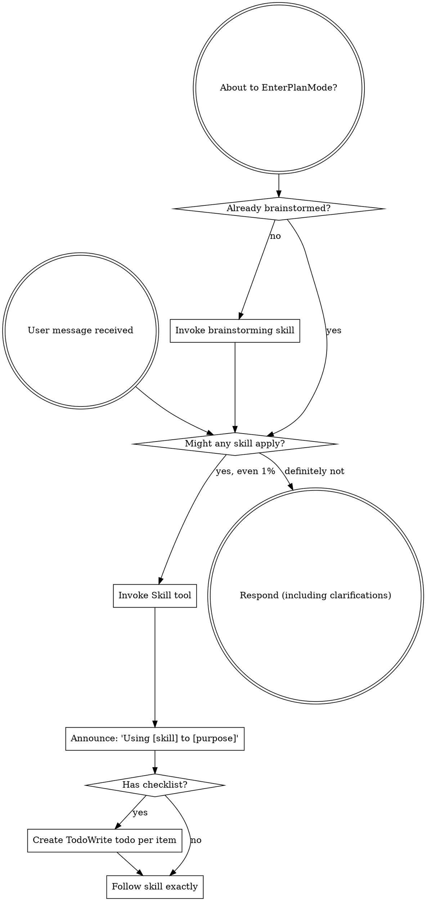
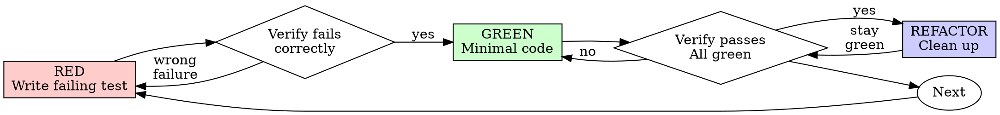
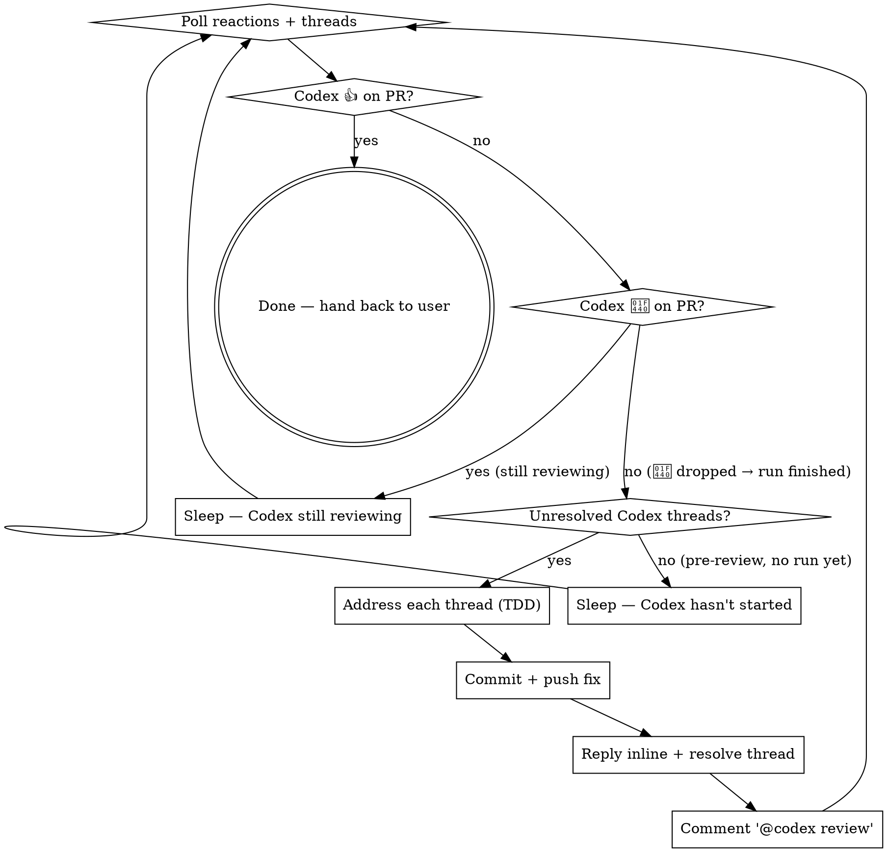

> SYSTEM

# AGENTS.md instructions for /Users/ericson/.t3/worktrees/ars-ui/t3code-03c1ddf1

<INSTRUCTIONS>
# ars-ui

## Project Overview

Rust frontend component library using state machines, framework-agnostic core with Leptos/Dioxus adapters.

## Current Phase

The repo is now in active implementation, not spec drafting only.

Agents working on implementation should use the GitHub Project roadmap and issue backlog as the execution source of truth:

- Use the GitHub Project `ars-ui implementation roadmap` to understand active epics, task breakdown, dependencies, status, and iteration planning.
- Prefer picking a single issue-backed task that is unblocked, sized, and scoped for independent delivery.
- Do not start work from an epic issue unless the user explicitly asks for planning or further decomposition.
- Do not start a task that is blocked by unresolved GitHub issue dependencies.
- Treat native GitHub issue dependencies as the blocker graph and the issue body acceptance criteria as the delivery contract.

## Development Workflow

For implementation tasks:

1. Read the assigned or selected GitHub issue first.
2. Move the issue to **In Progress** on the GitHub Project board.
3. Review the cited spec sections and any dependency issues.
4. Add or update the named tests first.
5. Implement only the scope required to make those tests pass.
6. If implementation changes the intended contract, update the relevant spec in the same task.
7. **MANDATORY:** Invoke the `post-implementation-audit` skill (`.agents/skills/post-implementation-audit/SKILL.md`). It runs three sequential audits on the new code — (a) spec/implementation drift with "best outcome" recommendations, (b) iterative "anything else missing?" passes (minimum two rounds), (c) test-coverage audit across every test type the workspace uses (unit, snapshot, proptest, mutation, doc, spec-conformance, llvm-cov). **Every finding lands in _this_ PR — no deferral, no follow-up issues.** This step exists because initial implementations consistently ship spec drift and silent contract violations that take 3+ review round-trips to surface; the audit collapses them into one. Skipping this step is a contract violation.
8. Present the final result for user review before any commit.
9. After user approval, run `cargo xci --profile fast` (alias: `cargo xci-fast`) locally and fix any failures before pushing anything to GitHub. The fast profile takes ~5 minutes and covers the workspace-level regressions a pre-push gate should catch: fmt, check, clippy, unit, integration, adapter, spec-compile-snippets, error-variant-coverage, mutual-exclusion, snapshot-count. Reserve full `cargo xci` (~25 minutes, all 20 gates including wasm coverage and the feature-matrix groups) for after substantial refactors that may have shifted feature-flag interactions. For small follow-up changes, run the focused tests and checks that cover the edited code instead.
10. After `cargo xci-fast` passes, commit and push a PR targeting `main`. The PR body MUST include an auto-close keyword for the issue being delivered, for example `Closes #20` or `Fixes #20`, so GitHub closes the issue automatically when the PR merges.
11. **If the PR creates or modifies any `.snap` insta fixtures, attach the `snapshot-reviewed` label after opening or updating it** (`gh pr edit <num> --add-label "snapshot-reviewed"`). This signals to reviewers that the snapshot output was inspected and is intentional. Re-apply the label whenever you push a commit that touches `.snap` files; the workflow assumes the label reflects the latest snapshot state.
12. **MANDATORY:** Invoke the `waiting-for-codex-review` skill (`.agents/skills/waiting-for-codex-review/SKILL.md`) immediately after the first push that creates the PR, and re-invoke it after every subsequent push to the PR branch. The skill posts the initial `@codex review` trigger, polls Codex's 👀 → (👍 \| ∅ + threads) reaction lifecycle, addresses any review threads with the same rigor as `post-implementation-audit` (TDD + no coverage regression), replies inline, resolves threads, and re-comments `@codex review` to start the next pass — looping until Codex leaves 👍. Skipping this step leaves Codex findings unaddressed and silently widens the gap between merged code and the spec; the merge gate is 👍 from Codex plus green CI, not green CI alone.
13. Only after CI passes, Codex has left 👍, and the PR is merged, close the issue.

Never close a GitHub issue without a merged PR that passes CI **and a 👍 from Codex**. Never commit or push without explicit user approval. Keep the issue, PR, and Project board status aligned with the actual work state at every step.

Default delivery rules:

- Follow TDD: tests first, implementation second, verification last.
- Keep task scope aligned with the issue. If the issue is too large or ambiguous, stop and split or clarify rather than freelancing a bigger change.
- Prefer tasks sized `1`, `2`, `3`, or `5` points. `8` is exceptional. `13` must be decomposed before implementation.
- Preserve the crate and dependency layering defined by the architecture and implementation plan.
- Do not add a new dependency crate without explicit user approval first. If a task appears to need a new crate, stop, explain why, and get approval before editing any `Cargo.toml`.
- When a task is complete, verify the exact tests and checks named by the issue before considering it done.
- For adapter-level component implementation, follow `docs/implementation/adapter-component-delivery.md`. Adapter component work must cover the adapter crate, adapter tests, E2E fixtures/harnesses when applicable, widgets examples, spec synchronization, and the required validation/audit loop in one PR.

### Code Quality Standards

- **Document all public items.** Every public struct, enum, trait, function, constant, type alias, method, field, and variant must have a `///` doc comment. Every `lib.rs` must have a `//!` crate-level doc comment. The workspace enforces `missing_docs` linting — undocumented public items are build failures.
- **Zero warnings policy.** All code must compile with zero warnings under the workspace's configured clippy and rustc lints. Fix the root cause instead of suppressing. When suppression is genuinely needed, use `#[expect(lint, reason = "...")]` — never `#[allow(...)]`.
- **Derive documentation from the spec.** Doc comments should describe the _purpose and semantics_ of the item as defined in the corresponding `spec/` files, not just restate the type signature.
- **Use `#[inline]` selectively, not mechanically.** Do **not** add Clippy's `missing_inline_in_public_items` lint at the workspace level, and do not treat public visibility alone as a reason to mark an item `#[inline]`. Use `#[inline]` for thin cross-crate wrappers, trivial accessors, and hot-path no-op shims where the call overhead is plausibly meaningful. Avoid blanket `#[inline]` on all public APIs — it increases code size, adds compile-time cost, and turns `#[inline]` into noise instead of a deliberate performance signal.
- **Use directory-backed modules with `mod.rs` when a module owns children.** This repo standardizes on the older filesystem layout for nested modules. If module `foo` has child modules, the parent must live at `foo/mod.rs`, not `foo.rs`. Do not mix `foo.rs` with a sibling `foo/` directory. When a refactor adds child modules under an existing flat file, move the parent into `foo/mod.rs` in the same change. Do not leave empty leftover module directories behind.

### API Design Standards

- **Design for the pit of success.** Public APIs should make the most natural, shortest path also be the path that is correct, accessible, localizable, type-safe, and performant. Prefer ergonomic constructors and defaults that preserve the spec's strongest guarantees instead of making users opt into correctness after choosing a convenient API.
- **Name escape hatches explicitly.** When a component needs a lower-level, static, non-i18n, or otherwise less complete path, keep it available but make the tradeoff visible in the API name or type. The blessed path should remain the simplest call site, while escape hatches should read as deliberate choices.
- **Keep semantic data separate from rendered views.** Rich framework views are useful for customization, but components still need semantic sources for accessible names, localized text, announcements, ids, and state-machine wiring. Do not rely on arbitrary rendered view trees as the only source of user-facing semantics.

### Code Coverage

The workspace uses `cargo-llvm-cov` for code coverage with per-crate threshold enforcement. CI runs coverage on every PR (see `.github/workflows/ci.yml`).

**Local coverage commands:**

```bash
# Per-crate coverage with inline annotated source (most useful during development)
cargo llvm-cov test -p ars-interactions --text -- hover

# Per-crate summary only
cargo llvm-cov test -p ars-interactions -- hover

# Native-only workspace coverage (host target; excludes wasm-only crates)
cargo llvm-cov --workspace \
  --exclude ars-leptos --exclude ars-dioxus \
  --exclude ars-test-harness-leptos --exclude ars-test-harness-dioxus \
  --exclude ars-derive --exclude xtask \
  --lcov --output-path lcov.info

# Check all crates against spec-defined thresholds (run after a *merged* lcov)
cargo xtask coverage check-all --file lcov.info
```

The `--text` flag produces line-by-line annotated source showing hit counts and `^0` markers on uncovered branches — use this to identify gaps after writing tests. Uncovered no-op callback closures in tests (e.g., `|_| {}`) are expected and not a gap.

The local recipe above excludes the adapter and adapter-test-harness crates because their `target_arch = "wasm32"` / `feature = "web"` code paths can't be measured via host-target `cargo llvm-cov`. **CI runs an additional wasm-coverage pipeline on nightly** (`cargo xtask ci coverage`) that uses `wasm-bindgen-test`'s experimental coverage recipe with LLVM 22 / `clang-22` to emit lcov for `ars-leptos` (csr), `ars-dioxus` (web), `ars-dom` (web), `ars-i18n` (web-intl), and the adapter test harnesses, then merges with the native lcov via `cargo xtask coverage merge`. The per-crate thresholds in `xtask::coverage::default_thresholds()` are enforced against the merged file — including adapter targets (`ars-leptos` 74/55, `ars-dioxus` 77/70, `ars-test-harness-leptos` 60/0, `ars-test-harness-dioxus` 60/0). `ars-derive` (proc-macro, runs in compiler) is exercised via `crates/ars-core/tests/derive_contract.rs` and is unmeasured. `xtask` has its own enforced threshold (30/35) and is measured. See `spec/testing/14-ci.md` §2 for the full pipeline.

### Mutation Testing

Coverage tells you which lines run. **Mutation testing tells you whether the tests would notice if those lines silently misbehaved.** The workspace uses [`cargo-mutants`](https://mutants.rs) for this — a `cargo` extension binary, not a workspace dependency.

**Install (once per developer machine):**

```bash
cargo install cargo-mutants --locked --version 27.0.0
```

**Local commands (state-machine modules are the most rewarding targets):**

```bash
# Run on a single component machine (~6 min for popover)
cargo mutants -p ars-components -f crates/ars-components/src/overlay/popover/mod.rs

# Just list what would be mutated, without running tests (fast)
cargo mutants -p ars-components -f crates/ars-components/src/overlay/popover/mod.rs --list

# Whole crate (slow — only if you really mean it)
cargo mutants -p ars-components
```

**Agnostic component implementation gate:** whenever an agent implements a new framework-agnostic component, or materially changes an existing one, the delivery must include:

- a targeted mutation run for the component source file, usually `cargo mutants -p ars-components -f crates/ars-components/src/<category>/<component>/mod.rs` (adjust the path for single-file modules);
- spec-conformance tests for the component's anatomy/public contract, including its `Part` enum and required API/attribute surface;
- same-task triage of every `MISSED` mutant: add tests for real gaps, or add a justified line-agnostic `.cargo/mutants.toml` exclude only for true equivalent mutations.

**Reading the output:** Results land in `mutants.out/mutants.out/` (gitignored). The two files that matter:

- `caught.txt` — mutations that broke at least one test ✅
- `missed.txt` — mutations that survived all tests ❌ — each one is either a real test gap to fill or an "equivalent mutation" that needs a `[[skip]]` entry in `mutants.toml` with a justification

**CI integration:** Nightly only. `.github/workflows/nightly.yml` has a `mutation-testing` job with a 21-entry matrix that runs `cargo mutants -p <package>` on every framework-agnostic crate, using `--shard k/n` to spread larger crates across parallel runners. **Shard indices are 0-based** (`k` runs from `0` to `n-1`); `k == n` is invalid and will fail the job. When adding shards, always start at `0/n` and end at `(n-1)/n`.

- **`ars-components` (≈ 1,630 mutants today, planned to grow as the spec adds the remaining ~97 components):** sharded **12-way** → ≈ 135 mutants per runner today, ≈ 850 per runner at the ~10,000-mutant endpoint. Sized for the full spec catalog up front so we don't re-shard every few months as components land.
- **`ars-collections` (≈ 1,080 mutants):** sharded 4-way → ≈ 270 mutants per runner.
- **`ars-core` (≈ 700 mutants):** sharded 2-way → ≈ 350 mutants per runner.
- **`ars-a11y`, `ars-forms`, `ars-interactions`:** one runner each (under 600 mutants apiece).

**Adding a new state machine inside an existing crate requires no CI changes** — its mutations land in whichever shard the cargo-mutants partitioner places them. The shard counts are sized so the slowest runner stays well under 30 minutes today and under ~50 minutes at the planned endpoint; re-balance only when a crate outgrows that budget (visible on the nightly dashboard as one shard pulling away from the others).

All matrix jobs run with `fail-fast: false` so failures on one module don't mask data on another. Each job uploads its `mutants.out/` as a workflow artifact (always, even on success — surviving "missed" entries on a passing run still reveal test-quality work). The job fails if any mutation survives, so a missed mutation forces a deliberate triage decision (fix the test, or document the equivalence with a `[[skip]]` entry in `mutants.toml`).

**Excluded crates** (mutation testing's signal degrades wherever determinism does): adapter glue (`ars-leptos`, `ars-dioxus`), DOM/FFI (`ars-dom`), ICU/FFI (`ars-i18n`), test infrastructure (`ars-test-harness*`), and the proc-macro crate (`ars-derive`, runs in the compiler). Adding a brand-new crate that is a good mutation target requires one new matrix entry; run a local scout first (`cargo mutants -p <crate> --list` to size, then a real run) so we know the right shard count before the nightly fires.

**Bumping the pinned version.** Both the local install command above and `.github/workflows/nightly.yml` pin cargo-mutants to an exact version (currently `27.0.0`) — same convention as `wasm-pack` in the `a11y-audit` job. Pinning is deliberate: cargo-mutants ships new mutators in releases, and an unpinned install would silently change the mutation set without any code change, surfacing as phantom CI failures on a green-source repo. To bump, open a PR that (1) updates the version string in CLAUDE.md and `nightly.yml`, (2) runs the popover scout locally with the new version (`cargo mutants -p ars-components -f crates/ars-components/src/overlay/popover/mod.rs`) to confirm the mutation count is in the same ballpark, and (3) triages any new "missed" entries the new mutators surface — they are usually genuine test-quality gaps newly visible to the tool.

### Property Testing (proptest)

State-machine invariants are exercised by [`proptest`](https://docs.rs/proptest) under `crates/<crate>/tests/proptest_state_machines/` (see `ars-components`). Default proptest behaviour drops `*.proptest-regressions` seed files alongside test sources — instead, every `proptest!` block in this workspace pulls a shared `Config` from `tests/proptest_state_machines/common.rs` that:

1. Reads `PROPTEST_CASES` from the environment (1,000 default; 10,000 in the nightly `extended-proptest` job).
2. Sets `failure_persistence` to `FileFailurePersistence::Direct("proptest-regressions/state-machines.txt")`, so all persisted seeds for the test binary live in one file at the crate root: `crates/<crate>/proptest-regressions/state-machines.txt`. The directory is committed (per proptest's own recommendation in the file header) so every developer's runs benefit from previously-shrunk failures.

When a new crate adopts proptest for state-machine tests, copy the same `common.rs` helper and reference it via `#![proptest_config(super::common::proptest_config())]` inside every `proptest!` block. Don't let proptest fall back to its `WithSource` default — that scatters seed files across the source tree.

### Adapter Prelude Convention

Both `ars-leptos` and `ars-dioxus` expose a `prelude` module targeting **end users** — application developers who consume the ready-made components. `use ars_leptos::prelude::*` (or `use ars_dioxus::prelude::*`) should give them everything they need.

The prelude contains only user-facing items:

1. **Component modules** — as components land, their public module paths (e.g., `button`, `dialog`) are re-exported so users can write `button::Props`, etc.
2. **User-facing traits** — traits end users call on component outputs (e.g., `Translate` from `ars-i18n`). Re-export the trait so consumers don't need a direct dependency on the subsystem crate.
3. **Configuration types** — types that appear in component props or configure behaviour (e.g., `Locale`, `Direction`, `Orientation`, `Selection`).

The prelude does **not** include implementation details consumed only by component authors inside the adapter crate: core engine types (`Machine`, `Service`, `ConnectApi`, `AttrMap`), accessibility primitives (`AriaRole`, `AriaAttribute`), interaction helpers (`merge_attrs`), or adapter hooks (`use_machine`, `UseMachineReturn`). Those remain accessible via their normal crate paths for advanced users building custom machines.

Both adapter preludes must stay symmetric: same items, same structure. When adding a new re-export to one adapter's prelude, add it to the other as well in the same PR.

### Adapter Testing Convention

Adapter-level component tests should default to the framework-specific test harness crate:

- Leptos adapter tests should prefer `ars-test-harness-leptos`.
- Dioxus adapter tests should prefer `ars-test-harness-dioxus`.
- Shared `ars-test-harness` helpers should be used where relevant for viewport, layout, clipboard, drag/drop, timing, and other DOM test setup instead of bespoke per-test browser scaffolding.

When a component spec requires interaction, focus, overlay positioning, clipboard, file upload, drag/drop, or similar browser behavior, the task's tests should exercise that behavior through the adapter harness entrypoints and shared core harness helpers unless there is a concrete technical reason not to.

## Spec Synchronization During Implementation

The specification is the authoritative contract. It took weeks of deliberate design and MUST be followed.

### Spec-first implementation rule

Before implementing any public type, trait, function, or method:

1. **Read the spec section first.** Find the relevant code example in `spec/`. Use `spec-tool toc <file>` and `grep` to locate it.
2. **Match the spec exactly.** If the spec defines `struct ComponentIds { base: String }` with methods `from_id()`, `id()`, `part()`, `item()`, `item_part()` — implement exactly that. Do not invent alternative field names, method names, or signatures.
3. **Cross-check after implementation.** Before presenting code for review, diff every public item against the spec's code examples. Every struct field, every method name, every parameter must match.
4. **If you must deviate**, there must be a concrete technical reason (e.g., the spec's API cannot compile, or a dependency doesn't expose the needed type). Document the reason in a code comment and flag it to the user explicitly.

Inventing alternative APIs that "seem equivalent" is never acceptable — it silently invalidates the spec's design decisions and all downstream code that depends on those APIs.

### Spec/code mismatch resolution

- If code and spec disagree, resolve the mismatch in the same task or PR.
- Shared conceptual changes belong in shared or foundation spec files, not only in adapter code.
- Adapter-specific findings must be reflected back into `spec/foundation/08-adapter-leptos.md` and/or `spec/foundation/09-adapter-dioxus.md` when relevant.
- Do not leave spec drift behind as follow-up cleanup.

## Spec Structure

The specification lives in `spec/` with this layout:

- `spec/manifest.toml` — **START HERE** — central index of all components and their dependencies
- `spec/foundation/` — architecture, accessibility, i18n, interactions, forms, adapters, spec template (00-10)
- `spec/shared/` — cross-component shared types (date-time, selection, layout, z-index)
- `spec/components/{category}/` — one file per component, organized by category
- `spec/testing/` — test specs split by domain

### Component Categories

- `input/` — checkbox, text-field, slider, number-input, etc.
- `selection/` — select, combobox, listbox, menu, tags-input, etc.
- `overlay/` — dialog, popover, tooltip, toast, presence, etc.
- `navigation/` — accordion, tabs, tree-view, pagination, steps, etc.
- `date-time/` — date-field, time-field, calendar, date-picker, etc.
- `data-display/` — table, avatar, progress, meter, badge, etc.
- `layout/` — splitter, scroll-area, carousel, portal, toolbar, etc.
- `specialized/` — color-picker, file-upload, signature-pad, qr-code, etc.
- `utility/` — button, toggle, focus-scope, visually-hidden, separator, etc.

## Working with the Spec

When reading large files, run `wc -l` first to check the line count. If the file is over 2,000
lines, use the `offset` and `limit` parameters on the Read tool to read in chunks rather than
attempting to read the entire file at once.

### Using xtask spec (preferred)

Use `cargo xtask spec` to resolve file sets instead of manually parsing manifest.toml:

```bash
# Quick metadata lookup:
cargo xtask spec info <component>

# Find all components using a shared type:
cargo xtask spec reverse <shared-type>

# See a file's heading structure (with line numbers):
cargo xtask spec toc <file>

# Validate frontmatter matches manifest.toml:
cargo xtask spec validate

# Search spec content by keyword/regex (with optional filters):
cargo xtask spec search <query> [--category <cat>] [--section <sec>] [--tier <tier>]

# Get a compact component summary (states, events, props, accessibility):
cargo xtask spec digest <component>

# Get full implementation context (component + all deps concatenated):
cargo xtask spec context <component> [--framework <fw>] [--include-testing]
```

The xtask also runs as an MCP server (`cargo xtask mcp`) exposing all spec tools for LLM agents.

### Reading a component (manual fallback)

1. Read `spec/manifest.toml` to find the component's path and dependencies
2. Read the component file (has YAML frontmatter listing its foundation/shared deps)
3. Only load the foundation files listed in `foundation_deps` — not all of them

### Framework and library specs — MANDATORY skill loading

When reading or editing these specification files, you MUST load the corresponding skill BEFORE doing any work. The skills contain verified, version-accurate API documentation that the spec code examples depend on. Claude's training data is wrong for these libraries — do not trust it.

| Spec file                                    | Skill to load | Library version |
| -------------------------------------------- | ------------- | --------------- |
| `spec/foundation/04-internationalization.md` | `icu4x`       | ICU4X 2.1.1     |
| `spec/foundation/08-adapter-leptos.md`       | `leptos`      | Leptos 0.8.17   |
| `spec/foundation/09-adapter-dioxus.md`       | `dioxus`      | Dioxus 0.7.3    |

This applies to any task that touches adapter code: reviewing, writing, modifying, or answering questions about these files. Load the skill first, then proceed.

### Spec Conventions

- **No deprecation:** This is a greenfield spec. If an API is unused or redundant, remove it and fix all references. Never use `#[deprecated]` or deprecation shims.
- **No deferral:** Never mark spec content as "TODO", "FIXME", "future enhancement", "P1/P2 extension", or any similar deferral language. Every feature mentioned must be fully specified. If a design choice is unclear, ask the user rather than deferring.
- **No guessing external APIs:** NEVER guess function names or module paths for external crates. Always verify against `https://docs.rs/<crate_name>` before writing code that calls library APIs. This applies especially to Leptos, Dioxus, ICU4X, and any crate where training data may be stale. If you cannot verify, state that explicitly rather than fabricating a plausible-looking API.

### Component file format

Each component file has YAML frontmatter declaring its metadata:

```markdown
---
component: ComponentName
category: { category }
tier: stateless | stateful | complex
foundation_deps: [architecture, accessibility, ...]
shared_deps: [date-time-types, ...]
related: [sibling-component, ...]
---

# ComponentName
```

The `tier` field determines which sections are required — see `spec/foundation/10-component-spec-template.md` for the canonical section structure, ordering rules, and conformance checklist. Headings are numbered (e.g., `## 1. State Machine`, `### 1.1 States`, `#### 1.1.1 InnerStates`, etc.) for precise section references.

</INSTRUCTIONS>
<environment_context>
  <cwd>/Users/ericson/.t3/worktrees/ars-ui/t3code-03c1ddf1</cwd>
  <shell>zsh</shell>
  <current_date>2026-05-21</current_date>
  <timezone>America/Sao_Paulo</timezone>
</environment_context>

> DEVELOPER

We have reviews in our PR, proceed with our review loop flow

> AGENT

I’ll use the review-loop skills here: first the Superpowers entrypoint for process discipline, then the GitHub review-addressing workflow because this is a PR review pass. I’ll also do a quick memory lookup for this repo/PR context before touching code.

> TOOL

tool_use exec_command
id: call_N4iRLrNBd6ir1k5G0GyZyYgt
```json
{
  "cmd": "sed -n '1,220p' /Users/ericson/.claude/skills/using-superpowers/SKILL.md",
  "workdir": "/Users/ericson/.t3/worktrees/ars-ui/t3code-03c1ddf1",
  "yield_time_ms": 1000,
  "max_output_tokens": 12000
}
```

> TOOL

tool_use exec_command
id: call_cqTnXRiEGx2MRXq3DsY3GPoL
```json
{
  "cmd": "sed -n '1,260p' /Users/ericson/.codex/plugins/cache/openai-curated/github/004da724/skills/gh-address-comments/SKILL.md",
  "workdir": "/Users/ericson/.t3/worktrees/ars-ui/t3code-03c1ddf1",
  "yield_time_ms": 1000,
  "max_output_tokens": 16000
}
```

> TOOL

tool_use exec_command
id: call_eJaU1P989GyBFKLwBdBajsTZ
```json
{
  "cmd": "rg -n \"PR review|review loop|t3code-03c1ddf1|ars-ui|reviewThreads|Codex|waiting-for-codex-review\" /Users/ericson/.codex/memories/MEMORY.md",
  "workdir": "/Users/ericson/.t3/worktrees/ars-ui/t3code-03c1ddf1",
  "yield_time_ms": 1000,
  "max_output_tokens": 12000
}
```

> TOOL

tool_result
id: call_N4iRLrNBd6ir1k5G0GyZyYgt
```
Chunk ID: 6d9fec
Wall time: 0.0158 seconds
Process exited with code 0
Original token count: 1356
Output:
---
name: using-superpowers
description: Use when starting any conversation - establishes how to find and use skills, requiring Skill tool invocation before ANY response including clarifying questions
---

<SUBAGENT-STOP>
If you were dispatched as a subagent to execute a specific task, skip this skill.
</SUBAGENT-STOP>

<EXTREMELY-IMPORTANT>
If you think there is even a 1% chance a skill might apply to what you are doing, you ABSOLUTELY MUST invoke the skill.

IF A SKILL APPLIES TO YOUR TASK, YOU DO NOT HAVE A CHOICE. YOU MUST USE IT.

This is not negotiable. This is not optional. You cannot rationalize your way out of this.
</EXTREMELY-IMPORTANT>

## Instruction Priority

Superpowers skills override default system prompt behavior, but **user instructions always take precedence**:

1. **User's explicit instructions** (CLAUDE.md, GEMINI.md, AGENTS.md, direct requests) — highest priority
2. **Superpowers skills** — override default system behavior where they conflict
3. **Default system prompt** — lowest priority

If CLAUDE.md, GEMINI.md, or AGENTS.md says "don't use TDD" and a skill says "always use TDD," follow the user's instructions. The user is in control.

## How to Access Skills

**In Claude Code:** Use the `Skill` tool. When you invoke a skill, its content is loaded and presented to you—follow it directly. Never use the Read tool on skill files.

**In Copilot CLI:** Use the `skill` tool. Skills are auto-discovered from installed plugins. The `skill` tool works the same as Claude Code's `Skill` tool.

**In Gemini CLI:** Skills activate via the `activate_skill` tool. Gemini loads skill metadata at session start and activates the full content on demand.

**In other environments:** Check your platform's documentation for how skills are loaded.

## Platform Adaptation

Skills use Claude Code tool names. Non-CC platforms: see `references/copilot-tools.md` (Copilot CLI), `references/codex-tools.md` (Codex) for tool equivalents. Gemini CLI users get the tool mapping loaded automatically via GEMINI.md.

# Using Skills

## The Rule

**Invoke relevant or requested skills BEFORE any response or action.** Even a 1% chance a skill might apply means that you should invoke the skill to check. If an invoked skill turns out to be wrong for the situation, you don't need to use it.



## Red Flags

These thoughts mean STOP—you're rationalizing:

| Thought | Reality |
|---------|---------|
| "This is just a simple question" | Questions are tasks. Check for skills. |
| "I need more context first" | Skill check comes BEFORE clarifying questions. |
| "Let me explore the codebase first" | Skills tell you HOW to explore. Check first. |
| "I can check git/files quickly" | Files lack conversation context. Check for skills. |
| "Let me gather information first" | Skills tell you HOW to gather information. |
| "This doesn't need a formal skill" | If a skill exists, use it. |
| "I remember this skill" | Skills evolve. Read current version. |
| "This doesn't count as a task" | Action = task. Check for skills. |
| "The skill is overkill" | Simple things become complex. Use it. |
| "I'll just do this one thing first" | Check BEFORE doing anything. |
| "This feels productive" | Undisciplined action wastes time. Skills prevent this. |
| "I know what that means" | Knowing the concept ≠ using the skill. Invoke it. |

## Skill Priority

When multiple skills could apply, use this order:

1. **Process skills first** (brainstorming, debugging) - these determine HOW to approach the task
2. **Implementation skills second** (frontend-design, mcp-builder) - these guide execution

"Let's build X" → brainstorming first, then implementation skills.
"Fix this bug" → debugging first, then domain-specific skills.

## Skill Types

**Rigid** (TDD, debugging): Follow exactly. Don't adapt away discipline.

**Flexible** (patterns): Adapt principles to context.

The skill itself tells you which.

## User Instructions

Instructions say WHAT, not HOW. "Add X" or "Fix Y" doesn't mean skip workflows.

```

> TOOL

tool_result
id: call_cqTnXRiEGx2MRXq3DsY3GPoL
```
Chunk ID: 7116e0
Wall time: 0.1077 seconds
Process exited with code 0
Original token count: 884
Output:
---
name: gh-address-comments
description: Address actionable GitHub pull request review feedback. Use when the user wants to inspect unresolved review threads, requested changes, or inline review comments on a PR, then implement selected fixes. Use the GitHub app for PR metadata and flat comment reads, and use the bundled GraphQL script via `gh` whenever thread-level state, resolution status, or inline review context matters.
---

# GitHub PR Comment Handler

Use this skill when the user wants to work through requested changes on a GitHub pull request. Use the GitHub app from this plugin for PR metadata and patch context, but treat thread-aware review data as a `gh api graphql` problem because the connector comment surface is flat and does not preserve full review-thread state.

Run all `gh` commands with elevated network access. If CLI auth is required, confirm `gh auth status` first and ask the user to authenticate with `gh auth login` if it fails.

## Workflow

1. Resolve the PR.
   - If the user provides a repository and PR number or URL, use that directly.
   - If the request is about the current branch PR, use local git context plus `gh auth status` and `gh pr view --json number,url` to resolve it.
2. Inspect review context with thread-aware reads.
   - Use the GitHub app from this plugin to fetch PR metadata and patch context when the repo and PR are known.
   - Use the bundled `scripts/fetch_comments.py` workflow whenever the task depends on unresolved review threads, inline review locations, or resolution state. That script fetches `reviewThreads`, `isResolved`, `isOutdated`, and file and line anchors that the connector comment surface does not preserve.
   - Use connector-only comment reads only for lightweight top-level PR comment summaries.
3. Cluster actionable review threads.
   - Group comments by file or behavior area.
   - Separate actionable change requests from informational comments, approvals, already-resolved threads, and duplicates.
4. Confirm scope before editing.
   - Present numbered actionable threads with a one-line summary of the required change.
   - If the user did not ask to fix everything, ask which threads to address.
   - If the user asks to fix everything, interpret that as all unresolved actionable threads and call out anything ambiguous.
5. Implement the selected fixes locally.
   - Keep each code change traceable back to the thread or feedback cluster it addresses.
   - If a comment calls for explanation rather than code, draft the response rather than forcing a code change.
6. Summarize the result.
   - List which threads were addressed, which were intentionally left open, and what tests or checks support the change.

## Write Safety

- Do not reply on GitHub, resolve review threads, or submit a review unless the user explicitly asks for that write action.
- If review comments conflict with each other or would cause a behavioral regression, surface the tradeoff before making changes.
- If a comment is ambiguous, ask for clarification or draft a proposed response instead of guessing.
- Do not treat flat PR comments from the connector as a complete representation of review-thread state.
- If `gh` hits auth or rate-limit issues mid-run, ask the user to re-authenticate and retry.

## Fallback

If neither the connector nor `gh` can resolve the PR cleanly, tell the user whether the blocker is missing repository scope, missing PR context, or CLI authentication, then ask for the missing repo or PR identifier or for a refreshed `gh` login.

```

> TOOL

tool_result
id: call_eJaU1P989GyBFKLwBdBajsTZ
```
Chunk ID: 8f221a
Wall time: 0.0276 seconds
Process exited with code 0
Original token count: 18016
Output:
Total output lines: 233

1:# Task Group: ars-ui / ars-components coverage ratchet repair and mutation-backed hardening
4:applies_to: cwd=/Users/ericson/.t3/worktrees/ars-ui/*; reuse_rule=reuse for ars-ui checkouts touching `crates/ars-components` coverage/mutation work or ratchet failures; re-check the live threshold definitions and whether publish/PR follow-through is in scope for the current run.
10:- rollout_summaries/REDACTED.md (cwd=/Users/ericson/.t3/worktrees/ars-ui/t3code-457f9bf1, rollout_path=/Users/ericson/.codex/sessions/2026/05/20/rollout-2026-05-20T14-23-28-019e4669-f077-7c51-98ac-4866b3621995.jsonl, updated_at=2026-05-21T02:38:57+00:00, thread_id=019e4669-f077-7c51-98ac-4866b3621995, branch-coverage repair plus mutation-backed hardening for PR #658)
16:## Task 2: Commit, push, open PR #658, and wait for Codex approval after local gates pass
20:- rollout_summaries/REDACTED.md (cwd=/Users/ericson/.t3/worktrees/ars-ui/t3code-457f9bf1, rollout_path=/Users/ericson/.codex/sessions/2026/05/20/rollout-2026-05-20T14-23-28-019e4669-f077-7c51-98ac-4866b3621995.jsonl, updated_at=2026-05-21T02:38:57+00:00, thread_id=019e4669-f077-7c51-98ac-4866b3621995, GitHub publish and asynchronous Codex approval on PR #658)
38:- Related skill: skills/ars-ui-pr-review-cycle/SKILL.md [Task 2]
45:- symptom: PR #658 looks unresolved immediately after `@codex review` -> cause: Codex review is asynchronous and approval is separate from CI completion -> fix: poll reactions and review threads until `eyes` becomes `+1`, and keep CI/check status as a separate signal [Task 2]
47:# Task Group: ars-ui / ars-components utility and navigation core implementation
50:applies_to: cwd=/Users/ericson/.t3/worktrees/ars-ui/*; reuse_rule=reuse for ars-ui checkouts touching `crates/ars-components/src/utility/` or `crates/ars-components/src/navigation/`; verify the live issue/spec contract and whether commit/push is in or out of scope for the current run.
52:## Task 1: Implement LiveRegion agnostic core, fix Codex findings, and get PR #659 approved
56:- rollout_summaries/REDACTED.md (cwd=/Users/ericson/.t3/worktrees/ars-ui/t3code-f177abf7, rollout_path=/Users/ericson/.codex/sessions/2026/05/21/rollout-2026-05-21T00-11-18-019e4884-1bf7-7fc3-9a5b-174a8aee0de8.jsonl, updated_at=2026-05-21T05:58:09+00:00, thread_id=019e4884-1bf7-7fc3-9a5b-174a8aee0de8, issue #211 implementation plus review remediation on PR #659)
66:- rollout_summaries/REDACTED.md (cwd=/Users/ericson/.t3/worktrees/ars-ui/t3code-55173bd3, rollout_path=/Users/ericson/.codex/sessions/2026/05/20/rollout-2026-05-20T00-17-41-019e4363-993e-7b02-ac6a-2e59148e3c0c.jsonl, updated_at=2026-05-20T05:11:33+00:00, thread_id=019e4363-993e-7b02-ac6a-2e59148e3c0c, issues #209/#210 implementation plus Codex review remediation on PR #654)
76:- rollout_summaries/2026-05-20T04-12-16-srff-ars_ui_navigation_core_issues_247_257_259.md (cwd=/Users/ericson/.t3/worktrees/ars-ui/t3code-59db9f9b, rollout_path=/Users/ericson/.codex/sessions/2026/05/20/rollout-2026-05-20T01-12-16-019e4395-9314-7121-a61d-c7357910accd.jsonl, updated_at=2026-05-20T06:03:42+00:00, thread_id=019e4395-9314-7121-a61d-c7357910accd, issues #247/#257/#259 navigation-core implementation with spec updates and mutation audits)
87:- when review finds contract gaps in the same PR, patch them in place rather than deferring them to follow-up issues; the user accepted same-PR review remediation as the default path here [Task 1][Task 2]
109:# Task Group: ars-ui / ars-components utility core extraction and Dialog overlay publish workflow
112:applies_to: cwd=/Users/ericson/.t3/worktrees/ars-ui/*; reuse_rule=reuse for ars-ui checkouts touching `crates/ars-components` utility/overlay modules or nearby `ars-core`/`ars-dom` compatibility seams; verify live issue/PR state before moving roadmap items or publishing.
118:- rollout_summaries/2026-05-21T03-21-42-3TmL-ars_ui_alert_dialog_core_and_codex_review.md (cwd=/Users/ericson/.t3/worktrees/ars-ui/t3code-9f5b5f2f, rollout_path=/Users/ericson/.codex/sessions/2026/05/21/rollout-2026-05-21T00-21-42-019e488d-a3a5-7e42-871c-43cd60efbf27.jsonl, updated_at=2026-05-21T06:09:27+00:00, thread_id=019e488d-a3a5-7e42-871c-43cd60efbf27, issue #260 implementation plus review-driven snapshot-count/spec fixes on PR #660)
128:- rollout_summaries/2026-04-29T16-02-56-Kicl-implement_task_200_zindexallocator_clientonly_core.md (cwd=/Users/ericson/.t3/worktrees/ars-ui/t3code-05593195, rollout_path=/Users/ericson/.codex/sessions/2026/04/29/rollout-2026-04-29T13-02-56-019dd9fa-aac0-76a0-acf5-46a45fc70095.jsonl, updated_at=2026-04-29T18:03:58+00:00, thread_id=019dd9fa-aac0-76a0-acf5-46a45fc70095, issue #200 implementation plus roadmap update, no-std fix, and PR publish)
138:- rollout_summaries/REDACTED.md (cwd=/Users/ericson/.t3/worktrees/ars-ui/t3code-1fef6d79, rollout_path=/Users/ericson/.codex/sessions/2026/04/29/rollout-2026-04-29T15-04-18-019dda69-c612-7473-b42d-d539165a5135.jsonl, updated_at=2026-04-29T18:36:24+00:00, thread_id=019dda69-c612-7473-b42d-d539165a5135, Dialog publish flow with rebase, full gate, co-author trailer, and regular PR)
142:- Dialog, issue #253, overlay/dialog.rs, snapshot-reviewed, git rebase origin/main --autostash, cargo xci, chromedriver, wasm-bindgen-test-runner, Co-authored-by: OpenAI Codex <codex@openai.com>, PR #627
177:# Task Group: ars-ui / ars-components DownloadTrigger review remediation and no_std dependency wiring
180:applies_to: cwd=/Users/ericson/.t3/worktrees/ars-ui/*; reuse_rule=reuse for ars-ui checkouts touching `crates/ars-components/src/utility/download_trigger.rs`, `crates/ars-components/Cargo.toml`, or the related utility spec; always re-check live review-thread state before replying or resolving.
186:- rollout_summaries/REDACTED.md (cwd=/Users/ericson/.t3/worktrees/ars-ui/t3code-e135578b, rollout_path=/Users/ericson/.codex/sessions/2026/05/19/rollout-2026-05-19T17-42-27-019e41f9-c22a-7260-85e4-cdc196756c91.jsonl, updated_at=2026-05-19T21:49:53+00:00, thread_id=019e41f9-c22a-7260-85e4-cdc196756c91, PR #650 review closure with regression tests, spec sync, and `idna` feature repair)
201:- the `DownloadTrigger` review loop worked best as narrow regression tests first, then implementation/spec updates, then `cargo check -p ars-components --no-default-features`, focused `cargo test -p ars-components download_trigger::tests::`, `cargo llvm-cov test -p ars-components --summary-only`, and `cargo xci-fast` before the GitHub reply [Task 1]
202:- the final review-closeout state here was: inline reply posted, thread resolved, `@codex review` retriggered, Codex `+1`, zero unresolved review threads, and GitHub checks green including Coverage and Release Verification [Task 1]
203:- Related skill: skills/ars-ui-pr-review-cycle/SKILL.md [Task 1]
209:- symptom: the review loop looks complete immediately after push but the remote state is ambiguous -> cause: Codex review and CI update asynchronously -> fix: wait for the final reaction/check state and verify the unresolved-thread count instead of treating the first post-push snapshot as decisive [Task 1]
213:scope: Repo-root slice-machine work for `citation-workspace-live-data/04-workspace-wire-tanstack-query`, covering Setup, `research.md`, exact gate phrases, live TanStack Query implementation, build artifact upkeep, and the rule that a timed-out Codex gate means the slice stays in Build.
246:## Task 4: Finalize Plan and move slice 04 to Build after the required Codex gate
266:## Task 6: Attempt Build -> Review on PR #82, but stay in Build when the Codex gate times out
302:- symptom: Codex gate fails before reading the PR -> cause: missing repo context or GitHub access -> fix: retry with `GITHUB_REPOSITORY=Bezunca/JudgeFudge` and treat network/auth requirements as environment prerequisites before assuming the slice files are wrong [Task 3][Task 6]
307:scope: Repo-root slice-machine work for `citation-workspace-live-data/03-workspace-adapter-v1-rows`, covering slice setup, adapter-boundary research, plan/build execution, and the first Codex-gated move into Review.
340:## Task 4: Advance slice 03 from Build to Review only after clearing the Codex gate findings
362:- repeated plan gates on PR #80 showed that this repo uses the Codex gate as a plan-contract completeness check before Build; after each review-fix commit, rerun the gate on the new head and resolve newly opened threads before changing `step:` [Task 2][Task 3][Task 4]
369:- symptom: the plan looks ready but Build keeps stalling -> cause: Codex is still surfacing missing mapping/test details -> fix: treat plan-gate findings as contract holes, revise `plan.md`, and rerun the gate before implementation [Task 2][Task 3]
445:- symptom: the final Codex gate cannot run on a private PR from this environment -> cause: repo context/network/policy blocks the external review action -> fix: disclose the block, use the documented deferral path, record it in `slice-summary.md` / PR notes, and distinguish PR promotion from full check completion [Task 4]
449:scope: Repo-root slice-machine work for `citation-workspace-live-data/03-workspace-adapter-v1-rows`, especially exact `Go to the next phase` handling, missing-artifact repair, Codex gating, and PR #80 checklist/state synchronization through Finalize.
485:- Codex gating was mandatory at both lifecycle checkpoints here: `bash .agents/scripts/codex-pr-review.sh gate 80` had to pass on the Review -> Improve head and again on the finalization head before PR #80 was promoted out of draft [Task 1][Task 2]
494:- symptom: Finalize or PR promotion happens with stale checklist/gate state -> cause: PR metadata was not refreshed after the lifecycle-file updates -> fix: rerun the Codex gate on the current head, update the PR body checkboxes, and only then move the PR from draft to ready [Task 1][Task 2]
531:## Task 4: Push the migration-safe bootstrap fix and resolve the PR review thread
903:- when the user explicitly asked to `Commit, push and then reply the reviews inline at github, marking them as resolved afterward` -> for this repo’s PR review remediation, default to tested local fixes first, then commit/push, then inline reply, then resolve threads [Task 5]
931:applies_to: cwd=/Users/ericson/Workspace/Rust/judge-fudge; reuse_rule=reuse for closely related repo-root `judge-fudge` slice-02 work on `coverage-guided-rust-tests` or PR #56 review loops; re-check the active slice state, current branch/PR, and live review-thread status before reusing exact commands.
1064:- PR #57, DocumentDetailPage.test.tsx, Response.clone, POLL_MS, React Query, reviewThreads, fetch_comments.py, cargo xcoverage frontend, 95.02% statements, resolveReviewThread
1140:- when the user said `Go to the next phase` during PR #54 review follow-up -> verify the on-disk review state and live PR thread state before advancing or closing the review loop [Task 3]
1147:- the user-provided `fogodev/ars-ui` workflow was a useful precedent for the coverage job shape in this slice family [Task 1]
1164:- symptom: a review-fix push leaves PR threads unresolved even though the code is fixed -> cause: the review loop stopped after push/test instead of re-fetching thread state -> fix: re-check unresolved thread state after each push and only stop when `unresolved_count` is `0` [Task 3]
1216:applies_to: cwd=/Users/ericson/Workspace/Rust/judge-fudge; reuse_rule=reuse for closely related repo-root `judge-fudge` PR review/remediation work touching `crates/api`, `.agents/` lifecycle files, `.sqlx/`, or GitHub review threads; re-check current branch, live Postgres state, and PR thread status before reusing exact commands.
1247:- when the user repeated the same review request after an earlier pass -> re-fetch unresolved thread state instead of assuming the first review loop was final [Task 2]
1334:applies_to: cwd=/Users/ericson/.t3/worktrees/judge-fudge/t3code-2d37632b; reuse_rule=reuse for this checkout or closely related `bootstrap-local-spine` backend slices touching `crates/api`, `.sqlx/`, or PR review threads; re-check live migrations, local Postgres state, and GitHub review status before reusing exact commands.
1707:# Task Group: ars-ui / widgets examples i18n coverage and pt_BR accent normalization
1710:applies_to: cwd=/Users/ericson/.t3/worktrees/ars-ui/*; reuse_rule=reuse for ars-ui checkouts touching `examples/widgets-*`, `WidgetsText`, or locale/example copy; verify the exact example crates and current text enum layout before bulk-editing.
1716:- rollout_summaries/2026-05-05T00-40-02-96mb-widgets_i18n_missing_strings_portuguese_accents.md (cwd=/Users/ericson/.t3/worktrees/ars-ui/t3code-7bf5bdf5, rollout_path=/Users/ericson/.codex/sessions/2026/05/04/rollout-2026-05-04T21-40-02-019df593-df56-7f01-9232-d963a5b545ef.jsonl, updated_at=2026-05-06T21:52:33+00:00, thread_id=019df593-df56-7f01-9232-d963a5b545ef, widgets example i18n cleanup across Leptos/Dioxus variants)
1726:- rollout_summaries/2026-05-05T00-40-02-96mb-widgets_i18n_missing_strings_portuguese_accents.md (cwd=/Users/ericson/.t3/worktrees/ars-ui/t3code-7bf5bdf5, rollout_path=/Users/ericson/.codex/sessions/2026/05/04/rollout-2026-05-04T21-40-02-019df593-df56-7f01-9232-d963a5b545ef.jsonl, updated_at=2026-05-06T21:52:33+00:00, thread_id=019df593-df56-7f01-9232-d963a5b545ef, pt_BR accent cleanup and literal-only replacement guidance)
1751:# Task Group: ars-ui / widgets example category modules and adapter delivery workflow docs
1754:applies_to: cwd=/Users/ericson/.t3/worktrees/ars-ui/*; reuse_rule=reuse for ars-ui checkouts touching `examples/widgets-*`, `docs/implementation/adapter-component-delivery.md`, or parallel-agent-safe example structure; verify the current example module layout and publish state before replaying the exact steps.
1760:- rollout_summaries/REDACTED.md (cwd=/Users/ericson/.t3/worktrees/ars-ui/t3code-e37d3799, rollout_path=/Users/ericson/.codex/sessions/2026/05/19/rollout-2026-05-19T16-34-53-019e41bb-e438-7aa1-b569-89dbb6454a44.jsonl, updated_at=2026-05-19T20:22:57+00:00, thread_id=019e41bb-e438-7aa1-b569-89dbb6454a44, approved category-module split for widgets examples)
1770:- rollout_summaries/REDACTED.md (cwd=/Users/ericson/.t3/worktrees/ars-ui/t3code-e37d3799, rollout_path=/Users/ericson/.codex/sessions/2026/05/19/rollout-2026-05-19T16-34-53-019e41bb-e438-7aa1-b569-89dbb6454a44.jsonl, updated_at=2026-05-19T20:22:57+00:00, thread_id=019e41bb-e438-7aa1-b569-89dbb6454a44, widgets category split plus delivery doc wiring)
1776:## Task 3: Rebase onto `main`, push PR #652, and confirm Codex review completed cleanly
1780:- rollout_summaries/REDACTED.md (cwd=/Users/ericson/.t3/worktrees/ars-ui/t3code-e37d3799, rollout_path=/Users/ericson/.codex/sessions/2026/05/19/rollout-2026-05-19T16-34-53-019e41bb-e438-7aa1-b569-89dbb6454a44.jsonl, updated_at=2026-05-19T20:22:57+00:00, thread_id=019e41bb-e438-7aa1-b569-89dbb6454a44, rebase/publish/review loop on PR #652)
1809:# Task Group: ars-ui / repo-root CI coverage failure diagnosis and wasm target slimming
1812:applies_to: cwd=/Users/ericson/Workspace/Rust/ars-ui; reuse_rule=reuse for repo-root ars-ui checkouts touching `.github/workflows/ci.yml`, `xtask/src/coverage.rs`, or `crates/ars-test-harness-dioxus`; verify the live failing run/job before assuming the same root cause.
1818:- rollout_summaries/REDACTED.md (cwd=/Users/ericson/Workspace/Rust/ars-ui, rollout_path=/Users/ericson/.codex/sessions/2026/04/30/rollout-2026-04-30T10-55-36-019ddeac-7249-7a32-98bc-56cf16b66a79.jsonl, updated_at=2026-04-30T15:14:57+00:00, thread_id=019ddeac-7249-7a32-98bc-56cf16b66a79, main-branch CI failure diagnosis from live GitHub logs)
1828:- rollout_summaries/REDACTED.md (cwd=/Users/ericson/Workspace/Rust/ars-ui, rollout_path=/Users/ericson/.codex/sessions/2026/04/30/rollout-2026-04-30T10-55-36-019ddeac-7249-7a32-98bc-56cf16b66a79.jsonl, updated_at=2026-04-30T15:14:57+00:00, thread_id=019ddeac-7249-7a32-98bc-56cf16b66a79, feature-contract fix in `xtask`/workflow plus PR publish)
1838:- rollout_summaries/REDACTED.md (cwd=/Users/ericson/Workspace/Rust/ars-ui, rollout_path=/Users/ericson/.codex/sessions/2026/04/30/rollout-2026-04-30T10-55-36-019ddeac-7249-7a32-98bc-56cf16b66a79.jsonl, updated_at=2026-04-30T15:14:57+00:00, thread_id=019ddeac-7249-7a32-98bc-56cf16b66a79, local + remote validation of PR #632)
1862:# Task Group: ars-ui / browser-related test environment overrides
1864:scope: Exact local environment setup for browser-backed validation in ars-ui worktrees, especially when wasm/browser tests need the cached ChromeDriver on this machine.
1865:applies_to: cwd=/Users/ericson/.t3/worktrees/ars-ui/*; reuse_rule=reuse across ars-ui checkouts on this machine for browser-related tests; if the host or cache layout differs, verify the path before reusing.
1871:- rollout_summaries/2026-04-28T01-00-48-Xy4Y-browser_tests_chromedriver_env_override.md (cwd=/Users/ericson/.t3/worktrees/ars-ui/t3code-d1af5f57, rollout_path=/Users/ericson/.codex/sessions/2026/04/27/rollout-2026-04-27T22-00-48-019dd19a-5e9e-7e90-ad34-0878eb1f4f84.jsonl, updated_at=2026-04-28T14:14:37+00:00, thread_id=019dd19a-5e9e-7e90-ad34-0878eb1f4f84, explicit browser-test env requirement from the user)
1875:- chromedriver, CHROMEDRIVER, PATH, browser related tests, chromedriver-mac-arm64, wasm-pack test, cargo xtest dom-browser, ars-ui
1879:- when running browser-related tests, the user said: `You need to pass the env var CHROMEDRIVER=$HOME/.cache/ars-ui-chromedriver/chromedriver-mac-arm64/chromedriver PATH=$HOME/.cache/ars-ui-chromedriver/chromedriver-mac-arm64:$PATH to run the browser related tests` -> future browser/test commands should include this exact env override by default [Task 1]
1883:- browser-related tests in this environment require the cached mac-arm64 driver at `$HOME/.cache/ars-ui-chromedriver/chromedriver-mac-arm64/chromedriver` [Task 1]
1884:- prepend `$HOME/.cache/ars-ui-chromedriver/chromedriver-mac-arm64` to `PATH` so browser tooling can find the driver binary [Task 1]
1886:- Related skill: skills/ars-ui-pr-review-cycle/SKILL.md [Task 1]
1893:# Task Group: ars-ui / ars-components agnostic Avatar, Badge, Button, DateField, Heading, Landmark, Portal, Skeleton, Switch, TextField, Textarea, and Tooltip implementation plus review fixes
1896:applies_to: cwd=/Users/ericson/.t3/worktrees/ars-ui/*; reuse_rule=reuse for ars-ui checkouts touching `crates/ars-components` or matching component specs; verify current PR thread state live before replying or resolving.
1902:- rollout_summaries/2026-05-02T01-15-51-55xh-issue_269_avatar_agnostic_core.md (cwd=/Users/ericson/.t3/worktrees/ars-ui/t3code-13455121, rollout_path=/Users/ericson/.codex/sessions/2026/05/01/rollout-2026-05-01T22-15-51-019de641-9820-7643-80bb-4a1beddf22db.jsonl, updated_at=2026-05-02T04:36:32+00:00, thread_id=019de641-9820-7643-80bb-4a1beddf22db, issue #269 implementation plus spec sync, PATH-order fix, and PR publish)
1912:- rollout_summaries/2026-04-28T00-25-26-Cgmc-implement_badge_skeleton_agnostic_core_issue_266.md (cwd=/Users/ericson/.t3/worktrees/ars-ui/t3code-85612d3d, rollout_path=/Users/ericson/.codex/sessions/2026/04/27/rollout-2026-04-27T21-25-26-019dd179-fcfe-74c1-b333-8635f1dda790.jsonl, updated_at=2026-04-28T02:30:33+00:00, thread…8016 tokens truncated…26-04-23T14:16:42+00:00, thread_id=019dbaa6-3e8c-7e53-94fe-c393f1405f8f, cfg simplification read and debug-warn fallback patch)
2622:- rollout_summaries/REDACTED.md (cwd=/Users/ericson/.t3/worktrees/ars-ui/t3code-6b21d525, rollout_path=/Users/ericson/.codex/sessions/2026/04/23/rollout-2026-04-23T00-29-33-019db862-c1fe-76e0-b7de-04d0e2d772b1.jsonl, updated_at=2026-04-23T05:45:13+00:00, thread_id=019db862-c1fe-76e0-b7de-04d0e2d772b1, issue #148 implementation and merged branch coverage raise to 75.0%)
2656:# Task Group: ars-ui / ars-test-harness core API, browser fidelity, and adapter-test workflow
2659:applies_to: cwd=ars-ui checkouts (/Users/ericson/.t3/worktrees/ars-ui/* and /Users/ericson/.codex/worktrees/*/ars-ui); reuse_rule=reuse for ars-ui checkouts touching `crates/ars-test-harness*`, adapter component issues, or browser-event test helpers; verify feature flags and current spec text per checkout.
2665:- rollout_summaries/REDACTED.md (cwd=/Users/ericson/.t3/worktrees/ars-ui/t3code-9153eb21, rollout_path=/Users/ericson/.codex/sessions/2026/04/22/rollout-2026-04-22T00-23-56-019db337-42d6-7fc1-9028-29e61a5cc445.jsonl, updated_at=2026-04-22T05:35:14+00:00, thread_id=019db337-42d6-7fc1-9028-29e61a5cc445, issue #178 implementation plus backlog sweep and cleanup guidance)
2675:- rollout_summaries/2026-04-22T13-50-08-9w55-ars_test_harness_coordinate_events_and_pr.md (cwd=/Users/ericson/.t3/worktrees/ars-ui/t3code-9153eb21, rollout_path=/Users/ericson/.codex/sessions/2026/04/22/rollout-2026-04-22T10-50-08-019db574-9062-7e30-8131-2b2d16275603.jsonl, updated_at=2026-04-22T15:35:30+00:00, thread_id=019db574-9062-7e30-8131-2b2d16275603, coordinate-aware pointer/touch/composition helpers and draft PR publish)
2685:- rollout_summaries/2026-04-22T17-20-26-N6pW-ars_ui_pr599_review_thread_fixes.md (cwd=/Users/ericson/.t3/worktrees/ars-ui/t3code-9153eb21, rollout_path=/Users/ericson/.codex/sessions/2026/04/22/rollout-2026-04-22T14-20-26-019db635-1a5b-7f83-b776-1672f910d378.jsonl, updated_at=2026-04-22T19:26:28+00:00, thread_id=019db635-1a5b-7f83-b776-1672f910d378, repeated review-thread fixes with browser-fidelity checks)
2686:- rollout_summaries/2026-04-22T16-25-19-LteN-fix_ars_test_harness_pr_review_feedback.md (cwd=/Users/ericson/.t3/worktrees/ars-ui/t3code-9153eb21, rollout_path=/Users/ericson/.codex/sessions/2026/04/22/rollout-2026-04-22T13-25-19-019db602-a472-7e00-9cd4-4f1b222474f1.jsonl, updated_at=2026-04-22T17:03:07+00:00, thread_id=019db602-a472-7e00-9cd4-4f1b222474f1, remaining review fixes plus full CI/coverage rerun)
2696:- rollout_summaries/2026-04-23T20-10-49-Qj1d-ars_ui_shared_test_harness_backends_and_timer_fix.md (cwd=/Users/ericson/.t3/worktrees/ars-ui/t3code-bfdbc179, rollout_path=/Users/ericson/.codex/sessions/2026/04/23/rollout-2026-04-23T17-10-49-019dbbf7-71dd-70d3-ab48-f7a4312f0367.jsonl, updated_at=2026-04-24T05:15:44+00:00, thread_id=019dbbf7-71dd-70d3-ab48-f7a4312f0367, shared backend implementation plus timer review fixes on PR #605)
2706:- rollout_summaries/2026-04-24T05-37-51-PlSQ-issue_183_adapter_parity_test_types.md (cwd=/Users/ericson/.codex/worktrees/98a7/ars-ui, rollout_path=/Users/ericson/.codex/sessions/2026/04/24/rollout-2026-04-24T02-37-51-019dbdfe-9405-7b21-b289-0f276440bf14.jsonl, updated_at=2026-04-24T14:21:18+00:00, thread_id=019dbdfe-9405-7b21-b289-0f276440bf14, issue #183 typed parity API plus immediate spec reconciliation)
2742:- Related skill: skills/ars-ui-pr-review-cycle/SKILL.md [Task 3]
2756:# Task Group: ars-ui / ars-forms component machines, validators, and review/publish workflow
2759:applies_to: cwd=/Users/ericson/.t3/worktrees/ars-ui/*; reuse_rule=reuse for ars-ui checkouts touching `crates/ars-forms`, `spec/foundation/07-forms.md`, or `spec/testing/11-form-validation.md`; re-check exact module names and current spec snippets if the crate layout changed.
2765:- rollout_summaries/2026-04-21T21-06-51-mu1j-publish_form_component_machine_pr_171.md (cwd=/Users/ericson/.t3/worktrees/ars-ui/t3code-31a9f711, rollout_path=/Users/ericson/.codex/sessions/2026/04/21/rollout-2026-04-21T18-06-51-019db1de-0982-7941-93e7-6f9a7b9f6cd9.jsonl, updated_at=2026-04-21T21:32:34+00:00, thread_id=019db1de-0982-7941-93e7-6f9a7b9f6cd9, publish flow with `no_std` import fix and draft PR #594)
2769:- issue #171, form component machine, no-default-features, alloc::ToOwned, alloc::ToString, cargo xci, Co-authored-by: OpenAI Codex <codex@openai.com>, PR #594
2775:- rollout_summaries/REDACTED.md (cwd=/Users/ericson/.t3/worktrees/ars-ui/t3code-31a9f711, rollout_path=/Users/ericson/.codex/sessions/2026/04/21/rollout-2026-04-21T15-56-40-019db166-d913-7843-b96e-076ee1552f49.jsonl, updated_at=2026-04-21T20:30:24+00:00, thread_id=019db166-d913-7843-b96e-076ee1552f49, nested `component` modules plus wasm compile-safe coverage work)
2785:- rollout_summaries/2026-04-21T21-42-22-ibXl-pr_review_controlled_form_reset_server_errors.md (cwd=/Users/ericson/.t3/worktrees/ars-ui/t3code-31a9f711, rollout_path=/Users/ericson/.codex/sessions/2026/04/21/rollout-2026-04-21T18-42-22-019db1fe-8d2b-7293-b88c-3c7face2153b.jsonl, updated_at=2026-04-21T21:51:52+00:00, thread_id=019db1fe-8d2b-7293-b88c-3c7face2153b, controlled reset server-error fix on PR #594)
2812:# Task Group: ars-ui / GitHub issue audits and workflow upkeep
2815:applies_to: cwd=/Users/ericson/.t3/worktrees/ars-ui/*; reuse_rule=reuse for fogodev/ars-ui issue/epic audits and backlog maintenance; verify live GitHub state because issue bodies/comments can change.
2821:- rollout_summaries/REDACTED.md (cwd=/Users/ericson/.t3/worktrees/ars-ui/t3code-e9c56f47, rollout_path=/Users/ericson/.codex/sessions/2026/04/23/rollout-2026-04-23T01-53-30-019db8af-9d08-7a02-880d-69dac8c9afb4.jsonl, updated_at=2026-04-23T05:00:04+00:00, thread_id=019db8af-9d08-7a02-880d-69dac8c9afb4, closure based on institutionalized workflow rather than perfect historical backfill)
2831:- rollout_summaries/REDACTED.md (cwd=/Users/ericson/.t3/worktrees/ars-ui/t3code-9153eb21, rollout_path=/Users/ericson/.codex/sessions/2026/04/22/rollout-2026-04-22T00-23-56-019db337-42d6-7fc1-9028-29e61a5cc445.jsonl, updated_at=2026-04-22T05:35:14+00:00, thread_id=019db337-42d6-7fc1-9028-29e61a5cc445, 187 open issue bodies updated with harness-testing acceptance guidance)
2855:# Task Group: ars-ui / repo-root CI troubleshooting and workflow policy
2857:scope: Repo-root workflow memory for CI/nightly troubleshooting, xtask-backed CI policy, and Codecov-status diagnosis in ars-ui.
2858:applies_to: cwd=ars-ui checkouts (/Users/ericson/Workspace/Rust/ars-ui, /Users/ericson/.t3/worktrees/ars-ui/*, and /Users/ericson/.codex/worktrees/*/ars-ui); reuse_rule=reuse for fogodev/ars-ui repo-root CI/status tasks, not crate-local implementation details; always re-check live GitHub state before acting.
2864:- rollout_summaries/REDACTED.md (cwd=/Users/ericson/.t3/worktrees/ars-ui/t3code-758f6d7b, rollout_path=/Users/ericson/.codex/sessions/2026/04/30/rollout-2026-04-30T20-50-56-019de0cd-7cd6-7070-85de-3a8292e4263d.jsonl, updated_at=2026-05-01T00:03:20+00:00, thread_id=019de0cd-7cd6-7070-85de-3a8292e4263d, live Nightly diagnosis plus workflow/docs direct-to-main repair)
2874:- rollout_summaries/2026-04-24T14-42-13-0cSr-ars_ui_xtask_ci_enforcement_and_pr_review_fixes.md (cwd=/Users/ericson/.codex/worktrees/1215/ars-ui, rollout_path=/Users/ericson/.codex/sessions/2026/04/24/rollout-2026-04-24T11-42-13-019dbff0-f649-7430-819e-0d4ed361505f.jsonl, updated_at=2026-04-24T19:51:25+00:00, thread_id=019dbff0-f649-7430-819e-0d4ed361505f, xtask CI policy checks plus thread-aware PR #607 follow-up)
2884:- rollout_summaries/REDACTED.md (cwd=/Users/ericson/Workspace/Rust/ars-ui, rollout_path=/Users/ericson/.codex/sessions/2026/04/24/rollout-2026-04-24T17-14-31-019dc121-32c0-7403-82e7-b407a48df3d8.jsonl, updated_at=2026-04-24T21:28:37+00:00, thread_id=019dc121-32c0-7403-82e7-b407a48df3d8, nightly workflow plus PR #608 placeholder-axe explanation)
2894:- rollout_summaries/2026-04-28T14-00-13-6uCp-codecov_project_failure_overall_coverage_drop.md (cwd=/Users/ericson/.t3/worktrees/ars-ui/t3code-e503e9c7, rollout_path=/Users/ericson/.codex/sessions/2026/04/28/rollout-2026-04-28T11-00-13-019dd463-f38c-71a3-8910-c644a68d4165.jsonl, updated_at=2026-04-28T18:23:51+00:00, thread_id=019dd463-f38c-71a3-8910-c644a68d4165, live CI/status diagnosis for Codecov project-threshold failure on PR #619)
2904:- rollout_summaries/REDACTED.md (cwd=/Users/ericson/.t3/worktrees/ars-ui/t3code-6d753b01, rollout_path=/Users/ericson/.codex/sessions/2026/04/30/rollout-2026-04-30T13-05-38-019ddf23-7f38-7e22-b6eb-628d269f990d.jsonl, updated_at=2026-04-30T18:40:02+00:00, thread_id=019ddf23-7f38-7e22-b6eb-628d269f990d, explanation-first diagnosis for `codecov/patch` on PR #633)
2914:- rollout_summaries/REDACTED.md (cwd=/Users/ericson/.t3/worktrees/ars-ui/t3code-39a18f9b, rollout_path=/Users/ericson/.codex/sessions/2026/04/30/rollout-2026-04-30T22-16-30-019de11b-d417-7962-8b28-727565b777f7.jsonl, updated_at=2026-05-01T14:48:20+00:00, thread_id=019de11b-d417-7962-8b28-727565b777f7, Nightly #10 diagnosis with proptest root cause and mutation survivor clustering)
2924:- rollout_summaries/REDACTED.md (cwd=/Users/ericson/.t3/worktrees/ars-ui/t3code-f95d2521, rollout_path=/Users/ericson/.codex/sessions/2026/05/11/rollout-2026-05-11T12-07-51-019e1794-8c92-7850-a898-9e85d5891b46.jsonl, updated_at=2026-05-11T15:50:27+00:00, thread_id=019e1794-8c92-7850-a898-9e85d5891b46, workflow-action inventory, Nightly triage, and workflow-only PR publish)
2934:- rollout_summaries/REDACTED.md (cwd=/Users/ericson/.t3/worktrees/ars-ui/t3code-df6fefc9, rollout_path=/Users/ericson/.codex/sessions/2026/05/18/rollout-2026-05-18T14-35-40-019e3c28-65a8-7bb3-aede-bdfd20a2940a.jsonl, updated_at=2026-05-18T21:29:52+00:00, thread_id=019e3c28-65a8-7bb3-aede-bdfd20a2940a, Nightly investigation for tabs-related wasm and mutation failures)
2944:- rollout_summaries/REDACTED.md (cwd=/Users/ericson/.t3/worktrees/ars-ui/t3code-df6fefc9, rollout_path=/Users/ericson/.codex/sessions/2026/05/18/rollout-2026-05-18T14-35-40-019e3c28-65a8-7bb3-aede-bdfd20a2940a.jsonl, updated_at=2026-05-18T21:29:52+00:00, thread_id=019e3c28-65a8-7bb3-aede-bdfd20a2940a, review-fix pass removing the UUID `TabKey` mutant exclusion and resolving the thread)
2996:- `.cargo/mutants.toml` is the repo-wide mutation-exclusion surface in ars-ui; on PR #646, removing the UUID `TabKey` exclusion was the right fix because the focused `tab_key_uuid_impl_preserves_source_identity` test already killed the mutant and `cargo xci` still passed all 20 steps [Task 9]
3010:# Task Group: ars-ui / ars-dom positioning helpers and review-driven geometry contracts
3013:applies_to: cwd=/Users/ericson/.t3/worktrees/ars-ui/*; reuse_rule=reuse for ars-ui checkouts touching DOM positioning helpers and `spec/foundation/11-dom-utilities.md`; verify current transform/offset-parent behavior before reusing exact claims.
3019:- rollout_summaries/2026-04-22T00-07-46-8smy-ars_dom_dom_positioning_helpers_task_113.md (cwd=/Users/ericson/.t3/worktrees/ars-ui/t3code-c3750921, rollout_path=/Users/ericson/.codex/sessions/2026/04/21/rollout-2026-04-21T21-07-46-019db283-ab40-79d0-9115-db9bc01eff46.jsonl, updated_at=2026-04-22T02:03:26+00:00, thread_id=019db283-ab40-79d0-9115-db9bc01eff46, issue #113 implementation and draft PR publish)
3029:- rollout_summaries/REDACTED.md (cwd=/Users/ericson/.t3/worktrees/ars-ui/t3code-c3750921, rollout_path=/Users/ericson/.codex/sessions/2026/04/21/rollout-2026-04-21T23-32-45-019db308-65c0-7a43-af56-96c15d36b5b4.jsonl, updated_at=2026-04-22T04:23:26+00:00, thread_id=019db308-65c0-7a43-af56-96c15d36b5b4, PR #596 review fixes and spec alignment)
3038:- when the user later says "We have more reviews" -> assume the same PR may need another full unresolved-thread pass instead of treating the first review loop as final [Task 2]
3055:# Task Group: ars-ui / ars-dom focus and modality utilities
3058:applies_to: cwd=ars-ui checkouts (/Users/ericson/.t3/worktrees/ars-ui/* and /Users/ericson/Workspace/Rust/ars-ui); reuse_rule=reuse for ars-ui checkouts touching `crates/ars-dom/src/focus.rs`, `modality.rs`, `scroll_lock.rs`, or related specs/docs; re-check browser/runtime assumptions if the platform surface changed.
3064:- rollout_summaries/REDACTED.md (cwd=/Users/ericson/.t3/worktrees/ars-ui/t3code-9db7d36d, rollout_path=/Users/ericson/.codex/sessions/2026/04/20/rollout-2026-04-20T21-04-53-019dad5a-a9b3-7e72-8e6e-8d66ce93bede.jsonl, updated_at=2026-04-21T05:50:37+00:00, thread_id=019dad5a-a9b3-7e72-8e6e-8d66ce93bede, issue #72 audit, doc cleanup, coverage hardening, and regular PR publish)
3086:# Task Group: ars-ui / ars-i18n contract cleanup, audits, and review cycles
3089:applies_to: cwd=/Users/ericson/.t3/worktrees/ars-ui/*; reuse_rule=reuse for ars-ui checkouts touching `crates/ars-i18n`, `ars-leptos`/`ars-dioxus` provider shims, or `spec/foundation/04-internationalization.md`; re-check live feature flags and public API before reusing exact claims.
3095:- rollout_summaries/REDACTED.md (cwd=/Users/ericson/.t3/worktrees/ars-ui/t3code-fb774f75, rollout_path=/Users/ericson/.codex/sessions/2026/04/19/rollout-2026-04-19T10-23-48-019da5e9-614b-7a70-9acb-0d9b2e974eb2.jsonl, updated_at=2026-04-20T22:50:10+00:00, thread_id=019da5e9-614b-7a70-9acb-0d9b2e974eb2, PR #589 review fix for non-Gregorian wrap semantics)
3105:- rollout_summaries/2026-04-14T02-23-23-Wm62-ars_i18n_accept_language_review_refinements.md (cwd=/Users/ericson/.codex/worktrees/366f/ars-ui, rollout_path=/Users/ericson/.codex/sessions/2026/04/13/rollout-2026-04-13T23-23-23-019d89cc-f537-7622-a43b-a7652b1abafe.jsonl, updated_at=2026-04-14T04:43:34+00:00, thread_id=019d89cc-f537-7622-a43b-a7652b1abafe, issue #139 implementation plus iterative review refinements)
3127:# Task Group: ars-ui / ars-collections DnD contracts and PR review workflow
3129:scope: `crates/ars-collections` drag-and-drop type work, spec alignment, `no_std` feature gating, collection-order semantics, and the GitHub review loop for PR #567.
3130:applies_to: cwd=/Users/ericson/.t3/worktrees/ars-ui/*; reuse_rule=reuse for ars-ui checkouts touching `crates/ars-collections`, `ars-interactions::DragItem`, or `spec/foundation/06-collections.md`; verify current feature gates and collection-order semantics before reusing exact claims.
3136:- rollout_summaries/REDACTED.md (cwd=/Users/ericson/.t3/worktrees/ars-ui/t3code-4fe5a1ff, rollout_path=/Users/ericson/.codex/sessions/2026/04/17/rollout-2026-04-17T18-21-37-019d9d52-1c90-71b0-aeea-27eb6bf9f99d.jsonl, updated_at=2026-04-17T23:48:33+00:00, thread_id=019d9d52-1c90-71b0-aeea-27eb6bf9f99d, issue #549 implementation and draft PR #567)
3146:- rollout_summaries/2026-04-18T01-09-16-w841-ars_collections_dnd_review_fixes.md (cwd=/Users/ericson/.t3/worktrees/ars-ui/t3code-4fe5a1ff, rollout_path=/Users/ericson/.codex/sessions/2026/04/17/rollout-2026-04-17T22-09-16-019d9e22-894a-7b03-8372-9cf0ef22f109.jsonl, updated_at=2026-04-18T01:23:06+00:00, thread_id=019d9e22-894a-7b03-8372-9cf0ef22f109, PR #567 review fixes with commit/push/reply flow)
3156:- rollout_summaries/REDACTED.md (cwd=/Users/ericson/.codex/worktrees/1fac/ars-ui, rollout_path=/Users/ericson/.codex/sessions/2026/04/13/rollout-2026-04-13T15-26-38-019d8818-7a33-7070-be96-c1ac010fa14c.jsonl, updated_at=2026-04-13T21:41:38+00:00, thread_id=019d8818-7a33-7070-be96-c1ac010fa14c, PR #531 review fixes for registry lifecycle, cancel cleanup, and GitHub replies)
3187:# Task Group: ars-ui / ars-interactions Epic #4 and issue-driven review loops
3190:applies_to: cwd=ars-ui checkouts (/Users/ericson/.codex/worktrees/*/ars-ui and /Users/ericson/.t3/worktrees/ars-ui/*); reuse_rule=reuse for ars-ui work touching `crates/ars-interactions` or Epic #4 interaction tasks; verify the live epic decomposition and current PR state before reusing exact issue/PR numbers.
3196:- rollout_summaries/REDACTED.md (cwd=/Users/ericson/.codex/worktrees/9f00/ars-ui, rollout_path=/Users/ericson/.codex/sessions/2026/04/12/rollout-2026-04-12T22-50-30-019d8488-7da2-7ff0-b7a7-7fe1622696f3.jsonl, updated_at=2026-04-13T03:15:57+00:00, thread_id=019d8488-7da2-7ff0-b7a7-7fe1622696f3, issue #159 implementation plus PR #524 announcement-hook review fix)
3206:- rollout_summaries/REDACTED.md (cwd=/Users/ericson/.codex/worktrees/75e9/ars-ui, rollout_path=/Users/ericson/.codex/sessions/2026/04/13/rollout-2026-04-13T00-39-35-019d84ec-5a73-7591-9d6a-6d108598ce6a.jsonl, updated_at=2026-04-13T06:27:41+00:00, thread_id=019d84ec-5a73-7591-9d6a-6d108598ce6a, PR #525 cancel-offer review fix and inline reply)
3225:- Related skill: skills/ars-ui-pr-review-cycle/SKILL.md [Task 1][Task 2]
3232:# Task Group: ars-ui / ars-core Bindable contract and architecture spec sync
3235:applies_to: cwd=ars-ui checkouts (/Users/ericson/Workspace/Rust/ars-ui and closely related ars-ui checkouts); reuse_rule=reuse for ars-ui work touching `crates/ars-core`, `spec/foundation/01-architecture.md`, or issue-backed `Bindable` contract changes; re-check the current spec wording and crate behavior before reusing exact details.
3241:- rollout_summaries/REDACTED.md (cwd=/Users/ericson/Workspace/Rust/ars-ui, rollout_path=/Users/ericson/.codex/sessions/2026/04/10/rollout-2026-04-10T11-16-38-019d77c0-8541-7eb2-abf1-3cd8aa32ffc6.jsonl, updated_at=2026-04-10T14:48:31+00:00, thread_id=019d77c0-8541-7eb2-abf1-3cd8aa32ffc6, issue #145 implementation, spec sync, and PR #173 publish)
3267:# Task Group: ars-ui / adapter-spec date-time and input category migrations
3270:applies_to: cwd=/Users/ericson/Workspace/Rust/ars-ui; reuse_rule=reuse for spec-only ars-ui work under `spec/foundation/12-adapter-component-spec-template.md`, `spec/leptos-components/**`, `spec/dioxus-components/**`, and `spec/manifest.toml`; do not reuse as implementation guidance without re-checking current specs and manifests.
3276:- rollout_summaries/2026-04-01T04-20-05-TqYh-date_time_adapter_template_expansion_and_frontmatter_normali.md (cwd=/Users/ericson/Workspace/Rust/ars-ui, rollout_path=/Users/ericson/.codex/sessions/2026/04/01/rollout-2026-04-01T01-20-05-019d4745-1d50-7f51-b3e6-f533036e0079.jsonl, updated_at=2026-04-01T04:47:24+00:00, thread_id=019d4745-1d50-7f51-b3e6-f533036e0079, date-time category migration plus utility frontmatter normalization)
3286:- rollout_summaries/2026-04-01T16-26-14-EGy3-expand_input_adapter_specs_template.md (cwd=/Users/ericson/Workspace/Rust/ars-ui, rollout_path=/Users/ericson/.codex/sessions/2026/04/01/rollout-2026-04-01T13-26-14-019d49dd-ee12-7771-b6a7-b5f4f810bf37.jsonl, updated_at=2026-04-01T16:59:38+00:00, thread_id=019d49dd-ee12-7771-b6a7-b5f4f810bf37, input category migration plus manifest updates)

```

> AGENT

The repo instructions require the full review loop: live thread fetch, TDD for fixes, local validation, then no commit/push until you explicitly approve. I’m resolving the current branch’s PR and reading unresolved thread state next.

> TOOL

tool_use exec_command
id: call_dErcZD3hzgNoORGMSmFuUsgz
```json
{
  "cmd": "sed -n '1,240p' /Users/ericson/.claude/skills/receiving-code-review/SKILL.md",
  "workdir": "/Users/ericson/.t3/worktrees/ars-ui/t3code-03c1ddf1",
  "yield_time_ms": 1000,
  "max_output_tokens": 12000
}
```

> TOOL

tool_use exec_command
id: call_jx8KveAQ1k3ubLCvz8xiMuX1
```json
{
  "cmd": "sed -n '1,260p' /Users/ericson/.codex/memories/skills/ars-ui-pr-review-cycle/SKILL.md",
  "workdir": "/Users/ericson/.t3/worktrees/ars-ui/t3code-03c1ddf1",
  "yield_time_ms": 1000,
  "max_output_tokens": 14000
}
```

> TOOL

tool_use exec_command
id: call_jTvtPpqryB81zQeefZGSlmvp
```json
{
  "cmd": "git status --short --branch",
  "workdir": "/Users/ericson/.t3/worktrees/ars-ui/t3code-03c1ddf1",
  "yield_time_ms": 1000,
  "max_output_tokens": 12000
}
```

> TOOL

tool_use exec_command
id: call_oclXmeh4LdyQKQY4WvxpzRyc
```json
{
  "cmd": "git remote -v",
  "workdir": "/Users/ericson/.t3/worktrees/ars-ui/t3code-03c1ddf1",
  "yield_time_ms": 1000,
  "max_output_tokens": 12000
}
```

> TOOL

tool_use exec_command
id: call_X22Togcow8syD3HyvRdV1xoA
```json
{
  "cmd": "find .agents/skills -maxdepth 2 -name 'SKILL.md' -print | sort",
  "workdir": "/Users/ericson/.t3/worktrees/ars-ui/t3code-03c1ddf1",
  "yield_time_ms": 1000,
  "max_output_tokens": 12000
}
```

> TOOL

tool_result
id: call_dErcZD3hzgNoORGMSmFuUsgz
```
Chunk ID: e60d83
Wall time: 0.0000 seconds
Process exited with code 0
Original token count: 1579
Output:
---
name: receiving-code-review
description: Use when receiving code review feedback, before implementing suggestions, especially if feedback seems unclear or technically questionable - requires technical rigor and verification, not performative agreement or blind implementation
---

# Code Review Reception

## Overview

Code review requires technical evaluation, not emotional performance.

**Core principle:** Verify before implementing. Ask before assuming. Technical correctness over social comfort.

## The Response Pattern

```
WHEN receiving code review feedback:

1. READ: Complete feedback without reacting
2. UNDERSTAND: Restate requirement in own words (or ask)
3. VERIFY: Check against codebase reality
4. EVALUATE: Technically sound for THIS codebase?
5. RESPOND: Technical acknowledgment or reasoned pushback
6. IMPLEMENT: One item at a time, test each
```

## Forbidden Responses

**NEVER:**
- "You're absolutely right!" (explicit CLAUDE.md violation)
- "Great point!" / "Excellent feedback!" (performative)
- "Let me implement that now" (before verification)

**INSTEAD:**
- Restate the technical requirement
- Ask clarifying questions
- Push back with technical reasoning if wrong
- Just start working (actions > words)

## Handling Unclear Feedback

```
IF any item is unclear:
  STOP - do not implement anything yet
  ASK for clarification on unclear items

WHY: Items may be related. Partial understanding = wrong implementation.
```

**Example:**
```
your human partner: "Fix 1-6"
You understand 1,2,3,6. Unclear on 4,5.

❌ WRONG: Implement 1,2,3,6 now, ask about 4,5 later
✅ RIGHT: "I understand items 1,2,3,6. Need clarification on 4 and 5 before proceeding."
```

## Source-Specific Handling

### From your human partner
- **Trusted** - implement after understanding
- **Still ask** if scope unclear
- **No performative agreement**
- **Skip to action** or technical acknowledgment

### From External Reviewers
```
BEFORE implementing:
  1. Check: Technically correct for THIS codebase?
  2. Check: Breaks existing functionality?
  3. Check: Reason for current implementation?
  4. Check: Works on all platforms/versions?
  5. Check: Does reviewer understand full context?

IF suggestion seems wrong:
  Push back with technical reasoning

IF can't easily verify:
  Say so: "I can't verify this without [X]. Should I [investigate/ask/proceed]?"

IF conflicts with your human partner's prior decisions:
  Stop and discuss with your human partner first
```

**your human partner's rule:** "External feedback - be skeptical, but check carefully"

## YAGNI Check for "Professional" Features

```
IF reviewer suggests "implementing properly":
  grep codebase for actual usage

  IF unused: "This endpoint isn't called. Remove it (YAGNI)?"
  IF used: Then implement properly
```

**your human partner's rule:** "You and reviewer both report to me. If we don't need this feature, don't add it."

## Implementation Order

```
FOR multi-item feedback:
  1. Clarify anything unclear FIRST
  2. Then implement in this order:
     - Blocking issues (breaks, security)
     - Simple fixes (typos, imports)
     - Complex fixes (refactoring, logic)
  3. Test each fix individually
  4. Verify no regressions
```

## When To Push Back

Push back when:
- Suggestion breaks existing functionality
- Reviewer lacks full context
- Violates YAGNI (unused feature)
- Technically incorrect for this stack
- Legacy/compatibility reasons exist
- Conflicts with your human partner's architectural decisions

**How to push back:**
- Use technical reasoning, not defensiveness
- Ask specific questions
- Reference working tests/code
- Involve your human partner if architectural

**Signal if uncomfortable pushing back out loud:** "Strange things are afoot at the Circle K"

## Acknowledging Correct Feedback

When feedback IS correct:
```
✅ "Fixed. [Brief description of what changed]"
✅ "Good catch - [specific issue]. Fixed in [location]."
✅ [Just fix it and show in the code]

❌ "You're absolutely right!"
❌ "Great point!"
❌ "Thanks for catching that!"
❌ "Thanks for [anything]"
❌ ANY gratitude expression
```

**Why no thanks:** Actions speak. Just fix it. The code itself shows you heard the feedback.

**If you catch yourself about to write "Thanks":** DELETE IT. State the fix instead.

## Gracefully Correcting Your Pushback

If you pushed back and were wrong:
```
✅ "You were right - I checked [X] and it does [Y]. Implementing now."
✅ "Verified this and you're correct. My initial understanding was wrong because [reason]. Fixing."

❌ Long apology
❌ Defending why you pushed back
❌ Over-explaining
```

State the correction factually and move on.

## Common Mistakes

| Mistake | Fix |
|---------|-----|
| Performative agreement | State requirement or just act |
| Blind implementation | Verify against codebase first |
| Batch without testing | One at a time, test each |
| Assuming reviewer is right | Check if breaks things |
| Avoiding pushback | Technical correctness > comfort |
| Partial implementation | Clarify all items first |
| Can't verify, proceed anyway | State limitation, ask for direction |

## Real Examples

**Performative Agreement (Bad):**
```
Reviewer: "Remove legacy code"
❌ "You're absolutely right! Let me remove that..."
```

**Technical Verification (Good):**
```
Reviewer: "Remove legacy code"
✅ "Checking... build target is 10.15+, this API needs 13+. Need legacy for backward compat. Current impl has wrong bundle ID - fix it or drop pre-13 support?"
```

**YAGNI (Good):**
```
Reviewer: "Implement proper metrics tracking with database, date filters, CSV export"
✅ "Grepped codebase - nothing calls this endpoint. Remove it (YAGNI)? Or is there usage I'm missing?"
```

**Unclear Item (Good):**
```
your human partner: "Fix items 1-6"
You understand 1,2,3,6. Unclear on 4,5.
✅ "Understand 1,2,3,6. Need clarification on 4 and 5 before implementing."
```

## GitHub Thread Replies

When replying to inline review comments on GitHub, reply in the comment thread (`gh api repos/{owner}/{repo}/pulls/{pr}/comments/{id}/replies`), not as a top-level PR comment.

## The Bottom Line

**External feedback = suggestions to evaluate, not orders to follow.**

Verify. Question. Then implement.

No performative agreement. Technical rigor always.

```

> TOOL

tool_result
id: call_jx8KveAQ1k3ubLCvz8xiMuX1
```
Chunk ID: 83427a
Wall time: 0.1124 seconds
Process exited with code 0
Original token count: 1864
Output:
---
name: ars-ui-pr-review-cycle
description: Fix ars-ui PR review feedback when the user says "we have more reviews", "follow the same flow", or asks to commit, push, and reply on GitHub without letting coverage drop.
argument-hint: "[pr-number-or-current-branch]"
disable-model-invocation: true
user-invocable: false
allowed-tools:
  - Read
  - Grep
  - Bash
---

# ars-ui-pr-review-cycle

Use this skill for repeated `fogodev/ars-ui` PR review passes where the user expects the full loop: inspect unresolved review threads, fix only actionable comments, validate locally, commit/push, then reply and resolve on GitHub.

Do not use this for one-off local code review with no GitHub follow-through, or when the user has not asked for commit/push/reply behavior.

## Inputs / context to gather

1. Confirm you are in an `ars-ui` checkout under `/Users/ericson/.t3/worktrees/ars-ui/*`.
2. Resolve the PR:
   - If `$ARGUMENTS` includes a PR number, use it.
   - Otherwise run `gh pr view --json number,url,title,headRefName,baseRefName`.
3. Check auth and repo state:
   - `gh auth status`
   - `git status --short --branch`
   - `git remote -v`
4. Fetch unresolved thread-aware review context:
   - `python3 /Users/ericson/.codex/plugins/cache/openai-curated/github/27651a43bf55185d924f7a1fc49043a0a8be65a0/skills/gh-address-comments/scripts/fetch_comments.py --repo . --pr <PR>`
5. If checks are failing, inspect them before editing:
   - `python3 /Users/ericson/.codex/plugins/cache/openai-curated/github/27651a43bf55185d924f7a1fc49043a0a8be65a0/skills/gh-fix-ci/scripts/inspect_pr_checks.py --repo . --pr <PR> --json`
6. If the review fix needs browser-related validation, prepare the local driver override:
   - `CHROMEDRIVER=$HOME/.cache/ars-ui-chromedriver/chromedriver-mac-arm64/chromedriver PATH=$HOME/.cache/ars-ui-chromedriver/chromedriver-mac-arm64:$PATH`
   - If the browser stage starts failing with chromedriver/`wasm-bindgen-test-runner` path-shadowing symptoms, rerun with `$HOME/.cargo/bin` before the cached chromedriver directory in `PATH` while keeping the same `CHROMEDRIVER` value.

## Procedure

1. Identify the actionable thread(s).
   - Ignore resolved/outdated threads unless the latest head re-opened the concern.
   - Copy the exact review wording that drives the fix.
2. Map each actionable comment to the minimal code/spec/test surface.
   - For `ars-dom`, common targets are `crates/ars-dom/src/platform.rs`, `crates/ars-dom/src/positioning/auto_update.rs`, and `spec/foundation/11-dom-utilities.md`.
   - For `ars-test-harness`, common targets are `crates/ars-test-harness/src/lib.rs` and `crates/ars-test-harness/Cargo.toml`.
3. Patch only the requested behavior.
   - Add or update focused tests with the code change.
   - Prefer browser-faithful wasm tests that assert concrete event/DOM properties.
4. Run focused validation first.
   - `cargo test -p <crate> ...`
   - `CHROMEDRIVER=$HOME/.cache/ars-ui-chromedriver/chromedriver-mac-arm64/chromedriver PATH=$HOME/.cache/ars-ui-chromedriver/chromedriver-mac-arm64:$PATH wasm-pack test --headless --chrome crates/<crate> -- <filter>` or the same env prefix on `cargo xtest dom-browser` when the review is browser-facing.
   - If coverage-sensitive, run the relevant `cargo llvm-cov` command for the touched crate/module.
5. Run the full repo gate.
   - `cargo xci`
6. Commit and push only after the full gate passes.
   - If the user requested it, include `Co-authored-by: OpenAI Codex <codex@openai.com>`.
7. Re-fetch or confirm the current head/review state after push.
8. Reply directly on the review thread with:
   - what changed
   - the commit SHA
   - the focused validation commands
   - the full-gate validation (`cargo xci`) when it was run
9. Resolve the thread once the fix is on the branch and the reply is posted.

## Efficiency plan

- Start with thread-aware review state; do not infer unresolved status from flat PR comments alone.
- Use focused crate/module tests before `cargo xci` so you catch obvious mistakes cheaply.
- Reuse the same validation set the review comment touched instead of rerunning unrelated suites first.
- If the same PR gets another review pass, re-run this exact loop rather than rediscovering the workflow.
- Stop and reassess if the review comment implies a broader contract change than the current branch was built for.

## Pitfalls and fixes

- Symptom: helper scripts fail with `command not found`.
  - Likely cause: using `python` instead of `python3`.
  - Fix: run the bundled scripts with `python3`.
- Symptom: reply text cites the wrong head SHA or stale review state.
  - Likely cause: the push was still in flight or the review state changed across commits.
  - Fix: wait for push completion and re-fetch thread state before replying.
- Symptom: browser tests flake around observers or callback counts.
  - Likely cause: live browser callback timing.
  - Fix: stub the relevant browser observer (`ResizeObserver`, similar primitives) in the wasm test.
- Symptom: browser-related tests fail before exercising the code.
  - Likely cause: the default shell environment is not picking up the cached ChromeDriver.
  - Fix: set both `CHROMEDRIVER` and `PATH` to `$HOME/.cache/ars-ui-chromedriver/chromedriver-mac-arm64` before running browser validation.
- Symptom: browser-stage validation fails with HTTP 404 / SIGKILL noise mentioning chromedriver and `wasm-bindgen-test-runner`.
  - Likely cause: the cached chromedriver directory came earlier than `$HOME/.cargo/bin` in `PATH`, shadowing the real runner.
  - Fix: keep the `CHROMEDRIVER` override, but put `$HOME/.cargo/bin` before the cached chromedriver directory when rerunning the browser/CI stage.
- Symptom: `cargo xci` fails with corrupt coverage profile errors.
  - Likely cause: stale coverage artifacts under `target/wasm-coverage` or `target/coverage`.
  - Fix: clear those coverage directories and rerun `cargo xci`.
- Symptom: a browser-event fix still looks synthetic.
  - Likely cause: generic `Event`/`MouseEvent::new(...)` usage instead of typed init dictionaries.
  - Fix: switch to typed `web_sys::*EventInit` constructors and assert concrete event properties in wasm tests.

## Verification checklist

- The actionable review comment is fully addressed in code/tests/spec, not just partially patched.
- Focused local tests for the touched area pass.
- Browser-facing changes were verified with a browser-capable test path (`wasm-pack test` or `cargo xtest dom-browser`).
- `cargo xci` passed after the final patch.
- The commit is pushed to the PR branch.
- The GitHub reply references the real fix and current commit SHA.
- The review thread is resolved only after the branch is updated.

## Minimal command sketch

```bash
gh pr view --json number,url,title,headRefName,baseRefName
gh auth status
python3 /Users/ericson/.codex/plugins/cache/openai-curated/github/27651a43bf55185d924f7a1fc49043a0a8be65a0/skills/gh-address-comments/scripts/fetch_comments.py --repo . --pr <PR>
python3 /Users/ericson/.codex/plugins/cache/openai-curated/github/27651a43bf55185d924f7a1fc49043a0a8be65a0/skills/gh-fix-ci/scripts/inspect_pr_checks.py --repo . --pr <PR> --json
cargo test -p <crate> ...
CHROMEDRIVER=$HOME/.cache/ars-ui-chromedriver/chromedriver-mac-arm64/chromedriver PATH=$HOME/.cache/ars-ui-chromedriver/chromedriver-mac-arm64:$PATH wasm-pack test --headless --chrome crates/<crate> -- <filter>
cargo xci
git push origin HEAD
gh pr checks <PR>
```

```

> TOOL

tool_result
id: call_jTvtPpqryB81zQeefZGSlmvp
```
Chunk ID: 44f3b1
Wall time: 0.2002 seconds
Process exited with code 0
Original token count: 11
Output:
## t3code/03c1ddf1...origin/t3code/03c1ddf1

```

> TOOL

tool_result
id: call_oclXmeh4LdyQKQY4WvxpzRyc
```
Chunk ID: 927592
Wall time: 0.3579 seconds
Process exited with code 0
Original token count: 25
Output:
origin	git@github.com:fogodev/ars-ui.git (fetch)
origin	git@github.com:fogodev/ars-ui.git (push)

```

> TOOL

tool_result
id: call_X22Togcow8syD3HyvRdV1xoA
```
Chunk ID: 4c6917
Wall time: 0.0024 seconds
Process exited with code 0
Original token count: 58
Output:
.agents/skills/dioxus/SKILL.md
.agents/skills/icu4x/SKILL.md
.agents/skills/leptos/SKILL.md
.agents/skills/playwright-cli/SKILL.md
.agents/skills/post-implementation-audit/SKILL.md
.agents/skills/waiting-for-codex-review/SKILL.md

```

> TOOL

tool_use exec_command
id: call_oNqXhvHiGmtOwKYNfW38pXHt
```json
{
  "cmd": "find /Users/ericson/.codex/plugins/cache/openai-curated/github -path '*/skills/gh-address-comments/scripts/fetch_comments.py' -print",
  "workdir": "/Users/ericson/.t3/worktrees/ars-ui/t3code-03c1ddf1",
  "yield_time_ms": 1000,
  "max_output_tokens": 12000
}
```

> TOOL

tool_use exec_command
id: call_AQZL4hNt2YKDDYuFvoFl41pW
```json
{
  "cmd": "find /Users/ericson/.codex/plugins/cache/openai-curated/github -path '*/skills/gh-fix-ci/scripts/inspect_pr_checks.py' -print",
  "workdir": "/Users/ericson/.t3/worktrees/ars-ui/t3code-03c1ddf1",
  "yield_time_ms": 1000,
  "max_output_tokens": 12000
}
```

> TOOL

tool_use exec_command
id: call_yUmSuAtfFn72BaU1Xtf2QqhY
```json
{
  "cmd": "gh auth status",
  "workdir": "/Users/ericson/.t3/worktrees/ars-ui/t3code-03c1ddf1",
  "yield_time_ms": 1000,
  "max_output_tokens": 12000
}
```

> TOOL

tool_use exec_command
id: call_C9pANluFc25mHd47JDhiQCZR
```json
{
  "cmd": "gh pr view --json number,url,title,headRefName,baseRefName,state,isDraft,reviewDecision,headRefOid",
  "workdir": "/Users/ericson/.t3/worktrees/ars-ui/t3code-03c1ddf1",
  "yield_time_ms": 1000,
  "max_output_tokens": 12000
}
```

> TOOL

tool_result
id: call_oNqXhvHiGmtOwKYNfW38pXHt
```
Chunk ID: a03da6
Wall time: 0.2044 seconds
Process exited with code 0
Original token count: 30
Output:
/Users/ericson/.codex/plugins/cache/openai-curated/github/004da724/skills/gh-address-comments/scripts/fetch_comments.py

```

> TOOL

tool_result
id: call_AQZL4hNt2YKDDYuFvoFl41pW
```
Chunk ID: cfc1a9
Wall time: 0.1175 seconds
Process exited with code 0
Original token count: 29
Output:
/Users/ericson/.codex/plugins/cache/openai-curated/github/004da724/skills/gh-fix-ci/scripts/inspect_pr_checks.py

```

> TOOL

tool_result
id: call_yUmSuAtfFn72BaU1Xtf2QqhY
```
Chunk ID: a01e86
Wall time: 1.0023 seconds
Process running with session ID 20152
Original token count: 0
Output:

```

> TOOL

tool_result
id: call_C9pANluFc25mHd47JDhiQCZR
```
Chunk ID: e6dfa8
Wall time: 0.6888 seconds
Process exited with code 0
Original token count: 75
Output:
{"baseRefName":"main","headRefName":"t3code/03c1ddf1","headRefOid":"3f42b3055448cff24dddc5a1b6f72d5c12946dd0","isDraft":false,"number":667,"reviewDecision":"","state":"OPEN","title":"feat(adapters): Heading, Landmark, Highlight (Leptos + Dioxus)","url":"https://github.com/fogodev/ars-ui/pull/667"}

```

> AGENT

The current branch maps to PR #667, `feat(adapters): Heading, Landmark, Highlight (Leptos + Dioxus)`, targeting `main`. I’m fetching thread-aware review data now so I can separate unresolved actionable comments from stale or already-resolved ones.

> TOOL

tool_use write_stdin
id: call_Mo4V2zPzp7jbX6bQkAnEkjF6
```json
{
  "session_id": 20152,
  "chars": "",
  "yield_time_ms": 1000,
  "max_output_tokens": 12000
}
```

> TOOL

tool_use exec_command
id: call_3c8NZJwPSn4LuReejm41upVm
```json
{
  "cmd": "python3 /Users/ericson/.codex/plugins/cache/openai-curated/github/004da724/skills/gh-address-comments/scripts/fetch_comments.py --repo . --pr 667",
  "workdir": "/Users/ericson/.t3/worktrees/ars-ui/t3code-03c1ddf1",
  "yield_time_ms": 1000,
  "max_output_tokens": 30000
}
```

> TOOL

tool_use exec_command
id: call_Wj6oYU4wpCs5pmf0Nzmj80yF
```json
{
  "cmd": "python3 /Users/ericson/.codex/plugins/cache/openai-curated/github/004da724/skills/gh-fix-ci/scripts/inspect_pr_checks.py --repo . --pr 667 --json",
  "workdir": "/Users/ericson/.t3/worktrees/ars-ui/t3code-03c1ddf1",
  "yield_time_ms": 1000,
  "max_output_tokens": 30000
}
```

> TOOL

tool_result
id: call_Mo4V2zPzp7jbX6bQkAnEkjF6
```
Chunk ID: a6fad2
Wall time: 0.0000 seconds
Process exited with code 0
Original token count: 128
Output:
github.com
  ✓ Logged in to github.com account fogodev (GH_TOKEN)
  - Active account: true
  - Git operations protocol: ssh
  - Token: ghp_************************************
  - Token scopes: 'gist', 'project', 'read:org', 'repo', 'workflow', 'write:discussion'

  ✓ Logged in to github.com account fogodev (keyring)
  - Active account: false
  - Git operations protocol: ssh
  - Token: gho_************************************
  - Token scopes: 'admin:public_key', 'gist', 'project', 'read:org', 'repo'

```

> TOOL

tool_result
id: call_3c8NZJwPSn4LuReejm41upVm
```
Chunk ID: 333672
Wall time: 1.0023 seconds
Process running with session ID 15980
Original token count: 0
Output:

```

> TOOL

tool_result
id: call_Wj6oYU4wpCs5pmf0Nzmj80yF
```
Chunk ID: 1af5f5
Wall time: 1.0019 seconds
Process running with session ID 93121
Original token count: 0
Output:

```

> TOOL

tool_use write_stdin
id: call_1LFzbLVKep7EXP3DUZLU0k0T
```json
{
  "session_id": 15980,
  "chars": "",
  "yield_time_ms": 1000,
  "max_output_tokens": 30000
}
```

> TOOL

tool_use write_stdin
id: call_gbhi5iYjGi2qfBeqdGdBf08n
```json
{
  "session_id": 93121,
  "chars": "",
  "yield_time_ms": 1000,
  "max_output_tokens": 30000
}
```

> TOOL

tool_result
id: call_1LFzbLVKep7EXP3DUZLU0k0T
```
Chunk ID: fe8a0c
Wall time: 0.0000 seconds
Process exited with code 0
Original token count: 1142
Output:
{
  "pull_request": {
    "number": 667,
    "url": "https://github.com/fogodev/ars-ui/pull/667",
    "title": "feat(adapters): Heading, Landmark, Highlight (Leptos + Dioxus)",
    "state": "OPEN",
    "owner": "fogodev",
    "repo": "ars-ui"
  },
  "conversation_comments": [],
  "reviews": [
    {
      "id": "PRR_kwDORp4enM8AAAABAsqsWg",
      "state": "COMMENTED",
      "body": "\n### \ud83d\udca1 Codex Review\n\nhttps://github.com/fogodev/ars-ui/blob/3f42b3055448cff24dddc5a1b6f72d5c12946dd0/crates/ars-leptos/src/id.rs#L20-L22\n**<sub><sub></sub></sub>  Keep SSR ID generator request-scoped, not thread-scoped**\n\nSwitching `use_id` to a `thread_local` counter makes IDs depend on which worker thread executes each render segment. In Leptos SSR modes that stream async work (the default out-of-order mode), a single request can resume on different threads; combined with `reset()` only touching the current thread, the counter can restart mid-request and emit duplicate IDs, causing invalid HTML IDs and hydration mismatches between server markup and client replay.\n    \n\n<details> <summary>\u2139\ufe0f About Codex in GitHub</summary>\n<br/>\n\n[Your team has set up Codex to review pull requests in this repo](https://chatgpt.com/codex/cloud/settings/general). Reviews are triggered when you\n- Open a pull request for review\n- Mark a draft as ready\n- Comment \"@codex review\".\n\nIf Codex has suggestions, it will comment; otherwise it will react with \ud83d\udc4d.\n\n\n\n\nCodex can also answer questions or update the PR. Try commenting \"@codex address that feedback\".\n            \n</details>",
      "submittedAt": "2026-05-22T01:22:37Z",
      "author": {
        "login": "chatgpt-codex-connector"
      }
    }
  ],
  "review_threads": [
    {
      "id": "PRRT_kwDORp4enM6D-ar_",
      "isResolved": false,
      "isOutdated": false,
      "path": "crates/ars-dioxus/src/utility/heading.rs",
      "line": 121,
      "diffSide": "RIGHT",
      "startLine": 121,
      "startDiffSide": null,
      "originalLine": 121,
      "originalStartLine": null,
      "resolvedBy": null,
      "comments": {
        "nodes": [
          {
            "id": "PRRC_kwDORp4enM7D0QzE",
            "body": "**<sub><sub></sub></sub>  Update heading context when provider props change**\n\n`HeadingLevelProvider` stores a plain `HeadingContext` via `use_context_provider`, but that hook only initializes the context once; later `level` prop changes do not update descendants. As a result, if `level` is driven by state and changes after the first render, nested `Heading` components keep using the stale initial level. This should provide a mutable/reactive context value (e.g., a signal) or explicitly refresh the provided value on prop changes so consumer headings track updates.\n\nUseful? React with \ud83d\udc4d\u00a0/ \ud83d\udc4e.",
            "createdAt": "2026-05-22T01:22:37Z",
            "updatedAt": "2026-05-22T01:22:37Z",
            "author": {
              "login": "chatgpt-codex-connector"
            }
          }
        ]
      }
    },
    {
      "id": "PRRT_kwDORp4enM6D-asC",
      "isResolved": false,
      "isOutdated": false,
      "path": "crates/ars-dioxus/src/utility/heading.rs",
      "line": 144,
      "diffSide": "RIGHT",
      "startLine": 144,
      "startDiffSide": null,
      "originalLine": 144,
      "originalStartLine": null,
      "resolvedBy": null,
      "comments": {
        "nodes": [
          {
            "id": "PRRC_kwDORp4enM7D0QzI",
            "body": "**<sub><sub></sub></sub>  Recompute section context when parent context updates**\n\n`Section` also publishes a plain `HeadingContext` with `use_context_provider`, so it captures the parent level only on first render and never refreshes it afterward. If an ancestor provider\u2019s level changes dynamically, headings inside this `Section` continue using the old incremented level instead of reflecting the new parent context. The section-provided context needs to be reactive (or explicitly updated) so descendants stay in sync with parent heading-level changes.\n\nUseful? React with \ud83d\udc4d\u00a0/ \ud83d\udc4e.",
            "createdAt": "2026-05-22T01:22:37Z",
            "updatedAt": "2026-05-22T01:22:37Z",
            "author": {
              "login": "chatgpt-codex-connector"
            }
          }
        ]
      }
    }
  ]
}

```

> TOOL

tool_result
id: call_gbhi5iYjGi2qfBeqdGdBf08n
```
Chunk ID: 76b6f4
Wall time: 0.1518 seconds
Process exited with code 1
Original token count: 6125
Output:
{
  "pr": "667",
  "results": [
    {
      "name": "Feature Flags \u2014 Leptos",
      "detailsUrl": "https://github.com/fogodev/ars-ui/actions/runs/26262541767/job/77300016359",
      "runId": "26262541767",
      "jobId": "77300016359",
      "status": "ok",
      "run": {
        "conclusion": "",
        "event": "pull_request",
        "headBranch": "t3code/03c1ddf1",
        "headSha": "3f42b3055448cff24dddc5a1b6f72d5c12946dd0",
        "name": "CI",
        "status": "in_progress",
        "url": "https://github.com/fogodev/ars-ui/actions/runs/26262541767",
        "workflowName": "CI"
      },
      "logSnippet": "2026-05-22T01:25:36.1881179Z \u001b[1m\u001b[92m    Checking\u001b[0m ars-leptos v0.1.0 (/home/runner/work/ars-ui/ars-ui/crates/ars-leptos)\n2026-05-22T01:25:36.5298248Z \u001b[1m\u001b[91merror[E0432]\u001b[0m\u001b[1m: unresolved import `ars_components::utility::highlight`\u001b[0m\n2026-05-22T01:25:36.5299216Z   \u001b[1m\u001b[94m--> \u001b[0mcrates/ars-leptos/src/utility/highlight.rs:10:34\n2026-05-22T01:25:36.5299775Z    \u001b[1m\u001b[94m|\u001b[0m\n2026-05-22T01:25:36.5300737Z \u001b[1m\u001b[94m10\u001b[0m \u001b[1m\u001b[94m|\u001b[0m pub use ars_components::utility::highlight::{Api, HighlightChunk, MatchStrategy, Part, Props};\n2026-05-22T01:25:36.5301991Z    \u001b[1m\u001b[94m|\u001b[0m                                  \u001b[1m\u001b[91m^^^^^^^^^\u001b[0m \u001b[1m\u001b[91mcould not find `highlight` in `utility`\u001b[0m\n2026-05-22T01:25:36.5302700Z    \u001b[1m\u001b[94m|\u001b[0m\n2026-05-22T01:25:36.5303356Z \u001b[1m\u001b[92mnote\u001b[0m: found an item that was configured out\n2026-05-22T01:25:36.5304026Z   \u001b[1m\u001b[94m--> \u001b[0mcrates/ars-components/src/utility/mod.rs:59:9\n2026-05-22T01:25:36.5304554Z    \u001b[1m\u001b[94m|\u001b[0m\n2026-05-22T01:25:36.5304964Z \u001b[1m\u001b[94m58\u001b[0m \u001b[1m\u001b[94m|\u001b[0m #[cfg(feature = \"i18n\")]\n2026-05-22T01:25:36.5305784Z    \u001b[1m\u001b[94m|\u001b[0m       \u001b[1m\u001b[94m----------------\u001b[0m \u001b[1m\u001b[94mthe item is gated behind the `i18n` feature\u001b[0m\n2026-05-22T01:25:36.5306442Z \u001b[1m\u001b[94m59\u001b[0m \u001b[1m\u001b[94m|\u001b[0m pub mod highlight;\n2026-05-22T01:25:36.5306916Z    \u001b[1m\u001b[94m|\u001b[0m         \u001b[1m\u001b[92m^^^^^^^^^\u001b[0m\n2026-05-22T01:25:36.5307184Z \n2026-05-22T01:25:37.1888030Z \u001b[1m\u001b[91merror[E0782]\u001b[0m\u001b[1m: expected a type, found a trait\u001b[0m\n2026-05-22T01:25:37.1888593Z   \u001b[1m\u001b[94m--> \u001b[0mcrates/ars-leptos/src/utility/highlight.rs:56:17\n2026-05-22T01:25:37.1889135Z    \u001b[1m\u001b[94m|\u001b[0m\n2026-05-22T01:25:37.1889810Z \u001b[1m\u001b[94m56\u001b[0m \u001b[1m\u001b[94m|\u001b[0m     let props = Props::new()\n2026-05-22T01:25:37.1890764Z    \u001b[1m\u001b[94m|\u001b[0m                 \u001b[1m\u001b[91m^^^^^\u001b[0m\n2026-05-22T01:25:37.1891189Z    \u001b[1m\u001b[94m|\u001b[0m\n2026-05-22T01:25:37.1891743Z \u001b[1m\u001b[96mhelp\u001b[0m: you can add the `dyn` keyword if you want a trait object\n2026-05-22T01:25:37.1892295Z    \u001b[1m\u001b[94m|\u001b[0m\n2026-05-22T01:25:37.1892893Z \u001b[1m\u001b[94m56\u001b[0m \u001b[1m\u001b[94m| \u001b[0m    let props = \u001b[92m<dyn \u001b[0mProps\u001b[92m>\u001b[0m::new()\n2026-05-22T01:25:37.1893726Z    \u001b[1m\u001b[94m|\u001b[0m                 \u001b[92m++++\u001b[0m      \u001b[92m+\u001b[0m\n2026-05-22T01:25:37.1893996Z \n2026-05-22T01:25:37.8351476Z \u001b[1mSome errors have detailed explanations: E0432, E0782.\u001b[0m\n2026-05-22T01:25:37.8352099Z \u001b[1mFor more information about an error, try `rustc --explain E0432`.\u001b[0m\n2026-05-22T01:25:37.8442363Z \u001b[1m\u001b[91merror\u001b[0m: could not compile `ars-leptos` (lib) due to 2 previous errors\n2026-05-22T01:25:37.8702104Z error: feature-matrix-leptos failed (exit code 101): cargo check -p ars-leptos --no-default-features --features ars-leptos/csr,ars-i18n/web-intl --target wasm32-unknown-unknown\n2026-05-22T01:25:37.8720561Z ##[error]Process completed with exit code 1.\n2026-05-22T01:25:37.8806329Z Post job cleanup.\n2026-05-22T01:25:37.9707960Z [command]/usr/bin/git version\n2026-05-22T01:25:37.9748147Z git version 2.54.0\n2026-05-22T01:25:37.9787849Z Temporarily overriding HOME='/home/runner/work/_temp/3825f638-6d6d-4d0a-8e43-16bdb5d3451e' before making global git config changes\n2026-05-22T01:25:37.9788996Z Adding repository directory to the temporary git global config as a safe directory\n2026-05-22T01:25:37.9794107Z [command]/usr/bin/git config --global --add safe.directory /home/runner/work/ars-ui/ars-ui\n2026-05-22T01:25:37.9830219Z Removing SSH command configuration\n2026-05-22T01:25:37.9837385Z [command]/usr/bin/git config --local --name-only --get-regexp core\\.sshCommand\n2026-05-22T01:25:37.9877803Z [command]/usr/bin/git submodule foreach --recursive sh -c \"git config --local --name-only --get-regexp 'core\\.sshCommand' && git config --local --unset-all 'core.sshCommand' || :\"\n2026-05-22T01:25:38.0126945Z Removing HTTP extra header\n2026-05-22T01:25:38.0132979Z [command]/usr/bin/git config --local --name-only --get-regexp http\\.https\\:\\/\\/github\\.com\\/\\.extraheader\n2026-05-22T01:25:38.0174803Z [command]/usr/bin/git submodule foreach --recursive sh -c \"git config --local --name-only --get-regexp 'http\\.https\\:\\/\\/github\\.com\\/\\.extraheader' && git config --local --unset-all 'http.https://github.com/.extraheader' || :\"\n2026-05-22T01:25:38.0429492Z Removing includeIf entries pointing to credentials config files\n2026-05-22T01:25:38.0437955Z [command]/usr/bin/git config --local --name-only --get-regexp ^includeIf\\.gitdir:\n2026-05-22T01:25:38.0468166Z includeif.gitdir:/home/runner/work/ars-ui/ars-ui/.git.path\n2026-05-22T01:25:38.0468863Z includeif.gitdir:/home/runner/work/ars-ui/ars-ui/.git/worktrees/*.path\n2026-05-22T01:25:38.0469459Z includeif.gitdir:/github/workspace/.git.path\n2026-05-22T01:25:38.0469996Z includeif.gitdir:/github/workspace/.git/worktrees/*.path\n2026-05-22T01:25:38.0478811Z [command]/usr/bin/git config --local --get-all includeif.gitdir:/home/runner/work/ars-ui/ars-ui/.git.path\n2026-05-22T01:25:38.0502460Z /home/runner/work/_temp/git-credentials-3b6146a1-a96f-4e96-998f-66199c95b124.config\n2026-05-22T01:25:38.0513963Z [command]/usr/bin/git config --local --unset includeif.gitdir:/home/runner/work/ars-ui/ars-ui/.git.path /home/runner/work/_temp/git-credentials-3b6146a1-a96f-4e96-998f-66199c95b124.config\n2026-05-22T01:25:38.0549834Z [command]/usr/bin/git config --local --get-all includeif.gitdir:/home/runner/work/ars-ui/ars-ui/.git/worktrees/*.path\n2026-05-22T01:25:38.0573676Z /home/runner/work/_temp/git-credentials-3b6146a1-a96f-4e96-998f-66199c95b124.config\n2026-05-22T01:25:38.0584805Z [command]/usr/bin/git config --local --unset includeif.gitdir:/home/runner/work/ars-ui/ars-ui/.git/worktrees/*.path /home/runner/work/_temp/git-credentials-3b6146a1-a96f-4e96-998f-66199c95b124.config\n2026-05-22T01:25:38.0619306Z [command]/usr/bin/git config --local --get-all includeif.gitdir:/github/workspace/.git.path\n2026-05-22T01:25:38.0641876Z /github/runner_temp/git-credentials-3b6146a1-a96f-4e96-998f-66199c95b124.config\n2026-05-22T01:25:38.0649632Z [command]/usr/bin/git config --local --unset includeif.gitdir:/github/workspace/.git.path /github/runner_temp/git-credentials-3b6146a1-a96f-4e96-998f-66199c95b124.config\n2026-05-22T01:25:38.0681807Z [command]/usr/bin/git config --local --get-all includeif.gitdir:/github/workspace/.git/worktrees/*.path\n2026-05-22T01:25:38.0703900Z /github/runner_temp/git-credentials-3b6146a1-a96f-4e96-998f-66199c95b124.config",
      "logTail": "2026-05-22T01:25:02.9484657Z \u001b[1m\u001b[92m    Checking\u001b[0m web-sys v0.3.98\n2026-05-22T01:25:03.0054552Z \u001b[1m\u001b[92m    Checking\u001b[0m wasm-bindgen-futures v0.4.71\n2026-05-22T01:25:03.0405057Z \u001b[1m\u001b[92m    Checking\u001b[0m iana-time-zone v0.1.65\n2026-05-22T01:25:03.0917119Z \u001b[1m\u001b[92m    Checking\u001b[0m web-time v1.1.0\n2026-05-22T01:25:03.0984637Z \u001b[1m\u001b[92m    Checking\u001b[0m send_wrapper v0.6.0\n2026-05-22T01:25:03.1995190Z \u001b[1m\u001b[92m    Checking\u001b[0m temporal_rs v0.2.3\n2026-05-22T01:25:03.5512930Z \u001b[1m\u001b[92m    Checking\u001b[0m any_spawner v0.3.0\n2026-05-22T01:25:03.6775157Z \u001b[1m\u001b[92m    Checking\u001b[0m idna v1.1.0\n2026-05-22T01:25:04.0525365Z \u001b[1m\u001b[92m    Checking\u001b[0m ars-i18n v0.1.0 (/home/runner/work/ars-ui/ars-ui/crates/ars-i18n)\n2026-05-22T01:25:04.5195992Z \u001b[1m\u001b[92m    Checking\u001b[0m async-lock v3.4.2\n2026-05-22T01:25:04.8300512Z \u001b[1m\u001b[92m    Checking\u001b[0m ars-core v0.1.0 (/home/runner/work/ars-ui/ars-ui/crates/ars-core)\n2026-05-22T01:25:04.8704681Z \u001b[1m\u001b[92m   Compiling\u001b[0m const_format v0.2.36\n2026-05-22T01:25:04.8975068Z \u001b[1m\u001b[92m    Checking\u001b[0m form_urlencoded v1.2.2\n2026-05-22T01:25:04.9664553Z \u001b[1m\u001b[92m    Checking\u001b[0m hydration_context v0.3.0\n2026-05-22T01:25:05.0715400Z \u001b[1m\u001b[92m   Compiling\u001b[0m syn_derive v0.2.0\n2026-05-22T01:25:05.1974587Z \u001b[1m\u001b[92m   Compiling\u001b[0m libc v0.2.186\n2026-05-22T01:25:05.2505067Z \u001b[1m\u001b[92m   Compiling\u001b[0m xxhash-rust v0.8.15\n2026-05-22T01:25:05.5394475Z \u001b[1m\u001b[92m    Checking\u001b[0m rustc-hash v2.1.2\n2026-05-22T01:25:05.5424975Z \u001b[1m\u001b[92m   Compiling\u001b[0m thiserror v1.0.69\n2026-05-22T01:25:05.5895239Z \u001b[1m\u001b[92m    Checking\u001b[0m guardian v1.3.0\n2026-05-22T01:25:05.6714913Z \u001b[1m\u001b[92m    Checking\u001b[0m ars-a11y v0.1.0 (/home/runner/work/ars-ui/ars-ui/crates/ars-a11y)\n2026-05-22T01:25:05.9199004Z \u001b[1m\u001b[92m    Checking\u001b[0m url v2.5.8\n2026-05-22T01:25:05.9361986Z \u001b[1m\u001b[92m   Compiling\u001b[0m block-buffer v0.10.4\n2026-05-22T01:25:06.0224754Z \u001b[1m\u001b[92m   Compiling\u001b[0m crypto-common v0.1.7\n2026-05-22T01:25:06.0864771Z \u001b[1m\u001b[92m   Compiling\u001b[0m manyhow-macros v0.11.4\n2026-05-22T01:25:06.2664686Z \u001b[1m\u001b[92m   Compiling\u001b[0m quote-use-macros v0.8.4\n2026-05-22T01:25:06.4854759Z \u001b[1m\u001b[92m   Compiling\u001b[0m reactive_stores_macro v0.4.2\n2026-05-22T01:25:06.5715214Z \u001b[1m\u001b[92m   Compiling\u001b[0m pin-project-internal v1.1.13\n2026-05-22T01:25:06.7835396Z \u001b[1m\u001b[92m   Compiling\u001b[0m thiserror-impl v1.0.69\n2026-05-22T01:25:07.5214610Z \u001b[1m\u001b[92m   Compiling\u001b[0m tachys v0.2.15\n2026-05-22T01:25:07.6393849Z \u001b[1m\u001b[92m    Checking\u001b[0m itertools v0.14.0\n2026-05-22T01:25:08.4944776Z \u001b[1m\u001b[92m    Checking\u001b[0m utf8-width v0.1.8\n2026-05-22T01:25:08.5284610Z \u001b[1m\u001b[92m    Checking\u001b[0m tinyvec_macros v0.1.1\n2026-05-22T01:25:08.5584577Z \u001b[1m\u001b[92m   Compiling\u001b[0m getrandom v0.4.2\n2026-05-22T01:25:08.7125008Z \u001b[1m\u001b[92m   Compiling\u001b[0m yansi v1.0.1\n2026-05-22T01:25:08.8028291Z \u001b[1m\u001b[92m   Compiling\u001b[0m prettyplease v0.2.37\n2026-05-22T01:25:09.1994503Z \u001b[1m\u001b[92m    Checking\u001b[0m tinyvec v1.11.0\n2026-05-22T01:25:09.2834423Z \u001b[1m\u001b[92m    Checking\u001b[0m html-escape v0.2.13\n2026-05-22T01:25:09.4536481Z \u001b[1m\u001b[92m    Checking\u001b[0m pin-project v1.1.13\n2026-05-22T01:25:09.5104535Z \u001b[1m\u001b[92m   Compiling\u001b[0m quote-use v0.8.4\n2026-05-22T01:25:09.5445187Z \u001b[1m\u001b[92m   Compiling\u001b[0m manyhow v0.11.4\n2026-05-22T01:25:09.5514498Z \u001b[1m\u001b[92m   Compiling\u001b[0m digest v0.10.7\n2026-05-22T01:25:09.6875308Z \u001b[1m\u001b[92m    Checking\u001b[0m ars-interactions v0.1.0 (/home/runner/work/ars-ui/ars-ui/crates/ars-interactions)\n2026-05-22T01:25:10.6635099Z \u001b[1m\u001b[92m    Checking\u001b[0m either_of v0.1.9\n2026-05-22T01:25:12.2457579Z \u001b[1m\u001b[92m    Checking\u001b[0m http v1.4.0\n2026-05-22T01:25:12.3004939Z \u001b[1m\u001b[92m    Checking\u001b[0m oco_ref v0.2.1\n2026-05-22T01:25:12.3814864Z \u001b[1m\u001b[92m   Compiling\u001b[0m async-trait v0.1.89\n2026-05-22T01:25:12.4192834Z \u001b[1m\u001b[92m    Checking\u001b[0m regex v1.12.3\n2026-05-22T01:25:12.6575123Z \u001b[1m\u001b[92m    Checking\u001b[0m serde_spanned v1.1.1\n2026-05-22T01:25:12.8054465Z \u001b[1m\u001b[92m   Compiling\u001b[0m server_fn v0.8.12\n2026-05-22T01:25:12.8745070Z \u001b[1m\u001b[92m   Compiling\u001b[0m addr-spec v0.9.1\n2026-05-22T01:25:12.9275556Z \u001b[1m\u001b[92m   Compiling\u001b[0m same-file v1.0.6\n2026-05-22T01:25:13.0125111Z \u001b[1m\u001b[92m   Compiling\u001b[0m collection_literals v1.0.3\n2026-05-22T01:25:13.0364676Z \u001b[1m\u001b[92m    Checking\u001b[0m next_tuple v0.1.0\n2026-05-22T01:25:13.0504752Z \u001b[1m\u001b[92m    Checking\u001b[0m const_str_slice_concat v0.1.0\n2026-05-22T01:25:13.0903672Z \u001b[1m\u001b[92m    Checking\u001b[0m drain_filter_polyfill v0.1.3\n2026-05-22T01:25:13.0904661Z \u001b[1m\u001b[92m   Compiling\u001b[0m cpufeatures v0.2.17\n2026-05-22T01:25:13.1257852Z \u001b[1m\u001b[92m   Compiling\u001b[0m interpolator v0.5.0\n2026-05-22T01:25:13.1337717Z \u001b[1m\u001b[92m    Checking\u001b[0m erased v0.1.2\n2026-05-22T01:25:13.4304546Z \u001b[1m\u001b[92m   Compiling\u001b[0m attribute-derive-macro v0.10.5\n2026-05-22T01:25:13.4554953Z \u001b[1m\u001b[92m   Compiling\u001b[0m sha2 v0.10.9\n2026-05-22T01:25:13.6114632Z \u001b[1m\u001b[92m   Compiling\u001b[0m walkdir v2.5.0\n2026-05-22T01:25:13.8444982Z \u001b[1m\u001b[92m    Checking\u001b[0m toml v1.1.2+spec-1.1.0\n2026-05-22T01:25:14.7694580Z \u001b[1m\u001b[92m   Compiling\u001b[0m rstml v0.12.1\n2026-05-22T01:25:14.8444380Z \u001b[1m\u001b[92m    Checking\u001b[0m unicode-normalization v0.1.25\n2026-05-22T01:25:15.0604881Z \u001b[1m\u001b[92m   Compiling\u001b[0m server_fn_macro_default v0.8.5\n2026-05-22T01:25:15.2640638Z \u001b[1m\u001b[92m    Checking\u001b[0m serde_qs v0.15.0\n2026-05-22T01:25:15.3194713Z \u001b[1m\u001b[92m   Compiling\u001b[0m typed-builder-macro v0.23.2\n2026-05-22T01:25:15.5034503Z \u001b[1m\u001b[92m    Checking\u001b[0m convert_case v0.6.0\n2026-05-22T01:25:15.6214736Z \u001b[1m\u001b[92m   Compiling\u001b[0m leptos_macro v0.8.16\n2026-05-22T01:25:15.7414713Z \u001b[1m\u001b[92m   Compiling\u001b[0m base16 v0.2.1\n2026-05-22T01:25:15.8215518Z \u001b[1m\u001b[92m    Checking\u001b[0m const-str v1.1.0\n2026-05-22T01:25:16.0135480Z \u001b[1m\u001b[92m    Checking\u001b[0m pathdiff v0.2.3\n2026-05-22T01:25:16.0574712Z \u001b[1m\u001b[92m    Checking\u001b[0m base64 v0.22.1\n2026-05-22T01:25:16.3764655Z \u001b[1m\u001b[92m   Compiling\u001b[0m leptos_hot_reload v0.8.6\n2026-05-22T01:25:16.8246145Z \u001b[1m\u001b[92m    Checking\u001b[0m config v0.15.23\n2026-05-22T01:25:17.4794595Z \u001b[1m\u001b[92m    Checking\u001b[0m typed-builder v0.23.2\n2026-05-22T01:25:17.4994902Z \u001b[1m\u001b[92m   Compiling\u001b[0m wasm_split_macros v0.2.1\n2026-05-22T01:25:18.0055170Z \u001b[1m\u001b[92m   Compiling\u001b[0m attribute-derive v0.10.5\n2026-05-22T01:25:18.1304821Z \u001b[1m\u001b[92m   Compiling\u001b[0m uuid v1.23.1\n2026-05-22T01:25:18.6985599Z \u001b[1m\u001b[92m    Checking\u001b[0m ars-collections v0.1.0 (/home/runner/work/ars-ui/ars-ui/crates/ars-collections)\n2026-05-22T01:25:19.0644686Z \u001b[1m\u001b[92m    Checking\u001b[0m codee v0.3.5\n2026-05-22T01:25:19.1544666Z \u001b[1m\u001b[92m   Compiling\u001b[0m convert_case_extras v0.2.0\n2026-05-22T01:25:19.1824936Z \u001b[1m\u001b[92m   Compiling\u001b[0m leptos v0.8.19\n2026-05-22T01:25:19.2515226Z \u001b[1m\u001b[92m    Checking\u001b[0m async-once-cell v0.5.4\n2026-05-22T01:25:19.3345316Z \u001b[1m\u001b[92m    Checking\u001b[0m ars-forms v0.1.0 (/home/runner/work/ars-ui/ars-ui/crates/ars-forms)\n2026-05-22T01:25:19.3674732Z \u001b[1m\u001b[92m    Checking\u001b[0m wasm_split_helpers v0.2.1\n2026-05-22T01:25:19.6171455Z \u001b[1m\u001b[92m    Checking\u001b[0m leptos_config v0.8.10\n2026-05-22T01:25:19.7474935Z \u001b[1m\u001b[92m    Checking\u001b[0m ars-components v0.1.0 (/home/runner/work/ars-ui/ars-ui/crates/ars-components)\n2026-05-22T01:25:26.5011888Z \u001b[1m\u001b[92m    Checking\u001b[0m gloo-utils v0.2.0\n2026-05-22T01:25:26.5012606Z \u001b[1m\u001b[92m    Checking\u001b[0m wasm-streams v0.5.0\n2026-05-22T01:25:26.5013868Z \u001b[1m\u001b[92m    Checking\u001b[0m ars-dom v0.1.0 (/home/runner/work/ars-ui/ars-ui/crates/ars-dom)\n2026-05-22T01:25:26.5624557Z \u001b[1m\u001b[92m    Checking\u001b[0m gloo-net v0.6.0\n2026-05-22T01:25:27.6218796Z \u001b[1m\u001b[92m    Checking\u001b[0m reactive_stores v0.4.3\n2026-05-22T01:25:35.3147252Z \u001b[1m\u001b[92m    Checking\u001b[0m leptos_dom v0.8.8\n2026-05-22T01:25:35.3147868Z \u001b[1m\u001b[92m    Checking\u001b[0m leptos_server v0.8.7\n2026-05-22T01:25:36.1881179Z \u001b[1m\u001b[92m    Checking\u001b[0m ars-leptos v0.1.0 (/home/runner/work/ars-ui/ars-ui/crates/ars-leptos)\n2026-05-22T01:25:36.5298248Z \u001b[1m\u001b[91merror[E0432]\u001b[0m\u001b[1m: unresolved import `ars_components::utility::highlight`\u001b[0m\n2026-05-22T01:25:36.5299216Z   \u001b[1m\u001b[94m--> \u001b[0mcrates/ars-leptos/src/utility/highlight.rs:10:34\n2026-05-22T01:25:36.5299775Z    \u001b[1m\u001b[94m|\u001b[0m\n2026-05-22T01:25:36.5300737Z \u001b[1m\u001b[94m10\u001b[0m \u001b[1m\u001b[94m|\u001b[0m pub use ars_components::utility::highlight::{Api, HighlightChunk, MatchStrategy, Part, Props};\n2026-05-22T01:25:36.5301991Z    \u001b[1m\u001b[94m|\u001b[0m                                  \u001b[1m\u001b[91m^^^^^^^^^\u001b[0m \u001b[1m\u001b[91mcould not find `highlight` in `utility`\u001b[0m\n2026-05-22T01:25:36.5302700Z    \u001b[1m\u001b[94m|\u001b[0m\n2026-05-22T01:25:36.5303356Z \u001b[1m\u001b[92mnote\u001b[0m: found an item that was configured out\n2026-05-22T01:25:36.5304026Z   \u001b[1m\u001b[94m--> \u001b[0mcrates/ars-components/src/utility/mod.rs:59:9\n2026-05-22T01:25:36.5304554Z    \u001b[1m\u001b[94m|\u001b[0m\n2026-05-22T01:25:36.5304964Z \u001b[1m\u001b[94m58\u001b[0m \u001b[1m\u001b[94m|\u001b[0m #[cfg(feature = \"i18n\")]\n2026-05-22T01:25:36.5305784Z    \u001b[1m\u001b[94m|\u001b[0m       \u001b[1m\u001b[94m----------------\u001b[0m \u001b[1m\u001b[94mthe item is gated behind the `i18n` feature\u001b[0m\n2026-05-22T01:25:36.5306442Z \u001b[1m\u001b[94m59\u001b[0m \u001b[1m\u001b[94m|\u001b[0m pub mod highlight;\n2026-05-22T01:25:36.5306916Z    \u001b[1m\u001b[94m|\u001b[0m         \u001b[1m\u001b[92m^^^^^^^^^\u001b[0m\n2026-05-22T01:25:36.5307184Z \n2026-05-22T01:25:37.1888030Z \u001b[1m\u001b[91merror[E0782]\u001b[0m\u001b[1m: expected a type, found a trait\u001b[0m\n2026-05-22T01:25:37.1888593Z   \u001b[1m\u001b[94m--> \u001b[0mcrates/ars-leptos/src/utility/highlight.rs:56:17\n2026-05-22T01:25:37.1889135Z    \u001b[1m\u001b[94m|\u001b[0m\n2026-05-22T01:25:37.1889810Z \u001b[1m\u001b[94m56\u001b[0m \u001b[1m\u001b[94m|\u001b[0m     let props = Props::new()\n2026-05-22T01:25:37.1890764Z    \u001b[1m\u001b[94m|\u001b[0m                 \u001b[1m\u001b[91m^^^^^\u001b[0m\n2026-05-22T01:25:37.1891189Z    \u001b[1m\u001b[94m|\u001b[0m\n2026-05-22T01:25:37.1891743Z \u001b[1m\u001b[96mhelp\u001b[0m: you can add the `dyn` keyword if you want a trait object\n2026-05-22T01:25:37.1892295Z    \u001b[1m\u001b[94m|\u001b[0m\n2026-05-22T01:25:37.1892893Z \u001b[1m\u001b[94m56\u001b[0m \u001b[1m\u001b[94m| \u001b[0m    let props = \u001b[92m<dyn \u001b[0mProps\u001b[92m>\u001b[0m::new()\n2026-05-22T01:25:37.1893726Z    \u001b[1m\u001b[94m|\u001b[0m                 \u001b[92m++++\u001b[0m      \u001b[92m+\u001b[0m\n2026-05-22T01:25:37.1893996Z \n2026-05-22T01:25:37.8351476Z \u001b[1mSome errors have detailed explanations: E0432, E0782.\u001b[0m\n2026-05-22T01:25:37.8352099Z \u001b[1mFor more information about an error, try `rustc --explain E0432`.\u001b[0m\n2026-05-22T01:25:37.8442363Z \u001b[1m\u001b[91merror\u001b[0m: could not compile `ars-leptos` (lib) due to 2 previous errors\n2026-05-22T01:25:37.8702104Z error: feature-matrix-leptos failed (exit code 101): cargo check -p ars-leptos --no-default-features --features ars-leptos/csr,ars-i18n/web-intl --target wasm32-unknown-unknown\n2026-05-22T01:25:37.8720561Z ##[error]Process completed with exit code 1.\n2026-05-22T01:25:37.8806329Z Post job cleanup.\n2026-05-22T01:25:37.9707960Z [command]/usr/bin/git version\n2026-05-22T01:25:37.9748147Z git version 2.54.0\n2026-05-22T01:25:37.9787849Z Temporarily overriding HOME='/home/runner/work/_temp/3825f638-6d6d-4d0a-8e43-16bdb5d3451e' before making global git config changes\n2026-05-22T01:25:37.9788996Z Adding repository directory to the temporary git global config as a safe directory\n2026-05-22T01:25:37.9794107Z [command]/usr/bin/git config --global --add safe.directory /home/runner/work/ars-ui/ars-ui\n2026-05-22T01:25:37.9830219Z Removing SSH command configuration\n2026-05-22T01:25:37.9837385Z [command]/usr/bin/git config --local --name-only --get-regexp core\\.sshCommand\n2026-05-22T01:25:37.9877803Z [command]/usr/bin/git submodule foreach --recursive sh -c \"git config --local --name-only --get-regexp 'core\\.sshCommand' && git config --local --unset-all 'core.sshCommand' || :\"\n2026-05-22T01:25:38.0126945Z Removing HTTP extra header\n2026-05-22T01:25:38.0132979Z [command]/usr/bin/git config --local --name-only --get-regexp http\\.https\\:\\/\\/github\\.com\\/\\.extraheader\n2026-05-22T01:25:38.0174803Z [command]/usr/bin/git submodule foreach --recursive sh -c \"git config --local --name-only --get-regexp 'http\\.https\\:\\/\\/github\\.com\\/\\.extraheader' && git config --local --unset-all 'http.https://github.com/.extraheader' || :\"\n2026-05-22T01:25:38.0429492Z Removing includeIf entries pointing to credentials config files\n2026-05-22T01:25:38.0437955Z [command]/usr/bin/git config --local --name-only --get-regexp ^includeIf\\.gitdir:\n2026-05-22T01:25:38.0468166Z includeif.gitdir:/home/runner/work/ars-ui/ars-ui/.git.path\n2026-05-22T01:25:38.0468863Z includeif.gitdir:/home/runner/work/ars-ui/ars-ui/.git/worktrees/*.path\n2026-05-22T01:25:38.0469459Z includeif.gitdir:/github/workspace/.git.path\n2026-05-22T01:25:38.0469996Z includeif.gitdir:/github/workspace/.git/worktrees/*.path\n2026-05-22T01:25:38.0478811Z [command]/usr/bin/git config --local --get-all includeif.gitdir:/home/runner/work/ars-ui/ars-ui/.git.path\n2026-05-22T01:25:38.0502460Z /home/runner/work/_temp/git-credentials-3b6146a1-a96f-4e96-998f-66199c95b124.config\n2026-05-22T01:25:38.0513963Z [command]/usr/bin/git config --local --unset includeif.gitdir:/home/runner/work/ars-ui/ars-ui/.git.path /home/runner/work/_temp/git-credentials-3b6146a1-a96f-4e96-998f-66199c95b124.config\n2026-05-22T01:25:38.0549834Z [command]/usr/bin/git config --local --get-all includeif.gitdir:/home/runner/work/ars-ui/ars-ui/.git/worktrees/*.path\n2026-05-22T01:25:38.0573676Z /home/runner/work/_temp/git-credentials-3b6146a1-a96f-4e96-998f-66199c95b124.config\n2026-05-22T01:25:38.0584805Z [command]/usr/bin/git config --local --unset includeif.gitdir:/home/runner/work/ars-ui/ars-ui/.git/worktrees/*.path /home/runner/work/_temp/git-credentials-3b6146a1-a96f-4e96-998f-66199c95b124.config\n2026-05-22T01:25:38.0619306Z [command]/usr/bin/git config --local --get-all includeif.gitdir:/github/workspace/.git.path\n2026-05-22T01:25:38.0641876Z /github/runner_temp/git-credentials-3b6146a1-a96f-4e96-998f-66199c95b124.config\n2026-05-22T01:25:38.0649632Z [command]/usr/bin/git config --local --unset includeif.gitdir:/github/workspace/.git.path /github/runner_temp/git-credentials-3b6146a1-a96f-4e96-998f-66199c95b124.config\n2026-05-22T01:25:38.0681807Z [command]/usr/bin/git config --local --get-all includeif.gitdir:/github/workspace/.git/worktrees/*.path\n2026-05-22T01:25:38.0703900Z /github/runner_temp/git-credentials-3b6146a1-a96f-4e96-998f-66199c95b124.config\n2026-05-22T01:25:38.0713468Z [command]/usr/bin/git config --local --unset includeif.gitdir:/github/workspace/.git/worktrees/*.path /github/runner_temp/git-credentials-3b6146a1-a96f-4e96-998f-66199c95b124.config\n2026-05-22T01:25:38.0747595Z [command]/usr/bin/git submodule foreach --recursive git config --local --show-origin --name-only --get-regexp remote.origin.url\n2026-05-22T01:25:38.0985653Z Removing credentials config '/home/runner/work/_temp/git-credentials-3b6146a1-a96f-4e96-998f-66199c95b124.config'\n2026-05-22T01:25:38.1147786Z Cleaning up orphan processes"
    }
  ]
}

```

> AGENT

There are three actionable review items plus one CI failure: Leptos SSR IDs are request-scoping-sensitive, Dioxus heading contexts are stale after prop/context changes, and the Leptos feature matrix cannot see `ars_components::utility::highlight` without the right feature. I’m loading the framework API notes before editing adapter code.

> TOOL

tool_use exec_command
id: call_AZEniwTGgSpj2j1EqrTazgLN
```json
{
  "cmd": "sed -n '1,260p' .agents/skills/dioxus/SKILL.md",
  "workdir": "/Users/ericson/.t3/worktrees/ars-ui/t3code-03c1ddf1",
  "yield_time_ms": 1000,
  "max_output_tokens": 14000
}
```

> TOOL

tool_use exec_command
id: call_4Gn4bo9umToimWV26SmX3gVS
```json
{
  "cmd": "sed -n '1,260p' .agents/skills/leptos/SKILL.md",
  "workdir": "/Users/ericson/.t3/worktrees/ars-ui/t3code-03c1ddf1",
  "yield_time_ms": 1000,
  "max_output_tokens": 14000
}
```

> TOOL

tool_use exec_command
id: call_oO0X44kyMf4AeQr0K79NQiCX
```json
{
  "cmd": "sed -n '1,220p' /Users/ericson/.claude/skills/test-driven-development/SKILL.md",
  "workdir": "/Users/ericson/.t3/worktrees/ars-ui/t3code-03c1ddf1",
  "yield_time_ms": 1000,
  "max_output_tokens": 12000
}
```

> TOOL

tool_use exec_command
id: call_aoCh5Z62X5ebxzjCqHnUVJOs
```json
{
  "cmd": "sed -n '1,220p' /Users/ericson/.claude/skills/systematic-debugging/SKILL.md",
  "workdir": "/Users/ericson/.t3/worktrees/ars-ui/t3code-03c1ddf1",
  "yield_time_ms": 1000,
  "max_output_tokens": 12000
}
```

> TOOL

tool_result
id: call_AZEniwTGgSpj2j1EqrTazgLN
```
Chunk ID: 3c0151
Wall time: 0.0000 seconds
Process exited with code 0
Original token count: 1298
Output:
---
name: dioxus
description: "Dioxus 0.7 reactive UI framework reference (covers dioxus, dioxus-hooks, dioxus-signals, dioxus-stores, dioxus-router, dioxus-fullstack, dioxus-document). Use when writing Dioxus components, signals, effects, resources, server functions, stores, routing, rsx macro code, or fullstack/SSR apps. Also use when the user mentions Dioxus, asks about reactive patterns in Dioxus, or works on any .rs file that imports from dioxus::prelude::*. Even if the question seems simple, consult this skill — Dioxus APIs change frequently between versions and training data is often wrong."
---

# Dioxus 0.7.3 — Framework Reference

**Version:** 0.7.3 (latest stable as of 2026-03-18)
**Docs:** [docs.rs/dioxus](https://docs.rs/dioxus/0.7.3/dioxus/) | [dioxuslabs.com/learn/0.7](https://dioxuslabs.com/learn/0.7/)

> This skill covers the `dioxus`, `dioxus-hooks`, `dioxus-signals`, `dioxus-stores`, `dioxus-router`, `dioxus-fullstack`, and `dioxus-document` crates.

## Standard Import

```rust
use dioxus::prelude::*;
```

## Quick Patterns

### Signal (reactive state)

```rust
let mut count = use_signal(|| 0);

// Read
count();              // clone value (callable syntax)
count.read();         // Ref<T> borrow
count.peek();         // read WITHOUT subscribing

// Write
count.set(5);         // replace
count += 1;           // arithmetic assignment
*count.write() = 10;  // mutable guard, triggers re-render on drop
```

`Signal<T>` is `Copy`. Reading subscribes to changes. Writing triggers re-renders of subscribers.

**Async safety:** Never hold `.read()` or `.write()` across an `.await` — it panics. Clone the value out first.

### Component

```rust
#[component]
fn Counter(initial: i32) -> Element {
    let mut count = use_signal(|| initial);
    rsx! {
        button { onclick: move |_| count += 1, "Count: {count}" }
    }
}
```

`Element` is `Result<VNode, RenderError>` — the `?` operator works in components.

### Memo (derived, cached)

```rust
let doubled = use_memo(move || count() * 2);
```

### Effect (side-effect)

```rust
use_effect(move || {
    println!("count = {}", count());
});
```

## Reference Files

Read the appropriate reference file based on what you're working on:

| Topic                      | File                         | When to read                                                                                             |
| -------------------------- | ---------------------------- | -------------------------------------------------------------------------------------------------------- |
| **Reactive system**        | `references/reactive.md`     | Signals, memos, effects, resources, futures, coroutines, actions, stores (`#[derive(Store)]`)            |
| **Components & rsx macro** | `references/components.md`   | `#[component]`, props, children, context, `rsx!` syntax, event handlers, styling                         |
| **Control flow**           | `references/control-flow.md` | Conditionals, iteration, `SuspenseBoundary`, `ErrorBoundary`, `?` in components                          |
| **Fullstack & SSR**        | `references/fullstack.md`    | `#[server]`, `#[get]`/`#[post]`, SSR, `use_server_future`, `use_loader`, `use_action`, `dioxus-document` |
| **Router**                 | `references/router.md`       | `#[derive(Routable)]`, `Link`, `Outlet`, `#[nest]`, `#[layout]`, navigation                              |

## Key 0.7 Changes (vs 0.6)

- `Element` changed from `Option<VNode>` to `Result<VNode, RenderError>` — `?` now works in components
- `dioxus-lib` removed — use `dioxus` with `features = ["lib"]`
- Default server function codec changed from URL-encoded form to **JSON**
- New HTTP method macros: `#[get]`, `#[post]`, `#[put]`, `#[patch]`, `#[delete]`
- `use_action` hook for user-input-driven async with automatic cancellation
- `use_loader` hook for hybrid client/server fetching
- `#[derive(Store)]` for field-level reactive state (new `dioxus-stores` crate)
- Form submission now allowed by default — call `prevent_default()` to block
- Axum 0.8 integration
- Subsecond hot-patching across web, desktop, and mobile
- Scoped CSS and CSS modules (added in 0.7.3)
- Radix-UI component primitives (first-party)

## Platform Targets

```toml
[dependencies]
dioxus = { version = "0.7", features = ["fullstack"] }

[features]
web     = ["dioxus/web"]
desktop = ["dioxus/desktop"]
mobile  = ["dioxus/mobile"]
server  = ["dioxus/server"]
```

```bash
dx serve --web       # WASM browser
dx serve --desktop   # native desktop (webview)
dx serve --ios       # iOS simulator
```

## Common Pitfalls

1. **Never hold `.read()`/`.write()` across `.await`** — it panics at runtime. Clone first, then await.
2. **Always add `key:` when iterating** — `for item in items { div { key: "{item.id}", ... } }`
3. **`Element` is a `Result`** — use `?` for error propagation, errors bubble to `ErrorBoundary`.
4. **Props need `PartialEq + Clone`** — for `#[derive(Props)]` structs.
5. **Event handlers auto-spawn async** — you can write `onclick: move |_| async move { ... }` directly.
6. **`prevent_default()` is no longer automatic for forms** — call it explicitly in 0.7.

```

> TOOL

tool_result
id: call_4Gn4bo9umToimWV26SmX3gVS
```
Chunk ID: 30531e
Wall time: 0.0072 seconds
Process exited with code 0
Original token count: 1220
Output:
---
name: leptos
description: "Leptos 0.8 reactive web framework reference (covers leptos, leptos_router, reactive_stores, server_fn, leptos_meta). Use when writing Leptos components, signals, effects, resources, actions, server functions, stores, routing, view macro code, or SSR/hydration. Also use when the user mentions Leptos, asks about reactive patterns in Leptos, or works on any .rs file that imports from leptos::*. Even if the question seems simple, consult this skill — Leptos APIs change frequently and training data is often wrong."
---

# Leptos 0.8.17 — Framework Reference

**Version:** 0.8.17 (latest stable as of 2026-03-18)
**Docs:** [docs.rs/leptos](https://docs.rs/leptos/0.8.17/leptos/) | [book.leptos.dev](https://book.leptos.dev)

> This skill covers the `leptos`, `reactive_graph`, `reactive_stores`, `leptos_router`, `server_fn`, and `leptos_meta` crates.

## Standard Import

```rust
use leptos::prelude::*;
```

## Quick Patterns

### Signals (read-only + write-only pair)

```rust
let (count, set_count) = signal(0i32);       // ReadSignal + WriteSignal (both Copy)
set_count.set(5);
set_count.update(|n| *n += 1);
let val = count.get();                        // clone + subscribe
```

`ReadSignal<T>` is **read-only**. `WriteSignal<T>` is **write-only**. They are separate types.

For a combined read+write handle, use `RwSignal`:

```rust
let count = RwSignal::new(0i32);             // single handle, read + write
count.set(1);
let val = count.get();
```

For `!Send` types (browser JS objects), use `signal_local()` / `RwSignal::new_local()`.

### Component

```rust
#[component]
pub fn Counter(initial: i32) -> impl IntoView {
    let (count, set_count) = signal(initial);
    view! {
        <button on:click=move |_| set_count.update(|n| *n += 1)>
            "Count: " {count}
        </button>
    }
}
```

Component functions run **once** (setup). Reactive closures re-run automatically.

### Memo (derived, cached)

```rust
let doubled = Memo::new(move |_| count.get() * 2);
```

### Effect (side-effect)

```rust
Effect::new(move |_| {
    log::info!("count = {}", count.get());
});
```

Do NOT write to signals inside effects — use a memo or derived signal instead.

## Reference Files

Read the appropriate reference file based on what you're working on:

| Topic                       | File                         | When to read                                                                                                                |
| --------------------------- | ---------------------------- | --------------------------------------------------------------------------------------------------------------------------- |
| **Reactive system**         | `references/reactive.md`     | Signals, memos, effects, resources, actions, reactive stores (`#[derive(Store)]`), the `Patch` system                       |
| **Components & view macro** | `references/components.md`   | `#[component]`, props, children, slots, context, `view!` syntax, builder syntax, NodeRef                                    |
| **Control flow**            | `references/control-flow.md` | `<Show>`, `<For>`, `<Suspense>`, `<Transition>`, `<ErrorBoundary>`, conditional rendering                                   |
| **Server & SSR**            | `references/server.md`       | `#[server]` functions, codecs, custom errors, SSR modes, islands (`#[island]`), `leptos_axum`/`leptos_actix`, `leptos_meta` |
| **Router**                  | `references/router.md`       | `<Router>`, `<Routes>`, `path!()`, params, nested routing, `<Form>`, navigation hooks                                       |

## Key 0.8 Changes (vs 0.7 and earlier)

- `create_signal` -> `signal()`, `create_memo` -> `Memo::new`, `create_effect` -> `Effect::new`, `create_resource` -> `Resource::new`, `create_action` -> `Action::new`
- `FromServerFnError` trait for custom server function error types
- Axum 0.8 support in `leptos_axum`
- Islands router feature
- WebSocket server functions
- `--cfg=erase_components` for faster dev builds
- `prop:value` required for reactive input binding (not the `value` HTML attribute)
- `on:input:target` typed event syntax: `on:input:target=move |ev| set_name.set(ev.target().value())`
- `bind:value`, `bind:checked`, `bind:group` two-way binding shorthands

## Common Pitfalls

1. **Signal is NOT read+write.** `signal()` returns `(ReadSignal, WriteSignal)` — two separate types. Use `RwSignal::new()` for a combined handle.
2. **Don't write signals in effects.** This causes reactive loops. Derive instead: `let b = move || a.get() > 5;`
3. **Use `prop:value` for reactive inputs**, not the `value` attribute. The attribute only sets the initial value.
4. **Avoid `usize`/`isize` in server function args** — WASM is 32-bit, server is 64-bit.
5. **Component fns run once.** Put reactive logic in closures, not at the top level.

```

> TOOL

tool_result
id: call_oO0X44kyMf4AeQr0K79NQiCX
```
Chunk ID: 677e65
Wall time: 0.1070 seconds
Process exited with code 0
Original token count: 1232
Output:
---
name: test-driven-development
description: Use when implementing any feature or bugfix, before writing implementation code
---

# Test-Driven Development (TDD)

## Overview

Write the test first. Watch it fail. Write minimal code to pass.

**Core principle:** If you didn't watch the test fail, you don't know if it tests the right thing.

**Violating the letter of the rules is violating the spirit of the rules.**

## When to Use

**Always:**
- New features
- Bug fixes
- Refactoring
- Behavior changes

**Exceptions (ask your human partner):**
- Throwaway prototypes
- Generated code
- Configuration files

Thinking "skip TDD just this once"? Stop. That's rationalization.

## The Iron Law

```
NO PRODUCTION CODE WITHOUT A FAILING TEST FIRST
```

Write code before the test? Delete it. Start over.

**No exceptions:**
- Don't keep it as "reference"
- Don't "adapt" it while writing tests
- Don't look at it
- Delete means delete

Implement fresh from tests. Period.

## Red-Green-Refactor



### RED - Write Failing Test

Write one minimal test showing what should happen.

<Good>
```typescript
test('retries failed operations 3 times', async () => {
  let attempts = 0;
  const operation = () => {
    attempts++;
    if (attempts < 3) throw new Error('fail');
    return 'success';
  };

  const result = await retryOperation(operation);

  expect(result).toBe('success');
  expect(attempts).toBe(3);
});
```
Clear name, tests real behavior, one thing
</Good>

<Bad>
```typescript
test('retry works', async () => {
  const mock = jest.fn()
    .mockRejectedValueOnce(new Error())
    .mockRejectedValueOnce(new Error())
    .mockResolvedValueOnce('success');
  await retryOperation(mock);
  expect(mock).toHaveBeenCalledTimes(3);
});
```
Vague name, tests mock not code
</Bad>

**Requirements:**
- One behavior
- Clear name
- Real code (no mocks unless unavoidable)

### Verify RED - Watch It Fail

**MANDATORY. Never skip.**

```bash
npm test path/to/test.test.ts
```

Confirm:
- Test fails (not errors)
- Failure message is expected
- Fails because feature missing (not typos)

**Test passes?** You're testing existing behavior. Fix test.

**Test errors?** Fix error, re-run until it fails correctly.

### GREEN - Minimal Code

Write simplest code to pass the test.

<Good>
```typescript
async function retryOperation<T>(fn: () => Promise<T>): Promise<T> {
  for (let i = 0; i < 3; i++) {
    try {
      return await fn();
    } catch (e) {
      if (i === 2) throw e;
    }
  }
  throw new Error('unreachable');
}
```
Just enough to pass
</Good>

<Bad>
```typescript
async function retryOperation<T>(
  fn: () => Promise<T>,
  options?: {
    maxRetries?: number;
    backoff?: 'linear' | 'exponential';
    onRetry?: (attempt: number) => void;
  }
): Promise<T> {
  // YAGNI
}
```
Over-engineered
</Bad>

Don't add features, refactor other code, or "improve" beyond the test.

### Verify GREEN - Watch It Pass

**MANDATORY.**

```bash
npm test path/to/test.test.ts
```

Confirm:
- Test passes
- Other tests still pass
- Output pristine (no errors, warnings)

**Test fails?** Fix code, not test.

**Other tests fail?** Fix now.

### REFACTOR - Clean Up

After green only:
- Remove duplication
- Improve names
- Extract helpers

Keep tests green. Don't add behavior.

### Repeat

Next failing test for next feature.

## Good Tests

| Quality | Good | Bad |
|---------|------|-----|
| **Minimal** | One thing. "and" in name? Split it. | `test('validates email and domain and whitespace')` |
| **Clear** | Name describes behavior | `test('test1')` |
| **Shows intent** | Demonstrates desired API | Obscures what code should do |

## Why Order Matters

**"I'll write tests after to verify it works"**

Tests written after code pass immediately. Passing immediately proves nothing:
- Might test wrong thing
- Might test implementation, not behavior
- Might miss edge cases you forgot
- You never saw it catch the bug

Test-first forces you to see the test fail, proving it actually tests something.

**"I already manually tested all the edge cases"**

Manual testing is ad-hoc. You think you tested everything but:

```

> TOOL

tool_result
id: call_aoCh5Z62X5ebxzjCqHnUVJOs
```
Chunk ID: 354eca
Wall time: 0.1595 seconds
Process exited with code 0
Original token count: 1593
Output:
---
name: systematic-debugging
description: Use when encountering any bug, test failure, or unexpected behavior, before proposing fixes
---

# Systematic Debugging

## Overview

Random fixes waste time and create new bugs. Quick patches mask underlying issues.

**Core principle:** ALWAYS find root cause before attempting fixes. Symptom fixes are failure.

**Violating the letter of this process is violating the spirit of debugging.**

## The Iron Law

```
NO FIXES WITHOUT ROOT CAUSE INVESTIGATION FIRST
```

If you haven't completed Phase 1, you cannot propose fixes.

## When to Use

Use for ANY technical issue:
- Test failures
- Bugs in production
- Unexpected behavior
- Performance problems
- Build failures
- Integration issues

**Use this ESPECIALLY when:**
- Under time pressure (emergencies make guessing tempting)
- "Just one quick fix" seems obvious
- You've already tried multiple fixes
- Previous fix didn't work
- You don't fully understand the issue

**Don't skip when:**
- Issue seems simple (simple bugs have root causes too)
- You're in a hurry (rushing guarantees rework)
- Manager wants it fixed NOW (systematic is faster than thrashing)

## The Four Phases

You MUST complete each phase before proceeding to the next.

### Phase 1: Root Cause Investigation

**BEFORE attempting ANY fix:**

1. **Read Error Messages Carefully**
   - Don't skip past errors or warnings
   - They often contain the exact solution
   - Read stack traces completely
   - Note line numbers, file paths, error codes

2. **Reproduce Consistently**
   - Can you trigger it reliably?
   - What are the exact steps?
   - Does it happen every time?
   - If not reproducible → gather more data, don't guess

3. **Check Recent Changes**
   - What changed that could cause this?
   - Git diff, recent commits
   - New dependencies, config changes
   - Environmental differences

4. **Gather Evidence in Multi-Component Systems**

   **WHEN system has multiple components (CI → build → signing, API → service → database):**

   **BEFORE proposing fixes, add diagnostic instrumentation:**
   ```
   For EACH component boundary:
     - Log what data enters component
     - Log what data exits component
     - Verify environment/config propagation
     - Check state at each layer

   Run once to gather evidence showing WHERE it breaks
   THEN analyze evidence to identify failing component
   THEN investigate that specific component
   ```

   **Example (multi-layer system):**
   ```bash
   # Layer 1: Workflow
   echo "=== Secrets available in workflow: ==="
   echo "IDENTITY: ${IDENTITY:+SET}${IDENTITY:-UNSET}"

   # Layer 2: Build script
   echo "=== Env vars in build script: ==="
   env | grep IDENTITY || echo "IDENTITY not in environment"

   # Layer 3: Signing script
   echo "=== Keychain state: ==="
   security list-keychains
   security find-identity -v

   # Layer 4: Actual signing
   codesign --sign "$IDENTITY" --verbose=4 "$APP"
   ```

   **This reveals:** Which layer fails (secrets → workflow ✓, workflow → build ✗)

5. **Trace Data Flow**

   **WHEN error is deep in call stack:**

   See `root-cause-tracing.md` in this directory for the complete backward tracing technique.

   **Quick version:**
   - Where does bad value originate?
   - What called this with bad value?
   - Keep tracing up until you find the source
   - Fix at source, not at symptom

### Phase 2: Pattern Analysis

**Find the pattern before fixing:**

1. **Find Working Examples**
   - Locate similar working code in same codebase
   - What works that's similar to what's broken?

2. **Compare Against References**
   - If implementing pattern, read reference implementation COMPLETELY
   - Don't skim - read every line
   - Understand the pattern fully before applying

3. **Identify Differences**
   - What's different between working and broken?
   - List every difference, however small
   - Don't assume "that can't matter"

4. **Understand Dependencies**
   - What other components does this need?
   - What settings, config, environment?
   - What assumptions does it make?

### Phase 3: Hypothesis and Testing

**Scientific method:**

1. **Form Single Hypothesis**
   - State clearly: "I think X is the root cause because Y"
   - Write it down
   - Be specific, not vague

2. **Test Minimally**
   - Make the SMALLEST possible change to test hypothesis
   - One variable at a time
   - Don't fix multiple things at once

3. **Verify Before Continuing**
   - Did it work? Yes → Phase 4
   - Didn't work? Form NEW hypothesis
   - DON'T add more fixes on top

4. **When You Don't Know**
   - Say "I don't understand X"
   - Don't pretend to know
   - Ask for help
   - Research more

### Phase 4: Implementation

**Fix the root cause, not the symptom:**

1. **Create Failing Test Case**
   - Simplest possible reproduction
   - Automated test if possible
   - One-off test script if no framework
   - MUST have before fixing
   - Use the `superpowers:test-driven-development` skill for writing proper failing tests

2. **Implement Single Fix**
   - Address the root cause identified
   - ONE change at a time
   - No "while I'm here" improvements
   - No bundled refactoring

3. **Verify Fix**
   - Test passes now?
   - No other tests broken?
   - Issue actually resolved?

4. **If Fix Doesn't Work**
   - STOP
   - Count: How many fixes have you tried?
   - If < 3: Return to Phase 1, re-analyze with new information
   - **If ≥ 3: STOP and question the architecture (step 5 below)**
   - DON'T attempt Fix #4 without architectural discussion

5. **If 3+ Fixes Failed: Question Architecture**

   **Pattern indicating architectural problem:**
   - Each fix reveals new shared state/coupling/problem in different place
   - Fixes require "massive refactoring" to implement
   - Each fix creates new symptoms elsewhere

   **STOP and question fundamentals:**
   - Is this pattern fundamentally sound?
   - Are we "sticking with it through sheer inertia"?
   - Should we refactor architecture vs. continue fixing symptoms?

   **Discuss with your human partner before attempting more fixes**

   This is NOT a failed hypothesis - this is a wrong architecture.

## Red Flags - STOP and Follow Process

If you catch yourself thinking:
- "Quick fix for now, investigate later"
- "Just try changing X and see if it works"
- "Add multiple changes, run tests"

```

> TOOL

tool_use exec_command
id: call_jXHD7YrvQkmhkxBO7b0E5VqT
```json
{
  "cmd": "sed -n '1,260p' crates/ars-dioxus/src/utility/heading.rs",
  "workdir": "/Users/ericson/.t3/worktrees/ars-ui/t3code-03c1ddf1",
  "yield_time_ms": 1000,
  "max_output_tokens": 20000
}
```

> TOOL

tool_use exec_command
id: call_9nCqT2CjT0djiKybGJseUdiP
```json
{
  "cmd": "sed -n '1,220p' crates/ars-leptos/src/id.rs",
  "workdir": "/Users/ericson/.t3/worktrees/ars-ui/t3code-03c1ddf1",
  "yield_time_ms": 1000,
  "max_output_tokens": 12000
}
```

> TOOL

tool_use exec_command
id: call_j4voLDW0U5EmwaCcrE5tZi3u
```json
{
  "cmd": "sed -n '1,220p' crates/ars-leptos/src/utility/highlight.rs",
  "workdir": "/Users/ericson/.t3/worktrees/ars-ui/t3code-03c1ddf1",
  "yield_time_ms": 1000,
  "max_output_tokens": 16000
}
```

> TOOL

tool_use exec_command
id: call_OBKKmHlQoGj1J2FCkQJUQOF4
```json
{
  "cmd": "sed -n '1,220p' crates/ars-leptos/Cargo.toml",
  "workdir": "/Users/ericson/.t3/worktrees/ars-ui/t3code-03c1ddf1",
  "yield_time_ms": 1000,
  "max_output_tokens": 16000
}
```

> TOOL

tool_use exec_command
id: call_GvHiM3Al4cITWPRe1SCuSyyM
```json
{
  "cmd": "sed -n '1,180p' crates/ars-components/src/utility/mod.rs",
  "workdir": "/Users/ericson/.t3/worktrees/ars-ui/t3code-03c1ddf1",
  "yield_time_ms": 1000,
  "max_output_tokens": 12000
}
```

> TOOL

tool_result
id: call_jXHD7YrvQkmhkxBO7b0E5VqT
```
Chunk ID: 3fe869
Wall time: 0.1115 seconds
Process exited with code 0
Original token count: 1153
Output:
//! Dioxus `Heading` adapter.
//!
//! Renders the framework-agnostic [`Heading`](ars_components::utility::heading)
//! attribute contract as a semantic `<h1>`–`<h6>` element whose level resolves
//! from explicit props or the inherited [`HeadingContext`]. Ships alongside
//! [`HeadingLevelProvider`] and [`Section`] provider components so descendants
//! receive an updated `HeadingContext` without prop drilling.

pub use ars_components::utility::heading::{
    Api, HeadingContext, Level, Part, Props, heading_level_provider, section,
};
use ars_core::{AttrValue, HtmlAttr};
use dioxus::prelude::*;

use crate::{as_child::merge_dioxus_attrs, attr_map_to_dioxus_inline_attrs};

fn inherited_context() -> HeadingContext {
    try_use_context::<HeadingContext>().unwrap_or_default()
}

/// Props for the Dioxus [`Heading`] component.
#[derive(Props, Clone, PartialEq, Debug)]
pub struct HeadingProps {
    /// Optional component instance ID.
    #[props(optional, into)]
    pub id: Option<String>,

    /// Explicit heading level override; when absent, the nearest
    /// [`HeadingContext`] supplies the resolved level.
    #[props(optional)]
    pub level: Option<Level>,

    /// Global HTML attributes (e.g. `class`, `style`, `data-*`, `aria-*`)
    /// forwarded onto the rendered heading root. Tokenized attributes
    /// (`class`, `style`, relationship token lists) concatenate with the
    /// component's own values; ordinary attributes prefer the component's
    /// value on conflict so accessibility semantics stay intact.
    #[props(extends = GlobalAttributes)]
    pub attrs: Vec<Attribute>,

    /// Heading content rendered inside the resolved tag.
    pub children: Element,
}

/// Dioxus `Heading` component.
///
/// Renders a semantic `<h1>`–`<h6>` element whose level is resolved from the
/// explicit `level` prop, the nearest [`HeadingContext`] published by
/// [`HeadingLevelProvider`] or [`Section`], or [`Level::One`] when no provider
/// is in scope.
#[component]
pub fn Heading(props: HeadingProps) -> Element {
    let ctx = inherited_context();

    let mut core_props = Props::new();

    if let Some(id) = props.id.as_deref() {
        core_props = core_props.id(id);
    }

    if let Some(level) = props.level {
        core_props = core_props.level(level);
    }

    let api = Api::new(core_props, ctx);

    let resolved = api.resolved_level();

    let mut attrs = api.root_attrs(true);

    if props.id.is_none() {
        attrs.set(HtmlAttr::Id, AttrValue::None);
    }

    let component_attrs = attr_map_to_dioxus_inline_attrs(attrs);

    let attrs = merge_dioxus_attrs(props.attrs, component_attrs);

    let children = props.children;

    match resolved {
        Level::One => rsx! {
            h1 { ..attrs,{children} }
        },
        Level::Two => rsx! {
            h2 { ..attrs,{children} }
        },
        Level::Three => rsx! {
            h3 { ..attrs,{children} }
        },
        Level::Four => rsx! {
            h4 { ..attrs,{children} }
        },
        Level::Five => rsx! {
            h5 { ..attrs,{children} }
        },
        Level::Six => rsx! {
            h6 { ..attrs,{children} }
        },
    }
}

/// Props for the Dioxus [`HeadingLevelProvider`] component.
#[derive(Props, Clone, PartialEq, Debug)]
pub struct HeadingLevelProviderProps {
    /// Starting heading level to publish to descendants.
    pub level: Level,

    /// Descendants that should observe the published [`HeadingContext`].
    pub children: Element,
}

/// Dioxus `HeadingLevelProvider` component.
///
/// Provider-only component that publishes a starting [`HeadingContext`] to its
/// descendants. Renders no DOM of its own.
#[component]
pub fn HeadingLevelProvider(props: HeadingLevelProviderProps) -> Element {
    let provider_props = heading_level_provider::Props::new().level(props.level);

    use_context_provider(|| heading_level_provider::context_for(&provider_props));

    rsx! {
        {props.children}

    }
}

/// Props for the Dioxus [`Section`] component.
#[derive(Props, Clone, PartialEq, Debug)]
pub struct SectionProps {
    /// Descendants that should observe the incremented [`HeadingContext`].
    pub children: Element,
}

/// Dioxus `Section` component.
///
/// Provider-only component that publishes an incremented [`HeadingContext`] to
/// its descendants, clamped at [`Level::Six`]. Renders no DOM of its own.
#[component]
pub fn Section(props: SectionProps) -> Element {
    let parent = inherited_context();

    use_context_provider(|| section::context_for(&parent));

    rsx! {
        {props.children}
    }
}

```

> TOOL

tool_result
id: call_9nCqT2CjT0djiKybGJseUdiP
```
Chunk ID: ee4570
Wall time: 0.1098 seconds
Process exited with code 0
Original token count: 814
Output:
//! Hydration-safe deterministic ID generation.
//!
//! Provides monotonic counters that produce the same ID sequence on both SSR and
//! client when the component tree renders in the same order.

// Thread-local counter on all targets.
//
// Leptos SSR renders a single request on one thread (`render_to_string`,
// `ssr_in_order`), so per-thread counters give each request its own
// monotonic sequence that matches the WASM-side hydration sequence
// without races between concurrent requests.
//
// A previous global `AtomicU64` implementation was process-wide, which
// broke both (a) parallel SSR requests interleaving each other's IDs
// and (b) parallel tests asserting specific counter values racing on the
// same shared counter.
mod counter {
    use std::cell::Cell;

    thread_local! {
        static ID_COUNTER: Cell<u64> = const { Cell::new(0) };
    }

    pub(super) fn next_id() -> u64 {
        ID_COUNTER.with(|c| {
            let v = c.get();
            c.set(v + 1);
            v
        })
    }

    /// Resets the ID counter to zero on the current thread.
    ///
    /// Must be called at the start of each SSR request so that server-rendered IDs
    /// match the client-side hydration sequence.
    #[cfg(feature = "ssr")]
    pub(super) fn reset() {
        ID_COUNTER.with(|c| c.set(0));
    }
}

/// Generates a deterministic component ID with the given prefix.
///
/// Returns a string of the form `"{prefix}-{counter}"`. The counter is global and
/// monotonically increasing, ensuring uniqueness within a single render pass.
///
/// # Hydration safety
///
/// The counter produces identical sequences on SSR and client when the component tree
/// renders in the same order. Call `reset_id_counter()` (available with the `ssr`
/// feature) at the start of each SSR request to reset the sequence.
///
/// # Examples
///
/// ```
/// use ars_leptos::use_id;
///
/// let id1 = use_id("dialog");
/// let id2 = use_id("dialog");
/// // id1 and id2 are guaranteed to differ
/// assert_ne!(id1, id2);
/// ```
pub fn use_id(prefix: &str) -> String {
    format!("{prefix}-{}", counter::next_id())
}

/// Resets the ID counter to zero for a new SSR request.
///
/// Must be called at the start of each server-side render pass so that the generated
/// IDs match the client-side hydration sequence exactly.
#[cfg(feature = "ssr")]
pub fn reset_id_counter() {
    counter::reset();
}

#[cfg(test)]
mod tests {
    use super::*;

    #[test]
    fn use_id_produces_prefixed_ids() {
        let id = use_id("test");
        assert!(id.starts_with("test-"));
    }

    #[test]
    fn use_id_produces_unique_ids() {
        let id1 = use_id("component");
        let id2 = use_id("component");
        assert_ne!(id1, id2);
    }
}

#[cfg(all(test, target_arch = "wasm32"))]
mod wasm_tests {
    use wasm_bindgen_test::{wasm_bindgen_test, wasm_bindgen_test_configure};

    use super::*;

    wasm_bindgen_test_configure!(run_in_browser);

    #[wasm_bindgen_test]
    fn use_id_produces_monotonic_sequence_on_wasm() {
        let id1 = use_id("component");
        let id2 = use_id("component");
        assert!(id1.starts_with("component-"));
        assert!(id2.starts_with("component-"));
        assert_ne!(id1, id2);
    }
}

```

> TOOL

tool_result
id: call_j4voLDW0U5EmwaCcrE5tZi3u
```
Chunk ID: ca7b89
Wall time: 0.0054 seconds
Process exited with code 0
Original token count: 796
Output:
//! Leptos `Highlight` adapter.
//!
//! Renders the framework-agnostic [`Highlight`](ars_components::utility::highlight)
//! attribute contract as a `<span>` root that wraps alternating
//! highlighted / non-highlighted chunks. Highlighted chunks render as
//! `<mark>`; non-highlighted chunks render as `<span>`. Locale resolves
//! from the optional `locale` prop or the surrounding
//! [`ArsProvider`](crate::ArsProvider) context.

pub use ars_components::utility::highlight::{Api, HighlightChunk, MatchStrategy, Part, Props};
use ars_i18n::Locale;
use leptos::{either::Either, prelude::*};

use crate::{attr_map_to_leptos_inline_attrs, merge_consumer_class_into, use_locale};

/// Leptos `Highlight` component.
///
/// Splits `text` into chunks according to the configured `query`,
/// `ignore_case`, and `match_strategy`, rendering each chunk as either a
/// `<mark>` (highlighted) or `<span>` (unmatched). The root `<span>`
/// receives `data-ars-scope="highlight"`, `data-ars-part="root"`, and
/// `dir="auto"` from the agnostic core.
#[component]
pub fn Highlight(
    /// Search queries to highlight. Empty (or all-empty) input emits a
    /// single non-highlighted chunk.
    #[prop(optional, into)]
    query: Vec<String>,

    /// Source text to split into highlighted / non-highlighted chunks.
    #[prop(optional, into)]
    text: String,

    /// When `true` (default), matching is case-insensitive via
    /// locale-aware Unicode case folding.
    #[prop(optional)]
    ignore_case: Option<bool>,

    /// Match strategy. Defaults to [`MatchStrategy::Contains`].
    #[prop(optional)]
    match_strategy: Option<MatchStrategy>,

    /// Optional locale override. When absent, the locale is sourced from
    /// the surrounding [`ArsProvider`](crate::ArsProvider) context.
    #[prop(optional)]
    locale: Option<Locale>,

    /// Consumer class tokens appended to the root `<span>`. Merges with
    /// any class the component itself emits so both reach the rendered
    /// element as a single `class` attribute.
    #[prop(optional, into)]
    class: Option<Oco<'static, str>>,
) -> impl IntoView {
    let class = class.map(Oco::into_owned);

    let props = Props::new()
        .query(query)
        .text(text)
        .ignore_case(ignore_case.unwrap_or(true))
        .match_strategy(match_strategy.unwrap_or_default());

    let api = Api::new(props);

    let locale = locale.unwrap_or_else(|| use_locale().get());

    let mut root_attr_map = api.root_attrs();

    merge_consumer_class_into(&mut root_attr_map, class.as_deref());

    let root_attrs = attr_map_to_leptos_inline_attrs(root_attr_map);

    let chunks = api
        .chunks(&locale)
        .into_iter()
        .map(|chunk| {
            let chunk_attrs = attr_map_to_leptos_inline_attrs(api.chunk_attrs(chunk.highlighted));

            let text = chunk.text.to_owned();

            if chunk.highlighted {
                Either::Left(view! { <mark {..chunk_attrs}>{text}</mark> })
            } else {
                Either::Right(view! { <span {..chunk_attrs}>{text}</span> })
            }
        })
        .collect_view();

    view! { <span {..root_attrs}>{chunks}</span> }
}

```

> TOOL

tool_result
id: call_OBKKmHlQoGj1J2FCkQJUQOF4
```
Chunk ID: aeb36e
Wall time: 0.0542 seconds
Process exited with code 0
Original token count: 587
Output:
[package]
name                   = "ars-leptos"
version                = "0.1.0"
edition.workspace      = true
license.workspace      = true
description.workspace  = true
repository.workspace   = true
rust-version.workspace = true

[features]
default = ["icu4x"]
debug   = ["dep:log", "ars-core/debug", "ars-dom/debug", "ars-interactions/debug"]
ssr     = ["leptos/ssr", "ars-dom/ssr", "ars-core/ssr", "ars-core/serde", "dep:serde", "dep:serde_json"]
hydrate = ["leptos/hydrate", "ars-core/ssr", "ars-core/serde"]
csr     = ["leptos/csr"]
uuid    = ["ars-collections/uuid", "ars-components/uuid"]
# Pre-compiled CLDR data via ICU4X. Default backend on native targets and the
# server-side rendering path. Use `--no-default-features --features csr,ars-i18n/web-intl`
# to swap icu4x for the browser-native Intl API on wasm32 builds. Also enables
# `ars-components/i18n` so locale-aware components (e.g., `Highlight`) are
# available in the adapter build.
icu4x = ["ars-i18n/std", "ars-i18n/icu4x", "ars-components/i18n"]

[dependencies]
ars-a11y         = { path = "../ars-a11y" }
ars-collections  = { path = "../ars-collections" }
ars-components   = { path = "../ars-components" }
ars-core         = { path = "../ars-core" }
ars-dom          = { path = "../ars-dom" }
ars-forms        = { path = "../ars-forms" }
ars-i18n         = { path = "../ars-i18n", default-features = false }
ars-interactions = { path = "../ars-interactions" }
leptos           = { version = "0.8", default-features = false }
log              = { version = "0.4", default-features = false, optional = true }
reactive_stores  = { version = "0.4", default-features = false }
serde            = { version = "1", default-features = false, features = ["alloc", "derive"], optional = true }
serde_json       = { version = "1", optional = true }

[target.'cfg(target_arch = "wasm32")'.dev-dependencies]
js-sys               = "0.3"
wasm-bindgen         = "0.2"
wasm-bindgen-futures = "0.4"
wasm-bindgen-test    = "0.3"

[target.'cfg(target_arch = "wasm32")'.dev-dependencies.web-sys]
version = "0.3"
features = [
  "DragEvent",
  "DragEventInit",
  "EventInit",
  "KeyboardEventInit",
  "MouseEventInit",
  "PointerEventInit"
]

[target.'cfg(not(target_arch = "wasm32"))'.dev-dependencies]
insta    = { version = "1", features = ["yaml"] }
proptest = "1"

[lints]
workspace = true

```

> TOOL

tool_result
id: call_GvHiM3Al4cITWPRe1SCuSyyM
```
Chunk ID: 203cca
Wall time: 0.0029 seconds
Process exited with code 0
Original token count: 556
Output:
//! Utility component machines.

/// `as_child` pattern primitives.
pub mod as_child;

/// Button component machine.
pub mod button;

/// `ClientOnly` logical boundary props.
pub mod client_only;

/// Dismissable helpers.
pub mod dismissable;

/// `DownloadTrigger` component (stateless `<a download>` attribute mapper).
pub mod download_trigger;

/// Error boundary fallback structure and shared message bundle. Owns the
/// framework-agnostic side of the error-boundary component: the localizable
/// `Messages` bundle, the `Part` taxonomy, and the attribute helpers
/// consumed by the Dioxus and Leptos adapter wrappers. See
/// `spec/components/utility/error-boundary.md`.
pub mod error_boundary;

/// Field machine.
pub mod field;

/// Fieldset machine.
pub mod fieldset;

/// Form machine.
pub mod form;

/// `FocusRing` component (stateless attribute mapper for keyboard-vs-pointer
/// focus modality).
pub mod focus_ring;

/// Form submit machine.
pub mod form_submit;

/// `Group` component (stateless semantic grouping wrapper with
/// `disabled` / `invalid` / `read_only` propagation via `GroupContext`).
pub mod group;

/// `Heading` component (stateless heading-level mapper).
pub mod heading;

/// `Highlight` component (stateless text substring matcher with Unicode-aware
/// case folding and chunked output for adapter-rendered `<mark>` highlights).
///
/// Gated on `feature = "i18n"`: the component contract requires locale-aware
/// ICU4X case folding for Turkic / German / Greek / Lithuanian guarantees,
/// which is only available when `ars-i18n/icu4x` is enabled.
#[cfg(feature = "i18n")]
pub mod highlight;

/// `Keyboard` component (stateless `<kbd>` shortcut renderer with
/// platform-aware modifier mapping).
pub mod keyboard;

/// `Landmark` component (stateless ARIA landmark mapper).
pub mod landmark;

/// `LiveRegion` component machine.
pub mod live_region;

/// Separator component (stateless attribute mapper).
pub mod separator;

/// `Swap` component machine.
pub mod swap;

/// `Toggle` component machine.
pub mod toggle;

/// `VisuallyHidden` component (stateless attribute mapper).
pub mod visually_hidden;

/// `ZIndexAllocator` context provider contract.
pub mod z_index_allocator;

```

> TOOL

tool_use exec_command
id: call_z1vucKj5ShGJry5xIBNY0Twc
```json
{
  "cmd": "rg -n \"HeadingLevelProvider|Section|heading\" crates/ars-dioxus crates/ars-test-harness-dioxus examples spec -g '*.rs' -g '*.md'",
  "workdir": "/Users/ericson/.t3/worktrees/ars-ui/t3code-03c1ddf1",
  "yield_time_ms": 1000,
  "max_output_tokens": 24000
}
```

> TOOL

tool_use exec_command
id: call_HF7QNHgEm4g3m1jxop0znXpA
```json
{
  "cmd": "rg -n \"use_id|reset_id_counter|id counter|Hydration\" crates/ars-leptos spec -g '*.rs' -g '*.md'",
  "workdir": "/Users/ericson/.t3/worktrees/ars-ui/t3code-03c1ddf1",
  "yield_time_ms": 1000,
  "max_output_tokens": 20000
}
```

> TOOL

tool_use exec_command
id: call_vlSGtu7oB3SQPyIrGhGuDmLp
```json
{
  "cmd": "rg -n \"ars-components.*features|ars_components.*features|features = .*ars-components|i18n\" crates/ars-dioxus/Cargo.toml crates/ars-components/Cargo.toml crates/ars-leptos/Cargo.toml Cargo.toml",
  "workdir": "/Users/ericson/.t3/worktrees/ars-ui/t3code-03c1ddf1",
  "yield_time_ms": 1000,
  "max_output_tokens": 16000
}
```

> TOOL

tool_use exec_command
id: call_ma0JKP2gVr3CYaLa6P8sVJLP
```json
{
  "cmd": "find crates/ars-dioxus/tests crates/ars-leptos/tests -maxdepth 2 -type f -name '*.rs' -print | sort",
  "workdir": "/Users/ericson/.t3/worktrees/ars-ui/t3code-03c1ddf1",
  "yield_time_ms": 1000,
  "max_output_tokens": 12000
}
```

> TOOL

tool_result
id: call_z1vucKj5ShGJry5xIBNY0Twc
```
Chunk ID: 006d0d
Wall time: 0.0819 seconds
Process exited with code 0
Original token count: 24094
Output:
Total output lines: 734

spec/leptos-components/utility/error-boundary.md:18:with a localized heading and `<ul>`/`<li>` error list) defined in the core
spec/leptos-components/utility/error-boundary.md:21:- locale resolution for the heading text via `ArsProvider` and the shared
spec/leptos-components/utility/error-boundary.md:51:    /// Explicit locale override used for fallback heading resolution.
spec/leptos-components/utility/error-boundary.md:93:  heading overrides (`children`, `fallback`, `on_error`, `messages`,
spec/leptos-components/utility/error-boundary.md:108:| `Message`             | required  | `<p>` heading            | adapter-owned | `api.message_attrs()` | text is the resolved `Messages.message`    |
spec/leptos-components/utility/error-boundary.md:114:`Boundary` resolves the heading on every render through the standard ars-ui
spec/leptos-components/utility/error-boundary.md:132:        <p {..attr_map_to_leptos_inline_attrs(api.message_attrs())}>{heading}</p>
crates/ars-dioxus/src/utility/heading.rs:3://! Renders the framework-agnostic [`Heading`](ars_components::utility::heading)
crates/ars-dioxus/src/utility/heading.rs:6://! [`HeadingLevelProvider`] and [`Section`] provider components so descendants
crates/ars-dioxus/src/utility/heading.rs:9:pub use ars_components::utility::heading::{
crates/ars-dioxus/src/utility/heading.rs:10:    Api, HeadingContext, Level, Part, Props, heading_level_provider, section,
crates/ars-dioxus/src/utility/heading.rs:28:    /// Explicit heading level override; when absent, the nearest
crates/ars-dioxus/src/utility/heading.rs:34:    /// forwarded onto the rendered heading root. Tokenized attributes
crates/ars-dioxus/src/utility/heading.rs:49:/// [`HeadingLevelProvider`] or [`Section`], or [`Level::One`] when no provider
crates/ars-dioxus/src/utility/heading.rs:103:/// Props for the Dioxus [`HeadingLevelProvider`] component.
crates/ars-dioxus/src/utility/heading.rs:105:pub struct HeadingLevelProviderProps {
crates/ars-dioxus/src/utility/heading.rs:106:    /// Starting heading level to publish to descendants.
crates/ars-dioxus/src/utility/heading.rs:113:/// Dioxus `HeadingLevelProvider` component.
crates/ars-dioxus/src/utility/heading.rs:118:pub fn HeadingLevelProvider(props: HeadingLevelProviderProps) -> Element {
crates/ars-dioxus/src/utility/heading.rs:119:    let provider_props = heading_level_provider::Props::new().level(props.level);
crates/ars-dioxus/src/utility/heading.rs:121:    use_context_provider(|| heading_level_provider::context_for(&provider_props));
crates/ars-dioxus/src/utility/heading.rs:129:/// Props for the Dioxus [`Section`] component.
crates/ars-dioxus/src/utility/heading.rs:131:pub struct SectionProps {
crates/ars-dioxus/src/utility/heading.rs:136:/// Dioxus `Section` component.
crates/ars-dioxus/src/utility/heading.rs:141:pub fn Section(props: SectionProps) -> Element {
spec/leptos-components/utility/heading.md:3:component: heading
spec/leptos-components/utility/heading.md:5:source: components/utility/heading.md
spec/leptos-components/utility/heading.md:13:This spec maps the core [`Heading`](../../components/utility/heading.md) utility to Leptos 0.8.x.
spec/leptos-components/utility/heading.md:24:- Structure parity: single root heading node plus optional provider-only heading level context in wrappers.
spec/leptos-components/utility/heading.md:31:| heading level provider | provider-only | no DOM output                           | provider-only | none               | Optional structural context used by section helpers. |
spec/leptos-components/utility/heading.md:37:| heading root | heading attrs from the core API | fallback role attrs when non-native tags are used | consumer root attrs | core level, role, and labeling semantics win; `class`/`style` merge additively | adapter-owned root |
spec/leptos-components/utility/heading.md:41:Heading-level providers or section helpers must publish `HeadingContext` for nested headings. `Section`-style helpers increment the inherited level and provide the incremented value through framework context so descendant headings at arbitrary depth resolve their level without prop drilling.
spec/leptos-components/utility/heading.md:49:| level / tag props | non-reactive adapter prop | render time only | heading attr derivation     | determines heading semantics | no post-mount sync expected |
spec/leptos-components/utility/heading.md:145:Leptos may select the semantic tag dynamically or use a fallback generic node with heading role. When heading text can mix document directions, the rendered heading node should set `dir="auto"` so the browser resolves reading order from the content instead of inheriting a misleading page-level direction. Heading level providers and `Section` helpers must publish the incremented `HeadingContext` with `provide_context(...)` rather than relying on prop drilling.
spec/leptos-components/utility/heading.md:152:    let api = heading::Api::new(&heading::Props::default());
spec/leptos-components/utility/heading.md:164:- Fallback role behavior must be explicit whenever the adapter does not render a native heading element.
spec/leptos-components/utility/heading.md:165:- Nested heading-level inheritance must flow through published `HeadingContext`, not through manual prop threading.
spec/leptos-components/utility/heading.md:169:Must preserve heading level semantics or `aria-level` when using a fallback node.
spec/leptos-components/utility/heading.md:170:Mixed-direction heading content should preserve readable ordering; `dir="auto"` on the rendered heading node is the recommended adapter repair when text direction may differ from the surrounding page.
spec/leptos-components/utility/heading.md:181:- semantic heading vs fallback role
spec/leptos-components/utility/heading.md:182:- nested heading-level context
spec/leptos-components/utility/heading.md:183:- mixed-direction heading content preserves expected text direction
spec/leptos-components/utility/heading.md:184:- `Section` or heading-level providers publish incremented context for descendants
spec/leptos-components/utility/heading.md:192:| mixed-direction heading handling       | DOM attrs             | Assert `dir="auto"` when the adapter enables the documented mixed-direction repair. |
spec/leptos-components/utility/heading.md:193:| heading-level context publication      | context registration  | Verify descendant headings observe the incremented `HeadingContext`.                |
spec/leptos-components/utility/heading.md:202:- [ ] Mixed-direction heading handling is documented and verified when text direction may differ from the page.
spec/leptos-components/utility/_category.md:45:### Final Section Structure
spec/leptos-components/utility/_category.md:108:- Semantic or typography-focused categories may consume `heading`, `landmark`, `group`, `separator`, `keyboard`, and `highlight` for normalized semantic output instead of duplicating repair logic.
spec/leptos-components/utility/_category.md:136:- [Heading](heading.md)
crates/ars-dioxus/src/utility/error_boundary.rs:5://! heading and `<ul>`/`<li>` error list) defined in
crates/ars-dioxus/src/utility/error_boundary.rs:76:    /// Override the locale used to resolve and render the fallback heading.
crates/ars-dioxus/src/utility/error_boundary.rs:91:/// a localized heading paragraph and a `<ul>` of `<li>` error entries —
crates/ars-dioxus/src/utility/error_boundary.rs:112:    let heading = (resolved_messages.message)(&resolved_locale);
crates/ars-dioxus/src/utility/error_boundary.rs:130:                    render_default_fallback(&ctx, &heading)
crates/ars-dioxus/src/utility/error_boundary.rs:168:/// For localized headings, use [`Boundary`] which resolves [`Messages`]
crates/ars-dioxus/src/utility/error_boundary.rs:188:    let heading = (messages.message)(&locale);
crates/ars-dioxus/src/utility/error_boundary.rs:190:    render_default_fallback(&ctx, &heading)
crates/ars-dioxus/src/utility/error_boundary.rs:193:fn render_default_fallback(ctx: &ErrorContext, heading: &str) -> Element {
crates/ars-dioxus/src/utility/error_boundary.rs:203:            p { ..message_attrs,"{heading}" }
examples/widgets-leptos-tailwind/src/categories/utility.rs:11:        heading::{self, Heading, HeadingLevelProvider, Section},
examples/widgets-leptos-tailwind/src/categories/utility.rs:283:        en_US = "HeadingLevelProvider sets the starting level. Section bumps the nested level by one.",
examples/widgets-leptos-tailwind/src/categories/utility.rs:284:        pt_BR = "HeadingLevelProvider define o nível inicial. Section incrementa o nível aninhado em um."
examples/widgets-leptos-tailwind/src/categories/utility.rs:289:        en_US = "Inside HeadingLevelProvider level=Two (h2)",
examples/widgets-leptos-tailwind/src/categories/utility.rs:290:        pt_BR = "Dentro de HeadingLevelProvider level=Two (h2)"
examples/widgets-leptos-tailwind/src/categories/utility.rs:295:        en_US = "Inside Section, bumped to h3",
examples/widgets-leptos-tailwind/src/categories/utility.rs:296:        pt_BR = "Dentro de Section, promovido para h3"
examples/widgets-leptos-tailwind/src/categories/utility.rs:298:    HeadingSection,
examples/widgets-leptos-tailwind/src/categories/utility.rs:671:                aria-labelledby="heading-primitive"
examples/widgets-leptos-tailwind/src/categories/utility.rs:674:                    <h2 id="heading-primitive" class="text-base font-bold text-slate-950">
examples/widgets-leptos-tailwind/src/categories/utility.rs:681:                        id="leptos-tailwind-heading-h1"
examples/widgets-leptos-tailwind/src/categories/utility.rs:682:                        level=heading::Level::One
examples/widgets-leptos-tailwind/src/categories/utility.rs:688:                        id="leptos-tailwind-heading-h2"
examples/widgets-leptos-tailwind/src/categories/utility.rs:689:                        level=heading::Level::Two
examples/widgets-leptos-tailwind/src/categories/utility.rs:695:                        id="leptos-tailwind-heading-h3"
examples/widgets-leptos-tailwind/src/categories/utility.rs:696:                        level=heading::Level::Three
examples/widgets-leptos-tailwind/src/categories/utility.rs:702:                        id="leptos-tailwind-heading-h4"
examples/widgets-leptos-tailwind/src/categories/utility.rs:703:                        level=heading::Level::Four
examples/widgets-leptos-tailwind/src/categories/utility.rs:709:                        id="leptos-tailwind-heading-h5"
examples/widgets-leptos-tailwind/src/categories/utility.rs:710:                        level=heading::Level::Five
examples/widgets-leptos-tailwind/src/categories/utility.rs:716:                        id="leptos-tailwind-heading-h6"
examples/widgets-leptos-tailwind/src/categories/utility.rs:717:                        level=heading::Level::Six
examples/widgets-leptos-tailwind/src/categories/utility.rs:725:                    <HeadingLevelProvider level=heading::Level::Two>
examples/widgets-leptos-tailwind/src/categories/utility.rs:726:                        <Heading id="leptos-tailwind-heading-provided" class="text-3xl font-bold">
examples/widgets-leptos-tailwind/src/categories/utility.rs:729:                        <Section>
examples/widgets-leptos-tailwind/src/categories/utility.rs:731:                                id="leptos-tailwind-heading-section"
examples/widgets-leptos-tailwind/src/categories/utility.rs:734:                                {t(UtilityText::HeadingSection)}
examples/widgets-leptos-tailwind/src/categories/utility.rs:736:                        </Section>
examples/widgets-leptos-tailwind/src/categories/utility.rs:737:                    </HeadingLevelProvider>
crates/ars-dioxus/src/utility/mod.rs:7:pub mod heading;
spec/leptos-components/overlay/alert-dialog.md:64:| Title         | `api.title_attrs()`          | heading-level semantic element                          | consumer title attrs       | core ID attr wins                                                       | adapter-owned heading                                 |
examples/widgets-dioxus/src/categories/utility.rs:9:        heading::{self, Heading, HeadingLevelProvider, Section},
examples/widgets-dioxus/src/categories/utility.rs:275:        en_US = "HeadingLevelProvider sets the starting level. Section bumps the nested level by one.",
examples/widgets-dioxus/src/categories/utility.rs:276:        pt_BR = "HeadingLevelProvider define o nível inicial. Section incrementa o nível aninhado em um."
examples/widgets-dioxus/src/categories/utility.rs:281:        en_US = "Inside HeadingLevelProvider level=Two (h2)",
examples/widgets-dioxus/src/categories/utility.rs:282:        pt_BR = "Dentro de HeadingLevelProvider level=Two (h2)"
examples/widgets-dioxus/src/categories/utility.rs:287:        en_US = "Inside Section, bumped to h3",
examples/widgets-dioxus/src/categories/utility.rs:288:        pt_BR = "Dentro de Section, promovido para h3"
examples/widgets-dioxus/src/categories/utility.rs:290:    HeadingSection,
examples/widgets-dioxus/src/categories/utility.rs:558:            section { "aria-labelledby": "heading-primitive",
examples/widgets-dioxus/src/categories/utility.rs:559:                h3 { id: "heading-primitive", {t(UtilityText::HeadingPrimitive)} }
examples/widgets-dioxus/src/categories/utility.rs:562:                    id: "dioxus-heading-h1",
examples/widgets-dioxus/src/categories/utility.rs:563:                    level: heading::Level::One,
examples/widgets-dioxus/src/categories/utility.rs:568:                    id: "dioxus-heading-h2",
examples/widgets-dioxus/src/categories/utility.rs:569:                    level: heading::Level::Two,
examples/widgets-dioxus/src/categories/utility.rs:574:                    id: "dioxus-heading-h3",
examples/widgets-dioxus/src/categories/utility.rs:575:                    level: heading::Level::Three,
examples/widgets-dioxus/src/categories/utility.rs:580:                    id: "dioxus-heading-h4",
examples/widgets-dioxus/src/categories/utility.rs:581:                    level: heading::Level::Four,
examples/widgets-dioxus/src/categories/utility.rs:586:                    id: "dioxus-heading-h5",
examples/widgets-dioxus/src/categories/utility.rs:587:                    level: heading::Level::Five,
examples/widgets-dioxus/src/categories/utility.rs:592:                    id: "dioxus-heading-h6",
examples/widgets-dioxus/src/categories/utility.rs:593:                    level: heading::Level::Six,
examples/widgets-dioxus/src/categories/utility.rs:598:                HeadingLevelProvider { level: heading::Level::Two,
examples/widgets-dioxus/src/categories/utility.rs:600:                        id: "dioxus-heading-provided",
examples/widgets-dioxus/src/categories/utility.rs:604:                    Section {
examples/widgets-dioxus/src/categories/utility.rs:606:                            id: "dioxus-heading-section",
examples/widgets-dioxus/src/categories/utility.rs:608:                            {t(UtilityText::HeadingSection)}
crates/ars-dioxus/src/prelude.rs:75:    self, button, client_only, dismissable, error_boundary, heading, highlight, landmark,
spec/leptos-components/overlay/dialog.md:121:| `Title`        | `api.title_attrs()` (id, scope, part, heading-level data attr)                     | none                                       | consumer attrs when `as_child` | core id wins                                          | adapter-owned default                                  |
spec/leptos-components/overlay/dialog.md:293:9. Implement `Title` with heading-level rendering and `RegisterTitle` event dispatch.
spec/leptos-components/overlay/tour.md:25:pub fn Title(children) -> impl IntoView     // step heading
spec/leptos-components/overlay/_category.md:55:### Final Section Structure
spec/dioxus-components/utility/error-boundary.md:18:with a localized heading and `<ul>`/`<li>` error list) defined in the core
spec/dioxus-components/utility/error-boundary.md:21:- locale resolution for the heading text via `ArsProvider` and the shared
spec/dioxus-components/utility/error-boundary.md:58:    /// Explicit locale override used for fallback heading resolution.
spec/dioxus-components/utility/error-boundary.md:85:  heading overrides (`children`, `fallback`, `on_error`, `messages`,
spec/dioxus-components/utility/error-boundary.md:105:| `Message`             | required  | `<p>` heading            | adapter-owned | `api.message_attrs()` | text is the resolved `Messages.message`                          |
spec/dioxus-components/utility/error-boundary.md:111:`Boundary` resolves the heading on every render through the standard ars-ui
spec/dioxus-components/utility/error-boundary.md:140:        p { ..msg_attrs, "{heading}" }
spec/leptos-components/overlay/hover-card.md:85:| Title                 | optional  | consumer-provided heading element inside content      | consumer-owned | `api.title_attrs()`          | Fires `TitleMount` on mount; wires `aria-labelledby`.          |
spec/leptos-components/overlay/hover-card.md:97:| Title         | `api.title_attrs()`          | `id` for `aria-labelledby` wiring                                                | consumer heading content    | core `id` wins                                                                | consumer-owned content; adapter wires ID and fires TitleMount |
crates/ars-dioxus/tests/error_boundary.rs:260:fn custom_messages_override_default_heading() {
crates/ars-dioxus/tests/error_boundary.rs:288:                format!("Boundary heading for {}", locale.to_bcp47())
crates/ars-dioxus/tests/error_boundary.rs:304:        html.contains("Boundary heading for pt-BR"),
crates/ars-dioxus/tests/error_boundary.rs:462:/// resolved heading, different ID, or different attribute order
crates/ars-dioxus/tests/error_boundary.rs:654:/// correct registry entry. If the heading were resolved once at compile
crates/ars-dioxus/tests/error_boundary.rs:809:/// 1. Explicit `messages` prop (covered by `custom_messages_override_default_heading`)
crates/ars-dioxus/tests/error_boundary.rs:815:/// heading without the consumer passing `messages` directly.
crates/ars-dioxus/tests/error_boundary.rs:817:fn provider_registry_messages_drive_heading_when_no_prop_override() {
crates/ars-dioxus/tests/error_boundary.rs:858:        "provider-registered Spanish heading missing: {html}"
crates/ars-dioxus/tests/error_boundary.rs:862:        "default English heading must not leak when the registry provides a localized variant: \
crates/ars-dioxus/tests/error_boundary.rs:945:    // The static heading still renders — the alert region is structurally
crates/ars-dioxus/tests/error_boundary.rs:949:        "static heading missing on no-error path: {html}"
crates/ars-dioxus/tests/error_boundary.rs:1051:/// fallback markup including localized heading and one error item.
crates/ars-dioxus/tests/attr_passthrough.rs:12:    heading::{Heading, Level},
crates/ars-dioxus/tests/attr_passthrough.rs:27:fn heading_forwards_class_and_data_attrs_to_root() {
crates/ars-dioxus/tests/attr_passthrough.rs:148:fn heading_data_ars_scope_wins_over_consumer_override() {
crates/ars-dioxus/tests/attr_passthrough.rs:161:        html.contains(r#"data-ars-scope="heading""#),
crates/ars-dioxus/tests/desktop_error_boundary.rs:123:/// each render's resolved heading into `Arc<Mutex<Vec<String>>>` via a
crates/ars-dioxus/tests/desktop_error_boundary.rs:126:/// 1. Initial mount — fixture records the English heading.
crates/ars-dioxus/tests/desktop_error_boundary.rs:129:///    heading.
crates/ars-dioxus/tests/desktop_error_boundary.rs:135:fn locale_signal_mutation_re_renders_boundary_with_new_heading() {
crates/ars-dioxus/tests/desktop_error_boundary.rs:138:        // Each render appends the current heading. After two flushes we
crates/ars-dioxus/tests/desktop_error_boundary.rs:208:    /// A read-only consumer of the resolved heading. Records on every
crates/ars-dioxus/tests/desktop_error_boundary.rs:217:        let heading = (messages.message)(&locale);
…14094 tokens truncated…ading => self.heading_attrs(),
spec/components/date-time/range-calendar.md:1208:| `Grid[n]` (per-grid) | `role="grid"`           | `aria-labelledby` -> per-grid heading                                                       |
spec/components/date-time/range-calendar.md:1209:| Per-grid `Heading`   | `id="{id}-heading-{n}"` | Visually hidden per-grid heading. No `aria-live`.                                           |
spec/components/date-time/range-calendar.md:1242:- **Multi-month heading:** When `visible_months > 1`, navigation announces the full range (e.g., "January -- February 2024"). Per-grid headings do NOT have `aria-live` to avoid duplicate announcements.
spec/components/overlay/alert-dialog.md:242:        attrs.set(HtmlAttr::Data("ars-heading-level"), self.props.title_level.clamp(1, 6).to_string());
spec/components/overlay/alert-dialog.md:322:├── Title            (required — alert heading)
spec/components/overlay/alert-dialog.md:336:| Title         | `<h2>`     | `id`, `data-ars-heading-level`                                                    |
spec/components/overlay/alert-dialog.md:421:| Title         | Title         | Title        | Title       | (Heading slot)  | Alert heading              |
examples/widgets-leptos/src/categories/utility.rs:11:        heading::{self, Heading, HeadingLevelProvider, Section},
examples/widgets-leptos/src/categories/utility.rs:244:        en_US = "HeadingLevelProvider sets the starting level. Section bumps the nested level by one.",
examples/widgets-leptos/src/categories/utility.rs:245:        pt_BR = "HeadingLevelProvider define o nível inicial. Section incrementa o nível aninhado em um."
examples/widgets-leptos/src/categories/utility.rs:250:        en_US = "Inside HeadingLevelProvider level=Two (h2)",
examples/widgets-leptos/src/categories/utility.rs:251:        pt_BR = "Dentro de HeadingLevelProvider level=Two (h2)"
examples/widgets-leptos/src/categories/utility.rs:256:        en_US = "Inside Section, bumped to h3",
examples/widgets-leptos/src/categories/utility.rs:257:        pt_BR = "Dentro de Section, promovido para h3"
examples/widgets-leptos/src/categories/utility.rs:259:    HeadingSection,
examples/widgets-leptos/src/categories/utility.rs:556:            <section aria-labelledby="heading-primitive">
examples/widgets-leptos/src/categories/utility.rs:557:                <h3 id="heading-primitive">{t(UtilityText::HeadingPrimitive)}</h3>
examples/widgets-leptos/src/categories/utility.rs:560:                    id="leptos-heading-h1"
examples/widgets-leptos/src/categories/utility.rs:561:                    level=heading::Level::One
examples/widgets-leptos/src/categories/utility.rs:567:                    id="leptos-heading-h2"
examples/widgets-leptos/src/categories/utility.rs:568:                    level=heading::Level::Two
examples/widgets-leptos/src/categories/utility.rs:574:                    id="leptos-heading-h3"
examples/widgets-leptos/src/categories/utility.rs:575:                    level=heading::Level::Three
examples/widgets-leptos/src/categories/utility.rs:581:                    id="leptos-heading-h4"
examples/widgets-leptos/src/categories/utility.rs:582:                    level=heading::Level::Four
examples/widgets-leptos/src/categories/utility.rs:588:                    id="leptos-heading-h5"
examples/widgets-leptos/src/categories/utility.rs:589:                    level=heading::Level::Five
examples/widgets-leptos/src/categories/utility.rs:595:                    id="leptos-heading-h6"
examples/widgets-leptos/src/categories/utility.rs:596:                    level=heading::Level::Six
examples/widgets-leptos/src/categories/utility.rs:602:                <HeadingLevelProvider level=heading::Level::Two>
examples/widgets-leptos/src/categories/utility.rs:604:                        id="leptos-heading-provided"
examples/widgets-leptos/src/categories/utility.rs:609:                    <Section>
examples/widgets-leptos/src/categories/utility.rs:611:                            id="leptos-heading-section"
examples/widgets-leptos/src/categories/utility.rs:614:                            {t(UtilityText::HeadingSection)}
examples/widgets-leptos/src/categories/utility.rs:616:                    </Section>
examples/widgets-leptos/src/categories/utility.rs:617:                </HeadingLevelProvider>
spec/components/overlay/toast.md:1411:| Title         | Title         | Toast.Title         | Title       | Text (slot="title")       | Toast heading            |
spec/components/utility/_category.md:41:- [Heading](heading.md)
spec/components/utility/_category.md:75:| `Heading`         | No                            | `role="heading"`, `aria-level`                        | `Section` headings                        |
spec/components/overlay/hover-card.md:604:A small popover triggered by a help icon button, typically placed next to a form field label or section heading. Composes with `Popover` internally.
spec/components/overlay/floating-panel.md:1081:| Title           | Title             | Title         | Panel heading                    |
spec/components/overlay/dialog.md:908:        // Clamped to valid heading levels 1..=6.
spec/components/overlay/dialog.md:910:        attrs.set(HtmlAttr::Data("ars-heading-level"), level.to_string());
spec/components/overlay/dialog.md:1037:| Title        | `<h2>`     | `data-ars-heading-level`                                                              |
spec/components/overlay/dialog.md:1271:| Title level                  | `title_level`         | --                       | --                   | --                             | ars-ui addition for heading semantics                                                 |
spec/components/overlay/dialog.md:1286:| Title        | Title           | Title        | Title       | (Heading slot)             | Accessible heading             |
spec/testing/02-integration-tests.md:333:> **Note:** Sections 3-6 describe adapter-level integration tests that depend on the test harness from [05-adapter-harness.md](05-adapter-harness.md). These are not pure `Service` tests -- they require DOM rendering and element queries.
spec/testing/02-integration-tests.md:481:    let harness = render(Accordion::new().items(vec!["Section 1"]));
spec/testing/02-integration-tests.md:484:    harness.send(accordion::Event::AddItem { label: "Section 2".into() });
spec/testing/02-integration-tests.md:1477:        .section(Key::from("s1"), "Section 1")
spec/testing/02-integration-tests.md:1515:        .section(Key::from("s1"), "Section 1")
spec/testing/02-integration-tests.md:1527:        .section(Key::from("s1"), "Section")
spec/foundation/12-adapter-component-spec-template.md:131:## 5. Canonical Adapter Component Section Structure
spec/foundation/12-adapter-component-spec-template.md:167:Section numbering is mandatory and sequential with no gaps.
spec/foundation/12-adapter-component-spec-template.md:169:## 6. Section Content Requirements
spec/foundation/12-adapter-component-spec-template.md:512:Must enumerate the meaningful scenarios, not just generic headings.
spec/foundation/12-adapter-component-spec-template.md:552:### 7.2 Required Category Sections
spec/foundation/12-adapter-component-spec-template.md:561:The exact index heading may remain category-specific if the category already uses a different stable naming convention, but the file must still contain a component index.
spec/foundation/08-adapter-leptos.md:2765:fallback with a localized heading and a `<ul>`/`<li>` list of caught errors —
spec/testing/10-keyboard-focus.md:306:> **Relationship to section 2.1:** The `test_disabled_guard!` macro in this section tests disabled behavior at the Machine/Service level (guard enforcement, event rejection). Section 2.1's `test_html_disabled!` and `test_aria_disabled!` test the DOM attribute output. These are complementary — use section 2.1 macros for attribute verification, section 3.1 macros for state machine guard verification.
spec/components/selection/combobox.md:39:Groups (sections with headers) are structural `NodeType::Section` + `NodeType::Header` nodes
spec/components/selection/combobox.md:1239:| ItemGroup      | `ItemGroup`      | `ItemGroup`      | `ComboBoxSection`              | --                                            |
spec/foundation/02-component-catalog.md:159:| **Heading**                  |   —    |     Y      |    P1    | Heading with automatic level management via HeadingLevelProvider. Specified in `components/utility/heading.md`.                                                                                                                                                                             |
spec/foundation/02-component-catalog.md:166:| **ErrorBoundary**            |   Y    |     —      |    P1    | Accessible wrapper around the framework's native error boundary primitive. Renders a `role="alert"` fallback with localized heading and `<ul>`/`<li>` error list (`data-ars-error-count`). Specified in `components/utility/error-boundary.md`.                                             |
spec/references/radix-ui-api.md:86:- `Header` -- wraps trigger, heading level
spec/testing/06-accessibility-testing.md:859:/// Section 6.22.1: prefers-reduced-transparency
spec/testing/06-accessibility-testing.md:895:/// Section 6.22.2: FocusState + FocusRing double-application guard
spec/foundation/04-internationalization.md:2441:To find a component's Messages, look for the "Messages" heading in its spec file,
spec/foundation/03-accessibility.md:26:| 1.3.1 Info and Relationships  | A     | Semantic roles, ARIA labels, heading structure                        |
spec/foundation/03-accessibility.md:167:    Section,
spec/foundation/03-accessibility.md:168:    SectionHead,
spec/foundation/03-accessibility.md:244:    // SectionHead is listed under abstract roles above.
spec/foundation/03-accessibility.md:289:            | Self::Range | Self::RoleType | Self::Section | Self::SectionHead
spec/foundation/03-accessibility.md:348:            Self::Heading => Some("heading"),
spec/foundation/03-accessibility.md:429:            Self::Section => "Section",
spec/foundation/03-accessibility.md:430:            Self::SectionHead => "SectionHead",
spec/foundation/07-forms.md:22:<!-- Section map: §1 Overview, §2 Core Types, §3 Validator Trait, §4 Async Validation,
spec/foundation/10-component-spec-template.md:49:## 3. Canonical Section Structure
spec/foundation/10-component-spec-template.md:51:Sections are numbered sequentially with no gaps. If a conditional section is omitted, subsequent sections renumber to fill the gap.
spec/foundation/10-component-spec-template.md:106:5. Variant sections appear after all core sections, each as a top-level `##` heading.
spec/foundation/10-component-spec-template.md:116:## 4. Section Content Specifications
spec/foundation/10-component-spec-template.md:385:### 4.7 Variant Sections (complex tier)
spec/foundation/10-component-spec-template.md:407:- [ ] Sections are numbered sequentially with no gaps
spec/foundation/05-interactions.md:2980:## 9. Moved Sections
spec/components/selection/menu.md:20:are structural `NodeType::Separator` nodes. Groups are `NodeType::Section` + `NodeType::Header`
spec/components/selection/menu.md:1072:| ItemGroup      | `ItemGroup`      | `ItemGroup`             | `Group`         | `MenuSection`       | --               |
spec/components/overlay/tour.md:679:│       ├── StepTitle               heading for the step
spec/components/overlay/tour.md:829:| StepTitle       | StepTitle       | Title          | Step heading                   |
spec/foundation/06-collections.md:61:- **Sectioned collections** with groups, headers, and separators.
spec/foundation/06-collections.md:270:    /// A logical grouping of items. Sections are not themselves focusable.
spec/foundation/06-collections.md:272:    Section,
spec/foundation/06-collections.md:274:    /// A non-interactive heading rendered above a section's items.
spec/foundation/06-collections.md:299:    /// Structural role: Item, Section, Header, or Separator.
spec/foundation/06-collections.md:316:    /// leaf level. Always `true` for Section nodes with content.
spec/foundation/06-collections.md:325:    /// The key of the parent Section or tree Item, if any.
spec/foundation/06-collections.md:335:    /// Items are focusable; Sections, Headers, and Separators are not.
spec/foundation/06-collections.md:342:    /// (Section, Header, or Separator) that is never selectable.
spec/foundation/06-collections.md:461:/// - `key_after` / `key_before` skip non-focusable nodes (Sections,
spec/foundation/06-collections.md:585:    // Children (Sections / Trees)                                        //
spec/foundation/06-collections.md:889:    /// drops structural nodes (`Section` / `Header` / `Separator`)
spec/foundation/06-collections.md:931:    /// the existing node is structural (Section/Header/Separator) and
spec/foundation/06-collections.md:1120:    ///   structural node (`Section` / `Header` / `Separator`) that
spec/foundation/06-collections.md:1485:        // Push the Section node itself.
spec/foundation/06-collections.md:1490:            node_type: NodeType::Section,
spec/foundation/06-collections.md:1784:    /// existing node is structural (Section/Header/Separator) and carries
spec/foundation/06-collections.md:2817:- **Structural** non-focusability is a property of the **Collection** — `key_after` / `key_before` always skip `Section`, `Header`, and `Separator` nodes. This is baked into the `Collection` trait implementation and cannot be overridden.
spec/foundation/06-collections.md:3348:Navigation always skips disabled items (those in `selection::State::disabled_keys`) and structural nodes (Section, Header, Separator). When `DisabledBehavior::FocusOnly` is active, disabled items are _not_ skipped during navigation but are still excluded from selection operations.
spec/foundation/06-collections.md:5036:    /// Section/Header/Separator nodes are included only when at least one of
spec/foundation/06-collections.md:5048:        // - Section nodes: scope is their direct children.
spec/foundation/06-collections.md:5062:                    (_, NodeType::Section) => inner
spec/foundation/06-collections.md:5238:    /// `comparator` is called only for `Item` nodes. Section, Header, and
spec/foundation/06-collections.md:5269:        // Section node is encountered or an Item's parent_key differs from
spec/foundation/06-collections.md:5288:                    NodeType::Section | NodeType::Separator => {
spec/foundation/06-collections.md:5289:                        // Section and Separator both act as hard run boundaries.
spec/foundation/06-collections.md:5296:                        // Headers appear immediately after their Section and are
spec/foundation/06-collections.md:5297:                        // never run boundaries — the Section already reset scope.
spec/foundation/06-collections.md:5334:                    NodeType::Section | NodeType::Header | NodeType::Separator => {
spec/components/selection/context-menu.md:21:are structural `NodeType::Separator` nodes. Groups are `NodeType::Section` + `NodeType::Header`
spec/components/specialized/contextual-help.md:159:        attrs.set(HtmlAttr::Aria(AriaAttr::LabelledBy), self.popover_api.heading_id());
spec/components/specialized/contextual-help.md:166:    pub fn heading_attrs(&self) -> AttrMap {
spec/components/specialized/contextual-help.md:171:        attrs.set(HtmlAttr::Id, self.popover_api.heading_id());
spec/components/specialized/contextual-help.md:219:            Part::Heading => self.heading_attrs(),
spec/components/navigation/tree-view.md:1280:| Section             | --                | --                                       | `TreeSection` / `TreeHeader` | React Aria grouping; not in ars-ui |
spec/components/navigation/tree-view.md:1287:- **`TreeSection` / `TreeHeader`**: React Aria supports grouping tree items into labeled sections. This is an advanced composition pattern; consumers can achieve this by structuring their TreeCollection data appropriately. Low priority.
spec/components/selection/listbox.md:36:Groups (sections with headers) are structural `NodeType::Section` + `NodeType::Header` nodes
spec/components/selection/listbox.md:103:    /// The item collection. Sections, headers, and separators are structural nodes.
spec/components/selection/listbox.md:959:| ItemGroup       | `ItemGroup`       | `ItemGroup`      | `ListBoxSection`         | --                                                       |
spec/components/selection/_category.md:391:nodes (`Section`, `Header`, `Separator`) are skipped automatically by the `Collection` trait.
spec/components/layout/collapsible.md:502:- **Divergences:** React Aria wraps the trigger in a `DisclosureHeader` for heading-level semantics; ars-ui leaves heading wrapping to the consumer. Radix uses `forceMount` (opt-in mount) vs ars-ui's `lazy_mount` (opt-in lazy); opposite defaults, same capability.
spec/components/selection/select.md:37:Groups become structural `NodeType::Section` + `NodeType::Header` nodes in the collection,
spec/components/selection/select.md:146:    /// The item collection. Sections, headers, and separators are structural nodes.
spec/components/selection/select.md:1133:| `ItemGroupLabel` | `[data-ars-scope="select"][data-ars-part="item-group-label"]` | `<div>`                                                   | Group heading         |
spec/components/selection/select.md:1296:| ItemGroup        | `ItemGroup`      | `ItemGroup`      | `Group`                | `ListBoxSection`         | --                                           |
spec/components/navigation/accordion.md:81:    pub heading_level: u8,
spec/components/navigation/accordion.md:123:    /// The adapter renders each trigger inside an `<h{heading_level}>` element to
spec/components/navigation/accordion.md:127:    /// Alternatively, if a `HeadingLevelProvider` context is available in the component
spec/components/navigation/accordion.md:129:    /// An explicit `heading_level` prop takes precedence over the context provider.
spec/components/navigation/accordion.md:130:    pub heading_level: u8,
spec/components/navigation/accordion.md:146:            heading_level: 3,
spec/components/navigation/accordion.md:265:            heading_level: props.heading_level,
spec/components/navigation/accordion.md:520:    /// Returns the heading level for item trigger wrapper elements.
spec/components/navigation/accordion.md:522:    /// Resolves from: explicit prop > HeadingLevelProvider context > default (3).
spec/components/navigation/accordion.md:523:    pub fn heading_level(&self) -> u8 {
spec/components/navigation/accordion.md:524:        self.props.heading_level.clamp(2, 6)
spec/components/navigation/accordion.md:537:    /// Attrs for the heading wrapper element around each item trigger.
spec/components/navigation/accordion.md:538:    /// The adapter renders this as `<h{heading_level()}>` with these attributes.
spec/components/navigation/accordion.md:843:| Heading level     | `heading_level`            | --                  | -- (Header part)    | --                          | ars-ui prop; Radix has Header anatomy |
spec/components/data-display/grid-list.md:780:| Section  | --                | `GridListSection`      | ars-ui handles grouping at the adapter level          |
spec/components/data-display/grid-list.md:781:| Header   | --                | `GridListHeader`       | Section headers are adapter-level                     |
spec/components/data-display/grid-list.md:785:**Gaps:** None. Section grouping is an adapter-level concern in ars-ui.
spec/components/data-display/grid-list.md:814:- **Divergences:** React Aria provides `renderEmptyState` as a render prop; ars-ui leaves empty state rendering to the adapter since the core machine is render-agnostic. React Aria's `GridListSection`/`GridListHeader` for grouping are adapter-level concerns in ars-ui.

```

> TOOL

tool_result
id: call_HF7QNHgEm4g3m1jxop0znXpA
```
Chunk ID: 1d8e86
Wall time: 0.2004 seconds
Process exited with code 0
Original token count: 7205
Output:
crates/ars-leptos/src/utility/button.rs:18:    use_id, use_machine_with_reactive_props,
crates/ars-leptos/src/utility/button.rs:154:    let id = id.map_or_else(|| use_id("button"), Oco::into_owned);
crates/ars-leptos/src/utility/button.rs:360:    let id = id.map_or_else(|| use_id("button"), Oco::into_owned);
spec/leptos-components/utility/swap.md:260:- [ ] Hydration structure and callback timing are covered by tests.
spec/leptos-components/layout/splitter.md:134:- Hydration must preserve panel and handle order exactly so drag indices stay aligned.
spec/leptos-components/utility/client-only.md:217:- [ ] Hydration structure remains stable.
crates/ars-leptos/src/id.rs:1://! Hydration-safe deterministic ID generation.
crates/ars-leptos/src/id.rs:47:/// # Hydration safety
crates/ars-leptos/src/id.rs:50:/// renders in the same order. Call `reset_id_counter()` (available with the `ssr`
crates/ars-leptos/src/id.rs:56:/// use ars_leptos::use_id;
crates/ars-leptos/src/id.rs:58:/// let id1 = use_id("dialog");
crates/ars-leptos/src/id.rs:59:/// let id2 = use_id("dialog");
crates/ars-leptos/src/id.rs:63:pub fn use_id(prefix: &str) -> String {
crates/ars-leptos/src/id.rs:72:pub fn reset_id_counter() {
crates/ars-leptos/src/id.rs:81:    fn use_id_produces_prefixed_ids() {
crates/ars-leptos/src/id.rs:82:        let id = use_id("test");
crates/ars-leptos/src/id.rs:87:    fn use_id_produces_unique_ids() {
crates/ars-leptos/src/id.rs:88:        let id1 = use_id("component");
crates/ars-leptos/src/id.rs:89:        let id2 = use_id("component");
crates/ars-leptos/src/id.rs:103:    fn use_id_produces_monotonic_sequence_on_wasm() {
crates/ars-leptos/src/id.rs:104:        let id1 = use_id("component");
crates/ars-leptos/src/id.rs:105:        let id2 = use_id("component");
crates/ars-leptos/src/hydration.rs:3://! The adapter reuses [`ars_core::HydrationSnapshot`] as the single wire-format
crates/ars-leptos/src/hydration.rs:14:pub use ars_core::HydrationSnapshot;
crates/ars-leptos/src/hydration.rs:52:    serde_json::to_string(&HydrationSnapshot::<M> {
crates/ars-leptos/src/hydration.rs:56:    .expect("HydrationSnapshot must be serializable for SSR — ensure State implements Serialize")
crates/ars-leptos/src/hydration.rs:92:/// Hydration-safe `FocusScope` setup for modal overlays.
crates/ars-leptos/src/hydration.rs:478:        let snapshot: super::HydrationSnapshot<TestMachine> =
spec/leptos-components/layout/scroll-area.md:141:- Hydration must preserve root, viewport, content, and conditional scrollbar structure derived from the initial props.
crates/ars-leptos/src/lib.rs:11://! - [`use_id`] — hydration-safe deterministic ID generation
crates/ars-leptos/src/lib.rs:56:pub use hydration::HydrationSnapshot;
crates/ars-leptos/src/lib.rs:64:pub use id::reset_id_counter;
crates/ars-leptos/src/lib.rs:65:pub use id::use_id;
crates/ars-leptos/src/utility/dismissable.rs:50:    id::use_id,
crates/ars-leptos/src/utility/dismissable.rs:123:    let overlay_id = StoredValue::new(use_id("ars-dismissable"));
spec/leptos-components/layout/collapsible.md:136:- Hydration must preserve the initial content mount choice made on the server.
spec/leptos-components/input/search-input.md:113:`Root`, `Input`, clear or submit triggers, and optional loading indicator belong to one search-input instance. Hydration must preserve the input node identity and any running debounce state must restart cleanly on the client.
crates/ars-leptos/src/navigation/tabs.rs:53:    id::use_id,
crates/ars-leptos/src/navigation/tabs.rs:480:    let id = use_id("tabs");
spec/leptos-components/input/checkbox.md:108:The checkbox instance owns a single `Root` / `Control` / `HiddenInput` identity. Hydration must preserve that identity and must not move `HiddenInput` outside the component subtree.
spec/leptos-components/layout/carousel.md:149:- Hydration must preserve item and indicator order exactly so registration matches the server-rendered active index.
spec/leptos-components/layout/portal.md:116:- Hydration must preserve the declaration-site branch chosen by `ssr_inline`.
spec/components/utility/ars-provider.md:198:| ID generation (`use_id`) | `id_prefix` — prefix for micro-frontend isolation                                                  |
spec/leptos-components/input/file-trigger.md:107:- Hydration must preserve the hidden-input node so the trigger-to-input bridge stays valid.
spec/leptos-components/overlay/alert-dialog.md:178:- Hydration must preserve the Root and Trigger structure. Portal content hydration stability depends on whether the dialog was open during SSR.
spec/components/utility/live-region.md:565:can be empty initially — the two-step update pattern will populate it on the client. Hydration
crates/ars-leptos/src/use_machine/mod.rs:13:use ars_core::HydrationSnapshot;
crates/ars-leptos/src/use_machine/mod.rs:22:    use_id,
crates/ars-leptos/src/use_machine/mod.rs:243:    snapshot: HydrationSnapshot<M>,
crates/ars-leptos/src/use_machine/mod.rs:284:    snapshot: HydrationSnapshot<M>,
crates/ars-leptos/src/use_machine/mod.rs:380:    snapshot: &HydrationSnapshot<M>,
crates/ars-leptos/src/use_machine/mod.rs:388:            "HydrationSnapshot id must match Props::id"
crates/ars-leptos/src/use_machine/mod.rs:422:        let generated_id = use_id("component");
spec/leptos-components/input/switch.md:107:The switch instance owns a single `Root` / `Control` / `Thumb` / `HiddenInput` identity. Hydration must preserve that order.
spec/leptos-components/layout/toolbar.md:131:- Hydration must preserve initial item order so the roving registry aligns with server-rendered tabindex attrs.
spec/leptos-components/date-time/date-range-picker.md:133:- Hydration must preserve start-before-end field order and trigger placement.
spec/leptos-components/overlay/presence.md:150:- Hydration: if the server rendered children (present=true), the client hydrates and attaches listeners. If present changes to false during hydration, the normal `Unmount` path runs.
spec/leptos-components/overlay/presence.md:374:- Hydration preserves the server-rendered structure. If `present` changes during hydration, the normal state machine path runs on the client.
spec/leptos-components/overlay/presence.md:451:- [ ] Hydration preserves server-rendered structure.
spec/leptos-components/date-time/date-range-field.md:127:- Hydration must preserve start-before-end ordering and separator placement.
crates/ars-leptos/src/use_machine/wasm_tests.rs:73:            HydrationSnapshot {
spec/dioxus-components/utility/swap.md:273:- [ ] Hydration structure and callback timing are covered by tests.
crates/ars-leptos/tests/error_boundary.rs:446:/// Hydration mismatches occur when the server-rendered HTML disagrees
spec/leptos-components/layout/aspect-ratio.md:102:- Hydration must not insert or remove wrapper nodes.
spec/leptos-components/input/number-input.md:113:`Root`, `Input`, and both stepper triggers belong to one number-input instance. Hydration must preserve the native input node identity.
spec/leptos-components/date-time/date-field.md:131:- Hydration must preserve segment order and literal positions exactly.
spec/leptos-components/overlay/toast.md:211:- Hydration: the two empty region divs must produce identical server and client HTML. No dynamic toast content may be injected before hydration completes.
spec/leptos-components/date-time/range-calendar.md:124:- Hydration must preserve identical per-grid heading ids and table order.
spec/leptos-components/date-time/date-picker.md:136:- Hydration must preserve control structure whether the picker is initially open or closed.
spec/dioxus-components/utility/client-only.md:219:- [ ] Hydration structure remains stable.
spec/components/utility/client-only.md:69:| Hydration (client, before mount)     | `fallback` if provided, otherwise nothing |
spec/components/utility/client-only.md:124:- **Hydration mismatch avoidance**: Because the server renders nothing (or the fallback) and the client initially renders the same thing before the effect flips `mounted`, there is no mismatch between server HTML and initial client HTML.
spec/components/utility/client-only.md:147:| Hydration-safe        | Yes    | Yes    |
spec/leptos-components/data-display/badge.md:90:The component owns one stable root node. Hydration identity is derived from the component instance and must not change with count updates.
spec/leptos-components/overlay/dialog.md:259:- Hydration: the trigger node structure must remain stable. The `aria-expanded` attribute on the trigger is `"false"` during SSR and updates reactively on the client.
spec/leptos-components/date-time/time-field.md:130:- Hydration must preserve segment order and literal positions exactly.
spec/leptos-components/input/textarea.md:111:`Root`, `Textarea`, and optional `CharacterCount` belong to one textarea instance. Hydration must preserve the native textarea node.
spec/leptos-components/date-time/date-time-picker.md:132:- Hydration must preserve segment order and the separator between date and time groups.
spec/leptos-components/selection/segment-group.md:114:- Hydration must preserve selected item order and hidden-input value.
spec/leptos-components/data-display/avatar.md:109:- Hydration must preserve the root and any fallback placeholder structure implied by initial props.
spec/leptos-components/overlay/drawer.md:608:| Hydration stability           | hydration structure   | Assert Title and Description IDs match between SSR and client.                           |
spec/dioxus-components/overlay/alert-dialog.md:281:- Hydration must preserve the Root and Trigger structure. Portal content hydration stability depends on whether the dialog was open during SSR.
spec/components/overlay/alert-dialog.md:54:    /// Hydration-stable semantic IDs for ARIA wiring.
spec/leptos-components/input/editable.md:114:- Hydration must not flip preview versus editing structure unless the initial machine state differs.
spec/components/layout/portal.md:361:| Hydration reattachment               | Stable `id`, owner marker, and render-mode introspection           | Reattach/move DOM nodes during hydration                         | --       |
spec/components/layout/portal.md:376:## Appendix A: SSR and Hydration Contract
spec/components/layout/portal.md:389:Hydration reattachment invariants:
spec/dioxus-components/overlay/presence.md:153:- Hydration: if the server rendered children (present=true), the client hydrates and attaches listeners. If present changes to false during hydration, the normal `Unmount` path runs.
spec/dioxus-components/overlay/presence.md:389:- Hydration preserves the server-rendered structure. If `present` changes during hydration, the normal state machine path runs on the client.
spec/dioxus-components/overlay/presence.md:474:- [ ] Hydration preserves server-rendered structure.
spec/leptos-components/input/password-input.md:108:`Root`, `Input`, and `Toggle` belong to one password-input instance. Hydration must preserve the native input node so visibility changes do not recreate it unnecessarily.
spec/leptos-components/overlay/popover.md:184:- Hydration must match: if `default_open` is true, the server-rendered content structure must match what the client expects to hydrate.
spec/dioxus-components/layout/splitter.md:153:- Hydration or equivalent client adoption must preserve panel and handle order exactly so drag indices stay aligned.
spec/leptos-components/selection/tags-input.md:120:- Hydration must preserve tag order and hidden-input value so native form submission stays stable.
spec/leptos-components/input/text-field.md:112:`Root`, `Input`, and any rendered decorators or clear trigger belong to one text-field instance. Hydration must preserve the `Input` node identity.
spec/dioxus-components/layout/carousel.md:209:- Hydration or equivalent client adoption must preserve item and indicator order exactly so registration matches the server-rendered active index.
spec/dioxus-components/layout/collapsible.md:162:- Hydration or equivalent client adoption must preserve the initial content mount choice made on the server.
spec/leptos-components/selection/context-menu.md:112:- Hydration must preserve target identity so focus return remains valid.
spec/dioxus-components/overlay/dialog.md:317:- Hydration: the trigger node structure must remain stable. The `aria-expanded` attribute on the trigger is `"false"` during SSR and updates reactively on the client.
spec/leptos-components/selection/listbox.md:114:- Hydration must preserve item order and whichever focus strategy the server output expects.
spec/leptos-components/specialized/timer.md:108:- Hydration must preserve the same initial display before any auto-start logic runs.
spec/dioxus-components/layout/portal.md:122:- Hydration or equivalent client adoption must preserve the declaration-site branch chosen by `ssr_inline`.
spec/dioxus-components/overlay/toast.md:259:- Hydration (web SSR): the two empty region divs must produce identical server and client HTML. No dynamic toast content may be injected before hydration completes.
spec/dioxus-components/layout/toolbar.md:140:- Hydration or equivalent client adoption must preserve initial item order so the roving registry aligns with server-rendered tabindex attrs.
spec/components/overlay/dialog.md:95:    /// Hydration-stable IDs derived from `Props::id`. Adapters render
spec/leptos-components/selection/autocomplete.md:117:- Hydration must preserve the same input node and `collection_id` linkage used on the server.
spec/dioxus-components/overlay/drawer.md:836:| Hydration stability           | hydration structure   | Assert Title and Description IDs match between SSR and client.                           |
spec/dioxus-components/layout/scroll-area.md:168:- Hydration or equivalent client adoption must preserve root, viewport, content, and conditional scrollbar structure derived from the initial props.
spec/leptos-components/selection/menu-bar.md:110:- Hydration must preserve top-level item order and the active menu identity if the server rendered an open menu.
crates/ars-leptos/tests/unit/use_machine.rs:507:            HydrationSnapshot::<ToggleMachine> {
crates/ars-leptos/tests/unit/use_machine.rs:524:    crate::reset_id_counter();
crates/ars-leptos/tests/unit/use_machine.rs:530:            HydrationSnapshot::<ToggleMachine> {
crates/ars-leptos/tests/unit/use_machine.rs:550:#[should_panic(expected = "HydrationSnapshot id must match Props::id")]
crates/ars-leptos/tests/unit/use_machine.rs:558:            HydrationSnapshot::<ToggleMachine> {
crates/ars-leptos/tests/unit/use_machine.rs:579:            HydrationSnapshot::<PropMachine> {
spec/leptos-components/specialized/color-swatch.md:95:- Hydration must preserve only the stateless CSS and accessible label output.
spec/dioxus-components/overlay/popover.md:276:- Hydration must match: if `default_open` is true, the server-rendered content structure must match what the client expects to hydrate.
spec/dioxus-components/selection/listbox.md:159:- Hydration must preserve item order and whichever focus strategy the server output expects.
spec/dioxus-components/selection/segment-group.md:158:- Hydration must preserve selected item order and hidden-input value.
spec/dioxus-components/input/search-input.md:129:`Root`, `Input`, clear or submit triggers, and optional loading indicator belong to one search-input instance. Hydration must preserve the input node identity and any running debounce state must restart cleanly on the client.
spec/components/overlay/popover.md:100:    /// Hydration-stable ID of the trigger element (derived from `Props::id`).
spec/components/overlay/popover.md:102:    /// Hydration-stable ID of the content element (derived from `Props::id`).
spec/leptos-components/specialized/clipboard.md:113:- Hydration must not start a copy attempt or timer automatically.
spec/dioxus-components/input/switch.md:119:The switch instance owns a single `Root` / `Control` / `Thumb` / `HiddenInput` identity. Hydration must preserve that order.
spec/dioxus-components/selection/tags-input.md:202:- Hydration must preserve tag order and hidden-input value so native form submission stays stable.
spec/dioxus-components/selection/menu-bar.md:196:- Hydration must preserve top-level item order and the active menu identity if the server rendered an open menu.
spec/components/overlay/toast.md:113:    /// Hydration-stable component IDs derived from `Props::id` at init.
spec/components/overlay/toast.md:614:The `next_id` auto-id counter is intentionally **private** — adapters
spec/dioxus-components/input/number-input.md:127:`Root`, `Input`, and both stepper triggers belong to one number-input instance. Hydration must preserve the native input node identity.
spec/foundation/09-adapter-dioxus.md:397:#### 2.2.1 Clipboard "Copied" State and SSR Hydration
spec/foundation/09-adapter-dioxus.md:399:The Clipboard component follows the same SSR-safe rules as the Leptos adapter (see `08-adapter-leptos.md` section "Clipboard 'Copied' State and SSR Hydration"). Key points:
spec/foundation/09-adapter-dioxus.md:3076:| ID generation        | `use_id(scope)` [^1]                                                                                                  | `use_stable_id(prefix)` [^1]                                                                                  |
spec/foundation/09-adapter-dioxus.md:3078:[^1]: Neither `use_id` (Leptos) nor `use_stable_id` (Dioxus) is hydration-safe. SSR+hydration users must provide explicit `id` props until a deterministic tree-position-based ID scheme is implemented. See §20 for details.
spec/foundation/09-adapter-dioxus.md:3160:### 19.2 Generated IDs and Hydration
spec/foundation/09-adapter-dioxus.md:3181:    pub fn reset_id_counter() {
spec/foundation/09-adapter-dioxus.md:3185:    pub fn reset_id_counter() {
spec/foundation/09-adapter-dioxus.md:3193:3. **Hydration mismatch detection**: In debug builds, the client SHOULD compare
spec/foundation/09-adapter-dioxus.md:3230:## 20. SSR Hydration Support
spec/foundation/09-adapter-dioxus.md:3232:### 20.1 FocusScope Hydration Handling
spec/foundation/09-adapter-dioxus.md:3265:/// Hydration-safe FocusScope setup for modal overlays.
spec/foundation/09-adapter-dioxus.md:3509:### 20.2 HydrationSnapshot
spec/foundation/09-adapter-dioxus.md:3512:hydration, use the canonical `HydrationSnapshot<M>` defined in `ars_core`
spec/foundation/09-adapter-dioxus.md:3519:use ars_core::{HasId, HydrationSnapshot, Machine, Service};
spec/foundation/09-adapter-dioxus.md:3528:    serde_json::to_string(&HydrationSnapshot::<M> {
spec/foundation/09-adapter-dioxus.md:3532:    .expect("HydrationSnapshot must be serializable for SSR — ensure State implements Serialize")
spec/foundation/09-adapter-dioxus.md:3543:    snapshot: HydrationSnapshot<M>,
spec/foundation/09-adapter-dioxus.md:3558:            "HydrationSnapshot id must match Props::id"
spec/foundation/09-adapter-dioxus.md:3570:    snapshot: HydrationSnapshot<M>,
spec/testing/07-ssr-hydration.md:1:# SSR & Hydration Tests
spec/testing/07-ssr-hydration.md:46:## 2. Hydration Round-Trip Tests
spec/testing/07-ssr-hydration.md:51:// The canonical `HydrationSnapshot<M>` type lives in `ars_core`, gated
spec/testing/07-ssr-hydration.md:54:use ars_core::HydrationSnapshot;
spec/testing/07-ssr-hydration.md:62:    let snapshot = HydrationSnapshot {
spec/testing/07-ssr-hydration.md:69:    let restored: HydrationSnapshot<dialog::Machine> = serde_json::from_str(&json).expect("deserialization must succeed");
spec/testing/07-ssr-hydration.md:82:    let snapshot = HydrationSnapshot {
spec/testing/07-ssr-hydration.md:91:    let restored: HydrationSnapshot<dialog::Machine> =
spec/testing/07-ssr-hydration.md:107:> `HydrationSnapshot` in `ars_core` for the shared wire type.
spec/testing/07-ssr-hydration.md:111:## 3. SSR Hydration Mismatch Detection
spec/testing/07-ssr-hydration.md:131:        "Hydration mismatch: server and client AttrMap differ");
spec/testing/07-ssr-hydration.md:137:## 4. Hydration ID Consistency Test
spec/testing/07-ssr-hydration.md:185:        "Hydration ID mismatch: SSR IDs {:?} != hydration IDs {:?}",
spec/testing/07-ssr-hydration.md:226:## 5. SSR Hydration
spec/testing/07-ssr-hydration.md:290:#### 5.1.3 Leptos Hydration Test Utility
spec/testing/07-ssr-hydration.md:302:    pub fn mount_and_hydrate<F, V>(ssr_html: &str, f: F) -> HydrationResult
spec/testing/07-ssr-hydration.md:323:        HydrationResult { warnings: warnings.borrow().clone(), container }
spec/testing/07-ssr-hydration.md:327:pub struct HydrationResult {
spec/testing/07-ssr-hydration.md:401:### 5.3 No Hydration Mismatch Warnings
spec/testing/07-ssr-hydration.md:424:    assert!(result.warnings.is_empty(), "Hydration mismatches: {:?}", result.warnings);
spec/testing/07-ssr-hydration.md:435:    assert!(result.warnings.is_empty(), "Hydration mismatches: {:?}", result.warnings);
spec/testing/07-ssr-hydration.md:525:    assert_eq!(ssr_html, client_html, "Hydration mismatch: SSR and client HTML differ");
spec/testing/07-ssr-hydration.md:542:    assert_eq!(ssr_html, client_html, "Hydration mismatch: SSR and client HTML differ");
spec/testing/07-ssr-hydration.md:548:#### 5.3.3 Timer-Based Component Hydration (Clipboard)
spec/testing/07-ssr-hydration.md:558:    // Hydration should not start any timers
spec/testing/07-ssr-hydration.md:671:## 6. SSR/Hydration Tests (Adapter-Level)
spec/testing/07-ssr-hydration.md:682:4. Hydration tests run as integration tests with `wasm-pack test` (Leptos) or `dx test` (Dioxus).
spec/dioxus-components/selection/context-menu.md:191:- Hydration must preserve target identity so focus return remains valid.
spec/dioxus-components/data-display/badge.md:102:The component owns one stable root node. Hydration identity is derived from the component instance and must not change with count updates.
spec/dioxus-components/input/file-trigger.md:116:- Hydration must preserve the hidden-input node so the trigger-to-input bridge stays valid.
spec/dioxus-components/input/textarea.md:127:`Root`, `Textarea`, and optional `CharacterCount` belong to one textarea instance. Hydration must preserve the native textarea node.
spec/dioxus-components/selection/autocomplete.md:152:- Hydration must preserve the same input node and `collection_id` linkage used on the server.
spec/dioxus-components/data-display/avatar.md:121:- Hydration must preserve the root and any fallback placeholder structure implied by initial props.
spec/dioxus-components/input/editable.md:124:- Hydration must not flip preview versus editing structure unless the initial machine state differs.
spec/dioxus-components/date-time/date-range-field.md:146:- Hydration must preserve start-before-end ordering and separator placement on web.
spec/dioxus-components/input/password-input.md:121:`Root`, `Input`, and `Toggle` belong to one password-input instance. Hydration must preserve the native input node so visibility changes do not recreate it unnecessarily.
spec/dioxus-components/date-time/date-field.md:148:- Hydration must preserve segment order and literal positions on web.
spec/dioxus-components/specialized/timer.md:116:- Hydration must preserve the same initial display before any auto-start logic runs.
spec/dioxus-components/input/text-field.md:126:`Root`, `Input`, and any rendered decorators or clear trigger belong to one text-field instance. Hydration must preserve the `Input` node identity.
spec/foundation/03-accessibility.md:1232:ARIA relationship attributes (`aria-labelledby`, `aria-describedby`, `aria-controls`, `aria-activedescendant`) require stable, unique IDs shared between DOM elements. ars-ui uses adapter-provided IDs that are hydration-safe and unique, delegating ID generation to each adapter's ID utility (e.g., `use_id()` in ars-leptos — an adapter-local `AtomicU32` counter; Dioxus scope ID).
spec/foundation/03-accessibility.md:1241:/// (e.g., `use_id()` in ars-leptos, scope ID in ars-dioxus).
spec/dioxus-components/date-time/date-picker.md:158:- Hydration must preserve control structure whether the picker is initially open or closed.
spec/dioxus-components/date-time/date-range-picker.md:153:- Hydration must preserve start-before-end ordering and trigger placement on web.
spec/components/navigation/tabs.md:88:    /// Hydration-stable IDs derived from `Props::id`. The tab list's
spec/dioxus-components/date-time/range-calendar.md:137:- Hydration must preserve heading ids and bundle order.
spec/dioxus-components/date-time/date-time-picker.md:151:- Hydration must preserve segment order and the separator between date and time groups on web.
spec/foundation/01-architecture.md:2580:        /// Base ID provided by the adapter (e.g., from `use_id()` in ars-leptos).
spec/foundation/01-architecture.md:4904:Adapters provide a hydration-safe base ID via `Props::id: String` (required field). The adapter obtains this from its own ID generation utility (e.g., `use_id()` in ars-leptos — an `AtomicU32` counter, NOT a Leptos built-in; Dioxus uses an equivalent scope/hook-based ID), ensuring deterministic SSR/hydration matching.
spec/foundation/01-architecture.md:4913:SSR Idempotency: `props.id` MUST be stable across SSR/hydration. Adapters MUST assign deterministic IDs (`ars-leptos`: `use_id()` AtomicU32 counter; `ars-dioxus`: equivalent scope-based ID). IDs derived at Service creation never change. Note: `use_id()` is an ars-ui utility, NOT a Leptos built-in.
spec/foundation/01-architecture.md:4945:    let id = use_id("checkbox"); // ars-leptos utility (AtomicU32 counter), NOT a Leptos built-in
spec/foundation/01-architecture.md:5198:| Leptos    | `use_id()` (ars-leptos) — `AtomicU32` counter, NOT a Leptos built-in |
spec/dioxus-components/input/checkbox.md:120:The checkbox instance owns a single `Root` / `Control` / `HiddenInput` identity. Hydration must preserve that identity and must not move `HiddenInput` outside the component subtree.
spec/dioxus-components/specialized/color-swatch.md:101:- Hydration must preserve only the stateless CSS and accessible label output.
spec/dioxus-components/date-time/calendar.md:144:- Hydration must preserve per-grid heading ids and month order.
spec/foundation/08-adapter-leptos.md:55:| SSR (Server-Side Rendering) | Supported | Hydration-compatible, no DOM access during SSR                                                                                                                                                                          |
spec/foundation/08-adapter-leptos.md:237:### 3.2 Component IDs and Hydration
spec/foundation/08-adapter-leptos.md:244:2. **`use_id()` fallback** — If `props.id` is empty, the adapter calls `use_id("component")` to generate a fallback ID. The global `ID_COUNTER` produces deterministic IDs only when SSR and client render components in the same tree order. `reset_id_counter()` must be called at the start of each SSR request to avoid cross-request leakage, but it does not make generated IDs safe when render order diverges.
spec/foundation/08-adapter-leptos.md:253:        p.set_id(use_id("component"));
spec/foundation/08-adapter-leptos.md:312:            p.set_id(use_id("component"));
spec/foundation/08-adapter-leptos.md:619:#### 3.4.1 FocusScope Hydration Handling
spec/foundation/08-adapter-leptos.md:640:/// Hydration-safe FocusScope setup for modal overlays.
spec/foundation/08-adapter-leptos.md:1631:        let title_id = use_id("dialog-title");
spec/foundation/08-adapter-leptos.md:1632:        let desc_id = use_id("dialog-desc");
spec/foundation/08-adapter-leptos.md:1717:/// Call `reset_id_counter()` at the start of each SSR request.
spec/foundation/08-adapter-leptos.md:1723:pub fn use_id(scope: &'static str) -> String {
spec/foundation/08-adapter-leptos.md:1733:pub fn reset_id_counter() {
spec/foundation/08-adapter-leptos.md:1737:pub fn reset_id_counter() {
spec/foundation/08-adapter-leptos.md:1792:### 7.3 Hydration Considerations
spec/foundation/08-adapter-leptos.md:1794:The canonical `HydrationSnapshot<M>` wire type lives in `ars_core` (gated
spec/foundation/08-adapter-leptos.md:1802:pub use ars_core::HydrationSnapshot;
spec/foundation/08-adapter-leptos.md:1812:    serde_json::to_string(&HydrationSnapshot::<M> {
spec/foundation/08-adapter-leptos.md:1816:    .expect("HydrationSnapshot must be serializable for SSR — ensure State implements Serialize")
spec/foundation/08-adapter-leptos.md:1829:#### 7.4.1 Clipboard "Copied" State and SSR Hydration
spec/dioxus-components/date-time/time-field.md:149:- Hydration must preserve segment order and literal positions on web.
spec/dioxus-components/specialized/clipboard.md:122:- Hydration must not start a copy attempt or timer automatically.
spec/foundation/07-forms.md:2586:    /// Note: `id` must be set by the adapter layer (via `use_id`/`use_stable_id`);

```

> TOOL

tool_result
id: call_vlSGtu7oB3SQPyIrGhGuDmLp
```
Chunk ID: a1ed3f
Wall time: 0.0188 seconds
Process exited with code 0
Original token count: 336
Output:
Cargo.toml:12:    "crates/ars-i18n",
crates/ars-components/Cargo.toml:16:  "ars-i18n/std",
crates/ars-components/Cargo.toml:22:# `ars-i18n/icu4x`) and unlocks components whose spec contract requires it
crates/ars-components/Cargo.toml:25:# std,ars-i18n/web-intl`; in that combination, modules gated on `i18n`
crates/ars-components/Cargo.toml:27:i18n = ["ars-i18n/icu4x"]
crates/ars-components/Cargo.toml:35:ars-i18n         = { path = "../ars-i18n", default-features = false }
crates/ars-dioxus/Cargo.toml:39:# server-side rendering path. Use `--no-default-features --features web,ars-i18n/web-intl`
crates/ars-dioxus/Cargo.toml:41:# `ars-components/i18n` so locale-aware components (e.g., `Highlight`) are
crates/ars-dioxus/Cargo.toml:43:icu4x = ["ars-i18n/std", "ars-i18n/icu4x", "ars-components/i18n"]
crates/ars-dioxus/Cargo.toml:52:ars-i18n             = { path = "../ars-i18n", default-features = false }
crates/ars-leptos/Cargo.toml:18:# server-side rendering path. Use `--no-default-features --features csr,ars-i18n/web-intl`
crates/ars-leptos/Cargo.toml:20:# `ars-components/i18n` so locale-aware components (e.g., `Highlight`) are
crates/ars-leptos/Cargo.toml:22:icu4x = ["ars-i18n/std", "ars-i18n/icu4x", "ars-components/i18n"]
crates/ars-leptos/Cargo.toml:31:ars-i18n         = { path = "../ars-i18n", default-features = false }

```

> TOOL

tool_result
id: call_ma0JKP2gVr3CYaLa6P8sVJLP
```
Chunk ID: 78f31d
Wall time: 0.0550 seconds
Process exited with code 0
Original token count: 572
Output:
crates/ars-dioxus/tests/ars_provider.rs
crates/ars-dioxus/tests/ars_provider_wasm.rs
crates/ars-dioxus/tests/as_child.rs
crates/ars-dioxus/tests/attr_passthrough.rs
crates/ars-dioxus/tests/axe.rs
crates/ars-dioxus/tests/button.rs
crates/ars-dioxus/tests/client_only.rs
crates/ars-dioxus/tests/client_only_wasm.rs
crates/ars-dioxus/tests/desktop_dismissable.rs
crates/ars-dioxus/tests/desktop_error_boundary.rs
crates/ars-dioxus/tests/desktop_platform.rs
crates/ars-dioxus/tests/error_boundary.rs
crates/ars-dioxus/tests/tab_key_reexport.rs
crates/ars-dioxus/tests/tabs.rs
crates/ars-dioxus/tests/tabs_wasm.rs
crates/ars-dioxus/tests/test_heading.rs
crates/ars-dioxus/tests/test_heading_wasm.rs
crates/ars-dioxus/tests/test_highlight.rs
crates/ars-dioxus/tests/test_highlight_wasm.rs
crates/ars-dioxus/tests/test_landmark.rs
crates/ars-dioxus/tests/test_landmark_wasm.rs
crates/ars-dioxus/tests/test_separator.rs
crates/ars-dioxus/tests/test_separator_wasm.rs
crates/ars-dioxus/tests/test_visually_hidden.rs
crates/ars-dioxus/tests/test_visually_hidden_wasm.rs
crates/ars-dioxus/tests/unit/use_machine.rs
crates/ars-dioxus/tests/z_index_allocator.rs
crates/ars-leptos/tests/ars_provider.rs
crates/ars-leptos/tests/ars_provider_wasm.rs
crates/ars-leptos/tests/as_child.rs
crates/ars-leptos/tests/as_child_wasm.rs
crates/ars-leptos/tests/attr_class_merge_probe.rs
crates/ars-leptos/tests/attr_passthrough.rs
crates/ars-leptos/tests/axe.rs
crates/ars-leptos/tests/button.rs
crates/ars-leptos/tests/button_wasm.rs
crates/ars-leptos/tests/client_only.rs
crates/ars-leptos/tests/client_only_wasm.rs
crates/ars-leptos/tests/error_boundary.rs
crates/ars-leptos/tests/tab_key_reexport.rs
crates/ars-leptos/tests/tabs.rs
crates/ars-leptos/tests/tabs_wasm.rs
crates/ars-leptos/tests/test_heading.rs
crates/ars-leptos/tests/test_heading_wasm.rs
crates/ars-leptos/tests/test_highlight.rs
crates/ars-leptos/tests/test_highlight_wasm.rs
crates/ars-leptos/tests/test_landmark.rs
crates/ars-leptos/tests/test_landmark_wasm.rs
crates/ars-leptos/tests/test_separator.rs
crates/ars-leptos/tests/test_separator_wasm.rs
crates/ars-leptos/tests/test_visually_hidden.rs
crates/ars-leptos/tests/test_visually_hidden_wasm.rs
crates/ars-leptos/tests/unit/use_machine.rs
crates/ars-leptos/tests/z_index_allocator.rs

```

> TOOL

tool_use exec_command
id: call_Rde8twxCM6gCzd14MKFamiy8
```json
{
  "cmd": "sed -n '1,260p' crates/ars-dioxus/tests/test_heading.rs",
  "workdir": "/Users/ericson/.t3/worktrees/ars-ui/t3code-03c1ddf1",
  "yield_time_ms": 1000,
  "max_output_tokens": 20000
}
```

> TOOL

tool_use exec_command
id: call_0IiOIn1FKrIGKU6sHRZ7n64G
```json
{
  "cmd": "sed -n '1,260p' crates/ars-dioxus/tests/test_heading_wasm.rs",
  "workdir": "/Users/ericson/.t3/worktrees/ars-ui/t3code-03c1ddf1",
  "yield_time_ms": 1000,
  "max_output_tokens": 20000
}
```

> TOOL

tool_use exec_command
id: call_e1xD3mHMnZPQQfWMxXQ2cGRa
```json
{
  "cmd": "sed -n '1,260p' crates/ars-leptos/tests/test_heading.rs",
  "workdir": "/Users/ericson/.t3/worktrees/ars-ui/t3code-03c1ddf1",
  "yield_time_ms": 1000,
  "max_output_tokens": 20000
}
```

> TOOL

tool_use exec_command
id: call_hQvU86AiL8Ai6FBAfDXGWu1U
```json
{
  "cmd": "sed -n '1,220p' crates/ars-leptos/tests/test_highlight.rs",
  "workdir": "/Users/ericson/.t3/worktrees/ars-ui/t3code-03c1ddf1",
  "yield_time_ms": 1000,
  "max_output_tokens": 16000
}
```

> TOOL

tool_use exec_command
id: call_Xwtkj4GIzBrsnJP2kmEPCPbk
```json
{
  "cmd": "sed -n '1,120p' crates/ars-dioxus/Cargo.toml",
  "workdir": "/Users/ericson/.t3/worktrees/ars-ui/t3code-03c1ddf1",
  "yield_time_ms": 1000,
  "max_output_tokens": 12000
}
```

> TOOL

tool_result
id: call_Rde8twxCM6gCzd14MKFamiy8
```
Chunk ID: 96ee26
Wall time: 0.0490 seconds
Process exited with code 0
Original token count: 1383
Output:
//! SSR tests for the Dioxus `Heading` adapter.

#![cfg(not(target_arch = "wasm32"))]

use ars_dioxus::utility::heading::{Heading, HeadingLevelProvider, Level, Section};
use dioxus::prelude::*;

fn render_app(app: fn() -> Element) -> String {
    let mut vdom = VirtualDom::new(app);
    vdom.rebuild_in_place();
    dioxus_ssr::render(&vdom)
}

#[test]
fn heading_renders_h1_by_default() {
    fn app() -> Element {
        rsx! {
            Heading { id: "title", "Hello" }
        }
    }

    let html = render_app(app);

    assert!(
        html.trim_start().starts_with("<h1"),
        "default Heading should render an h1 root: {html}"
    );

    for fragment in [
        r#"id="title""#,
        r#"data-ars-scope="heading""#,
        r#"data-ars-part="root""#,
        "Hello",
    ] {
        assert!(html.contains(fragment), "missing {fragment}: {html}");
    }

    assert!(
        !html.contains(r#"role="heading""#),
        "native heading must not emit explicit role: {html}"
    );
    assert!(
        !html.contains("aria-level"),
        "native heading must not emit aria-level: {html}"
    );
}

#[test]
fn heading_explicit_level_overrides_default() {
    fn app() -> Element {
        rsx! {
            Heading { id: "three", level: Level::Three, "Three" }
        }
    }

    let html = render_app(app);

    assert!(
        html.trim_start().starts_with("<h3"),
        "expected h3 root: {html}"
    );
}

#[test]
fn heading_renders_each_level_one_through_six() {
    fn one() -> Element {
        rsx! {
            Heading { level: Level::One, "x" }
        }
    }

    fn two() -> Element {
        rsx! {
            Heading { level: Level::Two, "x" }
        }
    }

    fn three() -> Element {
        rsx! {
            Heading { level: Level::Three, "x" }
        }
    }

    fn four() -> Element {
        rsx! {
            Heading { level: Level::Four, "x" }
        }
    }

    fn five() -> Element {
        rsx! {
            Heading { level: Level::Five, "x" }
        }
    }

    fn six() -> Element {
        rsx! {
            Heading { level: Level::Six, "x" }
        }
    }

    for (renderer, expected) in [
        (one as fn() -> Element, "<h1"),
        (two, "<h2"),
        (three, "<h3"),
        (four, "<h4"),
        (five, "<h5"),
        (six, "<h6"),
    ] {
        let html = render_app(renderer);
        assert!(
            html.trim_start().starts_with(expected),
            "expected {expected}: {html}"
        );
    }
}

#[test]
fn heading_without_id_does_not_emit_id_attr() {
    fn app() -> Element {
        rsx! {
            Heading { "Hello" }
        }
    }

    let html = render_app(app);

    assert!(
        !html.contains("id="),
        "passive Heading must not emit id=: {html}"
    );
}

#[test]
fn heading_level_provider_publishes_starting_level() {
    fn app() -> Element {
        rsx! {
            HeadingLevelProvider { level: Level::Four,
                Heading { id: "auto-four", "Four" }
            }
        }
    }

    let html = render_app(app);

    assert!(
        html.trim_start().starts_with("<h4"),
        "HeadingLevelProvider should publish Level::Four context: {html}"
    );
}

#[test]
fn section_increments_inherited_level() {
    fn app() -> Element {
        rsx! {
            Section {
                Heading { id: "auto-two", "Two" }
            }
        }
    }

    let html = render_app(app);

    assert!(
        html.trim_start().starts_with("<h2"),
        "Section should bump Level::One to Level::Two: {html}"
    );
}

#[test]
fn nested_sections_clamp_at_level_six() {
    fn app() -> Element {
        rsx! {
            Section {
                Section {
                    Section {
                        Section {
                            Section {
                                Section {
                                    Section {
                                        Heading { id: "deep", "Six" }
                                    }
                                }
                            }
                        }
                    }
                }
            }
        }
    }

    let html = render_app(app);

    assert!(
        html.trim_start().starts_with("<h6"),
        "nested Sections beyond Level::Six should clamp at h6: {html}"
    );
}

#[test]
fn heading_explicit_level_overrides_inherited_context() {
    fn app() -> Element {
        rsx! {
            HeadingLevelProvider { level: Level::Four,
                Heading { id: "override", level: Level::Two, "Two" }
            }
        }
    }

    let html = render_app(app);

    assert!(
        html.trim_start().starts_with("<h2"),
        "explicit level must override provider-inherited context: {html}"
    );
}

#[test]
fn heading_level_provider_renders_no_dom_of_its_own() {
    fn app() -> Element {
        rsx! {
            HeadingLevelProvider { level: Level::Two,
                span { "child" }
            }
        }
    }

    let html = render_app(app);

    assert!(
        html.trim_start().starts_with("<span"),
        "HeadingLevelProvider must be provider-only with no DOM wrapper: {html}"
    );
}

#[test]
fn section_renders_no_dom_of_its_own() {
    fn app() -> Element {
        rsx! {
            Section {
                span { "child" }
            }
        }
    }

    let html = render_app(app);

    assert!(
        html.trim_start().starts_with("<span"),
        "Section must be provider-only with no DOM wrapper: {html}"
    );
}

```

> TOOL

tool_result
id: call_0IiOIn1FKrIGKU6sHRZ7n64G
```
Chunk ID: 83f9f9
Wall time: 0.0000 seconds
Process exited with code 0
Original token count: 475
Output:
//! Browser coverage tests for the Dioxus `Heading` adapter.

#![cfg(target_arch = "wasm32")]

use ars_dioxus::utility::heading::{Heading, HeadingLevelProvider, Level, Section};
use dioxus::prelude::*;
use wasm_bindgen_test::{wasm_bindgen_test, wasm_bindgen_test_configure};

wasm_bindgen_test_configure!(run_in_browser);

#[wasm_bindgen_test]
fn heading_browser_default_and_explicit_levels_build_without_panic() {
    fn app() -> Element {
        rsx! {
            Heading { id: "h-default", "Default" }
            Heading { id: "h-three", level: Level::Three, "Three" }
            Heading { id: "h-six", level: Level::Six, "Six" }
            Heading { "Passive" }
        }
    }

    let mut vdom = VirtualDom::new(app);

    vdom.rebuild_in_place();
}

#[wasm_bindgen_test]
fn heading_browser_provider_and_section_publish_context() {
    fn app() -> Element {
        rsx! {
            HeadingLevelProvider { level: Level::Two,
                Heading { id: "provided", "Two" }
                Section {
                    Heading { id: "section-child", "Three" }
                }
            }
        }
    }

    let mut vdom = VirtualDom::new(app);

    vdom.rebuild_in_place();
}

#[wasm_bindgen_test]
fn heading_browser_nested_sections_clamp_at_level_six() {
    fn app() -> Element {
        rsx! {
            Section {
                Section {
                    Section {
                        Section {
                            Section {
                                Section {
                                    Section {
                                        Heading { id: "deep", "Six" }
                                    }
                                }
                            }
                        }
                    }
                }
            }
        }
    }

    let mut vdom = VirtualDom::new(app);

    vdom.rebuild_in_place();
}

```

> TOOL

tool_result
id: call_e1xD3mHMnZPQQfWMxXQ2cGRa
```
Chunk ID: 3df2d0
Wall time: 0.1569 seconds
Process exited with code 0
Original token count: 1283
Output:
//! SSR tests for the Leptos `Heading` adapter.

#![cfg(all(not(target_arch = "wasm32"), feature = "ssr"))]

use ars_leptos::utility::heading::{Heading, HeadingLevelProvider, Level, Section};
use leptos::{prelude::*, reactive::owner::Owner};

fn render(view_fn: impl FnOnce() -> String + 'static) -> String {
    let owner = Owner::new();
    let result = owner.with(view_fn);

    drop(owner);

    result
}

#[test]
fn heading_renders_h1_by_default() {
    let html = view! { <Heading id="title">"Hello"</Heading> }.to_html();

    assert!(
        html.trim_start().starts_with("<h1"),
        "default Heading should render an h1 root: {html}"
    );

    for fragment in [
        r#"id="title""#,
        r#"data-ars-scope="heading""#,
        r#"data-ars-part="root""#,
        "Hello",
    ] {
        assert!(html.contains(fragment), "missing {fragment}: {html}");
    }

    assert!(
        !html.contains(r#"role="heading""#),
        "native heading element must not emit explicit role: {html}"
    );

    assert!(
        !html.contains("aria-level"),
        "native heading element must not emit aria-level: {html}"
    );
}

#[test]
fn heading_explicit_level_overrides_default() {
    let html = view! {
        <Heading id="three" level=Level::Three>
            "Three"
        </Heading>
    }
    .to_html();

    assert!(
        html.trim_start().starts_with("<h3"),
        "expected h3 root: {html}"
    );
    assert!(html.contains(r#"id="three""#));
}

#[test]
fn heading_renders_each_level_one_through_six() {
    let cases = [
        (Level::One, "<h1"),
        (Level::Two, "<h2"),
        (Level::Three, "<h3"),
        (Level::Four, "<h4"),
        (Level::Five, "<h5"),
        (Level::Six, "<h6"),
    ];

    for (level, expected_tag) in cases {
        let html = view! { <Heading level=level>"Level"</Heading> }.to_html();

        assert!(
            html.trim_start().starts_with(expected_tag),
            "expected {expected_tag} for {level:?}: {html}"
        );
    }
}

#[test]
fn heading_without_id_does_not_emit_id_attr() {
    let html = view! { <Heading>"Hello"</Heading> }.to_html();

    assert!(
        !html.contains("id="),
        "passive Heading must not emit id=: {html}"
    );
}

#[test]
fn heading_level_provider_publishes_starting_level() {
    let html = render(|| {
        view! {
            <HeadingLevelProvider level=Level::Four>
                <Heading id="auto-four">"Four"</Heading>
            </HeadingLevelProvider>
        }
        .to_html()
    });

    assert!(
        html.trim_start().starts_with("<h4"),
        "HeadingLevelProvider should publish Level::Four context: {html}"
    );
}

#[test]
fn section_increments_inherited_level() {
    let html = render(|| {
        view! {
            <Section>
                <Heading id="auto-two">"Two"</Heading>
            </Section>
        }
        .to_html()
    });

    assert!(
        html.trim_start().starts_with("<h2"),
        "Section should bump Level::One to Level::Two: {html}"
    );
}

#[test]
fn nested_sections_clamp_at_level_six() {
    let html = render(|| {
        view! {
            <Section>
                <Section>
                    <Section>
                        <Section>
                            <Section>
                                <Section>
                                    <Section>
                                        <Heading id="deep">"Six"</Heading>
                                    </Section>
                                </Section>
                            </Section>
                        </Section>
                    </Section>
                </Section>
            </Section>
        }
        .to_html()
    });

    assert!(
        html.trim_start().starts_with("<h6"),
        "nested Sections beyond Level::Six should clamp at h6: {html}"
    );
}

#[test]
fn heading_explicit_level_overrides_inherited_context() {
    let html = render(|| {
        view! {
            <HeadingLevelProvider level=Level::Four>
                <Heading id="override" level=Level::Two>
                    "Two"
                </Heading>
            </HeadingLevelProvider>
        }
        .to_html()
    });

    assert!(
        html.trim_start().starts_with("<h2"),
        "explicit level must override provider-inherited context: {html}"
    );
}

#[test]
fn heading_level_provider_renders_no_dom_of_its_own() {
    let html = render(|| {
        view! {
            <HeadingLevelProvider level=Level::Two>
                <span>"child"</span>
            </HeadingLevelProvider>
        }
        .to_html()
    });

    assert!(
        html.trim_start().starts_with("<span"),
        "HeadingLevelProvider must be provider-only with no DOM wrapper: {html}"
    );
}

#[test]
fn section_renders_no_dom_of_its_own() {
    let html = render(|| {
        view! {
            <Section>
                <span>"child"</span>
            </Section>
        }
        .to_html()
    });

    assert!(
        html.trim_start().starts_with("<span"),
        "Section must be provider-only with no DOM wrapper: {html}"
    );
}

```

> TOOL

tool_result
id: call_hQvU86AiL8Ai6FBAfDXGWu1U
```
Chunk ID: ff7b13
Wall time: 0.0000 seconds
Process exited with code 0
Original token count: 1033
Output:
//! SSR tests for the Leptos `Highlight` adapter.

#![cfg(all(not(target_arch = "wasm32"), feature = "ssr"))]

use ars_leptos::utility::highlight::{Highlight, MatchStrategy};
use leptos::{prelude::*, reactive::owner::Owner};

fn render(view_fn: impl FnOnce() -> String + 'static) -> String {
    let owner = Owner::new();
    let result = owner.with(view_fn);
    drop(owner);
    result
}

#[test]
fn highlight_root_emits_dir_auto_and_scope_attrs() {
    let html = render(|| {
        view! { <Highlight query=vec!["world".into()] text="Hello world!".to_string() /> }.to_html()
    });

    assert!(
        html.trim_start().starts_with("<span"),
        "Highlight root must be a span: {html}"
    );

    for fragment in [
        r#"data-ars-scope="highlight""#,
        r#"data-ars-part="root""#,
        r#"dir="auto""#,
    ] {
        assert!(html.contains(fragment), "missing {fragment}: {html}");
    }
}

#[test]
fn highlight_wraps_matched_text_in_mark() {
    let html = render(|| {
        view! { <Highlight query=vec!["world".into()] text="Hello world!".to_string() /> }.to_html()
    });

    assert!(
        html.contains("<mark"),
        "expected <mark> wrapper for matched text: {html}"
    );

    for fragment in [
        r#"data-ars-part="highlight-chunk""#,
        r#"data-ars-highlighted="true""#,
        ">world<",
    ] {
        assert!(html.contains(fragment), "missing {fragment}: {html}");
    }
}

#[test]
fn highlight_non_matched_chunks_use_span() {
    let html = render(|| {
        view! { <Highlight query=vec!["world".into()] text="Hello world!".to_string() /> }.to_html()
    });

    assert!(html.contains(r#"data-ars-highlighted="false""#));
    assert!(
        html.matches("<span").count() >= 2,
        "expected root span plus at least one unmatched chunk span: {html}"
    );
}

#[test]
fn highlight_empty_query_renders_single_unmatched_chunk() {
    let html = render(|| {
        let empty: Vec<String> = Vec::new();

        view! { <Highlight query=empty text="Hello".to_string() /> }.to_html()
    });

    assert!(!html.contains("<mark"));
    assert!(html.contains("Hello"));
    assert!(html.contains(r#"data-ars-highlighted="false""#));
}

#[test]
fn highlight_ignore_case_default_matches_uppercase_query() {
    let html = render(|| {
        view! { <Highlight query=vec!["WORLD".into()] text="Hello world!".to_string() /> }.to_html()
    });

    assert!(
        html.contains("<mark"),
        "case-insensitive match expected by default: {html}"
    );
}

#[test]
fn highlight_explicit_case_sensitivity_disables_fold_matching() {
    let html = render(|| {
        view! { <Highlight query=vec!["WORLD".into()] text="Hello world!".to_string() ignore_case=false /> }
        .to_html()
    });

    assert!(
        !html.contains("<mark"),
        "case-sensitive matching must not match different case: {html}"
    );
}

#[test]
fn highlight_starts_with_strategy_only_matches_prefix() {
    let html = render(|| {
        view! {
            <Highlight
                query=vec!["world".into()]
                text="Hello world!".to_string()
                match_strategy=MatchStrategy::StartsWith
            />
        }
        .to_html()
    });

    assert!(
        !html.contains("<mark"),
        "StartsWith should not match mid-string: {html}"
    );
}

#[test]
fn highlight_starts_with_strategy_matches_leading_run() {
    let html = render(|| {
        view! {
            <Highlight
                query=vec!["Hello".into()]
                text="Hello world!".to_string()
                match_strategy=MatchStrategy::StartsWith
            />
        }
        .to_html()
    });

    assert!(
        html.contains("<mark"),
        "leading prefix should match: {html}"
    );
    assert!(html.contains(">Hello<"));
}

#[test]
fn highlight_empty_text_renders_root_only() {
    let html =
        render(|| view! { <Highlight query=vec!["x".into()] text="".to_string() /> }.to_html());

    // Empty text produces no chunks per the core contract.
    assert!(html.trim_start().starts_with("<span"));
    assert!(!html.contains("<mark"));
}

```

> TOOL

tool_result
id: call_Xwtkj4GIzBrsnJP2kmEPCPbk
```
Chunk ID: 2c2635
Wall time: 0.1039 seconds
Process exited with code 0
Original token count: 926
Output:
[package]
name                   = "ars-dioxus"
version                = "0.1.0"
edition.workspace      = true
license.workspace      = true
description.workspace  = true
repository.workspace   = true
rust-version.workspace = true

[features]
default = ["icu4x"]
debug = ["dep:log", "ars-core/debug", "ars-interactions/debug", "ars-dom?/debug"]
desktop = ["dioxus/desktop", "dep:arboard", "dep:uuid", "dep:rfd", "dep:log"]
desktop-dom = ["desktop", "dep:ars-dom"]
mobile = ["dioxus/mobile"]
ssr = [
  "dioxus/server",
  "dep:ars-dom",
  "ars-dom/ssr",
  "ars-core/ssr",
  "ars-core/serde",
  "dep:serde",
  "dep:serde_json"
]
web = [
  "dioxus/web",
  "dioxus/mounted",
  "dep:ars-dom",
  "ars-dom/web",
  "ars-core/ssr",
  "ars-core/serde",
  "dep:web-sys",
  "dep:wasm-bindgen",
  "dep:wasm-bindgen-futures",
  "dep:js-sys"
]
uuid = ["ars-collections/uuid", "ars-components/uuid"]
# Pre-compiled CLDR data via ICU4X. Default backend on native targets and the
# server-side rendering path. Use `--no-default-features --features web,ars-i18n/web-intl`
# to swap icu4x for the browser-native Intl API on wasm32 builds. Also enables
# `ars-components/i18n` so locale-aware components (e.g., `Highlight`) are
# available in the adapter build.
icu4x = ["ars-i18n/std", "ars-i18n/icu4x", "ars-components/i18n"]

[dependencies]
ars-a11y             = { path = "../ars-a11y" }
ars-collections      = { path = "../ars-collections" }
ars-components       = { path = "../ars-components" }
ars-core             = { path = "../ars-core" }
ars-dom              = { path = "../ars-dom", optional = true, default-features = false }
ars-forms            = { path = "../ars-forms" }
ars-i18n             = { path = "../ars-i18n", default-features = false }
ars-interactions     = { path = "../ars-interactions" }
dioxus-stores        = { version = "0.7", default-features = false, features = ["macro"] }
log                  = { version = "0.4", default-features = false, optional = true }
arboard              = { version = "3", optional = true }
uuid                 = { version = "1", default-features = false, features = ["v4"], optional = true }
rfd                  = { version = "0.17", optional = true }
js-sys               = { version = "0.3", optional = true }
wasm-bindgen         = { version = "0.2", optional = true }
wasm-bindgen-futures = { version = "0.4", optional = true }
serde                = { version = "1", default-features = false, features = ["alloc", "derive"], optional = true }
serde_json           = { version = "1", optional = true }

[dependencies.dioxus]
version          = "0.7"
default-features = false
features         = ["macro", "signals", "hooks", "html"]


[dependencies.web-sys]
version = "0.3"
optional = true
features = [
  "Clipboard",
  "console",
  "Crypto",
  "CssStyleDeclaration",
  "DataTransfer",
  "Document",
  "DomRect",
  "DragEvent",
  "Element",
  "Event",
  "EventTarget",
  "FocusEvent",
  "HtmlCollection",
  "HtmlElement",
  "KeyboardEvent",
  "KeyboardEventInit",
  "MouseEvent",
  "MouseEventInit",
  "Navigator",
  "Node",
  "NodeList",
  "Performance",
  "PointerEvent",
  "Window"
]

[target.'cfg(target_arch = "wasm32")'.dev-dependencies]
ars-dom              = { path = "../ars-dom", default-features = false, features = ["web"] }
dioxus-web           = { version = "0.7.6", default-features = false }
js-sys               = "0.3"
wasm-bindgen         = "0.2"
wasm-bindgen-futures = "0.4"
wasm-bindgen-test    = "0.3"

[target.'cfg(target_arch = "wasm32")'.dev-dependencies.web-sys]
version = "0.3"
features = [
  "Document",
  "DragEvent",
  "DragEventInit",
  "Element",
  "Event",
  "EventInit",
  "EventTarget",
  "HtmlElement",
  "KeyboardEvent",

```

> TOOL

tool_use exec_command
id: call_YFBRkYGA49zPkifxSuZpxgDs
```json
{
  "cmd": "rg -n \"context|use_context_provider|consume_context|Signal\" .agents/skills/dioxus/references/components.md .agents/skills/dioxus/references/reactive.md",
  "workdir": "/Users/ericson/.t3/worktrees/ars-ui/t3code-03c1ddf1",
  "yield_time_ms": 1000,
  "max_output_tokens": 16000
}
```

> TOOL

tool_use exec_command
id: call_7JDBL2fCFHzS1bwDbXtUgBN7
```json
{
  "cmd": "sed -n '1650,1765p' spec/foundation/08-adapter-leptos.md",
  "workdir": "/Users/ericson/.t3/worktrees/ars-ui/t3code-03c1ddf1",
  "yield_time_ms": 1000,
  "max_output_tokens": 12000
}
```

> TOOL

tool_use exec_command
id: call_f6l6AnTFcDWgZUDZfABvamyQ
```json
{
  "cmd": "sed -n '230,260p' spec/foundation/08-adapter-leptos.md && sed -n '3160,3190p' spec/foundation/09-adapter-dioxus.md",
  "workdir": "/Users/ericson/.t3/worktrees/ars-ui/t3code-03c1ddf1",
  "yield_time_ms": 1000,
  "max_output_tokens": 12000
}
```

> TOOL

tool_use exec_command
id: call_Va93HsyHsBjzuioYmrJmpil3
```json
{
  "cmd": "sed -n '1,120p' crates/ars-components/Cargo.toml",
  "workdir": "/Users/ericson/.t3/worktrees/ars-ui/t3code-03c1ddf1",
  "yield_time_ms": 1000,
  "max_output_tokens": 12000
}
```

> TOOL

tool_result
id: call_YFBRkYGA49zPkifxSuZpxgDs
```
Chunk ID: f3171a
Wall time: 0.3618 seconds
Process exited with code 0
Original token count: 717
Output:
.agents/skills/dioxus/references/components.md:52:- `ReadSignal<T>` fields auto-convert from `Signal<T>`
.agents/skills/dioxus/references/components.md:118:struct Theme { dark_mode: Signal<bool> }
.agents/skills/dioxus/references/components.md:121:    use_context_provider(|| Theme { dark_mode: use_signal(|| false) });
.agents/skills/dioxus/references/components.md:127:    let mut theme = use_context::<Theme>();
.agents/skills/dioxus/references/components.md:137:- `use_context_provider(|| value)` — provide to descendants
.agents/skills/dioxus/references/components.md:138:- `use_context::<T>()` — consume (panics if missing)
.agents/skills/dioxus/references/components.md:139:- `try_use_context::<T>()` — consume (returns Option)
.agents/skills/dioxus/references/components.md:140:- `use_root_context::<T>(|| init)` — provide at root level
.agents/skills/dioxus/references/reactive.md:5:## Signals
.agents/skills/dioxus/references/reactive.md:12:let mut count = use_signal(|| 0);              // Signal<i32>, Copy
.agents/skills/dioxus/references/reactive.md:54:### Global Signals
.agents/skills/dioxus/references/reactive.md:57:static COUNT: GlobalSignal<i32> = Signal::global(|| 0);
.agents/skills/dioxus/references/reactive.md:66:### Signal Type Summary
.agents/skills/dioxus/references/reactive.md:70:| `Signal<T>`         | Copy, reactive, auto-tracked                 |
.agents/skills/dioxus/references/reactive.md:71:| `ReadSignal<T>`     | Boxed read-only (accepts Signal, Memo, etc.) |
.agents/skills/dioxus/references/reactive.md:72:| `WriteSignal<T>`    | Boxed write-only                             |
.agents/skills/dioxus/references/reactive.md:73:| `ReadOnlySignal<T>` | **Deprecated** — use `ReadSignal`            |
.agents/skills/dioxus/references/reactive.md:76:| `GlobalSignal<T>`   | `Global<Signal<T>>` — app-wide               |
.agents/skills/dioxus/references/reactive.md:81:Signals have convenience methods for common collection types:
.agents/skills/dioxus/references/reactive.md:83:- `ReadableVecExt` / `WritableVecExt` — `.iter()`, `.len()`, etc. on `Signal<Vec<T>>`
.agents/skills/dioxus/references/reactive.md:84:- `ReadableOptionExt` / `WritableOptionExt` — on `Signal<Option<T>>`
.agents/skills/dioxus/references/reactive.md:85:- `ReadableHashMapExt` — on `Signal<HashMap<K, V>>`
.agents/skills/dioxus/references/reactive.md:132:fn Gallery(breed: ReadSignal<String>) -> Element {
.agents/skills/dioxus/references/reactive.md:252:### How Stores Differ from Signals
.agents/skills/dioxus/references/reactive.md:254:- **`Signal<T>`**: Single reactive cell. Reading/writing the whole value triggers all subscribers.
.agents/skills/dioxus/references/reactive.md:373:For `Send + Sync` contexts:
.agents/skills/dioxus/references/reactive.md:408:| `Store<T>`       | Default read-write store (backed by `WriteSignal`) |

```

> TOOL

tool_result
id: call_7JDBL2fCFHzS1bwDbXtUgBN7
```
Chunk ID: e20f1c
Wall time: 0.1600 seconds
Process exited with code 0
Original token count: 1074
Output:
    }

    /// Close trigger for Dialog — renders a button that dismisses the dialog.
    /// Must be used inside a `Dialog` component.
    #[component]
    pub fn CloseTrigger(children: Children) -> impl IntoView {
        let ctx = use_context::<Context>()
            .expect("dialog::CloseTrigger must be inside Dialog");
        let machine = UseMachineReturn {
            state: ctx.state,
            send: ctx.send,
            service: ctx.service,
            context_version: ctx.context_version,
        };
        let close_label = machine.derive(|api| api.messages().close_label.clone());
        let [(.., scope_val), (.., part_val)] = dialog::Part::CloseTrigger.data_attrs();
        view! {
            <button
                type="button"
                data-ars-scope=scope_val
                data-ars-part=part_val
                aria-label=move || close_label.get()
                on:click=move |_| ctx.send.run(dialog::Event::Close)
            >
                {children()}
            </button>
        }
    }

    /// IDs for linking dialog title and description to the content element.
    #[derive(Clone)]
    pub struct Ids {
        pub title_id: String,
        pub desc_id: String,
    }
}
```

---

## 7. Server-Side Rendering (SSR)

### 7.1 Deterministic IDs

During SSR, IDs must be consistent between server and client for hydration:

```rust
// ID counter: thread_local Cell on WASM (no atomics overhead), AtomicU64 on native.
// Same pattern as the Dioxus adapter (09-adapter-dioxus.md §2, above use_machine_inner).
#[cfg(target_arch = "wasm32")]
thread_local! {
    static ID_COUNTER: std::cell::Cell<u64> = const { std::cell::Cell::new(0) };
}
#[cfg(target_arch = "wasm32")]
fn next_id() -> u64 {
    ID_COUNTER.with(|c| { let v = c.get(); c.set(v + 1); v })
}

#[cfg(not(target_arch = "wasm32"))]
static ID_COUNTER: core::sync::atomic::AtomicU64 = core::sync::atomic::AtomicU64::new(0);
#[cfg(not(target_arch = "wasm32"))]
fn next_id() -> u64 { ID_COUNTER.fetch_add(1, core::sync::atomic::Ordering::Relaxed) }

/// Generate a consistent ID that works for both SSR and CSR.
///
/// Uses a global monotonic counter that produces the same sequence on server
/// and client as long as the component tree is rendered in the same order.
/// Call `reset_id_counter()` at the start of each SSR request.
///
/// > **Warning:** This counter is NOT inherently hydration-safe. SSR+hydration
/// > users MUST provide explicit `id` props on all components until a
/// > deterministic tree-position-based ID scheme is implemented (same
/// > limitation as the Dioxus adapter — see 09-adapter-dioxus.md §20.2).
pub fn use_id(scope: &'static str) -> String {
    format!("ars-{scope}-{}", next_id())
}

/// Reset the ID counter. MUST be called at the start of each SSR request
/// on the **server** to ensure server and client counters are in sync.
/// Not needed on the hydrate client — only the SSR request handler.
// The wasm32+ssr branch covers WASM-based SSR runtimes (e.g., Cloudflare Workers).
// The native branch covers standard server-side SSR (Linux, macOS).
#[cfg(all(feature = "ssr", target_arch = "wasm32"))]
pub fn reset_id_counter() {
    ID_COUNTER.with(|c| c.set(0));
}
#[cfg(all(feature = "ssr", not(target_arch = "wasm32")))]
pub fn reset_id_counter() {
    ID_COUNTER.store(0, core::sync::atomic::Ordering::Relaxed);
}

/// Generate a related ID (for linking label <-> input, trigger <-> content).
pub fn related_id(base: &str, suffix: &str) -> String {
    format!("{}-{}", base, suffix)
}
```

### 7.2 SSR-Compatible Components

```rust
mod tooltip {
    /* Other tooltip components and structs */

    #[component]
    // ChildrenFn (not Children) because <Show> may re-invoke the closure on toggle.
    pub fn Content(children: ChildrenFn) -> impl IntoView {
        let Context { state, .. } = use_context::<Context>()
            .expect("tooltip::Content must be inside Tooltip");

        let is_visible = move || matches!(state.get(), tooltip::State::Visible);

        // On the server, render content hidden but in DOM for SEO
        // On the client, control visibility reactively
        let [(.., scope_val), (.., part_val)] = tooltip::Part::Content.data_attrs();
        #[cfg(feature = "ssr")]
        return view! {

```

> TOOL

tool_result
id: call_f6l6AnTFcDWgZUDZfABvamyQ
```
Chunk ID: cc0d64
Wall time: 0.0067 seconds
Process exited with code 0
Original token count: 844
Output:
let signal = RwSignal::new(ephemeral_ref); // ❌ Won't compile
```

This eliminates the use-after-free class of bugs where `Api<'a>` outlives the `Service` reference.

> **Note:** `EphemeralRef` / `with_api_ephemeral()` is for imperative, non-reactive API access (e.g., inside event handlers). For reactive derived values, use `machine.derive(|api| ...)` which returns a `Memo<T>`. These are complementary patterns: derive() for render-time reads, EphemeralRef for event-time reads.

### 3.2 Component IDs and Hydration

The Leptos adapter MUST prefer explicit component IDs for hydrated SSR paths.
Generated adapter IDs are unique within a render pass and stable only when the
server and client render the same hook sequence. The ID resolution order is:

1. **`props.id` takes priority** — If the consumer provides an explicit `id` prop, use it as-is. The consumer is responsible for ensuring uniqueness and hydration stability.
2. **`use_id()` fallback** — If `props.id` is empty, the adapter calls `use_id("component")` to generate a fallback ID. The global `ID_COUNTER` produces deterministic IDs only when SSR and client render components in the same tree order. `reset_id_counter()` must be called at the start of each SSR request to avoid cross-request leakage, but it does not make generated IDs safe when render order diverges.

```rust,no_check
// In use_machine_inner():
let props = {
    let mut p = props;
    if p.id().is_empty() {
        // Generated fallback IDs are stable only when SSR and hydration render
        // the same hook path. Hydrated components should prefer explicit IDs.
        p.set_id(use_id("component"));
    }
    p
};
```

**Invariant:** Once assigned at Service creation, the component ID MUST NOT change for the lifetime of the component instance. Re-renders do not regenerate IDs, and reactive prop synchronization must resolve later omitted `id` values to the service's current ID before calling `Service::set_props()`.

### 19.2 Generated IDs and Hydration

The `dioxus_id_counter()` function (thread-local on WASM, `AtomicU64` on
native) is **NOT hydration-safe**. During SSR, the server increments the counter
in rendering order; on hydration, the client may increment differently due to
lazy loading, code splitting, or Suspense boundaries. This causes ARIA attribute
mismatches (`aria-labelledby`, `aria-describedby`, `aria-controls` pointing to
wrong elements).

**Requirements:**

1. **Explicit IDs for SSR + hydration**: Components rendered through SSR and
   hydrated on the client MUST receive explicit `id` props from application code
   or from a higher-level component API that can serialize and restore the same
   value. Generated IDs are only a fallback for client-only rendering and for
   non-hydrated SSR output.

2. **SSR counter reset**: When the `dioxus/server` feature is active, the ID counter MUST be reset at the start of each SSR request to prevent cross-request counter leakage:

    ```rust
    #[cfg(all(feature = "ssr", target_arch = "wasm32"))]
    pub fn reset_id_counter() {
        DIOXUS_ID_COUNTER.with(|c| c.set(0));
    }
    #[cfg(all(feature = "ssr", not(target_arch = "wasm32")))]
    pub fn reset_id_counter() {
        DIOXUS_ID_COUNTER.store(0, core::sync::atomic::Ordering::Relaxed);
    }
    ```

    Resetting the counter prevents request-to-request leakage, but it does not

```

> TOOL

tool_result
id: call_Va93HsyHsBjzuioYmrJmpil3
```
Chunk ID: 169f31
Wall time: 0.0486 seconds
Process exited with code 0
Original token count: 425
Output:
[package]
name                   = "ars-components"
version                = "0.1.0"
edition.workspace      = true
rust-version.workspace = true
license.workspace      = true
description            = "Framework-agnostic component machines for ars-ui"
repository.workspace   = true

[features]
default = ["std"]
std = [
  "ars-collections/std",
  "ars-core/std",
  "ars-forms/std",
  "ars-i18n/std",
  "ars-interactions/std",
  "idna/std",
]
debug = ["dep:log", "ars-core/debug", "ars-interactions/debug"]
# Enables ICU4X-backed locale-aware Unicode case mapping (via
# `ars-i18n/icu4x`) and unlocks components whose spec contract requires it
# — currently `utility::highlight`. Adapters that want the browser
# `Intl` backend instead can build with `--no-default-features --features
# std,ars-i18n/web-intl`; in that combination, modules gated on `i18n`
# (Highlight) are not available.
i18n = ["ars-i18n/icu4x"]
uuid = ["ars-collections/uuid"]

[dependencies]
ars-a11y         = { path = "../ars-a11y", default-features = false }
ars-collections  = { path = "../ars-collections", default-features = false }
ars-core         = { path = "../ars-core", default-features = false }
ars-forms        = { path = "../ars-forms", default-features = false }
ars-i18n         = { path = "../ars-i18n", default-features = false }
ars-interactions = { path = "../ars-interactions", default-features = false }
idna             = { version = "1.1.0", default-features = false, features = ["alloc", "compiled_data"] }
log              = { version = "0.4", default-features = false, optional = true }

[dev-dependencies]
insta    = { version = "1", features = ["yaml"] }
proptest = "1"

[lints]
workspace = true

```

> TOOL

tool_use exec_command
id: call_SonpNepE0XB2mtJidWY2D0fh
```json
{
  "cmd": "rg -n \"provide_context|use_context|Owner|on_cleanup|LocalResource|StoredValue|request|SSR|Async|thread\" .agents/skills/leptos/references/server.md .agents/skills/leptos/references/reactive.md .agents/skills/leptos/references/components.md",
  "workdir": "/Users/ericson/.t3/worktrees/ars-ui/t3code-03c1ddf1",
  "yield_time_ms": 1000,
  "max_output_tokens": 20000
}
```

> TOOL

tool_use exec_command
id: call_WQKGm5qO04CTpBH4Nsf2hNra
```json
{
  "cmd": "rg -n \"reset_id_counter|use_id\\(|ID_COUNTER|AtomicU64|thread_local\" crates/ars-leptos spec/foundation/08-adapter-leptos.md crates/ars-leptos/tests -g '*.rs' -g '*.md'",
  "workdir": "/Users/ericson/.t3/worktrees/ars-ui/t3code-03c1ddf1",
  "yield_time_ms": 1000,
  "max_output_tokens": 16000
}
```

> TOOL

tool_use exec_command
id: call_7NZMaWDyxvNon9BeeROd6a7C
```json
{
  "cmd": "rg -n \"struct .*Context|use_context_provider\\(\\|\\| .*use_signal|Signal<.*Context|try_use_context::<Signal|try_use_context::<.*Signal\" crates/ars-dioxus/src crates/ars-dioxus/tests -g '*.rs'",
  "workdir": "/Users/ericson/.t3/worktrees/ars-ui/t3code-03c1ddf1",
  "yield_time_ms": 1000,
  "max_output_tokens": 20000
}
```

> TOOL

tool_result
id: call_SonpNepE0XB2mtJidWY2D0fh
```
Chunk ID: 20459c
Wall time: 0.1372 seconds
Process exited with code 0
Original token count: 459
Output:
.agents/skills/leptos/references/reactive.md:73:// Static: wraps a non-reactive value (backed by ArcStoredValue)
.agents/skills/leptos/references/reactive.md:198:## Resources (Async Data Fetching)
.agents/skills/leptos/references/reactive.md:210:// Client-only resource (not serialized across SSR)
.agents/skills/leptos/references/reactive.md:211:let data = LocalResource::new(move || fetch_data(count.get()));
.agents/skills/leptos/references/reactive.md:233:## Actions (Async Mutations)
.agents/skills/leptos/references/reactive.md:265:## Spawning Async Tasks
.agents/skills/leptos/references/reactive.md:270:spawn_local_scoped(async { /* under current Owner */ });
.agents/skills/leptos/references/server.md:1:# Leptos 0.8.17 — Server Functions, SSR & Islands Reference
.agents/skills/leptos/references/server.md:134:                provide_context(state.db_pool.clone());
.agents/skills/leptos/references/server.md:151:    let req = extract::<axum::http::request::Parts>().await?;
.agents/skills/leptos/references/server.md:166:## SSR Modes
.agents/skills/leptos/references/server.md:173:| Async                      | Wait for all resources, render once                          | Best for meta tags; slowest TTFB     |
.agents/skills/leptos/references/server.md:215:- Islands share state via `provide_context` / `expect_context`
.agents/skills/leptos/references/components.md:91:provide_context(MyState::new());
.agents/skills/leptos/references/components.md:94:let state = use_context::<MyState>();
.agents/skills/leptos/references/components.md:100:Context is scoped to the component subtree where `provide_context` is called.
.agents/skills/leptos/references/components.md:237:// Hydration (for SSR)
.agents/skills/leptos/references/components.md:254:4. **Context** — `provide_context(signal)` / `expect_context::<T>()`

```

> TOOL

tool_result
id: call_WQKGm5qO04CTpBH4Nsf2hNra
```
Chunk ID: 05095c
Wall time: 0.0107 seconds
Process exited with code 0
Original token count: 950
Output:
spec/foundation/08-adapter-leptos.md:244:2. **`use_id()` fallback** — If `props.id` is empty, the adapter calls `use_id("component")` to generate a fallback ID. The global `ID_COUNTER` produces deterministic IDs only when SSR and client render components in the same tree order. `reset_id_counter()` must be called at the start of each SSR request to avoid cross-request leakage, but it does not make generated IDs safe when render order diverges.
spec/foundation/08-adapter-leptos.md:253:        p.set_id(use_id("component"));
spec/foundation/08-adapter-leptos.md:312:            p.set_id(use_id("component"));
spec/foundation/08-adapter-leptos.md:1631:        let title_id = use_id("dialog-title");
spec/foundation/08-adapter-leptos.md:1632:        let desc_id = use_id("dialog-desc");
spec/foundation/08-adapter-leptos.md:1697:// ID counter: thread_local Cell on WASM (no atomics overhead), AtomicU64 on native.
spec/foundation/08-adapter-leptos.md:1700:thread_local! {
spec/foundation/08-adapter-leptos.md:1701:    static ID_COUNTER: std::cell::Cell<u64> = const { std::cell::Cell::new(0) };
spec/foundation/08-adapter-leptos.md:1705:    ID_COUNTER.with(|c| { let v = c.get(); c.set(v + 1); v })
spec/foundation/08-adapter-leptos.md:1709:static ID_COUNTER: core::sync::atomic::AtomicU64 = core::sync::atomic::AtomicU64::new(0);
spec/foundation/08-adapter-leptos.md:1711:fn next_id() -> u64 { ID_COUNTER.fetch_add(1, core::sync::atomic::Ordering::Relaxed) }
spec/foundation/08-adapter-leptos.md:1717:/// Call `reset_id_counter()` at the start of each SSR request.
spec/foundation/08-adapter-leptos.md:1723:pub fn use_id(scope: &'static str) -> String {
spec/foundation/08-adapter-leptos.md:1733:pub fn reset_id_counter() {
spec/foundation/08-adapter-leptos.md:1734:    ID_COUNTER.with(|c| c.set(0));
spec/foundation/08-adapter-leptos.md:1737:pub fn reset_id_counter() {
spec/foundation/08-adapter-leptos.md:1738:    ID_COUNTER.store(0, core::sync::atomic::Ordering::Relaxed);
crates/ars-leptos/src/utility/button.rs:154:    let id = id.map_or_else(|| use_id("button"), Oco::into_owned);
crates/ars-leptos/src/utility/button.rs:360:    let id = id.map_or_else(|| use_id("button"), Oco::into_owned);
crates/ars-leptos/src/lib.rs:64:pub use id::reset_id_counter;
crates/ars-leptos/src/utility/dismissable.rs:123:    let overlay_id = StoredValue::new(use_id("ars-dismissable"));
crates/ars-leptos/src/use_machine/mod.rs:422:        let generated_id = use_id("component");
crates/ars-leptos/src/id.rs:13:// A previous global `AtomicU64` implementation was process-wide, which
crates/ars-leptos/src/id.rs:20:    thread_local! {
crates/ars-leptos/src/id.rs:21:        static ID_COUNTER: Cell<u64> = const { Cell::new(0) };
crates/ars-leptos/src/id.rs:25:        ID_COUNTER.with(|c| {
crates/ars-leptos/src/id.rs:38:        ID_COUNTER.with(|c| c.set(0));
crates/ars-leptos/src/id.rs:50:/// renders in the same order. Call `reset_id_counter()` (available with the `ssr`
crates/ars-leptos/src/id.rs:58:/// let id1 = use_id("dialog");
crates/ars-leptos/src/id.rs:59:/// let id2 = use_id("dialog");
crates/ars-leptos/src/id.rs:63:pub fn use_id(prefix: &str) -> String {
crates/ars-leptos/src/id.rs:72:pub fn reset_id_counter() {
crates/ars-leptos/src/id.rs:82:        let id = use_id("test");
crates/ars-leptos/src/id.rs:88:        let id1 = use_id("component");
crates/ars-leptos/src/id.rs:89:        let id2 = use_id("component");
crates/ars-leptos/src/id.rs:104:        let id1 = use_id("component");
crates/ars-leptos/src/id.rs:105:        let id2 = use_id("component");
crates/ars-leptos/tests/unit/use_machine.rs:524:    crate::reset_id_counter();
crates/ars-leptos/tests/unit/use_machine.rs:524:    crate::reset_id_counter();
crates/ars-leptos/src/navigation/tabs.rs:480:    let id = use_id("tabs");

```

> TOOL

tool_result
id: call_7NZMaWDyxvNon9BeeROd6a7C
```
Chunk ID: 5cc2f2
Wall time: 0.0070 seconds
Process exited with code 0
Original token count: 141
Output:
crates/ars-dioxus/tests/ars_provider_wasm.rs:193:struct ContextPlatformProbeProps {
crates/ars-dioxus/src/provider.rs:243:pub struct ArsContext {
crates/ars-dioxus/tests/unit/use_machine.rs:95:struct EnvContext {
crates/ars-dioxus/src/use_machine/test_support.rs:21:pub(super) struct ToggleContext;
crates/ars-dioxus/src/use_machine/test_support.rs:134:pub(super) struct PropContext {
crates/ars-dioxus/src/use_machine/test_support.rs:290:pub(super) struct DerivedContext {
crates/ars-dioxus/src/use_machine/test_support.rs:414:pub(super) struct EffectContext {

```

> TOOL

tool_use exec_command
id: call_X4wjbbUODcgRtVjbHUjT8LhO
```json
{
  "cmd": "sed -n '110,180p' crates/ars-dioxus/tests/desktop_error_boundary.rs && sed -n '200,260p' crates/ars-dioxus/tests/desktop_error_boundary.rs",
  "workdir": "/Users/ericson/.t3/worktrees/ars-ui/t3code-03c1ddf1",
  "yield_time_ms": 1000,
  "max_output_tokens": 12000
}
```

> TOOL

tool_use exec_command
id: call_glVaLlnBIqr6xZtKbmulLx0B
```json
{
  "cmd": "sed -n '110,155p' .agents/skills/dioxus/references/components.md && sed -n '1,45p' .agents/skills/dioxus/references/reactive.md",
  "workdir": "/Users/ericson/.t3/worktrees/ars-ui/t3code-03c1ddf1",
  "yield_time_ms": 1000,
  "max_output_tokens": 12000
}
```

> TOOL

tool_use exec_command
id: call_9MeastHwijJslXu0Q4rZRFPg
```json
{
  "cmd": "rg -n \"rebuild_in_place|render\\(&vdom\\)|use_signal|Signal<\" crates/ars-dioxus/tests -g '*.rs'",
  "workdir": "/Users/ericson/.t3/worktrees/ars-ui/t3code-03c1ddf1",
  "yield_time_ms": 1000,
  "max_output_tokens": 20000
}
```

> TOOL

tool_result
id: call_X4wjbbUODcgRtVjbHUjT8LhO
```
Chunk ID: 03b212
Wall time: 0.0053 seconds
Process exited with code 0
Original token count: 1157
Output:
        "on_error did not fire under the desktop runtime; got {captured:?}"
    );
}

/// Locale signal mutation triggers `Boundary` to re-resolve `Messages`
/// from the registry. Unlike the SSR-side
/// `locale_change_in_provider_re_resolves_registered_messages` test
/// (which renders two separate `VirtualDom`s and asserts each picks a
/// different bundle), this test mounts a single Dioxus runtime and
/// flips the **same** `Signal<Locale>` between renders, proving the
/// reactive subscription is wired correctly.
///
/// We can't read DOM from `DesktopHarness`, so the fixture captures
/// each render's resolved heading into `Arc<Mutex<Vec<String>>>` via a
/// hook that runs once per render. The test then drives:
///
/// 1. Initial mount — fixture records the English heading.
/// 2. `signal.set("es-MX")` — Dioxus marks the scope dirty.
/// 3. `harness.flush()` — re-render runs; fixture records the Spanish
///    heading.
///
/// If the locale subscription is broken or `use_messages` caches
/// across renders, the second recording would still be English and
/// the test fails.
#[test]
fn locale_signal_mutation_re_renders_boundary_with_new_heading() {
    #[derive(Clone)]
    struct LocaleFixture {
        // Each render appends the current heading. After two flushes we
        // expect ["English…", "Spanish…"]. `Arc<Mutex>` because the
        // recorder must outlive the harness (a property the test thread
        // and the rendered fixture both need).
        recorded: Arc<Mutex<Vec<String>>>,

        // The `ArsContext` carries the locale signal. The test mutates
        // it after the initial mount; the same signal is read by the
        // fixture's `use_messages` call, so the change propagates.
        // `Rc<RefCell>` (not `Arc<Mutex>`) because `ArsContext` is
        // single-threaded by design — its Dioxus `Signal<T>` fields are
        // arena-allocated and not `Send`/`Sync`, and Dioxus is
        // single-threaded anyway.
        ctx_slot: Rc<RefCell<Option<ArsContext>>>,
    }

    impl PartialEq for LocaleFixture {
        fn eq(&self, other: &Self) -> bool {
            Arc::ptr_eq(&self.recorded, &other.recorded)
                && Rc::ptr_eq(&self.ctx_slot, &other.ctx_slot)
        }
    }

    fn registries() -> I18nRegistries {
        let mut registries = I18nRegistries::new();

        registries.register(
            MessagesRegistry::new(error_boundary::Messages::default()).register(
                "es",
                error_boundary::Messages {
                    message: MessageFn::static_str("Algo salió mal."),
                },
            ),
        );

        registries
    }

    fn build_ctx(locale: Locale) -> ArsContext {
        ArsContext::new(
            locale,
            Direction::Ltr,
            ColorMode::System,
    struct Recorder(Arc<Mutex<Vec<String>>>);

    impl PartialEq for Recorder {
        fn eq(&self, other: &Self) -> bool {
            Arc::ptr_eq(&self.0, &other.0)
        }
    }

    /// A read-only consumer of the resolved heading. Records on every
    /// render so we can observe the locale-driven dispatch from outside
    /// the runtime.
    #[component]
    fn HeadingProbe(recorded: Recorder) -> Element {
        let messages = ars_dioxus::use_messages::<error_boundary::Messages>(None, None);

        let locale = ars_dioxus::resolve_locale(None);

        let heading = (messages.message)(&locale);

        recorded.0.lock().expect("lock").push(heading);

        rsx! {
            p { "probe" }
        }
    }

    #[expect(
        clippy::needless_pass_by_value,
        reason = "Dioxus root props are moved into the render function."
    )]
    fn fixture(state: LocaleFixture) -> Element {
        let ctx = build_ctx(Locale::parse("en-US").expect("locale"));

        // Stash a clone of the context so the test thread can mutate
        // `ctx.locale` after the initial mount; the rendered component
        // tree below shares the same `Signal<Locale>`.
        *state.ctx_slot.borrow_mut() = Some(ctx.clone());

        use_context_provider(|| ctx);

        rsx! {
            Boundary {
                HeadingProbe { recorded: Recorder(Arc::clone(&state.recorded)) }
            }
        }
    }

    let state = LocaleFixture {
        recorded: Arc::new(Mutex::new(Vec::new())),
        ctx_slot: Rc::new(RefCell::new(None)),
    };

    let mut harness = DesktopHarness::launch_with_props(fixture, state.clone());

    harness.flush();

    {
        let recorded = state.recorded.lock().expect("lock");

        assert_eq!(
            recorded.len(),

```

> TOOL

tool_result
id: call_glVaLlnBIqr6xZtKbmulLx0B
```
Chunk ID: 242b3a
Wall time: 0.1324 seconds
Process exited with code 0
Original token count: 625
Output:
    }
}
```

## Context (Dependency Injection)

```rust
#[derive(Clone, Copy)]
struct Theme { dark_mode: Signal<bool> }

fn Parent() -> Element {
    use_context_provider(|| Theme { dark_mode: use_signal(|| false) });
    rsx! { Child {} }
}

#[component]
fn Child() -> Element {
    let mut theme = use_context::<Theme>();
    rsx! {
        button {
            onclick: move |_| theme.dark_mode.toggle(),
            if theme.dark_mode() { "Light Mode" } else { "Dark Mode" }
        }
    }
}
```

- `use_context_provider(|| value)` — provide to descendants
- `use_context::<T>()` — consume (panics if missing)
- `try_use_context::<T>()` — consume (returns Option)
- `use_root_context::<T>(|| init)` — provide at root level

---

## The `rsx!` Macro

RSX is Dioxus's HTML-like macro. Returns `Element`.

### Elements and Text

```rust
rsx! {
    div { class: "container",
        h1 { "Hello, world!" }
        p { "Count is {count}" }            // inline formatting
        {"Arbitrary expression"}            // any Display value
# Dioxus 0.7.3 — Reactive System Reference

Covers: `dioxus-signals`, `dioxus-hooks`, `dioxus-stores`.

## Signals

The primitive reactive value. Reading subscribes; writing triggers re-renders.

### Creation

```rust
let mut count = use_signal(|| 0);              // Signal<i32>, Copy
let mut count = use_signal_sync(|| 0);         // Send + Sync variant
```

### Reading

| Method      | Behavior                                  |
| ----------- | ----------------------------------------- |
| `signal()`  | Clone value + subscribe (callable syntax) |
| `.read()`   | `Ref<T>` borrow + subscribe               |
| `.cloned()` | Clone value + subscribe                   |
| `.peek()`   | Read WITHOUT subscribing                  |

### Writing

| Method              | Behavior                            |
| ------------------- | ----------------------------------- |
| `.set(value)`       | Replace value, notify subscribers   |
| `.write()`          | `RefMut<T>` guard, notifies on drop |
| `+= / -= / *= / /=` | Arithmetic assignment               |
| `.toggle()`         | For booleans                        |
| `.dispose()`        | Manual cleanup                      |

### Async Safety

**Never hold `.read()` or `.write()` across an `.await` — it panics.**

```rust
// BAD — panics
use_future(move || async move {
    let val = signal.read();    // holds borrow
    some_async().await;         // PANIC: borrow held across await
});


```

> TOOL

tool_result
id: call_9MeastHwijJslXu0Q4rZRFPg
```
Chunk ID: 82a45b
Wall time: 0.0000 seconds
Process exited with code 0
Original token count: 2120
Output:
crates/ars-dioxus/tests/button.rs:12:    vdom.rebuild_in_place();
crates/ars-dioxus/tests/button.rs:14:    dioxus_ssr::render(&vdom)
crates/ars-dioxus/tests/error_boundary.rs:33:/// After the initial `rebuild_in_place`, [`ErrorBoundary`] schedules its
crates/ars-dioxus/tests/error_boundary.rs:42:    vdom.rebuild_in_place();
crates/ars-dioxus/tests/error_boundary.rs:47:    dioxus_ssr::render(&vdom)
crates/ars-dioxus/tests/test_separator.rs:14:    vdom.rebuild_in_place();
crates/ars-dioxus/tests/test_separator.rs:16:    dioxus_ssr::render(&vdom)
crates/ars-dioxus/tests/test_heading.rs:10:    vdom.rebuild_in_place();
crates/ars-dioxus/tests/test_heading.rs:11:    dioxus_ssr::render(&vdom)
crates/ars-dioxus/tests/desktop_error_boundary.rs:119:/// flips the **same** `Signal<Locale>` between renders, proving the
crates/ars-dioxus/tests/desktop_error_boundary.rs:148:        // single-threaded by design — its Dioxus `Signal<T>` fields are
crates/ars-dioxus/tests/desktop_error_boundary.rs:235:        // tree below shares the same `Signal<Locale>`.
crates/ars-dioxus/tests/test_visually_hidden_wasm.rs:57:    vdom.rebuild_in_place();
crates/ars-dioxus/tests/test_landmark.rs:11:    vdom.rebuild_in_place();
crates/ars-dioxus/tests/test_landmark.rs:12:    dioxus_ssr::render(&vdom)
crates/ars-dioxus/tests/test_highlight_wasm.rs:21:    vdom.rebuild_in_place();
crates/ars-dioxus/tests/test_highlight_wasm.rs:34:    vdom.rebuild_in_place();
crates/ars-dioxus/tests/test_highlight_wasm.rs:51:    vdom.rebuild_in_place();
crates/ars-dioxus/tests/test_visually_hidden.rs:11:    vdom.rebuild_in_place();
crates/ars-dioxus/tests/test_visually_hidden.rs:13:    dioxus_ssr::render(&vdom)
crates/ars-dioxus/tests/ars_provider_wasm.rs:162:    dom.rebuild_in_place();
crates/ars-dioxus/tests/ars_provider_wasm.rs:235:    dom.rebuild_in_place();
crates/ars-dioxus/tests/attr_passthrough.rs:22:    vdom.rebuild_in_place();
crates/ars-dioxus/tests/attr_passthrough.rs:23:    dioxus_ssr::render(&vdom)
crates/ars-dioxus/tests/test_landmark_wasm.rs:54:    vdom.rebuild_in_place();
crates/ars-dioxus/tests/test_landmark_wasm.rs:72:    vdom.rebuild_in_place();
crates/ars-dioxus/tests/test_landmark_wasm.rs:91:    vdom.rebuild_in_place();
crates/ars-dioxus/tests/test_heading_wasm.rs:24:    vdom.rebuild_in_place();
crates/ars-dioxus/tests/test_heading_wasm.rs:42:    vdom.rebuild_in_place();
crates/ars-dioxus/tests/test_heading_wasm.rs:69:    vdom.rebuild_in_place();
crates/ars-dioxus/tests/unit/use_machine.rs:231:    dom.rebuild_in_place();
crates/ars-dioxus/tests/unit/use_machine.rs:254:    dom.rebuild_in_place();
crates/ars-dioxus/tests/unit/use_machine.rs:279:    dom.rebuild_in_place();
crates/ars-dioxus/tests/unit/use_machine.rs:306:    dom.rebuild_in_place();
crates/ars-dioxus/tests/unit/use_machine.rs:328:        let props = use_signal(|| ToggleProps { id: String::new() });
crates/ars-dioxus/tests/unit/use_machine.rs:351:    dom.rebuild_in_place();
crates/ars-dioxus/tests/unit/use_machine.rs:378:    dom.rebuild_in_place();
crates/ars-dioxus/tests/unit/use_machine.rs:405:    dom.rebuild_in_place();
crates/ars-dioxus/tests/unit/use_machine.rs:432:    dom.rebuild_in_place();
crates/ars-dioxus/tests/unit/use_machine.rs:459:    dom.rebuild_in_place();
crates/ars-dioxus/tests/unit/use_machine.rs:483:    dom.rebuild_in_place();
crates/ars-dioxus/tests/unit/use_machine.rs:501:        let mut phase = use_signal(|| 0u8);
crates/ars-dioxus/tests/unit/use_machine.rs:522:    dom.rebuild_in_place();
crates/ars-dioxus/tests/unit/use_machine.rs:574:    dom.rebuild_in_place();
crates/ars-dioxus/tests/unit/use_machine.rs:586:        let mut props = use_signal(|| PropProps {
crates/ars-dioxus/tests/unit/use_machine.rs:592:        let mut phase = use_signal(|| 0u8);
crates/ars-dioxus/tests/unit/use_machine.rs:629:    dom.rebuild_in_place();
crates/ars-dioxus/tests/unit/use_machine.rs:654:        let mut phase = use_signal(|| 0u8);
crates/ars-dioxus/tests/unit/use_machine.rs:673:    dom.rebuild_in_place();
crates/ars-dioxus/tests/unit/use_machine.rs:696:        let mut props = use_signal(|| PropProps {
crates/ars-dioxus/tests/unit/use_machine.rs:702:        let mut phase = use_signal(|| 0u8);
crates/ars-dioxus/tests/unit/use_machine.rs:739:    dom.rebuild_in_place();
crates/ars-dioxus/tests/unit/use_machine.rs:764:        let mut props = use_signal(|| PropProps {
crates/ars-dioxus/tests/unit/use_machine.rs:770:        let mut phase = use_signal(|| 0u8);
crates/ars-dioxus/tests/unit/use_machine.rs:806:    dom.rebuild_in_place();
crates/ars-dioxus/tests/unit/use_machine.rs:841:        let mut props = use_signal(|| PropProps {
crates/ars-dioxus/tests/unit/use_machine.rs:847:        let mut phase = use_signal(|| 0u8);
crates/ars-dioxus/tests/unit/use_machine.rs:872:    dom.rebuild_in_place();
crates/ars-dioxus/tests/unit/use_machine.rs:892:        let mut props = use_signal(|| EffectProps {
crates/ars-dioxus/tests/unit/use_machine.rs:898:        let mut phase = use_signal(|| 0u8);
crates/ars-dioxus/tests/unit/use_machine.rs:935:    dom.rebuild_in_place();
crates/ars-dioxus/tests/unit/use_machine.rs:989:    dom.rebuild_in_place();
crates/ars-dioxus/tests/tabs.rs:35:    vdom.rebuild_in_place();
crates/ars-dioxus/tests/tabs.rs:37:    dioxus_ssr::render(&vdom)
crates/ars-dioxus/tests/as_child.rs:18:    vdom.rebuild_in_place();
crates/ars-dioxus/tests/as_child.rs:20:    dioxus_ssr::render(&vdom)
crates/ars-dioxus/tests/test_highlight.rs:10:    vdom.rebuild_in_place();
crates/ars-dioxus/tests/test_highlight.rs:11:    dioxus_ssr::render(&vdom)
crates/ars-dioxus/tests/tabs_wasm.rs:831:    let mut reorderable = use_signal(|| false);
crates/ars-dioxus/tests/tabs_wasm.rs:862:    let mut dir = use_signal(|| Direction::Ltr);
crates/ars-dioxus/tests/tabs_wasm.rs:960:    let mut locale = use_signal(locales::en_us);
crates/ars-dioxus/tests/tabs_wasm.rs:1022:    let mut status = use_signal_sync(|| String::from("initial"));
crates/ars-dioxus/tests/tabs_wasm.rs:1048:    let mut updated = use_signal(|| false);
crates/ars-dioxus/tests/tabs_wasm.rs:1085:    let mut status = use_signal_sync(|| initial.to_owned());
crates/ars-dioxus/tests/tabs_wasm.rs:1119:    let mut show_third = use_signal(|| false);
crates/ars-dioxus/tests/tabs_wasm.rs:1180:    let mut reversed = use_signal(|| false);
crates/ars-dioxus/tests/tabs_wasm.rs:1465:    let mut orientation = use_signal(|| Orientation::Horizontal);
crates/ars-dioxus/tests/tabs_wasm.rs:4259:    dom.rebuild_in_place();
crates/ars-dioxus/tests/tabs_wasm.rs:4280:    dom.rebuild_in_place();
crates/ars-dioxus/tests/tabs_wasm.rs:4304:    dom.rebuild_in_place();
crates/ars-dioxus/tests/tabs_wasm.rs:4326:    dom.rebuild_in_place();
crates/ars-dioxus/tests/tabs_wasm.rs:4347:    dom.rebuild_in_place();
crates/ars-dioxus/tests/tabs_wasm.rs:4409:        let mut phase = use_signal(|| 0_u8);
crates/ars-dioxus/tests/tabs_wasm.rs:4433:    dom.rebuild_in_place();
crates/ars-dioxus/tests/ars_provider.rs:21:    vdom.rebuild_in_place();
crates/ars-dioxus/tests/ars_provider.rs:23:    dioxus_ssr::render(&vdom)
crates/ars-dioxus/tests/ars_provider.rs:55:        let locale = use_signal(|| Locale::parse("ar-SA").expect("locale should parse"));
crates/ars-dioxus/tests/ars_provider.rs:79:        let locale = use_signal(|| Locale::parse("ar-SA").expect("locale should parse"));
crates/ars-dioxus/tests/ars_provider.rs:80:        let direction = use_signal(|| Direction::Ltr);
crates/ars-dioxus/tests/ars_provider.rs:243:        let color_mode = use_signal(|| ColorMode::Dark);
crates/ars-dioxus/tests/ars_provider.rs:244:        let disabled = use_signal(|| true);
crates/ars-dioxus/tests/ars_provider.rs:245:        let read_only = use_signal(|| true);
crates/ars-dioxus/tests/client_only.rs:11:    vdom.rebuild_in_place();
crates/ars-dioxus/tests/client_only.rs:13:    dioxus_ssr::render(&vdom)
crates/ars-dioxus/tests/z_index_allocator.rs:12:    vdom.rebuild_in_place();
crates/ars-dioxus/tests/z_index_allocator.rs:14:    dioxus_ssr::render(&vdom)
crates/ars-dioxus/tests/test_separator_wasm.rs:51:    vdom.rebuild_in_place();
crates/ars-dioxus/tests/desktop_dismissable.rs:74:    let boundaries = use_signal(Vec::new);
crates/ars-dioxus/tests/desktop_dismissable.rs:76:    let mut root_ref = use_signal(|| None);
crates/ars-dioxus/tests/desktop_dismissable.rs:232:        let boundaries = use_signal(Vec::new);
crates/ars-dioxus/tests/desktop_dismissable.rs:233:        let mut root_ref = use_signal(|| None);

```

> TOOL

tool_use exec_command
id: call_PhG7ecMEOMJ2XG7nCPiXd35S
```json
{
  "cmd": "sed -n '1,40p' crates/ars-dioxus/tests/desktop_error_boundary.rs && sed -n '260,330p' crates/ars-dioxus/tests/desktop_error_boundary.rs",
  "workdir": "/Users/ericson/.t3/worktrees/ars-ui/t3code-03c1ddf1",
  "yield_time_ms": 1000,
  "max_output_tokens": 12000
}
```

> TOOL

tool_use exec_command
id: call_i2b5CMm8WW5wAVSLhrl2Ujmo
```json
{
  "cmd": "sed -n '470,545p' crates/ars-dioxus/tests/unit/use_machine.rs && sed -n '1,40p' crates/ars-dioxus/tests/unit/use_machine.rs",
  "workdir": "/Users/ericson/.t3/worktrees/ars-ui/t3code-03c1ddf1",
  "yield_time_ms": 1000,
  "max_output_tokens": 12000
}
```

> TOOL

tool_result
id: call_PhG7ecMEOMJ2XG7nCPiXd35S
```
Chunk ID: d41ba0
Wall time: 0.0017 seconds
Process exited with code 0
Original token count: 607
Output:
//! Non-web desktop smoke test for `error_boundary::Boundary`.
//!
//! The SSR string-render tests in `tests/error_boundary.rs` cover the spec'd
//! HTML contract end-to-end, but they exercise `dioxus-ssr` rather than the
//! `VirtualDom` path used by Desktop, mobile, and SSR builds. This file mounts
//! the boundary through [`DesktopHarness`] so we get coverage of the
//! reactive primitive's runtime behaviour:
//!
//! - children mount without panicking on the happy path
//! - a throwing child causes `on_error` to fire on the desktop renderer
//!   (proves the closure runs in the real Dioxus runtime, not only in
//!   `dioxus-ssr`'s synchronous render pass)
//!
//! Mirrors `spec/dioxus-components/utility/dismissable.md` §29-§31's
//! "repeat the contract on the target runtime" pattern.

#![cfg(not(target_arch = "wasm32"))]

use std::{
    cell::RefCell,
    rc::Rc,
    sync::{Arc, Mutex},
};

use ars_core::{
    ColorMode, DefaultModalityContext, I18nRegistries, MessageFn, MessagesRegistry,
    NullPlatformEffects, StyleStrategy,
};
use ars_dioxus::{
    ArsContext, NullPlatform,
    utility::error_boundary::{self, Boundary},
};
use ars_i18n::{Direction, Locale, StubIntlBackend};
use ars_test_harness_dioxus::desktop::DesktopHarness;
use dioxus::{CapturedError, prelude::*};

#[derive(Clone)]
struct Fixture {
    captured: Arc<Mutex<Vec<String>>>,
    cause_error: bool,
            recorded.len(),
            1,
            "exactly one render before mutation; got {recorded:?}"
        );
        assert!(
            recorded[0].contains("A component encountered an error."),
            "initial mount must use the en-US default; got {:?}",
            recorded[0]
        );
    }

    // Mutate the locale signal — Dioxus marks the scope dirty; flush
    // drains the resulting re-render.
    {
        let ctx = state.ctx_slot.borrow();

        let mut locale = ctx.as_ref().expect("ctx initialized").locale;

        locale.set(Locale::parse("es-MX").expect("locale"));
    }

    harness.flush();

    let recorded = state.recorded.lock().expect("lock");

    assert!(
        recorded.len() >= 2,
        "expected ≥2 renders after locale mutation; got {recorded:?}"
    );
    assert!(
        recorded
            .last()
            .expect("non-empty")
            .contains("Algo salió mal."),
        "post-mutation render must pick the Spanish bundle; got {recorded:?}"
    );
}

```

> TOOL

tool_result
id: call_i2b5CMm8WW5wAVSLhrl2Ujmo
```
Chunk ID: 9018e9
Wall time: 0.0030 seconds
Process exited with code 0
Original token count: 796
Output:

        machine.send.call(DerivedEvent::BumpContext);

        assert_eq!(*machine.context_version.peek(), 1);
        assert_eq!(*machine.state.peek(), DerivedState::Off);

        rsx! {
            div {}
        }
    }

    let mut dom = VirtualDom::new(app);

    dom.rebuild_in_place();
}

#[test]
fn derive_recomputes_for_state_and_context_changes() {
    let snapshots = Rc::new(RefCell::new(Vec::new()));

    #[expect(
        clippy::needless_pass_by_value,
        reason = "Dioxus root props are moved into the render function."
    )]
    fn app(snapshots: Rc<RefCell<Vec<(bool, u32)>>>) -> Element {
        let machine = use_machine::<DerivedMachine>(DerivedProps {
            id: String::from("derived"),
        });

        let derived = machine.derive(|api| (api.is_on, api.count));

        let mut phase = use_signal(|| 0u8);

        snapshots.borrow_mut().push(derived());

        if phase() == 0 {
            phase.set(1);

            machine.send.call(DerivedEvent::BumpContext);
        } else if phase() == 1 {
            phase.set(2);

            machine.send.call(DerivedEvent::Toggle);
        }

        rsx! {
            div {}
        }
    }

    let mut dom = VirtualDom::new_with_props(app, Rc::clone(&snapshots));

    dom.rebuild_in_place();
    dom.mark_dirty(ScopeId::APP);
    dom.render_immediate(&mut NoOpMutations);
    dom.mark_dirty(ScopeId::APP);
    dom.render_immediate(&mut NoOpMutations);

    assert_eq!(
        snapshots.borrow().as_slice(),
        &[(false, 0), (false, 1), (true, 1)]
    );
}

#[test]
fn use_machine_inner_resolves_locale_icu_and_messages_from_context() {
    fn app() -> Element {
        let expected_backend: Arc<dyn IntlBackend> = Arc::new(TestIntlBackend);

        let mut registries = I18nRegistries::new();

        registries.register(
            ars_core::MessagesRegistry::new(EnvMessages::default()).register(
                "es",
                EnvMessages {
                    label: MessageFn::static_str("Hola"),
#[cfg(not(feature = "ssr"))]
use std::sync::Mutex;
use std::{cell::RefCell, rc::Rc, sync::Arc};

#[cfg(feature = "ssr")]
use ars_core::HydrationSnapshot;
use ars_core::{HasId, I18nRegistries, MessageFn, NullPlatformEffects, RenderMode};
use ars_i18n::{Direction, IntlBackend, Locale, StubIntlBackend};
use dioxus::dioxus_core::{NoOpMutations, ScopeId};

use super::{test_support, test_support::*, *};
use crate::{platform::NullPlatform, provider::ArsContext};

type PropIdSnapshot = (String, PropState, u64, u32);

#[test]
fn current_render_mode_reports_server_for_ssr_builds() {
    #[cfg(feature = "ssr")]
    {
        assert_eq!(current_render_mode(false), RenderMode::Server);
        assert_eq!(current_render_mode(true), RenderMode::Server);
    }

    #[cfg(not(feature = "ssr"))]
    {
        assert_eq!(current_render_mode(false), RenderMode::Client);
        assert_eq!(current_render_mode(true), RenderMode::Client);
    }
}

#[derive(Clone)]
struct TestIntlBackend;

impl Debug for TestIntlBackend {
    fn fmt(&self, f: &mut fmt::Formatter<'_>) -> fmt::Result {
        f.write_str("TestIntlBackend")
    }
}

impl IntlBackend for TestIntlBackend {

```

> AGENT

The root causes are clear enough to write regression tests first: the Dioxus provider stores a non-reactive `HeadingContext`, and the CI feature matrix enables `ars-i18n/web-intl` without enabling `ars-components/i18n`. For Leptos IDs, the current native implementation can duplicate IDs across worker threads because each thread starts its own counter at zero.

> TOOL

tool_use exec_command
id: call_WfqJXZ4WByVFLKKCzU3u2gXF
```json
{
  "cmd": "rg -n \"Owner::current|provide_context|use_context\" ~/.cargo/registry/src -g '*.rs' | head -80",
  "workdir": "/Users/ericson/.t3/worktrees/ars-ui/t3code-03c1ddf1",
  "yield_time_ms": 1000,
  "max_output_tokens": 12000
}
```

> TOOL

tool_use exec_command
id: call_Kwn7Oq6keJNbxMUglTmRCSCv
```json
{
  "cmd": "rg -n \"reset_id_counter\\(|use_id\\(\" crates/ars-leptos/tests crates/ars-leptos/src -g '*.rs'",
  "workdir": "/Users/ericson/.t3/worktrees/ars-ui/t3code-03c1ddf1",
  "yield_time_ms": 1000,
  "max_output_tokens": 12000
}
```

> TOOL

tool_result
id: call_WfqJXZ4WByVFLKKCzU3u2gXF
```
Chunk ID: 144dff
Wall time: 0.2931 seconds
Process exited with code 0
Original token count: 3299
Output:
/Users/ericson/.cargo/registry/src/index.crates.io-1949cf8c6b5b557f/dioxus-0.7.7/src/lib.rs:243:        consume_context, provide_context, spawn, suspend, try_consume_context, use_drop, use_hook,
/Users/ericson/.cargo/registry/src/index.crates.io-1949cf8c6b5b557f/openssl-0.10.78/src/ssl/mod.rs:2796:            let (context, contextlen, use_context) = match context {
/Users/ericson/.cargo/registry/src/index.crates.io-1949cf8c6b5b557f/openssl-0.10.78/src/ssl/mod.rs:2808:                use_context,
/Users/ericson/.cargo/registry/src/index.crates.io-1949cf8c6b5b557f/leptos_integration_utils-0.8.8/src/lib.rs:6:    context::provide_context,
/Users/ericson/.cargo/registry/src/index.crates.io-1949cf8c6b5b557f/leptos_integration_utils-0.8.8/src/lib.rs:55:            owner.with(|| provide_context(prefetches.clone()));
/Users/ericson/.cargo/registry/src/index.crates.io-1949cf8c6b5b557f/leptos_integration_utils-0.8.8/src/lib.rs:70:                if let Some(manifest) = use_context::<WasmSplitManifest>() {
/Users/ericson/.cargo/registry/src/index.crates.io-1949cf8c6b5b557f/leptos_integration_utils-0.8.8/src/lib.rs:172:                let shared_context = Owner::current_shared_context().unwrap();
/Users/ericson/.cargo/registry/src/index.crates.io-1949cf8c6b5b557f/leptos_macro-0.8.3/src/component.rs:387:                        let sc = ::leptos::reactive::owner::Owner::current_shared_context().unwrap();
/Users/ericson/.cargo/registry/src/index.crates.io-1949cf8c6b5b557f/leptos_macro-0.8.3/src/component.rs:489:                            let owner = leptos::reactive::owner::Owner::current();
/Users/ericson/.cargo/registry/src/index.crates.io-1949cf8c6b5b557f/dioxus-server-0.7.5/src/ssr.rs:522:            dioxus_core::provide_context(ErrorContext::new(None))
/Users/ericson/.cargo/registry/src/index.crates.io-1949cf8c6b5b557f/dioxus-signals-0.7.4/src/global/mod.rs:290:        None => rt.provide_context(ScopeId::ROOT, Default::default()),
/Users/ericson/.cargo/registry/src/index.crates.io-1949cf8c6b5b557f/dioxus-signals-0.7.4/src/signal.rs:42:    ///     use_context_provider(|| signal);
/Users/ericson/.cargo/registry/src/index.crates.io-1949cf8c6b5b557f/dioxus-signals-0.7.4/src/signal.rs:43:    ///     // ✅ Since the use_context_provider hook only runs when the component is created, the signal will only be created once and it will be dropped when MyComponent is dropped
/Users/ericson/.cargo/registry/src/index.crates.io-1949cf8c6b5b557f/dioxus-signals-0.7.4/src/signal.rs:44:    ///     let signal = use_context_provider(|| Signal::new(0));
/Users/ericson/.cargo/registry/src/index.crates.io-1949cf8c6b5b557f/dioxus-signals-0.7.4/src/signal.rs:329:    ///     let signal = use_context_provider(|| Signal::new(0));
/Users/ericson/.cargo/registry/src/index.crates.io-1949cf8c6b5b557f/dioxus-signals-0.7.4/src/signal.rs:348:    ///     let signal: Signal<i32> = use_context();
/Users/ericson/.cargo/registry/src/index.crates.io-1949cf8c6b5b557f/dioxus-signals-0.7.4/src/signal.rs:365:    ///     let mut signal = use_context_provider(|| Signal::new(0));
/Users/ericson/.cargo/registry/src/index.crates.io-1949cf8c6b5b557f/dioxus-signals-0.7.4/src/signal.rs:384:    ///     let signal: Signal<i32> = use_context();
/Users/ericson/.cargo/registry/src/index.crates.io-1949cf8c6b5b557f/dioxus-signals-0.7.4/examples/context.rs:11:    use_context_provider(|| Signal::new(0));
/Users/ericson/.cargo/registry/src/index.crates.io-1949cf8c6b5b557f/dioxus-signals-0.7.4/examples/context.rs:18:    let signal: Signal<i32> = use_context();
/Users/ericson/.cargo/registry/src/index.crates.io-1949cf8c6b5b557f/dioxus-signals-0.7.4/examples/split_subscriptions.rs:18:    use_context_provider(ApplicationData::default);
/Users/ericson/.cargo/registry/src/index.crates.io-1949cf8c6b5b557f/dioxus-signals-0.7.4/examples/split_subscriptions.rs:30:    let mut data = use_context::<ApplicationData>();
/Users/ericson/.cargo/registry/src/index.crates.io-1949cf8c6b5b557f/dioxus-signals-0.7.4/examples/split_subscriptions.rs:58:    let mut data = use_context::<ApplicationData>();
/Users/ericson/.cargo/registry/src/index.crates.io-1949cf8c6b5b557f/dioxus-signals-0.7.4/examples/split_subscriptions.rs:71:    let mut data = use_context::<ApplicationData>();
/Users/ericson/.cargo/registry/src/index.crates.io-1949cf8c6b5b557f/dioxus-hooks-0.7.9/src/use_context.rs:1:use dioxus_core::{consume_context, provide_context, try_consume_context, use_hook};
/Users/ericson/.cargo/registry/src/index.crates.io-1949cf8c6b5b557f/dioxus-hooks-0.7.9/src/use_context.rs:15:pub fn try_use_context<T: 'static + Clone>() -> Option<T> {
/Users/ericson/.cargo/registry/src/index.crates.io-1949cf8c6b5b557f/dioxus-hooks-0.7.9/src/use_context.rs:34:///     use_context_provider(|| Theme::Dark);
/Users/ericson/.cargo/registry/src/index.crates.io-1949cf8c6b5b557f/dioxus-hooks-0.7.9/src/use_context.rs:39:///     //gets context provided by parent element with use_context_provider
/Users/ericson/.cargo/registry/src/index.crates.io-1949cf8c6b5b557f/dioxus-hooks-0.7.9/src/use_context.rs:40:///     let user_theme = use_context::<Theme>();
/Users/ericson/.cargo/registry/src/index.crates.io-1949cf8c6b5b557f/dioxus-hooks-0.7.9/src/use_context.rs:47:pub fn use_context<T: 'static + Clone>() -> T {
/Users/ericson/.cargo/registry/src/index.crates.io-1949cf8c6b5b557f/dioxus-hooks-0.7.9/src/use_context.rs:60:///    use_context_provider(|| Signal::new(0));
/Users/ericson/.cargo/registry/src/index.crates.io-1949cf8c6b5b557f/dioxus-hooks-0.7.9/src/use_context.rs:66:///     let mut signal: Signal<i32> = use_context();
/Users/ericson/.cargo/registry/src/index.crates.io-1949cf8c6b5b557f/dioxus-hooks-0.7.9/src/use_context.rs:75:pub fn use_context_provider<T: 'static + Clone>(f: impl FnOnce() -> T) -> T {
/Users/ericson/.cargo/registry/src/index.crates.io-1949cf8c6b5b557f/dioxus-hooks-0.7.9/src/use_context.rs:76:    use_hook(|| provide_context(f()))
/Users/ericson/.cargo/registry/src/index.crates.io-1949cf8c6b5b557f/dioxus-hooks-0.7.9/src/use_collection.rs:35:uses the same memoization on top of the use_context API.
/Users/ericson/.cargo/registry/src/index.crates.io-1949cf8c6b5b557f/dioxus-hooks-0.7.9/src/lib.rs:63:mod use_context;
/Users/ericson/.cargo/registry/src/index.crates.io-1949cf8c6b5b557f/dioxus-hooks-0.7.9/src/lib.rs:64:pub use use_context::*;
/Users/ericson/.cargo/registry/src/index.crates.io-1949cf8c6b5b557f/dioxus-hooks-0.7.9/src/use_coroutine.rs:1:use crate::{use_context_provider, use_future, UseFuture};
/Users/ericson/.cargo/registry/src/index.crates.io-1949cf8c6b5b557f/dioxus-hooks-0.7.9/src/use_coroutine.rs:86:    use_context_provider(|| Coroutine {
/Users/ericson/.cargo/registry/src/index.crates.io-1949cf8c6b5b557f/dioxus-hooks-0.7.9/src/use_coroutine.rs:93:/// Analogous to use_context_provider and use_context,
/Users/ericson/.cargo/registry/src/index.crates.io-1949cf8c6b5b557f/dioxus-hooks-0.7.7/src/use_coroutine.rs:1:use crate::{use_context_provider, use_future, UseFuture};
/Users/ericson/.cargo/registry/src/index.crates.io-1949cf8c6b5b557f/dioxus-hooks-0.7.7/src/use_coroutine.rs:86:    use_context_provider(|| Coroutine {
/Users/ericson/.cargo/registry/src/index.crates.io-1949cf8c6b5b557f/dioxus-hooks-0.7.7/src/use_coroutine.rs:93:/// Analogous to use_context_provider and use_context,
/Users/ericson/.cargo/registry/src/index.crates.io-1949cf8c6b5b557f/dioxus-hooks-0.7.7/src/use_context.rs:1:use dioxus_core::{consume_context, provide_context, try_consume_context, use_hook};
/Users/ericson/.cargo/registry/src/index.crates.io-1949cf8c6b5b557f/dioxus-hooks-0.7.7/src/use_context.rs:15:pub fn try_use_context<T: 'static + Clone>() -> Option<T> {
/Users/ericson/.cargo/registry/src/index.crates.io-1949cf8c6b5b557f/dioxus-hooks-0.7.7/src/use_context.rs:34:///     use_context_provider(|| Theme::Dark);
/Users/ericson/.cargo/registry/src/index.crates.io-1949cf8c6b5b557f/dioxus-hooks-0.7.7/src/use_context.rs:39:///     //gets context provided by parent element with use_context_provider
/Users/ericson/.cargo/registry/src/index.crates.io-1949cf8c6b5b557f/dioxus-hooks-0.7.7/src/use_context.rs:40:///     let user_theme = use_context::<Theme>();
/Users/ericson/.cargo/registry/src/index.crates.io-1949cf8c6b5b557f/dioxus-hooks-0.7.7/src/use_context.rs:47:pub fn use_context<T: 'static + Clone>() -> T {
/Users/ericson/.cargo/registry/src/index.crates.io-1949cf8c6b5b557f/dioxus-hooks-0.7.7/src/use_context.rs:60:///    use_context_provider(|| Signal::new(0));
/Users/ericson/.cargo/registry/src/index.crates.io-1949cf8c6b5b557f/dioxus-hooks-0.7.7/src/use_context.rs:66:///     let mut signal: Signal<i32> = use_context();
/Users/ericson/.cargo/registry/src/index.crates.io-1949cf8c6b5b557f/dioxus-hooks-0.7.7/src/use_context.rs:75:pub fn use_context_provider<T: 'static + Clone>(f: impl FnOnce() -> T) -> T {
/Users/ericson/.cargo/registry/src/index.crates.io-1949cf8c6b5b557f/dioxus-hooks-0.7.7/src/use_context.rs:76:    use_hook(|| provide_context(f()))
/Users/ericson/.cargo/registry/src/index.crates.io-1949cf8c6b5b557f/dioxus-hooks-0.7.7/src/lib.rs:63:mod use_context;
/Users/ericson/.cargo/registry/src/index.crates.io-1949cf8c6b5b557f/dioxus-hooks-0.7.7/src/lib.rs:64:pub use use_context::*;
/Users/ericson/.cargo/registry/src/index.crates.io-1949cf8c6b5b557f/dioxus-hooks-0.7.7/src/use_collection.rs:35:uses the same memoization on top of the use_context API.
/Users/ericson/.cargo/registry/src/index.crates.io-1949cf8c6b5b557f/dioxus-desktop-0.7.6/src/webview.rs:12:use dioxus_core::{consume_context, provide_context, Runtime, ScopeId, VirtualDom};
/Users/ericson/.cargo/registry/src/index.crates.io-1949cf8c6b5b557f/dioxus-desktop-0.7.6/src/webview.rs:514:            provide_context(desktop_context.clone());
/Users/ericson/.cargo/registry/src/index.crates.io-1949cf8c6b5b557f/dioxus-desktop-0.7.6/src/webview.rs:515:            provide_context(provider);
/Users/ericson/.cargo/registry/src/index.crates.io-1949cf8c6b5b557f/dioxus-desktop-0.7.6/src/webview.rs:516:            provide_context(history_provider);
/Users/ericson/.cargo/registry/src/index.crates.io-1949cf8c6b5b557f/dioxus-desktop-0.7.6/src/trayicon.rs:3:use dioxus_core::{provide_context, try_consume_context, use_hook};
/Users/ericson/.cargo/registry/src/index.crates.io-1949cf8c6b5b557f/dioxus-desktop-0.7.6/src/trayicon.rs:45:        provide_context(tray.build().expect("tray icon builder failed"))
/Users/ericson/.cargo/registry/src/index.crates.io-1949cf8c6b5b557f/leptos-0.8.19/src/error_boundary.rs:9:    owner::{provide_context, ArcStoredValue, Owner},
/Users/ericson/.cargo/registry/src/index.crates.io-1949cf8c6b5b557f/leptos-0.8.19/src/error_boundary.rs:89:    let sc = Owner::current_shared_context();
/Users/ericson/.cargo/registry/src/index.crates.io-1949cf8c6b5b557f/leptos-0.8.19/src/error_boundary.rs:110:        provide_context(Arc::clone(&hook));
/Users/ericson/.cargo/registry/src/index.crates.io-1949cf8c6b5b557f/leptos-0.8.19/src/error_boundary.rs:111:        provide_context(suspended_children.clone());
/Users/ericson/.cargo/registry/src/index.crates.io-1949cf8c6b5b557f/leptos-0.8.19/src/error_boundary.rs:612:            shared_context: Owner::current_shared_context(),
/Users/ericson/.cargo/registry/src/index.crates.io-1949cf8c6b5b557f/leptos-0.8.19/src/error_boundary.rs:620:        let key: ErrorId = Owner::current_shared_context()
/Users/ericson/.cargo/registry/src/index.crates.io-1949cf8c6b5b557f/leptos-0.8.19/src/for_loop.rs:138:    let parent = Owner::current().expect("no reactive owner");
/Users/ericson/.cargo/registry/src/index.crates.io-1949cf8c6b5b557f/leptos-0.8.19/src/for_loop.rs:212:    let parent = Owner::current().expect("no reactive owner");
/Users/ericson/.cargo/registry/src/index.crates.io-1949cf8c6b5b557f/leptos-0.8.19/src/mount.rs:96:    if let Some(sc) = Owner::current_shared_context() {
/Users/ericson/.cargo/registry/src/index.crates.io-1949cf8c6b5b557f/leptos-0.8.19/src/mount.rs:155:    if let Some(sc) = Owner::current_shared_context() {
/Users/ericson/.cargo/registry/src/index.crates.io-1949cf8c6b5b557f/leptos-0.8.19/src/nonce.rs:1:use crate::context::{provide_context, use_context};
/Users/ericson/.cargo/registry/src/index.crates.io-1949cf8c6b5b557f/leptos-0.8.19/src/nonce.rs:160:    use_context::<Nonce>()
/Users/ericson/.cargo/registry/src/index.crates.io-1949cf8c6b5b557f/leptos-0.8.19/src/nonce.rs:165:    provide_context(Nonce::new())
/Users/ericson/.cargo/registry/src/index.crates.io-1949cf8c6b5b557f/leptos-0.8.19/src/provider.rs:2:use reactive_graph::owner::{provide_context, Owner};
/Users/ericson/.cargo/registry/src/index.crates.io-1949cf8c6b5b557f/leptos-0.8.19/src/provider.rs:6:/// Uses the context API to [`provide_context`] to its children and descendants,
/Users/ericson/.cargo/registry/src/index.crates.io-1949cf8c6b5b557f/leptos-0.8.19/src/provider.rs:20:///             {use_context::<u8>().unwrap_or(0)}
/Users/ericson/.cargo/registry/src/index.crates.io-1949cf8c6b5b557f/leptos-0.8.19/src/provider.rs:24:///             {use_context::<u8>().unwrap_or(0)}
/Users/ericson/.cargo/registry/src/index.crates.io-1949cf8c6b5b557f/leptos-0.8.19/src/provider.rs:27:///         {use_context::<u8>().unwrap_or(0)}

```

> TOOL

tool_result
id: call_Kwn7Oq6keJNbxMUglTmRCSCv
```
Chunk ID: 455101
Wall time: 0.0000 seconds
Process exited with code 0
Original token count: 325
Output:
crates/ars-leptos/src/utility/button.rs:154:    let id = id.map_or_else(|| use_id("button"), Oco::into_owned);
crates/ars-leptos/src/utility/button.rs:360:    let id = id.map_or_else(|| use_id("button"), Oco::into_owned);
crates/ars-leptos/src/utility/dismissable.rs:123:    let overlay_id = StoredValue::new(use_id("ars-dismissable"));
crates/ars-leptos/src/id.rs:50:/// renders in the same order. Call `reset_id_counter()` (available with the `ssr`
crates/ars-leptos/src/id.rs:58:/// let id1 = use_id("dialog");
crates/ars-leptos/src/id.rs:59:/// let id2 = use_id("dialog");
crates/ars-leptos/src/id.rs:63:pub fn use_id(prefix: &str) -> String {
crates/ars-leptos/src/id.rs:72:pub fn reset_id_counter() {
crates/ars-leptos/src/id.rs:82:        let id = use_id("test");
crates/ars-leptos/src/id.rs:88:        let id1 = use_id("component");
crates/ars-leptos/src/id.rs:89:        let id2 = use_id("component");
crates/ars-leptos/src/id.rs:104:        let id1 = use_id("component");
crates/ars-leptos/src/id.rs:105:        let id2 = use_id("component");
crates/ars-leptos/src/navigation/tabs.rs:480:    let id = use_id("tabs");
crates/ars-leptos/tests/unit/use_machine.rs:524:    crate::reset_id_counter();
crates/ars-leptos/src/use_machine/mod.rs:422:        let generated_id = use_id("component");

```

> TOOL

tool_use exec_command
id: call_VubA5YqDH0LXxhzj3kMtkTRU
```json
{
  "cmd": "sed -n '1,90p' /Users/ericson/.cargo/registry/src/index.crates.io-1949cf8c6b5b557f/leptos-0.8.19/src/provider.rs",
  "workdir": "/Users/ericson/.t3/worktrees/ars-ui/t3code-03c1ddf1",
  "yield_time_ms": 1000,
  "max_output_tokens": 12000
}
```

> TOOL

tool_use exec_command
id: call_krtCslIEla6aK2Y4SkAaBD6d
```json
{
  "cmd": "rg -n \"pub fn provide_context|pub fn use_context|fn provide_context\" /Users/ericson/.cargo/registry/src/index.crates.io-1949cf8c6b5b557f/reactive_graph-* /Users/ericson/.cargo/registry/src/index.crates.io-1949cf8c6b5b557f/leptos-0.8.19 -g '*.rs' | head -80",
  "workdir": "/Users/ericson/.t3/worktrees/ars-ui/t3code-03c1ddf1",
  "yield_time_ms": 1000,
  "max_output_tokens": 12000
}
```

> TOOL

tool_result
id: call_VubA5YqDH0LXxhzj3kMtkTRU
```
Chunk ID: 2764cb
Wall time: 0.1126 seconds
Process exited with code 0
Original token count: 382
Output:
use crate::{children::TypedChildren, component, IntoView};
use reactive_graph::owner::{provide_context, Owner};
use tachys::reactive_graph::OwnedView;

#[component]
/// Uses the context API to [`provide_context`] to its children and descendants,
/// without overwriting any contexts of the same type in its own reactive scope.
///
/// This prevents issues related to “context shadowing.”
///
/// ```rust
/// use leptos::{context::Provider, prelude::*};
///
/// #[component]
/// pub fn App() -> impl IntoView {
///     // each Provider will only provide the value to its children
///     view! {
///         <Provider value=1u8>
///             // correctly gets 1 from context
///             {use_context::<u8>().unwrap_or(0)}
///         </Provider>
///         <Provider value=2u8>
///             // correctly gets 2 from context
///             {use_context::<u8>().unwrap_or(0)}
///         </Provider>
///         // does not find any u8 in context
///         {use_context::<u8>().unwrap_or(0)}
///     }
/// }
/// ```
pub fn Provider<T, Chil>(
    /// The value to be provided via context.
    value: T,
    children: TypedChildren<Chil>,
) -> impl IntoView
where
    T: Send + Sync + 'static,
    Chil: IntoView + 'static,
{
    let owner = Owner::current()
        .expect("no current reactive Owner found")
        .child();
    let children = children.into_inner();
    let children = owner.with(|| {
        provide_context(value);
        children()
    });
    OwnedView::new_with_owner(children, owner)
}

```

> TOOL

tool_result
id: call_krtCslIEla6aK2Y4SkAaBD6d
```
Chunk ID: 3d79cc
Wall time: 0.0165 seconds
Process exited with code 0
Original token count: 541
Output:
/Users/ericson/.cargo/registry/src/index.crates.io-1949cf8c6b5b557f/reactive_graph-0.2.3/src/owner/context.rs:9:    fn provide_context<T: Send + Sync + 'static>(&self, value: T) {
/Users/ericson/.cargo/registry/src/index.crates.io-1949cf8c6b5b557f/reactive_graph-0.2.3/src/owner/context.rs:107:    pub fn use_context_bidirectional<T: Clone + 'static>(&self) -> Option<T> {
/Users/ericson/.cargo/registry/src/index.crates.io-1949cf8c6b5b557f/reactive_graph-0.2.3/src/owner/context.rs:203:pub fn provide_context<T: Send + Sync + 'static>(value: T) {
/Users/ericson/.cargo/registry/src/index.crates.io-1949cf8c6b5b557f/reactive_graph-0.2.3/src/owner/context.rs:250:pub fn use_context<T: Clone + 'static>() -> Option<T> {
/Users/ericson/.cargo/registry/src/index.crates.io-1949cf8c6b5b557f/reactive_graph-0.2.14/src/owner/context.rs:9:    fn provide_context<T: Send + Sync + 'static>(&self, value: T) {
/Users/ericson/.cargo/registry/src/index.crates.io-1949cf8c6b5b557f/reactive_graph-0.2.14/src/owner/context.rs:107:    pub fn use_context_bidirectional<T: Clone + 'static>(&self) -> Option<T> {
/Users/ericson/.cargo/registry/src/index.crates.io-1949cf8c6b5b557f/reactive_graph-0.2.14/src/owner/context.rs:203:pub fn provide_context<T: Send + Sync + 'static>(value: T) {
/Users/ericson/.cargo/registry/src/index.crates.io-1949cf8c6b5b557f/reactive_graph-0.2.14/src/owner/context.rs:250:pub fn use_context<T: Clone + 'static>() -> Option<T> {
/Users/ericson/.cargo/registry/src/index.crates.io-1949cf8c6b5b557f/reactive_graph-0.2.13/src/owner/context.rs:9:    fn provide_context<T: Send + Sync + 'static>(&self, value: T) {
/Users/ericson/.cargo/registry/src/index.crates.io-1949cf8c6b5b557f/reactive_graph-0.2.13/src/owner/context.rs:107:    pub fn use_context_bidirectional<T: Clone + 'static>(&self) -> Option<T> {
/Users/ericson/.cargo/registry/src/index.crates.io-1949cf8c6b5b557f/reactive_graph-0.2.13/src/owner/context.rs:203:pub fn provide_context<T: Send + Sync + 'static>(value: T) {
/Users/ericson/.cargo/registry/src/index.crates.io-1949cf8c6b5b557f/reactive_graph-0.2.13/src/owner/context.rs:250:pub fn use_context<T: Clone + 'static>() -> Option<T> {

```

> TOOL

tool_use exec_command
id: call_5NTt3IrFx7AORdZqKyaFjj3V
```json
{
  "cmd": "sed -n '198,260p' /Users/ericson/.cargo/registry/src/index.crates.io-1949cf8c6b5b557f/reactive_graph-0.2.14/src/owner/context.rs",
  "workdir": "/Users/ericson/.t3/worktrees/ars-ui/t3code-03c1ddf1",
  "yield_time_ms": 1000,
  "max_output_tokens": 12000
}
```

> TOOL

tool_use exec_command
id: call_MDeCOd8YWmyOuFryQFXF1JP9
```json
{
  "cmd": "rg -n \"ReadSignal.*Send|RwSignal.*Send|struct RwSignal|unsafe impl.*RwSignal\" /Users/ericson/.cargo/registry/src/index.crates.io-1949cf8c6b5b557f/reactive_graph-0.2.14 -g '*.rs' | head -80",
  "workdir": "/Users/ericson/.t3/worktrees/ars-ui/t3code-03c1ddf1",
  "yield_time_ms": 1000,
  "max_output_tokens": 12000
}
```

> TOOL

tool_result
id: call_5NTt3IrFx7AORdZqKyaFjj3V
```
Chunk ID: 4be357
Wall time: 0.0030 seconds
Process exited with code 0
Original token count: 598
Output:
///         });
///     });
/// });
/// # });
/// ```
pub fn provide_context<T: Send + Sync + 'static>(value: T) {
    if let Some(owner) = Owner::current() {
        owner.provide_context(value);
    }
}

/// Extracts a context value of type `T` from the reactive system.
///
/// This traverses the reactive ownership graph, beginning from the current reactive
/// [`Owner`] and iterating through its parents, if any. When the value is found, it is cloned.
///
/// The context value should have been provided elsewhere using
/// [`provide_context`](provide_context).
///
/// This is useful for passing values down to components or functions lower in a
/// hierarchy without needs to “prop drill” by passing them through each layer as
/// arguments to a function or properties of a component.
///
/// Context works similarly to variable scope: a context that is provided higher in
/// the reactive graph can be used lower down, but a context that is provided lower
/// in the tree cannot be used higher up.
///
/// While the term “consume” is sometimes used, note that [`use_context`] clones the value, rather
/// than removing it; it is still accessible to other users.
///
/// ```rust
/// # use reactive_graph::prelude::*;
/// # use reactive_graph::owner::*;
/// # let owner = Owner::new(); owner.set();
/// # use reactive_graph::effect::Effect;
/// # futures::executor::block_on(async move {
/// # any_spawner::Executor::init_futures_executor();
/// Effect::new(move |_| {
///     provide_context(String::from("foo"));
///
///     Effect::new(move |_| {
///         // each use_context clones the value
///         let value = use_context::<String>()
///             .expect("could not find String in context");
///         assert_eq!(value, "foo");
///         let value2 = use_context::<String>()
///             .expect("could not find String in context");
///         assert_eq!(value2, "foo");
///     });
/// });
/// # });
/// ```
pub fn use_context<T: Clone + 'static>() -> Option<T> {
    Owner::current().and_then(|owner| owner.use_context())
}

/// Extracts a context value of type `T` from the reactive system, and
/// panics if it can't be found.
///
/// This traverses the reactive ownership graph, beginning from the current reactive
/// [`Owner`] and iterating through its parents, if any. When the value is found, it is cloned.
///
/// Panics if no value is found.

```

> TOOL

tool_result
id: call_MDeCOd8YWmyOuFryQFXF1JP9
```
Chunk ID: 120342
Wall time: 0.1467 seconds
Process exited with code 0
Original token count: 336
Output:
/Users/ericson/.cargo/registry/src/index.crates.io-1949cf8c6b5b557f/reactive_graph-0.2.14/src/signal/rw.rs:102:pub struct RwSignal<T, S = SyncStorage> {
/Users/ericson/.cargo/registry/src/index.crates.io-1949cf8c6b5b557f/reactive_graph-0.2.14/src/traits.rs:621:    S: From<ArcReadSignal<Option<T>>> + Send + Sync,
/Users/ericson/.cargo/registry/src/index.crates.io-1949cf8c6b5b557f/reactive_graph-0.2.14/src/actions/action.rs:101:    input: ArcRwSignal<SendOption<I>>,
/Users/ericson/.cargo/registry/src/index.crates.io-1949cf8c6b5b557f/reactive_graph-0.2.14/src/actions/action.rs:102:    value: ArcRwSignal<SendOption<O>>,
/Users/ericson/.cargo/registry/src/index.crates.io-1949cf8c6b5b557f/reactive_graph-0.2.14/src/actions/action.rs:206:            input: ArcRwSignal::new(SendOption::new(None)),
/Users/ericson/.cargo/registry/src/index.crates.io-1949cf8c6b5b557f/reactive_graph-0.2.14/src/actions/action.rs:207:            value: ArcRwSignal::new(SendOption::new(value)),
/Users/ericson/.cargo/registry/src/index.crates.io-1949cf8c6b5b557f/reactive_graph-0.2.14/src/actions/action.rs:388:            input: ArcRwSignal::new(SendOption::new_local(None)),
/Users/ericson/.cargo/registry/src/index.crates.io-1949cf8c6b5b557f/reactive_graph-0.2.14/src/actions/action.rs:389:            value: ArcRwSignal::new(SendOption::new_local(value)),

```

> TOOL

tool_use exec_command
id: call_nWjUlrw8ypAJjZxfnIidsnGD
```json
{
  "cmd": "sed -n '1,80p' crates/ars-i18n/Cargo.toml",
  "workdir": "/Users/ericson/.t3/worktrees/ars-ui/t3code-03c1ddf1",
  "yield_time_ms": 1000,
  "max_output_tokens": 12000
}
```

> TOOL

tool_use exec_command
id: call_ukEdRPdLrpXNthA1GNX3sRlU
```json
{
  "cmd": "rg -n \"web-intl|icu4x|mutual\" crates/ars-i18n src xtask spec/foundation/04-internationalization.md .github -g '*.*'",
  "workdir": "/Users/ericson/.t3/worktrees/ars-ui/t3code-03c1ddf1",
  "yield_time_ms": 1000,
  "max_output_tokens": 16000
}
```

> TOOL

tool_result
id: call_nWjUlrw8ypAJjZxfnIidsnGD
```
Chunk ID: 9af353
Wall time: 0.0049 seconds
Process exited with code 0
Original token count: 333
Output:
[package]
name                   = "ars-i18n"
version                = "0.1.0"
edition.workspace      = true
license.workspace      = true
description.workspace  = true
repository.workspace   = true
rust-version.workspace = true

[dependencies]
ars-derive           = { path = "../ars-derive" }
core_maths           = { version = "0.1", default-features = false }
fixed_decimal        = { version = "0.7", default-features = false, features = ["ryu"] }
icu                  = { version = "2.2", default-features = false }
icu_experimental     = { version = "0.5", default-features = false }
icu_provider         = { version = "2.2", default-features = false }
js-sys               = { version = "0.3", optional = true }
tinystr              = { version = "0.8", default-features = false }
temporal_rs          = { version = "0.2.3", default-features = false }
unicode-segmentation = "1.13"
wasm-bindgen         = { version = "0.2", optional = true }

[features]
default  = ["std", "icu4x"]
std      = ["temporal_rs/sys-local"]
icu4x    = ["icu/compiled_data", "icu_experimental/compiled_data", "temporal_rs/compiled_data"]
web-intl = ["dep:js-sys", "dep:wasm-bindgen", "temporal_rs/sys"]

[target.'cfg(target_arch = "wasm32")'.dev-dependencies]
wasm-bindgen-test = "0.3"

[dev-dependencies]
trybuild = "1"

[lints]
workspace = true

```

> TOOL

tool_result
id: call_ukEdRPdLrpXNthA1GNX3sRlU
```
Chunk ID: e0da25
Wall time: 0.0204 seconds
Process exited with code 2
Original token count: 14800
Output:
Total output lines: 652

rg: src: No such file or directory (os error 2)
spec/foundation/04-internationalization.md:5:The `ars-i18n` crate provides complete internationalization support for ars-ui components. It wraps [ICU4X](https://github.com/unicode-org/icu4x) — the Rust-native Unicode internationalization library — to provide:
spec/foundation/04-internationalization.md:21:- **`icu4x`** (default): Rust-native ICU4X implementation. Required for SSR, desktop, and non-browser environments. Adds ~100-500KB to WASM binary.
spec/foundation/04-internationalization.md:22:- **`web-intl`**: Delegates localized formatting to the browser's `Intl` API via `js-sys`. No compiled CLDR data is linked into the WASM bundle, but non-Gregorian `CalendarDate` support still relies on a small Rust-side calendar conversion layer. WASM client only.
spec/foundation/04-internationalization.md:27:The `icu4x` vs `web-intl` split applies to formatter backends and compiled CLDR
spec/foundation/04-internationalization.md:31:always `number::Formatter`; `icu4x` and `web-intl` only change the internal
spec/foundation/04-internationalization.md:1154:    /// - `icu4x`: ICU4X 2.x does not yet provide a range formatter. Uses a
spec/foundation/04-internationalization.md:1156:    /// - `web-intl`: ars-i18n keeps the same language-match heuristic for the
spec/foundation/04-internationalization.md:1306:> **Locale-Specific Grouping Sizes:** `number::Formatter` respects locale-specific grouping sizes, which are NOT always groups of 3. Indian English (`en-IN`) groups the first 3 digits from the right, then groups of 2 thereafter (e.g., `1234567` → `"12,34,567"`). Chinese (`zh`) uses grouping of 4 digits (万/億). The ICU4X `DecimalFormatter` handles this automatically via locale data; the `web-intl` backend delegates to `Intl.NumberFormat` which also respects these rules. Test guidance: verify `en-IN` formats `1234567` as `"12,34,567"` and `ja-JP` formats `100000000` with appropriate grouping.
spec/foundation/04-internationalization.md:1344:cardinal rules from that backend. With neither `icu4x` nor `web-intl` enabled,
spec/foundation/04-internationalization.md:2092:Under the `web-intl` backend on `wasm32`, `select_plural()` delegates to
spec/foundation/04-internationalization.md:2102:With neither `icu4x` nor wasm `web-intl` enabled, `select_plural()` falls back
spec/foundation/04-internationalization.md:2104:the `web-intl` feature flag, because the browser `Intl` backend is only
spec/foundation/04-internationalization.md:2176:#[cfg(feature = "icu4x")]
spec/foundation/04-internationalization.md:2186:#[cfg(feature = "icu4x")]
spec/foundation/04-internationalization.md:2192:// ── web-intl backend (WASM client builds) ──
spec/foundation/04-internationalization.md:2196:#[cfg(feature = "web-intl")]
spec/foundation/04-internationalization.md:2205:#[cfg(feature = "web-intl")]
spec/foundation/04-internationalization.md:2970:#[cfg(feature = "icu4x")]
spec/foundation/04-internationalization.md:2980:/// Fallback for consumers without the `icu4x` feature. Provides the same
spec/foundation/04-internationalization.md:2983:#[cfg(not(feature = "icu4x"))]
spec/foundation/04-internationalization.md:3007:/// - `icu4x`: backed by ICU4X `Collator` with CLDR data.
spec/foundation/04-internationalization.md:3008:/// - `web-intl` on `wasm32`: backed by browser `Intl.Collator` via `js_sys`.
spec/foundation/04-internationalization.md:3009:/// - Neither, or `web-intl` on non-wasm targets: falls back to Rust's default
spec/foundation/04-internationalization.md:3017:#[cfg(feature = "icu4x")]
spec/foundation/04-internationalization.md:3022:#[cfg(feature = "icu4x")]
spec/foundation/04-internationalization.md:3068:// ── web-intl backend (WASM client builds) ──
spec/foundation/04-internationalization.md:3070:#[cfg(all(feature = "web-intl", target_arch = "wasm32", not(feature = "icu4x")))]
spec/foundation/04-internationalization.md:3075:#[cfg(all(feature = "web-intl", target_arch = "wasm32", not(feature = "icu4x")))]
spec/foundation/04-internationalization.md:3142:// ── Fallback (no ICU4X, no web-intl) ──
spec/foundation/04-internationalization.md:3145:    not(any(feature = "icu4x", feature = "web-intl")),
spec/foundation/04-internationalization.md:3146:    all(feature = "web-intl", not(target_arch = "wasm32"), not(feature = "icu4x"))
spec/foundation/04-internationalization.md:3151:    not(any(feature = "icu4x", feature = "web-intl")),
spec/foundation/04-internationalization.md:3152:    all(feature = "web-intl", not(target_arch = "wasm32"), not(feature = "icu4x"))
spec/foundation/04-internationalization.md:3201:default = ["std", "icu4x"]
spec/foundation/04-internationalization.md:3203:icu4x = ["icu/compiled_data", "icu_experimental/compiled_data", "temporal_rs/compiled_data"]
spec/foundation/04-internationalization.md:3204:web-intl = ["dep:wasm-bindgen", "dep:js-sys", "temporal_rs/sys"]
spec/foundation/04-internationalization.md:3215:- `web-intl` remains the browser formatting backend, but public calendar arithmetic is no longer implemented by browser `Intl`
spec/foundation/04-internationalization.md:3228:// Usage (automatically used when the `icu4x` feature enables compiled data):
spec/foundation/04-internationalization.md:3250:/// backend is `Send + Sync` on every target. In particular, the `web-intl`
spec/foundation/04-internationalization.md:3254:### 9.4 Browser Intl API Feature Flag (`web-intl`)
spec/foundation/04-internationalization.md:3257:capabilities as ICU4X without shipping compiled CLDR data. The `web-intl` feature
spec/foundation/04-internationalization.md:3274:#[cfg(feature = "icu4x")]
spec/foundation/04-internationalization.md:3275:pub type DefaultDateFormatter = icu4x::Icu4xDateFormatter;
spec/foundation/04-internationalization.md:3276:#[cfg(feature = "web-intl")]
spec/foundation/04-internationalization.md:3280:#[cfg(feature = "icu4x")]
spec/foundation/04-internationalization.md:3281:pub type DefaultPluralRules = icu4x::Icu4xPluralRules;
spec/foundation/04-internationalization.md:3282:#[cfg(all(feature = "web-intl", target_arch = "wasm32", not(feature = "icu4x")))]
spec/foundation/04-internationalization.md:3322:#### 9.4.3 `web-intl` backend sketch
spec/foundation/04-internationalization.md:3325:#[cfg(all(feature = "web-intl", target_arch = "wasm32"))]
spec/foundation/04-internationalization.md:3330:#[cfg(all(feature = "web-intl", target_arch = "wasm32"))]
spec/foundation/04-internationalization.md:3365:// ── web-intl collation ──
spec/foundation/04-internationalization.md:3366:// StringCollator's web-intl backend is defined inline in §8 alongside the
spec/foundation/04-internationalization.md:3370:// The web-intl backend maps CollationStrength to Intl.Collator options:
spec/foundation/04-internationalization.md:3379:#[cfg(feature = "web-intl")]
spec/foundation/04-internationalization.md:3386:// ── web-intl case transformation ──
spec/foundation/04-internationalization.md:3387:// to_uppercase/to_lowercase web-intl backends are defined inline in §6.4
spec/foundation/04-internationalization.md:3399:| SSR / Desktop         | `icu4x`    | No browser APIs available                 |
spec/foundation/04-internationalization.md:3400:| WASM client           | `web-intl` | Smaller bundle, browser provides ICU data |
spec/foundation/04-internationalization.md:3401:| WASM client (offline) | `icu4x`    | Needs built-in ICU data                   |
spec/foundation/04-internationalization.md:3403:> **Note**: `parse()` (string -> number/date) is not available via the browser `Intl` API. Applications that need parsing must use the `icu4x` backend even on the client.
spec/foundation/04-internationalization.md:3405:> For plural rules, omitting both `icu4x` and `web-intl` leaves the free-function
xtask/src/i18n.rs:7:/// The two mutually exclusive `ars-i18n` backend features.
xtask/src/i18n.rs:8:const I18N_BACKENDS: [&str; 2] = ["icu4x", "web-intl"];
xtask/src/i18n.rs:13:/// and the other backend, so callers can run `ars-i18n` once with the `icu4x`
xtask/src/i18n.rs:14:/// backend and once with the `web-intl` backend without hand-maintaining two
xtask/src/i18n.rs:59:    fn parse_i18n_feature_lists_splits_mutually_exclusive_backends() {
xtask/src/i18n.rs:62:default = ["std", "icu4x"]
xtask/src/i18n.rs:64:icu4x = []
xtask/src/i18n.rs:65:web-intl = []
xtask/src/i18n.rs:68:        let [icu4x, web_intl] =
xtask/src/i18n.rs:72:        assert_eq!(icu4x, "std,icu4x");
xtask/src/i18n.rs:73:        assert_eq!(web_intl, "std,web-intl");
crates/ars-i18n/src/locale.rs:165:    #[cfg(feature = "icu4x")]
crates/ars-i18n/src/locale.rs:170:    #[cfg(all(feature = "web-intl", target_arch = "wasm32", not(feature = "icu4x")))]
crates/ars-i18n/src/locale.rs:500:    feature = "web-intl",
crates/ars-i18n/src/locale.rs:502:    not(feature = "icu4x")
xtask/src/test.rs:29:    /// Browser-executed wasm tests for ars-i18n's `web-intl` backend.
xtask/src/test.rs:256:            "std,web-intl",
xtask/src/test.rs:298:    let [icu4x_features, web_intl_features] = i18n::i18n_feature_lists().map_err(Error::Io)?;
xtask/src/test.rs:300:    let invocations = unit_invocation_specs(&icu4x_features, &web_intl_features);
xtask/src/test.rs:305:fn unit_invocation_specs(icu4x_features: &str, web_intl_features: &str) -> Vec<OwnedInvocation> {
xtask/src/test.rs:318:            label: "unit i18n (icu4x)".into(),
xtask/src/test.rs:325:                icu4x_features.into(),
xtask/src/test.rs:329:            label: "unit i18n (web-intl)".into(),
xtask/src/test.rs:343:    let [icu4x_features, web_intl_features] = i18n::i18n_feature_lists().map_err(Error::Io)?;
xtask/src/test.rs:345:    let invocations = release_invocation_specs(&icu4x_features, &web_intl_features);
xtask/src/test.rs:350:fn release_invocation_specs(icu4x_features: &str, web_intl_features: &str) -> Vec<OwnedInvocation> {
xtask/src/test.rs:364:            label: "release i18n (icu4x)".into(),
xtask/src/test.rs:371:                icu4x_features.into(),
xtask/src/test.rs:376:            label: "release i18n (web-intl)".into(),
xtask/src/test.rs:939:        let invocations = unit_invocation_specs("std,icu4x", "std,web-intl");
xtask/src/test.rs:953:        assert_eq!(invocations[1].label, "unit i18n (icu4x)");
xtask/src/test.rs:962:                "std,icu4x",
xtask/src/test.rs:965:        assert_eq!(invocations[2].label, "unit i18n (web-intl)");
xtask/src/test.rs:980:        let invocations = release_invocation_specs("std,icu4x", "std,web-intl");
xtask/src/test.rs:995:        assert_eq!(invocations[1].label, "release i18n (icu4x)");
xtask/src/test.rs:1004:                "std,icu4x",
xtask/src/test.rs:1008:        assert_eq!(invocations[2].label, "release i18n (web-intl)");
xtask/src/coverage.rs:351:            features: &["web-intl"],
xtask/src/coverage.rs:371:            features: &["ars-i18n/web-intl"],
xtask/src/coverage.rs:1369:                && target.features == ["web-intl"]
xtask/src/coverage.rs:1389:                && target.features == ["ars-i18n/web-intl"]
xtask/src/coverage.rs:1405:            output: PathBuf::from("/tmp/ars-i18n-web-intl.lcov"),
xtask/src/coverage.rs:1406:            features: vec!["web-intl".into()],
xtask/src/coverage.rs:1420:                .any(|pair| pair == ["--features", "web-intl"])
crates/ars-i18n/src/case.rs:12:#[cfg(feature = "icu4x")]
crates/ars-i18n/src/case.rs:14:#[cfg(all(feature = "web-intl", target_arch = "wasm32", not(feature = "icu4x")))]
crates/ars-i18n/src/case.rs:22:/// Turkish dotted capital I are preserved. Under the wasm `web-intl` backend,
crates/ars-i18n/src/case.rs:24:/// non-wasm builds with `web-intl`, it falls back to Unicode case conversion so
crates/ars-i18n/src/case.rs:27:#[cfg(feature = "icu4x")]
crates/ars-i18n/src/case.rs:37:/// `web-intl` builds.
crates/ars-i18n/src/case.rs:39:#[cfg(all(feature = "web-intl", target_arch = "wasm32", not(feature = "icu4x")))]
crates/ars-i18n/src/case.rs:47:/// Non-wasm `web-intl` builds cannot access the browser `Intl` APIs, so this
crates/ars-i18n/src/case.rs:52:    feature = "web-intl",
crates/ars-i18n/src/case.rs:54:    not(feature = "icu4x")
crates/ars-i18n/src/case.rs:64:/// `web-intl` backend, this delegates to browser
crates/ars-i18n/src/case.rs:65:/// `String.prototype.toLocaleLowerCase()`. On non-wasm builds with `web-intl`,
crates/ars-i18n/src/case.rs:69:#[cfg(feature = "icu4x")]
crates/ars-i18n/src/case.rs:93:/// Available only under the `icu4x` feature; the `web-intl` backend has
crates/ars-i18n/src/case.rs:98:#[cfg(feature = "icu4x")]
crates/ars-i18n/src/case.rs:117:#[cfg(feature = "icu4x")]
crates/ars-i18n/src/case.rs:125:/// `web-intl` builds.
crates/ars-i18n/src/case.rs:127:#[cfg(all(feature = "web-intl", target_arch = "wasm32", not(feature = "icu4x")))]
crates/ars-i18n/src/case.rs:135:/// Non-wasm `web-intl` builds cannot access the browser `Intl` APIs, so this
crates/ars-i18n/src/case.rs:140:    feature = "web-intl",
crates/ars-i18n/src/case.rs:142:    not(feature = "icu4x")
crates/ars-i18n/src/case.rs:151:        feature = "icu4x",
crates/ars-i18n/src/case.rs:153:            feature = "web-intl",
crates/ars-i18n/src/case.rs:155:            not(feature = "icu4x")
crates/ars-i18n/src/case.rs:160:        feature = "icu4x",
crates/ars-i18n/src/case.rs:162:            feature = "web-intl",
crates/ars-i18n/src/case.rs:164:            not(feature = "icu4x")
crates/ars-i18n/src/case.rs:169:    #[cfg(feature = "icu4x")]
crates/ars-i18n/src/case.rs:177:    #[cfg(feature = "icu4x")]
crates/ars-i18n/src/case.rs:185:    #[cfg(feature = "icu4x")]
crates/ars-i18n/src/case.rs:193:    #[cfg(feature = "icu4x")]
crates/ars-i18n/src/case.rs:202:        feature = "icu4x",
crates/ars-i18n/src/case.rs:204:            feature = "web-intl",
crates/ars-i18n/src/case.rs:206:            not(feature = "icu4x")
crates/ars-i18n/src/case.rs:217:    #[cfg(feature = "icu4x")]
crates/ars-i18n/src/case.rs:227:    #[cfg(feature = "icu4x")]
crates/ars-i18n/src/case.rs:240:    #[cfg(feature = "icu4x")]
crates/ars-i18n/src/case.rs:252:    #[cfg(feature = "icu4x")]
crates/ars-i18n/src/case.rs:268:    #[cfg(feature = "icu4x")]
crates/ars-i18n/src/case.rs:282:        feature = "web-intl",
crates/ars-i18n/src/case.rs:284:        not(feature = "icu4x")
crates/ars-i18n/src/case.rs:297:    feature = "web-intl",
crates/ars-i18n/src/case.rs:299:    not(feature = "icu4x")
.github/workflows/ci.yml:160:  mutual-exclusion:
.github/workflows/ci.yml:169:        run: cargo xtask ci mutual-exclusion
xtask/src/main.rs:23:    /// spec-compile-snippets, error-variant-coverage, mutual-exclusion,
xtask/src/main.rs:323:    /// Run browser-executed wasm tests for ars-i18n's web-intl backend.
crates/ars-i18n/src/provider/mod.rs:9://!   builds with the `icu4x` feature.
crates/ars-i18n/src/provider/mod.rs:11://!   `Intl.*` APIs, used on WASM client builds with the `web-intl` feature.
crates/ars-i18n/src/provider/mod.rs:17:#[cfg(feature = "icu4x")]
crates/ars-i18n/src/provider/mod.rs:18:mod icu4x;
crates/ars-i18n/src/provider/mod.rs:20:#[cfg(all(feature = "web-intl", target_arch = "wasm32"))]
crates/ars-i18n/src/provider/mod.rs:23:#[cfg(all(test, feature = "icu4x"))]
crates/ars-i18n/src/provider/mod.rs:24:#[path = "../../tests/unit/provider_icu4x.rs"]
crates/ars-i18n/src/provider/mod.rs:25:mod provider_icu4x_tests;
crates/ars-i18n/src/provider/mod.rs:29:#[cfg(all(test, feature = "web-intl", target_arch = "wasm32"))]
crates/ars-i18n/src/provider/mod.rs:34:#[cfg(feature = "icu4x")]
crates/ars-i18n/src/provider/mod.rs:35:pub use icu4x::Icu4xBackend;
crates/ars-i18n/src/provider/mod.rs:37:#[cfg(all(feature = "web-intl", target_arch = "wasm32"))]
xtask/src/ci/feature_matrix.rs:121:            "icu4x",
xtask/src/ci/feature_matrix.rs:130:            "std,icu4x",
xtask/src/ci/feature_matrix.rs:139:            "web-intl",
xtask/src/ci/feature_matrix.rs:148:            "std,web-intl",
xtask/src/ci/feature_matrix.rs:159:        "web-intl",
xtask/src/ci/feature_matrix.rs:239:/// `web-intl` i18n backend is the only one enabled. Adapter crates declare
xtask/src/ci/feature_matrix.rs:240:/// `ars-i18n = { default-features = false }` and default to `icu4x`, so
xtask/src/ci/feature_matrix.rs:241:/// `--no-default-features` is required so the explicit `ars-i18n/web-intl`
xtask/src/ci/feature_matrix.rs:250:        "ars-leptos/csr,ars-i18n/web-intl",
xtask/src/ci/feature_matrix.rs:275:    // Symmetric `web-intl` cross-compile — see the Leptos counterpart above
xtask/src/ci/feature_matrix.rs:277:    // `web-intl` as the sole i18n backend; `--no-default-features` strips
xtask/src/ci/feature_matrix.rs:278:    // the adapter's `icu4x` default so the two backends don't unify.
xtask/src/ci/feature_matrix.rs:285:            "ars-dioxus/web,ars-i18n/web-intl",
crates/ars-i18n/src/calendar/queries.rs:556:    #[cfg(all(target_arch = "wasm32", feature = "web-intl"))]
crates/ars-i18n/src/date.rs:7:    feature = "icu4x",
crates/ars-i18n/src/date.rs:8:    all(feature = "web-intl", target_arch = "wasm32", not(feature = "icu4x")),
crates/ars-i18n/src/date.rs:9:    not(any(feature = "icu4x", feature = "web-intl")),
crates/ars-i18n/src/date.rs:11:        feature = "web-intl",
crates/ars-i18n/src/date.rs:13:        not(feature = "icu4x")
crates/ars-i18n/src/date.rs:23:#[cfg(feature = "icu4x")]
crates/ars-i18n/src/date.rs:29:#[cfg(all(feature = "web-intl", target_arch = "wasm32", not(feature = "icu4x")))]
crates/ars-i18n/src/date.rs:42:#[cfg(any(feature = "icu4x", all(feature = "web-intl", target_arch = "wasm32")))]
crates/ars-i18n/src/date.rs:70:    #[cfg(feature = "icu4x")]
crates/ars-i18n/src/date.rs:85:    #[cfg(feature = "icu4x")]
crates/ars-i18n/src/date.rs:97:    #[cfg(feature = "icu4x")]
crates/ars-i18n/src/date.rs:112:    #[cfg(all(feature = "web-intl", target_arch = "wasm32", not(feature = "icu4x")))]
crates/ars-i18n/src/date.rs:353:#[cfg(feature = "icu4x")]
crates/ars-i18n/src/date.rs:367:    #[cfg(feature = "icu4x")]
crates/ars-i18n/src/date.rs:370:    #[cfg(all(feature = "web-intl", target_arch = "wasm32", not(feature = "icu4x")))]
crates/ars-i18n/src/date.rs:407:            #[cfg(feature = "icu4x")]
crates/ars-i18n/src/date.rs:409:            #[cfg(all(feature = "web-intl", target_arch = "wasm32", not(feature = "icu4x")))]
crates/ars-i18n/src/date.rs:729:        #[cfg(feature = "icu4x")]
crates/ars-i18n/src/date.rs:736:        #[cfg(all(feature = "web-intl", target_arch = "wasm32", not(feature = "icu4x")))]
crates/ars-i18n/src/date.rs:863:#[cfg(feature = "icu4x")]
crates/ars-i18n/src/date.rs:880:#[cfg(feature = "icu4x")]
crates/ars-i18n/src/date.rs:897:#[cfg(all(feature = "web-intl", target_arch = "wasm32", not(feature = "icu4x")))]
crates/ars-i18n/src/date.rs:909:#[cfg(all(feature = "web-intl", target_arch = "wasm32", not(feature = "icu4x")))]
crates/ars-i18n/src/date.rs:1246:    #[cfg(feature = "icu4x")]
crates/ars-i18n/src/date.rs:1251:    #[cfg(all(feature = "web-intl", target_arch = "wasm32", not(feature = "icu4x")))]
crates/ars-i18n/src/date.rs:1259:#[cfg(feature = "icu4x")]
crates/ars-i18n/src/date.rs:1270:#[cfg(all(feature = "web-intl", target_arch = "wasm32", not(feature = "icu4x")))]
crates/ars-i18n/src/date.rs:1296:    feature = "icu4x",
crates/ars-i18n/src/date.rs:1297:    all(feature = "web-intl", target_arch = "wasm32", not(feature = "icu4x"))
crates/ars-i18n/src/date.rs:1547:#[cfg(all(feature = "web-intl", target_arch = "wasm32", not(feature = "icu4x")))]
crates/ars-i18n/src/date.rs:1564:#[cfg(all(feature = "web-intl", target_arch = "wasm32", not(feature = "icu4x")))]
crates/ars-i18n/src/date.rs:1571:#[cfg(all(feature = "web-intl", target_arch = "wasm32", not(feature = "icu4x")))]
crates/ars-i18n/src/date.rs:1576:#[cfg(all(feature = "web-intl", target_arch = "wasm32", not(feature = "icu4x")))]
crates/ars-i18n/src/date.rs:1684:        feature = "icu4x",
crates/ars-i18n/src/date.rs:1685:        not(any(feature = "icu4x", feature = "web-intl")),
crates/ars-i18n/src/date.rs:1687:            feature = "web-intl",
crates/ars…4800 tokens truncated…
crates/ars-i18n/src/provider/web_intl.rs:1216:/// `icu4x` or `web-intl` feature is on (see `calendar.rs`), so this
crates/ars-i18n/src/provider/web_intl.rs:1306:#[cfg(all(test, feature = "web-intl", target_arch = "wasm32"))]
crates/ars-i18n/src/calendar/parse.rs:434:    #[cfg(all(target_arch = "wasm32", feature = "web-intl"))]
crates/ars-i18n/Cargo.toml:24:default  = ["std", "icu4x"]
crates/ars-i18n/Cargo.toml:26:icu4x    = ["icu/compiled_data", "icu_experimental/compiled_data", "temporal_rs/compiled_data"]
crates/ars-i18n/Cargo.toml:27:web-intl = ["dep:js-sys", "dep:wasm-bindgen", "temporal_rs/sys"]
crates/ars-i18n/src/calendar/typed.rs:430:    #[cfg(all(target_arch = "wasm32", feature = "web-intl"))]
crates/ars-i18n/src/collation.rs:6://! - `icu4x` uses ICU4X collators with CLDR data compiled into the binary.
crates/ars-i18n/src/collation.rs:7://! - `web-intl` on `wasm32` uses the browser's `Intl.Collator` implementation.
crates/ars-i18n/src/collation.rs:8://! - Without either backend, or on non-wasm `web-intl` builds, comparison
crates/ars-i18n/src/collation.rs:15:#[cfg(feature = "icu4x")]
crates/ars-i18n/src/collation.rs:21:#[cfg(all(feature = "web-intl", target_arch = "wasm32", not(feature = "icu4x")))]
crates/ars-i18n/src/collation.rs:33:#[cfg(feature = "icu4x")]
crates/ars-i18n/src/collation.rs:52:#[cfg(not(feature = "icu4x"))]
crates/ars-i18n/src/collation.rs:104:/// - `icu4x`: ICU4X `Collator`
crates/ars-i18n/src/collation.rs:105:/// - `web-intl` on `wasm32`: browser `Intl.Collator`
crates/ars-i18n/src/collation.rs:107:#[cfg(feature = "icu4x")]
crates/ars-i18n/src/collation.rs:113:#[cfg(feature = "icu4x")]
crates/ars-i18n/src/collation.rs:145:/// - `icu4x`: ICU4X `Collator`
crates/ars-i18n/src/collation.rs:146:/// - `web-intl` on `wasm32`: browser `Intl.Collator`
crates/ars-i18n/src/collation.rs:148:#[cfg(all(feature = "web-intl", target_arch = "wasm32", not(feature = "icu4x")))]
crates/ars-i18n/src/collation.rs:154:#[cfg(all(feature = "web-intl", target_arch = "wasm32", not(feature = "icu4x")))]
crates/ars-i18n/src/collation.rs:203:    not(any(feature = "icu4x", feature = "web-intl")),
crates/ars-i18n/src/collation.rs:205:        feature = "web-intl",
crates/ars-i18n/src/collation.rs:207:        not(feature = "icu4x")
crates/ars-i18n/src/collation.rs:214:    not(any(feature = "icu4x", feature = "web-intl")),
crates/ars-i18n/src/collation.rs:216:        feature = "web-intl",
crates/ars-i18n/src/collation.rs:218:        not(feature = "icu4x")
crates/ars-i18n/src/collation.rs:256:#[cfg(feature = "icu4x")]
crates/ars-i18n/src/collation.rs:270:#[cfg(all(feature = "web-intl", target_arch = "wasm32", not(feature = "icu4x")))]
crates/ars-i18n/src/collation.rs:287:#[cfg(all(feature = "web-intl", target_arch = "wasm32", not(feature = "icu4x")))]
crates/ars-i18n/src/collation.rs:298:    not(all(feature = "web-intl", target_arch = "wasm32", not(feature = "icu4x")))
crates/ars-i18n/src/collation.rs:304:    #[cfg(feature = "icu4x")]
crates/ars-i18n/src/collation.rs:307:    #[cfg(feature = "icu4x")]
crates/ars-i18n/src/collation.rs:315:    #[cfg(feature = "icu4x")]
crates/ars-i18n/src/collation.rs:328:    #[cfg(feature = "icu4x")]
crates/ars-i18n/src/collation.rs:342:    #[cfg(feature = "icu4x")]
crates/ars-i18n/src/collation.rs:356:    #[cfg(feature = "icu4x")]
crates/ars-i18n/src/collation.rs:372:    #[cfg(feature = "icu4x")]
crates/ars-i18n/src/collation.rs:387:    #[cfg(feature = "icu4x")]
crates/ars-i18n/src/collation.rs:402:    #[cfg(feature = "icu4x")]
crates/ars-i18n/src/collation.rs:416:    #[cfg(feature = "icu4x")]
crates/ars-i18n/src/collation.rs:427:    #[cfg(feature = "icu4x")]
crates/ars-i18n/src/collation.rs:442:    #[cfg(feature = "icu4x")]
crates/ars-i18n/src/collation.rs:455:    #[cfg(feature = "icu4x")]
crates/ars-i18n/src/collation.rs:467:        feature = "icu4x",
crates/ars-i18n/src/collation.rs:468:        all(feature = "web-intl", target_arch = "wasm32", not(feature = "icu4x"))
crates/ars-i18n/src/collation.rs:478:        feature = "icu4x",
crates/ars-i18n/src/collation.rs:479:        all(feature = "web-intl", target_arch = "wasm32", not(feature = "icu4x"))
crates/ars-i18n/src/collation.rs:492:        feature = "icu4x",
crates/ars-i18n/src/collation.rs:493:        all(feature = "web-intl", target_arch = "wasm32", not(feature = "icu4x"))
crates/ars-i18n/src/collation.rs:506:        feature = "icu4x",
crates/ars-i18n/src/collation.rs:507:        all(feature = "web-intl", target_arch = "wasm32", not(feature = "icu4x"))
crates/ars-i18n/src/collation.rs:522:    feature = "web-intl",
crates/ars-i18n/src/collation.rs:524:    not(feature = "icu4x")
crates/ars-i18n/src/number/web_intl.rs:1://! Browser-backed `number::Formatter` helpers for `web-intl` builds on `wasm32`.
crates/ars-i18n/src/calendar/internal.rs:5:#[cfg(all(feature = "web-intl", target_arch = "wasm32", not(feature = "icu4x")))]
crates/ars-i18n/src/calendar/internal.rs:75:    #[cfg(all(feature = "web-intl", target_arch = "wasm32", not(feature = "icu4x")))]
crates/ars-i18n/src/calendar/internal.rs:87:    #[cfg(all(feature = "web-intl", target_arch = "wasm32", not(feature = "icu4x")))]
crates/ars-i18n/src/calendar/internal.rs:98:    #[cfg(all(feature = "web-intl", target_arch = "wasm32", not(feature = "icu4x")))]
crates/ars-i18n/src/calendar/internal.rs:105:    #[cfg(all(feature = "web-intl", target_arch = "wasm32", not(feature = "icu4x")))]
crates/ars-i18n/src/calendar/internal.rs:174:    #[cfg(all(test, feature = "std", feature = "icu4x"))]
crates/ars-i18n/src/calendar/internal.rs:502:        #[cfg(all(feature = "std", feature = "icu4x"))]
crates/ars-i18n/src/calendar/internal.rs:506:        #[cfg(all(feature = "std", feature = "icu4x"))]
crates/ars-i18n/src/calendar/internal.rs:568:    #[cfg(all(target_arch = "wasm32", feature = "web-intl"))]
crates/ars-i18n/src/calendar/mod.rs:10:#[cfg(any(feature = "icu4x", all(feature = "web-intl", target_arch = "wasm32")))]
crates/ars-i18n/src/calendar/mod.rs:23:#[cfg(all(feature = "web-intl", target_arch = "wasm32"))]
crates/ars-i18n/src/calendar/mod.rs:33:#[cfg(any(feature = "icu4x", all(feature = "web-intl", target_arch = "wasm32")))]
crates/ars-i18n/src/calendar/mod.rs:35:#[cfg(all(feature = "web-intl", target_arch = "wasm32"))]
crates/ars-i18n/src/calendar/system.rs:1178:    #[cfg(all(target_arch = "wasm32", feature = "web-intl"))]
crates/ars-i18n/src/lib.rs:16:#[cfg(all(feature = "icu4x", feature = "web-intl"))]
crates/ars-i18n/src/lib.rs:17:compile_error!("features `icu4x` and `web-intl` are mutually exclusive");
crates/ars-i18n/src/lib.rs:26:#[cfg(any(feature = "icu4x", feature = "web-intl"))]
crates/ars-i18n/src/lib.rs:56:#[cfg(feature = "icu4x")]
crates/ars-i18n/src/lib.rs:58:#[cfg(any(feature = "icu4x", feature = "web-intl"))]
crates/ars-i18n/src/lib.rs:75:#[cfg(feature = "icu4x")]
crates/ars-i18n/src/lib.rs:77:#[cfg(all(feature = "web-intl", target_arch = "wasm32", not(feature = "icu4x")))]
crates/ars-i18n/src/lib.rs:83:#[cfg(feature = "icu4x")]
crates/ars-i18n/src/lib.rs:85:#[cfg(all(feature = "web-intl", target_arch = "wasm32"))]
crates/ars-i18n/src/lib.rs:712:        #[cfg(any(feature = "icu4x", all(feature = "web-intl", target_arch = "wasm32")))]
crates/ars-i18n/src/lib.rs:718:        #[cfg(not(any(feature = "icu4x", feature = "web-intl")))]
crates/ars-i18n/src/lib.rs:802:    #[cfg(all(feature = "std", any(feature = "icu4x", feature = "web-intl")))]
crates/ars-i18n/src/lib.rs:836:    #[cfg(all(feature = "std", any(feature = "icu4x", feature = "web-intl")))]
crates/ars-i18n/src/lib.rs:883:    #[cfg(all(feature = "std", any(feature = "icu4x", feature = "web-intl")))]
crates/ars-i18n/src/lib.rs:900:    #[cfg(all(feature = "std", not(any(feature = "icu4x", feature = "web-intl"))))]
crates/ars-i18n/src/calendar/helpers.rs:13:#[cfg(all(test, feature = "icu4x", feature = "std", not(target_arch = "wasm32")))]
crates/ars-i18n/src/calendar/helpers.rs:407:#[cfg(all(test, feature = "icu4x", feature = "std", not(target_arch = "wasm32")))]
crates/ars-i18n/src/calendar/helpers.rs:426:    feature = "web-intl",
crates/ars-i18n/src/calendar/helpers.rs:428:    feature = "icu4x"
crates/ars-i18n/src/calendar/helpers.rs:447:    feature = "icu4x",
crates/ars-i18n/src/calendar/helpers.rs:450:    not(feature = "web-intl")
crates/ars-i18n/src/calendar/helpers.rs:454:        "platform date unavailable on wasm32 without the `web-intl` feature",
crates/ars-i18n/src/calendar/helpers.rs:573:    #[cfg(all(target_arch = "wasm32", feature = "web-intl"))]
crates/ars-i18n/src/provider/factory.rs:13:/// 1. The `icu4x` feature returns an `Icu4xBackend`
crates/ars-i18n/src/provider/factory.rs:15:/// 2. On `wasm32` targets with the `web-intl` feature (and without `icu4x`),
crates/ars-i18n/src/provider/factory.rs:21:    #[cfg(feature = "icu4x")]
crates/ars-i18n/src/provider/factory.rs:26:    #[cfg(all(feature = "web-intl", target_arch = "wasm32", not(feature = "icu4x")))]
crates/ars-i18n/src/provider/factory.rs:31:    #[cfg(not(any(feature = "icu4x", all(feature = "web-intl", target_arch = "wasm32"))))]
crates/ars-i18n/src/calendar/date.rs:2528:    /// `wasm-pack test --headless --chrome` against the web-intl backend to
crates/ars-i18n/src/calendar/date.rs:2531:    #[cfg(all(target_arch = "wasm32", feature = "web-intl"))]
crates/ars-i18n/src/relative_time.rs:4:    not(any(feature = "icu4x", feature = "web-intl")),
crates/ars-i18n/src/relative_time.rs:6:        feature = "web-intl",
crates/ars-i18n/src/relative_time.rs:8:        not(feature = "icu4x")
crates/ars-i18n/src/relative_time.rs:14:#[cfg(feature = "icu4x")]
crates/ars-i18n/src/relative_time.rs:22:#[cfg(all(feature = "web-intl", target_arch = "wasm32", not(feature = "icu4x")))]
crates/ars-i18n/src/relative_time.rs:47:    #[cfg(feature = "icu4x")]
crates/ars-i18n/src/relative_time.rs:59:    #[cfg(all(feature = "web-intl", target_arch = "wasm32", not(feature = "icu4x")))]
crates/ars-i18n/src/relative_time.rs:74:    #[cfg(feature = "icu4x")]
crates/ars-i18n/src/relative_time.rs:77:    #[cfg(feature = "icu4x")]
crates/ars-i18n/src/relative_time.rs:80:    #[cfg(feature = "icu4x")]
crates/ars-i18n/src/relative_time.rs:83:    #[cfg(feature = "icu4x")]
crates/ars-i18n/src/relative_time.rs:86:    #[cfg(all(feature = "web-intl", target_arch = "wasm32", not(feature = "icu4x")))]
crates/ars-i18n/src/relative_time.rs:113:#[cfg(feature = "icu4x")]
crates/ars-i18n/src/relative_time.rs:162:#[cfg(all(feature = "web-intl", target_arch = "wasm32", not(feature = "icu4x")))]
crates/ars-i18n/src/relative_time.rs:196:    not(any(feature = "icu4x", feature = "web-intl")),
crates/ars-i18n/src/relative_time.rs:198:        feature = "web-intl",
crates/ars-i18n/src/relative_time.rs:200:        not(feature = "icu4x")
crates/ars-i18n/src/relative_time.rs:227:    not(any(feature = "icu4x", feature = "web-intl")),
crates/ars-i18n/src/relative_time.rs:229:        feature = "web-intl",
crates/ars-i18n/src/relative_time.rs:231:        not(feature = "icu4x")
crates/ars-i18n/src/relative_time.rs:263:        feature = "icu4x",
crates/ars-i18n/src/relative_time.rs:264:        not(any(feature = "icu4x", feature = "web-intl")),
crates/ars-i18n/src/relative_time.rs:266:            feature = "web-intl",
crates/ars-i18n/src/relative_time.rs:268:            not(feature = "icu4x")
crates/ars-i18n/src/relative_time.rs:273:    #[cfg(feature = "icu4x")]
crates/ars-i18n/src/relative_time.rs:276:        not(any(feature = "icu4x", feature = "web-intl")),
crates/ars-i18n/src/relative_time.rs:278:            feature = "web-intl",
crates/ars-i18n/src/relative_time.rs:280:            not(feature = "icu4x")
crates/ars-i18n/src/relative_time.rs:285:        not(any(feature = "icu4x", feature = "web-intl")),
crates/ars-i18n/src/relative_time.rs:287:            feature = "web-intl",
crates/ars-i18n/src/relative_time.rs:289:            not(feature = "icu4x")
crates/ars-i18n/src/relative_time.rs:293:    #[cfg(feature = "icu4x")]
crates/ars-i18n/src/relative_time.rs:296:    #[cfg(feature = "icu4x")]
crates/ars-i18n/src/relative_time.rs:304:    #[cfg(feature = "icu4x")]
crates/ars-i18n/src/relative_time.rs:312:    #[cfg(feature = "icu4x")]
crates/ars-i18n/src/relative_time.rs:320:    #[cfg(feature = "icu4x")]
crates/ars-i18n/src/relative_time.rs:330:    #[cfg(feature = "icu4x")]
crates/ars-i18n/src/relative_time.rs:343:    #[cfg(feature = "icu4x")]
crates/ars-i18n/src/relative_time.rs:349:    #[cfg(feature = "icu4x")]
crates/ars-i18n/src/relative_time.rs:361:        not(any(feature = "icu4x", feature = "web-intl")),
crates/ars-i18n/src/relative_time.rs:363:            feature = "web-intl",
crates/ars-i18n/src/relative_time.rs:365:            not(feature = "icu4x")
crates/ars-i18n/src/relative_time.rs:377:        not(any(feature = "icu4x", feature = "web-intl")),
crates/ars-i18n/src/relative_time.rs:379:            feature = "web-intl",
crates/ars-i18n/src/relative_time.rs:381:            not(feature = "icu4x")
crates/ars-i18n/src/relative_time.rs:395:        not(any(feature = "icu4x", feature = "web-intl")),
crates/ars-i18n/src/relative_time.rs:397:            feature = "web-intl",
crates/ars-i18n/src/relative_time.rs:399:            not(feature = "icu4x")
crates/ars-i18n/src/relative_time.rs:408:        not(any(feature = "icu4x", feature = "web-intl")),
crates/ars-i18n/src/relative_time.rs:410:            feature = "web-intl",
crates/ars-i18n/src/relative_time.rs:412:            not(feature = "icu4x")
crates/ars-i18n/src/relative_time.rs:428:    feature = "web-intl",
crates/ars-i18n/src/relative_time.rs:430:    not(feature = "icu4x")
crates/ars-i18n/tests/unit/calendar_wasm.rs:14://! `wasm-pack test --headless --chrome crates/ars-i18n --no-default-features --features std,web-intl`.
crates/ars-i18n/tests/unit/provider_web_intl.rs:4://! `wasm-pack test --headless --chrome crates/ars-i18n --no-default-features --features std,web-intl`.
crates/ars-i18n/tests/unit/provider_web_intl.rs:7://! `wasm-pack test --headless --chrome --chromedriver /opt/homebrew/bin/chromedriver crates/ars-i18n --no-default-features --features std,web-intl`.
crates/ars-i18n/tests/unit/provider_web_intl.rs:204:        "default_backend() under web-intl should return Japanese labels; got {label:?}"
crates/ars-i18n/tests/unit/provider_web_intl.rs:532:    // Under `--features web-intl` without `icu4x`, this hits the
crates/ars-i18n/tests/unit/provider_web_intl.rs:640:    // leap-vs-regular precision is lost in pure `web-intl` — the
crates/ars-i18n/tests/unit/provider_web_intl.rs:641:    // `icu4x` bridge handles that correctly).
crates/ars-i18n/tests/unit/provider_web_intl.rs:723:    // bridge behind `#[cfg(feature = "icu4x")]` and then returned
crates/ars-i18n/tests/unit/provider_web_intl.rs:725:    // `--features web-intl`. That violated the
crates/ars-i18n/tests/unit/provider_web_intl.rs:734:    // "icu4x", feature = "web-intl")` — it compiles under pure
crates/ars-i18n/tests/unit/provider_web_intl.rs:735:    // `web-intl` because the arithmetic does not need CLDR data. The
crates/ars-i18n/tests/unit/number_web_intl.rs:1://! WASM `number::Formatter` tests for the `web-intl` backend.
crates/ars-i18n/tests/unit/number_web_intl.rs:4://! `wasm-pack test --headless --chrome crates/ars-i18n --no-default-features --features std,web-intl`.
crates/ars-i18n/tests/unit/provider_icu4x.rs:16:fn icu4x_weekday_short_label_localizes_in_arabic() {
crates/ars-i18n/tests/unit/provider_icu4x.rs:34:fn icu4x_weekday_long_label_localizes_in_japanese() {
crates/ars-i18n/tests/unit/provider_icu4x.rs:47:fn icu4x_weekday_short_label_localizes_in_english() {
crates/ars-i18n/tests/unit/provider_icu4x.rs:56:fn icu4x_weekday_short_label_covers_every_weekday() {
crates/ars-i18n/tests/unit/provider_icu4x.rs:80:fn icu4x_month_long_name_localizes_in_japanese() {
crates/ars-i18n/tests/unit/provider_icu4x.rs:93:fn icu4x_month_long_name_returns_unknown_for_invalid_month() {
crates/ars-i18n/tests/unit/provider_icu4x.rs:107:fn icu4x_hour_cycle_reflects_locale() {
crates/ars-i18n/tests/unit/provider_icu4x.rs:115:fn icu4x_hour_cycle_honors_all_four_unicode_extension_overrides() {
crates/ars-i18n/tests/unit/provider_icu4x.rs:141:fn icu4x_hour_cycle_ignores_locale_hour_literals() {
crates/ars-i18n/tests/unit/provider_icu4x.rs:168:fn icu4x_match_day_period_initial_returns_none_for_shared_prefix() {
crates/ars-i18n/tests/unit/provider_icu4x.rs:176:    use crate::provider::icu4x::match_day_period_initial;
crates/ars-i18n/tests/unit/provider_icu4x.rs:200:fn icu4x_day_period_label_survives_locale_hour_literals() {
crates/ars-i18n/tests/unit/provider_icu4x.rs:234:fn icu4x_hour_cycle_ignores_native_digits_in_24h_locales() {
crates/ars-i18n/tests/unit/provider_icu4x.rs:244:fn icu4x_day_period_from_char_disambiguates_arabic_labels() {
crates/ars-i18n/tests/unit/provider_icu4x.rs:271:fn icu4x_first_day_of_week_from_cldr() {
crates/ars-i18n/tests/unit/provider_icu4x.rs:285:fn icu4x_week_info_includes_weekend_metadata() {
crates/ars-i18n/tests/unit/provider_icu4x.rs:307:fn icu4x_format_segment_digits_uses_native_digits_in_arabic() {
crates/ars-i18n/tests/unit/provider_icu4x.rs:318:fn icu4x_format_segment_digits_never_groups_thousands() {
crates/ars-i18n/tests/unit/provider_icu4x.rs:342:fn icu4x_format_segment_digits_preserves_ascii_in_english() {
crates/ars-i18n/tests/unit/provider_icu4x.rs:352:fn icu4x_day_period_label_nonempty_for_24h_locales() {
crates/ars-i18n/tests/unit/provider_icu4x.rs:376:fn icu4x_day_period_label_returns_nonempty() {
crates/ars-i18n/tests/unit/provider_icu4x.rs:389:fn icu4x_day_period_from_char_roundtrips_through_labels() {
crates/ars-i18n/tests/unit/provider_icu4x.rs:404:fn icu4x_max_months_in_year_detects_hebrew_leap() {
crates/ars-i18n/tests/unit/provider_icu4x.rs:422:fn icu4x_max_months_in_year_clamps_japanese_end_of_era() {
crates/ars-i18n/tests/unit/provider_icu4x.rs:433:fn icu4x_days_in_month_respects_japanese_end_of_era() {
crates/ars-i18n/tests/unit/provider_icu4x.rs:450:fn icu4x_default_era_for_japanese_is_reiwa() {
crates/ars-i18n/tests/unit/provider_icu4x.rs:463:fn icu4x_era_boundary_queries_match_spec() {
crates/ars-i18n/tests/unit/provider_icu4x.rs:504:fn icu4x_convert_date_crosses_calendars() {
crates/ars-i18n/tests/unit/provider_icu4x.rs:525:fn icu4x_convert_date_to_hebrew_yields_valid_date() {
crates/ars-i18n/tests/unit/provider_icu4x.rs:540:fn icu4x_convert_date_normalizes_early_dates_into_supported_public_eras() {
crates/ars-i18n/tests/unit/provider_icu4x.rs:570:fn icu4x_convert_date_returns_source_for_out_of_range_year() {
crates/ars-i18n/tests/unit/provider_icu4x.rs:589:fn icu4x_convert_date_same_calendar_is_identity() {
crates/ars-i18n/tests/unit/provider_icu4x.rs:601:fn icu4x_default_provider_under_icu4x_feature() {
crates/ars-i18n/tests/unit/provider_icu4x.rs:602:    // With the `icu4x` feature enabled, `default_backend()` selects the
crates/ars-i18n/tests/unit/provider_icu4x.rs:612:        "default_backend() under icu4x should return Japanese labels; got {label:?}"
crates/ars-i18n/tests/unit/provider_icu4x.rs:617:fn icu4x_extract_day_period_label_keeps_full_cjk_labels() {
crates/ars-i18n/tests/unit/provider_icu4x.rs:629:    use crate::provider::icu4x::extract_day_period_label;
crates/ars-i18n/tests/unit/provider_icu4x.rs:640:fn icu4x_extract_day_period_label_handles_post_hour_latin_labels() {
crates/ars-i18n/tests/unit/provider_icu4x.rs:645:    use crate::provider::icu4x::extract_day_period_label;
crates/ars-i18n/tests/unit/provider_icu4x.rs:656:fn icu4x_extract_day_period_label_strips_shared_locale_hour_literal() {
crates/ars-i18n/tests/unit/provider_icu4x.rs:660:    use crate::provider::icu4x::extract_day_period_label;
crates/ars-i18n/tests/unit/provider_icu4x.rs:671:fn icu4x_extract_day_period_label_falls_back_to_span_diff_when_hour_missing() {
crates/ars-i18n/tests/unit/provider_icu4x.rs:678:    use crate::provider::icu4x::extract_day_period_label;
crates/ars-i18n/tests/unit/provider_icu4x.rs:689:fn icu4x_day_period_label_full_cjk_label_integration_ja_jp() {

```

> TOOL

tool_use exec_command
id: call_G6xwR7VISr75BlYwbzdpgHvm
```json
{
  "cmd": "sed -n '1,120p' crates/ars-leptos/src/utility/mod.rs && sed -n '55,95p' crates/ars-leptos/src/prelude.rs",
  "workdir": "/Users/ericson/.t3/worktrees/ars-ui/t3code-03c1ddf1",
  "yield_time_ms": 1000,
  "max_output_tokens": 12000
}
```

> TOOL

tool_use exec_command
id: call_7gQdyXvle3ngzKWPMYXvp28F
```json
{
  "cmd": "sed -n '1,120p' crates/ars-dioxus/src/utility/mod.rs && sed -n '65,90p' crates/ars-dioxus/src/prelude.rs",
  "workdir": "/Users/ericson/.t3/worktrees/ars-ui/t3code-03c1ddf1",
  "yield_time_ms": 1000,
  "max_output_tokens": 12000
}
```

> TOOL

tool_use exec_command
id: call_Kvtu4B4auzTlysn5sSoLriB8
```json
{
  "cmd": "sed -n '230,292p' xtask/src/ci/feature_matrix.rs",
  "workdir": "/Users/ericson/.t3/worktrees/ars-ui/t3code-03c1ddf1",
  "yield_time_ms": 1000,
  "max_output_tokens": 12000
}
```

> TOOL

tool_result
id: call_G6xwR7VISr75BlYwbzdpgHvm
```
Chunk ID: 4a28b1
Wall time: 0.2823 seconds
Process exited with code 0
Original token count: 449
Output:
//! Utility component adapters for Leptos.

pub mod button;
pub mod client_only;
pub mod dismissable;
pub mod error_boundary;
pub mod heading;
pub mod highlight;
pub mod landmark;
pub mod separator;
pub mod visually_hidden;
pub mod z_index_allocator;

// -- Root provider --
// `ArsProvider` is the single root provider every ars-ui application wraps its
// tree with. It publishes locale, direction, color mode, disabled/read-only,
// portal/root nodes, platform effects, and style strategy via context. See
// `spec/leptos-components/utility/ars-provider.md`.
pub use crate::ArsProvider;
// -- Component modules --
//
// Consumers reach component types via the module qualifier
// (e.g. `dismissable::Props`, `dismissable::Region`, `dismissable::Handle`,
// `dismissable::DismissReason`, `dismissable::use_dismissable`); never via
// flattened aliases such as `DismissableProps` or `DismissableRegion`.
//
// The adapter `dismissable` module re-exports the agnostic
// `ars_components::utility::dismissable::*` surface, so this single
// re-export covers both the framework-agnostic types (`Props`, `Messages`,
// `DismissReason`, …) and the Leptos-side wrappers (`Handle`, `Region`,
// `RegionProps`, `use_dismissable`).
pub use crate::as_child;
pub use crate::navigation::{self, tabs};
// The `error_boundary` adapter module exposes the `ArsErrorBoundary`
// wrapper component spec'd at
// `spec/foundation/08-adapter-leptos.md` §17. End users reach it as
// `error_boundary::ArsErrorBoundary` after `use ars_leptos::prelude::*;`.
pub use crate::utility::{
    self, button, client_only, dismissable, error_boundary, heading, highlight, landmark,
    separator, visually_hidden, z_index_allocator,
};
// -- User-facing helpers --
pub use crate::{Translatable, t, use_number_formatter};

```

> TOOL

tool_result
id: call_7gQdyXvle3ngzKWPMYXvp28F
```
Chunk ID: 0a15b0
Wall time: 0.2159 seconds
Process exited with code 0
Original token count: 377
Output:
//! Utility component adapters for Dioxus.

pub mod button;
pub mod client_only;
pub mod dismissable;
pub mod error_boundary;
pub mod heading;
pub mod highlight;
pub mod landmark;
pub mod separator;
pub mod visually_hidden;
pub mod z_index_allocator;
// re-export covers both the framework-agnostic types (`Props`, `Messages`,
// `DismissReason`, …) and the Dioxus-side wrappers (`Handle`, `Region`,
// `RegionProps`, `use_dismissable`).
pub use crate::as_child;
pub use crate::navigation::{self, tabs};
// The `error_boundary` adapter module exposes the `ArsErrorBoundary`
// wrapper component spec'd at
// `spec/foundation/09-adapter-dioxus.md` §21. End users reach it as
// `error_boundary::ArsErrorBoundary` after `use ars_dioxus::prelude::*;`.
pub use crate::utility::{
    self, button, client_only, dismissable, error_boundary, heading, highlight, landmark,
    separator, visually_hidden, z_index_allocator,
};
// -- Root provider --
// `ArsProvider` is the single root provider every ars-ui application wraps its
// tree with. It publishes locale, direction, color mode, disabled/read-only,
// portal/root nodes, platform effects, and style strategy via context. The
// explicit `ArsProviderProps` struct is re-exported so end users can build
// props value at call sites without importing it separately. See
// `spec/dioxus-components/utility/ars-provider.md`.
pub use crate::{ArsProvider, ArsProviderProps};
// -- User-facing helpers --
pub use crate::{Translatable, t, use_number_formatter};

```

> TOOL

tool_result
id: call_Kvtu4B4auzTlysn5sSoLriB8
```
Chunk ID: 653d4b
Wall time: 0.1352 seconds
Process exited with code 0
Original token count: 511
Output:
    Combo {
        args: &["-p", "ars-leptos", "--features", "hydrate"],
    },
    Combo {
        args: &["-p", "ars-leptos", "--features", "csr"],
    },
];

/// Cross-compile the Leptos adapter against `wasm32-unknown-unknown` while the
/// `web-intl` i18n backend is the only one enabled. Adapter crates declare
/// `ars-i18n = { default-features = false }` and default to `icu4x`, so
/// `--no-default-features` is required so the explicit `ars-i18n/web-intl`
/// is the *only* backend in the unified feature set. Catches the regression
/// class that previously only surfaced in the nightly cross-compile job.
static LEPTOS_CROSS_CHECKS: &[CrossCheck] = &[CrossCheck {
    args: &[
        "-p",
        "ars-leptos",
        "--no-default-features",
        "--features",
        "ars-leptos/csr,ars-i18n/web-intl",
    ],
    target: "wasm32-unknown-unknown",
}];

static DIOXUS_COMBOS: &[Combo] = &[
    Combo {
        args: &["-p", "ars-dioxus", "--features", "desktop"],
    },
    Combo {
        args: &["-p", "ars-dioxus", "--features", "desktop-dom"],
    },
    Combo {
        args: &["-p", "ars-dioxus", "--features", "mobile"],
    },
    Combo {
        args: &["-p", "ars-dioxus", "--features", "ssr"],
    },
];

static DIOXUS_CROSS_CHECKS: &[CrossCheck] = &[
    CrossCheck {
        args: &["-p", "ars-dioxus", "--features", "web"],
        target: "wasm32-unknown-unknown",
    },
    // Symmetric `web-intl` cross-compile — see the Leptos counterpart above
    // for rationale. Both adapters ship as wasm and must build with
    // `web-intl` as the sole i18n backend; `--no-default-features` strips
    // the adapter's `icu4x` default so the two backends don't unify.
    CrossCheck {
        args: &[
            "-p",
            "ars-dioxus",
            "--no-default-features",
            "--features",
            "ars-dioxus/web,ars-i18n/web-intl",
        ],
        target: "wasm32-unknown-unknown",
    },
];

// ---------------------------------------------------------------------------
// Lookup

```

> AGENT

I’m going to add the red tests now: two Dioxus regression tests for provider/section context updates, and an ID regression test showing native fallback IDs must not restart at zero on separate worker threads. After that I’ll run the focused tests to confirm they fail for the expected reasons.

> TOOL

tool_use exec_command
id: call_oFtXaeEyb7HpNmM03byOReLR
```json
{
  "cmd": "cargo test -p ars-dioxus --test test_heading heading_level_provider_updates_descendants_when_level_prop_changes --features ssr",
  "workdir": "/Users/ericson/.t3/worktrees/ars-ui/t3code-03c1ddf1",
  "yield_time_ms": 1000,
  "max_output_tokens": 20000
}
```

> TOOL

tool_use exec_command
id: call_Zo3h1NfcmhpHD1yxDrErcdfJ
```json
{
  "cmd": "cargo test -p ars-dioxus --test test_heading section_recomputes_descendant_level_when_parent_provider_changes --features ssr",
  "workdir": "/Users/ericson/.t3/worktrees/ars-ui/t3code-03c1ddf1",
  "yield_time_ms": 1000,
  "max_output_tokens": 20000
}
```

> TOOL

tool_use exec_command
id: call_vX1o7WFX6YeJVqJTjQCXI5Hh
```json
{
  "cmd": "cargo test -p ars-leptos id::tests::use_id_native_fallback_does_not_restart_on_worker_threads",
  "workdir": "/Users/ericson/.t3/worktrees/ars-ui/t3code-03c1ddf1",
  "yield_time_ms": 1000,
  "max_output_tokens": 20000
}
```

> TOOL

tool_use exec_command
id: call_pyIHIIDBMVJ7R4OLJS9xKjZU
```json
{
  "cmd": "cargo check -p ars-leptos --no-default-features --features ars-leptos/csr,ars-i18n/web-intl --target wasm32-unknown-unknown",
  "workdir": "/Users/ericson/.t3/worktrees/ars-ui/t3code-03c1ddf1",
  "yield_time_ms": 1000,
  "max_output_tokens": 20000
}
```

> TOOL

tool_result
id: call_oFtXaeEyb7HpNmM03byOReLR
```
Chunk ID: 3ff01f
Wall time: 1.0016 seconds
Process running with session ID 93322
Original token count: 26
Output:
    Blocking waiting for file lock on package cache
    Blocking waiting for file lock on package cache

```

> TOOL

tool_result
id: call_Zo3h1NfcmhpHD1yxDrErcdfJ
```
Chunk ID: 8a6e15
Wall time: 1.0012 seconds
Process running with session ID 93918
Original token count: 39
Output:
    Blocking waiting for file lock on package cache
    Blocking waiting for file lock on package cache
    Blocking waiting for file lock on package cache

```

> TOOL

tool_result
id: call_vX1o7WFX6YeJVqJTjQCXI5Hh
```
Chunk ID: 9630e5
Wall time: 1.0014 seconds
Process running with session ID 53224
Original token count: 39
Output:
    Blocking waiting for file lock on package cache
    Blocking waiting for file lock on package cache
    Blocking waiting for file lock on package cache

```

> TOOL

tool_result
id: call_pyIHIIDBMVJ7R4OLJS9xKjZU
```
Chunk ID: 3b5b6f
Wall time: 1.0021 seconds
Process running with session ID 11739
Original token count: 39
Output:
    Blocking waiting for file lock on package cache
    Blocking waiting for file lock on package cache
    Blocking waiting for file lock on package cache

```

> AGENT

The red-test run is waiting on Cargo’s package lock because I kicked off several focused checks in parallel. I’ll let them drain, then I’ll keep subsequent Cargo validation mostly sequential to avoid lock contention noise.

> TOOL

tool_use write_stdin
id: call_l842pakpLBOvXE3QLYiVZ8G0
```json
{
  "session_id": 93322,
  "chars": "",
  "yield_time_ms": 1000,
  "max_output_tokens": 20000
}
```

> TOOL

tool_use write_stdin
id: call_OdpvQ8RcPf5PLHLRadq8KkBI
```json
{
  "session_id": 93918,
  "chars": "",
  "yield_time_ms": 1000,
  "max_output_tokens": 20000
}
```

> TOOL

tool_use write_stdin
id: call_q3r0O6B2w8XCZHmhuWkeuXJz
```json
{
  "session_id": 53224,
  "chars": "",
  "yield_time_ms": 1000,
  "max_output_tokens": 20000
}
```

> TOOL

tool_use write_stdin
id: call_qooxY2jxuNkBPfBOcAWmHHsJ
```json
{
  "session_id": 11739,
  "chars": "",
  "yield_time_ms": 1000,
  "max_output_tokens": 20000
}
```

> TOOL

tool_result
id: call_l842pakpLBOvXE3QLYiVZ8G0
```
Chunk ID: a1ad0f
Wall time: 5.0013 seconds
Process running with session ID 93322
Original token count: 28
Output:
    Blocking waiting for file lock on package cache
    Blocking waiting for file lock on artifact directory

```

> TOOL

tool_result
id: call_OdpvQ8RcPf5PLHLRadq8KkBI
```
Chunk ID: d04c4c
Wall time: 5.0004 seconds
Process running with session ID 93918
Original token count: 28
Output:
    Blocking waiting for file lock on package cache
    Blocking waiting for file lock on shared package cache

```

> TOOL

tool_result
id: call_q3r0O6B2w8XCZHmhuWkeuXJz
```
Chunk ID: 50ab34
Wall time: 5.0021 seconds
Process running with session ID 53224
Original token count: 28
Output:
    Blocking waiting for file lock on package cache
    Blocking waiting for file lock on artifact directory

```

> TOOL

tool_result
id: call_qooxY2jxuNkBPfBOcAWmHHsJ
```
Chunk ID: 4d5e5e
Wall time: 0.0000 seconds
Process exited with code 101
Original token count: 796
Output:
    Blocking waiting for file lock on shared package cache
   Compiling serde v1.0.228
   Compiling num-traits v0.2.19
    Checking web-sys v0.3.98
   Compiling serde_json v1.0.149
    Checking icu_plurals v2.2.0
    Checking icu_list v2.2.0
    Checking icu_segmenter v2.2.0
    Checking icu_casemap v2.2.0
    Checking icu_collator v2.2.0
    Checking icu_time v2.2.0
   Compiling tachys v0.2.15
   Compiling leptos_macro v0.8.16
   Compiling leptos v0.8.19
    Checking icu_decimal v2.2.0
    Checking icu_datetime v2.2.0
    Checking icu v2.2.0
    Checking num-integer v0.1.46
    Checking temporal_rs v0.2.3
    Checking num-bigint v0.4.6
    Checking hydration_context v0.3.0
    Checking oco_ref v0.2.1
    Checking serde_qs v0.15.0
    Checking leptos_hot_reload v0.8.6
    Checking leptos_config v0.8.10
    Checking num-rational v0.4.2
    Checking codee v0.3.5
    Checking icu_experimental v0.5.0
    Checking ars-i18n v0.1.0 (/Users/ericson/.t3/worktrees/ars-ui/t3code-03c1ddf1/crates/ars-i18n)
    Checking ars-core v0.1.0 (/Users/ericson/.t3/worktrees/ars-ui/t3code-03c1ddf1/crates/ars-core)
    Checking ars-a11y v0.1.0 (/Users/ericson/.t3/worktrees/ars-ui/t3code-03c1ddf1/crates/ars-a11y)
    Checking ars-interactions v0.1.0 (/Users/ericson/.t3/worktrees/ars-ui/t3code-03c1ddf1/crates/ars-interactions)
    Checking ars-collections v0.1.0 (/Users/ericson/.t3/worktrees/ars-ui/t3code-03c1ddf1/crates/ars-collections)
    Checking ars-forms v0.1.0 (/Users/ericson/.t3/worktrees/ars-ui/t3code-03c1ddf1/crates/ars-forms)
    Checking ars-components v0.1.0 (/Users/ericson/.t3/worktrees/ars-ui/t3code-03c1ddf1/crates/ars-components)
    Checking reactive_graph v0.2.14
    Checking gloo-utils v0.2.0
    Checking wasm-streams v0.5.0
    Checking ars-dom v0.1.0 (/Users/ericson/.t3/worktrees/ars-ui/t3code-03c1ddf1/crates/ars-dom)
    Checking gloo-net v0.6.0
    Checking server_fn v0.8.12
    Checking reactive_stores v0.4.3
    Checking leptos_server v0.8.7
    Checking leptos_dom v0.8.8
    Checking ars-leptos v0.1.0 (/Users/ericson/.t3/worktrees/ars-ui/t3code-03c1ddf1/crates/ars-leptos)
error[E0432]: unresolved import `ars_components::utility::highlight`
  --> crates/ars-leptos/src/utility/highlight.rs:10:34
   |
10 | pub use ars_components::utility::highlight::{Api, HighlightChunk, MatchStrategy, Part, Props};
   |                                  ^^^^^^^^^ could not find `highlight` in `utility`
   |
note: found an item that was configured out
  --> crates/ars-components/src/utility/mod.rs:55:9
   |
54 | #[cfg(feature = "i18n")]
   |       ---------------- the item is gated behind the `i18n` feature
55 | pub mod highlight;
   |         ^^^^^^^^^

error[E0782]: expected a type, found a trait
  --> crates/ars-leptos/src/utility/highlight.rs:56:17
   |
56 |     let props = Props::new()
   |                 ^^^^^
   |
help: you can add the `dyn` keyword if you want a trait object
   |
56 |     let props = <dyn Props>::new()
   |                 ++++      +

Some errors have detailed explanations: E0432, E0782.
For more information about an error, try `rustc --explain E0432`.
error: could not compile `ars-leptos` (lib) due to 2 previous errors

```

> TOOL

tool_use write_stdin
id: call_RUZgAXFIFLmSMC4I6sOSKMhw
```json
{
  "session_id": 93322,
  "chars": "",
  "yield_time_ms": 1000,
  "max_output_tokens": 20000
}
```

> TOOL

tool_use write_stdin
id: call_03r1dS4fX7kHzrcGEykJ8yqP
```json
{
  "session_id": 93918,
  "chars": "",
  "yield_time_ms": 1000,
  "max_output_tokens": 20000
}
```

> TOOL

tool_use write_stdin
id: call_oSpv5249LjfiDu39qpETgced
```json
{
  "session_id": 53224,
  "chars": "",
  "yield_time_ms": 1000,
  "max_output_tokens": 20000
}
```

> TOOL

tool_result
id: call_RUZgAXFIFLmSMC4I6sOSKMhw
```
Chunk ID: 1e3cc4
Wall time: 5.0022 seconds
Process running with session ID 93322
Original token count: 697
Output:
   Compiling serde_core v1.0.228
   Compiling futures-util v0.3.32
   Compiling regex-automata v0.4.14
   Compiling zerocopy-derive v0.8.48
   Compiling generational-box v0.7.9
   Compiling tokio-macros v2.7.0
   Compiling toml_edit v0.25.11+spec-1.1.0
   Compiling darling_core v0.21.3
   Compiling url v2.5.8
   Compiling dioxus-router-macro v0.7.9
   Compiling axum-macros v0.5.1
   Compiling chrono v0.4.44
   Compiling tracing-futures v0.2.5
   Compiling dioxus-fullstack-macro v0.7.9
   Compiling dioxus-config-macro v0.7.9
   Compiling proc-macro-crate v3.5.0
   Compiling ars-derive v0.1.0 (/Users/ericson/.t3/worktrees/ars-ui/t3code-03c1ddf1/crates/ars-derive)
   Compiling darling_macro v0.21.3
   Compiling icu_list v2.2.0
   Compiling matchers v0.2.0
   Compiling regex v1.12.3
   Compiling zerocopy v0.8.48
   Compiling js-sys v0.3.98
   Compiling futures-executor v0.3.32
   Compiling serde v1.0.228
   Compiling serde_json v1.0.149
   Compiling serde_path_to_error v0.1.20
   Compiling tracing-subscriber v0.3.23
   Compiling darling v0.21.3
   Compiling icu_experimental v0.5.0
   Compiling icu v2.2.0
   Compiling futures v0.3.32
   Compiling dioxus-logger v0.7.9
   Compiling bytes v1.11.1
   Compiling subsecond-types v0.7.9
   Compiling slotmap v1.1.1
   Compiling serde_urlencoded v0.7.1
   Compiling serde_qs v0.15.0
   Compiling insta v1.47.2
   Compiling subsecond v0.7.9
   Compiling http v1.4.0
   Compiling tokio v1.52.3
   Compiling combine v4.6.7
   Compiling dioxus-core v0.7.9
   Compiling enumset_derive v0.15.0
   Compiling http-body v1.0.1
   Compiling multer v3.1.0
   Compiling http-body-util v0.1.3
   Compiling ppv-lite86 v0.2.21
   Compiling half v2.7.1
   Compiling enumset v1.1.13
   Compiling axum-core v0.5.6
   Compiling web-sys v0.3.98
   Compiling wasm-bindgen-futures v0.4.71
   Compiling serde-wasm-bindgen v0.6.5
   Compiling gloo-timers v0.3.0
   Compiling rand_chacha v0.9.0
   Compiling ciborium-ll v0.2.2
   Compiling dioxus-signals v0.7.9
   Compiling dioxus-history v0.7.9
   Compiling dioxus-devtools-types v0.7.9
   Compiling dioxus-ssr v0.7.9
   Compiling tzif v0.4.1
   Compiling wasm-bindgen-test v0.3.71
   Compiling rand v0.9.4
   Compiling ciborium v0.2.2
   Compiling dioxus-hooks v0.7.9
   Compiling dioxus-stores v0.7.9
   Compiling tungstenite v0.28.0
   Compiling tungstenite v0.29.0
   Compiling tokio-util v0.7.18
   Compiling tower v0.5.3
   Compiling dioxus-html v0.7.9
   Compiling timezone_provider v0.2.3
   Compiling dioxus-devtools v0.7.9
   Compiling tokio-tungstenite v0.29.0
   Compiling tokio-tungstenite v0.28.0
   Compiling h2 v0.4.14
   Compiling tower-http v0.6.11
   Compiling temporal_rs v0.2.3
   Compiling dioxus-document v0.7.9
   Compiling hyper v1.9.0
   Compiling dioxus-fullstack-core v0.7.9

```

> TOOL

tool_result
id: call_03r1dS4fX7kHzrcGEykJ8yqP
```
Chunk ID: 8fdd5d
Wall time: 5.0016 seconds
Process running with session ID 93918
Original token count: 15
Output:
    Blocking waiting for file lock on artifact directory

```

> TOOL

tool_result
id: call_oSpv5249LjfiDu39qpETgced
```
Chunk ID: 34b0b4
Wall time: 5.0022 seconds
Process running with session ID 53224
Original token count: 0
Output:

```

> TOOL

tool_use write_stdin
id: call_oNw73qDkXxYGUPYsoNMKq15M
```json
{
  "session_id": 93322,
  "chars": "",
  "yield_time_ms": 1000,
  "max_output_tokens": 20000
}
```

> TOOL

tool_use write_stdin
id: call_OMdX1nCtZhfskXAWwgR2iY9m
```json
{
  "session_id": 93918,
  "chars": "",
  "yield_time_ms": 1000,
  "max_output_tokens": 20000
}
```

> TOOL

tool_use write_stdin
id: call_FLpDZ278z61etnQyC3BVsX3G
```json
{
  "session_id": 53224,
  "chars": "",
  "yield_time_ms": 1000,
  "max_output_tokens": 20000
}
```

> TOOL

tool_result
id: call_oNw73qDkXxYGUPYsoNMKq15M
```
Chunk ID: 1c5428
Wall time: 5.0008 seconds
Process running with session ID 93322
Original token count: 65
Output:
   Compiling hyper-util v0.1.20
   Compiling dioxus-router v0.7.9
   Compiling dioxus-interpreter-js v0.7.9
   Compiling wasm-streams v0.4.2
   Compiling axum v0.8.9
   Compiling dioxus-web v0.7.9
   Compiling dioxus-server v0.7.9
   Compiling dioxus v0.7.9

```

> TOOL

tool_result
id: call_OMdX1nCtZhfskXAWwgR2iY9m
```
Chunk ID: d8f337
Wall time: 5.0020 seconds
Process running with session ID 93918
Original token count: 0
Output:

```

> TOOL

tool_result
id: call_FLpDZ278z61etnQyC3BVsX3G
```
Chunk ID: 3f8b81
Wall time: 5.0022 seconds
Process running with session ID 53224
Original token count: 0
Output:

```

> TOOL

tool_use write_stdin
id: call_LsfeIFf0TKAR64owA7K02OCL
```json
{
  "session_id": 93322,
  "chars": "",
  "yield_time_ms": 1000,
  "max_output_tokens": 20000
}
```

> TOOL

tool_use write_stdin
id: call_lgoBP4tUOSzNzYveRFd6JGnr
```json
{
  "session_id": 93918,
  "chars": "",
  "yield_time_ms": 1000,
  "max_output_tokens": 20000
}
```

> TOOL

tool_use write_stdin
id: call_bfT1hWfLWU37GAQRpHBnFctj
```json
{
  "session_id": 53224,
  "chars": "",
  "yield_time_ms": 1000,
  "max_output_tokens": 20000
}
```

> TOOL

tool_result
id: call_LsfeIFf0TKAR64owA7K02OCL
```
Chunk ID: f8e625
Wall time: 0.0000 seconds
Process exited with code 101
Original token count: 536
Output:
   Compiling ars-i18n v0.1.0 (/Users/ericson/.t3/worktrees/ars-ui/t3code-03c1ddf1/crates/ars-i18n)
   Compiling ars-core v0.1.0 (/Users/ericson/.t3/worktrees/ars-ui/t3code-03c1ddf1/crates/ars-core)
   Compiling ars-a11y v0.1.0 (/Users/ericson/.t3/worktrees/ars-ui/t3code-03c1ddf1/crates/ars-a11y)
   Compiling ars-test-harness v0.1.0 (/Users/ericson/.t3/worktrees/ars-ui/t3code-03c1ddf1/crates/ars-test-harness)
   Compiling ars-interactions v0.1.0 (/Users/ericson/.t3/worktrees/ars-ui/t3code-03c1ddf1/crates/ars-interactions)
   Compiling ars-collections v0.1.0 (/Users/ericson/.t3/worktrees/ars-ui/t3code-03c1ddf1/crates/ars-collections)
   Compiling ars-dom v0.1.0 (/Users/ericson/.t3/worktrees/ars-ui/t3code-03c1ddf1/crates/ars-dom)
   Compiling ars-forms v0.1.0 (/Users/ericson/.t3/worktrees/ars-ui/t3code-03c1ddf1/crates/ars-forms)
   Compiling ars-components v0.1.0 (/Users/ericson/.t3/worktrees/ars-ui/t3code-03c1ddf1/crates/ars-components)
   Compiling ars-dioxus v0.1.0 (/Users/ericson/.t3/worktrees/ars-ui/t3code-03c1ddf1/crates/ars-dioxus)
   Compiling ars-test-harness-dioxus v0.1.0 (/Users/ericson/.t3/worktrees/ars-ui/t3code-03c1ddf1/crates/ars-test-harness-dioxus)
    Finished `test` profile [unoptimized + debuginfo] target(s) in 1m 08s
     Running tests/test_heading.rs (target/debug/deps/test_heading-5495fb35ae5dbf76)

running 1 test
test heading_level_provider_updates_descendants_when_level_prop_changes ... FAILED

failures:

---- heading_level_provider_updates_descendants_when_level_prop_changes stdout ----

thread 'heading_level_provider_updates_descendants_when_level_prop_changes' (86756419) panicked at crates/ars-dioxus/tests/test_heading.rs:296:5:
updated provider level should render h4: <h2 data-ars-part="root" data-ars-scope="heading" id="reactive-heading">Reactive</h2>
note: run with `RUST_BACKTRACE=1` environment variable to display a backtrace


failures:
    heading_level_provider_updates_descendants_when_level_prop_changes

test result: FAILED. 0 passed; 1 failed; 0 ignored; 0 measured; 11 filtered out; finished in 0.00s

error: test failed, to rerun pass `-p ars-dioxus --test test_heading`

```

> TOOL

tool_result
id: call_lgoBP4tUOSzNzYveRFd6JGnr
```
Chunk ID: 8fc10f
Wall time: 5.0018 seconds
Process running with session ID 93918
Original token count: 0
Output:

```

> TOOL

tool_result
id: call_bfT1hWfLWU37GAQRpHBnFctj
```
Chunk ID: 5b7c30
Wall time: 5.0010 seconds
Process running with session ID 53224
Original token count: 271
Output:
   Compiling ars-core v0.1.0 (/Users/ericson/.t3/worktrees/ars-ui/t3code-03c1ddf1/crates/ars-core)
   Compiling leptos_macro v0.8.16
   Compiling insta v1.47.2
   Compiling ars-a11y v0.1.0 (/Users/ericson/.t3/worktrees/ars-ui/t3code-03c1ddf1/crates/ars-a11y)
   Compiling leptos v0.8.19
   Compiling ars-interactions v0.1.0 (/Users/ericson/.t3/worktrees/ars-ui/t3code-03c1ddf1/crates/ars-interactions)
   Compiling ars-collections v0.1.0 (/Users/ericson/.t3/worktrees/ars-ui/t3code-03c1ddf1/crates/ars-collections)
   Compiling ars-dom v0.1.0 (/Users/ericson/.t3/worktrees/ars-ui/t3code-03c1ddf1/crates/ars-dom)
   Compiling ars-forms v0.1.0 (/Users/ericson/.t3/worktrees/ars-ui/t3code-03c1ddf1/crates/ars-forms)
   Compiling ars-components v0.1.0 (/Users/ericson/.t3/worktrees/ars-ui/t3code-03c1ddf1/crates/ars-components)
   Compiling ars-leptos v0.1.0 (/Users/ericson/.t3/worktrees/ars-ui/t3code-03c1ddf1/crates/ars-leptos)
    Finished `test` profile [unoptimized + debuginfo] target(s) in 1m 19s
     Running unittests src/lib.rs (target/debug/deps/ars_leptos-606ad6d5ac252469)

```

> TOOL

tool_use write_stdin
id: call_EOKlMVZZM5YtXcEEQPowYLPM
```json
{
  "session_id": 93918,
  "chars": "",
  "yield_time_ms": 1000,
  "max_output_tokens": 20000
}
```

> TOOL

tool_use write_stdin
id: call_ZmBlVM1k9x3mx2iR3kgZJRWa
```json
{
  "session_id": 53224,
  "chars": "",
  "yield_time_ms": 1000,
  "max_output_tokens": 20000
}
```

> TOOL

tool_result
id: call_EOKlMVZZM5YtXcEEQPowYLPM
```
Chunk ID: fd56b0
Wall time: 0.0000 seconds
Process exited with code 101
Original token count: 242
Output:
    Finished `test` profile [unoptimized + debuginfo] target(s) in 1m 20s
     Running tests/test_heading.rs (target/debug/deps/test_heading-5495fb35ae5dbf76)

running 1 test
test section_recomputes_descendant_level_when_parent_provider_changes ... FAILED

failures:

---- section_recomputes_descendant_level_when_parent_provider_changes stdout ----

thread 'section_recomputes_descendant_level_when_parent_provider_changes' (86760140) panicked at crates/ars-dioxus/tests/test_heading.rs:344:5:
updated section level should render h5: <h3 data-ars-part="root" data-ars-scope="heading" id="reactive-section-heading">Reactive section</h3>
note: run with `RUST_BACKTRACE=1` environment variable to display a backtrace


failures:
    section_recomputes_descendant_level_when_parent_provider_changes

test result: FAILED. 0 passed; 1 failed; 0 ignored; 0 measured; 11 filtered out; finished in 0.00s

error: test failed, to rerun pass `-p ars-dioxus --test test_heading`

```

> TOOL

tool_result
id: call_ZmBlVM1k9x3mx2iR3kgZJRWa
```
Chunk ID: bdbc8e
Wall time: 0.0000 seconds
Process exited with code 101
Original token count: 208
Output:

running 1 test
test id::tests::use_id_native_fallback_does_not_restart_on_worker_threads ... FAILED

failures:

---- id::tests::use_id_native_fallback_does_not_restart_on_worker_threads stdout ----

thread 'id::tests::use_id_native_fallback_does_not_restart_on_worker_threads' (86760187) panicked at crates/ars-leptos/src/id.rs:102:9:
assertion `left != right` failed: fallback ID generation must not emit duplicate IDs when SSR work resumes on a different thread
  left: "component-0"
 right: "component-0"
note: run with `RUST_BACKTRACE=1` environment variable to display a backtrace


failures:
    id::tests::use_id_native_fallback_does_not_restart_on_worker_threads

test result: FAILED. 0 passed; 1 failed; 0 ignored; 0 measured; 95 filtered out; finished in 0.00s

error: test failed, to rerun pass `-p ars-leptos --lib`

```

> TOOL

tool_use exec_command
id: call_r66TYbLGYr9jKSddDgsYRZJW
```json
{
  "cmd": "rg -n \"struct HeadingContext|enum Level|impl HeadingContext|fn context_for\" crates/ars-components/src/utility/heading.rs",
  "workdir": "/Users/ericson/.t3/worktrees/ars-ui/t3code-03c1ddf1",
  "yield_time_ms": 1000,
  "max_output_tokens": 12000
}
```

> TOOL

tool_use exec_command
id: call_ZqDjyqKA89wtGALMjc1lqjSW
```json
{
  "cmd": "sed -n '1,220p' crates/ars-components/src/utility/heading.rs",
  "workdir": "/Users/ericson/.t3/worktrees/ars-ui/t3code-03c1ddf1",
  "yield_time_ms": 1000,
  "max_output_tokens": 16000
}
```

> TOOL

tool_result
id: call_r66TYbLGYr9jKSddDgsYRZJW
```
Chunk ID: 9ce693
Wall time: 0.1040 seconds
Process exited with code 2
Original token count: 41
Output:
rg: crates/ars-components/src/utility/heading.rs: IO error for operation on crates/ars-components/src/utility/heading.rs: No such file or directory (os error 2)

```

> TOOL

tool_result
id: call_ZqDjyqKA89wtGALMjc1lqjSW
```
Chunk ID: dcbeaa
Wall time: 0.0002 seconds
Process exited with code 1
Original token count: 20
Output:
sed: crates/ars-components/src/utility/heading.rs: No such file or directory

```

> TOOL

tool_use exec_command
id: call_jnObVFTk1o4ZHsMLFxH0JODl
```json
{
  "cmd": "rg -n \"struct HeadingContext|enum Level|impl HeadingContext|fn context_for\" crates/ars-components/src/utility/heading -g '*.rs'",
  "workdir": "/Users/ericson/.t3/worktrees/ars-ui/t3code-03c1ddf1",
  "yield_time_ms": 1000,
  "max_output_tokens": 12000
}
```

> TOOL

tool_use exec_command
id: call_YYYwl2l1DtRxNLDysjJsE5Tm
```json
{
  "cmd": "sed -n '1,220p' crates/ars-components/src/utility/heading/mod.rs",
  "workdir": "/Users/ericson/.t3/worktrees/ars-ui/t3code-03c1ddf1",
  "yield_time_ms": 1000,
  "max_output_tokens": 16000
}
```

> TOOL

tool_result
id: call_jnObVFTk1o4ZHsMLFxH0JODl
```
Chunk ID: 41d321
Wall time: 0.0084 seconds
Process exited with code 0
Original token count: 118
Output:
crates/ars-components/src/utility/heading/mod.rs:56:pub enum Level {
crates/ars-components/src/utility/heading/mod.rs:106:pub struct HeadingContext {
crates/ars-components/src/utility/heading/mod.rs:111:impl HeadingContext {
crates/ars-components/src/utility/heading/mod.rs:183:    pub const fn context_for(props: &Props) -> HeadingContext {
crates/ars-components/src/utility/heading/mod.rs:209:    pub const fn context_for(parent: &HeadingContext) -> HeadingContext {

```

> TOOL

tool_result
id: call_YYYwl2l1DtRxNLDysjJsE5Tm
```
Chunk ID: a7c63a
Wall time: 0.1124 seconds
Process exited with code 0
Original token count: 1455
Output:
//! `Heading` component connect API.
//!
//! `Heading` is a stateless, framework-agnostic attribute mapper for semantic
//! headings. It resolves a heading level from explicit props or from
//! [`HeadingContext`], and emits fallback ARIA attributes when an adapter cannot
//! render a native `<h1>` through `<h6>` element.

use alloc::string::{String, ToString as _};
use core::fmt::{self, Display};

use ars_core::{AriaAttr, AttrMap, ComponentPart, ConnectApi, HasId, HtmlAttr};

/// Props for the `Heading` component.
#[derive(Clone, Debug, Default, PartialEq, HasId)]
pub struct Props {
    /// Component instance ID.
    pub id: String,

    /// Explicit heading level override. When absent, the nearest
    /// [`HeadingContext`] supplies the resolved level.
    pub level: Option<Level>,
}

impl Props {
    /// Returns fresh heading props with the documented defaults.
    #[must_use]
    pub fn new() -> Self {
        Self::default()
    }

    /// Sets the component instance ID.
    #[must_use]
    pub fn id(mut self, id: impl Into<String>) -> Self {
        self.id = id.into();
        self
    }

    /// Sets an explicit heading level override.
    #[must_use]
    pub const fn level(mut self, level: Level) -> Self {
        self.level = Some(level);
        self
    }

    /// Clears the explicit heading level so context drives resolution.
    #[must_use]
    pub const fn auto_level(mut self) -> Self {
        self.level = None;
        self
    }
}

/// The resolved semantic level for a `Heading`.
#[derive(Clone, Copy, Debug, PartialEq, Eq, Hash)]
#[repr(u8)]
pub enum Level {
    /// First-level heading.
    One = 1,

    /// Second-level heading.
    Two = 2,

    /// Third-level heading.
    Three = 3,

    /// Fourth-level heading.
    Four = 4,

    /// Fifth-level heading.
    Five = 5,

    /// Sixth-level heading, the maximum HTML heading level.
    Six = 6,
}

impl Level {
    /// Converts a numeric level into a [`Level`], clamping values below one to
    /// [`Level::One`] and values above six to [`Level::Six`].
    #[must_use]
    pub const fn from_u8(value: u8) -> Self {
        match value {
            0 | 1 => Self::One,
            2 => Self::Two,
            3 => Self::Three,
            4 => Self::Four,
            5 => Self::Five,
            _ => Self::Six,
        }
    }

    /// Returns this heading level as its numeric `1..=6` value.
    #[must_use]
    pub const fn as_u8(self) -> u8 {
        self as u8
    }
}

impl Display for Level {
    fn fmt(&self, f: &mut fmt::Formatter<'_>) -> fmt::Result {
        f.write_str(&self.as_u8().to_string())
    }
}

/// Context that tracks the current heading level for nested sections.
#[derive(Clone, Copy, Debug, PartialEq, Eq)]
pub struct HeadingContext {
    /// The current heading level, clamped to HTML's `1..=6` range.
    pub level: Level,
}

impl HeadingContext {
    /// Creates a heading context starting at [`Level::One`].
    #[must_use]
    pub const fn new() -> Self {
        Self { level: Level::One }
    }

    /// Creates a heading context from an explicit level.
    #[must_use]
    pub const fn from_level(level: Level) -> Self {
        Self { level }
    }

    /// Returns the current heading level.
    #[must_use]
    pub const fn level(&self) -> Level {
        self.level
    }

    /// Returns a context incremented by one level, capped at [`Level::Six`].
    #[must_use]
    pub const fn incremented(&self) -> Self {
        Self {
            level: Level::from_u8(self.level.as_u8() + 1),
        }
    }
}

impl Default for HeadingContext {
    fn default() -> Self {
        Self::new()
    }
}

/// Context-only `HeadingLevelProvider` support.
pub mod heading_level_provider {
    use super::{HeadingContext, Level};

    /// Props for the `HeadingLevelProvider` context wrapper.
    ///
    /// The provider renders no DOM of its own; adapters use this value to
    /// publish a starting [`HeadingContext`] to descendant headings.
    #[derive(Clone, Copy, Debug, PartialEq, Eq)]
    pub struct Props {
        /// Starting heading level to provide to descendants.
        pub level: Level,
    }

    impl Default for Props {
        fn default() -> Self {
            Self { level: Level::One }
        }
    }

    impl Props {
        /// Returns fresh provider props starting at [`Level::One`].
        #[must_use]
        pub fn new() -> Self {
            Self::default()
        }

        /// Sets the starting heading level to provide to descendants.
        #[must_use]
        pub const fn level(mut self, level: Level) -> Self {
            self.level = level;
            self
        }
    }

    /// Returns the heading context descendants should receive from this
    /// provider.
    #[must_use]
    pub const fn context_for(props: &Props) -> HeadingContext {
        HeadingContext::from_level(props.level)
    }
}

/// Logical `Section` wrapper support for heading level nesting.
pub mod section {
    use super::HeadingContext;

    /// Props for the `Section` context wrapper.
    ///
    /// The agnostic core stores no DOM-facing options because `Section`
    /// exists only to publish an incremented [`HeadingContext`] to descendants.
    #[derive(Clone, Copy, Debug, Default, PartialEq, Eq)]
    pub struct Props;

    impl Props {
        /// Returns fresh `Section` props.
        #[must_use]
        pub const fn new() -> Self {
            Self
        }
    }

    /// Returns the heading context descendants should receive for this section.
    #[must_use]
    pub const fn context_for(parent: &HeadingContext) -> HeadingContext {
        parent.incremented()
    }
}

/// Structural parts exposed by the `Heading` connect API.
#[derive(ComponentPart)]
#[scope = "heading"]
pub enum Part {
    /// The root heading element.
    Root,
}

```

> AGENT

The red failures match the review comments: provider output stays at `h2`, section output stays at `h3`, and worker-thread fallback IDs duplicate as `component-0`. I’m patching those root causes now, plus gating `Highlight` exports out of pure `web-intl` adapter builds where the agnostic core intentionally does not compile that module.

> TOOL

tool_use exec_command
id: call_LkZj3QfAJkJNPOGWzRM8AF4Y
```json
{
  "cmd": "cargo test -p ars-dioxus --test test_heading heading_level_provider_updates_descendants_when_level_prop_changes --features ssr",
  "workdir": "/Users/ericson/.t3/worktrees/ars-ui/t3code-03c1ddf1",
  "yield_time_ms": 1000,
  "max_output_tokens": 20000
}
```

> TOOL

tool_result
id: call_LkZj3QfAJkJNPOGWzRM8AF4Y
```
Chunk ID: 65cca3
Wall time: 1.0013 seconds
Process running with session ID 94588
Original token count: 15
Output:
    Blocking waiting for file lock on artifact directory

```

> TOOL

tool_use write_stdin
id: call_5sURgdZwAsIIiOdU7esAifz1
```json
{
  "session_id": 94588,
  "chars": "",
  "yield_time_ms": 1000,
  "max_output_tokens": 20000
}
```

> TOOL

tool_result
id: call_5sURgdZwAsIIiOdU7esAifz1
```
Chunk ID: a6d7fe
Wall time: 5.0014 seconds
Process running with session ID 94588
Original token count: 0
Output:

```

> TOOL

tool_use write_stdin
id: call_R2HLUrLPwwBoAQyMZORb8X2l
```json
{
  "session_id": 94588,
  "chars": "",
  "yield_time_ms": 1000,
  "max_output_tokens": 20000
}
```

> TOOL

tool_result
id: call_R2HLUrLPwwBoAQyMZORb8X2l
```
Chunk ID: c0ad93
Wall time: 3.3948 seconds
Process exited with code 101
Original token count: 369
Output:
   Compiling ars-dioxus v0.1.0 (/Users/ericson/.t3/worktrees/ars-ui/t3code-03c1ddf1/crates/ars-dioxus)
   Compiling ars-test-harness-dioxus v0.1.0 (/Users/ericson/.t3/worktrees/ars-ui/t3code-03c1ddf1/crates/ars-test-harness-dioxus)
    Finished `test` profile [unoptimized + debuginfo] target(s) in 18.77s
     Running tests/test_heading.rs (target/debug/deps/test_heading-5495fb35ae5dbf76)

running 1 test
test heading_level_provider_updates_descendants_when_level_prop_changes ... FAILED

failures:

---- heading_level_provider_updates_descendants_when_level_prop_changes stdout ----

thread 'heading_level_provider_updates_descendants_when_level_prop_changes' (86775393) panicked at /Users/ericson/.cargo/registry/src/index.crates.io-1949cf8c6b5b557f/dioxus-core-0.7.9/src/scope_context.rs:343:14:
The hook list is already borrowed: This error is likely caused by trying to use  hook inside a hook which violates the rules of hooks.: BorrowMutError
note: run with `RUST_BACKTRACE=1` environment variable to display a backtrace

thread 'heading_level_provider_updates_descendants_when_level_prop_changes' (86775393) panicked at crates/ars-dioxus/tests/test_heading.rs:281:5:
initial provider level should render h2: 


failures:
    heading_level_provider_updates_descendants_when_level_prop_changes

test result: FAILED. 0 passed; 1 failed; 0 ignored; 0 measured; 11 filtered out; finished in 0.00s

error: test failed, to rerun pass `-p ars-dioxus --test test_heading`

```

> TOOL

tool_use exec_command
id: call_Ujly2HNi6UmnqX4odpJAt87i
```json
{
  "cmd": "cargo test -p ars-dioxus --test test_heading heading_level_provider_updates_descendants_when_level_prop_changes --features ssr",
  "workdir": "/Users/ericson/.t3/worktrees/ars-ui/t3code-03c1ddf1",
  "yield_time_ms": 1000,
  "max_output_tokens": 20000
}
```

> TOOL

tool_result
id: call_Ujly2HNi6UmnqX4odpJAt87i
```
Chunk ID: bdee5f
Wall time: 1.0029 seconds
Process running with session ID 37251
Original token count: 26
Output:
   Compiling ars-dioxus v0.1.0 (/Users/ericson/.t3/worktrees/ars-ui/t3code-03c1ddf1/crates/ars-dioxus)

```

> TOOL

tool_use write_stdin
id: call_NMBGler6Ps1jiVpHAbhIwiRb
```json
{
  "session_id": 37251,
  "chars": "",
  "yield_time_ms": 1000,
  "max_output_tokens": 20000
}
```

> TOOL

tool_result
id: call_NMBGler6Ps1jiVpHAbhIwiRb
```
Chunk ID: 49bae0
Wall time: 0.0056 seconds
Process exited with code 0
Original token count: 120
Output:
   Compiling ars-test-harness-dioxus v0.1.0 (/Users/ericson/.t3/worktrees/ars-ui/t3code-03c1ddf1/crates/ars-test-harness-dioxus)
    Finished `test` profile [unoptimized + debuginfo] target(s) in 3.42s
     Running tests/test_heading.rs (target/debug/deps/test_heading-5495fb35ae5dbf76)

running 1 test
test heading_level_provider_updates_descendants_when_level_prop_changes ... ok

test result: ok. 1 passed; 0 failed; 0 ignored; 0 measured; 11 filtered out; finished in 0.00s


```

> TOOL

tool_use exec_command
id: call_Gklwrl0hk4ZYnls5rmHS1HiK
```json
{
  "cmd": "cargo test -p ars-dioxus --test test_heading section_recomputes_descendant_level_when_parent_provider_changes --features ssr",
  "workdir": "/Users/ericson/.t3/worktrees/ars-ui/t3code-03c1ddf1",
  "yield_time_ms": 1000,
  "max_output_tokens": 20000
}
```

> TOOL

tool_result
id: call_Gklwrl0hk4ZYnls5rmHS1HiK
```
Chunk ID: e65586
Wall time: 0.3728 seconds
Process exited with code 0
Original token count: 87
Output:
    Finished `test` profile [unoptimized + debuginfo] target(s) in 0.31s
     Running tests/test_heading.rs (target/debug/deps/test_heading-5495fb35ae5dbf76)

running 1 test
test section_recomputes_descendant_level_when_parent_provider_changes ... ok

test result: ok. 1 passed; 0 failed; 0 ignored; 0 measured; 11 filtered out; finished in 0.00s


```

> TOOL

tool_use exec_command
id: call_I1qmsZHbae1n6QoACEkxnZ9b
```json
{
  "cmd": "cargo test -p ars-leptos id::tests::use_id_native_fallback_does_not_restart_on_worker_threads",
  "workdir": "/Users/ericson/.t3/worktrees/ars-ui/t3code-03c1ddf1",
  "yield_time_ms": 1000,
  "max_output_tokens": 20000
}
```

> TOOL

tool_result
id: call_I1qmsZHbae1n6QoACEkxnZ9b
```
Chunk ID: fbda0a
Wall time: 1.0002 seconds
Process running with session ID 63567
Original token count: 26
Output:
   Compiling ars-leptos v0.1.0 (/Users/ericson/.t3/worktrees/ars-ui/t3code-03c1ddf1/crates/ars-leptos)

```

> TOOL

tool_use write_stdin
id: call_INmKRxy9YqxGmQeMv867Hqin
```json
{
  "session_id": 63567,
  "chars": "",
  "yield_time_ms": 1000,
  "max_output_tokens": 20000
}
```

> TOOL

tool_result
id: call_INmKRxy9YqxGmQeMv867Hqin
```
Chunk ID: 61672b
Wall time: 5.0027 seconds
Process running with session ID 63567
Original token count: 459
Output:
warning: unused import: `provide_context`
  --> crates/ars-leptos/src/id.rs:17:27
   |
17 |     use leptos::prelude::{provide_context, use_context};
   |                           ^^^^^^^^^^^^^^^
   |
   = note: `#[warn(unused_imports)]` (part of `#[warn(unused)]`) on by default

warning: associated function `new` is never used
  --> crates/ars-leptos/src/id.rs:25:12
   |
24 |     impl RequestIdCounter {
   |     --------------------- associated function in this implementation
25 |         fn new() -> Self {
   |            ^^^
   |
   = note: `#[warn(dead_code)]` (part of `#[warn(unused)]`) on by default

warning: `ars-leptos` (lib) generated 2 warnings (run `cargo clippy --fix --lib -p ars-leptos` to apply 1 suggestion)
warning: `ars-leptos` (lib test) generated 2 warnings (2 duplicates)
    Finished `test` profile [unoptimized + debuginfo] target(s) in 5.65s
     Running unittests src/lib.rs (target/debug/deps/ars_leptos-606ad6d5ac252469)

running 1 test
test id::tests::use_id_native_fallback_does_not_restart_on_worker_threads ... ok

test result: ok. 1 passed; 0 failed; 0 ignored; 0 measured; 95 filtered out; finished in 0.00s

     Running tests/ars_provider.rs (target/debug/deps/ars_provider-b1a155df0b892d5e)

running 0 tests

test result: ok. 0 passed; 0 failed; 0 ignored; 0 measured; 0 filtered out; finished in 0.00s

     Running tests/ars_provider_wasm.rs (target/debug/deps/ars_provider_wasm-129189bb4d7bf8c8)

running 0 tests

test result: ok. 0 passed; 0 failed; 0 ignored; 0 measured; 0 filtered out; finished in 0.00s

     Running tests/as_child.rs (target/debug/deps/as_child-db768790b41c8e11)

running 0 tests

test result: ok. 0 passed; 0 failed; 0 ignored; 0 measured; 0 filtered out; finished in 0.00s

     Running tests/as_child_wasm.rs (target/debug/deps/as_child_wasm-9a3e1f3232f73d0d)

```

> TOOL

tool_use write_stdin
id: call_SuPP2BPsRrAYAuX4NlFac4fX
```json
{
  "session_id": 63567,
  "chars": "",
  "yield_time_ms": 1000,
  "max_output_tokens": 20000
}
```

> TOOL

tool_result
id: call_SuPP2BPsRrAYAuX4NlFac4fX
```
Chunk ID: 5df9de
Wall time: 5.0016 seconds
Process running with session ID 63567
Original token count: 1007
Output:

running 0 tests

test result: ok. 0 passed; 0 failed; 0 ignored; 0 measured; 0 filtered out; finished in 0.00s

     Running tests/attr_class_merge_probe.rs (target/debug/deps/attr_class_merge_probe-6496d7e07d27d45f)

running 0 tests

test result: ok. 0 passed; 0 failed; 0 ignored; 0 measured; 0 filtered out; finished in 0.00s

     Running tests/attr_passthrough.rs (target/debug/deps/attr_passthrough-308640ba1fc0c537)

running 0 tests

test result: ok. 0 passed; 0 failed; 0 ignored; 0 measured; 0 filtered out; finished in 0.00s

     Running tests/axe.rs (target/debug/deps/axe-86bd5fbd9988371f)

running 0 tests

test result: ok. 0 passed; 0 failed; 0 ignored; 0 measured; 0 filtered out; finished in 0.00s

     Running tests/button.rs (target/debug/deps/button-0ca73d32fe60a808)

running 0 tests

test result: ok. 0 passed; 0 failed; 0 ignored; 0 measured; 0 filtered out; finished in 0.00s

     Running tests/button_wasm.rs (target/debug/deps/button_wasm-81c2f8d486d67569)

running 0 tests

test result: ok. 0 passed; 0 failed; 0 ignored; 0 measured; 0 filtered out; finished in 0.00s

     Running tests/client_only.rs (target/debug/deps/client_only-ce0da168d09e7354)

running 0 tests

test result: ok. 0 passed; 0 failed; 0 ignored; 0 measured; 0 filtered out; finished in 0.00s

     Running tests/client_only_wasm.rs (target/debug/deps/client_only_wasm-6558d4cf0e0e3e76)

running 0 tests

test result: ok. 0 passed; 0 failed; 0 ignored; 0 measured; 0 filtered out; finished in 0.00s

     Running tests/error_boundary.rs (target/debug/deps/error_boundary-583a46f400029072)

running 0 tests

test result: ok. 0 passed; 0 failed; 0 ignored; 0 measured; 0 filtered out; finished in 0.00s

     Running tests/tab_key_reexport.rs (target/debug/deps/tab_key_reexport-942b46c212217b05)

running 0 tests

test result: ok. 0 passed; 0 failed; 0 ignored; 0 measured; 2 filtered out; finished in 0.00s

     Running tests/tabs.rs (target/debug/deps/tabs-0425253c6e30f6f4)

running 0 tests

test result: ok. 0 passed; 0 failed; 0 ignored; 0 measured; 0 filtered out; finished in 0.00s

     Running tests/tabs_wasm.rs (target/debug/deps/tabs_wasm-b8975adc52fc6b11)

running 0 tests

test result: ok. 0 passed; 0 failed; 0 ignored; 0 measured; 0 filtered out; finished in 0.00s

     Running tests/test_heading.rs (target/debug/deps/test_heading-04c653f4b3eb2cc2)

running 0 tests

test result: ok. 0 passed; 0 failed; 0 ignored; 0 measured; 0 filtered out; finished in 0.00s

     Running tests/test_heading_wasm.rs (target/debug/deps/test_heading_wasm-7a903cde417cb021)

running 0 tests

test result: ok. 0 passed; 0 failed; 0 ignored; 0 measured; 0 filtered out; finished in 0.00s

     Running tests/test_highlight.rs (target/debug/deps/test_highlight-1b4df3607dadba39)

running 0 tests

test result: ok. 0 passed; 0 failed; 0 ignored; 0 measured; 0 filtered out; finished in 0.00s

     Running tests/test_highlight_wasm.rs (target/debug/deps/test_highlight_wasm-70943722d8f1a2c4)

running 0 tests

test result: ok. 0 passed; 0 failed; 0 ignored; 0 measured; 0 filtered out; finished in 0.00s

     Running tests/test_landmark.rs (target/debug/deps/test_landmark-1cf16b7a41c51bbe)

running 0 tests

test result: ok. 0 passed; 0 failed; 0 ignored; 0 measured; 0 filtered out; finished in 0.00s

     Running tests/test_landmark_wasm.rs (target/debug/deps/test_landmark_wasm-c69c763e632b9ac0)

running 0 tests

test result: ok. 0 passed; 0 failed; 0 ignored; 0 measured; 0 filtered out; finished in 0.00s

     Running tests/test_separator.rs (target/debug/deps/test_separator-65f0f9bc54060bfd)

running 0 tests

test result: ok. 0 passed; 0 failed; 0 ignored; 0 measured; 0 filtered out; finished in 0.00s

     Running tests/test_separator_wasm.rs (target/debug/deps/test_separator_wasm-bc02902df2f6dc5d)

running 0 tests

test result: ok. 0 passed; 0 failed; 0 ignored; 0 measured; 0 filtered out; finished in 0.00s

     Running tests/test_visually_hidden.rs (target/debug/deps/test_visually_hidden-fac082d27576c49e)

```

> TOOL

tool_use write_stdin
id: call_z3m917pP1DG8FyXYQlLcjfkG
```json
{
  "session_id": 63567,
  "chars": "",
  "yield_time_ms": 1000,
  "max_output_tokens": 12000
}
```

> TOOL

tool_result
id: call_z3m917pP1DG8FyXYQlLcjfkG
```
Chunk ID: 0ce106
Wall time: 0.0000 seconds
Process exited with code 0
Original token count: 137
Output:

running 0 tests

test result: ok. 0 passed; 0 failed; 0 ignored; 0 measured; 0 filtered out; finished in 0.00s

     Running tests/test_visually_hidden_wasm.rs (target/debug/deps/test_visually_hidden_wasm-4b2651a1417a72d8)

running 0 tests

test result: ok. 0 passed; 0 failed; 0 ignored; 0 measured; 0 filtered out; finished in 0.00s

     Running tests/z_index_allocator.rs (target/debug/deps/z_index_allocator-1abb521bf910785b)

running 0 tests

test result: ok. 0 passed; 0 failed; 0 ignored; 0 measured; 0 filtered out; finished in 0.00s


```

> TOOL

tool_use exec_command
id: call_8IpOfrCH3cXsz1rjzBUDv5S8
```json
{
  "cmd": "sed -n '35,60p' spec/dioxus-components/utility/heading.md && sed -n '135,155p' spec/dioxus-components/utility/heading.md && sed -n '175,198p' spec/dioxus-components/utility/heading.md",
  "workdir": "/Users/ericson/.t3/worktrees/ars-ui/t3code-03c1ddf1",
  "yield_time_ms": 1000,
  "max_output_tokens": 12000
}
```

> TOOL

tool_use exec_command
id: call_s93Yyt8h3A9dgvA6HwVLoa9k
```json
{
  "cmd": "sed -n '35,60p' spec/leptos-components/utility/highlight.md && sed -n '1,40p' spec/leptos-components/utility/highlight.md",
  "workdir": "/Users/ericson/.t3/worktrees/ars-ui/t3code-03c1ddf1",
  "yield_time_ms": 1000,
  "max_output_tokens": 12000
}
```

> TOOL

tool_use exec_command
id: call_kCoqYtLvV5K7aTj8pEUZ53JG
```json
{
  "cmd": "sed -n '35,60p' spec/dioxus-components/utility/highlight.md && sed -n '1,40p' spec/dioxus-components/utility/highlight.md",
  "workdir": "/Users/ericson/.t3/worktrees/ars-ui/t3code-03c1ddf1",
  "yield_time_ms": 1000,
  "max_output_tokens": 12000
}
```

> TOOL

tool_result
id: call_8IpOfrCH3cXsz1rjzBUDv5S8
```
Chunk ID: 54e16f
Wall time: 0.2501 seconds
Process exited with code 0
Original token count: 1459
Output:

## 4. Part Mapping

| Core part / structure  | Required?     | Adapter rendering target                | Ownership     | Attr source        | Notes                                                |
| ---------------------- | ------------- | --------------------------------------- | ------------- | ------------------ | ---------------------------------------------------- |
| `Root`                 | required      | semantic `<h1>`-`<h6>` or fallback node | adapter-owned | `api.root_attrs()` | Root element choice depends on computed level.       |
| heading level provider | provider-only | no DOM output                           | provider-only | none               | Optional structural context used by section helpers. |

## 5. Attr Merge and Ownership Rules

| Target node  | Core attrs                      | Adapter-owned attrs                               | Consumer attrs      | Merge order                                                                    | Ownership notes    |
| ------------ | ------------------------------- | ------------------------------------------------- | ------------------- | ------------------------------------------------------------------------------ | ------------------ |
| heading root | heading attrs from the core API | fallback role attrs when non-native tags are used | consumer root attrs | core level, role, and labeling semantics win; `class`/`style` merge additively | adapter-owned root |

## 6. Composition / Context Contract

Heading-level providers or section helpers must publish `HeadingContext` for nested headings. `Section`-style helpers increment the inherited level and provide the incremented value through framework context so descendant headings at arbitrary depth resolve their level without prop drilling.

## 7. Prop Sync and Event Mapping

Heading level and label semantics are typically init-only render concerns.

| Adapter prop      | Mode                      | Sync trigger     | Machine event / update path | Visible effect               | Notes                       |
| ----------------- | ------------------------- | ---------------- | --------------------------- | ---------------------------- | --------------------------- |
| level / tag props | non-reactive adapter prop | render time only | heading attr derivation     | determines heading semantics | no post-mount sync expected |

## 20. Platform Support Matrix

| Capability / behavior                     | Web          | Desktop      | Mobile       | SSR          | Notes                                                                                                |
| ----------------------------------------- | ------------ | ------------ | ------------ | ------------ | ---------------------------------------------------------------------------------------------------- |
| documented structural and state semantics | full support | full support | full support | full support | This utility does not have additional platform variance beyond its existing framework and SSR rules. |

## 21. Debug Diagnostics and Production Policy

| Condition                                                            | Debug build behavior | Production behavior | Notes                                                                               |
| -------------------------------------------------------------------- | -------------------- | ------------------- | ----------------------------------------------------------------------------------- |
| no component-specific diagnostics beyond documented failure policies | not applicable       | not applicable      | Use the `Failure and Degradation Rules` section as the full runtime policy surface. |

## 22. Shared Adapter Helper Notes

| Helper concept    | Required?      | Responsibility                                                                          | Reused by      | Notes                                                         |
| ----------------- | -------------- | --------------------------------------------------------------------------------------- | -------------- | ------------------------------------------------------------- |
| attr merge helper | not applicable | No special helper beyond the documented attr derivation and merge contract is required. | not applicable | Use the normal machine attr derivation path for this utility. |

## 23. Framework-Specific Behavior

Dioxus may select the semantic tag dynamically or use a fallback generic node with heading role. When heading text can mix document directions, the rendered heading node should set `dir="auto"` so the browser resolves reading order from the content instead of inheriting a misleading page-level direction. Heading level providers and `Section` helpers must publish the incremented `HeadingContext` with `use_context_provider(...)` rather than relying on prop drilling.

## 26. Adapter Invariants

- Heading-level resolution must be deterministic and must not drift between server and client render paths.
- Fallback role behavior must be explicit whenever the adapter does not render a native heading element.
- Nested heading-level inheritance must flow through published `HeadingContext`, not through manual prop threading.

## 27. Accessibility and SSR Notes

Must preserve heading level semantics or `aria-level` when using a fallback node.
Mixed-direction heading content should preserve readable ordering; `dir="auto"` on the rendered heading node is the recommended adapter repair when text direction may differ from the surrounding page.

## 28. Parity Summary and Intentional Deviations

Parity summary: full core parity.

Intentional deviations: none.

## 29. Test Scenarios

- root mapping
- semantic heading vs fallback role
- nested heading-level context
- mixed-direction heading content preserves expected text direction

```

> TOOL

tool_result
id: call_s93Yyt8h3A9dgvA6HwVLoa9k
```
Chunk ID: d9dcc0
Wall time: 0.1333 seconds
Process exited with code 0
Original token count: 1572
Output:
| Target node                      | Core attrs                                                                                       | Adapter-owned attrs                                            | Consumer attrs                                         | Merge order                                                                       | Ownership notes                                   |
| -------------------------------- | ------------------------------------------------------------------------------------------------ | -------------------------------------------------------------- | ------------------------------------------------------ | --------------------------------------------------------------------------------- | ------------------------------------------------- |
| root `<span>`                    | `Api::root_attrs()` → `data-ars-scope`, `data-ars-part`, `dir="auto"`                            | none                                                           | consumer wrapper attrs if exposed                      | core structural attrs win; `class`/`style` merge additively                       | core owns root attrs including the BiDi root      |
| matched/unmatched chunk wrappers | `Api::chunk_attrs(highlighted)` → `data-ars-part="highlight-chunk"` + `data-ars-highlighted="…"` | optional `unicode-bidi: isolate` styling on mixed-bidi content | consumer decoration only if chunk rendering is exposed | match-state attrs win over conflicting decoration that would break text isolation | chunk wrappers are adapter-owned structural nodes |

## 6. Composition / Context Contract

No context contract.

## 7. Prop Sync and Event Mapping

Highlighting is derived from input text and query changes. If the adapter accepts reactive text or query props, updates are immediate and recomputed from props rather than through a long-lived interaction state machine.

| Adapter prop | Mode       | Sync trigger            | Machine event / update path | Visible effect                      | Notes                  |
| ------------ | ---------- | ----------------------- | --------------------------- | ----------------------------------- | ---------------------- |
| `text`       | controlled | prop change after mount | recompute highlight chunks  | updates rendered chunk wrappers     | effect-based recompute |
| `query`      | controlled | prop change after mount | recompute highlight chunks  | updates matched vs unmatched output | effect-based recompute |

## 8. Registration and Cleanup Contract

- No registration lifecycle exists beyond recomputing chunk wrappers on render.
- If chunk identity is keyed for animation, those keys are local render details and do not persist outside the component lifetime.

## 9. Ref and Node Contract

| Target part / node                         | Ref required?                                                                          | Ref owner                                             | Node availability                  | Composition rule                                                 | Notes                                                                              |
---
adapter: leptos
component: highlight
category: utility
source: components/utility/highlight.md
source_foundation: foundation/08-adapter-leptos.md
---

# Highlight — Leptos Adapter

## 1. Purpose and Adapter Scope

This spec maps the core [`Highlight`](../../components/utility/highlight.md) utility to Leptos 0.8.x.

## 2. Public Adapter API

```rust,no_check
#[component] pub fn Highlight(...) -> impl IntoView
```

## 3. Mapping to Core Component Contract

- Props parity: full parity.
- Structure parity: root plus repeated chunk wrappers.

## 4. Part Mapping

| Core part / structure | Required? | Adapter rendering target | Ownership                               | Attr source                                                     | Notes                                             |
| --------------------- | --------- | ------------------------ | --------------------------------------- | --------------------------------------------------------------- | ------------------------------------------------- |
| `Root`                | required  | wrapper `<span>`         | adapter-owned                           | adapter-owned root attrs                                        | Core anatomy requires a root wrapper.             |
| highlight chunk       | repeated  | `<mark>` or `<span>`     | adapter-owned repeated structural nodes | adapter-owned structural attrs from `highlight_chunks()` output | Repeated structural node, not a core enum `Part`. |

## 5. Attr Merge and Ownership Rules

| Target node                      | Core attrs                                                                                       | Adapter-owned attrs                                            | Consumer attrs                                         | Merge order                                                                       | Ownership notes                                   |
| -------------------------------- | ------------------------------------------------------------------------------------------------ | -------------------------------------------------------------- | ------------------------------------------------------ | --------------------------------------------------------------------------------- | ------------------------------------------------- |
| root `<span>`                    | `Api::root_attrs()` → `data-ars-scope`, `data-ars-part`, `dir="auto"`                            | none                                                           | consumer wrapper attrs if exposed                      | core structural attrs win; `class`/`style` merge additively                       | core owns root attrs including the BiDi root      |
| matched/unmatched chunk wrappers | `Api::chunk_attrs(highlighted)` → `data-ars-part="highlight-chunk"` + `data-ars-highlighted="…"` | optional `unicode-bidi: isolate` styling on mixed-bidi content | consumer decoration only if chunk rendering is exposed | match-state attrs win over conflicting decoration that would break text isolation | chunk wrappers are adapter-owned structural nodes |

## 6. Composition / Context Contract

```

> TOOL

tool_result
id: call_kCoqYtLvV5K7aTj8pEUZ53JG
```
Chunk ID: ff2bf9
Wall time: 0.0241 seconds
Process exited with code 0
Original token count: 963
Output:

- Props parity: full parity.
- Structure parity: root plus repeated chunk wrappers.

## 4. Part Mapping

| Core part / structure | Required? | Adapter rendering target | Ownership                               | Attr source                                                     | Notes                                             |
| --------------------- | --------- | ------------------------ | --------------------------------------- | --------------------------------------------------------------- | ------------------------------------------------- |
| `Root`                | required  | wrapper `<span>`         | adapter-owned                           | adapter-owned root attrs                                        | Core anatomy requires a root wrapper.             |
| highlight chunk       | repeated  | `<mark>` or `<span>`     | adapter-owned repeated structural nodes | adapter-owned structural attrs from `highlight_chunks()` output | Repeated structural node, not a core enum `Part`. |

## 5. Attr Merge and Ownership Rules

| Target node                      | Core attrs                                                                                       | Adapter-owned attrs                                            | Consumer attrs                                         | Merge order                                                                       | Ownership notes                                   |
| -------------------------------- | ------------------------------------------------------------------------------------------------ | -------------------------------------------------------------- | ------------------------------------------------------ | --------------------------------------------------------------------------------- | ------------------------------------------------- |
| root `<span>`                    | `Api::root_attrs()` → `data-ars-scope`, `data-ars-part`, `dir="auto"`                            | none                                                           | consumer wrapper attrs if exposed                      | core structural attrs win; `class`/`style` merge additively                       | core owns root attrs including the BiDi root      |
| matched/unmatched chunk wrappers | `Api::chunk_attrs(highlighted)` → `data-ars-part="highlight-chunk"` + `data-ars-highlighted="…"` | optional `unicode-bidi: isolate` styling on mixed-bidi content | consumer decoration only if chunk rendering is exposed | match-state attrs win over conflicting decoration that would break text isolation | chunk wrappers are adapter-owned structural nodes |

## 6. Composition / Context Contract

No context contract.

## 7. Prop Sync and Event Mapping

Highlighting is derived from input text and query changes. If the adapter accepts reactive text or query props, updates are immediate and recomputed from props rather than through a long-lived interaction state machine.

---
adapter: dioxus
component: highlight
category: utility
source: components/utility/highlight.md
source_foundation: foundation/09-adapter-dioxus.md
---

# Highlight — Dioxus Adapter

## 1. Purpose and Adapter Scope

This spec maps the core [`Highlight`](../../components/utility/highlight.md) utility to Dioxus 0.7.x.

## 2. Public Adapter API

```rust,no_check
#[derive(Props, Clone, PartialEq)]
pub struct HighlightProps {
    pub query: Vec<String>,
    pub text: String,
    #[props(optional, default = true)]
    pub ignore_case: bool,
    #[props(default = MatchStrategy::Contains)]
    pub match_strategy: MatchStrategy,
    #[props(optional)]
    pub locale: Option<Locale>,
}

#[component]
pub fn Highlight(props: HighlightProps) -> Element
```

## 3. Mapping to Core Component Contract

- Props parity: full parity.
- Structure parity: root plus repeated chunk wrappers.

## 4. Part Mapping


```

> AGENT

The implementation and spec are now aligned: Dioxus heading context is reactive, Leptos ID fallback no longer restarts per worker thread, and `Highlight` is documented and gated to ICU4X-backed adapter builds. I’m formatting, then rerunning the focused checks and the CI feature-matrix reproducer.

> TOOL

tool_use exec_command
id: call_kZCfWcHuCTGlg2XeJ3ivMaF3
```json
{
  "cmd": "cargo fmt",
  "workdir": "/Users/ericson/.t3/worktrees/ars-ui/t3code-03c1ddf1",
  "yield_time_ms": 1000,
  "max_output_tokens": 20000
}
```

> TOOL

tool_result
id: call_kZCfWcHuCTGlg2XeJ3ivMaF3
```
Chunk ID: 25a978
Wall time: 1.0015 seconds
Process running with session ID 5616
Original token count: 3984
Output:
Warning: can't set `imports_granularity = Crate`, unstable features are only available in nightly channel.
Warning: can't set `group_imports = StdExternalCrate`, unstable features are only available in nightly channel.
Warning: can't set `condense_wildcard_suffixes = true`, unstable features are only available in nightly channel.
Warning: can't set `imports_granularity = Crate`, unstable features are only available in nightly channel.
Warning: can't set `group_imports = StdExternalCrate`, unstable features are only available in nightly channel.
Warning: can't set `condense_wildcard_suffixes = true`, unstable features are only available in nightly channel.
Warning: can't set `imports_granularity = Crate`, unstable features are only available in nightly channel.
Warning: can't set `group_imports = StdExternalCrate`, unstable features are only available in nightly channel.
Warning: can't set `condense_wildcard_suffixes = true`, unstable features are only available in nightly channel.
Warning: can't set `imports_granularity = Crate`, unstable features are only available in nightly channel.
Warning: can't set `group_imports = StdExternalCrate`, unstable features are only available in nightly channel.
Warning: can't set `condense_wildcard_suffixes = true`, unstable features are only available in nightly channel.
Warning: can't set `imports_granularity = Crate`, unstable features are only available in nightly channel.
Warning: can't set `group_imports = StdExternalCrate`, unstable features are only available in nightly channel.
Warning: can't set `condense_wildcard_suffixes = true`, unstable features are only available in nightly channel.
Warning: can't set `imports_granularity = Crate`, unstable features are only available in nightly channel.
Warning: can't set `group_imports = StdExternalCrate`, unstable features are only available in nightly channel.
Warning: can't set `condense_wildcard_suffixes = true`, unstable features are only available in nightly channel.
Warning: can't set `imports_granularity = Crate`, unstable features are only available in nightly channel.
Warning: can't set `group_imports = StdExternalCrate`, unstable features are only available in nightly channel.
Warning: can't set `condense_wildcard_suffixes = true`, unstable features are only available in nightly channel.
Warning: can't set `imports_granularity = Crate`, unstable features are only available in nightly channel.
Warning: can't set `group_imports = StdExternalCrate`, unstable features are only available in nightly channel.
Warning: can't set `condense_wildcard_suffixes = true`, unstable features are only available in nightly channel.
Warning: can't set `imports_granularity = Crate`, unstable features are only available in nightly channel.
Warning: can't set `group_imports = StdExternalCrate`, unstable features are only available in nightly channel.
Warning: can't set `condense_wildcard_suffixes = true`, unstable features are only available in nightly channel.
Warning: can't set `imports_granularity = Crate`, unstable features are only available in nightly channel.
Warning: can't set `group_imports = StdExternalCrate`, unstable features are only available in nightly channel.
Warning: can't set `condense_wildcard_suffixes = true`, unstable features are only available in nightly channel.
Warning: can't set `imports_granularity = Crate`, unstable features are only available in nightly channel.
Warning: can't set `group_imports = StdExternalCrate`, unstable features are only available in nightly channel.
Warning: can't set `condense_wildcard_suffixes = true`, unstable features are only available in nightly channel.
Warning: can't set `imports_granularity = Crate`, unstable features are only available in nightly channel.
Warning: can't set `group_imports = StdExternalCrate`, unstable features are only available in nightly channel.
Warning: can't set `condense_wildcard_suffixes = true`, unstable features are only available in nightly channel.
Warning: can't set `imports_granularity = Crate`, unstable features are only available in nightly channel.
Warning: can't set `group_imports = StdExternalCrate`, unstable features are only available in nightly channel.
Warning: can't set `condense_wildcard_suffixes = true`, unstable features are only available in nightly channel.
Warning: can't set `imports_granularity = Crate`, unstable features are only available in nightly channel.
Warning: can't set `group_imports = StdExternalCrate`, unstable features are only available in nightly channel.
Warning: can't set `condense_wildcard_suffixes = true`, unstable features are only available in nightly channel.
Warning: can't set `imports_granularity = Crate`, unstable features are only available in nightly channel.
Warning: can't set `group_imports = StdExternalCrate`, unstable features are only available in nightly channel.
Warning: can't set `condense_wildcard_suffixes = true`, unstable features are only available in nightly channel.
Warning: can't set `imports_granularity = Crate`, unstable features are only available in nightly channel.
Warning: can't set `group_imports = StdExternalCrate`, unstable features are only available in nightly channel.
Warning: can't set `condense_wildcard_suffixes = true`, unstable features are only available in nightly channel.
Warning: can't set `imports_granularity = Crate`, unstable features are only available in nightly channel.
Warning: can't set `group_imports = StdExternalCrate`, unstable features are only available in nightly channel.
Warning: can't set `condense_wildcard_suffixes = true`, unstable features are only available in nightly channel.
Warning: can't set `imports_granularity = Crate`, unstable features are only available in nightly channel.
Warning: can't set `group_imports = StdExternalCrate`, unstable features are only available in nightly channel.
Warning: can't set `condense_wildcard_suffixes = true`, unstable features are only available in nightly channel.
Warning: can't set `imports_granularity = Crate`, unstable features are only available in nightly channel.
Warning: can't set `group_imports = StdExternalCrate`, unstable features are only available in nightly channel.
Warning: can't set `condense_wildcard_suffixes = true`, unstable features are only available in nightly channel.
Warning: can't set `imports_granularity = Crate`, unstable features are only available in nightly channel.
Warning: can't set `group_imports = StdExternalCrate`, unstable features are only available in nightly channel.
Warning: can't set `condense_wildcard_suffixes = true`, unstable features are only available in nightly channel.
Warning: can't set `imports_granularity = Crate`, unstable features are only available in nightly channel.
Warning: can't set `group_imports = StdExternalCrate`, unstable features are only available in nightly channel.
Warning: can't set `condense_wildcard_suffixes = true`, unstable features are only available in nightly channel.
Warning: can't set `imports_granularity = Crate`, unstable features are only available in nightly channel.
Warning: can't set `group_imports = StdExternalCrate`, unstable features are only available in nightly channel.
Warning: can't set `condense_wildcard_suffixes = true`, unstable features are only available in nightly channel.
Warning: can't set `imports_granularity = Crate`, unstable features are only available in nightly channel.
Warning: can't set `group_imports = StdExternalCrate`, unstable features are only available in nightly channel.
Warning: can't set `condense_wildcard_suffixes = true`, unstable features are only available in nightly channel.
Warning: can't set `imports_granularity = Crate`, unstable features are only available in nightly channel.
Warning: can't set `group_imports = StdExternalCrate`, unstable features are only available in nightly channel.
Warning: can't set `condense_wildcard_suffixes = true`, unstable features are only available in nightly channel.
Warning: can't set `imports_granularity = Crate`, unstable features are only available in nightly channel.
Warning: can't set `group_imports = StdExternalCrate`, unstable features are only available in nightly channel.
Warning: can't set `condense_wildcard_suffixes = true`, unstable features are only available in nightly channel.
Warning: can't set `imports_granularity = Crate`, unstable features are only available in nightly channel.
Warning: can't set `group_imports = StdExternalCrate`, unstable features are only available in nightly channel.
Warning: can't set `condense_wildcard_suffixes = true`, unstable features are only available in nightly channel.
Warning: can't set `imports_granularity = Crate`, unstable features are only available in nightly channel.
Warning: can't set `group_imports = StdExternalCrate`, unstable features are only available in nightly channel.
Warning: can't set `condense_wildcard_suffixes = true`, unstable features are only available in nightly channel.
Warning: can't set `imports_granularity = Crate`, unstable features are only available in nightly channel.
Warning: can't set `group_imports = StdExternalCrate`, unstable features are only available in nightly channel.
Warning: can't set `condense_wildcard_suffixes = true`, unstable features are only available in nightly channel.
Warning: can't set `imports_granularity = Crate`, unstable features are only available in nightly channel.
Warning: can't set `group_imports = StdExternalCrate`, unstable features are only available in nightly channel.
Warning: can't set `condense_wildcard_suffixes = true`, unstable features are only available in nightly channel.
Warning: can't set `imports_granularity = Crate`, unstable features are only available in nightly channel.
Warning: can't set `group_imports = StdExternalCrate`, unstable features are only available in nightly channel.
Warning: can't set `condense_wildcard_suffixes = true`, unstable features are only available in nightly channel.
Warning: can't set `imports_granularity = Crate`, unstable features are only available in nightly channel.
Warning: can't set `group_imports = StdExternalCrate`, unstable features are only available in nightly channel.
Warning: can't set `condense_wildcard_suffixes = true`, unstable features are only available in nightly channel.
Warning: can't set `imports_granularity = Crate`, unstable features are only available in nightly channel.
Warning: can't set `group_imports = StdExternalCrate`, unstable features are only available in nightly channel.
Warning: can't set `condense_wildcard_suffixes = true`, unstable features are only available in nightly channel.
Warning: can't set `imports_granularity = Crate`, unstable features are only available in nightly channel.
Warning: can't set `group_imports = StdExternalCrate`, unstable features are only available in nightly channel.
Warning: can't set `condense_wildcard_suffixes = true`, unstable features are only available in nightly channel.
Warning: can't set `imports_granularity = Crate`, unstable features are only available in nightly channel.
Warning: can't set `group_imports = StdExternalCrate`, unstable features are only available in nightly channel.
Warning: can't set `condense_wildcard_suffixes = true`, unstable features are only available in nightly channel.
Warning: can't set `imports_granularity = Crate`, unstable features are only available in nightly channel.
Warning: can't set `group_imports = StdExternalCrate`, unstable features are only available in nightly channel.
Warning: can't set `condense_wildcard_suffixes = true`, unstable features are only available in nightly channel.
Warning: can't set `imports_granularity = Crate`, unstable features are only available in nightly channel.
Warning: can't set `group_imports = StdExternalCrate`, unstable features are only available in nightly channel.
Warning: can't set `condense_wildcard_suffixes = true`, unstable features are only available in nightly channel.
Warning: can't set `imports_granularity = Crate`, unstable features are only available in nightly channel.
Warning: can't set `group_imports = StdExternalCrate`, unstable features are only available in nightly channel.
Warning: can't set `condense_wildcard_suffixes = true`, unstable features are only available in nightly channel.
Warning: can't set `imports_granularity = Crate`, unstable features are only available in nightly channel.
Warning: can't set `group_imports = StdExternalCrate`, unstable features are only available in nightly channel.
Warning: can't set `condense_wildcard_suffixes = true`, unstable features are only available in nightly channel.
Warning: can't set `imports_granularity = Crate`, unstable features are only available in nightly channel.
Warning: can't set `group_imports = StdExternalCrate`, unstable features are only available in nightly channel.
Warning: can't set `condense_wildcard_suffixes = true`, unstable features are only available in nightly channel.
Warning: can't set `imports_granularity = Crate`, unstable features are only available in nightly channel.
Warning: can't set `group_imports = StdExternalCrate`, unstable features are only available in nightly channel.
Warning: can't set `condense_wildcard_suffixes = true`, unstable features are only available in nightly channel.
Warning: can't set `imports_granularity = Crate`, unstable features are only available in nightly channel.
Warning: can't set `group_imports = StdExternalCrate`, unstable features are only available in nightly channel.
Warning: can't set `condense_wildcard_suffixes = true`, unstable features are only available in nightly channel.
Warning: can't set `imports_granularity = Crate`, unstable features are only available in nightly channel.
Warning: can't set `group_imports = StdExternalCrate`, unstable features are only available in nightly channel.
Warning: can't set `condense_wildcard_suffixes = true`, unstable features are only available in nightly channel.
Warning: can't set `imports_granularity = Crate`, unstable features are only available in nightly channel.
Warning: can't set `group_imports = StdExternalCrate`, unstable features are only available in nightly channel.
Warning: can't set `condense_wildcard_suffixes = true`, unstable features are only available in nightly channel.
Warning: can't set `imports_granularity = Crate`, unstable features are only available in nightly channel.
Warning: can't set `group_imports = StdExternalCrate`, unstable features are only available in nightly channel.
Warning: can't set `condense_wildcard_suffixes = true`, unstable features are only available in nightly channel.
Warning: can't set `imports_granularity = Crate`, unstable features are only available in nightly channel.
Warning: can't set `group_imports = StdExternalCrate`, unstable features are only available in nightly channel.
Warning: can't set `condense_wildcard_suffixes = true`, unstable features are only available in nightly channel.
Warning: can't set `imports_granularity = Crate`, unstable features are only available in nightly channel.
Warning: can't set `group_imports = StdExternalCrate`, unstable features are only available in nightly channel.
Warning: can't set `condense_wildcard_suffixes = true`, unstable features are only available in nightly channel.
Warning: can't set `imports_granularity = Crate`, unstable features are only available in nightly channel.
Warning: can't set `group_imports = StdExternalCrate`, unstable features are only available in nightly channel.
Warning: can't set `condense_wildcard_suffixes = true`, unstable features are only available in nightly channel.
Warning: can't set `imports_granularity = Crate`, unstable features are only available in nightly channel.
Warning: can't set `group_imports = StdExternalCrate`, unstable features are only available in nightly channel.
Warning: can't set `condense_wildcard_suffixes = true`, unstable features are only available in nightly channel.

```

> TOOL

tool_use write_stdin
id: call_qX1LIbLge4THfVl5tq0WKQbo
```json
{
  "session_id": 5616,
  "chars": "",
  "yield_time_ms": 1000,
  "max_output_tokens": 4000
}
```

> TOOL

tool_result
id: call_qX1LIbLge4THfVl5tq0WKQbo
```
Chunk ID: 09b8f5
Wall time: 0.0000 seconds
Process exited with code 0
Original token count: 3071
Output:
Warning: can't set `imports_granularity = Crate`, unstable features are only available in nightly channel.
Warning: can't set `group_imports = StdExternalCrate`, unstable features are only available in nightly channel.
Warning: can't set `condense_wildcard_suffixes = true`, unstable features are only available in nightly channel.
Warning: can't set `imports_granularity = Crate`, unstable features are only available in nightly channel.
Warning: can't set `group_imports = StdExternalCrate`, unstable features are only available in nightly channel.
Warning: can't set `condense_wildcard_suffixes = true`, unstable features are only available in nightly channel.
Warning: can't set `imports_granularity = Crate`, unstable features are only available in nightly channel.
Warning: can't set `group_imports = StdExternalCrate`, unstable features are only available in nightly channel.
Warning: can't set `condense_wildcard_suffixes = true`, unstable features are only available in nightly channel.
Warning: can't set `imports_granularity = Crate`, unstable features are only available in nightly channel.
Warning: can't set `group_imports = StdExternalCrate`, unstable features are only available in nightly channel.
Warning: can't set `condense_wildcard_suffixes = true`, unstable features are only available in nightly channel.
Warning: can't set `imports_granularity = Crate`, unstable features are only available in nightly channel.
Warning: can't set `group_imports = StdExternalCrate`, unstable features are only available in nightly channel.
Warning: can't set `condense_wildcard_suffixes = true`, unstable features are only available in nightly channel.
Warning: can't set `imports_granularity = Crate`, unstable features are only available in nightly channel.
Warning: can't set `group_imports = StdExternalCrate`, unstable features are only available in nightly channel.
Warning: can't set `condense_wildcard_suffixes = true`, unstable features are only available in nightly channel.
Warning: can't set `imports_granularity = Crate`, unstable features are only available in nightly channel.
Warning: can't set `group_imports = StdExternalCrate`, unstable features are only available in nightly channel.
Warning: can't set `condense_wildcard_suffixes = true`, unstable features are only available in nightly channel.
Warning: can't set `imports_granularity = Crate`, unstable features are only available in nightly channel.
Warning: can't set `group_imports = StdExternalCrate`, unstable features are only available in nightly channel.
Warning: can't set `condense_wildcard_suffixes = true`, unstable features are only available in nightly channel.
Warning: can't set `imports_granularity = Crate`, unstable features are only available in nightly channel.
Warning: can't set `group_imports = StdExternalCrate`, unstable features are only available in nightly channel.
Warning: can't set `condense_wildcard_suffixes = true`, unstable features are only available in nightly channel.
Warning: can't set `imports_granularity = Crate`, unstable features are only available in nightly channel.
Warning: can't set `group_imports = StdExternalCrate`, unstable features are only available in nightly channel.
Warning: can't set `condense_wildcard_suffixes = true`, unstable features are only available in nightly channel.
Warning: can't set `imports_granularity = Crate`, unstable features are only available in nightly channel.
Warning: can't set `group_imports = StdExternalCrate`, unstable features are only available in nightly channel.
Warning: can't set `condense_wildcard_suffixes = true`, unstable features are only available in nightly channel.
Warning: can't set `imports_granularity = Crate`, unstable features are only available in nightly channel.
Warning: can't set `group_imports = StdExternalCrate`, unstable features are only available in nightly channel.
Warning: can't set `condense_wildcard_suffixes = true`, unstable features are only available in nightly channel.
Warning: can't set `imports_granularity = Crate`, unstable features are only available in nightly channel.
Warning: can't set `group_imports = StdExternalCrate`, unstable features are only available in nightly channel.
Warning: can't set `condense_wildcard_suffixes = true`, unstable features are only available in nightly channel.
Warning: can't set `imports_granularity = Crate`, unstable features are only available in nightly channel.
Warning: can't set `group_imports = StdExternalCrate`, unstable features are only available in nightly channel.
Warning: can't set `condense_wildcard_suffixes = true`, unstable features are only available in nightly channel.
Warning: can't set `imports_granularity = Crate`, unstable features are only available in nightly channel.
Warning: can't set `group_imports = StdExternalCrate`, unstable features are only available in nightly channel.
Warning: can't set `condense_wildcard_suffixes = true`, unstable features are only available in nightly channel.
Warning: can't set `imports_granularity = Crate`, unstable features are only available in nightly channel.
Warning: can't set `group_imports = StdExternalCrate`, unstable features are only available in nightly channel.
Warning: can't set `condense_wildcard_suffixes = true`, unstable features are only available in nightly channel.
Warning: can't set `imports_granularity = Crate`, unstable features are only available in nightly channel.
Warning: can't set `group_imports = StdExternalCrate`, unstable features are only available in nightly channel.
Warning: can't set `condense_wildcard_suffixes = true`, unstable features are only available in nightly channel.
Warning: can't set `imports_granularity = Crate`, unstable features are only available in nightly channel.
Warning: can't set `group_imports = StdExternalCrate`, unstable features are only available in nightly channel.
Warning: can't set `condense_wildcard_suffixes = true`, unstable features are only available in nightly channel.
Warning: can't set `imports_granularity = Crate`, unstable features are only available in nightly channel.
Warning: can't set `group_imports = StdExternalCrate`, unstable features are only available in nightly channel.
Warning: can't set `condense_wildcard_suffixes = true`, unstable features are only available in nightly channel.
Warning: can't set `imports_granularity = Crate`, unstable features are only available in nightly channel.
Warning: can't set `group_imports = StdExternalCrate`, unstable features are only available in nightly channel.
Warning: can't set `condense_wildcard_suffixes = true`, unstable features are only available in nightly channel.
Warning: can't set `imports_granularity = Crate`, unstable features are only available in nightly channel.
Warning: can't set `group_imports = StdExternalCrate`, unstable features are only available in nightly channel.
Warning: can't set `condense_wildcard_suffixes = true`, unstable features are only available in nightly channel.
Warning: can't set `imports_granularity = Crate`, unstable features are only available in nightly channel.
Warning: can't set `group_imports = StdExternalCrate`, unstable features are only available in nightly channel.
Warning: can't set `condense_wildcard_suffixes = true`, unstable features are only available in nightly channel.
Warning: can't set `imports_granularity = Crate`, unstable features are only available in nightly channel.
Warning: can't set `group_imports = StdExternalCrate`, unstable features are only available in nightly channel.
Warning: can't set `condense_wildcard_suffixes = true`, unstable features are only available in nightly channel.
Warning: can't set `imports_granularity = Crate`, unstable features are only available in nightly channel.
Warning: can't set `group_imports = StdExternalCrate`, unstable features are only available in nightly channel.
Warning: can't set `condense_wildcard_suffixes = true`, unstable features are only available in nightly channel.
Warning: can't set `imports_granularity = Crate`, unstable features are only available in nightly channel.
Warning: can't set `group_imports = StdExternalCrate`, unstable features are only available in nightly channel.
Warning: can't set `condense_wildcard_suffixes = true`, unstable features are only available in nightly channel.
Warning: can't set `imports_granularity = Crate`, unstable features are only available in nightly channel.
Warning: can't set `group_imports = StdExternalCrate`, unstable features are only available in nightly channel.
Warning: can't set `condense_wildcard_suffixes = true`, unstable features are only available in nightly channel.
Warning: can't set `imports_granularity = Crate`, unstable features are only available in nightly channel.
Warning: can't set `group_imports = StdExternalCrate`, unstable features are only available in nightly channel.
Warning: can't set `condense_wildcard_suffixes = true`, unstable features are only available in nightly channel.
Warning: can't set `imports_granularity = Crate`, unstable features are only available in nightly channel.
Warning: can't set `group_imports = StdExternalCrate`, unstable features are only available in nightly channel.
Warning: can't set `condense_wildcard_suffixes = true`, unstable features are only available in nightly channel.
Warning: can't set `imports_granularity = Crate`, unstable features are only available in nightly channel.
Warning: can't set `group_imports = StdExternalCrate`, unstable features are only available in nightly channel.
Warning: can't set `condense_wildcard_suffixes = true`, unstable features are only available in nightly channel.
Warning: can't set `imports_granularity = Crate`, unstable features are only available in nightly channel.
Warning: can't set `group_imports = StdExternalCrate`, unstable features are only available in nightly channel.
Warning: can't set `condense_wildcard_suffixes = true`, unstable features are only available in nightly channel.
Warning: can't set `imports_granularity = Crate`, unstable features are only available in nightly channel.
Warning: can't set `group_imports = StdExternalCrate`, unstable features are only available in nightly channel.
Warning: can't set `condense_wildcard_suffixes = true`, unstable features are only available in nightly channel.
Warning: can't set `imports_granularity = Crate`, unstable features are only available in nightly channel.
Warning: can't set `group_imports = StdExternalCrate`, unstable features are only available in nightly channel.
Warning: can't set `condense_wildcard_suffixes = true`, unstable features are only available in nightly channel.
Warning: can't set `imports_granularity = Crate`, unstable features are only available in nightly channel.
Warning: can't set `group_imports = StdExternalCrate`, unstable features are only available in nightly channel.
Warning: can't set `condense_wildcard_suffixes = true`, unstable features are only available in nightly channel.
Warning: can't set `imports_granularity = Crate`, unstable features are only available in nightly channel.
Warning: can't set `group_imports = StdExternalCrate`, unstable features are only available in nightly channel.
Warning: can't set `condense_wildcard_suffixes = true`, unstable features are only available in nightly channel.
Warning: can't set `imports_granularity = Crate`, unstable features are only available in nightly channel.
Warning: can't set `group_imports = StdExternalCrate`, unstable features are only available in nightly channel.
Warning: can't set `condense_wildcard_suffixes = true`, unstable features are only available in nightly channel.
Warning: can't set `imports_granularity = Crate`, unstable features are only available in nightly channel.
Warning: can't set `group_imports = StdExternalCrate`, unstable features are only available in nightly channel.
Warning: can't set `condense_wildcard_suffixes = true`, unstable features are only available in nightly channel.
Warning: can't set `imports_granularity = Crate`, unstable features are only available in nightly channel.
Warning: can't set `group_imports = StdExternalCrate`, unstable features are only available in nightly channel.
Warning: can't set `condense_wildcard_suffixes = true`, unstable features are only available in nightly channel.

```

> TOOL

tool_use exec_command
id: call_D1zARs8vpA31Nu6Kzcwy6yZf
```json
{
  "cmd": "cargo test -p ars-dioxus --test test_heading --features ssr",
  "workdir": "/Users/ericson/.t3/worktrees/ars-ui/t3code-03c1ddf1",
  "yield_time_ms": 1000,
  "max_output_tokens": 20000
}
```

> TOOL

tool_result
id: call_D1zARs8vpA31Nu6Kzcwy6yZf
```
Chunk ID: a9efcf
Wall time: 0.4493 seconds
Process exited with code 0
Original token count: 239
Output:
    Finished `test` profile [unoptimized + debuginfo] target(s) in 0.41s
     Running tests/test_heading.rs (target/debug/deps/test_heading-5495fb35ae5dbf76)

running 12 tests
test section_renders_no_dom_of_its_own ... ok
test heading_level_provider_renders_no_dom_of_its_own ... ok
test heading_renders_h1_by_default ... ok
test heading_explicit_level_overrides_inherited_context ... ok
test heading_level_provider_publishes_starting_level ... ok
test section_increments_inherited_level ... ok
test heading_level_provider_updates_descendants_when_level_prop_changes ... ok
test heading_without_id_does_not_emit_id_attr ... ok
test section_recomputes_descendant_level_when_parent_provider_changes ... ok
test heading_explicit_level_overrides_default ... ok
test nested_sections_clamp_at_level_six ... ok
test heading_renders_each_level_one_through_six ... ok

test result: ok. 12 passed; 0 failed; 0 ignored; 0 measured; 0 filtered out; finished in 0.00s


```

> TOOL

tool_use exec_command
id: call_91o6f6WG3nkdkVdmzj4MFwhc
```json
{
  "cmd": "cargo test -p ars-leptos id::tests::use_id_native_fallback_does_not_restart_on_worker_threads",
  "workdir": "/Users/ericson/.t3/worktrees/ars-ui/t3code-03c1ddf1",
  "yield_time_ms": 1000,
  "max_output_tokens": 20000
}
```

> TOOL

tool_result
id: call_91o6f6WG3nkdkVdmzj4MFwhc
```
Chunk ID: b28133
Wall time: 1.0014 seconds
Process running with session ID 13223
Original token count: 26
Output:
   Compiling ars-leptos v0.1.0 (/Users/ericson/.t3/worktrees/ars-ui/t3code-03c1ddf1/crates/ars-leptos)

```

> TOOL

tool_use write_stdin
id: call_9CvaRbCZiCu2XPHhPD9sYuQ5
```json
{
  "session_id": 13223,
  "chars": "",
  "yield_time_ms": 1000,
  "max_output_tokens": 20000
}
```

> TOOL

tool_result
id: call_9CvaRbCZiCu2XPHhPD9sYuQ5
```
Chunk ID: 1c0ab0
Wall time: 5.0022 seconds
Process running with session ID 13223
Original token count: 258
Output:
    Finished `test` profile [unoptimized + debuginfo] target(s) in 6.10s
     Running unittests src/lib.rs (target/debug/deps/ars_leptos-606ad6d5ac252469)

running 1 test
test id::tests::use_id_native_fallback_does_not_restart_on_worker_threads ... ok

test result: ok. 1 passed; 0 failed; 0 ignored; 0 measured; 95 filtered out; finished in 0.00s

     Running tests/ars_provider.rs (target/debug/deps/ars_provider-b1a155df0b892d5e)

running 0 tests

test result: ok. 0 passed; 0 failed; 0 ignored; 0 measured; 0 filtered out; finished in 0.00s

     Running tests/ars_provider_wasm.rs (target/debug/deps/ars_provider_wasm-129189bb4d7bf8c8)

running 0 tests

test result: ok. 0 passed; 0 failed; 0 ignored; 0 measured; 0 filtered out; finished in 0.00s

     Running tests/as_child.rs (target/debug/deps/as_child-db768790b41c8e11)

running 0 tests

test result: ok. 0 passed; 0 failed; 0 ignored; 0 measured; 0 filtered out; finished in 0.00s

     Running tests/as_child_wasm.rs (target/debug/deps/as_child_wasm-9a3e1f3232f73d0d)

```

> TOOL

tool_use write_stdin
id: call_dbGyqLdjk2AOXlZNXbLwu7ZN
```json
{
  "session_id": 13223,
  "chars": "",
  "yield_time_ms": 1000,
  "max_output_tokens": 12000
}
```

> TOOL

tool_result
id: call_dbGyqLdjk2AOXlZNXbLwu7ZN
```
Chunk ID: c19dab
Wall time: 5.0011 seconds
Process running with session ID 13223
Original token count: 543
Output:

running 0 tests

test result: ok. 0 passed; 0 failed; 0 ignored; 0 measured; 0 filtered out; finished in 0.00s

     Running tests/attr_class_merge_probe.rs (target/debug/deps/attr_class_merge_probe-6496d7e07d27d45f)

running 0 tests

test result: ok. 0 passed; 0 failed; 0 ignored; 0 measured; 0 filtered out; finished in 0.00s

     Running tests/attr_passthrough.rs (target/debug/deps/attr_passthrough-308640ba1fc0c537)

running 0 tests

test result: ok. 0 passed; 0 failed; 0 ignored; 0 measured; 0 filtered out; finished in 0.00s

     Running tests/axe.rs (target/debug/deps/axe-86bd5fbd9988371f)

running 0 tests

test result: ok. 0 passed; 0 failed; 0 ignored; 0 measured; 0 filtered out; finished in 0.00s

     Running tests/button.rs (target/debug/deps/button-0ca73d32fe60a808)

running 0 tests

test result: ok. 0 passed; 0 failed; 0 ignored; 0 measured; 0 filtered out; finished in 0.00s

     Running tests/button_wasm.rs (target/debug/deps/button_wasm-81c2f8d486d67569)

running 0 tests

test result: ok. 0 passed; 0 failed; 0 ignored; 0 measured; 0 filtered out; finished in 0.00s

     Running tests/client_only.rs (target/debug/deps/client_only-ce0da168d09e7354)

running 0 tests

test result: ok. 0 passed; 0 failed; 0 ignored; 0 measured; 0 filtered out; finished in 0.00s

     Running tests/client_only_wasm.rs (target/debug/deps/client_only_wasm-6558d4cf0e0e3e76)

running 0 tests

test result: ok. 0 passed; 0 failed; 0 ignored; 0 measured; 0 filtered out; finished in 0.00s

     Running tests/error_boundary.rs (target/debug/deps/error_boundary-583a46f400029072)

running 0 tests

test result: ok. 0 passed; 0 failed; 0 ignored; 0 measured; 0 filtered out; finished in 0.00s

     Running tests/tab_key_reexport.rs (target/debug/deps/tab_key_reexport-942b46c212217b05)

running 0 tests

test result: ok. 0 passed; 0 failed; 0 ignored; 0 measured; 2 filtered out; finished in 0.00s

     Running tests/tabs.rs (target/debug/deps/tabs-0425253c6e30f6f4)

running 0 tests

test result: ok. 0 passed; 0 failed; 0 ignored; 0 measured; 0 filtered out; finished in 0.00s

     Running tests/tabs_wasm.rs (target/debug/deps/tabs_wasm-b8975adc52fc6b11)

```

> TOOL

tool_use write_stdin
id: call_Z8buGVrajfZ4jaINQeVU08Ik
```json
{
  "session_id": 13223,
  "chars": "",
  "yield_time_ms": 1000,
  "max_output_tokens": 12000
}
```

> TOOL

tool_result
id: call_Z8buGVrajfZ4jaINQeVU08Ik
```
Chunk ID: 4b15bb
Wall time: 5.0022 seconds
Process running with session ID 13223
Original token count: 573
Output:

running 0 tests

test result: ok. 0 passed; 0 failed; 0 ignored; 0 measured; 0 filtered out; finished in 0.00s

     Running tests/test_heading.rs (target/debug/deps/test_heading-04c653f4b3eb2cc2)

running 0 tests

test result: ok. 0 passed; 0 failed; 0 ignored; 0 measured; 0 filtered out; finished in 0.00s

     Running tests/test_heading_wasm.rs (target/debug/deps/test_heading_wasm-7a903cde417cb021)

running 0 tests

test result: ok. 0 passed; 0 failed; 0 ignored; 0 measured; 0 filtered out; finished in 0.00s

     Running tests/test_highlight.rs (target/debug/deps/test_highlight-1b4df3607dadba39)

running 0 tests

test result: ok. 0 passed; 0 failed; 0 ignored; 0 measured; 0 filtered out; finished in 0.00s

     Running tests/test_highlight_wasm.rs (target/debug/deps/test_highlight_wasm-70943722d8f1a2c4)

running 0 tests

test result: ok. 0 passed; 0 failed; 0 ignored; 0 measured; 0 filtered out; finished in 0.00s

     Running tests/test_landmark.rs (target/debug/deps/test_landmark-1cf16b7a41c51bbe)

running 0 tests

test result: ok. 0 passed; 0 failed; 0 ignored; 0 measured; 0 filtered out; finished in 0.00s

     Running tests/test_landmark_wasm.rs (target/debug/deps/test_landmark_wasm-c69c763e632b9ac0)

running 0 tests

test result: ok. 0 passed; 0 failed; 0 ignored; 0 measured; 0 filtered out; finished in 0.00s

     Running tests/test_separator.rs (target/debug/deps/test_separator-65f0f9bc54060bfd)

running 0 tests

test result: ok. 0 passed; 0 failed; 0 ignored; 0 measured; 0 filtered out; finished in 0.00s

     Running tests/test_separator_wasm.rs (target/debug/deps/test_separator_wasm-bc02902df2f6dc5d)

running 0 tests

test result: ok. 0 passed; 0 failed; 0 ignored; 0 measured; 0 filtered out; finished in 0.00s

     Running tests/test_visually_hidden.rs (target/debug/deps/test_visually_hidden-fac082d27576c49e)

running 0 tests

test result: ok. 0 passed; 0 failed; 0 ignored; 0 measured; 0 filtered out; finished in 0.00s

     Running tests/test_visually_hidden_wasm.rs (target/debug/deps/test_visually_hidden_wasm-4b2651a1417a72d8)

running 0 tests

test result: ok. 0 passed; 0 failed; 0 ignored; 0 measured; 0 filtered out; finished in 0.00s

     Running tests/z_index_allocator.rs (target/debug/deps/z_index_allocator-1abb521bf910785b)

```

> TOOL

tool_use write_stdin
id: call_oU1JvBJ2RcJ92Co6h6AiRtpZ
```json
{
  "session_id": 13223,
  "chars": "",
  "yield_time_ms": 1000,
  "max_output_tokens": 4000
}
```

> TOOL

tool_result
id: call_oU1JvBJ2RcJ92Co6h6AiRtpZ
```
Chunk ID: b032ad
Wall time: 0.0000 seconds
Process exited with code 0
Original token count: 29
Output:

running 0 tests

test result: ok. 0 passed; 0 failed; 0 ignored; 0 measured; 0 filtered out; finished in 0.00s


```

> TOOL

tool_use exec_command
id: call_SEZjomqaPC1K3cU8uz0rLK0N
```json
{
  "cmd": "cargo check -p ars-leptos --no-default-features --features ars-leptos/csr,ars-i18n/web-intl --target wasm32-unknown-unknown",
  "workdir": "/Users/ericson/.t3/worktrees/ars-ui/t3code-03c1ddf1",
  "yield_time_ms": 1000,
  "max_output_tokens": 20000
}
```

> TOOL

tool_result
id: call_SEZjomqaPC1K3cU8uz0rLK0N
```
Chunk ID: f9b6c4
Wall time: 1.0013 seconds
Process running with session ID 20549
Original token count: 26
Output:
    Checking ars-leptos v0.1.0 (/Users/ericson/.t3/worktrees/ars-ui/t3code-03c1ddf1/crates/ars-leptos)

```

> TOOL

tool_use write_stdin
id: call_KEkAtm9G8YDA1uupoGbKk3QT
```json
{
  "session_id": 20549,
  "chars": "",
  "yield_time_ms": 1000,
  "max_output_tokens": 20000
}
```

> TOOL

tool_result
id: call_KEkAtm9G8YDA1uupoGbKk3QT
```
Chunk ID: 0f4521
Wall time: 0.0000 seconds
Process exited with code 0
Original token count: 18
Output:
    Finished `dev` profile [unoptimized + debuginfo] target(s) in 1.88s

```

> TOOL

tool_use exec_command
id: call_d1IZN9WdJMIDmGSkURKM6yBD
```json
{
  "cmd": "cargo check -p ars-dioxus --no-default-features --features ars-dioxus/web,ars-i18n/web-intl --target wasm32-unknown-unknown",
  "workdir": "/Users/ericson/.t3/worktrees/ars-ui/t3code-03c1ddf1",
  "yield_time_ms": 1000,
  "max_output_tokens": 20000
}
```

> TOOL

tool_result
id: call_d1IZN9WdJMIDmGSkURKM6yBD
```
Chunk ID: 451b86
Wall time: 1.0017 seconds
Process running with session ID 22625
Original token count: 71
Output:
   Compiling num-traits v0.2.19
    Checking web-sys v0.3.98
    Checking serde_json v1.0.149
    Checking icu_plurals v2.2.0
    Checking icu_list v2.2.0
    Checking icu_segmenter v2.2.0
    Checking icu_casemap v2.2.0
    Checking icu_collator v2.2.0
    Checking icu_time v2.2.0

```

> TOOL

tool_use write_stdin
id: call_FqTFsuve0X43Mg858Z3obLkh
```json
{
  "session_id": 22625,
  "chars": "",
  "yield_time_ms": 1000,
  "max_output_tokens": 20000
}
```

> TOOL

tool_result
id: call_FqTFsuve0X43Mg858Z3obLkh
```
Chunk ID: 892181
Wall time: 5.0008 seconds
Process running with session ID 22625
Original token count: 314
Output:
    Checking num-integer v0.1.46
    Checking temporal_rs v0.2.3
    Checking euclid v0.22.14
    Checking num-bigint v0.4.6
    Checking icu_decimal v2.2.0
    Checking num-rational v0.4.2
    Checking icu_datetime v2.2.0
    Checking icu_experimental v0.5.0
    Checking icu v2.2.0
    Checking ars-i18n v0.1.0 (/Users/ericson/.t3/worktrees/ars-ui/t3code-03c1ddf1/crates/ars-i18n)
    Checking ars-core v0.1.0 (/Users/ericson/.t3/worktrees/ars-ui/t3code-03c1ddf1/crates/ars-core)
    Checking ars-a11y v0.1.0 (/Users/ericson/.t3/worktrees/ars-ui/t3code-03c1ddf1/crates/ars-a11y)
    Checking ars-interactions v0.1.0 (/Users/ericson/.t3/worktrees/ars-ui/t3code-03c1ddf1/crates/ars-interactions)
    Checking ars-collections v0.1.0 (/Users/ericson/.t3/worktrees/ars-ui/t3code-03c1ddf1/crates/ars-collections)
    Checking ars-forms v0.1.0 (/Users/ericson/.t3/worktrees/ars-ui/t3code-03c1ddf1/crates/ars-forms)
    Checking subsecond v0.7.9
    Checking dioxus-interpreter-js v0.7.9
    Checking wasm-streams v0.4.2
    Checking ars-dom v0.1.0 (/Users/ericson/.t3/worktrees/ars-ui/t3code-03c1ddf1/crates/ars-dom)
    Checking ars-components v0.1.0 (/Users/ericson/.t3/worktrees/ars-ui/t3code-03c1ddf1/crates/ars-components)
    Checking dioxus-core v0.7.9

```

> TOOL

tool_use write_stdin
id: call_Y5BNNVQB0MPSVfP8MZ7vE24x
```json
{
  "session_id": 22625,
  "chars": "",
  "yield_time_ms": 1000,
  "max_output_tokens": 20000
}
```

> TOOL

tool_result
id: call_Y5BNNVQB0MPSVfP8MZ7vE24x
```
Chunk ID: 47eb97
Wall time: 3.1034 seconds
Process exited with code 0
Original token count: 130
Output:
    Checking dioxus-signals v0.7.9
    Checking dioxus-devtools-types v0.7.9
    Checking dioxus-history v0.7.9
    Checking dioxus-hooks v0.7.9
    Checking dioxus-devtools v0.7.9
    Checking dioxus-stores v0.7.9
    Checking dioxus-html v0.7.9
    Checking dioxus-document v0.7.9
    Checking dioxus-web v0.7.9
    Checking dioxus v0.7.9
    Checking ars-dioxus v0.1.0 (/Users/ericson/.t3/worktrees/ars-ui/t3code-03c1ddf1/crates/ars-dioxus)
    Finished `dev` profile [unoptimized + debuginfo] target(s) in 18.23s

```

> AGENT

Focused validation is green so far, including both adapter `web-intl` cross-checks that reproduce the CI failure class. The repo instructions require the post-implementation audit before I present this for review, so I’m running that audit workflow now.

> TOOL

tool_use exec_command
id: call_lx322J0yGgyTqZqZsfblLQmK
```json
{
  "cmd": "sed -n '1,260p' .agents/skills/post-implementation-audit/SKILL.md",
  "workdir": "/Users/ericson/.t3/worktrees/ars-ui/t3code-03c1ddf1",
  "yield_time_ms": 1000,
  "max_output_tokens": 16000
}
```

> TOOL

tool_result
id: call_lx322J0yGgyTqZqZsfblLQmK
```
Chunk ID: e0fcad
Wall time: 0.0009 seconds
Process exited with code 0
Original token count: 5077
Output:
---
name: post-implementation-audit
description: MANDATORY after every implementation task — runs three sequential audits on the new code (spec/impl drift, iterative "anything missing?", test coverage) and lands every finding in the same PR before the user-review step. Invoke as soon as an implementation task's named tests pass, OR when any of these phrases appears: "ready to present", "implementation is complete", "named tests pass", "before opening the PR", "ready for review". Skipping this audit leaves spec drift, untested defensive code, missing conventions, and silent contract violations in the merged PR.
---

# Post-implementation audit

This skill is the bridge between *"the named tests pass"* and *"the user reviews the diff"*. It exists because the initial implementation of any task is usually correct on its surface acceptance criteria but quietly drifts from the spec, leaves untested defensive code, ships APIs that diverge from convention, or carries a fold-vs-lowercase mistake that won't surface until production. Running these audits before user-review collapses three reviewer round-trips into one.

The skill is mandatory per CLAUDE.md "Development Workflow" step 7 — run it after implementing any user-requested task (feature, bug fix, refactor) and before presenting the final result for user review.

## Quick flow

The audit is strictly linear — no branching, just a loop in Phase 2:

```
Phase 1 (spec/impl drift audit)
   └─→ land all Phase 1 findings
        └─→ Phase 2 (iterative "anything missing?")
              ├─→ Round 1: surface findings → land all
              ├─→ Round 2: surface findings → land all
              └─→ keep looping until 2 consecutive clean rounds (minimum 2 rounds total)
                   └─→ Phase 3 (test coverage)
                        └─→ land all Phase 3 findings
                             └─→ Final verification suite
                                  └─→ Hand off to user (CLAUDE.md step 8)
```

The body below walks through each phase in order. Read top-to-bottom; the structure mirrors the execution order.

## Operating principle: no deferral

**Every recommendation each audit phase produces lands in *this* PR.** Don't open follow-up issues. Don't TODO-flag. Don't promise a future PR or a future sprint. Don't quietly skip a finding because it feels like scope creep.

If a finding is genuinely out of scope (e.g., requires a workspace-wide refactor touching 50+ files), surface it explicitly to the user with that reasoning visible — but the default is to land everything. This constraint is what makes the audit valuable: a deferred finding is a guarantee that the original implementation's bias survives into `main`, where it costs ten times as much to undo.

The user will tell you "land it all". Anticipate that, and just do it.

## Three sequential phases

Run the phases **in order**. Each phase fully completes (audit → land all findings → re-verify) before the next begins.

---

### Phase 1 — spec/implementation drift audit

Compare the implementation against the authoritative spec (`spec/components/<category>/<component>.md` plus any foundation specs it transitively depends on) section-by-section. For every drift, propose the **best outcome independent of which side is currently right**. Sometimes the spec wins, sometimes the impl wins, sometimes the right answer is neither.

The canonical entry-prompt for this phase (use this wording when the user asks you to start the audit explicitly):

> "Now let's do an audit on how well our new code follows our spec. Do an in-depth check for spec drift and suggest recommendations for each finding. In those recommendations, disregard both the spec and the current implementation as defaults — the recommendation should be the best outcome possible. Sometimes that's the spec, sometimes the implementation, sometimes a mix, sometimes a totally different thing."

#### Precondition: both files must exist

Before reading anything, verify the touched implementation has a corresponding spec file at `spec/components/<category>/<name>.md` (or the relevant `spec/foundation/` path for foundation-layer changes). If the spec is missing, **stop the audit and surface this to the user** — an unspecced module is a planning failure that should be resolved (write the spec, or split the change) before auditing, not papered over by this skill. Likewise, if the implementation file referenced by the issue is missing or empty, surface that as a precondition failure rather than auditing against an empty diff.

#### Procedure

1. Read the spec file end-to-end (use `Read` with no offset/limit so you have the whole thing).
2. Read the implementation file end-to-end (same).
3. Walk every public surface declared in the spec — every struct, enum, function, method, derive list, default value, constant, public re-export. For each:
   - Does the spec define it? Does the impl match exactly?
   - Are there extras in the impl not in the spec? Are they justified?
   - Are there spec items the impl skipped? Are they critical?
   - **Does the spec's prose match the impl's actual behavior?** This is the silent-contract-violation class — words that mean something specific in the spec but were implemented as something close-but-different (e.g., "case folding" in the spec but `to_lowercase` in the impl).
4. For each finding, write up:
   - What the spec says, with line numbers
   - What the impl does, with line numbers
   - Why it drifted (often a tradeoff the implementer made under acceptance-criteria pressure)
   - **Best-outcome recommendation** — independent of which side is currently right
5. Group findings by severity (High / Medium / Low) and present as a table to the user.
6. Land all of them. Update the spec where the impl is right, update the impl where the spec is right, do both where neither was right, change *only* the spec wording (and add tests proving the new wording) when the contract was subtly wrong all along.

#### Special case: both the spec and the implementation are wrong

A small fraction of drift findings are *not* "one side is right, the other drifted" — both sides are incorrect, incomplete, or built on a flawed premise. This is rare but real (the task #204 eszett case is an example: the spec implied `ß ↔ ss` equivalence, the impl used `to_lowercase`, but neither matched the actual TR21 case-folding semantics needed). Handle this case differently from routine drift:

1. **Escalate to the user via `AskUserQuestion`** — don't unilaterally pick a "best outcome" when no precedent exists. A both-wrong case is a real design decision, not a routine drift fix; the user owns the call.
2. **Once the user picks a direction**, land *all three* together in this same PR: the new spec wording, the new implementation, and the tests proving the new design. Skipping any of the three leaves a different kind of drift behind.
3. **Write the test first** (TDD per CLAUDE.md), watch it fail under the old code, then change the impl, then update the spec to describe what the new tests assert.

#### Output table format

| Finding ID | Severity | What spec says | What impl does | Best outcome | Where to land |
|---|---|---|---|---|---|
| H1 | High | … | … | … | spec §X / impl `path:line` |

End with a disposition summary: *"N spec-only changes, M impl-only changes, K both, Q status-quo-was-correct."*

---

### Phase 2 — iterative "anything else missing?" passes

Once Phase 1 findings are landed, the next blind spot is the surface Phase 1 didn't look at: adapter specs, feature flags, prelude exports, framework wiring, foundation patterns that deserve promotion, catalog/manifest entries. This phase is **iterative** — keep asking "anything else?" until two consecutive rounds find nothing new.

The canonical entry-prompt (one per round):

> "Any other improvement that we might still be missing?"

#### Surfaces to actively check each round

This is a non-exhaustive checklist. Each round, walk through it explicitly:

- **Adapter specs** at `spec/leptos-components/<category>/<component>.md` and `spec/dioxus-components/<category>/<component>.md` — do they describe the new core surface accurately? Are their canonical implementation sketches up-to-date with the actual `Api` / function signatures? Do they reference the right helper methods (e.g., `Api::root_attrs()`) instead of hardcoded data attribute strings?
- **Adapter feature wiring** in `crates/ars-leptos/Cargo.toml` and `crates/ars-dioxus/Cargo.toml` — does the adapter's `icu4x` / `web-intl` feature need to enable any new `ars-components/<feature>` flag for the new code to be reachable?
- **Adapter `prelude.rs`** — does the new public API need to flow through? (Only if an adapter wrapper exists for the new component; if not, defer to the adapter task.)
- **Workspace `spec/manifest.toml`** and **`foundation/02-component-catalog.md`** — is the new component registered and statused? (For brand-new components only.)
- **Foundation specs** (`spec/foundation/00-*` through `spec/foundation/11-*`) — does the new code expose a missing shared abstraction worth promoting? CLAUDE.md `spec/CLAUDE.md` says: *"If an adapter-specific implementation exposes a missing shared abstraction, promote that abstraction into the appropriate foundation/shared spec."*
- **New crate dependencies** — was the user notified per CLAUDE.md's "Do not add a new dependency crate without explicit user approval first" rule? Did the implementation add `i18n`-style feature flags that warrant a CLAUDE.md note?
- **`.cargo/mutants.toml`** — are any new equivalent mutations documented with justifications? (Phase 3 will validate this; surface it here if a mutation that *should* be equivalent isn't documented yet.)

#### Termination

Stop when:

- Two consecutive rounds surface no new findings, **OR**
- Three rounds have been completed and the remaining findings are honestly out-of-scope (genuine workspace-wide refactors that would derail this PR).

Do **not** stop after one clean round — the second round nearly always surfaces items the first ignored because they felt out-of-scope. With the "no deferral" rule active, they're back in scope.

#### Output per round

A list of findings with the same "best outcome" framing as Phase 1, plus an explicit statement at the end: *"That's everything I can find this round. Want me to do another?"* — knowing the answer will be yes for at least one more round.

---

### Phase 3 — test coverage audit

By this point the code is convention-aligned and well-specced. Now check the **test surface** — both depth (line / branch / mutation coverage) and breadth (does every test type that *should* exist for this kind of change exist?).

The canonical entry-prompt:

> "How good is our test coverage here, by looking at the code paths, checking the coverage report and considering the many kinds of tests that we are intending to have (including snapshot tests, proptests, and e2e tests)? Can it be improved?"

#### Test types and what each catches

| Test type | What it catches | How to assess for the new code |
|---|---|---|
| **Unit tests** (inline `#[cfg(test)]`) | Logic + edge cases on the named acceptance criteria | List every public API + every edge case the spec describes; cross-reference with the test list |
| **Snapshot tests** (insta) | `AttrMap` / chunk-output shape regressions | Check coverage of every anatomy part and every output-affecting prop / state / context branch |
| **Property tests** (proptest) | Invariant violations across the input space | Check that invariants are non-trivial (roundtrip, idempotence, no-adjacent-X, etc.) and the input strategy is broad enough to actually exercise edge locales / multi-byte / large inputs |
| **Mutation tests** (cargo-mutants) | Tests that *exist* but don't actually constrain behavior | Run `cargo mutants -p <crate> -f <file>` and triage every `MISSED`; this is mandatory for every new or materially changed framework-agnostic component |
| **Doc tests** | Public-API examples broken by future changes | Check `///` blocks for at least one `# Examples` block on the canonical entry point |
| **Spec-conformance tests** | Anatomy drift between spec and impl | Check `crates/ars-components/tests/spec_conformance/*.rs` for an entry covering the new component's `Part` enum and public API/attribute contract; this is mandatory for every new framework-agnostic component |
| **Code coverage** (cargo llvm-cov + xtask wasm path) | Unreachable / under-tested code; threshold drift | Use the right command for the crate (see "Procedure" below) — bare `cargo llvm-cov` does **not** measure adapter wasm code paths. Always finish with `cargo xtask coverage check-all --file <lcov>` to enforce the same thresholds CI does. |
| **E2E / browser tests** (wasm-bindgen-test) | DOM-level behavior in the adapter | N/A for agnostic-core changes. Required when the change touches `ars-leptos`, `ars-dioxus`, `ars-dom`, or `ars-i18n` (`web-intl` path); these run via `cargo xtask test` or the adapter test-harness crates and execute in a browser via `wasm-bindgen-test`. Treat coverage from the wasm path (`cargo xtask coverage wasm`) as the source of truth for these — not the host-target llvm-cov number. |

#### Procedure

1. **Coverage report.** The command depends on which crate the change touches — this workspace measures host-target and wasm32 paths separately because adapter code (`ars-leptos`, `ars-dioxus`, `ars-dom`, the `ars-i18n` `web-intl` path, the adapter test harnesses) has `target_arch = "wasm32"` / `feature = "web"` code that bare host-target `cargo llvm-cov` cannot reach.

   **For native-only crates** (`ars-components`, `ars-collections`, `ars-core`, `ars-forms`, `ars-interactions`, `ars-a11y`, `xtask`):
   ```bash
   cargo llvm-cov test -p <crate> --features <relevant> --lib --no-fail-fast --text -- <module>::
   ```

   **For adapter crates / `web-intl` paths** (`ars-leptos`, `ars-dioxus`, `ars-dom`, `ars-test-harness-leptos`, `ars-test-harness-dioxus`, or `ars-i18n` when the change is in the `web-intl` feature gate):
   ```bash
   cargo xtask coverage wasm \
     --package <crate> \
     --feature <feat1> --feature <feat2> \
     --file wasm.lcov.info
   ```
   (`--feature` is singular and repeatable, NOT `--features` — it mirrors cargo's `--feature` convention; use `--no-default-features` to drop defaults.) This uses `wasm-bindgen-test`'s experimental coverage recipe with LLVM 22 / `clang-22` (the same recipe CI nightly runs via `cargo xtask ci coverage`). The bare `cargo llvm-cov` command will silently report `0.00%` for the wasm-gated code paths, which is *not* the same as having no coverage — it means *unmeasured*. Don't trust low numbers on adapter crates from the native path.

   **For a change that touches both native and wasm paths** (e.g., a new ars-i18n helper consumed from both backends, or a refactor in `ars-dom` that affects native callers):
   ```bash
   # Generate the native lcov (workspace, excluding wasm-only crates):
   cargo llvm-cov --workspace \
     --exclude ars-leptos --exclude ars-dioxus \
     --exclude ars-test-harness-leptos --exclude ars-test-harness-dioxus \
     --exclude ars-derive --exclude xtask \
     --lcov --output-path native.lcov.info

   # Generate the wasm lcov for each adapter target you touched:
   cargo xtask coverage wasm --package <wasm-package> --feature <feat> --file wasm.lcov.info

   # Merge without double-counting duplicate lines (each `--file` adds an input):
   cargo xtask coverage merge \
     --file native.lcov.info \
     --file wasm.lcov.info \
     --output merged.lcov.info

   # Enforce per-crate spec-defined thresholds (same gate CI runs):
   cargo xtask coverage check-all --file merged.lcov.info
   ```

   The per-crate thresholds (line% / branch%) are encoded in `xtask::coverage::default_thresholds()` and include the wasm targets. `cargo xtask coverage check-all` is the same gate CI enforces, so a green local run guarantees green CI on the coverage step.

   Read the per-line annotated output from the `--text` invocations. Every `^0` marker is an unhit branch — investigate each one. Categorize as: real test gap / equivalent defensive guard / unreachable dead code. **Expected non-gaps:** no-op callback closures in tests (e.g., `|_| {}`) are intentionally uncovered and not a real gap — CLAUDE.md calls this out explicitly.

   **Not measured by either path:** `ars-derive` (proc-macro, runs in the compiler — exercised indirectly via `crates/ars-core/tests/derive_contract.rs`). Don't expect coverage numbers here.

2. **Mutation testing.** Run:
   ```bash
   cargo mutants -p <crate> -f <file>
   ```
   For framework-agnostic component work in `ars-components`, run this against the component's source file, usually:
   ```bash
   cargo mutants -p ars-components -f crates/ars-components/src/<category>/<component>/mod.rs
   ```
   Use the actual file path for single-file modules.

   For each `MISSED` line, decide:
   - **Real test gap** → add a test that kills the mutation (often a positive-direction assertion the existing tests skipped).
   - **Equivalent mutation** → add a regex to `.cargo/mutants.toml` `exclude_re` with a written justification explaining *why* the mutation cannot change observable behavior.
   - **Defensive code that's truly unreachable** → consider deleting the code. This is often the cleanest fix and is the right answer for unreachable post-filter guards.

3. **Test-type breadth audit.** Walk the table above. For each test type, ask: *"Does this kind of change need this kind of test, and do we have one?"* Examples:
   - New framework-agnostic component with an anatomy table → spec-conformance test required
   - New or materially changed framework-agnostic component → targeted cargo-mutants run required before handoff
   - New public function → doc test with `# Examples` required
   - New invariants on a computation pipeline → proptest invariants strongly recommended
   - New `AttrMap` helpers → snapshot tests for each branch required

4. **Cumulative assessment.** Present the before/after metrics in a table:

| Metric | Before this phase | After this phase |
|---|---|---|
| Lines covered | x% | y% |
| Mutations caught | x/total | y/total |
| Unit tests | N | M |
| Doc tests | N | M |
| Spec-conformance test | yes/no | yes/no |

#### Output

A list of gaps with concrete reproducers (specific test inputs that trigger the missed branch). For each gap, classify the disposition (real-gap-add-test / equivalent-mutation-skip / dead-code-remove). End with a clear *"land all"* and the verification commands to confirm.

#### Anti-pattern: chasing 100% line coverage

The goal is **not** "100% line coverage at any cost". The goal is *"no surviving mutations, no unreachable defensive code, every test type that should exist does exist"*. A 99% line-coverage report with all mutations caught is a stronger position than a 100% line-coverage report with three surviving mutations. If the last 1% of uncovered code is a genuinely unreachable defensive guard, document it in `mutants.toml` and move on.

---

## After the three phases

Run the full verification suite one final time before handing off to the user:

```bash
# 1. Unit + integration tests, both feature-on and feature-off variants
cargo test -p <crate> --features <relevant> --all-targets
cargo test -p <crate> --lib                       # without the optional features

# 2. Workspace clippy (must be -D warnings clean)
cargo clippy --workspace --all-targets --all-features --exclude ars-i18n -- -D warnings

# 3. Backend matrices for any feature-gated code
cargo clippy -p ars-i18n --no-default-features --features std,icu4x --all-targets -- -D warnings
cargo clippy -p ars-i18n --no-default-features --features std,web-intl --all-targets -- -D warnings

# 4. Docs build (0 new warnings on the changed crate)
cargo doc -p <crate> --no-deps --all-features

# 5. Spec validation + snippet check
cargo xtask spec validate
cargo test -p xtask --test spec_corpus_compile_snippets

# 6. Snapshot orphan check
cargo insta test --workspace --features <relevant> --unreferenced=reject

```

> TOOL

tool_use exec_command
id: call_lTp1Dvw7KyfpaXG6WHUi8WCA
```json
{
  "cmd": "git diff --stat && git diff -- crates/ars-dioxus/src/utility/heading.rs crates/ars-leptos/src/id.rs crates/ars-dioxus/tests/test_heading.rs crates/ars-leptos/src/utility/mod.rs crates/ars-leptos/src/prelude.rs crates/ars-dioxus/src/utility/mod.rs crates/ars-dioxus/src/prelude.rs",
  "workdir": "/Users/ericson/.t3/worktrees/ars-ui/t3code-03c1ddf1",
  "yield_time_ms": 1000,
  "max_output_tokens": 30000
}
```

> TOOL

tool_use exec_command
id: call_aepuYP8vuTbDOada3zqJgKLD
```json
{
  "cmd": "cargo xtask spec validate",
  "workdir": "/Users/ericson/.t3/worktrees/ars-ui/t3code-03c1ddf1",
  "yield_time_ms": 1000,
  "max_output_tokens": 20000
}
```

> TOOL

tool_result
id: call_lTp1Dvw7KyfpaXG6WHUi8WCA
```
Chunk ID: 6d378a
Wall time: 0.0627 seconds
Process exited with code 0
Original token count: 2996
Output:
 crates/ars-dioxus/Cargo.toml                |  6 +-
 crates/ars-dioxus/src/prelude.rs            |  6 +-
 crates/ars-dioxus/src/utility/heading.rs    | 18 +++++-
 crates/ars-dioxus/src/utility/mod.rs        |  1 +
 crates/ars-dioxus/tests/test_heading.rs     | 96 +++++++++++++++++++++++++++++
 crates/ars-leptos/Cargo.toml                |  6 +-
 crates/ars-leptos/src/id.rs                 | 86 ++++++++++++++++++++------
 crates/ars-leptos/src/prelude.rs            |  6 +-
 crates/ars-leptos/src/utility/mod.rs        |  1 +
 spec/dioxus-components/utility/heading.md   | 17 +++--
 spec/dioxus-components/utility/highlight.md |  3 +
 spec/foundation/08-adapter-leptos.md        | 36 +++--------
 spec/leptos-components/utility/highlight.md |  3 +
 13 files changed, 222 insertions(+), 63 deletions(-)
diff --git a/crates/ars-dioxus/src/prelude.rs b/crates/ars-dioxus/src/prelude.rs
index c31cf71c..1f1225f7 100644
--- a/crates/ars-dioxus/src/prelude.rs
+++ b/crates/ars-dioxus/src/prelude.rs
@@ -71,9 +71,11 @@ pub use crate::navigation::{self, tabs};
 // wrapper component spec'd at
 // `spec/foundation/09-adapter-dioxus.md` §21. End users reach it as
 // `error_boundary::ArsErrorBoundary` after `use ars_dioxus::prelude::*;`.
+#[cfg(feature = "icu4x")]
+pub use crate::utility::highlight;
 pub use crate::utility::{
-    self, button, client_only, dismissable, error_boundary, heading, highlight, landmark,
-    separator, visually_hidden, z_index_allocator,
+    self, button, client_only, dismissable, error_boundary, heading, landmark, separator,
+    visually_hidden, z_index_allocator,
 };
 // -- Root provider --
 // `ArsProvider` is the single root provider every ars-ui application wraps its
diff --git a/crates/ars-dioxus/src/utility/heading.rs b/crates/ars-dioxus/src/utility/heading.rs
index cf37a87d..965a0e94 100644
--- a/crates/ars-dioxus/src/utility/heading.rs
+++ b/crates/ars-dioxus/src/utility/heading.rs
@@ -15,6 +15,10 @@ use dioxus::prelude::*;
 use crate::{as_child::merge_dioxus_attrs, attr_map_to_dioxus_inline_attrs};
 
 fn inherited_context() -> HeadingContext {
+    if let Some(ctx) = try_use_context::<Signal<HeadingContext>>() {
+        return ctx();
+    }
+
     try_use_context::<HeadingContext>().unwrap_or_default()
 }
 
@@ -117,8 +121,13 @@ pub struct HeadingLevelProviderProps {
 #[component]
 pub fn HeadingLevelProvider(props: HeadingLevelProviderProps) -> Element {
     let provider_props = heading_level_provider::Props::new().level(props.level);
+    let next_context = heading_level_provider::context_for(&provider_props);
+
+    let mut context = use_context_provider(|| Signal::new(next_context));
 
-    use_context_provider(|| heading_level_provider::context_for(&provider_props));
+    if *context.peek() != next_context {
+        context.set(next_context);
+    }
 
     rsx! {
         {props.children}
@@ -140,8 +149,13 @@ pub struct SectionProps {
 #[component]
 pub fn Section(props: SectionProps) -> Element {
     let parent = inherited_context();
+    let next_context = section::context_for(&parent);
+
+    let mut context = use_context_provider(|| Signal::new(next_context));
 
-    use_context_provider(|| section::context_for(&parent));
+    if *context.peek() != next_context {
+        context.set(next_context);
+    }
 
     rsx! {
         {props.children}
diff --git a/crates/ars-dioxus/src/utility/mod.rs b/crates/ars-dioxus/src/utility/mod.rs
index 3ac29ec6..47a25429 100644
--- a/crates/ars-dioxus/src/utility/mod.rs
+++ b/crates/ars-dioxus/src/utility/mod.rs
@@ -5,6 +5,7 @@ pub mod client_only;
 pub mod dismissable;
 pub mod error_boundary;
 pub mod heading;
+#[cfg(feature = "icu4x")]
 pub mod highlight;
 pub mod landmark;
 pub mod separator;
diff --git a/crates/ars-dioxus/tests/test_heading.rs b/crates/ars-dioxus/tests/test_heading.rs
index 4a4f68db..cfea1290 100644
--- a/crates/ars-dioxus/tests/test_heading.rs
+++ b/crates/ars-dioxus/tests/test_heading.rs
@@ -3,7 +3,9 @@
 #![cfg(not(target_arch = "wasm32"))]
 
 use ars_dioxus::utility::heading::{Heading, HeadingLevelProvider, Level, Section};
+use dioxus::dioxus_core::{NoOpMutations, ScopeId};
 use dioxus::prelude::*;
+use std::{cell::RefCell, rc::Rc};
 
 fn render_app(app: fn() -> Element) -> String {
     let mut vdom = VirtualDom::new(app);
@@ -250,3 +252,97 @@ fn section_renders_no_dom_of_its_own() {
         "Section must be provider-only with no DOM wrapper: {html}"
     );
 }
+
+#[test]
+fn heading_level_provider_updates_descendants_when_level_prop_changes() {
+    #[expect(
+        clippy::needless_pass_by_value,
+        reason = "Dioxus root props are moved into the render function."
+    )]
+    fn app(level_slot: Rc<RefCell<Option<Signal<Level>>>>) -> Element {
+        let level = use_signal(|| Level::Two);
+
+        *level_slot.borrow_mut() = Some(level);
+
+        rsx! {
+            HeadingLevelProvider { level: level(),
+                Heading { id: "reactive-heading", "Reactive" }
+            }
+        }
+    }
+
+    let level_slot = Rc::new(RefCell::new(None));
+    let mut dom = VirtualDom::new_with_props(app, Rc::clone(&level_slot));
+
+    dom.rebuild_in_place();
+
+    let html = dioxus_ssr::render(&dom);
+
+    assert!(
+        html.trim_start().starts_with("<h2"),
+        "initial provider level should render h2: {html}"
+    );
+
+    level_slot
+        .borrow()
+        .expect("level signal initialized")
+        .set(Level::Four);
+
+    dom.mark_dirty(ScopeId::APP);
+    dom.render_immediate(&mut NoOpMutations);
+
+    let html = dioxus_ssr::render(&dom);
+
+    assert!(
+        html.trim_start().starts_with("<h4"),
+        "updated provider level should render h4: {html}"
+    );
+}
+
+#[test]
+fn section_recomputes_descendant_level_when_parent_provider_changes() {
+    #[expect(
+        clippy::needless_pass_by_value,
+        reason = "Dioxus root props are moved into the render function."
+    )]
+    fn app(level_slot: Rc<RefCell<Option<Signal<Level>>>>) -> Element {
+        let level = use_signal(|| Level::Two);
+
+        *level_slot.borrow_mut() = Some(level);
+
+        rsx! {
+            HeadingLevelProvider { level: level(),
+                Section {
+                    Heading { id: "reactive-section-heading", "Reactive section" }
+                }
+            }
+        }
+    }
+
+    let level_slot = Rc::new(RefCell::new(None));
+    let mut dom = VirtualDom::new_with_props(app, Rc::clone(&level_slot));
+
+    dom.rebuild_in_place();
+
+    let html = dioxus_ssr::render(&dom);
+
+    assert!(
+        html.trim_start().starts_with("<h3"),
+        "initial section level should render h3: {html}"
+    );
+
+    level_slot
+        .borrow()
+        .expect("level signal initialized")
+        .set(Level::Four);
+
+    dom.mark_dirty(ScopeId::APP);
+    dom.render_immediate(&mut NoOpMutations);
+
+    let html = dioxus_ssr::render(&dom);
+
+    assert!(
+        html.trim_start().starts_with("<h5"),
+        "updated section level should render h5: {html}"
+    );
+}
diff --git a/crates/ars-leptos/src/id.rs b/crates/ars-leptos/src/id.rs
index 5af0256c..fd539932 100644
--- a/crates/ars-leptos/src/id.rs
+++ b/crates/ars-leptos/src/id.rs
@@ -5,28 +5,57 @@
 
 // Thread-local counter on all targets.
 //
-// Leptos SSR renders a single request on one thread (`render_to_string`,
-// `ssr_in_order`), so per-thread counters give each request its own
-// monotonic sequence that matches the WASM-side hydration sequence
-// without races between concurrent requests.
-//
-// A previous global `AtomicU64` implementation was process-wide, which
-// broke both (a) parallel SSR requests interleaving each other's IDs
-// and (b) parallel tests asserting specific counter values racing on the
-// same shared counter.
+// Leptos SSR can resume async render segments for one request on different
+// worker threads, so native SSR uses a request-scoped context counter when
+// `reset_id_counter()` runs inside the request owner. Calls outside a reactive
+// owner fall back to a process counter rather than per-thread storage, avoiding
+// duplicate fallback IDs if work crosses worker threads before a request scope
+// is installed.
 mod counter {
-    use std::cell::Cell;
+    use std::sync::{Arc, Mutex};
+
+    #[cfg(feature = "ssr")]
+    use leptos::prelude::provide_context;
+    use leptos::prelude::use_context;
+
+    #[derive(Clone, Debug)]
+    struct RequestIdCounter {
+        value: Arc<Mutex<u64>>,
+    }
 
-    thread_local! {
-        static ID_COUNTER: Cell<u64> = const { Cell::new(0) };
+    impl RequestIdCounter {
+        #[cfg(feature = "ssr")]
+        fn new() -> Self {
+            Self {
+                value: Arc::new(Mutex::new(0)),
+            }
+        }
+
+        fn next_id(&self) -> u64 {
+            let mut value = self.value.lock().expect("ID counter mutex poisoned");
+            let next = *value;
+
+            *value += 1;
+
+            next
+        }
+    }
+
+    static FALLBACK_ID_COUNTER: Mutex<u64> = Mutex::new(0);
+
+    fn next_fallback_id() -> u64 {
+        let mut value = FALLBACK_ID_COUNTER
+            .lock()
+            .expect("fallback ID counter mutex poisoned");
+        let next = *value;
+
+        *value += 1;
+
+        next
     }
 
     pub(super) fn next_id() -> u64 {
-        ID_COUNTER.with(|c| {
-            let v = c.get();
-            c.set(v + 1);
-            v
-        })
+        use_context::<RequestIdCounter>().map_or_else(next_fallback_id, |counter| counter.next_id())
     }
 
     /// Resets the ID counter to zero on the current thread.
@@ -35,7 +64,13 @@ mod counter {
     /// match the client-side hydration sequence.
     #[cfg(feature = "ssr")]
     pub(super) fn reset() {
-        ID_COUNTER.with(|c| c.set(0));
+        let counter = RequestIdCounter::new();
+
+        provide_context(counter);
+
+        *FALLBACK_ID_COUNTER
+            .lock()
+            .expect("fallback ID counter mutex poisoned") = 0;
     }
 }
 
@@ -89,6 +124,21 @@ mod tests {
         let id2 = use_id("component");
         assert_ne!(id1, id2);
     }
+
+    #[test]
+    fn use_id_native_fallback_does_not_restart_on_worker_threads() {
+        let id1 = std::thread::spawn(|| use_id("component"))
+            .join()
+            .expect("worker thread should not panic");
+        let id2 = std::thread::spawn(|| use_id("component"))
+            .join()
+            .expect("worker thread should not panic");
+
+        assert_ne!(
+            id1, id2,
+            "fallback ID generation must not emit duplicate IDs when SSR work resumes on a different thread"
+        );
+    }
 }
 
 #[cfg(all(test, target_arch = "wasm32"))]
diff --git a/crates/ars-leptos/src/prelude.rs b/crates/ars-leptos/src/prelude.rs
index 0c0f09d3..c3f1a3c1 100644
--- a/crates/ars-leptos/src/prelude.rs
+++ b/crates/ars-leptos/src/prelude.rs
@@ -77,9 +77,11 @@ pub use crate::navigation::{self, tabs};
 // wrapper component spec'd at
 // `spec/foundation/08-adapter-leptos.md` §17. End users reach it as
 // `error_boundary::ArsErrorBoundary` after `use ars_leptos::prelude::*;`.
+#[cfg(feature = "icu4x")]
+pub use crate::utility::highlight;
 pub use crate::utility::{
-    self, button, client_only, dismissable, error_boundary, heading, highlight, landmark,
-    separator, visually_hidden, z_index_allocator,
+    self, button, client_only, dismissable, error_boundary, heading, landmark, separator,
+    visually_hidden, z_index_allocator,
 };
 // -- User-facing helpers --
 pub use crate::{Translatable, t, use_number_formatter};
diff --git a/crates/ars-leptos/src/utility/mod.rs b/crates/ars-leptos/src/utility/mod.rs
index 1dd09663..058c0952 100644
--- a/crates/ars-leptos/src/utility/mod.rs
+++ b/crates/ars-leptos/src/utility/mod.rs
@@ -5,6 +5,7 @@ pub mod client_only;
 pub mod dismissable;
 pub mod error_boundary;
 pub mod heading;
+#[cfg(feature = "icu4x")]
 pub mod highlight;
 pub mod landmark;
 pub mod separator;

```

> TOOL

tool_result
id: call_aepuYP8vuTbDOada3zqJgKLD
```
Chunk ID: e141c5
Wall time: 0.7388 seconds
Process exited with code 0
Original token count: 46
Output:
    Finished `dev` profile [unoptimized + debuginfo] target(s) in 0.15s
     Running `target/debug/xtask spec validate`
Validated 340 files (components + adapters).
All checks passed.

```

> TOOL

tool_use exec_command
id: call_Vq0KBJgeEKktVaxk988vjAOo
```json
{
  "cmd": "cargo fmt -p ars-leptos",
  "workdir": "/Users/ericson/.t3/worktrees/ars-ui/t3code-03c1ddf1",
  "yield_time_ms": 1000,
  "max_output_tokens": 8000
}
```

> TOOL

tool_result
id: call_Vq0KBJgeEKktVaxk988vjAOo
```
Chunk ID: 9cdf27
Wall time: 0.2096 seconds
Process exited with code 0
Original token count: 2241
Output:
Warning: can't set `imports_granularity = Crate`, unstable features are only available in nightly channel.
Warning: can't set `group_imports = StdExternalCrate`, unstable features are only available in nightly channel.
Warning: can't set `condense_wildcard_suffixes = true`, unstable features are only available in nightly channel.
Warning: can't set `imports_granularity = Crate`, unstable features are only available in nightly channel.
Warning: can't set `group_imports = StdExternalCrate`, unstable features are only available in nightly channel.
Warning: can't set `condense_wildcard_suffixes = true`, unstable features are only available in nightly channel.
Warning: can't set `imports_granularity = Crate`, unstable features are only available in nightly channel.
Warning: can't set `group_imports = StdExternalCrate`, unstable features are only available in nightly channel.
Warning: can't set `condense_wildcard_suffixes = true`, unstable features are only available in nightly channel.
Warning: can't set `imports_granularity = Crate`, unstable features are only available in nightly channel.
Warning: can't set `group_imports = StdExternalCrate`, unstable features are only available in nightly channel.
Warning: can't set `condense_wildcard_suffixes = true`, unstable features are only available in nightly channel.
Warning: can't set `imports_granularity = Crate`, unstable features are only available in nightly channel.
Warning: can't set `group_imports = StdExternalCrate`, unstable features are only available in nightly channel.
Warning: can't set `condense_wildcard_suffixes = true`, unstable features are only available in nightly channel.
Warning: can't set `imports_granularity = Crate`, unstable features are only available in nightly channel.
Warning: can't set `group_imports = StdExternalCrate`, unstable features are only available in nightly channel.
Warning: can't set `condense_wildcard_suffixes = true`, unstable features are only available in nightly channel.
Warning: can't set `imports_granularity = Crate`, unstable features are only available in nightly channel.
Warning: can't set `group_imports = StdExternalCrate`, unstable features are only available in nightly channel.
Warning: can't set `condense_wildcard_suffixes = true`, unstable features are only available in nightly channel.
Warning: can't set `imports_granularity = Crate`, unstable features are only available in nightly channel.
Warning: can't set `group_imports = StdExternalCrate`, unstable features are only available in nightly channel.
Warning: can't set `condense_wildcard_suffixes = true`, unstable features are only available in nightly channel.
Warning: can't set `imports_granularity = Crate`, unstable features are only available in nightly channel.
Warning: can't set `group_imports = StdExternalCrate`, unstable features are only available in nightly channel.
Warning: can't set `condense_wildcard_suffixes = true`, unstable features are only available in nightly channel.
Warning: can't set `imports_granularity = Crate`, unstable features are only available in nightly channel.
Warning: can't set `group_imports = StdExternalCrate`, unstable features are only available in nightly channel.
Warning: can't set `condense_wildcard_suffixes = true`, unstable features are only available in nightly channel.
Warning: can't set `imports_granularity = Crate`, unstable features are only available in nightly channel.
Warning: can't set `group_imports = StdExternalCrate`, unstable features are only available in nightly channel.
Warning: can't set `condense_wildcard_suffixes = true`, unstable features are only available in nightly channel.
Warning: can't set `imports_granularity = Crate`, unstable features are only available in nightly channel.
Warning: can't set `group_imports = StdExternalCrate`, unstable features are only available in nightly channel.
Warning: can't set `condense_wildcard_suffixes = true`, unstable features are only available in nightly channel.
Warning: can't set `imports_granularity = Crate`, unstable features are only available in nightly channel.
Warning: can't set `group_imports = StdExternalCrate`, unstable features are only available in nightly channel.
Warning: can't set `condense_wildcard_suffixes = true`, unstable features are only available in nightly channel.
Warning: can't set `imports_granularity = Crate`, unstable features are only available in nightly channel.
Warning: can't set `group_imports = StdExternalCrate`, unstable features are only available in nightly channel.
Warning: can't set `condense_wildcard_suffixes = true`, unstable features are only available in nightly channel.
Warning: can't set `imports_granularity = Crate`, unstable features are only available in nightly channel.
Warning: can't set `group_imports = StdExternalCrate`, unstable features are only available in nightly channel.
Warning: can't set `condense_wildcard_suffixes = true`, unstable features are only available in nightly channel.
Warning: can't set `imports_granularity = Crate`, unstable features are only available in nightly channel.
Warning: can't set `group_imports = StdExternalCrate`, unstable features are only available in nightly channel.
Warning: can't set `condense_wildcard_suffixes = true`, unstable features are only available in nightly channel.
Warning: can't set `imports_granularity = Crate`, unstable features are only available in nightly channel.
Warning: can't set `group_imports = StdExternalCrate`, unstable features are only available in nightly channel.
Warning: can't set `condense_wildcard_suffixes = true`, unstable features are only available in nightly channel.
Warning: can't set `imports_granularity = Crate`, unstable features are only available in nightly channel.
Warning: can't set `group_imports = StdExternalCrate`, unstable features are only available in nightly channel.
Warning: can't set `condense_wildcard_suffixes = true`, unstable features are only available in nightly channel.
Warning: can't set `imports_granularity = Crate`, unstable features are only available in nightly channel.
Warning: can't set `group_imports = StdExternalCrate`, unstable features are only available in nightly channel.
Warning: can't set `condense_wildcard_suffixes = true`, unstable features are only available in nightly channel.
Warning: can't set `imports_granularity = Crate`, unstable features are only available in nightly channel.
Warning: can't set `group_imports = StdExternalCrate`, unstable features are only available in nightly channel.
Warning: can't set `condense_wildcard_suffixes = true`, unstable features are only available in nightly channel.
Warning: can't set `imports_granularity = Crate`, unstable features are only available in nightly channel.
Warning: can't set `group_imports = StdExternalCrate`, unstable features are only available in nightly channel.
Warning: can't set `condense_wildcard_suffixes = true`, unstable features are only available in nightly channel.
Warning: can't set `imports_granularity = Crate`, unstable features are only available in nightly channel.
Warning: can't set `group_imports = StdExternalCrate`, unstable features are only available in nightly channel.
Warning: can't set `condense_wildcard_suffixes = true`, unstable features are only available in nightly channel.
Warning: can't set `imports_granularity = Crate`, unstable features are only available in nightly channel.
Warning: can't set `group_imports = StdExternalCrate`, unstable features are only available in nightly channel.
Warning: can't set `condense_wildcard_suffixes = true`, unstable features are only available in nightly channel.
Warning: can't set `imports_granularity = Crate`, unstable features are only available in nightly channel.
Warning: can't set `group_imports = StdExternalCrate`, unstable features are only available in nightly channel.
Warning: can't set `condense_wildcard_suffixes = true`, unstable features are only available in nightly channel.
Warning: can't set `imports_granularity = Crate`, unstable features are only available in nightly channel.
Warning: can't set `group_imports = StdExternalCrate`, unstable features are only available in nightly channel.
Warning: can't set `condense_wildcard_suffixes = true`, unstable features are only available in nightly channel.
Warning: can't set `imports_granularity = Crate`, unstable features are only available in nightly channel.
Warning: can't set `group_imports = StdExternalCrate`, unstable features are only available in nightly channel.
Warning: can't set `condense_wildcard_suffixes = true`, unstable features are only available in nightly channel.
Warning: can't set `imports_granularity = Crate`, unstable features are only available in nightly channel.
Warning: can't set `group_imports = StdExternalCrate`, unstable features are only available in nightly channel.
Warning: can't set `condense_wildcard_suffixes = true`, unstable features are only available in nightly channel.

```

> TOOL

tool_use exec_command
id: call_tpbRL5rvzbZu6jjGF0pihTsT
```json
{
  "cmd": "cargo llvm-cov test -p ars-dioxus --features ssr --test test_heading --summary-only",
  "workdir": "/Users/ericson/.t3/worktrees/ars-ui/t3code-03c1ddf1",
  "yield_time_ms": 1000,
  "max_output_tokens": 20000
}
```

> TOOL

tool_result
id: call_tpbRL5rvzbZu6jjGF0pihTsT
```
Chunk ID: 157e30
Wall time: 1.0015 seconds
Process running with session ID 1637
Original token count: 26
Output:
info: cargo-llvm-cov currently setting cfg(coverage); you can opt-out it by passing --no-cfg-coverage

```

> AGENT

The audit found and fixed one small cleanup item: a stale comment still described the ID counter as thread-local. I’m running a focused llvm-cov pass for the Dioxus heading regression surface now; after that I’ll rerun the most relevant checks once more.

> TOOL

tool_use write_stdin
id: call_UrKI9WHHOUF2zBQuTqfrmeck
```json
{
  "session_id": 1637,
  "chars": "",
  "yield_time_ms": 1000,
  "max_output_tokens": 20000
}
```

> TOOL

tool_result
id: call_UrKI9WHHOUF2zBQuTqfrmeck
```
Chunk ID: b7e224
Wall time: 5.0020 seconds
Process running with session ID 1637
Original token count: 1239
Output:
   Compiling proc-macro2 v1.0.106
   Compiling serde_core v1.0.228
   Compiling serde v1.0.228
   Compiling version_check v0.9.5
   Compiling slab v0.4.12
   Compiling futures-channel v0.3.32
   Compiling futures-io v0.3.32
   Compiling bumpalo v3.20.2
   Compiling parking_lot_core v0.9.12
   Compiling zerocopy v0.8.48
   Compiling regex-syntax v0.8.10
   Compiling scopeguard v1.2.0
   Compiling typenum v1.20.0
   Compiling anyhow v1.0.102
   Compiling memmap2 v0.9.10
   Compiling libloading v0.8.9
   Compiling lock_api v0.4.14
   Compiling rustc-hash v2.1.2
   Compiling dioxus-core-types v0.7.9
   Compiling generic-array v0.14.7
   Compiling slotmap v1.1.1
   Compiling longest-increasing-subsequence v0.1.0
   Compiling iana-time-zone v0.1.65
   Compiling lazy-js-bundle v0.7.9
   Compiling convert_case v0.8.0
   Compiling ident_case v1.0.1
   Compiling proc-macro2-diagnostics v0.10.1
   Compiling serde_json v1.0.149
   Compiling cpufeatures v0.2.17
   Compiling data-encoding v2.11.0
   Compiling mime v0.3.17
   Compiling form_urlencoded v1.2.2
   Compiling libc v0.2.186
   Compiling dioxus-document v0.7.9
   Compiling keyboard-types v0.7.0
   Compiling euclid v0.22.14
   Compiling regex-automata v0.4.14
   Compiling sync_wrapper v1.0.2
   Compiling system-configuration-sys v0.6.0
   Compiling ciborium-io v0.2.2
   Compiling utf-8 v0.7.6
   Compiling unicase v2.9.0
   Compiling httpdate v1.0.3
   Compiling mime_guess v2.0.5
   Compiling dioxus-interpreter-js v0.7.9
   Compiling quote v1.0.45
   Compiling multer v3.1.0
   Compiling core-foundation v0.9.4
   Compiling rustc-hash v1.1.0
   Compiling lazy_static v1.5.0
   Compiling syn v2.0.117
   Compiling const_format_proc_macros v0.2.34
   Compiling crossbeam-utils v0.8.21
   Compiling parking_lot v0.12.5
   Compiling matchers v0.2.0
   Compiling const_format v0.2.36
   Compiling sharded-slab v0.1.7
   Compiling sledgehammer_utils v0.3.1
   Compiling encoding_rs v0.8.35
   Compiling thread_local v1.1.9
   Compiling allocator-api2 v0.2.21
   Compiling base16 v0.2.1
   Compiling crypto-common v0.1.7
   Compiling block-buffer v0.10.4
   Compiling inventory v0.3.24
   Compiling spin v0.9.8
   Compiling hashbrown v0.16.1
   Compiling digest v0.10.7
   Compiling serde_path_to_error v0.1.20
   Compiling dioxus-web v0.7.9
   Compiling synstructure v0.13.2
   Compiling wasm-bindgen-macro-support v0.2.121
   Compiling darling_core v0.21.3
   Compiling sha1 v0.10.6
   Compiling same-file v1.0.6
   Compiling matchit v0.8.4
   Compiling askama_escape v0.13.0
   Compiling http-range-header v0.4.2
   Compiling hashbrown v0.14.5
   Compiling walkdir v2.5.0
   Compiling lru v0.16.4
   Compiling dioxus-rsx v0.7.9
   Compiling regex v1.12.3
   Compiling chrono v0.4.44
   Compiling serde_derive v1.0.228
   Compiling zerofrom-derive v0.1.7
   Compiling yoke-derive v0.8.2
   Compiling displaydoc v0.2.5
   Compiling futures-macro v0.3.32
   Compiling zerovec-derive v0.11.3
   Compiling tracing-attributes v0.1.31
   Compiling thiserror-impl v2.0.18
   Compiling zerocopy-derive v0.8.48
   Compiling zerofrom v0.1.8
   Compiling calendrical_calculations v0.2.4
   Compiling fixed_decimal v0.7.2
   Compiling futures-util v0.3.32
   Compiling pin-project-internal v1.1.13
   Compiling wasm-bindgen-macro v0.2.121
   Compiling tokio-macros v2.7.0
   Compiling warnings-macro v0.2.0
   Compiling tracing v0.1.44
   Compiling darling_macro v0.21.3
   Compiling thiserror v2.0.18
   Compiling wasm-bindgen v0.2.121
   Compiling ars-derive v0.1.0 (/Users/ericson/.t3/worktrees/ars-ui/t3code-03c1ddf1/crates/ars-derive)
   Compiling async-trait v0.1.89
   Compiling dioxus-core-macro v0.7.9
   Compiling pin-project v1.1.13
   Compiling darling v0.21.3
   Compiling dioxus-html-internal-macro v0.7.9
   Compiling sledgehammer_bindgen_macro v0.6.5
   Compiling system-configuration v0.7.0
   Compiling sha2 v0.10.9
   Compiling axum-macros v0.5.1
   Compiling dioxus-stores-macro v0.7.9
   Compiling dioxus-router-macro v0.7.9
   Compiling yoke v0.8.2
   Compiling dashmap v6.2.1
   Compiling send_wrapper v0.6.0
   Compiling xxhash-rust v0.8.15
   Compiling dioxus-config-macro v0.7.9
   Compiling errno v0.3.14
   Compiling dioxus-fullstack-macro v0.7.9
   Compiling dioxus-config-macros v0.7.9
   Compiling rustix v1.1.4
   Compiling wasm-bindgen-test-macro v0.3.71
   Compiling tempfile v3.27.0
   Compiling generational-box v0.7.9
   Compiling tracing-subscriber v0.3.23
   Compiling futures-executor v0.3.32
   Compiling futures v0.3.32
   Compiling js-sys v0.3.98
   Compiling dioxus-cli-config v0.7.9
   Compiling sledgehammer_bindgen v0.6.0
   Compiling dioxus-logger v0.7.9
   Compiling bytes v1.11.1
   Compiling subsecond-types v0.7.9
   Compiling serde_urlencoded v0.7.1
   Compiling serde_qs v0.15.0
   Compiling insta v1.47.2
   Compiling subsecond v0.7.9
   Compiling http v1.4.0
   Compiling tokio v1.52.3
   Compiling combine v4.6.7
   Compiling dioxus-core v0.7.9

```

> TOOL

tool_use write_stdin
id: call_lBciuDDrKxF52KxGsdf3oN0Q
```json
{
  "session_id": 1637,
  "chars": "",
  "yield_time_ms": 1000,
  "max_output_tokens": 20000
}
```

> TOOL

tool_result
id: call_lBciuDDrKxF52KxGsdf3oN0Q
```
Chunk ID: 91e650
Wall time: 5.0017 seconds
Process running with session ID 1637
Original token count: 564
Output:
   Compiling warnings v0.2.1
   Compiling tracing-futures v0.2.5
   Compiling http-body v1.0.1
   Compiling enumset_derive v0.15.0
   Compiling http-body-util v0.1.3
   Compiling zerovec v0.11.6
   Compiling zerotrie v0.2.4
   Compiling axum-core v0.5.6
   Compiling dioxus-history v0.7.9
   Compiling dioxus-devtools-types v0.7.9
   Compiling dioxus-ssr v0.7.9
   Compiling ppv-lite86 v0.2.21
   Compiling half v2.7.1
   Compiling rand_chacha v0.9.0
   Compiling ciborium-ll v0.2.2
   Compiling enumset v1.1.13
   Compiling rand v0.9.4
   Compiling dioxus-signals v0.7.9
   Compiling ciborium v0.2.2
   Compiling tzif v0.4.1
   Compiling web-sys v0.3.98
   Compiling wasm-bindgen-futures v0.4.71
   Compiling gloo-timers v0.3.0
   Compiling serde-wasm-bindgen v0.6.5
   Compiling tungstenite v0.28.0
   Compiling tungstenite v0.29.0
   Compiling dioxus-hooks v0.7.9
   Compiling dioxus-stores v0.7.9
   Compiling wasm-bindgen-test v0.3.71
   Compiling dioxus-devtools v0.7.9
   Compiling tinystr v0.8.3
   Compiling potential_utf v0.1.5
   Compiling icu_pattern v0.4.2
   Compiling icu_collections v2.2.0
   Compiling icu_locale_core v2.2.0
   Compiling timezone_provider v0.2.3
   Compiling dioxus-html v0.7.9
   Compiling tokio-util v0.7.18
   Compiling tower v0.5.3
   Compiling tokio-tungstenite v0.29.0
   Compiling tokio-tungstenite v0.28.0
   Compiling icu_provider v2.2.0
   Compiling icu_locale v2.2.0
   Compiling icu_properties v2.2.0
   Compiling icu_normalizer v2.2.0
   Compiling h2 v0.4.14
   Compiling tower-http v0.6.11
   Compiling icu_plurals v2.2.0
   Compiling icu_calendar v2.2.1
   Compiling icu_list v2.2.0
   Compiling icu_segmenter v2.2.0
   Compiling icu_casemap v2.2.0
   Compiling icu_collator v2.2.0
   Compiling idna_adapter v1.2.2
   Compiling icu_decimal v2.2.0
   Compiling idna v1.1.0
   Compiling icu_experimental v0.5.0
   Compiling hyper v1.9.0
   Compiling icu_time v2.2.0
   Compiling temporal_rs v0.2.3
   Compiling url v2.5.8
   Compiling dioxus-fullstack-core v0.7.9
   Compiling icu_datetime v2.2.0
   Compiling hyper-util v0.1.20
   Compiling wasm-streams v0.4.2
   Compiling dioxus-router v0.7.9
   Compiling axum v0.8.9
   Compiling icu v2.2.0
   Compiling dioxus-server v0.7.9
   Compiling dioxus v0.7.9

```

> TOOL

tool_use write_stdin
id: call_w3hqjcd8UMmGNTivn9Aonm0a
```json
{
  "session_id": 1637,
  "chars": "",
  "yield_time_ms": 1000,
  "max_output_tokens": 20000
}
```

> TOOL

tool_result
id: call_w3hqjcd8UMmGNTivn9Aonm0a
```
Chunk ID: bbeecf
Wall time: 5.0018 seconds
Process running with session ID 1637
Original token count: 0
Output:

```

> TOOL

tool_use write_stdin
id: call_StxuMHeXXDOyZuh8JWC3uIZF
```json
{
  "session_id": 1637,
  "chars": "",
  "yield_time_ms": 1000,
  "max_output_tokens": 20000
}
```

> TOOL

tool_result
id: call_StxuMHeXXDOyZuh8JWC3uIZF
```
Chunk ID: 8fe119
Wall time: 5.0014 seconds
Process running with session ID 1637
Original token count: 0
Output:

```

> TOOL

tool_use write_stdin
id: call_gTgSmPqGjvSt6WGTvMhyzSed
```json
{
  "session_id": 1637,
  "chars": "",
  "yield_time_ms": 1000,
  "max_output_tokens": 20000
}
```

> TOOL

tool_result
id: call_gTgSmPqGjvSt6WGTvMhyzSed
```
Chunk ID: 77469e
Wall time: 5.0010 seconds
Process running with session ID 1637
Original token count: 185
Output:
   Compiling ars-i18n v0.1.0 (/Users/ericson/.t3/worktrees/ars-ui/t3code-03c1ddf1/crates/ars-i18n)
   Compiling ars-core v0.1.0 (/Users/ericson/.t3/worktrees/ars-ui/t3code-03c1ddf1/crates/ars-core)
   Compiling ars-a11y v0.1.0 (/Users/ericson/.t3/worktrees/ars-ui/t3code-03c1ddf1/crates/ars-a11y)
   Compiling ars-test-harness v0.1.0 (/Users/ericson/.t3/worktrees/ars-ui/t3code-03c1ddf1/crates/ars-test-harness)
   Compiling ars-interactions v0.1.0 (/Users/ericson/.t3/worktrees/ars-ui/t3code-03c1ddf1/crates/ars-interactions)
   Compiling ars-collections v0.1.0 (/Users/ericson/.t3/worktrees/ars-ui/t3code-03c1ddf1/crates/ars-collections)
   Compiling ars-dom v0.1.0 (/Users/ericson/.t3/worktrees/ars-ui/t3code-03c1ddf1/crates/ars-dom)

```

> TOOL

tool_use write_stdin
id: call_tyf0Q5hNklDNW4byBI8jSc75
```json
{
  "session_id": 1637,
  "chars": "",
  "yield_time_ms": 1000,
  "max_output_tokens": 20000
}
```

> TOOL

tool_result
id: call_tyf0Q5hNklDNW4byBI8jSc75
```
Chunk ID: ec41c4
Wall time: 3.4813 seconds
Process exited with code 0
Original token count: 1583
Output:
   Compiling ars-forms v0.1.0 (/Users/ericson/.t3/worktrees/ars-ui/t3code-03c1ddf1/crates/ars-forms)
   Compiling ars-components v0.1.0 (/Users/ericson/.t3/worktrees/ars-ui/t3code-03c1ddf1/crates/ars-components)
   Compiling ars-dioxus v0.1.0 (/Users/ericson/.t3/worktrees/ars-ui/t3code-03c1ddf1/crates/ars-dioxus)
   Compiling ars-test-harness-dioxus v0.1.0 (/Users/ericson/.t3/worktrees/ars-ui/t3code-03c1ddf1/crates/ars-test-harness-dioxus)
    Finished `test` profile [unoptimized + debuginfo] target(s) in 54.68s
     Running tests/test_heading.rs (target/llvm-cov-target/debug/deps/test_heading-5495fb35ae5dbf76)

running 12 tests
test section_renders_no_dom_of_its_own ... ok
test heading_level_provider_renders_no_dom_of_its_own ... ok
test heading_renders_h1_by_default ... ok
test heading_explicit_level_overrides_default ... ok
test heading_without_id_does_not_emit_id_attr ... ok
test heading_level_provider_publishes_starting_level ... ok
test heading_explicit_level_overrides_inherited_context ... ok
test section_increments_inherited_level ... ok
test heading_level_provider_updates_descendants_when_level_prop_changes ... ok
test section_recomputes_descendant_level_when_parent_provider_changes ... ok
test nested_sections_clamp_at_level_six ... ok
test heading_renders_each_level_one_through_six ... ok

test result: ok. 12 passed; 0 failed; 0 ignored; 0 measured; 0 filtered out; finished in 0.00s

Filename                         Regions    Missed Regions     Cover   Functions  Missed Functions  Executed       Lines      Missed Lines     Cover    Branches   Missed Branches     Cover
--------------------------------------------------------------------------------------------------------------------------------------------------------------------------------------------
as_child.rs                          116                96    17.24%           8                 5    37.50%          74                56    24.32%          16                16     0.00%
attrs.rs                             310               236    23.87%          25                20    20.00%         231               162    29.87%          30                30     0.00%
callbacks.rs                          15                15     0.00%           2                 2     0.00%          10                10     0.00%           0                 0         -
ephemeral.rs                          12                12     0.00%           3                 3     0.00%          12                12     0.00%           0                 0         -
event_mapping.rs                      49                49     0.00%           2                 2     0.00%          42                42     0.00%           2                 2     0.00%
id.rs                                 22                22     0.00%           5                 5     0.00%          16                16     0.00%           0                 0         -
navigation/tabs.rs                  2368              2368     0.00%         237               237     0.00%        1778              1778     0.00%          44                44     0.00%
nonce.rs                             150               150     0.00%          22                22     0.00%         105               105     0.00%          26                26     0.00%
platform.rs                          146               146     0.00%          36                36     0.00%         138               138     0.00%           2                 2     0.00%
provider.rs                          340               340     0.00%          44                44     0.00%         233               233     0.00%          28                28     0.00%
safe_listener.rs                     157               157     0.00%          17                17     0.00%         132               132     0.00%          12                12     0.00%
use_machine/mod.rs                   403               403     0.00%          27                27     0.00%         301               301     0.00%          34                34     0.00%
utility/button.rs                    511               511     0.00%          46                46     0.00%         387               387     0.00%          26                26     0.00%
utility/client_only.rs                 4                 4     0.00%           3                 3     0.00%           3                 3     0.00%           0                 0         -
utility/dismissable.rs               140               140     0.00%          24                24     0.00%          98                98     0.00%           4                 4     0.00%
utility/error_boundary.rs             85                85     0.00%           7                 7     0.00%          42                42     0.00%          10                10     0.00%
utility/heading.rs                    32                12    62.50%          21                10    52.38%          26                10    61.54%           0                 0         -
utility/highlight.rs                  44                44     0.00%          10                10     0.00%          24                24     0.00%           2                 2     0.00%
utility/landmark.rs                   16                16     0.00%          16                16     0.00%          16                16     0.00%           0                 0         -
utility/separator.rs                  52                52     0.00%           4                 4     0.00%          24                24     0.00%           4                 4     0.00%
utility/visually_hidden.rs           357               357     0.00%          26                26     0.00%         260               260     0.00%          24                24     0.00%
utility/z_index_allocator.rs           1                 1     0.00%           1                 1     0.00%           1                 1     0.00%           0                 0         -
--------------------------------------------------------------------------------------------------------------------------------------------------------------------------------------------
TOTAL                               5330              5216     2.14%         586               567     3.24%        3953              3850     2.61%         264               264     0.00%

```

> TOOL

tool_use exec_command
id: call_4Wy2uL20nDipgktl8ELfGSU9
```json
{
  "cmd": "cargo llvm-cov test -p ars-leptos --lib --summary-only id::tests::use_id_native_fallback_does_not_restart_on_worker_threads",
  "workdir": "/Users/ericson/.t3/worktrees/ars-ui/t3code-03c1ddf1",
  "yield_time_ms": 1000,
  "max_output_tokens": 12000
}
```

> TOOL

tool_result
id: call_4Wy2uL20nDipgktl8ELfGSU9
```
Chunk ID: 2652bf
Wall time: 1.0006 seconds
Process running with session ID 62504
Original token count: 41
Output:
info: cargo-llvm-cov currently setting cfg(coverage); you can opt-out it by passing --no-cfg-coverage
   Compiling proc-macro2 v1.0.106
   Compiling either v1.16.0

```

> TOOL

tool_use write_stdin
id: call_86lXygJPNGDCSfrS4ooFdebQ
```json
{
  "session_id": 62504,
  "chars": "",
  "yield_time_ms": 1000,
  "max_output_tokens": 12000
}
```

> TOOL

tool_result
id: call_86lXygJPNGDCSfrS4ooFdebQ
```
Chunk ID: a4d664
Wall time: 5.0024 seconds
Process running with session ID 62504
Original token count: 989
Output:
   Compiling serde_core v1.0.228
   Compiling quote v1.0.45
   Compiling winnow v1.0.3
   Compiling num-traits v0.2.19
   Compiling crossbeam-utils v0.8.21
   Compiling convert_case v0.11.0
   Compiling or_poisoned v0.1.0
   Compiling proc-macro2-diagnostics v0.10.1
   Compiling smallvec v1.15.1
   Compiling paste v1.0.15
   Compiling parking v2.2.1
   Compiling generic-array v0.14.7
   Compiling throw_error v0.3.1
   Compiling slotmap v1.1.1
   Compiling writeable v0.6.3
   Compiling yansi v1.0.1
   Compiling serde_json v1.0.149
   Compiling typenum v1.20.0
   Compiling reactive_graph v0.2.14
   Compiling server_fn_macro v0.8.10
   Compiling itertools v0.14.0
   Compiling xxhash-rust v0.8.15
   Compiling guardian v1.3.0
   Compiling thiserror v1.0.69
   Compiling camino v1.2.2
   Compiling toml_parser v1.1.2+spec-1.1.0
   Compiling utf8-width v0.1.8
   Compiling html-escape v0.2.13
   Compiling block-buffer v0.10.4
   Compiling toml_edit v0.25.11+spec-1.1.0
   Compiling crypto-common v0.1.7
   Compiling tachys v0.2.15
   Compiling serde v1.0.228
   Compiling proc-macro-crate v3.5.0
   Compiling syn v2.0.117
   Compiling proc-macro-utils v0.10.0
   Compiling prettyplease v0.2.37
   Compiling proc-macro-error-attr2 v2.0.0
   Compiling num-integer v0.1.46
   Compiling const_format_proc_macros v0.2.34
   Compiling manyhow-macros v0.11.4
   Compiling num-bigint v0.4.6
   Compiling const_format v0.2.36
   Compiling num-rational v0.4.2
   Compiling toml_datetime v1.1.1+spec-1.1.0
   Compiling serde_spanned v1.1.1
   Compiling concurrent-queue v2.5.0
   Compiling synstructure v0.13.2
   Compiling wasm-bindgen-macro-support v0.2.121
   Compiling proc-macro-error2 v2.0.1
   Compiling event-listener v5.4.1
   Compiling event-listener-strategy v0.5.4
   Compiling async-lock v3.4.2
   Compiling either_of v0.1.9
   Compiling manyhow v0.11.4
   Compiling zerofrom-derive v0.1.7
   Compiling yoke-derive v0.8.2
   Compiling displaydoc v0.2.5
   Compiling zerovec-derive v0.11.3
   Compiling serde_derive v1.0.228
   Compiling zerofrom v0.1.8
   Compiling futures-macro v0.3.32
   Compiling thiserror-impl v2.0.18
   Compiling wasm-bindgen-macro v0.2.121
   Compiling fixed_decimal v0.7.2
   Compiling calendrical_calculations v0.2.4
   Compiling ars-derive v0.1.0 (/Users/ericson/.t3/worktrees/ars-ui/t3code-03c1ddf1/crates/ars-derive)
   Compiling futures-util v0.3.32
   Compiling wasm-bindgen v0.2.121
   Compiling thiserror v2.0.18
   Compiling derive-where v1.6.1
   Compiling thiserror-impl v1.0.69
   Compiling quote-use-macros v0.8.4
   Compiling pin-project-internal v1.1.13
   Compiling quote-use v0.8.4
   Compiling pin-project v1.1.13
   Compiling async-trait v0.1.89
   Compiling digest v0.10.7
   Compiling syn_derive v0.2.0
   Compiling reactive_stores_macro v0.4.2
   Compiling cpufeatures v0.2.17
   Compiling server_fn v0.8.12
   Compiling erased v0.1.2
   Compiling const_str_slice_concat v0.1.0
   Compiling drain_filter_polyfill v0.1.3
   Compiling next_tuple v0.1.0
   Compiling interpolator v0.5.0
   Compiling collection_literals v1.0.3
   Compiling sha2 v0.10.9
   Compiling toml v1.1.2+spec-1.1.0
   Compiling server_fn_macro_default v0.8.5
   Compiling typed-builder-macro v0.23.2
   Compiling getrandom v0.4.2
   Compiling yoke v0.8.2
   Compiling leptos_macro v0.8.16
   Compiling convert_case v0.6.0
   Compiling const-str v1.1.0
   Compiling pathdiff v0.2.3
   Compiling wasm_split_macros v0.2.1
   Compiling config v0.15.23
   Compiling typed-builder v0.23.2
   Compiling uuid v1.23.1
   Compiling convert_case_extras v0.2.0
   Compiling leptos v0.8.19
   Compiling async-once-cell v0.5.4
   Compiling rusty-fork v0.3.1
   Compiling wasm_split_helpers v0.2.1
   Compiling proptest v1.11.0
   Compiling rstml v0.12.1
   Compiling js-sys v0.3.98
   Compiling futures-executor v0.3.32
   Compiling futures v0.3.32
   Compiling hydration_context v0.3.0
   Compiling oco_ref v0.2.1
   Compiling serde_qs v0.15.0

```

> TOOL

tool_use write_stdin
id: call_sxX7UnWPmpBOMuJ3YMsaQkUe
```json
{
  "session_id": 62504,
  "chars": "",
  "yield_time_ms": 1000,
  "max_output_tokens": 12000
}
```

> TOOL

tool_result
id: call_sxX7UnWPmpBOMuJ3YMsaQkUe
```
Chunk ID: c692d1
Wall time: 5.0009 seconds
Process running with session ID 62504
Original token count: 319
Output:
   Compiling codee v0.3.5
   Compiling attribute-derive-macro v0.10.5
   Compiling insta v1.47.2
   Compiling attribute-derive v0.10.5
   Compiling zerovec v0.11.6
   Compiling zerotrie v0.2.4
   Compiling wasm-bindgen-futures v0.4.71
   Compiling web-sys v0.3.98
   Compiling any_spawner v0.3.0
   Compiling leptos_config v0.8.10
   Compiling reactive_stores v0.4.3
   Compiling tinystr v0.8.3
   Compiling potential_utf v0.1.5
   Compiling icu_pattern v0.4.2
   Compiling icu_collections v2.2.0
   Compiling icu_locale_core v2.2.0
   Compiling timezone_provider v0.2.3
   Compiling leptos_hot_reload v0.8.6
   Compiling icu_provider v2.2.0
   Compiling icu_locale v2.2.0
   Compiling icu_properties v2.2.0
   Compiling icu_normalizer v2.2.0
   Compiling icu_calendar v2.2.1
   Compiling icu_plurals v2.2.0
   Compiling icu_list v2.2.0
   Compiling icu_segmenter v2.2.0
   Compiling icu_casemap v2.2.0
   Compiling icu_collator v2.2.0
   Compiling idna_adapter v1.2.2
   Compiling idna v1.1.0
   Compiling icu_decimal v2.2.0
   Compiling url v2.5.8
   Compiling icu_experimental v0.5.0
   Compiling icu_time v2.2.0
   Compiling temporal_rs v0.2.3
   Compiling icu_datetime v2.2.0
   Compiling gloo-utils v0.2.0
   Compiling gloo-net v0.6.0
   Compiling wasm-streams v0.5.0

```

> TOOL

tool_use write_stdin
id: call_0dAtdrDn4wjVj7PR1ut2A2La
```json
{
  "session_id": 62504,
  "chars": "",
  "yield_time_ms": 1000,
  "max_output_tokens": 12000
}
```

> TOOL

tool_result
id: call_0dAtdrDn4wjVj7PR1ut2A2La
```
Chunk ID: 948357
Wall time: 5.0021 seconds
Process running with session ID 62504
Original token count: 23
Output:
   Compiling icu v2.2.0
   Compiling leptos_server v0.8.7
   Compiling leptos_dom v0.8.8

```

> TOOL

tool_use write_stdin
id: call_E20MUhMpSRe0GGXbzFlYmnFF
```json
{
  "session_id": 62504,
  "chars": "",
  "yield_time_ms": 1000,
  "max_output_tokens": 12000
}
```

> TOOL

tool_result
id: call_E20MUhMpSRe0GGXbzFlYmnFF
```
Chunk ID: d1fa6c
Wall time: 5.0018 seconds
Process running with session ID 62504
Original token count: 0
Output:

```

> TOOL

tool_use write_stdin
id: call_qu1YF1fO1Urs4pDoODma1aif
```json
{
  "session_id": 62504,
  "chars": "",
  "yield_time_ms": 1000,
  "max_output_tokens": 12000
}
```

> TOOL

tool_result
id: call_qu1YF1fO1Urs4pDoODma1aif
```
Chunk ID: 066c12
Wall time: 5.0009 seconds
Process running with session ID 62504
Original token count: 0
Output:

```

> TOOL

tool_use write_stdin
id: call_TDxDcoTwKJdTz7jyLA608Pw3
```json
{
  "session_id": 62504,
  "chars": "",
  "yield_time_ms": 1000,
  "max_output_tokens": 12000
}
```

> TOOL

tool_result
id: call_TDxDcoTwKJdTz7jyLA608Pw3
```
Chunk ID: 401b82
Wall time: 5.0025 seconds
Process running with session ID 62504
Original token count: 235
Output:
   Compiling ars-i18n v0.1.0 (/Users/ericson/.t3/worktrees/ars-ui/t3code-03c1ddf1/crates/ars-i18n)
   Compiling ars-core v0.1.0 (/Users/ericson/.t3/worktrees/ars-ui/t3code-03c1ddf1/crates/ars-core)
   Compiling ars-a11y v0.1.0 (/Users/ericson/.t3/worktrees/ars-ui/t3code-03c1ddf1/crates/ars-a11y)
   Compiling ars-interactions v0.1.0 (/Users/ericson/.t3/worktrees/ars-ui/t3code-03c1ddf1/crates/ars-interactions)
   Compiling ars-collections v0.1.0 (/Users/ericson/.t3/worktrees/ars-ui/t3code-03c1ddf1/crates/ars-collections)
   Compiling ars-dom v0.1.0 (/Users/ericson/.t3/worktrees/ars-ui/t3code-03c1ddf1/crates/ars-dom)
   Compiling ars-forms v0.1.0 (/Users/ericson/.t3/worktrees/ars-ui/t3code-03c1ddf1/crates/ars-forms)
   Compiling ars-components v0.1.0 (/Users/ericson/.t3/worktrees/ars-ui/t3code-03c1ddf1/crates/ars-components)
   Compiling ars-leptos v0.1.0 (/Users/ericson/.t3/worktrees/ars-ui/t3code-03c1ddf1/crates/ars-leptos)

```

> TOOL

tool_use write_stdin
id: call_xhbjIXPNyZ5PgrjBzVn0AHRd
```json
{
  "session_id": 62504,
  "chars": "",
  "yield_time_ms": 1000,
  "max_output_tokens": 12000
}
```

> TOOL

tool_result
id: call_xhbjIXPNyZ5PgrjBzVn0AHRd
```
Chunk ID: 8c0af3
Wall time: 0.0000 seconds
Process exited with code 0
Original token count: 1415
Output:
    Finished `test` profile [unoptimized + debuginfo] target(s) in 55.63s
     Running unittests src/lib.rs (target/llvm-cov-target/debug/deps/ars_leptos-606ad6d5ac252469)

running 1 test
test id::tests::use_id_native_fallback_does_not_restart_on_worker_threads ... ok

test result: ok. 1 passed; 0 failed; 0 ignored; 0 measured; 95 filtered out; finished in 0.00s

Filename                         Regions    Missed Regions     Cover   Functions  Missed Functions  Executed       Lines      Missed Lines     Cover    Branches   Missed Branches     Cover
--------------------------------------------------------------------------------------------------------------------------------------------------------------------------------------------
as_child.rs                           23                23     0.00%           5                 5     0.00%          27                27     0.00%           0                 0         -
attrs.rs                             519               519     0.00%          47                47     0.00%         324               324     0.00%           0                 0         -
callbacks.rs                          86                86     0.00%          14                14     0.00%          53                53     0.00%           0                 0         -
controlled.rs                         79                79     0.00%           8                 8     0.00%          44                44     0.00%           0                 0         -
ephemeral.rs                          27                27     0.00%           5                 5     0.00%          21                21     0.00%           0                 0         -
event_mapping.rs                      23                23     0.00%           2                 2     0.00%          10                10     0.00%           0                 0         -
id.rs                                 64                28    56.25%          10                 4    60.00%          41                16    60.98%           0                 0         -
lib.rs                                 3                 3     0.00%           1                 1     0.00%           3                 3     0.00%           0                 0         -
navigation/tabs.rs                  2484              2484     0.00%         237               237     0.00%        1777              1777     0.00%           0                 0         -
nonce.rs                             399               399     0.00%          41                41     0.00%         275               275     0.00%           0                 0         -
provider.rs                          993               993     0.00%         115               115     0.00%         622               622     0.00%           0                 0         -
safe_listener.rs                     210               210     0.00%          19                19     0.00%         172               172     0.00%           0                 0         -
use_machine/mod.rs                   422               422     0.00%          37                37     0.00%         285               285     0.00%           0                 0         -
use_machine/test_support.rs          184               184     0.00%          37                37     0.00%         225               225     0.00%           0                 0         -
utility/button.rs                    759               759     0.00%          55                55     0.00%         681               681     0.00%           0                 0         -
utility/client_only.rs                16                16     0.00%           3                 3     0.00%          20                20     0.00%           0                 0         -
utility/dismissable.rs               419               419     0.00%          37                37     0.00%         307               307     0.00%           0                 0         -
utility/error_boundary.rs            157               157     0.00%          15                15     0.00%         120               120     0.00%           0                 0         -
utility/heading.rs                    93                93     0.00%           4                 4     0.00%          76                76     0.00%           0                 0         -
utility/highlight.rs                  63                63     0.00%           3                 3     0.00%          56                56     0.00%           0                 0         -
utility/landmark.rs                   98                98     0.00%           1                 1     0.00%          76                76     0.00%           0                 0         -
utility/separator.rs                  64                64     0.00%           3                 3     0.00%          68                68     0.00%           0                 0         -
utility/visually_hidden.rs            98                98     0.00%           5                 5     0.00%          90                90     0.00%           0                 0         -
utility/z_index_allocator.rs          21                21     0.00%           3                 3     0.00%          16                16     0.00%           0                 0         -
--------------------------------------------------------------------------------------------------------------------------------------------------------------------------------------------
TOTAL                               7304              7268     0.49%         707               701     0.85%        5389              5364     0.46%           0                 0         -

```

> AGENT

The audit’s coverage pass confirms the newly touched Dioxus `utility/heading.rs` paths are exercised by the focused SSR tests, and the Leptos `id.rs` regression path is covered by the new unit test. I’m doing the final focused clippy/check pass now; I’ll stop before any commit or push as required.

> TOOL

tool_use exec_command
id: call_0VGaQpRj6nZf83ugonR5mjpr
```json
{
  "cmd": "cargo clippy -p ars-dioxus --features ssr --test test_heading -- -D warnings",
  "workdir": "/Users/ericson/.t3/worktrees/ars-ui/t3code-03c1ddf1",
  "yield_time_ms": 1000,
  "max_output_tokens": 20000
}
```

> TOOL

tool_use exec_command
id: call_Of9oL79tfU6ulL2XZRrRS20Z
```json
{
  "cmd": "cargo clippy -p ars-leptos --lib -- -D warnings",
  "workdir": "/Users/ericson/.t3/worktrees/ars-ui/t3code-03c1ddf1",
  "yield_time_ms": 1000,
  "max_output_tokens": 20000
}
```

> TOOL

tool_use exec_command
id: call_yi7NozHX6lmTq3ktMpnPStQs
```json
{
  "cmd": "cargo check -p ars-leptos --no-default-features --features ars-leptos/csr,ars-i18n/web-intl --target wasm32-unknown-unknown",
  "workdir": "/Users/ericson/.t3/worktrees/ars-ui/t3code-03c1ddf1",
  "yield_time_ms": 1000,
  "max_output_tokens": 12000
}
```

> TOOL

tool_use exec_command
id: call_cqYZFrrtuJqb0OXOYe3wFJwp
```json
{
  "cmd": "cargo check -p ars-dioxus --no-default-features --features ars-dioxus/web,ars-i18n/web-intl --target wasm32-unknown-unknown",
  "workdir": "/Users/ericson/.t3/worktrees/ars-ui/t3code-03c1ddf1",
  "yield_time_ms": 1000,
  "max_output_tokens": 12000
}
```

> TOOL

tool_result
id: call_0VGaQpRj6nZf83ugonR5mjpr
```
Chunk ID: 34da63
Wall time: 1.0023 seconds
Process running with session ID 88701
Original token count: 66
Output:
    Blocking waiting for file lock on package cache
    Blocking waiting for file lock on package cache
    Blocking waiting for file lock on package cache
    Blocking waiting for file lock on package cache
    Blocking waiting for file lock on build directory

```

> TOOL

tool_result
id: call_Of9oL79tfU6ulL2XZRrRS20Z
```
Chunk ID: b0177d
Wall time: 1.0022 seconds
Process running with session ID 6371
Original token count: 53
Output:
    Blocking waiting for file lock on package cache
    Blocking waiting for file lock on package cache
    Blocking waiting for file lock on package cache
    Blocking waiting for file lock on build directory

```

> TOOL

tool_result
id: call_yi7NozHX6lmTq3ktMpnPStQs
```
Chunk ID: b224f3
Wall time: 1.0019 seconds
Process running with session ID 94321
Original token count: 92
Output:
    Blocking waiting for file lock on package cache
    Blocking waiting for file lock on package cache
    Blocking waiting for file lock on package cache
    Blocking waiting for file lock on package cache
    Blocking waiting for file lock on build directory
    Checking ars-leptos v0.1.0 (/Users/ericson/.t3/worktrees/ars-ui/t3code-03c1ddf1/crates/ars-leptos)

```

> TOOL

tool_result
id: call_cqYZFrrtuJqb0OXOYe3wFJwp
```
Chunk ID: af2703
Wall time: 0.6966 seconds
Process exited with code 0
Original token count: 72
Output:
    Blocking waiting for file lock on package cache
    Blocking waiting for file lock on package cache
    Blocking waiting for file lock on package cache
    Blocking waiting for file lock on shared package cache
    Finished `dev` profile [unoptimized + debuginfo] target(s) in 0.66s

```

> TOOL

tool_use write_stdin
id: call_R9MeA5GW9sDwPcU9ZhbazFHV
```json
{
  "session_id": 88701,
  "chars": "",
  "yield_time_ms": 1000,
  "max_output_tokens": 20000
}
```

> TOOL

tool_use write_stdin
id: call_yMukbDBWHb3E30bMzcUODNRQ
```json
{
  "session_id": 6371,
  "chars": "",
  "yield_time_ms": 1000,
  "max_output_tokens": 20000
}
```

> TOOL

tool_use write_stdin
id: call_Mxp81EHJ91x4MmH0irXoraBY
```json
{
  "session_id": 94321,
  "chars": "",
  "yield_time_ms": 1000,
  "max_output_tokens": 12000
}
```

> TOOL

tool_result
id: call_R9MeA5GW9sDwPcU9ZhbazFHV
```
Chunk ID: c70c44
Wall time: 5.0016 seconds
Process running with session ID 88701
Original token count: 333
Output:
    Checking serde_core v1.0.228
    Checking regex-automata v0.4.14
   Compiling zerocopy-derive v0.8.48
    Checking futures-util v0.3.32
    Checking generational-box v0.7.9
   Compiling tokio-macros v2.7.0
    Checking sync_wrapper v1.0.2
    Checking url v2.5.8
   Compiling sha2 v0.10.9
    Checking system-configuration v0.7.0
   Compiling axum-macros v0.5.1
   Compiling const_format v0.2.36
    Checking chrono v0.4.44
    Checking tracing-futures v0.2.5
   Compiling dioxus-config-macro v0.7.9
   Compiling dioxus-router-macro v0.7.9
    Checking zerocopy v0.8.48
   Compiling dioxus-fullstack-macro v0.7.9
    Checking serde v1.0.228
    Checking serde_json v1.0.149
    Checking serde_path_to_error v0.1.20
    Checking icu_list v2.2.0
    Checking matchers v0.2.0
    Checking regex v1.12.3
    Checking tracing-subscriber v0.3.23
    Checking js-sys v0.3.98
    Checking futures-executor v0.3.32
    Checking bytes v1.11.1
    Checking subsecond-types v0.7.9
    Checking slotmap v1.1.1
    Checking serde_urlencoded v0.7.1
    Checking serde_qs v0.15.0
    Checking insta v1.47.2
    Checking futures v0.3.32
    Checking icu_experimental v0.5.0
    Checking icu v2.2.0
    Checking dioxus-logger v0.7.9
    Checking subsecond v0.7.9
    Checking http v1.4.0
    Checking tokio v1.52.3
    Checking combine v4.6.7

```

> TOOL

tool_result
id: call_yMukbDBWHb3E30bMzcUODNRQ
```
Chunk ID: 71cb4c
Wall time: 0.0000 seconds
Process exited with code 0
Original token count: 278
Output:
   Compiling ars-derive v0.1.0 (/Users/ericson/.t3/worktrees/ars-ui/t3code-03c1ddf1/crates/ars-derive)
    Checking ars-i18n v0.1.0 (/Users/ericson/.t3/worktrees/ars-ui/t3code-03c1ddf1/crates/ars-i18n)
    Checking ars-core v0.1.0 (/Users/ericson/.t3/worktrees/ars-ui/t3code-03c1ddf1/crates/ars-core)
    Checking ars-a11y v0.1.0 (/Users/ericson/.t3/worktrees/ars-ui/t3code-03c1ddf1/crates/ars-a11y)
    Checking ars-interactions v0.1.0 (/Users/ericson/.t3/worktrees/ars-ui/t3code-03c1ddf1/crates/ars-interactions)
    Checking ars-collections v0.1.0 (/Users/ericson/.t3/worktrees/ars-ui/t3code-03c1ddf1/crates/ars-collections)
    Checking ars-dom v0.1.0 (/Users/ericson/.t3/worktrees/ars-ui/t3code-03c1ddf1/crates/ars-dom)
    Checking ars-forms v0.1.0 (/Users/ericson/.t3/worktrees/ars-ui/t3code-03c1ddf1/crates/ars-forms)
    Checking ars-components v0.1.0 (/Users/ericson/.t3/worktrees/ars-ui/t3code-03c1ddf1/crates/ars-components)
    Checking ars-leptos v0.1.0 (/Users/ericson/.t3/worktrees/ars-ui/t3code-03c1ddf1/crates/ars-leptos)
    Finished `dev` profile [unoptimized + debuginfo] target(s) in 9.84s

```

> TOOL

tool_result
id: call_Mxp81EHJ91x4MmH0irXoraBY
```
Chunk ID: 2702d7
Wall time: 0.0000 seconds
Process exited with code 0
Original token count: 18
Output:
    Finished `dev` profile [unoptimized + debuginfo] target(s) in 1.81s

```

> TOOL

tool_use write_stdin
id: call_ngyzWDzV68eTJvaMTMFul9Oc
```json
{
  "session_id": 88701,
  "chars": "",
  "yield_time_ms": 1000,
  "max_output_tokens": 20000
}
```

> TOOL

tool_result
id: call_ngyzWDzV68eTJvaMTMFul9Oc
```
Chunk ID: 73e6c3
Wall time: 5.0019 seconds
Process running with session ID 88701
Original token count: 369
Output:
    Checking dioxus-core v0.7.9
    Checking http-body v1.0.1
    Checking multer v3.1.0
    Checking http-body-util v0.1.3
    Checking axum-core v0.5.6
    Checking dioxus-signals v0.7.9
    Checking dioxus-history v0.7.9
    Checking dioxus-devtools-types v0.7.9
    Checking dioxus-ssr v0.7.9
    Checking ppv-lite86 v0.2.21
    Checking half v2.7.1
    Checking tzif v0.4.1
    Checking rand_chacha v0.9.0
    Checking ciborium-ll v0.2.2
    Checking web-sys v0.3.98
    Checking wasm-bindgen-futures v0.4.71
    Checking serde-wasm-bindgen v0.6.5
    Checking gloo-timers v0.3.0
    Checking timezone_provider v0.2.3
    Checking rand v0.9.4
    Checking dioxus-hooks v0.7.9
    Checking dioxus-stores v0.7.9
    Checking wasm-bindgen-test v0.3.71
    Checking ciborium v0.2.2
    Checking temporal_rs v0.2.3
    Checking tungstenite v0.28.0
    Checking tungstenite v0.29.0
    Checking dioxus-html v0.7.9
    Checking tokio-util v0.7.18
    Checking tower v0.5.3
    Checking dioxus-devtools v0.7.9
    Checking tokio-tungstenite v0.28.0
    Checking tokio-tungstenite v0.29.0
    Checking h2 v0.4.14
    Checking tower-http v0.6.11
    Checking dioxus-document v0.7.9
    Checking hyper v1.9.0
    Checking dioxus-fullstack-core v0.7.9
    Checking hyper-util v0.1.20
    Checking dioxus-router v0.7.9
    Checking dioxus-interpreter-js v0.7.9
    Checking wasm-streams v0.4.2
    Checking axum v0.8.9
    Checking dioxus-web v0.7.9
    Checking dioxus-server v0.7.9

```

> TOOL

tool_use write_stdin
id: call_5tYBI0Ck75EfPkUuaVczbqaK
```json
{
  "session_id": 88701,
  "chars": "",
  "yield_time_ms": 1000,
  "max_output_tokens": 20000
}
```

> TOOL

tool_result
id: call_5tYBI0Ck75EfPkUuaVczbqaK
```
Chunk ID: a5e3ea
Wall time: 5.0017 seconds
Process running with session ID 88701
Original token count: 7
Output:
    Checking dioxus v0.7.9

```

> TOOL

tool_use write_stdin
id: call_FM83HpVeMKXz3mNKud5TfhcK
```json
{
  "session_id": 88701,
  "chars": "",
  "yield_time_ms": 1000,
  "max_output_tokens": 20000
}
```

> TOOL

tool_result
id: call_FM83HpVeMKXz3mNKud5TfhcK
```
Chunk ID: 2dc815
Wall time: 5.0011 seconds
Process running with session ID 88701
Original token count: 0
Output:

```

> TOOL

tool_use write_stdin
id: call_yWmgHu8hPN6X1FtpTOJRTrh0
```json
{
  "session_id": 88701,
  "chars": "",
  "yield_time_ms": 1000,
  "max_output_tokens": 20000
}
```

> TOOL

tool_result
id: call_yWmgHu8hPN6X1FtpTOJRTrh0
```
Chunk ID: 751f9a
Wall time: 5.0023 seconds
Process running with session ID 88701
Original token count: 263
Output:
    Checking ars-i18n v0.1.0 (/Users/ericson/.t3/worktrees/ars-ui/t3code-03c1ddf1/crates/ars-i18n)
    Checking ars-core v0.1.0 (/Users/ericson/.t3/worktrees/ars-ui/t3code-03c1ddf1/crates/ars-core)
    Checking ars-a11y v0.1.0 (/Users/ericson/.t3/worktrees/ars-ui/t3code-03c1ddf1/crates/ars-a11y)
    Checking ars-test-harness v0.1.0 (/Users/ericson/.t3/worktrees/ars-ui/t3code-03c1ddf1/crates/ars-test-harness)
    Checking ars-interactions v0.1.0 (/Users/ericson/.t3/worktrees/ars-ui/t3code-03c1ddf1/crates/ars-interactions)
    Checking ars-collections v0.1.0 (/Users/ericson/.t3/worktrees/ars-ui/t3code-03c1ddf1/crates/ars-collections)
    Checking ars-dom v0.1.0 (/Users/ericson/.t3/worktrees/ars-ui/t3code-03c1ddf1/crates/ars-dom)
    Checking ars-forms v0.1.0 (/Users/ericson/.t3/worktrees/ars-ui/t3code-03c1ddf1/crates/ars-forms)
    Checking ars-components v0.1.0 (/Users/ericson/.t3/worktrees/ars-ui/t3code-03c1ddf1/crates/ars-components)
    Checking ars-dioxus v0.1.0 (/Users/ericson/.t3/worktrees/ars-ui/t3code-03c1ddf1/crates/ars-dioxus)

```

> TOOL

tool_use write_stdin
id: call_IgYZkPIVlrgI6mfkKPQqUVDK
```json
{
  "session_id": 88701,
  "chars": "",
  "yield_time_ms": 1000,
  "max_output_tokens": 20000
}
```

> TOOL

tool_result
id: call_IgYZkPIVlrgI6mfkKPQqUVDK
```
Chunk ID: 8454ce
Wall time: 0.0000 seconds
Process exited with code 0
Original token count: 51
Output:
    Checking ars-test-harness-dioxus v0.1.0 (/Users/ericson/.t3/worktrees/ars-ui/t3code-03c1ddf1/crates/ars-test-harness-dioxus)
    Finished `dev` profile [unoptimized + debuginfo] target(s) in 52.33s

```

> TOOL

tool_use exec_command
id: call_njw3fQrnPwjGPuJWQpWeB8Sf
```json
{
  "cmd": "git status --short",
  "workdir": "/Users/ericson/.t3/worktrees/ars-ui/t3code-03c1ddf1",
  "yield_time_ms": 1000,
  "max_output_tokens": 12000
}
```

> TOOL

tool_use exec_command
id: call_dt0K15F4o9SyLoK3O3F8kqcF
```json
{
  "cmd": "git diff --name-only",
  "workdir": "/Users/ericson/.t3/worktrees/ars-ui/t3code-03c1ddf1",
  "yield_time_ms": 1000,
  "max_output_tokens": 12000
}
```

> TOOL

tool_use exec_command
id: call_NFJo2l69olctHkOC5ajwjAr8
```json
{
  "cmd": "git diff --check",
  "workdir": "/Users/ericson/.t3/worktrees/ars-ui/t3code-03c1ddf1",
  "yield_time_ms": 1000,
  "max_output_tokens": 12000
}
```

> TOOL

tool_result
id: call_njw3fQrnPwjGPuJWQpWeB8Sf
```
Chunk ID: c10df8
Wall time: 0.1916 seconds
Process exited with code 0
Original token count: 129
Output:
 M crates/ars-dioxus/Cargo.toml
 M crates/ars-dioxus/src/prelude.rs
 M crates/ars-dioxus/src/utility/heading.rs
 M crates/ars-dioxus/src/utility/mod.rs
 M crates/ars-dioxus/tests/test_heading.rs
 M crates/ars-leptos/Cargo.toml
 M crates/ars-leptos/src/id.rs
 M crates/ars-leptos/src/prelude.rs
 M crates/ars-leptos/src/utility/mod.rs
 M spec/dioxus-components/utility/heading.md
 M spec/dioxus-components/utility/highlight.md
 M spec/foundation/08-adapter-leptos.md
 M spec/leptos-components/utility/highlight.md

```

> TOOL

tool_result
id: call_dt0K15F4o9SyLoK3O3F8kqcF
```
Chunk ID: 44c1c7
Wall time: 0.0826 seconds
Process exited with code 0
Original token count: 119
Output:
crates/ars-dioxus/Cargo.toml
crates/ars-dioxus/src/prelude.rs
crates/ars-dioxus/src/utility/heading.rs
crates/ars-dioxus/src/utility/mod.rs
crates/ars-dioxus/tests/test_heading.rs
crates/ars-leptos/Cargo.toml
crates/ars-leptos/src/id.rs
crates/ars-leptos/src/prelude.rs
crates/ars-leptos/src/utility/mod.rs
spec/dioxus-components/utility/heading.md
spec/dioxus-components/utility/highlight.md
spec/foundation/08-adapter-leptos.md
spec/leptos-components/utility/highlight.md

```

> TOOL

tool_result
id: call_NFJo2l69olctHkOC5ajwjAr8
```
Chunk ID: 492d96
Wall time: 0.0440 seconds
Process exited with code 0
Original token count: 0
Output:

```

> TOOL

tool_use exec_command
id: call_snTh56KncIqncZIGXXQf5WHo
```json
{
  "cmd": "nl -ba /Users/ericson/.codex/memories/MEMORY.md | sed -n '38,46p;1860,1886p'",
  "workdir": "/Users/ericson/.t3/worktrees/ars-ui/t3code-03c1ddf1",
  "yield_time_ms": 1000,
  "max_output_tokens": 8000
}
```

> TOOL

tool_use exec_command
id: call_PQGB6gdVp0nLInN5FXoXK6rp
```json
{
  "cmd": "nl -ba /Users/ericson/.codex/memories/skills/ars-ui-pr-review-cycle/SKILL.md | sed -n '1,45p;66,88p'",
  "workdir": "/Users/ericson/.t3/worktrees/ars-ui/t3code-03c1ddf1",
  "yield_time_ms": 1000,
  "max_output_tokens": 8000
}
```

> TOOL

tool_result
id: call_snTh56KncIqncZIGXXQf5WHo
```
Chunk ID: 6da7b7
Wall time: 0.1278 seconds
Process exited with code 0
Original token count: 941
Output:
    38	- Related skill: skills/ars-ui-pr-review-cycle/SKILL.md [Task 2]
    39	
    40	## Failures and how to do differently
    41	
    42	- symptom: line coverage looks healthy but the ratchet still fails -> cause: the enforced floor is on branch coverage too -> fix: run branch-enabled LCOV plus `cargo xtask coverage check ... --branch-min ...` before deciding where to add tests [Task 1]
    43	- symptom: the first `cargo +nightly llvm-cov ... --output-path target/coverage/...` write fails -> cause: `target/coverage/` does not exist yet -> fix: create the directory and rerun the exact same command [Task 1]
    44	- symptom: local test/coverage work looks done but publication still drifts or stalls -> cause: formatting or the broader fast gate was skipped -> fix: rerun `cargo +nightly fmt --check` / `cargo +nightly fmt` as needed, then wait for `cargo xci-fast` before push [Task 1][Task 2]
    45	- symptom: PR #658 looks unresolved immediately after `@codex review` -> cause: Codex review is asynchronous and approval is separate from CI completion -> fix: poll reactions and review threads until `eyes` becomes `+1`, and keep CI/check status as a separate signal [Task 2]
    46	
  1860	- symptom: the GitHub `Coverage` job sits pending during final verification -> cause: the workflow is queued or still running, not necessarily broken -> fix: distinguish queued/pending from actual failure, but do not claim success until the remote check finishes green [Task 3]
  1861	
  1862	# Task Group: ars-ui / browser-related test environment overrides
  1863	
  1864	scope: Exact local environment setup for browser-backed validation in ars-ui worktrees, especially when wasm/browser tests need the cached ChromeDriver on this machine.
  1865	applies_to: cwd=/Users/ericson/.t3/worktrees/ars-ui/*; reuse_rule=reuse across ars-ui checkouts on this machine for browser-related tests; if the host or cache layout differs, verify the path before reusing.
  1866	
  1867	## Task 1: Run browser-related tests with the explicit cached ChromeDriver override
  1868	
  1869	### rollout_summary_files
  1870	
  1871	- rollout_summaries/2026-04-28T01-00-48-Xy4Y-browser_tests_chromedriver_env_override.md (cwd=/Users/ericson/.t3/worktrees/ars-ui/t3code-d1af5f57, rollout_path=/Users/ericson/.codex/sessions/2026/04/27/rollout-2026-04-27T22-00-48-019dd19a-5e9e-7e90-ad34-0878eb1f4f84.jsonl, updated_at=2026-04-28T14:14:37+00:00, thread_id=019dd19a-5e9e-7e90-ad34-0878eb1f4f84, explicit browser-test env requirement from the user)
  1872	
  1873	### keywords
  1874	
  1875	- chromedriver, CHROMEDRIVER, PATH, browser related tests, chromedriver-mac-arm64, wasm-pack test, cargo xtest dom-browser, ars-ui
  1876	
  1877	## User preferences
  1878	
  1879	- when running browser-related tests, the user said: `You need to pass the env var CHROMEDRIVER=$HOME/.cache/ars-ui-chromedriver/chromedriver-mac-arm64/chromedriver PATH=$HOME/.cache/ars-ui-chromedriver/chromedriver-mac-arm64:$PATH to run the browser related tests` -> future browser/test commands should include this exact env override by default [Task 1]
  1880	
  1881	## Reusable knowledge
  1882	
  1883	- browser-related tests in this environment require the cached mac-arm64 driver at `$HOME/.cache/ars-ui-chromedriver/chromedriver-mac-arm64/chromedriver` [Task 1]
  1884	- prepend `$HOME/.cache/ars-ui-chromedriver/chromedriver-mac-arm64` to `PATH` so browser tooling can find the driver binary [Task 1]
  1885	- if browser-stage validation also needs `wasm-bindgen-test-runner`, keep `$HOME/.cargo/bin` earlier in `PATH` than the cached chromedriver directory so the driver override does not shadow the real runner binary [Task 1]
  1886	- Related skill: skills/ars-ui-pr-review-cycle/SKILL.md [Task 1]

```

> TOOL

tool_result
id: call_PQGB6gdVp0nLInN5FXoXK6rp
```
Chunk ID: 6a213c
Wall time: 0.0004 seconds
Process exited with code 0
Original token count: 1257
Output:
     1	---
     2	name: ars-ui-pr-review-cycle
     3	description: Fix ars-ui PR review feedback when the user says "we have more reviews", "follow the same flow", or asks to commit, push, and reply on GitHub without letting coverage drop.
     4	argument-hint: "[pr-number-or-current-branch]"
     5	disable-model-invocation: true
     6	user-invocable: false
     7	allowed-tools:
     8	  - Read
     9	  - Grep
    10	  - Bash
    11	---
    12	
    13	# ars-ui-pr-review-cycle
    14	
    15	Use this skill for repeated `fogodev/ars-ui` PR review passes where the user expects the full loop: inspect unresolved review threads, fix only actionable comments, validate locally, commit/push, then reply and resolve on GitHub.
    16	
    17	Do not use this for one-off local code review with no GitHub follow-through, or when the user has not asked for commit/push/reply behavior.
    18	
    19	## Inputs / context to gather
    20	
    21	1. Confirm you are in an `ars-ui` checkout under `/Users/ericson/.t3/worktrees/ars-ui/*`.
    22	2. Resolve the PR:
    23	   - If `$ARGUMENTS` includes a PR number, use it.
    24	   - Otherwise run `gh pr view --json number,url,title,headRefName,baseRefName`.
    25	3. Check auth and repo state:
    26	   - `gh auth status`
    27	   - `git status --short --branch`
    28	   - `git remote -v`
    29	4. Fetch unresolved thread-aware review context:
    30	   - `python3 /Users/ericson/.codex/plugins/cache/openai-curated/github/27651a43bf55185d924f7a1fc49043a0a8be65a0/skills/gh-address-comments/scripts/fetch_comments.py --repo . --pr <PR>`
    31	5. If checks are failing, inspect them before editing:
    32	   - `python3 /Users/ericson/.codex/plugins/cache/openai-curated/github/27651a43bf55185d924f7a1fc49043a0a8be65a0/skills/gh-fix-ci/scripts/inspect_pr_checks.py --repo . --pr <PR> --json`
    33	6. If the review fix needs browser-related validation, prepare the local driver override:
    34	   - `CHROMEDRIVER=$HOME/.cache/ars-ui-chromedriver/chromedriver-mac-arm64/chromedriver PATH=$HOME/.cache/ars-ui-chromedriver/chromedriver-mac-arm64:$PATH`
    35	   - If the browser stage starts failing with chromedriver/`wasm-bindgen-test-runner` path-shadowing symptoms, rerun with `$HOME/.cargo/bin` before the cached chromedriver directory in `PATH` while keeping the same `CHROMEDRIVER` value.
    36	
    37	## Procedure
    38	
    39	1. Identify the actionable thread(s).
    40	   - Ignore resolved/outdated threads unless the latest head re-opened the concern.
    41	   - Copy the exact review wording that drives the fix.
    42	2. Map each actionable comment to the minimal code/spec/test surface.
    43	   - For `ars-dom`, common targets are `crates/ars-dom/src/platform.rs`, `crates/ars-dom/src/positioning/auto_update.rs`, and `spec/foundation/11-dom-utilities.md`.
    44	   - For `ars-test-harness`, common targets are `crates/ars-test-harness/src/lib.rs` and `crates/ars-test-harness/Cargo.toml`.
    45	3. Patch only the requested behavior.
    66	- Start with thread-aware review state; do not infer unresolved status from flat PR comments alone.
    67	- Use focused crate/module tests before `cargo xci` so you catch obvious mistakes cheaply.
    68	- Reuse the same validation set the review comment touched instead of rerunning unrelated suites first.
    69	- If the same PR gets another review pass, re-run this exact loop rather than rediscovering the workflow.
    70	- Stop and reassess if the review comment implies a broader contract change than the current branch was built for.
    71	
    72	## Pitfalls and fixes
    73	
    74	- Symptom: helper scripts fail with `command not found`.
    75	  - Likely cause: using `python` instead of `python3`.
    76	  - Fix: run the bundled scripts with `python3`.
    77	- Symptom: reply text cites the wrong head SHA or stale review state.
    78	  - Likely cause: the push was still in flight or the review state changed across commits.
    79	  - Fix: wait for push completion and re-fetch thread state before replying.
    80	- Symptom: browser tests flake around observers or callback counts.
    81	  - Likely cause: live browser callback timing.
    82	  - Fix: stub the relevant browser observer (`ResizeObserver`, similar primitives) in the wasm test.
    83	- Symptom: browser-related tests fail before exercising the code.
    84	  - Likely cause: the default shell environment is not picking up the cached ChromeDriver.
    85	  - Fix: set both `CHROMEDRIVER` and `PATH` to `$HOME/.cache/ars-ui-chromedriver/chromedriver-mac-arm64` before running browser validation.
    86	- Symptom: browser-stage validation fails with HTTP 404 / SIGKILL noise mentioning chromedriver and `wasm-bindgen-test-runner`.
    87	  - Likely cause: the cached chromedriver directory came earlier than `$HOME/.cargo/bin` in `PATH`, shadowing the real runner.
    88	  - Fix: keep the `CHROMEDRIVER` override, but put `$HOME/.cargo/bin` before the cached chromedriver directory when rerunning the browser/CI stage.

```

> AGENT

Implemented the review fixes locally for PR #667. I did not commit, push, reply, or resolve GitHub threads.

Changes made:
- Fixed Dioxus `HeadingLevelProvider` / `Section` so descendant headings update when provider props or parent heading context changes.
- Added regression tests for both Dioxus heading-context review threads.
- Reworked Leptos `use_id` fallback away from per-thread native counters, with an SSR request-scoped context counter when `reset_id_counter()` is called inside the request owner.
- Gated Leptos/Dioxus `Highlight` modules and prelude exports behind `icu4x`, fixing the pure `web-intl` feature-matrix failure.
- Updated specs to match the new contracts.

Validation run:
- `cargo test -p ars-dioxus --test test_heading --features ssr`
- `cargo test -p ars-leptos id::tests::use_id_native_fallback_does_not_restart_on_worker_threads`
- `cargo check -p ars-leptos --no-default-features --features ars-leptos/csr,ars-i18n/web-intl --target wasm32-unknown-unknown`
- `cargo check -p ars-dioxus --no-default-features --features ars-dioxus/web,ars-i18n/web-intl --target wasm32-unknown-unknown`
- `cargo xtask spec validate`
- focused `cargo llvm-cov` passes for Dioxus heading and Leptos ID
- `cargo clippy -p ars-dioxus --features ssr --test test_heading -- -D warnings`
- `cargo clippy -p ars-leptos --lib -- -D warnings`
- `git diff --check`

Everything above passed. Next step after your review is `cargo xci-fast`, then commit/push/reply/resolve and re-run the Codex review loop.

<oai-mem-citation>
<citation_entries>
skills/ars-ui-pr-review-cycle/SKILL.md:13-17|note=[review loop scope]
skills/ars-ui-pr-review-cycle/SKILL.md:19-35|note=[pr resolution and thread-aware review workflow]
skills/ars-ui-pr-review-cycle/SKILL.md:66-70|note=[focused validation and repeat review guidance]
MEMORY.md:38-45|note=[prior ars-ui codex review loop async handling]
</citation_entries>
<rollout_ids>
019e4669-f077-7c51-98ac-4866b3621995
</rollout_ids>
</oai-mem-citation>

> DEVELOPER

Why is highlight behind the icu4x feature gate?

> AGENT

I’m checking the core `Highlight` implementation and feature definitions so I can answer from the actual dependency graph, not just from the CI symptom.

> TOOL

tool_use exec_command
id: call_aQBq4xO4il1nNlQVLKNKpCPA
```json
{
  "cmd": "sed -n '1,220p' crates/ars-components/src/utility/highlight/mod.rs",
  "workdir": "/Users/ericson/.t3/worktrees/ars-ui/t3code-03c1ddf1",
  "yield_time_ms": 1000,
  "max_output_tokens": 16000
}
```

> TOOL

tool_use exec_command
id: call_SPsVHlPmLDEUpM3BPpTBMJBL
```json
{
  "cmd": "sed -n '1,45p' crates/ars-components/Cargo.toml && sed -n '1,35p' crates/ars-leptos/Cargo.toml && sed -n '1,50p' crates/ars-dioxus/Cargo.toml",
  "workdir": "/Users/ericson/.t3/worktrees/ars-ui/t3code-03c1ddf1",
  "yield_time_ms": 1000,
  "max_output_tokens": 12000
}
```

> TOOL

tool_use exec_command
id: call_rafBRGxazoGyD4OMS29I95M7
```json
{
  "cmd": "sed -n '1,180p' crates/ars-i18n/src/case.rs",
  "workdir": "/Users/ericson/.t3/worktrees/ars-ui/t3code-03c1ddf1",
  "yield_time_ms": 1000,
  "max_output_tokens": 14000
}
```

> TOOL

tool_result
id: call_aQBq4xO4il1nNlQVLKNKpCPA
```
Chunk ID: 66f0a1
Wall time: 0.0105 seconds
Process exited with code 0
Original token count: 2024
Output:
//! `Highlight` component — text substring matching with Unicode-aware case folding.
//!
//! `Highlight` is a stateless utility that splits a text into alternating
//! highlighted / non-highlighted chunks based on one or more search queries.
//! It supports three match strategies (`Contains`, `StartsWith`, `Fuzzy`),
//! locale-aware Unicode case mapping via ICU4X `CaseMapper` (handles Turkic
//! dotted/dotless I, German eszett, Greek final sigma, Lithuanian dotted I,
//! and other CLDR-supplied language-tailored mappings), and multi-query
//! merging that consolidates both overlapping **and** adjacent ranges so
//! adapters never see back-to-back highlighted chunks.
//!
//! The component has no state machine. Adapters render each returned
//! `HighlightChunk` as a `<mark>` (`highlighted == true`) or `<span>`
//! (`highlighted == false`). The agnostic-core consists of `Props`,
//! `MatchStrategy`, `HighlightChunk`, the `Part` enum, the `Api` attribute
//! mapper, and the `highlight_chunks` standalone computation.
//!
//! This module is gated on `feature = "i18n"`: the locale-aware contract on
//! `Props::ignore_case = true` is part of the spec, so the module is only
//! compiled when `ars-i18n/icu4x` is enabled.
//!
//! See `spec/components/utility/highlight.md` for the authoritative contract.

use alloc::{borrow::ToOwned as _, string::String, vec, vec::Vec};

use ars_core::{AttrMap, ComponentPart, ConnectApi, HtmlAttr};
use ars_i18n::Locale;

/// Props for the [`Highlight`](crate::utility::highlight) component.
///
/// `Highlight` does not carry a DOM `id` — chunk output is a sequence of
/// adapter-rendered children, not a single identifiable element — so [`Props`]
/// does not derive [`HasId`](ars_core::HasId) like other stateless utilities.
#[derive(Clone, Debug, PartialEq, Eq)]
pub struct Props {
    /// The search queries to highlight. Supports a single query string or
    /// multiple queries to highlight simultaneously (e.g., multiple search
    /// terms). When multiple queries are provided, all matches from all
    /// queries are highlighted; overlapping ranges are merged into a single
    /// highlighted chunk. An empty vec, or a vec where every entry is empty,
    /// produces a single non-highlighted chunk containing the full text.
    pub query: Vec<String>,

    /// The full text to search within.
    pub text: String,

    /// When `true` (default), matching is case-insensitive via Unicode case
    /// folding — `ars_i18n::case_fold` with the [`Locale`] passed to
    /// [`highlight_chunks`] / [`Api::chunks`]. When `false`, byte-exact
    /// matching is used (no normalisation pass; the locale parameter is
    /// ignored).
    pub ignore_case: bool,

    /// The strategy used to match the query against the text. Defaults to
    /// [`MatchStrategy::Contains`].
    pub match_strategy: MatchStrategy,
}

impl Default for Props {
    fn default() -> Self {
        Self {
            query: Vec::new(),
            text: String::new(),
            ignore_case: true,
            match_strategy: MatchStrategy::Contains,
        }
    }
}

impl Props {
    /// Returns fresh [`Props`] with the documented defaults — equivalent
    /// to [`Default::default`], offered as the entry point for the
    /// builder chain.
    #[must_use]
    pub fn new() -> Self {
        Self::default()
    }

    /// Sets the query list. Accepts any iterable of `Into<String>`, so
    /// callers can pass `["foo"]`, `vec!["foo".to_string(), "bar".into()]`,
    /// `&["foo", "bar"][..]`, etc.
    #[must_use]
    pub fn query<I, S>(mut self, query: I) -> Self
    where
        I: IntoIterator<Item = S>,
        S: Into<String>,
    {
        self.query = query.into_iter().map(Into::into).collect();
        self
    }

    /// Sets the text to search within.
    #[must_use]
    pub fn text(mut self, text: impl Into<String>) -> Self {
        self.text = text.into();
        self
    }

    /// Sets the case-sensitivity flag.
    #[must_use]
    pub const fn ignore_case(mut self, value: bool) -> Self {
        self.ignore_case = value;
        self
    }

    /// Sets the match strategy.
    #[must_use]
    pub const fn match_strategy(mut self, value: MatchStrategy) -> Self {
        self.match_strategy = value;
        self
    }
}

/// The strategy used to match the query against the text.
#[derive(Clone, Copy, Debug, Default, PartialEq, Eq, Hash)]
pub enum MatchStrategy {
    /// Highlight every occurrence of the query within the text. The default
    /// — the most permissive strategy, matching Ark UI's default.
    #[default]
    Contains,

    /// Highlight only the leading run of the text when it starts with the
    /// query (after case folding, if `ignore_case` is `true`).
    StartsWith,

    /// Subsequence match: highlight each individual query character within
    /// the text in order, allowing arbitrary gaps.
    ///
    /// All query characters must be present (in order, not necessarily
    /// contiguous). When the full subsequence is found, each matched
    /// character contributes its own one-char highlighted range. When any
    /// query character cannot be located, **no fuzzy ranges are emitted
    /// for that query** (all-or-nothing) — partial matches would highlight
    /// characters that don't represent the query and confuse the user.
    Fuzzy,
}

/// One contiguous run of the original text, tagged as highlighted or not.
///
/// `text` borrows from [`Props::text`] (the lifetime is tied to the props
/// passed to [`highlight_chunks`] / [`Api::chunks`]); the chunk vector is
/// owned by the caller. Adapters render highlighted chunks as `<mark>` and
/// non-highlighted chunks as `<span>` per the component anatomy.
#[derive(Clone, Copy, Debug, PartialEq, Eq, Hash)]
pub struct HighlightChunk<'a> {
    /// The slice of the source text covered by this chunk.
    pub text: &'a str,

    /// Whether the adapter should wrap this chunk in `<mark>`.
    pub highlighted: bool,
}

/// DOM parts of the `Highlight` component.
///
/// Only [`Part::Root`] is a static anatomy slot. The per-chunk
/// `<mark>` / `<span>` elements are emitted dynamically per
/// [`HighlightChunk`], parametric on the runtime `highlighted` boolean — a
/// value that [`ConnectApi::part_attrs`] (which takes a `Part` by value, no
/// payload) cannot express. Adapters call [`Api::chunk_attrs`] per chunk
/// instead. See `spec/components/utility/highlight.md` §2 for the rendered
/// shape.
#[derive(ComponentPart)]
#[scope = "highlight"]
pub enum Part {
    /// The root `<span>` that wraps the chunk children.
    Root,
}

/// Attribute-mapper API for the `Highlight` component.
///
/// Constructed via [`Api::new`] from [`Props`] and queried via
/// [`Api::root_attrs`] / [`Api::chunk_attrs`] for adapter-rendered DOM
/// attributes, or [`Api::chunks`] / the standalone [`highlight_chunks`]
/// function for the chunk sequence itself.
#[derive(Clone, Debug)]
pub struct Api {
    props: Props,
}

impl Api {
    /// Wraps the given props in an `Api`. The props are stored verbatim and
    /// can be read back via [`Api::props`] or the typed accessors.
    #[must_use]
    pub const fn new(props: Props) -> Self {
        Self { props }
    }

    /// Returns a reference to the underlying [`Props`].
    #[must_use]
    pub const fn props(&self) -> &Props {
        &self.props
    }

    /// Returns the configured query list.
    #[must_use]
    pub fn query(&self) -> &[String] {
        &self.props.query
    }

    /// Returns the configured source text.
    #[must_use]
    pub fn text(&self) -> &str {
        &self.props.text
    }

    /// Returns whether matching is case-insensitive.
    #[must_use]
    pub const fn ignore_case(&self) -> bool {
        self.props.ignore_case
    }

    /// Returns the configured match strategy.
    #[must_use]
    pub const fn match_strategy(&self) -> MatchStrategy {
        self.props.match_strategy
    }

    /// Attributes for the root `<span>` wrapper.
    ///
    /// Emits `data-ars-scope="highlight"` + `data-ars-part="root"` (via

```

> TOOL

tool_result
id: call_SPsVHlPmLDEUpM3BPpTBMJBL
```
Chunk ID: 586f3a
Wall time: 0.0015 seconds
Process exited with code 0
Original token count: 1248
Output:
[package]
name                   = "ars-components"
version                = "0.1.0"
edition.workspace      = true
rust-version.workspace = true
license.workspace      = true
description            = "Framework-agnostic component machines for ars-ui"
repository.workspace   = true

[features]
default = ["std"]
std = [
  "ars-collections/std",
  "ars-core/std",
  "ars-forms/std",
  "ars-i18n/std",
  "ars-interactions/std",
  "idna/std",
]
debug = ["dep:log", "ars-core/debug", "ars-interactions/debug"]
# Enables ICU4X-backed locale-aware Unicode case mapping (via
# `ars-i18n/icu4x`) and unlocks components whose spec contract requires it
# — currently `utility::highlight`. Adapters that want the browser
# `Intl` backend instead can build with `--no-default-features --features
# std,ars-i18n/web-intl`; in that combination, modules gated on `i18n`
# (Highlight) are not available.
i18n = ["ars-i18n/icu4x"]
uuid = ["ars-collections/uuid"]

[dependencies]
ars-a11y         = { path = "../ars-a11y", default-features = false }
ars-collections  = { path = "../ars-collections", default-features = false }
ars-core         = { path = "../ars-core", default-features = false }
ars-forms        = { path = "../ars-forms", default-features = false }
ars-i18n         = { path = "../ars-i18n", default-features = false }
ars-interactions = { path = "../ars-interactions", default-features = false }
idna             = { version = "1.1.0", default-features = false, features = ["alloc", "compiled_data"] }
log              = { version = "0.4", default-features = false, optional = true }

[dev-dependencies]
insta    = { version = "1", features = ["yaml"] }
proptest = "1"

[lints]
workspace = true
[package]
name                   = "ars-leptos"
version                = "0.1.0"
edition.workspace      = true
license.workspace      = true
description.workspace  = true
repository.workspace   = true
rust-version.workspace = true

[features]
default = ["icu4x"]
debug   = ["dep:log", "ars-core/debug", "ars-dom/debug", "ars-interactions/debug"]
ssr     = ["leptos/ssr", "ars-dom/ssr", "ars-core/ssr", "ars-core/serde", "dep:serde", "dep:serde_json"]
hydrate = ["leptos/hydrate", "ars-core/ssr", "ars-core/serde"]
csr     = ["leptos/csr"]
uuid    = ["ars-collections/uuid", "ars-components/uuid"]
# Pre-compiled CLDR data via ICU4X. Default backend on native targets and the
# server-side rendering path. Use `--no-default-features --features csr,ars-i18n/web-intl`
# to swap icu4x for the browser-native Intl API on wasm32 builds. `Highlight`
# is available only when `icu4x` enables `ars-components/i18n`, because its
# agnostic contract requires ICU4X case mapping.
icu4x = ["ars-i18n/std", "ars-i18n/icu4x", "ars-components/i18n"]

[dependencies]
ars-a11y         = { path = "../ars-a11y" }
ars-collections  = { path = "../ars-collections" }
ars-components   = { path = "../ars-components" }
ars-core         = { path = "../ars-core" }
ars-dom          = { path = "../ars-dom" }
ars-forms        = { path = "../ars-forms" }
ars-i18n         = { path = "../ars-i18n", default-features = false }
ars-interactions = { path = "../ars-interactions" }
leptos           = { version = "0.8", default-features = false }
log              = { version = "0.4", default-features = false, optional = true }
reactive_stores  = { version = "0.4", default-features = false }
[package]
name                   = "ars-dioxus"
version                = "0.1.0"
edition.workspace      = true
license.workspace      = true
description.workspace  = true
repository.workspace   = true
rust-version.workspace = true

[features]
default = ["icu4x"]
debug = ["dep:log", "ars-core/debug", "ars-interactions/debug", "ars-dom?/debug"]
desktop = ["dioxus/desktop", "dep:arboard", "dep:uuid", "dep:rfd", "dep:log"]
desktop-dom = ["desktop", "dep:ars-dom"]
mobile = ["dioxus/mobile"]
ssr = [
  "dioxus/server",
  "dep:ars-dom",
  "ars-dom/ssr",
  "ars-core/ssr",
  "ars-core/serde",
  "dep:serde",
  "dep:serde_json"
]
web = [
  "dioxus/web",
  "dioxus/mounted",
  "dep:ars-dom",
  "ars-dom/web",
  "ars-core/ssr",
  "ars-core/serde",
  "dep:web-sys",
  "dep:wasm-bindgen",
  "dep:wasm-bindgen-futures",
  "dep:js-sys"
]
uuid = ["ars-collections/uuid", "ars-components/uuid"]
# Pre-compiled CLDR data via ICU4X. Default backend on native targets and the
# server-side rendering path. Use `--no-default-features --features web,ars-i18n/web-intl`
# to swap icu4x for the browser-native Intl API on wasm32 builds. `Highlight`
# is available only when `icu4x` enables `ars-components/i18n`, because its
# agnostic contract requires ICU4X case mapping.
icu4x = ["ars-i18n/std", "ars-i18n/icu4x", "ars-components/i18n"]

[dependencies]
ars-a11y             = { path = "../ars-a11y" }
ars-collections      = { path = "../ars-collections" }
ars-components       = { path = "../ars-components" }
ars-core             = { path = "../ars-core" }
ars-dom              = { path = "../ars-dom", optional = true, default-features = false }

```

> TOOL

tool_result
id: call_rafBRGxazoGyD4OMS29I95M7
```
Chunk ID: 0659cc
Wall time: 0.0467 seconds
Process exited with code 0
Original token count: 1623
Output:
//! Locale-aware text case transformation helpers.
//!
//! Rust's built-in Unicode case conversion is locale-independent, which means
//! it misses language-sensitive mappings such as Turkish dotted and dotless I
//! and Greek final sigma handling. These helpers delegate to ICU4X
//! [`CaseMapper`](icu::casemap::CaseMapper) or the browser's locale-aware
//! string APIs so components can apply the spec-defined behavior consistently
//! across backends.

use alloc::string::String;

#[cfg(feature = "icu4x")]
use icu::casemap::CaseMapper;
#[cfg(all(feature = "web-intl", target_arch = "wasm32", not(feature = "icu4x")))]
use js_sys::JsString;

use crate::Locale;

/// Locale-aware uppercase transformation.
///
/// Delegates to ICU4X [`CaseMapper`] so locale-specific mappings such as
/// Turkish dotted capital I are preserved. Under the wasm `web-intl` backend,
/// this delegates to browser `String.prototype.toLocaleUpperCase()`. On
/// non-wasm builds with `web-intl`, it falls back to Unicode case conversion so
/// the public API remains available in feature-matrix builds.
#[must_use]
#[cfg(feature = "icu4x")]
pub fn to_uppercase(text: &str, locale: &Locale) -> String {
    CaseMapper::new()
        .uppercase_to_string(text, locale.language_identifier())
        .into_owned()
}

/// Locale-aware uppercase transformation.
///
/// Delegates to browser `String.prototype.toLocaleUpperCase()` on wasm
/// `web-intl` builds.
#[must_use]
#[cfg(all(feature = "web-intl", target_arch = "wasm32", not(feature = "icu4x")))]
pub fn to_uppercase(text: &str, locale: &Locale) -> String {
    let locale_tag = locale.to_bcp47();
    String::from(JsString::from(text).to_locale_upper_case(Some(locale_tag.as_str())))
}

/// Locale-aware uppercase transformation.
///
/// Non-wasm `web-intl` builds cannot access the browser `Intl` APIs, so this
/// falls back to Rust's Unicode case mapping while preserving the shared public
/// API surface.
#[must_use]
#[cfg(all(
    feature = "web-intl",
    not(target_arch = "wasm32"),
    not(feature = "icu4x")
))]
pub fn to_uppercase(text: &str, _locale: &Locale) -> String {
    text.to_uppercase()
}

/// Locale-aware lowercase transformation.
///
/// Delegates to ICU4X [`CaseMapper`] so locale-specific mappings such as
/// Turkish dotless i and Greek final sigma are preserved. Under the wasm
/// `web-intl` backend, this delegates to browser
/// `String.prototype.toLocaleLowerCase()`. On non-wasm builds with `web-intl`,
/// it falls back to Unicode case conversion so the public API remains
/// available in feature-matrix builds.
#[must_use]
#[cfg(feature = "icu4x")]
pub fn to_lowercase(text: &str, locale: &Locale) -> String {
    CaseMapper::new()
        .lowercase_to_string(text, locale.language_identifier())
        .into_owned()
}

/// Unicode case folding for case-insensitive comparison.
///
/// Returns the canonical case-fold form per Unicode Technical Report 21 —
/// the right primitive for case-insensitive **matching** (as opposed to
/// case **transformation**, which is what [`to_lowercase`] / [`to_uppercase`]
/// do). The key differences for matching:
///
/// - German eszett: `fold("ß") == fold("SS") == "ss"`, so `"ß"` and `"ss"`
///   match each other (whereas `to_lowercase("ß") == "ß"`).
/// - Greek final sigma collapses into the medial form, so a query against
///   text containing `"Ος"` matches `"ΟΣ"` and vice versa.
/// - Turkic dotted/dotless I: when `locale` is a Turkic language (`tr` /
///   `az`), the implementation switches to ICU4X
///   `CaseMapper::fold_turkic_string` so `İ ↔ i` and `I ↔ ı` per the
///   Turkic case-folding convention. Non-Turkic locales use the default
///   Unicode fold.
///
/// Available only under the `icu4x` feature; the `web-intl` backend has
/// no equivalent (browser `Intl` exposes only locale-aware lowercase /
/// uppercase) so callers requiring case-fold-based matching must use the
/// ICU4X backend.
#[must_use]
#[cfg(feature = "icu4x")]
pub fn case_fold(text: &str, locale: &Locale) -> String {
    let mapper = CaseMapper::new();

    if is_turkic_locale(locale) {
        mapper.fold_turkic_string(text).into_owned()
    } else {
        mapper.fold_string(text).into_owned()
    }
}

/// Returns `true` for locales that use Turkic case-folding rules — Turkish
/// (`tr`) and Azerbaijani (`az`).
///
/// These are the language tags ICU treats as Turkic for case mapping per
/// CLDR's `special-casing` data, which is the same set that
/// `CaseMapper::lowercase_to_string` already switches behaviour on. Other
/// Turkic family languages (Kazakh `kk`, Tatar `tt`, Uzbek `uz`) follow
/// regular Unicode case rules in CLDR.
#[cfg(feature = "icu4x")]
fn is_turkic_locale(locale: &Locale) -> bool {
    matches!(locale.language(), "tr" | "az")
}

/// Locale-aware lowercase transformation.
///
/// Delegates to browser `String.prototype.toLocaleLowerCase()` on wasm
/// `web-intl` builds.
#[must_use]
#[cfg(all(feature = "web-intl", target_arch = "wasm32", not(feature = "icu4x")))]
pub fn to_lowercase(text: &str, locale: &Locale) -> String {
    let locale_tag = locale.to_bcp47();
    String::from(JsString::from(text).to_locale_lower_case(Some(locale_tag.as_str())))
}

/// Locale-aware lowercase transformation.
///
/// Non-wasm `web-intl` builds cannot access the browser `Intl` APIs, so this
/// falls back to Rust's Unicode case mapping while preserving the shared public
/// API surface.
#[must_use]
#[cfg(all(
    feature = "web-intl",
    not(target_arch = "wasm32"),
    not(feature = "icu4x")
))]
pub fn to_lowercase(text: &str, _locale: &Locale) -> String {
    text.to_lowercase()
}

#[cfg(test)]
mod tests {
    #[cfg(any(
        feature = "icu4x",
        all(
            feature = "web-intl",
            not(target_arch = "wasm32"),
            not(feature = "icu4x")
        )
    ))]
    use super::{to_lowercase, to_uppercase};
    #[cfg(any(
        feature = "icu4x",
        all(
            feature = "web-intl",
            not(target_arch = "wasm32"),
            not(feature = "icu4x")
        )
    ))]
    use crate::Locale;

    #[cfg(feature = "icu4x")]
    #[test]
    fn turkish_uppercase_uses_dotted_capital_i() {
        let locale = Locale::parse("tr").expect("locale should parse");

        assert_eq!(to_uppercase("i", &locale), "İ");
    }

    #[cfg(feature = "icu4x")]
    #[test]
    fn turkish_lowercase_uses_dotless_i() {
        let locale = Locale::parse("tr").expect("locale should parse");

```

> AGENT

Because the agnostic `Highlight` contract uses `ars_i18n::case_fold`, and that function only exists under `ars-i18n/icu4x`.

The pure `web-intl` backend gives us browser locale lowercase/uppercase, but not Unicode case folding. `Highlight`’s ignore-case behavior is specified around case-fold matching, including things like German `ß` matching `ss`, Greek sigma folding, and Turkic `I` behavior. Browser `Intl` does not expose an equivalent case-fold API, so compiling `Highlight` in pure `web-intl` would either fail or silently weaken the contract.

The feature chain today is:

- `ars-components/utility::highlight` is gated by `ars-components/i18n`
- `ars-components/i18n` enables `ars-i18n/icu4x`
- adapter `icu4x` enables `ars-components/i18n`
- pure adapter `web-intl` intentionally does not, so `Highlight` must be hidden from those builds

The name is a bit awkward: the adapter gate is `icu4x`, but the real requirement is “case-fold-capable i18n backend.” If we want a cleaner API later, we could split/rename the feature around that capability, but with the current feature graph `icu4x` is the only correct gate.

> DEVELOPER

Why use an `Arc<Mutex<u64>>`? An `Arc<AtomicU64>` wouldn't work?

> AGENT

Yes, `Arc<AtomicU64>` would work, and it is probably the better fit here.

The `Arc` is needed because Leptos context values are cloned as they flow through the owner tree, and all clones need to share the same request counter. But the `Mutex` is not buying much: this is just monotonic `fetch_add`, with no multi-field invariant.

A better shape would be:

```rust
#[derive(Clone, Debug)]
struct RequestIdCounter {
    value: Arc<AtomicU64>,
}

impl RequestIdCounter {
    fn next_id(&self) -> u64 {
        self.value.fetch_add(1, Ordering::Relaxed)
    }
}
```

`Ordering::Relaxed` is enough because we only need unique counter values, not memory synchronization with other data. Same applies to the fallback process counter: `static FALLBACK_ID_COUNTER: AtomicU64`.

The only caveat is broader than `Mutex` vs `Atomic`: if SSR render segments are truly scheduled nondeterministically, neither primitive guarantees hydration-order determinism. They only prevent duplicate IDs. The request-scoped counter fixes the review’s duplicate-ID issue; explicit IDs are still the stronger SSR/hydration path.

> DEVELOPER

Then go with Atomic

> AGENT

I’ll switch the request and fallback counters to atomics and rerun the focused ID test plus the adapter checks that depend on this branch. The existing regression test already covers the behavior, so this is a refactor under that test.

> TOOL

tool_use exec_command
id: call_wXEoSpMN5VyUPXslPO8evbOH
```json
{
  "cmd": "sed -n '1,180p' crates/ars-leptos/src/id.rs",
  "workdir": "/Users/ericson/.t3/worktrees/ars-ui/t3code-03c1ddf1",
  "yield_time_ms": 1000,
  "max_output_tokens": 12000
}
```

> TOOL

tool_use exec_command
id: call_OAxiMIC7qjBcY1knpp4nR0H6
```json
{
  "cmd": "sed -n '1,220p' /Users/ericson/.claude/skills/test-driven-development/SKILL.md",
  "workdir": "/Users/ericson/.t3/worktrees/ars-ui/t3code-03c1ddf1",
  "yield_time_ms": 1000,
  "max_output_tokens": 10000
}
```

> TOOL

tool_result
id: call_wXEoSpMN5VyUPXslPO8evbOH
```
Chunk ID: 771ace
Wall time: 0.1209 seconds
Process exited with code 0
Original token count: 1162
Output:
//! Hydration-safe deterministic ID generation.
//!
//! Provides monotonic counters that produce the same ID sequence on both SSR and
//! client when the component tree renders in the same order.

// Deterministic counters for generated adapter IDs.
//
// Leptos SSR can resume async render segments for one request on different
// worker threads, so native SSR uses a request-scoped context counter when
// `reset_id_counter()` runs inside the request owner. Calls outside a reactive
// owner fall back to a process counter rather than per-thread storage, avoiding
// duplicate fallback IDs if work crosses worker threads before a request scope
// is installed.
mod counter {
    use std::sync::{Arc, Mutex};

    #[cfg(feature = "ssr")]
    use leptos::prelude::provide_context;
    use leptos::prelude::use_context;

    #[derive(Clone, Debug)]
    struct RequestIdCounter {
        value: Arc<Mutex<u64>>,
    }

    impl RequestIdCounter {
        #[cfg(feature = "ssr")]
        fn new() -> Self {
            Self {
                value: Arc::new(Mutex::new(0)),
            }
        }

        fn next_id(&self) -> u64 {
            let mut value = self.value.lock().expect("ID counter mutex poisoned");
            let next = *value;

            *value += 1;

            next
        }
    }

    static FALLBACK_ID_COUNTER: Mutex<u64> = Mutex::new(0);

    fn next_fallback_id() -> u64 {
        let mut value = FALLBACK_ID_COUNTER
            .lock()
            .expect("fallback ID counter mutex poisoned");
        let next = *value;

        *value += 1;

        next
    }

    pub(super) fn next_id() -> u64 {
        use_context::<RequestIdCounter>().map_or_else(next_fallback_id, |counter| counter.next_id())
    }

    /// Resets the ID counter to zero on the current thread.
    ///
    /// Must be called at the start of each SSR request so that server-rendered IDs
    /// match the client-side hydration sequence.
    #[cfg(feature = "ssr")]
    pub(super) fn reset() {
        let counter = RequestIdCounter::new();

        provide_context(counter);

        *FALLBACK_ID_COUNTER
            .lock()
            .expect("fallback ID counter mutex poisoned") = 0;
    }
}

/// Generates a deterministic component ID with the given prefix.
///
/// Returns a string of the form `"{prefix}-{counter}"`. The counter is global and
/// monotonically increasing, ensuring uniqueness within a single render pass.
///
/// # Hydration safety
///
/// The counter produces identical sequences on SSR and client when the component tree
/// renders in the same order. Call `reset_id_counter()` (available with the `ssr`
/// feature) at the start of each SSR request to reset the sequence.
///
/// # Examples
///
/// ```
/// use ars_leptos::use_id;
///
/// let id1 = use_id("dialog");
/// let id2 = use_id("dialog");
/// // id1 and id2 are guaranteed to differ
/// assert_ne!(id1, id2);
/// ```
pub fn use_id(prefix: &str) -> String {
    format!("{prefix}-{}", counter::next_id())
}

/// Resets the ID counter to zero for a new SSR request.
///
/// Must be called at the start of each server-side render pass so that the generated
/// IDs match the client-side hydration sequence exactly.
#[cfg(feature = "ssr")]
pub fn reset_id_counter() {
    counter::reset();
}

#[cfg(test)]
mod tests {
    use super::*;

    #[test]
    fn use_id_produces_prefixed_ids() {
        let id = use_id("test");
        assert!(id.starts_with("test-"));
    }

    #[test]
    fn use_id_produces_unique_ids() {
        let id1 = use_id("component");
        let id2 = use_id("component");
        assert_ne!(id1, id2);
    }

    #[test]
    fn use_id_native_fallback_does_not_restart_on_worker_threads() {
        let id1 = std::thread::spawn(|| use_id("component"))
            .join()
            .expect("worker thread should not panic");
        let id2 = std::thread::spawn(|| use_id("component"))
            .join()
            .expect("worker thread should not panic");

        assert_ne!(
            id1, id2,
            "fallback ID generation must not emit duplicate IDs when SSR work resumes on a different thread"
        );
    }
}

#[cfg(all(test, target_arch = "wasm32"))]
mod wasm_tests {
    use wasm_bindgen_test::{wasm_bindgen_test, wasm_bindgen_test_configure};

    use super::*;

    wasm_bindgen_test_configure!(run_in_browser);

    #[wasm_bindgen_test]
    fn use_id_produces_monotonic_sequence_on_wasm() {
        let id1 = use_id("component");
        let id2 = use_id("component");
        assert!(id1.starts_with("component-"));
        assert!(id2.starts_with("component-"));
        assert_ne!(id1, id2);
    }
}

```

> TOOL

tool_result
id: call_OAxiMIC7qjBcY1knpp4nR0H6
```
Chunk ID: 686596
Wall time: 0.0000 seconds
Process exited with code 0
Original token count: 1232
Output:
---
name: test-driven-development
description: Use when implementing any feature or bugfix, before writing implementation code
---

# Test-Driven Development (TDD)

## Overview

Write the test first. Watch it fail. Write minimal code to pass.

**Core principle:** If you didn't watch the test fail, you don't know if it tests the right thing.

**Violating the letter of the rules is violating the spirit of the rules.**

## When to Use

**Always:**
- New features
- Bug fixes
- Refactoring
- Behavior changes

**Exceptions (ask your human partner):**
- Throwaway prototypes
- Generated code
- Configuration files

Thinking "skip TDD just this once"? Stop. That's rationalization.

## The Iron Law

```
NO PRODUCTION CODE WITHOUT A FAILING TEST FIRST
```

Write code before the test? Delete it. Start over.

**No exceptions:**
- Don't keep it as "reference"
- Don't "adapt" it while writing tests
- Don't look at it
- Delete means delete

Implement fresh from tests. Period.

## Red-Green-Refactor


### RED - Write Failing Test

Write one minimal test showing what should happen.

<Good>
```typescript
test('retries failed operations 3 times', async () => {
  let attempts = 0;
  const operation = () => {
    attempts++;
    if (attempts < 3) throw new Error('fail');
    return 'success';
  };

  const result = await retryOperation(operation);

  expect(result).toBe('success');
  expect(attempts).toBe(3);
});
```
Clear name, tests real behavior, one thing
</Good>

<Bad>
```typescript
test('retry works', async () => {
  const mock = jest.fn()
    .mockRejectedValueOnce(new Error())
    .mockRejectedValueOnce(new Error())
    .mockResolvedValueOnce('success');
  await retryOperation(mock);
  expect(mock).toHaveBeenCalledTimes(3);
});
```
Vague name, tests mock not code
</Bad>

**Requirements:**
- One behavior
- Clear name
- Real code (no mocks unless unavoidable)

### Verify RED - Watch It Fail

**MANDATORY. Never skip.**

```bash
npm test path/to/test.test.ts
```

Confirm:
- Test fails (not errors)
- Failure message is expected
- Fails because feature missing (not typos)

**Test passes?** You're testing existing behavior. Fix test.

**Test errors?** Fix error, re-run until it fails correctly.

### GREEN - Minimal Code

Write simplest code to pass the test.

<Good>
```typescript
async function retryOperation<T>(fn: () => Promise<T>): Promise<T> {
  for (let i = 0; i < 3; i++) {
    try {
      return await fn();
    } catch (e) {
      if (i === 2) throw e;
    }
  }
  throw new Error('unreachable');
}
```
Just enough to pass
</Good>

<Bad>
```typescript
async function retryOperation<T>(
  fn: () => Promise<T>,
  options?: {
    maxRetries?: number;
    backoff?: 'linear' | 'exponential';
    onRetry?: (attempt: number) => void;
  }
): Promise<T> {
  // YAGNI
}
```
Over-engineered
</Bad>

Don't add features, refactor other code, or "improve" beyond the test.

### Verify GREEN - Watch It Pass

**MANDATORY.**

```bash
npm test path/to/test.test.ts
```

Confirm:
- Test passes
- Other tests still pass
- Output pristine (no errors, warnings)

**Test fails?** Fix code, not test.

**Other tests fail?** Fix now.

### REFACTOR - Clean Up

After green only:
- Remove duplication
- Improve names
- Extract helpers

Keep tests green. Don't add behavior.

### Repeat

Next failing test for next feature.

## Good Tests

| Quality | Good | Bad |
|---------|------|-----|
| **Minimal** | One thing. "and" in name? Split it. | `test('validates email and domain and whitespace')` |
| **Clear** | Name describes behavior | `test('test1')` |
| **Shows intent** | Demonstrates desired API | Obscures what code should do |

## Why Order Matters

**"I'll write tests after to verify it works"**

Tests written after code pass immediately. Passing immediately proves nothing:
- Might test wrong thing
- Might test implementation, not behavior
- Might miss edge cases you forgot
- You never saw it catch the bug

Test-first forces you to see the test fail, proving it actually tests something.

**"I already manually tested all the edge cases"**

Manual testing is ad-hoc. You think you tested everything but:

```

> AGENT

The current code uses a mutex only to make shared increment state clonable through context. I’m replacing that with `AtomicU64::fetch_add(Ordering::Relaxed)`, which is the narrower primitive for this counter.

> TOOL

tool_use exec_command
id: call_4rK85Dqnha1XT5NfsCQT9TGo
```json
{
  "cmd": "cargo fmt -p ars-leptos && cargo test -p ars-leptos id::tests::use_id_native_fallback_does_not_restart_on_worker_threads",
  "workdir": "/Users/ericson/.t3/worktrees/ars-ui/t3code-03c1ddf1",
  "yield_time_ms": 1000,
  "max_output_tokens": 20000
}
```

> TOOL

tool_result
id: call_4rK85Dqnha1XT5NfsCQT9TGo
```
Chunk ID: 7809e8
Wall time: 1.0019 seconds
Process running with session ID 81095
Original token count: 2267
Output:
Warning: can't set `imports_granularity = Crate`, unstable features are only available in nightly channel.
Warning: can't set `group_imports = StdExternalCrate`, unstable features are only available in nightly channel.
Warning: can't set `condense_wildcard_suffixes = true`, unstable features are only available in nightly channel.
Warning: can't set `imports_granularity = Crate`, unstable features are only available in nightly channel.
Warning: can't set `group_imports = StdExternalCrate`, unstable features are only available in nightly channel.
Warning: can't set `condense_wildcard_suffixes = true`, unstable features are only available in nightly channel.
Warning: can't set `imports_granularity = Crate`, unstable features are only available in nightly channel.
Warning: can't set `group_imports = StdExternalCrate`, unstable features are only available in nightly channel.
Warning: can't set `condense_wildcard_suffixes = true`, unstable features are only available in nightly channel.
Warning: can't set `imports_granularity = Crate`, unstable features are only available in nightly channel.
Warning: can't set `group_imports = StdExternalCrate`, unstable features are only available in nightly channel.
Warning: can't set `condense_wildcard_suffixes = true`, unstable features are only available in nightly channel.
Warning: can't set `imports_granularity = Crate`, unstable features are only available in nightly channel.
Warning: can't set `group_imports = StdExternalCrate`, unstable features are only available in nightly channel.
Warning: can't set `condense_wildcard_suffixes = true`, unstable features are only available in nightly channel.
Warning: can't set `imports_granularity = Crate`, unstable features are only available in nightly channel.
Warning: can't set `group_imports = StdExternalCrate`, unstable features are only available in nightly channel.
Warning: can't set `condense_wildcard_suffixes = true`, unstable features are only available in nightly channel.
Warning: can't set `imports_granularity = Crate`, unstable features are only available in nightly channel.
Warning: can't set `group_imports = StdExternalCrate`, unstable features are only available in nightly channel.
Warning: can't set `condense_wildcard_suffixes = true`, unstable features are only available in nightly channel.
Warning: can't set `imports_granularity = Crate`, unstable features are only available in nightly channel.
Warning: can't set `group_imports = StdExternalCrate`, unstable features are only available in nightly channel.
Warning: can't set `condense_wildcard_suffixes = true`, unstable features are only available in nightly channel.
Warning: can't set `imports_granularity = Crate`, unstable features are only available in nightly channel.
Warning: can't set `group_imports = StdExternalCrate`, unstable features are only available in nightly channel.
Warning: can't set `condense_wildcard_suffixes = true`, unstable features are only available in nightly channel.
Warning: can't set `imports_granularity = Crate`, unstable features are only available in nightly channel.
Warning: can't set `group_imports = StdExternalCrate`, unstable features are only available in nightly channel.
Warning: can't set `condense_wildcard_suffixes = true`, unstable features are only available in nightly channel.
Warning: can't set `imports_granularity = Crate`, unstable features are only available in nightly channel.
Warning: can't set `group_imports = StdExternalCrate`, unstable features are only available in nightly channel.
Warning: can't set `condense_wildcard_suffixes = true`, unstable features are only available in nightly channel.
Warning: can't set `imports_granularity = Crate`, unstable features are only available in nightly channel.
Warning: can't set `group_imports = StdExternalCrate`, unstable features are only available in nightly channel.
Warning: can't set `condense_wildcard_suffixes = true`, unstable features are only available in nightly channel.
Warning: can't set `imports_granularity = Crate`, unstable features are only available in nightly channel.
Warning: can't set `group_imports = StdExternalCrate`, unstable features are only available in nightly channel.
Warning: can't set `condense_wildcard_suffixes = true`, unstable features are only available in nightly channel.
Warning: can't set `imports_granularity = Crate`, unstable features are only available in nightly channel.
Warning: can't set `group_imports = StdExternalCrate`, unstable features are only available in nightly channel.
Warning: can't set `condense_wildcard_suffixes = true`, unstable features are only available in nightly channel.
Warning: can't set `imports_granularity = Crate`, unstable features are only available in nightly channel.
Warning: can't set `group_imports = StdExternalCrate`, unstable features are only available in nightly channel.
Warning: can't set `condense_wildcard_suffixes = true`, unstable features are only available in nightly channel.
Warning: can't set `imports_granularity = Crate`, unstable features are only available in nightly channel.
Warning: can't set `group_imports = StdExternalCrate`, unstable features are only available in nightly channel.
Warning: can't set `condense_wildcard_suffixes = true`, unstable features are only available in nightly channel.
Warning: can't set `imports_granularity = Crate`, unstable features are only available in nightly channel.
Warning: can't set `group_imports = StdExternalCrate`, unstable features are only available in nightly channel.
Warning: can't set `condense_wildcard_suffixes = true`, unstable features are only available in nightly channel.
Warning: can't set `imports_granularity = Crate`, unstable features are only available in nightly channel.
Warning: can't set `group_imports = StdExternalCrate`, unstable features are only available in nightly channel.
Warning: can't set `condense_wildcard_suffixes = true`, unstable features are only available in nightly channel.
Warning: can't set `imports_granularity = Crate`, unstable features are only available in nightly channel.
Warning: can't set `group_imports = StdExternalCrate`, unstable features are only available in nightly channel.
Warning: can't set `condense_wildcard_suffixes = true`, unstable features are only available in nightly channel.
Warning: can't set `imports_granularity = Crate`, unstable features are only available in nightly channel.
Warning: can't set `group_imports = StdExternalCrate`, unstable features are only available in nightly channel.
Warning: can't set `condense_wildcard_suffixes = true`, unstable features are only available in nightly channel.
Warning: can't set `imports_granularity = Crate`, unstable features are only available in nightly channel.
Warning: can't set `group_imports = StdExternalCrate`, unstable features are only available in nightly channel.
Warning: can't set `condense_wildcard_suffixes = true`, unstable features are only available in nightly channel.
Warning: can't set `imports_granularity = Crate`, unstable features are only available in nightly channel.
Warning: can't set `group_imports = StdExternalCrate`, unstable features are only available in nightly channel.
Warning: can't set `condense_wildcard_suffixes = true`, unstable features are only available in nightly channel.
Warning: can't set `imports_granularity = Crate`, unstable features are only available in nightly channel.
Warning: can't set `group_imports = StdExternalCrate`, unstable features are only available in nightly channel.
Warning: can't set `condense_wildcard_suffixes = true`, unstable features are only available in nightly channel.
Warning: can't set `imports_granularity = Crate`, unstable features are only available in nightly channel.
Warning: can't set `group_imports = StdExternalCrate`, unstable features are only available in nightly channel.
Warning: can't set `condense_wildcard_suffixes = true`, unstable features are only available in nightly channel.
Warning: can't set `imports_granularity = Crate`, unstable features are only available in nightly channel.
Warning: can't set `group_imports = StdExternalCrate`, unstable features are only available in nightly channel.
Warning: can't set `condense_wildcard_suffixes = true`, unstable features are only available in nightly channel.
Warning: can't set `imports_granularity = Crate`, unstable features are only available in nightly channel.
Warning: can't set `group_imports = StdExternalCrate`, unstable features are only available in nightly channel.
Warning: can't set `condense_wildcard_suffixes = true`, unstable features are only available in nightly channel.
Warning: can't set `imports_granularity = Crate`, unstable features are only available in nightly channel.
Warning: can't set `group_imports = StdExternalCrate`, unstable features are only available in nightly channel.
Warning: can't set `condense_wildcard_suffixes = true`, unstable features are only available in nightly channel.
   Compiling ars-leptos v0.1.0 (/Users/ericson/.t3/worktrees/ars-ui/t3code-03c1ddf1/crates/ars-leptos)

```

> TOOL

tool_use write_stdin
id: call_DM2pHZBiPJqJyJebke7VWviS
```json
{
  "session_id": 81095,
  "chars": "",
  "yield_time_ms": 1000,
  "max_output_tokens": 12000
}
```

> TOOL

tool_result
id: call_DM2pHZBiPJqJyJebke7VWviS
```
Chunk ID: 279d25
Wall time: 5.0016 seconds
Process running with session ID 81095
Original token count: 0
Output:

```

> TOOL

tool_use write_stdin
id: call_hNJ8q4g2KWUIbQmbtRVdWrpI
```json
{
  "session_id": 81095,
  "chars": "",
  "yield_time_ms": 1000,
  "max_output_tokens": 12000
}
```

> TOOL

tool_result
id: call_hNJ8q4g2KWUIbQmbtRVdWrpI
```
Chunk ID: b3de37
Wall time: 5.0025 seconds
Process running with session ID 81095
Original token count: 365
Output:
    Finished `test` profile [unoptimized + debuginfo] target(s) in 12.81s
     Running unittests src/lib.rs (target/debug/deps/ars_leptos-606ad6d5ac252469)

running 1 test
test id::tests::use_id_native_fallback_does_not_restart_on_worker_threads ... ok

test result: ok. 1 passed; 0 failed; 0 ignored; 0 measured; 95 filtered out; finished in 0.00s

     Running tests/ars_provider.rs (target/debug/deps/ars_provider-b1a155df0b892d5e)

running 0 tests

test result: ok. 0 passed; 0 failed; 0 ignored; 0 measured; 0 filtered out; finished in 0.00s

     Running tests/ars_provider_wasm.rs (target/debug/deps/ars_provider_wasm-129189bb4d7bf8c8)

running 0 tests

test result: ok. 0 passed; 0 failed; 0 ignored; 0 measured; 0 filtered out; finished in 0.00s

     Running tests/as_child.rs (target/debug/deps/as_child-db768790b41c8e11)

running 0 tests

test result: ok. 0 passed; 0 failed; 0 ignored; 0 measured; 0 filtered out; finished in 0.00s

     Running tests/as_child_wasm.rs (target/debug/deps/as_child_wasm-9a3e1f3232f73d0d)

running 0 tests

test result: ok. 0 passed; 0 failed; 0 ignored; 0 measured; 0 filtered out; finished in 0.00s

     Running tests/attr_class_merge_probe.rs (target/debug/deps/attr_class_merge_probe-6496d7e07d27d45f)

running 0 tests

test result: ok. 0 passed; 0 failed; 0 ignored; 0 measured; 0 filtered out; finished in 0.00s

     Running tests/attr_passthrough.rs (target/debug/deps/attr_passthrough-308640ba1fc0c537)

```

> TOOL

tool_use write_stdin
id: call_2cI6X8gcL0Xz7n6luIPysopR
```json
{
  "session_id": 81095,
  "chars": "",
  "yield_time_ms": 1000,
  "max_output_tokens": 8000
}
```

> TOOL

tool_result
id: call_2cI6X8gcL0Xz7n6luIPysopR
```
Chunk ID: 5c334b
Wall time: 5.0014 seconds
Process running with session ID 81095
Original token count: 642
Output:

running 0 tests

test result: ok. 0 passed; 0 failed; 0 ignored; 0 measured; 0 filtered out; finished in 0.00s

     Running tests/axe.rs (target/debug/deps/axe-86bd5fbd9988371f)

running 0 tests

test result: ok. 0 passed; 0 failed; 0 ignored; 0 measured; 0 filtered out; finished in 0.00s

     Running tests/button.rs (target/debug/deps/button-0ca73d32fe60a808)

running 0 tests

test result: ok. 0 passed; 0 failed; 0 ignored; 0 measured; 0 filtered out; finished in 0.00s

     Running tests/button_wasm.rs (target/debug/deps/button_wasm-81c2f8d486d67569)

running 0 tests

test result: ok. 0 passed; 0 failed; 0 ignored; 0 measured; 0 filtered out; finished in 0.00s

     Running tests/client_only.rs (target/debug/deps/client_only-ce0da168d09e7354)

running 0 tests

test result: ok. 0 passed; 0 failed; 0 ignored; 0 measured; 0 filtered out; finished in 0.00s

     Running tests/client_only_wasm.rs (target/debug/deps/client_only_wasm-6558d4cf0e0e3e76)

running 0 tests

test result: ok. 0 passed; 0 failed; 0 ignored; 0 measured; 0 filtered out; finished in 0.00s

     Running tests/error_boundary.rs (target/debug/deps/error_boundary-583a46f400029072)

running 0 tests

test result: ok. 0 passed; 0 failed; 0 ignored; 0 measured; 0 filtered out; finished in 0.00s

     Running tests/tab_key_reexport.rs (target/debug/deps/tab_key_reexport-942b46c212217b05)

running 0 tests

test result: ok. 0 passed; 0 failed; 0 ignored; 0 measured; 2 filtered out; finished in 0.00s

     Running tests/tabs.rs (target/debug/deps/tabs-0425253c6e30f6f4)

running 0 tests

test result: ok. 0 passed; 0 failed; 0 ignored; 0 measured; 0 filtered out; finished in 0.00s

     Running tests/tabs_wasm.rs (target/debug/deps/tabs_wasm-b8975adc52fc6b11)

running 0 tests

test result: ok. 0 passed; 0 failed; 0 ignored; 0 measured; 0 filtered out; finished in 0.00s

     Running tests/test_heading.rs (target/debug/deps/test_heading-04c653f4b3eb2cc2)

running 0 tests

test result: ok. 0 passed; 0 failed; 0 ignored; 0 measured; 0 filtered out; finished in 0.00s

     Running tests/test_heading_wasm.rs (target/debug/deps/test_heading_wasm-7a903cde417cb021)

running 0 tests

test result: ok. 0 passed; 0 failed; 0 ignored; 0 measured; 0 filtered out; finished in 0.00s

     Running tests/test_highlight.rs (target/debug/deps/test_highlight-1b4df3607dadba39)

running 0 tests

test result: ok. 0 passed; 0 failed; 0 ignored; 0 measured; 0 filtered out; finished in 0.00s

     Running tests/test_highlight_wasm.rs (target/debug/deps/test_highlight_wasm-70943722d8f1a2c4)

```

> TOOL

tool_use write_stdin
id: call_kTYI4EOdPHBAexANoW7Eq4u9
```json
{
  "session_id": 81095,
  "chars": "",
  "yield_time_ms": 1000,
  "max_output_tokens": 8000
}
```

> TOOL

tool_result
id: call_kTYI4EOdPHBAexANoW7Eq4u9
```
Chunk ID: 202e9c
Wall time: 1.6741 seconds
Process exited with code 0
Original token count: 396
Output:

running 0 tests

test result: ok. 0 passed; 0 failed; 0 ignored; 0 measured; 0 filtered out; finished in 0.00s

     Running tests/test_landmark.rs (target/debug/deps/test_landmark-1cf16b7a41c51bbe)

running 0 tests

test result: ok. 0 passed; 0 failed; 0 ignored; 0 measured; 0 filtered out; finished in 0.00s

     Running tests/test_landmark_wasm.rs (target/debug/deps/test_landmark_wasm-c69c763e632b9ac0)

running 0 tests

test result: ok. 0 passed; 0 failed; 0 ignored; 0 measured; 0 filtered out; finished in 0.00s

     Running tests/test_separator.rs (target/debug/deps/test_separator-65f0f9bc54060bfd)

running 0 tests

test result: ok. 0 passed; 0 failed; 0 ignored; 0 measured; 0 filtered out; finished in 0.00s

     Running tests/test_separator_wasm.rs (target/debug/deps/test_separator_wasm-bc02902df2f6dc5d)

running 0 tests

test result: ok. 0 passed; 0 failed; 0 ignored; 0 measured; 0 filtered out; finished in 0.00s

     Running tests/test_visually_hidden.rs (target/debug/deps/test_visually_hidden-fac082d27576c49e)

running 0 tests

test result: ok. 0 passed; 0 failed; 0 ignored; 0 measured; 0 filtered out; finished in 0.00s

     Running tests/test_visually_hidden_wasm.rs (target/debug/deps/test_visually_hidden_wasm-4b2651a1417a72d8)

running 0 tests

test result: ok. 0 passed; 0 failed; 0 ignored; 0 measured; 0 filtered out; finished in 0.00s

     Running tests/z_index_allocator.rs (target/debug/deps/z_index_allocator-1abb521bf910785b)

running 0 tests

test result: ok. 0 passed; 0 failed; 0 ignored; 0 measured; 0 filtered out; finished in 0.00s


```

> TOOL

tool_use exec_command
id: call_oAFPjRRCzOIXfxScNt7MDBNX
```json
{
  "cmd": "cargo clippy -p ars-leptos --lib -- -D warnings",
  "workdir": "/Users/ericson/.t3/worktrees/ars-ui/t3code-03c1ddf1",
  "yield_time_ms": 1000,
  "max_output_tokens": 12000
}
```

> TOOL

tool_use exec_command
id: call_MF6YeIcp4oD3MiCRJC0g00Or
```json
{
  "cmd": "cargo check -p ars-leptos --no-default-features --features ars-leptos/csr,ars-i18n/web-intl --target wasm32-unknown-unknown",
  "workdir": "/Users/ericson/.t3/worktrees/ars-ui/t3code-03c1ddf1",
  "yield_time_ms": 1000,
  "max_output_tokens": 12000
}
```

> TOOL

tool_use exec_command
id: call_D4MyR1ZYUIz5oNBgl3z770Ko
```json
{
  "cmd": "git diff --check",
  "workdir": "/Users/ericson/.t3/worktrees/ars-ui/t3code-03c1ddf1",
  "yield_time_ms": 1000,
  "max_output_tokens": 8000
}
```

> TOOL

tool_result
id: call_oAFPjRRCzOIXfxScNt7MDBNX
```
Chunk ID: f64001
Wall time: 1.0028 seconds
Process running with session ID 22210
Original token count: 53
Output:
    Blocking waiting for file lock on package cache
    Blocking waiting for file lock on package cache
    Blocking waiting for file lock on package cache
    Blocking waiting for file lock on build directory

```

> TOOL

tool_result
id: call_MF6YeIcp4oD3MiCRJC0g00Or
```
Chunk ID: 1ca815
Wall time: 1.0026 seconds
Process running with session ID 28880
Original token count: 65
Output:
    Blocking waiting for file lock on package cache
    Blocking waiting for file lock on package cache
    Blocking waiting for file lock on package cache
    Checking ars-leptos v0.1.0 (/Users/ericson/.t3/worktrees/ars-ui/t3code-03c1ddf1/crates/ars-leptos)

```

> TOOL

tool_result
id: call_D4MyR1ZYUIz5oNBgl3z770Ko
```
Chunk ID: e95407
Wall time: 0.1425 seconds
Process exited with code 0
Original token count: 0
Output:

```

> TOOL

tool_use write_stdin
id: call_UCBBc3gwg8dTD0ZTVMdi6G8X
```json
{
  "session_id": 22210,
  "chars": "",
  "yield_time_ms": 1000,
  "max_output_tokens": 12000
}
```

> TOOL

tool_use write_stdin
id: call_Y8F733aw7dGrnRMFs7KMYl8H
```json
{
  "session_id": 28880,
  "chars": "",
  "yield_time_ms": 1000,
  "max_output_tokens": 12000
}
```

> TOOL

tool_result
id: call_UCBBc3gwg8dTD0ZTVMdi6G8X
```
Chunk ID: c597af
Wall time: 5.0021 seconds
Process running with session ID 22210
Original token count: 260
Output:
   Compiling ars-derive v0.1.0 (/Users/ericson/.t3/worktrees/ars-ui/t3code-03c1ddf1/crates/ars-derive)
    Checking ars-i18n v0.1.0 (/Users/ericson/.t3/worktrees/ars-ui/t3code-03c1ddf1/crates/ars-i18n)
    Checking ars-core v0.1.0 (/Users/ericson/.t3/worktrees/ars-ui/t3code-03c1ddf1/crates/ars-core)
    Checking ars-a11y v0.1.0 (/Users/ericson/.t3/worktrees/ars-ui/t3code-03c1ddf1/crates/ars-a11y)
    Checking ars-interactions v0.1.0 (/Users/ericson/.t3/worktrees/ars-ui/t3code-03c1ddf1/crates/ars-interactions)
    Checking ars-collections v0.1.0 (/Users/ericson/.t3/worktrees/ars-ui/t3code-03c1ddf1/crates/ars-collections)
    Checking ars-dom v0.1.0 (/Users/ericson/.t3/worktrees/ars-ui/t3code-03c1ddf1/crates/ars-dom)
    Checking ars-forms v0.1.0 (/Users/ericson/.t3/worktrees/ars-ui/t3code-03c1ddf1/crates/ars-forms)
    Checking ars-components v0.1.0 (/Users/ericson/.t3/worktrees/ars-ui/t3code-03c1ddf1/crates/ars-components)
    Checking ars-leptos v0.1.0 (/Users/ericson/.t3/worktrees/ars-ui/t3code-03c1ddf1/crates/ars-leptos)

```

> TOOL

tool_result
id: call_Y8F733aw7dGrnRMFs7KMYl8H
```
Chunk ID: 3e0165
Wall time: 0.0000 seconds
Process exited with code 0
Original token count: 18
Output:
    Finished `dev` profile [unoptimized + debuginfo] target(s) in 6.58s

```

> TOOL

tool_use write_stdin
id: call_KLDHTVuSNcUconSZLwGzmbuN
```json
{
  "session_id": 22210,
  "chars": "",
  "yield_time_ms": 1000,
  "max_output_tokens": 12000
}
```

> TOOL

tool_result
id: call_KLDHTVuSNcUconSZLwGzmbuN
```
Chunk ID: 161d07
Wall time: 0.0000 seconds
Process exited with code 0
Original token count: 19
Output:
    Finished `dev` profile [unoptimized + debuginfo] target(s) in 13.96s

```

> TOOL

tool_use exec_command
id: call_KQE5QNNyKzw1vRzuxGLXAw6T
```json
{
  "cmd": "git diff -- crates/ars-leptos/src/id.rs && git status --short",
  "workdir": "/Users/ericson/.t3/worktrees/ars-ui/t3code-03c1ddf1",
  "yield_time_ms": 1000,
  "max_output_tokens": 16000
}
```

> TOOL

tool_result
id: call_KQE5QNNyKzw1vRzuxGLXAw6T
```
Chunk ID: 9dd7fd
Wall time: 0.5341 seconds
Process exited with code 0
Original token count: 1034
Output:
diff --git a/crates/ars-leptos/src/id.rs b/crates/ars-leptos/src/id.rs
index 5af0256c..c24aabf6 100644
--- a/crates/ars-leptos/src/id.rs
+++ b/crates/ars-leptos/src/id.rs
@@ -3,30 +3,50 @@
 //! Provides monotonic counters that produce the same ID sequence on both SSR and
 //! client when the component tree renders in the same order.
 
-// Thread-local counter on all targets.
+// Deterministic counters for generated adapter IDs.
 //
-// Leptos SSR renders a single request on one thread (`render_to_string`,
-// `ssr_in_order`), so per-thread counters give each request its own
-// monotonic sequence that matches the WASM-side hydration sequence
-// without races between concurrent requests.
-//
-// A previous global `AtomicU64` implementation was process-wide, which
-// broke both (a) parallel SSR requests interleaving each other's IDs
-// and (b) parallel tests asserting specific counter values racing on the
-// same shared counter.
+// Leptos SSR can resume async render segments for one request on different
+// worker threads, so native SSR uses a request-scoped context counter when
+// `reset_id_counter()` runs inside the request owner. Calls outside a reactive
+// owner fall back to a process counter rather than per-thread storage, avoiding
+// duplicate fallback IDs if work crosses worker threads before a request scope
+// is installed.
 mod counter {
-    use std::cell::Cell;
+    use std::sync::{
+        Arc,
+        atomic::{AtomicU64, Ordering},
+    };
+
+    #[cfg(feature = "ssr")]
+    use leptos::prelude::provide_context;
+    use leptos::prelude::use_context;
+
+    #[derive(Clone, Debug)]
+    struct RequestIdCounter {
+        value: Arc<AtomicU64>,
+    }
+
+    impl RequestIdCounter {
+        #[cfg(feature = "ssr")]
+        fn new() -> Self {
+            Self {
+                value: Arc::new(AtomicU64::new(0)),
+            }
+        }
 
-    thread_local! {
-        static ID_COUNTER: Cell<u64> = const { Cell::new(0) };
+        fn next_id(&self) -> u64 {
+            self.value.fetch_add(1, Ordering::Relaxed)
+        }
+    }
+
+    static FALLBACK_ID_COUNTER: AtomicU64 = AtomicU64::new(0);
+
+    fn next_fallback_id() -> u64 {
+        FALLBACK_ID_COUNTER.fetch_add(1, Ordering::Relaxed)
     }
 
     pub(super) fn next_id() -> u64 {
-        ID_COUNTER.with(|c| {
-            let v = c.get();
-            c.set(v + 1);
-            v
-        })
+        use_context::<RequestIdCounter>().map_or_else(next_fallback_id, |counter| counter.next_id())
     }
 
     /// Resets the ID counter to zero on the current thread.
@@ -35,7 +55,11 @@ mod counter {
     /// match the client-side hydration sequence.
     #[cfg(feature = "ssr")]
     pub(super) fn reset() {
-        ID_COUNTER.with(|c| c.set(0));
+        let counter = RequestIdCounter::new();
+
+        provide_context(counter);
+
+        FALLBACK_ID_COUNTER.store(0, Ordering::Relaxed);
     }
 }
 
@@ -89,6 +113,21 @@ mod tests {
         let id2 = use_id("component");
         assert_ne!(id1, id2);
     }
+
+    #[test]
+    fn use_id_native_fallback_does_not_restart_on_worker_threads() {
+        let id1 = std::thread::spawn(|| use_id("component"))
+            .join()
+            .expect("worker thread should not panic");
+        let id2 = std::thread::spawn(|| use_id("component"))
+            .join()
+            .expect("worker thread should not panic");
+
+        assert_ne!(
+            id1, id2,
+            "fallback ID generation must not emit duplicate IDs when SSR work resumes on a different thread"
+        );
+    }
 }
 
 #[cfg(all(test, target_arch = "wasm32"))]
M  crates/ars-dioxus/Cargo.toml
M  crates/ars-dioxus/src/prelude.rs
M  crates/ars-dioxus/src/utility/heading.rs
M  crates/ars-dioxus/src/utility/mod.rs
M  crates/ars-dioxus/tests/test_heading.rs
M  crates/ars-leptos/Cargo.toml
 M crates/ars-leptos/src/id.rs
M  crates/ars-leptos/src/prelude.rs
M  crates/ars-leptos/src/utility/mod.rs
M  spec/dioxus-components/utility/heading.md
M  spec/dioxus-components/utility/highlight.md
M  spec/foundation/08-adapter-leptos.md
M  spec/leptos-components/utility/highlight.md

```

> AGENT

Switched `crates/ars-leptos/src/id.rs` from `Arc<Mutex<u64>>` / `Mutex<u64>` to `Arc<AtomicU64>` / `AtomicU64` with `Ordering::Relaxed`.

Validation passed:
- `cargo test -p ars-leptos id::tests::use_id_native_fallback_does_not_restart_on_worker_threads`
- `cargo clippy -p ars-leptos --lib -- -D warnings`
- `cargo check -p ars-leptos --no-default-features --features ars-leptos/csr,ars-i18n/web-intl --target wasm32-unknown-unknown`
- `git diff --check`

> DEVELOPER

And after that, commit and push to github. Then use the @.agents/skills/waiting-for-codex-review/SKILL.md to keep watching and solving the reviews on github

> AGENT

I’ll follow the repo publish path now: run the required fast gate before pushing, then commit/push, invoke the waiting-for-Codex-review workflow, and loop on any new GitHub review feedback until Codex approves.

> TOOL

tool_use exec_command
id: call_etNRQoTHPi2kuAKg524EYU0r
```json
{
  "cmd": "sed -n '1,260p' .agents/skills/waiting-for-codex-review/SKILL.md",
  "workdir": "/Users/ericson/.t3/worktrees/ars-ui/t3code-03c1ddf1",
  "yield_time_ms": 1000,
  "max_output_tokens": 18000
}
```

> TOOL

tool_use exec_command
id: call_xh5jHTmVkfBHcglPVsPPqsZW
```json
{
  "cmd": "git status --short --branch",
  "workdir": "/Users/ericson/.t3/worktrees/ars-ui/t3code-03c1ddf1",
  "yield_time_ms": 1000,
  "max_output_tokens": 12000
}
```

> TOOL

tool_use exec_command
id: call_grIOUh9NNfeFkHkB6ZpeJipI
```json
{
  "cmd": "gh pr view --json number,url,title,headRefName,baseRefName,headRefOid",
  "workdir": "/Users/ericson/.t3/worktrees/ars-ui/t3code-03c1ddf1",
  "yield_time_ms": 1000,
  "max_output_tokens": 12000
}
```

> TOOL

tool_result
id: call_etNRQoTHPi2kuAKg524EYU0r
```
Chunk ID: 15df59
Wall time: 0.0197 seconds
Process exited with code 0
Original token count: 3977
Output:
---
name: waiting-for-codex-review
description: Use immediately after pushing a PR to GitHub when Codex is configured to review the branch. Codex reviews asynchronously — it leaves a 👀 reaction on the PR while reviewing, drops the 👀 when the run finishes (either replacing it with 👍 if satisfied, or removing it and posting review threads if changes are needed). This skill defines the polling loop and the response workflow: wait for Codex's verdict, address any review threads it posts with the same rigor as `post-implementation-audit` (TDD + no coverage regression), commit, push, reply inline, resolve the thread, then keep waiting until 👍. Triggers on phrases like "wait for codex review", "what does codex say", "is codex done", "address the codex feedback", "check the PR reviews", or any post-push handoff where the user expects an automated reviewer's verdict. Invoke this skill even when the user does not explicitly name Codex — any GitHub PR where a 👀/👍 reaction signals an automated reviewer follows the same pattern.
---

# Waiting for Codex Review

Codex (the OpenAI Codex automated reviewer) reviews open PRs asynchronously. The reaction contract on the PR itself:

- **Run starts** → Codex adds 👀 (eyes). This is the "I'm looking" signal.
- **Run finishes — approved** → Codex *removes* 👀 and adds 👍 (thumbsup). No further action required.
- **Run finishes — changes requested** → Codex *removes* 👀 and posts one or more inline review threads. **No 👍 is added.** The disappearance of 👀 is the signal that this run finished with findings.
- **You push a fix** → Codex re-adds 👀 to start the next pass. The loop resumes.

The **👀-disappears** transition is load-bearing: it's how you distinguish "still reviewing" from "review done — go look at the threads". Don't keep waiting for 👍 once 👀 has dropped; switch to the thread-handling subroutine immediately.

This skill is the polling + response loop for that contract. You stay in it until 👍 lands.

## When to invoke

Invoke as soon as a PR is pushed and Codex is set up for the repository. Common trigger phrases:

- "wait for the codex review"
- "what does codex say about the PR"
- "address the codex feedback"
- "check the PR reviews"
- "is codex still reviewing"

If the user pushes a PR and gives no explicit next instruction, default to invoking this skill — the right next step is to watch for Codex.

## Reaction lookups: the exact data

PRs are issues for the reactions endpoint. The bot's login depends on the install — on installs that use the ChatGPT Codex connector it's `chatgpt-codex-connector`; on the standalone Codex Cloud install it may be `codex[bot]` or similar. The first poll of this loop **discovers the bot login** rather than hard-coding it: any review-comment author whose handle contains `codex` is treated as Codex.

```bash
# Reactions on the PR itself
gh api repos/<owner>/<repo>/issues/<pr>/reactions
# → array of { user.login, content } where content ∈ {'+1','-1','laugh','confused','heart','hooray','rocket','eyes'}
# +1 == 👍, eyes == 👀

# Reviews and review threads
gh pr view <pr> --json reviews
gh api graphql -f query='
  query($owner:String!,$repo:String!,$n:Int!){
    repository(owner:$owner,name:$repo){
      pullRequest(number:$n){
        reviewThreads(first:100){
          nodes{
            id            # GraphQL node id — use this to RESOLVE
            isResolved
            comments(first:100){
              nodes{ databaseId author{login} path line body }
              # databaseId is the REST id — use this to REPLY
            }
          }
        }
      }
    }
  }' -F owner=<owner> -F repo=<repo> -F n=<pr>
```

Keep two ids per thread straight: **`thread.id`** (GraphQL node id, opaque string starting with `PRRT_...`) is needed to *resolve* the thread; **`comment.databaseId`** (integer) is needed to *reply* in-line. They are not interchangeable.

## The loop



**Three terminal poll states matter:**

| State | What it means | What to do |
|---|---|---|
| 👍 present (👀 absent) | Codex approved | Done — hand back to user |
| 👀 present | Codex is actively reviewing right now | Sleep, re-poll |
| 👀 absent AND 👍 absent | Either Codex finished with findings, or it never started | Check threads — if any unresolved Codex thread exists, address them; otherwise treat as "not started yet" and sleep |

## Step-by-step

### 1. Identify the PR

If the user names the PR, use that number. Otherwise, fall back to the head branch:

```bash
gh pr view --json number,url,headRefName
```

Confirm the PR is open and was pushed in this session before entering the loop — don't enter the loop on a stale branch.

### 2. Kick off the initial review with `@codex review`

Codex does not always start a review automatically when a PR is opened. Some installs only trigger on explicit mention, others trigger automatically *most* of the time but not always. Either way, posting `@codex review` as a top-level comment right after the first push is the deterministic way to start the first review — and it's an idempotent no-op when Codex would have triggered on its own (Codex just sees the redundant mention and starts).

```bash
gh pr comment <pr> --body "@codex review"
```

Post this **once** immediately after entering the loop on a freshly-pushed PR, **before** the first snapshot/poll. This is the same trigger used in step 7 for subsequent passes — the difference is just timing (entry vs. after a fix push). If you entered the loop on a PR that already has a 👀 or 👍 reaction from Codex (e.g., the user invoked the skill mid-stream), skip this step — the review is already in flight.

### 3. Snapshot the current state

Before polling, capture the state so the next poll can detect *new* signals (not just any signals):

```text
seen_reactions := { (user, content) ... } from /issues/<pr>/reactions
seen_threads   := { thread.id ... } from the GraphQL query
```

### 4. Poll, decide, act

Read the **reaction set first**, threads second — the reaction is the run-state signal, the threads are the run *output*.

| 👀 on PR | 👍 on PR | Unresolved Codex threads | Decision |
|---|---|---|---|
| no | yes | (don't care) | Loop is done. Announce. |
| yes | no | (don't care) | Codex is reviewing right now. Sleep, then re-poll. |
| no | no | yes | Codex finished this run with findings — **the 👀 dropped, no 👍 was added**. Drop into the "address comments" subroutine. |
| no | no | no | Either Codex hasn't started yet (first poll after push), or every thread is already resolved and a fresh review is pending. Sleep, then re-poll. |

Decision-making notes:

- **The 👀 → ∅ transition is the "run finished with findings" signal.** Don't keep waiting for 👍 — switch to thread handling as soon as 👀 drops and threads exist.
- **Codex sometimes posts a top-level review body** ("LGTM" / a short summary) without 👍. Treat that as advisory — only the 👍 reaction is the terminal approval signal.
- **A new push does NOT reliably retrigger Codex.** The auto-retrigger fires sometimes but not always; do not rely on it. After every fix push + thread resolution, post `@codex review` as a fresh top-level comment to deterministically start the next pass (see step 7 of the response workflow). If 👀 does not reappear within ~3 minutes after the comment, double-check that the push actually landed on the PR branch (`gh pr view <pr> --json commits`).
- **Multiple Codex passes are normal.** The loop must tolerate Codex finding new issues introduced by your fix. Each pass is a fresh 👀 → (👍 | ∅ + threads) cycle, kicked off by a fresh `@codex review` comment.

### 5. Address review comments (the hard part)

Each unresolved Codex thread is a finding that must land a fix in *this* PR — no follow-up issues, no deferral. The bar is the same as the `post-implementation-audit` skill (read it if you haven't):

1. **Read the comment twice** before you start. Then read the surrounding 30 lines of the file. Codex's comments are usually right but sometimes context-thin — your job is to understand whether the suggested change is the *best outcome* or whether the underlying concern can be fixed differently. If you disagree, see "Disagreeing with Codex" below.
2. **Write the test first.** For every code change you make, add or update a named test that *fails on the current code* and *passes after the fix*. Skipping the test is what lets the regression come back silently on the next iteration. This applies even to "obvious" fixes — obvious code regresses too.
3. **Coverage must not regress.** Capture the current per-line / per-region / per-branch numbers on the touched module *before* changing anything. After the fix, re-run the same command. If any number drops, find the missing test and add it before committing.
4. **Workspace conventions still apply.** Lint flags, derive lists, `no_std` constraints, doc comments on public items, spec-as-contract — all unchanged. Codex's suggestion is a finding, not a license to skip the project rules.
5. **Commit with a thread-linked message.** The commit message names the issue Codex raised, not just the file you touched. Example: `fix(group): clamp role on legacy adapters (Codex review #648)`.

### 6. Push, reply inline, resolve

After pushing:

**Reply** on each thread you addressed. Use the first comment's `databaseId` as the parent:

```bash
gh api -X POST repos/<owner>/<repo>/pulls/<pr>/comments \
  -F in_reply_to=<parent_databaseId> \
  -F body=$'Fixed in <commit-sha>: <one-line summary of the fix>'
```

**Resolve** the thread via GraphQL (uses the node id, not the database id):

```bash
gh api graphql -f query='
  mutation($threadId:ID!){
    resolveReviewThread(input:{threadId:$threadId}){ thread { isResolved } }
  }' -F threadId=<thread.id>
```

Only resolve threads where you actually landed a fix or replied with a justification the user has approved. Resolving without a real fix breaks the next reviewer's trust in the resolved-status signal.

### 7. Re-trigger Codex with `@codex review`

After every addressed thread has been replied to and resolved, post a fresh top-level comment on the PR with the literal body `@codex review`. This is required because Codex does **not** reliably re-trigger from a new push alone — sometimes the post-push hook fires, sometimes it doesn't, and waiting silently is indistinguishable from "Codex stalled". The explicit mention is the deterministic way to start the next pass.

```bash
gh pr comment <pr> --body "@codex review"
```

Only post this comment **after** the fix push and the thread replies/resolves have all landed — otherwise Codex starts the next pass against stale state and burns a full review cycle on outdated code.

If there's nothing to address but the loop is still waiting (e.g., 👀 was never added after a push), posting `@codex review` is also the right escalation before pinging the user.

### 8. Loop

Return to step 3 (snapshot) with refreshed `seen_*` sets. Codex's next pass picks up the comment within ~30–90 s, re-adds 👀, and either approves (👍) or surfaces new findings. Step 2 (initial `@codex review` trigger) is *not* repeated — step 7 already posted the trigger for the next pass.

## Polling cadence

Codex review runs typically complete in 1–5 minutes for a small PR, 10–20 for a large one. Pick the cadence by what you're waiting for:

- **First poll after push**: 60 seconds (Codex usually adds 👀 within 30–90 s).
- **Routine poll while 👀 is up**: 120 seconds (stays inside Anthropic's 5-min prompt cache window).
- **Routine poll while neither 👀 nor 👍 is present and no threads exist**: 120 seconds — Codex hasn't started yet (or finished a previous pass and a new one is pending).
- **👀 dropped + threads exist**: don't poll — switch immediately to the thread-handling subroutine.
- **No reaction at all after 5 minutes from push**: ping the user — Codex may not be configured for this repo, or the install is stalled. Also re-confirm the push actually landed.
- **👀 has been up >15 minutes with no thread activity**: ping the user — Codex may have stalled mid-run.

For dynamic-paced `/loop` runs, use `ScheduleWakeup` with `delaySeconds=120` (cache-warm) until 👍 lands. Don't poll faster than 60 seconds — Codex doesn't react that quickly anyway, and the prompt cache cost dominates.

**Prefer Bash `run_in_background` over Monitor for this loop.** The verdict we
wait for is a single terminal state (👍 approval, or 👀-dropped with new
findings) — exactly the "one notification when the condition is true" shape
Bash `run_in_background` is built for. Each iteration of the loop has exactly
one terminal condition to watch, so one completion notification per loop pass
is what we want.

Monitor is designed for ongoing event streams (one notification per
state-change line) — useful when you want to know about every transition in
real time, but notification delivery is best-effort and intermediate events
can drop. Real-world example from this skill's own bootstrap session: the 👀
→ 👍 transition fired correctly inside the monitor and was written to the
script's stdout file, but the follow-up `[change]` and `[approval]`
notifications never reached the conversation. The model sat waiting for an
event that had already fired.

Use the script below with `run_in_background: true` (not Monitor). It loops
until either terminal state, then exits with the verdict written to its last
stdout line so a single `Read` on the task's output file at notification time
recovers the verdict.

```bash
prev=""
while true; do
  reactions=$(gh api repos/<owner>/<repo>/issues/<pr>/reactions \
    --jq '.[] | "\(.user.login):\(.content)"' 2>/dev/null | sort)
  threads=$(gh api graphql -f query='query($o:String!,$r:String!,$n:Int!){
    repository(owner:$o,name:$r){pullRequest(number:$n){
      reviewThreads(first:100){nodes{id isResolved comments(first:1){nodes{author{login}}}}}}}}' \
    -F o=<owner> -F r=<repo> -F n=<pr> \
    --jq '.data.repository.pullRequest.reviewThreads.nodes
          | map(select(.isResolved==false
                       and (.comments.nodes[0].author.login | test("codex"; "i"))))
          | length' 2>/dev/null)

  codex_eyes=$(echo "$reactions" | grep -E "codex.*:eyes$" || true)
  codex_thumb=$(echo "$reactions" | grep -E "codex.*:\+1$" || true)

  cur="reactions=[$reactions] threads=$threads"
  [ "$cur" != "$prev" ] && echo "[change] $cur"
  prev=$cur

  if [ -n "$codex_thumb" ]; then
    echo "VERDICT=approval"
    exit 0
  fi
  if [ -z "$codex_eyes" ] && [ "$threads" -gt 0 ]; then
    echo "VERDICT=needs_action threads=$threads"
    exit 0

```

> TOOL

tool_result
id: call_xh5jHTmVkfBHcglPVsPPqsZW
```
Chunk ID: ea630c
Wall time: 0.0928 seconds
Process exited with code 0
Original token count: 140
Output:
## t3code/03c1ddf1...origin/t3code/03c1ddf1
M  crates/ars-dioxus/Cargo.toml
M  crates/ars-dioxus/src/prelude.rs
M  crates/ars-dioxus/src/utility/heading.rs
M  crates/ars-dioxus/src/utility/mod.rs
M  crates/ars-dioxus/tests/test_heading.rs
M  crates/ars-leptos/Cargo.toml
 M crates/ars-leptos/src/id.rs
M  crates/ars-leptos/src/prelude.rs
M  crates/ars-leptos/src/utility/mod.rs
M  spec/dioxus-components/utility/heading.md
M  spec/dioxus-components/utility/highlight.md
M  spec/foundation/08-adapter-leptos.md
M  spec/leptos-components/utility/highlight.md

```

> TOOL

tool_result
id: call_grIOUh9NNfeFkHkB6ZpeJipI
```
Chunk ID: 4be5e9
Wall time: 0.5980 seconds
Process exited with code 0
Original token count: 62
Output:
{"baseRefName":"main","headRefName":"t3code/03c1ddf1","headRefOid":"3f42b3055448cff24dddc5a1b6f72d5c12946dd0","number":667,"title":"feat(adapters): Heading, Landmark, Highlight (Leptos + Dioxus)","url":"https://github.com/fogodev/ars-ui/pull/667"}

```

> AGENT

The PR is #667 and the branch is still at the old pushed head. I’m running the mandatory `cargo xci-fast` gate before committing, since the repo rules require that before any push.

> TOOL

tool_use exec_command
id: call_ftQQUif71nck2FLQgd3nRCMM
```json
{
  "cmd": "cargo xci-fast",
  "workdir": "/Users/ericson/.t3/worktrees/ars-ui/t3code-03c1ddf1",
  "yield_time_ms": 1000,
  "max_output_tokens": 20000
}
```

> TOOL

tool_result
id: call_ftQQUif71nck2FLQgd3nRCMM
```
Chunk ID: e35c3e
Wall time: 1.0021 seconds
Process running with session ID 36042
Original token count: 89
Output:
    Finished `dev` profile [unoptimized + debuginfo] target(s) in 0.24s
     Running `target/debug/xtask ci --profile fast`

=== [1/10] fmt ===

  > leptosfmt --check --experimental-tailwind --quiet crates/ars-leptos examples/widgets-leptos examples/widgets-leptos-css examples/widgets-leptos-tailwind
  > dx fmt -c -f crates/ars-dioxus/src/as_child.rs

```

> TOOL

tool_use write_stdin
id: call_bew96gtybMVCQLzgZhD6X4zH
```json
{
  "session_id": 36042,
  "chars": "",
  "yield_time_ms": 30000,
  "max_output_tokens": 20000
}
```

> TOOL

tool_result
id: call_bew96gtybMVCQLzgZhD6X4zH
```
Chunk ID: 429cd0
Wall time: 30.0026 seconds
Process running with session ID 36042
Original token count: 3767
Output:
formatted crates/ars-dioxus/src/as_child.rs
  > dx fmt -c -f crates/ars-dioxus/src/attrs.rs
formatted crates/ars-dioxus/src/attrs.rs
  > dx fmt -c -f crates/ars-dioxus/src/callbacks.rs
formatted crates/ars-dioxus/src/callbacks.rs
  > dx fmt -c -f crates/ars-dioxus/src/ephemeral.rs
formatted crates/ars-dioxus/src/ephemeral.rs
  > dx fmt -c -f crates/ars-dioxus/src/event_mapping.rs
formatted crates/ars-dioxus/src/event_mapping.rs
  > dx fmt -c -f crates/ars-dioxus/src/hydration.rs
formatted crates/ars-dioxus/src/hydration.rs
  > dx fmt -c -f crates/ars-dioxus/src/id.rs
formatted crates/ars-dioxus/src/id.rs
  > dx fmt -c -f crates/ars-dioxus/src/lib.rs
formatted crates/ars-dioxus/src/lib.rs
  > dx fmt -c -f crates/ars-dioxus/src/navigation/mod.rs
formatted crates/ars-dioxus/src/navigation/mod.rs
  > dx fmt -c -f crates/ars-dioxus/src/navigation/tabs.rs
formatted crates/ars-dioxus/src/navigation/tabs.rs
  > dx fmt -c -f crates/ars-dioxus/src/nonce.rs
formatted crates/ars-dioxus/src/nonce.rs
  > dx fmt -c -f crates/ars-dioxus/src/platform.rs
formatted crates/ars-dioxus/src/platform.rs
  > dx fmt -c -f crates/ars-dioxus/src/prelude.rs
formatted crates/ars-dioxus/src/prelude.rs
  > dx fmt -c -f crates/ars-dioxus/src/provider.rs
formatted crates/ars-dioxus/src/provider.rs
  > dx fmt -c -f crates/ars-dioxus/src/safe_listener.rs
formatted crates/ars-dioxus/src/safe_listener.rs
  > dx fmt -c -f crates/ars-dioxus/src/use_machine/mod.rs
formatted crates/ars-dioxus/src/use_machine/mod.rs
  > dx fmt -c -f crates/ars-dioxus/src/use_machine/test_support.rs
formatted crates/ars-dioxus/src/use_machine/test_support.rs
  > dx fmt -c -f crates/ars-dioxus/src/use_machine/wasm_tests.rs
formatted crates/ars-dioxus/src/use_machine/wasm_tests.rs
  > dx fmt -c -f crates/ars-dioxus/src/utility/button.rs
formatted crates/ars-dioxus/src/utility/button.rs
  > dx fmt -c -f crates/ars-dioxus/src/utility/client_only.rs
formatted crates/ars-dioxus/src/utility/client_only.rs
  > dx fmt -c -f crates/ars-dioxus/src/utility/dismissable.rs
formatted crates/ars-dioxus/src/utility/dismissable.rs
  > dx fmt -c -f crates/ars-dioxus/src/utility/error_boundary.rs
formatted crates/ars-dioxus/src/utility/error_boundary.rs
  > dx fmt -c -f crates/ars-dioxus/src/utility/heading.rs
formatted crates/ars-dioxus/src/utility/heading.rs
  > dx fmt -c -f crates/ars-dioxus/src/utility/highlight.rs
formatted crates/ars-dioxus/src/utility/highlight.rs
  > dx fmt -c -f crates/ars-dioxus/src/utility/landmark.rs
formatted crates/ars-dioxus/src/utility/landmark.rs
  > dx fmt -c -f crates/ars-dioxus/src/utility/mod.rs
formatted crates/ars-dioxus/src/utility/mod.rs
  > dx fmt -c -f crates/ars-dioxus/src/utility/separator.rs
formatted crates/ars-dioxus/src/utility/separator.rs
  > dx fmt -c -f crates/ars-dioxus/src/utility/visually_hidden.rs
formatted crates/ars-dioxus/src/utility/visually_hidden.rs
  > dx fmt -c -f crates/ars-dioxus/src/utility/z_index_allocator.rs
formatted crates/ars-dioxus/src/utility/z_index_allocator.rs
  > dx fmt -c -f crates/ars-dioxus/tests/ars_provider.rs
formatted crates/ars-dioxus/tests/ars_provider.rs
  > dx fmt -c -f crates/ars-dioxus/tests/ars_provider_wasm.rs
formatted crates/ars-dioxus/tests/ars_provider_wasm.rs
  > dx fmt -c -f crates/ars-dioxus/tests/as_child.rs
formatted crates/ars-dioxus/tests/as_child.rs
  > dx fmt -c -f crates/ars-dioxus/tests/attr_passthrough.rs
formatted crates/ars-dioxus/tests/attr_passthrough.rs
  > dx fmt -c -f crates/ars-dioxus/tests/axe.rs
formatted crates/ars-dioxus/tests/axe.rs
  > dx fmt -c -f crates/ars-dioxus/tests/button.rs
formatted crates/ars-dioxus/tests/button.rs
  > dx fmt -c -f crates/ars-dioxus/tests/client_only.rs
formatted crates/ars-dioxus/tests/client_only.rs
  > dx fmt -c -f crates/ars-dioxus/tests/client_only_wasm.rs
formatted crates/ars-dioxus/tests/client_only_wasm.rs
  > dx fmt -c -f crates/ars-dioxus/tests/desktop_dismissable.rs
formatted crates/ars-dioxus/tests/desktop_dismissable.rs
  > dx fmt -c -f crates/ars-dioxus/tests/desktop_error_boundary.rs
formatted crates/ars-dioxus/tests/desktop_error_boundary.rs
  > dx fmt -c -f crates/ars-dioxus/tests/desktop_platform.rs
formatted crates/ars-dioxus/tests/desktop_platform.rs
  > dx fmt -c -f crates/ars-dioxus/tests/error_boundary.rs
formatted crates/ars-dioxus/tests/error_boundary.rs
  > dx fmt -c -f crates/ars-dioxus/tests/tab_key_reexport.rs
formatted crates/ars-dioxus/tests/tab_key_reexport.rs
  > dx fmt -c -f crates/ars-dioxus/tests/tabs.rs
formatted crates/ars-dioxus/tests/tabs.rs
  > dx fmt -c -f crates/ars-dioxus/tests/tabs_wasm.rs
formatted crates/ars-dioxus/tests/tabs_wasm.rs
  > dx fmt -c -f crates/ars-dioxus/tests/test_heading.rs
formatted crates/ars-dioxus/tests/test_heading.rs
  > dx fmt -c -f crates/ars-dioxus/tests/test_heading_wasm.rs
formatted crates/ars-dioxus/tests/test_heading_wasm.rs
  > dx fmt -c -f crates/ars-dioxus/tests/test_highlight.rs
formatted crates/ars-dioxus/tests/test_highlight.rs
  > dx fmt -c -f crates/ars-dioxus/tests/test_highlight_wasm.rs
formatted crates/ars-dioxus/tests/test_highlight_wasm.rs
  > dx fmt -c -f crates/ars-dioxus/tests/test_landmark.rs
formatted crates/ars-dioxus/tests/test_landmark.rs
  > dx fmt -c -f crates/ars-dioxus/tests/test_landmark_wasm.rs
formatted crates/ars-dioxus/tests/test_landmark_wasm.rs
  > dx fmt -c -f crates/ars-dioxus/tests/test_separator.rs
formatted crates/ars-dioxus/tests/test_separator.rs
  > dx fmt -c -f crates/ars-dioxus/tests/test_separator_wasm.rs
formatted crates/ars-dioxus/tests/test_separator_wasm.rs
  > dx fmt -c -f crates/ars-dioxus/tests/test_visually_hidden.rs
formatted crates/ars-dioxus/tests/test_visually_hidden.rs
  > dx fmt -c -f crates/ars-dioxus/tests/test_visually_hidden_wasm.rs
formatted crates/ars-dioxus/tests/test_visually_hidden_wasm.rs
  > dx fmt -c -f crates/ars-dioxus/tests/unit/use_machine.rs
formatted crates/ars-dioxus/tests/unit/use_machine.rs
  > dx fmt -c -f crates/ars-dioxus/tests/z_index_allocator.rs
formatted crates/ars-dioxus/tests/z_index_allocator.rs
  > dx fmt -c -f examples/widgets-dioxus-css/src/categories/data_display.rs
formatted examples/widgets-dioxus-css/src/categories/data_display.rs
  > dx fmt -c -f examples/widgets-dioxus-css/src/categories/date_time.rs
formatted examples/widgets-dioxus-css/src/categories/date_time.rs
  > dx fmt -c -f examples/widgets-dioxus-css/src/categories/input.rs
formatted examples/widgets-dioxus-css/src/categories/input.rs
  > dx fmt -c -f examples/widgets-dioxus-css/src/categories/layout.rs
formatted examples/widgets-dioxus-css/src/categories/layout.rs
  > dx fmt -c -f examples/widgets-dioxus-css/src/categories/mod.rs
formatted examples/widgets-dioxus-css/src/categories/mod.rs
  > dx fmt -c -f examples/widgets-dioxus-css/src/categories/navigation.rs
formatted examples/widgets-dioxus-css/src/categories/navigation.rs
  > dx fmt -c -f examples/widgets-dioxus-css/src/categories/overlay.rs
formatted examples/widgets-dioxus-css/src/categories/overlay.rs
  > dx fmt -c -f examples/widgets-dioxus-css/src/categories/selection.rs
formatted examples/widgets-dioxus-css/src/categories/selection.rs
  > dx fmt -c -f examples/widgets-dioxus-css/src/categories/specialized.rs
formatted examples/widgets-dioxus-css/src/categories/specialized.rs
  > dx fmt -c -f examples/widgets-dioxus-css/src/categories/utility.rs
formatted examples/widgets-dioxus-css/src/categories/utility.rs
  > dx fmt -c -f examples/widgets-dioxus-css/src/locale.rs
formatted examples/widgets-dioxus-css/src/locale.rs
  > dx fmt -c -f examples/widgets-dioxus-css/src/main.rs
formatted examples/widgets-dioxus-css/src/main.rs
  > dx fmt -c -f examples/widgets-dioxus-css/src/messages.rs
formatted examples/widgets-dioxus-css/src/messages.rs
  > dx fmt -c -f examples/widgets-dioxus-css/src/text.rs
formatted examples/widgets-dioxus-css/src/text.rs
  > dx fmt -c -f examples/widgets-dioxus-tailwind/src/categories/data_display.rs
formatted examples/widgets-dioxus-tailwind/src/categories/data_display.rs
  > dx fmt -c -f examples/widgets-dioxus-tailwind/src/categories/date_time.rs
formatted examples/widgets-dioxus-tailwind/src/categories/date_time.rs
  > dx fmt -c -f examples/widgets-dioxus-tailwind/src/categories/input.rs
formatted examples/widgets-dioxus-tailwind/src/categories/input.rs
  > dx fmt -c -f examples/widgets-dioxus-tailwind/src/categories/layout.rs
formatted examples/widgets-dioxus-tailwind/src/categories/layout.rs
  > dx fmt -c -f examples/widgets-dioxus-tailwind/src/categories/mod.rs
formatted examples/widgets-dioxus-tailwind/src/categories/mod.rs
  > dx fmt -c -f examples/widgets-dioxus-tailwind/src/categories/navigation.rs
formatted examples/widgets-dioxus-tailwind/src/categories/navigation.rs
  > dx fmt -c -f examples/widgets-dioxus-tailwind/src/categories/overlay.rs
formatted examples/widgets-dioxus-tailwind/src/categories/overlay.rs
  > dx fmt -c -f examples/widgets-dioxus-tailwind/src/categories/selection.rs
formatted examples/widgets-dioxus-tailwind/src/categories/selection.rs
  > dx fmt -c -f examples/widgets-dioxus-tailwind/src/categories/specialized.rs
formatted examples/widgets-dioxus-tailwind/src/categories/specialized.rs
  > dx fmt -c -f examples/widgets-dioxus-tailwind/src/categories/utility.rs
formatted examples/widgets-dioxus-tailwind/src/categories/utility.rs
  > dx fmt -c -f examples/widgets-dioxus-tailwind/src/locale.rs
formatted examples/widgets-dioxus-tailwind/src/locale.rs
  > dx fmt -c -f examples/widgets-dioxus-tailwind/src/main.rs
formatted examples/widgets-dioxus-tailwind/src/main.rs
  > dx fmt -c -f examples/widgets-dioxus-tailwind/src/messages.rs
formatted examples/widgets-dioxus-tailwind/src/messages.rs
  > dx fmt -c -f examples/widgets-dioxus-tailwind/src/text.rs
formatted examples/widgets-dioxus-tailwind/src/text.rs
  > dx fmt -c -f examples/widgets-dioxus/src/categories/data_display.rs
formatted examples/widgets-dioxus/src/categories/data_display.rs
  > dx fmt -c -f examples/widgets-dioxus/src/categories/date_time.rs
formatted examples/widgets-dioxus/src/categories/date_time.rs
  > dx fmt -c -f examples/widgets-dioxus/src/categories/input.rs
formatted examples/widgets-dioxus/src/categories/input.rs
  > dx fmt -c -f examples/widgets-dioxus/src/categories/layout.rs
formatted examples/widgets-dioxus/src/categories/layout.rs
  > dx fmt -c -f examples/widgets-dioxus/src/categories/mod.rs
formatted examples/widgets-dioxus/src/categories/mod.rs
  > dx fmt -c -f examples/widgets-dioxus/src/categories/navigation.rs
formatted examples/widgets-dioxus/src/categories/navigation.rs
  > dx fmt -c -f examples/widgets-dioxus/src/categories/overlay.rs
formatted examples/widgets-dioxus/src/categories/overlay.rs
  > dx fmt -c -f examples/widgets-dioxus/src/categories/selection.rs
formatted examples/widgets-dioxus/src/categories/selection.rs
  > dx fmt -c -f examples/widgets-dioxus/src/categories/specialized.rs
formatted examples/widgets-dioxus/src/categories/specialized.rs
  > dx fmt -c -f examples/widgets-dioxus/src/categories/utility.rs
formatted examples/widgets-dioxus/src/categories/utility.rs
  > dx fmt -c -f examples/widgets-dioxus/src/locale.rs
formatted examples/widgets-dioxus/src/locale.rs
  > dx fmt -c -f examples/widgets-dioxus/src/main.rs
formatted examples/widgets-dioxus/src/main.rs
  > dx fmt -c -f examples/widgets-dioxus/src/messages.rs
formatted examples/widgets-dioxus/src/messages.rs
  > dx fmt -c -f examples/widgets-dioxus/src/text.rs
formatted examples/widgets-dioxus/src/text.rs
  > cargo +nightly fmt --all --check

  fmt passed

=== [2/10] check ===

  > cargo check --workspace --all-features --exclude ars-i18n
    Checking ars-dioxus v0.1.0 (/Users/ericson/.t3/worktrees/ars-ui/t3code-03c1ddf1/crates/ars-dioxus)
    Checking ars-leptos v0.1.0 (/Users/ericson/.t3/worktrees/ars-ui/t3code-03c1ddf1/crates/ars-leptos)
    Checking ars-test-harness-leptos v0.1.0 (/Users/ericson/.t3/worktrees/ars-ui/t3code-03c1ddf1/crates/ars-test-harness-leptos)
    Checking ars-test-harness-dioxus v0.1.0 (/Users/ericson/.t3/worktrees/ars-ui/t3code-03c1ddf1/crates/ars-test-harness-dioxus)
    Finished `dev` profile [unoptimized + debuginfo] target(s) in 3.14s
  > cargo check -p ars-i18n --all-targets --no-default-features --features std,icu4x
    Finished `dev` profile [unoptimized + debuginfo] target(s) in 0.21s
  > cargo check -p ars-i18n --all-targets --no-default-features --features std,web-intl
    Finished `dev` profile [unoptimized + debuginfo] target(s) in 0.19s

  check passed

=== [3/10] clippy ===

  > cargo clippy --workspace --all-targets --all-features --exclude ars-i18n -- -D warnings
    Checking ars-i18n v0.1.0 (/Users/ericson/.t3/worktrees/ars-ui/t3code-03c1ddf1/crates/ars-i18n)
    Checking xtask v0.1.0 (/Users/ericson/.t3/worktrees/ars-ui/t3code-03c1ddf1/xtask)
    Checking ars-derive v0.1.0 (/Users/ericson/.t3/worktrees/ars-ui/t3code-03c1ddf1/crates/ars-derive)
    Checking ars-e2e v0.1.0 (/Users/ericson/.t3/worktrees/ars-ui/t3code-03c1ddf1/crates/ars-e2e)
    Checking ars-core v0.1.0 (/Users/ericson/.t3/worktrees/ars-ui/t3code-03c1ddf1/crates/ars-core)
    Checking ars-a11y v0.1.0 (/Users/ericson/.t3/worktrees/ars-ui/t3code-03c1ddf1/crates/ars-a11y)
    Checking ars-test-harness v0.1.0 (/Users/ericson/.t3/worktrees/ars-ui/t3code-03c1ddf1/crates/ars-test-harness)
    Checking ars-interactions v0.1.0 (/Users/ericson/.t3/worktrees/ars-ui/t3code-03c1ddf1/crates/ars-interactions)
    Checking ars-collections v0.1.0 (/Users/ericson/.t3/worktrees/ars-ui/t3code-03c1ddf1/crates/ars-collections)
    Checking ars-dom v0.1.0 (/Users/ericson/.t3/worktrees/ars-ui/t3code-03c1ddf1/crates/ars-dom)
    Checking ars-forms v0.1.0 (/Users/ericson/.t3/worktrees/ars-ui/t3code-03c1ddf1/crates/ars-forms)
    Checking ars-components v0.1.0 (/Users/ericson/.t3/worktrees/ars-ui/t3code-03c1ddf1/crates/ars-components)
    Checking ars-dioxus v0.1.0 (/Users/ericson/.t3/worktrees/ars-ui/t3code-03c1ddf1/crates/ars-dioxus)
    Checking ars-leptos v0.1.0 (/Users/ericson/.t3/worktrees/ars-ui/t3code-03c1ddf1/crates/ars-leptos)
    Checking ars-test-harness-leptos v0.1.0 (/Users/ericson/.t3/worktrees/ars-ui/t3code-03c1ddf1/crates/ars-test-harness-leptos)
    Checking ars-test-harness-dioxus v0.1.0 (/Users/ericson/.t3/worktrees/ars-ui/t3code-03c1ddf1/crates/ars-test-harness-dioxus)
    Finished `dev` profile [unoptimized + debuginfo] target(s) in 16.11s
  > cargo clippy -p ars-i18n --all-targets --no-default-features --features std,icu4x -- -D warnings
   Compiling ars-derive v0.1.0 (/Users/ericson/.t3/worktrees/ars-ui/t3code-03c1ddf1/crates/ars-derive)
    Checking ars-i18n v0.1.0 (/Users/ericson/.t3/worktrees/ars-ui/t3code-03c1ddf1/crates/ars-i18n)
    Finished `dev` profile [unoptimized + debuginfo] target(s) in 4.01s
  > cargo clippy -p ars-i18n --all-targets --no-default-features --features std,web-intl -- -D warnings
   Compiling ars-derive v0.1.0 (/Users/ericson/.t3/worktrees/ars-ui/t3code-03c1ddf1/crates/ars-derive)
    Checking ars-i18n v0.1.0 (/Users/ericson/.t3/worktrees/ars-ui/t3code-03c1ddf1/crates/ars-i18n)

```

> AGENT

The fast gate is through fmt, check, and most of clippy so far. I’m still waiting on the full `cargo xci-fast` run before committing; I won’t push until it exits cleanly.

> TOOL

tool_use write_stdin
id: call_ANow3Kqn3bowyB5OOFQ9vy6w
```json
{
  "session_id": 36042,
  "chars": "",
  "yield_time_ms": 30000,
  "max_output_tokens": 20000
}
```

> TOOL

tool_result
id: call_ANow3Kqn3bowyB5OOFQ9vy6w
```
Chunk ID: 95f587
Wall time: 30.0017 seconds
Process running with session ID 36042
Original token count: 172
Output:
    Finished `dev` profile [unoptimized + debuginfo] target(s) in 3.63s

  clippy passed

=== [4/10] unit ===

==> unit
  [nextest] unit workspace
   Compiling ars-dioxus v0.1.0 (/Users/ericson/.t3/worktrees/ars-ui/t3code-03c1ddf1/crates/ars-dioxus)
   Compiling ars-leptos v0.1.0 (/Users/ericson/.t3/worktrees/ars-ui/t3code-03c1ddf1/crates/ars-leptos)
   Compiling ars-test-harness-leptos v0.1.0 (/Users/ericson/.t3/worktrees/ars-ui/t3code-03c1ddf1/crates/ars-test-harness-leptos)
   Compiling ars-test-harness-dioxus v0.1.0 (/Users/ericson/.t3/worktrees/ars-ui/t3code-03c1ddf1/crates/ars-test-harness-dioxus)
    Finished `test` profile [unoptimized + debuginfo] target(s) in 19.54s

```

> TOOL

tool_use write_stdin
id: call_Ap5TzGTlOPpMLG8F1INbU26F
```json
{
  "session_id": 36042,
  "chars": "",
  "yield_time_ms": 30000,
  "max_output_tokens": 20000
}
```

> TOOL

tool_result
id: call_Ap5TzGTlOPpMLG8F1INbU26F
```
Chunk ID: 0c50f0
Wall time: 30.0007 seconds
Process running with session ID 36042
Original token count: 47823
Output:
Total output lines: 1630

────────────
 Nextest run ID 7db00207-2a89-4faa-922a-f36abbb6e235 with nextest profile: default
    Starting 5248 tests across 83 binaries (69 tests skipped)
        PASS [   0.016s] (   1/5248) ars-a11y announcements::tests::item_removed_replaces_label_placeholder
        PASS [   0.015s] (   2/5248) ars-a11y announcements::tests::messages_satisfies_component_messages_contract
        PASS [   0.014s] (   3/5248) ars-a11y announcements::tests::loading_helpers_invoke_locale_aware_templates
        PASS [   0.016s] (   4/5248) ars-a11y announcer::tests::announce_defaults_to_polite_and_begins_processing
        PASS [   0.016s] (   5/5248) ars-a11y announcements::tests::cloned_messages_preserve_custom_message_functions
        PASS [   0.016s] (   6/5248) ars-a11y announcements::tests::custom_localized_templates_are_used_without_hardcoded_english
        PASS [   0.016s] (   7/5248) ars-a11y announcements::tests::column_sorted_handles_all_direction_branches
        PASS [   0.014s] (   8/5248) ars-a11y announcements::tests::search_results_can_vary_by_locale
        PASS [   0.017s] (   9/5248) ars-a11y announcements::tests::toast_returns_message_as_is
        PASS [   0.015s] (  10/5248) ars-a11y announcements::tests::announcement_messages_default_provides_spec_english_templates
        PASS [   0.016s] (  11/5248) ars-a11y announcements::tests::validation_error_replaces_field_and_error_placeholders
        PASS [   0.016s] (  12/5248) ars-a11y announcements::tests::selection_changed_uses_selected_and_deselected_templates
        PASS [   0.015s] (  13/5248) ars-a11y announcements::tests::search_results_uses_count_aware_template
        PASS [   0.016s] (  14/5248) ars-a11y announcements::tests::tree_node_expanded_uses_expanded_and_collapsed_templates
        PASS [   0.016s] (  15/5248) ars-a11y announcer::tests::assertive_announcement_prunes_queued_polite_items
        PASS [   0.016s] (  16/5248) ars-a11y announcements::tests::item_moved_replaces_all_placeholders
        PASS [   0.016s] (  17/5248) ars-a11y announcer::tests::clear_delay_can_be_overridden_in_module_construction
        PASS [   0.015s] (  18/5248) ars-a11y announcer::tests::repeated_identical_messages_toggle_voiceover_deduplication_state
        PASS [   0.016s] (  19/5248) ars-a11y announcer::tests::voiceover_dedup_marker_is_emitted_on_first_repeat
        PASS [   0.017s] (  20/5248) ars-a11y announcer::tests::assertive_region_attrs_match_spec
        PASS [   0.017s] (  21/5248) ars-a11y announcer::tests::assertive_preempts_active_polite_announcement
        PASS [   0.017s] (  22/5248) ars-a11y announcer::tests::different_message_resets_voiceover_repeat_state
        PASS [   0.016s] (  23/5248) ars-a11y aria::apply::tests::apply_role_ignores_abstract_role
        PASS [   0.016s] (  24/5248) ars-a11y aria::apply::tests::apply_aria_empty_iterator_is_noop
        PASS [   0.018s] (  25/5248) ars-a11y announcer::tests::clear_delay_defaults_to_seven_seconds
        PASS [   0.018s] (  26/5248) ars-a11y announcer::tests::assertive_announcements_preserve_fifo_order_within_priority
        PASS [   0.018s] (  27/5248) ars-a11y announcer::tests::default_matches_new
        PASS [   0.018s] (  28/5248) ars-a11y announcer::tests::polite_region_attrs_match_spec
        PASS [   0.017s] (  29/5248) ars-a11y aria::apply::tests::apply_role_sets_role_attribute
        PASS [   0.019s] (  30/5248) ars-a11y announcer::tests::clear_removes_pending_announcements_without_breaking_future_use
        PASS [   0.018s] (  31/5248) ars-a11y aria::apply::tests::apply_aria_applies_multiple_attributes
        PASS [   0.019s] (  32/5248) ars-a11y announcer::tests::notify_announced_advances_the_queue
        PASS [   0.016s] (  33/5248) ars-a11y aria::apply::tests::set_role_macro_with_concrete_role
        PASS [   0.015s] (  34/5248) ars-a11y aria::attribute::tests::apply_to_label_string
        PASS [   0.015s] (  35/5248) ars-a11y aria::attribute::tests::aria_attribute_disabled_to_attr_value
        PASS [   0.016s] (  36/5248) ars-a11y aria::attribute::tests::apply_to_selected_none_removes_attr
        PASS [   0.015s] (  37/5248) ars-a11y aria::attribute::tests::aria_id_list_new_starts_empty
        PASS [   0.015s] (  38/5248) ars-a11y aria::attribute::tests::aria_relevant_default
        PASS [   0.015s] (  39/5248) ars-a11y aria::attribute::tests::aria_relevant_serializes_all_combinations
        PASS [   0.017s] (  40/5248) ars-a11y aria::attribute::tests::aria_enum_string_tokens_match_spec
        PASS [   0.017s] (  41/5248) ars-a11y aria::attribute::tests::aria_attribute_pressed_mixed
        PASS [   0.017s] (  42/5248) ars-a11y aria::attribute::tests::aria_dropeffect_string_tokens_match_spec
        PASS [   0.018s] (  43/5248) ars-a11y aria::attribute::tests::apply_to_sets_string_value_on_attr_map
        PASS [   0.019s] (  44/5248) ars-a11y aria::attribute::tests::apply_to_removes_nullable_absent_attrs
        PASS [   0.016s] (  45/5248) ars-a11y aria::attribute::tests::aria_id_list_reports_non_empty_after_push
        PASS [   0.019s] (  46/5248) ars-a11y aria::attribute::tests::apply_to_pressed_none_removes_attr
        PASS [   0.017s] (  47/5248) ars-a11y aria::attribute::tests::aria_id_list_display
        PASS [   0.019s] (  48/5248) ars-a11y aria::attribute::tests::aria_attribute_hidden_none_removes
        PASS [   0.016s] (  49/5248) ars-a11y aria::attribute::tests::attr_name_returns_html_attribute_string
        PASS [   0.015s] (  50/5248) ars-a11y aria::attribute::tests::from_aria_attr_covers_all_noncompat_variants
        PASS [   0.017s] (  51/5248) ars-a11y aria::attribute::tests::compat_attributes_serialize_and_round_trip
        PASS [   0.015s] (  52/5248) ars-a11y aria::attribute::tests::from_aria_attr_covers_compat_variants
        PASS [   0.016s] (  53/5248) ars-a11y aria::attribute::tests::to_html_attr_wraps_in_aria_variant
        PASS [   0.018s] (  54/5248) ars-a11y aria::attribute::tests::from_aria_attr_produces_default_values
        PASS [   0.017s] (  55/5248) ars-a11y aria::attribute::tests::to_attr_value_serializes_representative_attributes
        PASS [   0.018s] (  56/5248) ars-a11y aria::attribute::tests::from_aria_attribute_ref_extracts_discriminant
        PASS [   0.017s] (  57/5248) ars-a11y aria::attribute::tests::try_from_html_attr_non_aria_fails
        PASS [   0.017s] (  58/5248) ars-a11y aria::role::tests::concrete_roles_round_trip_to_dom_names
        PASS [   0.018s] (  59/5248) ars-a11y aria::attribute::tests::round_trip_discriminant_preserves_identity
        PASS [   0.018s] (  60/5248) ars-a11y aria::attribute::tests::representative_attributes_round_trip_to_discriminants
        PASS [   0.018s] (  61/5248) ars-a11y aria::role::tests::abstract_roles_report_expected_names_and_no_dom_value
        PASS [   0.018s] (  62/5248) ars-a11y aria::attribute::tests::try_from_html_attr_aria_succeeds
        PASS [   0.019s] (  63/5248) ars-a11y aria::role::tests::abstract_role_returns_none
        PASS [   0.018s] (  64/5248) ars-a11y aria::role::tests::required_owned_elements_cover_composite_patterns
        PASS [   0.014s] (  65/5248) ars-a11y aria::role::tests::required_owned_elements_cover_remaining_non_empty_contracts
        PASS [   0.015s] (  66/5248) ars-a11y aria::role::tests::required_owned_elements_for_list
        PASS [   0.015s] (  67/5248) ars-a11y aria::role::tests::supports_active_descendant_negative
        PASS [   0.016s] (  68/5248) ars-a11y aria::role::tests::separator_role_is_overloaded
        PASS [   0.017s] (  69/5248) ars-a11y aria::role::tests::supports_active_descendant_positive
        PASS [   0.017s] (  70/5248) ars-a11y aria::state::tests::set_checked_mixed
        PASS [   0.018s] (  71/5248) ars-a11y aria::state::tests::set_busy_true
        PASS [   0.018s] (  72/5248) ars-a11y aria::state::tests::set_busy_false
        PASS [   0.018s] (  73/5248) ars-a11y aria::state::tests::set_disabled_false_removes
        PASS [   0.018s] (  74/5248) ars-a11y aria::state::tests::set_expanded_false
        PASS [   0.017s] (  75/5248) ars-a11y aria::state::tests::set_expanded_none_removes
        PASS [   0.018s] (  76/5248) ars-a11y aria::state::tests::set_disabled_true
        PASS [   0.017s] (  77/5248) ars-a11y aria::state::tests::set_expanded_true
        PASS [   0.017s] (  78/5248) ars-a11y aria::state::tests::set_invalid_with_error_id
        PASS [   0.019s] (  79/5248) ars-a11y aria::state::tests::set_checked_true
        PASS [   0.018s] (  80/5248) ars-a11y aria::state::tests::set_invalid_grammar
        PASS [   0.015s] (  81/5248) ars-a11y aria::state::tests::set_readonly_round_trip_cleans_up_state
        PASS [   0.017s] (  82/5248) ars-a11y aria::state::tests::set_invalid_without_error_clears_errormessage
        PASS [   0.015s] (  83/5248) ars-a11y aria::state::tests::set_readonly_true_sets_aria_and_data_attrs
        PASS [   0.017s] (  84/5248) ars-a11y aria::state::tests::set_readonly_false_removes_aria_and_data_attrs
        PASS [   0.018s] (  85/5248) ars-a11y aria::state::tests::set_selected_none_removes
        PASS [   0.016s] (  86/5248) ars-a11y focus::ring::tests::focus_ring_starts_hidden
        PASS [   0.018s] (  87/5248) ars-a11y focus::ring::tests::apply_focus_attrs_uses_virtual_input_state
        PASS [   0.018s] (  88/5248) ars-a11y aria::state::tests::set_selected_true
        PASS [   0.017s] (  89/5248) ars-a11y focus::ring::tests::focus_ring_pointer_down_clears_focus_visible_state
        PASS [   0.016s] (  90/5248) ars-a11y focus::scope::tests::focus_enums_support_equality_checks
        PASS [   0.017s] (  91/5248) ars-a11y focus::ring::tests::focus_ring_virtual_input_marks_focus_visible
        PASS [   0.017s] (  92/5248) ars-a11y focus::scope::tests::focus_scope_behavior_supports_trait_objects
        PASS [   0.018s] (  93/5248) ars-a11y focus::ring::tests::cloned_focus_ring_preserves_keyboard_modality_state
        PASS [   0.019s] (  94/5248) ars-a11y focus::ring::tests::apply_focus_attrs_writes_and_clears_attribute_for_visible_focus
        PASS [   0.019s] (  95/5248) ars-a11y focus::ring::tests::focus_ring_ignores_ctrl_meta_and_alt_key_chords
        PASS [   0.019s] (  96/5248) ars-a11y focus::ring::tests::focus_ring_only_activates_for_navigation_and_function_keys
        PASS [   0.016s] (  97/5248) ars-a11y focus::zone::tests::both_mode_horizontal_keys_flip_in_rtl
        PASS [   0.017s] (  98/5248) ars-a11y focus::scope::tests::focus_scope_option_presets_match_spec
        PASS [   0.017s] (  99/5248) ars-a11y focus::scope::tests::focus_scope_options_default_matches_spec
        PASS [   0.017s] ( 100/5248) ars-a11y focus::zone::tests::both_mode_uses_all_four_arrows_as_flat_list_navigation
        PASS [   0.016s] ( 101/5248) ars-a11y focus::zone::tests::grid_vertical_navigation_skips_disabled_rows
        PASS [   0.017s] ( 102/5248) ars-a11y focus::zone::tests::grid_horizontal_navigation_stays_within_the_row
        PASS [   0.016s] ( 103/5248) ars-a11y focus::zone::tests::grid_vertical_no_wrap_returns_none_at_boundary
        PASS [   0.016s] ( 104/5248) ars-a11y focus::zone::tests::grid_mode_uses_horizontal_and_vertical_strides
        PASS [   0.019s] ( 105/5248) ars-a11y focus::zone::tests::focus_zone_direction_grid_preserves_column_count
        PASS [   0.018s] ( 106/5248) ars-a11y focus::zone::tests::focus_zone_options_default_matches_spec_defaults
        PASS [   0.018s] ( 107/5248) ars-a11y focus::zone::tests::grid_horizontal_keys_flip_in_rtl
        PASS [   0.016s] ( 108/5248) ars-a11y focus::zone::tests::grid_vertical_wrap_navigation_cycles_at_edges
        PASS [   0.018s] ( 109/5248) ars-a11y focus::zone::tests::grid_horizontal_wrap_uses_partial_last_row_bounds
        PASS [   0.018s] ( 110/5248) ars-a11y focus::zone::tests::grid_horizontal_wrap_navigation_cycles_within_the_row
        PASS [   0.018s] ( 111/5248) ars-a11y focus::zone::tests::grid_horizontal_wrap_skips_disabled_cells_within_the_row
        PASS [   0.020s] ( 112/5248) ars-a11y focus::zone::tests::focus_zone_new_starts_at_index_zero
        PASS [   0.018s] ( 113/5248) ars-a11y focus::zone::tests::grid_vertical_wrap_skips_disabled_rows_after_wrapping
        PASS [   0.018s] ( 114/5248) ars-a11y focus::zone::tests::grid_vertical_wrap_uses_last_existing_cell_in_partial_column
        PASS [   0.018s] ( 115/5248) ars-a11y focus::zone::tests::grid_vertical_wrap_uses_last_cell_when_column_exactly_fills
        PASS [   0.018s] ( 116/5248) ars-a11y focus::zone::tests::handle_key_returns_none_for_empty_zone
        PASS [   0.016s] ( 117/5248) ars-a11y focus::zone::tests::no_wrap_returns_none_before_first_item
        PASS [   0.017s] ( 118/5248) ars-a11y focus::zone::tests::horizontal_zone_is_rtl_aware
        PASS [   0.017s] ( 119/5248) ars-a11y focus::zone::tests::horizontal_zone_does_not_handle_vertical_arrow_keys
        PASS [   0.017s] ( 120/5248) ars-a11y focus::zone::tests::no_wrap_still_allows_first_item_when_moving_backward
        PASS [   0.018s] ( 121/5248) ars-a11y focus::zone::tests::home_and_end_land_on_first_and_last_non_disabled_items
        PASS [   0.017s] ( 122/5248) ars-a11y focus::zone::tests::page_keys_respect_disabled_option
        PASS [   0.018s] ( 123/5248) ars-a11y focus::zone::tests::home_end_keys_respect_disabled_option
        PASS [   0.019s] ( 124/5248) ars-a11y focus::zone::tests::handle_key_returns_none_for_unhandled_key
        PASS [   0.018s] ( 125/5248) ars-a11y focus::zone::tests::no_wrap_returns_none_at_boundary
        PASS [   0.019s] ( 126/5248) ars-a11y focus::zone::tests::handle_key_returns_none_when_navigation_keeps_same_index
        PASS [   0.018s] ( 127/5248) ars-a11y focus::zone::tests::page_navigation_jumps_by_page_size
        PASS [   0.018s] ( 128/5248) ars-a11y focus::zone::tests::page_navigation_does_not_wrap_past_disabled_edges
        PASS [   0.017s] ( 129/5248) ars-a11y focus::zone::tests::page_navigation_scan_steps_in_requested_direction
        PASS [   0.016s] ( 130/5248) ars-a11y focus::zone::tests::skip_disabled_false_allows_disabled_items_to_receive_focus
        PASS [   0.018s] ( 131/5248) ars-a11y focus::zone::tests::returns_none_when_all_reachable_items_are_disabled
        PASS [   0.018s] ( 132/5248) ars-a11y focus::zone::tests::page_navigation_scans_for_enabled_item_without_wrapping
        PASS [   0.017s] ( 133/5248) ars-a11y focus::zone::tests::tabindex_for_matches_roving_and_activedescendant_modes
        PASS [   0.017s] ( 134/5248) ars-a11y keyboard::shortcuts::tests::action_matches_ctrl_on_windows
        PASS [   0.018s] ( 135/5248) ars-a11y focus::zone::tests::skip_disabled_traverses_multiple_consecutive_disabled_items
        PASS [   0.018s] ( 136/5248) ars-a11y focus::zone::tests::wrap_navigation_cycles_at_edges
        PASS [   0.017s] ( 137/5248) ars-a11y keyboard::shortcuts::tests::action_matches_meta_on_macos
        PASS [   0.016s] ( 138/5248) ars-a11y keyboard::shortcuts::tests::action_rejects_ctrl_without_meta_on_macos
        PASS [   0.017s] ( 139/5248) ars-a11y keyboard::shortcuts::tests::action_rejects_ctrl_with_meta_on_macos
        PASS [   0.020s] ( 140/5248) ars-a11y focus::zone::tests::vertical_zone_arrow_keys_move_by_one
        PASS [   0.018s] ( 141/5248) ars-a11y keyboard::shortcuts::tests::action_matches_meta_on_ios
        PASS [   0.019s] ( 142/5248) ars-a11y keyboard::shortcuts::tests::action_key_label_matches_platform
        PASS [   0.017s] ( 143/5248) ars-a11y keyboard::shortcuts::tests::action_rejects_meta_with_ctrl_on_windows
        PASS [   0.019s] ( 144/5248) ars-a11y keyboard::shortcuts::tests::action_rejects_ctrl_without_meta_on_ios
        PASS [   0.017s] ( 145/5248) ars-a11y keyboard::shortcuts::tests::keyboard_shortcut_equality_and_hashing_work_for_registries
        PASS [   0.018s] ( 146/5248) ars-a11y keyboard::shortcuts::tests::action_shift_requires_both_modifiers
        PASS [   0.017s] ( 147/5248) ars-a11y keyboard::shortcuts::tests::dom_event_trait_surface_is_exercised_by_test_event
        PASS [   0.018s] ( 148/5248) ars-a11y keyboard::shortcuts::tests::alt_matches_only_alt_without_extra_modifiers
        PASS [   0.018s] ( 149/5248) ars-a11y keyboard::shortcuts::tests::matches_event_rejects_extra_modifiers
        PASS [   0.017s] ( 150/5248) ars-a11y keyboard::shortcuts::tests::platform_detect_returns_ios_for_mac_with_touch_points
        PASS [   0.018s] ( 151/5248) ars-a11y keyboard::shortcuts::tests::none_matches_event_without_modifiers
        PASS [   0.017s] ( 152/5248) ars-a11y keyboard::shortcuts::tests::platform_detect_returns_windows
        PASS [   0.017s] ( 153/5248) ars-a11y keyboard::shortcuts::tests::platform_detect_returns_unknown_for_other_values
        PASS [   0.018s] ( 154/5248) ars-a11y keyboard::shortcuts::tests::platform_detect_returns_ios_for_iphone
        PASS [   0.018s] ( 155/5248) ars-a11y keyboard::shortcuts::tests::platform_detect_returns_linux
        PASS [   0.019s] ( 156/5248) ars-a11y keyboard::shortcuts::tests::platform_detect_returns_ios_for_ipad
        PASS [   0.017s] ( 157/5248) ars-a11y label::tests::apply_input_attrs_clears_stale_managed_attrs_when_reused
        PASS [   0.019s] ( 158/5248) ars-a11y keyboard::shortcuts::tests::platform_detect_returns_macos_for_mac_without_touch_points
        PASS [   0.018s] ( 159/5248) ars-a11y label::tests::apply_input_attrs_applies_label_description_and_state_attrs
        PASS [   0.019s] ( 160/5248) ars-a11y keyboard::shortcuts::tests::shift_matches_only_shift_without_extra_modifiers
        PASS [   0.017s] ( 161/5248) ars-a11y label::tests::apply_input_attrs_with_no_description_or_details_leaves_attrs_absent
        PASS [   0.017s] ( 162/5248) ars-a11y label::tests::description_config_applies_describedby_and_details
        PASS [   0.018s] ( 163/5248) ars-a11y label::tests::apply_input_attrs_does_not_add_error_message_id_when_valid
        PASS [   0.019s] ( 164/5248) ars-a11y label::tests::apply_input_attrs_prepends_error_message_id_when_invalid
        PASS [   0.018s] ( 165/5248) ars-a11y label::tests::description_config_default_applies_no_description_attrs
        PASS [   0.015s] ( 166/5248) ars-a11y label::tests::label_element_attrs_prefers_custom_html_for_id
        PASS [   0.019s] ( 167/5248) ars-a11y label::tests::description_element_attrs_match_spec_ids
        PASS [   0.018s] ( 168/5248) ars-a11y label::tests::label_config_applies_aria_labelledby
        PASS [   0.017s] ( 169/5248) ars-a11y label::tests::label_config_prefers_labelledby_over_label
        PASS [   0.018s] ( 170/5248) ars-a11y label::tests::field_context_new_uses_spec_defaults
        PASS [   0.017s] ( 171/5248) ars-a11y label::tests::label_config_empty_labelledby_ids_falls_through_to_label
        PASS [   0.017s] ( 172/5248) ars-a11y label::tests::label_element_attrs_match_spec_ids
        PASS [   0.018s] ( 173/5248) ars-a11y label::tests::label_config_default_applies_no_label_attrs
        PASS [   0.019s] ( 174/5248) ars-a11y label::tests::error_message_attrs_visible_has_live_region_without_hidden
        PASS [   0.019s] ( 175/5248) ars-a11y label::tests::label_config_applies_aria_label_when_no_labelledby_ids
        PASS [   0.021s] ( 176/5248) ars-a11y label::tests::error_message_attrs_hidden_adds_aria_hidden
        PASS [   0.019s] ( 177/5248) ars-a11y testing::asserts::tests::assert_aria_activedescendant_succeeds
        PASS [   0.018s] ( 178/5248) ars-a11y testing::asserts::tests::assert_aria_atomic_accepts_absent_false
        PASS [   0.020s] ( 179/5248) ars-a11y testing::asserts::tests::assert_aria_activedescendant_panics_when_wrong
        PASS [   0.021s] ( 180/5248) ars-a11y testing::asserts::tests::assert_aria_activedescendant_panics_when_missing
        PASS [   0.018s] ( 181/5248) ars-a11y testing::asserts::tests::assert_aria_busy_accepts_absent_false
        PASS [   0.019s] ( 182/5248) ars-…37823 tokens truncated…-components input::number_input::tests::number_input_wheel_disabled_when_allow_mouse_wheel_false
        PASS [   0.020s] (1476/5248) ars-components input::number_input::tests::number_input_wheel_steps_only_in_focused_state_with_allow_mouse_wheel
        PASS [   0.019s] (1477/5248) ars-components input::number_input::tests::number_input_zero_wheel_delta_is_noop
        PASS [   0.020s] (1478/5248) ars-components input::password_input::tests::password_input_api_debug_does_not_leak_send_closure
        PASS [   0.020s] (1479/5248) ars-components input::password_input::tests::password_input_change_blocked_when_disabled_or_readonly
        PASS [   0.068s] (1480/5248) ars-components input::number_input::tests::number_input_root_idle_snapshot
        PASS [   0.023s] (1481/5248) ars-components input::password_input::tests::password_input_change_noops_in_controlled_mode
        PASS [   0.019s] (1482/5248) ars-components input::password_input::tests::password_input_controlled_value_is_read_from_props
        PASS [   0.072s] (1483/5248) ars-components input::number_input::tests::number_input_root_scrubbing_snapshot
        PASS [   0.022s] (1484/5248) ars-components input::password_input::tests::password_input_change_preserves_typed_value_across_visibility_toggle
        PASS [   0.021s] (1485/5248) ars-components input::password_input::tests::password_input_described_by_includes_description_when_set_has_description_true
        PASS [   0.020s] (1486/5248) ars-components input::password_input::tests::password_input_disabled_blocks_visibility_changes
        PASS [   0.021s] (1487/5248) ars-components input::password_input::tests::password_input_disabled_root_carries_data_attrs
        PASS [   0.020s] (1488/5248) ars-components input::password_input::tests::password_input_focus_tracks_focus_visible
        PASS [   0.022s] (1489/5248) ars-components input::password_input::tests::password_input_event_handlers_fan_out_through_send
        PASS [   0.020s] (1490/5248) ars-components input::password_input::tests::password_input_focus_visible_emits_data_attr_on_root
        PASS [   0.019s] (1491/5248) ars-components input::password_input::tests::password_input_initial_state_is_masked
        PASS [   0.021s] (1492/5248) ars-components input::password_input::tests::password_input_initial_state_respects_default_visible
        PASS [   0.018s] (1493/5248) ars-components input::password_input::tests::password_input_input_attrs_carries_type_text_when_visible
        PASS [   0.020s] (1494/5248) ars-components input::password_input::tests::password_input_input_attrs_carries_type_password_when_masked
        PASS [   0.021s] (1495/5248) ars-components input::password_input::tests::password_input_input_attrs_supports_custom_autocomplete
        PASS [   0.021s] (1496/5248) ars-components input::password_input::tests::password_input_input_carries_name_form_and_placeholder
        PASS [   0.018s] (1497/5248) ars-components input::password_input::tests::password_input_label_attrs_points_to_input
        PASS [   0.021s] (1498/5248) ars-components input::password_input::tests::password_input_invalid_drives_describedby_and_error_message
        PASS [   0.017s] (1499/5248) ars-components input::password_input::tests::password_input_props_output_changed_covers_each_field
        PASS [   0.019s] (1500/5248) ars-components input::password_input::tests::password_input_props_builder_clearers_round_trip
        PASS [   0.020s] (1501/5248) ars-components input::password_input::tests::password_input_part_attrs_delegates_to_each_part_method
        PASS [   0.022s] (1502/5248) ars-components input::password_input::tests::password_input_required_sets_native_required_and_aria_required
        PASS [   0.018s] (1503/5248) ars-components input::password_input::tests::password_input_set_has_description_flips_context_flag
        PASS [   0.019s] (1504/5248) ars-components input::password_input::tests::password_input_set_props_syncs_disabled_invalid_readonly_required
        PASS [   0.020s] (1505/5248) ars-components input::password_input::tests::password_input_set_props_syncs_controlled_value
        PASS [   0.019s] (1506/5248) ars-components input::password_input::tests::password_input_set_visibility_to_false_returns_to_masked
        PASS [   0.020s] (1507/5248) ars-components input::password_input::tests::password_input_set_visibility_is_idempotent
        PASS [   0.019s] (1508/5248) ars-components input::password_input::tests::password_input_toggle_attrs_uses_hide_label_when_visible
        PASS [   0.074s] (1509/5248) ars-components input::password_input::tests::password_input_description_snapshot
        PASS [   0.019s] (1510/5248) ars-components input::password_input::tests::password_input_toggle_attrs_uses_show_label_when_masked
        PASS [   0.076s] (1511/5248) ars-components input::password_input::tests::password_input_error_message_snapshot
        PASS [   0.019s] (1512/5248) ars-components input::pin_input::tests::pin_input_blur_on_complete_emits_blur_effect
        PASS [   0.020s] (1513/5248) ars-components input::pin_input::tests::pin_input_clear_cell_on_empty_cell_is_noop
        PASS [   0.020s] (1514/5248) ars-components input::pin_input::tests::pin_input_clear_cell_on_filled_clears_without_navigation
        PASS [   0.023s] (1515/5248) ars-components input::password_input::tests::password_input_toggle_visibility_flips_state
        PASS [   0.072s] (1516/5248) ars-components input::password_input::tests::password_input_input_visible_snapshot
        PASS [   0.074s] (1517/5248) ars-components input::password_input::tests::password_input_input_masked_snapshot
        PASS [   0.021s] (1518/5248) ars-components input::pin_input::tests::pin_input_clear_resets_cells_and_state
        PASS [   0.071s] (1519/5248) ars-components input::password_input::tests::password_input_input_with_metadata_snapshot
        PASS [   0.021s] (1520/5248) ars-components input::pin_input::tests::pin_input_complete_fires_value_complete_effect_when_auto_submit
        PASS [   0.021s] (1521/5248) ars-components input::pin_input::tests::pin_input_complete_without_auto_submit_skips_value_complete_effect
        PASS [   0.018s] (1522/5248) ars-components input::pin_input::tests::pin_input_composition_lifecycle_tracks_is_composing
        PASS [   0.018s] (1523/5248) ars-components input::pin_input::tests::pin_input_delete_char_on_empty_cell_moves_focus_to_prev
        PASS [   0.019s] (1524/5248) ars-components input::pin_input::tests::pin_input_delete_char_clears_cell_in_place
        PASS [   0.019s] (1525/5248) ars-components input::pin_input::tests::pin_input_delete_filled_cell_transitions_out_of_completed_state
        PASS [   0.073s] (1526/5248) ars-components input::password_input::tests::password_input_root_disabled_invalid_readonly_snapshot
        PASS [   0.019s] (1527/5248) ars-components input::pin_input::tests::pin_input_disabled_blocks_input_paste_clear
        PASS [   0.076s] (1528/5248) ars-components input::password_input::tests::password_input_root_masked_snapshot
        PASS [   0.073s] (1529/5248) ars-components input::password_input::tests::password_input_root_visible_snapshot
        PASS [   0.019s] (1530/5248) ars-components input::pin_input::tests::pin_input_event_handlers_fan_out_through_send
        PASS [   0.018s] (1531/5248) ars-components input::pin_input::tests::pin_input_first_cell_is_default_tab_target_after_blur
        PASS [   0.017s] (1532/5248) ars-components input::pin_input::tests::pin_input_first_cell_is_default_tab_target_when_no_cell_focused
        PASS [   0.021s] (1533/5248) ars-components input::pin_input::tests::pin_input_focus_cell_transitions_to_focused_index
        PASS [   0.017s] (1534/5248) ars-components input::pin_input::tests::pin_input_focus_next_and_prev_navigate_between_cells
        PASS [   0.016s] (1535/5248) ars-components input::pin_input::tests::pin_input_focus_next_at_last_cell_does_nothing
        PASS [   0.016s] (1536/5248) ars-components input::pin_input::tests::pin_input_focus_prev_at_first_cell_does_nothing
        PASS [   0.068s] (1537/5248) ars-components input::password_input::tests::password_input_toggle_masked_snapshot
        PASS [   0.017s] (1538/5248) ars-components input::pin_input::tests::pin_input_hidden_input_carries_name_and_form_but_not_required
        PASS [   0.019s] (1539/5248) ars-components input::pin_input::tests::pin_input_focus_with_out_of_range_index_is_ignored
        PASS [   0.018s] (1540/5248) ars-components input::pin_input::tests::pin_input_hidden_input_carries_joined_value
        PASS [   0.019s] (1541/5248) ars-components input::pin_input::tests::pin_input_initial_state_is_idle_with_empty_cells
        PASS [   0.019s] (1542/5248) ars-components input::pin_input::tests::pin_input_initial_state_completed_when_default_value_full
        PASS [   0.019s] (1543/5248) ars-components input::pin_input::tests::pin_input_input_cell_aria_label_uses_ordinal_message
        PASS [   0.019s] (1544/5248) ars-components input::pin_input::tests::pin_input_input_cell_mask_uses_input_type_password
        PASS [   0.018s] (1545/5248) ars-components input::pin_input::tests::pin_input_input_cell_otp_sets_autocomplete_one_time_code
        PASS [   0.069s] (1546/5248) ars-components input::password_input::tests::password_input_toggle_visible_snapshot
        PASS [   0.017s] (1547/5248) ars-components input::pin_input::tests::pin_input_input_cell_password_mode_uses_input_type_password
        PASS [   0.018s] (1548/5248) ars-components input::pin_input::tests::pin_input_input_cell_uses_roving_tabindex
        PASS [   0.018s] (1549/5248) ars-components input::pin_input::tests::pin_input_input_char_accepted_by_alphanumeric_mode
        PASS [   0.018s] (1550/5248) ars-components input::pin_input::tests::pin_input_input_char_advances_to_next_cell
        PASS [   0.018s] (1551/5248) ars-components input::pin_input::tests::pin_input_input_char_filtered_by_numeric_mode
        PASS [   0.018s] (1552/5248) ars-components input::pin_input::tests::pin_input_input_char_completes_when_last_empty_cell_fills
        PASS [   0.017s] (1553/5248) ars-components input::pin_input::tests::pin_input_invalid_drives_aria_errormessage_on_cell_input
        PASS [   0.017s] (1554/5248) ars-components input::pin_input::tests::pin_input_keydown_distinguishes_backspace_from_delete
        PASS [   0.015s] (1555/5248) ars-components input::pin_input::tests::pin_input_keydown_ignores_composing_and_unknown_keys
        PASS [   0.016s] (1556/5248) ars-components input::pin_input::tests::pin_input_keydown_in_rtl_reverses_arrow_navigation
        PASS [   0.015s] (1557/5248) ars-components input::pin_input::tests::pin_input_keydown_returns_false_when_readonly_drops_destructive_keys
        PASS [   0.016s] (1558/5248) ars-components input::pin_input::tests::pin_input_keydown_returns_false_when_disabled_drops_destructive_keys
        PASS [   0.016s] (1559/5248) ars-components input::pin_input::tests::pin_input_numeric_mode_rejects_letters_and_punctuation
        PASS [   0.017s] (1560/5248) ars-components input::pin_input::tests::pin_input_numeric_mode_accepts_unicode_decimal_digits
        PASS [   0.017s] (1561/5248) ars-components input::pin_input::tests::pin_input_on_value_complete_callback_is_invoked_via_value_complete_effect
        PASS [   0.019s] (1562/5248) ars-components input::pin_input::tests::pin_input_part_attrs_delegates_to_each_part_method
        PASS [   0.016s] (1563/5248) ars-components input::pin_input::tests::pin_input_paste_distributes_chars_across_cells
        PASS [   0.017s] (1564/5248) ars-components input::pin_input::tests::pin_input_paste_filters_by_numeric_mode
        PASS [   0.016s] (1565/5248) ars-components input::pin_input::tests::pin_input_paste_partial_keeps_focus_and_advances
        PASS [   0.016s] (1566/5248) ars-components input::pin_input::tests::pin_input_private_helpers_cover_next_empty_and_output_props
        PASS [   0.016s] (1567/5248) ars-components input::pin_input::tests::pin_input_readonly_blocks_clear_event
        PASS [   0.016s] (1568/5248) ars-components input::pin_input::tests::pin_input_root_carries_role_group_and_state
        PASS [   0.016s] (1569/5248) ars-components input::pin_input::tests::pin_input_required_sets_aria_required_on_every_cell
        PASS [   0.014s] (1570/5248) ars-components input::pin_input::tests::pin_input_root_invalid_drives_describedby
        PASS [   0.073s] (1571/5248) ars-components input::pin_input::tests::pin_input_input_cell_focused_snapshot
        PASS [   0.075s] (1572/5248) ars-components input::pin_input::tests::pin_input_hidden_input_snapshot
        PASS [   0.066s] (1573/5248) ars-components input::pin_input::tests::pin_input_input_cell_password_mode_snapshot
        PASS [   0.068s] (1574/5248) ars-components input::pin_input::tests::pin_input_input_cell_otp_snapshot
        PASS [   0.018s] (1575/5248) ars-components input::pin_input::tests::pin_input_set_has_description_flips_context_flag_and_describedby
        PASS [   0.016s] (1576/5248) ars-components input::pin_input::tests::pin_input_set_props_clears_focused_index_when_out_of_range
        PASS [   0.016s] (1577/5248) ars-components input::pin_input::tests::pin_input_set_props_invalidates_focus_at_exact_new_length
        PASS [   0.068s] (1578/5248) ars-components input::pin_input::tests::pin_input_input_cell_with_placeholder_snapshot
        PASS [   0.069s] (1579/5248) ars-components input::pin_input::tests::pin_input_input_cell_unfocused_snapshot
        PASS [   0.017s] (1580/5248) ars-components input::pin_input::tests::pin_input_set_props_resizes_value_when_length_changes
        PASS [   0.018s] (1581/5248) ars-components input::pin_input::tests::pin_input_set_props_preserves_completion_for_full_existing_value
        PASS [   0.018s] (1582/5248) ars-components input::pin_input::tests::pin_input_set_props_recomputes_completion_for_full_and_zero_length_values
        PASS [   0.014s] (1583/5248) ars-components input::pin_input::tests::pin_input_set_props_shrinks_controlled_value_through_controlled_slot
        PASS [   0.016s] (1584/5248) ars-components input::pin_input::tests::pin_input_set_props_syncs_controlled_value
        PASS [   0.018s] (1585/5248) ars-components input::pin_input::tests::pin_input_set_props_transitions_state_when_focus_invalidated
        PASS [   0.016s] (1586/5248) ars-components input::pin_input::tests::pin_input_set_value_transitions_to_completed_when_value_becomes_full
        PASS [   0.017s] (1587/5248) ars-components input::pin_input::tests::pin_input_set_value_transitions_state_when_completeness_drops
        PASS [   0.017s] (1588/5248) ars-components input::pin_input::tests::pin_input_static_attrs_expose_label_description_and_error_ids
        PASS [   0.018s] (1589/5248) ars-components input::pin_input::tests::pin_input_set_props_with_simultaneous_length_and_value_preserves_full_value
        PASS [   0.017s] (1590/5248) ars-components input::search_input::tests::search_input_blur_returns_to_idle_or_searching
        PASS [   0.017s] (1591/5248) ars-components input::search_input::tests::search_input_cancel_debounce_emits_cancel_effect
        PASS [   0.017s] (1592/5248) ars-components input::search_input::tests::search_input_change_during_composition_skips_debounce
        PASS [   0.017s] (1593/5248) ars-components input::search_input::tests::search_input_change_cancels_previous_debounce_each_keystroke
        PASS [   0.017s] (1594/5248) ars-components input::search_input::tests::search_input_change_schedules_debounce_effect
        PASS [   0.017s] (1595/5248) ars-components input::search_input::tests::search_input_change_noops_when_disabled_or_readonly
        PASS [   0.016s] (1596/5248) ars-components input::search_input::tests::search_input_change_updates_uncontrolled_value
        PASS [   0.017s] (1597/5248) ars-components input::search_input::tests::search_input_clear_noops_when_disabled_or_readonly
        PASS [   0.018s] (1598/5248) ars-components input::search_input::tests::search_input_change_without_debounce_emits_no_effect
        PASS [   0.018s] (1599/5248) ars-components input::search_input::tests::search_input_clear_cancels_debounce_and_resets_value
        PASS [   0.018s] (1600/5248) ars-components input::search_input::tests::search_input_clear_trigger_disabled_when_readonly
        PASS [   0.017s] (1601/5248) ars-components input::search_input::tests::search_input_clear_trigger_hidden_when_empty_visible_when_populated
        PASS [   0.066s] (1602/5248) ars-components input::pin_input::tests::pin_input_root_completed_snapshot
        PASS [   0.065s] (1603/5248) ars-components input::pin_input::tests::pin_input_root_disabled_snapshot
        PASS [   0.017s] (1604/5248) ars-components input::search_input::tests::search_input_composition_flag_tracks_lifecycle
        PASS [   0.018s] (1605/5248) ars-components input::search_input::tests::search_input_debounce_prop_change_cancels_and_restarts_timer
        PASS [   0.066s] (1606/5248) ars-components input::pin_input::tests::pin_input_root_snapshot
        PASS [   0.018s] (1607/5248) ars-components input::search_input::tests::search_input_debounce_expired_does_not_change_state
        PASS [   0.020s] (1608/5248) ars-components input::search_input::tests::search_input_debounce_prop_change_skips_restart_when_no_timer_active
        PASS [   0.017s] (1609/5248) ars-components input::search_input::tests::search_input_debounce_prop_change_to_none_only_cancels
        PASS [   0.018s] (1610/5248) ars-components input::search_input::tests::search_input_event_handlers_fan_out_through_send
        PASS [   0.019s] (1611/5248) ars-components input::search_input::tests::search_input_focus_during_loading_preserves_searching_state
        PASS [   0.016s] (1612/5248) ars-components input::search_input::tests::search_input_focus_transitions_to_focused
        PASS [   0.019s] (1613/5248) ars-components input::search_input::tests::search_input_initial_state_is_idle
        PASS [   0.019s] (1614/5248) ars-components input::search_input::tests::search_input_input_attrs_marks_type_search_and_value
        PASS [   0.018s] (1615/5248) ars-components input::search_input::tests::search_input_part_attrs_delegates_to_each_part_method
        PASS [   0.020s] (1616/5248) ars-components input::search_input::tests::search_input_invalid_drives_describedby_error_message_and_aria_invalid
        PASS [   0.021s] (1617/5248) ars-components input::search_input::tests::search_input_label_attrs_points_to_input
        PASS [   0.017s] (1618/5248) ars-components input::search_input::tests::search_input_props_output_changed_covers_each_render_field
        PASS [   0.019s] (1619/5248) ars-components input::search_input::tests::search_input_props_builder_clearers_round_trip
        PASS [   0.018s] (1620/5248) ars-components input::search_input::tests::search_input_required_sets_native_required_on_input
        PASS [   0.018s] (1621/5248) ars-components input::search_input::tests::search_input_root_aria_busy_present_when_loading
        PASS [   0.017s] (1622/5248) ars-components input::search_input::tests::search_input_set_has_description_flips_context_flag_and_describedby
        PASS [   0.070s] (1623/5248) ars-components input::search_input::tests::search_input_clear_trigger_hidden_snapshot
        PASS [   0.070s] (1624/5248) ars-components input::search_input::tests::search_input_clear_trigger_visible_snapshot
        PASS [   0.020s] (1625/5248) ars-components input::search_input::tests::search_input_set_searching_toggles_aria_busy_via_state
        PASS [   0.021s] (1626/5248) ars-components input::search_input::tests::search_input_set_props_syncs_controlled_value_and_output_props
        PASS [   0.021s] (1627/5248) ars-components input::search_input::tests::search_input_submit_cancels_debounce_and_transitions_to_searching

```

> TOOL

tool_use write_stdin
id: call_KX1E3OZdlyLBSsy4lE2zXwfq
```json
{
  "session_id": 36042,
  "chars": "",
  "yield_time_ms": 30000,
  "max_output_tokens": 20000
}
```

> TOOL

tool_result
id: call_KX1E3OZdlyLBSsy4lE2zXwfq
```
Chunk ID: 5fbe17
Wall time: 30.0023 seconds
Process running with session ID 36042
Original token count: 121138
Output:
Total output lines: 4219

        PASS [   0.025s] (1628/5248) ars-components input::search_input::tests::search_input_submit_noops_when_disabled
        PASS [   0.070s] (1629/5248) ars-components input::search_input::tests::search_input_description_snapshot
        PASS [   0.073s] (1630/5248) ars-components input::search_input::tests::search_input_error_message_snapshot
        PASS [   0.027s] (1631/5248) ars-components input::switch::tests::props_builder_can_clear_optional_control_fields
        PASS [   0.023s] (1632/5248) ars-components input::switch::tests::switch_checked_change_effect_is_noop_without_callback
        PASS [   0.025s] (1633/5248) ars-components input::switch::tests::props_new_returns_default_values
        PASS [   0.024s] (1634/5248) ars-components input::switch::tests::switch_api_debug_is_stable
        PASS [   0.027s] (1635/5248) ars-components input::switch::tests::props_builder_chain_applies_each_setter
        PASS [   0.077s] (1636/5248) ars-components input::search_input::tests::search_input_input_default_snapshot
        PASS [   0.078s] (1637/5248) ars-components input::search_input::tests::search_input_input_with_metadata_snapshot
        PASS [   0.077s] (1638/5248) ars-components input::search_input::tests::search_input_loading_indicator_snapshot
        PASS [   0.025s] (1639/5248) ars-components input::switch::tests::switch_control_attrs_emit_role_and_aria_checked
        PASS [   0.075s] (1640/5248) ars-components input::search_input::tests::search_input_root_focused_snapshot
        PASS [   0.077s] (1641/5248) ars-components input::search_input::tests::search_input_root_idle_snapshot
        PASS [   0.022s] (1642/5248) ars-components input::switch::tests::switch_controlled_checked_initializes_on
        PASS [   0.080s] (1643/5248) ars-components input::search_input::tests::search_input_root_searching_snapshot
        PASS [   0.021s] (1644/5248) ars-components input::switch::tests::switch_controlled_reset_callback_receives_default_checked
        PASS [   0.020s] (1645/5248) ars-components input::switch::tests::switch_controlled_reset_is_noop_when_already_at_default
        PASS [   0.020s] (1646/5248) ars-components input::switch::tests::switch_controlled_reset_requests_default_checked_without_committing_state
        PASS [   0.018s] (1647/5248) ars-components input::switch::tests::switch_controlled_user_toggle_emits_change_without_committing_state
        PASS [   0.019s] (1648/5248) ars-components input::switch::tests::switch_disabled_guard_prevents_value_transitions
        PASS [   0.020s] (1649/5248) ars-components input::switch::tests::switch_default_checked_initializes_on
        PASS [   0.081s] (1650/5248) ars-components input::search_input::tests::search_input_submit_trigger_snapshot
        PASS [   0.016s] (1651/5248) ars-components input::switch::tests::switch_event_helpers_send_expected_events
        PASS [   0.075s] (1652/5248) ars-components input::switch::tests::switch_control_description_and_error_snapshot
        PASS [   0.021s] (1653/5248) ars-components input::switch::tests::switch_focus_and_blur_update_focus_context
        PASS [   0.017s] (1654/5248) ars-components input::switch::tests::switch_hidden_input_emits_required_and_disabled
        PASS [   0.081s] (1655/5248) ars-components input::switch::tests::switch_control_description_only_snapshot
        PASS [   0.075s] (1656/5248) ars-components input::switch::tests::switch_control_off_snapshot
        PASS [   0.077s] (1657/5248) ars-components input::switch::tests::switch_control_focus_visible_snapshot
        PASS [   0.079s] (1658/5248) ars-components input::switch::tests::switch_control_disabled_readonly_invalid_snapshot
        PASS [   0.076s] (1659/5248) ars-components input::switch::tests::switch_control_required_snapshot
        PASS [   0.017s] (1660/5248) ars-components input::switch::tests::switch_hidden_input_stays_enabled_when_readonly
        PASS [   0.016s] (1661/5248) ars-components input::switch::tests::switch_initial_state_is_off
        PASS [   0.017s] (1662/5248) ars-components input::switch::tests::switch_hidden_input_reflects_form_value_and_checked_state
        PASS [   0.085s] (1663/5248) ars-components input::switch::tests::switch_control_on_snapshot
        PASS [   0.092s] (1664/5248) ars-components input::switch::tests::switch_control_error_only_snapshot
        PASS [   0.019s] (1665/5248) ars-components input::switch::tests::switch_label_targets_hidden_native_input
        PASS [   0.019s] (1666/5248) ars-components input::switch::tests::switch_on_props_changed_emits_expected_sync_events
        PASS [   0.021s] (1667/5248) ars-components input::switch::tests::switch_label_omits_for_when_readonly
        PASS [   0.018s] (1668/5248) ars-components input::switch::tests::switch_on_props_changed_emits_set_props_for_each_output_prop
        PASS [   0.018s] (1669/5248) ars-components input::switch::tests::switch_on_props_changed_no_changes_emits_no_events
        PASS [   0.018s] (1670/5248) ars-components input::switch::tests::switch_part_attrs_delegate_for_all_parts
        PASS [   0.019s] (1671/5248) ars-components input::switch::tests::switch_readonly_guard_prevents_value_transitions
        PASS [   0.080s] (1672/5248) ars-components input::switch::tests::switch_description_default_snapshot
        PASS [   0.017s] (1673/5248) ars-components input::switch::tests::switch_reset_runs_even_when_disabled_or_readonly
        PASS [   0.021s] (1674/5248) ars-components input::switch::tests::switch_reset_restores_default_checked_without_change_effect
        PASS [   0.079s] (1675/5248) ars-components input::switch::tests::switch_error_message_default_snapshot
        PASS [   0.069s] (1676/5248) ars-components input::switch::tests::switch_hidden_input_off_snapshot
        PASS [   0.018s] (1677/5248) ars-components input::switch::tests::switch_set_props_syncs_context_fields
        PASS [   0.019s] (1678/5248) ars-components input::switch::tests::switch_set_has_description_controls_describedby
        PASS [   0.019s] (1679/5248) ars-components input::switch::tests::switch_set_props_panics_when_id_changes
        PASS [   0.018s] (1680/5248) ars-components input::switch::tests::switch_set_value_none_switches_to_uncontrolled_without_stale_state
        PASS [   0.018s] (1681/5248) ars-components input::switch::tests::switch_set_value_some_syncs_controlled_state_and_context
        PASS [   0.018s] (1682/5248) ars-components input::switch::tests::switch_set_value_some_preserves_uncontrolled_mode
        PASS [   0.083s] (1683/5248) ars-components input::switch::tests::switch_hidden_input_disabled_required_snapshot
        PASS [   0.018s] (1684/5248) ars-components input::switch::tests::switch_toggle_cycles_off_on_off
        PASS [   0.018s] (1685/5248) ars-components input::switch::tests::switch_turn_on_and_turn_off_are_idempotent
        PASS [   0.018s] (1686/5248) ars-components input::switch::tests::switch_uncontrolled_reset_is_noop_when_already_at_default
        PASS [   0.084s] (1687/5248) ars-components input::switch::tests::switch_hidden_input_on_snapshot
        PASS [   0.018s] (1688/5248) ars-components input::switch::tests::switch_user_toggle_runs_checked_change_callback
        PASS [   0.019s] (1689/5248) ars-components input::text_field::tests::text_field_api_debug_redacts_sender
        PASS [   0.019s] (1690/5248) ars-components input::text_field::tests::text_field_api_helpers_suppress_and_commit_ime_changes
        PASS [   0.074s] (1691/5248) ars-components input::switch::tests::switch_label_default_snapshot
        PASS [   0.019s] (1692/5248) ars-components input::text_field::tests::text_field_builder_clearers_are_covered
        PASS [   0.017s] (1693/5248) ars-components input::text_field::tests::text_field_change_updates_uncontrolled_value
        PASS [   0.017s] (1694/5248) ars-components input::text_field::tests::text_field_change_noops_when_disabled_readonly_or_composing
        PASS [   0.018s] (1695/5248) ars-components input::text_field::tests::text_field_clear_and_composition_end_emit_controlled_value_effects
        PASS [   0.019s] (1696/5248) ars-components input::text_field::tests::text_field_clear_respects_disabled_and_readonly
        PASS [   0.016s] (1697/5248) ars-components input::text_field::tests::text_field_composition_end_allows_final_value
        PASS [   0.016s] (1698/5248) ars-components input::text_field::tests::text_field_composition_end_clears_composing_without_change_when_blocked
        PASS [   0.065s] (1699/5248) ars-components input::switch::tests::switch_root_on_snapshot
        PASS [   0.016s] (1700/5248) ars-components input::text_field::tests::text_field_controlled_value_syncs_from_props
        PASS [   0.017s] (1701/5248) ars-components input::text_field::tests::text_field_display_and_custom_messages_are_covered
        PASS [   0.018s] (1702/5248) ars-components input::text_field::tests::text_field_escape_clears_when_clearable
        PASS [   0.016s] (1703/5248) ars-components input::text_field::tests::text_field_focus_and_blur_track_focus_visible
        PASS [   0.070s] (1704/5248) ars-components input::switch::tests::switch_root_rtl_snapshot
        PASS [   0.017s] (1705/5248) ars-components input::text_field::tests::text_field_focus_change_effect_fires_callback
        PASS [   0.016s] (1706/5248) ars-components input::text_field::tests::text_field_initial_state_is_idle
        PASS [   0.066s] (1707/5248) ars-components input::switch::tests::switch_thumb_off_snapshot
        PASS [   0.018s] (1708/5248) ars-components input::text_field::tests::text_field_input_attrs_cover_output_props_and_input_types
        PASS [   0.017s] (1709/5248) ars-components input::text_field::tests::text_field_invalid_and_description_drive_describedby
        PASS [   0.019s] (1710/5248) ars-components input::text_field::tests::text_field_set_props_syncs_output_affecting_context
        PASS [   0.020s] (1711/5248) ars-components input::text_field::tests::text_field_part_attrs_delegate_for_all_parts
        PASS [   0.020s] (1712/5248) ars-components input::text_field::tests::text_field_props_output_changed_covers_each_field
        PASS [   0.086s] (1713/5248) ars-components input::switch::tests::switch_root_disabled_invalid_readonly_focus_visible_snapshot
        PASS [   0.018s] (1714/5248) ars-components input::textarea::tests::textarea_api_debug_redacts_sender
        PASS [   0.090s] (1715/5248) ars-components input::switch::tests::switch_root_off_snapshot
        PASS [   0.020s] (1716/5248) ars-components input::text_field::tests::text_field_value_change_effect_fires_for_controlled_and_uncontrolled_changes
        PASS [   0.019s] (1717/5248) ars-components input::textarea::tests::textarea_api_helpers_suppress_and_commit_ime_changes
        PASS [   0.018s] (1718/5248) ars-components input::textarea::tests::textarea_attrs_cover_output_props_and_resize_modes
        PASS [   0.074s] (1719/5248) ars-components input::switch::tests::switch_thumb_on_snapshot
        PASS [   0.020s] (1720/5248) ars-components input::textarea::tests::textarea_auto_resize_effect_is_emitted_only_when_enabled
        PASS [   0.019s] (1721/5248) ars-components input::textarea::tests::textarea_change_noops_when_disabled_readonly_or_composing
        PASS [   0.019s] (1722/5248) ars-components input::textarea::tests::textarea_blocked_composition_end_does_not_auto_resize
        PASS [   0.021s] (1723/5248) ars-components input::textarea::tests::textarea_builder_clearers_are_covered
        PASS [   0.016s] (1724/5248) ars-components input::textarea::tests::textarea_character_count_attrs_are_live_and_atomic
        PASS [   0.017s] (1725/5248) ars-components input::textarea::tests::textarea_clear_respects_disabled_and_readonly
        PASS [   0.019s] (1726/5248) ars-components input::textarea::tests::textarea_change_updates_uncontrolled_value
        PASS [   0.018s] (1727/5248) ars-components input::textarea::tests::textarea_clear_and_composition_end_emit_controlled_value_effects
        PASS [   0.019s] (1728/5248) ars-components input::textarea::tests::textarea_composition_end_allows_final_value
        PASS [   0.019s] (1729/5248) ars-components input::textarea::tests::textarea_count_formatter_suppresses_sign_and_fraction_digits
        PASS [   0.020s] (1730/5248) ars-components input::textarea::tests::textarea_controlled_value_syncs_from_props
        PASS [   0.016s] (1731/5248) ars-components input::textarea::tests::textarea_initial_state_is_idle
        PASS [   0.020s] (1732/5248) ars-components input::textarea::tests::textarea_focus_and_blur_track_focus_visible
        PASS [   0.021s] (1733/5248) ars-components input::textarea::tests::textarea_composition_end_clears_composing_without_change_when_blocked
        PASS [   0.018s] (1734/5248) ars-components input::textarea::tests::textarea_invalid_and_description_drive_describedby
        PASS [   0.020s] (1735/5248) ars-components input::textarea::tests::textarea_part_attrs_delegate_for_all_parts
        PASS [   0.021s] (1736/5248) ars-components input::textarea::tests::textarea_props_output_changed_covers_each_field
        PASS [   0.019s] (1737/5248) ars-components input::textarea::tests::textarea_resize_display_is_covered
        PASS [   0.019s] (1738/5248) ars-components input::textarea::tests::textarea_set_props_syncs_output_affecting_context
        PASS [   0.017s] (1739/5248) ars-components input::textarea::tests::textarea_value_change_effect_fires_for_controlled_and_uncontrolled_changes
        PASS [   0.019s] (1740/5248) ars-components layout::aspect_ratio::tests::padding_top_percent_normalizes_invalid_ratio_to_default
        PASS [   0.018s] (1741/5248) ars-components layout::aspect_ratio::tests::props_new_returns_default_values
        PASS [   0.019s] (1742/5248) ars-components layout::aspect_ratio::tests::part_attrs_delegates_to_root_attrs
        PASS [   0.020s] (1743/5248) ars-components layout::aspect_ratio::tests::padding_top_percent_calculates_common_ratios
        PASS [   0.017s] (1744/5248) ars-components layout::aspect_ratio::tests::root_attrs_normalizes_invalid_ratio_to_default_styles
        PASS [   0.019s] (1745/5248) ars-components layout::aspect_ratio::tests::props_builder_chain_applies_each_setter
        PASS [   0.019s] (1746/5248) ars-components layout::aspect_ratio::tests::root_attrs_emit_scope_part_and_ratio_styles
        PASS [   0.019s] (1747/5248) ars-components layout::frame::tests::iframe_attrs_emit_absolute_fill_styles_when_aspect_ratio_is_set
        PASS [   0.018s] (1748/5248) ars-components layout::frame::tests::iframe_attrs_emit_sandbox_allow_and_lazy_loading
        PASS [   0.019s] (1749/5248) ars-components layout::frame::tests::iframe_attrs_emit_required_src_title_and_default_sizing
        PASS [   0.018s] (1750/5248) ars-components layout::frame::tests::iframe_attrs_rejects_whitespace_only_title
        PASS [   0.019s] (1751/5248) ars-components layout::frame::tests::iframe_attrs_requires_non_empty_title
        PASS [   0.019s] (1752/5248) ars-components layout::frame::tests::loading_strategy_default_is_eager
        PASS [   0.019s] (1753/5248) ars-components layout::frame::tests::iframe_attrs_omits_empty_src_after_title_is_configured
        PASS [   0.018s] (1754/5248) ars-components layout::frame::tests::props_new_returns_default_values
        PASS [   0.019s] (1755/5248) ars-components layout::frame::tests::props_builder_chain_applies_each_setter
        PASS [   0.020s] (1756/5248) ars-components layout::frame::tests::part_attrs_delegates_for_all_parts
        PASS [   0.017s] (1757/5248) ars-components layout::frame::tests::root_attrs_normalizes_invalid_aspect_ratio_to_default_styles
        PASS [   0.018s] (1758/5248) ars-components layout::frame::tests::root_attrs_emit_scope_and_part_without_aspect_styles
        PASS [   0.019s] (1759/5248) ars-components layout::frame::tests::root_attrs_emit_aspect_ratio_sizing_styles
        PASS [   0.016s] (1760/5248) ars-components layout::portal::tests::api_exposes_adapter_target_and_ssr_decisions
        PASS [   0.015s] (1761/5248) ars-components layout::portal::tests::container_ready_mounts_to_resolved_id_target
        PASS [   0.016s] (1762/5248) ars-components layout::portal::tests::container_ready_ignores_unmatched_targets
        PASS [   0.019s] (1763/5248) ars-components layout::portal::tests::api_debug_includes_state_context_and_props
        PASS [   0.017s] (1764/5248) ars-components layout::portal::tests::api_portal_root_id_uses_component_id
        PASS [   0.017s] (1765/5248) ars-components layout::portal::tests::api_reports_mounted_state
        PASS [   0.018s] (1766/5248) ars-components layout::portal::tests::api_on_mount_and_on_unmount_dispatch_events
        PASS [   0.063s] (1767/5248) ars-components layout::aspect_ratio::tests::aspect_ratio_root_snapshot
        PASS [   0.016s] (1768/5248) ars-components layout::portal::tests::initializes_unmounted_with_default_portal_root
        PASS [   0.018s] (1769/5248) ars-components layout::portal::tests::container_ready_resolves_target_after_mount
        PASS [   0.017s] (1770/5248) ars-components layout::portal::tests::hydration_mode_does_not_render_inline_again
        PASS [   0.109s] (1771/5248) ars-components input::text_field::tests::text_field_snapshots
        PASS [   0.018s] (1772/5248) ars-components layout::portal::tests::initializes_with_custom_target_container
        PASS [   0.018s] (1773/5248) ars-components layout::portal::tests::part_attrs_match_root_attrs
        PASS [   0.019s] (1774/5248) ars-components layout::portal::tests::mount_event_marks_content_mounted_for_adapter
        PASS [   0.020s] (1775/5248) ars-components layout::portal::tests::invalid_transitions_are_ignored
        PASS [   0.019s] (1776/5248) ars-components layout::portal::tests::nested_portals_have_independent_ids_targets_and_state
        PASS [   0.020s] (1777/5248) ars-components layout::portal::tests::initializes_with_adapter_render_mode
        PASS [   0.073s] (1778/5248) ars-components layout::frame::tests::frame_root_snapshots
        PASS [   0.018s] (1779/5248) ars-components layout::portal::tests::props_builder_chain_applies_each_setter
        PASS [   0.082s] (1780/5248) ars-components layout::frame::tests::frame_iframe_snapshots
        PASS [   0.017s] (1781/5248) ars-components layout::portal::tests::server_mode_does_not_render_inline_when_ssr_inline_is_disabled
        PASS [   0.018s] (1782/5248) ars-components layout::portal::tests::resolved_id_target_stays_string_identity_not_live_handle
        PASS [   0.017s] (1783/5248) ars-components layout::portal::tests::set_props_panics_when_id_changes
        PASS [   0.017s] (1784/5248) ars-components layout::portal::tests::set_props_syncs_container_without_remounting
        PASS [   0.019s] (1785/5248) ars-components layout::portal::tests::props_new_returns_default_values
        PASS [   0.019s] (1786/5248) ars-components layout::portal::tests::root_attrs_do_not_emit_aria_semantics
        PASS [   0.018s] (1787/5248) ars-components layout::portal::tests::set_props_syncs_container_without_unmounting_mounted_portal
        PASS [   0.017s] (1788/5248) ars-components layout::portal::tests::set_props_with_unchanged_container_emits_no_events
        PASS [   0.111s] (1789/5248) ars-components input::textarea::tests::textarea_snapshots
        PASS [   0.017s] (1790/5248) ars-components navigation::accordion::tests::collapse_all_respects_single_non_collapsible_guard_and_disabled_filter
        PASS [   0.017s] (1791/5248) ars-components navigation::accordion::tests::collapsible_open_item_can_close
        PASS [   0.017s] (1792/5248) ars-components navigation::accordion::tests::collapse_all_keeps_open_disabled_items
        PASS [   0.017s] (1793/5248) ars-components navigation::accordion::tests::disabled_item_blocks_direct_collapse
        PASS [   0.019s] (1794…111138 tokens truncated…tion_cover_success_and_error_paths
        PASS [   0.018s] ( 46/220) ars-i18n calendar::tests::calendar_date_set_rejects_overly_long_era_codes
        PASS [   0.017s] ( 47/220) ars-i18n calendar::tests::calendar_date_supports_iso8601_and_gregorian_eras
        PASS [   0.026s] ( 48/220) ars-i18n calendar::queries::tests::today_and_min_max_helpers_cover_remaining_branches
        PASS [   0.017s] ( 49/220) ars-i18n calendar::tests::calendar_date_to_system_time_round_trips_through_zoned_date_time
        PASS [   0.020s] ( 50/220) ars-i18n calendar::tests::calendar_system_public_eras_cover_gregorian_and_japanese
        PASS [   0.020s] ( 51/220) ars-i18n calendar::tests::date_duration_to_temporal_errors_when_temporal_limits_are_exceeded
        PASS [   0.021s] ( 52/220) ars-i18n calendar::tests::calendar_date_validates_japanese_era_boundaries
        PASS [   0.020s] ( 53/220) ars-i18n calendar::tests::conversion_helpers_cover_common_date_and_zone_conversions
        PASS [   0.020s] ( 54/220) ars-i18n calendar::tests::cross_calendar_conversion_supports_every_supported_calendar_system
        PASS [   0.019s] ( 55/220) ars-i18n calendar::tests::date_time_duration_to_temporal_errors_when_temporal_limits_are_exceeded
        PASS [   0.019s] ( 56/220) ars-i18n calendar::tests::native_interop_helpers_convert_to_system_time_without_exposing_temporal_types
        PASS [   0.018s] ( 57/220) ars-i18n calendar::tests::query_helpers_follow_react_aria_calendar_and_locale_semantics
        PASS [   0.017s] ( 58/220) ars-i18n calendar::tests::query_helpers_operate_on_calendar_dates_and_date_times
        PASS [   0.020s] ( 59/220) ars-i18n calendar::tests::parsing_helpers_cover_date_time_duration_and_month_code
        PASS [   0.023s] ( 60/220) ars-i18n calendar::tests::calendar_system_bcp47_roundtrips_and_lists_supported_calendars
        PASS [   0.021s] ( 61/220) ars-i18n calendar::tests::get_hours_in_day_tracks_dst_boundaries
        PASS [   0.023s] ( 62/220) ars-i18n calendar::tests::calendar_system_queries_cover_hebrew_leap_months_and_japanese_bounds
        PASS [   0.025s] ( 63/220) ars-i18n calendar::tests::calendar_date_time_set_propagates_invalid_time_fields
        PASS [   0.024s] ( 64/220) ars-i18n calendar::tests::get_local_time_zone_uses_local_host_zone_when_no_override_is_set
        PASS [   0.015s] ( 65/220) ars-i18n calendar::tests::time_and_date_time_support_add_set_and_cycle
        PASS [   0.018s] ( 66/220) ars-i18n calendar::tests::time_duration_to_temporal_errors_when_temporal_limits_are_exceeded
        PASS [   0.018s] ( 67/220) ars-i18n calendar::typed::tests::typed_calendar_date_roundtrips_and_exposes_raw_fields
        PASS [   0.020s] ( 68/220) ars-i18n calendar::tests::zoned_date_time_and_local_zone_override_work
        PASS [   0.020s] ( 69/220) ars-i18n calendar::typed::tests::typed_calendar_date_arithmetic_and_conversion_delegate_to_dynamic_api
        PASS [   0.019s] ( 70/220) ars-i18n case::tests::english_round_trips_ascii_text
        PASS [   0.019s] ( 71/220) ars-i18n case::tests::non_wasm_web_intl_keeps_case_api_available
        PASS [   0.021s] ( 72/220) ars-i18n calendar::tests::to_calendar_date_time_composes_with_optional_time
        PASS [   0.021s] ( 73/220) ars-i18n calendar::typed::tests::typed_calendar_date_reports_mismatched_marker_systems
        PASS [   0.018s] ( 74/220) ars-i18n collation::tests::fallback_sort_keeps_shared_api_available
        PASS [   0.019s] ( 75/220) ars-i18n collation::tests::fallback_collator_implements_shared_trait
        PASS [   0.019s] ( 76/220) ars-i18n collation::tests::fallback_sort_by_key_keeps_shared_api_available
        PASS [   0.020s] ( 77/220) ars-i18n collation::tests::fallback_compare_uses_byte_ordering
        PASS [   0.022s] ( 78/220) ars-i18n calendar::tests::zoned_date_time_add_and_subtract_reject_saturated_durations
        PASS [   0.022s] ( 79/220) ars-i18n calendar::typed::tests::gregorian_typed_constructor_and_month_bounds_validate_inputs
        PASS [   0.019s] ( 80/220) ars-i18n date::tests::date_formatter_debug_includes_locale_and_length
        PASS [   0.019s] ( 81/220) ars-i18n date::tests::english_fallback_helpers_cover_valid_and_invalid_inputs
        PASS [   0.017s] ( 82/220) ars-i18n date::tests::fallback_date_formatter_keeps_api_available
        PASS [   0.017s] ( 83/220) ars-i18n date::tests::formatter_uses_locale_derived_date_field_order_for_option_based_dates
        PASS [   0.016s] ( 84/220) ars-i18n detect::tests::falls_back_to_language_only_match
        PASS [   0.018s] ( 85/220) ars-i18n detect::tests::accepts_boundary_qvalue_forms
        PASS [   0.019s] ( 86/220) ars-i18n date::tests::fallback_format_date_covers_all_lengths_and_non_gregorian_passthrough
        PASS [   0.018s] ( 87/220) ars-i18n detect::tests::accepts_case_insensitive_q_parameter_names
        PASS [   0.018s] ( 88/220) ars-i18n detect::tests::accepts_exact_supported_match
        PASS [   0.018s] ( 89/220) ars-i18n detect::tests::falls_back_to_first_supported_locale_when_no_match_exists
        PASS [   0.019s] ( 90/220) ars-i18n detect::tests::accepts_q_parameters_with_optional_whitespace
        PASS [   0.018s] ( 91/220) ars-i18n detect::tests::invalid_precision_quality_values_default_to_one
        PASS [   0.018s] ( 92/220) ars-i18n detect::tests::language_range_skips_supported_locales_covered_by_more_specific_locale_ranges
        PASS [   0.019s] ( 93/220) ars-i18n detect::tests::ignores_empty_header_entries
        PASS [   0.020s] ( 94/220) ars-i18n detect::tests::falls_back_to_en_us_when_supported_locales_are_empty
        PASS [   0.016s] ( 95/220) ars-i18n detect::tests::locale_language_fallback_skips_supported_locales_with_explicit_locale_ranges
        PASS [   0.020s] ( 96/220) ars-i18n detect::tests::language_range_skips_supported_locales_with_explicit_locale_ranges
        PASS [   0.016s] ( 97/220) ars-i18n detect::tests::locale_range_matches_more_specific_supported_locale
        PASS [   0.014s] ( 98/220) ars-i18n detect::tests::malformed_quality_values_default_to_one
        PASS [   0.016s] ( 99/220) ars-i18n detect::tests::out_of_range_quality_values_default_to_one
        PASS [   0.017s] (100/220) ars-i18n detect::tests::non_zero_fractional_one_qvalues_default_to_one
        PASS [   0.017s] (101/220) ars-i18n detect::tests::preserves_order_for_nan_quality_values
        PASS [   0.018s] (102/220) ars-i18n detect::tests::skips_invalid_locale_tags_and_uses_next_valid_preference
        PASS [   0.017s] (103/220) ars-i18n detect::tests::skips_zero_quality_ranges
        PASS [   0.019s] (104/220) ars-i18n detect::tests::prefers_higher_quality_matches
        PASS [   0.017s] (105/220) ars-i18n detect::tests::wildcard_matches_first_supported_locale_without_specific_range
        PASS [   0.017s] (106/220) ars-i18n detect::tests::wildcard_skips_supported_locales_with_specific_ranges
        PASS [   0.016s] (107/220) ars-i18n layout::tests::inline_end_ltr_is_right
        PASS [   0.017s] (108/220) ars-i18n layout::tests::block_start_is_top_regardless_of_direction
        PASS [   0.020s] (109/220) ars-i18n detect::tests::skips_language_only_fallback_for_rejected_locale_range
        PASS [   0.017s] (110/220) ars-i18n layout::tests::block_end_is_bottom_regardless_of_direction
        PASS [   0.018s] (111/220) ars-i18n detect::tests::wildcard_skips_supported_locales_with_more_specific_locale_ranges
        PASS [   0.020s] (112/220) ars-i18n detect::tests::wildcard_does_not_override_specific_rejections
        PASS [   0.015s] (113/220) ars-i18n layout::tests::inline_end_rtl_is_left
        PASS [   0.016s] (114/220) ars-i18n layout::tests::inline_start_ltr_is_left
        PASS [   0.015s] (115/220) ars-i18n layout::tests::inline_start_rtl_is_right
        PASS [   0.016s] (116/220) ars-i18n layout::tests::logical_rect_block_sides_direction_independent
        PASS [   0.018s] (117/220) ars-i18n layout::tests::logical_rect_default_is_zero
        PASS [   0.018s] (118/220) ars-i18n layout::tests::logical_rect_rtl_swaps_inline
        PASS [   0.018s] (119/220) ars-i18n layout::tests::logical_rect_ltr_maps_directly
        PASS [   0.018s] (120/220) ars-i18n layout::tests::physical_rect_default_is_zero
        PASS [   0.018s] (121/220) ars-i18n layout::tests::physical_side_as_css
        PASS [   0.018s] (122/220) ars-i18n locale::locales::tests::br_returns_pt_br_locale
        PASS [   0.018s] (123/220) ars-i18n locale::tests::locale_accessors_roundtrip_with_extensions
        PASS [   0.019s] (124/220) ars-i18n locale::tests::locale_direction_defaults_to_ltr_for_non_rtl_languages
        PASS [   0.018s] (125/220) ars-i18n locale::tests::locale_from_langid_roundtrips_without_extensions
        PASS [   0.019s] (126/220) ars-i18n locale::tests::locale_direction_infers_default_scripts_for_rtl_languages
        PASS [   0.019s] (127/220) ars-i18n locale::tests::locale_backend_helpers_delegate
        PASS [   0.020s] (128/220) ars-i18n locale::locales::tests::fallback_returns_en_us_locale
        PASS [   0.018s] (129/220) ars-i18n locale::tests::locale_language_identifier_roundtrips
        PASS [   0.018s] (130/220) ars-i18n locale::tests::locale_test_provider_required_methods_delegate_to_stub
        PASS [   0.016s] (131/220) ars-i18n locale_stack::tests::locale_stack_appends_explicit_fallback
        PASS [   0.019s] (132/220) ars-i18n locale::tests::rtl_script_list_contains_core_scripts
        PASS [   0.018s] (133/220) ars-i18n locale_stack::tests::locale_stack_builds_cjk_script_fallback_chain
        PASS [   0.017s] (134/220) ars-i18n locale_stack::tests::locale_stack_builds_script_only_fallback_chain
        PASS [   0.019s] (135/220) ars-i18n locale_stack::tests::locale_stack_builds_region_fallback_chain
        PASS [   0.018s] (136/220) ars-i18n locale_stack::tests::locale_stack_keeps_single_language_locale
        PASS [   0.018s] (137/220) ars-i18n number::tests::choose_decimal_separator_treats_grouping_marks_as_non_decimal
        PASS [   0.020s] (138/220) ars-i18n locale_stack::tests::locale_stack_find_returns_first_matching_locale
        PASS [   0.019s] (139/220) ars-i18n locale_stack::tests::locale_stack_primary_returns_first_locale
        PASS [   0.018s] (140/220) ars-i18n number::tests::fallback_format_preserves_digit_padding_and_sign_display
        PASS [   0.019s] (141/220) ars-i18n number::tests::currency_code_rejects_invalid_text_and_roundtrips_valid_codes
        PASS [   0.018s] (142/220) ars-i18n number::tests::parses_signed_and_grouped_numbers_with_locale_heuristics
        PASS [   0.019s] (143/220) ars-i18n number::tests::normalize_digits_supports_multiple_unicode_decimal_sets
        PASS [   0.019s] (144/220) ars-i18n number::tests::normalizes_currency_style_defaults_from_minor_units
        PASS [   0.020s] (145/220) ars-i18n number::tests::fallback_format_respects_negative_zero_sign_policies
        PASS [   0.018s] (146/220) ars-i18n number::tests::round_half_even_rounds_up_when_fraction_exceeds_half
        PASS [   0.018s] (147/220) ars-i18n number::tests::round_half_up_and_half_down_cover_non_tie_paths
        PASS [   0.018s] (148/220) ars-i18n number::tests::rounds_values_for_all_rounding_modes
        PASS [   0.017s] (149/220) ars-i18n plural::tests::plural_from_other_and_get_fall_back_to_other
        PASS [   0.019s] (150/220) ars-i18n plural::tests::fallback_rules_treat_negative_one_as_singular
        PASS [   0.019s] (151/220) ars-i18n plural::tests::plural_category_from_icu_maps_exhaustively
        PASS [   0.018s] (152/220) ars-i18n plural::tests::plural_get_covers_zero_two_and_many_slots
        PASS [   0.018s] (153/220) ars-i18n provider::provider_stub_tests::stub_provider_explicitly_returns_english_labels
        PASS [   0.019s] (154/220) ars-i18n provider::provider_stub_tests::stub_provider_keeps_calendar_helper_defaults
        PASS [   0.020s] (155/220) ars-i18n provider::provider_stub_tests::stub_provider_explicitly_parses_day_period_and_formats_digits
        PASS [   0.021s] (156/220) ars-i18n plural::tests::plural_get_prefers_explicit_category_over_other
        PASS [   0.020s] (157/220) ars-i18n provider::provider_stub_tests::stub_provider_explicitly_reports_locale_hour_cycle_and_week_info
        PASS [   0.020s] (158/220) ars-i18n relative_time::tests::fallback_relative_time_auto_covers_additional_natural_language_branches
        PASS [   0.021s] (159/220) ars-i18n relative_time::tests::fallback_relative_time_keeps_api_available
        PASS [   0.021s] (160/220) ars-i18n relative_time::tests::fallback_relative_time_formatter_debug_includes_locale_and_numeric_mode
        PASS [   0.019s] (161/220) ars-i18n tests::direction_as_css_values
        PASS [   0.023s] (162/220) ars-i18n relative_time::tests::fallback_bucketing_handles_i64_min_without_overflow
        PASS [   0.018s] (163/220) ars-i18n tests::direction_as_html_attr_matches_css
        PASS [   0.018s] (164/220) ars-i18n tests::direction_default_is_ltr
        PASS [   0.018s] (165/220) ars-i18n tests::direction_inline_start_is_right
        PASS [   0.018s] (166/220) ars-i18n tests::direction_from_resolved
        PASS [   0.018s] (167/220) ars-i18n tests::direction_is_rtl
        PASS [   0.018s] (168/220) ars-i18n tests::direction_resolve_auto_uses_fallback
        PASS [   0.017s] (169/220) ars-i18n tests::isolate_text_safe_wraps_text_with_first_strong_marks
        PASS [   0.018s] (170/220) ars-i18n tests::direction_resolve_passes_through_ltr_rtl
        PASS [   0.018s] (171/220) ars-i18n tests::isolate_text_safe_preserves_zwj_sequences
        PASS [   0.018s] (172/220) ars-i18n tests::isolate_text_safe_returns_empty_for_empty_input
        PASS [   0.019s] (173/220) ars-i18n tests::isolate_text_safe_wraps_text_with_ltr_marks
        PASS [   0.017s] (174/220) ars-i18n tests::isolate_text_safe_wraps_text_with_rtl_marks
        PASS [   0.017s] (175/220) ars-i18n tests::locale_direction_defaults_to_ltr_when_not_rtl
        PASS [   0.018s] (176/220) ars-i18n tests::locale_accessors_roundtrip
        PASS [   0.018s] (177/220) ars-i18n tests::locale_direction_detects_rtl_scripts
        PASS [   0.019s] (178/220) ars-i18n tests::locale_accessors_return_none_when_subtags_are_absent
        PASS [   0.018s] (179/220) ars-i18n tests::locale_direction_infers_scripts_for_rtl_languages
        PASS [   0.017s] (180/220) ars-i18n tests::locale_extensions_are_exposed
        PASS [   0.016s] (181/220) ars-i18n tests::locale_parse_error_display
        PASS [   0.017s] (182/220) ars-i18n tests::locale_from_langid_roundtrips_to_bcp47
        PASS [   0.016s] (183/220) ars-i18n tests::locale_prelude_constructors_return_expected_tags
        PASS [   0.018s] (184/220) ars-i18n tests::locale_ordering_is_lexical_by_bcp47
        PASS [   0.016s] (185/220) ars-i18n tests::parse_invalid_locales
        PASS [   0.018s] (186/220) ars-i18n tests::locale_to_data_locale_roundtrips_to_string
        PASS [   0.018s] (187/220) ars-i18n tests::orientation_default_is_horizontal
        PASS [   0.018s] (188/220) ars-i18n tests::locale_wrapper_helpers_delegate_to_stub_provider_defaults
        PASS [   0.018s] (189/220) ars-i18n tests::resolved_direction_as_css
        PASS [   0.017s] (190/220) ars-i18n tests::resolved_direction_inline_start_is_right
        PASS [   0.017s] (191/220) ars-i18n tests::resolved_direction_default_is_ltr
        PASS [   0.018s] (192/220) ars-i18n tests::resolved_direction_as_html_attr
        PASS [   0.017s] (193/220) ars-i18n tests::resolved_direction_is_rtl
        PASS [   0.021s] (194/220) ars-i18n tests::parse_valid_locales
        PASS [   0.019s] (195/220) ars-i18n tests::stub_intl_backend_convert_date_falls_back_for_inputs_outside_internal_bridge_range
        PASS [   0.018s] (196/220) ars-i18n tests::stub_intl_backend_convert_date_preserves_bce_gregorian_years
        PASS [   0.017s] (197/220) ars-i18n tests::weekday_from_icu_str_covers_all_named_variants
        PASS [   0.017s] (198/220) ars-i18n tests::stub_intl_backend_default_helpers_cover_fallback_paths
        PASS [   0.018s] (199/220) ars-i18n tests::weekday_from_icu_str_matches_bcp47_values
        PASS [   0.019s] (200/220) ars-i18n tests::stub_intl_backend_convert_date_supports_non_identity_conversions_when_internal_calendar_is_available
        PASS [   0.017s] (201/220) ars-i18n tests::weekday_from_iso_8601_validates_range
        PASS [   0.019s] (202/220) ars-i18n tests::weekday_from_icu_weekday_covers_all_variants
        PASS [   0.018s] (203/220) ars-i18n tests::weekday_from_sunday_zero_wraps
        PASS [   0.018s] (204/220) ars-i18n text::tests::grapheme_count_treats_composed_text_as_user_visible_characters
        PASS [   0.016s] (205/220) ars-i18n translate::tests::translate_trait_works_with_stub_intl_backend
        PASS [   0.018s] (206/220) ars-i18n text::tests::take_graphemes_preserves_user_visible_boundaries
        PASS [   0.017s] (207/220) ars-i18n translate::tests::translate_trait_supports_spanish_and_arabic_variants
        PASS [   0.017s] (208/220) ars-i18n translate::tests::translate_trait_covers_remaining_locale_branches
        PASS [   0.017s] (209/220) ars-i18n::translate_derive translate_derive_accepts_explicit_locale_text_attributes
        PASS [   0.018s] (210/220) ars-i18n translate::tests::translate_trait_supports_unit_and_parameterized_variants
        PASS [   0.015s] (211/220) ars-i18n::translate_derive translate_derive_accepts_intl_backend_parameter_without_using_it
        PASS [   0.016s] (212/220) ars-i18n::translate_derive translate_derive_allows_repeated_placeholders
        PASS [   0.014s] (213/220) ars-i18n::translate_derive translate_derive_falls_back_to_language_before_fallback_locale
        PASS [   0.015s] (214/220) ars-i18n::translate_derive translate_derive_falls_back_to_configured_locale
        PASS [   0.014s] (215/220) ars-i18n::translate_derive translate_derive_formats_escaped_braces_without_placeholders
        PASS [   0.016s] (216/220) ars-i18n::translate_derive translate_derive_does_not_fallback_to_regional_locale_for_language_match
        PASS [   0.013s] (217/220) ars-i18n::translate_derive translate_derive_normalizes_locale_identifiers_with_script_and_region
        PASS [   0.012s] (218/220) ars-i18n::translate_derive translate_derive_uses_exact_locale_when_available
        PASS [   0.012s] (219/220) ars-i18n::translate_derive translate_derive_uses_exact_locale_without_unicode_extensions
        PASS [   0.942s] (220/220) ars-i18n::translate_derive translate_derive_ui_tests
────────────
     Summary [   1.191s] 220 tests run: 220 passed, 0 skipped
Total tests run: 5796
Total tests passed: 5796
All test commands passed.

  unit passed

=== [5/10] integration ===

==> integration
  [nextest] integration
    Finished `test` profile [unoptimized + debuginfo] target(s) in 0.20s
────────────
 Nextest run ID 8c041ac9-f2e8-46b5-acce-392d7d49eb36 with nextest profile: default
    Starting 1 test across 7 binaries (248 tests skipped)
        PASS [   0.010s] (1/1) ars-core tests::service_applies_transitions
────────────
     Summary [   0.010s] 1 test run: 1 passed, 248 skipped

  integration passed

=== [6/10] adapter ===

Total tests run: 1
Total tests passed: 1
All test commands passed.
==> adapter
  [nextest] adapter
   Compiling ars-dioxus v0.1.0 (/Users/ericson/.t3/worktrees/ars-ui/t3code-03c1ddf1/crates/ars-dioxus)
   Compiling ars-leptos v0.1.0 (/Users/ericson/.t3/worktrees/ars-ui/t3code-03c1ddf1/crates/ars-leptos)
   Compiling ars-test-harness-dioxus v0.1.0 (/Users/ericson/.t3/worktrees/ars-ui/t3code-03c1ddf1/crates/ars-test-harness-dioxus)
   Compiling ars-test-harness-leptos v0.1.0 (/Users/ericson/.t3/worktrees/ars-ui/t3code-03c1ddf1/crates/ars-test-harness-leptos)
    Finished `test` profile [unoptimized + debuginfo] target(s) in 16.23s

```

> AGENT

I’m continuing from the pre-push gate. `cargo xci-fast` is already in progress, and I’m waiting for it to finish before committing or pushing.

> TOOL

tool_use write_stdin
id: call_jLf78LQ2TiGgERdWxKv1fq7o
```json
{
  "session_id": 36042,
  "chars": "",
  "yield_time_ms": 30000,
  "max_output_tokens": 20000
}
```

> TOOL

tool_result
id: call_jLf78LQ2TiGgERdWxKv1fq7o
```
Chunk ID: 8cc966
Wall time: 0.0000 seconds
Process exited with code 0
Original token count: 15764
Output:
Total output lines: 627

────────────
 Nextest run ID 6004dd7e-ef73-4723-83b7-94b49f6a6135 with nextest profile: default
    Starting 544 tests across 58 binaries (2 tests skipped)
        PASS [   0.021s] (  1/544) ars-dioxus attrs::tests::intern_attr_name_data_distinct_values_differ
        PASS [   0.021s] (  2/544) ars-dioxus attrs::tests::attr_map_to_dioxus_inline_attrs_filters_false_and_none_values
        PASS [   0.021s] (  3/544) ars-dioxus attrs::tests::attr_map_to_dioxus_inline_strategy_renders_style_attribute
        PASS [   0.020s] (  4/544) ars-dioxus attrs::tests::attr_map_to_dioxus_materializes_reactive_string_to_current_value
        PASS [   0.021s] (  5/544) ars-dioxus attrs::tests::attr_map_to_dioxus_nonce_strategy_empty_styles_is_noop
        PASS [   0.022s] (  6/544) ars-dioxus attrs::tests::attr_map_to_dioxus_inline_attrs_matches_full_helper
        PASS [   0.020s] (  7/544) ars-dioxus attrs::tests::attr_map_to_dioxus_value_mapping_filters_false_and_none
        PASS [   0.020s] (  8/544) ars-dioxus attrs::tests::intern_attr_name_fast_path_returns_static_slices
        PASS [   0.023s] (  9/544) ars-dioxus attrs::tests::dioxus_attrs_macro_delegates_to_function
        PASS [   0.023s] ( 10/544) ars-dioxus attrs::tests::attr_map_to_dioxus_nonce_strategy_generates_css_rule
        PASS [   0.021s] ( 11/544) ars-dioxus attrs::tests::attr_map_to_dioxus_nonce_strategy_escapes_control_characters
        PASS [   0.024s] ( 12/544) ars-dioxus attrs::tests::attr_map_to_dioxus_reactive_bool_follows_presence_semantics
        PASS [   0.024s] ( 13/544) ars-dioxus attrs::tests::attr_map_to_dioxus_nonce_strategy_escapes_selector_attribute_value
        PASS [   0.023s] ( 14/544) ars-dioxus attrs::tests::attr_map_to_dioxus_cssom_strategy_returns_styles_separately
        PASS [   0.023s] ( 15/544) ars-dioxus attrs::tests::attr_map_to_dioxus_attr_value_none_is_filtered
        PASS [   0.023s] ( 16/544) ars-dioxus attrs::tests::attr_map_to_dioxus_empty_styles_omit_style_attribute
        PASS [   0.021s] ( 17/544) ars-dioxus attrs::tests::intern_attr_name_slow_path_interns_unknown_data_attributes
        PASS [   0.023s] ( 18/544) ars-dioxus attrs::tests::styles_to_nonce_css_formats_selector_and_declarations
        PASS [   0.022s] ( 19/544) ars-dioxus callbacks::tests::emit_map_does_not_transform_when_handler_is_absent
        PASS [   0.025s] ( 20/544) ars-dioxus attrs::tests::intern_attr_name_static_data_fast_path_returns_static_slices
        PASS [   0.022s] ( 21/544) ars-dioxus event_mapping::tests::maps_named_keyboard_keys
        PASS [   0.023s] ( 22/544) ars-dioxus event_mapping::tests::maps_character_keys
        PASS [   0.022s] ( 23/544) ars-dioxus event_mapping::tests::maps_function_keys
        PASS [   0.024s] ( 24/544) ars-dioxus callbacks::tests::emit_map_transforms_before_dispatch
        PASS [   0.024s] ( 25/544) ars-dioxus ephemeral::tests::ephemeral_ref_debug_shows_inner_value
        PASS [   0.026s] ( 26/544) ars-dioxus attrs::tests::use_style_strategy_defaults_without_provider
        PASS [   0.025s] ( 27/544) ars-dioxus callbacks::tests::emit_dispatches_when_handler_is_present
        PASS [   0.024s] ( 28/544) ars-dioxus ephemeral::tests::ephemeral_ref_provides_access_to_inner_value
        PASS [   0.027s] ( 29/544) ars-dioxus attrs::tests::use_style_strategy_reads_context
        PASS [   0.026s] ( 30/544) ars-dioxus callbacks::tests::emit_is_noop_when_handler_is_absent
        PASS [   0.023s] ( 31/544) ars-dioxus hydration::tests::serialize_snapshot_round_trips_state_and_id
        PASS [   0.023s] ( 32/544) ars-dioxus event_mapping::tests::maps_unknown_keys_to_unidentified
        PASS [   0.018s] ( 33/544) ars-dioxus id::tests::use_id_produces_prefixed_ids
        PASS [   0.020s] ( 34/544) ars-dioxus id::tests::use_id_produces_unique_ids
        PASS [   0.021s] ( 35/544) ars-dioxus id::tests::use_stable_id_produces_ars_prefixed_ids
        PASS [   0.022s] ( 36/544) ars-dioxus id::tests::use_stable_id_reuses_hook_slot_across_renders
        PASS [   0.022s] ( 37/544) ars-dioxus navigation::tabs::tests::dioxus_vdom_key_includes_key_variant
        PASS [   0.020s] ( 38/544) ars-dioxus navigation::tabs::tests::owned_tabs_for_render_preserves_runtime_order_with_latest_rows
        PASS [   0.022s] ( 39/544) ars-dioxus navigation::tabs::tests::build_tabs_render_snapshot_threads_adapter_state_to_core_props
        PASS [   0.021s] ( 40/544) ars-dioxus navigation::tabs::tests::should_render_panel_body_mounts_newly_selected_lazy_panel_immediately
        PASS [   0.022s] ( 41/544) ars-dioxus navigation::tabs::tests::owned_tabs_for_render_drops_removed_rows_before_index_based_mutation
        PASS [   0.023s] ( 42/544) ars-dioxus navigation::tabs::tests::direction_and_arrow_helpers_follow_orientation_and_dir
        PASS [   0.023s] ( 43/544) ars-dioxus navigation::tabs::tests::owned_tabs_changed_tracks_non_key_row_updates
        PASS [   0.023s] ( 44/544) ars-dioxus navigation::tabs::tests::owned_tabs_for_render_adopts_parent_prop_reorders
        PASS [   0.024s] ( 45/544) ars-dioxus navigation::tabs::tests::owned_tabs_for_render_does_not_readd_adapter_closed_rows
        PASS [   0.023s] ( 46/544) ars-dioxus navigation::tabs::tests::pointer_type_mapping_matches_browser_tokens
        PASS [   0.024s] ( 47/544) ars-dioxus navigation::tabs::tests::owned_tabs_for_render_keeps_adapter_closed_rows_closed_when_parent_adds_and_reorders
        PASS [   0.025s] ( 48/544) ars-dioxus navigation::tabs::tests::owned_tabs_changed_ignores_translated_label_resolver_identity
        PASS [   0.020s] ( 49/544) ars-dioxus navigation::tabs::tests::tab_builders_debug_and_source_conversions_cover_public_api
        PASS [   0.020s] ( 50/544) ars-dioxus navigation::tabs::tests::tabs_meta_snapshot_merges_row_and_prop_disabled_state
        PASS [   0.021s] ( 51/544) ars-dioxus nonce::tests::append_nonce_css_collects_rules_from_context
        PASS [   0.019s] ( 52/544) ars-dioxus nonce::tests::append_nonce_css_is_noop_without_context
        PASS [   0.021s] ( 53/544) ars-dioxus nonce::tests::ars_nonce_style_mounts_and_provides_context
        PASS [   0.023s] ( 54/544) ars-dioxus nonce::tests::ars_nonce_css_provider_owns_context
        PASS [   0.023s] ( 55/544) ars-dioxus nonce::tests::collect_nonce_css_from_attrs_upserts_rule_by_element_id
        PASS [   0.021s] ( 56/544) ars-dioxus platform::tests::desktop_file_ref_from_path_reads_name_size_and_mime_type
        PASS [   0.024s] ( 57/544) ars-dioxus nonce::tests::upsert_nonce_css_replaces_existing_rule
        PASS [   0.021s] ( 58/544) ars-dioxus platform::tests::desktop_mime_type_for_path_covers_known_and_fallback_extensions
        PASS [   0.023s] ( 59/544) ars-dioxus platform::tests::desktop_file_picker_filter_extensions_cover_media_and_fallback_tokens
        PASS [   0.023s] ( 60/544) ars-dioxus platform::tests::desktop_file_picker_filter_extensions_maps_text_plain_mime_type
        PASS [   0.023s] ( 61/544) ars-dioxus platform::tests::desktop_file_picker_filter_extensions_parse_accept_tokens
        PASS [   0.024s] ( 62/544) ars-dioxus platform::tests::default_mounted_element_methods_delegate_to_mounted_data
        PASS [   0.026s] ( 63/544) ars-dioxus nonce::tests::remove_nonce_css_removes_rule_by_key
        PASS [   0.026s] ( 64/544) ars-dioxus platform::tests::default_dioxus_platform_uses_desktop_when_web_is_unreachable
        PASS [   0.019s] ( 65/544) ars-dioxus platform::tests::desktop_platform_create_drag_data_extracts_dioxus_payload
        PASS [   0.019s] ( 66/544) ars-dioxus platform::tests::desktop_platform_monotonic_now_is_elapsed_from_process_start
        PASS [   0.020s] ( 67/544) ars-dioxus platform::tests::desktop_platform_create_drag_data_returns_none_for_empty_event
        PASS [   0.020s] ( 68/544) ars-dioxus platform::tests::desktop_platform_new_id_yields_unique_uuid_v4_strings
        PASS [   0.020s] ( 69/544) ars-dioxus platform::tests::drag_data_default_is_empty
        PASS [   0.023s] ( 70/544) ars-dioxus platform::tests::drag_data_from_dioxus_drag_data_extracts_known_mime_types
        PASS [   0.022s] ( 71/544) ars-dioxus platform::tests::drag_data_from_dioxus_drag_data_ignores_empty_probe_payloads
        PASS [   0.022s] ( 72/544) ars-dioxus platform::tests::null_platform_monotonic_now_is_zero
        PASS [   0.021s] ( 73/544) ars-dioxus platform::tests::null_platform_new_id_is_unique_and_sequential
        PASS [   0.024s] ( 74/544) ars-dioxus platform::tests::drag_data_from_dioxus_drag_data_extracts_file_items_and_files_type
        PASS [   0.022s] ( 75/544) ars-dioxus platform::tests::null_platform_mounted_element_methods_are_noops
        PASS [   0.023s] ( 76/544) ars-dioxus platform::tests::drag_file_handle_preserves_native_desktop_paths
        PASS [   0.023s] ( 77/544) ars-dioxus platform::tests::file_picker_options_default_has_empty_accept_and_not_multiple
        PASS [   0.022s] ( 78/544) ars-dioxus platform::tests::null_platform_open_file_picker_returns_empty
        PASS [   0.024s] ( 79/544) ars-dioxus platform::tests::null_platform_create_drag_data_returns_none
        PASS [   0.019s] ( 80/544) ars-dioxus platform::tests::platform_drag_event_round_trips_dioxus_drag_data
        PASS [   0.022s] ( 81/544) ars-dioxus platform::tests::null_platform_set_clipboard_returns_ok
        PASS [   0.018s] ( 82/544) ars-dioxus provider::tests::null_platform_is_noop_and_returns_default_values
        PASS [   0.021s] ( 83/544) ars-dioxus provider::tests::ars_context_debug_includes_struct_name
        PASS [   0.021s] ( 84/544) ars-dioxus provider::tests::ars_provider_props_debug_and_equality_follow_semantic_fields
        PASS [   0.018s] ( 85/544) ars-dioxus provider::tests::prelude_exports_compile
        PASS [   0.020s] ( 86/544) ars-dioxus provider::tests::resolve_locale_prefers_explicit_override
        PASS [   0.020s] ( 87/544) ars-dioxus provider::tests::t_falls_back_without_provider
        PASS [   0.017s] ( 88/544) ars-dioxus provider::tests::use_number_formatter_falls_back_without_provider
        PASS [   0.020s] ( 89/544) ars-dioxus provider::tests::t_reads_provider_locale_and_reacts_on_rerender
        PASS [   0.019s] ( 90/544) ars-dioxus provider::tests::use_messages_falls_back_without_provider
        PASS [   0.019s] ( 91/544) ars-dioxus provider::tests::use_locale_falls_back_without_provider
        PASS [   0.020s] ( 92/544) ars-dioxus provider::tests::use_intl_backend_falls_back_without_provider
        PASS [   0.019s] ( 93/544) ars-dioxus provider::tests::use_messages_reads_provider_registry_bundle
        PASS [   0.021s] ( 94/544) ars-dioxus provider::tests::use_direction_falls_back_to_ltr_without_provider
        PASS [   0.019s] ( 95/544) ars-dioxus provider::tests::use_modality_context_reads_context_value
        PASS [   0.021s] ( 96/544) ars-dioxus provider::tests::use_intl_backend_reads_context_value
        PASS [   0.021s] ( 97/544) ars-dioxus provider::tests::use_modality_context_falls_back_without_provider
        PASS [   0.018s] ( 98/544) ars-dioxus provider::tests::use_platform_falls_back_without_provider
        PASS [   0.020s] ( 99/544) ars-dioxus provider::tests::use_number_formatter_recomputes_when_non_reactive_options_change
        PASS [   0.021s] (100/544) ars-dioxus provider::tests::use_number_formatter_recomputes_when_locale_changes
        PASS [   0.024s] (101/544) ars-dioxus provider::tests::use_number_formatter_reads_context_locale
        PASS [   0.020s] (102/544) ars-dioxus provider::tests::use_resolved_number_formatter_recomputes_when_explicit_locale_changes
        PASS [   0.020s] (103/544) ars-dioxus use_machine::tests::context_version_increments_on_context_only_transition
        PASS [   0.017s] (104/544) ars-dioxus use_machine::tests::props_with_snapshot_id_rejects_mismatched_explicit_props_id
        PASS [   0.021s] (105/544) ars-dioxus safe_listener::tests::listener_options_builder_sets_capture_passive_and_once
        PASS [   0.020s] (106/544) ars-dioxus use_machine::tests::generated_id_stays_stable_across_rerenders
        PASS [   0.022s] (107/544) ars-dioxus provider::tests::use_resolved_number_formatter_prefers_explicit_override
        PASS [   0.023s] (108/544) ars-dioxus provider::tests::use_platform_reads_context_value
        PASS [   0.023s] (109/544) ars-dioxus tests::dioxus_stores_is_reexported_for_tabs_consumers
        PASS [   0.022s] (110/544) ars-dioxus use_machine::tests::derive_recomputes_for_state_and_context_changes
        PASS [   0.023s] (111/544) ars-dioxus use_machine::tests::current_render_mode_reports_server_for_ssr_builds
        PASS [   0.024s] (112/544) ars-dioxus safe_listener::tests::safe_event_listener_debug_includes_public_diagnostics
        PASS [   0.024s] (113/544) ars-dioxus use_machine::tests::context_version_increments_on_transition
        PASS [   0.021s] (114/544) ars-dioxus use_machine::tests::reactive_props_sync_preserves_explicit_service_id_when_next_props_omit_id
        PASS [   0.021s] (115/544) ars-dioxus use_machine::tests::reactive_props_sync_preserves_service_id_when_signal_props_omit_id
        PASS [   0.022s] (116/544) ars-dioxus use_machine::tests::reactive_props_hydrated_preserves_snapshot_state_and_id
        PASS [   0.020s] (117/544) ars-dioxus use_machine::tests::use_machine_creates_service_with_initial_state
        PASS [   0.021s] (118/544) ars-dioxus use_machine::tests::use_machine_return_clone_and_debug_impls_work
        PASS [   0.020s] (119/544) ars-dioxus use_machine::tests::use_machine_syncs_external_prop_changes_on_rerender
        PASS [   0.022s] (120/544) ars-dioxus use_machine::tests::use_machine_inner_resolves_locale_icu_and_messages_from_context
        PASS [   0.022s] (121/544) ars-dioxus use_machine::tests::use_machine_hydrated_preserves_snapshot_state_and_id
        PASS [   0.023s] (122/544) ars-dioxus use_machine::tests::use_machine_hydrated_accepts_matching_explicit_props_id
        PASS [   0.022s] (123/544) ars-dioxus use_machine::tests::use_machine_return_type_is_copy
        PASS [   0.021s] (124/544) ars-dioxus use_machine::tests::use_machine_with_reactive_props_syncs_external_prop_changes
        PASS [   0.020s] (125/544) ars-dioxus use_machine::tests::with_api_snapshot_reads_current_state
        PASS [   0.023s] (126/544) ars-dioxus use_machine::tests::use_machine_send_updates_state
        PASS [   0.020s] (127/544) ars-dioxus utility::button::tests::callback_emitters_invoke_present_callbacks_and_ignore_missing_callbacks
        PASS [   0.020s] (128/544) ars-dioxus utility::button::tests::dioxus_modifiers_map_to_press_modifiers
        PASS [   0.024s] (129/544) ars-dioxus use_machine::tests::with_api_ephemeral_reads_current_state
        PASS [   0.021s] (130/544) ars-dioxus utility::button::tests::should_prevent_activation_default_only_for_loading_submit_or_reset
        PASS [   0.021s] (131/544) ars-dioxus utility::button::tests::press_event_preserves_pointer_coordinates_and_modifiers
        PASS [   0.021s] (132/544) ars-dioxus utility::button::tests::user_root_attrs_are_applied_and_as_child_native_attrs_are_filtered
        PASS [   0.022s] (133/544) ars-dioxus utility::button::tests::pointer_type_tokens_map_to_press_pointer_types
        PASS [   0.021s] (134/544) ars-dioxus utility::error_boundary::tests::should_emit_new_error_deduplicates_same_captured_error
        PASS [   0.022s] (135/544) ars-dioxus utility::dismissable::tests::dismissable_region_props_clone_preserves_inner_props
        PASS [   0.021s] (136/544) ars-dioxus::ars_provider ars_provider_props_default_is_eq_to_itself
        PASS [   0.021s] (137/544) ars-dioxus::ars_provider ars_provider_with_inline_style_strategy_emits_no_nonce_style_tag
        PASS [   0.024s] (138/544) ars-dioxus::ars_provider ars_provider_explicit_direction_overrides_locale_inferred_direction
        PASS [   0.024s] (139/544) ars-dioxus::ars_provider ars_provider_infers_rtl_direction_from_rtl_locale
        PASS [   0.022s] (140/544) ars-dioxus::ars_provider ars_provider_with_cssom_style_strategy_emits_no_nonce_style_tag
        PASS [   0.023s] (141/544) ars-dioxus::ars_provider ars_provider_resolves_dioxus_platform_default_via_feature_flag_when_prop_absent
        PASS [   0.023s] (142/544) ars-dioxus::ars_provider ars_provider_renders_color_mode_disabled_and_read_only_without_extra_wrapper_attrs
        PASS [   0.024s] (143/544) ars-dioxus::ars_provider ars_provider_renders_ltr_wrapper_for_default_props
        PASS [   0.022s] (144/544) ars-dioxus::ars_provider ars_provider_with_nonce_style_strategy_emits_style_tag_with_nonce_attribute
        PASS [   0.025s] (145/544) ars-dioxus::as_child as_child_render_props_merges_callback_root_attrs_before_spread
        PASS [   0.020s] (146/544) ars-dioxus::as_child as_child_slot_preserves_class_style_and_aria_values
        PASS [   0.022s] (147/544) ars-dioxus::as_child as_child_slot_collects_extended_global_attrs
        PASS [   0.022s] (148/544) ars-dioxus::as_child as_child_slot_passes_converted_attrs_to_render_callback
        PASS [   0.023s] (149/544) ars-dioxus::as_child as_child_slot_accepts_native_attrs_without_attr_map_conversion
        PASS [   0.021s] (150/544) ars-dioxus::as_child as_child_slot_props_debug_redacts_render_callback
        PASS [   0.022s] (151/544) ars-dioxus::as_child as_child_slot_render_callback_spreads_attrs_without_wrapper
        PASS [   0.023s] (152/544) ars-dioxus::as_child as_child_slot_ssr_markup_is_hydration_stable
        PASS [   0.027s] (153/544) ars-dioxus::as_child merge_dioxus_attrs_appends_non_conflicting_component_attrs
        PASS [   0.025s] (154/544) ars-dioxus::attr_passthrough highlight_forwards_class_to_root_span
        PASS [   0.026s] (155/544) ars-dioxus::attr_passthrough heading_data_ars_scope_wins_over_consumer_override
        PASS [   0.028s] (156/544) ars-dioxus::as_child attr_map_to_dioxus_preserves_as_child_style_strategy_payloads
        PASS [   0.028s] (157/544) ars-dioxus::as_child merge_dioxus_attrs_handles_empty_token_lists_and_styles
        PASS [   0.027s] (158/544) ars-dioxus::as_child merge_dioxus_attrs_replaces_non_text_mergeable_conflicts
        PASS [   0.028s] (159/544) ars-dioxus::as_child merge_dioxus_attrs_replaces_non_mergeable_conflicts_with_component_attrs
        PASS [   0.027s] (160/544) ars-dioxus::attr_passthrough heading_forwards_class_and_data_attrs_to_root
        PASS [   0.025s] (161/544) ars-dioxus::attr_passthrough landmark_forwards_class_to_native_role_root
        PASS [   0.025s] (162/544) ars-dioxus::attr_passthrough landmark_forwards_class_to_search_fallback_div
        PASS [   0.025s] (163/544) ars-dioxus::attr_passthrough separator_forwards_class_to_hr_root
        PASS [   0.025s] (164/544) ars-dioxus::attr_passthrough visually_hidden_merges_consumer_class_with_component_class
        PASS [   0.026s] (165/544) ars-dioxus::button button_accepts_ergonomic_into_string_props
        PASS [   0.023s] (166/544) ars-dioxus::button button_as_child_forwards_root_attrs_without_wrapper
        PASS [   0.025s] (167/544) ars-dioxus::button button_as_child_filters_native_button_attrs
        PASS [   0.025s] (168/544) ars-dioxus::button button_renders_default_root_and_content_attrs
        PASS [   0.023s] (169/544) ars-dioxus::button button_renders_loading_indicator_and_busy_attrs
        PASS [   0.024s] (170/544) ars-dioxus::button button_renders_disabled_and_form_override_attrs
        PASS [   0.025s] (171/544) ars-dioxus::button button_renders_user_facing_root_attrs
        PASS [   0.025s] (172/544) ars-dioxus::button button_ssr_markup_is_deterministic
        PASS [   0.024s] (173/544) ars-dioxus::desktop_dismissable handle_dismiss_fires_on_dismiss_with_dismiss_button_reason
        PASS [   0.025s] (174/544) ars-dioxus::desktop_dismissable handle_debug_includes_overlay_id
        PASS [   0.022s] (175/544) ars-d…5764 tokens truncated…_receives_new_error_value
        PASS [   0.022s] (381/544) ars-leptos utility::dismissable::tests::dismissable_handle_copy_shares_overlay_id_and_dismiss_target
        PASS [   0.021s] (382/544) ars-leptos utility::error_boundary::tests::run_fallback_fires_on_error_once_per_entry
        PASS [   0.020s] (383/544) ars-leptos::ars_provider ars_provider_explicit_direction_overrides_locale_inferred_direction
        PASS [   0.020s] (384/544) ars-leptos::ars_provider ars_provider_infers_rtl_direction_from_rtl_locale
        PASS [   0.023s] (385/544) ars-leptos utility::error_boundary::tests::run_fallback_deduplicates_telemetry_across_rerenders
        PASS [   0.021s] (386/544) ars-leptos utility::error_boundary::tests::run_fallback_with_no_telemetry_skips_iteration
        PASS [   0.022s] (387/544) ars-leptos utility::error_boundary::tests::run_fallback_iterates_without_draining_signal
        PASS [   0.023s] (388/544) ars-leptos utility::error_boundary::tests::run_fallback_prunes_seen_ids_when_errors_clear
        PASS [   0.019s] (389/544) ars-leptos::ars_provider ars_provider_renders_color_mode_disabled_and_read_only_without_extra_attributes_on_wrapper
        PASS [   0.020s] (390/544) ars-leptos::ars_provider ars_provider_with_cssom_style_strategy_emits_no_nonce_style_tag
        PASS [   0.021s] (391/544) ars-leptos::ars_provider ars_provider_renders_ltr_wrapper_for_default_props
        PASS [   0.019s] (392/544) ars-leptos::ars_provider ars_provider_with_nonce_style_strategy_emits_style_tag_with_nonce_attribute
        PASS [   0.020s] (393/544) ars-leptos::ars_provider ars_provider_with_inline_style_strategy_emits_no_nonce_style_tag
        PASS [   0.018s] (394/544) ars-leptos::as_child as_child_attrs_merges_child_attrs_before_conversion
        PASS [   0.021s] (395/544) ars-leptos::as_child as_child_slot_accepts_native_attrs_without_attr_map_conversion
        PASS [   0.020s] (396/544) ars-leptos::as_child as_child_slot_does_not_render_wrapper
        PASS [   0.019s] (397/544) ars-leptos::attr_passthrough heading_forwards_attr_data_attrs_to_root
        PASS [   0.019s] (398/544) ars-leptos::attr_passthrough heading_forwards_class_prop_to_root
        PASS [   0.021s] (399/544) ars-leptos::as_child as_child_slot_preserves_merged_class_style_and_aria_tokens
        PASS [   0.020s] (400/544) ars-leptos::as_child attr_map_to_leptos_preserves_as_child_style_strategy_payloads
        PASS [   0.023s] (401/544) ars-leptos::as_child as_child_slot_applies_attrs_to_typed_root
        PASS [   0.019s] (402/544) ars-leptos::attr_passthrough highlight_forwards_class_to_root_span
        PASS [   0.021s] (403/544) ars-leptos::attr_class_merge_probe probe_attr_class_passthrough_with_existing_component_class
        PASS [   0.022s] (404/544) ars-leptos::as_child as_child_slot_ssr_markup_is_hydration_stable
        PASS [   0.020s] (405/544) ars-leptos::attr_passthrough landmark_forwards_class_to_native_role_root
        PASS [   0.020s] (406/544) ars-leptos::attr_passthrough landmark_forwards_class_to_search_fallback_div
        PASS [   0.023s] (407/544) ars-leptos::attr_passthrough separator_forwards_class_to_hr_root
        PASS [   0.021s] (408/544) ars-leptos::button button_accepts_ergonomic_into_string_props
        PASS [   0.021s] (409/544) ars-leptos::attr_passthrough visually_hidden_merges_consumer_class_with_internal_class
        PASS [   0.020s] (410/544) ars-leptos::button button_as_child_filters_native_button_attrs
        PASS [   0.020s] (411/544) ars-leptos::client_only client_only_renders_fallback_during_ssr
        PASS [   0.022s] (412/544) ars-leptos::button button_renders_default_root_and_content_attrs
        PASS [   0.021s] (413/544) ars-leptos::button button_renders_loading_indicator_and_busy_attrs
        PASS [   0.020s] (414/544) ars-leptos::error_boundary custom_fallback_can_clear_errors_for_reactive_recovery
        PASS [   0.023s] (415/544) ars-leptos::button button_renders_disabled_and_form_override_attrs
        PASS [   0.021s] (416/544) ars-leptos::error_boundary boundary_does_not_propagate_error_past_wrapper
        PASS [   0.022s] (417/544) ars-leptos::button button_ssr_markup_is_deterministic
        PASS [   0.023s] (418/544) ars-leptos::button button_renders_user_facing_root_attrs
        PASS [   0.024s] (419/544) ars-leptos::button button_as_child_forwards_root_attrs_without_wrapper
        PASS [   0.022s] (420/544) ars-leptos::client_only client_only_without_fallback_renders_no_wrapper_during_ssr
        PASS [   0.021s] (421/544) ars-leptos::error_boundary custom_fallback_replaces_default_markup
        PASS [   0.019s] (422/544) ars-leptos::error_boundary custom_messages_override_default_heading
        PASS [   0.019s] (423/544) ars-leptos::error_boundary default_fallback_with_empty_errors_signal_emits_zero_count
        PASS [   0.022s] (424/544) ars-leptos::error_boundary default_fallback_helper_emits_canonical_markup
        PASS [   0.018s] (425/544) ars-leptos::error_boundary error_message_text_is_html_escaped_in_fallback_list
        PASS [   0.019s] (426/544) ars-leptos::error_boundary explicit_messages_prop_wins_over_provider_registry
        PASS [   0.020s] (427/544) ars-leptos::error_boundary explicit_locale_prop_is_passed_to_messages_override
        PASS [   0.020s] (428/544) ars-leptos::error_boundary fallback_includes_default_message_and_error_text
        PASS [   0.021s] (429/544) ars-leptos::error_boundary fallback_render_is_deterministic_across_two_owners
        PASS [   0.021s] (430/544) ars-leptos::error_boundary fallback_attrs_are_invariant_under_rtl_locale
        PASS [   0.022s] (431/544) ars-leptos::error_boundary fallback_emits_data_ars_error_count
        PASS [   0.021s] (432/544) ars-leptos::error_boundary fallback_satisfies_wai_aria_alert_region_contract
        PASS [   0.019s] (433/544) ars-leptos::error_boundary inner_boundary_catches_outer_stays_idle
        PASS [   0.019s] (434/544) ars-leptos::error_boundary fallback_wraps_errors_in_unordered_list
        PASS [   0.023s] (435/544) ars-leptos::error_boundary fallback_renders_all_errors_with_matching_count
        PASS [   0.025s] (436/544) ars-leptos::error_boundary explicit_locale_prop_selects_provider_registry_bundle
        PASS [   0.018s] (437/544) ars-leptos::error_boundary on_error_does_not_fire_for_empty_errors_signal
        PASS [   0.021s] (438/544) ars-leptos::error_boundary non_ascii_error_text_is_preserved_through_render
        PASS [   0.020s] (439/544) ars-leptos::error_boundary renders_canonical_fallback_attrs_when_child_returns_err
        PASS [   0.025s] (440/544) ars-leptos::error_boundary public_types_have_non_empty_debug_impls
        PASS [   0.027s] (441/544) ars-leptos::error_boundary on_error_telemetry_fires_with_captured_error
        PASS [   0.026s] (442/544) ars-leptos::error_boundary provider_registry_messages_drive_heading_when_no_prop_override
        PASS [   0.025s] (443/544) ars-leptos::tab_key_reexport tab_key_trait_and_derive_are_available_from_leptos_prelude
        PASS [   0.026s] (444/544) ars-leptos::error_boundary renders_children_when_no_error
        PASS [   0.026s] (445/544) ars-leptos::tab_key_reexport uuid_tab_key_derive_is_available_through_leptos_facade
        PASS [   0.029s] (446/544) ars-leptos::tab_key_reexport translate_trait_and_derive_are_available_from_leptos_prelude
        PASS [   0.029s] (447/544) ars-leptos::tabs closable_tab_renders_close_trigger_with_label
        PASS [   0.031s] (448/544) ars-leptos::tabs aria_controls_links_tab_to_panel_via_component_ids
        PASS [   0.031s] (449/544) ars-leptos::tabs closable_link_tab_renders_close_trigger_outside_anchor
        PASS [   0.028s] (450/544) ars-leptos::tabs empty_children_does_not_break_render
        PASS [   0.032s] (451/544) ars-leptos::tabs disabled_tab_renders_aria_disabled
        PASS [   0.027s] (452/544) ars-leptos::tabs first_tab_is_selected_by_default_with_roving_tabindex
        PASS [   0.023s] (453/544) ars-leptos::tabs lazy_mount_omits_panel_body_for_inactive_tabs_on_initial_render
        PASS [   0.028s] (454/544) ars-leptos::tabs inline_array_tabs_render_without_consumer_store
        PASS [   0.080s] (455/544) ars-leptos::error_boundary error_boundary_html_snapshot_error_path
        PASS [   0.029s] (456/544) ars-leptos::tabs link_tab_renders_anchor_with_href_and_tab_role
        PASS [   0.030s] (457/544) ars-leptos::tabs manual_activation_mode_does_not_change_default_aria_selected
        PASS [   0.081s] (458/544) ars-leptos::error_boundary error_boundary_html_snapshot_happy_path
        PASS [   0.026s] (459/544) ars-leptos::tabs reorderable_tabs_get_role_description_and_live_region
        PASS [   0.028s] (460/544) ars-leptos::tabs renders_root_list_and_tab_data_attributes
        PASS [   0.028s] (461/544) ars-leptos::tabs panels_render_with_aria_labelledby_and_hidden_for_unselected
        PASS [   0.026s] (462/544) ars-leptos::tabs rtl_direction_propagates_to_root_dir_attribute
        PASS [   0.027s] (463/544) ars-leptos::tabs ssr_render_is_deterministic_for_identical_input
        PASS [   0.025s] (464/544) ars-leptos::tabs tab_new_uses_translated_key_as_default_label
        PASS [   0.027s] (465/544) ars-leptos::tabs tab_new_static_uses_static_text_for_default_label
        PASS [   0.027s] (466/544) ars-leptos::tabs vertical_orientation_propagates_to_aria_and_data_attrs
        PASS [   0.029s] (467/544) ars-leptos::tabs typed_enum_tab_keys_render_without_string_keys_at_call_site
        PASS [   0.027s] (468/544) ars-leptos::test_heading heading_explicit_level_overrides_default
        PASS [   0.027s] (469/544) ars-leptos::test_heading heading_explicit_level_overrides_inherited_context
        PASS [   0.029s] (470/544) ars-leptos::test_heading heading_level_provider_publishes_starting_level
        PASS [   0.026s] (471/544) ars-leptos::test_heading section_increments_inherited_level
        PASS [   0.031s] (472/544) ars-leptos::test_heading heading_level_provider_renders_no_dom_of_its_own
        PASS [   0.032s] (473/544) ars-leptos::test_heading heading_renders_h1_by_default
        PASS [   0.032s] (474/544) ars-leptos::test_heading nested_sections_clamp_at_level_six
        PASS [   0.027s] (475/544) ars-leptos::test_highlight highlight_empty_query_renders_single_unmatched_chunk
        PASS [   0.028s] (476/544) ars-leptos::test_highlight highlight_empty_text_renders_root_only
        PASS [   0.036s] (477/544) ars-leptos::test_heading heading_renders_each_level_one_through_six
        PASS [   0.032s] (478/544) ars-leptos::test_highlight highlight_explicit_case_sensitivity_disables_fold_matching
        PASS [   0.039s] (479/544) ars-leptos::test_heading heading_without_id_does_not_emit_id_attr
        PASS [   0.035s] (480/544) ars-leptos::test_heading section_renders_no_dom_of_its_own
        PASS [   0.031s] (481/544) ars-leptos::test_highlight highlight_ignore_case_default_matches_uppercase_query
        PASS [   0.034s] (482/544) ars-leptos::test_highlight highlight_non_matched_chunks_use_span
        PASS [   0.025s] (483/544) ars-leptos::test_highlight highlight_starts_with_strategy_matches_leading_run
        PASS [   0.030s] (484/544) ars-leptos::test_highlight highlight_root_emits_dir_auto_and_scope_attrs
        PASS [   0.029s] (485/544) ars-leptos::test_highlight highlight_starts_with_strategy_only_matches_prefix
        PASS [   0.027s] (486/544) ars-leptos::test_highlight highlight_wraps_matched_text_in_mark
        PASS [   0.027s] (487/544) ars-leptos::test_landmark landmark_content_info_renders_native_footer
        PASS [   0.026s] (488/544) ars-leptos::test_landmark landmark_form_renders_native_form
        PASS [   0.028s] (489/544) ars-leptos::test_landmark landmark_complementary_renders_native_aside
        PASS [   0.029s] (490/544) ars-leptos::test_landmark landmark_blank_labelledby_is_treated_as_missing
        PASS [   0.025s] (491/544) ars-leptos::test_landmark landmark_labelledby_takes_precedence_over_aria_label
        PASS [   0.035s] (492/544) ars-leptos::test_landmark landmark_banner_renders_native_header
        PASS [   0.025s] (493/544) ars-leptos::test_landmark landmark_navigation_renders_native_nav
        PASS [   0.027s] (494/544) ars-leptos::test_landmark landmark_main_renders_native_main
        PASS [   0.027s] (495/544) ars-leptos::test_landmark landmark_navigation_without_messages_omits_aria_label
        PASS [   0.027s] (496/544) ars-leptos::test_landmark landmark_region_renders_section_with_aria_label
        PASS [   0.024s] (497/544) ars-leptos::test_landmark landmark_search_falls_back_to_div_with_explicit_role
        PASS [   0.024s] (498/544) ars-leptos::test_landmark landmark_without_id_does_not_emit_id_attr
        PASS [   0.097s] (499/544) ars-leptos::tabs rich_tabs_ssr_structural_snapshot
        PASS [   0.022s] (500/544) ars-leptos::test_separator separator_renders_decorative_role_without_orientation_attrs
        PASS [   0.025s] (501/544) ars-leptos::test_separator separator_as_child_forwards_attrs_without_wrapper
        PASS [   0.024s] (502/544) ars-leptos::test_separator separator_renders_horizontal_semantic_root
        PASS [   0.022s] (503/544) ars-leptos::test_separator separator_renders_vertical_orientation
        PASS [   0.024s] (504/544) ars-leptos::test_visually_hidden visually_hidden_as_child_merges_child_class_with_hidden_class
        PASS [   0.025s] (505/544) ars-leptos::test_visually_hidden visually_hidden_as_child_forwards_attrs_without_wrapper
        PASS [   0.026s] (506/544) ars-leptos::test_separator separator_without_id_does_not_emit_generated_id
        PASS [   0.027s] (507/544) ars-leptos::test_visually_hidden visually_hidden_focusable_uses_focusable_data_hook
        PASS [   0.026s] (508/544) ars-leptos::test_visually_hidden visually_hidden_without_id_does_not_emit_generated_id
        PASS [   0.033s] (509/544) ars-leptos::test_visually_hidden visually_hidden_renders_default_span_with_hidden_attrs
        PASS [   0.033s] (510/544) ars-leptos::z_index_allocator z_index_allocator_provider_renders_children_without_wrapper
        PASS [   0.033s] (511/544) ars-leptos::z_index_allocator z_index_allocator_provider_scopes_and_resets_allocations
        PASS [   0.032s] (512/544) ars-test-harness parity::tests::component_type_has_initial_variants
        PASS [   0.036s] (513/544) ars-leptos::z_index_allocator z_index_allocator_provider_publishes_shared_context
        PASS [   0.034s] (514/544) ars-test-harness parity::tests::interaction_test_case_has_expected_fields
        PASS [   0.030s] (515/544) ars-test-harness parity::tests::parity_types_are_clone_and_debug
        PASS [   0.034s] (516/544) ars-test-harness parity::tests::parity_test_case_has_expected_fields
        PASS [   0.032s] (517/544) ars-test-harness parity::tests::props_and_events_can_clone_concrete_values_for_runners
        PASS [   0.033s] (518/544) ars-test-harness parity::tests::props_and_events_debug_include_erased_type_name
        PASS [   0.030s] (519/544) ars-test-harness parity::tests::test_step_has_expected_variants
        PASS [   0.032s] (520/544) ars-test-harness tests::any_service_helpers_cover_remaining_paths
        PASS [   0.035s] (521/544) ars-test-harness tests::component_trait_compiles_with_mock_machine
        PASS [   0.022s] (522/544) ars-test-harness tests::keyboard_key_variants_cover_all_dom_values
        PASS [   0.033s] (523/544) ars-test-harness tests::harness_helpers_cover_non_dom_native_paths
        PASS [   0.036s] (524/544) ars-test-harness tests::element_handle_stub_accessors_cover_remaining_native_paths
        PASS [   0.035s] (525/544) ars-test-harness tests::fake_timer_public_surface_is_callable_on_native
        PASS [   0.026s] (526/544) ars-test-harness tests::item_handle_delegates_to_underlying_element
        PASS [   0.026s] (527/544) ars-test-harness tests::keyboard_key_variants_report_dom_values
        PASS [   0.025s] (528/544) ars-test-harness tests::mock_props_and_machine_cover_remaining_paths
        PASS [   0.021s] (529/544) ars-test-harness tests::part_attrs_typed_returns_attrs_for_concrete_part
        PASS [   0.025s] (530/544) ars-test-harness tests::native_only_public_surface_panics_on_native_runtime
        PASS [   0.025s] (531/544) ars-test-harness tests::native_backends_cover_remaining_test_backend_paths
        PASS [   0.032s] (532/544) ars-test-harness tests::item_handle_click_and_focus_flush_backend
        PASS [   0.022s] (533/544) ars-test-harness tests::native_test_helpers_cover_remaining_fallback_paths
        PASS [   0.018s] (534/544) ars-test-harness tests::rect_accessors_match_geometry
        PASS [   0.023s] (535/544) ars-test-harness tests::point_helper_builds_coordinates
        PASS [   0.020s] (536/544) ars-test-harness tests::render_and_query_helpers_cover_remaining_native_paths
        PASS [   0.019s] (537/544) ars-test-harness tests::send_boxed_accepts_matching_event_type
        PASS [   0.020s] (538/544) ars-test-harness tests::send_named_dispatches_concrete_event
        PASS [   0.019s] (539/544) ars-test-harness-dioxus::desktop_smoke launch_runs_initial_render
        PASS [   0.023s] (540/544) ars-test-harness tests::send_boxed_panics_on_mismatched_event_type
        PASS [   0.023s] (541/544) ars-test-harness-dioxus::desktop_smoke flush_drives_dirty_scope_rerender
        PASS [   0.020s] (542/544) ars-test-harness-dioxus::desktop_smoke harness_drops_cleanly
        PASS [   0.019s] (543/544) ars-test-harness-dioxus::desktop_smoke launch_with_locale_installs_ars_provider_context
        PASS [   0.022s] (544/544) ars-test-harness-dioxus::desktop_smoke flush_runs_effects
────────────
     Summary [   0.800s] 544 tests run: 544 passed, 2 skipped

  adapter passed

=== [7/10] spec-compile-snippets ===

Total tests run: 544
Total tests passed: 544
All test commands passed.
ok: 2174 block(s) parsed across 400 spec file(s), no syntax findings

  spec-compile-snippets passed

=== [8/10] error-variant-coverage ===

Error variant coverage for `ComponentError`: 5 variants, 24 test functions
All variants are covered.

  error-variant-coverage passed

=== [9/10] mutual-exclusion ===

  > cargo check -p ars-i18n --no-default-features --features icu4x,web-intl

  mutual-exclusion passed

=== [10/10] snapshot-count ===

Component | Snapshots | Variants | Parts | Min | Max | Status
----------|-----------|----------|-------|-----|-----|-------
accordion | 15 | 1 | 6 | 0 | 18 | OK
alert_dialog | 22 | 2 | 10 | 0 | 40 | OK
button | 11 | 4 | 3 | 4 | 36 | OK
checkbox | 20 | 3 | 7 | 3 | 40 | OK
dialog | 28 | 2 | 8 | 0 | 40 | OK
field | 11 | 1 | 5 | 0 | 15 | OK
fieldset | 10 | 1 | 5 | 0 | 15 | OK
floating_panel | 26 | 5 | 11 | 5 | 40 | OK
form | 5 | 2 | 2 | 0 | 12 | OK
form_submit | 8 | 6 | 2 | 6 | 36 | OK
hover_card | 12 | 4 | 7 | 4 | 40 | OK
link | 3 | 3 | 1 | 3 | 9 | OK
live_region | 4 | 2 | 1 | 0 | 6 | OK
number_input | 9 | 3 | 7 | 3 | 40 | OK
pagination | 5 | 1 | 5 | 0 | 15 | OK
password_input | 10 | 2 | 6 | 0 | 36 | OK
pin_input | 9 | 3 | 6 | 3 | 40 | OK
popover | 30 | 2 | 9 | 0 | 40 | OK
portal | 5 | 2 | 1 | 0 | 6 | OK
presence | 4 | 4 | 1 | 4 | 12 | OK
search_input | 11 | 3 | 8 | 3 | 40 | OK
steps | 12 | 1 | 10 | 0 | 30 | OK
swap | 7 | 2 | 3 | 0 | 18 | OK
switch | 20 | 2 | 7 | 0 | 40 | OK
tabs | 22 | 2 | 6 | 0 | 36 | OK
text_field | 14 | 2 | 8 | 0 | 40 | OK
textarea | 14 | 2 | 6 | 0 | 36 | OK
toast | 18 | 4 | 6 | 4 | 40 | OK
toggle | 5 | 2 | 2 | 0 | 12 | OK
tooltip | 6 | 4 | 6 | 4 | 40 | OK

Snapshot count warnings:
- total snapshots=524, warning threshold=500

  snapshot-count passed

=== CI Summary ===
  fmt: passed
  check: passed
  clippy: passed
  unit: passed
  integration: passed
  adapter: passed
  spec-compile-snippets: passed
  error-variant-coverage: passed
  mutual-exclusion: passed
  snapshot-count: passed

All 10 steps passed.

```

> AGENT

`cargo xci-fast` passed all 10 gates. I’m checking the exact diff now, then I’ll commit the reviewed changes and push the PR branch.

> TOOL

tool_use exec_command
id: call_oVjDeOf7q4C4PnIMmxs81APN
```json
{
  "cmd": "git status --short --branch",
  "workdir": "/Users/ericson/.t3/worktrees/ars-ui/t3code-03c1ddf1",
  "yield_time_ms": 1000,
  "max_output_tokens": 12000
}
```

> TOOL

tool_use exec_command
id: call_ULiNjreyfufPHYHstIakOXGA
```json
{
  "cmd": "git diff --stat",
  "workdir": "/Users/ericson/.t3/worktrees/ars-ui/t3code-03c1ddf1",
  "yield_time_ms": 1000,
  "max_output_tokens": 12000
}
```

> TOOL

tool_use exec_command
id: call_uRZl6Q9A9HIKtpunYQv6bPgI
```json
{
  "cmd": "git diff --cached --stat",
  "workdir": "/Users/ericson/.t3/worktrees/ars-ui/t3code-03c1ddf1",
  "yield_time_ms": 1000,
  "max_output_tokens": 12000
}
```

> TOOL

tool_result
id: call_oVjDeOf7q4C4PnIMmxs81APN
```
Chunk ID: 8f24ed
Wall time: 0.5268 seconds
Process exited with code 0
Original token count: 140
Output:
## t3code/03c1ddf1...origin/t3code/03c1ddf1
M  crates/ars-dioxus/Cargo.toml
M  crates/ars-dioxus/src/prelude.rs
M  crates/ars-dioxus/src/utility/heading.rs
M  crates/ars-dioxus/src/utility/mod.rs
M  crates/ars-dioxus/tests/test_heading.rs
M  crates/ars-leptos/Cargo.toml
 M crates/ars-leptos/src/id.rs
M  crates/ars-leptos/src/prelude.rs
M  crates/ars-leptos/src/utility/mod.rs
M  spec/dioxus-components/utility/heading.md
M  spec/dioxus-components/utility/highlight.md
M  spec/foundation/08-adapter-leptos.md
M  spec/leptos-components/utility/highlight.md

```

> TOOL

tool_result
id: call_ULiNjreyfufPHYHstIakOXGA
```
Chunk ID: 9cfc5c
Wall time: 0.0770 seconds
Process exited with code 0
Original token count: 33
Output:
 crates/ars-leptos/src/id.rs | 77 ++++++++++++++++++++++++++++++++++-----------
 1 file changed, 58 insertions(+), 19 deletions(-)

```

> TOOL

tool_result
id: call_uRZl6Q9A9HIKtpunYQv6bPgI
```
Chunk ID: e4f764
Wall time: 0.1651 seconds
Process exited with code 0
Original token count: 186
Output:
 crates/ars-dioxus/Cargo.toml                |   6 +-
 crates/ars-dioxus/src/prelude.rs            |  14 ++--
 crates/ars-dioxus/src/utility/heading.rs    |  20 +++++-
 crates/ars-dioxus/src/utility/mod.rs        |   1 +
 crates/ars-dioxus/tests/test_heading.rs     | 101 +++++++++++++++++++++++++++-
 crates/ars-leptos/Cargo.toml                |   6 +-
 crates/ars-leptos/src/prelude.rs            |  14 ++--
 crates/ars-leptos/src/utility/mod.rs        |   1 +
 spec/dioxus-components/utility/heading.md   |  17 +++--
 spec/dioxus-components/utility/highlight.md |   3 +
 spec/foundation/08-adapter-leptos.md        |  36 +++-------
 spec/leptos-components/utility/highlight.md |   3 +
 12 files changed, 170 insertions(+), 52 deletions(-)

```

> AGENT

The staged set is exactly the review fixes, with the Leptos ID file still unstaged after the Atomic change. I’m staging that file with the rest and committing the review-pass patch.

> TOOL

tool_use exec_command
id: call_ArSVu2Jg7WYRqhG2iUVuc0lO
```json
{
  "cmd": "git add crates/ars-leptos/src/id.rs && git status --short && git commit -m \"fix(adapters): address Codex review feedback\"",
  "workdir": "/Users/ericson/.t3/worktrees/ars-ui/t3code-03c1ddf1",
  "yield_time_ms": 1000,
  "max_output_tokens": 20000
}
```

> TOOL

tool_result
id: call_ArSVu2Jg7WYRqhG2iUVuc0lO
```
Chunk ID: f8afb6
Wall time: 1.0026 seconds
Process running with session ID 11185
Original token count: 129
Output:
M  crates/ars-dioxus/Cargo.toml
M  crates/ars-dioxus/src/prelude.rs
M  crates/ars-dioxus/src/utility/heading.rs
M  crates/ars-dioxus/src/utility/mod.rs
M  crates/ars-dioxus/tests/test_heading.rs
M  crates/ars-leptos/Cargo.toml
M  crates/ars-leptos/src/id.rs
M  crates/ars-leptos/src/prelude.rs
M  crates/ars-leptos/src/utility/mod.rs
M  spec/dioxus-components/utility/heading.md
M  spec/dioxus-components/utility/highlight.md
M  spec/foundation/08-adapter-leptos.md
M  spec/leptos-components/utility/highlight.md

```

> TOOL

tool_use write_stdin
id: call_1rrtp3yMZujsVJPn2Xxmz7PU
```json
{
  "session_id": 11185,
  "chars": "",
  "yield_time_ms": 30000,
  "max_output_tokens": 20000
}
```

> TOOL

tool_result
id: call_1rrtp3yMZujsVJPn2Xxmz7PU
```
Chunk ID: 59f2c9
Wall time: 2.9296 seconds
Process exited with code 0
Original token count: 32
Output:
[t3code/03c1ddf1 6bd947c4] fix(adapters): address Codex review feedback
 13 files changed, 228 insertions(+), 71 deletions(-)

```

> AGENT

The commit is created: `6bd947c4 fix(adapters): address Codex review feedback`. I’m pushing it now, then I’ll trigger and monitor the Codex review loop on PR #667.

> TOOL

tool_use exec_command
id: call_skcH25waqJIeDyueqjDtE70F
```json
{
  "cmd": "git push origin HEAD",
  "workdir": "/Users/ericson/.t3/worktrees/ars-ui/t3code-03c1ddf1",
  "yield_time_ms": 30000,
  "max_output_tokens": 20000
}
```

> TOOL

tool_result
id: call_skcH25waqJIeDyueqjDtE70F
```
Chunk ID: 87b797
Wall time: 8.3563 seconds
Process exited with code 0
Original token count: 36
Output:
[entire] Pushing entire/checkpoints/v1 to origin........ done
To github.com:fogodev/ars-ui.git
   3f42b305..6bd947c4  HEAD -> t3code/03c1ddf1

```

> AGENT

Push succeeded. I’m switching into the waiting-for-Codex-review flow now: trigger a fresh `@codex review`, watch reactions/threads, and handle any new review items that appear.

> TOOL

tool_use exec_command
id: call_XrSb0nJgyxcxzqxame56cu3w
```json
{
  "cmd": "sed -n '1,220p' .agents/skills/waiting-for-codex-review/SKILL.md",
  "workdir": "/Users/ericson/.t3/worktrees/ars-ui/t3code-03c1ddf1",
  "yield_time_ms": 1000,
  "max_output_tokens": 20000
}
```

> TOOL

tool_result
id: call_XrSb0nJgyxcxzqxame56cu3w
```
Chunk ID: 206111
Wall time: 0.0096 seconds
Process exited with code 0
Original token count: 3538
Output:
---
name: waiting-for-codex-review
description: Use immediately after pushing a PR to GitHub when Codex is configured to review the branch. Codex reviews asynchronously — it leaves a 👀 reaction on the PR while reviewing, drops the 👀 when the run finishes (either replacing it with 👍 if satisfied, or removing it and posting review threads if changes are needed). This skill defines the polling loop and the response workflow: wait for Codex's verdict, address any review threads it posts with the same rigor as `post-implementation-audit` (TDD + no coverage regression), commit, push, reply inline, resolve the thread, then keep waiting until 👍. Triggers on phrases like "wait for codex review", "what does codex say", "is codex done", "address the codex feedback", "check the PR reviews", or any post-push handoff where the user expects an automated reviewer's verdict. Invoke this skill even when the user does not explicitly name Codex — any GitHub PR where a 👀/👍 reaction signals an automated reviewer follows the same pattern.
---

# Waiting for Codex Review

Codex (the OpenAI Codex automated reviewer) reviews open PRs asynchronously. The reaction contract on the PR itself:

- **Run starts** → Codex adds 👀 (eyes). This is the "I'm looking" signal.
- **Run finishes — approved** → Codex *removes* 👀 and adds 👍 (thumbsup). No further action required.
- **Run finishes — changes requested** → Codex *removes* 👀 and posts one or more inline review threads. **No 👍 is added.** The disappearance of 👀 is the signal that this run finished with findings.
- **You push a fix** → Codex re-adds 👀 to start the next pass. The loop resumes.

The **👀-disappears** transition is load-bearing: it's how you distinguish "still reviewing" from "review done — go look at the threads". Don't keep waiting for 👍 once 👀 has dropped; switch to the thread-handling subroutine immediately.

This skill is the polling + response loop for that contract. You stay in it until 👍 lands.

## When to invoke

Invoke as soon as a PR is pushed and Codex is set up for the repository. Common trigger phrases:

- "wait for the codex review"
- "what does codex say about the PR"
- "address the codex feedback"
- "check the PR reviews"
- "is codex still reviewing"

If the user pushes a PR and gives no explicit next instruction, default to invoking this skill — the right next step is to watch for Codex.

## Reaction lookups: the exact data

PRs are issues for the reactions endpoint. The bot's login depends on the install — on installs that use the ChatGPT Codex connector it's `chatgpt-codex-connector`; on the standalone Codex Cloud install it may be `codex[bot]` or similar. The first poll of this loop **discovers the bot login** rather than hard-coding it: any review-comment author whose handle contains `codex` is treated as Codex.

```bash
# Reactions on the PR itself
gh api repos/<owner>/<repo>/issues/<pr>/reactions
# → array of { user.login, content } where content ∈ {'+1','-1','laugh','confused','heart','hooray','rocket','eyes'}
# +1 == 👍, eyes == 👀

# Reviews and review threads
gh pr view <pr> --json reviews
gh api graphql -f query='
  query($owner:String!,$repo:String!,$n:Int!){
    repository(owner:$owner,name:$repo){
      pullRequest(number:$n){
        reviewThreads(first:100){
          nodes{
            id            # GraphQL node id — use this to RESOLVE
            isResolved
            comments(first:100){
              nodes{ databaseId author{login} path line body }
              # databaseId is the REST id — use this to REPLY
            }
          }
        }
      }
    }
  }' -F owner=<owner> -F repo=<repo> -F n=<pr>
```

Keep two ids per thread straight: **`thread.id`** (GraphQL node id, opaque string starting with `PRRT_...`) is needed to *resolve* the thread; **`comment.databaseId`** (integer) is needed to *reply* in-line. They are not interchangeable.

## The loop


**Three terminal poll states matter:**

| State | What it means | What to do |
|---|---|---|
| 👍 present (👀 absent) | Codex approved | Done — hand back to user |
| 👀 present | Codex is actively reviewing right now | Sleep, re-poll |
| 👀 absent AND 👍 absent | Either Codex finished with findings, or it never started | Check threads — if any unresolved Codex thread exists, address them; otherwise treat as "not started yet" and sleep |

## Step-by-step

### 1. Identify the PR

If the user names the PR, use that number. Otherwise, fall back to the head branch:

```bash
gh pr view --json number,url,headRefName
```

Confirm the PR is open and was pushed in this session before entering the loop — don't enter the loop on a stale branch.

### 2. Kick off the initial review with `@codex review`

Codex does not always start a review automatically when a PR is opened. Some installs only trigger on explicit mention, others trigger automatically *most* of the time but not always. Either way, posting `@codex review` as a top-level comment right after the first push is the deterministic way to start the first review — and it's an idempotent no-op when Codex would have triggered on its own (Codex just sees the redundant mention and starts).

```bash
gh pr comment <pr> --body "@codex review"
```

Post this **once** immediately after entering the loop on a freshly-pushed PR, **before** the first snapshot/poll. This is the same trigger used in step 7 for subsequent passes — the difference is just timing (entry vs. after a fix push). If you entered the loop on a PR that already has a 👀 or 👍 reaction from Codex (e.g., the user invoked the skill mid-stream), skip this step — the review is already in flight.

### 3. Snapshot the current state

Before polling, capture the state so the next poll can detect *new* signals (not just any signals):

```text
seen_reactions := { (user, content) ... } from /issues/<pr>/reactions
seen_threads   := { thread.id ... } from the GraphQL query
```

### 4. Poll, decide, act

Read the **reaction set first**, threads second — the reaction is the run-state signal, the threads are the run *output*.

| 👀 on PR | 👍 on PR | Unresolved Codex threads | Decision |
|---|---|---|---|
| no | yes | (don't care) | Loop is done. Announce. |
| yes | no | (don't care) | Codex is reviewing right now. Sleep, then re-poll. |
| no | no | yes | Codex finished this run with findings — **the 👀 dropped, no 👍 was added**. Drop into the "address comments" subroutine. |
| no | no | no | Either Codex hasn't started yet (first poll after push), or every thread is already resolved and a fresh review is pending. Sleep, then re-poll. |

Decision-making notes:

- **The 👀 → ∅ transition is the "run finished with findings" signal.** Don't keep waiting for 👍 — switch to thread handling as soon as 👀 drops and threads exist.
- **Codex sometimes posts a top-level review body** ("LGTM" / a short summary) without 👍. Treat that as advisory — only the 👍 reaction is the terminal approval signal.
- **A new push does NOT reliably retrigger Codex.** The auto-retrigger fires sometimes but not always; do not rely on it. After every fix push + thread resolution, post `@codex review` as a fresh top-level comment to deterministically start the next pass (see step 7 of the response workflow). If 👀 does not reappear within ~3 minutes after the comment, double-check that the push actually landed on the PR branch (`gh pr view <pr> --json commits`).
- **Multiple Codex passes are normal.** The loop must tolerate Codex finding new issues introduced by your fix. Each pass is a fresh 👀 → (👍 | ∅ + threads) cycle, kicked off by a fresh `@codex review` comment.

### 5. Address review comments (the hard part)

Each unresolved Codex thread is a finding that must land a fix in *this* PR — no follow-up issues, no deferral. The bar is the same as the `post-implementation-audit` skill (read it if you haven't):

1. **Read the comment twice** before you start. Then read the surrounding 30 lines of the file. Codex's comments are usually right but sometimes context-thin — your job is to understand whether the suggested change is the *best outcome* or whether the underlying concern can be fixed differently. If you disagree, see "Disagreeing with Codex" below.
2. **Write the test first.** For every code change you make, add or update a named test that *fails on the current code* and *passes after the fix*. Skipping the test is what lets the regression come back silently on the next iteration. This applies even to "obvious" fixes — obvious code regresses too.
3. **Coverage must not regress.** Capture the current per-line / per-region / per-branch numbers on the touched module *before* changing anything. After the fix, re-run the same command. If any number drops, find the missing test and add it before committing.
4. **Workspace conventions still apply.** Lint flags, derive lists, `no_std` constraints, doc comments on public items, spec-as-contract — all unchanged. Codex's suggestion is a finding, not a license to skip the project rules.
5. **Commit with a thread-linked message.** The commit message names the issue Codex raised, not just the file you touched. Example: `fix(group): clamp role on legacy adapters (Codex review #648)`.

### 6. Push, reply inline, resolve

After pushing:

**Reply** on each thread you addressed. Use the first comment's `databaseId` as the parent:

```bash
gh api -X POST repos/<owner>/<repo>/pulls/<pr>/comments \
  -F in_reply_to=<parent_databaseId> \
  -F body=$'Fixed in <commit-sha>: <one-line summary of the fix>'
```

**Resolve** the thread via GraphQL (uses the node id, not the database id):

```bash
gh api graphql -f query='
  mutation($threadId:ID!){
    resolveReviewThread(input:{threadId:$threadId}){ thread { isResolved } }
  }' -F threadId=<thread.id>
```

Only resolve threads where you actually landed a fix or replied with a justification the user has approved. Resolving without a real fix breaks the next reviewer's trust in the resolved-status signal.

### 7. Re-trigger Codex with `@codex review`

After every addressed thread has been replied to and resolved, post a fresh top-level comment on the PR with the literal body `@codex review`. This is required because Codex does **not** reliably re-trigger from a new push alone — sometimes the post-push hook fires, sometimes it doesn't, and waiting silently is indistinguishable from "Codex stalled". The explicit mention is the deterministic way to start the next pass.

```bash
gh pr comment <pr> --body "@codex review"
```

Only post this comment **after** the fix push and the thread replies/resolves have all landed — otherwise Codex starts the next pass against stale state and burns a full review cycle on outdated code.

If there's nothing to address but the loop is still waiting (e.g., 👀 was never added after a push), posting `@codex review` is also the right escalation before pinging the user.

### 8. Loop

Return to step 3 (snapshot) with refreshed `seen_*` sets. Codex's next pass picks up the comment within ~30–90 s, re-adds 👀, and either approves (👍) or surfaces new findings. Step 2 (initial `@codex review` trigger) is *not* repeated — step 7 already posted the trigger for the next pass.

## Polling cadence

Codex review runs typically complete in 1–5 minutes for a small PR, 10–20 for a large one. Pick the cadence by what you're waiting for:

- **First poll after push**: 60 seconds (Codex usually adds 👀 within 30–90 s).
- **Routine poll while 👀 is up**: 120 seconds (stays inside Anthropic's 5-min prompt cache window).
- **Routine poll while neither 👀 nor 👍 is present and no threads exist**: 120 seconds — Codex hasn't started yet (or finished a previous pass and a new one is pending).
- **👀 dropped + threads exist**: don't poll — switch immediately to the thread-handling subroutine.
- **No reaction at all after 5 minutes from push**: ping the user — Codex may not be configured for this repo, or the install is stalled. Also re-confirm the push actually landed.
- **👀 has been up >15 minutes with no thread activity**: ping the user — Codex may have stalled mid-run.

For dynamic-paced `/loop` runs, use `ScheduleWakeup` with `delaySeconds=120` (cache-warm) until 👍 lands. Don't poll faster than 60 seconds — Codex doesn't react that quickly anyway, and the prompt cache cost dominates.

**Prefer Bash `run_in_background` over Monitor for this loop.** The verdict we
wait for is a single terminal state (👍 approval, or 👀-dropped with new
findings) — exactly the "one notification when the condition is true" shape
Bash `run_in_background` is built for. Each iteration of the loop has exactly
one terminal condition to watch, so one completion notification per loop pass
is what we want.

Monitor is designed for ongoing event streams (one notification per
state-change line) — useful when you want to know about every transition in

```

> TOOL

tool_use exec_command
id: call_YZ9iT1SC2UGKbFZem7sSq9rG
```json
{
  "cmd": "sed -n '220,520p' .agents/skills/waiting-for-codex-review/SKILL.md",
  "workdir": "/Users/ericson/.t3/worktrees/ars-ui/t3code-03c1ddf1",
  "yield_time_ms": 1000,
  "max_output_tokens": 20000
}
```

> TOOL

tool_result
id: call_YZ9iT1SC2UGKbFZem7sSq9rG
```
Chunk ID: 71c135
Wall time: 0.0103 seconds
Process exited with code 0
Original token count: 1814
Output:
state-change line) — useful when you want to know about every transition in
real time, but notification delivery is best-effort and intermediate events
can drop. Real-world example from this skill's own bootstrap session: the 👀
→ 👍 transition fired correctly inside the monitor and was written to the
script's stdout file, but the follow-up `[change]` and `[approval]`
notifications never reached the conversation. The model sat waiting for an
event that had already fired.

Use the script below with `run_in_background: true` (not Monitor). It loops
until either terminal state, then exits with the verdict written to its last
stdout line so a single `Read` on the task's output file at notification time
recovers the verdict.

```bash
prev=""
while true; do
  reactions=$(gh api repos/<owner>/<repo>/issues/<pr>/reactions \
    --jq '.[] | "\(.user.login):\(.content)"' 2>/dev/null | sort)
  threads=$(gh api graphql -f query='query($o:String!,$r:String!,$n:Int!){
    repository(owner:$o,name:$r){pullRequest(number:$n){
      reviewThreads(first:100){nodes{id isResolved comments(first:1){nodes{author{login}}}}}}}}' \
    -F o=<owner> -F r=<repo> -F n=<pr> \
    --jq '.data.repository.pullRequest.reviewThreads.nodes
          | map(select(.isResolved==false
                       and (.comments.nodes[0].author.login | test("codex"; "i"))))
          | length' 2>/dev/null)

  codex_eyes=$(echo "$reactions" | grep -E "codex.*:eyes$" || true)
  codex_thumb=$(echo "$reactions" | grep -E "codex.*:\+1$" || true)

  cur="reactions=[$reactions] threads=$threads"
  [ "$cur" != "$prev" ] && echo "[change] $cur"
  prev=$cur

  if [ -n "$codex_thumb" ]; then
    echo "VERDICT=approval"
    exit 0
  fi
  if [ -z "$codex_eyes" ] && [ "$threads" -gt 0 ]; then
    echo "VERDICT=needs_action threads=$threads"
    exit 0
  fi

  sleep 120
done
```

When this script completes via Bash `run_in_background`, the single completion
notification fires. Recover the verdict with one `Read` on the task's output
file — the last line is `VERDICT=approval` or `VERDICT=needs_action threads=N`.
If the file's last line is something else (script crashed or hit the bash
timeout), apply the defensive re-check below.

### Defensive re-check: don't trust silence as "still reviewing"

Whether you use Bash `run_in_background` or `Monitor`, the delivery of
notifications back to the conversation is best-effort. If the runtime drops
the completion or change event, the loop sits waiting indefinitely for a
signal that already fired. The script's stdout file is authoritative;
the notification stream is convenience.

The mitigation is cheap and load-bearing: **after any unusually long quiet
period — more than ~10 minutes of total wait once you've seen 👀, or more
than ~5 minutes since the most recent event — do a direct verification
before continuing to wait or escalating to the user.** Verification is two
steps, in this order:

1. `Read` the background task's stdout file (the output path returned when
   the task started). If it contains a terminal line (the script's exit
   line, or an `[approval]` / `[needs_action]` event from a Monitor script)
   you missed the notification — act on it now.
2. Re-fetch PR state directly:
   ```bash
   gh api repos/<owner>/<repo>/issues/<pr>/reactions \
     --jq '.[] | "\(.user.login):\(.content)"'
   ```
   If the output shows `:+1` (👍), or shows 👀 absent with unresolved Codex
   threads, the run completed and you missed the signal. Re-run the
   threads query and act on the verdict.

The general principle: **the script's stdout file is the source of truth
for detection; the notification stream is best-effort delivery.** Treat
the two as separate channels — the file is durable, the channel is lossy.

Codex is usually right but not always. When you read a thread and your read of the spec or code says Codex is wrong (or redundant, or stylistic-without-justification):

1. **Do not unilaterally dismiss it.** Stop and surface to the user with: what Codex says, what the spec / code says, your reasoning, and a recommendation (address as-is / push back / close-as-wontfix).
2. **The user picks.** Then follow through — if "push back", reply inline with the technical reasoning; if "close-as-wontfix", reply inline with the rationale before resolving; if "address", fall through to step 5 of the loop.
3. **Never reply inline arguing the point without checking with the user first.** Codex's threads are read by humans too — a wrong reply costs more than a one-minute clarification.

## Anti-patterns

- **Resolving threads without a real fix or explicit user disagreement.** Marking resolved is load-bearing — the next reviewer trusts it. An unaddressed finding hidden by a resolution is invisible until production.
- **Skipping the test** because "the fix is obvious." Obvious fixes regress just as often as subtle ones. The test exists to prove the fix held over time, not to prove the fix was needed today.
- **Replying with "fixed" only.** Quote the commit sha and a one-line summary so the thread is self-contained when read later.
- **Polling faster than 60 seconds.** Burns prompt cache for no benefit. Codex doesn't react that fast.
- **Continuing past a 👍 in case there are still threads.** 👍 means Codex is satisfied with the current state — pending threads are stale. Re-verify with the user before bulk-resolving.
- **Arguing with Codex inline without escalating.** A wrong reply is more expensive than a one-minute user clarification.
- **Hard-coding the bot login.** Different installs use different handles (`chatgpt-codex-connector`, `codex[bot]`, etc.). Match by case-insensitive substring instead.
- **Treating background-task notifications as a complete event log.** Whether you use Bash `run_in_background` or Monitor, the conversation-side notification stream is best-effort delivery — the script's stdout file is authoritative. After any quiet period of >5 minutes since the last event (or >10 minutes total since 👀 was seen), `Read` the task's output path *and* re-fetch reactions directly with `gh api .../reactions` before assuming "still reviewing." See "Defensive re-check" under Polling cadence.
- **Using Monitor when you only need a terminal verdict.** Monitor is designed for ongoing event streams (every state change becomes a notification). When the loop is waiting for a single terminal verdict — 👍 or new findings — Bash `run_in_background` is the right tool: one reliable completion notification, single `Read` of the output file to recover the verdict. Reach for Monitor only when you need real-time visibility into every intermediate state change.

## What this skill is not

- **A code-review skill.** Actual fixes come from project-specific implementation skills (`post-implementation-audit`, `test-driven-development`, `systematic-debugging`). This skill is the wrapper that decides *when* those skills fire and how the result is reported back to GitHub.
- **A merge skill.** 👍 doesn't auto-merge — the user owns the merge decision. Stop the loop on 👍, hand back, let them merge.
- **A way to delegate judgment back to Codex.** If you disagree with a finding, surface to the user. Don't argue with the bot.

```

> AGENT

There are already two actionable inline threads from the previous pass, so before starting the next pass I’m going to reply with the fixing commit and resolve those threads. Then I’ll post the fresh `@codex review` trigger.

> TOOL

tool_use exec_command
id: call_xSQ9isYDhd9RN8TGQdrrDz0o
```json
{
  "cmd": "gh api graphql -f query='query($owner:String!,$repo:String!,$n:Int!){ repository(owner:$owner,name:$repo){ pullRequest(number:$n){ reviewThreads(first:100){ nodes{ id isResolved comments(first:20){ nodes{ databaseId author{login} path line body } } } } } } }' -F owner=fogodev -F repo=ars-ui -F n=667 --jq '.data.repository.pullRequest.reviewThreads.nodes[] | select(.isResolved==false) | {id, comments: [.comments.nodes[] | {databaseId, author: .author.login, path, line, body}]}'",
  "workdir": "/Users/ericson/.t3/worktrees/ars-ui/t3code-03c1ddf1",
  "yield_time_ms": 1000,
  "max_output_tokens": 20000
}
```

> TOOL

tool_result
id: call_xSQ9isYDhd9RN8TGQdrrDz0o
```
Chunk ID: 3a1541
Wall time: 0.8080 seconds
Process exited with code 0
Original token count: 441
Output:
{"comments":[{"author":"chatgpt-codex-connector","body":"**\u003csub\u003e\u003csub\u003e\u003c/sub\u003e\u003c/sub\u003e  Update heading context when provider props change**\n\n`HeadingLevelProvider` stores a plain `HeadingContext` via `use_context_provider`, but that hook only initializes the context once; later `level` prop changes do not update descendants. As a result, if `level` is driven by state and changes after the first render, nested `Heading` components keep using the stale initial level. This should provide a mutable/reactive context value (e.g., a signal) or explicitly refresh the provided value on prop changes so consumer headings track updates.\n\nUseful? React with 👍 / 👎.","databaseId":3285257412,"line":null,"path":"crates/ars-dioxus/src/utility/heading.rs"}],"id":"PRRT_kwDORp4enM6D-ar_"}
{"comments":[{"author":"chatgpt-codex-connector","body":"**\u003csub\u003e\u003csub\u003e\u003c/sub\u003e\u003c/sub\u003e  Recompute section context when parent context updates**\n\n`Section` also publishes a plain `HeadingContext` with `use_context_provider`, so it captures the parent level only on first render and never refreshes it afterward. If an ancestor provider’s level changes dynamically, headings inside this `Section` continue using the old incremented level instead of reflecting the new parent context. The section-provided context needs to be reactive (or explicitly updated) so descendants stay in sync with parent heading-level changes.\n\nUseful? React with 👍 / 👎.","databaseId":3285257416,"line":null,"path":"crates/ars-dioxus/src/utility/heading.rs"}],"id":"PRRT_kwDORp4enM6D-asC"}

```

> TOOL

tool_use exec_command
id: call_GeNtk47a5JkOJ2HkgxElpwkh
```json
{
  "cmd": "gh api -X POST repos/fogodev/ars-ui/pulls/667/comments -F in_reply_to=3285257412 -F body='Fixed in 6bd947c4: HeadingLevelProvider now provides a reactive Signal-backed heading context and updates it when the level prop changes; the new regression test covers descendants after a dynamic provider update.'",
  "workdir": "/Users/ericson/.t3/worktrees/ars-ui/t3code-03c1ddf1",
  "yield_time_ms": 1000,
  "max_output_tokens": 12000
}
```

> TOOL

tool_use exec_command
id: call_vqsHGkXeu62hwtHkMD8qAqOj
```json
{
  "cmd": "gh api -X POST repos/fogodev/ars-ui/pulls/667/comments -F in_reply_to=3285257416 -F body='Fixed in 6bd947c4: Section now derives from the reactive parent heading context and republishes an updated Signal-backed context; the new regression test covers descendant levels after the parent provider changes.'",
  "workdir": "/Users/ericson/.t3/worktrees/ars-ui/t3code-03c1ddf1",
  "yield_time_ms": 1000,
  "max_output_tokens": 12000
}
```

> TOOL

tool_result
id: call_GeNtk47a5JkOJ2HkgxElpwkh
```
Chunk ID: 420de4
Wall time: 1.0020 seconds
Process running with session ID 69057
Original token count: 0
Output:

```

> TOOL

tool_result
id: call_vqsHGkXeu62hwtHkMD8qAqOj
```
Chunk ID: b2276d
Wall time: 1.0012 seconds
Process running with session ID 63207
Original token count: 0
Output:

```

> TOOL

tool_use write_stdin
id: call_e9MiKYHU5m4pi5vMr9KrFMgj
```json
{
  "session_id": 69057,
  "chars": "",
  "yield_time_ms": 1000,
  "max_output_tokens": 12000
}
```

> TOOL

tool_use write_stdin
id: call_rtqD2sndk6iuoiv6aTzNy0sy
```json
{
  "session_id": 63207,
  "chars": "",
  "yield_time_ms": 1000,
  "max_output_tokens": 12000
}
```

> TOOL

tool_result
id: call_e9MiKYHU5m4pi5vMr9KrFMgj
```
Chunk ID: f0d8d5
Wall time: 0.0000 seconds
Process exited with code 0
Original token count: 1654
Output:
{"url":"https://api.github.com/repos/fogodev/ars-ui/pulls/comments/3285345984","pull_request_review_id":4341900453,"id":3285345984,"node_id":"PRRC_kwDORp4enM7D0mbA","diff_hunk":"@@ -0,0 +1,149 @@\n+//! Dioxus `Heading` adapter.\n+//!\n+//! Renders the framework-agnostic [`Heading`](ars_components::utility::heading)\n+//! attribute contract as a semantic `<h1>`–`<h6>` element whose level resolves\n+//! from explicit props or the inherited [`HeadingContext`]. Ships alongside\n+//! [`HeadingLevelProvider`] and [`Section`] provider components so descendants\n+//! receive an updated `HeadingContext` without prop drilling.\n+\n+pub use ars_components::utility::heading::{\n+    Api, HeadingContext, Level, Part, Props, heading_level_provider, section,\n+};\n+use ars_core::{AttrValue, HtmlAttr};\n+use dioxus::prelude::*;\n+\n+use crate::{as_child::merge_dioxus_attrs, attr_map_to_dioxus_inline_attrs};\n+\n+fn inherited_context() -> HeadingContext {\n+    try_use_context::<HeadingContext>().unwrap_or_default()\n+}\n+\n+/// Props for the Dioxus [`Heading`] component.\n+#[derive(Props, Clone, PartialEq, Debug)]\n+pub struct HeadingProps {\n+    /// Optional component instance ID.\n+    #[props(optional, into)]\n+    pub id: Option<String>,\n+\n+    /// Explicit heading level override; when absent, the nearest\n+    /// [`HeadingContext`] supplies the resolved level.\n+    #[props(optional)]\n+    pub level: Option<Level>,\n+\n+    /// Global HTML attributes (e.g. `class`, `style`, `data-*`, `aria-*`)\n+    /// forwarded onto the rendered heading root. Tokenized attributes\n+    /// (`class`, `style`, relationship token lists) concatenate with the\n+    /// component's own values; ordinary attributes prefer the component's\n+    /// value on conflict so accessibility semantics stay intact.\n+    #[props(extends = GlobalAttributes)]\n+    pub attrs: Vec<Attribute>,\n+\n+    /// Heading content rendered inside the resolved tag.\n+    pub children: Element,\n+}\n+\n+/// Dioxus `Heading` component.\n+///\n+/// Renders a semantic `<h1>`–`<h6>` element whose level is resolved from the\n+/// explicit `level` prop, the nearest [`HeadingContext`] published by\n+/// [`HeadingLevelProvider`] or [`Section`], or [`Level::One`] when no provider\n+/// is in scope.\n+#[component]\n+pub fn Heading(props: HeadingProps) -> Element {\n+    let ctx = inherited_context();\n+\n+    let mut core_props = Props::new();\n+\n+    if let Some(id) = props.id.as_deref() {\n+        core_props = core_props.id(id);\n+    }\n+\n+    if let Some(level) = props.level {\n+        core_props = core_props.level(level);\n+    }\n+\n+    let api = Api::new(core_props, ctx);\n+\n+    let resolved = api.resolved_level();\n+\n+    let mut attrs = api.root_attrs(true);\n+\n+    if props.id.is_none() {\n+        attrs.set(HtmlAttr::Id, AttrValue::None);\n+    }\n+\n+    let component_attrs = attr_map_to_dioxus_inline_attrs(attrs);\n+\n+    let attrs = merge_dioxus_attrs(props.attrs, component_attrs);\n+\n+    let children = props.children;\n+\n+    match resolved {\n+        Level::One => rsx! {\n+            h1 { ..attrs,{children} }\n+        },\n+        Level::Two => rsx! {\n+            h2 { ..attrs,{children} }\n+        },\n+        Level::Three => rsx! {\n+            h3 { ..attrs,{children} }\n+        },\n+        Level::Four => rsx! {\n+            h4 { ..attrs,{children} }\n+        },\n+        Level::Five => rsx! {\n+            h5 { ..attrs,{children} }\n+        },\n+        Level::Six => rsx! {\n+            h6 { ..attrs,{children} }\n+        },\n+    }\n+}\n+\n+/// Props for the Dioxus [`HeadingLevelProvider`] component.\n+#[derive(Props, Clone, PartialEq, Debug)]\n+pub struct HeadingLevelProviderProps {\n+    /// Starting heading level to publish to descendants.\n+    pub level: Level,\n+\n+    /// Descendants that should observe the published [`HeadingContext`].\n+    pub children: Element,\n+}\n+\n+/// Dioxus `HeadingLevelProvider` component.\n+///\n+/// Provider-only component that publishes a starting [`HeadingContext`] to its\n+/// descendants. Renders no DOM of its own.\n+#[component]\n+pub fn HeadingLevelProvider(props: HeadingLevelProviderProps) -> Element {\n+    let provider_props = heading_level_provider::Props::new().level(props.level);\n+\n+    use_context_provider(|| heading_level_provider::context_for(&provider_props));","path":"crates/ars-dioxus/src/utility/heading.rs","commit_id":"3f42b3055448cff24dddc5a1b6f72d5c12946dd0","original_commit_id":"3f42b3055448cff24dddc5a1b6f72d5c12946dd0","user":{"login":"fogodev","id":11011091,"node_id":"MDQ6VXNlcjExMDExMDkx","avatar_url":"https://avatars.githubusercontent.com/u/11011091?v=4","gravatar_id":"","url":"https://api.github.com/users/fogodev","html_url":"https://github.com/fogodev","followers_url":"https://api.github.com/users/fogodev/followers","following_url":"https://api.github.com/users/fogodev/following{/other_user}","gists_url":"https://api.github.com/users/fogodev/gists{/gist_id}","starred_url":"https://api.github.com/users/fogodev/starred{/owner}{/repo}","subscriptions_url":"https://api.github.com/users/fogodev/subscriptions","organizations_url":"https://api.github.com/users/fogodev/orgs","repos_url":"https://api.github.com/users/fogodev/repos","events_url":"https://api.github.com/users/fogodev/events{/privacy}","received_events_url":"https://api.github.com/users/fogodev/received_events","type":"User","user_view_type":"public","site_admin":false},"body":"Fixed in 6bd947c4: HeadingLevelProvider now provides a reactive Signal-backed heading context and updates it when the level prop changes; the new regression test covers descendants after a dynamic provider update.","created_at":"2026-05-22T01:56:14Z","updated_at":"2026-05-22T01:56:14Z","html_url":"https://github.com/fogodev/ars-ui/pull/667#discussion_r3285345984","pull_request_url":"https://api.github.com/repos/fogodev/ars-ui/pulls/667","_links":{"self":{"href":"https://api.github.com/repos/fogodev/ars-ui/pulls/comments/3285345984"},"html":{"href":"https://github.com/fogodev/ars-ui/pull/667#discussion_r3285345984"},"pull_request":{"href":"https://api.github.com/repos/fogodev/ars-ui/pulls/667"}},"reactions":{"url":"https://api.github.com/repos/fogodev/ars-ui/pulls/comments/3285345984/reactions","total_count":0,"+1":0,"-1":0,"laugh":0,"hooray":0,"confused":0,"heart":0,"rocket":0,"eyes":0},"start_line":null,"original_start_line":null,"start_side":null,"line":null,"original_line":121,"side":"RIGHT","in_reply_to_id":3285257412,"author_association":"OWNER","original_position":121,"position":1,"subject_type":"line"}
```

> TOOL

tool_result
id: call_rtqD2sndk6iuoiv6aTzNy0sy
```
Chunk ID: cbf4cc
Wall time: 0.0000 seconds
Process exited with code 0
Original token count: 1821
Output:
{"url":"https://api.github.com/repos/fogodev/ars-ui/pulls/comments/3285345985","pull_request_review_id":4341900457,"id":3285345985,"node_id":"PRRC_kwDORp4enM7D0mbB","diff_hunk":"@@ -0,0 +1,149 @@\n+//! Dioxus `Heading` adapter.\n+//!\n+//! Renders the framework-agnostic [`Heading`](ars_components::utility::heading)\n+//! attribute contract as a semantic `<h1>`–`<h6>` element whose level resolves\n+//! from explicit props or the inherited [`HeadingContext`]. Ships alongside\n+//! [`HeadingLevelProvider`] and [`Section`] provider components so descendants\n+//! receive an updated `HeadingContext` without prop drilling.\n+\n+pub use ars_components::utility::heading::{\n+    Api, HeadingContext, Level, Part, Props, heading_level_provider, section,\n+};\n+use ars_core::{AttrValue, HtmlAttr};\n+use dioxus::prelude::*;\n+\n+use crate::{as_child::merge_dioxus_attrs, attr_map_to_dioxus_inline_attrs};\n+\n+fn inherited_context() -> HeadingContext {\n+    try_use_context::<HeadingContext>().unwrap_or_default()\n+}\n+\n+/// Props for the Dioxus [`Heading`] component.\n+#[derive(Props, Clone, PartialEq, Debug)]\n+pub struct HeadingProps {\n+    /// Optional component instance ID.\n+    #[props(optional, into)]\n+    pub id: Option<String>,\n+\n+    /// Explicit heading level override; when absent, the nearest\n+    /// [`HeadingContext`] supplies the resolved level.\n+    #[props(optional)]\n+    pub level: Option<Level>,\n+\n+    /// Global HTML attributes (e.g. `class`, `style`, `data-*`, `aria-*`)\n+    /// forwarded onto the rendered heading root. Tokenized attributes\n+    /// (`class`, `style`, relationship token lists) concatenate with the\n+    /// component's own values; ordinary attributes prefer the component's\n+    /// value on conflict so accessibility semantics stay intact.\n+    #[props(extends = GlobalAttributes)]\n+    pub attrs: Vec<Attribute>,\n+\n+    /// Heading content rendered inside the resolved tag.\n+    pub children: Element,\n+}\n+\n+/// Dioxus `Heading` component.\n+///\n+/// Renders a semantic `<h1>`–`<h6>` element whose level is resolved from the\n+/// explicit `level` prop, the nearest [`HeadingContext`] published by\n+/// [`HeadingLevelProvider`] or [`Section`], or [`Level::One`] when no provider\n+/// is in scope.\n+#[component]\n+pub fn Heading(props: HeadingProps) -> Element {\n+    let ctx = inherited_context();\n+\n+    let mut core_props = Props::new();\n+\n+    if let Some(id) = props.id.as_deref() {\n+        core_props = core_props.id(id);\n+    }\n+\n+    if let Some(level) = props.level {\n+        core_props = core_props.level(level);\n+    }\n+\n+    let api = Api::new(core_props, ctx);\n+\n+    let resolved = api.resolved_level();\n+\n+    let mut attrs = api.root_attrs(true);\n+\n+    if props.id.is_none() {\n+        attrs.set(HtmlAttr::Id, AttrValue::None);\n+    }\n+\n+    let component_attrs = attr_map_to_dioxus_inline_attrs(attrs);\n+\n+    let attrs = merge_dioxus_attrs(props.attrs, component_attrs);\n+\n+    let children = props.children;\n+\n+    match resolved {\n+        Level::One => rsx! {\n+            h1 { ..attrs,{children} }\n+        },\n+        Level::Two => rsx! {\n+            h2 { ..attrs,{children} }\n+        },\n+        Level::Three => rsx! {\n+            h3 { ..attrs,{children} }\n+        },\n+        Level::Four => rsx! {\n+            h4 { ..attrs,{children} }\n+        },\n+        Level::Five => rsx! {\n+            h5 { ..attrs,{children} }\n+        },\n+        Level::Six => rsx! {\n+            h6 { ..attrs,{children} }\n+        },\n+    }\n+}\n+\n+/// Props for the Dioxus [`HeadingLevelProvider`] component.\n+#[derive(Props, Clone, PartialEq, Debug)]\n+pub struct HeadingLevelProviderProps {\n+    /// Starting heading level to publish to descendants.\n+    pub level: Level,\n+\n+    /// Descendants that should observe the published [`HeadingContext`].\n+    pub children: Element,\n+}\n+\n+/// Dioxus `HeadingLevelProvider` component.\n+///\n+/// Provider-only component that publishes a starting [`HeadingContext`] to its\n+/// descendants. Renders no DOM of its own.\n+#[component]\n+pub fn HeadingLevelProvider(props: HeadingLevelProviderProps) -> Element {\n+    let provider_props = heading_level_provider::Props::new().level(props.level);\n+\n+    use_context_provider(|| heading_level_provider::context_for(&provider_props));\n+\n+    rsx! {\n+        {props.children}\n+\n+    }\n+}\n+\n+/// Props for the Dioxus [`Section`] component.\n+#[derive(Props, Clone, PartialEq, Debug)]\n+pub struct SectionProps {\n+    /// Descendants that should observe the incremented [`HeadingContext`].\n+    pub children: Element,\n+}\n+\n+/// Dioxus `Section` component.\n+///\n+/// Provider-only component that publishes an incremented [`HeadingContext`] to\n+/// its descendants, clamped at [`Level::Six`]. Renders no DOM of its own.\n+#[component]\n+pub fn Section(props: SectionProps) -> Element {\n+    let parent = inherited_context();\n+\n+    use_context_provider(|| section::context_for(&parent));","path":"crates/ars-dioxus/src/utility/heading.rs","commit_id":"3f42b3055448cff24dddc5a1b6f72d5c12946dd0","original_commit_id":"3f42b3055448cff24dddc5a1b6f72d5c12946dd0","user":{"login":"fogodev","id":11011091,"node_id":"MDQ6VXNlcjExMDExMDkx","avatar_url":"https://avatars.githubusercontent.com/u/11011091?v=4","gravatar_id":"","url":"https://api.github.com/users/fogodev","html_url":"https://github.com/fogodev","followers_url":"https://api.github.com/users/fogodev/followers","following_url":"https://api.github.com/users/fogodev/following{/other_user}","gists_url":"https://api.github.com/users/fogodev/gists{/gist_id}","starred_url":"https://api.github.com/users/fogodev/starred{/owner}{/repo}","subscriptions_url":"https://api.github.com/users/fogodev/subscriptions","organizations_url":"https://api.github.com/users/fogodev/orgs","repos_url":"https://api.github.com/users/fogodev/repos","events_url":"https://api.github.com/users/fogodev/events{/privacy}","received_events_url":"https://api.github.com/users/fogodev/received_events","type":"User","user_view_type":"public","site_admin":false},"body":"Fixed in 6bd947c4: Section now derives from the reactive parent heading context and republishes an updated Signal-backed context; the new regression test covers descendant levels after the parent provider changes.","created_at":"2026-05-22T01:56:14Z","updated_at":"2026-05-22T01:56:14Z","html_url":"https://github.com/fogodev/ars-ui/pull/667#discussion_r3285345985","pull_request_url":"https://api.github.com/repos/fogodev/ars-ui/pulls/667","_links":{"self":{"href":"https://api.github.com/repos/fogodev/ars-ui/pulls/comments/3285345985"},"html":{"href":"https://github.com/fogodev/ars-ui/pull/667#discussion_r3285345985"},"pull_request":{"href":"https://api.github.com/repos/fogodev/ars-ui/pulls/667"}},"reactions":{"url":"https://api.github.com/repos/fogodev/ars-ui/pulls/comments/3285345985/reactions","total_count":0,"+1":0,"-1":0,"laugh":0,"hooray":0,"confused":0,"heart":0,"rocket":0,"eyes":0},"start_line":null,"original_start_line":null,"start_side":null,"line":null,"original_line":144,"side":"RIGHT","in_reply_to_id":3285257416,"author_association":"OWNER","original_position":144,"position":1,"subject_type":"line"}
```

> TOOL

tool_use exec_command
id: call_afI39D12ldpN1w6aBWNbj6ZV
```json
{
  "cmd": "gh api graphql -f query='mutation($threadId:ID!){ resolveReviewThread(input:{threadId:$threadId}){ thread { id isResolved } } }' -F threadId=PRRT_kwDORp4enM6D-ar_",
  "workdir": "/Users/ericson/.t3/worktrees/ars-ui/t3code-03c1ddf1",
  "yield_time_ms": 1000,
  "max_output_tokens": 12000
}
```

> TOOL

tool_use exec_command
id: call_9q5qFa9nlOyPXrmaFNxDaMdB
```json
{
  "cmd": "gh api graphql -f query='mutation($threadId:ID!){ resolveReviewThread(input:{threadId:$threadId}){ thread { id isResolved } } }' -F threadId=PRRT_kwDORp4enM6D-asC",
  "workdir": "/Users/ericson/.t3/worktrees/ars-ui/t3code-03c1ddf1",
  "yield_time_ms": 1000,
  "max_output_tokens": 12000
}
```

> TOOL

tool_result
id: call_afI39D12ldpN1w6aBWNbj6ZV
```
Chunk ID: 98c8ca
Wall time: 0.7267 seconds
Process exited with code 0
Original token count: 23
Output:
{"data":{"resolveReviewThread":{"thread":{"id":"PRRT_kwDORp4enM6D-ar_","isResolved":true}}}}
```

> TOOL

tool_result
id: call_9q5qFa9nlOyPXrmaFNxDaMdB
```
Chunk ID: c72742
Wall time: 0.6087 seconds
Process exited with code 0
Original token count: 23
Output:
{"data":{"resolveReviewThread":{"thread":{"id":"PRRT_kwDORp4enM6D-asC","isResolved":true}}}}
```

> AGENT

The two inline Codex threads are replied to and resolved. I’m adding a short top-level note for the request-scoped ID-generator fix, then posting the explicit `@codex review` trigger for the next pass.

> TOOL

tool_use exec_command
id: call_o6xkxlM8oB6j0qm56JVIOXRa
```json
{
  "cmd": "gh pr comment 667 --body 'Addressed the top-level Codex SSR ID-generator finding in 6bd947c4: Leptos now uses a request-scoped context counter backed by Arc<AtomicU64>, with a global AtomicU64 fallback for non-request/native paths and a worker-thread regression test.'",
  "workdir": "/Users/ericson/.t3/worktrees/ars-ui/t3code-03c1ddf1",
  "yield_time_ms": 1000,
  "max_output_tokens": 12000
}
```

> TOOL

tool_use exec_command
id: call_anKih626plCAmujZBJ2WDYGl
```json
{
  "cmd": "gh pr comment 667 --body '@codex review'",
  "workdir": "/Users/ericson/.t3/worktrees/ars-ui/t3code-03c1ddf1",
  "yield_time_ms": 1000,
  "max_output_tokens": 12000
}
```

> TOOL

tool_result
id: call_o6xkxlM8oB6j0qm56JVIOXRa
```
Chunk ID: 4beab0
Wall time: 1.0023 seconds
Process running with session ID 3373
Original token count: 0
Output:

```

> TOOL

tool_result
id: call_anKih626plCAmujZBJ2WDYGl
```
Chunk ID: 1e8baa
Wall time: 1.0016 seconds
Process running with session ID 12339
Original token count: 0
Output:

```

> TOOL

tool_use write_stdin
id: call_njLecoVtxU5yDLYlkR1508sn
```json
{
  "session_id": 3373,
  "chars": "",
  "yield_time_ms": 1000,
  "max_output_tokens": 12000
}
```

> TOOL

tool_use write_stdin
id: call_q2CDj65Kcf5g6MvFf6xjTJCf
```json
{
  "session_id": 12339,
  "chars": "",
  "yield_time_ms": 1000,
  "max_output_tokens": 12000
}
```

> TOOL

tool_result
id: call_njLecoVtxU5yDLYlkR1508sn
```
Chunk ID: 060da4
Wall time: 0.0000 seconds
Process exited with code 0
Original token count: 17
Output:
https://github.com/fogodev/ars-ui/pull/667#issuecomment-4514276866

```

> TOOL

tool_result
id: call_q2CDj65Kcf5g6MvFf6xjTJCf
```
Chunk ID: 68b983
Wall time: 0.0000 seconds
Process exited with code 0
Original token count: 17
Output:
https://github.com/fogodev/ars-ui/pull/667#issuecomment-4514276864

```

> AGENT

The new review was triggered. I’m polling the PR reaction/threads state now; approval is the terminal state, and any new unresolved Codex thread will send me back through the fix loop.

> TOOL

tool_use exec_command
id: call_jHlJUJ1SdFKbCiC74Un6gLV3
```json
{
  "cmd": "gh api repos/fogodev/ars-ui/issues/667/reactions --jq '.[] | \"\\(.user.login):\\(.content)\"' | sort && gh api graphql -f query='query($owner:String!,$repo:String!,$n:Int!){ repository(owner:$owner,name:$repo){ pullRequest(number:$n){ reviewThreads(first:100){ nodes{ id isResolved comments(first:1){ nodes{ author{login} } } } } } } }' -F owner=fogodev -F repo=ars-ui -F n=667 --jq '.data.repository.pullRequest.reviewThreads.nodes | map(select(.isResolved==false and (.comments.nodes[0].author.login | test(\"codex\"; \"i\")))) | length'",
  "workdir": "/Users/ericson/.t3/worktrees/ars-ui/t3code-03c1ddf1",
  "yield_time_ms": 1000,
  "max_output_tokens": 12000
}
```

> TOOL

tool_result
id: call_jHlJUJ1SdFKbCiC74Un6gLV3
```
Chunk ID: 81da16
Wall time: 1.0018 seconds
Process running with session ID 34555
Original token count: 9
Output:
chatgpt-codex-connector[bot]:eyes

```

> TOOL

tool_use write_stdin
id: call_mweoRqEn6B7wnr7oMztuKrh3
```json
{
  "session_id": 34555,
  "chars": "",
  "yield_time_ms": 1000,
  "max_output_tokens": 12000
}
```

> TOOL

tool_result
id: call_mweoRqEn6B7wnr7oMztuKrh3
```
Chunk ID: bcbb40
Wall time: 0.0000 seconds
Process exited with code 0
Original token count: 1
Output:
0

```

> AGENT

Codex has added 👀 and there are no unresolved Codex threads, so the review is actively running. I’ll wait a bit and re-check rather than acting on stale state.

> TOOL

tool_use exec_command
id: call_lkKJ9MsCPJnxgL88dqd4zBGT
```json
{
  "cmd": "sleep 120\nprintf 'reactions:\\n'\ngh api repos/fogodev/ars-ui/issues/667/reactions --jq '.[] | \"\\(.user.login):\\(.content)\"' | sort\nprintf 'unresolved_codex_threads:\\n'\ngh api graphql -f query='query($owner:String!,$repo:String!,$n:Int!){ repository(owner:$owner,name:$repo){ pullRequest(number:$n){ reviewThreads(first:100){ nodes{ id isResolved comments(first:1){ nodes{ author{login} } } } } } } }' -F owner=fogodev -F repo=ars-ui -F n=667 --jq '.data.repository.pullRequest.reviewThreads.nodes | map(select(.isResolved==false and (.comments.nodes[0].author.login | test(\"codex\"; \"i\")))) | length'",
  "workdir": "/Users/ericson/.t3/worktrees/ars-ui/t3code-03c1ddf1",
  "yield_time_ms": 30000,
  "max_output_tokens": 12000
}
```

> TOOL

tool_result
id: call_lkKJ9MsCPJnxgL88dqd4zBGT
```
Chunk ID: c3f799
Wall time: 30.0017 seconds
Process running with session ID 42424
Original token count: 0
Output:

```

> AGENT

Still waiting on the active Codex run. I’m keeping the poll cadence slow enough to avoid churn while still catching the terminal state promptly.

> TOOL

tool_use write_stdin
id: call_fzNv0riuaYBkBa0DPWP5rtdz
```json
{
  "session_id": 42424,
  "chars": "",
  "yield_time_ms": 30000,
  "max_output_tokens": 12000
}
```

> TOOL

tool_result
id: call_fzNv0riuaYBkBa0DPWP5rtdz
```
Chunk ID: 7f0992
Wall time: 30.0025 seconds
Process running with session ID 42424
Original token count: 0
Output:

```

> AGENT

No terminal signal yet; Codex was still within the normal review window. I’m continuing the same reaction/thread check.

> TOOL

tool_use write_stdin
id: call_gRmj7jDjbMLqTxr3znHhEOlN
```json
{
  "session_id": 42424,
  "chars": "",
  "yield_time_ms": 30000,
  "max_output_tokens": 12000
}
```

> TOOL

tool_result
id: call_gRmj7jDjbMLqTxr3znHhEOlN
```
Chunk ID: 370e40
Wall time: 30.0014 seconds
Process running with session ID 42424
Original token count: 0
Output:

```

> AGENT

The scheduled poll is about to return. If 👀 is still present I’ll keep waiting; if it dropped I’ll inspect threads immediately.

> TOOL

tool_use write_stdin
id: call_eEHb7fzayVadGlfuv1GQ9x0p
```json
{
  "session_id": 42424,
  "chars": "",
  "yield_time_ms": 45000,
  "max_output_tokens": 12000
}
```

> TOOL

tool_result
id: call_eEHb7fzayVadGlfuv1GQ9x0p
```
Chunk ID: 84cbb2
Wall time: 18.8579 seconds
Process exited with code 0
Original token count: 19
Output:
reactions:
chatgpt-codex-connector[bot]:eyes
unresolved_codex_threads:
0

```

> AGENT

Codex is still reviewing: 👀 present, zero unresolved Codex threads. I’m waiting for the next transition.

> TOOL

tool_use exec_command
id: call_PEpWjNs23Dav0tMqwZ0BPQXr
```json
{
  "cmd": "sleep 120\nprintf 'reactions:\\n'\ngh api repos/fogodev/ars-ui/issues/667/reactions --jq '.[] | \"\\(.user.login):\\(.content)\"' | sort\nprintf 'unresolved_codex_threads:\\n'\ngh api graphql -f query='query($owner:String!,$repo:String!,$n:Int!){ repository(owner:$owner,name:$repo){ pullRequest(number:$n){ reviewThreads(first:100){ nodes{ id isResolved comments(first:1){ nodes{ author{login} } } } } } } }' -F owner=fogodev -F repo=ars-ui -F n=667 --jq '.data.repository.pullRequest.reviewThreads.nodes | map(select(.isResolved==false and (.comments.nodes[0].author.login | test(\"codex\"; \"i\")))) | length'",
  "workdir": "/Users/ericson/.t3/worktrees/ars-ui/t3code-03c1ddf1",
  "yield_time_ms": 30000,
  "max_output_tokens": 12000
}
```

> TOOL

tool_result
id: call_PEpWjNs23Dav0tMqwZ0BPQXr
```
Chunk ID: 359df9
Wall time: 30.0016 seconds
Process running with session ID 62765
Original token count: 0
Output:

```

> AGENT

Still in the same Codex review wait. I’ll re-check the durable GitHub state when this poll completes, not infer from silence.

> TOOL

tool_use write_stdin
id: call_UIlF69i1Ay9bpscNUXW2Gl9Y
```json
{
  "session_id": 62765,
  "chars": "",
  "yield_time_ms": 30000,
  "max_output_tokens": 12000
}
```

> TOOL

tool_result
id: call_UIlF69i1Ay9bpscNUXW2Gl9Y
```
Chunk ID: 595d28
Wall time: 30.0018 seconds
Process running with session ID 62765
Original token count: 0
Output:

```

> AGENT

No new signal has arrived in the conversation yet. The active poll is still running and will report reactions plus unresolved thread count.

> TOOL

tool_use write_stdin
id: call_fkGj9JVRAA2v0cGEuaPWbZsL
```json
{
  "session_id": 62765,
  "chars": "",
  "yield_time_ms": 30000,
  "max_output_tokens": 12000
}
```

> TOOL

tool_result
id: call_fkGj9JVRAA2v0cGEuaPWbZsL
```
Chunk ID: 9f0568
Wall time: 30.0013 seconds
Process running with session ID 62765
Original token count: 0
Output:

```

> AGENT

This is still within the expected review latency. I’m waiting for the poll result and will act as soon as the PR leaves the 👀 state.

> TOOL

tool_use write_stdin
id: call_8fgApzgZZyyAfAFxVcHqk3ba
```json
{
  "session_id": 62765,
  "chars": "",
  "yield_time_ms": 45000,
  "max_output_tokens": 12000
}
```

> TOOL

tool_result
id: call_8fgApzgZZyyAfAFxVcHqk3ba
```
Chunk ID: 081e16
Wall time: 19.5649 seconds
Process exited with code 0
Original token count: 19
Output:
reactions:
chatgpt-codex-connector[bot]:eyes
unresolved_codex_threads:
0

```

> AGENT

Codex is still active: 👀 present, zero unresolved Codex threads. I’m doing another poll cycle.

> TOOL

tool_use exec_command
id: call_hmcasL1MGaVHpQTnIB76jhf2
```json
{
  "cmd": "sleep 120\nprintf 'reactions:\\n'\ngh api repos/fogodev/ars-ui/issues/667/reactions --jq '.[] | \"\\(.user.login):\\(.content)\"' | sort\nprintf 'unresolved_codex_threads:\\n'\ngh api graphql -f query='query($owner:String!,$repo:String!,$n:Int!){ repository(owner:$owner,name:$repo){ pullRequest(number:$n){ reviewThreads(first:100){ nodes{ id isResolved comments(first:1){ nodes{ author{login} } } } } } } }' -F owner=fogodev -F repo=ars-ui -F n=667 --jq '.data.repository.pullRequest.reviewThreads.nodes | map(select(.isResolved==false and (.comments.nodes[0].author.login | test(\"codex\"; \"i\")))) | length'",
  "workdir": "/Users/ericson/.t3/worktrees/ars-ui/t3code-03c1ddf1",
  "yield_time_ms": 30000,
  "max_output_tokens": 12000
}
```

> TOOL

tool_result
id: call_hmcasL1MGaVHpQTnIB76jhf2
```
Chunk ID: 8c2cf7
Wall time: 30.0012 seconds
Process running with session ID 18020
Original token count: 0
Output:

```

> AGENT

The review loop is still waiting on GitHub’s reaction state. If this pass takes unusually long, I’ll do a direct defensive re-check of reactions and threads before escalating.

> TOOL

tool_use write_stdin
id: call_TmrEOvgYghXHYxmc5HUxYj8A
```json
{
  "session_id": 18020,
  "chars": "",
  "yield_time_ms": 30000,
  "max_output_tokens": 12000
}
```

> TOOL

tool_result
id: call_TmrEOvgYghXHYxmc5HUxYj8A
```
Chunk ID: eb4d22
Wall time: 30.0027 seconds
Process running with session ID 18020
Original token count: 0
Output:

```

> AGENT

Still no terminal event from the active poll. I’m continuing to wait for the scheduled reaction/thread snapshot.

> TOOL

tool_use write_stdin
id: call_tEa0wEkWEsgkfkZbg9Ba0LRs
```json
{
  "session_id": 18020,
  "chars": "",
  "yield_time_ms": 30000,
  "max_output_tokens": 12000
}
```

> TOOL

tool_result
id: call_tEa0wEkWEsgkfkZbg9Ba0LRs
```
Chunk ID: c727d9
Wall time: 30.0023 seconds
Process running with session ID 18020
Original token count: 0
Output:

```

> AGENT

This poll is nearly complete. I’ll either stop on 👍 or pull the new thread details if 👀 has dropped.

> TOOL

tool_use write_stdin
id: call_TswFnJSTD239pu0ZOXX5FjeK
```json
{
  "session_id": 18020,
  "chars": "",
  "yield_time_ms": 45000,
  "max_output_tokens": 12000
}
```

> TOOL

tool_result
id: call_TswFnJSTD239pu0ZOXX5FjeK
```
Chunk ID: 724cd8
Wall time: 19.1735 seconds
Process exited with code 0
Original token count: 19
Output:
reactions:
chatgpt-codex-connector[bot]:eyes
unresolved_codex_threads:
0

```

> AGENT

Codex remains in progress. I’m going one more cycle before treating it as a potentially long-running review.

> TOOL

tool_use exec_command
id: call_MNo5n4zHqwXjx2q56len6eOl
```json
{
  "cmd": "sleep 120\nprintf 'reactions:\\n'\ngh api repos/fogodev/ars-ui/issues/667/reactions --jq '.[] | \"\\(.user.login):\\(.content)\"' | sort\nprintf 'unresolved_codex_threads:\\n'\ngh api graphql -f query='query($owner:String!,$repo:String!,$n:Int!){ repository(owner:$owner,name:$repo){ pullRequest(number:$n){ reviewThreads(first:100){ nodes{ id isResolved comments(first:1){ nodes{ author{login} } } } } } } }' -F owner=fogodev -F repo=ars-ui -F n=667 --jq '.data.repository.pullRequest.reviewThreads.nodes | map(select(.isResolved==false and (.comments.nodes[0].author.login | test(\"codex\"; \"i\")))) | length'",
  "workdir": "/Users/ericson/.t3/worktrees/ars-ui/t3code-03c1ddf1",
  "yield_time_ms": 30000,
  "max_output_tokens": 12000
}
```

> TOOL

tool_result
id: call_MNo5n4zHqwXjx2q56len6eOl
```
Chunk ID: aed6a0
Wall time: 30.0013 seconds
Process running with session ID 42215
Original token count: 0
Output:

```

> AGENT

Still waiting on the review run. I haven’t changed anything since the pushed commit; this is just the required Codex reaction loop.

> TOOL

tool_use write_stdin
id: call_td06nwLwXd2rH8WB6T6pRrdn
```json
{
  "session_id": 42215,
  "chars": "",
  "yield_time_ms": 30000,
  "max_output_tokens": 12000
}
```

> TOOL

tool_result
id: call_td06nwLwXd2rH8WB6T6pRrdn
```
Chunk ID: bfae8f
Wall time: 30.0011 seconds
Process running with session ID 42215
Original token count: 0
Output:

```

> AGENT

No result yet from this poll cycle. I’ll take the snapshot when the sleep completes and continue from that concrete state.

> TOOL

tool_use write_stdin
id: call_ROTuVQY0V6ftcnhNh9qisG6m
```json
{
  "session_id": 42215,
  "chars": "",
  "yield_time_ms": 30000,
  "max_output_tokens": 12000
}
```

> TOOL

tool_result
id: call_ROTuVQY0V6ftcnhNh9qisG6m
```
Chunk ID: c6f33e
Wall time: 30.0015 seconds
Process running with session ID 42215
Original token count: 0
Output:

```

> AGENT

This check is almost done. I’m looking specifically for either `+1` approval or the disappearance of `eyes` with unresolved threads.

> TOOL

tool_use write_stdin
id: call_rH4o1mcLVcQ2TKWMHkUUHWFU
```json
{
  "session_id": 42215,
  "chars": "",
  "yield_time_ms": 45000,
  "max_output_tokens": 12000
}
```

> TOOL

tool_result
id: call_rH4o1mcLVcQ2TKWMHkUUHWFU
```
Chunk ID: 550fda
Wall time: 17.7480 seconds
Process exited with code 0
Original token count: 19
Output:
reactions:
chatgpt-codex-connector[bot]:eyes
unresolved_codex_threads:
0

```

> AGENT

Codex is still showing 👀 with no unresolved threads. This is now a longer review, so I’m doing a direct defensive re-check next rather than relying only on the repeated sleep snapshots.

> TOOL

tool_use exec_command
id: call_ww4xPZQrJeGyMz3E9O2VFx7g
```json
{
  "cmd": "gh api repos/fogodev/ars-ui/issues/667/reactions --jq '.[] | \"\\(.user.login):\\(.content)\"' | sort",
  "workdir": "/Users/ericson/.t3/worktrees/ars-ui/t3code-03c1ddf1",
  "yield_time_ms": 1000,
  "max_output_tokens": 12000
}
```

> TOOL

tool_use exec_command
id: call_I5js5z1YS765uU1ubrcRTHxn
```json
{
  "cmd": "gh pr view 667 --json headRefOid,commits,reviewDecision,statusCheckRollup",
  "workdir": "/Users/ericson/.t3/worktrees/ars-ui/t3code-03c1ddf1",
  "yield_time_ms": 1000,
  "max_output_tokens": 20000
}
```

> TOOL

tool_use exec_command
id: call_eZfB5YEPMyVXcjfZnTqHULyj
```json
{
  "cmd": "gh api graphql -f query='query($owner:String!,$repo:String!,$n:Int!){ repository(owner:$owner,name:$repo){ pullRequest(number:$n){ reviewThreads(first:100){ nodes{ id isResolved comments(first:5){ nodes{ databaseId author{login} path line body } } } } } } }' -F owner=fogodev -F repo=ars-ui -F n=667 --jq '.data.repository.pullRequest.reviewThreads.nodes[] | select(.isResolved==false) | {id, comments: [.comments.nodes[] | {databaseId, author: .author.login, path, line, body}]}'",
  "workdir": "/Users/ericson/.t3/worktrees/ars-ui/t3code-03c1ddf1",
  "yield_time_ms": 1000,
  "max_output_tokens": 20000
}
```

> TOOL

tool_result
id: call_ww4xPZQrJeGyMz3E9O2VFx7g
```
Chunk ID: 4f6409
Wall time: 0.5779 seconds
Process exited with code 0
Original token count: 9
Output:
chatgpt-codex-connector[bot]:eyes

```

> TOOL

tool_result
id: call_I5js5z1YS765uU1ubrcRTHxn
```
Chunk ID: acc3d3
Wall time: 0.9126 seconds
Process exited with code 0
Original token count: 871
Output:
{"commits":[{"authoredDate":"2026-05-22T01:09:07Z","authors":[{"email":"ericson.ds999@gmail.com","id":"MDQ6VXNlcjExMDExMDkx","login":"fogodev","name":"Ericson Soares"},{"email":"noreply@anthropic.com","id":"MDQ6VXNlcjgxODQ3","login":"claude","name":"Claude Opus 4.7"}],"committedDate":"2026-05-22T01:09:07Z","messageBody":"- Add Heading (with HeadingLevelProvider + Section), Landmark (8 roles\n  with WAI-ARIA element selection + i18n labels), and Highlight (locale-aware\n  text-match) adapters in both ars-leptos and ars-dioxus.\n- Wire AttrMap-layer class merging on Leptos (explicit `class` prop) and\n  GlobalAttributes pass-through on Dioxus across all DOM-rendering adapter\n  components to support styling via Tailwind, CSS, or inline style.\n- Refactor E2E fixtures into per-category modules; add Heading/Landmark/\n  Highlight harness flows; mirror examples across all six widgets crates.\n- Migrate adapter tests to canonical test_*.rs naming, drop the\n  COMPONENT_NAMED_ADAPTER_TEST_FILES allowlist, and fix the test-attribute\n  regex to count `#[wasm_bindgen_test(async)]`.\n\nCloses #324\nCloses #328\nCloses #419\nCloses #421\n\nCo-Authored-By: Claude Opus 4.7 <noreply@anthropic.com>\nEntire-Checkpoint: 2f631649470c","messageHeadline":"Implement Heading, Landmark, Highlight adapters (Leptos + Dioxus)","oid":"3f42b3055448cff24dddc5a1b6f72d5c12946dd0"},{"authoredDate":"2026-05-22T01:55:26Z","authors":[{"email":"ericson.ds999@gmail.com","id":"MDQ6VXNlcjExMDExMDkx","login":"fogodev","name":"Ericson Soares"}],"committedDate":"2026-05-22T01:55:26Z","messageBody":"Entire-Checkpoint: 55a10a0ea9e5","messageHeadline":"fix(adapters): address Codex review feedback","oid":"6bd947c44f0d914fb6874502e07d8f06c1c3e1a9"}],"headRefOid":"6bd947c44f0d914fb6874502e07d8f06c1c3e1a9","reviewDecision":"","statusCheckRollup":[{"__typename":"CheckRun","completedAt":"2026-05-22T01:57:26Z","conclusion":"SUCCESS","detailsUrl":"https://github.com/fogodev/ars-ui/actions/runs/26263923538/job/77303101769","name":"Formatting","startedAt":"2026-05-22T01:55:53Z","status":"COMPLETED","workflowName":"CI"},{"__typename":"CheckRun","completedAt":"2026-05-22T01:56:06Z","conclusion":"SUCCESS","detailsUrl":"https://github.com/fogodev/ars-ui/actions/runs/26263923538/job/77303101759","name":"Snapshot Change Check","startedAt":"2026-05-22T01:55:53Z","status":"COMPLETED","workflowName":"CI"},{"__typename":"CheckRun","completedAt":"2026-05-22T02:02:28Z","conclusion":"SUCCESS","detailsUrl":"https://github.com/fogodev/ars-ui/actions/runs/26263923538/job/77303243663","name":"Clippy","startedAt":"2026-05-22T01:57:28Z","status":"COMPLETED","workflowName":"CI"},{"__typename":"CheckRun","completedAt":"2026-05-22T02:02:23Z","conclusion":"SUCCESS","detailsUrl":"https://github.com/fogodev/ars-ui/actions/runs/26263923538/job/77303243667","name":"Workspace Check","startedAt":"2026-05-22T01:57:29Z","status":"COMPLETED","workflowName":"CI"},{"__typename":"CheckRun","completedAt":"0001-01-01T00:00:00Z","conclusion":"","detailsUrl":"https://github.com/fogodev/ars-ui/actions/runs/26263923538/job/77303716652","name":"Unit Tests","startedAt":"2026-05-22T02:02:30Z","status":"IN_PROGRESS","workflowName":"CI"},{"__typename":"CheckRun","completedAt":"2026-05-22T02:04:07Z","conclusion":"SUCCESS","detailsUrl":"https://github.com/fogodev/ars-ui/actions/runs/26263923538/job/77303710451","name":"Mutual Exclusion Guard","startedAt":"2026-05-22T02:02:26Z","status":"COMPLETED","workflowName":"CI"}]}

```

> TOOL

tool_result
id: call_eZfB5YEPMyVXcjfZnTqHULyj
```
Chunk ID: d3d987
Wall time: 0.5464 seconds
Process exited with code 0
Original token count: 0
Output:

```

> AGENT

The defensive re-check agrees with the loop state: Codex still has 👀, no unresolved threads, PR head is `6bd947c4`. CI is also running on the pushed commit; the current Codex state still requires waiting.

> TOOL

tool_use exec_command
id: call_0Lqj9Lt4EI1v4YXladydekKK
```json
{
  "cmd": "sleep 120\nprintf 'reactions:\\n'\ngh api repos/fogodev/ars-ui/issues/667/reactions --jq '.[] | \"\\(.user.login):\\(.content)\"' | sort\nprintf 'unresolved_codex_threads:\\n'\ngh api graphql -f query='query($owner:String!,$repo:String!,$n:Int!){ repository(owner:$owner,name:$repo){ pullRequest(number:$n){ reviewThreads(first:100){ nodes{ id isResolved comments(first:1){ nodes{ author{login} } } } } } } }' -F owner=fogodev -F repo=ars-ui -F n=667 --jq '.data.repository.pullRequest.reviewThreads.nodes | map(select(.isResolved==false and (.comments.nodes[0].author.login | test(\"codex\"; \"i\")))) | length'",
  "workdir": "/Users/ericson/.t3/worktrees/ars-ui/t3code-03c1ddf1",
  "yield_time_ms": 30000,
  "max_output_tokens": 12000
}
```

> TOOL

tool_result
id: call_0Lqj9Lt4EI1v4YXladydekKK
```
Chunk ID: 954e90
Wall time: 30.0023 seconds
Process running with session ID 22826
Original token count: 0
Output:

```

> AGENT

I’m still in the wait loop. There is nothing local to fix unless Codex drops 👀 and posts a thread.

> TOOL

tool_use write_stdin
id: call_GFe9ezUhJlT7bijhHb42HTPL
```json
{
  "session_id": 22826,
  "chars": "",
  "yield_time_ms": 30000,
  "max_output_tokens": 12000
}
```

> TOOL

tool_result
id: call_GFe9ezUhJlT7bijhHb42HTPL
```
Chunk ID: 904ab9
Wall time: 30.0009 seconds
Process running with session ID 22826
Original token count: 0
Output:

```

> AGENT

No terminal transition yet. I’m letting the current poll finish so I can act on GitHub’s actual reaction/thread state.

> TOOL

tool_use write_stdin
id: call_hPt5GPksiMPVX02EfdpUg1Vf
```json
{
  "session_id": 22826,
  "chars": "",
  "yield_time_ms": 30000,
  "max_output_tokens": 12000
}
```

> TOOL

tool_result
id: call_hPt5GPksiMPVX02EfdpUg1Vf
```
Chunk ID: 7ec0c3
Wall time: 30.0019 seconds
Process running with session ID 22826
Original token count: 0
Output:

```

> AGENT

This poll cycle is nearly complete. I’ll re-read reactions and unresolved thread count from GitHub on completion.

> TOOL

tool_use write_stdin
id: call_bLuITr3hvmRDoQC9M8QB34vI
```json
{
  "session_id": 22826,
  "chars": "",
  "yield_time_ms": 45000,
  "max_output_tokens": 12000
}
```

> TOOL

tool_result
id: call_bLuITr3hvmRDoQC9M8QB34vI
```
Chunk ID: 292963
Wall time: 17.6734 seconds
Process exited with code 0
Original token count: 19
Output:
reactions:
chatgpt-codex-connector[bot]:eyes
unresolved_codex_threads:
0

```

> AGENT

Codex still has 👀 and no unresolved threads. I’m continuing; if it reaches the stall threshold I’ll report that explicitly instead of pretending it is done.

> TOOL

tool_use exec_command
id: call_CO4oxcHu4rVARlUj1TOOfmGi
```json
{
  "cmd": "sleep 120\nprintf 'reactions:\\n'\ngh api repos/fogodev/ars-ui/issues/667/reactions --jq '.[] | \"\\(.user.login):\\(.content)\"' | sort\nprintf 'unresolved_codex_threads:\\n'\ngh api graphql -f query='query($owner:String!,$repo:String!,$n:Int!){ repository(owner:$owner,name:$repo){ pullRequest(number:$n){ reviewThreads(first:100){ nodes{ id isResolved comments(first:1){ nodes{ author{login} } } } } } } }' -F owner=fogodev -F repo=ars-ui -F n=667 --jq '.data.repository.pullRequest.reviewThreads.nodes | map(select(.isResolved==false and (.comments.nodes[0].author.login | test(\"codex\"; \"i\")))) | length'",
  "workdir": "/Users/ericson/.t3/worktrees/ars-ui/t3code-03c1ddf1",
  "yield_time_ms": 30000,
  "max_output_tokens": 12000
}
```

> TOOL

tool_result
id: call_CO4oxcHu4rVARlUj1TOOfmGi
```
Chunk ID: bad14d
Wall time: 30.0023 seconds
Process running with session ID 89104
Original token count: 0
Output:

```

> AGENT

Still waiting on Codex. The last confirmed state was active review, so I’m not resolving or changing anything until GitHub shows a terminal state.

> TOOL

tool_use write_stdin
id: call_fB8DOW5ijVdanSaYt8CDLrf7
```json
{
  "session_id": 89104,
  "chars": "",
  "yield_time_ms": 30000,
  "max_output_tokens": 12000
}
```

> TOOL

tool_result
id: call_fB8DOW5ijVdanSaYt8CDLrf7
```
Chunk ID: 193469
Wall time: 30.0019 seconds
Process running with session ID 89104
Original token count: 0
Output:

```

> AGENT

No new output yet from the poll. I’ll let this cycle finish and then decide from reactions and threads.

> TOOL

tool_use write_stdin
id: call_Qqr6BquRhrM5qFILU3gPmzvs
```json
{
  "session_id": 89104,
  "chars": "",
  "yield_time_ms": 30000,
  "max_output_tokens": 12000
}
```

> TOOL

tool_result
id: call_Qqr6BquRhrM5qFILU3gPmzvs
```
Chunk ID: 3b7768
Wall time: 30.0023 seconds
Process running with session ID 89104
Original token count: 0
Output:

```

> AGENT

The check is almost done. I’m watching for the first actual transition out of `eyes`.

> TOOL

tool_use write_stdin
id: call_WarvF9bMvllAkNzwqu4nJruK
```json
{
  "session_id": 89104,
  "chars": "",
  "yield_time_ms": 45000,
  "max_output_tokens": 12000
}
```

> TOOL

tool_result
id: call_WarvF9bMvllAkNzwqu4nJruK
```
Chunk ID: 7e2382
Wall time: 19.0992 seconds
Process exited with code 0
Original token count: 19
Output:
reactions:
chatgpt-codex-connector[bot]:eyes
unresolved_codex_threads:
0

```

> AGENT

Codex has now been in 👀 for a while with no threads. I’m doing another direct state check, including CI, before deciding whether this is simply waiting on the checks or a stalled review.

> TOOL

tool_use exec_command
id: call_cf2KNw5L7FQoMZDaq0ChqS3e
```json
{
  "cmd": "gh api repos/fogodev/ars-ui/issues/667/reactions --jq '.[] | \"\\(.user.login):\\(.content)\"' | sort",
  "workdir": "/Users/ericson/.t3/worktrees/ars-ui/t3code-03c1ddf1",
  "yield_time_ms": 1000,
  "max_output_tokens": 12000
}
```

> TOOL

tool_use exec_command
id: call_ibaDK1k1JcqZWJQXnHfXe1fp
```json
{
  "cmd": "gh pr view 667 --json statusCheckRollup,reviewDecision",
  "workdir": "/Users/ericson/.t3/worktrees/ars-ui/t3code-03c1ddf1",
  "yield_time_ms": 1000,
  "max_output_tokens": 20000
}
```

> TOOL

tool_use exec_command
id: call_Mysvecn3RnajxPPo0ozTTXlX
```json
{
  "cmd": "gh api graphql -f query='query($owner:String!,$repo:String!,$n:Int!){ repository(owner:$owner,name:$repo){ pullRequest(number:$n){ reviewThreads(first:100){ nodes{ id isResolved comments(first:1){ nodes{ author{login} } } } } } } }' -F owner=fogodev -F repo=ars-ui -F n=667 --jq '.data.repository.pullRequest.reviewThreads.nodes | map(select(.isResolved==false and (.comments.nodes[0].author.login | test(\"codex\"; \"i\")))) | length'",
  "workdir": "/Users/ericson/.t3/worktrees/ars-ui/t3code-03c1ddf1",
  "yield_time_ms": 1000,
  "max_output_tokens": 12000
}
```

> TOOL

tool_result
id: call_cf2KNw5L7FQoMZDaq0ChqS3e
```
Chunk ID: 1d70ea
Wall time: 0.9212 seconds
Process exited with code 0
Original token count: 9
Output:
chatgpt-codex-connector[bot]:eyes

```

> TOOL

tool_result
id: call_ibaDK1k1JcqZWJQXnHfXe1fp
```
Chunk ID: 491229
Wall time: 0.9945 seconds
Process exited with code 0
Original token count: 424
Output:
{"reviewDecision":"","statusCheckRollup":[{"__typename":"CheckRun","completedAt":"2026-05-22T01:57:26Z","conclusion":"SUCCESS","detailsUrl":"https://github.com/fogodev/ars-ui/actions/runs/26263923538/job/77303101769","name":"Formatting","startedAt":"2026-05-22T01:55:53Z","status":"COMPLETED","workflowName":"CI"},{"__typename":"CheckRun","completedAt":"2026-05-22T01:56:06Z","conclusion":"SUCCESS","detailsUrl":"https://github.com/fogodev/ars-ui/actions/runs/26263923538/job/77303101759","name":"Snapshot Change Check","startedAt":"2026-05-22T01:55:53Z","status":"COMPLETED","workflowName":"CI"},{"__typename":"CheckRun","completedAt":"2026-05-22T02:02:28Z","conclusion":"SUCCESS","detailsUrl":"https://github.com/fogodev/ars-ui/actions/runs/26263923538/job/77303243663","name":"Clippy","startedAt":"2026-05-22T01:57:28Z","status":"COMPLETED","workflowName":"CI"},{"__typename":"CheckRun","completedAt":"2026-05-22T02:02:23Z","conclusion":"SUCCESS","detailsUrl":"https://github.com/fogodev/ars-ui/actions/runs/26263923538/job/77303243667","name":"Workspace Check","startedAt":"2026-05-22T01:57:29Z","status":"COMPLETED","workflowName":"CI"},{"__typename":"CheckRun","completedAt":"0001-01-01T00:00:00Z","conclusion":"","detailsUrl":"https://github.com/fogodev/ars-ui/actions/runs/26263923538/job/77303716652","name":"Unit Tests","startedAt":"2026-05-22T02:02:30Z","status":"IN_PROGRESS","workflowName":"CI"},{"__typename":"CheckRun","completedAt":"2026-05-22T02:04:07Z","conclusion":"SUCCESS","detailsUrl":"https://github.com/fogodev/ars-ui/actions/runs/26263923538/job/77303710451","name":"Mutual Exclusion Guard","startedAt":"2026-05-22T02:02:26Z","status":"COMPLETED","workflowName":"CI"}]}

```

> TOOL

tool_result
id: call_Mysvecn3RnajxPPo0ozTTXlX
```
Chunk ID: 31baf4
Wall time: 0.6834 seconds
Process exited with code 0
Original token count: 1
Output:
0

```

> AGENT

Direct check shows this is still an active Codex run, with zero unresolved Codex threads. CI is also still running `Unit Tests`, so I’m continuing to watch rather than treating the review as stalled.

> TOOL

tool_use exec_command
id: call_REZZhvmRdeKXBSUZc51J9cEf
```json
{
  "cmd": "sleep 120\nprintf 'reactions:\\n'\ngh api repos/fogodev/ars-ui/issues/667/reactions --jq '.[] | \"\\(.user.login):\\(.content)\"' | sort\nprintf 'unresolved_codex_threads:\\n'\ngh api graphql -f query='query($owner:String!,$repo:String!,$n:Int!){ repository(owner:$owner,name:$repo){ pullRequest(number:$n){ reviewThreads(first:100){ nodes{ id isResolved comments(first:1){ nodes{ author{login} } } } } } } }' -F owner=fogodev -F repo=ars-ui -F n=667 --jq '.data.repository.pullRequest.reviewThreads.nodes | map(select(.isResolved==false and (.comments.nodes[0].author.login | test(\"codex\"; \"i\")))) | length'\nprintf 'checks:\\n'\ngh pr view 667 --json statusCheckRollup --jq '.statusCheckRollup[] | \"\\(.name):\\(.status):\\(.conclusion)\"'",
  "workdir": "/Users/ericson/.t3/worktrees/ars-ui/t3code-03c1ddf1",
  "yield_time_ms": 30000,
  "max_output_tokens": 12000
}
```

> TOOL

tool_result
id: call_REZZhvmRdeKXBSUZc51J9cEf
```
Chunk ID: d7e3c3
Wall time: 30.0026 seconds
Process running with session ID 79463
Original token count: 0
Output:

```

> AGENT

Waiting another cycle, now also including the check summary in the poll output so I can see whether Codex is waiting on CI.

> TOOL

tool_use write_stdin
id: call_JZ1fmgMNzccXZIAsADGE1kgs
```json
{
  "session_id": 79463,
  "chars": "",
  "yield_time_ms": 30000,
  "max_output_tokens": 12000
}
```

> TOOL

tool_result
id: call_JZ1fmgMNzccXZIAsADGE1kgs
```
Chunk ID: e8f16b
Wall time: 30.0026 seconds
Process running with session ID 79463
Original token count: 0
Output:

```

> AGENT

Still waiting. No local work is in flight; this is purely the remote review/check state.

> TOOL

tool_use write_stdin
id: call_vCh10QrWvH0a020K8cAkrFCh
```json
{
  "session_id": 79463,
  "chars": "",
  "yield_time_ms": 30000,
  "max_output_tokens": 12000
}
```

> TOOL

tool_result
id: call_vCh10QrWvH0a020K8cAkrFCh
```
Chunk ID: 8d6a01
Wall time: 30.0019 seconds
Process running with session ID 79463
Original token count: 0
Output:

```

> AGENT

The poll should return shortly. I’ll use that state to either continue, inspect new feedback, or close the review loop if 👍 appears.

> TOOL

tool_use write_stdin
id: call_EZr6YxhbOAsWoMwmNNyoQBY6
```json
{
  "session_id": 79463,
  "chars": "",
  "yield_time_ms": 45000,
  "max_output_tokens": 16000
}
```

> TOOL

tool_result
id: call_EZr6YxhbOAsWoMwmNNyoQBY6
```
Chunk ID: 105c2b
Wall time: 21.1393 seconds
Process exited with code 0
Original token count: 69
Output:
reactions:
chatgpt-codex-connector[bot]:eyes
unresolved_codex_threads:
0
checks:
Formatting:COMPLETED:SUCCESS
Snapshot Change Check:COMPLETED:SUCCESS
Clippy:COMPLETED:SUCCESS
Workspace Check:COMPLETED:SUCCESS
Unit Tests:IN_PROGRESS:
Mutual Exclusion Guard:COMPLETED:SUCCESS

```

> AGENT

The review still has 👀, no unresolved threads, and CI is blocked only on `Unit Tests` still running. I’m continuing the watcher.

> TOOL

tool_use exec_command
id: call_c6f7iiEPLu9mniNAvGyEdfQE
```json
{
  "cmd": "sleep 120\nprintf 'reactions:\\n'\ngh api repos/fogodev/ars-ui/issues/667/reactions --jq '.[] | \"\\(.user.login):\\(.content)\"' | sort\nprintf 'unresolved_codex_threads:\\n'\ngh api graphql -f query='query($owner:String!,$repo:String!,$n:Int!){ repository(owner:$owner,name:$repo){ pullRequest(number:$n){ reviewThreads(first:100){ nodes{ id isResolved comments(first:1){ nodes{ author{login} } } } } } } }' -F owner=fogodev -F repo=ars-ui -F n=667 --jq '.data.repository.pullRequest.reviewThreads.nodes | map(select(.isResolved==false and (.comments.nodes[0].author.login | test(\"codex\"; \"i\")))) | length'\nprintf 'checks:\\n'\ngh pr view 667 --json statusCheckRollup --jq '.statusCheckRollup[] | \"\\(.name):\\(.status):\\(.conclusion)\"'",
  "workdir": "/Users/ericson/.t3/worktrees/ars-ui/t3code-03c1ddf1",
  "yield_time_ms": 30000,
  "max_output_tokens": 12000
}
```

> TOOL

tool_result
id: call_c6f7iiEPLu9mniNAvGyEdfQE
```
Chunk ID: 9d4e18
Wall time: 30.0019 seconds
Process running with session ID 6929
Original token count: 0
Output:

```

> AGENT

Another poll cycle is running. The last concrete state was still active review plus in-progress unit CI.

> TOOL

tool_use write_stdin
id: call_8BrGtGsOowbR6lfxEV1yEKKC
```json
{
  "session_id": 6929,
  "chars": "",
  "yield_time_ms": 30000,
  "max_output_tokens": 12000
}
```

> TOOL

tool_result
id: call_8BrGtGsOowbR6lfxEV1yEKKC
```
Chunk ID: 035741
Wall time: 30.0026 seconds
Process running with session ID 6929
Original token count: 0
Output:

```

> AGENT

No new state yet from GitHub. I’m still waiting on the current poll.

> TOOL

tool_use write_stdin
id: call_XG6NFvoIp9ZfRiHMrvaOC5nt
```json
{
  "session_id": 6929,
  "chars": "",
  "yield_time_ms": 30000,
  "max_output_tokens": 12000
}
```

> TOOL

tool_result
id: call_XG6NFvoIp9ZfRiHMrvaOC5nt
```
Chunk ID: 1e94b4
Wall time: 30.0014 seconds
Process running with session ID 6929
Original token count: 0
Output:

```

> AGENT

The poll is nearing completion; I’m checking reactions, unresolved Codex threads, and check status together.

> TOOL

tool_use write_stdin
id: call_xwONdCAH5U5Q04XbIky3cd1K
```json
{
  "session_id": 6929,
  "chars": "",
  "yield_time_ms": 45000,
  "max_output_tokens": 16000
}
```

> TOOL

tool_result
id: call_xwONdCAH5U5Q04XbIky3cd1K
```
Chunk ID: 97c011
Wall time: 21.4345 seconds
Process exited with code 0
Original token count: 162
Output:
reactions:
unresolved_codex_threads:
1
checks:
Formatting:COMPLETED:SUCCESS
Snapshot Change Check:COMPLETED:SUCCESS
Clippy:COMPLETED:SUCCESS
Workspace Check:COMPLETED:SUCCESS
Unit Tests:COMPLETED:SUCCESS
Mutual Exclusion Guard:COMPLETED:SUCCESS
I18n Browser Tests:IN_PROGRESS:
DOM Browser Tests:IN_PROGRESS:
Release Verification:IN_PROGRESS:
Integration Tests:IN_PROGRESS:
Adapter Tests:IN_PROGRESS:
Error Variant Coverage:IN_PROGRESS:
Coverage:IN_PROGRESS:
Feature Flags — Core:IN_PROGRESS:
Feature Flags — I18n:IN_PROGRESS:
Feature Flags — Subsystems:IN_PROGRESS:
Feature Flags — Leptos:IN_PROGRESS:
Feature Flags — Dioxus:IN_PROGRESS:

```

> AGENT

Codex finished this pass with a new finding: 👀 dropped, no 👍, and one unresolved Codex thread is present. I’m fetching the thread details now and will assess it before editing.

> TOOL

tool_use exec_command
id: call_OVMc2letiAa9dEJpo42EY9yu
```json
{
  "cmd": "gh api graphql -f query='query($owner:String!,$repo:String!,$n:Int!){ repository(owner:$owner,name:$repo){ pullRequest(number:$n){ reviewThreads(first:100){ nodes{ id isResolved comments(first:20){ nodes{ databaseId author{login} path line body } } } } } } }' -F owner=fogodev -F repo=ars-ui -F n=667 --jq '.data.repository.pullRequest.reviewThreads.nodes[] | select(.isResolved==false) | {id, comments: [.comments.nodes[] | {databaseId, author: .author.login, path, line, body}]}'",
  "workdir": "/Users/ericson/.t3/worktrees/ars-ui/t3code-03c1ddf1",
  "yield_time_ms": 1000,
  "max_output_tokens": 20000
}
```

> TOOL

tool_result
id: call_OVMc2letiAa9dEJpo42EY9yu
```
Chunk ID: 4e57b3
Wall time: 0.6617 seconds
Process exited with code 0
Original token count: 232
Output:
{"comments":[{"author":"chatgpt-codex-connector","body":"**\u003csub\u003e\u003csub\u003e\u003c/sub\u003e\u003c/sub\u003e  Avoid resetting process-wide fallback ID counter per request**\n\n`reset()` currently calls `FALLBACK_ID_COUNTER.store(0, ...)`, but `next_id()` uses that same global fallback whenever `use_context::\u003cRequestIdCounter\u003e()` is absent. In concurrent SSR, one request can reset the global counter while another request is still generating fallback IDs (e.g., ownerless segments), causing repeated `*-0`, `*-1`, etc. within the in-flight render and breaking ID uniqueness/ARIA wiring. The fallback path should remain monotonic process-wide (or be request-scoped) instead of being reset per request.\n\nUseful? React with 👍 / 👎.","databaseId":3285411874,"line":62,"path":"crates/ars-leptos/src/id.rs"}],"id":"PRRT_kwDORp4enM6D-1Gt"}

```

> AGENT

The new finding is valid: `reset()` should refresh the request-scoped counter but must not rewind the process-wide fallback counter. I’m going to add a regression test for monotonic fallback IDs across `reset()`, then remove that fallback reset and rerun focused checks before committing.

> TOOL

tool_use exec_command
id: call_JUY7RcwzfUrxiGRCJ7Mj6WpC
```json
{
  "cmd": "sed -n '1,180p' crates/ars-leptos/src/id.rs",
  "workdir": "/Users/ericson/.t3/worktrees/ars-ui/t3code-03c1ddf1",
  "yield_time_ms": 1000,
  "max_output_tokens": 12000
}
```

> TOOL

tool_use exec_command
id: call_fjOkQI5hlOylvIie7tk6OszY
```json
{
  "cmd": "git status --short --branch",
  "workdir": "/Users/ericson/.t3/worktrees/ars-ui/t3code-03c1ddf1",
  "yield_time_ms": 1000,
  "max_output_tokens": 12000
}
```

> TOOL

tool_result
id: call_JUY7RcwzfUrxiGRCJ7Mj6WpC
```
Chunk ID: 7d1fc8
Wall time: 0.0134 seconds
Process exited with code 0
Original token count: 1105
Output:
//! Hydration-safe deterministic ID generation.
//!
//! Provides monotonic counters that produce the same ID sequence on both SSR and
//! client when the component tree renders in the same order.

// Deterministic counters for generated adapter IDs.
//
// Leptos SSR can resume async render segments for one request on different
// worker threads, so native SSR uses a request-scoped context counter when
// `reset_id_counter()` runs inside the request owner. Calls outside a reactive
// owner fall back to a process counter rather than per-thread storage, avoiding
// duplicate fallback IDs if work crosses worker threads before a request scope
// is installed.
mod counter {
    use std::sync::{
        Arc,
        atomic::{AtomicU64, Ordering},
    };

    #[cfg(feature = "ssr")]
    use leptos::prelude::provide_context;
    use leptos::prelude::use_context;

    #[derive(Clone, Debug)]
    struct RequestIdCounter {
        value: Arc<AtomicU64>,
    }

    impl RequestIdCounter {
        #[cfg(feature = "ssr")]
        fn new() -> Self {
            Self {
                value: Arc::new(AtomicU64::new(0)),
            }
        }

        fn next_id(&self) -> u64 {
            self.value.fetch_add(1, Ordering::Relaxed)
        }
    }

    static FALLBACK_ID_COUNTER: AtomicU64 = AtomicU64::new(0);

    fn next_fallback_id() -> u64 {
        FALLBACK_ID_COUNTER.fetch_add(1, Ordering::Relaxed)
    }

    pub(super) fn next_id() -> u64 {
        use_context::<RequestIdCounter>().map_or_else(next_fallback_id, |counter| counter.next_id())
    }

    /// Resets the ID counter to zero on the current thread.
    ///
    /// Must be called at the start of each SSR request so that server-rendered IDs
    /// match the client-side hydration sequence.
    #[cfg(feature = "ssr")]
    pub(super) fn reset() {
        let counter = RequestIdCounter::new();

        provide_context(counter);

        FALLBACK_ID_COUNTER.store(0, Ordering::Relaxed);
    }
}

/// Generates a deterministic component ID with the given prefix.
///
/// Returns a string of the form `"{prefix}-{counter}"`. The counter is global and
/// monotonically increasing, ensuring uniqueness within a single render pass.
///
/// # Hydration safety
///
/// The counter produces identical sequences on SSR and client when the component tree
/// renders in the same order. Call `reset_id_counter()` (available with the `ssr`
/// feature) at the start of each SSR request to reset the sequence.
///
/// # Examples
///
/// ```
/// use ars_leptos::use_id;
///
/// let id1 = use_id("dialog");
/// let id2 = use_id("dialog");
/// // id1 and id2 are guaranteed to differ
/// assert_ne!(id1, id2);
/// ```
pub fn use_id(prefix: &str) -> String {
    format!("{prefix}-{}", counter::next_id())
}

/// Resets the ID counter to zero for a new SSR request.
///
/// Must be called at the start of each server-side render pass so that the generated
/// IDs match the client-side hydration sequence exactly.
#[cfg(feature = "ssr")]
pub fn reset_id_counter() {
    counter::reset();
}

#[cfg(test)]
mod tests {
    use super::*;

    #[test]
    fn use_id_produces_prefixed_ids() {
        let id = use_id("test");
        assert!(id.starts_with("test-"));
    }

    #[test]
    fn use_id_produces_unique_ids() {
        let id1 = use_id("component");
        let id2 = use_id("component");
        assert_ne!(id1, id2);
    }

    #[test]
    fn use_id_native_fallback_does_not_restart_on_worker_threads() {
        let id1 = std::thread::spawn(|| use_id("component"))
            .join()
            .expect("worker thread should not panic");
        let id2 = std::thread::spawn(|| use_id("component"))
            .join()
            .expect("worker thread should not panic");

        assert_ne!(
            id1, id2,
            "fallback ID generation must not emit duplicate IDs when SSR work resumes on a different thread"
        );
    }
}

#[cfg(all(test, target_arch = "wasm32"))]
mod wasm_tests {
    use wasm_bindgen_test::{wasm_bindgen_test, wasm_bindgen_test_configure};

    use super::*;

    wasm_bindgen_test_configure!(run_in_browser);

    #[wasm_bindgen_test]
    fn use_id_produces_monotonic_sequence_on_wasm() {
        let id1 = use_id("component");
        let id2 = use_id("component");
        assert!(id1.starts_with("component-"));
        assert!(id2.starts_with("component-"));
        assert_ne!(id1, id2);
    }
}

```

> TOOL

tool_result
id: call_fjOkQI5hlOylvIie7tk6OszY
```
Chunk ID: ed3b1b
Wall time: 0.1873 seconds
Process exited with code 0
Original token count: 11
Output:
## t3code/03c1ddf1...origin/t3code/03c1ddf1

```

> TOOL

tool_use exec_command
id: call_wPr7mDAJEu0ALd4msCKX7yDM
```json
{
  "cmd": "rg \"reset_id_counter|Owner::new|provide_context\" crates/ars-leptos/src crates/ars-leptos/tests -n",
  "workdir": "/Users/ericson/.t3/worktrees/ars-ui/t3code-03c1ddf1",
  "yield_time_ms": 1000,
  "max_output_tokens": 12000
}
```

> TOOL

tool_result
id: call_wPr7mDAJEu0ALd4msCKX7yDM
```
Chunk ID: f1cde3
Wall time: 0.0800 seconds
Process exited with code 0
Original token count: 4542
Output:
crates/ars-leptos/tests/button_wasm.rs:100:    let owner = Owner::new();
crates/ars-leptos/tests/button_wasm.rs:161:    let owner = Owner::new();
crates/ars-leptos/tests/button_wasm.rs:238:    let owner = Owner::new();
crates/ars-leptos/tests/button_wasm.rs:310:    let owner = Owner::new();
crates/ars-leptos/tests/button_wasm.rs:356:    let owner = Owner::new();
crates/ars-leptos/src/utility/heading.rs:113:    provide_context(heading_level_provider::context_for(&provider_props));
crates/ars-leptos/src/utility/heading.rs:132:    provide_context(section::context_for(&parent));
crates/ars-leptos/tests/attr_class_merge_probe.rs:16:    let owner = Owner::new();
crates/ars-leptos/tests/error_boundary.rs:260:    let owner = Owner::new();
crates/ars-leptos/tests/error_boundary.rs:305:    let owner = Owner::new();
crates/ars-leptos/tests/error_boundary.rs:353:        let owner = Owner::new();
crates/ars-leptos/tests/error_boundary.rs:461:        let owner = Owner::new();
crates/ars-leptos/tests/error_boundary.rs:561:    let owner = Owner::new();
crates/ars-leptos/tests/error_boundary.rs:693:    let owner = Owner::new();
crates/ars-leptos/tests/error_boundary.rs:798:    let owner = Owner::new();
crates/ars-leptos/tests/error_boundary.rs:841:    let owner = Owner::new();
crates/ars-leptos/tests/error_boundary.rs:957:        let owner = Owner::new();
crates/ars-leptos/tests/tabs.rs:42:    let owner = Owner::new();
crates/ars-leptos/tests/test_heading.rs:9:    let owner = Owner::new();
crates/ars-leptos/src/utility/error_boundary.rs:301:        let owner = Owner::new();
crates/ars-leptos/src/utility/error_boundary.rs:346:        let owner = Owner::new();
crates/ars-leptos/src/utility/error_boundary.rs:372:        let owner = Owner::new();
crates/ars-leptos/src/utility/error_boundary.rs:417:        let owner = Owner::new();
crates/ars-leptos/src/utility/error_boundary.rs:463:        let owner = Owner::new();
crates/ars-leptos/src/utility/error_boundary.rs:513:        let owner = Owner::new();
crates/ars-leptos/tests/test_heading_wasm.rs:36:    let owner = Owner::new();
crates/ars-leptos/tests/test_heading_wasm.rs:94:    let owner = Owner::new();
crates/ars-leptos/tests/test_heading_wasm.rs:134:    let owner = Owner::new();
crates/ars-leptos/tests/test_heading_wasm.rs:193:    let owner = Owner::new();
crates/ars-leptos/src/hydration.rs:829:        let owner = Owner::new();
crates/ars-leptos/src/attrs.rs:533:        let owner = Owner::new();
crates/ars-leptos/src/attrs.rs:541:        let owner = Owner::new();
crates/ars-leptos/src/attrs.rs:635:        let owner = Owner::new();
crates/ars-leptos/src/attrs.rs:707:        let owner = Owner::new();
crates/ars-leptos/src/attrs.rs:808:        let owner = Owner::new();
crates/ars-leptos/src/attrs.rs:910:        let owner = Owner::new();
crates/ars-leptos/src/attrs.rs:978:        let owner = Owner::new();
crates/ars-leptos/src/attrs.rs:1056:        let owner = Owner::new();
crates/ars-leptos/src/provider.rs:145:    provide_context(ArsProviderRootMarker);
crates/ars-leptos/src/provider.rs:157:    provide_context(context);
crates/ars-leptos/src/provider.rs:638:        let owner = Owner::new();
crates/ars-leptos/src/provider.rs:712:        let owner = Owner::new();
crates/ars-leptos/src/provider.rs:720:        let owner = Owner::new();
crates/ars-leptos/src/provider.rs:728:        let owner = Owner::new();
crates/ars-leptos/src/provider.rs:743:        let owner = Owner::new();
crates/ars-leptos/src/provider.rs:759:        let owner = Owner::new();
crates/ars-leptos/src/provider.rs:780:        let owner = Owner::new();
crates/ars-leptos/src/provider.rs:797:        let owner = Owner::new();
crates/ars-leptos/src/provider.rs:812:        let owner = Owner::new();
crates/ars-leptos/src/provider.rs:829:        let owner = Owner::new();
crates/ars-leptos/src/provider.rs:842:        let owner = Owner::new();
crates/ars-leptos/src/provider.rs:855:        let owner = Owner::new();
crates/ars-leptos/src/provider.rs:894:        let owner = Owner::new();
crates/ars-leptos/src/provider.rs:906:        let owner = Owner::new();
crates/ars-leptos/src/provider.rs:925:        let owner = Owner::new();
crates/ars-leptos/src/provider.rs:944:        let owner = Owner::new();
crates/ars-leptos/src/provider.rs:964:        let owner = Owner::new();
crates/ars-leptos/src/provider.rs:974:        let owner = Owner::new();
crates/ars-leptos/src/provider.rs:989:        let owner = Owner::new();
crates/ars-leptos/src/provider.rs:1008:        let owner = Owner::new();
crates/ars-leptos/src/provider.rs:1027:        let owner = Owner::new();
crates/ars-leptos/src/provider.rs:1045:        let owner = Owner::new();
crates/ars-leptos/src/provider.rs:1193:        let owner = Owner::new();
crates/ars-leptos/src/provider.rs:1238:        let owner = Owner::new();
crates/ars-leptos/src/provider.rs:1259:        let owner = Owner::new();
crates/ars-leptos/src/provider.rs:1275:        let owner = Owner::new();
crates/ars-leptos/src/provider.rs:1291:        let owner = Owner::new();
crates/ars-leptos/src/provider.rs:1309:        let owner = Owner::new();
crates/ars-leptos/src/provider.rs:1317:        let owner = Owner::new();
crates/ars-leptos/src/provider.rs:1330:        let owner = Owner::new();
crates/ars-leptos/src/provider.rs:1351:        let owner = Owner::new();
crates/ars-leptos/src/provider.rs:1388:        let owner = Owner::new();
crates/ars-leptos/src/provider.rs:1403:        let owner = Owner::new();
crates/ars-leptos/src/provider.rs:1413:        let owner = Owner::new();
crates/ars-leptos/src/provider.rs:1427:        let owner = Owner::new();
crates/ars-leptos/src/provider.rs:1446:        let owner = Owner::new();
crates/ars-leptos/src/provider.rs:1464:        let owner = Owner::new();
crates/ars-leptos/src/provider.rs:1493:        let owner = Owner::new();
crates/ars-leptos/src/provider.rs:1523:        let owner = Owner::new();
crates/ars-leptos/src/provider.rs:1542:        let owner = Owner::new();
crates/ars-leptos/src/lib.rs:64:pub use id::reset_id_counter;
crates/ars-leptos/tests/client_only_wasm.rs:36:    let owner = Owner::new();
crates/ars-leptos/src/navigation/tabs.rs:2475:        let owner = Owner::new();
crates/ars-leptos/src/navigation/tabs.rs:2537:        let owner = Owner::new();
crates/ars-leptos/src/navigation/tabs.rs:2571:        let owner = Owner::new();
crates/ars-leptos/src/navigation/tabs.rs:2630:        let owner = Owner::new();
crates/ars-leptos/src/controlled.rs:46:        let owner = Owner::new();
crates/ars-leptos/src/controlled.rs:85:        let owner = Owner::new();
crates/ars-leptos/src/utility/dismissable.rs:477:        let owner = Owner::new();
crates/ars-leptos/src/utility/dismissable.rs:697:        let owner = Owner::new();
crates/ars-leptos/src/utility/dismissable.rs:728:        let owner = Owner::new();
crates/ars-leptos/src/utility/dismissable.rs:761:        let owner = Owner::new();
crates/ars-leptos/src/utility/dismissable.rs:815:        let owner = Owner::new();
crates/ars-leptos/src/utility/dismissable.rs:873:        let owner = Owner::new();
crates/ars-leptos/src/utility/dismissable.rs:988:        let owner = Owner::new();
crates/ars-leptos/src/utility/dismissable.rs:1056:        let owner = Owner::new();
crates/ars-leptos/src/utility/dismissable.rs:1126:        let owner = Owner::new();
crates/ars-leptos/src/utility/dismissable.rs:1207:        let owner = Owner::new();
crates/ars-leptos/src/utility/dismissable.rs:1274:        let owner = Owner::new();
crates/ars-leptos/src/utility/dismissable.rs:1307:        let owner = Owner::new();
crates/ars-leptos/src/utility/dismissable.rs:1358:        let owner = Owner::new();
crates/ars-leptos/src/nonce.rs:30:    provide_context(context);
crates/ars-leptos/src/nonce.rs:214:        let owner = Owner::new();
crates/ars-leptos/src/nonce.rs:249:        let owner = Owner::new();
crates/ars-leptos/src/nonce.rs:275:        let owner = Owner::new();
crates/ars-leptos/src/nonce.rs:284:        let owner = Owner::new();
crates/ars-leptos/src/nonce.rs:289:            provide_context(ArsNonceCssCtx { rules });
crates/ars-leptos/src/nonce.rs:310:        let owner = Owner::new();
crates/ars-leptos/src/nonce.rs:315:            provide_context(ArsNonceCssCtx { rules });
crates/ars-leptos/src/nonce.rs:330:        let owner = Owner::new();
crates/ars-leptos/src/nonce.rs:335:            provide_context(ArsNonceCssCtx { rules });
crates/ars-leptos/src/nonce.rs:371:        let owner = Owner::new();
crates/ars-leptos/src/nonce.rs:376:            provide_context(ArsNonceCssCtx { rules });
crates/ars-leptos/src/nonce.rs:397:        let owner = Owner::new();
crates/ars-leptos/src/nonce.rs:436:        let parent = Owner::new();
crates/ars-leptos/src/nonce.rs:441:            let child = Owner::new();
crates/ars-leptos/src/nonce.rs:444:                provide_context(super::ArsNonceCssCtx { rules });
crates/ars-leptos/src/nonce.rs:478:        let owner = Owner::new();
crates/ars-leptos/src/nonce.rs:507:        let owner = Owner::new();
crates/ars-leptos/src/nonce.rs:525:        let owner = Owner::new();
crates/ars-leptos/src/nonce.rs:569:        let owner = Owner::new();
crates/ars-leptos/tests/test_visually_hidden_wasm.rs:36:    let owner = Owner::new();
crates/ars-leptos/src/utility/z_index_allocator.rs:21:    let owner = Owner::current().map_or_else(Owner::new, |owner| owner.child());
crates/ars-leptos/src/utility/z_index_allocator.rs:26:        provide_context(Context::new());
crates/ars-leptos/src/callbacks.rs:27:        let owner = Owner::new();
crates/ars-leptos/src/callbacks.rs:48:        let owner = Owner::new();
crates/ars-leptos/tests/test_separator_wasm.rs:37:    let owner = Owner::new();
crates/ars-leptos/tests/test_highlight.rs:9:    let owner = Owner::new();
crates/ars-leptos/src/safe_listener.rs:320:        let owner = Owner::new();
crates/ars-leptos/src/safe_listener.rs:365:        let owner = Owner::new();
crates/ars-leptos/src/safe_listener.rs:425:        let owner = Owner::new();
crates/ars-leptos/src/safe_listener.rs:474:        let owner = Owner::new();
crates/ars-leptos/src/safe_listener.rs:522:        let owner = Owner::new();
crates/ars-leptos/src/id.rs:10:// `reset_id_counter()` runs inside the request owner. Calls outside a reactive
crates/ars-leptos/src/id.rs:21:    use leptos::prelude::provide_context;
crates/ars-leptos/src/id.rs:60:        provide_context(counter);
crates/ars-leptos/src/id.rs:74:/// renders in the same order. Call `reset_id_counter()` (available with the `ssr`
crates/ars-leptos/src/id.rs:96:pub fn reset_id_counter() {
crates/ars-leptos/tests/test_landmark_wasm.rs:43:    let owner = Owner::new();
crates/ars-leptos/tests/test_landmark_wasm.rs:116:    let owner = Owner::new();
crates/ars-leptos/tests/test_landmark_wasm.rs:151:    let owner = Owner::new();
crates/ars-leptos/tests/attr_passthrough.rs:23:    let owner = Owner::new();
crates/ars-leptos/tests/test_landmark.rs:10:    let owner = Owner::new();
crates/ars-leptos/tests/test_highlight_wasm.rs:36:    let owner = Owner::new();
crates/ars-leptos/tests/test_highlight_wasm.rs:70:    let owner = Owner::new();
crates/ars-leptos/tests/test_highlight_wasm.rs:103:    let owner = Owner::new();
crates/ars-leptos/tests/tabs_wasm.rs:596:    let owner = Owner::new();
crates/ars-leptos/tests/tabs_wasm.rs:675:    let owner = Owner::new();
crates/ars-leptos/tests/tabs_wasm.rs:760:    let owner = Owner::new();
crates/ars-leptos/tests/tabs_wasm.rs:840:    let owner = Owner::new();
crates/ars-leptos/tests/tabs_wasm.rs:910:    let owner = Owner::new();
crates/ars-leptos/tests/tabs_wasm.rs:981:    let owner = Owner::new();
crates/ars-leptos/tests/tabs_wasm.rs:1041:    let owner = Owner::new();
crates/ars-leptos/tests/tabs_wasm.rs:1108:    let owner = Owner::new();
crates/ars-leptos/tests/tabs_wasm.rs:1182:    let owner = Owner::new();
crates/ars-leptos/tests/tabs_wasm.rs:1260:    let owner = Owner::new();
crates/ars-leptos/tests/tabs_wasm.rs:1329:    let owner = Owner::new();
crates/ars-leptos/tests/tabs_wasm.rs:1408:    let owner = Owner::new();
crates/ars-leptos/tests/tabs_wasm.rs:1519:    let owner = Owner::new();
crates/ars-leptos/tests/tabs_wasm.rs:1647:    let owner = Owner::new();
crates/ars-leptos/tests/tabs_wasm.rs:1734:    let owner = Owner::new();
crates/ars-leptos/tests/tabs_wasm.rs:1857:    let owner = Owner::new();
crates/ars-leptos/tests/tabs_wasm.rs:1943:    let owner = Owner::new();
crates/ars-leptos/tests/tabs_wasm.rs:2021:    let owner = Owner::new();
crates/ars-leptos/tests/tabs_wasm.rs:2067:    let owner = Owner::new();
crates/ars-leptos/tests/tabs_wasm.rs:2114:    let owner = Owner::new();
crates/ars-leptos/tests/tabs_wasm.rs:2166:    let owner = Owner::new();
crates/ars-leptos/tests/tabs_wasm.rs:2229:    let owner = Owner::new();
crates/ars-leptos/tests/tabs_wasm.rs:2284:    let owner = Owner::new();
crates/ars-leptos/tests/tabs_wasm.rs:2367:    let owner = Owner::new();
crates/ars-leptos/tests/tabs_wasm.rs:2395:    let owner = Owner::new();
crates/ars-leptos/tests/tabs_wasm.rs:2462:    let owner = Owner::new();
crates/ars-leptos/tests/tabs_wasm.rs:2516:    let owner = Owner::new();
crates/ars-leptos/tests/tabs_wasm.rs:2584:    let owner = Owner::new();
crates/ars-leptos/tests/tabs_wasm.rs:2681:    let owner = Owner::new();
crates/ars-leptos/tests/tabs_wasm.rs:2746:    let owner = Owner::new();
crates/ars-leptos/tests/tabs_wasm.rs:2801:    let owner = Owner::new();
crates/ars-leptos/tests/tabs_wasm.rs:2907:    let owner = Owner::new();
crates/ars-leptos/tests/tabs_wasm.rs:2961:    let owner = Owner::new();
crates/ars-leptos/tests/tabs_wasm.rs:3008:    let owner = Owner::new();
crates/ars-leptos/tests/tabs_wasm.rs:3065:    let owner = Owner::new();
crates/ars-leptos/tests/tabs_wasm.rs:3124:    let owner = Owner::new();
crates/ars-leptos/tests/tabs_wasm.rs:3169:    let owner = Owner::new();
crates/ars-leptos/tests/tabs_wasm.rs:3234:    let owner = Owner::new();
crates/ars-leptos/tests/tabs_wasm.rs:3315:    let owner = Owner::new();
crates/ars-leptos/tests/tabs_wasm.rs:3372:    let owner = Owner::new();
crates/ars-leptos/tests/tabs_wasm.rs:3485:    let owner = Owner::new();
crates/ars-leptos/tests/tabs_wasm.rs:3576:    let owner = Owner::new();
crates/ars-leptos/tests/tabs_wasm.rs:3631:    let owner = Owner::new();
crates/ars-leptos/tests/tabs_wasm.rs:3701:    let owner = Owner::new();
crates/ars-leptos/tests/tabs_wasm.rs:3846:    let owner = Owner::new();
crates/ars-leptos/tests/tabs_wasm.rs:3895:    let owner = Owner::new();
crates/ars-leptos/tests/tabs_wasm.rs:3964:    let owner = Owner::new();
crates/ars-leptos/tests/tabs_wasm.rs:4122:    let owner = Owner::new();
crates/ars-leptos/tests/tabs_wasm.rs:4182:    let owner = Owner::new();
crates/ars-leptos/tests/tabs_wasm.rs:4236:    let owner = Owner::new();
crates/ars-leptos/tests/tabs_wasm.rs:4288:    let owner = Owner::new();
crates/ars-leptos/tests/tabs_wasm.rs:4316:    let owner = Owner::new();
crates/ars-leptos/tests/tabs_wasm.rs:4377:    let owner = Owner::new();
crates/ars-leptos/tests/tabs_wasm.rs:4486:    let owner = Owner::new();
crates/ars-leptos/src/use_machine/wasm_tests.rs:52:    let owner = Owner::new();
crates/ars-leptos/src/use_machine/wasm_tests.rs:69:    let owner = Owner::new();
crates/ars-leptos/src/use_machine/wasm_tests.rs:88:    let owner = Owner::new();
crates/ars-leptos/src/use_machine/wasm_tests.rs:126:    let owner = Owner::new();
crates/ars-leptos/src/use_machine/wasm_tests.rs:205:    let owner = Owner::new();
crates/ars-leptos/src/use_machine/wasm_tests.rs:221:    let owner = Owner::new();
crates/ars-leptos/src/use_machine/wasm_tests.rs:250:    let owner = Owner::new();
crates/ars-leptos/src/use_machine/wasm_tests.rs:294:    let owner = Owner::new();
crates/ars-leptos/tests/unit/use_machine.rs:76:    let owner = Owner::new();
crates/ars-leptos/tests/unit/use_machine.rs:79:        provide_context(IsHydrating(true));
crates/ars-leptos/tests/unit/use_machine.rs:89:    let owner = Owner::new();
crates/ars-leptos/tests/unit/use_machine.rs:104:    let owner = Owner::new();
crates/ars-leptos/tests/unit/use_machine.rs:106:        provide_context(IsHydrating(true));
crates/ars-leptos/tests/unit/use_machine.rs:112:        provide_context(IsHydrating(false));
crates/ars-leptos/tests/unit/use_machine.rs:131:    let owner = Owner::new();
crates/ars-leptos/tests/unit/use_machine.rs:148:    let owner = Owner::new();
crates/ars-leptos/tests/unit/use_machine.rs:164:    let owner = Owner::new();
crates/ars-leptos/tests/unit/use_machine.rs:180:    let owner = Owner::new();
crates/ars-leptos/tests/unit/use_machine.rs:204:    let owner = Owner::new();
crates/ars-leptos/tests/unit/use_machine.rs:229:        let owner = Owner::new();
crates/ars-leptos/tests/unit/use_machine.rs:252:    let owner = Owner::new();
crates/ars-leptos/tests/unit/use_machine.rs:271:        let owner = Owner::new();
crates/ars-leptos/tests/unit/use_machine.rs:295:    let owner = Owner::new();
crates/ars-leptos/tests/unit/use_machine.rs:469:    let owner = Owner::new();
crates/ars-leptos/tests/unit/use_machine.rs:490:    let owner = Owner::new();
crates/ars-leptos/tests/unit/use_machine.rs:503:    let owner = Owner::new();
crates/ars-leptos/tests/unit/use_machine.rs:524:    crate::reset_id_counter();
crates/ars-leptos/tests/unit/use_machine.rs:526:    let owner = Owner::new();
crates/ars-leptos/tests/unit/use_machine.rs:552:    let owner = Owner::new();
crates/ars-leptos/tests/unit/use_machine.rs:569:    let owner = Owner::new();
crates/ars-leptos/tests/unit/use_machine.rs:617:    let owner = Owner::new();
crates/ars-leptos/tests/unit/use_machine.rs:656:    let owner = Owner::new();
crates/ars-leptos/tests/unit/use_machine.rs:700:    let owner = Owner::new();
crates/ars-leptos/tests/unit/use_machine.rs:730:    let owner = Owner::new();
crates/ars-leptos/tests/unit/use_machine.rs:758:    let owner = Owner::new();
crates/ars-leptos/tests/unit/use_machine.rs:779:    let owner = Owner::new();
crates/ars-leptos/tests/unit/use_machine.rs:843:    let owner = Owner::new();
crates/ars-leptos/tests/unit/use_machine.rs:863:    let owner = Owner::new();

```

> TOOL

tool_use exec_command
id: call_7Afx8F9XhHFDVI6imQHepOj5
```json
{
  "cmd": "sed -n '510,535p' crates/ars-leptos/tests/unit/use_machine.rs && sed -n '1,20p' crates/ars-leptos/tests/test_heading.rs",
  "workdir": "/Users/ericson/.t3/worktrees/ars-ui/t3code-03c1ddf1",
  "yield_time_ms": 1000,
  "max_output_tokens": 8000
}
```

> TOOL

tool_result
id: call_7Afx8F9XhHFDVI6imQHepOj5
```
Chunk ID: 46525a
Wall time: 0.0033 seconds
Process exited with code 0
Original token count: 317
Output:
            },
        );

        assert_eq!(machine.state.get_untracked(), ToggleState::On);
        machine.service.with_value(|service| {
            assert_eq!(service.state(), &ToggleState::On);
            assert_eq!(service.props().id(), "toggle-hydrated");
        });
    });
}

#[cfg(feature = "ssr")]
#[test]
fn use_machine_hydrated_consumes_generated_id_slot() {
    crate::reset_id_counter();

    let owner = Owner::new();
    owner.with(|| {
        let hydrated = use_machine_hydrated::<ToggleMachine>(
            ToggleProps { id: String::new() },
            HydrationSnapshot::<ToggleMachine> {
                state: ToggleState::On,
                id: String::from("toggle-hydrated"),
            },
        );

//! SSR tests for the Leptos `Heading` adapter.

#![cfg(all(not(target_arch = "wasm32"), feature = "ssr"))]

use ars_leptos::utility::heading::{Heading, HeadingLevelProvider, Level, Section};
use leptos::{prelude::*, reactive::owner::Owner};

fn render(view_fn: impl FnOnce() -> String + 'static) -> String {
    let owner = Owner::new();
    let result = owner.with(view_fn);

    drop(owner);

    result
}

#[test]
fn heading_renders_h1_by_default() {
    let html = view! { <Heading id="title">"Hello"</Heading> }.to_html();


```

> AGENT

I’m adding the failing test first. It will generate a fallback ID, call `reset_id_counter()` under a Leptos owner, then verify the next fallback ID is still greater instead of being rewound.

> AGENT

The regression test is in place. I’m running it against the current code now to confirm it catches the issue before changing implementation.

> TOOL

tool_use exec_command
id: call_hBoS48zVHFAZP0rZMJdExAjX
```json
{
  "cmd": "cargo test -p ars-leptos id::tests::reset_id_counter_does_not_restart_global_fallback_counter --features ssr",
  "workdir": "/Users/ericson/.t3/worktrees/ars-ui/t3code-03c1ddf1",
  "yield_time_ms": 30000,
  "max_output_tokens": 20000
}
```

> TOOL

tool_result
id: call_hBoS48zVHFAZP0rZMJdExAjX
```
Chunk ID: 86224d
Wall time: 12.5215 seconds
Process exited with code 101
Original token count: 272
Output:
    Blocking waiting for file lock on package cache
    Blocking waiting for file lock on package cache
   Compiling ars-leptos v0.1.0 (/Users/ericson/.t3/worktrees/ars-ui/t3code-03c1ddf1/crates/ars-leptos)
    Finished `test` profile [unoptimized + debuginfo] target(s) in 11.75s
     Running unittests src/lib.rs (target/debug/deps/ars_leptos-aa667440552c535f)

running 1 test
test id::tests::reset_id_counter_does_not_restart_global_fallback_counter ... FAILED

failures:

---- id::tests::reset_id_counter_does_not_restart_global_fallback_counter stdout ----

thread 'id::tests::reset_id_counter_does_not_restart_global_fallback_counter' (88043001) panicked at crates/ars-leptos/src/id.rs:154:9:
reset_id_counter must not rewind the process-wide fallback counter
note: run with `RUST_BACKTRACE=1` environment variable to display a backtrace


failures:
    id::tests::reset_id_counter_does_not_restart_global_fallback_counter

test result: FAILED. 0 passed; 1 failed; 0 ignored; 0 measured; 104 filtered out; finished in 0.00s

error: test failed, to rerun pass `-p ars-leptos --lib`

```

> AGENT

The new test fails on the current implementation, as expected. I’m removing the per-request store to the fallback counter and tightening the docs so request reset and process fallback semantics are explicit.

> AGENT

The implementation now leaves the fallback counter monotonic and only installs a fresh request context. I’m rerunning the failing test and checking the related spec text for drift.

> TOOL

tool_use exec_command
id: call_6cJAZfCnZ4J07aY0sDBcvMrM
```json
{
  "cmd": "cargo test -p ars-leptos id::tests::reset_id_counter_does_not_restart_global_fallback_counter --features ssr",
  "workdir": "/Users/ericson/.t3/worktrees/ars-ui/t3code-03c1ddf1",
  "yield_time_ms": 30000,
  "max_output_tokens": 20000
}
```

> TOOL

tool_use exec_command
id: call_GyihKJkWcftqBSE08KH7s0cA
```json
{
  "cmd": "rg -n \"fallback|reset_id_counter|request-scoped|counter\" spec/foundation/08-adapter-leptos.md crates/ars-leptos/src/id.rs",
  "workdir": "/Users/ericson/.t3/worktrees/ars-ui/t3code-03c1ddf1",
  "yield_time_ms": 1000,
  "max_output_tokens": 16000
}
```

> TOOL

tool_result
id: call_6cJAZfCnZ4J07aY0sDBcvMrM
```
Chunk ID: fd1266
Wall time: 30.0023 seconds
Process running with session ID 1384
Original token count: 1135
Output:
   Compiling ars-leptos v0.1.0 (/Users/ericson/.t3/worktrees/ars-ui/t3code-03c1ddf1/crates/ars-leptos)
    Finished `test` profile [unoptimized + debuginfo] target(s) in 9.27s
     Running unittests src/lib.rs (target/debug/deps/ars_leptos-aa667440552c535f)

running 1 test
test id::tests::reset_id_counter_does_not_restart_global_fallback_counter ... ok

test result: ok. 1 passed; 0 failed; 0 ignored; 0 measured; 104 filtered out; finished in 0.00s

     Running tests/ars_provider.rs (target/debug/deps/ars_provider-127d6dd1eb26cbf7)

running 0 tests

test result: ok. 0 passed; 0 failed; 0 ignored; 0 measured; 7 filtered out; finished in 0.00s

     Running tests/ars_provider_wasm.rs (target/debug/deps/ars_provider_wasm-51ed54f53448c88f)

running 0 tests

test result: ok. 0 passed; 0 failed; 0 ignored; 0 measured; 0 filtered out; finished in 0.00s

     Running tests/as_child.rs (target/debug/deps/as_child-7308e9f3d98a0418)

running 0 tests

test result: ok. 0 passed; 0 failed; 0 ignored; 0 measured; 7 filtered out; finished in 0.00s

     Running tests/as_child_wasm.rs (target/debug/deps/as_child_wasm-36a8b3b29bef8c28)

running 0 tests

test result: ok. 0 passed; 0 failed; 0 ignored; 0 measured; 0 filtered out; finished in 0.00s

     Running tests/attr_class_merge_probe.rs (target/debug/deps/attr_class_merge_probe-fccea50a0e0d6c39)

running 0 tests

test result: ok. 0 passed; 0 failed; 0 ignored; 0 measured; 1 filtered out; finished in 0.00s

     Running tests/attr_passthrough.rs (target/debug/deps/attr_passthrough-1ee7c1e0a2c0e1db)

running 0 tests

test result: ok. 0 passed; 0 failed; 0 ignored; 0 measured; 7 filtered out; finished in 0.00s

     Running tests/axe.rs (target/debug/deps/axe-6e8de02f009664e4)

running 0 tests

test result: ok. 0 passed; 0 failed; 0 ignored; 0 measured; 0 filtered out; finished in 0.00s

     Running tests/button.rs (target/debug/deps/button-0244cd4db08c9e8a)

running 0 tests

test result: ok. 0 passed; 0 failed; 0 ignored; 0 measured; 8 filtered out; finished in 0.00s

     Running tests/button_wasm.rs (target/debug/deps/button_wasm-fe7543932c7a0d98)

running 0 tests

test result: ok. 0 passed; 0 failed; 0 ignored; 0 measured; 0 filtered out; finished in 0.00s

     Running tests/client_only.rs (target/debug/deps/client_only-6cc03530c5fadda0)

running 0 tests

test result: ok. 0 passed; 0 failed; 0 ignored; 0 measured; 2 filtered out; finished in 0.00s

     Running tests/client_only_wasm.rs (target/debug/deps/client_only_wasm-352538dbf39634f8)

running 0 tests

test result: ok. 0 passed; 0 failed; 0 ignored; 0 measured; 0 filtered out; finished in 0.00s

     Running tests/error_boundary.rs (target/debug/deps/error_boundary-21a783995f13cc98)

running 0 tests

test result: ok. 0 passed; 0 failed; 0 ignored; 0 measured; 28 filtered out; finished in 0.00s

     Running tests/tab_key_reexport.rs (target/debug/deps/tab_key_reexport-2fdc160a7678f107)

running 0 tests

test result: ok. 0 passed; 0 failed; 0 ignored; 0 measured; 2 filtered out; finished in 0.00s

     Running tests/tabs.rs (target/debug/deps/tabs-7e6eb2c239977b28)

running 0 tests

test result: ok. 0 passed; 0 failed; 0 ignored; 0 measured; 20 filtered out; finished in 0.00s

     Running tests/tabs_wasm.rs (target/debug/deps/tabs_wasm-0c5a9d51c4536074)

running 0 tests

test result: ok. 0 passed; 0 failed; 0 ignored; 0 measured; 0 filtered out; finished in 0.00s

     Running tests/test_heading.rs (target/debug/deps/test_heading-0a7f42574cc28428)

running 0 tests

test result: ok. 0 passed; 0 failed; 0 ignored; 0 measured; 10 filtered out; finished in 0.00s

     Running tests/test_heading_wasm.rs (target/debug/deps/test_heading_wasm-c1bb38e3329ca12e)

running 0 tests

test result: ok. 0 passed; 0 failed; 0 ignored; 0 measured; 0 filtered out; finished in 0.00s

     Running tests/test_highlight.rs (target/debug/deps/test_highlight-880240a33ef43452)

running 0 tests

test result: ok. 0 passed; 0 failed; 0 ignored; 0 measured; 9 filtered out; finished in 0.00s

     Running tests/test_highlight_wasm.rs (target/debug/deps/test_highlight_wasm-7829a8aeb8c5450f)

running 0 tests

test result: ok. 0 passed; 0 failed; 0 ignored; 0 measured; 0 filtered out; finished in 0.00s

     Running tests/test_landmark.rs (target/debug/deps/test_landmark-d7b0288fd006ae6a)

running 0 tests

test result: ok. 0 passed; 0 failed; 0 ignored; 0 measured; 12 filtered out; finished in 0.00s

     Running tests/test_landmark_wasm.rs (target/debug/deps/test_landmark_wasm-77c1ed74e8e76342)

```

> TOOL

tool_result
id: call_GyihKJkWcftqBSE08KH7s0cA
```
Chunk ID: 5610bc
Wall time: 0.0348 seconds
Process exited with code 0
Original token count: 1413
Output:
spec/foundation/08-adapter-leptos.md:93:    /// Monotonically increasing counter that increments whenever context changes.
spec/foundation/08-adapter-leptos.md:96:    /// this counter ensures memos re-run when only context has changed.
spec/foundation/08-adapter-leptos.md:244:2. **`use_id()` fallback** — If `props.id` is empty, the adapter calls `use_id("component")` to generate a fallback ID. During SSR, `reset_id_counter()` must be called inside the request's reactive owner before rendering so `use_id()` installs a request-scoped counter in context. That context counter, not thread-local state, owns the request sequence so streamed async render segments can resume on different worker threads without restarting at zero. Calls outside a reactive owner use a process fallback counter only for client-only or non-hydrated output. Generated IDs are deterministic only when SSR and client render the same hook sequence; hydrated components should still prefer explicit IDs.
spec/foundation/08-adapter-leptos.md:251:        // Generated fallback IDs are stable only when SSR and hydration render
spec/foundation/08-adapter-leptos.md:336:    // Context version counter — incremented on every context change so that
spec/foundation/08-adapter-leptos.md:1245:fallback paths remain silent.
spec/foundation/08-adapter-leptos.md:1697:// RequestIdCounter is provided through Leptos context by reset_id_counter()
spec/foundation/08-adapter-leptos.md:1698:// when called inside the SSR request owner. The process fallback is used only
spec/foundation/08-adapter-leptos.md:1703:/// Uses a global monotonic counter that produces the same sequence on server
spec/foundation/08-adapter-leptos.md:1705:/// Call `reset_id_counter()` inside the request owner at the start of each SSR request.
spec/foundation/08-adapter-leptos.md:1707:/// > **Warning:** This counter is NOT inherently hydration-safe. SSR+hydration
spec/foundation/08-adapter-leptos.md:1715:/// Reset the ID counter. MUST be called at the start of each SSR request
spec/foundation/08-adapter-leptos.md:1716:/// on the **server**, inside that request's reactive owner, so the counter is
spec/foundation/08-adapter-leptos.md:1719:pub fn reset_id_counter() {
spec/foundation/08-adapter-leptos.md:2205:///                 <Suspense fallback=|| view! { <div>"Loading..."</div> }>
spec/foundation/08-adapter-leptos.md:2346:            // Appropriate here because the fallback locale never changes.
spec/foundation/08-adapter-leptos.md:2456:/// - final fallback is `M::default()` via `ars_core::resolve_messages()`
spec/foundation/08-adapter-leptos.md:2728:the Leptos-specific adapter contract (`Boundary` component, `default_fallback`
spec/foundation/08-adapter-leptos.md:2747:fallback with a localized heading and a `<ul>`/`<li>` list of caught errors —
spec/foundation/08-adapter-leptos.md:2749:fallback override, an `on_error` telemetry hook, and a `messages` bundle
crates/ars-leptos/src/id.rs:3://! Provides monotonic counters that produce the same ID sequence on both SSR and
crates/ars-leptos/src/id.rs:6:// Deterministic counters for generated adapter IDs.
crates/ars-leptos/src/id.rs:9:// worker threads, so native SSR uses a request-scoped context counter when
crates/ars-leptos/src/id.rs:10:// `reset_id_counter()` runs inside the request owner. Calls outside a reactive
crates/ars-leptos/src/id.rs:11:// owner fall back to a process counter rather than per-thread storage, avoiding
crates/ars-leptos/src/id.rs:12:// duplicate fallback IDs if work crosses worker threads before a request scope
crates/ars-leptos/src/id.rs:14:mod counter {
crates/ars-leptos/src/id.rs:44:    fn next_fallback_id() -> u64 {
crates/ars-leptos/src/id.rs:49:        use_context::<RequestIdCounter>().map_or_else(next_fallback_id, |counter| counter.next_id())
crates/ars-leptos/src/id.rs:52:    /// Provides a fresh request-scoped ID counter on the current reactive owner.
crates/ars-leptos/src/id.rs:56:    /// Calls outside the owner fall back to the monotonic process-wide counter.
crates/ars-leptos/src/id.rs:59:        let counter = RequestIdCounter::new();
crates/ars-leptos/src/id.rs:61:        provide_context(counter);
crates/ars-leptos/src/id.rs:67:/// Returns a string of the form `"{prefix}-{counter}"`. The counter is global and
crates/ars-leptos/src/id.rs:72:/// The counter produces identical sequences on SSR and client when the component tree
crates/ars-leptos/src/id.rs:73:/// renders in the same order. Call `reset_id_counter()` (available with the `ssr`
crates/ars-leptos/src/id.rs:87:    format!("{prefix}-{}", counter::next_id())
crates/ars-leptos/src/id.rs:90:/// Installs a fresh request-scoped ID counter for a new SSR request.
crates/ars-leptos/src/id.rs:94:/// client-side hydration sequence exactly. Ownerless fallback IDs remain
crates/ars-leptos/src/id.rs:97:pub fn reset_id_counter() {
crates/ars-leptos/src/id.rs:98:    counter::reset();
crates/ars-leptos/src/id.rs:119:    fn use_id_native_fallback_does_not_restart_on_worker_threads() {
crates/ars-leptos/src/id.rs:129:            "fallback ID generation must not emit duplicate IDs when SSR work resumes on a different thread"
crates/ars-leptos/src/id.rs:135:    fn reset_id_counter_does_not_restart_global_fallback_counter() {
crates/ars-leptos/src/id.rs:139:        owner.with(reset_id_counter);
crates/ars-leptos/src/id.rs:144:        let before_counter = before
crates/ars-leptos/src/id.rs:149:        let after_counter = after
crates/ars-leptos/src/id.rs:156:            after_counter > before_counter,
crates/ars-leptos/src/id.rs:157:            "reset_id_counter must not rewind the process-wide fallback counter"

```

> TOOL

tool_use write_stdin
id: call_XLpF14cX3N4Qi9yoYZDod6ef
```json
{
  "session_id": 1384,
  "chars": "",
  "yield_time_ms": 1000,
  "max_output_tokens": 12000
}
```

> TOOL

tool_result
id: call_XLpF14cX3N4Qi9yoYZDod6ef
```
Chunk ID: 485c06
Wall time: 0.0000 seconds
Process exited with code 0
Original token count: 294
Output:

running 0 tests

test result: ok. 0 passed; 0 failed; 0 ignored; 0 measured; 0 filtered out; finished in 0.00s

     Running tests/test_separator.rs (target/debug/deps/test_separator-8a001b0994018886)

running 0 tests

test result: ok. 0 passed; 0 failed; 0 ignored; 0 measured; 5 filtered out; finished in 0.00s

     Running tests/test_separator_wasm.rs (target/debug/deps/test_separator_wasm-aa37e98e1d99d7f5)

running 0 tests

test result: ok. 0 passed; 0 failed; 0 ignored; 0 measured; 0 filtered out; finished in 0.00s

     Running tests/test_visually_hidden.rs (target/debug/deps/test_visually_hidden-32c8d717a3134239)

running 0 tests

test result: ok. 0 passed; 0 failed; 0 ignored; 0 measured; 5 filtered out; finished in 0.00s

     Running tests/test_visually_hidden_wasm.rs (target/debug/deps/test_visually_hidden_wasm-e65b684c6006c783)

running 0 tests

test result: ok. 0 passed; 0 failed; 0 ignored; 0 measured; 0 filtered out; finished in 0.00s

     Running tests/z_index_allocator.rs (target/debug/deps/z_index_allocator-f15bb9911d5bdfbd)

running 0 tests

test result: ok. 0 passed; 0 failed; 0 ignored; 0 measured; 3 filtered out; finished in 0.00s


```

> AGENT

The focused regression is green after the implementation change. I found a couple of stale wording spots that still imply the generated counter is globally resettable/hydration-safe; I’m correcting those before the validation pass.

> TOOL

tool_use exec_command
id: call_nBPfW5Sxs5paHIXOfEU2u7Td
```json
{
  "cmd": "sed -n '1668,1730p' spec/foundation/08-adapter-leptos.md",
  "workdir": "/Users/ericson/.t3/worktrees/ars-ui/t3code-03c1ddf1",
  "yield_time_ms": 1000,
  "max_output_tokens": 12000
}
```

> TOOL

tool_use exec_command
id: call_XhPUD2a7ndtLYyqwwYYRqi5r
```json
{
  "cmd": "sed -n '62,82p' crates/ars-leptos/src/id.rs",
  "workdir": "/Users/ericson/.t3/worktrees/ars-ui/t3code-03c1ddf1",
  "yield_time_ms": 1000,
  "max_output_tokens": 8000
}
```

> TOOL

tool_result
id: call_nBPfW5Sxs5paHIXOfEU2u7Td
```
Chunk ID: 497d8e
Wall time: 0.0050 seconds
Process exited with code 0
Original token count: 518
Output:
                type="button"
                data-ars-scope=scope_val
                data-ars-part=part_val
                aria-label=move || close_label.get()
                on:click=move |_| ctx.send.run(dialog::Event::Close)
            >
                {children()}
            </button>
        }
    }

    /// IDs for linking dialog title and description to the content element.
    #[derive(Clone)]
    pub struct Ids {
        pub title_id: String,
        pub desc_id: String,
    }
}
```

---

## 7. Server-Side Rendering (SSR)

### 7.1 Deterministic IDs

During SSR, IDs must be consistent between server and client for hydration:

```rust
// RequestIdCounter is provided through Leptos context by reset_id_counter()
// when called inside the SSR request owner. The process fallback is used only
// outside a reactive owner.

/// Generate a consistent ID that works for both SSR and CSR.
///
/// Uses a global monotonic counter that produces the same sequence on server
/// and client as long as the component tree is rendered in the same order.
/// Call `reset_id_counter()` inside the request owner at the start of each SSR request.
///
/// > **Warning:** This counter is NOT inherently hydration-safe. SSR+hydration
/// > users MUST provide explicit `id` props on all components until a
/// > deterministic tree-position-based ID scheme is implemented (same
/// > limitation as the Dioxus adapter — see 09-adapter-dioxus.md §20.2).
pub fn use_id(scope: &'static str) -> String {
    format!("ars-{scope}-{}", next_id())
}

/// Reset the ID counter. MUST be called at the start of each SSR request
/// on the **server**, inside that request's reactive owner, so the counter is
/// scoped to the request rather than to a worker thread.
#[cfg(feature = "ssr")]
pub fn reset_id_counter() {
    provide_context(RequestIdCounter::new());
}

/// Generate a related ID (for linking label <-> input, trigger <-> content).
pub fn related_id(base: &str, suffix: &str) -> String {
    format!("{}-{}", base, suffix)
}
```

### 7.2 SSR-Compatible Components


```

> TOOL

tool_result
id: call_XhPUD2a7ndtLYyqwwYYRqi5r
```
Chunk ID: c349e8
Wall time: 0.0050 seconds
Process exited with code 0
Original token count: 160
Output:
    }
}

/// Generates a deterministic component ID with the given prefix.
///
/// Returns a string of the form `"{prefix}-{counter}"`. The counter is global and
/// monotonically increasing, ensuring uniqueness within a single render pass.
///
/// # Hydration safety
///
/// The counter produces identical sequences on SSR and client when the component tree
/// renders in the same order. Call `reset_id_counter()` (available with the `ssr`
/// feature) at the start of each SSR request to reset the sequence.
///
/// # Examples
///
/// ```
/// use ars_leptos::use_id;
///
/// let id1 = use_id("dialog");
/// let id2 = use_id("dialog");

```

> AGENT

The docs/spec are aligned with the corrected behavior. I’m formatting and running the focused test, coverage, spec validation, and clippy checks that cover this follow-up.

> TOOL

tool_use exec_command
id: call_7sW7ND1wd6aE9n2egitIGL4C
```json
{
  "cmd": "cargo fmt",
  "workdir": "/Users/ericson/.t3/worktrees/ars-ui/t3code-03c1ddf1",
  "yield_time_ms": 30000,
  "max_output_tokens": 12000
}
```

> TOOL

tool_result
id: call_7sW7ND1wd6aE9n2egitIGL4C
```
Chunk ID: 10c9f2
Wall time: 1.1637 seconds
Process exited with code 0
Original token count: 7055
Output:
Warning: can't set `imports_granularity = Crate`, unstable features are only available in nightly channel.
Warning: can't set `group_imports = StdExternalCrate`, unstable features are only available in nightly channel.
Warning: can't set `condense_wildcard_suffixes = true`, unstable features are only available in nightly channel.
Warning: can't set `imports_granularity = Crate`, unstable features are only available in nightly channel.
Warning: can't set `group_imports = StdExternalCrate`, unstable features are only available in nightly channel.
Warning: can't set `condense_wildcard_suffixes = true`, unstable features are only available in nightly channel.
Warning: can't set `imports_granularity = Crate`, unstable features are only available in nightly channel.
Warning: can't set `group_imports = StdExternalCrate`, unstable features are only available in nightly channel.
Warning: can't set `condense_wildcard_suffixes = true`, unstable features are only available in nightly channel.
Warning: can't set `imports_granularity = Crate`, unstable features are only available in nightly channel.
Warning: can't set `group_imports = StdExternalCrate`, unstable features are only available in nightly channel.
Warning: can't set `condense_wildcard_suffixes = true`, unstable features are only available in nightly channel.
Warning: can't set `imports_granularity = Crate`, unstable features are only available in nightly channel.
Warning: can't set `group_imports = StdExternalCrate`, unstable features are only available in nightly channel.
Warning: can't set `condense_wildcard_suffixes = true`, unstable features are only available in nightly channel.
Warning: can't set `imports_granularity = Crate`, unstable features are only available in nightly channel.
Warning: can't set `group_imports = StdExternalCrate`, unstable features are only available in nightly channel.
Warning: can't set `condense_wildcard_suffixes = true`, unstable features are only available in nightly channel.
Warning: can't set `imports_granularity = Crate`, unstable features are only available in nightly channel.
Warning: can't set `group_imports = StdExternalCrate`, unstable features are only available in nightly channel.
Warning: can't set `condense_wildcard_suffixes = true`, unstable features are only available in nightly channel.
Warning: can't set `imports_granularity = Crate`, unstable features are only available in nightly channel.
Warning: can't set `group_imports = StdExternalCrate`, unstable features are only available in nightly channel.
Warning: can't set `condense_wildcard_suffixes = true`, unstable features are only available in nightly channel.
Warning: can't set `imports_granularity = Crate`, unstable features are only available in nightly channel.
Warning: can't set `group_imports = StdExternalCrate`, unstable features are only available in nightly channel.
Warning: can't set `condense_wildcard_suffixes = true`, unstable features are only available in nightly channel.
Warning: can't set `imports_granularity = Crate`, unstable features are only available in nightly channel.
Warning: can't set `group_imports = StdExternalCrate`, unstable features are only available in nightly channel.
Warning: can't set `condense_wildcard_suffixes = true`, unstable features are only available in nightly channel.
Warning: can't set `imports_granularity = Crate`, unstable features are only available in nightly channel.
Warning: can't set `group_imports = StdExternalCrate`, unstable features are only available in nightly channel.
Warning: can't set `condense_wildcard_suffixes = true`, unstable features are only available in nightly channel.
Warning: can't set `imports_granularity = Crate`, unstable features are only available in nightly channel.
Warning: can't set `group_imports = StdExternalCrate`, unstable features are only available in nightly channel.
Warning: can't set `condense_wildcard_suffixes = true`, unstable features are only available in nightly channel.
Warning: can't set `imports_granularity = Crate`, unstable features are only available in nightly channel.
Warning: can't set `group_imports = StdExternalCrate`, unstable features are only available in nightly channel.
Warning: can't set `condense_wildcard_suffixes = true`, unstable features are only available in nightly channel.
Warning: can't set `imports_granularity = Crate`, unstable features are only available in nightly channel.
Warning: can't set `group_imports = StdExternalCrate`, unstable features are only available in nightly channel.
Warning: can't set `condense_wildcard_suffixes = true`, unstable features are only available in nightly channel.
Warning: can't set `imports_granularity = Crate`, unstable features are only available in nightly channel.
Warning: can't set `group_imports = StdExternalCrate`, unstable features are only available in nightly channel.
Warning: can't set `condense_wildcard_suffixes = true`, unstable features are only available in nightly channel.
Warning: can't set `imports_granularity = Crate`, unstable features are only available in nightly channel.
Warning: can't set `group_imports = StdExternalCrate`, unstable features are only available in nightly channel.
Warning: can't set `condense_wildcard_suffixes = true`, unstable features are only available in nightly channel.
Warning: can't set `imports_granularity = Crate`, unstable features are only available in nightly channel.
Warning: can't set `group_imports = StdExternalCrate`, unstable features are only available in nightly channel.
Warning: can't set `condense_wildcard_suffixes = true`, unstable features are only available in nightly channel.
Warning: can't set `imports_granularity = Crate`, unstable features are only available in nightly channel.
Warning: can't set `group_imports = StdExternalCrate`, unstable features are only available in nightly channel.
Warning: can't set `condense_wildcard_suffixes = true`, unstable features are only available in nightly channel.
Warning: can't set `imports_granularity = Crate`, unstable features are only available in nightly channel.
Warning: can't set `group_imports = StdExternalCrate`, unstable features are only available in nightly channel.
Warning: can't set `condense_wildcard_suffixes = true`, unstable features are only available in nightly channel.
Warning: can't set `imports_granularity = Crate`, unstable features are only available in nightly channel.
Warning: can't set `group_imports = StdExternalCrate`, unstable features are only available in nightly channel.
Warning: can't set `condense_wildcard_suffixes = true`, unstable features are only available in nightly channel.
Warning: can't set `imports_granularity = Crate`, unstable features are only available in nightly channel.
Warning: can't set `group_imports = StdExternalCrate`, unstable features are only available in nightly channel.
Warning: can't set `condense_wildcard_suffixes = true`, unstable features are only available in nightly channel.
Warning: can't set `imports_granularity = Crate`, unstable features are only available in nightly channel.
Warning: can't set `group_imports = StdExternalCrate`, unstable features are only available in nightly channel.
Warning: can't set `condense_wildcard_suffixes = true`, unstable features are only available in nightly channel.
Warning: can't set `imports_granularity = Crate`, unstable features are only available in nightly channel.
Warning: can't set `group_imports = StdExternalCrate`, unstable features are only available in nightly channel.
Warning: can't set `condense_wildcard_suffixes = true`, unstable features are only available in nightly channel.
Warning: can't set `imports_granularity = Crate`, unstable features are only available in nightly channel.
Warning: can't set `group_imports = StdExternalCrate`, unstable features are only available in nightly channel.
Warning: can't set `condense_wildcard_suffixes = true`, unstable features are only available in nightly channel.
Warning: can't set `imports_granularity = Crate`, unstable features are only available in nightly channel.
Warning: can't set `group_imports = StdExternalCrate`, unstable features are only available in nightly channel.
Warning: can't set `condense_wildcard_suffixes = true`, unstable features are only available in nightly channel.
Warning: can't set `imports_granularity = Crate`, unstable features are only available in nightly channel.
Warning: can't set `group_imports = StdExternalCrate`, unstable features are only available in nightly channel.
Warning: can't set `condense_wildcard_suffixes = true`, unstable features are only available in nightly channel.
Warning: can't set `imports_granularity = Crate`, unstable features are only available in nightly channel.
Warning: can't set `group_imports = StdExternalCrate`, unstable features are only available in nightly channel.
Warning: can't set `condense_wildcard_suffixes = true`, unstable features are only available in nightly channel.
Warning: can't set `imports_granularity = Crate`, unstable features are only available in nightly channel.
Warning: can't set `group_imports = StdExternalCrate`, unstable features are only available in nightly channel.
Warning: can't set `condense_wildcard_suffixes = true`, unstable features are only available in nightly channel.
Warning: can't set `imports_granularity = Crate`, unstable features are only available in nightly channel.
Warning: can't set `group_imports = StdExternalCrate`, unstable features are only available in nightly channel.
Warning: can't set `condense_wildcard_suffixes = true`, unstable features are only available in nightly channel.
Warning: can't set `imports_granularity = Crate`, unstable features are only available in nightly channel.
Warning: can't set `group_imports = StdExternalCrate`, unstable features are only available in nightly channel.
Warning: can't set `condense_wildcard_suffixes = true`, unstable features are only available in nightly channel.
Warning: can't set `imports_granularity = Crate`, unstable features are only available in nightly channel.
Warning: can't set `group_imports = StdExternalCrate`, unstable features are only available in nightly channel.
Warning: can't set `condense_wildcard_suffixes = true`, unstable features are only available in nightly channel.
Warning: can't set `imports_granularity = Crate`, unstable features are only available in nightly channel.
Warning: can't set `group_imports = StdExternalCrate`, unstable features are only available in nightly channel.
Warning: can't set `condense_wildcard_suffixes = true`, unstable features are only available in nightly channel.
Warning: can't set `imports_granularity = Crate`, unstable features are only available in nightly channel.
Warning: can't set `group_imports = StdExternalCrate`, unstable features are only available in nightly channel.
Warning: can't set `condense_wildcard_suffixes = true`, unstable features are only available in nightly channel.
Warning: can't set `imports_granularity = Crate`, unstable features are only available in nightly channel.
Warning: can't set `group_imports = StdExternalCrate`, unstable features are only available in nightly channel.
Warning: can't set `condense_wildcard_suffixes = true`, unstable features are only available in nightly channel.
Warning: can't set `imports_granularity = Crate`, unstable features are only available in nightly channel.
Warning: can't set `group_imports = StdExternalCrate`, unstable features are only available in nightly channel.
Warning: can't set `condense_wildcard_suffixes = true`, unstable features are only available in nightly channel.
Warning: can't set `imports_granularity = Crate`, unstable features are only available in nightly channel.
Warning: can't set `group_imports = StdExternalCrate`, unstable features are only available in nightly channel.
Warning: can't set `condense_wildcard_suffixes = true`, unstable features are only available in nightly channel.
Warning: can't set `imports_granularity = Crate`, unstable features are only available in nightly channel.
Warning: can't set `group_imports = StdExternalCrate`, unstable features are only available in nightly channel.
Warning: can't set `condense_wildcard_suffixes = true`, unstable features are only available in nightly channel.
Warning: can't set `imports_granularity = Crate`, unstable features are only available in nightly channel.
Warning: can't set `group_imports = StdExternalCrate`, unstable features are only available in nightly channel.
Warning: can't set `condense_wildcard_suffixes = true`, unstable features are only available in nightly channel.
Warning: can't set `imports_granularity = Crate`, unstable features are only available in nightly channel.
Warning: can't set `group_imports = StdExternalCrate`, unstable features are only available in nightly channel.
Warning: can't set `condense_wildcard_suffixes = true`, unstable features are only available in nightly channel.
Warning: can't set `imports_granularity = Crate`, unstable features are only available in nightly channel.
Warning: can't set `group_imports = StdExternalCrate`, unstable features are only available in nightly channel.
Warning: can't set `condense_wildcard_suffixes = true`, unstable features are only available in nightly channel.
Warning: can't set `imports_granularity = Crate`, unstable features are only available in nightly channel.
Warning: can't set `group_imports = StdExternalCrate`, unstable features are only available in nightly channel.
Warning: can't set `condense_wildcard_suffixes = true`, unstable features are only available in nightly channel.
Warning: can't set `imports_granularity = Crate`, unstable features are only available in nightly channel.
Warning: can't set `group_imports = StdExternalCrate`, unstable features are only available in nightly channel.
Warning: can't set `condense_wildcard_suffixes = true`, unstable features are only available in nightly channel.
Warning: can't set `imports_granularity = Crate`, unstable features are only available in nightly channel.
Warning: can't set `group_imports = StdExternalCrate`, unstable features are only available in nightly channel.
Warning: can't set `condense_wildcard_suffixes = true`, unstable features are only available in nightly channel.
Warning: can't set `imports_granularity = Crate`, unstable features are only available in nightly channel.
Warning: can't set `group_imports = StdExternalCrate`, unstable features are only available in nightly channel.
Warning: can't set `condense_wildcard_suffixes = true`, unstable features are only available in nightly channel.
Warning: can't set `imports_granularity = Crate`, unstable features are only available in nightly channel.
Warning: can't set `group_imports = StdExternalCrate`, unstable features are only available in nightly channel.
Warning: can't set `condense_wildcard_suffixes = true`, unstable features are only available in nightly channel.
Warning: can't set `imports_granularity = Crate`, unstable features are only available in nightly channel.
Warning: can't set `group_imports = StdExternalCrate`, unstable features are only available in nightly channel.
Warning: can't set `condense_wildcard_suffixes = true`, unstable features are only available in nightly channel.
Warning: can't set `imports_granularity = Crate`, unstable features are only available in nightly channel.
Warning: can't set `group_imports = StdExternalCrate`, unstable features are only available in nightly channel.
Warning: can't set `condense_wildcard_suffixes = true`, unstable features are only available in nightly channel.
Warning: can't set `imports_granularity = Crate`, unstable features are only available in nightly channel.
Warning: can't set `group_imports = StdExternalCrate`, unstable features are only available in nightly channel.
Warning: can't set `condense_wildcard_suffixes = true`, unstable features are only available in nightly channel.
Warning: can't set `imports_granularity = Crate`, unstable features are only available in nightly channel.
Warning: can't set `group_imports = StdExternalCrate`, unstable features are only available in nightly channel.
Warning: can't set `condense_wildcard_suffixes = true`, unstable features are only available in nightly channel.
Warning: can't set `imports_granularity = Crate`, unstable features are only available in nightly channel.
Warning: can't set `group_imports = StdExternalCrate`, unstable features are only available in nightly channel.
Warning: can't set `condense_wildcard_suffixes = true`, unstable features are only available in nightly channel.
Warning: can't set `imports_granularity = Crate`, unstable features are only available in nightly channel.
Warning: can't set `group_imports = StdExternalCrate`, unstable features are only available in nightly channel.
Warning: can't set `condense_wildcard_suffixes = true`, unstable features are only available in nightly channel.
Warning: can't set `imports_granularity = Crate`, unstable features are only available in nightly channel.
Warning: can't set `group_imports = StdExternalCrate`, unstable features are only available in nightly channel.
Warning: can't set `condense_wildcard_suffixes = true`, unstable features are only available in nightly channel.
Warning: can't set `imports_granularity = Crate`, unstable features are only available in nightly channel.
Warning: can't set `group_imports = StdExternalCrate`, unstable features are only available in nightly channel.
Warning: can't set `condense_wildcard_suffixes = true`, unstable features are only available in nightly channel.
Warning: can't set `imports_granularity = Crate`, unstable features are only available in nightly channel.
Warning: can't set `group_imports = StdExternalCrate`, unstable features are only available in nightly channel.
Warning: can't set `condense_wildcard_suffixes = true`, unstable features are only available in nightly channel.
Warning: can't set `imports_granularity = Crate`, unstable features are only available in nightly channel.
Warning: can't set `group_imports = StdExternalCrate`, unstable features are only available in nightly channel.
Warning: can't set `condense_wildcard_suffixes = true`, unstable features are only available in nightly channel.
Warning: can't set `imports_granularity = Crate`, unstable features are only available in nightly channel.
Warning: can't set `group_imports = StdExternalCrate`, unstable features are only available in nightly channel.
Warning: can't set `condense_wildcard_suffixes = true`, unstable features are only available in nightly channel.
Warning: can't set `imports_granularity = Crate`, unstable features are only available in nightly channel.
Warning: can't set `group_imports = StdExternalCrate`, unstable features are only available in nightly channel.
Warning: can't set `condense_wildcard_suffixes = true`, unstable features are only available in nightly channel.
Warning: can't set `imports_granularity = Crate`, unstable features are only available in nightly channel.
Warning: can't set `group_imports = StdExternalCrate`, unstable features are only available in nightly channel.
Warning: can't set `condense_wildcard_suffixes = true`, unstable features are only available in nightly channel.
Warning: can't set `imports_granularity = Crate`, unstable features are only available in nightly channel.
Warning: can't set `group_imports = StdExternalCrate`, unstable features are only available in nightly channel.
Warning: can't set `condense_wildcard_suffixes = true`, unstable features are only available in nightly channel.
Warning: can't set `imports_granularity = Crate`, unstable features are only available in nightly channel.
Warning: can't set `group_imports = StdExternalCrate`, unstable features are only available in nightly channel.
Warning: can't set `condense_wildcard_suffixes = true`, unstable features are only available in nightly channel.
Warning: can't set `imports_granularity = Crate`, unstable features are only available in nightly channel.
Warning: can't set `group_imports = StdExternalCrate`, unstable features are only available in nightly channel.
Warning: can't set `condense_wildcard_suffixes = true`, unstable features are only available in nightly channel.
Warning: can't set `imports_granularity = Crate`, unstable features are only available in nightly channel.
Warning: can't set `group_imports = StdExternalCrate`, unstable features are only available in nightly channel.
Warning: can't set `condense_wildcard_suffixes = true`, unstable features are only available in nightly channel.
Warning: can't set `imports_granularity = Crate`, unstable features are only available in nightly channel.
Warning: can't set `group_imports = StdExternalCrate`, unstable features are only available in nightly channel.
Warning: can't set `condense_wildcard_suffixes = true`, unstable features are only available in nightly channel.
Warning: can't set `imports_granularity = Crate`, unstable features are only available in nightly channel.
Warning: can't set `group_imports = StdExternalCrate`, unstable features are only available in nightly channel.
Warning: can't set `condense_wildcard_suffixes = true`, unstable features are only available in nightly channel.
Warning: can't set `imports_granularity = Crate`, unstable features are only available in nightly channel.
Warning: can't set `group_imports = StdExternalCrate`, unstable features are only available in nightly channel.
Warning: can't set `condense_wildcard_suffixes = true`, unstable features are only available in nightly channel.
Warning: can't set `imports_granularity = Crate`, unstable features are only available in nightly channel.
Warning: can't set `group_imports = StdExternalCrate`, unstable features are only available in nightly channel.
Warning: can't set `condense_wildcard_suffixes = true`, unstable features are only available in nightly channel.
Warning: can't set `imports_granularity = Crate`, unstable features are only available in nightly channel.
Warning: can't set `group_imports = StdExternalCrate`, unstable features are only available in nightly channel.
Warning: can't set `condense_wildcard_suffixes = true`, unstable features are only available in nightly channel.
Warning: can't set `imports_granularity = Crate`, unstable features are only available in nightly channel.
Warning: can't set `group_imports = StdExternalCrate`, unstable features are only available in nightly channel.
Warning: can't set `condense_wildcard_suffixes = true`, unstable features are only available in nightly channel.
Warning: can't set `imports_granularity = Crate`, unstable features are only available in nightly channel.
Warning: can't set `group_imports = StdExternalCrate`, unstable features are only available in nightly channel.
Warning: can't set `condense_wildcard_suffixes = true`, unstable features are only available in nightly channel.
Warning: can't set `imports_granularity = Crate`, unstable features are only available in nightly channel.
Warning: can't set `group_imports = StdExternalCrate`, unstable features are only available in nightly channel.
Warning: can't set `condense_wildcard_suffixes = true`, unstable features are only available in nightly channel.
Warning: can't set `imports_granularity = Crate`, unstable features are only available in nightly channel.
Warning: can't set `group_imports = StdExternalCrate`, unstable features are only available in nightly channel.
Warning: can't set `condense_wildcard_suffixes = true`, unstable features are only available in nightly channel.
Warning: can't set `imports_granularity = Crate`, unstable features are only available in nightly channel.
Warning: can't set `group_imports = StdExternalCrate`, unstable features are only available in nightly channel.
Warning: can't set `condense_wildcard_suffixes = true`, unstable features are only available in nightly channel.
Warning: can't set `imports_granularity = Crate`, unstable features are only available in nightly channel.
Warning: can't set `group_imports = StdExternalCrate`, unstable features are only available in nightly channel.
Warning: can't set `condense_wildcard_suffixes = true`, unstable features are only available in nightly channel.
Warning: can't set `imports_granularity = Crate`, unstable features are only available in nightly channel.
Warning: can't set `group_imports = StdExternalCrate`, unstable features are only available in nightly channel.
Warning: can't set `condense_wildcard_suffixes = true`, unstable features are only available in nightly channel.
Warning: can't set `imports_granularity = Crate`, unstable features are only available in nightly channel.
Warning: can't set `group_imports = StdExternalCrate`, unstable features are only available in nightly channel.
Warning: can't set `condense_wildcard_suffixes = true`, unstable features are only available in nightly channel.
Warning: can't set `imports_granularity = Crate`, unstable features are only available in nightly channel.
Warning: can't set `group_imports = StdExternalCrate`, unstable features are only available in nightly channel.
Warning: can't set `condense_wildcard_suffixes = true`, unstable features are only available in nightly channel.
Warning: can't set `imports_granularity = Crate`, unstable features are only available in nightly channel.
Warning: can't set `group_imports = StdExternalCrate`, unstable features are only available in nightly channel.
Warning: can't set `condense_wildcard_suffixes = true`, unstable features are only available in nightly channel.
Warning: can't set `imports_granularity = Crate`, unstable features are only available in nightly channel.
Warning: can't set `group_imports = StdExternalCrate`, unstable features are only available in nightly channel.
Warning: can't set `condense_wildcard_suffixes = true`, unstable features are only available in nightly channel.
Warning: can't set `imports_granularity = Crate`, unstable features are only available in nightly channel.
Warning: can't set `group_imports = StdExternalCrate`, unstable features are only available in nightly channel.
Warning: can't set `condense_wildcard_suffixes = true`, unstable features are only available in nightly channel.
Warning: can't set `imports_granularity = Crate`, unstable features are only available in nightly channel.
Warning: can't set `group_imports = StdExternalCrate`, unstable features are only available in nightly channel.
Warning: can't set `condense_wildcard_suffixes = true`, unstable features are only available in nightly channel.
Warning: can't set `imports_granularity = Crate`, unstable features are only available in nightly channel.
Warning: can't set `group_imports = StdExternalCrate`, unstable features are only available in nightly channel.
Warning: can't set `condense_wildcard_suffixes = true`, unstable features are only available in nightly channel.
Warning: can't set `imports_granularity = Crate`, unstable features are only available in nightly channel.
Warning: can't set `group_imports = StdExternalCrate`, unstable features are only available in nightly channel.
Warning: can't set `condense_wildcard_suffixes = true`, unstable features are only available in nightly channel.
Warning: can't set `imports_granularity = Crate`, unstable features are only available in nightly channel.
Warning: can't set `group_imports = StdExternalCrate`, unstable features are only available in nightly channel.
Warning: can't set `condense_wildcard_suffixes = true`, unstable features are only available in nightly channel.
Warning: can't set `imports_granularity = Crate`, unstable features are only available in nightly channel.
Warning: can't set `group_imports = StdExternalCrate`, unstable features are only available in nightly channel.
Warning: can't set `condense_wildcard_suffixes = true`, unstable features are only available in nightly channel.
Warning: can't set `imports_granularity = Crate`, unstable features are only available in nightly channel.
Warning: can't set `group_imports = StdExternalCrate`, unstable features are only available in nightly channel.
Warning: can't set `condense_wildcard_suffixes = true`, unstable features are only available in nightly channel.

```

> TOOL

tool_use exec_command
id: call_pgh9e1XAuwvTvXJ5vnkOyOvF
```json
{
  "cmd": "cargo test -p ars-leptos id::tests:: --features ssr",
  "workdir": "/Users/ericson/.t3/worktrees/ars-ui/t3code-03c1ddf1",
  "yield_time_ms": 30000,
  "max_output_tokens": 20000
}
```

> TOOL

tool_use exec_command
id: call_MJJBNvn7YAzaJK2vCmY5mSdy
```json
{
  "cmd": "cargo llvm-cov test -p ars-leptos --lib --summary-only id::tests:: --features ssr",
  "workdir": "/Users/ericson/.t3/worktrees/ars-ui/t3code-03c1ddf1",
  "yield_time_ms": 30000,
  "max_output_tokens": 20000
}
```

> TOOL

tool_use exec_command
id: call_WC1YLg5cnrNb6BPrrEY2Si7f
```json
{
  "cmd": "cargo clippy -p ars-leptos --lib --features ssr -- -D warnings",
  "workdir": "/Users/ericson/.t3/worktrees/ars-ui/t3code-03c1ddf1",
  "yield_time_ms": 30000,
  "max_output_tokens": 20000
}
```

> TOOL

tool_use exec_command
id: call_6YsSS9MRTGgrsl4PDpMsi4MI
```json
{
  "cmd": "cargo xtask spec validate",
  "workdir": "/Users/ericson/.t3/worktrees/ars-ui/t3code-03c1ddf1",
  "yield_time_ms": 30000,
  "max_output_tokens": 20000
}
```

> TOOL

tool_result
id: call_pgh9e1XAuwvTvXJ5vnkOyOvF
```
Chunk ID: cd1b27
Wall time: 30.0011 seconds
Process running with session ID 22330
Original token count: 1079
Output:
    Blocking waiting for file lock on package cache
    Blocking waiting for file lock on package cache
    Blocking waiting for file lock on package cache
    Blocking waiting for file lock on artifact directory
   Compiling ars-leptos v0.1.0 (/Users/ericson/.t3/worktrees/ars-ui/t3code-03c1ddf1/crates/ars-leptos)
    Finished `test` profile [unoptimized + debuginfo] target(s) in 10.01s
     Running unittests src/lib.rs (target/debug/deps/ars_leptos-aa667440552c535f)

running 4 tests
test id::tests::use_id_produces_prefixed_ids ... ok
test id::tests::use_id_produces_unique_ids ... ok
test id::tests::use_id_native_fallback_does_not_restart_on_worker_threads ... ok
test id::tests::reset_id_counter_does_not_restart_global_fallback_counter ... ok

test result: ok. 4 passed; 0 failed; 0 ignored; 0 measured; 101 filtered out; finished in 0.00s

     Running tests/ars_provider.rs (target/debug/deps/ars_provider-127d6dd1eb26cbf7)

running 0 tests

test result: ok. 0 passed; 0 failed; 0 ignored; 0 measured; 7 filtered out; finished in 0.00s

     Running tests/ars_provider_wasm.rs (target/debug/deps/ars_provider_wasm-51ed54f53448c88f)

running 0 tests

test result: ok. 0 passed; 0 failed; 0 ignored; 0 measured; 0 filtered out; finished in 0.00s

     Running tests/as_child.rs (target/debug/deps/as_child-7308e9f3d98a0418)

running 0 tests

test result: ok. 0 passed; 0 failed; 0 ignored; 0 measured; 7 filtered out; finished in 0.00s

     Running tests/as_child_wasm.rs (target/debug/deps/as_child_wasm-36a8b3b29bef8c28)

running 0 tests

test result: ok. 0 passed; 0 failed; 0 ignored; 0 measured; 0 filtered out; finished in 0.00s

     Running tests/attr_class_merge_probe.rs (target/debug/deps/attr_class_merge_probe-fccea50a0e0d6c39)

running 0 tests

test result: ok. 0 passed; 0 failed; 0 ignored; 0 measured; 1 filtered out; finished in 0.00s

     Running tests/attr_passthrough.rs (target/debug/deps/attr_passthrough-1ee7c1e0a2c0e1db)

running 0 tests

test result: ok. 0 passed; 0 failed; 0 ignored; 0 measured; 7 filtered out; finished in 0.00s

     Running tests/axe.rs (target/debug/deps/axe-6e8de02f009664e4)

running 0 tests

test result: ok. 0 passed; 0 failed; 0 ignored; 0 measured; 0 filtered out; finished in 0.00s

     Running tests/button.rs (target/debug/deps/button-0244cd4db08c9e8a)

running 0 tests

test result: ok. 0 passed; 0 failed; 0 ignored; 0 measured; 8 filtered out; finished in 0.00s

     Running tests/button_wasm.rs (target/debug/deps/button_wasm-fe7543932c7a0d98)

running 0 tests

test result: ok. 0 passed; 0 failed; 0 ignored; 0 measured; 0 filtered out; finished in 0.00s

     Running tests/client_only.rs (target/debug/deps/client_only-6cc03530c5fadda0)

running 0 tests

test result: ok. 0 passed; 0 failed; 0 ignored; 0 measured; 2 filtered out; finished in 0.00s

     Running tests/client_only_wasm.rs (target/debug/deps/client_only_wasm-352538dbf39634f8)

running 0 tests

test result: ok. 0 passed; 0 failed; 0 ignored; 0 measured; 0 filtered out; finished in 0.00s

     Running tests/error_boundary.rs (target/debug/deps/error_boundary-21a783995f13cc98)

running 0 tests

test result: ok. 0 passed; 0 failed; 0 ignored; 0 measured; 28 filtered out; finished in 0.00s

     Running tests/tab_key_reexport.rs (target/debug/deps/tab_key_reexport-2fdc160a7678f107)

running 0 tests

test result: ok. 0 passed; 0 failed; 0 ignored; 0 measured; 2 filtered out; finished in 0.00s

     Running tests/tabs.rs (target/debug/deps/tabs-7e6eb2c239977b28)

running 0 tests

test result: ok. 0 passed; 0 failed; 0 ignored; 0 measured; 20 filtered out; finished in 0.00s

     Running tests/tabs_wasm.rs (target/debug/deps/tabs_wasm-0c5a9d51c4536074)

running 0 tests

test result: ok. 0 passed; 0 failed; 0 ignored; 0 measured; 0 filtered out; finished in 0.00s

     Running tests/test_heading.rs (target/debug/deps/test_heading-0a7f42574cc28428)

running 0 tests

test result: ok. 0 passed; 0 failed; 0 ignored; 0 measured; 10 filtered out; finished in 0.00s

     Running tests/test_heading_wasm.rs (target/debug/deps/test_heading_wasm-c1bb38e3329ca12e)

running 0 tests

test result: ok. 0 passed; 0 failed; 0 ignored; 0 measured; 0 filtered out; finished in 0.00s

     Running tests/test_highlight.rs (target/debug/deps/test_highlight-880240a33ef43452)

```

> TOOL

tool_result
id: call_MJJBNvn7YAzaJK2vCmY5mSdy
```
Chunk ID: 5baf3b
Wall time: 20.9497 seconds
Process exited with code 0
Original token count: 1906
Output:
info: cargo-llvm-cov currently setting cfg(coverage); you can opt-out it by passing --no-cfg-coverage
   Compiling serde v1.0.228
   Compiling server_fn_macro v0.8.10
   Compiling tachys v0.2.15
   Compiling server_fn v0.8.12
   Compiling leptos_macro v0.8.16
   Compiling leptos v0.8.19
   Compiling ars-core v0.1.0 (/Users/ericson/.t3/worktrees/ars-ui/t3code-03c1ddf1/crates/ars-core)
   Compiling hydration_context v0.3.0
   Compiling gloo-utils v0.2.0
   Compiling oco_ref v0.2.1
   Compiling serde_qs v0.15.0
   Compiling codee v0.3.5
   Compiling leptos_hot_reload v0.8.6
   Compiling leptos_config v0.8.10
   Compiling insta v1.47.2
   Compiling server_fn_macro_default v0.8.5
   Compiling gloo-net v0.6.0
   Compiling reactive_graph v0.2.14
   Compiling ars-a11y v0.1.0 (/Users/ericson/.t3/worktrees/ars-ui/t3code-03c1ddf1/crates/ars-a11y)
   Compiling reactive_stores v0.4.3
   Compiling ars-interactions v0.1.0 (/Users/ericson/.t3/worktrees/ars-ui/t3code-03c1ddf1/crates/ars-interactions)
   Compiling ars-collections v0.1.0 (/Users/ericson/.t3/worktrees/ars-ui/t3code-03c1ddf1/crates/ars-collections)
   Compiling ars-dom v0.1.0 (/Users/ericson/.t3/worktrees/ars-ui/t3code-03c1ddf1/crates/ars-dom)
   Compiling ars-forms v0.1.0 (/Users/ericson/.t3/worktrees/ars-ui/t3code-03c1ddf1/crates/ars-forms)
   Compiling ars-components v0.1.0 (/Users/ericson/.t3/worktrees/ars-ui/t3code-03c1ddf1/crates/ars-components)
   Compiling leptos_dom v0.8.8
   Compiling leptos_server v0.8.7
   Compiling ars-leptos v0.1.0 (/Users/ericson/.t3/worktrees/ars-ui/t3code-03c1ddf1/crates/ars-leptos)
    Finished `test` profile [unoptimized + debuginfo] target(s) in 18.15s
     Running unittests src/lib.rs (target/llvm-cov-target/debug/deps/ars_leptos-aa667440552c535f)

running 4 tests
test id::tests::use_id_produces_unique_ids ... ok
test id::tests::use_id_produces_prefixed_ids ... ok
test id::tests::use_id_native_fallback_does_not_restart_on_worker_threads ... ok
test id::tests::reset_id_counter_does_not_restart_global_fallback_counter ... ok

test result: ok. 4 passed; 0 failed; 0 ignored; 0 measured; 101 filtered out; finished in 0.00s

Filename                         Regions    Missed Regions     Cover   Functions  Missed Functions  Executed       Lines      Missed Lines     Cover    Branches   Missed Branches     Cover
--------------------------------------------------------------------------------------------------------------------------------------------------------------------------------------------
as_child.rs                           23                23     0.00%           5                 5     0.00%          27                27     0.00%           0                 0         -
attrs.rs                             405               405     0.00%          34                34     0.00%         253               253     0.00%           0                 0         -
callbacks.rs                          86                86     0.00%          14                14     0.00%          53                53     0.00%           0                 0         -
controlled.rs                         79                79     0.00%           8                 8     0.00%          44                44     0.00%           0                 0         -
ephemeral.rs                          27                27     0.00%           5                 5     0.00%          21                21     0.00%           0                 0         -
event_mapping.rs                      23                23     0.00%           2                 2     0.00%          10                10     0.00%           0                 0         -
hydration.rs                          61                61     0.00%          12                12     0.00%          68                68     0.00%           0                 0         -
id.rs                                 92                 6    93.48%          14                 2    85.71%          64                 4    93.75%           0                 0         -
lib.rs                                 3                 3     0.00%           1                 1     0.00%           3                 3     0.00%           0                 0         -
navigation/tabs.rs                  2263              2263     0.00%         210               210     0.00%        1641              1641     0.00%           0                 0         -
nonce.rs                             399               399     0.00%          41                41     0.00%         275               275     0.00%           0                 0         -
provider.rs                          993               993     0.00%         115               115     0.00%         622               622     0.00%           0                 0         -
safe_listener.rs                     210               210     0.00%          19                19     0.00%         172               172     0.00%           0                 0         -
use_machine/mod.rs                   387               387     0.00%          34                34     0.00%         287               287     0.00%           0                 0         -
use_machine/test_support.rs          105               105     0.00%          22                22     0.00%         121               121     0.00%           0                 0         -
utility/button.rs                    759               759     0.00%          55                55     0.00%         681               681     0.00%           0                 0         -
utility/client_only.rs                13                13     0.00%           2                 2     0.00%          18                18     0.00%           0                 0         -
utility/dismissable.rs               248               248     0.00%          24                24     0.00%         179               179     0.00%           0                 0         -
utility/error_boundary.rs            496               496     0.00%          35                35     0.00%         293               293     0.00%           0                 0         -
utility/heading.rs                    93                93     0.00%           4                 4     0.00%          76                76     0.00%           0                 0         -
utility/highlight.rs                  63                63     0.00%           3                 3     0.00%          56                56     0.00%           0                 0         -
utility/landmark.rs                   98                98     0.00%           1                 1     0.00%          76                76     0.00%           0                 0         -
utility/separator.rs                  64                64     0.00%           3                 3     0.00%          68                68     0.00%           0                 0         -
utility/visually_hidden.rs            98                98     0.00%           5                 5     0.00%          90                90     0.00%           0                 0         -
utility/z_index_allocator.rs          21                21     0.00%           3                 3     0.00%          16                16     0.00%           0                 0         -
--------------------------------------------------------------------------------------------------------------------------------------------------------------------------------------------
TOTAL                               7109              7023     1.21%         671               659     1.79%        5214              5154     1.15%           0                 0         -

```

> TOOL

tool_result
id: call_WC1YLg5cnrNb6BPrrEY2Si7f
```
Chunk ID: f35dc7
Wall time: 19.0169 seconds
Process exited with code 0
Original token count: 294
Output:
    Blocking waiting for file lock on package cache
    Blocking waiting for file lock on package cache
    Blocking waiting for file lock on package cache
    Blocking waiting for file lock on package cache
    Blocking waiting for file lock on build directory
    Checking ars-core v0.1.0 (/Users/ericson/.t3/worktrees/ars-ui/t3code-03c1ddf1/crates/ars-core)
    Checking ars-a11y v0.1.0 (/Users/ericson/.t3/worktrees/ars-ui/t3code-03c1ddf1/crates/ars-a11y)
    Checking ars-interactions v0.1.0 (/Users/ericson/.t3/worktrees/ars-ui/t3code-03c1ddf1/crates/ars-interactions)
    Checking ars-collections v0.1.0 (/Users/ericson/.t3/worktrees/ars-ui/t3code-03c1ddf1/crates/ars-collections)
    Checking ars-dom v0.1.0 (/Users/ericson/.t3/worktrees/ars-ui/t3code-03c1ddf1/crates/ars-dom)
    Checking ars-forms v0.1.0 (/Users/ericson/.t3/worktrees/ars-ui/t3code-03c1ddf1/crates/ars-forms)
    Checking ars-components v0.1.0 (/Users/ericson/.t3/worktrees/ars-ui/t3code-03c1ddf1/crates/ars-components)
    Checking ars-leptos v0.1.0 (/Users/ericson/.t3/worktrees/ars-ui/t3code-03c1ddf1/crates/ars-leptos)
    Finished `dev` profile [unoptimized + debuginfo] target(s) in 18.84s

```

> TOOL

tool_result
id: call_6YsSS9MRTGgrsl4PDpMsi4MI
```
Chunk ID: 8fa27e
Wall time: 1.3136 seconds
Process exited with code 0
Original token count: 98
Output:
    Blocking waiting for file lock on package cache
    Blocking waiting for file lock on package cache
    Blocking waiting for file lock on package cache
    Blocking waiting for file lock on package cache
    Finished `dev` profile [unoptimized + debuginfo] target(s) in 0.59s
     Running `target/debug/xtask spec validate`
Validated 340 files (components + adapters).
All checks passed.

```

> TOOL

tool_use write_stdin
id: call_BYEaP1pJIRv9ou1JjfK73evX
```json
{
  "session_id": 22330,
  "chars": "",
  "yield_time_ms": 1000,
  "max_output_tokens": 16000
}
```

> TOOL

tool_result
id: call_BYEaP1pJIRv9ou1JjfK73evX
```
Chunk ID: 8abcad
Wall time: 5.0022 seconds
Process running with session ID 22330
Original token count: 421
Output:

running 0 tests

test result: ok. 0 passed; 0 failed; 0 ignored; 0 measured; 9 filtered out; finished in 0.00s

     Running tests/test_highlight_wasm.rs (target/debug/deps/test_highlight_wasm-7829a8aeb8c5450f)

running 0 tests

test result: ok. 0 passed; 0 failed; 0 ignored; 0 measured; 0 filtered out; finished in 0.00s

     Running tests/test_landmark.rs (target/debug/deps/test_landmark-d7b0288fd006ae6a)

running 0 tests

test result: ok. 0 passed; 0 failed; 0 ignored; 0 measured; 12 filtered out; finished in 0.00s

     Running tests/test_landmark_wasm.rs (target/debug/deps/test_landmark_wasm-77c1ed74e8e76342)

running 0 tests

test result: ok. 0 passed; 0 failed; 0 ignored; 0 measured; 0 filtered out; finished in 0.00s

     Running tests/test_separator.rs (target/debug/deps/test_separator-8a001b0994018886)

running 0 tests

test result: ok. 0 passed; 0 failed; 0 ignored; 0 measured; 5 filtered out; finished in 0.00s

     Running tests/test_separator_wasm.rs (target/debug/deps/test_separator_wasm-aa37e98e1d99d7f5)

running 0 tests

test result: ok. 0 passed; 0 failed; 0 ignored; 0 measured; 0 filtered out; finished in 0.00s

     Running tests/test_visually_hidden.rs (target/debug/deps/test_visually_hidden-32c8d717a3134239)

running 0 tests

test result: ok. 0 passed; 0 failed; 0 ignored; 0 measured; 5 filtered out; finished in 0.00s

     Running tests/test_visually_hidden_wasm.rs (target/debug/deps/test_visually_hidden_wasm-e65b684c6006c783)

running 0 tests

test result: ok. 0 passed; 0 failed; 0 ignored; 0 measured; 0 filtered out; finished in 0.00s

     Running tests/z_index_allocator.rs (target/debug/deps/z_index_allocator-f15bb9911d5bdfbd)

```

> TOOL

tool_use write_stdin
id: call_ivoC5H3XfdilqhEHT5alOg3d
```json
{
  "session_id": 22330,
  "chars": "",
  "yield_time_ms": 1000,
  "max_output_tokens": 8000
}
```

> TOOL

tool_result
id: call_ivoC5H3XfdilqhEHT5alOg3d
```
Chunk ID: 190174
Wall time: 0.0000 seconds
Process exited with code 0
Original token count: 29
Output:

running 0 tests

test result: ok. 0 passed; 0 failed; 0 ignored; 0 measured; 3 filtered out; finished in 0.00s


```

> AGENT

Focused validation passed, including the regression test that failed before the fix. I’m checking the final diff, then I’ll commit and push this follow-up.

> TOOL

tool_use exec_command
id: call_2VNlALpumWAXtMJZQbLCeg1K
```json
{
  "cmd": "git diff --stat",
  "workdir": "/Users/ericson/.t3/worktrees/ars-ui/t3code-03c1ddf1",
  "yield_time_ms": 1000,
  "max_output_tokens": 12000
}
```

> TOOL

tool_use exec_command
id: call_iduBIdB0lDuxUZ3zYlJ9tFbX
```json
{
  "cmd": "git diff -- crates/ars-leptos/src/id.rs spec/foundation/08-adapter-leptos.md",
  "workdir": "/Users/ericson/.t3/worktrees/ars-ui/t3code-03c1ddf1",
  "yield_time_ms": 1000,
  "max_output_tokens": 24000
}
```

> TOOL

tool_use exec_command
id: call_0woIJ0QLXBNZreES7jwRoKdK
```json
{
  "cmd": "git status --short --branch",
  "workdir": "/Users/ericson/.t3/worktrees/ars-ui/t3code-03c1ddf1",
  "yield_time_ms": 1000,
  "max_output_tokens": 12000
}
```

> TOOL

tool_result
id: call_2VNlALpumWAXtMJZQbLCeg1K
```
Chunk ID: d78cb7
Wall time: 0.2618 seconds
Process exited with code 0
Original token count: 46
Output:
 crates/ars-leptos/src/id.rs          | 57 ++++++++++++++++++++++++++++--------
 spec/foundation/08-adapter-leptos.md | 12 ++++----
 2 files changed, 51 insertions(+), 18 deletions(-)

```

> TOOL

tool_result
id: call_iduBIdB0lDuxUZ3zYlJ9tFbX
```
Chunk ID: 26d7be
Wall time: 0.1280 seconds
Process exited with code 0
Original token count: 1430
Output:
diff --git a/crates/ars-leptos/src/id.rs b/crates/ars-leptos/src/id.rs
index c24aabf6..1821a64d 100644
--- a/crates/ars-leptos/src/id.rs
+++ b/crates/ars-leptos/src/id.rs
@@ -49,30 +49,31 @@ mod counter {
         use_context::<RequestIdCounter>().map_or_else(next_fallback_id, |counter| counter.next_id())
     }
 
-    /// Resets the ID counter to zero on the current thread.
+    /// Provides a fresh request-scoped ID counter on the current reactive owner.
     ///
-    /// Must be called at the start of each SSR request so that server-rendered IDs
-    /// match the client-side hydration sequence.
+    /// Must be called at the start of each SSR request so that server-rendered
+    /// IDs generated under that owner match the client-side hydration sequence.
+    /// Calls outside the owner fall back to the monotonic process-wide counter.
     #[cfg(feature = "ssr")]
     pub(super) fn reset() {
         let counter = RequestIdCounter::new();
 
         provide_context(counter);
-
-        FALLBACK_ID_COUNTER.store(0, Ordering::Relaxed);
     }
 }
 
 /// Generates a deterministic component ID with the given prefix.
 ///
-/// Returns a string of the form `"{prefix}-{counter}"`. The counter is global and
-/// monotonically increasing, ensuring uniqueness within a single render pass.
+/// Returns a string of the form `"{prefix}-{counter}"`. IDs generated under an
+/// SSR request owner use that owner's request-scoped sequence. Ownerless calls
+/// use a process-wide monotonic fallback counter.
 ///
 /// # Hydration safety
 ///
-/// The counter produces identical sequences on SSR and client when the component tree
-/// renders in the same order. Call `reset_id_counter()` (available with the `ssr`
-/// feature) at the start of each SSR request to reset the sequence.
+/// The request counter produces identical sequences on SSR and client when the
+/// component tree renders in the same order. Call `reset_id_counter()`
+/// (available with the `ssr` feature) under the request owner at the start of
+/// each SSR request to install a fresh request sequence.
 ///
 /// # Examples
 ///
@@ -88,10 +89,12 @@ pub fn use_id(prefix: &str) -> String {
     format!("{prefix}-{}", counter::next_id())
 }
 
-/// Resets the ID counter to zero for a new SSR request.
+/// Installs a fresh request-scoped ID counter for a new SSR request.
 ///
-/// Must be called at the start of each server-side render pass so that the generated
-/// IDs match the client-side hydration sequence exactly.
+/// Must be called under the request's reactive owner at the start of each
+/// server-side render pass so that IDs generated inside that owner match the
+/// client-side hydration sequence exactly. Ownerless fallback IDs remain
+/// monotonic for the lifetime of the process.
 #[cfg(feature = "ssr")]
 pub fn reset_id_counter() {
     counter::reset();
@@ -128,6 +131,34 @@ mod tests {
             "fallback ID generation must not emit duplicate IDs when SSR work resumes on a different thread"
         );
     }
+
+    #[cfg(feature = "ssr")]
+    #[test]
+    fn reset_id_counter_does_not_restart_global_fallback_counter() {
+        let before = use_id("component");
+
+        let owner = leptos::reactive::owner::Owner::new();
+        owner.with(reset_id_counter);
+        drop(owner);
+
+        let after = use_id("component");
+
+        let before_counter = before
+            .strip_prefix("component-")
+            .expect("generated ID should include the requested prefix")
+            .parse::<u64>()
+            .expect("generated ID suffix should be numeric");
+        let after_counter = after
+            .strip_prefix("component-")
+            .expect("generated ID should include the requested prefix")
+            .parse::<u64>()
+            .expect("generated ID suffix should be numeric");
+
+        assert!(
+            after_counter > before_counter,
+            "reset_id_counter must not rewind the process-wide fallback counter"
+        );
+    }
 }
 
 #[cfg(all(test, target_arch = "wasm32"))]
diff --git a/spec/foundation/08-adapter-leptos.md b/spec/foundation/08-adapter-leptos.md
index 17a71efe..586c8681 100644
--- a/spec/foundation/08-adapter-leptos.md
+++ b/spec/foundation/08-adapter-leptos.md
@@ -1700,8 +1700,10 @@ During SSR, IDs must be consistent between server and client for hydration:
 
 /// Generate a consistent ID that works for both SSR and CSR.
 ///
-/// Uses a global monotonic counter that produces the same sequence on server
-/// and client as long as the component tree is rendered in the same order.
+/// Uses a request-scoped counter under the SSR request owner so server and
+/// client produce the same sequence as long as the component tree is rendered
+/// in the same order. Ownerless calls use a process-wide fallback counter that
+/// must remain monotonic and must not be reset per request.
 /// Call `reset_id_counter()` inside the request owner at the start of each SSR request.
 ///
 /// > **Warning:** This counter is NOT inherently hydration-safe. SSR+hydration
@@ -1712,9 +1714,9 @@ pub fn use_id(scope: &'static str) -> String {
     format!("ars-{scope}-{}", next_id())
 }
 
-/// Reset the ID counter. MUST be called at the start of each SSR request
-/// on the **server**, inside that request's reactive owner, so the counter is
-/// scoped to the request rather than to a worker thread.
+/// Install a fresh request-scoped ID counter. MUST be called at the start of
+/// each SSR request on the **server**, inside that request's reactive owner, so
+/// the counter is scoped to the request rather than to a worker thread.
 #[cfg(feature = "ssr")]
 pub fn reset_id_counter() {
     provide_context(RequestIdCounter::new());

```

> TOOL

tool_result
id: call_0woIJ0QLXBNZreES7jwRoKdK
```
Chunk ID: af883e
Wall time: 0.0500 seconds
Process exited with code 0
Original token count: 29
Output:
## t3code/03c1ddf1...origin/t3code/03c1ddf1
 M crates/ars-leptos/src/id.rs
 M spec/foundation/08-adapter-leptos.md

```

> AGENT

The follow-up diff is scoped to the ID counter and the matching Leptos adapter spec text. I’m committing it and pushing the PR branch, then I’ll reply to the Codex thread and re-trigger review.

> TOOL

tool_use exec_command
id: call_xtiznoOloRRwCtByPvlaI9in
```json
{
  "cmd": "git add crates/ars-leptos/src/id.rs spec/foundation/08-adapter-leptos.md && git commit -m \"fix(leptos): keep fallback IDs monotonic\" && git push origin HEAD",
  "workdir": "/Users/ericson/.t3/worktrees/ars-ui/t3code-03c1ddf1",
  "yield_time_ms": 30000,
  "max_output_tokens": 20000
}
```

> TOOL

tool_result
id: call_xtiznoOloRRwCtByPvlaI9in
```
Chunk ID: f3028f
Wall time: 11.9033 seconds
Process exited with code 0
Original token count: 66
Output:
[t3code/03c1ddf1 73ed57a3] fix(leptos): keep fallback IDs monotonic
 2 files changed, 51 insertions(+), 18 deletions(-)
[entire] Pushing entire/checkpoints/v1 to origin....... done
To github.com:fogodev/ars-ui.git
   6bd947c4..73ed57a3  HEAD -> t3code/03c1ddf1

```

> AGENT

The fallback-ID fix is pushed as `73ed57a3`. I’m replying to the Codex thread, resolving it, and starting the next Codex review pass.

> TOOL

tool_use exec_command
id: call_6Y0pCPujvUhlNhexKKj1wc30
```json
{
  "cmd": "gh api -X POST repos/fogodev/ars-ui/pulls/667/comments -F in_reply_to=3285411874 -F body='Fixed in 73ed57a3: reset_id_counter now only installs a fresh request-scoped counter and no longer rewinds the process-wide fallback AtomicU64; added a regression test that fails if fallback IDs restart after reset.'",
  "workdir": "/Users/ericson/.t3/worktrees/ars-ui/t3code-03c1ddf1",
  "yield_time_ms": 1000,
  "max_output_tokens": 12000
}
```

> TOOL

tool_use exec_command
id: call_5NTPLvCRhnQhrrUFVYPMyAmQ
```json
{
  "cmd": "gh api graphql -f query='mutation($threadId:ID!){ resolveReviewThread(input:{threadId:$threadId}){ thread { id isResolved } } }' -F threadId=PRRT_kwDORp4enM6D-1Gt",
  "workdir": "/Users/ericson/.t3/worktrees/ars-ui/t3code-03c1ddf1",
  "yield_time_ms": 1000,
  "max_output_tokens": 12000
}
```

> TOOL

tool_result
id: call_6Y0pCPujvUhlNhexKKj1wc30
```
Chunk ID: 793df8
Wall time: 1.0010 seconds
Process running with session ID 73743
Original token count: 0
Output:

```

> TOOL

tool_result
id: call_5NTPLvCRhnQhrrUFVYPMyAmQ
```
Chunk ID: 6261ce
Wall time: 0.8623 seconds
Process exited with code 0
Original token count: 23
Output:
{"data":{"resolveReviewThread":{"thread":{"id":"PRRT_kwDORp4enM6D-1Gt","isResolved":true}}}}
```

> TOOL

tool_use write_stdin
id: call_9Wr7PQhlFA3qAIfWKebMqSRw
```json
{
  "session_id": 73743,
  "chars": "",
  "yield_time_ms": 1000,
  "max_output_tokens": 12000
}
```

> TOOL

tool_result
id: call_9Wr7PQhlFA3qAIfWKebMqSRw
```
Chunk ID: f641f8
Wall time: 0.0000 seconds
Process exited with code 0
Original token count: 1380
Output:
{"url":"https://api.github.com/repos/fogodev/ars-ui/pulls/comments/3285431358","pull_request_review_id":4341995026,"id":3285431358,"node_id":"PRRC_kwDORp4enM7D07Q-","diff_hunk":"@@ -3,51 +3,63 @@\n //! Provides monotonic counters that produce the same ID sequence on both SSR and\n //! client when the component tree renders in the same order.\n \n-// On WASM (single-threaded), use a thread-local Cell for zero-overhead counting.\n-#[cfg(target_arch = \"wasm32\")]\n+// Deterministic counters for generated adapter IDs.\n+//\n+// Leptos SSR can resume async render segments for one request on different\n+// worker threads, so native SSR uses a request-scoped context counter when\n+// `reset_id_counter()` runs inside the request owner. Calls outside a reactive\n+// owner fall back to a process counter rather than per-thread storage, avoiding\n+// duplicate fallback IDs if work crosses worker threads before a request scope\n+// is installed.\n mod counter {\n-    use std::cell::Cell;\n+    use std::sync::{\n+        Arc,\n+        atomic::{AtomicU64, Ordering},\n+    };\n \n-    thread_local! {\n-        static ID_COUNTER: Cell<u64> = const { Cell::new(0) };\n-    }\n+    #[cfg(feature = \"ssr\")]\n+    use leptos::prelude::provide_context;\n+    use leptos::prelude::use_context;\n \n-    pub(super) fn next_id() -> u64 {\n-        ID_COUNTER.with(|c| {\n-            let v = c.get();\n-            c.set(v + 1);\n-            v\n-        })\n+    #[derive(Clone, Debug)]\n+    struct RequestIdCounter {\n+        value: Arc<AtomicU64>,\n     }\n \n-    /// Resets the ID counter to zero.\n-    ///\n-    /// Must be called at the start of each SSR request so that server-rendered IDs\n-    /// match the client-side hydration sequence.\n-    #[cfg(feature = \"ssr\")]\n-    pub(super) fn reset() {\n-        ID_COUNTER.with(|c| c.set(0));\n+    impl RequestIdCounter {\n+        #[cfg(feature = \"ssr\")]\n+        fn new() -> Self {\n+            Self {\n+                value: Arc::new(AtomicU64::new(0)),\n+            }\n+        }\n+\n+        fn next_id(&self) -> u64 {\n+            self.value.fetch_add(1, Ordering::Relaxed)\n+        }\n     }\n-}\n \n-// On native (multi-threaded SSR), use an atomic counter.\n-#[cfg(not(target_arch = \"wasm32\"))]\n-mod counter {\n-    use std::sync::atomic::{AtomicU64, Ordering};\n+    static FALLBACK_ID_COUNTER: AtomicU64 = AtomicU64::new(0);\n \n-    static ID_COUNTER: AtomicU64 = AtomicU64::new(0);\n+    fn next_fallback_id() -> u64 {\n+        FALLBACK_ID_COUNTER.fetch_add(1, Ordering::Relaxed)\n+    }\n \n     pub(super) fn next_id() -> u64 {\n-        ID_COUNTER.fetch_add(1, Ordering::Relaxed)\n+        use_context::<RequestIdCounter>().map_or_else(next_fallback_id, |counter| counter.next_id())\n     }\n \n-    /// Resets the ID counter to zero.\n+    /// Resets the ID counter to zero on the current thread.\n     ///\n     /// Must be called at the start of each SSR request so that server-rendered IDs\n     /// match the client-side hydration sequence.\n     #[cfg(feature = \"ssr\")]\n     pub(super) fn reset() {\n-        ID_COUNTER.store(0, Ordering::Relaxed);\n+        let counter = RequestIdCounter::new();\n+\n+        provide_context(counter);\n+\n+        FALLBACK_ID_COUNTER.store(0, Ordering::Relaxed);","path":"crates/ars-leptos/src/id.rs","commit_id":"6bd947c44f0d914fb6874502e07d8f06c1c3e1a9","original_commit_id":"6bd947c44f0d914fb6874502e07d8f06c1c3e1a9","user":{"login":"fogodev","id":11011091,"node_id":"MDQ6VXNlcjExMDExMDkx","avatar_url":"https://avatars.githubusercontent.com/u/11011091?v=4","gravatar_id":"","url":"https://api.github.com/users/fogodev","html_url":"https://github.com/fogodev","followers_url":"https://api.github.com/users/fogodev/followers","following_url":"https://api.github.com/users/fogodev/following{/other_user}","gists_url":"https://api.github.com/users/fogodev/gists{/gist_id}","starred_url":"https://api.github.com/users/fogodev/starred{/owner}{/repo}","subscriptions_url":"https://api.github.com/users/fogodev/subscriptions","organizations_url":"https://api.github.com/users/fogodev/orgs","repos_url":"https://api.github.com/users/fogodev/repos","events_url":"https://api.github.com/users/fogodev/events{/privacy}","received_events_url":"https://api.github.com/users/fogodev/received_events","type":"User","user_view_type":"public","site_admin":false},"body":"Fixed in 73ed57a3: reset_id_counter now only installs a fresh request-scoped counter and no longer rewinds the process-wide fallback AtomicU64; added a regression test that fails if fallback IDs restart after reset.","created_at":"2026-05-22T02:18:26Z","updated_at":"2026-05-22T02:18:26Z","html_url":"https://github.com/fogodev/ars-ui/pull/667#discussion_r3285431358","pull_request_url":"https://api.github.com/repos/fogodev/ars-ui/pulls/667","_links":{"self":{"href":"https://api.github.com/repos/fogodev/ars-ui/pulls/comments/3285431358"},"html":{"href":"https://github.com/fogodev/ars-ui/pull/667#discussion_r3285431358"},"pull_request":{"href":"https://api.github.com/repos/fogodev/ars-ui/pulls/667"}},"reactions":{"url":"https://api.github.com/repos/fogodev/ars-ui/pulls/comments/3285431358/reactions","total_count":0,"+1":0,"-1":0,"laugh":0,"hooray":0,"confused":0,"heart":0,"rocket":0,"eyes":0},"start_line":null,"original_start_line":null,"start_side":null,"line":null,"original_line":62,"side":"RIGHT","in_reply_to_id":3285411874,"author_association":"OWNER","original_position":88,"position":1,"subject_type":"line"}
```

> TOOL

tool_use exec_command
id: call_TSrSmIRLAhQziJLNby7qlBqm
```json
{
  "cmd": "gh pr comment 667 --body '@codex review'",
  "workdir": "/Users/ericson/.t3/worktrees/ars-ui/t3code-03c1ddf1",
  "yield_time_ms": 1000,
  "max_output_tokens": 12000
}
```

> TOOL

tool_result
id: call_TSrSmIRLAhQziJLNby7qlBqm
```
Chunk ID: e3d859
Wall time: 1.0007 seconds
Process running with session ID 65722
Original token count: 0
Output:

```

> TOOL

tool_use write_stdin
id: call_I1BOYrXOjNlE8dA1rcJGewYP
```json
{
  "session_id": 65722,
  "chars": "",
  "yield_time_ms": 1000,
  "max_output_tokens": 12000
}
```

> TOOL

tool_result
id: call_I1BOYrXOjNlE8dA1rcJGewYP
```
Chunk ID: bc3fcc
Wall time: 0.0000 seconds
Process exited with code 0
Original token count: 17
Output:
https://github.com/fogodev/ars-ui/pull/667#issuecomment-4514400273

```

> AGENT

The thread is replied, resolved, and a new `@codex review` trigger is posted. I’m back in the watch loop for the next verdict.

> TOOL

tool_use exec_command
id: call_PPF12EZzgMHfu1mfKbzqQ9ZE
```json
{
  "cmd": "sleep 60\nprintf 'reactions:\\n'\ngh api repos/fogodev/ars-ui/issues/667/reactions --jq '.[] | \"\\(.user.login):\\(.content)\"' | sort\nprintf 'unresolved_codex_threads:\\n'\ngh api graphql -f query='query($owner:String!,$repo:String!,$n:Int!){ repository(owner:$owner,name:$repo){ pullRequest(number:$n){ reviewThreads(first:100){ nodes{ id isResolved comments(first:1){ nodes{ author{login} } } } } } } }' -F owner=fogodev -F repo=ars-ui -F n=667 --jq '.data.repository.pullRequest.reviewThreads.nodes | map(select(.isResolved==false and (.comments.nodes[0].author.login | test(\"codex\"; \"i\")))) | length'",
  "workdir": "/Users/ericson/.t3/worktrees/ars-ui/t3code-03c1ddf1",
  "yield_time_ms": 30000,
  "max_output_tokens": 12000
}
```

> TOOL

tool_result
id: call_PPF12EZzgMHfu1mfKbzqQ9ZE
```
Chunk ID: ff7d12
Wall time: 30.0015 seconds
Process running with session ID 87992
Original token count: 0
Output:

```

> AGENT

Waiting for Codex to pick up the new trigger. First re-check is scheduled at 60 seconds per the review skill.

> TOOL

tool_use write_stdin
id: call_4eoy3mXwdqFgDYoWMSjYS5Xl
```json
{
  "session_id": 87992,
  "chars": "",
  "yield_time_ms": 35000,
  "max_output_tokens": 12000
}
```

> TOOL

tool_result
id: call_4eoy3mXwdqFgDYoWMSjYS5Xl
```
Chunk ID: 0db496
Wall time: 26.7940 seconds
Process exited with code 0
Original token count: 19
Output:
reactions:
chatgpt-codex-connector[bot]:eyes
unresolved_codex_threads:
0

```

> AGENT

Codex has picked up the new pass: 👀 present, zero unresolved threads. I’m waiting for the next terminal state.

> TOOL

tool_use exec_command
id: call_dm52H9hPQiSdhNqsMTYhjg71
```json
{
  "cmd": "sleep 120\nprintf 'reactions:\\n'\ngh api repos/fogodev/ars-ui/issues/667/reactions --jq '.[] | \"\\(.user.login):\\(.content)\"' | sort\nprintf 'unresolved_codex_threads:\\n'\ngh api graphql -f query='query($owner:String!,$repo:String!,$n:Int!){ repository(owner:$owner,name:$repo){ pullRequest(number:$n){ reviewThreads(first:100){ nodes{ id isResolved comments(first:1){ nodes{ author{login} } } } } } } }' -F owner=fogodev -F repo=ars-ui -F n=667 --jq '.data.repository.pullRequest.reviewThreads.nodes | map(select(.isResolved==false and (.comments.nodes[0].author.login | test(\"codex\"; \"i\")))) | length'\nprintf 'checks:\\n'\ngh pr view 667 --json statusCheckRollup --jq '.statusCheckRollup[] | \"\\(.name):\\(.status):\\(.conclusion)\"'",
  "workdir": "/Users/ericson/.t3/worktrees/ars-ui/t3code-03c1ddf1",
  "yield_time_ms": 30000,
  "max_output_tokens": 16000
}
```

> TOOL

tool_result
id: call_dm52H9hPQiSdhNqsMTYhjg71
```
Chunk ID: 9496f8
Wall time: 30.0017 seconds
Process running with session ID 63047
Original token count: 0
Output:

```

> AGENT

Still waiting on the active Codex pass. I’ll re-check reactions, threads, and CI together when this poll returns.

> TOOL

tool_use write_stdin
id: call_fMUNsXHpUCunk7CAhkI3uDvf
```json
{
  "session_id": 63047,
  "chars": "",
  "yield_time_ms": 30000,
  "max_output_tokens": 12000
}
```

> TOOL

tool_result
id: call_fMUNsXHpUCunk7CAhkI3uDvf
```
Chunk ID: f19137
Wall time: 30.0017 seconds
Process running with session ID 63047
Original token count: 0
Output:

```

> AGENT

No terminal result yet. The active poll is still sleeping, so I’m continuing to wait.

> TOOL

tool_use write_stdin
id: call_gsxwFqEyRKiNIFRmXnTtZ9Gw
```json
{
  "session_id": 63047,
  "chars": "",
  "yield_time_ms": 30000,
  "max_output_tokens": 12000
}
```

> TOOL

tool_result
id: call_gsxwFqEyRKiNIFRmXnTtZ9Gw
```
Chunk ID: 24a091
Wall time: 30.0028 seconds
Process running with session ID 63047
Original token count: 0
Output:

```

> AGENT

This poll should complete shortly. If Codex posts a new thread, I’ll fetch it immediately.

> TOOL

tool_use write_stdin
id: call_SPEBcMx009cJvN6OeJu1srRL
```json
{
  "session_id": 63047,
  "chars": "",
  "yield_time_ms": 45000,
  "max_output_tokens": 16000
}
```

> TOOL

tool_result
id: call_SPEBcMx009cJvN6OeJu1srRL
```
Chunk ID: 2ebeaf
Wall time: 17.6586 seconds
Process exited with code 0
Original token count: 69
Output:
reactions:
chatgpt-codex-connector[bot]:eyes
unresolved_codex_threads:
0
checks:
Formatting:COMPLETED:SUCCESS
Snapshot Change Check:COMPLETED:SUCCESS
Clippy:COMPLETED:SUCCESS
Workspace Check:COMPLETED:SUCCESS
Unit Tests:IN_PROGRESS:
Mutual Exclusion Guard:COMPLETED:SUCCESS

```

> AGENT

Codex is still active and CI is running the new commit’s unit tests. No unresolved Codex threads are present.

> TOOL

tool_use exec_command
id: call_6DixdM86feQofJCnSUMzBozQ
```json
{
  "cmd": "sleep 120\nprintf 'reactions:\\n'\ngh api repos/fogodev/ars-ui/issues/667/reactions --jq '.[] | \"\\(.user.login):\\(.content)\"' | sort\nprintf 'unresolved_codex_threads:\\n'\ngh api graphql -f query='query($owner:String!,$repo:String!,$n:Int!){ repository(owner:$owner,name:$repo){ pullRequest(number:$n){ reviewThreads(first:100){ nodes{ id isResolved comments(first:1){ nodes{ author{login} } } } } } } }' -F owner=fogodev -F repo=ars-ui -F n=667 --jq '.data.repository.pullRequest.reviewThreads.nodes | map(select(.isResolved==false and (.comments.nodes[0].author.login | test(\"codex\"; \"i\")))) | length'\nprintf 'checks:\\n'\ngh pr view 667 --json statusCheckRollup --jq '.statusCheckRollup[] | \"\\(.name):\\(.status):\\(.conclusion)\"'",
  "workdir": "/Users/ericson/.t3/worktrees/ars-ui/t3code-03c1ddf1",
  "yield_time_ms": 30000,
  "max_output_tokens": 16000
}
```

> TOOL

tool_result
id: call_6DixdM86feQofJCnSUMzBozQ
```
Chunk ID: 3809be
Wall time: 30.0021 seconds
Process running with session ID 73978
Original token count: 0
Output:

```

> AGENT

Continuing the wait loop. The branch is pushed and clean locally; I’m watching only for Codex/CI state changes now.

> TOOL

tool_use write_stdin
id: call_HPS4SHwf6GQFvFnIg9PEUnne
```json
{
  "session_id": 73978,
  "chars": "",
  "yield_time_ms": 30000,
  "max_output_tokens": 12000
}
```

> TOOL

tool_result
id: call_HPS4SHwf6GQFvFnIg9PEUnne
```
Chunk ID: a78f4d
Wall time: 30.0023 seconds
Process running with session ID 73978
Original token count: 0
Output:

```

> AGENT

No new output yet from the poll. I’ll continue until GitHub reports approval or actionable feedback.

> TOOL

tool_use write_stdin
id: call_nkWq4e35P0uwaQCZiH3rPD7A
```json
{
  "session_id": 73978,
  "chars": "",
  "yield_time_ms": 30000,
  "max_output_tokens": 12000
}
```

> TOOL

tool_result
id: call_nkWq4e35P0uwaQCZiH3rPD7A
```
Chunk ID: 955f42
Wall time: 30.0014 seconds
Process running with session ID 73978
Original token count: 0
Output:

```

> AGENT

The poll is almost done. I’m checking for `+1`, dropped `eyes`, and unresolved Codex threads.

> TOOL

tool_use write_stdin
id: call_elzZ6wzVS8N2vKHXEzol2rzG
```json
{
  "session_id": 73978,
  "chars": "",
  "yield_time_ms": 45000,
  "max_output_tokens": 16000
}
```

> TOOL

tool_result
id: call_elzZ6wzVS8N2vKHXEzol2rzG
```
Chunk ID: 069790
Wall time: 20.7000 seconds
Process exited with code 0
Original token count: 69
Output:
reactions:
chatgpt-codex-connector[bot]:eyes
unresolved_codex_threads:
0
checks:
Formatting:COMPLETED:SUCCESS
Snapshot Change Check:COMPLETED:SUCCESS
Clippy:COMPLETED:SUCCESS
Workspace Check:COMPLETED:SUCCESS
Unit Tests:IN_PROGRESS:
Mutual Exclusion Guard:COMPLETED:SUCCESS

```

> AGENT

Still active: Codex 👀, no unresolved threads, unit CI still in progress. I’m continuing the watcher.

> TOOL

tool_use exec_command
id: call_rdvr3x7wVJgb3PX3ZEcQTrTM
```json
{
  "cmd": "sleep 120\nprintf 'reactions:\\n'\ngh api repos/fogodev/ars-ui/issues/667/reactions --jq '.[] | \"\\(.user.login):\\(.content)\"' | sort\nprintf 'unresolved_codex_threads:\\n'\ngh api graphql -f query='query($owner:String!,$repo:String!,$n:Int!){ repository(owner:$owner,name:$repo){ pullRequest(number:$n){ reviewThreads(first:100){ nodes{ id isResolved comments(first:1){ nodes{ author{login} } } } } } } }' -F owner=fogodev -F repo=ars-ui -F n=667 --jq '.data.repository.pullRequest.reviewThreads.nodes | map(select(.isResolved==false and (.comments.nodes[0].author.login | test(\"codex\"; \"i\")))) | length'\nprintf 'checks:\\n'\ngh pr view 667 --json statusCheckRollup --jq '.statusCheckRollup[] | \"\\(.name):\\(.status):\\(.conclusion)\"'",
  "workdir": "/Users/ericson/.t3/worktrees/ars-ui/t3code-03c1ddf1",
  "yield_time_ms": 30000,
  "max_output_tokens": 16000
}
```

> TOOL

tool_result
id: call_rdvr3x7wVJgb3PX3ZEcQTrTM
```
Chunk ID: ed38bf
Wall time: 30.0022 seconds
Process running with session ID 90316
Original token count: 0
Output:

```

> AGENT

The next poll is running. I’m keeping the same cadence while the GitHub-side review and CI are active.

> TOOL

tool_use write_stdin
id: call_eCqWt7W6dEHeKUV4N5ULrh3P
```json
{
  "session_id": 90316,
  "chars": "",
  "yield_time_ms": 30000,
  "max_output_tokens": 12000
}
```

> TOOL

tool_result
id: call_eCqWt7W6dEHeKUV4N5ULrh3P
```
Chunk ID: 1172b1
Wall time: 30.0022 seconds
Process running with session ID 90316
Original token count: 0
Output:

```

> AGENT

No transition yet. I’m waiting for the poll to complete rather than guessing.

> TOOL

tool_use write_stdin
id: call_7f1Q6bxXSMlCb8KQj3TTgSsf
```json
{
  "session_id": 90316,
  "chars": "",
  "yield_time_ms": 30000,
  "max_output_tokens": 12000
}
```

> TOOL

tool_result
id: call_7f1Q6bxXSMlCb8KQj3TTgSsf
```
Chunk ID: 16b1aa
Wall time: 30.0015 seconds
Process running with session ID 90316
Original token count: 0
Output:

```

> AGENT

This cycle is nearly complete; I’ll inspect the returned state for the next action.

> TOOL

tool_use write_stdin
id: call_bJaLbTLkpscU01WyIDaGnAIR
```json
{
  "session_id": 90316,
  "chars": "",
  "yield_time_ms": 45000,
  "max_output_tokens": 16000
}
```

> TOOL

tool_result
id: call_bJaLbTLkpscU01WyIDaGnAIR
```
Chunk ID: 7c8a64
Wall time: 19.9838 seconds
Process exited with code 0
Original token count: 69
Output:
reactions:
chatgpt-codex-connector[bot]:eyes
unresolved_codex_threads:
0
checks:
Formatting:COMPLETED:SUCCESS
Snapshot Change Check:COMPLETED:SUCCESS
Clippy:COMPLETED:SUCCESS
Workspace Check:COMPLETED:SUCCESS
Unit Tests:IN_PROGRESS:
Mutual Exclusion Guard:COMPLETED:SUCCESS

```

> AGENT

Codex remains active with no threads. Unit CI is still the only early check in progress, so I’m continuing.

> TOOL

tool_use exec_command
id: call_ylEQ2UJLMpTkDoEhiTtAeCbY
```json
{
  "cmd": "sleep 120\nprintf 'reactions:\\n'\ngh api repos/fogodev/ars-ui/issues/667/reactions --jq '.[] | \"\\(.user.login):\\(.content)\"' | sort\nprintf 'unresolved_codex_threads:\\n'\ngh api graphql -f query='query($owner:String!,$repo:String!,$n:Int!){ repository(owner:$owner,name:$repo){ pullRequest(number:$n){ reviewThreads(first:100){ nodes{ id isResolved comments(first:1){ nodes{ author{login} } } } } } } }' -F owner=fogodev -F repo=ars-ui -F n=667 --jq '.data.repository.pullRequest.reviewThreads.nodes | map(select(.isResolved==false and (.comments.nodes[0].author.login | test(\"codex\"; \"i\")))) | length'\nprintf 'checks:\\n'\ngh pr view 667 --json statusCheckRollup --jq '.statusCheckRollup[] | \"\\(.name):\\(.status):\\(.conclusion)\"'",
  "workdir": "/Users/ericson/.t3/worktrees/ars-ui/t3code-03c1ddf1",
  "yield_time_ms": 30000,
  "max_output_tokens": 16000
}
```

> TOOL

tool_result
id: call_ylEQ2UJLMpTkDoEhiTtAeCbY
```
Chunk ID: f55345
Wall time: 30.0011 seconds
Process running with session ID 96881
Original token count: 0
Output:

```

> AGENT

Still in the remote wait. I’ll keep checking until Codex either approves or posts another thread.

> TOOL

tool_use write_stdin
id: call_YNFFoeYO92tJJ6AWoHy1FuL6
```json
{
  "session_id": 96881,
  "chars": "",
  "yield_time_ms": 30000,
  "max_output_tokens": 12000
}
```

> TOOL

tool_result
id: call_YNFFoeYO92tJJ6AWoHy1FuL6
```
Chunk ID: 05aa4e
Wall time: 30.0019 seconds
Process running with session ID 96881
Original token count: 0
Output:

```

> AGENT

No terminal result yet. The active poll continues.

> TOOL

tool_use write_stdin
id: call_DyQU9OcJKlY7Secp2NGHwNB2
```json
{
  "session_id": 96881,
  "chars": "",
  "yield_time_ms": 30000,
  "max_output_tokens": 12000
}
```

> TOOL

tool_result
id: call_DyQU9OcJKlY7Secp2NGHwNB2
```
Chunk ID: a380b2
Wall time: 30.0024 seconds
Process running with session ID 96881
Original token count: 0
Output:

```

> AGENT

The poll should return shortly; I’m expecting either continued `eyes` or a completed review state.

> TOOL

tool_use write_stdin
id: call_erNgaByx6oTLhAc4DxVFPqk9
```json
{
  "session_id": 96881,
  "chars": "",
  "yield_time_ms": 45000,
  "max_output_tokens": 16000
}
```

> TOOL

tool_result
id: call_erNgaByx6oTLhAc4DxVFPqk9
```
Chunk ID: 7b91ec
Wall time: 20.8563 seconds
Process exited with code 0
Original token count: 177
Output:
reactions:
chatgpt-codex-connector[bot]:eyes
unresolved_codex_threads:
0
checks:
Formatting:COMPLETED:SUCCESS
Snapshot Change Check:COMPLETED:SUCCESS
Clippy:COMPLETED:SUCCESS
Workspace Check:COMPLETED:SUCCESS
Unit Tests:COMPLETED:SUCCESS
Mutual Exclusion Guard:COMPLETED:SUCCESS
I18n Browser Tests:COMPLETED:SUCCESS
DOM Browser Tests:COMPLETED:SUCCESS
Release Verification:IN_PROGRESS:
Integration Tests:COMPLETED:SUCCESS
Adapter Tests:IN_PROGRESS:
Error Variant Coverage:COMPLETED:SUCCESS
Coverage:IN_PROGRESS:
Feature Flags — Core:COMPLETED:SUCCESS
Feature Flags — I18n:IN_PROGRESS:
Feature Flags — Subsystems:IN_PROGRESS:
Feature Flags — Leptos:IN_PROGRESS:
Feature Flags — Dioxus:IN_PROGRESS:

```

> AGENT

Unit and several CI checks have completed successfully. Codex is still reviewing with no unresolved threads; remaining CI is still in progress.

> TOOL

tool_use exec_command
id: call_hNgHi67L9Zs5CLvgg0eUP0g8
```json
{
  "cmd": "sleep 120\nprintf 'reactions:\\n'\ngh api repos/fogodev/ars-ui/issues/667/reactions --jq '.[] | \"\\(.user.login):\\(.content)\"' | sort\nprintf 'unresolved_codex_threads:\\n'\ngh api graphql -f query='query($owner:String!,$repo:String!,$n:Int!){ repository(owner:$owner,name:$repo){ pullRequest(number:$n){ reviewThreads(first:100){ nodes{ id isResolved comments(first:1){ nodes{ author{login} } } } } } } }' -F owner=fogodev -F repo=ars-ui -F n=667 --jq '.data.repository.pullRequest.reviewThreads.nodes | map(select(.isResolved==false and (.comments.nodes[0].author.login | test(\"codex\"; \"i\")))) | length'\nprintf 'checks:\\n'\ngh pr view 667 --json statusCheckRollup --jq '.statusCheckRollup[] | \"\\(.name):\\(.status):\\(.conclusion)\"'",
  "workdir": "/Users/ericson/.t3/worktrees/ars-ui/t3code-03c1ddf1",
  "yield_time_ms": 30000,
  "max_output_tokens": 16000
}
```

> TOOL

tool_result
id: call_hNgHi67L9Zs5CLvgg0eUP0g8
```
Chunk ID: da5908
Wall time: 30.0013 seconds
Process running with session ID 79802
Original token count: 0
Output:

```

> AGENT

Continuing the Codex/CI wait loop. There are no local changes pending after the last push.

> TOOL

tool_use write_stdin
id: call_g4ax6M9cQwlVLpDRlDkiBE7j
```json
{
  "session_id": 79802,
  "chars": "",
  "yield_time_ms": 30000,
  "max_output_tokens": 12000
}
```

> TOOL

tool_result
id: call_g4ax6M9cQwlVLpDRlDkiBE7j
```
Chunk ID: af9884
Wall time: 30.0011 seconds
Process running with session ID 79802
Original token count: 0
Output:

```

> AGENT

No new state yet from the current poll. I’ll check the returned snapshot shortly.

> TOOL

tool_use write_stdin
id: call_lFiHBnJIXXRtVd5bC2dxFmSW
```json
{
  "session_id": 79802,
  "chars": "",
  "yield_time_ms": 30000,
  "max_output_tokens": 12000
}
```

> TOOL

tool_result
id: call_lFiHBnJIXXRtVd5bC2dxFmSW
```
Chunk ID: 2b8eff
Wall time: 30.0012 seconds
Process running with session ID 79802
Original token count: 0
Output:

```

> AGENT

This poll is nearly done. I’m checking both approval and any new unresolved feedback.

> TOOL

tool_use write_stdin
id: call_mVW7RqmBAnXJpRSPcomFBW5u
```json
{
  "session_id": 79802,
  "chars": "",
  "yield_time_ms": 45000,
  "max_output_tokens": 16000
}
```

> TOOL

tool_result
id: call_mVW7RqmBAnXJpRSPcomFBW5u
```
Chunk ID: 2aced1
Wall time: 19.9643 seconds
Process exited with code 0
Original token count: 188
Output:
reactions:
chatgpt-codex-connector[bot]:eyes
unresolved_codex_threads:
0
checks:
Formatting:COMPLETED:SUCCESS
Snapshot Change Check:COMPLETED:SUCCESS
Clippy:COMPLETED:SUCCESS
Workspace Check:COMPLETED:SUCCESS
Unit Tests:COMPLETED:SUCCESS
Mutual Exclusion Guard:COMPLETED:SUCCESS
I18n Browser Tests:COMPLETED:SUCCESS
DOM Browser Tests:COMPLETED:SUCCESS
Release Verification:IN_PROGRESS:
Integration Tests:COMPLETED:SUCCESS
Adapter Tests:COMPLETED:SUCCESS
Error Variant Coverage:COMPLETED:SUCCESS
Coverage:IN_PROGRESS:
Feature Flags — Core:COMPLETED:SUCCESS
Feature Flags — I18n:COMPLETED:SUCCESS
Feature Flags — Subsystems:IN_PROGRESS:
Feature Flags — Leptos:IN_PROGRESS:
Feature Flags — Dioxus:IN_PROGRESS:
Adapter Parity:COMPLETED:SUCCESS

```

> AGENT

More CI checks have gone green, but Codex still has 👀 and no unresolved threads. I’m continuing until the review reaches a terminal state.

> TOOL

tool_use exec_command
id: call_Rwg8VydBarcPjkLpVnFOcMG7
```json
{
  "cmd": "sleep 120\nprintf 'reactions:\\n'\ngh api repos/fogodev/ars-ui/issues/667/reactions --jq '.[] | \"\\(.user.login):\\(.content)\"' | sort\nprintf 'unresolved_codex_threads:\\n'\ngh api graphql -f query='query($owner:String!,$repo:String!,$n:Int!){ repository(owner:$owner,name:$repo){ pullRequest(number:$n){ reviewThreads(first:100){ nodes{ id isResolved comments(first:1){ nodes{ author{login} } } } } } } }' -F owner=fogodev -F repo=ars-ui -F n=667 --jq '.data.repository.pullRequest.reviewThreads.nodes | map(select(.isResolved==false and (.comments.nodes[0].author.login | test(\"codex\"; \"i\")))) | length'\nprintf 'checks:\\n'\ngh pr view 667 --json statusCheckRollup --jq '.statusCheckRollup[] | \"\\(.name):\\(.status):\\(.conclusion)\"'",
  "workdir": "/Users/ericson/.t3/worktrees/ars-ui/t3code-03c1ddf1",
  "yield_time_ms": 30000,
  "max_output_tokens": 16000
}
```

> TOOL

tool_result
id: call_Rwg8VydBarcPjkLpVnFOcMG7
```
Chunk ID: b9ddad
Wall time: 30.0012 seconds
Process running with session ID 83968
Original token count: 0
Output:

```

> AGENT

Still waiting. The remaining work is entirely remote: Codex reaction state plus the last CI checks.

> TOOL

tool_use write_stdin
id: call_G3XUT0uoYRyvZ3RSatGZATZl
```json
{
  "session_id": 83968,
  "chars": "",
  "yield_time_ms": 30000,
  "max_output_tokens": 12000
}
```

> TOOL

tool_result
id: call_G3XUT0uoYRyvZ3RSatGZATZl
```
Chunk ID: d70553
Wall time: 30.0025 seconds
Process running with session ID 83968
Original token count: 0
Output:

```

> AGENT

No transition yet. I’m staying with the current poll cycle.

> TOOL

tool_use write_stdin
id: call_N4gLczkgCIi7WZsa1IvY3Ne9
```json
{
  "session_id": 83968,
  "chars": "",
  "yield_time_ms": 30000,
  "max_output_tokens": 12000
}
```

> TOOL

tool_result
id: call_N4gLczkgCIi7WZsa1IvY3Ne9
```
Chunk ID: 0ea7ff
Wall time: 30.0011 seconds
Process running with session ID 83968
Original token count: 0
Output:

```

> AGENT

The poll is about to report. I’ll inspect the exact reaction/check state next.

> TOOL

tool_use write_stdin
id: call_RPjk0A9sOXcdgp6EzzVamaPS
```json
{
  "session_id": 83968,
  "chars": "",
  "yield_time_ms": 45000,
  "max_output_tokens": 16000
}
```

> TOOL

tool_result
id: call_RPjk0A9sOXcdgp6EzzVamaPS
```
Chunk ID: 32f1b8
Wall time: 20.0822 seconds
Process exited with code 0
Original token count: 190
Output:
reactions:
chatgpt-codex-connector[bot]:eyes
unresolved_codex_threads:
0
checks:
Formatting:COMPLETED:SUCCESS
Snapshot Change Check:COMPLETED:SUCCESS
Clippy:COMPLETED:SUCCESS
Workspace Check:COMPLETED:SUCCESS
Unit Tests:COMPLETED:SUCCESS
Mutual Exclusion Guard:COMPLETED:SUCCESS
I18n Browser Tests:COMPLETED:SUCCESS
DOM Browser Tests:COMPLETED:SUCCESS
Release Verification:IN_PROGRESS:
Integration Tests:COMPLETED:SUCCESS
Adapter Tests:COMPLETED:SUCCESS
Error Variant Coverage:COMPLETED:SUCCESS
Coverage:IN_PROGRESS:
Feature Flags — Core:COMPLETED:SUCCESS
Feature Flags — I18n:COMPLETED:SUCCESS
Feature Flags — Subsystems:COMPLETED:SUCCESS
Feature Flags — Leptos:COMPLETED:SUCCESS
Feature Flags — Dioxus:IN_PROGRESS:
Adapter Parity:COMPLETED:SUCCESS

```

> AGENT

Feature flag checks are nearly done; Codex still has 👀 and no unresolved threads. Continuing the same loop.

> TOOL

tool_use exec_command
id: call_uDw2zzum3mIkykzTwvq8eMxP
```json
{
  "cmd": "sleep 120\nprintf 'reactions:\\n'\ngh api repos/fogodev/ars-ui/issues/667/reactions --jq '.[] | \"\\(.user.login):\\(.content)\"' | sort\nprintf 'unresolved_codex_threads:\\n'\ngh api graphql -f query='query($owner:String!,$repo:String!,$n:Int!){ repository(owner:$owner,name:$repo){ pullRequest(number:$n){ reviewThreads(first:100){ nodes{ id isResolved comments(first:1){ nodes{ author{login} } } } } } } }' -F owner=fogodev -F repo=ars-ui -F n=667 --jq '.data.repository.pullRequest.reviewThreads.nodes | map(select(.isResolved==false and (.comments.nodes[0].author.login | test(\"codex\"; \"i\")))) | length'\nprintf 'checks:\\n'\ngh pr view 667 --json statusCheckRollup --jq '.statusCheckRollup[] | \"\\(.name):\\(.status):\\(.conclusion)\"'",
  "workdir": "/Users/ericson/.t3/worktrees/ars-ui/t3code-03c1ddf1",
  "yield_time_ms": 30000,
  "max_output_tokens": 16000
}
```

> TOOL

tool_result
id: call_uDw2zzum3mIkykzTwvq8eMxP
```
Chunk ID: d7f114
Wall time: 30.0017 seconds
Process running with session ID 91441
Original token count: 0
Output:

```

> AGENT

Waiting on the next snapshot. The review is still in progress by reaction state.

> TOOL

tool_use write_stdin
id: call_sMJFgbr3jO1RTjqMFb24fxX2
```json
{
  "session_id": 91441,
  "chars": "",
  "yield_time_ms": 30000,
  "max_output_tokens": 12000
}
```

> TOOL

tool_result
id: call_sMJFgbr3jO1RTjqMFb24fxX2
```
Chunk ID: 7fcda4
Wall time: 30.0015 seconds
Process running with session ID 91441
Original token count: 0
Output:

```

> AGENT

No terminal result yet. I’m letting the GitHub poll complete.

> TOOL

tool_use write_stdin
id: call_nNxYN9jya47hJgrKBWHVjMQ4
```json
{
  "session_id": 91441,
  "chars": "",
  "yield_time_ms": 30000,
  "max_output_tokens": 12000
}
```

> TOOL

tool_result
id: call_nNxYN9jya47hJgrKBWHVjMQ4
```
Chunk ID: 3f6658
Wall time: 30.0021 seconds
Process running with session ID 91441
Original token count: 0
Output:

```

> AGENT

The check is almost done. I’ll branch from the returned state: approval, new thread, or continued wait.

> TOOL

tool_use write_stdin
id: call_kMpj3EPGeIWhXeHYyAAe1BVA
```json
{
  "session_id": 91441,
  "chars": "",
  "yield_time_ms": 45000,
  "max_output_tokens": 16000
}
```

> TOOL

tool_result
id: call_kMpj3EPGeIWhXeHYyAAe1BVA
```
Chunk ID: 5924bd
Wall time: 21.2142 seconds
Process exited with code 0
Original token count: 190
Output:
reactions:
chatgpt-codex-connector[bot]:eyes
unresolved_codex_threads:
0
checks:
Formatting:COMPLETED:SUCCESS
Snapshot Change Check:COMPLETED:SUCCESS
Clippy:COMPLETED:SUCCESS
Workspace Check:COMPLETED:SUCCESS
Unit Tests:COMPLETED:SUCCESS
Mutual Exclusion Guard:COMPLETED:SUCCESS
I18n Browser Tests:COMPLETED:SUCCESS
DOM Browser Tests:COMPLETED:SUCCESS
Release Verification:IN_PROGRESS:
Integration Tests:COMPLETED:SUCCESS
Adapter Tests:COMPLETED:SUCCESS
Error Variant Coverage:COMPLETED:SUCCESS
Coverage:IN_PROGRESS:
Feature Flags — Core:COMPLETED:SUCCESS
Feature Flags — I18n:COMPLETED:SUCCESS
Feature Flags — Subsystems:COMPLETED:SUCCESS
Feature Flags — Leptos:COMPLETED:SUCCESS
Feature Flags — Dioxus:IN_PROGRESS:
Adapter Parity:COMPLETED:SUCCESS

```

> AGENT

Codex remains active with no threads; CI is down to release/coverage/Dioxus feature checks. Continuing.

> TOOL

tool_use exec_command
id: call_xkxLYEwVPjNiSxd8djUIZ82d
```json
{
  "cmd": "sleep 120\nprintf 'reactions:\\n'\ngh api repos/fogodev/ars-ui/issues/667/reactions --jq '.[] | \"\\(.user.login):\\(.content)\"' | sort\nprintf 'unresolved_codex_threads:\\n'\ngh api graphql -f query='query($owner:String!,$repo:String!,$n:Int!){ repository(owner:$owner,name:$repo){ pullRequest(number:$n){ reviewThreads(first:100){ nodes{ id isResolved comments(first:1){ nodes{ author{login} } } } } } } }' -F owner=fogodev -F repo=ars-ui -F n=667 --jq '.data.repository.pullRequest.reviewThreads.nodes | map(select(.isResolved==false and (.comments.nodes[0].author.login | test(\"codex\"; \"i\")))) | length'\nprintf 'checks:\\n'\ngh pr view 667 --json statusCheckRollup --jq '.statusCheckRollup[] | \"\\(.name):\\(.status):\\(.conclusion)\"'",
  "workdir": "/Users/ericson/.t3/worktrees/ars-ui/t3code-03c1ddf1",
  "yield_time_ms": 30000,
  "max_output_tokens": 16000
}
```

> TOOL

tool_result
id: call_xkxLYEwVPjNiSxd8djUIZ82d
```
Chunk ID: 1879b1
Wall time: 30.0016 seconds
Process running with session ID 27796
Original token count: 0
Output:

```

> AGENT

Still in the wait loop; no new local edits or commits are happening unless Codex posts another finding.

> TOOL

tool_use write_stdin
id: call_05g09eFYJQUtRTM4czuCtcEs
```json
{
  "session_id": 27796,
  "chars": "",
  "yield_time_ms": 30000,
  "max_output_tokens": 12000
}
```

> TOOL

tool_result
id: call_05g09eFYJQUtRTM4czuCtcEs
```
Chunk ID: 81bf45
Wall time: 30.0013 seconds
Process running with session ID 27796
Original token count: 0
Output:

```

> AGENT

No output yet from the current poll. I’m continuing to wait on GitHub’s state.

> TOOL

tool_use write_stdin
id: call_mqnvl9YprtqgwQ8sPW782XOD
```json
{
  "session_id": 27796,
  "chars": "",
  "yield_time_ms": 30000,
  "max_output_tokens": 12000
}
```

> TOOL

tool_result
id: call_mqnvl9YprtqgwQ8sPW782XOD
```
Chunk ID: 54b946
Wall time: 30.0024 seconds
Process running with session ID 27796
Original token count: 0
Output:

```

> AGENT

This poll is nearly complete. I’ll inspect whether Codex is still active or has posted feedback/approval.

> TOOL

tool_use write_stdin
id: call_gsKpr2ljKYCNgSADYxOKXLhu
```json
{
  "session_id": 27796,
  "chars": "",
  "yield_time_ms": 45000,
  "max_output_tokens": 16000
}
```

> TOOL

tool_result
id: call_gsKpr2ljKYCNgSADYxOKXLhu
```
Chunk ID: d97567
Wall time: 17.9574 seconds
Process exited with code 0
Original token count: 201
Output:
reactions:
chatgpt-codex-connector[bot]:eyes
unresolved_codex_threads:
0
checks:
Formatting:COMPLETED:SUCCESS
Snapshot Change Check:COMPLETED:SUCCESS
Clippy:COMPLETED:SUCCESS
Workspace Check:COMPLETED:SUCCESS
Unit Tests:COMPLETED:SUCCESS
Mutual Exclusion Guard:COMPLETED:SUCCESS
I18n Browser Tests:COMPLETED:SUCCESS
DOM Browser Tests:COMPLETED:SUCCESS
Release Verification:IN_PROGRESS:
Integration Tests:COMPLETED:SUCCESS
Adapter Tests:COMPLETED:SUCCESS
Error Variant Coverage:COMPLETED:SUCCESS
Coverage:IN_PROGRESS:
Feature Flags — Core:COMPLETED:SUCCESS
Feature Flags — I18n:COMPLETED:SUCCESS
Feature Flags — Subsystems:COMPLETED:SUCCESS
Feature Flags — Leptos:COMPLETED:SUCCESS
Feature Flags — Dioxus:COMPLETED:SUCCESS
Adapter Parity:COMPLETED:SUCCESS
Feature Flag Check:COMPLETED:SUCCESS

```

> AGENT

All feature-flag checks are now green. Codex still has 👀, with release and coverage checks still running remotely.

> TOOL

tool_use exec_command
id: call_Ug2JXMbVWAtI2mLASSQqvWH5
```json
{
  "cmd": "sleep 120\nprintf 'reactions:\\n'\ngh api repos/fogodev/ars-ui/issues/667/reactions --jq '.[] | \"\\(.user.login):\\(.content)\"' | sort\nprintf 'unresolved_codex_threads:\\n'\ngh api graphql -f query='query($owner:String!,$repo:String!,$n:Int!){ repository(owner:$owner,name:$repo){ pullRequest(number:$n){ reviewThreads(first:100){ nodes{ id isResolved comments(first:1){ nodes{ author{login} } } } } } } }' -F owner=fogodev -F repo=ars-ui -F n=667 --jq '.data.repository.pullRequest.reviewThreads.nodes | map(select(.isResolved==false and (.comments.nodes[0].author.login | test(\"codex\"; \"i\")))) | length'\nprintf 'checks:\\n'\ngh pr view 667 --json statusCheckRollup --jq '.statusCheckRollup[] | \"\\(.name):\\(.status):\\(.conclusion)\"'",
  "workdir": "/Users/ericson/.t3/worktrees/ars-ui/t3code-03c1ddf1",
  "yield_time_ms": 30000,
  "max_output_tokens": 16000
}
```

> TOOL

tool_result
id: call_Ug2JXMbVWAtI2mLASSQqvWH5
```
Chunk ID: 02c15e
Wall time: 30.0027 seconds
Process running with session ID 26474
Original token count: 0
Output:

```

> AGENT

Continuing the same watch loop. No unresolved review threads are present as of the last poll.

> TOOL

tool_use write_stdin
id: call_Zq5JtD10udzHuSRlW2LQDemq
```json
{
  "session_id": 26474,
  "chars": "",
  "yield_time_ms": 30000,
  "max_output_tokens": 12000
}
```

> TOOL

tool_result
id: call_Zq5JtD10udzHuSRlW2LQDemq
```
Chunk ID: 20c7b4
Wall time: 30.0009 seconds
Process running with session ID 26474
Original token count: 0
Output:

```

> AGENT

No terminal update yet. I’m waiting for the scheduled snapshot to complete.

> TOOL

tool_use write_stdin
id: call_hZBm1PT0CQatkLINEUc148hV
```json
{
  "session_id": 26474,
  "chars": "",
  "yield_time_ms": 30000,
  "max_output_tokens": 12000
}
```

> TOOL

tool_result
id: call_hZBm1PT0CQatkLINEUc148hV
```
Chunk ID: 30a407
Wall time: 30.0018 seconds
Process running with session ID 26474
Original token count: 0
Output:

```

> AGENT

This poll is about to report. I’ll use the returned reaction/check state directly.

> TOOL

tool_use write_stdin
id: call_E5ddOlw5PCbjO53E7Wew4IJi
```json
{
  "session_id": 26474,
  "chars": "",
  "yield_time_ms": 45000,
  "max_output_tokens": 16000
}
```

> TOOL

tool_result
id: call_E5ddOlw5PCbjO53E7Wew4IJi
```
Chunk ID: 281986
Wall time: 22.8667 seconds
Process exited with code 0
Original token count: 202
Output:
reactions:
chatgpt-codex-connector[bot]:eyes
unresolved_codex_threads:
0
checks:
Formatting:COMPLETED:SUCCESS
Snapshot Change Check:COMPLETED:SUCCESS
Clippy:COMPLETED:SUCCESS
Workspace Check:COMPLETED:SUCCESS
Unit Tests:COMPLETED:SUCCESS
Mutual Exclusion Guard:COMPLETED:SUCCESS
I18n Browser Tests:COMPLETED:SUCCESS
DOM Browser Tests:COMPLETED:SUCCESS
Release Verification:COMPLETED:SUCCESS
Integration Tests:COMPLETED:SUCCESS
Adapter Tests:COMPLETED:SUCCESS
Error Variant Coverage:COMPLETED:SUCCESS
Coverage:IN_PROGRESS:
Feature Flags — Core:COMPLETED:SUCCESS
Feature Flags — I18n:COMPLETED:SUCCESS
Feature Flags — Subsystems:COMPLETED:SUCCESS
Feature Flags — Leptos:COMPLETED:SUCCESS
Feature Flags — Dioxus:COMPLETED:SUCCESS
Adapter Parity:COMPLETED:SUCCESS
Feature Flag Check:COMPLETED:SUCCESS

```

> AGENT

CI is down to `Coverage` only; Codex still has 👀 and no unresolved threads. Continuing.

> TOOL

tool_use exec_command
id: call_qILUFTH1faENgMgVOxkEsTrv
```json
{
  "cmd": "sleep 120\nprintf 'reactions:\\n'\ngh api repos/fogodev/ars-ui/issues/667/reactions --jq '.[] | \"\\(.user.login):\\(.content)\"' | sort\nprintf 'unresolved_codex_threads:\\n'\ngh api graphql -f query='query($owner:String!,$repo:String!,$n:Int!){ repository(owner:$owner,name:$repo){ pullRequest(number:$n){ reviewThreads(first:100){ nodes{ id isResolved comments(first:1){ nodes{ author{login} } } } } } } }' -F owner=fogodev -F repo=ars-ui -F n=667 --jq '.data.repository.pullRequest.reviewThreads.nodes | map(select(.isResolved==false and (.comments.nodes[0].author.login | test(\"codex\"; \"i\")))) | length'\nprintf 'checks:\\n'\ngh pr view 667 --json statusCheckRollup --jq '.statusCheckRollup[] | \"\\(.name):\\(.status):\\(.conclusion)\"'",
  "workdir": "/Users/ericson/.t3/worktrees/ars-ui/t3code-03c1ddf1",
  "yield_time_ms": 30000,
  "max_output_tokens": 16000
}
```

> TOOL

tool_result
id: call_qILUFTH1faENgMgVOxkEsTrv
```
Chunk ID: decc7c
Wall time: 30.0024 seconds
Process running with session ID 2689
Original token count: 0
Output:

```

> AGENT

Waiting on the final remote states. The branch remains clean locally and all prior threads are resolved.

> TOOL

tool_use write_stdin
id: call_Ov0M4H0KKdBsPfInphFYJSJY
```json
{
  "session_id": 2689,
  "chars": "",
  "yield_time_ms": 30000,
  "max_output_tokens": 12000
}
```

> TOOL

tool_result
id: call_Ov0M4H0KKdBsPfInphFYJSJY
```
Chunk ID: 9cc347
Wall time: 30.0019 seconds
Process running with session ID 2689
Original token count: 0
Output:

```

> AGENT

No terminal change yet. I’m letting the poll finish.

> TOOL

tool_use write_stdin
id: call_T2AmQYgoD0NbljZ41C9gyMub
```json
{
  "session_id": 2689,
  "chars": "",
  "yield_time_ms": 30000,
  "max_output_tokens": 12000
}
```

> TOOL

tool_result
id: call_T2AmQYgoD0NbljZ41C9gyMub
```
Chunk ID: 7ee8b5
Wall time: 30.0023 seconds
Process running with session ID 2689
Original token count: 0
Output:

```

> AGENT

The poll is nearly complete. I’ll check for approval or any last finding.

> TOOL

tool_use write_stdin
id: call_koHnhyEzEwEJbs5E3ETkFXGa
```json
{
  "session_id": 2689,
  "chars": "",
  "yield_time_ms": 45000,
  "max_output_tokens": 16000
}
```

> TOOL

tool_result
id: call_koHnhyEzEwEJbs5E3ETkFXGa
```
Chunk ID: 4a9802
Wall time: 19.7193 seconds
Process exited with code 0
Original token count: 202
Output:
reactions:
chatgpt-codex-connector[bot]:eyes
unresolved_codex_threads:
0
checks:
Formatting:COMPLETED:SUCCESS
Snapshot Change Check:COMPLETED:SUCCESS
Clippy:COMPLETED:SUCCESS
Workspace Check:COMPLETED:SUCCESS
Unit Tests:COMPLETED:SUCCESS
Mutual Exclusion Guard:COMPLETED:SUCCESS
I18n Browser Tests:COMPLETED:SUCCESS
DOM Browser Tests:COMPLETED:SUCCESS
Release Verification:COMPLETED:SUCCESS
Integration Tests:COMPLETED:SUCCESS
Adapter Tests:COMPLETED:SUCCESS
Error Variant Coverage:COMPLETED:SUCCESS
Coverage:IN_PROGRESS:
Feature Flags — Core:COMPLETED:SUCCESS
Feature Flags — I18n:COMPLETED:SUCCESS
Feature Flags — Subsystems:COMPLETED:SUCCESS
Feature Flags — Leptos:COMPLETED:SUCCESS
Feature Flags — Dioxus:COMPLETED:SUCCESS
Adapter Parity:COMPLETED:SUCCESS
Feature Flag Check:COMPLETED:SUCCESS

```

> AGENT

Coverage is still running; Codex remains in 👀 with no threads. I’m continuing to watch.

> TOOL

tool_use exec_command
id: call_jeMARSlttjP3HjqBux82mjqa
```json
{
  "cmd": "sleep 120\nprintf 'reactions:\\n'\ngh api repos/fogodev/ars-ui/issues/667/reactions --jq '.[] | \"\\(.user.login):\\(.content)\"' | sort\nprintf 'unresolved_codex_threads:\\n'\ngh api graphql -f query='query($owner:String!,$repo:String!,$n:Int!){ repository(owner:$owner,name:$repo){ pullRequest(number:$n){ reviewThreads(first:100){ nodes{ id isResolved comments(first:1){ nodes{ author{login} } } } } } } }' -F owner=fogodev -F repo=ars-ui -F n=667 --jq '.data.repository.pullRequest.reviewThreads.nodes | map(select(.isResolved==false and (.comments.nodes[0].author.login | test(\"codex\"; \"i\")))) | length'\nprintf 'checks:\\n'\ngh pr view 667 --json statusCheckRollup --jq '.statusCheckRollup[] | \"\\(.name):\\(.status):\\(.conclusion)\"'",
  "workdir": "/Users/ericson/.t3/worktrees/ars-ui/t3code-03c1ddf1",
  "yield_time_ms": 30000,
  "max_output_tokens": 16000
}
```

> TOOL

tool_result
id: call_jeMARSlttjP3HjqBux82mjqa
```
Chunk ID: 10b09f
Wall time: 30.0013 seconds
Process running with session ID 19415
Original token count: 0
Output:

```

> AGENT

Still remote-only waiting. I’m checking again on the same cadence.

> TOOL

tool_use write_stdin
id: call_2c0V66VK8lpPQU8ChQ0QmvF9
```json
{
  "session_id": 19415,
  "chars": "",
  "yield_time_ms": 30000,
  "max_output_tokens": 12000
}
```

> TOOL

tool_result
id: call_2c0V66VK8lpPQU8ChQ0QmvF9
```
Chunk ID: 7b934a
Wall time: 30.0030 seconds
Process running with session ID 19415
Original token count: 0
Output:

```

> AGENT

No output yet. I’m waiting for the poll’s GitHub snapshot.

> TOOL

tool_use write_stdin
id: call_NXaQe0K3d34drpEuoIaZNMlU
```json
{
  "session_id": 19415,
  "chars": "",
  "yield_time_ms": 30000,
  "max_output_tokens": 12000
}
```

> TOOL

tool_result
id: call_NXaQe0K3d34drpEuoIaZNMlU
```
Chunk ID: 376d10
Wall time: 30.0015 seconds
Process running with session ID 19415
Original token count: 0
Output:

```

> AGENT

This cycle is almost done. I’ll act on the returned state.

> TOOL

tool_use write_stdin
id: call_OA8KX498DUVJ9MOaGvkB257b
```json
{
  "session_id": 19415,
  "chars": "",
  "yield_time_ms": 45000,
  "max_output_tokens": 16000
}
```

> TOOL

tool_result
id: call_OA8KX498DUVJ9MOaGvkB257b
```
Chunk ID: c83005
Wall time: 21.7320 seconds
Process exited with code 0
Original token count: 202
Output:
reactions:
chatgpt-codex-connector[bot]:eyes
unresolved_codex_threads:
0
checks:
Formatting:COMPLETED:SUCCESS
Snapshot Change Check:COMPLETED:SUCCESS
Clippy:COMPLETED:SUCCESS
Workspace Check:COMPLETED:SUCCESS
Unit Tests:COMPLETED:SUCCESS
Mutual Exclusion Guard:COMPLETED:SUCCESS
I18n Browser Tests:COMPLETED:SUCCESS
DOM Browser Tests:COMPLETED:SUCCESS
Release Verification:COMPLETED:SUCCESS
Integration Tests:COMPLETED:SUCCESS
Adapter Tests:COMPLETED:SUCCESS
Error Variant Coverage:COMPLETED:SUCCESS
Coverage:IN_PROGRESS:
Feature Flags — Core:COMPLETED:SUCCESS
Feature Flags — I18n:COMPLETED:SUCCESS
Feature Flags — Subsystems:COMPLETED:SUCCESS
Feature Flags — Leptos:COMPLETED:SUCCESS
Feature Flags — Dioxus:COMPLETED:SUCCESS
Adapter Parity:COMPLETED:SUCCESS
Feature Flag Check:COMPLETED:SUCCESS

```

> AGENT

Coverage is still the remaining CI check, and Codex still has 👀. No threads are open. Continuing.

> TOOL

tool_use exec_command
id: call_QueKCKTvsXDuWSqMkF6C7ucD
```json
{
  "cmd": "sleep 120\nprintf 'reactions:\\n'\ngh api repos/fogodev/ars-ui/issues/667/reactions --jq '.[] | \"\\(.user.login):\\(.content)\"' | sort\nprintf 'unresolved_codex_threads:\\n'\ngh api graphql -f query='query($owner:String!,$repo:String!,$n:Int!){ repository(owner:$owner,name:$repo){ pullRequest(number:$n){ reviewThreads(first:100){ nodes{ id isResolved comments(first:1){ nodes{ author{login} } } } } } } }' -F owner=fogodev -F repo=ars-ui -F n=667 --jq '.data.repository.pullRequest.reviewThreads.nodes | map(select(.isResolved==false and (.comments.nodes[0].author.login | test(\"codex\"; \"i\")))) | length'\nprintf 'checks:\\n'\ngh pr view 667 --json statusCheckRollup --jq '.statusCheckRollup[] | \"\\(.name):\\(.status):\\(.conclusion)\"'",
  "workdir": "/Users/ericson/.t3/worktrees/ars-ui/t3code-03c1ddf1",
  "yield_time_ms": 30000,
  "max_output_tokens": 16000
}
```

> TOOL

tool_result
id: call_QueKCKTvsXDuWSqMkF6C7ucD
```
Chunk ID: 2863bb
Wall time: 30.0016 seconds
Process running with session ID 81014
Original token count: 0
Output:

```

> AGENT

Still waiting on the GitHub-side terminal state. I’m not seeing any new actionable feedback yet.

> TOOL

tool_use write_stdin
id: call_92P90u1TAR60va6FntXpKeCi
```json
{
  "session_id": 81014,
  "chars": "",
  "yield_time_ms": 30000,
  "max_output_tokens": 12000
}
```

> TOOL

tool_result
id: call_92P90u1TAR60va6FntXpKeCi
```
Chunk ID: 367f21
Wall time: 30.0026 seconds
Process running with session ID 81014
Original token count: 0
Output:

```

> AGENT

No state change has surfaced yet. I’ll keep polling until the review completes.

> TOOL

tool_use write_stdin
id: call_B0DNxUJyLgYILuo2kHMmcrEp
```json
{
  "session_id": 81014,
  "chars": "",
  "yield_time_ms": 30000,
  "max_output_tokens": 12000
}
```

> TOOL

tool_result
id: call_B0DNxUJyLgYILuo2kHMmcrEp
```
Chunk ID: 737828
Wall time: 30.0016 seconds
Process running with session ID 81014
Original token count: 0
Output:

```

> AGENT

This poll is almost complete. I’ll inspect reactions, thread count, and the coverage check result.

> TOOL

tool_use write_stdin
id: call_9YUWyY96LdfxmAdr9LEtCbmZ
```json
{
  "session_id": 81014,
  "chars": "",
  "yield_time_ms": 45000,
  "max_output_tokens": 16000
}
```

> TOOL

tool_result
id: call_9YUWyY96LdfxmAdr9LEtCbmZ
```
Chunk ID: cdb870
Wall time: 18.1643 seconds
Process exited with code 0
Original token count: 194
Output:
reactions:
unresolved_codex_threads:
4
checks:
Formatting:COMPLETED:SUCCESS
Snapshot Change Check:COMPLETED:SUCCESS
Clippy:COMPLETED:SUCCESS
Workspace Check:COMPLETED:SUCCESS
Unit Tests:COMPLETED:SUCCESS
Mutual Exclusion Guard:COMPLETED:SUCCESS
I18n Browser Tests:COMPLETED:SUCCESS
DOM Browser Tests:COMPLETED:SUCCESS
Release Verification:COMPLETED:SUCCESS
Integration Tests:COMPLETED:SUCCESS
Adapter Tests:COMPLETED:SUCCESS
Error Variant Coverage:COMPLETED:SUCCESS
Coverage:IN_PROGRESS:
Feature Flags — Core:COMPLETED:SUCCESS
Feature Flags — I18n:COMPLETED:SUCCESS
Feature Flags — Subsystems:COMPLETED:SUCCESS
Feature Flags — Leptos:COMPLETED:SUCCESS
Feature Flags — Dioxus:COMPLETED:SUCCESS
Adapter Parity:COMPLETED:SUCCESS
Feature Flag Check:COMPLETED:SUCCESS

```

> AGENT

Codex finished this pass with four unresolved threads and no approval. I’m fetching them now; I’ll separate real fixes from anything that needs escalation.

> TOOL

tool_use exec_command
id: call_BCQSnsf5FqdAsIjjmJYqHGyw
```json
{
  "cmd": "gh api graphql -f query='query($owner:String!,$repo:String!,$n:Int!){ repository(owner:$owner,name:$repo){ pullRequest(number:$n){ reviewThreads(first:100){ nodes{ id isResolved comments(first:20){ nodes{ databaseId author{login} path line body } } } } } } }' -F owner=fogodev -F repo=ars-ui -F n=667 --jq '.data.repository.pullRequest.reviewThreads.nodes[] | select(.isResolved==false) | {id, comments: [.comments.nodes[] | {databaseId, author: .author.login, path, line, body}]}'",
  "workdir": "/Users/ericson/.t3/worktrees/ars-ui/t3code-03c1ddf1",
  "yield_time_ms": 1000,
  "max_output_tokens": 30000
}
```

> TOOL

tool_result
id: call_BCQSnsf5FqdAsIjjmJYqHGyw
```
Chunk ID: f50e6d
Wall time: 0.5429 seconds
Process exited with code 0
Original token count: 891
Output:
{"comments":[{"author":"chatgpt-codex-connector","body":"**\u003csub\u003e\u003csub\u003e\u003c/sub\u003e\u003c/sub\u003e  Recompute merged tabs attrs when props change**\n\n`consumer_attrs` is captured as a plain prop inside `use_memo`, but the memo only tracks reactive reads (`root_attrs()`). In Dioxus, non-reactive props used inside reactive hooks do not trigger recomputation, so if a parent updates root attributes (for example `class`/`data-*`) while tab machine state is unchanged, the rendered root keeps stale attrs. This makes the new pass-through attrs behavior incorrect for prop updates; include the prop as a reactive dependency (e.g., `use_reactive!`) or compute the merge directly per render.\n\nUseful? React with 👍 / 👎.","databaseId":3285512361,"line":554,"path":"crates/ars-dioxus/src/navigation/tabs.rs"}],"id":"PRRT_kwDORp4enM6D_Gc1"}
{"comments":[{"author":"chatgpt-codex-connector","body":"**\u003csub\u003e\u003csub\u003e\u003c/sub\u003e\u003c/sub\u003e  Gate highlight imports in SSR test behind `icu4x`**\n\nThis test is compiled whenever `feature = \"ssr\"` is enabled, but it unconditionally imports `utility::highlight::Highlight`, which is itself behind `#[cfg(feature = \"icu4x\")]`. In an `ssr` build without default features, the test crate fails to compile with unresolved import errors (reproduced with `cargo test -p ars-leptos --no-default-features --features ssr --test attr_passthrough`). Add `feature = \"icu4x\"` to the test cfg (and the other new highlight-specific tests) so supported feature combinations build cleanly.\n\nUseful? React with 👍 / 👎.","databaseId":3285512363,"line":15,"path":"crates/ars-leptos/tests/attr_passthrough.rs"}],"id":"PRRT_kwDORp4enM6D_Gc3"}
{"comments":[{"author":"chatgpt-codex-connector","body":"**\u003csub\u003e\u003csub\u003e\u003c/sub\u003e\u003c/sub\u003e  Gate highlight-only SSR test behind `icu4x`**\n\nAfter `Highlight` was feature-gated in the adapter (`utility::highlight` behind `feature = \"icu4x\"`), this integration test still compiles under plain `feature = \"ssr\"` and unconditionally imports `Highlight`. That breaks no-default SSR builds with unresolved-import failures (reproduced with `cargo test -p ars-leptos --no-default-features --features ssr --test test_highlight`). The test module should require `feature = \"icu4x\"` so valid feature combinations continue to compile.\n\nUseful? React with 👍 / 👎.","databaseId":3285512364,"line":5,"path":"crates/ars-leptos/tests/test_highlight.rs"}],"id":"PRRT_kwDORp4enM6D_Gc4"}
{"comments":[{"author":"chatgpt-codex-connector","body":"**\u003csub\u003e\u003csub\u003e\u003c/sub\u003e\u003c/sub\u003e  Recompute merged button attrs when props change**\n\nThe new `consumer_attrs` are merged inside `machine.derive(...)`, which only reruns when machine state/context changes. If a parent updates pass-through root attrs (`class`, `data-*`, etc.) without changing button machine state, this closure does not recompute and the rendered `\u003cbutton\u003e` keeps stale attributes. Make the merge depend reactively on the incoming attrs (or perform it during render) so prop-only updates are reflected.\n\nUseful? React with 👍 / 👎.","databaseId":3285512366,"line":315,"path":"crates/ars-dioxus/src/utility/button.rs"}],"id":"PRRT_kwDORp4enM6D_Gc6"}

```

> AGENT

All four look valid. Two are feature-gating compile failures for Leptos Highlight tests; two are Dioxus stale-attribute issues where prop-only attrs are captured inside reactive derivations. I’m going to reproduce the compile failures and inspect the Dioxus tests before editing.

> TOOL

tool_use exec_command
id: call_okjw0KGNkkUtCTDjZAR9tsO2
```json
{
  "cmd": "cargo test -p ars-leptos --no-default-features --features ssr --test attr_passthrough",
  "workdir": "/Users/ericson/.t3/worktrees/ars-ui/t3code-03c1ddf1",
  "yield_time_ms": 30000,
  "max_output_tokens": 20000
}
```

> TOOL

tool_use exec_command
id: call_kpJxmR8lQbGWPX5FM3hmtOh5
```json
{
  "cmd": "cargo test -p ars-leptos --no-default-features --features ssr --test test_highlight",
  "workdir": "/Users/ericson/.t3/worktrees/ars-ui/t3code-03c1ddf1",
  "yield_time_ms": 30000,
  "max_output_tokens": 20000
}
```

> TOOL

tool_use exec_command
id: call_yeY6FplHyQf9jcTknfThuzPm
```json
{
  "cmd": "sed -n '500,575p' crates/ars-dioxus/src/navigation/tabs.rs && sed -n '280,335p' crates/ars-dioxus/src/utility/button.rs",
  "workdir": "/Users/ericson/.t3/worktrees/ars-ui/t3code-03c1ddf1",
  "yield_time_ms": 1000,
  "max_output_tokens": 18000
}
```

> TOOL

tool_use exec_command
id: call_As1W9I9GQL5a3nbFbOlCxyAX
```json
{
  "cmd": "rg -n \"consumer_attrs|class.*updates|data-.*updates|rerender|NoOpMutations|VirtualDom::new_with_props|flush\" crates/ars-dioxus/tests crates/ars-dioxus/src -g '*.rs'",
  "workdir": "/Users/ericson/.t3/worktrees/ars-ui/t3code-03c1ddf1",
  "yield_time_ms": 1000,
  "max_output_tokens": 24000
}
```

> TOOL

tool_result
id: call_okjw0KGNkkUtCTDjZAR9tsO2
```
Chunk ID: 1771f9
Wall time: 24.3123 seconds
Process exited with code 101
Original token count: 509
Output:
    Blocking waiting for file lock on package cache
    Blocking waiting for file lock on package cache
    Blocking waiting for file lock on package cache
   Compiling icu_plurals v2.2.0
   Compiling icu_list v2.2.0
   Compiling icu_segmenter v2.2.0
   Compiling icu_casemap v2.2.0
   Compiling icu_collator v2.2.0
   Compiling icu_time v2.2.0
   Compiling icu_decimal v2.2.0
   Compiling icu_datetime v2.2.0
   Compiling icu_experimental v0.5.0
   Compiling icu v2.2.0
   Compiling ars-i18n v0.1.0 (/Users/ericson/.t3/worktrees/ars-ui/t3code-03c1ddf1/crates/ars-i18n)
   Compiling ars-core v0.1.0 (/Users/ericson/.t3/worktrees/ars-ui/t3code-03c1ddf1/crates/ars-core)
   Compiling ars-a11y v0.1.0 (/Users/ericson/.t3/worktrees/ars-ui/t3code-03c1ddf1/crates/ars-a11y)
   Compiling ars-interactions v0.1.0 (/Users/ericson/.t3/worktrees/ars-ui/t3code-03c1ddf1/crates/ars-interactions)
   Compiling ars-collections v0.1.0 (/Users/ericson/.t3/worktrees/ars-ui/t3code-03c1ddf1/crates/ars-collections)
   Compiling ars-dom v0.1.0 (/Users/ericson/.t3/worktrees/ars-ui/t3code-03c1ddf1/crates/ars-dom)
   Compiling ars-forms v0.1.0 (/Users/ericson/.t3/worktrees/ars-ui/t3code-03c1ddf1/crates/ars-forms)
   Compiling ars-components v0.1.0 (/Users/ericson/.t3/worktrees/ars-ui/t3code-03c1ddf1/crates/ars-components)
   Compiling ars-leptos v0.1.0 (/Users/ericson/.t3/worktrees/ars-ui/t3code-03c1ddf1/crates/ars-leptos)
error[E0432]: unresolved import `ars_leptos::utility::highlight`
  --> crates/ars-leptos/tests/attr_passthrough.rs:15:5
   |
15 |     highlight::Highlight,
   |     ^^^^^^^^^ could not find `highlight` in `utility`
   |
note: found an item that was configured out
  --> crates/ars-leptos/src/utility/mod.rs:9:9
   |
 8 | #[cfg(feature = "icu4x")]
   |       ----------------- the item is gated behind the `icu4x` feature
 9 | pub mod highlight;
   |         ^^^^^^^^^

For more information about this error, try `rustc --explain E0432`.
error: could not compile `ars-leptos` (test "attr_passthrough") due to 1 previous error

```

> TOOL

tool_result
id: call_kpJxmR8lQbGWPX5FM3hmtOh5
```
Chunk ID: b47035
Wall time: 25.0547 seconds
Process exited with code 101
Original token count: 247
Output:
    Blocking waiting for file lock on package cache
    Blocking waiting for file lock on package cache
    Blocking waiting for file lock on package cache
    Blocking waiting for file lock on artifact directory
   Compiling ars-leptos v0.1.0 (/Users/ericson/.t3/worktrees/ars-ui/t3code-03c1ddf1/crates/ars-leptos)
error[E0432]: unresolved import `ars_leptos::utility::highlight`
 --> crates/ars-leptos/tests/test_highlight.rs:5:26
  |
5 | use ars_leptos::utility::highlight::{Highlight, MatchStrategy};
  |                          ^^^^^^^^^ could not find `highlight` in `utility`
  |
note: found an item that was configured out
 --> crates/ars-leptos/src/utility/mod.rs:9:9
  |
8 | #[cfg(feature = "icu4x")]
  |       ----------------- the item is gated behind the `icu4x` feature
9 | pub mod highlight;
  |         ^^^^^^^^^

For more information about this error, try `rustc --explain E0432`.
error: could not compile `ars-leptos` (test "test_highlight") due to 1 previous error

```

> TOOL

tool_result
id: call_yeY6FplHyQf9jcTknfThuzPm
```
Chunk ID: d72d17
Wall time: 0.0196 seconds
Process exited with code 0
Original token count: 916
Output:
    let TabsStoreSetup {
        tabs,
        owned_tabs_store,
    } = use_tabs_store(&tabs);

    let modality = use_modality_context();
    let platform = use_platform_effects();
    let dioxus_platform = use_platform();

    let TabsRenderSnapshot {
        config,
        registrations,
        core_props,
    } = build_tabs_render_snapshot(
        &id,
        value,
        default_value,
        &tabs,
        orientation,
        activation_mode,
        dir,
        loop_focus,
        disallow_empty_selection,
        lazy_mount,
        unmount_on_exit,
        &disabled_keys,
        reorderable,
    );

    let machine = use_tabs_machine(core_props);

    use_tabs_messages_sync(machine);
    use_tabs_registration(machine, registrations);

    let tab_nodes = use_signal(BTreeMap::<Key, Rc<MountedData>>::new);

    let send_with_focus_pulse =
        use_focus_dispatch(machine, Arc::clone(&dioxus_platform), tab_nodes);

    let reorder_status = use_signal(String::new);
    let drag_source = use_signal(|| None::<Key>);
    let modality_revision = use_signal(|| 0_u64);
    let mut reorderable_signal = use_signal(|| reorderable);

    if *reorderable_signal.peek() != reorderable {
        reorderable_signal.set(reorderable);
    }

    let ever_selected = use_lazy_mount_tracking(machine);

    let root_attrs = tabs_root_attrs(machine);
    let root_attrs = {
        let consumer_attrs = consumer_attrs;

        use_memo(move || merge_dioxus_attrs(consumer_attrs.clone(), root_attrs()))
    };
    let list_attrs = tabs_list_attrs(machine, &config.tabs_meta);

    use_auto_direction_sync(machine, dir, &platform);

    let tab_indicator_attrs = tabs_indicator_attrs(machine);

    let mut indicator_revision = use_signal(|| 0_u64);

    let mut indicator_signature = use_signal(String::new);

    sync_indicator_signature(
        &mut indicator_signature,
        &mut indicator_revision,
        &config.tabs_meta,
    );

    let indicator_style = use_indicator_style(machine, &platform, indicator_revision);

    let selected_tab = machine.derive(|api| api.selected_tab().cloned());

        core_props = core_props.name(name);
    }

    if let Some(value) = value {
        core_props = core_props.value(value);
    }

    if let Some(form_action) = form_action.into_safe_url() {
        core_props = core_props.form_action(form_action);
    }

    if let Some(form_method) = form_method {
        core_props = core_props.form_method(form_method);
    }

    if let Some(form_enc_type) = form_enc_type {
        core_props = core_props.form_enc_type(form_enc_type);
    }

    if let Some(form_target) = form_target {
        core_props = core_props.form_target(form_target);
    }

    let machine = use_machine::<button::Machine>(core_props);

    let user_attrs = UserRootAttrs {
        class,
        style,
        aria_label,
        aria_labelledby,
    };

    let root_attrs = machine.derive(move |api| {
        let component_attrs = dioxus_root_attrs(api, &id, &user_attrs, false);

        merge_dioxus_attrs(consumer_attrs.clone(), component_attrs)
    });

    let loading_attrs =
        machine.derive(|api| attr_map_to_dioxus_inline_attrs(api.loading_indicator_attrs()));

    let content_attrs = machine.derive(|api| attr_map_to_dioxus_inline_attrs(api.content_attrs()));

    let is_loading = machine.derive(Api::is_loading);

    let mut last_pointer = use_signal(|| false);
    let mut last_pointer_type = use_signal(|| None::<PointerType>);

    let callbacks = PressCallbacks {
        on_press_start,
        on_press_end,
        on_press,
        on_press_change,
        on_press_up,
    };


```

> TOOL

tool_result
id: call_As1W9I9GQL5a3nbFbOlCxyAX
```
Chunk ID: 3ceddb
Wall time: 0.0805 seconds
Process exited with code 0
Original token count: 4520
Output:
crates/ars-dioxus/src/utility/button.rs:256:        attrs: consumer_attrs,
crates/ars-dioxus/src/utility/button.rs:315:        merge_dioxus_attrs(consumer_attrs.clone(), component_attrs)
crates/ars-dioxus/src/utility/button.rs:972:    async fn flush() {
crates/ars-dioxus/src/utility/button.rs:1016:        flush().await;
crates/ars-dioxus/src/utility/button.rs:1040:        flush().await;
crates/ars-dioxus/src/utility/button.rs:1095:        flush().await;
crates/ars-dioxus/src/utility/button.rs:1107:        flush().await;
crates/ars-dioxus/src/utility/button.rs:1159:        flush().await;
crates/ars-dioxus/src/utility/button.rs:1171:        flush().await;
crates/ars-dioxus/src/utility/button.rs:1192:        flush().await;
crates/ars-dioxus/src/utility/button.rs:1237:        flush().await;
crates/ars-dioxus/src/utility/button.rs:1263:        flush().await;
crates/ars-dioxus/src/hydration.rs:491:        dioxus_core::{NoOpMutations, ScopeId},
crates/ars-dioxus/src/hydration.rs:594:        let mut dom = VirtualDom::new_with_props(app, Rc::clone(&ran));
crates/ars-dioxus/src/hydration.rs:597:        dom.render_immediate(&mut NoOpMutations);
crates/ars-dioxus/src/hydration.rs:628:        dom.render_immediate(&mut NoOpMutations);
crates/ars-dioxus/src/hydration.rs:691:        dom.render_immediate(&mut NoOpMutations);
crates/ars-dioxus/src/hydration.rs:761:        dom.render_immediate(&mut NoOpMutations);
crates/ars-dioxus/src/hydration.rs:872:        dom.render_immediate(&mut NoOpMutations);
crates/ars-dioxus/src/hydration.rs:1172:        let mut mutations = NoOpMutations;
crates/ars-dioxus/tests/ars_provider_wasm.rs:160:    let mut dom = VirtualDom::new_with_props(app, Rc::clone(&outputs));
crates/ars-dioxus/tests/ars_provider_wasm.rs:233:    let mut dom = VirtualDom::new_with_props(app, Rc::clone(&outputs));
crates/ars-dioxus/tests/tabs_wasm.rs:38:    dioxus_core::{NoOpMutations, ScopeId},
crates/ars-dioxus/tests/tabs_wasm.rs:1664:    let dom = VirtualDom::new_with_props(
crates/ars-dioxus/tests/tabs_wasm.rs:1701:    let dom = VirtualDom::new_with_props(
crates/ars-dioxus/tests/tabs_wasm.rs:1738:    let dom = VirtualDom::new_with_props(
crates/ars-dioxus/tests/tabs_wasm.rs:1773:    let dom = VirtualDom::new_with_props(
crates/ars-dioxus/tests/tabs_wasm.rs:1811:    let dom = VirtualDom::new_with_props(
crates/ars-dioxus/tests/tabs_wasm.rs:1846:    let dom = VirtualDom::new_with_props(
crates/ars-dioxus/tests/tabs_wasm.rs:2045:    let dom = VirtualDom::new_with_props(
crates/ars-dioxus/tests/tabs_wasm.rs:2445:    let dom = VirtualDom::new_with_props(
crates/ars-dioxus/tests/tabs_wasm.rs:2494:    let dom = VirtualDom::new_with_props(
crates/ars-dioxus/tests/tabs_wasm.rs:2594:    let dom = VirtualDom::new_with_props(
crates/ars-dioxus/tests/tabs_wasm.rs:2639:    let dom = VirtualDom::new_with_props(
crates/ars-dioxus/tests/tabs_wasm.rs:2857:    let dom = VirtualDom::new_with_props(
crates/ars-dioxus/tests/tabs_wasm.rs:2925:    let dom = VirtualDom::new_with_props(
crates/ars-dioxus/tests/tabs_wasm.rs:3211:    let dom = VirtualDom::new_with_props(
crates/ars-dioxus/tests/tabs_wasm.rs:3703:        "focused manual tab should rerender data-ars-focus-visible without a selection-driven render"
crates/ars-dioxus/tests/tabs_wasm.rs:3716:    let dom = VirtualDom::new_with_props(
crates/ars-dioxus/tests/tabs_wasm.rs:3754:    let dom = VirtualDom::new_with_props(
crates/ars-dioxus/tests/tabs_wasm.rs:3903:    let dom = VirtualDom::new_with_props(
crates/ars-dioxus/tests/tabs_wasm.rs:3965:    let dom = VirtualDom::new_with_props(
crates/ars-dioxus/tests/tabs_wasm.rs:4129:    let dom = VirtualDom::new_with_props(
crates/ars-dioxus/tests/tabs_wasm.rs:4168:    let dom = VirtualDom::new_with_props(
crates/ars-dioxus/tests/tabs_wasm.rs:4263:    dom.render_immediate(&mut NoOpMutations);
crates/ars-dioxus/tests/tabs_wasm.rs:4284:    dom.render_immediate(&mut NoOpMutations);
crates/ars-dioxus/tests/tabs_wasm.rs:4308:    dom.render_immediate(&mut NoOpMutations);
crates/ars-dioxus/tests/tabs_wasm.rs:4330:    dom.render_immediate(&mut NoOpMutations);
crates/ars-dioxus/tests/tabs_wasm.rs:4351:    dom.render_immediate(&mut NoOpMutations);
crates/ars-dioxus/tests/tabs_wasm.rs:4431:    let mut dom = VirtualDom::new_with_props(app, Rc::clone(&snapshots));
crates/ars-dioxus/tests/tabs_wasm.rs:4437:    dom.render_immediate(&mut NoOpMutations);
crates/ars-dioxus/src/navigation/tabs.rs:494:        attrs: consumer_attrs,
crates/ars-dioxus/src/navigation/tabs.rs:552:        let consumer_attrs = consumer_attrs;
crates/ars-dioxus/src/navigation/tabs.rs:554:        use_memo(move || merge_dioxus_attrs(consumer_attrs.clone(), root_attrs()))
crates/ars-dioxus/src/attrs.rs:890:    async fn flush_browser_tasks() {
crates/ars-dioxus/src/attrs.rs:1147:        let dom = VirtualDom::new_with_props(
crates/ars-dioxus/src/attrs.rs:1159:        flush_browser_tasks().await;
crates/ars-dioxus/src/attrs.rs:1238:        let dom = VirtualDom::new_with_props(
crates/ars-dioxus/src/attrs.rs:1251:        flush_browser_tasks().await;
crates/ars-dioxus/src/attrs.rs:1269:        flush_browser_tasks().await;
crates/ars-dioxus/src/attrs.rs:1338:        let dom = VirtualDom::new_with_props(
crates/ars-dioxus/src/attrs.rs:1350:        flush_browser_tasks().await;
crates/ars-dioxus/src/attrs.rs:1368:        flush_browser_tasks().await;
crates/ars-dioxus/src/nonce.rs:10:    /// Stable key used to replace this rule on rerender.
crates/ars-dioxus/src/nonce.rs:68:    async fn flush_browser_tasks() {
crates/ars-dioxus/src/nonce.rs:134:        flush_browser_tasks().await;
crates/ars-dioxus/src/nonce.rs:151:        flush_browser_tasks().await;
crates/ars-dioxus/src/nonce.rs:215:        flush_browser_tasks().await;
crates/ars-dioxus/src/nonce.rs:235:        flush_browser_tasks().await;
crates/ars-dioxus/src/nonce.rs:250:        flush_browser_tasks().await;
crates/ars-dioxus/src/nonce.rs:287:        flush_browser_tasks().await;
crates/ars-dioxus/src/nonce.rs:352:        flush_browser_tasks().await;
crates/ars-dioxus/src/nonce.rs:375:        flush_browser_tasks().await;
crates/ars-dioxus/tests/desktop_dismissable.rs:277:    harness.flush();
crates/ars-dioxus/src/utility/error_boundary.rs:229:            "same captured error must not replay telemetry on fallback rerender"
crates/ars-dioxus/tests/error_boundary.rs:29:use dioxus::{CapturedError, dioxus_core::NoOpMutations, prelude::*};
crates/ars-dioxus/tests/error_boundary.rs:44:    vdom.render_immediate(&mut NoOpMutations);
crates/ars-dioxus/tests/error_boundary.rs:45:    vdom.render_immediate(&mut NoOpMutations);
crates/ars-dioxus/tests/desktop_error_boundary.rs:85:    harness.flush();
crates/ars-dioxus/tests/desktop_error_boundary.rs:104:    harness.flush();
crates/ars-dioxus/tests/desktop_error_boundary.rs:128:/// 3. `harness.flush()` — re-render runs; fixture records the Spanish
crates/ars-dioxus/tests/desktop_error_boundary.rs:138:        // Each render appends the current heading. After two flushes we
crates/ars-dioxus/tests/desktop_error_boundary.rs:254:    harness.flush();
crates/ars-dioxus/tests/desktop_error_boundary.rs:271:    // Mutate the locale signal — Dioxus marks the scope dirty; flush
crates/ars-dioxus/tests/desktop_error_boundary.rs:281:    harness.flush();
crates/ars-dioxus/tests/unit/use_machine.rs:9:use dioxus::dioxus_core::{NoOpMutations, ScopeId};
crates/ars-dioxus/tests/unit/use_machine.rs:520:    let mut dom = VirtualDom::new_with_props(app, Rc::clone(&snapshots));
crates/ars-dioxus/tests/unit/use_machine.rs:524:    dom.render_immediate(&mut NoOpMutations);
crates/ars-dioxus/tests/unit/use_machine.rs:526:    dom.render_immediate(&mut NoOpMutations);
crates/ars-dioxus/tests/unit/use_machine.rs:578:fn use_machine_syncs_external_prop_changes_on_rerender() {
crates/ars-dioxus/tests/unit/use_machine.rs:627:    let mut dom = VirtualDom::new_with_props(app, Rc::clone(&snapshots));
crates/ars-dioxus/tests/unit/use_machine.rs:631:    dom.render_immediate(&mut NoOpMutations);
crates/ars-dioxus/tests/unit/use_machine.rs:633:    dom.render_immediate(&mut NoOpMutations);
crates/ars-dioxus/tests/unit/use_machine.rs:646:fn generated_id_stays_stable_across_rerenders() {
crates/ars-dioxus/tests/unit/use_machine.rs:671:    let mut dom = VirtualDom::new_with_props(app, Rc::clone(&snapshots));
crates/ars-dioxus/tests/unit/use_machine.rs:675:    dom.render_immediate(&mut NoOpMutations);
crates/ars-dioxus/tests/unit/use_machine.rs:677:    dom.render_immediate(&mut NoOpMutations);
crates/ars-dioxus/tests/unit/use_machine.rs:737:    let mut dom = VirtualDom::new_with_props(app, Rc::clone(&snapshots));
crates/ars-dioxus/tests/unit/use_machine.rs:741:    dom.render_immediate(&mut NoOpMutations);
crates/ars-dioxus/tests/unit/use_machine.rs:743:    dom.render_immediate(&mut NoOpMutations);
crates/ars-dioxus/tests/unit/use_machine.rs:804:    let mut dom = VirtualDom::new_with_props(app, Rc::clone(&snapshots));
crates/ars-dioxus/tests/unit/use_machine.rs:808:    dom.render_immediate(&mut NoOpMutations);
crates/ars-dioxus/tests/unit/use_machine.rs:810:    dom.render_immediate(&mut NoOpMutations);
crates/ars-dioxus/tests/unit/use_machine.rs:870:    let mut dom = VirtualDom::new_with_props(app, Rc::clone(&snapshots));
crates/ars-dioxus/tests/unit/use_machine.rs:874:    dom.render_immediate(&mut NoOpMutations);
crates/ars-dioxus/tests/unit/use_machine.rs:933:    let mut dom = VirtualDom::new_with_props(app, Arc::clone(&log));
crates/ars-dioxus/tests/unit/use_machine.rs:937:    dom.render_immediate(&mut NoOpMutations);
crates/ars-dioxus/tests/unit/use_machine.rs:939:    dom.render_immediate(&mut NoOpMutations);
crates/ars-dioxus/tests/unit/use_machine.rs:941:    dom.render_immediate(&mut NoOpMutations);
crates/ars-dioxus/tests/unit/use_machine.rs:987:    let mut dom = VirtualDom::new_with_props(app, Arc::clone(&log));
crates/ars-dioxus/tests/unit/use_machine.rs:991:    dom.render_immediate(&mut NoOpMutations);
crates/ars-dioxus/src/provider.rs:598:    use dioxus::dioxus_core::{NoOpMutations, ScopeId};
crates/ars-dioxus/src/provider.rs:1007:        let mut dom = VirtualDom::new_with_props(app, Rc::clone(&outputs));
crates/ars-dioxus/src/provider.rs:1011:        dom.render_immediate(&mut NoOpMutations);
crates/ars-dioxus/src/provider.rs:1079:        let mut dom = VirtualDom::new_with_props(app, Rc::clone(&outputs));
crates/ars-dioxus/src/provider.rs:1083:        dom.render_immediate(&mut NoOpMutations);
crates/ars-dioxus/src/provider.rs:1128:        let mut dom = VirtualDom::new_with_props(app, Rc::clone(&outputs));
crates/ars-dioxus/src/provider.rs:1132:        dom.render_immediate(&mut NoOpMutations);
crates/ars-dioxus/src/provider.rs:1138:    fn t_reads_provider_locale_and_reacts_on_rerender() {
crates/ars-dioxus/src/provider.rs:1183:        let mut dom = VirtualDom::new_with_props(app, Rc::clone(&outputs));
crates/ars-dioxus/src/provider.rs:1187:        dom.render_immediate(&mut NoOpMutations);
crates/ars-dioxus/src/provider.rs:1439:        dioxus_core::{AttributeValue, Mutation, Mutations, NoOpMutations, ScopeId, VirtualDom},
crates/ars-dioxus/src/provider.rs:2012:    fn t_reads_provider_locale_and_reacts_on_rerender_on_wasm() {
crates/ars-dioxus/src/provider.rs:2041:        let mut dom = VirtualDom::new_with_props(app, Rc::clone(&outputs));
crates/ars-dioxus/src/provider.rs:2045:        dom.render_immediate(&mut NoOpMutations);
crates/ars-dioxus/src/provider.rs:2181:        let mut dom = VirtualDom::new_with_props(app, Rc::clone(&outputs));
crates/ars-dioxus/src/provider.rs:2185:        dom.render_immediate(&mut NoOpMutations);
crates/ars-dioxus/src/provider.rs:2251:        let mut dom = VirtualDom::new_with_props(app, Rc::clone(&outputs));
crates/ars-dioxus/src/provider.rs:2255:        dom.render_immediate(&mut NoOpMutations);
crates/ars-dioxus/src/provider.rs:2299:        let mut dom = VirtualDom::new_with_props(app, Rc::clone(&outputs));
crates/ars-dioxus/src/provider.rs:2303:        dom.render_immediate(&mut NoOpMutations);
crates/ars-dioxus/src/provider.rs:2352:        dom.render_immediate(&mut NoOpMutations);
crates/ars-dioxus/src/provider.rs:2499:        let mut dom = VirtualDom::new_with_props(app, Rc::clone(&outputs));
crates/ars-dioxus/src/provider.rs:2501:        dom.rebuild(&mut NoOpMutations);
crates/ars-dioxus/src/provider.rs:2503:        dom.render_immediate(&mut NoOpMutations);
crates/ars-dioxus/src/provider.rs:2545:        let mut dom = VirtualDom::new_with_props(app, Rc::clone(&outputs));
crates/ars-dioxus/src/id.rs:116:        dioxus_core::{NoOpMutations, ScopeId},
crates/ars-dioxus/src/id.rs:174:        dom.render_immediate(&mut NoOpMutations);
crates/ars-dioxus/src/safe_listener.rs:397:    async fn flush() {
crates/ars-dioxus/src/safe_listener.rs:435:        let dom = VirtualDom::new_with_props(
crates/ars-dioxus/src/safe_listener.rs:449:        flush().await;
crates/ars-dioxus/src/safe_listener.rs:484:        let dom = VirtualDom::new_with_props(
crates/ars-dioxus/src/safe_listener.rs:497:        flush().await;
crates/ars-dioxus/src/safe_listener.rs:531:        let dom = VirtualDom::new_with_props(
crates/ars-dioxus/src/safe_listener.rs:544:        flush().await;
crates/ars-dioxus/src/safe_listener.rs:607:        let mut dom = VirtualDom::new_with_props(
crates/ars-dioxus/src/safe_listener.rs:692:        let mut dom = VirtualDom::new_with_props(
crates/ars-dioxus/tests/test_heading.rs:9:    dioxus_core::{NoOpMutations, ScopeId},
crates/ars-dioxus/tests/test_heading.rs:278:    let mut dom = VirtualDom::new_with_props(app, Rc::clone(&level_slot));
crates/ars-dioxus/tests/test_heading.rs:295:    dom.render_immediate(&mut NoOpMutations);
crates/ars-dioxus/tests/test_heading.rs:326:    let mut dom = VirtualDom::new_with_props(app, Rc::clone(&level_slot));
crates/ars-dioxus/tests/test_heading.rs:343:    dom.render_immediate(&mut NoOpMutations);
crates/ars-dioxus/tests/client_only_wasm.rs:57:async fn flush() {
crates/ars-dioxus/tests/client_only_wasm.rs:65:async fn client_only_swaps_fallback_for_children_after_effect_flush() {
crates/ars-dioxus/tests/client_only_wasm.rs:85:    flush().await;
crates/ars-dioxus/tests/client_only_wasm.rs:92:        "effect flush should render child"
crates/ars-dioxus/tests/client_only_wasm.rs:99:        "effect flush should remove fallback"
crates/ars-dioxus/src/utility/dismissable.rs:461:        attrs: consumer_attrs,
crates/ars-dioxus/src/utility/dismissable.rs:481:    let root_attrs = merge_dioxus_attrs(consumer_attrs, component_root_attrs);
crates/ars-dioxus/src/utility/dismissable.rs:641:    /// uses a smaller animation-frame-based flush, but `launch_virtual_dom`
crates/ars-dioxus/src/utility/dismissable.rs:660:    async fn flush() {
crates/ars-dioxus/src/utility/dismissable.rs:715:        let dom = VirtualDom::new_with_props(fixture, props);
crates/ars-dioxus/src/utility/dismissable.rs:731:        flush().await;
crates/ars-dioxus/src/utility/dismissable.rs:770:        flush().await;
crates/ars-dioxus/src/utility/dismissable.rs:789:        flush().await;
crates/ars-dioxus/src/utility/dismissable.rs:800:        flush().await;
crates/ars-dioxus/src/utility/dismissable.rs:845:        flush().await;
crates/ars-dioxus/src/utility/dismissable.rs:856:        flush().await;
crates/ars-dioxus/src/utility/dismissable.rs:878:    // a `#[wasm_bindgen_test]`, even with extended flush windows. The
crates/ars-dioxus/src/utility/dismissable.rs:917:        let dom = VirtualDom::new_with_props(
crates/ars-dioxus/src/utility/dismissable.rs:929:        flush().await;
crates/ars-dioxus/src/utility/dismissable.rs:984:        let dom = VirtualDom::new_with_props(
crates/ars-dioxus/src/utility/dismissable.rs:997:        flush().await;
crates/ars-dioxus/src/utility/dismissable.rs:1025:        flush().await;
crates/ars-dioxus/src/use_machine/wasm_tests.rs:9:use dioxus::dioxus_core::{NoOpMutations, ScopeId};
crates/ars-dioxus/src/use_machine/wasm_tests.rs:55:    let mut dom = VirtualDom::new_with_props(app, Rc::clone(&snapshots));
crates/ars-dioxus/src/use_machine/wasm_tests.rs:59:    dom.render_immediate(&mut NoOpMutations);
crates/ars-dioxus/src/use_machine/wasm_tests.rs:84:    let mut dom = VirtualDom::new_with_props(app, Rc::clone(&snapshots));
crates/ars-dioxus/src/use_machine/wasm_tests.rs:119:    let mut dom = VirtualDom::new_with_props(app, Rc::clone(&snapshots));
crates/ars-dioxus/src/use_machine/wasm_tests.rs:179:    let mut dom = VirtualDom::new_with_props(app, Rc::clone(&snapshots));
crates/ars-dioxus/src/use_machine/wasm_tests.rs:183:    dom.render_immediate(&mut NoOpMutations);
crates/ars-dioxus/src/use_machine/wasm_tests.rs:185:    dom.render_immediate(&mut NoOpMutations);
crates/ars-dioxus/src/use_machine/wasm_tests.rs:253:    let mut dom = VirtualDom::new_with_props(app, Rc::clone(&snapshots));
crates/ars-dioxus/src/use_machine/wasm_tests.rs:257:    dom.render_immediate(&mut NoOpMutations);
crates/ars-dioxus/src/use_machine/wasm_tests.rs:259:    dom.render_immediate(&mut NoOpMutations);
crates/ars-dioxus/src/use_machine/wasm_tests.rs:261:    dom.render_immediate(&mut NoOpMutations);
crates/ars-dioxus/src/use_machine/wasm_tests.rs:344:    let mut dom = VirtualDom::new_with_props(app, Rc::clone(&snapshots));
crates/ars-dioxus/src/use_machine/wasm_tests.rs:348:    dom.render_immediate(&mut NoOpMutations);
crates/ars-dioxus/src/use_machine/wasm_tests.rs:350:    dom.render_immediate(&mut NoOpMutations);
crates/ars-dioxus/src/use_machine/wasm_tests.rs:409:    let mut dom = VirtualDom::new_with_props(app, Arc::clone(&log));
crates/ars-dioxus/src/use_machine/wasm_tests.rs:413:    dom.render_immediate(&mut NoOpMutations);
crates/ars-dioxus/src/use_machine/wasm_tests.rs:415:    dom.render_immediate(&mut NoOpMutations);
crates/ars-dioxus/src/use_machine/wasm_tests.rs:417:    dom.render_immediate(&mut NoOpMutations);
crates/ars-dioxus/src/use_machine/wasm_tests.rs:471:    let mut dom = VirtualDom::new_with_props(app, Rc::clone(&snapshots));
crates/ars-dioxus/src/use_machine/wasm_tests.rs:475:    dom.render_immediate(&mut NoOpMutations);

```

> TOOL

tool_use exec_command
id: call_1Q5fD8NhB8aAk3c3ihAWcD8N
```json
{
  "cmd": "sed -n '1,40p' crates/ars-leptos/tests/attr_passthrough.rs && sed -n '1,24p' crates/ars-leptos/tests/test_highlight.rs",
  "workdir": "/Users/ericson/.t3/worktrees/ars-ui/t3code-03c1ddf1",
  "yield_time_ms": 1000,
  "max_output_tokens": 8000
}
```

> TOOL

tool_use exec_command
id: call_DmRzHA8LxpEQuUUugKrM6Ujc
```json
{
  "cmd": "sed -n '1,80p' crates/ars-dioxus/tests/attr_passthrough.rs && sed -n '1,80p' crates/ars-dioxus/tests/tabs_wasm.rs",
  "workdir": "/Users/ericson/.t3/worktrees/ars-ui/t3code-03c1ddf1",
  "yield_time_ms": 1000,
  "max_output_tokens": 16000
}
```

> TOOL

tool_use exec_command
id: call_ZucI6DR0CfeeWYIJrQAExZOZ
```json
{
  "cmd": "sed -n '220,330p' crates/ars-dioxus/src/utility/button.rs && sed -n '930,1060p' crates/ars-dioxus/src/utility/button.rs",
  "workdir": "/Users/ericson/.t3/worktrees/ars-ui/t3code-03c1ddf1",
  "yield_time_ms": 1000,
  "max_output_tokens": 20000
}
```

> TOOL

tool_result
id: call_1Q5fD8NhB8aAk3c3ihAWcD8N
```
Chunk ID: 7132cb
Wall time: 0.3331 seconds
Process exited with code 0
Original token count: 489
Output:
//! Regression tests for the explicit `class` prop on Leptos adapter
//! components, and the `attr:` prefix pass-through for other attributes.
//!
//! Leptos's `attr:class` does NOT merge with a component-supplied internal
//! class — it emits a second `class=` attribute, which browsers silently
//! drop. To keep Tailwind/CSS-utility workflows working, every Leptos
//! adapter component that owns a root element exposes an explicit `class`
//! prop that pre-merges with the component's own class tokens in the
//! `AttrMap` layer.

#![cfg(all(not(target_arch = "wasm32"), feature = "ssr"))]

use ars_leptos::utility::{
    heading::{Heading, Level},
    highlight::Highlight,
    landmark::{Landmark, Role},
    separator::Separator,
    visually_hidden::VisuallyHidden,
};
use leptos::{prelude::*, reactive::owner::Owner};

fn render(view_fn: impl FnOnce() -> String + 'static) -> String {
    let owner = Owner::new();
    let result = owner.with(view_fn);

    drop(owner);

    result
}

#[test]
fn heading_forwards_class_prop_to_root() {
    let html = render(|| {
        view! {
            <Heading id="x" level=Level::Two class="text-4xl font-bold">
                "Title"
            </Heading>
        }
        .to_html()
    });
//! SSR tests for the Leptos `Highlight` adapter.

#![cfg(all(not(target_arch = "wasm32"), feature = "ssr"))]

use ars_leptos::utility::highlight::{Highlight, MatchStrategy};
use leptos::{prelude::*, reactive::owner::Owner};

fn render(view_fn: impl FnOnce() -> String + 'static) -> String {
    let owner = Owner::new();
    let result = owner.with(view_fn);
    drop(owner);
    result
}

#[test]
fn highlight_root_emits_dir_auto_and_scope_attrs() {
    let html = render(|| {
        view! { <Highlight query=vec!["world".into()] text="Hello world!".to_string() /> }.to_html()
    });

    assert!(
        html.trim_start().starts_with("<span"),
        "Highlight root must be a span: {html}"
    );

```

> TOOL

tool_result
id: call_DmRzHA8LxpEQuUUugKrM6Ujc
```
Chunk ID: 8ea414
Wall time: 0.1881 seconds
Process exited with code 0
Original token count: 1169
Output:
//! Regression tests for the `#[props(extends = GlobalAttributes)]` pass-through
//! on every Dioxus adapter component that owns its rendered root.
//!
//! These tests confirm that consumer-supplied `class`, `style`, `data-*`,
//! `aria-*` etc. flow onto the component root and that tokenized values
//! (`class`, `style`) concatenate with the component's own tokens rather than
//! clobbering them.

#![cfg(not(target_arch = "wasm32"))]

use ars_dioxus::utility::{
    heading::{Heading, Level},
    highlight::Highlight,
    landmark::{Landmark, Role},
    separator::Separator,
    visually_hidden::VisuallyHidden,
};
use dioxus::prelude::*;

fn render_app(app: fn() -> Element) -> String {
    let mut vdom = VirtualDom::new(app);
    vdom.rebuild_in_place();
    dioxus_ssr::render(&vdom)
}

#[test]
fn heading_forwards_class_and_data_attrs_to_root() {
    fn app() -> Element {
        rsx! {
            Heading {
                id: "h",
                level: Level::Two,
                class: "text-4xl font-bold",
                "data-testid": "title",
                "Title"
            }
        }
    }

    let html = render_app(app);

    assert!(html.trim_start().starts_with("<h2"), "expected h2: {html}");
    assert!(
        html.contains(r#"class="text-4xl font-bold""#),
        "expected class on h2: {html}"
    );
    assert!(
        html.contains(r#"data-testid="title""#),
        "expected data-testid on h2: {html}"
    );
}

#[test]
fn landmark_forwards_class_to_native_role_root() {
    fn app() -> Element {
        rsx! {
            Landmark { id: "n", role: Role::Navigation, class: "sidebar-nav", "links" }
        }
    }

    let html = render_app(app);

    assert!(html.trim_start().starts_with("<nav"));
    assert!(
        html.contains(r#"class="sidebar-nav""#),
        "expected class on nav root: {html}"
    );
}

#[test]
fn landmark_forwards_class_to_search_fallback_div() {
    fn app() -> Element {
        rsx! {
            Landmark { id: "s", role: Role::Search, class: "site-search", "input" }
        }
    }

    let html = render_app(app);

    assert!(html.trim_start().starts_with("<div"));
//! Browser tests for the Dioxus Tabs adapter.
//!
//! Verifies the wasm32 build path: that the adapter and its wasm-only
//! helpers (`MountedData` focus, reactive prop sync, lazy-mount
//! tracking) compile, that the `VirtualDom` lifecycle drives the
//! reactive contract, and that the rendered structure is observable
//! through the connect API.
//!
//! Most tests use `VirtualDom`; focused DOM-event coverage uses
//! `dioxus-web` launch for browser-only behavior such as canceled link
//! activation.

#![cfg(target_arch = "wasm32")]

use std::{
    cell::RefCell,
    pin::Pin,
    rc::Rc,
    sync::{Arc, Mutex},
    time::Duration,
};

use ars_collections::Key;
use ars_components::navigation::tabs;
use ars_core::{
    Direction, HtmlAttr, I18nRegistries, MessageFn, MessagesRegistry, NullPlatformEffects,
    Orientation, PlatformEffects, Rect, SafeUrl, TimerHandle,
};
use ars_dioxus::{
    ArsProvider, DioxusPlatform, DragData, FilePickerOptions, PlatformDragEvent, TabKey, Translate,
    default_dioxus_platform,
    dioxus_stores::use_store,
    navigation::tabs::{ActivationMode, ReadStore, ReorderEvent, Tab, TabLabel, Tabs, TabsSource},
};
use ars_forms::field::FileRef;
use ars_i18n::{ResolvedDirection, locales};
use dioxus::{
    dioxus_core::{NoOpMutations, ScopeId},
    events::MountedData,
    prelude::*,
};
use wasm_bindgen::JsCast;
use wasm_bindgen_test::{wasm_bindgen_test, wasm_bindgen_test_configure};

wasm_bindgen_test_configure!(run_in_browser);

type TestTab = Tab<&'static str>;
type TestReorderEvent = ReorderEvent<&'static str>;

#[derive(Clone, Copy, Debug, PartialEq, Eq, PartialOrd, Ord, TabKey, Translate)]
#[tab_key(ordinal)]
#[translate(fallback = "en")]
enum LocalizedTab {
    #[translate(en = "Overview", pt_BR = "Visão geral")]
    Overview,

    #[translate(en = "Details", pt_BR = "Detalhes")]
    Details,
}

#[wasm_bindgen_test]
fn web_tab_public_builders_and_debug_paths_are_covered() {
    let label = TabLabel::static_text("Standalone");

    assert_eq!(label.resolve(), "Standalone");

    let tab = Tab::new_static("standalone", "Standalone", rsx! { "Panel" })
        .trigger(rsx! {
            strong { "Standalone trigger" }
        })
        .disabled(true)
        .closable(true)
        .link(SafeUrl::from_static("/standalone"));

    assert_eq!(tab.key, "standalone");
    assert_eq!(tab.label_text.resolve(), "Standalone");
    assert!(tab.disabled);
    assert!(tab.closable);
    assert_eq!(
        tab.link.as_ref().map(ToString::to_string),

```

> TOOL

tool_result
id: call_ZucI6DR0CfeeWYIJrQAExZOZ
```
Chunk ID: a072dd
Wall time: 0.0387 seconds
Process exited with code 0
Original token count: 1754
Output:
}

/// Dioxus Button component rendered as a native `<button>` root.
#[expect(
    unused_qualifications,
    reason = "rsx! macro expansion currently reports event-handler closures as unnecessary qualifications."
)]
#[component]
pub fn Button(props: ButtonProps) -> Element {
    let ButtonProps {
        id,
        disabled,
        loading,
        variant,
        size,
        r#type,
        form,
        name,
        value,
        exclude_from_tab_order,
        form_action,
        form_method,
        form_enc_type,
        form_target,
        form_no_validate,
        auto_focus,
        prevent_focus_on_press,
        class,
        style,
        aria_label,
        aria_labelledby,
        on_press_start,
        on_press_end,
        on_press,
        on_press_change,
        on_press_up,
        attrs: consumer_attrs,
        children,
    } = props;

    let generated_id = use_stable_id("button");
    let id = id.unwrap_or(generated_id);

    let mut core_props = button::Props::new()
        .id(&id)
        .disabled(disabled)
        .loading(loading)
        .variant(variant.unwrap_or_default())
        .size(size.unwrap_or_default())
        .button_type(r#type.unwrap_or_default())
        .exclude_from_tab_order(exclude_from_tab_order)
        .form_no_validate(form_no_validate)
        .auto_focus(auto_focus)
        .prevent_focus_on_press(prevent_focus_on_press);

    if let Some(form) = form {
        core_props = core_props.form(form);
    }

    if let Some(name) = name {
        core_props = core_props.name(name);
    }

    if let Some(value) = value {
        core_props = core_props.value(value);
    }

    if let Some(form_action) = form_action.into_safe_url() {
        core_props = core_props.form_action(form_action);
    }

    if let Some(form_method) = form_method {
        core_props = core_props.form_method(form_method);
    }

    if let Some(form_enc_type) = form_enc_type {
        core_props = core_props.form_enc_type(form_enc_type);
    }

    if let Some(form_target) = form_target {
        core_props = core_props.form_target(form_target);
    }

    let machine = use_machine::<button::Machine>(core_props);

    let user_attrs = UserRootAttrs {
        class,
        style,
        aria_label,
        aria_labelledby,
    };

    let root_attrs = machine.derive(move |api| {
        let component_attrs = dioxus_root_attrs(api, &id, &user_attrs, false);

        merge_dioxus_attrs(consumer_attrs.clone(), component_attrs)
    });

    let loading_attrs =
        machine.derive(|api| attr_map_to_dioxus_inline_attrs(api.loading_indicator_attrs()));

    let content_attrs = machine.derive(|api| attr_map_to_dioxus_inline_attrs(api.content_attrs()));

    let is_loading = machine.derive(Api::is_loading);

    let mut last_pointer = use_signal(|| false);
    let mut last_pointer_type = use_signal(|| None::<PointerType>);

    let callbacks = PressCallbacks {
        on_press_start,
        on_press_end,
            .expect("append_child should succeed");

        container
    }

    async fn animation_frame_turn() {
        let promise = js_sys::Promise::new(&mut |resolve, _reject| {
            let resolve = resolve.clone();

            let callback = Closure::once_into_js(move || {
                drop(resolve.call0(&wasm_bindgen::JsValue::UNDEFINED));
            });

            web_sys::window()
                .expect("window should exist")
                .request_animation_frame(callback.unchecked_ref())
                .expect("requestAnimationFrame should succeed");
        });

        drop(wasm_bindgen_futures::JsFuture::from(promise).await);
    }

    async fn microtask_turn() {
        drop(
            wasm_bindgen_futures::JsFuture::from(js_sys::Promise::resolve(
                &wasm_bindgen::JsValue::UNDEFINED,
            ))
            .await,
        );
    }

    async fn sleep_ms(ms: i32) {
        let promise = js_sys::Promise::new(&mut |resolve, _reject| {
            web_sys::window()
                .expect("window should exist")
                .set_timeout_with_callback_and_timeout_and_arguments_0(&resolve, ms)
                .expect("setTimeout should succeed");
        });

        drop(wasm_bindgen_futures::JsFuture::from(promise).await);
    }

    async fn flush() {
        for _ in 0..3 {
            animation_frame_turn().await;

            microtask_turn().await;
        }

        sleep_ms(100).await;

        for _ in 0..3 {
            animation_frame_turn().await;

            microtask_turn().await;
        }
    }

    fn launch(container: &WebElementHandle, app: fn() -> Element) {
        let dom = VirtualDom::new(app);

        dioxus_web::launch::launch_virtual_dom(
            dom,
            dioxus_web::Config::new().rootelement(container.clone()),
        );
    }

    #[expect(
        unused_qualifications,
        reason = "rsx! macro expansion currently reports event-handler closures as unnecessary qualifications."
    )]
    fn reactive_loading_fixture() -> Element {
        let mut loading = use_signal(|| false);

        rsx! {
            Button { id: "reactive-button", loading: loading(), "Save" }
            button { id: "toggle-loading", onclick: move |_| loading.set(true), "toggle" }
        }
    }

    #[wasm_bindgen_test]
    async fn button_reactive_loading_updates_root_and_parts_on_wasm() {
        let container = with_container();

        launch(&container, reactive_loading_fixture);

        flush().await;

        let root = container
            .query_selector("#reactive-button")
            .expect("query_selector should succeed")
            .expect("button should exist");

        assert_eq!(root.get_attribute("aria-busy"), None);
        assert!(
            root.query_selector("[data-ars-part='loading-indicator']")
                .expect("query_selector should succeed")
                .is_none(),
            "idle button must not render a loading indicator",
        );

        let trigger = container
            .query_selector("#toggle-loading")
            .expect("query_selector should succeed")
            .expect("toggle trigger should exist");

        let trigger: HtmlElement = trigger.unchecked_into();

        trigger.click();

        flush().await;

        assert_eq!(root.get_attribute("aria-busy").as_deref(), Some("true"));
        assert_eq!(root.get_attribute("aria-disabled").as_deref(), Some("true"));

        let indicator = root
            .query_selector("[data-ars-part='loading-indicator']")
            .expect("query_selector should succeed")
            .expect("loading indicator should exist");

        assert_eq!(indicator.get_attribute("role").as_deref(), Some("status"));
        assert_eq!(
            indicator.get_attribute("aria-live").as_deref(),
            Some("polite")
        );
        assert_eq!(
            indicator.get_attribute("aria-label").as_deref(),
            Some("Loading")
        );

        container.remove();

```

> TOOL

tool_use exec_command
id: call_NS9kyYap5AUVYtSNz4Bl5IER
```json
{
  "cmd": "rg -n \"Tabs \\{|Button \\{|class:|data-testid|render_app|dioxus_ssr::render\" crates/ars-dioxus/tests/attr_passthrough.rs crates/ars-dioxus/tests/*.rs crates/ars-dioxus/src/navigation/tabs.rs",
  "workdir": "/Users/ericson/.t3/worktrees/ars-ui/t3code-03c1ddf1",
  "yield_time_ms": 1000,
  "max_output_tokens": 24000
}
```

> TOOL

tool_result
id: call_NS9kyYap5AUVYtSNz4Bl5IER
```
Chunk ID: 9d0a2d
Wall time: 0.0110 seconds
Process exited with code 0
Original token count: 5469
Output:
crates/ars-dioxus/tests/attr_passthrough.rs:20:fn render_app(app: fn() -> Element) -> String {
crates/ars-dioxus/tests/attr_passthrough.rs:23:    dioxus_ssr::render(&vdom)
crates/ars-dioxus/tests/attr_passthrough.rs:33:                class: "text-4xl font-bold",
crates/ars-dioxus/tests/attr_passthrough.rs:34:                "data-testid": "title",
crates/ars-dioxus/tests/attr_passthrough.rs:40:    let html = render_app(app);
crates/ars-dioxus/tests/attr_passthrough.rs:48:        html.contains(r#"data-testid="title""#),
crates/ars-dioxus/tests/attr_passthrough.rs:49:        "expected data-testid on h2: {html}"
crates/ars-dioxus/tests/attr_passthrough.rs:57:            Landmark { id: "n", role: Role::Navigation, class: "sidebar-nav", "links" }
crates/ars-dioxus/tests/attr_passthrough.rs:61:    let html = render_app(app);
crates/ars-dioxus/tests/attr_passthrough.rs:74:            Landmark { id: "s", role: Role::Search, class: "site-search", "input" }
crates/ars-dioxus/tests/attr_passthrough.rs:78:    let html = render_app(app);
crates/ars-dioxus/tests/attr_passthrough.rs:94:                class: "hl-root",
crates/ars-dioxus/tests/attr_passthrough.rs:99:    let html = render_app(app);
crates/ars-dioxus/tests/attr_passthrough.rs:112:            Separator { id: "sep", class: "menu-divider" }
crates/ars-dioxus/tests/attr_passthrough.rs:116:    let html = render_app(app);
crates/ars-dioxus/tests/attr_passthrough.rs:131:            VisuallyHidden { id: "v", class: "skip-link", "Hidden" }
crates/ars-dioxus/tests/attr_passthrough.rs:135:    let html = render_app(app);
crates/ars-dioxus/tests/attr_passthrough.rs:158:    let html = render_app(app);
crates/ars-dioxus/tests/button.rs:9:fn render_app(app: fn() -> Element) -> String {
crates/ars-dioxus/tests/button.rs:14:    dioxus_ssr::render(&vdom)
crates/ars-dioxus/tests/button.rs:19:        Button { id: "primary-action", variant: button::Variant::Primary, "Save" }
crates/ars-dioxus/tests/button.rs:25:    let html = render_app(default_app);
crates/ars-dioxus/tests/button.rs:66:            Button { id: "loading-action", loading: true, "Save" }
crates/ars-dioxus/tests/button.rs:70:    let html = render_app(app);
crates/ars-dioxus/tests/button.rs:89:            Button {
crates/ars-dioxus/tests/button.rs:106:    let html = render_app(app);
crates/ars-dioxus/tests/button.rs:130:            Button {
crates/ars-dioxus/tests/button.rs:132:                class: "app-button",
crates/ars-dioxus/tests/button.rs:141:    let html = render_app(app);
crates/ars-dioxus/tests/button.rs:157:            Button {
crates/ars-dioxus/tests/button.rs:163:                class: "app-button",
crates/ars-dioxus/tests/button.rs:172:    let html = render_app(app);
crates/ars-dioxus/tests/button.rs:203:    let html = render_app(app);
crates/ars-dioxus/tests/button.rs:245:    let html = render_app(app);
crates/ars-dioxus/tests/button.rs:267:    let first = render_app(default_app);
crates/ars-dioxus/tests/button.rs:268:    let second = render_app(default_app);
crates/ars-dioxus/tests/as_child.rs:15:fn render_app(app: fn() -> Element) -> String {
crates/ars-dioxus/tests/as_child.rs:20:    dioxus_ssr::render(&vdom)
crates/ars-dioxus/tests/as_child.rs:91:    let html = render_app(app);
crates/ars-dioxus/tests/as_child.rs:133:    let html = render_app(app);
crates/ars-dioxus/tests/as_child.rs:172:    let html = render_app(app);
crates/ars-dioxus/tests/as_child.rs:191:                class: "extended-class",
crates/ars-dioxus/tests/as_child.rs:200:    let html = render_app(app);
crates/ars-dioxus/tests/as_child.rs:212:        "missing extended class: {html}"
crates/ars-dioxus/tests/as_child.rs:235:    let html = render_app(app);
crates/ars-dioxus/tests/as_child.rs:259:    let html = render_app(app);
crates/ars-dioxus/tests/as_child.rs:312:    let html = render_app(app);
crates/ars-dioxus/tests/as_child.rs:456:    let html = render_app(app);
crates/ars-dioxus/tests/ars_provider.rs:18:fn render_app(app: fn() -> Element) -> String {
crates/ars-dioxus/tests/ars_provider.rs:23:    dioxus_ssr::render(&vdom)
crates/ars-dioxus/tests/ars_provider.rs:36:    let html = render_app(app);
crates/ars-dioxus/tests/ars_provider.rs:64:    let html = render_app(app);
crates/ars-dioxus/tests/ars_provider.rs:89:    let html = render_app(app);
crates/ars-dioxus/tests/ars_provider.rs:111:    let html = render_app(app);
crates/ars-dioxus/tests/ars_provider.rs:133:    let html = render_app(app);
crates/ars-dioxus/tests/ars_provider.rs:151:    let html = render_app(app);
crates/ars-dioxus/tests/ars_provider.rs:171:        span { "data-testid": "context-id", "{context_id}" }
crates/ars-dioxus/tests/ars_provider.rs:172:        span { "data-testid": "direct-id", "{direct_id}" }
crates/ars-dioxus/tests/ars_provider.rs:173:        span { "data-testid": "context-id-len", "{context_id_len}" }
crates/ars-dioxus/tests/ars_provider.rs:174:        span { "data-testid": "direct-id-len", "{direct_id_len}" }
crates/ars-dioxus/tests/ars_provider.rs:175:        span { "data-testid": "context-id-hyphens", "{context_id_hyphens}" }
crates/ars-dioxus/tests/ars_provider.rs:176:        span { "data-testid": "direct-id-hyphens", "{direct_id_hyphens}" }
crates/ars-dioxus/tests/ars_provider.rs:188:    let html = render_app(app);
crates/ars-dioxus/tests/ars_provider.rs:197:        html.contains(r#"data-testid="context-id""#),
crates/ars-dioxus/tests/ars_provider.rs:204:        .split(r#"data-testid="context-id-len">"#)
crates/ars-dioxus/tests/ars_provider.rs:210:        .split(r#"data-testid="direct-id-len">"#)
crates/ars-dioxus/tests/ars_provider.rs:222:        .split(r#"data-testid="context-id-hyphens">"#)
crates/ars-dioxus/tests/ars_provider.rs:228:        .split(r#"data-testid="direct-id-hyphens">"#)
crates/ars-dioxus/tests/ars_provider.rs:254:    let html = render_app(app);
crates/ars-dioxus/tests/test_separator.rs:11:fn render_app(app: fn() -> Element) -> String {
crates/ars-dioxus/tests/test_separator.rs:16:    dioxus_ssr::render(&vdom)
crates/ars-dioxus/tests/test_separator.rs:27:    let html = render_app(app);
crates/ars-dioxus/tests/test_separator.rs:54:    let html = render_app(app);
crates/ars-dioxus/tests/test_separator.rs:74:    let html = render_app(app);
crates/ars-dioxus/tests/test_separator.rs:90:                    div { class: "menu-separator", ..slot.attrs }
crates/ars-dioxus/tests/test_separator.rs:96:    let html = render_app(app);
crates/ars-dioxus/tests/test_separator.rs:126:    let html = render_app(app);
crates/ars-dioxus/tests/ars_provider_wasm.rs:76:        span { "data-testid": "nonce-rules-count", "{nonce_context.rules.read().len()}" }
crates/ars-dioxus/tests/ars_provider_wasm.rs:146:        div { "data-testid": "platform-id-probe" }
crates/ars-dioxus/tests/client_only.rs:8:fn render_app(app: fn() -> Element) -> String {
crates/ars-dioxus/tests/client_only.rs:13:    dioxus_ssr::render(&vdom)
crates/ars-dioxus/tests/client_only.rs:29:    let html = render_app(app);
crates/ars-dioxus/tests/client_only.rs:53:    let html = render_app(app);
crates/ars-dioxus/tests/attr_passthrough.rs:20:fn render_app(app: fn() -> Element) -> String {
crates/ars-dioxus/tests/attr_passthrough.rs:23:    dioxus_ssr::render(&vdom)
crates/ars-dioxus/tests/attr_passthrough.rs:33:                class: "text-4xl font-bold",
crates/ars-dioxus/tests/attr_passthrough.rs:34:                "data-testid": "title",
crates/ars-dioxus/tests/attr_passthrough.rs:40:    let html = render_app(app);
crates/ars-dioxus/tests/attr_passthrough.rs:48:        html.contains(r#"data-testid="title""#),
crates/ars-dioxus/tests/attr_passthrough.rs:49:        "expected data-testid on h2: {html}"
crates/ars-dioxus/tests/attr_passthrough.rs:57:            Landmark { id: "n", role: Role::Navigation, class: "sidebar-nav", "links" }
crates/ars-dioxus/tests/attr_passthrough.rs:61:    let html = render_app(app);
crates/ars-dioxus/tests/attr_passthrough.rs:74:            Landmark { id: "s", role: Role::Search, class: "site-search", "input" }
crates/ars-dioxus/tests/attr_passthrough.rs:78:    let html = render_app(app);
crates/ars-dioxus/tests/attr_passthrough.rs:94:                class: "hl-root",
crates/ars-dioxus/tests/attr_passthrough.rs:99:    let html = render_app(app);
crates/ars-dioxus/tests/attr_passthrough.rs:112:            Separator { id: "sep", class: "menu-divider" }
crates/ars-dioxus/tests/attr_passthrough.rs:116:    let html = render_app(app);
crates/ars-dioxus/tests/attr_passthrough.rs:131:            VisuallyHidden { id: "v", class: "skip-link", "Hidden" }
crates/ars-dioxus/tests/attr_passthrough.rs:135:    let html = render_app(app);
crates/ars-dioxus/tests/attr_passthrough.rs:158:    let html = render_app(app);
crates/ars-dioxus/tests/test_landmark.rs:9:fn render_app(app: fn() -> Element) -> String {
crates/ars-dioxus/tests/test_landmark.rs:12:    dioxus_ssr::render(&vdom)
crates/ars-dioxus/tests/test_landmark.rs:29:    let html = render_app(app);
crates/ars-dioxus/tests/test_landmark.rs:59:    let html = render_app(app);
crates/ars-dioxus/tests/test_landmark.rs:77:    let html = render_app(app);
crates/ars-dioxus/tests/test_landmark.rs:92:    let html = render_app(app);
crates/ars-dioxus/tests/test_landmark.rs:111:    let html = render_app(app);
crates/ars-dioxus/tests/test_landmark.rs:125:    let html = render_app(app);
crates/ars-dioxus/tests/test_landmark.rs:144:    let html = render_app(app);
crates/ars-dioxus/tests/test_landmark.rs:164:    let html = render_app(app);
crates/ars-dioxus/tests/test_landmark.rs:188:    let html = render_app(app);
crates/ars-dioxus/tests/test_landmark.rs:205:    let html = render_app(app);
crates/ars-dioxus/tests/test_landmark.rs:221:    let html = render_app(app);
crates/ars-dioxus/tests/test_landmark.rs:243:    let html = render_app(app);
crates/ars-dioxus/tests/test_heading.rs:13:fn render_app(app: fn() -> Element) -> String {
crates/ars-dioxus/tests/test_heading.rs:16:    dioxus_ssr::render(&vdom)
crates/ars-dioxus/tests/test_heading.rs:27:    let html = render_app(app);
crates/ars-dioxus/tests/test_heading.rs:61:    let html = render_app(app);
crates/ars-dioxus/tests/test_heading.rs:115:        let html = render_app(renderer);
crates/ars-dioxus/tests/test_heading.rs:131:    let html = render_app(app);
crates/ars-dioxus/tests/test_heading.rs:149:    let html = render_app(app);
crates/ars-dioxus/tests/test_heading.rs:167:    let html = render_app(app);
crates/ars-dioxus/tests/test_heading.rs:197:    let html = render_app(app);
crates/ars-dioxus/tests/test_heading.rs:215:    let html = render_app(app);
crates/ars-dioxus/tests/test_heading.rs:233:    let html = render_app(app);
crates/ars-dioxus/tests/test_heading.rs:251:    let html = render_app(app);
crates/ars-dioxus/tests/test_heading.rs:282:    let html = dioxus_ssr::render(&dom);
crates/ars-dioxus/tests/test_heading.rs:297:    let html = dioxus_ssr::render(&dom);
crates/ars-dioxus/tests/test_heading.rs:330:    let html = dioxus_ssr::render(&dom);
crates/ars-dioxus/tests/test_heading.rs:345:    let html = dioxus_ssr::render(&dom);
crates/ars-dioxus/tests/error_boundary.rs:39:fn render_app(app: fn() -> Element) -> String {
crates/ars-dioxus/tests/error_boundary.rs:47:    dioxus_ssr::render(&vdom)
crates/ars-dioxus/tests/error_boundary.rs:69:    let html = render_app(app);
crates/ars-dioxus/tests/error_boundary.rs:86:    let html = render_app(app);
crates/ars-dioxus/tests/error_boundary.rs:126:    let html = render_app(app);
crates/ars-dioxus/tests/error_boundary.rs:151:    let html = render_app(app);
crates/ars-dioxus/tests/error_boundary.rs:172:    let html = render_app(app);
crates/ars-dioxus/tests/error_boundary.rs:207:    let _html = render_app(app);
crates/ars-dioxus/tests/error_boundary.rs:222:                div { class: "my-custom-error", "Custom UI" }
crates/ars-dioxus/tests/error_boundary.rs:231:    let html = render_app(app);
crates/ars-dioxus/tests/error_boundary.rs:253:    let html = render_app(app);
crates/ars-dioxus/tests/error_boundary.rs:271:    let html = render_app(app);
crates/ars-dioxus/tests/error_boundary.rs:301:    let html = render_app(app);
crates/ars-dioxus/tests/error_boundary.rs:388:    let ltr = render_app(ltr_app);
crates/ars-dioxus/tests/error_boundary.rs:389:    let rtl = render_app(rtl_app);
crates/ars-dioxus/tests/error_boundary.rs:480:    let first = render_app(app);
crates/ars-dioxus/tests/error_boundary.rs:481:    let second = render_app(app);
crates/ars-dioxus/tests/error_boundary.rs:520:    let html = render_app(app);
crates/ars-dioxus/tests/error_boundary.rs:633:    let html = render_app(app);
crates/ars-dioxus/tests/error_boundary.rs:651:/// (each `render_app` invocation rebuilds a fresh `VirtualDom`), but we
crates/ars-dioxus/tests/error_boundary.rs:714:    let html_en = render_app(app_en);
crates/ars-dioxus/tests/error_boundary.rs:725:    let html_es = render_app(app_es);
crates/ars-dioxus/tests/error_boundary.rs:790:    let html = render_app(app);
crates/ars-dioxus/tests/error_boundary.rs:854:    let html = render_app(app);
crates/ars-dioxus/tests/error_boundary.rs:905:    let html = render_app(app);
crates/ars-dioxus/tests/error_boundary.rs:934:    let html = render_app(app);
crates/ars-dioxus/tests/error_boundary.rs:984:    let html = render_app(app);
crates/ars-dioxus/tests/error_boundary.rs:1020:    let html = render_app(app);
crates/ars-dioxus/tests/error_boundary.rs:1047:    insta::assert_snapshot!("dioxus_error_boundary_happy_path", render_app(app));
crates/ars-dioxus/tests/error_boundary.rs:1060:    insta::assert_snapshot!("dioxus_error_boundary_error_path", render_app(app));
crates/ars-dioxus/tests/error_boundary.rs:1079:    let html = render_app(app);
crates/ars-dioxus/tests/z_index_allocator.rs:9:fn render_app(app: fn() -> Element) -> String {
crates/ars-dioxus/tests/z_index_allocator.rs:14:    dioxus_ssr::render(&vdom)
crates/ars-dioxus/tests/z_index_allocator.rs:55:    let html = render_app(app);
crates/ars-dioxus/tests/z_index_allocator.rs:78:    let html = render_app(app);
crates/ars-dioxus/tests/z_index_allocator.rs:107:    let html = render_app(app);
crates/ars-dioxus/tests/tabs.rs:32:fn render_app(app: fn() -> Element) -> String {
crates/ars-dioxus/tests/tabs.rs:37:    dioxus_ssr::render(&vdom)
crates/ars-dioxus/tests/tabs.rs:88:            Tabs {
crates/ars-dioxus/tests/tabs.rs:102:    let html = render_app(translated_tabs_app);
crates/ars-dioxus/tests/tabs.rs:112:            Tabs {
crates/ars-dioxus/tests/tabs.rs:126:    let html = render_app(static_tabs_app);
crates/ars-dioxus/tests/tabs.rs:212:            Tabs {
crates/ars-dioxus/tests/tabs.rs:221:    let html = render_app(app);
crates/ars-dioxus/tests/tabs.rs:232:            Tabs {
crates/ars-dioxus/tests/tabs.rs:239:    let html = render_app(app);
crates/ars-dioxus/tests/tabs.rs:272:            Tabs {
crates/ars-dioxus/tests/tabs.rs:284:    let html = render_app(app);
crates/ars-dioxus/tests/tabs.rs:309:            Tabs {
crates/ars-dioxus/tests/tabs.rs:316:    let html = render_app(app);
crates/ars-dioxus/tests/tabs.rs:335:            Tabs {
crates/ars-dioxus/tests/tabs.rs:349:    let html = render_app(app);
crates/ars-dioxus/tests/tabs.rs:359:            Tabs {
crates/ars-dioxus/tests/tabs.rs:366:    let html = render_app(app);
crates/ars-dioxus/tests/tabs.rs:389:            Tabs {
crates/ars-dioxus/tests/tabs.rs:396:    let html = render_app(app);
crates/ars-dioxus/tests/tabs.rs:413:            Tabs {
crates/ars-dioxus/tests/tabs.rs:421:    let html = render_app(app);
crates/ars-dioxus/tests/tabs.rs:437:            Tabs {
crates/ars-dioxus/tests/tabs.rs:445:    let html = render_app(app);
crates/ars-dioxus/tests/tabs.rs:465:            Tabs {
crates/ars-dioxus/tests/tabs.rs:472:    let html = render_app(app);
crates/ars-dioxus/tests/tabs.rs:498:            Tabs {
crates/ars-dioxus/tests/tabs.rs:505:    let html = render_app(app);
crates/ars-dioxus/tests/tabs.rs:537:            Tabs {
crates/ars-dioxus/tests/tabs.rs:544:    let html = render_app(app);
crates/ars-dioxus/tests/tabs.rs:577:            Tabs {
crates/ars-dioxus/tests/tabs.rs:584:    let html = render_app(app);
crates/ars-dioxus/tests/tabs.rs:604:            Tabs {
crates/ars-dioxus/tests/tabs.rs:612:    let html = render_app(app);
crates/ars-dioxus/tests/tabs.rs:628:            Tabs {
crates/ars-dioxus/tests/tabs.rs:636:    let html = render_app(app);
crates/ars-dioxus/tests/tabs.rs:667:            Tabs {
crates/ars-dioxus/tests/tabs.rs:675:    let html = render_app(app);
crates/ars-dioxus/tests/test_highlight.rs:8:fn render_app(app: fn() -> Element) -> String {
crates/ars-dioxus/tests/test_highlight.rs:11:    dioxus_ssr::render(&vdom)
crates/ars-dioxus/tests/test_highlight.rs:22:    let html = render_app(app);
crates/ars-dioxus/tests/test_highlight.rs:46:    let html = render_app(app);
crates/ars-dioxus/tests/test_highlight.rs:67:    let html = render_app(app);
crates/ars-dioxus/tests/test_highlight.rs:84:    let html = render_app(app);
crates/ars-dioxus/tests/test_highlight.rs:99:    let html = render_app(app);
crates/ars-dioxus/tests/test_highlight.rs:119:    let html = render_app(app);
crates/ars-dioxus/tests/test_highlight.rs:139:    let html = render_app(app);
crates/ars-dioxus/tests/test_highlight.rs:159:    let html = render_app(app);
crates/ars-dioxus/tests/test_highlight.rs:176:    let html = render_app(app);
crates/ars-dioxus/tests/test_separator_wasm.rs:42:                        div { class: "menu-separator", ..slot.attrs }
crates/ars-dioxus/tests/tabs_wasm.rs:586:        Tabs {
crates/ars-dioxus/tests/tabs_wasm.rs:604:        Tabs {
crates/ars-dioxus/tests/tabs_wasm.rs:661:        Tabs { default_value: "first", tabs: ReadStore::from(tabs) }
crates/ars-dioxus/tests/tabs_wasm.rs:680:        Tabs {
crates/ars-dioxus/tests/tabs_wasm.rs:724:        Tabs {
crates/ars-dioxus/tests/tabs_wasm.rs:768:        Tabs {
crates/ars-dioxus/tests/tabs_wasm.rs:803:        Tabs {
crates/ars-dioxus/tests/tabs_wasm.rs:839:        Tabs {
crates/ars-dioxus/tests/tabs_wasm.rs:869:            Tabs {
crates/ars-dioxus/tests/tabs_wasm.rs:880:        Tabs {
crates/ars-dioxus/tests/tabs_wasm.rs:926:        Tabs {
crates/ars-dioxus/tests/tabs_wasm.rs:941:        Tabs {
crates/ars-dioxus/tests/tabs_wasm.rs:985:            Tabs {
crates/ars-dioxus/tests/tabs_wasm.rs:1003:        Tabs {
crates/ars-dioxus/tests/tabs_wasm.rs:1028:        Tabs {
crates/ars-dioxus/tests/tabs_wasm.rs:1066:        Tabs {
crates/ars-dioxus/tests/tabs_wasm.rs:1096:        Tabs {
crates/ars-dioxus/tests/tabs_wasm.rs:1171:        Tabs { default_value: "first", tabs }
crates/ars-dioxus/tests/tabs_wasm.rs:1240:        Tabs { default_value: "first", tabs }
crates/ars-dioxus/tests/tabs_wasm.rs:1249:            Tabs {
crates/ars-dioxus/tests/tabs_wasm.rs:1270:        Tabs {
crates/ars-dioxus/tests/tabs_wasm.rs:1328:        Tabs {
crates/ars-dioxus/tests/tabs_wasm.rs:1387:        Tabs {
crates/ars-dioxus/tests/tabs_wasm.rs:1428:        Tabs {
crates/ars-dioxus/tests/tabs_wasm.rs:1438:        Tabs {
crates/ars-dioxus/tests/tabs_wasm.rs:1451:            Tabs {
crates/ars-dioxus/tests/tabs_wasm.rs:1471:            Tabs {
crates/ars-dioxus/tests/tabs_wasm.rs:1485:            Tabs {
crates/ars-dioxus/tests/tabs_wasm.rs:1507:            Tabs {
crates/ars-dioxus/tests/tabs_wasm.rs:1518:            Tabs {
crates/ars-dioxus/tests/tabs_wasm.rs:1545:        Tabs {
crates/ars-dioxus/tests/tabs_wasm.rs:1581:        Tabs {
crates/ars-dioxus/tests/tabs_wasm.rs:1622:        Tabs {
crates/ars-dioxus/tests/tabs_wasm.rs:1651:        Tabs {
crates/ars-dioxus/tests/tabs_wasm.rs:3180:            Tabs {
crates/ars-dioxus/tests/tabs_wasm.rs:3436:            Tabs {
crates/ars-dioxus/tests/tabs_wasm.rs:3516:            Tabs {
crates/ars-dioxus/tests/tabs_wasm.rs:3610:                Tabs {
crates/ars-dioxus/tests/tabs_wasm.rs:3667:                Tabs {
crates/ars-dioxus/tests/tabs_wasm.rs:3794:                Tabs {
crates/ars-dioxus/tests/tabs_wasm.rs:3858:                Tabs {
crates/ars-dioxus/tests/tabs_wasm.rs:4025:            Tabs {
crates/ars-dioxus/tests/tabs_wasm.rs:4116:            Tabs {
crates/ars-dioxus/tests/tabs_wasm.rs:4250:            Tabs {
crates/ars-dioxus/tests/tabs_wasm.rs:4270:            Tabs {
crates/ars-dioxus/tests/tabs_wasm.rs:4298:            Tabs { default_value: "inbox", tabs: ReadStore::from(closable_tabs) }
crates/ars-dioxus/tests/tabs_wasm.rs:4315:            Tabs {
crates/ars-dioxus/tests/tabs_wasm.rs:4337:            Tabs {
crates/ars-dioxus/tests/tabs_wasm.rs:4424:            Tabs {
crates/ars-dioxus/tests/test_visually_hidden.rs:8:fn render_app(app: fn() -> Element) -> String {
crates/ars-dioxus/tests/test_visually_hidden.rs:13:    dioxus_ssr::render(&vdom)
crates/ars-dioxus/tests/test_visually_hidden.rs:24:    let html = render_app(app);
crates/ars-dioxus/tests/test_visually_hidden.rs:50:    let html = render_app(app);
crates/ars-dioxus/tests/test_visually_hidden.rs:58:        "focusable variant must not include unconditional hidden class: {html}"
crates/ars-dioxus/tests/test_visually_hidden.rs:70:    let html = render_app(app);
crates/ars-dioxus/tests/test_visually_hidden.rs:92:    let html = render_app(app);
crates/ars-dioxus/tests/test_visually_hidden.rs:119:                    span { class: "skip-link", ..slot.attrs, "Screen reader only" }
crates/ars-dioxus/tests/test_visually_hidden.rs:125:    let html = render_app(app);
crates/ars-dioxus/tests/test_visually_hidden.rs:144:    let cached_html = render_app(app);
crates/ars-dioxus/tests/test_visually_hidden.rs:162:                    span { class: "{class_name}", ..slot.attrs, "Screen reader only" }
crates/ars-dioxus/tests/test_visually_hidden.rs:168:    let html = render_app(app);
crates/ars-dioxus/tests/test_visually_hidden_wasm.rs:48:                        span { class: "skip-link", ..slot.attrs, "Classed hidden copy" }

```

> TOOL

tool_use exec_command
id: call_QRpXUJaOLWbtWGgUqs2coMnM
```json
{
  "cmd": "sed -n '260,355p' crates/ars-dioxus/tests/test_heading.rs && sed -n '80,150p' crates/ars-dioxus/tests/tabs.rs",
  "workdir": "/Users/ericson/.t3/worktrees/ars-ui/t3code-03c1ddf1",
  "yield_time_ms": 1000,
  "max_output_tokens": 14000
}
```

> TOOL

tool_result
id: call_QRpXUJaOLWbtWGgUqs2coMnM
```
Chunk ID: 21c63f
Wall time: 0.0000 seconds
Process exited with code 0
Original token count: 1165
Output:
fn heading_level_provider_updates_descendants_when_level_prop_changes() {
    #[expect(
        clippy::needless_pass_by_value,
        reason = "Dioxus root props are moved into the render function."
    )]
    fn app(level_slot: Rc<RefCell<Option<Signal<Level>>>>) -> Element {
        let level = use_signal(|| Level::Two);

        *level_slot.borrow_mut() = Some(level);

        rsx! {
            HeadingLevelProvider { level: level(),
                Heading { id: "reactive-heading", "Reactive" }
            }
        }
    }

    let level_slot = Rc::new(RefCell::new(None));
    let mut dom = VirtualDom::new_with_props(app, Rc::clone(&level_slot));

    dom.rebuild_in_place();

    let html = dioxus_ssr::render(&dom);

    assert!(
        html.trim_start().starts_with("<h2"),
        "initial provider level should render h2: {html}"
    );

    level_slot
        .borrow()
        .expect("level signal initialized")
        .set(Level::Four);

    dom.mark_dirty(ScopeId::APP);
    dom.render_immediate(&mut NoOpMutations);

    let html = dioxus_ssr::render(&dom);

    assert!(
        html.trim_start().starts_with("<h4"),
        "updated provider level should render h4: {html}"
    );
}

#[test]
fn section_recomputes_descendant_level_when_parent_provider_changes() {
    #[expect(
        clippy::needless_pass_by_value,
        reason = "Dioxus root props are moved into the render function."
    )]
    fn app(level_slot: Rc<RefCell<Option<Signal<Level>>>>) -> Element {
        let level = use_signal(|| Level::Two);

        *level_slot.borrow_mut() = Some(level);

        rsx! {
            HeadingLevelProvider { level: level(),
                Section {
                    Heading { id: "reactive-section-heading", "Reactive section" }
                }
            }
        }
    }

    let level_slot = Rc::new(RefCell::new(None));
    let mut dom = VirtualDom::new_with_props(app, Rc::clone(&level_slot));

    dom.rebuild_in_place();

    let html = dioxus_ssr::render(&dom);

    assert!(
        html.trim_start().starts_with("<h3"),
        "initial section level should render h3: {html}"
    );

    level_slot
        .borrow()
        .expect("level signal initialized")
        .set(Level::Four);

    dom.mark_dirty(ScopeId::APP);
    dom.render_immediate(&mut NoOpMutations);

    let html = dioxus_ssr::render(&dom);

    assert!(
        html.trim_start().starts_with("<h5"),
        "updated section level should render h5: {html}"
    );
}
        ),
    ]
}

#[test]
fn tab_new_uses_translated_key_as_default_label() {
    fn translated_tabs_app() -> Element {
        rsx! {
            Tabs {
                default_value: TypedTab::Alpha,
                tabs: [
                    Tab::new(TypedTab::Alpha, rsx! {
                        p { "Alpha panel" }
                    }),
                    Tab::new(TypedTab::Beta, rsx! {
                        p { "Beta panel" }
                    }),
                ],
            }
        }
    }

    let html = render_app(translated_tabs_app);

    assert!(html.contains("Translated alpha"));
    assert!(html.contains("Translated beta"));
}

#[test]
fn tab_new_static_uses_static_text_for_default_label() {
    fn static_tabs_app() -> Element {
        rsx! {
            Tabs {
                default_value: "first",
                tabs: [
                    Tab::new_static("first", "First static", rsx! {
                        p { "First panel" }
                    }),
                    Tab::new_static("second", "Second static", rsx! {
                        p { "Second panel" }
                    }),
                ],
            }
        }
    }

    let html = render_app(static_tabs_app);

    assert!(html.contains("First static"));
    assert!(html.contains("Second static"));
}

fn tabs_snapshot_summary(html: &str) -> String {
    let rows = [
        ("scope", html.matches(r#"data-ars-scope="tabs""#).count()),
        ("root", html.matches(r#"data-ars-part="root""#).count()),
        ("list", html.matches(r#"data-ars-part="list""#).count()),
        ("tabs", html.matches(r#"role="tab""#).count()),
        ("panels", html.matches(r#"role="tabpanel""#).count()),
        ("selected", html.matches(r#"aria-selected="true""#).count()),
        (
            "unselected",
            html.matches(r#"aria-selected="false""#).count(),
        ),
        ("disabled", html.matches(r#"aria-disabled="true""#).count()),
        (
            "close_triggers",
            html.matches(r#"data-ars-part="tab-close-trigger""#).count(),
        ),
        ("links", html.matches(r#"href="/docs""#).count()),
        (

```

> TOOL

tool_use exec_command
id: call_SfjtXa1QEAilZwOBvLO9Bmdu
```json
{
  "cmd": "rg -n \"struct UseMachineReturn|fn derive|with_api|machine\\.derive|pub struct UseMachine\" crates/ars-dioxus/src/use_machine -n && sed -n '1,180p' crates/ars-dioxus/src/use_machine/mod.rs",
  "workdir": "/Users/ericson/.t3/worktrees/ars-ui/t3code-03c1ddf1",
  "yield_time_ms": 1000,
  "max_output_tokens": 20000
}
```

> TOOL

tool_result
id: call_SfjtXa1QEAilZwOBvLO9Bmdu
```
Chunk ID: 0126cb
Wall time: 0.0067 seconds
Process exited with code 0
Original token count: 2005
Output:
crates/ars-dioxus/src/use_machine/mod.rs:35:/// - [`with_api_snapshot()`](Self::with_api_snapshot) provides one-shot imperative access.
crates/ars-dioxus/src/use_machine/mod.rs:36:pub struct UseMachineReturn<M: Machine + 'static>
crates/ars-dioxus/src/use_machine/mod.rs:51:    /// [`with_api_snapshot()`](Self::with_api_snapshot) for imperative access.
crates/ars-dioxus/src/use_machine/mod.rs:145:    /// not track dependencies. Use `with_api_snapshot` only for imperative
crates/ars-dioxus/src/use_machine/mod.rs:152:    pub fn with_api_snapshot<T>(&self, f: impl Fn(&M::Api<'_>) -> T) -> T {
crates/ars-dioxus/src/use_machine/mod.rs:157:            panic!("Cannot send events inside with_api_snapshot — use event handlers instead");
crates/ars-dioxus/src/use_machine/mod.rs:174:    pub fn derive<T: Clone + PartialEq + 'static>(
crates/ars-dioxus/src/use_machine/mod.rs:205:    pub fn with_api_ephemeral<R>(&self, f: impl Fn(EphemeralRef<'_, M::Api<'_>>) -> R) -> R {
crates/ars-dioxus/src/use_machine/mod.rs:231:///     let is_on = machine.derive(|api| api.is_on());
crates/ars-dioxus/src/use_machine/wasm_tests.rs:42:            .push(machine.derive(|api| api.is_on)());
crates/ars-dioxus/src/use_machine/wasm_tests.rs:130:fn derive_and_reactive_props_sync_on_wasm() {
crates/ars-dioxus/src/use_machine/wasm_tests.rs:148:        let derived = machine.derive(PropApi::snapshot);
crates/ars-dioxus/src/use_machine/wasm_tests.rs:208:        let derived = machine.derive(|api| {
crates/ars-dioxus/src/use_machine/wasm_tests.rs:311:fn derive_recomputes_for_state_and_context_changes_on_wasm() {
crates/ars-dioxus/src/use_machine/wasm_tests.rs:323:        let derived = machine.derive(|api| (api.is_on, api.count));
//! Reactive hook bridging [`ars_core::Machine`] to Dioxus signals.
//!
//! The [`use_machine`] hook creates a [`Service`] instance, wraps it in Dioxus
//! reactive primitives, and returns a [`UseMachineReturn`] handle for reading
//! state, sending events, and deriving fine-grained reactive values.

use std::{
    collections::HashMap,
    fmt::{self, Debug},
    sync::{Arc, Mutex},
};

#[cfg(any(feature = "ssr", all(feature = "web", target_arch = "wasm32")))]
use ars_core::HydrationSnapshot;
use ars_core::{CleanupFn, EffectName, Env, HasId, Machine, RenderMode, Service};
use dioxus::prelude::*;

use crate::{
    ephemeral::EphemeralRef,
    provider::{resolve_locale, use_intl_backend, use_messages},
    use_stable_id,
};

/// Return type from [`use_machine`].
///
/// Provides reactive access to a running [`Machine`] instance. All fields are
/// `Copy` (arena-allocated Dioxus handles), so this struct can be freely passed
/// into closures without cloning.
///
/// # Reactive contract
///
/// - Reading [`state`](Self::state) in a component body subscribes to state changes.
/// - Calling [`send`](Self::send) dispatches an event and may update state/context.
/// - [`derive()`](Self::derive) creates fine-grained memos from the connect API.
/// - [`with_api_snapshot()`](Self::with_api_snapshot) provides one-shot imperative access.
pub struct UseMachineReturn<M: Machine + 'static>
where
    M::State: Clone + PartialEq + 'static,
    M::Context: Clone + 'static,
{
    /// Read-only projection of the machine state. Reading it in a component
    /// creates a re-render dependency.
    pub state: ReadSignal<M::State>,

    /// Send an event to the machine.
    /// Safe to call from any handler — does not require reactive scope.
    pub send: EventHandler<M::Event>,

    /// Access the underlying service for context/props reads and [`derive()`](Self::derive).
    /// Use sparingly — prefer [`derive()`](Self::derive) for reactive data and
    /// [`with_api_snapshot()`](Self::with_api_snapshot) for imperative access.
    pub service: Signal<Service<M>>,

    /// Monotonically increasing counter that increments whenever context changes.
    /// Used by [`derive()`](Self::derive) to track context mutations even when
    /// state remains the same.
    pub context_version: ReadSignal<u64>,
}

const fn current_render_mode(_hydrated_snapshot: bool) -> RenderMode {
    #[cfg(all(feature = "web", target_arch = "wasm32"))]
    {
        if _hydrated_snapshot {
            RenderMode::Hydrating
        } else {
            RenderMode::Client
        }
    }

    #[cfg(not(all(feature = "web", target_arch = "wasm32")))]
    if cfg!(feature = "ssr") {
        RenderMode::Server
    } else {
        RenderMode::Client
    }
}

struct MachineRuntime<M: Machine + 'static>
where
    M::State: Clone + PartialEq + 'static,
{
    service: Signal<Service<M>>,
    state: Signal<M::State>,
    context_version: Signal<u64>,
    effect_cleanups: Signal<HashMap<M::Effect, CleanupFn>>,
    pending_events: Arc<Mutex<Vec<M::Event>>>,
}

impl<M: Machine + 'static> Clone for MachineRuntime<M>
where
    M::State: Clone + PartialEq + 'static,
{
    fn clone(&self) -> Self {
        Self {
            service: self.service,
            state: self.state,
            context_version: self.context_version,
            effect_cleanups: self.effect_cleanups,
            pending_events: Arc::clone(&self.pending_events),
        }
    }
}

// Manual Clone/Copy impls to avoid requiring M: Clone/Copy — all fields are
// arena-allocated Dioxus handles that are always Copy regardless of M.
impl<M: Machine + 'static> Clone for UseMachineReturn<M>
where
    M::State: Clone + PartialEq + 'static,
    M::Context: Clone + 'static,
{
    fn clone(&self) -> Self {
        *self
    }
}

impl<M: Machine + 'static> Copy for UseMachineReturn<M>
where
    M::State: Clone + PartialEq + 'static,
    M::Context: Clone + 'static,
{
}

impl<M: Machine + 'static> Debug for UseMachineReturn<M>
where
    M::State: Clone + PartialEq + 'static,
    M::Context: Clone + 'static,
{
    fn fmt(&self, f: &mut fmt::Formatter<'_>) -> fmt::Result {
        f.debug_struct("UseMachineReturn")
            .field("state", &self.state)
            .field("context_version", &self.context_version)
            .finish_non_exhaustive()
    }
}

impl<M: Machine + 'static> UseMachineReturn<M>
where
    M::State: Clone + PartialEq + 'static,
    M::Context: Clone + 'static,
    M::Props: Clone + PartialEq + 'static,
{
    /// Gets a one-shot snapshot of the connect API.
    ///
    /// **Prefer [`derive()`](Self::derive) for reactive data** — this method does
    /// not track dependencies. Use `with_api_snapshot` only for imperative
    /// operations (e.g., reading a value once inside an event handler).
    ///
    /// The connect closure uses a panic callback because `peek()` holds an
    /// immutable borrow on the `Signal`, preventing `send` (which calls
    /// `write()`) from re-entering. Sending events from API snapshots would
    /// cause a re-entrant borrow panic.
    pub fn with_api_snapshot<T>(&self, f: impl Fn(&M::Api<'_>) -> T) -> T {
        let svc = self.service.peek();

        let api = svc.connect(&|_e| {
            #[cfg(debug_assertions)]
            panic!("Cannot send events inside with_api_snapshot — use event handlers instead");
        });

        f(&api)
    }

    /// Creates a fine-grained memo that derives a value from the connect API.
    ///
    /// Only re-computes when the underlying state or context changes, and only
    /// notifies dependents when the derived value actually changes.
    ///
    /// **Important:** `Api<'a>` has a non-`'static` lifetime and cannot be stored
    /// in Dioxus signals. The `&M::Api<'_>` reference passed to the closure is
    /// valid only for that closure call. Extract the values you need (strings,
    /// booleans, [`AttrMap`](ars_core::AttrMap)) and return them.
    ///
    /// The closure must not call `send()` — it is a read-only projection.
    pub fn derive<T: Clone + PartialEq + 'static>(
        &self,
        f: impl Fn(&M::Api<'_>) -> T + 'static,
    ) -> Memo<T> {
        let state = self.state;
        let context_version = self.context_version;
        let service = self.service;

```

> TOOL

tool_use exec_command
id: call_LNsIYRdOG5MTQb7Z1jH4if9h
```json
{
  "cmd": "sed -n '170,220p' crates/ars-dioxus/src/use_machine/mod.rs",
  "workdir": "/Users/ericson/.t3/worktrees/ars-ui/t3code-03c1ddf1",
  "yield_time_ms": 1000,
  "max_output_tokens": 8000
}
```

> TOOL

tool_result
id: call_LNsIYRdOG5MTQb7Z1jH4if9h
```
Chunk ID: 11498e
Wall time: 0.0059 seconds
Process exited with code 0
Original token count: 460
Output:
    /// valid only for that closure call. Extract the values you need (strings,
    /// booleans, [`AttrMap`](ars_core::AttrMap)) and return them.
    ///
    /// The closure must not call `send()` — it is a read-only projection.
    pub fn derive<T: Clone + PartialEq + 'static>(
        &self,
        f: impl Fn(&M::Api<'_>) -> T + 'static,
    ) -> Memo<T> {
        let state = self.state;
        let context_version = self.context_version;
        let service = self.service;
        use_memo(move || {
            // Subscribe to both state and context_version so the memo
            // re-computes when either changes.
            let _ = &*state.read();
            let _ = &*context_version.read();

            let svc = service.peek();

            let api = svc.connect(&|_e| {
                #[cfg(debug_assertions)]
                panic!("Cannot send events inside derive() — use event handlers instead");
            });

            f(&api)
        })
    }

    /// Provides imperative, non-reactive API access wrapped in an [`EphemeralRef`].
    ///
    /// Use this inside event handlers when you need to read the current API state
    /// without creating a reactive subscription. The `EphemeralRef` wrapper prevents
    /// the borrowed API from being stored in signals.
    ///
    /// For reactive derived values, use [`derive()`](Self::derive) instead.
    pub fn with_api_ephemeral<R>(&self, f: impl Fn(EphemeralRef<'_, M::Api<'_>>) -> R) -> R {
        let send = self.send;

        let svc = self.service.peek();

        let send_fn = move |e| send.call(e);

        let api = svc.connect(&send_fn);

        f(EphemeralRef::new(api))
    }
}

/// Creates and manages a machine service with Dioxus reactivity.
///
/// This is the central primitive for using `ars-core` machines in Dioxus components.

```

> TOOL

tool_use exec_command
id: call_izQNBfJKT6FoXApWp7SW650v
```json
{
  "cmd": "rg -n \"struct UserRootAttrs|fn dioxus_root_attrs|root_attrs\\(api\" crates/ars-dioxus/src/utility/button.rs crates/ars-dioxus/src/navigation/tabs.rs",
  "workdir": "/Users/ericson/.t3/worktrees/ars-ui/t3code-03c1ddf1",
  "yield_time_ms": 1000,
  "max_output_tokens": 12000
}
```

> TOOL

tool_result
id: call_izQNBfJKT6FoXApWp7SW650v
```
Chunk ID: 41ad5b
Wall time: 0.0002 seconds
Process exited with code 0
Original token count: 98
Output:
crates/ars-dioxus/src/utility/button.rs:22:struct UserRootAttrs {
crates/ars-dioxus/src/utility/button.rs:313:        let component_attrs = dioxus_root_attrs(api, &id, &user_attrs, false);
crates/ars-dioxus/src/utility/button.rs:475:    let attrs = machine.derive(move |api| dioxus_root_attrs(api, &id, &user_attrs, true));
crates/ars-dioxus/src/utility/button.rs:489:fn dioxus_root_attrs(

```

> TOOL

tool_use exec_command
id: call_D7MSgCf2krobQMdHcMJlAnHk
```json
{
  "cmd": "sed -n '1,40p' crates/ars-dioxus/src/utility/button.rs && sed -n '450,525p' crates/ars-dioxus/src/utility/button.rs && rg -n \"fn tabs_root_attrs|tabs_root_attrs\" crates/ars-dioxus/src/navigation/tabs.rs",
  "workdir": "/Users/ericson/.t3/worktrees/ars-ui/t3code-03c1ddf1",
  "yield_time_ms": 1000,
  "max_output_tokens": 16000
}
```

> TOOL

tool_result
id: call_D7MSgCf2krobQMdHcMJlAnHk
```
Chunk ID: a95733
Wall time: 0.0092 seconds
Process exited with code 0
Original token count: 885
Output:
//! Dioxus Button adapter.
//!
//! This module renders the framework-agnostic Button machine as Dioxus RSX,
//! preserving native button semantics and the callback-based `as_child`
//! reassignment contract.

use ars_components::utility::button::{self, Api};
pub use ars_components::utility::button::{
    FormEncType, FormMethod, FormTarget, Messages, Size, Type, Variant,
};
use ars_core::{AriaAttr, AttrMap, AttrValue, HtmlAttr, KeyModifiers, PointerType, SharedFlag};
pub use ars_core::{SafeUrl, UnsafeUrlError};
pub use ars_interactions::{PressEvent, PressEventType};
use dioxus::{dioxus_core::AttributeValue, prelude::*};

use crate::{
    as_child::{AsChildRenderProps, merge_dioxus_attrs},
    attr_map_to_dioxus_inline_attrs, use_machine, use_stable_id,
};

#[derive(Clone, Debug, Default, PartialEq, Eq)]
struct UserRootAttrs {
    class: Option<String>,
    style: Option<String>,
    aria_label: Option<String>,
    aria_labelledby: Option<String>,
}

/// Dioxus prop input for an optional Button form action override.
///
/// The wrapper keeps the public RSX API ergonomic for hardcoded URLs
/// (`form_action: "/submit"`) while still normalizing to the core
/// [`SafeUrl`] boundary before attributes are rendered.
#[derive(Clone, Debug, Default, PartialEq, Eq)]
pub struct FormAction(Option<SafeUrl>);

impl FormAction {
    /// Return the validated URL value.
    #[must_use]
    pub fn into_safe_url(self) -> Option<SafeUrl> {
        aria_labelledby,
        render,
    } = props;

    let generated_id = use_stable_id("button");
    let id = id.unwrap_or(generated_id);

    let core_props = button::Props::new()
        .id(&id)
        .disabled(disabled)
        .loading(loading)
        .variant(variant.unwrap_or_default())
        .size(size.unwrap_or_default())
        .as_child(true)
        .exclude_from_tab_order(exclude_from_tab_order);

    let machine = use_machine::<button::Machine>(core_props);

    let user_attrs = UserRootAttrs {
        class,
        style,
        aria_label,
        aria_labelledby,
    };

    let attrs = machine.derive(move |api| dioxus_root_attrs(api, &id, &user_attrs, true));

    render.call(AsChildRenderProps { attrs: attrs() })
}

#[derive(Clone, Copy, Debug, Default, PartialEq)]
struct PressCallbacks {
    on_press_start: Option<EventHandler<PressEvent>>,
    on_press_end: Option<EventHandler<PressEvent>>,
    on_press: Option<EventHandler<PressEvent>>,
    on_press_change: Option<EventHandler<bool>>,
    on_press_up: Option<EventHandler<PressEvent>>,
}

fn dioxus_root_attrs(
    api: &Api<'_>,
    id: &str,
    user_attrs: &UserRootAttrs,
    filter_native: bool,
) -> Vec<Attribute> {
    let mut attrs = api.root_attrs();

    attrs.set(HtmlAttr::Id, id.to_owned());

    apply_user_root_attrs(&mut attrs, user_attrs);

    if filter_native {
        filter_native_button_attrs(&mut attrs);
    }

    let mut dioxus_attrs = attr_map_to_dioxus_inline_attrs(attrs);

    if let Some(style) = &user_attrs.style {
        dioxus_attrs.push(Attribute::new(
            "style",
            AttributeValue::Text(style.clone()),
            None,
            false,
        ));
    }

    dioxus_attrs
}

fn apply_user_root_attrs(attrs: &mut AttrMap, user_attrs: &UserRootAttrs) {
    if let Some(class) = &user_attrs.class {
        attrs.set(HtmlAttr::Class, class);
    }

    if let Some(label) = &user_attrs.aria_label {
        attrs.set(HtmlAttr::Aria(AriaAttr::Label), label);
550:    let root_attrs = tabs_root_attrs(machine);
980:fn tabs_root_attrs(

```

> TOOL

tool_use exec_command
id: call_XsJh59s4wZJVTRqcqiqAo7js
```json
{
  "cmd": "sed -n '960,1005p' crates/ars-dioxus/src/navigation/tabs.rs",
  "workdir": "/Users/ericson/.t3/worktrees/ars-ui/t3code-03c1ddf1",
  "yield_time_ms": 1000,
  "max_output_tokens": 10000
}
```

> TOOL

tool_result
id: call_XsJh59s4wZJVTRqcqiqAo7js
```
Chunk ID: 17a1b8
Wall time: 0.0074 seconds
Process exited with code 0
Original token count: 342
Output:
    machine: crate::use_machine::UseMachineReturn<tabs::Machine>,
) -> Signal<BTreeSet<Key>> {
    let initial_selection = machine
        .with_api_snapshot(|api| api.selected_tab().cloned())
        .map(|key| BTreeSet::from([key]))
        .unwrap_or_default();

    let mut ever_selected = use_signal(|| initial_selection);

    let selected_memo = machine.derive(|api| api.selected_tab().cloned());

    use_effect(move || {
        if let Some(key) = selected_memo() {
            ever_selected.write().insert(key);
        }
    });

    ever_selected
}

fn tabs_root_attrs(
    machine: crate::use_machine::UseMachineReturn<tabs::Machine>,
) -> Memo<Vec<Attribute>> {
    machine.derive(|api| attr_map_to_dioxus_inline_attrs(api.root_attrs()))
}

fn tab_id_from_api(api: &tabs::Api<'_>, key: &Key) -> Option<String> {
    api.tab_attrs(key, false)
        .get(&HtmlAttr::Id)
        .map(String::from)
}

fn tabs_list_attrs<K: TabKey>(
    machine: crate::use_machine::UseMachineReturn<tabs::Machine>,
    tabs_meta: &[TabMeta<K>],
) -> Vec<Attribute> {
    machine.with_api_snapshot(|api| {
        let mut attrs = api.list_attrs();

        let owns = tabs_meta
            .iter()
            .filter_map(|tab| {
                api.tab_attrs(&tab.key, false)
                    .get(&HtmlAttr::Id)
                    .map(String::from)
            })

```

> TOOL

tool_use exec_command
id: call_pubyb7L3K5pjChQaAtnhvZ8k
```json
{
  "cmd": "rg -n \"root_attrs\\(\" crates/ars-dioxus/src/navigation/tabs.rs | head -20 && rg -n \"root_attrs\" crates/ars-dioxus/src/navigation/tabs.rs | head -40",
  "workdir": "/Users/ericson/.t3/worktrees/ars-ui/t3code-03c1ddf1",
  "yield_time_ms": 1000,
  "max_output_tokens": 10000
}
```

> TOOL

tool_result
id: call_pubyb7L3K5pjChQaAtnhvZ8k
```
Chunk ID: 09909e
Wall time: 0.0020 seconds
Process exited with code 0
Original token count: 201
Output:
550:    let root_attrs = tabs_root_attrs(machine);
554:        use_memo(move || merge_dioxus_attrs(consumer_attrs.clone(), root_attrs()))
589:        div {..root_attrs(),
980:fn tabs_root_attrs(
983:    machine.derive(|api| attr_map_to_dioxus_inline_attrs(api.root_attrs()))
2140:    let root_attrs = api.root_attrs();
2380:        api.root_attrs()
550:    let root_attrs = tabs_root_attrs(machine);
551:    let root_attrs = {
554:        use_memo(move || merge_dioxus_attrs(consumer_attrs.clone(), root_attrs()))
589:        div {..root_attrs(),
980:fn tabs_root_attrs(
983:    machine.derive(|api| attr_map_to_dioxus_inline_attrs(api.root_attrs()))
2140:    let root_attrs = api.root_attrs();
2143:    let root_dir = root_attrs.get(&HtmlAttr::Dir).unwrap_or_default();
2380:        api.root_attrs()

```

> TOOL

tool_use exec_command
id: call_hAQKNpucgLEhsTjVs6enMYwT
```json
{
  "cmd": "rg -n \"use_reactive\" /Users/ericson/.t3/worktrees/ars-ui/t3code-03c1ddf1/.agents/skills/dioxus /Users/ericson/.cargo/registry/src -g '*.rs' -g '*.md' | head -40",
  "workdir": "/Users/ericson/.t3/worktrees/ars-ui/t3code-03c1ddf1",
  "yield_time_ms": 1000,
  "max_output_tokens": 12000
}
```

> TOOL

tool_result
id: call_hAQKNpucgLEhsTjVs6enMYwT
```
Chunk ID: 12299e
Wall time: 0.2304 seconds
Process exited with code 0
Original token count: 1852
Output:
/Users/ericson/.cargo/registry/src/index.crates.io-1949cf8c6b5b557f/dioxus-signals-0.7.4/examples/dependencies.rs:29:    // You can manually specify the dependencies with `use_reactive` for values that are not reactive like props
/Users/ericson/.cargo/registry/src/index.crates.io-1949cf8c6b5b557f/dioxus-signals-0.7.4/examples/dependencies.rs:30:    let computed = use_memo(use_reactive!(
/Users/ericson/.cargo/registry/src/index.crates.io-1949cf8c6b5b557f/dioxus-signals-0.7.4/examples/dependencies.rs:33:    use_effect(use_reactive!(|(non_reactive_prop,)| println!(
/Users/ericson/.cargo/registry/src/index.crates.io-1949cf8c6b5b557f/dioxus-signals-0.7.4/examples/dependencies.rs:37:    let fut = use_resource(use_reactive!(|(non_reactive_prop,)| async move {
/Users/ericson/.cargo/registry/src/index.crates.io-1949cf8c6b5b557f/dioxus-core-macro-0.7.6/docs/component.md:279:2. Explicitly add the prop as a dependency to the reactive hook with [`use_reactive`](https://docs.rs/dioxus-hooks/latest/dioxus_hooks/macro.use_reactive.html):
/Users/ericson/.cargo/registry/src/index.crates.io-1949cf8c6b5b557f/dioxus-core-macro-0.7.6/docs/component.md:285:    // We can add the count prop as an explicit dependency to every reactive hook that uses it with use_reactive.
/Users/ericson/.cargo/registry/src/index.crates.io-1949cf8c6b5b557f/dioxus-core-macro-0.7.6/docs/component.md:286:    // The use_reactive macro takes a closure with explicit dependencies as its argument.
/Users/ericson/.cargo/registry/src/index.crates.io-1949cf8c6b5b557f/dioxus-core-macro-0.7.6/docs/component.md:287:    let doubled_count = use_memo(use_reactive!(|count| count * 2));
/Users/ericson/.cargo/registry/src/index.crates.io-1949cf8c6b5b557f/dioxus-core-macro-0.7.6/docs/props.md:292:2. Explicitly add the prop as a dependency to the reactive hook with [`use_reactive`](https://docs.rs/dioxus-hooks/latest/dioxus_hooks/macro.use_reactive.html):
/Users/ericson/.cargo/registry/src/index.crates.io-1949cf8c6b5b557f/dioxus-core-macro-0.7.6/docs/props.md:298:    // We can add the count prop as an explicit dependency to every reactive hook that uses it with use_reactive.
/Users/ericson/.cargo/registry/src/index.crates.io-1949cf8c6b5b557f/dioxus-core-macro-0.7.6/docs/props.md:299:    // The use_reactive macro takes a closure with explicit dependencies as its argument.
/Users/ericson/.cargo/registry/src/index.crates.io-1949cf8c6b5b557f/dioxus-core-macro-0.7.6/docs/props.md:300:    let doubled_count = use_memo(use_reactive!(|count| count * 2));
/Users/ericson/.cargo/registry/src/index.crates.io-1949cf8c6b5b557f/dioxus-hooks-0.7.9/src/use_reactive.rs:98:/// use_effect(use_reactive((&data,), |(data,)| {
/Users/ericson/.cargo/registry/src/index.crates.io-1949cf8c6b5b557f/dioxus-hooks-0.7.9/src/use_reactive.rs:103:pub fn use_reactive<O, D: Dependency>(
/Users/ericson/.cargo/registry/src/index.crates.io-1949cf8c6b5b557f/dioxus-hooks-0.7.9/src/use_reactive.rs:118:/// A helper macro for `use_reactive` that merges uses the closure syntax to elaborate the dependency array
/Users/ericson/.cargo/registry/src/index.crates.io-1949cf8c6b5b557f/dioxus-hooks-0.7.9/src/use_reactive.rs:129:/// use_effect(use_reactive!(|data| {
/Users/ericson/.cargo/registry/src/index.crates.io-1949cf8c6b5b557f/dioxus-hooks-0.7.9/src/use_reactive.rs:135:macro_rules! use_reactive {
/Users/ericson/.cargo/registry/src/index.crates.io-1949cf8c6b5b557f/dioxus-hooks-0.7.9/src/use_reactive.rs:136:    (|| $($rest:tt)*) => { use_reactive( (), move |_| $($rest)* ) };
/Users/ericson/.cargo/registry/src/index.crates.io-1949cf8c6b5b557f/dioxus-hooks-0.7.9/src/use_reactive.rs:138:        use_reactive(
/Users/ericson/.cargo/registry/src/index.crates.io-1949cf8c6b5b557f/dioxus-hooks-0.7.9/src/lib.rs:72:mod use_reactive;
/Users/ericson/.cargo/registry/src/index.crates.io-1949cf8c6b5b557f/dioxus-hooks-0.7.9/src/lib.rs:73:pub use use_reactive::*;
/Users/ericson/.cargo/registry/src/index.crates.io-1949cf8c6b5b557f/dioxus-hooks-0.7.9/docs/derived_state.md:65:To add non-reactive dependencies, you can use the [`crate::use_reactive()`] hook.
/Users/ericson/.cargo/registry/src/index.crates.io-1949cf8c6b5b557f/dioxus-hooks-0.7.9/docs/derived_state.md:74:let new_count = use_memo(use_reactive((&count,), |(count,)| count + 1));
/Users/ericson/.cargo/registry/src/index.crates.io-1949cf8c6b5b557f/dioxus-hooks-0.7.9/docs/use_resource.md:114:`use_resource` can determine dependencies automatically with any reactive value ([`Signal`]s, [`ReadSignal`]s, [`Memo`]s, [`Resource`]s, etc). If you need to rerun the future when a normal rust value changes, you can add it as a dependency with the [`crate::use_reactive()`] hook:
/Users/ericson/.cargo/registry/src/index.crates.io-1949cf8c6b5b557f/dioxus-hooks-0.7.9/docs/use_resource.md:121:    // We manually add the resource to the dependencies list with the `use_reactive` hook
/Users/ericson/.cargo/registry/src/index.crates.io-1949cf8c6b5b557f/dioxus-hooks-0.7.9/docs/use_resource.md:123:    let new_count = use_resource(use_reactive!(|(count,)| async move {
/Users/ericson/.cargo/registry/src/index.crates.io-1949cf8c6b5b557f/dioxus-hooks-0.7.9/docs/use_resource.md:130:// If your value is already reactive, you never need to call `use_reactive` manually
/Users/ericson/.cargo/registry/src/index.crates.io-1949cf8c6b5b557f/dioxus-hooks-0.7.9/docs/side_effects.md:42:To add non-reactive dependencies, you can use the [`crate::use_reactive()`] hook.
/Users/ericson/.cargo/registry/src/index.crates.io-1949cf8c6b5b557f/dioxus-hooks-0.7.9/docs/side_effects.md:53:    use_effect(use_reactive((&count,), |(count,)| println!("Manually manipulate the dom") ));
/Users/ericson/.cargo/registry/src/index.crates.io-1949cf8c6b5b557f/dioxus-hooks-0.7.7/src/use_reactive.rs:98:/// use_effect(use_reactive((&data,), |(data,)| {
/Users/ericson/.cargo/registry/src/index.crates.io-1949cf8c6b5b557f/dioxus-hooks-0.7.7/src/use_reactive.rs:103:pub fn use_reactive<O, D: Dependency>(
/Users/ericson/.cargo/registry/src/index.crates.io-1949cf8c6b5b557f/dioxus-hooks-0.7.7/src/use_reactive.rs:118:/// A helper macro for `use_reactive` that merges uses the closure syntax to elaborate the dependency array
/Users/ericson/.cargo/registry/src/index.crates.io-1949cf8c6b5b557f/dioxus-hooks-0.7.7/src/use_reactive.rs:129:/// use_effect(use_reactive!(|data| {
/Users/ericson/.cargo/registry/src/index.crates.io-1949cf8c6b5b557f/dioxus-hooks-0.7.7/src/use_reactive.rs:135:macro_rules! use_reactive {
/Users/ericson/.cargo/registry/src/index.crates.io-1949cf8c6b5b557f/dioxus-hooks-0.7.7/src/use_reactive.rs:136:    (|| $($rest:tt)*) => { use_reactive( (), move |_| $($rest)* ) };
/Users/ericson/.cargo/registry/src/index.crates.io-1949cf8c6b5b557f/dioxus-hooks-0.7.7/src/use_reactive.rs:138:        use_reactive(
/Users/ericson/.cargo/registry/src/index.crates.io-1949cf8c6b5b557f/dioxus-hooks-0.7.7/src/lib.rs:72:mod use_reactive;
/Users/ericson/.cargo/registry/src/index.crates.io-1949cf8c6b5b557f/dioxus-hooks-0.7.7/src/lib.rs:73:pub use use_reactive::*;
/Users/ericson/.cargo/registry/src/index.crates.io-1949cf8c6b5b557f/dioxus-hooks-0.7.7/docs/derived_state.md:65:To add non-reactive dependencies, you can use the [`crate::use_reactive()`] hook.
/Users/ericson/.cargo/registry/src/index.crates.io-1949cf8c6b5b557f/dioxus-hooks-0.7.7/docs/derived_state.md:74:let new_count = use_memo(use_reactive((&count,), |(count,)| count + 1));

```

> TOOL

tool_use exec_command
id: call_zdtCeSfzBkGBP6qChzBeDDc5
```json
{
  "cmd": "sed -n '98,160p' /Users/ericson/.cargo/registry/src/index.crates.io-1949cf8c6b5b557f/dioxus-hooks-0.7.9/src/use_reactive.rs",
  "workdir": "/Users/ericson/.t3/worktrees/ars-ui/t3code-03c1ddf1",
  "yield_time_ms": 1000,
  "max_output_tokens": 10000
}
```

> TOOL

tool_result
id: call_zdtCeSfzBkGBP6qChzBeDDc5
```
Chunk ID: cee956
Wall time: 0.0017 seconds
Process exited with code 0
Original token count: 344
Output:
/// use_effect(use_reactive((&data,), |(data,)| {
///     println!("Data changed: {}", data);
/// }));
/// ```
#[doc = include_str!("../docs/rules_of_hooks.md")]
pub fn use_reactive<O, D: Dependency>(
    non_reactive_data: D,
    mut closure: impl FnMut(D::Out) -> O + 'static,
) -> impl FnMut() -> O + 'static {
    let mut first_run = false;
    let mut last_state = use_signal(|| {
        first_run = true;
        non_reactive_data.out()
    });
    if !first_run && non_reactive_data.changed(&*last_state.peek()) {
        last_state.set(non_reactive_data.out())
    }
    move || closure(last_state())
}

/// A helper macro for `use_reactive` that merges uses the closure syntax to elaborate the dependency array
///
/// Takes some non-reactive data, and a closure and returns a closure that will subscribe to that non-reactive data as if it were reactive.
///
/// # Example
///
/// ```rust, no_run
/// use dioxus::prelude::*;
///
/// let data = 5;
///
/// use_effect(use_reactive!(|data| {
///     println!("Data changed: {}", data);
/// }));
/// ```
#[doc = include_str!("../docs/rules_of_hooks.md")]
#[macro_export]
macro_rules! use_reactive {
    (|| $($rest:tt)*) => { use_reactive( (), move |_| $($rest)* ) };
    (| $($args:tt),* | $($rest:tt)*) => {
        use_reactive(
            ($(&$args),*),
            move |($($args),*)| $($rest)*
        )
    };
}

```

> TOOL

tool_use exec_command
id: call_sXBDBL1WBwqOA5kgtjT90VLJ
```json
{
  "cmd": "sed -n '120,180p' crates/ars-dioxus/tests/button.rs && sed -n '140,180p' crates/ars-dioxus/tests/attr_passthrough.rs && rg -n \"app-button|user_root_attrs|class prop|class:\" crates/ars-dioxus/tests/button.rs crates/ars-dioxus/src/utility/button.rs",
  "workdir": "/Users/ericson/.t3/worktrees/ars-ui/t3code-03c1ddf1",
  "yield_time_ms": 1000,
  "max_output_tokens": 12000
}
```

> TOOL

tool_result
id: call_sXBDBL1WBwqOA5kgtjT90VLJ
```
Chunk ID: 78584b
Wall time: 0.0146 seconds
Process exited with code 0
Original token count: 925
Output:
        r#"formnovalidate"#,
    ] {
        assert!(html.contains(fragment), "missing {fragment}: {html}");
    }
}

#[test]
fn button_renders_user_facing_root_attrs() {
    fn app() -> Element {
        rsx! {
            Button {
                id: "customized-action",
                class: "app-button",
                style: "min-width: 12rem;",
                aria_label: "Save account",
                aria_labelledby: "save-label",
                "Save"
            }
        }
    }

    let html = render_app(app);

    for fragment in [
        r#"class="app-button""#,
        r#"style="min-width: 12rem;""#,
        r#"aria-label="Save account""#,
        r#"aria-labelledby="save-label""#,
    ] {
        assert!(html.contains(fragment), "missing {fragment}: {html}");
    }
}

#[test]
fn button_accepts_ergonomic_into_string_props() {
    fn app() -> Element {
        rsx! {
            Button {
                id: "ergonomic-action",
                form: "ergonomic-form",
                name: "intent",
                value: "save",
                form_action: "/submit",
                class: "app-button",
                style: "min-width: 8rem;",
                aria_label: "Save account",
                aria_labelledby: "save-label",
                "Save"
            }
        }
    }

    let html = render_app(app);

    for fragment in [
        r#"id="ergonomic-action""#,
        r#"form="ergonomic-form""#,
        r#"name="intent""#,
        r#"value="save""#,
        r#"formaction="/submit""#,
        r#"class="app-button""#,
    );
    assert!(
        html.contains("ars-visually-hidden"),
        "expected component class still present: {html}"
    );
}

#[test]
fn heading_data_ars_scope_wins_over_consumer_override() {
    // Ordinary (non-token) attributes prefer the component's value on
    // conflict — the component-managed `data-ars-scope` must not be
    // overridable by a consumer-supplied attribute.
    fn app() -> Element {
        rsx! {
            Heading { level: Level::Two, "data-ars-scope": "consumer-tried", "Title" }
        }
    }

    let html = render_app(app);

    assert!(
        html.contains(r#"data-ars-scope="heading""#),
        "component-managed data-ars-scope must survive: {html}"
    );
    assert!(
        !html.contains(r#"data-ars-scope="consumer-tried""#),
        "consumer override must NOT win on component-managed attrs: {html}"
    );
}
crates/ars-dioxus/tests/button.rs:132:                class: "app-button",
crates/ars-dioxus/tests/button.rs:144:        r#"class="app-button""#,
crates/ars-dioxus/tests/button.rs:163:                class: "app-button",
crates/ars-dioxus/tests/button.rs:180:        r#"class="app-button""#,
crates/ars-dioxus/src/utility/button.rs:23:    class: Option<String>,
crates/ars-dioxus/src/utility/button.rs:130:    pub class: Option<String>,
crates/ars-dioxus/src/utility/button.rs:204:    pub class: Option<String>,
crates/ars-dioxus/src/utility/button.rs:499:    apply_user_root_attrs(&mut attrs, user_attrs);
crates/ars-dioxus/src/utility/button.rs:519:fn apply_user_root_attrs(attrs: &mut AttrMap, user_attrs: &UserRootAttrs) {
crates/ars-dioxus/src/utility/button.rs:763:    fn user_root_attrs_are_applied_and_as_child_native_attrs_are_filtered() {
crates/ars-dioxus/src/utility/button.rs:786:        apply_user_root_attrs(
crates/ars-dioxus/src/utility/button.rs:789:                class: Some(String::from("app-button")),
crates/ars-dioxus/src/utility/button.rs:796:        assert_eq!(attrs.get(&HtmlAttr::Class), Some("app-button"));
crates/ars-dioxus/src/utility/button.rs:827:        assert_eq!(attrs.get(&HtmlAttr::Class), Some("app-button"));

```

> AGENT

I’m adding regression tests before changing the Dioxus code: one for `Button` root attrs changing without machine-state changes, one for `Tabs` root attrs, plus the Leptos test cfg fixes that make the reproduced no-default SSR commands compile.

> AGENT

The tests/cfg changes are in. I’m running the new Dioxus regressions and the two no-default Leptos SSR commands now; the Dioxus tests should expose the stale attr behavior before implementation changes.

> TOOL

tool_use exec_command
id: call_ov78AewnKQhi5B0KByvJFmAq
```json
{
  "cmd": "cargo test -p ars-dioxus --test attr_passthrough button_updates_root_attrs_when_props_change --features ssr",
  "workdir": "/Users/ericson/.t3/worktrees/ars-ui/t3code-03c1ddf1",
  "yield_time_ms": 30000,
  "max_output_tokens": 20000
}
```

> TOOL

tool_use exec_command
id: call_kFENKmgxyHU0rGrJaJzAS73c
```json
{
  "cmd": "cargo test -p ars-dioxus --test attr_passthrough tabs_updates_root_attrs_when_props_change --features ssr",
  "workdir": "/Users/ericson/.t3/worktrees/ars-ui/t3code-03c1ddf1",
  "yield_time_ms": 30000,
  "max_output_tokens": 20000
}
```

> TOOL

tool_use exec_command
id: call_qdmDHQSQYwO5jF4IZKA1CsBp
```json
{
  "cmd": "cargo test -p ars-leptos --no-default-features --features ssr --test attr_passthrough",
  "workdir": "/Users/ericson/.t3/worktrees/ars-ui/t3code-03c1ddf1",
  "yield_time_ms": 30000,
  "max_output_tokens": 12000
}
```

> TOOL

tool_use exec_command
id: call_9JChFh64hzkzWCRjSd6Ff4re
```json
{
  "cmd": "cargo test -p ars-leptos --no-default-features --features ssr --test test_highlight",
  "workdir": "/Users/ericson/.t3/worktrees/ars-ui/t3code-03c1ddf1",
  "yield_time_ms": 30000,
  "max_output_tokens": 12000
}
```

> TOOL

tool_result
id: call_ov78AewnKQhi5B0KByvJFmAq
```
Chunk ID: fae82a
Wall time: 17.0082 seconds
Process exited with code 101
Original token count: 394
Output:
    Blocking waiting for file lock on package cache
    Blocking waiting for file lock on package cache
    Blocking waiting for file lock on package cache
    Blocking waiting for file lock on artifact directory
   Compiling ars-dioxus v0.1.0 (/Users/ericson/.t3/worktrees/ars-ui/t3code-03c1ddf1/crates/ars-dioxus)
   Compiling ars-test-harness-dioxus v0.1.0 (/Users/ericson/.t3/worktrees/ars-ui/t3code-03c1ddf1/crates/ars-test-harness-dioxus)
    Finished `test` profile [unoptimized + debuginfo] target(s) in 15.57s
     Running tests/attr_passthrough.rs (target/debug/deps/attr_passthrough-c436e294bbec627f)

running 1 test
test button_updates_root_attrs_when_props_change ... FAILED

failures:

---- button_updates_root_attrs_when_props_change stdout ----

thread 'button_updates_root_attrs_when_props_change' (89492176) panicked at crates/ars-dioxus/tests/attr_passthrough.rs:224:5:
updated class should render after prop-only changes: <button data-state="initial-button" data-ars-part="root" data-ars-scope="button" data-ars-size="md" data-ars-state="idle" data-ars-variant="default" class="initial-button" id="reactive-button" role="button" type="button"><span data-ars-loading="false" data-ars-part="content" data-ars-scope="button">Save</span></button>
note: run with `RUST_BACKTRACE=1` environment variable to display a backtrace


failures:
    button_updates_root_attrs_when_props_change

test result: FAILED. 0 passed; 1 failed; 0 ignored; 0 measured; 8 filtered out; finished in 0.00s

error: test failed, to rerun pass `-p ars-dioxus --test attr_passthrough`

```

> TOOL

tool_result
id: call_kFENKmgxyHU0rGrJaJzAS73c
```
Chunk ID: 67b9ec
Wall time: 16.8876 seconds
Process exited with code 101
Original token count: 584
Output:
    Blocking waiting for file lock on package cache
    Blocking waiting for file lock on package cache
    Blocking waiting for file lock on package cache
    Blocking waiting for file lock on package cache
    Blocking waiting for file lock on artifact directory
    Finished `test` profile [unoptimized + debuginfo] target(s) in 15.71s
     Running tests/attr_passthrough.rs (target/debug/deps/attr_passthrough-c436e294bbec627f)

running 1 test
test tabs_updates_root_attrs_when_props_change ... FAILED

failures:

---- tabs_updates_root_attrs_when_props_change stdout ----

thread 'tabs_updates_root_attrs_when_props_change' (89492177) panicked at crates/ars-dioxus/tests/attr_passthrough.rs:284:5:
updated class should render after prop-only changes: <div class="initial-tabs" data-state="initial-tabs" data-ars-orientation="horizontal" data-ars-part="root" data-ars-scope="tabs" dir="ltr"><div data-ars-part="list" data-ars-scope="tabs" aria-orientation="horizontal" aria-owns="ars-tabs-0-tab-s-6669727374 ars-tabs-0-tab-s-7365636f6e64" id="ars-tabs-0-tablist" role="tablist"><div draggable="false" data-ars-part="tab" data-ars-scope="tabs" data-ars-selected=true aria-selected="true" aria-controls="ars-tabs-0-panel-s-6669727374" id="ars-tabs-0-tab-s-6669727374" role="tab" tabindex="0">First</div><div draggable="false" data-ars-part="tab" data-ars-scope="tabs" aria-selected="false" aria-controls="ars-tabs-0-panel-s-7365636f6e64" id="ars-tabs-0-tab-s-7365636f6e64" role="tab" tabindex="-1">Second</div><span style="" data-ars-part="tab-indicator" data-ars-scope="tabs" aria-hidden="true"></span></div><div data-ars-part="panel" data-ars-scope="tabs" data-ars-selected=true aria-labelledby="ars-tabs-0-tab-s-6669727374" id="ars-tabs-0-panel-s-6669727374" role="tabpanel" tabindex="0"><p>First panel</p></div><div data-ars-part="panel" data-ars-scope="tabs" aria-labelledby="ars-tabs-0-tab-s-7365636f6e64" hidden=true id="ars-tabs-0-panel-s-7365636f6e64" role="tabpanel" tabindex="0"><p>Second panel</p></div></div>
note: run with `RUST_BACKTRACE=1` environment variable to display a backtrace


failures:
    tabs_updates_root_attrs_when_props_change

test result: FAILED. 0 passed; 1 failed; 0 ignored; 0 measured; 8 filtered out; finished in 0.00s

error: test failed, to rerun pass `-p ars-dioxus --test attr_passthrough`

```

> TOOL

tool_result
id: call_qdmDHQSQYwO5jF4IZKA1CsBp
```
Chunk ID: 77d526
Wall time: 2.3072 seconds
Process exited with code 0
Original token count: 148
Output:
    Blocking waiting for file lock on package cache
    Blocking waiting for file lock on package cache
    Blocking waiting for file lock on package cache
    Blocking waiting for file lock on package cache
   Compiling ars-leptos v0.1.0 (/Users/ericson/.t3/worktrees/ars-ui/t3code-03c1ddf1/crates/ars-leptos)
    Finished `test` profile [unoptimized + debuginfo] target(s) in 1.54s
     Running tests/attr_passthrough.rs (target/debug/deps/attr_passthrough-9b29baf013be59aa)

running 0 tests

test result: ok. 0 passed; 0 failed; 0 ignored; 0 measured; 0 filtered out; finished in 0.00s


```

> TOOL

tool_result
id: call_9JChFh64hzkzWCRjSd6Ff4re
```
Chunk ID: 7e4145
Wall time: 3.2986 seconds
Process exited with code 0
Original token count: 148
Output:
    Blocking waiting for file lock on package cache
    Blocking waiting for file lock on package cache
    Blocking waiting for file lock on package cache
    Blocking waiting for file lock on artifact directory
   Compiling ars-leptos v0.1.0 (/Users/ericson/.t3/worktrees/ars-ui/t3code-03c1ddf1/crates/ars-leptos)
    Finished `test` profile [unoptimized + debuginfo] target(s) in 1.97s
     Running tests/test_highlight.rs (target/debug/deps/test_highlight-aa9647f1f3820eba)

running 0 tests

test result: ok. 0 passed; 0 failed; 0 ignored; 0 measured; 0 filtered out; finished in 0.00s


```

> AGENT

The Dioxus regression tests fail for the expected stale values. I’m changing the root-attr derivations to include non-reactive props as explicit `use_reactive` dependencies, and applying the same button helper to the as-child path so it does not keep the same bug.

> AGENT

The implementation now treats the prop attrs as explicit reactive dependencies. I’m rerunning the two Dioxus regression tests plus the no-default Leptos commands.

> TOOL

tool_use exec_command
id: call_m8dmuqoEPWuDQTztGNy9Yuq4
```json
{
  "cmd": "cargo test -p ars-dioxus --test attr_passthrough button_updates_root_attrs_when_props_change --features ssr",
  "workdir": "/Users/ericson/.t3/worktrees/ars-ui/t3code-03c1ddf1",
  "yield_time_ms": 30000,
  "max_output_tokens": 20000
}
```

> TOOL

tool_use exec_command
id: call_nPJN8YRqrsNJlrCJ7zZAZOM5
```json
{
  "cmd": "cargo test -p ars-dioxus --test attr_passthrough tabs_updates_root_attrs_when_props_change --features ssr",
  "workdir": "/Users/ericson/.t3/worktrees/ars-ui/t3code-03c1ddf1",
  "yield_time_ms": 30000,
  "max_output_tokens": 20000
}
```

> TOOL

tool_use exec_command
id: call_ma4I0MUA9JzHUef3I0XK9MjP
```json
{
  "cmd": "cargo test -p ars-leptos --no-default-features --features ssr --test attr_passthrough",
  "workdir": "/Users/ericson/.t3/worktrees/ars-ui/t3code-03c1ddf1",
  "yield_time_ms": 30000,
  "max_output_tokens": 12000
}
```

> TOOL

tool_use exec_command
id: call_6iReVxGQZUgSZv7QHX5NkoO9
```json
{
  "cmd": "cargo test -p ars-leptos --no-default-features --features ssr --test test_highlight",
  "workdir": "/Users/ericson/.t3/worktrees/ars-ui/t3code-03c1ddf1",
  "yield_time_ms": 30000,
  "max_output_tokens": 12000
}
```

> TOOL

tool_result
id: call_m8dmuqoEPWuDQTztGNy9Yuq4
```
Chunk ID: aa58a7
Wall time: 6.0308 seconds
Process exited with code 0
Original token count: 625
Output:
    Blocking waiting for file lock on package cache
    Blocking waiting for file lock on package cache
    Blocking waiting for file lock on package cache
    Blocking waiting for file lock on artifact directory
warning: unnecessary qualification
   --> crates/ars-dioxus/src/utility/button.rs:516:14
    |
516 |     machine: crate::use_machine::UseMachineReturn<button::Machine>,
    |              ^^^^^^^^^^^^^^^^^^^^^^^^^^^^^^^^^^^^^^^^^^^^^^^^^^^^^
    |
    = note: requested on the command line with `-W unused-qualifications`
help: remove the unnecessary path segments
    |
516 -     machine: crate::use_machine::UseMachineReturn<button::Machine>,
516 +     machine: use_machine::UseMachineReturn<button::Machine>,
    |

warning: this argument is passed by value, but not consumed in the function body
   --> crates/ars-dioxus/src/utility/button.rs:517:9
    |
517 |     id: String,
    |         ^^^^^^ help: consider changing the type to: `&str`
    |
    = help: for further information visit https://rust-lang.github.io/rust-clippy/rust-1.95.0/index.html#needless_pass_by_value
    = note: requested on the command line with `-W clippy::needless-pass-by-value`

warning: this argument is passed by value, but not consumed in the function body
   --> crates/ars-dioxus/src/utility/button.rs:518:17
    |
518 |     user_attrs: UserRootAttrs,
    |                 ^^^^^^^^^^^^^
    |
    = help: for further information visit https://rust-lang.github.io/rust-clippy/rust-1.95.0/index.html#needless_pass_by_value
help: consider taking a reference instead
    |
518 |     user_attrs: &UserRootAttrs,
    |                 +

warning: this argument is passed by value, but not consumed in the function body
   --> crates/ars-dioxus/src/utility/button.rs:519:21
    |
519 |     consumer_attrs: Vec<Attribute>,
    |                     ^^^^^^^^^^^^^^ help: consider changing the type to: `&[Attribute]`
    |
    = help: for further information visit https://rust-lang.github.io/rust-clippy/rust-1.95.0/index.html#needless_pass_by_value

warning: `ars-dioxus` (lib) generated 4 warnings (run `cargo clippy --fix --lib -p ars-dioxus` to apply 1 suggestion)
    Finished `test` profile [unoptimized + debuginfo] target(s) in 5.19s
     Running tests/attr_passthrough.rs (target/debug/deps/attr_passthrough-c436e294bbec627f)

running 1 test
test button_updates_root_attrs_when_props_change ... ok

test result: ok. 1 passed; 0 failed; 0 ignored; 0 measured; 8 filtered out; finished in 0.00s


```

> TOOL

tool_result
id: call_nPJN8YRqrsNJlrCJ7zZAZOM5
```
Chunk ID: 18c77e
Wall time: 5.8562 seconds
Process exited with code 0
Original token count: 696
Output:
    Blocking waiting for file lock on package cache
    Blocking waiting for file lock on package cache
    Blocking waiting for file lock on package cache
    Blocking waiting for file lock on package cache
    Blocking waiting for file lock on artifact directory
   Compiling ars-dioxus v0.1.0 (/Users/ericson/.t3/worktrees/ars-ui/t3code-03c1ddf1/crates/ars-dioxus)
warning: unnecessary qualification
   --> crates/ars-dioxus/src/utility/button.rs:516:14
    |
516 |     machine: crate::use_machine::UseMachineReturn<button::Machine>,
    |              ^^^^^^^^^^^^^^^^^^^^^^^^^^^^^^^^^^^^^^^^^^^^^^^^^^^^^
    |
    = note: requested on the command line with `-W unused-qualifications`
help: remove the unnecessary path segments
    |
516 -     machine: crate::use_machine::UseMachineReturn<button::Machine>,
516 +     machine: use_machine::UseMachineReturn<button::Machine>,
    |

warning: this argument is passed by value, but not consumed in the function body
   --> crates/ars-dioxus/src/utility/button.rs:517:9
    |
517 |     id: String,
    |         ^^^^^^ help: consider changing the type to: `&str`
    |
    = help: for further information visit https://rust-lang.github.io/rust-clippy/rust-1.95.0/index.html#needless_pass_by_value
    = note: requested on the command line with `-W clippy::needless-pass-by-value`

warning: this argument is passed by value, but not consumed in the function body
   --> crates/ars-dioxus/src/utility/button.rs:518:17
    |
518 |     user_attrs: UserRootAttrs,
    |                 ^^^^^^^^^^^^^
    |
    = help: for further information visit https://rust-lang.github.io/rust-clippy/rust-1.95.0/index.html#needless_pass_by_value
help: consider taking a reference instead
    |
518 |     user_attrs: &UserRootAttrs,
    |                 +

warning: this argument is passed by value, but not consumed in the function body
   --> crates/ars-dioxus/src/utility/button.rs:519:21
    |
519 |     consumer_attrs: Vec<Attribute>,
    |                     ^^^^^^^^^^^^^^ help: consider changing the type to: `&[Attribute]`
    |
    = help: for further information visit https://rust-lang.github.io/rust-clippy/rust-1.95.0/index.html#needless_pass_by_value

   Compiling ars-test-harness-dioxus v0.1.0 (/Users/ericson/.t3/worktrees/ars-ui/t3code-03c1ddf1/crates/ars-test-harness-dioxus)
warning: `ars-dioxus` (lib) generated 4 warnings (run `cargo clippy --fix --lib -p ars-dioxus` to apply 1 suggestion)
    Finished `test` profile [unoptimized + debuginfo] target(s) in 4.77s
     Running tests/attr_passthrough.rs (target/debug/deps/attr_passthrough-c436e294bbec627f)

running 1 test
test tabs_updates_root_attrs_when_props_change ... ok

test result: ok. 1 passed; 0 failed; 0 ignored; 0 measured; 8 filtered out; finished in 0.00s


```

> TOOL

tool_result
id: call_ma4I0MUA9JzHUef3I0XK9MjP
```
Chunk ID: 4e5cc5
Wall time: 5.7213 seconds
Process exited with code 0
Original token count: 136
Output:
    Blocking waiting for file lock on package cache
    Blocking waiting for file lock on package cache
    Blocking waiting for file lock on package cache
    Blocking waiting for file lock on package cache
    Blocking waiting for file lock on artifact directory
    Finished `test` profile [unoptimized + debuginfo] target(s) in 5.55s
     Running tests/attr_passthrough.rs (target/debug/deps/attr_passthrough-9b29baf013be59aa)

running 0 tests

test result: ok. 0 passed; 0 failed; 0 ignored; 0 measured; 0 filtered out; finished in 0.00s


```

> TOOL

tool_result
id: call_6iReVxGQZUgSZv7QHX5NkoO9
```
Chunk ID: 1c58de
Wall time: 0.9123 seconds
Process exited with code 0
Original token count: 121
Output:
    Blocking waiting for file lock on package cache
    Blocking waiting for file lock on package cache
    Blocking waiting for file lock on package cache
    Blocking waiting for file lock on package cache
    Finished `test` profile [unoptimized + debuginfo] target(s) in 0.86s
     Running tests/test_highlight.rs (target/debug/deps/test_highlight-aa9647f1f3820eba)

running 0 tests

test result: ok. 0 passed; 0 failed; 0 ignored; 0 measured; 0 filtered out; finished in 0.00s


```

> AGENT

The fixes pass the targeted tests, but the new helper has clippy warnings. I’m tightening the helper signature so strict clippy remains clean.

> AGENT

The helper now borrows at the boundary and clones only to seed the reactive dependency. I’m formatting and running the focused validation set again.

> TOOL

tool_use exec_command
id: call_GZGfkXRFuHg5TMF5mCiXHkf8
```json
{
  "cmd": "cargo fmt",
  "workdir": "/Users/ericson/.t3/worktrees/ars-ui/t3code-03c1ddf1",
  "yield_time_ms": 30000,
  "max_output_tokens": 12000
}
```

> TOOL

tool_result
id: call_GZGfkXRFuHg5TMF5mCiXHkf8
```
Chunk ID: f9aa41
Wall time: 2.1891 seconds
Process exited with code 0
Original token count: 7055
Output:
Warning: can't set `imports_granularity = Crate`, unstable features are only available in nightly channel.
Warning: can't set `group_imports = StdExternalCrate`, unstable features are only available in nightly channel.
Warning: can't set `condense_wildcard_suffixes = true`, unstable features are only available in nightly channel.
Warning: can't set `imports_granularity = Crate`, unstable features are only available in nightly channel.
Warning: can't set `group_imports = StdExternalCrate`, unstable features are only available in nightly channel.
Warning: can't set `condense_wildcard_suffixes = true`, unstable features are only available in nightly channel.
Warning: can't set `imports_granularity = Crate`, unstable features are only available in nightly channel.
Warning: can't set `group_imports = StdExternalCrate`, unstable features are only available in nightly channel.
Warning: can't set `condense_wildcard_suffixes = true`, unstable features are only available in nightly channel.
Warning: can't set `imports_granularity = Crate`, unstable features are only available in nightly channel.
Warning: can't set `group_imports = StdExternalCrate`, unstable features are only available in nightly channel.
Warning: can't set `condense_wildcard_suffixes = true`, unstable features are only available in nightly channel.
Warning: can't set `imports_granularity = Crate`, unstable features are only available in nightly channel.
Warning: can't set `group_imports = StdExternalCrate`, unstable features are only available in nightly channel.
Warning: can't set `condense_wildcard_suffixes = true`, unstable features are only available in nightly channel.
Warning: can't set `imports_granularity = Crate`, unstable features are only available in nightly channel.
Warning: can't set `group_imports = StdExternalCrate`, unstable features are only available in nightly channel.
Warning: can't set `condense_wildcard_suffixes = true`, unstable features are only available in nightly channel.
Warning: can't set `imports_granularity = Crate`, unstable features are only available in nightly channel.
Warning: can't set `group_imports = StdExternalCrate`, unstable features are only available in nightly channel.
Warning: can't set `condense_wildcard_suffixes = true`, unstable features are only available in nightly channel.
Warning: can't set `imports_granularity = Crate`, unstable features are only available in nightly channel.
Warning: can't set `group_imports = StdExternalCrate`, unstable features are only available in nightly channel.
Warning: can't set `condense_wildcard_suffixes = true`, unstable features are only available in nightly channel.
Warning: can't set `imports_granularity = Crate`, unstable features are only available in nightly channel.
Warning: can't set `group_imports = StdExternalCrate`, unstable features are only available in nightly channel.
Warning: can't set `condense_wildcard_suffixes = true`, unstable features are only available in nightly channel.
Warning: can't set `imports_granularity = Crate`, unstable features are only available in nightly channel.
Warning: can't set `group_imports = StdExternalCrate`, unstable features are only available in nightly channel.
Warning: can't set `condense_wildcard_suffixes = true`, unstable features are only available in nightly channel.
Warning: can't set `imports_granularity = Crate`, unstable features are only available in nightly channel.
Warning: can't set `group_imports = StdExternalCrate`, unstable features are only available in nightly channel.
Warning: can't set `condense_wildcard_suffixes = true`, unstable features are only available in nightly channel.
Warning: can't set `imports_granularity = Crate`, unstable features are only available in nightly channel.
Warning: can't set `group_imports = StdExternalCrate`, unstable features are only available in nightly channel.
Warning: can't set `condense_wildcard_suffixes = true`, unstable features are only available in nightly channel.
Warning: can't set `imports_granularity = Crate`, unstable features are only available in nightly channel.
Warning: can't set `group_imports = StdExternalCrate`, unstable features are only available in nightly channel.
Warning: can't set `condense_wildcard_suffixes = true`, unstable features are only available in nightly channel.
Warning: can't set `imports_granularity = Crate`, unstable features are only available in nightly channel.
Warning: can't set `group_imports = StdExternalCrate`, unstable features are only available in nightly channel.
Warning: can't set `condense_wildcard_suffixes = true`, unstable features are only available in nightly channel.
Warning: can't set `imports_granularity = Crate`, unstable features are only available in nightly channel.
Warning: can't set `group_imports = StdExternalCrate`, unstable features are only available in nightly channel.
Warning: can't set `condense_wildcard_suffixes = true`, unstable features are only available in nightly channel.
Warning: can't set `imports_granularity = Crate`, unstable features are only available in nightly channel.
Warning: can't set `group_imports = StdExternalCrate`, unstable features are only available in nightly channel.
Warning: can't set `condense_wildcard_suffixes = true`, unstable features are only available in nightly channel.
Warning: can't set `imports_granularity = Crate`, unstable features are only available in nightly channel.
Warning: can't set `group_imports = StdExternalCrate`, unstable features are only available in nightly channel.
Warning: can't set `condense_wildcard_suffixes = true`, unstable features are only available in nightly channel.
Warning: can't set `imports_granularity = Crate`, unstable features are only available in nightly channel.
Warning: can't set `group_imports = StdExternalCrate`, unstable features are only available in nightly channel.
Warning: can't set `condense_wildcard_suffixes = true`, unstable features are only available in nightly channel.
Warning: can't set `imports_granularity = Crate`, unstable features are only available in nightly channel.
Warning: can't set `group_imports = StdExternalCrate`, unstable features are only available in nightly channel.
Warning: can't set `condense_wildcard_suffixes = true`, unstable features are only available in nightly channel.
Warning: can't set `imports_granularity = Crate`, unstable features are only available in nightly channel.
Warning: can't set `group_imports = StdExternalCrate`, unstable features are only available in nightly channel.
Warning: can't set `condense_wildcard_suffixes = true`, unstable features are only available in nightly channel.
Warning: can't set `imports_granularity = Crate`, unstable features are only available in nightly channel.
Warning: can't set `group_imports = StdExternalCrate`, unstable features are only available in nightly channel.
Warning: can't set `condense_wildcard_suffixes = true`, unstable features are only available in nightly channel.
Warning: can't set `imports_granularity = Crate`, unstable features are only available in nightly channel.
Warning: can't set `group_imports = StdExternalCrate`, unstable features are only available in nightly channel.
Warning: can't set `condense_wildcard_suffixes = true`, unstable features are only available in nightly channel.
Warning: can't set `imports_granularity = Crate`, unstable features are only available in nightly channel.
Warning: can't set `group_imports = StdExternalCrate`, unstable features are only available in nightly channel.
Warning: can't set `condense_wildcard_suffixes = true`, unstable features are only available in nightly channel.
Warning: can't set `imports_granularity = Crate`, unstable features are only available in nightly channel.
Warning: can't set `group_imports = StdExternalCrate`, unstable features are only available in nightly channel.
Warning: can't set `condense_wildcard_suffixes = true`, unstable features are only available in nightly channel.
Warning: can't set `imports_granularity = Crate`, unstable features are only available in nightly channel.
Warning: can't set `group_imports = StdExternalCrate`, unstable features are only available in nightly channel.
Warning: can't set `condense_wildcard_suffixes = true`, unstable features are only available in nightly channel.
Warning: can't set `imports_granularity = Crate`, unstable features are only available in nightly channel.
Warning: can't set `group_imports = StdExternalCrate`, unstable features are only available in nightly channel.
Warning: can't set `condense_wildcard_suffixes = true`, unstable features are only available in nightly channel.
Warning: can't set `imports_granularity = Crate`, unstable features are only available in nightly channel.
Warning: can't set `group_imports = StdExternalCrate`, unstable features are only available in nightly channel.
Warning: can't set `condense_wildcard_suffixes = true`, unstable features are only available in nightly channel.
Warning: can't set `imports_granularity = Crate`, unstable features are only available in nightly channel.
Warning: can't set `group_imports = StdExternalCrate`, unstable features are only available in nightly channel.
Warning: can't set `condense_wildcard_suffixes = true`, unstable features are only available in nightly channel.
Warning: can't set `imports_granularity = Crate`, unstable features are only available in nightly channel.
Warning: can't set `group_imports = StdExternalCrate`, unstable features are only available in nightly channel.
Warning: can't set `condense_wildcard_suffixes = true`, unstable features are only available in nightly channel.
Warning: can't set `imports_granularity = Crate`, unstable features are only available in nightly channel.
Warning: can't set `group_imports = StdExternalCrate`, unstable features are only available in nightly channel.
Warning: can't set `condense_wildcard_suffixes = true`, unstable features are only available in nightly channel.
Warning: can't set `imports_granularity = Crate`, unstable features are only available in nightly channel.
Warning: can't set `group_imports = StdExternalCrate`, unstable features are only available in nightly channel.
Warning: can't set `condense_wildcard_suffixes = true`, unstable features are only available in nightly channel.
Warning: can't set `imports_granularity = Crate`, unstable features are only available in nightly channel.
Warning: can't set `group_imports = StdExternalCrate`, unstable features are only available in nightly channel.
Warning: can't set `condense_wildcard_suffixes = true`, unstable features are only available in nightly channel.
Warning: can't set `imports_granularity = Crate`, unstable features are only available in nightly channel.
Warning: can't set `group_imports = StdExternalCrate`, unstable features are only available in nightly channel.
Warning: can't set `condense_wildcard_suffixes = true`, unstable features are only available in nightly channel.
Warning: can't set `imports_granularity = Crate`, unstable features are only available in nightly channel.
Warning: can't set `group_imports = StdExternalCrate`, unstable features are only available in nightly channel.
Warning: can't set `condense_wildcard_suffixes = true`, unstable features are only available in nightly channel.
Warning: can't set `imports_granularity = Crate`, unstable features are only available in nightly channel.
Warning: can't set `group_imports = StdExternalCrate`, unstable features are only available in nightly channel.
Warning: can't set `condense_wildcard_suffixes = true`, unstable features are only available in nightly channel.
Warning: can't set `imports_granularity = Crate`, unstable features are only available in nightly channel.
Warning: can't set `group_imports = StdExternalCrate`, unstable features are only available in nightly channel.
Warning: can't set `condense_wildcard_suffixes = true`, unstable features are only available in nightly channel.
Warning: can't set `imports_granularity = Crate`, unstable features are only available in nightly channel.
Warning: can't set `group_imports = StdExternalCrate`, unstable features are only available in nightly channel.
Warning: can't set `condense_wildcard_suffixes = true`, unstable features are only available in nightly channel.
Warning: can't set `imports_granularity = Crate`, unstable features are only available in nightly channel.
Warning: can't set `group_imports = StdExternalCrate`, unstable features are only available in nightly channel.
Warning: can't set `condense_wildcard_suffixes = true`, unstable features are only available in nightly channel.
Warning: can't set `imports_granularity = Crate`, unstable features are only available in nightly channel.
Warning: can't set `group_imports = StdExternalCrate`, unstable features are only available in nightly channel.
Warning: can't set `condense_wildcard_suffixes = true`, unstable features are only available in nightly channel.
Warning: can't set `imports_granularity = Crate`, unstable features are only available in nightly channel.
Warning: can't set `group_imports = StdExternalCrate`, unstable features are only available in nightly channel.
Warning: can't set `condense_wildcard_suffixes = true`, unstable features are only available in nightly channel.
Warning: can't set `imports_granularity = Crate`, unstable features are only available in nightly channel.
Warning: can't set `group_imports = StdExternalCrate`, unstable features are only available in nightly channel.
Warning: can't set `condense_wildcard_suffixes = true`, unstable features are only available in nightly channel.
Warning: can't set `imports_granularity = Crate`, unstable features are only available in nightly channel.
Warning: can't set `group_imports = StdExternalCrate`, unstable features are only available in nightly channel.
Warning: can't set `condense_wildcard_suffixes = true`, unstable features are only available in nightly channel.
Warning: can't set `imports_granularity = Crate`, unstable features are only available in nightly channel.
Warning: can't set `group_imports = StdExternalCrate`, unstable features are only available in nightly channel.
Warning: can't set `condense_wildcard_suffixes = true`, unstable features are only available in nightly channel.
Warning: can't set `imports_granularity = Crate`, unstable features are only available in nightly channel.
Warning: can't set `group_imports = StdExternalCrate`, unstable features are only available in nightly channel.
Warning: can't set `condense_wildcard_suffixes = true`, unstable features are only available in nightly channel.
Warning: can't set `imports_granularity = Crate`, unstable features are only available in nightly channel.
Warning: can't set `group_imports = StdExternalCrate`, unstable features are only available in nightly channel.
Warning: can't set `condense_wildcard_suffixes = true`, unstable features are only available in nightly channel.
Warning: can't set `imports_granularity = Crate`, unstable features are only available in nightly channel.
Warning: can't set `group_imports = StdExternalCrate`, unstable features are only available in nightly channel.
Warning: can't set `condense_wildcard_suffixes = true`, unstable features are only available in nightly channel.
Warning: can't set `imports_granularity = Crate`, unstable features are only available in nightly channel.
Warning: can't set `group_imports = StdExternalCrate`, unstable features are only available in nightly channel.
Warning: can't set `condense_wildcard_suffixes = true`, unstable features are only available in nightly channel.
Warning: can't set `imports_granularity = Crate`, unstable features are only available in nightly channel.
Warning: can't set `group_imports = StdExternalCrate`, unstable features are only available in nightly channel.
Warning: can't set `condense_wildcard_suffixes = true`, unstable features are only available in nightly channel.
Warning: can't set `imports_granularity = Crate`, unstable features are only available in nightly channel.
Warning: can't set `group_imports = StdExternalCrate`, unstable features are only available in nightly channel.
Warning: can't set `condense_wildcard_suffixes = true`, unstable features are only available in nightly channel.
Warning: can't set `imports_granularity = Crate`, unstable features are only available in nightly channel.
Warning: can't set `group_imports = StdExternalCrate`, unstable features are only available in nightly channel.
Warning: can't set `condense_wildcard_suffixes = true`, unstable features are only available in nightly channel.
Warning: can't set `imports_granularity = Crate`, unstable features are only available in nightly channel.
Warning: can't set `group_imports = StdExternalCrate`, unstable features are only available in nightly channel.
Warning: can't set `condense_wildcard_suffixes = true`, unstable features are only available in nightly channel.
Warning: can't set `imports_granularity = Crate`, unstable features are only available in nightly channel.
Warning: can't set `group_imports = StdExternalCrate`, unstable features are only available in nightly channel.
Warning: can't set `condense_wildcard_suffixes = true`, unstable features are only available in nightly channel.
Warning: can't set `imports_granularity = Crate`, unstable features are only available in nightly channel.
Warning: can't set `group_imports = StdExternalCrate`, unstable features are only available in nightly channel.
Warning: can't set `condense_wildcard_suffixes = true`, unstable features are only available in nightly channel.
Warning: can't set `imports_granularity = Crate`, unstable features are only available in nightly channel.
Warning: can't set `group_imports = StdExternalCrate`, unstable features are only available in nightly channel.
Warning: can't set `condense_wildcard_suffixes = true`, unstable features are only available in nightly channel.
Warning: can't set `imports_granularity = Crate`, unstable features are only available in nightly channel.
Warning: can't set `group_imports = StdExternalCrate`, unstable features are only available in nightly channel.
Warning: can't set `condense_wildcard_suffixes = true`, unstable features are only available in nightly channel.
Warning: can't set `imports_granularity = Crate`, unstable features are only available in nightly channel.
Warning: can't set `group_imports = StdExternalCrate`, unstable features are only available in nightly channel.
Warning: can't set `condense_wildcard_suffixes = true`, unstable features are only available in nightly channel.
Warning: can't set `imports_granularity = Crate`, unstable features are only available in nightly channel.
Warning: can't set `group_imports = StdExternalCrate`, unstable features are only available in nightly channel.
Warning: can't set `condense_wildcard_suffixes = true`, unstable features are only available in nightly channel.
Warning: can't set `imports_granularity = Crate`, unstable features are only available in nightly channel.
Warning: can't set `group_imports = StdExternalCrate`, unstable features are only available in nightly channel.
Warning: can't set `condense_wildcard_suffixes = true`, unstable features are only available in nightly channel.
Warning: can't set `imports_granularity = Crate`, unstable features are only available in nightly channel.
Warning: can't set `group_imports = StdExternalCrate`, unstable features are only available in nightly channel.
Warning: can't set `condense_wildcard_suffixes = true`, unstable features are only available in nightly channel.
Warning: can't set `imports_granularity = Crate`, unstable features are only available in nightly channel.
Warning: can't set `group_imports = StdExternalCrate`, unstable features are only available in nightly channel.
Warning: can't set `condense_wildcard_suffixes = true`, unstable features are only available in nightly channel.
Warning: can't set `imports_granularity = Crate`, unstable features are only available in nightly channel.
Warning: can't set `group_imports = StdExternalCrate`, unstable features are only available in nightly channel.
Warning: can't set `condense_wildcard_suffixes = true`, unstable features are only available in nightly channel.
Warning: can't set `imports_granularity = Crate`, unstable features are only available in nightly channel.
Warning: can't set `group_imports = StdExternalCrate`, unstable features are only available in nightly channel.
Warning: can't set `condense_wildcard_suffixes = true`, unstable features are only available in nightly channel.
Warning: can't set `imports_granularity = Crate`, unstable features are only available in nightly channel.
Warning: can't set `group_imports = StdExternalCrate`, unstable features are only available in nightly channel.
Warning: can't set `condense_wildcard_suffixes = true`, unstable features are only available in nightly channel.
Warning: can't set `imports_granularity = Crate`, unstable features are only available in nightly channel.
Warning: can't set `group_imports = StdExternalCrate`, unstable features are only available in nightly channel.
Warning: can't set `condense_wildcard_suffixes = true`, unstable features are only available in nightly channel.
Warning: can't set `imports_granularity = Crate`, unstable features are only available in nightly channel.
Warning: can't set `group_imports = StdExternalCrate`, unstable features are only available in nightly channel.
Warning: can't set `condense_wildcard_suffixes = true`, unstable features are only available in nightly channel.
Warning: can't set `imports_granularity = Crate`, unstable features are only available in nightly channel.
Warning: can't set `group_imports = StdExternalCrate`, unstable features are only available in nightly channel.
Warning: can't set `condense_wildcard_suffixes = true`, unstable features are only available in nightly channel.
Warning: can't set `imports_granularity = Crate`, unstable features are only available in nightly channel.
Warning: can't set `group_imports = StdExternalCrate`, unstable features are only available in nightly channel.
Warning: can't set `condense_wildcard_suffixes = true`, unstable features are only available in nightly channel.
Warning: can't set `imports_granularity = Crate`, unstable features are only available in nightly channel.
Warning: can't set `group_imports = StdExternalCrate`, unstable features are only available in nightly channel.
Warning: can't set `condense_wildcard_suffixes = true`, unstable features are only available in nightly channel.
Warning: can't set `imports_granularity = Crate`, unstable features are only available in nightly channel.
Warning: can't set `group_imports = StdExternalCrate`, unstable features are only available in nightly channel.
Warning: can't set `condense_wildcard_suffixes = true`, unstable features are only available in nightly channel.
Warning: can't set `imports_granularity = Crate`, unstable features are only available in nightly channel.
Warning: can't set `group_imports = StdExternalCrate`, unstable features are only available in nightly channel.
Warning: can't set `condense_wildcard_suffixes = true`, unstable features are only available in nightly channel.
Warning: can't set `imports_granularity = Crate`, unstable features are only available in nightly channel.
Warning: can't set `group_imports = StdExternalCrate`, unstable features are only available in nightly channel.
Warning: can't set `condense_wildcard_suffixes = true`, unstable features are only available in nightly channel.
Warning: can't set `imports_granularity = Crate`, unstable features are only available in nightly channel.
Warning: can't set `group_imports = StdExternalCrate`, unstable features are only available in nightly channel.
Warning: can't set `condense_wildcard_suffixes = true`, unstable features are only available in nightly channel.
Warning: can't set `imports_granularity = Crate`, unstable features are only available in nightly channel.
Warning: can't set `group_imports = StdExternalCrate`, unstable features are only available in nightly channel.
Warning: can't set `condense_wildcard_suffixes = true`, unstable features are only available in nightly channel.
Warning: can't set `imports_granularity = Crate`, unstable features are only available in nightly channel.
Warning: can't set `group_imports = StdExternalCrate`, unstable features are only available in nightly channel.
Warning: can't set `condense_wildcard_suffixes = true`, unstable features are only available in nightly channel.
Warning: can't set `imports_granularity = Crate`, unstable features are only available in nightly channel.
Warning: can't set `group_imports = StdExternalCrate`, unstable features are only available in nightly channel.
Warning: can't set `condense_wildcard_suffixes = true`, unstable features are only available in nightly channel.
Warning: can't set `imports_granularity = Crate`, unstable features are only available in nightly channel.
Warning: can't set `group_imports = StdExternalCrate`, unstable features are only available in nightly channel.
Warning: can't set `condense_wildcard_suffixes = true`, unstable features are only available in nightly channel.
Warning: can't set `imports_granularity = Crate`, unstable features are only available in nightly channel.
Warning: can't set `group_imports = StdExternalCrate`, unstable features are only available in nightly channel.
Warning: can't set `condense_wildcard_suffixes = true`, unstable features are only available in nightly channel.
Warning: can't set `imports_granularity = Crate`, unstable features are only available in nightly channel.
Warning: can't set `group_imports = StdExternalCrate`, unstable features are only available in nightly channel.
Warning: can't set `condense_wildcard_suffixes = true`, unstable features are only available in nightly channel.
Warning: can't set `imports_granularity = Crate`, unstable features are only available in nightly channel.
Warning: can't set `group_imports = StdExternalCrate`, unstable features are only available in nightly channel.
Warning: can't set `condense_wildcard_suffixes = true`, unstable features are only available in nightly channel.
Warning: can't set `imports_granularity = Crate`, unstable features are only available in nightly channel.
Warning: can't set `group_imports = StdExternalCrate`, unstable features are only available in nightly channel.
Warning: can't set `condense_wildcard_suffixes = true`, unstable features are only available in nightly channel.
Warning: can't set `imports_granularity = Crate`, unstable features are only available in nightly channel.
Warning: can't set `group_imports = StdExternalCrate`, unstable features are only available in nightly channel.
Warning: can't set `condense_wildcard_suffixes = true`, unstable features are only available in nightly channel.
Warning: can't set `imports_granularity = Crate`, unstable features are only available in nightly channel.
Warning: can't set `group_imports = StdExternalCrate`, unstable features are only available in nightly channel.
Warning: can't set `condense_wildcard_suffixes = true`, unstable features are only available in nightly channel.
Warning: can't set `imports_granularity = Crate`, unstable features are only available in nightly channel.
Warning: can't set `group_imports = StdExternalCrate`, unstable features are only available in nightly channel.
Warning: can't set `condense_wildcard_suffixes = true`, unstable features are only available in nightly channel.
Warning: can't set `imports_granularity = Crate`, unstable features are only available in nightly channel.
Warning: can't set `group_imports = StdExternalCrate`, unstable features are only available in nightly channel.
Warning: can't set `condense_wildcard_suffixes = true`, unstable features are only available in nightly channel.
Warning: can't set `imports_granularity = Crate`, unstable features are only available in nightly channel.
Warning: can't set `group_imports = StdExternalCrate`, unstable features are only available in nightly channel.
Warning: can't set `condense_wildcard_suffixes = true`, unstable features are only available in nightly channel.

```

> TOOL

tool_use exec_command
id: call_19WoisJRSYUZxrPmnkKIZ8XO
```json
{
  "cmd": "cargo test -p ars-dioxus --test attr_passthrough --features ssr",
  "workdir": "/Users/ericson/.t3/worktrees/ars-ui/t3code-03c1ddf1",
  "yield_time_ms": 30000,
  "max_output_tokens": 20000
}
```

> TOOL

tool_use exec_command
id: call_X1jtf1kF3DCQpxBrRNKkvV0V
```json
{
  "cmd": "cargo clippy -p ars-dioxus --features ssr --test attr_passthrough -- -D warnings",
  "workdir": "/Users/ericson/.t3/worktrees/ars-ui/t3code-03c1ddf1",
  "yield_time_ms": 30000,
  "max_output_tokens": 20000
}
```

> TOOL

tool_use exec_command
id: call_OEUYn2EQLWDKPsCnXi3H4gso
```json
{
  "cmd": "cargo llvm-cov test -p ars-dioxus --features ssr --test attr_passthrough --summary-only",
  "workdir": "/Users/ericson/.t3/worktrees/ars-ui/t3code-03c1ddf1",
  "yield_time_ms": 30000,
  "max_output_tokens": 22000
}
```

> TOOL

tool_use exec_command
id: call_3qVMKPecMpABrBN0rCDX8qZv
```json
{
  "cmd": "cargo test -p ars-leptos --no-default-features --features ssr --test attr_passthrough && cargo test -p ars-leptos --no-default-features --features ssr --test test_highlight",
  "workdir": "/Users/ericson/.t3/worktrees/ars-ui/t3code-03c1ddf1",
  "yield_time_ms": 30000,
  "max_output_tokens": 16000
}
```

> TOOL

tool_result
id: call_19WoisJRSYUZxrPmnkKIZ8XO
```
Chunk ID: 6354c1
Wall time: 13.8854 seconds
Process exited with code 0
Original token count: 310
Output:
    Blocking waiting for file lock on package cache
    Blocking waiting for file lock on package cache
    Blocking waiting for file lock on package cache
    Blocking waiting for file lock on artifact directory
   Compiling ars-dioxus v0.1.0 (/Users/ericson/.t3/worktrees/ars-ui/t3code-03c1ddf1/crates/ars-dioxus)
   Compiling ars-test-harness-dioxus v0.1.0 (/Users/ericson/.t3/worktrees/ars-ui/t3code-03c1ddf1/crates/ars-test-harness-dioxus)
    Finished `test` profile [unoptimized + debuginfo] target(s) in 12.68s
     Running tests/attr_passthrough.rs (target/debug/deps/attr_passthrough-c436e294bbec627f)

running 9 tests
test visually_hidden_merges_consumer_class_with_component_class ... ok
test highlight_forwards_class_to_root_span ... ok
test separator_forwards_class_to_hr_root ... ok
test heading_data_ars_scope_wins_over_consumer_override ... ok
test landmark_forwards_class_to_native_role_root ... ok
test heading_forwards_class_and_data_attrs_to_root ... ok
test landmark_forwards_class_to_search_fallback_div ... ok
test tabs_updates_root_attrs_when_props_change ... ok
test button_updates_root_attrs_when_props_change ... ok

test result: ok. 9 passed; 0 failed; 0 ignored; 0 measured; 0 filtered out; finished in 0.01s


```

> TOOL

tool_result
id: call_X1jtf1kF3DCQpxBrRNKkvV0V
```
Chunk ID: b6982d
Wall time: 25.1086 seconds
Process exited with code 0
Original token count: 142
Output:
    Blocking waiting for file lock on package cache
    Blocking waiting for file lock on package cache
    Blocking waiting for file lock on package cache
    Blocking waiting for file lock on package cache
    Blocking waiting for file lock on build directory
    Checking ars-dioxus v0.1.0 (/Users/ericson/.t3/worktrees/ars-ui/t3code-03c1ddf1/crates/ars-dioxus)
    Checking ars-test-harness-dioxus v0.1.0 (/Users/ericson/.t3/worktrees/ars-ui/t3code-03c1ddf1/crates/ars-test-harness-dioxus)
    Finished `dev` profile [unoptimized + debuginfo] target(s) in 24.63s

```

> TOOL

tool_result
id: call_OEUYn2EQLWDKPsCnXi3H4gso
```
Chunk ID: aad160
Wall time: 17.8191 seconds
Process exited with code 0
Original token count: 1554
Output:
info: cargo-llvm-cov currently setting cfg(coverage); you can opt-out it by passing --no-cfg-coverage
    Blocking waiting for file lock on package cache
    Blocking waiting for file lock on package cache
    Blocking waiting for file lock on package cache
   Compiling ars-dioxus v0.1.0 (/Users/ericson/.t3/worktrees/ars-ui/t3code-03c1ddf1/crates/ars-dioxus)
   Compiling ars-test-harness-dioxus v0.1.0 (/Users/ericson/.t3/worktrees/ars-ui/t3code-03c1ddf1/crates/ars-test-harness-dioxus)
    Finished `test` profile [unoptimized + debuginfo] target(s) in 12.44s
     Running tests/attr_passthrough.rs (target/llvm-cov-target/debug/deps/attr_passthrough-c436e294bbec627f)

running 9 tests
test heading_forwards_class_and_data_attrs_to_root ... ok
test separator_forwards_class_to_hr_root ... ok
test visually_hidden_merges_consumer_class_with_component_class ... ok
test heading_data_ars_scope_wins_over_consumer_override ... ok
test landmark_forwards_class_to_search_fallback_div ... ok
test landmark_forwards_class_to_native_role_root ... ok
test highlight_forwards_class_to_root_span ... ok
test button_updates_root_attrs_when_props_change ... ok
test tabs_updates_root_attrs_when_props_change ... ok

test result: ok. 9 passed; 0 failed; 0 ignored; 0 measured; 0 filtered out; finished in 0.00s

Filename                         Regions    Missed Regions     Cover   Functions  Missed Functions  Executed       Lines      Missed Lines     Cover    Branches   Missed Branches     Cover
--------------------------------------------------------------------------------------------------------------------------------------------------------------------------------------------
as_child.rs                          116                40    65.52%           8                 3    62.50%          74                19    74.32%          16                16     0.00%
attrs.rs                             310               194    37.42%          25                18    28.00%         231               132    42.86%          30                30     0.00%
callbacks.rs                          15                15     0.00%           2                 2     0.00%          10                10     0.00%           0                 0         -
ephemeral.rs                          12                12     0.00%           3                 3     0.00%          12                12     0.00%           0                 0         -
event_mapping.rs                      49                49     0.00%           2                 2     0.00%          42                42     0.00%           2                 2     0.00%
id.rs                                 22                12    45.45%           5                 3    40.00%          16                 9    43.75%           0                 0         -
navigation/tabs.rs                  3637              2915    19.85%         327               255    22.02%        2734              2156    21.14%          44                44     0.00%
nonce.rs                             150               150     0.00%          22                22     0.00%         105               105     0.00%          26                26     0.00%
platform.rs                          146               134     8.22%          36                33     8.33%         138               126     8.70%           2                 2     0.00%
provider.rs                          340               279    17.94%          44                31    29.55%         233               188    19.31%          28                28     0.00%
safe_listener.rs                     157               157     0.00%          17                17     0.00%         132               132     0.00%          12                12     0.00%
use_machine/mod.rs                   403               171    57.57%          27                 8    70.37%         301               113    62.46%          34                34     0.00%
utility/button.rs                    530               450    15.09%          46                38    17.39%         403               350    13.15%          26                26     0.00%
utility/client_only.rs                 4                 4     0.00%           3                 3     0.00%           3                 3     0.00%           0                 0         -
utility/dismissable.rs               140               140     0.00%          24                24     0.00%          98                98     0.00%           4                 4     0.00%
utility/error_boundary.rs             85                85     0.00%           7                 7     0.00%          42                42     0.00%          10                10     0.00%
utility/heading.rs                    32                25    21.88%          21                19     9.52%          26                20    23.08%           0                 0         -
utility/highlight.rs                  44                26    40.91%          10                 6    40.00%          24                14    41.67%           2                 2     0.00%
utility/landmark.rs                   16                14    12.50%          16                14    12.50%          16                14    12.50%           0                 0         -
utility/separator.rs                  52                28    46.15%           4                 2    50.00%          24                12    50.00%           4                 4     0.00%
utility/visually_hidden.rs           357               333     6.72%          26                24     7.69%         260               248     4.62%          24                24     0.00%
utility/z_index_allocator.rs           1                 1     0.00%           1                 1     0.00%           1                 1     0.00%           0                 0         -
--------------------------------------------------------------------------------------------------------------------------------------------------------------------------------------------
TOTAL                               6618              5234    20.91%         676               535    20.86%        4925              3846    21.91%         264               264     0.00%

```

> TOOL

tool_result
id: call_3qVMKPecMpABrBN0rCDX8qZv
```
Chunk ID: 19c225
Wall time: 25.2723 seconds
Process exited with code 0
Original token count: 244
Output:
    Blocking waiting for file lock on package cache
    Blocking waiting for file lock on package cache
    Blocking waiting for file lock on package cache
    Blocking waiting for file lock on package cache
    Finished `test` profile [unoptimized + debuginfo] target(s) in 2.65s
     Running tests/attr_passthrough.rs (target/debug/deps/attr_passthrough-9b29baf013be59aa)

running 0 tests

test result: ok. 0 passed; 0 failed; 0 ignored; 0 measured; 0 filtered out; finished in 0.00s

    Blocking waiting for file lock on package cache
    Blocking waiting for file lock on package cache
    Blocking waiting for file lock on package cache
    Blocking waiting for file lock on artifact directory
    Finished `test` profile [unoptimized + debuginfo] target(s) in 22.46s
     Running tests/test_highlight.rs (target/debug/deps/test_highlight-aa9647f1f3820eba)

running 0 tests

test result: ok. 0 passed; 0 failed; 0 ignored; 0 measured; 0 filtered out; finished in 0.00s


```

> AGENT

The focused validation is green: Dioxus attr tests, strict clippy for the touched Dioxus test target, coverage summary, and both no-default Leptos SSR repro commands. I’m reviewing the final diff before committing.

> TOOL

tool_use exec_command
id: call_BVnIabWqhO8460SpcEiWDNqH
```json
{
  "cmd": "git diff --stat",
  "workdir": "/Users/ericson/.t3/worktrees/ars-ui/t3code-03c1ddf1",
  "yield_time_ms": 1000,
  "max_output_tokens": 12000
}
```

> TOOL

tool_use exec_command
id: call_7ZeeOb7BbBEfB9rR3X3vI0Za
```json
{
  "cmd": "git diff -- crates/ars-dioxus/src/utility/button.rs crates/ars-dioxus/src/navigation/tabs.rs crates/ars-dioxus/tests/attr_passthrough.rs crates/ars-leptos/tests/attr_passthrough.rs crates/ars-leptos/tests/test_highlight.rs",
  "workdir": "/Users/ericson/.t3/worktrees/ars-ui/t3code-03c1ddf1",
  "yield_time_ms": 1000,
  "max_output_tokens": 30000
}
```

> TOOL

tool_use exec_command
id: call_EVIou9HYiGZOn7nTugK6iLNF
```json
{
  "cmd": "git status --short --branch",
  "workdir": "/Users/ericson/.t3/worktrees/ars-ui/t3code-03c1ddf1",
  "yield_time_ms": 1000,
  "max_output_tokens": 12000
}
```

> TOOL

tool_result
id: call_BVnIabWqhO8460SpcEiWDNqH
```
Chunk ID: b8945f
Wall time: 0.4031 seconds
Process exited with code 0
Original token count: 90
Output:
 crates/ars-dioxus/src/navigation/tabs.rs    |   9 +-
 crates/ars-dioxus/src/utility/button.rs     |  44 ++++++++--
 crates/ars-dioxus/tests/attr_passthrough.rs | 126 +++++++++++++++++++++++++++-
 crates/ars-leptos/tests/attr_passthrough.rs |   2 +-
 crates/ars-leptos/tests/test_highlight.rs   |   2 +-
 5 files changed, 168 insertions(+), 15 deletions(-)

```

> TOOL

tool_result
id: call_7ZeeOb7BbBEfB9rR3X3vI0Za
```
Chunk ID: 32575b
Wall time: 0.1714 seconds
Process exited with code 0
Original token count: 2289
Output:
diff --git a/crates/ars-dioxus/src/navigation/tabs.rs b/crates/ars-dioxus/src/navigation/tabs.rs
index 9437bc2b..d8a0cce8 100644
--- a/crates/ars-dioxus/src/navigation/tabs.rs
+++ b/crates/ars-dioxus/src/navigation/tabs.rs
@@ -548,11 +548,10 @@ pub fn Tabs<K: TabKey>(props: TabsProps<K>) -> Element {
     let ever_selected = use_lazy_mount_tracking(machine);
 
     let root_attrs = tabs_root_attrs(machine);
-    let root_attrs = {
-        let consumer_attrs = consumer_attrs;
-
-        use_memo(move || merge_dioxus_attrs(consumer_attrs.clone(), root_attrs()))
-    };
+    let root_attrs = use_memo(use_reactive!(|consumer_attrs| merge_dioxus_attrs(
+        consumer_attrs.clone(),
+        root_attrs()
+    )));
     let list_attrs = tabs_list_attrs(machine, &config.tabs_meta);
 
     use_auto_direction_sync(machine, dir, &platform);
diff --git a/crates/ars-dioxus/src/utility/button.rs b/crates/ars-dioxus/src/utility/button.rs
index ac0bbf1c..f93abc5c 100644
--- a/crates/ars-dioxus/src/utility/button.rs
+++ b/crates/ars-dioxus/src/utility/button.rs
@@ -15,7 +15,9 @@ use dioxus::{dioxus_core::AttributeValue, prelude::*};
 
 use crate::{
     as_child::{AsChildRenderProps, merge_dioxus_attrs},
-    attr_map_to_dioxus_inline_attrs, use_machine, use_stable_id,
+    attr_map_to_dioxus_inline_attrs, use_machine,
+    use_machine::UseMachineReturn,
+    use_stable_id,
 };
 
 #[derive(Clone, Debug, Default, PartialEq, Eq)]
@@ -309,11 +311,7 @@ pub fn Button(props: ButtonProps) -> Element {
         aria_labelledby,
     };
 
-    let root_attrs = machine.derive(move |api| {
-        let component_attrs = dioxus_root_attrs(api, &id, &user_attrs, false);
-
-        merge_dioxus_attrs(consumer_attrs.clone(), component_attrs)
-    });
+    let root_attrs = use_button_root_attrs(machine, &id, &user_attrs, &consumer_attrs, false);
 
     let loading_attrs =
         machine.derive(|api| attr_map_to_dioxus_inline_attrs(api.loading_indicator_attrs()));
@@ -472,7 +470,7 @@ pub fn ButtonAsChild(props: ButtonAsChildProps) -> Element {
         aria_labelledby,
     };
 
-    let attrs = machine.derive(move |api| dioxus_root_attrs(api, &id, &user_attrs, true));
+    let attrs = use_button_root_attrs(machine, &id, &user_attrs, &[], true);
 
     render.call(AsChildRenderProps { attrs: attrs() })
 }
@@ -516,6 +514,38 @@ fn dioxus_root_attrs(
     dioxus_attrs
 }
 
+fn use_button_root_attrs(
+    machine: UseMachineReturn<button::Machine>,
+    id: &str,
+    user_attrs: &UserRootAttrs,
+    consumer_attrs: &[Attribute],
+    filter_native: bool,
+) -> Memo<Vec<Attribute>> {
+    let id = id.to_owned();
+    let user_attrs = user_attrs.clone();
+    let consumer_attrs = consumer_attrs.to_vec();
+    let state = machine.state;
+    let context_version = machine.context_version;
+    let service = machine.service;
+
+    use_memo(use_reactive!(|id,
+                            user_attrs,
+                            consumer_attrs,
+                            filter_native| {
+        let _ = &*state.read();
+        let _ = &*context_version.read();
+
+        let svc = service.peek();
+        let api = svc.connect(&|_e| {
+            #[cfg(debug_assertions)]
+            panic!("Cannot send events inside button root attr derivation");
+        });
+        let component_attrs = dioxus_root_attrs(&api, &id, &user_attrs, filter_native);
+
+        merge_dioxus_attrs(consumer_attrs.clone(), component_attrs)
+    }))
+}
+
 fn apply_user_root_attrs(attrs: &mut AttrMap, user_attrs: &UserRootAttrs) {
     if let Some(class) = &user_attrs.class {
         attrs.set(HtmlAttr::Class, class);
diff --git a/crates/ars-dioxus/tests/attr_passthrough.rs b/crates/ars-dioxus/tests/attr_passthrough.rs
index 038351f6..fc39140d 100644
--- a/crates/ars-dioxus/tests/attr_passthrough.rs
+++ b/crates/ars-dioxus/tests/attr_passthrough.rs
@@ -8,14 +8,21 @@
 
 #![cfg(not(target_arch = "wasm32"))]
 
+use std::{cell::RefCell, rc::Rc};
+
+use ars_dioxus::navigation::tabs::{Tab, Tabs};
 use ars_dioxus::utility::{
+    button::Button,
     heading::{Heading, Level},
     highlight::Highlight,
     landmark::{Landmark, Role},
     separator::Separator,
     visually_hidden::VisuallyHidden,
 };
-use dioxus::prelude::*;
+use dioxus::{
+    dioxus_core::{NoOpMutations, ScopeId},
+    prelude::*,
+};
 
 fn render_app(app: fn() -> Element) -> String {
     let mut vdom = VirtualDom::new(app);
@@ -166,3 +173,120 @@ fn heading_data_ars_scope_wins_over_consumer_override() {
         "consumer override must NOT win on component-managed attrs: {html}"
     );
 }
+
+#[test]
+fn button_updates_root_attrs_when_props_change() {
+    #[expect(
+        clippy::needless_pass_by_value,
+        reason = "Dioxus root props are moved into the render function."
+    )]
+    fn app(class_slot: Rc<RefCell<Option<Signal<&'static str>>>>) -> Element {
+        let class_name = use_signal(|| "initial-button");
+
+        *class_slot.borrow_mut() = Some(class_name);
+
+        rsx! {
+            Button {
+                id: "reactive-button",
+                class: "{class_name}",
+                "data-state": "{class_name}",
+                "Save"
+            }
+        }
+    }
+
+    let class_slot = Rc::new(RefCell::new(None));
+    let mut dom = VirtualDom::new_with_props(app, Rc::clone(&class_slot));
+
+    dom.rebuild_in_place();
+
+    let html = dioxus_ssr::render(&dom);
+
+    assert!(
+        html.contains(r#"class="initial-button""#),
+        "initial class should render: {html}"
+    );
+    assert!(
+        html.contains(r#"data-state="initial-button""#),
+        "initial pass-through attr should render: {html}"
+    );
+
+    class_slot
+        .borrow()
+        .expect("class signal initialized")
+        .set("updated-button");
+
+    dom.mark_dirty(ScopeId::APP);
+    dom.render_immediate(&mut NoOpMutations);
+
+    let html = dioxus_ssr::render(&dom);
+
+    assert!(
+        html.contains(r#"class="updated-button""#),
+        "updated class should render after prop-only changes: {html}"
+    );
+    assert!(
+        html.contains(r#"data-state="updated-button""#),
+        "updated pass-through attr should render after prop-only changes: {html}"
+    );
+}
+
+#[test]
+fn tabs_updates_root_attrs_when_props_change() {
+    #[expect(
+        clippy::needless_pass_by_value,
+        reason = "Dioxus root props are moved into the render function."
+    )]
+    fn app(class_slot: Rc<RefCell<Option<Signal<&'static str>>>>) -> Element {
+        let class_name = use_signal(|| "initial-tabs");
+
+        *class_slot.borrow_mut() = Some(class_name);
+
+        rsx! {
+            Tabs {
+                default_value: "first",
+                class: "{class_name}",
+                "data-state": "{class_name}",
+                tabs: [
+                    Tab::new_static("first", "First", rsx! { p { "First panel" } }),
+                    Tab::new_static("second", "Second", rsx! { p { "Second panel" } }),
+                ],
+            }
+        }
+    }
+
+    let class_slot = Rc::new(RefCell::new(None));
+    let mut dom = VirtualDom::new_with_props(app, Rc::clone(&class_slot));
+
+    dom.rebuild_in_place();
+
+    let html = dioxus_ssr::render(&dom);
+
+    assert!(
+        html.contains(r#"class="initial-tabs""#),
+        "initial class should render: {html}"
+    );
+    assert!(
+        html.contains(r#"data-state="initial-tabs""#),
+        "initial pass-through attr should render: {html}"
+    );
+
+    class_slot
+        .borrow()
+        .expect("class signal initialized")
+        .set("updated-tabs");
+
+    dom.mark_dirty(ScopeId::APP);
+    dom.render_immediate(&mut NoOpMutations);
+
+    let html = dioxus_ssr::render(&dom);
+
+    assert!(
+        html.contains(r#"class="updated-tabs""#),
+        "updated class should render after prop-only changes: {html}"
+    );
+    assert!(
+        html.contains(r#"data-state="updated-tabs""#),
+        "updated pass-through attr should render after prop-only changes: {html}"
+    );
+}
diff --git a/crates/ars-leptos/tests/attr_passthrough.rs b/crates/ars-leptos/tests/attr_passthrough.rs
index 7a0fa0ba..0e8f949b 100644
--- a/crates/ars-leptos/tests/attr_passthrough.rs
+++ b/crates/ars-leptos/tests/attr_passthrough.rs
@@ -8,7 +8,7 @@
 //! prop that pre-merges with the component's own class tokens in the
 //! `AttrMap` layer.
 
-#![cfg(all(not(target_arch = "wasm32"), feature = "ssr"))]
+#![cfg(all(not(target_arch = "wasm32"), feature = "ssr", feature = "icu4x"))]
 
 use ars_leptos::utility::{
     heading::{Heading, Level},
diff --git a/crates/ars-leptos/tests/test_highlight.rs b/crates/ars-leptos/tests/test_highlight.rs
index c42c3c98..254ca84d 100644
--- a/crates/ars-leptos/tests/test_highlight.rs
+++ b/crates/ars-leptos/tests/test_highlight.rs
@@ -1,6 +1,6 @@
 //! SSR tests for the Leptos `Highlight` adapter.
 
-#![cfg(all(not(target_arch = "wasm32"), feature = "ssr"))]
+#![cfg(all(not(target_arch = "wasm32"), feature = "ssr", feature = "icu4x"))]
 
 use ars_leptos::utility::highlight::{Highlight, MatchStrategy};
 use leptos::{prelude::*, reactive::owner::Owner};

```

> TOOL

tool_result
id: call_EVIou9HYiGZOn7nTugK6iLNF
```
Chunk ID: 3e0ae9
Wall time: 0.3484 seconds
Process exited with code 0
Original token count: 68
Output:
## t3code/03c1ddf1...origin/t3code/03c1ddf1
 M crates/ars-dioxus/src/navigation/tabs.rs
 M crates/ars-dioxus/src/utility/button.rs
 M crates/ars-dioxus/tests/attr_passthrough.rs
 M crates/ars-leptos/tests/attr_passthrough.rs
 M crates/ars-leptos/tests/test_highlight.rs

```

> AGENT

The diff is scoped to the four Codex findings: two runtime attr reactivity fixes and two test feature gates. I’m doing a whitespace check, then committing and pushing this pass.

> TOOL

tool_use exec_command
id: call_5fDnwrGgf5h3eF1KcCfHknlu
```json
{
  "cmd": "git diff --check && git add crates/ars-dioxus/src/navigation/tabs.rs crates/ars-dioxus/src/utility/button.rs crates/ars-dioxus/tests/attr_passthrough.rs crates/ars-leptos/tests/attr_passthrough.rs crates/ars-leptos/tests/test_highlight.rs && git commit -m \"fix(adapters): refresh root attrs on prop changes\" && git push origin HEAD",
  "workdir": "/Users/ericson/.t3/worktrees/ars-ui/t3code-03c1ddf1",
  "yield_time_ms": 30000,
  "max_output_tokens": 20000
}
```

> TOOL

tool_result
id: call_5fDnwrGgf5h3eF1KcCfHknlu
```
Chunk ID: e8d563
Wall time: 30.0016 seconds
Process running with session ID 41376
Original token count: 0
Output:

```

> TOOL

tool_use write_stdin
id: call_b3z3M6CKKdTRZHdH415kvSNH
```json
{
  "session_id": 41376,
  "chars": "",
  "yield_time_ms": 30000,
  "max_output_tokens": 20000
}
```

> TOOL

tool_result
id: call_b3z3M6CKKdTRZHdH415kvSNH
```
Chunk ID: 4cada2
Wall time: 7.0568 seconds
Process exited with code 0
Original token count: 68
Output:
[t3code/03c1ddf1 912583d5] fix(adapters): refresh root attrs on prop changes
 5 files changed, 168 insertions(+), 15 deletions(-)
[entire] Pushing entire/checkpoints/v1 to origin....... done
To github.com:fogodev/ars-ui.git
   73ed57a3..912583d5  HEAD -> t3code/03c1ddf1

```

> AGENT

The four-finding fix is pushed as `912583d5`. I’m replying to and resolving each Codex thread, then I’ll trigger the next review pass.

> TOOL

tool_use exec_command
id: call_dZRoTxSc6fRXapk0cRci0fXO
```json
{
  "cmd": "gh api -X POST repos/fogodev/ars-ui/pulls/667/comments -F in_reply_to=3285512361 -F body='Fixed in 912583d5: Tabs root attr merging now uses use_reactive so incoming GlobalAttributes are dependencies; added a regression test that updates class/data-state without machine state changes.'",
  "workdir": "/Users/ericson/.t3/worktrees/ars-ui/t3code-03c1ddf1",
  "yield_time_ms": 1000,
  "max_output_tokens": 12000
}
```

> TOOL

tool_use exec_command
id: call_eMH5lMQWP44gcnqM1UKrh9Du
```json
{
  "cmd": "gh api -X POST repos/fogodev/ars-ui/pulls/667/comments -F in_reply_to=3285512363 -F body='Fixed in 912583d5: the Leptos attr_passthrough SSR test now requires the icu4x feature because it imports Highlight, matching the adapter feature gate.'",
  "workdir": "/Users/ericson/.t3/worktrees/ars-ui/t3code-03c1ddf1",
  "yield_time_ms": 1000,
  "max_output_tokens": 12000
}
```

> TOOL

tool_use exec_command
id: call_fpROv7l8MO0J16Q9BwQkbadS
```json
{
  "cmd": "gh api -X POST repos/fogodev/ars-ui/pulls/667/comments -F in_reply_to=3285512364 -F body='Fixed in 912583d5: the Leptos Highlight SSR test now requires icu4x, and the no-default ssr compile repro passes with zero tests compiled.'",
  "workdir": "/Users/ericson/.t3/worktrees/ars-ui/t3code-03c1ddf1",
  "yield_time_ms": 1000,
  "max_output_tokens": 12000
}
```

> TOOL

tool_use exec_command
id: call_k1iPmjcOx2u0wDYwdZUCz3N2
```json
{
  "cmd": "gh api -X POST repos/fogodev/ars-ui/pulls/667/comments -F in_reply_to=3285512366 -F body='Fixed in 912583d5: Button root attrs now derive with prop attrs as explicit reactive dependencies; added a regression test that updates class/data-state without machine state changes.'",
  "workdir": "/Users/ericson/.t3/worktrees/ars-ui/t3code-03c1ddf1",
  "yield_time_ms": 1000,
  "max_output_tokens": 12000
}
```

> TOOL

tool_result
id: call_dZRoTxSc6fRXapk0cRci0fXO
```
Chunk ID: 1f5ff4
Wall time: 1.0012 seconds
Process running with session ID 9157
Original token count: 0
Output:

```

> TOOL

tool_result
id: call_eMH5lMQWP44gcnqM1UKrh9Du
```
Chunk ID: 6324ce
Wall time: 1.0007 seconds
Process running with session ID 33412
Original token count: 0
Output:

```

> TOOL

tool_result
id: call_fpROv7l8MO0J16Q9BwQkbadS
```
Chunk ID: 0bfc85
Wall time: 1.0015 seconds
Process running with session ID 49731
Original token count: 0
Output:

```

> TOOL

tool_result
id: call_k1iPmjcOx2u0wDYwdZUCz3N2
```
Chunk ID: d41919
Wall time: 1.0015 seconds
Process running with session ID 16841
Original token count: 0
Output:

```

> TOOL

tool_use write_stdin
id: call_d2Bgd3eWusJjb7mLzL4STDrK
```json
{
  "session_id": 9157,
  "chars": "",
  "yield_time_ms": 1000,
  "max_output_tokens": 4000
}
```

> TOOL

tool_use write_stdin
id: call_CnF5VFvQPKXUJvAoHCqYHbmL
```json
{
  "session_id": 33412,
  "chars": "",
  "yield_time_ms": 1000,
  "max_output_tokens": 4000
}
```

> TOOL

tool_use write_stdin
id: call_cpa67Ti8ZXTRJi9k9LbGA8x6
```json
{
  "session_id": 49731,
  "chars": "",
  "yield_time_ms": 1000,
  "max_output_tokens": 4000
}
```

> TOOL

tool_use write_stdin
id: call_WQeRQnhwe9AaIlV705lH6Gl8
```json
{
  "session_id": 16841,
  "chars": "",
  "yield_time_ms": 1000,
  "max_output_tokens": 4000
}
```

> TOOL

tool_result
id: call_d2Bgd3eWusJjb7mLzL4STDrK
```
Chunk ID: 4da3cc
Wall time: 0.0000 seconds
Process exited with code 0
Original token count: 686
Output:
{"url":"https://api.github.com/repos/fogodev/ars-ui/pulls/comments/3285538103","pull_request_review_id":4342128981,"id":3285538103,"node_id":"PRRC_kwDORp4enM7D1VU3","diff_hunk":"@@ -537,6 +548,11 @@ pub fn Tabs<K: TabKey>(props: TabsProps<K>) -> Element {\n     let ever_selected = use_lazy_mount_tracking(machine);\n \n     let root_attrs = tabs_root_attrs(machine);\n+    let root_attrs = {\n+        let consumer_attrs = consumer_attrs;\n+\n+        use_memo(move || merge_dioxus_attrs(consumer_attrs.clone(), root_attrs()))","path":"crates/ars-dioxus/src/navigation/tabs.rs","commit_id":"73ed57a3a412a4ba63b1a0cc0d8495b5b7c95924","original_commit_id":"73ed57a3a412a4ba63b1a0cc0d8495b5b7c95924","user":{"login":"fogodev","id":11011091,"node_id":"MDQ6VXNlcjExMDExMDkx","avatar_url":"https://avatars.githubusercontent.com/u/11011091?v=4","gravatar_id":"","url":"https://api.github.com/users/fogodev","html_url":"https://github.com/fogodev","followers_url":"https://api.github.com/users/fogodev/followers","following_url":"https://api.github.com/users/fogodev/following{/other_user}","gists_url":"https://api.github.com/users/fogodev/gists{/gist_id}","starred_url":"https://api.github.com/users/fogodev/starred{/owner}{/repo}","subscriptions_url":"https://api.github.com/users/fogodev/subscriptions","organizations_url":"https://api.github.com/users/fogodev/orgs","repos_url":"https://api.github.com/users/fogodev/repos","events_url":"https://api.github.com/users/fogodev/events{/privacy}","received_events_url":"https://api.github.com/users/fogodev/received_events","type":"User","user_view_type":"public","site_admin":false},"body":"Fixed in 912583d5: Tabs root attr merging now uses use_reactive so incoming GlobalAttributes are dependencies; added a regression test that updates class/data-state without machine state changes.","created_at":"2026-05-22T02:53:00Z","updated_at":"2026-05-22T02:53:00Z","html_url":"https://github.com/fogodev/ars-ui/pull/667#discussion_r3285538103","pull_request_url":"https://api.github.com/repos/fogodev/ars-ui/pulls/667","_links":{"self":{"href":"https://api.github.com/repos/fogodev/ars-ui/pulls/comments/3285538103"},"html":{"href":"https://github.com/fogodev/ars-ui/pull/667#discussion_r3285538103"},"pull_request":{"href":"https://api.github.com/repos/fogodev/ars-ui/pulls/667"}},"reactions":{"url":"https://api.github.com/repos/fogodev/ars-ui/pulls/comments/3285538103/reactions","total_count":0,"+1":0,"-1":0,"laugh":0,"hooray":0,"confused":0,"heart":0,"rocket":0,"eyes":0},"start_line":null,"original_start_line":null,"start_side":null,"line":null,"original_line":554,"side":"RIGHT","in_reply_to_id":3285512361,"author_association":"OWNER","original_position":39,"position":1,"subject_type":"line"}
```

> TOOL

tool_result
id: call_CnF5VFvQPKXUJvAoHCqYHbmL
```
Chunk ID: c931b2
Wall time: 0.0000 seconds
Process exited with code 0
Original token count: 771
Output:
{"url":"https://api.github.com/repos/fogodev/ars-ui/pulls/comments/3285538097","pull_request_review_id":4342128978,"id":3285538097,"node_id":"PRRC_kwDORp4enM7D1VUx","diff_hunk":"@@ -0,0 +1,167 @@\n+//! Regression tests for the explicit `class` prop on Leptos adapter\n+//! components, and the `attr:` prefix pass-through for other attributes.\n+//!\n+//! Leptos's `attr:class` does NOT merge with a component-supplied internal\n+//! class — it emits a second `class=` attribute, which browsers silently\n+//! drop. To keep Tailwind/CSS-utility workflows working, every Leptos\n+//! adapter component that owns a root element exposes an explicit `class`\n+//! prop that pre-merges with the component's own class tokens in the\n+//! `AttrMap` layer.\n+\n+#![cfg(all(not(target_arch = \"wasm32\"), feature = \"ssr\"))]\n+\n+use ars_leptos::utility::{\n+    heading::{Heading, Level},\n+    highlight::Highlight,","path":"crates/ars-leptos/tests/attr_passthrough.rs","commit_id":"73ed57a3a412a4ba63b1a0cc0d8495b5b7c95924","original_commit_id":"73ed57a3a412a4ba63b1a0cc0d8495b5b7c95924","user":{"login":"fogodev","id":11011091,"node_id":"MDQ6VXNlcjExMDExMDkx","avatar_url":"https://avatars.githubusercontent.com/u/11011091?v=4","gravatar_id":"","url":"https://api.github.com/users/fogodev","html_url":"https://github.com/fogodev","followers_url":"https://api.github.com/users/fogodev/followers","following_url":"https://api.github.com/users/fogodev/following{/other_user}","gists_url":"https://api.github.com/users/fogodev/gists{/gist_id}","starred_url":"https://api.github.com/users/fogodev/starred{/owner}{/repo}","subscriptions_url":"https://api.github.com/users/fogodev/subscriptions","organizations_url":"https://api.github.com/users/fogodev/orgs","repos_url":"https://api.github.com/users/fogodev/repos","events_url":"https://api.github.com/users/fogodev/events{/privacy}","received_events_url":"https://api.github.com/users/fogodev/received_events","type":"User","user_view_type":"public","site_admin":false},"body":"Fixed in 912583d5: the Leptos attr_passthrough SSR test now requires the icu4x feature because it imports Highlight, matching the adapter feature gate.","created_at":"2026-05-22T02:53:00Z","updated_at":"2026-05-22T02:53:00Z","html_url":"https://github.com/fogodev/ars-ui/pull/667#discussion_r3285538097","pull_request_url":"https://api.github.com/repos/fogodev/ars-ui/pulls/667","_links":{"self":{"href":"https://api.github.com/repos/fogodev/ars-ui/pulls/comments/3285538097"},"html":{"href":"https://github.com/fogodev/ars-ui/pull/667#discussion_r3285538097"},"pull_request":{"href":"https://api.github.com/repos/fogodev/ars-ui/pulls/667"}},"reactions":{"url":"https://api.github.com/repos/fogodev/ars-ui/pulls/comments/3285538097/reactions","total_count":0,"+1":0,"-1":0,"laugh":0,"hooray":0,"confused":0,"heart":0,"rocket":0,"eyes":0},"start_line":null,"original_start_line":11,"start_side":"RIGHT","line":null,"original_line":15,"side":"RIGHT","in_reply_to_id":3285512363,"author_association":"OWNER","original_position":15,"position":1,"subject_type":"line"}
```

> TOOL

tool_result
id: call_cpa67Ti8ZXTRJi9k9LbGA8x6
```
Chunk ID: 207095
Wall time: 0.0000 seconds
Process exited with code 0
Original token count: 635
Output:
{"url":"https://api.github.com/repos/fogodev/ars-ui/pulls/comments/3285538106","pull_request_review_id":4342128985,"id":3285538106,"node_id":"PRRC_kwDORp4enM7D1VU6","diff_hunk":"@@ -0,0 +1,153 @@\n+//! SSR tests for the Leptos `Highlight` adapter.\n+\n+#![cfg(all(not(target_arch = \"wasm32\"), feature = \"ssr\"))]\n+\n+use ars_leptos::utility::highlight::{Highlight, MatchStrategy};","path":"crates/ars-leptos/tests/test_highlight.rs","commit_id":"73ed57a3a412a4ba63b1a0cc0d8495b5b7c95924","original_commit_id":"73ed57a3a412a4ba63b1a0cc0d8495b5b7c95924","user":{"login":"fogodev","id":11011091,"node_id":"MDQ6VXNlcjExMDExMDkx","avatar_url":"https://avatars.githubusercontent.com/u/11011091?v=4","gravatar_id":"","url":"https://api.github.com/users/fogodev","html_url":"https://github.com/fogodev","followers_url":"https://api.github.com/users/fogodev/followers","following_url":"https://api.github.com/users/fogodev/following{/other_user}","gists_url":"https://api.github.com/users/fogodev/gists{/gist_id}","starred_url":"https://api.github.com/users/fogodev/starred{/owner}{/repo}","subscriptions_url":"https://api.github.com/users/fogodev/subscriptions","organizations_url":"https://api.github.com/users/fogodev/orgs","repos_url":"https://api.github.com/users/fogodev/repos","events_url":"https://api.github.com/users/fogodev/events{/privacy}","received_events_url":"https://api.github.com/users/fogodev/received_events","type":"User","user_view_type":"public","site_admin":false},"body":"Fixed in 912583d5: the Leptos Highlight SSR test now requires icu4x, and the no-default ssr compile repro passes with zero tests compiled.","created_at":"2026-05-22T02:53:00Z","updated_at":"2026-05-22T02:53:00Z","html_url":"https://github.com/fogodev/ars-ui/pull/667#discussion_r3285538106","pull_request_url":"https://api.github.com/repos/fogodev/ars-ui/pulls/667","_links":{"self":{"href":"https://api.github.com/repos/fogodev/ars-ui/pulls/comments/3285538106"},"html":{"href":"https://github.com/fogodev/ars-ui/pull/667#discussion_r3285538106"},"pull_request":{"href":"https://api.github.com/repos/fogodev/ars-ui/pulls/667"}},"reactions":{"url":"https://api.github.com/repos/fogodev/ars-ui/pulls/comments/3285538106/reactions","total_count":0,"+1":0,"-1":0,"laugh":0,"hooray":0,"confused":0,"heart":0,"rocket":0,"eyes":0},"start_line":null,"original_start_line":3,"start_side":"RIGHT","line":null,"original_line":5,"side":"RIGHT","in_reply_to_id":3285512364,"author_association":"OWNER","original_position":5,"position":1,"subject_type":"line"}
```

> TOOL

tool_result
id: call_WQeRQnhwe9AaIlV705lH6Gl8
```
Chunk ID: 7a1884
Wall time: 0.0000 seconds
Process exited with code 0
Original token count: 698
Output:
{"url":"https://api.github.com/repos/fogodev/ars-ui/pulls/comments/3285538100","pull_request_review_id":4342128982,"id":3285538100,"node_id":"PRRC_kwDORp4enM7D1VU0","diff_hunk":"@@ -300,7 +309,11 @@ pub fn Button(props: ButtonProps) -> Element {\n         aria_labelledby,\n     };\n \n-    let root_attrs = machine.derive(move |api| dioxus_root_attrs(api, &id, &user_attrs, false));\n+    let root_attrs = machine.derive(move |api| {\n+        let component_attrs = dioxus_root_attrs(api, &id, &user_attrs, false);\n+\n+        merge_dioxus_attrs(consumer_attrs.clone(), component_attrs)","path":"crates/ars-dioxus/src/utility/button.rs","commit_id":"73ed57a3a412a4ba63b1a0cc0d8495b5b7c95924","original_commit_id":"73ed57a3a412a4ba63b1a0cc0d8495b5b7c95924","user":{"login":"fogodev","id":11011091,"node_id":"MDQ6VXNlcjExMDExMDkx","avatar_url":"https://avatars.githubusercontent.com/u/11011091?v=4","gravatar_id":"","url":"https://api.github.com/users/fogodev","html_url":"https://github.com/fogodev","followers_url":"https://api.github.com/users/fogodev/followers","following_url":"https://api.github.com/users/fogodev/following{/other_user}","gists_url":"https://api.github.com/users/fogodev/gists{/gist_id}","starred_url":"https://api.github.com/users/fogodev/starred{/owner}{/repo}","subscriptions_url":"https://api.github.com/users/fogodev/subscriptions","organizations_url":"https://api.github.com/users/fogodev/orgs","repos_url":"https://api.github.com/users/fogodev/repos","events_url":"https://api.github.com/users/fogodev/events{/privacy}","received_events_url":"https://api.github.com/users/fogodev/received_events","type":"User","user_view_type":"public","site_admin":false},"body":"Fixed in 912583d5: Button root attrs now derive with prop attrs as explicit reactive dependencies; added a regression test that updates class/data-state without machine state changes.","created_at":"2026-05-22T02:53:00Z","updated_at":"2026-05-22T02:53:00Z","html_url":"https://github.com/fogodev/ars-ui/pull/667#discussion_r3285538100","pull_request_url":"https://api.github.com/repos/fogodev/ars-ui/pulls/667","_links":{"self":{"href":"https://api.github.com/repos/fogodev/ars-ui/pulls/comments/3285538100"},"html":{"href":"https://github.com/fogodev/ars-ui/pull/667#discussion_r3285538100"},"pull_request":{"href":"https://api.github.com/repos/fogodev/ars-ui/pulls/667"}},"reactions":{"url":"https://api.github.com/repos/fogodev/ars-ui/pulls/comments/3285538100/reactions","total_count":0,"+1":0,"-1":0,"laugh":0,"hooray":0,"confused":0,"heart":0,"rocket":0,"eyes":0},"start_line":null,"original_start_line":null,"start_side":null,"line":null,"original_line":315,"side":"RIGHT","in_reply_to_id":3285512366,"author_association":"OWNER","original_position":40,"position":1,"subject_type":"line"}
```

> TOOL

tool_use exec_command
id: call_P4B8GGJ5RjzwijUqyhLz8qXI
```json
{
  "cmd": "gh api graphql -f query='mutation($threadId:ID!){ resolveReviewThread(input:{threadId:$threadId}){ thread { id isResolved } } }' -F threadId=PRRT_kwDORp4enM6D_Gc1",
  "workdir": "/Users/ericson/.t3/worktrees/ars-ui/t3code-03c1ddf1",
  "yield_time_ms": 1000,
  "max_output_tokens": 4000
}
```

> TOOL

tool_use exec_command
id: call_OqAUfXcVJBWUUXlp8fNZG3Tk
```json
{
  "cmd": "gh api graphql -f query='mutation($threadId:ID!){ resolveReviewThread(input:{threadId:$threadId}){ thread { id isResolved } } }' -F threadId=PRRT_kwDORp4enM6D_Gc3",
  "workdir": "/Users/ericson/.t3/worktrees/ars-ui/t3code-03c1ddf1",
  "yield_time_ms": 1000,
  "max_output_tokens": 4000
}
```

> TOOL

tool_use exec_command
id: call_V76K5Bdl5gs7pbozH6hmWz9s
```json
{
  "cmd": "gh api graphql -f query='mutation($threadId:ID!){ resolveReviewThread(input:{threadId:$threadId}){ thread { id isResolved } } }' -F threadId=PRRT_kwDORp4enM6D_Gc4",
  "workdir": "/Users/ericson/.t3/worktrees/ars-ui/t3code-03c1ddf1",
  "yield_time_ms": 1000,
  "max_output_tokens": 4000
}
```

> TOOL

tool_use exec_command
id: call_Th4evhkcgU0lG8jdwBrnWdwg
```json
{
  "cmd": "gh api graphql -f query='mutation($threadId:ID!){ resolveReviewThread(input:{threadId:$threadId}){ thread { id isResolved } } }' -F threadId=PRRT_kwDORp4enM6D_Gc6",
  "workdir": "/Users/ericson/.t3/worktrees/ars-ui/t3code-03c1ddf1",
  "yield_time_ms": 1000,
  "max_output_tokens": 4000
}
```

> TOOL

tool_result
id: call_P4B8GGJ5RjzwijUqyhLz8qXI
```
Chunk ID: 93816a
Wall time: 1.0017 seconds
Process running with session ID 80640
Original token count: 0
Output:

```

> TOOL

tool_result
id: call_OqAUfXcVJBWUUXlp8fNZG3Tk
```
Chunk ID: 06b0ac
Wall time: 0.7772 seconds
Process exited with code 0
Original token count: 23
Output:
{"data":{"resolveReviewThread":{"thread":{"id":"PRRT_kwDORp4enM6D_Gc3","isResolved":true}}}}
```

> TOOL

tool_result
id: call_V76K5Bdl5gs7pbozH6hmWz9s
```
Chunk ID: 83e710
Wall time: 1.0014 seconds
Process running with session ID 97198
Original token count: 0
Output:

```

> TOOL

tool_result
id: call_Th4evhkcgU0lG8jdwBrnWdwg
```
Chunk ID: 227ec1
Wall time: 0.8479 seconds
Process exited with code 0
Original token count: 23
Output:
{"data":{"resolveReviewThread":{"thread":{"id":"PRRT_kwDORp4enM6D_Gc6","isResolved":true}}}}
```

> TOOL

tool_use write_stdin
id: call_qHiKonEgMMPHuqtbUWaS8YwC
```json
{
  "session_id": 80640,
  "chars": "",
  "yield_time_ms": 1000,
  "max_output_tokens": 4000
}
```

> TOOL

tool_use write_stdin
id: call_e7toFEmftvo2vVpyiSYd3Yhl
```json
{
  "session_id": 97198,
  "chars": "",
  "yield_time_ms": 1000,
  "max_output_tokens": 4000
}
```

> TOOL

tool_result
id: call_qHiKonEgMMPHuqtbUWaS8YwC
```
Chunk ID: de8496
Wall time: 0.0000 seconds
Process exited with code 0
Original token count: 23
Output:
{"data":{"resolveReviewThread":{"thread":{"id":"PRRT_kwDORp4enM6D_Gc1","isResolved":true}}}}
```

> TOOL

tool_result
id: call_e7toFEmftvo2vVpyiSYd3Yhl
```
Chunk ID: e60586
Wall time: 0.0000 seconds
Process exited with code 0
Original token count: 23
Output:
{"data":{"resolveReviewThread":{"thread":{"id":"PRRT_kwDORp4enM6D_Gc4","isResolved":true}}}}
```

> TOOL

tool_use exec_command
id: call_IRjHHRwwnpYZqWkNIWbJnqot
```json
{
  "cmd": "gh pr comment 667 --body '@codex review'",
  "workdir": "/Users/ericson/.t3/worktrees/ars-ui/t3code-03c1ddf1",
  "yield_time_ms": 1000,
  "max_output_tokens": 12000
}
```

> TOOL

tool_result
id: call_IRjHHRwwnpYZqWkNIWbJnqot
```
Chunk ID: 1f37b1
Wall time: 1.0018 seconds
Process running with session ID 35915
Original token count: 0
Output:

```

> TOOL

tool_use write_stdin
id: call_gUTyvTo4PFSRGCbYmnbummIF
```json
{
  "session_id": 35915,
  "chars": "",
  "yield_time_ms": 1000,
  "max_output_tokens": 12000
}
```

> TOOL

tool_result
id: call_gUTyvTo4PFSRGCbYmnbummIF
```
Chunk ID: bc9c35
Wall time: 0.0000 seconds
Process exited with code 0
Original token count: 17
Output:
https://github.com/fogodev/ars-ui/pull/667#issuecomment-4514580235

```

> AGENT

All four threads are replied to and resolved, and the next `@codex review` has been posted. I’m back to polling for the next Codex verdict.

> TOOL

tool_use exec_command
id: call_TLw522vRJ1UXeSXF2W9BxyBv
```json
{
  "cmd": "sleep 60\nprintf 'reactions:\\n'\ngh api repos/fogodev/ars-ui/issues/667/reactions --jq '.[] | \"\\(.user.login):\\(.content)\"' | sort\nprintf 'unresolved_codex_threads:\\n'\ngh api graphql -f query='query($owner:String!,$repo:String!,$n:Int!){ repository(owner:$owner,name:$repo){ pullRequest(number:$n){ reviewThreads(first:100){ nodes{ id isResolved comments(first:1){ nodes{ author{login} } } } } } } }' -F owner=fogodev -F repo=ars-ui -F n=667 --jq '.data.repository.pullRequest.reviewThreads.nodes | map(select(.isResolved==false and (.comments.nodes[0].author.login | test(\"codex\"; \"i\")))) | length'",
  "workdir": "/Users/ericson/.t3/worktrees/ars-ui/t3code-03c1ddf1",
  "yield_time_ms": 30000,
  "max_output_tokens": 12000
}
```

> TOOL

tool_result
id: call_TLw522vRJ1UXeSXF2W9BxyBv
```
Chunk ID: d4cf87
Wall time: 30.0017 seconds
Process running with session ID 20783
Original token count: 0
Output:

```

> AGENT

Waiting for Codex to start the new pass. The first re-check is in progress.

> TOOL

tool_use write_stdin
id: call_LJ0KYO6xDxjG0fnyEtV97xNU
```json
{
  "session_id": 20783,
  "chars": "",
  "yield_time_ms": 35000,
  "max_output_tokens": 12000
}
```

> TOOL

tool_result
id: call_LJ0KYO6xDxjG0fnyEtV97xNU
```
Chunk ID: 5abdc2
Wall time: 23.0134 seconds
Process exited with code 0
Original token count: 19
Output:
reactions:
chatgpt-codex-connector[bot]:eyes
unresolved_codex_threads:
0

```

> AGENT

Codex has started the new pass: 👀 present and zero unresolved threads. I’m waiting for the terminal state.

> TOOL

tool_use exec_command
id: call_te3p6pQE4Hfo0WoAeifgIet4
```json
{
  "cmd": "sleep 120\nprintf 'reactions:\\n'\ngh api repos/fogodev/ars-ui/issues/667/reactions --jq '.[] | \"\\(.user.login):\\(.content)\"' | sort\nprintf 'unresolved_codex_threads:\\n'\ngh api graphql -f query='query($owner:String!,$repo:String!,$n:Int!){ repository(owner:$owner,name:$repo){ pullRequest(number:$n){ reviewThreads(first:100){ nodes{ id isResolved comments(first:1){ nodes{ author{login} } } } } } } }' -F owner=fogodev -F repo=ars-ui -F n=667 --jq '.data.repository.pullRequest.reviewThreads.nodes | map(select(.isResolved==false and (.comments.nodes[0].author.login | test(\"codex\"; \"i\")))) | length'\nprintf 'checks:\\n'\ngh pr view 667 --json statusCheckRollup --jq '.statusCheckRollup[] | \"\\(.name):\\(.status):\\(.conclusion)\"'",
  "workdir": "/Users/ericson/.t3/worktrees/ars-ui/t3code-03c1ddf1",
  "yield_time_ms": 30000,
  "max_output_tokens": 16000
}
```

> TOOL

tool_result
id: call_te3p6pQE4Hfo0WoAeifgIet4
```
Chunk ID: 332801
Wall time: 30.0020 seconds
Process running with session ID 87613
Original token count: 0
Output:

```

> AGENT

Still waiting on the active Codex pass. I’m also checking CI because the new push restarted the PR checks.

> TOOL

tool_use write_stdin
id: call_Eon8LNa38M9TQOr3oVPJh3g5
```json
{
  "session_id": 87613,
  "chars": "",
  "yield_time_ms": 30000,
  "max_output_tokens": 12000
}
```

> TOOL

tool_result
id: call_Eon8LNa38M9TQOr3oVPJh3g5
```
Chunk ID: ce75fb
Wall time: 30.0008 seconds
Process running with session ID 87613
Original token count: 0
Output:

```

> AGENT

No terminal result yet. I’ll continue until the poll returns the current reaction/thread/check state.

> TOOL

tool_use write_stdin
id: call_JZQVpGzPrVTcJZZ8eF4itBNB
```json
{
  "session_id": 87613,
  "chars": "",
  "yield_time_ms": 30000,
  "max_output_tokens": 12000
}
```

> TOOL

tool_result
id: call_JZQVpGzPrVTcJZZ8eF4itBNB
```
Chunk ID: 827dd2
Wall time: 30.0014 seconds
Process running with session ID 87613
Original token count: 0
Output:

```

> AGENT

This poll is nearly done. I’ll inspect whether Codex approved, posted feedback, or is still reviewing.

> TOOL

tool_use write_stdin
id: call_GazxqyIVgsUaFj9FayvmPD10
```json
{
  "session_id": 87613,
  "chars": "",
  "yield_time_ms": 45000,
  "max_output_tokens": 16000
}
```

> TOOL

tool_result
id: call_GazxqyIVgsUaFj9FayvmPD10
```
Chunk ID: 23d23d
Wall time: 12.1594 seconds
Process exited with code 0
Original token count: 203
Output:
reactions:
chatgpt-codex-connector[bot]:eyes
unresolved_codex_threads:
0
checks:
Formatting:COMPLETED:FAILURE
Snapshot Change Check:COMPLETED:SUCCESS
Clippy:COMPLETED:SKIPPED
Workspace Check:COMPLETED:SKIPPED
Unit Tests:COMPLETED:SKIPPED
Mutual Exclusion Guard:COMPLETED:SKIPPED
I18n Browser Tests:COMPLETED:SKIPPED
DOM Browser Tests:COMPLETED:SKIPPED
Release Verification:COMPLETED:SKIPPED
Integration Tests:COMPLETED:SKIPPED
Adapter Tests:COMPLETED:SKIPPED
Error Variant Coverage:COMPLETED:SKIPPED
Coverage:COMPLETED:SKIPPED
Feature Flags — Core:COMPLETED:SKIPPED
Feature Flags — I18n:COMPLETED:SKIPPED
Feature Flags — Subsystems:COMPLETED:SKIPPED
Feature Flags — Leptos:COMPLETED:SKIPPED
Feature Flags — Dioxus:COMPLETED:SKIPPED
Adapter Parity:COMPLETED:SKIPPED
Feature Flag Check:COMPLETED:FAILURE

```

> AGENT

CI failed early on Formatting, so the later checks were skipped. Codex is still reviewing, but I’m going to fix the formatting failure now because the branch is known-red.

> TOOL

tool_use exec_command
id: call_8eD8n8iXdUd7IvnKm7EEJA7e
```json
{
  "cmd": "gh pr view 667 --json statusCheckRollup --jq '.statusCheckRollup[] | select(.name==\"Formatting\" or .name==\"Feature Flag Check\") | {name, conclusion, detailsUrl}'",
  "workdir": "/Users/ericson/.t3/worktrees/ars-ui/t3code-03c1ddf1",
  "yield_time_ms": 1000,
  "max_output_tokens": 12000
}
```

> TOOL

tool_result
id: call_8eD8n8iXdUd7IvnKm7EEJA7e
```
Chunk ID: d51252
Wall time: 0.8154 seconds
Process exited with code 0
Original token count: 70
Output:
{"conclusion":"FAILURE","detailsUrl":"https://github.com/fogodev/ars-ui/actions/runs/26265649227/job/77308203107","name":"Formatting"}
{"conclusion":"FAILURE","detailsUrl":"https://github.com/fogodev/ars-ui/actions/runs/26265649227/job/77308276763","name":"Feature Flag Check"}

```

> TOOL

tool_use exec_command
id: call_fQyYWN1Kbv621ApeQUy56qmv
```json
{
  "cmd": "gh run view 26265649227 --job 77308203107 --log-failed",
  "workdir": "/Users/ericson/.t3/worktrees/ars-ui/t3code-03c1ddf1",
  "yield_time_ms": 30000,
  "max_output_tokens": 30000
}
```

> TOOL

tool_result
id: call_fQyYWN1Kbv621ApeQUy56qmv
```
Chunk ID: c33058
Wall time: 3.2946 seconds
Process exited with code 0
Original token count: 6615
Output:
Formatting	Formatting	2026-05-22T02:53:15.0487829Z ##[group]Run cargo xtask ci fmt
Formatting	Formatting	2026-05-22T02:53:15.0488325Z ^[[36;1mcargo xtask ci fmt^[[0m
Formatting	Formatting	2026-05-22T02:53:15.0533903Z shell: /usr/bin/bash -e {0}
Formatting	Formatting	2026-05-22T02:53:15.0534195Z env:
Formatting	Formatting	2026-05-22T02:53:15.0534434Z   CARGO_HOME: /home/runner/.cargo
Formatting	Formatting	2026-05-22T02:53:15.0534729Z   CARGO_INCREMENTAL: 0
Formatting	Formatting	2026-05-22T02:53:15.0534995Z   CARGO_TERM_COLOR: always
Formatting	Formatting	2026-05-22T02:53:15.0535267Z   CACHE_ON_FAILURE: false
Formatting	Formatting	2026-05-22T02:53:15.0535518Z ##[endgroup]
Formatting	Formatting	2026-05-22T02:53:15.1470343Z ^[[1m^[[92m    Updating^[[0m crates.io index
Formatting	Formatting	2026-05-22T02:53:18.9229127Z ^[[1m^[[92m     Locking^[[0m 826 packages to latest Rust 1.90 compatible versions
Formatting	Formatting	2026-05-22T02:53:19.0266289Z ^[[1m^[[92m      Adding^[[0m generic-array v0.14.7 ^[[1m^[[33m(available: v0.14.9)^[[0m
Formatting	Formatting	2026-05-22T02:53:19.0984183Z ^[[1m^[[92m      Adding^[[0m matchit v0.8.4 ^[[1m^[[33m(available: v0.8.6)^[[0m
Formatting	Formatting	2026-05-22T02:53:19.2296484Z ^[[1m^[[92m      Adding^[[0m toml v0.8.2 ^[[1m^[[33m(available: v0.8.23)^[[0m
Formatting	Formatting	2026-05-22T02:53:19.2300078Z ^[[1m^[[92m      Adding^[[0m toml_datetime v0.6.3 ^[[1m^[[33m(available: v0.6.11)^[[0m
Formatting	Formatting	2026-05-22T02:53:19.2316731Z ^[[1m^[[92m      Adding^[[0m toml_edit v0.20.2 ^[[1m^[[33m(available: v0.20.7)^[[0m
Formatting	Formatting	2026-05-22T02:53:19.2624864Z ^[[1m^[[92m      Adding^[[0m webkit2gtk v2.0.1 ^[[1m^[[33m(available: v2.0.2)^[[0m
Formatting	Formatting	2026-05-22T02:53:19.2631780Z ^[[1m^[[92m      Adding^[[0m webkit2gtk-sys v2.0.1 ^[[1m^[[33m(available: v2.0.2)^[[0m
Formatting	Formatting	2026-05-22T02:53:19.7031227Z ^[[1m^[[92m   Compiling^[[0m xtask v0.1.0 (/home/runner/work/ars-ui/ars-ui/xtask)
Formatting	Formatting	2026-05-22T02:53:29.0792897Z ^[[1m^[[92m    Finished^[[0m `dev` profile [unoptimized + debuginfo] target(s) in 13.99s
Formatting	Formatting	2026-05-22T02:53:29.2107313Z ^[[1m^[[92m     Running^[[0m `target/debug/xtask ci fmt`
Formatting	Formatting	2026-05-22T02:53:29.2312409Z 
Formatting	Formatting	2026-05-22T02:53:29.2312733Z === [1/1] fmt ===
Formatting	Formatting	2026-05-22T02:53:29.2312916Z 
Formatting	Formatting	2026-05-22T02:53:29.2508050Z   > leptosfmt --check --experimental-tailwind --quiet crates/ars-leptos examples/widgets-leptos examples/widgets-leptos-css examples/widgets-leptos-tailwind
Formatting	Formatting	2026-05-22T02:53:29.8618269Z   > dx fmt -c -f crates/ars-dioxus/src/as_child.rs
Formatting	Formatting	2026-05-22T02:53:30.1159053Z formatted crates/ars-dioxus/src/as_child.rs
Formatting	Formatting	2026-05-22T02:53:30.1387215Z   > dx fmt -c -f crates/ars-dioxus/src/attrs.rs
Formatting	Formatting	2026-05-22T02:53:30.1857242Z formatted crates/ars-dioxus/src/attrs.rs
Formatting	Formatting	2026-05-22T02:53:30.2263065Z   > dx fmt -c -f crates/ars-dioxus/src/callbacks.rs
Formatting	Formatting	2026-05-22T02:53:30.2659349Z formatted crates/ars-dioxus/src/callbacks.rs
Formatting	Formatting	2026-05-22T02:53:30.3065850Z   > dx fmt -c -f crates/ars-dioxus/src/ephemeral.rs
Formatting	Formatting	2026-05-22T02:53:30.3463688Z formatted crates/ars-dioxus/src/ephemeral.rs
Formatting	Formatting	2026-05-22T02:53:30.3918405Z   > dx fmt -c -f crates/ars-dioxus/src/event_mapping.rs
Formatting	Formatting	2026-05-22T02:53:30.4317052Z formatted crates/ars-dioxus/src/event_mapping.rs
Formatting	Formatting	2026-05-22T02:53:30.4751226Z   > dx fmt -c -f crates/ars-dioxus/src/hydration.rs
Formatting	Formatting	2026-05-22T02:53:30.5185592Z formatted crates/ars-dioxus/src/hydration.rs
Formatting	Formatting	2026-05-22T02:53:30.5767348Z   > dx fmt -c -f crates/ars-dioxus/src/id.rs
Formatting	Formatting	2026-05-22T02:53:30.6165023Z formatted crates/ars-dioxus/src/id.rs
Formatting	Formatting	2026-05-22T02:53:30.6620815Z   > dx fmt -c -f crates/ars-dioxus/src/lib.rs
Formatting	Formatting	2026-05-22T02:53:30.7015219Z formatted crates/ars-dioxus/src/lib.rs
Formatting	Formatting	2026-05-22T02:53:30.7406785Z   > dx fmt -c -f crates/ars-dioxus/src/navigation/mod.rs
Formatting	Formatting	2026-05-22T02:53:30.7796768Z formatted crates/ars-dioxus/src/navigation/mod.rs
Formatting	Formatting	2026-05-22T02:53:30.8284424Z   > dx fmt -c -f crates/ars-dioxus/src/navigation/tabs.rs
Formatting	Formatting	2026-05-22T02:53:30.8836828Z formatted crates/ars-dioxus/src/navigation/tabs.rs
Formatting	Formatting	2026-05-22T02:53:30.9346800Z   > dx fmt -c -f crates/ars-dioxus/src/nonce.rs
Formatting	Formatting	2026-05-22T02:53:30.9777542Z formatted crates/ars-dioxus/src/nonce.rs
Formatting	Formatting	2026-05-22T02:53:31.0165292Z   > dx fmt -c -f crates/ars-dioxus/src/platform.rs
Formatting	Formatting	2026-05-22T02:53:31.0620235Z formatted crates/ars-dioxus/src/platform.rs
Formatting	Formatting	2026-05-22T02:53:31.1042735Z   > dx fmt -c -f crates/ars-dioxus/src/prelude.rs
Formatting	Formatting	2026-05-22T02:53:31.1434328Z formatted crates/ars-dioxus/src/prelude.rs
Formatting	Formatting	2026-05-22T02:53:31.1734473Z   > dx fmt -c -f crates/ars-dioxus/src/provider.rs
Formatting	Formatting	2026-05-22T02:53:31.2264072Z formatted crates/ars-dioxus/src/provider.rs
Formatting	Formatting	2026-05-22T02:53:31.2819461Z   > dx fmt -c -f crates/ars-dioxus/src/safe_listener.rs
Formatting	Formatting	2026-05-22T02:53:31.3246271Z formatted crates/ars-dioxus/src/safe_listener.rs
Formatting	Formatting	2026-05-22T02:53:31.3644509Z   > dx fmt -c -f crates/ars-dioxus/src/use_machine/mod.rs
Formatting	Formatting	2026-05-22T02:53:31.4065772Z formatted crates/ars-dioxus/src/use_machine/mod.rs
Formatting	Formatting	2026-05-22T02:53:31.4540949Z   > dx fmt -c -f crates/ars-dioxus/src/use_machine/test_support.rs
Formatting	Formatting	2026-05-22T02:53:31.4954421Z formatted crates/ars-dioxus/src/use_machine/test_support.rs
Formatting	Formatting	2026-05-22T02:53:31.5445504Z   > dx fmt -c -f crates/ars-dioxus/src/use_machine/wasm_tests.rs
Formatting	Formatting	2026-05-22T02:53:31.5854386Z formatted crates/ars-dioxus/src/use_machine/wasm_tests.rs
Formatting	Formatting	2026-05-22T02:53:31.6236993Z   > dx fmt -c -f crates/ars-dioxus/src/utility/button.rs
Formatting	Formatting	2026-05-22T02:53:31.6699456Z formatted crates/ars-dioxus/src/utility/button.rs
Formatting	Formatting	2026-05-22T02:53:31.7125715Z   > dx fmt -c -f crates/ars-dioxus/src/utility/client_only.rs
Formatting	Formatting	2026-05-22T02:53:31.7522185Z formatted crates/ars-dioxus/src/utility/client_only.rs
Formatting	Formatting	2026-05-22T02:53:31.7935686Z   > dx fmt -c -f crates/ars-dioxus/src/utility/dismissable.rs
Formatting	Formatting	2026-05-22T02:53:31.8377981Z formatted crates/ars-dioxus/src/utility/dismissable.rs
Formatting	Formatting	2026-05-22T02:53:31.8753894Z   > dx fmt -c -f crates/ars-dioxus/src/utility/error_boundary.rs
Formatting	Formatting	2026-05-22T02:53:31.9173332Z formatted crates/ars-dioxus/src/utility/error_boundary.rs
Formatting	Formatting	2026-05-22T02:53:31.9626135Z   > dx fmt -c -f crates/ars-dioxus/src/utility/heading.rs
Formatting	Formatting	2026-05-22T02:53:32.0030940Z formatted crates/ars-dioxus/src/utility/heading.rs
Formatting	Formatting	2026-05-22T02:53:32.0415277Z   > dx fmt -c -f crates/ars-dioxus/src/utility/highlight.rs
Formatting	Formatting	2026-05-22T02:53:32.0828272Z formatted crates/ars-dioxus/src/utility/highlight.rs
Formatting	Formatting	2026-05-22T02:53:32.1186945Z   > dx fmt -c -f crates/ars-dioxus/src/utility/landmark.rs
Formatting	Formatting	2026-05-22T02:53:32.2436534Z formatted crates/ars-dioxus/src/utility/landmark.rs
Formatting	Formatting	2026-05-22T02:53:32.3041001Z   > dx fmt -c -f crates/ars-dioxus/src/utility/mod.rs
Formatting	Formatting	2026-05-22T02:53:32.4453812Z formatted crates/ars-dioxus/src/utility/mod.rs
Formatting	Formatting	2026-05-22T02:53:32.4816580Z   > dx fmt -c -f crates/ars-dioxus/src/utility/separator.rs
Formatting	Formatting	2026-05-22T02:53:32.5206813Z formatted crates/ars-dioxus/src/utility/separator.rs
Formatting	Formatting	2026-05-22T02:53:32.5724956Z   > dx fmt -c -f crates/ars-dioxus/src/utility/visually_hidden.rs
Formatting	Formatting	2026-05-22T02:53:32.6135479Z formatted crates/ars-dioxus/src/utility/visually_hidden.rs
Formatting	Formatting	2026-05-22T02:53:32.6482591Z   > dx fmt -c -f crates/ars-dioxus/src/utility/z_index_allocator.rs
Formatting	Formatting	2026-05-22T02:53:32.6880452Z formatted crates/ars-dioxus/src/utility/z_index_allocator.rs
Formatting	Formatting	2026-05-22T02:53:32.7213003Z   > dx fmt -c -f crates/ars-dioxus/tests/ars_provider.rs
Formatting	Formatting	2026-05-22T02:53:32.7621040Z formatted crates/ars-dioxus/tests/ars_provider.rs
Formatting	Formatting	2026-05-22T02:53:32.7969317Z   > dx fmt -c -f crates/ars-dioxus/tests/ars_provider_wasm.rs
Formatting	Formatting	2026-05-22T02:53:32.8375270Z formatted crates/ars-dioxus/tests/ars_provider_wasm.rs
Formatting	Formatting	2026-05-22T02:53:32.8690335Z   > dx fmt -c -f crates/ars-dioxus/tests/as_child.rs
Formatting	Formatting	2026-05-22T02:53:32.9117078Z formatted crates/ars-dioxus/tests/as_child.rs
Formatting	Formatting	2026-05-22T02:53:32.9757158Z   > dx fmt -c -f crates/ars-dioxus/tests/attr_passthrough.rs
Formatting	Formatting	2026-05-22T02:53:33.0164303Z formatted crates/ars-dioxus/tests/attr_passthrough.rs
Formatting	Formatting	2026-05-22T02:53:33.0523036Z   > dx fmt -c -f crates/ars-dioxus/tests/axe.rs
Formatting	Formatting	2026-05-22T02:53:33.0910074Z formatted crates/ars-dioxus/tests/axe.rs
Formatting	Formatting	2026-05-22T02:53:33.1266426Z   > dx fmt -c -f crates/ars-dioxus/tests/button.rs
Formatting	Formatting	2026-05-22T02:53:33.1675112Z formatted crates/ars-dioxus/tests/button.rs
Formatting	Formatting	2026-05-22T02:53:33.2042953Z   > dx fmt -c -f crates/ars-dioxus/tests/client_only.rs
Formatting	Formatting	2026-05-22T02:53:33.2445951Z formatted crates/ars-dioxus/tests/client_only.rs
Formatting	Formatting	2026-05-22T02:53:33.2996343Z   > dx fmt -c -f crates/ars-dioxus/tests/client_only_wasm.rs
Formatting	Formatting	2026-05-22T02:53:33.3396824Z formatted crates/ars-dioxus/tests/client_only_wasm.rs
Formatting	Formatting	2026-05-22T02:53:33.3749798Z   > dx fmt -c -f crates/ars-dioxus/tests/desktop_dismissable.rs
Formatting	Formatting	2026-05-22T02:53:33.4165254Z formatted crates/ars-dioxus/tests/desktop_dismissable.rs
Formatting	Formatting	2026-05-22T02:53:33.4568734Z   > dx fmt -c -f crates/ars-dioxus/tests/desktop_error_boundary.rs
Formatting	Formatting	2026-05-22T02:53:33.4978225Z formatted crates/ars-dioxus/tests/desktop_error_boundary.rs
Formatting	Formatting	2026-05-22T02:53:33.5309197Z   > dx fmt -c -f crates/ars-dioxus/tests/desktop_platform.rs
Formatting	Formatting	2026-05-22T02:53:33.5712135Z formatted crates/ars-dioxus/tests/desktop_platform.rs
Formatting	Formatting	2026-05-22T02:53:33.6130080Z   > dx fmt -c -f crates/ars-dioxus/tests/error_boundary.rs
Formatting	Formatting	2026-05-22T02:53:33.6570915Z formatted crates/ars-dioxus/tests/error_boundary.rs
Formatting	Formatting	2026-05-22T02:53:33.6886629Z   > dx fmt -c -f crates/ars-dioxus/tests/tab_key_reexport.rs
Formatting	Formatting	2026-05-22T02:53:33.7280371Z formatted crates/ars-dioxus/tests/tab_key_reexport.rs
Formatting	Formatting	2026-05-22T02:53:33.7653156Z   > dx fmt -c -f crates/ars-dioxus/tests/tabs.rs
Formatting	Formatting	2026-05-22T02:53:33.8092208Z formatted crates/ars-dioxus/tests/tabs.rs
Formatting	Formatting	2026-05-22T02:53:33.8483142Z   > dx fmt -c -f crates/ars-dioxus/tests/tabs_wasm.rs
Formatting	Formatting	2026-05-22T02:53:33.9187735Z formatted crates/ars-dioxus/tests/tabs_wasm.rs
Formatting	Formatting	2026-05-22T02:53:33.9566415Z   > dx fmt -c -f crates/ars-dioxus/tests/test_heading.rs
Formatting	Formatting	2026-05-22T02:53:33.9984335Z formatted crates/ars-dioxus/tests/test_heading.rs
Formatting	Formatting	2026-05-22T02:53:34.0368025Z   > dx fmt -c -f crates/ars-dioxus/tests/test_heading_wasm.rs
Formatting	Formatting	2026-05-22T02:53:34.0772288Z formatted crates/ars-dioxus/tests/test_heading_wasm.rs
Formatting	Formatting	2026-05-22T02:53:34.1093680Z   > dx fmt -c -f crates/ars-dioxus/tests/test_highlight.rs
Formatting	Formatting	2026-05-22T02:53:34.1510891Z formatted crates/ars-dioxus/tests/test_highlight.rs
Formatting	Formatting	2026-05-22T02:53:34.1869925Z   > dx fmt -c -f crates/ars-dioxus/tests/test_highlight_wasm.rs
Formatting	Formatting	2026-05-22T02:53:34.2282806Z formatted crates/ars-dioxus/tests/test_highlight_wasm.rs
Formatting	Formatting	2026-05-22T02:53:34.2760635Z   > dx fmt -c -f crates/ars-dioxus/tests/test_landmark.rs
Formatting	Formatting	2026-05-22T02:53:34.3174156Z formatted crates/ars-dioxus/tests/test_landmark.rs
Formatting	Formatting	2026-05-22T02:53:34.3636146Z   > dx fmt -c -f crates/ars-dioxus/tests/test_landmark_wasm.rs
Formatting	Formatting	2026-05-22T02:53:34.4045026Z formatted crates/ars-dioxus/tests/test_landmark_wasm.rs
Formatting	Formatting	2026-05-22T02:53:34.4386319Z   > dx fmt -c -f crates/ars-dioxus/tests/test_separator.rs
Formatting	Formatting	2026-05-22T02:53:34.4794429Z formatted crates/ars-dioxus/tests/test_separator.rs
Formatting	Formatting	2026-05-22T02:53:34.5163815Z   > dx fmt -c -f crates/ars-dioxus/tests/test_separator_wasm.rs
Formatting	Formatting	2026-05-22T02:53:34.5576991Z formatted crates/ars-dioxus/tests/test_separator_wasm.rs
Formatting	Formatting	2026-05-22T02:53:34.5926889Z   > dx fmt -c -f crates/ars-dioxus/tests/test_visually_hidden.rs
Formatting	Formatting	2026-05-22T02:53:34.6343839Z formatted crates/ars-dioxus/tests/test_visually_hidden.rs
Formatting	Formatting	2026-05-22T02:53:34.6654556Z   > dx fmt -c -f crates/ars-dioxus/tests/test_visually_hidden_wasm.rs
Formatting	Formatting	2026-05-22T02:53:34.7073706Z formatted crates/ars-dioxus/tests/test_visually_hidden_wasm.rs
Formatting	Formatting	2026-05-22T02:53:34.7398144Z   > dx fmt -c -f crates/ars-dioxus/tests/unit/use_machine.rs
Formatting	Formatting	2026-05-22T02:53:34.7845473Z formatted crates/ars-dioxus/tests/unit/use_machine.rs
Formatting	Formatting	2026-05-22T02:53:34.8269830Z   > dx fmt -c -f crates/ars-dioxus/tests/z_index_allocator.rs
Formatting	Formatting	2026-05-22T02:53:34.8678002Z formatted crates/ars-dioxus/tests/z_index_allocator.rs
Formatting	Formatting	2026-05-22T02:53:34.9018487Z   > dx fmt -c -f examples/widgets-dioxus-css/src/categories/data_display.rs
Formatting	Formatting	2026-05-22T02:53:34.9432469Z formatted examples/widgets-dioxus-css/src/categories/data_display.rs
Formatting	Formatting	2026-05-22T02:53:34.9894428Z   > dx fmt -c -f examples/widgets-dioxus-css/src/categories/date_time.rs
Formatting	Formatting	2026-05-22T02:53:35.0305277Z formatted examples/widgets-dioxus-css/src/categories/date_time.rs
Formatting	Formatting	2026-05-22T02:53:35.0736160Z   > dx fmt -c -f examples/widgets-dioxus-css/src/categories/input.rs
Formatting	Formatting	2026-05-22T02:53:35.1140304Z formatted examples/widgets-dioxus-css/src/categories/input.rs
Formatting	Formatting	2026-05-22T02:53:35.1507775Z   > dx fmt -c -f examples/widgets-dioxus-css/src/categories/layout.rs
Formatting	Formatting	2026-05-22T02:53:35.1914681Z formatted examples/widgets-dioxus-css/src/categories/layout.rs
Formatting	Formatting	2026-05-22T02:53:35.2211318Z   > dx fmt -c -f examples/widgets-dioxus-css/src/categories/mod.rs
Formatting	Formatting	2026-05-22T02:53:35.2621861Z formatted examples/widgets-dioxus-css/src/categories/mod.rs
Formatting	Formatting	2026-05-22T02:53:35.2990530Z   > dx fmt -c -f examples/widgets-dioxus-css/src/categories/navigation.rs
Formatting	Formatting	2026-05-22T02:53:35.3404725Z formatted examples/widgets-dioxus-css/src/categories/navigation.rs
Formatting	Formatting	2026-05-22T02:53:35.3780022Z   > dx fmt -c -f examples/widgets-dioxus-css/src/categories/overlay.rs
Formatting	Formatting	2026-05-22T02:53:35.4180441Z formatted examples/widgets-dioxus-css/src/categories/overlay.rs
Formatting	Formatting	2026-05-22T02:53:35.4591940Z   > dx fmt -c -f examples/widgets-dioxus-css/src/categories/selection.rs
Formatting	Formatting	2026-05-22T02:53:35.5000436Z formatted examples/widgets-dioxus-css/src/categories/selection.rs
Formatting	Formatting	2026-05-22T02:53:35.5398352Z   > dx fmt -c -f examples/widgets-dioxus-css/src/categories/specialized.rs
Formatting	Formatting	2026-05-22T02:53:35.5798017Z formatted examples/widgets-dioxus-css/src/categories/specialized.rs
Formatting	Formatting	2026-05-22T02:53:35.6155418Z   > dx fmt -c -f examples/widgets-dioxus-css/src/categories/utility.rs
Formatting	Formatting	2026-05-22T02:53:35.6631548Z formatted examples/widgets-dioxus-css/src/categories/utility.rs
Formatting	Formatting	2026-05-22T02:53:35.6990673Z   > dx fmt -c -f examples/widgets-dioxus-css/src/locale.rs
Formatting	Formatting	2026-05-22T02:53:35.7397673Z formatted examples/widgets-dioxus-css/src/locale.rs
Formatting	Formatting	2026-05-22T02:53:35.7714781Z   > dx fmt -c -f examples/widgets-dioxus-css/src/main.rs
Formatting	Formatting	2026-05-22T02:53:35.8122829Z formatted examples/widgets-dioxus-css/src/main.rs
Formatting	Formatting	2026-05-22T02:53:35.8454213Z   > dx fmt -c -f examples/widgets-dioxus-css/src/messages.rs
Formatting	Formatting	2026-05-22T02:53:35.8849658Z formatted examples/widgets-dioxus-css/src/messages.rs
Formatting	Formatting	2026-05-22T02:53:35.9098095Z   > dx fmt -c -f examples/widgets-dioxus-css/src/text.rs
Formatting	Formatting	2026-05-22T02:53:35.9489029Z formatted examples/widgets-dioxus-css/src/text.rs
Formatting	Formatting	2026-05-22T02:53:35.9761335Z   > dx fmt -c -f examples/widgets-dioxus-tailwind/src/categories/data_display.rs
Formatting	Formatting	2026-05-22T02:53:36.0165325Z formatted examples/widgets-dioxus-tailwind/src/categories/data_display.rs
Formatting	Formatting	2026-05-22T02:53:36.0459597Z   > dx fmt -c -f examples/widgets-dioxus-tailwind/src/categories/date_time.rs
Formatting	Formatting	2026-05-22T02:53:36.0863099Z formatted examples/widgets-dioxus-tailwind/src/categories/date_time.rs
Formatting	Formatting	2026-05-22T02:53:36.1150145Z   > dx fmt -c -f examples/widgets-dioxus-tailwind/src/categories/input.rs
Formatting	Formatting	2026-05-22T02:53:36.1551193Z formatted examples/widgets-dioxus-tailwind/src/categories/input.rs
Formatting	Formatting	2026-05-22T02:53:36.2155109Z   > dx fmt -c -f examples/widgets-dioxus-tailwind/src/categories/layout.rs
Formatting	Formatting	2026-05-22T02:53:36.2559582Z formatted examples/widgets-dioxus-tailwind/src/categories/layout.rs
Formatting	Formatting	2026-05-22T02:53:36.2861479Z   > dx fmt -c -f examples/widgets-dioxus-tailwind/src/categories/mod.rs
Formatting	Formatting	2026-05-22T02:53:36.3273058Z formatted examples/widgets-dioxus-tailwind/src/categories/mod.rs
Formatting	Formatting	2026-05-22T02:53:36.3627608Z   > dx fmt -c -f examples/widgets-dioxus-tailwind/src/categories/navigation.rs
Formatting	Formatting	2026-05-22T02:53:36.4044894Z formatted examples/widgets-dioxus-tailwind/src/categories/navigation.rs
Formatting	Formatting	2026-05-22T02:53:36.4399513Z   > dx fmt -c -f examples/widgets-dioxus-tailwind/src/categories/overlay.rs
Formatting	Formatting	2026-05-22T02:53:36.4802780Z formatted examples/widgets-dioxus-tailwind/src/categories/overlay.rs
Formatting	Formatting	2026-05-22T02:53:36.5066114Z   > dx fmt -c -f examples/widgets-dioxus-tailwind/src/categories/selection.rs
Formatting	Formatting	2026-05-22T02:53:36.5475235Z formatted examples/widgets-dioxus-tailwind/src/categories/selection.rs
Formatting	Formatting	2026-05-22T02:53:36.5757868Z   > dx fmt -c -f examples/widgets-dioxus-tailwind/src/categories/specialized.rs
Formatting	Formatting	2026-05-22T02:53:36.6164503Z formatted examples/widgets-dioxus-tailwind/src/categories/specialized.rs
Formatting	Formatting	2026-05-22T02:53:36.6613835Z   > dx fmt -c -f examples/widgets-dioxus-tailwind/src/categories/utility.rs
Formatting	Formatting	2026-05-22T02:53:36.7090251Z formatted examples/widgets-dioxus-tailwind/src/categories/utility.rs
Formatting	Formatting	2026-05-22T02:53:36.7395796Z   > dx fmt -c -f examples/widgets-dioxus-tailwind/src/locale.rs
Formatting	Formatting	2026-05-22T02:53:36.7802079Z formatted examples/widgets-dioxus-tailwind/src/locale.rs
Formatting	Formatting	2026-05-22T02:53:36.8072269Z   > dx fmt -c -f examples/widgets-dioxus-tailwind/src/main.rs
Formatting	Formatting	2026-05-22T02:53:36.8475378Z formatted examples/widgets-dioxus-tailwind/src/main.rs
Formatting	Formatting	2026-05-22T02:53:36.8754007Z   > dx fmt -c -f examples/widgets-dioxus-tailwind/src/messages.rs
Formatting	Formatting	2026-05-22T02:53:36.9163997Z formatted examples/widgets-dioxus-tailwind/src/messages.rs
Formatting	Formatting	2026-05-22T02:53:36.9480418Z   > dx fmt -c -f examples/widgets-dioxus-tailwind/src/text.rs
Formatting	Formatting	2026-05-22T02:53:36.9883296Z formatted examples/widgets-dioxus-tailwind/src/text.rs
Formatting	Formatting	2026-05-22T02:53:37.0217000Z   > dx fmt -c -f examples/widgets-dioxus/src/categories/data_display.rs
Formatting	Formatting	2026-05-22T02:53:37.0638369Z formatted examples/widgets-dioxus/src/categories/data_display.rs
Formatting	Formatting	2026-05-22T02:53:37.1040755Z   > dx fmt -c -f examples/widgets-dioxus/src/categories/date_time.rs
Formatting	Formatting	2026-05-22T02:53:37.1458809Z formatted examples/widgets-dioxus/src/categories/date_time.rs
Formatting	Formatting	2026-05-22T02:53:37.1817749Z   > dx fmt -c -f examples/widgets-dioxus/src/categories/input.rs
Formatting	Formatting	2026-05-22T02:53:37.2235912Z formatted examples/widgets-dioxus/src/categories/input.rs
Formatting	Formatting	2026-05-22T02:53:37.2574486Z   > dx fmt -c -f examples/widgets-dioxus/src/categories/layout.rs
Formatting	Formatting	2026-05-22T02:53:37.2989784Z formatted examples/widgets-dioxus/src/categories/layout.rs
Formatting	Formatting	2026-05-22T02:53:37.3344685Z   > dx fmt -c -f examples/widgets-dioxus/src/categories/mod.rs
Formatting	Formatting	2026-05-22T02:53:37.3758326Z formatted examples/widgets-dioxus/src/categories/mod.rs
Formatting	Formatting	2026-05-22T02:53:37.4194050Z   > dx fmt -c -f examples/widgets-dioxus/src/categories/navigation.rs
Formatting	Formatting	2026-05-22T02:53:37.4615404Z formatted examples/widgets-dioxus/src/categories/navigation.rs
Formatting	Formatting	2026-05-22T02:53:37.4907044Z   > dx fmt -c -f examples/widgets-dioxus/src/categories/overlay.rs
Formatting	Formatting	2026-05-22T02:53:37.5316473Z formatted examples/widgets-dioxus/src/categories/overlay.rs
Formatting	Formatting	2026-05-22T02:53:37.5670304Z   > dx fmt -c -f examples/widgets-dioxus/src/categories/selection.rs
Formatting	Formatting	2026-05-22T02:53:37.6077706Z formatted examples/widgets-dioxus/src/categories/selection.rs
Formatting	Formatting	2026-05-22T02:53:37.6406147Z   > dx fmt -c -f examples/widgets-dioxus/src/categories/specialized.rs
Formatting	Formatting	2026-05-22T02:53:37.6812466Z formatted examples/widgets-dioxus/src/categories/specialized.rs
Formatting	Formatting	2026-05-22T02:53:37.7200414Z   > dx fmt -c -f examples/widgets-dioxus/src/categories/utility.rs
Formatting	Formatting	2026-05-22T02:53:37.7727547Z formatted examples/widgets-dioxus/src/categories/utility.rs
Formatting	Formatting	2026-05-22T02:53:37.8085462Z   > dx fmt -c -f examples/widgets-dioxus/src/locale.rs
Formatting	Formatting	2026-05-22T02:53:37.9157431Z formatted examples/widgets-dioxus/src/locale.rs
Formatting	Formatting	2026-05-22T02:53:37.9495406Z   > dx fmt -c -f examples/widgets-dioxus/src/main.rs
Formatting	Formatting	2026-05-22T02:53:38.0575900Z formatted examples/widgets-dioxus/src/main.rs
Formatting	Formatting	2026-05-22T02:53:38.0930378Z   > dx fmt -c -f examples/widgets-dioxus/src/messages.rs
Formatting	Formatting	2026-05-22T02:53:38.1545934Z formatted examples/widgets-dioxus/src/messages.rs
Formatting	Formatting	2026-05-22T02:53:38.1920189Z   > dx fmt -c -f examples/widgets-dioxus/src/text.rs
Formatting	Formatting	2026-05-22T02:53:38.2310376Z formatted examples/widgets-dioxus/src/text.rs
Formatting	Formatting	2026-05-22T02:53:38.2630635Z   > cargo +nightly fmt --all --check
Formatting	Formatting	2026-05-22T02:53:39.3693389Z Diff in /home/runner/work/ars-ui/ars-ui/crates/ars-dioxus/tests/attr_passthrough.rs:10:
Formatting	Formatting	2026-05-22T02:53:39.3694596Z  
Formatting	Formatting	2026-05-22T02:53:39.3700324Z  use std::{cell::RefCell, rc::Rc};
Formatting	Formatting	2026-05-22T02:53:39.3700677Z  
Formatting	Formatting	2026-05-22T02:53:39.3700938Z -use ars_dioxus::navigation::tabs::{Tab, Tabs};
Formatting	Formatting	2026-05-22T02:53:39.3701283Z -use ars_dioxus::utility::{
Formatting	Formatting	2026-05-22T02:53:39.3701589Z -    button::Button,
Formatting	Formatting	2026-05-22T02:53:39.3701835Z -    heading::{Heading, Level},
Formatting	Formatting	2026-05-22T02:53:39.3702103Z -    highlight::Highlight,
Formatting	Formatting	2026-05-22T02:53:39.3702361Z -    landmark::{Landmark, Role},
Formatting	Formatting	2026-05-22T02:53:39.3702631Z -    separator::Separator,
Formatting	Formatting	2026-05-22T02:53:39.3702891Z -    visually_hidden::VisuallyHidden,
Formatting	Formatting	2026-05-22T02:53:39.3703186Z +use ars_dioxus::{
Formatting	Formatting	2026-05-22T02:53:39.3703744Z +    navigation::tabs::{Tab, Tabs},
Formatting	Formatting	2026-05-22T02:53:39.3704139Z +    utility::{
Formatting	Formatting	2026-05-22T02:53:39.3704369Z +        button::Button,
Formatting	Formatting	2026-05-22T02:53:39.3704619Z +        heading::{Heading, Level},
Formatting	Formatting	2026-05-22T02:53:39.3704896Z +        highlight::Highlight,
Formatting	Formatting	2026-05-22T02:53:39.3705165Z +        landmark::{Landmark, Role},
Formatting	Formatting	2026-05-22T02:53:39.3705443Z +        separator::Separator,
Formatting	Formatting	2026-05-22T02:53:39.3706045Z +        visually_hidden::VisuallyHidden,
Formatting	Formatting	2026-05-22T02:53:39.3706323Z +    },
Formatting	Formatting	2026-05-22T02:53:39.3706528Z  };
Formatting	Formatting	2026-05-22T02:53:39.3706726Z  use dioxus::{
Formatting	Formatting	2026-05-22T02:53:39.3706973Z      dioxus_core::{NoOpMutations, ScopeId},
Formatting	Formatting	2026-05-22T02:53:40.2366831Z error: fmt failed (exit code 1): cargo +nightly fmt --all --check
Formatting	Formatting	2026-05-22T02:53:40.2384099Z ##[error]Process completed with exit code 1.

```

> AGENT

CI’s formatter uses nightly import grouping; local stable `cargo fmt` ignored that config. I’m applying the exact import grouping diff from CI, then I’ll run the nightly formatter check locally before pushing.

> TOOL

tool_use exec_command
id: call_EKk3u1sppdaan23H7pfWfut9
```json
{
  "cmd": "cargo +nightly fmt --all --check",
  "workdir": "/Users/ericson/.t3/worktrees/ars-ui/t3code-03c1ddf1",
  "yield_time_ms": 30000,
  "max_output_tokens": 12000
}
```

> TOOL

tool_use exec_command
id: call_4Za8GGTGrAtsB0HRgu0Byd2C
```json
{
  "cmd": "git diff --check",
  "workdir": "/Users/ericson/.t3/worktrees/ars-ui/t3code-03c1ddf1",
  "yield_time_ms": 1000,
  "max_output_tokens": 12000
}
```

> TOOL

tool_result
id: call_EKk3u1sppdaan23H7pfWfut9
```
Chunk ID: 8c5136
Wall time: 2.0404 seconds
Process exited with code 0
Original token count: 0
Output:

```

> TOOL

tool_result
id: call_4Za8GGTGrAtsB0HRgu0Byd2C
```
Chunk ID: d2bc6c
Wall time: 0.2079 seconds
Process exited with code 0
Original token count: 0
Output:

```

> AGENT

The nightly format check and whitespace check pass locally now. I’m committing and pushing the formatting-only fix, then I’ll re-trigger Codex/CI review.

> TOOL

tool_use exec_command
id: call_aTyE5RQAgxeZEEu9zg2P3KGy
```json
{
  "cmd": "git add crates/ars-dioxus/tests/attr_passthrough.rs && git commit -m \"fix(adapters): satisfy nightly formatting\" && git push origin HEAD",
  "workdir": "/Users/ericson/.t3/worktrees/ars-ui/t3code-03c1ddf1",
  "yield_time_ms": 30000,
  "max_output_tokens": 16000
}
```

> TOOL

tool_result
id: call_aTyE5RQAgxeZEEu9zg2P3KGy
```
Chunk ID: b051e0
Wall time: 27.4094 seconds
Process exited with code 0
Original token count: 66
Output:
[t3code/03c1ddf1 6c78a1d7] fix(adapters): satisfy nightly formatting
 1 file changed, 10 insertions(+), 8 deletions(-)
[entire] Pushing entire/checkpoints/v1 to origin........ done
To github.com:fogodev/ars-ui.git
   912583d5..6c78a1d7  HEAD -> t3code/03c1ddf1

```

> AGENT

The formatting fix is pushed as `6c78a1d7`. I’m posting a fresh `@codex review` for the new head and continuing the watch loop.

> TOOL

tool_use exec_command
id: call_973rdESavTmzaNuqSILoBdGs
```json
{
  "cmd": "gh pr comment 667 --body '@codex review'",
  "workdir": "/Users/ericson/.t3/worktrees/ars-ui/t3code-03c1ddf1",
  "yield_time_ms": 1000,
  "max_output_tokens": 12000
}
```

> TOOL

tool_result
id: call_973rdESavTmzaNuqSILoBdGs
```
Chunk ID: d9c4f6
Wall time: 1.0017 seconds
Process running with session ID 91997
Original token count: 0
Output:

```

> TOOL

tool_use write_stdin
id: call_sGcr59VlyISzQa2KVE26BIvT
```json
{
  "session_id": 91997,
  "chars": "",
  "yield_time_ms": 1000,
  "max_output_tokens": 12000
}
```

> TOOL

tool_result
id: call_sGcr59VlyISzQa2KVE26BIvT
```
Chunk ID: 9ee9d7
Wall time: 0.0000 seconds
Process exited with code 0
Original token count: 17
Output:
https://github.com/fogodev/ars-ui/pull/667#issuecomment-4514613996

```

> TOOL

tool_use exec_command
id: call_u3iraaMDyRixUL1l70krrOyh
```json
{
  "cmd": "sleep 60\nprintf 'reactions:\\n'\ngh api repos/fogodev/ars-ui/issues/667/reactions --jq '.[] | \"\\(.user.login):\\(.content)\"' | sort\nprintf 'unresolved_codex_threads:\\n'\ngh api graphql -f query='query($owner:String!,$repo:String!,$n:Int!){ repository(owner:$owner,name:$repo){ pullRequest(number:$n){ reviewThreads(first:100){ nodes{ id isResolved comments(first:1){ nodes{ author{login} } } } } } } }' -F owner=fogodev -F repo=ars-ui -F n=667 --jq '.data.repository.pullRequest.reviewThreads.nodes | map(select(.isResolved==false and (.comments.nodes[0].author.login | test(\"codex\"; \"i\")))) | length'\nprintf 'checks:\\n'\ngh pr view 667 --json statusCheckRollup --jq '.statusCheckRollup[] | \"\\(.name):\\(.status):\\(.conclusion)\"'",
  "workdir": "/Users/ericson/.t3/worktrees/ars-ui/t3code-03c1ddf1",
  "yield_time_ms": 30000,
  "max_output_tokens": 16000
}
```

> TOOL

tool_result
id: call_u3iraaMDyRixUL1l70krrOyh
```
Chunk ID: 94898e
Wall time: 30.0025 seconds
Process running with session ID 38848
Original token count: 0
Output:

```

> AGENT

The new review trigger is posted. I’m waiting for the first reaction/thread/check snapshot on the latest head.

> TOOL

tool_use write_stdin
id: call_5o8trMCJQZ8cqNEQmu3tVU21
```json
{
  "session_id": 38848,
  "chars": "",
  "yield_time_ms": 35000,
  "max_output_tokens": 16000
}
```

> TOOL

tool_result
id: call_5o8trMCJQZ8cqNEQmu3tVU21
```
Chunk ID: 19b303
Wall time: 26.8184 seconds
Process exited with code 0
Original token count: 50
Output:
reactions:
chatgpt-codex-connector[bot]:eyes
unresolved_codex_threads:
0
checks:
Formatting:COMPLETED:SUCCESS
Snapshot Change Check:COMPLETED:SUCCESS
Clippy:IN_PROGRESS:
Workspace Check:IN_PROGRESS:

```

> AGENT

Latest head has Codex 👀, zero unresolved threads, and Formatting is now green. Clippy and Workspace Check are running.

> TOOL

tool_use exec_command
id: call_XjGf9BJhuPfbZtrKY1B0AMW8
```json
{
  "cmd": "sleep 120\nprintf 'reactions:\\n'\ngh api repos/fogodev/ars-ui/issues/667/reactions --jq '.[] | \"\\(.user.login):\\(.content)\"' | sort\nprintf 'unresolved_codex_threads:\\n'\ngh api graphql -f query='query($owner:String!,$repo:String!,$n:Int!){ repository(owner:$owner,name:$repo){ pullRequest(number:$n){ reviewThreads(first:100){ nodes{ id isResolved comments(first:1){ nodes{ author{login} } } } } } } }' -F owner=fogodev -F repo=ars-ui -F n=667 --jq '.data.repository.pullRequest.reviewThreads.nodes | map(select(.isResolved==false and (.comments.nodes[0].author.login | test(\"codex\"; \"i\")))) | length'\nprintf 'checks:\\n'\ngh pr view 667 --json statusCheckRollup --jq '.statusCheckRollup[] | \"\\(.name):\\(.status):\\(.conclusion)\"'",
  "workdir": "/Users/ericson/.t3/worktrees/ars-ui/t3code-03c1ddf1",
  "yield_time_ms": 30000,
  "max_output_tokens": 16000
}
```

> TOOL

tool_result
id: call_XjGf9BJhuPfbZtrKY1B0AMW8
```
Chunk ID: eded0d
Wall time: 30.0015 seconds
Process running with session ID 55398
Original token count: 0
Output:

```

> AGENT

Continuing the wait loop on the latest pushed commit. No actionable Codex threads are open.

> TOOL

tool_use write_stdin
id: call_zyTB0z4dBAy3UEghSeI3V1pT
```json
{
  "session_id": 55398,
  "chars": "",
  "yield_time_ms": 30000,
  "max_output_tokens": 12000
}
```

> TOOL

tool_result
id: call_zyTB0z4dBAy3UEghSeI3V1pT
```
Chunk ID: b5ee83
Wall time: 30.0021 seconds
Process running with session ID 55398
Original token count: 0
Output:

```

> AGENT

No terminal transition yet. I’m waiting for the current poll to finish.

> TOOL

tool_use write_stdin
id: call_2TFYfKXP2HY1o4cjZca9xlE7
```json
{
  "session_id": 55398,
  "chars": "",
  "yield_time_ms": 30000,
  "max_output_tokens": 12000
}
```

> TOOL

tool_result
id: call_2TFYfKXP2HY1o4cjZca9xlE7
```
Chunk ID: de3c04
Wall time: 30.0017 seconds
Process running with session ID 55398
Original token count: 0
Output:

```

> AGENT

This poll is nearly done; I’ll inspect reactions, unresolved threads, and check status.

> TOOL

tool_use write_stdin
id: call_IBXLZcGhWwHxXwu3DsAekpyu
```json
{
  "session_id": 55398,
  "chars": "",
  "yield_time_ms": 45000,
  "max_output_tokens": 16000
}
```

> TOOL

tool_result
id: call_IBXLZcGhWwHxXwu3DsAekpyu
```
Chunk ID: da532b
Wall time: 19.4785 seconds
Process exited with code 0
Original token count: 69
Output:
reactions:
chatgpt-codex-connector[bot]:eyes
unresolved_codex_threads:
0
checks:
Formatting:COMPLETED:SUCCESS
Snapshot Change Check:COMPLETED:SUCCESS
Clippy:COMPLETED:SUCCESS
Workspace Check:COMPLETED:SUCCESS
Unit Tests:IN_PROGRESS:
Mutual Exclusion Guard:COMPLETED:SUCCESS

```

> AGENT

Clippy and Workspace Check are green; Unit Tests are running. Codex still has 👀 with no unresolved threads.

> TOOL

tool_use exec_command
id: call_7mciuekyTrbJPPEzqnuG4Ug3
```json
{
  "cmd": "sleep 120\nprintf 'reactions:\\n'\ngh api repos/fogodev/ars-ui/issues/667/reactions --jq '.[] | \"\\(.user.login):\\(.content)\"' | sort\nprintf 'unresolved_codex_threads:\\n'\ngh api graphql -f query='query($owner:String!,$repo:String!,$n:Int!){ repository(owner:$owner,name:$repo){ pullRequest(number:$n){ reviewThreads(first:100){ nodes{ id isResolved comments(first:1){ nodes{ author{login} } } } } } } }' -F owner=fogodev -F repo=ars-ui -F n=667 --jq '.data.repository.pullRequest.reviewThreads.nodes | map(select(.isResolved==false and (.comments.nodes[0].author.login | test(\"codex\"; \"i\")))) | length'\nprintf 'checks:\\n'\ngh pr view 667 --json statusCheckRollup --jq '.statusCheckRollup[] | \"\\(.name):\\(.status):\\(.conclusion)\"'",
  "workdir": "/Users/ericson/.t3/worktrees/ars-ui/t3code-03c1ddf1",
  "yield_time_ms": 30000,
  "max_output_tokens": 16000
}
```

> TOOL

tool_result
id: call_7mciuekyTrbJPPEzqnuG4Ug3
```
Chunk ID: 5eee7d
Wall time: 30.0021 seconds
Process running with session ID 66036
Original token count: 0
Output:

```

> AGENT

Still watching the latest run. No local changes are pending; this is remote review/check state only.

> TOOL

tool_use write_stdin
id: call_Jqfo9YKzitjOaI93ojw1K5OZ
```json
{
  "session_id": 66036,
  "chars": "",
  "yield_time_ms": 30000,
  "max_output_tokens": 12000
}
```

> TOOL

tool_result
id: call_Jqfo9YKzitjOaI93ojw1K5OZ
```
Chunk ID: 3a1fe4
Wall time: 30.0024 seconds
Process running with session ID 66036
Original token count: 0
Output:

```

> AGENT

No new state yet from the active poll. I’ll keep waiting.

> TOOL

tool_use write_stdin
id: call_ysILERJGfMlFZCTQaGlQ0Twm
```json
{
  "session_id": 66036,
  "chars": "",
  "yield_time_ms": 30000,
  "max_output_tokens": 12000
}
```

> TOOL

tool_result
id: call_ysILERJGfMlFZCTQaGlQ0Twm
```
Chunk ID: 016620
Wall time: 30.0023 seconds
Process running with session ID 66036
Original token count: 0
Output:

```

> AGENT

The poll is almost complete. I’m checking for approval or new feedback.

> TOOL

tool_use write_stdin
id: call_8WnDDPTG2sbNXaAkZY8psXT8
```json
{
  "session_id": 66036,
  "chars": "",
  "yield_time_ms": 45000,
  "max_output_tokens": 16000
}
```

> TOOL

tool_result
id: call_8WnDDPTG2sbNXaAkZY8psXT8
```
Chunk ID: 3f45b1
Wall time: 19.0960 seconds
Process exited with code 0
Original token count: 69
Output:
reactions:
chatgpt-codex-connector[bot]:eyes
unresolved_codex_threads:
0
checks:
Formatting:COMPLETED:SUCCESS
Snapshot Change Check:COMPLETED:SUCCESS
Clippy:COMPLETED:SUCCESS
Workspace Check:COMPLETED:SUCCESS
Unit Tests:IN_PROGRESS:
Mutual Exclusion Guard:COMPLETED:SUCCESS

```

> AGENT

Codex is still reviewing; unit tests remain in progress. No unresolved threads are open.

> TOOL

tool_use exec_command
id: call_STEz0yFXSbYp2NnpcZ7HDMj6
```json
{
  "cmd": "sleep 120\nprintf 'reactions:\\n'\ngh api repos/fogodev/ars-ui/issues/667/reactions --jq '.[] | \"\\(.user.login):\\(.content)\"' | sort\nprintf 'unresolved_codex_threads:\\n'\ngh api graphql -f query='query($owner:String!,$repo:String!,$n:Int!){ repository(owner:$owner,name:$repo){ pullRequest(number:$n){ reviewThreads(first:100){ nodes{ id isResolved comments(first:1){ nodes{ author{login} } } } } } } }' -F owner=fogodev -F repo=ars-ui -F n=667 --jq '.data.repository.pullRequest.reviewThreads.nodes | map(select(.isResolved==false and (.comments.nodes[0].author.login | test(\"codex\"; \"i\")))) | length'\nprintf 'checks:\\n'\ngh pr view 667 --json statusCheckRollup --jq '.statusCheckRollup[] | \"\\(.name):\\(.status):\\(.conclusion)\"'",
  "workdir": "/Users/ericson/.t3/worktrees/ars-ui/t3code-03c1ddf1",
  "yield_time_ms": 30000,
  "max_output_tokens": 16000
}
```

> TOOL

tool_result
id: call_STEz0yFXSbYp2NnpcZ7HDMj6
```
Chunk ID: 08a327
Wall time: 30.0019 seconds
Process running with session ID 25957
Original token count: 0
Output:

```

> AGENT

Continuing the watch loop. I’ll only make more changes if Codex posts a new thread or CI reports a concrete failure.

> TOOL

tool_use write_stdin
id: call_KpIbqAN59snbiWlQL8dCQXAU
```json
{
  "session_id": 25957,
  "chars": "",
  "yield_time_ms": 30000,
  "max_output_tokens": 12000
}
```

> TOOL

tool_result
id: call_KpIbqAN59snbiWlQL8dCQXAU
```
Chunk ID: d9417b
Wall time: 30.0020 seconds
Process running with session ID 25957
Original token count: 0
Output:

```

> AGENT

No terminal update yet. The current poll is still sleeping.

> TOOL

tool_use write_stdin
id: call_0olYGBZFEOq5V0bzqxDy4kk8
```json
{
  "session_id": 25957,
  "chars": "",
  "yield_time_ms": 30000,
  "max_output_tokens": 12000
}
```

> TOOL

tool_result
id: call_0olYGBZFEOq5V0bzqxDy4kk8
```
Chunk ID: d59cf0
Wall time: 30.0019 seconds
Process running with session ID 25957
Original token count: 0
Output:

```

> AGENT

This cycle should report shortly. I’ll inspect the returned GitHub state.

> TOOL

tool_use write_stdin
id: call_boD6TkjmtxmEhDXodZXDme5m
```json
{
  "session_id": 25957,
  "chars": "",
  "yield_time_ms": 45000,
  "max_output_tokens": 16000
}
```

> TOOL

tool_result
id: call_boD6TkjmtxmEhDXodZXDme5m
```
Chunk ID: e503aa
Wall time: 18.2150 seconds
Process exited with code 0
Original token count: 171
Output:
reactions:
chatgpt-codex-connector[bot]:eyes
unresolved_codex_threads:
0
checks:
Formatting:COMPLETED:SUCCESS
Snapshot Change Check:COMPLETED:SUCCESS
Clippy:COMPLETED:SUCCESS
Workspace Check:COMPLETED:SUCCESS
Unit Tests:COMPLETED:SUCCESS
Mutual Exclusion Guard:COMPLETED:SUCCESS
I18n Browser Tests:IN_PROGRESS:
DOM Browser Tests:IN_PROGRESS:
Release Verification:IN_PROGRESS:
Integration Tests:IN_PROGRESS:
Adapter Tests:IN_PROGRESS:
Error Variant Coverage:IN_PROGRESS:
Coverage:IN_PROGRESS:
Feature Flags — Core:IN_PROGRESS:
Feature Flags — I18n:IN_PROGRESS:
Feature Flags — Subsystems:IN_PROGRESS:
Feature Flags — Leptos:IN_PROGRESS:
Feature Flags — Dioxus:IN_PROGRESS:

```

> AGENT

Unit tests are green and the broader CI matrix is running. Codex still has 👀 and no unresolved threads.

> TOOL

tool_use exec_command
id: call_bX19XWy1Mh0PSrBvrj85tg00
```json
{
  "cmd": "sleep 120\nprintf 'reactions:\\n'\ngh api repos/fogodev/ars-ui/issues/667/reactions --jq '.[] | \"\\(.user.login):\\(.content)\"' | sort\nprintf 'unresolved_codex_threads:\\n'\ngh api graphql -f query='query($owner:String!,$repo:String!,$n:Int!){ repository(owner:$owner,name:$repo){ pullRequest(number:$n){ reviewThreads(first:100){ nodes{ id isResolved comments(first:1){ nodes{ author{login} } } } } } } }' -F owner=fogodev -F repo=ars-ui -F n=667 --jq '.data.repository.pullRequest.reviewThreads.nodes | map(select(.isResolved==false and (.comments.nodes[0].author.login | test(\"codex\"; \"i\")))) | length'\nprintf 'checks:\\n'\ngh pr view 667 --json statusCheckRollup --jq '.statusCheckRollup[] | \"\\(.name):\\(.status):\\(.conclusion)\"'",
  "workdir": "/Users/ericson/.t3/worktrees/ars-ui/t3code-03c1ddf1",
  "yield_time_ms": 30000,
  "max_output_tokens": 16000
}
```

> TOOL

tool_result
id: call_bX19XWy1Mh0PSrBvrj85tg00
```
Chunk ID: b22a8a
Wall time: 30.0021 seconds
Process running with session ID 68255
Original token count: 0
Output:

```

> AGENT

Still waiting on remote review/checks. No action needed locally yet.

> TOOL

tool_use write_stdin
id: call_nJhzxKq6B75VCRFAKboroUcS
```json
{
  "session_id": 68255,
  "chars": "",
  "yield_time_ms": 30000,
  "max_output_tokens": 12000
}
```

> TOOL

tool_result
id: call_nJhzxKq6B75VCRFAKboroUcS
```
Chunk ID: c92ff3
Wall time: 30.0020 seconds
Process running with session ID 68255
Original token count: 0
Output:

```

> AGENT

No terminal transition yet. I’m letting this poll finish.

> TOOL

tool_use write_stdin
id: call_o9yp81CocqukHqITgcz0WIR8
```json
{
  "session_id": 68255,
  "chars": "",
  "yield_time_ms": 30000,
  "max_output_tokens": 12000
}
```

> TOOL

tool_result
id: call_o9yp81CocqukHqITgcz0WIR8
```
Chunk ID: ba737e
Wall time: 30.0020 seconds
Process running with session ID 68255
Original token count: 0
Output:

```

> AGENT

The current poll is nearly done; I’ll use the exact GitHub state it returns.

> TOOL

tool_use write_stdin
id: call_3ytOP7hYlJgSLmi16h0li7Xk
```json
{
  "session_id": 68255,
  "chars": "",
  "yield_time_ms": 45000,
  "max_output_tokens": 16000
}
```

> TOOL

tool_result
id: call_3ytOP7hYlJgSLmi16h0li7Xk
```
Chunk ID: 9766c3
Wall time: 19.7990 seconds
Process exited with code 0
Original token count: 187
Output:
reactions:
chatgpt-codex-connector[bot]:eyes
unresolved_codex_threads:
0
checks:
Formatting:COMPLETED:SUCCESS
Snapshot Change Check:COMPLETED:SUCCESS
Clippy:COMPLETED:SUCCESS
Workspace Check:COMPLETED:SUCCESS
Unit Tests:COMPLETED:SUCCESS
Mutual Exclusion Guard:COMPLETED:SUCCESS
I18n Browser Tests:COMPLETED:SUCCESS
DOM Browser Tests:COMPLETED:SUCCESS
Release Verification:IN_PROGRESS:
Integration Tests:COMPLETED:SUCCESS
Adapter Tests:COMPLETED:SUCCESS
Error Variant Coverage:COMPLETED:SUCCESS
Coverage:IN_PROGRESS:
Feature Flags — Core:COMPLETED:SUCCESS
Feature Flags — I18n:IN_PROGRESS:
Feature Flags — Subsystems:IN_PROGRESS:
Feature Flags — Leptos:IN_PROGRESS:
Feature Flags — Dioxus:IN_PROGRESS:
Adapter Parity:COMPLETED:SUCCESS

```

> AGENT

Most checks are green; remaining CI is release, coverage, and feature matrix. Codex still has 👀 with no threads.

> TOOL

tool_use exec_command
id: call_uxyB5l3vhDVlZo5F5YprBKVk
```json
{
  "cmd": "sleep 120\nprintf 'reactions:\\n'\ngh api repos/fogodev/ars-ui/issues/667/reactions --jq '.[] | \"\\(.user.login):\\(.content)\"' | sort\nprintf 'unresolved_codex_threads:\\n'\ngh api graphql -f query='query($owner:String!,$repo:String!,$n:Int!){ repository(owner:$owner,name:$repo){ pullRequest(number:$n){ reviewThreads(first:100){ nodes{ id isResolved comments(first:1){ nodes{ author{login} } } } } } } }' -F owner=fogodev -F repo=ars-ui -F n=667 --jq '.data.repository.pullRequest.reviewThreads.nodes | map(select(.isResolved==false and (.comments.nodes[0].author.login | test(\"codex\"; \"i\")))) | length'\nprintf 'checks:\\n'\ngh pr view 667 --json statusCheckRollup --jq '.statusCheckRollup[] | \"\\(.name):\\(.status):\\(.conclusion)\"'",
  "workdir": "/Users/ericson/.t3/worktrees/ars-ui/t3code-03c1ddf1",
  "yield_time_ms": 30000,
  "max_output_tokens": 16000
}
```

> TOOL

tool_result
id: call_uxyB5l3vhDVlZo5F5YprBKVk
```
Chunk ID: 2f92d6
Wall time: 30.0014 seconds
Process running with session ID 96419
Original token count: 0
Output:

```

> AGENT

Continuing to wait on the remaining remote checks and Codex reaction state.

> TOOL

tool_use write_stdin
id: call_fnU2m5XwtWuVeC7IEtY3BhtK
```json
{
  "session_id": 96419,
  "chars": "",
  "yield_time_ms": 30000,
  "max_output_tokens": 12000
}
```

> TOOL

tool_result
id: call_fnU2m5XwtWuVeC7IEtY3BhtK
```
Chunk ID: 492fc3
Wall time: 30.0017 seconds
Process running with session ID 96419
Original token count: 0
Output:

```

> AGENT

No new state yet. I’ll read the poll result shortly.

> TOOL

tool_use write_stdin
id: call_5wZlFkAGo2uwxhs6SLPaAyrY
```json
{
  "session_id": 96419,
  "chars": "",
  "yield_time_ms": 30000,
  "max_output_tokens": 12000
}
```

> TOOL

tool_result
id: call_5wZlFkAGo2uwxhs6SLPaAyrY
```
Chunk ID: cb40d8
Wall time: 30.0025 seconds
Process running with session ID 96419
Original token count: 0
Output:

```

> AGENT

This poll is nearly complete. I’ll check whether Codex has moved from 👀 to approval or threads.

> TOOL

tool_use write_stdin
id: call_d8mZjrKBTWshfSPTdr8TxVF6
```json
{
  "session_id": 96419,
  "chars": "",
  "yield_time_ms": 45000,
  "max_output_tokens": 16000
}
```

> TOOL

tool_result
id: call_d8mZjrKBTWshfSPTdr8TxVF6
```
Chunk ID: fdc142
Wall time: 14.4223 seconds
Process exited with code 0
Original token count: 188
Output:
reactions:
chatgpt-codex-connector[bot]:eyes
unresolved_codex_threads:
0
checks:
Formatting:COMPLETED:SUCCESS
Snapshot Change Check:COMPLETED:SUCCESS
Clippy:COMPLETED:SUCCESS
Workspace Check:COMPLETED:SUCCESS
Unit Tests:COMPLETED:SUCCESS
Mutual Exclusion Guard:COMPLETED:SUCCESS
I18n Browser Tests:COMPLETED:SUCCESS
DOM Browser Tests:COMPLETED:SUCCESS
Release Verification:IN_PROGRESS:
Integration Tests:COMPLETED:SUCCESS
Adapter Tests:COMPLETED:SUCCESS
Error Variant Coverage:COMPLETED:SUCCESS
Coverage:IN_PROGRESS:
Feature Flags — Core:COMPLETED:SUCCESS
Feature Flags — I18n:COMPLETED:SUCCESS
Feature Flags — Subsystems:IN_PROGRESS:
Feature Flags — Leptos:IN_PROGRESS:
Feature Flags — Dioxus:IN_PROGRESS:
Adapter Parity:COMPLETED:SUCCESS

```

> AGENT

Feature I18n is now green too; a few checks remain. Codex still has 👀 and no unresolved threads.

> TOOL

tool_use exec_command
id: call_mnXJ8ruzmv6LUBXKhSn5BgC8
```json
{
  "cmd": "sleep 120\nprintf 'reactions:\\n'\ngh api repos/fogodev/ars-ui/issues/667/reactions --jq '.[] | \"\\(.user.login):\\(.content)\"' | sort\nprintf 'unresolved_codex_threads:\\n'\ngh api graphql -f query='query($owner:String!,$repo:String!,$n:Int!){ repository(owner:$owner,name:$repo){ pullRequest(number:$n){ reviewThreads(first:100){ nodes{ id isResolved comments(first:1){ nodes{ author{login} } } } } } } }' -F owner=fogodev -F repo=ars-ui -F n=667 --jq '.data.repository.pullRequest.reviewThreads.nodes | map(select(.isResolved==false and (.comments.nodes[0].author.login | test(\"codex\"; \"i\")))) | length'\nprintf 'checks:\\n'\ngh pr view 667 --json statusCheckRollup --jq '.statusCheckRollup[] | \"\\(.name):\\(.status):\\(.conclusion)\"'",
  "workdir": "/Users/ericson/.t3/worktrees/ars-ui/t3code-03c1ddf1",
  "yield_time_ms": 30000,
  "max_output_tokens": 16000
}
```

> TOOL

tool_result
id: call_mnXJ8ruzmv6LUBXKhSn5BgC8
```
Chunk ID: 2c05ba
Wall time: 30.0022 seconds
Process running with session ID 17993
Original token count: 0
Output:

```

> AGENT

Still watching. No new Codex threads are present as of the last state.

> TOOL

tool_use write_stdin
id: call_1AlcZzUXaNzhUfukyqWbRB0c
```json
{
  "session_id": 17993,
  "chars": "",
  "yield_time_ms": 30000,
  "max_output_tokens": 12000
}
```

> TOOL

tool_result
id: call_1AlcZzUXaNzhUfukyqWbRB0c
```
Chunk ID: 3a974b
Wall time: 30.0013 seconds
Process running with session ID 17993
Original token count: 0
Output:

```

> AGENT

No terminal state yet. I’m waiting for the current poll to complete.

> TOOL

tool_use write_stdin
id: call_lhiXalPXllMxgmBhjt4DUuci
```json
{
  "session_id": 17993,
  "chars": "",
  "yield_time_ms": 30000,
  "max_output_tokens": 12000
}
```

> TOOL

tool_result
id: call_lhiXalPXllMxgmBhjt4DUuci
```
Chunk ID: da49c6
Wall time: 30.0018 seconds
Process running with session ID 17993
Original token count: 0
Output:

```

> AGENT

This cycle is almost done. I’ll inspect the exact result next.

> TOOL

tool_use write_stdin
id: call_G4pGfjEhhZH99uf6oKdzjlu9
```json
{
  "session_id": 17993,
  "chars": "",
  "yield_time_ms": 45000,
  "max_output_tokens": 16000
}
```

> TOOL

tool_result
id: call_G4pGfjEhhZH99uf6oKdzjlu9
```
Chunk ID: 8e330b
Wall time: 15.3176 seconds
Process exited with code 0
Original token count: 190
Output:
reactions:
chatgpt-codex-connector[bot]:eyes
unresolved_codex_threads:
0
checks:
Formatting:COMPLETED:SUCCESS
Snapshot Change Check:COMPLETED:SUCCESS
Clippy:COMPLETED:SUCCESS
Workspace Check:COMPLETED:SUCCESS
Unit Tests:COMPLETED:SUCCESS
Mutual Exclusion Guard:COMPLETED:SUCCESS
I18n Browser Tests:COMPLETED:SUCCESS
DOM Browser Tests:COMPLETED:SUCCESS
Release Verification:IN_PROGRESS:
Integration Tests:COMPLETED:SUCCESS
Adapter Tests:COMPLETED:SUCCESS
Error Variant Coverage:COMPLETED:SUCCESS
Coverage:IN_PROGRESS:
Feature Flags — Core:COMPLETED:SUCCESS
Feature Flags — I18n:COMPLETED:SUCCESS
Feature Flags — Subsystems:COMPLETED:SUCCESS
Feature Flags — Leptos:COMPLETED:SUCCESS
Feature Flags — Dioxus:IN_PROGRESS:
Adapter Parity:COMPLETED:SUCCESS

```

> AGENT

All feature checks except Dioxus are green; release and coverage remain. Codex still has 👀.

> TOOL

tool_use exec_command
id: call_NCdQImh9t1PU4UIcMxPfqeVQ
```json
{
  "cmd": "sleep 120\nprintf 'reactions:\\n'\ngh api repos/fogodev/ars-ui/issues/667/reactions --jq '.[] | \"\\(.user.login):\\(.content)\"' | sort\nprintf 'unresolved_codex_threads:\\n'\ngh api graphql -f query='query($owner:String!,$repo:String!,$n:Int!){ repository(owner:$owner,name:$repo){ pullRequest(number:$n){ reviewThreads(first:100){ nodes{ id isResolved comments(first:1){ nodes{ author{login} } } } } } } }' -F owner=fogodev -F repo=ars-ui -F n=667 --jq '.data.repository.pullRequest.reviewThreads.nodes | map(select(.isResolved==false and (.comments.nodes[0].author.login | test(\"codex\"; \"i\")))) | length'\nprintf 'checks:\\n'\ngh pr view 667 --json statusCheckRollup --jq '.statusCheckRollup[] | \"\\(.name):\\(.status):\\(.conclusion)\"'",
  "workdir": "/Users/ericson/.t3/worktrees/ars-ui/t3code-03c1ddf1",
  "yield_time_ms": 30000,
  "max_output_tokens": 16000
}
```

> TOOL

tool_result
id: call_NCdQImh9t1PU4UIcMxPfqeVQ
```
Chunk ID: f600fe
Wall time: 30.0015 seconds
Process running with session ID 44517
Original token count: 0
Output:

```

> AGENT

Still remote-only waiting. I’ll keep polling until Codex reaches approval or posts feedback.

> TOOL

tool_use write_stdin
id: call_fhJdbIKWPANloLwGuwAJNJwI
```json
{
  "session_id": 44517,
  "chars": "",
  "yield_time_ms": 30000,
  "max_output_tokens": 12000
}
```

> TOOL

tool_result
id: call_fhJdbIKWPANloLwGuwAJNJwI
```
Chunk ID: 88f7f9
Wall time: 30.0017 seconds
Process running with session ID 44517
Original token count: 0
Output:

```

> AGENT

No new state yet. Continuing the current poll.

> TOOL

tool_use write_stdin
id: call_RGt7tfUpySnFBAa2U1Hqi9RM
```json
{
  "session_id": 44517,
  "chars": "",
  "yield_time_ms": 30000,
  "max_output_tokens": 12000
}
```

> TOOL

tool_result
id: call_RGt7tfUpySnFBAa2U1Hqi9RM
```
Chunk ID: f90033
Wall time: 30.0018 seconds
Process running with session ID 44517
Original token count: 0
Output:

```

> AGENT

This poll is nearly done. I’ll inspect reactions and checks from GitHub.

> TOOL

tool_use write_stdin
id: call_G4VRnVMp2AV9Dlw6ZZ6aSaqM
```json
{
  "session_id": 44517,
  "chars": "",
  "yield_time_ms": 45000,
  "max_output_tokens": 16000
}
```

> TOOL

tool_result
id: call_G4VRnVMp2AV9Dlw6ZZ6aSaqM
```
Chunk ID: b3397c
Wall time: 14.6118 seconds
Process exited with code 0
Original token count: 201
Output:
reactions:
chatgpt-codex-connector[bot]:eyes
unresolved_codex_threads:
0
checks:
Formatting:COMPLETED:SUCCESS
Snapshot Change Check:COMPLETED:SUCCESS
Clippy:COMPLETED:SUCCESS
Workspace Check:COMPLETED:SUCCESS
Unit Tests:COMPLETED:SUCCESS
Mutual Exclusion Guard:COMPLETED:SUCCESS
I18n Browser Tests:COMPLETED:SUCCESS
DOM Browser Tests:COMPLETED:SUCCESS
Release Verification:IN_PROGRESS:
Integration Tests:COMPLETED:SUCCESS
Adapter Tests:COMPLETED:SUCCESS
Error Variant Coverage:COMPLETED:SUCCESS
Coverage:IN_PROGRESS:
Feature Flags — Core:COMPLETED:SUCCESS
Feature Flags — I18n:COMPLETED:SUCCESS
Feature Flags — Subsystems:COMPLETED:SUCCESS
Feature Flags — Leptos:COMPLETED:SUCCESS
Feature Flags — Dioxus:COMPLETED:SUCCESS
Adapter Parity:COMPLETED:SUCCESS
Feature Flag Check:COMPLETED:SUCCESS

```

> AGENT

Feature Flag Check is green now; release verification and coverage are still running. Codex still has 👀 and no unresolved threads.

> TOOL

tool_use exec_command
id: call_7GsfZWZgw62FJ2JjrKdNPqdt
```json
{
  "cmd": "sleep 120\nprintf 'reactions:\\n'\ngh api repos/fogodev/ars-ui/issues/667/reactions --jq '.[] | \"\\(.user.login):\\(.content)\"' | sort\nprintf 'unresolved_codex_threads:\\n'\ngh api graphql -f query='query($owner:String!,$repo:String!,$n:Int!){ repository(owner:$owner,name:$repo){ pullRequest(number:$n){ reviewThreads(first:100){ nodes{ id isResolved comments(first:1){ nodes{ author{login} } } } } } } }' -F owner=fogodev -F repo=ars-ui -F n=667 --jq '.data.repository.pullRequest.reviewThreads.nodes | map(select(.isResolved==false and (.comments.nodes[0].author.login | test(\"codex\"; \"i\")))) | length'\nprintf 'checks:\\n'\ngh pr view 667 --json statusCheckRollup --jq '.statusCheckRollup[] | \"\\(.name):\\(.status):\\(.conclusion)\"'",
  "workdir": "/Users/ericson/.t3/worktrees/ars-ui/t3code-03c1ddf1",
  "yield_time_ms": 30000,
  "max_output_tokens": 16000
}
```

> TOOL

tool_result
id: call_7GsfZWZgw62FJ2JjrKdNPqdt
```
Chunk ID: 45b9f2
Wall time: 30.0007 seconds
Process running with session ID 13131
Original token count: 0
Output:

```

> AGENT

Continuing. The branch is green so far, with only the long checks and Codex approval still pending.

> TOOL

tool_use write_stdin
id: call_Ey7LhEks2EXrMAOKOkJtyH4p
```json
{
  "session_id": 13131,
  "chars": "",
  "yield_time_ms": 30000,
  "max_output_tokens": 12000
}
```

> TOOL

tool_result
id: call_Ey7LhEks2EXrMAOKOkJtyH4p
```
Chunk ID: 05a5c5
Wall time: 30.0015 seconds
Process running with session ID 13131
Original token count: 0
Output:

```

> AGENT

No terminal transition yet. Waiting on the poll result.

> TOOL

tool_use write_stdin
id: call_iPK2y2x4l1Ck7vxopPX4Qsm0
```json
{
  "session_id": 13131,
  "chars": "",
  "yield_time_ms": 30000,
  "max_output_tokens": 12000
}
```

> TOOL

tool_result
id: call_iPK2y2x4l1Ck7vxopPX4Qsm0
```
Chunk ID: 091215
Wall time: 30.0013 seconds
Process running with session ID 13131
Original token count: 0
Output:

```

> AGENT

This poll should complete shortly; I’ll check whether the final long checks moved.

> TOOL

tool_use write_stdin
id: call_fCy4VkLEWM8ayGHUproHQRti
```json
{
  "session_id": 13131,
  "chars": "",
  "yield_time_ms": 45000,
  "max_output_tokens": 16000
}
```

> TOOL

tool_result
id: call_fCy4VkLEWM8ayGHUproHQRti
```
Chunk ID: 84e104
Wall time: 17.0186 seconds
Process exited with code 0
Original token count: 201
Output:
reactions:
chatgpt-codex-connector[bot]:eyes
unresolved_codex_threads:
0
checks:
Formatting:COMPLETED:SUCCESS
Snapshot Change Check:COMPLETED:SUCCESS
Clippy:COMPLETED:SUCCESS
Workspace Check:COMPLETED:SUCCESS
Unit Tests:COMPLETED:SUCCESS
Mutual Exclusion Guard:COMPLETED:SUCCESS
I18n Browser Tests:COMPLETED:SUCCESS
DOM Browser Tests:COMPLETED:SUCCESS
Release Verification:IN_PROGRESS:
Integration Tests:COMPLETED:SUCCESS
Adapter Tests:COMPLETED:SUCCESS
Error Variant Coverage:COMPLETED:SUCCESS
Coverage:IN_PROGRESS:
Feature Flags — Core:COMPLETED:SUCCESS
Feature Flags — I18n:COMPLETED:SUCCESS
Feature Flags — Subsystems:COMPLETED:SUCCESS
Feature Flags — Leptos:COMPLETED:SUCCESS
Feature Flags — Dioxus:COMPLETED:SUCCESS
Adapter Parity:COMPLETED:SUCCESS
Feature Flag Check:COMPLETED:SUCCESS

```

> AGENT

No change yet: Codex is still 👀, release and coverage are still in progress.

> TOOL

tool_use exec_command
id: call_QYE6JrMK1Xtb0bhA7dvN3kgB
```json
{
  "cmd": "sleep 120\nprintf 'reactions:\\n'\ngh api repos/fogodev/ars-ui/issues/667/reactions --jq '.[] | \"\\(.user.login):\\(.content)\"' | sort\nprintf 'unresolved_codex_threads:\\n'\ngh api graphql -f query='query($owner:String!,$repo:String!,$n:Int!){ repository(owner:$owner,name:$repo){ pullRequest(number:$n){ reviewThreads(first:100){ nodes{ id isResolved comments(first:1){ nodes{ author{login} } } } } } } }' -F owner=fogodev -F repo=ars-ui -F n=667 --jq '.data.repository.pullRequest.reviewThreads.nodes | map(select(.isResolved==false and (.comments.nodes[0].author.login | test(\"codex\"; \"i\")))) | length'\nprintf 'checks:\\n'\ngh pr view 667 --json statusCheckRollup --jq '.statusCheckRollup[] | \"\\(.name):\\(.status):\\(.conclusion)\"'",
  "workdir": "/Users/ericson/.t3/worktrees/ars-ui/t3code-03c1ddf1",
  "yield_time_ms": 30000,
  "max_output_tokens": 16000
}
```

> TOOL

tool_result
id: call_QYE6JrMK1Xtb0bhA7dvN3kgB
```
Chunk ID: 490853
Wall time: 30.0015 seconds
Process running with session ID 85546
Original token count: 0
Output:

```

> AGENT

Still waiting on remote state. No local action available until a check or Codex changes state.

> TOOL

tool_use write_stdin
id: call_oBCmESwauqS8omRi83BgLeoJ
```json
{
  "session_id": 85546,
  "chars": "",
  "yield_time_ms": 30000,
  "max_output_tokens": 12000
}
```

> TOOL

tool_result
id: call_oBCmESwauqS8omRi83BgLeoJ
```
Chunk ID: 4bef52
Wall time: 30.0015 seconds
Process running with session ID 85546
Original token count: 0
Output:

```

> AGENT

No output yet. Continuing to wait for the GitHub snapshot.

> TOOL

tool_use write_stdin
id: call_u4lhhwJ4q4Na2imLGCezmuwo
```json
{
  "session_id": 85546,
  "chars": "",
  "yield_time_ms": 30000,
  "max_output_tokens": 12000
}
```

> TOOL

tool_result
id: call_u4lhhwJ4q4Na2imLGCezmuwo
```
Chunk ID: 728e75
Wall time: 30.0020 seconds
Process running with session ID 85546
Original token count: 0
Output:

```

> AGENT

This poll is almost done. I’ll inspect the result next.

> TOOL

tool_use write_stdin
id: call_4oRjlE9tkpoEbUkDzYnCcqRw
```json
{
  "session_id": 85546,
  "chars": "",
  "yield_time_ms": 45000,
  "max_output_tokens": 16000
}
```

> TOOL

tool_result
id: call_4oRjlE9tkpoEbUkDzYnCcqRw
```
Chunk ID: c1da21
Wall time: 19.2853 seconds
Process exited with code 0
Original token count: 202
Output:
reactions:
chatgpt-codex-connector[bot]:eyes
unresolved_codex_threads:
0
checks:
Formatting:COMPLETED:SUCCESS
Snapshot Change Check:COMPLETED:SUCCESS
Clippy:COMPLETED:SUCCESS
Workspace Check:COMPLETED:SUCCESS
Unit Tests:COMPLETED:SUCCESS
Mutual Exclusion Guard:COMPLETED:SUCCESS
I18n Browser Tests:COMPLETED:SUCCESS
DOM Browser Tests:COMPLETED:SUCCESS
Release Verification:COMPLETED:SUCCESS
Integration Tests:COMPLETED:SUCCESS
Adapter Tests:COMPLETED:SUCCESS
Error Variant Coverage:COMPLETED:SUCCESS
Coverage:IN_PROGRESS:
Feature Flags — Core:COMPLETED:SUCCESS
Feature Flags — I18n:COMPLETED:SUCCESS
Feature Flags — Subsystems:COMPLETED:SUCCESS
Feature Flags — Leptos:COMPLETED:SUCCESS
Feature Flags — Dioxus:COMPLETED:SUCCESS
Adapter Parity:COMPLETED:SUCCESS
Feature Flag Check:COMPLETED:SUCCESS

```

> AGENT

Release Verification is green; only Coverage remains in progress. Codex still has 👀 with no unresolved threads.

> TOOL

tool_use exec_command
id: call_fscII09xixVklkMxwk7Z657d
```json
{
  "cmd": "sleep 120\nprintf 'reactions:\\n'\ngh api repos/fogodev/ars-ui/issues/667/reactions --jq '.[] | \"\\(.user.login):\\(.content)\"' | sort\nprintf 'unresolved_codex_threads:\\n'\ngh api graphql -f query='query($owner:String!,$repo:String!,$n:Int!){ repository(owner:$owner,name:$repo){ pullRequest(number:$n){ reviewThreads(first:100){ nodes{ id isResolved comments(first:1){ nodes{ author{login} } } } } } } }' -F owner=fogodev -F repo=ars-ui -F n=667 --jq '.data.repository.pullRequest.reviewThreads.nodes | map(select(.isResolved==false and (.comments.nodes[0].author.login | test(\"codex\"; \"i\")))) | length'\nprintf 'checks:\\n'\ngh pr view 667 --json statusCheckRollup --jq '.statusCheckRollup[] | \"\\(.name):\\(.status):\\(.conclusion)\"'",
  "workdir": "/Users/ericson/.t3/worktrees/ars-ui/t3code-03c1ddf1",
  "yield_time_ms": 30000,
  "max_output_tokens": 16000
}
```

> TOOL

tool_result
id: call_fscII09xixVklkMxwk7Z657d
```
Chunk ID: 12a990
Wall time: 30.0020 seconds
Process running with session ID 20904
Original token count: 0
Output:

```

> AGENT

Still waiting on Coverage and Codex. Everything else is green.

> TOOL

tool_use write_stdin
id: call_KIR7IMlsRKGTbzRp5JeS9gzZ
```json
{
  "session_id": 20904,
  "chars": "",
  "yield_time_ms": 30000,
  "max_output_tokens": 12000
}
```

> TOOL

tool_result
id: call_KIR7IMlsRKGTbzRp5JeS9gzZ
```
Chunk ID: 290b7e
Wall time: 30.0015 seconds
Process running with session ID 20904
Original token count: 0
Output:

```

> AGENT

No terminal transition yet. I’ll keep the same cadence.

> TOOL

tool_use write_stdin
id: call_PycEe4p3WnYgzibq8l6GyhAf
```json
{
  "session_id": 20904,
  "chars": "",
  "yield_time_ms": 30000,
  "max_output_tokens": 12000
}
```

> TOOL

tool_result
id: call_PycEe4p3WnYgzibq8l6GyhAf
```
Chunk ID: 019243
Wall time: 30.0014 seconds
Process running with session ID 20904
Original token count: 0
Output:

```

> AGENT

This poll is nearly complete. I’ll inspect whether Coverage or Codex has finished.

> TOOL

tool_use write_stdin
id: call_MUjdue3xDmH3iLpD47VQ76ik
```json
{
  "session_id": 20904,
  "chars": "",
  "yield_time_ms": 45000,
  "max_output_tokens": 16000
}
```

> TOOL

tool_result
id: call_MUjdue3xDmH3iLpD47VQ76ik
```
Chunk ID: a707b5
Wall time: 7.9826 seconds
Process exited with code 0
Original token count: 202
Output:
reactions:
chatgpt-codex-connector[bot]:+1
unresolved_codex_threads:
0
checks:
Formatting:COMPLETED:SUCCESS
Snapshot Change Check:COMPLETED:SUCCESS
Clippy:COMPLETED:SUCCESS
Workspace Check:COMPLETED:SUCCESS
Unit Tests:COMPLETED:SUCCESS
Mutual Exclusion Guard:COMPLETED:SUCCESS
I18n Browser Tests:COMPLETED:SUCCESS
DOM Browser Tests:COMPLETED:SUCCESS
Release Verification:COMPLETED:SUCCESS
Integration Tests:COMPLETED:SUCCESS
Adapter Tests:COMPLETED:SUCCESS
Error Variant Coverage:COMPLETED:SUCCESS
Coverage:IN_PROGRESS:
Feature Flags — Core:COMPLETED:SUCCESS
Feature Flags — I18n:COMPLETED:SUCCESS
Feature Flags — Subsystems:COMPLETED:SUCCESS
Feature Flags — Leptos:COMPLETED:SUCCESS
Feature Flags — Dioxus:COMPLETED:SUCCESS
Adapter Parity:COMPLETED:SUCCESS
Feature Flag Check:COMPLETED:SUCCESS

```

> AGENT

Codex has approved with 👍 and there are zero unresolved Codex threads. I’m staying a bit longer for the last CI check, Coverage, which is still in progress.

> TOOL

tool_use exec_command
id: call_hGU4BMDsWL8I6SyYKEjAPxSX
```json
{
  "cmd": "sleep 120\nprintf 'reactions:\\n'\ngh api repos/fogodev/ars-ui/issues/667/reactions --jq '.[] | \"\\(.user.login):\\(.content)\"' | sort\nprintf 'unresolved_codex_threads:\\n'\ngh api graphql -f query='query($owner:String!,$repo:String!,$n:Int!){ repository(owner:$owner,name:$repo){ pullRequest(number:$n){ reviewThreads(first:100){ nodes{ id isResolved comments(first:1){ nodes{ author{login} } } } } } } }' -F owner=fogodev -F repo=ars-ui -F n=667 --jq '.data.repository.pullRequest.reviewThreads.nodes | map(select(.isResolved==false and (.comments.nodes[0].author.login | test(\"codex\"; \"i\")))) | length'\nprintf 'checks:\\n'\ngh pr view 667 --json statusCheckRollup --jq '.statusCheckRollup[] | \"\\(.name):\\(.status):\\(.conclusion)\"'",
  "workdir": "/Users/ericson/.t3/worktrees/ars-ui/t3code-03c1ddf1",
  "yield_time_ms": 30000,
  "max_output_tokens": 16000
}
```

> TOOL

tool_result
id: call_hGU4BMDsWL8I6SyYKEjAPxSX
```
Chunk ID: 5e6571
Wall time: 30.0020 seconds
Process running with session ID 13421
Original token count: 0
Output:

```

> AGENT

Waiting only on Coverage now; Codex review is already terminal-approved.

> TOOL

tool_use write_stdin
id: call_PmdPpoeyIA0PdLwagIRazBKO
```json
{
  "session_id": 13421,
  "chars": "",
  "yield_time_ms": 30000,
  "max_output_tokens": 12000
}
```

> TOOL

tool_result
id: call_PmdPpoeyIA0PdLwagIRazBKO
```
Chunk ID: 4a71b1
Wall time: 30.0018 seconds
Process running with session ID 13421
Original token count: 0
Output:

```

> AGENT

Coverage is the last outstanding remote check. I’ll confirm its final state before wrapping up.

> TOOL

tool_use write_stdin
id: call_hCgmc6kIL5OlE0eRUKA9afyI
```json
{
  "session_id": 13421,
  "chars": "",
  "yield_time_ms": 30000,
  "max_output_tokens": 12000
}
```

> TOOL

tool_result
id: call_hCgmc6kIL5OlE0eRUKA9afyI
```
Chunk ID: 43c35d
Wall time: 30.0022 seconds
Process running with session ID 13421
Original token count: 0
Output:

```

> AGENT

This poll should return shortly with the latest Coverage status.

> TOOL

tool_use write_stdin
id: call_swf0YEP5Cg45e421737zUN3I
```json
{
  "session_id": 13421,
  "chars": "",
  "yield_time_ms": 45000,
  "max_output_tokens": 16000
}
```

> TOOL

tool_result
id: call_swf0YEP5Cg45e421737zUN3I
```
Chunk ID: be95cb
Wall time: 12.0454 seconds
Process exited with code 0
Original token count: 203
Output:
reactions:
chatgpt-codex-connector[bot]:+1
unresolved_codex_threads:
0
checks:
Formatting:COMPLETED:SUCCESS
Snapshot Change Check:COMPLETED:SUCCESS
Clippy:COMPLETED:SUCCESS
Workspace Check:COMPLETED:SUCCESS
Unit Tests:COMPLETED:SUCCESS
Mutual Exclusion Guard:COMPLETED:SUCCESS
I18n Browser Tests:COMPLETED:SUCCESS
DOM Browser Tests:COMPLETED:SUCCESS
Release Verification:COMPLETED:SUCCESS
Integration Tests:COMPLETED:SUCCESS
Adapter Tests:COMPLETED:SUCCESS
Error Variant Coverage:COMPLETED:SUCCESS
Coverage:COMPLETED:SUCCESS
Feature Flags — Core:COMPLETED:SUCCESS
Feature Flags — I18n:COMPLETED:SUCCESS
Feature Flags — Subsystems:COMPLETED:SUCCESS
Feature Flags — Leptos:COMPLETED:SUCCESS
Feature Flags — Dioxus:COMPLETED:SUCCESS
Adapter Parity:COMPLETED:SUCCESS
Feature Flag Check:COMPLETED:SUCCESS

```

> TOOL

tool_use exec_command
id: call_joZs2U6AObJXtqSfCef4ZAny
```json
{
  "cmd": "git status --short --branch",
  "workdir": "/Users/ericson/.t3/worktrees/ars-ui/t3code-03c1ddf1",
  "yield_time_ms": 1000,
  "max_output_tokens": 12000
}
```

> TOOL

tool_result
id: call_joZs2U6AObJXtqSfCef4ZAny
```
Chunk ID: c88061
Wall time: 0.1024 seconds
Process exited with code 0
Original token count: 11
Output:
## t3code/03c1ddf1...origin/t3code/03c1ddf1

```

> AGENT

Review loop is complete for PR #667.

I pushed the fixes through these commits:

- `6bd947c4` addressed the initial Codex review feedback.
- `73ed57a3` kept the Leptos fallback ID counter monotonic.
- `912583d5` fixed Dioxus root attr reactivity and Highlight test feature gates.
- `6c78a1d7` fixed the nightly formatting issue.

Current PR state:

- Codex reaction: 👍
- Unresolved Codex threads: `0`
- CI: all checks completed successfully, including Coverage
- Local worktree: clean, branch matches `origin/t3code/03c1ddf1`

Key validation run locally included `cargo xci-fast`, focused Dioxus/Leptos regression tests, strict clippy for the touched Dioxus test target, `cargo llvm-cov` summary for Dioxus attr pass-through, `cargo +nightly fmt --all --check`, and the no-default SSR Highlight repro commands.

<oai-mem-citation>
<citation_entries>
skills/ars-ui-pr-review-cycle/SKILL.md:13-17|note=[review loop scope]
skills/ars-ui-pr-review-cycle/SKILL.md:19-35|note=[thread workflow]
skills/ars-ui-pr-review-cycle/SKILL.md:66-70|note=[validation and repeat review]
MEMORY.md:38-45|note=[ars-ui codex review handling]
</citation_entries>
<rollout_ids>
019e4669-f077-7c51-98ac-4866b3621995
</rollout_ids>
</oai-mem-citation>
