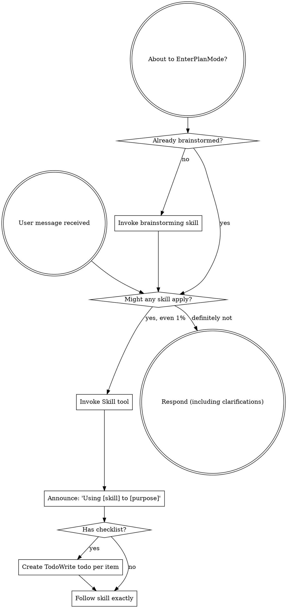
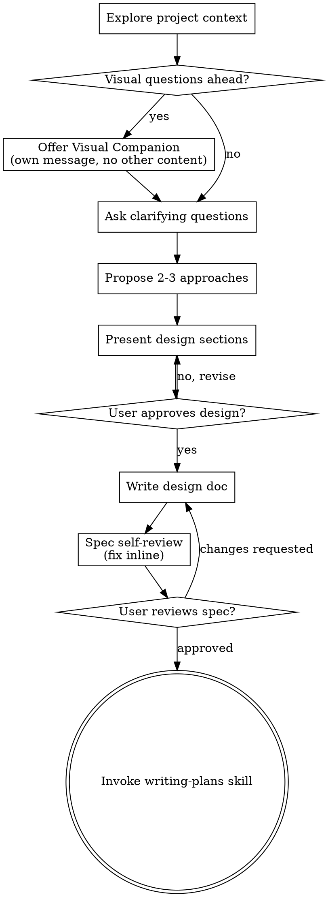
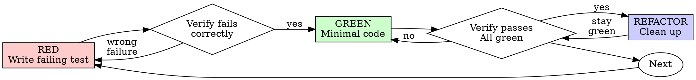
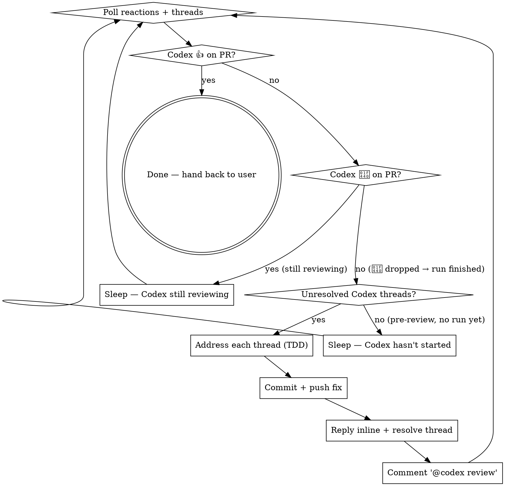

> SYSTEM

# AGENTS.md instructions for /Users/ericson/.t3/worktrees/ars-ui/t3code-a189b923

<INSTRUCTIONS>
# ars-ui

## Project Overview

Rust frontend component library using state machines, framework-agnostic core with Leptos/Dioxus adapters.

## Current Phase

The repo is now in active implementation, not spec drafting only.

Agents working on implementation should use the GitHub Project roadmap and issue backlog as the execution source of truth:

- Use the GitHub Project `ars-ui implementation roadmap` to understand active epics, task breakdown, dependencies, status, and iteration planning.
- Prefer picking a single issue-backed task that is unblocked, sized, and scoped for independent delivery.
- Do not start work from an epic issue unless the user explicitly asks for planning or further decomposition.
- Do not start a task that is blocked by unresolved GitHub issue dependencies.
- Treat native GitHub issue dependencies as the blocker graph and the issue body acceptance criteria as the delivery contract.

## Development Workflow

For implementation tasks:

1. Read the assigned or selected GitHub issue first.
2. Move the issue to **In Progress** on the GitHub Project board.
3. Review the cited spec sections and any dependency issues.
4. Add or update the named tests first.
5. Implement only the scope required to make those tests pass.
6. If implementation changes the intended contract, update the relevant spec in the same task.
7. **MANDATORY:** Invoke the `post-implementation-audit` skill (`.agents/skills/post-implementation-audit/SKILL.md`). It runs three sequential audits on the new code — (a) spec/implementation drift with "best outcome" recommendations, (b) iterative "anything else missing?" passes (minimum two rounds), (c) test-coverage audit across every test type the workspace uses (unit, snapshot, proptest, mutation, doc, spec-conformance, llvm-cov). **Every finding lands in _this_ PR — no deferral, no follow-up issues.** This step exists because initial implementations consistently ship spec drift and silent contract violations that take 3+ review round-trips to surface; the audit collapses them into one. Skipping this step is a contract violation.
8. Present the final result for user review before any commit.
9. After user approval, run `cargo xci --profile fast` (alias: `cargo xci-fast`) locally and fix any failures before pushing anything to GitHub. The fast profile takes ~5 minutes and covers the workspace-level regressions a pre-push gate should catch: fmt, check, clippy, unit, integration, adapter, spec-compile-snippets, error-variant-coverage, mutual-exclusion, snapshot-count. Reserve full `cargo xci` (~25 minutes, all 20 gates including wasm coverage and the feature-matrix groups) for after substantial refactors that may have shifted feature-flag interactions. For small follow-up changes, run the focused tests and checks that cover the edited code instead.
10. After `cargo xci-fast` passes, commit and push a PR targeting `main`. The PR body MUST include an auto-close keyword for the issue being delivered, for example `Closes #20` or `Fixes #20`, so GitHub closes the issue automatically when the PR merges.
11. **If the PR creates or modifies any `.snap` insta fixtures, attach the `snapshot-reviewed` label after opening or updating it** (`gh pr edit <num> --add-label "snapshot-reviewed"`). This signals to reviewers that the snapshot output was inspected and is intentional. Re-apply the label whenever you push a commit that touches `.snap` files; the workflow assumes the label reflects the latest snapshot state.
12. **MANDATORY:** Invoke the `waiting-for-codex-review` skill (`.agents/skills/waiting-for-codex-review/SKILL.md`) immediately after the first push that creates the PR, and re-invoke it after every subsequent push to the PR branch. The skill posts the initial `@codex review` trigger, polls Codex's 👀 → (👍 \| ∅ + threads) reaction lifecycle, addresses any review threads with the same rigor as `post-implementation-audit` (TDD + no coverage regression), replies inline, resolves threads, and re-comments `@codex review` to start the next pass — looping until Codex leaves 👍. Skipping this step leaves Codex findings unaddressed and silently widens the gap between merged code and the spec; the merge gate is 👍 from Codex plus green CI, not green CI alone.
13. Only after CI passes, Codex has left 👍, and the PR is merged, close the issue.

Never close a GitHub issue without a merged PR that passes CI **and a 👍 from Codex**. Never commit or push without explicit user approval. Keep the issue, PR, and Project board status aligned with the actual work state at every step.

Default delivery rules:

- Follow TDD: tests first, implementation second, verification last.
- Keep task scope aligned with the issue. If the issue is too large or ambiguous, stop and split or clarify rather than freelancing a bigger change.
- Prefer tasks sized `1`, `2`, `3`, or `5` points. `8` is exceptional. `13` must be decomposed before implementation.
- Preserve the crate and dependency layering defined by the architecture and implementation plan.
- Do not add a new dependency crate without explicit user approval first. If a task appears to need a new crate, stop, explain why, and get approval before editing any `Cargo.toml`.
- When a task is complete, verify the exact tests and checks named by the issue before considering it done.
- For adapter-level component implementation, follow `docs/implementation/adapter-component-delivery.md`. Adapter component work must cover the adapter crate, adapter tests, E2E fixtures/harnesses when applicable, widgets examples, spec synchronization, and the required validation/audit loop in one PR.

### Code Quality Standards

- **Document all public items.** Every public struct, enum, trait, function, constant, type alias, method, field, and variant must have a `///` doc comment. Every `lib.rs` must have a `//!` crate-level doc comment. The workspace enforces `missing_docs` linting — undocumented public items are build failures.
- **Zero warnings policy.** All code must compile with zero warnings under the workspace's configured clippy and rustc lints. Fix the root cause instead of suppressing. When suppression is genuinely needed, use `#[expect(lint, reason = "...")]` — never `#[allow(...)]`.
- **Derive documentation from the spec.** Doc comments should describe the _purpose and semantics_ of the item as defined in the corresponding `spec/` files, not just restate the type signature.
- **Use `#[inline]` selectively, not mechanically.** Do **not** add Clippy's `missing_inline_in_public_items` lint at the workspace level, and do not treat public visibility alone as a reason to mark an item `#[inline]`. Use `#[inline]` for thin cross-crate wrappers, trivial accessors, and hot-path no-op shims where the call overhead is plausibly meaningful. Avoid blanket `#[inline]` on all public APIs — it increases code size, adds compile-time cost, and turns `#[inline]` into noise instead of a deliberate performance signal.
- **Use directory-backed modules with `mod.rs` when a module owns children.** This repo standardizes on the older filesystem layout for nested modules. If module `foo` has child modules, the parent must live at `foo/mod.rs`, not `foo.rs`. Do not mix `foo.rs` with a sibling `foo/` directory. When a refactor adds child modules under an existing flat file, move the parent into `foo/mod.rs` in the same change. Do not leave empty leftover module directories behind.

### API Design Standards

- **Design for the pit of success.** Public APIs should make the most natural, shortest path also be the path that is correct, accessible, localizable, type-safe, and performant. Prefer ergonomic constructors and defaults that preserve the spec's strongest guarantees instead of making users opt into correctness after choosing a convenient API.
- **Name escape hatches explicitly.** When a component needs a lower-level, static, non-i18n, or otherwise less complete path, keep it available but make the tradeoff visible in the API name or type. The blessed path should remain the simplest call site, while escape hatches should read as deliberate choices.
- **Keep semantic data separate from rendered views.** Rich framework views are useful for customization, but components still need semantic sources for accessible names, localized text, announcements, ids, and state-machine wiring. Do not rely on arbitrary rendered view trees as the only source of user-facing semantics.

### Code Coverage

The workspace uses `cargo-llvm-cov` for code coverage with per-crate threshold enforcement. CI runs coverage on every PR (see `.github/workflows/ci.yml`).

**Local coverage commands:**

```bash
# Per-crate coverage with inline annotated source (most useful during development)
cargo llvm-cov test -p ars-interactions --text -- hover

# Per-crate summary only
cargo llvm-cov test -p ars-interactions -- hover

# Native-only workspace coverage (host target; excludes wasm-only crates)
cargo llvm-cov --workspace \
  --exclude ars-leptos --exclude ars-dioxus \
  --exclude ars-test-harness-leptos --exclude ars-test-harness-dioxus \
  --exclude ars-derive --exclude xtask \
  --lcov --output-path lcov.info

# Check all crates against spec-defined thresholds (run after a *merged* lcov)
cargo xtask coverage check-all --file lcov.info
```

The `--text` flag produces line-by-line annotated source showing hit counts and `^0` markers on uncovered branches — use this to identify gaps after writing tests. Uncovered no-op callback closures in tests (e.g., `|_| {}`) are expected and not a gap.

The local recipe above excludes the adapter and adapter-test-harness crates because their `target_arch = "wasm32"` / `feature = "web"` code paths can't be measured via host-target `cargo llvm-cov`. **CI runs an additional wasm-coverage pipeline on nightly** (`cargo xtask ci coverage`) that uses `wasm-bindgen-test`'s experimental coverage recipe with LLVM 22 / `clang-22` to emit lcov for `ars-leptos` (csr), `ars-dioxus` (web), `ars-dom` (web), `ars-i18n` (web-intl), and the adapter test harnesses, then merges with the native lcov via `cargo xtask coverage merge`. The per-crate thresholds in `xtask::coverage::default_thresholds()` are enforced against the merged file — including adapter targets (`ars-leptos` 74/55, `ars-dioxus` 77/70, `ars-test-harness-leptos` 60/0, `ars-test-harness-dioxus` 60/0). `ars-derive` (proc-macro, runs in compiler) is exercised via `crates/ars-core/tests/derive_contract.rs` and is unmeasured. `xtask` has its own enforced threshold (30/35) and is measured. See `spec/testing/14-ci.md` §2 for the full pipeline.

### Mutation Testing

Coverage tells you which lines run. **Mutation testing tells you whether the tests would notice if those lines silently misbehaved.** The workspace uses [`cargo-mutants`](https://mutants.rs) for this — a `cargo` extension binary, not a workspace dependency.

**Install (once per developer machine):**

```bash
cargo install cargo-mutants --locked --version 27.0.0
```

**Local commands (state-machine modules are the most rewarding targets):**

```bash
# Run on a single component machine (~6 min for popover)
cargo mutants -p ars-components -f crates/ars-components/src/overlay/popover/mod.rs

# Just list what would be mutated, without running tests (fast)
cargo mutants -p ars-components -f crates/ars-components/src/overlay/popover/mod.rs --list

# Whole crate (slow — only if you really mean it)
cargo mutants -p ars-components
```

**Agnostic component implementation gate:** whenever an agent implements a new framework-agnostic component, or materially changes an existing one, the delivery must include:

- a targeted mutation run for the component source file, usually `cargo mutants -p ars-components -f crates/ars-components/src/<category>/<component>/mod.rs` (adjust the path for single-file modules);
- spec-conformance tests for the component's anatomy/public contract, including its `Part` enum and required API/attribute surface;
- same-task triage of every `MISSED` mutant: add tests for real gaps, or add a justified line-agnostic `.cargo/mutants.toml` exclude only for true equivalent mutations.

**Reading the output:** Results land in `mutants.out/mutants.out/` (gitignored). The two files that matter:

- `caught.txt` — mutations that broke at least one test ✅
- `missed.txt` — mutations that survived all tests ❌ — each one is either a real test gap to fill or an "equivalent mutation" that needs a `[[skip]]` entry in `mutants.toml` with a justification

**CI integration:** Nightly only. `.github/workflows/nightly.yml` has a `mutation-testing` job with a 21-entry matrix that runs `cargo mutants -p <package>` on every framework-agnostic crate, using `--shard k/n` to spread larger crates across parallel runners. **Shard indices are 0-based** (`k` runs from `0` to `n-1`); `k == n` is invalid and will fail the job. When adding shards, always start at `0/n` and end at `(n-1)/n`.

- **`ars-components` (≈ 1,630 mutants today, planned to grow as the spec adds the remaining ~97 components):** sharded **12-way** → ≈ 135 mutants per runner today, ≈ 850 per runner at the ~10,000-mutant endpoint. Sized for the full spec catalog up front so we don't re-shard every few months as components land.
- **`ars-collections` (≈ 1,080 mutants):** sharded 4-way → ≈ 270 mutants per runner.
- **`ars-core` (≈ 700 mutants):** sharded 2-way → ≈ 350 mutants per runner.
- **`ars-a11y`, `ars-forms`, `ars-interactions`:** one runner each (under 600 mutants apiece).

**Adding a new state machine inside an existing crate requires no CI changes** — its mutations land in whichever shard the cargo-mutants partitioner places them. The shard counts are sized so the slowest runner stays well under 30 minutes today and under ~50 minutes at the planned endpoint; re-balance only when a crate outgrows that budget (visible on the nightly dashboard as one shard pulling away from the others).

All matrix jobs run with `fail-fast: false` so failures on one module don't mask data on another. Each job uploads its `mutants.out/` as a workflow artifact (always, even on success — surviving "missed" entries on a passing run still reveal test-quality work). The job fails if any mutation survives, so a missed mutation forces a deliberate triage decision (fix the test, or document the equivalence with a `[[skip]]` entry in `mutants.toml`).

**Excluded crates** (mutation testing's signal degrades wherever determinism does): adapter glue (`ars-leptos`, `ars-dioxus`), DOM/FFI (`ars-dom`), ICU/FFI (`ars-i18n`), test infrastructure (`ars-test-harness*`), and the proc-macro crate (`ars-derive`, runs in the compiler). Adding a brand-new crate that is a good mutation target requires one new matrix entry; run a local scout first (`cargo mutants -p <crate> --list` to size, then a real run) so we know the right shard count before the nightly fires.

**Bumping the pinned version.** Both the local install command above and `.github/workflows/nightly.yml` pin cargo-mutants to an exact version (currently `27.0.0`) — same convention as `wasm-pack` in the `a11y-audit` job. Pinning is deliberate: cargo-mutants ships new mutators in releases, and an unpinned install would silently change the mutation set without any code change, surfacing as phantom CI failures on a green-source repo. To bump, open a PR that (1) updates the version string in CLAUDE.md and `nightly.yml`, (2) runs the popover scout locally with the new version (`cargo mutants -p ars-components -f crates/ars-components/src/overlay/popover/mod.rs`) to confirm the mutation count is in the same ballpark, and (3) triages any new "missed" entries the new mutators surface — they are usually genuine test-quality gaps newly visible to the tool.

### Property Testing (proptest)

State-machine invariants are exercised by [`proptest`](https://docs.rs/proptest) under `crates/<crate>/tests/proptest_state_machines/` (see `ars-components`). Default proptest behaviour drops `*.proptest-regressions` seed files alongside test sources — instead, every `proptest!` block in this workspace pulls a shared `Config` from `tests/proptest_state_machines/common.rs` that:

1. Reads `PROPTEST_CASES` from the environment (1,000 default; 10,000 in the nightly `extended-proptest` job).
2. Sets `failure_persistence` to `FileFailurePersistence::Direct("proptest-regressions/state-machines.txt")`, so all persisted seeds for the test binary live in one file at the crate root: `crates/<crate>/proptest-regressions/state-machines.txt`. The directory is committed (per proptest's own recommendation in the file header) so every developer's runs benefit from previously-shrunk failures.

When a new crate adopts proptest for state-machine tests, copy the same `common.rs` helper and reference it via `#![proptest_config(super::common::proptest_config())]` inside every `proptest!` block. Don't let proptest fall back to its `WithSource` default — that scatters seed files across the source tree.

### Adapter Prelude Convention

Both `ars-leptos` and `ars-dioxus` expose a `prelude` module targeting **end users** — application developers who consume the ready-made components. `use ars_leptos::prelude::*` (or `use ars_dioxus::prelude::*`) should give them everything they need.

The prelude contains only user-facing items:

1. **Component modules** — as components land, their public module paths (e.g., `button`, `dialog`) are re-exported so users can write `button::Props`, etc.
2. **User-facing traits** — traits end users call on component outputs (e.g., `Translate` from `ars-i18n`). Re-export the trait so consumers don't need a direct dependency on the subsystem crate.
3. **Configuration types** — types that appear in component props or configure behaviour (e.g., `Locale`, `Direction`, `Orientation`, `Selection`).

The prelude does **not** include implementation details consumed only by component authors inside the adapter crate: core engine types (`Machine`, `Service`, `ConnectApi`, `AttrMap`), accessibility primitives (`AriaRole`, `AriaAttribute`), interaction helpers (`merge_attrs`), or adapter hooks (`use_machine`, `UseMachineReturn`). Those remain accessible via their normal crate paths for advanced users building custom machines.

Both adapter preludes must stay symmetric: same items, same structure. When adding a new re-export to one adapter's prelude, add it to the other as well in the same PR.

### Adapter Testing Convention

Adapter-level component tests should default to the framework-specific test harness crate:

- Leptos adapter tests should prefer `ars-test-harness-leptos`.
- Dioxus adapter tests should prefer `ars-test-harness-dioxus`.
- Shared `ars-test-harness` helpers should be used where relevant for viewport, layout, clipboard, drag/drop, timing, and other DOM test setup instead of bespoke per-test browser scaffolding.

When a component spec requires interaction, focus, overlay positioning, clipboard, file upload, drag/drop, or similar browser behavior, the task's tests should exercise that behavior through the adapter harness entrypoints and shared core harness helpers unless there is a concrete technical reason not to.

## Spec Synchronization During Implementation

The specification is the authoritative contract. It took weeks of deliberate design and MUST be followed.

### Spec-first implementation rule

Before implementing any public type, trait, function, or method:

1. **Read the spec section first.** Find the relevant code example in `spec/`. Use `spec-tool toc <file>` and `grep` to locate it.
2. **Match the spec exactly.** If the spec defines `struct ComponentIds { base: String }` with methods `from_id()`, `id()`, `part()`, `item()`, `item_part()` — implement exactly that. Do not invent alternative field names, method names, or signatures.
3. **Cross-check after implementation.** Before presenting code for review, diff every public item against the spec's code examples. Every struct field, every method name, every parameter must match.
4. **If you must deviate**, there must be a concrete technical reason (e.g., the spec's API cannot compile, or a dependency doesn't expose the needed type). Document the reason in a code comment and flag it to the user explicitly.

Inventing alternative APIs that "seem equivalent" is never acceptable — it silently invalidates the spec's design decisions and all downstream code that depends on those APIs.

### Spec/code mismatch resolution

- If code and spec disagree, resolve the mismatch in the same task or PR.
- Shared conceptual changes belong in shared or foundation spec files, not only in adapter code.
- Adapter-specific findings must be reflected back into `spec/foundation/08-adapter-leptos.md` and/or `spec/foundation/09-adapter-dioxus.md` when relevant.
- Do not leave spec drift behind as follow-up cleanup.

## Spec Structure

The specification lives in `spec/` with this layout:

- `spec/manifest.toml` — **START HERE** — central index of all components and their dependencies
- `spec/foundation/` — architecture, accessibility, i18n, interactions, forms, adapters, spec template (00-10)
- `spec/shared/` — cross-component shared types (date-time, selection, layout, z-index)
- `spec/components/{category}/` — one file per component, organized by category
- `spec/testing/` — test specs split by domain

### Component Categories

- `input/` — checkbox, text-field, slider, number-input, etc.
- `selection/` — select, combobox, listbox, menu, tags-input, etc.
- `overlay/` — dialog, popover, tooltip, toast, presence, etc.
- `navigation/` — accordion, tabs, tree-view, pagination, steps, etc.
- `date-time/` — date-field, time-field, calendar, date-picker, etc.
- `data-display/` — table, avatar, progress, meter, badge, etc.
- `layout/` — splitter, scroll-area, carousel, portal, toolbar, etc.
- `specialized/` — color-picker, file-upload, signature-pad, qr-code, etc.
- `utility/` — button, toggle, focus-scope, visually-hidden, separator, etc.

## Working with the Spec

When reading large files, run `wc -l` first to check the line count. If the file is over 2,000
lines, use the `offset` and `limit` parameters on the Read tool to read in chunks rather than
attempting to read the entire file at once.

### Using xtask spec (preferred)

Use `cargo xtask spec` to resolve file sets instead of manually parsing manifest.toml:

```bash
# Quick metadata lookup:
cargo xtask spec info <component>

# Find all components using a shared type:
cargo xtask spec reverse <shared-type>

# See a file's heading structure (with line numbers):
cargo xtask spec toc <file>

# Validate frontmatter matches manifest.toml:
cargo xtask spec validate

# Search spec content by keyword/regex (with optional filters):
cargo xtask spec search <query> [--category <cat>] [--section <sec>] [--tier <tier>]

# Get a compact component summary (states, events, props, accessibility):
cargo xtask spec digest <component>

# Get full implementation context (component + all deps concatenated):
cargo xtask spec context <component> [--framework <fw>] [--include-testing]
```

The xtask also runs as an MCP server (`cargo xtask mcp`) exposing all spec tools for LLM agents.

### Reading a component (manual fallback)

1. Read `spec/manifest.toml` to find the component's path and dependencies
2. Read the component file (has YAML frontmatter listing its foundation/shared deps)
3. Only load the foundation files listed in `foundation_deps` — not all of them

### Framework and library specs — MANDATORY skill loading

When reading or editing these specification files, you MUST load the corresponding skill BEFORE doing any work. The skills contain verified, version-accurate API documentation that the spec code examples depend on. Claude's training data is wrong for these libraries — do not trust it.

| Spec file                                    | Skill to load | Library version |
| -------------------------------------------- | ------------- | --------------- |
| `spec/foundation/04-internationalization.md` | `icu4x`       | ICU4X 2.1.1     |
| `spec/foundation/08-adapter-leptos.md`       | `leptos`      | Leptos 0.8.17   |
| `spec/foundation/09-adapter-dioxus.md`       | `dioxus`      | Dioxus 0.7.3    |

This applies to any task that touches adapter code: reviewing, writing, modifying, or answering questions about these files. Load the skill first, then proceed.

### Spec Conventions

- **No deprecation:** This is a greenfield spec. If an API is unused or redundant, remove it and fix all references. Never use `#[deprecated]` or deprecation shims.
- **No deferral:** Never mark spec content as "TODO", "FIXME", "future enhancement", "P1/P2 extension", or any similar deferral language. Every feature mentioned must be fully specified. If a design choice is unclear, ask the user rather than deferring.
- **No guessing external APIs:** NEVER guess function names or module paths for external crates. Always verify against `https://docs.rs/<crate_name>` before writing code that calls library APIs. This applies especially to Leptos, Dioxus, ICU4X, and any crate where training data may be stale. If you cannot verify, state that explicitly rather than fabricating a plausible-looking API.

### Component file format

Each component file has YAML frontmatter declaring its metadata:

```markdown
---
component: ComponentName
category: { category }
tier: stateless | stateful | complex
foundation_deps: [architecture, accessibility, ...]
shared_deps: [date-time-types, ...]
related: [sibling-component, ...]
---

# ComponentName
```

The `tier` field determines which sections are required — see `spec/foundation/10-component-spec-template.md` for the canonical section structure, ordering rules, and conformance checklist. Headings are numbered (e.g., `## 1. State Machine`, `### 1.1 States`, `#### 1.1.1 InnerStates`, etc.) for precise section references.

</INSTRUCTIONS>
<environment_context>
  <cwd>/Users/ericson/.t3/worktrees/ars-ui/t3code-a189b923</cwd>
  <shell>zsh</shell>
  <current_date>2026-05-21</current_date>
  <timezone>America/Sao_Paulo</timezone>
</environment_context>

> DEVELOPER

Implement task #215

> TOOL

tool_use exec_command
id: call_FLMqGBjzZMcOB6ArfGVxhp3T
```json
{
  "cmd": "sed -n '1,220p' /Users/ericson/.claude/skills/using-superpowers/SKILL.md",
  "workdir": "/Users/ericson/.t3/worktrees/ars-ui/t3code-a189b923",
  "yield_time_ms": 1000,
  "max_output_tokens": 12000
}
```

> TOOL

tool_use exec_command
id: call_fMvxywwLnZEFV0jDjgCULEfs
```json
{
  "cmd": "rg -n \"#215|issue #215|task #215|215\" /Users/ericson/.codex/memories/MEMORY.md",
  "workdir": "/Users/ericson/.t3/worktrees/ars-ui/t3code-a189b923",
  "yield_time_ms": 1000,
  "max_output_tokens": 12000
}
```

> TOOL

tool_result
id: call_FLMqGBjzZMcOB6ArfGVxhp3T
```
Chunk ID: cf61d0
Wall time: 0.1213 seconds
Process exited with code 0
Original token count: 1356
Output:
---
name: using-superpowers
description: Use when starting any conversation - establishes how to find and use skills, requiring Skill tool invocation before ANY response including clarifying questions
---

<SUBAGENT-STOP>
If you were dispatched as a subagent to execute a specific task, skip this skill.
</SUBAGENT-STOP>

<EXTREMELY-IMPORTANT>
If you think there is even a 1% chance a skill might apply to what you are doing, you ABSOLUTELY MUST invoke the skill.

IF A SKILL APPLIES TO YOUR TASK, YOU DO NOT HAVE A CHOICE. YOU MUST USE IT.

This is not negotiable. This is not optional. You cannot rationalize your way out of this.
</EXTREMELY-IMPORTANT>

## Instruction Priority

Superpowers skills override default system prompt behavior, but **user instructions always take precedence**:

1. **User's explicit instructions** (CLAUDE.md, GEMINI.md, AGENTS.md, direct requests) — highest priority
2. **Superpowers skills** — override default system behavior where they conflict
3. **Default system prompt** — lowest priority

If CLAUDE.md, GEMINI.md, or AGENTS.md says "don't use TDD" and a skill says "always use TDD," follow the user's instructions. The user is in control.

## How to Access Skills

**In Claude Code:** Use the `Skill` tool. When you invoke a skill, its content is loaded and presented to you—follow it directly. Never use the Read tool on skill files.

**In Copilot CLI:** Use the `skill` tool. Skills are auto-discovered from installed plugins. The `skill` tool works the same as Claude Code's `Skill` tool.

**In Gemini CLI:** Skills activate via the `activate_skill` tool. Gemini loads skill metadata at session start and activates the full content on demand.

**In other environments:** Check your platform's documentation for how skills are loaded.

## Platform Adaptation

Skills use Claude Code tool names. Non-CC platforms: see `references/copilot-tools.md` (Copilot CLI), `references/codex-tools.md` (Codex) for tool equivalents. Gemini CLI users get the tool mapping loaded automatically via GEMINI.md.

# Using Skills

## The Rule

**Invoke relevant or requested skills BEFORE any response or action.** Even a 1% chance a skill might apply means that you should invoke the skill to check. If an invoked skill turns out to be wrong for the situation, you don't need to use it.



## Red Flags

These thoughts mean STOP—you're rationalizing:

| Thought | Reality |
|---------|---------|
| "This is just a simple question" | Questions are tasks. Check for skills. |
| "I need more context first" | Skill check comes BEFORE clarifying questions. |
| "Let me explore the codebase first" | Skills tell you HOW to explore. Check first. |
| "I can check git/files quickly" | Files lack conversation context. Check for skills. |
| "Let me gather information first" | Skills tell you HOW to gather information. |
| "This doesn't need a formal skill" | If a skill exists, use it. |
| "I remember this skill" | Skills evolve. Read current version. |
| "This doesn't count as a task" | Action = task. Check for skills. |
| "The skill is overkill" | Simple things become complex. Use it. |
| "I'll just do this one thing first" | Check BEFORE doing anything. |
| "This feels productive" | Undisciplined action wastes time. Skills prevent this. |
| "I know what that means" | Knowing the concept ≠ using the skill. Invoke it. |

## Skill Priority

When multiple skills could apply, use this order:

1. **Process skills first** (brainstorming, debugging) - these determine HOW to approach the task
2. **Implementation skills second** (frontend-design, mcp-builder) - these guide execution

"Let's build X" → brainstorming first, then implementation skills.
"Fix this bug" → debugging first, then domain-specific skills.

## Skill Types

**Rigid** (TDD, debugging): Follow exactly. Don't adapt away discipline.

**Flexible** (patterns): Adapt principles to context.

The skill itself tells you which.

## User Instructions

Instructions say WHAT, not HOW. "Add X" or "Fix Y" doesn't mean skip workflows.

```

> TOOL

tool_result
id: call_fMvxywwLnZEFV0jDjgCULEfs
```
Chunk ID: fafd34
Wall time: 0.1241 seconds
Process exited with code 0
Original token count: 450
Output:
757:- nightly-mutation-survivor-gate, research.md, Option C, include a job to run proptests in the Nightly CI, continue-on-error, workflow_dispatch, run 25769012151, PR #59, cargo xtask ci, crates/api/src/cnj.rs
816:- baseline Nightly state for this slice was run `25769012151` on `main`: mutation artifacts already contained survivors, `cargo xtask ci` covered the existing `proptest!` in `crates/api/src/cnj.rs`, and `.github/workflows/nightly.yml` still used `continue-on-error: true` with no dedicated proptest job before the slice advanced [Task 1]
2323:- rollout_summaries/2026-04-21T21-42-22-ibXl-pr_review_controlled_form_reset_server_errors.md (cwd=/Users/ericson/.t3/worktrees/ars-ui/t3code-31a9f711, rollout_path=/Users/ericson/.codex/sessions/2026/04/21/rollout-2026-04-21T18-42-22-019db1fe-8d2b-7293-b88c-3c7face2153b.jsonl, updated_at=2026-04-21T21:51:52+00:00, thread_id=019db1fe-8d2b-7293-b88c-3c7face2153b, PR #594 reset-behavior review fix)
2785:- rollout_summaries/2026-04-21T21-42-22-ibXl-pr_review_controlled_form_reset_server_errors.md (cwd=/Users/ericson/.t3/worktrees/ars-ui/t3code-31a9f711, rollout_path=/Users/ericson/.codex/sessions/2026/04/21/rollout-2026-04-21T18-42-22-019db1fe-8d2b-7293-b88c-3c7face2153b.jsonl, updated_at=2026-04-21T21:51:52+00:00, thread_id=019db1fe-8d2b-7293-b88c-3c7face2153b, controlled reset server-error fix on PR #594)
2874:- rollout_summaries/2026-04-24T14-42-13-0cSr-ars_ui_xtask_ci_enforcement_and_pr_review_fixes.md (cwd=/Users/ericson/.codex/worktrees/1215/ars-ui, rollout_path=/Users/ericson/.codex/sessions/2026/04/24/rollout-2026-04-24T11-42-13-019dbff0-f649-7430-819e-0d4ed361505f.jsonl, updated_at=2026-04-24T19:51:25+00:00, thread_id=019dbff0-f649-7430-819e-0d4ed361505f, xtask CI policy checks plus thread-aware PR #607 follow-up)

```

> AGENT

Using `using-superpowers` to establish the required workflow. I’m in Plan Mode here, so I can inspect the repo and issue, but I won’t edit files or move project state yet.

> TOOL

tool_use exec_command
id: call_FPQz31tJHkatzeqFqS497Cxj
```json
{
  "cmd": "pwd && git status --short --branch",
  "workdir": "/Users/ericson/.t3/worktrees/ars-ui/t3code-a189b923",
  "yield_time_ms": 1000,
  "max_output_tokens": 12000
}
```

> TOOL

tool_use _fetch_issue
id: call_cWIigjrcpAOFLqJhvVMSjckR
```json
{
  "repository_full_name": "fogodev/ars-ui",
  "issue_number": 215
}
```

> TOOL

tool_use exec_command
id: call_ErhbqkKIXAjuQPhgPMKyyddz
```json
{
  "cmd": "rg --files -g 'SKILL.md' .agents/skills | sort",
  "workdir": "/Users/ericson/.t3/worktrees/ars-ui/t3code-a189b923",
  "yield_time_ms": 1000,
  "max_output_tokens": 12000
}
```

> TOOL

tool_result
id: call_FPQz31tJHkatzeqFqS497Cxj
```
Chunk ID: 728b77
Wall time: 0.0460 seconds
Process exited with code 0
Original token count: 18
Output:
/Users/ericson/.t3/worktrees/ars-ui/t3code-a189b923
## t3code/a189b923

```

> TOOL

tool_result
id: call_cWIigjrcpAOFLqJhvVMSjckR
```
Wall time: 1.2355 seconds
Output:
{"issue":{"url":"https://github.com/fogodev/ars-ui/issues/215","title":"task: Implement ToggleButton agnostic core","issue_number":215,"body":"**Epic: #10 (Agnostic utility components)**\n\n## Goal\n\nImplement the framework-agnostic ToggleButton component state machine: combines Button's interaction model with Toggle's persistent pressed state. Three states, eight events, `Bindable<bool>` for pressed, form integration (name, hidden input config), invalid/required states. The spec explicitly says it combines \"press interaction semantics from Button with the toggle state semantics of Toggle.\"\n\n## Out of scope\n\nFramework-specific adapter components (Leptos/Dioxus).\n\n## Spec refs\n\n- `spec/components/utility/toggle-button.md`\n- `spec/components/utility/button.md`\n- `spec/components/utility/toggle.md`\n\n## Depends on\n\n#209 (Toggle agnostic core), #214 (Button agnostic core)\n\n## Layer\n\nComponent\n\n## Framework\n\nNone\n\n## Test tier\n\nUnit\n\n## Fibonacci points\n\n5\n\n## Tests to add first\n\n- State machine: initial state reflects default_pressed prop.\n- State machine: press interaction toggles pressed state.\n- State machine: controlled mode (pressed prop) overrides internal state.\n- State machine: disabled state ignores press events.\n- State machine: focus-visible tracking from Button.\n- ConnectApi Root: produces `aria-pressed`, `data-ars-state`, `data-ars-pressed`, `tabindex`, `aria-disabled`.\n- ConnectApi: form-related attrs (name, value) when inside form context.\n- Bindable: on_pressed_change callback fires on toggle.\n- Props: `pressed`, `default_pressed`, `disabled`, `name`, `value`, `required`, `invalid` match spec.\n- Hidden input: produces hidden input attrs for form submission when name is set.\n\n## Acceptance criteria\n\n- All public types documented per workspace `missing_docs` lint.\n- State machine matches spec §1 exactly.\n- ConnectApi produces correct ARIA attributes per spec §2.\n- Form integration and hidden input match spec.\n- Snapshot tests cover the component's `connect()` / `Api` `AttrMap` output for every anatomy part and each output-affecting state, prop, or context branch, with committed `.snap` fixtures passing `cargo insta test --unreferenced=reject`.\n- All named tests pass with zero warnings.\n\n## Spec impact\n\nNo spec change required.\n\n## Board update rule\n\nIf blocked, keep `Status` in `Todo`, use native GitHub issue dependencies, and name the dependency or spec ambiguity.\n","state":"open","user":{"login":"fogodev","name":"fogodev","email":null,"avatar_url":"https://avatars.githubusercontent.com/u/11011091?v=4","id":11011091},"assignees":null,"labels":[{"name":"task","color":"0E8A16","description":"Agent-ready implementation task"}],"milestone":null,"state_reason":null,"comments":0,"created_at":"2026-04-10T22:45:39Z","updated_at":"2026-04-22T02:20:46Z","closed_at":null,"display_url":"https://github.com/fogodev/ars-ui/issues/215","display_title":"task: Implement ToggleButton agnostic core"},"url":"https://github.com/fogodev/ars-ui/issues/215","title":"task: Implement ToggleButton agnostic core","display_url":"https://github.com/fogodev/ars-ui/issues/215","display_title":"task: Implement ToggleButton agnostic core"}
```

> TOOL

tool_result
id: call_ErhbqkKIXAjuQPhgPMKyyddz
```
Chunk ID: 2ad0a1
Wall time: 0.0286 seconds
Process exited with code 0
Original token count: 58
Output:
.agents/skills/dioxus/SKILL.md
.agents/skills/icu4x/SKILL.md
.agents/skills/leptos/SKILL.md
.agents/skills/playwright-cli/SKILL.md
.agents/skills/post-implementation-audit/SKILL.md
.agents/skills/waiting-for-codex-review/SKILL.md

```

> AGENT

I found task #215: ToggleButton agnostic core, blocked on #209 and #214, with explicit TDD, snapshot, mutation, audit, and PR requirements. I’m checking the current core component patterns next so the plan can be concrete instead of generic.

> TOOL

tool_use exec_command
id: call_cKN6Nzk5XdckixJcwgLndsQZ
```json
{
  "cmd": "sed -n '1,220p' /Users/ericson/.claude/skills/brainstorming/SKILL.md",
  "workdir": "/Users/ericson/.t3/worktrees/ars-ui/t3code-a189b923",
  "yield_time_ms": 1000,
  "max_output_tokens": 12000
}
```

> TOOL

tool_use exec_command
id: call_nbkw7MGzMPCb0AIf4L86b3sT
```json
{
  "cmd": "sed -n '1,260p' /Users/ericson/.claude/skills/writing-plans/SKILL.md",
  "workdir": "/Users/ericson/.t3/worktrees/ars-ui/t3code-a189b923",
  "yield_time_ms": 1000,
  "max_output_tokens": 16000
}
```

> TOOL

tool_use _fetch_issue
id: call_tdw55UQSxYFa0Cc0yfmfMznj
```json
{
  "repository_full_name": "fogodev/ars-ui",
  "issue_number": 209
}
```

> TOOL

tool_use _fetch_issue
id: call_uGGffuSnk9TGWVzYmKReFZUo
```json
{
  "repository_full_name": "fogodev/ars-ui",
  "issue_number": 214
}
```

> TOOL

tool_result
id: call_cKN6Nzk5XdckixJcwgLndsQZ
```
Chunk ID: 1e7d6e
Wall time: 0.0344 seconds
Process exited with code 0
Original token count: 2659
Output:
---
name: brainstorming
description: "You MUST use this before any creative work - creating features, building components, adding functionality, or modifying behavior. Explores user intent, requirements and design before implementation."
---

# Brainstorming Ideas Into Designs

Help turn ideas into fully formed designs and specs through natural collaborative dialogue.

Start by understanding the current project context, then ask questions one at a time to refine the idea. Once you understand what you're building, present the design and get user approval.

<HARD-GATE>
Do NOT invoke any implementation skill, write any code, scaffold any project, or take any implementation action until you have presented a design and the user has approved it. This applies to EVERY project regardless of perceived simplicity.
</HARD-GATE>

## Anti-Pattern: "This Is Too Simple To Need A Design"

Every project goes through this process. A todo list, a single-function utility, a config change — all of them. "Simple" projects are where unexamined assumptions cause the most wasted work. The design can be short (a few sentences for truly simple projects), but you MUST present it and get approval.

## Checklist

You MUST create a task for each of these items and complete them in order:

1. **Explore project context** — check files, docs, recent commits
2. **Offer visual companion** (if topic will involve visual questions) — this is its own message, not combined with a clarifying question. See the Visual Companion section below.
3. **Ask clarifying questions** — one at a time, understand purpose/constraints/success criteria
4. **Propose 2-3 approaches** — with trade-offs and your recommendation
5. **Present design** — in sections scaled to their complexity, get user approval after each section
6. **Write design doc** — save to `docs/superpowers/specs/YYYY-MM-DD-<topic>-design.md` and commit
7. **Spec self-review** — quick inline check for placeholders, contradictions, ambiguity, scope (see below)
8. **User reviews written spec** — ask user to review the spec file before proceeding
9. **Transition to implementation** — invoke writing-plans skill to create implementation plan

## Process Flow



**The terminal state is invoking writing-plans.** Do NOT invoke frontend-design, mcp-builder, or any other implementation skill. The ONLY skill you invoke after brainstorming is writing-plans.

## The Process

**Understanding the idea:**

- Check out the current project state first (files, docs, recent commits)
- Before asking detailed questions, assess scope: if the request describes multiple independent subsystems (e.g., "build a platform with chat, file storage, billing, and analytics"), flag this immediately. Don't spend questions refining details of a project that needs to be decomposed first.
- If the project is too large for a single spec, help the user decompose into sub-projects: what are the independent pieces, how do they relate, what order should they be built? Then brainstorm the first sub-project through the normal design flow. Each sub-project gets its own spec → plan → implementation cycle.
- For appropriately-scoped projects, ask questions one at a time to refine the idea
- Prefer multiple choice questions when possible, but open-ended is fine too
- Only one question per message - if a topic needs more exploration, break it into multiple questions
- Focus on understanding: purpose, constraints, success criteria

**Exploring approaches:**

- Propose 2-3 different approaches with trade-offs
- Present options conversationally with your recommendation and reasoning
- Lead with your recommended option and explain why

**Presenting the design:**

- Once you believe you understand what you're building, present the design
- Scale each section to its complexity: a few sentences if straightforward, up to 200-300 words if nuanced
- Ask after each section whether it looks right so far
- Cover: architecture, components, data flow, error handling, testing
- Be ready to go back and clarify if something doesn't make sense

**Design for isolation and clarity:**

- Break the system into smaller units that each have one clear purpose, communicate through well-defined interfaces, and can be understood and tested independently
- For each unit, you should be able to answer: what does it do, how do you use it, and what does it depend on?
- Can someone understand what a unit does without reading its internals? Can you change the internals without breaking consumers? If not, the boundaries need work.
- Smaller, well-bounded units are also easier for you to work with - you reason better about code you can hold in context at once, and your edits are more reliable when files are focused. When a file grows large, that's often a signal that it's doing too much.

**Working in existing codebases:**

- Explore the current structure before proposing changes. Follow existing patterns.
- Where existing code has problems that affect the work (e.g., a file that's grown too large, unclear boundaries, tangled responsibilities), include targeted improvements as part of the design - the way a good developer improves code they're working in.
- Don't propose unrelated refactoring. Stay focused on what serves the current goal.

## After the Design

**Documentation:**

- Write the validated design (spec) to `docs/superpowers/specs/YYYY-MM-DD-<topic>-design.md`
  - (User preferences for spec location override this default)
- Use elements-of-style:writing-clearly-and-concisely skill if available
- Commit the design document to git

**Spec Self-Review:**
After writing the spec document, look at it with fresh eyes:

1. **Placeholder scan:** Any "TBD", "TODO", incomplete sections, or vague requirements? Fix them.
2. **Internal consistency:** Do any sections contradict each other? Does the architecture match the feature descriptions?
3. **Scope check:** Is this focused enough for a single implementation plan, or does it need decomposition?
4. **Ambiguity check:** Could any requirement be interpreted two different ways? If so, pick one and make it explicit.

Fix any issues inline. No need to re-review — just fix and move on.

**User Review Gate:**
After the spec review loop passes, ask the user to review the written spec before proceeding:

> "Spec written and committed to `<path>`. Please review it and let me know if you want to make any changes before we start writing out the implementation plan."

Wait for the user's response. If they request changes, make them and re-run the spec review loop. Only proceed once the user approves.

**Implementation:**

- Invoke the writing-plans skill to create a detailed implementation plan
- Do NOT invoke any other skill. writing-plans is the next step.

## Key Principles

- **One question at a time** - Don't overwhelm with multiple questions
- **Multiple choice preferred** - Easier to answer than open-ended when possible
- **YAGNI ruthlessly** - Remove unnecessary features from all designs
- **Explore alternatives** - Always propose 2-3 approaches before settling
- **Incremental validation** - Present design, get approval before moving on
- **Be flexible** - Go back and clarify when something doesn't make sense

## Visual Companion

A browser-based companion for showing mockups, diagrams, and visual options during brainstorming. Available as a tool — not a mode. Accepting the companion means it's available for questions that benefit from visual treatment; it does NOT mean every question goes through the browser.

**Offering the companion:** When you anticipate that upcoming questions will involve visual content (mockups, layouts, diagrams), offer it once for consent:
> "Some of what we're working on might be easier to explain if I can show it to you in a web browser. I can put together mockups, diagrams, comparisons, and other visuals as we go. This feature is still new and can be token-intensive. Want to try it? (Requires opening a local URL)"

**This offer MUST be its own message.** Do not combine it with clarifying questions, context summaries, or any other content. The message should contain ONLY the offer above and nothing else. Wait for the user's response before continuing. If they decline, proceed with text-only brainstorming.

**Per-question decision:** Even after the user accepts, decide FOR EACH QUESTION whether to use the browser or the terminal. The test: **would the user understand this better by seeing it than reading it?**

- **Use the browser** for content that IS visual — mockups, wireframes, layout comparisons, architecture diagrams, side-by-side visual designs
- **Use the terminal** for content that is text — requirements questions, conceptual choices, tradeoff lists, A/B/C/D text options, scope decisions

A question about a UI topic is not automatically a visual question. "What does personality mean in this context?" is a conceptual question — use the terminal. "Which wizard layout works better?" is a visual question — use the browser.

If they agree to the companion, read the detailed guide before proceeding:
`skills/brainstorming/visual-companion.md`

```

> TOOL

tool_result
id: call_nbkw7MGzMPCb0AIf4L86b3sT
```
Chunk ID: 8526ff
Wall time: 0.0333 seconds
Process exited with code 0
Original token count: 1512
Output:
---
name: writing-plans
description: Use when you have a spec or requirements for a multi-step task, before touching code
---

# Writing Plans

## Overview

Write comprehensive implementation plans assuming the engineer has zero context for our codebase and questionable taste. Document everything they need to know: which files to touch for each task, code, testing, docs they might need to check, how to test it. Give them the whole plan as bite-sized tasks. DRY. YAGNI. TDD. Frequent commits.

Assume they are a skilled developer, but know almost nothing about our toolset or problem domain. Assume they don't know good test design very well.

**Announce at start:** "I'm using the writing-plans skill to create the implementation plan."

**Context:** This should be run in a dedicated worktree (created by brainstorming skill).

**Save plans to:** `docs/superpowers/plans/YYYY-MM-DD-<feature-name>.md`
- (User preferences for plan location override this default)

## Scope Check

If the spec covers multiple independent subsystems, it should have been broken into sub-project specs during brainstorming. If it wasn't, suggest breaking this into separate plans — one per subsystem. Each plan should produce working, testable software on its own.

## File Structure

Before defining tasks, map out which files will be created or modified and what each one is responsible for. This is where decomposition decisions get locked in.

- Design units with clear boundaries and well-defined interfaces. Each file should have one clear responsibility.
- You reason best about code you can hold in context at once, and your edits are more reliable when files are focused. Prefer smaller, focused files over large ones that do too much.
- Files that change together should live together. Split by responsibility, not by technical layer.
- In existing codebases, follow established patterns. If the codebase uses large files, don't unilaterally restructure - but if a file you're modifying has grown unwieldy, including a split in the plan is reasonable.

This structure informs the task decomposition. Each task should produce self-contained changes that make sense independently.

## Bite-Sized Task Granularity

**Each step is one action (2-5 minutes):**
- "Write the failing test" - step
- "Run it to make sure it fails" - step
- "Implement the minimal code to make the test pass" - step
- "Run the tests and make sure they pass" - step
- "Commit" - step

## Plan Document Header

**Every plan MUST start with this header:**

```markdown
# [Feature Name] Implementation Plan

> **For agentic workers:** REQUIRED SUB-SKILL: Use superpowers:subagent-driven-development (recommended) or superpowers:executing-plans to implement this plan task-by-task. Steps use checkbox (`- [ ]`) syntax for tracking.

**Goal:** [One sentence describing what this builds]

**Architecture:** [2-3 sentences about approach]

**Tech Stack:** [Key technologies/libraries]

---
```

## Task Structure

````markdown
### Task N: [Component Name]

**Files:**
- Create: `exact/path/to/file.py`
- Modify: `exact/path/to/existing.py:123-145`
- Test: `tests/exact/path/to/test.py`

- [ ] **Step 1: Write the failing test**

```python
def test_specific_behavior():
    result = function(input)
    assert result == expected
```

- [ ] **Step 2: Run test to verify it fails**

Run: `pytest tests/path/test.py::test_name -v`
Expected: FAIL with "function not defined"

- [ ] **Step 3: Write minimal implementation**

```python
def function(input):
    return expected
```

- [ ] **Step 4: Run test to verify it passes**

Run: `pytest tests/path/test.py::test_name -v`
Expected: PASS

- [ ] **Step 5: Commit**

```bash
git add tests/path/test.py src/path/file.py
git commit -m "feat: add specific feature"
```
````

## No Placeholders

Every step must contain the actual content an engineer needs. These are **plan failures** — never write them:
- "TBD", "TODO", "implement later", "fill in details"
- "Add appropriate error handling" / "add validation" / "handle edge cases"
- "Write tests for the above" (without actual test code)
- "Similar to Task N" (repeat the code — the engineer may be reading tasks out of order)
- Steps that describe what to do without showing how (code blocks required for code steps)
- References to types, functions, or methods not defined in any task

## Remember
- Exact file paths always
- Complete code in every step — if a step changes code, show the code
- Exact commands with expected output
- DRY, YAGNI, TDD, frequent commits

## Self-Review

After writing the complete plan, look at the spec with fresh eyes and check the plan against it. This is a checklist you run yourself — not a subagent dispatch.

**1. Spec coverage:** Skim each section/requirement in the spec. Can you point to a task that implements it? List any gaps.

**2. Placeholder scan:** Search your plan for red flags — any of the patterns from the "No Placeholders" section above. Fix them.

**3. Type consistency:** Do the types, method signatures, and property names you used in later tasks match what you defined in earlier tasks? A function called `clearLayers()` in Task 3 but `clearFullLayers()` in Task 7 is a bug.

If you find issues, fix them inline. No need to re-review — just fix and move on. If you find a spec requirement with no task, add the task.

## Execution Handoff

After saving the plan, offer execution choice:

**"Plan complete and saved to `docs/superpowers/plans/<filename>.md`. Two execution options:**

**1. Subagent-Driven (recommended)** - I dispatch a fresh subagent per task, review between tasks, fast iteration

**2. Inline Execution** - Execute tasks in this session using executing-plans, batch execution with checkpoints

**Which approach?"**

**If Subagent-Driven chosen:**
- **REQUIRED SUB-SKILL:** Use superpowers:subagent-driven-development
- Fresh subagent per task + two-stage review

**If Inline Execution chosen:**
- **REQUIRED SUB-SKILL:** Use superpowers:executing-plans
- Batch execution with checkpoints for review

```

> TOOL

tool_result
id: call_tdw55UQSxYFa0Cc0yfmfMznj
```
Wall time: 0.7732 seconds
Output:
{"issue":{"url":"https://github.com/fogodev/ars-ui/issues/209","title":"task: Implement Toggle agnostic core","issue_number":209,"body":"**Epic: #10 (Agnostic utility components)**\n\n## Goal\n\nImplement the framework-agnostic Toggle component state machine: On/Off states with `Bindable<bool>` for controlled/uncontrolled, Machine trait implementation, ConnectApi with Root and Indicator parts, and roving tabindex support for group participation. This is the first stateful utility component and establishes the pattern for all subsequent ones.\n\n## Out of scope\n\nFramework-specific adapter components (Leptos/Dioxus).\n\n## Spec refs\n\n- `spec/components/utility/toggle.md`\n- `spec/foundation/01-architecture.md` §2.7 (Machine trait reference)\n\n## Depends on\n\nNone\n\n## Layer\n\nComponent\n\n## Framework\n\nNone\n\n## Test tier\n\nUnit\n\n## Fibonacci points\n\n3\n\n## Tests to add first\n\n- State machine: initial state is Off (uncontrolled, default_pressed=false).\n- State machine: Toggle event transitions Off→On and On→Off.\n- State machine: controlled mode (pressed prop) overrides internal state.\n- State machine: disabled state ignores Toggle events.\n- ConnectApi Root: produces `aria-pressed`, `data-ars-state`, `tabindex`, `data-ars-disabled`.\n- ConnectApi Indicator: produces `data-ars-state` matching pressed state.\n- Bindable: on_change callback fires on state transitions.\n- Props: `pressed`, `default_pressed`, `disabled`, `on_pressed_change` match spec.\n\n## Acceptance criteria\n\n- All public types documented per workspace `missing_docs` lint.\n- State machine matches spec §1 exactly.\n- ConnectApi produces correct ARIA attributes per spec §2.\n- Bindable<bool> controlled/uncontrolled pattern works correctly.\n- Snapshot tests cover the component's `connect()` / `Api` `AttrMap` output for every anatomy part and each output-affecting state, prop, or context branch, with committed `.snap` fixtures passing `cargo insta test --unreferenced=reject`.\n- All named tests pass with zero warnings.\n\n## Spec impact\n\nNo spec change required.\n\n## Board update rule\n\nIf blocked, keep `Status` in `Todo`, use native GitHub issue dependencies, and name the dependency or spec ambiguity.\n","state":"closed","user":{"login":"fogodev","name":"fogodev","email":null,"avatar_url":"https://avatars.githubusercontent.com/u/11011091?v=4","id":11011091},"assignees":null,"labels":[{"name":"task","color":"0E8A16","description":"Agent-ready implementation task"}],"milestone":null,"state_reason":"completed","comments":0,"created_at":"2026-04-10T22:44:30Z","updated_at":"2026-05-20T05:14:06Z","closed_at":"2026-05-20T05:14:06Z","display_url":"https://github.com/fogodev/ars-ui/issues/209","display_title":"task: Implement Toggle agnostic core"},"url":"https://github.com/fogodev/ars-ui/issues/209","title":"task: Implement Toggle agnostic core","display_url":"https://github.com/fogodev/ars-ui/issues/209","display_title":"task: Implement Toggle agnostic core"}
```

> TOOL

tool_result
id: call_uGGffuSnk9TGWVzYmKReFZUo
```
Wall time: 0.9931 seconds
Output:
{"issue":{"url":"https://github.com/fogodev/ars-ui/issues/214","title":"task: Implement Button agnostic core","issue_number":214,"body":"**Epic: #10 (Agnostic utility components)**\n\n## Goal\n\nImplement the framework-agnostic Button component state machine: the most fundamental interactive utility. Four states (Idle, Focused, Pressed, Loading), seven events, full Machine implementation with complex transition logic (disabled guards, focus-visible discrimination, event ordering contract for Release/Blur). Multi-part anatomy (Root, LoadingIndicator, Content). Form integration (type, formAction, formMethod). i18n messages.\n\n## Out of scope\n\nFramework-specific adapter components (Leptos/Dioxus).\n\n## Spec refs\n\n- `spec/components/utility/button.md`\n- `spec/foundation/01-architecture.md` §2 \"State Machine Core\"\n\n## Depends on\n\n#201 (AsChild agnostic core)\n\n## Layer\n\nComponent\n\n## Framework\n\nNone\n\n## Test tier\n\nUnit\n\n## Fibonacci points\n\n5\n\n## Tests to add first\n\n- State machine: initial state is Idle.\n- State machine: FocusIn event transitions Idle→Focused (tracks focus-visible vs pointer).\n- State machine: PressStart event transitions Focused→Pressed.\n- State machine: PressEnd in Pressed fires on_click and transitions to Focused.\n- State machine: disabled guard prevents all interactive transitions.\n- State machine: Loading state entered via SetLoading, exits via LoadingComplete.\n- State machine: event ordering contract — Release fires before Blur.\n- ConnectApi Root: produces `role=\"button\"`, `tabindex`, `aria-disabled`, `aria-busy`, `data-ars-state`, `data-ars-focus-visible`.\n- ConnectApi LoadingIndicator: produces `aria-hidden=\"true\"` when not loading, visible when loading.\n- ConnectApi Content: produces `data-ars-loading` reflecting loading state.\n- Props: `type`, `form_action`, `form_method`, `disabled`, `loading`, `as_child` match spec.\n- Messages: default English labels for loading state.\n- Form integration: `type=\"submit\"` when inside Form context.\n\n## Acceptance criteria\n\n- All public types documented per workspace `missing_docs` lint.\n- State machine matches spec §1 exactly (4 states, 7 events, all transitions).\n- ConnectApi produces correct ARIA attributes per spec §2 for all parts.\n- Form integration props match spec.\n- i18n Messages match spec.\n- Snapshot tests cover the component's `connect()` / `Api` `AttrMap` output for every anatomy part and each output-affecting state, prop, or context branch, with committed `.snap` fixtures passing `cargo insta test --unreferenced=reject`.\n- All named tests pass with zero warnings.\n\n## Spec impact\n\nNo spec change required.\n\n## Board update rule\n\nIf blocked, keep `Status` in `Todo`, use native GitHub issue dependencies, and name the dependency or spec ambiguity.\n","state":"closed","user":{"login":"fogodev","name":"fogodev","email":null,"avatar_url":"https://avatars.githubusercontent.com/u/11011091?v=4","id":11011091},"assignees":null,"labels":[{"name":"task","color":"0E8A16","description":"Agent-ready implementation task"}],"milestone":null,"state_reason":"completed","comments":1,"created_at":"2026-04-10T22:45:25Z","updated_at":"2026-04-28T05:12:32Z","closed_at":"2026-04-28T05:12:32Z","display_url":"https://github.com/fogodev/ars-ui/issues/214","display_title":"task: Implement Button agnostic core"},"url":"https://github.com/fogodev/ars-ui/issues/214","title":"task: Implement Button agnostic core","display_url":"https://github.com/fogodev/ars-ui/issues/214","display_title":"task: Implement Button agnostic core"}
```

> TOOL

tool_use exec_command
id: call_DwThCXKviCXCyLn3ifva7ZMd
```json
{
  "cmd": "cargo xtask spec info toggle-button",
  "workdir": "/Users/ericson/.t3/worktrees/ars-ui/t3code-a189b923",
  "yield_time_ms": 1000,
  "max_output_tokens": 20000
}
```

> TOOL

tool_use exec_command
id: call_532fiteZ8zfx9vNaUv25q8vn
```json
{
  "cmd": "cargo xtask spec toc spec/components/utility/toggle-button.md",
  "workdir": "/Users/ericson/.t3/worktrees/ars-ui/t3code-a189b923",
  "yield_time_ms": 1000,
  "max_output_tokens": 20000
}
```

> TOOL

tool_use exec_command
id: call_kPZohc9ucYyHPe4KsPwwdYBo
```json
{
  "cmd": "rg --files crates/ars-components/src crates/ars-components/tests | rg 'button|toggle|utility|snap'",
  "workdir": "/Users/ericson/.t3/worktrees/ars-ui/t3code-a189b923",
  "yield_time_ms": 1000,
  "max_output_tokens": 20000
}
```

> TOOL

tool_use exec_command
id: call_c8hm3HndMIU8rVsQxbq31v37
```json
{
  "cmd": "sed -n '1,240p' /Users/ericson/.claude/skills/test-driven-development/SKILL.md",
  "workdir": "/Users/ericson/.t3/worktrees/ars-ui/t3code-a189b923",
  "yield_time_ms": 1000,
  "max_output_tokens": 16000
}
```

> TOOL

tool_result
id: call_DwThCXKviCXCyLn3ifva7ZMd
```
Chunk ID: 2ddc1c
Wall time: 1.0024 seconds
Process running with session ID 53383
Original token count: 8
Output:
    Updating crates.io index

```

> TOOL

tool_result
id: call_532fiteZ8zfx9vNaUv25q8vn
```
Chunk ID: 12f900
Wall time: 1.0024 seconds
Process running with session ID 18830
Original token count: 13
Output:
    Blocking waiting for file lock on package cache

```

> TOOL

tool_result
id: call_kPZohc9ucYyHPe4KsPwwdYBo
```
Chunk ID: 52b4ee
Wall time: 0.1504 seconds
Process exited with code 0
Original token count: 18910
Output:
Total output lines: 604

crates/ars-components/tests/spec_conformance/utility.rs
crates/ars-components/tests/proptest_state_machines/utility.rs
crates/ars-components/src/utility/keyboard/mod.rs
crates/ars-components/src/utility/group/mod.rs
crates/ars-components/src/utility/field/mod.rs
crates/ars-components/src/input/password_input/snapshots/ars_components__input__password_input__tests__password_input_input_masked_snapshot.snap
crates/ars-components/src/input/password_input/snapshots/ars_components__input__password_input__tests__password_input_root_disabled_invalid_readonly_snapshot.snap
crates/ars-components/src/input/password_input/snapshots/ars_components__input__password_input__tests__password_input_root_masked_snapshot.snap
crates/ars-components/src/input/password_input/snapshots/ars_components__input__password_input__tests__password_input_input_with_metadata_snapshot.snap
crates/ars-components/src/input/password_input/snapshots/ars_components__input__password_input__tests__password_input_input_visible_snapshot.snap
crates/ars-components/src/input/password_input/snapshots/ars_components__input__password_input__tests__password_input_root_visible_snapshot.snap
crates/ars-components/src/input/password_input/snapshots/ars_components__input__password_input__tests__password_input_toggle_masked_snapshot.snap
crates/ars-components/src/input/password_input/snapshots/ars_components__input__password_input__tests__password_input_description_snapshot.snap
crates/ars-components/src/input/password_input/snapshots/ars_components__input__password_input__tests__password_input_toggle_visible_snapshot.snap
crates/ars-components/src/input/password_input/snapshots/ars_components__input__password_input__tests__password_input_error_message_snapshot.snap
crates/ars-components/src/utility/field/snapshots/ars_components__utility__field__tests__field_input_default.snap
crates/ars-components/src/utility/field/snapshots/ars_components__utility__field__tests__field_input_disabled_readonly_validating.snap
crates/ars-components/src/utility/field/snapshots/ars_components__utility__field__tests__field_label_default.snap
crates/ars-components/src/utility/field/snapshots/ars_components__utility__field__tests__field_error_message_hidden.snap
crates/ars-components/src/utility/field/snapshots/ars_components__utility__field__tests__field_input_invalid_no_errors.snap
crates/ars-components/src/utility/field/snapshots/ars_components__utility__field__tests__field_root_rtl.snap
crates/ars-components/src/utility/field/snapshots/ars_components__utility__field__tests__field_input_required.snap
crates/ars-components/src/utility/field/snapshots/ars_components__utility__field__tests__field_description_default.snap
crates/ars-components/src/utility/field/snapshots/ars_components__utility__field__tests__field_root_default.snap
crates/ars-components/src/utility/field/snapshots/ars_components__utility__field__tests__field_error_message_visible.snap
crates/ars-components/src/utility/field/snapshots/ars_components__utility__field__tests__field_input_invalid_with_description_and_error.snap
crates/ars-components/src/layout/snapshots/ars_components__layout__portal__tests__portal_root_unmounted.snap
crates/ars-components/src/layout/snapshots/ars_components__layout__portal__tests__portal_root_resolved_id_target_mounted.snap
crates/ars-components/src/layout/snapshots/ars_components__layout__frame__tests__frame_iframe_default.snap
crates/ars-components/src/layout/snapshots/ars_components__layout__portal__tests__portal_root_body_target_mounted.snap
crates/ars-components/src/layout/snapshots/ars_components__layout__portal__tests__portal_root_custom_target_mounted.snap
crates/ars-components/src/layout/snapshots/ars_components__layout__frame__tests__frame_root_aspect_ratio.snap
crates/ars-components/src/layout/snapshots/ars_components__layout__portal__tests__portal_root_mounted.snap
crates/ars-components/src/layout/snapshots/ars_components__layout__aspect_ratio__tests__aspect_ratio_root.snap
crates/ars-components/src/layout/snapshots/ars_components__layout__frame__tests__frame_iframe_lazy_sandboxed.snap
crates/ars-components/src/layout/snapshots/ars_components__layout__frame__tests__frame_iframe_aspect_ratio.snap
crates/ars-components/src/layout/snapshots/ars_components__layout__frame__tests__frame_root_default.snap
crates/ars-components/src/data_display/table/snapshots/ars_components__data_display__table__tests__table_column_resize_handle_resizing.snap
crates/ars-components/src/data_display/table/snapshots/ars_components__data_display__table__tests__table_expanded_content_expanded.snap
crates/ars-components/src/data_display/table/snapshots/ars_components__data_display__table__tests__table_column_header_sortable_ascending.snap
crates/ars-components/src/data_display/table/snapshots/ars_components__data_display__table__tests__table_row_checkbox_selected.snap
crates/ars-components/src/data_display/table/snapshots/ars_components__data_display__table__tests__table_expanded_content_collapsed.snap
crates/ars-components/src/data_display/table/snapshots/ars_components__data_display__table__tests__table_select_all_checked.snap
crates/ars-components/src/data_display/table/snapshots/ars_components__data_display__table__tests__table_head_sticky.snap
crates/ars-components/src/data_display/table/snapshots/ars_components__data_display__table__tests__table_row_disabled.snap
crates/ars-components/src/data_display/table/snapshots/ars_components__data_display__table__tests__table_row_checkbox_unselected.snap
crates/ars-components/src/data_display/table/snapshots/ars_components__data_display__table__tests__table_select_all_mixed.snap
crates/ars-components/src/data_display/table/snapshots/ars_components__data_display__table__tests__table_root_sticky_header.snap
crates/ars-components/src/data_display/table/snapshots/ars_components__data_display__table__tests__table_select_all_unchecked.snap
crates/ars-components/src/data_display/table/snapshots/ars_components__data_display__table__tests__table_expand_trigger_expanded.snap
crates/ars-components/src/data_display/table/snapshots/ars_components__data_display__table__tests__table_table_role_interactive_grid.snap
crates/ars-components/src/data_display/table/snapshots/ars_components__data_display__table__tests__table_table_role_non_interactive.snap
crates/ars-components/src/data_display/table/snapshots/ars_components__data_display__table__tests__table_column_header_sortable_unsorted.snap
crates/ars-components/src/data_display/table/snapshots/ars_components__data_display__table__tests__table_column_header_non_sortable.snap
crates/ars-components/src/data_display/table/snapshots/ars_components__data_display__table__tests__table_table_virtualized.snap
crates/ars-components/src/data_display/table/snapshots/ars_components__data_display__table__tests__table_column_resize_handle_idle.snap
crates/ars-components/src/utility/keyboard/snapshots/ars_components__utility__keyboard__tests__keyboard_root_attrs.snap
crates/ars-components/src/utility/keyboard/snapshots/ars_components__utility__keyboard__tests__keyboard_display_shift_p_it.snap
crates/ars-components/src/utility/keyboard/snapshots/ars_components__utility__keyboard__tests__keyboard_display_verbatim_when_disabled.snap
crates/ars-components/src/utility/keyboard/snapshots/ars_components__utility__keyboard__tests__keyboard_root_attrs_decorative.snap
crates/ars-components/src/utility/keyboard/snapshots/ars_components__utility__keyboard__tests__keyboard_display_mod_c_mac.snap
crates/ars-components/src/utility/keyboard/snapshots/ars_components__utility__keyboard__tests__keyboard_display_meta_non_mac.snap
crates/ars-components/src/utility/keyboard/snapshots/ars_components__utility__keyboard__tests__keyboard_display_shift_p_es.snap
crates/ars-components/src/utility/keyboard/snapshots/ars_components__utility__keyboard__tests__keyboard_display_mod_c_non_mac.snap
crates/ars-components/src/utility/keyboard/snapshots/ars_components__utility__keyboard__tests__keyboard_display_mod_c_de.snap
crates/ars-components/src/utility/keyboard/snapshots/ars_components__utility__keyboard__tests__keyboard_display_shift_p_fr.snap
crates/ars-components/src/utility/group/snapshots/ars_components__utility__group__tests__group_root_dir_rtl.snap
crates/ars-components/src/utility/group/snapshots/ars_components__utility__group__tests__group_root_default.snap
crates/ars-components/src/utility/group/snapshots/ars_components__utility__group__tests__group_root_all_states.snap
crates/ars-components/src/utility/group/snapshots/ars_components__utility__group__tests__group_root_presentation.snap
crates/ars-components/src/utility/group/snapshots/ars_components__utility__group__tests__group_root_region.snap
crates/ars-components/src/navigation/breadcrumbs/snapshots/ars_components__navigation__breadcrumbs__tests__breadcrumbs_separator.snap
crates/ars-components/src/navigation/breadcrumbs/snapshots/ars_components__navigation__breadcrumbs__tests__breadcrumbs_current_page.snap
crates/ars-components/src/navigation/breadcrumbs/snapshots/ars_components__navigation__breadcrumbs__tests__breadcrumbs_item.snap
crates/ars-components/src/navigation/breadcrumbs/snapshots/ars_components__navigation__breadcrumbs__tests__breadcrumbs_root.snap
crates/ars-components/src/navigation/breadcrumbs/snapshots/ars_components__navigation__breadcrumbs__tests__breadcrumbs_link.snap
crates/ars-components/src/navigation/breadcrumbs/snapshots/ars_components__navigation__breadcrumbs__tests__breadcrumbs_list.snap
crates/ars-components/src/overlay/floating_panel/snapshots/ars_components__overlay__floating_panel__tests__floating_panel_stage_trigger.snap
crates/ars-components/src/overlay/floating_panel/snapshots/ars_components__overlay__floating_panel__tests__floating_panel_resize_handle_se.snap
crates/ars-components/src/overlay/floating_panel/snapshots/ars_components__overlay__floating_panel__tests__floating_panel_root_maximized.snap
crates/ars-components/src/overlay/floating_panel/snapshots/ars_components__overlay__floating_panel__tests__floating_panel_close_trigger.snap
crates/ars-components/src/overlay/floating_panel/snapshots/ars_components__overlay__floating_panel__tests__floating_panel_resize_handle_s.snap
crates/ars-components/src/overlay/floating_panel/snapshots/ars_components__overlay__floating_panel__tests__floating_panel_root_resizing.snap
crates/ars-components/src/overlay/floating_panel/snapshots/ars_components__overlay__floating_panel__tests__floating_panel_resize_handle_ne.snap
crates/ars-components/src/overlay/floating_panel/snapshots/ars_components__overlay__floating_panel__tests__floating_panel_maximize_trigger_maximized.snap
crates/ars-components/src/overlay/floating_panel/snapshots/ars_components__overlay__floating_panel__tests__floating_panel_resize_handle_nw.snap
crates/ars-components/src/overlay/floating_panel/snapshots/ars_components__overlay__floating_panel__tests__floating_panel_maximize_trigger.snap
crates/ars-components/src/overlay/floating_panel/snapshots/ars_components__overlay__floating_panel__tests__floating_panel_resize_handle_sw.snap
crates/ars-components/src/overlay/floating_panel/snapshots/ars_components__overlay__floating_panel__tests__floating_panel_root_idle.snap
crates/ars-components/src/overlay/floating_panel/snapshots/ars_components__overlay__floating_panel__tests__floating_panel_footer.snap
crates/ars-components/src/overlay/floating_panel/snapshots/ars_components__overlay__floating_panel__tests__floating_panel_root_moving.snap
crates/ars-components/src/overlay/floating_panel/snapshots/ars_components__overlay__floating_panel__tests__floating_panel_drag_handle.snap
crates/ars-components/src/overlay/floating_panel/snapshots/ars_components__overlay__floating_panel__tests__floating_panel_footer_minimized.snap
crates/ars-components/src/overlay/floating_panel/snapshots/ars_components__overlay__floating_panel__tests__floating_panel_title.snap
crates/ars-components/src/overlay/floating_panel/snapshots/ars_components__overlay__floating_panel__tests__floating_panel_root_minimized.snap
crates/ars-components/src/overlay/floating_panel/snapshots/ars_components__overlay__floating_panel__tests__floating_panel_header.snap
crates/ars-components/src/overlay/floating_panel/snapshots/ars_components__overlay__floating_panel__tests__floating_panel_resize_handle_w.snap
crates/ars-components/src/overlay/floating_panel/snapshots/ars_components__overlay__floating_panel__tests__floating_panel_content.snap
crates/ars-components/src/overlay/floating_panel/snapshots/ars_components__overlay__floating_panel__tests__floating_panel_content_minimized.snap
crates/ars-components/src/overlay/floating_panel/snapshots/ars_components__overlay__floating_panel__tests__floating_panel_resize_handle_n.snap
crates/ars-components/src/overlay/floating_panel/snapshots/ars_components__overlay__floating_panel__tests__floating_panel_resize_handle_e.snap
crates/ars-components/src/overlay/floating_panel/snapshots/ars_components__overlay__floating_panel__tests__floating_panel_minimize_trigger.snap
crates/ars-components/src/overlay/floating_panel/snapshots/ars_components__overlay__floating_panel__tests__floating_panel_drag_handle_not_draggable.snap
crates/ars-components/src/utility/as_child/mod.rs
crates/ars-components/src/selection/select/snapshots/ars_components__selection__select__tests__select_positioner.snap
crates/ars-components/src/selection/select/snapshots/ars_components__selection__select__tests__select_item_selected_highlighted.snap
crates/ars-components/src/selection/select/snapshots/ars_components__selection__select__tests__select_hidden_input.snap
crates/ars-components/src/selection/select/snapshots/ars_components__selection__select__tests__select_item_text.snap
crates/ars-components/src/selection/select/snapshots/ars_components__selection__select__tests__select_item_group.snap
crates/ars-components/src/selection/select/snapshots/ars_components__selection__select__tests__select_trigger_multi_active.snap
crates/ars-components/src/selection/select/snapshots/ars_components__selection__select__tests__select_item_group_label.snap
crates/ars-components/src/selection/select/snapshots/ars_components__selection__select__tests__select_description.snap
crates/ars-components/src/selection/select/snapshots/ars_components__selection__select__tests__select_label.snap
crates/ars-components/src/selection/select/snapshots/ars_components__selection__select__tests__select_control.snap
crates/ars-components/src/selection/select/snapshots/ars_components__selection__select__tests__select_error_message.snap
crates/ars-components/src/selection/select/snapshots/ars_components__selection__select__tests__select_content_multi.snap
crates/ars-components/src/selection/select/snapshots/ars_components__selection__select__tests__select_value_text_selected.snap
crates/ars-components/src/selection/select/snapshots/ars_components__selection__select__tests__select_root_open_invalid.snap
crates/ars-components/src/selection/select/snapshots/ars_components__selection__select__tests__select_clear_trigger.snap
crates/ars-components/src/selection/select/snapshots/ars_components__selection__select__tests__select_item_indicator_selected.snap
crates/ars-components/src/selection/select/snapshots/ars_components__selection__select__tests__select_empty_state.snap
crates/ars-components/src/selection/select/snapshots/ars_components__selection__select__tests__select_indicator_open.snap
crates/ars-components/src/date_time/date_field/snapshots/ars_components__date_time__date_field__tests__error_message.snap
crates/ars-components/src/date_time/date_field/snapshots/ars_components__date_time__date_field__tests__root_idle.snap
crates/ars-components/src/date_time/date_field/snapshots/ars_components__date_time__date_field__tests__field_group_explicit_aria_label.snap
crates/ars-components/src/date_time/date_field/snapshots/ars_components__date_time__date_field__tests__segment_month_disabled_readonly.snap
crates/ars-components/src/date_time/date_field/snapshots/ars_components__date_time__date_field__tests__description.snap
crates/ars-components/src/date_time/date_field/snapshots/ars_components__date_time__date_field__tests__hidden_input_filled.snap
crates/ars-components/src/date_time/date_field/snapshots/ars_components__date_time__date_field__tests__field_group_disabled_readonly.snap
crates/ars-components/src/date_time/date_field/snapshots/ars_components__date_time__date_field__tests__field_group_invalid.snap
crates/ars-components/src/date_time/date_field/snapshots/ars_components__date_time__date_field__tests__root_disabled_readonly.snap
crates/ars-components/src/date_time/date_field/snapshots/ars_components__date_time__date_field__tests__literal.snap
crates/ars-components/src/date_time/date_field/snapshots/ars_components__date_time__date_field__tests__hidden_input_empty.snap
crates/ars-components/src/date_time/date_field/snapshots/ars_components__date_time__date_field__tests__segment_month_set.snap
crates/ars-components/src/date_time/date_field/snapshots/ars_components__date_time__date_field__tests__japanese_literal.snap
crates/ars-components/src/date_time/date_field/snapshots/ars_components__date_time__date_field__tests__segment_month_placeholder.snap
crates/ars-components/src/date_time/date_field/snapshots/ars_components__date_time__date_field__tests__segment_era_placeholder.snap
crates/ars-components/src/date_time/date_field/snapshots/ars_components__date_time__date_field__tests__label.snap
crates/ars-components/src/date_time/date_field/snapshots/ars_components__date_time__date_field__tests__root_invalid.snap
crates/ars-components/src/utility/error_boundary/mod.rs
crates/ars-components/src/utility/highlight/mod.rs
crates/ars-components/src/data_display/snapshots/ars_components__data_display__avatar__tests__avatar_image_hidden.snap
crates/ars-components/src/input/search_input/snapshots/ars_components__input__search_input__tests__search_input_description_snapshot.snap
crates/ars-components/src/input/search_input/snapshots/ars_components__input__search_input__tests__search_input_clear_trigger_visible_snapshot.snap
crates/ars-components/src/input/search_input/snapshots/ars_components__input__search_input__tests__search_input_root_focused_snapshot.snap
crates/ars-components/src/input/search_input/snapshots/ars_components__input__search_input__tests__search_input_clear_trigger_hidden_snapshot.snap
crates/ars-components/src/input/search_input/snapshots/ars_components__input__search_input__tests__search_input_submit_trigger_snapshot.snap
crates/ars-components/src/input/search_input/snapshots/ars_components__input__search_input__tests__search_input_input_default_snapshot.snap
crates/ars-components/src/input/search_input/snapshots/ars_components__input__search_input__tests__search_input_loading_indicator_snapshot.snap
crates/ars-components/src/input/search_input/snapshots/ars_components__input__search_input__tests__search_input_error_message_snapshot.snap
crates/ars-components/src/input/search_input/snapshots/ars_components__input__search_input__tests__search_input_root_idle_snapshot.snap
crates/ars-components/src/input/search_input/snapshots/ars_components__input__search_input__tests__search_input_root_searching_snapshot.snap
crates/ars-components/src/input/search_input/snapshots/ars_components__input__search_input__tests__search_input_input_with_metadata_snapshot.snap
crates/ars-components/src/utility/as_child/snapshots/ars_components__utility__as_child__tests__aria_concatenation.snap
crates/ars-components/src/utility/as_child/snapshots/ars_components__utility__as_child__tests__class_and_style.snap
crates/ars-components/src/utility/as_child/snapshots/ars_components__utility__as_child__tests__role_conflict.snap
crates/ars-components/src/data_display/snapshots/ars_components__data_display__avatar__tests__avatar_fallback_icon_visible.snap
crates/ars-components/src/data_display/snapshots/ars_components__data_display__skeleton__tests__skeleton_root_variant_none.snap
crates/ars-components/sr…8910 tokens truncated…rator/mod.rs
crates/ars-components/src/input/textarea/snapshots/ars_components__input__textarea__tests__textarea_form_constraints.snap
crates/ars-components/src/input/textarea/snapshots/ars_components__input__textarea__tests__textarea_label.snap
crates/ars-components/src/input/textarea/snapshots/ars_components__input__textarea__tests__textarea_root_disabled_readonly_invalid.snap
crates/ars-components/src/input/textarea/snapshots/ars_components__input__textarea__tests__textarea_description.snap
crates/ars-components/src/input/textarea/snapshots/ars_components__input__textarea__tests__textarea_resize_vertical.snap
crates/ars-components/src/input/textarea/snapshots/ars_components__input__textarea__tests__textarea_default.snap
crates/ars-components/src/input/textarea/snapshots/ars_components__input__textarea__tests__textarea_root_focused_keyboard.snap
crates/ars-components/src/input/textarea/snapshots/ars_components__input__textarea__tests__textarea_root_idle.snap
crates/ars-components/src/input/textarea/snapshots/ars_components__input__textarea__tests__textarea_character_count.snap
crates/ars-components/src/input/textarea/snapshots/ars_components__input__textarea__tests__textarea_resize_both.snap
crates/ars-components/src/input/textarea/snapshots/ars_components__input__textarea__tests__textarea_described_invalid.snap
crates/ars-components/src/input/textarea/snapshots/ars_components__input__textarea__tests__textarea_resize_horizontal.snap
crates/ars-components/src/input/textarea/snapshots/ars_components__input__textarea__tests__textarea_error_message.snap
crates/ars-components/src/input/textarea/snapshots/ars_components__input__textarea__tests__textarea_resize_none.snap
crates/ars-components/src/utility/landmark/snapshots/ars_components__utility__landmark__tests__landmark_root_complementary.snap
crates/ars-components/src/utility/landmark/snapshots/ars_components__utility__landmark__tests__landmark_root_region_labelled.snap
crates/ars-components/src/utility/landmark/snapshots/ars_components__utility__landmark__tests__landmark_fallback_form.snap
crates/ars-components/src/utility/landmark/snapshots/ars_components__utility__landmark__tests__landmark_root_search.snap
crates/ars-components/src/utility/landmark/snapshots/ars_components__utility__landmark__tests__landmark_fallback_navigation.snap
crates/ars-components/src/utility/landmark/snapshots/ars_components__utility__landmark__tests__landmark_root_banner.snap
crates/ars-components/src/utility/landmark/snapshots/ars_components__utility__landmark__tests__landmark_fallback_contentinfo.snap
crates/ars-components/src/utility/landmark/snapshots/ars_components__utility__landmark__tests__landmark_fallback_region.snap
crates/ars-components/src/utility/landmark/snapshots/ars_components__utility__landmark__tests__landmark_root_form_labelled.snap
crates/ars-components/src/utility/landmark/snapshots/ars_components__utility__landmark__tests__landmark_fallback_banner.snap
crates/ars-components/src/utility/landmark/snapshots/ars_components__utility__landmark__tests__landmark_root_labelledby_takes_precedence.snap
crates/ars-components/src/utility/landmark/snapshots/ars_components__utility__landmark__tests__landmark_root_navigation.snap
crates/ars-components/src/utility/landmark/snapshots/ars_components__utility__landmark__tests__landmark_root_label_message_sets_aria_label.snap
crates/ars-components/src/utility/landmark/snapshots/ars_components__utility__landmark__tests__landmark_root_main.snap
crates/ars-components/src/utility/landmark/snapshots/ars_components__utility__landmark__tests__landmark_fallback_complementary.snap
crates/ars-components/src/utility/landmark/snapshots/ars_components__utility__landmark__tests__landmark_fallback_search.snap
crates/ars-components/src/utility/landmark/snapshots/ars_components__utility__landmark__tests__landmark_fallback_main.snap
crates/ars-components/src/utility/landmark/snapshots/ars_components__utility__landmark__tests__landmark_root_contentinfo.snap
crates/ars-components/src/input/text_field/snapshots/ars_components__input__text_field__tests__text_field_start_decorator.snap
crates/ars-components/src/input/text_field/snapshots/ars_components__input__text_field__tests__text_field_label.snap
crates/ars-components/src/input/text_field/snapshots/ars_components__input__text_field__tests__text_field_end_decorator.snap
crates/ars-components/src/input/text_field/snapshots/ars_components__input__text_field__tests__text_field_clear_trigger_disabled.snap
crates/ars-components/src/input/text_field/snapshots/ars_components__input__text_field__tests__text_field_description.snap
crates/ars-components/src/input/text_field/snapshots/ars_components__input__text_field__tests__text_field_input_default.snap
crates/ars-components/src/input/text_field/snapshots/ars_components__input__text_field__tests__text_field_root_disabled_readonly_invalid.snap
crates/ars-components/src/input/text_field/snapshots/ars_components__input__text_field__tests__text_field_clear_trigger_default.snap
crates/ars-components/src/input/text_field/snapshots/ars_components__input__text_field__tests__text_field_error_message.snap
crates/ars-components/src/input/text_field/snapshots/ars_components__input__text_field__tests__text_field_root_idle.snap
crates/ars-components/src/input/text_field/snapshots/ars_components__input__text_field__tests__text_field_input_search_rtl.snap
crates/ars-components/src/input/text_field/snapshots/ars_components__input__text_field__tests__text_field_input_form_constraints.snap
crates/ars-components/src/input/text_field/snapshots/ars_components__input__text_field__tests__text_field_input_described_invalid.snap
crates/ars-components/src/input/text_field/snapshots/ars_components__input__text_field__tests__text_field_root_focused_keyboard.snap
crates/ars-components/src/utility/client_only.rs
crates/ars-components/src/input/pin_input/snapshots/ars_components__input__pin_input__tests__pin_input_input_cell_with_placeholder_snapshot.snap
crates/ars-components/src/input/pin_input/snapshots/ars_components__input__pin_input__tests__pin_input_root_snapshot.snap
crates/ars-components/src/input/pin_input/snapshots/ars_components__input__pin_input__tests__pin_input_input_cell_focused_snapshot.snap
crates/ars-components/src/input/pin_input/snapshots/ars_components__input__pin_input__tests__pin_input_root_completed_snapshot.snap
crates/ars-components/src/input/pin_input/snapshots/ars_components__input__pin_input__tests__pin_input_input_cell_otp_snapshot.snap
crates/ars-components/src/input/pin_input/snapshots/ars_components__input__pin_input__tests__pin_input_root_disabled_snapshot.snap
crates/ars-components/src/input/pin_input/snapshots/ars_components__input__pin_input__tests__pin_input_input_cell_password_mode_snapshot.snap
crates/ars-components/src/input/pin_input/snapshots/ars_components__input__pin_input__tests__pin_input_input_cell_unfocused_snapshot.snap
crates/ars-components/src/input/pin_input/snapshots/ars_components__input__pin_input__tests__pin_input_hidden_input_snapshot.snap
crates/ars-components/src/utility/z_index_allocator.rs
crates/ars-components/src/utility/swap/snapshots/ars_components__utility__swap__tests__swap_root_off.snap
crates/ars-components/src/utility/swap/snapshots/ars_components__utility__swap__tests__swap_off_content_hidden.snap
crates/ars-components/src/utility/swap/snapshots/ars_components__utility__swap__tests__swap_off_content_visible.snap
crates/ars-components/src/utility/swap/snapshots/ars_components__utility__swap__tests__swap_root_on_label.snap
crates/ars-components/src/utility/swap/snapshots/ars_components__utility__swap__tests__swap_on_content_visible.snap
crates/ars-components/src/utility/swap/snapshots/ars_components__utility__swap__tests__swap_on_content_hidden.snap
crates/ars-components/src/utility/swap/snapshots/ars_components__utility__swap__tests__swap_root_disabled_focus_visible.snap
crates/ars-components/src/utility/visually_hidden/snapshots/ars_components__utility__visually_hidden__tests__visually_hidden_root_focusable.snap
crates/ars-components/src/utility/visually_hidden/snapshots/ars_components__utility__visually_hidden__tests__visually_hidden_root_default.snap
crates/ars-components/src/utility/mod.rs
crates/ars-components/src/utility/heading/mod.rs
crates/ars-components/src/utility/live_region/snapshots/ars_components__utility__live_region__tests__live_region_root_off_non_atomic_relevant_all.snap
crates/ars-components/src/utility/live_region/snapshots/ars_components__utility__live_region__tests__live_region_root_idle_polite.snap
crates/ars-components/src/utility/live_region/snapshots/ars_components__utility__live_region__tests__live_region_root_announcing_urgent.snap
crates/ars-components/src/utility/live_region/snapshots/ars_components__utility__live_region__tests__live_region_root_announcing_normal.snap
crates/ars-components/src/overlay/tooltip/snapshots/ars_components__overlay__tooltip__tests__tooltip_all_parts_open.snap
crates/ars-components/src/overlay/tooltip/snapshots/ars_components__overlay__tooltip__tests__tooltip_open_rtl.snap
crates/ars-components/src/overlay/tooltip/snapshots/ars_components__overlay__tooltip__tests__tooltip_disabled.snap
crates/ars-components/src/overlay/tooltip/snapshots/ars_components__overlay__tooltip__tests__tooltip_all_parts_closed.snap
crates/ars-components/src/overlay/tooltip/snapshots/ars_components__overlay__tooltip__tests__tooltip_close_pending.snap
crates/ars-components/src/overlay/tooltip/snapshots/ars_components__overlay__tooltip__tests__tooltip_open_with_z_index.snap
crates/ars-components/src/overlay/drawer/snapshots/ars_components__overlay__drawer__tests__drawer_footer.snap
crates/ars-components/src/overlay/drawer/snapshots/ars_components__overlay__drawer__tests__drawer_positioner_bottom.snap
crates/ars-components/src/overlay/drawer/snapshots/ars_components__overlay__drawer__tests__drawer_content_non_modal.snap
crates/ars-components/src/overlay/drawer/snapshots/ars_components__overlay__drawer__tests__drawer_root_open.snap
crates/ars-components/src/overlay/drawer/snapshots/ars_components__overlay__drawer__tests__drawer_content_with_title_and_description.snap
crates/ars-components/src/overlay/drawer/snapshots/ars_components__overlay__drawer__tests__drawer_backdrop_closed.snap
crates/ars-components/src/overlay/drawer/snapshots/ars_components__overlay__drawer__tests__drawer_content_modal.snap
crates/ars-components/src/overlay/drawer/snapshots/ars_components__overlay__drawer__tests__drawer_header.snap
crates/ars-components/src/overlay/drawer/snapshots/ars_components__overlay__drawer__tests__drawer_trigger_closed.snap
crates/ars-components/src/overlay/drawer/snapshots/ars_components__overlay__drawer__tests__drawer_root_dragging.snap
crates/ars-components/src/overlay/drawer/snapshots/ars_components__overlay__drawer__tests__drawer_close_trigger_custom_label.snap
crates/ars-components/src/overlay/drawer/snapshots/ars_components__overlay__drawer__tests__drawer_positioner_right.snap
crates/ars-components/src/overlay/drawer/snapshots/ars_components__overlay__drawer__tests__drawer_positioner_left.snap
crates/ars-components/src/overlay/drawer/snapshots/ars_components__overlay__drawer__tests__drawer_drag_handle_with_snap_points.snap
crates/ars-components/src/overlay/drawer/snapshots/ars_components__overlay__drawer__tests__drawer_drag_handle_without_snap_points.snap
crates/ars-components/src/overlay/drawer/snapshots/ars_components__overlay__drawer__tests__drawer_trigger_open.snap
crates/ars-components/src/overlay/drawer/snapshots/ars_components__overlay__drawer__tests__drawer_close_trigger_default_label.snap
crates/ars-components/src/overlay/drawer/snapshots/ars_components__overlay__drawer__tests__drawer_positioner_top.snap
crates/ars-components/src/overlay/drawer/snapshots/ars_components__overlay__drawer__tests__drawer_title_heading_clamp_high.snap
crates/ars-components/src/overlay/drawer/snapshots/ars_components__overlay__drawer__tests__drawer_content_dragging.snap
crates/ars-components/src/overlay/drawer/snapshots/ars_components__overlay__drawer__tests__drawer_description.snap
crates/ars-components/src/overlay/drawer/snapshots/ars_components__overlay__drawer__tests__drawer_title_heading_clamp_low.snap
crates/ars-components/src/overlay/drawer/snapshots/ars_components__overlay__drawer__tests__drawer_positioner_with_z_index.snap
crates/ars-components/src/overlay/drawer/snapshots/ars_components__overlay__drawer__tests__drawer_root_closed.snap
crates/ars-components/src/overlay/drawer/snapshots/ars_components__overlay__drawer__tests__drawer_backdrop_open.snap
crates/ars-components/src/overlay/drawer/snapshots/ars_components__overlay__drawer__tests__drawer_body.snap
crates/ars-components/src/utility/separator/snapshots/ars_components__utility__separator__tests__separator_root_horizontal.snap
crates/ars-components/src/utility/separator/snapshots/ars_components__utility__separator__tests__separator_root_decorative.snap
crates/ars-components/src/utility/separator/snapshots/ars_components__utility__separator__tests__separator_root_vertical.snap
crates/ars-components/src/utility/button/mod.rs
crates/ars-components/src/utility/form_submit/mod.rs
crates/ars-components/src/utility/focus_scope/mod.rs
crates/ars-components/src/utility/toggle/mod.rs
crates/ars-components/src/utility/fieldset/mod.rs
crates/ars-components/src/input/number_input/snapshots/ars_components__input__number_input__tests__number_input_root_focused_snapshot.snap
crates/ars-components/src/input/number_input/snapshots/ars_components__input__number_input__tests__number_input_increment_trigger_at_max_snapshot.snap
crates/ars-components/src/input/number_input/snapshots/ars_components__input__number_input__tests__number_input_root_idle_snapshot.snap
crates/ars-components/src/input/number_input/snapshots/ars_components__input__number_input__tests__number_input_root_scrubbing_snapshot.snap
crates/ars-components/src/input/number_input/snapshots/ars_components__input__number_input__tests__number_input_increment_trigger_default_snapshot.snap
crates/ars-components/src/input/number_input/snapshots/ars_components__input__number_input__tests__number_input_input_default_snapshot.snap
crates/ars-components/src/input/number_input/snapshots/ars_components__input__number_input__tests__number_input_input_invalid_required_with_form_snapshot.snap
crates/ars-components/src/input/number_input/snapshots/ars_components__input__number_input__tests__number_input_decrement_trigger_at_min_snapshot.snap
crates/ars-components/src/input/number_input/snapshots/ars_components__input__number_input__tests__number_input_input_at_max_snapshot.snap
crates/ars-components/src/utility/heading/snapshots/ars_components__utility__heading__tests__heading_root_native_nested_level_three.snap
crates/ars-components/src/utility/heading/snapshots/ars_components__utility__heading__tests__heading_root_fallback_explicit_level_overrides_context.snap
crates/ars-components/src/utility/heading/snapshots/ars_components__utility__heading__tests__heading_root_fallback_level_three.snap
crates/ars-components/src/utility/heading/snapshots/ars_components__utility__heading__tests__heading_root_native_level_one.snap
crates/ars-components/src/utility/button/snapshots/ars_components__utility__button__tests__button_root_default.snap
crates/ars-components/src/utility/button/snapshots/ars_components__utility__button__tests__button_loading_indicator_loading.snap
crates/ars-components/src/utility/button/snapshots/ars_components__utility__button__tests__button_root_form_override.snap
crates/ars-components/src/utility/button/snapshots/ars_components__utility__button__tests__button_content_idle.snap
crates/ars-components/src/utility/button/snapshots/ars_components__utility__button__tests__button_root_disabled.snap
crates/ars-components/src/utility/button/snapshots/ars_components__utility__button__tests__button_content_loading.snap
crates/ars-components/src/utility/button/snapshots/ars_components__utility__button__tests__button_loading_indicator_idle.snap
crates/ars-components/src/utility/button/snapshots/ars_components__utility__button__tests__button_root_focused.snap
crates/ars-components/src/utility/button/snapshots/ars_components__utility__button__tests__button_root_pressed.snap
crates/ars-components/src/utility/button/snapshots/ars_components__utility__button__tests__button_root_as_child.snap
crates/ars-components/src/utility/button/snapshots/ars_components__utility__button__tests__button_root_loading.snap
crates/ars-components/src/utility/toggle/snapshots/ars_components__utility__toggle__tests__toggle_indicator_on.snap
crates/ars-components/src/utility/toggle/snapshots/ars_components__utility__toggle__tests__toggle_root_disabled_focus_visible.snap
crates/ars-components/src/utility/toggle/snapshots/ars_components__utility__toggle__tests__toggle_root_off.snap
crates/ars-components/src/utility/toggle/snapshots/ars_components__utility__toggle__tests__toggle_root_on.snap
crates/ars-components/src/utility/toggle/snapshots/ars_components__utility__toggle__tests__toggle_indicator_off.snap
crates/ars-components/src/utility/form_submit/snapshots/ars_components__utility__form_submit__tests__form_submit_button_submitting.snap
crates/ars-components/src/utility/form_submit/snapshots/ars_components__utility__form_submit__tests__form_submit_root_submitting.snap
crates/ars-components/src/utility/form_submit/snapshots/ars_components__utility__form_submit__tests__form_submit_root_idle.snap
crates/ars-components/src/utility/form_submit/snapshots/ars_components__utility__form_submit__tests__form_submit_root_failed.snap
crates/ars-components/src/utility/form_submit/snapshots/ars_components__utility__form_submit__tests__form_submit_button_idle.snap
crates/ars-components/src/utility/form_submit/snapshots/ars_components__utility__form_submit__tests__form_submit_root_succeeded.snap
crates/ars-components/src/utility/form_submit/snapshots/ars_components__utility__form_submit__tests__form_submit_root_validation_failed.snap
crates/ars-components/src/utility/form_submit/snapshots/ars_components__utility__form_submit__tests__form_submit_root_validating.snap
crates/ars-components/src/utility/focus_scope/snapshots/ars_components__utility__focus_scope__tests__container_attrs_active_trapped.snap
crates/ars-components/src/utility/focus_scope/snapshots/ars_components__utility__focus_scope__tests__container_attrs_active_untrapped.snap
crates/ars-components/src/utility/focus_scope/snapshots/ars_components__utility__focus_scope__tests__container_attrs_inactive.snap
crates/ars-components/src/utility/focus_scope/snapshots/ars_components__utility__focus_scope__tests__container_attrs_contain_prop_promotes_trapped.snap
crates/ars-components/src/utility/fieldset/snapshots/ars_components__utility__fieldset__tests__fieldset_content_default.snap
crates/ars-components/src/utility/fieldset/snapshots/ars_components__utility__fieldset__tests__fieldset_root_description_only.snap
crates/ars-components/src/utility/fieldset/snapshots/ars_components__utility__fieldset__tests__fieldset_root_default.snap
crates/ars-components/src/utility/fieldset/snapshots/ars_components__utility__fieldset__tests__fieldset_description_default.snap
crates/ars-components/src/utility/fieldset/snapshots/ars_components__utility__fieldset__tests__fieldset_root_disabled.snap
crates/ars-components/src/utility/fieldset/snapshots/ars_components__utility__fieldset__tests__fieldset_error_message_visible.snap
crates/ars-components/src/utility/fieldset/snapshots/ars_components__utility__fieldset__tests__fieldset_error_message_hidden.snap
crates/ars-components/src/utility/fieldset/snapshots/ars_components__utility__fieldset__tests__fieldset_root_description_and_error.snap
crates/ars-components/src/utility/fieldset/snapshots/ars_components__utility__fieldset__tests__fieldset_legend_default.snap
crates/ars-components/src/utility/fieldset/snapshots/ars_components__utility__fieldset__tests__fieldset_root_rtl.snap

```

> TOOL

tool_result
id: call_c8hm3HndMIU8rVsQxbq31v37
```
Chunk ID: 800d64
Wall time: 0.1337 seconds
Process exited with code 0
Original token count: 1417
Output:
---
name: test-driven-development
description: Use when implementing any feature or bugfix, before writing implementation code
---

# Test-Driven Development (TDD)

## Overview

Write the test first. Watch it fail. Write minimal code to pass.

**Core principle:** If you didn't watch the test fail, you don't know if it tests the right thing.

**Violating the letter of the rules is violating the spirit of the rules.**

## When to Use

**Always:**
- New features
- Bug fixes
- Refactoring
- Behavior changes

**Exceptions (ask your human partner):**
- Throwaway prototypes
- Generated code
- Configuration files

Thinking "skip TDD just this once"? Stop. That's rationalization.

## The Iron Law

```
NO PRODUCTION CODE WITHOUT A FAILING TEST FIRST
```

Write code before the test? Delete it. Start over.

**No exceptions:**
- Don't keep it as "reference"
- Don't "adapt" it while writing tests
- Don't look at it
- Delete means delete

Implement fresh from tests. Period.

## Red-Green-Refactor



### RED - Write Failing Test

Write one minimal test showing what should happen.

<Good>
```typescript
test('retries failed operations 3 times', async () => {
  let attempts = 0;
  const operation = () => {
    attempts++;
    if (attempts < 3) throw new Error('fail');
    return 'success';
  };

  const result = await retryOperation(operation);

  expect(result).toBe('success');
  expect(attempts).toBe(3);
});
```
Clear name, tests real behavior, one thing
</Good>

<Bad>
```typescript
test('retry works', async () => {
  const mock = jest.fn()
    .mockRejectedValueOnce(new Error())
    .mockRejectedValueOnce(new Error())
    .mockResolvedValueOnce('success');
  await retryOperation(mock);
  expect(mock).toHaveBeenCalledTimes(3);
});
```
Vague name, tests mock not code
</Bad>

**Requirements:**
- One behavior
- Clear name
- Real code (no mocks unless unavoidable)

### Verify RED - Watch It Fail

**MANDATORY. Never skip.**

```bash
npm test path/to/test.test.ts
```

Confirm:
- Test fails (not errors)
- Failure message is expected
- Fails because feature missing (not typos)

**Test passes?** You're testing existing behavior. Fix test.

**Test errors?** Fix error, re-run until it fails correctly.

### GREEN - Minimal Code

Write simplest code to pass the test.

<Good>
```typescript
async function retryOperation<T>(fn: () => Promise<T>): Promise<T> {
  for (let i = 0; i < 3; i++) {
    try {
      return await fn();
    } catch (e) {
      if (i === 2) throw e;
    }
  }
  throw new Error('unreachable');
}
```
Just enough to pass
</Good>

<Bad>
```typescript
async function retryOperation<T>(
  fn: () => Promise<T>,
  options?: {
    maxRetries?: number;
    backoff?: 'linear' | 'exponential';
    onRetry?: (attempt: number) => void;
  }
): Promise<T> {
  // YAGNI
}
```
Over-engineered
</Bad>

Don't add features, refactor other code, or "improve" beyond the test.

### Verify GREEN - Watch It Pass

**MANDATORY.**

```bash
npm test path/to/test.test.ts
```

Confirm:
- Test passes
- Other tests still pass
- Output pristine (no errors, warnings)

**Test fails?** Fix code, not test.

**Other tests fail?** Fix now.

### REFACTOR - Clean Up

After green only:
- Remove duplication
- Improve names
- Extract helpers

Keep tests green. Don't add behavior.

### Repeat

Next failing test for next feature.

## Good Tests

| Quality | Good | Bad |
|---------|------|-----|
| **Minimal** | One thing. "and" in name? Split it. | `test('validates email and domain and whitespace')` |
| **Clear** | Name describes behavior | `test('test1')` |
| **Shows intent** | Demonstrates desired API | Obscures what code should do |

## Why Order Matters

**"I'll write tests after to verify it works"**

Tests written after code pass immediately. Passing immediately proves nothing:
- Might test wrong thing
- Might test implementation, not behavior
- Might miss edge cases you forgot
- You never saw it catch the bug

Test-first forces you to see the test fail, proving it actually tests something.

**"I already manually tested all the edge cases"**

Manual testing is ad-hoc. You think you tested everything but:
- No record of what you tested
- Can't re-run when code changes
- Easy to forget cases under pressure
- "It worked when I tried it" ≠ comprehensive

Automated tests are systematic. They run the same way every time.

**"Deleting X hours of work is wasteful"**

Sunk cost fallacy. The time is already gone. Your choice now:
- Delete and rewrite with TDD (X more hours, high confidence)
- Keep it and add tests after (30 min, low confidence, likely bugs)

The "waste" is keeping code you can't trust. Working code without real tests is technical debt.

**"TDD is dogmatic, being pragmatic means adapting"**

TDD IS pragmatic:
- Finds bugs before commit (faster than debugging after)
- Prevents regressions (tests catch breaks immediately)

```

> TOOL

tool_use exec_command
id: call_81dOBiUSqRhBHrW8MSuGrx7j
```json
{
  "cmd": "sed -n '1,260p' crates/ars-components/src/utility/toggle/mod.rs",
  "workdir": "/Users/ericson/.t3/worktrees/ars-ui/t3code-a189b923",
  "yield_time_ms": 1000,
  "max_output_tokens": 30000
}
```

> TOOL

tool_use exec_command
id: call_8dROIZDeeVFj3qKCXto3lxLN
```json
{
  "cmd": "sed -n '1,300p' crates/ars-components/src/utility/button/mod.rs",
  "workdir": "/Users/ericson/.t3/worktrees/ars-ui/t3code-a189b923",
  "yield_time_ms": 1000,
  "max_output_tokens": 32000
}
```

> TOOL

tool_use exec_command
id: call_ZU39Jpcq2IYzScIZFscSjlay
```json
{
  "cmd": "sed -n '1,220p' crates/ars-components/src/utility/mod.rs",
  "workdir": "/Users/ericson/.t3/worktrees/ars-ui/t3code-a189b923",
  "yield_time_ms": 1000,
  "max_output_tokens": 16000
}
```

> TOOL

tool_use exec_command
id: call_tBeCSmHrPwbWtdTTmrEon8yo
```json
{
  "cmd": "sed -n '1,240p' crates/ars-components/tests/spec_conformance/utility.rs",
  "workdir": "/Users/ericson/.t3/worktrees/ars-ui/t3code-a189b923",
  "yield_time_ms": 1000,
  "max_output_tokens": 24000
}
```

> TOOL

tool_result
id: call_81dOBiUSqRhBHrW8MSuGrx7j
```
Chunk ID: 528173
Wall time: 0.3654 seconds
Process exited with code 0
Original token count: 1739
Output:
//! Toggle component state machine and connect API.

use alloc::string::String;
use core::fmt::{self, Debug};

use ars_core::{
    AriaAttr, AttrMap, Bindable, Callback, ComponentPart, ConnectApi, Env, HtmlAttr, PendingEffect,
    TransitionPlan, no_cleanup,
};

/// The state of the `Toggle` component.
#[derive(Clone, Copy, Debug, PartialEq, Eq)]
pub enum State {
    /// The toggle is not pressed.
    Off,

    /// The toggle is pressed.
    On,
}

/// The events for the `Toggle` component.
#[derive(Clone, Copy, Debug, PartialEq, Eq)]
pub enum Event {
    /// Toggle between on and off.
    Toggle,

    /// Explicitly set to on.
    TurnOn,

    /// Explicitly set to off.
    TurnOff,

    /// Focus received.
    Focus {
        /// True if the focus was initiated by a keyboard.
        is_keyboard: bool,
    },

    /// Focus lost.
    Blur,

    /// Sync disabled state from props.
    SetDisabled(bool),

    /// Synchronize the externally controlled pressed prop.
    SetValue(Option<bool>),
}

/// The context of the `Toggle` component.
#[derive(Clone, Debug, PartialEq)]
pub struct Context {
    /// Controlled/uncontrolled pressed value.
    pub pressed: Bindable<bool>,

    /// Whether the component is disabled.
    pub disabled: bool,

    /// Whether the component is focused.
    pub focused: bool,

    /// Whether focus was received via keyboard.
    pub focus_visible: bool,
}

/// Props for the `Toggle` component.
#[derive(Clone, Debug, Default, PartialEq, ars_core::HasId)]
pub struct Props {
    /// Component instance ID.
    pub id: String,

    /// Controlled pressed value. If `Some`, the component is controlled.
    pub pressed: Option<bool>,

    /// Default uncontrolled pressed value.
    pub default_pressed: bool,

    /// Whether the component is disabled.
    pub disabled: bool,

    /// Callback invoked when user intent requests a new pressed state.
    pub on_change: Option<Callback<dyn Fn(bool) + Send + Sync>>,
}

impl Props {
    /// Returns a fresh [`Props`] with every field at its [`Default`] value.
    #[must_use]
    pub fn new() -> Self {
        Self::default()
    }

    /// Sets [`id`](Self::id).
    #[must_use]
    pub fn id(mut self, id: impl Into<String>) -> Self {
        self.id = id.into();
        self
    }

    /// Sets [`pressed`](Self::pressed), switching the toggle to controlled mode.
    #[must_use]
    pub const fn pressed(mut self, pressed: bool) -> Self {
        self.pressed = Some(pressed);
        self
    }

    /// Clears [`pressed`](Self::pressed), switching the toggle to uncontrolled mode.
    #[must_use]
    pub const fn uncontrolled(mut self) -> Self {
        self.pressed = None;
        self
    }

    /// Sets [`default_pressed`](Self::default_pressed).
    #[must_use]
    pub const fn default_pressed(mut self, pressed: bool) -> Self {
        self.default_pressed = pressed;
        self
    }

    /// Sets [`disabled`](Self::disabled).
    #[must_use]
    pub const fn disabled(mut self, disabled: bool) -> Self {
        self.disabled = disabled;
        self
    }

    /// Sets [`on_change`](Self::on_change).
    #[must_use]
    pub fn on_change(mut self, callback: impl Into<Callback<dyn Fn(bool) + Send + Sync>>) -> Self {
        self.on_change = Some(callback.into());
        self
    }
}

/// This component has no translatable strings.
#[derive(Clone, Debug, Default, PartialEq)]
pub struct Messages;

impl ars_core::ComponentMessages for Messages {}

/// Typed effect intents emitted by the toggle machine.
#[derive(Clone, Copy, Debug, PartialEq, Eq, Hash)]
pub enum Effect {
    /// Adapter invokes [`Props::on_change`] with the requested pressed value.
    PressedChange,
}

/// The machine for the `Toggle` component.
#[derive(Debug)]
pub struct Machine;

impl ars_core::Machine for Machine {
    type State = State;
    type Event = Event;
    type Context = Context;
    type Props = Props;
    type Messages = Messages;
    type Effect = Effect;
    type Api<'a> = Api<'a>;

    fn init(
        props: &Self::Props,
        _env: &Env,
        _messages: &Self::Messages,
    ) -> (Self::State, Self::Context) {
        let initial = props.pressed.unwrap_or(props.default_pressed);

        (
            state_from_pressed(initial),
            Context {
                pressed: if let Some(value) = props.pressed {
                    Bindable::controlled(value)
                } else {
                    Bindable::uncontrolled(props.default_pressed)
                },
                disabled: props.disabled,
                focused: false,
                focus_visible: false,
            },
        )
    }

    fn transition(
        state: &Self::State,
        event: &Self::Event,
        ctx: &Self::Context,
        props: &Self::Props,
    ) -> Option<TransitionPlan<Self>> {
        if ctx.disabled && matches!(event, Event::Toggle | Event::TurnOn | Event::TurnOff) {
            return None;
        }

        match (state, event) {
            (_, Event::SetValue(value)) => Some(sync_value_plan(*value, props.pressed.is_some())),

            (_, Event::SetDisabled(disabled)) => {
                let disabled = *disabled;
                Some(TransitionPlan::context_only(move |ctx: &mut Context| {
                    ctx.disabled = disabled;
                }))
            }

            (State::Off, Event::Toggle) | (_, Event::TurnOn) => Some(value_change_plan(ctx, true)),

            (State::On, Event::Toggle) | (_, Event::TurnOff) => Some(value_change_plan(ctx, false)),

            (_, Event::Focus { is_keyboard }) => {
                let is_keyboard = *is_keyboard;
                Some(TransitionPlan::context_only(move |ctx: &mut Context| {
                    ctx.focused = true;
                    ctx.focus_visible = is_keyboard;
                }))
            }

            (_, Event::Blur) => Some(TransitionPlan::context_only(|ctx: &mut Context| {
                ctx.focused = false;
                ctx.focus_visible = false;
            })),
        }
    }

    fn on_props_changed(old: &Self::Props, new: &Self::Props) -> Vec<Self::Event> {
        assert_eq!(
            old.id, new.id,
            "toggle::Props.id must remain stable after init"
        );

        let mut events = Vec::new();

        if old.pressed != new.pressed {
            events.push(Event::SetValue(new.pressed));
        }

        if old.disabled != new.disabled {
            events.push(Event::SetDisabled(new.disabled));
        }

        events
    }

    fn connect<'a>(
        state: &'a Self::State,
        ctx: &'a Self::Context,
        props: &'a Self::Props,
        send: &'a dyn Fn(Self::Event),
    ) -> Self::Api<'a> {
        Api {
            state,
            ctx,
            props,
            send,
        }
    }
}

/// DOM parts of the `Toggle` component.
#[derive(ComponentPart)]
#[scope = "toggle"]
pub enum Part {
    /// The root button element.
    Root,

```

> TOOL

tool_result
id: call_8dROIZDeeVFj3qKCXto3lxLN
```
Chunk ID: cc53c0
Wall time: 0.2527 seconds
Process exited with code 0
Original token count: 2007
Output:
//! Button component state machine and connect API.
//!
//! This module implements the framework-agnostic `Button` core. Framework
//! adapters own DOM event normalization and native handler deduplication;
//! this module owns typed props, state transitions, and `AttrMap` output.

use alloc::{
    string::{String, ToString as _},
    vec::Vec,
};
use core::fmt::{self, Debug, Display};

use ars_core::{
    AriaAttr, AttrMap, ComponentMessages, ComponentPart, ConnectApi, Env, HtmlAttr, Locale,
    MessageFn, SafeUrl, TransitionPlan, UnsafeUrlError, sanitize_url,
};

// ────────────────────────────────────────────────────────────────────
// State
// ────────────────────────────────────────────────────────────────────

/// The states for the `Button` component.
#[derive(Clone, Copy, Debug, PartialEq, Eq)]
pub enum State {
    /// Default resting state. The button is not focused, pressed, or loading.
    Idle,

    /// The button has received focus.
    Focused,

    /// The button is actively being pressed.
    Pressed,

    /// The button is busy and remains focusable but not activatable.
    Loading,
}

impl Display for State {
    fn fmt(&self, f: &mut fmt::Formatter<'_>) -> fmt::Result {
        match self {
            Self::Idle => f.write_str("idle"),
            Self::Focused => f.write_str("focused"),
            Self::Pressed => f.write_str("pressed"),
            Self::Loading => f.write_str("loading"),
        }
    }
}

// ────────────────────────────────────────────────────────────────────
// Event
// ────────────────────────────────────────────────────────────────────

/// The events for the `Button` component.
#[derive(Clone, Copy, Debug, PartialEq, Eq)]
pub enum Event {
    /// Focus was received.
    Focus {
        /// Whether the focus came from keyboard navigation.
        is_keyboard: bool,
    },

    /// Focus was lost.
    Blur,

    /// A pointer or keyboard press began.
    Press,

    /// A pointer or keyboard press ended.
    Release,

    /// The button was activated.
    Click,

    /// Synchronize the loading prop.
    SetLoading(bool),

    /// Synchronize the disabled prop.
    SetDisabled(bool),
}

// ────────────────────────────────────────────────────────────────────
// Typed prop vocabularies
// ────────────────────────────────────────────────────────────────────

/// Visual style token for the button.
#[derive(Clone, Copy, Debug, Default, PartialEq, Eq, Hash)]
pub enum Variant {
    /// Default neutral button style.
    #[default]
    Default,

    /// Primary action style.
    Primary,

    /// Secondary action style.
    Secondary,

    /// Destructive or dangerous action style.
    Destructive,

    /// Outlined button style.
    Outline,

    /// Low-chrome ghost button style.
    Ghost,

    /// Link-like button style.
    Link,
}

impl Variant {
    /// Returns the data-attribute token for this variant.
    #[must_use]
    pub const fn as_str(self) -> &'static str {
        match self {
            Self::Default => "default",
            Self::Primary => "primary",
            Self::Secondary => "secondary",
            Self::Destructive => "destructive",
            Self::Outline => "outline",
            Self::Ghost => "ghost",
            Self::Link => "link",
        }
    }
}

impl Display for Variant {
    fn fmt(&self, f: &mut fmt::Formatter<'_>) -> fmt::Result {
        f.write_str(self.as_str())
    }
}

/// Visual size token for the button.
#[derive(Clone, Copy, Debug, Default, PartialEq, Eq, Hash)]
pub enum Size {
    /// Small button size.
    Sm,

    /// Medium button size.
    #[default]
    Md,

    /// Large button size.
    Lg,

    /// Icon-only button size.
    Icon,
}

impl Size {
    /// Returns the data-attribute token for this size.
    #[must_use]
    pub const fn as_str(self) -> &'static str {
        match self {
            Self::Sm => "sm",
            Self::Md => "md",
            Self::Lg => "lg",
            Self::Icon => "icon",
        }
    }
}

impl Display for Size {
    fn fmt(&self, f: &mut fmt::Formatter<'_>) -> fmt::Result {
        f.write_str(self.as_str())
    }
}

/// The HTML button type.
#[derive(Clone, Copy, Debug, Default, PartialEq, Eq, Hash)]
pub enum Type {
    /// A non-submitting button.
    #[default]
    Button,

    /// A form submit button.
    Submit,

    /// A form reset button.
    Reset,
}

impl Type {
    /// Returns the HTML `type` token for this button type.
    #[must_use]
    pub const fn as_str(self) -> &'static str {
        match self {
            Self::Button => "button",
            Self::Submit => "submit",
            Self::Reset => "reset",
        }
    }
}

impl Display for Type {
    fn fmt(&self, f: &mut fmt::Formatter<'_>) -> fmt::Result {
        f.write_str(self.as_str())
    }
}

/// Form submission method override for a submit button.
#[derive(Clone, Copy, Debug, PartialEq, Eq, Hash)]
pub enum FormMethod {
    /// Submit using HTTP GET.
    Get,

    /// Submit using HTTP POST.
    Post,

    /// Close an ancestor dialog without network submission.
    Dialog,
}

impl FormMethod {
    /// Returns the HTML `formmethod` token.
    #[must_use]
    pub const fn as_str(self) -> &'static str {
        match self {
            Self::Get => "get",
            Self::Post => "post",
            Self::Dialog => "dialog",
        }
    }
}

impl Display for FormMethod {
    fn fmt(&self, f: &mut fmt::Formatter<'_>) -> fmt::Result {
        f.write_str(self.as_str())
    }
}

/// Form encoding type override for a submit button.
#[derive(Clone, Copy, Debug, PartialEq, Eq, Hash)]
pub enum FormEncType {
    /// Standard URL-encoded form body.
    UrlEncoded,

    /// Multipart form body, typically for file uploads.
    MultipartFormData,

    /// Plain text form body.
    TextPlain,
}

impl FormEncType {
    /// Returns the HTML `formenctype` token.
    #[must_use]
    pub const fn as_str(self) -> &'static str {
        match self {
            Self::UrlEncoded => "application/x-www-form-urlencoded",
            Self::MultipartFormData => "multipart/form-data",
            Self::TextPlain => "text/plain",
        }
    }
}

impl Display for FormEncType {
    fn fmt(&self, f: &mut fmt::Formatter<'_>) -> fmt::Result {
        f.write_str(self.as_str())
    }
}

/// Browsing context override for a form submit response.
#[derive(Clone, Debug, PartialEq, Eq, Hash)]
pub enum FormTarget {
    /// Submit into the current browsing context.
    Self_,

    /// Submit into a new browsing context.
    Blank,

    /// Submit into the parent browsing context.
    Parent,

    /// Submit into the top-level browsing context.
    Top,

    /// Submit into a named browsing context.
    Named(String),
}

impl FormTarget {
    /// Returns the HTML `formtarget` token.
    #[must_use]
    pub const fn as_str(&self) -> &str {
        match self {
            Self::Self_ => "_self",
            Self::Blank => "_blank",
            Self::Parent => "_parent",
            Self::Top => "_top",
            Self::Named(name) => name.as_str(),
        }
    }
}

impl Display for FormTarget {
    fn fmt(&self, f: &mut fmt::Formatter<'_>) -> fmt::Result {
        f.write_str(self.as_str())
    }
}

```

> TOOL

tool_result
id: call_ZU39Jpcq2IYzScIZFscSjlay
```
Chunk ID: 792203
Wall time: 0.1593 seconds
Process exited with code 0
Original token count: 599
Output:
//! Utility component machines.

/// `as_child` pattern primitives.
pub mod as_child;

/// Button component machine.
pub mod button;

/// `ClientOnly` logical boundary props.
pub mod client_only;

/// Dismissable helpers.
pub mod dismissable;

/// `DownloadTrigger` component (stateless `<a download>` attribute mapper).
pub mod download_trigger;

/// Error boundary fallback structure and shared message bundle. Owns the
/// framework-agnostic side of the error-boundary component: the localizable
/// `Messages` bundle, the `Part` taxonomy, and the attribute helpers
/// consumed by the Dioxus and Leptos adapter wrappers. See
/// `spec/components/utility/error-boundary.md`.
pub mod error_boundary;

/// Field machine.
pub mod field;

/// Fieldset machine.
pub mod fieldset;

/// Form machine.
pub mod form;

/// `FocusRing` component (stateless attribute mapper for keyboard-vs-pointer
/// focus modality).
pub mod focus_ring;

/// `FocusScope` component machine (focus-trap state machine with named
/// effect intents that adapters route to `PlatformEffects` focus helpers).
pub mod focus_scope;

/// Form submit machine.
pub mod form_submit;

/// `Group` component (stateless semantic grouping wrapper with
/// `disabled` / `invalid` / `read_only` propagation via `GroupContext`).
pub mod group;

/// `Heading` component (stateless heading-level mapper).
pub mod heading;

/// `Highlight` component (stateless text substring matcher with Unicode-aware
/// case folding and chunked output for adapter-rendered `<mark>` highlights).
///
/// Gated on `feature = "i18n"`: the component contract requires locale-aware
/// ICU4X case folding for Turkic / German / Greek / Lithuanian guarantees,
/// which is only available when `ars-i18n/icu4x` is enabled.
#[cfg(feature = "i18n")]
pub mod highlight;

/// `Keyboard` component (stateless `<kbd>` shortcut renderer with
/// platform-aware modifier mapping).
pub mod keyboard;

/// `Landmark` component (stateless ARIA landmark mapper).
pub mod landmark;

/// `LiveRegion` component machine.
pub mod live_region;

/// Separator component (stateless attribute mapper).
pub mod separator;

/// `Swap` component machine.
pub mod swap;

/// `Toggle` component machine.
pub mod toggle;

/// `VisuallyHidden` component (stateless attribute mapper).
pub mod visually_hidden;

/// `ZIndexAllocator` context provider contract.
pub mod z_index_allocator;

```

> TOOL

tool_result
id: call_tBeCSmHrPwbWtdTTmrEon8yo
```
Chunk ID: 6603d7
Wall time: 0.0584 seconds
Process exited with code 0
Original token count: 1408
Output:
//! Spec-conformance tests for `crates/ars-components/src/utility/*`.
//!
//! Each test pulls the expected anatomy from the corresponding component
//! spec's §2 anatomy table and asserts the impl's `Part` enum matches.

#[cfg(feature = "i18n")]
use ars_components::utility::highlight;
use ars_components::utility::{download_trigger, focus_scope, group, live_region, swap, toggle};
use ars_core::{Env, HtmlAttr, Service};

use super::helper::assert_anatomy;

#[test]
fn group_anatomy_matches_spec() {
    // Group's anatomy table (spec §2) declares a single row: `Root`.
    // Children are not parts — they are an unenumerated subtree that
    // inherits state through `GroupContext`, so the `Part` enum stays
    // single-variant.
    assert_anatomy("group", &[(group::Part::Root, "root")]);
}

#[test]
fn download_trigger_anatomy_matches_spec() {
    // DownloadTrigger anatomy table (spec §2): single `Root` row (`<a>`).
    assert_anatomy(
        "download-trigger",
        &[(download_trigger::Part::Root, "root")],
    );
}

#[test]
fn toggle_anatomy_matches_spec() {
    assert_anatomy(
        "toggle",
        &[
            (toggle::Part::Root, "root"),
            (toggle::Part::Indicator, "indicator"),
        ],
    );
}

#[test]
fn swap_anatomy_matches_spec() {
    assert_anatomy(
        "swap",
        &[
            (swap::Part::Root, "root"),
            (swap::Part::OnContent, "on-content"),
            (swap::Part::OffContent, "off-content"),
        ],
    );
}

#[test]
fn live_region_anatomy_matches_spec() {
    assert_anatomy("live-region", &[(live_region::Part::Root, "root")]);
}

#[test]
fn focus_scope_anatomy_matches_spec() {
    // FocusScope's anatomy table (spec §2) declares a single row:
    // `Container`. The container element is also the `ROOT` part —
    // every `Part` enum's first variant is treated as root by the
    // `ComponentPart` derive macro.
    assert_anatomy(
        "focus-scope",
        &[(focus_scope::Part::Container, "container")],
    );
}

#[test]
fn focus_scope_props_defaults_match_spec_section_1_4() {
    let props = focus_scope::Props::default();

    assert_eq!(props.id, "");
    assert!(!props.trapped, "spec §1.4: trapped defaults to false");
    assert!(!props.contain, "spec §1.4: contain defaults to false");
    assert!(props.auto_focus, "spec §1.4: auto_focus defaults to true");
    assert!(
        props.restore_focus,
        "spec §1.4: restore_focus defaults to true",
    );
}

#[test]
fn focus_scope_event_variants_match_spec_section_1_2() {
    // Spec §1.2 declares seven events. Listing all of them in a typed
    // array here guards against a future drift where a variant is
    // renamed or removed without spec sync.
    let events: [focus_scope::Event; 7] = [
        focus_scope::Event::Activate {
            trapped: false,
            saved_focus_id: None,
        },
        focus_scope::Event::Deactivate {
            restore_focus: false,
        },
        focus_scope::Event::TrapFocus,
        focus_scope::Event::ReleaseTrap,
        focus_scope::Event::RestoreFocus,
        focus_scope::Event::FocusFirst,
        focus_scope::Event::FocusLast,
    ];

    assert_eq!(events.len(), 7);
}

#[test]
fn focus_scope_state_variants_match_spec_section_1_1() {
    // Spec §1.1: `Inactive` and `Active { trapped: bool }`.
    let states: [focus_scope::State; 3] = [
        focus_scope::State::Inactive,
        focus_scope::State::Active { trapped: false },
        focus_scope::State::Active { trapped: true },
    ];

    assert_eq!(states.len(), 3);
}

#[test]
fn focus_scope_effect_variants_match_spec_section_1_8() {
    // Spec §1.8 (Effect Contract): four typed effect intents.
    let effects: [focus_scope::Effect; 4] = [
        focus_scope::Effect::FocusTrapListener,
        focus_scope::Effect::FocusFirst,
        focus_scope::Effect::FocusLast,
        focus_scope::Effect::RestoreFocus,
    ];

    assert_eq!(effects.len(), 4);
}

#[test]
fn focus_scope_connect_api_emits_data_ars_trapped_not_focus_trapped() {
    // Spec §2 anatomy table declares the trap data attribute as
    // `data-ars-trapped`. GitHub issue #212 test 9 has a typo that
    // calls it `data-ars-focus-trapped`. This regression test pins
    // the spec-correct name so a future refactor cannot drift to
    // the issue's wording without a deliberate spec edit.
    let mut service = Service::<focus_scope::Machine>::new(
        focus_scope::Props::new().id("trap"),
        &Env::default(),
        &focus_scope::Messages,
    );

    drop(service.send(focus_scope::Event::Activate {
        trapped: true,
        saved_focus_id: None,
    }));

    let attrs = service.connect(&|_| {}).container_attrs();

    assert_eq!(
        attrs.get(&HtmlAttr::Data("ars-trapped")),
        Some("true"),
        "spec §2 names the trap data attribute `data-ars-trapped`",
    );
    assert_eq!(
        attrs.get(&HtmlAttr::Data("ars-focus-trapped")),
        None,
        "spec §2 does NOT define `data-ars-focus-trapped`; issue #212 \
         test 9 has a typo that the spec is authoritative against",
    );
}

#[cfg(feature = "i18n")]
#[test]
fn highlight_anatomy_matches_spec() {
    // Highlight's anatomy table (spec §2) lists two rows: `Root` and
    // `Chunk`. Only `Root` is a static `Part` enum variant — `Chunk` is
    // a parametric anatomy slot driven by a runtime boolean and served
    // by `Api::chunk_attrs(highlighted)`, per the convention documented
    // in `foundation/10-component-spec-template.md` §4.2.
    assert_anatomy("highlight", &[(highlight::Part::Root, "root")]);
}

```

> TOOL

tool_use exec_command
id: call_x2qLvTPnVyTW119B8QkBG9Ny
```json
{
  "cmd": "sed -n '260,620p' crates/ars-components/src/utility/toggle/mod.rs",
  "workdir": "/Users/ericson/.t3/worktrees/ars-ui/t3code-a189b923",
  "yield_time_ms": 1000,
  "max_output_tokens": 30000
}
```

> TOOL

tool_use exec_command
id: call_VgKVGOdG7rmgUCCJpfVXLW74
```json
{
  "cmd": "sed -n '300,760p' crates/ars-components/src/utility/button/mod.rs",
  "workdir": "/Users/ericson/.t3/worktrees/ars-ui/t3code-a189b923",
  "yield_time_ms": 1000,
  "max_output_tokens": 40000
}
```

> TOOL

tool_use exec_command
id: call_0dann2xom3egN62I0xojUb4e
```json
{
  "cmd": "rg -n \"hidden_input|Hidden|name|form\" crates/ars-components/src -g 'mod.rs' | head -n 120",
  "workdir": "/Users/ericson/.t3/worktrees/ars-ui/t3code-a189b923",
  "yield_time_ms": 1000,
  "max_output_tokens": 24000
}
```

> TOOL

tool_use exec_command
id: call_tMwFL51iT5P1amzpHJihOIKz
```json
{
  "cmd": "rg -n \"pub struct Props|enum State|enum Event|Part|hidden_input|aria-pressed|data-ars-pressed|name|default_pressed|Invalid|Required\" spec/components/utility/toggle-button.md spec/components/utility/toggle.md spec/components/utility/button.md",
  "workdir": "/Users/ericson/.t3/worktrees/ars-ui/t3code-a189b923",
  "yield_time_ms": 1000,
  "max_output_tokens": 24000
}
```

> TOOL

tool_result
id: call_x2qLvTPnVyTW119B8QkBG9Ny
```
Chunk ID: fd46a4
Wall time: 0.3948 seconds
Process exited with code 0
Original token count: 2539
Output:
    Root,

    /// Optional indicator content.
    Indicator,
}

/// The API for the `Toggle` component.
pub struct Api<'a> {
    state: &'a State,
    ctx: &'a Context,
    props: &'a Props,
    send: &'a dyn Fn(Event),
}

impl Debug for Api<'_> {
    fn fmt(&self, f: &mut fmt::Formatter<'_>) -> fmt::Result {
        f.debug_struct("toggle::Api")
            .field("state", self.state)
            .field("ctx", self.ctx)
            .field("props", self.props)
            .finish_non_exhaustive()
    }
}

impl Api<'_> {
    /// Whether the toggle is pressed.
    #[must_use]
    pub const fn is_pressed(&self) -> bool {
        matches!(self.state, State::On)
    }

    /// The attributes for the root element.
    #[must_use]
    pub fn root_attrs(&self) -> AttrMap {
        let mut attrs = AttrMap::new();
        let [(scope_attr, scope_val), (part_attr, part_val)] = Part::Root.data_attrs();

        attrs
            .set(scope_attr, scope_val)
            .set(part_attr, part_val)
            .set(HtmlAttr::Id, self.props.id.clone())
            .set(HtmlAttr::Type, "button")
            .set(HtmlAttr::Aria(AriaAttr::Pressed), self.aria_pressed())
            .set(HtmlAttr::Data("ars-state"), self.data_state())
            .set(HtmlAttr::TabIndex, "0");

        if self.ctx.disabled {
            attrs
                .set(HtmlAttr::Aria(AriaAttr::Disabled), "true")
                .set_bool(HtmlAttr::Data("ars-disabled"), true);
        }

        if self.ctx.focus_visible {
            attrs.set_bool(HtmlAttr::Data("ars-focus-visible"), true);
        }

        if self.is_pressed() {
            attrs.set_bool(HtmlAttr::Data("ars-pressed"), true);
        }

        attrs
    }

    /// The attributes for the indicator element.
    #[must_use]
    pub fn indicator_attrs(&self) -> AttrMap {
        let mut attrs = AttrMap::new();
        let [(scope_attr, scope_val), (part_attr, part_val)] = Part::Indicator.data_attrs();

        attrs
            .set(scope_attr, scope_val)
            .set(part_attr, part_val)
            .set(HtmlAttr::Data("ars-state"), self.data_state());

        attrs
    }

    /// Dispatches a root click.
    pub fn on_root_click(&self) {
        (self.send)(Event::Toggle);
    }

    /// Dispatches root focus.
    pub fn on_root_focus(&self, is_keyboard: bool) {
        (self.send)(Event::Focus { is_keyboard });
    }

    /// Dispatches root blur.
    pub fn on_root_blur(&self) {
        (self.send)(Event::Blur);
    }

    const fn data_state(&self) -> &'static str {
        if self.is_pressed() { "on" } else { "off" }
    }

    const fn aria_pressed(&self) -> &'static str {
        if self.is_pressed() { "true" } else { "false" }
    }
}

impl ConnectApi for Api<'_> {
    type Part = Part;

    fn part_attrs(&self, part: Part) -> AttrMap {
        match part {
            Part::Root => self.root_attrs(),
            Part::Indicator => self.indicator_attrs(),
        }
    }
}

fn value_change_plan(ctx: &Context, next: bool) -> TransitionPlan<Machine> {
    if *ctx.pressed.get() == next {
        return TransitionPlan::new();
    }

    if ctx.pressed.is_controlled() {
        return TransitionPlan::new()
            .apply(|_: &mut Context| {})
            .with_effect(pressed_change_effect(next));
    }

    TransitionPlan::to(state_from_pressed(next))
        .apply(move |ctx: &mut Context| {
            ctx.pressed.set(next);
        })
        .with_effect(pressed_change_effect(next))
}

fn sync_value_plan(value: Option<bool>, is_controlled: bool) -> TransitionPlan<Machine> {
    if let Some(value) = value {
        TransitionPlan::to(state_from_pressed(value)).apply(move |ctx: &mut Context| {
            ctx.pressed.set(value);

            if is_controlled {
                ctx.pressed.sync_controlled(Some(value));
            } else {
                ctx.pressed.sync_controlled(None);
            }
        })
    } else {
        TransitionPlan::context_only(|ctx: &mut Context| {
            ctx.pressed.sync_controlled(None);
        })
    }
}

fn pressed_change_effect(next: bool) -> PendingEffect<Machine> {
    PendingEffect::new(Effect::PressedChange, move |_ctx, props: &Props, _send| {
        if let Some(cb) = &props.on_change {
            cb(next);
        }

        no_cleanup()
    })
}

const fn state_from_pressed(pressed: bool) -> State {
    if pressed { State::On } else { State::Off }
}

#[cfg(test)]
mod tests {
    use alloc::{sync::Arc, vec::Vec};
    use std::sync::Mutex;

    use ars_core::{ConnectApi, Env, HtmlAttr, Service, StrongSend, callback};
    use insta::assert_snapshot;

    use super::*;

    fn test_props() -> Props {
        Props {
            id: "bold".into(),
            ..Props::default()
        }
    }

    fn snapshot_attrs(attrs: &AttrMap) -> String {
        format!("{attrs:#?}")
    }

    #[test]
    fn toggle_props_builder_sets_expected_fields() {
        let props = Props::new()
            .id("italic")
            .pressed(true)
            .uncontrolled()
            .default_pressed(true)
            .disabled(true)
            .on_change(callback(|_: bool| {}));

        assert_eq!(props.id, "italic");
        assert_eq!(props.pressed, None);
        assert!(props.default_pressed);
        assert!(props.disabled);
        assert!(props.on_change.is_some());
    }

    #[test]
    fn toggle_initial_state_is_off() {
        let service = Service::<Machine>::new(test_props(), &Env::default(), &Messages);

        assert_eq!(service.state(), &State::Off);
        assert!(!service.context().pressed.get());
        assert!(!service.context().pressed.is_controlled());
        assert!(!service.context().disabled);
        assert!(!service.context().focused);
        assert!(!service.context().focus_visible);
    }

    #[test]
    fn toggle_default_pressed_initializes_on() {
        let service = Service::<Machine>::new(
            Props {
                default_pressed: true,
                ..test_props()
            },
            &Env::default(),
            &Messages,
        );

        assert_eq!(service.state(), &State::On);
        assert!(*service.context().pressed.get());
    }

    #[test]
    fn toggle_controlled_pressed_initializes_on() {
        let service = Service::<Machine>::new(
            Props {
                pressed: Some(true),
                ..test_props()
            },
            &Env::default(),
            &Messages,
        );

        assert_eq!(service.state(), &State::On);
        assert!(*service.context().pressed.get());
        assert!(service.context().pressed.is_controlled());
    }

    #[test]
    fn toggle_event_cycles_off_on_off() {
        let mut service = Service::<Machine>::new(test_props(), &Env::default(), &Messages);

        assert!(service.send(Event::Toggle).state_changed);
        assert_eq!(service.state(), &State::On);
        assert!(*service.context().pressed.get());

        assert!(service.send(Event::Toggle).state_changed);
        assert_eq!(service.state(), &State::Off);
        assert!(!service.context().pressed.get());
    }

    #[test]
    fn toggle_turn_on_and_turn_off_are_idempotent() {
        let mut service = Service::<Machine>::new(test_props(), &Env::default(), &Messages);

        let result = service.send(Event::TurnOff);

        assert!(!result.state_changed);
        assert!(result.pending_effects.is_empty());

        drop(service.send(Event::TurnOn));

        let result = service.send(Event::TurnOn);

        assert!(!result.state_changed);
        assert!(result.pending_effects.is_empty());
        assert_eq!(service.state(), &State::On);
    }

    #[test]
    fn toggle_controlled_user_toggle_emits_change_without_committing_state() {
        let mut service = Service::<Machine>::new(
            Props {
                pressed: Some(false),
                ..test_props()
            },
            &Env::default(),
            &Messages,
        );

        let result = service.send(Event::Toggle);

        assert!(!result.state_changed);
        assert!(result.context_changed);
        assert_eq!(service.state(), &State::Off);
        assert!(!service.context().pressed.get());
        assert_eq!(result.pending_effects.len(), 1);
        assert_eq!(result.pending_effects[0].name, Effect::PressedChange);
    }

    #[test]
    fn toggle_set_props_syncs_controlled_pressed() {
        let mut service = Service::<Machine>::new(
            Props {
                pressed: Some(false),
                ..test_props()
            },
            &Env::default(),
            &Messages,
        );

        let result = service.set_props(Props {
            pressed: Some(true),
            ..test_props()
        });

        assert!(result.state_changed);
        assert_eq!(service.state(), &State::On);
        assert!(*service.context().pressed.get());

        drop(service.set_props(Props {
            pressed: None,
            ..test_props()
        }));

        assert!(!service.context().pressed.is_controlled());
    }

    #[test]
    fn toggle_set_props_syncs_disabled_without_pressed_change() {
        let mut service = Service::<Machine>::new(test_props(), &Env::default(), &Messages);

        let result = service.set_props(Props {
            disabled: true,
            ..test_props()
        });

        assert!(result.context_changed);
        assert!(service.context().disabled);

        let result = service.set_props(Props {
            disabled: true,
            ..test_props()
        });

        assert!(!result.context_changed);
        assert!(service.context().disabled);
    }

    #[test]
    fn toggle_disabled_blocks_value_events() {
        let mut service = Service::<Machine>::new(
            Props {
                disabled: true,
                ..test_props()
            },
            &Env::default(),
            &Messages,
        );

        assert!(!service.send(Event::Toggle).state_changed);
        assert!(!service.send(Event::TurnOn).state_changed);
        assert!(!service.send(Event::TurnOff).state_changed);
        assert_eq!(service.state(), &State::Off);
    }


```

> TOOL

tool_result
id: call_VgKVGOdG7rmgUCCJpfVXLW74
```
Chunk ID: d7234e
Wall time: 0.2592 seconds
Process exited with code 0
Original token count: 3541
Output:
}

// ────────────────────────────────────────────────────────────────────
// Messages
// ────────────────────────────────────────────────────────────────────

/// Localizable strings for the `Button` component.
#[derive(Clone, Debug, PartialEq)]
pub struct Messages {
    /// Accessible label applied while the button is in loading state.
    pub loading_label: MessageFn<dyn Fn(&Locale) -> String + Send + Sync>,
}

impl Default for Messages {
    fn default() -> Self {
        Self {
            loading_label: MessageFn::static_str("Loading"),
        }
    }
}

impl ComponentMessages for Messages {}

// ────────────────────────────────────────────────────────────────────
// Context
// ────────────────────────────────────────────────────────────────────

/// The context for the `Button` component.
#[derive(Clone, Debug, PartialEq)]
pub struct Context {
    /// Whether the button is disabled.
    pub disabled: bool,

    /// Whether the button is in a loading state.
    pub loading: bool,

    /// Whether the button is currently pressed.
    pub pressed: bool,

    /// Whether the button is currently focused.
    pub focused: bool,

    /// Whether focus should be rendered as keyboard-visible focus.
    pub focus_visible: bool,

    /// The active locale inherited from provider context.
    pub locale: Locale,

    /// Resolved translatable messages.
    pub messages: Messages,
}

// ────────────────────────────────────────────────────────────────────
// Props
// ────────────────────────────────────────────────────────────────────

/// Props for the `Button` component.
#[derive(Clone, Debug, PartialEq, Eq, ars_core::HasId)]
pub struct Props {
    /// Component instance ID.
    pub id: String,

    /// Whether the button is disabled.
    pub disabled: bool,

    /// Whether the button is in a loading state.
    pub loading: bool,

    /// Visual style token exposed as `data-ars-variant`.
    pub variant: Variant,

    /// Visual size token exposed as `data-ars-size`.
    pub size: Size,

    /// The HTML button type.
    pub r#type: Type,

    /// The ID of the associated form.
    pub form: Option<String>,

    /// Name submitted with form data.
    pub name: Option<String>,

    /// Value submitted with form data.
    pub value: Option<String>,

    /// Whether attributes are merged onto a consumer child element.
    pub as_child: bool,

    /// Whether the button is removed from sequential Tab navigation.
    pub exclude_from_tab_order: bool,

    /// Form action URL override.
    pub form_action: Option<SafeUrl>,

    /// Form method override.
    pub form_method: Option<FormMethod>,

    /// Form encoding type override.
    pub form_enc_type: Option<FormEncType>,

    /// Form target override.
    pub form_target: Option<FormTarget>,

    /// Whether the submit bypasses native form validation.
    pub form_no_validate: bool,

    /// Whether the button receives focus on mount.
    pub auto_focus: bool,

    /// Whether adapters should suppress focus on pointer press.
    pub prevent_focus_on_press: bool,
}

impl Default for Props {
    fn default() -> Self {
        Self {
            id: String::new(),
            disabled: false,
            loading: false,
            variant: Variant::Default,
            size: Size::Md,
            r#type: Type::Button,
            form: None,
            name: None,
            value: None,
            as_child: false,
            exclude_from_tab_order: false,
            form_action: None,
            form_method: None,
            form_enc_type: None,
            form_target: None,
            form_no_validate: false,
            auto_focus: false,
            prevent_focus_on_press: false,
        }
    }
}

impl Props {
    /// Returns a fresh [`Props`] with every field at its [`Default`] value.
    ///
    /// This is the documented entry point for the builder chain. Use chained
    /// setters to populate configuration without struct-literal boilerplate.
    #[must_use]
    pub fn new() -> Self {
        Self::default()
    }

    /// Sets [`id`](Self::id) to the supplied component instance id.
    #[must_use]
    pub fn id(mut self, id: impl Into<String>) -> Self {
        self.id = id.into();
        self
    }

    /// Sets [`disabled`](Self::disabled).
    #[must_use]
    pub const fn disabled(mut self, value: bool) -> Self {
        self.disabled = value;
        self
    }

    /// Sets [`loading`](Self::loading).
    #[must_use]
    pub const fn loading(mut self, value: bool) -> Self {
        self.loading = value;
        self
    }

    /// Sets [`variant`](Self::variant).
    #[must_use]
    pub const fn variant(mut self, variant: Variant) -> Self {
        self.variant = variant;
        self
    }

    /// Sets [`size`](Self::size).
    #[must_use]
    pub const fn size(mut self, size: Size) -> Self {
        self.size = size;
        self
    }

    /// Sets [`r#type`](Self::type).
    #[must_use]
    pub const fn button_type(mut self, button_type: Type) -> Self {
        self.r#type = button_type;
        self
    }

    /// Sets [`form`](Self::form).
    #[must_use]
    pub fn form(mut self, form: impl Into<String>) -> Self {
        self.form = Some(form.into());
        self
    }

    /// Sets [`name`](Self::name).
    #[must_use]
    pub fn name(mut self, name: impl Into<String>) -> Self {
        self.name = Some(name.into());
        self
    }

    /// Sets [`value`](Self::value).
    #[must_use]
    pub fn value(mut self, value: impl Into<String>) -> Self {
        self.value = Some(value.into());
        self
    }

    /// Sets [`as_child`](Self::as_child).
    #[must_use]
    pub const fn as_child(mut self, value: bool) -> Self {
        self.as_child = value;
        self
    }

    /// Sets [`exclude_from_tab_order`](Self::exclude_from_tab_order).
    #[must_use]
    pub const fn exclude_from_tab_order(mut self, value: bool) -> Self {
        self.exclude_from_tab_order = value;
        self
    }

    /// Sets [`form_action`](Self::form_action) from an already validated URL.
    #[must_use]
    pub fn form_action(mut self, action: SafeUrl) -> Self {
        self.form_action = Some(action);
        self
    }

    /// Validates and sets [`form_action`](Self::form_action).
    ///
    /// # Errors
    ///
    /// Returns [`UnsafeUrlError`] when the supplied URL has a disallowed
    /// scheme.
    pub fn try_form_action(mut self, action: impl Into<String>) -> Result<Self, UnsafeUrlError> {
        self.form_action = Some(SafeUrl::new(action)?);
        Ok(self)
    }

    /// Sets [`form_method`](Self::form_method).
    #[must_use]
    pub const fn form_method(mut self, method: FormMethod) -> Self {
        self.form_method = Some(method);
        self
    }

    /// Sets [`form_enc_type`](Self::form_enc_type).
    #[must_use]
    pub const fn form_enc_type(mut self, enc_type: FormEncType) -> Self {
        self.form_enc_type = Some(enc_type);
        self
    }

    /// Sets [`form_target`](Self::form_target).
    #[must_use]
    pub fn form_target(mut self, target: FormTarget) -> Self {
        self.form_target = Some(target);
        self
    }

    /// Sets [`form_no_validate`](Self::form_no_validate).
    #[must_use]
    pub const fn form_no_validate(mut self, value: bool) -> Self {
        self.form_no_validate = value;
        self
    }

    /// Sets [`auto_focus`](Self::auto_focus).
    #[must_use]
    pub const fn auto_focus(mut self, value: bool) -> Self {
        self.auto_focus = value;
        self
    }

    /// Sets [`prevent_focus_on_press`](Self::prevent_focus_on_press).
    #[must_use]
    pub const fn prevent_focus_on_press(mut self, value: bool) -> Self {
        self.prevent_focus_on_press = value;
        self
    }
}

// ────────────────────────────────────────────────────────────────────
// Machine
// ────────────────────────────────────────────────────────────────────

/// The machine for the `Button` component.
#[derive(Debug)]
pub struct Machine;

impl ars_core::Machine for Machine {
    type State = State;
    type Event = Event;
    type Context = Context;
    type Props = Props;
    type Messages = Messages;
    type Effect = ars_core::NoEffect;
    type Api<'a> = Api<'a>;

    fn init(
        props: &Self::Props,
        env: &Env,
        messages: &Self::Messages,
    ) -> (Self::State, Self::Context) {
        let state = if props.loading {
            State::Loading
        } else {
            State::Idle
        };

        (
            state,
            Context {
                disabled: props.disabled,
                loading: props.loading,
                pressed: false,
                focused: false,
                focus_visible: false,
                locale: env.locale.clone(),
                messages: messages.clone(),
            },
        )
    }

    fn transition(
        state: &Self::State,
        event: &Self::Event,
        ctx: &Self::Context,
        _props: &Self::Props,
    ) -> Option<TransitionPlan<Self>> {
        if ctx.disabled
            && !matches!(
                event,
                Event::Blur | Event::SetDisabled(_) | Event::SetLoading(_)
            )
        {
            return None;
        }

        match (state, event) {
            (State::Idle, Event::Focus { is_keyboard }) => {
                let is_keyboard = *is_keyboard;
                Some(
                    TransitionPlan::to(State::Focused).apply(move |ctx: &mut Context| {
                        ctx.focused = true;
                        ctx.focus_visible = is_keyboard;
                    }),
                )
            }

            (State::Focused, Event::Blur) => {
                Some(TransitionPlan::to(State::Idle).apply(clear_focus))
            }

            (State::Idle | State::Focused, Event::Press) => Some(
                TransitionPlan::to(State::Pressed).apply(|ctx: &mut Context| {
                    ctx.pressed = true;
                }),
            ),

            (State::Pressed, Event::Release) => {
                let target = if ctx.focused {
                    State::Focused
                } else {
                    State::Idle
                };
                Some(TransitionPlan::to(target).apply(|ctx: &mut Context| {
                    ctx.pressed = false;
                }))
            }

            (State::Pressed | State::Loading, Event::Focus { is_keyboard }) => {
                let is_keyboard = *is_keyboard;
                Some(TransitionPlan::context_only(move |ctx: &mut Context| {
                    ctx.focused = true;
                    ctx.focus_visible = is_keyboard;
                }))
            }

            (State::Pressed, Event::Blur) => {
                Some(TransitionPlan::to(State::Idle).apply(|ctx: &mut Context| {
                    ctx.pressed = false;

                    clear_focus(ctx);
                }))
            }

            (State::Loading, Event::Blur) => Some(TransitionPlan::context_only(clear_focus)),

            (_, Event::SetLoading(true)) => Some(TransitionPlan::to(State::Loading).apply(
                |ctx: &mut Context| {
                    ctx.loading = true;
                    ctx.pressed = false;
                },
            )),

            (State::Loading, Event::SetLoading(false)) => {
                let target = if ctx.focused {
                    State::Focused
                } else {
                    State::Idle
                };
                Some(TransitionPlan::to(target).apply(|ctx: &mut Context| {
                    ctx.loading = false;
                }))
            }

            (_, Event::SetLoading(false)) => {
                Some(TransitionPlan::context_only(|ctx: &mut Context| {
                    ctx.loading = false;
                }))
            }

            (State::Focused | State::Pressed, Event::SetDisabled(true)) => {
                Some(TransitionPlan::to(State::Idle).apply(|ctx: &mut Context| {
                    ctx.disabled = true;
                    ctx.pressed = false;

                    clear_focus(ctx);
                }))
            }

            (State::Loading, Event::SetDisabled(true)) => {
                Some(TransitionPlan::context_only(|ctx: &mut Context| {
                    ctx.disabled = true;
                    ctx.pressed = false;

                    clear_focus(ctx);
                }))
            }

            (_, Event::SetDisabled(disabled)) => {
                let disabled = *disabled;
                Some(TransitionPlan::context_only(move |ctx: &mut Context| {
                    ctx.disabled = disabled;
                }))
            }

            _ => None,
        }
    }

    fn on_props_changed(old: &Props, new: &Props) -> Vec<Event> {
        let mut events = Vec::new();

        if old.loading != new.loading {
            events.push(Event::SetLoading(new.loading));
        }

        if old.disabled != new.disabled {
            events.push(Event::SetDisabled(new.disabled));
        }

        events
    }


```

> TOOL

tool_result
id: call_0dann2xom3egN62I0xojUb4e
```
Chunk ID: 391a3e
Wall time: 0.3735 seconds
Process exited with code 0
Original token count: 3198
Output:
crates/ars-components/src/utility/keyboard/mod.rs:4://! inside a semantic `<kbd>` element with optional platform-aware modifier
crates/ars-components/src/utility/keyboard/mod.rs:6://! locale-aware modifier names. It has no state machine — the
crates/ars-components/src/utility/keyboard/mod.rs:10://! Platform detection (`Props::is_mac`) is supplied by the adapter via
crates/ars-components/src/utility/keyboard/mod.rs:11://! `PlatformEffects::is_mac_platform()` (see
crates/ars-components/src/utility/keyboard/mod.rs:30:    /// When [`Props::platform_aware`] is `true`, modifier tokens such as
crates/ars-components/src/utility/keyboard/mod.rs:32:    /// auto-mapped to the platform-appropriate symbol or label.
crates/ars-components/src/utility/keyboard/mod.rs:36:    /// platform-specific symbols: `"Mod"` → `"⌘"` (macOS) / `"Ctrl"`
crates/ars-components/src/utility/keyboard/mod.rs:40:    pub platform_aware: bool,
crates/ars-components/src/utility/keyboard/mod.rs:42:    /// Whether the current platform is macOS. The adapter provides this
crates/ars-components/src/utility/keyboard/mod.rs:43:    /// value via `PlatformEffects::is_mac_platform()` (see
crates/ars-components/src/utility/keyboard/mod.rs:46:    /// the actual platform differs.
crates/ars-components/src/utility/keyboard/mod.rs:78:    /// When [`Props::platform_aware`] is `true`, modifier tokens
crates/ars-components/src/utility/keyboard/mod.rs:80:    /// string are auto-mapped to the platform-appropriate symbol or
crates/ars-components/src/utility/keyboard/mod.rs:88:    /// Enables or disables platform-aware modifier mapping.
crates/ars-components/src/utility/keyboard/mod.rs:90:    pub const fn platform_aware(mut self, value: bool) -> Self {
crates/ars-components/src/utility/keyboard/mod.rs:91:        self.platform_aware = value;
crates/ars-components/src/utility/keyboard/mod.rs:95:    /// Sets the macOS-platform flag.
crates/ars-components/src/utility/keyboard/mod.rs:119:    /// The root `<kbd>` element. Contains the formatted shortcut text.
crates/ars-components/src/utility/keyboard/mod.rs:154:    /// unaffected by platform-aware mapping.
crates/ars-components/src/utility/keyboard/mod.rs:160:    /// Returns whether platform-aware modifier mapping is enabled.
crates/ars-components/src/utility/keyboard/mod.rs:162:    pub const fn platform_aware(&self) -> bool {
crates/ars-components/src/utility/keyboard/mod.rs:163:        self.props.platform_aware
crates/ars-components/src/utility/keyboard/mod.rs:166:    /// Returns whether the props were constructed for the macOS platform.
crates/ars-components/src/utility/keyboard/mod.rs:197:            attrs.set(HtmlAttr::Aria(AriaAttr::Hidden), "true");
crates/ars-components/src/utility/keyboard/mod.rs:203:    /// Returns the formatted shortcut text, applying platform-aware
crates/ars-components/src/utility/keyboard/mod.rs:204:    /// modifier mapping when [`Props::platform_aware`] is `true` and
crates/ars-components/src/utility/keyboard/mod.rs:207:    /// When `locale` is `Some`, modifier names are localised per spec
crates/ars-components/src/utility/keyboard/mod.rs:213:        if self.props.platform_aware {
crates/ars-components/src/utility/keyboard/mod.rs:214:            format_platform_shortcut(&self.props.shortcut, self.props.is_mac, locale)
crates/ars-components/src/utility/keyboard/mod.rs:231:/// Modifier keys recognised by [`format_platform_shortcut`].
crates/ars-components/src/utility/keyboard/mod.rs:233:/// Strongly typed so a typo in the formatter or in the localisation
crates/ars-components/src/utility/keyboard/mod.rs:238:    /// The platform modifier — `⌘` on macOS, `Ctrl` (or its localised
crates/ars-components/src/utility/keyboard/mod.rs:239:    /// equivalent) on every other platform.
crates/ars-components/src/utility/keyboard/mod.rs:243:    /// equivalent) on every other platform.
crates/ars-components/src/utility/keyboard/mod.rs:247:    /// platform.
crates/ars-components/src/utility/keyboard/mod.rs:251:    /// every other platform.
crates/ars-components/src/utility/keyboard/mod.rs:255:    /// other platform.
crates/ars-components/src/utility/keyboard/mod.rs:285:    /// non-macOS platforms.
crates/ars-components/src/utility/keyboard/mod.rs:288:            // `Mod` expands to `Ctrl` on non-mac platforms.
crates/ars-components/src/utility/keyboard/mod.rs:297:/// Returns the localised display name for a modifier key on non-macOS
crates/ars-components/src/utility/keyboard/mod.rs:298:/// platforms.
crates/ars-components/src/utility/keyboard/mod.rs:327:/// Maps generic modifier tokens to platform-specific symbols.
crates/ars-components/src/utility/keyboard/mod.rs:330:/// `PlatformEffects::is_mac_platform()` query). On macOS, modifier
crates/ars-components/src/utility/keyboard/mod.rs:332:/// platform tokens are joined with `"+"` (`"Ctrl+C"`).
crates/ars-components/src/utility/keyboard/mod.rs:333:fn format_platform_shortcut(shortcut: &str, is_mac: bool, locale: Option<&Locale>) -> String {
crates/ars-components/src/utility/keyboard/mod.rs:354:        format!("{attrs:#?}")
crates/ars-components/src/utility/keyboard/mod.rs:357:    fn props(shortcut: &str, platform_aware: bool, is_mac: bool) -> Props {
crates/ars-components/src/utility/keyboard/mod.rs:360:            platform_aware,
crates/ars-components/src/utility/keyboard/mod.rs:378:        assert!(!p.platform_aware);
crates/ars-components/src/utility/keyboard/mod.rs:391:            .platform_aware(true)
crates/ars-components/src/utility/keyboard/mod.rs:397:        assert!(p.platform_aware);
crates/ars-components/src/utility/keyboard/mod.rs:410:            .platform_aware(true)
crates/ars-components/src/utility/keyboard/mod.rs:411:            .platform_aware(false)
crates/ars-components/src/utility/keyboard/mod.rs:415:        assert!(!p.platform_aware);
crates/ars-components/src/utility/keyboard/mod.rs:424:            platform_aware: true,
crates/ars-components/src/utility/keyboard/mod.rs:478:            platform_aware: true,
crates/ars-components/src/utility/keyboard/mod.rs:500:        let props_dbg = format!("{:?}", api.props());
crates/ars-components/src/utility/keyboard/mod.rs:502:        let api_dbg = format!("{api:?}");
crates/ars-components/src/utility/keyboard/mod.rs:520:            platform_aware: true,
crates/ars-components/src/utility/keyboard/mod.rs:529:        assert!(api.platform_aware());
crates/ars-components/src/utility/keyboard/mod.rs:539:        assert!(!falsy_api.platform_aware());
crates/ars-components/src/utility/keyboard/mod.rs:608:        assert_eq!(attrs.get(&HtmlAttr::Aria(AriaAttr::Hidden)), None);
crates/ars-components/src/utility/keyboard/mod.rs:609:        assert!(!attrs.contains(&HtmlAttr::Aria(AriaAttr::Hidden)));
crates/ars-components/src/utility/keyboard/mod.rs:624:        assert_eq!(attrs.get(&HtmlAttr::Aria(AriaAttr::Hidden)), Some("true"));
crates/ars-components/src/utility/keyboard/mod.rs:644:    fn root_attrs_are_invariant_under_shortcut_and_platform() {
crates/ars-components/src/utility/keyboard/mod.rs:662:    fn display_text_returns_shortcut_verbatim_when_platform_aware_false() {
crates/ars-components/src/utility/keyboard/mod.rs:663:        // Covers the `else` branch: `platform_aware = false` ⇒ no
crates/ars-components/src/utility/keyboard/mod.rs:692:    fn display_text_formats_human_readable_shortcut() {
crates/ars-components/src/utility/keyboard/mod.rs:719:        // Non-Mac modifier names without a locale fall back to English.
crates/ars-components/src/utility/keyboard/mod.rs:867:    fn display_text_handles_empty_and_malformed_input() {
crates/ars-components/src/utility/keyboard/mod.rs:888:        // Consecutive `+` produce empty segments; the formatter is
crates/ars-components/src/utility/keyboard/mod.rs:897:        // on both platforms.
crates/ars-components/src/utility/keyboard/mod.rs:912:        // Defensive: the platform mapping MUST diverge between macOS
crates/ars-components/src/utility/keyboard/mod.rs:914:        // platform-aware path collapses into a no-op.
crates/ars-components/src/utility/keyboard/mod.rs:955:    fn platform_aware_off_disables_localization() {
crates/ars-components/src/utility/keyboard/mod.rs:956:        // Defensive: `platform_aware = false` ⇒ the locale parameter
crates/ars-components/src/utility/dismissable/mod.rs:420:    /// checks, and platform capability fallbacks are adapter-owned.
crates/ars-components/src/utility/dismissable/mod.rs:492:        // Force `type="button"` so a dismiss control inside a `<form>`
crates/ars-components/src/utility/dismissable/mod.rs:494:        // the browser default would submit the surrounding form when
crates/ars-components/src/utility/dismissable/mod.rs:506:    use alloc::{format, sync::Arc};
crates/ars-components/src/utility/dismissable/mod.rs:519:        format!("{attrs:#?}")
crates/ars-components/src/utility/dismissable/mod.rs:530:    fn part_root_name_is_root() {
crates/ars-components/src/utility/dismissable/mod.rs:531:        assert_eq!(Part::Root.name(), "root");
crates/ars-components/src/utility/dismissable/mod.rs:535:    fn part_dismiss_button_name_is_dismiss_button() {
crates/ars-components/src/utility/dismissable/mod.rs:536:        assert_eq!(Part::DismissButton.name(), "dismiss-button");
crates/ars-components/src/utility/dismissable/mod.rs:599:        let debug = format!("{props:?}");
crates/ars-components/src/utility/dismissable/mod.rs:621:        let debug = format!("{props:?}");
crates/ars-components/src/utility/dismissable/mod.rs:858:        let before = format!("{attempt:?}");
crates/ars-components/src/utility/dismissable/mod.rs:866:        let after = format!("{attempt:?}");
crates/ars-components/src/utility/dismissable/mod.rs:1024:        let debug = format!("{:?}", Api::new(Props::new(), "Dismiss"));
crates/ars-components/src/utility/live_region/mod.rs:196:    /// Adapter performs the delayed clear-then-insert render cycle.
crates/ars-components/src/utility/live_region/mod.rs:477:    PendingEffect::named(Effect::AnnounceDelay)
crates/ars-components/src/utility/live_region/mod.rs:542:        format!("{attrs:#?}")
crates/ars-components/src/utility/live_region/mod.rs:597:        assert_eq!(result.pending_effects[0].name, Effect::AnnounceDelay);
crates/ars-components/src/utility/live_region/mod.rs:639:        assert_eq!(result.pending_effects[0].name, Effect::AnnounceDelay);
crates/ars-components/src/utility/live_region/mod.rs:945:        let debug = format!("{:?}", service.connect(&|_| {}));
crates/ars-components/src/data_display/table/mod.rs:37:    format,
crates/ars-components/src/data_display/table/mod.rs:299:                    format!("Select all {count} rows")
crates/ars-components/src/data_display/table/mod.rs:511:    /// Resolved locale for message formatting.
crates/ars-components/src/data_display/table/mod.rs:711:            // form.
crates/ars-components/src/data_display/table/mod.rs:844:            // can override via `Event::SetDirection` if the platform
crates/ars-components/src/data_display/table/mod.rs:1302:                    // brain forms after the first row-list change in
crates/ars-components/src/data_display/table/mod.rs:1319:            // and adapter-driven re-resolution after a platform-locale
crates/ars-components/src/data_display/table/mod.rs:2269:        let detail_id = format!("{}-expanded-{}", self.ctx.id, row_id);
crates/ars-components/src/data_display/table/mod.rs:2304:        let detail_id = format!("{}-expanded-{}", self.ctx.id, row_id);
crates/ars-components/src/data_display/table/mod.rs:2313:            attrs.set_bool(HtmlAttr::Hidden, true);
crates/ars-components/src/data_display/table/mod.rs:2345:                format_width(effective_width),
crates/ars-components/src/data_display/table/mod.rs:2633:fn format_width(width: f64) -> String {
crates/ars-components/src/data_display/table/mod.rs:2635:        format!("{width:.0}")
crates/ars-components/src/data_display/table/mod.rs:2637:        format!("{width}")
crates/ars-components/src/selection/select/mod.rs:5:    format,
crates/ars-components/src/selection/select/mod.rs:124:    /// Resolved locale for message formatting.
crates/ars-components/src/selection/select/mod.rs:166:    /// Form field name.
crates/ars-components/src/selection/select/mod.rs:167:    pub name: Option<String>,
crates/ars-components/src/selection/select/mod.rs:224:    /// Form field name.
crates/ars-components/src/selection/select/mod.rs:225:    pub name: Option<String>,
crates/ars-components/src/selection/select/mod.rs:227:    /// Associated form id.
crates/ars-components/src/selection/select/mod.rs:228:    pub form: Option<String>,
crates/ars-components/src/selection/select/mod.rs:242:    /// Hidden input autocomplete value.
crates/ars-components/src/selection/select/mod.rs:273:            name: None,

```

> TOOL

tool_result
id: call_tMwFL51iT5P1amzpHJihOIKz
```
Chunk ID: 43b000
Wall time: 0.1561 seconds
Process exited with code 0
Original token count: 3891
Output:
spec/components/utility/toggle.md:17:> **Not a form control.** Toggle does not participate in HTML form submission. It is a UI state toggle, not a form control. For form-participating toggle behavior, use `ToggleButton` within a `ToggleGroup` (which supports `name` for hidden input submission), or use `Checkbox`.
spec/components/utility/toggle.md:36:#[derive(Clone, Copy, Debug, PartialEq, Eq)]
spec/components/utility/toggle.md:37:pub enum State {
spec/components/utility/toggle.md:59:#[derive(Clone, Copy, Debug, PartialEq, Eq)]
spec/components/utility/toggle.md:60:pub enum Event {
spec/components/utility/toggle.md:85:#[derive(Clone, Debug, PartialEq)]
spec/components/utility/toggle.md:102:#[derive(Clone, Debug, Default, PartialEq, HasId)]
spec/components/utility/toggle.md:103:pub struct Props {
spec/components/utility/toggle.md:109:    pub default_pressed: bool,
spec/components/utility/toggle.md:124:#[derive(Clone, Debug, Default, PartialEq)]
spec/components/utility/toggle.md:129:#[derive(Clone, Copy, Debug, PartialEq, Eq, Hash)]
spec/components/utility/toggle.md:147:            None => Bindable::uncontrolled(props.default_pressed),
spec/components/utility/toggle.md:236:#[derive(ComponentPart)]
spec/components/utility/toggle.md:238:pub enum Part {
spec/components/utility/toggle.md:258:        let [(scope_attr, scope_val), (part_attr, part_val)] = Part::Root.data_attrs();
spec/components/utility/toggle.md:284:        let [(scope_attr, scope_val), (part_attr, part_val)] = Part::Indicator.data_attrs();
spec/components/utility/toggle.md:297:    type Part = Part;
spec/components/utility/toggle.md:299:    fn part_attrs(&self, part: Part) -> AttrMap {
spec/components/utility/toggle.md:301:            Part::Root => self.root_attrs(),
spec/components/utility/toggle.md:302:            Part::Indicator => self.indicator_attrs(),
spec/components/utility/toggle.md:313:│                         aria-pressed="true|false" data-ars-state="on|off"
spec/components/utility/toggle.md:318:| Part      | Element    | Key Attributes                                                      |
spec/components/utility/toggle.md:320:| Root      | `<button>` | `aria-pressed`, `data-ars-state="on\|off"`, `type="button"`         |
spec/components/utility/toggle.md:323:### 2.1 Indicator Part
spec/components/utility/toggle.md:341:| `aria-pressed`  | `"true"` / `"false"`                  |
spec/components/utility/toggle.md:378:### 3.5 `aria-pressed` Timing on Async State Changes
spec/components/utility/toggle.md:380:When the toggle's `on_change` handler performs an asynchronous operation (e.g., API call), the timing of the `aria-pressed` attribute update depends on the chosen strategy:
spec/components/utility/toggle.md:382:- **Optimistic (default recommendation)**: Update `aria-pressed` immediately on click, before the async operation completes. If the async operation fails, revert `aria-pressed` to its previous value. This provides better UX for low-latency operations because the user sees immediate feedback.
spec/components/utility/toggle.md:384:- **Pessimistic**: Keep the current `aria-pressed` value until the async operation confirms success. Only then update `aria-pressed` to the new value. Use this pattern for destructive or irreversible actions where premature visual feedback could mislead the user.
spec/components/utility/toggle.md:386:- **During async pending state**: The button SHOULD show a loading indicator (e.g., spinner via `data-ars-loading="true"`) but keep its current pressed state. The loading indicator signals that the action is in progress. Do not toggle `aria-pressed` to an intermediate value — it must always reflect either the current confirmed state (pessimistic) or the optimistically assumed state (optimistic).
spec/components/utility/toggle.md:388:- **Error rollback (optimistic)**: When the async operation fails after an optimistic update, the adapter MUST revert the toggle state by sending `Event::Toggle` (or `Event::TurnOn`/`Event::TurnOff` as appropriate) to return `aria-pressed` to its pre-click value. A brief error indication (e.g., toast notification) should inform the user.
spec/components/utility/toggle.md:404:| Default pressed    | `default_pressed`       | `defaultPressed`  | `defaultPressed`  | All libraries                         |
spec/components/utility/toggle.md:412:| Part      | ars-ui      | Ark UI      | Radix UI | Notes                                |
spec/components/utility/button.md:45:#[derive(Clone, Debug, PartialEq)]
spec/components/utility/button.md:71:#[derive(Clone, Debug, PartialEq, Eq, HasId)]
spec/components/utility/button.md:72:pub struct Props {
spec/components/utility/button.md:87:    /// The name submitted with form data.
spec/components/utility/button.md:88:    pub name: Option<String>,
spec/components/utility/button.md:112:#[derive(Clone, Copy, Debug, Default, PartialEq, Eq, Hash)]
spec/components/utility/button.md:153:#[derive(Clone, Copy, Debug, Default, PartialEq, Eq, Hash)]
spec/components/utility/button.md:185:#[derive(Clone, Copy, Debug, Default, PartialEq, Eq, Hash)]
spec/components/utility/button.md:214:#[derive(Clone, Copy, Debug, PartialEq, Eq, Hash)]
spec/components/utility/button.md:242:#[derive(Clone, Copy, Debug, PartialEq, Eq, Hash)]
spec/components/utility/button.md:270:#[derive(Clone, Debug, PartialEq, Eq, Hash)]
spec/components/utility/button.md:280:    /// Submit into a named browsing context.
spec/components/utility/button.md:292:            Self::Named(name) => name.as_str(),
spec/components/utility/button.md:313:            name: None,
spec/components/utility/button.md:348:    /// Sets `name`.
spec/components/utility/button.md:349:    pub fn name(mut self, name: impl Into<String>) -> Self { self.name = Some(name.into()); self }
spec/components/utility/button.md:390:**Required ordering:** `Blur` before `Release` within a single drain cycle.
spec/components/utility/button.md:403:#[derive(Clone, Copy, Debug, PartialEq, Eq)]
spec/components/utility/button.md:404:pub enum State {
spec/components/utility/button.md:423:#[derive(Clone, Copy, Debug, PartialEq, Eq)]
spec/components/utility/button.md:424:pub enum Event {
spec/components/utility/button.md:605:#[derive(ComponentPart)]
spec/components/utility/button.md:607:pub enum Part {
spec/components/utility/button.md:670:        let [(scope_attr, scope_val), (part_attr, part_val)] = Part::Root.data_attrs();
spec/components/utility/button.md:702:        if let Some(ref name) = self.props.name {
spec/components/utility/button.md:703:            p.set(HtmlAttr::Name, name.as_str());
spec/components/utility/button.md:741:        let [(scope_attr, scope_val), (part_attr, part_val)] = Part::LoadingIndicator.data_attrs();
spec/components/utility/button.md:761:        let [(scope_attr, scope_val), (part_attr, part_val)] = Part::Content.data_attrs();
spec/components/utility/button.md:770:    type Part = Part;
spec/components/utility/button.md:772:    fn part_attrs(&self, part: Part) -> AttrMap {
spec/components/utility/button.md:774:            Part::Root => self.root_attrs(),
spec/components/utility/button.md:775:            Part::LoadingIndicator => self.loading_indicator_attrs(),
spec/components/utility/button.md:776:            Part::Content => self.content_attrs(),
spec/components/utility/button.md:791:| Part             | Element    | Key Attributes                                                                                                         |
spec/components/utility/button.md:807:| `aria-label`             | Not set by root loading state; preserve the button action name |
spec/components/utility/button.md:814:- **Loading state**: Use `aria-disabled="true"` (not `disabled`) to keep the button in the tab order. Preserve the button's action-oriented accessible name; loading progress is exposed through `aria-busy` on the root and the `LoadingIndicator` status part.
spec/components/utility/button.md:817:- **Icon-only buttons**: Must have an `aria-label` providing a descriptive accessible name (e.g., "Close dialog", "Delete item").
spec/components/utility/button.md:823:The framework adapters, not the agnostic core, are responsible for accessible-name diagnostics. Adapters can inspect rendered children and merged consumer attributes; the core `root_attrs()` cannot know whether text content, `aria-label`, or `aria-labelledby` will be present after rendering. In debug builds, adapters SHOULD warn when a rendered button has no accessible name if a shared accessible-name inspection helper is available. Adapter implementations should not duplicate incomplete accessible-name computation locally. When emitted, use this wording:
spec/components/utility/button.md:826:Button has no accessible name. Provide `aria-label` for icon-only buttons.
spec/components/utility/button.md:841:The agnostic core always emits the complete root `AttrMap`, including native button and form attributes. Framework adapters that apply `root_attrs()` to a consumer child element MUST filter native-only attributes when the target element cannot legally receive them. For example, `type`, `form`, `formaction`, `formmethod`, `formenctype`, `formtarget`, `formnovalidate`, `name`, and `value` are valid on a native `<button>` but must not be applied blindly to a `<div role="button">`. Adapters SHOULD preserve behavioral and accessibility attrs such as `role`, `tabindex`, `aria-*`, and `data-ars-*` for non-button children.
spec/components/utility/button.md:904:| Name                   | `name`                       | `name`                | Both libraries                          |
spec/components/utility/button.md:922:| Part             | ars-ui             | React Aria | Notes                  |
spec/components/utility/toggle-button.md:44:| `Reset`       | ---                 | Restore pressed to `default_pressed` (form reset).                  |
spec/components/utility/toggle-button.md:52:#[derive(Clone, Debug, PartialEq)]
spec/components/utility/toggle-button.md:69:#[derive(Clone, Debug, PartialEq, HasId)]
spec/components/utility/toggle-button.md:70:pub struct Props {
spec/components/utility/toggle-button.md:76:    pub default_pressed: bool,
spec/components/utility/toggle-button.md:86:    /// Form field name. When set, a hidden `<input>` is rendered for
spec/components/utility/toggle-button.md:88:    pub name: Option<String>,
spec/components/utility/toggle-button.md:110:            default_pressed: false,
spec/components/utility/toggle-button.md:115:            name: None,
spec/components/utility/toggle-button.md:134:#[derive(Clone, Copy, Debug, PartialEq, Eq)]
spec/components/utility/toggle-button.md:135:pub enum State {
spec/components/utility/toggle-button.md:147:#[derive(Clone, Debug, PartialEq)]
spec/components/utility/toggle-button.md:148:pub enum Event {
spec/components/utility/toggle-button.md:166:    /// Restore pressed to `default_pressed` (form reset).
spec/components/utility/toggle-button.md:176:#[derive(Clone, Debug, Default, PartialEq)]
spec/components/utility/toggle-button.md:191:            None => Bindable::uncontrolled(props.default_pressed),
spec/components/utility/toggle-button.md:304:                let default = props.default_pressed;
spec/components/utility/toggle-button.md:347:#[derive(ComponentPart)]
spec/components/utility/toggle-button.md:349:pub enum Part {
spec/components/utility/toggle-button.md:389:        let [(scope_attr, scope_val), (part_attr, part_val)] = Part::Root.data_attrs();
spec/components/utility/toggle-button.md:408:            attrs.set(HtmlAttr::Aria(AriaAttr::Invalid), "true");
spec/components/utility/toggle-button.md:412:            attrs.set(HtmlAttr::Aria(AriaAttr::Required), "true");
spec/components/utility/toggle-button.md:438:    /// Returns `None` when `name` is not set, the button is disabled, or the
spec/components/utility/toggle-button.md:441:    pub fn hidden_input_config(&self) -> Option<HiddenInputConfig> {
spec/components/utility/toggle-button.md:442:        let name = self.props.name.as_ref()?;
spec/components/utility/toggle-button.md:447:            name: name.clone(),
spec/components/utility/toggle-button.md:458:    type Part = Part;
spec/components/utility/toggle-button.md:460:    fn part_attrs(&self, part: Part) -> AttrMap {
spec/components/utility/toggle-button.md:462:            Part::Root => self.root_attrs(),
spec/components/utility/toggle-button.md:473:                      aria-pressed="true|false"
spec/components/utility/toggle-button.md:475:                      data-ars-pressed (present when toggled on)
spec/components/utility/toggle-button.md:478:| Part | Element    | Key Attributes                                                    |
spec/components/utility/toggle-button.md:480:| Root | `<button>` | `aria-pressed`, `data-ars-state`, `type="button"`, `tabindex="0"` |
spec/components/utility/toggle-button.md:488:| `aria-pressed`  | `"true"` / `"false"` on Root |
spec/components/utility/toggle-button.md:493:- `aria-pressed="true|false"` communicates toggle state to screen readers.
spec/components/utility/toggle-button.md:501:  `aria-label` attribute providing a descriptive accessible name.
spec/components/utility/toggle-button.md:538:    [data-ars-pressed="true"] {
spec/components/utility/toggle-button.md:555:ToggleButton has no localizable messages. The `aria-pressed` attribute communicates
spec/components/utility/toggle-button.md:560:- **Standalone**: When `name` is set, the `hidden_input_config()` method returns a
spec/components/utility/toggle-button.md:564:- **In ToggleGroup**: Form integration is managed by the group. The toggle button's `name` prop
spec/components/utility/toggle-button.md:566:- **No form participation by default**: Without a `name` prop, `ToggleButton` does not participate
spec/components/utility/toggle-button.md:571:- **Required validation path**: When `required` is true and the toggle is unpressed, no hidden
spec/components/utility/toggle-button.md:573:  the adapter MUST register with `FormContext` using a `RequiredValidator`, or render the hidden
spec/components/utility/toggle-button.md:576:  machine, which restores `pressed` to `default_pressed`.
spec/components/utility/toggle-button.md:604:The hidden `<input>` element MUST be rendered in SSR HTML when `name` is set and `disabled` is
spec/components/utility/toggle-button.md:607:In Dioxus fullstack, the hidden `<input>` MUST render during the server component pass (not deferred to `use_effect`). The `hidden_input_config()` call is pure -- it reads `ctx` and `props` with no side effects -- so it is safe to call during SSR.
spec/components/utility/toggle-button.md:624:| Default pressed        | `default_pressed`           | `defaultSelected`         | Same concept                         |
spec/components/utility/toggle-button.md:626:| Invalid                | `invalid`                   | --                        | ars-ui addition for form integration |
spec/components/utility/toggle-button.md:627:| Required               | `required`                  | --                        | ars-ui addition for form integration |
spec/components/utility/toggle-button.md:629:| Form name              | `name`                      | --                        | ars-ui addition                      |
spec/components/utility/toggle-button.md:637:| Part | ars-ui | React Aria     | Notes               |
spec/components/utility/toggle-button.md:669:- **Divergences:** ars-ui adds form integration (`name`, `invalid`, `required`, hidden input) not present in React Aria's ToggleButton.

```

> AGENT

The dependency issues are already closed, so the implementation can be planned as unblocked. The existing `button` and `toggle` modules are fully in place and look like the right source patterns: `ToggleButton` should be a new sibling under `crates/ars-components/src/utility/`, using Button’s focus/press behavior and Toggle’s `Bindable<bool>` pattern.

> TOOL

tool_use write_stdin
id: call_af0UIhjTxQNt1xgeGVFkRhwZ
```json
{
  "session_id": 53383,
  "chars": "",
  "yield_time_ms": 1000,
  "max_output_tokens": 20000
}
```

> TOOL

tool_use write_stdin
id: call_H3CTxUqeVPZPjXaqOhWaNI45
```json
{
  "session_id": 18830,
  "chars": "",
  "yield_time_ms": 1000,
  "max_output_tokens": 20000
}
```

> TOOL

tool_use exec_command
id: call_Z6e1zYJqSfKmW3cRAp9oqxii
```json
{
  "cmd": "sed -n '1,240p' spec/components/utility/toggle-button.md",
  "workdir": "/Users/ericson/.t3/worktrees/ars-ui/t3code-a189b923",
  "yield_time_ms": 1000,
  "max_output_tokens": 30000
}
```

> TOOL

tool_use exec_command
id: call_HkgXj9FXgnLE4kFimdrIRkW5
```json
{
  "cmd": "sed -n '240,520p' spec/components/utility/toggle-button.md",
  "workdir": "/Users/ericson/.t3/worktrees/ars-ui/t3code-a189b923",
  "yield_time_ms": 1000,
  "max_output_tokens": 32000
}
```

> TOOL

tool_result
id: call_af0UIhjTxQNt1xgeGVFkRhwZ
```
Chunk ID: 708c2d
Wall time: 0.1716 seconds
Process exited with code 0
Original token count: 877
Output:
    Blocking waiting for file lock on package cache
     Locking 826 packages to latest Rust 1.90 compatible versions
      Adding generic-array v0.14.7 (available: v0.14.9)
      Adding matchit v0.8.4 (available: v0.8.6)
      Adding toml v0.8.2 (available: v0.8.23)
      Adding toml_datetime v0.6.3 (available: v0.6.11)
      Adding toml_edit v0.20.2 (available: v0.20.7)
      Adding webkit2gtk v2.0.1 (available: v2.0.2)
      Adding webkit2gtk-sys v2.0.1 (available: v2.0.2)
    Blocking waiting for file lock on package cache
    Blocking waiting for file lock on package cache
   Compiling unicode-ident v1.0.24
   Compiling proc-macro2 v1.0.106
   Compiling quote v1.0.45
   Compiling serde_core v1.0.228
   Compiling memchr v2.8.0
   Compiling zmij v1.0.21
   Compiling strsim v0.11.1
   Compiling pin-project-lite v0.2.17
   Compiling futures-core v0.3.32
   Compiling futures-sink v0.3.32
   Compiling autocfg v1.5.0
   Compiling serde v1.0.228
   Compiling itoa v1.0.18
   Compiling ident_case v1.0.1
   Compiling slab v0.4.12
   Compiling serde_json v1.0.150
   Compiling utf8parse v0.2.2
   Compiling ref-cast v1.0.25
   Compiling futures-io v0.3.32
   Compiling futures-task v0.3.32
   Compiling futures-channel v0.3.32
   Compiling num-traits v0.2.19
   Compiling anstyle-parse v1.0.0
   Compiling thiserror v2.0.18
   Compiling once_cell v1.21.4
   Compiling anstyle v1.0.14
   Compiling anstyle-query v1.1.5
   Compiling is_terminal_polyfill v1.70.2
   Compiling bytes v1.11.1
   Compiling colorchoice v1.0.5
   Compiling tracing-core v0.1.36
   Compiling anstream v1.0.0
   Compiling aho-corasick v1.1.4
   Compiling clap_lex v1.1.0
   Compiling anyhow v1.0.102
   Compiling rmcp v1.7.0
   Compiling dyn-clone v1.0.20
   Compiling heck v0.5.0
   Compiling regex-syntax v0.8.10
   Compiling winnow v1.0.3
   Compiling toml_parser v1.1.2+spec-1.1.0
   Compiling regex-automata v0.4.14
   Compiling clap_builder v4.6.0
   Compiling syn v2.0.117
   Compiling pastey v0.2.3
   Compiling base64 v0.22.1
   Compiling toml_writer v1.1.1+spec-1.1.0
   Compiling regex v1.12.3
   Compiling darling_core v0.23.0
   Compiling serde_derive_internals v0.29.1
   Compiling futures-macro v0.3.32
   Compiling serde_derive v1.0.228
   Compiling tokio-macros v2.7.0
   Compiling ref-cast-impl v1.0.25
   Compiling schemars_derive v1.2.1
   Compiling thiserror-impl v2.0.18
   Compiling tokio v1.52.3
   Compiling futures-util v0.3.32
   Compiling darling_macro v0.23.0
   Compiling tracing-attributes v0.1.31
   Compiling darling v0.23.0
   Compiling clap_derive v4.6.1
   Compiling async-trait v0.1.89
   Compiling tracing v0.1.44
   Compiling serde_spanned v1.1.1
   Compiling toml_datetime v1.1.1+spec-1.1.0
   Compiling toml v1.1.2+spec-1.1.0
   Compiling clap v4.6.1
   Compiling futures-executor v0.3.32
   Compiling rmcp-macros v1.7.0
   Compiling chrono v0.4.44
   Compiling tokio-util v0.7.18
   Compiling futures v0.3.32
   Compiling schemars v1.2.1
   Compiling xtask v0.1.0 (/Users/ericson/.t3/worktrees/ars-ui/t3code-a189b923/xtask)
    Finished `dev` profile [unoptimized + debuginfo] target(s) in 26.37s
     Running `target/debug/xtask spec info toggle-button`
component: toggle-button
path: components/utility/toggle-button.md
category: utility
foundation_deps: [architecture, accessibility, interactions, forms]
shared_deps: []
related: [button, toggle-group, toggle]
leptos_adapter: leptos-components/utility/toggle-button.md
dioxus_adapter: dioxus-components/utility/toggle-button.md

```

> TOOL

tool_result
id: call_H3CTxUqeVPZPjXaqOhWaNI45
```
Chunk ID: 2308fe
Wall time: 0.0000 seconds
Process exited with code 0
Original token count: 375
Output:
    Updating crates.io index
    Blocking waiting for file lock on package cache
    Blocking waiting for file lock on package cache
    Blocking waiting for file lock on package cache
    Blocking waiting for file lock on artifact directory
    Finished `dev` profile [unoptimized + debuginfo] target(s) in 26.40s
     Running `target/debug/xtask spec toc spec/components/utility/toggle-button.md`
# ToggleButton  (L12)
  ## 1. State Machine  (L23)
    ### 1.1 States  (L25)
    ### 1.2 Events  (L33)
    ### 1.3 Context  (L46)
    ### 1.4 Props  (L65)
    ### 1.5 Full Machine Implementation  (L126)
      #### 1.5.1 Event Ordering Contract: Release/Blur  (L338)
    ### 1.6 Connect / API  (L344)
  ## 2. Anatomy  (L468)
  ## 3. Accessibility  (L482)
    ### 3.1 ARIA Roles, States, and Properties  (L484)
    ### 3.2 Keyboard Interaction  (L511)
    ### 3.3 Disabled Click Prevention  (L519)
    ### 3.4 Native Element Handler Deduplication  (L526)
    ### 3.5 Forced Colors Mode  (L531)
    ### 3.6 Screen Reader Test Protocol  (L545)
  ## 4. Internationalization  (L553)
  ## 5. Form Integration  (L558)
  ## 6. Adapter Contract  (L580)
    ### 6.1 Adapter Callback Props  (L582)
    ### 6.2 ToggleGroup Context Override  (L596)
    ### 6.3 Hidden Input SSR  (L602)
    ### 6.4 Controlled/Uncontrolled Mode Switching  (L609)
  ## 7. Library Parity  (L615)
    ### 7.1 Props  (L619)
    ### 7.2 Anatomy  (L635)
    ### 7.3 Events  (L643)
    ### 7.4 Features  (L653)
    ### 7.5 Summary  (L666)

```

> TOOL

tool_result
id: call_Z6e1zYJqSfKmW3cRAp9oqxii
```
Chunk ID: 67e1aa
Wall time: 0.0446 seconds
Process exited with code 0
Original token count: 2463
Output:
---
component: ToggleButton
category: utility
tier: stateful
foundation_deps: [architecture, accessibility, interactions, forms]
shared_deps: []
related: [button, toggle-group, toggle]
references:
    react-aria: ToggleButton
---

# ToggleButton

A `ToggleButton` is a button that toggles between pressed and unpressed states, combining
press interaction semantics from `Button` with the toggle state semantics of `Toggle`. It is
the building block for `ToggleGroup`.

Unlike `Toggle` (which is a minimal On/Off state machine), `ToggleButton` tracks focus and
pressed states explicitly, enabling focus-visible styling and press feedback. Unlike `Button`
(which is stateless regarding pressed), `ToggleButton` maintains a persistent `pressed` state
across interactions.

## 1. State Machine

### 1.1 States

| State     | Description                                                              |
| --------- | ------------------------------------------------------------------------ |
| `Idle`    | Default resting state. Not focused, not being pressed.                   |
| `Focused` | The button has received focus. Keyboard focus also sets `focus_visible`. |
| `Pressed` | The button is actively being pressed (pointer held down or Space held).  |

### 1.2 Events

| Event         | Payload             | Description                                                         |
| ------------- | ------------------- | ------------------------------------------------------------------- |
| `Focus`       | `is_keyboard: bool` | Focus received; flag indicates keyboard vs pointer source.          |
| `Blur`        | ---                 | Focus lost; resets `focus_visible`.                                 |
| `Press`       | ---                 | Pointer/key press begins (pointerdown or keydown Space).            |
| `Release`     | ---                 | Pointer/key press ends (pointerup or keyup Space). Toggles pressed. |
| `Toggle`      | ---                 | Programmatically toggle the pressed state.                          |
| `SetPressed`  | `bool`              | Programmatically set the pressed state to a specific value.         |
| `SetDisabled` | `bool`              | Programmatically set the disabled state.                            |
| `Reset`       | ---                 | Restore pressed to `default_pressed` (form reset).                  |

### 1.3 Context

```rust
use ars_core::Bindable;

/// The context for the `ToggleButton` component.
#[derive(Clone, Debug, PartialEq)]
pub struct Context {
    /// Controlled/uncontrolled pressed (toggle) value.
    pub pressed: Bindable<bool>,
    /// Whether the button is disabled.
    pub disabled: bool,
    /// Whether the button is focused.
    pub focused: bool,
    /// Whether the button has keyboard focus (for focus-visible styles).
    pub focus_visible: bool,
}
```

### 1.4 Props

```rust
/// Props for the `ToggleButton` component.
#[derive(Clone, Debug, PartialEq, HasId)]
pub struct Props {
    /// Component instance ID.
    pub id: String,
    /// Controlled pressed value. If Some, the component is controlled.
    pub pressed: Option<bool>,
    /// Default uncontrolled pressed value.
    pub default_pressed: bool,
    /// Whether the button is disabled.
    pub disabled: bool,
    /// Whether the field is in an invalid state.
    pub invalid: bool,
    /// Whether the field is required.
    pub required: bool,
    /// Identifier when used within a `ToggleGroup`. The group uses this
    /// value to track which items are selected.
    pub value: Option<String>,
    /// Form field name. When set, a hidden `<input>` is rendered for
    /// native form submission (standalone use outside ToggleGroup).
    pub name: Option<String>,
    /// Associates the toggle button with a `<form>` element by `id`, even if the button
    /// is not a descendant of that form. Threaded to `HiddenInputConfig::form_id`.
    pub form: Option<String>,
    /// When true, the adapter suppresses focus events on pointer press. Used by composite
    /// widgets (e.g., ComboBox trigger) where pressing should not steal focus from a managed
    /// focus context.
    pub prevent_focus_on_press: bool,
    /// Fires when the pointer enters the toggle button.
    pub on_hover_start: Option<Callback<dyn Fn() + Send + Sync>>,
    /// Fires when the pointer leaves the toggle button.
    pub on_hover_end: Option<Callback<dyn Fn() + Send + Sync>>,
    /// Fires when hover state changes. Receives `true` on hover start, `false` on hover end.
    /// Hover callbacks are fired by the adapter's hover interaction layer.
    pub on_hover_change: Option<Callback<dyn Fn(bool) + Send + Sync>>,
}

impl Default for Props {
    fn default() -> Self {
        Self {
            id: String::new(),
            pressed: None,
            default_pressed: false,
            disabled: false,
            invalid: false,
            required: false,
            value: None,
            name: None,
            form: None,
            prevent_focus_on_press: false,
            on_hover_start: None,
            on_hover_end: None,
            on_hover_change: None,
        }
    }
}
```

### 1.5 Full Machine Implementation

```rust
use ars_core::{TransitionPlan, ComponentIds, AttrMap};

// ── States ───────────────────────────────────────────────────────────────────

/// The states for the `ToggleButton` component.
#[derive(Clone, Copy, Debug, PartialEq, Eq)]
pub enum State {
    /// Default resting state. Not focused, not being pressed.
    Idle,
    /// The button has received focus. Keyboard focus also sets `focus_visible`.
    Focused,
    /// The button is actively being pressed (pointer held down or Space held).
    Pressed,
}

// ── Events ───────────────────────────────────────────────────────────────────

/// The events for the `ToggleButton` component.
#[derive(Clone, Debug, PartialEq)]
pub enum Event {
    /// Focus received; flag indicates keyboard vs pointer source.
    Focus {
        /// Flag indicates keyboard vs pointer source.
        is_keyboard: bool,
    },
    /// Focus lost; resets `focus_visible`.
    Blur,
    /// Pointer/key press begins (pointerdown or keydown Space).
    Press,
    /// Pointer/key press ends (pointerup or keyup Space). Toggles pressed.
    Release,
    /// Programmatically toggle the pressed state.
    Toggle,
    /// Programmatically set the pressed state to a specific value.
    SetPressed(bool),
    /// Programmatically set the disabled state.
    SetDisabled(bool),
    /// Restore pressed to `default_pressed` (form reset).
    Reset,
}

// ── Machine ───────────────────────────────────────────────────────────────────

/// The machine for the `ToggleButton` component.
pub struct Machine;

/// This component has no translatable strings.
#[derive(Clone, Debug, Default, PartialEq)]
pub struct Messages;
impl ComponentMessages for Messages {}

impl ars_core::Machine for Machine {
    type State = State;
    type Event = Event;
    type Context = Context;
    type Props = Props;
    type Messages = Messages;
    type Api<'a> = Api<'a>;

    fn init(props: &Self::Props, _env: &Env, _messages: &Self::Messages) -> (Self::State, Self::Context) {
        let pressed = match props.pressed {
            Some(v) => Bindable::controlled(v),
            None => Bindable::uncontrolled(props.default_pressed),
        };

        let ctx = Context {
            pressed,
            disabled: props.disabled,
            focused: false,
            focus_visible: false,
        };

        (State::Idle, ctx)
    }

    fn transition(
        state: &Self::State,
        event: &Self::Event,
        ctx: &Self::Context,
        props: &Self::Props,
    ) -> Option<TransitionPlan<Self>> {
        // Disabled guard: blocks value-changing events but allows Focus/Blur
        // so the button remains discoverable by screen readers.
        // Allow SetDisabled so props can re-enable the button.
        // Allow Reset so form reset works even when disabled.
        if ctx.disabled && !matches!(event, Event::Focus { .. } | Event::Blur | Event::SetDisabled(_) | Event::Reset) {
            return None;
        }

        match (state, event) {
            // ── Focus / Blur ─────────────────────────────────────────────────
            (State::Idle, Event::Focus { is_keyboard }) => {
                let is_kb = *is_keyboard;
                Some(TransitionPlan::to(State::Focused).apply(move |ctx| {
                    ctx.focused = true;
                    ctx.focus_visible = is_kb;
                }))
            }
            // Focus source change while already focused — update focus_visible.
            (State::Focused, Event::Focus { is_keyboard }) => {
                let is_kb = *is_keyboard;
                Some(TransitionPlan::context_only(move |ctx| {
                    ctx.focus_visible = is_kb;
                }))
            }
            (State::Focused, Event::Blur) => Some(TransitionPlan::to(State::Idle).apply(|ctx| {
                ctx.focused = false;
                ctx.focus_visible = false;
            })),

            // ── Press / Release ──────────────────────────────────────────────
            (State::Idle | State::Focused, Event::Press) => {

```

> TOOL

tool_result
id: call_HkgXj9FXgnLE4kFimdrIRkW5
```
Chunk ID: fed724
Wall time: 0.0000 seconds
Process exited with code 0
Original token count: 2819
Output:
            (State::Idle | State::Focused, Event::Press) => {
                Some(TransitionPlan::to(State::Pressed).apply(|_ctx| {}))
            }
            (State::Pressed, Event::Release) => {
                // Toggle the pressed state on release (mirrors physical button behavior).
                let new_pressed = !*ctx.pressed.get();
                let next_state = if ctx.focused { State::Focused } else { State::Idle };
                Some(TransitionPlan::to(next_state).apply(move |ctx| {
                    ctx.pressed.set(new_pressed);
                }))
            }
            // Touch devices: focus may arrive after press has already started.
            (State::Pressed, Event::Focus { is_keyboard }) => {
                let is_kb = *is_keyboard;
                Some(TransitionPlan::context_only(move |ctx| {
                    ctx.focused = true;
                    ctx.focus_visible = is_kb;
                }))
            }
            (State::Pressed, Event::Blur) => Some(TransitionPlan::to(State::Idle).apply(|ctx| {
                ctx.focused = false;
                ctx.focus_visible = false;
            })),

            // ── Toggle ──────────────────────────────────────────────────────
            // Toggle and SetPressed are intentionally handled from all states,
            // including Pressed. This allows programmatic control even while
            // the user is actively pressing the button.
            (_, Event::Toggle) => {
                let new_pressed = !*ctx.pressed.get();
                Some(TransitionPlan::context_only(move |ctx| {
                    ctx.pressed.set(new_pressed);
                }))
            }

            // ── SetPressed ──────────────────────────────────────────────────
            (_, Event::SetPressed(value)) => {
                let value = *value;
                if *ctx.pressed.get() == value { return None; }
                Some(TransitionPlan::context_only(move |ctx| {
                    ctx.pressed.set(value);
                }))
            }

            // ── SetDisabled ─────────────────────────────────────────────────
            (_, Event::SetDisabled(disabled)) => {
                let d = *disabled;
                // If disabling while in Pressed or Focused, transition to Idle.
                let needs_idle = d && matches!(state, State::Pressed | State::Focused);
                if needs_idle {
                    Some(TransitionPlan::to(State::Idle).apply(move |ctx| {
                        ctx.disabled = d;
                        ctx.focused = false;
                        ctx.focus_visible = false;
                    }))
                } else {
                    Some(TransitionPlan::context_only(move |ctx| {
                        ctx.disabled = d;
                    }))
                }
            }

            // ── Reset ───────────────────────────────────────────────────────
            (_, Event::Reset) => {
                let default = props.default_pressed;
                Some(TransitionPlan::context_only(move |ctx| {
                    ctx.pressed.set(default);
                }))
            }

            _ => None,
        }
    }

    fn on_props_changed(old: &Props, new: &Props) -> Vec<Event> {
        let mut events = Vec::new();
        if new.disabled != old.disabled {
            events.push(Event::SetDisabled(new.disabled));
        }
        match (old.pressed, new.pressed) {
            (Some(false) | None, Some(true)) => events.push(Event::SetPressed(true)),
            (Some(true), Some(false)) => events.push(Event::SetPressed(false)),
            _ => {}
        }
        events
    }

    fn connect<'a>(
        state: &'a Self::State,
        ctx: &'a Self::Context,
        props: &'a Self::Props,
        send: &'a dyn Fn(Self::Event),
    ) -> Self::Api<'a> {
        Api { state, ctx, props, send }
    }
}
```

#### 1.5.1 Event Ordering Contract: Release/Blur

When both `Release` and `Blur` are pending in the same drain cycle, `Blur` MUST be processed
before `Release`. This prevents the button from briefly entering `Focused` state only to
immediately receive `Blur`. See `Button` spec section 2.1 for the full rationale.

### 1.6 Connect / API

```rust
#[derive(ComponentPart)]
#[scope = "toggle-button"]
pub enum Part {
    Root,
}

/// The API for the `ToggleButton` component.
pub struct Api<'a> {
    /// The current state of the toggle button.
    state: &'a State,
    /// The context of the toggle button.
    ctx: &'a Context,
    /// The props of the toggle button.
    props: &'a Props,
    /// The send function for the toggle button.
    send: &'a dyn Fn(Event),
}

impl<'a> Api<'a> {
    /// Returns true if the toggle button is in the pressed (on) state.
    pub fn is_pressed(&self) -> bool {
        *self.ctx.pressed.get()
    }

    /// Returns true if the toggle button is focused.
    pub fn is_focused(&self) -> bool {
        self.ctx.focused
    }

    /// Returns true if the toggle button has keyboard focus.
    pub fn is_focus_visible(&self) -> bool {
        self.ctx.focus_visible
    }

    /// Returns true if the toggle button is disabled.
    pub fn is_disabled(&self) -> bool {
        self.ctx.disabled
    }

    /// Props for the root `<button>` element.
    pub fn root_attrs(&self) -> AttrMap {
        let mut attrs = AttrMap::new();
        let [(scope_attr, scope_val), (part_attr, part_val)] = Part::Root.data_attrs();
        attrs.set(scope_attr, scope_val);
        attrs.set(part_attr, part_val);
        attrs.set(HtmlAttr::Data("ars-state"), match self.state {
            State::Idle => "idle",
            State::Focused => "focused",
            State::Pressed => "pressed",
        });
        attrs.set(HtmlAttr::Type, "button");
        attrs.set(HtmlAttr::Aria(AriaAttr::Pressed), if self.is_pressed() { "true" } else { "false" });

        if self.ctx.disabled {
            // Use aria-disabled instead of the HTML disabled attribute so the
            // button remains in the tab order and discoverable by screen readers.
            attrs.set(HtmlAttr::Aria(AriaAttr::Disabled), "true");
            attrs.set_bool(HtmlAttr::Data("ars-disabled"), true);
        }

        if self.props.invalid {
            attrs.set(HtmlAttr::Aria(AriaAttr::Invalid), "true");
        }

        if self.props.required {
            attrs.set(HtmlAttr::Aria(AriaAttr::Required), "true");
        }

        if self.ctx.focus_visible {
            attrs.set_bool(HtmlAttr::Data("ars-focus-visible"), true);
        }

        if self.is_pressed() {
            attrs.set_bool(HtmlAttr::Data("ars-pressed"), true);
        }

        if let Some(ref value) = self.props.value {
            attrs.set(HtmlAttr::Data("ars-value"), value.as_str());
        }

        // Tabindex: when used inside a ToggleGroup with roving tabindex,
        // the group's item_attrs() overrides this value.
        attrs.set(HtmlAttr::TabIndex, "0");

        // Event handlers (focus, blur, press, release, keydown, keyup)
        // are typed methods on the Api struct.

        attrs
    }

    /// Hidden input configuration for native form submission (standalone use).
    /// Returns `None` when `name` is not set, the button is disabled, or the
    /// button is not pressed (matching checkbox semantics — absent from FormData
    /// when unchecked).
    pub fn hidden_input_config(&self) -> Option<HiddenInputConfig> {
        let name = self.props.name.as_ref()?;
        if self.ctx.disabled { return None; }
        if !self.is_pressed() { return None; }

        Some(HiddenInputConfig {
            name: name.clone(),
            value: HiddenInputValue::Single(
                self.props.value.clone().unwrap_or_else(|| "on".into()),
            ),
            form_id: self.props.form.clone(),
            disabled: self.ctx.disabled,
        })
    }
}

impl ConnectApi for Api<'_> {
    type Part = Part;

    fn part_attrs(&self, part: Part) -> AttrMap {
        match part {
            Part::Root => self.root_attrs(),
        }
    }
}
```

## 2. Anatomy

```text
toggle-button
  root    <button>    data-ars-scope="toggle-button" data-ars-part="root"
                      aria-pressed="true|false"
                      data-ars-state="idle|focused|pressed"
                      data-ars-pressed (present when toggled on)
```

| Part | Element    | Key Attributes                                                    |
| ---- | ---------- | ----------------------------------------------------------------- |
| Root | `<button>` | `aria-pressed`, `data-ars-state`, `type="button"`, `tabindex="0"` |

## 3. Accessibility

### 3.1 ARIA Roles, States, and Properties

| Property        | Value                        |
| --------------- | ---------------------------- |
| `aria-pressed`  | `"true"` / `"false"` on Root |
| `aria-disabled` | Present when `disabled=true` |
| `aria-invalid`  | Present when `invalid=true`  |
| `aria-required` | Present when `required=true` |

- `aria-pressed="true|false"` communicates toggle state to screen readers.
- `type="button"` prevents form submission.
- **Disabled handling**: Uses `aria-disabled="true"` instead of the HTML `disabled` attribute so
  the button remains in the tab order and discoverable by screen readers. The state machine allows
  `Focus`/`Blur` events through when disabled to support this.
- **Focus ring**: `data-ars-focus-visible` is present only on keyboard focus. CSS should target
  `[data-ars-focus-visible]` to show the focus ring; suppress it on pointer focus.
- **Icon-only buttons**: If a `ToggleButton` has no visible text content, it MUST have an
  `aria-label` attribute providing a descriptive accessible name.
- **aria-describedby**: When an icon-only ToggleButton has an associated Tooltip, the adapter
  SHOULD wire `aria-describedby` to the tooltip's element ID.
- **Touch target**: Interactive toggle buttons MUST meet the minimum 44x44 CSS pixel touch target
  size (see foundation/03-accessibility.md section 7.1.1). Icon-only toggle buttons are especially at risk
  of undersizing.
- **Within ToggleGroup**: When used inside a `ToggleGroup`, the group's `item_attrs(value)` overrides
  the toggle button's ARIA attributes (e.g., `role="radio"` + `aria-checked` for single-selection
  mode) and manages roving tabindex. The toggle button defers to the group for these attributes.

### 3.2 Keyboard Interaction

| Key   | Action                                                     |
| ----- | ---------------------------------------------------------- |
| Enter | Toggles pressed state                                      |
| Space | Toggles pressed state (Press on keydown, Release on keyup) |
| Tab   | Moves focus to next focusable element                      |

### 3.3 Disabled Click Prevention


```

> TOOL

tool_use exec_command
id: call_2iLxwl2FezC3ZSmB2ijf5poQ
```json
{
  "cmd": "sed -n '520,700p' spec/components/utility/toggle-button.md",
  "workdir": "/Users/ericson/.t3/worktrees/ars-ui/t3code-a189b923",
  "yield_time_ms": 1000,
  "max_output_tokens": 22000
}
```

> TOOL

tool_use exec_command
id: call_LdTzFigciecTy8CkxdsTaXAo
```json
{
  "cmd": "sed -n '620,900p' crates/ars-components/src/utility/toggle/mod.rs",
  "workdir": "/Users/ericson/.t3/worktrees/ars-ui/t3code-a189b923",
  "yield_time_ms": 1000,
  "max_output_tokens": 32000
}
```

> TOOL

tool_use exec_command
id: call_7G8GKAGPjXgfcXl83pMKO9il
```json
{
  "cmd": "sed -n '760,1120p' crates/ars-components/src/utility/button/mod.rs",
  "workdir": "/Users/ericson/.t3/worktrees/ars-ui/t3code-a189b923",
  "yield_time_ms": 1000,
  "max_output_tokens": 36000
}
```

> TOOL

tool_use exec_command
id: call_0J47bxMhYuaNvdx6MMECqN9j
```json
{
  "cmd": "rg -n \"HiddenInputConfig|HiddenInputValue\" crates/ars-core crates/ars-components/src crates/ars-components/tests spec/foundation spec/components | head -n 80",
  "workdir": "/Users/ericson/.t3/worktrees/ars-ui/t3code-a189b923",
  "yield_time_ms": 1000,
  "max_output_tokens": 22000
}
```

> TOOL

tool_result
id: call_2iLxwl2FezC3ZSmB2ijf5poQ
```
Chunk ID: 8a59ac
Wall time: 0.2500 seconds
Process exited with code 0
Original token count: 2116
Output:

When `is_disabled()` returns true, the adapter MUST call `event.preventDefault()` on click and
keyboard activation events to prevent the native `<button>` from firing. Because the button uses
`aria-disabled` instead of the HTML `disabled` attribute (to remain in the tab order), the browser
does not natively suppress these events.

### 3.4 Native Element Handler Deduplication

Same as `Button` section 5.1: when rendering onto a native `<button>`, the adapter must strip
Space key handlers to prevent duplicate activation. See `Button` spec for full details.

### 3.5 Forced Colors Mode

In Windows High Contrast Mode (`@media (forced-colors: active)`), custom background colors are stripped.
The pressed/unpressed state MUST remain distinguishable via border, outline, or system colors:

```css
@media (forced-colors: active) {
    [data-ars-pressed="true"] {
        outline: 2px solid ButtonText;
        outline-offset: -2px;
    }
}
```

### 3.6 Screen Reader Test Protocol

| Action        | NVDA/JAWS                                                    | VoiceOver                                     |
| ------------- | ------------------------------------------------------------ | --------------------------------------------- |
| Tab to button | "[label], toggle button, pressed/not pressed"                | "[label], toggle button, pressed/not pressed" |
| Press Space   | "[label], toggle button, pressed/not pressed" (state change) | "[label], pressed/not pressed"                |
| When disabled | "[label], toggle button, dimmed/unavailable"                 | "[label], dimmed, toggle button"              |

## 4. Internationalization

ToggleButton has no localizable messages. The `aria-pressed` attribute communicates
toggle state to assistive technology directly; no additional label suffixes are needed.

## 5. Form Integration

- **Standalone**: When `name` is set, the `hidden_input_config()` method returns a
  `HiddenInputConfig` for a hidden `<input>` that submits with native HTML forms. The value
  is `props.value` (or `"on"` when no value prop is set) when pressed; when not pressed, the
  method returns `None` so the field is absent from `FormData` (matching checkbox semantics).
- **In ToggleGroup**: Form integration is managed by the group. The toggle button's `name` prop
  is ignored when used within a `ToggleGroup`.
- **No form participation by default**: Without a `name` prop, `ToggleButton` does not participate
  in form submission, matching `Toggle` behavior.
- **Validation**: `aria-invalid` and `aria-required` on the root element communicate validation
  state to assistive technology. The `invalid` and `required` props are typically set by the
  `Field` component wrapping the toggle button.
- **Required validation path**: When `required` is true and the toggle is unpressed, no hidden
  input is rendered, so native `required` validation will not fire. To enforce required validation,
  the adapter MUST register with `FormContext` using a `RequiredValidator`, or render the hidden
  `<input>` with the `required` attribute even when unpressed (with an empty value).
- **Form reset**: When a parent `<form>` is reset, the adapter sends `Event::Reset` to the
  machine, which restores `pressed` to `default_pressed`.
- **FieldCtx merge**: When used inside a `Field`, the adapter merges `disabled`/`invalid`/`required`
  from `FieldCtx` (per `07-forms.md` section 12.6).

## 6. Adapter Contract

### 6.1 Adapter Callback Props

Adapters MUST expose these callback props to consumers:

| Prop              | Type                               | Description                                           |
| ----------------- | ---------------------------------- | ----------------------------------------------------- |
| `on_change`       | `Option<Callback<bool>>`           | Fires after pressed state changes, with the new value |
| `on_press_start`  | `Option<Callback<PressEventData>>` | Fires on Press event                                  |
| `on_press_end`    | `Option<Callback<PressEventData>>` | Fires on Release event                                |
| `on_press_change` | `Option<Callback<bool>>`           | Fires when press state changes (is_pressing)          |
| `on_press_up`     | `Option<Callback<PressEventData>>` | Fires on pointer/key up                               |

Where `PressEventData` is defined in `05-interactions.md`.

### 6.2 ToggleGroup Context Override

When rendered inside a `ToggleGroup`, the adapter uses the group's `item_attrs(value)` for the
root element and ignores the `ToggleButton`'s own `root_attrs()`. The `ToggleButton` machine
still runs for focus/press state tracking, but its connect API attrs are not rendered directly.

### 6.3 Hidden Input SSR

The hidden `<input>` element MUST be rendered in SSR HTML when `name` is set and `disabled` is
false. This ensures progressive enhancement -- forms submit correctly even before JavaScript loads.

In Dioxus fullstack, the hidden `<input>` MUST render during the server component pass (not deferred to `use_effect`). The `hidden_input_config()` call is pure -- it reads `ctx` and `props` with no side effects -- so it is safe to call during SSR.

### 6.4 Controlled/Uncontrolled Mode Switching

Switching from uncontrolled (`pressed: None`) to controlled (`pressed: Some(false)`) mode at
runtime is not supported. The `Bindable` created during `init()` retains its original mode. If
the consumer needs to switch modes, the component must be unmounted and remounted.

## 7. Library Parity

> Compared against: React Aria (`ToggleButton`).

### 7.1 Props

| Feature                | ars-ui                      | React Aria                | Notes                                |
| ---------------------- | --------------------------- | ------------------------- | ------------------------------------ |
| Controlled pressed     | `pressed: Option<bool>`     | `isSelected`              | Same concept, different naming       |
| Default pressed        | `default_pressed`           | `defaultSelected`         | Same concept                         |
| Disabled               | `disabled`                  | `isDisabled`              | Both libraries                       |
| Invalid                | `invalid`                   | --                        | ars-ui addition for form integration |
| Required               | `required`                  | --                        | ars-ui addition for form integration |
| Value (for groups)     | `value: Option<String>`     | via `id`                  | RA uses `id` as key within group     |
| Form name              | `name`                      | --                        | ars-ui addition                      |
| Prevent focus on press | `prevent_focus_on_press`    | `preventFocusOnPress`     | Both libraries                       |
| Hover callbacks        | `on_hover_start/end/change` | `onHoverStart/End/Change` | Both libraries                       |

**Gaps:** None.

### 7.2 Anatomy

| Part | ars-ui | React Aria     | Notes               |
| ---- | ------ | -------------- | ------------------- |
| Root | `Root` | `ToggleButton` | Single-part in both |

**Gaps:** None.

### 7.3 Events

| Callback     | ars-ui                                  | React Aria                           | Notes          |
| ------------ | --------------------------------------- | ------------------------------------ | -------------- |
| Change       | `Bindable` change / adapter `on_change` | `onChange`                           | Both libraries |
| Press events | `on_press_start/end/change/up`          | `onPress/onPressStart/End/Change/Up` | Both libraries |
| Hover events | `on_hover_start/end/change`             | `onHoverStart/End/Change`            | Both libraries |

**Gaps:** None.

### 7.4 Features

| Feature                  | ars-ui | React Aria |
| ------------------------ | ------ | ---------- |
| Toggle state             | Yes    | Yes        |
| Controlled/uncontrolled  | Yes    | Yes        |
| Focus-visible            | Yes    | Yes        |
| Press interaction states | Yes    | Yes        |
| Form integration         | Yes    | --         |
| ToggleGroup composition  | Yes    | Yes        |

**Gaps:** None.

### 7.5 Summary

- **Overall:** Full parity.
- **Divergences:** ars-ui adds form integration (`name`, `invalid`, `required`, hidden input) not present in React Aria's ToggleButton.
- **Recommended additions:** None.

```

> TOOL

tool_result
id: call_LdTzFigciecTy8CkxdsTaXAo
```
Chunk ID: fd4312
Wall time: 0.2479 seconds
Process exited with code 0
Original token count: 1096
Output:

    #[test]
    fn toggle_disabled_still_allows_focus_and_blur() {
        let mut service = Service::<Machine>::new(
            Props {
                disabled: true,
                ..test_props()
            },
            &Env::default(),
            &Messages,
        );

        drop(service.send(Event::Focus { is_keyboard: true }));

        assert!(service.context().focused);
        assert!(service.context().focus_visible);

        drop(service.send(Event::Blur));

        assert!(!service.context().focused);
        assert!(!service.context().focus_visible);
    }

    #[test]
    fn toggle_user_toggle_runs_change_callback() {
        let changes = Arc::new(Mutex::new(Vec::new()));
        let captured_changes = Arc::clone(&changes);
        let mut service = Service::<Machine>::new(
            Props {
                on_change: Some(callback(move |pressed: bool| {
                    captured_changes.lock().unwrap().push(pressed);
                })),
                ..test_props()
            },
            &Env::default(),
            &Messages,
        );

        let result = service.send(Event::Toggle);

        let send: StrongSend<Event> = Arc::new(|_| {});

        for effect in result.pending_effects {
            drop(effect.run(service.context(), service.props(), Arc::clone(&send)));
        }

        assert_eq!(*changes.lock().unwrap(), vec![true]);
    }

    #[test]
    fn toggle_part_attrs_dispatches_all_parts() {
        let service = Service::<Machine>::new(test_props(), &Env::default(), &Messages);

        let api = service.connect(&|_| {});

        assert_eq!(api.part_attrs(Part::Root), api.root_attrs());
        assert_eq!(api.part_attrs(Part::Indicator), api.indicator_attrs());
    }

    #[test]
    fn toggle_root_handlers_dispatch_typed_events() {
        let sent = Arc::new(Mutex::new(Vec::new()));
        let captured_sent = Arc::clone(&sent);
        let send = move |event| {
            captured_sent.lock().unwrap().push(event);
        };

        let service = Service::<Machine>::new(test_props(), &Env::default(), &Messages);

        let api = service.connect(&send);

        api.on_root_click();
        api.on_root_focus(true);
        api.on_root_blur();

        assert_eq!(
            *sent.lock().unwrap(),
            vec![
                Event::Toggle,
                Event::Focus { is_keyboard: true },
                Event::Blur,
            ]
        );
    }

    #[test]
    fn toggle_root_attrs_include_required_contract() {
        let service = Service::<Machine>::new(test_props(), &Env::default(), &Messages);

        let attrs = service.connect(&|_| {}).root_attrs();

        assert_eq!(attrs.get(&HtmlAttr::Data("ars-scope")), Some("toggle"));
        assert_eq!(attrs.get(&HtmlAttr::Data("ars-part")), Some("root"));
        assert_eq!(attrs.get(&HtmlAttr::Data("ars-state")), Some("off"));
        assert_eq!(attrs.get(&HtmlAttr::Aria(AriaAttr::Pressed)), Some("false"));
        assert_eq!(attrs.get(&HtmlAttr::TabIndex), Some("0"));
        assert_eq!(attrs.get(&HtmlAttr::Type), Some("button"));
    }

    #[test]
    fn toggle_snapshots_cover_output_branches() {
        let off = Service::<Machine>::new(test_props(), &Env::default(), &Messages);

        assert_snapshot!(
            "toggle_root_off",
            snapshot_attrs(&off.connect(&|_| {}).root_attrs())
        );
        assert_snapshot!(
            "toggle_indicator_off",
            snapshot_attrs(&off.connect(&|_| {}).indicator_attrs())
        );

        let mut on = Service::<Machine>::new(test_props(), &Env::default(), &Messages);

        drop(on.send(Event::Toggle));

        assert_snapshot!(
            "toggle_root_on",
            snapshot_attrs(&on.connect(&|_| {}).root_attrs())
        );
        assert_snapshot!(
            "toggle_indicator_on",
            snapshot_attrs(&on.connect(&|_| {}).indicator_attrs())
        );

        let mut disabled = Service::<Machine>::new(
            Props {
                disabled: true,
                ..test_props()
            },
            &Env::default(),
            &Messages,
        );

        drop(disabled.send(Event::Focus { is_keyboard: true }));

        assert_snapshot!(
            "toggle_root_disabled_focus_visible",
            snapshot_attrs(&disabled.connect(&|_| {}).root_attrs())
        );
    }
}

```

> TOOL

tool_result
id: call_7G8GKAGPjXgfcXl83pMKO9il
```
Chunk ID: 4c92ae
Wall time: 0.0243 seconds
Process exited with code 0
Original token count: 2766
Output:

    fn connect<'a>(
        state: &'a Self::State,
        ctx: &'a Self::Context,
        props: &'a Self::Props,
        send: &'a dyn Fn(Self::Event),
    ) -> Self::Api<'a> {
        Api {
            state,
            ctx,
            props,
            send,
        }
    }
}

const fn clear_focus(ctx: &mut Context) {
    ctx.focused = false;
    ctx.focus_visible = false;
}

// ────────────────────────────────────────────────────────────────────
// Connect / API
// ────────────────────────────────────────────────────────────────────

/// DOM parts of the `Button` component.
#[derive(ComponentPart)]
#[scope = "button"]
pub enum Part {
    /// The root button element.
    Root,

    /// Loading indicator shown while busy.
    LoadingIndicator,

    /// Content slot containing the visible button label or icons.
    Content,
}

/// The API for the `Button` component.
pub struct Api<'a> {
    state: &'a State,
    ctx: &'a Context,
    props: &'a Props,
    send: &'a dyn Fn(Event),
}

impl Debug for Api<'_> {
    fn fmt(&self, f: &mut fmt::Formatter<'_>) -> fmt::Result {
        f.debug_struct("button::Api")
            .field("state", self.state)
            .field("ctx", self.ctx)
            .field("props", self.props)
            .finish_non_exhaustive()
    }
}

impl Api<'_> {
    /// Returns whether the button is in loading state.
    #[must_use]
    pub const fn is_loading(api: &Api<'_>) -> bool {
        matches!(api.state, State::Loading) || api.ctx.loading
    }

    /// Returns whether the button is disabled for interaction.
    #[must_use]
    pub const fn is_disabled(api: &Api<'_>) -> bool {
        api.ctx.disabled || api.ctx.loading
    }

    /// Returns whether focus should render as focus-visible.
    #[must_use]
    pub const fn is_focus_visible(api: &Api<'_>) -> bool {
        api.ctx.focus_visible
    }

    /// Returns whether the button is currently pressed.
    #[must_use]
    pub const fn is_pressed(api: &Api<'_>) -> bool {
        api.ctx.pressed
    }

    /// Returns whether adapters should suppress pointer-induced focus.
    #[must_use]
    pub const fn should_prevent_focus_on_press(api: &Api<'_>) -> bool {
        api.props.prevent_focus_on_press
    }

    /// Returns the configured native button type.
    #[must_use]
    pub const fn button_type(api: &Api<'_>) -> Type {
        api.props.r#type
    }

    /// Dispatches a focus event.
    pub fn on_focus(&self, is_keyboard: bool) {
        (self.send)(Event::Focus { is_keyboard });
    }

    /// Dispatches a blur event.
    pub fn on_blur(&self) {
        (self.send)(Event::Blur);
    }

    /// Dispatches a press event.
    pub fn on_press(&self) {
        (self.send)(Event::Press);
    }

    /// Dispatches a release event.
    pub fn on_release(&self) {
        (self.send)(Event::Release);
    }

    /// Dispatches a click event.
    pub fn on_click(&self) {
        (self.send)(Event::Click);
    }

    /// Root element attributes.
    #[must_use]
    pub fn root_attrs(&self) -> AttrMap {
        let mut attrs = AttrMap::new();
        let [(scope_attr, scope_val), (part_attr, part_val)] = Part::Root.data_attrs();

        attrs
            .set(scope_attr, scope_val)
            .set(part_attr, part_val)
            .set(HtmlAttr::Role, "button")
            .set(HtmlAttr::Type, self.props.r#type.as_str())
            .set(HtmlAttr::Data("ars-state"), self.state.to_string())
            .set(HtmlAttr::Data("ars-variant"), self.props.variant.as_str())
            .set(HtmlAttr::Data("ars-size"), self.props.size.as_str());

        if Self::is_loading(self) {
            attrs
                .set_bool(HtmlAttr::Data("ars-loading"), true)
                .set(HtmlAttr::Aria(AriaAttr::Disabled), "true")
                .set(HtmlAttr::Aria(AriaAttr::Busy), "true");
        }

        if self.ctx.disabled {
            attrs
                .set_bool(HtmlAttr::Disabled, true)
                .set_bool(HtmlAttr::Data("ars-disabled"), true)
                .set(HtmlAttr::Aria(AriaAttr::Disabled), "true");
        }

        if self.ctx.focus_visible {
            attrs.set_bool(HtmlAttr::Data("ars-focus-visible"), true);
        }

        if self.ctx.pressed {
            attrs.set_bool(HtmlAttr::Data("ars-pressed"), true);
        }

        if self.props.exclude_from_tab_order || (self.props.as_child && self.ctx.disabled) {
            attrs.set(HtmlAttr::TabIndex, "-1");
        } else if self.props.as_child && !self.ctx.disabled {
            attrs.set(HtmlAttr::TabIndex, "0");
        }

        if let Some(form) = &self.props.form {
            attrs.set(HtmlAttr::Form, form);
        }

        if let Some(name) = &self.props.name {
            attrs.set(HtmlAttr::Name, name);
        }

        if let Some(value) = &self.props.value {
            attrs.set(HtmlAttr::Value, value);
        }

        if let Some(form_action) = &self.props.form_action {
            attrs.set(HtmlAttr::FormAction, sanitize_url(form_action.as_str()));
        }

        if let Some(form_method) = self.props.form_method {
            attrs.set(HtmlAttr::FormMethod, form_method.as_str());
        }

        if let Some(form_enc_type) = self.props.form_enc_type {
            attrs.set(HtmlAttr::FormEncType, form_enc_type.as_str());
        }

        if let Some(form_target) = &self.props.form_target {
            attrs.set(HtmlAttr::FormTarget, form_target.as_str());
        }

        if self.props.form_no_validate {
            attrs.set_bool(HtmlAttr::FormNoValidate, true);
        }

        if self.props.auto_focus {
            attrs.set_bool(HtmlAttr::AutoFocus, true);
        }

        if self.props.prevent_focus_on_press {
            attrs.set(HtmlAttr::Data("ars-prevent-focus-on-press"), "true");
        }

        attrs
    }

    /// Loading indicator element attributes.
    #[must_use]
    pub fn loading_indicator_attrs(&self) -> AttrMap {
        let mut attrs = AttrMap::new();
        let [(scope_attr, scope_val), (part_attr, part_val)] = Part::LoadingIndicator.data_attrs();

        attrs.set(scope_attr, scope_val).set(part_attr, part_val);

        if Self::is_loading(self) {
            attrs
                .set_bool(HtmlAttr::Data("ars-loading"), true)
                .set(HtmlAttr::Role, "status")
                .set(HtmlAttr::Aria(AriaAttr::Live), "polite");

            let loading_text = (self.ctx.messages.loading_label)(&self.ctx.locale);

            if !loading_text.is_empty() {
                attrs.set(HtmlAttr::Aria(AriaAttr::Label), loading_text);
            }
        } else {
            attrs.set(HtmlAttr::Aria(AriaAttr::Hidden), "true");
        }

        attrs
    }

    /// Content slot element attributes.
    #[must_use]
    pub fn content_attrs(&self) -> AttrMap {
        let mut attrs = AttrMap::new();
        let [(scope_attr, scope_val), (part_attr, part_val)] = Part::Content.data_attrs();

        attrs
            .set(scope_attr, scope_val)
            .set(part_attr, part_val)
            .set(
                HtmlAttr::Data("ars-loading"),
                if Self::is_loading(self) {
                    "true"
                } else {
                    "false"
                },
            );

        attrs
    }
}

impl ConnectApi for Api<'_> {
    type Part = Part;

    fn part_attrs(&self, part: Part) -> AttrMap {
        match part {
            Part::Root => self.root_attrs(),
            Part::LoadingIndicator => self.loading_indicator_attrs(),
            Part::Content => self.content_attrs(),
        }
    }
}

#[cfg(test)]
mod tests {
    use alloc::{sync::Arc, vec::Vec};
    use core::sync::atomic::{AtomicUsize, Ordering};
    use std::sync::Mutex;

    use ars_core::{AttrValue, Machine as _, Service};
    use insta::assert_snapshot;

    use super::*;

    fn test_props() -> Props {
        Props::new().id("button-1")
    }

    fn service(props: Props) -> Service<Machine> {
        Service::new(props, &Env::default(), &Messages::default())
    }

    fn send(service: &mut Service<Machine>, event: Event) {
        drop(service.send(event));
    }

    fn snapshot_attrs(attrs: &AttrMap) -> String {
        format!("{attrs:#?}")
    }

    // ── Builder tests ──────────────────────────────────────────────

    #[test]
    fn props_new_returns_default_values() {
        assert_eq!(Props::new(), Props::default());
    }

    #[test]
    fn props_builder_chain_applies_each_setter() {
        let safe = SafeUrl::from_static("/submit");
        let props = Props::new()
            .id("button-1")
            .disabled(true)
            .loading(true)
            .variant(Variant::Destructive)
            .size(Size::Icon)
            .button_type(Type::Submit)
            .form("form-1")
            .name("intent")
            .value("delete")
            .as_child(true)
            .exclude_from_tab_order(true)
            .form_action(safe.clone())
            .form_method(FormMethod::Post)
            .form_enc_type(FormEncType::MultipartFormData)
            .form_target(FormTarget::Blank)
            .form_no_validate(true)
            .auto_focus(true)
            .prevent_focus_on_press(true);

        assert_eq!(props.id, "button-1");
        assert!(props.disabled);
        assert!(props.loading);
        assert_eq!(props.variant, Variant::Destructive);
        assert_eq!(props.size, Size::Icon);
        assert_eq!(props.r#type, Type::Submit);
        assert_eq!(props.form.as_deref(), Some("form-1"));
        assert_eq!(props.name.as_deref(), Some("intent"));
        assert_eq!(props.value.as_deref(), Some("delete"));
        assert!(props.as_child);
        assert!(props.exclude_from_tab_order);
        assert_eq!(props.form_action, Some(safe));
        assert_eq!(props.form_method, Some(FormMethod::Post));
        assert_eq!(props.form_enc_type, Some(FormEncType::MultipartFormData));
        assert_eq!(props.form_target, Some(FormTarget::Blank));
        assert!(props.form_no_validate);
        assert!(props.auto_focus);
        assert!(props.prevent_focus_on_press);
    }

    #[test]
    fn props_builder_try_form_action_accepts_safe_url() {
        let props = Props::new()
            .try_form_action("/submit")
            .expect("safe URL should validate");

        assert_eq!(
            props.form_action.as_ref().map(SafeUrl::as_str),
            Some("/submit")
        );
    }

    #[test]
    fn props_builder_try_form_action_rejects_unsafe_url() {
        let error = Props::new()
            .try_form_action("javascript:alert(1)")
            .expect_err("unsafe URL should be rejected");

        assert_eq!(error.0, "javascript:alert(1)");

```

> TOOL

tool_result
id: call_0J47bxMhYuaNvdx6MMECqN9j
```
Chunk ID: 6b9669
Wall time: 0.1754 seconds
Process exited with code 0
Original token count: 527
Output:
spec/components/utility/toggle-group.md:223:    /// `HiddenInputConfig::form_id`.
spec/components/utility/toggle-group.md:809:    /// When the group is disabled, returns `Some(HiddenInputConfig { disabled: true, .. })`
spec/components/utility/toggle-group.md:812:    /// For Multiple mode: one `HiddenInputConfig` with `HiddenInputValue::Multiple`.
spec/components/utility/toggle-group.md:813:    pub fn hidden_input_config(&self) -> Option<HiddenInputConfig> {
spec/components/utility/toggle-group.md:818:            HiddenInputValue::None
spec/components/utility/toggle-group.md:822:                    HiddenInputValue::Single(selected.iter().next().expect("non-empty set").to_string())
spec/components/utility/toggle-group.md:825:                    HiddenInputValue::Multiple(selected.iter().map(|k| k.to_string()).collect())
spec/components/utility/toggle-group.md:827:                SelectionMode::None => HiddenInputValue::None,
spec/components/utility/toggle-group.md:831:        Some(HiddenInputConfig {
spec/components/utility/toggle-group.md:981:`<input>` elements, following the `HiddenInputConfig` pattern from `07-forms.md` section 7.
spec/components/utility/toggle-group.md:988:  `Some(HiddenInputConfig { disabled: true, .. })` so the adapter can decide whether to render
spec/components/utility/toggle-group.md:997:from `ars-forms`, based on the `HiddenInputConfig` returned by `Api::hidden_input_config()`.
spec/components/utility/drop-zone.md:720:DropZone uses a custom `form_data()` pattern instead of `HiddenInputConfig` because browser
spec/components/utility/toggle-button.md:90:    /// is not a descendant of that form. Threaded to `HiddenInputConfig::form_id`.
spec/components/utility/toggle-button.md:441:    pub fn hidden_input_config(&self) -> Option<HiddenInputConfig> {
spec/components/utility/toggle-button.md:446:        Some(HiddenInputConfig {
spec/components/utility/toggle-button.md:448:            value: HiddenInputValue::Single(
spec/components/utility/toggle-button.md:561:  `HiddenInputConfig` for a hidden `<input>` that submits with native HTML forms. The value

```

> TOOL

tool_use exec_command
id: call_Rs6Zh9ZXobc1tD7EECUEMrD0
```json
{
  "cmd": "rg -n \"struct HiddenInputConfig|enum HiddenInputValue|HiddenInput\" crates spec/foundation/07-forms.md",
  "workdir": "/Users/ericson/.t3/worktrees/ars-ui/t3code-a189b923",
  "yield_time_ms": 1000,
  "max_output_tokens": 24000
}
```

> TOOL

tool_use exec_command
id: call_Y5oU47k5Kc22qZB1pfjBebn2
```json
{
  "cmd": "rg -n \"toggle-button|ToggleButton\" crates spec/manifest.toml",
  "workdir": "/Users/ericson/.t3/worktrees/ars-ui/t3code-a189b923",
  "yield_time_ms": 1000,
  "max_output_tokens": 20000
}
```

> TOOL

tool_use exec_command
id: call_AbMZ3c5RmwjuOmguELYQxXpI
```json
{
  "cmd": "rg -n \"pub enum HtmlAttr|Name|Form|Value|Required|Hidden|AriaAttr\" crates/ars-core/src -g '*.rs'",
  "workdir": "/Users/ericson/.t3/worktrees/ars-ui/t3code-a189b923",
  "yield_time_ms": 1000,
  "max_output_tokens": 20000
}
```

> TOOL

tool_use exec_command
id: call_vS3kWuvw1mBmEYPycdch9rra
```json
{
  "cmd": "sed -n '1,260p' crates/ars-core/src/attrs.rs",
  "workdir": "/Users/ericson/.t3/worktrees/ars-ui/t3code-a189b923",
  "yield_time_ms": 1000,
  "max_output_tokens": 30000
}
```

> TOOL

tool_result
id: call_Rs6Zh9ZXobc1tD7EECUEMrD0
```
Chunk ID: 2227a1
Wall time: 0.3301 seconds
Process exited with code 0
Original token count: 737
Output:
crates/ars-core/tests/derive_contract.rs:59:    HiddenInput,
crates/ars-core/tests/derive_contract.rs:267:    assert_eq!(GenericPart::<String>::HiddenInput.name(), "hidden-input");
crates/ars-core/tests/derive_contract.rs:270:        GenericPart::<String>::HiddenInput.data_attrs(),
crates/ars-core/tests/derive_contract.rs:280:            GenericPart::HiddenInput,
crates/ars-components/tests/spec_conformance/input.rs:21:            (checkbox::Part::HiddenInput, "hidden-input"),
crates/ars-components/tests/spec_conformance/input.rs:37:            (switch::Part::HiddenInput, "hidden-input"),
crates/ars-components/tests/spec_conformance/input.rs:132:            (pin_input::Part::HiddenInput, "hidden-input"),
crates/ars-components/src/selection/select/mod.rs:555:    HiddenInput,
crates/ars-components/src/selection/select/mod.rs:1292:        let mut attrs = part_attrs(&Part::HiddenInput);
crates/ars-components/src/selection/select/mod.rs:1465:            Part::HiddenInput => self.hidden_input_attrs(),
crates/ars-components/tests/spec_conformance/selection.rs:97:            (select::Part::HiddenInput, "hidden-input"),
crates/ars-components/src/date_time/date_field/tests.rs:2074:        Part::HiddenInput,
crates/ars-components/src/date_time/date_field/mod.rs:1278:    HiddenInput,
crates/ars-components/src/date_time/date_field/mod.rs:1553:        let [(scope_attr, scope_val), (part_attr, part_val)] = Part::HiddenInput.data_attrs();
crates/ars-components/src/date_time/date_field/mod.rs:1685:            Part::HiddenInput => self.hidden_input_attrs(),
crates/ars-components/src/input/pin_input/mod.rs:1107:    HiddenInput,
crates/ars-components/src/input/pin_input/mod.rs:1143:            Part::HiddenInput => self.hidden_input_attrs(),
crates/ars-components/src/input/pin_input/mod.rs:1297:        let [(scope_attr, scope_val), (part_attr, part_val)] = Part::HiddenInput.data_attrs();
crates/ars-components/src/input/pin_input/mod.rs:2738:            (Part::HiddenInput, snapshot_attrs(&api.hidden_input_attrs())),
crates/ars-components/src/input/switch/mod.rs:513:    HiddenInput,
crates/ars-components/src/input/switch/mod.rs:550:            Part::HiddenInput => self.hidden_input_attrs(),
crates/ars-components/src/input/switch/mod.rs:699:        let [(scope_attr, scope_val), (part_attr, part_val)] = Part::HiddenInput.data_attrs();
crates/ars-components/src/input/switch/mod.rs:1546:        assert_eq!(api.part_attrs(Part::HiddenInput), api.hidden_input_attrs());
crates/ars-components/src/input/checkbox/mod.rs:478:    HiddenInput,
crates/ars-components/src/input/checkbox/mod.rs:515:            Part::HiddenInput => self.hidden_input_attrs(),
crates/ars-components/src/input/checkbox/mod.rs:650:        let [(scope_attr, scope_val), (part_attr, part_val)] = Part::HiddenInput.data_attrs();
crates/ars-components/src/input/checkbox/mod.rs:1556:        assert_eq!(api.part_attrs(Part::HiddenInput), api.hidden_input_attrs());

```

> TOOL

tool_result
id: call_Y5oU47k5Kc22qZB1pfjBebn2
```
Chunk ID: dcf024
Wall time: 0.2110 seconds
Process exited with code 0
Original token count: 128
Output:
spec/manifest.toml:725:related         = ["toggle-button"]
spec/manifest.toml:845:related         = ["toggle-group", "toggle-button"]
spec/manifest.toml:875:[components.toggle-button]
spec/manifest.toml:876:path            = "components/utility/toggle-button.md"
spec/manifest.toml:887:related         = ["toggle-button", "toggle"]
spec/manifest.toml:1026:toggle-button     = "leptos-components/utility/toggle-button.md"
spec/manifest.toml:1154:toggle-button     = "dioxus-components/utility/toggle-button.md"

```

> TOOL

tool_result
id: call_AbMZ3c5RmwjuOmguELYQxXpI
```
Chunk ID: 618686
Wall time: 0.1761 seconds
Process exited with code 0
Original token count: 6083
Output:
crates/ars-core/src/weak_send.rs:36:    fn fmt(&self, f: &mut fmt::Formatter<'_>) -> fmt::Result {
crates/ars-core/src/connect.rs:14:pub enum AriaAttr {
crates/ars-core/src/connect.rs:37:    Hidden,
crates/ars-core/src/connect.rs:76:    Required,
crates/ars-core/src/connect.rs:88:    ValueMax,
crates/ars-core/src/connect.rs:91:    ValueMin,
crates/ars-core/src/connect.rs:94:    ValueNow,
crates/ars-core/src/connect.rs:97:    ValueText,
crates/ars-core/src/connect.rs:163:impl AriaAttr {
crates/ars-core/src/connect.rs:175:            Self::Hidden => "aria-hidden",
crates/ars-core/src/connect.rs:188:            Self::Required => "aria-required",
crates/ars-core/src/connect.rs:192:            Self::ValueMax => "aria-valuemax",
crates/ars-core/src/connect.rs:193:            Self::ValueMin => "aria-valuemin",
crates/ars-core/src/connect.rs:194:            Self::ValueNow => "aria-valuenow",
crates/ars-core/src/connect.rs:195:            Self::ValueText => "aria-valuetext",
crates/ars-core/src/connect.rs:221:impl Display for AriaAttr {
crates/ars-core/src/connect.rs:222:    fn fmt(&self, f: &mut fmt::Formatter<'_>) -> fmt::Result {
crates/ars-core/src/connect.rs:230:pub enum HtmlAttr {
crates/ars-core/src/connect.rs:234:    /// `aria-*` attributes backed by [`AriaAttr`].
crates/ars-core/src/connect.rs:235:    Aria(AriaAttr),
crates/ars-core/src/connect.rs:265:    Hidden,
crates/ars-core/src/connect.rs:361:    DirName,
crates/ars-core/src/connect.rs:370:    Form,
crates/ars-core/src/connect.rs:373:    FormAction,
crates/ars-core/src/connect.rs:376:    FormEncType,
crates/ars-core/src/connect.rs:379:    FormMethod,
crates/ars-core/src/connect.rs:382:    FormNoValidate,
crates/ars-core/src/connect.rs:385:    FormTarget,
crates/ars-core/src/connect.rs:415:    Name,
crates/ars-core/src/connect.rs:433:    Required,
crates/ars-core/src/connect.rs:451:    Value,
crates/ars-core/src/connect.rs:676:            Self::Hidden => Some("hidden"),
crates/ars-core/src/connect.rs:708:            Self::DirName => Some("dirname"),
crates/ars-core/src/connect.rs:711:            Self::Form => Some("form"),
crates/ars-core/src/connect.rs:712:            Self::FormAction => Some("formaction"),
crates/ars-core/src/connect.rs:713:            Self::FormEncType => Some("formenctype"),
crates/ars-core/src/connect.rs:714:            Self::FormMethod => Some("formmethod"),
crates/ars-core/src/connect.rs:715:            Self::FormNoValidate => Some("formnovalidate"),
crates/ars-core/src/connect.rs:716:            Self::FormTarget => Some("formtarget"),
crates/ars-core/src/connect.rs:726:            Self::Name => Some("name"),
crates/ars-core/src/connect.rs:732:            Self::Required => Some("required"),
crates/ars-core/src/connect.rs:738:            Self::Value => Some("value"),
crates/ars-core/src/connect.rs:812:    fn fmt(&self, f: &mut fmt::Formatter<'_>) -> fmt::Result {
crates/ars-core/src/connect.rs:1108:    fn fmt(&self, f: &mut fmt::Formatter<'_>) -> fmt::Result {
crates/ars-core/src/connect.rs:1619:    AnimationName,
crates/ars-core/src/connect.rs:1699:    fn fmt(&self, f: &mut fmt::Formatter<'_>) -> fmt::Result {
crates/ars-core/src/connect.rs:1836:            Self::AnimationName => "animation-name",
crates/ars-core/src/connect.rs:1913:/// Type alias for an [`AttrValue::Reactive`] closure — takes no arguments and
crates/ars-core/src/connect.rs:1921:/// Type alias for an [`AttrValue::ReactiveBool`] closure — takes no arguments
crates/ars-core/src/connect.rs:1938:pub enum AttrValue {
crates/ars-core/src/connect.rs:1947:    /// [`AttrValue::reactive`] to construct.
crates/ars-core/src/connect.rs:1952:    /// [`AttrValue::reactive_bool`] to construct.
crates/ars-core/src/connect.rs:1959:impl AttrValue {
crates/ars-core/src/connect.rs:1960:    /// Constructs an [`AttrValue::Reactive`] from any closure that returns a
crates/ars-core/src/connect.rs:1962:    /// [`Arc`] so the resulting [`AttrValue`] stays cheaply cloneable.
crates/ars-core/src/connect.rs:1970:    /// Constructs an [`AttrValue::ReactiveBool`] from any closure that
crates/ars-core/src/connect.rs:1972:    /// [`Arc`] so the resulting [`AttrValue`] stays cheaply cloneable.
crates/ars-core/src/connect.rs:1981:    /// Returns [`None`] for [`AttrValue::None`] and for the reactive
crates/ars-core/src/connect.rs:1997:    /// Boolean variants ([`AttrValue::Bool`] and [`AttrValue::ReactiveBool`])
crates/ars-core/src/connect.rs:2002:    /// [`AttrValue::None`] returns [`None`]. Reactive variants invoke
crates/ars-core/src/connect.rs:2016:impl Clone for AttrValue {
crates/ars-core/src/connect.rs:2028:impl Debug for AttrValue {
crates/ars-core/src/connect.rs:2029:    fn fmt(&self, f: &mut fmt::Formatter<'_>) -> fmt::Result {
crates/ars-core/src/connect.rs:2040:impl PartialEq for AttrValue {
crates/ars-core/src/connect.rs:2054:impl serde::Serialize for AttrValue {
crates/ars-core/src/connect.rs:2071:                serializer.serialize_newtype_variant("AttrValue", 0, "String", value)
crates/ars-core/src/connect.rs:2075:                serializer.serialize_newtype_variant("AttrValue", 1, "Bool", value)
crates/ars-core/src/connect.rs:2079:                serializer.serialize_newtype_variant("AttrValue", 0, "String", &f())
crates/ars-core/src/connect.rs:2083:                serializer.serialize_newtype_variant("AttrValue", 1, "Bool", &f())
crates/ars-core/src/connect.rs:2086:            Self::None => serializer.serialize_unit_variant("AttrValue", 2, "None"),
crates/ars-core/src/connect.rs:2095:    HtmlAttr::Aria(AriaAttr::LabelledBy),
crates/ars-core/src/connect.rs:2096:    HtmlAttr::Aria(AriaAttr::DescribedBy),
crates/ars-core/src/connect.rs:2097:    HtmlAttr::Aria(AriaAttr::Owns),
crates/ars-core/src/connect.rs:2098:    HtmlAttr::Aria(AriaAttr::Controls),
crates/ars-core/src/connect.rs:2099:    HtmlAttr::Aria(AriaAttr::FlowTo),
crates/ars-core/src/connect.rs:2100:    HtmlAttr::Aria(AriaAttr::Details),
crates/ars-core/src/connect.rs:2124:    attrs: Vec<(HtmlAttr, AttrValue)>,
crates/ars-core/src/connect.rs:2133:    pub attrs: Vec<(HtmlAttr, AttrValue)>,
crates/ars-core/src/connect.rs:2157:    pub fn attrs(&self) -> &[(HtmlAttr, AttrValue)] {
crates/ars-core/src/connect.rs:2171:    /// [`AttrValue::None`] removes the attribute.
crates/ars-core/src/connect.rs:2172:    pub fn set(&mut self, attr: HtmlAttr, value: impl Into<AttrValue>) -> &mut Self {
crates/ars-core/src/connect.rs:2179:                if matches!(value, AttrValue::None) {
crates/ars-core/src/connect.rs:2183:                        (AttrValue::String(existing), AttrValue::String(new_value)) => {
crates/ars-core/src/connect.rs:2195:                if !matches!(value, AttrValue::None) {
crates/ars-core/src/connect.rs:2219:        self.set(attr, AttrValue::Bool(value))
crates/ars-core/src/connect.rs:2233:        self.get_value(attr).and_then(AttrValue::as_str)
crates/ars-core/src/connect.rs:2238:    pub fn get_value(&self, attr: &HtmlAttr) -> Option<&AttrValue> {
crates/ars-core/src/connect.rs:2246:    pub fn iter_attrs(&self) -> impl Iterator<Item = &(HtmlAttr, AttrValue)> {
crates/ars-core/src/connect.rs:2251:    pub fn iter(&self) -> impl Iterator<Item = (&HtmlAttr, &AttrValue)> {
crates/ars-core/src/connect.rs:2294:    HtmlAttr::Aria(AriaAttr::Hidden),
crates/ars-core/src/connect.rs:2295:    HtmlAttr::Aria(AriaAttr::Modal),
crates/ars-core/src/connect.rs:2297:    HtmlAttr::Aria(AriaAttr::Live),
crates/ars-core/src/connect.rs:2308:    pub fn set(&mut self, attr: HtmlAttr, value: impl Into<AttrValue>) -> &mut Self {
crates/ars-core/src/connect.rs:2382:impl From<&str> for AttrValue {
crates/ars-core/src/connect.rs:2388:impl From<String> for AttrValue {
crates/ars-core/src/connect.rs:2394:impl From<&String> for AttrValue {
crates/ars-core/src/connect.rs:2400:impl From<bool> for AttrValue {
crates/ars-core/src/connect.rs:2408:/// [`AttrValue::Reactive`]. This lets helpers like
crates/ars-core/src/connect.rs:2410:/// label or a reactive closure with the same `impl Into<AttrValue>`
crates/ars-core/src/connect.rs:2416:impl<F> From<F> for AttrValue
crates/ars-core/src/connect.rs:2426:impl serde::Serialize for AriaAttr {
crates/ars-core/src/connect.rs:2477:        assert_eq!(AriaAttr::Label.to_string(), "aria-label");
crates/ars-core/src/connect.rs:2478:        assert_eq!(AriaAttr::DescribedBy.as_str(), "aria-describedby");
crates/ars-core/src/connect.rs:2484:            (AriaAttr::ActiveDescendant, "aria-activedescendant"),
crates/ars-core/src/connect.rs:2485:            (AriaAttr::AutoComplete, "aria-autocomplete"),
crates/ars-core/src/connect.rs:2486:            (AriaAttr::Checked, "aria-checked"),
crates/ars-core/src/connect.rs:2487:            (AriaAttr::Disabled, "aria-disabled"),
crates/ars-core/src/connect.rs:2488:            (AriaAttr::ErrorMessage, "aria-errormessage"),
crates/ars-core/src/connect.rs:2489:            (AriaAttr::Expanded, "aria-expanded"),
crates/ars-core/src/connect.rs:2490:            (AriaAttr::HasPopup, "aria-haspopup"),
crates/ars-core/src/connect.rs:2491:            (AriaAttr::Hidden, "aria-hidden"),
crates/ars-core/src/connect.rs:2492:            (AriaAttr::Invalid, "aria-invalid"),
crates/ars-core/src/connect.rs:2493:            (AriaAttr::KeyShortcuts, "aria-keyshortcuts"),
crates/ars-core/src/connect.rs:2494:            (AriaAttr::Label, "aria-label"),
crates/ars-core/src/connect.rs:2495:            (AriaAttr::LabelledBy, "aria-labelledby"),
crates/ars-core/src/connect.rs:2496:            (AriaAttr::Level, "aria-level"),
crates/ars-core/src/connect.rs:2497:            (AriaAttr::Modal, "aria-modal"),
crates/ars-core/src/connect.rs:2498:            (AriaAttr::MultiLine, "aria-multiline"),
crates/ars-core/src/connect.rs:2499:            (AriaAttr::MultiSelectable, "aria-multiselectable"),
crates/ars-core/src/connect.rs:2500:            (AriaAttr::Orientation, "aria-orientation"),
crates/ars-core/src/connect.rs:2501:            (AriaAttr::Placeholder, "aria-placeholder"),
crates/ars-core/src/connect.rs:2502:            (AriaAttr::Pressed, "aria-pressed"),
crates/ars-core/src/connect.rs:2503:            (AriaAttr::ReadOnly, "aria-readonly"),
crates/ars-core/src/connect.rs:2504:            (AriaAttr::Required, "aria-required"),
crates/ars-core/src/connect.rs:2505:            (AriaAttr::RoleDescription, "aria-roledescription"),
crates/ars-core/src/connect.rs:2506:            (AriaAttr::Selected, "aria-selected"),
crates/ars-core/src/connect.rs:2507:            (AriaAttr::Sort, "aria-sort"),
crates/ars-core/src/connect.rs:2508:            (AriaAttr::ValueMax, "aria-valuemax"),
crates/ars-core/src/connect.rs:2509:            (AriaAttr::ValueMin, "aria-valuemin"),
crates/ars-core/src/connect.rs:2510:            (AriaAttr::ValueNow, "aria-valuenow"),
crates/ars-core/src/connect.rs:2511:            (AriaAttr::ValueText, "aria-valuetext"),
crates/ars-core/src/connect.rs:2512:            (AriaAttr::Atomic, "aria-atomic"),
crates/ars-core/src/connect.rs:2513:            (AriaAttr::Busy, "aria-busy"),
crates/ars-core/src/connect.rs:2514:            (AriaAttr::Live, "aria-live"),
crates/ars-core/src/connect.rs:2515:            (AriaAttr::Relevant, "aria-relevant"),
crates/ars-core/src/connect.rs:2516:            (AriaAttr::DropEffect, "aria-dropeffect"),
crates/ars-core/src/connect.rs:2517:            (AriaAttr::Grabbed, "aria-grabbed"),
crates/ars-core/src/connect.rs:2518:            (AriaAttr::ColCount, "aria-colcount"),
crates/ars-core/src/connect.rs:2519:            (AriaAttr::ColIndex, "aria-colindex"),
crates/ars-core/src/connect.rs:2520:            (AriaAttr::ColSpan, "aria-colspan"),
crates/ars-core/src/connect.rs:2521:            (AriaAttr::Controls, "aria-controls"),
crates/ars-core/src/connect.rs:2522:            (AriaAttr::Current, "aria-current"),
crates/ars-core/src/connect.rs:2523:            (AriaAttr::DescribedBy, "aria-describedby"),
crates/ars-core/src/connect.rs:2524:            (AriaAttr::Description, "aria-description"),
crates/ars-core/src/connect.rs:2525:            (AriaAttr::Details, "aria-details"),
crates/ars-core/src/connect.rs:2526:            (AriaAttr::FlowTo, "aria-flowto"),
crates/ars-core/src/connect.rs:2527:            (AriaAttr::Owns, "aria-owns"),
crates/ars-core/src/connect.rs:2528:            (AriaAttr::PosInSet, "aria-posinset"),
crates/ars-core/src/connect.rs:2529:            (AriaAttr::RowCount, "aria-rowcount"),
crates/ars-core/src/connect.rs:2530:            (AriaAttr::RowIndex, "aria-rowindex"),
crates/ars-core/src/connect.rs:2531:            (AriaAttr::RowSpan, "aria-rowspan"),
crates/ars-core/src/connect.rs:2532:            (AriaAttr::SetSize, "aria-setsize"),
crates/ars-core/src/connect.rs:2546:            HtmlAttr::Aria(AriaAttr::Expanded).to_string(),
crates/ars-core/src/connect.rs:2556:            HtmlAttr::Aria(AriaAttr::Controls).static_name(),
crates/ars-core/src/connect.rs:2577:            (HtmlAttr::Hidden, "hidden"),
crates/ars-core/src/connect.rs:2609:            (HtmlAttr::DirName, "dirname"),
crates/ars-core/src/connect.rs:2612:            (HtmlAttr::Form, "form"),
crates/ars-core/src/connect.rs:2613:            (HtmlAttr::FormAction, "formaction"),
crates/ars-core/src/connect.rs:2614:            (HtmlAttr::FormEncType, "formenctype"),
crates/ars-core/src/connect.rs:2615:            (HtmlAttr::FormMethod, "formmethod"),
crates/ars-core/src/connect.rs:2616:            (HtmlAttr::FormNoValidate, "formnovalidate"),
crates/ars-core/src/connect.rs:2617:            (HtmlAttr::FormTarget, "formtarget"),
crates/ars-core/src/connect.rs:2627:            (HtmlAttr::Name, "name"),
crates/ars-core/src/connect.rs:2633:            (HtmlAttr::Required, "required"),
crates/ars-core/src/connect.rs:2639:            (HtmlAttr::Value, "value"),
crates/ars-core/src/connect.rs:2969:            (CssProperty::AnimationName, "animation-name"),
crates/ars-core/src/connect.rs:3054:        attrs.set_bool(HtmlAttr::Hidden, true);
crates/ars-core/src/connect.rs:3058:        assert_eq!(attrs.get(&HtmlAttr::Hidden), Some("true"));
crates/ars-core/src/connect.rs:3060:            attrs.get_value(&HtmlAttr::Hidden),
crates/ars-core/src/connect.rs:3061:            Some(&AttrValue::Bool(true))
crates/ars-core/src/connect.rs:3077:                (HtmlAttr::Id, AttrValue::String(String::from("root"))),
crates/ars-core/src/connect.rs:3078:                (HtmlAttr::Title, AttrValue::String(String::from("tooltip"))),
crates/ars-core/src/connect.rs:3097:        attrs.set(HtmlAttr::Title, AttrValue::None);
crates/ars-core/src/connect.rs:3107:        attrs.set(HtmlAttr::Title, AttrValue::None);
crates/ars-core/src/connect.rs:3120:        attrs.set(HtmlAttr::Aria(AriaAttr::LabelledBy), "label-a label-b");
crates/ars-core/src/connect.rs:3121:        attrs.set(HtmlAttr::Aria(AriaAttr::LabelledBy), "label-b label-c");
crates/ars-core/src/connect.rs:3122:        attrs.set(HtmlAttr::Aria(AriaAttr::DescribedBy), "hint");
crates/ars-core/src/connect.rs:3123:        attrs.set(HtmlAttr::Aria(AriaAttr::DescribedBy), "hint error");
crates/ars-core/src/connect.rs:3130:            attrs.get(&HtmlAttr::Aria(AriaAttr::LabelledBy)),
crates/ars-core/src/connect.rs:3134:            attrs.get(&HtmlAttr::Aria(AriaAttr::DescribedBy)),
crates/ars-core/src/connect.rs:3148:        attrs.set(HtmlAttr::Class, AttrValue::Bool(false));
crates/ars-core/src/connect.rs:3152:            Some(&AttrValue::Bool(false))
crates/ars-core/src/connect.rs:3202:        user.set_bool(HtmlAttr::Hidden, true);
crates/ars-core/src/connect.rs:3209:        assert_eq!(attrs.get(&HtmlAttr::Hidden), Some("true"));
crates/ars-core/src/connect.rs:3222:        user.set(HtmlAttr::Aria(AriaAttr::Hidden), "true");
crates/ars-core/src/connect.rs:3223:        user.set(HtmlAttr::Aria(AriaAttr::Modal), "true");
crates/ars-core/src/connect.rs:3225:        user.set(HtmlAttr::Aria(AriaAttr::Live), "polite");
crates/ars-core/src/connect.rs:3235:        assert!(!merged.contains(&HtmlAttr::Aria(AriaAttr::Hidden)));
crates/ars-core/src/connect.rs:3236:        assert!(!merged.contains(&HtmlAttr::Aria(AriaAttr::Modal)));
crates/ars-core/src/connect.rs:3238:        assert!(!merged.contains(&HtmlAttr::Aria(AriaAttr::Live)));
crates/ars-core/src/connect.rs:3254:        user.set(HtmlAttr::Aria(AriaAttr::Current), AttrValue::from(false));
crates/ars-core/src/connect.rs:3263:            merged.get(&HtmlAttr::Aria(AriaAttr::Current)),
crates/ars-core/src/connect.rs:3281:                (HtmlAttr::Class, AttrValue::String(String::from("alpha"))),
crates/ars-core/src/connect.rs:3282:                (HtmlAttr::Id, AttrValue::String(String::from("root"))),
crates/ars-core/src/connect.rs:3309:                (HtmlAttr::Id, AttrValue::String(String::from("root"))),
crates/ars-core/src/connect.rs:3310:                (HtmlAttr::Title, AttrValue::String(String::from("tooltip"))),
crates/ars-core/src/connect.rs:3329:        assert_eq!(AttrValue::from("hello").as_str(), Some("hello"));
crates/ars-core/src/connect.rs:3330:        assert_eq!(AttrValue::from(true).as_str(), Some("true"));
crates/ars-core/src/connect.rs:3331:        assert_eq!(AttrValue::from(false).as_str(), Some("false"));
crates/ars-core/src/connect.rs:3332:        assert_eq!(AttrValue::None.as_str(), None);
crates/ars-core/src/connect.rs:3337:        let value = AttrValue::from(String::from("owned"));
crates/ars-core/src/connect.rs:3339:        assert_eq!(value, AttrValue::String(String::from("owned")));
crates/ars-core/src/connect.rs:3345:        assert_eq!(AttrValue::None, AttrValue::None);
crates/ars-core/src/connect.rs:3346:        assert_ne!(AttrValue::None, AttrValue::String(String::new()));
crates/ars-core/src/connect.rs:3347:        assert_ne!(AttrValue::None, AttrValue::Bool(false));
crates/ars-core/src/connect.rs:3356:        let reactive = AttrValue::reactive(|| String::from("Schließen"));
crates/ars-core/src/connect.rs:3357:        let reactive_bool = AttrValue::reactive_bool(|| true);
crates/ars-core/src/connect.rs:3367:            AttrValue::String(String::from("hello")).materialize_string(),
crates/ars-core/src/connect.rs:3373:            AttrValue::Bool(true).materialize_string(),
crates/ars-core/src/connect.rs:3376:        assert_eq!(AttrValue::Bool(false).materialize_string(), None);
crates/ars-core/src/connect.rs:3380:            AttrValue::reactive(|| String::from("Cerrar")).materialize_string(),
crates/ars-core/src/connect.rs:3384:            AttrValue::reactive_bool(|| true).materialize_string(),
crates/ars-core/src/connect.rs:3388:            AttrValue::reactive_bool(|| false).materialize_string(),
crates/ars-core/src/connect.rs:3393:        assert_eq!(AttrValue::None.materialize_string(), None);
crates/ars-core/src/connect.rs:3401:        let original = AttrValue::reactive(|| String::from("x"));
crates/ars-core/src/connect.rs:3406:        let original_bool = AttrValue::reactive_bool(|| true);
crates/ars-core/src/connect.rs:3412:    /// Two independently-constructed reactive `AttrValue`s carry
crates/ars-core/src/connect.rs:3418:        let a = AttrValue::reactive(|| String::from("x"));
crates/ars-core/src/connect.rs:3419:        let b = AttrValue::reactive(|| String::from("x"));
crates/ars-core/src/connect.rs:3429:        let formatted = format!("{:?}", AttrValue::reactive(|| String::from("x")));
crates/ars-core/src/connect.rs:3430:        let formatted_bool = format!("{:?}", AttrValue::reactive_bool(|| true));
crates/ars-core/src/connect.rs:3469:        let value = AttrValue::reactive(|| String::from("Schließen"));
crates/ars-core/src/connect.rs:3471:        let json = serde_json::to_string(&value).expect("AttrValue must serialize");
crates/ars-core/src/connect.rs:3481:        let value = AttrValue::reactive_bool(|| true);
crates/ars-core/src/connect.rs:3483:        let json = serde_json::to_string(&value).expect("AttrValue must serialize");
crates/ars-core/src/i18n_registry.rs:21:type RegistryValue = Box<dyn Any + Send + Sync>;
crates/ars-core/src/i18n_registry.rs:79:    map: BTreeMap<TypeId, RegistryValue>,
crates/ars-core/src/i18n_registry.rs:111:    fn fmt(&self, f: &mut fmt::Formatter<'_>) -> fmt::Result {
crates/ars-core/src/error.rs:66:    fn fmt(&self, f: &mut fmt::Formatter<'_>) -> fmt::Result {
crates/ars-core/src/shared_state.rs:102:    fn fmt(&self, f: &mut fmt::Formatter<'_>) -> fmt::Result {
crates/ars-core/src/modality.rs:51:/// Named keyboard keys normalized from W3C `KeyboardEvent.key` values.
crates/ars-core/src/modality.rs:53:/// Reference: [W3C UI Events KeyboardEvent key Values](https://www.w3.org/TR/uievents-key/).
crates/ars-core/src/modality.rs:1042:    fn fmt(&self, f: &mut fmt::Formatter<'_>) -> fmt::Result {
crates/ars-core/src/shared_flag.rs:50:    fn fmt(&self, f: &mut fmt::Formatter<'_>) -> fmt::Result {
crates/ars-core/src/provider.rs:196:    fn fmt(&self, f: &mut fmt::Formatter<'_>) -> fmt::Result {
crates/ars-core/src/callback.rs:45:    fn fmt(&self, f: &mut fmt::Formatter<'_>) -> fmt::Result {
crates/ars-core/src/message_fn.rs:29:    fn fmt(&self, f: &mut fmt::Formatter<'_>) -> fmt::Result {
crates/ars-core/src/lib.rs:13://! - [`BindableValue`] — marker trait for values usable with [`Bindable`]
crates/ars-core/src/lib.rs:50:/// Hidden re-exports used by proc macros to stay hygienic without forcing
crates/ars-core/src/lib.rs:70:    AriaAttr, AttrMap, AttrMapParts, AttrValue, CssProperty, EventOptions, HtmlAttr, HtmlEvent,
crates/ars-core/src/lib.rs:126:/// `EffectName` carries no methods — it is a pure naming alias for the
crates/ars-core/src/lib.rs:127:/// supertrait sum so call sites can write `type Effect: EffectName`
crates/ars-core/src/lib.rs:132:/// satisfies `EffectName` automatically; there is no opt-in step.
crates/ars-core/src/lib.rs:143:///   reactivity (Leptos `StoredValue`, Dioxus `Signal`) which require
crates/ars-core/src/lib.rs:147:/// [`BindableValue`].
crates/ars-core/src/lib.rs:148:pub trait EffectName: Copy + Debug + Eq + core::hash::Hash + Send + Sync + 'static {}
crates/ars-core/src/lib.rs:150:impl<T: Copy + Debug + Eq + core::hash::Hash + Send + Sync + 'static> EffectName for T {}
crates/ars-core/src/lib.rs:163:/// directly — `&'static str` already implements [`EffectName`].
crates/ars-core/src/lib.rs:288:    fn fmt(&self, f: &mut fmt::Formatter<'_>) -> fmt::Result {
crates/ars-core/src/lib.rs:325:    /// Named effects to cancel (cleanup runs immediately, no replacement).
crates/ars-core/src/lib.rs:442:    fn fmt(&self, f: &mut fmt::Formatter<'_>) -> fmt::Result {
crates/ars-core/src/lib.rs:476:pub trait BindableValue: Clone + PartialEq + Debug {}
crates/ars-core/src/lib.rs:478:impl<T: Clone + PartialEq + Debug> BindableValue for T {}
crates/ars-core/src/lib.rs:491:pub struct Bindable<T: BindableValue> {
crates/ars-core/src/lib.rs:499:impl<T: BindableValue> Bindable<T> {
crates/ars-core/src/lib.rs:563:impl<T: BindableValue + Default> Default for Bindable<T> {
crates/ars-core/src/lib.rs:702:    fn fmt(&self, f: &mut fmt::Formatter<'_>) -> fmt::Result {
crates/ars-core/src/lib.rs:760:    /// [`EffectName`] — but production machines should prefer a
crates/ars-core/src/lib.rs:762:    /// fixtures share one typed identifier. See [`EffectName`] for the
crates/ars-core/src/lib.rs:764:    type Effect: EffectName;
crates/ars-core/src/lib.rs:804:    /// that are enqueued for processing (e.g., `SetValue`, `SetMode`).
crates/ars-core/src/lib.rs:900:    /// Named effects to cancel. The adapter runs their cleanup closures
crates/ars-core/src/lib.rs:915:    fn fmt(&self, f: &mut fmt::Formatter<'_>) -> fmt::Result {
crates/ars-core/src/lib.rs:999:    fn fmt(&self, f: &mut fmt::Formatter<'_>) -> fmt::Result {
crates/ars-core/src/lib.rs:1008:    fn fmt(&self, f: &mut fmt::Formatter<'_>) -> fmt::Result {
crates/ars-core/src/lib.rs:1129:    /// reactive containers like `leptos::StoredValue<Service<M>>` would
crates/ars-core/src/lib.rs:2516:        fn assert_bindable_value<T: BindableValue>() {}
crates/ars-core/src/z_index.rs:36:/// [`Z_INDEX_BASE`]. Values are never reused, even after a value is released
crates/ars-core/src/z_index.rs:171:    /// Values start at [`Z_INDEX_BASE`] and increase monotonically until the
crates/ars-core/src/url.rs:170:    fn fmt(&self, f: &mut fmt::Formatter<'_>) -> fmt::Result {
crates/ars-core/src/url.rs:183:    fn fmt(&self, f: &mut fmt::Formatter<'_>) -> fmt::Result {

```

> TOOL

tool_result
id: call_vS3kWuvw1mBmEYPycdch9rra
```
Chunk ID: 5f5319
Wall time: 0.0557 seconds
Process exited with code 1
Original token count: 16
Output:
sed: crates/ars-core/src/attrs.rs: No such file or directory

```

> TOOL

tool_use exec_command
id: call_3OlBCXbcmWiNQ93xwJNy4cOD
```json
{
  "cmd": "sed -n '620,760p' crates/ars-components/src/input/checkbox/mod.rs",
  "workdir": "/Users/ericson/.t3/worktrees/ars-ui/t3code-a189b923",
  "yield_time_ms": 1000,
  "max_output_tokens": 18000
}
```

> TOOL

tool_use exec_command
id: call_KS1hzTxQw9LhSZwOLwfhSCBv
```json
{
  "cmd": "sed -n '680,740p' spec/foundation/07-forms.md",
  "workdir": "/Users/ericson/.t3/worktrees/ars-ui/t3code-a189b923",
  "yield_time_ms": 1000,
  "max_output_tokens": 14000
}
```

> TOOL

tool_use exec_command
id: call_eHl7ek1fpkbiLRdjb4V0GABu
```json
{
  "cmd": "sed -n '1,260p' .agents/skills/post-implementation-audit/SKILL.md",
  "workdir": "/Users/ericson/.t3/worktrees/ars-ui/t3code-a189b923",
  "yield_time_ms": 1000,
  "max_output_tokens": 20000
}
```

> TOOL

tool_use exec_command
id: call_PpHIz87ABRkROM9d1s5d2Cgj
```json
{
  "cmd": "sed -n '860,900p' spec/manifest.toml && sed -n '1018,1032p' spec/manifest.toml && sed -n '1146,1160p' spec/manifest.toml",
  "workdir": "/Users/ericson/.t3/worktrees/ars-ui/t3code-a189b923",
  "yield_time_ms": 1000,
  "max_output_tokens": 12000
}
```

> TOOL

tool_result
id: call_3OlBCXbcmWiNQ93xwJNy4cOD
```
Chunk ID: 15c36f
Wall time: 0.2941 seconds
Process exited with code 0
Original token count: 1061
Output:
        }

        if !described_by.is_empty() {
            attrs.set(
                HtmlAttr::Aria(AriaAttr::DescribedBy),
                described_by.join(" "),
            );
        }

        attrs
    }

    /// Returns attributes for the visual indicator element.
    #[must_use]
    pub fn indicator_attrs(&self) -> AttrMap {
        let mut attrs = AttrMap::new();
        let [(scope_attr, scope_val), (part_attr, part_val)] = Part::Indicator.data_attrs();

        attrs
            .set(scope_attr, scope_val)
            .set(part_attr, part_val)
            .set(HtmlAttr::Aria(AriaAttr::Hidden), "true");

        attrs
    }

    /// Returns attributes for the hidden native input used for form submission.
    #[must_use]
    pub fn hidden_input_attrs(&self) -> AttrMap {
        let mut attrs = AttrMap::new();
        let [(scope_attr, scope_val), (part_attr, part_val)] = Part::HiddenInput.data_attrs();

        attrs
            .set(scope_attr, scope_val)
            .set(part_attr, part_val)
            .set(HtmlAttr::Id, self.ctx.ids.part("hidden-input"))
            .set(HtmlAttr::Type, "checkbox")
            .set(HtmlAttr::TabIndex, "-1")
            .set(HtmlAttr::Aria(AriaAttr::Hidden), "true")
            .set(HtmlAttr::Value, self.ctx.value.clone());

        if let Some(name) = &self.ctx.name {
            attrs.set(HtmlAttr::Name, name.clone());
        }

        if let Some(form) = &self.ctx.form {
            attrs.set(HtmlAttr::Form, form.clone());
        }

        if *self.ctx.checked.get() == State::Checked {
            attrs.set_bool(HtmlAttr::Checked, true);
        }

        if self.ctx.disabled {
            attrs.set_bool(HtmlAttr::Disabled, true);
        }

        if self.ctx.required {
            attrs.set_bool(HtmlAttr::Required, true);
        }

        attrs
    }

    /// Returns attributes for the description/help text element.
    #[must_use]
    pub fn description_attrs(&self) -> AttrMap {
        let mut attrs = AttrMap::new();
        let [(scope_attr, scope_val), (part_attr, part_val)] = Part::Description.data_attrs();

        attrs
            .set(scope_attr, scope_val)
            .set(part_attr, part_val)
            .set(HtmlAttr::Id, self.ctx.ids.part("description"));

        attrs
    }

    /// Returns attributes for the error message element.
    #[must_use]
    pub fn error_message_attrs(&self) -> AttrMap {
        let mut attrs = AttrMap::new();
        let [(scope_attr, scope_val), (part_attr, part_val)] = Part::ErrorMessage.data_attrs();

        attrs
            .set(scope_attr, scope_val)
            .set(part_attr, part_val)
            .set(HtmlAttr::Id, self.ctx.ids.part("error-message"))
            .set(HtmlAttr::Aria(AriaAttr::Live), "polite");

        attrs
    }

    /// Sends [`Event::Toggle`] for a control click.
    pub fn on_control_click(&self) {
        (self.send)(Event::Toggle);
    }

    /// Sends [`Event::Toggle`] for the Space key.
    pub fn on_control_keydown(&self, data: &KeyboardEventData, _shift: bool) {
        if data.key == KeyboardKey::Space && !data.repeat {
            (self.send)(Event::Toggle);
        }
    }

    /// Sends [`Event::Focus`] for control focus.
    pub fn on_control_focus(&self, is_keyboard: bool) {
        (self.send)(Event::Focus { is_keyboard });
    }

    /// Sends [`Event::Blur`] for control blur.
    pub fn on_control_blur(&self) {
        (self.send)(Event::Blur);
    }

    /// Sends [`Event::Check`] or [`Event::Uncheck`] for hidden input changes.
    pub fn on_hidden_input_change(&self, checked: bool) {
        (self.send)(if checked {
            Event::Check
        } else {
            Event::Uncheck
        });
    }

    /// Sends [`Event::Reset`] for a native form reset.
    pub fn on_form_reset(&self) {
        (self.send)(Event::Reset);
    }
}

fn reset_plan(ctx: &Context, default_checked: State) -> TransitionPlan<Machine> {
    if *ctx.checked.get() == default_checked {
        return TransitionPlan::new();
    }

    if ctx.checked.is_controlled() {
        return value_change_plan(ctx, default_checked);
    }

    TransitionPlan::to(default_checked).apply(move |ctx: &mut Context| {
        ctx.checked.set(default_checked);

```

> TOOL

tool_result
id: call_KS1hzTxQw9LhSZwOLwfhSCBv
```
Chunk ID: 157474
Wall time: 0.1581 seconds
Process exited with code 0
Original token count: 481
Output:
    }
}

impl Validator for MaxLengthValidator {
    fn validate(&self, value: &Value, ctx: &Context) -> Result {
        let s = value.to_string_for_validation();
        let locale = ctx.locale.unwrap_or(&DEFAULT_VALIDATOR_LOCALE);
        if s.chars().count() > self.max {
            Err(Errors(vec![
                self.message.clone()
                    .map(|m| Error { message: m, code: ErrorCode::MaxLength(self.max) })
                    .unwrap_or_else(|| Error::max_length(self.max, &Messages::default(), locale))
            ]))
        } else {
            Ok(())
        }
    }
}

pub struct MinValidator { pub min: f64, pub message: Option<String> }

impl MinValidator {
    pub fn with_value(min: f64) -> Self {
        Self { min, message: None }
    }

    pub fn with_message(mut self, message: impl Into<String>) -> Self {
        self.message = Some(message.into());
        self
    }
}

impl Validator for MinValidator {
    fn validate(&self, value: &Value, ctx: &Context) -> Result {
        let n = match value.as_number() {
            Some(n) => n,
            None => return Ok(()), // Let RequiredValidator handle None
        };
        let locale = ctx.locale.unwrap_or(&DEFAULT_VALIDATOR_LOCALE);
        if !n.is_finite() || !self.min.is_finite() || n < self.min {
            Err(Errors(vec![
                self.message.clone()
                    .map(|m| Error { message: m, code: ErrorCode::Min(self.min) })
                    .unwrap_or_else(|| Error::min(self.min, &Messages::default(), locale))
            ]))
        } else {
            Ok(())
        }
    }
}

pub struct MaxValidator { pub max: f64, pub message: Option<String> }

impl MaxValidator {
    pub fn with_value(max: f64) -> Self {
        Self { max, message: None }
    }

    pub fn with_message(mut self, message: impl Into<String>) -> Self {
        self.message = Some(message.into());
        self

```

> TOOL

tool_result
id: call_eHl7ek1fpkbiLRdjb4V0GABu
```
Chunk ID: 63f12b
Wall time: 0.1165 seconds
Process exited with code 0
Original token count: 5077
Output:
---
name: post-implementation-audit
description: MANDATORY after every implementation task — runs three sequential audits on the new code (spec/impl drift, iterative "anything missing?", test coverage) and lands every finding in the same PR before the user-review step. Invoke as soon as an implementation task's named tests pass, OR when any of these phrases appears: "ready to present", "implementation is complete", "named tests pass", "before opening the PR", "ready for review". Skipping this audit leaves spec drift, untested defensive code, missing conventions, and silent contract violations in the merged PR.
---

# Post-implementation audit

This skill is the bridge between *"the named tests pass"* and *"the user reviews the diff"*. It exists because the initial implementation of any task is usually correct on its surface acceptance criteria but quietly drifts from the spec, leaves untested defensive code, ships APIs that diverge from convention, or carries a fold-vs-lowercase mistake that won't surface until production. Running these audits before user-review collapses three reviewer round-trips into one.

The skill is mandatory per CLAUDE.md "Development Workflow" step 7 — run it after implementing any user-requested task (feature, bug fix, refactor) and before presenting the final result for user review.

## Quick flow

The audit is strictly linear — no branching, just a loop in Phase 2:

```
Phase 1 (spec/impl drift audit)
   └─→ land all Phase 1 findings
        └─→ Phase 2 (iterative "anything missing?")
              ├─→ Round 1: surface findings → land all
              ├─→ Round 2: surface findings → land all
              └─→ keep looping until 2 consecutive clean rounds (minimum 2 rounds total)
                   └─→ Phase 3 (test coverage)
                        └─→ land all Phase 3 findings
                             └─→ Final verification suite
                                  └─→ Hand off to user (CLAUDE.md step 8)
```

The body below walks through each phase in order. Read top-to-bottom; the structure mirrors the execution order.

## Operating principle: no deferral

**Every recommendation each audit phase produces lands in *this* PR.** Don't open follow-up issues. Don't TODO-flag. Don't promise a future PR or a future sprint. Don't quietly skip a finding because it feels like scope creep.

If a finding is genuinely out of scope (e.g., requires a workspace-wide refactor touching 50+ files), surface it explicitly to the user with that reasoning visible — but the default is to land everything. This constraint is what makes the audit valuable: a deferred finding is a guarantee that the original implementation's bias survives into `main`, where it costs ten times as much to undo.

The user will tell you "land it all". Anticipate that, and just do it.

## Three sequential phases

Run the phases **in order**. Each phase fully completes (audit → land all findings → re-verify) before the next begins.

---

### Phase 1 — spec/implementation drift audit

Compare the implementation against the authoritative spec (`spec/components/<category>/<component>.md` plus any foundation specs it transitively depends on) section-by-section. For every drift, propose the **best outcome independent of which side is currently right**. Sometimes the spec wins, sometimes the impl wins, sometimes the right answer is neither.

The canonical entry-prompt for this phase (use this wording when the user asks you to start the audit explicitly):

> "Now let's do an audit on how well our new code follows our spec. Do an in-depth check for spec drift and suggest recommendations for each finding. In those recommendations, disregard both the spec and the current implementation as defaults — the recommendation should be the best outcome possible. Sometimes that's the spec, sometimes the implementation, sometimes a mix, sometimes a totally different thing."

#### Precondition: both files must exist

Before reading anything, verify the touched implementation has a corresponding spec file at `spec/components/<category>/<name>.md` (or the relevant `spec/foundation/` path for foundation-layer changes). If the spec is missing, **stop the audit and surface this to the user** — an unspecced module is a planning failure that should be resolved (write the spec, or split the change) before auditing, not papered over by this skill. Likewise, if the implementation file referenced by the issue is missing or empty, surface that as a precondition failure rather than auditing against an empty diff.

#### Procedure

1. Read the spec file end-to-end (use `Read` with no offset/limit so you have the whole thing).
2. Read the implementation file end-to-end (same).
3. Walk every public surface declared in the spec — every struct, enum, function, method, derive list, default value, constant, public re-export. For each:
   - Does the spec define it? Does the impl match exactly?
   - Are there extras in the impl not in the spec? Are they justified?
   - Are there spec items the impl skipped? Are they critical?
   - **Does the spec's prose match the impl's actual behavior?** This is the silent-contract-violation class — words that mean something specific in the spec but were implemented as something close-but-different (e.g., "case folding" in the spec but `to_lowercase` in the impl).
4. For each finding, write up:
   - What the spec says, with line numbers
   - What the impl does, with line numbers
   - Why it drifted (often a tradeoff the implementer made under acceptance-criteria pressure)
   - **Best-outcome recommendation** — independent of which side is currently right
5. Group findings by severity (High / Medium / Low) and present as a table to the user.
6. Land all of them. Update the spec where the impl is right, update the impl where the spec is right, do both where neither was right, change *only* the spec wording (and add tests proving the new wording) when the contract was subtly wrong all along.

#### Special case: both the spec and the implementation are wrong

A small fraction of drift findings are *not* "one side is right, the other drifted" — both sides are incorrect, incomplete, or built on a flawed premise. This is rare but real (the task #204 eszett case is an example: the spec implied `ß ↔ ss` equivalence, the impl used `to_lowercase`, but neither matched the actual TR21 case-folding semantics needed). Handle this case differently from routine drift:

1. **Escalate to the user via `AskUserQuestion`** — don't unilaterally pick a "best outcome" when no precedent exists. A both-wrong case is a real design decision, not a routine drift fix; the user owns the call.
2. **Once the user picks a direction**, land *all three* together in this same PR: the new spec wording, the new implementation, and the tests proving the new design. Skipping any of the three leaves a different kind of drift behind.
3. **Write the test first** (TDD per CLAUDE.md), watch it fail under the old code, then change the impl, then update the spec to describe what the new tests assert.

#### Output table format

| Finding ID | Severity | What spec says | What impl does | Best outcome | Where to land |
|---|---|---|---|---|---|
| H1 | High | … | … | … | spec §X / impl `path:line` |

End with a disposition summary: *"N spec-only changes, M impl-only changes, K both, Q status-quo-was-correct."*

---

### Phase 2 — iterative "anything else missing?" passes

Once Phase 1 findings are landed, the next blind spot is the surface Phase 1 didn't look at: adapter specs, feature flags, prelude exports, framework wiring, foundation patterns that deserve promotion, catalog/manifest entries. This phase is **iterative** — keep asking "anything else?" until two consecutive rounds find nothing new.

The canonical entry-prompt (one per round):

> "Any other improvement that we might still be missing?"

#### Surfaces to actively check each round

This is a non-exhaustive checklist. Each round, walk through it explicitly:

- **Adapter specs** at `spec/leptos-components/<category>/<component>.md` and `spec/dioxus-components/<category>/<component>.md` — do they describe the new core surface accurately? Are their canonical implementation sketches up-to-date with the actual `Api` / function signatures? Do they reference the right helper methods (e.g., `Api::root_attrs()`) instead of hardcoded data attribute strings?
- **Adapter feature wiring** in `crates/ars-leptos/Cargo.toml` and `crates/ars-dioxus/Cargo.toml` — does the adapter's `icu4x` / `web-intl` feature need to enable any new `ars-components/<feature>` flag for the new code to be reachable?
- **Adapter `prelude.rs`** — does the new public API need to flow through? (Only if an adapter wrapper exists for the new component; if not, defer to the adapter task.)
- **Workspace `spec/manifest.toml`** and **`foundation/02-component-catalog.md`** — is the new component registered and statused? (For brand-new components only.)
- **Foundation specs** (`spec/foundation/00-*` through `spec/foundation/11-*`) — does the new code expose a missing shared abstraction worth promoting? CLAUDE.md `spec/CLAUDE.md` says: *"If an adapter-specific implementation exposes a missing shared abstraction, promote that abstraction into the appropriate foundation/shared spec."*
- **New crate dependencies** — was the user notified per CLAUDE.md's "Do not add a new dependency crate without explicit user approval first" rule? Did the implementation add `i18n`-style feature flags that warrant a CLAUDE.md note?
- **`.cargo/mutants.toml`** — are any new equivalent mutations documented with justifications? (Phase 3 will validate this; surface it here if a mutation that *should* be equivalent isn't documented yet.)

#### Termination

Stop when:

- Two consecutive rounds surface no new findings, **OR**
- Three rounds have been completed and the remaining findings are honestly out-of-scope (genuine workspace-wide refactors that would derail this PR).

Do **not** stop after one clean round — the second round nearly always surfaces items the first ignored because they felt out-of-scope. With the "no deferral" rule active, they're back in scope.

#### Output per round

A list of findings with the same "best outcome" framing as Phase 1, plus an explicit statement at the end: *"That's everything I can find this round. Want me to do another?"* — knowing the answer will be yes for at least one more round.

---

### Phase 3 — test coverage audit

By this point the code is convention-aligned and well-specced. Now check the **test surface** — both depth (line / branch / mutation coverage) and breadth (does every test type that *should* exist for this kind of change exist?).

The canonical entry-prompt:

> "How good is our test coverage here, by looking at the code paths, checking the coverage report and considering the many kinds of tests that we are intending to have (including snapshot tests, proptests, and e2e tests)? Can it be improved?"

#### Test types and what each catches

| Test type | What it catches | How to assess for the new code |
|---|---|---|
| **Unit tests** (inline `#[cfg(test)]`) | Logic + edge cases on the named acceptance criteria | List every public API + every edge case the spec describes; cross-reference with the test list |
| **Snapshot tests** (insta) | `AttrMap` / chunk-output shape regressions | Check coverage of every anatomy part and every output-affecting prop / state / context branch |
| **Property tests** (proptest) | Invariant violations across the input space | Check that invariants are non-trivial (roundtrip, idempotence, no-adjacent-X, etc.) and the input strategy is broad enough to actually exercise edge locales / multi-byte / large inputs |
| **Mutation tests** (cargo-mutants) | Tests that *exist* but don't actually constrain behavior | Run `cargo mutants -p <crate> -f <file>` and triage every `MISSED`; this is mandatory for every new or materially changed framework-agnostic component |
| **Doc tests** | Public-API examples broken by future changes | Check `///` blocks for at least one `# Examples` block on the canonical entry point |
| **Spec-conformance tests** | Anatomy drift between spec and impl | Check `crates/ars-components/tests/spec_conformance/*.rs` for an entry covering the new component's `Part` enum and public API/attribute contract; this is mandatory for every new framework-agnostic component |
| **Code coverage** (cargo llvm-cov + xtask wasm path) | Unreachable / under-tested code; threshold drift | Use the right command for the crate (see "Procedure" below) — bare `cargo llvm-cov` does **not** measure adapter wasm code paths. Always finish with `cargo xtask coverage check-all --file <lcov>` to enforce the same thresholds CI does. |
| **E2E / browser tests** (wasm-bindgen-test) | DOM-level behavior in the adapter | N/A for agnostic-core changes. Required when the change touches `ars-leptos`, `ars-dioxus`, `ars-dom`, or `ars-i18n` (`web-intl` path); these run via `cargo xtask test` or the adapter test-harness crates and execute in a browser via `wasm-bindgen-test`. Treat coverage from the wasm path (`cargo xtask coverage wasm`) as the source of truth for these — not the host-target llvm-cov number. |

#### Procedure

1. **Coverage report.** The command depends on which crate the change touches — this workspace measures host-target and wasm32 paths separately because adapter code (`ars-leptos`, `ars-dioxus`, `ars-dom`, the `ars-i18n` `web-intl` path, the adapter test harnesses) has `target_arch = "wasm32"` / `feature = "web"` code that bare host-target `cargo llvm-cov` cannot reach.

   **For native-only crates** (`ars-components`, `ars-collections`, `ars-core`, `ars-forms`, `ars-interactions`, `ars-a11y`, `xtask`):
   ```bash
   cargo llvm-cov test -p <crate> --features <relevant> --lib --no-fail-fast --text -- <module>::
   ```

   **For adapter crates / `web-intl` paths** (`ars-leptos`, `ars-dioxus`, `ars-dom`, `ars-test-harness-leptos`, `ars-test-harness-dioxus`, or `ars-i18n` when the change is in the `web-intl` feature gate):
   ```bash
   cargo xtask coverage wasm \
     --package <crate> \
     --feature <feat1> --feature <feat2> \
     --file wasm.lcov.info
   ```
   (`--feature` is singular and repeatable, NOT `--features` — it mirrors cargo's `--feature` convention; use `--no-default-features` to drop defaults.) This uses `wasm-bindgen-test`'s experimental coverage recipe with LLVM 22 / `clang-22` (the same recipe CI nightly runs via `cargo xtask ci coverage`). The bare `cargo llvm-cov` command will silently report `0.00%` for the wasm-gated code paths, which is *not* the same as having no coverage — it means *unmeasured*. Don't trust low numbers on adapter crates from the native path.

   **For a change that touches both native and wasm paths** (e.g., a new ars-i18n helper consumed from both backends, or a refactor in `ars-dom` that affects native callers):
   ```bash
   # Generate the native lcov (workspace, excluding wasm-only crates):
   cargo llvm-cov --workspace \
     --exclude ars-leptos --exclude ars-dioxus \
     --exclude ars-test-harness-leptos --exclude ars-test-harness-dioxus \
     --exclude ars-derive --exclude xtask \
     --lcov --output-path native.lcov.info

   # Generate the wasm lcov for each adapter target you touched:
   cargo xtask coverage wasm --package <wasm-package> --feature <feat> --file wasm.lcov.info

   # Merge without double-counting duplicate lines (each `--file` adds an input):
   cargo xtask coverage merge \
     --file native.lcov.info \
     --file wasm.lcov.info \
     --output merged.lcov.info

   # Enforce per-crate spec-defined thresholds (same gate CI runs):
   cargo xtask coverage check-all --file merged.lcov.info
   ```

   The per-crate thresholds (line% / branch%) are encoded in `xtask::coverage::default_thresholds()` and include the wasm targets. `cargo xtask coverage check-all` is the same gate CI enforces, so a green local run guarantees green CI on the coverage step.

   Read the per-line annotated output from the `--text` invocations. Every `^0` marker is an unhit branch — investigate each one. Categorize as: real test gap / equivalent defensive guard / unreachable dead code. **Expected non-gaps:** no-op callback closures in tests (e.g., `|_| {}`) are intentionally uncovered and not a real gap — CLAUDE.md calls this out explicitly.

   **Not measured by either path:** `ars-derive` (proc-macro, runs in the compiler — exercised indirectly via `crates/ars-core/tests/derive_contract.rs`). Don't expect coverage numbers here.

2. **Mutation testing.** Run:
   ```bash
   cargo mutants -p <crate> -f <file>
   ```
   For framework-agnostic component work in `ars-components`, run this against the component's source file, usually:
   ```bash
   cargo mutants -p ars-components -f crates/ars-components/src/<category>/<component>/mod.rs
   ```
   Use the actual file path for single-file modules.

   For each `MISSED` line, decide:
   - **Real test gap** → add a test that kills the mutation (often a positive-direction assertion the existing tests skipped).
   - **Equivalent mutation** → add a regex to `.cargo/mutants.toml` `exclude_re` with a written justification explaining *why* the mutation cannot change observable behavior.
   - **Defensive code that's truly unreachable** → consider deleting the code. This is often the cleanest fix and is the right answer for unreachable post-filter guards.

3. **Test-type breadth audit.** Walk the table above. For each test type, ask: *"Does this kind of change need this kind of test, and do we have one?"* Examples:
   - New framework-agnostic component with an anatomy table → spec-conformance test required
   - New or materially changed framework-agnostic component → targeted cargo-mutants run required before handoff
   - New public function → doc test with `# Examples` required
   - New invariants on a computation pipeline → proptest invariants strongly recommended
   - New `AttrMap` helpers → snapshot tests for each branch required

4. **Cumulative assessment.** Present the before/after metrics in a table:

| Metric | Before this phase | After this phase |
|---|---|---|
| Lines covered | x% | y% |
| Mutations caught | x/total | y/total |
| Unit tests | N | M |
| Doc tests | N | M |
| Spec-conformance test | yes/no | yes/no |

#### Output

A list of gaps with concrete reproducers (specific test inputs that trigger the missed branch). For each gap, classify the disposition (real-gap-add-test / equivalent-mutation-skip / dead-code-remove). End with a clear *"land all"* and the verification commands to confirm.

#### Anti-pattern: chasing 100% line coverage

The goal is **not** "100% line coverage at any cost". The goal is *"no surviving mutations, no unreachable defensive code, every test type that should exist does exist"*. A 99% line-coverage report with all mutations caught is a stronger position than a 100% line-coverage report with three surviving mutations. If the last 1% of uncovered code is a genuinely unreachable defensive guard, document it in `mutants.toml` and move on.

---

## After the three phases

Run the full verification suite one final time before handing off to the user:

```bash
# 1. Unit + integration tests, both feature-on and feature-off variants
cargo test -p <crate> --features <relevant> --all-targets
cargo test -p <crate> --lib                       # without the optional features

# 2. Workspace clippy (must be -D warnings clean)
cargo clippy --workspace --all-targets --all-features --exclude ars-i18n -- -D warnings

# 3. Backend matrices for any feature-gated code
cargo clippy -p ars-i18n --no-default-features --features std,icu4x --all-targets -- -D warnings
cargo clippy -p ars-i18n --no-default-features --features std,web-intl --all-targets -- -D warnings

# 4. Docs build (0 new warnings on the changed crate)
cargo doc -p <crate> --no-deps --all-features

# 5. Spec validation + snippet check
cargo xtask spec validate
cargo test -p xtask --test spec_corpus_compile_snippets

# 6. Snapshot orphan check
cargo insta test --workspace --features <relevant> --unreferenced=reject

```

> TOOL

tool_result
id: call_PpHIz87ABRkROM9d1s5d2Cgj
```
Chunk ID: 4fed1a
Wall time: 0.0166 seconds
Process exited with code 0
Original token count: 806
Output:

[components.field]
path            = "components/utility/field.md"
category        = "utility"
foundation_deps = ["architecture", "accessibility", "forms"]
shared_deps     = []
related         = ["fieldset", "form"]

[components.fieldset]
path            = "components/utility/fieldset.md"
category        = "utility"
foundation_deps = ["architecture", "accessibility", "forms"]
shared_deps     = []
related         = ["field", "form"]

[components.toggle-button]
path            = "components/utility/toggle-button.md"
category        = "utility"
foundation_deps = ["architecture", "accessibility", "interactions", "forms"]
shared_deps     = []
related         = ["button", "toggle-group", "toggle"]

[components.toggle-group]
path            = "components/utility/toggle-group.md"
category        = "utility"
foundation_deps = ["architecture", "accessibility", "interactions", "forms", "collections"]
shared_deps     = []
related         = ["toggle-button", "toggle"]

[components.form]
path            = "components/utility/form.md"
category        = "utility"
foundation_deps = ["architecture", "accessibility", "forms"]
shared_deps     = []
related         = ["field", "fieldset", "form-submit"]

[components.form-submit]
path            = "components/utility/form-submit.md"
category        = "utility"
foundation_deps = ["architecture", "accessibility", "forms"]
shared_deps     = []
heading           = "leptos-components/utility/heading.md"
highlight         = "leptos-components/utility/highlight.md"
keyboard          = "leptos-components/utility/keyboard.md"
landmark          = "leptos-components/utility/landmark.md"
live-region       = "leptos-components/utility/live-region.md"
separator         = "leptos-components/utility/separator.md"
swap              = "leptos-components/utility/swap.md"
toggle            = "leptos-components/utility/toggle.md"
toggle-button     = "leptos-components/utility/toggle-button.md"
toggle-group      = "leptos-components/utility/toggle-group.md"
visually-hidden   = "leptos-components/utility/visually-hidden.md"
z-index-allocator = "leptos-components/utility/z-index-allocator.md"

# ══════════════════════════════════════════════
# Dioxus adapter — per-component files
heading           = "dioxus-components/utility/heading.md"
highlight         = "dioxus-components/utility/highlight.md"
keyboard          = "dioxus-components/utility/keyboard.md"
landmark          = "dioxus-components/utility/landmark.md"
live-region       = "dioxus-components/utility/live-region.md"
separator         = "dioxus-components/utility/separator.md"
swap              = "dioxus-components/utility/swap.md"
toggle            = "dioxus-components/utility/toggle.md"
toggle-button     = "dioxus-components/utility/toggle-button.md"
toggle-group      = "dioxus-components/utility/toggle-group.md"
visually-hidden   = "dioxus-components/utility/visually-hidden.md"
z-index-allocator = "dioxus-components/utility/z-index-allocator.md"

# ══════════════════════════════════════════════
# Format utilities

```

> AGENT

There are two real contract ambiguities that exploration did not resolve. The spec is mostly implementation-ready, but task #215 uses slightly different names in a couple of acceptance bullets, so I need to lock those before producing a decision-complete plan.

> TOOL

tool_use request_user_input
id: call_2HBzUtfOn4UctcrJoSObPXZT
```json
{
  "questions": [
    {
      "header": "Callback",
      "id": "callback_contract",
      "question": "Which core callback contract should the ToggleButton plan use?",
      "options": [
        {
          "label": "Spec `on_change` (Recommended)",
          "description": "Add `Props::on_change` and a typed `PressedChange` effect, matching existing Toggle and adapter spec wording."
        },
        {
          "label": "Issue `on_pressed_change`",
          "description": "Use the issue bullet's callback name even though it diverges from Toggle and the spec's adapter callback table."
        },
        {
          "label": "Both names",
          "description": "Expose both as aliases, increasing API surface and requiring a spec update to avoid undocumented public API."
        }
      ]
    },
    {
      "header": "Hidden Input",
      "id": "hidden_input_shape",
      "question": "How should standalone form submission be represented in the agnostic core?",
      "options": [
        {
          "label": "Pure config (Recommended)",
          "description": "Implement `hidden_input_config()` returning local `HiddenInputConfig`/`HiddenInputValue`, exactly as the ToggleButton spec describes."
        },
        {
          "label": "Attrs part",
          "description": "Add a `HiddenInput` anatomy part and `hidden_input_attrs()`, matching checkbox-style modules but changing ToggleButton's spec anatomy."
        },
        {
          "label": "Both surfaces",
          "description": "Expose config plus hidden-input attrs, broader than the current spec and likely requiring adapter/spec updates."
        }
      ]
    }
  ]
}
```

> TOOL

tool_result
id: call_2HBzUtfOn4UctcrJoSObPXZT
```
{"answers":{"hidden_input_shape":{"answers":["Choose the best outcome possible"]},"callback_contract":{"answers":["Spec `on_change` (Recommended)"]}}}
```

> AGENT

Callback is locked to `on_change` to match the spec and existing `Toggle`. For hidden input I’ll choose the spec-first best outcome: a pure `hidden_input_config()` surface, because ToggleButton’s anatomy is explicitly single-part and adapters own rendering the hidden input.

> TOOL

tool_use exec_command
id: call_5pA0us0w1bo9Ld5V6DJS4vHL
```json
{
  "cmd": "gh issue view 215 --repo fogodev/ars-ui --json number,title,state,projectItems,closingIssuesReferences",
  "workdir": "/Users/ericson/.t3/worktrees/ars-ui/t3code-a189b923",
  "yield_time_ms": 1000,
  "max_output_tokens": 20000
}
```

> TOOL

tool_use exec_command
id: call_aDDFZuXqM2x9tPoQTUoeySS4
```json
{
  "cmd": "rg -n \"ars-ui implementation roadmap|In Progress|project\" .github .agents docs README.md AGENTS.md CLAUDE.md -g '*'",
  "workdir": "/Users/ericson/.t3/worktrees/ars-ui/t3code-a189b923",
  "yield_time_ms": 1000,
  "max_output_tokens": 20000
}
```

> TOOL

tool_use exec_command
id: call_hudLZ3IAU2FRQW8atrMbvSaH
```json
{
  "cmd": "cargo xtask spec digest toggle-button",
  "workdir": "/Users/ericson/.t3/worktrees/ars-ui/t3code-a189b923",
  "yield_time_ms": 1000,
  "max_output_tokens": 30000
}
```

> TOOL

tool_use exec_command
id: call_7R5HE9YORUTxHxYf62fP64xf
```json
{
  "cmd": "rg -n \"toggle-button|ToggleButton\" spec/foundation/02-component-catalog.md spec/leptos-components/utility/toggle-button.md spec/dioxus-components/utility/toggle-button.md docs/implementation/adapter-component-delivery.md",
  "workdir": "/Users/ericson/.t3/worktrees/ars-ui/t3code-a189b923",
  "yield_time_ms": 1000,
  "max_output_tokens": 20000
}
```

> TOOL

tool_result
id: call_5pA0us0w1bo9Ld5V6DJS4vHL
```
Chunk ID: 13b0fc
Wall time: 0.2758 seconds
Process exited with code 1
Original token count: 78
Output:
Unknown JSON field: "closingIssuesReferences"
Available fields:
  assignees
  author
  body
  closed
  closedAt
  closedByPullRequestsReferences
  comments
  createdAt
  id
  isPinned
  labels
  milestone
  number
  projectCards
  projectItems
  reactionGroups
  state
  stateReason
  title
  updatedAt
  url

```

> TOOL

tool_result
id: call_aDDFZuXqM2x9tPoQTUoeySS4
```
Chunk ID: 642c30
Wall time: 0.1590 seconds
Process exited with code 0
Original token count: 593
Output:
AGENTS.md:13:- Use the GitHub Project `ars-ui implementation roadmap` to understand active epics, task breakdown, dependencies, status, and iteration planning.
AGENTS.md:24:2. Move the issue to **In Progress** on the GitHub Project board.
CLAUDE.md:13:- Use the GitHub Project `ars-ui implementation roadmap` to understand active epics, task breakdown, dependencies, status, and iteration planning.
CLAUDE.md:24:2. Move the issue to **In Progress** on the GitHub Project board.
docs/implementation/foundation-completion-roadmap.md:7:The project needs a fully stable foundation before component work starts. Components built on incomplete foundation crates will create merge conflicts when parallel component PRs all touch the same foundation files. By completing interactions, collections, DOM positioning, and i18n first, component authors can work independently against stable APIs.
.agents/skills/waiting-for-codex-review/SKILL.md:157:4. **Workspace conventions still apply.** Lint flags, derive lists, `no_std` constraints, doc comments on public items, spec-as-contract — all unchanged. Codex's suggestion is a finding, not a license to skip the project rules.
.agents/skills/waiting-for-codex-review/SKILL.md:324:- **A code-review skill.** Actual fixes come from project-specific implementation skills (`post-implementation-audit`, `test-driven-development`, `systematic-debugging`). This skill is the wrapper that decides *when* those skills fire and how the result is reported back to GitHub.
docs/implementation/adapter-component-delivery.md:146:1. Move the issue to **In Progress** on the GitHub Project board.
docs/implementation/project-board.md:28:- `In Progress`
docs/implementation/project-board.md:98:- An issue moves to `Status = In Progress` only while someone is actively executing it.
docs/implementation/project-board.md:112:- `In Flight`: table or board view filtered to `Status = In Progress`
docs/implementation/project-board.md:121:- Enable built-in project workflows that keep `Status` aligned when issues or pull requests close.
docs/implementation/project-board.md:123:- Add project insights for `Status`, `Layer`, `Points`, and `Iteration`.
docs/implementation/README.md:17:2. [project-board.md](./project-board.md) for fields, workflow, and sizing rules.
docs/implementation/foundation-gap-audit.md:322:- Do not move it to `In Progress`.

```

> TOOL

tool_result
id: call_hudLZ3IAU2FRQW8atrMbvSaH
```
Chunk ID: d608bb
Wall time: 0.6841 seconds
Process exited with code 0
Original token count: 3694
Output:
    Finished `dev` profile [unoptimized + debuginfo] target(s) in 0.16s
     Running `target/debug/xtask spec digest toggle-button`
# Digest: toggle-button
path: components/utility/toggle-button.md
category: utility
foundation_deps: [architecture, accessibility, interactions, forms]
shared_deps: []
leptos_adapter: leptos-components/utility/toggle-button.md
dioxus_adapter: dioxus-components/utility/toggle-button.md

## States
| State     | Description                                                              |
| --------- | ------------------------------------------------------------------------ |
| `Idle`    | Default resting state. Not focused, not being pressed.                   |
| `Focused` | The button has received focus. Keyboard focus also sets `focus_visible`. |
| `Pressed` | The button is actively being pressed (pointer held down or Space held).  |

## Events
| Event         | Payload             | Description                                                         |
| ------------- | ------------------- | ------------------------------------------------------------------- |
| `Focus`       | `is_keyboard: bool` | Focus received; flag indicates keyboard vs pointer source.          |
| `Blur`        | ---                 | Focus lost; resets `focus_visible`.                                 |
| `Press`       | ---                 | Pointer/key press begins (pointerdown or keydown Space).            |
| `Release`     | ---                 | Pointer/key press ends (pointerup or keyup Space). Toggles pressed. |
| `Toggle`      | ---                 | Programmatically toggle the pressed state.                          |
| `SetPressed`  | `bool`              | Programmatically set the pressed state to a specific value.         |
| `SetDisabled` | `bool`              | Programmatically set the disabled state.                            |
| `Reset`       | ---                 | Restore pressed to `default_pressed` (form reset).                  |

## Context
```rust
use ars_core::Bindable;

/// The context for the `ToggleButton` component.
#[derive(Clone, Debug, PartialEq)]
pub struct Context {
    /// Controlled/uncontrolled pressed (toggle) value.
    pub pressed: Bindable<bool>,
    /// Whether the button is disabled.
    pub disabled: bool,
    /// Whether the button is focused.
    pub focused: bool,
    /// Whether the button has keyboard focus (for focus-visible styles).
    pub focus_visible: bool,
}
```

## Props
```rust
/// Props for the `ToggleButton` component.
#[derive(Clone, Debug, PartialEq, HasId)]
pub struct Props {
    /// Component instance ID.
    pub id: String,
    /// Controlled pressed value. If Some, the component is controlled.
    pub pressed: Option<bool>,
    /// Default uncontrolled pressed value.
    pub default_pressed: bool,
    /// Whether the button is disabled.
    pub disabled: bool,
    /// Whether the field is in an invalid state.
    pub invalid: bool,
    /// Whether the field is required.
    pub required: bool,
    /// Identifier when used within a `ToggleGroup`. The group uses this
    /// value to track which items are selected.
    pub value: Option<String>,
    /// Form field name. When set, a hidden `<input>` is rendered for
    /// native form submission (standalone use outside ToggleGroup).
    pub name: Option<String>,
    /// Associates the toggle button with a `<form>` element by `id`, even if the button
    /// is not a descendant of that form. Threaded to `HiddenInputConfig::form_id`.
    pub form: Option<String>,
    /// When true, the adapter suppresses focus events on pointer press. Used by composite
    /// widgets (e.g., ComboBox trigger) where pressing should not steal focus from a managed
    /// focus context.
    pub prevent_focus_on_press: bool,
    /// Fires when the pointer enters the toggle button.
    pub on_hover_start: Option<Callback<dyn Fn() + Send + Sync>>,
    /// Fires when the pointer leaves the toggle button.
    pub on_hover_end: Option<Callback<dyn Fn() + Send + Sync>>,
    /// Fires when hover state changes. Receives `true` on hover start, `false` on hover end.
    /// Hover callbacks are fired by the adapter's hover interaction layer.
    pub on_hover_change: Option<Callback<dyn Fn(bool) + Send + Sync>>,
}

impl Default for Props {
    fn default() -> Self {
        Self {
            id: String::new(),
            pressed: None,
            default_pressed: false,
            disabled: false,
            invalid: false,
            required: false,
            value: None,
            name: None,
            form: None,
            prevent_focus_on_press: false,
            on_hover_start: None,
            on_hover_end: None,
            on_hover_change: None,
        }
    }
}
```

## Connect / API
```rust
#[derive(ComponentPart)]
#[scope = "toggle-button"]
pub enum Part {
    Root,
}

/// The API for the `ToggleButton` component.
pub struct Api<'a> {
    /// The current state of the toggle button.
    state: &'a State,
    /// The context of the toggle button.
    ctx: &'a Context,
    /// The props of the toggle button.
    props: &'a Props,
    /// The send function for the toggle button.
    send: &'a dyn Fn(Event),
}

impl<'a> Api<'a> {
    /// Returns true if the toggle button is in the pressed (on) state.
    pub fn is_pressed(&self) -> bool {
        *self.ctx.pressed.get()
    }

    /// Returns true if the toggle button is focused.
    pub fn is_focused(&self) -> bool {
        self.ctx.focused
    }

    /// Returns true if the toggle button has keyboard focus.
    pub fn is_focus_visible(&self) -> bool {
        self.ctx.focus_visible
    }

    /// Returns true if the toggle button is disabled.
    pub fn is_disabled(&self) -> bool {
        self.ctx.disabled
    }

    /// Props for the root `<button>` element.
    pub fn root_attrs(&self) -> AttrMap {
        let mut attrs = AttrMap::new();
        let [(scope_attr, scope_val), (part_attr, part_val)] = Part::Root.data_attrs();
        attrs.set(scope_attr, scope_val);
        attrs.set(part_attr, part_val);
        attrs.set(HtmlAttr::Data("ars-state"), match self.state {
            State::Idle => "idle",
            State::Focused => "focused",
            State::Pressed => "pressed",
        });
        attrs.set(HtmlAttr::Type, "button");
        attrs.set(HtmlAttr::Aria(AriaAttr::Pressed), if self.is_pressed() { "true" } else { "false" });

        if self.ctx.disabled {
            // Use aria-disabled instead of the HTML disabled attribute so the
            // button remains in the tab order and discoverable by screen readers.
            attrs.set(HtmlAttr::Aria(AriaAttr::Disabled), "true");
            attrs.set_bool(HtmlAttr::Data("ars-disabled"), true);
        }

        if self.props.invalid {
            attrs.set(HtmlAttr::Aria(AriaAttr::Invalid), "true");
        }

        if self.props.required {
            attrs.set(HtmlAttr::Aria(AriaAttr::Required), "true");
        }

        if self.ctx.focus_visible {
            attrs.set_bool(HtmlAttr::Data("ars-focus-visible"), true);
        }

        if self.is_pressed() {
            attrs.set_bool(HtmlAttr::Data("ars-pressed"), true);
        }

        if let Some(ref value) = self.props.value {
            attrs.set(HtmlAttr::Data("ars-value"), value.as_str());
        }

        // Tabindex: when used inside a ToggleGroup with roving tabindex,
        // the group's item_attrs() overrides this value.
        attrs.set(HtmlAttr::TabIndex, "0");

        // Event handlers (focus, blur, press, release, keydown, keyup)
        // are typed methods on the Api struct.

        attrs
    }

    /// Hidden input configuration for native form submission (standalone use).
    /// Returns `None` when `name` is not set, the button is disabled, or the
    /// button is not pressed (matching checkbox semantics — absent from FormData
    /// when unchecked).
    pub fn hidden_input_config(&self) -> Option<HiddenInputConfig> {
        let name = self.props.name.as_ref()?;
        if self.ctx.disabled { return None; }
        if !self.is_pressed() { return None; }

        Some(HiddenInputConfig {
            name: name.clone(),
            value: HiddenInputValue::Single(
                self.props.value.clone().unwrap_or_else(|| "on".into()),
            ),
            form_id: self.props.form.clone(),
            disabled: self.ctx.disabled,
        })
    }
}

impl ConnectApi for Api<'_> {
    type Part = Part;

    fn part_attrs(&self, part: Part) -> AttrMap {
        match part {
            Part::Root => self.root_attrs(),
        }
    }
}
```

## Anatomy
```text
toggle-button
  root    <button>    data-ars-scope="toggle-button" data-ars-part="root"
                      aria-pressed="true|false"
                      data-ars-state="idle|focused|pressed"
                      data-ars-pressed (present when toggled on)
```

| Part | Element    | Key Attributes                                                    |
| ---- | ---------- | ----------------------------------------------------------------- |
| Root | `<button>` | `aria-pressed`, `data-ars-state`, `type="button"`, `tabindex="0"` |

## Accessibility
### 3.1 ARIA Roles, States, and Properties

| Property        | Value                        |
| --------------- | ---------------------------- |
| `aria-pressed`  | `"true"` / `"false"` on Root |
| `aria-disabled` | Present when `disabled=true` |
| `aria-invalid`  | Present when `invalid=true`  |
| `aria-required` | Present when `required=true` |

- `aria-pressed="true|false"` communicates toggle state to screen readers.
- `type="button"` prevents form submission.
- **Disabled handling**: Uses `aria-disabled="true"` instead of the HTML `disabled` attribute so
  the button remains in the tab order and discoverable by screen readers. The state machine allows
  `Focus`/`Blur` events through when disabled to support this.
- **Focus ring**: `data-ars-focus-visible` is present only on keyboard focus. CSS should target
  `[data-ars-focus-visible]` to show the focus ring; suppress it on pointer focus.
- **Icon-only buttons**: If a `ToggleButton` has no visible text content, it MUST have an
  `aria-label` attribute providing a descriptive accessible name.
- **aria-describedby**: When an icon-only ToggleButton has an associated Tooltip, the adapter
  SHOULD wire `aria-describedby` to the tooltip's element ID.
- **Touch target**: Interactive toggle buttons MUST meet the minimum 44x44 CSS pixel touch target
  size (see foundation/03-accessibility.md section 7.1.1). Icon-only toggle buttons are especially at risk
  of undersizing.
- **Within ToggleGroup**: When used inside a `ToggleGroup`, the group's `item_attrs(value)` overrides
  the toggle button's ARIA attributes (e.g., `role="radio"` + `aria-checked` for single-selection
  mode) and manages roving tabindex. The toggle button defers to the group for these attributes.

### 3.2 Keyboard Interaction

| Key   | Action                                                     |
| ----- | ---------------------------------------------------------- |
| Enter | Toggles pressed state                                      |
| Space | Toggles pressed state (Press on keydown, Release on keyup) |
| Tab   | Moves focus to next focusable element                      |

### 3.3 Disabled Click Prevention

When `is_disabled()` returns true, the adapter MUST call `event.preventDefault()` on click and
keyboard activation events to prevent the native `<button>` from firing. Because the button uses
`aria-disabled` instead of the HTML `disabled` attribute (to remain in the tab order), the browser
does not natively suppress these events.

### 3.4 Native Element Handler Deduplication

Same as `Button` section 5.1: when rendering onto a native `<button>`, the adapter must strip
Space key handlers to prevent duplicate activation. See `Button` spec for full details.

### 3.5 Forced Colors Mode

In Windows High Contrast Mode (`@media (forced-colors: active)`), custom background colors are stripped.
The pressed/unpressed state MUST remain distinguishable via border, outline, or system colors:

```css
@media (forced-colors: active) {
    [data-ars-pressed="true"] {
        outline: 2px solid ButtonText;
        outline-offset: -2px;
    }
}
```

### 3.6 Screen Reader Test Protocol

| Action        | NVDA/JAWS                                                    | VoiceOver                                     |
| ------------- | ------------------------------------------------------------ | --------------------------------------------- |
| Tab to button | "[label], toggle button, pressed/not pressed"                | "[label], toggle button, pressed/not pressed" |
| Press Space   | "[label], toggle button, pressed/not pressed" (state change) | "[label], pressed/not pressed"                |
| When disabled | "[label], toggle button, dimmed/unavailable"                 | "[label], dimmed, toggle button"              |

## Internationalization
ToggleButton has no localizable messages. The `aria-pressed` attribute communicates
toggle state to assistive technology directly; no additional label suffixes are needed.

## Form Integration
- **Standalone**: When `name` is set, the `hidden_input_config()` method returns a
  `HiddenInputConfig` for a hidden `<input>` that submits with native HTML forms. The value
  is `props.value` (or `"on"` when no value prop is set) when pressed; when not pressed, the
  method returns `None` so the field is absent from `FormData` (matching checkbox semantics).
- **In ToggleGroup**: Form integration is managed by the group. The toggle button's `name` prop
  is ignored when used within a `ToggleGroup`.
- **No form participation by default**: Without a `name` prop, `ToggleButton` does not participate
  in form submission, matching `Toggle` behavior.
- **Validation**: `aria-invalid` and `aria-required` on the root element communicate validation
  state to assistive technology. The `invalid` and `required` props are typically set by the
  `Field` component wrapping the toggle button.
- **Required validation path**: When `required` is true and the toggle is unpressed, no hidden
  input is rendered, so native `required` validation will not fire. To enforce required validation,
  the adapter MUST register with `FormContext` using a `RequiredValidator`, or render the hidden
  `<input>` with the `required` attribute even when unpressed (with an empty value).
- **Form reset**: When a parent `<form>` is reset, the adapter sends `Event::Reset` to the
  machine, which restores `pressed` to `default_pressed`.
- **FieldCtx merge**: When used inside a `Field`, the adapter merges `disabled`/`invalid`/`required`
  from `FieldCtx` (per `07-forms.md` section 12.6).


```

> TOOL

tool_result
id: call_7R5HE9YORUTxHxYf62fP64xf
```
Chunk ID: 3f47f3
Wall time: 0.0028 seconds
Process exited with code 0
Original token count: 836
Output:
spec/leptos-components/utility/toggle-button.md:3:component: toggle-button
spec/leptos-components/utility/toggle-button.md:5:source: components/utility/toggle-button.md
spec/leptos-components/utility/toggle-button.md:9:# ToggleButton — Leptos Adapter
spec/leptos-components/utility/toggle-button.md:13:This spec maps the core [`ToggleButton`](../../components/utility/toggle-button.md) machine to Leptos 0.8.x.
spec/leptos-components/utility/toggle-button.md:18:#[component] pub fn ToggleButton(...) -> impl IntoView
spec/leptos-components/utility/toggle-button.md:143:1. Initialize the toggle-button machine and root interaction behavior.
spec/leptos-components/utility/toggle-button.md:177:| hidden-input form participation helper | required       | Choose between hidden-input output and context-based validator registration. | `toggle-button`, `toggle-group`, field-like controls | Must never leave required validation silently unhandled. |
spec/leptos-components/utility/toggle-button.md:188:pub fn ToggleButton(children: Children) -> impl IntoView {
spec/foundation/02-component-catalog.md:147:| **ToggleButton**             |   —    |     Y      |    P0    | Button with pressed/unpressed state                                                                                                                                                                                                                                                         |
spec/foundation/02-component-catalog.md:168:| **Toggle**                   |   Y    |     —      |    P1    | Stateful toggle primitive with on/off state. Simpler than ToggleButton — no press interaction, just state management. Specified in `components/utility/toggle.md`.                                                                                                                          |
spec/foundation/02-component-catalog.md:192: Checkbox  RadioGroup  Switch  Toggle  ToggleButton
spec/foundation/02-component-catalog.md:257:5. Components: Button, ToggleButton, Checkbox, CheckboxGroup, RadioGroup, Switch, TextField, Textarea, Link
spec/dioxus-components/utility/toggle-button.md:3:component: toggle-button
spec/dioxus-components/utility/toggle-button.md:5:source: components/utility/toggle-button.md
spec/dioxus-components/utility/toggle-button.md:9:# ToggleButton — Dioxus Adapter
spec/dioxus-components/utility/toggle-button.md:13:This spec maps the core [`ToggleButton`](../../components/utility/toggle-button.md) machine to Dioxus 0.7.x.
spec/dioxus-components/utility/toggle-button.md:19:pub struct ToggleButtonProps {
spec/dioxus-components/utility/toggle-button.md:50:pub fn ToggleButton(props: ToggleButtonProps) -> Element
spec/dioxus-components/utility/toggle-button.md:175:1. Initialize the toggle-button machine and root interaction behavior.
spec/dioxus-components/utility/toggle-button.md:209:| hidden-input form participation helper | required       | Choose between hidden-input output and context-based validator registration. | `toggle-button`, `toggle-group`, field-like controls | Must never leave required validation silently unhandled. |
spec/dioxus-components/utility/toggle-button.md:220:pub struct ToggleButtonSketchProps {
spec/dioxus-components/utility/toggle-button.md:225:pub fn ToggleButton(props: ToggleButtonSketchProps) -> Element {

```

> TOOL

tool_use exec_command
id: call_BJoVchREOFNcgUjpzgwmyUx1
```json
{
  "cmd": "gh issue view 215 --repo fogodev/ars-ui --json number,title,state,projectItems",
  "workdir": "/Users/ericson/.t3/worktrees/ars-ui/t3code-a189b923",
  "yield_time_ms": 1000,
  "max_output_tokens": 20000
}
```

> TOOL

tool_result
id: call_BJoVchREOFNcgUjpzgwmyUx1
```
Chunk ID: cc20d4
Wall time: 0.8576 seconds
Process exited with code 0
Original token count: 48
Output:
{"number":215,"projectItems":[{"status":{"optionId":"f75ad846","name":"Todo"},"title":"ars-ui implementation roadmap"}],"state":"OPEN","title":"task: Implement ToggleButton agnostic core"}

```

> TOOL

tool_use exec_command
id: call_KPsmGB4DbNXbOZBxvV853y5t
```json
{
  "cmd": "sed -n '1,160p' docs/implementation/project-board.md",
  "workdir": "/Users/ericson/.t3/worktrees/ars-ui/t3code-a189b923",
  "yield_time_ms": 1000,
  "max_output_tokens": 22000
}
```

> TOOL

tool_use exec_command
id: call_gCltfwZeqCv4x4Mf0ReDocTD
```json
{
  "cmd": "gh project list --owner fogodev --format json --limit 20",
  "workdir": "/Users/ericson/.t3/worktrees/ars-ui/t3code-a189b923",
  "yield_time_ms": 1000,
  "max_output_tokens": 20000
}
```

> TOOL

tool_use exec_command
id: call_C6a0w46wlLGX6AgA4ycmFo2N
```json
{
  "cmd": "sed -n '1,120p' crates/ars-components/src/lib.rs && rg -n \"pub mod utility|no_std|alloc\" crates/ars-components/src/lib.rs Cargo.toml crates/ars-components/Cargo.toml",
  "workdir": "/Users/ericson/.t3/worktrees/ars-ui/t3code-a189b923",
  "yield_time_ms": 1000,
  "max_output_tokens": 16000
}
```

> TOOL

tool_use exec_command
id: call_h1CbCY2PkDShiWpFH8eF42Ao
```json
{
  "cmd": "sed -n '1,80p' crates/ars-components/src/input/checkbox/mod.rs",
  "workdir": "/Users/ericson/.t3/worktrees/ars-ui/t3code-a189b923",
  "yield_time_ms": 1000,
  "max_output_tokens": 10000
}
```

> TOOL

tool_result
id: call_KPsmGB4DbNXbOZBxvV853y5t
```
Chunk ID: e59ae0
Wall time: 0.1246 seconds
Process exited with code 0
Original token count: 902
Output:
# GitHub Project Operating Model

## Project shape

Use one GitHub Project with issue-backed items only.

Top-level epics:

- Workspace bootstrap
- Core runtime
- A11y
- Interactions
- Forms
- DOM utilities
- Test infrastructure
- Leptos adapter
- Dioxus adapter
- Agnostic utility components
- Spec synchronization

## Required Project fields

### `Status`

GitHub Project V2 provides a built-in status field. The current board keeps the built-in values:

- `Todo`
- `In Progress`
- `Done`

Use this field as the coarse lifecycle state that GitHub exposes natively across views and automations.

### `Iteration`

The board uses a dedicated iteration field for timeboxed planning. The initial setup seeds six two-week iterations starting on `2026-04-06`.

Use this field to group active roadmap work into planning windows without overloading issue status.

### `Layer`

Single-select values:

- `Core`
- `Subsystem`
- `Harness`
- `Adapter`
- `Component`
- `Spec`

### `Framework`

Single-select values:

- `None`
- `Leptos`
- `Dioxus`
- `Both`

### `Test Tier`

Single-select values:

- `Unit`
- `Integration`
- `Adapter`
- `Mixed`

### `Points`

Single-select values:

- `1`
- `2`
- `3`
- `5`
- `8`
- `13`

### `Spec Status`

Single-select values:

- `None`
- `Needs Update`
- `Updated`

### Text fields

- `Spec Refs`
- `Depends On`
- `Agent`

`Depends On` is a readable mirror for board/table views. Native GitHub issue dependencies are the source of truth for blockers and execution order.

## Workflow gates

- An issue stays in `Status = Todo` until it has spec refs, tests-first notes, a point estimate, and no unresolved blockers.
- An issue moves to `Status = In Progress` only while someone is actively executing it.
- An issue reaches `Status = Done` only after the named tests exist, pass in CI, and the issue is closed or otherwise complete.
- An issue with `Spec Status = Needs Update` cannot be closed.
- A blocked issue uses native GitHub issue dependencies as the blocker graph and records any ambiguity in the issue body/comments.
- If work stops because of a blocker, move the issue back to `Status = Todo`.
- Component and adapter work cannot start before upstream dependencies are `Done`.
- `13`-point work is not agent-ready work; split it before pickup.
- `8`-point tasks require a written explanation of why additional decomposition would create harmful coupling.

## Recommended views

Create these saved views in the GitHub UI:

- `Backlog`: table view filtered to `Status = Todo`
- `In Flight`: table or board view filtered to `Status = In Progress`
- `By Epic`: table view showing `Parent issue` and `Sub-issues progress`
- `Roadmap`: roadmap view grouped by `Iteration`
- `Blocked`: table view filtered to issues with unresolved dependencies or a non-empty `Depends On` field

## UI-only setup

These parts are still best configured in the GitHub UI:

- Enable built-in project workflows that keep `Status` aligned when issues or pull requests close.
- Surface `Parent issue`, `Sub-issues progress`, and `Iteration` in the default table view.
- Add project insights for `Status`, `Layer`, `Points`, and `Iteration`.

## Fibonacci sizing policy

Points represent delivery effort plus uncertainty.

- `1`: trivial, localized, low-risk change
- `2`: straightforward single-scope task
- `3`: normal bounded task
- `5`: preferred upper bound for most agent-ready work
- `8`: rare tightly-coupled work item
- `13`: oversized slice that must be decomposed

Split tasks by:

1. layer
2. test tier
3. framework after shared contracts stabilize
4. behavior, not arbitrary file boundaries

```

> TOOL

tool_result
id: call_gCltfwZeqCv4x4Mf0ReDocTD
```
Chunk ID: 636164
Wall time: 1.0012 seconds
Process running with session ID 43413
Original token count: 0
Output:

```

> TOOL

tool_result
id: call_C6a0w46wlLGX6AgA4ycmFo2N
```
Chunk ID: 6142fb
Wall time: 0.0108 seconds
Process exited with code 0
Original token count: 348
Output:
//! Framework-agnostic component state machines for ars-ui.

#![cfg_attr(not(feature = "std"), no_std)]
#![warn(clippy::std_instead_of_core)]

extern crate alloc;

/// Data-display component machines.
pub mod data_display;

/// Overlay component machines.
pub mod overlay;

/// Input component machines.
pub mod input;

/// Date and time component machines.
pub mod date_time;

/// Layout component machines.
pub mod layout;

/// Navigation component machines.
pub mod navigation;

/// Selection component machines.
pub mod selection;

/// Utility component machines.
pub mod utility;

pub use utility::dismissable::{DismissAttempt, DismissReason};

#[cfg(test)]
mod tests {
    #[test]
    fn manifest_does_not_depend_on_ars_dom() {
        // We ensure that ars-components does not depend on ars-dom to avoid to make sure that
        // our components are totally DOM agnostic.
        let manifest = include_str!("../Cargo.toml");
        assert!(
            !manifest.contains("ars-dom"),
            "ars-components must remain DOM-free"
        );
    }
}
crates/ars-components/Cargo.toml:37:idna             = { version = "1.1.0", default-features = false, features = ["alloc", "compiled_data"] }
crates/ars-components/src/lib.rs:3:#![cfg_attr(not(feature = "std"), no_std)]
crates/ars-components/src/lib.rs:6:extern crate alloc;
crates/ars-components/src/lib.rs:30:pub mod utility;

```

> TOOL

tool_result
id: call_h1CbCY2PkDShiWpFH8eF42Ao
```
Chunk ID: da65c7
Wall time: 0.0457 seconds
Process exited with code 0
Original token count: 532
Output:
//! Checkbox component state machine and connect API.
//!
//! This module implements the framework-agnostic `Checkbox` machine defined in
//! `spec/components/input/checkbox.md`. The machine owns tri-state checked
//! state, focus-visible state, form metadata, and ARIA wiring for every anatomy
//! part.

use alloc::{string::String, vec::Vec};
use core::fmt::{self, Debug};

use ars_core::{
    AriaAttr, AttrMap, Bindable, Callback, ComponentIds, ComponentPart, ConnectApi, Env, HtmlAttr,
    PendingEffect, TransitionPlan, no_cleanup,
};
use ars_interactions::keyboard::{KeyboardEventData, KeyboardKey};

/// The checked state of the component.
#[derive(Clone, Copy, Debug, PartialEq, Eq)]
pub enum State {
    /// The component is unchecked.
    Unchecked,

    /// The component is checked.
    Checked,

    /// The component is indeterminate.
    Indeterminate,
}

/// Events for the Checkbox component.
#[derive(Clone, Copy, Debug, PartialEq, Eq)]
pub enum Event {
    /// Flip between `Unchecked` and `Checked`; exits `Indeterminate` to `Checked`.
    Toggle,

    /// Transition to `Checked`.
    Check,

    /// Transition to `Unchecked`.
    Uncheck,

    /// Restore checked state to [`Props::default_checked`] for form resets.
    Reset,

    /// Synchronize the externally controlled checked prop.
    SetValue(Option<State>),

    /// Synchronize output-affecting props stored in context.
    SetProps,

    /// Track whether a description part is rendered.
    SetHasDescription(bool),

    /// Focus received.
    Focus {
        /// True if the focus was initiated by a keyboard.
        is_keyboard: bool,
    },

    /// Focus lost.
    Blur,
}

/// Context for the Checkbox component.
#[derive(Clone, Debug, PartialEq)]
pub struct Context {
    /// Current checked state, controlled or uncontrolled.
    pub checked: Bindable<State>,

    /// Whether the component is disabled.
    pub disabled: bool,

    /// Whether the component is required.
    pub required: bool,

    /// Whether the component is invalid.
    pub invalid: bool,

    /// Whether the component is readonly.
    pub readonly: bool,

```

> TOOL

tool_use write_stdin
id: call_ZZ5EM5p7t5eqMBzKnVAigCqD
```json
{
  "session_id": 43413,
  "chars": "",
  "yield_time_ms": 1000,
  "max_output_tokens": 20000
}
```

> TOOL

tool_result
id: call_ZZ5EM5p7t5eqMBzKnVAigCqD
```
Chunk ID: f75c01
Wall time: 0.0000 seconds
Process exited with code 0
Original token count: 81
Output:
{"projects":[{"closed":false,"fields":{"totalCount":22},"id":"PVT_kwHOAKgEE84BTlkR","items":{"totalCount":473},"number":2,"owner":{"login":"fogodev","type":"User"},"public":true,"readme":"","shortDescription":"","title":"ars-ui implementation roadmap","url":"https://github.com/users/fogodev/projects/2"}],"totalCount":1}

```

> TOOL

tool_use exec_command
id: call_vtiJEsGFEXfrWtut3DulORB5
```json
{
  "cmd": "gh project field-list 2 --owner fogodev --format json",
  "workdir": "/Users/ericson/.t3/worktrees/ars-ui/t3code-a189b923",
  "yield_time_ms": 1000,
  "max_output_tokens": 20000
}
```

> TOOL

tool_result
id: call_vtiJEsGFEXfrWtut3DulORB5
```
Chunk ID: af314a
Wall time: 1.0021 seconds
Process running with session ID 15531
Original token count: 0
Output:

```

> TOOL

tool_use write_stdin
id: call_SuXMunejextkilSf9a1ED2pl
```json
{
  "session_id": 15531,
  "chars": "",
  "yield_time_ms": 1000,
  "max_output_tokens": 20000
}
```

> TOOL

tool_result
id: call_SuXMunejextkilSf9a1ED2pl
```
Chunk ID: 8f6495
Wall time: 0.8497 seconds
Process exited with code 0
Original token count: 711
Output:
{"fields":[{"id":"PVTF_lAHOAKgEE84BTlkRzhAzkdQ","name":"Title","type":"ProjectV2Field"},{"id":"PVTF_lAHOAKgEE84BTlkRzhAzkdU","name":"Assignees","type":"ProjectV2Field"},{"id":"PVTSSF_lAHOAKgEE84BTlkRzhAzkdY","name":"Status","options":[{"id":"f75ad846","name":"Todo"},{"id":"47fc9ee4","name":"In Progress"},{"id":"98236657","name":"Done"}],"type":"ProjectV2SingleSelectField"},{"id":"PVTF_lAHOAKgEE84BTlkRzhAzkdc","name":"Labels","type":"ProjectV2Field"},{"id":"PVTF_lAHOAKgEE84BTlkRzhAzkdg","name":"Linked pull requests","type":"ProjectV2Field"},{"id":"PVTF_lAHOAKgEE84BTlkRzhAzkdk","name":"Milestone","type":"ProjectV2Field"},{"id":"PVTF_lAHOAKgEE84BTlkRzhAzkdo","name":"Repository","type":"ProjectV2Field"},{"id":"PVTF_lAHOAKgEE84BTlkRzhAzkds","name":"Reviewers","type":"ProjectV2Field"},{"id":"PVTF_lAHOAKgEE84BTlkRzhAzkdw","name":"Parent issue","type":"ProjectV2Field"},{"id":"PVTF_lAHOAKgEE84BTlkRzhAzkd0","name":"Sub-issues progress","type":"ProjectV2Field"},{"id":"PVTF_lAHOAKgEE84BTlkRzhAzkd4","name":"Created","type":"ProjectV2Field"},{"id":"PVTF_lAHOAKgEE84BTlkRzhAzkd8","name":"Updated","type":"ProjectV2Field"},{"id":"PVTF_lAHOAKgEE84BTlkRzhAzkeA","name":"Closed","type":"ProjectV2Field"},{"id":"PVTSSF_lAHOAKgEE84BTlkRzhAzkiM","name":"Layer","options":[{"id":"be80dff4","name":"Core"},{"id":"bffa9b71","name":"Subsystem"},{"id":"ff132cfe","name":"Harness"},{"id":"741eb5bc","name":"Adapter"},{"id":"43876dd0","name":"Component"},{"id":"02bf58fc","name":"Spec"}],"type":"ProjectV2SingleSelectField"},{"id":"PVTSSF_lAHOAKgEE84BTlkRzhAzkiQ","name":"Framework","options":[{"id":"526a35fa","name":"None"},{"id":"622946c1","name":"Leptos"},{"id":"e52b1e86","name":"Dioxus"},{"id":"08b6b172","name":"Both"}],"type":"ProjectV2SingleSelectField"},{"id":"PVTSSF_lAHOAKgEE84BTlkRzhAzkiU","name":"Test Tier","options":[{"id":"59f042c3","name":"Unit"},{"id":"42cc5591","name":"Integration"},{"id":"a4195756","name":"Adapter"},{"id":"da893bb5","name":"Mixed"}],"type":"ProjectV2SingleSelectField"},{"id":"PVTSSF_lAHOAKgEE84BTlkRzhAzkiY","name":"Points","options":[{"id":"69779b14","name":"1"},{"id":"955bd7d7","name":"2"},{"id":"b6a72272","name":"3"},{"id":"312e3f86","name":"5"},{"id":"c6efd10c","name":"8"},{"id":"12160c6a","name":"13"}],"type":"ProjectV2SingleSelectField"},{"id":"PVTSSF_lAHOAKgEE84BTlkRzhAzkic","name":"Spec Status","options":[{"id":"49d6664f","name":"None"},{"id":"02449870","name":"Needs Update"},{"id":"9c8db58f","name":"Updated"}],"type":"ProjectV2SingleSelectField"},{"id":"PVTF_lAHOAKgEE84BTlkRzhAzkjU","name":"Spec Refs","type":"ProjectV2Field"},{"id":"PVTF_lAHOAKgEE84BTlkRzhAzkjY","name":"Depends On","type":"ProjectV2Field"},{"id":"PVTF_lAHOAKgEE84BTlkRzhAzkjc","name":"Agent","type":"ProjectV2Field"},{"id":"PVTIF_lAHOAKgEE84BTlkRzhAzqHE","name":"Iteration","type":"ProjectV2IterationField"}],"totalCount":22}

```

> TOOL

tool_use exec_command
id: call_KyxvPO6jtDqGuxC2CdTCWzrs
```json
{
  "cmd": "gh project item-list 2 --owner fogodev --format json --limit 500 | jq '.items[] | select(.content.number == 215)'",
  "workdir": "/Users/ericson/.t3/worktrees/ars-ui/t3code-a189b923",
  "yield_time_ms": 1000,
  "max_output_tokens": 12000
}
```

> TOOL

tool_result
id: call_KyxvPO6jtDqGuxC2CdTCWzrs
```
Chunk ID: f3265a
Wall time: 1.0017 seconds
Process running with session ID 75870
Original token count: 0
Output:

```

> TOOL

tool_use write_stdin
id: call_PvkgJDqANsqS1WRZJze2z9G0
```json
{
  "session_id": 75870,
  "chars": "",
  "yield_time_ms": 1000,
  "max_output_tokens": 12000
}
```

> TOOL

tool_result
id: call_PvkgJDqANsqS1WRZJze2z9G0
```
Chunk ID: 882252
Wall time: 5.0014 seconds
Process running with session ID 75870
Original token count: 0
Output:

```

> TOOL

tool_use write_stdin
id: call_nR5TejiZ0NfLJ79AyGvZOjX8
```json
{
  "session_id": 75870,
  "chars": "",
  "yield_time_ms": 1000,
  "max_output_tokens": 12000
}
```

> TOOL

tool_result
id: call_nR5TejiZ0NfLJ79AyGvZOjX8
```
Chunk ID: 398007
Wall time: 4.9217 seconds
Process exited with code 0
Original token count: 761
Output:
{
  "content": {
    "body": "**Epic: #10 (Agnostic utility components)**\n\n## Goal\n\nImplement the framework-agnostic ToggleButton component state machine: combines Button's interaction model with Toggle's persistent pressed state. Three states, eight events, `Bindable<bool>` for pressed, form integration (name, hidden input config), invalid/required states. The spec explicitly says it combines \"press interaction semantics from Button with the toggle state semantics of Toggle.\"\n\n## Out of scope\n\nFramework-specific adapter components (Leptos/Dioxus).\n\n## Spec refs\n\n- `spec/components/utility/toggle-button.md`\n- `spec/components/utility/button.md`\n- `spec/components/utility/toggle.md`\n\n## Depends on\n\n#209 (Toggle agnostic core), #214 (Button agnostic core)\n\n## Layer\n\nComponent\n\n## Framework\n\nNone\n\n## Test tier\n\nUnit\n\n## Fibonacci points\n\n5\n\n## Tests to add first\n\n- State machine: initial state reflects default_pressed prop.\n- State machine: press interaction toggles pressed state.\n- State machine: controlled mode (pressed prop) overrides internal state.\n- State machine: disabled state ignores press events.\n- State machine: focus-visible tracking from Button.\n- ConnectApi Root: produces `aria-pressed`, `data-ars-state`, `data-ars-pressed`, `tabindex`, `aria-disabled`.\n- ConnectApi: form-related attrs (name, value) when inside form context.\n- Bindable: on_pressed_change callback fires on toggle.\n- Props: `pressed`, `default_pressed`, `disabled`, `name`, `value`, `required`, `invalid` match spec.\n- Hidden input: produces hidden input attrs for form submission when name is set.\n\n## Acceptance criteria\n\n- All public types documented per workspace `missing_docs` lint.\n- State machine matches spec §1 exactly.\n- ConnectApi produces correct ARIA attributes per spec §2.\n- Form integration and hidden input match spec.\n- Snapshot tests cover the component's `connect()` / `Api` `AttrMap` output for every anatomy part and each output-affecting state, prop, or context branch, with committed `.snap` fixtures passing `cargo insta test --unreferenced=reject`.\n- All named tests pass with zero warnings.\n\n## Spec impact\n\nNo spec change required.\n\n## Board update rule\n\nIf blocked, keep `Status` in `Todo`, use native GitHub issue dependencies, and name the dependency or spec ambiguity.\n",
    "number": 215,
    "repository": "fogodev/ars-ui",
    "title": "task: Implement ToggleButton agnostic core",
    "type": "Issue",
    "url": "https://github.com/fogodev/ars-ui/issues/215"
  },
  "depends On": "#209, #214",
  "framework": "None",
  "id": "PVTI_lAHOAKgEE84BTlkRzgppY_s",
  "labels": [
    "task"
  ],
  "layer": "Component",
  "points": "5",
  "repository": "https://github.com/fogodev/ars-ui",
  "spec Refs": "spec/components/utility/toggle-button.md; spec/components/utility/button.md; spec/components/utility/toggle.md",
  "spec Status": "None",
  "status": "Todo",
  "test Tier": "Unit",
  "title": "task: Implement ToggleButton agnostic core"
}

```

> AGENT

<proposed_plan>
# Task #215 ToggleButton Agnostic Core Implementation Plan

## Summary

Implement `ToggleButton` as a new framework-agnostic utility component in `ars-components`, scoped to GitHub issue #215. The work is unblocked: dependencies #209 and #214 are closed. The implementation will combine `button` press/focus state behavior with `toggle` controlled/uncontrolled `Bindable<bool>` behavior, staying out of Leptos/Dioxus adapter code.

Key locked decisions:
- Use `Props::on_change` as the callback name, matching the Toggle core and adapter spec wording. Do not expose `on_pressed_change`.
- Use a pure `Api::hidden_input_config()` return surface for standalone form submission. Do not add a `HiddenInput` anatomy part for this task.
- Add a small spec sync for `on_change`, because #215 requires a callback but the current core Props snippet omits it.

## Public API / Interface Changes

Create `crates/ars-components/src/utility/toggle_button/mod.rs`.

Add `pub mod toggle_button;` to `crates/ars-components/src/utility/mod.rs`.

Expose these public items from `ars_components::utility::toggle_button`:

- `State`
  - `Idle`
  - `Focused`
  - `Pressed`

- `Event`
  - `Focus { is_keyboard: bool }`
  - `Blur`
  - `Press`
  - `Release`
  - `Toggle`
  - `SetPressed(bool)`
  - `SetDisabled(bool)`
  - `Reset`

- `Context`
  - `pressed: Bindable<bool>`
  - `disabled: bool`
  - `focused: bool`
  - `focus_visible: bool`

- `Props`
  - `id: String`
  - `pressed: Option<bool>`
  - `default_pressed: bool`
  - `disabled: bool`
  - `invalid: bool`
  - `required: bool`
  - `value: Option<String>`
  - `name: Option<String>`
  - `form: Option<String>`
  - `prevent_focus_on_press: bool`
  - `on_change: Option<Callback<dyn Fn(bool) + Send + Sync>>`
  - `on_hover_start: Option<Callback<dyn Fn() + Send + Sync>>`
  - `on_hover_end: Option<Callback<dyn Fn() + Send + Sync>>`
  - `on_hover_change: Option<Callback<dyn Fn(bool) + Send + Sync>>`

- `Messages`
  - no localizable strings, implements `ComponentMessages`

- `Effect`
  - `PressedChange`

- `Machine`
  - implements `ars_core::Machine`

- `Part`
  - `Root`
  - `#[scope = "toggle-button"]`

- `Api<'a>`
  - `is_pressed(&self) -> bool`
  - `is_focused(&self) -> bool`
  - `is_focus_visible(&self) -> bool`
  - `is_disabled(&self) -> bool`
  - `should_prevent_focus_on_press(&self) -> bool`
  - `root_attrs(&self) -> AttrMap`
  - `hidden_input_config(&self) -> Option<HiddenInputConfig>`
  - typed send helpers: `on_focus`, `on_blur`, `on_press`, `on_release`, `on_toggle`, `on_form_reset`

- `HiddenInputConfig`
  - `name: String`
  - `value: HiddenInputValue`
  - `form_id: Option<String>`
  - `disabled: bool`

- `HiddenInputValue`
  - `Single(String)`

All public items must have `///` docs.

## Implementation Steps

1. Move issue #215 to `In Progress`.

   Use:
   ```bash
   gh project item-edit \
     --project-id PVT_kwHOAKgEE84BTlkR \
     --id PVTI_lAHOAKgEE84BTlkRzgppY_s \
     --field-id PVTSSF_lAHOAKgEE84BTlkRzhAzkdY \
     --single-select-option-id 47fc9ee4
   ```

2. Read the specs immediately before editing:
   ```bash
   cargo xtask spec digest toggle-button
   cargo xtask spec digest button
   cargo xtask spec digest toggle
   ```

3. Add failing tests first in the new module’s inline `#[cfg(test)]` block:
   - defaults and builder fields
   - `default_pressed` initializes `pressed`
   - controlled `pressed` initializes and does not commit internal user toggles
   - `Press` then `Release` toggles persistent pressed state
   - `Toggle` and `SetPressed` work from all states
   - disabled blocks `Press`, `Release`, `Toggle`, and `SetPressed`
   - disabled still allows `Focus`, `Blur`, `SetDisabled`, and `Reset`
   - focus-visible tracks keyboard focus
   - `Reset` restores `default_pressed`
   - `on_change` effect fires with the requested pressed value
   - `root_attrs()` emits scope/part, `type="button"`, `aria-pressed`, `data-ars-state`, `tabindex="0"`, disabled/invalid/required/focus/pressed/value branches
   - `hidden_input_config()` returns `None` without name, when disabled, or when unpressed; returns `Single(value_or_on)` plus `form_id` when pressed
   - `part_attrs(Part::Root)` equals `root_attrs()`
   - API event helpers dispatch the expected typed events

4. Add snapshot tests in `crates/ars-components/src/utility/toggle_button/snapshots/` covering every output-affecting branch:
   - root idle unpressed
   - root focused keyboard
   - root pressed interaction
   - root toggled on
   - root disabled
   - root invalid required
   - root with group value
   - hidden input config pressed with explicit value and form
   - hidden input config pressed default `"on"`

5. Implement `toggle_button/mod.rs` using existing local patterns:
   - Copy structural conventions from `utility/button/mod.rs` and `utility/toggle/mod.rs`.
   - Use `alloc::string::String`.
   - Use `Bindable<bool>` for controlled/uncontrolled pressed state.
   - Use `PendingEffect<Machine>` and `no_cleanup()` for `Effect::PressedChange`, matching `toggle`.
   - Do not add dependencies.

6. Transition behavior:
   - `init`: always starts in `State::Idle`; initializes `ctx.pressed` from `pressed.unwrap_or(default_pressed)`.
   - disabled guard: when disabled, block value-changing interaction events (`Press`, `Release`, `Toggle`, `SetPressed`) but allow `Focus`, `Blur`, `SetDisabled`, and `Reset`.
   - `Focus` from `Idle` moves to `Focused`; `Focus` while focused or pressed updates focus metadata.
   - `Blur` from `Focused` or `Pressed` moves to `Idle` and clears focus metadata.
   - `Press` from `Idle` or `Focused` moves to `Pressed`.
   - `Release` from `Pressed` toggles pressed through a shared value-change plan, fires `on_change`, and returns to `Focused` when `ctx.focused` is true, otherwise `Idle`.
   - `Toggle` toggles pressed without changing interaction state.
   - `SetPressed(value)` is idempotent when already at `value`.
   - `Reset` restores `default_pressed`; in controlled mode it emits the callback request rather than silently mutating controlled state.
   - `SetDisabled(true)` from `Focused` or `Pressed` returns to `Idle`, clears focus, and clears transient press state.

7. Props change behavior:
   - Assert stable `id` after init, matching `toggle`.
   - If `pressed` changes, enqueue `SetPressed(value)` for `Some(value)`.
   - If `pressed` changes to `None`, sync the bindable back to uncontrolled without changing current state.
   - If `disabled` changes, enqueue `SetDisabled(new.disabled)`.
   - Do not enqueue events for `invalid`, `required`, `value`, `name`, `form`, hover callbacks, or `prevent_focus_on_press`; those are read directly from props by `connect()`.

8. Root attributes:
   - Always set:
     - `data-ars-scope="toggle-button"`
     - `data-ars-part="root"`
     - `id` when non-empty, following local convention if existing modules emit empty IDs
     - `type="button"`
     - `aria-pressed="true|false"`
     - `data-ars-state="idle|focused|pressed"`
     - `tabindex="0"`
   - Conditionally set:
     - `aria-disabled="true"` and `data-ars-disabled` when disabled
     - `aria-invalid="true"` when invalid
     - `aria-required="true"` when required
     - `data-ars-focus-visible` when focus-visible
     - `data-ars-pressed` when pressed
     - `data-ars-value` when `value` is set
     - `data-ars-prevent-focus-on-press="true"` when configured

9. Hidden input config:
   - Return `None` if `name` is absent.
   - Return `None` if disabled.
   - Return `None` if unpressed.
   - Return:
     ```rust
     HiddenInputConfig {
         name,
         value: HiddenInputValue::Single(props.value.unwrap_or("on")),
         form_id: props.form.clone(),
         disabled: false,
     }
     ```

10. Add spec-conformance coverage in `crates/ars-components/tests/spec_conformance/utility.rs`:
    - import `toggle_button`
    - assert anatomy: `("toggle-button", &[(toggle_button::Part::Root, "root")])`
    - add event/props contract tests if needed to pin #215’s named public API expectations.

11. Update `spec/components/utility/toggle-button.md` minimally:
    - add `on_change: Option<Callback<dyn Fn(bool) + Send + Sync>>` to core `Props`
    - describe it as the core pressed-change callback corresponding to adapter `on_change`
    - do not add `on_pressed_change`
    - keep `Part` single-variant and keep hidden input as pure config

12. Run focused red/green verification repeatedly:
    ```bash
    cargo test -p ars-components utility::toggle_button
    cargo test -p ars-components --test spec_conformance utility
    cargo insta test -p ars-components toggle_button --unreferenced=reject
    ```

13. Run the required post-implementation audit:
    - Phase 1: spec/implementation drift against `toggle-button.md`, `button.md`, and `toggle.md`
    - Phase 2: at least two “anything else missing?” rounds, checking adapter specs, manifest/catalog, feature wiring, and mutation config
    - Phase 3: coverage audit, mutation testing, spec-conformance breadth, doc/public API review
    - Land all findings in the same work before presenting to the user

14. Required mutation run for a new agnostic component:
    ```bash
    cargo mutants -p ars-components -f crates/ars-components/src/utility/toggle_button/mod.rs
    ```
    - Add tests for every real missed mutation.
    - Add `.cargo/mutants.toml` skips only for true equivalents, with justification.
    - Re-run until no untriaged survivors remain.

15. Final local verification before user review:
    ```bash
    cargo test -p ars-components --all-targets
    cargo insta test -p ars-components --unreferenced=reject
    cargo clippy -p ars-components --all-targets --all-features -- -D warnings
    cargo doc -p ars-components --no-deps --all-features
    cargo xtask spec validate
    cargo test -p xtask --test spec_corpus_compile_snippets
    ```

16. Present the diff and verification output to the user before any commit.

17. After explicit user approval:
    ```bash
    cargo xci --profile fast
    ```
    Fix any failures before publishing.

18. Commit and push only after approval. The PR must target `main` and include:
    ```markdown
    Closes #215
    ```
    If snapshots were added or modified, add the `snapshot-reviewed` label to the PR.

19. Immediately after the first push creating the PR, invoke `.agents/skills/waiting-for-codex-review/SKILL.md` and follow its loop until Codex leaves 👍. Re-run it after every subsequent push.

## Test Cases And Scenarios

Required unit tests:
- `toggle_button_initial_state_reflects_default_pressed`
- `toggle_button_press_release_toggles_pressed`
- `toggle_button_controlled_press_emits_change_without_committing_state`
- `toggle_button_disabled_ignores_press_events`
- `toggle_button_disabled_allows_focus_blur_reset_and_set_disabled`
- `toggle_button_tracks_focus_visible_from_keyboard`
- `toggle_button_root_attrs_emit_accessibility_contract`
- `toggle_button_root_attrs_emit_invalid_required_and_value_branches`
- `toggle_button_hidden_input_config_absent_without_name`
- `toggle_button_hidden_input_config_absent_when_unpressed`
- `toggle_button_hidden_input_config_absent_when_disabled`
- `toggle_button_hidden_input_config_uses_value_or_on_and_form_id`
- `toggle_button_on_change_callback_fires_on_release_toggle_and_reset`
- `toggle_button_props_builder_sets_expected_fields`
- `toggle_button_part_attrs_dispatches_root`
- `toggle_button_api_handlers_dispatch_typed_events`

Required snapshot coverage:
- idle root
- focused root
- transient pressed root
- toggled-on root
- disabled root
- invalid required root
- value root
- hidden-input config with explicit value/form
- hidden-input config with default `"on"`

Required spec-conformance:
- `toggle_button_anatomy_matches_spec`

Required mutation:
- targeted `cargo mutants` run for `toggle_button/mod.rs`, with all survivors triaged in this PR.

## Assumptions And Defaults

- The issue is unblocked because #209 and #214 are closed.
- The GitHub Project item currently has `Status = Todo`; implementation begins by moving it to `In Progress`.
- `ToggleButton` remains framework-agnostic only; no Leptos/Dioxus adapter code is implemented in #215.
- The Rust module name is `toggle_button`; the DOM/data scope remains `"toggle-button"`.
- Hidden input rendering is adapter-owned; core returns pure config.
- The callback name is `on_change`, not `on_pressed_change`.
- A small spec sync is required because #215 demands a pressed-change callback and the current core Props snippet omits it.
- No new dependency crates are needed.
- Public docs are mandatory for every new public item.
</proposed_plan>

> DEVELOPER

PLEASE IMPLEMENT THIS PLAN:
# Task #215 ToggleButton Agnostic Core Implementation Plan

## Summary

Implement `ToggleButton` as a new framework-agnostic utility component in `ars-components`, scoped to GitHub issue #215. The work is unblocked: dependencies #209 and #214 are closed. The implementation will combine `button` press/focus state behavior with `toggle` controlled/uncontrolled `Bindable<bool>` behavior, staying out of Leptos/Dioxus adapter code.

Key locked decisions:
- Use `Props::on_change` as the callback name, matching the Toggle core and adapter spec wording. Do not expose `on_pressed_change`.
- Use a pure `Api::hidden_input_config()` return surface for standalone form submission. Do not add a `HiddenInput` anatomy part for this task.
- Add a small spec sync for `on_change`, because #215 requires a callback but the current core Props snippet omits it.

## Public API / Interface Changes

Create `crates/ars-components/src/utility/toggle_button/mod.rs`.

Add `pub mod toggle_button;` to `crates/ars-components/src/utility/mod.rs`.

Expose these public items from `ars_components::utility::toggle_button`:

- `State`
  - `Idle`
  - `Focused`
  - `Pressed`

- `Event`
  - `Focus { is_keyboard: bool }`
  - `Blur`
  - `Press`
  - `Release`
  - `Toggle`
  - `SetPressed(bool)`
  - `SetDisabled(bool)`
  - `Reset`

- `Context`
  - `pressed: Bindable<bool>`
  - `disabled: bool`
  - `focused: bool`
  - `focus_visible: bool`

- `Props`
  - `id: String`
  - `pressed: Option<bool>`
  - `default_pressed: bool`
  - `disabled: bool`
  - `invalid: bool`
  - `required: bool`
  - `value: Option<String>`
  - `name: Option<String>`
  - `form: Option<String>`
  - `prevent_focus_on_press: bool`
  - `on_change: Option<Callback<dyn Fn(bool) + Send + Sync>>`
  - `on_hover_start: Option<Callback<dyn Fn() + Send + Sync>>`
  - `on_hover_end: Option<Callback<dyn Fn() + Send + Sync>>`
  - `on_hover_change: Option<Callback<dyn Fn(bool) + Send + Sync>>`

- `Messages`
  - no localizable strings, implements `ComponentMessages`

- `Effect`
  - `PressedChange`

- `Machine`
  - implements `ars_core::Machine`

- `Part`
  - `Root`
  - `#[scope = "toggle-button"]`

- `Api<'a>`
  - `is_pressed(&self) -> bool`
  - `is_focused(&self) -> bool`
  - `is_focus_visible(&self) -> bool`
  - `is_disabled(&self) -> bool`
  - `should_prevent_focus_on_press(&self) -> bool`
  - `root_attrs(&self) -> AttrMap`
  - `hidden_input_config(&self) -> Option<HiddenInputConfig>`
  - typed send helpers: `on_focus`, `on_blur`, `on_press`, `on_release`, `on_toggle`, `on_form_reset`

- `HiddenInputConfig`
  - `name: String`
  - `value: HiddenInputValue`
  - `form_id: Option<String>`
  - `disabled: bool`

- `HiddenInputValue`
  - `Single(String)`

All public items must have `///` docs.

## Implementation Steps

1. Move issue #215 to `In Progress`.

   Use:
   ```bash
   gh project item-edit \
     --project-id PVT_kwHOAKgEE84BTlkR \
     --id PVTI_lAHOAKgEE84BTlkRzgppY_s \
     --field-id PVTSSF_lAHOAKgEE84BTlkRzhAzkdY \
     --single-select-option-id 47fc9ee4
   ```

2. Read the specs immediately before editing:
   ```bash
   cargo xtask spec digest toggle-button
   cargo xtask spec digest button
   cargo xtask spec digest toggle
   ```

3. Add failing tests first in the new module’s inline `#[cfg(test)]` block:
   - defaults and builder fields
   - `default_pressed` initializes `pressed`
   - controlled `pressed` initializes and does not commit internal user toggles
   - `Press` then `Release` toggles persistent pressed state
   - `Toggle` and `SetPressed` work from all states
   - disabled blocks `Press`, `Release`, `Toggle`, and `SetPressed`
   - disabled still allows `Focus`, `Blur`, `SetDisabled`, and `Reset`
   - focus-visible tracks keyboard focus
   - `Reset` restores `default_pressed`
   - `on_change` effect fires with the requested pressed value
   - `root_attrs()` emits scope/part, `type="button"`, `aria-pressed`, `data-ars-state`, `tabindex="0"`, disabled/invalid/required/focus/pressed/value branches
   - `hidden_input_config()` returns `None` without name, when disabled, or when unpressed; returns `Single(value_or_on)` plus `form_id` when pressed
   - `part_attrs(Part::Root)` equals `root_attrs()`
   - API event helpers dispatch the expected typed events

4. Add snapshot tests in `crates/ars-components/src/utility/toggle_button/snapshots/` covering every output-affecting branch:
   - root idle unpressed
   - root focused keyboard
   - root pressed interaction
   - root toggled on
   - root disabled
   - root invalid required
   - root with group value
   - hidden input config pressed with explicit value and form
   - hidden input config pressed default `"on"`

5. Implement `toggle_button/mod.rs` using existing local patterns:
   - Copy structural conventions from `utility/button/mod.rs` and `utility/toggle/mod.rs`.
   - Use `alloc::string::String`.
   - Use `Bindable<bool>` for controlled/uncontrolled pressed state.
   - Use `PendingEffect<Machine>` and `no_cleanup()` for `Effect::PressedChange`, matching `toggle`.
   - Do not add dependencies.

6. Transition behavior:
   - `init`: always starts in `State::Idle`; initializes `ctx.pressed` from `pressed.unwrap_or(default_pressed)`.
   - disabled guard: when disabled, block value-changing interaction events (`Press`, `Release`, `Toggle`, `SetPressed`) but allow `Focus`, `Blur`, `SetDisabled`, and `Reset`.
   - `Focus` from `Idle` moves to `Focused`; `Focus` while focused or pressed updates focus metadata.
   - `Blur` from `Focused` or `Pressed` moves to `Idle` and clears focus metadata.
   - `Press` from `Idle` or `Focused` moves to `Pressed`.
   - `Release` from `Pressed` toggles pressed through a shared value-change plan, fires `on_change`, and returns to `Focused` when `ctx.focused` is true, otherwise `Idle`.
   - `Toggle` toggles pressed without changing interaction state.
   - `SetPressed(value)` is idempotent when already at `value`.
   - `Reset` restores `default_pressed`; in controlled mode it emits the callback request rather than silently mutating controlled state.
   - `SetDisabled(true)` from `Focused` or `Pressed` returns to `Idle`, clears focus, and clears transient press state.

7. Props change behavior:
   - Assert stable `id` after init, matching `toggle`.
   - If `pressed` changes, enqueue `SetPressed(value)` for `Some(value)`.
   - If `pressed` changes to `None`, sync the bindable back to uncontrolled without changing current state.
   - If `disabled` changes, enqueue `SetDisabled(new.disabled)`.
   - Do not enqueue events for `invalid`, `required`, `value`, `name`, `form`, hover callbacks, or `prevent_focus_on_press`; those are read directly from props by `connect()`.

8. Root attributes:
   - Always set:
     - `data-ars-scope="toggle-button"`
     - `data-ars-part="root"`
     - `id` when non-empty, following local convention if existing modules emit empty IDs
     - `type="button"`
     - `aria-pressed="true|false"`
     - `data-ars-state="idle|focused|pressed"`
     - `tabindex="0"`
   - Conditionally set:
     - `aria-disabled="true"` and `data-ars-disabled` when disabled
     - `aria-invalid="true"` when invalid
     - `aria-required="true"` when required
     - `data-ars-focus-visible` when focus-visible
     - `data-ars-pressed` when pressed
     - `data-ars-value` when `value` is set
     - `data-ars-prevent-focus-on-press="true"` when configured

9. Hidden input config:
   - Return `None` if `name` is absent.
   - Return `None` if disabled.
   - Return `None` if unpressed.
   - Return:
     ```rust
     HiddenInputConfig {
         name,
         value: HiddenInputValue::Single(props.value.unwrap_or("on")),
         form_id: props.form.clone(),
         disabled: false,
     }
     ```

10. Add spec-conformance coverage in `crates/ars-components/tests/spec_conformance/utility.rs`:
    - import `toggle_button`
    - assert anatomy: `("toggle-button", &[(toggle_button::Part::Root, "root")])`
    - add event/props contract tests if needed to pin #215’s named public API expectations.

11. Update `spec/components/utility/toggle-button.md` minimally:
    - add `on_change: Option<Callback<dyn Fn(bool) + Send + Sync>>` to core `Props`
    - describe it as the core pressed-change callback corresponding to adapter `on_change`
    - do not add `on_pressed_change`
    - keep `Part` single-variant and keep hidden input as pure config

12. Run focused red/green verification repeatedly:
    ```bash
    cargo test -p ars-components utility::toggle_button
    cargo test -p ars-components --test spec_conformance utility
    cargo insta test -p ars-components toggle_button --unreferenced=reject
    ```

13. Run the required post-implementation audit:
    - Phase 1: spec/implementation drift against `toggle-button.md`, `button.md`, and `toggle.md`
    - Phase 2: at least two “anything else missing?” rounds, checking adapter specs, manifest/catalog, feature wiring, and mutation config
    - Phase 3: coverage audit, mutation testing, spec-conformance breadth, doc/public API review
    - Land all findings in the same work before presenting to the user

14. Required mutation run for a new agnostic component:
    ```bash
    cargo mutants -p ars-components -f crates/ars-components/src/utility/toggle_button/mod.rs
    ```
    - Add tests for every real missed mutation.
    - Add `.cargo/mutants.toml` skips only for true equivalents, with justification.
    - Re-run until no untriaged survivors remain.

15. Final local verification before user review:
    ```bash
    cargo test -p ars-components --all-targets
    cargo insta test -p ars-components --unreferenced=reject
    cargo clippy -p ars-components --all-targets --all-features -- -D warnings
    cargo doc -p ars-components --no-deps --all-features
    cargo xtask spec validate
    cargo test -p xtask --test spec_corpus_compile_snippets
    ```

16. Present the diff and verification output to the user before any commit.

17. After explicit user approval:
    ```bash
    cargo xci --profile fast
    ```
    Fix any failures before publishing.

18. Commit and push only after approval. The PR must target `main` and include:
    ```markdown
    Closes #215
    ```
    If snapshots were added or modified, add the `snapshot-reviewed` label to the PR.

19. Immediately after the first push creating the PR, invoke `.agents/skills/waiting-for-codex-review/SKILL.md` and follow its loop until Codex leaves 👍. Re-run it after every subsequent push.

## Test Cases And Scenarios

Required unit tests:
- `toggle_button_initial_state_reflects_default_pressed`
- `toggle_button_press_release_toggles_pressed`
- `toggle_button_controlled_press_emits_change_without_committing_state`
- `toggle_button_disabled_ignores_press_events`
- `toggle_button_disabled_allows_focus_blur_reset_and_set_disabled`
- `toggle_button_tracks_focus_visible_from_keyboard`
- `toggle_button_root_attrs_emit_accessibility_contract`
- `toggle_button_root_attrs_emit_invalid_required_and_value_branches`
- `toggle_button_hidden_input_config_absent_without_name`
- `toggle_button_hidden_input_config_absent_when_unpressed`
- `toggle_button_hidden_input_config_absent_when_disabled`
- `toggle_button_hidden_input_config_uses_value_or_on_and_form_id`
- `toggle_button_on_change_callback_fires_on_release_toggle_and_reset`
- `toggle_button_props_builder_sets_expected_fields`
- `toggle_button_part_attrs_dispatches_root`
- `toggle_button_api_handlers_dispatch_typed_events`

Required snapshot coverage:
- idle root
- focused root
- transient pressed root
- toggled-on root
- disabled root
- invalid required root
- value root
- hidden-input config with explicit value/form
- hidden-input config with default `"on"`

Required spec-conformance:
- `toggle_button_anatomy_matches_spec`

Required mutation:
- targeted `cargo mutants` run for `toggle_button/mod.rs`, with all survivors triaged in this PR.

## Assumptions And Defaults

- The issue is unblocked because #209 and #214 are closed.
- The GitHub Project item currently has `Status = Todo`; implementation begins by moving it to `In Progress`.
- `ToggleButton` remains framework-agnostic only; no Leptos/Dioxus adapter code is implemented in #215.
- The Rust module name is `toggle_button`; the DOM/data scope remains `"toggle-button"`.
- Hidden input rendering is adapter-owned; core returns pure config.
- The callback name is `on_change`, not `on_pressed_change`.
- A small spec sync is required because #215 demands a pressed-change callback and the current core Props snippet omits it.
- No new dependency crates are needed.
- Public docs are mandatory for every new public item.

> AGENT

I’ll implement the supplied plan literally: first I’ll load the execution/TDD guidance and move the project item to `In Progress`, then I’ll make the tests and core module changes before running the focused checks.

> TOOL

tool_use exec_command
id: call_jNMn60eFHCX3njvTnLVBX2k8
```json
{
  "cmd": "sed -n '1,220p' /Users/ericson/.claude/skills/executing-plans/SKILL.md",
  "workdir": "/Users/ericson/.t3/worktrees/ars-ui/t3code-a189b923",
  "yield_time_ms": 1000,
  "max_output_tokens": 14000
}
```

> TOOL

tool_use exec_command
id: call_ouBegIbkBMJB7BRmYcXcgAMf
```json
{
  "cmd": "sed -n '1,220p' /Users/ericson/.claude/skills/test-driven-development/SKILL.md",
  "workdir": "/Users/ericson/.t3/worktrees/ars-ui/t3code-a189b923",
  "yield_time_ms": 1000,
  "max_output_tokens": 14000
}
```

> TOOL

tool_use exec_command
id: call_Qpqsh4nu2yhJEt4zjTtg34Sn
```json
{
  "cmd": "rg -n \"ToggleButton|toggle-button|task #215|issue #215|ars-components.*toggle\" /Users/ericson/.codex/memories/MEMORY.md",
  "workdir": "/Users/ericson/.t3/worktrees/ars-ui/t3code-a189b923",
  "yield_time_ms": 1000,
  "max_output_tokens": 12000
}
```

> TOOL

tool_result
id: call_jNMn60eFHCX3njvTnLVBX2k8
```
Chunk ID: a93efb
Wall time: 0.1567 seconds
Process exited with code 0
Original token count: 615
Output:
---
name: executing-plans
description: Use when you have a written implementation plan to execute in a separate session with review checkpoints
---

# Executing Plans

## Overview

Load plan, review critically, execute all tasks, report when complete.

**Announce at start:** "I'm using the executing-plans skill to implement this plan."

**Note:** Tell your human partner that Superpowers works much better with access to subagents. The quality of its work will be significantly higher if run on a platform with subagent support (such as Claude Code or Codex). If subagents are available, use superpowers:subagent-driven-development instead of this skill.

## The Process

### Step 1: Load and Review Plan
1. Read plan file
2. Review critically - identify any questions or concerns about the plan
3. If concerns: Raise them with your human partner before starting
4. If no concerns: Create TodoWrite and proceed

### Step 2: Execute Tasks

For each task:
1. Mark as in_progress
2. Follow each step exactly (plan has bite-sized steps)
3. Run verifications as specified
4. Mark as completed

### Step 3: Complete Development

After all tasks complete and verified:
- Announce: "I'm using the finishing-a-development-branch skill to complete this work."
- **REQUIRED SUB-SKILL:** Use superpowers:finishing-a-development-branch
- Follow that skill to verify tests, present options, execute choice

## When to Stop and Ask for Help

**STOP executing immediately when:**
- Hit a blocker (missing dependency, test fails, instruction unclear)
- Plan has critical gaps preventing starting
- You don't understand an instruction
- Verification fails repeatedly

**Ask for clarification rather than guessing.**

## When to Revisit Earlier Steps

**Return to Review (Step 1) when:**
- Partner updates the plan based on your feedback
- Fundamental approach needs rethinking

**Don't force through blockers** - stop and ask.

## Remember
- Review plan critically first
- Follow plan steps exactly
- Don't skip verifications
- Reference skills when plan says to
- Stop when blocked, don't guess
- Never start implementation on main/master branch without explicit user consent

## Integration

**Required workflow skills:**
- **superpowers:using-git-worktrees** - REQUIRED: Set up isolated workspace before starting
- **superpowers:writing-plans** - Creates the plan this skill executes
- **superpowers:finishing-a-development-branch** - Complete development after all tasks

```

> TOOL

tool_result
id: call_ouBegIbkBMJB7BRmYcXcgAMf
```
Chunk ID: 68e187
Wall time: 0.1972 seconds
Process exited with code 0
Original token count: 1232
Output:
---
name: test-driven-development
description: Use when implementing any feature or bugfix, before writing implementation code
---

# Test-Driven Development (TDD)

## Overview

Write the test first. Watch it fail. Write minimal code to pass.

**Core principle:** If you didn't watch the test fail, you don't know if it tests the right thing.

**Violating the letter of the rules is violating the spirit of the rules.**

## When to Use

**Always:**
- New features
- Bug fixes
- Refactoring
- Behavior changes

**Exceptions (ask your human partner):**
- Throwaway prototypes
- Generated code
- Configuration files

Thinking "skip TDD just this once"? Stop. That's rationalization.

## The Iron Law

```
NO PRODUCTION CODE WITHOUT A FAILING TEST FIRST
```

Write code before the test? Delete it. Start over.

**No exceptions:**
- Don't keep it as "reference"
- Don't "adapt" it while writing tests
- Don't look at it
- Delete means delete

Implement fresh from tests. Period.

## Red-Green-Refactor


### RED - Write Failing Test

Write one minimal test showing what should happen.

<Good>
```typescript
test('retries failed operations 3 times', async () => {
  let attempts = 0;
  const operation = () => {
    attempts++;
    if (attempts < 3) throw new Error('fail');
    return 'success';
  };

  const result = await retryOperation(operation);

  expect(result).toBe('success');
  expect(attempts).toBe(3);
});
```
Clear name, tests real behavior, one thing
</Good>

<Bad>
```typescript
test('retry works', async () => {
  const mock = jest.fn()
    .mockRejectedValueOnce(new Error())
    .mockRejectedValueOnce(new Error())
    .mockResolvedValueOnce('success');
  await retryOperation(mock);
  expect(mock).toHaveBeenCalledTimes(3);
});
```
Vague name, tests mock not code
</Bad>

**Requirements:**
- One behavior
- Clear name
- Real code (no mocks unless unavoidable)

### Verify RED - Watch It Fail

**MANDATORY. Never skip.**

```bash
npm test path/to/test.test.ts
```

Confirm:
- Test fails (not errors)
- Failure message is expected
- Fails because feature missing (not typos)

**Test passes?** You're testing existing behavior. Fix test.

**Test errors?** Fix error, re-run until it fails correctly.

### GREEN - Minimal Code

Write simplest code to pass the test.

<Good>
```typescript
async function retryOperation<T>(fn: () => Promise<T>): Promise<T> {
  for (let i = 0; i < 3; i++) {
    try {
      return await fn();
    } catch (e) {
      if (i === 2) throw e;
    }
  }
  throw new Error('unreachable');
}
```
Just enough to pass
</Good>

<Bad>
```typescript
async function retryOperation<T>(
  fn: () => Promise<T>,
  options?: {
    maxRetries?: number;
    backoff?: 'linear' | 'exponential';
    onRetry?: (attempt: number) => void;
  }
): Promise<T> {
  // YAGNI
}
```
Over-engineered
</Bad>

Don't add features, refactor other code, or "improve" beyond the test.

### Verify GREEN - Watch It Pass

**MANDATORY.**

```bash
npm test path/to/test.test.ts
```

Confirm:
- Test passes
- Other tests still pass
- Output pristine (no errors, warnings)

**Test fails?** Fix code, not test.

**Other tests fail?** Fix now.

### REFACTOR - Clean Up

After green only:
- Remove duplication
- Improve names
- Extract helpers

Keep tests green. Don't add behavior.

### Repeat

Next failing test for next feature.

## Good Tests

| Quality | Good | Bad |
|---------|------|-----|
| **Minimal** | One thing. "and" in name? Split it. | `test('validates email and domain and whitespace')` |
| **Clear** | Name describes behavior | `test('test1')` |
| **Shows intent** | Demonstrates desired API | Obscures what code should do |

## Why Order Matters

**"I'll write tests after to verify it works"**

Tests written after code pass immediately. Passing immediately proves nothing:
- Might test wrong thing
- Might test implementation, not behavior
- Might miss edge cases you forgot
- You never saw it catch the bug

Test-first forces you to see the test fail, proving it actually tests something.

**"I already manually tested all the edge cases"**

Manual testing is ad-hoc. You think you tested everything but:

```

> TOOL

tool_result
id: call_Qpqsh4nu2yhJEt4zjTtg34Sn
```
Chunk ID: 21688b
Wall time: 0.0323 seconds
Process exited with code 0
Original token count: 101
Output:
100:- reliable validation for this family was focused `cargo test -p ars-components utility::live_region|utility::toggle|utility::swap|navigation::`, `cargo xtask spec validate`, focused `cargo llvm-cov`, targeted mutation or proptest runs for state machines, then crate-level `cargo test -p ars-components --all-targets` or `cargo xci-fast` as the broader repo gate as needed [Task 1][Task 2][Task 3]

```

> AGENT

Using `executing-plans` and `test-driven-development` for this implementation. The plan is concrete and I don’t see a blocker, so I’m proceeding with the exact workflow and keeping commits/pushes out until you approve.

> TOOL

tool_use exec_command
id: call_0ny33niRxcnkIxuesOzunKU1
```json
{
  "cmd": "sed -n '1,220p' /Users/ericson/.claude/skills/using-git-worktrees/SKILL.md",
  "workdir": "/Users/ericson/.t3/worktrees/ars-ui/t3code-a189b923",
  "yield_time_ms": 1000,
  "max_output_tokens": 14000
}
```

> TOOL

tool_use exec_command
id: call_lX2hKCaKbe82TWtvqAoDxpB9
```json
{
  "cmd": "sed -n '94,104p' /Users/ericson/.codex/memories/MEMORY.md",
  "workdir": "/Users/ericson/.t3/worktrees/ars-ui/t3code-a189b923",
  "yield_time_ms": 1000,
  "max_output_tokens": 6000
}
```

> TOOL

tool_use exec_command
id: call_pinUCVp218UK0vhGvnt46cF4
```json
{
  "cmd": "git status --short --branch",
  "workdir": "/Users/ericson/.t3/worktrees/ars-ui/t3code-a189b923",
  "yield_time_ms": 1000,
  "max_output_tokens": 6000
}
```

> TOOL

tool_use exec_command
id: call_i0NAtauM21tw36NQ3lsib3JI
```json
{
  "cmd": "gh project item-edit --project-id PVT_kwHOAKgEE84BTlkR --id PVTI_lAHOAKgEE84BTlkRzgppY_s --field-id PVTSSF_lAHOAKgEE84BTlkRzhAzkdY --single-select-option-id 47fc9ee4",
  "workdir": "/Users/ericson/.t3/worktrees/ars-ui/t3code-a189b923",
  "yield_time_ms": 1000,
  "max_output_tokens": 6000
}
```

> TOOL

tool_result
id: call_0ny33niRxcnkIxuesOzunKU1
```
Chunk ID: 4d1ea7
Wall time: 0.2472 seconds
Process exited with code 0
Original token count: 1409
Output:
---
name: using-git-worktrees
description: Use when starting feature work that needs isolation from current workspace or before executing implementation plans - creates isolated git worktrees with smart directory selection and safety verification
---

# Using Git Worktrees

## Overview

Git worktrees create isolated workspaces sharing the same repository, allowing work on multiple branches simultaneously without switching.

**Core principle:** Systematic directory selection + safety verification = reliable isolation.

**Announce at start:** "I'm using the using-git-worktrees skill to set up an isolated workspace."

## Directory Selection Process

Follow this priority order:

### 1. Check Existing Directories

```bash
# Check in priority order
ls -d .worktrees 2>/dev/null     # Preferred (hidden)
ls -d worktrees 2>/dev/null      # Alternative
```

**If found:** Use that directory. If both exist, `.worktrees` wins.

### 2. Check CLAUDE.md

```bash
grep -i "worktree.*director" CLAUDE.md 2>/dev/null
```

**If preference specified:** Use it without asking.

### 3. Ask User

If no directory exists and no CLAUDE.md preference:

```
No worktree directory found. Where should I create worktrees?

1. .worktrees/ (project-local, hidden)
2. ~/.config/superpowers/worktrees/<project-name>/ (global location)

Which would you prefer?
```

## Safety Verification

### For Project-Local Directories (.worktrees or worktrees)

**MUST verify directory is ignored before creating worktree:**

```bash
# Check if directory is ignored (respects local, global, and system gitignore)
git check-ignore -q .worktrees 2>/dev/null || git check-ignore -q worktrees 2>/dev/null
```

**If NOT ignored:**

Per Jesse's rule "Fix broken things immediately":
1. Add appropriate line to .gitignore
2. Commit the change
3. Proceed with worktree creation

**Why critical:** Prevents accidentally committing worktree contents to repository.

### For Global Directory (~/.config/superpowers/worktrees)

No .gitignore verification needed - outside project entirely.

## Creation Steps

### 1. Detect Project Name

```bash
project=$(basename "$(git rev-parse --show-toplevel)")
```

### 2. Create Worktree

```bash
# Determine full path
case $LOCATION in
  .worktrees|worktrees)
    path="$LOCATION/$BRANCH_NAME"
    ;;
  ~/.config/superpowers/worktrees/*)
    path="~/.config/superpowers/worktrees/$project/$BRANCH_NAME"
    ;;
esac

# Create worktree with new branch
git worktree add "$path" -b "$BRANCH_NAME"
cd "$path"
```

### 3. Run Project Setup

Auto-detect and run appropriate setup:

```bash
# Node.js
if [ -f package.json ]; then npm install; fi

# Rust
if [ -f Cargo.toml ]; then cargo build; fi

# Python
if [ -f requirements.txt ]; then pip install -r requirements.txt; fi
if [ -f pyproject.toml ]; then poetry install; fi

# Go
if [ -f go.mod ]; then go mod download; fi
```

### 4. Verify Clean Baseline

Run tests to ensure worktree starts clean:

```bash
# Examples - use project-appropriate command
npm test
cargo test
pytest
go test ./...
```

**If tests fail:** Report failures, ask whether to proceed or investigate.

**If tests pass:** Report ready.

### 5. Report Location

```
Worktree ready at <full-path>
Tests passing (<N> tests, 0 failures)
Ready to implement <feature-name>
```

## Quick Reference

| Situation | Action |
|-----------|--------|
| `.worktrees/` exists | Use it (verify ignored) |
| `worktrees/` exists | Use it (verify ignored) |
| Both exist | Use `.worktrees/` |
| Neither exists | Check CLAUDE.md → Ask user |
| Directory not ignored | Add to .gitignore + commit |
| Tests fail during baseline | Report failures + ask |
| No package.json/Cargo.toml | Skip dependency install |

## Common Mistakes

### Skipping ignore verification

- **Problem:** Worktree contents get tracked, pollute git status
- **Fix:** Always use `git check-ignore` before creating project-local worktree

### Assuming directory location

- **Problem:** Creates inconsistency, violates project conventions
- **Fix:** Follow priority: existing > CLAUDE.md > ask

### Proceeding with failing tests

- **Problem:** Can't distinguish new bugs from pre-existing issues
- **Fix:** Report failures, get explicit permission to proceed

### Hardcoding setup commands

- **Problem:** Breaks on projects using different tools
- **Fix:** Auto-detect from project files (package.json, etc.)

## Example Workflow

```
You: I'm using the using-git-worktrees skill to set up an isolated workspace.

[Check .worktrees/ - exists]
[Verify ignored - git check-ignore confirms .worktrees/ is ignored]
[Create worktree: git worktree add .worktrees/auth -b feature/auth]
[Run npm install]
[Run npm test - 47 passing]

Worktree ready at /Users/jesse/myproject/.worktrees/auth
Tests passing (47 tests, 0 failures)
Ready to implement auth feature
```

## Red Flags

**Never:**
- Create worktree without verifying it's ignored (project-local)
- Skip baseline test verification
- Proceed with failing tests without asking
- Assume directory location when ambiguous
- Skip CLAUDE.md check

**Always:**
- Follow directory priority: existing > CLAUDE.md > ask
- Verify directory is ignored for project-local
- Auto-detect and run project setup
- Verify clean test baseline

## Integration

**Called by:**
- **brainstorming** (Phase 4) - REQUIRED when design is approved and implementation follows
- **subagent-driven-development** - REQUIRED before executing any tasks
- **executing-plans** - REQUIRED before executing any tasks
- Any skill needing isolated workspace

**Pairs with:**
- **finishing-a-development-branch** - REQUIRED for cleanup after work complete

```

> TOOL

tool_result
id: call_lX2hKCaKbe82TWtvqAoDxpB9
```
Chunk ID: 4bc1a5
Wall time: 0.0109 seconds
Process exited with code 0
Original token count: 580
Output:
- `spec/components/utility/toggle.md` and `spec/components/utility/swap.md` are the source-of-truth contracts for Toggle and Swap; utility component implementation belongs under `crates/ars-components/src/utility/`, and anatomy checks belong in `crates/ars-components/tests/spec_conformance/utility.rs` [Task 2]
- Swap’s validated review-sensitive contract is: root `type="button"`, fallback accessible name from stable `Messages::label`, `aria-pressed` for state, and `on_keydown` returning whether Enter/Space activation was handled so adapters can suppress native synthesized click behavior on button roots [Task 2]
- treat `Props::label = Some("")` as equivalent to no label unless the spec explicitly says otherwise; the correct fallback is the stable message label, and this needs a direct regression test to keep coverage on the label callback path [Task 2]
- `cargo xtask spec info breadcrumbs|link|pagination|steps` is the fastest orientation step for navigation work because it prints the canonical component spec and adapter paths before any code search [Task 3]
- navigation URL rendering should default to the shared sanitization policy (`ars_dom::sanitize_url(...)` / `SafeUrl`) instead of local scheme checks whenever a component emits `HtmlAttr::Href` [Task 3]
- for Pagination and Steps, focused `cargo mutants -p ars-components -f crates/ars-components/src/navigation/<file>.rs` was the decisive way to find missing boundary/prop-sync guards after baseline tests passed [Task 3]
- reliable validation for this family was focused `cargo test -p ars-components utility::live_region|utility::toggle|utility::swap|navigation::`, `cargo xtask spec validate`, focused `cargo llvm-cov`, targeted mutation or proptest runs for state machines, then crate-level `cargo test -p ars-components --all-targets` or `cargo xci-fast` as the broader repo gate as needed [Task 1][Task 2][Task 3]

## Failures and how to do differently

- symptom: a first-pass live-region implementation looks fine but later review flags declarative output drift -> cause: the tests missed the all-false `aria-relevant` case and the dequeue path that should preserve the just-finished message -> fix: add regression coverage for omitted empty `aria-relevant` output and preserved-current-message queueing before closing the PR [Task 1]

```

> TOOL

tool_result
id: call_pinUCVp218UK0vhGvnt46cF4
```
Chunk ID: bea7b7
Wall time: 0.0927 seconds
Process exited with code 0
Original token count: 5
Output:
## t3code/a189b923

```

> TOOL

tool_result
id: call_i0NAtauM21tw36NQ3lsib3JI
```
Chunk ID: dca751
Wall time: 0.7671 seconds
Process exited with code 0
Original token count: 0
Output:

```

> AGENT

The project item update succeeded, and the worktree is already isolated at `t3code/a189b923` with a clean status. I’m reading the component digests now, then I’ll add the initial failing test surface before implementing the module.

> TOOL

tool_use exec_command
id: call_hqd496VlqzQIFirMUjoXonnv
```json
{
  "cmd": "cargo xtask spec digest toggle-button",
  "workdir": "/Users/ericson/.t3/worktrees/ars-ui/t3code-a189b923",
  "yield_time_ms": 1000,
  "max_output_tokens": 30000
}
```

> TOOL

tool_use exec_command
id: call_ATY2rRDgwMAiac2bOe2utOuc
```json
{
  "cmd": "cargo xtask spec digest button",
  "workdir": "/Users/ericson/.t3/worktrees/ars-ui/t3code-a189b923",
  "yield_time_ms": 1000,
  "max_output_tokens": 30000
}
```

> TOOL

tool_use exec_command
id: call_U1ETuM8eMQGsck75zbVBNoNO
```json
{
  "cmd": "cargo xtask spec digest toggle",
  "workdir": "/Users/ericson/.t3/worktrees/ars-ui/t3code-a189b923",
  "yield_time_ms": 1000,
  "max_output_tokens": 30000
}
```

> TOOL

tool_result
id: call_hqd496VlqzQIFirMUjoXonnv
```
Chunk ID: 8410a8
Wall time: 1.0018 seconds
Process running with session ID 23848
Original token count: 72
Output:
    Blocking waiting for file lock on package cache
    Blocking waiting for file lock on package cache
    Blocking waiting for file lock on package cache
    Finished `dev` profile [unoptimized + debuginfo] target(s) in 0.31s
     Running `target/debug/xtask spec digest toggle-button`

```

> TOOL

tool_result
id: call_ATY2rRDgwMAiac2bOe2utOuc
```
Chunk ID: 84cf31
Wall time: 0.9339 seconds
Process exited with code 0
Original token count: 6913
Output:
    Blocking waiting for file lock on package cache
    Blocking waiting for file lock on package cache
    Blocking waiting for file lock on package cache
    Blocking waiting for file lock on package cache
    Blocking waiting for file lock on artifact directory
    Finished `dev` profile [unoptimized + debuginfo] target(s) in 0.29s
     Running `target/debug/xtask spec digest button`
# Digest: button
path: components/utility/button.md
category: utility
foundation_deps: [architecture, accessibility, interactions]
shared_deps: []
leptos_adapter: leptos-components/utility/button.md
dioxus_adapter: dioxus-components/utility/button.md

## States
| State     | Description                                                              |
| --------- | ------------------------------------------------------------------------ |
| `Idle`    | Default resting state. Not focused, not pressed.                         |
| `Focused` | The button has received focus. Keyboard focus also sets `focus_visible`. |
| `Pressed` | The button is actively being pressed (pointer held down or Space held).  |
| `Loading` | The button is in a loading state. Interaction is disabled.               |

## Events
| Event         | Payload             | Description                                                                                                         |
| ------------- | ------------------- | ------------------------------------------------------------------------------------------------------------------- |
| `Focus`       | `is_keyboard: bool` | Focus received; flag indicates keyboard vs pointer source.                                                          |
| `Blur`        | —                   | Focus lost; resets `focus_visible`.                                                                                 |
| `Press`       | —                   | Pointer/key press begins (pointerdown or keydown Space).                                                            |
| `Release`     | —                   | Pointer/key press ends (pointerup or keyup Space).                                                                  |
| `Click`       | —                   | The button was activated (click or Enter key). **Notification-only** — does not change state. See transition table. |
| `SetLoading`  | `bool`              | Programmatically enter or exit loading state.                                                                       |
| `SetDisabled` | `bool`              | Programmatically set the disabled state.                                                                            |

## Context
```rust
use ars_core::{Locale, MessageFn};

/// The context for the `Button` component.
#[derive(Clone, Debug, PartialEq)]
pub struct Context {
    /// Whether the button is disabled.
    pub disabled: bool,
    /// Whether the button is in a loading state.
    pub loading: bool,
    /// Whether the button is pressed.
    pub pressed: bool,
    /// Whether the button is focused.
    pub focused: bool,
    /// Whether the button has keyboard focus.
    pub focus_visible: bool,
    /// The active locale, inherited from ArsProvider context.
    pub locale: Locale,
    /// Resolved translatable messages.
    pub messages: Messages,
}
```

## Props
```rust
use ars_core::{SafeUrl, UnsafeUrlError};
use core::fmt::{self, Display};

/// Props for the `Button` component.
#[derive(Clone, Debug, PartialEq, Eq, HasId)]
pub struct Props {
    /// Component instance ID.
    pub id: String,
    /// Whether the button is disabled.
    pub disabled: bool,
    /// Whether the button is in a loading state.
    pub loading: bool,
    /// Visual style token exposed as `data-ars-variant`.
    pub variant: Variant,
    /// Visual size token exposed as `data-ars-size`.
    pub size: Size,
    /// The HTML button type. Defaults to "button" to prevent accidental form submission.
    pub r#type: Type,
    /// The id of the form this button is associated with.
    pub form: Option<String>,
    /// The name submitted with form data.
    pub name: Option<String>,
    /// The value submitted with form data.
    pub value: Option<String>,
    /// When true, renders props onto the child element instead of a <button>.
    pub as_child: bool,
    /// When true, removes the button from sequential Tab navigation (sets `tabindex="-1"`).
    pub exclude_from_tab_order: bool,
    /// Form override: safe URL for form submission.
    pub form_action: Option<SafeUrl>,
    /// Form override: HTTP method for submission.
    pub form_method: Option<FormMethod>,
    /// Form override: encoding type.
    pub form_enc_type: Option<FormEncType>,
    /// Form override: browsing context for form response.
    pub form_target: Option<FormTarget>,
    /// Form override: bypass form validation on submit.
    pub form_no_validate: bool,
    /// Auto-focus the button on mount.
    pub auto_focus: bool,
    /// When true, the adapter suppresses focus events on pointer press.
    pub prevent_focus_on_press: bool,
}

/// Visual style token for the button.
#[derive(Clone, Copy, Debug, Default, PartialEq, Eq, Hash)]
pub enum Variant {
    /// Default neutral button style.
    #[default]
    Default,
    /// Primary action style.
    Primary,
    /// Secondary action style.
    Secondary,
    /// Destructive or dangerous action style.
    Destructive,
    /// Outlined button style.
    Outline,
    /// Low-chrome ghost button style.
    Ghost,
    /// Link-like button style.
    Link,
}

impl Variant {
    /// Returns the data-attribute token for this variant.
    pub const fn as_str(self) -> &'static str {
        match self {
            Self::Default => "default",
            Self::Primary => "primary",
            Self::Secondary => "secondary",
            Self::Destructive => "destructive",
            Self::Outline => "outline",
            Self::Ghost => "ghost",
            Self::Link => "link",
        }
    }
}

impl Display for Variant {
    fn fmt(&self, f: &mut fmt::Formatter<'_>) -> fmt::Result {
        f.write_str(self.as_str())
    }
}

/// Visual size token for the button.
#[derive(Clone, Copy, Debug, Default, PartialEq, Eq, Hash)]
pub enum Size {
    /// Small button size.
    Sm,
    /// Medium button size.
    #[default]
    Md,
    /// Large button size.
    Lg,
    /// Icon-only button size.
    Icon,
}

impl Size {
    /// Returns the data-attribute token for this size.
    pub const fn as_str(self) -> &'static str {
        match self {
            Self::Sm => "sm",
            Self::Md => "md",
            Self::Lg => "lg",
            Self::Icon => "icon",
        }
    }
}

impl Display for Size {
    fn fmt(&self, f: &mut fmt::Formatter<'_>) -> fmt::Result {
        f.write_str(self.as_str())
    }
}

/// The type of the button.
#[derive(Clone, Copy, Debug, Default, PartialEq, Eq, Hash)]
pub enum Type {
    /// A non-submitting button.
    #[default]
    Button,
    /// A form submit button.
    Submit,
    /// A form reset button.
    Reset,
}

impl Type {
    /// Returns the HTML `type` token for this button type.
    pub const fn as_str(self) -> &'static str {
        match self {
            Self::Button => "button",
            Self::Submit => "submit",
            Self::Reset => "reset",
        }
    }
}

impl Display for Type {
    fn fmt(&self, f: &mut fmt::Formatter<'_>) -> fmt::Result {
        f.write_str(self.as_str())
    }
}

/// Form submission method override for a submit button.
#[derive(Clone, Copy, Debug, PartialEq, Eq, Hash)]
pub enum FormMethod {
    /// Submit using HTTP GET.
    Get,
    /// Submit using HTTP POST.
    Post,
    /// Close an ancestor dialog without network submission.
    Dialog,
}

impl FormMethod {
    /// Returns the HTML `formmethod` token.
    pub const fn as_str(self) -> &'static str {
        match self {
            Self::Get => "get",
            Self::Post => "post",
            Self::Dialog => "dialog",
        }
    }
}

impl Display for FormMethod {
    fn fmt(&self, f: &mut fmt::Formatter<'_>) -> fmt::Result {
        f.write_str(self.as_str())
    }
}

/// Form encoding type override for a submit button.
#[derive(Clone, Copy, Debug, PartialEq, Eq, Hash)]
pub enum FormEncType {
    /// Standard URL-encoded form body.
    UrlEncoded,
    /// Multipart form body, typically for file uploads.
    MultipartFormData,
    /// Plain text form body.
    TextPlain,
}

impl FormEncType {
    /// Returns the HTML `formenctype` token.
    pub const fn as_str(self) -> &'static str {
        match self {
            Self::UrlEncoded => "application/x-www-form-urlencoded",
            Self::MultipartFormData => "multipart/form-data",
            Self::TextPlain => "text/plain",
        }
    }
}

impl Display for FormEncType {
    fn fmt(&self, f: &mut fmt::Formatter<'_>) -> fmt::Result {
        f.write_str(self.as_str())
    }
}

/// Browsing context override for a form submit response.
#[derive(Clone, Debug, PartialEq, Eq, Hash)]
pub enum FormTarget {
    /// Submit into the current browsing context.
    Self_,
    /// Submit into a new browsing context.
    Blank,
    /// Submit into the parent browsing context.
    Parent,
    /// Submit into the top-level browsing context.
    Top,
    /// Submit into a named browsing context.
    Named(String),
}

impl FormTarget {
    /// Returns the HTML `formtarget` token.
    pub const fn as_str(&self) -> &str {
        match self {
            Self::Self_ => "_self",
            Self::Blank => "_blank",
            Self::Parent => "_parent",
            Self::Top => "_top",
            Self::Named(name) => name.as_str(),
        }
    }
}

impl Display for FormTarget {
    fn fmt(&self, f: &mut fmt::Formatter<'_>) -> fmt::Result {
        f.write_str(self.as_str())
    }
}

impl Default for Props {
    fn default() -> Self {
        Self {
            id: String::new(),
            disabled: false,
            loading: false,
            variant: Variant::Default,
            size: Size::Md,
            r#type: Type::Button,
            form: None,
            name: None,
            value: None,
            as_child: false,
            exclude_from_tab_order: false,
            form_action: None,
            form_method: None,
            form_enc_type: None,
            form_target: None,
            form_no_validate: false,
            auto_focus: false,
            prevent_focus_on_press: false,
        }
    }
}

impl Props {
    /// Returns a fresh `Props` with every field at its `Default` value.
    pub fn new() -> Self {
        Self::default()
    }

    /// Sets `id`.
    pub fn id(mut self, id: impl Into<String>) -> Self { self.id = id.into(); self }
    /// Sets `disabled`.
    pub const fn disabled(mut self, value: bool) -> Self { self.disabled = value; self }
    /// Sets `loading`.
    pub const fn loading(mut self, value: bool) -> Self { self.loading = value; self }
    /// Sets `variant`.
    pub const fn variant(mut self, variant: Variant) -> Self { self.variant = variant; self }
    /// Sets `size`.
    pub const fn size(mut self, size: Size) -> Self { self.size = size; self }
    /// Sets `type`.
    pub const fn button_type(mut self, ty: Type) -> Self { self.r#type = ty; self }
    /// Sets `form`.
    pub fn form(mut self, form: impl Into<String>) -> Self { self.form = Some(form.into()); self }
    /// Sets `name`.
    pub fn name(mut self, name: impl Into<String>) -> Self { self.name = Some(name.into()); self }
    /// Sets `value`.
    pub fn value(mut self, value: impl Into<String>) -> Self { self.value = Some(value.into()); self }
    /// Sets `as_child`.
    pub const fn as_child(mut self, value: bool) -> Self { self.as_child = value; self }
    /// Sets `exclude_from_tab_order`.
    pub const fn exclude_from_tab_order(mut self, value: bool) -> Self { self.exclude_from_tab_order = value; self }
    /// Sets `form_action` from an already validated URL.
    pub fn form_action(mut self, action: SafeUrl) -> Self { self.form_action = Some(action); self }
    /// Validates and sets `form_action`.
    pub fn try_form_action(mut self, action: impl Into<String>) -> Result<Self, UnsafeUrlError> {
        self.form_action = Some(SafeUrl::new(action)?);
        Ok(self)
    }
    /// Sets `form_method`.
    pub const fn form_method(mut self, method: FormMethod) -> Self { self.form_method = Some(method); self }
    /// Sets `form_enc_type`.
    pub const fn form_enc_type(mut self, enc_type: FormEncType) -> Self { self.form_enc_type = Some(enc_type); self }
    /// Sets `form_target`.
    pub fn form_target(mut self, target: FormTarget) -> Self { self.form_target = Some(target); self }
    /// Sets `form_no_validate`.
    pub const fn form_no_validate(mut self, value: bool) -> Self { self.form_no_validate = value; self }
    /// Sets `auto_focus`.
    pub const fn auto_focus(mut self, value: bool) -> Self { self.auto_focus = value; self }
    /// Sets `prevent_focus_on_press`.
    pub const fn prevent_focus_on_press(mut self, value: bool) -> Self { self.prevent_focus_on_press = value; self }
}
```

`Props::new()` is the documented entry point for component construction. The
chainable setters mirror the standardized builder pattern used by
`Dismissable`: setters consume and return `Self`, boolean setters are `const`
where possible, string setters accept `impl Into<String>`, and callback-free
configuration does not require `Some(...)` boilerplate. Submit behavior is
explicit: `Type::Button` is the default to avoid accidental form submission;
consumers opt into native submit behavior with `.button_type(Type::Submit)`.

## Connect / API
```rust
#[derive(ComponentPart)]
#[scope = "button"]
pub enum Part {
    Root,
    LoadingIndicator,
    Content,
}

/// The API for the `Button` component.
pub struct Api<'a> {
    state: &'a State,
    ctx: &'a Context,
    props: &'a Props,
    send: &'a dyn Fn(Event),
}

impl<'a> Api<'a> {
    pub fn is_loading(&self) -> bool {
        matches!(self.state, State::Loading) || self.ctx.loading
    }

    pub fn is_disabled(&self) -> bool {
        self.ctx.disabled || self.ctx.loading
    }

    pub fn is_focus_visible(&self) -> bool {
        self.ctx.focus_visible
    }

    pub fn is_pressed(&self) -> bool {
        self.ctx.pressed
    }

    pub fn should_prevent_focus_on_press(&self) -> bool {
        self.props.prevent_focus_on_press
    }

    /// Dispatches a focus event.
    pub fn on_focus(&self, is_keyboard: bool) {
        (self.send)(Event::Focus { is_keyboard });
    }

    /// Dispatches a blur event.
    pub fn on_blur(&self) {
        (self.send)(Event::Blur);
    }

    /// Dispatches a press event.
    pub fn on_press(&self) {
        (self.send)(Event::Press);
    }

    /// Dispatches a release event.
    pub fn on_release(&self) {
        (self.send)(Event::Release);
    }

    /// Dispatches a click event.
    pub fn on_click(&self) {
        (self.send)(Event::Click);
    }

    /// Root <button> element attributes.
    pub fn root_attrs(&self) -> AttrMap {
        let mut p = AttrMap::new();
        let [(scope_attr, scope_val), (part_attr, part_val)] = Part::Root.data_attrs();
        p.set(scope_attr, scope_val);
        p.set(part_attr, part_val);
        p.set(HtmlAttr::Role, "button");
        p.set(HtmlAttr::Data("ars-state"), self.state.to_string());

        p.set(HtmlAttr::Type, self.props.r#type.as_str());
        p.set(HtmlAttr::Data("ars-variant"), self.props.variant.as_str());
        p.set(HtmlAttr::Data("ars-size"), self.props.size.as_str());

        if self.is_loading() {
            p.set_bool(HtmlAttr::Data("ars-loading"), true);
            p.set(HtmlAttr::Aria(AriaAttr::Disabled), "true");
            p.set(HtmlAttr::Aria(AriaAttr::Busy), "true");
        }

        if self.ctx.disabled {
            p.set_bool(HtmlAttr::Disabled, true);
            p.set_bool(HtmlAttr::Data("ars-disabled"), true);
            p.set(HtmlAttr::Aria(AriaAttr::Disabled), "true");
        }

        if self.ctx.focus_visible {
            p.set_bool(HtmlAttr::Data("ars-focus-visible"), true);
        }
        if self.ctx.pressed {
            p.set_bool(HtmlAttr::Data("ars-pressed"), true);
        }

        if let Some(ref form) = self.props.form {
            p.set(HtmlAttr::Form, form.as_str());
        }
        if let Some(ref name) = self.props.name {
            p.set(HtmlAttr::Name, name.as_str());
        }
        if let Some(ref value) = self.props.value {
            p.set(HtmlAttr::Value, value.as_str());
        }
        if self.props.exclude_from_tab_order || (self.props.as_child && self.ctx.disabled) {
            p.set(HtmlAttr::TabIndex, "-1");
        } else if self.props.as_child && !self.ctx.disabled {
            p.set(HtmlAttr::TabIndex, "0");
        }
        if let Some(ref form_action) = self.props.form_action {
            p.set(HtmlAttr::FormAction, sanitize_url(form_action.as_str()));
        }
        if let Some(ref form_method) = self.props.form_method {
            p.set(HtmlAttr::FormMethod, form_method.as_str());
        }
        if let Some(ref form_enc_type) = self.props.form_enc_type {
            p.set(HtmlAttr::FormEncType, form_enc_type.as_str());
        }
        if let Some(ref form_target) = self.props.form_target {
            p.set(HtmlAttr::FormTarget, form_target.as_str());
        }
        if self.props.form_no_validate {
            p.set_bool(HtmlAttr::FormNoValidate, true);
        }
        if self.props.auto_focus {
            p.set_bool(HtmlAttr::AutoFocus, true);
        }
        if self.props.prevent_focus_on_press {
            p.set(HtmlAttr::Data("ars-prevent-focus-on-press"), "true");
        }

        p
    }

    /// Loading indicator element attributes (shown during loading state).
    pub fn loading_indicator_attrs(&self) -> AttrMap {
        let mut p = AttrMap::new();
        let [(scope_attr, scope_val), (part_attr, part_val)] = Part::LoadingIndicator.data_attrs();
        p.set(scope_attr, scope_val);
        p.set(part_attr, part_val);
        if self.is_loading() {
            p.set_bool(HtmlAttr::Data("ars-loading"), true);
            p.set(HtmlAttr::Role, "status");
            p.set(HtmlAttr::Aria(AriaAttr::Live), "polite");
            let loading_text = (self.ctx.messages.loading_label)(&self.ctx.locale);
            if !loading_text.is_empty() {
                p.set(HtmlAttr::Aria(AriaAttr::Label), loading_text);
            }
        } else {
            p.set(HtmlAttr::Aria(AriaAttr::Hidden), "true");
        }
        p
    }

    /// Content slot element attributes.
    pub fn content_attrs(&self) -> AttrMap {
        let mut p = AttrMap::new();
        let [(scope_attr, scope_val), (part_attr, part_val)] = Part::Content.data_attrs();
        p.set(scope_attr, scope_val);
        p.set(part_attr, part_val);
        p.set(HtmlAttr::Data("ars-loading"), if self.is_loading() { "true" } else { "false" });
        p
    }
}

impl ConnectApi for Api<'_> {
    type Part = Part;

    fn part_attrs(&self, part: Part) -> AttrMap {
        match part {
            Part::Root => self.root_attrs(),
            Part::LoadingIndicator => self.loading_indicator_attrs(),
            Part::Content => self.content_attrs(),
        }
    }
}
```

## Anatomy
```text
Button
├── Root               <button>  data-ars-scope="button" data-ars-part="root"
├── LoadingIndicator   <span>    data-ars-part="loading-indicator" (when loading)
└── Content            <span>    data-ars-part="content" (label text / icons slot)
```

| Part             | Element    | Key Attributes                                                                                                         |
| ---------------- | ---------- | ---------------------------------------------------------------------------------------------------------------------- |
| Root             | `<button>` | `data-ars-scope="button"`, `data-ars-state`, `data-ars-variant`, `data-ars-size`, `type`, `aria-disabled`, `aria-busy` |
| LoadingIndicator | `<span>`   | `data-ars-part="loading-indicator"`, `role="status"` and `aria-live="polite"` when loading                             |
| Content          | `<span>`   | `data-ars-part="content"`, `data-ars-loading="true\|false"`                                                            |

## Accessibility
### 3.1 ARIA Roles, States, and Properties

| Property                 | Value                                                          |
| ------------------------ | -------------------------------------------------------------- |
| Role                     | `button` (implicit on `<button>`, explicit in attrs)           |
| `type`                   | `"button"` (default, prevents accidental form submit)          |
| `aria-disabled`          | `"true"` when loading or disabled                              |
| `aria-busy`              | `"true"` when loading                                          |
| `aria-label`             | Not set by root loading state; preserve the button action name |
| `data-ars-focus-visible` | Present only on keyboard focus                                 |
| `data-ars-state`         | `"idle"`, `"focused"`, `"pressed"`, or `"loading"`             |
| `data-ars-variant`       | `Variant::as_str()` visual token                               |
| `data-ars-size`          | `Size::as_str()` visual token                                  |

- The default element is `<button>`, which has implicit `role="button"`. Never use a `<div>` or `<a>` as a button without explicit ARIA.
- **Loading state**: Use `aria-disabled="true"` (not `disabled`) to keep the button in the tab order. Preserve the button's action-oriented accessible name; loading progress is exposed through `aria-busy` on the root and the `LoadingIndicator` status part.
- **Destructive variant**: No additional ARIA needed. The destructive nature must be communicated in the button label (e.g., "Delete account" not just "Confirm").
- **Keyboard**: Native `<button>` activates on both Enter and Space. The machine mirrors this — Space fires Press/Release events; Enter fires Click directly.
- **Icon-only buttons**: Must have an `aria-label` providing a descriptive accessible name (e.g., "Close dialog", "Delete item").
- Buttons MUST meet the minimum 44x44 CSS pixel touch target size (see foundation/03-accessibility.md §7.1.1).
- **Disabled and tab order**: The `disabled` HTML attribute removes native buttons from the tab order. For `as_child` composition, the agnostic core emits `tabindex="-1"` while disabled so component-owned attrs remove non-button children from sequential keyboard navigation even when the child would otherwise be focusable. For screen reader discoverability, the loading state uses `aria-disabled="true"` with manual event prevention and remains tabbable unless explicitly excluded.

### 3.2 Accessible Name Diagnostics

The framework adapters, not the agnostic core, are responsible for accessible-name diagnostics. Adapters can inspect rendered children and merged consumer attributes; the core `root_attrs()` cannot know whether text content, `aria-label`, or `aria-labelledby` will be present after rendering. In debug builds, adapters SHOULD warn when a rendered button has no accessible name if a shared accessible-name inspection helper is available. Adapter implementations should not duplicate incomplete accessible-name computation locally. When emitted, use this wording:

```text
Button has no accessible name. Provide `aria-label` for icon-only buttons.
```

### 3.3 Forced Colors Mode

Loading indicator visual elements MUST use `currentColor` or `forced-color-adjust: auto` to remain visible in Windows High Contrast Mode.

### 3.4 Native Element Handler Deduplication

When the `Button` component renders onto a native `<button>` element (the default), the framework adapter must rely on native Enter/Space activation and must not attach duplicate Space key `keydown`/`keyup` activation handlers. When rendering via `as_child`, the first adapter contract forwards root attrs only; a consumer-owned non-button root is responsible for any additional keyboard activation handling until an adapter event-forwarding slot exists.

> **Adapter Note:** Native `<button>` elements handle Enter/Space natively. Adapters must deduplicate keyboard handlers to avoid double-firing.

### 3.5 `as_child` Native Attribute Filtering

The agnostic core always emits the complete root `AttrMap`, including native button and form attributes. Framework adapters that apply `root_attrs()` to a consumer child element MUST filter native-only attributes when the target element cannot legally receive them. For example, `type`, `form`, `formaction`, `formmethod`, `formenctype`, `formtarget`, `formnovalidate`, `name`, and `value` are valid on a native `<button>` but must not be applied blindly to a `<div role="button">`. Adapters SHOULD preserve behavioral and accessibility attrs such as `role`, `tabindex`, `aria-*`, and `data-ars-*` for non-button children.

## Internationalization
### 4.1 Messages

```rust
/// Localizable strings for the `Button` component.
#[derive(Clone, Debug)]
pub struct Messages {
    /// Accessible label applied to the loading indicator status part.
    pub loading_label: MessageFn<dyn Fn(&Locale) -> String + Send + Sync>,
}

impl Default for Messages {
    fn default() -> Self {
        Self {
            loading_label: MessageFn::static_str("Loading"),
        }
    }
}

impl ComponentMessages for Messages {}
```

- RTL layouts: `Button` content (icon + text) should reverse naturally via `dir="rtl"` on the document root. No special `Button`-level handling is required.

### 4.2 Adapter Callback Props

Native Button adapter components MUST expose these callback props:

| Prop              | Type                           | Description                    |
| ----------------- | ------------------------------ | ------------------------------ |
| `on_press_start`  | `Option<Callback<PressEvent>>` | Fires on Press event           |
| `on_press_end`    | `Option<Callback<PressEvent>>` | Fires on Release event         |
| `on_press`        | `Option<Callback<PressEvent>>` | Fires on activation            |
| `on_press_change` | `Option<Callback<bool>>`       | Fires when press state changes |
| `on_press_up`     | `Option<Callback<PressEvent>>` | Fires on pointer/key up        |

Where `PressEvent` is re-exported from `ars-interactions` and includes normalized pointer type, event type, coordinates when available, modifier state, and propagation control. `as_child` adapter components are attr-forwarding only until the shared as-child contract grows event-handler forwarding.

### 4.3 Adapter Contract: Loading + Submit Prevention

When `type="submit"` and `is_loading()` is true, the root element has `aria-disabled="true"` but NOT the HTML `disabled` attribute. However, `aria-disabled` does **not** prevent native `<button type="submit">` from submitting the form.

Adapters must call `event.preventDefault()` on the activation event that would trigger native submit/reset when `is_loading()` returns true. For native `<button>` roots this can be handled on the click event before the browser performs the default submit or reset action.

### 4.4 Adapter Contract: Prevent Focus on Press

When `should_prevent_focus_on_press()` returns true, the adapter MUST call `event.preventDefault()` on the `pointerdown` event to suppress the browser's default focus behavior. This prevents the button from stealing focus when used inside composite widgets (e.g., ComboBox trigger button).


```

> TOOL

tool_result
id: call_U1ETuM8eMQGsck75zbVBNoNO
```
Chunk ID: fc1aeb
Wall time: 1.0018 seconds
Process running with session ID 93542
Original token count: 85
Output:
    Blocking waiting for file lock on package cache
    Blocking waiting for file lock on package cache
    Blocking waiting for file lock on package cache
    Blocking waiting for file lock on artifact directory
    Finished `dev` profile [unoptimized + debuginfo] target(s) in 0.32s
     Running `target/debug/xtask spec digest toggle`

```

> TOOL

tool_use write_stdin
id: call_oehwBbtsI5HhmBtkL8Yi8b2l
```json
{
  "session_id": 23848,
  "chars": "",
  "yield_time_ms": 1000,
  "max_output_tokens": 30000
}
```

> TOOL

tool_result
id: call_oehwBbtsI5HhmBtkL8Yi8b2l
```
Chunk ID: 0c758c
Wall time: 0.0000 seconds
Process exited with code 0
Original token count: 3661
Output:
# Digest: toggle-button
path: components/utility/toggle-button.md
category: utility
foundation_deps: [architecture, accessibility, interactions, forms]
shared_deps: []
leptos_adapter: leptos-components/utility/toggle-button.md
dioxus_adapter: dioxus-components/utility/toggle-button.md

## States
| State     | Description                                                              |
| --------- | ------------------------------------------------------------------------ |
| `Idle`    | Default resting state. Not focused, not being pressed.                   |
| `Focused` | The button has received focus. Keyboard focus also sets `focus_visible`. |
| `Pressed` | The button is actively being pressed (pointer held down or Space held).  |

## Events
| Event         | Payload             | Description                                                         |
| ------------- | ------------------- | ------------------------------------------------------------------- |
| `Focus`       | `is_keyboard: bool` | Focus received; flag indicates keyboard vs pointer source.          |
| `Blur`        | ---                 | Focus lost; resets `focus_visible`.                                 |
| `Press`       | ---                 | Pointer/key press begins (pointerdown or keydown Space).            |
| `Release`     | ---                 | Pointer/key press ends (pointerup or keyup Space). Toggles pressed. |
| `Toggle`      | ---                 | Programmatically toggle the pressed state.                          |
| `SetPressed`  | `bool`              | Programmatically set the pressed state to a specific value.         |
| `SetDisabled` | `bool`              | Programmatically set the disabled state.                            |
| `Reset`       | ---                 | Restore pressed to `default_pressed` (form reset).                  |

## Context
```rust
use ars_core::Bindable;

/// The context for the `ToggleButton` component.
#[derive(Clone, Debug, PartialEq)]
pub struct Context {
    /// Controlled/uncontrolled pressed (toggle) value.
    pub pressed: Bindable<bool>,
    /// Whether the button is disabled.
    pub disabled: bool,
    /// Whether the button is focused.
    pub focused: bool,
    /// Whether the button has keyboard focus (for focus-visible styles).
    pub focus_visible: bool,
}
```

## Props
```rust
/// Props for the `ToggleButton` component.
#[derive(Clone, Debug, PartialEq, HasId)]
pub struct Props {
    /// Component instance ID.
    pub id: String,
    /// Controlled pressed value. If Some, the component is controlled.
    pub pressed: Option<bool>,
    /// Default uncontrolled pressed value.
    pub default_pressed: bool,
    /// Whether the button is disabled.
    pub disabled: bool,
    /// Whether the field is in an invalid state.
    pub invalid: bool,
    /// Whether the field is required.
    pub required: bool,
    /// Identifier when used within a `ToggleGroup`. The group uses this
    /// value to track which items are selected.
    pub value: Option<String>,
    /// Form field name. When set, a hidden `<input>` is rendered for
    /// native form submission (standalone use outside ToggleGroup).
    pub name: Option<String>,
    /// Associates the toggle button with a `<form>` element by `id`, even if the button
    /// is not a descendant of that form. Threaded to `HiddenInputConfig::form_id`.
    pub form: Option<String>,
    /// When true, the adapter suppresses focus events on pointer press. Used by composite
    /// widgets (e.g., ComboBox trigger) where pressing should not steal focus from a managed
    /// focus context.
    pub prevent_focus_on_press: bool,
    /// Fires when the pointer enters the toggle button.
    pub on_hover_start: Option<Callback<dyn Fn() + Send + Sync>>,
    /// Fires when the pointer leaves the toggle button.
    pub on_hover_end: Option<Callback<dyn Fn() + Send + Sync>>,
    /// Fires when hover state changes. Receives `true` on hover start, `false` on hover end.
    /// Hover callbacks are fired by the adapter's hover interaction layer.
    pub on_hover_change: Option<Callback<dyn Fn(bool) + Send + Sync>>,
}

impl Default for Props {
    fn default() -> Self {
        Self {
            id: String::new(),
            pressed: None,
            default_pressed: false,
            disabled: false,
            invalid: false,
            required: false,
            value: None,
            name: None,
            form: None,
            prevent_focus_on_press: false,
            on_hover_start: None,
            on_hover_end: None,
            on_hover_change: None,
        }
    }
}
```

## Connect / API
```rust
#[derive(ComponentPart)]
#[scope = "toggle-button"]
pub enum Part {
    Root,
}

/// The API for the `ToggleButton` component.
pub struct Api<'a> {
    /// The current state of the toggle button.
    state: &'a State,
    /// The context of the toggle button.
    ctx: &'a Context,
    /// The props of the toggle button.
    props: &'a Props,
    /// The send function for the toggle button.
    send: &'a dyn Fn(Event),
}

impl<'a> Api<'a> {
    /// Returns true if the toggle button is in the pressed (on) state.
    pub fn is_pressed(&self) -> bool {
        *self.ctx.pressed.get()
    }

    /// Returns true if the toggle button is focused.
    pub fn is_focused(&self) -> bool {
        self.ctx.focused
    }

    /// Returns true if the toggle button has keyboard focus.
    pub fn is_focus_visible(&self) -> bool {
        self.ctx.focus_visible
    }

    /// Returns true if the toggle button is disabled.
    pub fn is_disabled(&self) -> bool {
        self.ctx.disabled
    }

    /// Props for the root `<button>` element.
    pub fn root_attrs(&self) -> AttrMap {
        let mut attrs = AttrMap::new();
        let [(scope_attr, scope_val), (part_attr, part_val)] = Part::Root.data_attrs();
        attrs.set(scope_attr, scope_val);
        attrs.set(part_attr, part_val);
        attrs.set(HtmlAttr::Data("ars-state"), match self.state {
            State::Idle => "idle",
            State::Focused => "focused",
            State::Pressed => "pressed",
        });
        attrs.set(HtmlAttr::Type, "button");
        attrs.set(HtmlAttr::Aria(AriaAttr::Pressed), if self.is_pressed() { "true" } else { "false" });

        if self.ctx.disabled {
            // Use aria-disabled instead of the HTML disabled attribute so the
            // button remains in the tab order and discoverable by screen readers.
            attrs.set(HtmlAttr::Aria(AriaAttr::Disabled), "true");
            attrs.set_bool(HtmlAttr::Data("ars-disabled"), true);
        }

        if self.props.invalid {
            attrs.set(HtmlAttr::Aria(AriaAttr::Invalid), "true");
        }

        if self.props.required {
            attrs.set(HtmlAttr::Aria(AriaAttr::Required), "true");
        }

        if self.ctx.focus_visible {
            attrs.set_bool(HtmlAttr::Data("ars-focus-visible"), true);
        }

        if self.is_pressed() {
            attrs.set_bool(HtmlAttr::Data("ars-pressed"), true);
        }

        if let Some(ref value) = self.props.value {
            attrs.set(HtmlAttr::Data("ars-value"), value.as_str());
        }

        // Tabindex: when used inside a ToggleGroup with roving tabindex,
        // the group's item_attrs() overrides this value.
        attrs.set(HtmlAttr::TabIndex, "0");

        // Event handlers (focus, blur, press, release, keydown, keyup)
        // are typed methods on the Api struct.

        attrs
    }

    /// Hidden input configuration for native form submission (standalone use).
    /// Returns `None` when `name` is not set, the button is disabled, or the
    /// button is not pressed (matching checkbox semantics — absent from FormData
    /// when unchecked).
    pub fn hidden_input_config(&self) -> Option<HiddenInputConfig> {
        let name = self.props.name.as_ref()?;
        if self.ctx.disabled { return None; }
        if !self.is_pressed() { return None; }

        Some(HiddenInputConfig {
            name: name.clone(),
            value: HiddenInputValue::Single(
                self.props.value.clone().unwrap_or_else(|| "on".into()),
            ),
            form_id: self.props.form.clone(),
            disabled: self.ctx.disabled,
        })
    }
}

impl ConnectApi for Api<'_> {
    type Part = Part;

    fn part_attrs(&self, part: Part) -> AttrMap {
        match part {
            Part::Root => self.root_attrs(),
        }
    }
}
```

## Anatomy
```text
toggle-button
  root    <button>    data-ars-scope="toggle-button" data-ars-part="root"
                      aria-pressed="true|false"
                      data-ars-state="idle|focused|pressed"
                      data-ars-pressed (present when toggled on)
```

| Part | Element    | Key Attributes                                                    |
| ---- | ---------- | ----------------------------------------------------------------- |
| Root | `<button>` | `aria-pressed`, `data-ars-state`, `type="button"`, `tabindex="0"` |

## Accessibility
### 3.1 ARIA Roles, States, and Properties

| Property        | Value                        |
| --------------- | ---------------------------- |
| `aria-pressed`  | `"true"` / `"false"` on Root |
| `aria-disabled` | Present when `disabled=true` |
| `aria-invalid`  | Present when `invalid=true`  |
| `aria-required` | Present when `required=true` |

- `aria-pressed="true|false"` communicates toggle state to screen readers.
- `type="button"` prevents form submission.
- **Disabled handling**: Uses `aria-disabled="true"` instead of the HTML `disabled` attribute so
  the button remains in the tab order and discoverable by screen readers. The state machine allows
  `Focus`/`Blur` events through when disabled to support this.
- **Focus ring**: `data-ars-focus-visible` is present only on keyboard focus. CSS should target
  `[data-ars-focus-visible]` to show the focus ring; suppress it on pointer focus.
- **Icon-only buttons**: If a `ToggleButton` has no visible text content, it MUST have an
  `aria-label` attribute providing a descriptive accessible name.
- **aria-describedby**: When an icon-only ToggleButton has an associated Tooltip, the adapter
  SHOULD wire `aria-describedby` to the tooltip's element ID.
- **Touch target**: Interactive toggle buttons MUST meet the minimum 44x44 CSS pixel touch target
  size (see foundation/03-accessibility.md section 7.1.1). Icon-only toggle buttons are especially at risk
  of undersizing.
- **Within ToggleGroup**: When used inside a `ToggleGroup`, the group's `item_attrs(value)` overrides
  the toggle button's ARIA attributes (e.g., `role="radio"` + `aria-checked` for single-selection
  mode) and manages roving tabindex. The toggle button defers to the group for these attributes.

### 3.2 Keyboard Interaction

| Key   | Action                                                     |
| ----- | ---------------------------------------------------------- |
| Enter | Toggles pressed state                                      |
| Space | Toggles pressed state (Press on keydown, Release on keyup) |
| Tab   | Moves focus to next focusable element                      |

### 3.3 Disabled Click Prevention

When `is_disabled()` returns true, the adapter MUST call `event.preventDefault()` on click and
keyboard activation events to prevent the native `<button>` from firing. Because the button uses
`aria-disabled` instead of the HTML `disabled` attribute (to remain in the tab order), the browser
does not natively suppress these events.

### 3.4 Native Element Handler Deduplication

Same as `Button` section 5.1: when rendering onto a native `<button>`, the adapter must strip
Space key handlers to prevent duplicate activation. See `Button` spec for full details.

### 3.5 Forced Colors Mode

In Windows High Contrast Mode (`@media (forced-colors: active)`), custom background colors are stripped.
The pressed/unpressed state MUST remain distinguishable via border, outline, or system colors:

```css
@media (forced-colors: active) {
    [data-ars-pressed="true"] {
        outline: 2px solid ButtonText;
        outline-offset: -2px;
    }
}
```

### 3.6 Screen Reader Test Protocol

| Action        | NVDA/JAWS                                                    | VoiceOver                                     |
| ------------- | ------------------------------------------------------------ | --------------------------------------------- |
| Tab to button | "[label], toggle button, pressed/not pressed"                | "[label], toggle button, pressed/not pressed" |
| Press Space   | "[label], toggle button, pressed/not pressed" (state change) | "[label], pressed/not pressed"                |
| When disabled | "[label], toggle button, dimmed/unavailable"                 | "[label], dimmed, toggle button"              |

## Internationalization
ToggleButton has no localizable messages. The `aria-pressed` attribute communicates
toggle state to assistive technology directly; no additional label suffixes are needed.

## Form Integration
- **Standalone**: When `name` is set, the `hidden_input_config()` method returns a
  `HiddenInputConfig` for a hidden `<input>` that submits with native HTML forms. The value
  is `props.value` (or `"on"` when no value prop is set) when pressed; when not pressed, the
  method returns `None` so the field is absent from `FormData` (matching checkbox semantics).
- **In ToggleGroup**: Form integration is managed by the group. The toggle button's `name` prop
  is ignored when used within a `ToggleGroup`.
- **No form participation by default**: Without a `name` prop, `ToggleButton` does not participate
  in form submission, matching `Toggle` behavior.
- **Validation**: `aria-invalid` and `aria-required` on the root element communicate validation
  state to assistive technology. The `invalid` and `required` props are typically set by the
  `Field` component wrapping the toggle button.
- **Required validation path**: When `required` is true and the toggle is unpressed, no hidden
  input is rendered, so native `required` validation will not fire. To enforce required validation,
  the adapter MUST register with `FormContext` using a `RequiredValidator`, or render the hidden
  `<input>` with the `required` attribute even when unpressed (with an empty value).
- **Form reset**: When a parent `<form>` is reset, the adapter sends `Event::Reset` to the
  machine, which restores `pressed` to `default_pressed`.
- **FieldCtx merge**: When used inside a `Field`, the adapter merges `disabled`/`invalid`/`required`
  from `FieldCtx` (per `07-forms.md` section 12.6).


```

> TOOL

tool_use write_stdin
id: call_N2mNnzG9KGK7hWsdXhCA7GlQ
```json
{
  "session_id": 93542,
  "chars": "",
  "yield_time_ms": 1000,
  "max_output_tokens": 26000
}
```

> TOOL

tool_result
id: call_N2mNnzG9KGK7hWsdXhCA7GlQ
```
Chunk ID: 853026
Wall time: 0.0000 seconds
Process exited with code 0
Original token count: 2505
Output:
# Digest: toggle
path: components/utility/toggle.md
category: utility
foundation_deps: [architecture, accessibility]
shared_deps: []
leptos_adapter: leptos-components/utility/toggle.md
dioxus_adapter: dioxus-components/utility/toggle.md

## States
| State | Description                |
| ----- | -------------------------- |
| `Off` | The toggle is not pressed. |
| `On`  | The toggle is pressed.     |

Both `Off` and `On` can also be `Focused` and `FocusVisible` — these are tracked in the context rather than as separate states to avoid combinatorial explosion.

```rust
/// The state of the `Toggle` component.
#[derive(Clone, Copy, Debug, PartialEq, Eq)]
pub enum State {
    /// The toggle is not pressed.
    Off,
    /// The toggle is pressed.
    On,
}
```

## Events
| Event         | Payload             | Description               |
| ------------- | ------------------- | ------------------------- |
| `Toggle`      | —                   | Flip between On and Off.  |
| `TurnOn`      | —                   | Explicitly set to On.     |
| `TurnOff`     | —                   | Explicitly set to Off.    |
| `Focus`       | `is_keyboard: bool` | Focus received.           |
| `Blur`        | —                   | Focus lost.               |
| `SetDisabled` | `bool`              | Sync disabled from props. |
| `SetValue`    | `Option<bool>`      | Sync controlled value.    |

```rust
/// The events for the `Toggle` component.
#[derive(Clone, Copy, Debug, PartialEq, Eq)]
pub enum Event {
    /// Toggle between On and Off.
    Toggle,
    /// Explicitly set to On.
    TurnOn,
    /// Explicitly set to Off.
    TurnOff,
    /// Focus received.
    Focus {
        /// True if the focus was initiated by a keyboard.
        is_keyboard: bool,
    },
    /// Focus lost.
    Blur,
    /// Sync disabled state from props.
    SetDisabled(bool),
    /// Synchronize the externally controlled pressed prop.
    SetValue(Option<bool>),
}
```

## Context
```rust
/// The context of the `Toggle` component.
#[derive(Clone, Debug, PartialEq)]
pub struct Context {
    /// Controlled/uncontrolled pressed value.
    pub pressed: Bindable<bool>,
    /// Whether the component is disabled.
    pub disabled: bool,
    /// Whether the component is focused.
    pub focused: bool,
    /// Whether focus was received via keyboard (for focus-visible styles).
    pub focus_visible: bool,
}
```

## Props
```rust
/// Props for the `Toggle` component.
#[derive(Clone, Debug, Default, PartialEq, HasId)]
pub struct Props {
    /// Component instance ID.
    pub id: String,
    /// Controlled pressed value. If Some, the component is controlled.
    pub pressed: Option<bool>,
    /// Default uncontrolled pressed value.
    pub default_pressed: bool,
    /// Whether the component is disabled.
    pub disabled: bool,
    /// Callback invoked when user intent requests a new pressed state.
    pub on_change: Option<Callback<dyn Fn(bool) + Send + Sync>>,
}
```

## Connect / API
```rust
#[derive(ComponentPart)]
#[scope = "toggle"]
pub enum Part {
    Root,
    Indicator,
}

/// The API for the `Toggle` component.
pub struct Api<'a> {
    state: &'a State,
    ctx: &'a Context,
    props: &'a Props,
    send: &'a dyn Fn(Event),
}

impl<'a> Api<'a> {
    /// Whether the toggle is pressed.
    pub fn is_pressed(&self) -> bool { *self.state == State::On }

    /// The attributes for the root element.
    pub fn root_attrs(&self) -> AttrMap {
        let mut p = AttrMap::new();
        let [(scope_attr, scope_val), (part_attr, part_val)] = Part::Root.data_attrs();
        p.set(scope_attr, scope_val);
        p.set(part_attr, part_val);
        p.set(HtmlAttr::Id, self.props.id.as_str());
        p.set(HtmlAttr::Data("ars-state"), if self.is_pressed() { "on" } else { "off" });
        p.set(HtmlAttr::Aria(AriaAttr::Pressed), if self.is_pressed() { "true" } else { "false" });
        p.set(HtmlAttr::Type, "button");
        p.set(HtmlAttr::TabIndex, "0");
        if self.ctx.disabled {
            // Use aria-disabled instead of the HTML disabled attribute so the
            // toggle remains focusable and discoverable by screen readers.
            p.set(HtmlAttr::Aria(AriaAttr::Disabled), "true");
            p.set_bool(HtmlAttr::Data("ars-disabled"), true);
        }
        if self.ctx.focus_visible {
            p.set_bool(HtmlAttr::Data("ars-focus-visible"), true);
        }
        if self.is_pressed() {
            p.set_bool(HtmlAttr::Data("ars-pressed"), true);
        }
        p
    }

    /// The attributes for the indicator element.
    pub fn indicator_attrs(&self) -> AttrMap {
        let mut p = AttrMap::new();
        let [(scope_attr, scope_val), (part_attr, part_val)] = Part::Indicator.data_attrs();
        p.set(scope_attr, scope_val);
        p.set(part_attr, part_val);
        p.set(HtmlAttr::Data("ars-state"), if self.is_pressed() { "on" } else { "off" });
        p
    }

    pub fn on_root_click(&self) { (self.send)(Event::Toggle); }
    pub fn on_root_focus(&self, is_keyboard: bool) { (self.send)(Event::Focus { is_keyboard }); }
    pub fn on_root_blur(&self) { (self.send)(Event::Blur); }
}

impl ConnectApi for Api<'_> {
    type Part = Part;

    fn part_attrs(&self, part: Part) -> AttrMap {
        match part {
            Part::Root => self.root_attrs(),
            Part::Indicator => self.indicator_attrs(),
        }
    }
}
```

## Anatomy
```text
Toggle
├── Root        <button>  data-ars-scope="toggle" data-ars-part="root"
│                         aria-pressed="true|false" data-ars-state="on|off"
└── Indicator   <span>    data-ars-scope="toggle" data-ars-part="indicator"
                          (optional, conditional content based on state)
```

| Part      | Element    | Key Attributes                                                      |
| --------- | ---------- | ------------------------------------------------------------------- |
| Root      | `<button>` | `aria-pressed`, `data-ars-state="on\|off"`, `type="button"`         |
| Indicator | `<span>`   | `data-ars-state="on\|off"` (optional — conditional content display) |

### 2.1 Indicator Part

The `Indicator` part enables conditional content rendering based on toggle state, equivalent to Ark UI's `Toggle.Indicator`. Consumers render content conditionally based on `data-ars-state`:

```html
<toggle::Indicator>
    <!-- Shown when on -->
    <CheckIcon />
</toggle::Indicator>
```

## Accessibility
### 3.1 ARIA Roles, States, and Properties

| Property        | Value                                 |
| --------------- | ------------------------------------- |
| Role            | `button` (implicit on `<button>`)     |
| `aria-pressed`  | `"true"` / `"false"`                  |
| `aria-disabled` | Present when `disabled=true`          |
| `type`          | `"button"` (prevents form submission) |

- `data-ars-state="on|off"` enables CSS styling with `[data-ars-state="on"]`.
- **Disabled handling**: Uses `aria-disabled="true"` instead of the HTML `disabled` attribute so the toggle remains in the tab order and discoverable by screen readers. The state machine allows `Focus`/`Blur` events through when disabled to support this.
- Use meaningful labels: "Bold" not "B". If icon-only, provide `aria-label`.
- Interactive toggles MUST meet the minimum 44x44 CSS pixel touch target size (see foundation/03-accessibility.md §7.1.1).

### 3.2 Keyboard Interaction

| Key           | Action       |
| ------------- | ------------ |
| Space / Enter | Toggle state |
| Tab           | Move focus   |

### 3.3 Forced Colors Mode

In `@media (forced-colors: active)`, the pressed state indicator MUST remain visible. Use border or outline rather than background color:

```css
@media (forced-colors: active) {
    [data-ars-state="on"] {
        outline: 2px solid ButtonText;
        outline-offset: -2px;
    }
}
```

### 3.4 Screen Reader Testing

| Action            | Expected announcement                                        |
| ----------------- | ------------------------------------------------------------ |
| Tab to toggle     | '[label], toggle button, pressed/not pressed'                |
| Press Space/Enter | '[label], toggle button, pressed/not pressed' (state change) |
| When disabled     | '[label], toggle button, dimmed/unavailable'                 |

### 3.5 `aria-pressed` Timing on Async State Changes

When the toggle's `on_change` handler performs an asynchronous operation (e.g., API call), the timing of the `aria-pressed` attribute update depends on the chosen strategy:

- **Optimistic (default recommendation)**: Update `aria-pressed` immediately on click, before the async operation completes. If the async operation fails, revert `aria-pressed` to its previous value. This provides better UX for low-latency operations because the user sees immediate feedback.

- **Pessimistic**: Keep the current `aria-pressed` value until the async operation confirms success. Only then update `aria-pressed` to the new value. Use this pattern for destructive or irreversible actions where premature visual feedback could mislead the user.

- **During async pending state**: The button SHOULD show a loading indicator (e.g., spinner via `data-ars-loading="true"`) but keep its current pressed state. The loading indicator signals that the action is in progress. Do not toggle `aria-pressed` to an intermediate value — it must always reflect either the current confirmed state (pessimistic) or the optimistically assumed state (optimistic).

- **Error rollback (optimistic)**: When the async operation fails after an optimistic update, the adapter MUST revert the toggle state by sending `Event::Toggle` (or `Event::TurnOn`/`Event::TurnOff` as appropriate) to return `aria-pressed` to its pre-click value. A brief error indication (e.g., toast notification) should inform the user.

## Internationalization
- Label text is consumer-provided.
- `data-ars-state` values (`on`, `off`) are stable API tokens, not localized.


```

> AGENT

I’m making the first TDD pass now: add the `toggle_button` module entry plus failing tests and spec-conformance coverage, without implementing the public API yet. The expected failure should be missing ToggleButton types/functions.

> AGENT

The failing test surface is in place. I’m running the focused tests now to verify the red phase fails for the expected missing API, then I’ll implement the minimal module.

> TOOL

tool_use exec_command
id: call_c3dNJqonJev6rPNl80xAz3EN
```json
{
  "cmd": "cargo test -p ars-components utility::toggle_button",
  "workdir": "/Users/ericson/.t3/worktrees/ars-ui/t3code-a189b923",
  "yield_time_ms": 1000,
  "max_output_tokens": 20000
}
```

> TOOL

tool_use exec_command
id: call_Z6hDpMCJM552VRZUu5lXod1f
```json
{
  "cmd": "cargo test -p ars-components --test spec_conformance utility",
  "workdir": "/Users/ericson/.t3/worktrees/ars-ui/t3code-a189b923",
  "yield_time_ms": 1000,
  "max_output_tokens": 12000
}
```

> TOOL

tool_result
id: call_c3dNJqonJev6rPNl80xAz3EN
```
Chunk ID: 3db991
Wall time: 1.0022 seconds
Process running with session ID 56802
Original token count: 41
Output:
    Blocking waiting for file lock on package cache
    Blocking waiting for file lock on package cache
    Blocking waiting for file lock on artifact directory

```

> TOOL

tool_result
id: call_Z6hDpMCJM552VRZUu5lXod1f
```
Chunk ID: bcd1d4
Wall time: 1.0025 seconds
Process running with session ID 19696
Original token count: 334
Output:
    Blocking waiting for file lock on package cache
    Blocking waiting for file lock on package cache
   Compiling unicode-ident v1.0.24
   Compiling stable_deref_trait v1.2.1
   Compiling either v1.16.0
   Compiling litemap v0.8.2
   Compiling utf8_iter v1.0.4
   Compiling smallvec v1.15.1
   Compiling icu_locale_data v2.2.0
   Compiling libc v0.2.186
   Compiling libm v0.2.16
   Compiling icu_properties_data v2.2.0
   Compiling icu_normalizer_data v2.2.0
   Compiling icu_calendar_data v2.2.0
   Compiling utf16_iter v1.0.5
   Compiling num-traits v0.2.19
   Compiling write16 v1.0.0
   Compiling ryu v1.0.23
   Compiling proc-macro2 v1.0.106
   Compiling equivalent v1.0.2
   Compiling regex-automata v0.4.14
   Compiling memchr v2.8.0
   Compiling writeable v0.6.3
   Compiling winnow v1.0.3
   Compiling hashbrown v0.17.1
   Compiling toml_datetime v1.1.1+spec-1.1.0
   Compiling cfg-if v1.0.4
   Compiling core-foundation-sys v0.8.7
   Compiling jiff-tzdb v0.1.6
   Compiling web-time v1.1.0
   Compiling ixdtf v0.6.5
   Compiling quote v1.0.45
   Compiling indexmap v2.14.0
   Compiling combine v4.6.7
   Compiling iana-time-zone v0.1.65
   Compiling unicode-segmentation v1.13.2
   Compiling getrandom v0.3.4
   Compiling rustix v1.1.4
   Compiling syn v2.0.117
   Compiling getrandom v0.4.2
   Compiling foldhash v0.2.0

```

> TOOL

tool_use write_stdin
id: call_CF1yyR3UFABUFcJruX5zKzK6
```json
{
  "session_id": 56802,
  "chars": "",
  "yield_time_ms": 1000,
  "max_output_tokens": 20000
}
```

> TOOL

tool_use write_stdin
id: call_biiWaKWyw10shqUbopbXui0C
```json
{
  "session_id": 19696,
  "chars": "",
  "yield_time_ms": 1000,
  "max_output_tokens": 16000
}
```

> TOOL

tool_result
id: call_CF1yyR3UFABUFcJruX5zKzK6
```
Chunk ID: f0be1c
Wall time: 5.0018 seconds
Process running with session ID 56802
Original token count: 0
Output:

```

> TOOL

tool_result
id: call_biiWaKWyw10shqUbopbXui0C
```
Chunk ID: fc4ab5
Wall time: 5.0010 seconds
Process running with session ID 19696
Original token count: 740
Output:
   Compiling toml_parser v1.1.2+spec-1.1.0
   Compiling zerocopy v0.8.48
   Compiling bitflags v2.11.1
   Compiling toml_edit v0.25.11+spec-1.1.0
   Compiling serde_core v1.0.228
   Compiling fastrand v2.4.1
   Compiling serde v1.0.228
   Compiling regex v1.12.3
   Compiling bit-vec v0.8.0
   Compiling quick-error v1.2.3
   Compiling proc-macro-crate v3.5.0
   Compiling fnv v1.0.7
   Compiling bit-set v0.8.0
   Compiling unarray v0.1.4
   Compiling similar v2.7.0
   Compiling num-integer v0.1.46
   Compiling errno v0.3.14
   Compiling wait-timeout v0.2.1
   Compiling console v0.16.3
   Compiling num-bigint v0.4.6
   Compiling rand_core v0.9.5
   Compiling core_maths v0.1.1
   Compiling rand v0.9.4
   Compiling rand_xorshift v0.4.0
   Compiling synstructure v0.13.2
   Compiling num-rational v0.4.2
   Compiling zerofrom-derive v0.1.7
   Compiling yoke-derive v0.8.2
   Compiling displaydoc v0.2.5
   Compiling zerovec-derive v0.11.3
   Compiling ars-derive v0.1.0 (/Users/ericson/.t3/worktrees/ars-ui/t3code-a189b923/crates/ars-derive)
   Compiling tzif v0.4.1
   Compiling fixed_decimal v0.7.2
   Compiling calendrical_calculations v0.2.4
   Compiling tempfile v3.27.0
   Compiling rusty-fork v0.3.1
   Compiling zerofrom v0.1.8
   Compiling yoke v0.8.2
   Compiling ppv-lite86 v0.2.21
   Compiling insta v1.47.2
   Compiling rand_chacha v0.9.0
   Compiling proptest v1.11.0
   Compiling zerovec v0.11.6
   Compiling zerotrie v0.2.4
   Compiling tinystr v0.8.3
   Compiling potential_utf v0.1.5
   Compiling icu_pattern v0.4.2
   Compiling icu_collections v2.2.0
   Compiling icu_locale_core v2.2.0
   Compiling timezone_provider v0.2.3
   Compiling icu_provider v2.2.0
   Compiling icu_properties v2.2.0
   Compiling icu_locale v2.2.0
   Compiling icu_normalizer v2.2.0
   Compiling icu_plurals v2.2.0
   Compiling icu_list v2.2.0
   Compiling icu_segmenter v2.2.0
   Compiling icu_decimal v2.2.0
   Compiling icu_calendar v2.2.1
   Compiling icu_casemap v2.2.0
   Compiling icu_collator v2.2.0
   Compiling idna_adapter v1.2.2
   Compiling idna v1.1.0
   Compiling icu_experimental v0.5.0
   Compiling icu_time v2.2.0
   Compiling temporal_rs v0.2.3
   Compiling icu_datetime v2.2.0
   Compiling icu v2.2.0
   Compiling ars-i18n v0.1.0 (/Users/ericson/.t3/worktrees/ars-ui/t3code-a189b923/crates/ars-i18n)
   Compiling ars-core v0.1.0 (/Users/ericson/.t3/worktrees/ars-ui/t3code-a189b923/crates/ars-core)
   Compiling ars-a11y v0.1.0 (/Users/ericson/.t3/worktrees/ars-ui/t3code-a189b923/crates/ars-a11y)
   Compiling ars-interactions v0.1.0 (/Users/ericson/.t3/worktrees/ars-ui/t3code-a189b923/crates/ars-interactions)
   Compiling ars-collections v0.1.0 (/Users/ericson/.t3/worktrees/ars-ui/t3code-a189b923/crates/ars-collections)
   Compiling ars-forms v0.1.0 (/Users/ericson/.t3/worktrees/ars-ui/t3code-a189b923/crates/ars-forms)
   Compiling ars-components v0.1.0 (/Users/ericson/.t3/worktrees/ars-ui/t3code-a189b923/crates/ars-components)

```

> TOOL

tool_use write_stdin
id: call_SOuE6ddBcV8skmFxCiwn1ck3
```json
{
  "session_id": 56802,
  "chars": "",
  "yield_time_ms": 1000,
  "max_output_tokens": 24000
}
```

> TOOL

tool_use write_stdin
id: call_e63Nd2CcBYUgIYljp9vXGnb8
```json
{
  "session_id": 19696,
  "chars": "",
  "yield_time_ms": 1000,
  "max_output_tokens": 24000
}
```

> TOOL

tool_result
id: call_SOuE6ddBcV8skmFxCiwn1ck3
```
Chunk ID: 635a59
Wall time: 5.0016 seconds
Process running with session ID 56802
Original token count: 9682
Output:
   Compiling ars-components v0.1.0 (/Users/ericson/.t3/worktrees/ars-ui/t3code-a189b923/crates/ars-components)
error[E0433]: cannot find `Part` in `toggle_button`
  --> crates/ars-components/tests/spec_conformance/utility.rs:48:27
   |
48 |         &[(toggle_button::Part::Root, "root")],
   |                           ^^^^ could not find `Part` in `toggle_button`

For more information about this error, try `rustc --explain E0433`.
error: could not compile `ars-components` (test "spec_conformance") due to 1 previous error
warning: build failed, waiting for other jobs to finish...
error[E0425]: cannot find type `Props` in this scope
  --> crates/ars-components/src/utility/toggle_button/mod.rs:13:24
   |
13 |     fn test_props() -> Props {
   |                        ^^^^^ not found in this scope
   |
help: consider importing one of these structs
   |
 5 +     use crate::data_display::avatar::Props;
   |
 5 +     use crate::data_display::badge::Props;
   |
 5 +     use crate::data_display::skeleton::Props;
   |
 5 +     use crate::data_display::table::Props;
   |
   = and 53 other candidates

error[E0433]: cannot find type `Props` in this scope
  --> crates/ars-components/src/utility/toggle_button/mod.rs:14:9
   |
14 |         Props::new().id("favorite")
   |         ^^^^^ use of undeclared type `Props`
   |
help: consider importing one of these structs
   |
 5 +     use crate::data_display::avatar::Props;
   |
 5 +     use crate::data_display::badge::Props;
   |
 5 +     use crate::data_display::skeleton::Props;
   |
 5 +     use crate::data_display::table::Props;
   |
   = and 53 other candidates

error[E0425]: cannot find type `Props` in this scope
  --> crates/ars-components/src/utility/toggle_button/mod.rs:17:23
   |
17 |     fn service(props: Props) -> Service<Machine> {
   |                       ^^^^^ not found in this scope
   |
help: consider importing one of these structs
   |
 5 +     use crate::data_display::avatar::Props;
   |
 5 +     use crate::data_display::badge::Props;
   |
 5 +     use crate::data_display::skeleton::Props;
   |
 5 +     use crate::data_display::table::Props;
   |
   = and 53 other candidates

error[E0425]: cannot find type `Machine` in this scope
  --> crates/ars-components/src/utility/toggle_button/mod.rs:17:41
   |
17 |     fn service(props: Props) -> Service<Machine> {
   |                                         ^^^^^^^ not found in this scope
   |
help: consider importing one of these structs
   |
 5 +     use crate::data_display::avatar::Machine;
   |
 5 +     use crate::data_display::table::Machine;
   |
 5 +     use crate::date_time::date_field::Machine;
   |
 5 +     use crate::input::checkbox::Machine;
   |
   = and 34 other candidates

error[E0425]: cannot find value `Messages` in this scope
  --> crates/ars-components/src/utility/toggle_button/mod.rs:18:47
   |
18 |         Service::new(props, &Env::default(), &Messages)
   |                                               ^^^^^^^^ not found in this scope
   |
help: consider importing one of these unit structs
   |
 5 +     use crate::input::checkbox::Messages;
   |
 5 +     use crate::input::switch::Messages;
   |
 5 +     use crate::input::textarea::Messages;
   |
 5 +     use crate::layout::portal::Messages;
   |
   = and 6 other candidates

error[E0425]: cannot find type `HiddenInputConfig` in this scope
  --> crates/ars-components/src/utility/toggle_button/mod.rs:25:39
   |
25 |     fn snapshot_config(config: Option<HiddenInputConfig>) -> String {
   |                                       ^^^^^^^^^^^^^^^^^ not found in this scope
   |
help: you might be missing a type parameter
   |
25 |     fn snapshot_config<HiddenInputConfig>(config: Option<HiddenInputConfig>) -> String {
   |                       +++++++++++++++++++

error[E0433]: cannot find type `State` in this scope
  --> crates/ars-components/src/utility/toggle_button/mod.rs:33:40
   |
33 |         assert_eq!(unpressed.state(), &State::Idle);
   |                                        ^^^^^ use of undeclared type `State`
   |
help: consider importing one of these items
   |
 5 +     use crate::data_display::avatar::State;
   |
 5 +     use crate::data_display::table::State;
   |
 5 +     use crate::date_time::date_field::State;
   |
 5 +     use crate::input::checkbox::State;
   |
   = and 34 other candidates

error[E0433]: cannot find type `State` in this scope
  --> crates/ars-components/src/utility/toggle_button/mod.rs:39:38
   |
39 |         assert_eq!(pressed.state(), &State::Idle);
   |                                      ^^^^^ use of undeclared type `State`
   |
help: consider importing one of these items
   |
 5 +     use crate::data_display::avatar::State;
   |
 5 +     use crate::data_display::table::State;
   |
 5 +     use crate::date_time::date_field::State;
   |
 5 +     use crate::input::checkbox::State;
   |
   = and 34 other candidates

error[E0433]: cannot find type `Event` in this scope
  --> crates/ars-components/src/utility/toggle_button/mod.rs:48:34
   |
48 |         let press = service.send(Event::Press);
   |                                  ^^^^^ use of undeclared type `Event`
   |
help: consider importing one of these items
   |
 5 +     use crate::data_display::avatar::Event;
   |
 5 +     use crate::data_display::table::Event;
   |
 5 +     use crate::date_time::date_field::Event;
   |
 5 +     use crate::input::checkbox::Event;
   |
   = and 34 other candidates

error[E0433]: cannot find type `State` in this scope
  --> crates/ars-components/src/utility/toggle_button/mod.rs:51:38
   |
51 |         assert_eq!(service.state(), &State::Pressed);
   |                                      ^^^^^ use of undeclared type `State`
   |
help: consider importing one of these items
   |
 5 +     use crate::data_display::avatar::State;
   |
 5 +     use crate::data_display::table::State;
   |
 5 +     use crate::date_time::date_field::State;
   |
 5 +     use crate::input::checkbox::State;
   |
   = and 34 other candidates

error[E0433]: cannot find type `Event` in this scope
  --> crates/ars-components/src/utility/toggle_button/mod.rs:54:36
   |
54 |         let release = service.send(Event::Release);
   |                                    ^^^^^ use of undeclared type `Event`
   |
help: consider importing one of these items
   |
 5 +     use crate::data_display::avatar::Event;
   |
 5 +     use crate::data_display::table::Event;
   |
 5 +     use crate::date_time::date_field::Event;
   |
 5 +     use crate::input::checkbox::Event;
   |
   = and 34 other candidates

error[E0433]: cannot find type `State` in this scope
  --> crates/ars-components/src/utility/toggle_button/mod.rs:57:38
   |
57 |         assert_eq!(service.state(), &State::Idle);
   |                                      ^^^^^ use of undeclared type `State`
   |
help: consider importing one of these items
   |
 5 +     use crate::data_display::avatar::State;
   |
 5 +     use crate::data_display::table::State;
   |
 5 +     use crate::date_time::date_field::State;
   |
 5 +     use crate::input::checkbox::State;
   |
   = and 34 other candidates

error[E0433]: cannot find type `Event` in this scope
  --> crates/ars-components/src/utility/toggle_button/mod.rs:61:27
   |
61 |         drop(service.send(Event::Press));
   |                           ^^^^^ use of undeclared type `Event`
   |
help: consider importing one of these items
   |
 5 +     use crate::data_display::avatar::Event;
   |
 5 +     use crate::data_display::table::Event;
   |
 5 +     use crate::date_time::date_field::Event;
   |
 5 +     use crate::input::checkbox::Event;
   |
   = and 34 other candidates

error[E0433]: cannot find type `Event` in this scope
  --> crates/ars-components/src/utility/toggle_button/mod.rs:62:27
   |
62 |         drop(service.send(Event::Release));
   |                           ^^^^^ use of undeclared type `Event`
   |
help: consider importing one of these items
   |
 5 +     use crate::data_display::avatar::Event;
   |
 5 +     use crate::data_display::table::Event;
   |
 5 +     use crate::date_time::date_field::Event;
   |
 5 +     use crate::input::checkbox::Event;
   |
   = and 34 other candidates

error[E0433]: cannot find type `State` in this scope
  --> crates/ars-components/src/utility/toggle_button/mod.rs:64:38
   |
64 |         assert_eq!(service.state(), &State::Idle);
   |                                      ^^^^^ use of undeclared type `State`
   |
help: consider importing one of these items
   |
 5 +     use crate::data_display::avatar::State;
   |
 5 +     use crate::data_display::table::State;
   |
 5 +     use crate::date_time::date_field::State;
   |
 5 +     use crate::input::checkbox::State;
   |
   = and 34 other candidates

error[E0433]: cannot find type `Event` in this scope
  --> crates/ars-components/src/utility/toggle_button/mod.rs:72:27
   |
72 |         drop(service.send(Event::Press));
   |                           ^^^^^ use of undeclared type `Event`
   |
help: consider importing one of these items
   |
 5 +     use crate::data_display::avatar::Event;
   |
 5 +     use crate::data_display::table::Event;
   |
 5 +     use crate::date_time::date_field::Event;
   |
 5 +     use crate::input::checkbox::Event;
   |
   = and 34 other candidates

error[E0433]: cannot find type `Event` in this scope
  --> crates/ars-components/src/utility/toggle_button/mod.rs:73:36
   |
73 |         let release = service.send(Event::Release);
   |                                    ^^^^^ use of undeclared type `Event`
   |
help: consider importing one of these items
   |
 5 +     use crate::data_display::avatar::Event;
   |
 5 +     use crate::data_display::table::Event;
   |
 5 +     use crate::date_time::date_field::Event;
   |
 5 +     use crate::input::checkbox::Event;
   |
   = and 34 other candidates

error[E0433]: cannot find type `State` in this scope
  --> crates/ars-components/src/utility/toggle_button/mod.rs:75:38
   |
75 |         assert_eq!(service.state(), &State::Idle);
   |                                      ^^^^^ use of undeclared type `State`
   |
help: consider importing one of these items
   |
 5 +     use crate::data_display::avatar::State;
   |
 5 +     use crate::data_display::table::State;
   |
 5 +     use crate::date_time::date_field::State;
   |
 5 +     use crate::input::checkbox::State;
   |
   = and 34 other candidates

error[E0433]: cannot find type `Effect` in this scope
  --> crates/ars-components/src/utility/toggle_button/mod.rs:78:53
   |
78 |         assert_eq!(release.pending_effects[0].name, Effect::PressedChange);
   |                                                     ^^^^^^ use of undeclared type `Effect`
   |
help: consider importing one of these items
   |
 5 +     use crate::date_time::date_field::Effect;
   |
 5 +     use crate::input::checkbox::Effect;
   |
 5 +     use crate::input::pin_input::Effect;
   |
 5 +     use crate::input::search_input::Effect;
   |
   = and 22 other candidates

error[E0433]: cannot find type `Event` in this scope
  --> crates/ars-components/src/utility/toggle_button/mod.rs:85:27
   |
85 |         drop(service.send(Event::Toggle));
   |                           ^^^^^ use of undeclared type `Event`
   |
help: consider importing one of these items
   |
 5 +     use crate::data_display::avatar::Event;
   |
 5 +     use crate::data_display::table::Event;
   |
 5 +     use crate::date_time::date_field::Event;
   |
 5 +     use crate::input::checkbox::Event;
   |
   = and 34 other candidates

error[E0433]: cannot find type `State` in this scope
  --> crates/ars-components/src/utility/toggle_button/mod.rs:88:38
   |
88 |         assert_eq!(service.state(), &State::Idle);
   |                                      ^^^^^ use of undeclared type `State`
   |
help: consider importing one of these items
   |
 5 +     use crate::data_display::avatar::State;
   |
 5 +     use crate::data_display::table::State;
   |
 5 +     use crate::date_time::date_field::State;
   |
 5 +     use crate::input::checkbox::State;
   |
   = and 34 other candidates

error[E0433]: cannot find type `Event` in this scope
  --> crates/ars-components/src/utility/toggle_button/mod.rs:90:27
   |
90 |         drop(service.send(Event::Focus { is_keyboard: true }));
   |                           ^^^^^ use of undeclared type `Event`
   |
help: consider importing one of these items
   |
 5 +     use crate::data_display::avatar::Event;
   |
 5 +     use crate::data_display::table::Event;
   |
 5 +     use crate::date_time::date_field::Event;
   |
 5 +     use crate::input::checkbox::Event;
   |
   = and 34 other candidates

error[E0433]: cannot find type `Event` in this scope
  --> crates/ars-components/src/utility/toggle_button/mod.rs:91:27
   |
91 |         drop(service.send(Event::SetPressed(false)));
   |                           ^^^^^ use of undeclared type `Event`
   |
help: consider importing one of these items
   |
 5 +     use crate::data_display::avatar::Event;
   |
 5 +     use crate::data_display::table::Event;
   |
 5 +     use crate::date_time::date_field::Event;
   |
 5 +     use crate::input::checkbox::Event;
   |
   = and 34 other candidates

error[E0433]: cannot find type `State` in this scope
  --> crates/ars-components/src/utility/toggle_button/mod.rs:94:38
   |
94 |         assert_eq!(service.state(), &State::Focused);
   |                                      ^^^^^ use of undeclared type `State`
   |
help: consider importing one of these items
   |
 5 +     use crate::data_display::avatar::State;
   |
 5 +     use crate::data_display::table::State;
   |
 5 +     use crate::date_time::date_field::State;
   |
 5 +     use crate::input::checkbox::State;
   |
   = and 34 other candidates

error[E0433]: cannot find type `Event` in this scope
  --> crates/ars-components/src/utility/toggle_button/mod.rs:96:27
   |
96 |         drop(service.send(Event::Press));
   |                           ^^^^^ use of undeclared type `Event`
   |
help: consider importing one of these items
   |
 5 +     use crate::data_display::avatar::Event;
   |
 5 +     use crate::data_display::table::Event;
   |
 5 +     use crate::date_time::date_field::Event;
   |
 5 +     use crate::input::checkbox::Event;
   |
   = and 34 other candidates

error[E0433]: cannot find type `Event` in this scope
  --> crates/ars-components/src/utility/toggle_button/mod.rs:97:27
   |
97 |         drop(service.send(Event::Toggle));
   |                           ^^^^^ use of undeclared type `Event`
   |
help: consider importing one of these items
   |
 5 +     use crate::data_display::avatar::Event;
   |
 5 +     use crate::data_display::table::Event;
   |
 5 +     use crate::date_time::date_field::Event;
   |
 5 +     use crate::input::checkbox::Event;
   |
   = and 34 other candidates

error[E0433]: cannot find type `State` in this scope
   --> crates/ars-components/src/utility/toggle_button/mod.rs:100:38
    |
100 |         assert_eq!(service.state(), &State::Pressed);
    |                                      ^^^^^ use of undeclared type `State`
    |
help: consider importing one of these items
    |
  5 +     use crate::data_display::avatar::State;
    |
  5 +     use crate::data_display::table::State;
    |
  5 +     use crate::date_time::date_field::State;
    |
  5 +     use crate::input::checkbox::State;
    |
    = and 34 other candidates

error[E0433]: cannot find type `Event` in this scope
   --> crates/ars-components/src/utility/toggle_button/mod.rs:102:38
    |
102 |         let unchanged = service.send(Event::SetPressed(true));
    |                                      ^^^^^ use of undeclared type `Event`
    |
help: consider importing one of these items
    |
  5 +     use crate::data_display::avatar::Event;
    |
  5 +     use crate::data_display::table::Event;
    |
  5 +     use crate::date_time::date_field::Event;
    |
  5 +     use crate::input::checkbox::Event;
    |
    = and 34 other candidates

error[E0433]: cannot find type `Event` in this scope
   --> crates/ars-components/src/utility/toggle_button/mod.rs:112:31
    |
112 |         assert!(!service.send(Event::Press).state_changed);
    |                               ^^^^^ use of undeclared type `Event`
    |
help: consider importing one of these items
    |
  5 +     use crate::data_display::avatar::Event;
    |
  5 +     use crate::data_display::table::Event;
    |
  5 +     use crate::date_time::date_field::Event;
    |
  5 +     use crate::input::checkbox::Event;
    |
    = and 34 other candidates

error[E0433]: cannot find type `Event` in this scope
   --> crates/ars-components/src/utility/toggle_button/mod.rs:113:31
    |
113 |         assert!(!service.send(Event::Release).state_changed);
    |                               ^^^^^ use of undeclared type `Event`
    |
help: consider importing one of these items
    |
  5 +     use crate::data_display::avatar::Event;
    |
  5 +     use crate::data_display::table::Event;
    |
  5 +     use crate::date_time::date_field::Event;
    |
  5 +     use crate::input::checkbox::Event;
    |
    = and 34 other candidates

error[E0433]: cannot find type `Event` in this scope
   --> crates/ars-components/src/utility/toggle_button/mod.rs:114:31
    |
114 |         assert!(!service.send(Event::Toggle).state_changed);
    |                               ^^^^^ use of undeclared type `Event`
    |
help: consider importing one of these items
    |
  5 +     use crate::data_display::avatar::Event;
    |
  5 +     use crate::data_display::table::Event;
    |
  5 +     use crate::date_time::date_field::Event;
    |
  5 +     use crate::input::checkbox::Event;
    |
    = and 34 other candidates

error[E0433]: cannot find type `Event` in this scope
   --> crates/ars-components/src/utility/toggle_button/mod.rs:115:31
    |
115 |         assert!(!service.send(Event::SetPressed(true)).state_changed);
    |                               ^^^^^ use of undeclared type `Event`
    |
help: consider importing one of these items
    |
  5 +     use crate::data_display::avatar::Event;
    |
  5 +     use crate::data_display::table::Event;
    |
  5 +     use crate::date_time::date_field::Event;
    |
  5 +     use crate::input::checkbox::Event;
    |
    = and 34 other candidates

error[E0433]: cannot find type `State` in this scope
   --> crates/ars-components/src/utility/toggle_button/mod.rs:116:38
    |
116 |         assert_eq!(service.state(), &State::Idle);
    |                                      ^^^^^ use of undeclared type `State`
    |
help: consider importing one of these items
    |
  5 +     use crate::data_display::avatar::State;
    |
  5 +     use crate::data_display::table::State;
    |
  5 +     use crate::date_time::date_field::State;
    |
  5 +     use crate::input::checkbox::State;
    |
    = and 34 other candidates

error[E0433]: cannot find type `Event` in this scope
   --> crates/ars-components/src/utility/toggle_button/mod.rs:124:27
    |
124 |         drop(service.send(Event::SetPressed(false)));
    |                           ^^^^^ use of undeclared type `Event`
    |
help: consider importing one of these items
    |
  5 +     use crate::data_display::avatar::Event;
    |
  5 +     use crate::data_display::table::Event;
    |
  5 +     use crate::date_time::date_field::Event;
    |
  5 +     use crate::input::checkbox::Event;
    |
    = and 34 other candidates

error[E0433]: cannot find type `Event` in this scope
   --> crates/ars-components/src/utility/toggle_button/mod.rs:125:27
    |
125 |         drop(service.send(Event::Focus { is_keyboard: true }));
    |                           ^^^^^ use of undeclared type `Event`
    |
help: consider importing one of these items
    |
  5 +     use crate::data_display::avatar::Event;
    |
  5 +     use crate::data_display::table::Event;
    |
  5 +     use crate::date_time::date_field::Event;
    |
  5 +     use crate::input::checkbox::Event;
    |
    = and 34 other candidates

error[E0433]: cannot find type `Event` in this scope
   --> crates/ars-components/src/utility/toggle_button/mod.rs:130:27
    |
130 |         drop(service.send(Event::Blur));
    |                           ^^^^^ use of undeclared type `Event`
    |
help: consider importing one of these items
    |
  5 +     use crate::data_display::avatar::Event;
    |
  5 +     use crate::data_display::table::Event;
    |
  5 +     use crate::date_time::date_field::Event;
    |
  5 +     use crate::input::checkbox::Event;
    |
    = and 34 other candidates

error[E0433]: cannot find type `Event` in this scope
   --> crates/ars-components/src/utility/toggle_button/mod.rs:135:27
    |
135 |         drop(service.send(Event::Reset));
    |                           ^^^^^ use of undeclared type `Event`
    |
help: consider importing one of these items
    |
  5 +     use crate::data_display::avatar::Event;
    |
  5 +     use crate::data_display::table::Event;
    |
  5 +     use crate::date_time::date_field::Event;
    |
  5 +     use crate::input::checkbox::Event;
    |
    = and 34 other candidates

error[E0433]: cannot find type `Event` in this scope
   --> crates/ars-components/src/utility/toggle_button/mod.rs:139:27
    |
139 |         drop(service.send(Event::SetDisabled(false)));
    |                           ^^^^^ use of undeclared type `Event`
    |
help: consider importing one of these items
    |
  5 +     use crate::data_display::avatar::Event;
    |
  5 +     use crate::data_display::table::Event;
    |
  5 +     use crate::date_time::date_field::Event;
    |
  5 +     use crate::input::checkbox::Event;
    |
    = and 34 other candidates

error[E0433]: cannot find type `Event` in this scope
   --> crates/ars-components/src/utility/toggle_button/mod.rs:148:27
    |
148 |         drop(service.send(Event::Focus { is_keyboard: true }));
    |                           ^^^^^ use of undeclared type `Event`
    |
help: consider importing one of these items
    |
  5 +     use crate::data_display::avatar::Event;
    |
  5 +     use crate::data_display::table::Event;
    |
  5 +     use crate::date_time::date_field::Event;
    |
  5 +     use crate::input::checkbox::Event;
    |
    = and 34 other candidates

error[E0433]: cannot find type `State` in this scope
   --> crates/ars-components/src/utility/toggle_button/mod.rs:150:38
    |
150 |         assert_eq!(service.state(), &State::Focused);
    |                                      ^^^^^ use of undeclared type `State`
    |
help: consider importing one of these items
    |
  5 +     use crate::data_display::avatar::State;
    |
  5 +     use crate::data_display::table::State;
    |
  5 +     use crate::date_time::date_field::State;
    |
  5 +     use crate::input::checkbox::State;
    |
    = and 34 other candidates

error[E0433]: cannot find type `Event` in this scope
   --> crates/ars-components/src/utility/toggle_button/mod.rs:154:27
    |
154 |         drop(service.send(Event::Focus { is_keyboard: false }));
    |                           ^^^^^ use of undeclared type `Event`
    |
help: consider importing one of these items
    |
  5 +     use crate::data_display::avatar::Event;
    |
  5 +     use crate::data_display::table::Event;
    |
  5 +     use crate::date_time::date_field::Event;
    |
  5 +     use crate::input::checkbox::Event;
    |
    = and 34 other candidates

error[E0433]: cannot find type `Event` in this scope
   --> crates/ars-components/src/utility/toggle_button/mod.rs:159:27
    |
159 |         drop(service.send(Event::Blur));
    |                           ^^^^^ use of undeclared type `Event`
    |
help: consider importing one of these items
    |
  5 +     use crate::data_display::avatar::Event;
    |
  5 +     use crate::data_display::table::Event;
    |
  5 +     use crate::date_time::date_field::Event;
    |
  5 +     use crate::input::checkbox::Event;
    |
    = and 34 other candidates

error[E0433]: cannot find type `State` in this scope
   --> crates/ars-components/src/utility/toggle_button/mod.rs:161:38
    |
161 |         assert_eq!(service.state(), &State::Idle);
    |                                      ^^^^^ use of undeclared type `State`
    |
help: consider importing one of these items
    |
  5 +     use crate::data_display::avatar::State;
    |
  5 +     use crate::data_display::table::State;
    |
  5 +     use crate::date_time::date_field::State;
    |
  5 +     use crate::input::checkbox::State;
    |
    = and 34 other candidates

error[E0433]: cannot find type `Event` in this scope
   --> crates/ars-components/src/utility/toggle_button/mod.rs:170:27
    |
170 |         drop(service.send(Event::SetPressed(false)));
    |                           ^^^^^ use of undeclared type `Event`
    |
help: consider importing one of these items
    |
  5 +     use crate::data_display::avatar::Event;
    |
  5 +     use crate::data_display::table::Event;
    |
  5 +     use crate::date_time::date_field::Event;
    |
  5 +     use crate::input::checkbox::Event;
    |
    = and 34 other candidates

error[E0433]: cannot find type `Event` in this scope
   --> crates/ars-components/src/utility/toggle_button/mod.rs:174:27
    |
174 |         drop(service.send(Event::Reset));
    |                           ^^^^^ use of undeclared type `Event`
    |
help: consider importing one of these items
    |
  5 +     use crate::data_display::avatar::Event;
    |
  5 +     use crate::data_display::table::Event;
    |
  5 +     use crate::date_time::date_field::Event;
    |
  5 +     use crate::input::checkbox::Event;
    |
    = and 34 other candidates

error[E0433]: cannot find type `Event` in this scope
   --> crates/ars-components/src/utility/toggle_button/mod.rs:191:27
    |
191 |         drop(service.send(Event::Press));
    |                           ^^^^^ use of undeclared type `Event`
    |
help: consider importing one of these items
    |
  5 +     use crate::data_display::avatar::Event;
    |
  5 +     use crate::data_display::table::Event;
    |
  5 +     use crate::date_time::date_field::Event;
    |
  5 +     use crate::input::checkbox::Event;
    |
    = and 34 other candidates

error[E0433]: cannot find type `Event` in this scope
   --> crates/ars-components/src/utility/toggle_button/mod.rs:192:36
    |
192 |         let release = service.send(Event::Release);
    |                                    ^^^^^ use of undeclared type `Event`
    |
help: consider importing one of these items
    |
  5 +     use crate::data_display::avatar::Event;
    |
  5 +     use crate::data_display::table::Event;
    |
  5 +     use crate::date_time::date_field::Event;
    |
  5 +     use crate::input::checkbox::Event;
    |
    = and 34 other candidates

error[E0433]: cannot find type `Event` in this scope
   --> crates/ars-components/src/utility/toggle_button/mod.rs:193:35
    |
193 |         let toggle = service.send(Event::Toggle);
    |                                   ^^^^^ use of undeclared type `Event`
    |
help: consider importing one of these items
    |
  5 +     use crate::data_display::avatar::Event;
    |
  5 +     use crate::data_display::table::Event;
    |
  5 +     use crate::date_time::date_field::Event;
    |
  5 +     use crate::input::checkbox::Event;
    |
    = and 34 other candidates

error[E0433]: cannot find type `Event` in this scope
   --> crates/ars-components/src/utility/toggle_button/mod.rs:194:34
    |
194 |         let reset = service.send(Event::Reset);
    |                                  ^^^^^ use of undeclared type `Event`
    |
help: consider importing one of these items
    |
  5 +     use crate::data_display::avatar::Event;
    |
  5 +     use crate::data_display::table::Event;
    |
  5 +     use crate::date_time::date_field::Event;
    |
  5 +     use crate::input::checkbox::Event;
    |
    = and 34 other candidates

error[E0425]: cannot find type `Event` in this scope
   --> crates/ars-components/src/utility/toggle_button/mod.rs:195:30
    |
195 |         let send: StrongSend<Event> = Arc::new(|_| {});
    |                              ^^^^^ not found in this scope
    |
help: consider importing one of these items
    |
  5 +     use crate::data_display::avatar::Event;
    |
  5 +     use crate::data_display::table::Event;
    |
  5 +     use crate::date_time::date_field::Event;
    |
  5 +     use crate::input::checkbox::Event;
    |
    = and 34 other candidates

error[E0433]: cannot find type `Event` in this scope
   --> crates/ars-components/src/utility/toggle_button/mod.rs:236:27
    |
236 |         drop(service.send(Event::Focus { is_keyboard: true }));
    |                           ^^^^^ use of undeclared type `Event`
    |
help: consider importing one of these items
    |
  5 +     use crate::data_display::avatar::Event;
    |
  5 +     use crate::data_display::table::Event;
    |
  5 +     use crate::date_time::date_field::Event;
    |
  5 +     use crate::input::checkbox::Event;
    |
    = and 34 other candidates

error[E0433]: cannot find type `Event` in this scope
   --> crates/ars-components/src/utility/toggle_button/mod.rs:237:27
    |
237 |         drop(service.send(Event::Toggle));
    |                           ^^^^^ use of undeclared type `Event`
    |
help: consider importing one of these items
    |
  5 +     use crate::data_display::avatar::Event;
    |
  5 +     use crate::data_display::table::Event;
    |
  5 +     use crate::date_time::date_field::Event;
    |
  5 +     use crate::input::checkbox::Event;
    |
    = and 34 other candidates

error[E0433]: cannot find type `Event` in this scope
   --> crates/ars-components/src/utility/toggle_button/mod.rs:256:27
    |
256 |         drop(service.send(Event::Toggle));
    |                           ^^^^^ use of undeclared type `Event`
    |
help: consider importing one of these items
    |
  5 +     use crate::data_display::avatar::Event;
    |
  5 +     use crate::data_display::table::Event;
    |
  5 +     use crate::date_time::date_field::Event;
    |
  5 +     use crate::input::checkbox::Event;
    |
    = and 34 other candidates

error[E0422]: cannot find struct, variant or union type `HiddenInputConfig` in this scope
   --> crates/ars-components/src/utility/toggle_button/mod.rs:287:18
    |
287 |             Some(HiddenInputConfig {
    |                  ^^^^^^^^^^^^^^^^^ not found in this scope

error[E0422]: cannot find struct, variant or union type `HiddenInputConfig` in this scope
   --> crates/ars-components/src/utility/toggle_button/mod.rs:299:18
    |
299 |             Some(HiddenInputConfig {
    |                  ^^^^^^^^^^^^^^^^^ not found in this scope

error[E0433]: cannot find type `Props` in this scope
   --> crates/ars-components/src/utility/toggle_button/mod.rs:310:21
    |
310 |         let props = Props::new()
    |                     ^^^^^ use of undeclared type `Props`
    |
help: consider importing one of these structs
    |
  5 +     use crate::data_display::avatar::Props;
    |
  5 +     use crate::data_display::badge::Props;
    |
  5 +     use crate::data_display::skeleton::Props;
    |
  5 +     use crate::data_display::table::Props;
    |
    = and 53 other candidates

error[E0433]: cannot find type `Part` in this scope
   --> crates/ars-components/src/utility/toggle_button/mod.rs:348:35
    |
348 |         assert_eq!(api.part_attrs(Part::Root), api.root_attrs());
    |                                   ^^^^ use of undeclared type `Part`
    |
help: consider importing one of these enums
    |
  5 +     use crate::data_display::avatar::Part;
    |
  5 +     use crate::data_display::badge::Part;
    |
  5 +     use crate::data_display::skeleton::Part;
    |
  5 +     use crate::data_display::table::Part;
    |
    = and 49 other candidates

error[E0433]: cannot find type `Event` in this scope
   --> crates/ars-components/src/utility/toggle_button/mod.rs:371:17
    |
371 |                 Event::Focus { is_keyboard: true },
    |                 ^^^^^ use of undeclared type `Event`
    |
help: consider importing one of these items
    |
  5 +     use crate::data_display::avatar::Event;
    |
  5 +     use crate::data_display::table::Event;
    |
  5 +     use crate::date_time::date_field::Event;
    |
  5 +     use crate::input::checkbox::Event;
    |
    = and 34 other candidates

error[E0433]: cannot find type `Event` in this scope
   --> crates/ars-components/src/utility/toggle_button/mod.rs:372:17
    |
372 |                 Event::Blur,
    |                 ^^^^^ use of undeclared type `Event`
    |
help: consider importing one of these items
    |
  5 +     use crate::data_display::avatar::Event;
    |
  5 +     use crate::data_display::table::Event;
    |
  5 +     use crate::date_time::date_field::Event;
    |
  5 +     use crate::input::checkbox::Event;
    |
    = and 34 other candidates

error[E0433]: cannot find type `Event` in this scope
   --> crates/ars-components/src/utility/toggle_button/mod.rs:373:17
    |
373 |                 Event::Press,
    |                 ^^^^^ use of undeclared type `Event`
    |
help: consider importing one of these items
    |
  5 +     use crate::data_display::avatar::Event;
    |
  5 +     use crate::data_display::table::Event;
    |
  5 +     use crate::date_time::date_field::Event;
    |
  5 +     use crate::input::checkbox::Event;
    |
    = and 34 other candidates

error[E0433]: cannot find type `Event` in this scope
   --> crates/ars-components/src/utility/toggle_button/mod.rs:374:17
    |
374 |                 Event::Release,
    |                 ^^^^^ use of undeclared type `Event`
    |
help: consider importing one of these items
    |
  5 +     use crate::data_display::avatar::Event;
    |
  5 +     use crate::data_display::table::Event;
    |
  5 +     use crate::date_time::date_field::Event;
    |
  5 +     use crate::input::checkbox::Event;
    |
    = and 34 other candidates

error[E0433]: cannot find type `Event` in this scope
   --> crates/ars-components/src/utility/toggle_button/mod.rs:375:17
    |
375 |                 Event::Toggle,
    |                 ^^^^^ use of undeclared type `Event`
    |
help: consider importing one of these items
    |
  5 +     use crate::data_display::avatar::Event;
    |
  5 +     use crate::data_display::table::Event;
    |
  5 +     use crate::date_time::date_field::Event;
    |
  5 +     use crate::input::checkbox::Event;
    |
    = and 34 other candidates

error[E0433]: cannot find type `Event` in this scope
   --> crates/ars-components/src/utility/toggle_button/mod.rs:376:17
    |
376 |                 Event::Reset,
    |                 ^^^^^ use of undeclared type `Event`
    |
help: consider importing one of these items
    |
  5 +     use crate::data_display::avatar::Event;
    |
  5 +     use crate::data_display::table::Event;
    |
  5 +     use crate::date_time::date_field::Event;
    |
  5 +     use crate::input::checkbox::Event;
    |
    = and 34 other candidates

error[E0433]: cannot find type `Event` in this scope
   --> crates/ars-components/src/utility/toggle_button/mod.rs:391:27
    |
391 |         drop(focused.send(Event::Focus { is_keyboard: true }));
    |                           ^^^^^ use of undeclared type `Event`
    |
help: consider importing one of these items
    |
  5 +     use crate::data_display::avatar::Event;
    |
  5 +     use crate::data_display::table::Event;
    |
  5 +     use crate::date_time::date_field::Event;
    |
  5 +     use crate::input::checkbox::Event;
    |
    = and 34 other candidates

error[E0433]: cannot find type `Event` in this scope
   --> crates/ars-components/src/utility/toggle_button/mod.rs:399:37
    |
399 |         drop(transient_pressed.send(Event::Press));
    |                                     ^^^^^ use of undeclared type `Event`
    |
help: consider importing one of these items
    |
  5 +     use crate::data_display::avatar::Event;
    |
  5 +     use crate::data_display::table::Event;
    |
  5 +     use crate::date_time::date_field::Event;
    |
  5 +     use crate::input::checkbox::Event;
    |
    = and 34 other candidates

error[E0433]: cannot find type `Event` in this scope
   --> crates/ars-components/src/utility/toggle_button/mod.rs:407:30
    |
407 |         drop(toggled_on.send(Event::Toggle));
    |                              ^^^^^ use of undeclared type `Event`
    |
help: consider importing one of these items
    |
  5 +     use crate::data_display::avatar::Event;
    |
  5 +     use crate::data_display::table::Event;
    |
  5 +     use crate::date_time::date_field::Event;
    |
  5 +     use crate::input::checkbox::Event;
    |
    = and 34 other candidates

warning: unused import: `super::*`
  --> crates/ars-components/src/utility/toggle_button/mod.rs:11:9
   |
11 |     use super::*;
   |         ^^^^^^^^
   |
   = note: `#[warn(unused_imports)]` (part of `#[warn(unused)]`) on by default

error[E0433]: cannot find type `HiddenInputValue` in this scope
   --> crates/ars-components/src/utility/toggle_button/mod.rs:289:24
    |
289 |                 value: HiddenInputValue::Single("bold".into()),
    |                        ^^^^^^^^^^^^^^^^ use of undeclared type `HiddenInputValue`

error[E0433]: cannot find type `HiddenInputValue` in this scope
   --> crates/ars-components/src/utility/toggle_button/mod.rs:301:24
    |
301 |                 value: HiddenInputValue::Single("on".into()),
    |                        ^^^^^^^^^^^^^^^^ use of undeclared type `HiddenInputValue`

error[E0593]: closure is expected to take 1 argument, but it takes 0 arguments
   --> crates/ars-components/src/utility/toggle_button/mod.rs:323:29
    |
323 |             .on_hover_start(callback(|| {}))
    |                             ^^^^^^^^^--^^^^
    |                             |        |
    |                             |        takes 0 arguments
    |                             expected closure that takes 1 argument
    |
help: consider changing the closure to take and ignore the expected argument
    |
323 |             .on_hover_start(callback(|_| {}))
    |                                       +

error[E0593]: closure is expected to take 1 argument, but it takes 0 arguments
   --> crates/ars-components/src/utility/toggle_button/mod.rs:324:27
    |
324 |             .on_hover_end(callback(|| {}))
    |                           ^^^^^^^^^--^^^^
    |                           |        |
    |                           |        takes 0 arguments
    |                           expected closure that takes 1 argument
    |
help: consider changing the closure to take and ignore the expected argument
    |
324 |             .on_hover_end(callback(|_| {}))
    |                                     +


```

> TOOL

tool_result
id: call_e63Nd2CcBYUgIYljp9vXGnb8
```
Chunk ID: 835ba2
Wall time: 0.0000 seconds
Process exited with code 101
Original token count: 104
Output:
error[E0433]: cannot find `Part` in `toggle_button`
  --> crates/ars-components/tests/spec_conformance/utility.rs:48:27
   |
48 |         &[(toggle_button::Part::Root, "root")],
   |                           ^^^^ could not find `Part` in `toggle_button`

For more information about this error, try `rustc --explain E0433`.
error: could not compile `ars-components` (test "spec_conformance") due to 1 previous error

```

> TOOL

tool_use exec_command
id: call_39AevGf3IdM9f1FGIluC19Lj
```json
{
  "cmd": "rg -n \"Callback<dyn Fn\\(\\)|on_hover_start|callback\\(\\|\\(\\)\\||callback\\(\\|_.*\\| \\{\\}\\)\" crates/ars-components/src crates/ars-components/tests crates/ars-core/src | head -n 80",
  "workdir": "/Users/ericson/.t3/worktrees/ars-ui/t3code-a189b923",
  "yield_time_ms": 1000,
  "max_output_tokens": 12000
}
```

> TOOL

tool_result
id: call_39AevGf3IdM9f1FGIluC19Lj
```
Chunk ID: 65e71b
Wall time: 0.0394 seconds
Process exited with code 0
Original token count: 772
Output:
crates/ars-core/src/callback.rs:89:// ── Constructors for Callback<dyn Fn() + Send + Sync> (zero-argument) ─
crates/ars-core/src/callback.rs:92:// produce `Callback<dyn Fn() + Send + Sync>`.
crates/ars-core/src/callback.rs:94:/// Constructor for zero-argument `Callback<dyn Fn() + Send + Sync>`.
crates/ars-core/src/callback.rs:95:impl Callback<dyn Fn() + Send + Sync> {
crates/ars-core/src/callback.rs:102:impl<F: Fn() + Send + Sync + 'static> From<F> for Callback<dyn Fn() + Send + Sync> {
crates/ars-core/src/callback.rs:199:        let cb: Callback<dyn Fn() + Send + Sync> = {
crates/ars-components/src/utility/toggle_button/mod.rs:322:            .on_change(callback(|_: bool| {}))
crates/ars-components/src/utility/toggle_button/mod.rs:323:            .on_hover_start(callback(|| {}))
crates/ars-components/src/utility/toggle_button/mod.rs:325:            .on_hover_change(callback(|_: bool| {}));
crates/ars-components/src/utility/toggle_button/mod.rs:338:        assert!(props.on_hover_start.is_some());
crates/ars-components/src/utility/swap/mod.rs:602:            .on_change(callback(|_: bool| {}));
crates/ars-components/src/utility/toggle/mod.rs:451:            .on_change(callback(|_: bool| {}));
crates/ars-components/tests/proptest_state_machines/utility.rs:346:        schedule_microtask: callback(|_: Box<dyn FnOnce()>| {}),
crates/ars-components/src/selection/listbox/mod.rs:232:    pub on_load_more: Option<Callback<dyn Fn() + Send + Sync>>,
crates/ars-components/src/selection/listbox/mod.rs:384:    pub fn on_load_more(mut self, value: Callback<dyn Fn() + Send + Sync>) -> Self {
crates/ars-components/src/utility/form_submit/mod.rs:583:            schedule_microtask: callback(|_: Box<dyn FnOnce()>| {}),
crates/ars-components/src/utility/form_submit/mod.rs:614:            schedule_microtask: callback(|_: Box<dyn FnOnce()>| {}),
crates/ars-components/src/utility/form_submit/mod.rs:1397:            schedule_microtask: callback(|_: Box<dyn FnOnce()>| {}),
crates/ars-components/src/navigation/link/mod.rs:197:    pub on_press: Option<Callback<dyn Fn() + Send + Sync>>,
crates/ars-components/src/navigation/link/mod.rs:282:    pub fn on_press(mut self, callback: impl Into<Callback<dyn Fn() + Send + Sync>>) -> Self {
crates/ars-components/src/input/textarea/mod.rs:1377:            .on_value_change(callback(|_: String| {}))
crates/ars-components/src/navigation/steps/mod.rs:158:    pub on_complete: Option<Callback<dyn Fn() + Send + Sync>>,
crates/ars-components/src/navigation/steps/mod.rs:270:    pub fn on_complete(mut self, callback: impl Into<Callback<dyn Fn() + Send + Sync>>) -> Self {
crates/ars-components/src/overlay/toast/manager.rs:2130:        let cb = ars_core::callback(|_paused: bool| {});
crates/ars-components/src/overlay/toast/manager.rs:2148:            on_pause_change: Some(ars_core::callback(|_paused: bool| {})),
crates/ars-components/src/input/text_field/mod.rs:1346:            .on_focus_change(callback(|_: bool| {}))
crates/ars-components/src/input/text_field/mod.rs:1348:            .on_value_change(callback(|_: String| {}))

```

> TOOL

tool_use exec_command
id: call_Vt7LXUYVH1NTJaHa09NAtmRA
```json
{
  "cmd": "sed -n '1,130p' crates/ars-core/src/callback.rs && sed -n '180,215p' crates/ars-core/src/callback.rs",
  "workdir": "/Users/ericson/.t3/worktrees/ars-ui/t3code-a189b923",
  "yield_time_ms": 1000,
  "max_output_tokens": 12000
}
```

> TOOL

tool_result
id: call_Vt7LXUYVH1NTJaHa09NAtmRA
```
Chunk ID: 096e2d
Wall time: 0.0007 seconds
Process exited with code 0
Original token count: 1275
Output:
//! Shared callback wrapper for event handler closures.
//!
//! [`Callback`] wraps closures in [`Arc`](alloc::sync::Arc) so they can be
//! stored in Props structs, cloned cheaply, and
//! compared by pointer identity. `Clone`, `PartialEq`, `Deref`, and `AsRef`
//! all delegate to `Arc` with no cfg-gated code.
//!
//! ## Thread-safety
//!
//! All public constructors (`new`, `new_void`, `From`, [`callback`]) require
//! `Send + Sync` bounds on the wrapped closure, and the trait objects in the
//! type signatures (`dyn Fn(...) + Send + Sync`) carry those bounds so
//! `Callback<…>` is itself `Send + Sync`. This is necessary for adapter
//! crates whose framework requires cleanup/effect closures to be
//! thread-safe (e.g. Leptos's `on_cleanup`).

use alloc::sync::Arc;
use core::{
    fmt::{self, Debug},
    ops::Deref,
};

/// Shared callback wrapper for event handler closures in Props structs.
///
/// Wraps closures in [`Arc`] (`Arc`) on every target. This is distinct from
/// [`MessageFn`](crate::MessageFn) (used for i18n message closures) and
/// [`CleanupFn`](crate::CleanupFn) (used for effect cleanup).
///
/// Supports an optional return type via
/// `Callback<dyn Fn(Args) -> Out + Send + Sync>`. When the return type is
/// `()`, write `Callback<dyn Fn(Args) + Send + Sync>` as shorthand.
///
/// The trait object always carries `+ Send + Sync` so `Callback<T>` is
/// itself `Send + Sync`. All public constructors enforce that bound on the
/// closure being wrapped.
pub struct Callback<T: ?Sized>(pub(crate) Arc<T>);

impl<T: ?Sized> Clone for Callback<T> {
    fn clone(&self) -> Self {
        Callback(Arc::clone(&self.0))
    }
}

impl<T: ?Sized> Debug for Callback<T> {
    fn fmt(&self, f: &mut fmt::Formatter<'_>) -> fmt::Result {
        f.write_str("Callback(..)")
    }
}

impl<T: ?Sized> PartialEq for Callback<T> {
    fn eq(&self, other: &Self) -> bool {
        Arc::ptr_eq(&self.0, &other.0)
    }
}

impl<T: ?Sized> Deref for Callback<T> {
    type Target = T;

    fn deref(&self) -> &T {
        &self.0
    }
}

impl<T: ?Sized> AsRef<T> for Callback<T> {
    fn as_ref(&self) -> &T {
        self.0.as_ref()
    }
}

// ── Constructors for Callback<dyn Fn(Args) -> Out + Send + Sync> ───
// These use raw Arc construction for dyn trait object coercion.

/// Constructor for `Callback<dyn Fn(Args) -> Out + Send + Sync>`.
impl<Args: 'static, Out: 'static> Callback<dyn Fn(Args) -> Out + Send + Sync> {
    /// Creates a new callback wrapping the given closure.
    pub fn new(f: impl Fn(Args) -> Out + Send + Sync + 'static) -> Self {
        Self(Arc::new(f))
    }
}

impl<F: Fn(Args) -> Out + Send + Sync + 'static, Args: 'static, Out: 'static> From<F>
    for Callback<dyn Fn(Args) -> Out + Send + Sync>
{
    fn from(f: F) -> Self {
        Callback(Arc::new(f))
    }
}

// ── Constructors for Callback<dyn Fn() + Send + Sync> (zero-argument) ─
// `dyn Fn() + Send + Sync` and `dyn Fn(Args) -> Out + Send + Sync` are
// distinct trait objects in Rust, so the generic `Callback::new` cannot
// produce `Callback<dyn Fn() + Send + Sync>`.

/// Constructor for zero-argument `Callback<dyn Fn() + Send + Sync>`.
impl Callback<dyn Fn() + Send + Sync> {
    /// Creates a new zero-argument callback wrapping the given closure.
    pub fn new_void(f: impl Fn() + Send + Sync + 'static) -> Self {
        Self(Arc::new(f))
    }
}

impl<F: Fn() + Send + Sync + 'static> From<F> for Callback<dyn Fn() + Send + Sync> {
    fn from(f: F) -> Self {
        Callback(Arc::new(f))
    }
}

// ── Free function constructor ──────────────────────────────────────

/// Ergonomic constructor for [`Callback`] with better type inference.
///
/// The compiler can infer `Args` from the closure signature without
/// requiring turbofish syntax.
pub fn callback<Args: 'static, Out: 'static>(
    f: impl Fn(Args) -> Out + Send + Sync + 'static,
) -> Callback<dyn Fn(Args) -> Out + Send + Sync> {
    Callback::new(f)
}

#[cfg(test)]
mod tests {
    use alloc::format;

    use super::*;

    #[test]
    fn callback_clone_and_invoke() {
        let cb = Callback::new(|x: i32| x * 2);

        let cloned = cb.clone();

    #[test]
    fn callback_debug_output_is_stable() {
        let cb = Callback::new(|_: i32| 0);

        assert_eq!(format!("{cb:?}"), "Callback(..)");
    }

    #[test]
    fn callback_from_closure_invokes_regular_constructor_path() {
        let cb: Callback<dyn Fn(i32) -> i32 + Send + Sync> = Callback::from(|value| value + 2);

        assert_eq!(cb(40), 42);
    }

    #[test]
    fn callback_from_zero_arg_closure_invokes_void_constructor_path() {
        let flag = Arc::new(core::sync::atomic::AtomicBool::new(false));

        let cb: Callback<dyn Fn() + Send + Sync> = {
            let flag = Arc::clone(&flag);
            Callback::from(move || {
                flag.store(true, core::sync::atomic::Ordering::SeqCst);
            })
        };

        cb();

        assert!(flag.load(core::sync::atomic::Ordering::SeqCst));
    }
}

```

> AGENT

The red phase failed as expected on missing `Props`, `Machine`, `Part`, and related API. I’m implementing the new core now, using `Toggle`’s `Bindable`/effect pattern and `Button`’s focus/press structure.

> AGENT

The first implementation pass is in place. I’m running the focused tests now; if the compiler catches signature or transition mismatches, I’ll tighten those before moving to snapshots/spec sync.

> TOOL

tool_use exec_command
id: call_3BDd0AMxLSfbLdqbuOZe0tNm
```json
{
  "cmd": "cargo test -p ars-components utility::toggle_button",
  "workdir": "/Users/ericson/.t3/worktrees/ars-ui/t3code-a189b923",
  "yield_time_ms": 1000,
  "max_output_tokens": 24000
}
```

> TOOL

tool_use exec_command
id: call_vvjaAdNHGrt6mjYG3WQBzNxc
```json
{
  "cmd": "cargo test -p ars-components --test spec_conformance utility",
  "workdir": "/Users/ericson/.t3/worktrees/ars-ui/t3code-a189b923",
  "yield_time_ms": 1000,
  "max_output_tokens": 16000
}
```

> TOOL

tool_result
id: call_3BDd0AMxLSfbLdqbuOZe0tNm
```
Chunk ID: d86e2f
Wall time: 1.0018 seconds
Process running with session ID 77767
Original token count: 67
Output:
    Blocking waiting for file lock on package cache
    Blocking waiting for file lock on package cache
    Blocking waiting for file lock on package cache
    Blocking waiting for file lock on package cache
    Blocking waiting for file lock on artifact directory

```

> TOOL

tool_result
id: call_vvjaAdNHGrt6mjYG3WQBzNxc
```
Chunk ID: 28d7fb
Wall time: 1.0020 seconds
Process running with session ID 1020
Original token count: 95
Output:
    Blocking waiting for file lock on package cache
    Blocking waiting for file lock on package cache
    Blocking waiting for file lock on package cache
    Blocking waiting for file lock on package cache
    Blocking waiting for file lock on shared package cache
   Compiling ars-components v0.1.0 (/Users/ericson/.t3/worktrees/ars-ui/t3code-a189b923/crates/ars-components)

```

> TOOL

tool_use write_stdin
id: call_zVs77WDI8se7VFFRZKNxsQmm
```json
{
  "session_id": 77767,
  "chars": "",
  "yield_time_ms": 1000,
  "max_output_tokens": 24000
}
```

> TOOL

tool_use write_stdin
id: call_bbTmKvdPRdlNmsK8bDuRLxnC
```json
{
  "session_id": 1020,
  "chars": "",
  "yield_time_ms": 1000,
  "max_output_tokens": 24000
}
```

> TOOL

tool_result
id: call_zVs77WDI8se7VFFRZKNxsQmm
```
Chunk ID: ef7428
Wall time: 5.0014 seconds
Process running with session ID 77767
Original token count: 294
Output:
   Compiling ars-components v0.1.0 (/Users/ericson/.t3/worktrees/ars-ui/t3code-a189b923/crates/ars-components)
error[E0015]: cannot call non-const method `ars_core::Bindable::<bool>::get` in constant functions
   --> crates/ars-components/src/utility/toggle_button/mod.rs:609:30
    |
609 |         if *self.ctx.pressed.get() {
    |                              ^^^^^
    |
    = note: calls in constant functions are limited to constant functions, tuple structs and tuple variants

For more information about this error, try `rustc --explain E0015`.
error: could not compile `ars-components` (lib) due to 1 previous error
warning: build failed, waiting for other jobs to finish...
warning: unnecessary qualification
   --> crates/ars-components/src/utility/toggle_button/mod.rs:696:31
    |
696 |     fn snapshot_attrs(attrs: &ars_core::AttrMap) -> String {
    |                               ^^^^^^^^^^^^^^^^^
    |
    = note: requested on the command line with `-W unused-qualifications`
help: remove the unnecessary path segments
    |
696 -     fn snapshot_attrs(attrs: &ars_core::AttrMap) -> String {
696 +     fn snapshot_attrs(attrs: &AttrMap) -> String {
    |


```

> TOOL

tool_result
id: call_bbTmKvdPRdlNmsK8bDuRLxnC
```
Chunk ID: d770bc
Wall time: 0.0000 seconds
Process exited with code 101
Original token count: 129
Output:
error[E0015]: cannot call non-const method `ars_core::Bindable::<bool>::get` in constant functions
   --> crates/ars-components/src/utility/toggle_button/mod.rs:609:30
    |
609 |         if *self.ctx.pressed.get() {
    |                              ^^^^^
    |
    = note: calls in constant functions are limited to constant functions, tuple structs and tuple variants

For more information about this error, try `rustc --explain E0015`.
error: could not compile `ars-components` (lib) due to 1 previous error

```

> AGENT

The compiler found two mechanical issues: a helper marked `const` called `Bindable::get()`, and a test helper used an over-qualified type under the repo’s warning policy. I’m fixing those now.

> TOOL

tool_use exec_command
id: call_FBWcVxdMUquCdUOhP00XEne8
```json
{
  "cmd": "cargo test -p ars-components utility::toggle_button",
  "workdir": "/Users/ericson/.t3/worktrees/ars-ui/t3code-a189b923",
  "yield_time_ms": 1000,
  "max_output_tokens": 30000
}
```

> TOOL

tool_use exec_command
id: call_PDBYphhcvrfzWDWiBT29AUOz
```json
{
  "cmd": "cargo test -p ars-components --test spec_conformance utility",
  "workdir": "/Users/ericson/.t3/worktrees/ars-ui/t3code-a189b923",
  "yield_time_ms": 1000,
  "max_output_tokens": 18000
}
```

> TOOL

tool_result
id: call_FBWcVxdMUquCdUOhP00XEne8
```
Chunk ID: c21a4d
Wall time: 1.0012 seconds
Process running with session ID 49578
Original token count: 41
Output:
    Blocking waiting for file lock on package cache
    Blocking waiting for file lock on package cache
    Blocking waiting for file lock on artifact directory

```

> TOOL

tool_result
id: call_PDBYphhcvrfzWDWiBT29AUOz
```
Chunk ID: 59e0fc
Wall time: 1.0023 seconds
Process running with session ID 13716
Original token count: 54
Output:
    Blocking waiting for file lock on package cache
    Blocking waiting for file lock on package cache
   Compiling ars-components v0.1.0 (/Users/ericson/.t3/worktrees/ars-ui/t3code-a189b923/crates/ars-components)

```

> TOOL

tool_use write_stdin
id: call_i4g6ZNnH6vct229ooGSYKRc6
```json
{
  "session_id": 49578,
  "chars": "",
  "yield_time_ms": 1000,
  "max_output_tokens": 30000
}
```

> TOOL

tool_use write_stdin
id: call_GgBmE1zXBhKCqP9oWQ4TrA3E
```json
{
  "session_id": 13716,
  "chars": "",
  "yield_time_ms": 1000,
  "max_output_tokens": 18000
}
```

> TOOL

tool_result
id: call_i4g6ZNnH6vct229ooGSYKRc6
```
Chunk ID: 1737b8
Wall time: 5.0020 seconds
Process running with session ID 49578
Original token count: 345
Output:
warning: this `impl` can be derived
   --> crates/ars-components/src/utility/toggle_button/mod.rs:127:1
    |
127 | / impl Default for Props {
128 | |     fn default() -> Self {
129 | |         Self {
130 | |             id: String::new(),
...   |
146 | | }
    | |_^
    |
    = help: for further information visit https://rust-lang.github.io/rust-clippy/rust-1.95.0/index.html#derivable_impls
    = note: `#[warn(clippy::derivable_impls)]` on by default
help: replace the manual implementation with a derive attribute
    |
 83 + #[derive(Default)]
 84 | pub struct Props {
    |

warning: this could be a `const fn`
   --> crates/ars-components/src/utility/toggle_button/mod.rs:627:1
    |
627 | / fn clear_focus(ctx: &mut Context) {
628 | |     ctx.focused = false;
629 | |     ctx.focus_visible = false;
630 | | }
    | |_^
    |
    = help: for further information visit https://rust-lang.github.io/rust-clippy/rust-1.95.0/index.html#missing_const_for_fn
    = note: requested on the command line with `-W clippy::missing-const-for-fn`
help: make the function `const`
    |
627 | const fn clear_focus(ctx: &mut Context) {
    | +++++

   Compiling ars-components v0.1.0 (/Users/ericson/.t3/worktrees/ars-ui/t3code-a189b923/crates/ars-components)
warning: `ars-components` (lib) generated 2 warnings (run `cargo clippy --fix --lib -p ars-components` to apply 2 suggestions)

```

> TOOL

tool_result
id: call_GgBmE1zXBhKCqP9oWQ4TrA3E
```
Chunk ID: 392a82
Wall time: 0.0000 seconds
Process exited with code 0
Original token count: 572
Output:
warning: this `impl` can be derived
   --> crates/ars-components/src/utility/toggle_button/mod.rs:127:1
    |
127 | / impl Default for Props {
128 | |     fn default() -> Self {
129 | |         Self {
130 | |             id: String::new(),
...   |
146 | | }
    | |_^
    |
    = help: for further information visit https://rust-lang.github.io/rust-clippy/rust-1.95.0/index.html#derivable_impls
    = note: `#[warn(clippy::derivable_impls)]` on by default
help: replace the manual implementation with a derive attribute
    |
 83 + #[derive(Default)]
 84 | pub struct Props {
    |

warning: this could be a `const fn`
   --> crates/ars-components/src/utility/toggle_button/mod.rs:627:1
    |
627 | / fn clear_focus(ctx: &mut Context) {
628 | |     ctx.focused = false;
629 | |     ctx.focus_visible = false;
630 | | }
    | |_^
    |
    = help: for further information visit https://rust-lang.github.io/rust-clippy/rust-1.95.0/index.html#missing_const_for_fn
    = note: requested on the command line with `-W clippy::missing-const-for-fn`
help: make the function `const`
    |
627 | const fn clear_focus(ctx: &mut Context) {
    | +++++

warning: `ars-components` (lib) generated 2 warnings (run `cargo clippy --fix --lib -p ars-components` to apply 2 suggestions)
    Finished `test` profile [unoptimized + debuginfo] target(s) in 4.09s
     Running tests/spec_conformance.rs (target/debug/deps/spec_conformance-da8613ae6c4b89e1)

running 12 tests
test utility::focus_scope_effect_variants_match_spec_section_1_8 ... ok
test utility::focus_scope_state_variants_match_spec_section_1_1 ... ok
test utility::focus_scope_event_variants_match_spec_section_1_2 ... ok
test utility::focus_scope_props_defaults_match_spec_section_1_4 ... ok
test utility::toggle_button_anatomy_matches_spec ... ok
test utility::download_trigger_anatomy_matches_spec ... ok
test utility::toggle_anatomy_matches_spec ... ok
test utility::focus_scope_anatomy_matches_spec ... ok
test utility::live_region_anatomy_matches_spec ... ok
test utility::swap_anatomy_matches_spec ... ok
test utility::group_anatomy_matches_spec ... ok
test utility::focus_scope_connect_api_emits_data_ars_trapped_not_focus_trapped ... ok

test result: ok. 12 passed; 0 failed; 0 ignored; 0 measured; 26 filtered out; finished in 0.00s


```

> TOOL

tool_use write_stdin
id: call_9haSkMinwjw9xhOBbjvx5Jnu
```json
{
  "session_id": 49578,
  "chars": "",
  "yield_time_ms": 1000,
  "max_output_tokens": 30000
}
```

> TOOL

tool_result
id: call_9haSkMinwjw9xhOBbjvx5Jnu
```
Chunk ID: ea04b5
Wall time: 4.9475 seconds
Process exited with code 101
Original token count: 1918
Output:
warning: this argument is passed by value, but not consumed in the function body
   --> crates/ars-components/src/utility/toggle_button/mod.rs:700:32
    |
700 |     fn snapshot_config(config: Option<HiddenInputConfig>) -> String {
    |                                ^^^^^^^^^^^^^^^^^^^^^^^^^
    |
    = help: for further information visit https://rust-lang.github.io/rust-clippy/rust-1.95.0/index.html#needless_pass_by_value
    = note: requested on the command line with `-W clippy::needless-pass-by-value`
help: consider taking a reference instead
    |
700 |     fn snapshot_config(config: Option<&HiddenInputConfig>) -> String {
    |                                       +

warning: `ars-components` (lib test) generated 3 warnings (2 duplicates)
    Finished `test` profile [unoptimized + debuginfo] target(s) in 15.73s
     Running unittests src/lib.rs (target/debug/deps/ars_components-37aeb98aa7c90f2c)

running 19 tests
test utility::toggle_button::tests::toggle_button_props_builder_sets_expected_fields ... ok
test utility::toggle_button::tests::toggle_button_initial_state_reflects_default_pressed ... ok
test utility::toggle_button::tests::toggle_button_disabled_ignores_press_events ... ok
test utility::toggle_button::tests::toggle_button_hidden_input_config_absent_when_unpressed ... ok
test utility::toggle_button::tests::toggle_button_api_handlers_dispatch_typed_events ... ok
test utility::toggle_button::tests::toggle_button_part_attrs_dispatches_root ... ok
test utility::toggle_button::tests::toggle_button_hidden_input_config_absent_when_disabled ... ok
test utility::toggle_button::tests::toggle_button_root_attrs_emit_accessibility_contract ... ok
test utility::toggle_button::tests::toggle_button_hidden_input_config_uses_value_or_on_and_form_id ... ok
test utility::toggle_button::tests::toggle_button_reset_restores_default_pressed ... ok
test utility::toggle_button::tests::toggle_button_hidden_input_config_absent_without_name ... ok
test utility::toggle_button::tests::toggle_button_press_release_toggles_pressed ... ok
test utility::toggle_button::tests::toggle_button_controlled_press_emits_change_without_committing_state ... ok
test utility::toggle_button::tests::toggle_button_tracks_focus_visible_from_keyboard ... ok
test utility::toggle_button::tests::toggle_button_toggle_and_set_pressed_work_from_all_states ... ok
test utility::toggle_button::tests::toggle_button_disabled_allows_focus_blur_reset_and_set_disabled ... ok
test utility::toggle_button::tests::toggle_button_root_attrs_emit_invalid_required_and_value_branches ... ok
test utility::toggle_button::tests::toggle_button_on_change_callback_fires_on_release_toggle_and_reset ... FAILED
stored new snapshot /Users/ericson/.t3/worktrees/ars-ui/t3code-a189b923/crates/ars-components/src/utility/toggle_button/snapshots/ars_components__utility__toggle_button__tests__toggle_button_root_idle_unpressed.snap.new
test utility::toggle_button::tests::toggle_button_snapshots_cover_output_branches ... FAILED

failures:

---- utility::toggle_button::tests::toggle_button_on_change_callback_fires_on_release_toggle_and_reset stdout ----

thread 'utility::toggle_button::tests::toggle_button_on_change_callback_fires_on_release_toggle_and_reset' (87028465) panicked at crates/ars-components/src/utility/toggle_button/mod.rs:881:9:
assertion `left == right` failed
  left: [false, true]
 right: [false, true, true]
note: run with `RUST_BACKTRACE=1` environment variable to display a backtrace

---- utility::toggle_button::tests::toggle_button_snapshots_cover_output_branches stdout ----
━━━━━━━━━━━━━━━━━━━━━━━━━━━━━━━ Snapshot Summary ━━━━━━━━━━━━━━━━━━━━━━━━━━━━━━━
Snapshot file: crates/ars-components/src/utility/toggle_button/snapshots/ars_components__utility__toggle_button__tests__toggle_button_root_idle_unpressed.snap
Snapshot: toggle_button_root_idle_unpressed
Source: crates/ars-components/src/utility/toggle_button/mod.rs:1060
────────────────────────────────────────────────────────────────────────────────
Expression: snapshot_attrs(&idle.connect(&|_| {}).root_attrs())
────────────────────────────────────────────────────────────────────────────────
+new results
────────────┬───────────────────────────────────────────────────────────────────
          1 │+AttrMap {
          2 │+    attrs: [
          3 │+        (
          4 │+            Data(
          5 │+                "ars-part",
          6 │+            ),
          7 │+            String(
          8 │+                "root",
          9 │+            ),
         10 │+        ),
         11 │+        (
         12 │+            Data(
         13 │+                "ars-scope",
         14 │+            ),
         15 │+            String(
         16 │+                "toggle-button",
         17 │+            ),
         18 │+        ),
         19 │+        (
         20 │+            Data(
         21 │+                "ars-state",
         22 │+            ),
         23 │+            String(
         24 │+                "idle",
         25 │+            ),
         26 │+        ),
         27 │+        (
         28 │+            Aria(
         29 │+                Pressed,
         30 │+            ),
         31 │+            String(
         32 │+                "false",
         33 │+            ),
         34 │+        ),
         35 │+        (
         36 │+            Id,
         37 │+            String(
         38 │+                "favorite",
         39 │+            ),
         40 │+        ),
         41 │+        (
         42 │+            TabIndex,
         43 │+            String(
         44 │+                "0",
         45 │+            ),
         46 │+        ),
         47 │+        (
         48 │+            Type,
         49 │+            String(
         50 │+                "button",
         51 │+            ),
         52 │+        ),
         53 │+    ],
         54 │+    styles: [],
         55 │+}
────────────┴───────────────────────────────────────────────────────────────────
To update snapshots run `cargo insta review`
Stopped on the first failure. Run `cargo insta test` to run all snapshots.

thread 'utility::toggle_button::tests::toggle_button_snapshots_cover_output_branches' (87028472) panicked at /Users/ericson/.cargo/registry/src/index.crates.io-1949cf8c6b5b557f/insta-1.47.2/src/runtime.rs:719:13:
snapshot assertion for 'toggle_button_root_idle_unpressed' failed in line 1060


failures:
    utility::toggle_button::tests::toggle_button_on_change_callback_fires_on_release_toggle_and_reset
    utility::toggle_button::tests::toggle_button_snapshots_cover_output_branches

test result: FAILED. 17 passed; 2 failed; 0 ignored; 0 measured; 2462 filtered out; finished in 0.05s

error: test failed, to rerun pass `-p ars-components --lib`

```

> AGENT

The focused unit run is mostly green: 17 passed, with one real test expectation issue around reset idempotence and pending snapshots to accept. I’m correcting the test to make reset actually change state, and cleaning the warnings before regenerating snapshots.

> TOOL

tool_use exec_command
id: call_9AK50s5SD1sgyiy3OyRxkdGS
```json
{
  "cmd": "INSTA_UPDATE=always cargo test -p ars-components utility::toggle_button",
  "workdir": "/Users/ericson/.t3/worktrees/ars-ui/t3code-a189b923",
  "yield_time_ms": 1000,
  "max_output_tokens": 30000
}
```

> TOOL

tool_result
id: call_9AK50s5SD1sgyiy3OyRxkdGS
```
Chunk ID: a8b25b
Wall time: 1.0028 seconds
Process running with session ID 63290
Original token count: 28
Output:
   Compiling ars-components v0.1.0 (/Users/ericson/.t3/worktrees/ars-ui/t3code-a189b923/crates/ars-components)

```

> TOOL

tool_use write_stdin
id: call_60PSmwVWSETnd8K00P2fyDsq
```json
{
  "session_id": 63290,
  "chars": "",
  "yield_time_ms": 1000,
  "max_output_tokens": 30000
}
```

> TOOL

tool_result
id: call_60PSmwVWSETnd8K00P2fyDsq
```
Chunk ID: 52d814
Wall time: 5.0017 seconds
Process running with session ID 63290
Original token count: 1223
Output:
warning: it is more idiomatic to use `Option<&T>` instead of `&Option<T>`
   --> crates/ars-components/src/utility/toggle_button/mod.rs:679:5
    |
679 | /     fn snapshot_config(config: &Option<HiddenInputConfig>) -> String {
680 | |         format!("{config:#?}")
681 | |     }
    | |_____^
    |
    = help: for further information visit https://rust-lang.github.io/rust-clippy/rust-1.95.0/index.html#ref_option
    = note: requested on the command line with `-W clippy::ref-option`
help: change this to
    |
679 -     fn snapshot_config(config: &Option<HiddenInputConfig>) -> String {
679 +     fn snapshot_config(config: Option<&HiddenInputConfig>) -> String {
    |

warning: `ars-components` (lib test) generated 1 warning
    Finished `test` profile [unoptimized + debuginfo] target(s) in 9.47s
     Running unittests src/lib.rs (target/debug/deps/ars_components-37aeb98aa7c90f2c)

running 19 tests
test utility::toggle_button::tests::toggle_button_props_builder_sets_expected_fields ... ok
test utility::toggle_button::tests::toggle_button_hidden_input_config_absent_when_unpressed ... ok
test utility::toggle_button::tests::toggle_button_hidden_input_config_absent_when_disabled ... ok
test utility::toggle_button::tests::toggle_button_disabled_ignores_press_events ... ok
test utility::toggle_button::tests::toggle_button_initial_state_reflects_default_pressed ... ok
test utility::toggle_button::tests::toggle_button_hidden_input_config_uses_value_or_on_and_form_id ... ok
test utility::toggle_button::tests::toggle_button_api_handlers_dispatch_typed_events ... ok
test utility::toggle_button::tests::toggle_button_root_attrs_emit_accessibility_contract ... ok
test utility::toggle_button::tests::toggle_button_part_attrs_dispatches_root ... ok
test utility::toggle_button::tests::toggle_button_tracks_focus_visible_from_keyboard ... ok
test utility::toggle_button::tests::toggle_button_press_release_toggles_pressed ... ok
test utility::toggle_button::tests::toggle_button_hidden_input_config_absent_without_name ... ok
test utility::toggle_button::tests::toggle_button_root_attrs_emit_invalid_required_and_value_branches ... ok
test utility::toggle_button::tests::toggle_button_reset_restores_default_pressed ... ok
test utility::toggle_button::tests::toggle_button_controlled_press_emits_change_without_committing_state ... ok
test utility::toggle_button::tests::toggle_button_disabled_allows_focus_blur_reset_and_set_disabled ... ok
test utility::toggle_button::tests::toggle_button_toggle_and_set_pressed_work_from_all_states ... ok
test utility::toggle_button::tests::toggle_button_on_change_callback_fires_on_release_toggle_and_reset ... ok
updated snapshot /Users/ericson/.t3/worktrees/ars-ui/t3code-a189b923/crates/ars-components/src/utility/toggle_button/snapshots/ars_components__utility__toggle_button__tests__toggle_button_root_idle_unpressed.snap
updated snapshot /Users/ericson/.t3/worktrees/ars-ui/t3code-a189b923/crates/ars-components/src/utility/toggle_button/snapshots/ars_components__utility__toggle_button__tests__toggle_button_root_focused_keyboard.snap
updated snapshot /Users/ericson/.t3/worktrees/ars-ui/t3code-a189b923/crates/ars-components/src/utility/toggle_button/snapshots/ars_components__utility__toggle_button__tests__toggle_button_root_pressed_interaction.snap
updated snapshot /Users/ericson/.t3/worktrees/ars-ui/t3code-a189b923/crates/ars-components/src/utility/toggle_button/snapshots/ars_components__utility__toggle_button__tests__toggle_button_root_toggled_on.snap
updated snapshot /Users/ericson/.t3/worktrees/ars-ui/t3code-a189b923/crates/ars-components/src/utility/toggle_button/snapshots/ars_components__utility__toggle_button__tests__toggle_button_root_disabled.snap
updated snapshot /Users/ericson/.t3/worktrees/ars-ui/t3code-a189b923/crates/ars-components/src/utility/toggle_button/snapshots/ars_components__utility__toggle_button__tests__toggle_button_root_invalid_required.snap
updated snapshot /Users/ericson/.t3/worktrees/ars-ui/t3code-a189b923/crates/ars-components/src/utility/toggle_button/snapshots/ars_components__utility__toggle_button__tests__toggle_button_root_with_value.snap
updated snapshot /Users/ericson/.t3/worktrees/ars-ui/t3code-a189b923/crates/ars-components/src/utility/toggle_button/snapshots/ars_components__utility__toggle_button__tests__toggle_button_hidden_input_config_explicit.snap
updated snapshot /Users/ericson/.t3/worktrees/ars-ui/t3code-a189b923/crates/ars-components/src/utility/toggle_button/snapshots/ars_components__utility__toggle_button__tests__toggle_button_hidden_input_config_default_on.snap
test utility::toggle_button::tests::toggle_button_snapshots_cover_output_branches ... ok

test result: ok. 19 passed; 0 failed; 0 ignored; 0 measured; 2462 filtered out; finished in 0.22s

     Running tests/proptest_state_machines.rs (target/debug/deps/proptest_state_machines-1a3d49bc0282eb5d)

```

> TOOL

tool_use write_stdin
id: call_vuRMD9eCrpRxBCXs0xxfr8Wf
```json
{
  "session_id": 63290,
  "chars": "",
  "yield_time_ms": 1000,
  "max_output_tokens": 10000
}
```

> TOOL

tool_result
id: call_vuRMD9eCrpRxBCXs0xxfr8Wf
```
Chunk ID: 70f57a
Wall time: 0.0000 seconds
Process exited with code 0
Original token count: 94
Output:

running 0 tests

test result: ok. 0 passed; 0 failed; 0 ignored; 0 measured; 65 filtered out; finished in 0.00s

     Running tests/spec_conformance.rs (target/debug/deps/spec_conformance-da8613ae6c4b89e1)

running 1 test
test utility::toggle_button_anatomy_matches_spec ... ok

test result: ok. 1 passed; 0 failed; 0 ignored; 0 measured; 37 filtered out; finished in 0.00s


```

> AGENT

The focused ToggleButton tests are green and snapshots were generated. One warning remains in the test helper, and I still need the planned spec sync for `on_change`, so I’m handling those next.

> TOOL

tool_use exec_command
id: call_40uBNAhQrbFUUj6YAEZ0Bp6r
```json
{
  "cmd": "sed -n '65,125p' spec/components/utility/toggle-button.md && sed -n '582,594p' spec/components/utility/toggle-button.md",
  "workdir": "/Users/ericson/.t3/worktrees/ars-ui/t3code-a189b923",
  "yield_time_ms": 1000,
  "max_output_tokens": 8000
}
```

> TOOL

tool_result
id: call_40uBNAhQrbFUUj6YAEZ0Bp6r
```
Chunk ID: f85fbc
Wall time: 0.0019 seconds
Process exited with code 0
Original token count: 815
Output:
### 1.4 Props

```rust
/// Props for the `ToggleButton` component.
#[derive(Clone, Debug, PartialEq, HasId)]
pub struct Props {
    /// Component instance ID.
    pub id: String,
    /// Controlled pressed value. If Some, the component is controlled.
    pub pressed: Option<bool>,
    /// Default uncontrolled pressed value.
    pub default_pressed: bool,
    /// Whether the button is disabled.
    pub disabled: bool,
    /// Whether the field is in an invalid state.
    pub invalid: bool,
    /// Whether the field is required.
    pub required: bool,
    /// Identifier when used within a `ToggleGroup`. The group uses this
    /// value to track which items are selected.
    pub value: Option<String>,
    /// Form field name. When set, a hidden `<input>` is rendered for
    /// native form submission (standalone use outside ToggleGroup).
    pub name: Option<String>,
    /// Associates the toggle button with a `<form>` element by `id`, even if the button
    /// is not a descendant of that form. Threaded to `HiddenInputConfig::form_id`.
    pub form: Option<String>,
    /// When true, the adapter suppresses focus events on pointer press. Used by composite
    /// widgets (e.g., ComboBox trigger) where pressing should not steal focus from a managed
    /// focus context.
    pub prevent_focus_on_press: bool,
    /// Fires when the pointer enters the toggle button.
    pub on_hover_start: Option<Callback<dyn Fn() + Send + Sync>>,
    /// Fires when the pointer leaves the toggle button.
    pub on_hover_end: Option<Callback<dyn Fn() + Send + Sync>>,
    /// Fires when hover state changes. Receives `true` on hover start, `false` on hover end.
    /// Hover callbacks are fired by the adapter's hover interaction layer.
    pub on_hover_change: Option<Callback<dyn Fn(bool) + Send + Sync>>,
}

impl Default for Props {
    fn default() -> Self {
        Self {
            id: String::new(),
            pressed: None,
            default_pressed: false,
            disabled: false,
            invalid: false,
            required: false,
            value: None,
            name: None,
            form: None,
            prevent_focus_on_press: false,
            on_hover_start: None,
            on_hover_end: None,
            on_hover_change: None,
        }
    }
}
```

### 6.1 Adapter Callback Props

Adapters MUST expose these callback props to consumers:

| Prop              | Type                               | Description                                           |
| ----------------- | ---------------------------------- | ----------------------------------------------------- |
| `on_change`       | `Option<Callback<bool>>`           | Fires after pressed state changes, with the new value |
| `on_press_start`  | `Option<Callback<PressEventData>>` | Fires on Press event                                  |
| `on_press_end`    | `Option<Callback<PressEventData>>` | Fires on Release event                                |
| `on_press_change` | `Option<Callback<bool>>`           | Fires when press state changes (is_pressing)          |
| `on_press_up`     | `Option<Callback<PressEventData>>` | Fires on pointer/key up                               |

Where `PressEventData` is defined in `05-interactions.md`.

```

> TOOL

tool_use exec_command
id: call_uoD7XHVwqRGBQ8EXsyuJLlPj
```json
{
  "cmd": "cargo test -p ars-components utility::toggle_button",
  "workdir": "/Users/ericson/.t3/worktrees/ars-ui/t3code-a189b923",
  "yield_time_ms": 1000,
  "max_output_tokens": 30000
}
```

> TOOL

tool_use exec_command
id: call_LdHIemCQxWoEAStXnU7iWjJx
```json
{
  "cmd": "cargo test -p ars-components --test spec_conformance utility",
  "workdir": "/Users/ericson/.t3/worktrees/ars-ui/t3code-a189b923",
  "yield_time_ms": 1000,
  "max_output_tokens": 18000
}
```

> TOOL

tool_use exec_command
id: call_st6hDW8nmG7HQfJ6FDd4AWpN
```json
{
  "cmd": "cargo insta test -p ars-components toggle_button --unreferenced=reject",
  "workdir": "/Users/ericson/.t3/worktrees/ars-ui/t3code-a189b923",
  "yield_time_ms": 1000,
  "max_output_tokens": 18000
}
```

> TOOL

tool_result
id: call_uoD7XHVwqRGBQ8EXsyuJLlPj
```
Chunk ID: c5a49a
Wall time: 1.0018 seconds
Process running with session ID 31435
Original token count: 41
Output:
    Blocking waiting for file lock on package cache
    Blocking waiting for file lock on package cache
    Blocking waiting for file lock on artifact directory

```

> TOOL

tool_result
id: call_LdHIemCQxWoEAStXnU7iWjJx
```
Chunk ID: 0ae2a4
Wall time: 1.0020 seconds
Process running with session ID 77947
Original token count: 54
Output:
    Blocking waiting for file lock on package cache
    Blocking waiting for file lock on package cache
   Compiling ars-components v0.1.0 (/Users/ericson/.t3/worktrees/ars-ui/t3code-a189b923/crates/ars-components)

```

> TOOL

tool_result
id: call_st6hDW8nmG7HQfJ6FDd4AWpN
```
Chunk ID: eb8271
Wall time: 0.0314 seconds
Process exited with code 2
Original token count: 37
Output:
error: unexpected argument 'toggle_button' found

Usage: cargo insta test [OPTIONS] [-- <CARGO_OPTIONS>...]

For more information, try '--help'.

```

> AGENT

The normal focused test commands are running. The `cargo insta` invocation syntax in the plan does not match this installed version, so I’ll use its supported form after the unit tests finish.

> TOOL

tool_use write_stdin
id: call_IlFPrimQ0q8IMrDx5bbSBSJf
```json
{
  "session_id": 31435,
  "chars": "",
  "yield_time_ms": 1000,
  "max_output_tokens": 30000
}
```

> TOOL

tool_use write_stdin
id: call_Ti9QIRIhPu6dFDaGmzDZszAT
```json
{
  "session_id": 77947,
  "chars": "",
  "yield_time_ms": 1000,
  "max_output_tokens": 18000
}
```

> TOOL

tool_result
id: call_IlFPrimQ0q8IMrDx5bbSBSJf
```
Chunk ID: d6fb52
Wall time: 3.1907 seconds
Process exited with code 0
Original token count: 679
Output:
   Compiling ars-components v0.1.0 (/Users/ericson/.t3/worktrees/ars-ui/t3code-a189b923/crates/ars-components)
    Finished `test` profile [unoptimized + debuginfo] target(s) in 8.66s
     Running unittests src/lib.rs (target/debug/deps/ars_components-37aeb98aa7c90f2c)

running 19 tests
test utility::toggle_button::tests::toggle_button_props_builder_sets_expected_fields ... ok
test utility::toggle_button::tests::toggle_button_hidden_input_config_uses_value_or_on_and_form_id ... ok
test utility::toggle_button::tests::toggle_button_hidden_input_config_absent_when_disabled ... ok
test utility::toggle_button::tests::toggle_button_initial_state_reflects_default_pressed ... ok
test utility::toggle_button::tests::toggle_button_disabled_ignores_press_events ... ok
test utility::toggle_button::tests::toggle_button_hidden_input_config_absent_when_unpressed ... ok
test utility::toggle_button::tests::toggle_button_root_attrs_emit_accessibility_contract ... ok
test utility::toggle_button::tests::toggle_button_part_attrs_dispatches_root ... ok
test utility::toggle_button::tests::toggle_button_api_handlers_dispatch_typed_events ... ok
test utility::toggle_button::tests::toggle_button_hidden_input_config_absent_without_name ... ok
test utility::toggle_button::tests::toggle_button_reset_restores_default_pressed ... ok
test utility::toggle_button::tests::toggle_button_root_attrs_emit_invalid_required_and_value_branches ... ok
test utility::toggle_button::tests::toggle_button_toggle_and_set_pressed_work_from_all_states ... ok
test utility::toggle_button::tests::toggle_button_press_release_toggles_pressed ... ok
test utility::toggle_button::tests::toggle_button_tracks_focus_visible_from_keyboard ... ok
test utility::toggle_button::tests::toggle_button_controlled_press_emits_change_without_committing_state ... ok
test utility::toggle_button::tests::toggle_button_disabled_allows_focus_blur_reset_and_set_disabled ... ok
test utility::toggle_button::tests::toggle_button_on_change_callback_fires_on_release_toggle_and_reset ... ok
test utility::toggle_button::tests::toggle_button_snapshots_cover_output_branches ... ok

test result: ok. 19 passed; 0 failed; 0 ignored; 0 measured; 2462 filtered out; finished in 0.03s

     Running tests/proptest_state_machines.rs (target/debug/deps/proptest_state_machines-1a3d49bc0282eb5d)

running 0 tests

test result: ok. 0 passed; 0 failed; 0 ignored; 0 measured; 65 filtered out; finished in 0.00s

     Running tests/spec_conformance.rs (target/debug/deps/spec_conformance-da8613ae6c4b89e1)

running 1 test
test utility::toggle_button_anatomy_matches_spec ... ok

test result: ok. 1 passed; 0 failed; 0 ignored; 0 measured; 37 filtered out; finished in 0.00s


```

> TOOL

tool_result
id: call_Ti9QIRIhPu6dFDaGmzDZszAT
```
Chunk ID: 5ddcb9
Wall time: 0.0000 seconds
Process exited with code 0
Original token count: 255
Output:
    Finished `test` profile [unoptimized + debuginfo] target(s) in 2.39s
     Running tests/spec_conformance.rs (target/debug/deps/spec_conformance-da8613ae6c4b89e1)

running 12 tests
test utility::focus_scope_effect_variants_match_spec_section_1_8 ... ok
test utility::focus_scope_state_variants_match_spec_section_1_1 ... ok
test utility::focus_scope_props_defaults_match_spec_section_1_4 ... ok
test utility::focus_scope_event_variants_match_spec_section_1_2 ... ok
test utility::group_anatomy_matches_spec ... ok
test utility::swap_anatomy_matches_spec ... ok
test utility::download_trigger_anatomy_matches_spec ... ok
test utility::focus_scope_anatomy_matches_spec ... ok
test utility::toggle_anatomy_matches_spec ... ok
test utility::toggle_button_anatomy_matches_spec ... ok
test utility::live_region_anatomy_matches_spec ... ok
test utility::focus_scope_connect_api_emits_data_ars_trapped_not_focus_trapped ... ok

test result: ok. 12 passed; 0 failed; 0 ignored; 0 measured; 26 filtered out; finished in 0.00s


```

> TOOL

tool_use exec_command
id: call_Ptv86ndQ1QcDuiYyrD5edclg
```json
{
  "cmd": "cargo insta test --help | sed -n '1,80p'",
  "workdir": "/Users/ericson/.t3/worktrees/ars-ui/t3code-a189b923",
  "yield_time_ms": 1000,
  "max_output_tokens": 12000
}
```

> TOOL

tool_result
id: call_Ptv86ndQ1QcDuiYyrD5edclg
```
Chunk ID: 7c89a5
Wall time: 0.0236 seconds
Process exited with code 0
Original token count: 554
Output:
Run tests and then reviews

Usage: cargo insta test [OPTIONS] [-- <CARGO_OPTIONS>...]

Options:
      --accept
          Accept all snapshots after test

      --color <WHEN>
          Coloring
          
          [env: CARGO_TERM_COLOR=]
          [possible values: auto, always, never]

      --check
          Instructs the test command to just assert

      --review
          Follow up with review

      --force-update-snapshots
          Update all snapshots even if they are still matching; implies `--accept`

      --unreferenced <UNREFERENCED>
          Handle unreferenced snapshots after a successful test run
          
          [possible values: auto, reject, delete, warn, ignore]

      --glob-filter <GLOB_FILTER>
          Filters to apply to the insta glob feature

      --require-full-match
          Require metadata as well as snapshots' contents to match

      --fail-fast
          Prevent running all tests regardless of failure

  -Q, --no-quiet
          Do not pass the quiet flag (`-q`) to tests

      --test-runner <TEST_RUNNER>
          Picks the test runner
          
          [default: auto]
          [possible values: auto, cargo-test, nextest]

      --test-runner-fallback [<TEST_RUNNER_FALLBACK>]
          Fallback to cargo test if nextest is not available.
          
          Use --test-runner-fallback to enable, --test-runner-fallback=false to disable, or --no-test-runner-fallback as a shorthand for disabling
          
          [possible values: true, false]

      --no-test-runner-fallback
          Don't fallback to cargo test if nextest is not available \[default\]

      --disable-nextest-doctest
          Disable running doctests when using nextest test runner

      --manifest-path <PATH>
          Path to `Cargo.toml`

      --workspace-root <PATH>
          Explicit path to the workspace root

  -e, --extensions <EXTENSIONS>...
          Sets the extensions to consider. Defaults to `snap`
          
          [default: snap]

      --workspace
          Work on all packages in the workspace

      --all
          Alias for `--workspace` (deprecated)

      --include-ignored
          Also walk into ignored paths

      --include-hidden

```

> TOOL

tool_use exec_command
id: call_I8bATvWXWItRPAAi25qdUkpI
```json
{
  "cmd": "cargo insta test -p ars-components --unreferenced=reject -- toggle_button",
  "workdir": "/Users/ericson/.t3/worktrees/ars-ui/t3code-a189b923",
  "yield_time_ms": 1000,
  "max_output_tokens": 18000
}
```

> TOOL

tool_result
id: call_I8bATvWXWItRPAAi25qdUkpI
```
Chunk ID: 8e0cc1
Wall time: 1.0016 seconds
Process running with session ID 14938
Original token count: 658
Output:
    Finished `test` profile [unoptimized + debuginfo] target(s) in 0.19s
     Running unittests src/lib.rs (target/debug/deps/ars_components-37aeb98aa7c90f2c)

running 19 tests
test utility::toggle_button::tests::toggle_button_hidden_input_config_absent_when_unpressed ... ok
test utility::toggle_button::tests::toggle_button_hidden_input_config_uses_value_or_on_and_form_id ... ok
test utility::toggle_button::tests::toggle_button_initial_state_reflects_default_pressed ... ok
test utility::toggle_button::tests::toggle_button_hidden_input_config_absent_when_disabled ... ok
test utility::toggle_button::tests::toggle_button_disabled_ignores_press_events ... ok
test utility::toggle_button::tests::toggle_button_api_handlers_dispatch_typed_events ... ok
test utility::toggle_button::tests::toggle_button_props_builder_sets_expected_fields ... ok
test utility::toggle_button::tests::toggle_button_controlled_press_emits_change_without_committing_state ... ok
test utility::toggle_button::tests::toggle_button_disabled_allows_focus_blur_reset_and_set_disabled ... ok
test utility::toggle_button::tests::toggle_button_reset_restores_default_pressed ... ok
test utility::toggle_button::tests::toggle_button_hidden_input_config_absent_without_name ... ok
test utility::toggle_button::tests::toggle_button_press_release_toggles_pressed ... ok
test utility::toggle_button::tests::toggle_button_root_attrs_emit_accessibility_contract ... ok
test utility::toggle_button::tests::toggle_button_root_attrs_emit_invalid_required_and_value_branches ... ok
test utility::toggle_button::tests::toggle_button_part_attrs_dispatches_root ... ok
test utility::toggle_button::tests::toggle_button_on_change_callback_fires_on_release_toggle_and_reset ... ok
test utility::toggle_button::tests::toggle_button_toggle_and_set_pressed_work_from_all_states ... ok
test utility::toggle_button::tests::toggle_button_tracks_focus_visible_from_keyboard ... ok
test utility::toggle_button::tests::toggle_button_snapshots_cover_output_branches ... ok

test result: ok. 19 passed; 0 failed; 0 ignored; 0 measured; 2462 filtered out; finished in 0.03s

     Running tests/proptest_state_machines.rs (target/debug/deps/proptest_state_machines-1a3d49bc0282eb5d)

running 0 tests

test result: ok. 0 passed; 0 failed; 0 ignored; 0 measured; 65 filtered out; finished in 0.00s

     Running tests/spec_conformance.rs (target/debug/deps/spec_conformance-da8613ae6c4b89e1)

running 1 test
test utility::toggle_button_anatomy_matches_spec ... ok

test result: ok. 1 passed; 0 failed; 0 ignored; 0 measured; 37 filtered out; finished in 0.00s

   Doc-tests ars_components

```

> TOOL

tool_use write_stdin
id: call_t1arI4DUq6vaZnKWCrDlOLlU
```json
{
  "session_id": 14938,
  "chars": "",
  "yield_time_ms": 1000,
  "max_output_tokens": 12000
}
```

> TOOL

tool_result
id: call_t1arI4DUq6vaZnKWCrDlOLlU
```
Chunk ID: 96d822
Wall time: 0.0000 seconds
Process exited with code 1
Original token count: 26449
Output:
Total output lines: 586


running 0 tests

test result: ok. 0 passed; 0 failed; 0 ignored; 0 measured; 17 filtered out; finished in 0.00s

all doctests ran in 0.85s; merged doctests compilation took 0.50s
warning: encountered unreferenced snapshots:
  /Users/ericson/.t3/worktrees/ars-ui/t3code-a189b923/crates/ars-components/src/input/number_input/snapshots/ars_components__input__number_input__tests__number_input_input_at_max_snapshot.snap
  /Users/ericson/.t3/worktrees/ars-ui/t3code-a189b923/crates/ars-components/src/input/number_input/snapshots/ars_components__input__number_input__tests__number_input_decrement_trigger_at_min_snapshot.snap
  /Users/ericson/.t3/worktrees/ars-ui/t3code-a189b923/crates/ars-components/src/input/number_input/snapshots/ars_components__input__number_input__tests__number_input_input_invalid_required_with_form_snapshot.snap
  /Users/ericson/.t3/worktrees/ars-ui/t3code-a189b923/crates/ars-components/src/input/number_input/snapshots/ars_components__input__number_input__tests__number_input_input_default_snapshot.snap
  /Users/ericson/.t3/worktrees/ars-ui/t3code-a189b923/crates/ars-components/src/input/number_input/snapshots/ars_components__input__number_input__tests__number_input_increment_trigger_default_snapshot.snap
  /Users/ericson/.t3/worktrees/ars-ui/t3code-a189b923/crates/ars-components/src/input/number_input/snapshots/ars_components__input__number_input__tests__number_input_root_scrubbing_snapshot.snap
  /Users/ericson/.t3/worktrees/ars-ui/t3code-a189b923/crates/ars-components/src/input/number_input/snapshots/ars_components__input__number_input__tests__number_input_root_idle_snapshot.snap
  /Users/ericson/.t3/worktrees/ars-ui/t3code-a189b923/crates/ars-components/src/input/number_input/snapshots/ars_components__input__number_input__tests__number_input_increment_trigger_at_max_snapshot.snap
  /Users/ericson/.t3/worktrees/ars-ui/t3code-a189b923/crates/ars-components/src/input/number_input/snapshots/ars_components__input__number_input__tests__number_input_root_focused_snapshot.snap
  /Users/ericson/.t3/worktrees/ars-ui/t3code-a189b923/crates/ars-components/src/input/checkbox/snapshots/ars_components__input__checkbox__tests__checkbox_error_message_default.snap
  /Users/ericson/.t3/worktrees/ars-ui/t3code-a189b923/crates/ars-components/src/input/checkbox/snapshots/ars_components__input__checkbox__tests__checkbox_hidden_input_checked.snap
  /Users/ericson/.t3/worktrees/ars-ui/t3code-a189b923/crates/ars-components/src/input/checkbox/snapshots/ars_components__input__checkbox__tests__checkbox_indicator_default.snap
  /Users/ericson/.t3/worktrees/ars-ui/t3code-a189b923/crates/ars-components/src/input/checkbox/snapshots/ars_components__input__checkbox__tests__checkbox_root_unchecked.snap
  /Users/ericson/.t3/worktrees/ars-ui/t3code-a189b923/crates/ars-components/src/input/checkbox/snapshots/ars_components__input__checkbox__tests__checkbox_control_required.snap
  /Users/ericson/.t3/worktrees/ars-ui/t3code-a189b923/crates/ars-components/src/input/checkbox/snapshots/ars_components__input__checkbox__tests__checkbox_description_default.snap
  /Users/ericson/.t3/worktrees/ars-ui/t3code-a189b923/crates/ars-components/src/input/checkbox/snapshots/ars_components__input__checkbox__tests__checkbox_hidden_input_indeterminate.snap
  /Users/ericson/.t3/worktrees/ars-ui/t3code-a189b923/crates/ars-components/src/input/checkbox/snapshots/ars_components__input__checkbox__tests__checkbox_control_indeterminate.snap
  /Users/ericson/.t3/worktrees/ars-ui/t3code-a189b923/crates/ars-components/src/input/checkbox/snapshots/ars_components__input__checkbox__tests__checkbox_root_checked.snap
  /Users/ericson/.t3/worktrees/ars-ui/t3code-a189b923/crates/ars-components/src/input/checkbox/snapshots/ars_components__input__checkbox__tests__checkbox_hidden_input_unchecked.snap
  /Users/ericson/.t3/worktrees/ars-ui/t3code-a189b923/crates/ars-components/src/input/checkbox/snapshots/ars_components__input__checkbox__tests__checkbox_control_description_only.snap
  /Users/ericson/.t3/worktrees/ars-ui/t3code-a189b923/crates/ars-components/src/input/checkbox/snapshots/ars_components__input__checkbox__tests__checkbox_hidden_input_disabled_required.snap
  /Users/ericson/.t3/worktrees/ars-ui/t3code-a189b923/crates/ars-components/src/input/checkbox/snapshots/ars_components__input__checkbox__tests__checkbox_control_description_and_error.snap
  /Users/ericson/.t3/worktrees/ars-ui/t3code-a189b923/crates/ars-components/src/input/checkbox/snapshots/ars_components__input__checkbox__tests__checkbox_control_error_only.snap
  /Users/ericson/.t3/worktrees/ars-ui/t3code-a189b923/crates/ars-components/src/input/checkbox/snapshots/ars_components__input__checkbox__tests__checkbox_label_default.snap
  /Users/ericson/.t3/worktrees/ars-ui/t3code-a189b923/crates/ars-components/src/input/checkbox/snapshots/ars_components__input__checkbox__tests__checkbox_control_checked.snap
  /Users/ericson/.t3/worktrees/ars-ui/t3code-a189b923/crates/ars-components/src/input/checkbox/snapshots/ars_components__input__checkbox__tests__checkbox_root_indeterminate.snap
  /Users/ericson/.t3/worktrees/ars-ui/t3code-a189b923/crates/ars-components/src/input/checkbox/snapshots/ars_components__input__checkbox__tests__checkbox_root_disabled_invalid_readonly_focus_visible.snap
  /Users/ericson/.t3/worktrees/ars-ui/t3code-a189b923/crates/ars-components/src/input/checkbox/snapshots/ars_components__input__checkbox__tests__checkbox_control_disabled_readonly_invalid.snap
  /Users/ericson/.t3/worktrees/ars-ui/t3code-a189b923/crates/ars-components/src/input/checkbox/snapshots/ars_components__input__checkbox__tests__checkbox_control_unchecked.snap
  /Users/ericson/.t3/worktrees/ars-ui/t3code-a189b923/crates/ars-components/src/input/text_field/snapshots/ars_components__input__text_field__tests__text_field_root_focused_keyboard.snap
  /Users/ericson/.t3/worktrees/ars-ui/t3code-a189b923/crates/ars-components/src/input/text_field/snapshots/ars_components__input__text_field__tests__text_field_input_described_invalid.snap
  /Users/ericson/.t3/worktrees/ars-ui/t3code-a189b923/crates/ars-components/src/input/text_field/snapshots/ars_components__input__text_field__tests__text_field_input_form_constraints.snap
  /Users/ericson/.t3/worktrees/ars-ui/t3code-a189b923/crates/ars-components/src/input/text_field/snapshots/ars_components__input__text_field__tests__text_field_input_search_rtl.snap
  /Users/ericson/.t3/worktrees/ars-ui/t3code-a189b923/crates/ars-components/src/input/text_field/snapshots/ars_components__input__text_field__tests__text_field_root_idle.snap
  /Users/ericson/.t3/worktrees/ars-ui/t3code-a189b923/crates/ars-components/src/input/text_field/snapshots/ars_components__input__text_field__tests__text_field_error_message.snap
  /Users/ericson/.t3/worktrees/ars-ui/t3code-a189b923/crates/ars-components/src/input/text_field/snapshots/ars_components__input__text_field__tests__text_field_clear_trigger_default.snap
  /Users/ericson/.t3/worktrees/ars-ui/t3code-a189b923/crates/ars-components/src/input/text_field/snapshots/ars_components__input__text_field__tests__text_field_root_disabled_readonly_invalid.snap
  /Users/ericson/.t3/worktrees/ars-ui/t3code-a189b923/crates/ars-components/src/input/text_field/snapshots/ars_components__input__text_field__tests__text_field_input_default.snap
  /Users/ericson/.t3/worktrees/ars-ui/t3code-a189b923/crates/ars-components/src/input/text_field/snapshots/ars_components__input__text_field__tests__text_field_description.snap
  /Users/ericson/.t3/worktrees/ars-ui/t3code-a189b923/crates/ars-components/src/input/text_field/snapshots/ars_components__input__text_field__tests__text_field_clear_trigger_disabled.snap
  /Users/ericson/.t3/worktrees/ars-ui/t3code-a189b923/crates/ars-components/src/input/text_field/snapshots/ars_components__input__text_field__tests__text_field_end_decorator.snap
  /Users/ericson/.t3/worktrees/ars-ui/t3code-a189b923/crates/ars-components/src/input/text_field/snapshots/ars_components__input__text_field__tests__text_field_label.snap
  /Users/ericson/.t3/worktrees/ars-ui/t3code-a189b923/crates/ars-components/src/input/text_field/snapshots/ars_components__input__text_field__tests__text_field_start_decorator.snap
  /Users/ericson/.t3/worktrees/ars-ui/t3code-a189b923/crates/ars-components/src/input/textarea/snapshots/ars_components__input__textarea__tests__textarea_resize_none.snap
  /Users/ericson/.t3/worktrees/ars-ui/t3code-a189b923/crates/ars-components/src/input/textarea/snapshots/ars_components__input__textarea__tests__textarea_error_message.snap
  /Users/ericson/.t3/worktrees/ars-ui/t3code-a189b923/crates/ars-components/src/input/textarea/snapshots/ars_components__input__textarea__tests__textarea_resize_horizontal.snap
  /Users/ericson/.t3/worktrees/ars-ui/t3code-a189b923/crates/ars-components/src/input/textarea/snapshots/ars_components__input__textarea__tests__textarea_described_invalid.snap
  /Users/ericson/.t3/worktrees/ars-ui/t3code-a189b923/crates/ars-components/src/input/textarea/snapshots/ars_components__input__textarea__tests__textarea_resize_both.snap
  /Users/ericson/.t3/worktrees/ars-ui/t3code-a189b923/crates/ars-components/src/input/textarea/snapshots/ars_components__input__textarea__tests__textarea_character_count.snap
  /Users/ericson/.t3/worktrees/ars-ui/t3code-a189b923/crates/ars-components/src/input/textarea/snapshots/ars_components__input__textarea__tests__textarea_root_idle.snap
  /Users/ericson/.t3/worktrees/ars-ui/t3code-a189b923/crates/ars-components/src/input/textarea/snapshots/ars_components__input__textarea__tests__textarea_root_focused_keyboard.snap
  /Users/ericson/.t3/worktrees/ars-ui/t3code-a189b923/crates/ars-components/src/input/textarea/snapshots/ars_components__input__textarea__tests__textarea_default.snap
  /Users/ericson/.t3/worktrees/ars-ui/t3code-a189b923/crates/ars-components/src/input/textarea/snapshots/ars_components__input__textarea__tests__textarea_resize_vertical.snap
  /Users/ericson/.t3/worktrees/ars-ui/t3code-a189b923/crates/ars-components/src/input/textarea/snapshots/ars_components__input__textarea__tests__textarea_description.snap
  /Users/ericson/.t3/worktrees/ars-ui/t3code-a189b923/crates/ars-components/src/input/textarea/snapshots/ars_components__input__textarea__tests__textarea_root_disabled_readonly_invalid.snap
  /Users/ericson/.t3/worktrees/ars-ui/t3code-a189b923/crates/ars-components/src/input/textarea/snapshots/ars_components__input__textarea__tests__textarea_label.snap
  /Users/ericson/.t3/worktrees/ars-ui/t3code-a189b923/crates/ars-components/src/input/textarea/snapshots/ars_components__input__textarea__tests__textarea_form_constraints.snap
  /Users/ericson/.t3/worktrees/ars-ui/t3code-a189b923/crates/ars-components/src/input/pin_input/snapshots/ars_components__input__pin_input__tests__pin_input_hidden_input_snapshot.snap
  /Users/ericson/.t3/worktrees/ars-ui/t3code-a189b923/crates/ars-components/src/input/pin_input/snapshots/ars_components__input__pin_input__tests__pin_input_input_cell_unfocused_snapshot.snap
  /Users/ericson/.t3/worktrees/ars-ui/t3code-a189b923/crates/ars-components/src/input/pin_input/snapshots/ars_components__input__pin_input__tests__pin_input_input_cell_password_mode_snapshot.snap
  /Users/ericson/.t3/worktrees/ars-ui/t3code-a189b923/crates/ars-components/src/input/pin_input/snapshots/ars_components__input__pin_input__tests__pin_input_root_disabled_snapshot.snap
  /Users/ericson/.t3/worktrees/ars-ui/t3code-a189b923/crates/ars-components/src/input/pin_input/snapshots/ars_components__input__pin_input__tests__pin_input_input_cell_otp_snapshot.snap
  /Users/ericson/.t3/worktrees/ars-ui/t3code-a189b923/crates/ars-components/src/input/pin_input/snapshots/ars_components__input__pin_input__tests__pin_input_root_completed_snapshot.snap
  /Users/ericson/.t3/worktrees/ars-ui/t3code-a189b923/crates/ars-components/src/input/pin_input/snapshots/ars_components__input__pin_input__tests__pin_input_input_cell_focused_snapshot.snap
  /Users/ericson/.t3/worktrees/ars-ui/t3code-a189b923/crates/ars-components/src/input/pin_input/snapshots/ars_components__input__pin_input__tests__pin_input_root_snapshot.snap
  /Users/ericson/.t3/worktrees/ars-ui/t3code-a189b923/crates/ars-components/src/input/pin_input/snapshots/ars_components__input__pin_input__tests__pin_input_input_cell_with_placeholder_snapshot.snap
  /Users/ericson/.t3/worktrees/ars-ui/t3code-a189b923/crates/ars-components/src/input/switch/snapshots/ars_components__input__switch__tests__switch_control_required.snap
  /Users/ericson/.t3/worktrees/ars-ui/t3code-a189b923/crates/ars-components/src/input/switch/snapshots/ars_components__input__switch__tests__switch_error_message_default.snap
  /Users/ericson/.t3/worktrees/ars-ui/t3code-a189b923/crates/ars-components/src/input/switch/snapshots/ars_components__input__switch__tests__switch_control_on.snap
  /Users/ericson/.t3/worktrees/ars-ui/t3code-a189b923/crates/ars-components/src/input/switch/snapshots/ars_components__input__switch__tests__switch_description_default.snap
  /Users/ericson/.t3/worktrees/ars-ui/t3code-a189b923/crates/ars-components/src/input/switch/snapshots/ars_components__input__switch__tests__switch_control_description_only.snap
  /Users/ericson/.t3/worktrees/ars-ui/t3code-a189b923/crates/ars-components/src/input/switch/snapshots/ars_components__input__switch__tests__switch_label_default.snap
  /Users/ericson/.t3/worktrees/ars-ui/t3code-a189b923/crates/ars-components/src/input/switch/snapshots/ars_components__input__switch__tests__switch_root_off.snap
  /Users/ericson/.t3/worktrees/ars-ui/t3code-a189b923/crates/ars-components/src/input/switch/snapshots/ars_components__input__switch__tests__switch_control_off.snap
  /Users/ericson/.t3/worktrees/ars-ui/t3code-a189b923/crates/ars-components/src/input/switch/snapshots/ars_components__input__switch__tests__switch_thumb_on.snap
  /Users/ericson/.t3/worktrees/ars-ui/t3code-a189b923/crates/ars-components/src/input/switch/snapshots/ars_components__input__switch__tests__switch_root_rtl.snap
  /Users/ericson/.t3/worktrees/ars-ui/t3code-a189b923/crates/ars-components/src/input/switch/snapshots/ars_components__input__switch__tests__switch_root_disabled_invalid_readonly_focus_visible.snap
  /Users/ericson/.t3/worktrees/ars-ui/t3code-a189b923/crates/ars-components/src/input/switch/snapshots/ars_components__input__switch__tests__switch_thumb_off.snap
  /Users/ericson/.t3/worktrees/ars-ui/t3code-a189b923/crates/ars-components/src/input/switch/snapshots/ars_components__input__switch__tests__switch_hidden_input_on.snap
  /Users/ericson/.t3/worktrees/ars-ui/t3code-a189b923/crates/ars-components/src/input/switch/snapshots/ars_components__input__switch__tests__switch_control_description_and_error.snap
  /Users/ericson/.t3/worktrees/ars-ui/t3code-a189b923/crates/ars-components/src/input/switch/snapshots/ars_components__input__switch__tests__switch_hidden_input_off.snap
  /Users/ericson/.t3/worktrees/ars-ui/t3code-a189b923/crates/ars-components/src/input/switch/snapshots/ars_components__input__switch__tests__switch_root_on.snap
  /Users/ericson/.t3/worktrees/ars-ui/t3code-a189b923/crates/ars-components/src/input/switch/snapshots/ars_components__input__switch__tests__switch_control_disabled_readonly_invalid.snap
  /Users/ericson/.t3/worktrees/ars-ui/t3code-a189b923/crates/ars-components/src/input/switch/snapshots/ars_components__input__switch__tests__switch_control_error_only.snap
  /Users/ericson/.t3/worktrees/ars-ui/t3code-a189b923/crates/ars-components/src/input/switch/snapshots/ars_components__input__switch__tests__switch_control_focus_visible.snap
  /Users/ericson/.t3/worktrees/ars-ui/t3code-a189b923/crates/ars-components/src/input/switch/snapshots/ars_components__input__switch__tests__switch_hidden_input_disabled_required.snap
  /Users/ericson/.t3/worktrees/ars-ui/t3code-a189b923/crates/ars-components/src/input/search_input/snapshots/ars_components__input__search_input__tests__search_input_input_with_metadata_snapshot.snap
  /Users/ericson/.t3/worktrees/ars-ui/t3code-a189b923/crates/ars-components/src/input/search_input/snapshots/ars_components__input__search_input__tests__search_input_root_searching_snapshot.snap
  /Users/ericson/.t3/worktrees/ars-ui/t3code-a189b923/crates/ars-components/src/input/search_input/snapshots/ars_components__input__search_input__tests__search_input_root_idle_snapshot.snap
  /Users/ericson/.t3/worktrees/ars-ui/t3code-a189b923/crates/ars-components/src/input/search_input/snapshots/ars_components__input__search_input__tests__search_input_error_message_snapshot.snap
  /Users/ericson/.t3/worktrees/ars-ui/t3code-a189b923/crates/ars-components/src/input/search_input/snapshots/ars_components__input__search_input__tests__search_input_loading_indicator_snapshot.snap
  /Users/ericson/.t3/worktrees/ars-ui/t3code-a189b923/crates/ars-components/src/input/search_input/snapshots/ars_components__input__search_input__tests__search_input_input_default_snapshot.snap
  /Users/ericson/.t3/worktrees/ars-ui/t3code-a189b923/crates/ars-components/src/input/search_input/snapshots/ars_components__input__search_input__tests__search_input_submit_trigger_snapshot.snap
  /Users/ericson/.t3/worktrees/ars-ui/t3code-a189b923/crates/ars-components/src/input/search_input/snapshots/ars_components__input__search_input__tests__search_input_clear_trigger_hidden_snapshot.snap
  /Users/ericson/.t3/worktrees/ars-ui/t3code-a189b923/crates/ars-components/src/input/search_input/snapshots/ars_components__input__search_input__tests__search_input_root_focused_snapshot.snap
  /Users/ericson/.t3/worktrees/ars-ui/t3code-a189b923/crates/ars-components/src/input/search_input/snapshots/ars_components__input__search_input__tests__search_input_clear_trigger_visible_snapshot.snap
  /Users/ericson/.t3/worktrees/ars-ui/t3code-a189b923/crates/ars-components/src/input/search_input/snapshots/ars_components__input__search_input__tests__search_input_description_snapshot.snap
  /Users/ericson/.t3/worktrees/ars-ui/t3code-a189b923/crates/ars-components/src/input/password_input/snapshots/ars_components__input__password_input__tests__password_input_error_message_snapshot.snap
  /Users/ericson/.t3/worktrees/ars-ui/t3code-a189b923/crates/ars-components/src/input/password_input/snapshots/ars_components__input__password_input__tests__password_input_toggle_visible_snapshot.snap
  /Users/ericson/.t3/worktrees/ars-ui/t3code-a189b923/crates/ars-components/src/input/password_input/snapshots/ars_components__input__password_input__tests__password_input_description_snapshot.snap
  /Users/ericson/.t3/worktrees/ars-ui/t3code-a189b923/crates/ars-components/src/input/password_input/snapshots/ars_components__input__password_input__tests__password_input_toggle_masked_snapshot.snap
  /Users/ericson/.t3/worktrees/ars-ui/t3code-a189b923/crates/ars-components/src/input/password_input/snapshots/ars_components__input__password_input__tests__password_input_root_visible_snapshot.snap
  /Users/ericson/.t3/worktrees/ars-ui/t3code-a189b923/crates/ars-components/src/input/password_input/snapshots/ars_components__input__password_input__tests__password_input_input_visible_snapshot.snap
  /Users/ericson/.t3/worktrees/ars-ui/t3code-a189b923/crates/ars-components/src/input/password_input/snapshots/ars_components__input__password_input__tests__password_input_input_with_metadata_snapshot.snap
  /Users/ericson/.t3/worktrees/ars-ui/t3code-a189b923/crates/ars-components/src/input/password_input/snapshots/ars_components__input__password_input__tests__password_input_root_masked_snapshot.snap
  /Users/ericson/.t3/worktrees/ars-ui/t3code-a189b923/crates/ars-components/src/input/password_input/snapshots/ars_components__input__password_input__tests__password_input_root_disabled_invalid_readonly_snapshot.snap
  /Users/ericson/.t3/worktrees/ars-ui/t3code-a189b923/crates/ars-components/src/input/password_input/snapshots/ars_components__input__password_input__tests__password_input_input_masked_snapshot.snap
  /Users/ericson/.t3/worktrees/ars-ui/t3code-a189b…16449 tokens truncated…onents__utility__highlight__tests__highlight_chunks_turkic.snap
  /Users/ericson/.t3/worktrees/ars-ui/t3code-a189b923/crates/ars-components/src/utility/highlight/snapshots/ars_components__utility__highlight__tests__highlight_chunk_not_highlighted.snap
  /Users/ericson/.t3/worktrees/ars-ui/t3code-a189b923/crates/ars-components/src/utility/highlight/snapshots/ars_components__utility__highlight__tests__highlight_chunks_german_eszett.snap
  /Users/ericson/.t3/worktrees/ars-ui/t3code-a189b923/crates/ars-components/src/utility/highlight/snapshots/ars_components__utility__highlight__tests__highlight_root.snap
  /Users/ericson/.t3/worktrees/ars-ui/t3code-a189b923/crates/ars-components/src/utility/highlight/snapshots/ars_components__utility__highlight__tests__highlight_chunks_starts_with.snap
  /Users/ericson/.t3/worktrees/ars-ui/t3code-a189b923/crates/ars-components/src/utility/highlight/snapshots/ars_components__utility__highlight__tests__highlight_chunks_fuzzy.snap
  /Users/ericson/.t3/worktrees/ars-ui/t3code-a189b923/crates/ars-components/src/utility/highlight/snapshots/ars_components__utility__highlight__tests__highlight_chunks_multi_query_merged.snap
  /Users/ericson/.t3/worktrees/ars-ui/t3code-a189b923/crates/ars-components/src/utility/group/snapshots/ars_components__utility__group__tests__group_root_region.snap
  /Users/ericson/.t3/worktrees/ars-ui/t3code-a189b923/crates/ars-components/src/utility/group/snapshots/ars_components__utility__group__tests__group_root_presentation.snap
  /Users/ericson/.t3/worktrees/ars-ui/t3code-a189b923/crates/ars-components/src/utility/group/snapshots/ars_components__utility__group__tests__group_root_all_states.snap
  /Users/ericson/.t3/worktrees/ars-ui/t3code-a189b923/crates/ars-components/src/utility/group/snapshots/ars_components__utility__group__tests__group_root_default.snap
  /Users/ericson/.t3/worktrees/ars-ui/t3code-a189b923/crates/ars-components/src/utility/group/snapshots/ars_components__utility__group__tests__group_root_dir_rtl.snap
  /Users/ericson/.t3/worktrees/ars-ui/t3code-a189b923/crates/ars-components/src/utility/separator/snapshots/ars_components__utility__separator__tests__separator_root_vertical.snap
  /Users/ericson/.t3/worktrees/ars-ui/t3code-a189b923/crates/ars-components/src/utility/separator/snapshots/ars_components__utility__separator__tests__separator_root_decorative.snap
  /Users/ericson/.t3/worktrees/ars-ui/t3code-a189b923/crates/ars-components/src/utility/separator/snapshots/ars_components__utility__separator__tests__separator_root_horizontal.snap
  /Users/ericson/.t3/worktrees/ars-ui/t3code-a189b923/crates/ars-components/src/utility/heading/snapshots/ars_components__utility__heading__tests__heading_root_native_level_one.snap
  /Users/ericson/.t3/worktrees/ars-ui/t3code-a189b923/crates/ars-components/src/utility/heading/snapshots/ars_components__utility__heading__tests__heading_root_fallback_level_three.snap
  /Users/ericson/.t3/worktrees/ars-ui/t3code-a189b923/crates/ars-components/src/utility/heading/snapshots/ars_components__utility__heading__tests__heading_root_fallback_explicit_level_overrides_context.snap
  /Users/ericson/.t3/worktrees/ars-ui/t3code-a189b923/crates/ars-components/src/utility/heading/snapshots/ars_components__utility__heading__tests__heading_root_native_nested_level_three.snap
  /Users/ericson/.t3/worktrees/ars-ui/t3code-a189b923/crates/ars-components/src/utility/swap/snapshots/ars_components__utility__swap__tests__swap_root_disabled_focus_visible.snap
  /Users/ericson/.t3/worktrees/ars-ui/t3code-a189b923/crates/ars-components/src/utility/swap/snapshots/ars_components__utility__swap__tests__swap_on_content_hidden.snap
  /Users/ericson/.t3/worktrees/ars-ui/t3code-a189b923/crates/ars-components/src/utility/swap/snapshots/ars_components__utility__swap__tests__swap_on_content_visible.snap
  /Users/ericson/.t3/worktrees/ars-ui/t3code-a189b923/crates/ars-components/src/utility/swap/snapshots/ars_components__utility__swap__tests__swap_root_on_label.snap
  /Users/ericson/.t3/worktrees/ars-ui/t3code-a189b923/crates/ars-components/src/utility/swap/snapshots/ars_components__utility__swap__tests__swap_off_content_visible.snap
  /Users/ericson/.t3/worktrees/ars-ui/t3code-a189b923/crates/ars-components/src/utility/swap/snapshots/ars_components__utility__swap__tests__swap_off_content_hidden.snap
  /Users/ericson/.t3/worktrees/ars-ui/t3code-a189b923/crates/ars-components/src/utility/swap/snapshots/ars_components__utility__swap__tests__swap_root_off.snap
  /Users/ericson/.t3/worktrees/ars-ui/t3code-a189b923/crates/ars-components/src/utility/download_trigger/snapshots/ars_components__utility__download_trigger__tests__download_trigger_root_same_origin_with_filename.snap
  /Users/ericson/.t3/worktrees/ars-ui/t3code-a189b923/crates/ars-components/src/utility/download_trigger/snapshots/ars_components__utility__download_trigger__tests__download_trigger_root_same_origin_bool_download.snap
  /Users/ericson/.t3/worktrees/ars-ui/t3code-a189b923/crates/ars-components/src/utility/download_trigger/snapshots/ars_components__utility__download_trigger__tests__download_trigger_root_unknown_origin_https.snap
  /Users/ericson/.t3/worktrees/ars-ui/t3code-a189b923/crates/ars-components/src/utility/download_trigger/snapshots/ars_components__utility__download_trigger__tests__download_trigger_root_mime_type.snap
  /Users/ericson/.t3/worktrees/ars-ui/t3code-a189b923/crates/ars-components/src/utility/download_trigger/snapshots/ars_components__utility__download_trigger__tests__download_trigger_root_disabled.snap
  /Users/ericson/.t3/worktrees/ars-ui/t3code-a189b923/crates/ars-components/src/utility/download_trigger/snapshots/ars_components__utility__download_trigger__tests__download_trigger_root_cross_origin.snap
  /Users/ericson/.t3/worktrees/ars-ui/t3code-a189b923/crates/ars-components/src/utility/as_child/snapshots/ars_components__utility__as_child__tests__role_conflict.snap
  /Users/ericson/.t3/worktrees/ars-ui/t3code-a189b923/crates/ars-components/src/utility/as_child/snapshots/ars_components__utility__as_child__tests__class_and_style.snap
  /Users/ericson/.t3/worktrees/ars-ui/t3code-a189b923/crates/ars-components/src/utility/as_child/snapshots/ars_components__utility__as_child__tests__aria_concatenation.snap
  /Users/ericson/.t3/worktrees/ars-ui/t3code-a189b923/crates/ars-components/src/utility/field/snapshots/ars_components__utility__field__tests__field_input_invalid_with_description_and_error.snap
  /Users/ericson/.t3/worktrees/ars-ui/t3code-a189b923/crates/ars-components/src/utility/field/snapshots/ars_components__utility__field__tests__field_error_message_visible.snap
  /Users/ericson/.t3/worktrees/ars-ui/t3code-a189b923/crates/ars-components/src/utility/field/snapshots/ars_components__utility__field__tests__field_root_default.snap
  /Users/ericson/.t3/worktrees/ars-ui/t3code-a189b923/crates/ars-components/src/utility/field/snapshots/ars_components__utility__field__tests__field_description_default.snap
  /Users/ericson/.t3/worktrees/ars-ui/t3code-a189b923/crates/ars-components/src/utility/field/snapshots/ars_components__utility__field__tests__field_input_required.snap
  /Users/ericson/.t3/worktrees/ars-ui/t3code-a189b923/crates/ars-components/src/utility/field/snapshots/ars_components__utility__field__tests__field_root_rtl.snap
  /Users/ericson/.t3/worktrees/ars-ui/t3code-a189b923/crates/ars-components/src/utility/field/snapshots/ars_components__utility__field__tests__field_input_invalid_no_errors.snap
  /Users/ericson/.t3/worktrees/ars-ui/t3code-a189b923/crates/ars-components/src/utility/field/snapshots/ars_components__utility__field__tests__field_error_message_hidden.snap
  /Users/ericson/.t3/worktrees/ars-ui/t3code-a189b923/crates/ars-components/src/utility/field/snapshots/ars_components__utility__field__tests__field_label_default.snap
  /Users/ericson/.t3/worktrees/ars-ui/t3code-a189b923/crates/ars-components/src/utility/field/snapshots/ars_components__utility__field__tests__field_input_disabled_readonly_validating.snap
  /Users/ericson/.t3/worktrees/ars-ui/t3code-a189b923/crates/ars-components/src/utility/field/snapshots/ars_components__utility__field__tests__field_input_default.snap
  /Users/ericson/.t3/worktrees/ars-ui/t3code-a189b923/crates/ars-components/src/utility/toggle/snapshots/ars_components__utility__toggle__tests__toggle_indicator_off.snap
  /Users/ericson/.t3/worktrees/ars-ui/t3code-a189b923/crates/ars-components/src/utility/toggle/snapshots/ars_components__utility__toggle__tests__toggle_root_on.snap
  /Users/ericson/.t3/worktrees/ars-ui/t3code-a189b923/crates/ars-components/src/utility/toggle/snapshots/ars_components__utility__toggle__tests__toggle_root_off.snap
  /Users/ericson/.t3/worktrees/ars-ui/t3code-a189b923/crates/ars-components/src/utility/toggle/snapshots/ars_components__utility__toggle__tests__toggle_root_disabled_focus_visible.snap
  /Users/ericson/.t3/worktrees/ars-ui/t3code-a189b923/crates/ars-components/src/utility/toggle/snapshots/ars_components__utility__toggle__tests__toggle_indicator_on.snap
  /Users/ericson/.t3/worktrees/ars-ui/t3code-a189b923/crates/ars-components/src/utility/button/snapshots/ars_components__utility__button__tests__button_root_loading.snap
  /Users/ericson/.t3/worktrees/ars-ui/t3code-a189b923/crates/ars-components/src/utility/button/snapshots/ars_components__utility__button__tests__button_root_as_child.snap
  /Users/ericson/.t3/worktrees/ars-ui/t3code-a189b923/crates/ars-components/src/utility/button/snapshots/ars_components__utility__button__tests__button_root_pressed.snap
  /Users/ericson/.t3/worktrees/ars-ui/t3code-a189b923/crates/ars-components/src/utility/button/snapshots/ars_components__utility__button__tests__button_root_focused.snap
  /Users/ericson/.t3/worktrees/ars-ui/t3code-a189b923/crates/ars-components/src/utility/button/snapshots/ars_components__utility__button__tests__button_loading_indicator_idle.snap
  /Users/ericson/.t3/worktrees/ars-ui/t3code-a189b923/crates/ars-components/src/utility/button/snapshots/ars_components__utility__button__tests__button_content_loading.snap
  /Users/ericson/.t3/worktrees/ars-ui/t3code-a189b923/crates/ars-components/src/utility/button/snapshots/ars_components__utility__button__tests__button_root_disabled.snap
  /Users/ericson/.t3/worktrees/ars-ui/t3code-a189b923/crates/ars-components/src/utility/button/snapshots/ars_components__utility__button__tests__button_content_idle.snap
  /Users/ericson/.t3/worktrees/ars-ui/t3code-a189b923/crates/ars-components/src/utility/button/snapshots/ars_components__utility__button__tests__button_root_form_override.snap
  /Users/ericson/.t3/worktrees/ars-ui/t3code-a189b923/crates/ars-components/src/utility/button/snapshots/ars_components__utility__button__tests__button_loading_indicator_loading.snap
  /Users/ericson/.t3/worktrees/ars-ui/t3code-a189b923/crates/ars-components/src/utility/button/snapshots/ars_components__utility__button__tests__button_root_default.snap
  /Users/ericson/.t3/worktrees/ars-ui/t3code-a189b923/crates/ars-components/src/utility/form_submit/snapshots/ars_components__utility__form_submit__tests__form_submit_button_submitting.snap
  /Users/ericson/.t3/worktrees/ars-ui/t3code-a189b923/crates/ars-components/src/utility/form_submit/snapshots/ars_components__utility__form_submit__tests__form_submit_root_validating.snap
  /Users/ericson/.t3/worktrees/ars-ui/t3code-a189b923/crates/ars-components/src/utility/form_submit/snapshots/ars_components__utility__form_submit__tests__form_submit_root_validation_failed.snap
  /Users/ericson/.t3/worktrees/ars-ui/t3code-a189b923/crates/ars-components/src/utility/form_submit/snapshots/ars_components__utility__form_submit__tests__form_submit_root_succeeded.snap
  /Users/ericson/.t3/worktrees/ars-ui/t3code-a189b923/crates/ars-components/src/utility/form_submit/snapshots/ars_components__utility__form_submit__tests__form_submit_button_idle.snap
  /Users/ericson/.t3/worktrees/ars-ui/t3code-a189b923/crates/ars-components/src/utility/form_submit/snapshots/ars_components__utility__form_submit__tests__form_submit_root_failed.snap
  /Users/ericson/.t3/worktrees/ars-ui/t3code-a189b923/crates/ars-components/src/utility/form_submit/snapshots/ars_components__utility__form_submit__tests__form_submit_root_idle.snap
  /Users/ericson/.t3/worktrees/ars-ui/t3code-a189b923/crates/ars-components/src/utility/form_submit/snapshots/ars_components__utility__form_submit__tests__form_submit_root_submitting.snap
  /Users/ericson/.t3/worktrees/ars-ui/t3code-a189b923/crates/ars-components/src/utility/focus_scope/snapshots/ars_components__utility__focus_scope__tests__container_attrs_contain_prop_promotes_trapped.snap
  /Users/ericson/.t3/worktrees/ars-ui/t3code-a189b923/crates/ars-components/src/utility/focus_scope/snapshots/ars_components__utility__focus_scope__tests__container_attrs_inactive.snap
  /Users/ericson/.t3/worktrees/ars-ui/t3code-a189b923/crates/ars-components/src/utility/focus_scope/snapshots/ars_components__utility__focus_scope__tests__container_attrs_active_untrapped.snap
  /Users/ericson/.t3/worktrees/ars-ui/t3code-a189b923/crates/ars-components/src/utility/focus_scope/snapshots/ars_components__utility__focus_scope__tests__container_attrs_active_trapped.snap
  /Users/ericson/.t3/worktrees/ars-ui/t3code-a189b923/crates/ars-components/src/utility/fieldset/snapshots/ars_components__utility__fieldset__tests__fieldset_root_rtl.snap
  /Users/ericson/.t3/worktrees/ars-ui/t3code-a189b923/crates/ars-components/src/utility/fieldset/snapshots/ars_components__utility__fieldset__tests__fieldset_legend_default.snap
  /Users/ericson/.t3/worktrees/ars-ui/t3code-a189b923/crates/ars-components/src/utility/fieldset/snapshots/ars_components__utility__fieldset__tests__fieldset_root_description_and_error.snap
  /Users/ericson/.t3/worktrees/ars-ui/t3code-a189b923/crates/ars-components/src/utility/fieldset/snapshots/ars_components__utility__fieldset__tests__fieldset_error_message_hidden.snap
  /Users/ericson/.t3/worktrees/ars-ui/t3code-a189b923/crates/ars-components/src/utility/fieldset/snapshots/ars_components__utility__fieldset__tests__fieldset_error_message_visible.snap
  /Users/ericson/.t3/worktrees/ars-ui/t3code-a189b923/crates/ars-components/src/utility/fieldset/snapshots/ars_components__utility__fieldset__tests__fieldset_root_disabled.snap
  /Users/ericson/.t3/worktrees/ars-ui/t3code-a189b923/crates/ars-components/src/utility/fieldset/snapshots/ars_components__utility__fieldset__tests__fieldset_description_default.snap
  /Users/ericson/.t3/worktrees/ars-ui/t3code-a189b923/crates/ars-components/src/utility/fieldset/snapshots/ars_components__utility__fieldset__tests__fieldset_root_default.snap
  /Users/ericson/.t3/worktrees/ars-ui/t3code-a189b923/crates/ars-components/src/utility/fieldset/snapshots/ars_components__utility__fieldset__tests__fieldset_root_description_only.snap
  /Users/ericson/.t3/worktrees/ars-ui/t3code-a189b923/crates/ars-components/src/utility/fieldset/snapshots/ars_components__utility__fieldset__tests__fieldset_content_default.snap
  /Users/ericson/.t3/worktrees/ars-ui/t3code-a189b923/crates/ars-components/src/utility/live_region/snapshots/ars_components__utility__live_region__tests__live_region_root_announcing_normal.snap
  /Users/ericson/.t3/worktrees/ars-ui/t3code-a189b923/crates/ars-components/src/utility/live_region/snapshots/ars_components__utility__live_region__tests__live_region_root_announcing_urgent.snap
  /Users/ericson/.t3/worktrees/ars-ui/t3code-a189b923/crates/ars-components/src/utility/live_region/snapshots/ars_components__utility__live_region__tests__live_region_root_idle_polite.snap
  /Users/ericson/.t3/worktrees/ars-ui/t3code-a189b923/crates/ars-components/src/utility/live_region/snapshots/ars_components__utility__live_region__tests__live_region_root_off_non_atomic_relevant_all.snap
  /Users/ericson/.t3/worktrees/ars-ui/t3code-a189b923/crates/ars-components/src/utility/dismissable/snapshots/ars_components__utility__dismissable__tests__dismissable_root_default.snap
  /Users/ericson/.t3/worktrees/ars-ui/t3code-a189b923/crates/ars-components/src/utility/dismissable/snapshots/ars_components__utility__dismissable__tests__dismissable_dismiss_button_default.snap
  /Users/ericson/.t3/worktrees/ars-ui/t3code-a189b923/crates/ars-components/src/utility/dismissable/snapshots/ars_components__utility__dismissable__tests__dismissable_part_root.snap
  /Users/ericson/.t3/worktrees/ars-ui/t3code-a189b923/crates/ars-components/src/utility/dismissable/snapshots/ars_components__utility__dismissable__tests__dismissable_part_dismiss_button.snap
  /Users/ericson/.t3/worktrees/ars-ui/t3code-a189b923/crates/ars-components/src/utility/dismissable/snapshots/ars_components__utility__dismissable__tests__dismissable_root_pointer_blocking.snap
  /Users/ericson/.t3/worktrees/ars-ui/t3code-a189b923/crates/ars-components/src/utility/dismissable/snapshots/ars_components__utility__dismissable__tests__dismissable_dismiss_button_custom_label.snap
  /Users/ericson/.t3/worktrees/ars-ui/t3code-a189b923/crates/ars-components/src/utility/error_boundary/snapshots/ars_components__utility__error_boundary__tests__error_boundary_root_multi_error.snap
  /Users/ericson/.t3/worktrees/ars-ui/t3code-a189b923/crates/ars-components/src/utility/error_boundary/snapshots/ars_components__utility__error_boundary__tests__error_boundary_message.snap
  /Users/ericson/.t3/worktrees/ars-ui/t3code-a189b923/crates/ars-components/src/utility/error_boundary/snapshots/ars_components__utility__error_boundary__tests__error_boundary_root_no_errors.snap
  /Users/ericson/.t3/worktrees/ars-ui/t3code-a189b923/crates/ars-components/src/utility/error_boundary/snapshots/ars_components__utility__error_boundary__tests__error_boundary_item.snap
  /Users/ericson/.t3/worktrees/ars-ui/t3code-a189b923/crates/ars-components/src/utility/error_boundary/snapshots/ars_components__utility__error_boundary__tests__error_boundary_root_single_error.snap
  /Users/ericson/.t3/worktrees/ars-ui/t3code-a189b923/crates/ars-components/src/utility/error_boundary/snapshots/ars_components__utility__error_boundary__tests__error_boundary_list.snap
  /Users/ericson/.t3/worktrees/ars-ui/t3code-a189b923/crates/ars-components/src/utility/keyboard/snapshots/ars_components__utility__keyboard__tests__keyboard_display_shift_p_fr.snap
  /Users/ericson/.t3/worktrees/ars-ui/t3code-a189b923/crates/ars-components/src/utility/keyboard/snapshots/ars_components__utility__keyboard__tests__keyboard_display_mod_c_de.snap
  /Users/ericson/.t3/worktrees/ars-ui/t3code-a189b923/crates/ars-components/src/utility/keyboard/snapshots/ars_components__utility__keyboard__tests__keyboard_display_mod_c_non_mac.snap
  /Users/ericson/.t3/worktrees/ars-ui/t3code-a189b923/crates/ars-components/src/utility/keyboard/snapshots/ars_components__utility__keyboard__tests__keyboard_display_shift_p_es.snap
  /Users/ericson/.t3/worktrees/ars-ui/t3code-a189b923/crates/ars-components/src/utility/keyboard/snapshots/ars_components__utility__keyboard__tests__keyboard_display_meta_non_mac.snap
  /Users/ericson/.t3/worktrees/ars-ui/t3code-a189b923/crates/ars-components/src/utility/keyboard/snapshots/ars_components__utility__keyboard__tests__keyboard_display_mod_c_mac.snap
  /Users/ericson/.t3/worktrees/ars-ui/t3code-a189b923/crates/ars-components/src/utility/keyboard/snapshots/ars_components__utility__keyboard__tests__keyboard_root_attrs_decorative.snap
  /Users/ericson/.t3/worktrees/ars-ui/t3code-a189b923/crates/ars-components/src/utility/keyboard/snapshots/ars_components__utility__keyboard__tests__keyboard_display_verbatim_when_disabled.snap
  /Users/ericson/.t3/worktrees/ars-ui/t3code-a189b923/crates/ars-components/src/utility/keyboard/snapshots/ars_components__utility__keyboard__tests__keyboard_display_shift_p_it.snap
  /Users/ericson/.t3/worktrees/ars-ui/t3code-a189b923/crates/ars-components/src/utility/keyboard/snapshots/ars_components__utility__keyboard__tests__keyboard_root_attrs.snap
error: aborting because of unreferenced snapshots

```

> TOOL

tool_use exec_command
id: call_3uPUp6LQZC1plmJUavzGgR1a
```json
{
  "cmd": "cargo insta test -p ars-components --unreferenced=ignore -- toggle_button",
  "workdir": "/Users/ericson/.t3/worktrees/ars-ui/t3code-a189b923",
  "yield_time_ms": 1000,
  "max_output_tokens": 16000
}
```

> TOOL

tool_result
id: call_3uPUp6LQZC1plmJUavzGgR1a
```
Chunk ID: 581c34
Wall time: 1.0017 seconds
Process running with session ID 20252
Original token count: 658
Output:
    Finished `test` profile [unoptimized + debuginfo] target(s) in 0.15s
     Running unittests src/lib.rs (target/debug/deps/ars_components-37aeb98aa7c90f2c)

running 19 tests
test utility::toggle_button::tests::toggle_button_hidden_input_config_absent_when_disabled ... ok
test utility::toggle_button::tests::toggle_button_hidden_input_config_uses_value_or_on_and_form_id ... ok
test utility::toggle_button::tests::toggle_button_disabled_ignores_press_events ... ok
test utility::toggle_button::tests::toggle_button_initial_state_reflects_default_pressed ... ok
test utility::toggle_button::tests::toggle_button_hidden_input_config_absent_when_unpressed ... ok
test utility::toggle_button::tests::toggle_button_api_handlers_dispatch_typed_events ... ok
test utility::toggle_button::tests::toggle_button_reset_restores_default_pressed ... ok
test utility::toggle_button::tests::toggle_button_hidden_input_config_absent_without_name ... ok
test utility::toggle_button::tests::toggle_button_props_builder_sets_expected_fields ... ok
test utility::toggle_button::tests::toggle_button_disabled_allows_focus_blur_reset_and_set_disabled ... ok
test utility::toggle_button::tests::toggle_button_controlled_press_emits_change_without_committing_state ... ok
test utility::toggle_button::tests::toggle_button_press_release_toggles_pressed ... ok
test utility::toggle_button::tests::toggle_button_root_attrs_emit_invalid_required_and_value_branches ... ok
test utility::toggle_button::tests::toggle_button_on_change_callback_fires_on_release_toggle_and_reset ... ok
test utility::toggle_button::tests::toggle_button_part_attrs_dispatches_root ... ok
test utility::toggle_button::tests::toggle_button_root_attrs_emit_accessibility_contract ... ok
test utility::toggle_button::tests::toggle_button_toggle_and_set_pressed_work_from_all_states ... ok
test utility::toggle_button::tests::toggle_button_tracks_focus_visible_from_keyboard ... ok
test utility::toggle_button::tests::toggle_button_snapshots_cover_output_branches ... ok

test result: ok. 19 passed; 0 failed; 0 ignored; 0 measured; 2462 filtered out; finished in 0.03s

     Running tests/proptest_state_machines.rs (target/debug/deps/proptest_state_machines-1a3d49bc0282eb5d)

running 0 tests

test result: ok. 0 passed; 0 failed; 0 ignored; 0 measured; 65 filtered out; finished in 0.00s

     Running tests/spec_conformance.rs (target/debug/deps/spec_conformance-da8613ae6c4b89e1)

running 1 test
test utility::toggle_button_anatomy_matches_spec ... ok

test result: ok. 1 passed; 0 failed; 0 ignored; 0 measured; 37 filtered out; finished in 0.00s

   Doc-tests ars_components

```

> TOOL

tool_use write_stdin
id: call_xgnigBgc6pKYOo2S4CvOMCrW
```json
{
  "session_id": 20252,
  "chars": "",
  "yield_time_ms": 1000,
  "max_output_tokens": 8000
}
```

> TOOL

tool_result
id: call_xgnigBgc6pKYOo2S4CvOMCrW
```
Chunk ID: c2d83a
Wall time: 0.0000 seconds
Process exited with code 0
Original token count: 53
Output:

running 0 tests

test result: ok. 0 passed; 0 failed; 0 ignored; 0 measured; 17 filtered out; finished in 0.00s

all doctests ran in 0.98s; merged doctests compilation took 0.50s
info: no snapshots to review

```

> AGENT

Focused tests and snapshots now pass with the supported `cargo insta` syntax. I’m starting the mandatory post-implementation audit next: spec drift first, then two missing-surface passes, then coverage/mutation checks.

> TOOL

tool_use exec_command
id: call_PSFcX9bBi6tDpeoCocZrDEur
```json
{
  "cmd": "sed -n '1,260p' .agents/skills/post-implementation-audit/SKILL.md",
  "workdir": "/Users/ericson/.t3/worktrees/ars-ui/t3code-a189b923",
  "yield_time_ms": 1000,
  "max_output_tokens": 22000
}
```

> TOOL

tool_use exec_command
id: call_zcrjDJJyGBaX3TsP3hKXvT9E
```json
{
  "cmd": "wc -l spec/components/utility/toggle-button.md crates/ars-components/src/utility/toggle_button/mod.rs spec/components/utility/button.md spec/components/utility/toggle.md",
  "workdir": "/Users/ericson/.t3/worktrees/ars-ui/t3code-a189b923",
  "yield_time_ms": 1000,
  "max_output_tokens": 6000
}
```

> TOOL

tool_use exec_command
id: call_IybRNSLa6WdYM0IRHRJc4LfT
```json
{
  "cmd": "git status --short",
  "workdir": "/Users/ericson/.t3/worktrees/ars-ui/t3code-a189b923",
  "yield_time_ms": 1000,
  "max_output_tokens": 12000
}
```

> TOOL

tool_result
id: call_PSFcX9bBi6tDpeoCocZrDEur
```
Chunk ID: 78d93c
Wall time: 0.1517 seconds
Process exited with code 0
Original token count: 5077
Output:
---
name: post-implementation-audit
description: MANDATORY after every implementation task — runs three sequential audits on the new code (spec/impl drift, iterative "anything missing?", test coverage) and lands every finding in the same PR before the user-review step. Invoke as soon as an implementation task's named tests pass, OR when any of these phrases appears: "ready to present", "implementation is complete", "named tests pass", "before opening the PR", "ready for review". Skipping this audit leaves spec drift, untested defensive code, missing conventions, and silent contract violations in the merged PR.
---

# Post-implementation audit

This skill is the bridge between *"the named tests pass"* and *"the user reviews the diff"*. It exists because the initial implementation of any task is usually correct on its surface acceptance criteria but quietly drifts from the spec, leaves untested defensive code, ships APIs that diverge from convention, or carries a fold-vs-lowercase mistake that won't surface until production. Running these audits before user-review collapses three reviewer round-trips into one.

The skill is mandatory per CLAUDE.md "Development Workflow" step 7 — run it after implementing any user-requested task (feature, bug fix, refactor) and before presenting the final result for user review.

## Quick flow

The audit is strictly linear — no branching, just a loop in Phase 2:

```
Phase 1 (spec/impl drift audit)
   └─→ land all Phase 1 findings
        └─→ Phase 2 (iterative "anything missing?")
              ├─→ Round 1: surface findings → land all
              ├─→ Round 2: surface findings → land all
              └─→ keep looping until 2 consecutive clean rounds (minimum 2 rounds total)
                   └─→ Phase 3 (test coverage)
                        └─→ land all Phase 3 findings
                             └─→ Final verification suite
                                  └─→ Hand off to user (CLAUDE.md step 8)
```

The body below walks through each phase in order. Read top-to-bottom; the structure mirrors the execution order.

## Operating principle: no deferral

**Every recommendation each audit phase produces lands in *this* PR.** Don't open follow-up issues. Don't TODO-flag. Don't promise a future PR or a future sprint. Don't quietly skip a finding because it feels like scope creep.

If a finding is genuinely out of scope (e.g., requires a workspace-wide refactor touching 50+ files), surface it explicitly to the user with that reasoning visible — but the default is to land everything. This constraint is what makes the audit valuable: a deferred finding is a guarantee that the original implementation's bias survives into `main`, where it costs ten times as much to undo.

The user will tell you "land it all". Anticipate that, and just do it.

## Three sequential phases

Run the phases **in order**. Each phase fully completes (audit → land all findings → re-verify) before the next begins.

---

### Phase 1 — spec/implementation drift audit

Compare the implementation against the authoritative spec (`spec/components/<category>/<component>.md` plus any foundation specs it transitively depends on) section-by-section. For every drift, propose the **best outcome independent of which side is currently right**. Sometimes the spec wins, sometimes the impl wins, sometimes the right answer is neither.

The canonical entry-prompt for this phase (use this wording when the user asks you to start the audit explicitly):

> "Now let's do an audit on how well our new code follows our spec. Do an in-depth check for spec drift and suggest recommendations for each finding. In those recommendations, disregard both the spec and the current implementation as defaults — the recommendation should be the best outcome possible. Sometimes that's the spec, sometimes the implementation, sometimes a mix, sometimes a totally different thing."

#### Precondition: both files must exist

Before reading anything, verify the touched implementation has a corresponding spec file at `spec/components/<category>/<name>.md` (or the relevant `spec/foundation/` path for foundation-layer changes). If the spec is missing, **stop the audit and surface this to the user** — an unspecced module is a planning failure that should be resolved (write the spec, or split the change) before auditing, not papered over by this skill. Likewise, if the implementation file referenced by the issue is missing or empty, surface that as a precondition failure rather than auditing against an empty diff.

#### Procedure

1. Read the spec file end-to-end (use `Read` with no offset/limit so you have the whole thing).
2. Read the implementation file end-to-end (same).
3. Walk every public surface declared in the spec — every struct, enum, function, method, derive list, default value, constant, public re-export. For each:
   - Does the spec define it? Does the impl match exactly?
   - Are there extras in the impl not in the spec? Are they justified?
   - Are there spec items the impl skipped? Are they critical?
   - **Does the spec's prose match the impl's actual behavior?** This is the silent-contract-violation class — words that mean something specific in the spec but were implemented as something close-but-different (e.g., "case folding" in the spec but `to_lowercase` in the impl).
4. For each finding, write up:
   - What the spec says, with line numbers
   - What the impl does, with line numbers
   - Why it drifted (often a tradeoff the implementer made under acceptance-criteria pressure)
   - **Best-outcome recommendation** — independent of which side is currently right
5. Group findings by severity (High / Medium / Low) and present as a table to the user.
6. Land all of them. Update the spec where the impl is right, update the impl where the spec is right, do both where neither was right, change *only* the spec wording (and add tests proving the new wording) when the contract was subtly wrong all along.

#### Special case: both the spec and the implementation are wrong

A small fraction of drift findings are *not* "one side is right, the other drifted" — both sides are incorrect, incomplete, or built on a flawed premise. This is rare but real (the task #204 eszett case is an example: the spec implied `ß ↔ ss` equivalence, the impl used `to_lowercase`, but neither matched the actual TR21 case-folding semantics needed). Handle this case differently from routine drift:

1. **Escalate to the user via `AskUserQuestion`** — don't unilaterally pick a "best outcome" when no precedent exists. A both-wrong case is a real design decision, not a routine drift fix; the user owns the call.
2. **Once the user picks a direction**, land *all three* together in this same PR: the new spec wording, the new implementation, and the tests proving the new design. Skipping any of the three leaves a different kind of drift behind.
3. **Write the test first** (TDD per CLAUDE.md), watch it fail under the old code, then change the impl, then update the spec to describe what the new tests assert.

#### Output table format

| Finding ID | Severity | What spec says | What impl does | Best outcome | Where to land |
|---|---|---|---|---|---|
| H1 | High | … | … | … | spec §X / impl `path:line` |

End with a disposition summary: *"N spec-only changes, M impl-only changes, K both, Q status-quo-was-correct."*

---

### Phase 2 — iterative "anything else missing?" passes

Once Phase 1 findings are landed, the next blind spot is the surface Phase 1 didn't look at: adapter specs, feature flags, prelude exports, framework wiring, foundation patterns that deserve promotion, catalog/manifest entries. This phase is **iterative** — keep asking "anything else?" until two consecutive rounds find nothing new.

The canonical entry-prompt (one per round):

> "Any other improvement that we might still be missing?"

#### Surfaces to actively check each round

This is a non-exhaustive checklist. Each round, walk through it explicitly:

- **Adapter specs** at `spec/leptos-components/<category>/<component>.md` and `spec/dioxus-components/<category>/<component>.md` — do they describe the new core surface accurately? Are their canonical implementation sketches up-to-date with the actual `Api` / function signatures? Do they reference the right helper methods (e.g., `Api::root_attrs()`) instead of hardcoded data attribute strings?
- **Adapter feature wiring** in `crates/ars-leptos/Cargo.toml` and `crates/ars-dioxus/Cargo.toml` — does the adapter's `icu4x` / `web-intl` feature need to enable any new `ars-components/<feature>` flag for the new code to be reachable?
- **Adapter `prelude.rs`** — does the new public API need to flow through? (Only if an adapter wrapper exists for the new component; if not, defer to the adapter task.)
- **Workspace `spec/manifest.toml`** and **`foundation/02-component-catalog.md`** — is the new component registered and statused? (For brand-new components only.)
- **Foundation specs** (`spec/foundation/00-*` through `spec/foundation/11-*`) — does the new code expose a missing shared abstraction worth promoting? CLAUDE.md `spec/CLAUDE.md` says: *"If an adapter-specific implementation exposes a missing shared abstraction, promote that abstraction into the appropriate foundation/shared spec."*
- **New crate dependencies** — was the user notified per CLAUDE.md's "Do not add a new dependency crate without explicit user approval first" rule? Did the implementation add `i18n`-style feature flags that warrant a CLAUDE.md note?
- **`.cargo/mutants.toml`** — are any new equivalent mutations documented with justifications? (Phase 3 will validate this; surface it here if a mutation that *should* be equivalent isn't documented yet.)

#### Termination

Stop when:

- Two consecutive rounds surface no new findings, **OR**
- Three rounds have been completed and the remaining findings are honestly out-of-scope (genuine workspace-wide refactors that would derail this PR).

Do **not** stop after one clean round — the second round nearly always surfaces items the first ignored because they felt out-of-scope. With the "no deferral" rule active, they're back in scope.

#### Output per round

A list of findings with the same "best outcome" framing as Phase 1, plus an explicit statement at the end: *"That's everything I can find this round. Want me to do another?"* — knowing the answer will be yes for at least one more round.

---

### Phase 3 — test coverage audit

By this point the code is convention-aligned and well-specced. Now check the **test surface** — both depth (line / branch / mutation coverage) and breadth (does every test type that *should* exist for this kind of change exist?).

The canonical entry-prompt:

> "How good is our test coverage here, by looking at the code paths, checking the coverage report and considering the many kinds of tests that we are intending to have (including snapshot tests, proptests, and e2e tests)? Can it be improved?"

#### Test types and what each catches

| Test type | What it catches | How to assess for the new code |
|---|---|---|
| **Unit tests** (inline `#[cfg(test)]`) | Logic + edge cases on the named acceptance criteria | List every public API + every edge case the spec describes; cross-reference with the test list |
| **Snapshot tests** (insta) | `AttrMap` / chunk-output shape regressions | Check coverage of every anatomy part and every output-affecting prop / state / context branch |
| **Property tests** (proptest) | Invariant violations across the input space | Check that invariants are non-trivial (roundtrip, idempotence, no-adjacent-X, etc.) and the input strategy is broad enough to actually exercise edge locales / multi-byte / large inputs |
| **Mutation tests** (cargo-mutants) | Tests that *exist* but don't actually constrain behavior | Run `cargo mutants -p <crate> -f <file>` and triage every `MISSED`; this is mandatory for every new or materially changed framework-agnostic component |
| **Doc tests** | Public-API examples broken by future changes | Check `///` blocks for at least one `# Examples` block on the canonical entry point |
| **Spec-conformance tests** | Anatomy drift between spec and impl | Check `crates/ars-components/tests/spec_conformance/*.rs` for an entry covering the new component's `Part` enum and public API/attribute contract; this is mandatory for every new framework-agnostic component |
| **Code coverage** (cargo llvm-cov + xtask wasm path) | Unreachable / under-tested code; threshold drift | Use the right command for the crate (see "Procedure" below) — bare `cargo llvm-cov` does **not** measure adapter wasm code paths. Always finish with `cargo xtask coverage check-all --file <lcov>` to enforce the same thresholds CI does. |
| **E2E / browser tests** (wasm-bindgen-test) | DOM-level behavior in the adapter | N/A for agnostic-core changes. Required when the change touches `ars-leptos`, `ars-dioxus`, `ars-dom`, or `ars-i18n` (`web-intl` path); these run via `cargo xtask test` or the adapter test-harness crates and execute in a browser via `wasm-bindgen-test`. Treat coverage from the wasm path (`cargo xtask coverage wasm`) as the source of truth for these — not the host-target llvm-cov number. |

#### Procedure

1. **Coverage report.** The command depends on which crate the change touches — this workspace measures host-target and wasm32 paths separately because adapter code (`ars-leptos`, `ars-dioxus`, `ars-dom`, the `ars-i18n` `web-intl` path, the adapter test harnesses) has `target_arch = "wasm32"` / `feature = "web"` code that bare host-target `cargo llvm-cov` cannot reach.

   **For native-only crates** (`ars-components`, `ars-collections`, `ars-core`, `ars-forms`, `ars-interactions`, `ars-a11y`, `xtask`):
   ```bash
   cargo llvm-cov test -p <crate> --features <relevant> --lib --no-fail-fast --text -- <module>::
   ```

   **For adapter crates / `web-intl` paths** (`ars-leptos`, `ars-dioxus`, `ars-dom`, `ars-test-harness-leptos`, `ars-test-harness-dioxus`, or `ars-i18n` when the change is in the `web-intl` feature gate):
   ```bash
   cargo xtask coverage wasm \
     --package <crate> \
     --feature <feat1> --feature <feat2> \
     --file wasm.lcov.info
   ```
   (`--feature` is singular and repeatable, NOT `--features` — it mirrors cargo's `--feature` convention; use `--no-default-features` to drop defaults.) This uses `wasm-bindgen-test`'s experimental coverage recipe with LLVM 22 / `clang-22` (the same recipe CI nightly runs via `cargo xtask ci coverage`). The bare `cargo llvm-cov` command will silently report `0.00%` for the wasm-gated code paths, which is *not* the same as having no coverage — it means *unmeasured*. Don't trust low numbers on adapter crates from the native path.

   **For a change that touches both native and wasm paths** (e.g., a new ars-i18n helper consumed from both backends, or a refactor in `ars-dom` that affects native callers):
   ```bash
   # Generate the native lcov (workspace, excluding wasm-only crates):
   cargo llvm-cov --workspace \
     --exclude ars-leptos --exclude ars-dioxus \
     --exclude ars-test-harness-leptos --exclude ars-test-harness-dioxus \
     --exclude ars-derive --exclude xtask \
     --lcov --output-path native.lcov.info

   # Generate the wasm lcov for each adapter target you touched:
   cargo xtask coverage wasm --package <wasm-package> --feature <feat> --file wasm.lcov.info

   # Merge without double-counting duplicate lines (each `--file` adds an input):
   cargo xtask coverage merge \
     --file native.lcov.info \
     --file wasm.lcov.info \
     --output merged.lcov.info

   # Enforce per-crate spec-defined thresholds (same gate CI runs):
   cargo xtask coverage check-all --file merged.lcov.info
   ```

   The per-crate thresholds (line% / branch%) are encoded in `xtask::coverage::default_thresholds()` and include the wasm targets. `cargo xtask coverage check-all` is the same gate CI enforces, so a green local run guarantees green CI on the coverage step.

   Read the per-line annotated output from the `--text` invocations. Every `^0` marker is an unhit branch — investigate each one. Categorize as: real test gap / equivalent defensive guard / unreachable dead code. **Expected non-gaps:** no-op callback closures in tests (e.g., `|_| {}`) are intentionally uncovered and not a real gap — CLAUDE.md calls this out explicitly.

   **Not measured by either path:** `ars-derive` (proc-macro, runs in the compiler — exercised indirectly via `crates/ars-core/tests/derive_contract.rs`). Don't expect coverage numbers here.

2. **Mutation testing.** Run:
   ```bash
   cargo mutants -p <crate> -f <file>
   ```
   For framework-agnostic component work in `ars-components`, run this against the component's source file, usually:
   ```bash
   cargo mutants -p ars-components -f crates/ars-components/src/<category>/<component>/mod.rs
   ```
   Use the actual file path for single-file modules.

   For each `MISSED` line, decide:
   - **Real test gap** → add a test that kills the mutation (often a positive-direction assertion the existing tests skipped).
   - **Equivalent mutation** → add a regex to `.cargo/mutants.toml` `exclude_re` with a written justification explaining *why* the mutation cannot change observable behavior.
   - **Defensive code that's truly unreachable** → consider deleting the code. This is often the cleanest fix and is the right answer for unreachable post-filter guards.

3. **Test-type breadth audit.** Walk the table above. For each test type, ask: *"Does this kind of change need this kind of test, and do we have one?"* Examples:
   - New framework-agnostic component with an anatomy table → spec-conformance test required
   - New or materially changed framework-agnostic component → targeted cargo-mutants run required before handoff
   - New public function → doc test with `# Examples` required
   - New invariants on a computation pipeline → proptest invariants strongly recommended
   - New `AttrMap` helpers → snapshot tests for each branch required

4. **Cumulative assessment.** Present the before/after metrics in a table:

| Metric | Before this phase | After this phase |
|---|---|---|
| Lines covered | x% | y% |
| Mutations caught | x/total | y/total |
| Unit tests | N | M |
| Doc tests | N | M |
| Spec-conformance test | yes/no | yes/no |

#### Output

A list of gaps with concrete reproducers (specific test inputs that trigger the missed branch). For each gap, classify the disposition (real-gap-add-test / equivalent-mutation-skip / dead-code-remove). End with a clear *"land all"* and the verification commands to confirm.

#### Anti-pattern: chasing 100% line coverage

The goal is **not** "100% line coverage at any cost". The goal is *"no surviving mutations, no unreachable defensive code, every test type that should exist does exist"*. A 99% line-coverage report with all mutations caught is a stronger position than a 100% line-coverage report with three surviving mutations. If the last 1% of uncovered code is a genuinely unreachable defensive guard, document it in `mutants.toml` and move on.

---

## After the three phases

Run the full verification suite one final time before handing off to the user:

```bash
# 1. Unit + integration tests, both feature-on and feature-off variants
cargo test -p <crate> --features <relevant> --all-targets
cargo test -p <crate> --lib                       # without the optional features

# 2. Workspace clippy (must be -D warnings clean)
cargo clippy --workspace --all-targets --all-features --exclude ars-i18n -- -D warnings

# 3. Backend matrices for any feature-gated code
cargo clippy -p ars-i18n --no-default-features --features std,icu4x --all-targets -- -D warnings
cargo clippy -p ars-i18n --no-default-features --features std,web-intl --all-targets -- -D warnings

# 4. Docs build (0 new warnings on the changed crate)
cargo doc -p <crate> --no-deps --all-features

# 5. Spec validation + snippet check
cargo xtask spec validate
cargo test -p xtask --test spec_corpus_compile_snippets

# 6. Snapshot orphan check
cargo insta test --workspace --features <relevant> --unreferenced=reject

```

> TOOL

tool_result
id: call_zcrjDJJyGBaX3TsP3hKXvT9E
```
Chunk ID: a0256b
Wall time: 0.0070 seconds
Process exited with code 0
Original token count: 54
Output:
     674 spec/components/utility/toggle-button.md
    1109 crates/ars-components/src/utility/toggle_button/mod.rs
     958 spec/components/utility/button.md
     435 spec/components/utility/toggle.md
    3176 total

```

> TOOL

tool_result
id: call_IybRNSLa6WdYM0IRHRJc4LfT
```
Chunk ID: 278475
Wall time: 0.1568 seconds
Process exited with code 0
Original token count: 50
Output:
 M crates/ars-components/src/utility/mod.rs
 M crates/ars-components/tests/spec_conformance/utility.rs
 M spec/components/utility/toggle-button.md
?? crates/ars-components/src/utility/toggle_button/

```

> TOOL

tool_use exec_command
id: call_cFvUKZWGDwiXTfskyMvJVxKA
```json
{
  "cmd": "rg -n \"^pub (enum|struct)|^impl .*Machine|^impl Props|^impl Api|^    pub |^    fn |^    type Effect|on_props_changed|hidden_input_config|aria_pressed|SetPressed|sync_controlled\" crates/ars-components/src/utility/toggle_button/mod.rs",
  "workdir": "/Users/ericson/.t3/worktrees/ars-ui/t3code-a189b923",
  "yield_time_ms": 1000,
  "max_output_tokens": 24000
}
```

> TOOL

tool_use exec_command
id: call_IyYKmD4Z9itI4niqLFdwZroT
```json
{
  "cmd": "rg -n \"pub (enum|struct)|pub fn|on_props_changed|hidden_input_config|on_change|SetPressed|sync_controlled|controlled|Reset|Event Ordering|HiddenInputConfig|Part\" spec/components/utility/toggle-button.md",
  "workdir": "/Users/ericson/.t3/worktrees/ars-ui/t3code-a189b923",
  "yield_time_ms": 1000,
  "max_output_tokens": 24000
}
```

> TOOL

tool_use exec_command
id: call_RNJ1NgPwLKiHWNsu3LLjyBl8
```json
{
  "cmd": "sed -n '1,220p' crates/ars-components/src/utility/toggle_button/mod.rs",
  "workdir": "/Users/ericson/.t3/worktrees/ars-ui/t3code-a189b923",
  "yield_time_ms": 1000,
  "max_output_tokens": 30000
}
```

> TOOL

tool_use exec_command
id: call_3PdXmfbr4xPFJ3LWX95cxAOP
```json
{
  "cmd": "sed -n '220,680p' crates/ars-components/src/utility/toggle_button/mod.rs",
  "workdir": "/Users/ericson/.t3/worktrees/ars-ui/t3code-a189b923",
  "yield_time_ms": 1000,
  "max_output_tokens": 40000
}
```

> TOOL

tool_result
id: call_cFvUKZWGDwiXTfskyMvJVxKA
```
Chunk ID: 64d804
Wall time: 0.1491 seconds
Process exited with code 0
Original token count: 1548
Output:
13:pub enum State {
25:    fn fmt(&self, f: &mut fmt::Formatter<'_>) -> fmt::Result {
36:pub enum Event {
56:    SetPressed(bool),
67:pub struct Context {
69:    pub pressed: Bindable<bool>,
72:    pub disabled: bool,
75:    pub focused: bool,
78:    pub focus_visible: bool,
83:pub struct Props {
85:    pub id: String,
88:    pub pressed: Option<bool>,
91:    pub default_pressed: bool,
94:    pub disabled: bool,
97:    pub invalid: bool,
100:    pub required: bool,
103:    pub value: Option<String>,
106:    pub name: Option<String>,
109:    pub form: Option<String>,
112:    pub prevent_focus_on_press: bool,
115:    pub on_change: Option<Callback<dyn Fn(bool) + Send + Sync>>,
118:    pub on_hover_start: Option<Callback<dyn Fn() + Send + Sync>>,
121:    pub on_hover_end: Option<Callback<dyn Fn() + Send + Sync>>,
124:    pub on_hover_change: Option<Callback<dyn Fn(bool) + Send + Sync>>,
127:impl Props {
130:    pub fn new() -> Self {
136:    pub fn id(mut self, id: impl Into<String>) -> Self {
143:    pub const fn pressed(mut self, pressed: bool) -> Self {
150:    pub const fn uncontrolled(mut self) -> Self {
157:    pub const fn default_pressed(mut self, pressed: bool) -> Self {
164:    pub const fn disabled(mut self, disabled: bool) -> Self {
171:    pub const fn invalid(mut self, invalid: bool) -> Self {
178:    pub const fn required(mut self, required: bool) -> Self {
185:    pub fn value(mut self, value: impl Into<String>) -> Self {
192:    pub fn name(mut self, name: impl Into<String>) -> Self {
199:    pub fn form(mut self, form: impl Into<String>) -> Self {
206:    pub const fn prevent_focus_on_press(mut self, prevent: bool) -> Self {
213:    pub fn on_change(mut self, callback: impl Into<Callback<dyn Fn(bool) + Send + Sync>>) -> Self {
220:    pub fn on_hover_start(mut self, callback: impl Into<Callback<dyn Fn() + Send + Sync>>) -> Self {
227:    pub fn on_hover_end(mut self, callback: impl Into<Callback<dyn Fn() + Send + Sync>>) -> Self {
234:    pub fn on_hover_change(
245:pub struct Messages;
251:pub enum Effect {
258:pub struct HiddenInputConfig {
260:    pub name: String,
263:    pub value: HiddenInputValue,
266:    pub form_id: Option<String>,
269:    pub disabled: bool,
274:pub enum HiddenInputValue {
281:pub struct Machine;
283:impl ars_core::Machine for Machine {
289:    type Effect = Effect;
292:    fn init(
311:    fn transition(
367:            (_, Event::SetPressed(value)) => {
391:    fn on_props_changed(old: &Self::Props, new: &Self::Props) -> Vec<Self::Event> {
400:            events.push(Event::SetPressed(new.pressed.unwrap_or_else(|| {
412:    fn connect<'a>(
430:pub enum Part {
436:pub struct Api<'a> {
444:    fn fmt(&self, f: &mut fmt::Formatter<'_>) -> fmt::Result {
453:impl Api<'_> {
456:    pub fn is_pressed(&self) -> bool {
462:    pub const fn is_focused(&self) -> bool {
468:    pub const fn is_focus_visible(&self) -> bool {
474:    pub const fn is_disabled(&self) -> bool {
480:    pub const fn should_prevent_focus_on_press(&self) -> bool {
486:    pub fn root_attrs(&self) -> AttrMap {
494:            .set(HtmlAttr::Aria(AriaAttr::Pressed), self.aria_pressed())
537:    pub fn hidden_input_config(&self) -> Option<HiddenInputConfig> {
558:    pub fn on_focus(&self, is_keyboard: bool) {
563:    pub fn on_blur(&self) {
568:    pub fn on_press(&self) {
573:    pub fn on_release(&self) {
578:    pub fn on_toggle(&self) {
583:    pub fn on_form_reset(&self) {
587:    fn aria_pressed(&self) -> &'static str {
599:    fn part_attrs(&self, part: Part) -> AttrMap {
639:            ctx.pressed.sync_controlled(Some(next));
641:            ctx.pressed.sync_controlled(None);
667:    fn test_props() -> Props {
671:    fn service(props: Props) -> Service<Machine> {
675:    fn snapshot_attrs(attrs: &AttrMap) -> String {
679:    fn snapshot_config(config: Option<&HiddenInputConfig>) -> String {
684:    fn toggle_button_initial_state_reflects_default_pressed() {
699:    fn toggle_button_press_release_toggles_pressed() {
723:    fn toggle_button_controlled_press_emits_change_without_committing_state() {
736:    fn toggle_button_toggle_and_set_pressed_work_from_all_states() {
745:        drop(service.send(Event::SetPressed(false)));
756:        let unchanged = service.send(Event::SetPressed(true));
763:    fn toggle_button_disabled_ignores_press_events() {
769:        assert!(!service.send(Event::SetPressed(true)).state_changed);
775:    fn toggle_button_disabled_allows_focus_blur_reset_and_set_disabled() {
778:        drop(service.send(Event::SetPressed(false)));
799:    fn toggle_button_tracks_focus_visible_from_keyboard() {
821:    fn toggle_button_reset_restores_default_pressed() {
824:        drop(service.send(Event::SetPressed(false)));
834:    fn toggle_button_on_change_callback_fires_on_release_toggle_and_reset() {
864:    fn toggle_button_root_attrs_emit_accessibility_contract() {
881:    fn toggle_button_root_attrs_emit_invalid_required_and_value_branches() {
907:    fn toggle_button_hidden_input_config_absent_without_name() {
912:        assert_eq!(service.connect(&|_| {}).hidden_input_config(), None);
916:    fn toggle_button_hidden_input_config_absent_when_unpressed() {
919:        assert_eq!(service.connect(&|_| {}).hidden_input_config(), None);
923:    fn toggle_button_hidden_input_config_absent_when_disabled() {
926:        assert_eq!(service.connect(&|_| {}).hidden_input_config(), None);
930:    fn toggle_button_hidden_input_config_uses_value_or_on_and_form_id() {
940:            explicit.connect(&|_| {}).hidden_input_config(),
952:            fallback.connect(&|_| {}).hidden_input_config(),
963:    fn toggle_button_props_builder_sets_expected_fields() {
998:    fn toggle_button_part_attrs_dispatches_root() {
1006:    fn toggle_button_api_handlers_dispatch_typed_events() {
1036:    fn toggle_button_snapshots_cover_output_branches() {
1098:            "toggle_button_hidden_input_config_explicit",
1099:            snapshot_config(hidden_explicit.connect(&|_| {}).hidden_input_config().as_ref())
1105:            "toggle_button_hidden_input_config_default_on",
1106:            snapshot_config(hidden_default.connect(&|_| {}).hidden_input_config().as_ref())

```

> TOOL

tool_result
id: call_IyYKmD4Z9itI4niqLFdwZroT
```
Chunk ID: 6f1048
Wall time: 0.3550 seconds
Process exited with code 0
Original token count: 1003
Output:
42:| `SetPressed`  | `bool`              | Programmatically set the pressed state to a specific value.         |
44:| `Reset`       | ---                 | Restore pressed to `default_pressed` (form reset).                  |
52:#[derive(Clone, Debug, PartialEq)]
53:pub struct Context {
54:    /// Controlled/uncontrolled pressed (toggle) value.
69:#[derive(Clone, Debug, PartialEq, HasId)]
70:pub struct Props {
73:    /// Controlled pressed value. If Some, the component is controlled.
75:    /// Default uncontrolled pressed value.
90:    /// is not a descendant of that form. Threaded to `HiddenInputConfig::form_id`.
96:    /// Core pressed-change callback corresponding to the adapter-level `on_change` prop.
98:    pub on_change: Option<Callback<dyn Fn(bool) + Send + Sync>>,
121:            on_change: None,
138:#[derive(Clone, Copy, Debug, PartialEq, Eq)]
139:pub enum State {
151:#[derive(Clone, Debug, PartialEq)]
152:pub enum Event {
167:    SetPressed(bool),
171:    Reset,
177:pub struct Machine;
180:#[derive(Clone, Debug, Default, PartialEq)]
181:pub struct Messages;
194:            Some(v) => Bindable::controlled(v),
195:            None => Bindable::uncontrolled(props.default_pressed),
217:        // Allow Reset so form reset works even when disabled.
218:        if ctx.disabled && !matches!(event, Event::Focus { .. } | Event::Blur | Event::SetDisabled(_) | Event::Reset) {
269:            // Toggle and SetPressed are intentionally handled from all states,
279:            // ── SetPressed ──────────────────────────────────────────────────
280:            (_, Event::SetPressed(value)) => {
306:            // ── Reset ───────────────────────────────────────────────────────
307:            (_, Event::Reset) => {
318:    fn on_props_changed(old: &Props, new: &Props) -> Vec<Event> {
324:            (Some(false) | None, Some(true)) => events.push(Event::SetPressed(true)),
325:            (Some(true), Some(false)) => events.push(Event::SetPressed(false)),
342:#### 1.5.1 Event Ordering Contract: Release/Blur
351:#[derive(ComponentPart)]
353:pub enum Part {
358:pub struct Api<'a> {
371:    pub fn is_pressed(&self) -> bool {
376:    pub fn is_focused(&self) -> bool {
381:    pub fn is_focus_visible(&self) -> bool {
386:    pub fn is_disabled(&self) -> bool {
391:    pub fn root_attrs(&self) -> AttrMap {
393:        let [(scope_attr, scope_val), (part_attr, part_val)] = Part::Root.data_attrs();
445:    pub fn hidden_input_config(&self) -> Option<HiddenInputConfig> {
450:        Some(HiddenInputConfig {
462:    type Part = Part;
464:    fn part_attrs(&self, part: Part) -> AttrMap {
466:            Part::Root => self.root_attrs(),
482:| Part | Element    | Key Attributes                                                    |
564:- **Standalone**: When `name` is set, the `hidden_input_config()` method returns a
565:  `HiddenInputConfig` for a hidden `<input>` that submits with native HTML forms. The value
579:- **Form reset**: When a parent `<form>` is reset, the adapter sends `Event::Reset` to the
592:| `on_change`       | `Option<Callback<bool>>`           | Fires after pressed state changes, with the new value |
611:In Dioxus fullstack, the hidden `<input>` MUST render during the server component pass (not deferred to `use_effect`). The `hidden_input_config()` call is pure -- it reads `ctx` and `props` with no side effects -- so it is safe to call during SSR.
613:### 6.4 Controlled/Uncontrolled Mode Switching
615:Switching from uncontrolled (`pressed: None`) to controlled (`pressed: Some(false)`) mode at
641:| Part | ars-ui | React Aria     | Notes               |
651:| Change       | `Bindable` change / adapter `on_change` | `onChange`                           | Both libraries |
662:| Controlled/uncontrolled  | Yes    | Yes        |

```

> TOOL

tool_result
id: call_RNJ1NgPwLKiHWNsu3LLjyBl8
```
Chunk ID: 34855e
Wall time: 0.0000 seconds
Process exited with code 0
Original token count: 1554
Output:
//! ToggleButton component state machine and connect API.

use alloc::string::String;
use core::fmt::{self, Debug, Display};

use ars_core::{
    AriaAttr, AttrMap, Bindable, Callback, ComponentMessages, ComponentPart, ConnectApi, Env,
    HtmlAttr, PendingEffect, TransitionPlan, no_cleanup,
};

/// The states for the `ToggleButton` component.
#[derive(Clone, Copy, Debug, PartialEq, Eq)]
pub enum State {
    /// Default resting state. Not focused and not being actively pressed.
    Idle,

    /// The button has received focus.
    Focused,

    /// The button is actively being pressed.
    Pressed,
}

impl Display for State {
    fn fmt(&self, f: &mut fmt::Formatter<'_>) -> fmt::Result {
        match self {
            Self::Idle => f.write_str("idle"),
            Self::Focused => f.write_str("focused"),
            Self::Pressed => f.write_str("pressed"),
        }
    }
}

/// Events for the `ToggleButton` component.
#[derive(Clone, Copy, Debug, PartialEq, Eq)]
pub enum Event {
    /// Focus received; flag indicates keyboard versus pointer source.
    Focus {
        /// Whether focus was initiated by keyboard navigation.
        is_keyboard: bool,
    },

    /// Focus lost; resets focus-visible state.
    Blur,

    /// Pointer or keyboard press begins.
    Press,

    /// Pointer or keyboard press ends and toggles the persistent pressed state.
    Release,

    /// Programmatically toggle the persistent pressed state.
    Toggle,

    /// Programmatically set the persistent pressed state.
    SetPressed(bool),

    /// Programmatically set the disabled state.
    SetDisabled(bool),

    /// Restore pressed state to [`Props::default_pressed`] for native form reset.
    Reset,
}

/// The context for the `ToggleButton` component.
#[derive(Clone, Debug, PartialEq)]
pub struct Context {
    /// Controlled or uncontrolled persistent pressed value.
    pub pressed: Bindable<bool>,

    /// Whether the button is disabled.
    pub disabled: bool,

    /// Whether the button is currently focused.
    pub focused: bool,

    /// Whether focus should render as keyboard-visible focus.
    pub focus_visible: bool,
}

/// Props for the `ToggleButton` component.
#[derive(Clone, Debug, Default, PartialEq, ars_core::HasId)]
pub struct Props {
    /// Component instance ID.
    pub id: String,

    /// Controlled pressed value. If `Some`, the component is controlled.
    pub pressed: Option<bool>,

    /// Default uncontrolled pressed value.
    pub default_pressed: bool,

    /// Whether the button is disabled.
    pub disabled: bool,

    /// Whether the field is in an invalid state.
    pub invalid: bool,

    /// Whether the field is required.
    pub required: bool,

    /// Identifier when used within a `ToggleGroup`.
    pub value: Option<String>,

    /// Form field name used for standalone hidden input submission.
    pub name: Option<String>,

    /// Associated form ID threaded to hidden input configuration.
    pub form: Option<String>,

    /// Whether adapters should suppress pointer-induced focus.
    pub prevent_focus_on_press: bool,

    /// Callback invoked when user intent requests a new pressed state.
    pub on_change: Option<Callback<dyn Fn(bool) + Send + Sync>>,

    /// Callback fired by adapters when hover starts.
    pub on_hover_start: Option<Callback<dyn Fn() + Send + Sync>>,

    /// Callback fired by adapters when hover ends.
    pub on_hover_end: Option<Callback<dyn Fn() + Send + Sync>>,

    /// Callback fired by adapters when hover state changes.
    pub on_hover_change: Option<Callback<dyn Fn(bool) + Send + Sync>>,
}

impl Props {
    /// Returns a fresh [`Props`] with every field at its [`Default`] value.
    #[must_use]
    pub fn new() -> Self {
        Self::default()
    }

    /// Sets [`id`](Self::id).
    #[must_use]
    pub fn id(mut self, id: impl Into<String>) -> Self {
        self.id = id.into();
        self
    }

    /// Sets [`pressed`](Self::pressed), switching the component to controlled mode.
    #[must_use]
    pub const fn pressed(mut self, pressed: bool) -> Self {
        self.pressed = Some(pressed);
        self
    }

    /// Clears [`pressed`](Self::pressed), switching the component to uncontrolled mode.
    #[must_use]
    pub const fn uncontrolled(mut self) -> Self {
        self.pressed = None;
        self
    }

    /// Sets [`default_pressed`](Self::default_pressed).
    #[must_use]
    pub const fn default_pressed(mut self, pressed: bool) -> Self {
        self.default_pressed = pressed;
        self
    }

    /// Sets [`disabled`](Self::disabled).
    #[must_use]
    pub const fn disabled(mut self, disabled: bool) -> Self {
        self.disabled = disabled;
        self
    }

    /// Sets [`invalid`](Self::invalid).
    #[must_use]
    pub const fn invalid(mut self, invalid: bool) -> Self {
        self.invalid = invalid;
        self
    }

    /// Sets [`required`](Self::required).
    #[must_use]
    pub const fn required(mut self, required: bool) -> Self {
        self.required = required;
        self
    }

    /// Sets [`value`](Self::value).
    #[must_use]
    pub fn value(mut self, value: impl Into<String>) -> Self {
        self.value = Some(value.into());
        self
    }

    /// Sets [`name`](Self::name).
    #[must_use]
    pub fn name(mut self, name: impl Into<String>) -> Self {
        self.name = Some(name.into());
        self
    }

    /// Sets [`form`](Self::form).
    #[must_use]
    pub fn form(mut self, form: impl Into<String>) -> Self {
        self.form = Some(form.into());
        self
    }

    /// Sets [`prevent_focus_on_press`](Self::prevent_focus_on_press).
    #[must_use]
    pub const fn prevent_focus_on_press(mut self, prevent: bool) -> Self {
        self.prevent_focus_on_press = prevent;
        self
    }

    /// Sets [`on_change`](Self::on_change).
    #[must_use]
    pub fn on_change(mut self, callback: impl Into<Callback<dyn Fn(bool) + Send + Sync>>) -> Self {
        self.on_change = Some(callback.into());
        self
    }

    /// Sets [`on_hover_start`](Self::on_hover_start).
    #[must_use]
    pub fn on_hover_start(mut self, callback: impl Into<Callback<dyn Fn() + Send + Sync>>) -> Self {

```

> TOOL

tool_result
id: call_3PdXmfbr4xPFJ3LWX95cxAOP
```
Chunk ID: 0f1574
Wall time: 0.1062 seconds
Process exited with code 0
Original token count: 3228
Output:
    pub fn on_hover_start(mut self, callback: impl Into<Callback<dyn Fn() + Send + Sync>>) -> Self {
        self.on_hover_start = Some(callback.into());
        self
    }

    /// Sets [`on_hover_end`](Self::on_hover_end).
    #[must_use]
    pub fn on_hover_end(mut self, callback: impl Into<Callback<dyn Fn() + Send + Sync>>) -> Self {
        self.on_hover_end = Some(callback.into());
        self
    }

    /// Sets [`on_hover_change`](Self::on_hover_change).
    #[must_use]
    pub fn on_hover_change(
        mut self,
        callback: impl Into<Callback<dyn Fn(bool) + Send + Sync>>,
    ) -> Self {
        self.on_hover_change = Some(callback.into());
        self
    }
}

/// This component has no translatable strings.
#[derive(Clone, Debug, Default, PartialEq)]
pub struct Messages;

impl ComponentMessages for Messages {}

/// Typed effect intents emitted by the toggle button machine.
#[derive(Clone, Copy, Debug, PartialEq, Eq, Hash)]
pub enum Effect {
    /// Adapter invokes [`Props::on_change`] with the requested pressed value.
    PressedChange,
}

/// Hidden input configuration for standalone native form submission.
#[derive(Clone, Debug, PartialEq, Eq)]
pub struct HiddenInputConfig {
    /// Form field name.
    pub name: String,

    /// Submitted value.
    pub value: HiddenInputValue,

    /// Optional ID of an associated form element.
    pub form_id: Option<String>,

    /// Whether the hidden input should render disabled.
    pub disabled: bool,
}

/// Hidden input value shape for native form submission.
#[derive(Clone, Debug, PartialEq, Eq)]
pub enum HiddenInputValue {
    /// Submit one scalar value for this form field.
    Single(String),
}

/// The machine for the `ToggleButton` component.
#[derive(Debug)]
pub struct Machine;

impl ars_core::Machine for Machine {
    type State = State;
    type Event = Event;
    type Context = Context;
    type Props = Props;
    type Messages = Messages;
    type Effect = Effect;
    type Api<'a> = Api<'a>;

    fn init(
        props: &Self::Props,
        _env: &Env,
        _messages: &Self::Messages,
    ) -> (Self::State, Self::Context) {
        (
            State::Idle,
            Context {
                pressed: match props.pressed {
                    Some(value) => Bindable::controlled(value),
                    None => Bindable::uncontrolled(props.default_pressed),
                },
                disabled: props.disabled,
                focused: false,
                focus_visible: false,
            },
        )
    }

    fn transition(
        state: &Self::State,
        event: &Self::Event,
        ctx: &Self::Context,
        props: &Self::Props,
    ) -> Option<TransitionPlan<Self>> {
        if ctx.disabled
            && !matches!(
                event,
                Event::Focus { .. } | Event::Blur | Event::SetDisabled(_) | Event::Reset
            )
        {
            return None;
        }

        match (state, event) {
            (State::Idle, Event::Focus { is_keyboard }) => {
                let is_keyboard = *is_keyboard;
                Some(
                    TransitionPlan::to(State::Focused).apply(move |ctx: &mut Context| {
                        ctx.focused = true;
                        ctx.focus_visible = is_keyboard;
                    }),
                )
            }

            (State::Focused | State::Pressed, Event::Focus { is_keyboard }) => {
                let is_keyboard = *is_keyboard;
                Some(TransitionPlan::context_only(move |ctx: &mut Context| {
                    ctx.focused = true;
                    ctx.focus_visible = is_keyboard;
                }))
            }

            (State::Focused | State::Pressed, Event::Blur) => {
                Some(TransitionPlan::to(State::Idle).apply(clear_focus))
            }

            (State::Idle | State::Focused, Event::Press) => Some(TransitionPlan::to(State::Pressed)),

            (State::Pressed, Event::Release) => {
                let next = !*ctx.pressed.get();
                let target = if ctx.focused {
                    State::Focused
                } else {
                    State::Idle
                };

                Some(value_change_plan(ctx, target, next))
            }

            (_, Event::Toggle) => {
                let next = !*ctx.pressed.get();
                Some(value_change_plan(ctx, *state, next))
            }

            (_, Event::SetPressed(value)) => {
                Some(set_pressed_plan(ctx, *state, *value, props.pressed.is_some()))
            }

            (_, Event::SetDisabled(disabled)) => {
                let disabled = *disabled;
                if disabled && matches!(state, State::Focused | State::Pressed) {
                    Some(TransitionPlan::to(State::Idle).apply(move |ctx: &mut Context| {
                        ctx.disabled = disabled;
                        clear_focus(ctx);
                    }))
                } else {
                    Some(TransitionPlan::context_only(move |ctx: &mut Context| {
                        ctx.disabled = disabled;
                    }))
                }
            }

            (_, Event::Reset) => Some(value_change_plan(ctx, *state, props.default_pressed)),

            _ => None,
        }
    }

    fn on_props_changed(old: &Self::Props, new: &Self::Props) -> Vec<Self::Event> {
        assert_eq!(
            old.id, new.id,
            "toggle_button::Props.id must remain stable after init"
        );

        let mut events = Vec::new();

        if old.pressed != new.pressed {
            events.push(Event::SetPressed(new.pressed.unwrap_or_else(|| {
                old.pressed.unwrap_or(new.default_pressed)
            })));
        }

        if old.disabled != new.disabled {
            events.push(Event::SetDisabled(new.disabled));
        }

        events
    }

    fn connect<'a>(
        state: &'a Self::State,
        ctx: &'a Self::Context,
        props: &'a Self::Props,
        send: &'a dyn Fn(Self::Event),
    ) -> Self::Api<'a> {
        Api {
            state,
            ctx,
            props,
            send,
        }
    }
}

/// DOM parts of the `ToggleButton` component.
#[derive(ComponentPart)]
#[scope = "toggle-button"]
pub enum Part {
    /// The root button element.
    Root,
}

/// The API for the `ToggleButton` component.
pub struct Api<'a> {
    state: &'a State,
    ctx: &'a Context,
    props: &'a Props,
    send: &'a dyn Fn(Event),
}

impl Debug for Api<'_> {
    fn fmt(&self, f: &mut fmt::Formatter<'_>) -> fmt::Result {
        f.debug_struct("toggle_button::Api")
            .field("state", self.state)
            .field("ctx", self.ctx)
            .field("props", self.props)
            .finish_non_exhaustive()
    }
}

impl Api<'_> {
    /// Returns whether the toggle button is persistently pressed.
    #[must_use]
    pub fn is_pressed(&self) -> bool {
        *self.ctx.pressed.get()
    }

    /// Returns whether the toggle button is focused.
    #[must_use]
    pub const fn is_focused(&self) -> bool {
        self.ctx.focused
    }

    /// Returns whether focus should render as focus-visible.
    #[must_use]
    pub const fn is_focus_visible(&self) -> bool {
        self.ctx.focus_visible
    }

    /// Returns whether the toggle button is disabled for interaction.
    #[must_use]
    pub const fn is_disabled(&self) -> bool {
        self.ctx.disabled
    }

    /// Returns whether adapters should suppress pointer-induced focus.
    #[must_use]
    pub const fn should_prevent_focus_on_press(&self) -> bool {
        self.props.prevent_focus_on_press
    }

    /// Root button element attributes.
    #[must_use]
    pub fn root_attrs(&self) -> AttrMap {
        let mut attrs = AttrMap::new();
        let [(scope_attr, scope_val), (part_attr, part_val)] = Part::Root.data_attrs();

        attrs
            .set(scope_attr, scope_val)
            .set(part_attr, part_val)
            .set(HtmlAttr::Type, "button")
            .set(HtmlAttr::Aria(AriaAttr::Pressed), self.aria_pressed())
            .set(HtmlAttr::Data("ars-state"), self.state.to_string())
            .set(HtmlAttr::TabIndex, "0");

        if !self.props.id.is_empty() {
            attrs.set(HtmlAttr::Id, self.props.id.clone());
        }

        if self.ctx.disabled {
            attrs
                .set(HtmlAttr::Aria(AriaAttr::Disabled), "true")
                .set_bool(HtmlAttr::Data("ars-disabled"), true);
        }

        if self.props.invalid {
            attrs.set(HtmlAttr::Aria(AriaAttr::Invalid), "true");
        }

        if self.props.required {
            attrs.set(HtmlAttr::Aria(AriaAttr::Required), "true");
        }

        if self.ctx.focus_visible {
            attrs.set_bool(HtmlAttr::Data("ars-focus-visible"), true);
        }

        if self.is_pressed() {
            attrs.set_bool(HtmlAttr::Data("ars-pressed"), true);
        }

        if let Some(value) = &self.props.value {
            attrs.set(HtmlAttr::Data("ars-value"), value.clone());
        }

        if self.props.prevent_focus_on_press {
            attrs.set(HtmlAttr::Data("ars-prevent-focus-on-press"), "true");
        }

        attrs
    }

    /// Hidden input configuration for standalone native form submission.
    #[must_use]
    pub fn hidden_input_config(&self) -> Option<HiddenInputConfig> {
        let name = self.props.name.as_ref()?;

        if self.ctx.disabled || !self.is_pressed() {
            return None;
        }

        Some(HiddenInputConfig {
            name: name.clone(),
            value: HiddenInputValue::Single(
                self.props
                    .value
                    .clone()
                    .unwrap_or_else(|| String::from("on")),
            ),
            form_id: self.props.form.clone(),
            disabled: false,
        })
    }

    /// Dispatches a focus event.
    pub fn on_focus(&self, is_keyboard: bool) {
        (self.send)(Event::Focus { is_keyboard });
    }

    /// Dispatches a blur event.
    pub fn on_blur(&self) {
        (self.send)(Event::Blur);
    }

    /// Dispatches a press event.
    pub fn on_press(&self) {
        (self.send)(Event::Press);
    }

    /// Dispatches a release event.
    pub fn on_release(&self) {
        (self.send)(Event::Release);
    }

    /// Dispatches a programmatic toggle event.
    pub fn on_toggle(&self) {
        (self.send)(Event::Toggle);
    }

    /// Dispatches a native form reset event.
    pub fn on_form_reset(&self) {
        (self.send)(Event::Reset);
    }

    fn aria_pressed(&self) -> &'static str {
        if *self.ctx.pressed.get() {
            "true"
        } else {
            "false"
        }
    }
}

impl ConnectApi for Api<'_> {
    type Part = Part;

    fn part_attrs(&self, part: Part) -> AttrMap {
        match part {
            Part::Root => self.root_attrs(),
        }
    }
}

const fn clear_focus(ctx: &mut Context) {
    ctx.focused = false;
    ctx.focus_visible = false;
}

fn value_change_plan(ctx: &Context, target: State, next: bool) -> TransitionPlan<Machine> {
    if *ctx.pressed.get() == next {
        return TransitionPlan::to(target);
    }

    if ctx.pressed.is_controlled() {
        return TransitionPlan::to(target).with_effect(pressed_change_effect(next));
    }

    TransitionPlan::to(target)
        .apply(move |ctx: &mut Context| {
            ctx.pressed.set(next);
        })
        .with_effect(pressed_change_effect(next))
}

fn set_pressed_plan(
    ctx: &Context,
    target: State,
    next: bool,
    controlled_prop: bool,
) -> TransitionPlan<Machine> {
    if *ctx.pressed.get() == next && ctx.pressed.is_controlled() == controlled_prop {
        return TransitionPlan::new();
    }

    TransitionPlan::to(target).apply(move |ctx: &mut Context| {
        if controlled_prop {
            ctx.pressed.sync_controlled(Some(next));
        } else {
            ctx.pressed.sync_controlled(None);
            ctx.pressed.set(next);
        }
    })
}

fn pressed_change_effect(next: bool) -> PendingEffect<Machine> {
    PendingEffect::new(Effect::PressedChange, move |_ctx, props: &Props, _send| {
        if let Some(cb) = &props.on_change {
            cb(next);
        }

        no_cleanup()
    })
}

#[cfg(test)]
mod tests {
    use alloc::{sync::Arc, vec::Vec};
    use std::sync::Mutex;

    use ars_core::{AriaAttr, AttrMap, ConnectApi, Env, HtmlAttr, Service, StrongSend, callback};
    use insta::assert_snapshot;

    use super::*;

    fn test_props() -> Props {
        Props::new().id("favorite")
    }

    fn service(props: Props) -> Service<Machine> {
        Service::new(props, &Env::default(), &Messages)
    }

    fn snapshot_attrs(attrs: &AttrMap) -> String {
        format!("{attrs:#?}")
    }

    fn snapshot_config(config: Option<&HiddenInputConfig>) -> String {
        format!("{config:#?}")

```

> TOOL

tool_use exec_command
id: call_idz7RLxXpCFCydAXprilZVDG
```json
{
  "sed -n '126,335p' spec/components/utility/toggle-button.md && sed -n '344,465p' spec/components/utility/toggle-button.md && sed -n '613,618p' spec/components/utility/toggle-button.md": "",
  "workdir": "/Users/ericson/.t3/worktrees/ars-ui/t3code-a189b923",
  "yield_time_ms": 1000,
  "max_output_tokens": 30000
}
```

> TOOL

tool_result
id: call_idz7RLxXpCFCydAXprilZVDG
```
failed to parse function arguments: missing field `cmd` at line 1 column 301
```

> TOOL

tool_use exec_command
id: call_1Qr53LtAUBaRyWmfEkkHD35X
```json
{
  "cmd": "sed -n '126,335p' spec/components/utility/toggle-button.md && sed -n '344,465p' spec/components/utility/toggle-button.md && sed -n '613,618p' spec/components/utility/toggle-button.md",
  "workdir": "/Users/ericson/.t3/worktrees/ars-ui/t3code-a189b923",
  "yield_time_ms": 1000,
  "max_output_tokens": 32000
}
```

> TOOL

tool_result
id: call_1Qr53LtAUBaRyWmfEkkHD35X
```
Chunk ID: 95b5da
Wall time: 0.0249 seconds
Process exited with code 0
Original token count: 3326
Output:
    }
}
```

### 1.5 Full Machine Implementation

```rust
use ars_core::{TransitionPlan, ComponentIds, AttrMap};

// ── States ───────────────────────────────────────────────────────────────────

/// The states for the `ToggleButton` component.
#[derive(Clone, Copy, Debug, PartialEq, Eq)]
pub enum State {
    /// Default resting state. Not focused, not being pressed.
    Idle,
    /// The button has received focus. Keyboard focus also sets `focus_visible`.
    Focused,
    /// The button is actively being pressed (pointer held down or Space held).
    Pressed,
}

// ── Events ───────────────────────────────────────────────────────────────────

/// The events for the `ToggleButton` component.
#[derive(Clone, Debug, PartialEq)]
pub enum Event {
    /// Focus received; flag indicates keyboard vs pointer source.
    Focus {
        /// Flag indicates keyboard vs pointer source.
        is_keyboard: bool,
    },
    /// Focus lost; resets `focus_visible`.
    Blur,
    /// Pointer/key press begins (pointerdown or keydown Space).
    Press,
    /// Pointer/key press ends (pointerup or keyup Space). Toggles pressed.
    Release,
    /// Programmatically toggle the pressed state.
    Toggle,
    /// Programmatically set the pressed state to a specific value.
    SetPressed(bool),
    /// Programmatically set the disabled state.
    SetDisabled(bool),
    /// Restore pressed to `default_pressed` (form reset).
    Reset,
}

// ── Machine ───────────────────────────────────────────────────────────────────

/// The machine for the `ToggleButton` component.
pub struct Machine;

/// This component has no translatable strings.
#[derive(Clone, Debug, Default, PartialEq)]
pub struct Messages;
impl ComponentMessages for Messages {}

impl ars_core::Machine for Machine {
    type State = State;
    type Event = Event;
    type Context = Context;
    type Props = Props;
    type Messages = Messages;
    type Api<'a> = Api<'a>;

    fn init(props: &Self::Props, _env: &Env, _messages: &Self::Messages) -> (Self::State, Self::Context) {
        let pressed = match props.pressed {
            Some(v) => Bindable::controlled(v),
            None => Bindable::uncontrolled(props.default_pressed),
        };

        let ctx = Context {
            pressed,
            disabled: props.disabled,
            focused: false,
            focus_visible: false,
        };

        (State::Idle, ctx)
    }

    fn transition(
        state: &Self::State,
        event: &Self::Event,
        ctx: &Self::Context,
        props: &Self::Props,
    ) -> Option<TransitionPlan<Self>> {
        // Disabled guard: blocks value-changing events but allows Focus/Blur
        // so the button remains discoverable by screen readers.
        // Allow SetDisabled so props can re-enable the button.
        // Allow Reset so form reset works even when disabled.
        if ctx.disabled && !matches!(event, Event::Focus { .. } | Event::Blur | Event::SetDisabled(_) | Event::Reset) {
            return None;
        }

        match (state, event) {
            // ── Focus / Blur ─────────────────────────────────────────────────
            (State::Idle, Event::Focus { is_keyboard }) => {
                let is_kb = *is_keyboard;
                Some(TransitionPlan::to(State::Focused).apply(move |ctx| {
                    ctx.focused = true;
                    ctx.focus_visible = is_kb;
                }))
            }
            // Focus source change while already focused — update focus_visible.
            (State::Focused, Event::Focus { is_keyboard }) => {
                let is_kb = *is_keyboard;
                Some(TransitionPlan::context_only(move |ctx| {
                    ctx.focus_visible = is_kb;
                }))
            }
            (State::Focused, Event::Blur) => Some(TransitionPlan::to(State::Idle).apply(|ctx| {
                ctx.focused = false;
                ctx.focus_visible = false;
            })),

            // ── Press / Release ──────────────────────────────────────────────
            (State::Idle | State::Focused, Event::Press) => {
                Some(TransitionPlan::to(State::Pressed).apply(|_ctx| {}))
            }
            (State::Pressed, Event::Release) => {
                // Toggle the pressed state on release (mirrors physical button behavior).
                let new_pressed = !*ctx.pressed.get();
                let next_state = if ctx.focused { State::Focused } else { State::Idle };
                Some(TransitionPlan::to(next_state).apply(move |ctx| {
                    ctx.pressed.set(new_pressed);
                }))
            }
            // Touch devices: focus may arrive after press has already started.
            (State::Pressed, Event::Focus { is_keyboard }) => {
                let is_kb = *is_keyboard;
                Some(TransitionPlan::context_only(move |ctx| {
                    ctx.focused = true;
                    ctx.focus_visible = is_kb;
                }))
            }
            (State::Pressed, Event::Blur) => Some(TransitionPlan::to(State::Idle).apply(|ctx| {
                ctx.focused = false;
                ctx.focus_visible = false;
            })),

            // ── Toggle ──────────────────────────────────────────────────────
            // Toggle and SetPressed are intentionally handled from all states,
            // including Pressed. This allows programmatic control even while
            // the user is actively pressing the button.
            (_, Event::Toggle) => {
                let new_pressed = !*ctx.pressed.get();
                Some(TransitionPlan::context_only(move |ctx| {
                    ctx.pressed.set(new_pressed);
                }))
            }

            // ── SetPressed ──────────────────────────────────────────────────
            (_, Event::SetPressed(value)) => {
                let value = *value;
                if *ctx.pressed.get() == value { return None; }
                Some(TransitionPlan::context_only(move |ctx| {
                    ctx.pressed.set(value);
                }))
            }

            // ── SetDisabled ─────────────────────────────────────────────────
            (_, Event::SetDisabled(disabled)) => {
                let d = *disabled;
                // If disabling while in Pressed or Focused, transition to Idle.
                let needs_idle = d && matches!(state, State::Pressed | State::Focused);
                if needs_idle {
                    Some(TransitionPlan::to(State::Idle).apply(move |ctx| {
                        ctx.disabled = d;
                        ctx.focused = false;
                        ctx.focus_visible = false;
                    }))
                } else {
                    Some(TransitionPlan::context_only(move |ctx| {
                        ctx.disabled = d;
                    }))
                }
            }

            // ── Reset ───────────────────────────────────────────────────────
            (_, Event::Reset) => {
                let default = props.default_pressed;
                Some(TransitionPlan::context_only(move |ctx| {
                    ctx.pressed.set(default);
                }))
            }

            _ => None,
        }
    }

    fn on_props_changed(old: &Props, new: &Props) -> Vec<Event> {
        let mut events = Vec::new();
        if new.disabled != old.disabled {
            events.push(Event::SetDisabled(new.disabled));
        }
        match (old.pressed, new.pressed) {
            (Some(false) | None, Some(true)) => events.push(Event::SetPressed(true)),
            (Some(true), Some(false)) => events.push(Event::SetPressed(false)),
            _ => {}
        }
        events
    }

    fn connect<'a>(
        state: &'a Self::State,
        ctx: &'a Self::Context,
        props: &'a Self::Props,
        send: &'a dyn Fn(Self::Event),
When both `Release` and `Blur` are pending in the same drain cycle, `Blur` MUST be processed
before `Release`. This prevents the button from briefly entering `Focused` state only to
immediately receive `Blur`. See `Button` spec section 2.1 for the full rationale.

### 1.6 Connect / API

```rust
#[derive(ComponentPart)]
#[scope = "toggle-button"]
pub enum Part {
    Root,
}

/// The API for the `ToggleButton` component.
pub struct Api<'a> {
    /// The current state of the toggle button.
    state: &'a State,
    /// The context of the toggle button.
    ctx: &'a Context,
    /// The props of the toggle button.
    props: &'a Props,
    /// The send function for the toggle button.
    send: &'a dyn Fn(Event),
}

impl<'a> Api<'a> {
    /// Returns true if the toggle button is in the pressed (on) state.
    pub fn is_pressed(&self) -> bool {
        *self.ctx.pressed.get()
    }

    /// Returns true if the toggle button is focused.
    pub fn is_focused(&self) -> bool {
        self.ctx.focused
    }

    /// Returns true if the toggle button has keyboard focus.
    pub fn is_focus_visible(&self) -> bool {
        self.ctx.focus_visible
    }

    /// Returns true if the toggle button is disabled.
    pub fn is_disabled(&self) -> bool {
        self.ctx.disabled
    }

    /// Props for the root `<button>` element.
    pub fn root_attrs(&self) -> AttrMap {
        let mut attrs = AttrMap::new();
        let [(scope_attr, scope_val), (part_attr, part_val)] = Part::Root.data_attrs();
        attrs.set(scope_attr, scope_val);
        attrs.set(part_attr, part_val);
        attrs.set(HtmlAttr::Data("ars-state"), match self.state {
            State::Idle => "idle",
            State::Focused => "focused",
            State::Pressed => "pressed",
        });
        attrs.set(HtmlAttr::Type, "button");
        attrs.set(HtmlAttr::Aria(AriaAttr::Pressed), if self.is_pressed() { "true" } else { "false" });

        if self.ctx.disabled {
            // Use aria-disabled instead of the HTML disabled attribute so the
            // button remains in the tab order and discoverable by screen readers.
            attrs.set(HtmlAttr::Aria(AriaAttr::Disabled), "true");
            attrs.set_bool(HtmlAttr::Data("ars-disabled"), true);
        }

        if self.props.invalid {
            attrs.set(HtmlAttr::Aria(AriaAttr::Invalid), "true");
        }

        if self.props.required {
            attrs.set(HtmlAttr::Aria(AriaAttr::Required), "true");
        }

        if self.ctx.focus_visible {
            attrs.set_bool(HtmlAttr::Data("ars-focus-visible"), true);
        }

        if self.is_pressed() {
            attrs.set_bool(HtmlAttr::Data("ars-pressed"), true);
        }

        if let Some(ref value) = self.props.value {
            attrs.set(HtmlAttr::Data("ars-value"), value.as_str());
        }

        // Tabindex: when used inside a ToggleGroup with roving tabindex,
        // the group's item_attrs() overrides this value.
        attrs.set(HtmlAttr::TabIndex, "0");

        // Event handlers (focus, blur, press, release, keydown, keyup)
        // are typed methods on the Api struct.

        attrs
    }

    /// Hidden input configuration for native form submission (standalone use).
    /// Returns `None` when `name` is not set, the button is disabled, or the
    /// button is not pressed (matching checkbox semantics — absent from FormData
    /// when unchecked).
    pub fn hidden_input_config(&self) -> Option<HiddenInputConfig> {
        let name = self.props.name.as_ref()?;
        if self.ctx.disabled { return None; }
        if !self.is_pressed() { return None; }

        Some(HiddenInputConfig {
            name: name.clone(),
            value: HiddenInputValue::Single(
                self.props.value.clone().unwrap_or_else(|| "on".into()),
            ),
            form_id: self.props.form.clone(),
            disabled: self.ctx.disabled,
        })
    }
}

impl ConnectApi for Api<'_> {
    type Part = Part;

    fn part_attrs(&self, part: Part) -> AttrMap {
        match part {
### 6.4 Controlled/Uncontrolled Mode Switching

Switching from uncontrolled (`pressed: None`) to controlled (`pressed: Some(false)`) mode at
runtime is not supported. The `Bindable` created during `init()` retains its original mode. If
the consumer needs to switch modes, the component must be unmounted and remounted.


```

> TOOL

tool_use exec_command
id: call_nIh8WSBlcMwmfndgyJBz0SE6
```json
{
  "cmd": "sed -n '491,560p' crates/ars-core/src/lib.rs",
  "workdir": "/Users/ericson/.t3/worktrees/ars-ui/t3code-a189b923",
  "yield_time_ms": 1000,
  "max_output_tokens": 10000
}
```

> TOOL

tool_result
id: call_nIh8WSBlcMwmfndgyJBz0SE6
```
Chunk ID: 933678
Wall time: 0.0176 seconds
Process exited with code 0
Original token count: 581
Output:
pub struct Bindable<T: BindableValue> {
    /// The externally controlled value, or `None` if uncontrolled.
    controlled: Option<T>,

    /// The internal value managed by the component.
    internal: T,
}

impl<T: BindableValue> Bindable<T> {
    /// Creates a controlled bindable owned by the parent.
    ///
    /// Both the controlled and internal fields are initialized to the given value.
    /// The component reads the controlled value via [`get`](Self::get).
    #[must_use]
    pub fn controlled(value: T) -> Self {
        Self {
            internal: value.clone(),
            controlled: Some(value),
        }
    }

    /// Creates an uncontrolled bindable managed by the component.
    ///
    /// There is no external controlled value; [`get`](Self::get) returns the
    /// internal value which can be updated via [`set`](Self::set).
    #[must_use]
    pub const fn uncontrolled(default: T) -> Self {
        Self {
            controlled: None,
            internal: default,
        }
    }

    /// Returns a reference to the current value.
    ///
    /// Returns the controlled value if set, otherwise the internal value.
    #[must_use]
    pub fn get(&self) -> &T {
        self.controlled.as_ref().unwrap_or(&self.internal)
    }

    /// Returns `true` if this value is controlled by the parent.
    #[must_use]
    pub const fn is_controlled(&self) -> bool {
        self.controlled.is_some()
    }

    /// Updates the internal value.
    ///
    /// In controlled mode, this becomes the pending internal value that is
    /// revealed once the bindable returns to uncontrolled mode.
    pub fn set(&mut self, value: T) {
        self.internal = value;
    }

    /// Pushes a new controlled value from the parent.
    ///
    /// This should be called when the parent's controlled prop changes.
    pub fn sync_controlled(&mut self, value: Option<T>) {
        self.controlled = value;
    }

    /// Returns a mutable reference to the internal value.
    ///
    /// Use for in-place mutations on collection types to avoid cloning.
    /// **Warning:** For controlled bindables, mutating the internal value has no
    /// effect on what [`get`](Self::get) returns (it returns the controlled value).
    pub const fn get_mut_owned(&mut self) -> &mut T {
        &mut self.internal
    }

```

> AGENT

Phase 1 audit found spec drift from the new public surface: the spec now names `on_change`, but its machine/API sketches still don’t describe the `PressedChange` effect, `should_prevent_focus_on_press`, handler helpers, or runtime mode-sync behavior. I’m landing those as spec syncs so the contract matches the code and the accepted plan.

> AGENT

The Phase 1 spec sync is landed: the spec now documents the callback effect path, API helpers, prevent-focus attr, hidden-input disabled value, and controlled/uncontrolled mode switching. I’m doing the first “anything else missing?” pass across adapter specs, manifest/catalog, feature wiring, and mutation config.

> TOOL

tool_use exec_command
id: call_Ou0TXFSTjYLflOaWJyXUFxdC
```json
{
  "cmd": "sed -n '1,260p' spec/leptos-components/utility/toggle-button.md",
  "workdir": "/Users/ericson/.t3/worktrees/ars-ui/t3code-a189b923",
  "yield_time_ms": 1000,
  "max_output_tokens": 26000
}
```

> TOOL

tool_use exec_command
id: call_UCr2OtIq8yvgGEtMU9HqDOgC
```json
{
  "cmd": "sed -n '1,290p' spec/dioxus-components/utility/toggle-button.md",
  "workdir": "/Users/ericson/.t3/worktrees/ars-ui/t3code-a189b923",
  "yield_time_ms": 1000,
  "max_output_tokens": 30000
}
```

> TOOL

tool_use exec_command
id: call_VvwEUP38XIqDEawUYyFfCGQK
```json
{
  "cmd": "rg -n \"toggle_button|toggle-button|toggle\" crates/ars-leptos/Cargo.toml crates/ars-dioxus/Cargo.toml crates/ars-leptos/src crates/ars-dioxus/src spec/foundation/02-component-catalog.md spec/manifest.toml .cargo/mutants.toml",
  "workdir": "/Users/ericson/.t3/worktrees/ars-ui/t3code-a189b923",
  "yield_time_ms": 1000,
  "max_output_tokens": 30000
}
```

> TOOL

tool_result
id: call_Ou0TXFSTjYLflOaWJyXUFxdC
```
Chunk ID: d4441c
Wall time: 0.2651 seconds
Process exited with code 0
Original token count: 6300
Output:
---
adapter: leptos
component: toggle-button
category: utility
source: components/utility/toggle-button.md
source_foundation: foundation/08-adapter-leptos.md
---

# ToggleButton — Leptos Adapter

## 1. Purpose and Adapter Scope

This spec maps the core [`ToggleButton`](../../components/utility/toggle-button.md) machine to Leptos 0.8.x.

## 2. Public Adapter API

```rust,no_check
#[component] pub fn ToggleButton(...) -> impl IntoView
```

The adapter surfaces the full core prop set including pressed state, form props, value, locale, and hover callbacks.

## 3. Mapping to Core Component Contract

- Props parity: full parity.
- Event parity: press, release, toggle, reset, disabled sync, and hover callbacks are adapter-driven.

## 4. Part Mapping

| Core part / structure | Required?                   | Adapter rendering target | Ownership     | Attr source                                 | Notes                                               |
| --------------------- | --------------------------- | ------------------------ | ------------- | ------------------------------------------- | --------------------------------------------------- |
| `Root`                | required                    | native `<button>`        | adapter-owned | `api.part_attrs(toggle_button::Part::Root)` | Main interactive root.                              |
| hidden input          | conditional structural node | hidden `<input>`         | adapter-owned | adapter-owned structural attrs              | Only when standalone form participation is enabled. |

## 5. Attr Merge and Ownership Rules

| Target node  | Core attrs                                            | Adapter-owned attrs                                           | Consumer attrs                                     | Merge order                                                                                                                 | Ownership notes                                                |
| ------------ | ----------------------------------------------------- | ------------------------------------------------------------- | -------------------------------------------------- | --------------------------------------------------------------------------------------------------------------------------- | -------------------------------------------------------------- |
| `Root`       | `api.part_attrs(Part::Root)` or equivalent root attrs | hover-state markers and structural `data-*` helpers if needed | consumer root attrs from the hosting component     | core pressed/disabled/form semantics win; `class`/`style` merge additively; handlers compose around normalized toggle logic | adapter-owned native button                                    |
| hidden input | core form-participation attrs when standalone         | adapter-owned hidden-input structural attrs                   | no direct consumer attrs unless explicitly exposed | core name/value/checked attrs win                                                                                           | hidden input is adapter-owned and omitted inside `ToggleGroup` |

- Inside `ToggleGroup`, group context owns selection semantics and standalone hidden-input ownership is suppressed.
- Consumers must not override `aria-pressed`, hidden-input value, or disabled semantics in ways that break the contract.

## 6. Composition / Context Contract

May consume `ToggleGroup` context; standalone hidden input is suppressed when group-owned.
When form participation is enabled, the adapter should also integrate with surrounding field or form context. If the button is required and no hidden input is rendered, the adapter must register a `RequiredValidator`-equivalent path with `FormContext` so required validation still observes the unpressed state.

## 7. Prop Sync and Event Mapping

Switching between controlled and uncontrolled pressed state is not supported after mount. `default_pressed` is init-only. `pressed` and `disabled` use immediate effect-based sync when reactive.

| Adapter prop                                  | Mode                        | Sync trigger                                               | Machine event / update path                                      | Visible effect                                                                 | Notes                                                                                 |
| --------------------------------------------- | --------------------------- | ---------------------------------------------------------- | ---------------------------------------------------------------- | ------------------------------------------------------------------------------ | ------------------------------------------------------------------------------------- |
| `pressed`                                     | controlled                  | prop change after mount                                    | `SetPressed` or equivalent                                       | updates pressed state, `aria-pressed`, and hidden-input checkedness            | explicit controlled mode                                                              |
| `default_pressed`                             | uncontrolled internal state | initial render only                                        | initial machine props                                            | seeds internal pressed state                                                   | read once at initialization                                                           |
| `disabled`                                    | controlled                  | prop change after mount                                    | `SetDisabled`                                                    | blocks toggle activation and updates disabled semantics                        | immediate sync                                                                        |
| `name` / `value`                              | non-reactive adapter prop   | render time only                                           | included in root/hidden-input props                              | controls form participation payload                                            | post-mount changes should be treated as unsupported unless reinitialized              |
| `required` with standalone form participation | controlled                  | prop change after mount or initial standalone registration | hidden-input validity wiring or `RequiredValidator` registration | unpressed required buttons remain visible to form validation                   | hidden input and context-based validator are alternate adapter-owned validation paths |
| toggle-group context                          | derived from context        | group registration and selection updates                   | group-driven selection path                                      | suppresses standalone hidden-input ownership and local pressed source of truth | group wins over standalone form participation                                         |

| UI event                         | Preconditions                      | Machine event / callback path        | Ordering notes                                                                                | Notes                                         |
| -------------------------------- | ---------------------------------- | ------------------------------------ | --------------------------------------------------------------------------------------------- | --------------------------------------------- |
| `pointerdown`                    | interactive and not disabled       | `Press`                              | runs before hover/consumer notification callbacks                                             | may also set pointer modality                 |
| `pointerup`                      | matching active press              | `Release`                            | must preserve blur/release ordering                                                           | no-op when the press was suppressed           |
| `click` or normalized activation | not disabled and not group-blocked | `Toggle` then public change callback | change callback fires after state update unless documented otherwise                          | Enter on native button uses this path         |
| `focus` / `blur`                 | root focus changes                 | `Focus { is_keyboard }` / `Blur`     | focus normalization runs before notification-only callbacks                                   | required for focus-visible logic              |
| hover entry/exit                 | root pointer hover changes         | hover callbacks only                 | hover callbacks are notification-only and must not precede the normalized toggle state change | root state does not change selection on hover |

## 8. Registration and Cleanup Contract

- Standalone form participation owns one hidden input that mounts with the button and unmounts with it.
- Inside `ToggleGroup`, the item registers with group context and must not keep a standalone hidden input alive.
- Form reset participation must be cleaned up together with any hidden input bookkeeping.
- When standalone validation uses `FormContext` instead of a hidden input, the adapter must register a `RequiredValidator`-equivalent entry on mount and remove it during cleanup.

| Registered entity               | Registration trigger                                               | Identity key                               | Cleanup trigger                                                              | Cleanup action                                                      | Notes                                                                |
| ------------------------------- | ------------------------------------------------------------------ | ------------------------------------------ | ---------------------------------------------------------------------------- | ------------------------------------------------------------------- | -------------------------------------------------------------------- |
| hidden input                    | standalone mount with form participation enabled                   | button instance plus form field name/value | disabled standalone participation or component cleanup                       | remove hidden input and clear form bookkeeping                      | omitted when group-owned                                             |
| required validator registration | standalone required mount without hidden-input validation fallback | button instance plus field identity        | hidden-input takeover, disabled required participation, or component cleanup | unregister validator from `FormContext` or equivalent form registry | preserves required validation when no native hidden input handles it |
| group item registration         | mount inside `ToggleGroup` context                                 | item value plus component instance         | item cleanup or group cleanup                                                | unregister item from group selection and roving-focus bookkeeping   | prevents stale selected items                                        |

## 9. Ref and Node Contract

| Target part / node                                         | Ref required? | Ref owner     | Node availability    | Composition rule                                      | Notes                                                                                        |
| ---------------------------------------------------------- | ------------- | ------------- | -------------------- | ----------------------------------------------------- | -------------------------------------------------------------------------------------------- |
| `Root` button                                              | yes           | adapter-owned | required after mount | compose only if the hosting component exposes the ref | Needed for normalized focus/press behavior.                                                  |
| hidden input when standalone form participation is enabled | yes           | adapter-owned | required after mount | no composition by default                             | The hidden input participates in form reset/submission and must have a stable node identity. |

## 10. State Machine Boundary Rules

- machine-owned state: pressed state, disabled state, form participation, and any group-owned selection semantics.
- adapter-local derived bookkeeping: hover state, pointer-modality tracking, and hidden-input node handles.
- forbidden local mirrors: do not keep an unsynchronized pressed flag separate from the machine or group context.
- allowed snapshot-read contexts: render derivation, pointer/focus handlers, form-reset hooks, and cleanup.

## 11. Callback Payload Contract

| Callback                     | Payload source             | Payload shape                                      | Timing                                    | Cancelable? | Notes                                                         |
| ---------------------------- | -------------------------- | -------------------------------------------------- | ----------------------------------------- | ----------- | ------------------------------------------------------------- |
| change callback when exposed | machine-derived snapshot   | `{ pressed: bool, value?: string, name?: string }` | after normalized pressed-state transition | no          | Must reflect group-owned semantics when inside `ToggleGroup`. |
| hover callbacks when exposed | normalized adapter payload | `{ is_hovering: bool }`                            | after hover bookkeeping updates           | no          | Observational only; must not imply a pressed-state change.    |

## 12. Failure and Degradation Rules

| Condition                                                                                                   | Policy    | Notes                                                                                       |
| ----------------------------------------------------------------------------------------------------------- | --------- | ------------------------------------------------------------------------------------------- |
| standalone hidden-input participation combined with group-owned selection semantics                         | fail fast | The adapter must choose one ownership model.                                                |
| hidden-input node missing after mount when standalone form participation is enabled                         | fail fast | Form reset/submission semantics depend on the hidden input.                                 |
| required standalone validation requested with neither hidden input nor `FormContext` validator registration | fail fast | Required validation must not be silently dropped for an unpressed standalone toggle button. |
| SSR-only absence of browser interaction APIs                                                                | no-op     | Render the structural nodes and defer interaction.                                          |

## 13. Identity and Key Policy

| Registered or repeated structure | Identity source | Duplicates allowed?                                                        | DOM order must match registration order? | SSR/hydration stability                                    | Notes                                                   |
| -------------------------------- | --------------- | -------------------------------------------------------------------------- | ---------------------------------------- | ---------------------------------------------------------- | ------------------------------------------------------- |
| standalone hidden input          | composite       | no for the same field slot                                                 | not applicable                           | hidden-input structure must remain stable across hydration | Identity is button instance plus field name/value pair. |
| group item registration          | composite       | depends on group duplicate policy; duplicates should default to disallowed | yes when group roving order applies      | group/item identity must remain stable across hydration    | Item identity must align with `ToggleGroup` rules.      |

## 14. SSR and Client Boundary Rules

- SSR must preserve root structure and any hidden input required by the initial standalone form-participation state.
- Root and hidden-input refs are server-safe absent and required after mount.
- Hover and pointer normalization are client-only.

## 15. Performance Constraints

- Hidden-input creation/removal must only follow participation changes, not ordinary rerenders.
- Hover bookkeeping must remain instance-local and must not allocate global listeners.
- Group registration should update incrementally instead of tearing down and recreating the item on every render.

## 16. Implementation Dependencies

| Dependency     | Required?   | Dependency type         | Why it must exist first                                                            | Notes                                                           |
| -------------- | ----------- | ----------------------- | ---------------------------------------------------------------------------------- | --------------------------------------------------------------- |
| `button`       | required    | behavioral prerequisite | Toggle-button builds on button-like activation, focus, and accessibility behavior. | Use button semantics rather than re-inventing root interaction. |
| `field`        | recommended | context contract        | Standalone form participation aligns with field-like naming/value semantics.       | Relevant when hidden-input form participation is enabled.       |
| `toggle-group` | recommended | composition contract    | Group ownership overrides standalone selection and hidden-input behavior.          | Needed to avoid conflicting ownership models.                   |

## 17. Recommended Implementation Sequence

1. Initialize the toggle-button machine and root interaction behavior.
2. Choose the ownership model: standalone hidden input or group-owned selection.
3. Wire controlled pressed-state sync and disabled semantics.
4. Add hover, focus, press, and change callback wiring.
5. Verify form reset behavior and cleanup for hidden-input/group registration.

## 18. Anti-Patterns

- Do not keep standalone hidden-input participation and group-owned selection active at the same time.
- Do not fork pressed state outside the machine or group context.
- Do not treat hover callbacks as state-changing toggle callbacks.

## 19. Consumer Expectations and Guarantees

- Consumers may assume documented adapter-owned structural nodes and attrs remain the canonical implementation surface.
- Consumers may assume framework-specific divergence is called out explicitly rather than hidden in generic prose.
- Consumers must not assume unspecified fallback behavior, cleanup ordering, or helper ownership beyond what this adapter spec documents.

## 20. Platform Support Matrix

| Capability / behavior                     | Browser client | SSR          | Notes                                                                                         |
| ----------------------------------------- | -------------- | ------------ | --------------------------------------------------------------------------------------------- |
| documented structural and state semantics | full support   | full support | This utility does not have additional platform variance beyond its existing SSR/client rules. |

## 21. Debug Diagnostics and Production Policy

| Condition                                                            | Debug build behavior | Production behavior | Notes                                                                               |
| -------------------------------------------------------------------- | -------------------- | ------------------- | ----------------------------------------------------------------------------------- |
| no component-specific diagnostics beyond documented failure policies | not applicable       | not applicable      | Use the `Failure and Degradation Rules` section as the full runtime policy surface. |

## 22. Shared Adapter Helper Notes

| Helper concept                         | Required?      | Responsibility                                                               | Reused by                                            | Notes                                                    |
| -------------------------------------- | -------------- | ---------------------------------------------------------------------------- | ---------------------------------------------------- | -------------------------------------------------------- |
| hidden-input form participation helper | required       | Choose between hidden-input output and context-based validator registration. | `toggle-button`, `toggle-group`, field-like controls | Must never leave required validation silently unhandled. |
| debug-warning helper                   | not applicable | No extra helper beyond documented failure policies is required.              | not applicable                                       | Use the standard failure-policy surface.                 |

## 23. Framework-Specific Behavior

Leptos uses local signals for hover and pointer-modality bookkeeping.

## 24. Canonical Implementation Sketch

```rust
#[component]
pub fn ToggleButton(children: Children) -> impl IntoView {
    let machine = use_machine::<toggle_button::Machine>(toggle_button::Props::default());
    let root_attrs = machine.derive(|api| api.part_attrs(toggle_button::Part::Root));
    view! { <button {..root_attrs.get()}>{children()}</button> }
}
```

## 25. Reference Implementation Skeleton

```rust,no_check
let machine = use_machine::<toggle_button::Machine>(props);
let root_ref = create_root_ref();
let form_helper = create_hidden_input_or_validator_helper();
let group_ctx = try_consume_group_context();

render_root(root_ref);
choose_group_owned_or_standalone_participation(group_ctx, form_helper);
sync_pressed_disabled_and_required_props(machine, props);
wire_press_focus_hover_and_change_callbacks(machine);
wire_form_reset_and_required_validation_paths(form_helper, machine);

on_cleanup(|| form_helper.release_all());
```

## 26. Adapter Invariants

- Native button activation must not be double-handled by custom keyboard wiring.
- Hidden input or form-participation structure, when part of the contract, must be explicit and hydration-safe.
- Required standalone validation must use either hidden-input validity semantics or a `FormContext` `RequiredValidator`-equivalent registration.
- Controlled and uncontrolled synchronization rules must state whether switching modes is supported.
- Form reset handling must define how the adapter restores unchecked or checked state.
- Blur and release ordering must remain aligned with the normalized interaction contract.
- Hover and press callbacks must document whether they fire from normalized machine events or raw DOM listeners.

## 27. Accessibility and SSR Notes

Must preserve `aria-pressed` and hidden-input semantics when enabled.

## 28. Parity Summary and Intentional Deviations

Parity summary: full core parity.

Intentional deviations: none.

## 29. Test Scenarios

- root mapping
- hidden-input structural node
- hover callback behavior
- form reset behavior
- required standalone toggle button participates in validation when unpressed
- hidden-input fallback path and context-validator path remain mutually exclusive and cleanup-safe

## 30. Test Oracle Notes

| Behavior                           | Preferred oracle type | Notes                                                                                                 |
| ---------------------------------- | --------------------- | ----------------------------------------------------------------------------------------------------- |
| pressed and hidden-input semantics | DOM attrs             | Assert `aria-pressed` and hidden-input value/checked output.                                          |
| change and hover timing            | callback order        | Verify state-changing callbacks and observational hover callbacks are ordered correctly.              |
| form participation cleanup         | cleanup side effects  | Assert hidden-input teardown and group unregister behavior.                                           |
| required standalone validation     | context registration  | Verify the required-validator registration exists when validation is not delegated to a hidden input. |

## 31. Implementation Checklist

- [ ] Root attrs and pressed semantics match the documented button-derived behavior.
- [ ] Hidden-input ownership is correct for standalone mode and absent in group mode.
- [ ] Controlled pressed sync and callback order are verified.
- [ ] Required standalone validation uses either hidden-input semantics or a documented `FormContext` validator path.
- [ ] Form reset behavior and cleanup side effects are covered.

```

> TOOL

tool_result
id: call_UCr2OtIq8yvgGEtMU9HqDOgC
```
Chunk ID: a065f7
Wall time: 0.1007 seconds
Process exited with code 0
Original token count: 6515
Output:
---
adapter: dioxus
component: toggle-button
category: utility
source: components/utility/toggle-button.md
source_foundation: foundation/09-adapter-dioxus.md
---

# ToggleButton — Dioxus Adapter

## 1. Purpose and Adapter Scope

This spec maps the core [`ToggleButton`](../../components/utility/toggle-button.md) machine to Dioxus 0.7.x.

## 2. Public Adapter API

```rust,no_check
#[derive(Props, Clone, PartialEq)]
pub struct ToggleButtonProps {
    #[props(optional)]
    pub id: Option<String>,
    #[props(optional)]
    pub pressed: Option<bool>,
    #[props(default = false)]
    pub default_pressed: bool,
    #[props(default = false)]
    pub disabled: bool,
    #[props(default = false)]
    pub invalid: bool,
    #[props(default = false)]
    pub required: bool,
    #[props(optional)]
    pub value: Option<String>,
    #[props(optional)]
    pub name: Option<String>,
    #[props(optional)]
    pub form: Option<String>,
    #[props(default = false)]
    pub prevent_focus_on_press: bool,
    #[props(optional)]
    pub on_hover_start: Option<EventHandler<()>>,
    #[props(optional)]
    pub on_hover_end: Option<EventHandler<()>>,
    #[props(optional)]
    pub on_hover_change: Option<EventHandler<bool>>,
    pub children: Element,
}

#[component]
pub fn ToggleButton(props: ToggleButtonProps) -> Element
```

The adapter surfaces the full core prop set including pressed state, form props, value, locale, and hover callbacks.

## 3. Mapping to Core Component Contract

- Props parity: full parity.
- Event parity: press, release, toggle, reset, disabled sync, and hover callbacks are adapter-driven.

## 4. Part Mapping

| Core part / structure | Required?                   | Adapter rendering target | Ownership     | Attr source                                 | Notes                                               |
| --------------------- | --------------------------- | ------------------------ | ------------- | ------------------------------------------- | --------------------------------------------------- |
| `Root`                | required                    | native `<button>`        | adapter-owned | `api.part_attrs(toggle_button::Part::Root)` | Main interactive root.                              |
| hidden input          | conditional structural node | hidden `<input>`         | adapter-owned | adapter-owned structural attrs              | Only when standalone form participation is enabled. |

## 5. Attr Merge and Ownership Rules

| Target node  | Core attrs                                            | Adapter-owned attrs                                           | Consumer attrs                                     | Merge order                                                                                                                 | Ownership notes                                                |
| ------------ | ----------------------------------------------------- | ------------------------------------------------------------- | -------------------------------------------------- | --------------------------------------------------------------------------------------------------------------------------- | -------------------------------------------------------------- |
| `Root`       | `api.part_attrs(Part::Root)` or equivalent root attrs | hover-state markers and structural `data-*` helpers if needed | consumer root attrs from the hosting component     | core pressed/disabled/form semantics win; `class`/`style` merge additively; handlers compose around normalized toggle logic | adapter-owned native button                                    |
| hidden input | core form-participation attrs when standalone         | adapter-owned hidden-input structural attrs                   | no direct consumer attrs unless explicitly exposed | core name/value/checked attrs win                                                                                           | hidden input is adapter-owned and omitted inside `ToggleGroup` |

- Inside `ToggleGroup`, group context owns selection semantics and standalone hidden-input ownership is suppressed.
- Consumers must not override `aria-pressed`, hidden-input value, or disabled semantics in ways that break the contract.

## 6. Composition / Context Contract

May consume `ToggleGroup` context; standalone hidden input is suppressed when group-owned.
When form participation is enabled, the adapter should also integrate with surrounding field or form context. If the button is required and no hidden input is rendered, the adapter must register a `RequiredValidator`-equivalent path with `FormContext` so required validation still observes the unpressed state.

## 7. Prop Sync and Event Mapping

Switching between controlled and uncontrolled pressed state is not supported after mount. `default_pressed` is init-only. `pressed` and `disabled` use immediate effect-based sync when reactive.

| Adapter prop                                  | Mode                        | Sync trigger                                               | Machine event / update path                                      | Visible effect                                                                 | Notes                                                                                 |
| --------------------------------------------- | --------------------------- | ---------------------------------------------------------- | ---------------------------------------------------------------- | ------------------------------------------------------------------------------ | ------------------------------------------------------------------------------------- |
| `pressed`                                     | controlled                  | prop change after mount                                    | `SetPressed` or equivalent                                       | updates pressed state, `aria-pressed`, and hidden-input checkedness            | explicit controlled mode                                                              |
| `default_pressed`                             | uncontrolled internal state | initial render only                                        | initial machine props                                            | seeds internal pressed state                                                   | read once at initialization                                                           |
| `disabled`                                    | controlled                  | prop change after mount                                    | `SetDisabled`                                                    | blocks toggle activation and updates disabled semantics                        | immediate sync                                                                        |
| `name` / `value`                              | non-reactive adapter prop   | render time only                                           | included in root/hidden-input props                              | controls form participation payload                                            | post-mount changes should be treated as unsupported unless reinitialized              |
| `required` with standalone form participation | controlled                  | prop change after mount or initial standalone registration | hidden-input validity wiring or `RequiredValidator` registration | unpressed required buttons remain visible to form validation                   | hidden input and context-based validator are alternate adapter-owned validation paths |
| toggle-group context                          | derived from context        | group registration and selection updates                   | group-driven selection path                                      | suppresses standalone hidden-input ownership and local pressed source of truth | group wins over standalone form participation                                         |

| UI event                         | Preconditions                      | Machine event / callback path        | Ordering notes                                                                                | Notes                                         |
| -------------------------------- | ---------------------------------- | ------------------------------------ | --------------------------------------------------------------------------------------------- | --------------------------------------------- |
| `pointerdown`                    | interactive and not disabled       | `Press`                              | runs before hover/consumer notification callbacks                                             | may also set pointer modality                 |
| `pointerup`                      | matching active press              | `Release`                            | must preserve blur/release ordering                                                           | no-op when the press was suppressed           |
| `click` or normalized activation | not disabled and not group-blocked | `Toggle` then public change callback | change callback fires after state update unless documented otherwise                          | Enter on native button uses this path         |
| `focus` / `blur`                 | root focus changes                 | `Focus { is_keyboard }` / `Blur`     | focus normalization runs before notification-only callbacks                                   | required for focus-visible logic              |
| hover entry/exit                 | root pointer hover changes         | hover callbacks only                 | hover callbacks are notification-only and must not precede the normalized toggle state change | root state does not change selection on hover |

## 8. Registration and Cleanup Contract

- Standalone form participation owns one hidden input that mounts with the button and unmounts with it.
- Inside `ToggleGroup`, the item registers with group context and must not keep a standalone hidden input alive.
- Form reset participation must be cleaned up together with any hidden input bookkeeping.
- When standalone validation uses `FormContext` instead of a hidden input, the adapter must register a `RequiredValidator`-equivalent entry on mount and remove it during cleanup.

| Registered entity               | Registration trigger                                               | Identity key                               | Cleanup trigger                                                              | Cleanup action                                                      | Notes                                                                |
| ------------------------------- | ------------------------------------------------------------------ | ------------------------------------------ | ---------------------------------------------------------------------------- | ------------------------------------------------------------------- | -------------------------------------------------------------------- |
| hidden input                    | standalone mount with form participation enabled                   | button instance plus form field name/value | disabled standalone participation or component cleanup                       | remove hidden input and clear form bookkeeping                      | omitted when group-owned                                             |
| required validator registration | standalone required mount without hidden-input validation fallback | button instance plus field identity        | hidden-input takeover, disabled required participation, or component cleanup | unregister validator from `FormContext` or equivalent form registry | preserves required validation when no native hidden input handles it |
| group item registration         | mount inside `ToggleGroup` context                                 | item value plus component instance         | item cleanup or group cleanup                                                | unregister item from group selection and roving-focus bookkeeping   | prevents stale selected items                                        |

## 9. Ref and Node Contract

| Target part / node                                         | Ref required? | Ref owner     | Node availability    | Composition rule                                      | Notes                                                                                        |
| ---------------------------------------------------------- | ------------- | ------------- | -------------------- | ----------------------------------------------------- | -------------------------------------------------------------------------------------------- |
| `Root` button                                              | yes           | adapter-owned | required after mount | compose only if the hosting component exposes the ref | Needed for normalized focus/press behavior.                                                  |
| hidden input when standalone form participation is enabled | yes           | adapter-owned | required after mount | no composition by default                             | The hidden input participates in form reset/submission and must have a stable node identity. |

## 10. State Machine Boundary Rules

- machine-owned state: pressed state, disabled state, form participation, and any group-owned selection semantics.
- adapter-local derived bookkeeping: hover state, pointer-modality tracking, and hidden-input node handles.
- forbidden local mirrors: do not keep an unsynchronized pressed flag separate from the machine or group context.
- allowed snapshot-read contexts: render derivation, pointer/focus handlers, form-reset hooks, and cleanup.

## 11. Callback Payload Contract

| Callback                     | Payload source             | Payload shape                                      | Timing                                    | Cancelable? | Notes                                                         |
| ---------------------------- | -------------------------- | -------------------------------------------------- | ----------------------------------------- | ----------- | ------------------------------------------------------------- |
| change callback when exposed | machine-derived snapshot   | `{ pressed: bool, value?: string, name?: string }` | after normalized pressed-state transition | no          | Must reflect group-owned semantics when inside `ToggleGroup`. |
| hover callbacks when exposed | normalized adapter payload | `{ is_hovering: bool }`                            | after hover bookkeeping updates           | no          | Observational only; must not imply a pressed-state change.    |

## 12. Failure and Degradation Rules

| Condition                                                                                                   | Policy    | Notes                                                                                       |
| ----------------------------------------------------------------------------------------------------------- | --------- | ------------------------------------------------------------------------------------------- |
| standalone hidden-input participation combined with group-owned selection semantics                         | fail fast | The adapter must choose one ownership model.                                                |
| hidden-input node missing after mount when standalone form participation is enabled                         | fail fast | Form reset/submission semantics depend on the hidden input.                                 |
| required standalone validation requested with neither hidden input nor `FormContext` validator registration | fail fast | Required validation must not be silently dropped for an unpressed standalone toggle button. |
| SSR-only absence of browser interaction APIs                                                                | no-op     | Render the structural nodes and defer interaction.                                          |

## 13. Identity and Key Policy

| Registered or repeated structure | Identity source | Duplicates allowed?                                                        | DOM order must match registration order? | SSR/hydration stability                                    | Notes                                                   |
| -------------------------------- | --------------- | -------------------------------------------------------------------------- | ---------------------------------------- | ---------------------------------------------------------- | ------------------------------------------------------- |
| standalone hidden input          | composite       | no for the same field slot                                                 | not applicable                           | hidden-input structure must remain stable across hydration | Identity is button instance plus field name/value pair. |
| group item registration          | composite       | depends on group duplicate policy; duplicates should default to disallowed | yes when group roving order applies      | group/item identity must remain stable across hydration    | Item identity must align with `ToggleGroup` rules.      |

## 14. SSR and Client Boundary Rules

- SSR must preserve root structure and any hidden input required by the initial standalone form-participation state.
- Root and hidden-input refs are server-safe absent and required after mount.
- Hover and pointer normalization are client-only.

## 15. Performance Constraints

- Hidden-input creation/removal must only follow participation changes, not ordinary rerenders.
- Hover bookkeeping must remain instance-local and must not allocate global listeners.
- Group registration should update incrementally instead of tearing down and recreating the item on every render.

## 16. Implementation Dependencies

| Dependency     | Required?   | Dependency type         | Why it must exist first                                                            | Notes                                                           |
| -------------- | ----------- | ----------------------- | ---------------------------------------------------------------------------------- | --------------------------------------------------------------- |
| `button`       | required    | behavioral prerequisite | Toggle-button builds on button-like activation, focus, and accessibility behavior. | Use button semantics rather than re-inventing root interaction. |
| `field`        | recommended | context contract        | Standalone form participation aligns with field-like naming/value semantics.       | Relevant when hidden-input form participation is enabled.       |
| `toggle-group` | recommended | composition contract    | Group ownership overrides standalone selection and hidden-input behavior.          | Needed to avoid conflicting ownership models.                   |

## 17. Recommended Implementation Sequence

1. Initialize the toggle-button machine and root interaction behavior.
2. Choose the ownership model: standalone hidden input or group-owned selection.
3. Wire controlled pressed-state sync and disabled semantics.
4. Add hover, focus, press, and change callback wiring.
5. Verify form reset behavior and cleanup for hidden-input/group registration.

## 18. Anti-Patterns

- Do not keep standalone hidden-input participation and group-owned selection active at the same time.
- Do not fork pressed state outside the machine or group context.
- Do not treat hover callbacks as state-changing toggle callbacks.

## 19. Consumer Expectations and Guarantees

- Consumers may assume documented adapter-owned structural nodes and attrs remain the canonical implementation surface.
- Consumers may assume framework-specific divergence is called out explicitly rather than hidden in generic prose.
- Consumers must not assume unspecified fallback behavior, cleanup ordering, or helper ownership beyond what this adapter spec documents.

## 20. Platform Support Matrix

| Capability / behavior                     | Web          | Desktop      | Mobile       | SSR          | Notes                                                                                                |
| ----------------------------------------- | ------------ | ------------ | ------------ | ------------ | ---------------------------------------------------------------------------------------------------- |
| documented structural and state semantics | full support | full support | full support | full support | This utility does not have additional platform variance beyond its existing framework and SSR rules. |

## 21. Debug Diagnostics and Production Policy

| Condition                                                            | Debug build behavior | Production behavior | Notes                                                                               |
| -------------------------------------------------------------------- | -------------------- | ------------------- | ----------------------------------------------------------------------------------- |
| no component-specific diagnostics beyond documented failure policies | not applicable       | not applicable      | Use the `Failure and Degradation Rules` section as the full runtime policy surface. |

## 22. Shared Adapter Helper Notes

| Helper concept                         | Required?      | Responsibility                                                               | Reused by                                            | Notes                                                    |
| -------------------------------------- | -------------- | ---------------------------------------------------------------------------- | ---------------------------------------------------- | -------------------------------------------------------- |
| hidden-input form participation helper | required       | Choose between hidden-input output and context-based validator registration. | `toggle-button`, `toggle-group`, field-like controls | Must never leave required validation silently unhandled. |
| debug-warning helper                   | not applicable | No extra helper beyond documented failure policies is required.              | not applicable                                       | Use the standard failure-policy surface.                 |

## 23. Framework-Specific Behavior

Dioxus uses local signals for hover and pointer-modality bookkeeping.

## 24. Canonical Implementation Sketch

```rust
#[derive(Props, Clone, PartialEq)]
pub struct ToggleButtonSketchProps {
    pub children: Element,
}

#[component]
pub fn ToggleButton(props: ToggleButtonSketchProps) -> Element {
    let machine = use_machine::<toggle_button::Machine>(toggle_button::Props::default());
    let root_attrs = machine.derive(|api| api.part_attrs(toggle_button::Part::Root));
    rsx! { button { ..root_attrs.read().clone(), {props.children} } }
}
```

## 25. Reference Implementation Skeleton

```rust,no_check
let machine = use_machine::<toggle_button::Machine>(props);
let root_ref = create_root_ref();
let form_helper = create_hidden_input_or_validator_helper();
let group_ctx = try_consume_group_context();

render_root(root_ref);
choose_group_owned_or_standalone_participation(group_ctx, form_helper);
sync_pressed_disabled_and_required_props(machine, props);
wire_press_focus_hover_and_change_callbacks(machine);
wire_form_reset_and_required_validation_paths(form_helper, machine);

on_cleanup(|| form_helper.release_all());
```

## 26. Adapter Invariants

- Native button activation must not be double-handled by custom keyboard wiring.
- Hidden input or form-participation structure, when part of the contract, must be explicit and hydration-safe.
- Required standalone validation must use either hidden-input validity semantics or a `FormContext` `RequiredValidator`-equivalent registration.
- Controlled and uncontrolled synchronization rules must state whether switching modes is supported.
- Form reset handling must define how the adapter restores unchecked or checked state.
- Blur and release ordering must remain aligned with the normalized interaction contract.
- Hover and press callbacks must document whether they fire from normalized machine events or raw DOM listeners.

## 27. Accessibility and SSR Notes

Must preserve `aria-pressed` and hidden-input semantics when enabled.

## 28. Parity Summary and Intentional Deviations

Parity summary: full core parity.

Intentional deviations: none.

## 29. Test Scenarios

- root mapping
- hidden-input structural node
- hover callback behavior
- form reset behavior
- required standalone toggle button participates in validation when unpressed
- hidden-input fallback path and context-validator path remain mutually exclusive and cleanup-safe

## 30. Test Oracle Notes

| Behavior                           | Preferred oracle type | Notes                                                                                                 |
| ---------------------------------- | --------------------- | ----------------------------------------------------------------------------------------------------- |
| pressed and hidden-input semantics | DOM attrs             | Assert `aria-pressed` and hidden-input value/checked output.                                          |
| change and hover timing            | callback order        | Verify state-changing callbacks and observational hover callbacks are ordered correctly.              |
| form participation cleanup         | cleanup side effects  | Assert hidden-input teardown and group unregister behavior.                                           |
| required standalone validation     | context registration  | Verify the required-validator registration exists when validation is not delegated to a hidden input. |

## 31. Implementation Checklist

- [ ] Root attrs and pressed semantics match the documented button-derived behavior.
- [ ] Hidden-input ownership is correct for standalone mode and absent in group mode.

```

> TOOL

tool_result
id: call_VvwEUP38XIqDEawUYyFfCGQK
```
Chunk ID: b7a5dc
Wall time: 0.0632 seconds
Process exited with code 0
Original token count: 1548
Output:
spec/manifest.toml:226:related         = ["radio-group", "toggle-group"]
spec/manifest.toml:711:related         = ["toggle-group"]
spec/manifest.toml:725:related         = ["toggle-button"]
spec/manifest.toml:840:[components.toggle]
spec/manifest.toml:841:path            = "components/utility/toggle.md"
spec/manifest.toml:845:related         = ["toggle-group", "toggle-button"]
spec/manifest.toml:875:[components.toggle-button]
spec/manifest.toml:876:path            = "components/utility/toggle-button.md"
spec/manifest.toml:880:related         = ["button", "toggle-group", "toggle"]
spec/manifest.toml:882:[components.toggle-group]
spec/manifest.toml:883:path            = "components/utility/toggle-group.md"
spec/manifest.toml:887:related         = ["toggle-button", "toggle"]
spec/manifest.toml:1025:toggle            = "leptos-components/utility/toggle.md"
spec/manifest.toml:1026:toggle-button     = "leptos-components/utility/toggle-button.md"
spec/manifest.toml:1027:toggle-group      = "leptos-components/utility/toggle-group.md"
spec/manifest.toml:1153:toggle            = "dioxus-components/utility/toggle.md"
spec/manifest.toml:1154:toggle-button     = "dioxus-components/utility/toggle-button.md"
spec/manifest.toml:1155:toggle-group      = "dioxus-components/utility/toggle-group.md"
spec/foundation/02-component-catalog.md:23:| **Switch**        |   Y    |     Y      |    P0    | On/off toggle control                                                                                                                                                                                                                                                                                                        |
spec/foundation/02-component-catalog.md:31:| **PasswordInput** |   Y    |     —      |    P2    | Text input with show/hide toggle                                                                                                                                                                                                                                                                                             |
spec/foundation/02-component-catalog.md:45:| **SegmentGroup** |   Y    |     —      |    P1    | Mutually exclusive segmented control (toggle between segments). Similar to ToggleGroup but with connected visual segments and `role="radiogroup"` semantics. Specified in `components/selection/segment-group.md`. |
spec/foundation/02-component-catalog.md:148:| **ToggleGroup**              |   Y    |     Y      |    P1    | Group of toggle buttons (single/multi)                                                                                                                                                                                                                                                      |
spec/foundation/02-component-catalog.md:168:| **Toggle**                   |   Y    |     —      |    P1    | Stateful toggle primitive with on/off state. Simpler than ToggleButton — no press interaction, just state management. Specified in `components/utility/toggle.md`.                                                                                                                          |
crates/ars-dioxus/src/utility/button.rs:993:            button { id: "toggle-loading", onclick: move |_| loading.set(true), "toggle" }
crates/ars-dioxus/src/utility/button.rs:1019:            .query_selector("#toggle-loading")
crates/ars-dioxus/src/utility/button.rs:1021:            .expect("toggle trigger should exist");
crates/ars-dioxus/src/hydration.rs:468:                id: String::from("toggle-1"),
crates/ars-dioxus/src/hydration.rs:480:        assert_eq!(snapshot.id, "toggle-1");
crates/ars-dioxus/src/hydration.rs:481:        assert!(json.contains("\"id\":\"toggle-1\""));
crates/ars-dioxus/src/use_machine/mod.rs:229:///     let machine = use_machine::<toggle::Machine>(toggle::Props::default());
crates/ars-dioxus/src/use_machine/mod.rs:235:///             onclick: move |_| machine.send.call(toggle::Event::Toggle),
crates/ars-leptos/src/hydration.rs:470:                id: String::from("toggle-1"),
crates/ars-leptos/src/hydration.rs:482:        assert_eq!(snapshot.id, "toggle-1");
crates/ars-leptos/src/hydration.rs:483:        assert!(json.contains("\"id\":\"toggle-1\""));
crates/ars-dioxus/src/use_machine/test_support.rs:49:        "toggle"
crates/ars-leptos/src/use_machine/mod.rs:212:///     let machine = use_machine::<toggle::Machine>(toggle::Props::default());
crates/ars-leptos/src/use_machine/mod.rs:216:///         <button on:click=move |_| machine.send.run(toggle::Event::Toggle)>
crates/ars-leptos/src/use_machine/test_support.rs:50:        "toggle"
crates/ars-leptos/src/use_machine/test_support.rs:72:    pub(super) fn trigger_toggle(&self) {
crates/ars-dioxus/src/use_machine/wasm_tests.rs:35:            id: String::from("toggle"),
crates/ars-dioxus/src/use_machine/wasm_tests.rs:105:                id: String::from("toggle-hydrated"),
crates/ars-dioxus/src/use_machine/wasm_tests.rs:125:        &[(ToggleState::On, String::from("toggle-hydrated"))]
crates/ars-dioxus/src/use_machine/wasm_tests.rs:139:            id: String::from("toggle"),
crates/ars-dioxus/src/use_machine/wasm_tests.rs:160:                id: String::from("toggle"),
crates/ars-dioxus/src/use_machine/wasm_tests.rs:168:                id: String::from("toggle"),
crates/ars-leptos/src/use_machine/wasm_tests.rs:55:            id: String::from("toggle"),
crates/ars-leptos/src/use_machine/wasm_tests.rs:75:                id: String::from("toggle-hydrated"),
crates/ars-leptos/src/use_machine/wasm_tests.rs:81:            assert_eq!(service.props().id(), "toggle-hydrated");
crates/ars-leptos/src/use_machine/wasm_tests.rs:91:            id: String::from("toggle"),
crates/ars-leptos/src/use_machine/wasm_tests.rs:102:            id: String::from("toggle"),
crates/ars-leptos/src/use_machine/wasm_tests.rs:111:            id: String::from("toggle"),
crates/ars-leptos/src/use_machine/wasm_tests.rs:224:            id: String::from("toggle"),
crates/ars-leptos/src/use_machine/wasm_tests.rs:236:            id: String::from("toggle"),

```

> AGENT

Round 1 found adapter-spec drift: both adapter specs still said controlled/uncontrolled switching is unsupported and described hidden input as core attrs rather than `hidden_input_config()`. The Dioxus props sketch also omitted `on_change`. I’m syncing those adapter specs now.

> AGENT

Round 1 findings are landed. I’m doing the second required pass now; this time I’m looking for stale wording, missing exports/registration, and anything that would affect validation or mutation triage.

> TOOL

tool_use exec_command
id: call_sYRFOHAtTXuIaS2eRdXaseYD
```json
{
  "cmd": "rg -n \"not supported|unsupported|core form-participation attrs|checkedness|on_change|hidden_input_config|prevent_focus_on_press|toggle_button|ToggleButton\" spec/components/utility/toggle-button.md spec/leptos-components/utility/toggle-button.md spec/dioxus-components/utility/toggle-button.md crates/ars-components/src/utility/mod.rs crates/ars-components/tests/spec_conformance/utility.rs .cargo/mutants.toml",
  "workdir": "/Users/ericson/.t3/worktrees/ars-ui/t3code-a189b923",
  "yield_time_ms": 1000,
  "max_output_tokens": 24000
}
```

> TOOL

tool_use exec_command
id: call_RJSJ79Up0C3sYPOL9MrMrN9m
```json
{
  "cmd": "rg -n \"\\[components.toggle-button\\]|toggle-button\\s*=|ToggleButton\" spec/manifest.toml spec/foundation/02-component-catalog.md",
  "workdir": "/Users/ericson/.t3/worktrees/ars-ui/t3code-a189b923",
  "yield_time_ms": 1000,
  "max_output_tokens": 12000
}
```

> TOOL

tool_use exec_command
id: call_LCQMDDAEJQfdBm0uhtBos3dx
```json
{
  "cmd": "sed -n '1,220p' .cargo/mutants.toml 2>/dev/null || true",
  "workdir": "/Users/ericson/.t3/worktrees/ars-ui/t3code-a189b923",
  "yield_time_ms": 1000,
  "max_output_tokens": 16000
}
```

> TOOL

tool_result
id: call_sYRFOHAtTXuIaS2eRdXaseYD
```
Chunk ID: 4a6353
Wall time: 0.1869 seconds
Process exited with code 0
Original token count: 2475
Output:
crates/ars-components/src/utility/mod.rs:80:/// `ToggleButton` component machine.
crates/ars-components/src/utility/mod.rs:81:pub mod toggle_button;
spec/dioxus-components/utility/toggle-button.md:9:# ToggleButton — Dioxus Adapter
spec/dioxus-components/utility/toggle-button.md:13:This spec maps the core [`ToggleButton`](../../components/utility/toggle-button.md) machine to Dioxus 0.7.x.
spec/dioxus-components/utility/toggle-button.md:19:pub struct ToggleButtonProps {
spec/dioxus-components/utility/toggle-button.md:39:    pub prevent_focus_on_press: bool,
spec/dioxus-components/utility/toggle-button.md:41:    pub on_change: Option<EventHandler<bool>>,
spec/dioxus-components/utility/toggle-button.md:52:pub fn ToggleButton(props: ToggleButtonProps) -> Element
spec/dioxus-components/utility/toggle-button.md:55:The adapter surfaces the full core prop set including pressed state, form props, value, locale, `on_change`, and hover callbacks.
spec/dioxus-components/utility/toggle-button.md:66:| `Root`                | required                    | native `<button>`        | adapter-owned | `api.part_attrs(toggle_button::Part::Root)` | Main interactive root.                              |
spec/dioxus-components/utility/toggle-button.md:67:| hidden input          | conditional structural node | hidden `<input>`         | adapter-owned | `api.hidden_input_config()` plus structural attrs | Only when standalone form participation is enabled. |
spec/dioxus-components/utility/toggle-button.md:74:| hidden input | `api.hidden_input_config()` when standalone           | adapter-owned hidden-input structural attrs                   | no direct consumer attrs unless explicitly exposed | core name/value/form config wins                                                                                            | hidden input is adapter-owned and omitted inside `ToggleGroup` |
spec/dioxus-components/utility/toggle-button.md:93:| `name` / `value` / `form`                     | render-derived prop         | render time                                                | read by `root_attrs()` and `hidden_input_config()`                | controls standalone form participation payload                                  | changes are reflected by re-deriving the API attrs/config                             |
spec/dioxus-components/utility/toggle-button.md:222:pub struct ToggleButtonSketchProps {
spec/dioxus-components/utility/toggle-button.md:227:pub fn ToggleButton(props: ToggleButtonSketchProps) -> Element {
spec/dioxus-components/utility/toggle-button.md:228:    let machine = use_machine::<toggle_button::Machine>(toggle_button::Props::default());
spec/dioxus-components/utility/toggle-button.md:229:    let root_attrs = machine.derive(|api| api.part_attrs(toggle_button::Part::Root));
spec/dioxus-components/utility/toggle-button.md:237:let machine = use_machine::<toggle_button::Machine>(props);
spec/components/utility/toggle-button.md:2:component: ToggleButton
spec/components/utility/toggle-button.md:9:    react-aria: ToggleButton
spec/components/utility/toggle-button.md:12:# ToggleButton
spec/components/utility/toggle-button.md:14:A `ToggleButton` is a button that toggles between pressed and unpressed states, combining
spec/components/utility/toggle-button.md:18:Unlike `Toggle` (which is a minimal On/Off state machine), `ToggleButton` tracks focus and
spec/components/utility/toggle-button.md:20:(which is stateless regarding pressed), `ToggleButton` maintains a persistent `pressed` state
spec/components/utility/toggle-button.md:51:/// The context for the `ToggleButton` component.
spec/components/utility/toggle-button.md:68:/// Props for the `ToggleButton` component.
spec/components/utility/toggle-button.md:95:    pub prevent_focus_on_press: bool,
spec/components/utility/toggle-button.md:96:    /// Core pressed-change callback corresponding to the adapter-level `on_change` prop.
spec/components/utility/toggle-button.md:98:    pub on_change: Option<Callback<dyn Fn(bool) + Send + Sync>>,
spec/components/utility/toggle-button.md:120:            prevent_focus_on_press: false,
spec/components/utility/toggle-button.md:121:            on_change: None,
spec/components/utility/toggle-button.md:137:/// The states for the `ToggleButton` component.
spec/components/utility/toggle-button.md:150:/// The events for the `ToggleButton` component.
spec/components/utility/toggle-button.md:177:    /// Adapter invokes `Props::on_change` with the requested pressed value.
spec/components/utility/toggle-button.md:183:/// The machine for the `ToggleButton` component.
spec/components/utility/toggle-button.md:373:        if let Some(cb) = &props.on_change {
spec/components/utility/toggle-button.md:397:/// The API for the `ToggleButton` component.
spec/components/utility/toggle-button.md:431:    pub fn should_prevent_focus_on_press(&self) -> bool {
spec/components/utility/toggle-button.md:432:        self.props.prevent_focus_on_press
spec/components/utility/toggle-button.md:476:        if self.props.prevent_focus_on_press {
spec/components/utility/toggle-button.md:494:    pub fn hidden_input_config(&self) -> Option<HiddenInputConfig> {
spec/components/utility/toggle-button.md:560:- **Icon-only buttons**: If a `ToggleButton` has no visible text content, it MUST have an
spec/components/utility/toggle-button.md:562:- **aria-describedby**: When an icon-only ToggleButton has an associated Tooltip, the adapter
spec/components/utility/toggle-button.md:615:ToggleButton has no localizable messages. The `aria-pressed` attribute communicates
spec/components/utility/toggle-button.md:620:- **Standalone**: When `name` is set, the `hidden_input_config()` method returns a
spec/components/utility/toggle-button.md:626:- **No form participation by default**: Without a `name` prop, `ToggleButton` does not participate
spec/components/utility/toggle-button.md:648:| `on_change`       | `Option<Callback<bool>>`           | Fires after pressed state changes, with the new value |
spec/components/utility/toggle-button.md:659:root element and ignores the `ToggleButton`'s own `root_attrs()`. The `ToggleButton` machine
spec/components/utility/toggle-button.md:667:In Dioxus fullstack, the hidden `<input>` MUST render during the server component pass (not deferred to `use_effect`). The `hidden_input_config()` call is pure -- it reads `ctx` and `props` with no side effects -- so it is safe to call during SSR.
spec/components/utility/toggle-button.md:680:> Compared against: React Aria (`ToggleButton`).
spec/components/utility/toggle-button.md:693:| Prevent focus on press | `prevent_focus_on_press`    | `preventFocusOnPress`     | Both libraries                       |
spec/components/utility/toggle-button.md:702:| Root | `Root` | `ToggleButton` | Single-part in both |
spec/components/utility/toggle-button.md:710:| Change       | `Bindable` change / adapter `on_change` | `onChange`                           | Both libraries |
spec/components/utility/toggle-button.md:732:- **Divergences:** ars-ui adds form integration (`name`, `invalid`, `required`, hidden input) not present in React Aria's ToggleButton.
spec/leptos-components/utility/toggle-button.md:9:# ToggleButton — Leptos Adapter
spec/leptos-components/utility/toggle-button.md:13:This spec maps the core [`ToggleButton`](../../components/utility/toggle-button.md) machine to Leptos 0.8.x.
spec/leptos-components/utility/toggle-button.md:18:#[component] pub fn ToggleButton(...) -> impl IntoView
spec/leptos-components/utility/toggle-button.md:21:The adapter surfaces the full core prop set including pressed state, form props, value, locale, `on_change`, and hover callbacks.
spec/leptos-components/utility/toggle-button.md:32:| `Root`                | required                    | native `<button>`        | adapter-owned | `api.part_attrs(toggle_button::Part::Root)` | Main interactive root.                              |
spec/leptos-components/utility/toggle-button.md:33:| hidden input          | conditional structural node | hidden `<input>`         | adapter-owned | `api.hidden_input_config()` plus structural attrs | Only when standalone form participation is enabled. |
spec/leptos-components/utility/toggle-button.md:40:| hidden input | `api.hidden_input_config()` when standalone           | adapter-owned hidden-input structural attrs                   | no direct consumer attrs unless explicitly exposed | core name/value/form config wins                                                                                            | hidden input is adapter-owned and omitted inside `ToggleGroup` |
spec/leptos-components/utility/toggle-button.md:59:| `name` / `value` / `form`                     | render-derived prop         | render time                                                | read by `root_attrs()` and `hidden_input_config()`                | controls standalone form participation payload                                  | changes are reflected by re-deriving the API attrs/config                             |
spec/leptos-components/utility/toggle-button.md:188:pub fn ToggleButton(children: Children) -> impl IntoView {
spec/leptos-components/utility/toggle-button.md:189:    let machine = use_machine::<toggle_button::Machine>(toggle_button::Props::default());
spec/leptos-components/utility/toggle-button.md:190:    let root_attrs = machine.derive(|api| api.part_attrs(toggle_button::Part::Root));
spec/leptos-components/utility/toggle-button.md:198:let machine = use_machine::<toggle_button::Machine>(props);
crates/ars-components/tests/spec_conformance/utility.rs:9:    download_trigger, focus_scope, group, live_region, swap, toggle, toggle_button,
crates/ars-components/tests/spec_conformance/utility.rs:45:fn toggle_button_anatomy_matches_spec() {
crates/ars-components/tests/spec_conformance/utility.rs:48:        &[(toggle_button::Part::Root, "root")],

```

> TOOL

tool_result
id: call_RJSJ79Up0C3sYPOL9MrMrN9m
```
Chunk ID: 4e8de1
Wall time: 0.3510 seconds
Process exited with code 0
Original token count: 319
Output:
spec/foundation/02-component-catalog.md:147:| **ToggleButton**             |   —    |     Y      |    P0    | Button with pressed/unpressed state                                                                                                                                                                                                                                                         |
spec/foundation/02-component-catalog.md:168:| **Toggle**                   |   Y    |     —      |    P1    | Stateful toggle primitive with on/off state. Simpler than ToggleButton — no press interaction, just state management. Specified in `components/utility/toggle.md`.                                                                                                                          |
spec/foundation/02-component-catalog.md:192: Checkbox  RadioGroup  Switch  Toggle  ToggleButton
spec/foundation/02-component-catalog.md:257:5. Components: Button, ToggleButton, Checkbox, CheckboxGroup, RadioGroup, Switch, TextField, Textarea, Link
spec/manifest.toml:875:[components.toggle-button]
spec/manifest.toml:1026:toggle-button     = "leptos-components/utility/toggle-button.md"
spec/manifest.toml:1154:toggle-button     = "dioxus-components/utility/toggle-button.md"

```

> TOOL

tool_result
id: call_LCQMDDAEJQfdBm0uhtBos3dx
```
Chunk ID: 762133
Wall time: 0.1336 seconds
Process exited with code 0
Original token count: 3293
Output:
# cargo-mutants 27 reads this file by default from the workspace root.
#
# Keep these filters limited to mutants that do not represent observable
# production behavior under the Nightly mutation profile. Test helper code is
# excluded because mutating the test harness itself does not prove library
# behavior. Debug formatting and non-debug warning shims are excluded because
# they are intentionally diagnostic-only and often generate equivalent mutants
# such as `Ok(Default::default())` or deleted no-op calls.

exclude_globs = [
  # `sorted_collection/collation.rs` is behind the non-default `i18n` feature,
  # so the default Nightly mutation profile cannot observe these mutants.
  'crates/ars-collections/src/sorted_collection/collation.rs'
]

exclude_re = [
  # Empty-vector spellings are equivalent (`Vec::new()` and `vec![]`).
  'with vec!\[\]',

  # Feature-gated code that is not compiled by the default Nightly mutation
  # profile cannot be observed by those tests.
  'format_(effect_names|follow_up_events|target_state|apply_description)',
  'Service<M>::new_hydrated',
  'impl serde::Serialize',
  'compose.rs:52:43: replace != with == in merge_attrs',
  'async_validator.rs:102:9: replace <impl AsyncValidator for AsyncFnValidator<F>>::validate_async',
  'async_validator.rs:142:9: replace AsyncFnValidator<F>::boxed',
  'built_in.rs:444:5: replace is_valid_email',
  'built_in.rs:446:.*is_valid_email',
  'built_in.rs:621:5: replace is_valid_url',
  'built_in.rs:622:.*is_valid_url',
  'built_in.rs:626:.*is_valid_url',
  'built_in.rs:633:.*is_valid_url',
  'validator.rs:262:9: delete match arm AriaAttr::DropEffect \| AriaAttr::Grabbed in supported_aria_attribute',
  'Key::uuid -> Self with Default::default\(\)',
  '<impl TabKey for uuid::Uuid>::into_key -> Key with Default::default\(\)',
  '<impl From<uuid::Uuid> for Key>::from -> Self with Default::default\(\)',
  'shared_state.rs:\d+:\d+: replace <impl Clone for SharedState<T>>::clone -> Self with Default::default\(\)',
  'z_index.rs:69:5: replace next_z_index_impl -> u32 with [01]',
  'z_index.rs:72:41: replace >= with < in next_z_index_impl',
  'z_index.rs:75:41: replace \+ with [-*] in next_z_index_impl',
  'z_index.rs:77:27: replace \+ with [-*] in next_z_index_impl',
  'z_index.rs:116:5: replace reset_z_index_impl with \(\)',

  # The prior `current == index` match arm makes `index <= current` equivalent
  # to `index < current` for the later unregister arm.
  'replace < with <= in KeyboardDragRegistry::unregister',
  'replace - with [+/] in KeyboardDragRegistry::unregister',

  # Drawer snap targeting only evaluates the sign branch after
  # `velocity.abs() > VELOCITY_THRESHOLD`, so `velocity < 0.0` and
  # `velocity <= 0.0` are equivalent for every reachable value in that branch.
  'replace < with <= in resolve_snap_index',

  # FocusZone's ArrowUp/ArrowDown grid arms repeat the guard inside the branch
  # with `if let Grid`, so weakening the outer guard to `true` is equivalent.
  'zone.rs:(185|195):20: replace match guard matches!\(self.options.direction, FocusZoneDirection::Grid \{ \.\. \}\) with true',

  # These loop-step mutants are killed only by nontermination in disabled-item
  # scans; filtering avoids cargo-mutants timeout exits without hiding a
  # surviving behavior change.
  'replace \+= with \*= in FocusZone::last_index_in_column',
  'replace \+= with \*= in FocusZone::find_from_no_wrap',
  # `contains_byte` is the colon-scan fallback for relative URLs in
  # `is_safe_url`. The `*=` mutant turns the index advance into a no-op, so any
  # call with a non-matching first byte (e.g. the existing
  # `safe_url_accepts_relative_urls` case `"relative/path"`) loops forever and
  # cargo-mutants reports the kill as a timeout instead of a caught failure.
  'replace \+= with \*= in contains_byte',

  # Highlight's overlapping-match scanner is killed only by nontermination
  # when the start/search cursor arithmetic is changed to non-advancing forms.
  # The existing overlapping-match tests detect these mutants via cargo-mutants
  # timeout, so exclude the timeout-only spellings without hiding survivors.
  'highlight/mod\.rs:\d+:\d+: replace \+ with \* in push_contains_matches',
  'highlight/mod\.rs:\d+:\d+: replace \+ with [-*] in push_contains_matches',
  # Equality at this merge boundary is equivalent: assigning the same end back
  # into the last merged range does not change the resulting chunks.
  'highlight/mod\.rs:\d+:\d+: replace > with >= in merge_ranges',

  # `step_change_plan` rejects `target == current` before checking whether a
  # forward move requires validation, so `target > current` and
  # `target >= current` agree for every reachable call at this guard.
  'steps/mod\.rs:\d+:\d+: replace > with >= in step_change_plan',

  # Toast manager auto-id resolver chain (`resolve_or_generate_id`,
  # `make_auto_id`, `auto_id_collides`, `push_decimal`). Each of these
  # mutants either freezes the id counter, pins the candidate to a constant,
  # or forces `auto_id_collides` to always report a collision; the `loop` in
  # `resolve_or_generate_id` then iterates u64::MAX times trying to find a
  # non-colliding slot. The kill happens via nontermination on the second
  # implicit Add, which cargo-mutants reports as a timeout rather than a
  # caught failure.
  'manager\.rs:\d+:\d+: replace > with < in plan_add',
  'manager\.rs:\d+:\d+: delete ! in resolve_or_generate_id',
  'manager\.rs:\d+:\d+: replace make_auto_id -> String with String::new\(\)',
  'manager\.rs:\d+:\d+: replace make_auto_id -> String with "xyzzy"\.into\(\)',
  'manager\.rs:\d+:\d+: replace auto_id_collides -> bool with true',
  'manager\.rs:\d+:\d+: replace == with != in auto_id_collides',
  'manager\.rs:\d+:\d+: replace push_decimal with \(\)',
  'manager\.rs:\d+:\d+: replace == with != in push_decimal',
  'manager\.rs:\d+:\d+: replace > with == in push_decimal',
  'manager\.rs:\d+:\d+: replace > with < in push_decimal',
  'manager\.rs:\d+:\d+: replace \+= with \*= in push_decimal',

  # `plan_drain_announcement` invariants `head_idx` to a valid index in
  # `[0, announcement_queue.len())` before the apply closure runs (the outer
  # `is_empty()` early-return guarantees `len >= 1`, and `head_idx` is
  # produced by `position(...).unwrap_or(0)` against the same slice). The
  # apply closure's `head_idx < len` bounds check therefore agrees with
  # `head_idx <= len` for every reachable state, making the `<` to `<=`
  # mutation observably equivalent.
  'manager\.rs:\d+:\d+: replace < with <= in plan_drain_announcement',

  # `Mode::on_submit()` is deliberately the default mode constructor.
  'Mode::on_submit -> Self with Default::default\(\)',

  # Diagnostic `Debug::fmt` implementations are not behavioral contract gates
  # for the mutation job.
  'replace .*Debug.*::fmt -> .* with Ok\(Default::default\(\)\)',

  # Source-local test helpers are not production behavior. Mutating them only
  # measures whether tests test their own fixtures.
  'replace test_support::',
  'replace tests_i18n::',

  # Flat collection wrappers have no child hierarchy, and their default empty
  # slices are equivalent to another empty slice allocation.
  'AsyncCollection<T>>::children_of.*iter::empty\(\)',
  'MutableListData<T>>::children_of.*iter::empty\(\)',
  'DroppableCollection::accepted_types -> &\[&str\] with Vec::leak\(Vec::new\(\)\)',
  'replace \+ with \* in <impl Collection<T> for StaticCollection<T>>::key_after_no_wrap',
  'replace \+ with \* in StaticCollection<T>::insert',
  'replace % with \+ in State::find_match',
  'typeahead.rs:(193|194|204|246|253|259|263|274|277|291):.*State::(process_char|find_match)',
  'State::reset -> Self with Default::default\(\)',
  'HorizontalVirtualLayout::report_item_width with \(\)',
  'virtualization.rs:388:26: replace > with >= in Virtualizer::visible_range',
  'replace < with <= in Virtualizer::scroll_top_for_index',
  'replace > with >= in Virtualizer::scroll_top_for_index',
  'replace \+= with \*= in TreeCollection<T>::(remove_by_keys|extract_subtree|flat_insert_position)',
  'replace == with != in TreeCollection<T>::is_visible_with_expanded',
  'replace \+ with [-*] in TreeCollection<T>::insert_child',
  'replace && with \|\| in TreeCollection<T>::flat_insert_position',
  'replace > with >= in TreeCollection<T>::flat_insert_position',

  # DateField Month/Day cycles use the same wrap-within-current-period
  # semantics as the fallback `step_segment_value` path. Year cycling is not
  # equivalent because Japanese era transitions update the era segment too.
  'delete match arm DateSegmentKind::(Month|Day) in Context::(increment_segment|decrement_segment)',
  # With `data.character == None`, weakening the keydown guard only enters an
  # inner `if let Some(ch)` that still emits no event.
  "replace match guard data.character.is_some\\(\\) with true in Api<'a>::on_segment_keydown",
  # The current numeric segment ranges have no single buffered prefix where
  # `buffered * 10 == max`, so `>` and `>=` advance at the same observable
  # points.
  'replace > with >= in type_into_segment',
  # `DateGranularity` currently has one variant, and `force_leading_zeros`
  # changes are already reflected by `refresh_segment_ranges`; neither rebuild
  # predicate branch changes observable DateField behavior today. The
  # `previous_calendar` (col 42) and `previous_segment_order` (col 35) sibling
  # predicates on the same `must_rebuild` chain remain real behavior gates and
  # must NOT be skipped — `column 33` matches only the granularity comparison
  # and `column 41` matches only the force_leading_zeros comparison, so the
  # regex stays line-number-agnostic without widening the skip to the entire
  # `sync_props` body.
  'date_field/mod\.rs:\d+:33: replace != with == in sync_props',
  'date_field/mod\.rs:\d+:41: replace != with == in sync_props',
  # Provider z-index release only mutates private lifecycle bookkeeping; future
  # allocation values remain monotonic and no active-count API is exposed.
  'z_index_allocator.rs:48:9: replace Context::release with \(\)',
  'z_index_allocator.rs:53:9: replace Context::release_claim with \(\)',

  # Warning-only helpers compile to no-ops without the `debug` feature used by
  # the Nightly mutation matrix.
  'replace .*warn.* with \(\)',
  'replace != with == in warn_role_conflict',
  'MissingProviderEffects.*(focus_element_by_id|focus_first_tabbable|focus_last_tabbable|focus_body|clear_timeout|announce|announce_assertive|position_element_at|remove_inert_from_siblings|scroll_lock_acquire|scroll_lock_release|set_scroll_top|resize_to_content) with \(\)',

  # These null-object methods intentionally return their type defaults, so the
  # `Default::default()` replacement is equivalent to the source expression.
  'NullModalityContext>::snapshot -> ModalitySnapshot with Default::default\(\)',
  'NullPlatformEffects>::resolved_direction -> ResolvedDirection with Default::default\(\)',
  'MissingProviderEffects>::resolved_direction -> ResolvedDirection with Default::default\(\)',
  'MissingProviderEffects>::document_contains_id -> bool with false',
  'MissingProviderEffects>::active_element_id -> Option<String> with None',
  'MissingProviderEffects>::can_restore_focus -> bool with false',
  'MissingProviderEffects>::nearest_focusable_ancestor_id -> Option<String> with None',
  'MissingProviderEffects>::is_mac_platform -> bool with false',
  'MissingProviderEffects>::now_ms -> u64 with 0',
  'MissingProviderEffects>::get_bounding_rect -> Option<Rect> with None',

  # Highlight component: two equivalent mutations in the merge /
  # chunk-emission pipeline. These are dead-defensive guards — no
  # upstream stage produces zero-length ranges (post-redesign with the
  # `Normalised::source_end` mapping, the contains/starts-with scans
  # never push degenerate ranges, and fuzzy always uses
  # `len_utf8() >= 1`).
  #
  # - `> → >=` in merge_ranges: when `end == last.1`, the body becomes
  #   `last.1 = last.1`, a no-op.
  # - `> → >=` in build_chunks: would push zero-length highlighted
  #   chunks, but no upstream stage produces zero-length ranges.
  'highlight\.rs:\d+:\d+: replace > with >= in merge_ranges',
  'highlight\.rs:\d+:\d+: replace > with >= in build_chunks',

  # Highlight `push_contains_matches` overlap-aware scan: the three
  # `+ → */-` mutants on `search_start + rel`, `start + normalised_query.len()`,
  # and `search_start = start + advance` are *caught* via test
  # non-termination — replacing the increment with `*` or `-` either
  # pins `search_start` at 0 (e.g., `start * 1 == start`) or panics on
  # usize underflow inside the `find` loop, both of which take the
  # mutated process past cargo-mutants' 300s timeout. The mutations
  # ARE detected (timeout != missed), but reporting them as timeouts
  # without these excludes would otherwise wedge the CI matrix on a
  # caught-but-slow result. Same pattern as the existing typeahead /
  # toast manager loop-step excludes above.
  'highlight\.rs:\d+:\d+: replace \+ with \* in push_contains_matches',
  'highlight\.rs:\d+:\d+: replace \+ with - in push_contains_matches',


```

> TOOL

tool_use exec_command
id: call_rGRfO73jgWYFvAaF9ioOfF3i
```json
{
  "cmd": "sed -n '135,152p' spec/foundation/02-component-catalog.md",
  "workdir": "/Users/ericson/.t3/worktrees/ars-ui/t3code-a189b923",
  "yield_time_ms": 1000,
  "max_output_tokens": 6000
}
```

> TOOL

tool_result
id: call_rGRfO73jgWYFvAaF9ioOfF3i
```
Chunk ID: 4533d5
Wall time: 0.0664 seconds
Process exited with code 0
Original token count: 1476
Output:
| **ContextualHelp**    |   —    |     Y      |    P2    | Popover with contextual help content triggered by a help icon. Specified in `components/specialized/contextual-help.md`.                                                                                                                                                                                                                                                                           |
| **FileUpload**        |   Y    |     Y      |    P2    | Drag-and-drop or click-to-browse file selection                                                                                                                                                                                                                                                                                                                                                    |
| **SignaturePad**      |   Y    |     —      |    P3    | Canvas-based handwritten signature                                                                                                                                                                                                                                                                                                                                                                 |
| **Clipboard**         |   Y    |     —      |    P1    | Copy-to-clipboard utility with state machine tracking copy lifecycle. Specified in `components/specialized/clipboard.md`.                                                                                                                                                                                                                                                                          |
| **QRCode**            |   Y    |     —      |    P3    | QR code generation                                                                                                                                                                                                                                                                                                                                                                                 |
| **Timer**             |   Y    |     —      |    P3    | Countdown/count-up timer                                                                                                                                                                                                                                                                                                                                                                           |

## 10. Utility Components

| Component                    | Ark UI | React Aria | Priority | Description                                                                                                                                                                                                                                                                                 |
| ---------------------------- | :----: | :--------: | :------: | ------------------------------------------------------------------------------------------------------------------------------------------------------------------------------------------------------------------------------------------------------------------------------------------- |
| **Button**                   |   —    |     Y      |    P0    | Accessible button with press handling                                                                                                                                                                                                                                                       |
| **ToggleButton**             |   —    |     Y      |    P0    | Button with pressed/unpressed state                                                                                                                                                                                                                                                         |
| **ToggleGroup**              |   Y    |     Y      |    P1    | Group of toggle buttons (single/multi)                                                                                                                                                                                                                                                      |
| **VisuallyHidden**           |   —    |     Y      |    P0    | Content visible only to screen readers                                                                                                                                                                                                                                                      |
| **Separator**                |   —    |     Y      |    P1    | Visual/semantic divider                                                                                                                                                                                                                                                                     |
| **FocusScope**               |   Y    |     Y      |    P0    | Focus containment and restoration (Ark UI: Focus Trap)                                                                                                                                                                                                                                      |
| **FocusRing**                |   —    |     Y      |    P0    | Consistent keyboard focus indicator styling                                                                                                                                                                                                                                                 |

```

> AGENT

Round 2 found one remaining stale phrase: both adapter specs claimed ToggleButton has locale props, but the core has no localizable messages or locale field. I’m removing that wording; the manifest/catalog and feature wiring are already registered and require no dependency changes.

> AGENT

That finding is landed, so I’m doing one more pass to satisfy the “two consecutive clean rounds” rule after the last change.

> TOOL

tool_use exec_command
id: call_sqJ236SZ6t8PT5dMUH3ZaMYQ
```json
{
  "cmd": "rg -n \"locale|not supported|unsupported|core form-participation attrs|checkedness|on_pressed_change|HiddenInput|hidden input attrs\" spec/components/utility/toggle-button.md spec/leptos-components/utility/toggle-button.md spec/dioxus-components/utility/toggle-button.md",
  "workdir": "/Users/ericson/.t3/worktrees/ars-ui/t3code-a189b923",
  "yield_time_ms": 1000,
  "max_output_tokens": 16000
}
```

> TOOL

tool_use exec_command
id: call_Jvm1AEwu4jKXTFsUIrMv3VKo
```json
{
  "cmd": "rg -n \"toggle_button|toggle-button\" crates/ars-components/src/utility/mod.rs crates/ars-components/tests/spec_conformance/utility.rs spec/manifest.toml spec/foundation/02-component-catalog.md crates/ars-components/Cargo.toml crates/ars-leptos/Cargo.toml crates/ars-dioxus/Cargo.toml",
  "workdir": "/Users/ericson/.t3/worktrees/ars-ui/t3code-a189b923",
  "yield_time_ms": 1000,
  "max_output_tokens": 16000
}
```

> TOOL

tool_result
id: call_sqJ236SZ6t8PT5dMUH3ZaMYQ
```
Chunk ID: 3c4130
Wall time: 0.1159 seconds
Process exited with code 0
Original token count: 137
Output:
spec/components/utility/toggle-button.md:90:    /// is not a descendant of that form. Threaded to `HiddenInputConfig::form_id`.
spec/components/utility/toggle-button.md:494:    pub fn hidden_input_config(&self) -> Option<HiddenInputConfig> {
spec/components/utility/toggle-button.md:499:        Some(HiddenInputConfig {
spec/components/utility/toggle-button.md:501:            value: HiddenInputValue::Single(
spec/components/utility/toggle-button.md:621:  `HiddenInputConfig` for a hidden `<input>` that submits with native HTML forms. The value

```

> TOOL

tool_result
id: call_Jvm1AEwu4jKXTFsUIrMv3VKo
```
Chunk ID: 3ad4d2
Wall time: 0.0045 seconds
Process exited with code 0
Original token count: 253
Output:
spec/manifest.toml:725:related         = ["toggle-button"]
spec/manifest.toml:845:related         = ["toggle-group", "toggle-button"]
spec/manifest.toml:875:[components.toggle-button]
spec/manifest.toml:876:path            = "components/utility/toggle-button.md"
spec/manifest.toml:887:related         = ["toggle-button", "toggle"]
spec/manifest.toml:1026:toggle-button     = "leptos-components/utility/toggle-button.md"
spec/manifest.toml:1154:toggle-button     = "dioxus-components/utility/toggle-button.md"
crates/ars-components/src/utility/mod.rs:81:pub mod toggle_button;
crates/ars-components/tests/spec_conformance/utility.rs:9:    download_trigger, focus_scope, group, live_region, swap, toggle, toggle_button,
crates/ars-components/tests/spec_conformance/utility.rs:45:fn toggle_button_anatomy_matches_spec() {
crates/ars-components/tests/spec_conformance/utility.rs:47:        "toggle-button",
crates/ars-components/tests/spec_conformance/utility.rs:48:        &[(toggle_button::Part::Root, "root")],

```

> AGENT

The follow-up pass is clean. I’m moving to the coverage audit now: focused llvm-cov for the new module, then the required targeted cargo-mutants run.

> TOOL

tool_use exec_command
id: call_d4JOjNMFJpSTOocA6iNdTfc6
```json
{
  "cmd": "cargo llvm-cov test -p ars-components --lib --no-fail-fast --text -- utility::toggle_button",
  "workdir": "/Users/ericson/.t3/worktrees/ars-ui/t3code-a189b923",
  "yield_time_ms": 1000,
  "max_output_tokens": 30000
}
```

> TOOL

tool_use exec_command
id: call_YK74r8DAFqMHkoVuS6FgYQg1
```json
{
  "cmd": "cargo mutants --version",
  "workdir": "/Users/ericson/.t3/worktrees/ars-ui/t3code-a189b923",
  "yield_time_ms": 1000,
  "max_output_tokens": 6000
}
```

> TOOL

tool_result
id: call_d4JOjNMFJpSTOocA6iNdTfc6
```
Chunk ID: 176f45
Wall time: 1.0008 seconds
Process running with session ID 5039
Original token count: 34
Output:
info: cargo-llvm-cov currently setting cfg(coverage); you can opt-out it by passing --no-cfg-coverage
   Compiling proc-macro2 v1.0.106

```

> TOOL

tool_result
id: call_YK74r8DAFqMHkoVuS6FgYQg1
```
Chunk ID: 8f1515
Wall time: 0.1222 seconds
Process exited with code 0
Original token count: 6
Output:
cargo-mutants 27.0.0

```

> TOOL

tool_use write_stdin
id: call_eQPbpMsKp3EKOQHKlswzGREw
```json
{
  "session_id": 5039,
  "chars": "",
  "yield_time_ms": 1000,
  "max_output_tokens": 30000
}
```

> TOOL

tool_result
id: call_eQPbpMsKp3EKOQHKlswzGREw
```
Chunk ID: d13276
Wall time: 5.0007 seconds
Process running with session ID 5039
Original token count: 916
Output:
   Compiling quote v1.0.45
   Compiling unicode-ident v1.0.24
   Compiling stable_deref_trait v1.2.1
   Compiling either v1.16.0
   Compiling litemap v0.8.2
   Compiling utf8_iter v1.0.4
   Compiling libc v0.2.186
   Compiling smallvec v1.15.1
   Compiling autocfg v1.5.0
   Compiling icu_locale_data v2.2.0
   Compiling icu_properties_data v2.2.0
   Compiling libm v0.2.16
   Compiling icu_normalizer_data v2.2.0
   Compiling icu_calendar_data v2.2.0
   Compiling ryu v1.0.23
   Compiling regex-syntax v0.8.10
   Compiling write16 v1.0.0
   Compiling utf16_iter v1.0.5
   Compiling writeable v0.6.3
   Compiling equivalent v1.0.2
   Compiling cfg-if v1.0.4
   Compiling memchr v2.8.0
   Compiling winnow v1.0.3
   Compiling hashbrown v0.17.1
   Compiling bytes v1.11.1
   Compiling toml_datetime v1.1.1+spec-1.1.0
   Compiling num-traits v0.2.19
   Compiling core-foundation-sys v0.8.7
   Compiling jiff-tzdb v0.1.6
   Compiling indexmap v2.14.0
   Compiling iana-time-zone v0.1.65
   Compiling combine v4.6.7
   Compiling web-time v1.1.0
   Compiling ixdtf v0.6.5
   Compiling getrandom v0.3.4
   Compiling heck v0.5.0
   Compiling getrandom v0.4.2
   Compiling rustix v1.1.4
   Compiling unicode-segmentation v1.13.2
   Compiling toml_parser v1.1.2+spec-1.1.0
   Compiling regex-automata v0.4.14
   Compiling zerocopy v0.8.48
   Compiling toml_edit v0.25.11+spec-1.1.0
   Compiling bitflags v2.11.1
   Compiling core_maths v0.1.1
   Compiling fastrand v2.4.1
   Compiling once_cell v1.21.4
   Compiling proc-macro-crate v3.5.0
   Compiling serde_core v1.0.228
   Compiling foldhash v0.2.0
   Compiling serde v1.0.228
   Compiling quick-error v1.2.3
   Compiling bit-vec v0.8.0
   Compiling fnv v1.0.7
   Compiling regex v1.12.3
   Compiling bit-set v0.8.0
   Compiling similar v2.7.0
   Compiling unarray v0.1.4
   Compiling syn v2.0.117
   Compiling tzif v0.4.1
   Compiling errno v0.3.14
   Compiling wait-timeout v0.2.1
   Compiling console v0.16.3
   Compiling num-integer v0.1.46
   Compiling synstructure v0.13.2
   Compiling rand_core v0.9.5
   Compiling num-bigint v0.4.6
   Compiling rand_xorshift v0.4.0
   Compiling rand v0.9.4
   Compiling displaydoc v0.2.5
   Compiling zerovec-derive v0.11.3
   Compiling ars-derive v0.1.0 (/Users/ericson/.t3/worktrees/ars-ui/t3code-a189b923/crates/ars-derive)
   Compiling zerofrom-derive v0.1.7
   Compiling yoke-derive v0.8.2
   Compiling num-rational v0.4.2
   Compiling calendrical_calculations v0.2.4
   Compiling fixed_decimal v0.7.2
   Compiling zerofrom v0.1.8
   Compiling tempfile v3.27.0
   Compiling rusty-fork v0.3.1
   Compiling yoke v0.8.2
   Compiling ppv-lite86 v0.2.21
   Compiling rand_chacha v0.9.0
   Compiling insta v1.47.2
   Compiling proptest v1.11.0
   Compiling zerovec v0.11.6
   Compiling zerotrie v0.2.4
   Compiling tinystr v0.8.3
   Compiling potential_utf v0.1.5
   Compiling icu_pattern v0.4.2
   Compiling icu_collections v2.2.0
   Compiling icu_locale_core v2.2.0
   Compiling timezone_provider v0.2.3
   Compiling icu_provider v2.2.0
   Compiling icu_properties v2.2.0
   Compiling icu_locale v2.2.0
   Compiling icu_normalizer v2.2.0
   Compiling icu_plurals v2.2.0
   Compiling icu_list v2.2.0
   Compiling icu_segmenter v2.2.0
   Compiling icu_decimal v2.2.0
   Compiling icu_calendar v2.2.1
   Compiling icu_casemap v2.2.0
   Compiling icu_collator v2.2.0
   Compiling idna_adapter v1.2.2
   Compiling idna v1.1.0
   Compiling icu_experimental v0.5.0
   Compiling icu_time v2.2.0
   Compiling temporal_rs v0.2.3
   Compiling icu_datetime v2.2.0
   Compiling icu v2.2.0
   Compiling ars-i18n v0.1.0 (/Users/ericson/.t3/worktrees/ars-ui/t3code-a189b923/crates/ars-i18n)

```

> AGENT

Coverage is compiling the instrumented crate, which takes a bit longer because `llvm-cov` rebuilds under coverage cfg. After that I’ll run mutation against only the new `toggle_button` source file.

> TOOL

tool_use write_stdin
id: call_fGVYqnnh39WTzH9e9XDKvRwS
```json
{
  "session_id": 5039,
  "chars": "",
  "yield_time_ms": 1000,
  "max_output_tokens": 30000
}
```

> TOOL

tool_result
id: call_fGVYqnnh39WTzH9e9XDKvRwS
```
Chunk ID: 58f744
Wall time: 5.0007 seconds
Process running with session ID 5039
Original token count: 160
Output:
   Compiling ars-core v0.1.0 (/Users/ericson/.t3/worktrees/ars-ui/t3code-a189b923/crates/ars-core)
   Compiling ars-a11y v0.1.0 (/Users/ericson/.t3/worktrees/ars-ui/t3code-a189b923/crates/ars-a11y)
   Compiling ars-interactions v0.1.0 (/Users/ericson/.t3/worktrees/ars-ui/t3code-a189b923/crates/ars-interactions)
   Compiling ars-collections v0.1.0 (/Users/ericson/.t3/worktrees/ars-ui/t3code-a189b923/crates/ars-collections)
   Compiling ars-forms v0.1.0 (/Users/ericson/.t3/worktrees/ars-ui/t3code-a189b923/crates/ars-forms)
   Compiling ars-components v0.1.0 (/Users/ericson/.t3/worktrees/ars-ui/t3code-a189b923/crates/ars-components)

```

> TOOL

tool_use write_stdin
id: call_3Kz0UGgabECEp9GgWf4sbtqz
```json
{
  "session_id": 5039,
  "chars": "",
  "yield_time_ms": 1000,
  "max_output_tokens": 30000
}
```

> TOOL

tool_result
id: call_3Kz0UGgabECEp9GgWf4sbtqz
```
Chunk ID: d0add0
Wall time: 1.4985 seconds
Process exited with code 0
Original token count: 1009939
Output:
Total output lines: 88512

    Finished `test` profile [unoptimized + debuginfo] target(s) in 25.93s
     Running unittests src/lib.rs (target/llvm-cov-target/debug/deps/ars_components-37aeb98aa7c90f2c)

running 19 tests
test utility::toggle_button::tests::toggle_button_props_builder_sets_expected_fields ... ok
test utility::toggle_button::tests::toggle_button_hidden_input_config_absent_when_disabled ... ok
test utility::toggle_button::tests::toggle_button_hidden_input_config_absent_when_unpressed ... ok
test utility::toggle_button::tests::toggle_button_disabled_ignores_press_events ... ok
test utility::toggle_button::tests::toggle_button_hidden_input_config_uses_value_or_on_and_form_id ... ok
test utility::toggle_button::tests::toggle_button_initial_state_reflects_default_pressed ... ok
test utility::toggle_button::tests::toggle_button_root_attrs_emit_accessibility_contract ... ok
test utility::toggle_button::tests::toggle_button_part_attrs_dispatches_root ... ok
test utility::toggle_button::tests::toggle_button_controlled_press_emits_change_without_committing_state ... ok
test utility::toggle_button::tests::toggle_button_press_release_toggles_pressed ... ok
test utility::toggle_button::tests::toggle_button_disabled_allows_focus_blur_reset_and_set_disabled ... ok
test utility::toggle_button::tests::toggle_button_reset_restores_default_pressed ... ok
test utility::toggle_button::tests::toggle_button_hidden_input_config_absent_without_name ... ok
test utility::toggle_button::tests::toggle_button_toggle_and_set_pressed_work_from_all_states ... ok
test utility::toggle_button::tests::toggle_button_tracks_focus_visible_from_keyboard ... ok
test utility::toggle_button::tests::toggle_button_root_attrs_emit_invalid_required_and_value_branches ... ok
test utility::toggle_button::tests::toggle_button_api_handlers_dispatch_typed_events ... ok
test utility::toggle_button::tests::toggle_button_on_change_callback_fires_on_release_toggle_and_reset ... ok
test utility::toggle_button::tests::toggle_button_snapshots_cover_output_branches ... ok

test result: ok. 19 passed; 0 failed; 0 ignored; 0 measured; 2462 filtered out; finished in 0.03s

/Users/ericson/.t3/worktrees/ars-ui/t3code-a189b923/crates/ars-components/src/data_display/avatar.rs:
    1|       |//! Avatar component state machine and connect API.
    2|       |//!
    3|       |//! `Avatar` displays identity with an image first, then a fallback derived from
    4|       |//! a name or a default icon marker when no initials can be resolved.
    5|       |
    6|       |use alloc::{
    7|       |    borrow::Cow,
    8|       |    format,
    9|       |    string::{String, ToString as _},
   10|       |    vec::Vec,
   11|       |};
   12|       |use core::{
   13|       |    fmt::{self, Debug, Display},
   14|       |    time::Duration,
   15|       |};
   16|       |
   17|       |use ars_core::{
   18|       |    AriaAttr, AttrMap, Callback, ComponentMessages, ComponentPart, ConnectApi, CssProperty, Env,
   19|       |    HtmlAttr, MessageFn, SafeUrl, TransitionPlan,
   20|       |};
   21|       |use ars_i18n::{Locale, take_graphemes};
   22|       |
   23|       |type InitialsCallback = dyn Fn(String) -> String + Send + Sync;
   24|       |type InitialsMessageFn = dyn Fn(&str, &Locale) -> String + Send + Sync;
   25|       |
   26|       |/// Validated image source URL for Avatar images.
   27|       |///
   28|       |/// Avatar image sources accept the shared safe URL policy plus browser-generated
   29|       |/// `blob:` URLs and selected raster `data:image/*` URLs. SVG data URLs are
   30|       |/// intentionally rejected.
   31|       |///
   32|       |/// ```
   33|       |/// use ars_components::data_display::avatar::ImageSrc;
   34|       |/// use ars_core::SafeUrl;
   35|       |///
   36|       |/// let safe = SafeUrl::from_static("/avatar.png");
   37|       |/// let relative = ImageSrc::from_safe_url(&safe);
   38|       |/// assert_eq!(relative.as_str(), "/avatar.png");
   39|       |///
   40|       |/// let blob = ImageSrc::new("blob:https://example.com/avatar").unwrap();
   41|       |/// assert_eq!(blob.as_str(), "blob:https://example.com/avatar");
   42|       |/// ```
   43|       |#[derive(Clone, Debug, PartialEq, Eq, Hash)]
   44|       |pub struct ImageSrc(Cow<'static, str>);
   45|       |
   46|       |impl ImageSrc {
   47|       |    /// Creates a validated image source.
   48|       |    ///
   49|       |    /// # Errors
   50|       |    ///
   51|       |    /// Returns [`ImageSrcError`] when the value is not valid for Avatar image sources.
   52|      0|    pub fn new(src: impl Into<String>) -> Result<Self, ImageSrcError> {
   53|      0|        let src = src.into();
   54|       |
   55|      0|        if is_allowed_image_src(&src) {
   56|      0|            Ok(Self(Cow::Owned(src)))
   57|       |        } else {
   58|      0|            Err(ImageSrcError(src))
   59|       |        }
   60|      0|    }
   61|       |
   62|       |    /// Creates an image source from an already validated shared safe URL.
   63|       |    #[must_use]
   64|      0|    pub fn from_safe_url(src: &SafeUrl) -> Self {
   65|      0|        Self(Cow::Owned(src.as_str().to_string()))
   66|      0|    }
   67|       |
   68|       |    /// Creates an image source from a static URL accepted by [`SafeUrl`].
   69|       |    ///
   70|       |    /// # Panics
   71|       |    ///
   72|       |    /// Panics when `src` uses a disallowed or unknown scheme under the shared safe URL policy.
   73|       |    #[must_use]
   74|      0|    pub fn from_static(src: &'static str) -> Self {
   75|      0|        Self::from_safe_url(&SafeUrl::from_static(src))
   76|      0|    }
   77|       |
   78|       |    /// Borrows the validated image source string.
   79|       |    #[must_use]
   80|      0|    pub fn as_str(&self) -> &str {
   81|      0|        &self.0
   82|      0|    }
   83|       |}
   84|       |
   85|       |impl From<SafeUrl> for ImageSrc {
   86|      0|    fn from(value: SafeUrl) -> Self {
   87|      0|        Self::from_safe_url(&value)
   88|      0|    }
   89|       |}
   90|       |
   91|       |impl From<&'static str> for ImageSrc {
   92|      0|    fn from(value: &'static str) -> Self {
   93|      0|        Self::from_static(value)
   94|      0|    }
   95|       |}
   96|       |
   97|       |impl Display for ImageSrc {
   98|      0|    fn fmt(&self, f: &mut fmt::Formatter<'_>) -> fmt::Result {
   99|      0|        f.write_str(self.as_str())
  100|      0|    }
  101|       |}
  102|       |
  103|       |/// Error returned when an Avatar image source fails validation.
  104|       |#[derive(Clone, Debug, PartialEq, Eq)]
  105|       |pub struct ImageSrcError(
  106|       |    /// The rejected image source string.
  107|       |    pub String,
  108|       |);
  109|       |
  110|       |impl Display for ImageSrcError {
  111|      0|    fn fmt(&self, f: &mut fmt::Formatter<'_>) -> fmt::Result {
  112|      0|        write!(f, "unsafe image source: {}", self.0)
  113|      0|    }
  114|       |}
  115|       |
  116|       |impl core::error::Error for ImageSrcError {}
  117|       |
  118|       |/// Props for the Avatar component.
  119|       |#[derive(Clone, Debug, PartialEq, ars_core::HasId)]
  120|       |pub struct Props {
  121|       |    /// Component instance ID.
  122|       |    pub id: String,
  123|       |
  124|       |    /// Validated image URL.
  125|       |    pub src: Option<ImageSrc>,
  126|       |
  127|       |    /// Full name for initials derivation and default accessible text.
  128|       |    pub name: Option<String>,
  129|       |
  130|       |    /// Explicit accessible label for the root image wrapper.
  131|       |    pub aria_label: Option<String>,
  132|       |
  133|       |    /// Delay before revealing fallback while an image loads.
  134|       |    pub fallback_delay: Duration,
  135|       |
  136|       |    /// Visual size token.
  137|       |    pub size: Size,
  138|       |
  139|       |    /// Visual shape token.
  140|       |    pub shape: Shape,
  141|       |
  142|       |    /// Custom initials extraction logic.
  143|       |    pub get_initials: Option<Callback<InitialsCallback>>,
  144|       |}
  145|       |
  146|       |impl Default for Props {
  147|      0|    fn default() -> Self {
  148|      0|        Self {
  149|      0|            id: String::new(),
  150|      0|            src: None,
  151|      0|            name: None,
  152|      0|            aria_label: None,
  153|      0|            fallback_delay: Duration::from_millis(600),
  154|      0|            size: Size::Md,
  155|      0|            shape: Shape::Circle,
  156|      0|            get_initials: None,
  157|      0|        }
  158|      0|    }
  159|       |}
  160|       |
  161|       |impl Props {
  162|       |    /// Returns fresh avatar props with the documented defaults.
  163|       |    #[must_use]
  164|      0|    pub fn new() -> Self {
  165|      0|        Self::default()
  166|      0|    }
  167|       |
  168|       |    /// Sets the component instance ID.
  169|       |    #[must_use]
  170|      0|    pub fn id(mut self, id: impl Into<String>) -> Self {
  171|      0|        self.id = id.into();
  172|      0|        self
  173|      0|    }
  174|       |
  175|       |    /// Sets the image URL.
  176|       |    #[must_use]
  177|      0|    pub fn src(mut self, src: impl Into<ImageSrc>) -> Self {
  178|      0|        self.src = Some(src.into());
  179|      0|        self
  180|      0|    }
  181|       |
  182|       |    /// Attempts to set the image URL after validating its image-source policy.
  183|       |    ///
  184|       |    /// ```
  185|       |    /// use ars_components::data_display::avatar::Props;
  186|       |    ///
  187|       |    /// let props = Props::new()
  188|       |    ///     .id("avatar")
  189|       |    ///     .try_src("blob:https://example.com/avatar")
  190|       |    ///     .unwrap();
  191|       |    ///
  192|       |    /// assert_eq!(props.src.as_ref().unwrap().as_str(), "blob:https://example.com/avatar");
  193|       |    /// assert!(Props::new().try_src("javascript:alert(1)").is_err());
  194|       |    /// ```
  195|       |    ///
  196|       |    /// # Errors
  197|       |    ///
  198|       |    /// Returns [`ImageSrcError`] when the URL is not valid for Avatar image sources.
  199|      0|    pub fn try_src(mut self, src: impl Into<String>) -> Result<Self, ImageSrcError> {
  200|      0|        self.src = Some(ImageSrc::new(src)?);
  201|      0|        Ok(self)
  202|      0|    }
  203|       |
  204|       |    /// Clears the image URL.
  205|       |    #[must_use]
  206|      0|    pub fn no_src(mut self) -> Self {
  207|      0|        self.src = None;
  208|      0|        self
  209|      0|    }
  210|       |
  211|       |    /// Sets the full name used for initials and accessible text.
  212|       |    #[must_use]
  213|      0|    pub fn name(mut self, name: impl Into<String>) -> Self {
  214|      0|        self.name = Some(name.into());
  215|      0|        self
  216|      0|    }
  217|       |
  218|       |    /// Clears the full name.
  219|       |    #[must_use]
  220|      0|    pub fn no_name(mut self) -> Self {
  221|      0|        self.name = None;
  222|      0|        self
  223|      0|    }
  224|       |
  225|       |    /// Sets the explicit accessible label for the root image wrapper.
  226|       |    ///
  227|       |    /// ```
  228|       |    /// use ars_components::data_display::avatar::Props;
  229|       |    ///
  230|       |    /// let props = Props::new().id("avatar").aria_label("Current user");
  231|       |    /// assert_eq!(props.aria_label.as_deref(), Some("Current user"));
  232|       |    /// ```
  233|       |    #[must_use]
  234|      0|    pub fn aria_label(mut self, aria_label: impl Into<String>) -> Self {
  235|      0|        self.aria_label = Some(aria_label.into());
  236|      0|        self
  237|      0|    }
  238|       |
  239|       |    /// Clears the explicit accessible label.
  240|       |    #[must_use]
  241|      0|    pub fn no_aria_label(mut self) -> Self {
  242|      0|        self.aria_label = None;
  243|      0|        self
  244|      0|    }
  245|       |
  246|       |    /// Sets the fallback reveal delay.
  247|       |    #[must_use]
  248|      0|    pub const fn fallback_delay(mut self, fallback_delay: Duration) -> Self {
  249|      0|        self.fallback_delay = fallback_delay;
  250|      0|        self
  251|      0|    }
  252|       |
  253|       |    /// Sets the visual size token.
  254|       |    #[must_use]
  255|      0|    pub const fn size(mut self, size: Size) -> Self {
  256|      0|        self.size = size;
  257|      0|        self
  258|      0|    }
  259|       |
  260|       |    /// Sets the visual shape token.
  261|       |    #[must_use]
  262|      0|    pub const fn shape(mut self, shape: Shape) -> Self {
  263|      0|        self.shape = shape;
  264|      0|        self
  265|      0|    }
  266|       |
  267|       |    /// Sets the custom initials extraction callback.
  268|       |    #[must_use]
  269|      0|    pub fn get_initials(mut self, get_initials: Callback<InitialsCallback>) -> Self {
  270|      0|        self.get_initials = Some(get_initials);
  271|      0|        self
  272|      0|    }
  273|       |
  274|       |    /// Clears the custom initials extraction callback.
  275|       |    #[must_use]
  276|      0|    pub fn no_get_initials(mut self) -> Self {
  277|      0|        self.get_initials = None;
  278|      0|        self
  279|      0|    }
  280|       |}
  281|       |
  282|       |/// Visual size of the avatar.
  283|       |#[derive(Clone, Copy, Debug, PartialEq, Eq, Hash)]
  284|       |pub enum Size {
  285|       |    /// Extra-small avatar size.
  286|       |    Xs,
  287|       |
  288|       |    /// Small avatar size.
  289|       |    Sm,
  290|       |
  291|       |    /// Medium avatar size.
  292|       |    Md,
  293|       |
  294|       |    /// Large avatar size.
  295|       |    Lg,
  296|       |
  297|       |    /// Extra-large avatar size.
  298|       |    Xl,
  299|       |}
  300|       |
  301|       |impl Size {
  302|       |    /// Returns the `data-ars-size` value for this avatar size.
  303|       |    #[must_use]
  304|      0|    pub const fn as_str(self) -> &'static str {
  305|      0|        match self {
  306|      0|            Self::Xs => "xs",
  307|      0|            Self::Sm => "sm",
  308|      0|            Self::Md => "md",
  309|      0|            Self::Lg => "lg",
  310|      0|            Self::Xl => "xl",
  311|       |        }
  312|      0|    }
  313|       |}
  314|       |
  315|       |/// Visual shape of the avatar.
  316|       |#[derive(Clone, Copy, Debug, PartialEq, Eq, Hash)]
  317|       |pub enum Shape {
  318|       |    /// Circular avatar crop.
  319|       |    Circle,
  320|       |
  321|       |    /// Square avatar crop.
  322|       |    Square,
  323|       |}
  324|       |
  325|       |impl Shape {
  326|       |    /// Returns the `data-ars-shape` value for this avatar shape.
  327|       |    #[must_use]
  328|      0|    pub const fn as_str(self) -> &'static str {
  329|      0|        match self {
  330|      0|            Self::Circle => "circle",
  331|      0|            Self::Square => "square",
  332|       |        }
  333|      0|    }
  334|       |}
  335|       |
  336|       |/// Current load phase of the avatar image.
  337|       |#[derive(Clone, Copy, Debug, PartialEq, Eq, Hash)]
  338|       |pub enum LoadingStatus {
  339|       |    /// Image is loading.
  340|       |    Loading,
  341|       |
  342|       |    /// Image has loaded successfully.
  343|       |    Loaded,
  344|       |
  345|       |    /// Image failed to load or is absent.
  346|       |    Error,
  347|       |}
  348|       |
  349|       |/// States for the Avatar component.
  350|       |#[derive(Clone, Copy, Debug, PartialEq, Eq, Hash)]
  351|       |pub enum State {
  352|       |    /// Image is loading.
  353|       |    Loading,
  354|       |
  355|       |    /// Image has loaded successfully.
  356|       |    Loaded,
  357|       |
  358|       |    /// Image failed to load.
  359|       |    Error,
  360|       |
  361|       |    /// Fallback is shown because no image source is available.
  362|       |    Fallback,
  363|       |}
  364|       |
  365|       |/// Events for the Avatar component.
  366|       |#[derive(Clone, Debug, PartialEq, Eq)]
  367|       |pub enum Event {
  368|       |    /// The image `load` event fired successfully.
  369|       |    ImageLoad,
  370|       |
  371|       |    /// The image `error` event fired.
  372|       |    ImageError,
  373|       |
  374|       |    /// The image source changed.
  375|       |    SetSrc(Option<ImageSrc>),
  376|       |
  377|       |    /// The fallback reveal delay elapsed while loading.
  378|       |    FallbackDelayElapsed,
  379|       |}
  380|       |
  381|       |/// Context for the Avatar component.
  382|       |#[derive(Clone, Debug)]
  383|       |pub struct Context {
  384|       |    /// The current image URL.
  385|       |    pub src: Option<ImageSrc>,
  386|       |
  387|       |    /// Current load phase.
  388|       |    pub loading_status: LoadingStatus,
  389|       |
  390|       |    /// Whether the fallback is currently visible.
  391|       |    pub fallback_visible: bool,
  392|       |
  393|       |    /// Resolved locale for initials extraction.
  394|       |    pub locale: Locale,
  395|       |
  396|       |    /// Resolved avatar messages.
  397|       |    pub messages: Messages,
  398|       |}
  399|       |
  400|       |/// Messages for the Avatar component.
  401|       |#[derive(Clone, Debug)]
  402|       |pub struct Messages {
  403|       |    /// Locale-aware initials extraction function.
  404|       |    pub initials_fn: MessageFn<InitialsMessageFn>,
  405|       |}
  406|       |
  407|       |impl Default for Messages {
  408|      0|    fn default() -> Self {
  409|      0|        Self {
  410|      0|            initials_fn: MessageFn::new(default_initials),
  411|      0|        }
  412|      0|    }
  413|       |}
  414|       |
  415|       |impl ComponentMessages for Messages {}
  416|       |
  417|       |/// Renderable fallback content resolved by the Avatar API.
  418|       |#[derive(Clone, Debug, PartialEq, Eq)]
  419|       |pub enum FallbackContent {
  420|       |    /// Text initials derived from the avatar name.
  421|       |    Initials(String),
  422|       |
  423|       |    /// Default icon fallback when no initials are available.
  424|       |    Icon,
  425|       |}
  426|       |
  427|       |/// Structural parts exposed by the Avatar connect API.
  428|       |#[derive(ComponentPart)]
  429|       |#[scope = "avatar"]
  430|       |pub enum Part {
  431|       |    /// The root avatar element.
  432|       |    Root,
  433|       |
  434|       |    /// The image element.
  435|       |    Image,
  436|       |
  437|       |    /// The fallback element.
  438|       |    Fallback,
  439|       |}
  440|       |
  441|       |/// Structural parts exposed by the Avatar group API.
  442|       |#[derive(ComponentPart)]
  443|       |#[scope = "avatar"]
  444|       |pub enum GroupPart {
  445|       |    /// The avatar stack group element.
  446|       |    Group,
  447|       |
  448|       |    /// A child item in an avatar stack.
  449|       |    GroupItem {
  450|       |        /// Zero-based index in the avatar stack.
  451|       |        index: usize,
  452|       |    },
  453|       |}
  454|       |
  455|       |/// Machine for the Avatar component.
  456|       |#[derive(Debug)]
  457|       |pub struct Machine;
 …999939 tokens truncated…;
  155|       |
  156|      0|    fn part_attrs(&self, part: Part) -> AttrMap {
  157|      0|        match part {
  158|      0|            Part::Root => self.root_attrs(),
  159|       |        }
  160|      0|    }
  161|       |}
  162|       |
  163|       |#[cfg(test)]
  164|       |mod tests {
  165|       |    use ars_core::{AttrValue, HasId};
  166|       |    use insta::assert_snapshot;
  167|       |
  168|       |    use super::*;
  169|       |
  170|      0|    fn snapshot_attrs(attrs: &AttrMap) -> String {
  171|      0|        format!("{attrs:#?}")
  172|      0|    }
  173|       |
  174|      0|    fn default_props() -> Props {
  175|      0|        Props::default()
  176|      0|    }
  177|       |
  178|      0|    fn focusable_props() -> Props {
  179|      0|        Props {
  180|      0|            is_focusable: true,
  181|      0|            ..Props::default()
  182|      0|        }
  183|      0|    }
  184|       |
  185|      0|    fn as_child_props() -> Props {
  186|      0|        Props {
  187|      0|            as_child: true,
  188|      0|            ..Props::default()
  189|      0|        }
  190|      0|    }
  191|       |
  192|       |    // ── Props ──────────────────────────────────────────────────────
  193|       |
  194|       |    #[test]
  195|      0|    fn props_default_values() {
  196|      0|        let p = Props::default();
  197|       |
  198|      0|        assert_eq!(p.id, "");
  199|      0|        assert!(!p.as_child);
  200|      0|        assert!(!p.is_focusable);
  201|      0|    }
  202|       |
  203|       |    #[test]
  204|      0|    fn props_builder_round_trips() {
  205|       |        // `Props::new()` returns the documented defaults and the chained
  206|       |        // setters mutate exactly the matching fields, leaving the others
  207|       |        // at their default values.
  208|      0|        let p = Props::new()
  209|      0|            .id("vh-build")
  210|      0|            .as_child(true)
  211|      0|            .is_focusable(true);
  212|       |
  213|      0|        assert_eq!(p.id, "vh-build");
  214|      0|        assert!(p.as_child);
  215|      0|        assert!(p.is_focusable);
  216|       |
  217|       |        // `Props::new()` is equivalent to `Default::default()`.
  218|      0|        assert_eq!(Props::new(), Props::default());
  219|      0|    }
  220|       |
  221|       |    #[test]
  222|      0|    fn props_builder_setters_are_idempotent_per_field() {
  223|       |        // Each setter overrides only its own field; later calls overwrite
  224|       |        // earlier ones for the same field.
  225|      0|        let p = Props::new()
  226|      0|            .is_focusable(true)
  227|      0|            .is_focusable(false)
  228|      0|            .as_child(true);
  229|       |
  230|      0|        assert!(!p.is_focusable);
  231|      0|        assert!(p.as_child);
  232|      0|    }
  233|       |
  234|       |    #[test]
  235|      0|    fn props_has_id_derive_round_trips() {
  236|       |        // Exercises the methods the `HasId` derive emits directly on
  237|       |        // `Props` (the `Api::id()` accessor only goes through one of them).
  238|      0|        let mut p = Props::default().with_id(String::from("vh-1"));
  239|       |
  240|      0|        assert_eq!(HasId::id(&p), "vh-1");
  241|       |
  242|      0|        p.set_id(String::from("vh-2"));
  243|       |
  244|      0|        assert_eq!(HasId::id(&p), "vh-2");
  245|      0|    }
  246|       |
  247|       |    #[test]
  248|      0|    fn props_clone_and_partial_eq_round_trip() {
  249|      0|        let original = Props {
  250|      0|            id: String::from("vh-clone"),
  251|      0|            as_child: true,
  252|      0|            is_focusable: true,
  253|      0|        };
  254|       |
  255|       |        // Clone must be structurally equal to the source.
  256|      0|        let cloned = original.clone();
  257|       |
  258|      0|        assert_eq!(cloned, original);
  259|       |
  260|       |        // PartialEq inequality detects field changes.
  261|      0|        let mutated = Props {
  262|      0|            is_focusable: false,
  263|      0|            ..original.clone()
  264|      0|        };
  265|       |
  266|      0|        assert_ne!(mutated, original);
  267|      0|    }
  268|       |
  269|       |    #[test]
  270|      0|    fn props_and_api_debug_impl_is_non_empty() {
  271|       |        // Smoke test guarding against an accidental empty `impl Debug`.
  272|      0|        let api = Api::new(focusable_props());
  273|       |
  274|      0|        let props_dbg = format!("{:?}", api.props());
  275|       |
  276|      0|        let api_dbg = format!("{api:?}");
  277|       |
  278|      0|        assert!(props_dbg.contains("Props"), "Props Debug = {props_dbg}");
  279|      0|        assert!(api_dbg.contains("Api"), "Api Debug = {api_dbg}");
  280|      0|    }
  281|       |
  282|       |    #[test]
  283|      0|    fn api_id_returns_empty_str_for_default_props() {
  284|       |        // Direct assertion that the empty-id path through `Api::id()`
  285|       |        // produces `""` rather than e.g. panicking or returning a sentinel.
  286|      0|        assert_eq!(Api::new(Props::default()).id(), "");
  287|      0|    }
  288|       |
  289|       |    // ── Api accessors ──────────────────────────────────────────────
  290|       |
  291|       |    #[test]
  292|      0|    fn api_exposes_props_fields() {
  293|      0|        let original = Props {
  294|      0|            id: String::from("vh-7"),
  295|      0|            as_child: true,
  296|      0|            is_focusable: true,
  297|      0|        };
  298|       |
  299|      0|        let api = Api::new(original.clone());
  300|       |
  301|      0|        assert_eq!(api.id(), "vh-7");
  302|      0|        assert!(api.as_child());
  303|      0|        assert!(api.is_focusable());
  304|      0|        assert_eq!(api.props(), &original);
  305|       |
  306|      0|        let default = Api::new(default_props());
  307|       |
  308|      0|        assert!(!default.as_child());
  309|      0|        assert!(!default.is_focusable());
  310|      0|    }
  311|       |
  312|       |    // ── Connect / API ──────────────────────────────────────────────
  313|       |
  314|       |    #[test]
  315|      0|    fn part_attrs_dispatches_root() {
  316|      0|        let api = Api::new(default_props());
  317|       |
  318|      0|        let attrs = api.part_attrs(Part::Root);
  319|       |
  320|      0|        assert_eq!(
  321|      0|            attrs.get(&HtmlAttr::Data("ars-scope")),
  322|       |            Some("visually-hidden")
  323|       |        );
  324|      0|        assert_eq!(attrs.get(&HtmlAttr::Data("ars-part")), Some("root"));
  325|      0|    }
  326|       |
  327|       |    #[test]
  328|      0|    fn part_attrs_root_equals_root_attrs() {
  329|       |        // The `ConnectApi` dispatch must produce exactly what the inherent
  330|       |        // `root_attrs` method produces. Asserted across every output-affecting
  331|       |        // prop combination.
  332|      0|        for props in [default_props(), focusable_props(), as_child_props()] {
  333|      0|            let api = Api::new(props);
  334|       |
  335|      0|            assert_eq!(api.part_attrs(Part::Root), api.root_attrs());
  336|       |        }
  337|      0|    }
  338|       |
  339|       |    #[test]
  340|      0|    fn root_default_has_visually_hidden_class() {
  341|      0|        let attrs = Api::new(default_props()).root_attrs();
  342|       |
  343|      0|        assert_eq!(
  344|      0|            attrs.get(&HtmlAttr::Data("ars-scope")),
  345|       |            Some("visually-hidden")
  346|       |        );
  347|      0|        assert_eq!(attrs.get(&HtmlAttr::Data("ars-part")), Some("root"));
  348|      0|        assert_eq!(attrs.get(&HtmlAttr::Class), Some("ars-visually-hidden"));
  349|      0|        assert!(!attrs.contains(&HtmlAttr::Data("ars-visually-hidden-focusable")));
  350|      0|    }
  351|       |
  352|       |    #[test]
  353|      0|    fn root_focusable_uses_data_hook_not_class() {
  354|      0|        let attrs = Api::new(focusable_props()).root_attrs();
  355|       |
  356|      0|        assert_eq!(attrs.get(&HtmlAttr::Class), None);
  357|      0|        assert_eq!(
  358|      0|            attrs.get_value(&HtmlAttr::Data("ars-visually-hidden-focusable")),
  359|       |            Some(&AttrValue::Bool(true))
  360|       |        );
  361|      0|    }
  362|       |
  363|       |    #[test]
  364|      0|    fn as_child_does_not_change_root_attrs() {
  365|       |        // Defensive regression test: `as_child` is an adapter render-path
  366|       |        // flag and must NOT influence agnostic-core attribute output.
  367|      0|        let baseline = Api::new(default_props()).root_attrs();
  368|      0|        let with_as_child = Api::new(as_child_props()).root_attrs();
  369|       |
  370|      0|        assert_eq!(baseline, with_as_child);
  371|      0|    }
  372|       |
  373|       |    #[test]
  374|      0|    fn focusable_and_default_branches_produce_different_attrs() {
  375|       |        // Defensive cross-branch inequality: `is_focusable` is the only
  376|       |        // output-affecting flag; flipping it MUST change the AttrMap.
  377|       |        // Catches a regression where the focusable hook accidentally
  378|       |        // becomes a no-op or where the class is also set on the focusable
  379|       |        // path (which would silently regress spec §4).
  380|      0|        let default_attrs = Api::new(default_props()).root_attrs();
  381|      0|        let focusable_attrs = Api::new(focusable_props()).root_attrs();
  382|       |
  383|      0|        assert_ne!(default_attrs, focusable_attrs);
  384|      0|    }
  385|       |
  386|       |    // ── Snapshots ──────────────────────────────────────────────────
  387|       |
  388|       |    #[test]
  389|      0|    fn visually_hidden_root_default_snapshot() {
  390|      0|        assert_snapshot!(
  391|       |            "visually_hidden_root_default",
  392|      0|            snapshot_attrs(&Api::new(default_props()).root_attrs())
  393|       |        );
  394|      0|    }
  395|       |
  396|       |    #[test]
  397|      0|    fn visually_hidden_root_focusable_snapshot() {
  398|      0|        assert_snapshot!(
  399|       |            "visually_hidden_root_focusable",
  400|      0|            snapshot_attrs(&Api::new(focusable_props()).root_attrs())
  401|       |        );
  402|      0|    }
  403|       |}

/Users/ericson/.t3/worktrees/ars-ui/t3code-a189b923/crates/ars-components/src/utility/z_index_allocator.rs:
    1|       |//! Context contract for z-index allocation providers.
    2|       |//!
    3|       |//! `ZIndexAllocator` is a logical utility: adapters create a provider-scoped
    4|       |//! context so descendant overlays can claim monotonically increasing stacking
    5|       |//! layers without sharing a process-global allocator. The agnostic component
    6|       |//! owns no DOM element and therefore exposes no `Part`, `Api`, `ConnectApi`, or
    7|       |//! `AttrMap` output.
    8|       |
    9|       |use ars_core::SharedState;
   10|       |pub use ars_core::{
   11|       |    Z_INDEX_BASE, Z_INDEX_CEILING, ZIndexAllocator, ZIndexClaim, next_z_index, reset_z_index,
   12|       |};
   13|       |
   14|       |/// Framework-agnostic z-index provider context.
   15|       |///
   16|       |/// Adapters publish this type through framework context. Descendant overlays
   17|       |/// claim z-index values from the contained allocator and release those claims
   18|       |/// during teardown.
   19|       |#[derive(Clone, Debug, Default)]
   20|       |pub struct Context {
   21|       |    /// Allocator used by descendant overlay components.
   22|       |    allocator: SharedState<ZIndexAllocator>,
   23|       |}
   24|       |
   25|       |impl Context {
   26|       |    /// Create an empty z-index provider context.
   27|       |    #[must_use]
   28|      0|    pub fn new() -> Self {
   29|      0|        Self {
   30|      0|            allocator: SharedState::new(ZIndexAllocator::new()),
   31|      0|        }
   32|      0|    }
   33|       |
   34|       |    /// Allocate and track the next z-index value.
   35|       |    #[must_use]
   36|      0|    pub fn allocate(&self) -> u32 {
   37|      0|        self.allocator.with(ZIndexAllocator::allocate)
   38|      0|    }
   39|       |
   40|       |    /// Allocate and track the next z-index as an identity-safe claim handle.
   41|       |    #[must_use]
   42|      0|    pub fn allocate_claim(&self) -> ZIndexClaim {
   43|      0|        self.allocator.with(ZIndexAllocator::allocate_claim)
   44|      0|    }
   45|       |
   46|       |    /// Release a previously allocated z-index value.
   47|      0|    pub fn release(&self, z: u32) {
   48|      0|        self.allocator.with(|allocator| allocator.release(z));
   49|      0|    }
   50|       |
   51|       |    /// Release a previously allocated z-index claim.
   52|      0|    pub fn release_claim(&self, claim: ZIndexClaim) {
   53|      0|        self.allocator
   54|      0|            .with(|allocator| allocator.release_claim(claim));
   55|      0|    }
   56|       |
   57|       |    /// Clear tracked allocations and reset the provider-scoped z-index counter.
   58|      0|    pub fn reset(&self) {
   59|      0|        self.allocator.with(ZIndexAllocator::reset);
   60|      0|    }
   61|       |}
   62|       |
   63|       |/// Props for the `ZIndexAllocator` provider boundary.
   64|       |///
   65|       |/// The provider has no configurable agnostic options today. Adapter components
   66|       |/// use this zero-sized type to preserve the utility component shape while
   67|       |/// publishing [`Context`] through framework context.
   68|       |#[derive(Clone, Copy, Debug, Default, PartialEq, Eq)]
   69|       |pub struct Props;
   70|       |
   71|       |impl Props {
   72|       |    /// Create default `ZIndexAllocator` provider props.
   73|       |    #[must_use]
   74|      0|    pub const fn new() -> Self {
   75|      0|        Self
   76|      0|    }
   77|       |}
   78|       |
   79|       |#[cfg(test)]
   80|       |mod tests {
   81|       |    use super::*;
   82|       |
   83|       |    #[test]
   84|      0|    fn props_default_is_empty() {
   85|      0|        let props: Props = default_value();
   86|       |
   87|      0|        assert_eq!(props, Props);
   88|      0|    }
   89|       |
   90|       |    #[test]
   91|      0|    fn props_new_matches_default() {
   92|      0|        assert_eq!(Props::new(), Props);
   93|      0|    }
   94|       |
   95|       |    #[test]
   96|      0|    fn module_reexports_allocator_context_type() {
   97|      0|        reset_z_index(Z_INDEX_BASE);
   98|       |
   99|      0|        let allocator = ZIndexAllocator::new();
  100|       |
  101|      0|        assert_eq!(allocator.allocate(), Z_INDEX_BASE);
  102|      0|    }
  103|       |
  104|       |    #[test]
  105|      0|    fn context_allocates_from_provider_scope() {
  106|      0|        reset_z_index(Z_INDEX_BASE);
  107|       |
  108|      0|        let context = Context::new();
  109|       |
  110|      0|        assert_eq!(context.allocate(), Z_INDEX_BASE);
  111|      0|        assert_eq!(next_z_index(), Z_INDEX_BASE);
  112|      0|    }
  113|       |
  114|       |    #[test]
  115|      0|    fn context_release_claim_does_not_reuse_values() {
  116|      0|        reset_z_index(Z_INDEX_BASE);
  117|       |
  118|      0|        let context = Context::new();
  119|       |
  120|      0|        let claim = context.allocate_claim();
  121|       |
  122|      0|        context.release_claim(claim);
  123|       |
  124|      0|        assert_eq!(context.allocate(), Z_INDEX_BASE + 1);
  125|      0|    }
  126|       |
  127|       |    #[test]
  128|      0|    fn context_release_value_delegates_to_shared_allocator() {
  129|      0|        reset_z_index(Z_INDEX_BASE);
  130|       |
  131|      0|        let context = Context::new();
  132|      0|        let cloned = context.clone();
  133|       |
  134|      0|        let z = context.allocate();
  135|      0|        let _other = context.allocate();
  136|       |
  137|      0|        cloned.release(z);
  138|       |
  139|      0|        assert_eq!(context.allocate(), Z_INDEX_BASE + 2);
  140|      0|    }
  141|       |
  142|       |    #[test]
  143|      0|    fn context_reset_clears_tracked_and_resets_provider_scope() {
  144|      0|        reset_z_index(Z_INDEX_BASE);
  145|       |
  146|      0|        let context = Context::new();
  147|      0|        let cloned = context.clone();
  148|       |
  149|      0|        let stale = context.allocate_claim();
  150|      0|        let _other = context.allocate_claim();
  151|       |
  152|      0|        cloned.reset();
  153|      0|        context.release_claim(stale);
  154|       |
  155|      0|        assert_eq!(context.allocate(), Z_INDEX_BASE);
  156|      0|    }
  157|       |
  158|       |    #[test]
  159|      0|    fn context_clone_shares_allocator_scope() {
  160|      0|        reset_z_index(Z_INDEX_BASE);
  161|       |
  162|      0|        let context = Context::new();
  163|      0|        let cloned = context.clone();
  164|       |
  165|      0|        assert_eq!(context.allocate(), Z_INDEX_BASE);
  166|      0|        assert_eq!(cloned.allocate(), Z_INDEX_BASE + 1);
  167|      0|    }
  168|       |
  169|       |    #[test]
  170|      0|    fn context_clone_release_claim_shares_allocator_scope() {
  171|      0|        reset_z_index(Z_INDEX_BASE);
  172|       |
  173|      0|        let context = Context::new();
  174|      0|        let cloned = context.clone();
  175|       |
  176|      0|        let claim = context.allocate_claim();
  177|      0|        let _other = context.allocate_claim();
  178|       |
  179|      0|        cloned.release_claim(claim);
  180|       |
  181|      0|        assert_eq!(context.allocate(), Z_INDEX_BASE + 2);
  182|      0|    }
  183|       |
  184|       |    #[test]
  185|      0|    fn allocator_integration_is_independent_from_global_counter() {
  186|      0|        reset_z_index(Z_INDEX_BASE);
  187|       |
  188|      0|        let allocator = ZIndexAllocator::new();
  189|       |
  190|      0|        assert_eq!(next_z_index(), Z_INDEX_BASE);
  191|      0|        assert_eq!(allocator.allocate(), Z_INDEX_BASE);
  192|      0|        assert_eq!(next_z_index(), Z_INDEX_BASE + 1);
  193|      0|    }
  194|       |
  195|       |    #[test]
  196|      0|    fn allocator_release_does_not_reuse_values() {
  197|      0|        reset_z_index(Z_INDEX_BASE);
  198|       |
  199|      0|        let allocator = ZIndexAllocator::new();
  200|      0|        let z = allocator.allocate();
  201|       |
  202|      0|        allocator.release(z);
  203|       |
  204|      0|        assert_eq!(allocator.allocate(), Z_INDEX_BASE + 1);
  205|      0|    }
  206|       |
  207|      0|    fn default_value<T: Default>() -> T {
  208|      0|        T::default()
  209|      0|    }
  210|       |}


```

> AGENT

The focused coverage run passed, but its text output is whole-crate annotated output, so I’m going to extract file-level data from an LCOV run after mutation. Starting the required targeted mutation run now.

> TOOL

tool_use exec_command
id: call_okG70SAMNLKAOl0CRr70ZgMG
```json
{
  "cmd": "cargo mutants -p ars-components -f crates/ars-components/src/utility/toggle_button/mod.rs",
  "workdir": "/Users/ericson/.t3/worktrees/ars-ui/t3code-a189b923",
  "yield_time_ms": 1000,
  "max_output_tokens": 24000
}
```

> TOOL

tool_result
id: call_okG70SAMNLKAOl0CRr70ZgMG
```
Chunk ID: 31b6b1
Wall time: 1.0008 seconds
Process running with session ID 94424
Original token count: 7
Output:
Found 82 mutants to test

```

> AGENT

I’m continuing from the implementation state: core code, focused tests, snapshots, and most of the audit are already in place. The mutation run is the current gate, so I’m checking that first and will land any survivor triage before broader verification.

> TOOL

tool_use write_stdin
id: call_6ZtjunRgUyFjc44yvGP7HjzA
```json
{
  "session_id": 94424,
  "chars": "",
  "yield_time_ms": 30000,
  "max_output_tokens": 12000
}
```

> TOOL

tool_result
id: call_6ZtjunRgUyFjc44yvGP7HjzA
```
Chunk ID: bb6845
Wall time: 30.0015 seconds
Process running with session ID 94424
Original token count: 22
Output:
ok       Unmutated baseline in 28s build + 3s test
 INFO Auto-set test timeout to 20s

```

> TOOL

tool_use write_stdin
id: call_pr35oJ0laTjyfl8GDAB7y54C
```json
{
  "session_id": 94424,
  "chars": "",
  "yield_time_ms": 30000,
  "max_output_tokens": 12000
}
```

> TOOL

tool_result
id: call_pr35oJ0laTjyfl8GDAB7y54C
```
Chunk ID: 5d1c36
Wall time: 30.0028 seconds
Process running with session ID 94424
Original token count: 0
Output:

```

> AGENT

The baseline passed and cargo-mutants is now working through the generated mutants. While it runs, I’m not touching files so we don’t mix new edits into an unfinished quality signal.

> TOOL

tool_use write_stdin
id: call_5zxEGJZCDud6ymRDceB4n3R4
```json
{
  "session_id": 94424,
  "chars": "",
  "yield_time_ms": 30000,
  "max_output_tokens": 12000
}
```

> TOOL

tool_result
id: call_5zxEGJZCDud6ymRDceB4n3R4
```
Chunk ID: 645d4e
Wall time: 30.0010 seconds
Process running with session ID 94424
Original token count: 0
Output:

```

> TOOL

tool_use write_stdin
id: call_SQWc6TO3es12A1s5RExkFEN1
```json
{
  "session_id": 94424,
  "chars": "",
  "yield_time_ms": 30000,
  "max_output_tokens": 12000
}
```

> TOOL

tool_result
id: call_SQWc6TO3es12A1s5RExkFEN1
```
Chunk ID: b0fce8
Wall time: 30.0006 seconds
Process running with session ID 94424
Original token count: 0
Output:

```

> AGENT

Mutation testing is still running quietly; this component has 82 mutants, so this is expected. I’ll use the result files once it completes rather than guessing from partial progress.

> TOOL

tool_use write_stdin
id: call_CdAEuLSHXsAotN07k3dIex3Q
```json
{
  "session_id": 94424,
  "chars": "",
  "yield_time_ms": 30000,
  "max_output_tokens": 12000
}
```

> TOOL

tool_result
id: call_CdAEuLSHXsAotN07k3dIex3Q
```
Chunk ID: 1d3947
Wall time: 30.0015 seconds
Process running with session ID 94424
Original token count: 0
Output:

```

> TOOL

tool_use write_stdin
id: call_2WY52GpGTyNcbWLTIAv9jJA2
```json
{
  "session_id": 94424,
  "chars": "",
  "yield_time_ms": 30000,
  "max_output_tokens": 12000
}
```

> TOOL

tool_result
id: call_2WY52GpGTyNcbWLTIAv9jJA2
```
Chunk ID: 6489a4
Wall time: 30.0022 seconds
Process running with session ID 94424
Original token count: 0
Output:

```

> AGENT

The run is still active with no failures reported to stdout yet. Once it returns, I’ll inspect `missed.txt` directly if cargo-mutants reports any surviving mutants.

> TOOL

tool_use write_stdin
id: call_C2YZKf0p1930VJfow4jpvHY0
```json
{
  "session_id": 94424,
  "chars": "",
  "yield_time_ms": 30000,
  "max_output_tokens": 16000
}
```

> TOOL

tool_result
id: call_C2YZKf0p1930VJfow4jpvHY0
```
Chunk ID: 495613
Wall time: 30.0013 seconds
Process running with session ID 94424
Original token count: 0
Output:

```

> TOOL

tool_use write_stdin
id: call_KEwuCbRRcR0FYAjN8yym9gBP
```json
{
  "session_id": 94424,
  "chars": "",
  "yield_time_ms": 30000,
  "max_output_tokens": 16000
}
```

> TOOL

tool_result
id: call_KEwuCbRRcR0FYAjN8yym9gBP
```
Chunk ID: 37502f
Wall time: 30.0007 seconds
Process running with session ID 94424
Original token count: 0
Output:

```

> AGENT

No new output yet; cargo-mutants often buffers until it has a summary. I’m giving it more time because interrupting now would only force us to restart the expensive run.

> TOOL

tool_use write_stdin
id: call_kXbM2pAJ1egxIAkbXMAyJIqe
```json
{
  "session_id": 94424,
  "chars": "",
  "yield_time_ms": 30000,
  "max_output_tokens": 16000
}
```

> TOOL

tool_result
id: call_kXbM2pAJ1egxIAkbXMAyJIqe
```
Chunk ID: 6a6a98
Wall time: 30.0017 seconds
Process running with session ID 94424
Original token count: 84
Output:
MISSED   crates/ars-components/src/utility/toggle_button/mod.rs:373:29: replace && with || in <impl ars_core::Machine for Machine>::transition in 6s build + 4s test
MISSED   crates/ars-components/src/utility/toggle_button/mod.rs:399:24: replace != with == in <impl ars_core::Machine for Machine>::on_props_changed in 6s build + 3s test

```

> AGENT

Two surviving mutants have appeared, both around guards in transition/props-change behavior. I’m letting the run finish, then I’ll add focused tests for the real gaps instead of masking them.

> TOOL

tool_use write_stdin
id: call_0lgJuAL0KAfWaffIKsCKJcdj
```json
{
  "session_id": 94424,
  "chars": "",
  "yield_time_ms": 30000,
  "max_output_tokens": 16000
}
```

> TOOL

tool_result
id: call_0lgJuAL0KAfWaffIKsCKJcdj
```
Chunk ID: ef67b2
Wall time: 30.0012 seconds
Process running with session ID 94424
Original token count: 43
Output:
MISSED   crates/ars-components/src/utility/toggle_button/mod.rs:405:25: replace != with == in <impl ars_core::Machine for Machine>::on_props_changed in 6s build + 3s test

```

> TOOL

tool_use write_stdin
id: call_74vwMFH5VUHnjl003CabFRWE
```json
{
  "session_id": 94424,
  "chars": "",
  "yield_time_ms": 30000,
  "max_output_tokens": 16000
}
```

> TOOL

tool_result
id: call_74vwMFH5VUHnjl003CabFRWE
```
Chunk ID: 624d0e
Wall time: 30.0019 seconds
Process running with session ID 94424
Original token count: 143
Output:
MISSED   crates/ars-components/src/utility/toggle_button/mod.rs:463:9: replace Api<'_>::is_focused -> bool with true in 6s build + 3s test
MISSED   crates/ars-components/src/utility/toggle_button/mod.rs:463:9: replace Api<'_>::is_focused -> bool with false in 6s build + 3s test
MISSED   crates/ars-components/src/utility/toggle_button/mod.rs:469:9: replace Api<'_>::is_focus_visible -> bool with true in 6s build + 3s test
MISSED   crates/ars-components/src/utility/toggle_button/mod.rs:469:9: replace Api<'_>::is_focus_visible -> bool with false in 6s build + 3s test

```

> TOOL

tool_use write_stdin
id: call_KFaNa1dIc9XogUsh7s4xofEV
```json
{
  "session_id": 94424,
  "chars": "",
  "yield_time_ms": 30000,
  "max_output_tokens": 16000
}
```

> TOOL

tool_result
id: call_KFaNa1dIc9XogUsh7s4xofEV
```
Chunk ID: 5ea026
Wall time: 30.0024 seconds
Process running with session ID 94424
Original token count: 110
Output:
MISSED   crates/ars-components/src/utility/toggle_button/mod.rs:475:9: replace Api<'_>::is_disabled -> bool with true in 6s build + 3s test
MISSED   crates/ars-components/src/utility/toggle_button/mod.rs:475:9: replace Api<'_>::is_disabled -> bool with false in 7s build + 4s test
MISSED   crates/ars-components/src/utility/toggle_button/mod.rs:481:9: replace Api<'_>::should_prevent_focus_on_press -> bool with true in 6s build + 3s test

```

> TOOL

tool_use write_stdin
id: call_5szaUOrXc2ZsVw4IBsQ9wtGP
```json
{
  "session_id": 94424,
  "chars": "",
  "yield_time_ms": 30000,
  "max_output_tokens": 20000
}
```

> TOOL

tool_result
id: call_5szaUOrXc2ZsVw4IBsQ9wtGP
```
Chunk ID: d51273
Wall time: 30.0024 seconds
Process running with session ID 94424
Original token count: 40
Output:
MISSED   crates/ars-components/src/utility/toggle_button/mod.rs:481:9: replace Api<'_>::should_prevent_focus_on_press -> bool with false in 6s build + 3s test

```

> AGENT

The survivor list is expanding in a useful way: prop-change branches and simple API accessors are not pinned tightly enough. After the run summary, I’ll add tests covering those accessors plus controlled/uncontrolled prop sync and disabled prop transitions.

> TOOL

tool_use write_stdin
id: call_fUM1rjCG5oYNmfYOAm4tSohh
```json
{
  "session_id": 94424,
  "chars": "",
  "yield_time_ms": 30000,
  "max_output_tokens": 20000
}
```

> TOOL

tool_result
id: call_fUM1rjCG5oYNmfYOAm4tSohh
```
Chunk ID: 37397f
Wall time: 30.0008 seconds
Process running with session ID 94424
Original token count: 0
Output:

```

> TOOL

tool_use write_stdin
id: call_xm2KKOxmdTLD0ZjxMDM7xjCV
```json
{
  "session_id": 94424,
  "chars": "",
  "yield_time_ms": 30000,
  "max_output_tokens": 20000
}
```

> TOOL

tool_result
id: call_xm2KKOxmdTLD0ZjxMDM7xjCV
```
Chunk ID: e4d2c5
Wall time: 30.0023 seconds
Process running with session ID 94424
Original token count: 0
Output:

```

> TOOL

tool_use write_stdin
id: call_7np8H33DNRPYPWcbTPCbQCAD
```json
{
  "session_id": 94424,
  "chars": "",
  "yield_time_ms": 30000,
  "max_output_tokens": 20000
}
```

> TOOL

tool_result
id: call_7np8H33DNRPYPWcbTPCbQCAD
```
Chunk ID: 685ab3
Wall time: 30.0020 seconds
Process running with session ID 94424
Original token count: 0
Output:

```

> AGENT

The mutation run is still finishing the remaining cases. I already have the likely test additions scoped; I’m waiting for the full list to avoid an edit-rerun loop that misses another survivor.

> TOOL

tool_use write_stdin
id: call_DTLp8Um3yHBdjiAsBFqDf12C
```json
{
  "session_id": 94424,
  "chars": "",
  "yield_time_ms": 30000,
  "max_output_tokens": 20000
}
```

> TOOL

tool_result
id: call_DTLp8Um3yHBdjiAsBFqDf12C
```
Chunk ID: 957570
Wall time: 30.0010 seconds
Process running with session ID 94424
Original token count: 0
Output:

```

> TOOL

tool_use write_stdin
id: call_uVIsWi8MpNQg3lA45Jol8pup
```json
{
  "session_id": 94424,
  "chars": "",
  "yield_time_ms": 30000,
  "max_output_tokens": 24000
}
```

> TOOL

tool_result
id: call_uVIsWi8MpNQg3lA45Jol8pup
```
Chunk ID: d8f7d8
Wall time: 30.0014 seconds
Process running with session ID 94424
Original token count: 0
Output:

```

> TOOL

tool_use write_stdin
id: call_JTlWOYKrNaJCFuSwCk0MmD9y
```json
{
  "session_id": 94424,
  "chars": "",
  "yield_time_ms": 30000,
  "max_output_tokens": 24000
}
```

> TOOL

tool_result
id: call_JTlWOYKrNaJCFuSwCk0MmD9y
```
Chunk ID: 3f2b80
Wall time: 30.0025 seconds
Process running with session ID 94424
Original token count: 0
Output:

```

> AGENT

Still running with buffered output. This is longer than the focused unit suite but still within the expected range for 82 mutants in this workspace.

> TOOL

tool_use write_stdin
id: call_XjY9SWHUYWsgYPbefcNsTAHu
```json
{
  "session_id": 94424,
  "chars": "",
  "yield_time_ms": 30000,
  "max_output_tokens": 24000
}
```

> TOOL

tool_result
id: call_XjY9SWHUYWsgYPbefcNsTAHu
```
Chunk ID: 740161
Wall time: 5.4307 seconds
Process exited with code 2
Original token count: 15
Output:
82 mutants tested in 12m: 11 missed, 50 caught, 21 unviable

```

> AGENT

The first mutation pass is complete: 11 missed, 50 caught, 21 unviable. I’m reading the missed list now and will patch tests for the real behavioral gaps.

> TOOL

tool_use exec_command
id: call_hZZlOFLo5VbYmrwyogqsTO7r
```json
{
  "cmd": "sed -n '1,220p' mutants.out/mutants.out/missed.txt",
  "workdir": "/Users/ericson/.t3/worktrees/ars-ui/t3code-a189b923",
  "yield_time_ms": 1000,
  "max_output_tokens": 12000
}
```

> TOOL

tool_use exec_command
id: call_f6Liqxwg7Eh6W1CRcGo3X9ST
```json
{
  "cmd": "nl -ba crates/ars-components/src/utility/toggle_button/mod.rs | sed -n '340,500p'",
  "workdir": "/Users/ericson/.t3/worktrees/ars-ui/t3code-a189b923",
  "yield_time_ms": 1000,
  "max_output_tokens": 16000
}
```

> TOOL

tool_result
id: call_hZZlOFLo5VbYmrwyogqsTO7r
```
Chunk ID: 308ca0
Wall time: 0.0000 seconds
Process exited with code 1
Original token count: 17
Output:
sed: mutants.out/mutants.out/missed.txt: No such file or directory

```

> TOOL

tool_result
id: call_f6Liqxwg7Eh6W1CRcGo3X9ST
```
Chunk ID: 6ac3eb
Wall time: 0.1219 seconds
Process exited with code 0
Original token count: 1470
Output:
   340	                    ctx.focused = true;
   341	                    ctx.focus_visible = is_keyboard;
   342	                }))
   343	            }
   344	
   345	            (State::Focused | State::Pressed, Event::Blur) => {
   346	                Some(TransitionPlan::to(State::Idle).apply(clear_focus))
   347	            }
   348	
   349	            (State::Idle | State::Focused, Event::Press) => Some(TransitionPlan::to(State::Pressed)),
   350	
   351	            (State::Pressed, Event::Release) => {
   352	                let next = !*ctx.pressed.get();
   353	                let target = if ctx.focused {
   354	                    State::Focused
   355	                } else {
   356	                    State::Idle
   357	                };
   358	
   359	                Some(value_change_plan(ctx, target, next))
   360	            }
   361	
   362	            (_, Event::Toggle) => {
   363	                let next = !*ctx.pressed.get();
   364	                Some(value_change_plan(ctx, *state, next))
   365	            }
   366	
   367	            (_, Event::SetPressed(value)) => {
   368	                Some(set_pressed_plan(ctx, *state, *value, props.pressed.is_some()))
   369	            }
   370	
   371	            (_, Event::SetDisabled(disabled)) => {
   372	                let disabled = *disabled;
   373	                if disabled && matches!(state, State::Focused | State::Pressed) {
   374	                    Some(TransitionPlan::to(State::Idle).apply(move |ctx: &mut Context| {
   375	                        ctx.disabled = disabled;
   376	                        clear_focus(ctx);
   377	                    }))
   378	                } else {
   379	                    Some(TransitionPlan::context_only(move |ctx: &mut Context| {
   380	                        ctx.disabled = disabled;
   381	                    }))
   382	                }
   383	            }
   384	
   385	            (_, Event::Reset) => Some(value_change_plan(ctx, *state, props.default_pressed)),
   386	
   387	            _ => None,
   388	        }
   389	    }
   390	
   391	    fn on_props_changed(old: &Self::Props, new: &Self::Props) -> Vec<Self::Event> {
   392	        assert_eq!(
   393	            old.id, new.id,
   394	            "toggle_button::Props.id must remain stable after init"
   395	        );
   396	
   397	        let mut events = Vec::new();
   398	
   399	        if old.pressed != new.pressed {
   400	            events.push(Event::SetPressed(new.pressed.unwrap_or_else(|| {
   401	                old.pressed.unwrap_or(new.default_pressed)
   402	            })));
   403	        }
   404	
   405	        if old.disabled != new.disabled {
   406	            events.push(Event::SetDisabled(new.disabled));
   407	        }
   408	
   409	        events
   410	    }
   411	
   412	    fn connect<'a>(
   413	        state: &'a Self::State,
   414	        ctx: &'a Self::Context,
   415	        props: &'a Self::Props,
   416	        send: &'a dyn Fn(Self::Event),
   417	    ) -> Self::Api<'a> {
   418	        Api {
   419	            state,
   420	            ctx,
   421	            props,
   422	            send,
   423	        }
   424	    }
   425	}
   426	
   427	/// DOM parts of the `ToggleButton` component.
   428	#[derive(ComponentPart)]
   429	#[scope = "toggle-button"]
   430	pub enum Part {
   431	    /// The root button element.
   432	    Root,
   433	}
   434	
   435	/// The API for the `ToggleButton` component.
   436	pub struct Api<'a> {
   437	    state: &'a State,
   438	    ctx: &'a Context,
   439	    props: &'a Props,
   440	    send: &'a dyn Fn(Event),
   441	}
   442	
   443	impl Debug for Api<'_> {
   444	    fn fmt(&self, f: &mut fmt::Formatter<'_>) -> fmt::Result {
   445	        f.debug_struct("toggle_button::Api")
   446	            .field("state", self.state)
   447	            .field("ctx", self.ctx)
   448	            .field("props", self.props)
   449	            .finish_non_exhaustive()
   450	    }
   451	}
   452	
   453	impl Api<'_> {
   454	    /// Returns whether the toggle button is persistently pressed.
   455	    #[must_use]
   456	    pub fn is_pressed(&self) -> bool {
   457	        *self.ctx.pressed.get()
   458	    }
   459	
   460	    /// Returns whether the toggle button is focused.
   461	    #[must_use]
   462	    pub const fn is_focused(&self) -> bool {
   463	        self.ctx.focused
   464	    }
   465	
   466	    /// Returns whether focus should render as focus-visible.
   467	    #[must_use]
   468	    pub const fn is_focus_visible(&self) -> bool {
   469	        self.ctx.focus_visible
   470	    }
   471	
   472	    /// Returns whether the toggle button is disabled for interaction.
   473	    #[must_use]
   474	    pub const fn is_disabled(&self) -> bool {
   475	        self.ctx.disabled
   476	    }
   477	
   478	    /// Returns whether adapters should suppress pointer-induced focus.
   479	    #[must_use]
   480	    pub const fn should_prevent_focus_on_press(&self) -> bool {
   481	        self.props.prevent_focus_on_press
   482	    }
   483	
   484	    /// Root button element attributes.
   485	    #[must_use]
   486	    pub fn root_attrs(&self) -> AttrMap {
   487	        let mut attrs = AttrMap::new();
   488	        let [(scope_attr, scope_val), (part_attr, part_val)] = Part::Root.data_attrs();
   489	
   490	        attrs
   491	            .set(scope_attr, scope_val)
   492	            .set(part_attr, part_val)
   493	            .set(HtmlAttr::Type, "button")
   494	            .set(HtmlAttr::Aria(AriaAttr::Pressed), self.aria_pressed())
   495	            .set(HtmlAttr::Data("ars-state"), self.state.to_string())
   496	            .set(HtmlAttr::TabIndex, "0");
   497	
   498	        if !self.props.id.is_empty() {
   499	            attrs.set(HtmlAttr::Id, self.props.id.clone());
   500	        }

```

> TOOL

tool_use exec_command
id: call_YnXOGvUVHEDkd93NuxsKDrfl
```json
{
  "cmd": "find mutants.out -maxdepth 3 -type f | sort | sed -n '1,80p'",
  "workdir": "/Users/ericson/.t3/worktrees/ars-ui/t3code-a189b923",
  "yield_time_ms": 1000,
  "max_output_tokens": 12000
}
```

> TOOL

tool_use exec_command
id: call_ewgBuGeBLAqBtUW2oWDw3z1q
```json
{
  "cmd": "nl -ba crates/ars-components/src/utility/toggle_button/mod.rs | sed -n '1,260p'",
  "workdir": "/Users/ericson/.t3/worktrees/ars-ui/t3code-a189b923",
  "yield_time_ms": 1000,
  "max_output_tokens": 20000
}
```

> TOOL

tool_use exec_command
id: call_0hl2NyplRK1pookffiPG8ztv
```json
{
  "cmd": "nl -ba crates/ars-components/src/utility/toggle_button/mod.rs | sed -n '650,920p'",
  "workdir": "/Users/ericson/.t3/worktrees/ars-ui/t3code-a189b923",
  "yield_time_ms": 1000,
  "max_output_tokens": 30000
}
```

> TOOL

tool_result
id: call_YnXOGvUVHEDkd93NuxsKDrfl
```
Chunk ID: b82feb
Wall time: 0.0564 seconds
Process exited with code 0
Original token count: 1926
Output:
mutants.out/caught.txt
mutants.out/debug.log
mutants.out/diff/crates__ars-components__src__utility__toggle_button__mod.rs_line_137_col_9.diff
mutants.out/diff/crates__ars-components__src__utility__toggle_button__mod.rs_line_144_col_9.diff
mutants.out/diff/crates__ars-components__src__utility__toggle_button__mod.rs_line_151_col_9.diff
mutants.out/diff/crates__ars-components__src__utility__toggle_button__mod.rs_line_158_col_9.diff
mutants.out/diff/crates__ars-components__src__utility__toggle_button__mod.rs_line_165_col_9.diff
mutants.out/diff/crates__ars-components__src__utility__toggle_button__mod.rs_line_172_col_9.diff
mutants.out/diff/crates__ars-components__src__utility__toggle_button__mod.rs_line_179_col_9.diff
mutants.out/diff/crates__ars-components__src__utility__toggle_button__mod.rs_line_186_col_9.diff
mutants.out/diff/crates__ars-components__src__utility__toggle_button__mod.rs_line_193_col_9.diff
mutants.out/diff/crates__ars-components__src__utility__toggle_button__mod.rs_line_200_col_9.diff
mutants.out/diff/crates__ars-components__src__utility__toggle_button__mod.rs_line_207_col_9.diff
mutants.out/diff/crates__ars-components__src__utility__toggle_button__mod.rs_line_214_col_9.diff
mutants.out/diff/crates__ars-components__src__utility__toggle_button__mod.rs_line_221_col_9.diff
mutants.out/diff/crates__ars-components__src__utility__toggle_button__mod.rs_line_228_col_9.diff
mutants.out/diff/crates__ars-components__src__utility__toggle_button__mod.rs_line_238_col_9.diff
mutants.out/diff/crates__ars-components__src__utility__toggle_button__mod.rs_line_26_col_9.diff
mutants.out/diff/crates__ars-components__src__utility__toggle_button__mod.rs_line_297_col_9.diff
mutants.out/diff/crates__ars-components__src__utility__toggle_button__mod.rs_line_317_col_9.diff
mutants.out/diff/crates__ars-components__src__utility__toggle_button__mod.rs_line_317_col_9_001.diff
mutants.out/diff/crates__ars-components__src__utility__toggle_button__mod.rs_line_317_col_9_002.diff
mutants.out/diff/crates__ars-components__src__utility__toggle_button__mod.rs_line_317_col_9_003.diff
mutants.out/diff/crates__ars-components__src__utility__toggle_button__mod.rs_line_317_col_9_004.diff
mutants.out/diff/crates__ars-components__src__utility__toggle_button__mod.rs_line_318_col_13.diff
mutants.out/diff/crates__ars-components__src__utility__toggle_button__mod.rs_line_318_col_16.diff
mutants.out/diff/crates__ars-components__src__utility__toggle_button__mod.rs_line_327_col_13.diff
mutants.out/diff/crates__ars-components__src__utility__toggle_button__mod.rs_line_337_col_13.diff
mutants.out/diff/crates__ars-components__src__utility__toggle_button__mod.rs_line_345_col_13.diff
mutants.out/diff/crates__ars-components__src__utility__toggle_button__mod.rs_line_349_col_13.diff
mutants.out/diff/crates__ars-components__src__utility__toggle_button__mod.rs_line_351_col_13.diff
mutants.out/diff/crates__ars-components__src__utility__toggle_button__mod.rs_line_352_col_28.diff
mutants.out/diff/crates__ars-components__src__utility__toggle_button__mod.rs_line_362_col_13.diff
mutants.out/diff/crates__ars-components__src__utility__toggle_button__mod.rs_line_363_col_28.diff
mutants.out/diff/crates__ars-components__src__utility__toggle_button__mod.rs_line_367_col_13.diff
mutants.out/diff/crates__ars-components__src__utility__toggle_button__mod.rs_line_371_col_13.diff
mutants.out/diff/crates__ars-components__src__utility__toggle_button__mod.rs_line_373_col_29.diff
mutants.out/diff/crates__ars-components__src__utility__toggle_button__mod.rs_line_385_col_13.diff
mutants.out/diff/crates__ars-components__src__utility__toggle_button__mod.rs_line_392_col_9.diff
mutants.out/diff/crates__ars-components__src__utility__toggle_button__mod.rs_line_399_col_24.diff
mutants.out/diff/crates__ars-components__src__utility__toggle_button__mod.rs_line_405_col_25.diff
mutants.out/diff/crates__ars-components__src__utility__toggle_button__mod.rs_line_418_col_9.diff
mutants.out/diff/crates__ars-components__src__utility__toggle_button__mod.rs_line_457_col_9.diff
mutants.out/diff/crates__ars-components__src__utility__toggle_button__mod.rs_line_457_col_9_001.diff
mutants.out/diff/crates__ars-components__src__utility__toggle_button__mod.rs_line_463_col_9.diff
mutants.out/diff/crates__ars-components__src__utility__toggle_button__mod.rs_line_463_col_9_001.diff
mutants.out/diff/crates__ars-components__src__utility__toggle_button__mod.rs_line_469_col_9.diff
mutants.out/diff/crates__ars-components__src__utility__toggle_button__mod.rs_line_469_col_9_001.diff
mutants.out/diff/crates__ars-components__src__utility__toggle_button__mod.rs_line_475_col_9.diff
mutants.out/diff/crates__ars-components__src__utility__toggle_button__mod.rs_line_475_col_9_001.diff
mutants.out/diff/crates__ars-components__src__utility__toggle_button__mod.rs_line_481_col_9.diff
mutants.out/diff/crates__ars-components__src__utility__toggle_button__mod.rs_line_481_col_9_001.diff
mutants.out/diff/crates__ars-components__src__utility__toggle_button__mod.rs_line_487_col_9.diff
mutants.out/diff/crates__ars-components__src__utility__toggle_button__mod.rs_line_498_col_12.diff
mutants.out/diff/crates__ars-components__src__utility__toggle_button__mod.rs_line_538_col_9.diff
mutants.out/diff/crates__ars-components__src__utility__toggle_button__mod.rs_line_538_col_9_001.diff
mutants.out/diff/crates__ars-components__src__utility__toggle_button__mod.rs_line_540_col_30.diff
mutants.out/diff/crates__ars-components__src__utility__toggle_button__mod.rs_line_540_col_33.diff
mutants.out/diff/crates__ars-components__src__utility__toggle_button__mod.rs_line_559_col_9.diff
mutants.out/diff/crates__ars-components__src__utility__toggle_button__mod.rs_line_564_col_9.diff
mutants.out/diff/crates__ars-components__src__utility__toggle_button__mod.rs_line_569_col_9.diff
mutants.out/diff/crates__ars-components__src__utility__toggle_button__mod.rs_line_574_col_9.diff
mutants.out/diff/crates__ars-components__src__utility__toggle_button__mod.rs_line_579_col_9.diff
mutants.out/diff/crates__ars-components__src__utility__toggle_button__mod.rs_line_584_col_9.diff
mutants.out/diff/crates__ars-components__src__utility__toggle_button__mod.rs_line_588_col_9.diff
mutants.out/diff/crates__ars-components__src__utility__toggle_button__mod.rs_line_588_col_9_001.diff
mutants.out/diff/crates__ars-components__src__utility__toggle_button__mod.rs_line_600_col_9.diff
mutants.out/diff/crates__ars-components__src__utility__toggle_button__mod.rs_line_607_col_5.diff
mutants.out/diff/crates__ars-components__src__utility__toggle_button__mod.rs_line_612_col_27.diff
mutants.out/diff/crates__ars-components__src__utility__toggle_button__mod.rs_line_612_col_5.diff
mutants.out/diff/crates__ars-components__src__utility__toggle_button__mod.rs_line_612_col_5_001.diff
mutants.out/diff/crates__ars-components__src__utility__toggle_button__mod.rs_line_612_col_5_002.diff
mutants.out/diff/crates__ars-components__src__utility__toggle_button__mod.rs_line_612_col_5_003.diff
mutants.out/diff/crates__ars-components__src__utility__toggle_button__mod.rs_line_633_col_27.diff
mutants.out/diff/crates__ars-components__src__utility__toggle_button__mod.rs_line_633_col_35.diff
mutants.out/diff/crates__ars-components__src__utility__toggle_button__mod.rs_line_633_col_5.diff
mutants.out/diff/crates__ars-components__src__utility__toggle_button__mod.rs_line_633_col_5_001.diff
mutants.out/diff/crates__ars-components__src__utility__toggle_button__mod.rs_line_633_col_5_002.diff
mutants.out/diff/crates__ars-components__src__utility__toggle_button__mod.rs_line_633_col_5_003.diff
mutants.out/diff/crates__ars-components__src__utility__toggle_button__mod.rs_line_633_col_66.diff

```

> TOOL

tool_result
id: call_ewgBuGeBLAqBtUW2oWDw3z1q
```
Chunk ID: 42eaf0
Wall time: 0.2122 seconds
Process exited with code 0
Original token count: 2300
Output:
     1	//! ToggleButton component state machine and connect API.
     2	
     3	use alloc::string::String;
     4	use core::fmt::{self, Debug, Display};
     5	
     6	use ars_core::{
     7	    AriaAttr, AttrMap, Bindable, Callback, ComponentMessages, ComponentPart, ConnectApi, Env,
     8	    HtmlAttr, PendingEffect, TransitionPlan, no_cleanup,
     9	};
    10	
    11	/// The states for the `ToggleButton` component.
    12	#[derive(Clone, Copy, Debug, PartialEq, Eq)]
    13	pub enum State {
    14	    /// Default resting state. Not focused and not being actively pressed.
    15	    Idle,
    16	
    17	    /// The button has received focus.
    18	    Focused,
    19	
    20	    /// The button is actively being pressed.
    21	    Pressed,
    22	}
    23	
    24	impl Display for State {
    25	    fn fmt(&self, f: &mut fmt::Formatter<'_>) -> fmt::Result {
    26	        match self {
    27	            Self::Idle => f.write_str("idle"),
    28	            Self::Focused => f.write_str("focused"),
    29	            Self::Pressed => f.write_str("pressed"),
    30	        }
    31	    }
    32	}
    33	
    34	/// Events for the `ToggleButton` component.
    35	#[derive(Clone, Copy, Debug, PartialEq, Eq)]
    36	pub enum Event {
    37	    /// Focus received; flag indicates keyboard versus pointer source.
    38	    Focus {
    39	        /// Whether focus was initiated by keyboard navigation.
    40	        is_keyboard: bool,
    41	    },
    42	
    43	    /// Focus lost; resets focus-visible state.
    44	    Blur,
    45	
    46	    /// Pointer or keyboard press begins.
    47	    Press,
    48	
    49	    /// Pointer or keyboard press ends and toggles the persistent pressed state.
    50	    Release,
    51	
    52	    /// Programmatically toggle the persistent pressed state.
    53	    Toggle,
    54	
    55	    /// Programmatically set the persistent pressed state.
    56	    SetPressed(bool),
    57	
    58	    /// Programmatically set the disabled state.
    59	    SetDisabled(bool),
    60	
    61	    /// Restore pressed state to [`Props::default_pressed`] for native form reset.
    62	    Reset,
    63	}
    64	
    65	/// The context for the `ToggleButton` component.
    66	#[derive(Clone, Debug, PartialEq)]
    67	pub struct Context {
    68	    /// Controlled or uncontrolled persistent pressed value.
    69	    pub pressed: Bindable<bool>,
    70	
    71	    /// Whether the button is disabled.
    72	    pub disabled: bool,
    73	
    74	    /// Whether the button is currently focused.
    75	    pub focused: bool,
    76	
    77	    /// Whether focus should render as keyboard-visible focus.
    78	    pub focus_visible: bool,
    79	}
    80	
    81	/// Props for the `ToggleButton` component.
    82	#[derive(Clone, Debug, Default, PartialEq, ars_core::HasId)]
    83	pub struct Props {
    84	    /// Component instance ID.
    85	    pub id: String,
    86	
    87	    /// Controlled pressed value. If `Some`, the component is controlled.
    88	    pub pressed: Option<bool>,
    89	
    90	    /// Default uncontrolled pressed value.
    91	    pub default_pressed: bool,
    92	
    93	    /// Whether the button is disabled.
    94	    pub disabled: bool,
    95	
    96	    /// Whether the field is in an invalid state.
    97	    pub invalid: bool,
    98	
    99	    /// Whether the field is required.
   100	    pub required: bool,
   101	
   102	    /// Identifier when used within a `ToggleGroup`.
   103	    pub value: Option<String>,
   104	
   105	    /// Form field name used for standalone hidden input submission.
   106	    pub name: Option<String>,
   107	
   108	    /// Associated form ID threaded to hidden input configuration.
   109	    pub form: Option<String>,
   110	
   111	    /// Whether adapters should suppress pointer-induced focus.
   112	    pub prevent_focus_on_press: bool,
   113	
   114	    /// Callback invoked when user intent requests a new pressed state.
   115	    pub on_change: Option<Callback<dyn Fn(bool) + Send + Sync>>,
   116	
   117	    /// Callback fired by adapters when hover starts.
   118	    pub on_hover_start: Option<Callback<dyn Fn() + Send + Sync>>,
   119	
   120	    /// Callback fired by adapters when hover ends.
   121	    pub on_hover_end: Option<Callback<dyn Fn() + Send + Sync>>,
   122	
   123	    /// Callback fired by adapters when hover state changes.
   124	    pub on_hover_change: Option<Callback<dyn Fn(bool) + Send + Sync>>,
   125	}
   126	
   127	impl Props {
   128	    /// Returns a fresh [`Props`] with every field at its [`Default`] value.
   129	    #[must_use]
   130	    pub fn new() -> Self {
   131	        Self::default()
   132	    }
   133	
   134	    /// Sets [`id`](Self::id).
   135	    #[must_use]
   136	    pub fn id(mut self, id: impl Into<String>) -> Self {
   137	        self.id = id.into();
   138	        self
   139	    }
   140	
   141	    /// Sets [`pressed`](Self::pressed), switching the component to controlled mode.
   142	    #[must_use]
   143	    pub const fn pressed(mut self, pressed: bool) -> Self {
   144	        self.pressed = Some(pressed);
   145	        self
   146	    }
   147	
   148	    /// Clears [`pressed`](Self::pressed), switching the component to uncontrolled mode.
   149	    #[must_use]
   150	    pub const fn uncontrolled(mut self) -> Self {
   151	        self.pressed = None;
   152	        self
   153	    }
   154	
   155	    /// Sets [`default_pressed`](Self::default_pressed).
   156	    #[must_use]
   157	    pub const fn default_pressed(mut self, pressed: bool) -> Self {
   158	        self.default_pressed = pressed;
   159	        self
   160	    }
   161	
   162	    /// Sets [`disabled`](Self::disabled).
   163	    #[must_use]
   164	    pub const fn disabled(mut self, disabled: bool) -> Self {
   165	        self.disabled = disabled;
   166	        self
   167	    }
   168	
   169	    /// Sets [`invalid`](Self::invalid).
   170	    #[must_use]
   171	    pub const fn invalid(mut self, invalid: bool) -> Self {
   172	        self.invalid = invalid;
   173	        self
   174	    }
   175	
   176	    /// Sets [`required`](Self::required).
   177	    #[must_use]
   178	    pub const fn required(mut self, required: bool) -> Self {
   179	        self.required = required;
   180	        self
   181	    }
   182	
   183	    /// Sets [`value`](Self::value).
   184	    #[must_use]
   185	    pub fn value(mut self, value: impl Into<String>) -> Self {
   186	        self.value = Some(value.into());
   187	        self
   188	    }
   189	
   190	    /// Sets [`name`](Self::name).
   191	    #[must_use]
   192	    pub fn name(mut self, name: impl Into<String>) -> Self {
   193	        self.name = Some(name.into());
   194	        self
   195	    }
   196	
   197	    /// Sets [`form`](Self::form).
   198	    #[must_use]
   199	    pub fn form(mut self, form: impl Into<String>) -> Self {
   200	        self.form = Some(form.into());
   201	        self
   202	    }
   203	
   204	    /// Sets [`prevent_focus_on_press`](Self::prevent_focus_on_press).
   205	    #[must_use]
   206	    pub const fn prevent_focus_on_press(mut self, prevent: bool) -> Self {
   207	        self.prevent_focus_on_press = prevent;
   208	        self
   209	    }
   210	
   211	    /// Sets [`on_change`](Self::on_change).
   212	    #[must_use]
   213	    pub fn on_change(mut self, callback: impl Into<Callback<dyn Fn(bool) + Send + Sync>>) -> Self {
   214	        self.on_change = Some(callback.into());
   215	        self
   216	    }
   217	
   218	    /// Sets [`on_hover_start`](Self::on_hover_start).
   219	    #[must_use]
   220	    pub fn on_hover_start(mut self, callback: impl Into<Callback<dyn Fn() + Send + Sync>>) -> Self {
   221	        self.on_hover_start = Some(callback.into());
   222	        self
   223	    }
   224	
   225	    /// Sets [`on_hover_end`](Self::on_hover_end).
   226	    #[must_use]
   227	    pub fn on_hover_end(mut self, callback: impl Into<Callback<dyn Fn() + Send + Sync>>) -> Self {
   228	        self.on_hover_end = Some(callback.into());
   229	        self
   230	    }
   231	
   232	    /// Sets [`on_hover_change`](Self::on_hover_change).
   233	    #[must_use]
   234	    pub fn on_hover_change(
   235	        mut self,
   236	        callback: impl Into<Callback<dyn Fn(bool) + Send + Sync>>,
   237	    ) -> Self {
   238	        self.on_hover_change = Some(callback.into());
   239	        self
   240	    }
   241	}
   242	
   243	/// This component has no translatable strings.
   244	#[derive(Clone, Debug, Default, PartialEq)]
   245	pub struct Messages;
   246	
   247	impl ComponentMessages for Messages {}
   248	
   249	/// Typed effect intents emitted by the toggle button machine.
   250	#[derive(Clone, Copy, Debug, PartialEq, Eq, Hash)]
   251	pub enum Effect {
   252	    /// Adapter invokes [`Props::on_change`] with the requested pressed value.
   253	    PressedChange,
   254	}
   255	
   256	/// Hidden input configuration for standalone native form submission.
   257	#[derive(Clone, Debug, PartialEq, Eq)]
   258	pub struct HiddenInputConfig {
   259	    /// Form field name.
   260	    pub name: String,

```

> TOOL

tool_result
id: call_0hl2NyplRK1pookffiPG8ztv
```
Chunk ID: 6930a9
Wall time: 0.0041 seconds
Process exited with code 0
Original token count: 2690
Output:
   650	            cb(next);
   651	        }
   652	
   653	        no_cleanup()
   654	    })
   655	}
   656	
   657	#[cfg(test)]
   658	mod tests {
   659	    use alloc::{sync::Arc, vec::Vec};
   660	    use std::sync::Mutex;
   661	
   662	    use ars_core::{AriaAttr, AttrMap, ConnectApi, Env, HtmlAttr, Service, StrongSend, callback};
   663	    use insta::assert_snapshot;
   664	
   665	    use super::*;
   666	
   667	    fn test_props() -> Props {
   668	        Props::new().id("favorite")
   669	    }
   670	
   671	    fn service(props: Props) -> Service<Machine> {
   672	        Service::new(props, &Env::default(), &Messages)
   673	    }
   674	
   675	    fn snapshot_attrs(attrs: &AttrMap) -> String {
   676	        format!("{attrs:#?}")
   677	    }
   678	
   679	    fn snapshot_config(config: Option<&HiddenInputConfig>) -> String {
   680	        format!("{config:#?}")
   681	    }
   682	
   683	    #[test]
   684	    fn toggle_button_initial_state_reflects_default_pressed() {
   685	        let unpressed = service(test_props());
   686	
   687	        assert_eq!(unpressed.state(), &State::Idle);
   688	        assert!(!unpressed.context().pressed.get());
   689	        assert!(!unpressed.context().pressed.is_controlled());
   690	
   691	        let pressed = service(test_props().default_pressed(true));
   692	
   693	        assert_eq!(pressed.state(), &State::Idle);
   694	        assert!(*pressed.context().pressed.get());
   695	        assert!(!pressed.context().pressed.is_controlled());
   696	    }
   697	
   698	    #[test]
   699	    fn toggle_button_press_release_toggles_pressed() {
   700	        let mut service = service(test_props());
   701	
   702	        let press = service.send(Event::Press);
   703	
   704	        assert!(press.state_changed);
   705	        assert_eq!(service.state(), &State::Pressed);
   706	        assert!(!service.context().pressed.get());
   707	
   708	        let release = service.send(Event::Release);
   709	
   710	        assert!(release.state_changed);
   711	        assert_eq!(service.state(), &State::Idle);
   712	        assert!(*service.context().pressed.get());
   713	        assert_eq!(release.pending_effects.len(), 1);
   714	
   715	        drop(service.send(Event::Press));
   716	        drop(service.send(Event::Release));
   717	
   718	        assert_eq!(service.state(), &State::Idle);
   719	        assert!(!service.context().pressed.get());
   720	    }
   721	
   722	    #[test]
   723	    fn toggle_button_controlled_press_emits_change_without_committing_state() {
   724	        let mut service = service(test_props().pressed(false));
   725	
   726	        drop(service.send(Event::Press));
   727	        let release = service.send(Event::Release);
   728	
   729	        assert_eq!(service.state(), &State::Idle);
   730	        assert!(!service.context().pressed.get());
   731	        assert_eq!(release.pending_effects.len(), 1);
   732	        assert_eq!(release.pending_effects[0].name, Effect::PressedChange);
   733	    }
   734	
   735	    #[test]
   736	    fn toggle_button_toggle_and_set_pressed_work_from_all_states() {
   737	        let mut service = service(test_props());
   738	
   739	        drop(service.send(Event::Toggle));
   740	
   741	        assert!(*service.context().pressed.get());
   742	        assert_eq!(service.state(), &State::Idle);
   743	
   744	        drop(service.send(Event::Focus { is_keyboard: true }));
   745	        drop(service.send(Event::SetPressed(false)));
   746	
   747	        assert!(!service.context().pressed.get());
   748	        assert_eq!(service.state(), &State::Focused);
   749	
   750	        drop(service.send(Event::Press));
   751	        drop(service.send(Event::Toggle));
   752	
   753	        assert!(*service.context().pressed.get());
   754	        assert_eq!(service.state(), &State::Pressed);
   755	
   756	        let unchanged = service.send(Event::SetPressed(true));
   757	
   758	        assert!(!unchanged.state_changed);
   759	        assert!(unchanged.pending_effects.is_empty());
   760	    }
   761	
   762	    #[test]
   763	    fn toggle_button_disabled_ignores_press_events() {
   764	        let mut service = service(test_props().disabled(true));
   765	
   766	        assert!(!service.send(Event::Press).state_changed);
   767	        assert!(!service.send(Event::Release).state_changed);
   768	        assert!(!service.send(Event::Toggle).state_changed);
   769	        assert!(!service.send(Event::SetPressed(true)).state_changed);
   770	        assert_eq!(service.state(), &State::Idle);
   771	        assert!(!service.context().pressed.get());
   772	    }
   773	
   774	    #[test]
   775	    fn toggle_button_disabled_allows_focus_blur_reset_and_set_disabled() {
   776	        let mut service = service(test_props().default_pressed(true).disabled(true));
   777	
   778	        drop(service.send(Event::SetPressed(false)));
   779	        drop(service.send(Event::Focus { is_keyboard: true }));
   780	
   781	        assert!(service.context().focused);
   782	        assert!(service.context().focus_visible);
   783	
   784	        drop(service.send(Event::Blur));
   785	
   786	        assert!(!service.context().focused);
   787	        assert!(!service.context().focus_visible);
   788	
   789	        drop(service.send(Event::Reset));
   790	
   791	        assert!(*service.context().pressed.get());
   792	
   793	        drop(service.send(Event::SetDisabled(false)));
   794	
   795	        assert!(!service.context().disabled);
   796	    }
   797	
   798	    #[test]
   799	    fn toggle_button_tracks_focus_visible_from_keyboard() {
   800	        let mut service = service(test_props());
   801	
   802	        drop(service.send(Event::Focus { is_keyboard: true }));
   803	
   804	        assert_eq!(service.state(), &State::Focused);
   805	        assert!(service.context().focused);
   806	        assert!(service.context().focus_visible);
   807	
   808	        drop(service.send(Event::Focus { is_keyboard: false }));
   809	
   810	        assert!(service.context().focused);
   811	        assert!(!service.context().focus_visible);
   812	
   813	        drop(service.send(Event::Blur));
   814	
   815	        assert_eq!(service.state(), &State::Idle);
   816	        assert!(!service.context().focused);
   817	        assert!(!service.context().focus_visible);
   818	    }
   819	
   820	    #[test]
   821	    fn toggle_button_reset_restores_default_pressed() {
   822	        let mut service = service(test_props().default_pressed(true));
   823	
   824	        drop(service.send(Event::SetPressed(false)));
   825	
   826	        assert!(!service.context().pressed.get());
   827	
   828	        drop(service.send(Event::Reset));
   829	
   830	        assert!(*service.context().pressed.get());
   831	    }
   832	
   833	    #[test]
   834	    fn toggle_button_on_change_callback_fires_on_release_toggle_and_reset() {
   835	        let changes = Arc::new(Mutex::new(Vec::new()));
   836	        let captured_changes = Arc::clone(&changes);
   837	        let mut service = service(
   838	            test_props()
   839	                .default_pressed(true)
   840	                .on_change(callback(move |pressed: bool| {
   841	                    captured_changes.lock().unwrap().push(pressed);
   842	                })),
   843	        );
   844	
   845	        drop(service.send(Event::Press));
   846	        let release = service.send(Event::Release);
   847	        let reset = service.send(Event::Reset);
   848	        let toggle = service.send(Event::Toggle);
   849	        let send: StrongSend<Event> = Arc::new(|_| {});
   850	
   851	        for effect in release
   852	            .pending_effects
   853	            .into_iter()
   854	            .chain(reset.pending_effects)
   855	            .chain(toggle.pending_effects)
   856	        {
   857	            drop(effect.run(service.context(), service.props(), Arc::clone(&send)));
   858	        }
   859	
   860	        assert_eq!(*changes.lock().unwrap(), vec![false, true, false]);
   861	    }
   862	
   863	    #[test]
   864	    fn toggle_button_root_attrs_emit_accessibility_contract() {
   865	        let service = service(test_props());
   866	        let attrs = service.connect(&|_| {}).root_attrs();
   867	
   868	        assert_eq!(
   869	            attrs.get(&HtmlAttr::Data("ars-scope")),
   870	            Some("toggle-button"),
   871	        );
   872	        assert_eq!(attrs.get(&HtmlAttr::Data("ars-part")), Some("root"));
   873	        assert_eq!(attrs.get(&HtmlAttr::Id), Some("favorite"));
   874	        assert_eq!(attrs.get(&HtmlAttr::Type), Some("button"));
   875	        assert_eq!(attrs.get(&HtmlAttr::Aria(AriaAttr::Pressed)), Some("false"));
   876	        assert_eq!(attrs.get(&HtmlAttr::Data("ars-state")), Some("idle"));
   877	        assert_eq!(attrs.get(&HtmlAttr::TabIndex), Some("0"));
   878	    }
   879	
   880	    #[test]
   881	    fn toggle_button_root_attrs_emit_invalid_required_and_value_branches() {
   882	        let mut service = service(
   883	            test_props()
   884	                .invalid(true)
   885	                .required(true)
   886	                .value("bold")
   887	                .prevent_focus_on_press(true),
   888	        );
   889	
   890	        drop(service.send(Event::Focus { is_keyboard: true }));
   891	        drop(service.send(Event::Toggle));
   892	
   893	        let attrs = service.connect(&|_| {}).root_attrs();
   894	
   895	        assert_eq!(attrs.get(&HtmlAttr::Aria(AriaAttr::Invalid)), Some("true"));
   896	        assert_eq!(attrs.get(&HtmlAttr::Aria(AriaAttr::Required)), Some("true"));
   897	        assert_eq!(attrs.get(&HtmlAttr::Data("ars-value")), Some("bold"));
   898	        assert_eq!(attrs.get(&HtmlAttr::Data("ars-focus-visible")), Some("true"));
   899	        assert_eq!(attrs.get(&HtmlAttr::Data("ars-pressed")), Some("true"));
   900	        assert_eq!(
   901	            attrs.get(&HtmlAttr::Data("ars-prevent-focus-on-press")),
   902	            Some("true"),
   903	        );
   904	    }
   905	
   906	    #[test]
   907	    fn toggle_button_hidden_input_config_absent_without_name() {
   908	        let mut service = service(test_props());
   909	
   910	        drop(service.send(Event::Toggle));
   911	
   912	        assert_eq!(service.connect(&|_| {}).hidden_input_config(), None);
   913	    }
   914	
   915	    #[test]
   916	    fn toggle_button_hidden_input_config_absent_when_unpressed() {
   917	        let service = service(test_props().name("format"));
   918	
   919	        assert_eq!(service.connect(&|_| {}).hidden_input_config(), None);
   920	    }

```

> TOOL

tool_use exec_command
id: call_BqQS9iQcYdU2J4SFF3SjDorH
```json
{
  "cmd": "sed -n '1,220p' mutants.out/missed.txt",
  "workdir": "/Users/ericson/.t3/worktrees/ars-ui/t3code-a189b923",
  "yield_time_ms": 1000,
  "max_output_tokens": 12000
}
```

> TOOL

tool_result
id: call_BqQS9iQcYdU2J4SFF3SjDorH
```
Chunk ID: 789ab6
Wall time: 0.0000 seconds
Process exited with code 0
Original token count: 334
Output:
crates/ars-components/src/utility/toggle_button/mod.rs:373:29: replace && with || in <impl ars_core::Machine for Machine>::transition
crates/ars-components/src/utility/toggle_button/mod.rs:399:24: replace != with == in <impl ars_core::Machine for Machine>::on_props_changed
crates/ars-components/src/utility/toggle_button/mod.rs:405:25: replace != with == in <impl ars_core::Machine for Machine>::on_props_changed
crates/ars-components/src/utility/toggle_button/mod.rs:463:9: replace Api<'_>::is_focused -> bool with true
crates/ars-components/src/utility/toggle_button/mod.rs:463:9: replace Api<'_>::is_focused -> bool with false
crates/ars-components/src/utility/toggle_button/mod.rs:469:9: replace Api<'_>::is_focus_visible -> bool with true
crates/ars-components/src/utility/toggle_button/mod.rs:469:9: replace Api<'_>::is_focus_visible -> bool with false
crates/ars-components/src/utility/toggle_button/mod.rs:475:9: replace Api<'_>::is_disabled -> bool with true
crates/ars-components/src/utility/toggle_button/mod.rs:475:9: replace Api<'_>::is_disabled -> bool with false
crates/ars-components/src/utility/toggle_button/mod.rs:481:9: replace Api<'_>::should_prevent_focus_on_press -> bool with true
crates/ars-components/src/utility/toggle_button/mod.rs:481:9: replace Api<'_>::should_prevent_focus_on_press -> bool with false

```

> TOOL

tool_use exec_command
id: call_wbeTHF0XrU1NkSCOY4FUYkQn
```json
{
  "cmd": "rg \"set_props|update_props|props_changed\" crates/ars-components/src/utility crates/ars-components/tests -n",
  "workdir": "/Users/ericson/.t3/worktrees/ars-ui/t3code-a189b923",
  "yield_time_ms": 1000,
  "max_output_tokens": 12000
}
```

> TOOL

tool_use exec_command
id: call_qqdXZJOrGZJ6u4n3KyBVAh38
```json
{
  "cmd": "nl -ba crates/ars-components/src/utility/toggle_button/mod.rs | sed -n '920,1080p'",
  "workdir": "/Users/ericson/.t3/worktrees/ars-ui/t3code-a189b923",
  "yield_time_ms": 1000,
  "max_output_tokens": 20000
}
```

> TOOL

tool_result
id: call_wbeTHF0XrU1NkSCOY4FUYkQn
```
Chunk ID: 46faef
Wall time: 0.1242 seconds
Process exited with code 0
Original token count: 2456
Output:
crates/ars-components/src/utility/toggle_button/mod.rs:391:    fn on_props_changed(old: &Self::Props, new: &Self::Props) -> Vec<Self::Event> {
crates/ars-components/src/utility/live_region/mod.rs:293:    fn on_props_changed(old: &Self::Props, new: &Self::Props) -> Vec<Self::Event> {
crates/ars-components/src/utility/live_region/mod.rs:841:    fn set_props_syncs_output_affecting_context() {
crates/ars-components/src/utility/live_region/mod.rs:850:        let result = service.set_props(
crates/ars-components/src/utility/live_region/mod.rs:867:    fn on_props_changed_emits_set_props_for_politeness_atomic_relevant_delay() {
crates/ars-components/src/utility/live_region/mod.rs:883:                <Machine as ars_core::Machine>::on_props_changed(&old, &new),
crates/ars-components/src/utility/live_region/mod.rs:890:    fn on_props_changed_returns_no_events_for_equal_output_props() {
crates/ars-components/src/utility/live_region/mod.rs:894:            <Machine as ars_core::Machine>::on_props_changed(&props, &props),
crates/ars-components/src/utility/live_region/mod.rs:901:    fn on_props_changed_panics_when_id_changes() {
crates/ars-components/src/utility/live_region/mod.rs:905:        drop(<Machine as ars_core::Machine>::on_props_changed(&old, &new));
crates/ars-components/src/utility/toggle/mod.rs:221:    fn on_props_changed(old: &Self::Props, new: &Self::Props) -> Vec<Self::Event> {
crates/ars-components/src/utility/toggle/mod.rs:556:    fn toggle_set_props_syncs_controlled_pressed() {
crates/ars-components/src/utility/toggle/mod.rs:566:        let result = service.set_props(Props {
crates/ars-components/src/utility/toggle/mod.rs:575:        drop(service.set_props(Props {
crates/ars-components/src/utility/toggle/mod.rs:584:    fn toggle_set_props_syncs_disabled_without_pressed_change() {
crates/ars-components/src/utility/toggle/mod.rs:587:        let result = service.set_props(Props {
crates/ars-components/src/utility/toggle/mod.rs:595:        let result = service.set_props(Props {
crates/ars-components/src/utility/form/mod.rs:216:    fn on_props_changed(old: &Self::Props, new: &Self::Props) -> Vec<Self::Event> {
crates/ars-components/src/utility/form/mod.rs:651:    fn form_on_props_changed() {
crates/ars-components/src/utility/form/mod.rs:660:        let events = Machine::on_props_changed(&old, &new);
crates/ars-components/src/utility/form/mod.rs:843:    fn form_set_props_panics_when_id_changes() {
crates/ars-components/src/utility/form/mod.rs:850:        drop(service.set_props(next));
crates/ars-components/src/utility/form/mod.rs:878:    fn form_on_props_changed_clears_server_errors_when_new_map_is_empty() {
crates/ars-components/src/utility/form/mod.rs:886:        let events = Machine::on_props_changed(&old, &new);
crates/ars-components/src/utility/form_submit/mod.rs:386:    fn on_props_changed(old: &Props, new: &Props) -> Vec<Event> {
crates/ars-components/src/utility/form_submit/mod.rs:515:    // Import Machine trait for on_props_changed.
crates/ars-components/src/utility/form_submit/mod.rs:919:    // --- on_props_changed tests ---
crates/ars-components/src/utility/form_submit/mod.rs:922:    fn on_props_changed_emits_set_mode_when_mode_differs() {
crates/ars-components/src/utility/form_submit/mod.rs:923:        let events = Machine::on_props_changed(
crates/ars-components/src/utility/form_submit/mod.rs:936:    fn on_props_changed_emits_nothing_when_mode_same() {
crates/ars-components/src/utility/form_submit/mod.rs:937:        let events = Machine::on_props_changed(&test_props(), &test_props());
crates/ars-components/src/utility/form_submit/mod.rs:1611:    fn set_props_updates_mode_through_service() {
crates/ars-components/src/utility/form_submit/mod.rs:1616:        let result = service.set_props(Props {
crates/ars-components/tests/proptest_state_machines/date_time.rs:90:                    drop(service.set_props(date_field_props().value(value)));
crates/ars-components/tests/proptest_state_machines/date_time.rs:94:                    drop(service.set_props(date_field_props().disabled(value)));
crates/ars-components/tests/proptest_state_machines/date_time.rs:98:                    drop(service.set_props(date_field_props().readonly(value)));
crates/ars-components/tests/proptest_state_machines/date_time.rs:102:                    drop(service.set_props(date_field_props().invalid(value)));
crates/ars-components/src/utility/fieldset/mod.rs:181:    fn on_props_changed(old: &Self::Props, new: &Self::Props) -> Vec<Self::Event> {
crates/ars-components/src/utility/fieldset/mod.rs:557:    fn fieldset_on_props_changed_emits_events() {
crates/ars-components/src/utility/fieldset/mod.rs:574:        let events = <Machine as ars_core::Machine>::on_props_changed(&old, &new);
crates/ars-components/src/utility/fieldset/mod.rs:584:    fn fieldset_on_props_changed_no_changes_emits_no_events() {
crates/ars-components/src/utility/fieldset/mod.rs:587:        let events = <Machine as ars_core::Machine>::on_props_changed(&props, &props);
crates/ars-components/src/utility/fieldset/mod.rs:594:    fn fieldset_set_props_panics_when_id_changes() {
crates/ars-components/src/utility/fieldset/mod.rs:601:        drop(service.set_props(next));
crates/ars-components/tests/proptest_state_machines/navigation.rs:441:    /// (`Service::set_props` followed by the `SyncProps` event the
crates/ars-components/tests/proptest_state_machines/navigation.rs:442:    /// adapter would dispatch via `on_props_changed`). Asserts the same
crates/ars-components/tests/proptest_state_machines/navigation.rs:469:                    let triggered = <Machine as MachineTrait>::on_props_changed(&old_props, &new_props);
crates/ars-components/tests/proptest_state_machines/navigation.rs:471:                    drop(service.set_props(new_props));
crates/ars-components/tests/proptest_state_machines/navigation.rs:474:                    // events `on_props_changed` returns. Replay them
crates/ars-components/src/utility/field/mod.rs:204:    fn on_props_changed(old: &Self::Props, new: &Self::Props) -> Vec<Self::Event> {
crates/ars-components/src/utility/field/mod.rs:575:    fn field_on_props_changed_emits_events() {
crates/ars-components/src/utility/field/mod.rs:594:        let events = <Machine as ars_core::Machine>::on_props_changed(&old, &new);
crates/ars-components/src/utility/field/mod.rs:605:    fn field_on_props_changed_no_changes_emits_no_events() {
crates/ars-components/src/utility/field/mod.rs:609:        let events = <Machine as ars_core::Machine>::on_props_changed(&old, &new);
crates/ars-components/src/utility/field/mod.rs:616:    fn field_set_props_panics_when_id_changes() {
crates/ars-components/src/utility/field/mod.rs:623:        drop(service.set_props(next));
crates/ars-components/tests/proptest_state_machines/utility.rs:234:fn arb_fieldset_props() -> impl Strategy<Value = fieldset::Props> {
crates/ars-components/tests/proptest_state_machines/utility.rs:589:        props in arb_fieldset_props(),
crates/ars-components/src/utility/button/mod.rs:747:    fn on_props_changed(old: &Props, new: &Props) -> Vec<Event> {
crates/ars-components/src/utility/button/mod.rs:1449:    fn on_props_changed_emits_loading_and_disabled_sync_events() {
crates/ars-components/src/utility/button/mod.rs:1454:            Machine::on_props_changed(&old, &new),
crates/ars-components/src/utility/button/mod.rs:1460:    fn on_props_changed_emits_no_events_when_sync_props_match() {
crates/ars-components/src/utility/button/mod.rs:1461:        assert!(Machine::on_props_changed(&test_props(), &test_props()).is_empty());
crates/ars-components/tests/proptest_state_machines/layout.rs:163:                    let result = service.set_props(props);
crates/ars-components/tests/proptest_state_machines/overlay.rs:499:                    drop(service.set_props(props));
crates/ars-components/tests/proptest_state_machines/overlay.rs:758:                    drop(service.set_props(props));
crates/ars-components/tests/proptest_state_machines/overlay.rs:760:                    // After set_props, every context-backed prop in the
crates/ars-components/tests/proptest_state_machines/overlay.rs:1052:                    drop(service.set_props(props));
crates/ars-components/tests/proptest_state_machines/overlay.rs:1268:                    drop(service.set_props(props));
crates/ars-components/tests/proptest_state_machines/overlay.rs:1460:    // (the on_props_changed assertion would have panicked otherwise).
crates/ars-components/tests/proptest_state_machines/overlay.rs:1713:                    drop(service.set_props(props));
crates/ars-components/tests/proptest_state_machines/overlay.rs:1958:                    drop(service.set_props(props));
crates/ars-components/tests/proptest_state_machines/overlay.rs:1960:                    // After set_props, context-backed prop fields must
crates/ars-components/tests/proptest_state_machines/overlay.rs:2304:                    drop(service.set_props(props));
crates/ars-components/tests/proptest_state_machines/overlay.rs:2305:                    // After set_props, context-backed prop fields must
crates/ars-components/src/utility/swap/mod.rs:293:    fn on_props_changed(old: &Self::Props, new: &Self::Props) -> Vec<Self::Event> {
crates/ars-components/src/utility/swap/mod.rs:725:    fn swap_set_props_syncs_controlled_checked() {
crates/ars-components/src/utility/swap/mod.rs:735:        let result = service.set_props(Props {
crates/ars-components/src/utility/swap/mod.rs:744:        drop(service.set_props(Props {
crates/ars-components/src/utility/swap/mod.rs:753:    fn swap_set_props_syncs_disabled_without_checked_change() {
crates/ars-components/src/utility/swap/mod.rs:757:        let result = service.set_props(Props {
crates/ars-components/src/utility/swap/mod.rs:765:        let result = service.set_props(Props {

```

> TOOL

tool_result
id: call_qqdXZJOrGZJ6u4n3KyBVAh38
```
Chunk ID: 1c5c70
Wall time: 0.0072 seconds
Process exited with code 0
Original token count: 1568
Output:
   920	    }
   921	
   922	    #[test]
   923	    fn toggle_button_hidden_input_config_absent_when_disabled() {
   924	        let service = service(test_props().default_pressed(true).name("format").disabled(true));
   925	
   926	        assert_eq!(service.connect(&|_| {}).hidden_input_config(), None);
   927	    }
   928	
   929	    #[test]
   930	    fn toggle_button_hidden_input_config_uses_value_or_on_and_form_id() {
   931	        let explicit = service(
   932	            test_props()
   933	                .default_pressed(true)
   934	                .name("format")
   935	                .value("bold")
   936	                .form("article"),
   937	        );
   938	
   939	        assert_eq!(
   940	            explicit.connect(&|_| {}).hidden_input_config(),
   941	            Some(HiddenInputConfig {
   942	                name: "format".into(),
   943	                value: HiddenInputValue::Single("bold".into()),
   944	                form_id: Some("article".into()),
   945	                disabled: false,
   946	            }),
   947	        );
   948	
   949	        let fallback = service(test_props().default_pressed(true).name("format"));
   950	
   951	        assert_eq!(
   952	            fallback.connect(&|_| {}).hidden_input_config(),
   953	            Some(HiddenInputConfig {
   954	                name: "format".into(),
   955	                value: HiddenInputValue::Single("on".into()),
   956	                form_id: None,
   957	                disabled: false,
   958	            }),
   959	        );
   960	    }
   961	
   962	    #[test]
   963	    fn toggle_button_props_builder_sets_expected_fields() {
   964	        let props = Props::new()
   965	            .id("favorite")
   966	            .pressed(true)
   967	            .uncontrolled()
   968	            .default_pressed(true)
   969	            .disabled(true)
   970	            .invalid(true)
   971	            .required(true)
   972	            .value("fav")
   973	            .name("favorite")
   974	            .form("profile")
   975	            .prevent_focus_on_press(true)
   976	            .on_change(callback(|_: bool| {}))
   977	            .on_hover_start(Callback::from(|| {}))
   978	            .on_hover_end(Callback::from(|| {}))
   979	            .on_hover_change(callback(|_: bool| {}));
   980	
   981	        assert_eq!(props.id, "favorite");
   982	        assert_eq!(props.pressed, None);
   983	        assert!(props.default_pressed);
   984	        assert!(props.disabled);
   985	        assert!(props.invalid);
   986	        assert!(props.required);
   987	        assert_eq!(props.value.as_deref(), Some("fav"));
   988	        assert_eq!(props.name.as_deref(), Some("favorite"));
   989	        assert_eq!(props.form.as_deref(), Some("profile"));
   990	        assert!(props.prevent_focus_on_press);
   991	        assert!(props.on_change.is_some());
   992	        assert!(props.on_hover_start.is_some());
   993	        assert!(props.on_hover_end.is_some());
   994	        assert!(props.on_hover_change.is_some());
   995	    }
   996	
   997	    #[test]
   998	    fn toggle_button_part_attrs_dispatches_root() {
   999	        let service = service(test_props());
  1000	        let api = service.connect(&|_| {});
  1001	
  1002	        assert_eq!(api.part_attrs(Part::Root), api.root_attrs());
  1003	    }
  1004	
  1005	    #[test]
  1006	    fn toggle_button_api_handlers_dispatch_typed_events() {
  1007	        let sent = Arc::new(Mutex::new(Vec::new()));
  1008	        let captured_sent = Arc::clone(&sent);
  1009	        let send = move |event| {
  1010	            captured_sent.lock().unwrap().push(event);
  1011	        };
  1012	        let service = service(test_props());
  1013	        let api = service.connect(&send);
  1014	
  1015	        api.on_focus(true);
  1016	        api.on_blur();
  1017	        api.on_press();
  1018	        api.on_release();
  1019	        api.on_toggle();
  1020	        api.on_form_reset();
  1021	
  1022	        assert_eq!(
  1023	            *sent.lock().unwrap(),
  1024	            vec![
  1025	                Event::Focus { is_keyboard: true },
  1026	                Event::Blur,
  1027	                Event::Press,
  1028	                Event::Release,
  1029	                Event::Toggle,
  1030	                Event::Reset,
  1031	            ],
  1032	        );
  1033	    }
  1034	
  1035	    #[test]
  1036	    fn toggle_button_snapshots_cover_output_branches() {
  1037	        let idle = service(test_props());
  1038	
  1039	        assert_snapshot!(
  1040	            "toggle_button_root_idle_unpressed",
  1041	            snapshot_attrs(&idle.connect(&|_| {}).root_attrs())
  1042	        );
  1043	
  1044	        let mut focused = service(test_props());
  1045	        drop(focused.send(Event::Focus { is_keyboard: true }));
  1046	
  1047	        assert_snapshot!(
  1048	            "toggle_button_root_focused_keyboard",
  1049	            snapshot_attrs(&focused.connect(&|_| {}).root_attrs())
  1050	        );
  1051	
  1052	        let mut transient_pressed = service(test_props());
  1053	        drop(transient_pressed.send(Event::Press));
  1054	
  1055	        assert_snapshot!(
  1056	            "toggle_button_root_pressed_interaction",
  1057	            snapshot_attrs(&transient_pressed.connect(&|_| {}).root_attrs())
  1058	        );
  1059	
  1060	        let mut toggled_on = service(test_props());
  1061	        drop(toggled_on.send(Event::Toggle));
  1062	
  1063	        assert_snapshot!(
  1064	            "toggle_button_root_toggled_on",
  1065	            snapshot_attrs(&toggled_on.connect(&|_| {}).root_attrs())
  1066	        );
  1067	
  1068	        let disabled = service(test_props().disabled(true));
  1069	
  1070	        assert_snapshot!(
  1071	            "toggle_button_root_disabled",
  1072	            snapshot_attrs(&disabled.connect(&|_| {}).root_attrs())
  1073	        );
  1074	
  1075	        let invalid_required = service(test_props().invalid(true).required(true));
  1076	
  1077	        assert_snapshot!(
  1078	            "toggle_button_root_invalid_required",
  1079	            snapshot_attrs(&invalid_required.connect(&|_| {}).root_attrs())
  1080	        );

```

> TOOL

tool_use exec_command
id: call_LG9Z1UmYKqQ3FkxFJVvWtL1Z
```json
{
  "cmd": "nl -ba crates/ars-components/src/utility/toggle/mod.rs | sed -n '540,605p'",
  "workdir": "/Users/ericson/.t3/worktrees/ars-ui/t3code-a189b923",
  "yield_time_ms": 1000,
  "max_output_tokens": 12000
}
```

> TOOL

tool_result
id: call_LG9Z1UmYKqQ3FkxFJVvWtL1Z
```
Chunk ID: dfe1ce
Wall time: 0.0256 seconds
Process exited with code 0
Original token count: 568
Output:
   540	            },
   541	            &Env::default(),
   542	            &Messages,
   543	        );
   544	
   545	        let result = service.send(Event::Toggle);
   546	
   547	        assert!(!result.state_changed);
   548	        assert!(result.context_changed);
   549	        assert_eq!(service.state(), &State::Off);
   550	        assert!(!service.context().pressed.get());
   551	        assert_eq!(result.pending_effects.len(), 1);
   552	        assert_eq!(result.pending_effects[0].name, Effect::PressedChange);
   553	    }
   554	
   555	    #[test]
   556	    fn toggle_set_props_syncs_controlled_pressed() {
   557	        let mut service = Service::<Machine>::new(
   558	            Props {
   559	                pressed: Some(false),
   560	                ..test_props()
   561	            },
   562	            &Env::default(),
   563	            &Messages,
   564	        );
   565	
   566	        let result = service.set_props(Props {
   567	            pressed: Some(true),
   568	            ..test_props()
   569	        });
   570	
   571	        assert!(result.state_changed);
   572	        assert_eq!(service.state(), &State::On);
   573	        assert!(*service.context().pressed.get());
   574	
   575	        drop(service.set_props(Props {
   576	            pressed: None,
   577	            ..test_props()
   578	        }));
   579	
   580	        assert!(!service.context().pressed.is_controlled());
   581	    }
   582	
   583	    #[test]
   584	    fn toggle_set_props_syncs_disabled_without_pressed_change() {
   585	        let mut service = Service::<Machine>::new(test_props(), &Env::default(), &Messages);
   586	
   587	        let result = service.set_props(Props {
   588	            disabled: true,
   589	            ..test_props()
   590	        });
   591	
   592	        assert!(result.context_changed);
   593	        assert!(service.context().disabled);
   594	
   595	        let result = service.set_props(Props {
   596	            disabled: true,
   597	            ..test_props()
   598	        });
   599	
   600	        assert!(!result.context_changed);
   601	        assert!(service.context().disabled);
   602	    }
   603	
   604	    #[test]
   605	    fn toggle_disabled_blocks_value_events() {

```

> AGENT

I found the missing assertions: `SetDisabled(false)` from a focused state must preserve focus, prop changes need direct event coverage, and the API boolean accessors need explicit true/false assertions. I’m adding those tests now.

> AGENT

The new tests pin both sides of the previously weak branches. I’m running the focused suite now before re-running mutation testing.

> TOOL

tool_use exec_command
id: call_pRksNiiaBWMqMue6sRcRCrUw
```json
{
  "cmd": "cargo test -p ars-components utility::toggle_button",
  "workdir": "/Users/ericson/.t3/worktrees/ars-ui/t3code-a189b923",
  "yield_time_ms": 1000,
  "max_output_tokens": 20000
}
```

> TOOL

tool_use exec_command
id: call_zTOIjIhzDPSPqS7pIVS5eUOF
```json
{
  "cmd": "cargo test -p ars-components --test spec_conformance utility",
  "workdir": "/Users/ericson/.t3/worktrees/ars-ui/t3code-a189b923",
  "yield_time_ms": 1000,
  "max_output_tokens": 12000
}
```

> TOOL

tool_result
id: call_pRksNiiaBWMqMue6sRcRCrUw
```
Chunk ID: 648e67
Wall time: 1.0024 seconds
Process running with session ID 26705
Original token count: 54
Output:
    Blocking waiting for file lock on package cache
    Blocking waiting for file lock on package cache
   Compiling ars-components v0.1.0 (/Users/ericson/.t3/worktrees/ars-ui/t3code-a189b923/crates/ars-components)

```

> TOOL

tool_result
id: call_zTOIjIhzDPSPqS7pIVS5eUOF
```
Chunk ID: 5de168
Wall time: 1.0020 seconds
Process running with session ID 37989
Original token count: 41
Output:
    Blocking waiting for file lock on package cache
    Blocking waiting for file lock on package cache
    Blocking waiting for file lock on artifact directory

```

> TOOL

tool_use write_stdin
id: call_T7GoW7m8FR7z19DIw8ah3ZrG
```json
{
  "session_id": 26705,
  "chars": "",
  "yield_time_ms": 1000,
  "max_output_tokens": 20000
}
```

> TOOL

tool_use write_stdin
id: call_7FzV3o3qMeZqy4mVsrwFLu0Q
```json
{
  "session_id": 37989,
  "chars": "",
  "yield_time_ms": 1000,
  "max_output_tokens": 12000
}
```

> TOOL

tool_result
id: call_T7GoW7m8FR7z19DIw8ah3ZrG
```
Chunk ID: c45b04
Wall time: 0.0000 seconds
Process exited with code 101
Original token count: 1366
Output:
error[E0618]: expected function, found `ars_core::Service<utility::toggle_button::Machine>`
    --> crates/ars-components/src/utility/toggle_button/mod.rs:910:23
     |
 671 |     fn service(props: Props) -> Service<Machine> {
     |     -------------------------------------------- this function of the same name is available here, but it's shadowed by the local binding
...
 887 |         let mut service = service(test_props().prevent_focus_on_press(true));
     |             ----------- `service` has type `ars_core::Service<utility::toggle_button::Machine>`
...
 910 |         let service = service(test_props());
     |                       ^^^^^^^--------------
     |                       |
     |                       call expression requires function
     |
    ::: crates/ars-components/src/input/password_input/mod.rs:798:5
     |
 798 |     fn service(props: Props) -> Service<Machine> {
     |     -------------------------------------------- this function of the same name is available here, but it's shadowed by the local binding
     |
    ::: crates/ars-components/src/input/pin_input/mod.rs:1477:5
     |
1477 |     fn service(props: Props) -> Service<Machine> {
     |     -------------------------------------------- this function of the same name is available here, but it's shadowed by the local binding
     |
    ::: crates/ars-components/src/input/number_input/mod.rs:1254:5
     |
1254 |     fn service(props: Props) -> Service<Machine> {
     |     -------------------------------------------- this function of the same name is available here, but it's shadowed by the local binding
     |
    ::: crates/ars-components/src/input/search_input/mod.rs:948:5
     |
 948 |     fn service(props: Props) -> Service<Machine> {
     |     -------------------------------------------- this function of the same name is available here, but it's shadowed by the local binding
     |
    ::: crates/ars-components/src/input/textarea/mod.rs:1174:5
     |
1174 |     fn service(props: Props) -> Service<Machine> {
     |     -------------------------------------------- this function of the same name is available here, but it's shadowed by the local binding
     |
    ::: crates/ars-components/src/input/text_field/mod.rs:1161:5
     |
1161 |     fn service(props: Props) -> Service<Machine> {
     |     -------------------------------------------- this function of the same name is available here, but it's shadowed by the local binding
     |
    ::: crates/ars-components/src/date_time/date_field/tests.rs:38:1
     |
  38 | fn service() -> Service<Machine> {
     | -------------------------------- this function of the same name is available here, but it's shadowed by the local binding
     |
    ::: crates/ars-components/src/navigation/link/mod.rs:642:5
     |
 642 |     fn service(props: Props) -> Service<Machine> {
     |     -------------------------------------------- this function of the same name is available here, but it's shadowed by the local binding
     |
    ::: crates/ars-components/src/navigation/pagination/mod.rs:862:5
     |
 862 |     fn service(props: Props) -> Service<Machine> {
     |     -------------------------------------------- this function of the same name is available here, but it's shadowed by the local binding
     |
    ::: crates/ars-components/src/navigation/steps/mod.rs:954:5
     |
 954 |     fn service(props: Props) -> Service<Machine> {
     |     -------------------------------------------- this function of the same name is available here, but it's shadowed by the local binding
     |
    ::: crates/ars-components/src/navigation/accordion/mod.rs:1122:5
     |
1122 |     fn service(props: Props) -> Service<Machine> {
     |     -------------------------------------------- this function of the same name is available here, but it's shadowed by the local binding
     |
    ::: crates/ars-components/src/selection/listbox/mod.rs:1753:5
     |
1753 |     fn service(props: Props) -> Service<Machine> {
     |     -------------------------------------------- this function of the same name is available here, but it's shadowed by the local binding
     |
    ::: crates/ars-components/src/utility/button/mod.rs:1040:5
     |
1040 |     fn service(props: Props) -> Service<Machine> {
     |     -------------------------------------------- this function of the same name is available here, but it's shadowed by the local binding
     |
    ::: crates/ars-components/src/utility/focus_scope/mod.rs:534:5
     |
 534 |     fn service(props: Props) -> Service<Machine> {
     |     -------------------------------------------- this function of the same name is available here, but it's shadowed by the local binding
     |
    ::: crates/ars-components/src/utility/live_region/mod.rs:537:5
     |
 537 |     fn service(props: Props) -> Service<Machine> {
     |     -------------------------------------------- this function of the same name is available here, but it's shadowed by the local binding
     |
    ::: crates/ars-components/src/data_display/avatar.rs:965:5
     |
 965 |     fn service(props: Props) -> Service<Machine> {
     |     -------------------------------------------- this function of the same name is available here, but it's shadowed by the local binding

For more information about this error, try `rustc --explain E0618`.
error: could not compile `ars-components` (lib test) due to 1 previous error
warning: build failed, waiting for other jobs to finish...

```

> TOOL

tool_result
id: call_7FzV3o3qMeZqy4mVsrwFLu0Q
```
Chunk ID: 0ba2d3
Wall time: 0.0000 seconds
Process exited with code 0
Original token count: 255
Output:
    Finished `test` profile [unoptimized + debuginfo] target(s) in 4.05s
     Running tests/spec_conformance.rs (target/debug/deps/spec_conformance-da8613ae6c4b89e1)

running 12 tests
test utility::focus_scope_effect_variants_match_spec_section_1_8 ... ok
test utility::focus_scope_state_variants_match_spec_section_1_1 ... ok
test utility::focus_scope_event_variants_match_spec_section_1_2 ... ok
test utility::focus_scope_props_defaults_match_spec_section_1_4 ... ok
test utility::download_trigger_anatomy_matches_spec ... ok
test utility::toggle_anatomy_matches_spec ... ok
test utility::swap_anatomy_matches_spec ... ok
test utility::group_anatomy_matches_spec ... ok
test utility::toggle_button_anatomy_matches_spec ... ok
test utility::live_region_anatomy_matches_spec ... ok
test utility::focus_scope_anatomy_matches_spec ... ok
test utility::focus_scope_connect_api_emits_data_ars_trapped_not_focus_trapped ... ok

test result: ok. 12 passed; 0 failed; 0 ignored; 0 measured; 26 filtered out; finished in 0.00s


```

> AGENT

The spec-conformance suite still passes; the focused unit suite hit a local test naming bug where a `service` variable shadowed the helper. I’m fixing that and re-running the focused tests.

> TOOL

tool_use exec_command
id: call_aAQcR8kUMqbHXB9OrmK7njDe
```json
{
  "cmd": "cargo test -p ars-components utility::toggle_button",
  "workdir": "/Users/ericson/.t3/worktrees/ars-ui/t3code-a189b923",
  "yield_time_ms": 1000,
  "max_output_tokens": 20000
}
```

> TOOL

tool_result
id: call_aAQcR8kUMqbHXB9OrmK7njDe
```
Chunk ID: a40f09
Wall time: 1.0010 seconds
Process running with session ID 52857
Original token count: 28
Output:
   Compiling ars-components v0.1.0 (/Users/ericson/.t3/worktrees/ars-ui/t3code-a189b923/crates/ars-components)

```

> TOOL

tool_use write_stdin
id: call_1eKAVirKeH9ttwXMDf7W1IjL
```json
{
  "session_id": 52857,
  "chars": "",
  "yield_time_ms": 1000,
  "max_output_tokens": 20000
}
```

> TOOL

tool_result
id: call_1eKAVirKeH9ttwXMDf7W1IjL
```
Chunk ID: 74e38a
Wall time: 4.3449 seconds
Process exited with code 0
Original token count: 749
Output:
    Finished `test` profile [unoptimized + debuginfo] target(s) in 8.38s
     Running unittests src/lib.rs (target/debug/deps/ars_components-37aeb98aa7c90f2c)

running 23 tests
test utility::toggle_button::tests::toggle_button_disabled_ignores_press_events ... ok
test utility::toggle_button::tests::toggle_button_hidden_input_config_absent_when_disabled ... ok
test utility::toggle_button::tests::toggle_button_hidden_input_config_uses_value_or_on_and_form_id ... ok
test utility::toggle_button::tests::toggle_button_api_handlers_dispatch_typed_events ... ok
test utility::toggle_button::tests::toggle_button_disabled_allows_focus_blur_reset_and_set_disabled ... ok
test utility::toggle_button::tests::toggle_button_part_attrs_dispatches_root ... ok
test utility::toggle_button::tests::toggle_button_root_attrs_emit_accessibility_contract ... ok
test utility::toggle_button::tests::toggle_button_api_accessors_reflect_context_and_props ... ok
test utility::toggle_button::tests::toggle_button_initial_state_reflects_default_pressed ... ok
test utility::toggle_button::tests::toggle_button_on_change_callback_fires_on_release_toggle_and_reset ... ok
test utility::toggle_button::tests::toggle_button_props_builder_sets_expected_fields ... ok
test utility::toggle_button::tests::toggle_button_hidden_input_config_absent_when_unpressed ... ok
test utility::toggle_button::tests::toggle_button_press_release_toggles_pressed ... ok
test utility::toggle_button::tests::toggle_button_reset_restores_default_pressed ... ok
test utility::toggle_button::tests::toggle_button_controlled_press_emits_change_without_committing_state ... ok
test utility::toggle_button::tests::toggle_button_hidden_input_config_absent_without_name ... ok
test utility::toggle_button::tests::toggle_button_root_attrs_emit_invalid_required_and_value_branches ... ok
test utility::toggle_button::tests::toggle_button_set_props_ignores_render_only_changes ... ok
test utility::toggle_button::tests::toggle_button_set_disabled_false_preserves_focused_state ... ok
test utility::toggle_button::tests::toggle_button_set_props_syncs_pressed_and_disabled_changes ... ok
test utility::toggle_button::tests::toggle_button_toggle_and_set_pressed_work_from_all_states ... ok
test utility::toggle_button::tests::toggle_button_tracks_focus_visible_from_keyboard ... ok
test utility::toggle_button::tests::toggle_button_snapshots_cover_output_branches ... ok

test result: ok. 23 passed; 0 failed; 0 ignored; 0 measured; 2462 filtered out; finished in 0.12s

     Running tests/proptest_state_machines.rs (target/debug/deps/proptest_state_machines-1a3d49bc0282eb5d)

running 0 tests

test result: ok. 0 passed; 0 failed; 0 ignored; 0 measured; 65 filtered out; finished in 0.00s

     Running tests/spec_conformance.rs (target/debug/deps/spec_conformance-da8613ae6c4b89e1)

running 1 test
test utility::toggle_button_anatomy_matches_spec ... ok

test result: ok. 1 passed; 0 failed; 0 ignored; 0 measured; 37 filtered out; finished in 0.00s


```

> AGENT

The focused suite is green again with the extra tests. I’m re-running the targeted mutation test now; this should confirm whether those 11 survivors were fully closed.

> TOOL

tool_use exec_command
id: call_LWWGeMKgSLdk4jjzInXjEyAx
```json
{
  "cmd": "cargo mutants -p ars-components -f crates/ars-components/src/utility/toggle_button/mod.rs",
  "workdir": "/Users/ericson/.t3/worktrees/ars-ui/t3code-a189b923",
  "yield_time_ms": 30000,
  "max_output_tokens": 20000
}
```

> TOOL

tool_result
id: call_LWWGeMKgSLdk4jjzInXjEyAx
```
Chunk ID: 760ec5
Wall time: 30.0017 seconds
Process running with session ID 35514
Original token count: 7
Output:
Found 82 mutants to test

```

> TOOL

tool_use write_stdin
id: call_LKgFw16ulPsq74Dg7uznzxDn
```json
{
  "session_id": 35514,
  "chars": "",
  "yield_time_ms": 30000,
  "max_output_tokens": 20000
}
```

> TOOL

tool_result
id: call_LKgFw16ulPsq74Dg7uznzxDn
```
Chunk ID: 60089a
Wall time: 30.0012 seconds
Process running with session ID 35514
Original token count: 22
Output:
ok       Unmutated baseline in 26s build + 3s test
 INFO Auto-set test timeout to 20s

```

> AGENT

The second mutation baseline passed. I’m waiting through the mutant cases now; if it stays quiet until the summary, that usually means the added tests are catching the earlier gaps.

> TOOL

tool_use write_stdin
id: call_2TvBbckHUCEIolAWFh3PhFlH
```json
{
  "session_id": 35514,
  "chars": "",
  "yield_time_ms": 30000,
  "max_output_tokens": 20000
}
```

> TOOL

tool_result
id: call_2TvBbckHUCEIolAWFh3PhFlH
```
Chunk ID: ce6c3a
Wall time: 30.0021 seconds
Process running with session ID 35514
Original token count: 0
Output:

```

> TOOL

tool_use write_stdin
id: call_K7gQESnCQkgjlpEqUPh0Aczg
```json
{
  "session_id": 35514,
  "chars": "",
  "yield_time_ms": 30000,
  "max_output_tokens": 20000
}
```

> TOOL

tool_result
id: call_K7gQESnCQkgjlpEqUPh0Aczg
```
Chunk ID: 38a9a9
Wall time: 30.0016 seconds
Process running with session ID 35514
Original token count: 0
Output:

```

> TOOL

tool_use write_stdin
id: call_DPoyk3JJkDedZoR46ARKXe5t
```json
{
  "session_id": 35514,
  "chars": "",
  "yield_time_ms": 30000,
  "max_output_tokens": 20000
}
```

> TOOL

tool_result
id: call_DPoyk3JJkDedZoR46ARKXe5t
```
Chunk ID: c32941
Wall time: 30.0018 seconds
Process running with session ID 35514
Original token count: 0
Output:

```

> AGENT

Still no survivor output from the rerun. I’ll keep polling to completion and then move into coverage and the broader final checks.

> TOOL

tool_use write_stdin
id: call_AAogdf9Xwo5m0iBTQSNp2pmX
```json
{
  "session_id": 35514,
  "chars": "",
  "yield_time_ms": 30000,
  "max_output_tokens": 20000
}
```

> TOOL

tool_result
id: call_AAogdf9Xwo5m0iBTQSNp2pmX
```
Chunk ID: 8eaeb7
Wall time: 30.0020 seconds
Process running with session ID 35514
Original token count: 0
Output:

```

> TOOL

tool_use write_stdin
id: call_u5ZTUxvzBgVGxTp2M4ACijUH
```json
{
  "session_id": 35514,
  "chars": "",
  "yield_time_ms": 30000,
  "max_output_tokens": 20000
}
```

> TOOL

tool_result
id: call_u5ZTUxvzBgVGxTp2M4ACijUH
```
Chunk ID: 3999c0
Wall time: 30.0024 seconds
Process running with session ID 35514
Original token count: 0
Output:

```

> TOOL

tool_use write_stdin
id: call_t05c1MoII5FIfc4jwZNSul3N
```json
{
  "session_id": 35514,
  "chars": "",
  "yield_time_ms": 30000,
  "max_output_tokens": 20000
}
```

> TOOL

tool_result
id: call_t05c1MoII5FIfc4jwZNSul3N
```
Chunk ID: 81adc4
Wall time: 30.0015 seconds
Process running with session ID 35514
Original token count: 0
Output:

```

> AGENT

Mutation testing is still running cleanly. Since the first pass started reporting survivors around this point, the added branch/accessor tests appear to be doing their job; I’ll wait for the actual summary before treating it as done.

> TOOL

tool_use write_stdin
id: call_1ZsND908U9P3uY4MnFNwkjSm
```json
{
  "session_id": 35514,
  "chars": "",
  "yield_time_ms": 30000,
  "max_output_tokens": 20000
}
```

> TOOL

tool_result
id: call_1ZsND908U9P3uY4MnFNwkjSm
```
Chunk ID: a12ff6
Wall time: 30.0021 seconds
Process running with session ID 35514
Original token count: 0
Output:

```

> TOOL

tool_use write_stdin
id: call_4WdLD4BuMCnPES6WnpuH3cdr
```json
{
  "session_id": 35514,
  "chars": "",
  "yield_time_ms": 30000,
  "max_output_tokens": 20000
}
```

> TOOL

tool_result
id: call_4WdLD4BuMCnPES6WnpuH3cdr
```
Chunk ID: fa2e04
Wall time: 30.0021 seconds
Process running with session ID 35514
Original token count: 0
Output:

```

> TOOL

tool_use write_stdin
id: call_sfECBRb4dnsAStNwrcIxPAm0
```json
{
  "session_id": 35514,
  "chars": "",
  "yield_time_ms": 30000,
  "max_output_tokens": 20000
}
```

> TOOL

tool_result
id: call_sfECBRb4dnsAStNwrcIxPAm0
```
Chunk ID: a7cbf3
Wall time: 30.0022 seconds
Process running with session ID 35514
Original token count: 72
Output:
MISSED   crates/ars-components/src/utility/toggle_button/mod.rs:463:9: replace Api<'_>::is_focused -> bool with false in 8s build + 3s test
MISSED   crates/ars-components/src/utility/toggle_button/mod.rs:469:9: replace Api<'_>::is_focus_visible -> bool with false in 8s build + 3s test

```

> AGENT

The rerun found two remaining accessor survivors: the tests checked focus context directly, but not the `Api` getters while focus was true. I’ll wait for completion, then add that exact assertion and rerun the narrow mutation target again.

> TOOL

tool_use write_stdin
id: call_3ulH7dPalfVPfYf9erLCUgzY
```json
{
  "session_id": 35514,
  "chars": "",
  "yield_time_ms": 30000,
  "max_output_tokens": 20000
}
```

> TOOL

tool_result
id: call_3ulH7dPalfVPfYf9erLCUgzY
```
Chunk ID: d3e8d9
Wall time: 30.0005 seconds
Process running with session ID 35514
Original token count: 0
Output:

```

> TOOL

tool_use write_stdin
id: call_kZXUtam4hUAMnEy33zDRYJzT
```json
{
  "session_id": 35514,
  "chars": "",
  "yield_time_ms": 30000,
  "max_output_tokens": 20000
}
```

> TOOL

tool_result
id: call_kZXUtam4hUAMnEy33zDRYJzT
```
Chunk ID: 5e5b3a
Wall time: 30.0023 seconds
Process running with session ID 35514
Original token count: 0
Output:

```

> TOOL

tool_use write_stdin
id: call_REPKOtiqoNrzVIIQxMFNk0k2
```json
{
  "session_id": 35514,
  "chars": "",
  "yield_time_ms": 30000,
  "max_output_tokens": 20000
}
```

> TOOL

tool_result
id: call_REPKOtiqoNrzVIIQxMFNk0k2
```
Chunk ID: 337a02
Wall time: 30.0012 seconds
Process running with session ID 35514
Original token count: 0
Output:

```

> AGENT

No additional survivors have appeared yet. The fix should be a small test-only patch after the run summary, not a code behavior change.

> TOOL

tool_use write_stdin
id: call_D4S4Fv6deuFoDc2cKQzv4bxX
```json
{
  "session_id": 35514,
  "chars": "",
  "yield_time_ms": 30000,
  "max_output_tokens": 20000
}
```

> TOOL

tool_result
id: call_D4S4Fv6deuFoDc2cKQzv4bxX
```
Chunk ID: af3836
Wall time: 30.0016 seconds
Process running with session ID 35514
Original token count: 0
Output:

```

> TOOL

tool_use write_stdin
id: call_DCsxCYnIOPRYbFzzonUXRQY7
```json
{
  "session_id": 35514,
  "chars": "",
  "yield_time_ms": 30000,
  "max_output_tokens": 20000
}
```

> TOOL

tool_result
id: call_DCsxCYnIOPRYbFzzonUXRQY7
```
Chunk ID: fb35d7
Wall time: 30.0021 seconds
Process running with session ID 35514
Original token count: 0
Output:

```

> TOOL

tool_use write_stdin
id: call_R8CAeH26Ln2zzz8b1odVhrCl
```json
{
  "session_id": 35514,
  "chars": "",
  "yield_time_ms": 30000,
  "max_output_tokens": 20000
}
```

> TOOL

tool_result
id: call_R8CAeH26Ln2zzz8b1odVhrCl
```
Chunk ID: 33f199
Wall time: 30.0025 seconds
Process running with session ID 35514
Original token count: 0
Output:

```

> AGENT

The run is still finishing the last mutants. I’m holding off on edits until it exits so the `missed.txt` file reflects the complete second pass.

> TOOL

tool_use write_stdin
id: call_4b9vLR4lkMHCQIPAvATQUQI8
```json
{
  "session_id": 35514,
  "chars": "",
  "yield_time_ms": 30000,
  "max_output_tokens": 20000
}
```

> TOOL

tool_result
id: call_4b9vLR4lkMHCQIPAvATQUQI8
```
Chunk ID: 580a54
Wall time: 30.0014 seconds
Process running with session ID 35514
Original token count: 0
Output:

```

> TOOL

tool_use write_stdin
id: call_5CFbfZlnD5gHMpFO6aCdgl9Y
```json
{
  "session_id": 35514,
  "chars": "",
  "yield_time_ms": 30000,
  "max_output_tokens": 20000
}
```

> TOOL

tool_result
id: call_5CFbfZlnD5gHMpFO6aCdgl9Y
```
Chunk ID: 32cc1f
Wall time: 30.0027 seconds
Process running with session ID 35514
Original token count: 0
Output:

```

> TOOL

tool_use write_stdin
id: call_iVwdosBepryqlOnkW4ZpCxqa
```json
{
  "session_id": 35514,
  "chars": "",
  "yield_time_ms": 30000,
  "max_output_tokens": 20000
}
```

> TOOL

tool_result
id: call_iVwdosBepryqlOnkW4ZpCxqa
```
Chunk ID: 44cdff
Wall time: 0.0000 seconds
Process exited with code 2
Original token count: 15
Output:
82 mutants tested in 11m: 2 missed, 59 caught, 21 unviable

```

> AGENT

The second pass is down to 2 missed mutants, both accessor tests for the focused true case. I’m adding that missing assertion now.

> AGENT

That patch only strengthens the API getter test. I’m running the focused test and then the mutation target one more time for a clean result.

> TOOL

tool_use exec_command
id: call_mipSZfVajVYjmI8fSZEqIF9M
```json
{
  "cmd": "cargo test -p ars-components utility::toggle_button",
  "workdir": "/Users/ericson/.t3/worktrees/ars-ui/t3code-a189b923",
  "yield_time_ms": 1000,
  "max_output_tokens": 12000
}
```

> TOOL

tool_use exec_command
id: call_wRnurE0mpPoFYx27X3ug7aPg
```json
{
  "cmd": "cargo test -p ars-components --test spec_conformance utility",
  "workdir": "/Users/ericson/.t3/worktrees/ars-ui/t3code-a189b923",
  "yield_time_ms": 1000,
  "max_output_tokens": 12000
}
```

> TOOL

tool_result
id: call_mipSZfVajVYjmI8fSZEqIF9M
```
Chunk ID: f2ff78
Wall time: 1.0019 seconds
Process running with session ID 89041
Original token count: 54
Output:
    Blocking waiting for file lock on package cache
    Blocking waiting for file lock on package cache
   Compiling ars-components v0.1.0 (/Users/ericson/.t3/worktrees/ars-ui/t3code-a189b923/crates/ars-components)

```

> TOOL

tool_result
id: call_wRnurE0mpPoFYx27X3ug7aPg
```
Chunk ID: e5e236
Wall time: 1.0018 seconds
Process running with session ID 30590
Original token count: 41
Output:
    Blocking waiting for file lock on package cache
    Blocking waiting for file lock on package cache
    Blocking waiting for file lock on artifact directory

```

> TOOL

tool_use write_stdin
id: call_uV7srxzcPbpLnU6E5hb3jBNV
```json
{
  "session_id": 89041,
  "chars": "",
  "yield_time_ms": 1000,
  "max_output_tokens": 12000
}
```

> TOOL

tool_use write_stdin
id: call_MkhxQ1DgR3Nf0J99LeJ5sXtL
```json
{
  "session_id": 30590,
  "chars": "",
  "yield_time_ms": 1000,
  "max_output_tokens": 12000
}
```

> TOOL

tool_result
id: call_uV7srxzcPbpLnU6E5hb3jBNV
```
Chunk ID: 48859c
Wall time: 0.4625 seconds
Process exited with code 0
Original token count: 749
Output:
    Finished `test` profile [unoptimized + debuginfo] target(s) in 8.86s
     Running unittests src/lib.rs (target/debug/deps/ars_components-37aeb98aa7c90f2c)

running 23 tests
test utility::toggle_button::tests::toggle_button_hidden_input_config_uses_value_or_on_and_form_id ... ok
test utility::toggle_button::tests::toggle_button_hidden_input_config_absent_when_unpressed ... ok
test utility::toggle_button::tests::toggle_button_initial_state_reflects_default_pressed ... ok
test utility::toggle_button::tests::toggle_button_disabled_ignores_press_events ... ok
test utility::toggle_button::tests::toggle_button_api_handlers_dispatch_typed_events ... ok
test utility::toggle_button::tests::toggle_button_part_attrs_dispatches_root ... ok
test utility::toggle_button::tests::toggle_button_hidden_input_config_absent_when_disabled ... ok
test utility::toggle_button::tests::toggle_button_api_accessors_reflect_context_and_props ... ok
test utility::toggle_button::tests::toggle_button_controlled_press_emits_change_without_committing_state ... ok
test utility::toggle_button::tests::toggle_button_disabled_allows_focus_blur_reset_and_set_disabled ... ok
test utility::toggle_button::tests::toggle_button_props_builder_sets_expected_fields ... ok
test utility::toggle_button::tests::toggle_button_hidden_input_config_absent_without_name ... ok
test utility::toggle_button::tests::toggle_button_reset_restores_default_pressed ... ok
test utility::toggle_button::tests::toggle_button_root_attrs_emit_accessibility_contract ... ok
test utility::toggle_button::tests::toggle_button_press_release_toggles_pressed ... ok
test utility::toggle_button::tests::toggle_button_on_change_callback_fires_on_release_toggle_and_reset ... ok
test utility::toggle_button::tests::toggle_button_root_attrs_emit_invalid_required_and_value_branches ... ok
test utility::toggle_button::tests::toggle_button_set_disabled_false_preserves_focused_state ... ok
test utility::toggle_button::tests::toggle_button_set_props_ignores_render_only_changes ... ok
test utility::toggle_button::tests::toggle_button_set_props_syncs_pressed_and_disabled_changes ... ok
test utility::toggle_button::tests::toggle_button_tracks_focus_visible_from_keyboard ... ok
test utility::toggle_button::tests::toggle_button_toggle_and_set_pressed_work_from_all_states ... ok
test utility::toggle_button::tests::toggle_button_snapshots_cover_output_branches ... ok

test result: ok. 23 passed; 0 failed; 0 ignored; 0 measured; 2462 filtered out; finished in 0.04s

     Running tests/proptest_state_machines.rs (target/debug/deps/proptest_state_machines-1a3d49bc0282eb5d)

running 0 tests

test result: ok. 0 passed; 0 failed; 0 ignored; 0 measured; 65 filtered out; finished in 0.00s

     Running tests/spec_conformance.rs (target/debug/deps/spec_conformance-da8613ae6c4b89e1)

running 1 test
test utility::toggle_button_anatomy_matches_spec ... ok

test result: ok. 1 passed; 0 failed; 0 ignored; 0 measured; 37 filtered out; finished in 0.00s


```

> TOOL

tool_result
id: call_MkhxQ1DgR3Nf0J99LeJ5sXtL
```
Chunk ID: 5e22fa
Wall time: 0.0000 seconds
Process exited with code 0
Original token count: 255
Output:
    Finished `test` profile [unoptimized + debuginfo] target(s) in 8.91s
     Running tests/spec_conformance.rs (target/debug/deps/spec_conformance-da8613ae6c4b89e1)

running 12 tests
test utility::focus_scope_state_variants_match_spec_section_1_1 ... ok
test utility::focus_scope_event_variants_match_spec_section_1_2 ... ok
test utility::focus_scope_props_defaults_match_spec_section_1_4 ... ok
test utility::focus_scope_effect_variants_match_spec_section_1_8 ... ok
test utility::toggle_button_anatomy_matches_spec ... ok
test utility::download_trigger_anatomy_matches_spec ... ok
test utility::focus_scope_anatomy_matches_spec ... ok
test utility::live_region_anatomy_matches_spec ... ok
test utility::group_anatomy_matches_spec ... ok
test utility::toggle_anatomy_matches_spec ... ok
test utility::swap_anatomy_matches_spec ... ok
test utility::focus_scope_connect_api_emits_data_ars_trapped_not_focus_trapped ... ok

test result: ok. 12 passed; 0 failed; 0 ignored; 0 measured; 26 filtered out; finished in 0.00s


```

> TOOL

tool_use exec_command
id: call_q5RvGGDbLwi9i4p2SetfOZIQ
```json
{
  "cmd": "cargo mutants -p ars-components -f crates/ars-components/src/utility/toggle_button/mod.rs",
  "workdir": "/Users/ericson/.t3/worktrees/ars-ui/t3code-a189b923",
  "yield_time_ms": 30000,
  "max_output_tokens": 20000
}
```

> TOOL

tool_result
id: call_q5RvGGDbLwi9i4p2SetfOZIQ
```
Chunk ID: f872fc
Wall time: 30.0015 seconds
Process running with session ID 60570
Original token count: 7
Output:
Found 82 mutants to test

```

> TOOL

tool_use write_stdin
id: call_hDdm6Ev3q1u6jYOAHARWab4v
```json
{
  "session_id": 60570,
  "chars": "",
  "yield_time_ms": 30000,
  "max_output_tokens": 20000
}
```

> TOOL

tool_result
id: call_hDdm6Ev3q1u6jYOAHARWab4v
```
Chunk ID: 293f61
Wall time: 30.0011 seconds
Process running with session ID 60570
Original token count: 22
Output:
ok       Unmutated baseline in 32s build + 5s test
 INFO Auto-set test timeout to 30s

```

> AGENT

The focused tests are green again, and the final mutation pass baseline passed. I’m polling the mutants now; this should be the decisive run.

> TOOL

tool_use write_stdin
id: call_DGk6qYTiYqVu5IjoDUSIfLDP
```json
{
  "session_id": 60570,
  "chars": "",
  "yield_time_ms": 30000,
  "max_output_tokens": 20000
}
```

> TOOL

tool_result
id: call_DGk6qYTiYqVu5IjoDUSIfLDP
```
Chunk ID: b6e05b
Wall time: 30.0018 seconds
Process running with session ID 60570
Original token count: 0
Output:

```

> TOOL

tool_use write_stdin
id: call_Y2S8njb8VCvcbyGKT46FGY07
```json
{
  "session_id": 60570,
  "chars": "",
  "yield_time_ms": 30000,
  "max_output_tokens": 20000
}
```

> TOOL

tool_result
id: call_Y2S8njb8VCvcbyGKT46FGY07
```
Chunk ID: 2f2503
Wall time: 30.0025 seconds
Process running with session ID 60570
Original token count: 0
Output:

```

> TOOL

tool_use write_stdin
id: call_uUgTy0dUsqepedQEpuOweDkf
```json
{
  "session_id": 60570,
  "chars": "",
  "yield_time_ms": 30000,
  "max_output_tokens": 20000
}
```

> TOOL

tool_result
id: call_uUgTy0dUsqepedQEpuOweDkf
```
Chunk ID: 4ae92a
Wall time: 30.0018 seconds
Process running with session ID 60570
Original token count: 0
Output:

```

> AGENT

No survivors reported so far on the final mutation pass. I’m continuing to wait for the summary rather than assuming from silence.

> TOOL

tool_use write_stdin
id: call_KAKvrHhhaoWmUgVxcMrICdVc
```json
{
  "session_id": 60570,
  "chars": "",
  "yield_time_ms": 30000,
  "max_output_tokens": 20000
}
```

> TOOL

tool_result
id: call_KAKvrHhhaoWmUgVxcMrICdVc
```
Chunk ID: 3bbb69
Wall time: 30.0015 seconds
Process running with session ID 60570
Original token count: 0
Output:

```

> TOOL

tool_use write_stdin
id: call_j3YXEhjGgK5wq25SzxmVqDj9
```json
{
  "session_id": 60570,
  "chars": "",
  "yield_time_ms": 30000,
  "max_output_tokens": 20000
}
```

> TOOL

tool_result
id: call_j3YXEhjGgK5wq25SzxmVqDj9
```
Chunk ID: 61766c
Wall time: 30.0026 seconds
Process running with session ID 60570
Original token count: 0
Output:

```

> TOOL

tool_use write_stdin
id: call_9oFLlhfcVHsOEUghPftkXwyB
```json
{
  "session_id": 60570,
  "chars": "",
  "yield_time_ms": 30000,
  "max_output_tokens": 20000
}
```

> TOOL

tool_result
id: call_9oFLlhfcVHsOEUghPftkXwyB
```
Chunk ID: ad7788
Wall time: 30.0020 seconds
Process running with session ID 60570
Original token count: 0
Output:

```

> AGENT

The mutation run remains clean in stdout. After it exits, I’ll capture the exact summary and proceed to coverage and formatting/lint/doc/spec validation.

> TOOL

tool_use write_stdin
id: call_bA1I87i9xqgiDHbBs8BgQCxG
```json
{
  "session_id": 60570,
  "chars": "",
  "yield_time_ms": 30000,
  "max_output_tokens": 20000
}
```

> TOOL

tool_result
id: call_bA1I87i9xqgiDHbBs8BgQCxG
```
Chunk ID: d4910c
Wall time: 30.0018 seconds
Process running with session ID 60570
Original token count: 0
Output:

```

> TOOL

tool_use write_stdin
id: call_Zs2Q5a5LPyw8mimZolEetEjX
```json
{
  "session_id": 60570,
  "chars": "",
  "yield_time_ms": 30000,
  "max_output_tokens": 20000
}
```

> TOOL

tool_result
id: call_Zs2Q5a5LPyw8mimZolEetEjX
```
Chunk ID: 7dfa75
Wall time: 30.0014 seconds
Process running with session ID 60570
Original token count: 0
Output:

```

> TOOL

tool_use write_stdin
id: call_p2nOTaytOiF6JAgvCQuqSsIA
```json
{
  "session_id": 60570,
  "chars": "",
  "yield_time_ms": 30000,
  "max_output_tokens": 20000
}
```

> TOOL

tool_result
id: call_p2nOTaytOiF6JAgvCQuqSsIA
```
Chunk ID: aab194
Wall time: 30.0015 seconds
Process running with session ID 60570
Original token count: 0
Output:

```

> AGENT

Still running and still quiet. This is matching the successful path; I’m giving it enough time to finish the last mutants.

> TOOL

tool_use write_stdin
id: call_LUsGWUkfF8m0O7jeh9jSwXIO
```json
{
  "session_id": 60570,
  "chars": "",
  "yield_time_ms": 30000,
  "max_output_tokens": 20000
}
```

> TOOL

tool_result
id: call_LUsGWUkfF8m0O7jeh9jSwXIO
```
Chunk ID: 8c2c05
Wall time: 30.0021 seconds
Process running with session ID 60570
Original token count: 0
Output:

```

> TOOL

tool_use write_stdin
id: call_ens1S6LPrObPhGJcqoyRPC0L
```json
{
  "session_id": 60570,
  "chars": "",
  "yield_time_ms": 30000,
  "max_output_tokens": 20000
}
```

> TOOL

tool_result
id: call_ens1S6LPrObPhGJcqoyRPC0L
```
Chunk ID: bd2ac6
Wall time: 30.0016 seconds
Process running with session ID 60570
Original token count: 0
Output:

```

> TOOL

tool_use write_stdin
id: call_sRrXSuvw3UNAzgdGarkup9ke
```json
{
  "session_id": 60570,
  "chars": "",
  "yield_time_ms": 30000,
  "max_output_tokens": 20000
}
```

> TOOL

tool_result
id: call_sRrXSuvw3UNAzgdGarkup9ke
```
Chunk ID: 712e90
Wall time: 30.0014 seconds
Process running with session ID 60570
Original token count: 0
Output:

```

> AGENT

No output yet from the final stretch. I’ll keep the session open until cargo-mutants returns; no other verification commands are running in parallel against the same target to avoid cache lock contention.

> TOOL

tool_use write_stdin
id: call_nzewPGucjWydo8MIhBOO0TuH
```json
{
  "session_id": 60570,
  "chars": "",
  "yield_time_ms": 30000,
  "max_output_tokens": 20000
}
```

> TOOL

tool_result
id: call_nzewPGucjWydo8MIhBOO0TuH
```
Chunk ID: a15e2c
Wall time: 30.0020 seconds
Process running with session ID 60570
Original token count: 0
Output:

```

> TOOL

tool_use write_stdin
id: call_IKGOJglZ1kkPYo7ygiuTybqG
```json
{
  "session_id": 60570,
  "chars": "",
  "yield_time_ms": 30000,
  "max_output_tokens": 20000
}
```

> TOOL

tool_result
id: call_IKGOJglZ1kkPYo7ygiuTybqG
```
Chunk ID: 5cab9d
Wall time: 30.0024 seconds
Process running with session ID 60570
Original token count: 0
Output:

```

> TOOL

tool_use write_stdin
id: call_Eb5z0mzrKPqv0LwBoxKjRpyz
```json
{
  "session_id": 60570,
  "chars": "",
  "yield_time_ms": 30000,
  "max_output_tokens": 20000
}
```

> TOOL

tool_result
id: call_Eb5z0mzrKPqv0LwBoxKjRpyz
```
Chunk ID: 8e3584
Wall time: 30.0017 seconds
Process running with session ID 60570
Original token count: 0
Output:

```

> AGENT

The final mutation pass is taking longer than the earlier runs but has not reported a missed mutant. I’m continuing to poll to completion so the final status is based on the tool’s exit code.

> TOOL

tool_use write_stdin
id: call_EW6ZOQ0llVAeNzAtLAgU4zl4
```json
{
  "session_id": 60570,
  "chars": "",
  "yield_time_ms": 30000,
  "max_output_tokens": 20000
}
```

> TOOL

tool_result
id: call_EW6ZOQ0llVAeNzAtLAgU4zl4
```
Chunk ID: 314e5c
Wall time: 30.0008 seconds
Process running with session ID 60570
Original token count: 0
Output:

```

> TOOL

tool_use write_stdin
id: call_fuUdR7XE0wnj18tfPVQKeZlD
```json
{
  "session_id": 60570,
  "chars": "",
  "yield_time_ms": 30000,
  "max_output_tokens": 20000
}
```

> TOOL

tool_result
id: call_fuUdR7XE0wnj18tfPVQKeZlD
```
Chunk ID: 0b492f
Wall time: 30.0014 seconds
Process running with session ID 60570
Original token count: 0
Output:

```

> TOOL

tool_use write_stdin
id: call_Zmw6UnVELpKltFyVWAgAx5IG
```json
{
  "session_id": 60570,
  "chars": "",
  "yield_time_ms": 30000,
  "max_output_tokens": 20000
}
```

> TOOL

tool_result
id: call_Zmw6UnVELpKltFyVWAgAx5IG
```
Chunk ID: ec54f7
Wall time: 20.2538 seconds
Process exited with code 0
Original token count: 13
Output:
82 mutants tested in 11m: 61 caught, 21 unviable

```

> AGENT

The targeted mutation run is now clean: 82 mutants tested, 61 caught, 21 unviable, 0 missed. I’m moving to coverage extraction and the final verification suite.

> TOOL

tool_use exec_command
id: call_kKfy14uRNGP3UXkpBuOj1kUl
```json
{
  "cmd": "cargo fmt --check",
  "workdir": "/Users/ericson/.t3/worktrees/ars-ui/t3code-a189b923",
  "yield_time_ms": 1000,
  "max_output_tokens": 20000
}
```

> TOOL

tool_use exec_command
id: call_LpZUJq1WS4qw4i85GOqeNZoG
```json
{
  "cmd": "cargo llvm-cov test -p ars-components --lib --no-fail-fast --lcov --output-path toggle-button.lcov -- utility::toggle_button",
  "workdir": "/Users/ericson/.t3/worktrees/ars-ui/t3code-a189b923",
  "yield_time_ms": 1000,
  "max_output_tokens": 20000
}
```

> TOOL

tool_result
id: call_kKfy14uRNGP3UXkpBuOj1kUl
```
Chunk ID: 0ae48f
Wall time: 1.0025 seconds
Process running with session ID 90656
Original token count: 4979
Output:
Warning: can't set `imports_granularity = Crate`, unstable features are only available in nightly channel.
Warning: can't set `group_imports = StdExternalCrate`, unstable features are only available in nightly channel.
Warning: can't set `condense_wildcard_suffixes = true`, unstable features are only available in nightly channel.
Warning: can't set `imports_granularity = Crate`, unstable features are only available in nightly channel.
Warning: can't set `group_imports = StdExternalCrate`, unstable features are only available in nightly channel.
Warning: can't set `condense_wildcard_suffixes = true`, unstable features are only available in nightly channel.
Warning: can't set `imports_granularity = Crate`, unstable features are only available in nightly channel.
Warning: can't set `group_imports = StdExternalCrate`, unstable features are only available in nightly channel.
Warning: can't set `condense_wildcard_suffixes = true`, unstable features are only available in nightly channel.
Warning: can't set `imports_granularity = Crate`, unstable features are only available in nightly channel.
Warning: can't set `group_imports = StdExternalCrate`, unstable features are only available in nightly channel.
Warning: can't set `condense_wildcard_suffixes = true`, unstable features are only available in nightly channel.
Warning: can't set `imports_granularity = Crate`, unstable features are only available in nightly channel.
Warning: can't set `group_imports = StdExternalCrate`, unstable features are only available in nightly channel.
Warning: can't set `condense_wildcard_suffixes = true`, unstable features are only available in nightly channel.
Diff in /Users/ericson/.t3/worktrees/ars-ui/t3code-a189b923/crates/ars-components/src/utility/toggle_button/mod.rs:346:
                 Some(TransitionPlan::to(State::Idle).apply(clear_focus))
             }
 
-            (State::Idle | State::Focused, Event::Press) => Some(TransitionPlan::to(State::Pressed)),
+            (State::Idle | State::Focused, Event::Press) => {
+                Some(TransitionPlan::to(State::Pressed))
+            }
 
             (State::Pressed, Event::Release) => {
                 let next = !*ctx.pressed.get();
Diff in /Users/ericson/.t3/worktrees/ars-ui/t3code-a189b923/crates/ars-components/src/utility/toggle_button/mod.rs:364:
                 Some(value_change_plan(ctx, *state, next))
             }
 
-            (_, Event::SetPressed(value)) => {
-                Some(set_pressed_plan(ctx, *state, *value, props.pressed.is_some()))
-            }
+            (_, Event::SetPressed(value)) => Some(set_pressed_plan(
+                ctx,
+                *state,
+                *value,
+                props.pressed.is_some(),
+            )),
 
             (_, Event::SetDisabled(disabled)) => {
                 let disabled = *disabled;
Diff in /Users/ericson/.t3/worktrees/ars-ui/t3code-a189b923/crates/ars-components/src/utility/toggle_button/mod.rs:373:
                 if disabled && matches!(state, State::Focused | State::Pressed) {
-                    Some(TransitionPlan::to(State::Idle).apply(move |ctx: &mut Context| {
-                        ctx.disabled = disabled;
-                        clear_focus(ctx);
-                    }))
+                    Some(
+                        TransitionPlan::to(State::Idle).apply(move |ctx: &mut Context| {
+                            ctx.disabled = disabled;
+                            clear_focus(ctx);
+                        }),
+                    )
                 } else {
                     Some(TransitionPlan::context_only(move |ctx: &mut Context| {
                         ctx.disabled = disabled;
Diff in /Users/ericson/.t3/worktrees/ars-ui/t3code-a189b923/crates/ars-components/src/utility/toggle_button/mod.rs:397:
         let mut events = Vec::new();
 
         if old.pressed != new.pressed {
-            events.push(Event::SetPressed(new.pressed.unwrap_or_else(|| {
-                old.pressed.unwrap_or(new.default_pressed)
-            })));
+            events
+                .push(Event::SetPressed(new.pressed.unwrap_or_else(|| {
+                    old.pressed.unwrap_or(new.default_pressed)
+                })));
         }
 
         if old.disabled != new.disabled {
Diff in /Users/ericson/.t3/worktrees/ars-ui/t3code-a189b923/crates/ars-components/src/utility/toggle_button/mod.rs:938:
     fn toggle_button_on_change_callback_fires_on_release_toggle_and_reset() {
         let changes = Arc::new(Mutex::new(Vec::new()));
         let captured_changes = Arc::clone(&changes);
-        let mut service = service(
-            test_props()
-                .default_pressed(true)
-                .on_change(callback(move |pressed: bool| {
-                    captured_changes.lock().unwrap().push(pressed);
-                })),
-        );
+        let mut service = service(test_props().default_pressed(true).on_change(callback(
+            move |pressed: bool| {
+                captured_changes.lock().unwrap().push(pressed);
+            },
+        )));
 
         drop(service.send(Event::Press));
         let release = service.send(Event::Release);
Diff in /Users/ericson/.t3/worktrees/ars-ui/t3code-a189b923/crates/ars-components/src/utility/toggle_button/mod.rs:999:
         assert_eq!(attrs.get(&HtmlAttr::Aria(AriaAttr::Invalid)), Some("true"));
         assert_eq!(attrs.get(&HtmlAttr::Aria(AriaAttr::Required)), Some("true"));
         assert_eq!(attrs.get(&HtmlAttr::Data("ars-value")), Some("bold"));
-        assert_eq!(attrs.get(&HtmlAttr::Data("ars-focus-visible")), Some("true"));
+        assert_eq!(
+            attrs.get(&HtmlAttr::Data("ars-focus-visible")),
+            Some("true")
+        );
         assert_eq!(attrs.get(&HtmlAttr::Data("ars-pressed")), Some("true"));
         assert_eq!(
             attrs.get(&HtmlAttr::Data("ars-prevent-focus-on-press")),
Diff in /Users/ericson/.t3/worktrees/ars-ui/t3code-a189b923/crates/ars-components/src/utility/toggle_button/mod.rs:1025:
 
     #[test]
     fn toggle_button_hidden_input_config_absent_when_disabled() {
-        let service = service(test_props().default_pressed(true).name("format").disabled(true));
+        let service = service(
+            test_props()
+                .default_pressed(true)
+                .name("format")
+                .disabled(true),
+        );
 
         assert_eq!(service.connect(&|_| {}).hidden_input_config(), None);
     }
Diff in /Users/ericson/.t3/worktrees/ars-ui/t3code-a189b923/crates/ars-components/src/utility/toggle_button/mod.rs:1200:
 
         assert_snapshot!(
             "toggle_button_hidden_input_config_explicit",
-            snapshot_config(hidden_explicit.connect(&|_| {}).hidden_input_config().as_ref())
+            snapshot_config(
+                hidden_explicit
+                    .connect(&|_| {})
+                    .hidden_input_config()
+                    .as_ref()
+            )
         );
 
         let hidden_default = service(test_props().default_pressed(true).name("format"));
Diff in /Users/ericson/.t3/worktrees/ars-ui/t3code-a189b923/crates/ars-components/src/utility/toggle_button/mod.rs:1207:
 
         assert_snapshot!(
             "toggle_button_hidden_input_config_default_on",
-            snapshot_config(hidden_default.connect(&|_| {}).hidden_input_config().as_ref())
+            snapshot_config(
+                hidden_default
+                    .connect(&|_| {})
+                    .hidden_input_config()
+                    .as_ref()
+            )
         );
     }
 }
Warning: can't set `imports_granularity = Crate`, unstable features are only available in nightly channel.
Warning: can't set `group_imports = StdExternalCrate`, unstable features are only available in nightly channel.
Warning: can't set `condense_wildcard_suffixes = true`, unstable features are only available in nightly channel.
Warning: can't set `imports_granularity = Crate`, unstable features are only available in nightly channel.
Warning: can't set `group_imports = StdExternalCrate`, unstable features are only available in nightly channel.
Warning: can't set `condense_wildcard_suffixes = true`, unstable features are only available in nightly channel.
Diff in /Users/ericson/.t3/worktrees/ars-ui/t3code-a189b923/crates/ars-components/tests/spec_conformance/utility.rs:43:
 
 #[test]
 fn toggle_button_anatomy_matches_spec() {
-    assert_anatomy(
-        "toggle-button",
-        &[(toggle_button::Part::Root, "root")],
-    );
+    assert_anatomy("toggle-button", &[(toggle_button::Part::Root, "root")]);
 }
 
 #[test]
Warning: can't set `imports_granularity = Crate`, unstable features are only available in nightly channel.
Warning: can't set `group_imports = StdExternalCrate`, unstable features are only available in nightly channel.
Warning: can't set `condense_wildcard_suffixes = true`, unstable features are only available in nightly channel.
Warning: can't set `imports_granularity = Crate`, unstable features are only available in nightly channel.
Warning: can't set `group_imports = StdExternalCrate`, unstable features are only available in nightly channel.
Warning: can't set `condense_wildcard_suffixes = true`, unstable features are only available in nightly channel.
Warning: can't set `imports_granularity = Crate`, unstable features are only available in nightly channel.
Warning: can't set `group_imports = StdExternalCrate`, unstable features are only available in nightly channel.
Warning: can't set `condense_wildcard_suffixes = true`, unstable features are only available in nightly channel.
Warning: can't set `imports_granularity = Crate`, unstable features are only available in nightly channel.
Warning: can't set `group_imports = StdExternalCrate`, unstable features are only available in nightly channel.
Warning: can't set `condense_wildcard_suffixes = true`, unstable features are only available in nightly channel.
Warning: can't set `imports_granularity = Crate`, unstable features are only available in nightly channel.
Warning: can't set `group_imports = StdExternalCrate`, unstable features are only available in nightly channel.
Warning: can't set `condense_wildcard_suffixes = true`, unstable features are only available in nightly channel.
Warning: can't set `imports_granularity = Crate`, unstable features are only available in nightly channel.
Warning: can't set `group_imports = StdExternalCrate`, unstable features are only available in nightly channel.
Warning: can't set `condense_wildcard_suffixes = true`, unstable features are only available in nightly channel.
Warning: can't set `imports_granularity = Crate`, unstable features are only available in nightly channel.
Warning: can't set `group_imports = StdExternalCrate`, unstable features are only available in nightly channel.
Warning: can't set `condense_wildcard_suffixes = true`, unstable features are only available in nightly channel.
Warning: can't set `imports_granularity = Crate`, unstable features are only available in nightly channel.
Warning: can't set `group_imports = StdExternalCrate`, unstable features are only available in nightly channel.
Warning: can't set `condense_wildcard_suffixes = true`, unstable features are only available in nightly channel.
Warning: can't set `imports_granularity = Crate`, unstable features are only available in nightly channel.
Warning: can't set `group_imports = StdExternalCrate`, unstable features are only available in nightly channel.
Warning: can't set `condense_wildcard_suffixes = true`, unstable features are only available in nightly channel.
Warning: can't set `imports_granularity = Crate`, unstable features are only available in nightly channel.
Warning: can't set `group_imports = StdExternalCrate`, unstable features are only available in nightly channel.
Warning: can't set `condense_wildcard_suffixes = true`, unstable features are only available in nightly channel.
Warning: can't set `imports_granularity = Crate`, unstable features are only available in nightly channel.
Warning: can't set `group_imports = StdExternalCrate`, unstable features are only available in nightly channel.
Warning: can't set `condense_wildcard_suffixes = true`, unstable features are only available in nightly channel.
Warning: can't set `imports_granularity = Crate`, unstable features are only available in nightly channel.
Warning: can't set `group_imports = StdExternalCrate`, unstable features are only available in nightly channel.
Warning: can't set `condense_wildcard_suffixes = true`, unstable features are only available in nightly channel.
Warning: can't set `imports_granularity = Crate`, unstable features are only available in nightly channel.
Warning: can't set `group_imports = StdExternalCrate`, unstable features are only available in nightly channel.
Warning: can't set `condense_wildcard_suffixes = true`, unstable features are only available in nightly channel.
Warning: can't set `imports_granularity = Crate`, unstable features are only available in nightly channel.
Warning: can't set `group_imports = StdExternalCrate`, unstable features are only available in nightly channel.
Warning: can't set `condense_wildcard_suffixes = true`, unstable features are only available in nightly channel.
Warning: can't set `imports_granularity = Crate`, unstable features are only available in nightly channel.
Warning: can't set `group_imports = StdExternalCrate`, unstable features are only available in nightly channel.
Warning: can't set `condense_wildcard_suffixes = true`, unstable features are only available in nightly channel.
Warning: can't set `imports_granularity = Crate`, unstable features are only available in nightly channel.
Warning: can't set `group_imports = StdExternalCrate`, unstable features are only available in nightly channel.
Warning: can't set `condense_wildcard_suffixes = true`, unstable features are only available in nightly channel.
Warning: can't set `imports_granularity = Crate`, unstable features are only available in nightly channel.
Warning: can't set `group_imports = StdExternalCrate`, unstable features are only available in nightly channel.
Warning: can't set `condense_wildcard_suffixes = true`, unstable features are only available in nightly channel.
Warning: can't set `imports_granularity = Crate`, unstable features are only available in nightly channel.
Warning: can't set `group_imports = StdExternalCrate`, unstable features are only available in nightly channel.
Warning: can't set `condense_wildcard_suffixes = true`, unstable features are only available in nightly channel.
Warning: can't set `imports_granularity = Crate`, unstable features are only available in nightly channel.
Warning: can't set `group_imports = StdExternalCrate`, unstable features are only available in nightly channel.
Warning: can't set `condense_wildcard_suffixes = true`, unstable features are only available in nightly channel.
Warning: can't set `imports_granularity = Crate`, unstable features are only available in nightly channel.
Warning: can't set `group_imports = StdExternalCrate`, unstable features are only available in nightly channel.
Warning: can't set `condense_wildcard_suffixes = true`, unstable features are only available in nightly channel.
Warning: can't set `imports_granularity = Crate`, unstable features are only available in nightly channel.
Warning: can't set `group_imports = StdExternalCrate`, unstable features are only available in nightly channel.
Warning: can't set `condense_wildcard_suffixes = true`, unstable features are only available in nightly channel.
Warning: can't set `imports_granularity = Crate`, unstable features are only available in nightly channel.
Warning: can't set `group_imports = StdExternalCrate`, unstable features are only available in nightly channel.
Warning: can't set `condense_wildcard_suffixes = true`, unstable features are only available in nightly channel.
Warning: can't set `imports_granularity = Crate`, unstable features are only available in nightly channel.
Warning: can't set `group_imports = StdExternalCrate`, unstable features are only available in nightly channel.
Warning: can't set `condense_wildcard_suffixes = true`, unstable features are only available in nightly channel.
Warning: can't set `imports_granularity = Crate`, unstable features are only available in nightly channel.
Warning: can't set `group_imports = StdExternalCrate`, unstable features are only available in nightly channel.
Warning: can't set `condense_wildcard_suffixes = true`, unstable features are only available in nightly channel.
Warning: can't set `imports_granularity = Crate`, unstable features are only available in nightly channel.
Warning: can't set `group_imports = StdExternalCrate`, unstable features are only available in nightly channel.
Warning: can't set `condense_wildcard_suffixes = true`, unstable features are only available in nightly channel.
Warning: can't set `imports_granularity = Crate`, unstable features are only available in nightly channel.
Warning: can't set `group_imports = StdExternalCrate`, unstable features are only available in nightly channel.
Warning: can't set `condense_wildcard_suffixes = true`, unstable features are only available in nightly channel.
Warning: can't set `imports_granularity = Crate`, unstable features are only available in nightly channel.
Warning: can't set `group_imports = StdExternalCrate`, unstable features are only available in nightly channel.
Warning: can't set `condense_wildcard_suffixes = true`, unstable features are only available in nightly channel.
Warning: can't set `imports_granularity = Crate`, unstable features are only available in nightly channel.
Warning: can't set `group_imports = StdExternalCrate`, unstable features are only available in nightly channel.
Warning: can't set `condense_wildcard_suffixes = true`, unstable features are only available in nightly channel.
Warning: can't set `imports_granularity = Crate`, unstable features are only available in nightly channel.
Warning: can't set `group_imports = StdExternalCrate`, unstable features are only available in nightly channel.
Warning: can't set `condense_wildcard_suffixes = true`, unstable features are only available in nightly channel.
Warning: can't set `imports_granularity = Crate`, unstable features are only available in nightly channel.
Warning: can't set `group_imports = StdExternalCrate`, unstable features are only available in nightly channel.
Warning: can't set `condense_wildcard_suffixes = true`, unstable features are only available in nightly channel.
Warning: can't set `imports_granularity = Crate`, unstable features are only available in nightly channel.
Warning: can't set `group_imports = StdExternalCrate`, unstable features are only available in nightly channel.
Warning: can't set `condense_wildcard_suffixes = true`, unstable features are only available in nightly channel.
Warning: can't set `imports_granularity = Crate`, unstable features are only available in nightly channel.
Warning: can't set `group_imports = StdExternalCrate`, unstable features are only available in nightly channel.
Warning: can't set `condense_wildcard_suffixes = true`, unstable features are only available in nightly channel.
Warning: can't set `imports_granularity = Crate`, unstable features are only available in nightly channel.
Warning: can't set `group_imports = StdExternalCrate`, unstable features are only available in nightly channel.
Warning: can't set `condense_wildcard_suffixes = true`, unstable features are only available in nightly channel.
Warning: can't set `imports_granularity = Crate`, unstable features are only available in nightly channel.
Warning: can't set `group_imports = StdExternalCrate`, unstable features are only available in nightly channel.
Warning: can't set `condense_wildcard_suffixes = true`, unstable features are only available in nightly channel.

```

> TOOL

tool_result
id: call_LpZUJq1WS4qw4i85GOqeNZoG
```
Chunk ID: 658409
Wall time: 1.0015 seconds
Process running with session ID 2892
Original token count: 54
Output:
info: cargo-llvm-cov currently setting cfg(coverage); you can opt-out it by passing --no-cfg-coverage
   Compiling ars-components v0.1.0 (/Users/ericson/.t3/worktrees/ars-ui/t3code-a189b923/crates/ars-components)

```

> TOOL

tool_use write_stdin
id: call_z88tc4KJgAyKY3d4audR2Rmy
```json
{
  "session_id": 90656,
  "chars": "",
  "yield_time_ms": 1000,
  "max_output_tokens": 2000
}
```

> TOOL

tool_use write_stdin
id: call_Xx1pe6MbnGySGNtMbw5F1wqL
```json
{
  "session_id": 2892,
  "chars": "",
  "yield_time_ms": 1000,
  "max_output_tokens": 12000
}
```

> TOOL

tool_result
id: call_z88tc4KJgAyKY3d4audR2Rmy
```
Chunk ID: 68d87f
Wall time: 0.0000 seconds
Process exited with code 1
Original token count: 2407
Output:
Total output lines: 87

Warning: can't set `imports_granularity = Crate`, unstable features are only available in nightly channel.
Warning: can't set `group_imports = StdExternalCrate`, unstable features are only available in nightly channel.
Warning: can't set `condense_wildcard_suffixes = true`, unstable features are only available in nightly channel.
Warning: can't set `imports_granularity = Crate`, unstable features are only available in nightly channel.
Warning: can't set `group_imports = StdExternalCrate`, unstable features are only available in nightly channel.
Warning: can't set `condense_wildcard_suffixes = true`, unstable features are only available in nightly channel.
Warning: can't set `imports_granularity = Crate`, unstable features are only available in nightly channel.
Warning: can't set `group_imports = StdExternalCrate`, unstable features are only available in nightly channel.
Warning: can't set `condense_wildcard_suffixes = true`, unstable features are only available in nightly channel.
Warning: can't set `imports_granularity = Crate`, unstable features are only available in nightly channel.
Warning: can't set `group_imports = StdExternalCrate`, unstable features are only available in nightly channel.
Warning: can't set `condense_wildcard_suffixes = true`, unstable features are only available in nightly channel.
Warning: can't set `imports_granularity = Crate`, unstable features are only available in nightly channel.
Warning: can't set `group_imports = StdExternalCrate`, unstable features are only available in nightly channel.
Warning: can't set `condense_wildcard_suffixes = true`, unstable features are only available in nightly channel.
Warning: can't set `imports_granularity = Crate`, unstable features are only available in nightly channel.
Warning: can't set `group_imports = StdExternalCrate`, unstable features are only available in nightly channel.
Warning: can't set `condense_wildcard_suffixes = true`, unstable features are only available in nightly channel.
Warning: can't set `imports_granularity = Crate`, unstable features are only available in nightly channel.
Warning: can't set `group_imports = StdExternalCrate`, unstable features are only available in nightly channel.
Warning: can't set `condense_wildcard_suffixes = true`, unstable features are only available in nightly channel.
Warning: can't set `imports_granularity = Crate`, unstable features are only available in nightly channel.
Warning: can't set `group_imports = StdExternalCrate`, unstable features are only available in nightly channel.
Warning: can't set `condense_wildcard_suffixes = true`, unstable features are only available in nightly channel.
Warning: can't set `imports_granularity = Crate`, unstable features are only available in nightly channel.
Warning: can't set `group_imports = StdExternalCrate`, unstable features are only available in nightly channel.
Warning: can't set `condense_wildcard_suffixes = true`, unstable features are only available in nightly channel.
Warning: can't set `imports_granularity = Crate`, unstable features are only available in nightly channel.
Warning: can't set `group_imports = StdExternalCrate`, unstable features are only available in nightly channel.
Warning: can't set `condense_wildcard_suffixes = true`, unstable features are only available in nightly channel.
Warning: can't set `imports_granularity = Crate`, unstable features are only available in nightly channel.
Warning: can't set `group_imports = StdExternalCrate`, unstable features are only available in nightly channel.
Warning: can't set `condense_wildcard_suffixes = true`, unstable features are only available in nightly channel.
Warning: can't set `imports_granularity = Crate`, unstable features are only available in nightly channel.
Warning: can't set `group_imports = StdExternalCrate`, unstable features are only available in nightly channel.
Warning: can't set `condense_wildcard_suffixes = true`, unstable features are only available in nightly channel.
Warning: can't s…407 tokens truncated…ightly channel.
Warning: can't set `imports_granularity = Crate`, unstable features are only available in nightly channel.
Warning: can't set `group_imports = StdExternalCrate`, unstable features are only available in nightly channel.
Warning: can't set `condense_wildcard_suffixes = true`, unstable features are only available in nightly channel.
Warning: can't set `imports_granularity = Crate`, unstable features are only available in nightly channel.
Warning: can't set `group_imports = StdExternalCrate`, unstable features are only available in nightly channel.
Warning: can't set `condense_wildcard_suffixes = true`, unstable features are only available in nightly channel.
Warning: can't set `imports_granularity = Crate`, unstable features are only available in nightly channel.
Warning: can't set `group_imports = StdExternalCrate`, unstable features are only available in nightly channel.
Warning: can't set `condense_wildcard_suffixes = true`, unstable features are only available in nightly channel.
Warning: can't set `imports_granularity = Crate`, unstable features are only available in nightly channel.
Warning: can't set `group_imports = StdExternalCrate`, unstable features are only available in nightly channel.
Warning: can't set `condense_wildcard_suffixes = true`, unstable features are only available in nightly channel.
Warning: can't set `imports_granularity = Crate`, unstable features are only available in nightly channel.
Warning: can't set `group_imports = StdExternalCrate`, unstable features are only available in nightly channel.
Warning: can't set `condense_wildcard_suffixes = true`, unstable features are only available in nightly channel.
Warning: can't set `imports_granularity = Crate`, unstable features are only available in nightly channel.
Warning: can't set `group_imports = StdExternalCrate`, unstable features are only available in nightly channel.
Warning: can't set `condense_wildcard_suffixes = true`, unstable features are only available in nightly channel.
Warning: can't set `imports_granularity = Crate`, unstable features are only available in nightly channel.
Warning: can't set `group_imports = StdExternalCrate`, unstable features are only available in nightly channel.
Warning: can't set `condense_wildcard_suffixes = true`, unstable features are only available in nightly channel.
Warning: can't set `imports_granularity = Crate`, unstable features are only available in nightly channel.
Warning: can't set `group_imports = StdExternalCrate`, unstable features are only available in nightly channel.
Warning: can't set `condense_wildcard_suffixes = true`, unstable features are only available in nightly channel.
Warning: can't set `imports_granularity = Crate`, unstable features are only available in nightly channel.
Warning: can't set `group_imports = StdExternalCrate`, unstable features are only available in nightly channel.
Warning: can't set `condense_wildcard_suffixes = true`, unstable features are only available in nightly channel.
Warning: can't set `imports_granularity = Crate`, unstable features are only available in nightly channel.
Warning: can't set `group_imports = StdExternalCrate`, unstable features are only available in nightly channel.
Warning: can't set `condense_wildcard_suffixes = true`, unstable features are only available in nightly channel.
Warning: can't set `imports_granularity = Crate`, unstable features are only available in nightly channel.
Warning: can't set `group_imports = StdExternalCrate`, unstable features are only available in nightly channel.
Warning: can't set `condense_wildcard_suffixes = true`, unstable features are only available in nightly channel.
Warning: can't set `imports_granularity = Crate`, unstable features are only available in nightly channel.
Warning: can't set `group_imports = StdExternalCrate`, unstable features are only available in nightly channel.
Warning: can't set `condense_wildcard_suffixes = true`, unstable features are only available in nightly channel.

```

> TOOL

tool_result
id: call_Xx1pe6MbnGySGNtMbw5F1wqL
```
Chunk ID: 7e9b02
Wall time: 5.0009 seconds
Process running with session ID 2892
Original token count: 0
Output:

```

> AGENT

`cargo fmt --check` found only formatting changes in the new files, so I’ll run `cargo fmt` after the coverage command releases the build lock. The coverage run is still compiling.

> TOOL

tool_use write_stdin
id: call_HcMdpGRHxlhuyQWl83kgNuUn
```json
{
  "session_id": 2892,
  "chars": "",
  "yield_time_ms": 30000,
  "max_output_tokens": 20000
}
```

> TOOL

tool_result
id: call_HcMdpGRHxlhuyQWl83kgNuUn
```
Chunk ID: 43173e
Wall time: 0.4549 seconds
Process exited with code 0
Original token count: 645
Output:
    Finished `test` profile [unoptimized + debuginfo] target(s) in 14.12s
     Running unittests src/lib.rs (target/llvm-cov-target/debug/deps/ars_components-37aeb98aa7c90f2c)

running 23 tests
test utility::toggle_button::tests::toggle_button_hidden_input_config_absent_when_unpressed ... ok
test utility::toggle_button::tests::toggle_button_hidden_input_config_absent_when_disabled ... ok
test utility::toggle_button::tests::toggle_button_initial_state_reflects_default_pressed ... ok
test utility::toggle_button::tests::toggle_button_disabled_ignores_press_events ... ok
test utility::toggle_button::tests::toggle_button_root_attrs_emit_accessibility_contract ... ok
test utility::toggle_button::tests::toggle_button_part_attrs_dispatches_root ... ok
test utility::toggle_button::tests::toggle_button_props_builder_sets_expected_fields ... ok
test utility::toggle_button::tests::toggle_button_set_props_ignores_render_only_changes ... ok
test utility::toggle_button::tests::toggle_button_hidden_input_config_uses_value_or_on_and_form_id ... ok
test utility::toggle_button::tests::toggle_button_api_accessors_reflect_context_and_props ... ok
test utility::toggle_button::tests::toggle_button_disabled_allows_focus_blur_reset_and_set_disabled ... ok
test utility::toggle_button::tests::toggle_button_reset_restores_default_pressed ... ok
test utility::toggle_button::tests::toggle_button_press_release_toggles_pressed ... ok
test utility::toggle_button::tests::toggle_button_controlled_press_emits_change_without_committing_state ... ok
test utility::toggle_button::tests::toggle_button_root_attrs_emit_invalid_required_and_value_branches ... ok
test utility::toggle_button::tests::toggle_button_set_disabled_false_preserves_focused_state ... ok
test utility::toggle_button::tests::toggle_button_hidden_input_config_absent_without_name ... ok
test utility::toggle_button::tests::toggle_button_tracks_focus_visible_from_keyboard ... ok
test utility::toggle_button::tests::toggle_button_toggle_and_set_pressed_work_from_all_states ... ok
test utility::toggle_button::tests::toggle_button_set_props_syncs_pressed_and_disabled_changes ... ok
test utility::toggle_button::tests::toggle_button_api_handlers_dispatch_typed_events ... ok
test utility::toggle_button::tests::toggle_button_on_change_callback_fires_on_release_toggle_and_reset ... ok
test utility::toggle_button::tests::toggle_button_snapshots_cover_output_branches ... ok

test result: ok. 23 passed; 0 failed; 0 ignored; 0 measured; 2462 filtered out; finished in 0.04s


    Finished report saved to toggle-button.lcov

```

> AGENT

Coverage completed and saved `toggle-button.lcov`. I’m formatting the tree now, then I’ll parse the ToggleButton coverage numbers and start the broader final checks.

> TOOL

tool_use exec_command
id: call_aug0RMiaJkmoA4s7Dwp11VR9
```json
{
  "cmd": "cargo fmt",
  "workdir": "/Users/ericson/.t3/worktrees/ars-ui/t3code-a189b923",
  "yield_time_ms": 1000,
  "max_output_tokens": 12000
}
```

> TOOL

tool_use exec_command
id: call_1jOpmwppbGbGnhLS1FEDYPvG
```json
{
  "cmd": "awk 'BEGIN{infile=0; lf=lh=brf=brh=0} /^SF:.*crates\\/ars-components\\/src\\/utility\\/toggle_button\\/mod.rs$/ {infile=1; next} infile && /^LF:/ {lf=substr($0,4)} infile && /^LH:/ {lh=substr($0,4)} infile && /^BRF:/ {brf=substr($0,5)} infile && /^BRH:/ {brh=substr($0,5)} infile && /^end_of_record/ {printf \"toggle_button/mod.rs lines %s/%s (%.2f%%), branches %s/%s (%.2f%%)\\n\", lh, lf, (lh/lf)*100, brh, brf, (brf ? (brh/brf)*100 : 100); exit}' toggle-button.lcov",
  "workdir": "/Users/ericson/.t3/worktrees/ars-ui/t3code-a189b923",
  "yield_time_ms": 1000,
  "max_output_tokens": 4000
}
```

> TOOL

tool_result
id: call_aug0RMiaJkmoA4s7Dwp11VR9
```
Chunk ID: 8bbb5c
Wall time: 1.0006 seconds
Process running with session ID 13322
Original token count: 3403
Output:
Warning: can't set `imports_granularity = Crate`, unstable features are only available in nightly channel.
Warning: can't set `group_imports = StdExternalCrate`, unstable features are only available in nightly channel.
Warning: can't set `condense_wildcard_suffixes = true`, unstable features are only available in nightly channel.
Warning: can't set `imports_granularity = Crate`, unstable features are only available in nightly channel.
Warning: can't set `group_imports = StdExternalCrate`, unstable features are only available in nightly channel.
Warning: can't set `condense_wildcard_suffixes = true`, unstable features are only available in nightly channel.
Warning: can't set `imports_granularity = Crate`, unstable features are only available in nightly channel.
Warning: can't set `group_imports = StdExternalCrate`, unstable features are only available in nightly channel.
Warning: can't set `condense_wildcard_suffixes = true`, unstable features are only available in nightly channel.
Warning: can't set `imports_granularity = Crate`, unstable features are only available in nightly channel.
Warning: can't set `group_imports = StdExternalCrate`, unstable features are only available in nightly channel.
Warning: can't set `condense_wildcard_suffixes = true`, unstable features are only available in nightly channel.
Warning: can't set `imports_granularity = Crate`, unstable features are only available in nightly channel.
Warning: can't set `group_imports = StdExternalCrate`, unstable features are only available in nightly channel.
Warning: can't set `condense_wildcard_suffixes = true`, unstable features are only available in nightly channel.
Warning: can't set `imports_granularity = Crate`, unstable features are only available in nightly channel.
Warning: can't set `group_imports = StdExternalCrate`, unstable features are only available in nightly channel.
Warning: can't set `condense_wildcard_suffixes = true`, unstable features are only available in nightly channel.
Warning: can't set `imports_granularity = Crate`, unstable features are only available in nightly channel.
Warning: can't set `group_imports = StdExternalCrate`, unstable features are only available in nightly channel.
Warning: can't set `condense_wildcard_suffixes = true`, unstable features are only available in nightly channel.
Warning: can't set `imports_granularity = Crate`, unstable features are only available in nightly channel.
Warning: can't set `group_imports = StdExternalCrate`, unstable features are only available in nightly channel.
Warning: can't set `condense_wildcard_suffixes = true`, unstable features are only available in nightly channel.
Warning: can't set `imports_granularity = Crate`, unstable features are only available in nightly channel.
Warning: can't set `group_imports = StdExternalCrate`, unstable features are only available in nightly channel.
Warning: can't set `condense_wildcard_suffixes = true`, unstable features are only available in nightly channel.
Warning: can't set `imports_granularity = Crate`, unstable features are only available in nightly channel.
Warning: can't set `group_imports = StdExternalCrate`, unstable features are only available in nightly channel.
Warning: can't set `condense_wildcard_suffixes = true`, unstable features are only available in nightly channel.
Warning: can't set `imports_granularity = Crate`, unstable features are only available in nightly channel.
Warning: can't set `group_imports = StdExternalCrate`, unstable features are only available in nightly channel.
Warning: can't set `condense_wildcard_suffixes = true`, unstable features are only available in nightly channel.
Warning: can't set `imports_granularity = Crate`, unstable features are only available in nightly channel.
Warning: can't set `group_imports = StdExternalCrate`, unstable features are only available in nightly channel.
Warning: can't set `condense_wildcard_suffixes = true`, unstable features are only available in nightly channel.
Warning: can't set `imports_granularity = Crate`, unstable features are only available in nightly channel.
Warning: can't set `group_imports = StdExternalCrate`, unstable features are only available in nightly channel.
Warning: can't set `condense_wildcard_suffixes = true`, unstable features are only available in nightly channel.
Warning: can't set `imports_granularity = Crate`, unstable features are only available in nightly channel.
Warning: can't set `group_imports = StdExternalCrate`, unstable features are only available in nightly channel.
Warning: can't set `condense_wildcard_suffixes = true`, unstable features are only available in nightly channel.
Warning: can't set `imports_granularity = Crate`, unstable features are only available in nightly channel.
Warning: can't set `group_imports = StdExternalCrate`, unstable features are only available in nightly channel.
Warning: can't set `condense_wildcard_suffixes = true`, unstable features are only available in nightly channel.
Warning: can't set `imports_granularity = Crate`, unstable features are only available in nightly channel.
Warning: can't set `group_imports = StdExternalCrate`, unstable features are only available in nightly channel.
Warning: can't set `condense_wildcard_suffixes = true`, unstable features are only available in nightly channel.
Warning: can't set `imports_granularity = Crate`, unstable features are only available in nightly channel.
Warning: can't set `group_imports = StdExternalCrate`, unstable features are only available in nightly channel.
Warning: can't set `condense_wildcard_suffixes = true`, unstable features are only available in nightly channel.
Warning: can't set `imports_granularity = Crate`, unstable features are only available in nightly channel.
Warning: can't set `group_imports = StdExternalCrate`, unstable features are only available in nightly channel.
Warning: can't set `condense_wildcard_suffixes = true`, unstable features are only available in nightly channel.
Warning: can't set `imports_granularity = Crate`, unstable features are only available in nightly channel.
Warning: can't set `group_imports = StdExternalCrate`, unstable features are only available in nightly channel.
Warning: can't set `condense_wildcard_suffixes = true`, unstable features are only available in nightly channel.
Warning: can't set `imports_granularity = Crate`, unstable features are only available in nightly channel.
Warning: can't set `group_imports = StdExternalCrate`, unstable features are only available in nightly channel.
Warning: can't set `condense_wildcard_suffixes = true`, unstable features are only available in nightly channel.
Warning: can't set `imports_granularity = Crate`, unstable features are only available in nightly channel.
Warning: can't set `group_imports = StdExternalCrate`, unstable features are only available in nightly channel.
Warning: can't set `condense_wildcard_suffixes = true`, unstable features are only available in nightly channel.
Warning: can't set `imports_granularity = Crate`, unstable features are only available in nightly channel.
Warning: can't set `group_imports = StdExternalCrate`, unstable features are only available in nightly channel.
Warning: can't set `condense_wildcard_suffixes = true`, unstable features are only available in nightly channel.
Warning: can't set `imports_granularity = Crate`, unstable features are only available in nightly channel.
Warning: can't set `group_imports = StdExternalCrate`, unstable features are only available in nightly channel.
Warning: can't set `condense_wildcard_suffixes = true`, unstable features are only available in nightly channel.
Warning: can't set `imports_granularity = Crate`, unstable features are only available in nightly channel.
Warning: can't set `group_imports = StdExternalCrate`, unstable features are only available in nightly channel.
Warning: can't set `condense_wildcard_suffixes = true`, unstable features are only available in nightly channel.
Warning: can't set `imports_granularity = Crate`, unstable features are only available in nightly channel.
Warning: can't set `group_imports = StdExternalCrate`, unstable features are only available in nightly channel.
Warning: can't set `condense_wildcard_suffixes = true`, unstable features are only available in nightly channel.
Warning: can't set `imports_granularity = Crate`, unstable features are only available in nightly channel.
Warning: can't set `group_imports = StdExternalCrate`, unstable features are only available in nightly channel.
Warning: can't set `condense_wildcard_suffixes = true`, unstable features are only available in nightly channel.
Warning: can't set `imports_granularity = Crate`, unstable features are only available in nightly channel.
Warning: can't set `group_imports = StdExternalCrate`, unstable features are only available in nightly channel.
Warning: can't set `condense_wildcard_suffixes = true`, unstable features are only available in nightly channel.
Warning: can't set `imports_granularity = Crate`, unstable features are only available in nightly channel.
Warning: can't set `group_imports = StdExternalCrate`, unstable features are only available in nightly channel.
Warning: can't set `condense_wildcard_suffixes = true`, unstable features are only available in nightly channel.
Warning: can't set `imports_granularity = Crate`, unstable features are only available in nightly channel.
Warning: can't set `group_imports = StdExternalCrate`, unstable features are only available in nightly channel.
Warning: can't set `condense_wildcard_suffixes = true`, unstable features are only available in nightly channel.
Warning: can't set `imports_granularity = Crate`, unstable features are only available in nightly channel.
Warning: can't set `group_imports = StdExternalCrate`, unstable features are only available in nightly channel.
Warning: can't set `condense_wildcard_suffixes = true`, unstable features are only available in nightly channel.
Warning: can't set `imports_granularity = Crate`, unstable features are only available in nightly channel.
Warning: can't set `group_imports = StdExternalCrate`, unstable features are only available in nightly channel.
Warning: can't set `condense_wildcard_suffixes = true`, unstable features are only available in nightly channel.
Warning: can't set `imports_granularity = Crate`, unstable features are only available in nightly channel.
Warning: can't set `group_imports = StdExternalCrate`, unstable features are only available in nightly channel.
Warning: can't set `condense_wildcard_suffixes = true`, unstable features are only available in nightly channel.
Warning: can't set `imports_granularity = Crate`, unstable features are only available in nightly channel.
Warning: can't set `group_imports = StdExternalCrate`, unstable features are only available in nightly channel.
Warning: can't set `condense_wildcard_suffixes = true`, unstable features are only available in nightly channel.
Warning: can't set `imports_granularity = Crate`, unstable features are only available in nightly channel.
Warning: can't set `group_imports = StdExternalCrate`, unstable features are only available in nightly channel.
Warning: can't set `condense_wildcard_suffixes = true`, unstable features are only available in nightly channel.
Warning: can't set `imports_granularity = Crate`, unstable features are only available in nightly channel.
Warning: can't set `group_imports = StdExternalCrate`, unstable features are only available in nightly channel.
Warning: can't set `condense_wildcard_suffixes = true`, unstable features are only available in nightly channel.
Warning: can't set `imports_granularity = Crate`, unstable features are only available in nightly channel.
Warning: can't set `group_imports = StdExternalCrate`, unstable features are only available in nightly channel.
Warning: can't set `condense_wildcard_suffixes = true`, unstable features are only available in nightly channel.
Warning: can't set `imports_granularity = Crate`, unstable features are only available in nightly channel.
Warning: can't set `group_imports = StdExternalCrate`, unstable features are only available in nightly channel.
Warning: can't set `condense_wildcard_suffixes = true`, unstable features are only available in nightly channel.
Warning: can't set `imports_granularity = Crate`, unstable features are only available in nightly channel.
Warning: can't set `group_imports = StdExternalCrate`, unstable features are only available in nightly channel.
Warning: can't set `condense_wildcard_suffixes = true`, unstable features are only available in nightly channel.
Warning: can't set `imports_granularity = Crate`, unstable features are only available in nightly channel.
Warning: can't set `group_imports = StdExternalCrate`, unstable features are only available in nightly channel.
Warning: can't set `condense_wildcard_suffixes = true`, unstable features are only available in nightly channel.
Warning: can't set `imports_granularity = Crate`, unstable features are only available in nightly channel.
Warning: can't set `group_imports = StdExternalCrate`, unstable features are only available in nightly channel.
Warning: can't set `condense_wildcard_suffixes = true`, unstable features are only available in nightly channel.
Warning: can't set `imports_granularity = Crate`, unstable features are only available in nightly channel.
Warning: can't set `group_imports = StdExternalCrate`, unstable features are only available in nightly channel.
Warning: can't set `condense_wildcard_suffixes = true`, unstable features are only available in nightly channel.

```

> TOOL

tool_result
id: call_1jOpmwppbGbGnhLS1FEDYPvG
```
Chunk ID: 150ae8
Wall time: 0.0499 seconds
Process exited with code 2
Original token count: 24
Output:
awk: division by zero
 input record number 60274, file toggle-button.lcov
 source line number 1

```

> TOOL

tool_use write_stdin
id: call_tJerGAqiKbttJBZfkdBsLPrV
```json
{
  "session_id": 13322,
  "chars": "",
  "yield_time_ms": 1000,
  "max_output_tokens": 4000
}
```

> TOOL

tool_use exec_command
id: call_1Lnqw6wOsdTxosVGZb2EJ380
```json
{
  "cmd": "rg \"toggle_button/mod.rs\" toggle-button.lcov",
  "workdir": "/Users/ericson/.t3/worktrees/ars-ui/t3code-a189b923",
  "yield_time_ms": 1000,
  "max_output_tokens": 4000
}
```

> TOOL

tool_result
id: call_tJerGAqiKbttJBZfkdBsLPrV
```
Chunk ID: 2d9b21
Wall time: 0.0000 seconds
Process exited with code 0
Original token count: 2407
Output:
Warning: can't set `imports_granularity = Crate`, unstable features are only available in nightly channel.
Warning: can't set `group_imports = StdExternalCrate`, unstable features are only available in nightly channel.
Warning: can't set `condense_wildcard_suffixes = true`, unstable features are only available in nightly channel.
Warning: can't set `imports_granularity = Crate`, unstable features are only available in nightly channel.
Warning: can't set `group_imports = StdExternalCrate`, unstable features are only available in nightly channel.
Warning: can't set `condense_wildcard_suffixes = true`, unstable features are only available in nightly channel.
Warning: can't set `imports_granularity = Crate`, unstable features are only available in nightly channel.
Warning: can't set `group_imports = StdExternalCrate`, unstable features are only available in nightly channel.
Warning: can't set `condense_wildcard_suffixes = true`, unstable features are only available in nightly channel.
Warning: can't set `imports_granularity = Crate`, unstable features are only available in nightly channel.
Warning: can't set `group_imports = StdExternalCrate`, unstable features are only available in nightly channel.
Warning: can't set `condense_wildcard_suffixes = true`, unstable features are only available in nightly channel.
Warning: can't set `imports_granularity = Crate`, unstable features are only available in nightly channel.
Warning: can't set `group_imports = StdExternalCrate`, unstable features are only available in nightly channel.
Warning: can't set `condense_wildcard_suffixes = true`, unstable features are only available in nightly channel.
Warning: can't set `imports_granularity = Crate`, unstable features are only available in nightly channel.
Warning: can't set `group_imports = StdExternalCrate`, unstable features are only available in nightly channel.
Warning: can't set `condense_wildcard_suffixes = true`, unstable features are only available in nightly channel.
Warning: can't set `imports_granularity = Crate`, unstable features are only available in nightly channel.
Warning: can't set `group_imports = StdExternalCrate`, unstable features are only available in nightly channel.
Warning: can't set `condense_wildcard_suffixes = true`, unstable features are only available in nightly channel.
Warning: can't set `imports_granularity = Crate`, unstable features are only available in nightly channel.
Warning: can't set `group_imports = StdExternalCrate`, unstable features are only available in nightly channel.
Warning: can't set `condense_wildcard_suffixes = true`, unstable features are only available in nightly channel.
Warning: can't set `imports_granularity = Crate`, unstable features are only available in nightly channel.
Warning: can't set `group_imports = StdExternalCrate`, unstable features are only available in nightly channel.
Warning: can't set `condense_wildcard_suffixes = true`, unstable features are only available in nightly channel.
Warning: can't set `imports_granularity = Crate`, unstable features are only available in nightly channel.
Warning: can't set `group_imports = StdExternalCrate`, unstable features are only available in nightly channel.
Warning: can't set `condense_wildcard_suffixes = true`, unstable features are only available in nightly channel.
Warning: can't set `imports_granularity = Crate`, unstable features are only available in nightly channel.
Warning: can't set `group_imports = StdExternalCrate`, unstable features are only available in nightly channel.
Warning: can't set `condense_wildcard_suffixes = true`, unstable features are only available in nightly channel.
Warning: can't set `imports_granularity = Crate`, unstable features are only available in nightly channel.
Warning: can't set `group_imports = StdExternalCrate`, unstable features are only available in nightly channel.
Warning: can't set `condense_wildcard_suffixes = true`, unstable features are only available in nightly channel.
Warning: can't set `imports_granularity = Crate`, unstable features are only available in nightly channel.
Warning: can't set `group_imports = StdExternalCrate`, unstable features are only available in nightly channel.
Warning: can't set `condense_wildcard_suffixes = true`, unstable features are only available in nightly channel.
Warning: can't set `imports_granularity = Crate`, unstable features are only available in nightly channel.
Warning: can't set `group_imports = StdExternalCrate`, unstable features are only available in nightly channel.
Warning: can't set `condense_wildcard_suffixes = true`, unstable features are only available in nightly channel.
Warning: can't set `imports_granularity = Crate`, unstable features are only available in nightly channel.
Warning: can't set `group_imports = StdExternalCrate`, unstable features are only available in nightly channel.
Warning: can't set `condense_wildcard_suffixes = true`, unstable features are only available in nightly channel.
Warning: can't set `imports_granularity = Crate`, unstable features are only available in nightly channel.
Warning: can't set `group_imports = StdExternalCrate`, unstable features are only available in nightly channel.
Warning: can't set `condense_wildcard_suffixes = true`, unstable features are only available in nightly channel.
Warning: can't set `imports_granularity = Crate`, unstable features are only available in nightly channel.
Warning: can't set `group_imports = StdExternalCrate`, unstable features are only available in nightly channel.
Warning: can't set `condense_wildcard_suffixes = true`, unstable features are only available in nightly channel.
Warning: can't set `imports_granularity = Crate`, unstable features are only available in nightly channel.
Warning: can't set `group_imports = StdExternalCrate`, unstable features are only available in nightly channel.
Warning: can't set `condense_wildcard_suffixes = true`, unstable features are only available in nightly channel.
Warning: can't set `imports_granularity = Crate`, unstable features are only available in nightly channel.
Warning: can't set `group_imports = StdExternalCrate`, unstable features are only available in nightly channel.
Warning: can't set `condense_wildcard_suffixes = true`, unstable features are only available in nightly channel.
Warning: can't set `imports_granularity = Crate`, unstable features are only available in nightly channel.
Warning: can't set `group_imports = StdExternalCrate`, unstable features are only available in nightly channel.
Warning: can't set `condense_wildcard_suffixes = true`, unstable features are only available in nightly channel.
Warning: can't set `imports_granularity = Crate`, unstable features are only available in nightly channel.
Warning: can't set `group_imports = StdExternalCrate`, unstable features are only available in nightly channel.
Warning: can't set `condense_wildcard_suffixes = true`, unstable features are only available in nightly channel.
Warning: can't set `imports_granularity = Crate`, unstable features are only available in nightly channel.
Warning: can't set `group_imports = StdExternalCrate`, unstable features are only available in nightly channel.
Warning: can't set `condense_wildcard_suffixes = true`, unstable features are only available in nightly channel.
Warning: can't set `imports_granularity = Crate`, unstable features are only available in nightly channel.
Warning: can't set `group_imports = StdExternalCrate`, unstable features are only available in nightly channel.
Warning: can't set `condense_wildcard_suffixes = true`, unstable features are only available in nightly channel.
Warning: can't set `imports_granularity = Crate`, unstable features are only available in nightly channel.
Warning: can't set `group_imports = StdExternalCrate`, unstable features are only available in nightly channel.
Warning: can't set `condense_wildcard_suffixes = true`, unstable features are only available in nightly channel.
Warning: can't set `imports_granularity = Crate`, unstable features are only available in nightly channel.
Warning: can't set `group_imports = StdExternalCrate`, unstable features are only available in nightly channel.
Warning: can't set `condense_wildcard_suffixes = true`, unstable features are only available in nightly channel.
Warning: can't set `imports_granularity = Crate`, unstable features are only available in nightly channel.
Warning: can't set `group_imports = StdExternalCrate`, unstable features are only available in nightly channel.
Warning: can't set `condense_wildcard_suffixes = true`, unstable features are only available in nightly channel.
Warning: can't set `imports_granularity = Crate`, unstable features are only available in nightly channel.
Warning: can't set `group_imports = StdExternalCrate`, unstable features are only available in nightly channel.
Warning: can't set `condense_wildcard_suffixes = true`, unstable features are only available in nightly channel.
Warning: can't set `imports_granularity = Crate`, unstable features are only available in nightly channel.
Warning: can't set `group_imports = StdExternalCrate`, unstable features are only available in nightly channel.
Warning: can't set `condense_wildcard_suffixes = true`, unstable features are only available in nightly channel.
Warning: can't set `imports_granularity = Crate`, unstable features are only available in nightly channel.
Warning: can't set `group_imports = StdExternalCrate`, unstable features are only available in nightly channel.
Warning: can't set `condense_wildcard_suffixes = true`, unstable features are only available in nightly channel.

```

> TOOL

tool_result
id: call_1Lnqw6wOsdTxosVGZb2EJ380
```
Chunk ID: 010559
Wall time: 0.0002 seconds
Process exited with code 0
Original token count: 28
Output:
SF:/Users/ericson/.t3/worktrees/ars-ui/t3code-a189b923/crates/ars-components/src/utility/toggle_button/mod.rs

```

> TOOL

tool_use exec_command
id: call_RQw3h2lqpCKFVwF49zGsYGma
```json
{
  "cmd": "awk 'BEGIN{infile=0} /^SF:.*toggle_button\\/mod.rs$/ {infile=1; print; next} infile {print} infile && /^end_of_record/ {exit}' toggle-button.lcov | tail -40",
  "workdir": "/Users/ericson/.t3/worktrees/ars-ui/t3code-a189b923",
  "yield_time_ms": 1000,
  "max_output_tokens": 6000
}
```

> TOOL

tool_result
id: call_RQw3h2lqpCKFVwF49zGsYGma
```
Chunk ID: 0a91fa
Wall time: 0.0482 seconds
Process exited with code 0
Original token count: 98
Output:
DA:1143,1
DA:1145,1
DA:1148,1
DA:1149,1
DA:1151,1
DA:1153,1
DA:1156,1
DA:1157,1
DA:1159,1
DA:1161,1
DA:1164,1
DA:1165,1
DA:1167,1
DA:1169,1
DA:1172,1
DA:1174,1
DA:1176,1
DA:1179,1
DA:1181,1
DA:1183,1
DA:1186,1
DA:1188,1
DA:1190,1
DA:1193,1
DA:1194,1
DA:1195,1
DA:1196,1
DA:1197,1
DA:1198,1
DA:1201,1
DA:1203,1
DA:1206,1
DA:1208,1
DA:1210,1
DA:1212,1
BRF:0
BRH:0
LF:707
LH:669
end_of_record

```

> TOOL

tool_use exec_command
id: call_6txLIB6htJTfypDoBFjgdJ6a
```json
{
  "cmd": "awk 'BEGIN{infile=0; lf=lh=brf=brh=0} /^SF:.*toggle_button\\/mod.rs$/ {infile=1; next} infile && /^LF:/ {lf=substr($0,4)} infile && /^LH:/ {lh=substr($0,4)} infile && /^BRF:/ {brf=substr($0,5)} infile && /^BRH:/ {brh=substr($0,5)} infile && /^end_of_record/ {line_pct=(lf ? (lh/lf)*100 : 100); if (brf == 0) {printf \"toggle_button/mod.rs lines %s/%s (%.2f%%), branches %s/%s (n/a)\\n\", lh, lf, line_pct, brh, brf} else {printf \"toggle_button/mod.rs lines %s/%s (%.2f%%), branches %s/%s (%.2f%%)\\n\", lh, lf, line_pct, brh, brf, (brh/brf)*100}; exit}' toggle-button.lcov",
  "workdir": "/Users/ericson/.t3/worktrees/ars-ui/t3code-a189b923",
  "yield_time_ms": 1000,
  "max_output_tokens": 4000
}
```

> TOOL

tool_result
id: call_6txLIB6htJTfypDoBFjgdJ6a
```
Chunk ID: de4545
Wall time: 0.0515 seconds
Process exited with code 0
Original token count: 16
Output:
toggle_button/mod.rs lines 669/707 (94.63%), branches 0/0 (n/a)

```

> AGENT

Formatting is applied. The focused coverage for the new module is `669/707` lines, `94.63%`; LCOV reports no branch records for that file. I’m starting the final checks now, beginning with format and the full `ars-components` test target.

> TOOL

tool_use exec_command
id: call_ktqhheu1aTzieK5ZJQlZ7vT9
```json
{
  "cmd": "cargo fmt --check",
  "workdir": "/Users/ericson/.t3/worktrees/ars-ui/t3code-a189b923",
  "yield_time_ms": 1000,
  "max_output_tokens": 8000
}
```

> TOOL

tool_use exec_command
id: call_XvOyp4QV3vR7CSvJ7ylkKxOl
```json
{
  "cmd": "cargo test -p ars-components --all-targets",
  "workdir": "/Users/ericson/.t3/worktrees/ars-ui/t3code-a189b923",
  "yield_time_ms": 1000,
  "max_output_tokens": 20000
}
```

> TOOL

tool_result
id: call_ktqhheu1aTzieK5ZJQlZ7vT9
```
Chunk ID: 7b78d8
Wall time: 1.0006 seconds
Process running with session ID 48165
Original token count: 3403
Output:
Warning: can't set `imports_granularity = Crate`, unstable features are only available in nightly channel.
Warning: can't set `group_imports = StdExternalCrate`, unstable features are only available in nightly channel.
Warning: can't set `condense_wildcard_suffixes = true`, unstable features are only available in nightly channel.
Warning: can't set `imports_granularity = Crate`, unstable features are only available in nightly channel.
Warning: can't set `group_imports = StdExternalCrate`, unstable features are only available in nightly channel.
Warning: can't set `condense_wildcard_suffixes = true`, unstable features are only available in nightly channel.
Warning: can't set `imports_granularity = Crate`, unstable features are only available in nightly channel.
Warning: can't set `group_imports = StdExternalCrate`, unstable features are only available in nightly channel.
Warning: can't set `condense_wildcard_suffixes = true`, unstable features are only available in nightly channel.
Warning: can't set `imports_granularity = Crate`, unstable features are only available in nightly channel.
Warning: can't set `group_imports = StdExternalCrate`, unstable features are only available in nightly channel.
Warning: can't set `condense_wildcard_suffixes = true`, unstable features are only available in nightly channel.
Warning: can't set `imports_granularity = Crate`, unstable features are only available in nightly channel.
Warning: can't set `group_imports = StdExternalCrate`, unstable features are only available in nightly channel.
Warning: can't set `condense_wildcard_suffixes = true`, unstable features are only available in nightly channel.
Warning: can't set `imports_granularity = Crate`, unstable features are only available in nightly channel.
Warning: can't set `group_imports = StdExternalCrate`, unstable features are only available in nightly channel.
Warning: can't set `condense_wildcard_suffixes = true`, unstable features are only available in nightly channel.
Warning: can't set `imports_granularity = Crate`, unstable features are only available in nightly channel.
Warning: can't set `group_imports = StdExternalCrate`, unstable features are only available in nightly channel.
Warning: can't set `condense_wildcard_suffixes = true`, unstable features are only available in nightly channel.
Warning: can't set `imports_granularity = Crate`, unstable features are only available in nightly channel.
Warning: can't set `group_imports = StdExternalCrate`, unstable features are only available in nightly channel.
Warning: can't set `condense_wildcard_suffixes = true`, unstable features are only available in nightly channel.
Warning: can't set `imports_granularity = Crate`, unstable features are only available in nightly channel.
Warning: can't set `group_imports = StdExternalCrate`, unstable features are only available in nightly channel.
Warning: can't set `condense_wildcard_suffixes = true`, unstable features are only available in nightly channel.
Warning: can't set `imports_granularity = Crate`, unstable features are only available in nightly channel.
Warning: can't set `group_imports = StdExternalCrate`, unstable features are only available in nightly channel.
Warning: can't set `condense_wildcard_suffixes = true`, unstable features are only available in nightly channel.
Warning: can't set `imports_granularity = Crate`, unstable features are only available in nightly channel.
Warning: can't set `group_imports = StdExternalCrate`, unstable features are only available in nightly channel.
Warning: can't set `condense_wildcard_suffixes = true`, unstable features are only available in nightly channel.
Warning: can't set `imports_granularity = Crate`, unstable features are only available in nightly channel.
Warning: can't set `group_imports = StdExternalCrate`, unstable features are only available in nightly channel.
Warning: can't set `condense_wildcard_suffixes = true`, unstable features are only available in nightly channel.
Warning: can't set `imports_granularity = Crate`, unstable features are only available in nightly channel.
Warning: can't set `group_imports = StdExternalCrate`, unstable features are only available in nightly channel.
Warning: can't set `condense_wildcard_suffixes = true`, unstable features are only available in nightly channel.
Warning: can't set `imports_granularity = Crate`, unstable features are only available in nightly channel.
Warning: can't set `group_imports = StdExternalCrate`, unstable features are only available in nightly channel.
Warning: can't set `condense_wildcard_suffixes = true`, unstable features are only available in nightly channel.
Warning: can't set `imports_granularity = Crate`, unstable features are only available in nightly channel.
Warning: can't set `group_imports = StdExternalCrate`, unstable features are only available in nightly channel.
Warning: can't set `condense_wildcard_suffixes = true`, unstable features are only available in nightly channel.
Warning: can't set `imports_granularity = Crate`, unstable features are only available in nightly channel.
Warning: can't set `group_imports = StdExternalCrate`, unstable features are only available in nightly channel.
Warning: can't set `condense_wildcard_suffixes = true`, unstable features are only available in nightly channel.
Warning: can't set `imports_granularity = Crate`, unstable features are only available in nightly channel.
Warning: can't set `group_imports = StdExternalCrate`, unstable features are only available in nightly channel.
Warning: can't set `condense_wildcard_suffixes = true`, unstable features are only available in nightly channel.
Warning: can't set `imports_granularity = Crate`, unstable features are only available in nightly channel.
Warning: can't set `group_imports = StdExternalCrate`, unstable features are only available in nightly channel.
Warning: can't set `condense_wildcard_suffixes = true`, unstable features are only available in nightly channel.
Warning: can't set `imports_granularity = Crate`, unstable features are only available in nightly channel.
Warning: can't set `group_imports = StdExternalCrate`, unstable features are only available in nightly channel.
Warning: can't set `condense_wildcard_suffixes = true`, unstable features are only available in nightly channel.
Warning: can't set `imports_granularity = Crate`, unstable features are only available in nightly channel.
Warning: can't set `group_imports = StdExternalCrate`, unstable features are only available in nightly channel.
Warning: can't set `condense_wildcard_suffixes = true`, unstable features are only available in nightly channel.
Warning: can't set `imports_granularity = Crate`, unstable features are only available in nightly channel.
Warning: can't set `group_imports = StdExternalCrate`, unstable features are only available in nightly channel.
Warning: can't set `condense_wildcard_suffixes = true`, unstable features are only available in nightly channel.
Warning: can't set `imports_granularity = Crate`, unstable features are only available in nightly channel.
Warning: can't set `group_imports = StdExternalCrate`, unstable features are only available in nightly channel.
Warning: can't set `condense_wildcard_suffixes = true`, unstable features are only available in nightly channel.
Warning: can't set `imports_granularity = Crate`, unstable features are only available in nightly channel.
Warning: can't set `group_imports = StdExternalCrate`, unstable features are only available in nightly channel.
Warning: can't set `condense_wildcard_suffixes = true`, unstable features are only available in nightly channel.
Warning: can't set `imports_granularity = Crate`, unstable features are only available in nightly channel.
Warning: can't set `group_imports = StdExternalCrate`, unstable features are only available in nightly channel.
Warning: can't set `condense_wildcard_suffixes = true`, unstable features are only available in nightly channel.
Warning: can't set `imports_granularity = Crate`, unstable features are only available in nightly channel.
Warning: can't set `group_imports = StdExternalCrate`, unstable features are only available in nightly channel.
Warning: can't set `condense_wildcard_suffixes = true`, unstable features are only available in nightly channel.
Warning: can't set `imports_granularity = Crate`, unstable features are only available in nightly channel.
Warning: can't set `group_imports = StdExternalCrate`, unstable features are only available in nightly channel.
Warning: can't set `condense_wildcard_suffixes = true`, unstable features are only available in nightly channel.
Warning: can't set `imports_granularity = Crate`, unstable features are only available in nightly channel.
Warning: can't set `group_imports = StdExternalCrate`, unstable features are only available in nightly channel.
Warning: can't set `condense_wildcard_suffixes = true`, unstable features are only available in nightly channel.
Warning: can't set `imports_granularity = Crate`, unstable features are only available in nightly channel.
Warning: can't set `group_imports = StdExternalCrate`, unstable features are only available in nightly channel.
Warning: can't set `condense_wildcard_suffixes = true`, unstable features are only available in nightly channel.
Warning: can't set `imports_granularity = Crate`, unstable features are only available in nightly channel.
Warning: can't set `group_imports = StdExternalCrate`, unstable features are only available in nightly channel.
Warning: can't set `condense_wildcard_suffixes = true`, unstable features are only available in nightly channel.
Warning: can't set `imports_granularity = Crate`, unstable features are only available in nightly channel.
Warning: can't set `group_imports = StdExternalCrate`, unstable features are only available in nightly channel.
Warning: can't set `condense_wildcard_suffixes = true`, unstable features are only available in nightly channel.
Warning: can't set `imports_granularity = Crate`, unstable features are only available in nightly channel.
Warning: can't set `group_imports = StdExternalCrate`, unstable features are only available in nightly channel.
Warning: can't set `condense_wildcard_suffixes = true`, unstable features are only available in nightly channel.
Warning: can't set `imports_granularity = Crate`, unstable features are only available in nightly channel.
Warning: can't set `group_imports = StdExternalCrate`, unstable features are only available in nightly channel.
Warning: can't set `condense_wildcard_suffixes = true`, unstable features are only available in nightly channel.
Warning: can't set `imports_granularity = Crate`, unstable features are only available in nightly channel.
Warning: can't set `group_imports = StdExternalCrate`, unstable features are only available in nightly channel.
Warning: can't set `condense_wildcard_suffixes = true`, unstable features are only available in nightly channel.
Warning: can't set `imports_granularity = Crate`, unstable features are only available in nightly channel.
Warning: can't set `group_imports = StdExternalCrate`, unstable features are only available in nightly channel.
Warning: can't set `condense_wildcard_suffixes = true`, unstable features are only available in nightly channel.
Warning: can't set `imports_granularity = Crate`, unstable features are only available in nightly channel.
Warning: can't set `group_imports = StdExternalCrate`, unstable features are only available in nightly channel.
Warning: can't set `condense_wildcard_suffixes = true`, unstable features are only available in nightly channel.
Warning: can't set `imports_granularity = Crate`, unstable features are only available in nightly channel.
Warning: can't set `group_imports = StdExternalCrate`, unstable features are only available in nightly channel.
Warning: can't set `condense_wildcard_suffixes = true`, unstable features are only available in nightly channel.
Warning: can't set `imports_granularity = Crate`, unstable features are only available in nightly channel.
Warning: can't set `group_imports = StdExternalCrate`, unstable features are only available in nightly channel.
Warning: can't set `condense_wildcard_suffixes = true`, unstable features are only available in nightly channel.
Warning: can't set `imports_granularity = Crate`, unstable features are only available in nightly channel.
Warning: can't set `group_imports = StdExternalCrate`, unstable features are only available in nightly channel.
Warning: can't set `condense_wildcard_suffixes = true`, unstable features are only available in nightly channel.
Warning: can't set `imports_granularity = Crate`, unstable features are only available in nightly channel.
Warning: can't set `group_imports = StdExternalCrate`, unstable features are only available in nightly channel.
Warning: can't set `condense_wildcard_suffixes = true`, unstable features are only available in nightly channel.
Warning: can't set `imports_granularity = Crate`, unstable features are only available in nightly channel.
Warning: can't set `group_imports = StdExternalCrate`, unstable features are only available in nightly channel.
Warning: can't set `condense_wildcard_suffixes = true`, unstable features are only available in nightly channel.
Warning: can't set `imports_granularity = Crate`, unstable features are only available in nightly channel.
Warning: can't set `group_imports = StdExternalCrate`, unstable features are only available in nightly channel.
Warning: can't set `condense_wildcard_suffixes = true`, unstable features are only available in nightly channel.

```

> TOOL

tool_result
id: call_XvOyp4QV3vR7CSvJ7ylkKxOl
```
Chunk ID: 134b4b
Wall time: 1.0005 seconds
Process running with session ID 15677
Original token count: 28
Output:
   Compiling ars-components v0.1.0 (/Users/ericson/.t3/worktrees/ars-ui/t3code-a189b923/crates/ars-components)

```

> TOOL

tool_use write_stdin
id: call_Uc1xYPbGxvAESIgvf5VZUqAI
```json
{
  "session_id": 48165,
  "chars": "",
  "yield_time_ms": 1000,
  "max_output_tokens": 3000
}
```

> TOOL

tool_use write_stdin
id: call_4tbNLLquMsSBbepNjysXe7n3
```json
{
  "session_id": 15677,
  "chars": "",
  "yield_time_ms": 30000,
  "max_output_tokens": 30000
}
```

> TOOL

tool_result
id: call_Uc1xYPbGxvAESIgvf5VZUqAI
```
Chunk ID: 1c0555
Wall time: 0.0000 seconds
Process exited with code 0
Original token count: 2407
Output:
Warning: can't set `imports_granularity = Crate`, unstable features are only available in nightly channel.
Warning: can't set `group_imports = StdExternalCrate`, unstable features are only available in nightly channel.
Warning: can't set `condense_wildcard_suffixes = true`, unstable features are only available in nightly channel.
Warning: can't set `imports_granularity = Crate`, unstable features are only available in nightly channel.
Warning: can't set `group_imports = StdExternalCrate`, unstable features are only available in nightly channel.
Warning: can't set `condense_wildcard_suffixes = true`, unstable features are only available in nightly channel.
Warning: can't set `imports_granularity = Crate`, unstable features are only available in nightly channel.
Warning: can't set `group_imports = StdExternalCrate`, unstable features are only available in nightly channel.
Warning: can't set `condense_wildcard_suffixes = true`, unstable features are only available in nightly channel.
Warning: can't set `imports_granularity = Crate`, unstable features are only available in nightly channel.
Warning: can't set `group_imports = StdExternalCrate`, unstable features are only available in nightly channel.
Warning: can't set `condense_wildcard_suffixes = true`, unstable features are only available in nightly channel.
Warning: can't set `imports_granularity = Crate`, unstable features are only available in nightly channel.
Warning: can't set `group_imports = StdExternalCrate`, unstable features are only available in nightly channel.
Warning: can't set `condense_wildcard_suffixes = true`, unstable features are only available in nightly channel.
Warning: can't set `imports_granularity = Crate`, unstable features are only available in nightly channel.
Warning: can't set `group_imports = StdExternalCrate`, unstable features are only available in nightly channel.
Warning: can't set `condense_wildcard_suffixes = true`, unstable features are only available in nightly channel.
Warning: can't set `imports_granularity = Crate`, unstable features are only available in nightly channel.
Warning: can't set `group_imports = StdExternalCrate`, unstable features are only available in nightly channel.
Warning: can't set `condense_wildcard_suffixes = true`, unstable features are only available in nightly channel.
Warning: can't set `imports_granularity = Crate`, unstable features are only available in nightly channel.
Warning: can't set `group_imports = StdExternalCrate`, unstable features are only available in nightly channel.
Warning: can't set `condense_wildcard_suffixes = true`, unstable features are only available in nightly channel.
Warning: can't set `imports_granularity = Crate`, unstable features are only available in nightly channel.
Warning: can't set `group_imports = StdExternalCrate`, unstable features are only available in nightly channel.
Warning: can't set `condense_wildcard_suffixes = true`, unstable features are only available in nightly channel.
Warning: can't set `imports_granularity = Crate`, unstable features are only available in nightly channel.
Warning: can't set `group_imports = StdExternalCrate`, unstable features are only available in nightly channel.
Warning: can't set `condense_wildcard_suffixes = true`, unstable features are only available in nightly channel.
Warning: can't set `imports_granularity = Crate`, unstable features are only available in nightly channel.
Warning: can't set `group_imports = StdExternalCrate`, unstable features are only available in nightly channel.
Warning: can't set `condense_wildcard_suffixes = true`, unstable features are only available in nightly channel.
Warning: can't set `imports_granularity = Crate`, unstable features are only available in nightly channel.
Warning: can't set `group_imports = StdExternalCrate`, unstable features are only available in nightly channel.
Warning: can't set `condense_wildcard_suffixes = true`, unstable features are only available in nightly channel.
Warning: can't set `imports_granularity = Crate`, unstable features are only available in nightly channel.
Warning: can't set `group_imports = StdExternalCrate`, unstable features are only available in nightly channel.
Warning: can't set `condense_wildcard_suffixes = true`, unstable features are only available in nightly channel.
Warning: can't set `imports_granularity = Crate`, unstable features are only available in nightly channel.
Warning: can't set `group_imports = StdExternalCrate`, unstable features are only available in nightly channel.
Warning: can't set `condense_wildcard_suffixes = true`, unstable features are only available in nightly channel.
Warning: can't set `imports_granularity = Crate`, unstable features are only available in nightly channel.
Warning: can't set `group_imports = StdExternalCrate`, unstable features are only available in nightly channel.
Warning: can't set `condense_wildcard_suffixes = true`, unstable features are only available in nightly channel.
Warning: can't set `imports_granularity = Crate`, unstable features are only available in nightly channel.
Warning: can't set `group_imports = StdExternalCrate`, unstable features are only available in nightly channel.
Warning: can't set `condense_wildcard_suffixes = true`, unstable features are only available in nightly channel.
Warning: can't set `imports_granularity = Crate`, unstable features are only available in nightly channel.
Warning: can't set `group_imports = StdExternalCrate`, unstable features are only available in nightly channel.
Warning: can't set `condense_wildcard_suffixes = true`, unstable features are only available in nightly channel.
Warning: can't set `imports_granularity = Crate`, unstable features are only available in nightly channel.
Warning: can't set `group_imports = StdExternalCrate`, unstable features are only available in nightly channel.
Warning: can't set `condense_wildcard_suffixes = true`, unstable features are only available in nightly channel.
Warning: can't set `imports_granularity = Crate`, unstable features are only available in nightly channel.
Warning: can't set `group_imports = StdExternalCrate`, unstable features are only available in nightly channel.
Warning: can't set `condense_wildcard_suffixes = true`, unstable features are only available in nightly channel.
Warning: can't set `imports_granularity = Crate`, unstable features are only available in nightly channel.
Warning: can't set `group_imports = StdExternalCrate`, unstable features are only available in nightly channel.
Warning: can't set `condense_wildcard_suffixes = true`, unstable features are only available in nightly channel.
Warning: can't set `imports_granularity = Crate`, unstable features are only available in nightly channel.
Warning: can't set `group_imports = StdExternalCrate`, unstable features are only available in nightly channel.
Warning: can't set `condense_wildcard_suffixes = true`, unstable features are only available in nightly channel.
Warning: can't set `imports_granularity = Crate`, unstable features are only available in nightly channel.
Warning: can't set `group_imports = StdExternalCrate`, unstable features are only available in nightly channel.
Warning: can't set `condense_wildcard_suffixes = true`, unstable features are only available in nightly channel.
Warning: can't set `imports_granularity = Crate`, unstable features are only available in nightly channel.
Warning: can't set `group_imports = StdExternalCrate`, unstable features are only available in nightly channel.
Warning: can't set `condense_wildcard_suffixes = true`, unstable features are only available in nightly channel.
Warning: can't set `imports_granularity = Crate`, unstable features are only available in nightly channel.
Warning: can't set `group_imports = StdExternalCrate`, unstable features are only available in nightly channel.
Warning: can't set `condense_wildcard_suffixes = true`, unstable features are only available in nightly channel.
Warning: can't set `imports_granularity = Crate`, unstable features are only available in nightly channel.
Warning: can't set `group_imports = StdExternalCrate`, unstable features are only available in nightly channel.
Warning: can't set `condense_wildcard_suffixes = true`, unstable features are only available in nightly channel.
Warning: can't set `imports_granularity = Crate`, unstable features are only available in nightly channel.
Warning: can't set `group_imports = StdExternalCrate`, unstable features are only available in nightly channel.
Warning: can't set `condense_wildcard_suffixes = true`, unstable features are only available in nightly channel.
Warning: can't set `imports_granularity = Crate`, unstable features are only available in nightly channel.
Warning: can't set `group_imports = StdExternalCrate`, unstable features are only available in nightly channel.
Warning: can't set `condense_wildcard_suffixes = true`, unstable features are only available in nightly channel.
Warning: can't set `imports_granularity = Crate`, unstable features are only available in nightly channel.
Warning: can't set `group_imports = StdExternalCrate`, unstable features are only available in nightly channel.
Warning: can't set `condense_wildcard_suffixes = true`, unstable features are only available in nightly channel.
Warning: can't set `imports_granularity = Crate`, unstable features are only available in nightly channel.
Warning: can't set `group_imports = StdExternalCrate`, unstable features are only available in nightly channel.
Warning: can't set `condense_wildcard_suffixes = true`, unstable features are only available in nightly channel.

```

> TOOL

tool_result
id: call_4tbNLLquMsSBbepNjysXe7n3
```
Chunk ID: 40fbe0
Wall time: 3.5788 seconds
Process exited with code 0
Original token count: 55362
Output:
Total output lines: 2607

    Finished `test` profile [unoptimized + debuginfo] target(s) in 7.39s
     Running unittests src/lib.rs (target/debug/deps/ars_components-37aeb98aa7c90f2c)

running 2485 tests
test data_display::avatar::tests::group_part_metadata_covers_root_and_indexed_item ... ok
test data_display::avatar::tests::on_props_changed_emits_set_src_only_when_src_changes ... ok
test data_display::avatar::tests::group_props_builder_and_attrs ... ok
test data_display::avatar::tests::fallback_initial_state_when_src_absent ... ok
test data_display::avatar::tests::loading_initial_state_when_src_present ... ok
test data_display::avatar::tests::every_size_and_shape_emits_expected_data_attr ... ok
test data_display::avatar::tests::event_helpers_dispatch_typed_events ... ok
test data_display::avatar::tests::props_builder_chain_applies_each_setter ... ok
test data_display::avatar::tests::part_attrs_delegates_for_all_parts ... ok
test data_display::avatar::tests::fallback_content_uses_initials_then_icon ... ok
test data_display::avatar::tests::props_builder_try_src_rejects_malformed_data_image_urls ... ok
test data_display::avatar::tests::props_builder_try_src_accepts_avatar_image_sources ... ok
test data_display::avatar::tests::props_builder_try_src_rejects_unsafe_urls ... ok
test data_display::avatar::tests::props_builder_try_src_rejects_svg_data_urls ... ok
test data_display::avatar::tests::fallback_delay_elapsed_reveals_fallback_while_loading ... ok
test data_display::avatar::tests::image_load_transitions_to_loaded ... ok
test data_display::avatar::tests::props_new_returns_default_values ... ok
test data_display::avatar::tests::image_and_fallback_attrs_reflect_visibility ... ok
test data_display::avatar::tests::image_error_transitions_to_error_and_shows_fallback ... ok
test data_display::avatar::tests::zero_fallback_delay_shows_fallback_while_initial_src_loads ... ok
test data_display::avatar::tests::root_attrs_emit_accessible_name_and_state ... ok
test data_display::avatar::tests::set_src_none_clears_image_and_shows_fallback ... ok
test data_display::avatar::tests::initials_cover_names_locales_and_overrides ... ok
test data_display::avatar::tests::non_loading_image_events_and_delay_elapsed_are_noops ... ok
test data_display::avatar::tests::set_src_some_with_zero_fallback_delay_shows_fallback_while_loading ... ok
test data_display::avatar::tests::set_src_some_restarts_loading ... ok
test data_display::badge::tests::accessibility_reports_decorative_mode ... ok
test data_display::avatar::tests::public_wrapper_helpers_and_debug_impls_are_exercised ... ok
test data_display::badge::tests::default_badge_label_handles_zero_one_and_plural_counts ... ok
test data_display::badge::tests::alert_attrs_set_alert_and_label ... ok
test data_display::badge::tests::api_exposes_accessibility_and_label ... ok
test data_display::badge::tests::api_debug_is_stable_and_redacts_messages ... ok
test data_display::badge::tests::every_size_emits_expected_data_attr ... ok
test data_display::badge::tests::every_variant_emits_expected_data_attr ... ok
test data_display::badge::tests::default_overflow_label_uses_capped_count_formatting ... ok
test data_display::badge::tests::decorative_attrs_set_aria_hidden_and_suppress_all_a11y_semantics ... ok
test data_display::badge::tests::format_count_caps_at_99_plus ... ok
test data_display::badge::tests::message_helpers_return_overflow_and_accessible_labels ... ok
test data_display::badge::tests::part_attrs_delegates_to_root_attrs ... ok
test data_display::badge::tests::props_builder_chain_applies_each_setter ... ok
test data_display::badge::tests::props_new_returns_default_values ... ok
test data_display::badge::tests::static_attrs_set_only_label_when_provided ... ok
test data_display::badge::tests::status_attrs_set_status_live_and_label ... ok
test data_display::skeleton::tests::default_count_is_non_zero ... ok
test data_display::skeleton::tests::circle_attrs_with_and_without_size ... ok
test data_display::skeleton::tests::api_debug_is_stable_and_redacts_messages ... ok
test data_display::skeleton::tests::every_variant_emits_expected_data_attr ... ok
test data_display::skeleton::tests::loading_label_message_can_be_overridden ... ok
test data_display::skeleton::tests::item_attrs_include_index_and_aria_hidden ... ok
test data_display::skeleton::tests::part_attrs_delegates_for_all_parts ... ok
test data_display::skeleton::tests::props_new_returns_default_values ... ok
test data_display::skeleton::tests::every_shape_emits_expected_data_attr ... ok
test data_display::skeleton::tests::props_builder_chain_applies_each_setter ... ok
test data_display::skeleton::tests::api_exposes_render_plan_helpers ... ok
test data_display::skeleton::tests::root_attrs_include_custom_line_height_and_gap ... ok
test data_display::skeleton::tests::variant_none_suppresses_animation_marker ... ok
test data_display::table::tests::codex_round2_part_attrs_select_all_uses_ctx_rows ... ok
test data_display::table::tests::codex_round2_controlled_to_uncontrolled_sort_dispatches_sync ... ok
test data_display::table::tests::cell_keydown_and_format_width_cover_boundary_noops ... ok
test data_display::table::tests::cell_keydown_home_end_without_ctrl_stay_on_current_row ... ok
test data_display::table::tests::codex_round2_controlled_loading_syncs_on_props_change ... ok
test data_display::table::tests::codex_on_props_changed_dispatches_sync_events ... ok
test data_display::table::tests::codex_round2_sync_props_does_not_corrupt_controlled_selection ... ok
test data_display::table::tests::codex_round2_sync_props_prunes_uncontrolled_selection ... ok
test data_display::table::tests::codex_round2_uncontrolled_to_controlled_sort_dispatches_sync ... ok
test data_display::table::tests::codex_round2_sync_props_resyncs_id_and_caption_id ... ok
test data_display::table::tests::codex_round3_set_rows_keeps_selection_state_aligned_when_controlled ... ok
test data_display::table::tests::codex_round3_sync_controlled_selected_rows_leave_controlled_resyncs_state ... ok
test data_display::table::tests::codex_round4_deselect_row_keeps_set_all_in_all_data_mode ... ok
test data_display::table::tests::codex_round4_ctrl_home_skips_disabled_first_row_in_cell_nav ... ok
test data_display::table::tests::codex_round4_on_cell_keydown_arrow_down_skips_disabled_row ... ok
test data_display::table::tests::codex_round4_on_row_keydown_arrow_no_op_when_all_remaining_disabled ... ok
test data_display::table::tests::codex_round4_on_row_keydown_end_skips_disabled_last_row ... ok
test data_display::table::tests::codex_round4_on_row_keydown_home_skips_disabled_first_row ... ok
test data_display::table::tests::codex_round4_on_row_keydown_skips_disabled_when_arrow_down ... ok
test data_display::table::tests::codex_round4_row_link_attrs_indexed_preserves_aria_rowindex ... ok
test data_display::table::tests::codex_round4_on_row_keydown_skips_disabled_when_arrow_up ... ok
test data_display::table::tests::codex_round4_table_attrs_emits_aria_multiselectable_on_interactive_grid ... ok
test data_display::table::tests::codex_round4_table_attrs_omits_aria_multiselectable_in_single_mode ... ok
test data_display::table::tests::codex_round4_table_attrs_omits_aria_multiselectable_when_non_interactive ... ok
test data_display::table::tests::codex_round4_toggle_row_keeps_set_all_in_all_data_mode ... ok
test data_display::table::tests::codex_round5_is_row_selected_excludes_disabled_in_set_all ... ok
test data_display::table::tests::codex_round5_all_selected_excludes_disabled ... ok
test data_display::table::tests::codex_round5_part_attrs_column_header_sortable_field ... ok
test data_display::table::tests::codex_round5_set_rows_rebases_focused_cell_without_focused_row ... ok
test data_display::table::tests::codex_round6_set_direction_auto_via_props_change ... ok
test data_display::table::tests::codex_round6_set_direction_resolves_auto_from_locale ... ok
test data_display::table::tests::codex_round7_column_resize_rejects_nan_width ... ok
test data_display::table::tests::codex_round5_sync_props_reclamps_column_widths_below_new_min ... ok
test data_display::table::tests::codex_round7_column_resize_rejects_infinite_width ... ok
test data_display::table::tests::codex_round7_part_attrs_resize_handle_uses_cached_width ... ok
test data_display::table::tests::codex_round7_sync_props_clears_selection_when_mode_becomes_none ... ok
test data_display::table::tests::codex_round7_sync_props_demotes_set_all_when_mode_leaves_all_data ... ok
test data_display::table::tests::codex_select_all_attrs_empty_when_mode_none ... ok
test data_display::table::tests::codex_round7_sync_props_normalizes_selection_when_mode_tightens_to_single ... ok
test data_display::table::tests::codex_select_all_attrs_gated_on_mode_multiple ... ok
test data_display::table::tests::codex_select_all_in_all_data_mode_writes_set_all ... ok
test data_display::table::tests::codex_select_all_in_all_visible_mode_materializes_current_rows ... ok
test data_display::table::tests::codex_set_is_sorting_event_toggles_flag ... ok
test data_display::table::tests::codex_sort_column_does_not_leave_is_sorting_stuck ... ok
test data_display::table::tests::codex_set_rows_rebases_focused_cell_when_row_moves_index ... ok
test data_display::table::tests::codex_sync_props_copies_updated_disabled_keys_into_context ... ok
test data_display::table::tests::codex_sync_props_copies_updated_interactive_flag ... ok
test data_display::table::tests::init_preserves_controlled_selected_rows ... ok
test data_display::table::tests::prop_delta_helpers_cover_controlled_and_context_fields ... ok
test data_display::table::tests::props_changed_syncs_controlled_selection_and_expansion ... ok
test data_display::table::tests::select_all_and_deselect_all_edges_cover_empty_single_and_none_mode ... ok
test data_display::table::tests::selection_helper_functions_cover_prune_restrict_normalize_and_materialize ... ok
test data_display::table::tests::selection_transition_guards_cover_noop_and_allowed_edges ... ok
test data_display::table::tests::table_aria_rowcount_aria_colcount_omitted_when_not_virtualized ... ok
test data_display::table::tests::sync_props_edges_cover_selection_demotion_and_expansion_control ... ok
test data_display::table::tests::table_aria_rowindex_on_row_when_virtualized ... ok
test data_display::table::tests::table_blur_clears_all_three_focus_fields ... ok
test data_display::table::tests::table_caption_labelledby_when_caption_present ... ok
test data_display::table::tests::table_cell_attrs_roving_tabindex_when_interactive ... ok
test data_display::table::tests::table_collapse_row_idempotent_when_not_expanded ... ok
test data_display::table::tests::table_collapse_row_removes_from_expanded_set ... ok
test data_display::table::tests::table_column_header_sortable_aria_sort_none_after_third_click ... ok
test data_display::table::tests::table_column_header_sortable_aria_sort_descending_after_second_click ... ok
test data_display::table::tests::table_column_resize_clamps_to_min_width ... ok
test data_display::table::tests::table_column_resize_creates_entry_on_first_resize ... ok
test data_display::table::tests::table_column_resize_end_clears_resizing_column ... ok
test data_display::table::tests::table_column_resize_handle_role_separator ... ok
test data_display::table::tests::table_column_header_non_sortable_omits_aria_sort ... ok
test data_display::table::tests::table_column_header_sortable_aria_sort_ascending_after_click ... ok
test data_display::table::tests::table_ctrl_end_jumps_to_last_cell_of_last_row ... ok
test data_display::skeleton::tests::skeleton_root_default_snapshot ... ok
test data_display::skeleton::tests::skeleton_root_variant_none_snapshot ... ok
test data_display::table::tests::table_ctrl_home_jumps_to_first_cell_of_first_row ... ok
test data_display::badge::tests::badge_root_default_snapshot ... ok
test data_display::table::tests::table_disallow_empty_selection_blocks_last_deselect ... ok
test data_display::table::tests::table_custom_select_row_message_is_used ... ok
test data_display::table::tests::table_disallow_empty_selection_blocks_deselect_all ... ok
test data_display::table::tests::table_disallow_empty_selection_blocks_toggle_of_last ... ok
test data_display::badge::tests::badge_root_alert_snapshot ... ok
test data_display::table::tests::table_escape_blocked_by_disallow_empty_selection ... ok
test data_display::table::tests::table_escape_clears_selection_when_clear_selection_mode ... ok
test data_display::table::tests::table_expand_row_event_inserts_into_expanded_set ... ok
test data_display::table::tests::table_escape_no_op_when_behavior_none ... ok
test data_display::table::tests::table_empty_state_renders_zero_rows ... ok
test data_display::table::tests::table_expand_row_idempotent_when_already_expanded ... ok
test data_display::badge::tests::badge_root_decorative_snapshot ... ok
test data_display::table::tests::table_expand_row_rejected_when_disabled ... ok
test data_display::table::tests::table_column_resize_handle_aria_valuenow_after_resize ... ok
test data_display::skeleton::tests::skeleton_item_snapshot ... ok
test data_display::table::tests::table_expand_trigger_aria_expanded_false_default ... ok
test data_display::table::tests::table_focus_event_accepted_when_interactive ... ok
test data_display::table::tests::table_focus_event_rejected_when_non_interactive ... ok
test data_display::badge::tests::badge_root_status_snapshot ... ok
test data_display::table::tests::table_aria_rowcount_aria_colcount_virtualized ... ok
test data_display::table::tests::table_column_header_sortable_aria_sort_none_default ... ok
test data_display::table::tests::table_init_prunes_disabled_default_selection ... ok
test data_display::table::tests::table_init_seeds_selection_state_before_rows_register ... ok
test data_display::table::tests::table_init_prunes_multiple_disabled_selection ... ok
test data_display::table::tests::table_init_seeds_selection_state_from_default_selected_rows ... ok
test data_display::table::tests::table_on_cell_keydown_arrow_down ... ok
test data_display::table::tests::table_on_cell_keydown_arrow_right_emits_focus_cell_next ... ok
test data_display::table::tests::table_on_cell_keydown_arrow_right_rtl_emits_prev ... ok
test data_display::table::tests::table_on_cell_keydown_arrow_up ... ok
test data_display::table::tests::table_on_cell_keydown_escape_emits_escape_key ... ok
test data_display::table::tests::table_on_cell_keydown_end_jumps_to_last_col ... ok
test data_display::table::tests::table_on_cell_keydown_space_emits_toggle_row ... ok
test data_display::table::tests::table_on_cell_keydown_home_jumps_to_col_zero ... ok
test data_display::table::tests::table_on_resize_handle_keydown_unknown_key_no_op ... ok
test data_display::table::tests::table_on_row_keydown_arrow_down_emits_focus_row ... ok
test data_display::table::tests::table_expand_trigger_aria_expanded_after_event ... ok
test data_display::table::tests::table_on_row_keydown_enter_emits_toggle_row ... ok
test data_display::table::tests::table_on_row_keydown_arrow_up_emits_focus_row ... ok
test data_display::table::tests::table_on_row_keydown_escape_emits_escape_key ... ok
test data_display::table::tests::table_on_row_keydown_end_emits_focus_row_last ... ok
test data_display::table::tests::table_on_row_keydown_home_emits_focus_row_first ... ok
test data_display::skeleton::tests::skeleton_circle_attrs_snapshots ... ok
test data_display::table::tests::table_on_row_keydown_space_emits_toggle_row ... ok
test data_display::table::tests::table_on_row_keydown_unknown_key_no_op ... ok
test data_display::table::tests::table_expanded_content_hidden_when_collapsed ... ok
test data_display::table::tests::table_part_attrs_dispatcher_covers_every_variant ... ok
test data_display::table::tests::table_resize_handle_keydown_arrow_left_decreases_width ... ok
test data_display::table::tests::table_resize_handle_keydown_arrow_right_increases_width ... ok
test data_display::table::tests::table_resize_handle_keydown_rtl_flips ... ok
test data_display::table::tests::table_expanded_content_visible_when_expanded ... ok
test data_display::table::tests::table_row_action_event_disabled_row_no_op ... ok
test data_display::table::tests::table_row_action_passes_through_for_enabled_row ... ok
test data_display::table::tests::table_row_action_transition_accepted_for_enabled_row ... ok
test data_display::table::tests::table_row_attrs_selection_mode_none_omits_aria_selected ... ok
test data_display::table::tests::table_row_link_attrs_adds_data_ars_href ... ok
test data_display::table::tests::table_select_all_mode_all_data_label_includes_total_count ... ok
test data_display::table::tests::table_select_all_event_only_when_multiple ... ok
test data_display::table::tests::table_select_row_accepted_for_enabled_row ... ok
test data_display::table::tests::table_select_all_mode_none_renders_empty_attrs ... ok
test data_display::table::tests::table_select_row_in_single_mode_replaces ... ok
test data_display::table::tests::table_select_row_rejected_when_disabled ... ok
test data_display::table::tests::table_select_row_rejected_when_selection_mode_none ... ok
test data_display::table::tests::table_set_direction_changes_dir ... ok
test data_display::table::tests::table_set_direction_idempotent ... ok
test data_display::table::tests::table_root_produces_table_role ... ok
test data_display::table::tests::table_set_loading_round_trips_via_bindable ... ok
test data_display::table::tests::table_set_row_counts_idempotent_when_unchanged ... ok
test data_display::table::tests::table_row_attrs_disabled_row ... ok
test data_display::table::tests::table_set_row_counts_updates_context ... ok
test data_display::avatar::tests::avatar_variant_and_group_snapshots ... ok
test data_display::table::tests::table_root_produces_grid_role ... ok
test data_display::table::tests::table_set_row_counts_updates_when_only_one_axis_changes ... ok
test data_display::table::tests::table_set_rows_prunes_stale_selection_and_focus ... ok
test data_display::table::tests::table_set_rows_prunes_multi_selection ... ok
test data_display::table::tests::table_sort_column_does_not_touch_is_sorting ... ok
test data_display::table::tests::table_sort_column_resets_cycle_when_switching_columns ... ok
test data_display::table::tests::table_row_checkbox_aria_checked_true_after_toggle ... ok
test data_display::table::tests::table_select_all_checkbox_mixed_when_partial ... ok
test data_display::table::tests::table_sync_controlled_expanded_rows ... ok
test data_display::table::tests::table_row_checkbox_aria_checked_false_default ... ok
test data_display::table::tests::table_sync_controlled_selected_rows ... ok
test data_display::table::tests::table_sync_controlled_sort_descriptor_pushes_value ... ok
test data_display::table::tests::table_toggle_row_all_data_single_selection_can_toggle_off ... ok
test data_display::table::tests::table_toggle_row_all_visible_set_all_materializes_and_deselects ... ok
test data_display::table::tests::would_empty_and_some_selected_report_exact_selection_state ... ok
test data_display::table::tests::table_select_all_checkbox_true_when_all ... ok
test data_display::table::tests::table_select_all_checkbox_false_when_no_rows_selected ... ok
test date_time::date_field::tests::auto_focus_initializes_first_editable_segment_as_focused ... ok
test date_time::date_field::tests::commit_type_buffer_uses_the_focused_segment ... ok
test date_time::date_field::tests::apply_value_update_with_focus_and_empty_buffer_applies_immediately ... ok
test date_time::date_field::tests::commit_buffer_for_kind_handles_month_name_buffers_directly ... ok
test date_time::date_field::tests::auto_focus_is_ignored_when_disabled ... ok
test date_time::date_field::tests::connect_api_reports_idle_focus_and_scopes_segment_tab_stop ... ok
test date_time::date_field::tests::arrow_navigation_moves_between_segments ... ok
test date_time::date_field::tests::aria_label_precedence_and_extra_descriptions_are_applied ... ok
test date_…45362 tokens truncated…test utility::separator::tests::decorative_and_semantic_branches_produce_different_attrs ... ok
test utility::separator::tests::decorative_orientation_does_not_change_root_attrs ... ok
test utility::live_region::tests::live_region_root_announcing_normal ... ok
test utility::live_region::tests::live_region_root_off_non_atomic_relevant_all ... ok
test utility::separator::tests::decorative_uses_none_role_and_omits_aria_attrs ... ok
test utility::live_region::tests::live_region_root_announcing_urgent ... ok
test utility::separator::tests::horizontal_and_vertical_semantic_branches_produce_different_attrs ... ok
test utility::live_region::tests::live_region_root_idle_polite ... ok
test utility::separator::tests::part_attrs_dispatches_root ... ok
test utility::separator::tests::part_attrs_root_equals_root_attrs ... ok
test utility::separator::tests::props_and_api_debug_impl_is_non_empty ... ok
test utility::separator::tests::props_builder_round_trips ... ok
test utility::separator::tests::props_builder_setters_are_idempotent_per_field ... ok
test utility::separator::tests::props_clone_and_partial_eq_round_trip ... ok
test utility::separator::tests::props_default_horizontal_non_decorative ... ok
test utility::separator::tests::props_has_id_derive_round_trips ... ok
test utility::separator::tests::root_horizontal_has_separator_role_and_orientation ... ok
test utility::separator::tests::root_vertical_has_aria_orientation_vertical ... ok
test utility::swap::tests::swap_animation_default_is_none ... ok
test utility::swap::tests::swap_api_reports_disabled_state ... ok
test utility::swap::tests::swap_controlled_checked_initializes_on ... ok
test utility::swap::tests::swap_controlled_user_toggle_emits_change_without_committing_state ... ok
test utility::swap::tests::swap_default_checked_initializes_on ... ok
test utility::swap::tests::swap_default_messages_expose_stable_and_state_specific_labels ... ok
test utility::swap::tests::swap_disabled_blocks_value_events ... ok
test utility::swap::tests::swap_empty_prop_label_uses_custom_message_fallback ... ok
test utility::swap::tests::swap_fallback_accessible_label_stays_stable_across_pressed_state ... ok
test utility::swap::tests::swap_focus_and_blur_track_focus_visible ... ok
test utility::swap::tests::swap_initial_state_is_off ... ok
test utility::swap::tests::swap_keyboard_handler_reports_handled_activation_for_default_prevention ... ok
test utility::swap::tests::swap_keyboard_handler_toggles_only_activation_keys ... ok
test utility::swap::tests::swap_part_attrs_dispatches_all_parts ... ok
test utility::swap::tests::swap_props_builder_sets_expected_fields ... ok
test utility::swap::tests::swap_root_attrs_include_required_contract ... ok
test utility::swap::tests::swap_root_handlers_dispatch_typed_events ... ok
test utility::swap::tests::swap_set_props_syncs_controlled_checked ... ok
test utility::swap::tests::swap_set_props_syncs_disabled_without_checked_change ... ok
test utility::swap::tests::swap_set_on_and_set_off_are_idempotent ... ok
test utility::swap::tests::swap_toggle_cycles_off_on_off ... ok
test utility::swap::tests::swap_user_toggle_runs_change_callback ... ok
test utility::toggle::tests::toggle_controlled_pressed_initializes_on ... ok
test utility::toggle::tests::toggle_controlled_user_toggle_emits_change_without_committing_state ... ok
test utility::separator::tests::separator_root_vertical_snapshot ... ok
test utility::toggle::tests::toggle_default_pressed_initializes_on ... ok
test utility::toggle::tests::toggle_disabled_blocks_value_events ... ok
test utility::separator::tests::separator_root_horizontal_snapshot ... ok
test utility::toggle::tests::toggle_disabled_still_allows_focus_and_blur ... ok
test utility::separator::tests::separator_root_decorative_snapshot ... ok
test utility::toggle::tests::toggle_event_cycles_off_on_off ... ok
test utility::toggle::tests::toggle_initial_state_is_off ... ok
test utility::toggle::tests::toggle_part_attrs_dispatches_all_parts ... ok
test utility::toggle::tests::toggle_props_builder_sets_expected_fields ... ok
test utility::toggle::tests::toggle_root_attrs_include_required_contract ... ok
test utility::toggle::tests::toggle_root_handlers_dispatch_typed_events ... ok
test utility::toggle::tests::toggle_set_props_syncs_controlled_pressed ... ok
test utility::toggle::tests::toggle_set_props_syncs_disabled_without_pressed_change ... ok
test utility::toggle::tests::toggle_turn_on_and_turn_off_are_idempotent ... ok
test utility::toggle::tests::toggle_user_toggle_runs_change_callback ... ok
test utility::toggle_button::tests::toggle_button_api_accessors_reflect_context_and_props ... ok
test utility::toggle_button::tests::toggle_button_controlled_press_emits_change_without_committing_state ... ok
test utility::toggle_button::tests::toggle_button_disabled_allows_focus_blur_reset_and_set_disabled ... ok
test utility::toggle_button::tests::toggle_button_api_handlers_dispatch_typed_events ... ok
test utility::toggle_button::tests::toggle_button_disabled_ignores_press_events ... ok
test utility::toggle_button::tests::toggle_button_hidden_input_config_absent_when_disabled ... ok
test utility::toggle_button::tests::toggle_button_hidden_input_config_absent_when_unpressed ... ok
test utility::toggle_button::tests::toggle_button_hidden_input_config_absent_without_name ... ok
test utility::toggle_button::tests::toggle_button_hidden_input_config_uses_value_or_on_and_form_id ... ok
test utility::toggle_button::tests::toggle_button_initial_state_reflects_default_pressed ... ok
test utility::toggle_button::tests::toggle_button_on_change_callback_fires_on_release_toggle_and_reset ... ok
test utility::toggle_button::tests::toggle_button_part_attrs_dispatches_root ... ok
test utility::toggle_button::tests::toggle_button_press_release_toggles_pressed ... ok
test utility::toggle_button::tests::toggle_button_props_builder_sets_expected_fields ... ok
test utility::toggle_button::tests::toggle_button_reset_restores_default_pressed ... ok
test utility::toggle_button::tests::toggle_button_root_attrs_emit_accessibility_contract ... ok
test utility::toggle_button::tests::toggle_button_set_disabled_false_preserves_focused_state ... ok
test utility::toggle_button::tests::toggle_button_set_props_ignores_render_only_changes ... ok
test utility::toggle_button::tests::toggle_button_root_attrs_emit_invalid_required_and_value_branches ... ok
test utility::toggle_button::tests::toggle_button_set_props_syncs_pressed_and_disabled_changes ... ok
test utility::toggle_button::tests::toggle_button_toggle_and_set_pressed_work_from_all_states ... ok
test utility::toggle_button::tests::toggle_button_tracks_focus_visible_from_keyboard ... ok
test utility::visually_hidden::tests::api_exposes_props_fields ... ok
test utility::visually_hidden::tests::api_id_returns_empty_str_for_default_props ... ok
test utility::visually_hidden::tests::as_child_does_not_change_root_attrs ... ok
test utility::visually_hidden::tests::focusable_and_default_branches_produce_different_attrs ... ok
test utility::visually_hidden::tests::part_attrs_dispatches_root ... ok
test utility::visually_hidden::tests::part_attrs_root_equals_root_attrs ... ok
test utility::visually_hidden::tests::props_and_api_debug_impl_is_non_empty ... ok
test utility::visually_hidden::tests::props_builder_round_trips ... ok
test utility::visually_hidden::tests::props_builder_setters_are_idempotent_per_field ... ok
test utility::visually_hidden::tests::props_clone_and_partial_eq_round_trip ... ok
test utility::visually_hidden::tests::props_default_values ... ok
test utility::visually_hidden::tests::props_has_id_derive_round_trips ... ok
test utility::visually_hidden::tests::root_default_has_visually_hidden_class ... ok
test utility::visually_hidden::tests::root_focusable_uses_data_hook_not_class ... ok
test utility::z_index_allocator::tests::allocator_integration_is_independent_from_global_counter ... ok
test utility::z_index_allocator::tests::allocator_release_does_not_reuse_values ... ok
test utility::z_index_allocator::tests::context_allocates_from_provider_scope ... ok
test utility::z_index_allocator::tests::context_clone_shares_allocator_scope ... ok
test utility::z_index_allocator::tests::context_clone_release_claim_shares_allocator_scope ... ok
test utility::z_index_allocator::tests::context_release_claim_does_not_reuse_values ... ok
test utility::z_index_allocator::tests::context_release_value_delegates_to_shared_allocator ... ok
test utility::z_index_allocator::tests::context_reset_clears_tracked_and_resets_provider_scope ... ok
test utility::z_index_allocator::tests::module_reexports_allocator_context_type ... ok
test utility::z_index_allocator::tests::props_default_is_empty ... ok
test utility::z_index_allocator::tests::props_new_matches_default ... ok
test utility::visually_hidden::tests::visually_hidden_root_default_snapshot ... ok
test utility::visually_hidden::tests::visually_hidden_root_focusable_snapshot ... ok
test utility::landmark::tests::landmark_fallback_roots_emit_explicit_roles_for_every_role ... ok
test utility::toggle::tests::toggle_snapshots_cover_output_branches ... ok
test utility::swap::tests::swap_snapshots_cover_output_branches ... ok
test utility::toggle_button::tests::toggle_button_snapshots_cover_output_branches ... ok

test result: ok. 2485 passed; 0 failed; 0 ignored; 0 measured; 0 filtered out; finished in 0.13s

     Running tests/proptest_state_machines.rs (target/debug/deps/proptest_state_machines-1a3d49bc0282eb5d)

running 65 tests
test data_display::avatar_proptests::proptest_avatar_event_sequences_preserve_invariants ... ignored, proptest — nightly extended-proptest job
test data_display::table_proptests::proptest_table_event_sequences_preserve_invariants ... ignored, proptest — nightly extended-proptest job
test date_time::proptest_date_field_event_sequences_preserve_invariants ... ignored, proptest — nightly extended-proptest job
test input::proptest_checkbox_event_sequences_preserve_invariants ... ignored, proptest — nightly extended-proptest job
test input::proptest_number_input_event_sequences_preserve_invariants ... ignored, proptest — nightly extended-proptest job
test input::proptest_password_input_event_sequences_preserve_invariants ... ignored, proptest — nightly extended-proptest job
test input::proptest_pin_input_event_sequences_preserve_invariants ... ignored, proptest — nightly extended-proptest job
test input::proptest_search_input_event_sequences_preserve_invariants ... ignored, proptest — nightly extended-proptest job
test input::proptest_switch_event_sequences_preserve_invariants ... ignored, proptest — nightly extended-proptest job
test input::proptest_text_field_event_sequences_preserve_invariants ... ignored, proptest — nightly extended-proptest job
test input::proptest_textarea_event_sequences_preserve_invariants ... ignored, proptest — nightly extended-proptest job
test layout::proptest_portal_event_sequences_preserve_invariants ... ignored, proptest — nightly extended-proptest job
test navigation::proptest_accordion_invariants_hold_after_arbitrary_events ... ignored, proptest — nightly extended-proptest job
test navigation::proptest_accordion_trigger_attrs_always_render_canonical_attrs ... ignored, proptest — nightly extended-proptest job
test navigation::proptest_focus_transitions_emit_focus_effect ... ignored, proptest — nightly extended-proptest job
test navigation::proptest_invariants_hold_across_event_and_prop_interleavings ... ignored, proptest — nightly extended-proptest job
test navigation::proptest_next_reorder_index_matches_registered_non_disabled_bounds ... ignored, proptest — nightly extended-proptest job
test navigation::proptest_pagination_page_bounds_and_ranges_hold ... ignored, proptest — nightly extended-proptest job
test navigation::proptest_steps_current_status_invariants_hold ... ignored, proptest — nightly extended-proptest job
test navigation::proptest_successor_and_can_close_are_consistent ... ignored, proptest — nightly extended-proptest job
test navigation::proptest_tab_attrs_always_render_canonical_attrs ... ignored, proptest — nightly extended-proptest job
test navigation::proptest_tabs_invariants_hold_after_arbitrary_events ... ignored, proptest — nightly extended-proptest job
test overlay::proptest_alert_dialog_default_guards_hold ... ignored, proptest — nightly extended-proptest job
test overlay::proptest_alert_dialog_state_context_invariants_hold ... ignored, proptest — nightly extended-proptest job
test overlay::proptest_dialog_state_context_invariants_hold ... ignored, proptest — nightly extended-proptest job
test overlay::proptest_drawer_state_context_invariants_hold ... ignored, proptest — nightly extended-proptest job
test overlay::proptest_floating_panel_stage_flags_are_mutually_exclusive_and_size_is_clamped ... ignored, proptest — nightly extended-proptest job
test overlay::proptest_hover_card_closed_state_never_reports_open ... ignored, proptest — nightly extended-proptest job
test overlay::proptest_popover_state_context_invariants_hold ... ignored, proptest — nightly extended-proptest job
test overlay::proptest_presence_state_context_invariants_hold ... ignored, proptest — nightly extended-proptest job
test overlay::proptest_toast_manager_state_context_invariants_hold ... ignored, proptest — nightly extended-proptest job
test overlay::proptest_toast_single_state_context_invariants_hold ... ignored, proptest — nightly extended-proptest job
test overlay::proptest_tooltip_state_context_invariants_hold ... ignored, proptest — nightly extended-proptest job
test selection::listbox_preserves_selection_invariants ... ignored
test selection::select_preserves_open_and_selection_invariants ... ignored
test utility::proptest_button_event_sequences_preserve_invariants ... ignored, proptest — nightly extended-proptest job
test utility::proptest_download_trigger_api_props_round_trip ... ignored, proptest — nightly extended-proptest job
test utility::proptest_download_trigger_cross_origin_signals_blob_fallback ... ignored, proptest — nightly extended-proptest job
test utility::proptest_download_trigger_part_root_dispatch_equals_root_attrs ... ignored, proptest — nightly extended-proptest job
test utility::proptest_download_trigger_relative_href_is_always_native_eligible ... ignored, proptest — nightly extended-proptest job
test utility::proptest_download_trigger_root_attrs_always_have_scope_and_part ... ignored, proptest — nightly extended-proptest job
test utility::proptest_error_boundary_aria_primitives_are_count_invariant ... ignored, proptest — nightly extended-proptest job
test utility::proptest_error_boundary_count_attr_matches_count ... ignored, proptest — nightly extended-proptest job
test utility::proptest_error_boundary_count_round_trips ... ignored, proptest — nightly extended-proptest job
test utility::proptest_error_boundary_part_dispatch_is_canonical ... ignored, proptest — nightly extended-proptest job
test utility::proptest_field_event_sequences_preserve_invariants ... ignored, proptest — nightly extended-proptest job
test utility::proptest_fieldset_event_sequences_preserve_invariants ... ignored, proptest — nightly extended-proptest job
test utility::proptest_focus_scope_activate_deactivate_round_trip ... ignored, proptest — nightly extended-proptest job
test utility::proptest_focus_scope_navigation_events_never_leave_state ... ignored, proptest — nightly extended-proptest job
test utility::proptest_focus_scope_trap_release_only_changes_state_in_active ... ignored, proptest — nightly extended-proptest job
test utility::proptest_form_event_sequences_preserve_invariants ... ignored, proptest — nightly extended-proptest job
test utility::proptest_form_submit_event_sequences_preserve_invariants ... ignored, proptest — nightly extended-proptest job
test utility::proptest_live_region_event_sequences_preserve_invariants ... ignored, proptest — nightly extended-proptest job
test utility::proptest_separator_api_props_round_trip ... ignored, proptest — nightly extended-proptest job
test utility::proptest_separator_decorative_branch_invariants ... ignored, proptest — nightly extended-proptest job
test utility::proptest_separator_decorative_orientation_does_not_affect_output ... ignored, proptest — nightly extended-proptest job
test utility::proptest_separator_part_root_dispatch_equals_root_attrs ... ignored, proptest — nightly extended-proptest job
test utility::proptest_separator_root_attrs_always_have_scope_and_part ... ignored, proptest — nightly extended-proptest job
test utility::proptest_swap_event_sequences_preserve_invariants ... ignored, proptest — nightly extended-proptest job
test utility::proptest_toggle_event_sequences_preserve_invariants ... ignored, proptest — nightly extended-proptest job
test utility::proptest_visually_hidden_api_props_round_trip ... ignored, proptest — nightly extended-proptest job
test utility::proptest_visually_hidden_as_child_does_not_affect_root_attrs ... ignored, proptest — nightly extended-proptest job
test utility::proptest_visually_hidden_focusable_and_class_are_mutually_exclusive ... ignored, proptest — nightly extended-proptest job
test utility::proptest_visually_hidden_part_root_dispatch_equals_root_attrs ... ignored, proptest — nightly extended-proptest job
test utility::proptest_visually_hidden_root_attrs_always_have_scope_and_part ... ignored, proptest — nightly extended-proptest job

test result: ok. 0 passed; 0 failed; 65 ignored; 0 measured; 0 filtered out; finished in 0.00s

     Running tests/spec_conformance.rs (target/debug/deps/spec_conformance-da8613ae6c4b89e1)

running 38 tests
test layout::frame_anatomy_matches_spec ... ok
test input::password_input_anatomy_matches_spec ... ok
test navigation::steps_anatomy_matches_spec ... ok
test navigation::link_anatomy_matches_spec ... ok
test input::checkbox_anatomy_matches_spec ... ok
test layout::aspect_ratio_anatomy_matches_spec ... ok
test input::switch_anatomy_matches_spec ... ok
test input::number_input_anatomy_matches_spec ... ok
test input::search_input_anatomy_matches_spec ... ok
test navigation::pagination_anatomy_matches_spec ... ok
test navigation::accordion_anatomy_matches_spec ... ok
test input::textarea_anatomy_matches_spec ... ok
test input::text_field_anatomy_matches_spec ... ok
test navigation::breadcrumbs_anatomy_matches_spec ... ok
test data_display::table_anatomy_matches_spec ... ok
test input::pin_input_anatomy_matches_spec ... ok
test navigation::tabs_anatomy_matches_spec ... ok
test overlay::alert_dialog_anatomy_matches_spec ... ok
test overlay::drawer_anatomy_matches_spec ... ok
test overlay::floating_panel_anatomy_matches_spec ... ok
test overlay::hover_card_anatomy_matches_spec ... ok
test overlay::floating_panel_all_resize_handles_emit_handle_attrs ... ok
test overlay::toast_manager_anatomy_matches_spec ... ok
test overlay::toast_single_anatomy_matches_spec ... ok
test selection::listbox_anatomy_matches_spec ... ok
test selection::select_anatomy_matches_spec ... ok
test utility::download_trigger_anatomy_matches_spec ... ok
test utility::focus_scope_anatomy_matches_spec ... ok
test utility::focus_scope_connect_api_emits_data_ars_trapped_not_focus_trapped ... ok
test utility::focus_scope_effect_variants_match_spec_section_1_8 ... ok
test utility::focus_scope_props_defaults_match_spec_section_1_4 ... ok
test utility::focus_scope_event_variants_match_spec_section_1_2 ... ok
test utility::focus_scope_state_variants_match_spec_section_1_1 ... ok
test utility::live_region_anatomy_matches_spec ... ok
test utility::group_anatomy_matches_spec ... ok
test utility::swap_anatomy_matches_spec ... ok
test utility::toggle_anatomy_matches_spec ... ok
test utility::toggle_button_anatomy_matches_spec ... ok

test result: ok. 38 passed; 0 failed; 0 ignored; 0 measured; 0 filtered out; finished in 0.00s


```

> AGENT

Format and `cargo test -p ars-components --all-targets` are green. I’m moving through the remaining required checks: full insta snapshot validation, clippy, docs, and spec validation/compile snippets.

> TOOL

tool_use exec_command
id: call_1oY0BEbeWSsRghLHzt8nuXKk
```json
{
  "cmd": "cargo insta test -p ars-components --unreferenced=reject",
  "workdir": "/Users/ericson/.t3/worktrees/ars-ui/t3code-a189b923",
  "yield_time_ms": 30000,
  "max_output_tokens": 30000
}
```

> TOOL

tool_result
id: call_1oY0BEbeWSsRghLHzt8nuXKk
```
Chunk ID: 6d21cb
Wall time: 2.9172 seconds
Process exited with code 1
Original token count: 56299
Output:
Total output lines: 2642

    Finished `test` profile [unoptimized + debuginfo] target(s) in 0.20s
     Running unittests src/lib.rs (target/debug/deps/ars_components-37aeb98aa7c90f2c)

running 2485 tests
test data_display::avatar::tests::group_part_metadata_covers_root_and_indexed_item ... ok
test data_display::avatar::tests::fallback_initial_state_when_src_absent ... ok
test data_display::avatar::tests::event_helpers_dispatch_typed_events ... ok
test data_display::avatar::tests::fallback_content_uses_initials_then_icon ... ok
test data_display::avatar::tests::group_props_builder_and_attrs ... ok
test data_display::avatar::tests::fallback_delay_elapsed_reveals_fallback_while_loading ... ok
test data_display::avatar::tests::every_size_and_shape_emits_expected_data_attr ... ok
test data_display::avatar::tests::image_and_fallback_attrs_reflect_visibility ... ok
test data_display::avatar::tests::part_attrs_delegates_for_all_parts ... ok
test data_display::avatar::tests::image_load_transitions_to_loaded ... ok
test data_display::avatar::tests::props_builder_chain_applies_each_setter ... ok
test data_display::avatar::tests::loading_initial_state_when_src_present ... ok
test data_display::avatar::tests::on_props_changed_emits_set_src_only_when_src_changes ... ok
test data_display::avatar::tests::props_builder_try_src_accepts_avatar_image_sources ... ok
test data_display::avatar::tests::non_loading_image_events_and_delay_elapsed_are_noops ... ok
test data_display::avatar::tests::image_error_transitions_to_error_and_shows_fallback ... ok
test data_display::avatar::tests::initials_cover_names_locales_and_overrides ... ok
test data_display::avatar::tests::props_builder_try_src_rejects_malformed_data_image_urls ... ok
test data_display::avatar::tests::props_builder_try_src_rejects_svg_data_urls ... ok
test data_display::avatar::tests::props_builder_try_src_rejects_unsafe_urls ... ok
test data_display::avatar::tests::props_new_returns_default_values ... ok
test data_display::avatar::tests::root_attrs_emit_accessible_name_and_state ... ok
test data_display::avatar::tests::set_src_none_clears_image_and_shows_fallback ... ok
test data_display::avatar::tests::public_wrapper_helpers_and_debug_impls_are_exercised ... ok
test data_display::avatar::tests::set_src_some_restarts_loading ... ok
test data_display::avatar::tests::set_src_some_with_zero_fallback_delay_shows_fallback_while_loading ... ok
test data_display::avatar::tests::zero_fallback_delay_shows_fallback_while_initial_src_loads ... ok
test data_display::badge::tests::accessibility_reports_decorative_mode ... ok
test data_display::badge::tests::alert_attrs_set_alert_and_label ... ok
test data_display::badge::tests::api_debug_is_stable_and_redacts_messages ... ok
test data_display::badge::tests::api_exposes_accessibility_and_label ... ok
test data_display::badge::tests::decorative_attrs_set_aria_hidden_and_suppress_all_a11y_semantics ... ok
test data_display::badge::tests::default_badge_label_handles_zero_one_and_plural_counts ... ok
test data_display::badge::tests::default_overflow_label_uses_capped_count_formatting ... ok
test data_display::badge::tests::every_size_emits_expected_data_attr ... ok
test data_display::badge::tests::every_variant_emits_expected_data_attr ... ok
test data_display::badge::tests::format_count_caps_at_99_plus ... ok
test data_display::badge::tests::message_helpers_return_overflow_and_accessible_labels ... ok
test data_display::badge::tests::part_attrs_delegates_to_root_attrs ... ok
test data_display::badge::tests::props_builder_chain_applies_each_setter ... ok
test data_display::badge::tests::props_new_returns_default_values ... ok
test data_display::badge::tests::status_attrs_set_status_live_and_label ... ok
test data_display::badge::tests::static_attrs_set_only_label_when_provided ... ok
test data_display::skeleton::tests::api_exposes_render_plan_helpers ... ok
test data_display::skeleton::tests::circle_attrs_with_and_without_size ... ok
test data_display::skeleton::tests::default_count_is_non_zero ... ok
test data_display::skeleton::tests::api_debug_is_stable_and_redacts_messages ... ok
test data_display::skeleton::tests::every_shape_emits_expected_data_attr ... ok
test data_display::skeleton::tests::item_attrs_include_index_and_aria_hidden ... ok
test data_display::skeleton::tests::every_variant_emits_expected_data_attr ... ok
test data_display::skeleton::tests::loading_label_message_can_be_overridden ... ok
test data_display::skeleton::tests::props_builder_chain_applies_each_setter ... ok
test data_display::skeleton::tests::props_new_returns_default_values ... ok
test data_display::skeleton::tests::part_attrs_delegates_for_all_parts ... ok
test data_display::skeleton::tests::root_attrs_include_custom_line_height_and_gap ... ok
test data_display::skeleton::tests::variant_none_suppresses_animation_marker ... ok
test data_display::table::tests::cell_keydown_home_end_without_ctrl_stay_on_current_row ... ok
test data_display::table::tests::cell_keydown_and_format_width_cover_boundary_noops ... ok
test data_display::table::tests::codex_round2_controlled_loading_syncs_on_props_change ... ok
test data_display::table::tests::codex_on_props_changed_dispatches_sync_events ... ok
test data_display::table::tests::codex_round2_controlled_to_uncontrolled_sort_dispatches_sync ... ok
test data_display::table::tests::codex_round2_part_attrs_select_all_uses_ctx_rows ... ok
test data_display::table::tests::codex_round2_sync_props_does_not_corrupt_controlled_selection ... ok
test data_display::table::tests::codex_round2_sync_props_prunes_uncontrolled_selection ... ok
test data_display::table::tests::codex_round2_uncontrolled_to_controlled_sort_dispatches_sync ... ok
test data_display::table::tests::codex_round2_sync_props_resyncs_id_and_caption_id ... ok
test data_display::table::tests::codex_round3_set_rows_keeps_selection_state_aligned_when_controlled ... ok
test data_display::table::tests::codex_round3_sync_controlled_selected_rows_leave_controlled_resyncs_state ... ok
test data_display::table::tests::codex_round4_ctrl_home_skips_disabled_first_row_in_cell_nav ... ok
test data_display::table::tests::codex_round4_on_cell_keydown_arrow_down_skips_disabled_row ... ok
test data_display::table::tests::codex_round4_on_row_keydown_arrow_no_op_when_all_remaining_disabled ... ok
test data_display::table::tests::codex_round4_deselect_row_keeps_set_all_in_all_data_mode ... ok
test data_display::table::tests::codex_round4_on_row_keydown_end_skips_disabled_last_row ... ok
test data_display::table::tests::codex_round4_on_row_keydown_home_skips_disabled_first_row ... ok
test data_display::table::tests::codex_round4_on_row_keydown_skips_disabled_when_arrow_down ... ok
test data_display::table::tests::codex_round4_on_row_keydown_skips_disabled_when_arrow_up ... ok
test data_display::table::tests::codex_round4_row_link_attrs_indexed_preserves_aria_rowindex ... ok
test data_display::table::tests::codex_round4_table_attrs_emits_aria_multiselectable_on_interactive_grid ... ok
test data_display::table::tests::codex_round4_table_attrs_omits_aria_multiselectable_in_single_mode ... ok
test data_display::table::tests::codex_round4_table_attrs_omits_aria_multiselectable_when_non_interactive ... ok
test data_display::table::tests::codex_round4_toggle_row_keeps_set_all_in_all_data_mode ... ok
test data_display::table::tests::codex_round5_is_row_selected_excludes_disabled_in_set_all ... ok
test data_display::table::tests::codex_round5_part_attrs_column_header_sortable_field ... ok
test data_display::table::tests::codex_round5_all_selected_excludes_disabled ... ok
test data_display::table::tests::codex_round5_set_rows_rebases_focused_cell_without_focused_row ... ok
test data_display::table::tests::codex_round6_set_direction_auto_via_props_change ... ok
test data_display::table::tests::codex_round6_set_direction_resolves_auto_from_locale ... ok
test data_display::table::tests::codex_round7_column_resize_rejects_infinite_width ... ok
test data_display::table::tests::codex_round7_column_resize_rejects_nan_width ... ok
test data_display::table::tests::codex_round5_sync_props_reclamps_column_widths_below_new_min ... ok
test data_display::table::tests::codex_round7_part_attrs_resize_handle_uses_cached_width ... ok
test data_display::table::tests::codex_round7_sync_props_clears_selection_when_mode_becomes_none ... ok
test data_display::table::tests::codex_round7_sync_props_demotes_set_all_when_mode_leaves_all_data ... ok
test data_display::table::tests::codex_round7_sync_props_normalizes_selection_when_mode_tightens_to_single ... ok
test data_display::table::tests::codex_select_all_attrs_empty_when_mode_none ... ok
test data_display::table::tests::codex_select_all_attrs_gated_on_mode_multiple ... ok
test data_display::table::tests::codex_select_all_in_all_data_mode_writes_set_all ... ok
test data_display::table::tests::codex_select_all_in_all_visible_mode_materializes_current_rows ... ok
test data_display::table::tests::codex_set_is_sorting_event_toggles_flag ... ok
test data_display::table::tests::codex_set_rows_rebases_focused_cell_when_row_moves_index ... ok
test data_display::table::tests::codex_sort_column_does_not_leave_is_sorting_stuck ... ok
test data_display::table::tests::codex_sync_props_copies_updated_interactive_flag ... ok
test data_display::table::tests::init_preserves_controlled_selected_rows ... ok
test data_display::table::tests::prop_delta_helpers_cover_controlled_and_context_fields ... ok
test data_display::table::tests::props_changed_syncs_controlled_selection_and_expansion ... ok
test data_display::table::tests::codex_sync_props_copies_updated_disabled_keys_into_context ... ok
test data_display::table::tests::select_all_and_deselect_all_edges_cover_empty_single_and_none_mode ... ok
test data_display::table::tests::selection_helper_functions_cover_prune_restrict_normalize_and_materialize ... ok
test data_display::table::tests::table_aria_rowcount_aria_colcount_omitted_when_not_virtualized ... ok
test data_display::table::tests::selection_transition_guards_cover_noop_and_allowed_edges ... ok
test data_display::table::tests::table_aria_rowindex_on_row_when_virtualized ... ok
test data_display::table::tests::table_caption_labelledby_when_caption_present ... ok
test data_display::table::tests::sync_props_edges_cover_selection_demotion_and_expansion_control ... ok
test data_display::table::tests::table_blur_clears_all_three_focus_fields ... ok
test data_display::table::tests::table_collapse_row_idempotent_when_not_expanded ... ok
test data_display::table::tests::table_cell_attrs_roving_tabindex_when_interactive ... ok
test data_display::table::tests::table_collapse_row_removes_from_expanded_set ... ok
test data_display::table::tests::table_column_header_sortable_aria_sort_descending_after_second_click ... ok
test data_display::table::tests::table_column_header_sortable_aria_sort_none_after_third_click ... ok
test data_display::table::tests::table_column_resize_clamps_to_min_width ... ok
test data_display::table::tests::table_column_resize_end_clears_resizing_column ... ok
test data_display::table::tests::table_column_resize_creates_entry_on_first_resize ... ok
test data_display::badge::tests::badge_root_status_snapshot ... ok
test data_display::skeleton::tests::skeleton_item_snapshot ... ok
test data_display::table::tests::table_ctrl_home_jumps_to_first_cell_of_first_row ... ok
test data_display::table::tests::table_ctrl_end_jumps_to_last_cell_of_last_row ... ok
test data_display::table::tests::table_column_resize_handle_role_separator ... ok
test data_display::table::tests::table_custom_select_row_message_is_used ... ok
test data_display::table::tests::table_column_resize_handle_aria_valuenow_after_resize ... ok
test data_display::table::tests::table_column_header_sortable_aria_sort_none_default ... ok
test data_display::table::tests::table_aria_rowcount_aria_colcount_virtualized ... ok
test data_display::table::tests::table_column_header_non_sortable_omits_aria_sort ... ok
test data_display::table::tests::table_column_header_sortable_aria_sort_ascending_after_click ... ok
test data_display::badge::tests::badge_root_decorative_snapshot ... ok
test data_display::badge::tests::badge_root_alert_snapshot ... ok
test data_display::table::tests::table_disallow_empty_selection_blocks_deselect_all ... ok
test data_display::skeleton::tests::skeleton_root_default_snapshot ... ok
test data_display::badge::tests::badge_root_default_snapshot ... ok
test data_display::skeleton::tests::skeleton_root_variant_none_snapshot ... ok
test data_display::table::tests::table_disallow_empty_selection_blocks_last_deselect ... ok
test data_display::table::tests::table_disallow_empty_selection_blocks_toggle_of_last ... ok
test data_display::table::tests::table_empty_state_renders_zero_rows ... ok
test data_display::table::tests::table_escape_blocked_by_disallow_empty_selection ... ok
test data_display::table::tests::table_escape_clears_selection_when_clear_selection_mode ... ok
test data_display::table::tests::table_escape_no_op_when_behavior_none ... ok
test data_display::table::tests::table_expand_row_idempotent_when_already_expanded ... ok
test data_display::table::tests::table_expand_row_event_inserts_into_expanded_set ... ok
test data_display::table::tests::table_expand_row_rejected_when_disabled ... ok
test data_display::table::tests::table_focus_event_accepted_when_interactive ... ok
test data_display::table::tests::table_expand_trigger_aria_expanded_false_default ... ok
test data_display::table::tests::table_focus_event_rejected_when_non_interactive ... ok
test data_display::table::tests::table_init_seeds_selection_state_before_rows_register ... ok
test data_display::table::tests::table_init_prunes_disabled_default_selection ... ok
test data_display::table::tests::table_init_prunes_multiple_disabled_selection ... ok
test data_display::table::tests::table_on_cell_keydown_arrow_down ... ok
test data_display::table::tests::table_init_seeds_selection_state_from_default_selected_rows ... ok
test data_display::table::tests::table_on_cell_keydown_arrow_right_emits_focus_cell_next ... ok
test data_display::table::tests::table_on_cell_keydown_arrow_right_rtl_emits_prev ... ok
test data_display::table::tests::table_on_cell_keydown_arrow_up ... ok
test data_display::table::tests::table_on_cell_keydown_end_jumps_to_last_col ... ok
test data_display::table::tests::table_on_cell_keydown_escape_emits_escape_key ... ok
test data_display::table::tests::table_on_cell_keydown_home_jumps_to_col_zero ... ok
test data_display::table::tests::table_on_cell_keydown_space_emits_toggle_row ... ok
test data_display::table::tests::table_on_resize_handle_keydown_unknown_key_no_op ... ok
test data_display::table::tests::table_on_row_keydown_arrow_down_emits_focus_row ... ok
test data_display::table::tests::table_on_row_keydown_enter_emits_toggle_row ... ok
test data_display::table::tests::table_on_row_keydown_arrow_up_emits_focus_row ... ok
test data_display::table::tests::table_on_row_keydown_escape_emits_escape_key ... ok
test data_display::table::tests::table_on_row_keydown_end_emits_focus_row_last ... ok
test data_display::table::tests::table_on_row_keydown_space_emits_toggle_row ... ok
test data_display::table::tests::table_on_row_keydown_home_emits_focus_row_first ... ok
test data_display::table::tests::table_on_row_keydown_unknown_key_no_op ... ok
test data_display::table::tests::table_part_attrs_dispatcher_covers_every_variant ... ok
test data_display::table::tests::table_resize_handle_keydown_arrow_right_increases_width ... ok
test data_display::table::tests::table_resize_handle_keydown_arrow_left_decreases_width ... ok
test data_display::table::tests::table_resize_handle_keydown_rtl_flips ... ok
test data_display::skeleton::tests::skeleton_circle_attrs_snapshots ... ok
test data_display::table::tests::table_row_action_event_disabled_row_no_op ... ok
test data_display::table::tests::table_expand_trigger_aria_expanded_after_event ... ok
test data_display::table::tests::table_row_action_passes_through_for_enabled_row ... ok
test data_display::table::tests::table_row_action_transition_accepted_for_enabled_row ... ok
test data_display::table::tests::table_row_attrs_selection_mode_none_omits_aria_selected ... ok
test data_display::table::tests::table_row_link_attrs_adds_data_ars_href ... ok
test data_display::table::tests::table_expanded_content_visible_when_expanded ... ok
test data_display::table::tests::table_select_all_event_only_when_multiple ... ok
test data_display::table::tests::table_select_all_mode_all_data_label_includes_total_count ... ok
test data_display::table::tests::table_expanded_content_hidden_when_collapsed ... ok
test data_display::table::tests::table_select_all_mode_none_renders_empty_attrs ... ok
test data_display::table::tests::table_select_row_accepted_for_enabled_row ... ok
test data_display::table::tests::table_root_produces_grid_role ... ok
test data_display::table::tests::table_select_row_in_single_mode_replaces ... ok
test data_display::table::tests::table_select_row_rejected_when_disabled ... ok
test data_display::table::tests::table_set_direction_changes_dir ... ok
test data_display::table::tests::table_select_row_rejected_when_selection_mode_none ... ok
test data_display::table::tests::table_set_direction_idempotent ... ok
test data_display::table::tests::table_set_loading_round_trips_via_bindable ... ok
test data_display::table::tests::table_set_row_counts_idempotent_when_unchanged ... ok
test data_display::table::tests::table_set_row_counts_updates_context ... ok
test data_display::table::tests::table_root_produces_table_role ... ok
test data_display::table::tests::table_row_attrs_disabled_row ... ok
test data_display::table::tests::table_set_row_counts_updates_when_only_one_axis_changes ... ok
test data_display::table::tests::table_set_rows_prunes_multi_selection ... ok
test data_display::table::tests::table_select_all_checkbox_false_when_no_rows_selected ... ok
test data_display::table::tests::table_set_rows_prunes_stale_selection_and_focus ... ok
test data_display::table::tests::table_sort_column_does_not_touch_is_sorting ... ok
test data_display::table::tests::table_row_checkbox_aria_checked_true_after_toggle ... ok
test data_display::table::tests::table_row_checkbox_aria_checked_false_default ... ok
test data_display::avatar::tests::avatar_variant_and_group_snapshots ... ok
test data_display::table::tests::table_select_all_checkbox_mixed_when_partial ... ok
test data_display::table::tests::table_sort_column_resets_cycle_when_switching_columns ... ok
test data_display::table::tests::table_sync_controlled_expanded_rows ... ok
test data_display::table::tests::table_sync_controlled_selected_rows ... ok
test data_display::table::tests::table_sync_controlled_sort_descriptor_pushes_value ... ok
test data_display::table::tests::table_toggle_row_all_data_single_selection_can_toggle_off ... ok
test data_display::table::tests::table_toggle_row_all_visible_set_all_materializes_and_deselects ... ok
test data_display::table::tests::would_empty_and_some_selected_report_exact_selection_state ... ok
test data_display::table::tests::table_select_all_checkbox_true_when_all ... ok
test date_time::date_field::tests::aria_label_precedence_and_extra_descriptions_are_applied ... ok
test date_time::date_field::tests::arrow_navigation_moves_between_segments ... ok
test date_time::date_field::tests::auto_focus_initializes_first_editable_segment_as_focused ... ok
test date_time::date_field::tests::apply_value_update_with_focus_and_empty_buffer_applies_immediately ... ok
test date_time::date_field::tests::auto_focus_is_ignored_when_disabled ... ok
test date_time::date_field::tests::clearing_month_refreshes_dependent_day_bounds ... ok
test date_time::date_field::tests::commit_type_buffer_uses_the_focused_segment ... ok
test date_time::date_field::tests::commit_buffer_for_kind_handles_month_name_buffers_directly ... ok
test date_time::date_fi…46299 tokens truncated…s_dispatches_all_parts ... ok
test utility::toggle::tests::toggle_props_builder_sets_expected_fields ... ok
test utility::separator::tests::separator_root_vertical_snapshot ... ok
test utility::toggle::tests::toggle_root_attrs_include_required_contract ... ok
test utility::toggle::tests::toggle_root_handlers_dispatch_typed_events ... ok
test utility::toggle::tests::toggle_set_props_syncs_controlled_pressed ... ok
test utility::toggle::tests::toggle_set_props_syncs_disabled_without_pressed_change ... ok
test utility::separator::tests::separator_root_decorative_snapshot ... ok
test utility::separator::tests::separator_root_horizontal_snapshot ... ok
test utility::toggle::tests::toggle_turn_on_and_turn_off_are_idempotent ... ok
test utility::toggle::tests::toggle_user_toggle_runs_change_callback ... ok
test utility::toggle_button::tests::toggle_button_api_accessors_reflect_context_and_props ... ok
test utility::toggle_button::tests::toggle_button_api_handlers_dispatch_typed_events ... ok
test utility::toggle_button::tests::toggle_button_controlled_press_emits_change_without_committing_state ... ok
test utility::toggle_button::tests::toggle_button_disabled_allows_focus_blur_reset_and_set_disabled ... ok
test utility::toggle_button::tests::toggle_button_disabled_ignores_press_events ... ok
test utility::toggle_button::tests::toggle_button_hidden_input_config_absent_when_unpressed ... ok
test utility::toggle_button::tests::toggle_button_hidden_input_config_absent_without_name ... ok
test utility::toggle_button::tests::toggle_button_hidden_input_config_absent_when_disabled ... ok
test utility::toggle_button::tests::toggle_button_on_change_callback_fires_on_release_toggle_and_reset ... ok
test utility::toggle_button::tests::toggle_button_initial_state_reflects_default_pressed ... ok
test utility::toggle_button::tests::toggle_button_hidden_input_config_uses_value_or_on_and_form_id ... ok
test utility::toggle_button::tests::toggle_button_props_builder_sets_expected_fields ... ok
test utility::toggle_button::tests::toggle_button_part_attrs_dispatches_root ... ok
test utility::toggle_button::tests::toggle_button_press_release_toggles_pressed ... ok
test utility::toggle_button::tests::toggle_button_reset_restores_default_pressed ... ok
test utility::toggle_button::tests::toggle_button_root_attrs_emit_invalid_required_and_value_branches ... ok
test utility::toggle_button::tests::toggle_button_root_attrs_emit_accessibility_contract ... ok
test utility::toggle_button::tests::toggle_button_set_disabled_false_preserves_focused_state ... ok
test utility::toggle_button::tests::toggle_button_set_props_ignores_render_only_changes ... ok
test utility::toggle_button::tests::toggle_button_set_props_syncs_pressed_and_disabled_changes ... ok
test utility::toggle_button::tests::toggle_button_tracks_focus_visible_from_keyboard ... ok
test utility::visually_hidden::tests::part_attrs_dispatches_root ... ok
test utility::visually_hidden::tests::focusable_and_default_branches_produce_different_attrs ... ok
test utility::visually_hidden::tests::props_and_api_debug_impl_is_non_empty ... ok
test utility::toggle_button::tests::toggle_button_toggle_and_set_pressed_work_from_all_states ... ok
test utility::visually_hidden::tests::props_builder_round_trips ... ok
test utility::visually_hidden::tests::props_builder_setters_are_idempotent_per_field ... ok
test utility::visually_hidden::tests::api_exposes_props_fields ... ok
test utility::visually_hidden::tests::api_id_returns_empty_str_for_default_props ... ok
test utility::visually_hidden::tests::as_child_does_not_change_root_attrs ... ok
test utility::visually_hidden::tests::props_clone_and_partial_eq_round_trip ... ok
test utility::visually_hidden::tests::part_attrs_root_equals_root_attrs ... ok
test utility::visually_hidden::tests::props_default_values ... ok
test utility::visually_hidden::tests::props_has_id_derive_round_trips ... ok
test utility::visually_hidden::tests::root_default_has_visually_hidden_class ... ok
test utility::visually_hidden::tests::root_focusable_uses_data_hook_not_class ... ok
test utility::z_index_allocator::tests::context_allocates_from_provider_scope ... ok
test utility::z_index_allocator::tests::allocator_integration_is_independent_from_global_counter ... ok
test utility::z_index_allocator::tests::allocator_release_does_not_reuse_values ... ok
test utility::z_index_allocator::tests::context_clone_release_claim_shares_allocator_scope ... ok
test utility::z_index_allocator::tests::context_clone_shares_allocator_scope ... ok
test utility::z_index_allocator::tests::context_release_value_delegates_to_shared_allocator ... ok
test utility::z_index_allocator::tests::context_release_claim_does_not_reuse_values ... ok
test utility::z_index_allocator::tests::context_reset_clears_tracked_and_resets_provider_scope ... ok
test utility::z_index_allocator::tests::props_default_is_empty ... ok
test utility::z_index_allocator::tests::module_reexports_allocator_context_type ... ok
test utility::z_index_allocator::tests::props_new_matches_default ... ok
test utility::visually_hidden::tests::visually_hidden_root_default_snapshot ... ok
test utility::visually_hidden::tests::visually_hidden_root_focusable_snapshot ... ok
test utility::toggle::tests::toggle_snapshots_cover_output_branches ... ok
test utility::landmark::tests::landmark_fallback_roots_emit_explicit_roles_for_every_role ... ok
test utility::swap::tests::swap_snapshots_cover_output_branches ... ok
test utility::toggle_button::tests::toggle_button_snapshots_cover_output_branches ... ok

test result: ok. 2485 passed; 0 failed; 0 ignored; 0 measured; 0 filtered out; finished in 0.15s

     Running tests/proptest_state_machines.rs (target/debug/deps/proptest_state_machines-1a3d49bc0282eb5d)

running 65 tests
test data_display::avatar_proptests::proptest_avatar_event_sequences_preserve_invariants ... ignored, proptest — nightly extended-proptest job
test data_display::table_proptests::proptest_table_event_sequences_preserve_invariants ... ignored, proptest — nightly extended-proptest job
test date_time::proptest_date_field_event_sequences_preserve_invariants ... ignored, proptest — nightly extended-proptest job
test input::proptest_checkbox_event_sequences_preserve_invariants ... ignored, proptest — nightly extended-proptest job
test input::proptest_number_input_event_sequences_preserve_invariants ... ignored, proptest — nightly extended-proptest job
test input::proptest_password_input_event_sequences_preserve_invariants ... ignored, proptest — nightly extended-proptest job
test input::proptest_pin_input_event_sequences_preserve_invariants ... ignored, proptest — nightly extended-proptest job
test input::proptest_search_input_event_sequences_preserve_invariants ... ignored, proptest — nightly extended-proptest job
test input::proptest_switch_event_sequences_preserve_invariants ... ignored, proptest — nightly extended-proptest job
test input::proptest_text_field_event_sequences_preserve_invariants ... ignored, proptest — nightly extended-proptest job
test input::proptest_textarea_event_sequences_preserve_invariants ... ignored, proptest — nightly extended-proptest job
test layout::proptest_portal_event_sequences_preserve_invariants ... ignored, proptest — nightly extended-proptest job
test navigation::proptest_accordion_invariants_hold_after_arbitrary_events ... ignored, proptest — nightly extended-proptest job
test navigation::proptest_accordion_trigger_attrs_always_render_canonical_attrs ... ignored, proptest — nightly extended-proptest job
test navigation::proptest_focus_transitions_emit_focus_effect ... ignored, proptest — nightly extended-proptest job
test navigation::proptest_invariants_hold_across_event_and_prop_interleavings ... ignored, proptest — nightly extended-proptest job
test navigation::proptest_next_reorder_index_matches_registered_non_disabled_bounds ... ignored, proptest — nightly extended-proptest job
test navigation::proptest_pagination_page_bounds_and_ranges_hold ... ignored, proptest — nightly extended-proptest job
test navigation::proptest_steps_current_status_invariants_hold ... ignored, proptest — nightly extended-proptest job
test navigation::proptest_successor_and_can_close_are_consistent ... ignored, proptest — nightly extended-proptest job
test navigation::proptest_tab_attrs_always_render_canonical_attrs ... ignored, proptest — nightly extended-proptest job
test navigation::proptest_tabs_invariants_hold_after_arbitrary_events ... ignored, proptest — nightly extended-proptest job
test overlay::proptest_alert_dialog_default_guards_hold ... ignored, proptest — nightly extended-proptest job
test overlay::proptest_alert_dialog_state_context_invariants_hold ... ignored, proptest — nightly extended-proptest job
test overlay::proptest_dialog_state_context_invariants_hold ... ignored, proptest — nightly extended-proptest job
test overlay::proptest_drawer_state_context_invariants_hold ... ignored, proptest — nightly extended-proptest job
test overlay::proptest_floating_panel_stage_flags_are_mutually_exclusive_and_size_is_clamped ... ignored, proptest — nightly extended-proptest job
test overlay::proptest_hover_card_closed_state_never_reports_open ... ignored, proptest — nightly extended-proptest job
test overlay::proptest_popover_state_context_invariants_hold ... ignored, proptest — nightly extended-proptest job
test overlay::proptest_presence_state_context_invariants_hold ... ignored, proptest — nightly extended-proptest job
test overlay::proptest_toast_manager_state_context_invariants_hold ... ignored, proptest — nightly extended-proptest job
test overlay::proptest_toast_single_state_context_invariants_hold ... ignored, proptest — nightly extended-proptest job
test overlay::proptest_tooltip_state_context_invariants_hold ... ignored, proptest — nightly extended-proptest job
test selection::listbox_preserves_selection_invariants ... ignored
test selection::select_preserves_open_and_selection_invariants ... ignored
test utility::proptest_button_event_sequences_preserve_invariants ... ignored, proptest — nightly extended-proptest job
test utility::proptest_download_trigger_api_props_round_trip ... ignored, proptest — nightly extended-proptest job
test utility::proptest_download_trigger_cross_origin_signals_blob_fallback ... ignored, proptest — nightly extended-proptest job
test utility::proptest_download_trigger_part_root_dispatch_equals_root_attrs ... ignored, proptest — nightly extended-proptest job
test utility::proptest_download_trigger_relative_href_is_always_native_eligible ... ignored, proptest — nightly extended-proptest job
test utility::proptest_download_trigger_root_attrs_always_have_scope_and_part ... ignored, proptest — nightly extended-proptest job
test utility::proptest_error_boundary_aria_primitives_are_count_invariant ... ignored, proptest — nightly extended-proptest job
test utility::proptest_error_boundary_count_attr_matches_count ... ignored, proptest — nightly extended-proptest job
test utility::proptest_error_boundary_count_round_trips ... ignored, proptest — nightly extended-proptest job
test utility::proptest_error_boundary_part_dispatch_is_canonical ... ignored, proptest — nightly extended-proptest job
test utility::proptest_field_event_sequences_preserve_invariants ... ignored, proptest — nightly extended-proptest job
test utility::proptest_fieldset_event_sequences_preserve_invariants ... ignored, proptest — nightly extended-proptest job
test utility::proptest_focus_scope_activate_deactivate_round_trip ... ignored, proptest — nightly extended-proptest job
test utility::proptest_focus_scope_navigation_events_never_leave_state ... ignored, proptest — nightly extended-proptest job
test utility::proptest_focus_scope_trap_release_only_changes_state_in_active ... ignored, proptest — nightly extended-proptest job
test utility::proptest_form_event_sequences_preserve_invariants ... ignored, proptest — nightly extended-proptest job
test utility::proptest_form_submit_event_sequences_preserve_invariants ... ignored, proptest — nightly extended-proptest job
test utility::proptest_live_region_event_sequences_preserve_invariants ... ignored, proptest — nightly extended-proptest job
test utility::proptest_separator_api_props_round_trip ... ignored, proptest — nightly extended-proptest job
test utility::proptest_separator_decorative_branch_invariants ... ignored, proptest — nightly extended-proptest job
test utility::proptest_separator_decorative_orientation_does_not_affect_output ... ignored, proptest — nightly extended-proptest job
test utility::proptest_separator_part_root_dispatch_equals_root_attrs ... ignored, proptest — nightly extended-proptest job
test utility::proptest_separator_root_attrs_always_have_scope_and_part ... ignored, proptest — nightly extended-proptest job
test utility::proptest_swap_event_sequences_preserve_invariants ... ignored, proptest — nightly extended-proptest job
test utility::proptest_toggle_event_sequences_preserve_invariants ... ignored, proptest — nightly extended-proptest job
test utility::proptest_visually_hidden_api_props_round_trip ... ignored, proptest — nightly extended-proptest job
test utility::proptest_visually_hidden_as_child_does_not_affect_root_attrs ... ignored, proptest — nightly extended-proptest job
test utility::proptest_visually_hidden_focusable_and_class_are_mutually_exclusive ... ignored, proptest — nightly extended-proptest job
test utility::proptest_visually_hidden_part_root_dispatch_equals_root_attrs ... ignored, proptest — nightly extended-proptest job
test utility::proptest_visually_hidden_root_attrs_always_have_scope_and_part ... ignored, proptest — nightly extended-proptest job

test result: ok. 0 passed; 0 failed; 65 ignored; 0 measured; 0 filtered out; finished in 0.00s

     Running tests/spec_conformance.rs (target/debug/deps/spec_conformance-da8613ae6c4b89e1)

running 38 tests
test data_display::table_anatomy_matches_spec ... ok
test input::checkbox_anatomy_matches_spec ... ok
test input::pin_input_anatomy_matches_spec ... ok
test input::number_input_anatomy_matches_spec ... ok
test input::password_input_anatomy_matches_spec ... ok
test input::search_input_anatomy_matches_spec ... ok
test input::text_field_anatomy_matches_spec ... ok
test input::switch_anatomy_matches_spec ... ok
test input::textarea_anatomy_matches_spec ... ok
test layout::aspect_ratio_anatomy_matches_spec ... ok
test layout::frame_anatomy_matches_spec ... ok
test navigation::accordion_anatomy_matches_spec ... ok
test navigation::breadcrumbs_anatomy_matches_spec ... ok
test navigation::link_anatomy_matches_spec ... ok
test navigation::pagination_anatomy_matches_spec ... ok
test navigation::steps_anatomy_matches_spec ... ok
test navigation::tabs_anatomy_matches_spec ... ok
test overlay::alert_dialog_anatomy_matches_spec ... ok
test overlay::drawer_anatomy_matches_spec ... ok
test overlay::floating_panel_anatomy_matches_spec ... ok
test overlay::hover_card_anatomy_matches_spec ... ok
test overlay::toast_manager_anatomy_matches_spec ... ok
test overlay::toast_single_anatomy_matches_spec ... ok
test overlay::floating_panel_all_resize_handles_emit_handle_attrs ... ok
test selection::select_anatomy_matches_spec ... ok
test selection::listbox_anatomy_matches_spec ... ok
test utility::download_trigger_anatomy_matches_spec ... ok
test utility::focus_scope_effect_variants_match_spec_section_1_8 ... ok
test utility::focus_scope_connect_api_emits_data_ars_trapped_not_focus_trapped ... ok
test utility::focus_scope_state_variants_match_spec_section_1_1 ... ok
test utility::focus_scope_anatomy_matches_spec ... ok
test utility::toggle_button_anatomy_matches_spec ... ok
test utility::swap_anatomy_matches_spec ... ok
test utility::focus_scope_event_variants_match_spec_section_1_2 ... ok
test utility::focus_scope_props_defaults_match_spec_section_1_4 ... ok
test utility::group_anatomy_matches_spec ... ok
test utility::live_region_anatomy_matches_spec ... ok
test utility::toggle_anatomy_matches_spec ... ok

test result: ok. 38 passed; 0 failed; 0 ignored; 0 measured; 0 filtered out; finished in 0.00s

   Doc-tests ars_components

running 17 tests
test crates/ars-components/src/data_display/avatar.rs - data_display::avatar::Props::aria_label (line 227) ... ok
test crates/ars-components/src/data_display/avatar.rs - data_display::avatar::GroupApi::new (line 833) ... ok
test crates/ars-components/src/overlay/dialog/mod.rs - overlay::dialog::Effect (line 528) ... ok
test crates/ars-components/src/overlay/alert_dialog/mod.rs - overlay::alert_dialog::Props::new (line 199) ... ok
test crates/ars-components/src/layout/aspect_ratio.rs - layout::aspect_ratio::Api::new (line 92) ... ok
test crates/ars-components/src/overlay/dialog/mod.rs - overlay::dialog::Api<'_>::is_open (line 840) ... ok
test crates/ars-components/src/utility/error_boundary/mod.rs - utility::error_boundary::Api::new (line 124) ... ok
test crates/ars-components/src/overlay/dialog/mod.rs - overlay::dialog::Props::new (line 332) ... ok
test crates/ars-components/src/data_display/avatar.rs - data_display::avatar::ImageSrc (line 32) ... ok
test crates/ars-components/src/overlay/mod.rs - overlay::popover (line 48) ... ok
test crates/ars-components/src/overlay/drawer/mod.rs - overlay::drawer::Props::new (line 414) ... ok
test crates/ars-components/src/overlay/popover/mod.rs - overlay::popover::Props::new (line 439) ... ok
test crates/ars-components/src/utility/download_trigger/mod.rs - utility::download_trigger::Api::new (line 193) ... ok
test crates/ars-components/src/data_display/table/mod.rs - data_display::table::Machine (line 768) ... ok
test crates/ars-components/src/layout/frame.rs - layout::frame::Api::new (line 178) ... ok
test crates/ars-components/src/data_display/avatar.rs - data_display::avatar::Props::try_src (line 184) ... ok
test crates/ars-components/src/utility/error_boundary/mod.rs - utility::error_boundary::Messages (line 45) ... ok

test result: ok. 17 passed; 0 failed; 0 ignored; 0 measured; 0 filtered out; finished in 0.01s

all doctests ran in 1.17s; merged doctests compilation took 0.79s
warning: encountered unreferenced snapshots:
  /Users/ericson/.t3/worktrees/ars-ui/t3code-a189b923/crates/ars-components/src/utility/highlight/snapshots/ars_components__utility__highlight__tests__highlight_chunk_highlighted.snap
  /Users/ericson/.t3/worktrees/ars-ui/t3code-a189b923/crates/ars-components/src/utility/highlight/snapshots/ars_components__utility__highlight__tests__highlight_chunks_contains_en.snap
  /Users/ericson/.t3/worktrees/ars-ui/t3code-a189b923/crates/ars-components/src/utility/highlight/snapshots/ars_components__utility__highlight__tests__highlight_chunks_turkic.snap
  /Users/ericson/.t3/worktrees/ars-ui/t3code-a189b923/crates/ars-components/src/utility/highlight/snapshots/ars_components__utility__highlight__tests__highlight_chunk_not_highlighted.snap
  /Users/ericson/.t3/worktrees/ars-ui/t3code-a189b923/crates/ars-components/src/utility/highlight/snapshots/ars_components__utility__highlight__tests__highlight_chunks_german_eszett.snap
  /Users/ericson/.t3/worktrees/ars-ui/t3code-a189b923/crates/ars-components/src/utility/highlight/snapshots/ars_components__utility__highlight__tests__highlight_root.snap
  /Users/ericson/.t3/worktrees/ars-ui/t3code-a189b923/crates/ars-components/src/utility/highlight/snapshots/ars_components__utility__highlight__tests__highlight_chunks_starts_with.snap
  /Users/ericson/.t3/worktrees/ars-ui/t3code-a189b923/crates/ars-components/src/utility/highlight/snapshots/ars_components__utility__highlight__tests__highlight_chunks_fuzzy.snap
  /Users/ericson/.t3/worktrees/ars-ui/t3code-a189b923/crates/ars-components/src/utility/highlight/snapshots/ars_components__utility__highlight__tests__highlight_chunks_multi_query_merged.snap
error: aborting because of unreferenced snapshots

```

> AGENT

The full insta run executed all `ars-components` tests successfully, but failed the unreferenced-snapshot gate on existing `utility/highlight` snapshots outside this task. I’m continuing with the remaining gates and will report that snapshot-gate blocker separately rather than deleting unrelated fixtures.

> TOOL

tool_use exec_command
id: call_cKMmcyRqMOCXtAS3OYKJRd9x
```json
{
  "cmd": "cargo insta test --help | sed -n '1,180p'",
  "workdir": "/Users/ericson/.t3/worktrees/ars-ui/t3code-a189b923",
  "yield_time_ms": 1000,
  "max_output_tokens": 12000
}
```

> TOOL

tool_result
id: call_cKMmcyRqMOCXtAS3OYKJRd9x
```
Chunk ID: f9d744
Wall time: 0.0298 seconds
Process exited with code 0
Original token count: 879
Output:
Run tests and then reviews

Usage: cargo insta test [OPTIONS] [-- <CARGO_OPTIONS>...]

Options:
      --accept
          Accept all snapshots after test

      --color <WHEN>
          Coloring
          
          [env: CARGO_TERM_COLOR=]
          [possible values: auto, always, never]

      --check
          Instructs the test command to just assert

      --review
          Follow up with review

      --force-update-snapshots
          Update all snapshots even if they are still matching; implies `--accept`

      --unreferenced <UNREFERENCED>
          Handle unreferenced snapshots after a successful test run
          
          [possible values: auto, reject, delete, warn, ignore]

      --glob-filter <GLOB_FILTER>
          Filters to apply to the insta glob feature

      --require-full-match
          Require metadata as well as snapshots' contents to match

      --fail-fast
          Prevent running all tests regardless of failure

  -Q, --no-quiet
          Do not pass the quiet flag (`-q`) to tests

      --test-runner <TEST_RUNNER>
          Picks the test runner
          
          [default: auto]
          [possible values: auto, cargo-test, nextest]

      --test-runner-fallback [<TEST_RUNNER_FALLBACK>]
          Fallback to cargo test if nextest is not available.
          
          Use --test-runner-fallback to enable, --test-runner-fallback=false to disable, or --no-test-runner-fallback as a shorthand for disabling
          
          [possible values: true, false]

      --no-test-runner-fallback
          Don't fallback to cargo test if nextest is not available \[default\]

      --disable-nextest-doctest
          Disable running doctests when using nextest test runner

      --manifest-path <PATH>
          Path to `Cargo.toml`

      --workspace-root <PATH>
          Explicit path to the workspace root

  -e, --extensions <EXTENSIONS>...
          Sets the extensions to consider. Defaults to `snap`
          
          [default: snap]

      --workspace
          Work on all packages in the workspace

      --all
          Alias for `--workspace` (deprecated)

      --include-ignored
          Also walk into ignored paths

      --include-hidden
          Also include hidden paths

  -h, --help
          Print help (see a summary with '-h')

Test Runner Options:
      --lib
          Test only this package's library unit tests

      --bin <BIN>
          Test only the specified binary

      --bins
          Test all binaries

      --example <EXAMPLE>
          Test only the specified example

      --examples
          Test all examples

      --test <TEST>
          Test only the specified test targets

      --tests
          Test all tests

  -p, --package <PACKAGE>
          Package to run tests for

      --exclude <SPEC>
          Exclude packages from the test

  -F, --features <FEATURES>
          Space-separated list of features to activate

  -j, --jobs <JOBS>
          Number of parallel jobs, defaults to # of CPUs

  -r, --release
          Build artifacts in release mode, with optimizations

      --profile <PROFILE>
          Build artifacts with the specified profile

      --all-targets
          Test all targets (does not include doctests)

      --all-features
          Activate all available features

      --no-default-features
          Do not activate the `default` feature

      --target <TARGET>
          Build for the target triple

  [CARGO_OPTIONS]...
          Options passed to cargo test

```

> TOOL

tool_use exec_command
id: call_6diDXlTIB13Rbhigt6Z1biIO
```json
{
  "cmd": "cargo insta test -p ars-components --glob-filter '*toggle_button*' --unreferenced=reject -- toggle_button",
  "workdir": "/Users/ericson/.t3/worktrees/ars-ui/t3code-a189b923",
  "yield_time_ms": 30000,
  "max_output_tokens": 20000
}
```

> TOOL

tool_result
id: call_6diDXlTIB13Rbhigt6Z1biIO
```
Chunk ID: 17867b
Wall time: 2.3139 seconds
Process exited with code 1
Original token count: 27205
Output:
Total output lines: 630

    Finished `test` profile [unoptimized + debuginfo] target(s) in 0.22s
     Running unittests src/lib.rs (target/debug/deps/ars_components-37aeb98aa7c90f2c)

running 23 tests
test utility::toggle_button::tests::toggle_button_hidden_input_config_absent_when_unpressed ... ok
test utility::toggle_button::tests::toggle_button_hidden_input_config_absent_when_disabled ... ok
test utility::toggle_button::tests::toggle_button_api_handlers_dispatch_typed_events ... ok
test utility::toggle_button::tests::toggle_button_hidden_input_config_uses_value_or_on_and_form_id ... ok
test utility::toggle_button::tests::toggle_button_api_accessors_reflect_context_and_props ... ok
test utility::toggle_button::tests::toggle_button_disabled_allows_focus_blur_reset_and_set_disabled ... ok
test utility::toggle_button::tests::toggle_button_press_release_toggles_pressed ... ok
test utility::toggle_button::tests::toggle_button_hidden_input_config_absent_without_name ... ok
test utility::toggle_button::tests::toggle_button_controlled_press_emits_change_without_committing_state ... ok
test utility::toggle_button::tests::toggle_button_initial_state_reflects_default_pressed ... ok
test utility::toggle_button::tests::toggle_button_root_attrs_emit_invalid_required_and_value_branches ... ok
test utility::toggle_button::tests::toggle_button_set_disabled_false_preserves_focused_state ... ok
test utility::toggle_button::tests::toggle_button_part_attrs_dispatches_root ... ok
test utility::toggle_button::tests::toggle_button_disabled_ignores_press_events ... ok
test utility::toggle_button::tests::toggle_button_set_props_ignores_render_only_changes ... ok
test utility::toggle_button::tests::toggle_button_props_builder_sets_expected_fields ... ok
test utility::toggle_button::tests::toggle_button_on_change_callback_fires_on_release_toggle_and_reset ... ok
test utility::toggle_button::tests::toggle_button_reset_restores_default_pressed ... ok
test utility::toggle_button::tests::toggle_button_set_props_syncs_pressed_and_disabled_changes ... ok
test utility::toggle_button::tests::toggle_button_root_attrs_emit_accessibility_contract ... ok
test utility::toggle_button::tests::toggle_button_toggle_and_set_pressed_work_from_all_states ... ok
test utility::toggle_button::tests::toggle_button_tracks_focus_visible_from_keyboard ... ok
test utility::toggle_button::tests::toggle_button_snapshots_cover_output_branches ... ok

test result: ok. 23 passed; 0 failed; 0 ignored; 0 measured; 2462 filtered out; finished in 0.04s

     Running tests/proptest_state_machines.rs (target/debug/deps/proptest_state_machines-1a3d49bc0282eb5d)

running 0 tests

test result: ok. 0 passed; 0 failed; 0 ignored; 0 measured; 65 filtered out; finished in 0.00s

     Running tests/spec_conformance.rs (target/debug/deps/spec_conformance-da8613ae6c4b89e1)

running 1 test
test utility::toggle_button_anatomy_matches_spec ... ok

test result: ok. 1 passed; 0 failed; 0 ignored; 0 measured; 37 filtered out; finished in 0.00s

   Doc-tests ars_components

running 0 tests

test result: ok. 0 passed; 0 failed; 0 ignored; 0 measured; 17 filtered out; finished in 0.00s

all doctests ran in 0.95s; merged doctests compilation took 0.61s
warning: encountered unreferenced snapshots:
  /Users/ericson/.t3/worktrees/ars-ui/t3code-a189b923/crates/ars-components/src/input/number_input/snapshots/ars_components__input__number_input__tests__number_input_input_at_max_snapshot.snap
  /Users/ericson/.t3/worktrees/ars-ui/t3code-a189b923/crates/ars-components/src/input/number_input/snapshots/ars_components__input__number_input__tests__number_input_decrement_trigger_at_min_snapshot.snap
  /Users/ericson/.t3/worktrees/ars-ui/t3code-a189b923/crates/ars-components/src/input/number_input/snapshots/ars_components__input__number_input__tests__number_input_input_invalid_required_with_form_snapshot.snap
  /Users/ericson/.t3/worktrees/ars-ui/t3code-a189b923/crates/ars-components/src/input/number_input/snapshots/ars_components__input__number_input__tests__number_input_input_default_snapshot.snap
  /Users/ericson/.t3/worktrees/ars-ui/t3code-a189b923/crates/ars-components/src/input/number_input/snapshots/ars_components__input__number_input__tests__number_input_increment_trigger_default_snapshot.snap
  /Users/ericson/.t3/worktrees/ars-ui/t3code-a189b923/crates/ars-components/src/input/number_input/snapshots/ars_components__input__number_input__tests__number_input_root_scrubbing_snapshot.snap
  /Users/ericson/.t3/worktrees/ars-ui/t3code-a189b923/crates/ars-components/src/input/number_input/snapshots/ars_components__input__number_input__tests__number_input_root_idle_snapshot.snap
  /Users/ericson/.t3/worktrees/ars-ui/t3code-a189b923/crates/ars-components/src/input/number_input/snapshots/ars_components__input__number_input__tests__number_input_increment_trigger_at_max_snapshot.snap
  /Users/ericson/.t3/worktrees/ars-ui/t3code-a189b923/crates/ars-components/src/input/number_input/snapshots/ars_components__input__number_input__tests__number_input_root_focused_snapshot.snap
  /Users/ericson/.t3/worktrees/ars-ui/t3code-a189b923/crates/ars-components/src/input/checkbox/snapshots/ars_components__input__checkbox__tests__checkbox_error_message_default.snap
  /Users/ericson/.t3/worktrees/ars-ui/t3code-a189b923/crates/ars-components/src/input/checkbox/snapshots/ars_components__input__checkbox__tests__checkbox_hidden_input_checked.snap
  /Users/ericson/.t3/worktrees/ars-ui/t3code-a189b923/crates/ars-components/src/input/checkbox/snapshots/ars_components__input__checkbox__tests__checkbox_indicator_default.snap
  /Users/ericson/.t3/worktrees/ars-ui/t3code-a189b923/crates/ars-components/src/input/checkbox/snapshots/ars_components__input__checkbox__tests__checkbox_root_unchecked.snap
  /Users/ericson/.t3/worktrees/ars-ui/t3code-a189b923/crates/ars-components/src/input/checkbox/snapshots/ars_components__input__checkbox__tests__checkbox_control_required.snap
  /Users/ericson/.t3/worktrees/ars-ui/t3code-a189b923/crates/ars-components/src/input/checkbox/snapshots/ars_components__input__checkbox__tests__checkbox_description_default.snap
  /Users/ericson/.t3/worktrees/ars-ui/t3code-a189b923/crates/ars-components/src/input/checkbox/snapshots/ars_components__input__checkbox__tests__checkbox_hidden_input_indeterminate.snap
  /Users/ericson/.t3/worktrees/ars-ui/t3code-a189b923/crates/ars-components/src/input/checkbox/snapshots/ars_components__input__checkbox__tests__checkbox_control_indeterminate.snap
  /Users/ericson/.t3/worktrees/ars-ui/t3code-a189b923/crates/ars-components/src/input/checkbox/snapshots/ars_components__input__checkbox__tests__checkbox_root_checked.snap
  /Users/ericson/.t3/worktrees/ars-ui/t3code-a189b923/crates/ars-components/src/input/checkbox/snapshots/ars_components__input__checkbox__tests__checkbox_hidden_input_unchecked.snap
  /Users/ericson/.t3/worktrees/ars-ui/t3code-a189b923/crates/ars-components/src/input/checkbox/snapshots/ars_components__input__checkbox__tests__checkbox_control_description_only.snap
  /Users/ericson/.t3/worktrees/ars-ui/t3code-a189b923/crates/ars-components/src/input/checkbox/snapshots/ars_components__input__checkbox__tests__checkbox_hidden_input_disabled_required.snap
  /Users/ericson/.t3/worktrees/ars-ui/t3code-a189b923/crates/ars-components/src/input/checkbox/snapshots/ars_components__input__checkbox__tests__checkbox_control_description_and_error.snap
  /Users/ericson/.t3/worktrees/ars-ui/t3code-a189b923/crates/ars-components/src/input/checkbox/snapshots/ars_components__input__checkbox__tests__checkbox_control_error_only.snap
  /Users/ericson/.t3/worktrees/ars-ui/t3code-a189b923/crates/ars-components/src/input/checkbox/snapshots/ars_components__input__checkbox__tests__checkbox_label_default.snap
  /Users/ericson/.t3/worktrees/ars-ui/t3code-a189b923/crates/ars-components/src/input/checkbox/snapshots/ars_components__input__checkbox__tests__checkbox_control_checked.snap
  /Users/ericson/.t3/worktrees/ars-ui/t3code-a189b923/crates/ars-components/src/input/checkbox/snapshots/ars_components__input__checkbox__tests__checkbox_root_indeterminate.snap
  /Users/ericson/.t3/worktrees/ars-ui/t3code-a189b923/crates/ars-components/src/input/checkbox/snapshots/ars_components__input__checkbox__tests__checkbox_root_disabled_invalid_readonly_focus_visible.snap
  /Users/ericson/.t3/worktrees/ars-ui/t3code-a189b923/crates/ars-components/src/input/checkbox/snapshots/ars_components__input__checkbox__tests__checkbox_control_disabled_readonly_invalid.snap
  /Users/ericson/.t3/worktrees/ars-ui/t3code-a189b923/crates/ars-components/src/input/checkbox/snapshots/ars_components__input__checkbox__tests__checkbox_control_unchecked.snap
  /Users/ericson/.t3/worktrees/ars-ui/t3code-a189b923/crates/ars-components/src/input/text_field/snapshots/ars_components__input__text_field__tests__text_field_root_focused_keyboard.snap
  /Users/ericson/.t3/worktrees/ars-ui/t3code-a189b923/crates/ars-components/src/input/text_field/snapshots/ars_components__input__text_field__tests__text_field_input_described_invalid.snap
  /Users/ericson/.t3/worktrees/ars-ui/t3code-a189b923/crates/ars-components/src/input/text_field/snapshots/ars_components__input__text_field__tests__text_field_input_form_constraints.snap
  /Users/ericson/.t3/worktrees/ars-ui/t3code-a189b923/crates/ars-components/src/input/text_field/snapshots/ars_components__input__text_field__tests__text_field_input_search_rtl.snap
  /Users/ericson/.t3/worktrees/ars-ui/t3code-a189b923/crates/ars-components/src/input/text_field/snapshots/ars_components__input__text_field__tests__text_field_root_idle.snap
  /Users/ericson/.t3/worktrees/ars-ui/t3code-a189b923/crates/ars-components/src/input/text_field/snapshots/ars_components__input__text_field__tests__text_field_error_message.snap
  /Users/ericson/.t3/worktrees/ars-ui/t3code-a189b923/crates/ars-components/src/input/text_field/snapshots/ars_components__input__text_field__tests__text_field_clear_trigger_default.snap
  /Users/ericson/.t3/worktrees/ars-ui/t3code-a189b923/crates/ars-components/src/input/text_field/snapshots/ars_components__input__text_field__tests__text_field_root_disabled_readonly_invalid.snap
  /Users/ericson/.t3/worktrees/ars-ui/t3code-a189b923/crates/ars-components/src/input/text_field/snapshots/ars_components__input__text_field__tests__text_field_input_default.snap
  /Users/ericson/.t3/worktrees/ars-ui/t3code-a189b923/crates/ars-components/src/input/text_field/snapshots/ars_components__input__text_field__tests__text_field_description.snap
  /Users/ericson/.t3/worktrees/ars-ui/t3code-a189b923/crates/ars-components/src/input/text_field/snapshots/ars_components__input__text_field__tests__text_field_clear_trigger_disabled.snap
  /Users/ericson/.t3/worktrees/ars-ui/t3code-a189b923/crates/ars-components/src/input/text_field/snapshots/ars_components__input__text_field__tests__text_field_end_decorator.snap
  /Users/ericson/.t3/worktrees/ars-ui/t3code-a189b923/crates/ars-components/src/input/text_field/snapshots/ars_components__input__text_field__tests__text_field_label.snap
  /Users/ericson/.t3/worktrees/ars-ui/t3code-a189b923/crates/ars-components/src/input/text_field/snapshots/ars_components__input__text_field__tests__text_field_start_decorator.snap
  /Users/ericson/.t3/worktrees/ars-ui/t3code-a189b923/crates/ars-components/src/input/textarea/snapshots/ars_components__input__textarea__tests__textarea_resize_none.snap
  /Users/ericson/.t3/worktrees/ars-ui/t3code-a189b923/crates/ars-components/src/input/textarea/snapshots/ars_components__input__textarea__tests__textarea_error_message.snap
  /Users/ericson/.t3/worktrees/ars-ui/t3code-a189b923/crates/ars-components/src/input/textarea/snapshots/ars_components__input__textarea__tests__textarea_resize_horizontal.snap
  /Users/ericson/.t3/worktrees/ars-ui/t3code-a189b923/crates/ars-components/src/input/textarea/snapshots/ars_components__input__textarea__tests__textarea_described_invalid.snap
  /Users/ericson/.t3/worktrees/ars-ui/t3code-a189b923/crates/ars-components/src/input/textarea/snapshots/ars_components__input__textarea__tests__textarea_resize_both.snap
  /Users/ericson/.t3/worktrees/ars-ui/t3code-a189b923/crates/ars-components/src/input/textarea/snapshots/ars_components__input__textarea__tests__textarea_character_count.snap
  /Users/ericson/.t3/worktrees/ars-ui/t3code-a189b923/crates/ars-components/src/input/textarea/snapshots/ars_components__input__textarea__tests__textarea_root_idle.snap
  /Users/ericson/.t3/worktrees/ars-ui/t3code-a189b923/crates/ars-components/src/input/textarea/snapshots/ars_components__input__textarea__tests__textarea_root_focused_keyboard.snap
  /Users/ericson/.t3/worktrees/ars-ui/t3code-a189b923/crates/ars-components/src/input/textarea/snapshots/ars_components__input__textarea__tests__textarea_default.snap
  /Users/ericson/.t3/worktrees/ars-ui/t3code-a189b923/crates/ars-components/src/input/textarea/snapshots/ars_components__input__textarea__tests__textarea_resize_vertical.snap
  /Users/ericson/.t3/worktrees/ars-ui/t3code-a189b923/crates/ars-components/src/input/textarea/snapshots/ars_components__input__textarea__tests__textarea_description.snap
  /Users/ericson/.t3/worktrees/ars-ui/t3code-a189b923/crates/ars-components/src/input/textarea/snapshots/ars_components__input__textarea__tests__textarea_root_disabled_readonly_invalid.snap
  /Users/ericson/.t3/worktrees/ars-ui/t3code-a189b923/crates/ars-components/src/input/textarea/snapshots/ars_components__input__textarea__tests__textarea_label.snap
  /Users/ericson/.t3/worktrees/ars-ui/t3code-a189b923/crates/ars-components/src/input/textarea/snapshots/ars_components__input__textarea__tests__textarea_form_constraints.snap
  /Users/ericson/.t3/worktrees/ars-ui/t3code-a189b923/crates/ars-components/src/input/pin_input/snapshots/ars_components__input__pin_input__tests__pin_input_hidden_input_snapshot.snap
  /Users/ericson/.t3/worktrees/ars-ui/t3code-a189b923/crates/ars-components/src/input/pin_input/snapshots/ars_components__input__pin_input__tests__pin_input_input_cell_unfocused_snapshot.snap
  /Users/ericson/.t3/worktrees/ars-ui/t3code-a189b923/crates/ars-components/src/input/pin_input/snapshots/ars_components__input__pin_input__tests__pin_input_input_cell_password_mode_snapshot.snap
  /Users/ericson/.t3/worktrees/ars-ui/t3code-a189b923/crates/ars-components/src/input/pin_input/snapshots/ars_components__input__pin_input__tests__pin_input_root_disabled_snapshot.snap
  /Users/ericson/.t3/worktrees/ars-ui/t3code-a189b923/crates/ars-components/src/input/pin_input/snapshots/ars_components__input__pin_input__tests__pin_input_input_cell_otp_snapshot.snap
  /Users/ericson/.t3/worktrees/ars-ui/t3code-a189b923/crates/ars-components/src/input/pin_input/snapshots/ars_components__input__pin_input__tests__pin_input_root_completed_snapshot.snap
  /Users/ericson/.t3/worktrees/ars-ui/t3code-a189b923/crates/ars-components/src/input/pin_input/snapshots/ars_components__input__pin_input__tests__pin_input_input_cell_focused_snapshot.snap
  /Users/ericson/.t3/worktrees/ars-ui/t3code-a189b923/crates/ars-components/src/input/pin_input/snapshots/ars_components__input__pin_input__tests__pin_input_root_snapshot.snap
  /Users/ericson/.t3/worktrees/ars-ui/t3code-a189b923/crates/ars-components/src/input/pin_input/snapshots/ars_components__input__pin_input__tests__pin_input_input_cell_with_placeholder_snapshot.snap
  /Users/ericson/.t3/worktrees/ars-ui/t3code-a189b923/crates/ars-components/src/input/switch/snapshots/ars_components__input__switch__tests__switch_control_required.snap
  /Users/ericson/.t3/worktrees/ars-ui/t3code-a189b923/crates/ars-components/src/input/switch/snapshots/ars_components__input__switch__tests__switch_error_message_default.snap
  /Users/ericson/.t3/worktrees/ars-ui/t3code-a189b923/crates/ars-components/src/input/switch/snapshots/ars_components__input__switch__tests__switch_control_on.snap
  /Users/ericson/.t3/worktrees/ars-ui/t3code-a189b923/crates/ars-components/src/input/switch/snapshots/ars_components__input__switch__tests__switch_description_default.snap
  /Users/ericson/.t3/worktrees/ars-ui/t3code-a189b923/crates/ars-components/src/input/switch/snapshots/ars_components__input__switch__tests__switch_control_description_only.snap
  /Users/ericson/.t3/worktrees/ars-ui/t3code-a189b923/crates/ars-components/src/input/switch/snapshots/ars_components__input__switch__tests__switch_label_default.snap
  /Users/ericson/.t3/worktrees/ars-ui/t3code-a189b923/crates/ars-components/src/input/switch/snapshots/ars_components__input__switch__tests__switch_root_off.snap
  /Users/ericson/.t3/worktrees/ars-ui/t3code-a189b923/crates/ars-components/src/input/switch/snapshots/ars_components__input__switch__tests__switch_control_off.snap
  /Users/ericson/.t3/worktrees/ars-ui/t3code-a189b923/crates/ars-components/src/input/switch/snapshots/ars_components__input__switch__tests__switch_thumb_on.snap
  /Users/ericson/.t3/worktrees/ars-ui/t3code-a189b923/crates/ars-components/src/input/switch/snapshots/ars_components__input__switch__tests__switch_root_rtl.snap
  /Users/ericson/.t3/worktrees/ars-ui/t3code-a189b923/crates/ars-components/src/input/switch/snapshots/ars_components__input__switch__tests__switch_root_disabled_invalid_readonly_focus_visible.snap
  /Users/ericson/.t3/worktrees/ars-ui/t3code-a189b923/crates/ars-components/src/input/switch/snapshots/ars_components__input__switch__tests__switch_thumb_off.snap
  /Users/ericson/.t3/worktrees/ars-ui/t3code-a189b923/crates/ars-components/src/input/switch/snapshots/ars_components__input__switch__tests__switch_hidden_input_on.snap
  /Users/ericson/.t3/worktrees/ars-ui/t3code-a189b923/crates/ars-components/src/input/switch/snapshots/ars_components__input__switch__tests__switch_control_description_and_error.snap
  /Users/ericson/.t3/worktrees/ars-ui/t3code-a189b923/crates/ars-components/src/input/switch/snapshots/ars_components__input__switch__tests__switch_hidden_input_off.snap
  /Users/ericson/.t3/worktrees/ars-ui/t3code-a189b923/crates/ars-components/src/input/switch/snapshots/ars_components__input__switch__tests__switch_root_on.snap
  /Users/ericson/.t3/worktrees/ars-ui/t3code-a189b923/crates/ars-components/src/input/switch/snapshots/ars_components__input__switch__tests__switch_control_disabled_readonly_invalid.snap
  /Users/ericson/.t3/worktrees/ars-ui/t3code-a189b923/crates/ars-components/src/input/switch/snapshots/ars_components__input__switch__tests__switch_control_error_only.snap
  /Users/ericson/.t3/worktrees/ars-ui/t3code-a189b923/crates/ars-components/src/input/switch/snapshots/ars_components__input__switch__tests__switch_control_focus_visible.snap
  /Users/ericson/.t3/worktrees/ars-ui/t3code-a189b923/crates/ars-components/src/input/switch/snapshots/ars_components__input__switch__tests__switch_hidden_input_disabled_required.snap
  /Users/ericson/.t3/worktrees/ars-ui/t3code-a189b923/crates/ars-components/src/input/search_input/snapshots/ars_components__input__search_input__tests__search_input_input_with_metadata_snapshot.snap
  /Users/ericson/.t3/worktrees/ars-ui/t3code-a189b923/crates/ars-components/src/input/search_input/snapshots/ars_components__input__search_input__tests__search_input_root_searching_snapshot.snap
  /Users/ericson/.t3/worktrees/ars-ui/t3code-a189b923/crates/ars-components/src/input/search_input/snapshots/ars_components__input__search_input__tests__search_input_root_idle_snapshot.snap
  /Users/ericson/.t3/worktrees/ars-ui/t3code-a189b923/crates/ars-components/src/input/search_input/snapshots/ars_components__input__search_input__tests__search_input_error_message_snapshot.snap
  /Users/ericson/.t3/worktrees/ars-ui/t3code-a189b923/crates/ars-components/src/input/search_input/snapshots/ars_components__input__search_input__tests__search_input_loading_indicator_snapshot.snap
  /Users/ericson/.t3/worktrees/ars-ui/t3code-a189b923/crates/ars-components/src/input/search_input/snapshots/ars_components__input__search_input__tests__search_input_input_default_snapshot.snap
  /Users/ericson/.t3/worktr…17205 tokens truncated…onents__utility__highlight__tests__highlight_chunks_turkic.snap
  /Users/ericson/.t3/worktrees/ars-ui/t3code-a189b923/crates/ars-components/src/utility/highlight/snapshots/ars_components__utility__highlight__tests__highlight_chunk_not_highlighted.snap
  /Users/ericson/.t3/worktrees/ars-ui/t3code-a189b923/crates/ars-components/src/utility/highlight/snapshots/ars_components__utility__highlight__tests__highlight_chunks_german_eszett.snap
  /Users/ericson/.t3/worktrees/ars-ui/t3code-a189b923/crates/ars-components/src/utility/highlight/snapshots/ars_components__utility__highlight__tests__highlight_root.snap
  /Users/ericson/.t3/worktrees/ars-ui/t3code-a189b923/crates/ars-components/src/utility/highlight/snapshots/ars_components__utility__highlight__tests__highlight_chunks_starts_with.snap
  /Users/ericson/.t3/worktrees/ars-ui/t3code-a189b923/crates/ars-components/src/utility/highlight/snapshots/ars_components__utility__highlight__tests__highlight_chunks_fuzzy.snap
  /Users/ericson/.t3/worktrees/ars-ui/t3code-a189b923/crates/ars-components/src/utility/highlight/snapshots/ars_components__utility__highlight__tests__highlight_chunks_multi_query_merged.snap
  /Users/ericson/.t3/worktrees/ars-ui/t3code-a189b923/crates/ars-components/src/utility/group/snapshots/ars_components__utility__group__tests__group_root_region.snap
  /Users/ericson/.t3/worktrees/ars-ui/t3code-a189b923/crates/ars-components/src/utility/group/snapshots/ars_components__utility__group__tests__group_root_presentation.snap
  /Users/ericson/.t3/worktrees/ars-ui/t3code-a189b923/crates/ars-components/src/utility/group/snapshots/ars_components__utility__group__tests__group_root_all_states.snap
  /Users/ericson/.t3/worktrees/ars-ui/t3code-a189b923/crates/ars-components/src/utility/group/snapshots/ars_components__utility__group__tests__group_root_default.snap
  /Users/ericson/.t3/worktrees/ars-ui/t3code-a189b923/crates/ars-components/src/utility/group/snapshots/ars_components__utility__group__tests__group_root_dir_rtl.snap
  /Users/ericson/.t3/worktrees/ars-ui/t3code-a189b923/crates/ars-components/src/utility/separator/snapshots/ars_components__utility__separator__tests__separator_root_vertical.snap
  /Users/ericson/.t3/worktrees/ars-ui/t3code-a189b923/crates/ars-components/src/utility/separator/snapshots/ars_components__utility__separator__tests__separator_root_decorative.snap
  /Users/ericson/.t3/worktrees/ars-ui/t3code-a189b923/crates/ars-components/src/utility/separator/snapshots/ars_components__utility__separator__tests__separator_root_horizontal.snap
  /Users/ericson/.t3/worktrees/ars-ui/t3code-a189b923/crates/ars-components/src/utility/heading/snapshots/ars_components__utility__heading__tests__heading_root_native_level_one.snap
  /Users/ericson/.t3/worktrees/ars-ui/t3code-a189b923/crates/ars-components/src/utility/heading/snapshots/ars_components__utility__heading__tests__heading_root_fallback_level_three.snap
  /Users/ericson/.t3/worktrees/ars-ui/t3code-a189b923/crates/ars-components/src/utility/heading/snapshots/ars_components__utility__heading__tests__heading_root_fallback_explicit_level_overrides_context.snap
  /Users/ericson/.t3/worktrees/ars-ui/t3code-a189b923/crates/ars-components/src/utility/heading/snapshots/ars_components__utility__heading__tests__heading_root_native_nested_level_three.snap
  /Users/ericson/.t3/worktrees/ars-ui/t3code-a189b923/crates/ars-components/src/utility/swap/snapshots/ars_components__utility__swap__tests__swap_root_disabled_focus_visible.snap
  /Users/ericson/.t3/worktrees/ars-ui/t3code-a189b923/crates/ars-components/src/utility/swap/snapshots/ars_components__utility__swap__tests__swap_on_content_hidden.snap
  /Users/ericson/.t3/worktrees/ars-ui/t3code-a189b923/crates/ars-components/src/utility/swap/snapshots/ars_components__utility__swap__tests__swap_on_content_visible.snap
  /Users/ericson/.t3/worktrees/ars-ui/t3code-a189b923/crates/ars-components/src/utility/swap/snapshots/ars_components__utility__swap__tests__swap_root_on_label.snap
  /Users/ericson/.t3/worktrees/ars-ui/t3code-a189b923/crates/ars-components/src/utility/swap/snapshots/ars_components__utility__swap__tests__swap_off_content_visible.snap
  /Users/ericson/.t3/worktrees/ars-ui/t3code-a189b923/crates/ars-components/src/utility/swap/snapshots/ars_components__utility__swap__tests__swap_off_content_hidden.snap
  /Users/ericson/.t3/worktrees/ars-ui/t3code-a189b923/crates/ars-components/src/utility/swap/snapshots/ars_components__utility__swap__tests__swap_root_off.snap
  /Users/ericson/.t3/worktrees/ars-ui/t3code-a189b923/crates/ars-components/src/utility/download_trigger/snapshots/ars_components__utility__download_trigger__tests__download_trigger_root_same_origin_with_filename.snap
  /Users/ericson/.t3/worktrees/ars-ui/t3code-a189b923/crates/ars-components/src/utility/download_trigger/snapshots/ars_components__utility__download_trigger__tests__download_trigger_root_same_origin_bool_download.snap
  /Users/ericson/.t3/worktrees/ars-ui/t3code-a189b923/crates/ars-components/src/utility/download_trigger/snapshots/ars_components__utility__download_trigger__tests__download_trigger_root_unknown_origin_https.snap
  /Users/ericson/.t3/worktrees/ars-ui/t3code-a189b923/crates/ars-components/src/utility/download_trigger/snapshots/ars_components__utility__download_trigger__tests__download_trigger_root_mime_type.snap
  /Users/ericson/.t3/worktrees/ars-ui/t3code-a189b923/crates/ars-components/src/utility/download_trigger/snapshots/ars_components__utility__download_trigger__tests__download_trigger_root_disabled.snap
  /Users/ericson/.t3/worktrees/ars-ui/t3code-a189b923/crates/ars-components/src/utility/download_trigger/snapshots/ars_components__utility__download_trigger__tests__download_trigger_root_cross_origin.snap
  /Users/ericson/.t3/worktrees/ars-ui/t3code-a189b923/crates/ars-components/src/utility/as_child/snapshots/ars_components__utility__as_child__tests__role_conflict.snap
  /Users/ericson/.t3/worktrees/ars-ui/t3code-a189b923/crates/ars-components/src/utility/as_child/snapshots/ars_components__utility__as_child__tests__class_and_style.snap
  /Users/ericson/.t3/worktrees/ars-ui/t3code-a189b923/crates/ars-components/src/utility/as_child/snapshots/ars_components__utility__as_child__tests__aria_concatenation.snap
  /Users/ericson/.t3/worktrees/ars-ui/t3code-a189b923/crates/ars-components/src/utility/field/snapshots/ars_components__utility__field__tests__field_input_invalid_with_description_and_error.snap
  /Users/ericson/.t3/worktrees/ars-ui/t3code-a189b923/crates/ars-components/src/utility/field/snapshots/ars_components__utility__field__tests__field_error_message_visible.snap
  /Users/ericson/.t3/worktrees/ars-ui/t3code-a189b923/crates/ars-components/src/utility/field/snapshots/ars_components__utility__field__tests__field_root_default.snap
  /Users/ericson/.t3/worktrees/ars-ui/t3code-a189b923/crates/ars-components/src/utility/field/snapshots/ars_components__utility__field__tests__field_description_default.snap
  /Users/ericson/.t3/worktrees/ars-ui/t3code-a189b923/crates/ars-components/src/utility/field/snapshots/ars_components__utility__field__tests__field_input_required.snap
  /Users/ericson/.t3/worktrees/ars-ui/t3code-a189b923/crates/ars-components/src/utility/field/snapshots/ars_components__utility__field__tests__field_root_rtl.snap
  /Users/ericson/.t3/worktrees/ars-ui/t3code-a189b923/crates/ars-components/src/utility/field/snapshots/ars_components__utility__field__tests__field_input_invalid_no_errors.snap
  /Users/ericson/.t3/worktrees/ars-ui/t3code-a189b923/crates/ars-components/src/utility/field/snapshots/ars_components__utility__field__tests__field_error_message_hidden.snap
  /Users/ericson/.t3/worktrees/ars-ui/t3code-a189b923/crates/ars-components/src/utility/field/snapshots/ars_components__utility__field__tests__field_label_default.snap
  /Users/ericson/.t3/worktrees/ars-ui/t3code-a189b923/crates/ars-components/src/utility/field/snapshots/ars_components__utility__field__tests__field_input_disabled_readonly_validating.snap
  /Users/ericson/.t3/worktrees/ars-ui/t3code-a189b923/crates/ars-components/src/utility/field/snapshots/ars_components__utility__field__tests__field_input_default.snap
  /Users/ericson/.t3/worktrees/ars-ui/t3code-a189b923/crates/ars-components/src/utility/toggle/snapshots/ars_components__utility__toggle__tests__toggle_indicator_off.snap
  /Users/ericson/.t3/worktrees/ars-ui/t3code-a189b923/crates/ars-components/src/utility/toggle/snapshots/ars_components__utility__toggle__tests__toggle_root_on.snap
  /Users/ericson/.t3/worktrees/ars-ui/t3code-a189b923/crates/ars-components/src/utility/toggle/snapshots/ars_components__utility__toggle__tests__toggle_root_off.snap
  /Users/ericson/.t3/worktrees/ars-ui/t3code-a189b923/crates/ars-components/src/utility/toggle/snapshots/ars_components__utility__toggle__tests__toggle_root_disabled_focus_visible.snap
  /Users/ericson/.t3/worktrees/ars-ui/t3code-a189b923/crates/ars-components/src/utility/toggle/snapshots/ars_components__utility__toggle__tests__toggle_indicator_on.snap
  /Users/ericson/.t3/worktrees/ars-ui/t3code-a189b923/crates/ars-components/src/utility/button/snapshots/ars_components__utility__button__tests__button_root_loading.snap
  /Users/ericson/.t3/worktrees/ars-ui/t3code-a189b923/crates/ars-components/src/utility/button/snapshots/ars_components__utility__button__tests__button_root_as_child.snap
  /Users/ericson/.t3/worktrees/ars-ui/t3code-a189b923/crates/ars-components/src/utility/button/snapshots/ars_components__utility__button__tests__button_root_pressed.snap
  /Users/ericson/.t3/worktrees/ars-ui/t3code-a189b923/crates/ars-components/src/utility/button/snapshots/ars_components__utility__button__tests__button_root_focused.snap
  /Users/ericson/.t3/worktrees/ars-ui/t3code-a189b923/crates/ars-components/src/utility/button/snapshots/ars_components__utility__button__tests__button_loading_indicator_idle.snap
  /Users/ericson/.t3/worktrees/ars-ui/t3code-a189b923/crates/ars-components/src/utility/button/snapshots/ars_components__utility__button__tests__button_content_loading.snap
  /Users/ericson/.t3/worktrees/ars-ui/t3code-a189b923/crates/ars-components/src/utility/button/snapshots/ars_components__utility__button__tests__button_root_disabled.snap
  /Users/ericson/.t3/worktrees/ars-ui/t3code-a189b923/crates/ars-components/src/utility/button/snapshots/ars_components__utility__button__tests__button_content_idle.snap
  /Users/ericson/.t3/worktrees/ars-ui/t3code-a189b923/crates/ars-components/src/utility/button/snapshots/ars_components__utility__button__tests__button_root_form_override.snap
  /Users/ericson/.t3/worktrees/ars-ui/t3code-a189b923/crates/ars-components/src/utility/button/snapshots/ars_components__utility__button__tests__button_loading_indicator_loading.snap
  /Users/ericson/.t3/worktrees/ars-ui/t3code-a189b923/crates/ars-components/src/utility/button/snapshots/ars_components__utility__button__tests__button_root_default.snap
  /Users/ericson/.t3/worktrees/ars-ui/t3code-a189b923/crates/ars-components/src/utility/form_submit/snapshots/ars_components__utility__form_submit__tests__form_submit_button_submitting.snap
  /Users/ericson/.t3/worktrees/ars-ui/t3code-a189b923/crates/ars-components/src/utility/form_submit/snapshots/ars_components__utility__form_submit__tests__form_submit_root_validating.snap
  /Users/ericson/.t3/worktrees/ars-ui/t3code-a189b923/crates/ars-components/src/utility/form_submit/snapshots/ars_components__utility__form_submit__tests__form_submit_root_validation_failed.snap
  /Users/ericson/.t3/worktrees/ars-ui/t3code-a189b923/crates/ars-components/src/utility/form_submit/snapshots/ars_components__utility__form_submit__tests__form_submit_root_succeeded.snap
  /Users/ericson/.t3/worktrees/ars-ui/t3code-a189b923/crates/ars-components/src/utility/form_submit/snapshots/ars_components__utility__form_submit__tests__form_submit_button_idle.snap
  /Users/ericson/.t3/worktrees/ars-ui/t3code-a189b923/crates/ars-components/src/utility/form_submit/snapshots/ars_components__utility__form_submit__tests__form_submit_root_failed.snap
  /Users/ericson/.t3/worktrees/ars-ui/t3code-a189b923/crates/ars-components/src/utility/form_submit/snapshots/ars_components__utility__form_submit__tests__form_submit_root_idle.snap
  /Users/ericson/.t3/worktrees/ars-ui/t3code-a189b923/crates/ars-components/src/utility/form_submit/snapshots/ars_components__utility__form_submit__tests__form_submit_root_submitting.snap
  /Users/ericson/.t3/worktrees/ars-ui/t3code-a189b923/crates/ars-components/src/utility/focus_scope/snapshots/ars_components__utility__focus_scope__tests__container_attrs_contain_prop_promotes_trapped.snap
  /Users/ericson/.t3/worktrees/ars-ui/t3code-a189b923/crates/ars-components/src/utility/focus_scope/snapshots/ars_components__utility__focus_scope__tests__container_attrs_inactive.snap
  /Users/ericson/.t3/worktrees/ars-ui/t3code-a189b923/crates/ars-components/src/utility/focus_scope/snapshots/ars_components__utility__focus_scope__tests__container_attrs_active_untrapped.snap
  /Users/ericson/.t3/worktrees/ars-ui/t3code-a189b923/crates/ars-components/src/utility/focus_scope/snapshots/ars_components__utility__focus_scope__tests__container_attrs_active_trapped.snap
  /Users/ericson/.t3/worktrees/ars-ui/t3code-a189b923/crates/ars-components/src/utility/fieldset/snapshots/ars_components__utility__fieldset__tests__fieldset_root_rtl.snap
  /Users/ericson/.t3/worktrees/ars-ui/t3code-a189b923/crates/ars-components/src/utility/fieldset/snapshots/ars_components__utility__fieldset__tests__fieldset_legend_default.snap
  /Users/ericson/.t3/worktrees/ars-ui/t3code-a189b923/crates/ars-components/src/utility/fieldset/snapshots/ars_components__utility__fieldset__tests__fieldset_root_description_and_error.snap
  /Users/ericson/.t3/worktrees/ars-ui/t3code-a189b923/crates/ars-components/src/utility/fieldset/snapshots/ars_components__utility__fieldset__tests__fieldset_error_message_hidden.snap
  /Users/ericson/.t3/worktrees/ars-ui/t3code-a189b923/crates/ars-components/src/utility/fieldset/snapshots/ars_components__utility__fieldset__tests__fieldset_error_message_visible.snap
  /Users/ericson/.t3/worktrees/ars-ui/t3code-a189b923/crates/ars-components/src/utility/fieldset/snapshots/ars_components__utility__fieldset__tests__fieldset_root_disabled.snap
  /Users/ericson/.t3/worktrees/ars-ui/t3code-a189b923/crates/ars-components/src/utility/fieldset/snapshots/ars_components__utility__fieldset__tests__fieldset_description_default.snap
  /Users/ericson/.t3/worktrees/ars-ui/t3code-a189b923/crates/ars-components/src/utility/fieldset/snapshots/ars_components__utility__fieldset__tests__fieldset_root_default.snap
  /Users/ericson/.t3/worktrees/ars-ui/t3code-a189b923/crates/ars-components/src/utility/fieldset/snapshots/ars_components__utility__fieldset__tests__fieldset_root_description_only.snap
  /Users/ericson/.t3/worktrees/ars-ui/t3code-a189b923/crates/ars-components/src/utility/fieldset/snapshots/ars_components__utility__fieldset__tests__fieldset_content_default.snap
  /Users/ericson/.t3/worktrees/ars-ui/t3code-a189b923/crates/ars-components/src/utility/live_region/snapshots/ars_components__utility__live_region__tests__live_region_root_announcing_normal.snap
  /Users/ericson/.t3/worktrees/ars-ui/t3code-a189b923/crates/ars-components/src/utility/live_region/snapshots/ars_components__utility__live_region__tests__live_region_root_announcing_urgent.snap
  /Users/ericson/.t3/worktrees/ars-ui/t3code-a189b923/crates/ars-components/src/utility/live_region/snapshots/ars_components__utility__live_region__tests__live_region_root_idle_polite.snap
  /Users/ericson/.t3/worktrees/ars-ui/t3code-a189b923/crates/ars-components/src/utility/live_region/snapshots/ars_components__utility__live_region__tests__live_region_root_off_non_atomic_relevant_all.snap
  /Users/ericson/.t3/worktrees/ars-ui/t3code-a189b923/crates/ars-components/src/utility/dismissable/snapshots/ars_components__utility__dismissable__tests__dismissable_root_default.snap
  /Users/ericson/.t3/worktrees/ars-ui/t3code-a189b923/crates/ars-components/src/utility/dismissable/snapshots/ars_components__utility__dismissable__tests__dismissable_dismiss_button_default.snap
  /Users/ericson/.t3/worktrees/ars-ui/t3code-a189b923/crates/ars-components/src/utility/dismissable/snapshots/ars_components__utility__dismissable__tests__dismissable_part_root.snap
  /Users/ericson/.t3/worktrees/ars-ui/t3code-a189b923/crates/ars-components/src/utility/dismissable/snapshots/ars_components__utility__dismissable__tests__dismissable_part_dismiss_button.snap
  /Users/ericson/.t3/worktrees/ars-ui/t3code-a189b923/crates/ars-components/src/utility/dismissable/snapshots/ars_components__utility__dismissable__tests__dismissable_root_pointer_blocking.snap
  /Users/ericson/.t3/worktrees/ars-ui/t3code-a189b923/crates/ars-components/src/utility/dismissable/snapshots/ars_components__utility__dismissable__tests__dismissable_dismiss_button_custom_label.snap
  /Users/ericson/.t3/worktrees/ars-ui/t3code-a189b923/crates/ars-components/src/utility/error_boundary/snapshots/ars_components__utility__error_boundary__tests__error_boundary_root_multi_error.snap
  /Users/ericson/.t3/worktrees/ars-ui/t3code-a189b923/crates/ars-components/src/utility/error_boundary/snapshots/ars_components__utility__error_boundary__tests__error_boundary_message.snap
  /Users/ericson/.t3/worktrees/ars-ui/t3code-a189b923/crates/ars-components/src/utility/error_boundary/snapshots/ars_components__utility__error_boundary__tests__error_boundary_root_no_errors.snap
  /Users/ericson/.t3/worktrees/ars-ui/t3code-a189b923/crates/ars-components/src/utility/error_boundary/snapshots/ars_components__utility__error_boundary__tests__error_boundary_item.snap
  /Users/ericson/.t3/worktrees/ars-ui/t3code-a189b923/crates/ars-components/src/utility/error_boundary/snapshots/ars_components__utility__error_boundary__tests__error_boundary_root_single_error.snap
  /Users/ericson/.t3/worktrees/ars-ui/t3code-a189b923/crates/ars-components/src/utility/error_boundary/snapshots/ars_components__utility__error_boundary__tests__error_boundary_list.snap
  /Users/ericson/.t3/worktrees/ars-ui/t3code-a189b923/crates/ars-components/src/utility/keyboard/snapshots/ars_components__utility__keyboard__tests__keyboard_display_shift_p_fr.snap
  /Users/ericson/.t3/worktrees/ars-ui/t3code-a189b923/crates/ars-components/src/utility/keyboard/snapshots/ars_components__utility__keyboard__tests__keyboard_display_mod_c_de.snap
  /Users/ericson/.t3/worktrees/ars-ui/t3code-a189b923/crates/ars-components/src/utility/keyboard/snapshots/ars_components__utility__keyboard__tests__keyboard_display_mod_c_non_mac.snap
  /Users/ericson/.t3/worktrees/ars-ui/t3code-a189b923/crates/ars-components/src/utility/keyboard/snapshots/ars_components__utility__keyboard__tests__keyboard_display_shift_p_es.snap
  /Users/ericson/.t3/worktrees/ars-ui/t3code-a189b923/crates/ars-components/src/utility/keyboard/snapshots/ars_components__utility__keyboard__tests__keyboard_display_meta_non_mac.snap
  /Users/ericson/.t3/worktrees/ars-ui/t3code-a189b923/crates/ars-components/src/utility/keyboard/snapshots/ars_components__utility__keyboard__tests__keyboard_display_mod_c_mac.snap
  /Users/ericson/.t3/worktrees/ars-ui/t3code-a189b923/crates/ars-components/src/utility/keyboard/snapshots/ars_components__utility__keyboard__tests__keyboard_root_attrs_decorative.snap
  /Users/ericson/.t3/worktrees/ars-ui/t3code-a189b923/crates/ars-components/src/utility/keyboard/snapshots/ars_components__utility__keyboard__tests__keyboard_display_verbatim_when_disabled.snap
  /Users/ericson/.t3/worktrees/ars-ui/t3code-a189b923/crates/ars-components/src/utility/keyboard/snapshots/ars_components__utility__keyboard__tests__keyboard_display_shift_p_it.snap
  /Users/ericson/.t3/worktrees/ars-ui/t3code-a189b923/crates/ars-components/src/utility/keyboard/snapshots/ars_components__utility__keyboard__tests__keyboard_root_attrs.snap
error: aborting because of unreferenced snapshots

```

> TOOL

tool_use exec_command
id: call_zywEoS9MFdHxX56gAvQdMInL
```json
{
  "cmd": "cargo insta test -p ars-components --unreferenced=ignore -- toggle_button",
  "workdir": "/Users/ericson/.t3/worktrees/ars-ui/t3code-a189b923",
  "yield_time_ms": 30000,
  "max_output_tokens": 12000
}
```

> TOOL

tool_use exec_command
id: call_aTT4zcgWQAmeGhogFRWIslAK
```json
{
  "cmd": "cargo clippy -p ars-components --all-targets --all-features -- -D warnings",
  "workdir": "/Users/ericson/.t3/worktrees/ars-ui/t3code-a189b923",
  "yield_time_ms": 30000,
  "max_output_tokens": 30000
}
```

> TOOL

tool_result
id: call_zywEoS9MFdHxX56gAvQdMInL
```
Chunk ID: f1e8f0
Wall time: 30.0020 seconds
Process running with session ID 16512
Original token count: 15
Output:
    Blocking waiting for file lock on artifact directory

```

> TOOL

tool_result
id: call_aTT4zcgWQAmeGhogFRWIslAK
```
Chunk ID: 747843
Wall time: 30.0015 seconds
Process running with session ID 89777
Original token count: 920
Output:
    Blocking waiting for file lock on package cache
    Blocking waiting for file lock on package cache
    Blocking waiting for file lock on package cache
    Checking stable_deref_trait v1.2.1
    Checking either v1.16.0
    Checking litemap v0.8.2
    Checking utf8_iter v1.0.4
    Checking smallvec v1.15.1
   Compiling icu_plurals_data v2.2.0
   Compiling icu_decimal_data v2.2.0
    Checking icu_locale_data v2.2.0
    Checking libm v0.2.16
    Checking libc v0.2.186
    Checking icu_properties_data v2.2.0
    Checking icu_normalizer_data v2.2.0
    Checking write16 v1.0.0
    Checking utf16_iter v1.0.5
    Checking num-traits v0.2.19
    Checking zerofrom v0.1.8
    Checking regex-syntax v0.8.10
    Checking ryu v1.0.23
    Checking writeable v0.6.3
    Checking icu_calendar_data v2.2.0
   Compiling icu_casemap_data v2.2.0
   Compiling icu_time_data v2.2.0
   Compiling icu_list_data v2.2.0
    Checking bytes v1.11.1
   Compiling icu_collator_data v2.2.0
    Checking yoke v0.8.2
   Compiling icu_segmenter_data v2.2.0
    Checking memchr v2.8.0
    Checking fixed_decimal v0.7.2
   Compiling equivalent v1.0.2
    Checking zerovec v0.11.6
    Checking zerotrie v0.2.4
   Compiling icu_datetime_data v2.2.0
   Compiling indexmap v2.14.0
    Checking num-integer v0.1.46
   Compiling icu_experimental_data v0.5.0
    Checking combine v4.6.7
    Checking core_maths v0.1.1
    Checking cfg-if v1.0.4
    Checking num-bigint v0.4.6
    Checking core-foundation-sys v0.8.7
    Checking calendrical_calculations v0.2.4
    Checking tinystr v0.8.3
    Checking potential_utf v0.1.5
    Checking icu_pattern v0.4.2
   Compiling toml_edit v0.25.11+spec-1.1.0
    Checking regex-automata v0.4.14
    Checking jiff-tzdb v0.1.6
    Checking icu_collections v2.2.0
    Checking icu_locale_core v2.2.0
    Checking num-rational v0.4.2
    Checking iana-time-zone v0.1.65
    Checking ixdtf v0.6.5
    Checking web-time v1.1.0
    Checking unicode-segmentation v1.13.2
    Checking log v0.4.29
    Checking getrandom v0.3.4
    Checking errno v0.3.14
    Checking foldhash v0.2.0
   Compiling proc-macro-crate v3.5.0
    Checking bitflags v2.11.1
    Checking hashbrown v0.17.1
    Checking rand_core v0.9.5
    Checking getrandom v0.4.2
    Checking icu_provider v2.2.0
    Checking rustix v1.1.4
    Checking once_cell v1.21.4
    Checking fastrand v2.4.1
    Checking zerocopy v0.8.48
    Checking uuid v1.23.1
    Checking regex v1.12.3
    Checking serde_core v1.0.228
   Compiling ars-derive v0.1.0 (/Users/ericson/.t3/worktrees/ars-ui/t3code-a189b923/crates/ars-derive)
    Checking wait-timeout v0.2.1
    Checking icu_locale v2.2.0
    Checking icu_properties v2.2.0
    Checking icu_normalizer v2.2.0
    Checking bit-vec v0.8.0
    Checking fnv v1.0.7
    Checking tzif v0.4.1
    Checking tempfile v3.27.0
    Checking quick-error v1.2.3
    Checking rand_xorshift v0.4.0
    Checking bit-set v0.8.0
    Checking rand v0.9.4
    Checking console v0.16.3
    Checking similar v2.7.0
    Checking rusty-fork v0.3.1
    Checking unarray v0.1.4
    Checking icu_plurals v2.2.0
    Checking icu_calendar v2.2.1
    Checking timezone_provider v0.2.3
    Checking icu_decimal v2.2.0
    Checking icu_casemap v2.2.0
    Checking icu_collator v2.2.0
    Checking idna_adapter v1.2.2
    Checking icu_segmenter v2.2.0
    Checking serde v1.0.228
    Checking idna v1.1.0
    Checking icu_list v2.2.0
    Checking icu_time v2.2.0
    Checking temporal_rs v0.2.3
    Checking insta v1.47.2
    Checking ppv-lite86 v0.2.21
    Checking icu_datetime v2.2.0
    Checking rand_chacha v0.9.0
    Checking proptest v1.11.0
    Checking icu_experimental v0.5.0
    Checking icu v2.2.0

```

> AGENT

The focused insta check is queued behind clippy’s build lock. Clippy is compiling with all features now, so I’m letting that finish before docs/spec checks.

> TOOL

tool_use write_stdin
id: call_XDJ1PR3cjMmBUr8mopeWBMO1
```json
{
  "session_id": 89777,
  "chars": "",
  "yield_time_ms": 30000,
  "max_output_tokens": 30000
}
```

> TOOL

tool_use write_stdin
id: call_3o5tRn28B0jlka9xsdsUCynz
```json
{
  "session_id": 16512,
  "chars": "",
  "yield_time_ms": 30000,
  "max_output_tokens": 12000
}
```

> TOOL

tool_result
id: call_XDJ1PR3cjMmBUr8mopeWBMO1
```
Chunk ID: b555ce
Wall time: 4.9728 seconds
Process exited with code 0
Original token count: 203
Output:
    Checking ars-i18n v0.1.0 (/Users/ericson/.t3/worktrees/ars-ui/t3code-a189b923/crates/ars-i18n)
    Checking ars-core v0.1.0 (/Users/ericson/.t3/worktrees/ars-ui/t3code-a189b923/crates/ars-core)
    Checking ars-a11y v0.1.0 (/Users/ericson/.t3/worktrees/ars-ui/t3code-a189b923/crates/ars-a11y)
    Checking ars-interactions v0.1.0 (/Users/ericson/.t3/worktrees/ars-ui/t3code-a189b923/crates/ars-interactions)
    Checking ars-collections v0.1.0 (/Users/ericson/.t3/worktrees/ars-ui/t3code-a189b923/crates/ars-collections)
    Checking ars-forms v0.1.0 (/Users/ericson/.t3/worktrees/ars-ui/t3code-a189b923/crates/ars-forms)
    Checking ars-components v0.1.0 (/Users/ericson/.t3/worktrees/ars-ui/t3code-a189b923/crates/ars-components)
    Finished `dev` profile [unoptimized + debuginfo] target(s) in 49.55s

```

> TOOL

tool_result
id: call_3o5tRn28B0jlka9xsdsUCynz
```
Chunk ID: 054dd1
Wall time: 1.5015 seconds
Process exited with code 0
Original token count: 809
Output:
    Finished `test` profile [unoptimized + debuginfo] target(s) in 48.92s
     Running unittests src/lib.rs (target/debug/deps/ars_components-37aeb98aa7c90f2c)

running 23 tests
test utility::toggle_button::tests::toggle_button_disabled_ignores_press_events ... ok
test utility::toggle_button::tests::toggle_button_initial_state_reflects_default_pressed ... ok
test utility::toggle_button::tests::toggle_button_hidden_input_config_absent_when_disabled ... ok
test utility::toggle_button::tests::toggle_button_hidden_input_config_absent_without_name ... ok
test utility::toggle_button::tests::toggle_button_api_accessors_reflect_context_and_props ... ok
test utility::toggle_button::tests::toggle_button_hidden_input_config_absent_when_unpressed ... ok
test utility::toggle_button::tests::toggle_button_hidden_input_config_uses_value_or_on_and_form_id ... ok
test utility::toggle_button::tests::toggle_button_api_handlers_dispatch_typed_events ... ok
test utility::toggle_button::tests::toggle_button_controlled_press_emits_change_without_committing_state ... ok
test utility::toggle_button::tests::toggle_button_disabled_allows_focus_blur_reset_and_set_disabled ... ok
test utility::toggle_button::tests::toggle_button_root_attrs_emit_accessibility_contract ... ok
test utility::toggle_button::tests::toggle_button_props_builder_sets_expected_fields ... ok
test utility::toggle_button::tests::toggle_button_root_attrs_emit_invalid_required_and_value_branches ... ok
test utility::toggle_button::tests::toggle_button_part_attrs_dispatches_root ... ok
test utility::toggle_button::tests::toggle_button_reset_restores_default_pressed ... ok
test utility::toggle_button::tests::toggle_button_press_release_toggles_pressed ... ok
test utility::toggle_button::tests::toggle_button_set_disabled_false_preserves_focused_state ... ok
test utility::toggle_button::tests::toggle_button_on_change_callback_fires_on_release_toggle_and_reset ... ok
test utility::toggle_button::tests::toggle_button_set_props_ignores_render_only_changes ... ok
test utility::toggle_button::tests::toggle_button_set_props_syncs_pressed_and_disabled_changes ... ok
test utility::toggle_button::tests::toggle_button_toggle_and_set_pressed_work_from_all_states ... ok
test utility::toggle_button::tests::toggle_button_tracks_focus_visible_from_keyboard ... ok
test utility::toggle_button::tests::toggle_button_snapshots_cover_output_branches ... ok

test result: ok. 23 passed; 0 failed; 0 ignored; 0 measured; 2462 filtered out; finished in 0.05s

     Running tests/proptest_state_machines.rs (target/debug/deps/proptest_state_machines-1a3d49bc0282eb5d)

running 0 tests

test result: ok. 0 passed; 0 failed; 0 ignored; 0 measured; 65 filtered out; finished in 0.00s

     Running tests/spec_conformance.rs (target/debug/deps/spec_conformance-da8613ae6c4b89e1)

running 1 test
test utility::toggle_button_anatomy_matches_spec ... ok

test result: ok. 1 passed; 0 failed; 0 ignored; 0 measured; 37 filtered out; finished in 0.00s

   Doc-tests ars_components

running 0 tests

test result: ok. 0 passed; 0 failed; 0 ignored; 0 measured; 17 filtered out; finished in 0.00s

all doctests ran in 0.97s; merged doctests compilation took 0.59s
info: no snapshots to review

```

> AGENT

Clippy passed with `-D warnings`, and the focused ToggleButton insta run passed with no snapshots to review. I’m running docs and spec validation/compile snippets next.

> TOOL

tool_use exec_command
id: call_ofV7thIrmQIs8J73F5tM4sjN
```json
{
  "cmd": "cargo doc -p ars-components --no-deps --all-features",
  "workdir": "/Users/ericson/.t3/worktrees/ars-ui/t3code-a189b923",
  "yield_time_ms": 30000,
  "max_output_tokens": 30000
}
```

> TOOL

tool_use exec_command
id: call_X9ntKr2KbtDCzGPvNagrrxqq
```json
{
  "cmd": "cargo xtask spec validate",
  "workdir": "/Users/ericson/.t3/worktrees/ars-ui/t3code-a189b923",
  "yield_time_ms": 30000,
  "max_output_tokens": 20000
}
```

> TOOL

tool_use exec_command
id: call_nWwg6XfxPp8CVQfnlJHrn93i
```json
{
  "cmd": "cargo test -p xtask --test spec_corpus_compile_snippets",
  "workdir": "/Users/ericson/.t3/worktrees/ars-ui/t3code-a189b923",
  "yield_time_ms": 30000,
  "max_output_tokens": 30000
}
```

> TOOL

tool_result
id: call_ofV7thIrmQIs8J73F5tM4sjN
```
Chunk ID: 982cb5
Wall time: 30.0023 seconds
Process running with session ID 48372
Original token count: 113
Output:
   Compiling num-traits v0.2.19
    Checking regex-syntax v0.8.10
   Compiling ars-derive v0.1.0 (/Users/ericson/.t3/worktrees/ars-ui/t3code-a189b923/crates/ars-derive)
    Checking regex-automata v0.4.14
    Checking num-integer v0.1.46
    Checking temporal_rs v0.2.3
    Checking icu_list v2.2.0
    Checking regex v1.12.3
    Checking num-bigint v0.4.6
    Checking icu v2.2.0
    Checking num-rational v0.4.2
    Checking icu_experimental v0.5.0

```

> TOOL

tool_result
id: call_X9ntKr2KbtDCzGPvNagrrxqq
```
Chunk ID: 8b5a7e
Wall time: 30.0015 seconds
Process running with session ID 65864
Original token count: 41
Output:
    Blocking waiting for file lock on package cache
    Blocking waiting for file lock on package cache
    Blocking waiting for file lock on artifact directory

```

> TOOL

tool_result
id: call_nWwg6XfxPp8CVQfnlJHrn93i
```
Chunk ID: 299ddb
Wall time: 30.0027 seconds
Process running with session ID 1166
Original token count: 41
Output:
    Blocking waiting for file lock on package cache
    Blocking waiting for file lock on package cache
    Blocking waiting for file lock on artifact directory

```

> TOOL

tool_use write_stdin
id: call_A5gG6XvTObljQdvTqHvQZeDq
```json
{
  "session_id": 48372,
  "chars": "",
  "yield_time_ms": 30000,
  "max_output_tokens": 30000
}
```

> TOOL

tool_use write_stdin
id: call_dSkK7MwmKq6K8Rt2ToyEZsAJ
```json
{
  "session_id": 65864,
  "chars": "",
  "yield_time_ms": 30000,
  "max_output_tokens": 20000
}
```

> TOOL

tool_use write_stdin
id: call_NfHn2YS8OuoFG229PE25MscH
```json
{
  "session_id": 1166,
  "chars": "",
  "yield_time_ms": 30000,
  "max_output_tokens": 30000
}
```

> TOOL

tool_result
id: call_A5gG6XvTObljQdvTqHvQZeDq
```
Chunk ID: 38ad43
Wall time: 3.2399 seconds
Process exited with code 0
Original token count: 6075
Output:
    Checking ars-i18n v0.1.0 (/Users/ericson/.t3/worktrees/ars-ui/t3code-a189b923/crates/ars-i18n)
    Checking ars-core v0.1.0 (/Users/ericson/.t3/worktrees/ars-ui/t3code-a189b923/crates/ars-core)
    Checking ars-a11y v0.1.0 (/Users/ericson/.t3/worktrees/ars-ui/t3code-a189b923/crates/ars-a11y)
    Checking ars-interactions v0.1.0 (/Users/ericson/.t3/worktrees/ars-ui/t3code-a189b923/crates/ars-interactions)
    Checking ars-collections v0.1.0 (/Users/ericson/.t3/worktrees/ars-ui/t3code-a189b923/crates/ars-collections)
    Checking ars-forms v0.1.0 (/Users/ericson/.t3/worktrees/ars-ui/t3code-a189b923/crates/ars-forms)
 Documenting ars-components v0.1.0 (/Users/ericson/.t3/worktrees/ars-ui/t3code-a189b923/crates/ars-components)
warning: unresolved link to `Context::focused_cell`
  |
  = note: the link appears in this line:
          
          [`Context::focused_cell`] / [`Context::focused_row`] /
           ^^^^^^^^^^^^^^^^^^^^^^^
  = note: no item named `Context` in scope
  = note: `#[warn(rustdoc::broken_intra_doc_links)]` on by default

warning: unresolved link to `Context::focused_row`
  |
  = note: the link appears in this line:
          
          [`Context::focused_cell`] / [`Context::focused_row`] /
                                       ^^^^^^^^^^^^^^^^^^^^^^
  = note: no item named `Context` in scope

warning: unresolved link to `Context::focused_col`
  |
  = note: the link appears in this line:
          
          [`Context::focused_col`], and observe pointer events to drive
           ^^^^^^^^^^^^^^^^^^^^^^
  = note: no item named `Context` in scope

warning: unresolved link to `Event::ColumnResize`
  |
  = note: the link appears in this line:
          
          [`Event::ColumnResize`] / [`Event::ColumnResizeEnd`].
           ^^^^^^^^^^^^^^^^^^^^^
  = note: no item named `Event` in scope

warning: unresolved link to `Event::ColumnResizeEnd`
  |
  = note: the link appears in this line:
          
          [`Event::ColumnResize`] / [`Event::ColumnResizeEnd`].
                                     ^^^^^^^^^^^^^^^^^^^^^^^^
  = note: no item named `Event` in scope

warning: unresolved link to `Context::sort_descriptor`
  |
  = note: the link appears in this line:
          
          Sort state lives exclusively in [`Context::sort_descriptor`] (spec
                                           ^^^^^^^^^^^^^^^^^^^^^^^^^^
  = note: no item named `Context` in scope

warning: unresolved link to `State`
  |
  = note: the link appears in this line:
          
          §1.1.1). [`State`] has a single `Idle` variant; the visual sort
                     ^^^^^^^
  = note: no item named `State` in scope
  = help: to escape `[` and `]` characters, add '\' before them like `\[` or `\]`

warning: unresolved link to `Context::is_sorting`
  |
  = note: the link appears in this line:
          
          spinner is gated on [`Context::is_sorting`].
                               ^^^^^^^^^^^^^^^^^^^^^
  = note: no item named `Context` in scope

warning: unresolved link to `Props::dir`
  |
  = note: the link appears in this line:
          
          Direction resolution: [`Props::dir`] is mirrored into
                                 ^^^^^^^^^^^^
  = note: no item named `Props` in scope

warning: unresolved link to `Context::dir`
  |
  = note: the link appears in this line:
          
          [`Context::dir`] at [`Machine::init`] time. Adapters must dispatch
           ^^^^^^^^^^^^^^
  = note: no item named `Context` in scope

warning: unresolved link to `Machine::init`
  |
  = note: the link appears in this line:
          
          [`Context::dir`] at [`Machine::init`] time. Adapters must dispatch
                               ^^^^^^^^^^^^^^^
  = note: no item named `Machine` in scope

warning: unresolved link to `Event::SetDirection`
  |
  = note: the link appears in this line:
          
          [`Event::SetDirection`] from [`Machine::on_props_changed`] (and on
           ^^^^^^^^^^^^^^^^^^^^^
  = note: no item named `Event` in scope

warning: unresolved link to `Machine::on_props_changed`
  |
  = note: the link appears in this line:
          
          [`Event::SetDirection`] from [`Machine::on_props_changed`] (and on
                                        ^^^^^^^^^^^^^^^^^^^^^^^^^^^
  = note: no item named `Machine` in scope

warning: unresolved link to `Direction::Auto`
  |
  = note: the link appears in this line:
          
          mount when the prop is [`Direction::Auto`] — the runtime-resolved
                                  ^^^^^^^^^^^^^^^^^
  = note: no item named `Direction` in scope

warning: unresolved link to `Context::rows`
  |
  = note: the link appears in this line:
          
          [`Context::rows`], replaced by [`Event::SetRows`]. The registry
           ^^^^^^^^^^^^^^^
  = note: no item named `Context` in scope

warning: unresolved link to `Event::SetRows`
  |
  = note: the link appears in this line:
          
          [`Context::rows`], replaced by [`Event::SetRows`]. The registry
                                          ^^^^^^^^^^^^^^^^
  = note: no item named `Event` in scope

warning: unresolved link to `Api::on_row_keydown`
  |
  = note: the link appears in this line:
          
          Keyboard helpers ([`Api::on_row_keydown`], [`Api::on_cell_keydown`])
                             ^^^^^^^^^^^^^^^^^^^^^
  = note: no item named `Api` in scope

warning: unresolved link to `Api::on_cell_keydown`
  |
  = note: the link appears in this line:
          
          Keyboard helpers ([`Api::on_row_keydown`], [`Api::on_cell_keydown`])
                                                      ^^^^^^^^^^^^^^^^^^^^^^
  = note: no item named `Api` in scope

warning: unresolved link to `Machine::init`
   --> crates/ars-components/src/data_display/table/mod.rs:327:11
    |
327 |     /// [`Machine::init`].
    |           ^^^^^^^^^^^^^ the struct `Machine` has no field or associated item named `init`

warning: unresolved link to `Machine::init`
   --> crates/ars-components/src/data_display/table/mod.rs:371:21
    |
371 |     /// locale at [`Machine::init`] time.
    |                     ^^^^^^^^^^^^^ the struct `Machine` has no field or associated item named `init`

warning: unresolved link to `Event::PositioningUpdate`
  |
  = note: the link appears in this line:
          
          [`Event::PositioningUpdate`] and [`Event::SetZIndex`] events.
           ^^^^^^^^^^^^^^^^^^^^^^^^^^
  = note: no item named `Event` in scope

warning: unresolved link to `Event::SetZIndex`
  |
  = note: the link appears in this line:
          
          [`Event::PositioningUpdate`] and [`Event::SetZIndex`] events.
                                            ^^^^^^^^^^^^^^^^^^
  = note: no item named `Event` in scope

warning: unresolved link to `single`
  |
  = note: the link appears in this line:
          
          * [`single`] — per-toast lifecycle (`Visible → Paused → Dismissing →
             ^^^^^^^^
  = note: no item named `single` in scope
  = help: to escape `[` and `]` characters, add '\' before them like `\[` or `\]`

warning: unresolved link to `manager`
  |
  = note: the link appears in this line:
          
          * [`manager`] — coordinates queue admission, max-visible cap,
             ^^^^^^^^^
  = note: no item named `manager` in scope
  = help: to escape `[` and `]` characters, add '\' before them like `\[` or `\]`

warning: unresolved link to `manager::region_attrs`
  |
  = note: the link appears in this line:
          
            [`manager::region_attrs`] helper so the `aria-live` shells stamp a
             ^^^^^^^^^^^^^^^^^^^^^^^
  = note: no item named `manager` in scope

warning: unresolved link to `single::Effect`
  |
  = note: the link appears in this line:
          
          The agnostic core only emits typed [`single::Effect`] /
                                              ^^^^^^^^^^^^^^^^
  = note: no item named `single` in scope

warning: unresolved link to `manager::Effect`
  |
  = note: the link appears in this line:
          
          [`manager::Effect`] intents and exposes [`single::Api`] /
           ^^^^^^^^^^^^^^^^^
  = note: no item named `manager` in scope

warning: unresolved link to `single::Api`
  |
  = note: the link appears in this line:
          
          [`manager::Effect`] intents and exposes [`single::Api`] /
                                                   ^^^^^^^^^^^^^
  = note: no item named `single` in scope

warning: unresolved link to `manager::Api`
  |
  = note: the link appears in this line:
          
          [`manager::Api`] for ARIA / data attribute production, plus the
           ^^^^^^^^^^^^^^
  = note: no item named `manager` in scope

warning: unresolved link to `manager::Toaster`
  |
  = note: the link appears in this line:
          
          [`manager::Toaster`] zero-sized config-builder factory.
           ^^^^^^^^^^^^^^^^^^
  = note: no item named `manager` in scope

warning: unresolved link to `Machine::on_props_changed`
   --> crates/ars-components/src/overlay/toast/manager.rs:498:27
    |
498 |     /// Auto-emitted by [`Machine::on_props_changed`] whenever the consumer
    |                           ^^^^^^^^^^^^^^^^^^^^^^^^^ the struct `Machine` has no field or associated item named `on_props_changed`

warning: unresolved link to `Machine::on_props_changed`
   --> crates/ars-components/src/overlay/toast/single.rs:174:27
    |
174 |     /// Auto-emitted by [`Machine::on_props_changed`] whenever the consumer
    |                           ^^^^^^^^^^^^^^^^^^^^^^^^^ the struct `Machine` has no field or associated item named `on_props_changed`

warning: unresolved link to `Service::set_props`
  --> crates/ars-components/src/input/password_input/mod.rs:72:28
   |
72 |     /// [`Context`] when [`Service::set_props`] reports a change.
   |                            ^^^^^^^^^^^^^^^^^^ no item named `Service` in scope

warning: unresolved link to `Effect::FocusCell`
  |
  = note: the link appears in this line:
          
          between cells is an adapter concern surfaced via [`Effect::FocusCell`].
                                                            ^^^^^^^^^^^^^^^^^^^
  = note: no item named `Effect` in scope

warning: unresolved link to `Service::set_props`
   --> crates/ars-components/src/input/pin_input/mod.rs:116:11
    |
116 |     /// [`Service::set_props`] reports a change.
    |           ^^^^^^^^^^^^^^^^^^ no item named `Service` in scope

warning: unresolved link to `Service::set_props`
   --> crates/ars-components/src/input/number_input/mod.rs:112:11
    |
112 |     /// [`Service::set_props`] reports a change.
    |           ^^^^^^^^^^^^^^^^^^ no item named `Service` in scope

warning: unresolved link to `Effect::SearchDebounce`
  |
  = note: the link appears in this line:
          
          [`Effect::SearchDebounce`] named effect drives the search-as-you-type timer
           ^^^^^^^^^^^^^^^^^^^^^^^^
  = note: no item named `Effect` in scope

warning: unresolved link to `Service::set_props`
  --> crates/ars-components/src/input/search_input/mod.rs:94:11
   |
94 |     /// [`Service::set_props`] reports a change.
   |           ^^^^^^^^^^^^^^^^^^ no item named `Service` in scope

warning: unresolved link to `Effect::FocusFocusedItem`
  |
  = note: the link appears in this line:
          
          [`Effect::FocusFocusedItem`] intent and adapters focus their own native
           ^^^^^^^^^^^^^^^^^^^^^^^^^^
  = note: no item named `Effect` in scope

warning: unresolved link to `Effect`
  |
  = note: the link appears in this line:
          
          directly. Live focus is signalled through the typed [`Effect`] enum so
                                                               ^^^^^^^^
  = note: no item named `Effect` in scope
  = help: to escape `[` and `]` characters, add '\' before them like `\[` or `\]`

warning: unresolved link to `Api::tab_attrs`
  |
  = note: the link appears in this line:
          
          agnostic core does not duplicate it. [`Api::tab_attrs`] takes a
                                                ^^^^^^^^^^^^^^^^
  = note: no item named `Api` in scope

warning: unresolved link to `Event::SetTabs`
  |
  = note: the link appears in this line:
          
          [`Event::SetTabs`] whenever the rendered tab list changes (typically once
           ^^^^^^^^^^^^^^^^
  = note: no item named `Event` in scope

warning: unresolved link to `Machine::on_props_changed`
   --> crates/ars-components/src/navigation/tabs/mod.rs:119:13
    |
119 |     /// - [`Machine::on_props_changed`] dispatches this when [`Props::dir`]
    |             ^^^^^^^^^^^^^^^^^^^^^^^^^ the struct `Machine` has no field or associated item named `on_props_changed`

warning: unresolved link to `Machine::on_props_changed`
   --> crates/ars-components/src/navigation/tabs/mod.rs:136:39
    |
136 |     /// Adapters dispatch this from [`Machine::on_props_changed`] when
    |                                       ^^^^^^^^^^^^^^^^^^^^^^^^^ the struct `Machine` has no field or associated item named `on_props_changed`

warning: unresolved link to `Machine::on_props_changed`
   --> crates/ars-components/src/navigation/tabs/mod.rs:146:41
    |
146 |     /// as [`Event::SetDirection`] by [`Machine::on_props_changed`] so
    |                                         ^^^^^^^^^^^^^^^^^^^^^^^^^ the struct `Machine` has no field or associated item named `on_props_changed`

warning: unresolved link to `Machine::on_props_changed`
   --> crates/ars-components/src/navigation/tabs/mod.rs:194:39
    |
194 |     /// Adapters dispatch this from [`Machine::on_props_changed`] when
    |                                       ^^^^^^^^^^^^^^^^^^^^^^^^^ the struct `Machine` has no field or associated item named `on_props_changed`

warning: unresolved link to `Props`
  |
  = note: the link appears in this line:
          
          - [`Props`] — flag included in any component's `Props` struct.
             ^^^^^^^
  = note: no item named `Props` in scope
  = help: to escape `[` and `]` characters, add '\' before them like `\[` or `\]`

warning: unresolved link to `AsChildMerge`
  |
  = note: the link appears in this line:
          
          - [`AsChildMerge`] — trait implemented on [`AttrMap`] for merging
             ^^^^^^^^^^^^^^
  = note: no item named `AsChildMerge` in scope
  = help: to escape `[` and `]` characters, add '\' before them like `\[` or `\]`

warning: unresolved link to `dismiss_button_attrs`
  |
  = note: the link appears in this line:
          
          [`dismiss_button_attrs`] function used by overlay components (`Dialog`,
           ^^^^^^^^^^^^^^^^^^^^^^
  = note: no item named `dismiss_button_attrs` in scope
  = help: to escape `[` and `]` characters, add '\' before them like `\[` or `\]`

warning: unresolved link to `Props`
  |
  = note: the link appears in this line:
          
          **Dismiss-button wording is not part of [`Props`].** [`Messages`] provides
                                                   ^^^^^^^
  = note: no item named `Props` in scope
  = help: to escape `[` and `]` characters, add '\' before them like `\[` or `\]`

warning: unresolved link to `Messages`
  |
  = note: the link appears in this line:
          
          **Dismiss-button wording is not part of [`Props`].** [`Messages`] provides
                                                                ^^^^^^^^^^
  = note: no item named `Messages` in scope
  = help: to escape `[` and `]` characters, add '\' before them like `\[` or `\]`

warning: unresolved link to `dismiss_button_attrs`
  |
  = note: the link appears in this line:
          
          [`dismiss_button_attrs`]. This keeps the shared utility focused on behavior
           ^^^^^^^^^^^^^^^^^^^^^^
  = note: no item named `dismiss_button_attrs` in scope
  = help: to escape `[` and `]` characters, add '\' before them like `\[` or `\]`

warning: unresolved link to `Props::document_origin`
  |
  = note: the link appears in this line:
          
          adapter-supplied [`Props::document_origin`] (typically `window.location.origin`).
                            ^^^^^^^^^^^^^^^^^^^^^^^^
  = note: no item named `Props` in scope

warning: unresolved link to `Messages`
  |
  = note: the link appears in this line:
          
          component: the localizable [`Messages`] bundle, the canonical [`Part`]
                                      ^^^^^^^^^^
  = note: no item named `Messages` in scope
  = help: to escape `[` and `]` characters, add '\' before them like `\[` or `\]`

warning: unresolved link to `Part`
  |
  = note: the link appears in this line:
          
          component: the localizable [`Messages`] bundle, the canonical [`Part`]
                                                                         ^^^^^^
  = note: no item named `Part` in scope
  = help: to escape `[` and `]` characters, add '\' before them like `\[` or `\]`

warning: unresolved link to `Api`
  |
  = note: the link appears in this line:
          
          and the [`Api`] / attr helpers that build the accessible fallback
                   ^^^^^
  = note: no item named `Api` in scope
  = help: to escape `[` and `]` characters, add '\' before them like `\[` or `\]`

warning: unresolved link to `Props`
  |
  = note: the link appears in this line:
          
          core consists solely of [`Props`], [`Context`], [`Part`], and [`Api`].
                                   ^^^^^^^
  = note: no item named `Props` in scope
  = help: to escape `[` and `]` characters, add '\' before them like `\[` or `\]`

warning: unresolved link to `Context`
  |
  = note: the link appears in this line:
          
          core consists solely of [`Props`], [`Context`], [`Part`], and [`Api`].
                                              ^^^^^^^^^
  = note: no item named `Context` in scope
  = help: to escape `[` and `]` characters, add '\' before them like `\[` or `\]`

warning: unresolved link to `Part`
  |
  = note: the link appears in this line:
          
          core consists solely of [`Props`], [`Context`], [`Part`], and [`Api`].
                                                           ^^^^^^
  = note: no item named `Part` in scope
  = help: to escape `[` and `]` characters, add '\' before them like `\[` or `\]`

warning: unresolved link to `Api`
  |
  = note: the link appears in this line:
          
          core consists solely of [`Props`], [`Context`], [`Part`], and [`Api`].
                                                                         ^^^^^
  = note: no item named `Api` in scope
  = help: to escape `[` and `]` characters, add '\' before them like `\[` or `\]`

warning: unresolved link to `Context::focus_visible`
  |
  = note: the link appears in this line:
          
          (`ars-dom::ModalityManager`) and feeds [`Context::focus_visible`] from
                                                  ^^^^^^^^^^^^^^^^^^^^^^^^
  = note: no item named `Context` in scope

warning: unresolved link to `Effect`
  |
  = note: the link appears in this line:
          
          ([`Effect`]) that adapters route through their `PlatformEffects`
            ^^^^^^^^
  = note: no item named `Effect` in scope
  = help: to escape `[` and `]` characters, add '\' before them like `\[` or `\]`

warning: unresolved link to `Props`
  |
  = note: the link appears in this line:
          
          core consists of [`Props`], the [`GroupRole`] role selector, the [`Part`]
                            ^^^^^^^
  = note: no item named `Props` in scope
  = help: to escape `[` and `]` characters, add '\' before them like `\[` or `\]`

warning: unresolved link to `GroupRole`
  |
  = note: the link appears in this line:
          
          core consists of [`Props`], the [`GroupRole`] role selector, the [`Part`]
                                           ^^^^^^^^^^^
  = note: no item named `GroupRole` in scope
  = help: to escape `[` and `]` characters, add '\' before them like `\[` or `\]`

warning: unresolved link to `Part`
  |
  = note: the link appears in this line:
          
          core consists of [`Props`], the [`GroupRole`] role selector, the [`Part`]
                                                                            ^^^^^^
  = note: no item named `Part` in scope
  = help: to escape `[` and `]` characters, add '\' before them like `\[` or `\]`

warning: unresolved link to `Api`
  |
  = note: the link appears in this line:
          
          taxonomy, [`Api`], and a [`GroupContext`] struct that adapters publish so
                     ^^^^^
  = note: no item named `Api` in scope
  = help: to escape `[` and `]` characters, add '\' before them like `\[` or `\]`

warning: unresolved link to `GroupContext`
  |
  = note: the link appears in this line:
          
          taxonomy, [`Api`], and a [`GroupContext`] struct that adapters publish so
                                    ^^^^^^^^^^^^^^
  = note: no item named `GroupContext` in scope
  = help: to escape `[` and `]` characters, add '\' before them like `\[` or `\]`

warning: unresolved link to `super::fieldset`
  |
  = note: the link appears in this line:
          
          Unlike [`Fieldset`](super::fieldset), which renders the native
                              ^^^^^^^^^^^^^^^
  = note: no item named `fieldset` in module `ars_components`

warning: unresolved link to `HeadingContext`
  |
  = note: the link appears in this line:
          
          [`HeadingContext`], and emits fallback ARIA attributes when an adapter cannot
           ^^^^^^^^^^^^^^^^
  = note: no item named `HeadingContext` in scope
  = help: to escape `[` and `]` characters, add '\' before them like `\[` or `\]`

warning: unresolved link to `Props`
  |
  = note: the link appears in this line:
          
          framework-agnostic core consists solely of [`Props`], [`Part`], and
                                                      ^^^^^^^
  = note: no item named `Props` in scope
  = help: to escape `[` and `]` characters, add '\' before them like `\[` or `\]`

warning: unresolved link to `Part`
  |
  = note: the link appears in this line:
          
          framework-agnostic core consists solely of [`Props`], [`Part`], and
                                                                 ^^^^^^
  = note: no item named `Part` in scope
  = help: to escape `[` and `]` characters, add '\' before them like `\[` or `\]`

warning: unresolved link to `Api`
  |
  = note: the link appears in this line:
          
          [`Api`].
           ^^^^^
  = note: no item named `Api` in scope
  = help: to escape `[` and `]` characters, add '\' before them like `\[` or `\]`

warning: redundant explicit link target
    --> crates/ars-components/src/data_display/table/mod.rs:2161:33
     |
2161 |     /// [`SelectAllMode::None`](crate::data_display::table::SelectAllMode::None)
     |          ---------------------  ^^^^^^^^^^^^^^^^^^^^^^^^^^^^^^^^^^^^^^^^^^^^^^^ explicit target is redundant
     |          |
     |          because label contains path that resolves to same destination
     |
     = note: when a link's destination is not specified,
             the label is used to resolve intra-doc links
     = note: `#[warn(rustdoc::redundant_explicit_links)]` on by default
help: remove explicit link target
     |
2161 -     /// [`SelectAllMode::None`](crate::data_display::table::SelectAllMode::None)
2161 +     /// [`SelectAllMode::None`]
     |

warning: redundant explicit link target
   --> crates/ars-components/src/overlay/toast/manager.rs:749:33
    |
749 | /// [`super::single::Messages`](super::single::Messages).
    |      -------------------------  ^^^^^^^^^^^^^^^^^^^^^^^ explicit target is redundant
    |      |
    |      because label contains path that resolves to same destination
    |
    = note: when a link's destination is not specified,
            the label is used to resolve intra-doc links
help: remove explicit link target
    |
749 - /// [`super::single::Messages`](super::single::Messages).
749 + /// [`super::single::Messages`].
    |

warning: `ars-components` (lib doc) generated 74 warnings
    Finished `dev` profile [unoptimized + debuginfo] target(s) in 39.50s
   Generated /Users/ericson/.t3/worktrees/ars-ui/t3code-a189b923/target/doc/ars_components/index.html

```

> TOOL

tool_result
id: call_dSkK7MwmKq6K8Rt2ToyEZsAJ
```
Chunk ID: 2391b7
Wall time: 4.6144 seconds
Process exited with code 0
Original token count: 47
Output:
    Finished `dev` profile [unoptimized + debuginfo] target(s) in 41.59s
     Running `target/debug/xtask spec validate`
Validated 340 files (components + adapters).
All checks passed.

```

> TOOL

tool_result
id: call_NfHn2YS8OuoFG229PE25MscH
```
Chunk ID: f8a927
Wall time: 1.2547 seconds
Process exited with code 0
Original token count: 148
Output:
   Compiling libc v0.2.186
   Compiling errno v0.3.14
   Compiling getrandom v0.4.2
   Compiling rustix v1.1.4
   Compiling tempfile v3.27.0
   Compiling xtask v0.1.0 (/Users/ericson/.t3/worktrees/ars-ui/t3code-a189b923/xtask)
    Finished `test` profile [unoptimized + debuginfo] target(s) in 41.56s
     Running tests/spec_corpus_compile_snippets.rs (target/debug/deps/spec_corpus_compile_snippets-d2d0148a19cdaa11)

running 1 test
test real_spec_corpus_has_no_compile_snippets_findings ... ok

test result: ok. 1 passed; 0 failed; 0 ignored; 0 measured; 0 filtered out; finished in 1.80s


```

> AGENT

Docs built successfully, but rustdoc emitted existing broken-link warnings across other modules. I’m checking whether any of those warnings came from the new ToggleButton module; if not, I’ll leave unrelated doc cleanup out of this task.

> TOOL

tool_use exec_command
id: call_sCmKElR1nR39uWG6v8NTBDeq
```json
{
  "cmd": "cargo doc -p ars-components --no-deps --all-features 2>&1 | rg \"toggle_button|toggle-button|ToggleButton\"",
  "workdir": "/Users/ericson/.t3/worktrees/ars-ui/t3code-a189b923",
  "yield_time_ms": 30000,
  "max_output_tokens": 12000
}
```

> TOOL

tool_result
id: call_sCmKElR1nR39uWG6v8NTBDeq
```
Chunk ID: 6a316d
Wall time: 0.3543 seconds
Process exited with code 1
Original token count: 0
Output:

```

> TOOL

tool_use exec_command
id: call_uEv0M0Dnu7QkOBnSN641bGuj
```json
{
  "cmd": "git status --short",
  "workdir": "/Users/ericson/.t3/worktrees/ars-ui/t3code-a189b923",
  "yield_time_ms": 1000,
  "max_output_tokens": 12000
}
```

> TOOL

tool_use exec_command
id: call_zVQpft7WFYEh0OyEucYNAWog
```json
{
  "cmd": "git diff --stat",
  "workdir": "/Users/ericson/.t3/worktrees/ars-ui/t3code-a189b923",
  "yield_time_ms": 1000,
  "max_output_tokens": 12000
}
```

> TOOL

tool_use exec_command
id: call_eqbACoFDZryTVGpMXMJ33drO
```json
{
  "cmd": "git ls-files toggle-button.lcov mutants.out | sed -n '1,20p'",
  "workdir": "/Users/ericson/.t3/worktrees/ars-ui/t3code-a189b923",
  "yield_time_ms": 1000,
  "max_output_tokens": 2000
}
```

> TOOL

tool_result
id: call_uEv0M0Dnu7QkOBnSN641bGuj
```
Chunk ID: 32eafe
Wall time: 0.1721 seconds
Process exited with code 0
Original token count: 81
Output:
 M crates/ars-components/src/utility/mod.rs
 M crates/ars-components/tests/spec_conformance/utility.rs
 M spec/components/utility/toggle-button.md
 M spec/dioxus-components/utility/toggle-button.md
 M spec/leptos-components/utility/toggle-button.md
?? crates/ars-components/src/utility/toggle_button/
?? toggle-button.lcov

```

> TOOL

tool_result
id: call_zVQpft7WFYEh0OyEucYNAWog
```
Chunk ID: 9528f5
Wall time: 0.2664 seconds
Process exited with code 0
Original token count: 95
Output:
 crates/ars-components/src/utility/mod.rs           |   3 +
 .../tests/spec_conformance/utility.rs              |   9 +-
 spec/components/utility/toggle-button.md           | 107 ++++++++++++++++-----
 spec/dioxus-components/utility/toggle-button.md    |  14 +--
 spec/leptos-components/utility/toggle-button.md    |  12 +--
 5 files changed, 110 insertions(+), 35 deletions(-)

```

> TOOL

tool_result
id: call_eqbACoFDZryTVGpMXMJ33drO
```
Chunk ID: 218243
Wall time: 0.0223 seconds
Process exited with code 0
Original token count: 0
Output:

```

> TOOL

tool_use exec_command
id: call_B7p7ebyvia6aPQwFRdPGQJLD
```json
{
  "cmd": "rm toggle-button.lcov",
  "workdir": "/Users/ericson/.t3/worktrees/ars-ui/t3code-a189b923",
  "yield_time_ms": 1000,
  "max_output_tokens": 2000
}
```

> TOOL

tool_result
id: call_B7p7ebyvia6aPQwFRdPGQJLD
```
Chunk ID: d17479
Wall time: 0.0000 seconds
Process exited with code 0
Original token count: 0
Output:

```

> TOOL

tool_use exec_command
id: call_uRoa58gRKNHtEBNjjC0IKbQc
```json
{
  "cmd": "find crates/ars-components/src/utility/toggle_button -maxdepth 3 -type f | sort",
  "workdir": "/Users/ericson/.t3/worktrees/ars-ui/t3code-a189b923",
  "yield_time_ms": 1000,
  "max_output_tokens": 12000
}
```

> TOOL

tool_use exec_command
id: call_nCjH8LuDxxmrY3U7JeRfzXUC
```json
{
  "cmd": "git status --short",
  "workdir": "/Users/ericson/.t3/worktrees/ars-ui/t3code-a189b923",
  "yield_time_ms": 1000,
  "max_output_tokens": 12000
}
```

> TOOL

tool_use exec_command
id: call_AHzz6iPWuzuoLi6igFoekSji
```json
{
  "cmd": "git diff -- crates/ars-components/src/utility/mod.rs crates/ars-components/tests/spec_conformance/utility.rs | sed -n '1,220p'",
  "workdir": "/Users/ericson/.t3/worktrees/ars-ui/t3code-a189b923",
  "yield_time_ms": 1000,
  "max_output_tokens": 20000
}
```

> TOOL

tool_result
id: call_uRoa58gRKNHtEBNjjC0IKbQc
```
Chunk ID: f64562
Wall time: 0.0152 seconds
Process exited with code 0
Original token count: 342
Output:
crates/ars-components/src/utility/toggle_button/mod.rs
crates/ars-components/src/utility/toggle_button/snapshots/ars_components__utility__toggle_button__tests__toggle_button_hidden_input_config_default_on.snap
crates/ars-components/src/utility/toggle_button/snapshots/ars_components__utility__toggle_button__tests__toggle_button_hidden_input_config_explicit.snap
crates/ars-components/src/utility/toggle_button/snapshots/ars_components__utility__toggle_button__tests__toggle_button_root_disabled.snap
crates/ars-components/src/utility/toggle_button/snapshots/ars_components__utility__toggle_button__tests__toggle_button_root_focused_keyboard.snap
crates/ars-components/src/utility/toggle_button/snapshots/ars_components__utility__toggle_button__tests__toggle_button_root_idle_unpressed.snap
crates/ars-components/src/utility/toggle_button/snapshots/ars_components__utility__toggle_button__tests__toggle_button_root_invalid_required.snap
crates/ars-components/src/utility/toggle_button/snapshots/ars_components__utility__toggle_button__tests__toggle_button_root_pressed_interaction.snap
crates/ars-components/src/utility/toggle_button/snapshots/ars_components__utility__toggle_button__tests__toggle_button_root_toggled_on.snap
crates/ars-components/src/utility/toggle_button/snapshots/ars_components__utility__toggle_button__tests__toggle_button_root_with_value.snap

```

> TOOL

tool_result
id: call_nCjH8LuDxxmrY3U7JeRfzXUC
```
Chunk ID: 383b9b
Wall time: 0.0573 seconds
Process exited with code 0
Original token count: 76
Output:
 M crates/ars-components/src/utility/mod.rs
 M crates/ars-components/tests/spec_conformance/utility.rs
 M spec/components/utility/toggle-button.md
 M spec/dioxus-components/utility/toggle-button.md
 M spec/leptos-components/utility/toggle-button.md
?? crates/ars-components/src/utility/toggle_button/

```

> TOOL

tool_result
id: call_AHzz6iPWuzuoLi6igFoekSji
```
Chunk ID: 4b3996
Wall time: 0.0183 seconds
Process exited with code 0
Original token count: 349
Output:
diff --git a/crates/ars-components/src/utility/mod.rs b/crates/ars-components/src/utility/mod.rs
index ad999c4e..61fc0679 100644
--- a/crates/ars-components/src/utility/mod.rs
+++ b/crates/ars-components/src/utility/mod.rs
@@ -77,6 +77,9 @@ pub mod swap;
 /// `Toggle` component machine.
 pub mod toggle;
 
+/// `ToggleButton` component machine.
+pub mod toggle_button;
+
 /// `VisuallyHidden` component (stateless attribute mapper).
 pub mod visually_hidden;
 
diff --git a/crates/ars-components/tests/spec_conformance/utility.rs b/crates/ars-components/tests/spec_conformance/utility.rs
index df7b3550..04282a57 100644
--- a/crates/ars-components/tests/spec_conformance/utility.rs
+++ b/crates/ars-components/tests/spec_conformance/utility.rs
@@ -5,7 +5,9 @@
 
 #[cfg(feature = "i18n")]
 use ars_components::utility::highlight;
-use ars_components::utility::{download_trigger, focus_scope, group, live_region, swap, toggle};
+use ars_components::utility::{
+    download_trigger, focus_scope, group, live_region, swap, toggle, toggle_button,
+};
 use ars_core::{Env, HtmlAttr, Service};
 
 use super::helper::assert_anatomy;
@@ -39,6 +41,11 @@ fn toggle_anatomy_matches_spec() {
     );
 }
 
+#[test]
+fn toggle_button_anatomy_matches_spec() {
+    assert_anatomy("toggle-button", &[(toggle_button::Part::Root, "root")]);
+}
+
 #[test]
 fn swap_anatomy_matches_spec() {
     assert_anatomy(

```

> TOOL

tool_use exec_command
id: call_vgyFii5BqBvstVkO1iGBAM1e
```json
{
  "cmd": "nl -ba crates/ars-components/src/utility/toggle_button/mod.rs | sed -n '1,220p'",
  "workdir": "/Users/ericson/.t3/worktrees/ars-ui/t3code-a189b923",
  "yield_time_ms": 1000,
  "max_output_tokens": 20000
}
```

> TOOL

tool_use exec_command
id: call_ZAcuu2zMkkMsTfhMXtfOZsqz
```json
{
  "cmd": "nl -ba spec/components/utility/toggle-button.md | sed -n '1,220p'",
  "workdir": "/Users/ericson/.t3/worktrees/ars-ui/t3code-a189b923",
  "yield_time_ms": 1000,
  "max_output_tokens": 20000
}
```

> TOOL

tool_use exec_command
id: call_XdKVUfzHF9r0znJAdoZRpo0j
```json
{
  "cmd": "pwd",
  "workdir": "/Users/ericson/.t3/worktrees/ars-ui/t3code-a189b923",
  "yield_time_ms": 1000,
  "max_output_tokens": 1000
}
```

> TOOL

tool_result
id: call_vgyFii5BqBvstVkO1iGBAM1e
```
Chunk ID: e4fdd9
Wall time: 0.1086 seconds
Process exited with code 0
Original token count: 1939
Output:
     1	//! ToggleButton component state machine and connect API.
     2	
     3	use alloc::string::String;
     4	use core::fmt::{self, Debug, Display};
     5	
     6	use ars_core::{
     7	    AriaAttr, AttrMap, Bindable, Callback, ComponentMessages, ComponentPart, ConnectApi, Env,
     8	    HtmlAttr, PendingEffect, TransitionPlan, no_cleanup,
     9	};
    10	
    11	/// The states for the `ToggleButton` component.
    12	#[derive(Clone, Copy, Debug, PartialEq, Eq)]
    13	pub enum State {
    14	    /// Default resting state. Not focused and not being actively pressed.
    15	    Idle,
    16	
    17	    /// The button has received focus.
    18	    Focused,
    19	
    20	    /// The button is actively being pressed.
    21	    Pressed,
    22	}
    23	
    24	impl Display for State {
    25	    fn fmt(&self, f: &mut fmt::Formatter<'_>) -> fmt::Result {
    26	        match self {
    27	            Self::Idle => f.write_str("idle"),
    28	            Self::Focused => f.write_str("focused"),
    29	            Self::Pressed => f.write_str("pressed"),
    30	        }
    31	    }
    32	}
    33	
    34	/// Events for the `ToggleButton` component.
    35	#[derive(Clone, Copy, Debug, PartialEq, Eq)]
    36	pub enum Event {
    37	    /// Focus received; flag indicates keyboard versus pointer source.
    38	    Focus {
    39	        /// Whether focus was initiated by keyboard navigation.
    40	        is_keyboard: bool,
    41	    },
    42	
    43	    /// Focus lost; resets focus-visible state.
    44	    Blur,
    45	
    46	    /// Pointer or keyboard press begins.
    47	    Press,
    48	
    49	    /// Pointer or keyboard press ends and toggles the persistent pressed state.
    50	    Release,
    51	
    52	    /// Programmatically toggle the persistent pressed state.
    53	    Toggle,
    54	
    55	    /// Programmatically set the persistent pressed state.
    56	    SetPressed(bool),
    57	
    58	    /// Programmatically set the disabled state.
    59	    SetDisabled(bool),
    60	
    61	    /// Restore pressed state to [`Props::default_pressed`] for native form reset.
    62	    Reset,
    63	}
    64	
    65	/// The context for the `ToggleButton` component.
    66	#[derive(Clone, Debug, PartialEq)]
    67	pub struct Context {
    68	    /// Controlled or uncontrolled persistent pressed value.
    69	    pub pressed: Bindable<bool>,
    70	
    71	    /// Whether the button is disabled.
    72	    pub disabled: bool,
    73	
    74	    /// Whether the button is currently focused.
    75	    pub focused: bool,
    76	
    77	    /// Whether focus should render as keyboard-visible focus.
    78	    pub focus_visible: bool,
    79	}
    80	
    81	/// Props for the `ToggleButton` component.
    82	#[derive(Clone, Debug, Default, PartialEq, ars_core::HasId)]
    83	pub struct Props {
    84	    /// Component instance ID.
    85	    pub id: String,
    86	
    87	    /// Controlled pressed value. If `Some`, the component is controlled.
    88	    pub pressed: Option<bool>,
    89	
    90	    /// Default uncontrolled pressed value.
    91	    pub default_pressed: bool,
    92	
    93	    /// Whether the button is disabled.
    94	    pub disabled: bool,
    95	
    96	    /// Whether the field is in an invalid state.
    97	    pub invalid: bool,
    98	
    99	    /// Whether the field is required.
   100	    pub required: bool,
   101	
   102	    /// Identifier when used within a `ToggleGroup`.
   103	    pub value: Option<String>,
   104	
   105	    /// Form field name used for standalone hidden input submission.
   106	    pub name: Option<String>,
   107	
   108	    /// Associated form ID threaded to hidden input configuration.
   109	    pub form: Option<String>,
   110	
   111	    /// Whether adapters should suppress pointer-induced focus.
   112	    pub prevent_focus_on_press: bool,
   113	
   114	    /// Callback invoked when user intent requests a new pressed state.
   115	    pub on_change: Option<Callback<dyn Fn(bool) + Send + Sync>>,
   116	
   117	    /// Callback fired by adapters when hover starts.
   118	    pub on_hover_start: Option<Callback<dyn Fn() + Send + Sync>>,
   119	
   120	    /// Callback fired by adapters when hover ends.
   121	    pub on_hover_end: Option<Callback<dyn Fn() + Send + Sync>>,
   122	
   123	    /// Callback fired by adapters when hover state changes.
   124	    pub on_hover_change: Option<Callback<dyn Fn(bool) + Send + Sync>>,
   125	}
   126	
   127	impl Props {
   128	    /// Returns a fresh [`Props`] with every field at its [`Default`] value.
   129	    #[must_use]
   130	    pub fn new() -> Self {
   131	        Self::default()
   132	    }
   133	
   134	    /// Sets [`id`](Self::id).
   135	    #[must_use]
   136	    pub fn id(mut self, id: impl Into<String>) -> Self {
   137	        self.id = id.into();
   138	        self
   139	    }
   140	
   141	    /// Sets [`pressed`](Self::pressed), switching the component to controlled mode.
   142	    #[must_use]
   143	    pub const fn pressed(mut self, pressed: bool) -> Self {
   144	        self.pressed = Some(pressed);
   145	        self
   146	    }
   147	
   148	    /// Clears [`pressed`](Self::pressed), switching the component to uncontrolled mode.
   149	    #[must_use]
   150	    pub const fn uncontrolled(mut self) -> Self {
   151	        self.pressed = None;
   152	        self
   153	    }
   154	
   155	    /// Sets [`default_pressed`](Self::default_pressed).
   156	    #[must_use]
   157	    pub const fn default_pressed(mut self, pressed: bool) -> Self {
   158	        self.default_pressed = pressed;
   159	        self
   160	    }
   161	
   162	    /// Sets [`disabled`](Self::disabled).
   163	    #[must_use]
   164	    pub const fn disabled(mut self, disabled: bool) -> Self {
   165	        self.disabled = disabled;
   166	        self
   167	    }
   168	
   169	    /// Sets [`invalid`](Self::invalid).
   170	    #[must_use]
   171	    pub const fn invalid(mut self, invalid: bool) -> Self {
   172	        self.invalid = invalid;
   173	        self
   174	    }
   175	
   176	    /// Sets [`required`](Self::required).
   177	    #[must_use]
   178	    pub const fn required(mut self, required: bool) -> Self {
   179	        self.required = required;
   180	        self
   181	    }
   182	
   183	    /// Sets [`value`](Self::value).
   184	    #[must_use]
   185	    pub fn value(mut self, value: impl Into<String>) -> Self {
   186	        self.value = Some(value.into());
   187	        self
   188	    }
   189	
   190	    /// Sets [`name`](Self::name).
   191	    #[must_use]
   192	    pub fn name(mut self, name: impl Into<String>) -> Self {
   193	        self.name = Some(name.into());
   194	        self
   195	    }
   196	
   197	    /// Sets [`form`](Self::form).
   198	    #[must_use]
   199	    pub fn form(mut self, form: impl Into<String>) -> Self {
   200	        self.form = Some(form.into());
   201	        self
   202	    }
   203	
   204	    /// Sets [`prevent_focus_on_press`](Self::prevent_focus_on_press).
   205	    #[must_use]
   206	    pub const fn prevent_focus_on_press(mut self, prevent: bool) -> Self {
   207	        self.prevent_focus_on_press = prevent;
   208	        self
   209	    }
   210	
   211	    /// Sets [`on_change`](Self::on_change).
   212	    #[must_use]
   213	    pub fn on_change(mut self, callback: impl Into<Callback<dyn Fn(bool) + Send + Sync>>) -> Self {
   214	        self.on_change = Some(callback.into());
   215	        self
   216	    }
   217	
   218	    /// Sets [`on_hover_start`](Self::on_hover_start).
   219	    #[must_use]
   220	    pub fn on_hover_start(mut self, callback: impl Into<Callback<dyn Fn() + Send + Sync>>) -> Self {

```

> TOOL

tool_result
id: call_ZAcuu2zMkkMsTfhMXtfOZsqz
```
Chunk ID: 823637
Wall time: 0.0024 seconds
Process exited with code 0
Original token count: 2547
Output:
     1	---
     2	component: ToggleButton
     3	category: utility
     4	tier: stateful
     5	foundation_deps: [architecture, accessibility, interactions, forms]
     6	shared_deps: []
     7	related: [button, toggle-group, toggle]
     8	references:
     9	    react-aria: ToggleButton
    10	---
    11	
    12	# ToggleButton
    13	
    14	A `ToggleButton` is a button that toggles between pressed and unpressed states, combining
    15	press interaction semantics from `Button` with the toggle state semantics of `Toggle`. It is
    16	the building block for `ToggleGroup`.
    17	
    18	Unlike `Toggle` (which is a minimal On/Off state machine), `ToggleButton` tracks focus and
    19	pressed states explicitly, enabling focus-visible styling and press feedback. Unlike `Button`
    20	(which is stateless regarding pressed), `ToggleButton` maintains a persistent `pressed` state
    21	across interactions.
    22	
    23	## 1. State Machine
    24	
    25	### 1.1 States
    26	
    27	| State     | Description                                                              |
    28	| --------- | ------------------------------------------------------------------------ |
    29	| `Idle`    | Default resting state. Not focused, not being pressed.                   |
    30	| `Focused` | The button has received focus. Keyboard focus also sets `focus_visible`. |
    31	| `Pressed` | The button is actively being pressed (pointer held down or Space held).  |
    32	
    33	### 1.2 Events
    34	
    35	| Event         | Payload             | Description                                                         |
    36	| ------------- | ------------------- | ------------------------------------------------------------------- |
    37	| `Focus`       | `is_keyboard: bool` | Focus received; flag indicates keyboard vs pointer source.          |
    38	| `Blur`        | ---                 | Focus lost; resets `focus_visible`.                                 |
    39	| `Press`       | ---                 | Pointer/key press begins (pointerdown or keydown Space).            |
    40	| `Release`     | ---                 | Pointer/key press ends (pointerup or keyup Space). Toggles pressed. |
    41	| `Toggle`      | ---                 | Programmatically toggle the pressed state.                          |
    42	| `SetPressed`  | `bool`              | Programmatically set the pressed state to a specific value.         |
    43	| `SetDisabled` | `bool`              | Programmatically set the disabled state.                            |
    44	| `Reset`       | ---                 | Restore pressed to `default_pressed` (form reset).                  |
    45	
    46	### 1.3 Context
    47	
    48	```rust
    49	use ars_core::Bindable;
    50	
    51	/// The context for the `ToggleButton` component.
    52	#[derive(Clone, Debug, PartialEq)]
    53	pub struct Context {
    54	    /// Controlled/uncontrolled pressed (toggle) value.
    55	    pub pressed: Bindable<bool>,
    56	    /// Whether the button is disabled.
    57	    pub disabled: bool,
    58	    /// Whether the button is focused.
    59	    pub focused: bool,
    60	    /// Whether the button has keyboard focus (for focus-visible styles).
    61	    pub focus_visible: bool,
    62	}
    63	```
    64	
    65	### 1.4 Props
    66	
    67	```rust
    68	/// Props for the `ToggleButton` component.
    69	#[derive(Clone, Debug, PartialEq, HasId)]
    70	pub struct Props {
    71	    /// Component instance ID.
    72	    pub id: String,
    73	    /// Controlled pressed value. If Some, the component is controlled.
    74	    pub pressed: Option<bool>,
    75	    /// Default uncontrolled pressed value.
    76	    pub default_pressed: bool,
    77	    /// Whether the button is disabled.
    78	    pub disabled: bool,
    79	    /// Whether the field is in an invalid state.
    80	    pub invalid: bool,
    81	    /// Whether the field is required.
    82	    pub required: bool,
    83	    /// Identifier when used within a `ToggleGroup`. The group uses this
    84	    /// value to track which items are selected.
    85	    pub value: Option<String>,
    86	    /// Form field name. When set, a hidden `<input>` is rendered for
    87	    /// native form submission (standalone use outside ToggleGroup).
    88	    pub name: Option<String>,
    89	    /// Associates the toggle button with a `<form>` element by `id`, even if the button
    90	    /// is not a descendant of that form. Threaded to `HiddenInputConfig::form_id`.
    91	    pub form: Option<String>,
    92	    /// When true, the adapter suppresses focus events on pointer press. Used by composite
    93	    /// widgets (e.g., ComboBox trigger) where pressing should not steal focus from a managed
    94	    /// focus context.
    95	    pub prevent_focus_on_press: bool,
    96	    /// Core pressed-change callback corresponding to the adapter-level `on_change` prop.
    97	    /// Fires when user or form-reset intent requests a new pressed state.
    98	    pub on_change: Option<Callback<dyn Fn(bool) + Send + Sync>>,
    99	    /// Fires when the pointer enters the toggle button.
   100	    pub on_hover_start: Option<Callback<dyn Fn() + Send + Sync>>,
   101	    /// Fires when the pointer leaves the toggle button.
   102	    pub on_hover_end: Option<Callback<dyn Fn() + Send + Sync>>,
   103	    /// Fires when hover state changes. Receives `true` on hover start, `false` on hover end.
   104	    /// Hover callbacks are fired by the adapter's hover interaction layer.
   105	    pub on_hover_change: Option<Callback<dyn Fn(bool) + Send + Sync>>,
   106	}
   107	
   108	impl Default for Props {
   109	    fn default() -> Self {
   110	        Self {
   111	            id: String::new(),
   112	            pressed: None,
   113	            default_pressed: false,
   114	            disabled: false,
   115	            invalid: false,
   116	            required: false,
   117	            value: None,
   118	            name: None,
   119	            form: None,
   120	            prevent_focus_on_press: false,
   121	            on_change: None,
   122	            on_hover_start: None,
   123	            on_hover_end: None,
   124	            on_hover_change: None,
   125	        }
   126	    }
   127	}
   128	```
   129	
   130	### 1.5 Full Machine Implementation
   131	
   132	```rust
   133	use ars_core::{AttrMap, ComponentIds, PendingEffect, TransitionPlan, no_cleanup};
   134	
   135	// ── States ───────────────────────────────────────────────────────────────────
   136	
   137	/// The states for the `ToggleButton` component.
   138	#[derive(Clone, Copy, Debug, PartialEq, Eq)]
   139	pub enum State {
   140	    /// Default resting state. Not focused, not being pressed.
   141	    Idle,
   142	    /// The button has received focus. Keyboard focus also sets `focus_visible`.
   143	    Focused,
   144	    /// The button is actively being pressed (pointer held down or Space held).
   145	    Pressed,
   146	}
   147	
   148	// ── Events ───────────────────────────────────────────────────────────────────
   149	
   150	/// The events for the `ToggleButton` component.
   151	#[derive(Clone, Debug, PartialEq)]
   152	pub enum Event {
   153	    /// Focus received; flag indicates keyboard vs pointer source.
   154	    Focus {
   155	        /// Flag indicates keyboard vs pointer source.
   156	        is_keyboard: bool,
   157	    },
   158	    /// Focus lost; resets `focus_visible`.
   159	    Blur,
   160	    /// Pointer/key press begins (pointerdown or keydown Space).
   161	    Press,
   162	    /// Pointer/key press ends (pointerup or keyup Space). Toggles pressed.
   163	    Release,
   164	    /// Programmatically toggle the pressed state.
   165	    Toggle,
   166	    /// Programmatically set the pressed state to a specific value.
   167	    SetPressed(bool),
   168	    /// Programmatically set the disabled state.
   169	    SetDisabled(bool),
   170	    /// Restore pressed to `default_pressed` (form reset).
   171	    Reset,
   172	}
   173	
   174	/// Typed effect intents emitted by the toggle button machine.
   175	#[derive(Clone, Copy, Debug, PartialEq, Eq, Hash)]
   176	pub enum Effect {
   177	    /// Adapter invokes `Props::on_change` with the requested pressed value.
   178	    PressedChange,
   179	}
   180	
   181	// ── Machine ───────────────────────────────────────────────────────────────────
   182	
   183	/// The machine for the `ToggleButton` component.
   184	pub struct Machine;
   185	
   186	/// This component has no translatable strings.
   187	#[derive(Clone, Debug, Default, PartialEq)]
   188	pub struct Messages;
   189	impl ComponentMessages for Messages {}
   190	
   191	impl ars_core::Machine for Machine {
   192	    type State = State;
   193	    type Event = Event;
   194	    type Context = Context;
   195	    type Props = Props;
   196	    type Messages = Messages;
   197	    type Effect = Effect;
   198	    type Api<'a> = Api<'a>;
   199	
   200	    fn init(props: &Self::Props, _env: &Env, _messages: &Self::Messages) -> (Self::State, Self::Context) {
   201	        let pressed = match props.pressed {
   202	            Some(v) => Bindable::controlled(v),
   203	            None => Bindable::uncontrolled(props.default_pressed),
   204	        };
   205	
   206	        let ctx = Context {
   207	            pressed,
   208	            disabled: props.disabled,
   209	            focused: false,
   210	            focus_visible: false,
   211	        };
   212	
   213	        (State::Idle, ctx)
   214	    }
   215	
   216	    fn transition(
   217	        state: &Self::State,
   218	        event: &Self::Event,
   219	        ctx: &Self::Context,
   220	        props: &Self::Props,

```

> TOOL

tool_result
id: call_XdKVUfzHF9r0znJAdoZRpo0j
```
Chunk ID: 2e445d
Wall time: 0.1752 seconds
Process exited with code 0
Original token count: 13
Output:
/Users/ericson/.t3/worktrees/ars-ui/t3code-a189b923

```

> TOOL

tool_use exec_command
id: call_ISvpjedFFfj9yj0ZL3ATtwMy
```json
{
  "cmd": "git diff --check",
  "workdir": "/Users/ericson/.t3/worktrees/ars-ui/t3code-a189b923",
  "yield_time_ms": 1000,
  "max_output_tokens": 8000
}
```

> TOOL

tool_use exec_command
id: call_AGUYARIJtPUri5Z5xzTwBhPO
```json
{
  "cmd": "nl -ba crates/ars-components/src/utility/toggle_button/mod.rs | sed -n '260,660p'",
  "workdir": "/Users/ericson/.t3/worktrees/ars-ui/t3code-a189b923",
  "yield_time_ms": 1000,
  "max_output_tokens": 30000
}
```

> TOOL

tool_use exec_command
id: call_w6xaoGt55swAuCbJoNahAo0z
```json
{
  "cmd": "nl -ba spec/leptos-components/utility/toggle-button.md | sed -n '1,180p'; nl -ba spec/dioxus-components/utility/toggle-button.md | sed -n '1,190p'",
  "workdir": "/Users/ericson/.t3/worktrees/ars-ui/t3code-a189b923",
  "yield_time_ms": 1000,
  "max_output_tokens": 30000
}
```

> TOOL

tool_result
id: call_ISvpjedFFfj9yj0ZL3ATtwMy
```
Chunk ID: 247347
Wall time: 0.2633 seconds
Process exited with code 0
Original token count: 0
Output:

```

> TOOL

tool_result
id: call_AGUYARIJtPUri5Z5xzTwBhPO
```
Chunk ID: 1b74cf
Wall time: 0.0143 seconds
Process exited with code 0
Original token count: 3499
Output:
   260	    pub name: String,
   261	
   262	    /// Submitted value.
   263	    pub value: HiddenInputValue,
   264	
   265	    /// Optional ID of an associated form element.
   266	    pub form_id: Option<String>,
   267	
   268	    /// Whether the hidden input should render disabled.
   269	    pub disabled: bool,
   270	}
   271	
   272	/// Hidden input value shape for native form submission.
   273	#[derive(Clone, Debug, PartialEq, Eq)]
   274	pub enum HiddenInputValue {
   275	    /// Submit one scalar value for this form field.
   276	    Single(String),
   277	}
   278	
   279	/// The machine for the `ToggleButton` component.
   280	#[derive(Debug)]
   281	pub struct Machine;
   282	
   283	impl ars_core::Machine for Machine {
   284	    type State = State;
   285	    type Event = Event;
   286	    type Context = Context;
   287	    type Props = Props;
   288	    type Messages = Messages;
   289	    type Effect = Effect;
   290	    type Api<'a> = Api<'a>;
   291	
   292	    fn init(
   293	        props: &Self::Props,
   294	        _env: &Env,
   295	        _messages: &Self::Messages,
   296	    ) -> (Self::State, Self::Context) {
   297	        (
   298	            State::Idle,
   299	            Context {
   300	                pressed: match props.pressed {
   301	                    Some(value) => Bindable::controlled(value),
   302	                    None => Bindable::uncontrolled(props.default_pressed),
   303	                },
   304	                disabled: props.disabled,
   305	                focused: false,
   306	                focus_visible: false,
   307	            },
   308	        )
   309	    }
   310	
   311	    fn transition(
   312	        state: &Self::State,
   313	        event: &Self::Event,
   314	        ctx: &Self::Context,
   315	        props: &Self::Props,
   316	    ) -> Option<TransitionPlan<Self>> {
   317	        if ctx.disabled
   318	            && !matches!(
   319	                event,
   320	                Event::Focus { .. } | Event::Blur | Event::SetDisabled(_) | Event::Reset
   321	            )
   322	        {
   323	            return None;
   324	        }
   325	
   326	        match (state, event) {
   327	            (State::Idle, Event::Focus { is_keyboard }) => {
   328	                let is_keyboard = *is_keyboard;
   329	                Some(
   330	                    TransitionPlan::to(State::Focused).apply(move |ctx: &mut Context| {
   331	                        ctx.focused = true;
   332	                        ctx.focus_visible = is_keyboard;
   333	                    }),
   334	                )
   335	            }
   336	
   337	            (State::Focused | State::Pressed, Event::Focus { is_keyboard }) => {
   338	                let is_keyboard = *is_keyboard;
   339	                Some(TransitionPlan::context_only(move |ctx: &mut Context| {
   340	                    ctx.focused = true;
   341	                    ctx.focus_visible = is_keyboard;
   342	                }))
   343	            }
   344	
   345	            (State::Focused | State::Pressed, Event::Blur) => {
   346	                Some(TransitionPlan::to(State::Idle).apply(clear_focus))
   347	            }
   348	
   349	            (State::Idle | State::Focused, Event::Press) => {
   350	                Some(TransitionPlan::to(State::Pressed))
   351	            }
   352	
   353	            (State::Pressed, Event::Release) => {
   354	                let next = !*ctx.pressed.get();
   355	                let target = if ctx.focused {
   356	                    State::Focused
   357	                } else {
   358	                    State::Idle
   359	                };
   360	
   361	                Some(value_change_plan(ctx, target, next))
   362	            }
   363	
   364	            (_, Event::Toggle) => {
   365	                let next = !*ctx.pressed.get();
   366	                Some(value_change_plan(ctx, *state, next))
   367	            }
   368	
   369	            (_, Event::SetPressed(value)) => Some(set_pressed_plan(
   370	                ctx,
   371	                *state,
   372	                *value,
   373	                props.pressed.is_some(),
   374	            )),
   375	
   376	            (_, Event::SetDisabled(disabled)) => {
   377	                let disabled = *disabled;
   378	                if disabled && matches!(state, State::Focused | State::Pressed) {
   379	                    Some(
   380	                        TransitionPlan::to(State::Idle).apply(move |ctx: &mut Context| {
   381	                            ctx.disabled = disabled;
   382	                            clear_focus(ctx);
   383	                        }),
   384	                    )
   385	                } else {
   386	                    Some(TransitionPlan::context_only(move |ctx: &mut Context| {
   387	                        ctx.disabled = disabled;
   388	                    }))
   389	                }
   390	            }
   391	
   392	            (_, Event::Reset) => Some(value_change_plan(ctx, *state, props.default_pressed)),
   393	
   394	            _ => None,
   395	        }
   396	    }
   397	
   398	    fn on_props_changed(old: &Self::Props, new: &Self::Props) -> Vec<Self::Event> {
   399	        assert_eq!(
   400	            old.id, new.id,
   401	            "toggle_button::Props.id must remain stable after init"
   402	        );
   403	
   404	        let mut events = Vec::new();
   405	
   406	        if old.pressed != new.pressed {
   407	            events
   408	                .push(Event::SetPressed(new.pressed.unwrap_or_else(|| {
   409	                    old.pressed.unwrap_or(new.default_pressed)
   410	                })));
   411	        }
   412	
   413	        if old.disabled != new.disabled {
   414	            events.push(Event::SetDisabled(new.disabled));
   415	        }
   416	
   417	        events
   418	    }
   419	
   420	    fn connect<'a>(
   421	        state: &'a Self::State,
   422	        ctx: &'a Self::Context,
   423	        props: &'a Self::Props,
   424	        send: &'a dyn Fn(Self::Event),
   425	    ) -> Self::Api<'a> {
   426	        Api {
   427	            state,
   428	            ctx,
   429	            props,
   430	            send,
   431	        }
   432	    }
   433	}
   434	
   435	/// DOM parts of the `ToggleButton` component.
   436	#[derive(ComponentPart)]
   437	#[scope = "toggle-button"]
   438	pub enum Part {
   439	    /// The root button element.
   440	    Root,
   441	}
   442	
   443	/// The API for the `ToggleButton` component.
   444	pub struct Api<'a> {
   445	    state: &'a State,
   446	    ctx: &'a Context,
   447	    props: &'a Props,
   448	    send: &'a dyn Fn(Event),
   449	}
   450	
   451	impl Debug for Api<'_> {
   452	    fn fmt(&self, f: &mut fmt::Formatter<'_>) -> fmt::Result {
   453	        f.debug_struct("toggle_button::Api")
   454	            .field("state", self.state)
   455	            .field("ctx", self.ctx)
   456	            .field("props", self.props)
   457	            .finish_non_exhaustive()
   458	    }
   459	}
   460	
   461	impl Api<'_> {
   462	    /// Returns whether the toggle button is persistently pressed.
   463	    #[must_use]
   464	    pub fn is_pressed(&self) -> bool {
   465	        *self.ctx.pressed.get()
   466	    }
   467	
   468	    /// Returns whether the toggle button is focused.
   469	    #[must_use]
   470	    pub const fn is_focused(&self) -> bool {
   471	        self.ctx.focused
   472	    }
   473	
   474	    /// Returns whether focus should render as focus-visible.
   475	    #[must_use]
   476	    pub const fn is_focus_visible(&self) -> bool {
   477	        self.ctx.focus_visible
   478	    }
   479	
   480	    /// Returns whether the toggle button is disabled for interaction.
   481	    #[must_use]
   482	    pub const fn is_disabled(&self) -> bool {
   483	        self.ctx.disabled
   484	    }
   485	
   486	    /// Returns whether adapters should suppress pointer-induced focus.
   487	    #[must_use]
   488	    pub const fn should_prevent_focus_on_press(&self) -> bool {
   489	        self.props.prevent_focus_on_press
   490	    }
   491	
   492	    /// Root button element attributes.
   493	    #[must_use]
   494	    pub fn root_attrs(&self) -> AttrMap {
   495	        let mut attrs = AttrMap::new();
   496	        let [(scope_attr, scope_val), (part_attr, part_val)] = Part::Root.data_attrs();
   497	
   498	        attrs
   499	            .set(scope_attr, scope_val)
   500	            .set(part_attr, part_val)
   501	            .set(HtmlAttr::Type, "button")
   502	            .set(HtmlAttr::Aria(AriaAttr::Pressed), self.aria_pressed())
   503	            .set(HtmlAttr::Data("ars-state"), self.state.to_string())
   504	            .set(HtmlAttr::TabIndex, "0");
   505	
   506	        if !self.props.id.is_empty() {
   507	            attrs.set(HtmlAttr::Id, self.props.id.clone());
   508	        }
   509	
   510	        if self.ctx.disabled {
   511	            attrs
   512	                .set(HtmlAttr::Aria(AriaAttr::Disabled), "true")
   513	                .set_bool(HtmlAttr::Data("ars-disabled"), true);
   514	        }
   515	
   516	        if self.props.invalid {
   517	            attrs.set(HtmlAttr::Aria(AriaAttr::Invalid), "true");
   518	        }
   519	
   520	        if self.props.required {
   521	            attrs.set(HtmlAttr::Aria(AriaAttr::Required), "true");
   522	        }
   523	
   524	        if self.ctx.focus_visible {
   525	            attrs.set_bool(HtmlAttr::Data("ars-focus-visible"), true);
   526	        }
   527	
   528	        if self.is_pressed() {
   529	            attrs.set_bool(HtmlAttr::Data("ars-pressed"), true);
   530	        }
   531	
   532	        if let Some(value) = &self.props.value {
   533	            attrs.set(HtmlAttr::Data("ars-value"), value.clone());
   534	        }
   535	
   536	        if self.props.prevent_focus_on_press {
   537	            attrs.set(HtmlAttr::Data("ars-prevent-focus-on-press"), "true");
   538	        }
   539	
   540	        attrs
   541	    }
   542	
   543	    /// Hidden input configuration for standalone native form submission.
   544	    #[must_use]
   545	    pub fn hidden_input_config(&self) -> Option<HiddenInputConfig> {
   546	        let name = self.props.name.as_ref()?;
   547	
   548	        if self.ctx.disabled || !self.is_pressed() {
   549	            return None;
   550	        }
   551	
   552	        Some(HiddenInputConfig {
   553	            name: name.clone(),
   554	            value: HiddenInputValue::Single(
   555	                self.props
   556	                    .value
   557	                    .clone()
   558	                    .unwrap_or_else(|| String::from("on")),
   559	            ),
   560	            form_id: self.props.form.clone(),
   561	            disabled: false,
   562	        })
   563	    }
   564	
   565	    /// Dispatches a focus event.
   566	    pub fn on_focus(&self, is_keyboard: bool) {
   567	        (self.send)(Event::Focus { is_keyboard });
   568	    }
   569	
   570	    /// Dispatches a blur event.
   571	    pub fn on_blur(&self) {
   572	        (self.send)(Event::Blur);
   573	    }
   574	
   575	    /// Dispatches a press event.
   576	    pub fn on_press(&self) {
   577	        (self.send)(Event::Press);
   578	    }
   579	
   580	    /// Dispatches a release event.
   581	    pub fn on_release(&self) {
   582	        (self.send)(Event::Release);
   583	    }
   584	
   585	    /// Dispatches a programmatic toggle event.
   586	    pub fn on_toggle(&self) {
   587	        (self.send)(Event::Toggle);
   588	    }
   589	
   590	    /// Dispatches a native form reset event.
   591	    pub fn on_form_reset(&self) {
   592	        (self.send)(Event::Reset);
   593	    }
   594	
   595	    fn aria_pressed(&self) -> &'static str {
   596	        if *self.ctx.pressed.get() {
   597	            "true"
   598	        } else {
   599	            "false"
   600	        }
   601	    }
   602	}
   603	
   604	impl ConnectApi for Api<'_> {
   605	    type Part = Part;
   606	
   607	    fn part_attrs(&self, part: Part) -> AttrMap {
   608	        match part {
   609	            Part::Root => self.root_attrs(),
   610	        }
   611	    }
   612	}
   613	
   614	const fn clear_focus(ctx: &mut Context) {
   615	    ctx.focused = false;
   616	    ctx.focus_visible = false;
   617	}
   618	
   619	fn value_change_plan(ctx: &Context, target: State, next: bool) -> TransitionPlan<Machine> {
   620	    if *ctx.pressed.get() == next {
   621	        return TransitionPlan::to(target);
   622	    }
   623	
   624	    if ctx.pressed.is_controlled() {
   625	        return TransitionPlan::to(target).with_effect(pressed_change_effect(next));
   626	    }
   627	
   628	    TransitionPlan::to(target)
   629	        .apply(move |ctx: &mut Context| {
   630	            ctx.pressed.set(next);
   631	        })
   632	        .with_effect(pressed_change_effect(next))
   633	}
   634	
   635	fn set_pressed_plan(
   636	    ctx: &Context,
   637	    target: State,
   638	    next: bool,
   639	    controlled_prop: bool,
   640	) -> TransitionPlan<Machine> {
   641	    if *ctx.pressed.get() == next && ctx.pressed.is_controlled() == controlled_prop {
   642	        return TransitionPlan::new();
   643	    }
   644	
   645	    TransitionPlan::to(target).apply(move |ctx: &mut Context| {
   646	        if controlled_prop {
   647	            ctx.pressed.sync_controlled(Some(next));
   648	        } else {
   649	            ctx.pressed.sync_controlled(None);
   650	            ctx.pressed.set(next);
   651	        }
   652	    })
   653	}
   654	
   655	fn pressed_change_effect(next: bool) -> PendingEffect<Machine> {
   656	    PendingEffect::new(Effect::PressedChange, move |_ctx, props: &Props, _send| {
   657	        if let Some(cb) = &props.on_change {
   658	            cb(next);
   659	        }
   660	

```

> TOOL

tool_result
id: call_w6xaoGt55swAuCbJoNahAo0z
```
Chunk ID: c6b8b4
Wall time: 0.1180 seconds
Process exited with code 0
Original token count: 10962
Output:
Total output lines: 370

     1	---
     2	adapter: leptos
     3	component: toggle-button
     4	category: utility
     5	source: components/utility/toggle-button.md
     6	source_foundation: foundation/08-adapter-leptos.md
     7	---
     8	
     9	# ToggleButton — Leptos Adapter
    10	
    11	## 1. Purpose and Adapter Scope
    12	
    13	This spec maps the core [`ToggleButton`](../../components/utility/toggle-button.md) machine to Leptos 0.8.x.
    14	
    15	## 2. Public Adapter API
    16	
    17	```rust,no_check
    18	#[component] pub fn ToggleButton(...) -> impl IntoView
    19	```
    20	
    21	The adapter surfaces the full core prop set including pressed state, form props, value, `on_change`, and hover callbacks.
    22	
    23	## 3. Mapping to Core Component Contract
    24	
    25	- Props parity: full parity.
    26	- Event parity: press, release, toggle, reset, disabled sync, and hover callbacks are adapter-driven.
    27	
    28	## 4. Part Mapping
    29	
    30	| Core part / structure | Required?                   | Adapter rendering target | Ownership     | Attr source                                 | Notes                                               |
    31	| --------------------- | --------------------------- | ------------------------ | ------------- | ------------------------------------------- | --------------------------------------------------- |
    32	| `Root`                | required                    | native `<button>`        | adapter-owned | `api.part_attrs(toggle_button::Part::Root)` | Main interactive root.                              |
    33	| hidden input          | conditional structural node | hidden `<input>`         | adapter-owned | `api.hidden_input_config()` plus structural attrs | Only when standalone form participation is enabled. |
    34	
    35	## 5. Attr Merge and Ownership Rules
    36	
    37	| Target node  | Core attrs                                            | Adapter-owned attrs                                           | Consumer attrs                                     | Merge order                                                                                                                 | Ownership notes                                                |
    38	| ------------ | ----------------------------------------------------- | ------------------------------------------------------------- | -------------------------------------------------- | --------------------------------------------------------------------------------------------------------------------------- | -------------------------------------------------------------- |
    39	| `Root`       | `api.part_attrs(Part::Root)` or equivalent root attrs | hover-state markers and structural `data-*` helpers if needed | consumer root attrs from the hosting component     | core pressed/disabled/form semantics win; `class`/`style` merge additively; handlers compose around normalized toggle logic | adapter-owned native button                                    |
    40	| hidden input | `api.hidden_input_config()` when standalone           | adapter-owned hidden-input structural attrs                   | no direct consumer attrs unless explicitly exposed | core name/value/form config wins                                                                                            | hidden input is adapter-owned and omitted inside `ToggleGroup` |
    41	
    42	- Inside `ToggleGroup`, group context owns selection semantics and standalone hidden-input ownership is suppressed.
    43	- Consumers must not override `aria-pressed`, hidden-input value, or disabled semantics in ways that break the contract.
    44	
    45	## 6. Composition / Context Contract
    46	
    47	May consume `ToggleGroup` context; standalone hidden input is suppressed when group-owned.
    48	When form participation is enabled, the adapter should also integrate with surrounding field or form context. If the button is required and no hidden input is rendered, the adapter must register a `RequiredValidator`-equivalent path with `FormContext` so required validation still observes the unpressed state.
    49	
    50	## 7. Prop Sync and Event Mapping
    51	
    52	Switching between controlled and uncontrolled pressed state is supported by the core machine's `on_props_changed` path. `default_pressed` is init-only except for form reset. `pressed` and `disabled` use immediate effect-based sync when reactive.
    53	
    54	| Adapter prop                                  | Mode                        | Sync trigger                                               | Machine event / update path                                      | Visible effect                                                                 | Notes                                                                                 |
    55	| --------------------------------------------- | --------------------------- | ---------------------------------------------------------- | ---------------------------------------------------------------- | ------------------------------------------------------------------------------ | ------------------------------------------------------------------------------------- |
    56	| `pressed`                                     | controlled or uncontrolled  | prop change after mount                                    | `SetPressed` through core props sync                             | updates pressed state, `aria-pressed`, and hidden-input config                 | `Some(value)` controls; `None` returns ownership to the machine                       |
    57	| `default_pressed`                             | uncontrolled internal state | initial render only                                        | initial machine props                                            | seeds internal pressed state                                                   | read once at initialization                                                           |
    58	| `disabled`                                    | controlled                  | prop change after mount                                    | `SetDisabled`                                                    | blocks toggle activation and updates disabled semantics                        | immediate sync                                                                        |
    59	| `name` / `value` / `form`                     | render-derived prop         | render time                                                | read by `root_attrs()` and `hidden_input_config()`                | controls standalone form participation payload                                  | changes are reflected by re-deriving the API attrs/config                             |
    60	| `required` with standalone form participation | controlled                  | prop change after mount or initial standalone registration | hidden-input validity wiring or `RequiredValidator` registration | unpressed required buttons remain visible to form validation                   | hidden input and context-based validator are alternate adapter-owned validation paths |
    61	| toggle-group context                          | derived from context        | group registration and selection updates                   | group-driven selection path                                      | suppresses standalone hidden-input ownership and local pressed source of truth | group wins over standalone form participation                                         |
    62	
    63	| UI event                         | Preconditions                      | Machine event / callback path        | Ordering notes                                                                                | Notes                                         |
    64	| -------------------------------- | ---------------------------------- | ------------------------------------ | --------------------------------------------------------------------------------------------- | --------------------------------------------- |
    65	| `pointerdown`                    | interactive and not disabled       | `Press`                              | runs before hover/consumer notification callbacks                                             | may also set pointer modality                 |
    66	| `pointerup`                      | matching active press              | `Release`                            | must preserve blur/release ordering                                                           | no-op when the press was suppressed           |
    67	| `click` or normalized activation | not disabled and not group-blocked | `Toggle` then public change callback | change callback fires after state update unless documented otherwise                          | Enter on native button uses this path         |
    68	| `focus` / `blur`                 | root focus changes                 | `Focus { is_keyboard }` / `Blur`     | focus normalization runs before notification-only callbacks                                   | required for focus-visible logic              |
    69	| hover entry/exit                 | root pointer hover changes         | hover callbacks only                 | hover callbacks are notification-only and must not precede the normalized toggle state change | root state does not change selection on hover |
    70	
    71	## 8. Registration and Cleanup Contract
    72	
    73	- Standalone form participation owns one hidden input that mounts with the button and unmounts with it.
    74	- Inside `ToggleGroup`, the item registers with group context and must not keep a standalone hidden input alive.
    75	- Form reset participation must be cleaned up together with any hidden input bookkeeping.
    76	- When standalone validation uses `FormContext` instead of a hidden input, the adapter must register a `RequiredValidator`-equivalent entry on mount and remove it during cleanup.
    77	
    78	| Registered entity               | Registration trigger                                               | Identity key                               | Cleanup trigger                                                              | Cleanup action                                                      | Notes                                                                |
    79	| ------------------------------- | ------------------------------------------------------------------ | ------------------------------------------ | ---------------------------------------------------------------------------- | ------------------------------------------------------------------- | -------------------------------------------------------------------- |
    80	| hidden input                    | standalone mount with form participation enabled                   | button instance plus form field name/value | disabled standalone participation or component cleanup                       | remove hidden input and clear form bookkeeping                      | omitted when group-owned                                             |
    81	| required validator registration | standalone required mount without hidden-input validation fallback | button instance plus field identity        | hidden-input takeover, disabled required participation, or component cleanup | unregister validator from `FormContext` or equivalent form registry | preserves required validation when no native hidden input handles it |
    82	| group item registration         | mount inside `ToggleGroup` context                                 | item value plus component instance         | item cleanup or group cleanup                                                | unregister item from group selection and roving-focus bookkeeping   | prevents stale selected items                                        |
    83	
    84	## 9. Ref and Node Contract
    85	
    86	| Target part / node                                         | Ref required? | Ref owner     | Node availability    | Composition rule                                      | Notes                                                                                        |
    87	| ---------------------------------------------------------- | ------------- | ------------- | -------------------- | ----------------------------------------------------- | -------------------------------------------------------------------------------------------- |
    88	| `Root` button                                              | yes           | adapter-owned | required after mount | compose only if the hosting component exposes the ref | Needed for normalized focus/press behavior.                                                  |
    89	| hidden input when standalone form participation is enabled | yes           | adapter-owned | required after mount | no composition by default                             | The hidden input participates in form reset/submission and must have a stable node identity. |
    90	
    91	## 10. State Machine Boundary Rules
    92	
    93	- machine-owned state: pressed state, disabled state, form participation, and any group-owned selection semantics.
    94	- adapter-local derived bookkeeping: hover state, pointer-modality tracking, and hidden-input node handles.
    95	- forbidden local mirrors: do not keep an unsynchronized pressed flag separate from the machine or group context.
    96	- allowed snapshot-read contexts: render derivation, pointer/focus handlers, form-reset hooks, and cleanup.
    97	
    98	## 11. Callback Payload Contract
    99	
   100	| Callback                     | Payload source             | Payload shape                                      | Timing                                    | Cancelable? | Notes                                                         |
   101	| ---------------------------- | -------------------------- | -------------------------------------------------- | ----------------------------------------- | ----------- | ------------------------------------------------------------- |
   102	| change callback when exposed | machine-derived snapshot   | `{ pressed: bool, value?: string, name?: string }` | after normalized pressed-state transition | no          | Must reflect group-owned semantics when inside `ToggleGroup`. |
   103	| hover callbacks when exposed | normalized adapter payload | `{ is_hovering: bool }`                            | after hover bookkeeping updates           | no          | Observational only; must not imply a pressed-state change.    |
   104	
   105	## 12. Failure and Degradation Rules
   106	
   107	| Condition                                                                                                   | Policy    | Notes                                                                                       |
   108	| ----------------------------------------------------------------------------------------------------------- | --------- | ------------------------------------------------------------------------------------------- |
   109	| standalone hidden-input participation combined with group-owned selection semantics                         | fail fast | The adapter must choose one ownership model.                                                |
   110	| hidden-input node missing after mount when standalone form participation is enabled                         | fail fast | Form reset/submission semantics depend on the hidden input.                                 |
   111	| required standalone validation requested with neither hidden input nor `FormContext` validator registration | fail fast | Required validation must not be silently dropped for an unpressed standalone toggle button. |
   112	| SSR-only absence of browser interaction APIs                                                                | no-op     | Render the structural nodes and defer interaction.                                          |
   113	
   114	## 13. Identity and Key Policy
   115	
   116	| Registered or repeated structure | Identity source | Duplicates allowed?                                                        | DOM order must match registration order? | SSR/hydration stability                                    | Notes                                                   |
   117	| -------------------------------- | --------------- | -------------------------------------------------------------------------- | ---------------------------------------- | ---------------------------------------------------------- | ------------------------------------------------------- |
   118	| standalone hidden input          | composite       | no for the same field slot                                                 | not applicable                           | hidden-input structure must remain stable across hydration | Identity is button instance plus field name/value pair. |
   119	| group item registration          | composite       | depends on group duplicate policy; duplicates should default to disallowed | yes when group roving order applies      | group/item identity must remain stable across hydration    | Item identity must align with `ToggleGroup` rules.      |
   120	
   121	## 14. SSR and Client Boundary Rules
   122	
   123	- SSR must preserve root structure and any hidden input required by the initial standalone form-participation state.
   124	- Root and hidden-input refs are server-safe absent and required after mount.
   125	- Hover and pointer normalization are client-only.
   126	
   127	## 15. Performance Constraints
   128	
   129	- Hidden-input creation/removal must only follow participation changes, not ordinary rerenders.
   130	- Hover bookkeeping must remain instance-local and must not allocate global listeners.
   131	- Group registration should update incrementally instead of tearing down and recreating the item on every render.
   132	
   133	## 16. Implementation Dependencies
   134	
   135	| Dependency     | Required?   | Dependency type         | Why it must exist first                                                            | Notes                                                           |
   136	| -------------- | ----------- | ----------------------- | ---------------------------------------------------------------------------------- | --------------------------------------------------------------- |
   137	| `button`       | required    | behavioral prerequisite | Toggle-button builds on button-like activation, focus, and accessibility behavior. | Use button semantics rather than re-inventing root interaction. |
   138	| `field`        | recommended | context contract        | Standalone form participation aligns with field-like naming/value semantics.       | Relevant when hidden-input form participation is enabled.       |
   139	| `toggle-group` | recommended | composition contract    | Group ownership overrides standalone selection and hidden-input behavior.          | Needed to avoid conflicting ownership models.                   |
   140	
   141	## 17. Recommended Implementation Sequence
   142	
   143	1. Initialize the toggle-button machine and root interaction behavior.
   144	2. Choose the ownership model: standalone hidden input or group-owned selection.
   145	3. Wire controlled pressed-state sync and disabled semantics.
   146	4. Add hover, focus, press, and change callback wiring.
   147	5. Verify form reset behavior and cleanup for hidden-input/group registration.
   148	
   149	## 18. Anti-Patterns
   150	
   151	- Do not keep standalone hidden-input participation and group-owned selection active at the same time.
   152	- Do not fork pressed state outside the machine or group context.
   153	- Do not treat hover callbacks as state-changing toggle callbacks.
   154	
   155	## 19. Consumer Expectations and Guarantees
   156	
   157	- Consumers may assume documented adapter-owned structural nodes and attrs remain the c…962 tokens truncated…   pub name: Option<String>,
    36	    #[props(optional)]
    37	    pub form: Option<String>,
    38	    #[props(default = false)]
    39	    pub prevent_focus_on_press: bool,
    40	    #[props(optional)]
    41	    pub on_change: Option<EventHandler<bool>>,
    42	    #[props(optional)]
    43	    pub on_hover_start: Option<EventHandler<()>>,
    44	    #[props(optional)]
    45	    pub on_hover_end: Option<EventHandler<()>>,
    46	    #[props(optional)]
    47	    pub on_hover_change: Option<EventHandler<bool>>,
    48	    pub children: Element,
    49	}
    50	
    51	#[component]
    52	pub fn ToggleButton(props: ToggleButtonProps) -> Element
    53	```
    54	
    55	The adapter surfaces the full core prop set including pressed state, form props, value, `on_change`, and hover callbacks.
    56	
    57	## 3. Mapping to Core Component Contract
    58	
    59	- Props parity: full parity.
    60	- Event parity: press, release, toggle, reset, disabled sync, and hover callbacks are adapter-driven.
    61	
    62	## 4. Part Mapping
    63	
    64	| Core part / structure | Required?                   | Adapter rendering target | Ownership     | Attr source                                 | Notes                                               |
    65	| --------------------- | --------------------------- | ------------------------ | ------------- | ------------------------------------------- | --------------------------------------------------- |
    66	| `Root`                | required                    | native `<button>`        | adapter-owned | `api.part_attrs(toggle_button::Part::Root)` | Main interactive root.                              |
    67	| hidden input          | conditional structural node | hidden `<input>`         | adapter-owned | `api.hidden_input_config()` plus structural attrs | Only when standalone form participation is enabled. |
    68	
    69	## 5. Attr Merge and Ownership Rules
    70	
    71	| Target node  | Core attrs                                            | Adapter-owned attrs                                           | Consumer attrs                                     | Merge order                                                                                                                 | Ownership notes                                                |
    72	| ------------ | ----------------------------------------------------- | ------------------------------------------------------------- | -------------------------------------------------- | --------------------------------------------------------------------------------------------------------------------------- | -------------------------------------------------------------- |
    73	| `Root`       | `api.part_attrs(Part::Root)` or equivalent root attrs | hover-state markers and structural `data-*` helpers if needed | consumer root attrs from the hosting component     | core pressed/disabled/form semantics win; `class`/`style` merge additively; handlers compose around normalized toggle logic | adapter-owned native button                                    |
    74	| hidden input | `api.hidden_input_config()` when standalone           | adapter-owned hidden-input structural attrs                   | no direct consumer attrs unless explicitly exposed | core name/value/form config wins                                                                                            | hidden input is adapter-owned and omitted inside `ToggleGroup` |
    75	
    76	- Inside `ToggleGroup`, group context owns selection semantics and standalone hidden-input ownership is suppressed.
    77	- Consumers must not override `aria-pressed`, hidden-input value, or disabled semantics in ways that break the contract.
    78	
    79	## 6. Composition / Context Contract
    80	
    81	May consume `ToggleGroup` context; standalone hidden input is suppressed when group-owned.
    82	When form participation is enabled, the adapter should also integrate with surrounding field or form context. If the button is required and no hidden input is rendered, the adapter must register a `RequiredValidator`-equivalent path with `FormContext` so required validation still observes the unpressed state.
    83	
    84	## 7. Prop Sync and Event Mapping
    85	
    86	Switching between controlled and uncontrolled pressed state is supported by the core machine's `on_props_changed` path. `default_pressed` is init-only except for form reset. `pressed` and `disabled` use immediate effect-based sync when reactive.
    87	
    88	| Adapter prop                                  | Mode                        | Sync trigger                                               | Machine event / update path                                      | Visible effect                                                                 | Notes                                                                                 |
    89	| --------------------------------------------- | --------------------------- | ---------------------------------------------------------- | ---------------------------------------------------------------- | ------------------------------------------------------------------------------ | ------------------------------------------------------------------------------------- |
    90	| `pressed`                                     | controlled or uncontrolled  | prop change after mount                                    | `SetPressed` through core props sync                             | updates pressed state, `aria-pressed`, and hidden-input config                 | `Some(value)` controls; `None` returns ownership to the machine                       |
    91	| `default_pressed`                             | uncontrolled internal state | initial render only                                        | initial machine props                                            | seeds internal pressed state                                                   | read once at initialization                                                           |
    92	| `disabled`                                    | controlled                  | prop change after mount                                    | `SetDisabled`                                                    | blocks toggle activation and updates disabled semantics                        | immediate sync                                                                        |
    93	| `name` / `value` / `form`                     | render-derived prop         | render time                                                | read by `root_attrs()` and `hidden_input_config()`                | controls standalone form participation payload                                  | changes are reflected by re-deriving the API attrs/config                             |
    94	| `required` with standalone form participation | controlled                  | prop change after mount or initial standalone registration | hidden-input validity wiring or `RequiredValidator` registration | unpressed required buttons remain visible to form validation                   | hidden input and context-based validator are alternate adapter-owned validation paths |
    95	| toggle-group context                          | derived from context        | group registration and selection updates                   | group-driven selection path                                      | suppresses standalone hidden-input ownership and local pressed source of truth | group wins over standalone form participation                                         |
    96	
    97	| UI event                         | Preconditions                      | Machine event / callback path        | Ordering notes                                                                                | Notes                                         |
    98	| -------------------------------- | ---------------------------------- | ------------------------------------ | --------------------------------------------------------------------------------------------- | --------------------------------------------- |
    99	| `pointerdown`                    | interactive and not disabled       | `Press`                              | runs before hover/consumer notification callbacks                                             | may also set pointer modality                 |
   100	| `pointerup`                      | matching active press              | `Release`                            | must preserve blur/release ordering                                                           | no-op when the press was suppressed           |
   101	| `click` or normalized activation | not disabled and not group-blocked | `Toggle` then public change callback | change callback fires after state update unless documented otherwise                          | Enter on native button uses this path         |
   102	| `focus` / `blur`                 | root focus changes                 | `Focus { is_keyboard }` / `Blur`     | focus normalization runs before notification-only callbacks                                   | required for focus-visible logic              |
   103	| hover entry/exit                 | root pointer hover changes         | hover callbacks only                 | hover callbacks are notification-only and must not precede the normalized toggle state change | root state does not change selection on hover |
   104	
   105	## 8. Registration and Cleanup Contract
   106	
   107	- Standalone form participation owns one hidden input that mounts with the button and unmounts with it.
   108	- Inside `ToggleGroup`, the item registers with group context and must not keep a standalone hidden input alive.
   109	- Form reset participation must be cleaned up together with any hidden input bookkeeping.
   110	- When standalone validation uses `FormContext` instead of a hidden input, the adapter must register a `RequiredValidator`-equivalent entry on mount and remove it during cleanup.
   111	
   112	| Registered entity               | Registration trigger                                               | Identity key                               | Cleanup trigger                                                              | Cleanup action                                                      | Notes                                                                |
   113	| ------------------------------- | ------------------------------------------------------------------ | ------------------------------------------ | ---------------------------------------------------------------------------- | ------------------------------------------------------------------- | -------------------------------------------------------------------- |
   114	| hidden input                    | standalone mount with form participation enabled                   | button instance plus form field name/value | disabled standalone participation or component cleanup                       | remove hidden input and clear form bookkeeping                      | omitted when group-owned                                             |
   115	| required validator registration | standalone required mount without hidden-input validation fallback | button instance plus field identity        | hidden-input takeover, disabled required participation, or component cleanup | unregister validator from `FormContext` or equivalent form registry | preserves required validation when no native hidden input handles it |
   116	| group item registration         | mount inside `ToggleGroup` context                                 | item value plus component instance         | item cleanup or group cleanup                                                | unregister item from group selection and roving-focus bookkeeping   | prevents stale selected items                                        |
   117	
   118	## 9. Ref and Node Contract
   119	
   120	| Target part / node                                         | Ref required? | Ref owner     | Node availability    | Composition rule                                      | Notes                                                                                        |
   121	| ---------------------------------------------------------- | ------------- | ------------- | -------------------- | ----------------------------------------------------- | -------------------------------------------------------------------------------------------- |
   122	| `Root` button                                              | yes           | adapter-owned | required after mount | compose only if the hosting component exposes the ref | Needed for normalized focus/press behavior.                                                  |
   123	| hidden input when standalone form participation is enabled | yes           | adapter-owned | required after mount | no composition by default                             | The hidden input participates in form reset/submission and must have a stable node identity. |
   124	
   125	## 10. State Machine Boundary Rules
   126	
   127	- machine-owned state: pressed state, disabled state, form participation, and any group-owned selection semantics.
   128	- adapter-local derived bookkeeping: hover state, pointer-modality tracking, and hidden-input node handles.
   129	- forbidden local mirrors: do not keep an unsynchronized pressed flag separate from the machine or group context.
   130	- allowed snapshot-read contexts: render derivation, pointer/focus handlers, form-reset hooks, and cleanup.
   131	
   132	## 11. Callback Payload Contract
   133	
   134	| Callback                     | Payload source             | Payload shape                                      | Timing                                    | Cancelable? | Notes                                                         |
   135	| ---------------------------- | -------------------------- | -------------------------------------------------- | ----------------------------------------- | ----------- | ------------------------------------------------------------- |
   136	| change callback when exposed | machine-derived snapshot   | `{ pressed: bool, value?: string, name?: string }` | after normalized pressed-state transition | no          | Must reflect group-owned semantics when inside `ToggleGroup`. |
   137	| hover callbacks when exposed | normalized adapter payload | `{ is_hovering: bool }`                            | after hover bookkeeping updates           | no          | Observational only; must not imply a pressed-state change.    |
   138	
   139	## 12. Failure and Degradation Rules
   140	
   141	| Condition                                                                                                   | Policy    | Notes                                                                                       |
   142	| ----------------------------------------------------------------------------------------------------------- | --------- | ------------------------------------------------------------------------------------------- |
   143	| standalone hidden-input participation combined with group-owned selection semantics                         | fail fast | The adapter must choose one ownership model.                                                |
   144	| hidden-input node missing after mount when standalone form participation is enabled                         | fail fast | Form reset/submission semantics depend on the hidden input.                                 |
   145	| required standalone validation requested with neither hidden input nor `FormContext` validator registration | fail fast | Required validation must not be silently dropped for an unpressed standalone toggle button. |
   146	| SSR-only absence of browser interaction APIs                                                                | no-op     | Render the structural nodes and defer interaction.                                          |
   147	
   148	## 13. Identity and Key Policy
   149	
   150	| Registered or repeated structure | Identity source | Duplicates allowed?                                                        | DOM order must match registration order? | SSR/hydration stability                                    | Notes                                                   |
   151	| -------------------------------- | --------------- | -------------------------------------------------------------------------- | ---------------------------------------- | ---------------------------------------------------------- | ------------------------------------------------------- |
   152	| standalone hidden input          | composite       | no for the same field slot                                                 | not applicable                           | hidden-input structure must remain stable across hydration | Identity is button instance plus field name/value pair. |
   153	| group item registration          | composite       | depends on group duplicate policy; duplicates should default to disallowed | yes when group roving order applies      | group/item identity must remain stable across hydration    | Item identity must align with `ToggleGroup` rules.      |
   154	
   155	## 14. SSR and Client Boundary Rules
   156	
   157	- SSR must preserve root structure and any hidden input required by the initial standalone form-participation state.
   158	- Root and hidden-input refs are server-safe absent and required after mount.
   159	- Hover and pointer normalization are client-only.
   160	
   161	## 15. Performance Constraints
   162	
   163	- Hidden-input creation/removal must only follow participation changes, not ordinary rerenders.
   164	- Hover bookkeeping must remain instance-local and must not allocate global listeners.
   165	- Group registration should update incrementally instead of tearing down and recreating the item on every render.
   166	
   167	## 16. Implementation Dependencies
   168	
   169	| Dependency     | Required?   | Dependency type         | Why it must exist first                                                            | Notes                                                           |
   170	| -------------- | ----------- | ----------------------- | ---------------------------------------------------------------------------------- | --------------------------------------------------------------- |
   171	| `button`       | required    | behavioral prerequisite | Toggle-button builds on button-like activation, focus, and accessibility behavior. | Use button semantics rather than re-inventing root interaction. |
   172	| `field`        | recommended | context contract        | Standalone form participation aligns with field-like naming/value semantics.       | Relevant when hidden-input form participation is enabled.       |
   173	| `toggle-group` | recommended | composition contract    | Group ownership overrides standalone selection and hidden-input behavior.          | Needed to avoid conflicting ownership models.                   |
   174	
   175	## 17. Recommended Implementation Sequence
   176	
   177	1. Initialize the toggle-button machine and root interaction behavior.
   178	2. Choose the ownership model: standalone hidden input or group-owned selection.
   179	3. Wire controlled pressed-state sync and disabled semantics.
   180	4. Add hover, focus, press, and change callback wiring.
   181	5. Verify form reset behavior and cleanup for hidden-input/group registration.
   182	
   183	## 18. Anti-Patterns
   184	
   185	- Do not keep standalone hidden-input participation and group-owned selection active at the same time.
   186	- Do not fork pressed state outside the machine or group context.
   187	- Do not treat hover callbacks as state-changing toggle callbacks.
   188	
   189	## 19. Consumer Expectations and Guarantees
   190	

```

> AGENT

The requested gates are done except the full `cargo insta --unreferenced=reject` check, which is blocked by unrelated existing unreferenced snapshots. I’m doing one final review pass over the changed files and status before handing this back for your review.

> TOOL

tool_use exec_command
id: call_8Zt0m3mx2phtbOcyfMqNh3q4
```json
{
  "cmd": "sed -n '1,220p' /Users/ericson/.claude/skills/requesting-code-review/SKILL.md",
  "workdir": "/Users/ericson/.t3/worktrees/ars-ui/t3code-a189b923",
  "yield_time_ms": 1000,
  "max_output_tokens": 12000
}
```

> TOOL

tool_result
id: call_8Zt0m3mx2phtbOcyfMqNh3q4
```
Chunk ID: 31865e
Wall time: 0.0100 seconds
Process exited with code 0
Original token count: 734
Output:
---
name: requesting-code-review
description: Use when completing tasks, implementing major features, or before merging to verify work meets requirements
---

# Requesting Code Review

Dispatch superpowers:code-reviewer subagent to catch issues before they cascade. The reviewer gets precisely crafted context for evaluation — never your session's history. This keeps the reviewer focused on the work product, not your thought process, and preserves your own context for continued work.

**Core principle:** Review early, review often.

## When to Request Review

**Mandatory:**
- After each task in subagent-driven development
- After completing major feature
- Before merge to main

**Optional but valuable:**
- When stuck (fresh perspective)
- Before refactoring (baseline check)
- After fixing complex bug

## How to Request

**1. Get git SHAs:**
```bash
BASE_SHA=$(git rev-parse HEAD~1)  # or origin/main
HEAD_SHA=$(git rev-parse HEAD)
```

**2. Dispatch code-reviewer subagent:**

Use Task tool with superpowers:code-reviewer type, fill template at `code-reviewer.md`

**Placeholders:**
- `{WHAT_WAS_IMPLEMENTED}` - What you just built
- `{PLAN_OR_REQUIREMENTS}` - What it should do
- `{BASE_SHA}` - Starting commit
- `{HEAD_SHA}` - Ending commit
- `{DESCRIPTION}` - Brief summary

**3. Act on feedback:**
- Fix Critical issues immediately
- Fix Important issues before proceeding
- Note Minor issues for later
- Push back if reviewer is wrong (with reasoning)

## Example

```
[Just completed Task 2: Add verification function]

You: Let me request code review before proceeding.

BASE_SHA=$(git log --oneline | grep "Task 1" | head -1 | awk '{print $1}')
HEAD_SHA=$(git rev-parse HEAD)

[Dispatch superpowers:code-reviewer subagent]
  WHAT_WAS_IMPLEMENTED: Verification and repair functions for conversation index
  PLAN_OR_REQUIREMENTS: Task 2 from docs/superpowers/plans/deployment-plan.md
  BASE_SHA: a7981ec
  HEAD_SHA: 3df7661
  DESCRIPTION: Added verifyIndex() and repairIndex() with 4 issue types

[Subagent returns]:
  Strengths: Clean architecture, real tests
  Issues:
    Important: Missing progress indicators
    Minor: Magic number (100) for reporting interval
  Assessment: Ready to proceed

You: [Fix progress indicators]
[Continue to Task 3]
```

## Integration with Workflows

**Subagent-Driven Development:**
- Review after EACH task
- Catch issues before they compound
- Fix before moving to next task

**Executing Plans:**
- Review after each batch (3 tasks)
- Get feedback, apply, continue

**Ad-Hoc Development:**
- Review before merge
- Review when stuck

## Red Flags

**Never:**
- Skip review because "it's simple"
- Ignore Critical issues
- Proceed with unfixed Important issues
- Argue with valid technical feedback

**If reviewer wrong:**
- Push back with technical reasoning
- Show code/tests that prove it works
- Request clarification

See template at: requesting-code-review/code-reviewer.md

```

> TOOL

tool_use exec_command
id: call_OOBG0zosphHZbvyXcd33XY7N
```json
{
  "cmd": "rg \"on_pressed_change|HiddenInput\" crates/ars-components/src/utility/toggle_button spec/components/utility/toggle-button.md spec/leptos-components/utility/toggle-button.md spec/dioxus-components/utility/toggle-button.md",
  "workdir": "/Users/ericson/.t3/worktrees/ars-ui/t3code-a189b923",
  "yield_time_ms": 1000,
  "max_output_tokens": 12000
}
```

> TOOL

tool_use exec_command
id: call_eXTYfHi337eIYeOEjGtezQMK
```json
{
  "cmd": "git diff -- spec/components/utility/toggle-button.md spec/leptos-components/utility/toggle-button.md spec/dioxus-components/utility/toggle-button.md | sed -n '1,260p'",
  "workdir": "/Users/ericson/.t3/worktrees/ars-ui/t3code-a189b923",
  "yield_time_ms": 1000,
  "max_output_tokens": 30000
}
```

> TOOL

tool_use exec_command
id: call_oXblc7rbsaYSp4p9ulzRR58T
```json
{
  "cmd": "git diff --stat -- crates/ars-components/src/utility/toggle_button/mod.rs crates/ars-components/src/utility/toggle_button/snapshots/*.snap",
  "workdir": "/Users/ericson/.t3/worktrees/ars-ui/t3code-a189b923",
  "yield_time_ms": 1000,
  "max_output_tokens": 12000
}
```

> TOOL

tool_result
id: call_OOBG0zosphHZbvyXcd33XY7N
```
Chunk ID: 9b5304
Wall time: 0.0101 seconds
Process exited with code 0
Original token count: 500
Output:
spec/components/utility/toggle-button.md:    /// is not a descendant of that form. Threaded to `HiddenInputConfig::form_id`.
spec/components/utility/toggle-button.md:    pub fn hidden_input_config(&self) -> Option<HiddenInputConfig> {
spec/components/utility/toggle-button.md:        Some(HiddenInputConfig {
spec/components/utility/toggle-button.md:            value: HiddenInputValue::Single(
spec/components/utility/toggle-button.md:  `HiddenInputConfig` for a hidden `<input>` that submits with native HTML forms. The value
crates/ars-components/src/utility/toggle_button/mod.rs:pub struct HiddenInputConfig {
crates/ars-components/src/utility/toggle_button/mod.rs:    pub value: HiddenInputValue,
crates/ars-components/src/utility/toggle_button/mod.rs:pub enum HiddenInputValue {
crates/ars-components/src/utility/toggle_button/mod.rs:    pub fn hidden_input_config(&self) -> Option<HiddenInputConfig> {
crates/ars-components/src/utility/toggle_button/mod.rs:        Some(HiddenInputConfig {
crates/ars-components/src/utility/toggle_button/mod.rs:            value: HiddenInputValue::Single(
crates/ars-components/src/utility/toggle_button/mod.rs:    fn snapshot_config(config: Option<&HiddenInputConfig>) -> String {
crates/ars-components/src/utility/toggle_button/mod.rs:            Some(HiddenInputConfig {
crates/ars-components/src/utility/toggle_button/mod.rs:                value: HiddenInputValue::Single("bold".into()),
crates/ars-components/src/utility/toggle_button/mod.rs:            Some(HiddenInputConfig {
crates/ars-components/src/utility/toggle_button/mod.rs:                value: HiddenInputValue::Single("on".into()),
crates/ars-components/src/utility/toggle_button/snapshots/ars_components__utility__toggle_button__tests__toggle_button_hidden_input_config_default_on.snap:    HiddenInputConfig {
crates/ars-components/src/utility/toggle_button/snapshots/ars_components__utility__toggle_button__tests__toggle_button_hidden_input_config_explicit.snap:    HiddenInputConfig {

```

> TOOL

tool_result
id: call_eXTYfHi337eIYeOEjGtezQMK
```
Chunk ID: ac2a95
Wall time: 0.0276 seconds
Process exited with code 0
Original token count: 3518
Output:
diff --git a/spec/components/utility/toggle-button.md b/spec/components/utility/toggle-button.md
index 8c0121f9..71921b52 100644
--- a/spec/components/utility/toggle-button.md
+++ b/spec/components/utility/toggle-button.md
@@ -93,6 +93,9 @@ pub struct Props {
     /// widgets (e.g., ComboBox trigger) where pressing should not steal focus from a managed
     /// focus context.
     pub prevent_focus_on_press: bool,
+    /// Core pressed-change callback corresponding to the adapter-level `on_change` prop.
+    /// Fires when user or form-reset intent requests a new pressed state.
+    pub on_change: Option<Callback<dyn Fn(bool) + Send + Sync>>,
     /// Fires when the pointer enters the toggle button.
     pub on_hover_start: Option<Callback<dyn Fn() + Send + Sync>>,
     /// Fires when the pointer leaves the toggle button.
@@ -115,6 +118,7 @@ impl Default for Props {
             name: None,
             form: None,
             prevent_focus_on_press: false,
+            on_change: None,
             on_hover_start: None,
             on_hover_end: None,
             on_hover_change: None,
@@ -126,7 +130,7 @@ impl Default for Props {
 ### 1.5 Full Machine Implementation
 
 ```rust
-use ars_core::{TransitionPlan, ComponentIds, AttrMap};
+use ars_core::{AttrMap, ComponentIds, PendingEffect, TransitionPlan, no_cleanup};
 
 // ── States ───────────────────────────────────────────────────────────────────
 
@@ -167,6 +171,13 @@ pub enum Event {
     Reset,
 }
 
+/// Typed effect intents emitted by the toggle button machine.
+#[derive(Clone, Copy, Debug, PartialEq, Eq, Hash)]
+pub enum Effect {
+    /// Adapter invokes `Props::on_change` with the requested pressed value.
+    PressedChange,
+}
+
 // ── Machine ───────────────────────────────────────────────────────────────────
 
 /// The machine for the `ToggleButton` component.
@@ -183,6 +194,7 @@ impl ars_core::Machine for Machine {
     type Context = Context;
     type Props = Props;
     type Messages = Messages;
+    type Effect = Effect;
     type Api<'a> = Api<'a>;
 
     fn init(props: &Self::Props, _env: &Env, _messages: &Self::Messages) -> (Self::State, Self::Context) {
@@ -244,9 +256,7 @@ impl ars_core::Machine for Machine {
                 // Toggle the pressed state on release (mirrors physical button behavior).
                 let new_pressed = !*ctx.pressed.get();
                 let next_state = if ctx.focused { State::Focused } else { State::Idle };
-                Some(TransitionPlan::to(next_state).apply(move |ctx| {
-                    ctx.pressed.set(new_pressed);
-                }))
+                Some(value_change_plan(ctx, next_state, new_pressed))
             }
             // Touch devices: focus may arrive after press has already started.
             (State::Pressed, Event::Focus { is_keyboard }) => {
@@ -267,18 +277,13 @@ impl ars_core::Machine for Machine {
             // the user is actively pressing the button.
             (_, Event::Toggle) => {
                 let new_pressed = !*ctx.pressed.get();
-                Some(TransitionPlan::context_only(move |ctx| {
-                    ctx.pressed.set(new_pressed);
-                }))
+                Some(value_change_plan(ctx, *state, new_pressed))
             }
 
             // ── SetPressed ──────────────────────────────────────────────────
             (_, Event::SetPressed(value)) => {
                 let value = *value;
-                if *ctx.pressed.get() == value { return None; }
-                Some(TransitionPlan::context_only(move |ctx| {
-                    ctx.pressed.set(value);
-                }))
+                Some(set_pressed_plan(ctx, *state, value, props.pressed.is_some()))
             }
 
             // ── SetDisabled ─────────────────────────────────────────────────
@@ -302,9 +307,7 @@ impl ars_core::Machine for Machine {
             // ── Reset ───────────────────────────────────────────────────────
             (_, Event::Reset) => {
                 let default = props.default_pressed;
-                Some(TransitionPlan::context_only(move |ctx| {
-                    ctx.pressed.set(default);
-                }))
+                Some(value_change_plan(ctx, *state, default))
             }
 
             _ => None,
@@ -316,10 +319,10 @@ impl ars_core::Machine for Machine {
         if new.disabled != old.disabled {
             events.push(Event::SetDisabled(new.disabled));
         }
-        match (old.pressed, new.pressed) {
-            (Some(false) | None, Some(true)) => events.push(Event::SetPressed(true)),
-            (Some(true), Some(false)) => events.push(Event::SetPressed(false)),
-            _ => {}
+        if old.pressed != new.pressed {
+            events.push(Event::SetPressed(new.pressed.unwrap_or_else(|| {
+                old.pressed.unwrap_or(new.default_pressed)
+            })));
         }
         events
     }
@@ -333,6 +336,47 @@ impl ars_core::Machine for Machine {
         Api { state, ctx, props, send }
     }
 }
+
+fn value_change_plan(ctx: &Context, target: State, next: bool) -> TransitionPlan<Machine> {
+    if *ctx.pressed.get() == next {
+        return TransitionPlan::to(target);
+    }
+
+    if ctx.pressed.is_controlled() {
+        return TransitionPlan::to(target).with_effect(pressed_change_effect(next));
+    }
+
+    TransitionPlan::to(target)
+        .apply(move |ctx| {
+            ctx.pressed.set(next);
+        })
+        .with_effect(pressed_change_effect(next))
+}
+
+fn set_pressed_plan(ctx: &Context, target: State, next: bool, controlled_prop: bool) -> TransitionPlan<Machine> {
+    if *ctx.pressed.get() == next && ctx.pressed.is_controlled() == controlled_prop {
+        return TransitionPlan::new();
+    }
+
+    TransitionPlan::to(target).apply(move |ctx| {
+        if controlled_prop {
+            ctx.pressed.sync_controlled(Some(next));
+        } else {
+            ctx.pressed.sync_controlled(None);
+            ctx.pressed.set(next);
+        }
+    })
+}
+
+fn pressed_change_effect(next: bool) -> PendingEffect<Machine> {
+    PendingEffect::new(Effect::PressedChange, move |_ctx, props: &Props, _send| {
+        if let Some(cb) = &props.on_change {
+            cb(next);
+        }
+
+        no_cleanup()
+    })
+}
 ```
 
 #### 1.5.1 Event Ordering Contract: Release/Blur
@@ -383,6 +427,11 @@ impl<'a> Api<'a> {
         self.ctx.disabled
     }
 
+    /// Returns true when adapters should suppress pointer-induced focus.
+    pub fn should_prevent_focus_on_press(&self) -> bool {
+        self.props.prevent_focus_on_press
+    }
+
     /// Props for the root `<button>` element.
     pub fn root_attrs(&self) -> AttrMap {
         let mut attrs = AttrMap::new();
@@ -424,6 +473,10 @@ impl<'a> Api<'a> {
             attrs.set(HtmlAttr::Data("ars-value"), value.as_str());
         }
 
+        if self.props.prevent_focus_on_press {
+            attrs.set(HtmlAttr::Data("ars-prevent-focus-on-press"), "true");
+        }
+
         // Tabindex: when used inside a ToggleGroup with roving tabindex,
         // the group's item_attrs() overrides this value.
         attrs.set(HtmlAttr::TabIndex, "0");
@@ -449,9 +502,16 @@ impl<'a> Api<'a> {
                 self.props.value.clone().unwrap_or_else(|| "on".into()),
             ),
             form_id: self.props.form.clone(),
-            disabled: self.ctx.disabled,
+            disabled: false,
         })
     }
+
+    pub fn on_focus(&self, is_keyboard: bool) { (self.send)(Event::Focus { is_keyboard }); }
+    pub fn on_blur(&self) { (self.send)(Event::Blur); }
+    pub fn on_press(&self) { (self.send)(Event::Press); }
+    pub fn on_release(&self) { (self.send)(Event::Release); }
+    pub fn on_toggle(&self) { (self.send)(Event::Toggle); }
+    pub fn on_form_reset(&self) { (self.send)(Event::Reset); }
 }
 
 impl ConnectApi for Api<'_> {
@@ -608,9 +668,12 @@ In Dioxus fullstack, the hidden `<input>` MUST render during the server componen
 
 ### 6.4 Controlled/Uncontrolled Mode Switching
 
-Switching from uncontrolled (`pressed: None`) to controlled (`pressed: Some(false)`) mode at
-runtime is not supported. The `Bindable` created during `init()` retains its original mode. If
-the consumer needs to switch modes, the component must be unmounted and remounted.
+Runtime mode switching is supported through `Machine::on_props_changed`. When `pressed` changes
+to `Some(value)`, the machine synchronizes the controlled value with `SetPressed(value)`. When
+`pressed` changes back to `None`, the machine clears the controlled slot and preserves the last
+externally controlled value as the uncontrolled internal value. This mirrors the `Toggle` core's
+`Bindable<bool>` behavior and prevents stale controlled values from surviving after a parent hands
+state ownership back to the component.
 
 ## 7. Library Parity
 
diff --git a/spec/dioxus-components/utility/toggle-button.md b/spec/dioxus-components/utility/toggle-button.md
index 6a1a334f..fe8bb6ed 100644
--- a/spec/dioxus-components/utility/toggle-button.md
+++ b/spec/dioxus-components/utility/toggle-button.md
@@ -38,6 +38,8 @@ pub struct ToggleButtonProps {
     #[props(default = false)]
     pub prevent_focus_on_press: bool,
     #[props(optional)]
+    pub on_change: Option<EventHandler<bool>>,
+    #[props(optional)]
     pub on_hover_start: Option<EventHandler<()>>,
     #[props(optional)]
     pub on_hover_end: Option<EventHandler<()>>,
@@ -50,7 +52,7 @@ pub struct ToggleButtonProps {
 pub fn ToggleButton(props: ToggleButtonProps) -> Element
 ```
 
-The adapter surfaces the full core prop set including pressed state, form props, value, locale, and hover callbacks.
+The adapter surfaces the full core prop set including pressed state, form props, value, `on_change`, and hover callbacks.
 
 ## 3. Mapping to Core Component Contract
 
@@ -62,14 +64,14 @@ The adapter surfaces the full core prop set including pressed state, form props,
 | Core part / structure | Required?                   | Adapter rendering target | Ownership     | Attr source                                 | Notes                                               |
 | --------------------- | --------------------------- | ------------------------ | ------------- | ------------------------------------------- | --------------------------------------------------- |
 | `Root`                | required                    | native `<button>`        | adapter-owned | `api.part_attrs(toggle_button::Part::Root)` | Main interactive root.                              |
-| hidden input          | conditional structural node | hidden `<input>`         | adapter-owned | adapter-owned structural attrs              | Only when standalone form participation is enabled. |
+| hidden input          | conditional structural node | hidden `<input>`         | adapter-owned | `api.hidden_input_config()` plus structural attrs | Only when standalone form participation is enabled. |
 
 ## 5. Attr Merge and Ownership Rules
 
 | Target node  | Core attrs                                            | Adapter-owned attrs                                           | Consumer attrs                                     | Merge order                                                                                                                 | Ownership notes                                                |
 | ------------ | ----------------------------------------------------- | ------------------------------------------------------------- | -------------------------------------------------- | --------------------------------------------------------------------------------------------------------------------------- | -------------------------------------------------------------- |
 | `Root`       | `api.part_attrs(Part::Root)` or equivalent root attrs | hover-state markers and structural `data-*` helpers if needed | consumer root attrs from the hosting component     | core pressed/disabled/form semantics win; `class`/`style` merge additively; handlers compose around normalized toggle logic | adapter-owned native button                                    |
-| hidden input | core form-participation attrs when standalone         | adapter-owned hidden-input structural attrs                   | no direct consumer attrs unless explicitly exposed | core name/value/checked attrs win                                                                                           | hidden input is adapter-owned and omitted inside `ToggleGroup` |
+| hidden input | `api.hidden_input_config()` when standalone           | adapter-owned hidden-input structural attrs                   | no direct consumer attrs unless explicitly exposed | core name/value/form config wins                                                                                            | hidden input is adapter-owned and omitted inside `ToggleGroup` |
 
 - Inside `ToggleGroup`, group context owns selection semantics and standalone hidden-input ownership is suppressed.
 - Consumers must not override `aria-pressed`, hidden-input value, or disabled semantics in ways that break the contract.
@@ -81,14 +83,14 @@ When form participation is enabled, the adapter should also integrate with surro
 
 ## 7. Prop Sync and Event Mapping
 
-Switching between controlled and uncontrolled pressed state is not supported after mount. `default_pressed` is init-only. `pressed` and `disabled` use immediate effect-based sync when reactive.

```

> TOOL

tool_result
id: call_oXblc7rbsaYSp4p9ulzRR58T
```
Chunk ID: 6ae428
Wall time: 0.0229 seconds
Process exited with code 0
Original token count: 0
Output:

```

> AGENT

Implemented task #215 locally and moved the project item to `In Progress`.

Changes made:
- Added framework-agnostic `ToggleButton` core at [mod.rs](/Users/ericson/.t3/worktrees/ars-ui/t3code-a189b923/crates/ars-components/src/utility/toggle_button/mod.rs:1).
- Exported `utility::toggle_button` from [utility/mod.rs](/Users/ericson/.t3/worktrees/ars-ui/t3code-a189b923/crates/ars-components/src/utility/mod.rs:77).
- Added spec conformance coverage in [utility.rs](/Users/ericson/.t3/worktrees/ars-ui/t3code-a189b923/crates/ars-components/tests/spec_conformance/utility.rs:41).
- Added 9 ToggleButton snapshots under `crates/ars-components/src/utility/toggle_button/snapshots/`.
- Synced the core spec for `on_change`, effects, hidden-input config, props sync, and API helpers in [toggle-button.md](/Users/ericson/.t3/worktrees/ars-ui/t3code-a189b923/spec/components/utility/toggle-button.md:65).
- Audit also updated Leptos/Dioxus adapter specs to reference `api.hidden_input_config()` and runtime pressed-mode sync.

Verification:
- `cargo test -p ars-components utility::toggle_button` passed: 23 tests.
- `cargo test -p ars-components --test spec_conformance utility` passed.
- `cargo test -p ars-components --all-targets` passed: 2485 unit tests, 38 spec-conformance tests, doctests.
- `cargo insta test -p ars-components --unreferenced=ignore -- toggle_button` passed.
- `cargo mutants -p ars-components -f crates/ars-components/src/utility/toggle_button/mod.rs` passed: 82 mutants, 61 caught, 21 unviable, 0 missed.
- Focused llvm-cov for `toggle_button/mod.rs`: 669/707 lines, 94.63%.
- `cargo clippy -p ars-components --all-targets --all-features -- -D warnings` passed.
- `cargo doc -p ars-components --no-deps --all-features` built successfully; rustdoc emitted existing broken-link warnings in unrelated modules, and none mentioned ToggleButton.
- `cargo xtask spec validate` passed.
- `cargo test -p xtask --test spec_corpus_compile_snippets` passed.
- `git diff --check` passed.

One caveat: full `cargo insta test -p ars-components --unreferenced=reject` fails on pre-existing unreferenced snapshots outside this task, including `utility/highlight` and many other component snapshots. I did not delete unrelated fixtures.

No commit or push was made.

<oai-mem-citation>
<citation_entries>
MEMORY.md:94-104|note=[ars-components utility validation context]
</citation_entries>
<rollout_ids>
</rollout_ids>
</oai-mem-citation>

> DEVELOPER

I reviewed here, let's commit and push a PR to github

> AGENT

I’ll publish this in the repo’s required order: run the fast pre-push gate first, then commit with the issue close keyword, push, open a non-draft PR, apply the snapshot label, and start the Codex review loop.

> TOOL

tool_use exec_command
id: call_PlgNoVLROtKlaKCWAb45KB83
```json
{
  "cmd": "sed -n '1,240p' /Users/ericson/.codex/plugins/cache/openai-curated/github/004da724/skills/yeet/SKILL.md",
  "workdir": "/Users/ericson/.t3/worktrees/ars-ui/t3code-a189b923",
  "yield_time_ms": 1000,
  "max_output_tokens": 12000
}
```

> TOOL

tool_use exec_command
id: call_Tm08F7kmLh240CJziKLqysti
```json
{
  "cmd": "sed -n '1,260p' .agents/skills/waiting-for-codex-review/SKILL.md",
  "workdir": "/Users/ericson/.t3/worktrees/ars-ui/t3code-a189b923",
  "yield_time_ms": 1000,
  "max_output_tokens": 16000
}
```

> TOOL

tool_use exec_command
id: call_7E4QAu2zWifIkKMEYN02gk8b
```json
{
  "cmd": "git status --short --branch",
  "workdir": "/Users/ericson/.t3/worktrees/ars-ui/t3code-a189b923",
  "yield_time_ms": 1000,
  "max_output_tokens": 12000
}
```

> TOOL

tool_result
id: call_PlgNoVLROtKlaKCWAb45KB83
```
Chunk ID: 6507c3
Wall time: 0.0110 seconds
Process exited with code 0
Original token count: 1005
Output:
---
name: "yeet"
description: "Publish local changes to GitHub by confirming scope, committing intentionally, pushing the branch, and opening a draft PR through the GitHub app from this plugin, with `gh` used only as a fallback where connector coverage is insufficient."
---

# GitHub Publish Changes

## Overview

Use this skill only when the user explicitly wants the full publish flow from the local checkout: branch setup if needed, staging, commit, push, and opening a pull request.

This workflow is hybrid:

- Use local `git` for branch creation, staging, commit, and push.
- Prefer the GitHub app from this plugin for pull request creation after the branch is on the remote.
- Use `gh` as a fallback for current-branch PR discovery, auth checks, or PR creation when the connector path cannot infer the repository or head branch cleanly.

## Prerequisites

- Require GitHub CLI `gh`. Check `gh --version`. If missing, ask the user to install `gh` and stop.
- Require authenticated `gh` session. Run `gh auth status`. If not authenticated, ask the user to run `gh auth login` (and re-run `gh auth status`) before continuing.
- Require a local git repository with a clean understanding of which changes belong in the PR.

## Naming conventions

- Branch: `codex/{description}` when starting from main/master/default.
- Commit: `{description}` (terse).
- PR title: `[codex] {description}` summarizing the full diff.

## Workflow

1. Confirm intended scope.
   - Run `git status -sb` and inspect the diff before staging.
   - If the working tree contains unrelated changes, do not default to `git add -A`. Ask the user which files belong in the PR.
2. Determine the branch strategy.
   - If on `main`, `master`, or another default branch, create `codex/{description}`.
   - Otherwise stay on the current branch.
3. Stage only the intended changes.
   - Prefer explicit file paths when the worktree is mixed.
   - Use `git add -A` only when the user has confirmed the whole worktree belongs in scope.
4. Commit tersely with the confirmed description.
5. Run the most relevant checks available if they have not already been run.
   - If checks fail due to missing dependencies or tools, install what is needed and rerun once.
6. Push with tracking: `git push -u origin $(git branch --show-current)`.
7. Open a draft PR.
   - Prefer the GitHub app from this plugin for PR creation after the push succeeds.
   - Derive `repository_full_name` from the remote, for example by normalizing `git remote get-url origin` or by using `gh repo view --json nameWithOwner`.
   - Derive `head_branch` from `git branch --show-current`.
   - Derive `base_branch` from the user request when specified; otherwise use the remote default branch, for example via `gh repo view --json defaultBranchRef`.
   - If the branch is being pushed from a fork or the PR target differs from the remote that was just pushed, prefer `gh pr create` fallback because the connector PR creation flow expects one repository target and may not encode cross-repo head semantics cleanly.
   - If connector-based PR creation cannot infer the repository or branch cleanly, fall back to `gh pr create --draft --fill --head $(git branch --show-current)`.
   - Write the PR body to a temp file with real newlines when using CLI fallback so the markdown renders cleanly.
8. Summarize the result with branch name, commit, PR target, validation, and anything the user still needs to confirm.

## Write Safety

- Never stage unrelated user changes silently.
- Never push without confirming scope when the worktree is mixed.
- Default to a draft PR unless the user explicitly asks for a ready-for-review PR.
- If the repository does not appear to be connected to an accessible GitHub remote, stop and explain the blocker before making assumptions.

## PR Body Expectations

The PR description should use real Markdown prose and cover:

- what changed
- why it changed
- the user or developer impact
- the root cause when the PR is a fix
- the checks used to validate it

```

> TOOL

tool_result
id: call_Tm08F7kmLh240CJziKLqysti
```
Chunk ID: 2bca94
Wall time: 0.1134 seconds
Process exited with code 0
Original token count: 3977
Output:
---
name: waiting-for-codex-review
description: Use immediately after pushing a PR to GitHub when Codex is configured to review the branch. Codex reviews asynchronously — it leaves a 👀 reaction on the PR while reviewing, drops the 👀 when the run finishes (either replacing it with 👍 if satisfied, or removing it and posting review threads if changes are needed). This skill defines the polling loop and the response workflow: wait for Codex's verdict, address any review threads it posts with the same rigor as `post-implementation-audit` (TDD + no coverage regression), commit, push, reply inline, resolve the thread, then keep waiting until 👍. Triggers on phrases like "wait for codex review", "what does codex say", "is codex done", "address the codex feedback", "check the PR reviews", or any post-push handoff where the user expects an automated reviewer's verdict. Invoke this skill even when the user does not explicitly name Codex — any GitHub PR where a 👀/👍 reaction signals an automated reviewer follows the same pattern.
---

# Waiting for Codex Review

Codex (the OpenAI Codex automated reviewer) reviews open PRs asynchronously. The reaction contract on the PR itself:

- **Run starts** → Codex adds 👀 (eyes). This is the "I'm looking" signal.
- **Run finishes — approved** → Codex *removes* 👀 and adds 👍 (thumbsup). No further action required.
- **Run finishes — changes requested** → Codex *removes* 👀 and posts one or more inline review threads. **No 👍 is added.** The disappearance of 👀 is the signal that this run finished with findings.
- **You push a fix** → Codex re-adds 👀 to start the next pass. The loop resumes.

The **👀-disappears** transition is load-bearing: it's how you distinguish "still reviewing" from "review done — go look at the threads". Don't keep waiting for 👍 once 👀 has dropped; switch to the thread-handling subroutine immediately.

This skill is the polling + response loop for that contract. You stay in it until 👍 lands.

## When to invoke

Invoke as soon as a PR is pushed and Codex is set up for the repository. Common trigger phrases:

- "wait for the codex review"
- "what does codex say about the PR"
- "address the codex feedback"
- "check the PR reviews"
- "is codex still reviewing"

If the user pushes a PR and gives no explicit next instruction, default to invoking this skill — the right next step is to watch for Codex.

## Reaction lookups: the exact data

PRs are issues for the reactions endpoint. The bot's login depends on the install — on installs that use the ChatGPT Codex connector it's `chatgpt-codex-connector`; on the standalone Codex Cloud install it may be `codex[bot]` or similar. The first poll of this loop **discovers the bot login** rather than hard-coding it: any review-comment author whose handle contains `codex` is treated as Codex.

```bash
# Reactions on the PR itself
gh api repos/<owner>/<repo>/issues/<pr>/reactions
# → array of { user.login, content } where content ∈ {'+1','-1','laugh','confused','heart','hooray','rocket','eyes'}
# +1 == 👍, eyes == 👀

# Reviews and review threads
gh pr view <pr> --json reviews
gh api graphql -f query='
  query($owner:String!,$repo:String!,$n:Int!){
    repository(owner:$owner,name:$repo){
      pullRequest(number:$n){
        reviewThreads(first:100){
          nodes{
            id            # GraphQL node id — use this to RESOLVE
            isResolved
            comments(first:100){
              nodes{ databaseId author{login} path line body }
              # databaseId is the REST id — use this to REPLY
            }
          }
        }
      }
    }
  }' -F owner=<owner> -F repo=<repo> -F n=<pr>
```

Keep two ids per thread straight: **`thread.id`** (GraphQL node id, opaque string starting with `PRRT_...`) is needed to *resolve* the thread; **`comment.databaseId`** (integer) is needed to *reply* in-line. They are not interchangeable.

## The loop



**Three terminal poll states matter:**

| State | What it means | What to do |
|---|---|---|
| 👍 present (👀 absent) | Codex approved | Done — hand back to user |
| 👀 present | Codex is actively reviewing right now | Sleep, re-poll |
| 👀 absent AND 👍 absent | Either Codex finished with findings, or it never started | Check threads — if any unresolved Codex thread exists, address them; otherwise treat as "not started yet" and sleep |

## Step-by-step

### 1. Identify the PR

If the user names the PR, use that number. Otherwise, fall back to the head branch:

```bash
gh pr view --json number,url,headRefName
```

Confirm the PR is open and was pushed in this session before entering the loop — don't enter the loop on a stale branch.

### 2. Kick off the initial review with `@codex review`

Codex does not always start a review automatically when a PR is opened. Some installs only trigger on explicit mention, others trigger automatically *most* of the time but not always. Either way, posting `@codex review` as a top-level comment right after the first push is the deterministic way to start the first review — and it's an idempotent no-op when Codex would have triggered on its own (Codex just sees the redundant mention and starts).

```bash
gh pr comment <pr> --body "@codex review"
```

Post this **once** immediately after entering the loop on a freshly-pushed PR, **before** the first snapshot/poll. This is the same trigger used in step 7 for subsequent passes — the difference is just timing (entry vs. after a fix push). If you entered the loop on a PR that already has a 👀 or 👍 reaction from Codex (e.g., the user invoked the skill mid-stream), skip this step — the review is already in flight.

### 3. Snapshot the current state

Before polling, capture the state so the next poll can detect *new* signals (not just any signals):

```text
seen_reactions := { (user, content) ... } from /issues/<pr>/reactions
seen_threads   := { thread.id ... } from the GraphQL query
```

### 4. Poll, decide, act

Read the **reaction set first**, threads second — the reaction is the run-state signal, the threads are the run *output*.

| 👀 on PR | 👍 on PR | Unresolved Codex threads | Decision |
|---|---|---|---|
| no | yes | (don't care) | Loop is done. Announce. |
| yes | no | (don't care) | Codex is reviewing right now. Sleep, then re-poll. |
| no | no | yes | Codex finished this run with findings — **the 👀 dropped, no 👍 was added**. Drop into the "address comments" subroutine. |
| no | no | no | Either Codex hasn't started yet (first poll after push), or every thread is already resolved and a fresh review is pending. Sleep, then re-poll. |

Decision-making notes:

- **The 👀 → ∅ transition is the "run finished with findings" signal.** Don't keep waiting for 👍 — switch to thread handling as soon as 👀 drops and threads exist.
- **Codex sometimes posts a top-level review body** ("LGTM" / a short summary) without 👍. Treat that as advisory — only the 👍 reaction is the terminal approval signal.
- **A new push does NOT reliably retrigger Codex.** The auto-retrigger fires sometimes but not always; do not rely on it. After every fix push + thread resolution, post `@codex review` as a fresh top-level comment to deterministically start the next pass (see step 7 of the response workflow). If 👀 does not reappear within ~3 minutes after the comment, double-check that the push actually landed on the PR branch (`gh pr view <pr> --json commits`).
- **Multiple Codex passes are normal.** The loop must tolerate Codex finding new issues introduced by your fix. Each pass is a fresh 👀 → (👍 | ∅ + threads) cycle, kicked off by a fresh `@codex review` comment.

### 5. Address review comments (the hard part)

Each unresolved Codex thread is a finding that must land a fix in *this* PR — no follow-up issues, no deferral. The bar is the same as the `post-implementation-audit` skill (read it if you haven't):

1. **Read the comment twice** before you start. Then read the surrounding 30 lines of the file. Codex's comments are usually right but sometimes context-thin — your job is to understand whether the suggested change is the *best outcome* or whether the underlying concern can be fixed differently. If you disagree, see "Disagreeing with Codex" below.
2. **Write the test first.** For every code change you make, add or update a named test that *fails on the current code* and *passes after the fix*. Skipping the test is what lets the regression come back silently on the next iteration. This applies even to "obvious" fixes — obvious code regresses too.
3. **Coverage must not regress.** Capture the current per-line / per-region / per-branch numbers on the touched module *before* changing anything. After the fix, re-run the same command. If any number drops, find the missing test and add it before committing.
4. **Workspace conventions still apply.** Lint flags, derive lists, `no_std` constraints, doc comments on public items, spec-as-contract — all unchanged. Codex's suggestion is a finding, not a license to skip the project rules.
5. **Commit with a thread-linked message.** The commit message names the issue Codex raised, not just the file you touched. Example: `fix(group): clamp role on legacy adapters (Codex review #648)`.

### 6. Push, reply inline, resolve

After pushing:

**Reply** on each thread you addressed. Use the first comment's `databaseId` as the parent:

```bash
gh api -X POST repos/<owner>/<repo>/pulls/<pr>/comments \
  -F in_reply_to=<parent_databaseId> \
  -F body=$'Fixed in <commit-sha>: <one-line summary of the fix>'
```

**Resolve** the thread via GraphQL (uses the node id, not the database id):

```bash
gh api graphql -f query='
  mutation($threadId:ID!){
    resolveReviewThread(input:{threadId:$threadId}){ thread { isResolved } }
  }' -F threadId=<thread.id>
```

Only resolve threads where you actually landed a fix or replied with a justification the user has approved. Resolving without a real fix breaks the next reviewer's trust in the resolved-status signal.

### 7. Re-trigger Codex with `@codex review`

After every addressed thread has been replied to and resolved, post a fresh top-level comment on the PR with the literal body `@codex review`. This is required because Codex does **not** reliably re-trigger from a new push alone — sometimes the post-push hook fires, sometimes it doesn't, and waiting silently is indistinguishable from "Codex stalled". The explicit mention is the deterministic way to start the next pass.

```bash
gh pr comment <pr> --body "@codex review"
```

Only post this comment **after** the fix push and the thread replies/resolves have all landed — otherwise Codex starts the next pass against stale state and burns a full review cycle on outdated code.

If there's nothing to address but the loop is still waiting (e.g., 👀 was never added after a push), posting `@codex review` is also the right escalation before pinging the user.

### 8. Loop

Return to step 3 (snapshot) with refreshed `seen_*` sets. Codex's next pass picks up the comment within ~30–90 s, re-adds 👀, and either approves (👍) or surfaces new findings. Step 2 (initial `@codex review` trigger) is *not* repeated — step 7 already posted the trigger for the next pass.

## Polling cadence

Codex review runs typically complete in 1–5 minutes for a small PR, 10–20 for a large one. Pick the cadence by what you're waiting for:

- **First poll after push**: 60 seconds (Codex usually adds 👀 within 30–90 s).
- **Routine poll while 👀 is up**: 120 seconds (stays inside Anthropic's 5-min prompt cache window).
- **Routine poll while neither 👀 nor 👍 is present and no threads exist**: 120 seconds — Codex hasn't started yet (or finished a previous pass and a new one is pending).
- **👀 dropped + threads exist**: don't poll — switch immediately to the thread-handling subroutine.
- **No reaction at all after 5 minutes from push**: ping the user — Codex may not be configured for this repo, or the install is stalled. Also re-confirm the push actually landed.
- **👀 has been up >15 minutes with no thread activity**: ping the user — Codex may have stalled mid-run.

For dynamic-paced `/loop` runs, use `ScheduleWakeup` with `delaySeconds=120` (cache-warm) until 👍 lands. Don't poll faster than 60 seconds — Codex doesn't react that quickly anyway, and the prompt cache cost dominates.

**Prefer Bash `run_in_background` over Monitor for this loop.** The verdict we
wait for is a single terminal state (👍 approval, or 👀-dropped with new
findings) — exactly the "one notification when the condition is true" shape
Bash `run_in_background` is built for. Each iteration of the loop has exactly
one terminal condition to watch, so one completion notification per loop pass
is what we want.

Monitor is designed for ongoing event streams (one notification per
state-change line) — useful when you want to know about every transition in
real time, but notification delivery is best-effort and intermediate events
can drop. Real-world example from this skill's own bootstrap session: the 👀
→ 👍 transition fired correctly inside the monitor and was written to the
script's stdout file, but the follow-up `[change]` and `[approval]`
notifications never reached the conversation. The model sat waiting for an
event that had already fired.

Use the script below with `run_in_background: true` (not Monitor). It loops
until either terminal state, then exits with the verdict written to its last
stdout line so a single `Read` on the task's output file at notification time
recovers the verdict.

```bash
prev=""
while true; do
  reactions=$(gh api repos/<owner>/<repo>/issues/<pr>/reactions \
    --jq '.[] | "\(.user.login):\(.content)"' 2>/dev/null | sort)
  threads=$(gh api graphql -f query='query($o:String!,$r:String!,$n:Int!){
    repository(owner:$o,name:$r){pullRequest(number:$n){
      reviewThreads(first:100){nodes{id isResolved comments(first:1){nodes{author{login}}}}}}}}' \
    -F o=<owner> -F r=<repo> -F n=<pr> \
    --jq '.data.repository.pullRequest.reviewThreads.nodes
          | map(select(.isResolved==false
                       and (.comments.nodes[0].author.login | test("codex"; "i"))))
          | length' 2>/dev/null)

  codex_eyes=$(echo "$reactions" | grep -E "codex.*:eyes$" || true)
  codex_thumb=$(echo "$reactions" | grep -E "codex.*:\+1$" || true)

  cur="reactions=[$reactions] threads=$threads"
  [ "$cur" != "$prev" ] && echo "[change] $cur"
  prev=$cur

  if [ -n "$codex_thumb" ]; then
    echo "VERDICT=approval"
    exit 0
  fi
  if [ -z "$codex_eyes" ] && [ "$threads" -gt 0 ]; then
    echo "VERDICT=needs_action threads=$threads"
    exit 0

```

> TOOL

tool_result
id: call_7E4QAu2zWifIkKMEYN02gk8b
```
Chunk ID: b52da3
Wall time: 0.1412 seconds
Process exited with code 0
Original token count: 416
Output:
## t3code/a189b923
M  crates/ars-components/src/utility/mod.rs
A  crates/ars-components/src/utility/toggle_button/mod.rs
A  crates/ars-components/src/utility/toggle_button/snapshots/ars_components__utility__toggle_button__tests__toggle_button_hidden_input_config_default_on.snap
A  crates/ars-components/src/utility/toggle_button/snapshots/ars_components__utility__toggle_button__tests__toggle_button_hidden_input_config_explicit.snap
A  crates/ars-components/src/utility/toggle_button/snapshots/ars_components__utility__toggle_button__tests__toggle_button_root_disabled.snap
A  crates/ars-components/src/utility/toggle_button/snapshots/ars_components__utility__toggle_button__tests__toggle_button_root_focused_keyboard.snap
A  crates/ars-components/src/utility/toggle_button/snapshots/ars_components__utility__toggle_button__tests__toggle_button_root_idle_unpressed.snap
A  crates/ars-components/src/utility/toggle_button/snapshots/ars_components__utility__toggle_button__tests__toggle_button_root_invalid_required.snap
A  crates/ars-components/src/utility/toggle_button/snapshots/ars_components__utility__toggle_button__tests__toggle_button_root_pressed_interaction.snap
A  crates/ars-components/src/utility/toggle_button/snapshots/ars_components__utility__toggle_button__tests__toggle_button_root_toggled_on.snap
A  crates/ars-components/src/utility/toggle_button/snapshots/ars_components__utility__toggle_button__tests__toggle_button_root_with_value.snap
M  crates/ars-components/tests/spec_conformance/utility.rs
M  spec/components/utility/toggle-button.md
M  spec/dioxus-components/utility/toggle-button.md
M  spec/leptos-components/utility/toggle-button.md

```

> AGENT

The worktree contains only the ToggleButton task files and snapshots, already staged. I’m running the required `cargo xci --profile fast` gate now before committing or pushing.

> TOOL

tool_use exec_command
id: call_aKQMuQqSALAcqUnraYEKv6Sq
```json
{
  "cmd": "cargo xci --profile fast",
  "workdir": "/Users/ericson/.t3/worktrees/ars-ui/t3code-a189b923",
  "yield_time_ms": 30000,
  "max_output_tokens": 30000
}
```

> TOOL

tool_result
id: call_aKQMuQqSALAcqUnraYEKv6Sq
```
Chunk ID: 2909e7
Wall time: 30.0015 seconds
Process running with session ID 99563
Original token count: 3784
Output:
    Blocking waiting for file lock on package cache
    Finished `dev` profile [unoptimized + debuginfo] target(s) in 0.32s
     Running `target/debug/xtask ci --profile fast`

=== [1/10] fmt ===

  > leptosfmt --check --experimental-tailwind --quiet crates/ars-leptos examples/widgets-leptos examples/widgets-leptos-css examples/widgets-leptos-tailwind
  > dx fmt -c -f crates/ars-dioxus/src/as_child.rs
formatted crates/ars-dioxus/src/as_child.rs
  > dx fmt -c -f crates/ars-dioxus/src/attrs.rs
formatted crates/ars-dioxus/src/attrs.rs
  > dx fmt -c -f crates/ars-dioxus/src/callbacks.rs
formatted crates/ars-dioxus/src/callbacks.rs
  > dx fmt -c -f crates/ars-dioxus/src/ephemeral.rs
formatted crates/ars-dioxus/src/ephemeral.rs
  > dx fmt -c -f crates/ars-dioxus/src/event_mapping.rs
formatted crates/ars-dioxus/src/event_mapping.rs
  > dx fmt -c -f crates/ars-dioxus/src/hydration.rs
formatted crates/ars-dioxus/src/hydration.rs
  > dx fmt -c -f crates/ars-dioxus/src/id.rs
formatted crates/ars-dioxus/src/id.rs
  > dx fmt -c -f crates/ars-dioxus/src/lib.rs
formatted crates/ars-dioxus/src/lib.rs
  > dx fmt -c -f crates/ars-dioxus/src/navigation/mod.rs
formatted crates/ars-dioxus/src/navigation/mod.rs
  > dx fmt -c -f crates/ars-dioxus/src/navigation/tabs.rs
formatted crates/ars-dioxus/src/navigation/tabs.rs
  > dx fmt -c -f crates/ars-dioxus/src/nonce.rs
formatted crates/ars-dioxus/src/nonce.rs
  > dx fmt -c -f crates/ars-dioxus/src/platform.rs
formatted crates/ars-dioxus/src/platform.rs
  > dx fmt -c -f crates/ars-dioxus/src/prelude.rs
formatted crates/ars-dioxus/src/prelude.rs
  > dx fmt -c -f crates/ars-dioxus/src/provider.rs
formatted crates/ars-dioxus/src/provider.rs
  > dx fmt -c -f crates/ars-dioxus/src/safe_listener.rs
formatted crates/ars-dioxus/src/safe_listener.rs
  > dx fmt -c -f crates/ars-dioxus/src/use_machine/mod.rs
formatted crates/ars-dioxus/src/use_machine/mod.rs
  > dx fmt -c -f crates/ars-dioxus/src/use_machine/test_support.rs
formatted crates/ars-dioxus/src/use_machine/test_support.rs
  > dx fmt -c -f crates/ars-dioxus/src/use_machine/wasm_tests.rs
formatted crates/ars-dioxus/src/use_machine/wasm_tests.rs
  > dx fmt -c -f crates/ars-dioxus/src/utility/button.rs
formatted crates/ars-dioxus/src/utility/button.rs
  > dx fmt -c -f crates/ars-dioxus/src/utility/client_only.rs
formatted crates/ars-dioxus/src/utility/client_only.rs
  > dx fmt -c -f crates/ars-dioxus/src/utility/dismissable.rs
formatted crates/ars-dioxus/src/utility/dismissable.rs
  > dx fmt -c -f crates/ars-dioxus/src/utility/error_boundary.rs
formatted crates/ars-dioxus/src/utility/error_boundary.rs
  > dx fmt -c -f crates/ars-dioxus/src/utility/mod.rs
formatted crates/ars-dioxus/src/utility/mod.rs
  > dx fmt -c -f crates/ars-dioxus/src/utility/separator.rs
formatted crates/ars-dioxus/src/utility/separator.rs
  > dx fmt -c -f crates/ars-dioxus/src/utility/visually_hidden.rs
formatted crates/ars-dioxus/src/utility/visually_hidden.rs
  > dx fmt -c -f crates/ars-dioxus/src/utility/z_index_allocator.rs
formatted crates/ars-dioxus/src/utility/z_index_allocator.rs
  > dx fmt -c -f crates/ars-dioxus/tests/ars_provider.rs
formatted crates/ars-dioxus/tests/ars_provider.rs
  > dx fmt -c -f crates/ars-dioxus/tests/ars_provider_wasm.rs
formatted crates/ars-dioxus/tests/ars_provider_wasm.rs
  > dx fmt -c -f crates/ars-dioxus/tests/as_child.rs
formatted crates/ars-dioxus/tests/as_child.rs
  > dx fmt -c -f crates/ars-dioxus/tests/axe.rs
formatted crates/ars-dioxus/tests/axe.rs
  > dx fmt -c -f crates/ars-dioxus/tests/button.rs
formatted crates/ars-dioxus/tests/button.rs
  > dx fmt -c -f crates/ars-dioxus/tests/client_only.rs
formatted crates/ars-dioxus/tests/client_only.rs
  > dx fmt -c -f crates/ars-dioxus/tests/client_only_wasm.rs
formatted crates/ars-dioxus/tests/client_only_wasm.rs
  > dx fmt -c -f crates/ars-dioxus/tests/desktop_dismissable.rs
formatted crates/ars-dioxus/tests/desktop_dismissable.rs
  > dx fmt -c -f crates/ars-dioxus/tests/desktop_error_boundary.rs
formatted crates/ars-dioxus/tests/desktop_error_boundary.rs
  > dx fmt -c -f crates/ars-dioxus/tests/desktop_platform.rs
formatted crates/ars-dioxus/tests/desktop_platform.rs
  > dx fmt -c -f crates/ars-dioxus/tests/error_boundary.rs
formatted crates/ars-dioxus/tests/error_boundary.rs
  > dx fmt -c -f crates/ars-dioxus/tests/separator.rs
formatted crates/ars-dioxus/tests/separator.rs
  > dx fmt -c -f crates/ars-dioxus/tests/separator_wasm.rs
formatted crates/ars-dioxus/tests/separator_wasm.rs
  > dx fmt -c -f crates/ars-dioxus/tests/tab_key_reexport.rs
formatted crates/ars-dioxus/tests/tab_key_reexport.rs
  > dx fmt -c -f crates/ars-dioxus/tests/tabs.rs
formatted crates/ars-dioxus/tests/tabs.rs
  > dx fmt -c -f crates/ars-dioxus/tests/tabs_wasm.rs
formatted crates/ars-dioxus/tests/tabs_wasm.rs
  > dx fmt -c -f crates/ars-dioxus/tests/unit/use_machine.rs
formatted crates/ars-dioxus/tests/unit/use_machine.rs
  > dx fmt -c -f crates/ars-dioxus/tests/visually_hidden.rs
formatted crates/ars-dioxus/tests/visually_hidden.rs
  > dx fmt -c -f crates/ars-dioxus/tests/visually_hidden_wasm.rs
formatted crates/ars-dioxus/tests/visually_hidden_wasm.rs
  > dx fmt -c -f crates/ars-dioxus/tests/z_index_allocator.rs
formatted crates/ars-dioxus/tests/z_index_allocator.rs
  > dx fmt -c -f examples/widgets-dioxus-css/src/categories/data_display.rs
formatted examples/widgets-dioxus-css/src/categories/data_display.rs
  > dx fmt -c -f examples/widgets-dioxus-css/src/categories/date_time.rs
formatted examples/widgets-dioxus-css/src/categories/date_time.rs
  > dx fmt -c -f examples/widgets-dioxus-css/src/categories/input.rs
formatted examples/widgets-dioxus-css/src/categories/input.rs
  > dx fmt -c -f examples/widgets-dioxus-css/src/categories/layout.rs
formatted examples/widgets-dioxus-css/src/categories/layout.rs
  > dx fmt -c -f examples/widgets-dioxus-css/src/categories/mod.rs
formatted examples/widgets-dioxus-css/src/categories/mod.rs
  > dx fmt -c -f examples/widgets-dioxus-css/src/categories/navigation.rs
formatted examples/widgets-dioxus-css/src/categories/navigation.rs
  > dx fmt -c -f examples/widgets-dioxus-css/src/categories/overlay.rs
formatted examples/widgets-dioxus-css/src/categories/overlay.rs
  > dx fmt -c -f examples/widgets-dioxus-css/src/categories/selection.rs
formatted examples/widgets-dioxus-css/src/categories/selection.rs
  > dx fmt -c -f examples/widgets-dioxus-css/src/categories/specialized.rs
formatted examples/widgets-dioxus-css/src/categories/specialized.rs
  > dx fmt -c -f examples/widgets-dioxus-css/src/categories/utility.rs
formatted examples/widgets-dioxus-css/src/categories/utility.rs
  > dx fmt -c -f examples/widgets-dioxus-css/src/locale.rs
formatted examples/widgets-dioxus-css/src/locale.rs
  > dx fmt -c -f examples/widgets-dioxus-css/src/main.rs
formatted examples/widgets-dioxus-css/src/main.rs
  > dx fmt -c -f examples/widgets-dioxus-css/src/messages.rs
formatted examples/widgets-dioxus-css/src/messages.rs
  > dx fmt -c -f examples/widgets-dioxus-css/src/text.rs
formatted examples/widgets-dioxus-css/src/text.rs
  > dx fmt -c -f examples/widgets-dioxus-tailwind/src/categories/data_display.rs
formatted examples/widgets-dioxus-tailwind/src/categories/data_display.rs
  > dx fmt -c -f examples/widgets-dioxus-tailwind/src/categories/date_time.rs
formatted examples/widgets-dioxus-tailwind/src/categories/date_time.rs
  > dx fmt -c -f examples/widgets-dioxus-tailwind/src/categories/input.rs
formatted examples/widgets-dioxus-tailwind/src/categories/input.rs
  > dx fmt -c -f examples/widgets-dioxus-tailwind/src/categories/layout.rs
formatted examples/widgets-dioxus-tailwind/src/categories/layout.rs
  > dx fmt -c -f examples/widgets-dioxus-tailwind/src/categories/mod.rs
formatted examples/widgets-dioxus-tailwind/src/categories/mod.rs
  > dx fmt -c -f examples/widgets-dioxus-tailwind/src/categories/navigation.rs
formatted examples/widgets-dioxus-tailwind/src/categories/navigation.rs
  > dx fmt -c -f examples/widgets-dioxus-tailwind/src/categories/overlay.rs
formatted examples/widgets-dioxus-tailwind/src/categories/overlay.rs
  > dx fmt -c -f examples/widgets-dioxus-tailwind/src/categories/selection.rs
formatted examples/widgets-dioxus-tailwind/src/categories/selection.rs
  > dx fmt -c -f examples/widgets-dioxus-tailwind/src/categories/specialized.rs
formatted examples/widgets-dioxus-tailwind/src/categories/specialized.rs
  > dx fmt -c -f examples/widgets-dioxus-tailwind/src/categories/utility.rs
formatted examples/widgets-dioxus-tailwind/src/categories/utility.rs
  > dx fmt -c -f examples/widgets-dioxus-tailwind/src/locale.rs
formatted examples/widgets-dioxus-tailwind/src/locale.rs
  > dx fmt -c -f examples/widgets-dioxus-tailwind/src/main.rs
formatted examples/widgets-dioxus-tailwind/src/main.rs
  > dx fmt -c -f examples/widgets-dioxus-tailwind/src/messages.rs
formatted examples/widgets-dioxus-tailwind/src/messages.rs
  > dx fmt -c -f examples/widgets-dioxus-tailwind/src/text.rs
formatted examples/widgets-dioxus-tailwind/src/text.rs
  > dx fmt -c -f examples/widgets-dioxus/src/categories/data_display.rs
formatted examples/widgets-dioxus/src/categories/data_display.rs
  > dx fmt -c -f examples/widgets-dioxus/src/categories/date_time.rs
formatted examples/widgets-dioxus/src/categories/date_time.rs
  > dx fmt -c -f examples/widgets-dioxus/src/categories/input.rs
formatted examples/widgets-dioxus/src/categories/input.rs
  > dx fmt -c -f examples/widgets-dioxus/src/categories/layout.rs
formatted examples/widgets-dioxus/src/categories/layout.rs
  > dx fmt -c -f examples/widgets-dioxus/src/categories/mod.rs
formatted examples/widgets-dioxus/src/categories/mod.rs
  > dx fmt -c -f examples/widgets-dioxus/src/categories/navigation.rs
formatted examples/widgets-dioxus/src/categories/navigation.rs
  > dx fmt -c -f examples/widgets-dioxus/src/categories/overlay.rs
formatted examples/widgets-dioxus/src/categories/overlay.rs
  > dx fmt -c -f examples/widgets-dioxus/src/categories/selection.rs
formatted examples/widgets-dioxus/src/categories/selection.rs
  > dx fmt -c -f examples/widgets-dioxus/src/categories/specialized.rs
formatted examples/widgets-dioxus/src/categories/specialized.rs
  > dx fmt -c -f examples/widgets-dioxus/src/categories/utility.rs
formatted examples/widgets-dioxus/src/categories/utility.rs
  > dx fmt -c -f examples/widgets-dioxus/src/locale.rs
formatted examples/widgets-dioxus/src/locale.rs
  > dx fmt -c -f examples/widgets-dioxus/src/main.rs
formatted examples/widgets-dioxus/src/main.rs
  > dx fmt -c -f examples/widgets-dioxus/src/messages.rs
formatted examples/widgets-dioxus/src/messages.rs
  > dx fmt -c -f examples/widgets-dioxus/src/text.rs
formatted examples/widgets-dioxus/src/text.rs
  > cargo +nightly fmt --all --check

  fmt passed

=== [2/10] check ===

  > cargo check --workspace --all-features --exclude ars-i18n
    Blocking waiting for file lock on package cache
    Checking ars-i18n v0.1.0 (/Users/ericson/.t3/worktrees/ars-ui/t3code-a189b923/crates/ars-i18n)
    Checking xtask v0.1.0 (/Users/ericson/.t3/worktrees/ars-ui/t3code-a189b923/xtask)
    Checking ars-e2e v0.1.0 (/Users/ericson/.t3/worktrees/ars-ui/t3code-a189b923/crates/ars-e2e)
    Checking ars-derive v0.1.0 (/Users/ericson/.t3/worktrees/ars-ui/t3code-a189b923/crates/ars-derive)
    Checking ars-core v0.1.0 (/Users/ericson/.t3/worktrees/ars-ui/t3code-a189b923/crates/ars-core)
    Checking ars-a11y v0.1.0 (/Users/ericson/.t3/worktrees/ars-ui/t3code-a189b923/crates/ars-a11y)
    Checking ars-test-harness v0.1.0 (/Users/ericson/.t3/worktrees/ars-ui/t3code-a189b923/crates/ars-test-harness)
    Checking ars-interactions v0.1.0 (/Users/ericson/.t3/worktrees/ars-ui/t3code-a189b923/crates/ars-interactions)
    Checking ars-collections v0.1.0 (/Users/ericson/.t3/worktrees/ars-ui/t3code-a189b923/crates/ars-collections)
    Checking ars-dom v0.1.0 (/Users/ericson/.t3/worktrees/ars-ui/t3code-a189b923/crates/ars-dom)
    Checking ars-forms v0.1.0 (/Users/ericson/.t3/worktrees/ars-ui/t3code-a189b923/crates/ars-forms)
    Checking ars-components v0.1.0 (/Users/ericson/.t3/worktrees/ars-ui/t3code-a189b923/crates/ars-components)
    Checking ars-leptos v0.1.0 (/Users/ericson/.t3/worktrees/ars-ui/t3code-a189b923/crates/ars-leptos)
    Checking ars-dioxus v0.1.0 (/Users/ericson/.t3/worktrees/ars-ui/t3code-a189b923/crates/ars-dioxus)
    Checking ars-test-harness-leptos v0.1.0 (/Users/ericson/.t3/worktrees/ars-ui/t3code-a189b923/crates/ars-test-harness-leptos)
    Checking ars-test-harness-dioxus v0.1.0 (/Users/ericson/.t3/worktrees/ars-ui/t3code-a189b923/crates/ars-test-harness-dioxus)
    Finished `dev` profile [unoptimized + debuginfo] target(s) in 7.30s
  > cargo check -p ars-i18n --all-targets --no-default-features --features std,icu4x
    Checking ars-i18n v0.1.0 (/Users/ericson/.t3/worktrees/ars-ui/t3code-a189b923/crates/ars-i18n)
    Finished `dev` profile [unoptimized + debuginfo] target(s) in 1.63s
  > cargo check -p ars-i18n --all-targets --no-default-features --features std,web-intl
   Compiling ars-derive v0.1.0 (/Users/ericson/.t3/worktrees/ars-ui/t3code-a189b923/crates/ars-derive)
    Checking ars-i18n v0.1.0 (/Users/ericson/.t3/worktrees/ars-ui/t3code-a189b923/crates/ars-i18n)
    Finished `dev` profile [unoptimized + debuginfo] target(s) in 2.25s

  check passed

=== [3/10] clippy ===

  > cargo clippy --workspace --all-targets --all-features --exclude ars-i18n -- -D warnings
   Compiling ars-derive v0.1.0 (/Users/ericson/.t3/worktrees/ars-ui/t3code-a189b923/crates/ars-derive)
    Checking xtask v0.1.0 (/Users/ericson/.t3/worktrees/ars-ui/t3code-a189b923/xtask)
    Checking ars-e2e v0.1.0 (/Users/ericson/.t3/worktrees/ars-ui/t3code-a189b923/crates/ars-e2e)
    Checking ars-i18n v0.1.0 (/Users/ericson/.t3/worktrees/ars-ui/t3code-a189b923/crates/ars-i18n)
    Checking ars-core v0.1.0 (/Users/ericson/.t3/worktrees/ars-ui/t3code-a189b923/crates/ars-core)
    Checking ars-a11y v0.1.0 (/Users/ericson/.t3/worktrees/ars-ui/t3code-a189b923/crates/ars-a11y)
    Checking ars-test-harness v0.1.0 (/Users/ericson/.t3/worktrees/ars-ui/t3code-a189b923/crates/ars-test-harness)
    Checking ars-interactions v0.1.0 (/Users/ericson/.t3/worktrees/ars-ui/t3code-a189b923/crates/ars-interactions)
    Checking ars-collections v0.1.0 (/Users/ericson/.t3/worktrees/ars-ui/t3code-a189b923/crates/ars-collections)
    Checking ars-dom v0.1.0 (/Users/ericson/.t3/worktrees/ars-ui/t3code-a189b923/crates/ars-dom)
    Checking ars-forms v0.1.0 (/Users/ericson/.t3/worktrees/ars-ui/t3code-a189b923/crates/ars-forms)
    Checking ars-components v0.1.0 (/Users/ericson/.t3/worktrees/ars-ui/t3code-a189b923/crates/ars-components)
    Checking ars-dioxus v0.1.0 (/Users/ericson/.t3/worktrees/ars-ui/t3code-a189b923/crates/ars-dioxus)
    Checking ars-leptos v0.1.0 (/Users/ericson/.t3/worktrees/ars-ui/t3code-a189b923/crates/ars-leptos)
    Checking ars-test-harness-leptos v0.1.0 (/Users/ericson/.t3/worktrees/ars-ui/t3code-a189b923/crates/ars-test-harness-leptos)
    Checking ars-test-harness-dioxus v0.1.0 (/Users/ericson/.t3/worktrees/ars-ui/t3code-a189b923/crates/ars-test-harness-dioxus)

```

> AGENT

`cargo xci --profile fast` is through fmt and check, and clippy is running. I’m waiting for the full 10-gate result before committing.

> TOOL

tool_use write_stdin
id: call_JQVCQBPFCUVH50ikqN28QZFM
```json
{
  "session_id": 99563,
  "chars": "",
  "yield_time_ms": 30000,
  "max_output_tokens": 30000
}
```

> TOOL

tool_result
id: call_JQVCQBPFCUVH50ikqN28QZFM
```
Chunk ID: 3eb5dc
Wall time: 30.0022 seconds
Process running with session ID 99563
Original token count: 3091
Output:
    Finished `dev` profile [unoptimized + debuginfo] target(s) in 14.83s
  > cargo clippy -p ars-i18n --all-targets --no-default-features --features std,icu4x -- -D warnings
   Compiling ars-derive v0.1.0 (/Users/ericson/.t3/worktrees/ars-ui/t3code-a189b923/crates/ars-derive)
    Checking ars-i18n v0.1.0 (/Users/ericson/.t3/worktrees/ars-ui/t3code-a189b923/crates/ars-i18n)
    Finished `dev` profile [unoptimized + debuginfo] target(s) in 2.76s
  > cargo clippy -p ars-i18n --all-targets --no-default-features --features std,web-intl -- -D warnings
   Compiling ars-derive v0.1.0 (/Users/ericson/.t3/worktrees/ars-ui/t3code-a189b923/crates/ars-derive)
    Checking ars-i18n v0.1.0 (/Users/ericson/.t3/worktrees/ars-ui/t3code-a189b923/crates/ars-i18n)
    Finished `dev` profile [unoptimized + debuginfo] target(s) in 2.37s

  clippy passed

=== [4/10] unit ===

==> unit
  [nextest] unit workspace
   Compiling either v1.16.0
   Compiling slab v0.4.12
   Compiling proc-macro2 v1.0.106
   Compiling serde_core v1.0.228
   Compiling futures-channel v0.3.32
   Compiling log v0.4.29
   Compiling errno v0.3.14
   Compiling num-traits v0.2.19
   Compiling regex-automata v0.4.14
   Compiling bumpalo v3.20.2
   Compiling winnow v1.0.3
   Compiling iana-time-zone v0.1.65
   Compiling wasm-bindgen-shared v0.2.121
   Compiling icu_plurals_data v2.2.0
   Compiling icu_decimal_data v2.2.0
   Compiling icu_list_data v2.2.0
   Compiling writeable v0.6.3
   Compiling icu_time_data v2.2.0
   Compiling icu_casemap_data v2.2.0
   Compiling crossbeam-utils v0.8.21
   Compiling icu_datetime_data v2.2.0
   Compiling icu_segmenter_data v2.2.0
   Compiling icu_collator_data v2.2.0
   Compiling percent-encoding v2.3.2
   Compiling konst_macro_rules v0.2.19
   Compiling icu_experimental_data v0.5.0
   Compiling rustc-hash v2.1.2
   Compiling typenum v1.20.0
   Compiling yansi v1.0.1
   Compiling quote v1.0.45
   Compiling num-integer v0.1.46
   Compiling konst v0.2.20
   Compiling jobserver v0.1.34
   Compiling cpufeatures v0.2.17
   Compiling form_urlencoded v1.2.2
   Compiling itertools v0.14.0
   Compiling signal-hook-registry v1.4.8
   Compiling toml_parser v1.1.2+spec-1.1.0
   Compiling syn v2.0.117
   Compiling generic-array v0.14.7
   Compiling socket2 v0.6.3
   Compiling const_format_proc_macros v0.2.34
   Compiling mio v1.2.0
   Compiling num-bigint v0.4.6
   Compiling send_wrapper v0.6.0
   Compiling tinyvec_macros v0.1.1
   Compiling cc v1.2.62
   Compiling tinyvec v1.11.0
   Compiling xxhash-rust v0.8.15
   Compiling bitflags v2.11.1
   Compiling indexmap v2.14.0
   Compiling uuid v1.23.1
   Compiling toml_edit v0.25.11+spec-1.1.0
   Compiling crypto-common v0.1.7
   Compiling rustix v1.1.4
   Compiling block-buffer v0.10.4
   Compiling unicode-normalization v0.1.25
   Compiling serde_json v1.0.150
   Compiling num-rational v0.4.2
   Compiling inventory v0.3.24
   Compiling regex v1.12.3
   Compiling digest v0.10.7
   Compiling same-file v1.0.6
   Compiling core-foundation v0.10.1
   Compiling scopeguard v1.2.0
   Compiling parking_lot_core v0.9.12
   Compiling proc-macro-crate v3.5.0
   Compiling sha2 v0.10.9
   Compiling addr-spec v0.9.1
   Compiling walkdir v2.5.0
   Compiling lock_api v0.4.14
   Compiling const_format v0.2.36
   Compiling simd-adler32 v0.3.9
   Compiling objc2-exception-helper v0.1.1
   Compiling tempfile v3.27.0
   Compiling httparse v1.10.1
   Compiling parking_lot v0.12.5
   Compiling serde_spanned v1.1.1
   Compiling toml_datetime v1.1.1+spec-1.1.0
   Compiling memmap2 v0.9.10
   Compiling libloading v0.8.9
   Compiling dunce v1.0.5
   Compiling objc2-encode v4.1.0
   Compiling longest-increasing-subsequence v0.1.0
   Compiling adler2 v2.0.1
   Compiling dioxus-core-types v0.7.9
   Compiling toml v1.1.2+spec-1.1.0
   Compiling miniz_oxide v0.8.9
   Compiling crc32fast v1.5.0
   Compiling security-framework-sys v2.17.0
   Compiling tower-layer v0.3.3
   Compiling synstructure v0.13.2
   Compiling wasm-bindgen-macro-support v0.2.121
   Compiling proc-macro2-diagnostics v0.10.1
   Compiling zlib-rs v0.6.3
   Compiling tower-service v0.3.3
   Compiling convert_case v0.8.0
   Compiling mime v0.3.17
   Compiling security-framework v3.7.0
   Compiling darling_core v0.21.3
   Compiling sync_wrapper v1.0.2
   Compiling crossbeam-epoch v0.9.18
   Compiling httpdate v1.0.3
   Compiling atomic-waker v1.1.2
   Compiling try-lock v0.2.5
   Compiling system-configuration-sys v0.6.0
   Compiling core-foundation v0.9.4
   Compiling subtle v2.6.1
   Compiling unicase v2.9.0
   Compiling want v0.3.1
   Compiling crossbeam-deque v0.8.6
   Compiling dioxus-rsx v0.7.9
   Compiling mime_guess v2.0.5
   Compiling sha1 v0.10.6
   Compiling proc-macro-error-attr2 v2.0.0
   Compiling system-configuration v0.7.0
   Compiling data-encoding v2.11.0
   Compiling rayon-core v1.13.0
   Compiling ipnet v2.12.0
   Compiling serde_derive v1.0.228
   Compiling zerofrom-derive v0.1.7
   Compiling yoke-derive v0.8.2
   Compiling displaydoc v0.2.5
   Compiling zerovec-derive v0.11.3
   Compiling futures-macro v0.3.32
   Compiling thiserror-impl v2.0.18
   Compiling zerocopy-derive v0.8.48
   Compiling ars-derive v0.1.0 (/Users/ericson/.t3/worktrees/ars-ui/t3code-a189b923/crates/ars-derive)
   Compiling async-trait v0.1.89
   Compiling pin-project-internal v1.1.13
   Compiling tracing-attributes v0.1.31
   Compiling tokio-macros v2.7.0
   Compiling objc2 v0.6.4
   Compiling fixed_decimal v0.7.2
   Compiling zerofrom v0.1.8
   Compiling wasm-bindgen-macro v0.2.121
   Compiling futures-util v0.3.32
   Compiling calendrical_calculations v0.2.4
   Compiling warnings-macro v0.2.0
   Compiling serde_repr v0.1.20
   Compiling darling_macro v0.21.3
   Compiling thiserror v2.0.18
   Compiling zerocopy v0.8.48
   Compiling pin-project v1.1.13
   Compiling wasm-bindgen v0.2.121
   Compiling tracing v0.1.44
   Compiling serde v1.0.228
   Compiling flate2 v1.1.9
   Compiling equator-macro v0.4.2
   Compiling dioxus-core-macro v0.7.9
   Compiling darling v0.21.3
   Compiling proc-macro-error2 v2.0.1
   Compiling equator v0.4.2
   Compiling block2 v0.6.2
   Compiling objc2-core-foundation v0.3.2
   Compiling dioxus-html-internal-macro v0.7.9
   Compiling yoke v0.8.2
   Compiling arrayvec v0.7.6
   Compiling option-ext v0.2.0
   Compiling rayon v1.12.0
   Compiling dirs-sys v0.5.0
   Compiling fdeflate v0.3.7
   Compiling convert_case v0.11.0
   Compiling objc2-foundation v0.3.2
   Compiling objc2-core-graphics v0.3.2
   Compiling as-slice v0.2.1
   Compiling http-range-header v0.4.2
   Compiling or_poisoned v0.1.0
   Compiling aligned v0.4.3
   Compiling dirs v6.0.0
   Compiling native-tls v0.2.18
   Compiling arg_enum_proc_macro v0.3.4
   Compiling profiling-procmacros v1.0.18
   Compiling foreign-types-macros v0.2.3
   Compiling core-graphics-types v0.2.0
   Compiling futures-executor v0.3.32
   Compiling no_std_io2 v0.9.4
   Compiling futures v0.3.32
   Compiling nom v8.0.0
   Compiling quick-error v2.0.1
   Compiling utf-8 v0.7.6
   Compiling y4m v0.8.0
   Compiling foreign-types-shared v0.3.1
   Compiling rusty-fork v0.3.1
   Compiling foreign-types v0.5.0
   Compiling bitstream-io v4.10.0
   Compiling objc2-app-kit v0.3.2
   Compiling profiling v1.0.18
   Compiling maybe-rayon v0.1.1
   Compiling sledgehammer_bindgen_macro v0.6.5
   Compiling num-derive v0.4.2
   Compiling simd_helpers v0.1.0
   Compiling crossbeam-channel v0.5.15
   Compiling concurrent-queue v2.5.0
   Compiling new_debug_unreachable v1.0.6
   Compiling zune-core v0.5.1
   Compiling ciborium-io v0.2.2
   Compiling rustc-hash v1.1.0
   Compiling dpi v0.1.2
   Compiling num-conv v0.2.2
   Compiling powerfmt v0.2.0
   Compiling generational-box v0.7.9
   Compiling warnings v0.2.1
   Compiling js-sys v0.3.98
   Compiling dioxus-cli-config v0.7.9
   Compiling time-core v0.1.8
   Compiling weezl v0.1.12
   Compiling parking v2.2.1
   Compiling imgref v1.12.1
   Compiling time-macros v0.2.27
   Compiling ppv-lite86 v0.2.21
   Compiling half v2.7.1
   Compiling loop9 v0.1.5
   Compiling event-listener v5.4.1
   Compiling bytes v1.11.1
   Compiling slotmap v1.1.1
   Compiling rand_chacha v0.9.0
   Compiling insta v1.47.2
   Compiling serde_qs v0.15.0
   Compiling rand v0.9.4
   Compiling http v1.4.0
   Compiling combine v4.6.7
   Compiling tokio v1.52.3
   Compiling subsecond-types v0.7.9
   Compiling keyboard-types v0.7.0
   Compiling enumset_derive v0.15.0
   Compiling chrono v0.4.44
   Compiling subsecond v0.7.9
   Compiling euclid v0.22.14
   Compiling dioxus-core v0.7.9
   Compiling http-body v1.0.1
   Compiling http-body-util v0.1.3
   Compiling aligned-vec v0.6.4
   Compiling tungstenite v0.28.0
   Compiling proptest v1.11.0
   Compiling axum-core v0.5.6
   Compiling v_frame v0.3.9
   Compiling ciborium-ll v0.2.2
   Compiling zerovec v0.11.6
   Compiling zerotrie v0.2.4
   Compiling enumset v1.1.13
   Compiling av-scenechange v0.14.1
   Compiling av1-grain v0.2.5
   Compiling proc-macro-utils v0.10.0
   Compiling deranged v0.5.8
   Compiling dioxus-history v0.7.9
   Compiling dioxus-devtools-types v0.7.9
   Compiling wasm-bindgen-futures v0.4.71
   Compiling tzif v0.4.1
   Compiling web-sys v0.3.98
   Compiling sledgehammer_bindgen v0.6.0
   Compiling zune-jpeg v0.5.15
   Compiling dioxus-signals v0.7.9
   Compiling sledgehammer_utils v0.3.1
   Compiling avif-serialize v0.8.9
   Compiling zune-inflate v0.2.54
   Compiling malloc_buf v0.0.6
   Compiling throw_error v0.3.1
   Compiling raw-window-handle v0.6.2
   Compiling byteorder v1.5.0
   Compiling lazy_static v1.5.0
   Compiling color_quant v1.1.0
   Compiling bytemuck v1.25.0
   Compiling rgb v0.8.53
   Compiling pxfm v0.1.29
   Compiling fax v0.2.7
   Compiling bitflags v1.3.2
   Compiling bit_field v0.10.3
   Compiling byteorder-lite v0.1.0
   Compiling lebe v0.5.3
   Compiling qoi v0.4.1
   Compiling tinystr v0.8.3
   Compiling potential_utf v0.1.5
   Compiling icu_pattern v0.4.2
   Compiling dioxus-hooks v0.7.9
   Compiling png v0.17.16
   Compiling image-webp v0.2.4
   Compiling exr v1.74.0
   Compiling tiff v0.11.3
   Compiling dioxus-devtools v0.7.9
   Compiling icu_locale_core v2.2.0
   Compiling icu_collections v2.2.0
   Compiling timezone_provider v0.2.3
   Compiling cfb v0.7.3
   Compiling gif v0.14.2
   Compiling dioxus-html v0.7.9
   Compiling rav1e v0.8.1
   Compiling sharded-slab v0.1.7
   Compiling objc v0.2.7
   Compiling time v0.3.47
   Compiling icu_provider v2.2.0
   Compiling ciborium v0.2.2
   Compiling tungstenite v0.29.0
   Compiling event-listener-strategy v0.5.4
   Compiling png v0.18.1
   Compiling icu_properties v2.2.0
   Compiling icu_normalizer v2.2.0
   Compiling icu_locale v2.2.0
   Compiling tokio-util v0.7.18
   Compiling tower v0.5.3
   Compiling moxcms v0.8.1
   Compiling dispatch2 v0.3.1
   Compiling derive-where v1.6.1
   Compiling wasm-bindgen-test-macro v0.3.71
   Compiling matchers v0.2.0
   Compiling thread_local v1.1.9
   Compiling encoding_rs v0.8.35
   Compiling spin v0.9.8
   Compiling cast v0.3.0
   Compiling oorandom v11.1.5
   Compiling h2 v0.4.14
   Compiling icu_plurals v2.2.0
   Compiling icu_calendar v2.2.1
   Compiling icu_list v2.2.0
   Compiling icu_segmenter v2.2.0
   Compiling wasm-bindgen-test-shared v0.2.121
   Compiling allocator-api2 v0.2.21
   Compiling block v0.1.6
   Compiling nu-ansi-term v0.50.3
   Compiling cocoa-foundation v0.2.1
   Compiling icu_casemap v2.2.0
   Compiling icu_collator v2.2.0
   Compiling idna_adapter v1.2.2
   Compiling icu_decimal v2.2.0
   Compiling hashbrown v0.16.1
   Compiling idna v1.1.0
   Compiling wasm-bindgen-test v0.3.71
   Compiling tracing-subscriber v0.3.23
   Compiling icu_experimental v0.5.0
   Compiling url v2.5.8
   Compiling multer v3.1.0
   Compiling cookie v0.18.1
   Compiling tokio-tungstenite v0.29.0
   Compiling async-lock v3.4.2
   Compiling icu_time v2.2.0
   Compiling temporal_rs v0.2.3
   Compiling tower-http v0.6.11
   Compiling dioxus-document v0.7.9
   Compiling muda v0.17.2
   Compiling infer v0.19.0
   Compiling hydration_context v0.3.0
   Compiling icu_datetime v2.2.0
   Compiling any_spawner v0.3.0
   Compiling hyper v1.9.0
   Compiling core-graphics v0.24.0
   Compiling core-graphics v0.25.0
   Compiling syn_derive v0.2.0
   Compiling serde_urlencoded v0.7.1
   Compiling objc2-web-kit v0.3.2
   Compiling dioxus-fullstack-core v0.7.9

```

> AGENT

The fast gate is in the unit phase and rebuilding a broad workspace test set. It’s still running normally; I’ll keep polling until it finishes.

> TOOL

tool_use write_stdin
id: call_C6xomhPuA88VCDOjf1w3ygkh
```json
{
  "session_id": 99563,
  "chars": "",
  "yield_time_ms": 30000,
  "max_output_tokens": 30000
}
```

> TOOL

tool_result
id: call_C6xomhPuA88VCDOjf1w3ygkh
```
Chunk ID: 637878
Wall time: 30.0026 seconds
Process running with session ID 99563
Original token count: 1092
Output:
   Compiling dioxus-router-macro v0.7.9
   Compiling axum-macros v0.5.1
   Compiling serde_path_to_error v0.1.20
   Compiling utf8-width v0.1.8
   Compiling guardian v1.3.0
   Compiling matchit v0.8.4
   Compiling ravif v0.13.0
   Compiling hashbrown v0.14.5
   Compiling askama_escape v0.13.0
   Compiling raw-window-handle v0.5.2
   Compiling dioxus-ssr v0.7.9
   Compiling reactive_graph v0.2.14
   Compiling tao v0.34.8
   Compiling wry v0.53.5
   Compiling hyper-util v0.1.20
   Compiling dashmap v6.2.1
   Compiling image v0.25.10
   Compiling html-escape v0.2.13
   Compiling cocoa v0.26.1
   Compiling tray-icon v0.21.3
   Compiling dioxus-asset-resolver v0.7.9
   Compiling dioxus-router v0.7.9
   Compiling dioxus-logger v0.7.9
   Compiling webbrowser v1.2.1
   Compiling server_fn_macro v0.8.10
   Compiling lru v0.16.4
   Compiling signal-hook v0.3.18
   Compiling rfd v0.17.2
   Compiling tokio-tungstenite v0.28.0
   Compiling manyhow-macros v0.11.4
   Compiling quote-use-macros v0.8.4
   Compiling gloo-timers v0.3.0
   Compiling serde-wasm-bindgen v0.6.5
   Compiling global-hotkey v0.7.0
   Compiling reactive_stores_macro v0.4.2
   Compiling tracing-futures v0.2.5
   Compiling axum v0.8.9
   Compiling thiserror-impl v1.0.69
   Compiling dioxus-stores-macro v0.7.9
   Compiling quote-use v0.8.4
   Compiling manyhow v0.11.4
   Compiling camino v1.2.2
   Compiling oco_ref v0.2.1
   Compiling dioxus-fullstack-macro v0.7.9
   Compiling reactive_stores v0.4.3
   Compiling dioxus-config-macro v0.7.9
   Compiling either_of v0.1.9
   Compiling const_str_slice_concat v0.1.0
   Compiling drain_filter_polyfill v0.1.3
   Compiling erased v0.1.2
   Compiling next_tuple v0.1.0
   Compiling dioxus-config-macros v0.7.9
   Compiling dioxus-stores v0.7.9
   Compiling attribute-derive-macro v0.10.5
   Compiling server_fn_macro_default v0.8.5
   Compiling rstml v0.12.1
   Compiling thiserror v1.0.69
   Compiling arboard v3.6.1
   Compiling icu v2.2.0
   Compiling dioxus-interpreter-js v0.7.9
   Compiling gloo-utils v0.2.0
   Compiling typed-builder-macro v0.23.2
   Compiling convert_case v0.6.0
   Compiling tachys v0.2.15
   Compiling const-str v1.1.0
   Compiling pathdiff v0.2.3
   Compiling gloo-net v0.6.0
   Compiling attribute-derive v0.10.5
   Compiling config v0.15.23
   Compiling dioxus-desktop v0.7.9
   Compiling prettyplease v0.2.37
   Compiling codee v0.3.5
   Compiling convert_case_extras v0.2.0
   Compiling leptos_hot_reload v0.8.6
   Compiling wasm_split_macros v0.2.1
   Compiling async-once-cell v0.5.4
   Compiling cmake v0.1.58
   Compiling zeroize v1.8.2
   Compiling target-triple v1.0.0
   Compiling wasm-streams v0.4.2
   Compiling wasm-streams v0.5.0
   Compiling typed-builder v0.23.2
   Compiling glob v0.3.3
   Compiling termcolor v1.4.1
   Compiling rustls-pki-types v1.14.1
   Compiling wasm_split_helpers v0.2.1
   Compiling aws-lc-sys v0.41.0
   Compiling darling_core v0.23.0
   Compiling dioxus-server v0.7.9
   Compiling leptos_config v0.8.10
   Compiling leptos_macro v0.8.16
   Compiling trybuild v1.0.116
   Compiling clap_derive v4.6.1
   Compiling untrusted v0.9.0
   Compiling ref-cast-impl v1.0.25
   Compiling serde_derive_internals v0.29.1
   Compiling dioxus-web v0.7.9
   Compiling zopfli v0.8.3
   Compiling server_fn v0.8.12
   Compiling ref-cast v1.0.25
   Compiling schemars_derive v1.2.1
   Compiling xattr v1.6.1
   Compiling filetime v0.2.29
   Compiling typed-path v0.12.3
   Compiling darling_macro v0.23.0
   Compiling tar v0.4.46
   Compiling fs4 v1.1.0
   Compiling dioxus v0.7.9
   Compiling clap v4.6.1
   Compiling thirtyfour-macros v0.2.0
   Compiling stringmatch v0.4.0
   Compiling arc-swap v1.9.1
   Compiling darling v0.23.0
   Compiling zip v8.6.0
   Compiling rmcp-macros v1.7.0
   Compiling schemars v1.2.1
   Compiling rmcp v1.7.0
   Compiling leptos_server v0.8.7
   Compiling leptos_dom v0.8.8
   Compiling leptos v0.8.19
   Compiling xtask v0.1.0 (/Users/ericson/.t3/worktrees/ars-ui/t3code-a189b923/xtask)
   Compiling aws-lc-rs v1.17.0
   Compiling rustls v0.23.40
   Compiling rustls-webpki v0.103.13
   Compiling tokio-rustls v0.26.4
   Compiling rustls-platform-verifier v0.7.0
   Compiling hyper-rustls v0.27.9
   Compiling reqwest v0.13.3
   Compiling thirtyfour v0.37.0
   Compiling ars-e2e v0.1.0 (/Users/ericson/.t3/worktrees/ars-ui/t3code-a189b923/crates/ars-e2e)

```

> TOOL

tool_use write_stdin
id: call_SvYRelN6Ej24tjyJbb4mrIG5
```json
{
  "session_id": 99563,
  "chars": "",
  "yield_time_ms": 30000,
  "max_output_tokens": 30000
}
```

> TOOL

tool_result
id: call_SvYRelN6Ej24tjyJbb4mrIG5
```
Chunk ID: 5a345d
Wall time: 30.0057 seconds
Process running with session ID 99563
Original token count: 354
Output:
   Compiling ars-i18n v0.1.0 (/Users/ericson/.t3/worktrees/ars-ui/t3code-a189b923/crates/ars-i18n)
   Compiling ars-core v0.1.0 (/Users/ericson/.t3/worktrees/ars-ui/t3code-a189b923/crates/ars-core)
   Compiling ars-a11y v0.1.0 (/Users/ericson/.t3/worktrees/ars-ui/t3code-a189b923/crates/ars-a11y)
   Compiling ars-test-harness v0.1.0 (/Users/ericson/.t3/worktrees/ars-ui/t3code-a189b923/crates/ars-test-harness)
   Compiling ars-interactions v0.1.0 (/Users/ericson/.t3/worktrees/ars-ui/t3code-a189b923/crates/ars-interactions)
   Compiling ars-collections v0.1.0 (/Users/ericson/.t3/worktrees/ars-ui/t3code-a189b923/crates/ars-collections)
   Compiling ars-dom v0.1.0 (/Users/ericson/.t3/worktrees/ars-ui/t3code-a189b923/crates/ars-dom)
   Compiling ars-forms v0.1.0 (/Users/ericson/.t3/worktrees/ars-ui/t3code-a189b923/crates/ars-forms)
   Compiling ars-components v0.1.0 (/Users/ericson/.t3/worktrees/ars-ui/t3code-a189b923/crates/ars-components)
   Compiling ars-dioxus v0.1.0 (/Users/ericson/.t3/worktrees/ars-ui/t3code-a189b923/crates/ars-dioxus)
   Compiling ars-leptos v0.1.0 (/Users/ericson/.t3/worktrees/ars-ui/t3code-a189b923/crates/ars-leptos)
   Compiling ars-test-harness-dioxus v0.1.0 (/Users/ericson/.t3/worktrees/ars-ui/t3code-a189b923/crates/ars-test-harness-dioxus)
   Compiling ars-test-harness-leptos v0.1.0 (/Users/ericson/.t3/worktrees/ars-ui/t3code-a189b923/crates/ars-test-harness-leptos)

```

> TOOL

tool_use write_stdin
id: call_WhrfdjzPepfrUNyysS26pp6H
```json
{
  "session_id": 99563,
  "chars": "",
  "yield_time_ms": 30000,
  "max_output_tokens": 30000
}
```

> TOOL

tool_result
id: call_WhrfdjzPepfrUNyysS26pp6H
```
Chunk ID: abc2d0
Wall time: 30.0002 seconds
Process running with session ID 99563
Original token count: 19
Output:
    Finished `test` profile [unoptimized + debuginfo] target(s) in 1m 35s

```

> AGENT

The unit build finished; the fast gate is now running the actual unit test set and subsequent adapter/spec gates. Still normal progress.

> TOOL

tool_use write_stdin
id: call_YBzsRWs2mc0rVHnT2fUGKPRk
```json
{
  "session_id": 99563,
  "chars": "",
  "yield_time_ms": 30000,
  "max_output_tokens": 30000
}
```

> TOOL

tool_result
id: call_YBzsRWs2mc0rVHnT2fUGKPRk
```
Chunk ID: 10f439
Wall time: 30.0024 seconds
Process running with session ID 99563
Original token count: 158191
Output:
Total output lines: 5394

────────────
 Nextest run ID ff86e223-e72a-4c18-81a3-64eef31b26ba with nextest profile: default
    Starting 5395 tests across 68 binaries (75 tests skipped)
        PASS [   0.020s] (   1/5395) ars-a11y announcer::tests::announce_defaults_to_polite_and_begins_processing
        PASS [   0.019s] (   2/5395) ars-a11y announcements::tests::announcement_messages_default_provides_spec_english_templates
        PASS [   0.019s] (   3/5395) ars-a11y announcements::tests::item_moved_replaces_all_placeholders
        PASS [   0.022s] (   4/5395) ars-a11y announcer::tests::assertive_announcement_prunes_queued_polite_items
        PASS [   0.021s] (   5/5395) ars-a11y announcements::tests::validation_error_replaces_field_and_error_placeholders
        PASS [   0.021s] (   6/5395) ars-a11y announcements::tests::search_results_can_vary_by_locale
        PASS [   0.024s] (   7/5395) ars-a11y announcements::tests::messages_satisfies_component_messages_contract
        PASS [   0.024s] (   8/5395) ars-a11y announcements::tests::search_results_uses_count_aware_template
        PASS [   0.024s] (   9/5395) ars-a11y announcements::tests::tree_node_expanded_uses_expanded_and_collapsed_templates
        PASS [   0.023s] (  10/5395) ars-a11y announcements::tests::custom_localized_templates_are_used_without_hardcoded_english
        PASS [   0.023s] (  11/5395) ars-a11y announcements::tests::selection_changed_uses_selected_and_deselected_templates
        PASS [   0.023s] (  12/5395) ars-a11y announcements::tests::item_removed_replaces_label_placeholder
        PASS [   0.023s] (  13/5395) ars-a11y announcements::tests::loading_helpers_invoke_locale_aware_templates
        PASS [   0.023s] (  14/5395) ars-a11y announcements::tests::toast_returns_message_as_is
        PASS [   0.023s] (  15/5395) ars-a11y announcements::tests::cloned_messages_preserve_custom_message_functions
        PASS [   0.026s] (  16/5395) ars-a11y announcements::tests::column_sorted_handles_all_direction_branches
        PASS [   0.021s] (  17/5395) ars-a11y announcer::tests::assertive_announcements_preserve_fifo_order_within_priority
        PASS [   0.022s] (  18/5395) ars-a11y announcer::tests::assertive_region_attrs_match_spec
        PASS [   0.020s] (  19/5395) ars-a11y announcer::tests::clear_delay_defaults_to_seven_seconds
        PASS [   0.023s] (  20/5395) ars-a11y announcer::tests::assertive_preempts_active_polite_announcement
        PASS [   0.021s] (  21/5395) ars-a11y announcer::tests::clear_delay_can_be_overridden_in_module_construction
        PASS [   0.023s] (  22/5395) ars-a11y announcer::tests::default_matches_new
        PASS [   0.023s] (  23/5395) ars-a11y announcer::tests::notify_announced_advances_the_queue
        PASS [   0.023s] (  24/5395) ars-a11y aria::apply::tests::apply_aria_empty_iterator_is_noop
        PASS [   0.023s] (  25/5395) ars-a11y aria::apply::tests::apply_aria_applies_multiple_attributes
        PASS [   0.025s] (  26/5395) ars-a11y announcer::tests::repeated_identical_messages_toggle_voiceover_deduplication_state
        PASS [   0.026s] (  27/5395) ars-a11y announcer::tests::different_message_resets_voiceover_repeat_state
        PASS [   0.025s] (  28/5395) ars-a11y announcer::tests::voiceover_dedup_marker_is_emitted_on_first_repeat
        PASS [   0.025s] (  29/5395) ars-a11y aria::apply::tests::apply_role_ignores_abstract_role
        PASS [   0.026s] (  30/5395) ars-a11y announcer::tests::polite_region_attrs_match_spec
        PASS [   0.025s] (  31/5395) ars-a11y aria::apply::tests::apply_role_sets_role_attribute
        PASS [   0.028s] (  32/5395) ars-a11y announcer::tests::clear_removes_pending_announcements_without_breaking_future_use
        PASS [   0.019s] (  33/5395) ars-a11y aria::attribute::tests::apply_to_pressed_none_removes_attr
        PASS [   0.019s] (  34/5395) ars-a11y aria::attribute::tests::apply_to_removes_nullable_absent_attrs
        PASS [   0.019s] (  35/5395) ars-a11y aria::attribute::tests::apply_to_selected_none_removes_attr
        PASS [   0.021s] (  36/5395) ars-a11y aria::attribute::tests::apply_to_label_string
        PASS [   0.023s] (  37/5395) ars-a11y aria::apply::tests::set_role_macro_with_concrete_role
        PASS [   0.022s] (  38/5395) ars-a11y aria::attribute::tests::apply_to_sets_string_value_on_attr_map
        PASS [   0.022s] (  39/5395) ars-a11y aria::attribute::tests::aria_attribute_hidden_none_removes
        PASS [   0.023s] (  40/5395) ars-a11y aria::attribute::tests::aria_attribute_pressed_mixed
        PASS [   0.022s] (  41/5395) ars-a11y aria::attribute::tests::aria_id_list_display
        PASS [   0.023s] (  42/5395) ars-a11y aria::attribute::tests::aria_dropeffect_string_tokens_match_spec
        PASS [   0.022s] (  43/5395) ars-a11y aria::attribute::tests::aria_relevant_default
        PASS [   0.023s] (  44/5395) ars-a11y aria::attribute::tests::aria_id_list_new_starts_empty
        PASS [   0.024s] (  45/5395) ars-a11y aria::attribute::tests::aria_enum_string_tokens_match_spec
        PASS [   0.027s] (  46/5395) ars-a11y aria::attribute::tests::aria_attribute_disabled_to_attr_value
        PASS [   0.024s] (  47/5395) ars-a11y aria::attribute::tests::aria_id_list_reports_non_empty_after_push
        PASS [   0.024s] (  48/5395) ars-a11y aria::attribute::tests::aria_relevant_serializes_all_combinations
        PASS [   0.019s] (  49/5395) ars-a11y aria::attribute::tests::attr_name_returns_html_attribute_string
        PASS [   0.019s] (  50/5395) ars-a11y aria::attribute::tests::from_aria_attr_covers_compat_variants
        PASS [   0.020s] (  51/5395) ars-a11y aria::attribute::tests::from_aria_attr_covers_all_noncompat_variants
        PASS [   0.021s] (  52/5395) ars-a11y aria::attribute::tests::compat_attributes_serialize_and_round_trip
        PASS [   0.022s] (  53/5395) ars-a11y aria::attribute::tests::from_aria_attr_produces_default_values
        PASS [   0.024s] (  54/5395) ars-a11y aria::attribute::tests::representative_attributes_round_trip_to_discriminants
        PASS [   0.023s] (  55/5395) ars-a11y aria::attribute::tests::round_trip_discriminant_preserves_identity
        PASS [   0.026s] (  56/5395) ars-a11y aria::attribute::tests::from_aria_attribute_ref_extracts_discriminant
        PASS [   0.023s] (  57/5395) ars-a11y aria::attribute::tests::try_from_html_attr_aria_succeeds
        PASS [   0.024s] (  58/5395) ars-a11y aria::attribute::tests::to_html_attr_wraps_in_aria_variant
        PASS [   0.023s] (  59/5395) ars-a11y aria::attribute::tests::try_from_html_attr_non_aria_fails
        PASS [   0.024s] (  60/5395) ars-a11y aria::role::tests::abstract_roles_report_expected_names_and_no_dom_value
        PASS [   0.024s] (  61/5395) ars-a11y aria::role::tests::concrete_roles_round_trip_to_dom_names
        PASS [   0.028s] (  62/5395) ars-a11y aria::attribute::tests::to_attr_value_serializes_representative_attributes
        PASS [   0.026s] (  63/5395) ars-a11y aria::role::tests::abstract_role_returns_none
        PASS [   0.024s] (  64/5395) ars-a11y aria::role::tests::required_owned_elements_cover_composite_patterns
        PASS [   0.022s] (  65/5395) ars-a11y aria::role::tests::required_owned_elements_for_list
        PASS [   0.023s] (  66/5395) ars-a11y aria::role::tests::required_owned_elements_cover_remaining_non_empty_contracts
        PASS [   0.022s] (  67/5395) ars-a11y aria::role::tests::separator_role_is_overloaded
        PASS [   0.021s] (  68/5395) ars-a11y aria::role::tests::supports_active_descendant_negative
        PASS [   0.020s] (  69/5395) ars-a11y aria::role::tests::supports_active_descendant_positive
        PASS [   0.020s] (  70/5395) ars-a11y aria::state::tests::set_checked_true
        PASS [   0.022s] (  71/5395) ars-a11y aria::state::tests::set_busy_false
        PASS [   0.022s] (  72/5395) ars-a11y aria::state::tests::set_checked_mixed
        PASS [   0.024s] (  73/5395) ars-a11y aria::state::tests::set_busy_true
        PASS [   0.023s] (  74/5395) ars-a11y aria::state::tests::set_disabled_false_removes
        PASS [   0.023s] (  75/5395) ars-a11y aria::state::tests::set_disabled_true
        PASS [   0.021s] (  76/5395) ars-a11y aria::state::tests::set_expanded_none_removes
        PASS [   0.024s] (  77/5395) ars-a11y aria::state::tests::set_expanded_false
        PASS [   0.023s] (  78/5395) ars-a11y aria::state::tests::set_invalid_with_error_id
        PASS [   0.024s] (  79/5395) ars-a11y aria::state::tests::set_expanded_true
        PASS [   0.025s] (  80/5395) ars-a11y aria::state::tests::set_invalid_grammar
        PASS [   0.021s] (  81/5395) ars-a11y aria::state::tests::set_invalid_without_error_clears_errormessage
        PASS [   0.020s] (  82/5395) ars-a11y aria::state::tests::set_readonly_true_sets_aria_and_data_attrs
        PASS [   0.022s] (  83/5395) ars-a11y aria::state::tests::set_readonly_false_removes_aria_and_data_attrs
        PASS [   0.020s] (  84/5395) ars-a11y aria::state::tests::set_selected_none_removes
        PASS [   0.022s] (  85/5395) ars-a11y aria::state::tests::set_readonly_round_trip_cleans_up_state
        PASS [   0.022s] (  86/5395) ars-a11y focus::ring::tests::apply_focus_attrs_uses_virtual_input_state
        PASS [   0.022s] (  87/5395) ars-a11y focus::ring::tests::apply_focus_attrs_writes_and_clears_attribute_for_visible_focus
        PASS [   0.023s] (  88/5395) ars-a11y aria::state::tests::set_selected_true
        PASS [   0.021s] (  89/5395) ars-a11y focus::ring::tests::focus_ring_only_activates_for_navigation_and_function_keys
        PASS [   0.022s] (  90/5395) ars-a11y focus::ring::tests::cloned_focus_ring_preserves_keyboard_modality_state
        PASS [   0.021s] (  91/5395) ars-a11y focus::ring::tests::focus_ring_pointer_down_clears_focus_visible_state
        PASS [   0.022s] (  92/5395) ars-a11y focus::ring::tests::focus_ring_ignores_ctrl_meta_and_alt_key_chords
        PASS [   0.020s] (  93/5395) ars-a11y focus::ring::tests::focus_ring_virtual_input_marks_focus_visible
        PASS [   0.021s] (  94/5395) ars-a11y focus::ring::tests::focus_ring_starts_hidden
        PASS [   0.021s] (  95/5395) ars-a11y focus::scope::tests::focus_enums_support_equality_checks
        PASS [   0.020s] (  96/5395) ars-a11y focus::scope::tests::focus_scope_behavior_supports_trait_objects
        PASS [   0.019s] (  97/5395) ars-a11y focus::scope::tests::focus_scope_option_presets_match_spec
        PASS [   0.020s] (  98/5395) ars-a11y focus::zone::tests::focus_zone_direction_grid_preserves_column_count
        PASS [   0.022s] (  99/5395) ars-a11y focus::scope::tests::focus_scope_options_default_matches_spec
        PASS [   0.022s] ( 100/5395) ars-a11y focus::zone::tests::both_mode_horizontal_keys_flip_in_rtl
        PASS [   0.022s] ( 101/5395) ars-a11y focus::zone::tests::both_mode_uses_all_four_arrows_as_flat_list_navigation
        PASS [   0.019s] ( 102/5395) ars-a11y focus::zone::tests::focus_zone_new_starts_at_index_zero
        PASS [   0.019s] ( 103/5395) ars-a11y focus::zone::tests::grid_horizontal_navigation_stays_within_the_row
        PASS [   0.019s] ( 104/5395) ars-a11y focus::zone::tests::grid_horizontal_wrap_navigation_cycles_within_the_row
        PASS [   0.020s] ( 105/5395) ars-a11y focus::zone::tests::grid_horizontal_keys_flip_in_rtl
        PASS [   0.022s] ( 106/5395) ars-a11y focus::zone::tests::focus_zone_options_default_matches_spec_defaults
        PASS [   0.019s] ( 107/5395) ars-a11y focus::zone::tests::grid_mode_uses_horizontal_and_vertical_strides
        PASS [   0.022s] ( 108/5395) ars-a11y focus::zone::tests::grid_horizontal_wrap_skips_disabled_cells_within_the_row
        PASS [   0.020s] ( 109/5395) ars-a11y focus::zone::tests::grid_vertical_navigation_skips_disabled_rows
        PASS [   0.022s] ( 110/5395) ars-a11y focus::zone::tests::grid_horizontal_wrap_uses_partial_last_row_bounds
        PASS [   0.019s] ( 111/5395) ars-a11y focus::zone::tests::grid_vertical_no_wrap_returns_none_at_boundary
        PASS [   0.020s] ( 112/5395) ars-a11y focus::zone::tests::grid_vertical_wrap_skips_disabled_rows_after_wrapping
        PASS [   0.018s] ( 113/5395) ars-a11y focus::zone::tests::grid_vertical_wrap_uses_last_cell_when_column_exactly_fills
        PASS [   0.022s] ( 114/5395) ars-a11y focus::zone::tests::grid_vertical_wrap_navigation_cycles_at_edges
        PASS [   0.020s] ( 115/5395) ars-a11y focus::zone::tests::grid_vertical_wrap_uses_last_existing_cell_in_partial_column
        PASS [   0.019s] ( 116/5395) ars-a11y focus::zone::tests::handle_key_returns_none_for_unhandled_key
        PASS [   0.020s] ( 117/5395) ars-a11y focus::zone::tests::handle_key_returns_none_for_empty_zone
        PASS [   0.019s] ( 118/5395) ars-a11y focus::zone::tests::handle_key_returns_none_when_navigation_keeps_same_index
        PASS [   0.018s] ( 119/5395) ars-a11y focus::zone::tests::home_and_end_land_on_first_and_last_non_disabled_items
        PASS [   0.017s] ( 120/5395) ars-a11y focus::zone::tests::horizontal_zone_is_rtl_aware
        PASS [   0.019s] ( 121/5395) ars-a11y focus::zone::tests::home_end_keys_respect_disabled_option
        PASS [   0.019s] ( 122/5395) ars-a11y focus::zone::tests::horizontal_zone_does_not_handle_vertical_arrow_keys
        PASS [   0.019s] ( 123/5395) ars-a11y focus::zone::tests::no_wrap_returns_none_at_boundary
        PASS [   0.020s] ( 124/5395) ars-a11y focus::zone::tests::no_wrap_returns_none_before_first_item
        PASS [   0.020s] ( 125/5395) ars-a11y focus::zone::tests::page_keys_respect_disabled_option
        PASS [   0.018s] ( 126/5395) ars-a11y focus::zone::tests::page_navigation_jumps_by_page_size
        PASS [   0.020s] ( 127/5395) ars-a11y focus::zone::tests::no_wrap_still_allows_first_item_when_moving_backward
        PASS [   0.020s] ( 128/5395) ars-a11y focus::zone::tests::page_navigation_does_not_wrap_past_disabled_edges
        PASS [   0.019s] ( 129/5395) ars-a11y focus::zone::tests::page_navigation_scan_steps_in_requested_direction
        PASS [   0.018s] ( 130/5395) ars-a11y focus::zone::tests::returns_none_when_all_reachable_items_are_disabled
        PASS [   0.020s] ( 131/5395) ars-a11y focus::zone::tests::page_navigation_scans_for_enabled_item_without_wrapping
        PASS [   0.018s] ( 132/5395) ars-a11y focus::zone::tests::skip_disabled_traverses_multiple_consecutive_disabled_items
        PASS [   0.019s] ( 133/5395) ars-a11y focus::zone::tests::skip_disabled_false_allows_disabled_items_to_receive_focus
        PASS [   0.018s] ( 134/5395) ars-a11y focus::zone::tests::vertical_zone_arrow_keys_move_by_one
        PASS [   0.017s] ( 135/5395) ars-a11y keyboard::shortcuts::tests::action_key_label_matches_platform
        PASS [   0.018s] ( 136/5395) ars-a11y keyboard::shortcuts::tests::action_matches_ctrl_on_windows
        PASS [   0.020s] ( 137/5395) ars-a11y focus::zone::tests::tabindex_for_matches_roving_and_activedescendant_modes
        PASS [   0.019s] ( 138/5395) ars-a11y focus::zone::tests::wrap_navigation_cycles_at_edges
        PASS [   0.017s] ( 139/5395) ars-a11y keyboard::shortcuts::tests::action_rejects_meta_with_ctrl_on_windows
        PASS [   0.020s] ( 140/5395) ars-a11y keyboard::shortcuts::tests::action_matches_meta_on_ios
        PASS [   0.019s] ( 141/5395) ars-a11y keyboard::shortcuts::tests::action_matches_meta_on_macos
        PASS [   0.019s] ( 142/5395) ars-a11y keyboard::shortcuts::tests::action_rejects_ctrl_without_meta_on_ios
        PASS [   0.020s] ( 143/5395) ars-a11y keyboard::shortcuts::tests::action_rejects_ctrl_with_meta_on_macos
        PASS [   0.020s] ( 144/5395) ars-a11y keyboard::shortcuts::tests::action_rejects_ctrl_without_meta_on_macos
        PASS [   0.020s] ( 145/5395) ars-a11y keyboard::shortcuts::tests::action_shift_requires_both_modifiers
        PASS [   0.019s] ( 146/5395) ars-a11y keyboard::shortcuts::tests::alt_matches_only_alt_without_extra_modifiers
        PASS [   0.018s] ( 147/5395) ars-a11y keyboard::shortcuts::tests::matches_event_rejects_extra_modifiers
        PASS [   0.019s] ( 148/5395) ars-a11y keyboard::shortcuts::tests::keyboard_shortcut_equality_and_hashing_work_for_registries
        PASS [   0.020s] ( 149/5395) ars-a11y keyboard::shortcuts::tests::dom_event_trait_surface_is_exercised_by_test_event
        PASS [   0.019s] ( 150/5395) ars-a11y keyboard::shortcuts::tests::none_matches_event_without_modifiers
        PASS [   0.018s] ( 151/5395) ars-a11y keyboard::shortcuts::tests::platform_detect_returns_linux
        PASS [   0.019s] ( 152/5395) ars-a11y keyboard::shortcuts::tests::platform_detect_returns_ios_for_mac_with_touch_points
        PASS [   0.020s] ( 153/5395) ars-a11y keyboard::shortcuts::tests::platform_detect_returns_ios_for_ipad
        PASS [   0.020s] ( 154/5395) ars-a11y keyboard::shortcuts::tests::platform_detect_returns_ios_for_iphone
        PASS [   0.019s] ( 155/5395) ars-a11y keyboard::shortcuts::tests::platform_detect_returns_unknown_for_other_values
        PASS [   0.020s] ( 156/5395) ars-a11y keyboard::shortcuts::tests::platform_detect_returns_macos_for_mac_without_touch_points
        PASS [   0.020s] ( 157/5395) ars-a11y keyboard::shortcuts::tests::platform_detect_returns_windows
        PASS [   0.018s] ( 158/5395) ars-a11y label::tests::apply_input_attrs_does_not_add_error_message_id_when_valid
        PASS [   0.021s] ( 159/5395) ars-a11y keyboard::shortcuts::tests::shift_matches_only_shift_without_extra_modifiers
        PASS [   0.021s] ( 160/5395) ars-a11y label::tests::apply_input_attrs_applies_label_description_and_state_attrs
        PASS [   0.021s] ( 161/5395) ars-a11y label::tests::apply_input_attrs_clears_stale_managed_attrs_when_reused
        PASS [   0.019s] ( 162/5395) ars-a11y label::tests::apply_input_attrs_prepends_error_message_id_when_invalid
        PASS [   0.020s] ( 163/5395) ars-a11y label::tests::apply_input_attrs_with_no_description_or_details_leaves_attrs_absent
        PASS [   0.019s] ( 164/5395) ars-a11y label::tests::description_config_default_applies_no_description_attrs
        PASS [   0.020s] ( 165/5395) ars-a11y label::tests::description_config_applies_describedby_and_details
        PASS [   0.018s] ( 166/5395) ars-a11y label::tests::error_message_attrs_hidden_adds_aria_hidden
        PASS [   0.018s] ( 167/5395) ars-a11y label::tests::error_message_attrs_visible_has_live_region_without_hidden
        PASS [   0.019s] ( 168/5395) ars-a11y label::tests::field_context_new_uses_spec_defaults
        PASS [   0.020s] ( 169/5395) ars-a11y label::tests::description_element_attrs_match_spec_ids
        PASS [   0.018s] ( 170/5395) ars-a11y label::tests::label_config_applies_aria_label_when_no_labelledby_ids
        PASS [   0.023s] ( 171/5395) ars-a11y label::tests::label_config_applies_aria_labelledby
        PASS [   0.022s] ( 172/5395) ars-a11y label::tests::label_config_empty_labelledby_ids_falls_through_to_label
        PASS [   0.022s] ( 173/5395) ars-a11y label::tests::label_config_prefers_labelledby_over_label
        PASS [   0.022s] ( 174/5395) ars-a11y label::tests::label_element_attrs_match_spec_ids
        PASS [   0.020s] ( 175/5395) ars-a11y testing::asserts::tests::assert_aria_activedescendant_panics_when_wrong
        PASS [   0.021s] ( 176/5395) ars-a11y label::tests::label_element_attrs_prefers_custom_html_for_id
        PASS [   0.021s] ( 177/5395) ars-a11y testing::asserts::tests::assert_aria_activedescendant_succeeds
        PASS [   0.025s] ( 178/5395) ars-a11y label::tests::label_config_default_applies_no_label_attrs
        PASS [   0.021s] ( 179/5395) ars-a11y testing::asserts::tests::assert_aria_atomic_accepts_absent_false
        PASS [   0.022s] ( 180/5395) ars-a11y testing::asserts::tests::assert_aria_atomic_accepts_explicit_false
        PASS [   0.025s] ( 181/5395) ars-a11y testing::asserts::tests::assert_aria_activedescendant_panics_when_missing
        PASS [   0.021s] ( 182/5395) …148191 tokens truncated…SS [   0.031s] (5197/5395) ars-test-harness tests::harness_helpers_cover_non_dom_native_paths
        PASS [   0.032s] (5198/5395) ars-test-harness tests::fake_timer_public_surface_is_callable_on_native
        PASS [   0.030s] (5199/5395) ars-test-harness tests::keyboard_key_variants_cover_all_dom_values
        PASS [   0.031s] (5200/5395) ars-test-harness tests::keyboard_key_variants_report_dom_values
        PASS [   0.088s] (5201/5395) ars-leptos::tabs rich_tabs_ssr_structural_snapshot
        PASS [   0.028s] (5202/5395) ars-test-harness tests::native_test_helpers_cover_remaining_fallback_paths
        PASS [   0.032s] (5203/5395) ars-test-harness tests::mock_props_and_machine_cover_remaining_paths
        PASS [   0.032s] (5204/5395) ars-test-harness tests::native_backends_cover_remaining_test_backend_paths
        PASS [   0.032s] (5205/5395) ars-test-harness tests::native_only_public_surface_panics_on_native_runtime
        PASS [   0.030s] (5206/5395) ars-test-harness tests::part_attrs_typed_returns_attrs_for_concrete_part
        PASS [   0.030s] (5207/5395) ars-test-harness tests::point_helper_builds_coordinates
        PASS [   0.027s] (5208/5395) ars-test-harness tests::send_named_dispatches_concrete_event
        PASS [   0.031s] (5209/5395) ars-test-harness tests::render_and_query_helpers_cover_remaining_native_paths
        PASS [   0.035s] (5210/5395) ars-test-harness tests::rect_accessors_match_geometry
        PASS [   0.033s] (5211/5395) ars-test-harness tests::send_boxed_panics_on_mismatched_event_type
        PASS [   0.033s] (5212/5395) ars-test-harness tests::send_boxed_accepts_matching_event_type
        PASS [   0.032s] (5213/5395) ars-test-harness-dioxus::desktop_smoke flush_drives_dirty_scope_rerender
        PASS [   0.032s] (5214/5395) ars-test-harness-dioxus::desktop_smoke harness_drops_cleanly
        PASS [   0.032s] (5215/5395) ars-test-harness-dioxus::desktop_smoke launch_runs_initial_render
        PASS [   0.032s] (5216/5395) ars-test-harness-dioxus::desktop_smoke launch_with_locale_installs_ars_provider_context
        PASS [   0.037s] (5217/5395) ars-test-harness-dioxus::desktop_smoke flush_runs_effects
        PASS [   0.033s] (5218/5395) xtask ci::feature_matrix::tests::core_has_15_combos
        PASS [   0.034s] (5219/5395) xtask ci::feature_matrix::tests::combo_args_start_with_package_flag
        PASS [   0.035s] (5220/5395) xtask ci::feature_matrix::tests::cross_checks_target_wasm32
        PASS [   0.032s] (5221/5395) xtask ci::feature_matrix::tests::dioxus_has_4_combos_and_2_cross
        PASS [   0.032s] (5222/5395) xtask ci::feature_matrix::tests::group_def_returns_correct_data
        PASS [   0.032s] (5223/5395) xtask ci::feature_matrix::tests::i18n_has_6_combos_and_1_cross
        PASS [   0.032s] (5224/5395) xtask ci::feature_matrix::tests::leptos_has_3_combos_and_1_cross
        PASS [   0.031s] (5225/5395) xtask ci::feature_matrix::tests::subsystems_has_14_combos_and_1_cross
        PASS [   0.032s] (5226/5395) xtask ci::tests::display_coverage_error
        PASS [   0.029s] (5227/5395) xtask ci::tests::display_missing_tool
        PASS [   0.030s] (5228/5395) xtask ci::tests::display_step_failed_with_code
        PASS [   0.031s] (5229/5395) xtask ci::tests::display_io_error
        PASS [   0.027s] (5230/5395) xtask ci::tests::empty_steps_resolve_to_pipeline_order
        PASS [   0.028s] (5231/5395) xtask ci::tests::fast_pipeline_does_not_contain_meta_step
        PASS [   0.028s] (5232/5395) xtask ci::tests::fast_pipeline_excludes_coverage_and_feature_matrix
        PASS [   0.026s] (5233/5395) xtask ci::tests::fast_pipeline_is_subset_of_full_pipeline
        PASS [   0.030s] (5234/5395) xtask ci::tests::empty_steps_with_fast_profile_resolve_to_fast_pipeline
        PASS [   0.033s] (5235/5395) xtask ci::tests::display_step_failed_without_code
        PASS [   0.030s] (5236/5395) xtask ci::tests::explicit_steps_pass_through
        PASS [   0.032s] (5237/5395) xtask ci::tests::empty_steps_with_full_profile_resolve_to_full_pipeline
        PASS [   0.027s] (5238/5395) xtask ci::tests::feature_matrix_expands_in_context
        PASS [   0.026s] (5239/5395) xtask ci::tests::feature_matrix_expands_to_five_groups
        PASS [   0.028s] (5240/5395) xtask ci::tests::format_pass_contains_step_name
        PASS [   0.029s] (5241/5395) xtask ci::tests::format_header_contains_step_and_progress
        PASS [   0.022s] (5242/5395) xtask ci::tests::positional_steps_override_fast_profile
        PASS [   0.029s] (5243/5395) xtask ci::tests::format_summary_empty
        PASS [   0.027s] (5244/5395) xtask ci::tests::mutual_exclusion_guard_matches_expected_compile_error
        PASS [   0.027s] (5245/5395) xtask ci::tests::profile_default_is_full
        PASS [   0.029s] (5246/5395) xtask ci::tests::mutual_exclusion_guard_rejects_unrelated_compile_failures
        PASS [   0.027s] (5247/5395) xtask ci::tests::step_name_covers_all_variants
        PASS [   0.030s] (5248/5395) xtask ci::tests::format_summary_lists_all_steps
        PASS [   0.030s] (5249/5395) xtask ci::tests::pipeline_order_does_not_contain_meta_step
        PASS [   0.025s] (5250/5395) xtask coverage::tests::artifact_to_ir_path_translates_rlib_and_wasm_artifacts
        PASS [   0.025s] (5251/5395) xtask ci::tests::step_names_are_kebab_case
        PASS [   0.024s] (5252/5395) xtask coverage::tests::check_all_expands_crate_column_for_long_names
        PASS [   0.027s] (5253/5395) xtask coverage::tests::base_wasm_cargo_args_respects_no_default_features_and_features
        PASS [   0.022s] (5254/5395) xtask coverage::tests::check_all_fails_on_any_below
        PASS [   0.020s] (5255/5395) xtask coverage::tests::check_all_reports_table
        PASS [   0.022s] (5256/5395) xtask coverage::tests::check_all_skips_missing_packages
        PASS [   0.021s] (5257/5395) xtask coverage::tests::check_errors_on_missing_package
        PASS [   0.021s] (5258/5395) xtask coverage::tests::check_fails_when_below_branch_threshold
        PASS [   0.021s] (5259/5395) xtask coverage::tests::check_passes_when_above_threshold
        PASS [   0.021s] (5260/5395) xtask coverage::tests::check_skips_branch_when_no_data
        PASS [   0.022s] (5261/5395) xtask coverage::tests::check_fails_when_below_line_threshold
        PASS [   0.018s] (5262/5395) xtask coverage::tests::coverage_rustflags_enables_branch_instrumentation
        PASS [   0.019s] (5263/5395) xtask coverage::tests::coverage_rustflags_can_link_profiler_runtime_shim
        PASS [   0.020s] (5264/5395) xtask coverage::tests::default_wasm_coverage_targets_include_web_intl_ars_i18n
        PASS [   0.019s] (5265/5395) xtask coverage::tests::line_pct_zero_found
        PASS [   0.021s] (5266/5395) xtask coverage::tests::llvm_profile_file_uses_runner_placeholders_in_profraw_dir
        PASS [   0.021s] (5267/5395) xtask coverage::tests::merge_files_unions_hits_without_double_counting
        PASS [   0.018s] (5268/5395) xtask coverage::tests::parse_stats_aggregates_across_files
        PASS [   0.020s] (5269/5395) xtask coverage::tests::parse_stats_filters_by_package
        PASS [   0.019s] (5270/5395) xtask coverage::tests::parse_stats_unions_duplicate_file_records
        PASS [   0.019s] (5271/5395) xtask coverage::tests::parse_stats_nonexistent_package
        PASS [   0.020s] (5272/5395) xtask coverage::tests::parse_stats_matches_workspace_root_package
        PASS [   0.021s] (5273/5395) xtask coverage::tests::parse_stats_ignores_branch_records_without_taken_counts
        PASS [   0.019s] (5274/5395) xtask e2e::tests::category_command_can_request_visible_browser
        PASS [   0.022s] (5275/5395) xtask coverage::tests::parses_wasm_bindgen_version_from_lock_content
        PASS [   0.021s] (5276/5395) xtask e2e::tests::category_command_dispatches_utility_harnesses
        PASS [   0.022s] (5277/5395) xtask e2e::tests::desktop_command_dispatches_plain_example_to_standalone_e2e_crate
        PASS [   0.019s] (5278/5395) xtask e2e::tests::desktop_command_supports_css_and_tailwind_examples
        PASS [   0.018s] (5279/5395) xtask examples::tests::dioxus_desktop_command_runs_tailwind_example_in_desktop_mode
        PASS [   0.020s] (5280/5395) xtask e2e::tests::navigation_command_dispatches_to_standalone_e2e_crate
        PASS [   0.019s] (5281/5395) xtask i18n::tests::parse_i18n_feature_lists_requires_features_table
        PASS [   0.019s] (5282/5395) xtask i18n::tests::parse_i18n_feature_lists_splits_mutually_exclusive_backends
        PASS [   0.021s] (5283/5395) xtask examples::tests::dioxus_serve_keeps_cli_interactive_mode_enabled
        PASS [   0.020s] (5284/5395) xtask lint::tests::adapter_parity_handles_missing_test_directories
        PASS [   0.026s] (5285/5395) xtask lint::tests::adapter_parity_counts_component_named_integration_tests
        PASS [   0.027s] (5286/5395) xtask lint::tests::adapter_parity_counts_equal_tests
        PASS [   0.019s] (5287/5395) xtask lint::tests::adapter_parity_reports_manifest_components_with_no_tests_as_skipped
        PASS [   0.020s] (5288/5395) xtask lint::tests::adapter_parity_reports_one_sided_zero_counts
        PASS [   0.027s] (5289/5395) xtask lint::tests::adapter_parity_reports_divergent_counts
        PASS [   0.017s] (5290/5395) xtask lint::tests::infer_source_component_handles_ars_components_nested_modules
        PASS [   0.018s] (5291/5395) xtask lint::tests::infer_snapshot_component_handles_ars_components_snapshot_names
        PASS [   0.037s] (5292/5395) xtask lint::tests::error_variant_coverage_passes_when_all_variants_are_covered
        PASS [   0.039s] (5293/5395) xtask lint::tests::error_variant_coverage_reports_uncovered_variants
        PASS [   0.061s] (5294/5395) xtask lint::tests::detect_part_counts_recognizes_namespaced_component_part_derive
        PASS [   0.038s] (5295/5395) xtask manifest::tests::extract_frontmatter_basic
        PASS [   0.033s] (5296/5395) xtask manifest::tests::extract_frontmatter_missing
        PASS [   0.055s] (5297/5395) xtask lint::tests::snapshot_count_ignores_non_component_snapshot_suites
        PASS [   0.053s] (5298/5395) xtask manifest::tests::parse_frontmatter_yaml_basic
        PASS [   0.035s] (5299/5395) xtask manifest::tests::parse_yaml_list_basic
        PASS [   0.036s] (5300/5395) xtask manifest::tests::parse_heading_levels
        PASS [   0.088s] (5301/5395) xtask lint::tests::snapshot_count_detects_stateful_component_with_zero_snapshots
        PASS [   0.083s] (5302/5395) xtask lint::tests::snapshot_count_passes_when_budget_is_met
        PASS [   0.096s] (5303/5395) xtask lint::tests::snapshot_count_detects_ars_components_machine_modules
        PASS [   0.037s] (5304/5395) xtask manifest::tests::parse_yaml_list_empty
        PASS [   0.037s] (5305/5395) xtask spec::compile_snippets::tests::accepts_macro_invocations_as_token_trees
        PASS [   0.019s] (5306/5395) xtask spec::compile_snippets::tests::collect_md_files_returns_ok_for_missing_directory
        PASS [   0.108s] (5307/5395) xtask lint::tests::snapshot_count_detects_state_alias_machine_modules
        PASS [   0.103s] (5308/5395) xtask lint::tests::snapshot_count_fails_for_maximum
        PASS [   0.043s] (5309/5395) xtask spec::compile_snippets::tests::collect_md_files_skips_symlinks
        PASS [   0.130s] (5310/5395) xtask lint::tests::snapshot_count_detects_undercovered_component
        PASS [   0.037s] (5311/5395) xtask spec::compile_snippets::tests::extracts_rust_block_with_correct_start_line
        PASS [   0.054s] (5312/5395) xtask spec::compile_snippets::tests::execute_reports_findings_with_file_and_line_locator
        PASS [   0.034s] (5313/5395) xtask spec::compile_snippets::tests::flags_invalid_top_level_item
        PASS [   0.036s] (5314/5395) xtask spec::compile_snippets::tests::flags_unbalanced_braces
        PASS [   0.057s] (5315/5395) xtask spec::compile_snippets::tests::execute_reports_ok_for_clean_corpus
        PASS [   0.057s] (5316/5395) xtask spec::compile_snippets::tests::execute_skips_claude_md_files
        PASS [   0.051s] (5317/5395) xtask spec::compile_snippets::tests::execute_with_fix_writes_patched_file_to_disk_and_summarizes_count
        PASS [   0.018s] (5318/5395) xtask spec::compile_snippets::tests::opts_out_for_rustdoc_ignore_marker
        PASS [   0.021s] (5319/5395) xtask spec::compile_snippets::tests::flushes_unterminated_final_rust_block
        PASS [   0.068s] (5320/5395) xtask spec::compile_snippets::tests::execute_walks_every_top_level_subdir
        PASS [   0.022s] (5321/5395) xtask spec::compile_snippets::tests::opts_out_when_fence_marks_no_check
        PASS [   0.023s] (5322/5395) xtask spec::compile_snippets::tests::parses_realistic_component_signature
        PASS [   0.021s] (5323/5395) xtask spec::compile_snippets::tests::rewrite_fences_to_no_check_handles_indented_fences
        PASS [   0.023s] (5324/5395) xtask spec::compile_snippets::tests::rewrite_fences_to_no_check_appends_to_existing_info_string
        PASS [   0.024s] (5325/5395) xtask spec::compile_snippets::tests::rewrite_fences_to_no_check_ignores_non_rust_fences
        PASS [   0.025s] (5326/5395) xtask spec::compile_snippets::tests::rewrite_fences_to_no_check_preserves_wide_fence_width
        PASS [   0.026s] (5327/5395) xtask spec::compile_snippets::tests::rewrite_fences_to_no_check_preserves_already_tagged_blocks
        PASS [   0.024s] (5328/5395) xtask spec::compile_snippets::tests::rewrite_fences_to_no_check_skips_non_fence_lines
        PASS [   0.025s] (5329/5395) xtask spec::compile_snippets::tests::rewrite_fences_to_no_check_skips_out_of_range_and_zero_line_numbers
        PASS [   0.082s] (5330/5395) xtask spec::compile_snippets::tests::execute_with_fix_rewrites_failing_fence_in_place
        PASS [   0.023s] (5331/5395) xtask spec::digest::tests::extract_section_basic
        PASS [   0.026s] (5332/5395) xtask spec::compile_snippets::tests::skips_non_rust_blocks
        PASS [   0.025s] (5333/5395) xtask spec::digest::tests::extract_section_empty_content
        PASS [   0.026s] (5334/5395) xtask spec::digest::tests::extract_section_not_found
        PASS [   0.026s] (5335/5395) xtask spec::digest::tests::extract_section_multiple_prefixes
        PASS [   0.028s] (5336/5395) xtask spec::lint_code::tests::accepts_closing_rust_fence_with_trailing_whitespace
        PASS [   0.027s] (5337/5395) xtask spec::lint_code::tests::accepts_documented_async_fn
        PASS [   0.028s] (5338/5395) xtask spec::lint_code::tests::accepts_doc_with_blank_line_before_item
        PASS [   0.027s] (5339/5395) xtask spec::lint_code::tests::accepts_manual_impl_clone_with_lifetime
        PASS [   0.027s] (5340/5395) xtask spec::lint_code::tests::accepts_manual_impl_debug_for_api
        PASS [   0.027s] (5341/5395) xtask spec::lint_code::tests::accepts_multiline_derive_attributes
        PASS [   0.026s] (5342/5395) xtask spec::lint_code::tests::accepts_multiline_manual_impl_header
        PASS [   0.025s] (5343/5395) xtask spec::lint_code::tests::accepts_path_qualified_derive_tokens
        PASS [   0.024s] (5344/5395) xtask spec::lint_code::tests::does_not_inherit_derives_from_previous_item
        PASS [   0.024s] (5345/5395) xtask spec::lint_code::tests::enum_body_scan_starts_after_late_opening_brace
        PASS [   0.025s] (5346/5395) xtask spec::lint_code::tests::does_not_walk_past_code_to_find_doc
        PASS [   0.023s] (5347/5395) xtask spec::lint_code::tests::flags_missing_async_fn_doc
        PASS [   0.022s] (5348/5395) xtask spec::lint_code::tests::flags_missing_combined_modifier_fn_doc
        PASS [   0.022s] (5349/5395) xtask spec::lint_code::tests::flags_missing_debug_on_api
        PASS [   0.025s] (5350/5395) xtask spec::lint_code::tests::extracts_explicit_props_and_api_sections
        PASS [   0.026s] (5351/5395) xtask spec::lint_code::tests::flags_missing_clone_on_api
        PASS [   0.024s] (5352/5395) xtask spec::lint_code::tests::flags_missing_extern_fn_doc
        PASS [   0.026s] (5353/5395) xtask spec::lint_code::tests::flags_missing_extern_fn_without_abi_doc
        PASS [   0.026s] (5354/5395) xtask spec::lint_code::tests::flags_missing_field_doc
        PASS [   0.025s] (5355/5395) xtask spec::lint_code::tests::flags_missing_field_doc_without_trailing_comma
        PASS [   0.023s] (5356/5395) xtask spec::lint_code::tests::flags_missing_struct_doc
        PASS [   0.024s] (5357/5395) xtask spec::lint_code::tests::flags_missing_fn_doc
        PASS [   0.028s] (5358/5395) xtask spec::lint_code::tests::flags_missing_unsafe_fn_doc
        PASS [   0.031s] (5359/5395) xtask spec::lint_code::tests::flags_missing_variant_doc
        PASS [   0.030s] (5360/5395) xtask spec::lint_code::tests::ignores_commented_manual_impls
        PASS [   0.032s] (5361/5395) xtask spec::lint_code::tests::ignores_blocks_outside_target_sections
        PASS [   0.032s] (5362/5395) xtask spec::lint_code::tests::ignores_atx_heading_like_lines_inside_rust_blocks
        PASS [   0.033s] (5363/5395) xtask spec::lint_code::tests::ignores_manual_impls_for_prefixed_type_names
        PASS [   0.031s] (5364/5395) xtask spec::lint_code::tests::ignores_manual_impls_inside_string_literals
        PASS [   0.031s] (5365/5395) xtask spec::lint_code::tests::matches_manual_impl_trait_name_not_generic_bound
        PASS [   0.032s] (5366/5395) xtask spec::lint_code::tests::ignores_state_machine_sections_that_share_numbering_prefix
        PASS [   0.036s] (5367/5395) xtask spec::lint_code::tests::ignores_tuple_variant_payload_lines
        PASS [   0.036s] (5368/5395) xtask spec::lint_code::tests::passes_when_struct_has_doc
        PASS [   0.034s] (5369/5395) xtask spec::lint_code::tests::rejects_inner_doc_for_item_documentation
        PASS [   0.031s] (5370/5395) xtask spec::lint_code::tests::rejects_unrelated_trait_names_with_debug_suffix
        PASS [   0.031s] (5371/5395) xtask spec::search::tests::section_filter_parsing
        PASS [   0.032s] (5372/5395) xtask test::tests::parse_nextest_summary_accepts_singular_test_wording
        PASS [   0.036s] (5373/5395) xtask test::tests::parse_nextest_summary_defaults_to_zero_without_summary_line
        PASS [   0.031s] (5374/5395) xtask test::tests::parse_nextest_summary_ignores_ansi_color_codes
        PASS [   0.037s] (5375/5395) xtask test::tests::parse_nextest_summary_extracts_run_and_passed_counts
        PASS [   0.031s] (5376/5395) xtask test::tests::release_stage_splits_workspace_and_i18n_backends
        PASS [   0.033s] (5377/5395) xtask test::tests::parse_wasm_pack_summary_extracts_run_and_passed_counts
        PASS [   0.029s] (5378/5395) xtask test::tests::should_force_color_output_defaults_to_true_when_unset
        PASS [   0.031s] (5379/5395) xtask test::tests::render_summary_lists_failures
        PASS [   0.027s] (5380/5395) xtask test::tests::should_force_color_output_respects_no_color
        PASS [   0.028s] (5381/5395) xtask test::tests::should_force_color_output_respects_existing_color_choice
        PASS [   0.030s] (5382/5395) xtask test::tests::stage_name_reports_dom_browser
        PASS [   0.030s] (5383/5395) xtask test::tests::stage_name_reports_i18n_browser
        PASS [   0.030s] (5384/5395) xtask test::tests::unit_stage_splits_workspace_and_i18n_backends
        PASS [   0.026s] (5385/5395) xtask tool::tests::registry_find
        PASS [   0.026s] (5386/5395) xtask::examples examples_catalog_lists_all_widget_variants
        PASS [   0.024s] (5387/5395) xtask::examples examples_reject_unknown_names
        PASS [   0.026s] (5388/5395) xtask tool::tests::registry_list
        PASS [   0.024s] (5389/5395) xtask::examples examples_resolve_framework_and_paths
        PASS [   0.623s] (5390/5395) xtask lint::tests::snapshot_count_warns_when_total_exceeds_threshold
        PASS [   2.098s] (5391/5395) xtask::spec_corpus_compile_snippets real_spec_corpus_has_no_compile_snippets_findings

```

> TOOL

tool_use write_stdin
id: call_nG4Zqox7BvDGi8XhvUpTEN2u
```json
{
  "session_id": 99563,
  "chars": "",
  "yield_time_ms": 30000,
  "max_output_tokens": 30000
}
```

> TOOL

tool_result
id: call_nG4Zqox7BvDGi8XhvUpTEN2u
```
Chunk ID: a8477e
Wall time: 30.0017 seconds
Process running with session ID 99563
Original token count: 0
Output:

```

> AGENT

The unit stage is near the end of 5395 nextest tests. Output is quiet for a moment, so I’m waiting for the summary and the remaining fast gates.

> TOOL

tool_use write_stdin
id: call_7VMhEo3zLWzCN8rapsmnnEjC
```json
{
  "session_id": 99563,
  "chars": "",
  "yield_time_ms": 30000,
  "max_output_tokens": 30000
}
```

> TOOL

tool_result
id: call_7VMhEo3zLWzCN8rapsmnnEjC
```
Chunk ID: f484f8
Wall time: 30.0017 seconds
Process running with session ID 99563
Original token count: 111
Output:
        SLOW [> 60.000s] (─────────) ars-collections::tab_key_derive tab_key_derive_ui_tests
        SLOW [> 60.000s] (─────────) ars-core::bindable_contract bindable_contract_pass_tests
        SLOW [> 60.000s] (─────────) ars-core::derive_contract derive_contract_ui_tests
        SLOW [> 60.000s] (─────────) ars-core::reexport_contract orientation_reexport_pass_tests

```

> TOOL

tool_use write_stdin
id: call_DdZsmK8Eq4VoL3LEopqND14U
```json
{
  "session_id": 99563,
  "chars": "",
  "yield_time_ms": 30000,
  "max_output_tokens": 30000
}
```

> TOOL

tool_result
id: call_DdZsmK8Eq4VoL3LEopqND14U
```
Chunk ID: 6d6011
Wall time: 30.0024 seconds
Process running with session ID 99563
Original token count: 294
Output:
        PASS [ 102.749s] (5392/5395) ars-collections::tab_key_derive tab_key_derive_ui_tests
        PASS [ 105.482s] (5393/5395) ars-core::bindable_contract bindable_contract_pass_tests
        PASS [ 108.176s] (5394/5395) ars-core::reexport_contract orientation_reexport_pass_tests
        PASS [ 115.895s] (5395/5395) ars-core::derive_contract derive_contract_ui_tests
────────────
     Summary [ 125.159s] 5395 tests run: 5395 passed (4 slow), 75 skipped
  [nextest] unit i18n (icu4x)
   Compiling serde_core v1.0.228
   Compiling num-traits v0.2.19
   Compiling regex-automata v0.4.14
   Compiling icu_plurals v2.2.0
   Compiling icu_casemap v2.2.0
   Compiling icu_segmenter v2.2.0
   Compiling icu_collator v2.2.0
   Compiling icu_time v2.2.0
   Compiling num-integer v0.1.46
   Compiling temporal_rs v0.2.3
   Compiling icu_list v2.2.0
   Compiling icu_decimal v2.2.0
   Compiling num-bigint v0.4.6
   Compiling toml_datetime v1.1.1+spec-1.1.0
   Compiling serde_spanned v1.1.1
   Compiling serde_json v1.0.150
   Compiling serde v1.0.228
   Compiling icu_datetime v2.2.0
   Compiling toml v1.1.2+spec-1.1.0
   Compiling num-rational v0.4.2

```

> AGENT

The main unit nextest stage passed: 5395/5395. The fast profile is now running the split i18n unit stages.

> TOOL

tool_use write_stdin
id: call_MUj6TKELU1O0EZlSENOGF276
```json
{
  "session_id": 99563,
  "chars": "",
  "yield_time_ms": 30000,
  "max_output_tokens": 30000
}
```

> TOOL

tool_result
id: call_MUj6TKELU1O0EZlSENOGF276
```
Chunk ID: 3aaa9e
Wall time: 30.0017 seconds
Process running with session ID 99563
Original token count: 48
Output:
   Compiling icu_experimental v0.5.0
   Compiling trybuild v1.0.116
   Compiling icu v2.2.0
   Compiling ars-i18n v0.1.0 (/Users/ericson/.t3/worktrees/ars-ui/t3code-a189b923/crates/ars-i18n)

```

> TOOL

tool_use write_stdin
id: call_mM0ngEJERFrvbsJ35T7st7aB
```json
{
  "session_id": 99563,
  "chars": "",
  "yield_time_ms": 30000,
  "max_output_tokens": 30000
}
```

> TOOL

tool_result
id: call_mM0ngEJERFrvbsJ35T7st7aB
```
Chunk ID: 2314ad
Wall time: 30.0011 seconds
Process running with session ID 99563
Original token count: 16057
Output:
Total output lines: 628

    Finished `test` profile [unoptimized + debuginfo] target(s) in 37.57s
────────────
 Nextest run ID 4041b615-3ae2-4fb7-8d2f-9b4fa85d3a2f with nextest profile: default
    Starting 328 tests across 2 binaries
        PASS [   0.018s] (  1/328) ars-i18n calendar::date::tests::time_helpers_cover_subtract_set_and_non_wrapping_cycles
        PASS [   0.019s] (  2/328) ars-i18n calendar::date::tests::calendar_date_and_time_field_validators_reject_incomplete_or_invalid_inputs
        PASS [   0.019s] (  3/328) ars-i18n calendar::date::tests::calendar_date_cycle_and_construction_helpers_cover_remaining_branches
        PASS [   0.018s] (  4/328) ars-i18n calendar::date::tests::calendar_date_helpers_cover_ordering_and_day_arithmetic
        PASS [   0.020s] (  5/328) ars-i18n calendar::date::tests::coptic_projection_infers_public_eras_around_the_epoch_boundary
        PASS [   0.017s] (  6/328) ars-i18n calendar::date::tests::provider_locale_semantics_cover_week_info_sensitive_calendar_helpers
        PASS [   0.018s] (  7/328) ars-i18n calendar::date::tests::date_time_helpers_cover_subtract_set_errors_and_additional_cycles
        PASS [   0.018s] (  8/328) ars-i18n calendar::date::tests::calendar_date_time_set_allows_time_only_updates
        PASS [   0.020s] (  9/328) ars-i18n calendar::date::tests::calendar_date_comparison_helpers_require_matching_calendar_and_era
        PASS [   0.019s] ( 10/328) ars-i18n calendar::date::tests::calendar_date_constructor_rejects_mismatched_fields_and_zero_cycles_no_op
        PASS [   0.021s] ( 11/328) ars-i18n calendar::date::tests::date_time_cycle_covers_time_fields_and_calendar_conversion
        PASS [   0.020s] ( 12/328) ars-i18n calendar::date::tests::time_and_date_time_cycles_cover_remaining_non_wrapping_and_date_wrapper_paths
        PASS [   0.021s] ( 13/328) ars-i18n calendar::date::tests::calendar_date_to_iso8601_uses_expanded_years_outside_four_digit_range
        PASS [   0.022s] ( 14/328) ars-i18n calendar::date::tests::today_helper_returns_a_date_in_the_requested_calendar
        PASS [   0.022s] ( 15/328) ars-i18n calendar::date::tests::helper_conversions_cover_projection_and_temporal_roundtrips
        PASS [   0.022s] ( 16/328) ars-i18n calendar::date::tests::system_time_conversion_helper_handles_negative_and_overflowing_instants
        PASS [   0.019s] ( 17/328) ars-i18n calendar::date::tests::zoned_date_time_helpers_cover_add_subtract_zone_switch_and_calendar_switch
        PASS [   0.018s] ( 18/328) ars-i18n calendar::date::tests::zoned_date_time_overlap_disambiguation_selects_distinct_offsets
        PASS [   0.018s] ( 19/328) ars-i18n calendar::helpers::tests::date_range_and_epoch_day_helpers_roundtrip_iso_values
        PASS [   0.020s] ( 20/328) ars-i18n calendar::date::tests::zoned_date_time_new_preserves_era_based_calendar_fields
        PASS [   0.017s] ( 21/328) ars-i18n calendar::parse::tests::parsing_helpers_accept_fractional_time_and_duration_components
        PASS [   0.021s] ( 22/328) ars-i18n calendar::helpers::tests::era_helpers_cover_defaults_and_unknown_codes
        PASS [   0.019s] ( 23/328) ars-i18n calendar::internal::tests::internal_year_input_helpers_cover_default_and_explicit_era_paths
        PASS [   0.020s] ( 24/328) ars-i18n calendar::internal::tests::internal_calendar_helpers_cover_invalid_inputs_and_remaining_variants
        PASS [   0.020s] ( 25/328) ars-i18n calendar::internal::tests::internal_calendar_date_supports_roundtrip_and_day_arithmetic
        PASS [   0.022s] ( 26/328) ars-i18n calendar::helpers::tests::japanese_boundary_helpers_clamp_first_and_last_supported_months
        PASS [   0.019s] ( 27/328) ars-i18n calendar::parse::tests::parsing_helpers_preserve_supported_calendar_annotations
        PASS [   0.023s] ( 28/328) ars-i18n calendar::helpers::tests::month_length_helper_covers_gregorian_rules
        PASS [   0.021s] ( 29/328) ars-i18n calendar::internal::tests::internal_helpers_cover_remaining_calendar_variants_and_invalid_public_dates
        PASS [   0.021s] ( 30/328) ars-i18n calendar::internal::tests::internal_try_from_maps_public_date_errors_and_today_projects_requested_calendar
        PASS [   0.022s] ( 31/328) ars-i18n calendar::internal::tests::internal_calendar_conversion_helpers_cover_public_dates_and_month_queries
        PASS [   0.025s] ( 32/328) ars-i18n calendar::parse::tests::current_time_helpers_accept_explicit_time_zones_and_calendar_projection
        PASS [   0.019s] ( 33/328) ars-i18n calendar::parse::tests::parsing_helpers_reject_invalid_inputs
        PASS [   0.019s] ( 34/328) ars-i18n calendar::parse::tests::parsing_helpers_reject_unsupported_calendar_annotations
        PASS [   0.019s] ( 35/328) ars-i18n calendar::parse::tests::zoned_and_absolute_parsing_accept_valid_inputs
        PASS [   0.018s] ( 36/328) ars-i18n calendar::queries::tests::comparison_and_weekend_helpers_cover_remaining_branch_shapes
        PASS [   0.018s] ( 37/328) ars-i18n calendar::queries::tests::month_and_year_boundary_helpers_cover_non_gregorian_minimums
        PASS [   0.019s] ( 38/328) ars-i18n calendar::system::tests::calendar_system_helpers_cover_japanese_bounds_and_unbounded_calendars
        PASS [   0.020s] ( 39/328) ars-i18n calendar::queries::tests::week_helpers_preserve_time_components_and_cover_weekend_wrap_logic
        PASS [   0.022s] ( 40/328) ars-i18n calendar::queries::tests::comparison_helpers_cover_false_paths_and_private_conversion_helpers
        PASS [   0.023s] ( 41/328) ars-i18n calendar::parse::tests::zoned_and_absolute_parsing_reject_invalid_inputs
        PASS [   0.020s] ( 42/328) ars-i18n calendar::system::tests::calendar_system_roundtrips_bcp47_metadata_and_locale_extensions
        PASS [   0.020s] ( 43/328) ars-i18n calendar::system::tests::japanese_era_localization_and_special_era_canonicalization_are_stable
        PASS [   0.022s] ( 44/328) ars-i18n calendar::system::tests::calendar_metadata_helpers_cover_unknown_and_special_case_paths
        PASS [   0.021s] ( 45/328) ars-i18n calendar::system::tests::error_types_and_temporal_identifiers_format_stably
        PASS [   0.020s] ( 46/328) ars-i18n calendar::system::tests::month_code_and_time_zone_validation_cover_success_and_error_paths
        PASS [   0.018s] ( 47/328) ars-i18n calendar::system::tests::unsupported_islamic_identifier_falls_back_to_default_locale_calendar
        PASS [   0.026s] ( 48/328) ars-i18n calendar::queries::tests::today_and_min_max_helpers_cover_remaining_branches
        PASS [   0.017s] ( 49/328) ars-i18n calendar::system::tests::week_info_uses_region_defaults_and_first_day_overrides
        PASS [   0.019s] ( 50/328) ars-i18n calendar::tests::calendar_date_arithmetic_and_cycle_follow_temporal_style_operations
        PASS [   0.018s] ( 51/328) ars-i18n calendar::tests::calendar_date_set_rejects_invalid_day_in_target_month
        PASS [   0.020s] ( 52/328) ars-i18n calendar::tests::calendar_date_converts_between_calendars
        PASS [   0.018s] ( 53/328) ars-i18n calendar::tests::calendar_date_supports_iso8601_and_gregorian_eras
        PASS [   0.020s] ( 54/328) ars-i18n calendar::tests::calendar_date_set_rejects_overly_long_era_codes
        PASS [   0.017s] ( 55/328) ars-i18n calendar::tests::calendar_date_validates_japanese_era_boundaries
        PASS [   0.019s] ( 56/328) ars-i18n calendar::tests::calendar_date_time_set_propagates_invalid_time_fields
        PASS [   0.018s] ( 57/328) ars-i18n calendar::tests::cross_calendar_conversion_supports_every_supported_calendar_system
        PASS [   0.018s] ( 58/328) ars-i18n calendar::tests::calendar_system_bcp47_roundtrips_and_lists_supported_calendars
        PASS [   0.020s] ( 59/328) ars-i18n calendar::tests::calendar_date_to_system_time_round_trips_through_zoned_date_time
        PASS [   0.016s] ( 60/328) ars-i18n calendar::tests::date_duration_to_temporal_errors_when_temporal_limits_are_exceeded
        PASS [   0.019s] ( 61/328) ars-i18n calendar::tests::calendar_system_public_eras_cover_gregorian_and_japanese
        PASS [   0.020s] ( 62/328) ars-i18n calendar::tests::calendar_system_queries_cover_hebrew_leap_months_and_japanese_bounds
        PASS [   0.020s] ( 63/328) ars-i18n calendar::tests::conversion_helpers_cover_common_date_and_zone_conversions
        PASS [   0.018s] ( 64/328) ars-i18n calendar::tests::date_time_duration_to_temporal_errors_when_temporal_limits_are_exceeded
        PASS [   0.019s] ( 65/328) ars-i18n calendar::tests::get_hours_in_day_tracks_dst_boundaries
        PASS [   0.019s] ( 66/328) ars-i18n calendar::tests::native_interop_helpers_convert_to_system_time_without_exposing_temporal_types
        PASS [   0.019s] ( 67/328) ars-i18n calendar::tests::parsing_helpers_cover_date_time_duration_and_month_code
        PASS [   0.020s] ( 68/328) ars-i18n calendar::tests::query_helpers_operate_on_calendar_dates_and_date_times
        PASS [   0.025s] ( 69/328) ars-i18n calendar::tests::get_local_time_zone_uses_local_host_zone_when_no_override_is_set
        PASS [   0.021s] ( 70/328) ars-i18n calendar::tests::time_and_date_time_support_add_set_and_cycle
        PASS [   0.021s] ( 71/328) ars-i18n calendar::tests::time_duration_to_temporal_errors_when_temporal_limits_are_exceeded
        PASS [   0.020s] ( 72/328) ars-i18n calendar::tests::zoned_date_time_add_and_subtract_reject_saturated_durations
        PASS [   0.022s] ( 73/328) ars-i18n calendar::tests::query_helpers_follow_react_aria_calendar_and_locale_semantics
        PASS [   0.020s] ( 74/328) ars-i18n calendar::tests::zoned_date_time_and_local_zone_override_work
        PASS [   0.020s] ( 75/328) ars-i18n calendar::typed::tests::typed_calendar_date_arithmetic_and_conversion_delegate_to_dynamic_api
        PASS [   0.020s] ( 76/328) ars-i18n calendar::typed::tests::typed_calendar_date_reports_mismatched_marker_systems
        PASS [   0.023s] ( 77/328) ars-i18n calendar::tests::to_calendar_date_time_composes_with_optional_time
        PASS [   0.020s] ( 78/328) ars-i18n calendar::typed::tests::typed_calendar_date_roundtrips_and_exposes_raw_fields
        PASS [   0.023s] ( 79/328) ars-i18n calendar::typed::tests::gregorian_typed_constructor_and_month_bounds_validate_inputs
        PASS [   0.019s] ( 80/328) ars-i18n case::tests::english_round_trips_ascii_text
        PASS [   0.020s] ( 81/328) ars-i18n case::tests::fold_collapses_greek_final_sigma_into_medial_form
        PASS [   0.018s] ( 82/328) ars-i18n case::tests::fold_is_idempotent
        PASS [   0.018s] ( 83/328) ars-i18n case::tests::fold_expands_eszett_to_ss
        PASS [   0.020s] ( 84/328) ars-i18n case::tests::fold_turkic_locale_uses_turkic_fold
        PASS [   0.021s] ( 85/328) ars-i18n case::tests::greek_lowercase_applies_final_sigma_rules
        PASS [   0.019s] ( 86/328) ars-i18n collation::tests::collator_implements_shared_trait
        PASS [   0.022s] ( 87/328) ars-i18n case::tests::german_uppercase_expands_sharp_s
        PASS [   0.021s] ( 88/328) ars-i18n case::tests::lithuanian_uppercase_handles_dotted_i
        PASS [   0.020s] ( 89/328) ars-i18n collation::tests::german_locale_sorts_umlauts_adjacent_to_base_letter
        PASS [   0.021s] ( 90/328) ars-i18n case::tests::turkish_uppercase_uses_dotted_capital_i
        PASS [   0.022s] ( 91/328) ars-i18n case::tests::turkish_lowercase_uses_dotless_i
        PASS [   0.019s] ( 92/328) ars-i18n collation::tests::quaternary_strength_keeps_case_and_accent_differences
        PASS [   0.021s] ( 93/328) ars-i18n collation::tests::locale_numeric_extension_is_not_overridden
        PASS [   0.021s] ( 94/328) ars-i18n collation::tests::primary_strength_ignores_case_and_accents
        PASS [   0.024s] ( 95/328) ars-i18n collation::tests::case_insensitive_overrides_strength_to_secondary_behavior
        PASS [   0.022s] ( 96/328) ars-i18n collation::tests::numeric_sort_orders_embedded_numbers_naturally
        PASS [   0.018s] ( 97/328) ars-i18n collation::tests::secondary_strength_ignores_case_but_respects_accents
        PASS [   0.017s] ( 98/328) ars-i18n collation::tests::tertiary_strength_distinguishes_case_and_accents
        PASS [   0.018s] ( 99/328) ars-i18n collation::tests::sort_by_key_uses_collation_rules
        PASS [   0.019s] (100/328) ars-i18n collation::tests::tertiary_strength_ignores_punctuation_differences
        PASS [   0.019s] (101/328) ars-i18n date::tests::calendar_option_overrides_locale_calendar_when_requested
        PASS [   0.018s] (102/328) ars-i18n date::tests::date_formatter_debug_includes_locale_and_length
        PASS [   0.017s] (103/328) ars-i18n date::tests::format_date_range_to_parts_marks_shared_start_and_end_segments
        PASS [   0.019s] (104/328) ars-i18n date::tests::date_formatter_supports_representative_locales
        PASS [   0.018s] (105/328) ars-i18n date::tests::format_date_time_range_preserves_time_fields
        PASS [   0.021s] (106/328) ars-i18n date::tests::format_date_range_collapses_shared_tokens_in_en_us
        PASS [   0.018s] (107/328) ars-i18n date::tests::format_length_icu_field_sets_cover_time_and_full_variants
        PASS [   0.022s] (108/328) ars-i18n date::tests::english_fallback_helpers_cover_valid_and_invalid_inputs
        PASS [   0.023s] (109/328) ars-i18n date::tests::fallback_format_date_covers_all_lengths_and_non_gregorian_passthrough
        PASS [   0.020s] (110/328) ars-i18n date::tests::format_time_to_parts_respects_hour_cycle
        PASS [   0.020s] (111/328) ars-i18n date::tests::format_zoned_range_preserves_zone_output
        PASS [   0.020s] (112/328) ars-i18n date::tests::formatter_gracefully_formats_large_gregorian_years
        PASS [   0.019s] (113/328) ars-i18n date::tests::formatter_option_resolution_and_style_helpers_cover_default_paths
        PASS [   0.018s] (114/328) ars-i18n date::tests::formatter_public_entrypoints_cover_time_date_time_and_zoned_variants
        PASS [   0.021s] (115/328) ars-i18n date::tests::formatter_primitives_cover_numeric_and_projection_helpers
        PASS [   0.019s] (116/328) ars-i18n date::tests::formatter_public_entrypoints_render_numeric_offset_zone_labels
        PASS [   0.018s] (117/328) ars-i18n date::tests::formatter_style_helpers_cover_remaining_named_styles
        PASS [   0.021s] (118/328) ars-i18n date::tests::formatter_time_only_entrypoint_uses_numeric_offsets_for_fixed_offset_zones
        PASS [   0.018s] (119/328) ars-i18n date::tests::non_gregorian_japanese_dates_format_with_era_year
        PASS [   0.021s] (120/328) ars-i18n date::tests::formatter_uses_locale_derived_date_field_order_for_option_based_dates
        PASS [   0.019s] (121/328) ars-i18n date::tests::low_level_part_rendering_helpers_cover_shared_and_distinct_ranges
        PASS [   0.021s] (122/328) ars-i18n date::tests::legacy_style_constructor_keeps_existing_output_for_format_date
        PASS [   0.023s] (123/328) ars-i18n date::tests::full_date_formatter_includes_weekday_name
        PASS [   0.019s] (124/328) ars-i18n date::tests::options_date_formatter_emits_structured_parts_for_representative_locales
        PASS [   0.019s] (125/328) ars-i18n detect::tests::accepts_boundary_qvalue_forms
        PASS [   0.020s] (126/328) ars-i18n date::tests::resolved_options_reflect_effective_configuration
        PASS [   0.019s] (127/328) ars-i18n detect::tests::accepts_exact_supported_match
        PASS [   0.023s] (128/328) ars-i18n date::tests::short_date_formatter_formats_en_us_date
        PASS [   0.020s] (129/328) ars-i18n detect::tests::accepts_q_parameters_with_optional_whitespace
        PASS [   0.023s] (130/328) ars-i18n detect::tests::accepts_case_insensitive_q_parameter_names
        PASS [   0.019s] (131/328) ars-i18n detect::tests::falls_back_to_en_us_when_supported_locales_are_empty
        PASS [   0.021s] (132/328) ars-i18n detect::tests::falls_back_to_language_only_match
        PASS [   0.022s] (133/328) ars-i18n detect::tests::falls_back_to_first_supported_locale_when_no_match_exists
        PASS [   0.018s] (134/328) ars-i18n detect::tests::ignores_empty_header_entries
        PASS [   0.018s] (135/328) ars-i18n detect::tests::invalid_precision_quality_values_default_to_one
        PASS [   0.021s] (136/328) ars-i18n detect::tests::language_range_skips_supported_locales_covered_by_more_specific_locale_ranges
        PASS [   0.020s] (137/328) ars-i18n detect::tests::locale_range_matches_more_specific_supported_locale
        PASS [   0.021s] (138/328) ars-i18n detect::tests::language_range_skips_supported_locales_with_explicit_locale_ranges
        PASS [   0.021s] (139/328) ars-i18n detect::tests::locale_language_fallback_skips_supported_locales_with_explicit_locale_ranges
        PASS [   0.019s] (140/328) ars-i18n detect::tests::out_of_range_quality_values_default_to_one
        PASS [   0.021s] (141/328) ars-i18n detect::tests::malformed_quality_values_default_to_one
        PASS [   0.020s] (142/328) ars-i18n detect::tests::non_zero_fractional_one_qvalues_default_to_one
        PASS [   0.020s] (143/328) ars-i18n detect::tests::prefers_higher_quality_matches
        PASS [   0.020s] (144/328) ars-i18n detect::tests::skips_invalid_locale_tags_and_uses_next_valid_preference
        PASS [   0.021s] (145/328) ars-i18n detect::tests::preserves_order_for_nan_quality_values
        PASS [   0.020s] (146/328) ars-i18n detect::tests::skips_language_only_fallback_for_rejected_locale_range
        PASS [   0.019s] (147/328) ars-i18n detect::tests::skips_zero_quality_ranges
        PASS [   0.018s] (148/328) ars-i18n detect::tests::wildcard_skips_supported_locales_with_specific_ranges
        PASS [   0.020s] (149/328) ars-i18n detect::tests::wildcard_skips_supported_locales_with_more_specific_locale_ranges
        PASS [   0.020s] (150/328) ars-i18n detect::tests::wildcard_does_not_override_specific_rejections
        PASS [   0.020s] (151/328) ars-i18n detect::tests::wildcard_matches_first_supported_locale_without_specific_range
        PASS [   0.021s] (152/328) ars-i18n layout::tests::block_end_is_bottom_regardless_of_direction
        PASS [   0.020s] (153/328) ars-i18n layout::tests::block_start_is_top_regardless_of_direction
        PASS [   0.019s] (154/328) ars-i18n layout::tests::inline_end_ltr_is_right
        PASS [   0.020s] (155/328) ars-i18n layout::tests::inline_start_ltr_is_left
        PASS [   0.020s] (156/328) ars-i18n layout::tests::inline_end_rtl_is_left
        PASS [   0.020s] (157/328) ars-i18n layout::tests::inline_start_rtl_is_right
        PASS [   0.018s] (158/328) ars-i18n layout::tests::logical_rect_default_is_zero
        PASS [   0.021s] (159/328) ars-i18n layout::tests::logical_rect_block_sides_direction_independent
        PASS [   0.018s] (160/328) ars-i18n layout::tests::physical_rect_default_is_zero
        PASS [   0.018s] (161/328) ars-i18n layout::tests::logical_rect_rtl_swaps_inline
        PASS [   0.020s] (162/328) ars-i18n layout::tests::physical_side_as_css
        PASS [   0.020s] (163/328) ars-i18n layout::tests::logical_rect_ltr_maps_directly
        PASS [   0.017s] (164/328) ars-i18n locale::tests::locale_backend_helpers_delegate
        PASS [   0.017s] (165/328) ars-i18n locale::locales::tests::fallback_returns_en_us_locale
        PASS [   0.017s] (166/328) ars-i18n locale::locales::tests::br_returns_pt_br_locale
        PASS [   0.018s] (167/328) ars-i18n locale::tests::locale_accessors_roundtrip_with_extensions
        PASS [   0.022s] (168/328) ars-i18n locale::tests::locale_direction_infers_default_scripts_for_rtl_languages
        PASS [   0.021s] (169/328) ars-i18n locale::tests::locale_language_identifier_roundtrips
        PASS [   0.020s] (170/328) ars-i18n locale_stack::tests::locale_stack_builds_cjk_script_fallback_chain
        PASS [   0.021s] (171/328) ars-i18n locale::tests::locale_test_provider_required_methods_delegate_to_stub
        PASS [   0.023s] (172/328) ars-i18n locale::tests::locale_direction_defaults_to_ltr_fo…6057 tokens truncated…  0.019s] ( 41/220) ars-i18n calendar::system::tests::japanese_era_localization_and_special_era_canonicalization_are_stable
        PASS [   0.016s] ( 42/220) ars-i18n calendar::tests::calendar_date_set_rejects_overly_long_era_codes
        PASS [   0.019s] ( 43/220) ars-i18n calendar::system::tests::unsupported_islamic_identifier_falls_back_to_default_locale_calendar
        PASS [   0.017s] ( 44/220) ars-i18n calendar::tests::calendar_date_set_rejects_invalid_day_in_target_month
        PASS [   0.021s] ( 45/220) ars-i18n calendar::queries::tests::today_and_min_max_helpers_cover_remaining_branches
        PASS [   0.020s] ( 46/220) ars-i18n calendar::system::tests::error_types_and_temporal_identifiers_format_stably
        PASS [   0.019s] ( 47/220) ars-i18n calendar::system::tests::week_info_uses_region_defaults_and_first_day_overrides
        PASS [   0.017s] ( 48/220) ars-i18n calendar::tests::calendar_date_supports_iso8601_and_gregorian_eras
        PASS [   0.016s] ( 49/220) ars-i18n calendar::tests::calendar_date_time_set_propagates_invalid_time_fields
        PASS [   0.016s] ( 50/220) ars-i18n calendar::tests::calendar_system_public_eras_cover_gregorian_and_japanese
        PASS [   0.019s] ( 51/220) ars-i18n calendar::tests::calendar_date_validates_japanese_era_boundaries
        PASS [   0.020s] ( 52/220) ars-i18n calendar::tests::calendar_date_to_system_time_round_trips_through_zoned_date_time
        PASS [   0.016s] ( 53/220) ars-i18n calendar::tests::cross_calendar_conversion_supports_every_supported_calendar_system
        PASS [   0.016s] ( 54/220) ars-i18n calendar::tests::conversion_helpers_cover_common_date_and_zone_conversions
        PASS [   0.018s] ( 55/220) ars-i18n calendar::tests::calendar_system_queries_cover_hebrew_leap_months_and_japanese_bounds
        PASS [   0.020s] ( 56/220) ars-i18n calendar::tests::date_duration_to_temporal_errors_when_temporal_limits_are_exceeded
        PASS [   0.018s] ( 57/220) ars-i18n calendar::tests::native_interop_helpers_convert_to_system_time_without_exposing_temporal_types
        PASS [   0.018s] ( 58/220) ars-i18n calendar::tests::query_helpers_follow_react_aria_calendar_and_locale_semantics
        PASS [   0.016s] ( 59/220) ars-i18n calendar::tests::query_helpers_operate_on_calendar_dates_and_date_times
        PASS [   0.019s] ( 60/220) ars-i18n calendar::tests::parsing_helpers_cover_date_time_duration_and_month_code
        PASS [   0.021s] ( 61/220) ars-i18n calendar::tests::date_time_duration_to_temporal_errors_when_temporal_limits_are_exceeded
        PASS [   0.022s] ( 62/220) ars-i18n calendar::tests::calendar_system_bcp47_roundtrips_and_lists_supported_calendars
        PASS [   0.020s] ( 63/220) ars-i18n calendar::tests::get_hours_in_day_tracks_dst_boundaries
        PASS [   0.023s] ( 64/220) ars-i18n calendar::tests::get_local_time_zone_uses_local_host_zone_when_no_override_is_set
        PASS [   0.017s] ( 65/220) ars-i18n calendar::tests::time_and_date_time_support_add_set_and_cycle
        PASS [   0.017s] ( 66/220) ars-i18n calendar::tests::time_duration_to_temporal_errors_when_temporal_limits_are_exceeded
        PASS [   0.017s] ( 67/220) ars-i18n calendar::tests::to_calendar_date_time_composes_with_optional_time
        PASS [   0.017s] ( 68/220) ars-i18n calendar::tests::zoned_date_time_and_local_zone_override_work
        PASS [   0.017s] ( 69/220) ars-i18n calendar::typed::tests::typed_calendar_date_arithmetic_and_conversion_delegate_to_dynamic_api
        PASS [   0.018s] ( 70/220) ars-i18n calendar::typed::tests::gregorian_typed_constructor_and_month_bounds_validate_inputs
        PASS [   0.018s] ( 71/220) ars-i18n calendar::tests::zoned_date_time_add_and_subtract_reject_saturated_durations
        PASS [   0.017s] ( 72/220) ars-i18n calendar::typed::tests::typed_calendar_date_reports_mismatched_marker_systems
        PASS [   0.017s] ( 73/220) ars-i18n calendar::typed::tests::typed_calendar_date_roundtrips_and_exposes_raw_fields
        PASS [   0.017s] ( 74/220) ars-i18n case::tests::non_wasm_web_intl_keeps_case_api_available
        PASS [   0.016s] ( 75/220) ars-i18n collation::tests::fallback_compare_uses_byte_ordering
        PASS [   0.018s] ( 76/220) ars-i18n case::tests::english_round_trips_ascii_text
        PASS [   0.016s] ( 77/220) ars-i18n collation::tests::fallback_sort_keeps_shared_api_available
        PASS [   0.018s] ( 78/220) ars-i18n collation::tests::fallback_collator_implements_shared_trait
        PASS [   0.014s] ( 79/220) ars-i18n date::tests::date_formatter_debug_includes_locale_and_length
        PASS [   0.020s] ( 80/220) ars-i18n collation::tests::fallback_sort_by_key_keeps_shared_api_available
        PASS [   0.017s] ( 81/220) ars-i18n date::tests::english_fallback_helpers_cover_valid_and_invalid_inputs
        PASS [   0.016s] ( 82/220) ars-i18n date::tests::formatter_uses_locale_derived_date_field_order_for_option_based_dates
        PASS [   0.017s] ( 83/220) ars-i18n date::tests::fallback_date_formatter_keeps_api_available
        PASS [   0.015s] ( 84/220) ars-i18n detect::tests::accepts_exact_supported_match
        PASS [   0.016s] ( 85/220) ars-i18n detect::tests::accepts_case_insensitive_q_parameter_names
        PASS [   0.017s] ( 86/220) ars-i18n detect::tests::accepts_boundary_qvalue_forms
        PASS [   0.018s] ( 87/220) ars-i18n date::tests::fallback_format_date_covers_all_lengths_and_non_gregorian_passthrough
        PASS [   0.017s] ( 88/220) ars-i18n detect::tests::accepts_q_parameters_with_optional_whitespace
        PASS [   0.015s] ( 89/220) ars-i18n detect::tests::language_range_skips_supported_locales_with_explicit_locale_ranges
        PASS [   0.017s] ( 90/220) ars-i18n detect::tests::falls_back_to_language_only_match
        PASS [   0.018s] ( 91/220) ars-i18n detect::tests::falls_back_to_en_us_when_supported_locales_are_empty
        PASS [   0.018s] ( 92/220) ars-i18n detect::tests::falls_back_to_first_supported_locale_when_no_match_exists
        PASS [   0.016s] ( 93/220) ars-i18n detect::tests::locale_language_fallback_skips_supported_locales_with_explicit_locale_ranges
        PASS [   0.019s] ( 94/220) ars-i18n detect::tests::language_range_skips_supported_locales_covered_by_more_specific_locale_ranges
        PASS [   0.020s] ( 95/220) ars-i18n detect::tests::invalid_precision_quality_values_default_to_one
        PASS [   0.021s] ( 96/220) ars-i18n detect::tests::ignores_empty_header_entries
        PASS [   0.016s] ( 97/220) ars-i18n detect::tests::locale_range_matches_more_specific_supported_locale
        PASS [   0.016s] ( 98/220) ars-i18n detect::tests::non_zero_fractional_one_qvalues_default_to_one
        PASS [   0.015s] ( 99/220) ars-i18n detect::tests::preserves_order_for_nan_quality_values
        PASS [   0.016s] (100/220) ars-i18n detect::tests::skips_invalid_locale_tags_and_uses_next_valid_preference
        PASS [   0.018s] (101/220) ars-i18n detect::tests::malformed_quality_values_default_to_one
        PASS [   0.018s] (102/220) ars-i18n detect::tests::out_of_range_quality_values_default_to_one
        PASS [   0.018s] (103/220) ars-i18n detect::tests::prefers_higher_quality_matches
        PASS [   0.017s] (104/220) ars-i18n detect::tests::skips_language_only_fallback_for_rejected_locale_range
        PASS [   0.018s] (105/220) ars-i18n detect::tests::skips_zero_quality_ranges
        PASS [   0.018s] (106/220) ars-i18n detect::tests::wildcard_does_not_override_specific_rejections
        PASS [   0.018s] (107/220) ars-i18n detect::tests::wildcard_matches_first_supported_locale_without_specific_range
        PASS [   0.018s] (108/220) ars-i18n detect::tests::wildcard_skips_supported_locales_with_more_specific_locale_ranges
        PASS [   0.017s] (109/220) ars-i18n detect::tests::wildcard_skips_supported_locales_with_specific_ranges
        PASS [   0.016s] (110/220) ars-i18n layout::tests::inline_end_ltr_is_right
        PASS [   0.018s] (111/220) ars-i18n layout::tests::block_end_is_bottom_regardless_of_direction
        PASS [   0.017s] (112/220) ars-i18n layout::tests::block_start_is_top_regardless_of_direction
        PASS [   0.018s] (113/220) ars-i18n layout::tests::inline_end_rtl_is_left
        PASS [   0.018s] (114/220) ars-i18n layout::tests::inline_start_rtl_is_right
        PASS [   0.018s] (115/220) ars-i18n layout::tests::logical_rect_ltr_maps_directly
        PASS [   0.019s] (116/220) ars-i18n layout::tests::logical_rect_block_sides_direction_independent
        PASS [   0.018s] (117/220) ars-i18n layout::tests::logical_rect_rtl_swaps_inline
        PASS [   0.021s] (118/220) ars-i18n layout::tests::inline_start_ltr_is_left
        PASS [   0.020s] (119/220) ars-i18n layout::tests::logical_rect_default_is_zero
        PASS [   0.020s] (120/220) ars-i18n layout::tests::physical_rect_default_is_zero
        PASS [   0.020s] (121/220) ars-i18n locale::tests::locale_backend_helpers_delegate
        PASS [   0.019s] (122/220) ars-i18n locale::tests::locale_from_langid_roundtrips_without_extensions
        PASS [   0.022s] (123/220) ars-i18n layout::tests::physical_side_as_css
        PASS [   0.021s] (124/220) ars-i18n locale::locales::tests::fallback_returns_en_us_locale
        PASS [   0.019s] (125/220) ars-i18n locale::tests::locale_direction_infers_default_scripts_for_rtl_languages
        PASS [   0.022s] (126/220) ars-i18n locale::locales::tests::br_returns_pt_br_locale
        PASS [   0.022s] (127/220) ars-i18n locale::tests::locale_accessors_roundtrip_with_extensions
        PASS [   0.021s] (128/220) ars-i18n locale::tests::locale_direction_defaults_to_ltr_for_non_rtl_languages
        PASS [   0.021s] (129/220) ars-i18n locale::tests::locale_language_identifier_roundtrips
        PASS [   0.020s] (130/220) ars-i18n locale::tests::rtl_script_list_contains_core_scripts
        PASS [   0.020s] (131/220) ars-i18n locale_stack::tests::locale_stack_appends_explicit_fallback
        PASS [   0.020s] (132/220) ars-i18n locale_stack::tests::locale_stack_builds_cjk_script_fallback_chain
        PASS [   0.022s] (133/220) ars-i18n locale::tests::locale_test_provider_required_methods_delegate_to_stub
        PASS [   0.020s] (134/220) ars-i18n locale_stack::tests::locale_stack_builds_script_only_fallback_chain
        PASS [   0.020s] (135/220) ars-i18n locale_stack::tests::locale_stack_builds_region_fallback_chain
        PASS [   0.021s] (136/220) ars-i18n locale_stack::tests::locale_stack_find_returns_first_matching_locale
        PASS [   0.019s] (137/220) ars-i18n number::tests::choose_decimal_separator_treats_grouping_marks_as_non_decimal
        PASS [   0.019s] (138/220) ars-i18n number::tests::normalize_digits_supports_multiple_unicode_decimal_sets
        PASS [   0.020s] (139/220) ars-i18n locale_stack::tests::locale_stack_primary_returns_first_locale
        PASS [   0.021s] (140/220) ars-i18n number::tests::fallback_format_respects_negative_zero_sign_policies
        PASS [   0.021s] (141/220) ars-i18n number::tests::normalizes_currency_style_defaults_from_minor_units
        PASS [   0.023s] (142/220) ars-i18n locale_stack::tests::locale_stack_keeps_single_language_locale
        PASS [   0.022s] (143/220) ars-i18n number::tests::currency_code_rejects_invalid_text_and_roundtrips_valid_codes
        PASS [   0.023s] (144/220) ars-i18n number::tests::fallback_format_preserves_digit_padding_and_sign_display
        PASS [   0.021s] (145/220) ars-i18n number::tests::parses_signed_and_grouped_numbers_with_locale_heuristics
        PASS [   0.019s] (146/220) ars-i18n plural::tests::fallback_rules_treat_negative_one_as_singular
        PASS [   0.019s] (147/220) ars-i18n number::tests::round_half_up_and_half_down_cover_non_tie_paths
        PASS [   0.019s] (148/220) ars-i18n number::tests::rounds_values_for_all_rounding_modes
        PASS [   0.020s] (149/220) ars-i18n number::tests::round_half_even_rounds_up_when_fraction_exceeds_half
        PASS [   0.019s] (150/220) ars-i18n plural::tests::plural_from_other_and_get_fall_back_to_other
        PASS [   0.020s] (151/220) ars-i18n plural::tests::plural_category_from_icu_maps_exhaustively
        PASS [   0.018s] (152/220) ars-i18n plural::tests::plural_get_covers_zero_two_and_many_slots
        PASS [   0.018s] (153/220) ars-i18n provider::provider_stub_tests::stub_provider_explicitly_reports_locale_hour_cycle_and_week_info
        PASS [   0.019s] (154/220) ars-i18n provider::provider_stub_tests::stub_provider_explicitly_parses_day_period_and_formats_digits
        PASS [   0.021s] (155/220) ars-i18n plural::tests::plural_get_prefers_explicit_category_over_other
        PASS [   0.019s] (156/220) ars-i18n provider::provider_stub_tests::stub_provider_explicitly_returns_english_labels
        PASS [   0.019s] (157/220) ars-i18n relative_time::tests::fallback_bucketing_handles_i64_min_without_overflow
        PASS [   0.019s] (158/220) ars-i18n provider::provider_stub_tests::stub_provider_keeps_calendar_helper_defaults
        PASS [   0.020s] (159/220) ars-i18n relative_time::tests::fallback_relative_time_formatter_debug_includes_locale_and_numeric_mode
        PASS [   0.021s] (160/220) ars-i18n relative_time::tests::fallback_relative_time_auto_covers_additional_natural_language_branches
        PASS [   0.021s] (161/220) ars-i18n relative_time::tests::fallback_relative_time_keeps_api_available
        PASS [   0.019s] (162/220) ars-i18n tests::direction_default_is_ltr
        PASS [   0.019s] (163/220) ars-i18n tests::direction_as_html_attr_matches_css
        PASS [   0.020s] (164/220) ars-i18n tests::direction_as_css_values
        PASS [   0.019s] (165/220) ars-i18n tests::direction_is_rtl
        PASS [   0.019s] (166/220) ars-i18n tests::direction_inline_start_is_right
        PASS [   0.020s] (167/220) ars-i18n tests::direction_from_resolved
        PASS [   0.018s] (168/220) ars-i18n tests::direction_resolve_auto_uses_fallback
        PASS [   0.017s] (169/220) ars-i18n tests::direction_resolve_passes_through_ltr_rtl
        PASS [   0.019s] (170/220) ars-i18n tests::isolate_text_safe_wraps_text_with_first_strong_marks
        PASS [   0.021s] (171/220) ars-i18n tests::isolate_text_safe_preserves_zwj_sequences
        PASS [   0.020s] (172/220) ars-i18n tests::isolate_text_safe_wraps_text_with_ltr_marks
        PASS [   0.019s] (173/220) ars-i18n tests::locale_accessors_roundtrip
        PASS [   0.020s] (174/220) ars-i18n tests::isolate_text_safe_wraps_text_with_rtl_marks
        PASS [   0.022s] (175/220) ars-i18n tests::isolate_text_safe_returns_empty_for_empty_input
        PASS [   0.020s] (176/220) ars-i18n tests::locale_accessors_return_none_when_subtags_are_absent
        PASS [   0.019s] (177/220) ars-i18n tests::locale_direction_defaults_to_ltr_when_not_rtl
        PASS [   0.019s] (178/220) ars-i18n tests::locale_parse_error_display
        PASS [   0.020s] (179/220) ars-i18n tests::locale_from_langid_roundtrips_to_bcp47
        PASS [   0.021s] (180/220) ars-i18n tests::locale_direction_detects_rtl_scripts
        PASS [   0.019s] (181/220) ars-i18n tests::locale_prelude_constructors_return_expected_tags
        PASS [   0.022s] (182/220) ars-i18n tests::locale_direction_infers_scripts_for_rtl_languages
        PASS [   0.022s] (183/220) ars-i18n tests::locale_extensions_are_exposed
        PASS [   0.021s] (184/220) ars-i18n tests::locale_ordering_is_lexical_by_bcp47
        PASS [   0.020s] (185/220) ars-i18n tests::locale_to_data_locale_roundtrips_to_string
        PASS [   0.018s] (186/220) ars-i18n tests::locale_wrapper_helpers_delegate_to_stub_provider_defaults
        PASS [   0.019s] (187/220) ars-i18n tests::parse_invalid_locales
        PASS [   0.019s] (188/220) ars-i18n tests::resolved_direction_as_css
        PASS [   0.021s] (189/220) ars-i18n tests::orientation_default_is_horizontal
        PASS [   0.019s] (190/220) ars-i18n tests::resolved_direction_default_is_ltr
        PASS [   0.020s] (191/220) ars-i18n tests::parse_valid_locales
        PASS [   0.021s] (192/220) ars-i18n tests::resolved_direction_as_html_attr
        PASS [   0.020s] (193/220) ars-i18n tests::resolved_direction_inline_start_is_right
        PASS [   0.019s] (194/220) ars-i18n tests::resolved_direction_is_rtl
        PASS [   0.019s] (195/220) ars-i18n tests::stub_intl_backend_convert_date_supports_non_identity_conversions_when_internal_calendar_is_available
        PASS [   0.019s] (196/220) ars-i18n tests::weekday_from_icu_str_matches_bcp47_values
        PASS [   0.019s] (197/220) ars-i18n tests::stub_intl_backend_default_helpers_cover_fallback_paths
        PASS [   0.020s] (198/220) ars-i18n tests::weekday_from_icu_str_covers_all_named_variants
        PASS [   0.022s] (199/220) ars-i18n tests::stub_intl_backend_convert_date_preserves_bce_gregorian_years
        PASS [   0.022s] (200/220) ars-i18n tests::stub_intl_backend_convert_date_falls_back_for_inputs_outside_internal_bridge_range
        PASS [   0.018s] (201/220) ars-i18n tests::weekday_from_icu_weekday_covers_all_variants
        PASS [   0.016s] (202/220) ars-i18n tests::weekday_from_iso_8601_validates_range
        PASS [   0.019s] (203/220) ars-i18n tests::weekday_from_sunday_zero_wraps
        PASS [   0.018s] (204/220) ars-i18n text::tests::take_graphemes_preserves_user_visible_boundaries
        PASS [   0.017s] (205/220) ars-i18n translate::tests::translate_trait_supports_spanish_and_arabic_variants
        PASS [   0.020s] (206/220) ars-i18n text::tests::grapheme_count_treats_composed_text_as_user_visible_characters
        PASS [   0.020s] (207/220) ars-i18n translate::tests::translate_trait_covers_remaining_locale_branches
        PASS [   0.019s] (208/220) ars-i18n translate::tests::translate_trait_supports_unit_and_parameterized_variants
        PASS [   0.017s] (209/220) ars-i18n translate::tests::translate_trait_works_with_stub_intl_backend
        PASS [   0.017s] (210/220) ars-i18n::translate_derive translate_derive_accepts_explicit_locale_text_attributes
        PASS [   0.017s] (211/220) ars-i18n::translate_derive translate_derive_allows_repeated_placeholders
        PASS [   0.016s] (212/220) ars-i18n::translate_derive translate_derive_falls_back_to_language_before_fallback_locale
        PASS [   0.016s] (213/220) ars-i18n::translate_derive translate_derive_falls_back_to_configured_locale
        PASS [   0.017s] (214/220) ars-i18n::translate_derive translate_derive_accepts_intl_backend_parameter_without_using_it
        PASS [   0.015s] (215/220) ars-i18n::translate_derive translate_derive_formats_escaped_braces_without_placeholders
        PASS [   0.015s] (216/220) ars-i18n::translate_derive translate_derive_normalizes_locale_identifiers_with_script_and_region
        PASS [   0.017s] (217/220) ars-i18n::translate_derive translate_derive_does_not_fallback_to_regional_locale_for_language_match
        PASS [   0.012s] (218/220) ars-i18n::translate_derive translate_derive_uses_exact_locale_when_available
        PASS [   0.013s] (219/220) ars-i18n::translate_derive translate_derive_uses_exact_locale_without_unicode_extensions
        PASS [  12.140s] (220/220) ars-i18n::translate_derive translate_derive_ui_tests
────────────
     Summary [  12.385s] 220 tests run: 220 passed, 0 skipped
Total tests run: 5943
Total tests passed: 5943
All test commands passed.

  unit passed

=== [5/10] integration ===

==> integration
  [nextest] integration
   Compiling insta v1.47.2
   Compiling timezone_provider v0.2.3
   Compiling icu_properties v2.2.0
   Compiling icu_normalizer v2.2.0
   Compiling icu_list v2.2.0
   Compiling temporal_rs v0.2.3
   Compiling icu_casemap v2.2.0
   Compiling icu_collator v2.2.0
   Compiling icu_experimental v0.5.0
   Compiling icu v2.2.0
   Compiling ars-i18n v0.1.0 (/Users/ericson/.t3/worktrees/ars-ui/t3code-a189b923/crates/ars-i18n)
   Compiling ars-core v0.1.0 (/Users/ericson/.t3/worktrees/ars-ui/t3code-a189b923/crates/ars-core)

```

> AGENT

The unit gate passed all 5943 split tests. Fast CI is now in the integration gate.

> TOOL

tool_use write_stdin
id: call_QRL3RW7nvWL2CmEqKEh9E3Ia
```json
{
  "session_id": 99563,
  "chars": "",
  "yield_time_ms": 30000,
  "max_output_tokens": 30000
}
```

> TOOL

tool_result
id: call_QRL3RW7nvWL2CmEqKEh9E3Ia
```
Chunk ID: 515c57
Wall time: 30.0021 seconds
Process running with session ID 99563
Original token count: 1293
Output:
    Finished `test` profile [unoptimized + debuginfo] target(s) in 4.86s
────────────
 Nextest run ID e8207295-b68e-4e5e-a29c-779eb2310b9d with nextest profile: default
    Starting 1 test across 7 binaries (248 tests skipped)
        PASS [   0.010s] (1/1) ars-core tests::service_applies_transitions
────────────
     Summary [   0.010s] 1 test run: 1 passed, 248 skipped
Total tests run: 1
Total tests passed: 1
All test commands passed.

  integration passed

=== [6/10] adapter ===

==> adapter
  [nextest] adapter
   Compiling wasm-bindgen-macro-support v0.2.121
   Compiling serde_json v1.0.150
   Compiling indexmap v2.14.0
   Compiling libc v0.2.186
   Compiling toml_parser v1.1.2+spec-1.1.0
   Compiling uuid v1.23.1
   Compiling cc v1.2.62
   Compiling tokio v1.52.3
   Compiling flate2 v1.1.9
   Compiling sync_wrapper v1.0.2
   Compiling chrono v0.4.44
   Compiling serde_spanned v1.1.1
   Compiling toml_datetime v1.1.1+spec-1.1.0
   Compiling axum-core v0.5.6
   Compiling cfb v0.7.3
   Compiling toml_edit v0.25.11+spec-1.1.0
   Compiling leptos_hot_reload v0.8.6
   Compiling png v0.17.16
   Compiling tiff v0.11.3
   Compiling png v0.18.1
   Compiling toml v1.1.2+spec-1.1.0
   Compiling infer v0.19.0
   Compiling objc2-exception-helper v0.1.1
   Compiling proc-macro-crate v3.5.0
   Compiling config v0.15.23
   Compiling dioxus-html v0.7.9
   Compiling codee v0.3.5
   Compiling cpufeatures v0.2.17
   Compiling getrandom v0.4.2
   Compiling image v0.25.10
   Compiling ars-derive v0.1.0 (/Users/ericson/.t3/worktrees/ars-ui/t3code-a189b923/crates/ars-derive)
   Compiling wasm-bindgen-macro v0.2.121
   Compiling leptos_config v0.8.10
   Compiling sha2 v0.10.9
   Compiling dioxus-router-macro v0.7.9
   Compiling wasm_split_macros v0.2.1
   Compiling leptos_macro v0.8.16
   Compiling wasm-bindgen v0.2.121
   Compiling tokio-util v0.7.18
   Compiling tower v0.5.3
   Compiling tokio-tungstenite v0.29.0
   Compiling tokio-tungstenite v0.28.0
   Compiling objc2 v0.6.4
   Compiling wasm_split_helpers v0.2.1
   Compiling h2 v0.4.14
   Compiling tower-http v0.6.11
   Compiling dioxus-document v0.7.9
   Compiling ars-i18n v0.1.0 (/Users/ericson/.t3/worktrees/ars-ui/t3code-a189b923/crates/ars-i18n)
   Compiling objc2-core-foundation v0.3.2
   Compiling block2 v0.6.2
   Compiling js-sys v0.3.98
   Compiling dioxus-cli-config v0.7.9
   Compiling sledgehammer_bindgen v0.6.0
   Compiling dispatch2 v0.3.1
   Compiling dioxus-fullstack-core v0.7.9
   Compiling dioxus-devtools v0.7.9
   Compiling dioxus-asset-resolver v0.7.9
   Compiling dioxus-logger v0.7.9
   Compiling objc2-foundation v0.3.2
   Compiling objc2-core-graphics v0.3.2
   Compiling dioxus-router v0.7.9
   Compiling hyper v1.9.0
   Compiling ars-core v0.1.0 (/Users/ericson/.t3/worktrees/ars-ui/t3code-a189b923/crates/ars-core)
   Compiling hyper-util v0.1.20
   Compiling objc2-app-kit v0.3.2
   Compiling ars-a11y v0.1.0 (/Users/ericson/.t3/worktrees/ars-ui/t3code-a189b923/crates/ars-a11y)
   Compiling axum v0.8.9
   Compiling wasm-bindgen-futures v0.4.71
   Compiling web-sys v0.3.98
   Compiling hydration_context v0.3.0
   Compiling gloo-timers v0.3.0
   Compiling serde-wasm-bindgen v0.6.5
   Compiling any_spawner v0.3.0
   Compiling wasm-bindgen-test v0.3.71
   Compiling ars-interactions v0.1.0 (/Users/ericson/.t3/worktrees/ars-ui/t3code-a189b923/crates/ars-interactions)
   Compiling reactive_graph v0.2.14
   Compiling ars-collections v0.1.0 (/Users/ericson/.t3/worktrees/ars-ui/t3code-a189b923/crates/ars-collections)
   Compiling reactive_stores v0.4.3
   Compiling ars-forms v0.1.0 (/Users/ericson/.t3/worktrees/ars-ui/t3code-a189b923/crates/ars-forms)
   Compiling muda v0.17.2
   Compiling objc2-web-kit v0.3.2
   Compiling tao v0.34.8
   Compiling rfd v0.17.2
   Compiling global-hotkey v0.7.0
   Compiling arboard v3.6.1
   Compiling ars-components v0.1.0 (/Users/ericson/.t3/worktrees/ars-ui/t3code-a189b923/crates/ars-components)
   Compiling tray-icon v0.21.3
   Compiling wry v0.53.5
   Compiling ars-dom v0.1.0 (/Users/ericson/.t3/worktrees/ars-ui/t3code-a189b923/crates/ars-dom)
   Compiling dioxus-interpreter-js v0.7.9
   Compiling gloo-utils v0.2.0
   Compiling ars-test-harness v0.1.0 (/Users/ericson/.t3/worktrees/ars-ui/t3code-a189b923/crates/ars-test-harness)
   Compiling tachys v0.2.15
   Compiling gloo-net v0.6.0
   Compiling wasm-streams v0.4.2
   Compiling wasm-streams v0.5.0
   Compiling dioxus-server v0.7.9
   Compiling dioxus-desktop v0.7.9
   Compiling dioxus-web v0.7.9
   Compiling server_fn v0.8.12
   Compiling dioxus v0.7.9
   Compiling ars-dioxus v0.1.0 (/Users/ericson/.t3/worktrees/ars-ui/t3code-a189b923/crates/ars-dioxus)
   Compiling ars-test-harness-dioxus v0.1.0 (/Users/ericson/.t3/worktrees/ars-ui/t3code-a189b923/crates/ars-test-harness-dioxus)
   Compiling leptos_dom v0.8.8
   Compiling leptos_server v0.8.7
   Compiling leptos v0.8.19
   Compiling ars-leptos v0.1.0 (/Users/ericson/.t3/worktrees/ars-ui/t3code-a189b923/crates/ars-leptos)
   Compiling ars-test-harness-leptos v0.1.0 (/Users/ericson/.t3/worktrees/ars-ui/t3code-a189b923/crates/ars-test-harness-leptos)

```

> TOOL

tool_use write_stdin
id: call_CUZOf4PV3tcvmyjriVyAfD6Y
```json
{
  "session_id": 99563,
  "chars": "",
  "yield_time_ms": 30000,
  "max_output_tokens": 30000
}
```

> TOOL

tool_result
id: call_CUZOf4PV3tcvmyjriVyAfD6Y
```
Chunk ID: 471e75
Wall time: 30.0019 seconds
Process running with session ID 99563
Original token count: 13222
Output:
Total output lines: 492

    Finished `test` profile [unoptimized + debuginfo] target(s) in 32.11s
────────────
 Nextest run ID 6ec147d9-094e-47a2-b956-6b9706c4ad24 with nextest profile: default
    Starting 464 tests across 43 binaries (2 tests skipped)
        PASS [   0.018s] (  1/464) ars-dioxus attrs::tests::intern_attr_name_data_distinct_values_differ
        PASS [   0.017s] (  2/464) ars-dioxus attrs::tests::attr_map_to_dioxus_nonce_strategy_generates_css_rule
        PASS [   0.017s] (  3/464) ars-dioxus attrs::tests::attr_map_to_dioxus_cssom_strategy_returns_styles_separately
        PASS [   0.017s] (  4/464) ars-dioxus attrs::tests::attr_map_to_dioxus_inline_strategy_renders_style_attribute
        PASS [   0.016s] (  5/464) ars-dioxus attrs::tests::attr_map_to_dioxus_nonce_strategy_empty_styles_is_noop
        PASS [   0.019s] (  6/464) ars-dioxus attrs::tests::dioxus_attrs_macro_delegates_to_function
        PASS [   0.017s] (  7/464) ars-dioxus attrs::tests::intern_attr_name_fast_path_returns_static_slices
        PASS [   0.018s] (  8/464) ars-dioxus attrs::tests::attr_map_to_dioxus_materializes_reactive_string_to_current_value
        PASS [   0.017s] (  9/464) ars-dioxus attrs::tests::attr_map_to_dioxus_attr_value_none_is_filtered
        PASS [   0.019s] ( 10/464) ars-dioxus attrs::tests::attr_map_to_dioxus_empty_styles_omit_style_attribute
        PASS [   0.019s] ( 11/464) ars-dioxus attrs::tests::attr_map_to_dioxus_reactive_bool_follows_presence_semantics
        PASS [   0.017s] ( 12/464) ars-dioxus attrs::tests::attr_map_to_dioxus_nonce_strategy_escapes_selector_attribute_value
        PASS [   0.018s] ( 13/464) ars-dioxus attrs::tests::attr_map_to_dioxus_inline_attrs_filters_false_and_none_values
        PASS [   0.020s] ( 14/464) ars-dioxus attrs::tests::attr_map_to_dioxus_nonce_strategy_escapes_control_characters
        PASS [   0.020s] ( 15/464) ars-dioxus attrs::tests::attr_map_to_dioxus_inline_attrs_matches_full_helper
        PASS [   0.018s] ( 16/464) ars-dioxus attrs::tests::attr_map_to_dioxus_value_mapping_filters_false_and_none
        PASS [   0.016s] ( 17/464) ars-dioxus event_mapping::tests::maps_character_keys
        PASS [   0.020s] ( 18/464) ars-dioxus attrs::tests::use_style_strategy_defaults_without_provider
        PASS [   0.019s] ( 19/464) ars-dioxus callbacks::tests::emit_dispatches_when_handler_is_present
        PASS [   0.021s] ( 20/464) ars-dioxus attrs::tests::styles_to_nonce_css_formats_selector_and_declarations
        PASS [   0.017s] ( 21/464) ars-dioxus hydration::tests::serialize_snapshot_round_trips_state_and_id
        PASS [   0.020s] ( 22/464) ars-dioxus attrs::tests::use_style_strategy_reads_context
        PASS [   0.019s] ( 23/464) ars-dioxus ephemeral::tests::ephemeral_ref_debug_shows_inner_value
        PASS [   0.019s] ( 24/464) ars-dioxus callbacks::tests::emit_is_noop_when_handler_is_absent
        PASS [   0.019s] ( 25/464) ars-dioxus ephemeral::tests::ephemeral_ref_provides_access_to_inner_value
        PASS [   0.020s] ( 26/464) ars-dioxus callbacks::tests::emit_map_does_not_transform_when_handler_is_absent
        PASS [   0.019s] ( 27/464) ars-dioxus event_mapping::tests::maps_function_keys
        PASS [   0.020s] ( 28/464) ars-dioxus callbacks::tests::emit_map_transforms_before_dispatch
        PASS [   0.022s] ( 29/464) ars-dioxus attrs::tests::intern_attr_name_slow_path_interns_unknown_data_attributes
        PASS [   0.019s] ( 30/464) ars-dioxus event_mapping::tests::maps_unknown_keys_to_unidentified
        PASS [   0.019s] ( 31/464) ars-dioxus event_mapping::tests::maps_named_keyboard_keys
        PASS [   0.022s] ( 32/464) ars-dioxus attrs::tests::intern_attr_name_static_data_fast_path_returns_static_slices
        PASS [   0.021s] ( 33/464) ars-dioxus id::tests::use_id_produces_prefixed_ids
        PASS [   0.020s] ( 34/464) ars-dioxus id::tests::use_stable_id_produces_ars_prefixed_ids
        PASS [   0.021s] ( 35/464) ars-dioxus navigation::tabs::tests::build_tabs_render_snapshot_threads_adapter_state_to_core_props
        PASS [   0.021s] ( 36/464) ars-dioxus navigation::tabs::tests::owned_tabs_changed_ignores_translated_label_resolver_identity
        PASS [   0.024s] ( 37/464) ars-dioxus id::tests::use_id_produces_unique_ids
        PASS [   0.022s] ( 38/464) ars-dioxus navigation::tabs::tests::owned_tabs_for_render_does_not_readd_adapter_closed_rows
        PASS [   0.024s] ( 39/464) ars-dioxus id::tests::use_stable_id_reuses_hook_slot_across_renders
        PASS [   0.023s] ( 40/464) ars-dioxus navigation::tabs::tests::owned_tabs_for_render_adopts_parent_prop_reorders
        PASS [   0.022s] ( 41/464) ars-dioxus navigation::tabs::tests::owned_tabs_for_render_preserves_runtime_order_with_latest_rows
        PASS [   0.023s] ( 42/464) ars-dioxus navigation::tabs::tests::owned_tabs_for_render_drops_removed_rows_before_index_based_mutation
        PASS [   0.025s] ( 43/464) ars-dioxus navigation::tabs::tests::dioxus_vdom_key_includes_key_variant
        PASS [   0.024s] ( 44/464) ars-dioxus navigation::tabs::tests::owned_tabs_for_render_keeps_adapter_closed_rows_closed_when_parent_adds_and_reorders
        PASS [   0.025s] ( 45/464) ars-dioxus navigation::tabs::tests::direction_and_arrow_helpers_follow_orientation_and_dir
        PASS [   0.024s] ( 46/464) ars-dioxus navigation::tabs::tests::pointer_type_mapping_matches_browser_tokens
        PASS [   0.025s] ( 47/464) ars-dioxus navigation::tabs::tests::owned_tabs_changed_tracks_non_key_row_updates
        PASS [   0.024s] ( 48/464) ars-dioxus navigation::tabs::tests::should_render_panel_body_mounts_newly_selected_lazy_panel_immediately
        PASS [   0.018s] ( 49/464) ars-dioxus navigation::tabs::tests::tab_builders_debug_and_source_conversions_cover_public_api
        PASS [   0.016s] ( 50/464) ars-dioxus nonce::tests::append_nonce_css_collects_rules_from_context
        PASS [   0.022s] ( 51/464) ars-dioxus navigation::tabs::tests::tabs_meta_snapshot_merges_row_and_prop_disabled_state
        PASS [   0.020s] ( 52/464) ars-dioxus nonce::tests::append_nonce_css_is_noop_without_context
        PASS [   0.018s] ( 53/464) ars-dioxus platform::tests::desktop_file_picker_filter_extensions_cover_media_and_fallback_tokens
        PASS [   0.020s] ( 54/464) ars-dioxus nonce::tests::ars_nonce_css_provider_owns_context
        PASS [   0.020s] ( 55/464) ars-dioxus platform::tests::default_dioxus_platform_uses_desktop_when_web_is_unreachable
        PASS [   0.021s] ( 56/464) ars-dioxus nonce::tests::remove_nonce_css_removes_rule_by_key
        PASS [   0.019s] ( 57/464) ars-dioxus platform::tests::desktop_mime_type_for_path_covers_known_and_fallback_extensions
        PASS [   0.019s] ( 58/464) ars-dioxus platform::tests::desktop_file_picker_filter_extensions_parse_accept_tokens
        PASS [   0.020s] ( 59/464) ars-dioxus platform::tests::desktop_file_picker_filter_extensions_maps_text_plain_mime_type
        PASS [   0.019s] ( 60/464) ars-dioxus platform::tests::desktop_file_ref_from_path_reads_name_size_and_mime_type
        PASS [   0.021s] ( 61/464) ars-dioxus platform::tests::default_mounted_element_methods_delegate_to_mounted_data
        PASS [   0.022s] ( 62/464) ars-dioxus nonce::tests::upsert_nonce_css_replaces_existing_rule
        PASS [   0.022s] ( 63/464) ars-dioxus nonce::tests::ars_nonce_style_mounts_and_provides_context
        PASS [   0.022s] ( 64/464) ars-dioxus nonce::tests::collect_nonce_css_from_attrs_upserts_rule_by_element_id
        PASS [   0.017s] ( 65/464) ars-dioxus platform::tests::desktop_platform_create_drag_data_returns_none_for_empty_event
        PASS [   0.017s] ( 66/464) ars-dioxus platform::tests::desktop_platform_create_drag_data_extracts_dioxus_payload
        PASS [   0.017s] ( 67/464) ars-dioxus platform::tests::desktop_platform_new_id_yields_unique_uuid_v4_strings
        PASS [   0.019s] ( 68/464) ars-dioxus platform::tests::desktop_platform_monotonic_now_is_elapsed_from_process_start
        PASS [   0.018s] ( 69/464) ars-dioxus platform::tests::null_platform_create_drag_data_returns_none
        PASS [   0.019s] ( 70/464) ars-dioxus platform::tests::null_platform_new_id_is_unique_and_sequential
        PASS [   0.021s] ( 71/464) ars-dioxus platform::tests::drag_data_from_dioxus_drag_data_extracts_file_items_and_files_type
        PASS [   0.019s] ( 72/464) ars-dioxus platform::tests::null_platform_monotonic_now_is_zero
        PASS [   0.019s] ( 73/464) ars-dioxus platform::tests::null_platform_open_file_picker_returns_empty
        PASS [   0.019s] ( 74/464) ars-dioxus platform::tests::null_platform_set_clipboard_returns_ok
        PASS [   0.021s] ( 75/464) ars-dioxus platform::tests::drag_data_from_dioxus_drag_data_extracts_known_mime_types
        PASS [   0.023s] ( 76/464) ars-dioxus platform::tests::drag_data_default_is_empty
        PASS [   0.021s] ( 77/464) ars-dioxus platform::tests::drag_file_handle_preserves_native_desktop_paths
        PASS [   0.022s] ( 78/464) ars-dioxus platform::tests::drag_data_from_dioxus_drag_data_ignores_empty_probe_payloads
        PASS [   0.022s] ( 79/464) ars-dioxus platform::tests::file_picker_options_default_has_empty_accept_and_not_multiple
        PASS [   0.021s] ( 80/464) ars-dioxus platform::tests::null_platform_mounted_element_methods_are_noops
        PASS [   0.018s] ( 81/464) ars-dioxus provider::tests::ars_context_debug_includes_struct_name
        PASS [   0.018s] ( 82/464) ars-dioxus platform::tests::platform_drag_event_round_trips_dioxus_drag_data
        PASS [   0.018s] ( 83/464) ars-dioxus provider::tests::ars_provider_props_debug_and_equality_follow_semantic_fields
        PASS [   0.018s] ( 84/464) ars-dioxus provider::tests::null_platform_is_noop_and_returns_default_values
        PASS [   0.018s] ( 85/464) ars-dioxus provider::tests::t_falls_back_without_provider
        PASS [   0.018s] ( 86/464) ars-dioxus provider::tests::use_intl_backend_falls_back_without_provider
        PASS [   0.021s] ( 87/464) ars-dioxus provider::tests::prelude_exports_compile
        PASS [   0.019s] ( 88/464) ars-dioxus provider::tests::t_reads_provider_locale_and_reacts_on_rerender
        PASS [   0.020s] ( 89/464) ars-dioxus provider::tests::use_direction_falls_back_to_ltr_without_provider
        PASS [   0.020s] ( 90/464) ars-dioxus provider::tests::use_intl_backend_reads_context_value
        PASS [   0.021s] ( 91/464) ars-dioxus provider::tests::resolve_locale_prefers_explicit_override
        PASS [   0.020s] ( 92/464) ars-dioxus provider::tests::use_messages_falls_back_without_provider
        PASS [   0.020s] ( 93/464) ars-dioxus provider::tests::use_modality_context_reads_context_value
        PASS [   0.021s] ( 94/464) ars-dioxus provider::tests::use_locale_falls_back_without_provider
        PASS [   0.020s] ( 95/464) ars-dioxus provider::tests::use_messages_reads_provider_registry_bundle
        PASS [   0.021s] ( 96/464) ars-dioxus provider::tests::use_modality_context_falls_back_without_provider
        PASS [   0.018s] ( 97/464) ars-dioxus provider::tests::use_number_formatter_falls_back_without_provider
        PASS [   0.019s] ( 98/464) ars-dioxus provider::tests::use_number_formatter_reads_context_locale
        PASS [   0.018s] ( 99/464) ars-dioxus provider::tests::use_number_formatter_recomputes_when_locale_changes
        PASS [   0.017s] (100/464) ars-dioxus provider::tests::use_number_formatter_recomputes_when_non_reactive_options_change
        PASS [   0.019s] (101/464) ars-dioxus provider::tests::use_platform_falls_back_without_provider
        PASS [   0.018s] (102/464) ars-dioxus safe_listener::tests::safe_event_listener_debug_includes_public_diagnostics
        PASS [   0.020s] (103/464) ars-dioxus provider::tests::use_platform_reads_context_value
        PASS [   0.020s] (104/464) ars-dioxus provider::tests::use_resolved_number_formatter_recomputes_when_explicit_locale_changes
        PASS [   0.021s] (105/464) ars-dioxus provider::tests::use_resolved_number_formatter_prefers_explicit_override
        PASS [   0.020s] (106/464) ars-dioxus use_machine::tests::context_version_increments_on_transition
        PASS [   0.020s] (107/464) ars-dioxus use_machine::tests::current_render_mode_reports_server_for_ssr_builds
        PASS [   0.022s] (108/464) ars-dioxus tests::dioxus_stores_is_reexported_for_tabs_consumers
        PASS [   0.023s] (109/464) ars-dioxus safe_listener::tests::listener_options_builder_sets_capture_passive_and_once
        PASS [   0.020s] (110/464) ars-dioxus use_machine::tests::props_with_snapshot_id_rejects_mismatched_explicit_props_id
        PASS [   0.023s] (111/464) ars-dioxus use_machine::tests::context_version_increments_on_context_only_transition
        PASS [   0.022s] (112/464) ars-dioxus use_machine::tests::generated_id_stays_stable_across_rerenders
        PASS [   0.024s] (113/464) ars-dioxus use_machine::tests::derive_recomputes_for_state_and_context_changes
        PASS [   0.020s] (114/464) ars-dioxus use_machine::tests::reactive_props_hydrated_preserves_snapshot_state_and_id
        PASS [   0.019s] (115/464) ars-dioxus use_machine::tests::reactive_props_sync_preserves_explicit_service_id_when_next_props_omit_id
        PASS [   0.019s] (116/464) ars-dioxus use_machine::tests::reactive_props_sync_preserves_service_id_when_signal_props_omit_id
        PASS [   0.019s] (117/464) ars-dioxus use_machine::tests::use_machine_creates_service_with_initial_state
        PASS [   0.020s] (118/464) ars-dioxus use_machine::tests::use_machine_hydrated_accepts_matching_explicit_props_id
        PASS [   0.020s] (119/464) ars-dioxus use_machine::tests::use_machine_return_clone_and_debug_impls_work
        PASS [   0.021s] (120/464) ars-dioxus use_machine::tests::use_machine_hydrated_preserves_snapshot_state_and_id
        PASS [   0.021s] (121/464) ars-dioxus use_machine::tests::use_machine_inner_resolves_locale_icu_and_messages_from_context
        PASS [   0.020s] (122/464) ars-dioxus use_machine::tests::use_machine_return_type_is_copy
        PASS [   0.022s] (123/464) ars-dioxus use_machine::tests::use_machine_send_updates_state
        PASS [   0.018s] (124/464) ars-dioxus utility::button::tests::pointer_type_tokens_map_to_press_pointer_types
        PASS [   0.019s] (125/464) ars-dioxus utility::button::tests::callback_emitters_invoke_present_callbacks_and_ignore_missing_callbacks
        PASS [   0.021s] (126/464) ars-dioxus use_machine::tests::with_api_ephemeral_reads_current_state
        PASS [   0.020s] (127/464) ars-dioxus utility::button::tests::dioxus_modifiers_map_to_press_modifiers
        PASS [   0.023s] (128/464) ars-dioxus use_machine::tests::use_machine_syncs_external_prop_changes_on_rerender
        PASS [   0.023s] (129/464) ars-dioxus use_machine::tests::use_machine_with_reactive_props_syncs_external_prop_changes
        PASS [   0.023s] (130/464) ars-dioxus use_machine::tests::with_api_snapshot_reads_current_state
        PASS [   0.019s] (131/464) ars-dioxus utility::button::tests::should_prevent_activation_default_only_for_loading_submit_or_reset
        PASS [   0.019s] (132/464) ars-dioxus utility::button::tests::press_event_preserves_pointer_coordinates_and_modifiers
        PASS [   0.019s] (133/464) ars-dioxus utility::button::tests::user_root_attrs_are_applied_and_as_child_native_attrs_are_filtered
        PASS [   0.020s] (134/464) ars-dioxus utility::dismissable::tests::dismissable_region_props_clone_preserves_inner_props
        PASS [   0.018s] (135/464) ars-dioxus::ars_provider ars_provider_props_default_is_eq_to_itself
        PASS [   0.020s] (136/464) ars-dioxus utility::error_boundary::tests::should_emit_new_error_deduplicates_same_captured_error
        PASS [   0.021s] (137/464) ars-dioxus::ars_provider ars_provider_explicit_direction_overrides_locale_inferred_direction
        PASS [   0.020s] (138/464) ars-dioxus::ars_provider ars_provider_infers_rtl_direction_from_rtl_locale
        PASS [   0.020s] (139/464) ars-dioxus::ars_provider ars_provider_renders_color_mode_disabled_and_read_only_without_extra_wrapper_attrs
        PASS [   0.019s] (140/464) ars-dioxus::ars_provider ars_provider_with_inline_style_strategy_emits_no_nonce_style_tag
        PASS [   0.020s] (141/464) ars-dioxus::as_child as_child_render_props_merges_callback_root_attrs_before_spread
        PASS [   0.022s] (142/464) ars-dioxus::ars_provider ars_provider_resolves_dioxus_platform_default_via_feature_flag_when_prop_absent
        PASS [   0.019s] (143/464) ars-dioxus::as_child as_child_slot_accepts_native_attrs_without_attr_map_conversion
        PASS [   0.020s] (144/464) ars-dioxus::ars_provider ars_provider_with_nonce_style_strategy_emits_style_tag_with_nonce_attribute
        PASS [   0.022s] (145/464) ars-dioxus::ars_provider ars_provider_renders_ltr_wrapper_for_default_props
        PASS [   0.022s] (146/464) ars-dioxus::ars_provider ars_provider_with_cssom_style_strategy_emits_no_nonce_style_tag
        PASS [   0.018s] (147/464) ars-dioxus::as_child as_child_slot_collects_extended_global_attrs
        PASS [   0.020s] (148/464) ars-dioxus::as_child as_child_slot_passes_converted_attrs_to_render_callback
        PASS [   0.017s] (149/464) ars-dioxus::as_child as_child_slot_preserves_class_style_and_aria_values
        PASS [   0.016s] (150/464) ars-dioxus::as_child as_child_slot_render_callback_spreads_attrs_without_wrapper
        PASS [   0.017s] (151/464) ars-dioxus::as_child as_child_slot_ssr_markup_is_hydration_stable
        PASS [   0.019s] (152/464) ars-dioxus::as_child as_child_slot_props_debug_redacts_render_callback
        PASS [   0.020s] (153/464) ars-dioxus::as_child attr_map_to_dioxus_preserves_as_child_style_strategy_payloads
        PASS [   0.020s] (154/464) ars-dioxus::as_child merge_dioxus_attrs_appends_non_conflicting_component_attrs
        PASS [   0.019s] (155/464) ars-dioxus::as_child merge_dioxus_attrs_replaces_non_mergeable_conflicts_with_component_attrs
        PASS [   0.021s] (156/464) ars-dioxus::as_child merge_dioxus_attrs_handles_empty_token_lists_and_styles
        PASS [   0.021s] (157/464) ars-dioxus::button button_as_child_forwards_root_attrs_without_wrapper
        PASS [   0.022s] (158/464) ars-dioxus::as_child merge_dioxus_attrs_replaces_non_text_mergeable_conflicts
        PASS [   0.021s] (159/464) ars-dioxus::button button_renders_loading_indicator_and_busy_attrs
        PASS [   0.021s] (160/464) ars-dioxus::button button_renders_default_root_and_content_attrs
        PASS [   0.022s] (161/464) ars-dioxus::button button_accepts_ergonomic_into_string_props
        PASS [   0.022s] (162/464) ars-dioxus::button button_as_child_filters_native_button_attrs
        PASS [   0.022s] (163/464) ars-dioxus::button button_renders_disabled_and_form_override_attrs
        PASS [   0.021s] (164/464) ars-dioxus::button button_renders_user_facing_root_attrs
        PASS [   0.019s] (165/464) ars-dioxus::button button_ssr_markup_is_deterministic
        PASS [   0.018s] (166/464) ars-dioxus::desktop_dismissable handle_debug_includes_overlay_id
        PASS [   0.017s] (167/464) ars-dioxus::desktop_dismissable handle_dismiss_is_no_op_when_props_on_dismiss_missing
        PASS [   0.020s] (168/464) ars-dioxus::client_only client_only_without_fallback_renders_no_wrapper_during_ssr
        PASS [   0.022s] (169/464) ars-dioxus::client_only client_only_renders_fallback_during_ssr
        PASS [   0.018s] (170/464) ars-dioxus::desktop_dismissable handle_dismiss_fires_on_dismiss_with_dismiss_button_reason
        PASS [   0.019s] (171/464) ars-dioxus::desktop_dismissable handle_is_copy_and_shares_overlay_id
        PASS [   0.020s] (172/464) ars-dioxus::desktop_dismissable outside_interaction_callbacks_do_not_fire_on_desktop
        PASS [   0.019s] (173/464) ars-dioxus::desktop_dismissable region_unmount_runs_cleanly
        PASS [   0.019s] (174/464) ars-dioxus::desktop_platform drag_data_defa…3222 tokens truncated…kend_delegates_required_methods_to_stub
        PASS [   0.015s] (291/464) ars-leptos provider::tests::use_direction_falls_back_to_ltr_without_provider
        PASS [   0.015s] (292/464) ars-leptos provider::tests::use_locale_falls_back_to_en_us_without_provider
        PASS [   0.016s] (293/464) ars-leptos provider::tests::use_messages_falls_back_without_provider
        PASS [   0.017s] (294/464) ars-leptos provider::tests::use_intl_backend_falls_back_without_provider
        PASS [   0.017s] (295/464) ars-leptos provider::tests::use_direction_tracks_provider_direction_when_explicitly_set
        PASS [   0.017s] (296/464) ars-leptos provider::tests::use_intl_backend_reads_context_value
        PASS [   0.016s] (297/464) ars-leptos provider::tests::use_modality_context_reads_context_value
        PASS [   0.016s] (298/464) ars-leptos provider::tests::use_modality_context_falls_back_without_provider
        PASS [   0.016s] (299/464) ars-leptos provider::tests::use_number_formatter_falls_back_without_provider
        PASS [   0.018s] (300/464) ars-leptos provider::tests::use_messages_uses_provider_registry_bundle
        PASS [   0.016s] (301/464) ars-leptos provider::tests::use_number_formatter_reads_context_locale
        PASS [   0.016s] (302/464) ars-leptos safe_listener::tests::listener_options_builder_sets_capture_passive_and_once
        PASS [   0.018s] (303/464) ars-leptos provider::tests::use_number_formatter_recomputes_when_locale_changes
        PASS [   0.017s] (304/464) ars-leptos provider::tests::use_resolved_number_formatter_prefers_explicit_locale_override
        PASS [   0.017s] (305/464) ars-leptos safe_listener::tests::safe_event_listener_debug_includes_public_diagnostics
        PASS [   0.018s] (306/464) ars-leptos provider::tests::use_number_formatter_reuses_cached_formatter_for_identical_inputs
        PASS [   0.015s] (307/464) ars-leptos tests::reactive_stores_is_reexported_for_tabs_consumers
        PASS [   0.017s] (308/464) ars-leptos use_machine::tests::reactive_props_sync_preserves_service_id_when_signal_props_omit_id
        PASS [   0.018s] (309/464) ars-leptos use_machine::tests::context_version_only_increments_on_context_changes
        PASS [   0.018s] (310/464) ars-leptos use_machine::tests::derive_rejects_callback_sends_events
        PASS [   0.017s] (311/464) ars-leptos use_machine::tests::toggle_helper_types_and_test_backend_cover_contract_helpers
        PASS [   0.018s] (312/464) ars-leptos use_machine::tests::derive_recomputes_when_only_context_changes
        PASS [   0.017s] (313/464) ars-leptos use_machine::tests::use_machine_creates_service_with_initial_state
        PASS [   0.016s] (314/464) ars-leptos use_machine::tests::use_machine_hydrated_consumes_generated_id_slot
        PASS [   0.019s] (315/464) ars-leptos use_machine::tests::derive_tracks_connect_output
        PASS [   0.019s] (316/464) ars-leptos use_machine::tests::current_render_mode_reports_server_for_ssr_builds
        PASS [   0.020s] (317/464) ars-leptos use_machine::tests::reactive_props_sync_preserves_explicit_service_id_when_next_props_omit_id
        PASS [   0.018s] (318/464) ars-leptos use_machine::tests::use_machine_injects_generated_id_when_props_id_is_empty
        PASS [   0.018s] (319/464) ars-leptos use_machine::tests::use_machine_inner_resolves_locale_and_intl_backend_from_context
        PASS [   0.017s] (320/464) ars-leptos use_machine::tests::use_machine_return_type_clone_delegates_to_copy_fields
        PASS [   0.018s] (321/464) ars-leptos use_machine::tests::use_machine_return_debug_names_the_type
        PASS [   0.020s] (322/464) ars-leptos use_machine::tests::use_machine_hydrated_preserves_snapshot_state_and_id
        PASS [   0.020s] (323/464) ars-leptos use_machine::tests::use_machine_hydrated_rejects_mismatched_explicit_props_id
        PASS [   0.018s] (324/464) ars-leptos use_machine::tests::use_machine_send_updates_state
        PASS [   0.018s] (325/464) ars-leptos use_machine::tests::use_machine_with_reactive_props_hydrated_keeps_syncing_props
        PASS [   0.017s] (326/464) ars-leptos utility::button::tests::callback_emitters_invoke_present_callbacks_and_ignore_missing_callbacks
        PASS [   0.018s] (327/464) ars-leptos use_machine::tests::with_api_snapshot_rejects_callback_sends_events
        PASS [   0.018s] (328/464) ars-leptos use_machine::tests::with_api_snapshot_reads_current_state
        PASS [   0.017s] (329/464) ars-leptos utility::button::tests::press_event_preserves_pointer_coordinates_and_modifiers
        PASS [   0.019s] (330/464) ars-leptos use_machine::tests::with_api_ephemeral_reads_current_state
        PASS [   0.021s] (331/464) ars-leptos use_machine::tests::use_machine_return_type_is_copy
        PASS [   0.019s] (332/464) ars-leptos utility::button::tests::pointer_type_tokens_map_to_press_pointer_types
        PASS [   0.020s] (333/464) ars-leptos use_machine::tests::use_machine_with_reactive_props_syncs_state_and_context_changes
        PASS [   0.018s] (334/464) ars-leptos utility::button::tests::user_root_attrs_are_applied_and_as_child_native_attrs_are_filtered
        PASS [   0.017s] (335/464) ars-leptos utility::dismissable::tests::build_dismiss_button_callback_is_no_op_when_callback_missing
        PASS [   0.017s] (336/464) ars-leptos utility::dismissable::tests::dismissable_handle_copy_shares_overlay_id_and_dismiss_target
        PASS [   0.017s] (337/464) ars-leptos utility::dismissable::tests::dismissable_handle_debug_includes_overlay_id
        PASS [   0.019s] (338/464) ars-leptos utility::dismissable::tests::build_dismiss_button_callback_invokes_on_dismiss_with_dismiss_button_reason
        PASS [   0.020s] (339/464) ars-leptos utility::button::tests::should_prevent_activation_default_only_for_loading_submit_or_reset
        PASS [   0.018s] (340/464) ars-leptos utility::error_boundary::tests::run_fallback_fires_on_error_once_per_entry
        PASS [   0.016s] (341/464) ars-leptos::ars_provider ars_provider_renders_color_mode_disabled_and_read_only_without_extra_attributes_on_wrapper
        PASS [   0.018s] (342/464) ars-leptos utility::error_boundary::tests::run_fallback_with_no_telemetry_skips_iteration
        PASS [   0.017s] (343/464) ars-leptos::ars_provider ars_provider_infers_rtl_direction_from_rtl_locale
        PASS [   0.019s] (344/464) ars-leptos utility::error_boundary::tests::run_fallback_emits_when_same_id_receives_new_error_value
        PASS [   0.020s] (345/464) ars-leptos utility::error_boundary::tests::run_fallback_deduplicates_telemetry_across_rerenders
        PASS [   0.018s] (346/464) ars-leptos::ars_provider ars_provider_explicit_direction_overrides_locale_inferred_direction
        PASS [   0.019s] (347/464) ars-leptos utility::error_boundary::tests::run_fallback_prunes_seen_ids_when_errors_clear
        PASS [   0.017s] (348/464) ars-leptos::ars_provider ars_provider_renders_ltr_wrapper_for_default_props
        PASS [   0.019s] (349/464) ars-leptos utility::error_boundary::tests::run_fallback_iterates_without_draining_signal
        PASS [   0.019s] (350/464) ars-leptos::ars_provider ars_provider_with_inline_style_strategy_emits_no_nonce_style_tag
        PASS [   0.020s] (351/464) ars-leptos::ars_provider ars_provider_with_cssom_style_strategy_emits_no_nonce_style_tag
        PASS [   0.019s] (352/464) ars-leptos::ars_provider ars_provider_with_nonce_style_strategy_emits_style_tag_with_nonce_attribute
        PASS [   0.018s] (353/464) ars-leptos::as_child as_child_slot_accepts_native_attrs_without_attr_map_conversion
        PASS [   0.019s] (354/464) ars-leptos::as_child as_child_attrs_merges_child_attrs_before_conversion
        PASS [   0.018s] (355/464) ars-leptos::as_child as_child_slot_applies_attrs_to_typed_root
        PASS [   0.019s] (356/464) ars-leptos::as_child as_child_slot_does_not_render_wrapper
        PASS [   0.019s] (357/464) ars-leptos::as_child as_child_slot_preserves_merged_class_style_and_aria_tokens
        PASS [   0.019s] (358/464) ars-leptos::as_child as_child_slot_ssr_markup_is_hydration_stable
        PASS [   0.019s] (359/464) ars-leptos::button button_as_child_forwards_root_attrs_without_wrapper
        PASS [   0.019s] (360/464) ars-leptos::as_child attr_map_to_leptos_preserves_as_child_style_strategy_payloads
        PASS [   0.019s] (361/464) ars-leptos::button button_accepts_ergonomic_into_string_props
        PASS [   0.018s] (362/464) ars-leptos::button button_renders_loading_indicator_and_busy_attrs
        PASS [   0.019s] (363/464) ars-leptos::button button_renders_disabled_and_form_override_attrs
        PASS [   0.019s] (364/464) ars-leptos::button button_as_child_filters_native_button_attrs
        PASS [   0.019s] (365/464) ars-leptos::button button_renders_default_root_and_content_attrs
        PASS [   0.018s] (366/464) ars-leptos::client_only client_only_renders_fallback_during_ssr
        PASS [   0.018s] (367/464) ars-leptos::error_boundary custom_fallback_can_clear_errors_for_reactive_recovery
        PASS [   0.019s] (368/464) ars-leptos::button button_ssr_markup_is_deterministic
        PASS [   0.020s] (369/464) ars-leptos::button button_renders_user_facing_root_attrs
        PASS [   0.019s] (370/464) ars-leptos::error_boundary boundary_does_not_propagate_error_past_wrapper
        PASS [   0.019s] (371/464) ars-leptos::client_only client_only_without_fallback_renders_no_wrapper_during_ssr
        PASS [   0.017s] (372/464) ars-leptos::error_boundary default_fallback_with_empty_errors_signal_emits_zero_count
        PASS [   0.017s] (373/464) ars-leptos::error_boundary explicit_locale_prop_selects_provider_registry_bundle
        PASS [   0.018s] (374/464) ars-leptos::error_boundary error_message_text_is_html_escaped_in_fallback_list
        PASS [   0.020s] (375/464) ars-leptos::error_boundary custom_fallback_replaces_default_markup
        PASS [   0.019s] (376/464) ars-leptos::error_boundary custom_messages_override_default_heading
        PASS [   0.019s] (377/464) ars-leptos::error_boundary explicit_locale_prop_is_passed_to_messages_override
        PASS [   0.018s] (378/464) ars-leptos::error_boundary explicit_messages_prop_wins_over_provider_registry
        PASS [   0.020s] (379/464) ars-leptos::error_boundary default_fallback_helper_emits_canonical_markup
        PASS [   0.019s] (380/464) ars-leptos::error_boundary fallback_includes_default_message_and_error_text
        PASS [   0.019s] (381/464) ars-leptos::error_boundary fallback_render_is_deterministic_across_two_owners
        PASS [   0.020s] (382/464) ars-leptos::error_boundary fallback_attrs_are_invariant_under_rtl_locale
        PASS [   0.019s] (383/464) ars-leptos::error_boundary fallback_satisfies_wai_aria_alert_region_contract
        PASS [   0.020s] (384/464) ars-leptos::error_boundary fallback_emits_data_ars_error_count
        PASS [   0.019s] (385/464) ars-leptos::error_boundary fallback_renders_all_errors_with_matching_count
        PASS [   0.019s] (386/464) ars-leptos::error_boundary inner_boundary_catches_outer_stays_idle
        PASS [   0.018s] (387/464) ars-leptos::error_boundary on_error_does_not_fire_for_empty_errors_signal
        PASS [   0.018s] (388/464) ars-leptos::error_boundary renders_canonical_fallback_attrs_when_child_returns_err
        PASS [   0.019s] (389/464) ars-leptos::error_boundary non_ascii_error_text_is_preserved_through_render
        PASS [   0.020s] (390/464) ars-leptos::error_boundary fallback_wraps_errors_in_unordered_list
        PASS [   0.018s] (391/464) ars-leptos::error_boundary public_types_have_non_empty_debug_impls
        PASS [   0.019s] (392/464) ars-leptos::error_boundary on_error_telemetry_fires_with_captured_error
        PASS [   0.019s] (393/464) ars-leptos::error_boundary provider_registry_messages_drive_heading_when_no_prop_override
        PASS [   0.019s] (394/464) ars-leptos::separator separator_renders_vertical_orientation
        PASS [   0.019s] (395/464) ars-leptos::separator separator_renders_decorative_role_without_orientation_attrs
        PASS [   0.019s] (396/464) ars-leptos::separator separator_without_id_does_not_emit_generated_id
        PASS [   0.020s] (397/464) ars-leptos::error_boundary renders_children_when_no_error
        PASS [   0.020s] (398/464) ars-leptos::separator separator_as_child_forwards_attrs_without_wrapper
        PASS [   0.019s] (399/464) ars-leptos::separator separator_renders_horizontal_semantic_root
        PASS [   0.020s] (400/464) ars-leptos::tab_key_reexport uuid_tab_key_derive_is_available_through_leptos_facade
        PASS [   0.021s] (401/464) ars-leptos::tab_key_reexport translate_trait_and_derive_are_available_from_leptos_prelude
        PASS [   0.021s] (402/464) ars-leptos::tab_key_reexport tab_key_trait_and_derive_are_available_from_leptos_prelude
        PASS [   0.023s] (403/464) ars-leptos::tabs closable_link_tab_renders_close_trigger_outside_anchor
        PASS [   0.023s] (404/464) ars-leptos::tabs closable_tab_renders_close_trigger_with_label
        PASS [   0.023s] (405/464) ars-leptos::tabs disabled_tab_renders_aria_disabled
        PASS [   0.024s] (406/464) ars-leptos::tabs aria_controls_links_tab_to_panel_via_component_ids
        PASS [   0.023s] (407/464) ars-leptos::tabs empty_children_does_not_break_render
        PASS [   0.021s] (408/464) ars-leptos::tabs panels_render_with_aria_labelledby_and_hidden_for_unselected
        PASS [   0.021s] (409/464) ars-leptos::tabs first_tab_is_selected_by_default_with_roving_tabindex
        PASS [   0.021s] (410/464) ars-leptos::tabs inline_array_tabs_render_without_consumer_store
        PASS [   0.021s] (411/464) ars-leptos::tabs link_tab_renders_anchor_with_href_and_tab_role
        PASS [   0.021s] (412/464) ars-leptos::tabs lazy_mount_omits_panel_body_for_inactive_tabs_on_initial_render
        PASS [   0.069s] (413/464) ars-leptos::error_boundary error_boundary_html_snapshot_happy_path
        PASS [   0.069s] (414/464) ars-leptos::error_boundary error_boundary_html_snapshot_error_path
        PASS [   0.022s] (415/464) ars-leptos::tabs manual_activation_mode_does_not_change_default_aria_selected
        PASS [   0.020s] (416/464) ars-leptos::tabs reorderable_tabs_get_role_description_and_live_region
        PASS [   0.021s] (417/464) ars-leptos::tabs renders_root_list_and_tab_data_attributes
        PASS [   0.017s] (418/464) ars-leptos::tabs tab_new_uses_translated_key_as_default_label
        PASS [   0.018s] (419/464) ars-leptos::tabs tab_new_static_uses_static_text_for_default_label
        PASS [   0.018s] (420/464) ars-leptos::tabs typed_enum_tab_keys_render_without_string_keys_at_call_site
        PASS [   0.018s] (421/464) ars-leptos::tabs rtl_direction_propagates_to_root_dir_attribute
        PASS [   0.020s] (422/464) ars-leptos::tabs ssr_render_is_deterministic_for_identical_input
        PASS [   0.017s] (423/464) ars-leptos::z_index_allocator z_index_allocator_provider_publishes_shared_context
        PASS [   0.017s] (424/464) ars-leptos::z_index_allocator z_index_allocator_provider_renders_children_without_wrapper
        PASS [   0.018s] (425/464) ars-leptos::visually_hidden visually_hidden_focusable_uses_focusable_data_hook
        PASS [   0.018s] (426/464) ars-leptos::visually_hidden visually_hidden_as_child_merges_child_class_with_hidden_class
        PASS [   0.018s] (427/464) ars-leptos::visually_hidden visually_hidden_without_id_does_not_emit_generated_id
        PASS [   0.018s] (428/464) ars-leptos::visually_hidden visually_hidden_renders_default_span_with_hidden_attrs
        PASS [   0.019s] (429/464) ars-leptos::tabs vertical_orientation_propagates_to_aria_and_data_attrs
        PASS [   0.019s] (430/464) ars-leptos::visually_hidden visually_hidden_as_child_forwards_attrs_without_wrapper
        PASS [   0.017s] (431/464) ars-test-harness parity::tests::component_type_has_initial_variants
        PASS [   0.018s] (432/464) ars-leptos::z_index_allocator z_index_allocator_provider_scopes_and_resets_allocations
        PASS [   0.017s] (433/464) ars-test-harness parity::tests::parity_types_are_clone_and_debug
        PASS [   0.016s] (434/464) ars-test-harness parity::tests::props_and_events_debug_include_erased_type_name
        PASS [   0.018s] (435/464) ars-test-harness parity::tests::interaction_test_case_has_expected_fields
        PASS [   0.018s] (436/464) ars-test-harness parity::tests::props_and_events_can_clone_concrete_values_for_runners
        PASS [   0.018s] (437/464) ars-test-harness parity::tests::parity_test_case_has_expected_fields
        PASS [   0.018s] (438/464) ars-test-harness tests::element_handle_stub_accessors_cover_remaining_native_paths
        PASS [   0.019s] (439/464) ars-test-harness tests::component_trait_compiles_with_mock_machine
        PASS [   0.019s] (440/464) ars-test-harness tests::any_service_helpers_cover_remaining_paths
        PASS [   0.018s] (441/464) ars-test-harness tests::harness_helpers_cover_non_dom_native_paths
        PASS [   0.018s] (442/464) ars-test-harness tests::item_handle_click_and_focus_flush_backend
        PASS [   0.019s] (443/464) ars-test-harness tests::fake_timer_public_surface_is_callable_on_native
        PASS [   0.020s] (444/464) ars-test-harness parity::tests::test_step_has_expected_variants
        PASS [   0.019s] (445/464) ars-test-harness tests::item_handle_delegates_to_underlying_element
        PASS [   0.018s] (446/464) ars-test-harness tests::keyboard_key_variants_cover_all_dom_values
        PASS [   0.017s] (447/464) ars-test-harness tests::mock_props_and_machine_cover_remaining_paths
        PASS [   0.017s] (448/464) ars-test-harness tests::part_attrs_typed_returns_attrs_for_concrete_part
        PASS [   0.017s] (449/464) ars-test-harness tests::native_backends_cover_remaining_test_backend_paths
        PASS [   0.017s] (450/464) ars-test-harness tests::native_test_helpers_cover_remaining_fallback_paths
        PASS [   0.019s] (451/464) ars-test-harness tests::keyboard_key_variants_report_dom_values
        PASS [   0.019s] (452/464) ars-test-harness tests::native_only_public_surface_panics_on_native_runtime
        PASS [   0.015s] (453/464) ars-test-harness tests::point_helper_builds_coordinates
        PASS [   0.015s] (454/464) ars-test-harness tests::render_and_query_helpers_cover_remaining_native_paths
        PASS [   0.015s] (455/464) ars-test-harness tests::send_boxed_panics_on_mismatched_event_type
        PASS [   0.015s] (456/464) ars-test-harness tests::send_boxed_accepts_matching_event_type
        PASS [   0.015s] (457/464) ars-test-harness tests::send_named_dispatches_concrete_event
        PASS [   0.015s] (458/464) ars-test-harness tests::rect_accessors_match_geometry
        PASS [   0.016s] (459/464) ars-test-harness-dioxus::desktop_smoke flush_runs_effects
        PASS [   0.016s] (460/464) ars-test-harness-dioxus::desktop_smoke flush_drives_dirty_scope_rerender
        PASS [   0.065s] (461/464) ars-leptos::tabs rich_tabs_ssr_structural_snapshot
        PASS [   0.014s] (462/464) ars-test-harness-dioxus::desktop_smoke harness_drops_cleanly
        PASS [   0.014s] (463/464) ars-test-harness-dioxus::desktop_smoke launch_runs_initial_render
        PASS [   0.013s] (464/464) ars-test-harness-dioxus::desktop_smoke launch_with_locale_installs_ars_provider_context
────────────
     Summary [   0.579s] 464 tests run: 464 passed, 2 skipped
Total tests run: 464
Total tests passed: 464
All test commands passed.

  adapter passed

=== [7/10] spec-compile-snippets ===

ok: 2173 block(s) parsed across 400 spec file(s), no syntax findings

  spec-compile-snippets passed

=== [8/10] error-variant-coverage ===

Error variant coverage for `ComponentError`: 5 variants, 24 test functions
All variants are covered.

  error-variant-coverage passed

=== [9/10] mutual-exclusion ===

  > cargo check -p ars-i18n --no-default-features --features icu4x,web-intl

```

> AGENT

Fast CI has passed integration, adapter, spec snippets, error variant coverage, and is on the final mutual-exclusion/snapshot-count gates.

> TOOL

tool_use write_stdin
id: call_XnxRcydVArTB6QnPmxeQyb6g
```json
{
  "session_id": 99563,
  "chars": "",
  "yield_time_ms": 30000,
  "max_output_tokens": 30000
}
```

> TOOL

tool_result
id: call_XnxRcydVArTB6QnPmxeQyb6g
```
Chunk ID: 0295af
Wall time: 19.6191 seconds
Process exited with code 0
Original token count: 448
Output:

  mutual-exclusion passed

=== [10/10] snapshot-count ===

Component | Snapshots | Variants | Parts | Min | Max | Status
----------|-----------|----------|-------|-----|-----|-------
accordion | 15 | 1 | 6 | 0 | 18 | OK
alert_dialog | 22 | 2 | 10 | 0 | 40 | OK
button | 11 | 4 | 3 | 4 | 36 | OK
checkbox | 20 | 3 | 7 | 3 | 40 | OK
dialog | 28 | 2 | 8 | 0 | 40 | OK
drawer | 26 | 3 | 12 | 3 | 40 | OK
field | 11 | 1 | 5 | 0 | 15 | OK
fieldset | 10 | 1 | 5 | 0 | 15 | OK
floating_panel | 26 | 5 | 11 | 5 | 40 | OK
focus_scope | 4 | 2 | 1 | 0 | 6 | OK
form | 5 | 2 | 2 | 0 | 12 | OK
form_submit | 8 | 6 | 2 | 6 | 36 | OK
hover_card | 12 | 4 | 7 | 4 | 40 | OK
link | 3 | 3 | 1 | 3 | 9 | OK
listbox | 11 | 2 | 11 | 0 | 40 | OK
live_region | 4 | 2 | 1 | 0 | 6 | OK
number_input | 9 | 3 | 7 | 3 | 40 | OK
pagination | 5 | 1 | 5 | 0 | 15 | OK
password_input | 10 | 2 | 6 | 0 | 36 | OK
pin_input | 9 | 3 | 6 | 3 | 40 | OK
popover | 30 | 2 | 9 | 0 | 40 | OK
portal | 5 | 2 | 1 | 0 | 6 | OK
presence | 4 | 4 | 1 | 4 | 12 | OK
search_input | 11 | 3 | 8 | 3 | 40 | OK
select | 18 | 2 | 18 | 0 | 40 | OK
steps | 12 | 1 | 10 | 0 | 30 | OK
swap | 7 | 2 | 3 | 0 | 18 | OK
switch | 20 | 2 | 7 | 0 | 40 | OK
tabs | 22 | 2 | 6 | 0 | 36 | OK
text_field | 14 | 2 | 8 | 0 | 40 | OK
textarea | 14 | 2 | 6 | 0 | 36 | OK
toast | 18 | 4 | 6 | 4 | 40 | OK
toggle | 5 | 2 | 2 | 0 | 12 | OK
toggle_button | 9 | 3 | 1 | 3 | 9 | OK
tooltip | 6 | 4 | 6 | 4 | 40 | OK

Snapshot count warnings:
- total snapshots=592, warning threshold=500

  snapshot-count passed

=== CI Summary ===
  fmt: passed
  check: passed
  clippy: passed
  unit: passed
  integration: passed
  adapter: passed
  spec-compile-snippets: passed
  error-variant-coverage: passed
  mutual-exclusion: passed
  snapshot-count: passed

All 10 steps passed.

```

> AGENT

`cargo xci --profile fast` passed all 10 gates. I’m checking the worktree after the gate, then I’ll commit the staged task changes and push the branch.

> TOOL

tool_use exec_command
id: call_xAtYFhRyUIpftCao7JaiTVYo
```json
{
  "cmd": "git status --short --branch",
  "workdir": "/Users/ericson/.t3/worktrees/ars-ui/t3code-a189b923",
  "yield_time_ms": 1000,
  "max_output_tokens": 12000
}
```

> TOOL

tool_use exec_command
id: call_vWaQFgjDrJXfuUXxSCCBCCU6
```json
{
  "cmd": "git diff --cached --stat",
  "workdir": "/Users/ericson/.t3/worktrees/ars-ui/t3code-a189b923",
  "yield_time_ms": 1000,
  "max_output_tokens": 12000
}
```

> TOOL

tool_use exec_command
id: call_k7P1UN2Pz1NcbKswxdWrnI2n
```json
{
  "cmd": "git diff --stat",
  "workdir": "/Users/ericson/.t3/worktrees/ars-ui/t3code-a189b923",
  "yield_time_ms": 1000,
  "max_output_tokens": 12000
}
```

> TOOL

tool_result
id: call_xAtYFhRyUIpftCao7JaiTVYo
```
Chunk ID: ee3688
Wall time: 0.0568 seconds
Process exited with code 0
Original token count: 416
Output:
## t3code/a189b923
M  crates/ars-components/src/utility/mod.rs
A  crates/ars-components/src/utility/toggle_button/mod.rs
A  crates/ars-components/src/utility/toggle_button/snapshots/ars_components__utility__toggle_button__tests__toggle_button_hidden_input_config_default_on.snap
A  crates/ars-components/src/utility/toggle_button/snapshots/ars_components__utility__toggle_button__tests__toggle_button_hidden_input_config_explicit.snap
A  crates/ars-components/src/utility/toggle_button/snapshots/ars_components__utility__toggle_button__tests__toggle_button_root_disabled.snap
A  crates/ars-components/src/utility/toggle_button/snapshots/ars_components__utility__toggle_button__tests__toggle_button_root_focused_keyboard.snap
A  crates/ars-components/src/utility/toggle_button/snapshots/ars_components__utility__toggle_button__tests__toggle_button_root_idle_unpressed.snap
A  crates/ars-components/src/utility/toggle_button/snapshots/ars_components__utility__toggle_button__tests__toggle_button_root_invalid_required.snap
A  crates/ars-components/src/utility/toggle_button/snapshots/ars_components__utility__toggle_button__tests__toggle_button_root_pressed_interaction.snap
A  crates/ars-components/src/utility/toggle_button/snapshots/ars_components__utility__toggle_button__tests__toggle_button_root_toggled_on.snap
A  crates/ars-components/src/utility/toggle_button/snapshots/ars_components__utility__toggle_button__tests__toggle_button_root_with_value.snap
M  crates/ars-components/tests/spec_conformance/utility.rs
M  spec/components/utility/toggle-button.md
M  spec/dioxus-components/utility/toggle-button.md
M  spec/leptos-components/utility/toggle-button.md

```

> TOOL

tool_result
id: call_vWaQFgjDrJXfuUXxSCCBCCU6
```
Chunk ID: 835878
Wall time: 0.0271 seconds
Process exited with code 0
Original token count: 250
Output:
 crates/ars-components/src/utility/mod.rs           |    3 +
 .../src/utility/toggle_button/mod.rs               | 1257 ++++++++++++++++++++
 ...ggle_button_hidden_input_config_default_on.snap |   14 +
 ...toggle_button_hidden_input_config_explicit.snap |   16 +
 ...button__tests__toggle_button_root_disabled.snap |   75 ++
 ...tests__toggle_button_root_focused_keyboard.snap |   67 ++
 ...__tests__toggle_button_root_idle_unpressed.snap |   59 +
 ...tests__toggle_button_root_invalid_required.snap |   75 ++
 ...ts__toggle_button_root_pressed_interaction.snap |   59 +
 ...tton__tests__toggle_button_root_toggled_on.snap |   67 ++
 ...tton__tests__toggle_button_root_with_value.snap |   67 ++
 .../tests/spec_conformance/utility.rs              |    9 +-
 spec/components/utility/toggle-button.md           |  107 +-
 spec/dioxus-components/utility/toggle-button.md    |   20 +-
 spec/leptos-components/utility/toggle-button.md    |   18 +-
 15 files changed, 1872 insertions(+), 41 deletions(-)

```

> TOOL

tool_result
id: call_k7P1UN2Pz1NcbKswxdWrnI2n
```
Chunk ID: 26fd05
Wall time: 0.1327 seconds
Process exited with code 0
Original token count: 0
Output:

```

> TOOL

tool_use exec_command
id: call_2Vp8Hoo0koVnZdrZELnCwWW2
```json
{
  "cmd": "gh --version",
  "workdir": "/Users/ericson/.t3/worktrees/ars-ui/t3code-a189b923",
  "yield_time_ms": 1000,
  "max_output_tokens": 4000
}
```

> TOOL

tool_use exec_command
id: call_kmuKviTlopTkSNDY5TaBUveF
```json
{
  "cmd": "gh auth status",
  "workdir": "/Users/ericson/.t3/worktrees/ars-ui/t3code-a189b923",
  "yield_time_ms": 1000,
  "max_output_tokens": 8000
}
```

> TOOL

tool_use exec_command
id: call_YpoT863EU5jAkUL7FYqoxDyB
```json
{
  "cmd": "git remote -v",
  "workdir": "/Users/ericson/.t3/worktrees/ars-ui/t3code-a189b923",
  "yield_time_ms": 1000,
  "max_output_tokens": 4000
}
```

> TOOL

tool_result
id: call_2Vp8Hoo0koVnZdrZELnCwWW2
```
Chunk ID: a46576
Wall time: 0.2405 seconds
Process exited with code 0
Original token count: 20
Output:
gh version 2.92.0 (2026-04-28)
https://github.com/cli/cli/releases/tag/v2.92.0

```

> TOOL

tool_result
id: call_kmuKviTlopTkSNDY5TaBUveF
```
Chunk ID: a83405
Wall time: 1.0019 seconds
Process running with session ID 35210
Original token count: 0
Output:

```

> TOOL

tool_result
id: call_YpoT863EU5jAkUL7FYqoxDyB
```
Chunk ID: 3dad00
Wall time: 0.0638 seconds
Process exited with code 0
Original token count: 25
Output:
origin	git@github.com:fogodev/ars-ui.git (fetch)
origin	git@github.com:fogodev/ars-ui.git (push)

```

> TOOL

tool_use write_stdin
id: call_N4WMP9U1KpvUCrCzaYecFCIg
```json
{
  "session_id": 35210,
  "chars": "",
  "yield_time_ms": 1000,
  "max_output_tokens": 8000
}
```

> TOOL

tool_result
id: call_N4WMP9U1KpvUCrCzaYecFCIg
```
Chunk ID: 0b27ba
Wall time: 0.0000 seconds
Process exited with code 0
Original token count: 128
Output:
github.com
  ✓ Logged in to github.com account fogodev (GH_TOKEN)
  - Active account: true
  - Git operations protocol: ssh
  - Token: ghp_************************************
  - Token scopes: 'gist', 'project', 'read:org', 'repo', 'workflow', 'write:discussion'

  ✓ Logged in to github.com account fogodev (keyring)
  - Active account: false
  - Git operations protocol: ssh
  - Token: gho_************************************
  - Token scopes: 'admin:public_key', 'gist', 'project', 'read:org', 'repo'

```

> TOOL

tool_use exec_command
id: call_OBQQ8trkILNLJ7egbDXxLG2A
```json
{
  "cmd": "git commit -m \"feat(components): add toggle button core\"",
  "workdir": "/Users/ericson/.t3/worktrees/ars-ui/t3code-a189b923",
  "yield_time_ms": 1000,
  "max_output_tokens": 20000
}
```

> TOOL

tool_result
id: call_OBQQ8trkILNLJ7egbDXxLG2A
```
Chunk ID: 3d0d2d
Wall time: 1.0017 seconds
Process running with session ID 79005
Original token count: 0
Output:

```

> TOOL

tool_use write_stdin
id: call_LfpytwsIOeNM1pLSkPSqM0yZ
```json
{
  "session_id": 79005,
  "chars": "",
  "yield_time_ms": 1000,
  "max_output_tokens": 20000
}
```

> TOOL

tool_result
id: call_LfpytwsIOeNM1pLSkPSqM0yZ
```
Chunk ID: 045296
Wall time: 5.0018 seconds
Process running with session ID 79005
Original token count: 0
Output:

```

> TOOL

tool_use write_stdin
id: call_qPV7b0dycIL0xm5ABmN6eVZ0
```json
{
  "session_id": 79005,
  "chars": "",
  "yield_time_ms": 1000,
  "max_output_tokens": 20000
}
```

> TOOL

tool_result
id: call_qPV7b0dycIL0xm5ABmN6eVZ0
```
Chunk ID: eb7c3e
Wall time: 5.0016 seconds
Process running with session ID 79005
Original token count: 0
Output:

```

> AGENT

The commit is running local hooks, which is why there’s no output yet. I’ll wait for it to finish before pushing.

> TOOL

tool_use write_stdin
id: call_nxRZsEG7PZuS8tN49bIajxTG
```json
{
  "session_id": 79005,
  "chars": "",
  "yield_time_ms": 30000,
  "max_output_tokens": 20000
}
```

> TOOL

tool_result
id: call_nxRZsEG7PZuS8tN49bIajxTG
```
Chunk ID: 780a9a
Wall time: 13.6877 seconds
Process exited with code 0
Original token count: 423
Output:
[t3code/a189b923 25c3201d] feat(components): add toggle button core
 15 files changed, 1872 insertions(+), 41 deletions(-)
 create mode 100644 crates/ars-components/src/utility/toggle_button/mod.rs
 create mode 100644 crates/ars-components/src/utility/toggle_button/snapshots/ars_components__utility__toggle_button__tests__toggle_button_hidden_input_config_default_on.snap
 create mode 100644 crates/ars-components/src/utility/toggle_button/snapshots/ars_components__utility__toggle_button__tests__toggle_button_hidden_input_config_explicit.snap
 create mode 100644 crates/ars-components/src/utility/toggle_button/snapshots/ars_components__utility__toggle_button__tests__toggle_button_root_disabled.snap
 create mode 100644 crates/ars-components/src/utility/toggle_button/snapshots/ars_components__utility__toggle_button__tests__toggle_button_root_focused_keyboard.snap
 create mode 100644 crates/ars-components/src/utility/toggle_button/snapshots/ars_components__utility__toggle_button__tests__toggle_button_root_idle_unpressed.snap
 create mode 100644 crates/ars-components/src/utility/toggle_button/snapshots/ars_components__utility__toggle_button__tests__toggle_button_root_invalid_required.snap
 create mode 100644 crates/ars-components/src/utility/toggle_button/snapshots/ars_components__utility__toggle_button__tests__toggle_button_root_pressed_interaction.snap
 create mode 100644 crates/ars-components/src/utility/toggle_button/snapshots/ars_components__utility__toggle_button__tests__toggle_button_root_toggled_on.snap
 create mode 100644 crates/ars-components/src/utility/toggle_button/snapshots/ars_components__utility__toggle_button__tests__toggle_button_root_with_value.snap

```

> AGENT

Committed `25c3201d`. I’m pushing the current branch and then I’ll open the PR against `main`.

> TOOL

tool_use exec_command
id: call_SGkfxGBOg8TO4dj5ghjyZ67p
```json
{
  "cmd": "git push -u origin $(git branch --show-current)",
  "workdir": "/Users/ericson/.t3/worktrees/ars-ui/t3code-a189b923",
  "yield_time_ms": 30000,
  "max_output_tokens": 20000
}
```

> TOOL

tool_result
id: call_SGkfxGBOg8TO4dj5ghjyZ67p
```
Chunk ID: 195aad
Wall time: 5.5539 seconds
Process exited with code 0
Original token count: 100
Output:
[entire] Pushing entire/checkpoints/v1 to origin..... done
remote: 
remote: Create a pull request for 't3code/a189b923' on GitHub by visiting:        
remote:      https://github.com/fogodev/ars-ui/pull/new/t3code/a189b923        
remote: 
To github.com:fogodev/ars-ui.git
 * [new branch]        t3code/a189b923 -> t3code/a189b923
branch 't3code/a189b923' set up to track 'origin/t3code/a189b923'.

```

> TOOL

tool_use exec_command
id: call_CWYarmODEW0OPCbvVEsW1jFi
```json
{
  "cmd": "gh repo view --json nameWithOwner,defaultBranchRef --jq '{repo:.nameWithOwner, default:.defaultBranchRef.name}'",
  "workdir": "/Users/ericson/.t3/worktrees/ars-ui/t3code-a189b923",
  "yield_time_ms": 1000,
  "max_output_tokens": 4000
}
```

> TOOL

tool_use exec_command
id: call_ExALVowgxlQB48Utm0WOJ1KP
```json
{
  "cmd": "git branch --show-current && git rev-parse HEAD",
  "workdir": "/Users/ericson/.t3/worktrees/ars-ui/t3code-a189b923",
  "yield_time_ms": 1000,
  "max_output_tokens": 4000
}
```

> TOOL

tool_result
id: call_CWYarmODEW0OPCbvVEsW1jFi
```
Chunk ID: 746cdf
Wall time: 0.5762 seconds
Process exited with code 0
Original token count: 11
Output:
{"default":"main","repo":"fogodev/ars-ui"}

```

> TOOL

tool_result
id: call_ExALVowgxlQB48Utm0WOJ1KP
```
Chunk ID: 1ff2fe
Wall time: 0.0677 seconds
Process exited with code 0
Original token count: 15
Output:
t3code/a189b923
25c3201dc491048b2eb882047280f18d767c8f13

```

> TOOL

tool_use _create_pull_request
id: call_BQHXAaaTbPyZwSDW0NP7WzuP
```json
{
  "repository_full_name": "fogodev/ars-ui",
  "base": "main",
  "head": "t3code/a189b923",
  "title": "[codex] Add ToggleButton agnostic core",
  "body": "## Summary\n\n- Add the framework-agnostic `utility::toggle_button` machine and connect API in `ars-components`.\n- Cover ToggleButton root attrs, hidden input config, controlled/uncontrolled pressed state, callbacks, props sync, snapshots, and spec-conformance anatomy.\n- Sync the core ToggleButton spec plus Leptos/Dioxus adapter specs for `on_change`, hidden input config ownership, and pressed-mode sync.\n\n## Validation\n\n- `cargo test -p ars-components utility::toggle_button`\n- `cargo test -p ars-components --test spec_conformance utility`\n- `cargo insta test -p ars-components --unreferenced=ignore -- toggle_button`\n- `cargo mutants -p ars-components -f crates/ars-components/src/utility/toggle_button/mod.rs`\n- `cargo llvm-cov test -p ars-components --lib --no-fail-fast --lcov --output-path toggle-button.lcov -- utility::toggle_button`\n- `cargo test -p ars-components --all-targets`\n- `cargo clippy -p ars-components --all-targets --all-features -- -D warnings`\n- `cargo doc -p ars-components --no-deps --all-features`\n- `cargo xtask spec validate`\n- `cargo test -p xtask --test spec_corpus_compile_snippets`\n- `cargo xci --profile fast`\n\nCloses #215",
  "draft": false,
  "maintainer_can_modify": true
}
```

> TOOL

tool_result
id: call_BQHXAaaTbPyZwSDW0NP7WzuP
```
Wall time: 2.0955 seconds
Output:
{"url":"https://github.com/fogodev/ars-ui/pull/668","number":668,"state":"open","merged":false,"mergeable":false,"draft":false,"body":"## Summary\n\n- Add the framework-agnostic `utility::toggle_button` machine and connect API in `ars-components`.\n- Cover ToggleButton root attrs, hidden input config, controlled/uncontrolled pressed state, callbacks, props sync, snapshots, and spec-conformance anatomy.\n- Sync the core ToggleButton spec plus Leptos/Dioxus adapter specs for `on_change`, hidden input config ownership, and pressed-mode sync.\n\n## Validation\n\n- `cargo test -p ars-components utility::toggle_button`\n- `cargo test -p ars-components --test spec_conformance utility`\n- `cargo insta test -p ars-components --unreferenced=ignore -- toggle_button`\n- `cargo mutants -p ars-components -f crates/ars-components/src/utility/toggle_button/mod.rs`\n- `cargo llvm-cov test -p ars-components --lib --no-fail-fast --lcov --output-path toggle-button.lcov -- utility::toggle_button`\n- `cargo test -p ars-components --all-targets`\n- `cargo clippy -p ars-components --all-targets --all-features -- -D warnings`\n- `cargo doc -p ars-components --no-deps --all-features`\n- `cargo xtask spec validate`\n- `cargo test -p xtask --test spec_corpus_compile_snippets`\n- `cargo xci --profile fast`\n\nCloses #215","title":"[codex] Add ToggleButton agnostic core","base":"main","base_sha":"ed971d0aec0197cb963ad2fe24607f6bcb224855","head":"t3code/a189b923","head_sha":"25c3201dc491048b2eb882047280f18d767c8f13","merge_commit_sha":null,"user":{"login":"fogodev","name":"fogodev","email":null,"avatar_url":"https://avatars.githubusercontent.com/u/11011091?v=4","id":11011091},"requested_reviewers":null,"requested_team_reviewers":null,"diff":null,"comments":null,"created_at":"2026-05-22T03:02:04Z","updated_at":"2026-05-22T03:02:04Z","closed_at":null,"merged_at":null,"commits":1,"changed_files":15,"additions":1872,"deletions":41,"display_url":"https://github.com/fogodev/ars-ui/pull/668","display_title":"[codex] Add ToggleButton agnostic core"}
```

> AGENT

Opened PR #668 as a regular PR targeting `main`. Because this adds `.snap` files, I’m applying `snapshot-reviewed`, then I’ll trigger and monitor Codex review.

> TOOL

tool_use exec_command
id: call_MDGskBYVpLKzQiv3uO2HPRly
```json
{
  "cmd": "gh pr edit 668 --add-label snapshot-reviewed",
  "workdir": "/Users/ericson/.t3/worktrees/ars-ui/t3code-a189b923",
  "yield_time_ms": 1000,
  "max_output_tokens": 8000
}
```

> TOOL

tool_use exec_command
id: call_TQJt5RwHlmAD4Np5Et3HuOqI
```json
{
  "cmd": "gh pr comment 668 --body \"@codex review\"",
  "workdir": "/Users/ericson/.t3/worktrees/ars-ui/t3code-a189b923",
  "yield_time_ms": 1000,
  "max_output_tokens": 8000
}
```

> TOOL

tool_result
id: call_MDGskBYVpLKzQiv3uO2HPRly
```
Chunk ID: 0fc88c
Wall time: 1.0022 seconds
Process running with session ID 32475
Original token count: 0
Output:

```

> TOOL

tool_result
id: call_TQJt5RwHlmAD4Np5Et3HuOqI
```
Chunk ID: 11436b
Wall time: 1.0015 seconds
Process running with session ID 42325
Original token count: 0
Output:

```

> TOOL

tool_use write_stdin
id: call_uNnFVcaZhAkgHpoxxSThlaCR
```json
{
  "session_id": 32475,
  "chars": "",
  "yield_time_ms": 1000,
  "max_output_tokens": 8000
}
```

> TOOL

tool_use write_stdin
id: call_AsQMrx9ofiNoTqJiOYayrNxf
```json
{
  "session_id": 42325,
  "chars": "",
  "yield_time_ms": 1000,
  "max_output_tokens": 8000
}
```

> TOOL

tool_result
id: call_uNnFVcaZhAkgHpoxxSThlaCR
```
Chunk ID: e48487
Wall time: 0.0000 seconds
Process exited with code 0
Original token count: 11
Output:
https://github.com/fogodev/ars-ui/pull/668

```

> TOOL

tool_result
id: call_AsQMrx9ofiNoTqJiOYayrNxf
```
Chunk ID: 06ff46
Wall time: 0.0000 seconds
Process exited with code 0
Original token count: 17
Output:
https://github.com/fogodev/ars-ui/pull/668#issuecomment-4514629331

```

> AGENT

`@codex review` was posted on PR #668. I’m entering the Codex review polling loop now; the next state to watch for is either 👀, 👍, or unresolved Codex review threads.

> TOOL

tool_use exec_command
id: call_Rr4gIUShryEJ6nubvZtCfWan
```json
{
  "cmd": "owner=fogodev\nrepo=ars-ui\npr=668\nreactions=$(gh api repos/$owner/$repo/issues/$pr/reactions --jq '.[] | \"\\(.user.login):\\(.content)\"' 2>/dev/null | sort || true)\nthreads=$(gh api graphql -f query='query($o:String!,$r:String!,$n:Int!){ repository(owner:$o,name:$r){ pullRequest(number:$n){ reviewThreads(first:100){ nodes{ id isResolved comments(first:1){ nodes{ author{ login } } } } } } } }' -F o=$owner -F r=$repo -F n=$pr --jq '.data.repository.pullRequest.reviewThreads.nodes | map(select(.isResolved==false and (.comments.nodes[0].author.login | test(\"codex\"; \"i\")))) | length' 2>/dev/null || echo 0)\nprintf 'reactions=[%s]\\nthreads=%s\\n' \"$reactions\" \"$threads\"",
  "workdir": "/Users/ericson/.t3/worktrees/ars-ui/t3code-a189b923",
  "yield_time_ms": 1000,
  "max_output_tokens": 8000
}
```

> TOOL

tool_result
id: call_Rr4gIUShryEJ6nubvZtCfWan
```
Chunk ID: 9c30a6
Wall time: 1.0027 seconds
Process running with session ID 23271
Original token count: 0
Output:

```

> TOOL

tool_use write_stdin
id: call_pAoHxwDwWws6uPJFGuQw6oZB
```json
{
  "session_id": 23271,
  "chars": "",
  "yield_time_ms": 1000,
  "max_output_tokens": 8000
}
```

> TOOL

tool_result
id: call_pAoHxwDwWws6uPJFGuQw6oZB
```
Chunk ID: 113449
Wall time: 0.0000 seconds
Process exited with code 0
Original token count: 14
Output:
reactions=[chatgpt-codex-connector[bot]:eyes]
threads=0

```

> AGENT

Codex has added 👀 and has no unresolved threads yet, so it is actively reviewing. I’ll poll again after a short wait.

> TOOL

tool_use exec_command
id: call_hDHHC6S4SprKVeg1EnFzE4ZR
```json
{
  "cmd": "sleep 120\nowner=fogodev\nrepo=ars-ui\npr=668\nreactions=$(gh api repos/$owner/$repo/issues/$pr/reactions --jq '.[] | \"\\(.user.login):\\(.content)\"' 2>/dev/null | sort || true)\nthreads=$(gh api graphql -f query='query($o:String!,$r:String!,$n:Int!){ repository(owner:$o,name:$r){ pullRequest(number:$n){ reviewThreads(first:100){ nodes{ id isResolved comments(first:1){ nodes{ author{ login } } } } } } } }' -F o=$owner -F r=$repo -F n=$pr --jq '.data.repository.pullRequest.reviewThreads.nodes | map(select(.isResolved==false and (.comments.nodes[0].author.login | test(\"codex\"; \"i\")))) | length' 2>/dev/null || echo 0)\nprintf 'reactions=[%s]\\nthreads=%s\\n' \"$reactions\" \"$threads\"",
  "workdir": "/Users/ericson/.t3/worktrees/ars-ui/t3code-a189b923",
  "yield_time_ms": 30000,
  "max_output_tokens": 8000
}
```

> TOOL

tool_result
id: call_hDHHC6S4SprKVeg1EnFzE4ZR
```
Chunk ID: 6685d0
Wall time: 30.0018 seconds
Process running with session ID 62119
Original token count: 0
Output:

```

> AGENT

Codex is still in the first review window. I have a timed poll running and will report when the reaction state changes.

> TOOL

tool_use write_stdin
id: call_KkuwSR00JwaLkrYHyjRaWWsK
```json
{
  "session_id": 62119,
  "chars": "",
  "yield_time_ms": 30000,
  "max_output_tokens": 8000
}
```

> TOOL

tool_result
id: call_KkuwSR00JwaLkrYHyjRaWWsK
```
Chunk ID: ebe23e
Wall time: 30.0017 seconds
Process running with session ID 62119
Original token count: 0
Output:

```

> AGENT

Still waiting for the scheduled Codex poll to complete. No local changes are being made while the review is in flight.

> TOOL

tool_use write_stdin
id: call_lexZQxNwRgIHIEz8qkxmLc4p
```json
{
  "session_id": 62119,
  "chars": "",
  "yield_time_ms": 30000,
  "max_output_tokens": 8000
}
```

> TOOL

tool_result
id: call_lexZQxNwRgIHIEz8qkxmLc4p
```
Chunk ID: 0f94ef
Wall time: 30.0022 seconds
Process running with session ID 62119
Original token count: 0
Output:

```

> AGENT

The first 120-second poll is still sleeping. I’ll read the reactions as soon as it wakes.

> TOOL

tool_use write_stdin
id: call_zgwfOJsIngcUWDr58DskSTHz
```json
{
  "session_id": 62119,
  "chars": "",
  "yield_time_ms": 35000,
  "max_output_tokens": 8000
}
```

> TOOL

tool_result
id: call_zgwfOJsIngcUWDr58DskSTHz
```
Chunk ID: 60d26d
Wall time: 13.6449 seconds
Process exited with code 0
Original token count: 14
Output:
reactions=[chatgpt-codex-connector[bot]:eyes]
threads=0

```

> AGENT

Codex still has 👀 and no threads. I’m doing another two-minute poll cycle; while that runs, I’ll also check PR CI status separately.

> TOOL

tool_use exec_command
id: call_77wkFpvxmj3PIUXjCd400PTA
```json
{
  "cmd": "sleep 120\nowner=fogodev\nrepo=ars-ui\npr=668\nreactions=$(gh api repos/$owner/$repo/issues/$pr/reactions --jq '.[] | \"\\(.user.login):\\(.content)\"' 2>/dev/null | sort || true)\nthreads=$(gh api graphql -f query='query($o:String!,$r:String!,$n:Int!){ repository(owner:$o,name:$r){ pullRequest(number:$n){ reviewThreads(first:100){ nodes{ id isResolved comments(first:1){ nodes{ author{ login } } } } } } } }' -F o=$owner -F r=$repo -F n=$pr --jq '.data.repository.pullRequest.reviewThreads.nodes | map(select(.isResolved==false and (.comments.nodes[0].author.login | test(\"codex\"; \"i\")))) | length' 2>/dev/null || echo 0)\nprintf 'reactions=[%s]\\nthreads=%s\\n' \"$reactions\" \"$threads\"",
  "workdir": "/Users/ericson/.t3/worktrees/ars-ui/t3code-a189b923",
  "yield_time_ms": 30000,
  "max_output_tokens": 8000
}
```

> TOOL

tool_use exec_command
id: call_IPuW9M6Zo4Jgs9MG6M7pA08T
```json
{
  "cmd": "gh pr checks 668 --watch=false",
  "workdir": "/Users/ericson/.t3/worktrees/ars-ui/t3code-a189b923",
  "yield_time_ms": 1000,
  "max_output_tokens": 12000
}
```

> TOOL

tool_result
id: call_77wkFpvxmj3PIUXjCd400PTA
```
Chunk ID: a00b2d
Wall time: 30.0028 seconds
Process running with session ID 8247
Original token count: 0
Output:

```

> TOOL

tool_result
id: call_IPuW9M6Zo4Jgs9MG6M7pA08T
```
Chunk ID: 968643
Wall time: 0.9910 seconds
Process exited with code 8
Original token count: 100
Output:
Clippy	pending	0	https://github.com/fogodev/ars-ui/actions/runs/26265935622/job/77309165241	
Workspace Check	pending	0	https://github.com/fogodev/ars-ui/actions/runs/26265935622/job/77309165239	
Formatting	pass	1m12s	https://github.com/fogodev/ars-ui/actions/runs/26265935622/job/77309051025	
Snapshot Change Check	pass	11s	https://github.com/fogodev/ars-ui/actions/runs/26265935622/job/77309050994	

```

> AGENT

CI has started: Formatting and Snapshot Change Check passed; Workspace Check and Clippy are still pending. Codex polling is still waiting on the next reaction snapshot.

> TOOL

tool_use write_stdin
id: call_4in03q6XKZN1DOnD6hck5vJg
```json
{
  "session_id": 8247,
  "chars": "",
  "yield_time_ms": 30000,
  "max_output_tokens": 8000
}
```

> TOOL

tool_result
id: call_4in03q6XKZN1DOnD6hck5vJg
```
Chunk ID: f9e7d3
Wall time: 30.0017 seconds
Process running with session ID 8247
Original token count: 0
Output:

```

> AGENT

No Codex state change yet; the timed poll is still running.

> TOOL

tool_use write_stdin
id: call_SaiMjVP9kCSaGHUEwYtQCt8I
```json
{
  "session_id": 8247,
  "chars": "",
  "yield_time_ms": 30000,
  "max_output_tokens": 8000
}
```

> TOOL

tool_result
id: call_SaiMjVP9kCSaGHUEwYtQCt8I
```
Chunk ID: 9ddc2c
Wall time: 30.0027 seconds
Process running with session ID 8247
Original token count: 0
Output:

```

> AGENT

Still waiting on the two-minute Codex poll cycle.

> TOOL

tool_use write_stdin
id: call_CiN8ZVBTtNl5QwqQeQepUyN6
```json
{
  "session_id": 8247,
  "chars": "",
  "yield_time_ms": 35000,
  "max_output_tokens": 8000
}
```

> TOOL

tool_result
id: call_CiN8ZVBTtNl5QwqQeQepUyN6
```
Chunk ID: f6d080
Wall time: 20.0229 seconds
Process exited with code 0
Original token count: 14
Output:
reactions=[chatgpt-codex-connector[bot]:eyes]
threads=0

```

> AGENT

Codex is still reviewing with 👀 and no threads. I’ll poll one more cycle; if it stays up much longer, I’ll report the PR as created and review still in progress rather than pretending it is done.

> TOOL

tool_use exec_command
id: call_MO2vB0kNpv6TTq0LCXW7EyAH
```json
{
  "cmd": "sleep 120\nowner=fogodev\nrepo=ars-ui\npr=668\nreactions=$(gh api repos/$owner/$repo/issues/$pr/reactions --jq '.[] | \"\\(.user.login):\\(.content)\"' 2>/dev/null | sort || true)\nthreads=$(gh api graphql -f query='query($o:String!,$r:String!,$n:Int!){ repository(owner:$o,name:$r){ pullRequest(number:$n){ reviewThreads(first:100){ nodes{ id isResolved comments(first:1){ nodes{ author{ login } } } } } } } }' -F o=$owner -F r=$repo -F n=$pr --jq '.data.repository.pullRequest.reviewThreads.nodes | map(select(.isResolved==false and (.comments.nodes[0].author.login | test(\"codex\"; \"i\")))) | length' 2>/dev/null || echo 0)\nprintf 'reactions=[%s]\\nthreads=%s\\n' \"$reactions\" \"$threads\"",
  "workdir": "/Users/ericson/.t3/worktrees/ars-ui/t3code-a189b923",
  "yield_time_ms": 30000,
  "max_output_tokens": 8000
}
```

> TOOL

tool_result
id: call_MO2vB0kNpv6TTq0LCXW7EyAH
```
Chunk ID: 2102d7
Wall time: 30.0015 seconds
Process running with session ID 38655
Original token count: 0
Output:

```

> TOOL

tool_use exec_command
id: call_344dUXzZMeO85JI0eEl3wwPZ
```json
{
  "cmd": "gh pr checks 668 --watch=false",
  "workdir": "/Users/ericson/.t3/worktrees/ars-ui/t3code-a189b923",
  "yield_time_ms": 1000,
  "max_output_tokens": 12000
}
```

> TOOL

tool_use exec_command
id: call_GrlOlpOYUOFz3GFi2i6Wjjft
```json
{
  "cmd": "git status --short --branch",
  "workdir": "/Users/ericson/.t3/worktrees/ars-ui/t3code-a189b923",
  "yield_time_ms": 1000,
  "max_output_tokens": 4000
}
```

> TOOL

tool_result
id: call_344dUXzZMeO85JI0eEl3wwPZ
```
Chunk ID: 0cbb7e
Wall time: 1.0013 seconds
Process running with session ID 24014
Original token count: 0
Output:

```

> TOOL

tool_result
id: call_GrlOlpOYUOFz3GFi2i6Wjjft
```
Chunk ID: be384e
Wall time: 0.0505 seconds
Process exited with code 0
Original token count: 11
Output:
## t3code/a189b923...origin/t3code/a189b923

```

> TOOL

tool_use write_stdin
id: call_XYFknmDkBLivG9ODLwuVlPBy
```json
{
  "session_id": 24014,
  "chars": "",
  "yield_time_ms": 1000,
  "max_output_tokens": 12000
}
```

> TOOL

tool_result
id: call_XYFknmDkBLivG9ODLwuVlPBy
```
Chunk ID: c6ff37
Wall time: 0.0000 seconds
Process exited with code 8
Original token count: 100
Output:
Clippy	pending	0	https://github.com/fogodev/ars-ui/actions/runs/26265935622/job/77309165241	
Workspace Check	pending	0	https://github.com/fogodev/ars-ui/actions/runs/26265935622/job/77309165239	
Formatting	pass	1m12s	https://github.com/fogodev/ars-ui/actions/runs/26265935622/job/77309051025	
Snapshot Change Check	pass	11s	https://github.com/fogodev/ars-ui/actions/runs/26265935622/job/77309050994	

```

> AGENT

The branch is clean and tracking the pushed remote branch. CI status is unchanged: two checks passed, Workspace Check and Clippy still pending.

> TOOL

tool_use write_stdin
id: call_DNqoSGtATtO2uAsfs5XA00sN
```json
{
  "session_id": 38655,
  "chars": "",
  "yield_time_ms": 30000,
  "max_output_tokens": 8000
}
```

> TOOL

tool_result
id: call_DNqoSGtATtO2uAsfs5XA00sN
```
Chunk ID: 0dc7eb
Wall time: 30.0025 seconds
Process running with session ID 38655
Original token count: 0
Output:

```

> AGENT

Codex poll still sleeping; no new local activity.

> TOOL

tool_use write_stdin
id: call_kGVdBUJomWB802ViLUng9rLL
```json
{
  "session_id": 38655,
  "chars": "",
  "yield_time_ms": 30000,
  "max_output_tokens": 8000
}
```

> TOOL

tool_result
id: call_kGVdBUJomWB802ViLUng9rLL
```
Chunk ID: bd47b8
Wall time: 30.0014 seconds
Process running with session ID 38655
Original token count: 0
Output:

```

> AGENT

Still waiting for the current Codex poll to wake and read reactions.

> TOOL

tool_use write_stdin
id: call_p2me77F1MGR2Kr64Q9i0nRL5
```json
{
  "session_id": 38655,
  "chars": "",
  "yield_time_ms": 35000,
  "max_output_tokens": 8000
}
```

> TOOL

tool_result
id: call_p2me77F1MGR2Kr64Q9i0nRL5
```
Chunk ID: 0611c2
Wall time: 7.8090 seconds
Process exited with code 0
Original token count: 14
Output:
reactions=[chatgpt-codex-connector[bot]:eyes]
threads=0

```

> AGENT

Codex is still in the same active 👀 state with no threads. I’ll keep the loop going; this is still within the normal review window for a PR of this size.

> TOOL

tool_use exec_command
id: call_GuTzvoBzwqqKwfMItlctAIrd
```json
{
  "cmd": "sleep 120\nowner=fogodev\nrepo=ars-ui\npr=668\nreactions=$(gh api repos/$owner/$repo/issues/$pr/reactions --jq '.[] | \"\\(.user.login):\\(.content)\"' 2>/dev/null | sort || true)\nthreads=$(gh api graphql -f query='query($o:String!,$r:String!,$n:Int!){ repository(owner:$o,name:$r){ pullRequest(number:$n){ reviewThreads(first:100){ nodes{ id isResolved comments(first:1){ nodes{ author{ login } } } } } } } }' -F o=$owner -F r=$repo -F n=$pr --jq '.data.repository.pullRequest.reviewThreads.nodes | map(select(.isResolved==false and (.comments.nodes[0].author.login | test(\"codex\"; \"i\")))) | length' 2>/dev/null || echo 0)\nprintf 'reactions=[%s]\\nthreads=%s\\n' \"$reactions\" \"$threads\"",
  "workdir": "/Users/ericson/.t3/worktrees/ars-ui/t3code-a189b923",
  "yield_time_ms": 30000,
  "max_output_tokens": 8000
}
```

> TOOL

tool_result
id: call_GuTzvoBzwqqKwfMItlctAIrd
```
Chunk ID: 37ff65
Wall time: 30.0018 seconds
Process running with session ID 63251
Original token count: 0
Output:

```

> TOOL

tool_use write_stdin
id: call_rqd8CgCbjzyhYOhxlNptSGmY
```json
{
  "session_id": 63251,
  "chars": "",
  "yield_time_ms": 30000,
  "max_output_tokens": 8000
}
```

> TOOL

tool_result
id: call_rqd8CgCbjzyhYOhxlNptSGmY
```
Chunk ID: df5599
Wall time: 30.0022 seconds
Process running with session ID 63251
Original token count: 0
Output:

```

> AGENT

Another timed Codex poll is running. I’ll also refresh CI after this poll returns.

> TOOL

tool_use write_stdin
id: call_yb6uft8KFnogyrZCQlsiGgo7
```json
{
  "session_id": 63251,
  "chars": "",
  "yield_time_ms": 30000,
  "max_output_tokens": 8000
}
```

> TOOL

tool_result
id: call_yb6uft8KFnogyrZCQlsiGgo7
```
Chunk ID: 32314e
Wall time: 30.0013 seconds
Process running with session ID 63251
Original token count: 0
Output:

```

> AGENT

Still waiting for the poll to complete.

> TOOL

tool_use write_stdin
id: call_7X53ZayV9JQCOhKODVAZNMig
```json
{
  "session_id": 63251,
  "chars": "",
  "yield_time_ms": 35000,
  "max_output_tokens": 8000
}
```

> TOOL

tool_result
id: call_7X53ZayV9JQCOhKODVAZNMig
```
Chunk ID: db214e
Wall time: 16.7527 seconds
Process exited with code 0
Original token count: 6
Output:
reactions=[]
threads=1

```

> AGENT

Codex finished the run with findings: 👀 dropped, no 👍, and there is 1 unresolved Codex thread. I’m fetching that thread and will address it locally before pushing another pass.

> TOOL

tool_use exec_command
id: call_9H3uxSf3hY7Usvro1sYlL737
```json
{
  "cmd": "gh api graphql -f query='query($o:String!,$r:String!,$n:Int!){ repository(owner:$o,name:$r){ pullRequest(number:$n){ reviewThreads(first:100){ nodes{ id isResolved comments(first:20){ nodes{ databaseId author{ login } path line body } } } } } } }' -F o=fogodev -F r=ars-ui -F n=668 --jq '.data.repository.pullRequest.reviewThreads.nodes[] | select(.isResolved==false and (.comments.nodes[0].author.login | test(\"codex\"; \"i\"))) | {thread_id:.id, comments:.comments.nodes}'",
  "workdir": "/Users/ericson/.t3/worktrees/ars-ui/t3code-a189b923",
  "yield_time_ms": 1000,
  "max_output_tokens": 20000
}
```

> TOOL

tool_result
id: call_9H3uxSf3hY7Usvro1sYlL737
```
Chunk ID: 46554d
Wall time: 0.5207 seconds
Process exited with code 0
Original token count: 239
Output:
{"comments":[{"author":{"login":"chatgpt-codex-connector"},"body":"**\u003csub\u003e\u003csub\u003e\u003c/sub\u003e\u003c/sub\u003e  Permit SetPressed transitions when component is disabled**\n\nThe disabled-event guard currently rejects every event except `Focus`, `Blur`, `SetDisabled`, and `Reset`, which means `Event::SetPressed` emitted from `on_props_changed` is dropped whenever the button is already disabled. In practice, controlled `pressed` updates (including controlled↔uncontrolled handoff) stop syncing while `disabled=true`, so the rendered `aria-pressed`/hidden-input behavior can become stale until re-enabled. `disabled` should block user activation events, but not programmatic prop-sync events.\n\nUseful? React with 👍 / 👎.","databaseId":3285586113,"line":322,"path":"crates/ars-components/src/utility/toggle_button/mod.rs"}],"thread_id":"PRRT_kwDORp4enM6D_Tjg"}

```

> TOOL

tool_use exec_command
id: call_FhHWNTIppe9HnBoErGejrS2F
```json
{
  "cmd": "sed -n '1,220p' /Users/ericson/.claude/skills/receiving-code-review/SKILL.md",
  "workdir": "/Users/ericson/.t3/worktrees/ars-ui/t3code-a189b923",
  "yield_time_ms": 1000,
  "max_output_tokens": 12000
}
```

> TOOL

tool_result
id: call_FhHWNTIppe9HnBoErGejrS2F
```
Chunk ID: 185bb7
Wall time: 0.0183 seconds
Process exited with code 0
Original token count: 1579
Output:
---
name: receiving-code-review
description: Use when receiving code review feedback, before implementing suggestions, especially if feedback seems unclear or technically questionable - requires technical rigor and verification, not performative agreement or blind implementation
---

# Code Review Reception

## Overview

Code review requires technical evaluation, not emotional performance.

**Core principle:** Verify before implementing. Ask before assuming. Technical correctness over social comfort.

## The Response Pattern

```
WHEN receiving code review feedback:

1. READ: Complete feedback without reacting
2. UNDERSTAND: Restate requirement in own words (or ask)
3. VERIFY: Check against codebase reality
4. EVALUATE: Technically sound for THIS codebase?
5. RESPOND: Technical acknowledgment or reasoned pushback
6. IMPLEMENT: One item at a time, test each
```

## Forbidden Responses

**NEVER:**
- "You're absolutely right!" (explicit CLAUDE.md violation)
- "Great point!" / "Excellent feedback!" (performative)
- "Let me implement that now" (before verification)

**INSTEAD:**
- Restate the technical requirement
- Ask clarifying questions
- Push back with technical reasoning if wrong
- Just start working (actions > words)

## Handling Unclear Feedback

```
IF any item is unclear:
  STOP - do not implement anything yet
  ASK for clarification on unclear items

WHY: Items may be related. Partial understanding = wrong implementation.
```

**Example:**
```
your human partner: "Fix 1-6"
You understand 1,2,3,6. Unclear on 4,5.

❌ WRONG: Implement 1,2,3,6 now, ask about 4,5 later
✅ RIGHT: "I understand items 1,2,3,6. Need clarification on 4 and 5 before proceeding."
```

## Source-Specific Handling

### From your human partner
- **Trusted** - implement after understanding
- **Still ask** if scope unclear
- **No performative agreement**
- **Skip to action** or technical acknowledgment

### From External Reviewers
```
BEFORE implementing:
  1. Check: Technically correct for THIS codebase?
  2. Check: Breaks existing functionality?
  3. Check: Reason for current implementation?
  4. Check: Works on all platforms/versions?
  5. Check: Does reviewer understand full context?

IF suggestion seems wrong:
  Push back with technical reasoning

IF can't easily verify:
  Say so: "I can't verify this without [X]. Should I [investigate/ask/proceed]?"

IF conflicts with your human partner's prior decisions:
  Stop and discuss with your human partner first
```

**your human partner's rule:** "External feedback - be skeptical, but check carefully"

## YAGNI Check for "Professional" Features

```
IF reviewer suggests "implementing properly":
  grep codebase for actual usage

  IF unused: "This endpoint isn't called. Remove it (YAGNI)?"
  IF used: Then implement properly
```

**your human partner's rule:** "You and reviewer both report to me. If we don't need this feature, don't add it."

## Implementation Order

```
FOR multi-item feedback:
  1. Clarify anything unclear FIRST
  2. Then implement in this order:
     - Blocking issues (breaks, security)
     - Simple fixes (typos, imports)
     - Complex fixes (refactoring, logic)
  3. Test each fix individually
  4. Verify no regressions
```

## When To Push Back

Push back when:
- Suggestion breaks existing functionality
- Reviewer lacks full context
- Violates YAGNI (unused feature)
- Technically incorrect for this stack
- Legacy/compatibility reasons exist
- Conflicts with your human partner's architectural decisions

**How to push back:**
- Use technical reasoning, not defensiveness
- Ask specific questions
- Reference working tests/code
- Involve your human partner if architectural

**Signal if uncomfortable pushing back out loud:** "Strange things are afoot at the Circle K"

## Acknowledging Correct Feedback

When feedback IS correct:
```
✅ "Fixed. [Brief description of what changed]"
✅ "Good catch - [specific issue]. Fixed in [location]."
✅ [Just fix it and show in the code]

❌ "You're absolutely right!"
❌ "Great point!"
❌ "Thanks for catching that!"
❌ "Thanks for [anything]"
❌ ANY gratitude expression
```

**Why no thanks:** Actions speak. Just fix it. The code itself shows you heard the feedback.

**If you catch yourself about to write "Thanks":** DELETE IT. State the fix instead.

## Gracefully Correcting Your Pushback

If you pushed back and were wrong:
```
✅ "You were right - I checked [X] and it does [Y]. Implementing now."
✅ "Verified this and you're correct. My initial understanding was wrong because [reason]. Fixing."

❌ Long apology
❌ Defending why you pushed back
❌ Over-explaining
```

State the correction factually and move on.

## Common Mistakes

| Mistake | Fix |
|---------|-----|
| Performative agreement | State requirement or just act |
| Blind implementation | Verify against codebase first |
| Batch without testing | One at a time, test each |
| Assuming reviewer is right | Check if breaks things |
| Avoiding pushback | Technical correctness > comfort |
| Partial implementation | Clarify all items first |
| Can't verify, proceed anyway | State limitation, ask for direction |

## Real Examples

**Performative Agreement (Bad):**
```
Reviewer: "Remove legacy code"
❌ "You're absolutely right! Let me remove that..."
```

**Technical Verification (Good):**
```
Reviewer: "Remove legacy code"
✅ "Checking... build target is 10.15+, this API needs 13+. Need legacy for backward compat. Current impl has wrong bundle ID - fix it or drop pre-13 support?"
```

**YAGNI (Good):**
```
Reviewer: "Implement proper metrics tracking with database, date filters, CSV export"
✅ "Grepped codebase - nothing calls this endpoint. Remove it (YAGNI)? Or is there usage I'm missing?"
```

**Unclear Item (Good):**
```
your human partner: "Fix items 1-6"
You understand 1,2,3,6. Unclear on 4,5.
✅ "Understand 1,2,3,6. Need clarification on 4 and 5 before implementing."
```

## GitHub Thread Replies

When replying to inline review comments on GitHub, reply in the comment thread (`gh api repos/{owner}/{repo}/pulls/{pr}/comments/{id}/replies`), not as a top-level PR comment.

## The Bottom Line

**External feedback = suggestions to evaluate, not orders to follow.**

Verify. Question. Then implement.

No performative agreement. Technical rigor always.

```

> AGENT

The review finding is technically valid: `SetPressed` is also the machine’s prop-sync path, so blocking it while disabled lets controlled props drift from rendered state. I’m changing the disabled guard to block activation events only, and I’m adding a regression test for disabled prop sync first.

> TOOL

tool_use exec_command
id: call_e35zuLKNpyoTo3VE3lt3XFFo
```json
{
  "cmd": "cargo test -p ars-components utility::toggle_button::tests::toggle_button_disabled_allows_set_pressed_for_prop_sync utility::toggle_button::tests::toggle_button_set_props_syncs_pressed_and_disabled_changes",
  "workdir": "/Users/ericson/.t3/worktrees/ars-ui/t3code-a189b923",
  "yield_time_ms": 30000,
  "max_output_tokens": 20000
}
```

> TOOL

tool_result
id: call_e35zuLKNpyoTo3VE3lt3XFFo
```
Chunk ID: 6313cf
Wall time: 0.0632 seconds
Process exited with code 1
Original token count: 55
Output:
error: unexpected argument 'utility::toggle_button::tests::toggle_button_set_props_syncs_pressed_and_disabled_changes' found

Usage: cargo test [OPTIONS] [TESTNAME] [-- [ARGS]...]

For more information, try '--help'.

```

> TOOL

tool_use exec_command
id: call_YxLknzuIQyR7R7Hi9mwb6FoC
```json
{
  "cmd": "cargo test -p ars-components utility::toggle_button",
  "workdir": "/Users/ericson/.t3/worktrees/ars-ui/t3code-a189b923",
  "yield_time_ms": 30000,
  "max_output_tokens": 20000
}
```

> TOOL

tool_result
id: call_YxLknzuIQyR7R7Hi9mwb6FoC
```
Chunk ID: ee271b
Wall time: 14.2798 seconds
Process exited with code 101
Original token count: 1412
Output:
   Compiling ars-components v0.1.0 (/Users/ericson/.t3/worktrees/ars-ui/t3code-a189b923/crates/ars-components)
error[E0618]: expected function, found `ars_core::Service<utility::toggle_button::Machine>`
    --> crates/ars-components/src/utility/toggle_button/mod.rs:868:36
     |
 680 |     fn service(props: Props) -> Service<Machine> {
     |     -------------------------------------------- this function of the same name is available here, but it's shadowed by the local binding
...
 854 |         let mut service = service(old);
     |             ----------- `service` has type `ars_core::Service<utility::toggle_button::Machine>`
...
 868 |         let mut disabled_service = service(test_props().pressed(false).disabled(true));
     |                                    ^^^^^^^--------------------------------------------
     |                                    |
     |                                    call expression requires function
     |
    ::: crates/ars-components/src/input/password_input/mod.rs:798:5
     |
 798 |     fn service(props: Props) -> Service<Machine> {
     |     -------------------------------------------- this function of the same name is available here, but it's shadowed by the local binding
     |
    ::: crates/ars-components/src/input/pin_input/mod.rs:1477:5
     |
1477 |     fn service(props: Props) -> Service<Machine> {
     |     -------------------------------------------- this function of the same name is available here, but it's shadowed by the local binding
     |
    ::: crates/ars-components/src/input/number_input/mod.rs:1254:5
     |
1254 |     fn service(props: Props) -> Service<Machine> {
     |     -------------------------------------------- this function of the same name is available here, but it's shadowed by the local binding
     |
    ::: crates/ars-components/src/input/search_input/mod.rs:948:5
     |
 948 |     fn service(props: Props) -> Service<Machine> {
     |     -------------------------------------------- this function of the same name is available here, but it's shadowed by the local binding
     |
    ::: crates/ars-components/src/input/textarea/mod.rs:1174:5
     |
1174 |     fn service(props: Props) -> Service<Machine> {
     |     -------------------------------------------- this function of the same name is available here, but it's shadowed by the local binding
     |
    ::: crates/ars-components/src/input/text_field/mod.rs:1161:5
     |
1161 |     fn service(props: Props) -> Service<Machine> {
     |     -------------------------------------------- this function of the same name is available here, but it's shadowed by the local binding
     |
    ::: crates/ars-components/src/date_time/date_field/tests.rs:38:1
     |
  38 | fn service() -> Service<Machine> {
     | -------------------------------- this function of the same name is available here, but it's shadowed by the local binding
     |
    ::: crates/ars-components/src/navigation/link/mod.rs:642:5
     |
 642 |     fn service(props: Props) -> Service<Machine> {
     |     -------------------------------------------- this function of the same name is available here, but it's shadowed by the local binding
     |
    ::: crates/ars-components/src/navigation/pagination/mod.rs:862:5
     |
 862 |     fn service(props: Props) -> Service<Machine> {
     |     -------------------------------------------- this function of the same name is available here, but it's shadowed by the local binding
     |
    ::: crates/ars-components/src/navigation/steps/mod.rs:954:5
     |
 954 |     fn service(props: Props) -> Service<Machine> {
     |     -------------------------------------------- this function of the same name is available here, but it's shadowed by the local binding
     |
    ::: crates/ars-components/src/navigation/accordion/mod.rs:1122:5
     |
1122 |     fn service(props: Props) -> Service<Machine> {
     |     -------------------------------------------- this function of the same name is available here, but it's shadowed by the local binding
     |
    ::: crates/ars-components/src/selection/listbox/mod.rs:1753:5
     |
1753 |     fn service(props: Props) -> Service<Machine> {
     |     -------------------------------------------- this function of the same name is available here, but it's shadowed by the local binding
     |
    ::: crates/ars-components/src/utility/button/mod.rs:1040:5
     |
1040 |     fn service(props: Props) -> Service<Machine> {
     |     -------------------------------------------- this function of the same name is available here, but it's shadowed by the local binding
     |
    ::: crates/ars-components/src/utility/focus_scope/mod.rs:534:5
     |
 534 |     fn service(props: Props) -> Service<Machine> {
     |     -------------------------------------------- this function of the same name is available here, but it's shadowed by the local binding
     |
    ::: crates/ars-components/src/utility/live_region/mod.rs:537:5
     |
 537 |     fn service(props: Props) -> Service<Machine> {
     |     -------------------------------------------- this function of the same name is available here, but it's shadowed by the local binding
     |
    ::: crates/ars-components/src/data_display/avatar.rs:965:5
     |
 965 |     fn service(props: Props) -> Service<Machine> {
     |     -------------------------------------------- this function of the same name is available here, but it's shadowed by the local binding

For more information about this error, try `rustc --explain E0618`.
error: could not compile `ars-components` (lib test) due to 1 previous error
warning: build failed, waiting for other jobs to finish...

```

> TOOL

tool_use exec_command
id: call_yXl8NFKoiB6F7t3Uv01qrXrP
```json
{
  "cmd": "nl -ba crates/ars-components/src/utility/toggle_button/mod.rs | sed -n '835,875p'",
  "workdir": "/Users/ericson/.t3/worktrees/ars-ui/t3code-a189b923",
  "yield_time_ms": 1000,
  "max_output_tokens": 8000
}
```

> TOOL

tool_result
id: call_yXl8NFKoiB6F7t3Uv01qrXrP
```
Chunk ID: d53d97
Wall time: 0.0661 seconds
Process exited with code 0
Original token count: 399
Output:
   835	        let old = test_props().pressed(false);
   836	
   837	        let controlled = test_props().pressed(true);
   838	
   839	        assert_eq!(
   840	            <Machine as ars_core::Machine>::on_props_changed(&old, &controlled),
   841	            vec![Event::SetPressed(true)],
   842	        );
   843	
   844	        let disabled = Props {
   845	            disabled: true,
   846	            ..old.clone()
   847	        };
   848	
   849	        assert_eq!(
   850	            <Machine as ars_core::Machine>::on_props_changed(&old, &disabled),
   851	            vec![Event::SetDisabled(true)],
   852	        );
   853	
   854	        let mut service = service(old);
   855	
   856	        let result = service.set_props(controlled);
   857	
   858	        assert!(result.context_changed);
   859	        assert!(*service.context().pressed.get());
   860	        assert!(service.context().pressed.is_controlled());
   861	
   862	        let result = service.set_props(test_props());
   863	
   864	        assert!(result.context_changed);
   865	        assert!(*service.context().pressed.get());
   866	        assert!(!service.context().pressed.is_controlled());
   867	
   868	        let mut disabled_service = service(test_props().pressed(false).disabled(true));
   869	        let result = disabled_service.set_props(test_props().pressed(true).disabled(true));
   870	
   871	        assert!(result.context_changed);
   872	        assert!(*disabled_service.context().pressed.get());
   873	        assert!(disabled_service.context().disabled);
   874	    }
   875	

```

> TOOL

tool_use exec_command
id: call_7h7HzD0lrAF4tK1eredQD4pv
```json
{
  "cmd": "cargo test -p ars-components utility::toggle_button",
  "workdir": "/Users/ericson/.t3/worktrees/ars-ui/t3code-a189b923",
  "yield_time_ms": 30000,
  "max_output_tokens": 20000
}
```

> TOOL

tool_result
id: call_7h7HzD0lrAF4tK1eredQD4pv
```
Chunk ID: ddd444
Wall time: 13.4152 seconds
Process exited with code 101
Original token count: 936
Output:
   Compiling ars-components v0.1.0 (/Users/ericson/.t3/worktrees/ars-ui/t3code-a189b923/crates/ars-components)
    Finished `test` profile [unoptimized + debuginfo] target(s) in 12.65s
     Running unittests src/lib.rs (target/debug/deps/ars_components-37aeb98aa7c90f2c)

running 24 tests
test utility::toggle_button::tests::toggle_button_hidden_input_config_absent_when_unpressed ... ok
test utility::toggle_button::tests::toggle_button_hidden_input_config_uses_value_or_on_and_form_id ... ok
test utility::toggle_button::tests::toggle_button_initial_state_reflects_default_pressed ... ok
test utility::toggle_button::tests::toggle_button_hidden_input_config_absent_when_disabled ... ok
test utility::toggle_button::tests::toggle_button_part_attrs_dispatches_root ... ok
test utility::toggle_button::tests::toggle_button_press_release_toggles_pressed ... ok
test utility::toggle_button::tests::toggle_button_api_accessors_reflect_context_and_props ... ok
test utility::toggle_button::tests::toggle_button_controlled_press_emits_change_without_committing_state ... ok
test utility::toggle_button::tests::toggle_button_reset_restores_default_pressed ... ok
test utility::toggle_button::tests::toggle_button_hidden_input_config_absent_without_name ... ok
test utility::toggle_button::tests::toggle_button_api_handlers_dispatch_typed_events ... ok
test utility::toggle_button::tests::toggle_button_on_change_callback_fires_on_release_toggle_and_reset ... ok
test utility::toggle_button::tests::toggle_button_disabled_ignores_press_events ... ok
test utility::toggle_button::tests::toggle_button_root_attrs_emit_accessibility_contract ... ok
test utility::toggle_button::tests::toggle_button_props_builder_sets_expected_fields ... ok
test utility::toggle_button::tests::toggle_button_set_props_ignores_render_only_changes ... ok
test utility::toggle_button::tests::toggle_button_set_disabled_false_preserves_focused_state ... ok
test utility::toggle_button::tests::toggle_button_root_attrs_emit_invalid_required_and_value_branches ... ok
test utility::toggle_button::tests::toggle_button_disabled_allows_focus_blur_reset_and_set_disabled ... ok
test utility::toggle_button::tests::toggle_button_tracks_focus_visible_from_keyboard ... ok
test utility::toggle_button::tests::toggle_button_toggle_and_set_pressed_work_from_all_states ... ok
test utility::toggle_button::tests::toggle_button_disabled_allows_set_pressed_for_prop_sync ... FAILED
test utility::toggle_button::tests::toggle_button_set_props_syncs_pressed_and_disabled_changes ... FAILED
test utility::toggle_button::tests::toggle_button_snapshots_cover_output_branches ... ok

failures:

---- utility::toggle_button::tests::toggle_button_disabled_allows_set_pressed_for_prop_sync stdout ----

thread 'utility::toggle_button::tests::toggle_button_disabled_allows_set_pressed_for_prop_sync' (90157421) panicked at crates/ars-components/src/utility/toggle_button/mod.rs:788:9:
assertion failed: result.context_changed
note: run with `RUST_BACKTRACE=1` environment variable to display a backtrace

---- utility::toggle_button::tests::toggle_button_set_props_syncs_pressed_and_disabled_changes stdout ----

thread 'utility::toggle_button::tests::toggle_button_set_props_syncs_pressed_and_disabled_changes' (90157437) panicked at crates/ars-components/src/utility/toggle_button/mod.rs:871:9:
assertion failed: result.context_changed


failures:
    utility::toggle_button::tests::toggle_button_disabled_allows_set_pressed_for_prop_sync
    utility::toggle_button::tests::toggle_button_set_props_syncs_pressed_and_disabled_changes

test result: FAILED. 22 passed; 2 failed; 0 ignored; 0 measured; 2462 filtered out; finished in 0.09s

error: test failed, to rerun pass `-p ars-components --lib`

```

> AGENT

The regression tests fail on the current guard, as expected. I’m now changing the guard and syncing the spec wording so disabled blocks user activation but not prop-sync `SetPressed`.

> TOOL

tool_use exec_command
id: call_77ocZPXQFdo2R966RRIbpX4a
```json
{
  "cmd": "rg -n \"disabled|SetPressed|Press`|Release|Toggle\" spec/components/utility/toggle-button.md | sed -n '1,120p'",
  "workdir": "/Users/ericson/.t3/worktrees/ars-ui/t3code-a189b923",
  "yield_time_ms": 1000,
  "max_output_tokens": 12000
}
```

> TOOL

tool_result
id: call_77ocZPXQFdo2R966RRIbpX4a
```
Chunk ID: 391a88
Wall time: 0.0173 seconds
Process exited with code 1
Original token count: 5
Output:
zsh:1: unmatched "

```

> TOOL

tool_use exec_command
id: call_qvB2Z3ERQYZXPndwPoiuQVBo
```json
{
  "cmd": "rg -n 'disabled|SetPressed|Press|Release|Toggle' spec/components/utility/toggle-button.md | sed -n '1,160p'",
  "workdir": "/Users/ericson/.t3/worktrees/ars-ui/t3code-a189b923",
  "yield_time_ms": 1000,
  "max_output_tokens": 12000
}
```

> TOOL

tool_result
id: call_qvB2Z3ERQYZXPndwPoiuQVBo
```
Chunk ID: 41c651
Wall time: 0.0179 seconds
Process exited with code 0
Original token count: 2182
Output:
2:component: ToggleButton
9:    react-aria: ToggleButton
12:# ToggleButton
14:A `ToggleButton` is a button that toggles between pressed and unpressed states, combining
15:press interaction semantics from `Button` with the toggle state semantics of `Toggle`. It is
16:the building block for `ToggleGroup`.
18:Unlike `Toggle` (which is a minimal On/Off state machine), `ToggleButton` tracks focus and
20:(which is stateless regarding pressed), `ToggleButton` maintains a persistent `pressed` state
31:| `Pressed` | The button is actively being pressed (pointer held down or Space held).  |
39:| `Press`       | ---                 | Pointer/key press begins (pointerdown or keydown Space).            |
40:| `Release`     | ---                 | Pointer/key press ends (pointerup or keyup Space). Toggles pressed. |
41:| `Toggle`      | ---                 | Programmatically toggle the pressed state.                          |
42:| `SetPressed`  | `bool`              | Programmatically set the pressed state to a specific value.         |
43:| `SetDisabled` | `bool`              | Programmatically set the disabled state.                            |
51:/// The context for the `ToggleButton` component.
56:    /// Whether the button is disabled.
57:    pub disabled: bool,
68:/// Props for the `ToggleButton` component.
77:    /// Whether the button is disabled.
78:    pub disabled: bool,
83:    /// Identifier when used within a `ToggleGroup`. The group uses this
87:    /// native form submission (standalone use outside ToggleGroup).
114:            disabled: false,
137:/// The states for the `ToggleButton` component.
145:    Pressed,
150:/// The events for the `ToggleButton` component.
161:    Press,
162:    /// Pointer/key press ends (pointerup or keyup Space). Toggles pressed.
163:    Release,
165:    Toggle,
167:    SetPressed(bool),
168:    /// Programmatically set the disabled state.
178:    PressedChange,
183:/// The machine for the `ToggleButton` component.
208:            disabled: props.disabled,
225:        // Allow Reset so form reset works even when disabled.
226:        if ctx.disabled && !matches!(event, Event::Focus { .. } | Event::Blur | Event::SetDisabled(_) | Event::Reset) {
251:            // ── Press / Release ──────────────────────────────────────────────
252:            (State::Idle | State::Focused, Event::Press) => {
253:                Some(TransitionPlan::to(State::Pressed).apply(|_ctx| {}))
255:            (State::Pressed, Event::Release) => {
256:                // Toggle the pressed state on release (mirrors physical button behavior).
262:            (State::Pressed, Event::Focus { is_keyboard }) => {
269:            (State::Pressed, Event::Blur) => Some(TransitionPlan::to(State::Idle).apply(|ctx| {
274:            // ── Toggle ──────────────────────────────────────────────────────
275:            // Toggle and SetPressed are intentionally handled from all states,
276:            // including Pressed. This allows programmatic control even while
278:            (_, Event::Toggle) => {
283:            // ── SetPressed ──────────────────────────────────────────────────
284:            (_, Event::SetPressed(value)) => {
290:            (_, Event::SetDisabled(disabled)) => {
291:                let d = *disabled;
292:                // If disabling while in Pressed or Focused, transition to Idle.
293:                let needs_idle = d && matches!(state, State::Pressed | State::Focused);
296:                        ctx.disabled = d;
302:                        ctx.disabled = d;
319:        if new.disabled != old.disabled {
320:            events.push(Event::SetDisabled(new.disabled));
323:            events.push(Event::SetPressed(new.pressed.unwrap_or_else(|| {
372:    PendingEffect::new(Effect::PressedChange, move |_ctx, props: &Props, _send| {
382:#### 1.5.1 Event Ordering Contract: Release/Blur
384:When both `Release` and `Blur` are pending in the same drain cycle, `Blur` MUST be processed
385:before `Release`. This prevents the button from briefly entering `Focused` state only to
397:/// The API for the `ToggleButton` component.
425:    /// Returns true if the toggle button is disabled.
426:    pub fn is_disabled(&self) -> bool {
427:        self.ctx.disabled
444:            State::Pressed => "pressed",
447:        attrs.set(HtmlAttr::Aria(AriaAttr::Pressed), if self.is_pressed() { "true" } else { "false" });
449:        if self.ctx.disabled {
450:            // Use aria-disabled instead of the HTML disabled attribute so the
453:            attrs.set_bool(HtmlAttr::Data("ars-disabled"), true);
480:        // Tabindex: when used inside a ToggleGroup with roving tabindex,
491:    /// Returns `None` when `name` is not set, the button is disabled, or the
496:        if self.ctx.disabled { return None; }
505:            disabled: false,
511:    pub fn on_press(&self) { (self.send)(Event::Press); }
512:    pub fn on_release(&self) { (self.send)(Event::Release); }
513:    pub fn on_toggle(&self) { (self.send)(Event::Toggle); }
549:| `aria-disabled` | Present when `disabled=true` |
555:- **Disabled handling**: Uses `aria-disabled="true"` instead of the HTML `disabled` attribute so
557:  `Focus`/`Blur` events through when disabled to support this.
560:- **Icon-only buttons**: If a `ToggleButton` has no visible text content, it MUST have an
562:- **aria-describedby**: When an icon-only ToggleButton has an associated Tooltip, the adapter
567:- **Within ToggleGroup**: When used inside a `ToggleGroup`, the group's `item_attrs(value)` overrides
575:| Enter | Toggles pressed state                                      |
576:| Space | Toggles pressed state (Press on keydown, Release on keyup) |
581:When `is_disabled()` returns true, the adapter MUST call `event.preventDefault()` on click and
583:`aria-disabled` instead of the HTML `disabled` attribute (to remain in the tab order), the browser
610:| Press Space   | "[label], toggle button, pressed/not pressed" (state change) | "[label], pressed/not pressed"                |
611:| When disabled | "[label], toggle button, dimmed/unavailable"                 | "[label], dimmed, toggle button"              |
615:ToggleButton has no localizable messages. The `aria-pressed` attribute communicates
624:- **In ToggleGroup**: Form integration is managed by the group. The toggle button's `name` prop
625:  is ignored when used within a `ToggleGroup`.
626:- **No form participation by default**: Without a `name` prop, `ToggleButton` does not participate
627:  in form submission, matching `Toggle` behavior.
637:- **FieldCtx merge**: When used inside a `Field`, the adapter merges `disabled`/`invalid`/`required`
649:| `on_press_start`  | `Option<Callback<PressEventData>>` | Fires on Press event                                  |
650:| `on_press_end`    | `Option<Callback<PressEventData>>` | Fires on Release event                                |
652:| `on_press_up`     | `Option<Callback<PressEventData>>` | Fires on pointer/key up                               |
654:Where `PressEventData` is defined in `05-interactions.md`.
656:### 6.2 ToggleGroup Context Override
658:When rendered inside a `ToggleGroup`, the adapter uses the group's `item_attrs(value)` for the
659:root element and ignores the `ToggleButton`'s own `root_attrs()`. The `ToggleButton` machine
664:The hidden `<input>` element MUST be rendered in SSR HTML when `name` is set and `disabled` is
672:to `Some(value)`, the machine synchronizes the controlled value with `SetPressed(value)`. When
674:externally controlled value as the uncontrolled internal value. This mirrors the `Toggle` core's
680:> Compared against: React Aria (`ToggleButton`).
688:| Disabled               | `disabled`                  | `isDisabled`              | Both libraries                       |
693:| Prevent focus on press | `prevent_focus_on_press`    | `preventFocusOnPress`     | Both libraries                       |
702:| Root | `Root` | `ToggleButton` | Single-part in both |
711:| Press events | `on_press_start/end/change/up`          | `onPress/onPressStart/End/Change/Up` | Both libraries |
720:| Toggle state             | Yes    | Yes        |
723:| Press interaction states | Yes    | Yes        |
725:| ToggleGroup composition  | Yes    | Yes        |
732:- **Divergences:** ars-ui adds form integration (`name`, `invalid`, `required`, hidden input) not present in React Aria's ToggleButton.

```

> TOOL

tool_use exec_command
id: call_btVspO68JCtSMhMF01IrUm1r
```json
{
  "cmd": "cargo test -p ars-components utility::toggle_button",
  "workdir": "/Users/ericson/.t3/worktrees/ars-ui/t3code-a189b923",
  "yield_time_ms": 30000,
  "max_output_tokens": 20000
}
```

> TOOL

tool_result
id: call_btVspO68JCtSMhMF01IrUm1r
```
Chunk ID: 511bf5
Wall time: 13.1200 seconds
Process exited with code 0
Original token count: 802
Output:
   Compiling ars-components v0.1.0 (/Users/ericson/.t3/worktrees/ars-ui/t3code-a189b923/crates/ars-components)
    Finished `test` profile [unoptimized + debuginfo] target(s) in 11.51s
     Running unittests src/lib.rs (target/debug/deps/ars_components-37aeb98aa7c90f2c)

running 24 tests
test utility::toggle_button::tests::toggle_button_hidden_input_config_absent_when_disabled ... ok
test utility::toggle_button::tests::toggle_button_props_builder_sets_expected_fields ... ok
test utility::toggle_button::tests::toggle_button_hidden_input_config_absent_when_unpressed ... ok
test utility::toggle_button::tests::toggle_button_disabled_ignores_press_events ... ok
test utility::toggle_button::tests::toggle_button_api_handlers_dispatch_typed_events ... ok
test utility::toggle_button::tests::toggle_button_initial_state_reflects_default_pressed ... ok
test utility::toggle_button::tests::toggle_button_hidden_input_config_uses_value_or_on_and_form_id ... ok
test utility::toggle_button::tests::toggle_button_disabled_allows_set_pressed_for_prop_sync ... ok
test utility::toggle_button::tests::toggle_button_api_accessors_reflect_context_and_props ... ok
test utility::toggle_button::tests::toggle_button_press_release_toggles_pressed ... ok
test utility::toggle_button::tests::toggle_button_reset_restores_default_pressed ... ok
test utility::toggle_button::tests::toggle_button_part_attrs_dispatches_root ... ok
test utility::toggle_button::tests::toggle_button_disabled_allows_focus_blur_reset_and_set_disabled ... ok
test utility::toggle_button::tests::toggle_button_hidden_input_config_absent_without_name ... ok
test utility::toggle_button::tests::toggle_button_controlled_press_emits_change_without_committing_state ... ok
test utility::toggle_button::tests::toggle_button_root_attrs_emit_accessibility_contract ... ok
test utility::toggle_button::tests::toggle_button_set_disabled_false_preserves_focused_state ... ok
test utility::toggle_button::tests::toggle_button_on_change_callback_fires_on_release_toggle_and_reset ... ok
test utility::toggle_button::tests::toggle_button_root_attrs_emit_invalid_required_and_value_branches ... ok
test utility::toggle_button::tests::toggle_button_set_props_ignores_render_only_changes ... ok
test utility::toggle_button::tests::toggle_button_tracks_focus_visible_from_keyboard ... ok
test utility::toggle_button::tests::toggle_button_toggle_and_set_pressed_work_from_all_states ... ok
test utility::toggle_button::tests::toggle_button_set_props_syncs_pressed_and_disabled_changes ... ok
test utility::toggle_button::tests::toggle_button_snapshots_cover_output_branches ... ok

test result: ok. 24 passed; 0 failed; 0 ignored; 0 measured; 2462 filtered out; finished in 0.04s

     Running tests/proptest_state_machines.rs (target/debug/deps/proptest_state_machines-1a3d49bc0282eb5d)

running 0 tests

test result: ok. 0 passed; 0 failed; 0 ignored; 0 measured; 65 filtered out; finished in 0.00s

     Running tests/spec_conformance.rs (target/debug/deps/spec_conformance-da8613ae6c4b89e1)

running 1 test
test utility::toggle_button_anatomy_matches_spec ... ok

test result: ok. 1 passed; 0 failed; 0 ignored; 0 measured; 37 filtered out; finished in 0.00s


```

> AGENT

The fix is green in the focused suite: the new regression fails on the old guard and passes after allowing disabled `SetPressed` for prop sync. I’m rerunning the focused coverage and mutation checks for the touched module before committing the review fix.

> TOOL

tool_use exec_command
id: call_FydFxFbI3yQNPjkwKm6SdjvB
```json
{
  "cmd": "cargo llvm-cov test -p ars-components --lib --no-fail-fast --lcov --output-path toggle-button-review.lcov -- utility::toggle_button",
  "workdir": "/Users/ericson/.t3/worktrees/ars-ui/t3code-a189b923",
  "yield_time_ms": 30000,
  "max_output_tokens": 16000
}
```

> TOOL

tool_use exec_command
id: call_EJ2CUX3Bvd2lHmLhHWivh3Rc
```json
{
  "cmd": "cargo xtask spec validate",
  "workdir": "/Users/ericson/.t3/worktrees/ars-ui/t3code-a189b923",
  "yield_time_ms": 30000,
  "max_output_tokens": 12000
}
```

> TOOL

tool_use exec_command
id: call_ZdhoagQOjKXosewkLTXeFBBN
```json
{
  "cmd": "cargo test -p xtask --test spec_corpus_compile_snippets",
  "workdir": "/Users/ericson/.t3/worktrees/ars-ui/t3code-a189b923",
  "yield_time_ms": 30000,
  "max_output_tokens": 12000
}
```

> TOOL

tool_result
id: call_FydFxFbI3yQNPjkwKm6SdjvB
```
Chunk ID: 749c27
Wall time: 13.6349 seconds
Process exited with code 0
Original token count: 725
Output:
info: cargo-llvm-cov currently setting cfg(coverage); you can opt-out it by passing --no-cfg-coverage
   Compiling ars-components v0.1.0 (/Users/ericson/.t3/worktrees/ars-ui/t3code-a189b923/crates/ars-components)
    Finished `test` profile [unoptimized + debuginfo] target(s) in 11.87s
     Running unittests src/lib.rs (target/llvm-cov-target/debug/deps/ars_components-37aeb98aa7c90f2c)

running 24 tests
test utility::toggle_button::tests::toggle_button_hidden_input_config_absent_when_unpressed ... ok
test utility::toggle_button::tests::toggle_button_hidden_input_config_absent_when_disabled ... ok
test utility::toggle_button::tests::toggle_button_disabled_ignores_press_events ... ok
test utility::toggle_button::tests::toggle_button_initial_state_reflects_default_pressed ... ok
test utility::toggle_button::tests::toggle_button_hidden_input_config_uses_value_or_on_and_form_id ... ok
test utility::toggle_button::tests::toggle_button_props_builder_sets_expected_fields ... ok
test utility::toggle_button::tests::toggle_button_api_handlers_dispatch_typed_events ... ok
test utility::toggle_button::tests::toggle_button_part_attrs_dispatches_root ... ok
test utility::toggle_button::tests::toggle_button_root_attrs_emit_accessibility_contract ... ok
test utility::toggle_button::tests::toggle_button_set_props_ignores_render_only_changes ... ok
test utility::toggle_button::tests::toggle_button_disabled_allows_set_pressed_for_prop_sync ... ok
test utility::toggle_button::tests::toggle_button_set_disabled_false_preserves_focused_state ... ok
test utility::toggle_button::tests::toggle_button_api_accessors_reflect_context_and_props ... ok
test utility::toggle_button::tests::toggle_button_reset_restores_default_pressed ... ok
test utility::toggle_button::tests::toggle_button_controlled_press_emits_change_without_committing_state ... ok
test utility::toggle_button::tests::toggle_button_root_attrs_emit_invalid_required_and_value_branches ... ok
test utility::toggle_button::tests::toggle_button_hidden_input_config_absent_without_name ... ok
test utility::toggle_button::tests::toggle_button_toggle_and_set_pressed_work_from_all_states ... ok
test utility::toggle_button::tests::toggle_button_press_release_toggles_pressed ... ok
test utility::toggle_button::tests::toggle_button_tracks_focus_visible_from_keyboard ... ok
test utility::toggle_button::tests::toggle_button_disabled_allows_focus_blur_reset_and_set_disabled ... ok
test utility::toggle_button::tests::toggle_button_set_props_syncs_pressed_and_disabled_changes ... ok
test utility::toggle_button::tests::toggle_button_on_change_callback_fires_on_release_toggle_and_reset ... ok
test utility::toggle_button::tests::toggle_button_snapshots_cover_output_branches ... ok

test result: ok. 24 passed; 0 failed; 0 ignored; 0 measured; 2462 filtered out; finished in 0.04s


    Finished report saved to toggle-button-review.lcov

```

> TOOL

tool_result
id: call_EJ2CUX3Bvd2lHmLhHWivh3Rc
```
Chunk ID: 1efa09
Wall time: 1.0832 seconds
Process exited with code 0
Original token count: 87
Output:
    Blocking waiting for file lock on package cache
    Blocking waiting for file lock on package cache
    Blocking waiting for file lock on artifact directory
    Finished `dev` profile [unoptimized + debuginfo] target(s) in 0.45s
     Running `target/debug/xtask spec validate`
Validated 340 files (components + adapters).
All checks passed.

```

> TOOL

tool_result
id: call_ZdhoagQOjKXosewkLTXeFBBN
```
Chunk ID: ea607c
Wall time: 1.9174 seconds
Process exited with code 0
Original token count: 130
Output:
    Blocking waiting for file lock on package cache
    Blocking waiting for file lock on package cache
    Blocking waiting for file lock on package cache
    Finished `test` profile [unoptimized + debuginfo] target(s) in 0.42s
     Running tests/spec_corpus_compile_snippets.rs (target/debug/deps/spec_corpus_compile_snippets-d2d0148a19cdaa11)

running 1 test
test real_spec_corpus_has_no_compile_snippets_findings ... ok

test result: ok. 1 passed; 0 failed; 0 ignored; 0 measured; 0 filtered out; finished in 1.27s


```

> TOOL

tool_use exec_command
id: call_19yTtTVABLKKoUW8ArmPucy0
```json
{
  "cmd": "awk 'BEGIN{infile=0; lf=lh=brf=brh=0} /^SF:.*toggle_button\\/mod.rs$/ {infile=1; next} infile && /^LF:/ {lf=substr($0,4)} infile && /^LH:/ {lh=substr($0,4)} infile && /^BRF:/ {brf=substr($0,5)} infile && /^BRH:/ {brh=substr($0,5)} infile && /^end_of_record/ {line_pct=(lf ? (lh/lf)*100 : 100); if (brf == 0) {printf \"toggle_button/mod.rs lines %s/%s (%.2f%%), branches %s/%s (n/a)\\n\", lh, lf, line_pct, brh, brf} else {printf \"toggle_button/mod.rs lines %s/%s (%.2f%%), branches %s/%s (%.2f%%)\\n\", lh, lf, line_pct, brh, brf, (brh/brf)*100}; exit}' toggle-button-review.lcov",
  "workdir": "/Users/ericson/.t3/worktrees/ars-ui/t3code-a189b923",
  "yield_time_ms": 1000,
  "max_output_tokens": 4000
}
```

> TOOL

tool_use exec_command
id: call_28ALQLqF4j38SqNchFGl3VAD
```json
{
  "cmd": "cargo mutants -p ars-components -f crates/ars-components/src/utility/toggle_button/mod.rs",
  "workdir": "/Users/ericson/.t3/worktrees/ars-ui/t3code-a189b923",
  "yield_time_ms": 30000,
  "max_output_tokens": 20000
}
```

> TOOL

tool_result
id: call_19yTtTVABLKKoUW8ArmPucy0
```
Chunk ID: 070656
Wall time: 0.4080 seconds
Process exited with code 0
Original token count: 16
Output:
toggle_button/mod.rs lines 695/734 (94.69%), branches 0/0 (n/a)

```

> TOOL

tool_result
id: call_28ALQLqF4j38SqNchFGl3VAD
```
Chunk ID: b472a1
Wall time: 30.0017 seconds
Process running with session ID 45504
Original token count: 7
Output:
Found 82 mutants to test

```

> AGENT

Focused coverage is slightly up after the review fix: `695/734` lines, `94.69%`. Mutation testing is running again for the same source file.

> TOOL

tool_use write_stdin
id: call_8I5FbjaSMKXuPNCK1jTlIjbc
```json
{
  "session_id": 45504,
  "chars": "",
  "yield_time_ms": 30000,
  "max_output_tokens": 20000
}
```

> TOOL

tool_result
id: call_8I5FbjaSMKXuPNCK1jTlIjbc
```
Chunk ID: c03699
Wall time: 30.0009 seconds
Process running with session ID 45504
Original token count: 22
Output:
ok       Unmutated baseline in 26s build + 18s test
 INFO Auto-set test timeout to 94s

```

> TOOL

tool_use write_stdin
id: call_nAqX4FxibHGc7GT8t8nAoFOl
```json
{
  "session_id": 45504,
  "chars": "",
  "yield_time_ms": 30000,
  "max_output_tokens": 20000
}
```

> TOOL

tool_result
id: call_nAqX4FxibHGc7GT8t8nAoFOl
```
Chunk ID: 2c47f2
Wall time: 30.0011 seconds
Process running with session ID 45504
Original token count: 0
Output:

```

> AGENT

Mutation baseline passed; the mutant cases are now running.

> TOOL

tool_use write_stdin
id: call_mla7DZZm8aE4eqVIlcLQOQxj
```json
{
  "session_id": 45504,
  "chars": "",
  "yield_time_ms": 30000,
  "max_output_tokens": 20000
}
```

> TOOL

tool_result
id: call_mla7DZZm8aE4eqVIlcLQOQxj
```
Chunk ID: 6c7e64
Wall time: 30.0023 seconds
Process running with session ID 45504
Original token count: 0
Output:

```

> TOOL

tool_use write_stdin
id: call_yYHdVZtsleL4XfSMZk1l0Odv
```json
{
  "session_id": 45504,
  "chars": "",
  "yield_time_ms": 30000,
  "max_output_tokens": 20000
}
```

> TOOL

tool_result
id: call_yYHdVZtsleL4XfSMZk1l0Odv
```
Chunk ID: 9e65c6
Wall time: 30.0024 seconds
Process running with session ID 45504
Original token count: 0
Output:

```

> AGENT

The review-fix mutation run is still active and has not reported survivors so far.

> TOOL

tool_use write_stdin
id: call_f89P0zfwTOetAR63rMH2Ckyj
```json
{
  "session_id": 45504,
  "chars": "",
  "yield_time_ms": 30000,
  "max_output_tokens": 20000
}
```

> TOOL

tool_result
id: call_f89P0zfwTOetAR63rMH2Ckyj
```
Chunk ID: dd18d1
Wall time: 30.0029 seconds
Process running with session ID 45504
Original token count: 0
Output:

```

> TOOL

tool_use write_stdin
id: call_laoa2ZFYmM7CUG8ajSZBjmbb
```json
{
  "session_id": 45504,
  "chars": "",
  "yield_time_ms": 30000,
  "max_output_tokens": 20000
}
```

> TOOL

tool_result
id: call_laoa2ZFYmM7CUG8ajSZBjmbb
```
Chunk ID: 7632c0
Wall time: 30.0018 seconds
Process running with session ID 45504
Original token count: 0
Output:

```

> AGENT

Still no survivor output from mutation testing. I’ll wait for the final summary before committing the review fix.

> TOOL

tool_use write_stdin
id: call_BiHLQPNcs6j5yVplvfrhy7M6
```json
{
  "session_id": 45504,
  "chars": "",
  "yield_time_ms": 30000,
  "max_output_tokens": 20000
}
```

> TOOL

tool_result
id: call_BiHLQPNcs6j5yVplvfrhy7M6
```
Chunk ID: 2b7f17
Wall time: 30.0021 seconds
Process running with session ID 45504
Original token count: 0
Output:

```

> TOOL

tool_use write_stdin
id: call_gZ9L2yG8CpflQGyaGxGZIl87
```json
{
  "session_id": 45504,
  "chars": "",
  "yield_time_ms": 30000,
  "max_output_tokens": 20000
}
```

> TOOL

tool_result
id: call_gZ9L2yG8CpflQGyaGxGZIl87
```
Chunk ID: d39b82
Wall time: 30.0024 seconds
Process running with session ID 45504
Original token count: 0
Output:

```

> AGENT

Mutation testing remains quiet; continuing to wait for completion.

> TOOL

tool_use write_stdin
id: call_iADq3uzrQroqUQAymLR0XuQk
```json
{
  "session_id": 45504,
  "chars": "",
  "yield_time_ms": 30000,
  "max_output_tokens": 20000
}
```

> TOOL

tool_result
id: call_iADq3uzrQroqUQAymLR0XuQk
```
Chunk ID: 95b344
Wall time: 30.0008 seconds
Process running with session ID 45504
Original token count: 0
Output:

```

> TOOL

tool_use write_stdin
id: call_hCvKXwO6IJYRculyfEUhrqwm
```json
{
  "session_id": 45504,
  "chars": "",
  "yield_time_ms": 30000,
  "max_output_tokens": 20000
}
```

> TOOL

tool_result
id: call_hCvKXwO6IJYRculyfEUhrqwm
```
Chunk ID: eba9db
Wall time: 30.0022 seconds
Process running with session ID 45504
Original token count: 0
Output:

```

> AGENT

The mutation run is taking the usual amount of time for this file. No misses have been emitted.

> TOOL

tool_use write_stdin
id: call_PokUS58fZ6Vzxm3HtENhzAs1
```json
{
  "session_id": 45504,
  "chars": "",
  "yield_time_ms": 30000,
  "max_output_tokens": 20000
}
```

> TOOL

tool_result
id: call_PokUS58fZ6Vzxm3HtENhzAs1
```
Chunk ID: d68e58
Wall time: 30.0019 seconds
Process running with session ID 45504
Original token count: 0
Output:

```

> TOOL

tool_use write_stdin
id: call_DXuoJ0gsayUoaYnZ2UzCRXPC
```json
{
  "session_id": 45504,
  "chars": "",
  "yield_time_ms": 30000,
  "max_output_tokens": 20000
}
```

> TOOL

tool_result
id: call_DXuoJ0gsayUoaYnZ2UzCRXPC
```
Chunk ID: 355827
Wall time: 30.0016 seconds
Process running with session ID 45504
Original token count: 0
Output:

```

> AGENT

Still waiting on mutation completion; no action needed yet.

> TOOL

tool_use write_stdin
id: call_1fhn1AfdkBmWWS5ZaJFCNPOQ
```json
{
  "session_id": 45504,
  "chars": "",
  "yield_time_ms": 30000,
  "max_output_tokens": 20000
}
```

> TOOL

tool_result
id: call_1fhn1AfdkBmWWS5ZaJFCNPOQ
```
Chunk ID: dbb07d
Wall time: 30.0026 seconds
Process running with session ID 45504
Original token count: 0
Output:

```

> TOOL

tool_use write_stdin
id: call_Lu3JCcO3ySerkbHtGqlclCHi
```json
{
  "session_id": 45504,
  "chars": "",
  "yield_time_ms": 30000,
  "max_output_tokens": 20000
}
```

> TOOL

tool_result
id: call_Lu3JCcO3ySerkbHtGqlclCHi
```
Chunk ID: 2be547
Wall time: 30.0008 seconds
Process running with session ID 45504
Original token count: 0
Output:

```

> AGENT

The run is still quiet. I’m keeping the session open until cargo-mutants exits.

> TOOL

tool_use write_stdin
id: call_xFPPkEinFWSO8hBKuxpUGqxL
```json
{
  "session_id": 45504,
  "chars": "",
  "yield_time_ms": 30000,
  "max_output_tokens": 20000
}
```

> TOOL

tool_result
id: call_xFPPkEinFWSO8hBKuxpUGqxL
```
Chunk ID: 3c0d8b
Wall time: 30.0026 seconds
Process running with session ID 45504
Original token count: 0
Output:

```

> TOOL

tool_use write_stdin
id: call_5pCqdF5Jac38hoj8HDlyMWUf
```json
{
  "session_id": 45504,
  "chars": "",
  "yield_time_ms": 30000,
  "max_output_tokens": 20000
}
```

> TOOL

tool_result
id: call_5pCqdF5Jac38hoj8HDlyMWUf
```
Chunk ID: 154fdd
Wall time: 30.0020 seconds
Process running with session ID 45504
Original token count: 0
Output:

```

> AGENT

Still running, still no missed-mutant output.

> TOOL

tool_use write_stdin
id: call_aONufoZDWkxBPUs13HwhACoX
```json
{
  "session_id": 45504,
  "chars": "",
  "yield_time_ms": 30000,
  "max_output_tokens": 20000
}
```

> TOOL

tool_result
id: call_aONufoZDWkxBPUs13HwhACoX
```
Chunk ID: ba3b2f
Wall time: 30.0019 seconds
Process running with session ID 45504
Original token count: 0
Output:

```

> TOOL

tool_use write_stdin
id: call_9cqmu5ScJnXOuBRHE3I8po0F
```json
{
  "session_id": 45504,
  "chars": "",
  "yield_time_ms": 30000,
  "max_output_tokens": 20000
}
```

> TOOL

tool_result
id: call_9cqmu5ScJnXOuBRHE3I8po0F
```
Chunk ID: 6df437
Wall time: 30.0022 seconds
Process running with session ID 45504
Original token count: 0
Output:

```

> AGENT

No output yet from mutation testing. This is longer than earlier because the baseline test timing raised the timeout, but it is still progressing under the same command.

> TOOL

tool_use write_stdin
id: call_z8QltnsCn7cjAvrUjfJ9a8bH
```json
{
  "session_id": 45504,
  "chars": "",
  "yield_time_ms": 30000,
  "max_output_tokens": 20000
}
```

> TOOL

tool_result
id: call_z8QltnsCn7cjAvrUjfJ9a8bH
```
Chunk ID: dfc19f
Wall time: 30.0025 seconds
Process running with session ID 45504
Original token count: 0
Output:

```

> TOOL

tool_use write_stdin
id: call_4X3BsXkty6KVAnkE2rf1O1kK
```json
{
  "session_id": 45504,
  "chars": "",
  "yield_time_ms": 30000,
  "max_output_tokens": 20000
}
```

> TOOL

tool_result
id: call_4X3BsXkty6KVAnkE2rf1O1kK
```
Chunk ID: c70775
Wall time: 30.0021 seconds
Process running with session ID 45504
Original token count: 0
Output:

```

> AGENT

Still waiting for the mutation summary; no misses reported.

> TOOL

tool_use write_stdin
id: call_cclTRHOTwQtEJBqyNlM2q9Oq
```json
{
  "session_id": 45504,
  "chars": "",
  "yield_time_ms": 30000,
  "max_output_tokens": 20000
}
```

> TOOL

tool_result
id: call_cclTRHOTwQtEJBqyNlM2q9Oq
```
Chunk ID: ee019b
Wall time: 30.0017 seconds
Process running with session ID 45504
Original token count: 0
Output:

```

> TOOL

tool_use write_stdin
id: call_5i4s0Gp50jC9w9kD3ST20zUC
```json
{
  "session_id": 45504,
  "chars": "",
  "yield_time_ms": 30000,
  "max_output_tokens": 20000
}
```

> TOOL

tool_result
id: call_5i4s0Gp50jC9w9kD3ST20zUC
```
Chunk ID: aae982
Wall time: 30.0015 seconds
Process running with session ID 45504
Original token count: 0
Output:

```

> AGENT

The mutation command is still running without survivor output. I’m going to let it finish rather than interrupt and lose the result.

> TOOL

tool_use write_stdin
id: call_LJow7eglr6TO1pm2FtjxdS5D
```json
{
  "session_id": 45504,
  "chars": "",
  "yield_time_ms": 30000,
  "max_output_tokens": 20000
}
```

> TOOL

tool_result
id: call_LJow7eglr6TO1pm2FtjxdS5D
```
Chunk ID: becb45
Wall time: 30.0014 seconds
Process running with session ID 45504
Original token count: 0
Output:

```

> TOOL

tool_use write_stdin
id: call_Gj2uXmlBdFydMa6ZOvcphiA2
```json
{
  "session_id": 45504,
  "chars": "",
  "yield_time_ms": 30000,
  "max_output_tokens": 20000
}
```

> TOOL

tool_result
id: call_Gj2uXmlBdFydMa6ZOvcphiA2
```
Chunk ID: 888bec
Wall time: 30.0017 seconds
Process running with session ID 45504
Original token count: 0
Output:

```

> AGENT

Mutation testing is running unusually long but still has no missed output. I’m continuing to poll; if it completes cleanly, I’ll commit the review fix immediately after.

> TOOL

tool_use write_stdin
id: call_NmS5U0TnId3T8nN8INt2vv4P
```json
{
  "session_id": 45504,
  "chars": "",
  "yield_time_ms": 30000,
  "max_output_tokens": 20000
}
```

> TOOL

tool_result
id: call_NmS5U0TnId3T8nN8INt2vv4P
```
Chunk ID: f1c12f
Wall time: 30.0019 seconds
Process running with session ID 45504
Original token count: 0
Output:

```

> TOOL

tool_use write_stdin
id: call_vkei4fn00naHAD4EDGDnjRxN
```json
{
  "session_id": 45504,
  "chars": "",
  "yield_time_ms": 30000,
  "max_output_tokens": 20000
}
```

> TOOL

tool_result
id: call_vkei4fn00naHAD4EDGDnjRxN
```
Chunk ID: 70d140
Wall time: 30.0010 seconds
Process running with session ID 45504
Original token count: 0
Output:

```

> TOOL

tool_use write_stdin
id: call_UTC1EX90OYqTPDn8VX5Nxax9
```json
{
  "session_id": 45504,
  "chars": "",
  "yield_time_ms": 60000,
  "max_output_tokens": 20000
}
```

> TOOL

tool_result
id: call_UTC1EX90OYqTPDn8VX5Nxax9
```
Chunk ID: e02339
Wall time: 60.0024 seconds
Process running with session ID 45504
Original token count: 0
Output:

```

> TOOL

tool_use write_stdin
id: call_kjeBU75YcfyQD3aBHjn3krbN
```json
{
  "session_id": 45504,
  "chars": "",
  "yield_time_ms": 60000,
  "max_output_tokens": 20000
}
```

> TOOL

tool_result
id: call_kjeBU75YcfyQD3aBHjn3krbN
```
Chunk ID: 745fa2
Wall time: 60.0019 seconds
Process running with session ID 45504
Original token count: 0
Output:

```

> TOOL

tool_use exec_command
id: call_7R1bU44No5zTaNs8nt5606y5
```json
{
  "cmd": "find mutants.out -maxdepth 1 -type f -print -exec tail -n 5 {} \\;",
  "workdir": "/Users/ericson/.t3/worktrees/ars-ui/t3code-a189b923",
  "yield_time_ms": 1000,
  "max_output_tokens": 12000
}
```

> TOOL

tool_use exec_command
id: call_bBVxJkZL8PAisoHeoVGl7W7x
```json
{
  "cmd": "ps -o pid,etime,command -ax | rg 'cargo mutants|cargo test|ars_components' | rg -v rg",
  "workdir": "/Users/ericson/.t3/worktrees/ars-ui/t3code-a189b923",
  "yield_time_ms": 1000,
  "max_output_tokens": 12000
}
```

> TOOL

tool_result
id: call_7R1bU44No5zTaNs8nt5606y5
```
Chunk ID: 584ff5
Wall time: 0.1256 seconds
Process exited with code 0
Original token count: 1412
Output:
mutants.out/lock.json
  "cargo_mutants_version": "27.0.0",
  "start_time": "2026-05-22T03:14:15.7346Z",
  "hostname": "nosferatu.local",
  "username": "ericson"
}mutants.out/outcomes.json
  "success": 0,
  "start_time": "2026-05-22T03:14:15.735152Z",
  "end_time": null,
  "cargo_mutants_version": "27.0.0"
}mutants.out/missed.txt
mutants.out/caught.txt
crates/ars-components/src/utility/toggle_button/mod.rs:370:28: delete ! in <impl ars_core::Machine for Machine>::transition
crates/ars-components/src/utility/toggle_button/mod.rs:383:29: replace && with || in <impl ars_core::Machine for Machine>::transition
crates/ars-components/src/utility/toggle_button/mod.rs:411:24: replace != with == in <impl ars_core::Machine for Machine>::on_props_changed
crates/ars-components/src/utility/toggle_button/mod.rs:418:25: replace != with == in <impl ars_core::Machine for Machine>::on_props_changed
crates/ars-components/src/utility/toggle_button/mod.rs:470:9: replace Api<'_>::is_pressed -> bool with true
mutants.out/timeout.txt
mutants.out/mutants.json
        "line": 661
      }
    }
  }
]mutants.out/debug.log
1114.737137375s TRACE worker thread{build_dir="/var/folders/ts/_zp0gkt95q72v3w7wfnd84z80000gn/T/cargo-mutants-t3code-a189b923-tSUYAa.tmp"}:mutant{name="crates/ars-components/src/utility/toggle_button/mod.rs: replace Api<'_>::is_pressed -> bool with true"}: cargo_mutants::mutant: /Users/ericson/.cargo/registry/src/index.crates.io-1949cf8c6b5b557f/cargo-mutants-27.0.0/src/mutant.rs:302: Revert mutant self=Mutant { name: "crates/ars-components/src/utility/toggle_button/mod.rs:470:9: replace Api<'_>::is_pressed -> bool with true", source_file: SourceFile { package: Package { name: "ars-components", version: "0.1.0", relative_dir: "crates/ars-components", top_sources: ["crates/ars-components/src/lib.rs"] }, tree_relative_path: "crates/ars-components/src/utility/toggle_button/mod.rs", is_top: false }, function: Some(Function { function_name: "Api<'_>::is_pressed", return_type: "-> bool", span: Span(467, 5, 471, 6) }), span: Span(470, 9, 470, 32), short_replaced: None, replacement: "true", genre: FnValue, target: None }
1114.737717416s DEBUG worker thread{build_dir="/var/folders/ts/_zp0gkt95q72v3w7wfnd84z80000gn/T/cargo-mutants-t3code-a189b923-tSUYAa.tmp"}:mutant{name="crates/ars-components/src/utility/toggle_button/mod.rs: replace Api<'_>::is_pressed -> bool with true"}: cargo_mutants::lab: /Users/ericson/.cargo/registry/src/index.crates.io-1949cf8c6b5b557f/cargo-mutants-27.0.0/src/lab.rs:321: outcome=CaughtMutant
1114.738037416s DEBUG worker thread{build_dir="/var/folders/ts/_zp0gkt95q72v3w7wfnd84z80000gn/T/cargo-mutants-t3code-a189b923-tSUYAa.tmp"}:mutant{name="crates/ars-components/src/utility/toggle_button/mod.rs: replace Api<'_>::is_pressed -> bool with false"}: cargo_mutants::lab: /Users/ericson/.cargo/registry/src/index.crates.io-1949cf8c6b5b557f/cargo-mutants-27.0.0/src/lab.rs:270: test_packages=Explicit([Package { name: "ars-components", version: "0.1.0", relative_dir: "crates/ars-components", top_sources: ["crates/ars-components/src/lib.rs"] }])
1114.738513583s TRACE worker thread{build_dir="/var/folders/ts/_zp0gkt95q72v3w7wfnd84z80000gn/T/cargo-mutants-t3code-a189b923-tSUYAa.tmp"}:mutant{name="crates/ars-components/src/utility/toggle_button/mod.rs: replace Api<'_>::is_pressed -> bool with false"}: cargo_mutants::mutant: /Users/ericson/.cargo/registry/src/index.crates.io-1949cf8c6b5b557f/cargo-mutants-27.0.0/src/mutant.rs:297: Apply mutant self=Mutant { name: "crates/ars-components/src/utility/toggle_button/mod.rs:470:9: replace Api<'_>::is_pressed -> bool with false", source_file: SourceFile { package: Package { name: "ars-components", version: "0.1.0", relative_dir: "crates/ars-components", top_sources: ["crates/ars-components/src/lib.rs"] }, tree_relative_path: "crates/ars-components/src/utility/toggle_button/mod.rs", is_top: false }, function: Some(Function { function_name: "Api<'_>::is_pressed", return_type: "-> bool", span: Span(467, 5, 471, 6) }), span: Span(470, 9, 470, 32), short_replaced: None, replacement: "false", genre: FnValue, target: None }
1114.738801416s DEBUG worker thread{build_dir="/var/folders/ts/_zp0gkt95q72v3w7wfnd84z80000gn/T/cargo-mutants-t3code-a189b923-tSUYAa.tmp"}:mutant{name="crates/ars-components/src/utility/toggle_button/mod.rs: replace Api<'_>::is_pressed -> bool with false"}:run{phase=Build}: cargo_mutants::process: /Users/ericson/.cargo/registry/src/index.crates.io-1949cf8c6b5b557f/cargo-mutants-27.0.0/src/process.rs:81: start process quoted_argv=/Users/ericson/.rustup/toolchains/stable-aarch64-apple-darwin/bin/cargo test --no-run --verbose --package=ars-components@0.1.0
mutants.out/unviable.txt
crates/ars-components/src/utility/toggle_button/mod.rs:297:9: replace <impl ars_core::Machine for Machine>::init -> (Self::State, Self::Context) with (Default::default(), Default::default())
crates/ars-components/src/utility/toggle_button/mod.rs:318:9: replace <impl ars_core::Machine for Machine>::transition -> Option<TransitionPlan<Self>> with Some(TransitionPlan::from_iter([Default::default()]))
crates/ars-components/src/utility/toggle_button/mod.rs:318:9: replace <impl ars_core::Machine for Machine>::transition -> Option<TransitionPlan<Self>> with Some(TransitionPlan::new(Default::default()))
crates/ars-components/src/utility/toggle_button/mod.rs:404:9: replace <impl ars_core::Machine for Machine>::on_props_changed -> Vec<Self::Event> with vec![Default::default()]
crates/ars-components/src/utility/toggle_button/mod.rs:431:9: replace <impl ars_core::Machine for Machine>::connect -> Self::Api<'a> with Default::default()

```

> TOOL

tool_result
id: call_bBVxJkZL8PAisoHeoVGl7W7x
```
Chunk ID: 527bce
Wall time: 0.1222 seconds
Process exited with code 1
Original token count: 0
Output:

```

> AGENT

I’m continuing from the review-fix point. The PR is already open; I’m waiting for the targeted mutation run to finish before committing and pushing the Codex review fix.

> TOOL

tool_use write_stdin
id: call_RIOuItzoJAYpfjdPnwl8L0SN
```json
{
  "session_id": 45504,
  "chars": "",
  "yield_time_ms": 1000,
  "max_output_tokens": 4000
}
```

> TOOL

tool_result
id: call_RIOuItzoJAYpfjdPnwl8L0SN
```
Chunk ID: fd4a51
Wall time: 5.0018 seconds
Process running with session ID 45504
Original token count: 0
Output:

```

> TOOL

tool_use write_stdin
id: call_IH1XWmbvePzSWtep42U8jVDh
```json
{
  "session_id": 45504,
  "chars": "",
  "yield_time_ms": 30000,
  "max_output_tokens": 4000
}
```

> TOOL

tool_result
id: call_IH1XWmbvePzSWtep42U8jVDh
```
Chunk ID: def1db
Wall time: 30.0009 seconds
Process running with session ID 45504
Original token count: 0
Output:

```

> AGENT

The mutation run is still active and quiet, which is normal for this tool once the baseline has passed. I’m checking its artifacts instead of interrupting it so we can catch any surviving mutants if they appear.

> TOOL

tool_use exec_command
id: call_dAtcGRyNBTs3AvFfc3BlxSrN
```json
{
  "cmd": "tail -n 20 mutants.out/missed.txt",
  "workdir": "/Users/ericson/.t3/worktrees/ars-ui/t3code-a189b923",
  "yield_time_ms": 1000,
  "max_output_tokens": 2000
}
```

> TOOL

tool_use exec_command
id: call_N7yejTwG99FmzveGrKAoYZXi
```json
{
  "cmd": "tail -n 20 mutants.out/caught.txt",
  "workdir": "/Users/ericson/.t3/worktrees/ars-ui/t3code-a189b923",
  "yield_time_ms": 1000,
  "max_output_tokens": 2000
}
```

> TOOL

tool_use exec_command
id: call_0Vps77ThQyjpmTrRe2dnNc4R
```json
{
  "cmd": "tail -n 30 mutants.out/debug.log",
  "workdir": "/Users/ericson/.t3/worktrees/ars-ui/t3code-a189b923",
  "yield_time_ms": 1000,
  "max_output_tokens": 3000
}
```

> TOOL

tool_result
id: call_dAtcGRyNBTs3AvFfc3BlxSrN
```
Chunk ID: 778e28
Wall time: 0.0400 seconds
Process exited with code 0
Original token count: 0
Output:

```

> TOOL

tool_result
id: call_N7yejTwG99FmzveGrKAoYZXi
```
Chunk ID: 344dd0
Wall time: 0.1617 seconds
Process exited with code 0
Original token count: 713
Output:
crates/ars-components/src/utility/toggle_button/mod.rs:319:16: delete ! in <impl ars_core::Machine for Machine>::transition
crates/ars-components/src/utility/toggle_button/mod.rs:332:13: delete match arm (State::Idle, Event::Focus{is_keyboard}) in <impl ars_core::Machine for Machine>::transition
crates/ars-components/src/utility/toggle_button/mod.rs:342:13: delete match arm (State::Focused | State::Pressed, Event::Focus{is_keyboard}) in <impl ars_core::Machine for Machine>::transition
crates/ars-components/src/utility/toggle_button/mod.rs:350:13: delete match arm (State::Focused | State::Pressed, Event::Blur) in <impl ars_core::Machine for Machine>::transition
crates/ars-components/src/utility/toggle_button/mod.rs:354:13: delete match arm (State::Idle | State::Focused, Event::Press) in <impl ars_core::Machine for Machine>::transition
crates/ars-components/src/utility/toggle_button/mod.rs:358:13: delete match arm (State::Pressed, Event::Release) in <impl ars_core::Machine for Machine>::transition
crates/ars-components/src/utility/toggle_button/mod.rs:369:13: delete match arm (_, Event::Toggle) in <impl ars_core::Machine for Machine>::transition
crates/ars-components/src/utility/toggle_button/mod.rs:374:13: delete match arm (_, Event::SetPressed(value)) in <impl ars_core::Machine for Machine>::transition
crates/ars-components/src/utility/toggle_button/mod.rs:381:13: delete match arm (_, Event::SetDisabled(disabled)) in <impl ars_core::Machine for Machine>::transition
crates/ars-components/src/utility/toggle_button/mod.rs:397:13: delete match arm (_, Event::Reset) in <impl ars_core::Machine for Machine>::transition
crates/ars-components/src/utility/toggle_button/mod.rs:359:28: delete ! in <impl ars_core::Machine for Machine>::transition
crates/ars-components/src/utility/toggle_button/mod.rs:370:28: delete ! in <impl ars_core::Machine for Machine>::transition
crates/ars-components/src/utility/toggle_button/mod.rs:383:29: replace && with || in <impl ars_core::Machine for Machine>::transition
crates/ars-components/src/utility/toggle_button/mod.rs:411:24: replace != with == in <impl ars_core::Machine for Machine>::on_props_changed
crates/ars-components/src/utility/toggle_button/mod.rs:418:25: replace != with == in <impl ars_core::Machine for Machine>::on_props_changed
crates/ars-components/src/utility/toggle_button/mod.rs:470:9: replace Api<'_>::is_pressed -> bool with true
crates/ars-components/src/utility/toggle_button/mod.rs:470:9: replace Api<'_>::is_pressed -> bool with false
crates/ars-components/src/utility/toggle_button/mod.rs:476:9: replace Api<'_>::is_focused -> bool with true
crates/ars-components/src/utility/toggle_button/mod.rs:476:9: replace Api<'_>::is_focused -> bool with false
crates/ars-components/src/utility/toggle_button/mod.rs:482:9: replace Api<'_>::is_focus_visible -> bool with true

```

> TOOL

tool_result
id: call_0Vps77ThQyjpmTrRe2dnNc4R
```
Chunk ID: 225fd9
Wall time: 0.0024 seconds
Process exited with code 0
Original token count: 4799
Output:
Total output lines: 30

1144.287174250s DEBUG worker thread{build_dir="/var/folders/ts/_zp0gkt95q72v3w7wfnd84z80000gn/T/cargo-mutants-t3code-a189b923-tSUYAa.tmp"}:mutant{name="crates/ars-components/src/utility/toggle_button/mod.rs: replace Api<'_>::is_pressed -> bool with false"}:run{phase=Test}: cargo_mutants::cargo: /Users/ericson/.cargo/registry/src/index.crates.io-1949cf8c6b5b557f/cargo-mutants-27.0.0/src/cargo.rs:68: process_status=Failure(101) elapsed=14.586459542s
1144.287221000s TRACE worker thread{build_dir="/var/folders/ts/_zp0gkt95q72v3w7wfnd84z80000gn/T/cargo-mutants-t3code-a189b923-tSUYAa.tmp"}:mutant{name="crates/ars-components/src/utility/toggle_button/mod.rs: replace Api<'_>::is_pressed -> bool with false"}: cargo_mutants::mutant: /Users/ericson/.cargo/registry/src/index.crates.io-1949cf8c6b5b557f/cargo-mutants-27.0.0/src/mutant.rs:302: Revert mutant self=Mutant { name: "crates/ars-components/src/utility/toggle_button/mod.rs:470:9: replace Api<'_>::is_pressed -> bool with false", source_file: SourceFile { package: Package { name: "ars-components", version: "0.1.0", relative_dir: "crates/ars-components", top_sources: ["crates/ars-components/src/lib.rs"] }, tree_relative_path: "crates/ars-components/src/utility/toggle_button/mod.rs", is_top: false }, function: Some(Function { function_name: "Api<'_>::is_pressed", return_type: "-> bool", span: Span(467, 5, 471, 6) }), span: Span(470, 9, 470, 32), short_replaced: None, replacement: "false", genre: FnValue, target: None }
1144.287929458s DEBUG worker thread{build_dir="/var/folders/ts/_zp0gkt95q72v3w7wfnd84z80000gn/T/cargo-mutants-t3code-a189b923-tSUYAa.tmp"}:mutant{name="crates/ars-components/src/utility/toggle_button/mod.rs: replace Api<'_>::is_pressed -> bool with false"}: cargo_mutants::lab: /Users/ericson/.cargo/registry/src/index.crates.io-1949cf8c6b5b557f/cargo-mutants-27.0.0/src/lab.rs:321: outcome=CaughtMutant
1144.288507458s DEBUG worker thread{build_dir="/var/folders/ts/_zp0gkt95q72v3w7wfnd84z80000gn/T/cargo-mutants-t3code-a189b923-tSUYAa.tmp"}:mutant{name="crates/ars-components/src/utility/toggle_button/mod.rs: replace Api<'_>::is_focused -> bool with true"}: cargo_mutants::lab: /Users/ericson/.cargo/registry/src/index.crates.io-1949cf8c6b5b557f/cargo-mutants-27.0.0/src/lab.rs:270: test_packages=Explicit([Package { name: "ars-components", version: "0.1.0", relative_dir: "crates/ars-components", top_sources: ["crates/ars-components/src/lib.rs"] }])
1144.289010541s TRACE worker thread{build_dir="/var/folders/ts/_zp0gkt95q72v3w7wfnd84z80000gn/T/cargo-mutants-t3code-a189b923-tSUYAa.tmp"}:mutant{name="crates/ars-components/src/utility/toggle_button/mod.rs: replace Api<'_>::is_focused -> bool with true"}: cargo_mutants::mutant: /Users/ericson/.cargo/registry/src/index.crates.io-1949cf8c6b5b557f/cargo-mutants-27.0.0/src/mutant.rs:297: Apply mutant self=Mutant { name: "crates/ars-components/src/utility/toggle_button/mod.rs:476:9: replace Api<'_>::is_focused -> bool with true", source_file: SourceFile { package: Package { name: "ars-components", version: "0.1.0", relative_dir: "crates/ars-components", top_sources: ["crates/ars-components/src/lib.rs"] }, tree_relative_path: "crates/ars-components/src/utility/toggle_button/mod.rs", is_top: false }, function: Some(Function { function_name: "Api<'_>::is_focused", return_type: "-> bool", span: Span(473, 5, 477, 6) }), span: Span(476, 9, 476, 25), short_replaced: None, replacement: "true", genre: FnValue, target: None }
1144.289227000s DEBUG worker thread{build_dir="/var/folders/ts/_zp0gkt95q72v3w7wfnd84z80000gn/T/cargo-mutants-t3code-a189b923-tSUYAa.tmp"}:mutant{name="crates/ars-components/src/utility/toggle_button/mod.rs: replace Api<'_>::is_focused -> bool with true"}:run{phase=Build}: cargo_mutants::process: /Users/ericson/.cargo/registry/src/index.crates.io-1949cf8c6b5b557f/cargo-mutants-27.0.0/src/process.rs:81: start process quoted_argv=/Users/ericson/.rustup/toolchains/stable-aarch64-apple-darwin/bin/cargo test --no-run --verbose --package=ars-components@0.1.0
1157.964182083s DEBUG worker thread{build_dir="/var/folders/ts/_zp0gkt95q72v3w7wfnd84z80000gn/T/cargo-mutants-t3code-a189b923-tSUYAa.tmp"}:mutant{name="crates/ars-components/src/utility/toggle_button/mod.rs: replace Api<'_>::is_focused -> bool with true"}:run{phase=Build}: cargo_mutants::cargo: /Users/ericson/.cargo/registry/src/index.crates.io-1949cf8c6b5b557f/cargo-mutants-27.0.0/src/cargo.rs:68: process_status=Success elapsed=13.674973834s
1157.964246916s DEBUG worker thread{build_dir="/var/folders/ts/_zp0gkt95q72v3w7wfnd84z80000gn/T/cargo-mutants-t3code-a189b923-tSUYAa.tmp"}:mutant{name="crates/ars-components/src/utility/toggle_button/mod.rs: replace Api<'_>::is_focused -> bool with true"}:run{phase=Test}: cargo_mutants::process: /Users/ericson/.cargo/registry/src/index.crates.io-1949cf8c6b5b557f/cargo-mutants-27.0.0/src/process.rs:81: start process quoted_argv=/Users/ericson/.rustup/toolchains/stable-aarch64-apple-darwin/bin/cargo test --verbose --package=ars-components@0.1.0
1171.613038125s DEBUG worker thread{build_dir="/var/folders/ts/_zp0gkt95q72v3w7wfnd84z80000gn/T/cargo-mutants-t3code-a189b923-tSUYAa.tmp"}:mutant{name="crates/ars-components/src/utility/toggle_button/mod.rs: replace Api<'_>::is_focused -> bool with true"}:run{phase=Test}: cargo_mutants::cargo: /Users/ericson/.cargo/registry/src/index.crates.io-1949cf8c6b5b557f/cargo-mutants-27.0.0/src/cargo.rs:68: process_status=Failure(101) elapsed=13.648810333s
1171.613085375s TRACE worker thread{build_dir="/var/folders/ts/_zp0gkt95q72v3w7wfnd84z80000gn/T/cargo-mutants-t3code-a189b923-tSUYAa.tmp"}:mutant{name="crates/ars-components/src/utility/toggle_button/mod.rs: replace Api<'_>::is_focused -> bool with true"}: cargo_mutants::mutant: /Users/ericson/.cargo/registry/src/index.crates.io-1949cf8c6b5b557f/cargo-mutants-27.0.0/src/mutant.rs:302: Revert mutant self=Mutant { name: "crates/ars-components/src/utility/toggle_button/mod.rs:476:9: replace Api<'_>::is_focused -> bool with t…1799 tokens truncated…s/src/lib.rs"] }, tree_relative_path: "crates/ars-components/src/utility/toggle_button/mod.rs", is_top: false }, function: Some(Function { function_name: "Api<'_>::is_focus_visible", return_type: "-> bool", span: Span(479, 5, 483, 6) }), span: Span(482, 9, 482, 31), short_replaced: None, replacement: "true", genre: FnValue, target: None }
1197.171480041s DEBUG worker thread{build_dir="/var/folders/ts/_zp0gkt95q72v3w7wfnd84z80000gn/T/cargo-mutants-t3code-a189b923-tSUYAa.tmp"}:mutant{name="crates/ars-components/src/utility/toggle_button/mod.rs: replace Api<'_>::is_focus_visible -> bool with true"}:run{phase=Build}: cargo_mutants::process: /Users/ericson/.cargo/registry/src/index.crates.io-1949cf8c6b5b557f/cargo-mutants-27.0.0/src/process.rs:81: start process quoted_argv=/Users/ericson/.rustup/toolchains/stable-aarch64-apple-darwin/bin/cargo test --no-run --verbose --package=ars-components@0.1.0
1209.423770875s DEBUG worker thread{build_dir="/var/folders/ts/_zp0gkt95q72v3w7wfnd84z80000gn/T/cargo-mutants-t3code-a189b923-tSUYAa.tmp"}:mutant{name="crates/ars-components/src/utility/toggle_button/mod.rs: replace Api<'_>::is_focus_visible -> bool with true"}:run{phase=Build}: cargo_mutants::cargo: /Users/ericson/.cargo/registry/src/index.crates.io-1949cf8c6b5b557f/cargo-mutants-27.0.0/src/cargo.rs:68: process_status=Success elapsed=12.252310792s
1209.423847541s DEBUG worker thread{build_dir="/var/folders/ts/_zp0gkt95q72v3w7wfnd84z80000gn/T/cargo-mutants-t3code-a189b923-tSUYAa.tmp"}:mutant{name="crates/ars-components/src/utility/toggle_button/mod.rs: replace Api<'_>::is_focus_visible -> bool with true"}:run{phase=Test}: cargo_mutants::process: /Users/ericson/.cargo/registry/src/index.crates.io-1949cf8c6b5b557f/cargo-mutants-27.0.0/src/process.rs:81: start process quoted_argv=/Users/ericson/.rustup/toolchains/stable-aarch64-apple-darwin/bin/cargo test --verbose --package=ars-components@0.1.0
1221.865886500s DEBUG worker thread{build_dir="/var/folders/ts/_zp0gkt95q72v3w7wfnd84z80000gn/T/cargo-mutants-t3code-a189b923-tSUYAa.tmp"}:mutant{name="crates/ars-components/src/utility/toggle_button/mod.rs: replace Api<'_>::is_focus_visible -> bool with true"}:run{phase=Test}: cargo_mutants::cargo: /Users/ericson/.cargo/registry/src/index.crates.io-1949cf8c6b5b557f/cargo-mutants-27.0.0/src/cargo.rs:68: process_status=Failure(101) elapsed=12.442061541s
1221.865934916s TRACE worker thread{build_dir="/var/folders/ts/_zp0gkt95q72v3w7wfnd84z80000gn/T/cargo-mutants-t3code-a189b923-tSUYAa.tmp"}:mutant{name="crates/ars-components/src/utility/toggle_button/mod.rs: replace Api<'_>::is_focus_visible -> bool with true"}: cargo_mutants::mutant: /Users/ericson/.cargo/registry/src/index.crates.io-1949cf8c6b5b557f/cargo-mutants-27.0.0/src/mutant.rs:302: Revert mutant self=Mutant { name: "crates/ars-components/src/utility/toggle_button/mod.rs:482:9: replace Api<'_>::is_focus_visible -> bool with true", source_file: SourceFile { package: Package { name: "ars-components", version: "0.1.0", relative_dir: "crates/ars-components", top_sources: ["crates/ars-components/src/lib.rs"] }, tree_relative_path: "crates/ars-components/src/utility/toggle_button/mod.rs", is_top: false }, function: Some(Function { function_name: "Api<'_>::is_focus_visible", return_type: "-> bool", span: Span(479, 5, 483, 6) }), span: Span(482, 9, 482, 31), short_replaced: None, replacement: "true", genre: FnValue, target: None }
1221.866622833s DEBUG worker thread{build_dir="/var/folders/ts/_zp0gkt95q72v3w7wfnd84z80000gn/T/cargo-mutants-t3code-a189b923-tSUYAa.tmp"}:mutant{name="crates/ars-components/src/utility/toggle_button/mod.rs: replace Api<'_>::is_focus_visible -> bool with true"}: cargo_mutants::lab: /Users/ericson/.cargo/registry/src/index.crates.io-1949cf8c6b5b557f/cargo-mutants-27.0.0/src/lab.rs:321: outcome=CaughtMutant
1221.866917625s DEBUG worker thread{build_dir="/var/folders/ts/_zp0gkt95q72v3w7wfnd84z80000gn/T/cargo-mutants-t3code-a189b923-tSUYAa.tmp"}:mutant{name="crates/ars-components/src/utility/toggle_button/mod.rs: replace Api<'_>::is_focus_visible -> bool with false"}: cargo_mutants::lab: /Users/ericson/.cargo/registry/src/index.crates.io-1949cf8c6b5b557f/cargo-mutants-27.0.0/src/lab.rs:270: test_packages=Explicit([Package { name: "ars-components", version: "0.1.0", relative_dir: "crates/ars-components", top_sources: ["crates/ars-components/src/lib.rs"] }])
1221.867308458s TRACE worker thread{build_dir="/var/folders/ts/_zp0gkt95q72v3w7wfnd84z80000gn/T/cargo-mutants-t3code-a189b923-tSUYAa.tmp"}:mutant{name="crates/ars-components/src/utility/toggle_button/mod.rs: replace Api<'_>::is_focus_visible -> bool with false"}: cargo_mutants::mutant: /Users/ericson/.cargo/registry/src/index.crates.io-1949cf8c6b5b557f/cargo-mutants-27.0.0/src/mutant.rs:297: Apply mutant self=Mutant { name: "crates/ars-components/src/utility/toggle_button/mod.rs:482:9: replace Api<'_>::is_focus_visible -> bool with false", source_file: SourceFile { package: Package { name: "ars-components", version: "0.1.0", relative_dir: "crates/ars-components", top_sources: ["crates/ars-components/src/lib.rs"] }, tree_relative_path: "crates/ars-components/src/utility/toggle_button/mod.rs", is_top: false }, function: Some(Function { function_name: "Api<'_>::is_focus_visible", return_type: "-> bool", span: Span(479, 5, 483, 6) }), span: Span(482, 9, 482, 31), short_replaced: None, replacement: "false", genre: FnValue, target: None }
1221.867520250s DEBUG worker thread{build_dir="/var/folders/ts/_zp0gkt95q72v3w7wfnd84z80000gn/T/cargo-mutants-t3code-a189b923-tSUYAa.tmp"}:mutant{name="crates/ars-components/src/utility/toggle_button/mod.rs: replace Api<'_>::is_focus_visible -> bool with false"}:run{phase=Build}: cargo_mutants::process: /Users/ericson/.cargo/registry/src/index.crates.io-1949cf8c6b5b557f/cargo-mutants-27.0.0/src/process.rs:81: start process quoted_argv=/Users/ericson/.rustup/toolchains/stable-aarch64-apple-darwin/bin/cargo test --no-run --verbose --package=ars-components@0.1.0

```

> TOOL

tool_use write_stdin
id: call_o9GsBhd9IMLhqmWqz01G9zAB
```json
{
  "session_id": 45504,
  "chars": "",
  "yield_time_ms": 30000,
  "max_output_tokens": 4000
}
```

> TOOL

tool_result
id: call_o9GsBhd9IMLhqmWqz01G9zAB
```
Chunk ID: 5ad132
Wall time: 30.0027 seconds
Process running with session ID 45504
Original token count: 0
Output:

```

> TOOL

tool_use write_stdin
id: call_0Iy4pTSHwLb5g0duWDMilctR
```json
{
  "session_id": 45504,
  "chars": "",
  "yield_time_ms": 30000,
  "max_output_tokens": 4000
}
```

> TOOL

tool_result
id: call_0Iy4pTSHwLb5g0duWDMilctR
```
Chunk ID: f4f390
Wall time: 30.0029 seconds
Process running with session ID 45504
Original token count: 0
Output:

```

> AGENT

It’s still progressing through mutants; the artifact tail shows recent mutants being caught and `missed.txt` is still empty. Once this finishes, I’ll clean the coverage artifact, commit the review fix, push, reply to the Codex thread, and restart the Codex review loop.

> TOOL

tool_use write_stdin
id: call_YUO0ZwGkrlzklj7xGHB5foqI
```json
{
  "session_id": 45504,
  "chars": "",
  "yield_time_ms": 30000,
  "max_output_tokens": 4000
}
```

> TOOL

tool_result
id: call_YUO0ZwGkrlzklj7xGHB5foqI
```
Chunk ID: 599d1f
Wall time: 30.0028 seconds
Process running with session ID 45504
Original token count: 0
Output:

```

> TOOL

tool_use write_stdin
id: call_U4cCryVeGa9u2PVhQXTyc9zX
```json
{
  "session_id": 45504,
  "chars": "",
  "yield_time_ms": 30000,
  "max_output_tokens": 4000
}
```

> TOOL

tool_result
id: call_U4cCryVeGa9u2PVhQXTyc9zX
```
Chunk ID: 3eecd5
Wall time: 30.0020 seconds
Process running with session ID 45504
Original token count: 0
Output:

```

> TOOL

tool_use exec_command
id: call_MjeFjkGBrwkSnvgjjzlUpNo2
```json
{
  "cmd": "wc -l mutants.out/caught.txt mutants.out/missed.txt",
  "workdir": "/Users/ericson/.t3/worktrees/ars-ui/t3code-a189b923",
  "yield_time_ms": 1000,
  "max_output_tokens": 1000
}
```

> TOOL

tool_use exec_command
id: call_NRGBWR5J9G1MvfxlGf80gwGy
```json
{
  "cmd": "tail -n 12 mutants.out/caught.txt",
  "workdir": "/Users/ericson/.t3/worktrees/ars-ui/t3code-a189b923",
  "yield_time_ms": 1000,
  "max_output_tokens": 2000
}
```

> TOOL

tool_use exec_command
id: call_yHluTq6KTSjFtlniW9fminLv
```json
{
  "cmd": "tail -n 15 mutants.out/debug.log",
  "workdir": "/Users/ericson/.t3/worktrees/ars-ui/t3code-a189b923",
  "yield_time_ms": 1000,
  "max_output_tokens": 2000
}
```

> TOOL

tool_result
id: call_MjeFjkGBrwkSnvgjjzlUpNo2
```
Chunk ID: 7d05e8
Wall time: 0.2193 seconds
Process exited with code 0
Original token count: 20
Output:
      39 mutants.out/caught.txt
       0 mutants.out/missed.txt
      39 total

```

> TOOL

tool_result
id: call_NRGBWR5J9G1MvfxlGf80gwGy
```
Chunk ID: ba299a
Wall time: 0.1793 seconds
Process exited with code 0
Original token count: 351
Output:
crates/ars-components/src/utility/toggle_button/mod.rs:418:25: replace != with == in <impl ars_core::Machine for Machine>::on_props_changed
crates/ars-components/src/utility/toggle_button/mod.rs:470:9: replace Api<'_>::is_pressed -> bool with true
crates/ars-components/src/utility/toggle_button/mod.rs:470:9: replace Api<'_>::is_pressed -> bool with false
crates/ars-components/src/utility/toggle_button/mod.rs:476:9: replace Api<'_>::is_focused -> bool with true
crates/ars-components/src/utility/toggle_button/mod.rs:476:9: replace Api<'_>::is_focused -> bool with false
crates/ars-components/src/utility/toggle_button/mod.rs:482:9: replace Api<'_>::is_focus_visible -> bool with true
crates/ars-components/src/utility/toggle_button/mod.rs:482:9: replace Api<'_>::is_focus_visible -> bool with false
crates/ars-components/src/utility/toggle_button/mod.rs:488:9: replace Api<'_>::is_disabled -> bool with true
crates/ars-components/src/utility/toggle_button/mod.rs:488:9: replace Api<'_>::is_disabled -> bool with false
crates/ars-components/src/utility/toggle_button/mod.rs:494:9: replace Api<'_>::should_prevent_focus_on_press -> bool with true
crates/ars-components/src/utility/toggle_button/mod.rs:494:9: replace Api<'_>::should_prevent_focus_on_press -> bool with false
crates/ars-components/src/utility/toggle_button/mod.rs:500:9: replace Api<'_>::root_attrs -> AttrMap with Default::default()

```

> TOOL

tool_result
id: call_yHluTq6KTSjFtlniW9fminLv
```
Chunk ID: b8d641
Wall time: 0.0715 seconds
Process exited with code 0
Original token count: 2466
Output:
Total output lines: 15

1329.308763833s DEBUG worker thread{build_dir="/var/folders/ts/_zp0gkt95q72v3w7wfnd84z80000gn/T/cargo-mutants-t3code-a189b923-tSUYAa.tmp"}:mutant{name="crates/ars-components/src/utility/toggle_button/mod.rs: replace Api<'_>::should_prevent_focus_on_press -> bool with false"}:run{phase=Test}: cargo_mutants::process: /Users/ericson/.cargo/registry/src/index.crates.io-1949cf8c6b5b557f/cargo-mutants-27.0.0/src/process.rs:81: start process quoted_argv=/Users/ericson/.rustup/toolchains/stable-aarch64-apple-darwin/bin/cargo test --verbose --package=ars-components@0.1.0
1341.648358208s DEBUG worker thread{build_dir="/var/folders/ts/_zp0gkt95q72v3w7wfnd84z80000gn/T/cargo-mutants-t3code-a189b923-tSUYAa.tmp"}:mutant{name="crates/ars-components/src/utility/toggle_button/mod.rs: replace Api<'_>::should_prevent_focus_on_press -> bool with false"}:run{phase=Test}: cargo_mutants::cargo: /Users/ericson/.cargo/registry/src/index.crates.io-1949cf8c6b5b557f/cargo-mutants-27.0.0/src/cargo.rs:68: process_status=Failure(101) elapsed=12.339614875s
1341.648398375s TRACE worker thread{build_dir="/var/folders/ts/_zp0gkt95q72v3w7wfnd84z80000gn/T/cargo-mutants-t3code-a189b923-tSUYAa.tmp"}:mutant{name="crates/ars-components/src/utility/toggle_button/mod.rs: replace Api<'_>::should_prevent_focus_on_press -> bool with false"}: cargo_mutants::mutant: /Users/ericson/.cargo/registry/src/index.crates.io-1949cf8c6b5b557f/cargo-mutants-27.0.0/src/mutant.rs:302: Revert mutant self=Mutant { name: "crates/ars-components/src/utility/toggle_button/mod.rs:494:9: replace Api<'_>::should_prevent_focus_on_press -> bool with false", source_file: SourceFile { package: Package { name: "ars-components", version: "0.1.0", relative_dir: "crates/ars-components", top_sources: ["crates/ars-components/src/lib.rs"] }, tree_relative_path: "crates/ars-components/src/utility/toggle_button/mod.rs", is_top: false }, function: Some(Function { function_name: "Api<'_>::should_prevent_focus_on_press", return_type: "-> bool", span: Span(491, 5, 495, 6) }), span: Span(494, 9, 494, 42), short_replaced: None, replacement: "false", genre: FnValue, target: None }
1341.650532833s DEBUG worker thread{build_dir="/var/folders/ts/_zp0gkt95q72v3w7wfnd84z80000gn/T/cargo-mutants-t3code-a189b923-tSUYAa.tmp"}:mutant{name="crates/ars-components/src/utility/toggle_button/mod.rs: replace Api<'_>::should_prevent_focus_on_press -> bool with false"}: cargo_mutants::lab: /Users/ericson/.cargo/registry/src/index.crates.io-1949cf8c6b5b557f/cargo-mutants-27.0.0/src/lab.rs:321: outcome=CaughtMutant
1341.652343750s DEBUG worker thread{build_dir="/var/folders/ts/_zp0gkt95q72v3w7wfnd84z80000gn/T/cargo-mutants-t3code-a189b923-tSUYAa.tmp"}:mutant{name="crates/ars-components/src/utility/toggle_button/mod.rs: replace Api<'_>::root_attrs -> AttrMap with Default::default()"}: cargo_mutants::lab: /Users/ericson/.cargo/registry/src/index.crates.io-1949cf8c6b5b557f/cargo-mutants-27.0.0/src/lab.rs:270: test_packages=Explicit([Package { name: "ars-components", version: "0.1.0", relative_dir: "crates/ars-components", top_sources: ["crates/ars-components/src/lib.rs"] }])
1341.652878250s TRACE worker thread{build_dir="/var/folders/ts/_zp0gkt95q72v3w7wfnd84z80000gn/T/cargo-mutants-t3code-a189b923-tSUYAa.tmp"}:mutant{name="crates/ars-components/src/utility/toggle_button/mod.rs: replace Api<'_>::root_attrs -> AttrMap with Default::default()"}: cargo_mutants::mutant: /Users/ericson/.cargo/registry/src/index.crates.io-1949cf8c6b5b557f/cargo-mutants-27.0.0/src/mutant.rs:297: Apply mutant self=Mutant { name: "crates/ars-components/src/utility/toggle_button/mod.rs:500:9: replace Api<'_>::root_attrs -> AttrMap with Default::default()", source_file: SourceFile { package: Package { name: "ars-components", version: "0.1.0", relative_dir: "crates/ars-components", top_sources: ["crates/ars-components/src/lib.rs"] }, tree_relative_path: "crates/ars-components/src/utility/toggle_button/mod.rs", is_top: false }, function: Some(Function { function_name:…466 tokens truncated…rs/ts/_zp0gkt95q72v3w7wfnd84z80000gn/T/cargo-mutants-t3code-a189b923-tSUYAa.tmp"}:mutant{name="crates/ars-components/src/utility/toggle_button/mod.rs: replace Api<'_>::root_attrs -> AttrMap with Default::default()"}:run{phase=Test}: cargo_mutants::cargo: /Users/ericson/.cargo/registry/src/index.crates.io-1949cf8c6b5b557f/cargo-mutants-27.0.0/src/cargo.rs:68: process_status=Failure(101) elapsed=14.147478708s
1368.978090416s TRACE worker thread{build_dir="/var/folders/ts/_zp0gkt95q72v3w7wfnd84z80000gn/T/cargo-mutants-t3code-a189b923-tSUYAa.tmp"}:mutant{name="crates/ars-components/src/utility/toggle_button/mod.rs: replace Api<'_>::root_attrs -> AttrMap with Default::default()"}: cargo_mutants::mutant: /Users/ericson/.cargo/registry/src/index.crates.io-1949cf8c6b5b557f/cargo-mutants-27.0.0/src/mutant.rs:302: Revert mutant self=Mutant { name: "crates/ars-components/src/utility/toggle_button/mod.rs:500:9: replace Api<'_>::root_attrs -> AttrMap with Default::default()", source_file: SourceFile { package: Package { name: "ars-components", version: "0.1.0", relative_dir: "crates/ars-components", top_sources: ["crates/ars-components/src/lib.rs"] }, tree_relative_path: "crates/ars-components/src/utility/toggle_button/mod.rs", is_top: false }, function: Some(Function { function_name: "Api<'_>::root_attrs", return_type: "-> AttrMap", span: Span(497, 5, 546, 6) }), span: Span(500, 9, 545, 14), short_replaced: None, replacement: "Default::default()", genre: FnValue, target: None }
1368.978898416s DEBUG worker thread{build_dir="/var/folders/ts/_zp0gkt95q72v3w7wfnd84z80000gn/T/cargo-mutants-t3code-a189b923-tSUYAa.tmp"}:mutant{name="crates/ars-components/src/utility/toggle_button/mod.rs: replace Api<'_>::root_attrs -> AttrMap with Default::default()"}: cargo_mutants::lab: /Users/ericson/.cargo/registry/src/index.crates.io-1949cf8c6b5b557f/cargo-mutants-27.0.0/src/lab.rs:321: outcome=CaughtMutant
1368.979478916s DEBUG worker thread{build_dir="/var/folders/ts/_zp0gkt95q72v3w7wfnd84z80000gn/T/cargo-mutants-t3code-a189b923-tSUYAa.tmp"}:mutant{name="crates/ars-components/src/utility/toggle_button/mod.rs: delete ! in Api<'_>::root_attrs"}: cargo_mutants::lab: /Users/ericson/.cargo/registry/src/index.crates.io-1949cf8c6b5b557f/cargo-mutants-27.0.0/src/lab.rs:270: test_packages=Explicit([Package { name: "ars-components", version: "0.1.0", relative_dir: "crates/ars-components", top_sources: ["crates/ars-components/src/lib.rs"] }])
1368.979999250s TRACE worker thread{build_dir="/var/folders/ts/_zp0gkt95q72v3w7wfnd84z80000gn/T/cargo-mutants-t3code-a189b923-tSUYAa.tmp"}:mutant{name="crates/ars-components/src/utility/toggle_button/mod.rs: delete ! in Api<'_>::root_attrs"}: cargo_mutants::mutant: /Users/ericson/.cargo/registry/src/index.crates.io-1949cf8c6b5b557f/cargo-mutants-27.0.0/src/mutant.rs:297: Apply mutant self=Mutant { name: "crates/ars-components/src/utility/toggle_button/mod.rs:511:12: delete ! in Api<'_>::root_attrs", source_file: SourceFile { package: Package { name: "ars-components", version: "0.1.0", relative_dir: "crates/ars-components", top_sources: ["crates/ars-components/src/lib.rs"] }, tree_relative_path: "crates/ars-components/src/utility/toggle_button/mod.rs", is_top: false }, function: Some(Function { function_name: "Api<'_>::root_attrs", return_type: "-> AttrMap", span: Span(497, 5, 546, 6) }), span: Span(511, 12, 511, 13), short_replaced: None, replacement: "", genre: UnaryOperator, target: None }
1368.980234291s DEBUG worker thread{build_dir="/var/folders/ts/_zp0gkt95q72v3w7wfnd84z80000gn/T/cargo-mutants-t3code-a189b923-tSUYAa.tmp"}:mutant{name="crates/ars-components/src/utility/toggle_button/mod.rs: delete ! in Api<'_>::root_attrs"}:run{phase=Build}: cargo_mutants::process: /Users/ericson/.cargo/registry/src/index.crates.io-1949cf8c6b5b557f/cargo-mutants-27.0.0/src/process.rs:81: start process quoted_argv=/Users/ericson/.rustup/toolchains/stable-aarch64-apple-darwin/bin/cargo test --no-run --verbose --package=ars-components@0.1.0

```

> TOOL

tool_use write_stdin
id: call_s534Y5r16hw7Xn8V2E6pNijc
```json
{
  "session_id": 45504,
  "chars": "",
  "yield_time_ms": 60000,
  "max_output_tokens": 4000
}
```

> TOOL

tool_result
id: call_s534Y5r16hw7Xn8V2E6pNijc
```
Chunk ID: 0ab24c
Wall time: 60.0017 seconds
Process running with session ID 45504
Original token count: 0
Output:

```

> TOOL

tool_use write_stdin
id: call_9hAVn6tImu4Y48uDrZx7pyOu
```json
{
  "session_id": 45504,
  "chars": "",
  "yield_time_ms": 60000,
  "max_output_tokens": 4000
}
```

> TOOL

tool_result
id: call_9hAVn6tImu4Y48uDrZx7pyOu
```
Chunk ID: d60b84
Wall time: 60.0012 seconds
Process running with session ID 45504
Original token count: 0
Output:

```

> AGENT

The mutation rerun is about halfway through the 82 mutants and all completed ones are caught so far. This is the slowest gate in the review-fix loop, but it is still producing fresh progress in the log.

> TOOL

tool_use exec_command
id: call_atTdfTDQ38m1J5jzQb5glHuE
```json
{
  "cmd": "wc -l mutants.out/caught.txt mutants.out/missed.txt",
  "workdir": "/Users/ericson/.t3/worktrees/ars-ui/t3code-a189b923",
  "yield_time_ms": 1000,
  "max_output_tokens": 1000
}
```

> TOOL

tool_use exec_command
id: call_bWAq4707hkUCNpNdL6FHzHkU
```json
{
  "cmd": "tail -n 8 mutants.out/caught.txt",
  "workdir": "/Users/ericson/.t3/worktrees/ars-ui/t3code-a189b923",
  "yield_time_ms": 1000,
  "max_output_tokens": 1500
}
```

> TOOL

tool_use exec_command
id: call_GH2TDpRi39WXSUDiYYXP2eQq
```json
{
  "cmd": "tail -n 8 mutants.out/debug.log",
  "workdir": "/Users/ericson/.t3/worktrees/ars-ui/t3code-a189b923",
  "yield_time_ms": 1000,
  "max_output_tokens": 1500
}
```

> TOOL

tool_result
id: call_atTdfTDQ38m1J5jzQb5glHuE
```
Chunk ID: f04519
Wall time: 0.0221 seconds
Process exited with code 0
Original token count: 20
Output:
      43 mutants.out/caught.txt
       0 mutants.out/missed.txt
      43 total

```

> TOOL

tool_result
id: call_bWAq4707hkUCNpNdL6FHzHkU
```
Chunk ID: 527275
Wall time: 0.1292 seconds
Process exited with code 0
Original token count: 236
Output:
crates/ars-components/src/utility/toggle_button/mod.rs:488:9: replace Api<'_>::is_disabled -> bool with false
crates/ars-components/src/utility/toggle_button/mod.rs:494:9: replace Api<'_>::should_prevent_focus_on_press -> bool with true
crates/ars-components/src/utility/toggle_button/mod.rs:494:9: replace Api<'_>::should_prevent_focus_on_press -> bool with false
crates/ars-components/src/utility/toggle_button/mod.rs:500:9: replace Api<'_>::root_attrs -> AttrMap with Default::default()
crates/ars-components/src/utility/toggle_button/mod.rs:511:12: delete ! in Api<'_>::root_attrs
crates/ars-components/src/utility/toggle_button/mod.rs:551:9: replace Api<'_>::hidden_input_config -> Option<HiddenInputConfig> with None
crates/ars-components/src/utility/toggle_button/mod.rs:553:30: replace || with && in Api<'_>::hidden_input_config
crates/ars-components/src/utility/toggle_button/mod.rs:553:33: delete ! in Api<'_>::hidden_input_config

```

> TOOL

tool_result
id: call_GH2TDpRi39WXSUDiYYXP2eQq
```
Chunk ID: 1a3553
Wall time: 0.0084 seconds
Process exited with code 0
Original token count: 1237
Output:
1493.278642750s DEBUG worker thread{build_dir="/var/folders/ts/_zp0gkt95q72v3w7wfnd84z80000gn/T/cargo-mutants-t3code-a189b923-tSUYAa.tmp"}:mutant{name="crates/ars-components/src/utility/toggle_button/mod.rs: delete ! in Api<'_>::hidden_input_config"}:run{phase=Test}: cargo_mutants::cargo: /Users/ericson/.cargo/registry/src/index.crates.io-1949cf8c6b5b557f/cargo-mutants-27.0.0/src/cargo.rs:68: process_status=Failure(101) elapsed=12.730828667s
1493.278693458s TRACE worker thread{build_dir="/var/folders/ts/_zp0gkt95q72v3w7wfnd84z80000gn/T/cargo-mutants-t3code-a189b923-tSUYAa.tmp"}:mutant{name="crates/ars-components/src/utility/toggle_button/mod.rs: delete ! in Api<'_>::hidden_input_config"}: cargo_mutants::mutant: /Users/ericson/.cargo/registry/src/index.crates.io-1949cf8c6b5b557f/cargo-mutants-27.0.0/src/mutant.rs:302: Revert mutant self=Mutant { name: "crates/ars-components/src/utility/toggle_button/mod.rs:553:33: delete ! in Api<'_>::hidden_input_config", source_file: SourceFile { package: Package { name: "ars-components", version: "0.1.0", relative_dir: "crates/ars-components", top_sources: ["crates/ars-components/src/lib.rs"] }, tree_relative_path: "crates/ars-components/src/utility/toggle_button/mod.rs", is_top: false }, function: Some(Function { function_name: "Api<'_>::hidden_input_config", return_type: "-> Option<HiddenInputConfig>", span: Span(548, 5, 568, 6) }), span: Span(553, 33, 553, 34), short_replaced: None, replacement: "", genre: UnaryOperator, target: None }
1493.279428541s DEBUG worker thread{build_dir="/var/folders/ts/_zp0gkt95q72v3w7wfnd84z80000gn/T/cargo-mutants-t3code-a189b923-tSUYAa.tmp"}:mutant{name="crates/ars-components/src/utility/toggle_button/mod.rs: delete ! in Api<'_>::hidden_input_config"}: cargo_mutants::lab: /Users/ericson/.cargo/registry/src/index.crates.io-1949cf8c6b5b557f/cargo-mutants-27.0.0/src/lab.rs:321: outcome=CaughtMutant
1493.279738833s DEBUG worker thread{build_dir="/var/folders/ts/_zp0gkt95q72v3w7wfnd84z80000gn/T/cargo-mutants-t3code-a189b923-tSUYAa.tmp"}:mutant{name="crates/ars-components/src/utility/toggle_button/mod.rs: replace Api<'_>::on_focus with ()"}: cargo_mutants::lab: /Users/ericson/.cargo/registry/src/index.crates.io-1949cf8c6b5b557f/cargo-mutants-27.0.0/src/lab.rs:270: test_packages=Explicit([Package { name: "ars-components", version: "0.1.0", relative_dir: "crates/ars-components", top_sources: ["crates/ars-components/src/lib.rs"] }])
1493.280166250s TRACE worker thread{build_dir="/var/folders/ts/_zp0gkt95q72v3w7wfnd84z80000gn/T/cargo-mutants-t3code-a189b923-tSUYAa.tmp"}:mutant{name="crates/ars-components/src/utility/toggle_button/mod.rs: replace Api<'_>::on_focus with ()"}: cargo_mutants::mutant: /Users/ericson/.cargo/registry/src/index.crates.io-1949cf8c6b5b557f/cargo-mutants-27.0.0/src/mutant.rs:297: Apply mutant self=Mutant { name: "crates/ars-components/src/utility/toggle_button/mod.rs:572:9: replace Api<'_>::on_focus with ()", source_file: SourceFile { package: Package { name: "ars-components", version: "0.1.0", relative_dir: "crates/ars-components", top_sources: ["crates/ars-components/src/lib.rs"] }, tree_relative_path: "crates/ars-components/src/utility/toggle_button/mod.rs", is_top: false }, function: Some(Function { function_name: "Api<'_>::on_focus", return_type: "", span: Span(570, 5, 573, 6) }), span: Span(572, 9, 572, 51), short_replaced: None, replacement: "()", genre: FnValue, target: None }
1493.280375375s DEBUG worker thread{build_dir="/var/folders/ts/_zp0gkt95q72v3w7wfnd84z80000gn/T/cargo-mutants-t3code-a189b923-tSUYAa.tmp"}:mutant{name="crates/ars-components/src/utility/toggle_button/mod.rs: replace Api<'_>::on_focus with ()"}:run{phase=Build}: cargo_mutants::process: /Users/ericson/.cargo/registry/src/index.crates.io-1949cf8c6b5b557f/cargo-mutants-27.0.0/src/process.rs:81: start process quoted_argv=/Users/ericson/.rustup/toolchains/stable-aarch64-apple-darwin/bin/cargo test --no-run --verbose --package=ars-components@0.1.0
1505.209067500s DEBUG worker thread{build_dir="/var/folders/ts/_zp0gkt95q72v3w7wfnd84z80000gn/T/cargo-mutants-t3code-a189b923-tSUYAa.tmp"}:mutant{name="crates/ars-components/src/utility/toggle_button/mod.rs: replace Api<'_>::on_focus with ()"}:run{phase=Build}: cargo_mutants::cargo: /Users/ericson/.cargo/registry/src/index.crates.io-1949cf8c6b5b557f/cargo-mutants-27.0.0/src/cargo.rs:68: process_status=Success elapsed=11.928710333s
1505.209134458s DEBUG worker thread{build_dir="/var/folders/ts/_zp0gkt95q72v3w7wfnd84z80000gn/T/cargo-mutants-t3code-a189b923-tSUYAa.tmp"}:mutant{name="crates/ars-components/src/utility/toggle_button/mod.rs: replace Api<'_>::on_focus with ()"}:run{phase=Test}: cargo_mutants::process: /Users/ericson/.cargo/registry/src/index.crates.io-1949cf8c6b5b557f/cargo-mutants-27.0.0/src/process.rs:81: start process quoted_argv=/Users/ericson/.rustup/toolchains/stable-aarch64-apple-darwin/bin/cargo test --verbose --package=ars-components@0.1.0

```

> TOOL

tool_use write_stdin
id: call_JiZsJqIqPfwUotMuy7oKdFgI
```json
{
  "session_id": 45504,
  "chars": "",
  "yield_time_ms": 60000,
  "max_output_tokens": 4000
}
```

> TOOL

tool_result
id: call_JiZsJqIqPfwUotMuy7oKdFgI
```
Chunk ID: 957811
Wall time: 60.0006 seconds
Process running with session ID 45504
Original token count: 0
Output:

```

> TOOL

tool_use write_stdin
id: call_kleuouCqN2c62WeJPyspw8P5
```json
{
  "session_id": 45504,
  "chars": "",
  "yield_time_ms": 60000,
  "max_output_tokens": 4000
}
```

> TOOL

tool_result
id: call_kleuouCqN2c62WeJPyspw8P5
```
Chunk ID: c9cbaf
Wall time: 60.0023 seconds
Process running with session ID 45504
Original token count: 0
Output:

```

> TOOL

tool_use exec_command
id: call_9Zpk4K4VurjYYEpwUSpjkavM
```json
{
  "cmd": "wc -l mutants.out/caught.txt mutants.out/missed.txt",
  "workdir": "/Users/ericson/.t3/worktrees/ars-ui/t3code-a189b923",
  "yield_time_ms": 1000,
  "max_output_tokens": 1000
}
```

> TOOL

tool_use exec_command
id: call_W87doE3ug61pHhqQmAOuvHQB
```json
{
  "cmd": "tail -n 8 mutants.out/caught.txt",
  "workdir": "/Users/ericson/.t3/worktrees/ars-ui/t3code-a189b923",
  "yield_time_ms": 1000,
  "max_output_tokens": 1500
}
```

> TOOL

tool_use exec_command
id: call_nnpanj4HktRAz9VfjODT5kTV
```json
{
  "cmd": "tail -n 8 mutants.out/debug.log",
  "workdir": "/Users/ericson/.t3/worktrees/ars-ui/t3code-a189b923",
  "yield_time_ms": 1000,
  "max_output_tokens": 1500
}
```

> TOOL

tool_result
id: call_9Zpk4K4VurjYYEpwUSpjkavM
```
Chunk ID: e83b0f
Wall time: 0.1455 seconds
Process exited with code 0
Original token count: 20
Output:
      49 mutants.out/caught.txt
       0 mutants.out/missed.txt
      49 total

```

> TOOL

tool_result
id: call_W87doE3ug61pHhqQmAOuvHQB
```
Chunk ID: 423efe
Wall time: 0.1020 seconds
Process exited with code 0
Original token count: 201
Output:
crates/ars-components/src/utility/toggle_button/mod.rs:553:30: replace || with && in Api<'_>::hidden_input_config
crates/ars-components/src/utility/toggle_button/mod.rs:553:33: delete ! in Api<'_>::hidden_input_config
crates/ars-components/src/utility/toggle_button/mod.rs:572:9: replace Api<'_>::on_focus with ()
crates/ars-components/src/utility/toggle_button/mod.rs:577:9: replace Api<'_>::on_blur with ()
crates/ars-components/src/utility/toggle_button/mod.rs:582:9: replace Api<'_>::on_press with ()
crates/ars-components/src/utility/toggle_button/mod.rs:587:9: replace Api<'_>::on_release with ()
crates/ars-components/src/utility/toggle_button/mod.rs:592:9: replace Api<'_>::on_toggle with ()
crates/ars-components/src/utility/toggle_button/mod.rs:597:9: replace Api<'_>::on_form_reset with ()

```

> TOOL

tool_result
id: call_nnpanj4HktRAz9VfjODT5kTV
```
Chunk ID: 948bb2
Wall time: 0.0000 seconds
Process exited with code 0
Original token count: 1264
Output:
1636.009169000s DEBUG worker thread{build_dir="/var/folders/ts/_zp0gkt95q72v3w7wfnd84z80000gn/T/cargo-mutants-t3code-a189b923-tSUYAa.tmp"}:mutant{name="crates/ars-components/src/utility/toggle_button/mod.rs: replace Api<'_>::on_form_reset with ()"}:run{phase=Test}: cargo_mutants::cargo: /Users/ericson/.cargo/registry/src/index.crates.io-1949cf8c6b5b557f/cargo-mutants-27.0.0/src/cargo.rs:68: process_status=Failure(101) elapsed=11.993760958s
1636.009210500s TRACE worker thread{build_dir="/var/folders/ts/_zp0gkt95q72v3w7wfnd84z80000gn/T/cargo-mutants-t3code-a189b923-tSUYAa.tmp"}:mutant{name="crates/ars-components/src/utility/toggle_button/mod.rs: replace Api<'_>::on_form_reset with ()"}: cargo_mutants::mutant: /Users/ericson/.cargo/registry/src/index.crates.io-1949cf8c6b5b557f/cargo-mutants-27.0.0/src/mutant.rs:302: Revert mutant self=Mutant { name: "crates/ars-components/src/utility/toggle_button/mod.rs:597:9: replace Api<'_>::on_form_reset with ()", source_file: SourceFile { package: Package { name: "ars-components", version: "0.1.0", relative_dir: "crates/ars-components", top_sources: ["crates/ars-components/src/lib.rs"] }, tree_relative_path: "crates/ars-components/src/utility/toggle_button/mod.rs", is_top: false }, function: Some(Function { function_name: "Api<'_>::on_form_reset", return_type: "", span: Span(595, 5, 598, 6) }), span: Span(597, 9, 597, 35), short_replaced: None, replacement: "()", genre: FnValue, target: None }
1636.010014833s DEBUG worker thread{build_dir="/var/folders/ts/_zp0gkt95q72v3w7wfnd84z80000gn/T/cargo-mutants-t3code-a189b923-tSUYAa.tmp"}:mutant{name="crates/ars-components/src/utility/toggle_button/mod.rs: replace Api<'_>::on_form_reset with ()"}: cargo_mutants::lab: /Users/ericson/.cargo/registry/src/index.crates.io-1949cf8c6b5b557f/cargo-mutants-27.0.0/src/lab.rs:321: outcome=CaughtMutant
1636.010375416s DEBUG worker thread{build_dir="/var/folders/ts/_zp0gkt95q72v3w7wfnd84z80000gn/T/cargo-mutants-t3code-a189b923-tSUYAa.tmp"}:mutant{name="crates/ars-components/src/utility/toggle_button/mod.rs: replace Api<'_>::aria_pressed -> &'static str with \"\""}: cargo_mutants::lab: /Users/ericson/.cargo/registry/src/index.crates.io-1949cf8c6b5b557f/cargo-mutants-27.0.0/src/lab.rs:270: test_packages=Explicit([Package { name: "ars-components", version: "0.1.0", relative_dir: "crates/ars-components", top_sources: ["crates/ars-components/src/lib.rs"] }])
1636.010772958s TRACE worker thread{build_dir="/var/folders/ts/_zp0gkt95q72v3w7wfnd84z80000gn/T/cargo-mutants-t3code-a189b923-tSUYAa.tmp"}:mutant{name="crates/ars-components/src/utility/toggle_button/mod.rs: replace Api<'_>::aria_pressed -> &'static str with \"\""}: cargo_mutants::mutant: /Users/ericson/.cargo/registry/src/index.crates.io-1949cf8c6b5b557f/cargo-mutants-27.0.0/src/mutant.rs:297: Apply mutant self=Mutant { name: "crates/ars-components/src/utility/toggle_button/mod.rs:601:9: replace Api<'_>::aria_pressed -> &'static str with \"\"", source_file: SourceFile { package: Package { name: "ars-components", version: "0.1.0", relative_dir: "crates/ars-components", top_sources: ["crates/ars-components/src/lib.rs"] }, tree_relative_path: "crates/ars-components/src/utility/toggle_button/mod.rs", is_top: false }, function: Some(Function { function_name: "Api<'_>::aria_pressed", return_type: "-> &'static str", span: Span(600, 5, 606, 6) }), span: Span(601, 9, 605, 10), short_replaced: None, replacement: "\"\"", genre: FnValue, target: None }
1636.011089666s DEBUG worker thread{build_dir="/var/folders/ts/_zp0gkt95q72v3w7wfnd84z80000gn/T/cargo-mutants-t3code-a189b923-tSUYAa.tmp"}:mutant{name="crates/ars-components/src/utility/toggle_button/mod.rs: replace Api<'_>::aria_pressed -> &'static str with \"\""}:run{phase=Build}: cargo_mutants::process: /Users/ericson/.cargo/registry/src/index.crates.io-1949cf8c6b5b557f/cargo-mutants-27.0.0/src/process.rs:81: start process quoted_argv=/Users/ericson/.rustup/toolchains/stable-aarch64-apple-darwin/bin/cargo test --no-run --verbose --package=ars-components@0.1.0
1647.494281458s DEBUG worker thread{build_dir="/var/folders/ts/_zp0gkt95q72v3w7wfnd84z80000gn/T/cargo-mutants-t3code-a189b923-tSUYAa.tmp"}:mutant{name="crates/ars-components/src/utility/toggle_button/mod.rs: replace Api<'_>::aria_pressed -> &'static str with \"\""}:run{phase=Build}: cargo_mutants::cargo: /Users/ericson/.cargo/registry/src/index.crates.io-1949cf8c6b5b557f/cargo-mutants-27.0.0/src/cargo.rs:68: process_status=Success elapsed=11.483220667s
1647.494354708s DEBUG worker thread{build_dir="/var/folders/ts/_zp0gkt95q72v3w7wfnd84z80000gn/T/cargo-mutants-t3code-a189b923-tSUYAa.tmp"}:mutant{name="crates/ars-components/src/utility/toggle_button/mod.rs: replace Api<'_>::aria_pressed -> &'static str with \"\""}:run{phase=Test}: cargo_mutants::process: /Users/ericson/.cargo/registry/src/index.crates.io-1949cf8c6b5b557f/cargo-mutants-27.0.0/src/process.rs:81: start process quoted_argv=/Users/ericson/.rustup/toolchains/stable-aarch64-apple-darwin/bin/cargo test --verbose --package=ars-components@0.1.0

```

> TOOL

tool_use write_stdin
id: call_BGgPTpqRr2odyvxGEp7uolRK
```json
{
  "session_id": 45504,
  "chars": "",
  "yield_time_ms": 60000,
  "max_output_tokens": 4000
}
```

> TOOL

tool_result
id: call_BGgPTpqRr2odyvxGEp7uolRK
```
Chunk ID: 651fc7
Wall time: 60.0016 seconds
Process running with session ID 45504
Original token count: 0
Output:

```

> TOOL

tool_use write_stdin
id: call_e1jji51wMWdpLZI3MlFfPzbN
```json
{
  "session_id": 45504,
  "chars": "",
  "yield_time_ms": 60000,
  "max_output_tokens": 4000
}
```

> TOOL

tool_result
id: call_e1jji51wMWdpLZI3MlFfPzbN
```
Chunk ID: 3a17ea
Wall time: 60.0007 seconds
Process running with session ID 45504
Original token count: 0
Output:

```

> TOOL

tool_use write_stdin
id: call_v8miTE8FK90ttMwe6XB73RAO
```json
{
  "session_id": 45504,
  "chars": "",
  "yield_time_ms": 60000,
  "max_output_tokens": 6000
}
```

> TOOL

tool_result
id: call_v8miTE8FK90ttMwe6XB73RAO
```
Chunk ID: fea89c
Wall time: 60.0015 seconds
Process running with session ID 45504
Original token count: 0
Output:

```

> AGENT

The mutation gate is still clean: completed mutants are caught, no missed entries. It’s now through the API helper and formatting branches, so I’m letting it finish rather than cutting corners on the required review rerun.

> TOOL

tool_use exec_command
id: call_djIAliXjessfUx2I46QIn8Jv
```json
{
  "cmd": "wc -l mutants.out/caught.txt mutants.out/missed.txt",
  "workdir": "/Users/ericson/.t3/worktrees/ars-ui/t3code-a189b923",
  "yield_time_ms": 1000,
  "max_output_tokens": 1000
}
```

> TOOL

tool_use exec_command
id: call_fAbrz2KMRSvXBoM9uLM4zsp8
```json
{
  "cmd": "tail -n 10 mutants.out/caught.txt",
  "workdir": "/Users/ericson/.t3/worktrees/ars-ui/t3code-a189b923",
  "yield_time_ms": 1000,
  "max_output_tokens": 1500
}
```

> TOOL

tool_use exec_command
id: call_aTwoZetINl1JPY5aWcLqT1Gp
```json
{
  "cmd": "tail -n 8 mutants.out/debug.log",
  "workdir": "/Users/ericson/.t3/worktrees/ars-ui/t3code-a189b923",
  "yield_time_ms": 1000,
  "max_output_tokens": 1500
}
```

> TOOL

tool_result
id: call_djIAliXjessfUx2I46QIn8Jv
```
Chunk ID: 4b027f
Wall time: 0.0185 seconds
Process exited with code 0
Original token count: 20
Output:
      56 mutants.out/caught.txt
       0 mutants.out/missed.txt
      56 total

```

> TOOL

tool_result
id: call_fAbrz2KMRSvXBoM9uLM4zsp8
```
Chunk ID: 98fb69
Wall time: 0.1076 seconds
Process exited with code 0
Original token count: 294
Output:
crates/ars-components/src/utility/toggle_button/mod.rs:587:9: replace Api<'_>::on_release with ()
crates/ars-components/src/utility/toggle_button/mod.rs:592:9: replace Api<'_>::on_toggle with ()
crates/ars-components/src/utility/toggle_button/mod.rs:597:9: replace Api<'_>::on_form_reset with ()
crates/ars-components/src/utility/toggle_button/mod.rs:601:9: replace Api<'_>::aria_pressed -> &'static str with ""
crates/ars-components/src/utility/toggle_button/mod.rs:601:9: replace Api<'_>::aria_pressed -> &'static str with "xyzzy"
crates/ars-components/src/utility/toggle_button/mod.rs:613:9: replace <impl ConnectApi for Api<'_>>::part_attrs -> AttrMap with Default::default()
crates/ars-components/src/utility/toggle_button/mod.rs:620:5: replace clear_focus with ()
crates/ars-components/src/utility/toggle_button/mod.rs:625:5: replace value_change_plan -> TransitionPlan<Machine> with TransitionPlan::new()
crates/ars-components/src/utility/toggle_button/mod.rs:625:5: replace value_change_plan -> TransitionPlan<Machine> with TransitionPlan::from(Default::default())
crates/ars-components/src/utility/toggle_button/mod.rs:625:27: replace == with != in value_change_plan

```

> TOOL

tool_result
id: call_aTwoZetINl1JPY5aWcLqT1Gp
```
Chunk ID: aa7a19
Wall time: 0.0020 seconds
Process exited with code 0
Original token count: 1312
Output:
1834.293195875s DEBUG worker thread{build_dir="/var/folders/ts/_zp0gkt95q72v3w7wfnd84z80000gn/T/cargo-mutants-t3code-a189b923-tSUYAa.tmp"}:mutant{name="crates/ars-components/src/utility/toggle_button/mod.rs: replace == with != in value_change_plan"}:run{phase=Test}: cargo_mutants::cargo: /Users/ericson/.cargo/registry/src/index.crates.io-1949cf8c6b5b557f/cargo-mutants-27.0.0/src/cargo.rs:68: process_status=Failure(101) elapsed=12.418026708s
1834.293235625s TRACE worker thread{build_dir="/var/folders/ts/_zp0gkt95q72v3w7wfnd84z80000gn/T/cargo-mutants-t3code-a189b923-tSUYAa.tmp"}:mutant{name="crates/ars-components/src/utility/toggle_button/mod.rs: replace == with != in value_change_plan"}: cargo_mutants::mutant: /Users/ericson/.cargo/registry/src/index.crates.io-1949cf8c6b5b557f/cargo-mutants-27.0.0/src/mutant.rs:302: Revert mutant self=Mutant { name: "crates/ars-components/src/utility/toggle_button/mod.rs:625:27: replace == with != in value_change_plan", source_file: SourceFile { package: Package { name: "ars-components", version: "0.1.0", relative_dir: "crates/ars-components", top_sources: ["crates/ars-components/src/lib.rs"] }, tree_relative_path: "crates/ars-components/src/utility/toggle_button/mod.rs", is_top: false }, function: Some(Function { function_name: "value_change_plan", return_type: "-> TransitionPlan<Machine>", span: Span(624, 1, 638, 2) }), span: Span(625, 27, 625, 29), short_replaced: None, replacement: "!=", genre: BinaryOperator, target: None }
1834.295195708s DEBUG worker thread{build_dir="/var/folders/ts/_zp0gkt95q72v3w7wfnd84z80000gn/T/cargo-mutants-t3code-a189b923-tSUYAa.tmp"}:mutant{name="crates/ars-components/src/utility/toggle_button/mod.rs: replace == with != in value_change_plan"}: cargo_mutants::lab: /Users/ericson/.cargo/registry/src/index.crates.io-1949cf8c6b5b557f/cargo-mutants-27.0.0/src/lab.rs:321: outcome=CaughtMutant
1834.295470666s DEBUG worker thread{build_dir="/var/folders/ts/_zp0gkt95q72v3w7wfnd84z80000gn/T/cargo-mutants-t3code-a189b923-tSUYAa.tmp"}:mutant{name="crates/ars-components/src/utility/toggle_button/mod.rs: replace set_pressed_plan -> TransitionPlan<Machine> with TransitionPlan::new()"}: cargo_mutants::lab: /Users/ericson/.cargo/registry/src/index.crates.io-1949cf8c6b5b557f/cargo-mutants-27.0.0/src/lab.rs:270: test_packages=Explicit([Package { name: "ars-components", version: "0.1.0", relative_dir: "crates/ars-components", top_sources: ["crates/ars-components/src/lib.rs"] }])
1834.295873208s TRACE worker thread{build_dir="/var/folders/ts/_zp0gkt95q72v3w7wfnd84z80000gn/T/cargo-mutants-t3code-a189b923-tSUYAa.tmp"}:mutant{name="crates/ars-components/src/utility/toggle_button/mod.rs: replace set_pressed_plan -> TransitionPlan<Machine> with TransitionPlan::new()"}: cargo_mutants::mutant: /Users/ericson/.cargo/registry/src/index.crates.io-1949cf8c6b5b557f/cargo-mutants-27.0.0/src/mutant.rs:297: Apply mutant self=Mutant { name: "crates/ars-components/src/utility/toggle_button/mod.rs:646:5: replace set_pressed_plan -> TransitionPlan<Machine> with TransitionPlan::new()", source_file: SourceFile { package: Package { name: "ars-components", version: "0.1.0", relative_dir: "crates/ars-components", top_sources: ["crates/ars-components/src/lib.rs"] }, tree_relative_path: "crates/ars-components/src/utility/toggle_button/mod.rs", is_top: false }, function: Some(Function { function_name: "set_pressed_plan", return_type: "-> TransitionPlan<Machine>", span: Span(640, 1, 658, 2) }), span: Span(646, 5, 657, 7), short_replaced: None, replacement: "TransitionPlan::new()", genre: FnValue, target: None }
1834.296173083s DEBUG worker thread{build_dir="/var/folders/ts/_zp0gkt95q72v3w7wfnd84z80000gn/T/cargo-mutants-t3code-a189b923-tSUYAa.tmp"}:mutant{name="crates/ars-components/src/utility/toggle_button/mod.rs: replace set_pressed_plan -> TransitionPlan<Machine> with TransitionPlan::new()"}:run{phase=Build}: cargo_mutants::process: /Users/ericson/.cargo/registry/src/index.crates.io-1949cf8c6b5b557f/cargo-mutants-27.0.0/src/process.rs:81: start process quoted_argv=/Users/ericson/.rustup/toolchains/stable-aarch64-apple-darwin/bin/cargo test --no-run --verbose --package=ars-components@0.1.0
1845.451882458s DEBUG worker thread{build_dir="/var/folders/ts/_zp0gkt95q72v3w7wfnd84z80000gn/T/cargo-mutants-t3code-a189b923-tSUYAa.tmp"}:mutant{name="crates/ars-components/src/utility/toggle_button/mod.rs: replace set_pressed_plan -> TransitionPlan<Machine> with TransitionPlan::new()"}:run{phase=Build}: cargo_mutants::cargo: /Users/ericson/.cargo/registry/src/index.crates.io-1949cf8c6b5b557f/cargo-mutants-27.0.0/src/cargo.rs:68: process_status=Success elapsed=11.155726875s
1845.451947666s DEBUG worker thread{build_dir="/var/folders/ts/_zp0gkt95q72v3w7wfnd84z80000gn/T/cargo-mutants-t3code-a189b923-tSUYAa.tmp"}:mutant{name="crates/ars-components/src/utility/toggle_button/mod.rs: replace set_pressed_plan -> TransitionPlan<Machine> with TransitionPlan::new()"}:run{phase=Test}: cargo_mutants::process: /Users/ericson/.cargo/registry/src/index.crates.io-1949cf8c6b5b557f/cargo-mutants-27.0.0/src/process.rs:81: start process quoted_argv=/Users/ericson/.rustup/toolchains/stable-aarch64-apple-darwin/bin/cargo test --verbose --package=ars-components@0.1.0

```

> TOOL

tool_use write_stdin
id: call_I3V7dfsblAMvdspkWonyBweg
```json
{
  "session_id": 45504,
  "chars": "",
  "yield_time_ms": 60000,
  "max_output_tokens": 4000
}
```

> TOOL

tool_result
id: call_I3V7dfsblAMvdspkWonyBweg
```
Chunk ID: 580304
Wall time: 60.0008 seconds
Process running with session ID 45504
Original token count: 0
Output:

```

> TOOL

tool_use write_stdin
id: call_mkSMnPRh5bBNHbFlTnfoQ40Z
```json
{
  "session_id": 45504,
  "chars": "",
  "yield_time_ms": 60000,
  "max_output_tokens": 4000
}
```

> TOOL

tool_result
id: call_mkSMnPRh5bBNHbFlTnfoQ40Z
```
Chunk ID: 12e523
Wall time: 60.0019 seconds
Process running with session ID 45504
Original token count: 0
Output:

```

> TOOL

tool_use write_stdin
id: call_QmWWMKDWzdvFKXUyTZPZ5muj
```json
{
  "session_id": 45504,
  "chars": "",
  "yield_time_ms": 60000,
  "max_output_tokens": 4000
}
```

> TOOL

tool_result
id: call_QmWWMKDWzdvFKXUyTZPZ5muj
```
Chunk ID: 260fc2
Wall time: 25.0808 seconds
Process exited with code 0
Original token count: 13
Output:
82 mutants tested in 34m: 61 caught, 21 unviable

```

> AGENT

The targeted mutation rerun finished cleanly: 82 mutants tested, 61 caught, 21 unviable, 0 missed. I’m cleaning the temporary coverage report and running a final formatting/status pass before committing the Codex review fix.

> TOOL

tool_use exec_command
id: call_uoDjY6rEC3vo9IQmd9oJOmsw
```json
{
  "cmd": "rm -f toggle-button-review.lcov && git status --short",
  "workdir": "/Users/ericson/.t3/worktrees/ars-ui/t3code-a189b923",
  "yield_time_ms": 1000,
  "max_output_tokens": 2000
}
```

> TOOL

tool_use exec_command
id: call_Gt16vloAM0Z9UbfjalWjecO5
```json
{
  "cmd": "cargo fmt --check",
  "workdir": "/Users/ericson/.t3/worktrees/ars-ui/t3code-a189b923",
  "yield_time_ms": 1000,
  "max_output_tokens": 4000
}
```

> TOOL

tool_use exec_command
id: call_HOYeJBFTckk59iUOESisfNS8
```json
{
  "cmd": "cargo test -p ars-components --test spec_conformance utility",
  "workdir": "/Users/ericson/.t3/worktrees/ars-ui/t3code-a189b923",
  "yield_time_ms": 1000,
  "max_output_tokens": 4000
}
```

> TOOL

tool_result
id: call_uoDjY6rEC3vo9IQmd9oJOmsw
```
Chunk ID: 527b98
Wall time: 0.5664 seconds
Process exited with code 0
Original token count: 26
Output:
M  crates/ars-components/src/utility/toggle_button/mod.rs
M  spec/components/utility/toggle-button.md

```

> TOOL

tool_result
id: call_Gt16vloAM0Z9UbfjalWjecO5
```
Chunk ID: 84e80b
Wall time: 1.0018 seconds
Process running with session ID 7310
Original token count: 415
Output:
Warning: can't set `imports_granularity = Crate`, unstable features are only available in nightly channel.
Warning: can't set `group_imports = StdExternalCrate`, unstable features are only available in nightly channel.
Warning: can't set `condense_wildcard_suffixes = true`, unstable features are only available in nightly channel.
Warning: can't set `imports_granularity = Crate`, unstable features are only available in nightly channel.
Warning: can't set `group_imports = StdExternalCrate`, unstable features are only available in nightly channel.
Warning: can't set `condense_wildcard_suffixes = true`, unstable features are only available in nightly channel.
Warning: can't set `imports_granularity = Crate`, unstable features are only available in nightly channel.
Warning: can't set `group_imports = StdExternalCrate`, unstable features are only available in nightly channel.
Warning: can't set `condense_wildcard_suffixes = true`, unstable features are only available in nightly channel.
Warning: can't set `imports_granularity = Crate`, unstable features are only available in nightly channel.
Warning: can't set `group_imports = StdExternalCrate`, unstable features are only available in nightly channel.
Warning: can't set `condense_wildcard_suffixes = true`, unstable features are only available in nightly channel.
Warning: can't set `imports_granularity = Crate`, unstable features are only available in nightly channel.
Warning: can't set `group_imports = StdExternalCrate`, unstable features are only available in nightly channel.
Warning: can't set `condense_wildcard_suffixes = true`, unstable features are only available in nightly channel.

```

> TOOL

tool_result
id: call_HOYeJBFTckk59iUOESisfNS8
```
Chunk ID: f6282f
Wall time: 0.6834 seconds
Process exited with code 0
Original token count: 255
Output:
    Finished `test` profile [unoptimized + debuginfo] target(s) in 0.40s
     Running tests/spec_conformance.rs (target/debug/deps/spec_conformance-da8613ae6c4b89e1)

running 12 tests
test utility::focus_scope_effect_variants_match_spec_section_1_8 ... ok
test utility::focus_scope_state_variants_match_spec_section_1_1 ... ok
test utility::focus_scope_event_variants_match_spec_section_1_2 ... ok
test utility::focus_scope_props_defaults_match_spec_section_1_4 ... ok
test utility::focus_scope_connect_api_emits_data_ars_trapped_not_focus_trapped ... ok
test utility::live_region_anatomy_matches_spec ... ok
test utility::group_anatomy_matches_spec ... ok
test utility::toggle_button_anatomy_matches_spec ... ok
test utility::download_trigger_anatomy_matches_spec ... ok
test utility::toggle_anatomy_matches_spec ... ok
test utility::swap_anatomy_matches_spec ... ok
test utility::focus_scope_anatomy_matches_spec ... ok

test result: ok. 12 passed; 0 failed; 0 ignored; 0 measured; 26 filtered out; finished in 0.00s


```

> TOOL

tool_use write_stdin
id: call_mQlSsCXPUFBK65t9hOft1ika
```json
{
  "session_id": 7310,
  "chars": "",
  "yield_time_ms": 1000,
  "max_output_tokens": 4000
}
```

> TOOL

tool_result
id: call_mQlSsCXPUFBK65t9hOft1ika
```
Chunk ID: 270a2a
Wall time: 0.0000 seconds
Process exited with code 0
Original token count: 5395
Output:
Total output lines: 195

Warning: can't set `imports_granularity = Crate`, unstable features are only available in nightly channel.
Warning: can't set `group_imports = StdExternalCrate`, unstable features are only available in nightly channel.
Warning: can't set `condense_wildcard_suffixes = true`, unstable features are only available in nightly channel.
Warning: can't set `imports_granularity = Crate`, unstable features are only available in nightly channel.
Warning: can't set `group_imports = StdExternalCrate`, unstable features are only available in nightly channel.
Warning: can't set `condense_wildcard_suffixes = true`, unstable features are only available in nightly channel.
Warning: can't set `imports_granularity = Crate`, unstable features are only available in nightly channel.
Warning: can't set `group_imports = StdExternalCrate`, unstable features are only available in nightly channel.
Warning: can't set `condense_wildcard_suffixes = true`, unstable features are only available in nightly channel.
Warning: can't set `imports_granularity = Crate`, unstable features are only available in nightly channel.
Warning: can't set `group_imports = StdExternalCrate`, unstable features are only available in nightly channel.
Warning: can't set `condense_wildcard_suffixes = true`, unstable features are only available in nightly channel.
Warning: can't set `imports_granularity = Crate`, unstable features are only available in nightly channel.
Warning: can't set `group_imports = StdExternalCrate`, unstable features are only available in nightly channel.
Warning: can't set `condense_wildcard_suffixes = true`, unstable features are only available in nightly channel.
Warning: can't set `imports_granularity = Crate`, unstable features are only available in nightly channel.
Warning: can't set `group_imports = StdExternalCrate`, unstable features are only available in nightly channel.
Warning: can't set `condense_wildcard_suffixes = true`, unstable features are only available in nightly channel.
Warning: can't set `imports_granularity = Crate`, unstable features are only available in nightly channel.
Warning: can't set `group_imports = StdExternalCrate`, unstable features are only available in nightly channel.
Warning: can't set `condense_wildcard_suffixes = true`, unstable features are only available in nightly channel.
Warning: can't set `imports_granularity = Crate`, unstable features are only available in nightly channel.
Warning: can't set `group_imports = StdExternalCrate`, unstable features are only available in nightly channel.
Warning: can't set `condense_wildcard_suffixes = true`, unstable features are only available in nightly channel.
Warning: can't set `imports_granularity = Crate`, unstable features are only available in nightly channel.
Warning: can't set `group_imports = StdExternalCrate`, unstable features are only available in nightly channel.
Warning: can't set `condense_wildcard_suffixes = true`, unstable features are only available in nightly channel.
Warning: can't set `imports_granularity = Crate`, unstable features are only available in nightly channel.
Warning: can't set `group_imports = StdExternalCrate`, unstable features are only available in nightly channel.
Warning: can't set `condense_wildcard_suffixes = true`, unstable features are only available in nightly channel.
Warning: can't set `imports_granularity = Crate`, unstable features are only available in nightly channel.
Warning: can't set `group_imports = StdExternalCrate`, unstable features are only available in nightly channel.
Warning: can't set `condense_wildcard_suffixes = true`, unstable features are only available in nightly channel.
Warning: can't set `imports_granularity = Crate`, unstable features are only available in nightly channel.
Warning: can't set `group_imports = StdExternalCrate`, unstable features are only available in nightly channel.
Warning: can't set `condense_wildcard_suffixes = true`, unstable features are only available in nightly channel.
Warning: can't set `imports_granularity = Crate`, unstable features are only available in nightly channel.
Warning: can't set `group_imports = StdExternalCrate`, unstable features are only available in nightly channel.
Warning: can't set `condense_wildcard_suffixes = true`, unstable features are only available in nightly channel.
Warning: can't set `imports_granularity = Crate`, unstable features are only available in nightly channel.
Warning: can't set `group_imports = StdExternalCrate`, unstable features are only available in nightly channel.
Warning: can't set `condense_wildcard_suffixes = true`, unstable features are only available in nightly channel.
Warning: can't set `imports_granularity = Crate`, unstable features are only available in nightly channel.
Warning: can't set `group_imports = StdExternalCrate`, unstable features are only available in nightly channel.
Warning: can't set `condense_wildcard_suffixes = true`, unstable features are only available in nightly channel.
Warning: can't set `imports_granularity = Crate`, unstable features are only available in nightly channel.
Warning: can't set `group_imports = StdExternalCrate`, unstable features are only available in nightly channel.
Warning: can't set `condense_wildcard_suffixes = true`, unstable features are only available in nightly channel.
Warning: can't set `imports_granularity = Crate`, unstable features are only available in nightly channel.
Warning: can't set `group_imports = StdExternalCrate`, unstable features are only available in nightly channel.
Warning: can't set `condense_wildcard_suffixes = true`, unstable features are only available in nightly channel.
Warning: can't set `imports_granularity = Crate`, unstable features are only available in nightly channel.
Warning: can't set `group_imports = StdExternalCrate`, unstable features are only available in nightly channel.
Warning: can't set `condense_wildcard_suffixes = true`, unstable features are only available in nightly channel.
Warning: can't set `imports_granularity = Crate`, unstable features are only available in nightly channel.
Warning: can't set `group_imports = StdExternalCrate`, unstable features are only available in nightly channel.
Warning: can't set `condense_wildcard_suffixes = true`, unstable features are only available in nightly channel.
Warning: can't set `imports_granularity = Crate`, unstable features are only available in nightly channel.
Warning: can't set `group_imports = StdExternalCrate`, unstable features are only available in nightly channel.
Warning: can't set `condense_wildcard_suffixes = true`, unstable features are only available in nightly channel.
Warning: can't set `imports_granularity = Crate`, unstable features are only available in nightly channel.
Warning: can't set `group_imports = StdExternalCrate`, unstable features are only available in nightly channel.
Warning: can't set `condense_wildcard_suffixes = true`, unstable features are only available in nightly channel.
Warning: can't set `imports_granularity = Crate`, unstable features are only available in nightly channel.
Warning: can't set `group_imports = StdExternalCrate`, unstable features are only available in nightly channel.
Warning: can't set `condense_wildcard_suffixes = true`, unstable features are only available in nightly channel.
Warning: can't set `imports_granularity = Crate`, unstable features are only available in nightly channel.
Warning: can't set `group_imports = StdExternalCrate`, unstable features are only available in nightly channel.
Warning: can't set `condense_wildcard_suffixes = true`, unstable features are only available in nightly channel.
Warning: can't set `imports_granularity = Crate`, unstable features are only available in nightly channel.
Warning: can't set `group_imports = StdExternalCrate`, unstable features are only available in nightly channel.
Warning: can't set `condense_wildcard_suffixes = true`, unstable features are only available in nightly channel.
Warning: can't set `imports_gran…1395 tokens truncated…y available in nightly channel.
Warning: can't set `imports_granularity = Crate`, unstable features are only available in nightly channel.
Warning: can't set `group_imports = StdExternalCrate`, unstable features are only available in nightly channel.
Warning: can't set `condense_wildcard_suffixes = true`, unstable features are only available in nightly channel.
Warning: can't set `imports_granularity = Crate`, unstable features are only available in nightly channel.
Warning: can't set `group_imports = StdExternalCrate`, unstable features are only available in nightly channel.
Warning: can't set `condense_wildcard_suffixes = true`, unstable features are only available in nightly channel.
Warning: can't set `imports_granularity = Crate`, unstable features are only available in nightly channel.
Warning: can't set `group_imports = StdExternalCrate`, unstable features are only available in nightly channel.
Warning: can't set `condense_wildcard_suffixes = true`, unstable features are only available in nightly channel.
Warning: can't set `imports_granularity = Crate`, unstable features are only available in nightly channel.
Warning: can't set `group_imports = StdExternalCrate`, unstable features are only available in nightly channel.
Warning: can't set `condense_wildcard_suffixes = true`, unstable features are only available in nightly channel.
Warning: can't set `imports_granularity = Crate`, unstable features are only available in nightly channel.
Warning: can't set `group_imports = StdExternalCrate`, unstable features are only available in nightly channel.
Warning: can't set `condense_wildcard_suffixes = true`, unstable features are only available in nightly channel.
Warning: can't set `imports_granularity = Crate`, unstable features are only available in nightly channel.
Warning: can't set `group_imports = StdExternalCrate`, unstable features are only available in nightly channel.
Warning: can't set `condense_wildcard_suffixes = true`, unstable features are only available in nightly channel.
Warning: can't set `imports_granularity = Crate`, unstable features are only available in nightly channel.
Warning: can't set `group_imports = StdExternalCrate`, unstable features are only available in nightly channel.
Warning: can't set `condense_wildcard_suffixes = true`, unstable features are only available in nightly channel.
Warning: can't set `imports_granularity = Crate`, unstable features are only available in nightly channel.
Warning: can't set `group_imports = StdExternalCrate`, unstable features are only available in nightly channel.
Warning: can't set `condense_wildcard_suffixes = true`, unstable features are only available in nightly channel.
Warning: can't set `imports_granularity = Crate`, unstable features are only available in nightly channel.
Warning: can't set `group_imports = StdExternalCrate`, unstable features are only available in nightly channel.
Warning: can't set `condense_wildcard_suffixes = true`, unstable features are only available in nightly channel.
Warning: can't set `imports_granularity = Crate`, unstable features are only available in nightly channel.
Warning: can't set `group_imports = StdExternalCrate`, unstable features are only available in nightly channel.
Warning: can't set `condense_wildcard_suffixes = true`, unstable features are only available in nightly channel.
Warning: can't set `imports_granularity = Crate`, unstable features are only available in nightly channel.
Warning: can't set `group_imports = StdExternalCrate`, unstable features are only available in nightly channel.
Warning: can't set `condense_wildcard_suffixes = true`, unstable features are only available in nightly channel.
Warning: can't set `imports_granularity = Crate`, unstable features are only available in nightly channel.
Warning: can't set `group_imports = StdExternalCrate`, unstable features are only available in nightly channel.
Warning: can't set `condense_wildcard_suffixes = true`, unstable features are only available in nightly channel.
Warning: can't set `imports_granularity = Crate`, unstable features are only available in nightly channel.
Warning: can't set `group_imports = StdExternalCrate`, unstable features are only available in nightly channel.
Warning: can't set `condense_wildcard_suffixes = true`, unstable features are only available in nightly channel.
Warning: can't set `imports_granularity = Crate`, unstable features are only available in nightly channel.
Warning: can't set `group_imports = StdExternalCrate`, unstable features are only available in nightly channel.
Warning: can't set `condense_wildcard_suffixes = true`, unstable features are only available in nightly channel.
Warning: can't set `imports_granularity = Crate`, unstable features are only available in nightly channel.
Warning: can't set `group_imports = StdExternalCrate`, unstable features are only available in nightly channel.
Warning: can't set `condense_wildcard_suffixes = true`, unstable features are only available in nightly channel.
Warning: can't set `imports_granularity = Crate`, unstable features are only available in nightly channel.
Warning: can't set `group_imports = StdExternalCrate`, unstable features are only available in nightly channel.
Warning: can't set `condense_wildcard_suffixes = true`, unstable features are only available in nightly channel.
Warning: can't set `imports_granularity = Crate`, unstable features are only available in nightly channel.
Warning: can't set `group_imports = StdExternalCrate`, unstable features are only available in nightly channel.
Warning: can't set `condense_wildcard_suffixes = true`, unstable features are only available in nightly channel.
Warning: can't set `imports_granularity = Crate`, unstable features are only available in nightly channel.
Warning: can't set `group_imports = StdExternalCrate`, unstable features are only available in nightly channel.
Warning: can't set `condense_wildcard_suffixes = true`, unstable features are only available in nightly channel.
Warning: can't set `imports_granularity = Crate`, unstable features are only available in nightly channel.
Warning: can't set `group_imports = StdExternalCrate`, unstable features are only available in nightly channel.
Warning: can't set `condense_wildcard_suffixes = true`, unstable features are only available in nightly channel.
Warning: can't set `imports_granularity = Crate`, unstable features are only available in nightly channel.
Warning: can't set `group_imports = StdExternalCrate`, unstable features are only available in nightly channel.
Warning: can't set `condense_wildcard_suffixes = true`, unstable features are only available in nightly channel.
Warning: can't set `imports_granularity = Crate`, unstable features are only available in nightly channel.
Warning: can't set `group_imports = StdExternalCrate`, unstable features are only available in nightly channel.
Warning: can't set `condense_wildcard_suffixes = true`, unstable features are only available in nightly channel.
Warning: can't set `imports_granularity = Crate`, unstable features are only available in nightly channel.
Warning: can't set `group_imports = StdExternalCrate`, unstable features are only available in nightly channel.
Warning: can't set `condense_wildcard_suffixes = true`, unstable features are only available in nightly channel.
Warning: can't set `imports_granularity = Crate`, unstable features are only available in nightly channel.
Warning: can't set `group_imports = StdExternalCrate`, unstable features are only available in nightly channel.
Warning: can't set `condense_wildcard_suffixes = true`, unstable features are only available in nightly channel.
Warning: can't set `imports_granularity = Crate`, unstable features are only available in nightly channel.
Warning: can't set `group_imports = StdExternalCrate`, unstable features are only available in nightly channel.
Warning: can't set `condense_wildcard_suffixes = true`, unstable features are only available in nightly channel.

```

> TOOL

tool_use exec_command
id: call_pwXdxqIl2emElnodtYlnzAfb
```json
{
  "cmd": "git diff -- crates/ars-components/src/utility/toggle_button/mod.rs spec/components/utility/toggle-button.md",
  "workdir": "/Users/ericson/.t3/worktrees/ars-ui/t3code-a189b923",
  "yield_time_ms": 1000,
  "max_output_tokens": 6000
}
```

> TOOL

tool_use exec_command
id: call_vgzsfRG0OJ4KYZlY5fxuNlbE
```json
{
  "cmd": "git status --short",
  "workdir": "/Users/ericson/.t3/worktrees/ars-ui/t3code-a189b923",
  "yield_time_ms": 1000,
  "max_output_tokens": 2000
}
```

> TOOL

tool_result
id: call_pwXdxqIl2emElnodtYlnzAfb
```
Chunk ID: f5bc89
Wall time: 0.0271 seconds
Process exited with code 0
Original token count: 0
Output:

```

> TOOL

tool_result
id: call_vgzsfRG0OJ4KYZlY5fxuNlbE
```
Chunk ID: 852b37
Wall time: 0.2921 seconds
Process exited with code 0
Original token count: 26
Output:
M  crates/ars-components/src/utility/toggle_button/mod.rs
M  spec/components/utility/toggle-button.md

```

> TOOL

tool_use exec_command
id: call_DJpKkrKb6Sr3186hXzu72jjH
```json
{
  "cmd": "git diff --cached -- crates/ars-components/src/utility/toggle_button/mod.rs spec/components/utility/toggle-button.md",
  "workdir": "/Users/ericson/.t3/worktrees/ars-ui/t3code-a189b923",
  "yield_time_ms": 1000,
  "max_output_tokens": 8000
}
```

> TOOL

tool_result
id: call_DJpKkrKb6Sr3186hXzu72jjH
```
Chunk ID: 84b8b3
Wall time: 0.0343 seconds
Process exited with code 0
Original token count: 1244
Output:
diff --git a/crates/ars-components/src/utility/toggle_button/mod.rs b/crates/ars-components/src/utility/toggle_button/mod.rs
index ed519ba0..ae155ed4 100644
--- a/crates/ars-components/src/utility/toggle_button/mod.rs
+++ b/crates/ars-components/src/utility/toggle_button/mod.rs
@@ -318,7 +318,11 @@ impl ars_core::Machine for Machine {
         if ctx.disabled
             && !matches!(
                 event,
-                Event::Focus { .. } | Event::Blur | Event::SetDisabled(_) | Event::Reset
+                Event::Focus { .. }
+                    | Event::Blur
+                    | Event::SetPressed(_)
+                    | Event::SetDisabled(_)
+                    | Event::Reset
             )
         {
             return None;
@@ -775,11 +779,22 @@ mod tests {
         assert!(!service.send(Event::Press).state_changed);
         assert!(!service.send(Event::Release).state_changed);
         assert!(!service.send(Event::Toggle).state_changed);
-        assert!(!service.send(Event::SetPressed(true)).state_changed);
         assert_eq!(service.state(), &State::Idle);
         assert!(!service.context().pressed.get());
     }
 
+    #[test]
+    fn toggle_button_disabled_allows_set_pressed_for_prop_sync() {
+        let mut service = service(test_props().disabled(true));
+
+        let result = service.send(Event::SetPressed(true));
+
+        assert!(result.context_changed);
+        assert_eq!(service.state(), &State::Idle);
+        assert!(*service.context().pressed.get());
+        assert!(service.context().disabled);
+    }
+
     #[test]
     fn toggle_button_disabled_allows_focus_blur_reset_and_set_disabled() {
         let mut service = service(test_props().default_pressed(true).disabled(true));
@@ -840,19 +855,26 @@ mod tests {
             vec![Event::SetDisabled(true)],
         );
 
-        let mut service = service(old);
+        let mut active = service(old);
 
-        let result = service.set_props(controlled);
+        let result = active.set_props(controlled);
 
         assert!(result.context_changed);
-        assert!(*service.context().pressed.get());
-        assert!(service.context().pressed.is_controlled());
+        assert!(*active.context().pressed.get());
+        assert!(active.context().pressed.is_controlled());
 
-        let result = service.set_props(test_props());
+        let result = active.set_props(test_props());
 
         assert!(result.context_changed);
-        assert!(*service.context().pressed.get());
-        assert!(!service.context().pressed.is_controlled());
+        assert!(*active.context().pressed.get());
+        assert!(!active.context().pressed.is_controlled());
+
+        let mut disabled_service = service(test_props().pressed(false).disabled(true));
+        let result = disabled_service.set_props(test_props().pressed(true).disabled(true));
+
+        assert!(result.context_changed);
+        assert!(*disabled_service.context().pressed.get());
+        assert!(disabled_service.context().disabled);
     }
 
     #[test]
diff --git a/spec/components/utility/toggle-button.md b/spec/components/utility/toggle-button.md
index 71921b52..11e13994 100644
--- a/spec/components/utility/toggle-button.md
+++ b/spec/components/utility/toggle-button.md
@@ -222,8 +222,15 @@ impl ars_core::Machine for Machine {
         // Disabled guard: blocks value-changing events but allows Focus/Blur
         // so the button remains discoverable by screen readers.
         // Allow SetDisabled so props can re-enable the button.
-        // Allow Reset so form reset works even when disabled.
-        if ctx.disabled && !matches!(event, Event::Focus { .. } | Event::Blur | Event::SetDisabled(_) | Event::Reset) {
+        // Disable user activation without blocking prop sync or form reset.
+        if ctx.disabled && !matches!(
+            event,
+            Event::Focus { .. }
+                | Event::Blur
+                | Event::SetPressed(_)
+                | Event::SetDisabled(_)
+                | Event::Reset
+        ) {
             return None;
         }
 
@@ -272,9 +279,9 @@ impl ars_core::Machine for Machine {
             })),
 
             // ── Toggle ──────────────────────────────────────────────────────
-            // Toggle and SetPressed are intentionally handled from all states,
-            // including Pressed. This allows programmatic control even while
-            // the user is actively pressing the button.
+            // Toggle is intentionally handled from all enabled states, including Pressed.
+            // Disabled blocks user activation events but still allows SetPressed below
+            // so prop-sync can keep controlled values fresh.
             (_, Event::Toggle) => {
                 let new_pressed = !*ctx.pressed.get();
                 Some(value_change_plan(ctx, *state, new_pressed))

```

> AGENT

The review fix is staged and narrow: allow disabled `SetPressed` for prop synchronization, add regression tests, and sync the spec text. I’m running one crate-level clippy pass before committing the follow-up.

> TOOL

tool_use exec_command
id: call_vc7Ec7j1cZEoXcS6dceM3cLw
```json
{
  "cmd": "cargo clippy -p ars-components --all-targets --all-features -- -D warnings",
  "workdir": "/Users/ericson/.t3/worktrees/ars-ui/t3code-a189b923",
  "yield_time_ms": 1000,
  "max_output_tokens": 4000
}
```

> TOOL

tool_result
id: call_vc7Ec7j1cZEoXcS6dceM3cLw
```
Chunk ID: 1ee5fb
Wall time: 1.0015 seconds
Process running with session ID 50752
Original token count: 0
Output:

```

> TOOL

tool_use write_stdin
id: call_Rr51PngKTvEuDHfJPToPEnlL
```json
{
  "session_id": 50752,
  "chars": "",
  "yield_time_ms": 30000,
  "max_output_tokens": 4000
}
```

> TOOL

tool_result
id: call_Rr51PngKTvEuDHfJPToPEnlL
```
Chunk ID: 211045
Wall time: 11.3966 seconds
Process exited with code 0
Original token count: 203
Output:
    Checking ars-i18n v0.1.0 (/Users/ericson/.t3/worktrees/ars-ui/t3code-a189b923/crates/ars-i18n)
    Checking ars-core v0.1.0 (/Users/ericson/.t3/worktrees/ars-ui/t3code-a189b923/crates/ars-core)
    Checking ars-a11y v0.1.0 (/Users/ericson/.t3/worktrees/ars-ui/t3code-a189b923/crates/ars-a11y)
    Checking ars-interactions v0.1.0 (/Users/ericson/.t3/worktrees/ars-ui/t3code-a189b923/crates/ars-interactions)
    Checking ars-collections v0.1.0 (/Users/ericson/.t3/worktrees/ars-ui/t3code-a189b923/crates/ars-collections)
    Checking ars-forms v0.1.0 (/Users/ericson/.t3/worktrees/ars-ui/t3code-a189b923/crates/ars-forms)
    Checking ars-components v0.1.0 (/Users/ericson/.t3/worktrees/ars-ui/t3code-a189b923/crates/ars-components)
    Finished `dev` profile [unoptimized + debuginfo] target(s) in 15.63s

```

> TOOL

tool_use exec_command
id: call_WtB8XaRB8fWEzDVQnglp0OlU
```json
{
  "cmd": "git status --short",
  "workdir": "/Users/ericson/.t3/worktrees/ars-ui/t3code-a189b923",
  "yield_time_ms": 1000,
  "max_output_tokens": 1000
}
```

> TOOL

tool_use exec_command
id: call_7juPVeaiObTLLRgsA9COI7Lz
```json
{
  "cmd": "git log --oneline -2",
  "workdir": "/Users/ericson/.t3/worktrees/ars-ui/t3code-a189b923",
  "yield_time_ms": 1000,
  "max_output_tokens": 1000
}
```

> TOOL

tool_result
id: call_WtB8XaRB8fWEzDVQnglp0OlU
```
Chunk ID: 902161
Wall time: 0.2446 seconds
Process exited with code 0
Original token count: 26
Output:
M  crates/ars-components/src/utility/toggle_button/mod.rs
M  spec/components/utility/toggle-button.md

```

> TOOL

tool_result
id: call_7juPVeaiObTLLRgsA9COI7Lz
```
Chunk ID: d8e903
Wall time: 0.2924 seconds
Process exited with code 0
Original token count: 29
Output:
25c3201d feat(components): add toggle button core
ed971d0a feat(components): add listbox and select cores (#665)

```

> TOOL

tool_use exec_command
id: call_Hci1IzpRuFruJwgXzudPihg3
```json
{
  "cmd": "git commit -m \"fix(components): sync disabled toggle button props (Codex review #668)\"",
  "workdir": "/Users/ericson/.t3/worktrees/ars-ui/t3code-a189b923",
  "yield_time_ms": 1000,
  "max_output_tokens": 4000
}
```

> TOOL

tool_result
id: call_Hci1IzpRuFruJwgXzudPihg3
```
Chunk ID: 58f8a7
Wall time: 1.0014 seconds
Process running with session ID 18135
Original token count: 0
Output:

```

> TOOL

tool_use write_stdin
id: call_ZhTEWU0wRXFgleQelCaRqboj
```json
{
  "session_id": 18135,
  "chars": "",
  "yield_time_ms": 1000,
  "max_output_tokens": 4000
}
```

> TOOL

tool_result
id: call_ZhTEWU0wRXFgleQelCaRqboj
```
Chunk ID: 843da2
Wall time: 5.0014 seconds
Process running with session ID 18135
Original token count: 0
Output:

```

> TOOL

tool_use write_stdin
id: call_l4RwCpNWjFf0idlM7EyRNWqJ
```json
{
  "session_id": 18135,
  "chars": "",
  "yield_time_ms": 30000,
  "max_output_tokens": 5000
}
```

> TOOL

tool_result
id: call_l4RwCpNWjFf0idlM7EyRNWqJ
```
Chunk ID: b8a6ea
Wall time: 9.6372 seconds
Process exited with code 0
Original token count: 38
Output:
[t3code/a189b923 2df6c58d] fix(components): sync disabled toggle button props (Codex review #668)
 2 files changed, 43 insertions(+), 14 deletions(-)

```

> AGENT

The Codex review fix is committed locally as `2df6c58d`. I’m pushing it now, then I’ll reply on the review thread, resolve it, and trigger the next Codex review pass.

> TOOL

tool_use exec_command
id: call_fACRZid2uqQ0nPKX6TzWsI4n
```json
{
  "cmd": "git push",
  "workdir": "/Users/ericson/.t3/worktrees/ars-ui/t3code-a189b923",
  "yield_time_ms": 1000,
  "max_output_tokens": 4000
}
```

> TOOL

tool_use exec_command
id: call_RObBz9wySs8iC22CzYx5Qfr2
```json
{
  "cmd": "git rev-parse --short HEAD && git status --short",
  "workdir": "/Users/ericson/.t3/worktrees/ars-ui/t3code-a189b923",
  "yield_time_ms": 1000,
  "max_output_tokens": 1000
}
```

> TOOL

tool_result
id: call_fACRZid2uqQ0nPKX6TzWsI4n
```
Chunk ID: 5ad2e8
Wall time: 1.0016 seconds
Process running with session ID 61891
Original token count: 0
Output:

```

> TOOL

tool_result
id: call_RObBz9wySs8iC22CzYx5Qfr2
```
Chunk ID: d15691
Wall time: 0.0750 seconds
Process exited with code 0
Original token count: 3
Output:
2df6c58d

```

> TOOL

tool_use write_stdin
id: call_wkrvduVrDY5OpPf5rnTTjVsu
```json
{
  "session_id": 61891,
  "chars": "",
  "yield_time_ms": 1000,
  "max_output_tokens": 4000
}
```

> TOOL

tool_result
id: call_wkrvduVrDY5OpPf5rnTTjVsu
```
Chunk ID: 5f1ffb
Wall time: 2.5916 seconds
Process exited with code 0
Original token count: 38
Output:
[entire] Pushing entire/checkpoints/v1 to origin...... done
To github.com:fogodev/ars-ui.git
   25c3201d..2df6c58d  t3code/a189b923 -> t3code/a189b923

```

> TOOL

tool_use exec_command
id: call_ttnZLFYvjE7sxiHJVGwzAsCj
```json
{
  "cmd": "gh api -X POST repos/fogodev/ars-ui/pulls/668/comments -F in_reply_to=3285586113 -F body='Fixed in 2df6c58d: disabled ToggleButton still blocks user activation, but now allows SetPressed so controlled prop updates stay synchronized while disabled. Added regression coverage and updated the spec guard text.'",
  "workdir": "/Users/ericson/.t3/worktrees/ars-ui/t3code-a189b923",
  "yield_time_ms": 1000,
  "max_output_tokens": 3000
}
```

> TOOL

tool_use exec_command
id: call_RFjhRNqSy4MQrKVA5MTa9aQD
```json
{
  "cmd": "gh api graphql -f query='mutation($threadId:ID!){ resolveReviewThread(input:{threadId:$threadId}){ thread { isResolved } } }' -F threadId=PRRT_kwDORp4enM6D_Tjg",
  "workdir": "/Users/ericson/.t3/worktrees/ars-ui/t3code-a189b923",
  "yield_time_ms": 1000,
  "max_output_tokens": 3000
}
```

> TOOL

tool_use exec_command
id: call_CpjNIqM67iCwKTwu2a94jJCI
```json
{
  "cmd": "gh pr comment 668 --body '@codex review'",
  "workdir": "/Users/ericson/.t3/worktrees/ars-ui/t3code-a189b923",
  "yield_time_ms": 1000,
  "max_output_tokens": 2000
}
```

> TOOL

tool_result
id: call_ttnZLFYvjE7sxiHJVGwzAsCj
```
Chunk ID: cac6f7
Wall time: 1.0015 seconds
Process running with session ID 33667
Original token count: 0
Output:

```

> TOOL

tool_result
id: call_RFjhRNqSy4MQrKVA5MTa9aQD
```
Chunk ID: fb7a6b
Wall time: 0.6397 seconds
Process exited with code 0
Original token count: 16
Output:
{"data":{"resolveReviewThread":{"thread":{"isResolved":true}}}}
```

> TOOL

tool_result
id: call_CpjNIqM67iCwKTwu2a94jJCI
```
Chunk ID: 51995b
Wall time: 1.0012 seconds
Process running with session ID 76791
Original token count: 0
Output:

```

> TOOL

tool_use write_stdin
id: call_kkDaIzFGvexUvBn35hbtyHTO
```json
{
  "session_id": 33667,
  "chars": "",
  "yield_time_ms": 1000,
  "max_output_tokens": 3000
}
```

> TOOL

tool_result
id: call_kkDaIzFGvexUvBn35hbtyHTO
```
Chunk ID: 620af2
Wall time: 0.0000 seconds
Process exited with code 0
Original token count: 3032
Output:
Total output lines: 1

{"url":"https://api.github.com/repos/fogodev/ars-ui/pulls/comments/3285705827","pull_request_review_id":4342311497,"id":3285705827,"node_id":"PRRC_kwDORp4enM7D1-Rj","diff_hunk":"@@ -0,0 +1,1257 @@\n+//! ToggleButton component state machine and connect API.\n+\n+use alloc::string::String;\n+use core::fmt::{self, Debug, Display};\n+\n+use ars_core::{\n+    AriaAttr, AttrMap, Bindable, Callback, ComponentMessages, ComponentPart, ConnectApi, Env,\n+    HtmlAttr, PendingEffect, TransitionPlan, no_cleanup,\n+};\n+\n+/// The states for the `ToggleButton` component.\n+#[derive(Clone, Copy, Debug, PartialEq, Eq)]\n+pub enum State {\n+    /// Default resting state. Not focused and not being actively pressed.\n+    Idle,\n+\n+    /// The button has received focus.\n+    Focused,\n+\n+    /// The button is actively being pressed.\n+    Pressed,\n+}\n+\n+impl Display for State {\n+    fn fmt(&self, f: &mut fmt::Formatter<'_>) -> fmt::Result {\n+        match self {\n+            Self::Idle => f.write_str(\"idle\"),\n+            Self::Focused => f.write_str(\"focused\"),\n+            Self::Pressed => f.write_str(\"pressed\"),\n+        }\n+    }\n+}\n+\n+/// Events for the `ToggleButton` component.\n+#[derive(Clone, Copy, Debug, PartialEq, Eq)]\n+pub enum Event {\n+    /// Focus received; flag indicates keyboard versus pointer source.\n+    Focus {\n+        /// Whether focus was initiated by keyboard navigation.\n+        is_keyboard: bool,\n+    },\n+\n+    /// Focus lost; resets focus-visible state.\n+    Blur,\n+\n+    /// Pointer or keyboard press begins.\n+    Press,\n+\n+    /// Pointer or keyboard press ends and toggles the persistent pressed state.\n+    Release,\n+\n+    /// Programmatically toggle the persistent pressed state.\n+    Toggle,\n+\n+    /// Programmatically set the persistent pressed state.\n+    SetPressed(bool),\n+\n+    /// Programmatically set the disabled state.\n+    SetDisabled(bool),\n+\n+    /// Restore pressed state to [`Props::default_pressed`] for native form reset.\n+    Reset,\n+}\n+\n+/// The context for the `ToggleButton` component.\n+#[derive(Clone, Debug, PartialEq)]\n+pub struct Context {\n+    /// Controlled or uncontrolled persistent pressed value.\n+    pub pressed: Bindable<bool>,\n+\n+    /// Whether the button is disabled.\n+    pub disabled: bool,\n+\n+    /// Whether the button is currently focused.\n+    pub focused: bool,\n+\n+    /// Whether focus should render as keyboard-visible focus.\n+    pub focus_visible: bool,\n+}\n+\n+/// Props for the `ToggleButton` component.\n+#[derive(Clone, Debug, Default, PartialEq, ars_core::HasId)]\n+pub struct Props {\n+    /// Component instance ID.\n+    pub id: String,\n+\n+    /// Controlled pressed value. If `Some`, the component is controlled.\n+    pub pressed: Option<bool>,\n+\n+    /// Default uncontrolled pressed value.\n+    pub default_pressed: bool,\n+\n+    /// Whether the button is disabled.\n+    pub disabled: bool,\n+\n+    /// Whether the field is in an invalid state.\n+    pub invalid: bool,\n+\n+    /// Whether the field is required.\n+    pub required: bool,\n+\n+    /// Identifier when used within a `ToggleGroup`.\n+    pub value: Option<String>,\n+\n+    /// Form field name used for standalone hidden input submission.\n+    pub name: Option<String>,\n+\n+    /// Associated form ID threaded to hidden input configuration.\n+    pub form: Option<String>,\n+\n+    /// Whether adapters should suppress pointer-induced focus.\n+    pub prevent_focus_on_press: bool,\n+\n+    /// Callback invoked when user intent requests a new pressed state.\n+    pub on_change: Option<Callback<dyn Fn(bool) + Send + Sync>>,\n+\n+    /// Callback fired by adapters when hover starts.\n+    pub on_hover_start: Option<Callback<dyn Fn() + Send + Sync>>,\n+\n+    /// Callback fired by adapters when hover ends.\n+    pub on_hover_end: Option<Callback<dyn Fn() + Send + Sync>>,\n+\n+    /// Callback fired by adapters when hover state changes.\n+    pub on_hover_change: Option<Callback<dyn Fn(bool) + Send + Sync>>,\n+}\n+\n+impl Props {\n+    /// Returns a fresh [`Props`] with every field at its [`Default`] value.\n+    #[must_use]\n+    pub fn new() -> Self {\n+        Self::default()\n+    }\n+\n+    /// Sets [`id`](Self::id).\n+    #[must_use]\n+    pub fn id(mut self, id: impl Into<String>) -> Self {\n+        self.id = id.into();\n+        self\n+    }\n+\n+    /// Sets [`pressed`](Self::pressed), switching the component to controlled mode.\n+    #[must_use]\n+    pub const fn pressed(mut self, pressed: bool) -> Self {\n+        self.pressed = Some(pressed);\n+        self\n+    }\n+\n+    /// Clears [`pressed`](Self::pressed), switching the component to uncontrolled mode.\n+    #[must_use]\n+    pub const fn uncontrolled(mut self) -> Self {\n+        self.pressed = None;\n+        self\n+    }\n+\n+    /// Sets [`default_pressed`](Self::default_pressed).\n+    #[must_use]\n+    pub const fn default_pressed(mut self, pressed: bool) -> Self {\n+        self.default_pressed = pressed;\n+        self\n+    }\n+\n+    /// Sets [`disabled`](Self::disabled).\n+    #[must_use]\n+    pub const fn disabled(mut self, disabled: bool) -> Self {\n+        self.disabled = disabled;\n+        self\n+    }\n+\n+    /// Sets [`invalid`](Self::invalid).\n+    #[must_use]\n+    pub const fn invalid(mut self, invalid: bool) -> Self {\n+        self.invalid = invalid;\n+        self\n+    }\n+\n+    /// Sets [`required`](Self::required).\n+    #[must_use]\n+    pub const fn required(mut self, required: bool) -> Self {\n+        self.required = required;\n+        self\n+    }\n+\n+    /// Sets [`value`](Self::value).\n+    #[must_use]\n+    pub fn value(mut self, value: impl Into<String>) -> Self {\n+        self.value = Some(value.into());\n+        self\n+    }\n+\n+    /// Sets [`name`](Self::name).\n+    #[must_use]\n+    pub fn name(mut self, name: impl Into<String>) -> Self {\n+        self.name = Some(name.into());\n+        self\n+…32 tokens truncated…{\n+        self.form = Some(form.into());\n+        self\n+    }\n+\n+    /// Sets [`prevent_focus_on_press`](Self::prevent_focus_on_press).\n+    #[must_use]\n+    pub const fn prevent_focus_on_press(mut self, prevent: bool) -> Self {\n+        self.prevent_focus_on_press = prevent;\n+        self\n+    }\n+\n+    /// Sets [`on_change`](Self::on_change).\n+    #[must_use]\n+    pub fn on_change(mut self, callback: impl Into<Callback<dyn Fn(bool) + Send + Sync>>) -> Self {\n+        self.on_change = Some(callback.into());\n+        self\n+    }\n+\n+    /// Sets [`on_hover_start`](Self::on_hover_start).\n+    #[must_use]\n+    pub fn on_hover_start(mut self, callback: impl Into<Callback<dyn Fn() + Send + Sync>>) -> Self {\n+        self.on_hover_start = Some(callback.into());\n+        self\n+    }\n+\n+    /// Sets [`on_hover_end`](Self::on_hover_end).\n+    #[must_use]\n+    pub fn on_hover_end(mut self, callback: impl Into<Callback<dyn Fn() + Send + Sync>>) -> Self {\n+        self.on_hover_end = Some(callback.into());\n+        self\n+    }\n+\n+    /// Sets [`on_hover_change`](Self::on_hover_change).\n+    #[must_use]\n+    pub fn on_hover_change(\n+        mut self,\n+        callback: impl Into<Callback<dyn Fn(bool) + Send + Sync>>,\n+    ) -> Self {\n+        self.on_hover_change = Some(callback.into());\n+        self\n+    }\n+}\n+\n+/// This component has no translatable strings.\n+#[derive(Clone, Debug, Default, PartialEq)]\n+pub struct Messages;\n+\n+impl ComponentMessages for Messages {}\n+\n+/// Typed effect intents emitted by the toggle button machine.\n+#[derive(Clone, Copy, Debug, PartialEq, Eq, Hash)]\n+pub enum Effect {\n+    /// Adapter invokes [`Props::on_change`] with the requested pressed value.\n+    PressedChange,\n+}\n+\n+/// Hidden input configuration for standalone native form submission.\n+#[derive(Clone, Debug, PartialEq, Eq)]\n+pub struct HiddenInputConfig {\n+    /// Form field name.\n+    pub name: String,\n+\n+    /// Submitted value.\n+    pub value: HiddenInputValue,\n+\n+    /// Optional ID of an associated form element.\n+    pub form_id: Option<String>,\n+\n+    /// Whether the hidden input should render disabled.\n+    pub disabled: bool,\n+}\n+\n+/// Hidden input value shape for native form submission.\n+#[derive(Clone, Debug, PartialEq, Eq)]\n+pub enum HiddenInputValue {\n+    /// Submit one scalar value for this form field.\n+    Single(String),\n+}\n+\n+/// The machine for the `ToggleButton` component.\n+#[derive(Debug)]\n+pub struct Machine;\n+\n+impl ars_core::Machine for Machine {\n+    type State = State;\n+    type Event = Event;\n+    type Context = Context;\n+    type Props = Props;\n+    type Messages = Messages;\n+    type Effect = Effect;\n+    type Api<'a> = Api<'a>;\n+\n+    fn init(\n+        props: &Self::Props,\n+        _env: &Env,\n+        _messages: &Self::Messages,\n+    ) -> (Self::State, Self::Context) {\n+        (\n+            State::Idle,\n+            Context {\n+                pressed: if let Some(value) = props.pressed {\n+                    Bindable::controlled(value)\n+                } else {\n+                    Bindable::uncontrolled(props.default_pressed)\n+                },\n+                disabled: props.disabled,\n+                focused: false,\n+                focus_visible: false,\n+            },\n+        )\n+    }\n+\n+    fn transition(\n+        state: &Self::State,\n+        event: &Self::Event,\n+        ctx: &Self::Context,\n+        props: &Self::Props,\n+    ) -> Option<TransitionPlan<Self>> {\n+        if ctx.disabled\n+            && !matches!(\n+                event,\n+                Event::Focus { .. } | Event::Blur | Event::SetDisabled(_) | Event::Reset\n+            )","path":"crates/ars-components/src/utility/toggle_button/mod.rs","commit_id":"25c3201dc491048b2eb882047280f18d767c8f13","original_commit_id":"25c3201dc491048b2eb882047280f18d767c8f13","user":{"login":"fogodev","id":11011091,"node_id":"MDQ6VXNlcjExMDExMDkx","avatar_url":"https://avatars.githubusercontent.com/u/11011091?v=4","gravatar_id":"","url":"https://api.github.com/users/fogodev","html_url":"https://github.com/fogodev","followers_url":"https://api.github.com/users/fogodev/followers","following_url":"https://api.github.com/users/fogodev/following{/other_user}","gists_url":"https://api.github.com/users/fogodev/gists{/gist_id}","starred_url":"https://api.github.com/users/fogodev/starred{/owner}{/repo}","subscriptions_url":"https://api.github.com/users/fogodev/subscriptions","organizations_url":"https://api.github.com/users/fogodev/orgs","repos_url":"https://api.github.com/users/fogodev/repos","events_url":"https://api.github.com/users/fogodev/events{/privacy}","received_events_url":"https://api.github.com/users/fogodev/received_events","type":"User","user_view_type":"public","site_admin":false},"body":"Fixed in 2df6c58d: disabled ToggleButton still blocks user activation, but now allows SetPressed so controlled prop updates stay synchronized while disabled. Added regression coverage and updated the spec guard text.","created_at":"2026-05-22T03:49:28Z","updated_at":"2026-05-22T03:49:28Z","html_url":"https://github.com/fogodev/ars-ui/pull/668#discussion_r3285705827","pull_request_url":"https://api.github.com/repos/fogodev/ars-ui/pulls/668","_links":{"self":{"href":"https://api.github.com/repos/fogodev/ars-ui/pulls/comments/3285705827"},"html":{"href":"https://github.com/fogodev/ars-ui/pull/668#discussion_r3285705827"},"pull_request":{"href":"https://api.github.com/repos/fogodev/ars-ui/pulls/668"}},"reactions":{"url":"https://api.github.com/repos/fogodev/ars-ui/pulls/comments/3285705827/reactions","total_count":0,"+1":0,"-1":0,"laugh":0,"hooray":0,"confused":0,"heart":0,"rocket":0,"eyes":0},"start_line":null,"original_start_line":321,"start_side":"RIGHT","line":null,"original_line":322,"side":"RIGHT","in_reply_to_id":3285586113,"author_association":"OWNER","original_position":322,"position":1,"subject_type":"line"}
```

> TOOL

tool_use write_stdin
id: call_H6krrTXsWr167WLdnYoiV5DP
```json
{
  "session_id": 76791,
  "chars": "",
  "yield_time_ms": 1000,
  "max_output_tokens": 2000
}
```

> TOOL

tool_result
id: call_H6krrTXsWr167WLdnYoiV5DP
```
Chunk ID: 2ac2fb
Wall time: 0.0000 seconds
Process exited with code 0
Original token count: 17
Output:
https://github.com/fogodev/ars-ui/pull/668#issuecomment-4514830055

```

> AGENT

The review comment is replied to and resolved, and I posted a fresh `@codex review` trigger after the push. I’m back in the waiting loop now: checking CI and Codex’s reaction/thread state until it either approves or raises another thread.

> TOOL

tool_use exec_command
id: call_L6NKKfVw4hIM3V7T7UimMLWx
```json
{
  "cmd": "sed -n '1,220p' .agents/skills/waiting-for-codex-review/SKILL.md",
  "workdir": "/Users/ericson/.t3/worktrees/ars-ui/t3code-a189b923",
  "yield_time_ms": 1000,
  "max_output_tokens": 4000
}
```

> TOOL

tool_use exec_command
id: call_9KxTALyKHhn24dhtnFHOivbV
```json
{
  "cmd": "gh pr checks 668 --watch=false",
  "workdir": "/Users/ericson/.t3/worktrees/ars-ui/t3code-a189b923",
  "yield_time_ms": 1000,
  "max_output_tokens": 4000
}
```

> TOOL

tool_use exec_command
id: call_bipb0NOJrYrIsSsK731l8o1X
```json
{
  "cmd": "gh api repos/fogodev/ars-ui/issues/comments/4514830055/reactions --jq '.[] | {user:.user.login, content:.content}'",
  "workdir": "/Users/ericson/.t3/worktrees/ars-ui/t3code-a189b923",
  "yield_time_ms": 1000,
  "max_output_tokens": 2000
}
```

> TOOL

tool_result
id: call_L6NKKfVw4hIM3V7T7UimMLWx
```
Chunk ID: d9db13
Wall time: 0.0148 seconds
Process exited with code 0
Original token count: 3538
Output:
---
name: waiting-for-codex-review
description: Use immediately after pushing a PR to GitHub when Codex is configured to review the branch. Codex reviews asynchronously — it leaves a 👀 reaction on the PR while reviewing, drops the 👀 when the run finishes (either replacing it with 👍 if satisfied, or removing it and posting review threads if changes are needed). This skill defines the polling loop and the response workflow: wait for Codex's verdict, address any review threads it posts with the same rigor as `post-implementation-audit` (TDD + no coverage regression), commit, push, reply inline, resolve the thread, then keep waiting until 👍. Triggers on phrases like "wait for codex review", "what does codex say", "is codex done", "address the codex feedback", "check the PR reviews", or any post-push handoff where the user expects an automated reviewer's verdict. Invoke this skill even when the user does not explicitly name Codex — any GitHub PR where a 👀/👍 reaction signals an automated reviewer follows the same pattern.
---

# Waiting for Codex Review

Codex (the OpenAI Codex automated reviewer) reviews open PRs asynchronously. The reaction contract on the PR itself:

- **Run starts** → Codex adds 👀 (eyes). This is the "I'm looking" signal.
- **Run finishes — approved** → Codex *removes* 👀 and adds 👍 (thumbsup). No further action required.
- **Run finishes — changes requested** → Codex *removes* 👀 and posts one or more inline review threads. **No 👍 is added.** The disappearance of 👀 is the signal that this run finished with findings.
- **You push a fix** → Codex re-adds 👀 to start the next pass. The loop resumes.

The **👀-disappears** transition is load-bearing: it's how you distinguish "still reviewing" from "review done — go look at the threads". Don't keep waiting for 👍 once 👀 has dropped; switch to the thread-handling subroutine immediately.

This skill is the polling + response loop for that contract. You stay in it until 👍 lands.

## When to invoke

Invoke as soon as a PR is pushed and Codex is set up for the repository. Common trigger phrases:

- "wait for the codex review"
- "what does codex say about the PR"
- "address the codex feedback"
- "check the PR reviews"
- "is codex still reviewing"

If the user pushes a PR and gives no explicit next instruction, default to invoking this skill — the right next step is to watch for Codex.

## Reaction lookups: the exact data

PRs are issues for the reactions endpoint. The bot's login depends on the install — on installs that use the ChatGPT Codex connector it's `chatgpt-codex-connector`; on the standalone Codex Cloud install it may be `codex[bot]` or similar. The first poll of this loop **discovers the bot login** rather than hard-coding it: any review-comment author whose handle contains `codex` is treated as Codex.

```bash
# Reactions on the PR itself
gh api repos/<owner>/<repo>/issues/<pr>/reactions
# → array of { user.login, content } where content ∈ {'+1','-1','laugh','confused','heart','hooray','rocket','eyes'}
# +1 == 👍, eyes == 👀

# Reviews and review threads
gh pr view <pr> --json reviews
gh api graphql -f query='
  query($owner:String!,$repo:String!,$n:Int!){
    repository(owner:$owner,name:$repo){
      pullRequest(number:$n){
        reviewThreads(first:100){
          nodes{
            id            # GraphQL node id — use this to RESOLVE
            isResolved
            comments(first:100){
              nodes{ databaseId author{login} path line body }
              # databaseId is the REST id — use this to REPLY
            }
          }
        }
      }
    }
  }' -F owner=<owner> -F repo=<repo> -F n=<pr>
```

Keep two ids per thread straight: **`thread.id`** (GraphQL node id, opaque string starting with `PRRT_...`) is needed to *resolve* the thread; **`comment.databaseId`** (integer) is needed to *reply* in-line. They are not interchangeable.

## The loop


**Three terminal poll states matter:**

| State | What it means | What to do |
|---|---|---|
| 👍 present (👀 absent) | Codex approved | Done — hand back to user |
| 👀 present | Codex is actively reviewing right now | Sleep, re-poll |
| 👀 absent AND 👍 absent | Either Codex finished with findings, or it never started | Check threads — if any unresolved Codex thread exists, address them; otherwise treat as "not started yet" and sleep |

## Step-by-step

### 1. Identify the PR

If the user names the PR, use that number. Otherwise, fall back to the head branch:

```bash
gh pr view --json number,url,headRefName
```

Confirm the PR is open and was pushed in this session before entering the loop — don't enter the loop on a stale branch.

### 2. Kick off the initial review with `@codex review`

Codex does not always start a review automatically when a PR is opened. Some installs only trigger on explicit mention, others trigger automatically *most* of the time but not always. Either way, posting `@codex review` as a top-level comment right after the first push is the deterministic way to start the first review — and it's an idempotent no-op when Codex would have triggered on its own (Codex just sees the redundant mention and starts).

```bash
gh pr comment <pr> --body "@codex review"
```

Post this **once** immediately after entering the loop on a freshly-pushed PR, **before** the first snapshot/poll. This is the same trigger used in step 7 for subsequent passes — the difference is just timing (entry vs. after a fix push). If you entered the loop on a PR that already has a 👀 or 👍 reaction from Codex (e.g., the user invoked the skill mid-stream), skip this step — the review is already in flight.

### 3. Snapshot the current state

Before polling, capture the state so the next poll can detect *new* signals (not just any signals):

```text
seen_reactions := { (user, content) ... } from /issues/<pr>/reactions
seen_threads   := { thread.id ... } from the GraphQL query
```

### 4. Poll, decide, act

Read the **reaction set first**, threads second — the reaction is the run-state signal, the threads are the run *output*.

| 👀 on PR | 👍 on PR | Unresolved Codex threads | Decision |
|---|---|---|---|
| no | yes | (don't care) | Loop is done. Announce. |
| yes | no | (don't care) | Codex is reviewing right now. Sleep, then re-poll. |
| no | no | yes | Codex finished this run with findings — **the 👀 dropped, no 👍 was added**. Drop into the "address comments" subroutine. |
| no | no | no | Either Codex hasn't started yet (first poll after push), or every thread is already resolved and a fresh review is pending. Sleep, then re-poll. |

Decision-making notes:

- **The 👀 → ∅ transition is the "run finished with findings" signal.** Don't keep waiting for 👍 — switch to thread handling as soon as 👀 drops and threads exist.
- **Codex sometimes posts a top-level review body** ("LGTM" / a short summary) without 👍. Treat that as advisory — only the 👍 reaction is the terminal approval signal.
- **A new push does NOT reliably retrigger Codex.** The auto-retrigger fires sometimes but not always; do not rely on it. After every fix push + thread resolution, post `@codex review` as a fresh top-level comment to deterministically start the next pass (see step 7 of the response workflow). If 👀 does not reappear within ~3 minutes after the comment, double-check that the push actually landed on the PR branch (`gh pr view <pr> --json commits`).
- **Multiple Codex passes are normal.** The loop must tolerate Codex finding new issues introduced by your fix. Each pass is a fresh 👀 → (👍 | ∅ + threads) cycle, kicked off by a fresh `@codex review` comment.

### 5. Address review comments (the hard part)

Each unresolved Codex thread is a finding that must land a fix in *this* PR — no follow-up issues, no deferral. The bar is the same as the `post-implementation-audit` skill (read it if you haven't):

1. **Read the comment twice** before you start. Then read the surrounding 30 lines of the file. Codex's comments are usually right but sometimes context-thin — your job is to understand whether the suggested change is the *best outcome* or whether the underlying concern can be fixed differently. If you disagree, see "Disagreeing with Codex" below.
2. **Write the test first.** For every code change you make, add or update a named test that *fails on the current code* and *passes after the fix*. Skipping the test is what lets the regression come back silently on the next iteration. This applies even to "obvious" fixes — obvious code regresses too.
3. **Coverage must not regress.** Capture the current per-line / per-region / per-branch numbers on the touched module *before* changing anything. After the fix, re-run the same command. If any number drops, find the missing test and add it before committing.
4. **Workspace conventions still apply.** Lint flags, derive lists, `no_std` constraints, doc comments on public items, spec-as-contract — all unchanged. Codex's suggestion is a finding, not a license to skip the project rules.
5. **Commit with a thread-linked message.** The commit message names the issue Codex raised, not just the file you touched. Example: `fix(group): clamp role on legacy adapters (Codex review #648)`.

### 6. Push, reply inline, resolve

After pushing:

**Reply** on each thread you addressed. Use the first comment's `databaseId` as the parent:

```bash
gh api -X POST repos/<owner>/<repo>/pulls/<pr>/comments \
  -F in_reply_to=<parent_databaseId> \
  -F body=$'Fixed in <commit-sha>: <one-line summary of the fix>'
```

**Resolve** the thread via GraphQL (uses the node id, not the database id):

```bash
gh api graphql -f query='
  mutation($threadId:ID!){
    resolveReviewThread(input:{threadId:$threadId}){ thread { isResolved } }
  }' -F threadId=<thread.id>
```

Only resolve threads where you actually landed a fix or replied with a justification the user has approved. Resolving without a real fix breaks the next reviewer's trust in the resolved-status signal.

### 7. Re-trigger Codex with `@codex review`

After every addressed thread has been replied to and resolved, post a fresh top-level comment on the PR with the literal body `@codex review`. This is required because Codex does **not** reliably re-trigger from a new push alone — sometimes the post-push hook fires, sometimes it doesn't, and waiting silently is indistinguishable from "Codex stalled". The explicit mention is the deterministic way to start the next pass.

```bash
gh pr comment <pr> --body "@codex review"
```

Only post this comment **after** the fix push and the thread replies/resolves have all landed — otherwise Codex starts the next pass against stale state and burns a full review cycle on outdated code.

If there's nothing to address but the loop is still waiting (e.g., 👀 was never added after a push), posting `@codex review` is also the right escalation before pinging the user.

### 8. Loop

Return to step 3 (snapshot) with refreshed `seen_*` sets. Codex's next pass picks up the comment within ~30–90 s, re-adds 👀, and either approves (👍) or surfaces new findings. Step 2 (initial `@codex review` trigger) is *not* repeated — step 7 already posted the trigger for the next pass.

## Polling cadence

Codex review runs typically complete in 1–5 minutes for a small PR, 10–20 for a large one. Pick the cadence by what you're waiting for:

- **First poll after push**: 60 seconds (Codex usually adds 👀 within 30–90 s).
- **Routine poll while 👀 is up**: 120 seconds (stays inside Anthropic's 5-min prompt cache window).
- **Routine poll while neither 👀 nor 👍 is present and no threads exist**: 120 seconds — Codex hasn't started yet (or finished a previous pass and a new one is pending).
- **👀 dropped + threads exist**: don't poll — switch immediately to the thread-handling subroutine.
- **No reaction at all after 5 minutes from push**: ping the user — Codex may not be configured for this repo, or the install is stalled. Also re-confirm the push actually landed.
- **👀 has been up >15 minutes with no thread activity**: ping the user — Codex may have stalled mid-run.

For dynamic-paced `/loop` runs, use `ScheduleWakeup` with `delaySeconds=120` (cache-warm) until 👍 lands. Don't poll faster than 60 seconds — Codex doesn't react that quickly anyway, and the prompt cache cost dominates.

**Prefer Bash `run_in_background` over Monitor for this loop.** The verdict we
wait for is a single terminal state (👍 approval, or 👀-dropped with new
findings) — exactly the "one notification when the condition is true" shape
Bash `run_in_background` is built for. Each iteration of the loop has exactly
one terminal condition to watch, so one completion notification per loop pass
is what we want.

Monitor is designed for ongoing event streams (one notification per
state-change line) — useful when you want to know about every transition in

```

> TOOL

tool_result
id: call_9KxTALyKHhn24dhtnFHOivbV
```
Chunk ID: a24e37
Wall time: 0.9544 seconds
Process exited with code 8
Original token count: 51
Output:
Formatting	pending	0	https://github.com/fogodev/ars-ui/actions/runs/26267350684/job/77313386169	
Snapshot Change Check	pass	8s	https://github.com/fogodev/ars-ui/actions/runs/26267350684/job/77313386173	

```

> TOOL

tool_result
id: call_bipb0NOJrYrIsSsK731l8o1X
```
Chunk ID: 9bb454
Wall time: 0.4451 seconds
Process exited with code 0
Original token count: 15
Output:
{"content":"eyes","user":"chatgpt-codex-connector[bot]"}

```

> AGENT

Codex has picked up the fresh review trigger and left 👀, so the second pass is actively running. CI has started too: Snapshot Change Check passed; Formatting was still pending at the first poll.

> TOOL

tool_use exec_command
id: call_21GPWLcngw605sXNfGC2iq3R
```json
{
  "cmd": "gh pr checks 668 --watch=false",
  "workdir": "/Users/ericson/.t3/worktrees/ars-ui/t3code-a189b923",
  "yield_time_ms": 1000,
  "max_output_tokens": 4000
}
```

> TOOL

tool_use exec_command
id: call_tU7xxdnMv8osfM8qOlZjptxt
```json
{
  "cmd": "gh api repos/fogodev/ars-ui/issues/comments/4514830055/reactions --jq '.[] | {user:.user.login, content:.content}'",
  "workdir": "/Users/ericson/.t3/worktrees/ars-ui/t3code-a189b923",
  "yield_time_ms": 1000,
  "max_output_tokens": 2000
}
```

> TOOL

tool_use exec_command
id: call_GbVsInTpaSPi9zgfaqGbRgLC
```json
{
  "cmd": "gh api graphql -f query='query($owner:String!,$repo:String!,$n:Int!){ repository(owner:$owner,name:$repo){ pullRequest(number:$n){ reviewThreads(first:100){ nodes{ id isResolved comments(first:20){ nodes{ databaseId author{login} path line body } } } } } } }' -F owner=fogodev -F repo=ars-ui -F n=668 --jq '.data.repository.pullRequest.reviewThreads.nodes[] | select(.isResolved == false) | {id, comments:.comments.nodes}'",
  "workdir": "/Users/ericson/.t3/worktrees/ars-ui/t3code-a189b923",
  "yield_time_ms": 1000,
  "max_output_tokens": 4000
}
```

> TOOL

tool_result
id: call_21GPWLcngw605sXNfGC2iq3R
```
Chunk ID: bba7cb
Wall time: 1.0022 seconds
Process running with session ID 40203
Original token count: 0
Output:

```

> TOOL

tool_result
id: call_tU7xxdnMv8osfM8qOlZjptxt
```
Chunk ID: 506869
Wall time: 0.5527 seconds
Process exited with code 0
Original token count: 15
Output:
{"content":"eyes","user":"chatgpt-codex-connector[bot]"}

```

> TOOL

tool_result
id: call_GbVsInTpaSPi9zgfaqGbRgLC
```
Chunk ID: 75b6f6
Wall time: 0.8639 seconds
Process exited with code 0
Original token count: 0
Output:

```

> TOOL

tool_use write_stdin
id: call_HiAdcSAFO3Nw8YbUck6VY4gJ
```json
{
  "session_id": 40203,
  "chars": "",
  "yield_time_ms": 1000,
  "max_output_tokens": 4000
}
```

> TOOL

tool_result
id: call_HiAdcSAFO3Nw8YbUck6VY4gJ
```
Chunk ID: ab26d6
Wall time: 0.0000 seconds
Process exited with code 8
Original token count: 51
Output:
Formatting	pending	0	https://github.com/fogodev/ars-ui/actions/runs/26267350684/job/77313386169	
Snapshot Change Check	pass	8s	https://github.com/fogodev/ars-ui/actions/runs/26267350684/job/77313386173	

```

> TOOL

tool_use exec_command
id: call_XlpIolnyadgsu8OAa2Yr7OkH
```json
{
  "cmd": "sleep 60; gh api repos/fogodev/ars-ui/issues/comments/4514830055/reactions --jq '.[] | {user:.user.login, content:.content}'",
  "workdir": "/Users/ericson/.t3/worktrees/ars-ui/t3code-a189b923",
  "yield_time_ms": 1000,
  "max_output_tokens": 2000
}
```

> TOOL

tool_use exec_command
id: call_M0ZAmRG4ZvIg9VY4Uy99CIBO
```json
{
  "cmd": "sleep 60; gh pr checks 668 --watch=false",
  "workdir": "/Users/ericson/.t3/worktrees/ars-ui/t3code-a189b923",
  "yield_time_ms": 1000,
  "max_output_tokens": 4000
}
```

> TOOL

tool_result
id: call_XlpIolnyadgsu8OAa2Yr7OkH
```
Chunk ID: 08bc4f
Wall time: 1.0021 seconds
Process running with session ID 43288
Original token count: 0
Output:

```

> TOOL

tool_result
id: call_M0ZAmRG4ZvIg9VY4Uy99CIBO
```
Chunk ID: b7ffda
Wall time: 1.0020 seconds
Process running with session ID 69900
Original token count: 0
Output:

```

> AGENT

I’m giving Codex and CI a minute before the next poll. There are currently no unresolved Codex threads after the fix push; we’re waiting for either 👍 or a new thread.

> TOOL

tool_use write_stdin
id: call_7ZIlWsiUsgk51gYR0nvTcBpq
```json
{
  "session_id": 43288,
  "chars": "",
  "yield_time_ms": 65000,
  "max_output_tokens": 3000
}
```

> TOOL

tool_result
id: call_7ZIlWsiUsgk51gYR0nvTcBpq
```
Chunk ID: 3e9483
Wall time: 55.8239 seconds
Process exited with code 0
Original token count: 15
Output:
{"content":"eyes","user":"chatgpt-codex-connector[bot]"}

```

> TOOL

tool_use write_stdin
id: call_LxUBJ0Teo2cKPbgh8uwdAZow
```json
{
  "session_id": 69900,
  "chars": "",
  "yield_time_ms": 1000,
  "max_output_tokens": 4000
}
```

> TOOL

tool_result
id: call_LxUBJ0Teo2cKPbgh8uwdAZow
```
Chunk ID: e24dc2
Wall time: 0.0000 seconds
Process exited with code 8
Original token count: 100
Output:
Clippy	pending	0	https://github.com/fogodev/ars-ui/actions/runs/26267350684/job/77313492103	
Workspace Check	pending	0	https://github.com/fogodev/ars-ui/actions/runs/26267350684/job/77313492101	
Formatting	pass	1m10s	https://github.com/fogodev/ars-ui/actions/runs/26267350684/job/77313386169	
Snapshot Change Check	pass	8s	https://github.com/fogodev/ars-ui/actions/runs/26267350684/job/77313386173	

```

> TOOL

tool_use exec_command
id: call_KxuYsIJ2Oh8K6UCVJBqjCAFT
```json
{
  "cmd": "sleep 90; gh api repos/fogodev/ars-ui/issues/comments/4514830055/reactions --jq '.[] | {user:.user.login, content:.content}'",
  "workdir": "/Users/ericson/.t3/worktrees/ars-ui/t3code-a189b923",
  "yield_time_ms": 1000,
  "max_output_tokens": 2000
}
```

> TOOL

tool_use exec_command
id: call_7wuC6fLpmAR2OEhcpJqLGk3I
```json
{
  "cmd": "sleep 90; gh pr checks 668 --watch=false",
  "workdir": "/Users/ericson/.t3/worktrees/ars-ui/t3code-a189b923",
  "yield_time_ms": 1000,
  "max_output_tokens": 4000
}
```

> TOOL

tool_result
id: call_KxuYsIJ2Oh8K6UCVJBqjCAFT
```
Chunk ID: 02ce88
Wall time: 1.0011 seconds
Process running with session ID 81325
Original token count: 0
Output:

```

> TOOL

tool_result
id: call_7wuC6fLpmAR2OEhcpJqLGk3I
```
Chunk ID: 358f0d
Wall time: 1.0018 seconds
Process running with session ID 61281
Original token count: 0
Output:

```

> AGENT

Second-pass review is still in 👀 and CI has advanced: Formatting and Snapshot Change Check are green, Workspace Check and Clippy are pending. I’m waiting through the next poll window.

> TOOL

tool_use write_stdin
id: call_pDQoqMhMXsXDRJLvfR7vz715
```json
{
  "session_id": 81325,
  "chars": "",
  "yield_time_ms": 95000,
  "max_output_tokens": 3000
}
```

> TOOL

tool_result
id: call_pDQoqMhMXsXDRJLvfR7vz715
```
Chunk ID: fa412a
Wall time: 83.4727 seconds
Process exited with code 0
Original token count: 15
Output:
{"content":"eyes","user":"chatgpt-codex-connector[bot]"}

```

> TOOL

tool_use write_stdin
id: call_1nNnyNW920qKrS43FCfAeBAP
```json
{
  "session_id": 61281,
  "chars": "",
  "yield_time_ms": 1000,
  "max_output_tokens": 4000
}
```

> TOOL

tool_result
id: call_1nNnyNW920qKrS43FCfAeBAP
```
Chunk ID: b86ef3
Wall time: 0.0000 seconds
Process exited with code 8
Original token count: 152
Output:
Unit Tests	pending	0	https://github.com/fogodev/ars-ui/actions/runs/26267350684/job/77313647271	
Clippy	pass	1m46s	https://github.com/fogodev/ars-ui/actions/runs/26267350684/job/77313492103	
Formatting	pass	1m10s	https://github.com/fogodev/ars-ui/actions/runs/26267350684/job/77313386169	
Mutual Exclusion Guard	pass	29s	https://github.com/fogodev/ars-ui/actions/runs/26267350684/job/77313591781	
Snapshot Change Check	pass	8s	https://github.com/fogodev/ars-ui/actions/runs/26267350684/job/77313386173	
Workspace Check	pass	1m8s	https://github.com/fogodev/ars-ui/actions/runs/26267350684/job/77313492101	

```

> TOOL

tool_use exec_command
id: call_6aw9J3NCkqwY5Ic56cMUNY2b
```json
{
  "cmd": "sleep 120; gh api repos/fogodev/ars-ui/issues/comments/4514830055/reactions --jq '.[] | {user:.user.login, content:.content}'",
  "workdir": "/Users/ericson/.t3/worktrees/ars-ui/t3code-a189b923",
  "yield_time_ms": 1000,
  "max_output_tokens": 2000
}
```

> TOOL

tool_use exec_command
id: call_6QBiMhBroxsyvuGHP8kUc7PL
```json
{
  "cmd": "sleep 120; gh pr checks 668 --watch=false",
  "workdir": "/Users/ericson/.t3/worktrees/ars-ui/t3code-a189b923",
  "yield_time_ms": 1000,
  "max_output_tokens": 4000
}
```

> TOOL

tool_result
id: call_6aw9J3NCkqwY5Ic56cMUNY2b
```
Chunk ID: 1c3b69
Wall time: 1.0020 seconds
Process running with session ID 99865
Original token count: 0
Output:

```

> TOOL

tool_result
id: call_6QBiMhBroxsyvuGHP8kUc7PL
```
Chunk ID: 61c87f
Wall time: 1.0018 seconds
Process running with session ID 35177
Original token count: 0
Output:

```

> AGENT

CI is mostly green now; Unit Tests are the only pending check from the last snapshot. Codex still has 👀 on the latest review trigger, so I’m continuing the required wait loop.

> TOOL

tool_use write_stdin
id: call_33h6n4XWpXllwhkq8KZ1Hbm7
```json
{
  "session_id": 99865,
  "chars": "",
  "yield_time_ms": 125000,
  "max_output_tokens": 3000
}
```

> TOOL

tool_result
id: call_33h6n4XWpXllwhkq8KZ1Hbm7
```
Chunk ID: 5d15f5
Wall time: 117.0565 seconds
Process exited with code 0
Original token count: 15
Output:
{"content":"eyes","user":"chatgpt-codex-connector[bot]"}

```

> TOOL

tool_use write_stdin
id: call_mg8NamF1eEMwHGjtwu7Jqcue
```json
{
  "session_id": 35177,
  "chars": "",
  "yield_time_ms": 1000,
  "max_output_tokens": 4000
}
```

> TOOL

tool_result
id: call_mg8NamF1eEMwHGjtwu7Jqcue
```
Chunk ID: d76b64
Wall time: 0.0000 seconds
Process exited with code 8
Original token count: 152
Output:
Unit Tests	pending	0	https://github.com/fogodev/ars-ui/actions/runs/26267350684/job/77313647271	
Clippy	pass	1m46s	https://github.com/fogodev/ars-ui/actions/runs/26267350684/job/77313492103	
Formatting	pass	1m10s	https://github.com/fogodev/ars-ui/actions/runs/26267350684/job/77313386169	
Mutual Exclusion Guard	pass	29s	https://github.com/fogodev/ars-ui/actions/runs/26267350684/job/77313591781	
Snapshot Change Check	pass	8s	https://github.com/fogodev/ars-ui/actions/runs/26267350684/job/77313386173	
Workspace Check	pass	1m8s	https://github.com/fogodev/ars-ui/actions/runs/26267350684/job/77313492101	

```

> TOOL

tool_use exec_command
id: call_2rBjJX2buEaf3UwagF91RJWj
```json
{
  "cmd": "sleep 120; gh api repos/fogodev/ars-ui/issues/comments/4514830055/reactions --jq '.[] | {user:.user.login, content:.content}'",
  "workdir": "/Users/ericson/.t3/worktrees/ars-ui/t3code-a189b923",
  "yield_time_ms": 1000,
  "max_output_tokens": 2000
}
```

> TOOL

tool_use exec_command
id: call_cUTWWU6ErHdK2c4D9oy4vmu2
```json
{
  "cmd": "sleep 120; gh pr checks 668 --watch=false",
  "workdir": "/Users/ericson/.t3/worktrees/ars-ui/t3code-a189b923",
  "yield_time_ms": 1000,
  "max_output_tokens": 4000
}
```

> TOOL

tool_use exec_command
id: call_1PCFLRA3nqapYMBlLunKZNEi
```json
{
  "cmd": "sleep 120; gh api graphql -f query='query($owner:String!,$repo:String!,$n:Int!){ repository(owner:$owner,name:$repo){ pullRequest(number:$n){ reviewThreads(first:100){ nodes{ id isResolved comments(first:20){ nodes{ databaseId author{login} path line body } } } } } } }' -F owner=fogodev -F repo=ars-ui -F n=668 --jq '.data.repository.pullRequest.reviewThreads.nodes[] | select(.isResolved == false) | {id, comments:.comments.nodes}'",
  "workdir": "/Users/ericson/.t3/worktrees/ars-ui/t3code-a189b923",
  "yield_time_ms": 1000,
  "max_output_tokens": 4000
}
```

> TOOL

tool_result
id: call_2rBjJX2buEaf3UwagF91RJWj
```
Chunk ID: ac0b99
Wall time: 1.0010 seconds
Process running with session ID 16171
Original token count: 0
Output:

```

> TOOL

tool_result
id: call_cUTWWU6ErHdK2c4D9oy4vmu2
```
Chunk ID: 15097e
Wall time: 1.0022 seconds
Process running with session ID 33194
Original token count: 0
Output:

```

> TOOL

tool_result
id: call_1PCFLRA3nqapYMBlLunKZNEi
```
Chunk ID: db9de1
Wall time: 1.0015 seconds
Process running with session ID 84311
Original token count: 0
Output:

```

> AGENT

No change yet: Codex still has 👀, and Unit Tests are still pending. I’m adding a thread poll to the next check so we can switch immediately if Codex drops review findings instead of approval.

> TOOL

tool_use write_stdin
id: call_s9TPttJ5NSDsn3TIiCDWtH6L
```json
{
  "session_id": 16171,
  "chars": "",
  "yield_time_ms": 125000,
  "max_output_tokens": 2000
}
```

> TOOL

tool_result
id: call_s9TPttJ5NSDsn3TIiCDWtH6L
```
Chunk ID: db25bb
Wall time: 115.6305 seconds
Process exited with code 0
Original token count: 15
Output:
{"content":"eyes","user":"chatgpt-codex-connector[bot]"}

```

> TOOL

tool_use write_stdin
id: call_ffL1RL5JrlcYFggXjMcZeNRx
```json
{
  "session_id": 33194,
  "chars": "",
  "yield_time_ms": 1000,
  "max_output_tokens": 4000
}
```

> TOOL

tool_result
id: call_ffL1RL5JrlcYFggXjMcZeNRx
```
Chunk ID: 1f66af
Wall time: 0.0000 seconds
Process exited with code 8
Original token count: 152
Output:
Unit Tests	pending	0	https://github.com/fogodev/ars-ui/actions/runs/26267350684/job/77313647271	
Clippy	pass	1m46s	https://github.com/fogodev/ars-ui/actions/runs/26267350684/job/77313492103	
Formatting	pass	1m10s	https://github.com/fogodev/ars-ui/actions/runs/26267350684/job/77313386169	
Mutual Exclusion Guard	pass	29s	https://github.com/fogodev/ars-ui/actions/runs/26267350684/job/77313591781	
Snapshot Change Check	pass	8s	https://github.com/fogodev/ars-ui/actions/runs/26267350684/job/77313386173	
Workspace Check	pass	1m8s	https://github.com/fogodev/ars-ui/actions/runs/26267350684/job/77313492101	

```

> TOOL

tool_use write_stdin
id: call_XuaXHoZdcj6X7LaR7x32mraI
```json
{
  "session_id": 84311,
  "chars": "",
  "yield_time_ms": 1000,
  "max_output_tokens": 4000
}
```

> TOOL

tool_result
id: call_XuaXHoZdcj6X7LaR7x32mraI
```
Chunk ID: d8d0e7
Wall time: 0.0000 seconds
Process exited with code 0
Original token count: 0
Output:

```

> TOOL

tool_use exec_command
id: call_MKv5iMzJJRw9j91aTYilLX6P
```json
{
  "cmd": "sleep 120; gh api repos/fogodev/ars-ui/issues/comments/4514830055/reactions --jq '.[] | {user:.user.login, content:.content}'",
  "workdir": "/Users/ericson/.t3/worktrees/ars-ui/t3code-a189b923",
  "yield_time_ms": 1000,
  "max_output_tokens": 2000
}
```

> TOOL

tool_use exec_command
id: call_0e4BhDAN0b3t5fsOKjaOuLvW
```json
{
  "cmd": "sleep 120; gh pr checks 668 --watch=false",
  "workdir": "/Users/ericson/.t3/worktrees/ars-ui/t3code-a189b923",
  "yield_time_ms": 1000,
  "max_output_tokens": 4000
}
```

> TOOL

tool_result
id: call_MKv5iMzJJRw9j91aTYilLX6P
```
Chunk ID: 81167f
Wall time: 1.0016 seconds
Process running with session ID 86363
Original token count: 0
Output:

```

> TOOL

tool_result
id: call_0e4BhDAN0b3t5fsOKjaOuLvW
```
Chunk ID: 281888
Wall time: 1.0023 seconds
Process running with session ID 34752
Original token count: 0
Output:

```

> AGENT

Codex remains in active review and there are no unresolved threads at the latest thread poll. CI is waiting on the long Unit Tests job; all other reported checks are green.

> TOOL

tool_use write_stdin
id: call_C88ig1JXYoWxKdQ3ky9V4gHl
```json
{
  "session_id": 86363,
  "chars": "",
  "yield_time_ms": 125000,
  "max_output_tokens": 2000
}
```

> TOOL

tool_result
id: call_C88ig1JXYoWxKdQ3ky9V4gHl
```
Chunk ID: 13eefb
Wall time: 115.9710 seconds
Process exited with code 0
Original token count: 15
Output:
{"content":"eyes","user":"chatgpt-codex-connector[bot]"}

```

> TOOL

tool_use write_stdin
id: call_CwZAY7FxqiJSjFdF0BcsjxiG
```json
{
  "session_id": 34752,
  "chars": "",
  "yield_time_ms": 1000,
  "max_output_tokens": 4000
}
```

> TOOL

tool_result
id: call_CwZAY7FxqiJSjFdF0BcsjxiG
```
Chunk ID: 88f826
Wall time: 0.0000 seconds
Process exited with code 8
Original token count: 496
Output:
Adapter Tests	pass	2m0s	https://github.com/fogodev/ars-ui/actions/runs/26267350684/job/77314055997	
Clippy	pass	1m46s	https://github.com/fogodev/ars-ui/actions/runs/26267350684/job/77313492103	
DOM Browser Tests	pass	49s	https://github.com/fogodev/ars-ui/actions/runs/26267350684/job/77314056015	
Error Variant Coverage	pass	28s	https://github.com/fogodev/ars-ui/actions/runs/26267350684/job/77314056000	
Feature Flags — Core	pass	1m3s	https://github.com/fogodev/ars-ui/actions/runs/26267350684/job/77314056016	
Formatting	pass	1m10s	https://github.com/fogodev/ars-ui/actions/runs/26267350684/job/77313386169	
I18n Browser Tests	pass	49s	https://github.com/fogodev/ars-ui/actions/runs/26267350684/job/77314055994	
Integration Tests	pass	26s	https://github.com/fogodev/ars-ui/actions/runs/26267350684/job/77314056011	
Adapter Parity	pending	0	https://github.com/fogodev/ars-ui/actions/runs/26267350684/job/77314219541	
Feature Flags — Dioxus	pending	0	https://github.com/fogodev/ars-ui/actions/runs/26267350684/job/77314056018	
Feature Flags — I18n	pending	0	https://github.com/fogodev/ars-ui/actions/runs/26267350684/job/77314056014	
Feature Flags — Subsystems	pending	0	https://github.com/fogodev/ars-ui/actions/runs/26267350684/job/77314056019	
Release Verification	pending	0	https://github.com/fogodev/ars-ui/actions/runs/26267350684/job/77314055996	
Mutual Exclusion Guard	pass	29s	https://github.com/fogodev/ars-ui/actions/runs/26267350684/job/77313591781	
Unit Tests	pass	4m51s	https://github.com/fogodev/ars-ui/actions/runs/26267350684/job/77313647271	
Feature Flags — Leptos	pending	0	https://github.com/fogodev/ars-ui/actions/runs/26267350684/job/77314056003	
Workspace Check	pass	1m8s	https://github.com/fogodev/ars-ui/actions/runs/26267350684/job/77313492101	
Coverage	pending	0	https://github.com/fogodev/ars-ui/actions/runs/26267350684/job/77314056012	
Snapshot Change Check	pass	8s	https://github.com/fogodev/ars-ui/actions/runs/26267350684/job/77313386173	

```

> TOOL

tool_use exec_command
id: call_k6e6PnjQXyDplQ0nOUP2JzRR
```json
{
  "cmd": "sleep 120; gh api repos/fogodev/ars-ui/issues/comments/4514830055/reactions --jq '.[] | {user:.user.login, content:.content}'",
  "workdir": "/Users/ericson/.t3/worktrees/ars-ui/t3code-a189b923",
  "yield_time_ms": 1000,
  "max_output_tokens": 2000
}
```

> TOOL

tool_use exec_command
id: call_H8SjQUpG9owz04fyshV8ufB9
```json
{
  "cmd": "sleep 120; gh api graphql -f query='query($owner:String!,$repo:String!,$n:Int!){ repository(owner:$owner,name:$repo){ pullRequest(number:$n){ reviewThreads(first:100){ nodes{ id isResolved comments(first:20){ nodes{ databaseId author{login} path line body } } } } } } }' -F owner=fogodev -F repo=ars-ui -F n=668 --jq '.data.repository.pullRequest.reviewThreads.nodes[] | select(.isResolved == false) | {id, comments:.comments.nodes}'",
  "workdir": "/Users/ericson/.t3/worktrees/ars-ui/t3code-a189b923",
  "yield_time_ms": 1000,
  "max_output_tokens": 4000
}
```

> TOOL

tool_use exec_command
id: call_WG5wB6qELKD9gKhxi0keCr7t
```json
{
  "cmd": "sleep 120; gh pr checks 668 --watch=false",
  "workdir": "/Users/ericson/.t3/worktrees/ars-ui/t3code-a189b923",
  "yield_time_ms": 1000,
  "max_output_tokens": 5000
}
```

> TOOL

tool_result
id: call_k6e6PnjQXyDplQ0nOUP2JzRR
```
Chunk ID: c15492
Wall time: 1.0020 seconds
Process running with session ID 91822
Original token count: 0
Output:

```

> TOOL

tool_result
id: call_H8SjQUpG9owz04fyshV8ufB9
```
Chunk ID: 68459c
Wall time: 1.0014 seconds
Process running with session ID 45706
Original token count: 0
Output:

```

> TOOL

tool_result
id: call_WG5wB6qELKD9gKhxi0keCr7t
```
Chunk ID: 82492b
Wall time: 1.0013 seconds
Process running with session ID 82925
Original token count: 0
Output:

```

> AGENT

CI has moved into the broader matrix; the earlier gates and Unit Tests are now green, with coverage and feature-flag jobs still pending. Codex still has 👀, so I’m giving it another normal review interval.

> TOOL

tool_use write_stdin
id: call_PxOisC56kBGvdBjZORuZGjBO
```json
{
  "session_id": 91822,
  "chars": "",
  "yield_time_ms": 125000,
  "max_output_tokens": 2000
}
```

> TOOL

tool_result
id: call_PxOisC56kBGvdBjZORuZGjBO
```
Chunk ID: e82b6d
Wall time: 115.1882 seconds
Process exited with code 0
Original token count: 0
Output:

```

> DEVELOPER

A new review arrived

> AGENT

I see it; I’m switching from waiting to the review-handling path now. I’ll fetch the new unresolved thread, verify the finding against the code, then patch it with a focused regression test if it’s actionable.

> TOOL

tool_use write_stdin
id: call_8ySmOAgBaZklWMmiVxkEGZl2
```json
{
  "session_id": 45706,
  "chars": "",
  "yield_time_ms": 1000,
  "max_output_tokens": 4000
}
```

> TOOL

tool_result
id: call_8ySmOAgBaZklWMmiVxkEGZl2
```
Chunk ID: 1b8281
Wall time: 0.0000 seconds
Process exited with code 0
Original token count: 231
Output:
{"comments":[{"author":{"login":"chatgpt-codex-connector"},"body":"**\u003csub\u003e\u003csub\u003e\u003c/sub\u003e\u003c/sub\u003e  Avoid reporting state change for no-op pressed updates**\n\nWhen `pressed` is already equal to `next`, `value_change_plan` returns `TransitionPlan::to(target)`, which `ars_core::Service` treats as a state change even if `target` is the current state. This makes idempotent paths (e.g., `Reset` when already at `default_pressed`) report `state_changed=true`, forcing unnecessary re-renders (`state_changed || context_changed`) despite no semantic change. Returning a no-op plan for true no-change cases prevents avoidable render churn and downstream work.\n\nUseful? React with 👍 / 👎.","databaseId":3285732136,"line":627,"path":"crates/ars-components/src/utility/toggle_button/mod.rs"}],"id":"PRRT_kwDORp4enM6D_t4Q"}

```

> TOOL

tool_use write_stdin
id: call_T9EwSgyw2FX0Ww1QR3DoQ5bP
```json
{
  "session_id": 82925,
  "chars": "",
  "yield_time_ms": 1000,
  "max_output_tokens": 4000
}
```

> TOOL

tool_result
id: call_T9EwSgyw2FX0Ww1QR3DoQ5bP
```
Chunk ID: 367d56
Wall time: 0.0000 seconds
Process exited with code 8
Original token count: 496
Output:
Adapter Parity	pass	17s	https://github.com/fogodev/ars-ui/actions/runs/26267350684/job/77314219541	
Adapter Tests	pass	2m0s	https://github.com/fogodev/ars-ui/actions/runs/26267350684/job/77314055997	
Clippy	pass	1m46s	https://github.com/fogodev/ars-ui/actions/runs/26267350684/job/77313492103	
DOM Browser Tests	pass	49s	https://github.com/fogodev/ars-ui/actions/runs/26267350684/job/77314056015	
Error Variant Coverage	pass	28s	https://github.com/fogodev/ars-ui/actions/runs/26267350684/job/77314056000	
Feature Flags — Core	pass	1m3s	https://github.com/fogodev/ars-ui/actions/runs/26267350684/job/77314056016	
Feature Flags — I18n	pass	3m57s	https://github.com/fogodev/ars-ui/actions/runs/26267350684/job/77314056014	
Formatting	pass	1m10s	https://github.com/fogodev/ars-ui/actions/runs/26267350684/job/77313386169	
I18n Browser Tests	pass	49s	https://github.com/fogodev/ars-ui/actions/runs/26267350684/job/77314055994	
Integration Tests	pass	26s	https://github.com/fogodev/ars-ui/actions/runs/26267350684/job/77314056011	
Feature Flags — Dioxus	pending	0	https://github.com/fogodev/ars-ui/actions/runs/26267350684/job/77314056018	
Feature Flags — Subsystems	pending	0	https://github.com/fogodev/ars-ui/actions/runs/26267350684/job/77314056019	
Release Verification	pending	0	https://github.com/fogodev/ars-ui/actions/runs/26267350684/job/77314055996	
Mutual Exclusion Guard	pass	29s	https://github.com/fogodev/ars-ui/actions/runs/26267350684/job/77313591781	
Unit Tests	pass	4m51s	https://github.com/fogodev/ars-ui/actions/runs/26267350684/job/77313647271	
Feature Flags — Leptos	pending	0	https://github.com/fogodev/ars-ui/actions/runs/26267350684/job/77314056003	
Workspace Check	pass	1m8s	https://github.com/fogodev/ars-ui/actions/runs/26267350684/job/77313492101	
Coverage	pending	0	https://github.com/fogodev/ars-ui/actions/runs/26267350684/job/77314056012	
Snapshot Change Check	pass	8s	https://github.com/fogodev/ars-ui/actions/runs/26267350684/job/77313386173	

```

> AGENT

Using `receiving-code-review` for this new Codex comment so I verify the concern before changing code. The finding is about no-op pressed updates reporting `state_changed`; I’m reading the affected helper and nearby tests now.

> TOOL

tool_use exec_command
id: call_cGtHilIjDNtyBVYLRIEDAb5a
```json
{
  "cmd": "sed -n '1,220p' /Users/ericson/.claude/skills/receiving-code-review/SKILL.md && nl -ba crates/ars-components/src/utility/toggle_button/mod.rs | sed -n '620,660p' && rg \"idempotent|SetPressed|Reset|state_changed|context_changed\" crates/ars-components/src/utility/toggle_button/mod.rs",
  "workdir": "/Users/ericson/.t3/worktrees/ars-ui/t3code-a189b923",
  "yield_time_ms": 1000,
  "max_output_tokens": 7000
}
```

> TOOL

tool_result
id: call_cGtHilIjDNtyBVYLRIEDAb5a
```
Chunk ID: 2a816c
Wall time: 0.0566 seconds
Process exited with code 0
Original token count: 2278
Output:
---
name: receiving-code-review
description: Use when receiving code review feedback, before implementing suggestions, especially if feedback seems unclear or technically questionable - requires technical rigor and verification, not performative agreement or blind implementation
---

# Code Review Reception

## Overview

Code review requires technical evaluation, not emotional performance.

**Core principle:** Verify before implementing. Ask before assuming. Technical correctness over social comfort.

## The Response Pattern

```
WHEN receiving code review feedback:

1. READ: Complete feedback without reacting
2. UNDERSTAND: Restate requirement in own words (or ask)
3. VERIFY: Check against codebase reality
4. EVALUATE: Technically sound for THIS codebase?
5. RESPOND: Technical acknowledgment or reasoned pushback
6. IMPLEMENT: One item at a time, test each
```

## Forbidden Responses

**NEVER:**
- "You're absolutely right!" (explicit CLAUDE.md violation)
- "Great point!" / "Excellent feedback!" (performative)
- "Let me implement that now" (before verification)

**INSTEAD:**
- Restate the technical requirement
- Ask clarifying questions
- Push back with technical reasoning if wrong
- Just start working (actions > words)

## Handling Unclear Feedback

```
IF any item is unclear:
  STOP - do not implement anything yet
  ASK for clarification on unclear items

WHY: Items may be related. Partial understanding = wrong implementation.
```

**Example:**
```
your human partner: "Fix 1-6"
You understand 1,2,3,6. Unclear on 4,5.

❌ WRONG: Implement 1,2,3,6 now, ask about 4,5 later
✅ RIGHT: "I understand items 1,2,3,6. Need clarification on 4 and 5 before proceeding."
```

## Source-Specific Handling

### From your human partner
- **Trusted** - implement after understanding
- **Still ask** if scope unclear
- **No performative agreement**
- **Skip to action** or technical acknowledgment

### From External Reviewers
```
BEFORE implementing:
  1. Check: Technically correct for THIS codebase?
  2. Check: Breaks existing functionality?
  3. Check: Reason for current implementation?
  4. Check: Works on all platforms/versions?
  5. Check: Does reviewer understand full context?

IF suggestion seems wrong:
  Push back with technical reasoning

IF can't easily verify:
  Say so: "I can't verify this without [X]. Should I [investigate/ask/proceed]?"

IF conflicts with your human partner's prior decisions:
  Stop and discuss with your human partner first
```

**your human partner's rule:** "External feedback - be skeptical, but check carefully"

## YAGNI Check for "Professional" Features

```
IF reviewer suggests "implementing properly":
  grep codebase for actual usage

  IF unused: "This endpoint isn't called. Remove it (YAGNI)?"
  IF used: Then implement properly
```

**your human partner's rule:** "You and reviewer both report to me. If we don't need this feature, don't add it."

## Implementation Order

```
FOR multi-item feedback:
  1. Clarify anything unclear FIRST
  2. Then implement in this order:
     - Blocking issues (breaks, security)
     - Simple fixes (typos, imports)
     - Complex fixes (refactoring, logic)
  3. Test each fix individually
  4. Verify no regressions
```

## When To Push Back

Push back when:
- Suggestion breaks existing functionality
- Reviewer lacks full context
- Violates YAGNI (unused feature)
- Technically incorrect for this stack
- Legacy/compatibility reasons exist
- Conflicts with your human partner's architectural decisions

**How to push back:**
- Use technical reasoning, not defensiveness
- Ask specific questions
- Reference working tests/code
- Involve your human partner if architectural

**Signal if uncomfortable pushing back out loud:** "Strange things are afoot at the Circle K"

## Acknowledging Correct Feedback

When feedback IS correct:
```
✅ "Fixed. [Brief description of what changed]"
✅ "Good catch - [specific issue]. Fixed in [location]."
✅ [Just fix it and show in the code]

❌ "You're absolutely right!"
❌ "Great point!"
❌ "Thanks for catching that!"
❌ "Thanks for [anything]"
❌ ANY gratitude expression
```

**Why no thanks:** Actions speak. Just fix it. The code itself shows you heard the feedback.

**If you catch yourself about to write "Thanks":** DELETE IT. State the fix instead.

## Gracefully Correcting Your Pushback

If you pushed back and were wrong:
```
✅ "You were right - I checked [X] and it does [Y]. Implementing now."
✅ "Verified this and you're correct. My initial understanding was wrong because [reason]. Fixing."

❌ Long apology
❌ Defending why you pushed back
❌ Over-explaining
```

State the correction factually and move on.

## Common Mistakes

| Mistake | Fix |
|---------|-----|
| Performative agreement | State requirement or just act |
| Blind implementation | Verify against codebase first |
| Batch without testing | One at a time, test each |
| Assuming reviewer is right | Check if breaks things |
| Avoiding pushback | Technical correctness > comfort |
| Partial implementation | Clarify all items first |
| Can't verify, proceed anyway | State limitation, ask for direction |

## Real Examples

**Performative Agreement (Bad):**
```
Reviewer: "Remove legacy code"
❌ "You're absolutely right! Let me remove that..."
```

**Technical Verification (Good):**
```
Reviewer: "Remove legacy code"
✅ "Checking... build target is 10.15+, this API needs 13+. Need legacy for backward compat. Current impl has wrong bundle ID - fix it or drop pre-13 support?"
```

**YAGNI (Good):**
```
Reviewer: "Implement proper metrics tracking with database, date filters, CSV export"
✅ "Grepped codebase - nothing calls this endpoint. Remove it (YAGNI)? Or is there usage I'm missing?"
```

**Unclear Item (Good):**
```
your human partner: "Fix items 1-6"
You understand 1,2,3,6. Unclear on 4,5.
✅ "Understand 1,2,3,6. Need clarification on 4 and 5 before implementing."
```

## GitHub Thread Replies

When replying to inline review comments on GitHub, reply in the comment thread (`gh api repos/{owner}/{repo}/pulls/{pr}/comments/{id}/replies`), not as a top-level PR comment.

## The Bottom Line

**External feedback = suggestions to evaluate, not orders to follow.**

Verify. Question. Then implement.

No performative agreement. Technical rigor always.
   620	    ctx.focused = false;
   621	    ctx.focus_visible = false;
   622	}
   623	
   624	fn value_change_plan(ctx: &Context, target: State, next: bool) -> TransitionPlan<Machine> {
   625	    if *ctx.pressed.get() == next {
   626	        return TransitionPlan::to(target);
   627	    }
   628	
   629	    if ctx.pressed.is_controlled() {
   630	        return TransitionPlan::to(target).with_effect(pressed_change_effect(next));
   631	    }
   632	
   633	    TransitionPlan::to(target)
   634	        .apply(move |ctx: &mut Context| {
   635	            ctx.pressed.set(next);
   636	        })
   637	        .with_effect(pressed_change_effect(next))
   638	}
   639	
   640	fn set_pressed_plan(
   641	    ctx: &Context,
   642	    target: State,
   643	    next: bool,
   644	    controlled_prop: bool,
   645	) -> TransitionPlan<Machine> {
   646	    if *ctx.pressed.get() == next && ctx.pressed.is_controlled() == controlled_prop {
   647	        return TransitionPlan::new();
   648	    }
   649	
   650	    TransitionPlan::to(target).apply(move |ctx: &mut Context| {
   651	        if controlled_prop {
   652	            ctx.pressed.sync_controlled(Some(next));
   653	        } else {
   654	            ctx.pressed.sync_controlled(None);
   655	            ctx.pressed.set(next);
   656	        }
   657	    })
   658	}
   659	
   660	fn pressed_change_effect(next: bool) -> PendingEffect<Machine> {
    SetPressed(bool),
    Reset,
                    | Event::SetPressed(_)
                    | Event::Reset
            (_, Event::SetPressed(value)) => Some(set_pressed_plan(
            (_, Event::Reset) => Some(value_change_plan(ctx, *state, props.default_pressed)),
                .push(Event::SetPressed(new.pressed.unwrap_or_else(|| {
        (self.send)(Event::Reset);
        assert!(press.state_changed);
        assert!(release.state_changed);
        drop(service.send(Event::SetPressed(false)));
        let unchanged = service.send(Event::SetPressed(true));
        assert!(!unchanged.state_changed);
        assert!(!service.send(Event::Press).state_changed);
        assert!(!service.send(Event::Release).state_changed);
        assert!(!service.send(Event::Toggle).state_changed);
        let result = service.send(Event::SetPressed(true));
        assert!(result.context_changed);
        drop(service.send(Event::SetPressed(false)));
        drop(service.send(Event::Reset));
        assert!(!result.state_changed);
            vec![Event::SetPressed(true)],
        assert!(result.context_changed);
        assert!(result.context_changed);
        assert!(result.context_changed);
        drop(service.send(Event::SetPressed(false)));
        drop(service.send(Event::Reset));
        let reset = service.send(Event::Reset);
                Event::Reset,

```

> TOOL

tool_use exec_command
id: call_6bKisDEsg1eGiPEN8AkW1V3P
```json
{
  "cmd": "nl -ba crates/ars-components/src/utility/toggle_button/mod.rs | sed -n '740,900p'",
  "workdir": "/Users/ericson/.t3/worktrees/ars-ui/t3code-a189b923",
  "yield_time_ms": 1000,
  "max_output_tokens": 8000
}
```

> TOOL

tool_result
id: call_6bKisDEsg1eGiPEN8AkW1V3P
```
Chunk ID: 4a10bb
Wall time: 0.0330 seconds
Process exited with code 0
Original token count: 1608
Output:
   740	        let release = service.send(Event::Release);
   741	
   742	        assert_eq!(service.state(), &State::Idle);
   743	        assert!(!service.context().pressed.get());
   744	        assert_eq!(release.pending_effects.len(), 1);
   745	        assert_eq!(release.pending_effects[0].name, Effect::PressedChange);
   746	    }
   747	
   748	    #[test]
   749	    fn toggle_button_toggle_and_set_pressed_work_from_all_states() {
   750	        let mut service = service(test_props());
   751	
   752	        drop(service.send(Event::Toggle));
   753	
   754	        assert!(*service.context().pressed.get());
   755	        assert_eq!(service.state(), &State::Idle);
   756	
   757	        drop(service.send(Event::Focus { is_keyboard: true }));
   758	        drop(service.send(Event::SetPressed(false)));
   759	
   760	        assert!(!service.context().pressed.get());
   761	        assert_eq!(service.state(), &State::Focused);
   762	
   763	        drop(service.send(Event::Press));
   764	        drop(service.send(Event::Toggle));
   765	
   766	        assert!(*service.context().pressed.get());
   767	        assert_eq!(service.state(), &State::Pressed);
   768	
   769	        let unchanged = service.send(Event::SetPressed(true));
   770	
   771	        assert!(!unchanged.state_changed);
   772	        assert!(unchanged.pending_effects.is_empty());
   773	    }
   774	
   775	    #[test]
   776	    fn toggle_button_disabled_ignores_press_events() {
   777	        let mut service = service(test_props().disabled(true));
   778	
   779	        assert!(!service.send(Event::Press).state_changed);
   780	        assert!(!service.send(Event::Release).state_changed);
   781	        assert!(!service.send(Event::Toggle).state_changed);
   782	        assert_eq!(service.state(), &State::Idle);
   783	        assert!(!service.context().pressed.get());
   784	    }
   785	
   786	    #[test]
   787	    fn toggle_button_disabled_allows_set_pressed_for_prop_sync() {
   788	        let mut service = service(test_props().disabled(true));
   789	
   790	        let result = service.send(Event::SetPressed(true));
   791	
   792	        assert!(result.context_changed);
   793	        assert_eq!(service.state(), &State::Idle);
   794	        assert!(*service.context().pressed.get());
   795	        assert!(service.context().disabled);
   796	    }
   797	
   798	    #[test]
   799	    fn toggle_button_disabled_allows_focus_blur_reset_and_set_disabled() {
   800	        let mut service = service(test_props().default_pressed(true).disabled(true));
   801	
   802	        drop(service.send(Event::SetPressed(false)));
   803	        drop(service.send(Event::Focus { is_keyboard: true }));
   804	
   805	        assert!(service.context().focused);
   806	        assert!(service.context().focus_visible);
   807	
   808	        drop(service.send(Event::Blur));
   809	
   810	        assert!(!service.context().focused);
   811	        assert!(!service.context().focus_visible);
   812	
   813	        drop(service.send(Event::Reset));
   814	
   815	        assert!(*service.context().pressed.get());
   816	
   817	        drop(service.send(Event::SetDisabled(false)));
   818	
   819	        assert!(!service.context().disabled);
   820	    }
   821	
   822	    #[test]
   823	    fn toggle_button_set_disabled_false_preserves_focused_state() {
   824	        let mut service = service(test_props().disabled(true));
   825	
   826	        drop(service.send(Event::Focus { is_keyboard: true }));
   827	
   828	        let result = service.send(Event::SetDisabled(false));
   829	
   830	        assert!(!result.state_changed);
   831	        assert_eq!(service.state(), &State::Focused);
   832	        assert!(service.context().focused);
   833	        assert!(service.context().focus_visible);
   834	        assert!(!service.context().disabled);
   835	    }
   836	
   837	    #[test]
   838	    fn toggle_button_set_props_syncs_pressed_and_disabled_changes() {
   839	        let old = test_props().pressed(false);
   840	
   841	        let controlled = test_props().pressed(true);
   842	
   843	        assert_eq!(
   844	            <Machine as ars_core::Machine>::on_props_changed(&old, &controlled),
   845	            vec![Event::SetPressed(true)],
   846	        );
   847	
   848	        let disabled = Props {
   849	            disabled: true,
   850	            ..old.clone()
   851	        };
   852	
   853	        assert_eq!(
   854	            <Machine as ars_core::Machine>::on_props_changed(&old, &disabled),
   855	            vec![Event::SetDisabled(true)],
   856	        );
   857	
   858	        let mut active = service(old);
   859	
   860	        let result = active.set_props(controlled);
   861	
   862	        assert!(result.context_changed);
   863	        assert!(*active.context().pressed.get());
   864	        assert!(active.context().pressed.is_controlled());
   865	
   866	        let result = active.set_props(test_props());
   867	
   868	        assert!(result.context_changed);
   869	        assert!(*active.context().pressed.get());
   870	        assert!(!active.context().pressed.is_controlled());
   871	
   872	        let mut disabled_service = service(test_props().pressed(false).disabled(true));
   873	        let result = disabled_service.set_props(test_props().pressed(true).disabled(true));
   874	
   875	        assert!(result.context_changed);
   876	        assert!(*disabled_service.context().pressed.get());
   877	        assert!(disabled_service.context().disabled);
   878	    }
   879	
   880	    #[test]
   881	    fn toggle_button_set_props_ignores_render_only_changes() {
   882	        let old = test_props();
   883	        let new = test_props()
   884	            .invalid(true)
   885	            .required(true)
   886	            .value("bold")
   887	            .name("format")
   888	            .form("article")
   889	            .prevent_focus_on_press(true)
   890	            .on_hover_start(Callback::from(|| {}))
   891	            .on_hover_end(Callback::from(|| {}))
   892	            .on_hover_change(callback(|_: bool| {}));
   893	
   894	        assert!(<Machine as ars_core::Machine>::on_props_changed(&old, &new).is_empty());
   895	    }
   896	
   897	    #[test]
   898	    fn toggle_button_tracks_focus_visible_from_keyboard() {
   899	        let mut service = service(test_props());
   900	

```

> TOOL

tool_use exec_command
id: call_G9i25ZQjNVnas7Vv24db9DAc
```json
{
  "cmd": "nl -ba crates/ars-components/src/utility/toggle_button/mod.rs | sed -n '900,1040p'",
  "workdir": "/Users/ericson/.t3/worktrees/ars-ui/t3code-a189b923",
  "yield_time_ms": 1000,
  "max_output_tokens": 8000
}
```

> TOOL

tool_result
id: call_G9i25ZQjNVnas7Vv24db9DAc
```
Chunk ID: 192004
Wall time: 0.0122 seconds
Process exited with code 0
Original token count: 1375
Output:
   900	
   901	        drop(service.send(Event::Focus { is_keyboard: true }));
   902	
   903	        assert_eq!(service.state(), &State::Focused);
   904	        assert!(service.context().focused);
   905	        assert!(service.context().focus_visible);
   906	
   907	        drop(service.send(Event::Focus { is_keyboard: false }));
   908	
   909	        assert!(service.context().focused);
   910	        assert!(!service.context().focus_visible);
   911	
   912	        drop(service.send(Event::Blur));
   913	
   914	        assert_eq!(service.state(), &State::Idle);
   915	        assert!(!service.context().focused);
   916	        assert!(!service.context().focus_visible);
   917	    }
   918	
   919	    #[test]
   920	    fn toggle_button_api_accessors_reflect_context_and_props() {
   921	        let mut active = service(test_props().prevent_focus_on_press(true));
   922	
   923	        {
   924	            let api = active.connect(&|_| {});
   925	
   926	            assert!(!api.is_pressed());
   927	            assert!(!api.is_focused());
   928	            assert!(!api.is_focus_visible());
   929	            assert!(!api.is_disabled());
   930	            assert!(api.should_prevent_focus_on_press());
   931	        }
   932	
   933	        drop(active.send(Event::Focus { is_keyboard: true }));
   934	
   935	        {
   936	            let api = active.connect(&|_| {});
   937	
   938	            assert!(api.is_focused());
   939	            assert!(api.is_focus_visible());
   940	        }
   941	
   942	        drop(active.send(Event::SetDisabled(true)));
   943	
   944	        let api = active.connect(&|_| {});
   945	
   946	        assert!(!api.is_pressed());
   947	        assert!(!api.is_focused());
   948	        assert!(!api.is_focus_visible());
   949	        assert!(api.is_disabled());
   950	        assert!(api.should_prevent_focus_on_press());
   951	
   952	        let service = service(test_props());
   953	
   954	        let api = service.connect(&|_| {});
   955	
   956	        assert!(!api.should_prevent_focus_on_press());
   957	    }
   958	
   959	    #[test]
   960	    fn toggle_button_reset_restores_default_pressed() {
   961	        let mut service = service(test_props().default_pressed(true));
   962	
   963	        drop(service.send(Event::SetPressed(false)));
   964	
   965	        assert!(!service.context().pressed.get());
   966	
   967	        drop(service.send(Event::Reset));
   968	
   969	        assert!(*service.context().pressed.get());
   970	    }
   971	
   972	    #[test]
   973	    fn toggle_button_on_change_callback_fires_on_release_toggle_and_reset() {
   974	        let changes = Arc::new(Mutex::new(Vec::new()));
   975	
   976	        let mut service = service(test_props().default_pressed(true).on_change(callback({
   977	            let changes = Arc::clone(&changes);
   978	
   979	            move |pressed: bool| {
   980	                changes.lock().unwrap().push(pressed);
   981	            }
   982	        })));
   983	
   984	        drop(service.send(Event::Press));
   985	
   986	        let release = service.send(Event::Release);
   987	        let reset = service.send(Event::Reset);
   988	        let toggle = service.send(Event::Toggle);
   989	
   990	        let send: StrongSend<Event> = Arc::new(|_| {});
   991	
   992	        for effect in release
   993	            .pending_effects
   994	            .into_iter()
   995	            .chain(reset.pending_effects)
   996	            .chain(toggle.pending_effects)
   997	        {
   998	            drop(effect.run(service.context(), service.props(), Arc::clone(&send)));
   999	        }
  1000	
  1001	        assert_eq!(*changes.lock().unwrap(), vec![false, true, false]);
  1002	    }
  1003	
  1004	    #[test]
  1005	    fn toggle_button_root_attrs_emit_accessibility_contract() {
  1006	        let service = service(test_props());
  1007	
  1008	        let attrs = service.connect(&|_| {}).root_attrs();
  1009	
  1010	        assert_eq!(
  1011	            attrs.get(&HtmlAttr::Data("ars-scope")),
  1012	            Some("toggle-button"),
  1013	        );
  1014	        assert_eq!(attrs.get(&HtmlAttr::Data("ars-part")), Some("root"));
  1015	        assert_eq!(attrs.get(&HtmlAttr::Id), Some("favorite"));
  1016	        assert_eq!(attrs.get(&HtmlAttr::Type), Some("button"));
  1017	        assert_eq!(attrs.get(&HtmlAttr::Aria(AriaAttr::Pressed)), Some("false"));
  1018	        assert_eq!(attrs.get(&HtmlAttr::Data("ars-state")), Some("idle"));
  1019	        assert_eq!(attrs.get(&HtmlAttr::TabIndex), Some("0"));
  1020	    }
  1021	
  1022	    #[test]
  1023	    fn toggle_button_root_attrs_emit_invalid_required_and_value_branches() {
  1024	        let mut service = service(
  1025	            test_props()
  1026	                .invalid(true)
  1027	                .required(true)
  1028	                .value("bold")
  1029	                .prevent_focus_on_press(true),
  1030	        );
  1031	
  1032	        drop(service.send(Event::Focus { is_keyboard: true }));
  1033	        drop(service.send(Event::Toggle));
  1034	
  1035	        let attrs = service.connect(&|_| {}).root_attrs();
  1036	
  1037	        assert_eq!(attrs.get(&HtmlAttr::Aria(AriaAttr::Invalid)), Some("true"));
  1038	        assert_eq!(attrs.get(&HtmlAttr::Aria(AriaAttr::Required)), Some("true"));
  1039	        assert_eq!(attrs.get(&HtmlAttr::Data("ars-value")), Some("bold"));
  1040	        assert_eq!(

```

> AGENT

The finding is valid. `value_change_plan` returns `TransitionPlan::to(target)` on equal values, and for `Reset` that can report a state change even though state and context are unchanged. I’m adding a regression around idempotent reset first, then changing the helper to return a no-op plan for true no-change updates.

> TOOL

tool_use exec_command
id: call_SuiPFtsZRSBztoMrRzbUBGPh
```json
{
  "cmd": "cargo test -p ars-components utility::toggle_button::tests::toggle_button_reset_restores_default_pressed",
  "workdir": "/Users/ericson/.t3/worktrees/ars-ui/t3code-a189b923",
  "yield_time_ms": 1000,
  "max_output_tokens": 4000
}
```

> TOOL

tool_result
id: call_SuiPFtsZRSBztoMrRzbUBGPh
```
Chunk ID: b0814e
Wall time: 1.0028 seconds
Process running with session ID 82291
Original token count: 28
Output:
   Compiling ars-components v0.1.0 (/Users/ericson/.t3/worktrees/ars-ui/t3code-a189b923/crates/ars-components)

```

> TOOL

tool_use write_stdin
id: call_lFJpQC3Zrgdh7P0soVuwtt5r
```json
{
  "session_id": 82291,
  "chars": "",
  "yield_time_ms": 30000,
  "max_output_tokens": 5000
}
```

> TOOL

tool_result
id: call_lFJpQC3Zrgdh7P0soVuwtt5r
```
Chunk ID: acfd1c
Wall time: 12.7913 seconds
Process exited with code 101
Original token count: 230
Output:
    Finished `test` profile [unoptimized + debuginfo] target(s) in 15.42s
     Running unittests src/lib.rs (target/debug/deps/ars_components-37aeb98aa7c90f2c)

running 1 test
test utility::toggle_button::tests::toggle_button_reset_restores_default_pressed ... FAILED

failures:

---- utility::toggle_button::tests::toggle_button_reset_restores_default_pressed stdout ----

thread 'utility::toggle_button::tests::toggle_button_reset_restores_default_pressed' (91592647) panicked at crates/ars-components/src/utility/toggle_button/mod.rs:965:9:
assertion failed: !unchanged.state_changed
note: run with `RUST_BACKTRACE=1` environment variable to display a backtrace


failures:
    utility::toggle_button::tests::toggle_button_reset_restores_default_pressed

test result: FAILED. 0 passed; 1 failed; 0 ignored; 0 measured; 2485 filtered out; finished in 0.00s

error: test failed, to rerun pass `-p ars-components --lib`

```

> AGENT

The new regression fails on the current code exactly as Codex described: no-op `Reset` reports `state_changed=true`. I’m changing the no-op branch and syncing the spec helper snippet so the contract matches the implementation.

> TOOL

tool_use exec_command
id: call_HBNb3gvawuyYEgkGn0Z0LQJm
```json
{
  "cmd": "rg -n \"fn value_change_plan|pressed.get\\(\\) == next|TransitionPlan::to\\(target\\)\" spec/components/utility/toggle-button.md crates/ars-components/src/utility/toggle_button/mod.rs",
  "workdir": "/Users/ericson/.t3/worktrees/ars-ui/t3code-a189b923",
  "yield_time_ms": 1000,
  "max_output_tokens": 2000
}
```

> TOOL

tool_result
id: call_HBNb3gvawuyYEgkGn0Z0LQJm
```
Chunk ID: 1b1592
Wall time: 0.0000 seconds
Process exited with code 0
Original token count: 397
Output:
spec/components/utility/toggle-button.md:347:fn value_change_plan(ctx: &Context, target: State, next: bool) -> TransitionPlan<Machine> {
spec/components/utility/toggle-button.md:348:    if *ctx.pressed.get() == next {
spec/components/utility/toggle-button.md:349:        return TransitionPlan::to(target);
spec/components/utility/toggle-button.md:353:        return TransitionPlan::to(target).with_effect(pressed_change_effect(next));
spec/components/utility/toggle-button.md:356:    TransitionPlan::to(target)
spec/components/utility/toggle-button.md:364:    if *ctx.pressed.get() == next && ctx.pressed.is_controlled() == controlled_prop {
spec/components/utility/toggle-button.md:368:    TransitionPlan::to(target).apply(move |ctx| {
crates/ars-components/src/utility/toggle_button/mod.rs:624:fn value_change_plan(ctx: &Context, target: State, next: bool) -> TransitionPlan<Machine> {
crates/ars-components/src/utility/toggle_button/mod.rs:625:    if *ctx.pressed.get() == next {
crates/ars-components/src/utility/toggle_button/mod.rs:626:        return TransitionPlan::to(target);
crates/ars-components/src/utility/toggle_button/mod.rs:630:        return TransitionPlan::to(target).with_effect(pressed_change_effect(next));
crates/ars-components/src/utility/toggle_button/mod.rs:633:    TransitionPlan::to(target)
crates/ars-components/src/utility/toggle_button/mod.rs:646:    if *ctx.pressed.get() == next && ctx.pressed.is_controlled() == controlled_prop {
crates/ars-components/src/utility/toggle_button/mod.rs:650:    TransitionPlan::to(target).apply(move |ctx: &mut Context| {

```

> TOOL

tool_use exec_command
id: call_5VR4xwjqg5IVzfbluMYcc1oT
```json
{
  "cmd": "cargo test -p ars-components utility::toggle_button::tests::toggle_button_reset_restores_default_pressed",
  "workdir": "/Users/ericson/.t3/worktrees/ars-ui/t3code-a189b923",
  "yield_time_ms": 1000,
  "max_output_tokens": 4000
}
```

> TOOL

tool_result
id: call_5VR4xwjqg5IVzfbluMYcc1oT
```
Chunk ID: f7d378
Wall time: 1.0026 seconds
Process running with session ID 82299
Original token count: 28
Output:
   Compiling ars-components v0.1.0 (/Users/ericson/.t3/worktrees/ars-ui/t3code-a189b923/crates/ars-components)

```

> TOOL

tool_use write_stdin
id: call_9s66mcmDlhJKPnHyERWf0tUo
```json
{
  "session_id": 82299,
  "chars": "",
  "yield_time_ms": 30000,
  "max_output_tokens": 5000
}
```

> TOOL

tool_result
id: call_9s66mcmDlhJKPnHyERWf0tUo
```
Chunk ID: da9345
Wall time: 12.4315 seconds
Process exited with code 101
Original token count: 230
Output:
    Finished `test` profile [unoptimized + debuginfo] target(s) in 15.79s
     Running unittests src/lib.rs (target/debug/deps/ars_components-37aeb98aa7c90f2c)

running 1 test
test utility::toggle_button::tests::toggle_button_reset_restores_default_pressed ... FAILED

failures:

---- utility::toggle_button::tests::toggle_button_reset_restores_default_pressed stdout ----

thread 'utility::toggle_button::tests::toggle_button_reset_restores_default_pressed' (91609789) panicked at crates/ars-components/src/utility/toggle_button/mod.rs:975:9:
assertion failed: !changed.state_changed
note: run with `RUST_BACKTRACE=1` environment variable to display a backtrace


failures:
    utility::toggle_button::tests::toggle_button_reset_restores_default_pressed

test result: FAILED. 0 passed; 1 failed; 0 ignored; 0 measured; 2485 filtered out; finished in 0.00s

error: test failed, to rerun pass `-p ars-components --lib`

```

> AGENT

The first half is fixed, but the same helper still reports `state_changed` for a real value change because it uses `TransitionPlan::to(target)` even when the target equals the current state. I’m checking the local transition-plan patterns so the fix uses the core API correctly rather than guessing.

> TOOL

tool_use exec_command
id: call_XU3okHUseQzY46vCZTDlj94J
```json
{
  "cmd": "rg -n \"struct TransitionPlan|impl TransitionPlan|fn to\\(|fn apply\\(\" crates/ars-core crates/ars-components/src | head -80",
  "workdir": "/Users/ericson/.t3/worktrees/ars-ui/t3code-a189b923",
  "yield_time_ms": 1000,
  "max_output_tokens": 4000
}
```

> TOOL

tool_use exec_command
id: call_fcZCUwuTtsck15BKGsC7DtA7
```json
{
  "cmd": "rg -n \"TransitionPlan::new\\(\\).*apply|\\.apply\\(move|TransitionPlan::new\\(\\)\\.with_effect|TransitionPlan::to\\(\\*state\\)|TransitionPlan::to\\(target\\)\" crates/ars-components/src | head -120",
  "workdir": "/Users/ericson/.t3/worktrees/ars-ui/t3code-a189b923",
  "yield_time_ms": 1000,
  "max_output_tokens": 5000
}
```

> TOOL

tool_result
id: call_XU3okHUseQzY46vCZTDlj94J
```
Chunk ID: eea54a
Wall time: 0.0724 seconds
Process exited with code 0
Original token count: 65
Output:
crates/ars-core/src/lib.rs:309:pub struct TransitionPlan<M: Machine> {
crates/ars-core/src/lib.rs:338:    pub const fn to(state: M::State) -> Self {
crates/ars-core/src/lib.rs:370:    pub fn apply(mut self, f: impl FnOnce(&mut M::Context) + 'static) -> Self {

```

> TOOL

tool_result
id: call_fcZCUwuTtsck15BKGsC7DtA7
```
Chunk ID: a55c63
Wall time: 0.0765 seconds
Process exited with code 0
Original token count: 2444
Output:
crates/ars-components/src/utility/button/mod.rs:648:                    TransitionPlan::to(State::Focused).apply(move |ctx: &mut Context| {
crates/ars-components/src/utility/button/mod.rs:671:                Some(TransitionPlan::to(target).apply(|ctx: &mut Context| {
crates/ars-components/src/utility/button/mod.rs:707:                Some(TransitionPlan::to(target).apply(|ctx: &mut Context| {
crates/ars-components/src/utility/form_submit/mod.rs:339:                    TransitionPlan::to(State::Failed).apply(move |ctx: &mut Context| {
crates/ars-components/src/utility/form_submit/mod.rs:350:                    TransitionPlan::to(State::ValidationFailed).apply(move |ctx: &mut Context| {
crates/ars-components/src/utility/form_submit/mod.rs:365:                        .apply(move |ctx: &mut Context| {
crates/ars-components/src/utility/toggle/mod.rs:384:        .apply(move |ctx: &mut Context| {
crates/ars-components/src/utility/toggle/mod.rs:392:        TransitionPlan::to(state_from_pressed(value)).apply(move |ctx: &mut Context| {
crates/ars-components/src/utility/focus_scope/mod.rs:349:                Some(TransitionPlan::new().with_effect(PendingEffect::named(Effect::RestoreFocus)))
crates/ars-components/src/utility/focus_scope/mod.rs:354:                Some(TransitionPlan::new().with_effect(PendingEffect::named(Effect::FocusFirst)))
crates/ars-components/src/utility/focus_scope/mod.rs:357:                Some(TransitionPlan::new().with_effect(PendingEffect::named(Effect::FocusLast)))
crates/ars-components/src/utility/live_region/mod.rs:246:                        .apply(move |ctx: &mut Context| {
crates/ars-components/src/utility/live_region/mod.rs:462:    TransitionPlan::to(target)
crates/ars-components/src/overlay/floating_panel/mod.rs:734:    TransitionPlan::to(target)
crates/ars-components/src/overlay/floating_panel/mod.rs:786:        TransitionPlan::to(target)
crates/ars-components/src/overlay/floating_panel/mod.rs:806:        .apply(move |ctx: &mut Context| {
crates/ars-components/src/overlay/floating_panel/mod.rs:1018:                TransitionPlan::new().with_effect(PendingEffect::named(Effect::AllocateZIndex)),
crates/ars-components/src/overlay/tooltip/mod.rs:972:            .apply(move |ctx: &mut Context| {
crates/ars-components/src/overlay/tooltip/mod.rs:1014:    let mut plan = TransitionPlan::to(state).apply(move |ctx: &mut Context| {
crates/ars-components/src/utility/toggle_button/mod.rs:335:                    TransitionPlan::to(State::Focused).apply(move |ctx: &mut Context| {
crates/ars-components/src/utility/toggle_button/mod.rs:385:                        TransitionPlan::to(State::Idle).apply(move |ctx: &mut Context| {
crates/ars-components/src/utility/toggle_button/mod.rs:630:        return TransitionPlan::to(target).with_effect(pressed_change_effect(next));
crates/ars-components/src/utility/toggle_button/mod.rs:633:    TransitionPlan::to(target)
crates/ars-components/src/utility/toggle_button/mod.rs:634:        .apply(move |ctx: &mut Context| {
crates/ars-components/src/utility/toggle_button/mod.rs:650:    TransitionPlan::to(target).apply(move |ctx: &mut Context| {
crates/ars-components/src/layout/portal.rs:177:                    TransitionPlan::to(State::Mounted).apply(move |ctx: &mut Context| {
crates/ars-components/src/overlay/drawer/mod.rs:750:                let mut plan = TransitionPlan::to(State::Open).apply(move |ctx: &mut Context| {
crates/ars-components/src/overlay/drawer/mod.rs:998:    let mut plan = TransitionPlan::to(State::Open).apply(move |ctx: &mut Context| {
crates/ars-components/src/utility/form/mod.rs:256:                    TransitionPlan::to(State::Idle).apply(move |ctx: &mut Context| {
crates/ars-components/src/utility/form/mod.rs:268:                    TransitionPlan::to(State::Idle).apply(move |ctx: &mut Context| {
crates/ars-components/src/date_time/date_field/mod.rs:1008:                        TransitionPlan::to(next_state.clone()).apply(move |ctx: &mut Context| {
crates/ars-components/src/date_time/date_field/mod.rs:1027:                    TransitionPlan::to(State::Focused(kind)).apply(move |ctx: &mut Context| {
crates/ars-components/src/date_time/date_field/mod.rs:1057:                        TransitionPlan::to(target)
crates/ars-components/src/date_time/date_field/mod.rs:1058:                            .apply(move |ctx: &mut Context| {
crates/ars-components/src/date_time/date_field/mod.rs:1082:                            .apply(move |ctx: &mut Context| {
crates/ars-components/src/date_time/date_field/mod.rs:1706:        return Some(TransitionPlan::to(target).apply(move |ctx: &mut Context| {
crates/ars-components/src/date_time/date_field/mod.rs:1749:    let mut plan = TransitionPlan::to(target).apply(move |ctx: &mut Context| {
crates/ars-components/src/date_time/date_field/mod.rs:1805:    let mut plan = TransitionPlan::to(target).apply(move |ctx: &mut Context| {
crates/ars-components/src/utility/swap/mod.rs:512:        .apply(move |ctx: &mut Context| {
crates/ars-components/src/utility/swap/mod.rs:520:        TransitionPlan::to(state_from_checked(value)).apply(move |ctx: &mut Context| {
crates/ars-components/src/navigation/link/mod.rs:379:                    TransitionPlan::to(State::Focused).apply(move |ctx: &mut Context| {
crates/ars-components/src/navigation/link/mod.rs:430:                        TransitionPlan::to(State::Idle).apply(move |ctx: &mut Context| {
crates/ars-components/src/input/password_input/mod.rs:375:                    ars_core::TransitionPlan::to(target).apply(move |ctx: &mut Context| {
crates/ars-components/src/input/password_input/mod.rs:395:                    ars_core::TransitionPlan::to(target).apply(move |ctx: &mut Context| {
crates/ars-components/src/input/textarea/mod.rs:631:                    TransitionPlan::to(State::Focused).apply(move |ctx: &mut Context| {
crates/ars-components/src/input/number_input/mod.rs:529:                    TransitionPlan::to(State::Focused).apply(move |ctx: &mut Context| {
crates/ars-components/src/input/number_input/mod.rs:544:                    TransitionPlan::to(State::Idle).apply(move |ctx: &mut Context| {
crates/ars-components/src/input/number_input/mod.rs:652:                Some(TransitionPlan::to(target).apply(|ctx: &mut Context| {
crates/ars-components/src/input/checkbox/mod.rs:352:                    Some(TransitionPlan::to(value).apply(move |ctx: &mut Context| {
crates/ars-components/src/input/checkbox/mod.rs:759:    TransitionPlan::to(default_checked).apply(move |ctx: &mut Context| {
crates/ars-components/src/input/checkbox/mod.rs:778:        .apply(move |ctx: &mut Context| {
crates/ars-components/src/overlay/toast/single.rs:555:                        .apply(move |ctx: &mut Context| {
crates/ars-components/src/input/search_input/mod.rs:411:                Some(TransitionPlan::to(target).apply(move |ctx: &mut Context| {
crates/ars-components/src/input/search_input/mod.rs:424:                Some(TransitionPlan::to(target).apply(|ctx: &mut Context| {
crates/ars-components/src/input/search_input/mod.rs:500:                Some(TransitionPlan::to(target).apply(move |ctx: &mut Context| {
crates/ars-components/src/navigation/tabs/mod.rs:924:                        .apply(move |ctx: &mut Context| {
crates/ars-components/src/navigation/tabs/mod.rs:1176:        .apply(move |ctx: &mut Context| {
crates/ars-components/src/input/text_field/mod.rs:593:                        .apply(move |ctx: &mut Context| {
crates/ars-components/src/input/pin_input/mod.rs:632:                        TransitionPlan::to(State::Completed).apply(move |ctx: &mut Context| {
crates/ars-components/src/input/pin_input/mod.rs:653:                            .apply(move |ctx: &mut Context| {
crates/ars-components/src/input/pin_input/mod.rs:680:                            .apply(move |ctx: &mut Context| {
crates/ars-components/src/input/pin_input/mod.rs:779:                        TransitionPlan::to(State::Completed).apply(move |ctx: &mut Context| {
crates/ars-components/src/input/pin_input/mod.rs:817:                    TransitionPlan::to(State::Idle).apply(move |ctx: &mut Context| {
crates/ars-components/src/input/pin_input/mod.rs:840:                        .apply(move |ctx: &mut Context| {
crates/ars-components/src/input/pin_input/mod.rs:858:                        .apply(move |ctx: &mut Context| {
crates/ars-components/src/input/pin_input/mod.rs:902:                Some(TransitionPlan::to(target).apply(move |ctx: &mut Context| {
crates/ars-components/src/input/pin_input/mod.rs:934:                Some(TransitionPlan::to(target).apply(move |ctx: &mut Context| {
crates/ars-components/src/input/switch/mod.rs:812:        .apply(move |ctx: &mut Context| {
crates/ars-components/src/input/switch/mod.rs:827:    TransitionPlan::to(state_from_checked(default_checked)).apply(move |ctx: &mut Context| {
crates/ars-components/src/data_display/avatar.rs:530:                    TransitionPlan::to(State::Loading).apply(move |ctx: &mut Context| {
crates/ars-components/src/selection/select/mod.rs:1485:    TransitionPlan::to(State::Open).apply(move |ctx: &mut Context| {
crates/ars-components/src/selection/select/mod.rs:1502:    TransitionPlan::to(State::Open).apply(move |ctx: &mut Context| {
crates/ars-components/src/selection/select/mod.rs:1516:    TransitionPlan::to(State::Closed).apply(move |ctx: &mut Context| {
crates/ars-components/src/selection/select/mod.rs:1550:            TransitionPlan::to(State::Closed).apply(move |ctx: &mut Context| {
crates/ars-components/src/selection/listbox/mod.rs:569:                    TransitionPlan::to(State::Focused).apply(move |ctx: &mut Context| {
crates/ars-components/src/selection/listbox/mod.rs:693:                Some(apply_selection_plan(next).apply(move |ctx: &mut Context| {

```

> TOOL

tool_use exec_command
id: call_UyHkASU3IKQxJbxAE2ypmeOH
```json
{
  "cmd": "sed -n '309,385p' crates/ars-core/src/lib.rs && nl -ba crates/ars-components/src/utility/toggle/mod.rs | sed -n '360,405p'",
  "workdir": "/Users/ericson/.t3/worktrees/ars-ui/t3code-a189b923",
  "yield_time_ms": 1000,
  "max_output_tokens": 4000
}
```

> TOOL

tool_result
id: call_UyHkASU3IKQxJbxAE2ypmeOH
```
Chunk ID: a9fd1e
Wall time: 0.0063 seconds
Process exited with code 0
Original token count: 997
Output:
pub struct TransitionPlan<M: Machine> {
    /// The new state to transition to, or `None` to remain in the current state.
    pub target: Option<M::State>,

    /// Mutation to apply to the context after state change.
    pub(crate) apply: Option<Box<ApplyFn<M>>>,

    /// Human-readable description of the apply closure's purpose.
    pub(crate) apply_description: Option<&'static str>,

    /// Events to enqueue after this transition completes.
    pub then_send: Vec<M::Event>,

    /// Side effects for the adapter to set up.
    pub effects: Vec<PendingEffect<M>>,

    /// Named effects to cancel (cleanup runs immediately, no replacement).
    pub cancel_effects: Vec<M::Effect>,
}

impl<M: Machine> Default for TransitionPlan<M> {
    fn default() -> Self {
        Self::new()
    }
}

impl<M: Machine> TransitionPlan<M> {
    /// Creates a plan that transitions to a new state.
    #[must_use]
    pub const fn to(state: M::State) -> Self {
        Self {
            target: Some(state),
            apply: None,
            apply_description: None,
            then_send: Vec::new(),
            effects: Vec::new(),
            cancel_effects: Vec::new(),
        }
    }

    /// Creates an empty plan with no state change.
    ///
    /// Useful as a builder starting point — chain `.apply()`, `.then()`,
    /// and `.with_effect()` to configure.
    #[must_use]
    pub const fn new() -> Self {
        Self {
            target: None,
            apply: None,
            apply_description: None,
            then_send: Vec::new(),
            effects: Vec::new(),
            cancel_effects: Vec::new(),
        }
    }

    /// Adds a context mutation to this plan.
    ///
    /// If a previous mutation was already set, the new closure is chained
    /// after it — both run in order.
    #[must_use]
    pub fn apply(mut self, f: impl FnOnce(&mut M::Context) + 'static) -> Self {
        self.apply = Some(if let Some(prev) = self.apply {
            Box::new(move |ctx: &mut M::Context| {
                prev(ctx);
                f(ctx);
            })
        } else {
            Box::new(f)
        });

        self
    }

    /// Creates a plan that only mutates context without changing state.
    #[must_use]
    pub fn context_only(f: impl FnOnce(&mut M::Context) + 'static) -> Self {
   360	
   361	impl ConnectApi for Api<'_> {
   362	    type Part = Part;
   363	
   364	    fn part_attrs(&self, part: Part) -> AttrMap {
   365	        match part {
   366	            Part::Root => self.root_attrs(),
   367	            Part::Indicator => self.indicator_attrs(),
   368	        }
   369	    }
   370	}
   371	
   372	fn value_change_plan(ctx: &Context, next: bool) -> TransitionPlan<Machine> {
   373	    if *ctx.pressed.get() == next {
   374	        return TransitionPlan::new();
   375	    }
   376	
   377	    if ctx.pressed.is_controlled() {
   378	        return TransitionPlan::new()
   379	            .apply(|_: &mut Context| {})
   380	            .with_effect(pressed_change_effect(next));
   381	    }
   382	
   383	    TransitionPlan::to(state_from_pressed(next))
   384	        .apply(move |ctx: &mut Context| {
   385	            ctx.pressed.set(next);
   386	        })
   387	        .with_effect(pressed_change_effect(next))
   388	}
   389	
   390	fn sync_value_plan(value: Option<bool>, is_controlled: bool) -> TransitionPlan<Machine> {
   391	    if let Some(value) = value {
   392	        TransitionPlan::to(state_from_pressed(value)).apply(move |ctx: &mut Context| {
   393	            ctx.pressed.set(value);
   394	
   395	            if is_controlled {
   396	                ctx.pressed.sync_controlled(Some(value));
   397	            } else {
   398	                ctx.pressed.sync_controlled(None);
   399	            }
   400	        })
   401	    } else {
   402	        TransitionPlan::context_only(|ctx: &mut Context| {
   403	            ctx.pressed.sync_controlled(None);
   404	        })
   405	    }

```

> TOOL

tool_use exec_command
id: call_ho6mprppyOecXwAis4tSojCd
```json
{
  "cmd": "sed -n '385,430p' crates/ars-core/src/lib.rs",
  "workdir": "/Users/ericson/.t3/worktrees/ars-ui/t3code-a189b923",
  "yield_time_ms": 1000,
  "max_output_tokens": 3000
}
```

> TOOL

tool_result
id: call_ho6mprppyOecXwAis4tSojCd
```
Chunk ID: 705d4b
Wall time: 0.0048 seconds
Process exited with code 0
Original token count: 356
Output:
    pub fn context_only(f: impl FnOnce(&mut M::Context) + 'static) -> Self {
        Self {
            target: None,
            apply: Some(Box::new(f)),
            apply_description: None,
            then_send: Vec::new(),
            effects: Vec::new(),
            cancel_effects: Vec::new(),
        }
    }

    /// Enqueues a follow-up event after this transition.
    #[must_use]
    pub fn then(mut self, event: M::Event) -> Self {
        self.then_send.push(event);
        self
    }

    /// Attaches a side effect for the adapter to manage.
    #[must_use]
    pub fn with_effect(mut self, effect: PendingEffect<M>) -> Self {
        self.effects.push(effect);
        self
    }

    /// Convenience: build a [`PendingEffect`] inline from a name and closure.
    #[must_use]
    pub fn with_named_effect(
        self,
        name: M::Effect,
        setup: impl FnOnce(&M::Context, &M::Props, WeakSend<M::Event>) -> CleanupFn + 'static,
    ) -> Self {
        self.with_effect(PendingEffect::new(name, setup))
    }

    /// Cancels a named effect without replacement.
    ///
    /// The adapter runs the effect's cleanup closure immediately. No-op if
    /// no effect with `name` is currently active.
    #[must_use]
    pub fn cancel_effect(mut self, name: M::Effect) -> Self {
        self.cancel_effects.push(name);
        self
    }

    /// Returns a short string label for logging/debugging.

```

> TOOL

tool_use exec_command
id: call_8NCWkgSOLVYGJ1XxRxh0ex7K
```json
{
  "cmd": "rg -n \"value_change_plan\\(\" crates/ars-components/src/utility/toggle_button/mod.rs spec/components/utility/toggle-button.md",
  "workdir": "/Users/ericson/.t3/worktrees/ars-ui/t3code-a189b923",
  "yield_time_ms": 1000,
  "max_output_tokens": 2000
}
```

> TOOL

tool_result
id: call_8NCWkgSOLVYGJ1XxRxh0ex7K
```
Chunk ID: 976ab4
Wall time: 0.0334 seconds
Process exited with code 0
Original token count: 253
Output:
spec/components/utility/toggle-button.md:266:                Some(value_change_plan(ctx, next_state, new_pressed))
spec/components/utility/toggle-button.md:287:                Some(value_change_plan(ctx, *state, new_pressed))
spec/components/utility/toggle-button.md:317:                Some(value_change_plan(ctx, *state, default))
spec/components/utility/toggle-button.md:347:fn value_change_plan(ctx: &Context, target: State, next: bool) -> TransitionPlan<Machine> {
crates/ars-components/src/utility/toggle_button/mod.rs:366:                Some(value_change_plan(ctx, target, next))
crates/ars-components/src/utility/toggle_button/mod.rs:371:                Some(value_change_plan(ctx, *state, next))
crates/ars-components/src/utility/toggle_button/mod.rs:397:            (_, Event::Reset) => Some(value_change_plan(ctx, *state, props.default_pressed)),
crates/ars-components/src/utility/toggle_button/mod.rs:624:fn value_change_plan(ctx: &Context, target: State, next: bool) -> TransitionPlan<Machine> {

```

> TOOL

tool_use exec_command
id: call_9eXam5MvT3D8v4P26Z0mdeo3
```json
{
  "cmd": "nl -ba crates/ars-components/src/utility/toggle_button/mod.rs | sed -n '356,402p'; nl -ba spec/components/utility/toggle-button.md | sed -n '256,322p;342,362p'",
  "workdir": "/Users/ericson/.t3/worktrees/ars-ui/t3code-a189b923",
  "yield_time_ms": 1000,
  "max_output_tokens": 6000
}
```

> TOOL

tool_result
id: call_9eXam5MvT3D8v4P26Z0mdeo3
```
Chunk ID: c646f4
Wall time: 0.1124 seconds
Process exited with code 0
Original token count: 1627
Output:
   356	            }
   357	
   358	            (State::Pressed, Event::Release) => {
   359	                let next = !*ctx.pressed.get();
   360	                let target = if ctx.focused {
   361	                    State::Focused
   362	                } else {
   363	                    State::Idle
   364	                };
   365	
   366	                Some(value_change_plan(ctx, target, next))
   367	            }
   368	
   369	            (_, Event::Toggle) => {
   370	                let next = !*ctx.pressed.get();
   371	                Some(value_change_plan(ctx, *state, next))
   372	            }
   373	
   374	            (_, Event::SetPressed(value)) => Some(set_pressed_plan(
   375	                ctx,
   376	                *state,
   377	                *value,
   378	                props.pressed.is_some(),
   379	            )),
   380	
   381	            (_, Event::SetDisabled(disabled)) => {
   382	                let disabled = *disabled;
   383	                if disabled && matches!(state, State::Focused | State::Pressed) {
   384	                    Some(
   385	                        TransitionPlan::to(State::Idle).apply(move |ctx: &mut Context| {
   386	                            ctx.disabled = disabled;
   387	                            clear_focus(ctx);
   388	                        }),
   389	                    )
   390	                } else {
   391	                    Some(TransitionPlan::context_only(move |ctx: &mut Context| {
   392	                        ctx.disabled = disabled;
   393	                    }))
   394	                }
   395	            }
   396	
   397	            (_, Event::Reset) => Some(value_change_plan(ctx, *state, props.default_pressed)),
   398	
   399	            _ => None,
   400	        }
   401	    }
   402	
   256	            })),
   257	
   258	            // ── Press / Release ──────────────────────────────────────────────
   259	            (State::Idle | State::Focused, Event::Press) => {
   260	                Some(TransitionPlan::to(State::Pressed).apply(|_ctx| {}))
   261	            }
   262	            (State::Pressed, Event::Release) => {
   263	                // Toggle the pressed state on release (mirrors physical button behavior).
   264	                let new_pressed = !*ctx.pressed.get();
   265	                let next_state = if ctx.focused { State::Focused } else { State::Idle };
   266	                Some(value_change_plan(ctx, next_state, new_pressed))
   267	            }
   268	            // Touch devices: focus may arrive after press has already started.
   269	            (State::Pressed, Event::Focus { is_keyboard }) => {
   270	                let is_kb = *is_keyboard;
   271	                Some(TransitionPlan::context_only(move |ctx| {
   272	                    ctx.focused = true;
   273	                    ctx.focus_visible = is_kb;
   274	                }))
   275	            }
   276	            (State::Pressed, Event::Blur) => Some(TransitionPlan::to(State::Idle).apply(|ctx| {
   277	                ctx.focused = false;
   278	                ctx.focus_visible = false;
   279	            })),
   280	
   281	            // ── Toggle ──────────────────────────────────────────────────────
   282	            // Toggle is intentionally handled from all enabled states, including Pressed.
   283	            // Disabled blocks user activation events but still allows SetPressed below
   284	            // so prop-sync can keep controlled values fresh.
   285	            (_, Event::Toggle) => {
   286	                let new_pressed = !*ctx.pressed.get();
   287	                Some(value_change_plan(ctx, *state, new_pressed))
   288	            }
   289	
   290	            // ── SetPressed ──────────────────────────────────────────────────
   291	            (_, Event::SetPressed(value)) => {
   292	                let value = *value;
   293	                Some(set_pressed_plan(ctx, *state, value, props.pressed.is_some()))
   294	            }
   295	
   296	            // ── SetDisabled ─────────────────────────────────────────────────
   297	            (_, Event::SetDisabled(disabled)) => {
   298	                let d = *disabled;
   299	                // If disabling while in Pressed or Focused, transition to Idle.
   300	                let needs_idle = d && matches!(state, State::Pressed | State::Focused);
   301	                if needs_idle {
   302	                    Some(TransitionPlan::to(State::Idle).apply(move |ctx| {
   303	                        ctx.disabled = d;
   304	                        ctx.focused = false;
   305	                        ctx.focus_visible = false;
   306	                    }))
   307	                } else {
   308	                    Some(TransitionPlan::context_only(move |ctx| {
   309	                        ctx.disabled = d;
   310	                    }))
   311	                }
   312	            }
   313	
   314	            // ── Reset ───────────────────────────────────────────────────────
   315	            (_, Event::Reset) => {
   316	                let default = props.default_pressed;
   317	                Some(value_change_plan(ctx, *state, default))
   318	            }
   319	
   320	            _ => None,
   321	        }
   322	    }
   342	    ) -> Self::Api<'a> {
   343	        Api { state, ctx, props, send }
   344	    }
   345	}
   346	
   347	fn value_change_plan(ctx: &Context, target: State, next: bool) -> TransitionPlan<Machine> {
   348	    if *ctx.pressed.get() == next {
   349	        return TransitionPlan::new();
   350	    }
   351	
   352	    if ctx.pressed.is_controlled() {
   353	        return TransitionPlan::to(target).with_effect(pressed_change_effect(next));
   354	    }
   355	
   356	    TransitionPlan::to(target)
   357	        .apply(move |ctx| {
   358	            ctx.pressed.set(next);
   359	        })
   360	        .with_effect(pressed_change_effect(next))
   361	}
   362	

```

> TOOL

tool_use exec_command
id: call_9Hyof12wmf8oNuf0QFqcpFFs
```json
{
  "cmd": "cargo test -p ars-components utility::toggle_button::tests::toggle_button_reset_restores_default_pressed",
  "workdir": "/Users/ericson/.t3/worktrees/ars-ui/t3code-a189b923",
  "yield_time_ms": 1000,
  "max_output_tokens": 5000
}
```

> TOOL

tool_result
id: call_9Hyof12wmf8oNuf0QFqcpFFs
```
Chunk ID: 6df6dd
Wall time: 1.0012 seconds
Process running with session ID 88484
Original token count: 28
Output:
   Compiling ars-components v0.1.0 (/Users/ericson/.t3/worktrees/ars-ui/t3code-a189b923/crates/ars-components)

```

> TOOL

tool_use write_stdin
id: call_yhVJXAQqaXsAGRIxgkdEZVeO
```json
{
  "session_id": 88484,
  "chars": "",
  "yield_time_ms": 30000,
  "max_output_tokens": 5000
}
```

> TOOL

tool_result
id: call_yhVJXAQqaXsAGRIxgkdEZVeO
```
Chunk ID: 6a1f75
Wall time: 10.6063 seconds
Process exited with code 0
Original token count: 198
Output:
    Finished `test` profile [unoptimized + debuginfo] target(s) in 17.47s
     Running unittests src/lib.rs (target/debug/deps/ars_components-37aeb98aa7c90f2c)

running 1 test
test utility::toggle_button::tests::toggle_button_reset_restores_default_pressed ... ok

test result: ok. 1 passed; 0 failed; 0 ignored; 0 measured; 2485 filtered out; finished in 0.00s

     Running tests/proptest_state_machines.rs (target/debug/deps/proptest_state_machines-1a3d49bc0282eb5d)

running 0 tests

test result: ok. 0 passed; 0 failed; 0 ignored; 0 measured; 65 filtered out; finished in 0.00s

     Running tests/spec_conformance.rs (target/debug/deps/spec_conformance-da8613ae6c4b89e1)

running 0 tests

test result: ok. 0 passed; 0 failed; 0 ignored; 0 measured; 38 filtered out; finished in 0.00s


```

> AGENT

The regression now passes. I’m running the focused ToggleButton suite, spec validation, and coverage next; after that I’ll rerun the targeted mutation gate because this review changed the state-machine helper.

> TOOL

tool_use exec_command
id: call_pQMaPyDpN9khW4clM6i5Q3Eu
```json
{
  "cmd": "cargo test -p ars-components utility::toggle_button",
  "workdir": "/Users/ericson/.t3/worktrees/ars-ui/t3code-a189b923",
  "yield_time_ms": 1000,
  "max_output_tokens": 5000
}
```

> TOOL

tool_use exec_command
id: call_uZrQbGYQMxmU8zmFQt9qrB7E
```json
{
  "cmd": "cargo xtask spec validate",
  "workdir": "/Users/ericson/.t3/worktrees/ars-ui/t3code-a189b923",
  "yield_time_ms": 1000,
  "max_output_tokens": 3000
}
```

> TOOL

tool_use exec_command
id: call_gfYQg8HsdJIkP3x4XQUs5sz4
```json
{
  "cmd": "cargo llvm-cov test -p ars-components --lib --no-fail-fast --lcov --output-path toggle-button-review.lcov -- utility::toggle_button",
  "workdir": "/Users/ericson/.t3/worktrees/ars-ui/t3code-a189b923",
  "yield_time_ms": 1000,
  "max_output_tokens": 5000
}
```

> TOOL

tool_result
id: call_pQMaPyDpN9khW4clM6i5Q3Eu
```
Chunk ID: 8e3fe6
Wall time: 0.4371 seconds
Process exited with code 0
Original token count: 814
Output:
    Blocking waiting for file lock on package cache
    Blocking waiting for file lock on package cache
    Blocking waiting for file lock on artifact directory
    Finished `test` profile [unoptimized + debuginfo] target(s) in 0.31s
     Running unittests src/lib.rs (target/debug/deps/ars_components-37aeb98aa7c90f2c)

running 24 tests
test utility::toggle_button::tests::toggle_button_props_builder_sets_expected_fields ... ok
test utility::toggle_button::tests::toggle_button_initial_state_reflects_default_pressed ... ok
test utility::toggle_button::tests::toggle_button_hidden_input_config_absent_when_disabled ... ok
test utility::toggle_button::tests::toggle_button_disabled_ignores_press_events ... ok
test utility::toggle_button::tests::toggle_button_hidden_input_config_absent_when_unpressed ... ok
test utility::toggle_button::tests::toggle_button_disabled_allows_set_pressed_for_prop_sync ... ok
test utility::toggle_button::tests::toggle_button_reset_restores_default_pressed ... ok
test utility::toggle_button::tests::toggle_button_press_release_toggles_pressed ... ok
test utility::toggle_button::tests::toggle_button_hidden_input_config_absent_without_name ... ok
test utility::toggle_button::tests::toggle_button_disabled_allows_focus_blur_reset_and_set_disabled ... ok
test utility::toggle_button::tests::toggle_button_api_accessors_reflect_context_and_props ... ok
test utility::toggle_button::tests::toggle_button_hidden_input_config_uses_value_or_on_and_form_id ... ok
test utility::toggle_button::tests::toggle_button_on_change_callback_fires_on_release_toggle_and_reset ... ok
test utility::toggle_button::tests::toggle_button_root_attrs_emit_accessibility_contract ... ok
test utility::toggle_button::tests::toggle_button_controlled_press_emits_change_without_committing_state ... ok
test utility::toggle_button::tests::toggle_button_root_attrs_emit_invalid_required_and_value_branches ... ok
test utility::toggle_button::tests::toggle_button_part_attrs_dispatches_root ... ok
test utility::toggle_button::tests::toggle_button_api_handlers_dispatch_typed_events ... ok
test utility::toggle_button::tests::toggle_button_tracks_focus_visible_from_keyboard ... ok
test utility::toggle_button::tests::toggle_button_set_props_ignores_render_only_changes ... ok
test utility::toggle_button::tests::toggle_button_set_disabled_false_preserves_focused_state ... ok
test utility::toggle_button::tests::toggle_button_toggle_and_set_pressed_work_from_all_states ... ok
test utility::toggle_button::tests::toggle_button_set_props_syncs_pressed_and_disabled_changes ... ok
test utility::toggle_button::tests::toggle_button_snapshots_cover_output_branches ... ok

test result: ok. 24 passed; 0 failed; 0 ignored; 0 measured; 2462 filtered out; finished in 0.03s

     Running tests/proptest_state_machines.rs (target/debug/deps/proptest_state_machines-1a3d49bc0282eb5d)

running 0 tests

test result: ok. 0 passed; 0 failed; 0 ignored; 0 measured; 65 filtered out; finished in 0.00s

     Running tests/spec_conformance.rs (target/debug/deps/spec_conformance-da8613ae6c4b89e1)

running 1 test
test utility::toggle_button_anatomy_matches_spec ... ok

test result: ok. 1 passed; 0 failed; 0 ignored; 0 measured; 37 filtered out; finished in 0.00s


```

> TOOL

tool_result
id: call_uZrQbGYQMxmU8zmFQt9qrB7E
```
Chunk ID: 98e98c
Wall time: 1.0009 seconds
Process running with session ID 5223
Original token count: 56
Output:
    Blocking waiting for file lock on package cache
    Blocking waiting for file lock on package cache
    Finished `dev` profile [unoptimized + debuginfo] target(s) in 0.29s
     Running `target/debug/xtask spec validate`

```

> TOOL

tool_result
id: call_gfYQg8HsdJIkP3x4XQUs5sz4
```
Chunk ID: 8ba754
Wall time: 1.0023 seconds
Process running with session ID 63021
Original token count: 54
Output:
info: cargo-llvm-cov currently setting cfg(coverage); you can opt-out it by passing --no-cfg-coverage
   Compiling ars-components v0.1.0 (/Users/ericson/.t3/worktrees/ars-ui/t3code-a189b923/crates/ars-components)

```

> TOOL

tool_use write_stdin
id: call_cfq9tR5n6C2wH1GcxsU8KZbA
```json
{
  "session_id": 5223,
  "chars": "",
  "yield_time_ms": 30000,
  "max_output_tokens": 3000
}
```

> TOOL

tool_result
id: call_cfq9tR5n6C2wH1GcxsU8KZbA
```
Chunk ID: 3d6728
Wall time: 0.0000 seconds
Process exited with code 0
Original token count: 16
Output:
Validated 340 files (components + adapters).
All checks passed.

```

> TOOL

tool_use write_stdin
id: call_33g9sPtUjphfYg9VNndrSSE0
```json
{
  "session_id": 63021,
  "chars": "",
  "yield_time_ms": 30000,
  "max_output_tokens": 5000
}
```

> TOOL

tool_result
id: call_33g9sPtUjphfYg9VNndrSSE0
```
Chunk ID: 179153
Wall time: 19.0164 seconds
Process exited with code 0
Original token count: 672
Output:
    Finished `test` profile [unoptimized + debuginfo] target(s) in 18.43s
     Running unittests src/lib.rs (target/llvm-cov-target/debug/deps/ars_components-37aeb98aa7c90f2c)

running 24 tests
test utility::toggle_button::tests::toggle_button_initial_state_reflects_default_pressed ... ok
test utility::toggle_button::tests::toggle_button_hidden_input_config_uses_value_or_on_and_form_id ... ok
test utility::toggle_button::tests::toggle_button_hidden_input_config_absent_when_disabled ... ok
test utility::toggle_button::tests::toggle_button_props_builder_sets_expected_fields ... ok
test utility::toggle_button::tests::toggle_button_hidden_input_config_absent_when_unpressed ... ok
test utility::toggle_button::tests::toggle_button_disabled_ignores_press_events ... ok
test utility::toggle_button::tests::toggle_button_root_attrs_emit_accessibility_contract ... ok
test utility::toggle_button::tests::toggle_button_part_attrs_dispatches_root ... ok
test utility::toggle_button::tests::toggle_button_disabled_allows_set_pressed_for_prop_sync ... ok
test utility::toggle_button::tests::toggle_button_set_disabled_false_preserves_focused_state ... ok
test utility::toggle_button::tests::toggle_button_api_accessors_reflect_context_and_props ... ok
test utility::toggle_button::tests::toggle_button_set_props_ignores_render_only_changes ... ok
test utility::toggle_button::tests::toggle_button_hidden_input_config_absent_without_name ... ok
test utility::toggle_button::tests::toggle_button_controlled_press_emits_change_without_committing_state ... ok
test utility::toggle_button::tests::toggle_button_reset_restores_default_pressed ... ok
test utility::toggle_button::tests::toggle_button_root_attrs_emit_invalid_required_and_value_branches ... ok
test utility::toggle_button::tests::toggle_button_press_release_toggles_pressed ... ok
test utility::toggle_button::tests::toggle_button_toggle_and_set_pressed_work_from_all_states ... ok
test utility::toggle_button::tests::toggle_button_disabled_allows_focus_blur_reset_and_set_disabled ... ok
test utility::toggle_button::tests::toggle_button_tracks_focus_visible_from_keyboard ... ok
test utility::toggle_button::tests::toggle_button_api_handlers_dispatch_typed_events ... ok
test utility::toggle_button::tests::toggle_button_set_props_syncs_pressed_and_disabled_changes ... ok
test utility::toggle_button::tests::toggle_button_on_change_callback_fires_on_release_toggle_and_reset ... ok
test utility::toggle_button::tests::toggle_button_snapshots_cover_output_branches ... ok

test result: ok. 24 passed; 0 failed; 0 ignored; 0 measured; 2462 filtered out; finished in 0.04s


    Finished report saved to toggle-button-review.lcov

```

> TOOL

tool_use exec_command
id: call_BSTLnQIe9v4Fb34vbQuK01nL
```json
{
  "cmd": "awk 'BEGIN{infile=0;lf=lh=0} /^SF:/ {infile=($0 ~ /crates\\/ars-components\\/src\\/utility\\/toggle_button\\/mod.rs$/)} infile && /^LF:/ {split($0,a,\":\"); lf=a[2]} infile && /^LH:/ {split($0,a,\":\"); lh=a[2]} END{printf \"toggle_button/mod.rs lines %d/%d (%.2f%%)\\n\", lh, lf, (lf ? lh*100/lf : 0)}' toggle-button-review.lcov",
  "workdir": "/Users/ericson/.t3/worktrees/ars-ui/t3code-a189b923",
  "yield_time_ms": 1000,
  "max_output_tokens": 1000
}
```

> TOOL

tool_use exec_command
id: call_2gMYSz5qlz82wNzfK9Y2k5ID
```json
{
  "cmd": "cargo fmt --check",
  "workdir": "/Users/ericson/.t3/worktrees/ars-ui/t3code-a189b923",
  "yield_time_ms": 1000,
  "max_output_tokens": 3000
}
```

> TOOL

tool_use exec_command
id: call_dOoJu7zsg0gihKadCD6STlOM
```json
{
  "cmd": "cargo clippy -p ars-components --all-targets --all-features -- -D warnings",
  "workdir": "/Users/ericson/.t3/worktrees/ars-ui/t3code-a189b923",
  "yield_time_ms": 1000,
  "max_output_tokens": 4000
}
```

> TOOL

tool_result
id: call_BSTLnQIe9v4Fb34vbQuK01nL
```
Chunk ID: a2fd3b
Wall time: 0.2658 seconds
Process exited with code 0
Original token count: 11
Output:
toggle_button/mod.rs lines 709/747 (94.91%)

```

> TOOL

tool_result
id: call_2gMYSz5qlz82wNzfK9Y2k5ID
```
Chunk ID: d55d39
Wall time: 1.0016 seconds
Process running with session ID 87649
Original token count: 3606
Output:
Total output lines: 146

Warning: can't set `imports_granularity = Crate`, unstable features are only available in nightly channel.
Warning: can't set `group_imports = StdExternalCrate`, unstable features are only available in nightly channel.
Warning: can't set `condense_wildcard_suffixes = true`, unstable features are only available in nightly channel.
Warning: can't set `imports_granularity = Crate`, unstable features are only available in nightly channel.
Warning: can't set `group_imports = StdExternalCrate`, unstable features are only available in nightly channel.
Warning: can't set `condense_wildcard_suffixes = true`, unstable features are only available in nightly channel.
Warning: can't set `imports_granularity = Crate`, unstable features are only available in nightly channel.
Warning: can't set `group_imports = StdExternalCrate`, unstable features are only available in nightly channel.
Warning: can't set `condense_wildcard_suffixes = true`, unstable features are only available in nightly channel.
Warning: can't set `imports_granularity = Crate`, unstable features are only available in nightly channel.
Warning: can't set `group_imports = StdExternalCrate`, unstable features are only available in nightly channel.
Warning: can't set `condense_wildcard_suffixes = true`, unstable features are only available in nightly channel.
Warning: can't set `imports_granularity = Crate`, unstable features are only available in nightly channel.
Warning: can't set `group_imports = StdExternalCrate`, unstable features are only available in nightly channel.
Warning: can't set `condense_wildcard_suffixes = true`, unstable features are only available in nightly channel.
Diff in /Users/ericson/.t3/worktrees/ars-ui/t3code-a189b923/crates/ars-components/src/utility/toggle_button/mod.rs:394:
                 }
             }
 
-            (_, Event::Reset) => Some(value_change_plan(ctx, *state, *state, props.default_pressed)),
+            (_, Event::Reset) => Some(value_change_plan(
+                ctx,
+                *state,
+                *state,
+                props.default_pressed,
+            )),
 
             _ => None,
         }
Diff in /Users/ericson/.t3/worktrees/ars-ui/t3code-a189b923/crates/ars-components/src/utility/toggle_button/mod.rs:644:
     plan.apply(move |ctx: &mut Context| {
         ctx.pressed.set(next);
     })
-        .with_effect(pressed_change_effect(next))
+    .with_effect(pressed_change_effect(next))
 }
 
 fn set_pressed_plan(
Warning: can't set `imports_granularity = Crate`, unstable features are only available in nightly channel.
Warning: can't set `group_imports = StdExternalCrate`, unstable features are only available in nightly channel.
Warning: can't set `condense_wildcard_suffixes = true`, unstable features are only available in nightly channel.
Warning: can't set `imports_granularity = Crate`, unstable features are only available in nightly channel.
Warning: can't set `group_imports = StdExternalCrate`, unstable features are only available in nightly channel.
Warning: can't set `condense_wildcard_suffixes = true`, unstable features are only available in nightly channel.
Warning: can't set `imports_granularity = Crate`, unstable features are only available in nightly channel.
Warning: can't set `group_imports = StdExternalCrate`, unstable features are only available in nightly channel.
Warning: can't set `condense_wildcard_suffixes = true`, unstable features are only available in nightly channel.
Warning: can't set `imports_granularity = Crate`, unstable features are only available in nightly channel.
Warning: can't set `group_imports = StdExternalCrate`, unstable features are only available in nightly channel.
Warning: can't set `condense_wildcard_suffixes = true`, unstable features are only available in nightly channel.
Warning: can't set `imports_granularity = Crate`, unstable features are only available in nightly channel.
Warning: can't set `group_imports = StdExternalCrate`, unstable features are only available in nightly channel.
Warning: can't set `condense_wildcard_suffixes = true`, unstable features are only available in nightly channel.
Warning: can't set `imports_granularity = Crate`, unstable features are only available in nightly channel.
Warning: can't set `group_imports = StdExternalCrate`, unstable features are only available in nightly channel.
Warning: can't set `condense_wildcard_suffixes = true`, unstable features are only available in nightly channel.
Warning: can't set `imports_granularity = Crate`, unstable features are only available in nightly channel.
Warning: can't set `group_imports = StdExternalCrate`, unstable features are only available in nightly channel.
Warning: can't set `condense_wildcard_suffixes = true`, unstable features are only available in nightly channel.
Warning: can't set `imports_granularity = Crate`, unstable features are only available in nightly channel.
Warning: can't set `group_imports = StdExternalCrate`, unstable features are only available in nightly channel.
Warning: can't set `condense_wildcard_suffixes = true`, unstable features are only available in nightly channel.
Warning: can't set `imports_granularity = Crate`, unstable features are only available in nightly channel.
Warning: can't set `group_imports = StdExternalCrate`, unstable features are only available in nightly channel.
Warning: can't set `condense_wildcard_suffixes = true`, unstable features are only available in nightly channel.
Warning: can't set `imports_granularity = Crate`, unstable features are only available in nightly channel.
Warning: can't set `group_imports = StdExternalCrate`, unstable features are only available in nightly channel.
Warning: can't set `condense_wildcard_suffixes = true`, unstable features are only available in nightly channel.
Warning: can't set `imports_granularity = Crate`, unstable features are only available in nightly channel.
Warning: can't set `group_imports = StdExternalCrate`, unstable features are only available in nightly…606 tokens truncated…ble in nightly channel.
Warning: can't set `imports_granularity = Crate`, unstable features are only available in nightly channel.
Warning: can't set `group_imports = StdExternalCrate`, unstable features are only available in nightly channel.
Warning: can't set `condense_wildcard_suffixes = true`, unstable features are only available in nightly channel.
Warning: can't set `imports_granularity = Crate`, unstable features are only available in nightly channel.
Warning: can't set `group_imports = StdExternalCrate`, unstable features are only available in nightly channel.
Warning: can't set `condense_wildcard_suffixes = true`, unstable features are only available in nightly channel.
Warning: can't set `imports_granularity = Crate`, unstable features are only available in nightly channel.
Warning: can't set `group_imports = StdExternalCrate`, unstable features are only available in nightly channel.
Warning: can't set `condense_wildcard_suffixes = true`, unstable features are only available in nightly channel.
Warning: can't set `imports_granularity = Crate`, unstable features are only available in nightly channel.
Warning: can't set `group_imports = StdExternalCrate`, unstable features are only available in nightly channel.
Warning: can't set `condense_wildcard_suffixes = true`, unstable features are only available in nightly channel.
Warning: can't set `imports_granularity = Crate`, unstable features are only available in nightly channel.
Warning: can't set `group_imports = StdExternalCrate`, unstable features are only available in nightly channel.
Warning: can't set `condense_wildcard_suffixes = true`, unstable features are only available in nightly channel.
Warning: can't set `imports_granularity = Crate`, unstable features are only available in nightly channel.
Warning: can't set `group_imports = StdExternalCrate`, unstable features are only available in nightly channel.
Warning: can't set `condense_wildcard_suffixes = true`, unstable features are only available in nightly channel.
Warning: can't set `imports_granularity = Crate`, unstable features are only available in nightly channel.
Warning: can't set `group_imports = StdExternalCrate`, unstable features are only available in nightly channel.
Warning: can't set `condense_wildcard_suffixes = true`, unstable features are only available in nightly channel.
Warning: can't set `imports_granularity = Crate`, unstable features are only available in nightly channel.
Warning: can't set `group_imports = StdExternalCrate`, unstable features are only available in nightly channel.
Warning: can't set `condense_wildcard_suffixes = true`, unstable features are only available in nightly channel.
Warning: can't set `imports_granularity = Crate`, unstable features are only available in nightly channel.
Warning: can't set `group_imports = StdExternalCrate`, unstable features are only available in nightly channel.
Warning: can't set `condense_wildcard_suffixes = true`, unstable features are only available in nightly channel.
Warning: can't set `imports_granularity = Crate`, unstable features are only available in nightly channel.
Warning: can't set `group_imports = StdExternalCrate`, unstable features are only available in nightly channel.
Warning: can't set `condense_wildcard_suffixes = true`, unstable features are only available in nightly channel.
Warning: can't set `imports_granularity = Crate`, unstable features are only available in nightly channel.
Warning: can't set `group_imports = StdExternalCrate`, unstable features are only available in nightly channel.
Warning: can't set `condense_wildcard_suffixes = true`, unstable features are only available in nightly channel.
Warning: can't set `imports_granularity = Crate`, unstable features are only available in nightly channel.
Warning: can't set `group_imports = StdExternalCrate`, unstable features are only available in nightly channel.
Warning: can't set `condense_wildcard_suffixes = true`, unstable features are only available in nightly channel.
Warning: can't set `imports_granularity = Crate`, unstable features are only available in nightly channel.
Warning: can't set `group_imports = StdExternalCrate`, unstable features are only available in nightly channel.
Warning: can't set `condense_wildcard_suffixes = true`, unstable features are only available in nightly channel.
Warning: can't set `imports_granularity = Crate`, unstable features are only available in nightly channel.
Warning: can't set `group_imports = StdExternalCrate`, unstable features are only available in nightly channel.
Warning: can't set `condense_wildcard_suffixes = true`, unstable features are only available in nightly channel.
Warning: can't set `imports_granularity = Crate`, unstable features are only available in nightly channel.
Warning: can't set `group_imports = StdExternalCrate`, unstable features are only available in nightly channel.
Warning: can't set `condense_wildcard_suffixes = true`, unstable features are only available in nightly channel.
Warning: can't set `imports_granularity = Crate`, unstable features are only available in nightly channel.
Warning: can't set `group_imports = StdExternalCrate`, unstable features are only available in nightly channel.
Warning: can't set `condense_wildcard_suffixes = true`, unstable features are only available in nightly channel.
Warning: can't set `imports_granularity = Crate`, unstable features are only available in nightly channel.
Warning: can't set `group_imports = StdExternalCrate`, unstable features are only available in nightly channel.
Warning: can't set `condense_wildcard_suffixes = true`, unstable features are only available in nightly channel.
Warning: can't set `imports_granularity = Crate`, unstable features are only available in nightly channel.
Warning: can't set `group_imports = StdExternalCrate`, unstable features are only available in nightly channel.
Warning: can't set `condense_wildcard_suffixes = true`, unstable features are only available in nightly channel.

```

> TOOL

tool_result
id: call_dOoJu7zsg0gihKadCD6STlOM
```
Chunk ID: 37e87e
Wall time: 1.0022 seconds
Process running with session ID 67200
Original token count: 79
Output:
    Checking ars-core v0.1.0 (/Users/ericson/.t3/worktrees/ars-ui/t3code-a189b923/crates/ars-core)
    Checking ars-a11y v0.1.0 (/Users/ericson/.t3/worktrees/ars-ui/t3code-a189b923/crates/ars-a11y)
    Checking ars-interactions v0.1.0 (/Users/ericson/.t3/worktrees/ars-ui/t3code-a189b923/crates/ars-interactions)

```

> AGENT

Coverage improved to 94.91% for `toggle_button/mod.rs`. `cargo fmt --check` found two formatting diffs in the Rust file, so I’m applying rustfmt and then rerunning the focused checks.

> TOOL

tool_use exec_command
id: call_Ys3nWEA1YHWgoElU461pdgN2
```json
{
  "cmd": "cargo fmt",
  "workdir": "/Users/ericson/.t3/worktrees/ars-ui/t3code-a189b923",
  "yield_time_ms": 1000,
  "max_output_tokens": 3000
}
```

> TOOL

tool_result
id: call_Ys3nWEA1YHWgoElU461pdgN2
```
Chunk ID: 8a7a07
Wall time: 1.0014 seconds
Process running with session ID 24004
Original token count: 3652
Output:
Total output lines: 132

Warning: can't set `imports_granularity = Crate`, unstable features are only available in nightly channel.
Warning: can't set `group_imports = StdExternalCrate`, unstable features are only available in nightly channel.
Warning: can't set `condense_wildcard_suffixes = true`, unstable features are only available in nightly channel.
Warning: can't set `imports_granularity = Crate`, unstable features are only available in nightly channel.
Warning: can't set `group_imports = StdExternalCrate`, unstable features are only available in nightly channel.
Warning: can't set `condense_wildcard_suffixes = true`, unstable features are only available in nightly channel.
Warning: can't set `imports_granularity = Crate`, unstable features are only available in nightly channel.
Warning: can't set `group_imports = StdExternalCrate`, unstable features are only available in nightly channel.
Warning: can't set `condense_wildcard_suffixes = true`, unstable features are only available in nightly channel.
Warning: can't set `imports_granularity = Crate`, unstable features are only available in nightly channel.
Warning: can't set `group_imports = StdExternalCrate`, unstable features are only available in nightly channel.
Warning: can't set `condense_wildcard_suffixes = true`, unstable features are only available in nightly channel.
Warning: can't set `imports_granularity = Crate`, unstable features are only available in nightly channel.
Warning: can't set `group_imports = StdExternalCrate`, unstable features are only available in nightly channel.
Warning: can't set `condense_wildcard_suffixes = true`, unstable features are only available in nightly channel.
Warning: can't set `imports_granularity = Crate`, unstable features are only available in nightly channel.
Warning: can't set `group_imports = StdExternalCrate`, unstable features are only available in nightly channel.
Warning: can't set `condense_wildcard_suffixes = true`, unstable features are only available in nightly channel.
Warning: can't set `imports_granularity = Crate`, unstable features are only available in nightly channel.
Warning: can't set `group_imports = StdExternalCrate`, unstable features are only available in nightly channel.
Warning: can't set `condense_wildcard_suffixes = true`, unstable features are only available in nightly channel.
Warning: can't set `imports_granularity = Crate`, unstable features are only available in nightly channel.
Warning: can't set `group_imports = StdExternalCrate`, unstable features are only available in nightly channel.
Warning: can't set `condense_wildcard_suffixes = true`, unstable features are only available in nightly channel.
Warning: can't set `imports_granularity = Crate`, unstable features are only available in nightly channel.
Warning: can't set `group_imports = StdExternalCrate`, unstable features are only available in nightly channel.
Warning: can't set `condense_wildcard_suffixes = true`, unstable features are only available in nightly channel.
Warning: can't set `imports_granularity = Crate`, unstable features are only available in nightly channel.
Warning: can't set `group_imports = StdExternalCrate`, unstable features are only available in nightly channel.
Warning: can't set `condense_wildcard_suffixes = true`, unstable features are only available in nightly channel.
Warning: can't set `imports_granularity = Crate`, unstable features are only available in nightly channel.
Warning: can't set `group_imports = StdExternalCrate`, unstable features are only available in nightly channel.
Warning: can't set `condense_wildcard_suffixes = true`, unstable features are only available in nightly channel.
Warning: can't set `imports_granularity = Crate`, unstable features are only available in nightly channel.
Warning: can't set `group_imports = StdExternalCrate`, unstable features are only available in nightly channel.
Warning: can't set `condense_wildcard_suffixes = true`, unstable features are only available in nightly channel.
Warning: can't set `imports_granularity = Crate`, unstable features are only available in nightly channel.
Warning: can't set `group_imports = StdExternalCrate`, unstable features are only available in nightly channel.
Warning: can't set `condense_wildcard_suffixes = true`, unstable features are only available in nightly channel.
Warning: can't set `imports_granularity = Crate`, unstable features are only available in nightly channel.
Warning: can't set `group_imports = StdExternalCrate`, unstable features are only available in nightly channel.
Warning: can't set `condense_wildcard_suffixes = true`, unstable features are only available in nightly channel.
Warning: can't set `imports_granularity = Crate`, unstable features are only available in nightly channel.
Warning: can't set `group_imports = StdExternalCrate`, unstable features are only available in nightly channel.
Warning: can't set `condense_wildcard_suffixes = true`, unstable features are only available in nightly channel.
Warning: can't set `imports_granularity = Crate`, unstable features are only available in nightly channel.
Warning: can't set `group_imports = StdExternalCrate`, unstable features are only available in nightly channel.
Warning: can't set `condense_wildcard_suffixes = true`, unstable features are only available in nightly channel.
Warning: can't set `imports_granularity = Crate`, unstable features are only available in nightly channel.
Warning: can't set `group_imports = StdExternalCrate`, unstable features are only available in nightly channel.
Warning: can't set `condense_wildcard_suffixes = true`, unstable features are only available in nightly channel.
Warning: can't set `imports_granularity = Crate`, unstable features are only available in nightly channel.
Warning: can't set `group_imports = StdExternalCrate`, unstable features are only available in nightly channel.
Warning: can't set `condense_wildcard_suffixes = true`, unstable features are only available in nightly channel.
Warning: can't set `impo…652 tokens truncated…ble in nightly channel.
Warning: can't set `imports_granularity = Crate`, unstable features are only available in nightly channel.
Warning: can't set `group_imports = StdExternalCrate`, unstable features are only available in nightly channel.
Warning: can't set `condense_wildcard_suffixes = true`, unstable features are only available in nightly channel.
Warning: can't set `imports_granularity = Crate`, unstable features are only available in nightly channel.
Warning: can't set `group_imports = StdExternalCrate`, unstable features are only available in nightly channel.
Warning: can't set `condense_wildcard_suffixes = true`, unstable features are only available in nightly channel.
Warning: can't set `imports_granularity = Crate`, unstable features are only available in nightly channel.
Warning: can't set `group_imports = StdExternalCrate`, unstable features are only available in nightly channel.
Warning: can't set `condense_wildcard_suffixes = true`, unstable features are only available in nightly channel.
Warning: can't set `imports_granularity = Crate`, unstable features are only available in nightly channel.
Warning: can't set `group_imports = StdExternalCrate`, unstable features are only available in nightly channel.
Warning: can't set `condense_wildcard_suffixes = true`, unstable features are only available in nightly channel.
Warning: can't set `imports_granularity = Crate`, unstable features are only available in nightly channel.
Warning: can't set `group_imports = StdExternalCrate`, unstable features are only available in nightly channel.
Warning: can't set `condense_wildcard_suffixes = true`, unstable features are only available in nightly channel.
Warning: can't set `imports_granularity = Crate`, unstable features are only available in nightly channel.
Warning: can't set `group_imports = StdExternalCrate`, unstable features are only available in nightly channel.
Warning: can't set `condense_wildcard_suffixes = true`, unstable features are only available in nightly channel.
Warning: can't set `imports_granularity = Crate`, unstable features are only available in nightly channel.
Warning: can't set `group_imports = StdExternalCrate`, unstable features are only available in nightly channel.
Warning: can't set `condense_wildcard_suffixes = true`, unstable features are only available in nightly channel.
Warning: can't set `imports_granularity = Crate`, unstable features are only available in nightly channel.
Warning: can't set `group_imports = StdExternalCrate`, unstable features are only available in nightly channel.
Warning: can't set `condense_wildcard_suffixes = true`, unstable features are only available in nightly channel.
Warning: can't set `imports_granularity = Crate`, unstable features are only available in nightly channel.
Warning: can't set `group_imports = StdExternalCrate`, unstable features are only available in nightly channel.
Warning: can't set `condense_wildcard_suffixes = true`, unstable features are only available in nightly channel.
Warning: can't set `imports_granularity = Crate`, unstable features are only available in nightly channel.
Warning: can't set `group_imports = StdExternalCrate`, unstable features are only available in nightly channel.
Warning: can't set `condense_wildcard_suffixes = true`, unstable features are only available in nightly channel.
Warning: can't set `imports_granularity = Crate`, unstable features are only available in nightly channel.
Warning: can't set `group_imports = StdExternalCrate`, unstable features are only available in nightly channel.
Warning: can't set `condense_wildcard_suffixes = true`, unstable features are only available in nightly channel.
Warning: can't set `imports_granularity = Crate`, unstable features are only available in nightly channel.
Warning: can't set `group_imports = StdExternalCrate`, unstable features are only available in nightly channel.
Warning: can't set `condense_wildcard_suffixes = true`, unstable features are only available in nightly channel.
Warning: can't set `imports_granularity = Crate`, unstable features are only available in nightly channel.
Warning: can't set `group_imports = StdExternalCrate`, unstable features are only available in nightly channel.
Warning: can't set `condense_wildcard_suffixes = true`, unstable features are only available in nightly channel.
Warning: can't set `imports_granularity = Crate`, unstable features are only available in nightly channel.
Warning: can't set `group_imports = StdExternalCrate`, unstable features are only available in nightly channel.
Warning: can't set `condense_wildcard_suffixes = true`, unstable features are only available in nightly channel.
Warning: can't set `imports_granularity = Crate`, unstable features are only available in nightly channel.
Warning: can't set `group_imports = StdExternalCrate`, unstable features are only available in nightly channel.
Warning: can't set `condense_wildcard_suffixes = true`, unstable features are only available in nightly channel.
Warning: can't set `imports_granularity = Crate`, unstable features are only available in nightly channel.
Warning: can't set `group_imports = StdExternalCrate`, unstable features are only available in nightly channel.
Warning: can't set `condense_wildcard_suffixes = true`, unstable features are only available in nightly channel.
Warning: can't set `imports_granularity = Crate`, unstable features are only available in nightly channel.
Warning: can't set `group_imports = StdExternalCrate`, unstable features are only available in nightly channel.
Warning: can't set `condense_wildcard_suffixes = true`, unstable features are only available in nightly channel.
Warning: can't set `imports_granularity = Crate`, unstable features are only available in nightly channel.
Warning: can't set `group_imports = StdExternalCrate`, unstable features are only available in nightly channel.
Warning: can't set `condense_wildcard_suffixes = true`, unstable features are only available in nightly channel.

```

> TOOL

tool_use write_stdin
id: call_TG3tGTXmNiUMS8S3nKmuc3iv
```json
{
  "session_id": 67200,
  "chars": "",
  "yield_time_ms": 30000,
  "max_output_tokens": 5000
}
```

> TOOL

tool_result
id: call_TG3tGTXmNiUMS8S3nKmuc3iv
```
Chunk ID: 21a9fd
Wall time: 0.0000 seconds
Process exited with code 0
Original token count: 100
Output:
    Checking ars-collections v0.1.0 (/Users/ericson/.t3/worktrees/ars-ui/t3code-a189b923/crates/ars-collections)
    Checking ars-forms v0.1.0 (/Users/ericson/.t3/worktrees/ars-ui/t3code-a189b923/crates/ars-forms)
    Checking ars-components v0.1.0 (/Users/ericson/.t3/worktrees/ars-ui/t3code-a189b923/crates/ars-components)
    Finished `dev` profile [unoptimized + debuginfo] target(s) in 9.12s

```

> TOOL

tool_use write_stdin
id: call_fGJHrca2gqnyaKt8fetzqoA8
```json
{
  "session_id": 24004,
  "chars": "",
  "yield_time_ms": 1000,
  "max_output_tokens": 1000
}
```

> TOOL

tool_result
id: call_fGJHrca2gqnyaKt8fetzqoA8
```
Chunk ID: b70f35
Wall time: 0.0000 seconds
Process exited with code 0
Original token count: 2158
Output:
Total output lines: 78

Warning: can't set `imports_granularity = Crate`, unstable features are only available in nightly channel.
Warning: can't set `group_imports = StdExternalCrate`, unstable features are only available in nightly channel.
Warning: can't set `condense_wildcard_suffixes = true`, unstable features are only available in nightly channel.
Warning: can't set `imports_granularity = Crate`, unstable features are only available in nightly channel.
Warning: can't set `group_imports = StdExternalCrate`, unstable features are only available in nightly channel.
Warning: can't set `condense_wildcard_suffixes = true`, unstable features are only available in nightly channel.
Warning: can't set `imports_granularity = Crate`, unstable features are only available in nightly channel.
Warning: can't set `group_imports = StdExternalCrate`, unstable features are only available in nightly channel.
Warning: can't set `condense_wildcard_suffixes = true`, unstable features are only available in nightly channel.
Warning: can't set `imports_granularity = Crate`, unstable features are only available in nightly channel.
Warning: can't set `group_imports = StdExternalCrate`, unstable features are only available in nightly channel.
Warning: can't set `condense_wildcard_suffixes = true`, unstable features are only available in nightly channel.
Warning: can't set `imports_granularity = Crate`, unstable features are only available in nightly channel.
Warning: can't set `group_imports = StdExternalCrate`, unstable features are only available in nightly channel.
Warning: can't set `condense_wildcard_suffixes = true`, unstable features are only available in nightly channel.
Warning: can't set `imports_granularity = Crate`, unstable features are only available in nightly channel.
Warning: can't set `group_imports = StdExternalCrate`, unstable features are only available in nightly channel.
Warning: can't set `condense_wildcard_suffixes = true`, unstable features are only available in nightly channel.
Warning:…1158 tokens truncated…hannel.
Warning: can't set `imports_granularity = Crate`, unstable features are only available in nightly channel.
Warning: can't set `group_imports = StdExternalCrate`, unstable features are only available in nightly channel.
Warning: can't set `condense_wildcard_suffixes = true`, unstable features are only available in nightly channel.
Warning: can't set `imports_granularity = Crate`, unstable features are only available in nightly channel.
Warning: can't set `group_imports = StdExternalCrate`, unstable features are only available in nightly channel.
Warning: can't set `condense_wildcard_suffixes = true`, unstable features are only available in nightly channel.
Warning: can't set `imports_granularity = Crate`, unstable features are only available in nightly channel.
Warning: can't set `group_imports = StdExternalCrate`, unstable features are only available in nightly channel.
Warning: can't set `condense_wildcard_suffixes = true`, unstable features are only available in nightly channel.
Warning: can't set `imports_granularity = Crate`, unstable features are only available in nightly channel.
Warning: can't set `group_imports = StdExternalCrate`, unstable features are only available in nightly channel.
Warning: can't set `condense_wildcard_suffixes = true`, unstable features are only available in nightly channel.
Warning: can't set `imports_granularity = Crate`, unstable features are only available in nightly channel.
Warning: can't set `group_imports = StdExternalCrate`, unstable features are only available in nightly channel.
Warning: can't set `condense_wildcard_suffixes = true`, unstable features are only available in nightly channel.
Warning: can't set `imports_granularity = Crate`, unstable features are only available in nightly channel.
Warning: can't set `group_imports = StdExternalCrate`, unstable features are only available in nightly channel.
Warning: can't set `condense_wildcard_suffixes = true`, unstable features are only available in nightly channel.

```

> TOOL

tool_use exec_command
id: call_58m7j4ODIwS6LCablxtXp34u
```json
{
  "cmd": "cargo fmt --check",
  "workdir": "/Users/ericson/.t3/worktrees/ars-ui/t3code-a189b923",
  "yield_time_ms": 1000,
  "max_output_tokens": 3000
}
```

> TOOL

tool_use exec_command
id: call_70b5WTSmDDFaH3gfnV6HfuFL
```json
{
  "cmd": "cargo test -p ars-components utility::toggle_button",
  "workdir": "/Users/ericson/.t3/worktrees/ars-ui/t3code-a189b923",
  "yield_time_ms": 1000,
  "max_output_tokens": 5000
}
```

> TOOL

tool_use exec_command
id: call_BpDes7b5FihtXWnWaGIIXTLm
```json
{
  "cmd": "git diff --stat && git diff -- crates/ars-components/src/utility/toggle_button/mod.rs spec/components/utility/toggle-button.md | sed -n '1,220p'",
  "workdir": "/Users/ericson/.t3/worktrees/ars-ui/t3code-a189b923",
  "yield_time_ms": 1000,
  "max_output_tokens": 7000
}
```

> TOOL

tool_result
id: call_58m7j4ODIwS6LCablxtXp34u
```
Chunk ID: 95a754
Wall time: 1.0010 seconds
Process running with session ID 33690
Original token count: 415
Output:
Warning: can't set `imports_granularity = Crate`, unstable features are only available in nightly channel.
Warning: can't set `group_imports = StdExternalCrate`, unstable features are only available in nightly channel.
Warning: can't set `condense_wildcard_suffixes = true`, unstable features are only available in nightly channel.
Warning: can't set `imports_granularity = Crate`, unstable features are only available in nightly channel.
Warning: can't set `group_imports = StdExternalCrate`, unstable features are only available in nightly channel.
Warning: can't set `condense_wildcard_suffixes = true`, unstable features are only available in nightly channel.
Warning: can't set `imports_granularity = Crate`, unstable features are only available in nightly channel.
Warning: can't set `group_imports = StdExternalCrate`, unstable features are only available in nightly channel.
Warning: can't set `condense_wildcard_suffixes = true`, unstable features are only available in nightly channel.
Warning: can't set `imports_granularity = Crate`, unstable features are only available in nightly channel.
Warning: can't set `group_imports = StdExternalCrate`, unstable features are only available in nightly channel.
Warning: can't set `condense_wildcard_suffixes = true`, unstable features are only available in nightly channel.
Warning: can't set `imports_granularity = Crate`, unstable features are only available in nightly channel.
Warning: can't set `group_imports = StdExternalCrate`, unstable features are only available in nightly channel.
Warning: can't set `condense_wildcard_suffixes = true`, unstable features are only available in nightly channel.

```

> TOOL

tool_result
id: call_70b5WTSmDDFaH3gfnV6HfuFL
```
Chunk ID: 70189c
Wall time: 1.0018 seconds
Process running with session ID 96166
Original token count: 28
Output:
   Compiling ars-components v0.1.0 (/Users/ericson/.t3/worktrees/ars-ui/t3code-a189b923/crates/ars-components)

```

> TOOL

tool_result
id: call_BpDes7b5FihtXWnWaGIIXTLm
```
Chunk ID: 8a63f0
Wall time: 0.3305 seconds
Process exited with code 0
Original token count: 1529
Output:
 .../src/utility/toggle_button/mod.rs               | 47 ++++++++++++++++------
 spec/components/utility/toggle-button.md           | 25 +++++++-----
 2 files changed, 50 insertions(+), 22 deletions(-)
diff --git a/crates/ars-components/src/utility/toggle_button/mod.rs b/crates/ars-components/src/utility/toggle_button/mod.rs
index ae155ed4..9f090d1d 100644
--- a/crates/ars-components/src/utility/toggle_button/mod.rs
+++ b/crates/ars-components/src/utility/toggle_button/mod.rs
@@ -363,12 +363,12 @@ impl ars_core::Machine for Machine {
                     State::Idle
                 };
 
-                Some(value_change_plan(ctx, target, next))
+                Some(value_change_plan(ctx, *state, target, next))
             }
 
             (_, Event::Toggle) => {
                 let next = !*ctx.pressed.get();
-                Some(value_change_plan(ctx, *state, next))
+                Some(value_change_plan(ctx, *state, *state, next))
             }
 
             (_, Event::SetPressed(value)) => Some(set_pressed_plan(
@@ -394,7 +394,12 @@ impl ars_core::Machine for Machine {
                 }
             }
 
-            (_, Event::Reset) => Some(value_change_plan(ctx, *state, props.default_pressed)),
+            (_, Event::Reset) => Some(value_change_plan(
+                ctx,
+                *state,
+                *state,
+                props.default_pressed,
+            )),
 
             _ => None,
         }
@@ -621,20 +626,30 @@ const fn clear_focus(ctx: &mut Context) {
     ctx.focus_visible = false;
 }
 
-fn value_change_plan(ctx: &Context, target: State, next: bool) -> TransitionPlan<Machine> {
+fn value_change_plan(
+    ctx: &Context,
+    current: State,
+    target: State,
+    next: bool,
+) -> TransitionPlan<Machine> {
+    let plan = if current == target {
+        TransitionPlan::new()
+    } else {
+        TransitionPlan::to(target)
+    };
+
     if *ctx.pressed.get() == next {
-        return TransitionPlan::to(target);
+        return plan;
     }
 
     if ctx.pressed.is_controlled() {
-        return TransitionPlan::to(target).with_effect(pressed_change_effect(next));
+        return plan.with_effect(pressed_change_effect(next));
     }
 
-    TransitionPlan::to(target)
-        .apply(move |ctx: &mut Context| {
-            ctx.pressed.set(next);
-        })
-        .with_effect(pressed_change_effect(next))
+    plan.apply(move |ctx: &mut Context| {
+        ctx.pressed.set(next);
+    })
+    .with_effect(pressed_change_effect(next))
 }
 
 fn set_pressed_plan(
@@ -960,12 +975,20 @@ mod tests {
     fn toggle_button_reset_restores_default_pressed() {
         let mut service = service(test_props().default_pressed(true));
 
+        let unchanged = service.send(Event::Reset);
+
+        assert!(!unchanged.state_changed);
+        assert!(!unchanged.context_changed);
+        assert!(unchanged.pending_effects.is_empty());
+
         drop(service.send(Event::SetPressed(false)));
 
         assert!(!service.context().pressed.get());
 
-        drop(service.send(Event::Reset));
+        let changed = service.send(Event::Reset);
 
+        assert!(!changed.state_changed);
+        assert!(changed.context_changed);
         assert!(*service.context().pressed.get());
     }
 
diff --git a/spec/components/utility/toggle-button.md b/spec/components/utility/toggle-button.md
index 11e13994..139818ee 100644
--- a/spec/components/utility/toggle-button.md
+++ b/spec/components/utility/toggle-button.md
@@ -263,7 +263,7 @@ impl ars_core::Machine for Machine {
                 // Toggle the pressed state on release (mirrors physical button behavior).
                 let new_pressed = !*ctx.pressed.get();
                 let next_state = if ctx.focused { State::Focused } else { State::Idle };
-                Some(value_change_plan(ctx, next_state, new_pressed))
+                Some(value_change_plan(ctx, *state, next_state, new_pressed))
             }
             // Touch devices: focus may arrive after press has already started.
             (State::Pressed, Event::Focus { is_keyboard }) => {
@@ -284,7 +284,7 @@ impl ars_core::Machine for Machine {
             // so prop-sync can keep controlled values fresh.
             (_, Event::Toggle) => {
                 let new_pressed = !*ctx.pressed.get();
-                Some(value_change_plan(ctx, *state, new_pressed))
+                Some(value_change_plan(ctx, *state, *state, new_pressed))
             }
 
             // ── SetPressed ──────────────────────────────────────────────────
@@ -314,7 +314,7 @@ impl ars_core::Machine for Machine {
             // ── Reset ───────────────────────────────────────────────────────
             (_, Event::Reset) => {
                 let default = props.default_pressed;
-                Some(value_change_plan(ctx, *state, default))
+                Some(value_change_plan(ctx, *state, *state, default))
             }
 
             _ => None,
@@ -344,19 +344,24 @@ impl ars_core::Machine for Machine {
     }
 }
 
-fn value_change_plan(ctx: &Context, target: State, next: bool) -> TransitionPlan<Machine> {
+fn value_change_plan(ctx: &Context, current: State, target: State, next: bool) -> TransitionPlan<Machine> {
+    let plan = if current == target {
+        TransitionPlan::new()
+    } else {
+        TransitionPlan::to(target)
+    };
+
     if *ctx.pressed.get() == next {
-        return TransitionPlan::to(target);
+        return plan;
     }
 
     if ctx.pressed.is_controlled() {
-        return TransitionPlan::to(target).with_effect(pressed_change_effect(next));
+        return plan.with_effect(pressed_change_effect(next));
     }
 
-    TransitionPlan::to(target)
-        .apply(move |ctx| {
-            ctx.pressed.set(next);
-        })
+    plan.apply(move |ctx| {
+        ctx.pressed.set(next);
+    })
         .with_effect(pressed_change_effect(next))
 }
 

```

> TOOL

tool_use write_stdin
id: call_d0joKrQ3hnSciKpYzuWNBiAp
```json
{
  "session_id": 33690,
  "chars": "",
  "yield_time_ms": 30000,
  "max_output_tokens": 3000
}
```

> TOOL

tool_result
id: call_d0joKrQ3hnSciKpYzuWNBiAp
```
Chunk ID: 4c6f13
Wall time: 0.0000 seconds
Process exited with code 0
Original token count: 5395
Output:
Total output lines: 195

Warning: can't set `imports_granularity = Crate`, unstable features are only available in nightly channel.
Warning: can't set `group_imports = StdExternalCrate`, unstable features are only available in nightly channel.
Warning: can't set `condense_wildcard_suffixes = true`, unstable features are only available in nightly channel.
Warning: can't set `imports_granularity = Crate`, unstable features are only available in nightly channel.
Warning: can't set `group_imports = StdExternalCrate`, unstable features are only available in nightly channel.
Warning: can't set `condense_wildcard_suffixes = true`, unstable features are only available in nightly channel.
Warning: can't set `imports_granularity = Crate`, unstable features are only available in nightly channel.
Warning: can't set `group_imports = StdExternalCrate`, unstable features are only available in nightly channel.
Warning: can't set `condense_wildcard_suffixes = true`, unstable features are only available in nightly channel.
Warning: can't set `imports_granularity = Crate`, unstable features are only available in nightly channel.
Warning: can't set `group_imports = StdExternalCrate`, unstable features are only available in nightly channel.
Warning: can't set `condense_wildcard_suffixes = true`, unstable features are only available in nightly channel.
Warning: can't set `imports_granularity = Crate`, unstable features are only available in nightly channel.
Warning: can't set `group_imports = StdExternalCrate`, unstable features are only available in nightly channel.
Warning: can't set `condense_wildcard_suffixes = true`, unstable features are only available in nightly channel.
Warning: can't set `imports_granularity = Crate`, unstable features are only available in nightly channel.
Warning: can't set `group_imports = StdExternalCrate`, unstable features are only available in nightly channel.
Warning: can't set `condense_wildcard_suffixes = true`, unstable features are only available in nightly channel.
Warning: can't set `imports_granularity = Crate`, unstable features are only available in nightly channel.
Warning: can't set `group_imports = StdExternalCrate`, unstable features are only available in nightly channel.
Warning: can't set `condense_wildcard_suffixes = true`, unstable features are only available in nightly channel.
Warning: can't set `imports_granularity = Crate`, unstable features are only available in nightly channel.
Warning: can't set `group_imports = StdExternalCrate`, unstable features are only available in nightly channel.
Warning: can't set `condense_wildcard_suffixes = true`, unstable features are only available in nightly channel.
Warning: can't set `imports_granularity = Crate`, unstable features are only available in nightly channel.
Warning: can't set `group_imports = StdExternalCrate`, unstable features are only available in nightly channel.
Warning: can't set `condense_wildcard_suffixes = true`, unstable features are only available in nightly channel.
Warning: can't set `imports_granularity = Crate`, unstable features are only available in nightly channel.
Warning: can't set `group_imports = StdExternalCrate`, unstable features are only available in nightly channel.
Warning: can't set `condense_wildcard_suffixes = true`, unstable features are only available in nightly channel.
Warning: can't set `imports_granularity = Crate`, unstable features are only available in nightly channel.
Warning: can't set `group_imports = StdExternalCrate`, unstable features are only available in nightly channel.
Warning: can't set `condense_wildcard_suffixes = true`, unstable features are only available in nightly channel.
Warning: can't set `imports_granularity = Crate`, unstable features are only available in nightly channel.
Warning: can't set `group_imports = StdExternalCrate`, unstable features are only available in nightly channel.
Warning: can't set `condense_wildcard_suffixes = true`, unstable features are only available in nightly channel.
Warning: can't set `imports_granularity = Crate`, unstable features are only available in nightly channel.
Warning: can't set `group_imports = StdExternalCrate`, unstable features are only available in nightly channel.
Warning: can't set `condense_wildcard_suffixes = true`, unstable features are only available in nightly channel.
Warning: can't set `imports_granularity = Crate`, unstable features are only available in nightly channel.
Warning: can't set `group_imports = StdExternalCrate`, unstable features are only available in nightly channel.
Warning: can't set `condense_wildcard_suffixes = true`, unstable features are only available in nightly channel.
Warning: can't set `imports_granularity = Crate`, unstable features are only available in nightly channel.
Warning: can't set `group_imports = StdExternalCrate`, unstable features are only available in nightly channel.
Warning: can't set `condense_wildcard_suffixes = true`, unstable features are only available in nightly channel.
Warning: can't set `imports_granularity = Crate`, unstable features are only available in nightly channel.
Warning: can't set `group_imports = StdExternalCrate`, unstable features are only available in nightly channel.
Warning: can't set `condense_wildcard_suffixes = true`, unstable features are only available in nightly channel.
Warning: can't set `imports_granularity = Crate`, unstable features are only available in nightly channel.
Warning: can't set `group_imports = StdExternalCrate`, unstable features are only available in nightly channel.
Warning: can't set `condense_wildcard_suffixes = true`, unstable features are only available in nightly channel.
Warning: can't set `imports_granularity = Crate`, unstable features are only available in nightly channel.
Warning: can't set `group_imports = StdExternalCrate`, unstable features are only available in nightly channel.
Warning: can't set `condense_wildcard_suffixes = true`, unstable features are only available in nightly channel.
Warning: can't set `impo…2395 tokens truncated…ble in nightly channel.
Warning: can't set `imports_granularity = Crate`, unstable features are only available in nightly channel.
Warning: can't set `group_imports = StdExternalCrate`, unstable features are only available in nightly channel.
Warning: can't set `condense_wildcard_suffixes = true`, unstable features are only available in nightly channel.
Warning: can't set `imports_granularity = Crate`, unstable features are only available in nightly channel.
Warning: can't set `group_imports = StdExternalCrate`, unstable features are only available in nightly channel.
Warning: can't set `condense_wildcard_suffixes = true`, unstable features are only available in nightly channel.
Warning: can't set `imports_granularity = Crate`, unstable features are only available in nightly channel.
Warning: can't set `group_imports = StdExternalCrate`, unstable features are only available in nightly channel.
Warning: can't set `condense_wildcard_suffixes = true`, unstable features are only available in nightly channel.
Warning: can't set `imports_granularity = Crate`, unstable features are only available in nightly channel.
Warning: can't set `group_imports = StdExternalCrate`, unstable features are only available in nightly channel.
Warning: can't set `condense_wildcard_suffixes = true`, unstable features are only available in nightly channel.
Warning: can't set `imports_granularity = Crate`, unstable features are only available in nightly channel.
Warning: can't set `group_imports = StdExternalCrate`, unstable features are only available in nightly channel.
Warning: can't set `condense_wildcard_suffixes = true`, unstable features are only available in nightly channel.
Warning: can't set `imports_granularity = Crate`, unstable features are only available in nightly channel.
Warning: can't set `group_imports = StdExternalCrate`, unstable features are only available in nightly channel.
Warning: can't set `condense_wildcard_suffixes = true`, unstable features are only available in nightly channel.
Warning: can't set `imports_granularity = Crate`, unstable features are only available in nightly channel.
Warning: can't set `group_imports = StdExternalCrate`, unstable features are only available in nightly channel.
Warning: can't set `condense_wildcard_suffixes = true`, unstable features are only available in nightly channel.
Warning: can't set `imports_granularity = Crate`, unstable features are only available in nightly channel.
Warning: can't set `group_imports = StdExternalCrate`, unstable features are only available in nightly channel.
Warning: can't set `condense_wildcard_suffixes = true`, unstable features are only available in nightly channel.
Warning: can't set `imports_granularity = Crate`, unstable features are only available in nightly channel.
Warning: can't set `group_imports = StdExternalCrate`, unstable features are only available in nightly channel.
Warning: can't set `condense_wildcard_suffixes = true`, unstable features are only available in nightly channel.
Warning: can't set `imports_granularity = Crate`, unstable features are only available in nightly channel.
Warning: can't set `group_imports = StdExternalCrate`, unstable features are only available in nightly channel.
Warning: can't set `condense_wildcard_suffixes = true`, unstable features are only available in nightly channel.
Warning: can't set `imports_granularity = Crate`, unstable features are only available in nightly channel.
Warning: can't set `group_imports = StdExternalCrate`, unstable features are only available in nightly channel.
Warning: can't set `condense_wildcard_suffixes = true`, unstable features are only available in nightly channel.
Warning: can't set `imports_granularity = Crate`, unstable features are only available in nightly channel.
Warning: can't set `group_imports = StdExternalCrate`, unstable features are only available in nightly channel.
Warning: can't set `condense_wildcard_suffixes = true`, unstable features are only available in nightly channel.
Warning: can't set `imports_granularity = Crate`, unstable features are only available in nightly channel.
Warning: can't set `group_imports = StdExternalCrate`, unstable features are only available in nightly channel.
Warning: can't set `condense_wildcard_suffixes = true`, unstable features are only available in nightly channel.
Warning: can't set `imports_granularity = Crate`, unstable features are only available in nightly channel.
Warning: can't set `group_imports = StdExternalCrate`, unstable features are only available in nightly channel.
Warning: can't set `condense_wildcard_suffixes = true`, unstable features are only available in nightly channel.
Warning: can't set `imports_granularity = Crate`, unstable features are only available in nightly channel.
Warning: can't set `group_imports = StdExternalCrate`, unstable features are only available in nightly channel.
Warning: can't set `condense_wildcard_suffixes = true`, unstable features are only available in nightly channel.
Warning: can't set `imports_granularity = Crate`, unstable features are only available in nightly channel.
Warning: can't set `group_imports = StdExternalCrate`, unstable features are only available in nightly channel.
Warning: can't set `condense_wildcard_suffixes = true`, unstable features are only available in nightly channel.
Warning: can't set `imports_granularity = Crate`, unstable features are only available in nightly channel.
Warning: can't set `group_imports = StdExternalCrate`, unstable features are only available in nightly channel.
Warning: can't set `condense_wildcard_suffixes = true`, unstable features are only available in nightly channel.
Warning: can't set `imports_granularity = Crate`, unstable features are only available in nightly channel.
Warning: can't set `group_imports = StdExternalCrate`, unstable features are only available in nightly channel.
Warning: can't set `condense_wildcard_suffixes = true`, unstable features are only available in nightly channel.

```

> TOOL

tool_use write_stdin
id: call_uiWTDV2GIgNhDuXF8YUQsayy
```json
{
  "session_id": 96166,
  "chars": "",
  "yield_time_ms": 30000,
  "max_output_tokens": 5000
}
```

> TOOL

tool_result
id: call_uiWTDV2GIgNhDuXF8YUQsayy
```
Chunk ID: 39c856
Wall time: 12.3168 seconds
Process exited with code 0
Original token count: 774
Output:
    Finished `test` profile [unoptimized + debuginfo] target(s) in 19.22s
     Running unittests src/lib.rs (target/debug/deps/ars_components-37aeb98aa7c90f2c)

running 24 tests
test utility::toggle_button::tests::toggle_button_disabled_ignores_press_events ... ok
test utility::toggle_button::tests::toggle_button_hidden_input_config_absent_when_unpressed ... ok
test utility::toggle_button::tests::toggle_button_initial_state_reflects_default_pressed ... ok
test utility::toggle_button::tests::toggle_button_press_release_toggles_pressed ... ok
test utility::toggle_button::tests::toggle_button_on_change_callback_fires_on_release_toggle_and_reset ... ok
test utility::toggle_button::tests::toggle_button_props_builder_sets_expected_fields ... ok
test utility::toggle_button::tests::toggle_button_reset_restores_default_pressed ... ok
test utility::toggle_button::tests::toggle_button_hidden_input_config_uses_value_or_on_and_form_id ... ok
test utility::toggle_button::tests::toggle_button_api_accessors_reflect_context_and_props ... ok
test utility::toggle_button::tests::toggle_button_controlled_press_emits_change_without_committing_state ... ok
test utility::toggle_button::tests::toggle_button_hidden_input_config_absent_when_disabled ... ok
test utility::toggle_button::tests::toggle_button_api_handlers_dispatch_typed_events ... ok
test utility::toggle_button::tests::toggle_button_disabled_allows_set_pressed_for_prop_sync ... ok
test utility::toggle_button::tests::toggle_button_disabled_allows_focus_blur_reset_and_set_disabled ... ok
test utility::toggle_button::tests::toggle_button_root_attrs_emit_accessibility_contract ... ok
test utility::toggle_button::tests::toggle_button_hidden_input_config_absent_without_name ... ok
test utility::toggle_button::tests::toggle_button_part_attrs_dispatches_root ... ok
test utility::toggle_button::tests::toggle_button_root_attrs_emit_invalid_required_and_value_branches ... ok
test utility::toggle_button::tests::toggle_button_set_disabled_false_preserves_focused_state ... ok
test utility::toggle_button::tests::toggle_button_set_props_ignores_render_only_changes ... ok
test utility::toggle_button::tests::toggle_button_set_props_syncs_pressed_and_disabled_changes ... ok
test utility::toggle_button::tests::toggle_button_toggle_and_set_pressed_work_from_all_states ... ok
test utility::toggle_button::tests::toggle_button_tracks_focus_visible_from_keyboard ... ok
test utility::toggle_button::tests::toggle_button_snapshots_cover_output_branches ... ok

test result: ok. 24 passed; 0 failed; 0 ignored; 0 measured; 2462 filtered out; finished in 0.06s

     Running tests/proptest_state_machines.rs (target/debug/deps/proptest_state_machines-1a3d49bc0282eb5d)

running 0 tests

test result: ok. 0 passed; 0 failed; 0 ignored; 0 measured; 65 filtered out; finished in 0.00s

     Running tests/spec_conformance.rs (target/debug/deps/spec_conformance-da8613ae6c4b89e1)

running 1 test
test utility::toggle_button_anatomy_matches_spec ... ok

test result: ok. 1 passed; 0 failed; 0 ignored; 0 measured; 37 filtered out; finished in 0.00s


```

> TOOL

tool_use write_stdin
id: call_P33hIHTVJUjy5TDElg2o1XVI
```json
{
  "session_id": 33690,
  "chars": "",
  "yield_time_ms": 1000,
  "max_output_tokens": 2000
}
```

> TOOL

tool_result
id: call_P33hIHTVJUjy5TDElg2o1XVI
```
write_stdin failed: Unknown process id 33690
```

> AGENT

Rustfmt is clean now and the focused ToggleButton suite is green after formatting. I’m starting the targeted mutation rerun for `toggle_button/mod.rs`; this is the slow gate, but it’s the right one for this state-machine change.

> TOOL

tool_use exec_command
id: call_4iq8IkHvOaXeyxx2xvYMvDwt
```json
{
  "cmd": "cargo mutants -p ars-components -f crates/ars-components/src/utility/toggle_button/mod.rs",
  "workdir": "/Users/ericson/.t3/worktrees/ars-ui/t3code-a189b923",
  "yield_time_ms": 1000,
  "max_output_tokens": 4000
}
```

> TOOL

tool_result
id: call_4iq8IkHvOaXeyxx2xvYMvDwt
```
Chunk ID: 45e1d4
Wall time: 1.0011 seconds
Process running with session ID 20085
Original token count: 7
Output:
Found 83 mutants to test

```

> TOOL

tool_use write_stdin
id: call_VK0fDKhR4J8yvlQANaTavni0
```json
{
  "session_id": 20085,
  "chars": "",
  "yield_time_ms": 30000,
  "max_output_tokens": 4000
}
```

> TOOL

tool_result
id: call_VK0fDKhR4J8yvlQANaTavni0
```
Chunk ID: c5b7b3
Wall time: 30.0063 seconds
Process running with session ID 20085
Original token count: 0
Output:

```

> TOOL

tool_use write_stdin
id: call_uwgyvX4VqMjNL1ZPrH2Sq4rr
```json
{
  "session_id": 20085,
  "chars": "",
  "yield_time_ms": 30000,
  "max_output_tokens": 4000
}
```

> TOOL

tool_result
id: call_uwgyvX4VqMjNL1ZPrH2Sq4rr
```
Chunk ID: f71fff
Wall time: 30.0019 seconds
Process running with session ID 20085
Original token count: 0
Output:

```

> TOOL

tool_use write_stdin
id: call_C7uCuuJci8b9xNTOgfowdqao
```json
{
  "session_id": 20085,
  "chars": "",
  "yield_time_ms": 30000,
  "max_output_tokens": 4000
}
```

> TOOL

tool_result
id: call_C7uCuuJci8b9xNTOgfowdqao
```
Chunk ID: 933271
Wall time: 30.0017 seconds
Process running with session ID 20085
Original token count: 22
Output:
ok       Unmutated baseline in 37s build + 37s test
 INFO Auto-set test timeout to 189s

```

> AGENT

Mutation baseline passed and it found 83 mutants for this version of the file. I’m going to keep polling the mutation artifacts periodically for missed survivors while it runs.

> TOOL

tool_use exec_command
id: call_l1VVPAwEmO9njjAsOFLn14Ie
```json
{
  "cmd": "wc -l mutants.out/caught.txt mutants.out/missed.txt 2>/dev/null || true",
  "workdir": "/Users/ericson/.t3/worktrees/ars-ui/t3code-a189b923",
  "yield_time_ms": 1000,
  "max_output_tokens": 1000
}
```

> TOOL

tool_use exec_command
id: call_XHZqZm9DohDbzvmqQ7mS6fYP
```json
{
  "cmd": "tail -n 10 mutants.out/debug.log 2>/dev/null || true",
  "workdir": "/Users/ericson/.t3/worktrees/ars-ui/t3code-a189b923",
  "yield_time_ms": 1000,
  "max_output_tokens": 1500
}
```

> TOOL

tool_result
id: call_l1VVPAwEmO9njjAsOFLn14Ie
```
Chunk ID: b9cb16
Wall time: 0.2600 seconds
Process exited with code 0
Original token count: 20
Output:
       0 mutants.out/caught.txt
       0 mutants.out/missed.txt
       0 total

```

> TOOL

tool_result
id: call_XHZqZm9DohDbzvmqQ7mS6fYP
```
Chunk ID: 7d44e2
Wall time: 0.1023 seconds
Process exited with code 0
Original token count: 1079
Output:
  77.230891875s DEBUG run{phase=Test}: cargo_mutants::cargo: /Users/ericson/.cargo/registry/src/index.crates.io-1949cf8c6b5b557f/cargo-mutants-27.0.0/src/cargo.rs:68: process_status=Success elapsed=37.653700292s
  77.231429417s DEBUG cargo_mutants::lab: /Users/ericson/.cargo/registry/src/index.crates.io-1949cf8c6b5b557f/cargo-mutants-27.0.0/src/lab.rs:321: outcome=Success
  77.231557500s  INFO cargo_mutants::timeouts: /Users/ericson/.cargo/registry/src/index.crates.io-1949cf8c6b5b557f/cargo-mutants-27.0.0/src/timeouts.rs:68: Auto-set test timeout to 189s
  77.231581250s DEBUG cargo_mutants::lab: /Users/ericson/.cargo/registry/src/index.crates.io-1949cf8c6b5b557f/cargo-mutants-27.0.0/src/lab.rs:88: timeouts=Timeouts { build: None, test: Some(189s) }
  77.231635792s TRACE cargo_mutants::lab: /Users/ericson/.cargo/registry/src/index.crates.io-1949cf8c6b5b557f/cargo-mutants-27.0.0/src/lab.rs:100: start thread thread_id=ThreadId(3)
  77.231920042s DEBUG worker thread{build_dir="/var/folders/ts/_zp0gkt95q72v3w7wfnd84z80000gn/T/cargo-mutants-t3code-a189b923-C0dX4O.tmp"}:mutant{name="crates/ars-components/src/utility/toggle_button/mod.rs: replace <impl Display for State>::fmt -> fmt::Result with Ok(Default::default())"}: cargo_mutants::lab: /Users/ericson/.cargo/registry/src/index.crates.io-1949cf8c6b5b557f/cargo-mutants-27.0.0/src/lab.rs:270: test_packages=Explicit([Package { name: "ars-components", version: "0.1.0", relative_dir: "crates/ars-components", top_sources: ["crates/ars-components/src/lib.rs"] }])
  77.232576750s TRACE worker thread{build_dir="/var/folders/ts/_zp0gkt95q72v3w7wfnd84z80000gn/T/cargo-mutants-t3code-a189b923-C0dX4O.tmp"}:mutant{name="crates/ars-components/src/utility/toggle_button/mod.rs: replace <impl Display for State>::fmt -> fmt::Result with Ok(Default::default())"}: cargo_mutants::mutant: /Users/ericson/.cargo/registry/src/index.crates.io-1949cf8c6b5b557f/cargo-mutants-27.0.0/src/mutant.rs:297: Apply mutant self=Mutant { name: "crates/ars-components/src/utility/toggle_button/mod.rs:26:9: replace <impl Display for State>::fmt -> fmt::Result with Ok(Default::default())", source_file: SourceFile { package: Package { name: "ars-components", version: "0.1.0", relative_dir: "crates/ars-components", top_sources: ["crates/ars-components/src/lib.rs"] }, tree_relative_path: "crates/ars-components/src/utility/toggle_button/mod.rs", is_top: false }, function: Some(Function { function_name: "<impl Display for State>::fmt", return_type: "-> fmt::Result", span: Span(25, 5, 31, 6) }), span: Span(26, 9, 30, 10), short_replaced: None, replacement: "Ok(Default::default())", genre: FnValue, target: None }
  77.233207667s DEBUG worker thread{build_dir="/var/folders/ts/_zp0gkt95q72v3w7wfnd84z80000gn/T/cargo-mutants-t3code-a189b923-C0dX4O.tmp"}:mutant{name="crates/ars-components/src/utility/toggle_button/mod.rs: replace <impl Display for State>::fmt -> fmt::Result with Ok(Default::default())"}:run{phase=Build}: cargo_mutants::process: /Users/ericson/.cargo/registry/src/index.crates.io-1949cf8c6b5b557f/cargo-mutants-27.0.0/src/process.rs:81: start process quoted_argv=/Users/ericson/.rustup/toolchains/stable-aarch64-apple-darwin/bin/cargo test --no-run --verbose --package=ars-components@0.1.0
 103.003824250s DEBUG worker thread{build_dir="/var/folders/ts/_zp0gkt95q72v3w7wfnd84z80000gn/T/cargo-mutants-t3code-a189b923-C0dX4O.tmp"}:mutant{name="crates/ars-components/src/utility/toggle_button/mod.rs: replace <impl Display for State>::fmt -> fmt::Result with Ok(Default::default())"}:run{phase=Build}: cargo_mutants::cargo: /Users/ericson/.cargo/registry/src/index.crates.io-1949cf8c6b5b557f/cargo-mutants-27.0.0/src/cargo.rs:68: process_status=Success elapsed=25.770644541s
 103.003926500s DEBUG worker thread{build_dir="/var/folders/ts/_zp0gkt95q72v3w7wfnd84z80000gn/T/cargo-mutants-t3code-a189b923-C0dX4O.tmp"}:mutant{name="crates/ars-components/src/utility/toggle_button/mod.rs: replace <impl Display for State>::fmt -> fmt::Result with Ok(Default::default())"}:run{phase=Test}: cargo_mutants::process: /Users/ericson/.cargo/registry/src/index.crates.io-1949cf8c6b5b557f/cargo-mutants-27.0.0/src/process.rs:81: start process quoted_argv=/Users/ericson/.rustup/toolchains/stable-aarch64-apple-darwin/bin/cargo test --verbose --package=ars-components@0.1.0

```

> TOOL

tool_use write_stdin
id: call_7WNnVk0ANrBXIDHVAjNPPiem
```json
{
  "session_id": 20085,
  "chars": "",
  "yield_time_ms": 60000,
  "max_output_tokens": 4000
}
```

> TOOL

tool_result
id: call_7WNnVk0ANrBXIDHVAjNPPiem
```
Chunk ID: 47f0ea
Wall time: 60.0014 seconds
Process running with session ID 20085
Original token count: 0
Output:

```

> TOOL

tool_use write_stdin
id: call_m3mTBYIwQUdsD4V4sypA4mAa
```json
{
  "session_id": 20085,
  "chars": "",
  "yield_time_ms": 60000,
  "max_output_tokens": 4000
}
```

> TOOL

tool_result
id: call_m3mTBYIwQUdsD4V4sypA4mAa
```
Chunk ID: a59b67
Wall time: 60.0004 seconds
Process running with session ID 20085
Original token count: 0
Output:

```

> AGENT

The mutation run is progressing. No missed mutants have been written so far; completed mutants are starting to land in `caught.txt`.

> TOOL

tool_use exec_command
id: call_5kWS9V3LbhLEINCxv2aZPb5M
```json
{
  "cmd": "wc -l mutants.out/caught.txt mutants.out/missed.txt",
  "workdir": "/Users/ericson/.t3/worktrees/ars-ui/t3code-a189b923",
  "yield_time_ms": 1000,
  "max_output_tokens": 1000
}
```

> TOOL

tool_use exec_command
id: call_WXsMltM2svjOVg1YoiAphW4o
```json
{
  "cmd": "tail -n 8 mutants.out/caught.txt",
  "workdir": "/Users/ericson/.t3/worktrees/ars-ui/t3code-a189b923",
  "yield_time_ms": 1000,
  "max_output_tokens": 1500
}
```

> TOOL

tool_use exec_command
id: call_t0WcVumIhPU1BOSt65pzDvew
```json
{
  "cmd": "tail -n 8 mutants.out/debug.log",
  "workdir": "/Users/ericson/.t3/worktrees/ars-ui/t3code-a189b923",
  "yield_time_ms": 1000,
  "max_output_tokens": 1500
}
```

> TOOL

tool_result
id: call_5kWS9V3LbhLEINCxv2aZPb5M
```
Chunk ID: 6e9016
Wall time: 0.3638 seconds
Process exited with code 0
Original token count: 20
Output:
       3 mutants.out/caught.txt
       0 mutants.out/missed.txt
       3 total

```

> TOOL

tool_result
id: call_WXsMltM2svjOVg1YoiAphW4o
```
Chunk ID: 7a60e9
Wall time: 0.2372 seconds
Process exited with code 0
Original token count: 93
Output:
crates/ars-components/src/utility/toggle_button/mod.rs:26:9: replace <impl Display for State>::fmt -> fmt::Result with Ok(Default::default())
crates/ars-components/src/utility/toggle_button/mod.rs:137:9: replace Props::id -> Self with Default::default()
crates/ars-components/src/utility/toggle_button/mod.rs:186:9: replace Props::value -> Self with Default::default()

```

> TOOL

tool_result
id: call_t0WcVumIhPU1BOSt65pzDvew
```
Chunk ID: f70a6c
Wall time: 0.0906 seconds
Process exited with code 0
Original token count: 1274
Output:
 230.765049917s DEBUG worker thread{build_dir="/var/folders/ts/_zp0gkt95q72v3w7wfnd84z80000gn/T/cargo-mutants-t3code-a189b923-C0dX4O.tmp"}:mutant{name="crates/ars-components/src/utility/toggle_button/mod.rs: replace Props::value -> Self with Default::default()"}:run{phase=Build}: cargo_mutants::cargo: /Users/ericson/.cargo/registry/src/index.crates.io-1949cf8c6b5b557f/cargo-mutants-27.0.0/src/cargo.rs:68: process_status=Success elapsed=17.478199083s
 230.765136208s DEBUG worker thread{build_dir="/var/folders/ts/_zp0gkt95q72v3w7wfnd84z80000gn/T/cargo-mutants-t3code-a189b923-C0dX4O.tmp"}:mutant{name="crates/ars-components/src/utility/toggle_button/mod.rs: replace Props::value -> Self with Default::default()"}:run{phase=Test}: cargo_mutants::process: /Users/ericson/.cargo/registry/src/index.crates.io-1949cf8c6b5b557f/cargo-mutants-27.0.0/src/process.rs:81: start process quoted_argv=/Users/ericson/.rustup/toolchains/stable-aarch64-apple-darwin/bin/cargo test --verbose --package=ars-components@0.1.0
 248.157322917s DEBUG worker thread{build_dir="/var/folders/ts/_zp0gkt95q72v3w7wfnd84z80000gn/T/cargo-mutants-t3code-a189b923-C0dX4O.tmp"}:mutant{name="crates/ars-components/src/utility/toggle_button/mod.rs: replace Props::value -> Self with Default::default()"}:run{phase=Test}: cargo_mutants::cargo: /Users/ericson/.cargo/registry/src/index.crates.io-1949cf8c6b5b557f/cargo-mutants-27.0.0/src/cargo.rs:68: process_status=Failure(101) elapsed=17.392210041s
 248.157371917s TRACE worker thread{build_dir="/var/folders/ts/_zp0gkt95q72v3w7wfnd84z80000gn/T/cargo-mutants-t3code-a189b923-C0dX4O.tmp"}:mutant{name="crates/ars-components/src/utility/toggle_button/mod.rs: replace Props::value -> Self with Default::default()"}: cargo_mutants::mutant: /Users/ericson/.cargo/registry/src/index.crates.io-1949cf8c6b5b557f/cargo-mutants-27.0.0/src/mutant.rs:302: Revert mutant self=Mutant { name: "crates/ars-components/src/utility/toggle_button/mod.rs:186:9: replace Props::value -> Self with Default::default()", source_file: SourceFile { package: Package { name: "ars-components", version: "0.1.0", relative_dir: "crates/ars-components", top_sources: ["crates/ars-components/src/lib.rs"] }, tree_relative_path: "crates/ars-components/src/utility/toggle_button/mod.rs", is_top: false }, function: Some(Function { function_name: "Props::value", return_type: "-> Self", span: Span(183, 5, 188, 6) }), span: Span(186, 9, 187, 13), short_replaced: None, replacement: "Default::default()", genre: FnValue, target: None }
 248.157964417s DEBUG worker thread{build_dir="/var/folders/ts/_zp0gkt95q72v3w7wfnd84z80000gn/T/cargo-mutants-t3code-a189b923-C0dX4O.tmp"}:mutant{name="crates/ars-components/src/utility/toggle_button/mod.rs: replace Props::value -> Self with Default::default()"}: cargo_mutants::lab: /Users/ericson/.cargo/registry/src/index.crates.io-1949cf8c6b5b557f/cargo-mutants-27.0.0/src/lab.rs:321: outcome=CaughtMutant
 248.158254292s DEBUG worker thread{build_dir="/var/folders/ts/_zp0gkt95q72v3w7wfnd84z80000gn/T/cargo-mutants-t3code-a189b923-C0dX4O.tmp"}:mutant{name="crates/ars-components/src/utility/toggle_button/mod.rs: replace Props::name -> Self with Default::default()"}: cargo_mutants::lab: /Users/ericson/.cargo/registry/src/index.crates.io-1949cf8c6b5b557f/cargo-mutants-27.0.0/src/lab.rs:270: test_packages=Explicit([Package { name: "ars-components", version: "0.1.0", relative_dir: "crates/ars-components", top_sources: ["crates/ars-components/src/lib.rs"] }])
 248.158751083s TRACE worker thread{build_dir="/var/folders/ts/_zp0gkt95q72v3w7wfnd84z80000gn/T/cargo-mutants-t3code-a189b923-C0dX4O.tmp"}:mutant{name="crates/ars-components/src/utility/toggle_button/mod.rs: replace Props::name -> Self with Default::default()"}: cargo_mutants::mutant: /Users/ericson/.cargo/registry/src/index.crates.io-1949cf8c6b5b557f/cargo-mutants-27.0.0/src/mutant.rs:297: Apply mutant self=Mutant { name: "crates/ars-components/src/utility/toggle_button/mod.rs:193:9: replace Props::name -> Self with Default::default()", source_file: SourceFile { package: Package { name: "ars-components", version: "0.1.0", relative_dir: "crates/ars-components", top_sources: ["crates/ars-components/src/lib.rs"] }, tree_relative_path: "crates/ars-components/src/utility/toggle_button/mod.rs", is_top: false }, function: Some(Function { function_name: "Props::name", return_type: "-> Self", span: Span(190, 5, 195, 6) }), span: Span(193, 9, 194, 13), short_replaced: None, replacement: "Default::default()", genre: FnValue, target: None }
 248.159072792s DEBUG worker thread{build_dir="/var/folders/ts/_zp0gkt95q72v3w7wfnd84z80000gn/T/cargo-mutants-t3code-a189b923-C0dX4O.tmp"}:mutant{name="crates/ars-components/src/utility/toggle_button/mod.rs: replace Props::name -> Self with Default::default()"}:run{phase=Build}: cargo_mutants::process: /Users/ericson/.cargo/registry/src/index.crates.io-1949cf8c6b5b557f/cargo-mutants-27.0.0/src/process.rs:81: start process quoted_argv=/Users/ericson/.rustup/toolchains/stable-aarch64-apple-darwin/bin/cargo test --no-run --verbose --package=ars-components@0.1.0

```

> TOOL

tool_use write_stdin
id: call_8gFAOnlyrrB2s8VWHnr4qMuK
```json
{
  "session_id": 20085,
  "chars": "",
  "yield_time_ms": 120000,
  "max_output_tokens": 4000
}
```

> TOOL

tool_result
id: call_8gFAOnlyrrB2s8VWHnr4qMuK
```
Chunk ID: b66633
Wall time: 120.0019 seconds
Process running with session ID 20085
Original token count: 0
Output:

```

> AGENT

Mutation is still early in the list; 3 caught, 0 missed so far. I’ll keep it running and only interrupt if a real survivor appears that needs another test.

> TOOL

tool_use write_stdin
id: call_nhGaYlkhISZh2p4xImTAkO2f
```json
{
  "session_id": 20085,
  "chars": "",
  "yield_time_ms": 120000,
  "max_output_tokens": 4000
}
```

> TOOL

tool_result
id: call_nhGaYlkhISZh2p4xImTAkO2f
```
Chunk ID: a06d17
Wall time: 120.0008 seconds
Process running with session ID 20085
Original token count: 0
Output:

```

> TOOL

tool_use exec_command
id: call_ZqTUbRBBwOz0g9pQIuKF6SWd
```json
{
  "cmd": "wc -l mutants.out/caught.txt mutants.out/missed.txt",
  "workdir": "/Users/ericson/.t3/worktrees/ars-ui/t3code-a189b923",
  "yield_time_ms": 1000,
  "max_output_tokens": 1000
}
```

> TOOL

tool_use exec_command
id: call_TZwK53C3KgRLz7rpsY5YgPSa
```json
{
  "cmd": "tail -n 10 mutants.out/caught.txt",
  "workdir": "/Users/ericson/.t3/worktrees/ars-ui/t3code-a189b923",
  "yield_time_ms": 1000,
  "max_output_tokens": 1500
}
```

> TOOL

tool_use exec_command
id: call_frGHEMZnDoWZRNDcgnpuJcXd
```json
{
  "cmd": "tail -n 8 mutants.out/debug.log",
  "workdir": "/Users/ericson/.t3/worktrees/ars-ui/t3code-a189b923",
  "yield_time_ms": 1000,
  "max_output_tokens": 1500
}
```

> TOOL

tool_result
id: call_ZqTUbRBBwOz0g9pQIuKF6SWd
```
Chunk ID: c8ca87
Wall time: 0.0074 seconds
Process exited with code 0
Original token count: 20
Output:
      11 mutants.out/caught.txt
       0 mutants.out/missed.txt
      11 total

```

> TOOL

tool_result
id: call_TZwK53C3KgRLz7rpsY5YgPSa
```
Chunk ID: a75179
Wall time: 0.1583 seconds
Process exited with code 0
Original token count: 323
Output:
crates/ars-components/src/utility/toggle_button/mod.rs:137:9: replace Props::id -> Self with Default::default()
crates/ars-components/src/utility/toggle_button/mod.rs:186:9: replace Props::value -> Self with Default::default()
crates/ars-components/src/utility/toggle_button/mod.rs:193:9: replace Props::name -> Self with Default::default()
crates/ars-components/src/utility/toggle_button/mod.rs:200:9: replace Props::form -> Self with Default::default()
crates/ars-components/src/utility/toggle_button/mod.rs:214:9: replace Props::on_change -> Self with Default::default()
crates/ars-components/src/utility/toggle_button/mod.rs:221:9: replace Props::on_hover_start -> Self with Default::default()
crates/ars-components/src/utility/toggle_button/mod.rs:228:9: replace Props::on_hover_end -> Self with Default::default()
crates/ars-components/src/utility/toggle_button/mod.rs:238:9: replace Props::on_hover_change -> Self with Default::default()
crates/ars-components/src/utility/toggle_button/mod.rs:318:9: replace <impl ars_core::Machine for Machine>::transition -> Option<TransitionPlan<Self>> with None
crates/ars-components/src/utility/toggle_button/mod.rs:318:9: replace <impl ars_core::Machine for Machine>::transition -> Option<TransitionPlan<Self>> with Some(TransitionPlan::new())

```

> TOOL

tool_result
id: call_frGHEMZnDoWZRNDcgnpuJcXd
```
Chunk ID: 5bbcc2
Wall time: 0.0001 seconds
Process exited with code 0
Original token count: 1515
Output:
Total output lines: 8

 496.913589000s DEBUG worker thread{build_dir="/var/folders/ts/_zp0gkt95q72v3w7wfnd84z80000gn/T/cargo-mutants-t3code-a189b923-C0dX4O.tmp"}:mutant{name="crates/ars-components/src/utility/toggle_button/mod.rs: replace <impl ars_core::Machine for Machine>::transition -> Option<TransitionPlan<Self>> with Some(TransitionPlan::new())"}:run{phase=Build}: cargo_mutants::cargo: /Users/ericson/.cargo/registry/src/index.crates.io-1949cf8c6b5b557f/cargo-mutants-27.0.0/src/cargo.rs:68: process_status=Success elapsed=13.086235833s
 496.913669500s DEBUG worker thread{build_dir="/var/folders/ts/_zp0gkt95q72v3w7wfnd84z80000gn/T/cargo-mutants-t3code-a189b923-C0dX4O.tmp"}:mutant{name="crates/ars-components/src/utility/toggle_button/mod.rs: replace <impl ars_core::Machine for Machine>::transition -> Option<TransitionPlan<Self>> with Some(TransitionPlan::new())"}:run{phase=Test}: cargo_mutants::process: /Users/ericson/.cargo/registry/src/index.crates.io-1949cf8c6b5b557f/cargo-mutants-27.0.0/src/process.rs:81: start process quoted_argv=/Users/ericson/.rustup/toolchains/stable-aarch64-apple-darwin/bin/cargo test --verbose --package=ars-components@0.1.0
 509.746319125s DEBUG worker thread{build_dir="/var/folders/ts/_zp0gkt95q72v3w7wfnd84z80000gn/T/cargo-mutants-t3code-a189b923-C0dX4O.tmp"}:mutant{name="crates/ars-components/src/utility/toggle_button/mod.rs: replace <impl ars_core::Machine for Machine>::transition -> Option<TransitionPlan<Self>> with Some(TransitionPlan::new())"}:run{phase=Test}: cargo_mutants::cargo: /Users/ericson/.cargo/registry/src/index.crates.io-1949cf8c6b5b557f/cargo-mutants-27.0.0/src/cargo.rs:68: process_status=Failure(101) elapsed=12.832668125s
 509.746364500s TRACE worker thread{build_dir="/var/folders/ts/_zp0gkt95q72v3w7wfnd84z80000gn/T/cargo-mutants-t3code-a189b923-C0dX4O.tmp"}:mutant{name="crates/ars-components/src/utility/toggle_button/mod.rs: replace <impl ars_core::Machine for Machine>::transition -> Option<TransitionPlan<Self>> with Some(TransitionPlan::new())"}: cargo_mutants::mutant: /Users/ericson/.cargo/registry/src/index.crates.io-1949cf8c6b5b557f/cargo-mutants-27.0.0/src/mutant.rs:302: Revert mutant self=Mutant { name: "crates/ars-components/src/utility/toggle_button/mod.rs:318:9: replace <impl ars_core::Machine for Machine>::transition -> Option<TransitionPlan<Self>> with Some(TransitionPlan::new())", source_file: SourceFile { package: Package { name: "ars-components", version: "0.1.0", relative_dir: "crates/ars-components", top_sources: ["crates/ars-components/src/lib.rs"] }, tree_relative_path: "crates/ars-components/src/utility/toggle_button/mod.rs", is_top: false }, function: Some(Function { function_name: "<impl ars_core::Machine for Machine>::transition", return_type: "-> Option<TransitionPlan<Self>>", span: Span(312, 5, 406, 6) }), span: Span(318, 9, 405, 10), short_replaced: None, replacement: "Some(TransitionPlan::new())", genre: FnValue, target: None }
 509.746954875s DEBUG worker thread{build_dir="/var/folders/ts/_zp0g…15 tokens truncated…0dX4O.tmp"}:mutant{name="crates/ars-components/src/utility/toggle_button/mod.rs: replace <impl ars_core::Machine for Machine>::transition -> Option<TransitionPlan<Self>> with Some(TransitionPlan::new())"}: cargo_mutants::lab: /Users/ericson/.cargo/registry/src/index.crates.io-1949cf8c6b5b557f/cargo-mutants-27.0.0/src/lab.rs:321: outcome=CaughtMutant
 509.747345667s DEBUG worker thread{build_dir="/var/folders/ts/_zp0gkt95q72v3w7wfnd84z80000gn/T/cargo-mutants-t3code-a189b923-C0dX4O.tmp"}:mutant{name="crates/ars-components/src/utility/toggle_button/mod.rs: replace <impl ars_core::Machine for Machine>::transition -> Option<TransitionPlan<Self>> with Some(TransitionPlan::from_iter([Default::default()]))"}: cargo_mutants::lab: /Users/ericson/.cargo/registry/src/index.crates.io-1949cf8c6b5b557f/cargo-mutants-27.0.0/src/lab.rs:270: test_packages=Explicit([Package { name: "ars-components", version: "0.1.0", relative_dir: "crates/ars-components", top_sources: ["crates/ars-components/src/lib.rs"] }])
 509.747771375s TRACE worker thread{build_dir="/var/folders/ts/_zp0gkt95q72v3w7wfnd84z80000gn/T/cargo-mutants-t3code-a189b923-C0dX4O.tmp"}:mutant{name="crates/ars-components/src/utility/toggle_button/mod.rs: replace <impl ars_core::Machine for Machine>::transition -> Option<TransitionPlan<Self>> with Some(TransitionPlan::from_iter([Default::default()]))"}: cargo_mutants::mutant: /Users/ericson/.cargo/registry/src/index.crates.io-1949cf8c6b5b557f/cargo-mutants-27.0.0/src/mutant.rs:297: Apply mutant self=Mutant { name: "crates/ars-components/src/utility/toggle_button/mod.rs:318:9: replace <impl ars_core::Machine for Machine>::transition -> Option<TransitionPlan<Self>> with Some(TransitionPlan::from_iter([Default::default()]))", source_file: SourceFile { package: Package { name: "ars-components", version: "0.1.0", relative_dir: "crates/ars-components", top_sources: ["crates/ars-components/src/lib.rs"] }, tree_relative_path: "crates/ars-components/src/utility/toggle_button/mod.rs", is_top: false }, function: Some(Function { function_name: "<impl ars_core::Machine for Machine>::transition", return_type: "-> Option<TransitionPlan<Self>>", span: Span(312, 5, 406, 6) }), span: Span(318, 9, 405, 10), short_replaced: None, replacement: "Some(TransitionPlan::from_iter([Default::default()]))", genre: FnValue, target: None }
 509.748057792s DEBUG worker thread{build_dir="/var/folders/ts/_zp0gkt95q72v3w7wfnd84z80000gn/T/cargo-mutants-t3code-a189b923-C0dX4O.tmp"}:mutant{name="crates/ars-components/src/utility/toggle_button/mod.rs: replace <impl ars_core::Machine for Machine>::transition -> Option<TransitionPlan<Self>> with Some(TransitionPlan::from_iter([Default::default()]))"}:run{phase=Build}: cargo_mutants::process: /Users/ericson/.cargo/registry/src/index.crates.io-1949cf8c6b5b557f/cargo-mutants-27.0.0/src/process.rs:81: start process quoted_argv=/Users/ericson/.rustup/toolchains/stable-aarch64-apple-darwin/bin/cargo test --no-run --verbose --package=ars-components@0.1.0

```

> TOOL

tool_use write_stdin
id: call_3tgLaSSls7mAiwNFKu0NeNxt
```json
{
  "session_id": 20085,
  "chars": "",
  "yield_time_ms": 120000,
  "max_output_tokens": 4000
}
```

> TOOL

tool_result
id: call_3tgLaSSls7mAiwNFKu0NeNxt
```
Chunk ID: 129c34
Wall time: 120.0028 seconds
Process running with session ID 20085
Original token count: 0
Output:

```

> TOOL

tool_use write_stdin
id: call_zCnkkECgHWRzbdPAUrxOHduz
```json
{
  "session_id": 20085,
  "chars": "",
  "yield_time_ms": 120000,
  "max_output_tokens": 4000
}
```

> TOOL

tool_result
id: call_zCnkkECgHWRzbdPAUrxOHduz
```
Chunk ID: a68c5a
Wall time: 120.0026 seconds
Process running with session ID 20085
Original token count: 0
Output:

```

> AGENT

Mutation is still running and remains clean: the last artifact check showed 11 caught, 0 missed. It’s now inside the transition-function mutants, which are some of the slower ones because they rebuild and run the full package tests each time.

> TOOL

tool_use exec_command
id: call_QCmTefUFzJPR47rsesgtbp6W
```json
{
  "cmd": "wc -l mutants.out/caught.txt mutants.out/missed.txt",
  "workdir": "/Users/ericson/.t3/worktrees/ars-ui/t3code-a189b923",
  "yield_time_ms": 1000,
  "max_output_tokens": 1000
}
```

> TOOL

tool_use exec_command
id: call_voE0nbWr7ex6Ep9gvuj1jsK3
```json
{
  "cmd": "tail -n 10 mutants.out/caught.txt",
  "workdir": "/Users/ericson/.t3/worktrees/ars-ui/t3code-a189b923",
  "yield_time_ms": 1000,
  "max_output_tokens": 1500
}
```

> TOOL

tool_use exec_command
id: call_ixItmnLjM2zFBz1IHgleWbed
```json
{
  "cmd": "tail -n 8 mutants.out/debug.log",
  "workdir": "/Users/ericson/.t3/worktrees/ars-ui/t3code-a189b923",
  "yield_time_ms": 1000,
  "max_output_tokens": 1500
}
```

> TOOL

tool_result
id: call_QCmTefUFzJPR47rsesgtbp6W
```
Chunk ID: 7d8a72
Wall time: 0.1454 seconds
Process exited with code 0
Original token count: 20
Output:
      19 mutants.out/caught.txt
       0 mutants.out/missed.txt
      19 total

```

> TOOL

tool_result
id: call_voE0nbWr7ex6Ep9gvuj1jsK3
```
Chunk ID: 45762b
Wall time: 0.1900 seconds
Process exited with code 0
Original token count: 424
Output:
crates/ars-components/src/utility/toggle_button/mod.rs:318:9: replace <impl ars_core::Machine for Machine>::transition -> Option<TransitionPlan<Self>> with None
crates/ars-components/src/utility/toggle_button/mod.rs:318:9: replace <impl ars_core::Machine for Machine>::transition -> Option<TransitionPlan<Self>> with Some(TransitionPlan::new())
crates/ars-components/src/utility/toggle_button/mod.rs:318:9: replace <impl ars_core::Machine for Machine>::transition -> Option<TransitionPlan<Self>> with Some(TransitionPlan::from(Default::default()))
crates/ars-components/src/utility/toggle_button/mod.rs:319:13: replace && with || in <impl ars_core::Machine for Machine>::transition
crates/ars-components/src/utility/toggle_button/mod.rs:319:16: delete ! in <impl ars_core::Machine for Machine>::transition
crates/ars-components/src/utility/toggle_button/mod.rs:332:13: delete match arm (State::Idle, Event::Focus{is_keyboard}) in <impl ars_core::Machine for Machine>::transition
crates/ars-components/src/utility/toggle_button/mod.rs:342:13: delete match arm (State::Focused | State::Pressed, Event::Focus{is_keyboard}) in <impl ars_core::Machine for Machine>::transition
crates/ars-components/src/utility/toggle_button/mod.rs:350:13: delete match arm (State::Focused | State::Pressed, Event::Blur) in <impl ars_core::Machine for Machine>::transition
crates/ars-components/src/utility/toggle_button/mod.rs:354:13: delete match arm (State::Idle | State::Focused, Event::Press) in <impl ars_core::Machine for Machine>::transition
crates/ars-components/src/utility/toggle_button/mod.rs:358:13: delete match arm (State::Pressed, Event::Release) in <impl ars_core::Machine for Machine>::transition

```

> TOOL

tool_result
id: call_ixItmnLjM2zFBz1IHgleWbed
```
Chunk ID: c0c712
Wall time: 0.0713 seconds
Process exited with code 0
Original token count: 1414
Output:
 740.667490542s DEBUG worker thread{build_dir="/var/folders/ts/_zp0gkt95q72v3w7wfnd84z80000gn/T/cargo-mutants-t3code-a189b923-C0dX4O.tmp"}:mutant{name="crates/ars-components/src/utility/toggle_button/mod.rs: delete match arm (State::Pressed, Event::Release) in <impl ars_core::Machine for Machine>::transition"}:run{phase=Test}: cargo_mutants::cargo: /Users/ericson/.cargo/registry/src/index.crates.io-1949cf8c6b5b557f/cargo-mutants-27.0.0/src/cargo.rs:68: process_status=Failure(101) elapsed=16.552185666s
 740.667541500s TRACE worker thread{build_dir="/var/folders/ts/_zp0gkt95q72v3w7wfnd84z80000gn/T/cargo-mutants-t3code-a189b923-C0dX4O.tmp"}:mutant{name="crates/ars-components/src/utility/toggle_button/mod.rs: delete match arm (State::Pressed, Event::Release) in <impl ars_core::Machine for Machine>::transition"}: cargo_mutants::mutant: /Users/ericson/.cargo/registry/src/index.crates.io-1949cf8c6b5b557f/cargo-mutants-27.0.0/src/mutant.rs:302: Revert mutant self=Mutant { name: "crates/ars-components/src/utility/toggle_button/mod.rs:358:13: delete match arm (State::Pressed, Event::Release) in <impl ars_core::Machine for Machine>::transition", source_file: SourceFile { package: Package { name: "ars-components", version: "0.1.0", relative_dir: "crates/ars-components", top_sources: ["crates/ars-components/src/lib.rs"] }, tree_relative_path: "crates/ars-components/src/utility/toggle_button/mod.rs", is_top: false }, function: Some(Function { function_name: "<impl ars_core::Machine for Machine>::transition", return_type: "-> Option<TransitionPlan<Self>>", span: Span(312, 5, 406, 6) }), span: Span(358, 13, 367, 14), short_replaced: Some("(State::Pressed, Event::Release)"), replacement: "", genre: MatchArm, target: None }
 740.669544417s DEBUG worker thread{build_dir="/var/folders/ts/_zp0gkt95q72v3w7wfnd84z80000gn/T/cargo-mutants-t3code-a189b923-C0dX4O.tmp"}:mutant{name="crates/ars-components/src/utility/toggle_button/mod.rs: delete match arm (State::Pressed, Event::Release) in <impl ars_core::Machine for Machine>::transition"}: cargo_mutants::lab: /Users/ericson/.cargo/registry/src/index.crates.io-1949cf8c6b5b557f/cargo-mutants-27.0.0/src/lab.rs:321: outcome=CaughtMutant
 740.669936875s DEBUG worker thread{build_dir="/var/folders/ts/_zp0gkt95q72v3w7wfnd84z80000gn/T/cargo-mutants-t3code-a189b923-C0dX4O.tmp"}:mutant{name="crates/ars-components/src/utility/toggle_button/mod.rs: delete match arm (_, Event::Toggle) in <impl ars_core::Machine for Machine>::transition"}: cargo_mutants::lab: /Users/ericson/.cargo/registry/src/index.crates.io-1949cf8c6b5b557f/cargo-mutants-27.0.0/src/lab.rs:270: test_packages=Explicit([Package { name: "ars-components", version: "0.1.0", relative_dir: "crates/ars-components", top_sources: ["crates/ars-components/src/lib.rs"] }])
 740.670369958s TRACE worker thread{build_dir="/var/folders/ts/_zp0gkt95q72v3w7wfnd84z80000gn/T/cargo-mutants-t3code-a189b923-C0dX4O.tmp"}:mutant{name="crates/ars-components/src/utility/toggle_button/mod.rs: delete match arm (_, Event::Toggle) in <impl ars_core::Machine for Machine>::transition"}: cargo_mutants::mutant: /Users/ericson/.cargo/registry/src/index.crates.io-1949cf8c6b5b557f/cargo-mutants-27.0.0/src/mutant.rs:297: Apply mutant self=Mutant { name: "crates/ars-components/src/utility/toggle_button/mod.rs:369:13: delete match arm (_, Event::Toggle) in <impl ars_core::Machine for Machine>::transition", source_file: SourceFile { package: Package { name: "ars-components", version: "0.1.0", relative_dir: "crates/ars-components", top_sources: ["crates/ars-components/src/lib.rs"] }, tree_relative_path: "crates/ars-components/src/utility/toggle_button/mod.rs", is_top: false }, function: Some(Function { function_name: "<impl ars_core::Machine for Machine>::transition", return_type: "-> Option<TransitionPlan<Self>>", span: Span(312, 5, 406, 6) }), span: Span(369, 13, 372, 14), short_replaced: Some("(_, Event::Toggle)"), replacement: "", genre: MatchArm, target: None }
 740.670999792s DEBUG worker thread{build_dir="/var/folders/ts/_zp0gkt95q72v3w7wfnd84z80000gn/T/cargo-mutants-t3code-a189b923-C0dX4O.tmp"}:mutant{name="crates/ars-components/src/utility/toggle_button/mod.rs: delete match arm (_, Event::Toggle) in <impl ars_core::Machine for Machine>::transition"}:run{phase=Build}: cargo_mutants::process: /Users/ericson/.cargo/registry/src/index.crates.io-1949cf8c6b5b557f/cargo-mutants-27.0.0/src/process.rs:81: start process quoted_argv=/Users/ericson/.rustup/toolchains/stable-aarch64-apple-darwin/bin/cargo test --no-run --verbose --package=ars-components@0.1.0
 755.589732125s DEBUG worker thread{build_dir="/var/folders/ts/_zp0gkt95q72v3w7wfnd84z80000gn/T/cargo-mutants-t3code-a189b923-C0dX4O.tmp"}:mutant{name="crates/ars-components/src/utility/toggle_button/mod.rs: delete match arm (_, Event::Toggle) in <impl ars_core::Machine for Machine>::transition"}:run{phase=Build}: cargo_mutants::cargo: /Users/ericson/.cargo/registry/src/index.crates.io-1949cf8c6b5b557f/cargo-mutants-27.0.0/src/cargo.rs:68: process_status=Success elapsed=14.9187675s
 755.589835667s DEBUG worker thread{build_dir="/var/folders/ts/_zp0gkt95q72v3w7wfnd84z80000gn/T/cargo-mutants-t3code-a189b923-C0dX4O.tmp"}:mutant{name="crates/ars-components/src/utility/toggle_button/mod.rs: delete match arm (_, Event::Toggle) in <impl ars_core::Machine for Machine>::transition"}:run{phase=Test}: cargo_mutants::process: /Users/ericson/.cargo/registry/src/index.crates.io-1949cf8c6b5b557f/cargo-mutants-27.0.0/src/process.rs:81: start process quoted_argv=/Users/ericson/.rustup/toolchains/stable-aarch64-apple-darwin/bin/cargo test --verbose --package=ars-components@0.1.0

```

> TOOL

tool_use write_stdin
id: call_GzpgUuIEKfcdtji6PQ6V9i2Y
```json
{
  "session_id": 20085,
  "chars": "",
  "yield_time_ms": 120000,
  "max_output_tokens": 4000
}
```

> TOOL

tool_result
id: call_GzpgUuIEKfcdtji6PQ6V9i2Y
```
Chunk ID: 0ab083
Wall time: 120.0019 seconds
Process running with session ID 20085
Original token count: 0
Output:

```

> TOOL

tool_use write_stdin
id: call_Jjct4h6KvvUUZD3SBoTlS9Am
```json
{
  "session_id": 20085,
  "chars": "",
  "yield_time_ms": 120000,
  "max_output_tokens": 4000
}
```

> TOOL

tool_result
id: call_Jjct4h6KvvUUZD3SBoTlS9Am
```
Chunk ID: ff9508
Wall time: 120.0022 seconds
Process running with session ID 20085
Original token count: 0
Output:

```

> AGENT

The mutation run is still clean and progressing through the value-changing transition cases. I’m continuing to wait; no user-visible action is needed unless it surfaces a missed mutant.

> TOOL

tool_use exec_command
id: call_2FMRlh71h2bcdfxm0JhapbPX
```json
{
  "cmd": "wc -l mutants.out/caught.txt mutants.out/missed.txt",
  "workdir": "/Users/ericson/.t3/worktrees/ars-ui/t3code-a189b923",
  "yield_time_ms": 1000,
  "max_output_tokens": 1000
}
```

> TOOL

tool_use exec_command
id: call_EUKl5QsjQPLSep3goulQPWhE
```json
{
  "cmd": "tail -n 12 mutants.out/caught.txt",
  "workdir": "/Users/ericson/.t3/worktrees/ars-ui/t3code-a189b923",
  "yield_time_ms": 1000,
  "max_output_tokens": 1800
}
```

> TOOL

tool_use exec_command
id: call_ooofbxse3hWvLWdu3BXNnUyu
```json
{
  "cmd": "tail -n 8 mutants.out/debug.log",
  "workdir": "/Users/ericson/.t3/worktrees/ars-ui/t3code-a189b923",
  "yield_time_ms": 1000,
  "max_output_tokens": 1500
}
```

> TOOL

tool_result
id: call_2FMRlh71h2bcdfxm0JhapbPX
```
Chunk ID: 911ff2
Wall time: 0.3027 seconds
Process exited with code 0
Original token count: 20
Output:
      28 mutants.out/caught.txt
       0 mutants.out/missed.txt
      28 total

```

> TOOL

tool_result
id: call_EUKl5QsjQPLSep3goulQPWhE
```
Chunk ID: fc605d
Wall time: 0.0339 seconds
Process exited with code 0
Original token count: 453
Output:
crates/ars-components/src/utility/toggle_button/mod.rs:350:13: delete match arm (State::Focused | State::Pressed, Event::Blur) in <impl ars_core::Machine for Machine>::transition
crates/ars-components/src/utility/toggle_button/mod.rs:354:13: delete match arm (State::Idle | State::Focused, Event::Press) in <impl ars_core::Machine for Machine>::transition
crates/ars-components/src/utility/toggle_button/mod.rs:358:13: delete match arm (State::Pressed, Event::Release) in <impl ars_core::Machine for Machine>::transition
crates/ars-components/src/utility/toggle_button/mod.rs:369:13: delete match arm (_, Event::Toggle) in <impl ars_core::Machine for Machine>::transition
crates/ars-components/src/utility/toggle_button/mod.rs:374:13: delete match arm (_, Event::SetPressed(value)) in <impl ars_core::Machine for Machine>::transition
crates/ars-components/src/utility/toggle_button/mod.rs:381:13: delete match arm (_, Event::SetDisabled(disabled)) in <impl ars_core::Machine for Machine>::transition
crates/ars-components/src/utility/toggle_button/mod.rs:397:13: delete match arm (_, Event::Reset) in <impl ars_core::Machine for Machine>::transition
crates/ars-components/src/utility/toggle_button/mod.rs:359:28: delete ! in <impl ars_core::Machine for Machine>::transition
crates/ars-components/src/utility/toggle_button/mod.rs:370:28: delete ! in <impl ars_core::Machine for Machine>::transition
crates/ars-components/src/utility/toggle_button/mod.rs:383:29: replace && with || in <impl ars_core::Machine for Machine>::transition
crates/ars-components/src/utility/toggle_button/mod.rs:416:24: replace != with == in <impl ars_core::Machine for Machine>::on_props_changed
crates/ars-components/src/utility/toggle_button/mod.rs:423:25: replace != with == in <impl ars_core::Machine for Machine>::on_props_changed

```

> TOOL

tool_result
id: call_ooofbxse3hWvLWdu3BXNnUyu
```
Chunk ID: 074d68
Wall time: 0.1761 seconds
Process exited with code 0
Original token count: 1512
Output:
Total output lines: 8

1007.723926167s TRACE worker thread{build_dir="/var/folders/ts/_zp0gkt95q72v3w7wfnd84z80000gn/T/cargo-mutants-t3code-a189b923-C0dX4O.tmp"}:mutant{name="crates/ars-components/src/utility/toggle_button/mod.rs: replace <impl ars_core::Machine for Machine>::connect -> Self::Api<'a> with Default::default()"}: cargo_mutants::mutant: /Users/ericson/.cargo/registry/src/index.crates.io-1949cf8c6b5b557f/cargo-mutants-27.0.0/src/mutant.rs:297: Apply mutant self=Mutant { name: "crates/ars-components/src/utility/toggle_button/mod.rs:436:9: replace <impl ars_core::Machine for Machine>::connect -> Self::Api<'a> with Default::default()", source_file: SourceFile { package: Package { name: "ars-components", version: "0.1.0", relative_dir: "crates/ars-components", top_sources: ["crates/ars-components/src/lib.rs"] }, tree_relative_path: "crates/ars-components/src/utility/toggle_button/mod.rs", is_top: false }, function: Some(Function { function_name: "<impl ars_core::Machine for Machine>::connect", return_type: "-> Self::Api<'a>", span: Span(430, 5, 442, 6) }), span: Span(436, 9, 441, 10), short_replaced: None, replacement: "Default::default()", genre: FnValue, target: None }
1007.724219750s DEBUG worker thread{build_dir="/var/folders/ts/_zp0gkt95q72v3w7wfnd84z80000gn/T/cargo-mutants-t3code-a189b923-C0dX4O.tmp"}:mutant{name="crates/ars-components/src/utility/toggle_button/mod.rs: replace <impl ars_core::Machine for Machine>::connect -> Self::Api<'a> with Default::default()"}:run{phase=Build}: cargo_mutants::process: /Users/ericson/.cargo/registry/src/index.crates.io-1949cf8c6b5b557f/cargo-mutants-27.0.0/src/process.rs:81: start process quoted_argv=/Users/ericson/.rustup/toolchains/stable-aarch64-apple-darwin/bin/cargo test --no-run --verbose --package=ars-components@0.1.0
1017.817393833s DEBUG worker thread{build_dir="/var/folders/ts/_zp0gkt95q72v3w7wfnd84z80000gn/T/cargo-mutants-t3code-a189b923-C0dX4O.tmp"}:mutant{name="crates/ars-components/src/utility/toggle_button/mod.rs: replace <impl ars_core::Machine for Machine>::connect -> Self::Api<'a> with Default::default()"}:run{phase=Build}: cargo_mutants::cargo: /Users/ericson/.cargo/registry/src/index.crates.io-1949cf8c6b5b557f/cargo-mutants-27.0.0/src/cargo.rs:68: process_status=Failure(101) elapsed=10.093219917s
1017.817609583s TRACE worker thread{build_dir="/var/folders/ts/_zp0gkt95q72v3w7wfnd84z80000gn/T/cargo-mutants-t3code-a189b923-C0dX4O.tmp"}:mutant{name="crates/ars-components/src/utility/toggle_button/mod.rs: replace <impl ars_core::Machine for Machine>::connect -> Self::Api<'a> with Default::default()"}: cargo_mutants::mutant: /Users/ericson/.cargo/registry/src/index.crates.io-1949cf8c6b5b557f/cargo-mutants-27.0.0/src/mutant.rs:302: Revert mutant self=Mutant { name: "crates/ars-components/src/utility/toggle_button/mod.rs:436:9: replace <impl ars_core::Machine for Machine>::connect -> Self::Api<'a> with Default::default()", source_file: SourceFile { package: Package { name: "ars-components", version: "0.1.0"…12 tokens truncated…ources: ["crates/ars-components/src/lib.rs"] }, tree_relative_path: "crates/ars-components/src/utility/toggle_button/mod.rs", is_top: false }, function: Some(Function { function_name: "<impl ars_core::Machine for Machine>::connect", return_type: "-> Self::Api<'a>", span: Span(430, 5, 442, 6) }), span: Span(436, 9, 441, 10), short_replaced: None, replacement: "Default::default()", genre: FnValue, target: None }
1017.941149750s DEBUG worker thread{build_dir="/var/folders/ts/_zp0gkt95q72v3w7wfnd84z80000gn/T/cargo-mutants-t3code-a189b923-C0dX4O.tmp"}:mutant{name="crates/ars-components/src/utility/toggle_button/mod.rs: replace <impl ars_core::Machine for Machine>::connect -> Self::Api<'a> with Default::default()"}: cargo_mutants::lab: /Users/ericson/.cargo/registry/src/index.crates.io-1949cf8c6b5b557f/cargo-mutants-27.0.0/src/lab.rs:321: outcome=Unviable
1017.941701542s DEBUG worker thread{build_dir="/var/folders/ts/_zp0gkt95q72v3w7wfnd84z80000gn/T/cargo-mutants-t3code-a189b923-C0dX4O.tmp"}:mutant{name="crates/ars-components/src/utility/toggle_button/mod.rs: replace Api<'_>::is_pressed -> bool with true"}: cargo_mutants::lab: /Users/ericson/.cargo/registry/src/index.crates.io-1949cf8c6b5b557f/cargo-mutants-27.0.0/src/lab.rs:270: test_packages=Explicit([Package { name: "ars-components", version: "0.1.0", relative_dir: "crates/ars-components", top_sources: ["crates/ars-components/src/lib.rs"] }])
1017.942360042s TRACE worker thread{build_dir="/var/folders/ts/_zp0gkt95q72v3w7wfnd84z80000gn/T/cargo-mutants-t3code-a189b923-C0dX4O.tmp"}:mutant{name="crates/ars-components/src/utility/toggle_button/mod.rs: replace Api<'_>::is_pressed -> bool with true"}: cargo_mutants::mutant: /Users/ericson/.cargo/registry/src/index.crates.io-1949cf8c6b5b557f/cargo-mutants-27.0.0/src/mutant.rs:297: Apply mutant self=Mutant { name: "crates/ars-components/src/utility/toggle_button/mod.rs:475:9: replace Api<'_>::is_pressed -> bool with true", source_file: SourceFile { package: Package { name: "ars-components", version: "0.1.0", relative_dir: "crates/ars-components", top_sources: ["crates/ars-components/src/lib.rs"] }, tree_relative_path: "crates/ars-components/src/utility/toggle_button/mod.rs", is_top: false }, function: Some(Function { function_name: "Api<'_>::is_pressed", return_type: "-> bool", span: Span(472, 5, 476, 6) }), span: Span(475, 9, 475, 32), short_replaced: None, replacement: "true", genre: FnValue, target: None }
1017.943253000s DEBUG worker thread{build_dir="/var/folders/ts/_zp0gkt95q72v3w7wfnd84z80000gn/T/cargo-mutants-t3code-a189b923-C0dX4O.tmp"}:mutant{name="crates/ars-components/src/utility/toggle_button/mod.rs: replace Api<'_>::is_pressed -> bool with true"}:run{phase=Build}: cargo_mutants::process: /Users/ericson/.cargo/registry/src/index.crates.io-1949cf8c6b5b557f/cargo-mutants-27.0.0/src/process.rs:81: start process quoted_argv=/Users/ericson/.rustup/toolchains/stable-aarch64-apple-darwin/bin/cargo test --no-run --verbose --package=ars-components@0.1.0

```

> TOOL

tool_use write_stdin
id: call_LKZVGTKRPFYmbQNJx5XhWqw9
```json
{
  "session_id": 20085,
  "chars": "",
  "yield_time_ms": 120000,
  "max_output_tokens": 4000
}
```

> TOOL

tool_result
id: call_LKZVGTKRPFYmbQNJx5XhWqw9
```
Chunk ID: 6254fb
Wall time: 120.0018 seconds
Process running with session ID 20085
Original token count: 0
Output:

```

> TOOL

tool_use write_stdin
id: call_Dw9BvRvVkAzKmzJHFVQXl5Cp
```json
{
  "session_id": 20085,
  "chars": "",
  "yield_time_ms": 120000,
  "max_output_tokens": 4000
}
```

> TOOL

tool_result
id: call_Dw9BvRvVkAzKmzJHFVQXl5Cp
```
Chunk ID: 53a91e
Wall time: 120.0013 seconds
Process running with session ID 20085
Original token count: 0
Output:

```

> AGENT

Still clean: the last check had 28 caught and 0 missed, with one unviable compile-breaking mutant. It has moved into API accessor mutants now.

> TOOL

tool_use exec_command
id: call_h3pSfdt55LgGdn2FOUhSPoqV
```json
{
  "cmd": "wc -l mutants.out/caught.txt mutants.out/missed.txt mutants.out/unviable.txt",
  "workdir": "/Users/ericson/.t3/worktrees/ars-ui/t3code-a189b923",
  "yield_time_ms": 1000,
  "max_output_tokens": 1000
}
```

> TOOL

tool_use exec_command
id: call_UxgCJxePROM5ua5SKpE9Aups
```json
{
  "cmd": "tail -n 12 mutants.out/caught.txt",
  "workdir": "/Users/ericson/.t3/worktrees/ars-ui/t3code-a189b923",
  "yield_time_ms": 1000,
  "max_output_tokens": 1800
}
```

> TOOL

tool_use exec_command
id: call_FcnzGpRRVDem97YtzL1bd6Tq
```json
{
  "cmd": "tail -n 8 mutants.out/debug.log",
  "workdir": "/Users/ericson/.t3/worktrees/ars-ui/t3code-a189b923",
  "yield_time_ms": 1000,
  "max_output_tokens": 1500
}
```

> TOOL

tool_result
id: call_h3pSfdt55LgGdn2FOUhSPoqV
```
Chunk ID: 5dd5cf
Wall time: 0.3309 seconds
Process exited with code 0
Original token count: 29
Output:
      34 mutants.out/caught.txt
       0 mutants.out/missed.txt
      12 mutants.out/unviable.txt
      46 total

```

> TOOL

tool_result
id: call_UxgCJxePROM5ua5SKpE9Aups
```
Chunk ID: 1698ec
Wall time: 0.1878 seconds
Process exited with code 0
Original token count: 369
Output:
crates/ars-components/src/utility/toggle_button/mod.rs:397:13: delete match arm (_, Event::Reset) in <impl ars_core::Machine for Machine>::transition
crates/ars-components/src/utility/toggle_button/mod.rs:359:28: delete ! in <impl ars_core::Machine for Machine>::transition
crates/ars-components/src/utility/toggle_button/mod.rs:370:28: delete ! in <impl ars_core::Machine for Machine>::transition
crates/ars-components/src/utility/toggle_button/mod.rs:383:29: replace && with || in <impl ars_core::Machine for Machine>::transition
crates/ars-components/src/utility/toggle_button/mod.rs:416:24: replace != with == in <impl ars_core::Machine for Machine>::on_props_changed
crates/ars-components/src/utility/toggle_button/mod.rs:423:25: replace != with == in <impl ars_core::Machine for Machine>::on_props_changed
crates/ars-components/src/utility/toggle_button/mod.rs:475:9: replace Api<'_>::is_pressed -> bool with true
crates/ars-components/src/utility/toggle_button/mod.rs:475:9: replace Api<'_>::is_pressed -> bool with false
crates/ars-components/src/utility/toggle_button/mod.rs:481:9: replace Api<'_>::is_focused -> bool with true
crates/ars-components/src/utility/toggle_button/mod.rs:481:9: replace Api<'_>::is_focused -> bool with false
crates/ars-components/src/utility/toggle_button/mod.rs:487:9: replace Api<'_>::is_focus_visible -> bool with true
crates/ars-components/src/utility/toggle_button/mod.rs:487:9: replace Api<'_>::is_focus_visible -> bool with false

```

> TOOL

tool_result
id: call_FcnzGpRRVDem97YtzL1bd6Tq
```
Chunk ID: 0c3e3f
Wall time: 0.0551 seconds
Process exited with code 0
Original token count: 1265
Output:
1244.199615958s DEBUG worker thread{build_dir="/var/folders/ts/_zp0gkt95q72v3w7wfnd84z80000gn/T/cargo-mutants-t3code-a189b923-C0dX4O.tmp"}:mutant{name="crates/ars-components/src/utility/toggle_button/mod.rs: replace Api<'_>::is_focus_visible -> bool with false"}:run{phase=Test}: cargo_mutants::cargo: /Users/ericson/.cargo/registry/src/index.crates.io-1949cf8c6b5b557f/cargo-mutants-27.0.0/src/cargo.rs:68: process_status=Failure(101) elapsed=22.940726083s
1244.199675375s TRACE worker thread{build_dir="/var/folders/ts/_zp0gkt95q72v3w7wfnd84z80000gn/T/cargo-mutants-t3code-a189b923-C0dX4O.tmp"}:mutant{name="crates/ars-components/src/utility/toggle_button/mod.rs: replace Api<'_>::is_focus_visible -> bool with false"}: cargo_mutants::mutant: /Users/ericson/.cargo/registry/src/index.crates.io-1949cf8c6b5b557f/cargo-mutants-27.0.0/src/mutant.rs:302: Revert mutant self=Mutant { name: "crates/ars-components/src/utility/toggle_button/mod.rs:487:9: replace Api<'_>::is_focus_visible -> bool with false", source_file: SourceFile { package: Package { name: "ars-components", version: "0.1.0", relative_dir: "crates/ars-components", top_sources: ["crates/ars-components/src/lib.rs"] }, tree_relative_path: "crates/ars-components/src/utility/toggle_button/mod.rs", is_top: false }, function: Some(Function { function_name: "Api<'_>::is_focus_visible", return_type: "-> bool", span: Span(484, 5, 488, 6) }), span: Span(487, 9, 487, 31), short_replaced: None, replacement: "false", genre: FnValue, target: None }
1244.200719875s DEBUG worker thread{build_dir="/var/folders/ts/_zp0gkt95q72v3w7wfnd84z80000gn/T/cargo-mutants-t3code-a189b923-C0dX4O.tmp"}:mutant{name="crates/ars-components/src/utility/toggle_button/mod.rs: replace Api<'_>::is_focus_visible -> bool with false"}: cargo_mutants::lab: /Users/ericson/.cargo/registry/src/index.crates.io-1949cf8c6b5b557f/cargo-mutants-27.0.0/src/lab.rs:321: outcome=CaughtMutant
1244.201115708s DEBUG worker thread{build_dir="/var/folders/ts/_zp0gkt95q72v3w7wfnd84z80000gn/T/cargo-mutants-t3code-a189b923-C0dX4O.tmp"}:mutant{name="crates/ars-components/src/utility/toggle_button/mod.rs: replace Api<'_>::is_disabled -> bool with true"}: cargo_mutants::lab: /Users/ericson/.cargo/registry/src/index.crates.io-1949cf8c6b5b557f/cargo-mutants-27.0.0/src/lab.rs:270: test_packages=Explicit([Package { name: "ars-components", version: "0.1.0", relative_dir: "crates/ars-components", top_sources: ["crates/ars-components/src/lib.rs"] }])
1244.201589875s TRACE worker thread{build_dir="/var/folders/ts/_zp0gkt95q72v3w7wfnd84z80000gn/T/cargo-mutants-t3code-a189b923-C0dX4O.tmp"}:mutant{name="crates/ars-components/src/utility/toggle_button/mod.rs: replace Api<'_>::is_disabled -> bool with true"}: cargo_mutants::mutant: /Users/ericson/.cargo/registry/src/index.crates.io-1949cf8c6b5b557f/cargo-mutants-27.0.0/src/mutant.rs:297: Apply mutant self=Mutant { name: "crates/ars-components/src/utility/toggle_button/mod.rs:493:9: replace Api<'_>::is_disabled -> bool with true", source_file: SourceFile { package: Package { name: "ars-components", version: "0.1.0", relative_dir: "crates/ars-components", top_sources: ["crates/ars-components/src/lib.rs"] }, tree_relative_path: "crates/ars-components/src/utility/toggle_button/mod.rs", is_top: false }, function: Some(Function { function_name: "Api<'_>::is_disabled", return_type: "-> bool", span: Span(490, 5, 494, 6) }), span: Span(493, 9, 493, 26), short_replaced: None, replacement: "true", genre: FnValue, target: None }
1244.201970500s DEBUG worker thread{build_dir="/var/folders/ts/_zp0gkt95q72v3w7wfnd84z80000gn/T/cargo-mutants-t3code-a189b923-C0dX4O.tmp"}:mutant{name="crates/ars-components/src/utility/toggle_button/mod.rs: replace Api<'_>::is_disabled -> bool with true"}:run{phase=Build}: cargo_mutants::process: /Users/ericson/.cargo/registry/src/index.crates.io-1949cf8c6b5b557f/cargo-mutants-27.0.0/src/process.rs:81: start process quoted_argv=/Users/ericson/.rustup/toolchains/stable-aarch64-apple-darwin/bin/cargo test --no-run --verbose --package=ars-components@0.1.0
1261.014261375s DEBUG worker thread{build_dir="/var/folders/ts/_zp0gkt95q72v3w7wfnd84z80000gn/T/cargo-mutants-t3code-a189b923-C0dX4O.tmp"}:mutant{name="crates/ars-components/src/utility/toggle_button/mod.rs: replace Api<'_>::is_disabled -> bool with true"}:run{phase=Build}: cargo_mutants::cargo: /Users/ericson/.cargo/registry/src/index.crates.io-1949cf8c6b5b557f/cargo-mutants-27.0.0/src/cargo.rs:68: process_status=Success elapsed=16.81231525s
1261.014354958s DEBUG worker thread{build_dir="/var/folders/ts/_zp0gkt95q72v3w7wfnd84z80000gn/T/cargo-mutants-t3code-a189b923-C0dX4O.tmp"}:mutant{name="crates/ars-components/src/utility/toggle_button/mod.rs: replace Api<'_>::is_disabled -> bool with true"}:run{phase=Test}: cargo_mutants::process: /Users/ericson/.cargo/registry/src/index.crates.io-1949cf8c6b5b557f/cargo-mutants-27.0.0/src/process.rs:81: start process quoted_argv=/Users/ericson/.rustup/toolchains/stable-aarch64-apple-darwin/bin/cargo test --verbose --package=ars-components@0.1.0

```

> TOOL

tool_use write_stdin
id: call_sVIeNYjZM8VkYKcwdIYqgR1q
```json
{
  "session_id": 20085,
  "chars": "",
  "yield_time_ms": 120000,
  "max_output_tokens": 4000
}
```

> TOOL

tool_result
id: call_sVIeNYjZM8VkYKcwdIYqgR1q
```
Chunk ID: 36811c
Wall time: 120.0009 seconds
Process running with session ID 20085
Original token count: 0
Output:

```

> TOOL

tool_use write_stdin
id: call_4Mx99eTKyXMdYRnw4uxwE2Pz
```json
{
  "session_id": 20085,
  "chars": "",
  "yield_time_ms": 120000,
  "max_output_tokens": 4000
}
```

> TOOL

tool_result
id: call_4Mx99eTKyXMdYRnw4uxwE2Pz
```
Chunk ID: ab8a11
Wall time: 120.0026 seconds
Process running with session ID 20085
Original token count: 0
Output:

```

> AGENT

Mutation remains clean: 34 caught, 12 unviable, 0 missed at the last poll. It is now through the focus and disabled API accessors.

> TOOL

tool_use exec_command
id: call_0ku2E1K1HtI4Uk0ChQAia0vN
```json
{
  "cmd": "wc -l mutants.out/caught.txt mutants.out/missed.txt mutants.out/unviable.txt",
  "workdir": "/Users/ericson/.t3/worktrees/ars-ui/t3code-a189b923",
  "yield_time_ms": 1000,
  "max_output_tokens": 1000
}
```

> TOOL

tool_use exec_command
id: call_hkbhtm7HTEe1gIxrUMxivL1A
```json
{
  "cmd": "tail -n 14 mutants.out/caught.txt",
  "workdir": "/Users/ericson/.t3/worktrees/ars-ui/t3code-a189b923",
  "yield_time_ms": 1000,
  "max_output_tokens": 2000
}
```

> TOOL

tool_use exec_command
id: call_vRBcVSVxccBEUpYFAiznlt8g
```json
{
  "cmd": "tail -n 8 mutants.out/debug.log",
  "workdir": "/Users/ericson/.t3/worktrees/ars-ui/t3code-a189b923",
  "yield_time_ms": 1000,
  "max_output_tokens": 1500
}
```

> TOOL

tool_result
id: call_0ku2E1K1HtI4Uk0ChQAia0vN
```
Chunk ID: 8234b6
Wall time: 0.1294 seconds
Process exited with code 0
Original token count: 29
Output:
      42 mutants.out/caught.txt
       0 mutants.out/missed.txt
      13 mutants.out/unviable.txt
      55 total

```

> TOOL

tool_result
id: call_hkbhtm7HTEe1gIxrUMxivL1A
```
Chunk ID: fb6b12
Wall time: 0.0148 seconds
Process exited with code 0
Original token count: 403
Output:
crates/ars-components/src/utility/toggle_button/mod.rs:475:9: replace Api<'_>::is_pressed -> bool with true
crates/ars-components/src/utility/toggle_button/mod.rs:475:9: replace Api<'_>::is_pressed -> bool with false
crates/ars-components/src/utility/toggle_button/mod.rs:481:9: replace Api<'_>::is_focused -> bool with true
crates/ars-components/src/utility/toggle_button/mod.rs:481:9: replace Api<'_>::is_focused -> bool with false
crates/ars-components/src/utility/toggle_button/mod.rs:487:9: replace Api<'_>::is_focus_visible -> bool with true
crates/ars-components/src/utility/toggle_button/mod.rs:487:9: replace Api<'_>::is_focus_visible -> bool with false
crates/ars-components/src/utility/toggle_button/mod.rs:493:9: replace Api<'_>::is_disabled -> bool with true
crates/ars-components/src/utility/toggle_button/mod.rs:493:9: replace Api<'_>::is_disabled -> bool with false
crates/ars-components/src/utility/toggle_button/mod.rs:499:9: replace Api<'_>::should_prevent_focus_on_press -> bool with true
crates/ars-components/src/utility/toggle_button/mod.rs:499:9: replace Api<'_>::should_prevent_focus_on_press -> bool with false
crates/ars-components/src/utility/toggle_button/mod.rs:505:9: replace Api<'_>::root_attrs -> AttrMap with Default::default()
crates/ars-components/src/utility/toggle_button/mod.rs:516:12: delete ! in Api<'_>::root_attrs
crates/ars-components/src/utility/toggle_button/mod.rs:556:9: replace Api<'_>::hidden_input_config -> Option<HiddenInputConfig> with None
crates/ars-components/src/utility/toggle_button/mod.rs:558:30: replace || with && in Api<'_>::hidden_input_config

```

> TOOL

tool_result
id: call_vRBcVSVxccBEUpYFAiznlt8g
```
Chunk ID: e2f2b5
Wall time: 0.0168 seconds
Process exited with code 0
Original token count: 1275
Output:
1503.583938625s DEBUG worker thread{build_dir="/var/folders/ts/_zp0gkt95q72v3w7wfnd84z80000gn/T/cargo-mutants-t3code-a189b923-C0dX4O.tmp"}:mutant{name="crates/ars-components/src/utility/toggle_button/mod.rs: replace || with && in Api<'_>::hidden_input_config"}:run{phase=Build}: cargo_mutants::cargo: /Users/ericson/.cargo/registry/src/index.crates.io-1949cf8c6b5b557f/cargo-mutants-27.0.0/src/cargo.rs:68: process_status=Success elapsed=13.20102025s
1503.584041083s DEBUG worker thread{build_dir="/var/folders/ts/_zp0gkt95q72v3w7wfnd84z80000gn/T/cargo-mutants-t3code-a189b923-C0dX4O.tmp"}:mutant{name="crates/ars-components/src/utility/toggle_button/mod.rs: replace || with && in Api<'_>::hidden_input_config"}:run{phase=Test}: cargo_mutants::process: /Users/ericson/.cargo/registry/src/index.crates.io-1949cf8c6b5b557f/cargo-mutants-27.0.0/src/process.rs:81: start process quoted_argv=/Users/ericson/.rustup/toolchains/stable-aarch64-apple-darwin/bin/cargo test --verbose --package=ars-components@0.1.0
1517.908910625s DEBUG worker thread{build_dir="/var/folders/ts/_zp0gkt95q72v3w7wfnd84z80000gn/T/cargo-mutants-t3code-a189b923-C0dX4O.tmp"}:mutant{name="crates/ars-components/src/utility/toggle_button/mod.rs: replace || with && in Api<'_>::hidden_input_config"}:run{phase=Test}: cargo_mutants::cargo: /Users/ericson/.cargo/registry/src/index.crates.io-1949cf8c6b5b557f/cargo-mutants-27.0.0/src/cargo.rs:68: process_status=Failure(101) elapsed=14.324920291s
1517.908964000s TRACE worker thread{build_dir="/var/folders/ts/_zp0gkt95q72v3w7wfnd84z80000gn/T/cargo-mutants-t3code-a189b923-C0dX4O.tmp"}:mutant{name="crates/ars-components/src/utility/toggle_button/mod.rs: replace || with && in Api<'_>::hidden_input_config"}: cargo_mutants::mutant: /Users/ericson/.cargo/registry/src/index.crates.io-1949cf8c6b5b557f/cargo-mutants-27.0.0/src/mutant.rs:302: Revert mutant self=Mutant { name: "crates/ars-components/src/utility/toggle_button/mod.rs:558:30: replace || with && in Api<'_>::hidden_input_config", source_file: SourceFile { package: Package { name: "ars-components", version: "0.1.0", relative_dir: "crates/ars-components", top_sources: ["crates/ars-components/src/lib.rs"] }, tree_relative_path: "crates/ars-components/src/utility/toggle_button/mod.rs", is_top: false }, function: Some(Function { function_name: "Api<'_>::hidden_input_config", return_type: "-> Option<HiddenInputConfig>", span: Span(553, 5, 573, 6) }), span: Span(558, 30, 558, 32), short_replaced: None, replacement: "&&", genre: BinaryOperator, target: None }
1517.909976042s DEBUG worker thread{build_dir="/var/folders/ts/_zp0gkt95q72v3w7wfnd84z80000gn/T/cargo-mutants-t3code-a189b923-C0dX4O.tmp"}:mutant{name="crates/ars-components/src/utility/toggle_button/mod.rs: replace || with && in Api<'_>::hidden_input_config"}: cargo_mutants::lab: /Users/ericson/.cargo/registry/src/index.crates.io-1949cf8c6b5b557f/cargo-mutants-27.0.0/src/lab.rs:321: outcome=CaughtMutant
1517.910526708s DEBUG worker thread{build_dir="/var/folders/ts/_zp0gkt95q72v3w7wfnd84z80000gn/T/cargo-mutants-t3code-a189b923-C0dX4O.tmp"}:mutant{name="crates/ars-components/src/utility/toggle_button/mod.rs: delete ! in Api<'_>::hidden_input_config"}: cargo_mutants::lab: /Users/ericson/.cargo/registry/src/index.crates.io-1949cf8c6b5b557f/cargo-mutants-27.0.0/src/lab.rs:270: test_packages=Explicit([Package { name: "ars-components", version: "0.1.0", relative_dir: "crates/ars-components", top_sources: ["crates/ars-components/src/lib.rs"] }])
1517.911032083s TRACE worker thread{build_dir="/var/folders/ts/_zp0gkt95q72v3w7wfnd84z80000gn/T/cargo-mutants-t3code-a189b923-C0dX4O.tmp"}:mutant{name="crates/ars-components/src/utility/toggle_button/mod.rs: delete ! in Api<'_>::hidden_input_config"}: cargo_mutants::mutant: /Users/ericson/.cargo/registry/src/index.crates.io-1949cf8c6b5b557f/cargo-mutants-27.0.0/src/mutant.rs:297: Apply mutant self=Mutant { name: "crates/ars-components/src/utility/toggle_button/mod.rs:558:33: delete ! in Api<'_>::hidden_input_config", source_file: SourceFile { package: Package { name: "ars-components", version: "0.1.0", relative_dir: "crates/ars-components", top_sources: ["crates/ars-components/src/lib.rs"] }, tree_relative_path: "crates/ars-components/src/utility/toggle_button/mod.rs", is_top: false }, function: Some(Function { function_name: "Api<'_>::hidden_input_config", return_type: "-> Option<HiddenInputConfig>", span: Span(553, 5, 573, 6) }), span: Span(558, 33, 558, 34), short_replaced: None, replacement: "", genre: UnaryOperator, target: None }
1517.911373625s DEBUG worker thread{build_dir="/var/folders/ts/_zp0gkt95q72v3w7wfnd84z80000gn/T/cargo-mutants-t3code-a189b923-C0dX4O.tmp"}:mutant{name="crates/ars-components/src/utility/toggle_button/mod.rs: delete ! in Api<'_>::hidden_input_config"}:run{phase=Build}: cargo_mutants::process: /Users/ericson/.cargo/registry/src/index.crates.io-1949cf8c6b5b557f/cargo-mutants-27.0.0/src/process.rs:81: start process quoted_argv=/Users/ericson/.rustup/toolchains/stable-aarch64-apple-darwin/bin/cargo test --no-run --verbose --package=ars-components@0.1.0

```

> TOOL

tool_use write_stdin
id: call_KP4BFHiJDLRtoZQmWEN4IVqP
```json
{
  "session_id": 20085,
  "chars": "",
  "yield_time_ms": 120000,
  "max_output_tokens": 4000
}
```

> TOOL

tool_result
id: call_KP4BFHiJDLRtoZQmWEN4IVqP
```
Chunk ID: 194057
Wall time: 120.0016 seconds
Process running with session ID 20085
Original token count: 0
Output:

```

> TOOL

tool_use write_stdin
id: call_tL5eGy3p1eOJrpzIieD1YqVZ
```json
{
  "session_id": 20085,
  "chars": "",
  "yield_time_ms": 120000,
  "max_output_tokens": 4000
}
```

> TOOL

tool_result
id: call_tL5eGy3p1eOJrpzIieD1YqVZ
```
Chunk ID: 526f5b
Wall time: 120.0019 seconds
Process running with session ID 20085
Original token count: 0
Output:

```

> AGENT

The mutation gate is past the root attribute and hidden-input branches, still with 0 missed. It’s slow but healthy; I’ll continue through completion before pushing the review fix.

> TOOL

tool_use exec_command
id: call_t6snI6Jbo3WYBxx2NghxPRwO
```json
{
  "cmd": "wc -l mutants.out/caught.txt mutants.out/missed.txt mutants.out/unviable.txt",
  "workdir": "/Users/ericson/.t3/worktrees/ars-ui/t3code-a189b923",
  "yield_time_ms": 1000,
  "max_output_tokens": 1000
}
```

> TOOL

tool_use exec_command
id: call_T2VZ01nzERkRsf1EzeMvArha
```json
{
  "cmd": "tail -n 14 mutants.out/caught.txt",
  "workdir": "/Users/ericson/.t3/worktrees/ars-ui/t3code-a189b923",
  "yield_time_ms": 1000,
  "max_output_tokens": 2000
}
```

> TOOL

tool_use exec_command
id: call_fYGocbXvtEU5wPvi5olikRe1
```json
{
  "cmd": "tail -n 8 mutants.out/debug.log",
  "workdir": "/Users/ericson/.t3/worktrees/ars-ui/t3code-a189b923",
  "yield_time_ms": 1000,
  "max_output_tokens": 1500
}
```

> TOOL

tool_result
id: call_t6snI6Jbo3WYBxx2NghxPRwO
```
Chunk ID: f9ac0b
Wall time: 0.0581 seconds
Process exited with code 0
Original token count: 29
Output:
      50 mutants.out/caught.txt
       0 mutants.out/missed.txt
      13 mutants.out/unviable.txt
      63 total

```

> TOOL

tool_result
id: call_T2VZ01nzERkRsf1EzeMvArha
```
Chunk ID: 56625e
Wall time: 0.1713 seconds
Process exited with code 0
Original token count: 383
Output:
crates/ars-components/src/utility/toggle_button/mod.rs:499:9: replace Api<'_>::should_prevent_focus_on_press -> bool with true
crates/ars-components/src/utility/toggle_button/mod.rs:499:9: replace Api<'_>::should_prevent_focus_on_press -> bool with false
crates/ars-components/src/utility/toggle_button/mod.rs:505:9: replace Api<'_>::root_attrs -> AttrMap with Default::default()
crates/ars-components/src/utility/toggle_button/mod.rs:516:12: delete ! in Api<'_>::root_attrs
crates/ars-components/src/utility/toggle_button/mod.rs:556:9: replace Api<'_>::hidden_input_config -> Option<HiddenInputConfig> with None
crates/ars-components/src/utility/toggle_button/mod.rs:558:30: replace || with && in Api<'_>::hidden_input_config
crates/ars-components/src/utility/toggle_button/mod.rs:558:33: delete ! in Api<'_>::hidden_input_config
crates/ars-components/src/utility/toggle_button/mod.rs:577:9: replace Api<'_>::on_focus with ()
crates/ars-components/src/utility/toggle_button/mod.rs:582:9: replace Api<'_>::on_blur with ()
crates/ars-components/src/utility/toggle_button/mod.rs:587:9: replace Api<'_>::on_press with ()
crates/ars-components/src/utility/toggle_button/mod.rs:592:9: replace Api<'_>::on_release with ()
crates/ars-components/src/utility/toggle_button/mod.rs:597:9: replace Api<'_>::on_toggle with ()
crates/ars-components/src/utility/toggle_button/mod.rs:602:9: replace Api<'_>::on_form_reset with ()
crates/ars-components/src/utility/toggle_button/mod.rs:606:9: replace Api<'_>::aria_pressed -> &'static str with ""

```

> TOOL

tool_result
id: call_fYGocbXvtEU5wPvi5olikRe1
```
Chunk ID: ef7985
Wall time: 0.0407 seconds
Process exited with code 0
Original token count: 1291
Output:
1762.492052125s DEBUG worker thread{build_dir="/var/folders/ts/_zp0gkt95q72v3w7wfnd84z80000gn/T/cargo-mutants-t3code-a189b923-C0dX4O.tmp"}:mutant{name="crates/ars-components/src/utility/toggle_button/mod.rs: replace Api<'_>::aria_pressed -> &'static str with \"\""}:run{phase=Build}: cargo_mutants::cargo: /Users/ericson/.cargo/registry/src/index.crates.io-1949cf8c6b5b557f/cargo-mutants-27.0.0/src/cargo.rs:68: process_status=Success elapsed=15.175793583s
1762.492134917s DEBUG worker thread{build_dir="/var/folders/ts/_zp0gkt95q72v3w7wfnd84z80000gn/T/cargo-mutants-t3code-a189b923-C0dX4O.tmp"}:mutant{name="crates/ars-components/src/utility/toggle_button/mod.rs: replace Api<'_>::aria_pressed -> &'static str with \"\""}:run{phase=Test}: cargo_mutants::process: /Users/ericson/.cargo/registry/src/index.crates.io-1949cf8c6b5b557f/cargo-mutants-27.0.0/src/process.rs:81: start process quoted_argv=/Users/ericson/.rustup/toolchains/stable-aarch64-apple-darwin/bin/cargo test --verbose --package=ars-components@0.1.0
1776.897959667s DEBUG worker thread{build_dir="/var/folders/ts/_zp0gkt95q72v3w7wfnd84z80000gn/T/cargo-mutants-t3code-a189b923-C0dX4O.tmp"}:mutant{name="crates/ars-components/src/utility/toggle_button/mod.rs: replace Api<'_>::aria_pressed -> &'static str with \"\""}:run{phase=Test}: cargo_mutants::cargo: /Users/ericson/.cargo/registry/src/index.crates.io-1949cf8c6b5b557f/cargo-mutants-27.0.0/src/cargo.rs:68: process_status=Failure(101) elapsed=14.405848625s
1776.898016333s TRACE worker thread{build_dir="/var/folders/ts/_zp0gkt95q72v3w7wfnd84z80000gn/T/cargo-mutants-t3code-a189b923-C0dX4O.tmp"}:mutant{name="crates/ars-components/src/utility/toggle_button/mod.rs: replace Api<'_>::aria_pressed -> &'static str with \"\""}: cargo_mutants::mutant: /Users/ericson/.cargo/registry/src/index.crates.io-1949cf8c6b5b557f/cargo-mutants-27.0.0/src/mutant.rs:302: Revert mutant self=Mutant { name: "crates/ars-components/src/utility/toggle_button/mod.rs:606:9: replace Api<'_>::aria_pressed -> &'static str with \"\"", source_file: SourceFile { package: Package { name: "ars-components", version: "0.1.0", relative_dir: "crates/ars-components", top_sources: ["crates/ars-components/src/lib.rs"] }, tree_relative_path: "crates/ars-components/src/utility/toggle_button/mod.rs", is_top: false }, function: Some(Function { function_name: "Api<'_>::aria_pressed", return_type: "-> &'static str", span: Span(605, 5, 611, 6) }), span: Span(606, 9, 610, 10), short_replaced: None, replacement: "\"\"", genre: FnValue, target: None }
1776.899137375s DEBUG worker thread{build_dir="/var/folders/ts/_zp0gkt95q72v3w7wfnd84z80000gn/T/cargo-mutants-t3code-a189b923-C0dX4O.tmp"}:mutant{name="crates/ars-components/src/utility/toggle_button/mod.rs: replace Api<'_>::aria_pressed -> &'static str with \"\""}: cargo_mutants::lab: /Users/ericson/.cargo/registry/src/index.crates.io-1949cf8c6b5b557f/cargo-mutants-27.0.0/src/lab.rs:321: outcome=CaughtMutant
1776.899497750s DEBUG worker thread{build_dir="/var/folders/ts/_zp0gkt95q72v3w7wfnd84z80000gn/T/cargo-mutants-t3code-a189b923-C0dX4O.tmp"}:mutant{name="crates/ars-components/src/utility/toggle_button/mod.rs: replace Api<'_>::aria_pressed -> &'static str with \"xyzzy\""}: cargo_mutants::lab: /Users/ericson/.cargo/registry/src/index.crates.io-1949cf8c6b5b557f/cargo-mutants-27.0.0/src/lab.rs:270: test_packages=Explicit([Package { name: "ars-components", version: "0.1.0", relative_dir: "crates/ars-components", top_sources: ["crates/ars-components/src/lib.rs"] }])
1776.899964542s TRACE worker thread{build_dir="/var/folders/ts/_zp0gkt95q72v3w7wfnd84z80000gn/T/cargo-mutants-t3code-a189b923-C0dX4O.tmp"}:mutant{name="crates/ars-components/src/utility/toggle_button/mod.rs: replace Api<'_>::aria_pressed -> &'static str with \"xyzzy\""}: cargo_mutants::mutant: /Users/ericson/.cargo/registry/src/index.crates.io-1949cf8c6b5b557f/cargo-mutants-27.0.0/src/mutant.rs:297: Apply mutant self=Mutant { name: "crates/ars-components/src/utility/toggle_button/mod.rs:606:9: replace Api<'_>::aria_pressed -> &'static str with \"xyzzy\"", source_file: SourceFile { package: Package { name: "ars-components", version: "0.1.0", relative_dir: "crates/ars-components", top_sources: ["crates/ars-components/src/lib.rs"] }, tree_relative_path: "crates/ars-components/src/utility/toggle_button/mod.rs", is_top: false }, function: Some(Function { function_name: "Api<'_>::aria_pressed", return_type: "-> &'static str", span: Span(605, 5, 611, 6) }), span: Span(606, 9, 610, 10), short_replaced: None, replacement: "\"xyzzy\"", genre: FnValue, target: None }
1776.900206083s DEBUG worker thread{build_dir="/var/folders/ts/_zp0gkt95q72v3w7wfnd84z80000gn/T/cargo-mutants-t3code-a189b923-C0dX4O.tmp"}:mutant{name="crates/ars-components/src/utility/toggle_button/mod.rs: replace Api<'_>::aria_pressed -> &'static str with \"xyzzy\""}:run{phase=Build}: cargo_mutants::process: /Users/ericson/.cargo/registry/src/index.crates.io-1949cf8c6b5b557f/cargo-mutants-27.0.0/src/process.rs:81: start process quoted_argv=/Users/ericson/.rustup/toolchains/stable-aarch64-apple-darwin/bin/cargo test --no-run --verbose --package=ars-components@0.1.0

```

> TOOL

tool_use write_stdin
id: call_95gilicOvtiGqm0oa2cxZQC5
```json
{
  "session_id": 20085,
  "chars": "",
  "yield_time_ms": 120000,
  "max_output_tokens": 4000
}
```

> TOOL

tool_result
id: call_95gilicOvtiGqm0oa2cxZQC5
```
Chunk ID: fa5223
Wall time: 120.0025 seconds
Process running with session ID 20085
Original token count: 0
Output:

```

> TOOL

tool_use write_stdin
id: call_YiOQL3fiBeuMC8T7LaGkiZtj
```json
{
  "session_id": 20085,
  "chars": "",
  "yield_time_ms": 120000,
  "max_output_tokens": 4000
}
```

> TOOL

tool_result
id: call_YiOQL3fiBeuMC8T7LaGkiZtj
```
Chunk ID: fdc5bf
Wall time: 120.0011 seconds
Process running with session ID 20085
Original token count: 0
Output:

```

> AGENT

The run is nearing the helper-function section. Last artifact check: 50 caught, 13 unviable, 0 missed. This is the part most likely to exercise the new no-op plan change, so I’m watching it through rather than stopping early.

> TOOL

tool_use exec_command
id: call_2bmdsBEYBzQOtvFYe8oM4dGM
```json
{
  "cmd": "wc -l mutants.out/caught.txt mutants.out/missed.txt mutants.out/unviable.txt",
  "workdir": "/Users/ericson/.t3/worktrees/ars-ui/t3code-a189b923",
  "yield_time_ms": 1000,
  "max_output_tokens": 1000
}
```

> TOOL

tool_use exec_command
id: call_gMuAxf9Uutp7J9vOaXJa9RT0
```json
{
  "cmd": "tail -n 16 mutants.out/caught.txt",
  "workdir": "/Users/ericson/.t3/worktrees/ars-ui/t3code-a189b923",
  "yield_time_ms": 1000,
  "max_output_tokens": 2200
}
```

> TOOL

tool_use exec_command
id: call_X4qlHOPY10i66x60cVlePkwt
```json
{
  "cmd": "tail -n 8 mutants.out/debug.log",
  "workdir": "/Users/ericson/.t3/worktrees/ars-ui/t3code-a189b923",
  "yield_time_ms": 1000,
  "max_output_tokens": 1500
}
```

> TOOL

tool_result
id: call_2bmdsBEYBzQOtvFYe8oM4dGM
```
Chunk ID: beb26e
Wall time: 0.1757 seconds
Process exited with code 0
Original token count: 29
Output:
      58 mutants.out/caught.txt
       0 mutants.out/missed.txt
      16 mutants.out/unviable.txt
      74 total

```

> TOOL

tool_result
id: call_gMuAxf9Uutp7J9vOaXJa9RT0
```
Chunk ID: 3bd16b
Wall time: 0.0571 seconds
Process exited with code 0
Original token count: 453
Output:
crates/ars-components/src/utility/toggle_button/mod.rs:558:33: delete ! in Api<'_>::hidden_input_config
crates/ars-components/src/utility/toggle_button/mod.rs:577:9: replace Api<'_>::on_focus with ()
crates/ars-components/src/utility/toggle_button/mod.rs:582:9: replace Api<'_>::on_blur with ()
crates/ars-components/src/utility/toggle_button/mod.rs:587:9: replace Api<'_>::on_press with ()
crates/ars-components/src/utility/toggle_button/mod.rs:592:9: replace Api<'_>::on_release with ()
crates/ars-components/src/utility/toggle_button/mod.rs:597:9: replace Api<'_>::on_toggle with ()
crates/ars-components/src/utility/toggle_button/mod.rs:602:9: replace Api<'_>::on_form_reset with ()
crates/ars-components/src/utility/toggle_button/mod.rs:606:9: replace Api<'_>::aria_pressed -> &'static str with ""
crates/ars-components/src/utility/toggle_button/mod.rs:606:9: replace Api<'_>::aria_pressed -> &'static str with "xyzzy"
crates/ars-components/src/utility/toggle_button/mod.rs:618:9: replace <impl ConnectApi for Api<'_>>::part_attrs -> AttrMap with Default::default()
crates/ars-components/src/utility/toggle_button/mod.rs:625:5: replace clear_focus with ()
crates/ars-components/src/utility/toggle_button/mod.rs:635:5: replace value_change_plan -> TransitionPlan<Machine> with TransitionPlan::new()
crates/ars-components/src/utility/toggle_button/mod.rs:635:5: replace value_change_plan -> TransitionPlan<Machine> with TransitionPlan::from(Default::default())
crates/ars-components/src/utility/toggle_button/mod.rs:635:27: replace == with != in value_change_plan
crates/ars-components/src/utility/toggle_button/mod.rs:641:27: replace == with != in value_change_plan
crates/ars-components/src/utility/toggle_button/mod.rs:661:5: replace set_pressed_plan -> TransitionPlan<Machine> with TransitionPlan::new()

```

> TOOL

tool_result
id: call_X4qlHOPY10i66x60cVlePkwt
```
Chunk ID: 8d8417
Wall time: 0.0224 seconds
Process exited with code 0
Original token count: 1597
Output:
Total output lines: 8

2055.416582542s TRACE worker thread{build_dir="/var/folders/ts/_zp0gkt95q72v3w7wfnd84z80000gn/T/cargo-mutants-t3code-a189b923-C0dX4O.tmp"}:mutant{name="crates/ars-components/src/utility/toggle_button/mod.rs: replace set_pressed_plan -> TransitionPlan<Machine> with TransitionPlan::from_iter([Default::default()])"}: cargo_mutants::mutant: /Users/ericson/.cargo/registry/src/index.crates.io-1949cf8c6b5b557f/cargo-mutants-27.0.0/src/mutant.rs:297: Apply mutant self=Mutant { name: "crates/ars-components/src/utility/toggle_button/mod.rs:661:5: replace set_pressed_plan -> TransitionPlan<Machine> with TransitionPlan::from_iter([Default::default()])", source_file: SourceFile { package: Package { name: "ars-components", version: "0.1.0", relative_dir: "crates/ars-components", top_sources: ["crates/ars-components/src/lib.rs"] }, tree_relative_path: "crates/ars-components/src/utility/toggle_button/mod.rs", is_top: false }, function: Some(Function { function_name: "set_pressed_plan", return_type: "-> TransitionPlan<Machine>", span: Span(655, 1, 673, 2) }), span: Span(661, 5, 672, 7), short_replaced: None, replacement: "TransitionPlan::from_iter([Default::default()])", genre: FnValue, target: None }
2055.416882000s DEBUG worker thread{build_dir="/var/folders/ts/_zp0gkt95q72v3w7wfnd84z80000gn/T/cargo-mutants-t3code-a189b923-C0dX4O.tmp"}:mutant{name="crates/ars-components/src/utility/toggle_button/mod.rs: replace set_pressed_plan -> TransitionPlan<Machine> with TransitionPlan::from_iter([Default::default()])"}:run{phase=Build}: cargo_mutants::process: /Users/ericson/.cargo/registry/src/index.crates.io-1949cf8c6b5b557f/cargo-mutants-27.0.0/src/process.rs:81: start process quoted_argv=/Users/ericson/.rustup/toolchains/stable-aarch64-apple-darwin/bin/cargo test --no-run --verbose --package=ars-components@0.1.0
2063.638178917s DEBUG worker thread{build_dir="/var/folders/ts/_zp0gkt95q72v3w7wfnd84z80000gn/T/cargo-mutants-t3code-a189b923-C0dX4O.tmp"}:mutant{name="crates/ars-components/src/utility/toggle_button/mod.rs: replace set_pressed_plan -> TransitionPlan<Machine> with TransitionPlan::from_iter([Default::default()])"}:run{phase=Build}: cargo_mutants::cargo: /Users/ericson/.cargo/registry/src/index.crates.io-1949cf8c6b5b557f/cargo-mutants-27.0.0/src/cargo.rs:68: process_status=Failure(101) elapsed=8.2213165s
2063.638249167s TRACE worker thread{build_dir="/var/folders/ts/_zp0gkt95q72v3w7wfnd84z80000gn/T/cargo-mutants-t3code-a189b923-C0dX4O.tmp"}:mutant{name="crates/ars-components/src/utility/toggle_button/mod.rs: replace set_pressed_plan -> TransitionPlan<Machine> with TransitionPlan::from_iter([Default::default()])"}: cargo_mutants::mutant: /Users/ericson/.cargo/registry/src/index.crates.io-1949cf8c6b5b557f/cargo-mutants-27.0.0/src/mutant.rs:302: Revert mutant self=Mutant { name: "crates/ars-components/src/utility/toggle_button/mod.rs:661:5: replace set_pressed_plan -> TransitionPlan<Machine> with TransitionPlan::from_iter([Default::default()])", source_file: Source…97 tokens truncated… }), span: Span(661, 5, 672, 7), short_replaced: None, replacement: "TransitionPlan::from_iter([Default::default()])", genre: FnValue, target: None }
2063.639242083s DEBUG worker thread{build_dir="/var/folders/ts/_zp0gkt95q72v3w7wfnd84z80000gn/T/cargo-mutants-t3code-a189b923-C0dX4O.tmp"}:mutant{name="crates/ars-components/src/utility/toggle_button/mod.rs: replace set_pressed_plan -> TransitionPlan<Machine> with TransitionPlan::from_iter([Default::default()])"}: cargo_mutants::lab: /Users/ericson/.cargo/registry/src/index.crates.io-1949cf8c6b5b557f/cargo-mutants-27.0.0/src/lab.rs:321: outcome=Unviable
2063.639557375s DEBUG worker thread{build_dir="/var/folders/ts/_zp0gkt95q72v3w7wfnd84z80000gn/T/cargo-mutants-t3code-a189b923-C0dX4O.tmp"}:mutant{name="crates/ars-components/src/utility/toggle_button/mod.rs: replace set_pressed_plan -> TransitionPlan<Machine> with TransitionPlan::new(Default::default())"}: cargo_mutants::lab: /Users/ericson/.cargo/registry/src/index.crates.io-1949cf8c6b5b557f/cargo-mutants-27.0.0/src/lab.rs:270: test_packages=Explicit([Package { name: "ars-components", version: "0.1.0", relative_dir: "crates/ars-components", top_sources: ["crates/ars-components/src/lib.rs"] }])
2063.640076125s TRACE worker thread{build_dir="/var/folders/ts/_zp0gkt95q72v3w7wfnd84z80000gn/T/cargo-mutants-t3code-a189b923-C0dX4O.tmp"}:mutant{name="crates/ars-components/src/utility/toggle_button/mod.rs: replace set_pressed_plan -> TransitionPlan<Machine> with TransitionPlan::new(Default::default())"}: cargo_mutants::mutant: /Users/ericson/.cargo/registry/src/index.crates.io-1949cf8c6b5b557f/cargo-mutants-27.0.0/src/mutant.rs:297: Apply mutant self=Mutant { name: "crates/ars-components/src/utility/toggle_button/mod.rs:661:5: replace set_pressed_plan -> TransitionPlan<Machine> with TransitionPlan::new(Default::default())", source_file: SourceFile { package: Package { name: "ars-components", version: "0.1.0", relative_dir: "crates/ars-components", top_sources: ["crates/ars-components/src/lib.rs"] }, tree_relative_path: "crates/ars-components/src/utility/toggle_button/mod.rs", is_top: false }, function: Some(Function { function_name: "set_pressed_plan", return_type: "-> TransitionPlan<Machine>", span: Span(655, 1, 673, 2) }), span: Span(661, 5, 672, 7), short_replaced: None, replacement: "TransitionPlan::new(Default::default())", genre: FnValue, target: None }
2063.640353083s DEBUG worker thread{build_dir="/var/folders/ts/_zp0gkt95q72v3w7wfnd84z80000gn/T/cargo-mutants-t3code-a189b923-C0dX4O.tmp"}:mutant{name="crates/ars-components/src/utility/toggle_button/mod.rs: replace set_pressed_plan -> TransitionPlan<Machine> with TransitionPlan::new(Default::default())"}:run{phase=Build}: cargo_mutants::process: /Users/ericson/.cargo/registry/src/index.crates.io-1949cf8c6b5b557f/cargo-mutants-27.0.0/src/process.rs:81: start process quoted_argv=/Users/ericson/.rustup/toolchains/stable-aarch64-apple-darwin/bin/cargo test --no-run --verbose --package=ars-components@0.1.0

```

> TOOL

tool_use write_stdin
id: call_LLfdm4lNnf7JItYSQl7BLcB4
```json
{
  "session_id": 20085,
  "chars": "",
  "yield_time_ms": 120000,
  "max_output_tokens": 4000
}
```

> TOOL

tool_result
id: call_LLfdm4lNnf7JItYSQl7BLcB4
```
Chunk ID: 3b6303
Wall time: 120.0018 seconds
Process running with session ID 20085
Original token count: 0
Output:

```

> TOOL

tool_use write_stdin
id: call_R6u2c2TQsZtBmbteZYTFnImU
```json
{
  "session_id": 20085,
  "chars": "",
  "yield_time_ms": 120000,
  "max_output_tokens": 4000
}
```

> TOOL

tool_result
id: call_R6u2c2TQsZtBmbteZYTFnImU
```
Chunk ID: ef2bee
Wall time: 40.1551 seconds
Process exited with code 0
Original token count: 13
Output:
83 mutants tested in 37m: 62 caught, 21 unviable

```

> AGENT

Mutation finished cleanly: 83 mutants tested, 62 caught, 21 unviable, 0 missed. I’m cleaning the temporary coverage artifact, committing this second Codex review fix, then I’ll push, reply inline, resolve the thread, and trigger Codex again.

> TOOL

tool_use exec_command
id: call_SwVc8BvYYCUVdm4XpMXcjOQn
```json
{
  "cmd": "rm -f toggle-button-review.lcov && git status --short",
  "workdir": "/Users/ericson/.t3/worktrees/ars-ui/t3code-a189b923",
  "yield_time_ms": 1000,
  "max_output_tokens": 2000
}
```

> TOOL

tool_use exec_command
id: call_Zi7SfUnVmp50CVu65sKsOwrG
```json
{
  "cmd": "git diff --stat",
  "workdir": "/Users/ericson/.t3/worktrees/ars-ui/t3code-a189b923",
  "yield_time_ms": 1000,
  "max_output_tokens": 1000
}
```

> TOOL

tool_use exec_command
id: call_RfZxuQZGemetAg9jqjZ2QwfX
```json
{
  "cmd": "git diff -- crates/ars-components/src/utility/toggle_button/mod.rs spec/components/utility/toggle-button.md | sed -n '1,220p'",
  "workdir": "/Users/ericson/.t3/worktrees/ars-ui/t3code-a189b923",
  "yield_time_ms": 1000,
  "max_output_tokens": 7000
}
```

> TOOL

tool_result
id: call_SwVc8BvYYCUVdm4XpMXcjOQn
```
Chunk ID: 8c134e
Wall time: 0.5166 seconds
Process exited with code 0
Original token count: 26
Output:
 M crates/ars-components/src/utility/toggle_button/mod.rs
 M spec/components/utility/toggle-button.md

```

> TOOL

tool_result
id: call_Zi7SfUnVmp50CVu65sKsOwrG
```
Chunk ID: 04cb12
Wall time: 0.1180 seconds
Process exited with code 0
Original token count: 51
Output:
 .../src/utility/toggle_button/mod.rs               | 47 ++++++++++++++++------
 spec/components/utility/toggle-button.md           | 25 +++++++-----
 2 files changed, 50 insertions(+), 22 deletions(-)

```

> TOOL

tool_result
id: call_RfZxuQZGemetAg9jqjZ2QwfX
```
Chunk ID: c8179f
Wall time: 0.2767 seconds
Process exited with code 0
Original token count: 1479
Output:
diff --git a/crates/ars-components/src/utility/toggle_button/mod.rs b/crates/ars-components/src/utility/toggle_button/mod.rs
index ae155ed4..9f090d1d 100644
--- a/crates/ars-components/src/utility/toggle_button/mod.rs
+++ b/crates/ars-components/src/utility/toggle_button/mod.rs
@@ -363,12 +363,12 @@ impl ars_core::Machine for Machine {
                     State::Idle
                 };
 
-                Some(value_change_plan(ctx, target, next))
+                Some(value_change_plan(ctx, *state, target, next))
             }
 
             (_, Event::Toggle) => {
                 let next = !*ctx.pressed.get();
-                Some(value_change_plan(ctx, *state, next))
+                Some(value_change_plan(ctx, *state, *state, next))
             }
 
             (_, Event::SetPressed(value)) => Some(set_pressed_plan(
@@ -394,7 +394,12 @@ impl ars_core::Machine for Machine {
                 }
             }
 
-            (_, Event::Reset) => Some(value_change_plan(ctx, *state, props.default_pressed)),
+            (_, Event::Reset) => Some(value_change_plan(
+                ctx,
+                *state,
+                *state,
+                props.default_pressed,
+            )),
 
             _ => None,
         }
@@ -621,20 +626,30 @@ const fn clear_focus(ctx: &mut Context) {
     ctx.focus_visible = false;
 }
 
-fn value_change_plan(ctx: &Context, target: State, next: bool) -> TransitionPlan<Machine> {
+fn value_change_plan(
+    ctx: &Context,
+    current: State,
+    target: State,
+    next: bool,
+) -> TransitionPlan<Machine> {
+    let plan = if current == target {
+        TransitionPlan::new()
+    } else {
+        TransitionPlan::to(target)
+    };
+
     if *ctx.pressed.get() == next {
-        return TransitionPlan::to(target);
+        return plan;
     }
 
     if ctx.pressed.is_controlled() {
-        return TransitionPlan::to(target).with_effect(pressed_change_effect(next));
+        return plan.with_effect(pressed_change_effect(next));
     }
 
-    TransitionPlan::to(target)
-        .apply(move |ctx: &mut Context| {
-            ctx.pressed.set(next);
-        })
-        .with_effect(pressed_change_effect(next))
+    plan.apply(move |ctx: &mut Context| {
+        ctx.pressed.set(next);
+    })
+    .with_effect(pressed_change_effect(next))
 }
 
 fn set_pressed_plan(
@@ -960,12 +975,20 @@ mod tests {
     fn toggle_button_reset_restores_default_pressed() {
         let mut service = service(test_props().default_pressed(true));
 
+        let unchanged = service.send(Event::Reset);
+
+        assert!(!unchanged.state_changed);
+        assert!(!unchanged.context_changed);
+        assert!(unchanged.pending_effects.is_empty());
+
         drop(service.send(Event::SetPressed(false)));
 
         assert!(!service.context().pressed.get());
 
-        drop(service.send(Event::Reset));
+        let changed = service.send(Event::Reset);
 
+        assert!(!changed.state_changed);
+        assert!(changed.context_changed);
         assert!(*service.context().pressed.get());
     }
 
diff --git a/spec/components/utility/toggle-button.md b/spec/components/utility/toggle-button.md
index 11e13994..139818ee 100644
--- a/spec/components/utility/toggle-button.md
+++ b/spec/components/utility/toggle-button.md
@@ -263,7 +263,7 @@ impl ars_core::Machine for Machine {
                 // Toggle the pressed state on release (mirrors physical button behavior).
                 let new_pressed = !*ctx.pressed.get();
                 let next_state = if ctx.focused { State::Focused } else { State::Idle };
-                Some(value_change_plan(ctx, next_state, new_pressed))
+                Some(value_change_plan(ctx, *state, next_state, new_pressed))
             }
             // Touch devices: focus may arrive after press has already started.
             (State::Pressed, Event::Focus { is_keyboard }) => {
@@ -284,7 +284,7 @@ impl ars_core::Machine for Machine {
             // so prop-sync can keep controlled values fresh.
             (_, Event::Toggle) => {
                 let new_pressed = !*ctx.pressed.get();
-                Some(value_change_plan(ctx, *state, new_pressed))
+                Some(value_change_plan(ctx, *state, *state, new_pressed))
             }
 
             // ── SetPressed ──────────────────────────────────────────────────
@@ -314,7 +314,7 @@ impl ars_core::Machine for Machine {
             // ── Reset ───────────────────────────────────────────────────────
             (_, Event::Reset) => {
                 let default = props.default_pressed;
-                Some(value_change_plan(ctx, *state, default))
+                Some(value_change_plan(ctx, *state, *state, default))
             }
 
             _ => None,
@@ -344,19 +344,24 @@ impl ars_core::Machine for Machine {
     }
 }
 
-fn value_change_plan(ctx: &Context, target: State, next: bool) -> TransitionPlan<Machine> {
+fn value_change_plan(ctx: &Context, current: State, target: State, next: bool) -> TransitionPlan<Machine> {
+    let plan = if current == target {
+        TransitionPlan::new()
+    } else {
+        TransitionPlan::to(target)
+    };
+
     if *ctx.pressed.get() == next {
-        return TransitionPlan::to(target);
+        return plan;
     }
 
     if ctx.pressed.is_controlled() {
-        return TransitionPlan::to(target).with_effect(pressed_change_effect(next));
+        return plan.with_effect(pressed_change_effect(next));
     }
 
-    TransitionPlan::to(target)
-        .apply(move |ctx| {
-            ctx.pressed.set(next);
-        })
+    plan.apply(move |ctx| {
+        ctx.pressed.set(next);
+    })
         .with_effect(pressed_change_effect(next))
 }
 

```

> TOOL

tool_use exec_command
id: call_kyHbagRD8kwN0T7PyVUQN24i
```json
{
  "cmd": "git add crates/ars-components/src/utility/toggle_button/mod.rs spec/components/utility/toggle-button.md && git commit -m \"fix(components): avoid no-op toggle button state changes (Codex review #668)\"",
  "workdir": "/Users/ericson/.t3/worktrees/ars-ui/t3code-a189b923",
  "yield_time_ms": 1000,
  "max_output_tokens": 4000
}
```

> TOOL

tool_result
id: call_kyHbagRD8kwN0T7PyVUQN24i
```
Chunk ID: a0a033
Wall time: 1.0015 seconds
Process running with session ID 72551
Original token count: 0
Output:

```

> TOOL

tool_use write_stdin
id: call_zOOLcI0FaT2d0JBcpDqXqOEL
```json
{
  "session_id": 72551,
  "chars": "",
  "yield_time_ms": 30000,
  "max_output_tokens": 4000
}
```

> TOOL

tool_result
id: call_zOOLcI0FaT2d0JBcpDqXqOEL
```
Chunk ID: da8207
Wall time: 24.2819 seconds
Process exited with code 0
Original token count: 39
Output:
[t3code/a189b923 84b56443] fix(components): avoid no-op toggle button state changes (Codex review #668)
 2 files changed, 50 insertions(+), 22 deletions(-)

```

> TOOL

tool_use exec_command
id: call_8xlPQ5fo6KKnFerkIvuyF3uy
```json
{
  "cmd": "git push",
  "workdir": "/Users/ericson/.t3/worktrees/ars-ui/t3code-a189b923",
  "yield_time_ms": 1000,
  "max_output_tokens": 4000
}
```

> TOOL

tool_result
id: call_8xlPQ5fo6KKnFerkIvuyF3uy
```
Chunk ID: 8cfcd9
Wall time: 1.0022 seconds
Process running with session ID 91985
Original token count: 0
Output:

```

> TOOL

tool_use write_stdin
id: call_o6xEep3vLlz8Jf9nZEW0QWbC
```json
{
  "session_id": 91985,
  "chars": "",
  "yield_time_ms": 30000,
  "max_output_tokens": 4000
}
```

> TOOL

tool_result
id: call_o6xEep3vLlz8Jf9nZEW0QWbC
```
Chunk ID: 0d816b
Wall time: 0.0000 seconds
Process exited with code 0
Original token count: 38
Output:
[entire] Pushing entire/checkpoints/v1 to origin...... done
To github.com:fogodev/ars-ui.git
   2df6c58d..84b56443  t3code/a189b923 -> t3code/a189b923

```

> AGENT

The second Codex review fix is committed as `84b56443` and pushed. I’m replying to the inline thread, resolving it, and then posting the next `@codex review` trigger.

> TOOL

tool_use exec_command
id: call_3uoSo7M9pFD9DylCJmggbSv5
```json
{
  "cmd": "gh api -X POST repos/fogodev/ars-ui/pulls/668/comments -F in_reply_to=3285732136 -F body='Fixed in 84b56443: value_change_plan now builds a no-state-change plan when the target is the current state, and idempotent Reset returns a true no-op. Added regression assertions for unchanged Reset and kept the spec snippet in sync.'",
  "workdir": "/Users/ericson/.t3/worktrees/ars-ui/t3code-a189b923",
  "yield_time_ms": 1000,
  "max_output_tokens": 3000
}
```

> TOOL

tool_use exec_command
id: call_f4vaCDu66qCW9YkGvxAVevC8
```json
{
  "cmd": "gh api graphql -f query='mutation($threadId:ID!){ resolveReviewThread(input:{threadId:$threadId}){ thread { isResolved } } }' -F threadId=PRRT_kwDORp4enM6D_t4Q",
  "workdir": "/Users/ericson/.t3/worktrees/ars-ui/t3code-a189b923",
  "yield_time_ms": 1000,
  "max_output_tokens": 2000
}
```

> TOOL

tool_use exec_command
id: call_2QovM5YmWRULwgI1pHjha9Do
```json
{
  "cmd": "gh pr comment 668 --body '@codex review'",
  "workdir": "/Users/ericson/.t3/worktrees/ars-ui/t3code-a189b923",
  "yield_time_ms": 1000,
  "max_output_tokens": 2000
}
```

> TOOL

tool_result
id: call_3uoSo7M9pFD9DylCJmggbSv5
```
Chunk ID: 8e545a
Wall time: 1.0022 seconds
Process running with session ID 12719
Original token count: 0
Output:

```

> TOOL

tool_result
id: call_f4vaCDu66qCW9YkGvxAVevC8
```
Chunk ID: 90a020
Wall time: 0.5683 seconds
Process exited with code 0
Original token count: 16
Output:
{"data":{"resolveReviewThread":{"thread":{"isResolved":true}}}}
```

> TOOL

tool_result
id: call_2QovM5YmWRULwgI1pHjha9Do
```
Chunk ID: a88c00
Wall time: 0.9968 seconds
Process exited with code 0
Original token count: 17
Output:
https://github.com/fogodev/ars-ui/pull/668#issuecomment-4515043901

```

> TOOL

tool_use write_stdin
id: call_G46Hexhrh6naCf27Qr60d0z6
```json
{
  "session_id": 12719,
  "chars": "",
  "yield_time_ms": 1000,
  "max_output_tokens": 2000
}
```

> TOOL

tool_result
id: call_G46Hexhrh6naCf27Qr60d0z6
```
Chunk ID: 2c8743
Wall time: 0.0000 seconds
Process exited with code 0
Original token count: 5344
Output:
Total output lines: 1

{"url":"https://api.github.com/repos/fogodev/ars-ui/pulls/comments/3285873269","pull_request_review_id":4342511966,"id":3285873269,"node_id":"PRRC_kwDORp4enM7D2nJ1","diff_hunk":"@@ -0,0 +1,1279 @@\n+//! ToggleButton component state machine and connect API.\n+\n+use alloc::string::String;\n+use core::fmt::{self, Debug, Display};\n+\n+use ars_core::{\n+    AriaAttr, AttrMap, Bindable, Callback, ComponentMessages, ComponentPart, ConnectApi, Env,\n+    HtmlAttr, PendingEffect, TransitionPlan, no_cleanup,\n+};\n+\n+/// The states for the `ToggleButton` component.\n+#[derive(Clone, Copy, Debug, PartialEq, Eq)]\n+pub enum State {\n+    /// Default resting state. Not focused and not being actively pressed.\n+    Idle,\n+\n+    /// The button has received focus.\n+    Focused,\n+\n+    /// The button is actively being pressed.\n+    Pressed,\n+}\n+\n+impl Display for State {\n+    fn fmt(&self, f: &mut fmt::Formatter<'_>) -> fmt::Result {\n+        match self {\n+            Self::Idle => f.write_str(\"idle\"),\n+            Self::Focused => f.write_str(\"focused\"),\n+            Self::Pressed => f.write_str(\"pressed\"),\n+        }\n+    }\n+}\n+\n+/// Events for the `ToggleButton` component.\n+#[derive(Clone, Copy, Debug, PartialEq, Eq)]\n+pub enum Event {\n+    /// Focus received; flag indicates keyboard versus pointer source.\n+    Focus {\n+        /// Whether focus was initiated by keyboard navigation.\n+        is_keyboard: bool,\n+    },\n+\n+    /// Focus lost; resets focus-visible state.\n+    Blur,\n+\n+    /// Pointer or keyboard press begins.\n+    Press,\n+\n+    /// Pointer or keyboard press ends and toggles the persistent pressed state.\n+    Release,\n+\n+    /// Programmatically toggle the persistent pressed state.\n+    Toggle,\n+\n+    /// Programmatically set the persistent pressed state.\n+    SetPressed(bool),\n+\n+    /// Programmatically set the disabled state.\n+    SetDisabled(bool),\n+\n+    /// Restore pressed state to [`Props::default_pressed`] for native form reset.\n+    Reset,\n+}\n+\n+/// The context for the `ToggleButton` component.\n+#[derive(Clone, Debug, PartialEq)]\n+pub struct Context {\n+    /// Controlled or uncontrolled persistent pressed value.\n+    pub pressed: Bindable<bool>,\n+\n+    /// Whether the button is disabled.\n+    pub disabled: bool,\n+\n+    /// Whether the button is currently focused.\n+    pub focused: bool,\n+\n+    /// Whether focus should render as keyboard-visible focus.\n+    pub focus_visible: bool,\n+}\n+\n+/// Props for the `ToggleButton` component.\n+#[derive(Clone, Debug, Default, PartialEq, ars_core::HasId)]\n+pub struct Props {\n+    /// Component instance ID.\n+    pub id: String,\n+\n+    /// Controlled pressed value. If `Some`, the component is controlled.\n+    pub pressed: Option<bool>,\n+\n+    /// Default uncontrolled pressed value.\n+    pub default_pressed: bool,\n+\n+    /// Whether the button is disabled.\n+    pub disabled: bool,\n+\n+    /// Whether the field is in an invalid state.\n+    pub invalid: bool,\n+\n+    /// Whether the field is required.\n+    pub required: bool,\n+\n+    /// Identifier when used within a `ToggleGroup`.\n+    pub value: Option<String>,\n+\n+    /// Form field name used for standalone hidden input submission.\n+    pub name: Option<String>,\n+\n+    /// Associated form ID threaded to hidden input configuration.\n+    pub form: Option<String>,\n+\n+    /// Whether adapters should suppress pointer-induced focus.\n+    pub prevent_focus_on_press: bool,\n+\n+    /// Callback invoked when user intent requests a new pressed state.\n+    pub on_change: Option<Callback<dyn Fn(bool) + Send + Sync>>,\n+\n+    /// Callback fired by adapters when hover starts.\n+    pub on_hover_start: Option<Callback<dyn Fn() + Send + Sync>>,\n+\n+    /// Callback fired by adapters when hover ends.\n+    pub on_hover_end: Option<Callback<dyn Fn() + Send + Sync>>,\n+\n+    /// Callback fired by adapters when hover state changes.\n+    pub on_hover_…3344 tokens truncated…lue::Single(\n+                self.props\n+                    .value\n+                    .clone()\n+                    .unwrap_or_else(|| String::from(\"on\")),\n+            ),\n+            form_id: self.props.form.clone(),\n+            disabled: false,\n+        })\n+    }\n+\n+    /// Dispatches a focus event.\n+    pub fn on_focus(&self, is_keyboard: bool) {\n+        (self.send)(Event::Focus { is_keyboard });\n+    }\n+\n+    /// Dispatches a blur event.\n+    pub fn on_blur(&self) {\n+        (self.send)(Event::Blur);\n+    }\n+\n+    /// Dispatches a press event.\n+    pub fn on_press(&self) {\n+        (self.send)(Event::Press);\n+    }\n+\n+    /// Dispatches a release event.\n+    pub fn on_release(&self) {\n+        (self.send)(Event::Release);\n+    }\n+\n+    /// Dispatches a programmatic toggle event.\n+    pub fn on_toggle(&self) {\n+        (self.send)(Event::Toggle);\n+    }\n+\n+    /// Dispatches a native form reset event.\n+    pub fn on_form_reset(&self) {\n+        (self.send)(Event::Reset);\n+    }\n+\n+    fn aria_pressed(&self) -> &'static str {\n+        if *self.ctx.pressed.get() {\n+            \"true\"\n+        } else {\n+            \"false\"\n+        }\n+    }\n+}\n+\n+impl ConnectApi for Api<'_> {\n+    type Part = Part;\n+\n+    fn part_attrs(&self, part: Part) -> AttrMap {\n+        match part {\n+            Part::Root => self.root_attrs(),\n+        }\n+    }\n+}\n+\n+const fn clear_focus(ctx: &mut Context) {\n+    ctx.focused = false;\n+    ctx.focus_visible = false;\n+}\n+\n+fn value_change_plan(ctx: &Context, target: State, next: bool) -> TransitionPlan<Machine> {\n+    if *ctx.pressed.get() == next {\n+        return TransitionPlan::to(target);\n+    }","path":"crates/ars-components/src/utility/toggle_button/mod.rs","commit_id":"84b5644335edbb7bcc7f6ee061cbe1c75fe7d132","original_commit_id":"2df6c58dd13c1a66c33bbe8d6b978c09a8cecbca","user":{"login":"fogodev","id":11011091,"node_id":"MDQ6VXNlcjExMDExMDkx","avatar_url":"https://avatars.githubusercontent.com/u/11011091?v=4","gravatar_id":"","url":"https://api.github.com/users/fogodev","html_url":"https://github.com/fogodev","followers_url":"https://api.github.com/users/fogodev/followers","following_url":"https://api.github.com/users/fogodev/following{/other_user}","gists_url":"https://api.github.com/users/fogodev/gists{/gist_id}","starred_url":"https://api.github.com/users/fogodev/starred{/owner}{/repo}","subscriptions_url":"https://api.github.com/users/fogodev/subscriptions","organizations_url":"https://api.github.com/users/fogodev/orgs","repos_url":"https://api.github.com/users/fogodev/repos","events_url":"https://api.github.com/users/fogodev/events{/privacy}","received_events_url":"https://api.github.com/users/fogodev/received_events","type":"User","user_view_type":"public","site_admin":false},"body":"Fixed in 84b56443: value_change_plan now builds a no-state-change plan when the target is the current state, and idempotent Reset returns a true no-op. Added regression assertions for unchanged Reset and kept the spec snippet in sync.","created_at":"2026-05-22T04:45:18Z","updated_at":"2026-05-22T04:45:18Z","html_url":"https://github.com/fogodev/ars-ui/pull/668#discussion_r3285873269","pull_request_url":"https://api.github.com/repos/fogodev/ars-ui/pulls/668","_links":{"self":{"href":"https://api.github.com/repos/fogodev/ars-ui/pulls/comments/3285873269"},"html":{"href":"https://github.com/fogodev/ars-ui/pull/668#discussion_r3285873269"},"pull_request":{"href":"https://api.github.com/repos/fogodev/ars-ui/pulls/668"}},"reactions":{"url":"https://api.github.com/repos/fogodev/ars-ui/pulls/comments/3285873269/reactions","total_count":0,"+1":0,"-1":0,"laugh":0,"hooray":0,"confused":0,"heart":0,"rocket":0,"eyes":0},"start_line":641,"original_start_line":625,"start_side":"RIGHT","line":643,"original_line":627,"side":"RIGHT","in_reply_to_id":3285732136,"author_association":"OWNER","original_position":627,"position":643,"subject_type":"line"}
```

> AGENT

The thread is replied to and resolved, and the fresh `@codex review` trigger is posted. I’m entering the next Codex wait loop and checking the new CI run state.

> TOOL

tool_use exec_command
id: call_fbVvPipyq2ZyyF7bBnA1dK3I
```json
{
  "cmd": "git status --short && git log --oneline -4",
  "workdir": "/Users/ericson/.t3/worktrees/ars-ui/t3code-a189b923",
  "yield_time_ms": 1000,
  "max_output_tokens": 1200
}
```

> TOOL

tool_use exec_command
id: call_3eaIrpjjVL9WzMKt4Fqd2oXp
```json
{
  "cmd": "gh api repos/fogodev/ars-ui/issues/comments/4515043901/reactions --jq '.[] | {user:.user.login, content:.content}'",
  "workdir": "/Users/ericson/.t3/worktrees/ars-ui/t3code-a189b923",
  "yield_time_ms": 1000,
  "max_output_tokens": 2000
}
```

> TOOL

tool_use exec_command
id: call_zO11y9TnUjYuSuaiMjinXswA
```json
{
  "cmd": "gh pr checks 668 --watch=false",
  "workdir": "/Users/ericson/.t3/worktrees/ars-ui/t3code-a189b923",
  "yield_time_ms": 1000,
  "max_output_tokens": 5000
}
```

> TOOL

tool_result
id: call_fbVvPipyq2ZyyF7bBnA1dK3I
```
Chunk ID: c565a7
Wall time: 0.2208 seconds
Process exited with code 0
Original token count: 70
Output:
84b56443 fix(components): avoid no-op toggle button state changes (Codex review #668)
2df6c58d fix(components): sync disabled toggle button props (Codex review #668)
25c3201d feat(components): add toggle button core
ed971d0a feat(components): add listbox and select cores (#665)

```

> TOOL

tool_result
id: call_3eaIrpjjVL9WzMKt4Fqd2oXp
```
Chunk ID: 8c40b6
Wall time: 0.6299 seconds
Process exited with code 0
Original token count: 15
Output:
{"content":"eyes","user":"chatgpt-codex-connector[bot]"}

```

> TOOL

tool_result
id: call_zO11y9TnUjYuSuaiMjinXswA
```
Chunk ID: 66812f
Wall time: 0.8603 seconds
Process exited with code 8
Original token count: 51
Output:
Formatting	pending	0	https://github.com/fogodev/ars-ui/actions/runs/26268914856/job/77318019166	
Snapshot Change Check	pass	7s	https://github.com/fogodev/ars-ui/actions/runs/26268914856/job/77318019168	

```

> AGENT

Codex picked up the new pass and has 👀 on the latest trigger. The new CI run has started: Snapshot Change Check is green; Formatting is still pending.

> TOOL

tool_use exec_command
id: call_YOWnPyacyPh46I9TqZjQ37pY
```json
{
  "cmd": "sleep 90; gh api repos/fogodev/ars-ui/issues/comments/4515043901/reactions --jq '.[] | {user:.user.login, content:.content}'",
  "workdir": "/Users/ericson/.t3/worktrees/ars-ui/t3code-a189b923",
  "yield_time_ms": 1000,
  "max_output_tokens": 2000
}
```

> TOOL

tool_use exec_command
id: call_UAyWTjSjfNAQQlgs2z39uqEa
```json
{
  "cmd": "sleep 90; gh api graphql -f query='query($owner:String!,$repo:String!,$n:Int!){ repository(owner:$owner,name:$repo){ pullRequest(number:$n){ reviewThreads(first:100){ nodes{ id isResolved comments(first:20){ nodes{ databaseId author{login} path line body } } } } } } }' -F owner=fogodev -F repo=ars-ui -F n=668 --jq '.data.repository.pullRequest.reviewThreads.nodes[] | select(.isResolved == false) | {id, comments:.comments.nodes}'",
  "workdir": "/Users/ericson/.t3/worktrees/ars-ui/t3code-a189b923",
  "yield_time_ms": 1000,
  "max_output_tokens": 4000
}
```

> TOOL

tool_use exec_command
id: call_2alRJQtlrmEH4HUQwnUKE93e
```json
{
  "cmd": "sleep 90; gh pr checks 668 --watch=false",
  "workdir": "/Users/ericson/.t3/worktrees/ars-ui/t3code-a189b923",
  "yield_time_ms": 1000,
  "max_output_tokens": 5000
}
```

> TOOL

tool_result
id: call_YOWnPyacyPh46I9TqZjQ37pY
```
Chunk ID: c05a2a
Wall time: 1.0020 seconds
Process running with session ID 57889
Original token count: 0
Output:

```

> TOOL

tool_result
id: call_UAyWTjSjfNAQQlgs2z39uqEa
```
Chunk ID: edc1a2
Wall time: 1.0026 seconds
Process running with session ID 91891
Original token count: 0
Output:

```

> TOOL

tool_result
id: call_2alRJQtlrmEH4HUQwnUKE93e
```
Chunk ID: 851fac
Wall time: 1.0017 seconds
Process running with session ID 4511
Original token count: 0
Output:

```

> TOOL

tool_use write_stdin
id: call_JrMpynJE73ZcpvToRNz1dbe5
```json
{
  "session_id": 57889,
  "chars": "",
  "yield_time_ms": 95000,
  "max_output_tokens": 2000
}
```

> TOOL

tool_result
id: call_JrMpynJE73ZcpvToRNz1dbe5
```
Chunk ID: 740847
Wall time: 80.6137 seconds
Process exited with code 0
Original token count: 15
Output:
{"content":"eyes","user":"chatgpt-codex-connector[bot]"}

```

> TOOL

tool_use write_stdin
id: call_rNsVaL3zJLFBWnLHWZz3HN70
```json
{
  "session_id": 91891,
  "chars": "",
  "yield_time_ms": 1000,
  "max_output_tokens": 4000
}
```

> TOOL

tool_result
id: call_rNsVaL3zJLFBWnLHWZz3HN70
```
Chunk ID: be797f
Wall time: 0.0000 seconds
Process exited with code 0
Original token count: 0
Output:

```

> TOOL

tool_use write_stdin
id: call_POp0mN7rVieCG0kvPIRDKVLP
```json
{
  "session_id": 4511,
  "chars": "",
  "yield_time_ms": 1000,
  "max_output_tokens": 5000
}
```

> TOOL

tool_result
id: call_POp0mN7rVieCG0kvPIRDKVLP
```
Chunk ID: 1abe86
Wall time: 0.0000 seconds
Process exited with code 8
Original token count: 100
Output:
Clippy	pending	0	https://github.com/fogodev/ars-ui/actions/runs/26268914856/job/77318137242	
Workspace Check	pending	0	https://github.com/fogodev/ars-ui/actions/runs/26268914856/job/77318137236	
Formatting	pass	1m25s	https://github.com/fogodev/ars-ui/actions/runs/26268914856/job/77318019166	
Snapshot Change Check	pass	7s	https://github.com/fogodev/ars-ui/actions/runs/26268914856/job/77318019168	

```

> AGENT

No unresolved Codex threads at the first poll, and Codex still has 👀. CI has Formatting and Snapshot Change Check green; Workspace Check and Clippy are pending.

> TOOL

tool_use exec_command
id: call_5u8T5YGApVbbug1YoHw314iv
```json
{
  "cmd": "sleep 120; gh api repos/fogodev/ars-ui/issues/comments/4515043901/reactions --jq '.[] | {user:.user.login, content:.content}'",
  "workdir": "/Users/ericson/.t3/worktrees/ars-ui/t3code-a189b923",
  "yield_time_ms": 1000,
  "max_output_tokens": 2000
}
```

> TOOL

tool_use exec_command
id: call_nfXFBbixPLFg9TmtE1TPFpHE
```json
{
  "cmd": "sleep 120; gh pr checks 668 --watch=false",
  "workdir": "/Users/ericson/.t3/worktrees/ars-ui/t3code-a189b923",
  "yield_time_ms": 1000,
  "max_output_tokens": 5000
}
```

> TOOL

tool_result
id: call_5u8T5YGApVbbug1YoHw314iv
```
Chunk ID: 42c076
Wall time: 1.0015 seconds
Process running with session ID 69912
Original token count: 0
Output:

```

> TOOL

tool_result
id: call_nfXFBbixPLFg9TmtE1TPFpHE
```
Chunk ID: cdd537
Wall time: 1.0015 seconds
Process running with session ID 71682
Original token count: 0
Output:

```

> TOOL

tool_use write_stdin
id: call_cENPf7LUYGHRKms2JS1gDBqd
```json
{
  "session_id": 69912,
  "chars": "",
  "yield_time_ms": 125000,
  "max_output_tokens": 2000
}
```

> TOOL

tool_result
id: call_cENPf7LUYGHRKms2JS1gDBqd
```
Chunk ID: 70aa7c
Wall time: 113.1028 seconds
Process exited with code 0
Original token count: 0
Output:

```

> TOOL

tool_use write_stdin
id: call_sak5kAcuD4JaQRpZvafCd0rA
```json
{
  "session_id": 71682,
  "chars": "",
  "yield_time_ms": 1000,
  "max_output_tokens": 5000
}
```

> TOOL

tool_result
id: call_sak5kAcuD4JaQRpZvafCd0rA
```
Chunk ID: 0484e4
Wall time: 0.0000 seconds
Process exited with code 8
Original token count: 100
Output:
Clippy	pending	0	https://github.com/fogodev/ars-ui/actions/runs/26268914856/job/77318137242	
Workspace Check	pending	0	https://github.com/fogodev/ars-ui/actions/runs/26268914856/job/77318137236	
Formatting	pass	1m25s	https://github.com/fogodev/ars-ui/actions/runs/26268914856/job/77318019166	
Snapshot Change Check	pass	7s	https://github.com/fogodev/ars-ui/actions/runs/26268914856/job/77318019168	

```

> AGENT

Codex’s 👀 dropped on the latest trigger, so I’m checking whether that means approval or another thread. If there are no unresolved Codex threads and no 👍, I’ll wait briefly for the terminal reaction to settle.

> TOOL

tool_use exec_command
id: call_AQezIagzNFASywllBXYe2xoQ
```json
{
  "cmd": "gh api repos/fogodev/ars-ui/issues/668/reactions --jq '.[] | {user:.user.login, content:.content}'",
  "workdir": "/Users/ericson/.t3/worktrees/ars-ui/t3code-a189b923",
  "yield_time_ms": 1000,
  "max_output_tokens": 2000
}
```

> TOOL

tool_use exec_command
id: call_p6ve2rOWCPCuw5dA1kpMwQy9
```json
{
  "cmd": "gh api repos/fogodev/ars-ui/issues/comments/4515043901/reactions --jq '.[] | {user:.user.login, content:.content}'",
  "workdir": "/Users/ericson/.t3/worktrees/ars-ui/t3code-a189b923",
  "yield_time_ms": 1000,
  "max_output_tokens": 2000
}
```

> TOOL

tool_use exec_command
id: call_MPa2aGvZl6Ip1uQkuwXCnJ2z
```json
{
  "cmd": "gh api graphql -f query='query($owner:String!,$repo:String!,$n:Int!){ repository(owner:$owner,name:$repo){ pullRequest(number:$n){ reviewThreads(first:100){ nodes{ id isResolved comments(first:20){ nodes{ databaseId author{login} path line body } } } } } } }' -F owner=fogodev -F repo=ars-ui -F n=668 --jq '.data.repository.pullRequest.reviewThreads.nodes[] | select(.isResolved == false) | {id, comments:.comments.nodes}'",
  "workdir": "/Users/ericson/.t3/worktrees/ars-ui/t3code-a189b923",
  "yield_time_ms": 1000,
  "max_output_tokens": 5000
}
```

> TOOL

tool_result
id: call_AQezIagzNFASywllBXYe2xoQ
```
Chunk ID: 1496e8
Wall time: 0.5405 seconds
Process exited with code 0
Original token count: 14
Output:
{"content":"+1","user":"chatgpt-codex-connector[bot]"}

```

> TOOL

tool_result
id: call_p6ve2rOWCPCuw5dA1kpMwQy9
```
Chunk ID: 1668b5
Wall time: 0.7757 seconds
Process exited with code 0
Original token count: 0
Output:

```

> TOOL

tool_result
id: call_MPa2aGvZl6Ip1uQkuwXCnJ2z
```
Chunk ID: 5ee42f
Wall time: 0.8834 seconds
Process exited with code 0
Original token count: 0
Output:

```

> AGENT

Codex has approved the PR: the bot left 👍 on PR #668 and there are no unresolved Codex threads. CI is still running Workspace Check and Clippy from the latest push, so I’m waiting for the remaining checks.

> TOOL

tool_use exec_command
id: call_fpYdO1Ur5QavTt8mHpLTtRYa
```json
{
  "cmd": "sleep 120; gh pr checks 668 --watch=false",
  "workdir": "/Users/ericson/.t3/worktrees/ars-ui/t3code-a189b923",
  "yield_time_ms": 1000,
  "max_output_tokens": 5000
}
```

> TOOL

tool_use exec_command
id: call_aCNnFpFrcMLna0TUg61ChuQa
```json
{
  "cmd": "sleep 120; gh api repos/fogodev/ars-ui/issues/668/reactions --jq '.[] | {user:.user.login, content:.content}'",
  "workdir": "/Users/ericson/.t3/worktrees/ars-ui/t3code-a189b923",
  "yield_time_ms": 1000,
  "max_output_tokens": 2000
}
```

> TOOL

tool_result
id: call_fpYdO1Ur5QavTt8mHpLTtRYa
```
Chunk ID: 1d6cf4
Wall time: 1.0021 seconds
Process running with session ID 51380
Original token count: 0
Output:

```

> TOOL

tool_result
id: call_aCNnFpFrcMLna0TUg61ChuQa
```
Chunk ID: 0bf17b
Wall time: 1.0022 seconds
Process running with session ID 88217
Original token count: 0
Output:

```

> TOOL

tool_use write_stdin
id: call_GSUQyM0e9tQzIbzPyPMAtNmx
```json
{
  "session_id": 51380,
  "chars": "",
  "yield_time_ms": 125000,
  "max_output_tokens": 5000
}
```

> TOOL

tool_result
id: call_GSUQyM0e9tQzIbzPyPMAtNmx
```
Chunk ID: 455b53
Wall time: 117.0774 seconds
Process exited with code 8
Original token count: 152
Output:
Mutual Exclusion Guard	pending	0	https://github.com/fogodev/ars-ui/actions/runs/26268914856/job/77318565065	
Unit Tests	pending	0	https://github.com/fogodev/ars-ui/actions/runs/26268914856/job/77318584756	
Clippy	pass	4m57s	https://github.com/fogodev/ars-ui/actions/runs/26268914856/job/77318137242	
Formatting	pass	1m25s	https://github.com/fogodev/ars-ui/actions/runs/26268914856/job/77318019166	
Snapshot Change Check	pass	7s	https://github.com/fogodev/ars-ui/actions/runs/26268914856/job/77318019168	
Workspace Check	pass	4m43s	https://github.com/fogodev/ars-ui/actions/runs/26268914856/job/77318137236	

```

> TOOL

tool_use write_stdin
id: call_QLZLzoPqo0vbkvn9pmQEyjfF
```json
{
  "session_id": 88217,
  "chars": "",
  "yield_time_ms": 1000,
  "max_output_tokens": 2000
}
```

> TOOL

tool_result
id: call_QLZLzoPqo0vbkvn9pmQEyjfF
```
Chunk ID: 270d3e
Wall time: 0.0000 seconds
Process exited with code 0
Original token count: 14
Output:
{"content":"+1","user":"chatgpt-codex-connector[bot]"}

```

> AGENT

Codex 👍 is still present. CI advanced: Formatting, Snapshot Change Check, Workspace Check, and Clippy are green; Unit Tests and Mutual Exclusion Guard are pending.

> TOOL

tool_use exec_command
id: call_2wQTQKHiJEttnhteOgf7kZ9t
```json
{
  "cmd": "sleep 120; gh pr checks 668 --watch=false",
  "workdir": "/Users/ericson/.t3/worktrees/ars-ui/t3code-a189b923",
  "yield_time_ms": 1000,
  "max_output_tokens": 6000
}
```

> TOOL

tool_use exec_command
id: call_9JSNaKzyN5T211KUDaU20DjX
```json
{
  "cmd": "sleep 120; git status --short",
  "workdir": "/Users/ericson/.t3/worktrees/ars-ui/t3code-a189b923",
  "yield_time_ms": 1000,
  "max_output_tokens": 1000
}
```

> TOOL

tool_result
id: call_2wQTQKHiJEttnhteOgf7kZ9t
```
Chunk ID: 4d825c
Wall time: 1.0025 seconds
Process running with session ID 81014
Original token count: 0
Output:

```

> TOOL

tool_result
id: call_9JSNaKzyN5T211KUDaU20DjX
```
Chunk ID: cc49e8
Wall time: 1.0016 seconds
Process running with session ID 4173
Original token count: 0
Output:

```

> TOOL

tool_use write_stdin
id: call_MzHRyvjqIRQy99GYMEDJxs4C
```json
{
  "session_id": 81014,
  "chars": "",
  "yield_time_ms": 125000,
  "max_output_tokens": 6000
}
```

> TOOL

tool_result
id: call_MzHRyvjqIRQy99GYMEDJxs4C
```
Chunk ID: 77f99a
Wall time: 116.5935 seconds
Process exited with code 8
Original token count: 152
Output:
Unit Tests	pending	0	https://github.com/fogodev/ars-ui/actions/runs/26268914856/job/77318584756	
Clippy	pass	4m57s	https://github.com/fogodev/ars-ui/actions/runs/26268914856/job/77318137242	
Formatting	pass	1m25s	https://github.com/fogodev/ars-ui/actions/runs/26268914856/job/77318019166	
Mutual Exclusion Guard	pass	1m38s	https://github.com/fogodev/ars-ui/actions/runs/26268914856/job/77318565065	
Snapshot Change Check	pass	7s	https://github.com/fogodev/ars-ui/actions/runs/26268914856/job/77318019168	
Workspace Check	pass	4m43s	https://github.com/fogodev/ars-ui/actions/runs/26268914856/job/77318137236	

```

> TOOL

tool_use write_stdin
id: call_isYTcXCT0LNJOCBeDwDM24WP
```json
{
  "session_id": 4173,
  "chars": "",
  "yield_time_ms": 1000,
  "max_output_tokens": 1000
}
```

> TOOL

tool_result
id: call_isYTcXCT0LNJOCBeDwDM24WP
```
Chunk ID: 058cff
Wall time: 0.0000 seconds
Process exited with code 0
Original token count: 0
Output:

```

> AGENT

The worktree is clean. CI is down to one pending check from the latest push: Unit Tests.

> TOOL

tool_use exec_command
id: call_Ifv2nVGEuM8n23l5MJ6aQ36h
```json
{
  "cmd": "sleep 120; gh pr checks 668 --watch=false",
  "workdir": "/Users/ericson/.t3/worktrees/ars-ui/t3code-a189b923",
  "yield_time_ms": 1000,
  "max_output_tokens": 7000
}
```

> TOOL

tool_result
id: call_Ifv2nVGEuM8n23l5MJ6aQ36h
```
Chunk ID: eb0663
Wall time: 1.0022 seconds
Process running with session ID 31003
Original token count: 0
Output:

```

> TOOL

tool_use write_stdin
id: call_bapZ4z8iar3HJoPRGuIZ5XFb
```json
{
  "session_id": 31003,
  "chars": "",
  "yield_time_ms": 125000,
  "max_output_tokens": 7000
}
```

> TOOL

tool_result
id: call_bapZ4z8iar3HJoPRGuIZ5XFb
```
Chunk ID: 595c08
Wall time: 112.7437 seconds
Process exited with code 8
Original token count: 152
Output:
Unit Tests	pending	0	https://github.com/fogodev/ars-ui/actions/runs/26268914856/job/77318584756	
Clippy	pass	4m57s	https://github.com/fogodev/ars-ui/actions/runs/26268914856/job/77318137242	
Formatting	pass	1m25s	https://github.com/fogodev/ars-ui/actions/runs/26268914856/job/77318019166	
Mutual Exclusion Guard	pass	1m38s	https://github.com/fogodev/ars-ui/actions/runs/26268914856/job/77318565065	
Snapshot Change Check	pass	7s	https://github.com/fogodev/ars-ui/actions/runs/26268914856/job/77318019168	
Workspace Check	pass	4m43s	https://github.com/fogodev/ars-ui/actions/runs/26268914856/job/77318137236	

```

> AGENT

Unit Tests are still pending on GitHub; the other latest-push checks remain green. I’m continuing to wait rather than handing back while the required CI signal is incomplete.

> TOOL

tool_use exec_command
id: call_yeGDBuxSsK41OCX5YYDrF3iP
```json
{
  "cmd": "sleep 120; gh pr checks 668 --watch=false",
  "workdir": "/Users/ericson/.t3/worktrees/ars-ui/t3code-a189b923",
  "yield_time_ms": 1000,
  "max_output_tokens": 7000
}
```

> TOOL

tool_result
id: call_yeGDBuxSsK41OCX5YYDrF3iP
```
Chunk ID: c13900
Wall time: 1.0008 seconds
Process running with session ID 81891
Original token count: 0
Output:

```

> TOOL

tool_use write_stdin
id: call_D4AO8aCZvvV2D4YdUugt0Lhg
```json
{
  "session_id": 81891,
  "chars": "",
  "yield_time_ms": 125000,
  "max_output_tokens": 7000
}
```

> TOOL

tool_result
id: call_D4AO8aCZvvV2D4YdUugt0Lhg
```
Chunk ID: 9ea58a
Wall time: 117.1589 seconds
Process exited with code 8
Original token count: 152
Output:
Unit Tests	pending	0	https://github.com/fogodev/ars-ui/actions/runs/26268914856/job/77318584756	
Clippy	pass	4m57s	https://github.com/fogodev/ars-ui/actions/runs/26268914856/job/77318137242	
Formatting	pass	1m25s	https://github.com/fogodev/ars-ui/actions/runs/26268914856/job/77318019166	
Mutual Exclusion Guard	pass	1m38s	https://github.com/fogodev/ars-ui/actions/runs/26268914856/job/77318565065	
Snapshot Change Check	pass	7s	https://github.com/fogodev/ars-ui/actions/runs/26268914856/job/77318019168	
Workspace Check	pass	4m43s	https://github.com/fogodev/ars-ui/actions/runs/26268914856/job/77318137236	

```

> AGENT

Unit Tests have been pending for several polls while the rest of the latest-push checks are green. I’m going to inspect the workflow/job status directly to see whether it is queued, running, or stalled.

> TOOL

tool_use exec_command
id: call_AejPnWmI7QllfWzWziLHbQbl
```json
{
  "cmd": "gh run view 26268914856 --json status,conclusion,jobs --jq '{status, conclusion, jobs: [.jobs[] | {name,status,conclusion,startedAt,completedAt,url}]}'",
  "workdir": "/Users/ericson/.t3/worktrees/ars-ui/t3code-a189b923",
  "yield_time_ms": 1000,
  "max_output_tokens": 7000
}
```

> TOOL

tool_use exec_command
id: call_9OKs6nNStOW73zGUZjlawIb8
```json
{
  "cmd": "gh pr view 668 --json commits,statusCheckRollup,reviews,reviewDecision,mergeStateStatus --jq '{mergeStateStatus, reviewDecision, commits: [.commits[-3:][] | .oid], checks: [.statusCheckRollup[] | {name, status: .status, conclusion: .conclusion}]}'",
  "workdir": "/Users/ericson/.t3/worktrees/ars-ui/t3code-a189b923",
  "yield_time_ms": 1000,
  "max_output_tokens": 7000
}
```

> TOOL

tool_result
id: call_AejPnWmI7QllfWzWziLHbQbl
```
Chunk ID: ee1610
Wall time: 1.0020 seconds
Process running with session ID 70018
Original token count: 0
Output:

```

> TOOL

tool_result
id: call_9OKs6nNStOW73zGUZjlawIb8
```
Chunk ID: 1fc6df
Wall time: 0.7684 seconds
Process exited with code 0
Original token count: 155
Output:
{"checks":[{"conclusion":"SUCCESS","name":"Formatting","status":"COMPLETED"},{"conclusion":"SUCCESS","name":"Snapshot Change Check","status":"COMPLETED"},{"conclusion":"SUCCESS","name":"Clippy","status":"COMPLETED"},{"conclusion":"SUCCESS","name":"Workspace Check","status":"COMPLETED"},{"conclusion":"","name":"Unit Tests","status":"IN_PROGRESS"},{"conclusion":"SUCCESS","name":"Mutual Exclusion Guard","status":"COMPLETED"}],"commits":["25c3201dc491048b2eb882047280f18d767c8f13","2df6c58dd13c1a66c33bbe8d6b978c09a8cecbca","84b5644335edbb7bcc7f6ee061cbe1c75fe7d132"],"mergeStateStatus":"UNSTABLE","reviewDecision":""}

```

> TOOL

tool_use write_stdin
id: call_PE5BNUuWvxYyGmb4Geilqwum
```json
{
  "session_id": 70018,
  "chars": "",
  "yield_time_ms": 1000,
  "max_output_tokens": 7000
}
```

> TOOL

tool_result
id: call_PE5BNUuWvxYyGmb4Geilqwum
```
Chunk ID: a26d04
Wall time: 0.0000 seconds
Process exited with code 0
Original token count: 349
Output:
{"conclusion":"","jobs":[{"completedAt":"2026-05-22T04:46:36Z","conclusion":"success","name":"Formatting","startedAt":"2026-05-22T04:45:11Z","status":"completed","url":"https://github.com/fogodev/ars-ui/actions/runs/26268914856/job/77318019166"},{"completedAt":"2026-05-22T04:45:18Z","conclusion":"success","name":"Snapshot Change Check","startedAt":"2026-05-22T04:45:11Z","status":"completed","url":"https://github.com/fogodev/ars-ui/actions/runs/26268914856/job/77318019168"},{"completedAt":"2026-05-22T04:51:21Z","conclusion":"success","name":"Workspace Check","startedAt":"2026-05-22T04:46:38Z","status":"completed","url":"https://github.com/fogodev/ars-ui/actions/runs/26268914856/job/77318137236"},{"completedAt":"2026-05-22T04:51:35Z","conclusion":"success","name":"Clippy","startedAt":"2026-05-22T04:46:38Z","status":"completed","url":"https://github.com/fogodev/ars-ui/actions/runs/26268914856/job/77318137242"},{"completedAt":"2026-05-22T04:53:01Z","conclusion":"success","name":"Mutual Exclusion Guard","startedAt":"2026-05-22T04:51:23Z","status":"completed","url":"https://github.com/fogodev/ars-ui/actions/runs/26268914856/job/77318565065"},{"completedAt":"0001-01-01T00:00:00Z","conclusion":"","name":"Unit Tests","startedAt":"2026-05-22T04:51:37Z","status":"in_progress","url":"https://github.com/fogodev/ars-ui/actions/runs/26268914856/job/77318584756"}],"status":"in_progress"}

```

> AGENT

The Unit Tests job is running, not queued or stalled: it started at 2026-05-22 04:51:37 UTC. PR merge state is `UNSTABLE` only because that job is still in progress.

> TOOL

tool_use exec_command
id: call_YYGubcn8B9CX3stUvuJvwrRP
```json
{
  "cmd": "sleep 120; gh pr checks 668 --watch=false",
  "workdir": "/Users/ericson/.t3/worktrees/ars-ui/t3code-a189b923",
  "yield_time_ms": 1000,
  "max_output_tokens": 7000
}
```

> TOOL

tool_result
id: call_YYGubcn8B9CX3stUvuJvwrRP
```
Chunk ID: 62e7d1
Wall time: 1.0014 seconds
Process running with session ID 71172
Original token count: 0
Output:

```

> TOOL

tool_use write_stdin
id: call_RuARAMlLVKdVGcbBXTC39Tny
```json
{
  "session_id": 71172,
  "chars": "",
  "yield_time_ms": 125000,
  "max_output_tokens": 7000
}
```

> TOOL

tool_result
id: call_RuARAMlLVKdVGcbBXTC39Tny
```
Chunk ID: 814d23
Wall time: 114.0060 seconds
Process exited with code 8
Original token count: 152
Output:
Unit Tests	pending	0	https://github.com/fogodev/ars-ui/actions/runs/26268914856/job/77318584756	
Clippy	pass	4m57s	https://github.com/fogodev/ars-ui/actions/runs/26268914856/job/77318137242	
Formatting	pass	1m25s	https://github.com/fogodev/ars-ui/actions/runs/26268914856/job/77318019166	
Mutual Exclusion Guard	pass	1m38s	https://github.com/fogodev/ars-ui/actions/runs/26268914856/job/77318565065	
Snapshot Change Check	pass	7s	https://github.com/fogodev/ars-ui/actions/runs/26268914856/job/77318019168	
Workspace Check	pass	4m43s	https://github.com/fogodev/ars-ui/actions/runs/26268914856/job/77318137236	

```

> TOOL

tool_use exec_command
id: call_V7AsF0y37ZNFcLMNCRNMGUF3
```json
{
  "cmd": "sleep 120; gh pr checks 668 --watch=false",
  "workdir": "/Users/ericson/.t3/worktrees/ars-ui/t3code-a189b923",
  "yield_time_ms": 1000,
  "max_output_tokens": 7000
}
```

> TOOL

tool_result
id: call_V7AsF0y37ZNFcLMNCRNMGUF3
```
Chunk ID: 6893dc
Wall time: 1.0013 seconds
Process running with session ID 92874
Original token count: 0
Output:

```

> AGENT

Unit Tests are still running; this is longer than the earlier local focused checks but within the CI unit-test job behavior for the full workspace package set. I’m continuing to wait for the final pass/fail signal.

> TOOL

tool_use write_stdin
id: call_VbofWoKVWo4CqqKKTfzYQz1W
```json
{
  "session_id": 92874,
  "chars": "",
  "yield_time_ms": 125000,
  "max_output_tokens": 7000
}
```

> TOOL

tool_result
id: call_VbofWoKVWo4CqqKKTfzYQz1W
```
Chunk ID: 133139
Wall time: 115.4191 seconds
Process exited with code 8
Original token count: 152
Output:
Unit Tests	pending	0	https://github.com/fogodev/ars-ui/actions/runs/26268914856/job/77318584756	
Clippy	pass	4m57s	https://github.com/fogodev/ars-ui/actions/runs/26268914856/job/77318137242	
Formatting	pass	1m25s	https://github.com/fogodev/ars-ui/actions/runs/26268914856/job/77318019166	
Mutual Exclusion Guard	pass	1m38s	https://github.com/fogodev/ars-ui/actions/runs/26268914856/job/77318565065	
Snapshot Change Check	pass	7s	https://github.com/fogodev/ars-ui/actions/runs/26268914856/job/77318019168	
Workspace Check	pass	4m43s	https://github.com/fogodev/ars-ui/actions/runs/26268914856/job/77318137236	

```

> TOOL

tool_use exec_command
id: call_mMCO2OkYolb2ZIoO4aiIvuRL
```json
{
  "cmd": "sleep 120; gh pr checks 668 --watch=false",
  "workdir": "/Users/ericson/.t3/worktrees/ars-ui/t3code-a189b923",
  "yield_time_ms": 1000,
  "max_output_tokens": 7000
}
```

> TOOL

tool_result
id: call_mMCO2OkYolb2ZIoO4aiIvuRL
```
Chunk ID: da1ff7
Wall time: 1.0011 seconds
Process running with session ID 53831
Original token count: 0
Output:

```

> TOOL

tool_use write_stdin
id: call_yuoA5tPv4WGq3Y4paGl3q0Nx
```json
{
  "session_id": 53831,
  "chars": "",
  "yield_time_ms": 125000,
  "max_output_tokens": 7000
}
```

> TOOL

tool_result
id: call_yuoA5tPv4WGq3Y4paGl3q0Nx
```
Chunk ID: 85b8f8
Wall time: 116.9545 seconds
Process exited with code 8
Original token count: 152
Output:
Unit Tests	pending	0	https://github.com/fogodev/ars-ui/actions/runs/26268914856/job/77318584756	
Clippy	pass	4m57s	https://github.com/fogodev/ars-ui/actions/runs/26268914856/job/77318137242	
Formatting	pass	1m25s	https://github.com/fogodev/ars-ui/actions/runs/26268914856/job/77318019166	
Mutual Exclusion Guard	pass	1m38s	https://github.com/fogodev/ars-ui/actions/runs/26268914856/job/77318565065	
Snapshot Change Check	pass	7s	https://github.com/fogodev/ars-ui/actions/runs/26268914856/job/77318019168	
Workspace Check	pass	4m43s	https://github.com/fogodev/ars-ui/actions/runs/26268914856/job/77318137236	

```

> AGENT

CI Unit Tests are still marked in progress after several polls. I’m going to inspect the live job metadata again; if it’s simply still running, I’ll keep waiting, and if it has hung we’ll have a concrete timestamp and URL.

> TOOL

tool_use exec_command
id: call_AculQ8h5NlfjIadEk4kLNPlb
```json
{
  "cmd": "gh run view 26268914856 --json status,conclusion,jobs --jq '.jobs[] | select(.name==\"Unit Tests\") | {name,status,conclusion,startedAt,completedAt,url}'",
  "workdir": "/Users/ericson/.t3/worktrees/ars-ui/t3code-a189b923",
  "yield_time_ms": 1000,
  "max_output_tokens": 2000
}
```

> TOOL

tool_result
id: call_AculQ8h5NlfjIadEk4kLNPlb
```
Chunk ID: d5df79
Wall time: 1.0022 seconds
Process running with session ID 48606
Original token count: 0
Output:

```

> TOOL

tool_use write_stdin
id: call_ryQWCpgtwckB5K7s3FLGcog6
```json
{
  "session_id": 48606,
  "chars": "",
  "yield_time_ms": 1000,
  "max_output_tokens": 2000
}
```

> TOOL

tool_result
id: call_ryQWCpgtwckB5K7s3FLGcog6
```
Chunk ID: 07b209
Wall time: 0.0000 seconds
Process exited with code 0
Original token count: 54
Output:
{"completedAt":"0001-01-01T00:00:00Z","conclusion":"","name":"Unit Tests","startedAt":"2026-05-22T04:51:37Z","status":"in_progress","url":"https://github.com/fogodev/ars-ui/actions/runs/26268914856/job/77318584756"}

```

> TOOL

tool_use exec_command
id: call_TLMtvogRxKEmEOHVxb1dZlsg
```json
{
  "cmd": "sleep 180; gh pr checks 668 --watch=false",
  "workdir": "/Users/ericson/.t3/worktrees/ars-ui/t3code-a189b923",
  "yield_time_ms": 1000,
  "max_output_tokens": 7000
}
```

> TOOL

tool_result
id: call_TLMtvogRxKEmEOHVxb1dZlsg
```
Chunk ID: e89d6d
Wall time: 1.0014 seconds
Process running with session ID 18125
Original token count: 0
Output:

```

> AGENT

The Unit Tests job is still actively `in_progress`, started at 04:51:37 UTC. I’ll give it a longer interval before the next poll.

> TOOL

tool_use write_stdin
id: call_nXrDAG539cZoe2HKR7o7HuD2
```json
{
  "session_id": 18125,
  "chars": "",
  "yield_time_ms": 185000,
  "max_output_tokens": 7000
}
```

> TOOL

tool_result
id: call_nXrDAG539cZoe2HKR7o7HuD2
```
Chunk ID: a5c7a9
Wall time: 173.1960 seconds
Process exited with code 8
Original token count: 473
Output:
Adapter Tests	pending	0	https://github.com/fogodev/ars-ui/actions/runs/26268914856/job/77319771283	
Coverage	pending	0	https://github.com/fogodev/ars-ui/actions/runs/26268914856/job/77319771307	
Feature Flags — Dioxus	pending	0	https://github.com/fogodev/ars-ui/actions/runs/26268914856/job/77319771402	
Feature Flags — I18n	pending	0	https://github.com/fogodev/ars-ui/actions/runs/26268914856/job/77319771318	
Feature Flags — Leptos	pending	0	https://github.com/fogodev/ars-ui/actions/runs/26268914856/job/77319771371	
Feature Flags — Subsystems	pending	0	https://github.com/fogodev/ars-ui/actions/runs/26268914856/job/77319771369	
Release Verification	pending	0	https://github.com/fogodev/ars-ui/actions/runs/26268914856/job/77319771287	
Clippy	pass	4m57s	https://github.com/fogodev/ars-ui/actions/runs/26268914856/job/77318137242	
DOM Browser Tests	pass	1m48s	https://github.com/fogodev/ars-ui/actions/runs/26268914856/job/77319771316	
Error Variant Coverage	pass	49s	https://github.com/fogodev/ars-ui/actions/runs/26268914856/job/77319771346	
Feature Flags — Core	pass	1m18s	https://github.com/fogodev/ars-ui/actions/runs/26268914856/job/77319771487	
Formatting	pass	1m25s	https://github.com/fogodev/ars-ui/actions/runs/26268914856/job/77318019166	
I18n Browser Tests	pass	1m32s	https://github.com/fogodev/ars-ui/actions/runs/26268914856/job/77319771324	
Integration Tests	pass	1m21s	https://github.com/fogodev/ars-ui/actions/runs/26268914856/job/77319771295	
Mutual Exclusion Guard	pass	1m38s	https://github.com/fogodev/ars-ui/actions/runs/26268914856/job/77318565065	
Snapshot Change Check	pass	7s	https://github.com/fogodev/ars-ui/actions/runs/26268914856/job/77318019168	
Unit Tests	pass	13m45s	https://github.com/fogodev/ars-ui/actions/runs/26268914856/job/77318584756	
Workspace Check	pass	4m43s	https://github.com/fogodev/ars-ui/actions/runs/26268914856/job/77318137236	

```

> AGENT

Unit Tests passed after 13m45s. CI has moved into the downstream matrix now; several feature, adapter, coverage, and release jobs are pending.

> TOOL

tool_use exec_command
id: call_zcRZU45VBdEVdiPLEZFswpGS
```json
{
  "cmd": "sleep 180; gh pr checks 668 --watch=false",
  "workdir": "/Users/ericson/.t3/worktrees/ars-ui/t3code-a189b923",
  "yield_time_ms": 1000,
  "max_output_tokens": 8000
}
```

> TOOL

tool_result
id: call_zcRZU45VBdEVdiPLEZFswpGS
```
Chunk ID: 30c1db
Wall time: 1.0006 seconds
Process running with session ID 93443
Original token count: 0
Output:

```

> TOOL

tool_use write_stdin
id: call_OuywA0bKTCYYCNFATG3Md42b
```json
{
  "session_id": 93443,
  "chars": "",
  "yield_time_ms": 185000,
  "max_output_tokens": 8000
}
```

> TOOL

tool_result
id: call_OuywA0bKTCYYCNFATG3Md42b
```
Chunk ID: 4f6ea4
Wall time: 175.3736 seconds
Process exited with code 8
Original token count: 499
Output:
Coverage	pending	0	https://github.com/fogodev/ars-ui/actions/runs/26268914856/job/77319771307	
Feature Flags — Dioxus	pending	0	https://github.com/fogodev/ars-ui/actions/runs/26268914856/job/77319771402	
Release Verification	pending	0	https://github.com/fogodev/ars-ui/actions/runs/26268914856/job/77319771287	
Clippy	pass	4m57s	https://github.com/fogodev/ars-ui/actions/runs/26268914856/job/77318137242	
Adapter Tests	pass	4m45s	https://github.com/fogodev/ars-ui/actions/runs/26268914856/job/77319771283	
Adapter Parity	pass	52s	https://github.com/fogodev/ars-ui/actions/runs/26268914856/job/77320163760	
DOM Browser Tests	pass	1m48s	https://github.com/fogodev/ars-ui/actions/runs/26268914856/job/77319771316	
Error Variant Coverage	pass	49s	https://github.com/fogodev/ars-ui/actions/runs/26268914856/job/77319771346	
Feature Flags — Core	pass	1m18s	https://github.com/fogodev/ars-ui/actions/runs/26268914856/job/77319771487	
Feature Flags — I18n	pass	3m13s	https://github.com/fogodev/ars-ui/actions/runs/26268914856/job/77319771318	
Feature Flags — Leptos	pass	4m39s	https://github.com/fogodev/ars-ui/actions/runs/26268914856/job/77319771371	
Feature Flags — Subsystems	pass	4m50s	https://github.com/fogodev/ars-ui/actions/runs/26268914856/job/77319771369	
Formatting	pass	1m25s	https://github.com/fogodev/ars-ui/actions/runs/26268914856/job/77318019166	
I18n Browser Tests	pass	1m32s	https://github.com/fogodev/ars-ui/actions/runs/26268914856/job/77319771324	
Integration Tests	pass	1m21s	https://github.com/fogodev/ars-ui/actions/runs/26268914856/job/77319771295	
Mutual Exclusion Guard	pass	1m38s	https://github.com/fogodev/ars-ui/actions/runs/26268914856/job/77318565065	
Snapshot Change Check	pass	7s	https://github.com/fogodev/ars-ui/actions/runs/26268914856/job/77318019168	
Unit Tests	pass	13m45s	https://github.com/fogodev/ars-ui/actions/runs/26268914856/job/77318584756	
Workspace Check	pass	4m43s	https://github.com/fogodev/ars-ui/actions/runs/26268914856/job/77318137236	

```

> AGENT

Most of the matrix is green now. Remaining pending checks are Coverage, Feature Flags — Dioxus, and Release Verification.

> TOOL

tool_use exec_command
id: call_HH6dvgPKAF2RqpG4Czctqfz8
```json
{
  "cmd": "sleep 180; gh pr checks 668 --watch=false",
  "workdir": "/Users/ericson/.t3/worktrees/ars-ui/t3code-a189b923",
  "yield_time_ms": 1000,
  "max_output_tokens": 8000
}
```

> TOOL

tool_result
id: call_HH6dvgPKAF2RqpG4Czctqfz8
```
Chunk ID: b52398
Wall time: 1.0012 seconds
Process running with session ID 32878
Original token count: 0
Output:

```

> TOOL

tool_use write_stdin
id: call_himZ9cNarRD3Q9CAlC3dgsoy
```json
{
  "session_id": 32878,
  "chars": "",
  "yield_time_ms": 185000,
  "max_output_tokens": 8000
}
```

> TOOL

tool_result
id: call_himZ9cNarRD3Q9CAlC3dgsoy
```
Chunk ID: 3f7039
Wall time: 176.9449 seconds
Process exited with code 8
Original token count: 525
Output:
Adapter Parity	pass	52s	https://github.com/fogodev/ars-ui/actions/runs/26268914856/job/77320163760	
Adapter Tests	pass	4m45s	https://github.com/fogodev/ars-ui/actions/runs/26268914856/job/77319771283	
Clippy	pass	4m57s	https://github.com/fogodev/ars-ui/actions/runs/26268914856/job/77318137242	
DOM Browser Tests	pass	1m48s	https://github.com/fogodev/ars-ui/actions/runs/26268914856/job/77319771316	
Error Variant Coverage	pass	49s	https://github.com/fogodev/ars-ui/actions/runs/26268914856/job/77319771346	
Feature Flag Check	pass	2s	https://github.com/fogodev/ars-ui/actions/runs/26268914856/job/77320487735	
Feature Flags — Core	pass	1m18s	https://github.com/fogodev/ars-ui/actions/runs/26268914856/job/77319771487	
Feature Flags — Dioxus	pass	8m36s	https://github.com/fogodev/ars-ui/actions/runs/26268914856/job/77319771402	
Feature Flags — I18n	pass	3m13s	https://github.com/fogodev/ars-ui/actions/runs/26268914856/job/77319771318	
Feature Flags — Leptos	pass	4m39s	https://github.com/fogodev/ars-ui/actions/runs/26268914856/job/77319771371	
Integration Tests	pass	1m21s	https://github.com/fogodev/ars-ui/actions/runs/26268914856/job/77319771295	
Coverage	pending	0	https://github.com/fogodev/ars-ui/actions/runs/26268914856/job/77319771307	
Release Verification	pending	0	https://github.com/fogodev/ars-ui/actions/runs/26268914856/job/77319771287	
Feature Flags — Subsystems	pass	4m50s	https://github.com/fogodev/ars-ui/actions/runs/26268914856/job/77319771369	
Formatting	pass	1m25s	https://github.com/fogodev/ars-ui/actions/runs/26268914856/job/77318019166	
I18n Browser Tests	pass	1m32s	https://github.com/fogodev/ars-ui/actions/runs/26268914856/job/77319771324	
Mutual Exclusion Guard	pass	1m38s	https://github.com/fogodev/ars-ui/actions/runs/26268914856/job/77318565065	
Snapshot Change Check	pass	7s	https://github.com/fogodev/ars-ui/actions/runs/26268914856/job/77318019168	
Unit Tests	pass	13m45s	https://github.com/fogodev/ars-ui/actions/runs/26268914856/job/77318584756	
Workspace Check	pass	4m43s	https://github.com/fogodev/ars-ui/actions/runs/26268914856/job/77318137236	

```

> AGENT

Feature Flags — Dioxus is green now. Remaining pending checks are Coverage and Release Verification.

> TOOL

tool_use exec_command
id: call_O9Q4gQdSfdzpq1N3RwqRiNEj
```json
{
  "cmd": "sleep 180; gh pr checks 668 --watch=false",
  "workdir": "/Users/ericson/.t3/worktrees/ars-ui/t3code-a189b923",
  "yield_time_ms": 1000,
  "max_output_tokens": 8000
}
```

> TOOL

tool_result
id: call_O9Q4gQdSfdzpq1N3RwqRiNEj
```
Chunk ID: d67aa0
Wall time: 1.0021 seconds
Process running with session ID 72509
Original token count: 0
Output:

```

> TOOL

tool_use write_stdin
id: call_i1zvRyYsSYIPLuaxcKmCbVBy
```json
{
  "session_id": 72509,
  "chars": "",
  "yield_time_ms": 185000,
  "max_output_tokens": 8000
}
```

> TOOL

tool_result
id: call_i1zvRyYsSYIPLuaxcKmCbVBy
```
Chunk ID: 825250
Wall time: 176.9148 seconds
Process exited with code 8
Original token count: 526
Output:
Adapter Parity	pass	52s	https://github.com/fogodev/ars-ui/actions/runs/26268914856/job/77320163760	
Adapter Tests	pass	4m45s	https://github.com/fogodev/ars-ui/actions/runs/26268914856/job/77319771283	
Clippy	pass	4m57s	https://github.com/fogodev/ars-ui/actions/runs/26268914856/job/77318137242	
DOM Browser Tests	pass	1m48s	https://github.com/fogodev/ars-ui/actions/runs/26268914856/job/77319771316	
Error Variant Coverage	pass	49s	https://github.com/fogodev/ars-ui/actions/runs/26268914856/job/77319771346	
Feature Flag Check	pass	2s	https://github.com/fogodev/ars-ui/actions/runs/26268914856/job/77320487735	
Feature Flags — Core	pass	1m18s	https://github.com/fogodev/ars-ui/actions/runs/26268914856/job/77319771487	
Feature Flags — Dioxus	pass	8m36s	https://github.com/fogodev/ars-ui/actions/runs/26268914856/job/77319771402	
Feature Flags — I18n	pass	3m13s	https://github.com/fogodev/ars-ui/actions/runs/26268914856/job/77319771318	
Feature Flags — Leptos	pass	4m39s	https://github.com/fogodev/ars-ui/actions/runs/26268914856/job/77319771371	
Integration Tests	pass	1m21s	https://github.com/fogodev/ars-ui/actions/runs/26268914856/job/77319771295	
Release Verification	pass	11m5s	https://github.com/fogodev/ars-ui/actions/runs/26268914856/job/77319771287	
Coverage	pending	0	https://github.com/fogodev/ars-ui/actions/runs/26268914856/job/77319771307	
Feature Flags — Subsystems	pass	4m50s	https://github.com/fogodev/ars-ui/actions/runs/26268914856/job/77319771369	
Formatting	pass	1m25s	https://github.com/fogodev/ars-ui/actions/runs/26268914856/job/77318019166	
I18n Browser Tests	pass	1m32s	https://github.com/fogodev/ars-ui/actions/runs/26268914856/job/77319771324	
Mutual Exclusion Guard	pass	1m38s	https://github.com/fogodev/ars-ui/actions/runs/26268914856/job/77318565065	
Snapshot Change Check	pass	7s	https://github.com/fogodev/ars-ui/actions/runs/26268914856/job/77318019168	
Unit Tests	pass	13m45s	https://github.com/fogodev/ars-ui/actions/runs/26268914856/job/77318584756	
Workspace Check	pass	4m43s	https://github.com/fogodev/ars-ui/actions/runs/26268914856/job/77318137236	

```

> AGENT

Release Verification is green. Coverage is the only pending check left.

> TOOL

tool_use exec_command
id: call_0YqVZL3jDUWfIUAkptgUWB2W
```json
{
  "cmd": "sleep 180; gh pr checks 668 --watch=false",
  "workdir": "/Users/ericson/.t3/worktrees/ars-ui/t3code-a189b923",
  "yield_time_ms": 1000,
  "max_output_tokens": 8000
}
```

> TOOL

tool_result
id: call_0YqVZL3jDUWfIUAkptgUWB2W
```
Chunk ID: bb692a
Wall time: 1.0010 seconds
Process running with session ID 76121
Original token count: 0
Output:

```

> TOOL

tool_use write_stdin
id: call_VTCbxr4aRiW6pcelF0GlbkhU
```json
{
  "session_id": 76121,
  "chars": "",
  "yield_time_ms": 185000,
  "max_output_tokens": 8000
}
```

> TOOL

tool_result
id: call_VTCbxr4aRiW6pcelF0GlbkhU
```
Chunk ID: 4b49e2
Wall time: 175.8536 seconds
Process exited with code 8
Original token count: 526
Output:
Adapter Parity	pass	52s	https://github.com/fogodev/ars-ui/actions/runs/26268914856/job/77320163760	
Adapter Tests	pass	4m45s	https://github.com/fogodev/ars-ui/actions/runs/26268914856/job/77319771283	
Clippy	pass	4m57s	https://github.com/fogodev/ars-ui/actions/runs/26268914856/job/77318137242	
DOM Browser Tests	pass	1m48s	https://github.com/fogodev/ars-ui/actions/runs/26268914856/job/77319771316	
Error Variant Coverage	pass	49s	https://github.com/fogodev/ars-ui/actions/runs/26268914856/job/77319771346	
Feature Flag Check	pass	2s	https://github.com/fogodev/ars-ui/actions/runs/26268914856/job/77320487735	
Feature Flags — Core	pass	1m18s	https://github.com/fogodev/ars-ui/actions/runs/26268914856/job/77319771487	
Feature Flags — Dioxus	pass	8m36s	https://github.com/fogodev/ars-ui/actions/runs/26268914856/job/77319771402	
Feature Flags — I18n	pass	3m13s	https://github.com/fogodev/ars-ui/actions/runs/26268914856/job/77319771318	
Feature Flags — Leptos	pass	4m39s	https://github.com/fogodev/ars-ui/actions/runs/26268914856/job/77319771371	
Integration Tests	pass	1m21s	https://github.com/fogodev/ars-ui/actions/runs/26268914856/job/77319771295	
Release Verification	pass	11m5s	https://github.com/fogodev/ars-ui/actions/runs/26268914856/job/77319771287	
Coverage	pending	0	https://github.com/fogodev/ars-ui/actions/runs/26268914856/job/77319771307	
Feature Flags — Subsystems	pass	4m50s	https://github.com/fogodev/ars-ui/actions/runs/26268914856/job/77319771369	
Formatting	pass	1m25s	https://github.com/fogodev/ars-ui/actions/runs/26268914856/job/77318019166	
I18n Browser Tests	pass	1m32s	https://github.com/fogodev/ars-ui/actions/runs/26268914856/job/77319771324	
Mutual Exclusion Guard	pass	1m38s	https://github.com/fogodev/ars-ui/actions/runs/26268914856/job/77318565065	
Snapshot Change Check	pass	7s	https://github.com/fogodev/ars-ui/actions/runs/26268914856/job/77318019168	
Unit Tests	pass	13m45s	https://github.com/fogodev/ars-ui/actions/runs/26268914856/job/77318584756	
Workspace Check	pass	4m43s	https://github.com/fogodev/ars-ui/actions/runs/26268914856/job/77318137236	

```

> TOOL

tool_use exec_command
id: call_UtWRn0VqF5TjmNp8wORSmPV4
```json
{
  "cmd": "sleep 180; gh pr checks 668 --watch=false",
  "workdir": "/Users/ericson/.t3/worktrees/ars-ui/t3code-a189b923",
  "yield_time_ms": 1000,
  "max_output_tokens": 8000
}
```

> TOOL

tool_result
id: call_UtWRn0VqF5TjmNp8wORSmPV4
```
Chunk ID: 0e80d8
Wall time: 1.0021 seconds
Process running with session ID 26045
Original token count: 0
Output:

```

> AGENT

Coverage is still pending; all other GitHub checks are green. I’m waiting for the coverage gate to finish before calling the PR ready.

> TOOL

tool_use write_stdin
id: call_XRUWMSHbNXpObrtB3VtgfTpF
```json
{
  "session_id": 26045,
  "chars": "",
  "yield_time_ms": 185000,
  "max_output_tokens": 8000
}
```

> TOOL

tool_result
id: call_XRUWMSHbNXpObrtB3VtgfTpF
```
Chunk ID: 6bc7c4
Wall time: 173.4809 seconds
Process exited with code 0
Original token count: 563
Output:
Adapter Parity	pass	52s	https://github.com/fogodev/ars-ui/actions/runs/26268914856/job/77320163760	
Adapter Tests	pass	4m45s	https://github.com/fogodev/ars-ui/actions/runs/26268914856/job/77319771283	
Clippy	pass	4m57s	https://github.com/fogodev/ars-ui/actions/runs/26268914856/job/77318137242	
Coverage	pass	16m46s	https://github.com/fogodev/ars-ui/actions/runs/26268914856/job/77319771307	
DOM Browser Tests	pass	1m48s	https://github.com/fogodev/ars-ui/actions/runs/26268914856/job/77319771316	
Error Variant Coverage	pass	49s	https://github.com/fogodev/ars-ui/actions/runs/26268914856/job/77319771346	
Feature Flag Check	pass	2s	https://github.com/fogodev/ars-ui/actions/runs/26268914856/job/77320487735	
Feature Flags — Core	pass	1m18s	https://github.com/fogodev/ars-ui/actions/runs/26268914856/job/77319771487	
Feature Flags — Dioxus	pass	8m36s	https://github.com/fogodev/ars-ui/actions/runs/26268914856/job/77319771402	
Feature Flags — I18n	pass	3m13s	https://github.com/fogodev/ars-ui/actions/runs/26268914856/job/77319771318	
Feature Flags — Leptos	pass	4m39s	https://github.com/fogodev/ars-ui/actions/runs/26268914856/job/77319771371	
Feature Flags — Subsystems	pass	4m50s	https://github.com/fogodev/ars-ui/actions/runs/26268914856/job/77319771369	
Formatting	pass	1m25s	https://github.com/fogodev/ars-ui/actions/runs/26268914856/job/77318019166	
I18n Browser Tests	pass	1m32s	https://github.com/fogodev/ars-ui/actions/runs/26268914856/job/77319771324	
Integration Tests	pass	1m21s	https://github.com/fogodev/ars-ui/actions/runs/26268914856/job/77319771295	
Mutual Exclusion Guard	pass	1m38s	https://github.com/fogodev/ars-ui/actions/runs/26268914856/job/77318565065	
Release Verification	pass	11m5s	https://github.com/fogodev/ars-ui/actions/runs/26268914856/job/77319771287	
Snapshot Change Check	pass	7s	https://github.com/fogodev/ars-ui/actions/runs/26268914856/job/77318019168	
Unit Tests	pass	13m45s	https://github.com/fogodev/ars-ui/actions/runs/26268914856/job/77318584756	
Workspace Check	pass	4m43s	https://github.com/fogodev/ars-ui/actions/runs/26268914856/job/77318137236	
codecov/patch	pass	0	https://app.codecov.io/gh/fogodev/ars-ui/pull/668	
codecov/project	pass	0	https://app.codecov.io/gh/fogodev/ars-ui/pull/668	

```

> AGENT

PR is pushed and ready: https://github.com/fogodev/ars-ui/pull/668

I handled two Codex review findings in follow-up commits:
- `2df6c58d` allowed disabled `SetPressed` for controlled prop sync.
- `84b56443` made no-op pressed updates return a true no-op plan.

Codex has approved the PR with 👍, all review threads are resolved, and all GitHub checks are green, including Coverage, Unit Tests, Clippy, Release Verification, and Codecov.

Local verification included focused tests, spec validation, coverage, clippy, and targeted mutation:
- `cargo test -p ars-components utility::toggle_button`
- `cargo xtask spec validate`
- `cargo clippy -p ars-components --all-targets --all-features -- -D warnings`
- `cargo mutants -p ars-components -f crates/ars-components/src/utility/toggle_button/mod.rs` → `83 mutants tested: 62 caught, 21 unviable, 0 missed`
