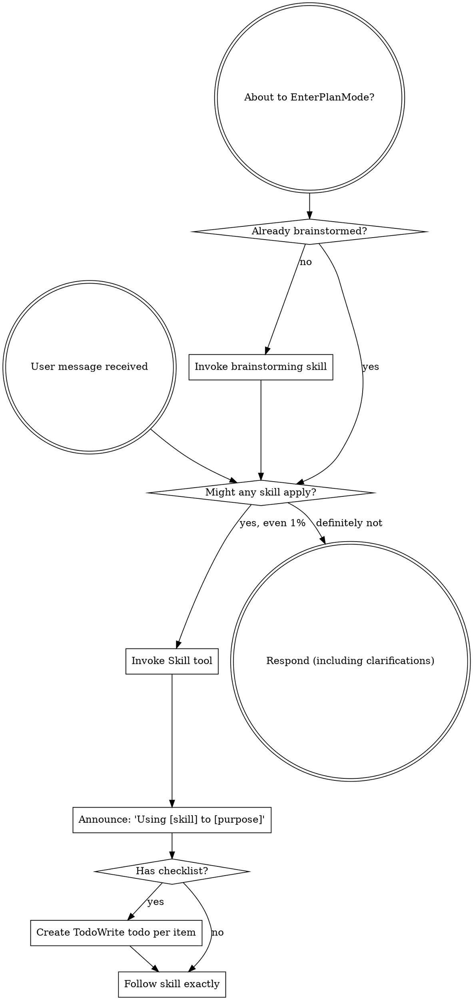
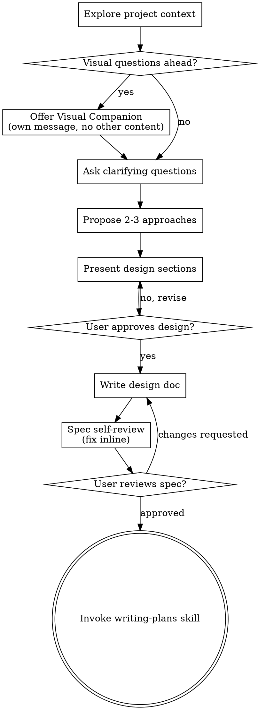
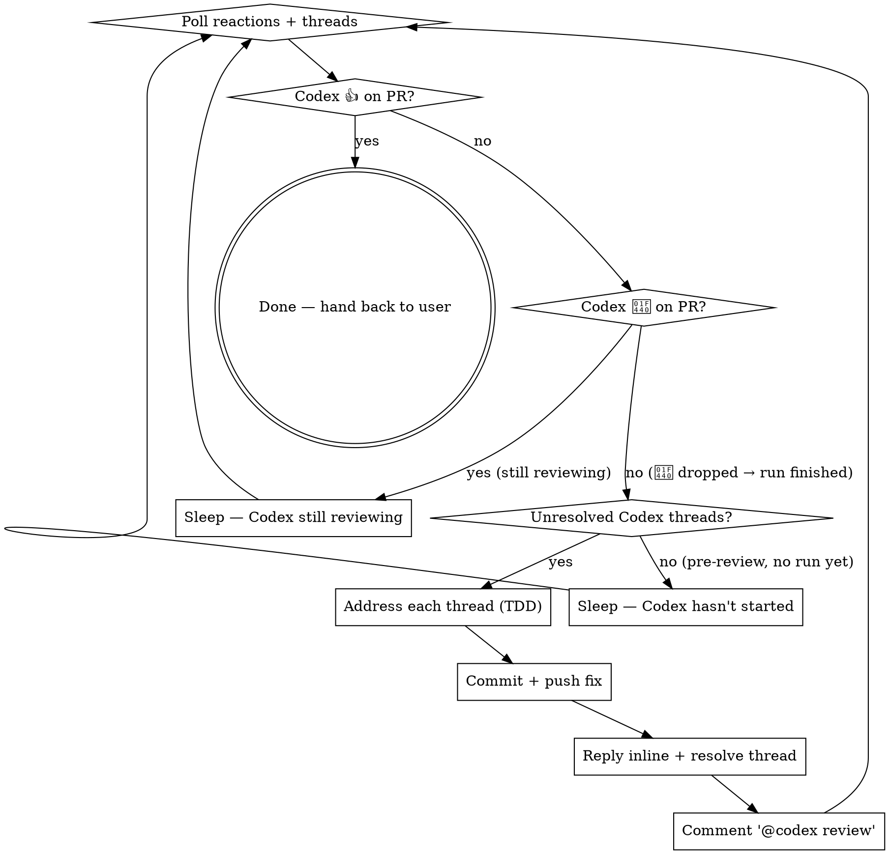
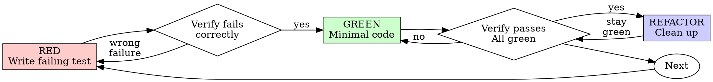

> SYSTEM

# AGENTS.md instructions for /Users/ericson/.t3/worktrees/ars-ui/t3code-0baff5e5

<INSTRUCTIONS>
# ars-ui

## Project Overview

Rust frontend component library using state machines, framework-agnostic core with Leptos/Dioxus adapters.

## Current Phase

The repo is now in active implementation, not spec drafting only.

Agents working on implementation should use the GitHub Project roadmap and issue backlog as the execution source of truth:

- Use the GitHub Project `ars-ui implementation roadmap` to understand active epics, task breakdown, dependencies, status, and iteration planning.
- Prefer picking a single issue-backed task that is unblocked, sized, and scoped for independent delivery.
- Do not start work from an epic issue unless the user explicitly asks for planning or further decomposition.
- Do not start a task that is blocked by unresolved GitHub issue dependencies.
- Treat native GitHub issue dependencies as the blocker graph and the issue body acceptance criteria as the delivery contract.

## Development Workflow

For implementation tasks:

1. Read the assigned or selected GitHub issue first.
2. Move the issue to **In Progress** on the GitHub Project board.
3. Review the cited spec sections and any dependency issues.
4. Add or update the named tests first.
5. Implement only the scope required to make those tests pass.
6. If implementation changes the intended contract, update the relevant spec in the same task.
7. **MANDATORY:** Invoke the `post-implementation-audit` skill (`.agents/skills/post-implementation-audit/SKILL.md`). It runs three sequential audits on the new code — (a) spec/implementation drift with "best outcome" recommendations, (b) iterative "anything else missing?" passes (minimum two rounds), (c) test-coverage audit across every test type the workspace uses (unit, snapshot, proptest, mutation, doc, spec-conformance, llvm-cov). **Every finding lands in _this_ PR — no deferral, no follow-up issues.** This step exists because initial implementations consistently ship spec drift and silent contract violations that take 3+ review round-trips to surface; the audit collapses them into one. Skipping this step is a contract violation.
8. Present the final result for user review before any commit.
9. After user approval, run `cargo xci --profile fast` (alias: `cargo xci-fast`) locally and fix any failures before pushing anything to GitHub. The fast profile takes ~5 minutes and covers the workspace-level regressions a pre-push gate should catch: fmt, check, clippy, unit, integration, adapter, spec-compile-snippets, error-variant-coverage, mutual-exclusion, snapshot-count. Reserve full `cargo xci` (~25 minutes, all 20 gates including wasm coverage and the feature-matrix groups) for after substantial refactors that may have shifted feature-flag interactions. For small follow-up changes, run the focused tests and checks that cover the edited code instead.
10. After `cargo xci-fast` passes, commit and push a PR targeting `main`. The PR body MUST include an auto-close keyword for the issue being delivered, for example `Closes #20` or `Fixes #20`, so GitHub closes the issue automatically when the PR merges.
11. **If the PR creates or modifies any `.snap` insta fixtures, attach the `snapshot-reviewed` label after opening or updating it** (`gh pr edit <num> --add-label "snapshot-reviewed"`). This signals to reviewers that the snapshot output was inspected and is intentional. Re-apply the label whenever you push a commit that touches `.snap` files; the workflow assumes the label reflects the latest snapshot state.
12. **MANDATORY:** Invoke the `waiting-for-codex-review` skill (`.agents/skills/waiting-for-codex-review/SKILL.md`) immediately after the first push that creates the PR, and re-invoke it after every subsequent push to the PR branch. The skill posts the initial `@codex review` trigger, polls Codex's 👀 → (👍 \| ∅ + threads) reaction lifecycle, addresses any review threads with the same rigor as `post-implementation-audit` (TDD + no coverage regression), replies inline, resolves threads, and re-comments `@codex review` to start the next pass — looping until Codex leaves 👍. Skipping this step leaves Codex findings unaddressed and silently widens the gap between merged code and the spec; the merge gate is 👍 from Codex plus green CI, not green CI alone.
13. Only after CI passes, Codex has left 👍, and the PR is merged, close the issue.

Never close a GitHub issue without a merged PR that passes CI **and a 👍 from Codex**. Never commit or push without explicit user approval. Keep the issue, PR, and Project board status aligned with the actual work state at every step.

Default delivery rules:

- Follow TDD: tests first, implementation second, verification last.
- Keep task scope aligned with the issue. If the issue is too large or ambiguous, stop and split or clarify rather than freelancing a bigger change.
- Prefer tasks sized `1`, `2`, `3`, or `5` points. `8` is exceptional. `13` must be decomposed before implementation.
- Preserve the crate and dependency layering defined by the architecture and implementation plan.
- Do not add a new dependency crate without explicit user approval first. If a task appears to need a new crate, stop, explain why, and get approval before editing any `Cargo.toml`.
- When a task is complete, verify the exact tests and checks named by the issue before considering it done.
- For adapter-level component implementation, follow `docs/implementation/adapter-component-delivery.md`. Adapter component work must cover the adapter crate, adapter tests, E2E fixtures/harnesses when applicable, widgets examples, spec synchronization, and the required validation/audit loop in one PR.

### Code Quality Standards

- **Document all public items.** Every public struct, enum, trait, function, constant, type alias, method, field, and variant must have a `///` doc comment. Every `lib.rs` must have a `//!` crate-level doc comment. The workspace enforces `missing_docs` linting — undocumented public items are build failures.
- **Zero warnings policy.** All code must compile with zero warnings under the workspace's configured clippy and rustc lints. Fix the root cause instead of suppressing. When suppression is genuinely needed, use `#[expect(lint, reason = "...")]` — never `#[allow(...)]`.
- **Derive documentation from the spec.** Doc comments should describe the _purpose and semantics_ of the item as defined in the corresponding `spec/` files, not just restate the type signature.
- **Use `#[inline]` selectively, not mechanically.** Do **not** add Clippy's `missing_inline_in_public_items` lint at the workspace level, and do not treat public visibility alone as a reason to mark an item `#[inline]`. Use `#[inline]` for thin cross-crate wrappers, trivial accessors, and hot-path no-op shims where the call overhead is plausibly meaningful. Avoid blanket `#[inline]` on all public APIs — it increases code size, adds compile-time cost, and turns `#[inline]` into noise instead of a deliberate performance signal.
- **Use directory-backed modules with `mod.rs` when a module owns children.** This repo standardizes on the older filesystem layout for nested modules. If module `foo` has child modules, the parent must live at `foo/mod.rs`, not `foo.rs`. Do not mix `foo.rs` with a sibling `foo/` directory. When a refactor adds child modules under an existing flat file, move the parent into `foo/mod.rs` in the same change. Do not leave empty leftover module directories behind.

### API Design Standards

- **Design for the pit of success.** Public APIs should make the most natural, shortest path also be the path that is correct, accessible, localizable, type-safe, and performant. Prefer ergonomic constructors and defaults that preserve the spec's strongest guarantees instead of making users opt into correctness after choosing a convenient API.
- **Name escape hatches explicitly.** When a component needs a lower-level, static, non-i18n, or otherwise less complete path, keep it available but make the tradeoff visible in the API name or type. The blessed path should remain the simplest call site, while escape hatches should read as deliberate choices.
- **Keep semantic data separate from rendered views.** Rich framework views are useful for customization, but components still need semantic sources for accessible names, localized text, announcements, ids, and state-machine wiring. Do not rely on arbitrary rendered view trees as the only source of user-facing semantics.

### Code Coverage

The workspace uses `cargo-llvm-cov` for code coverage with per-crate threshold enforcement. CI runs coverage on every PR (see `.github/workflows/ci.yml`).

**Local coverage commands:**

```bash
# Per-crate coverage with inline annotated source (most useful during development)
cargo llvm-cov test -p ars-interactions --text -- hover

# Per-crate summary only
cargo llvm-cov test -p ars-interactions -- hover

# Native-only workspace coverage (host target; excludes wasm-only crates)
cargo llvm-cov --workspace \
  --exclude ars-leptos --exclude ars-dioxus \
  --exclude ars-test-harness-leptos --exclude ars-test-harness-dioxus \
  --exclude ars-derive --exclude xtask \
  --lcov --output-path lcov.info

# Check all crates against spec-defined thresholds (run after a *merged* lcov)
cargo xtask coverage check-all --file lcov.info
```

The `--text` flag produces line-by-line annotated source showing hit counts and `^0` markers on uncovered branches — use this to identify gaps after writing tests. Uncovered no-op callback closures in tests (e.g., `|_| {}`) are expected and not a gap.

The local recipe above excludes the adapter and adapter-test-harness crates because their `target_arch = "wasm32"` / `feature = "web"` code paths can't be measured via host-target `cargo llvm-cov`. **CI runs an additional wasm-coverage pipeline on nightly** (`cargo xtask ci coverage`) that uses `wasm-bindgen-test`'s experimental coverage recipe with LLVM 22 / `clang-22` to emit lcov for `ars-leptos` (csr), `ars-dioxus` (web), `ars-dom` (web), `ars-i18n` (web-intl), and the adapter test harnesses, then merges with the native lcov via `cargo xtask coverage merge`. The per-crate thresholds in `xtask::coverage::default_thresholds()` are enforced against the merged file — including adapter targets (`ars-leptos` 74/55, `ars-dioxus` 77/70, `ars-test-harness-leptos` 60/0, `ars-test-harness-dioxus` 60/0). `ars-derive` (proc-macro, runs in compiler) is exercised via `crates/ars-core/tests/derive_contract.rs` and is unmeasured. `xtask` has its own enforced threshold (30/35) and is measured. See `spec/testing/14-ci.md` §2 for the full pipeline.

### Mutation Testing

Coverage tells you which lines run. **Mutation testing tells you whether the tests would notice if those lines silently misbehaved.** The workspace uses [`cargo-mutants`](https://mutants.rs) for this — a `cargo` extension binary, not a workspace dependency.

**Install (once per developer machine):**

```bash
cargo install cargo-mutants --locked --version 27.0.0
```

**Local commands (state-machine modules are the most rewarding targets):**

```bash
# Run on a single component machine (~6 min for popover)
cargo mutants -p ars-components -f crates/ars-components/src/overlay/popover/mod.rs

# Just list what would be mutated, without running tests (fast)
cargo mutants -p ars-components -f crates/ars-components/src/overlay/popover/mod.rs --list

# Whole crate (slow — only if you really mean it)
cargo mutants -p ars-components
```

**Agnostic component implementation gate:** whenever an agent implements a new framework-agnostic component, or materially changes an existing one, the delivery must include:

- a targeted mutation run for the component source file, usually `cargo mutants -p ars-components -f crates/ars-components/src/<category>/<component>/mod.rs` (adjust the path for single-file modules);
- spec-conformance tests for the component's anatomy/public contract, including its `Part` enum and required API/attribute surface;
- same-task triage of every `MISSED` mutant: add tests for real gaps, or add a justified line-agnostic `.cargo/mutants.toml` exclude only for true equivalent mutations.

**Reading the output:** Results land in `mutants.out/mutants.out/` (gitignored). The two files that matter:

- `caught.txt` — mutations that broke at least one test ✅
- `missed.txt` — mutations that survived all tests ❌ — each one is either a real test gap to fill or an "equivalent mutation" that needs a `[[skip]]` entry in `mutants.toml` with a justification

**CI integration:** Nightly only. `.github/workflows/nightly.yml` has a `mutation-testing` job with a 21-entry matrix that runs `cargo mutants -p <package>` on every framework-agnostic crate, using `--shard k/n` to spread larger crates across parallel runners. **Shard indices are 0-based** (`k` runs from `0` to `n-1`); `k == n` is invalid and will fail the job. When adding shards, always start at `0/n` and end at `(n-1)/n`.

- **`ars-components` (≈ 1,630 mutants today, planned to grow as the spec adds the remaining ~97 components):** sharded **12-way** → ≈ 135 mutants per runner today, ≈ 850 per runner at the ~10,000-mutant endpoint. Sized for the full spec catalog up front so we don't re-shard every few months as components land.
- **`ars-collections` (≈ 1,080 mutants):** sharded 4-way → ≈ 270 mutants per runner.
- **`ars-core` (≈ 700 mutants):** sharded 2-way → ≈ 350 mutants per runner.
- **`ars-a11y`, `ars-forms`, `ars-interactions`:** one runner each (under 600 mutants apiece).

**Adding a new state machine inside an existing crate requires no CI changes** — its mutations land in whichever shard the cargo-mutants partitioner places them. The shard counts are sized so the slowest runner stays well under 30 minutes today and under ~50 minutes at the planned endpoint; re-balance only when a crate outgrows that budget (visible on the nightly dashboard as one shard pulling away from the others).

All matrix jobs run with `fail-fast: false` so failures on one module don't mask data on another. Each job uploads its `mutants.out/` as a workflow artifact (always, even on success — surviving "missed" entries on a passing run still reveal test-quality work). The job fails if any mutation survives, so a missed mutation forces a deliberate triage decision (fix the test, or document the equivalence with a `[[skip]]` entry in `mutants.toml`).

**Excluded crates** (mutation testing's signal degrades wherever determinism does): adapter glue (`ars-leptos`, `ars-dioxus`), DOM/FFI (`ars-dom`), ICU/FFI (`ars-i18n`), test infrastructure (`ars-test-harness*`), and the proc-macro crate (`ars-derive`, runs in the compiler). Adding a brand-new crate that is a good mutation target requires one new matrix entry; run a local scout first (`cargo mutants -p <crate> --list` to size, then a real run) so we know the right shard count before the nightly fires.

**Bumping the pinned version.** Both the local install command above and `.github/workflows/nightly.yml` pin cargo-mutants to an exact version (currently `27.0.0`) — same convention as `wasm-pack` in the `a11y-audit` job. Pinning is deliberate: cargo-mutants ships new mutators in releases, and an unpinned install would silently change the mutation set without any code change, surfacing as phantom CI failures on a green-source repo. To bump, open a PR that (1) updates the version string in CLAUDE.md and `nightly.yml`, (2) runs the popover scout locally with the new version (`cargo mutants -p ars-components -f crates/ars-components/src/overlay/popover/mod.rs`) to confirm the mutation count is in the same ballpark, and (3) triages any new "missed" entries the new mutators surface — they are usually genuine test-quality gaps newly visible to the tool.

### Property Testing (proptest)

State-machine invariants are exercised by [`proptest`](https://docs.rs/proptest) under `crates/<crate>/tests/proptest_state_machines/` (see `ars-components`). Default proptest behaviour drops `*.proptest-regressions` seed files alongside test sources — instead, every `proptest!` block in this workspace pulls a shared `Config` from `tests/proptest_state_machines/common.rs` that:

1. Reads `PROPTEST_CASES` from the environment (1,000 default; 10,000 in the nightly `extended-proptest` job).
2. Sets `failure_persistence` to `FileFailurePersistence::Direct("proptest-regressions/state-machines.txt")`, so all persisted seeds for the test binary live in one file at the crate root: `crates/<crate>/proptest-regressions/state-machines.txt`. The directory is committed (per proptest's own recommendation in the file header) so every developer's runs benefit from previously-shrunk failures.

When a new crate adopts proptest for state-machine tests, copy the same `common.rs` helper and reference it via `#![proptest_config(super::common::proptest_config())]` inside every `proptest!` block. Don't let proptest fall back to its `WithSource` default — that scatters seed files across the source tree.

### Adapter Prelude Convention

Both `ars-leptos` and `ars-dioxus` expose a `prelude` module targeting **end users** — application developers who consume the ready-made components. `use ars_leptos::prelude::*` (or `use ars_dioxus::prelude::*`) should give them everything they need.

The prelude contains only user-facing items:

1. **Component modules** — as components land, their public module paths (e.g., `button`, `dialog`) are re-exported so users can write `button::Props`, etc.
2. **User-facing traits** — traits end users call on component outputs (e.g., `Translate` from `ars-i18n`). Re-export the trait so consumers don't need a direct dependency on the subsystem crate.
3. **Configuration types** — types that appear in component props or configure behaviour (e.g., `Locale`, `Direction`, `Orientation`, `Selection`).

The prelude does **not** include implementation details consumed only by component authors inside the adapter crate: core engine types (`Machine`, `Service`, `ConnectApi`, `AttrMap`), accessibility primitives (`AriaRole`, `AriaAttribute`), interaction helpers (`merge_attrs`), or adapter hooks (`use_machine`, `UseMachineReturn`). Those remain accessible via their normal crate paths for advanced users building custom machines.

Both adapter preludes must stay symmetric: same items, same structure. When adding a new re-export to one adapter's prelude, add it to the other as well in the same PR.

### Adapter Testing Convention

Adapter-level component tests should default to the framework-specific test harness crate:

- Leptos adapter tests should prefer `ars-test-harness-leptos`.
- Dioxus adapter tests should prefer `ars-test-harness-dioxus`.
- Shared `ars-test-harness` helpers should be used where relevant for viewport, layout, clipboard, drag/drop, timing, and other DOM test setup instead of bespoke per-test browser scaffolding.

When a component spec requires interaction, focus, overlay positioning, clipboard, file upload, drag/drop, or similar browser behavior, the task's tests should exercise that behavior through the adapter harness entrypoints and shared core harness helpers unless there is a concrete technical reason not to.

## Spec Synchronization During Implementation

The specification is the authoritative contract. It took weeks of deliberate design and MUST be followed.

### Spec-first implementation rule

Before implementing any public type, trait, function, or method:

1. **Read the spec section first.** Find the relevant code example in `spec/`. Use `spec-tool toc <file>` and `grep` to locate it.
2. **Match the spec exactly.** If the spec defines `struct ComponentIds { base: String }` with methods `from_id()`, `id()`, `part()`, `item()`, `item_part()` — implement exactly that. Do not invent alternative field names, method names, or signatures.
3. **Cross-check after implementation.** Before presenting code for review, diff every public item against the spec's code examples. Every struct field, every method name, every parameter must match.
4. **If you must deviate**, there must be a concrete technical reason (e.g., the spec's API cannot compile, or a dependency doesn't expose the needed type). Document the reason in a code comment and flag it to the user explicitly.

Inventing alternative APIs that "seem equivalent" is never acceptable — it silently invalidates the spec's design decisions and all downstream code that depends on those APIs.

### Spec/code mismatch resolution

- If code and spec disagree, resolve the mismatch in the same task or PR.
- Shared conceptual changes belong in shared or foundation spec files, not only in adapter code.
- Adapter-specific findings must be reflected back into `spec/foundation/08-adapter-leptos.md` and/or `spec/foundation/09-adapter-dioxus.md` when relevant.
- Do not leave spec drift behind as follow-up cleanup.

## Spec Structure

The specification lives in `spec/` with this layout:

- `spec/manifest.toml` — **START HERE** — central index of all components and their dependencies
- `spec/foundation/` — architecture, accessibility, i18n, interactions, forms, adapters, spec template (00-10)
- `spec/shared/` — cross-component shared types (date-time, selection, layout, z-index)
- `spec/components/{category}/` — one file per component, organized by category
- `spec/testing/` — test specs split by domain

### Component Categories

- `input/` — checkbox, text-field, slider, number-input, etc.
- `selection/` — select, combobox, listbox, menu, tags-input, etc.
- `overlay/` — dialog, popover, tooltip, toast, presence, etc.
- `navigation/` — accordion, tabs, tree-view, pagination, steps, etc.
- `date-time/` — date-field, time-field, calendar, date-picker, etc.
- `data-display/` — table, avatar, progress, meter, badge, etc.
- `layout/` — splitter, scroll-area, carousel, portal, toolbar, etc.
- `specialized/` — color-picker, file-upload, signature-pad, qr-code, etc.
- `utility/` — button, toggle, focus-scope, visually-hidden, separator, etc.

## Working with the Spec

When reading large files, run `wc -l` first to check the line count. If the file is over 2,000
lines, use the `offset` and `limit` parameters on the Read tool to read in chunks rather than
attempting to read the entire file at once.

### Using xtask spec (preferred)

Use `cargo xtask spec` to resolve file sets instead of manually parsing manifest.toml:

```bash
# Quick metadata lookup:
cargo xtask spec info <component>

# Find all components using a shared type:
cargo xtask spec reverse <shared-type>

# See a file's heading structure (with line numbers):
cargo xtask spec toc <file>

# Validate frontmatter matches manifest.toml:
cargo xtask spec validate

# Search spec content by keyword/regex (with optional filters):
cargo xtask spec search <query> [--category <cat>] [--section <sec>] [--tier <tier>]

# Get a compact component summary (states, events, props, accessibility):
cargo xtask spec digest <component>

# Get full implementation context (component + all deps concatenated):
cargo xtask spec context <component> [--framework <fw>] [--include-testing]
```

The xtask also runs as an MCP server (`cargo xtask mcp`) exposing all spec tools for LLM agents.

### Reading a component (manual fallback)

1. Read `spec/manifest.toml` to find the component's path and dependencies
2. Read the component file (has YAML frontmatter listing its foundation/shared deps)
3. Only load the foundation files listed in `foundation_deps` — not all of them

### Framework and library specs — MANDATORY skill loading

When reading or editing these specification files, you MUST load the corresponding skill BEFORE doing any work. The skills contain verified, version-accurate API documentation that the spec code examples depend on. Claude's training data is wrong for these libraries — do not trust it.

| Spec file                                    | Skill to load | Library version |
| -------------------------------------------- | ------------- | --------------- |
| `spec/foundation/04-internationalization.md` | `icu4x`       | ICU4X 2.1.1     |
| `spec/foundation/08-adapter-leptos.md`       | `leptos`      | Leptos 0.8.17   |
| `spec/foundation/09-adapter-dioxus.md`       | `dioxus`      | Dioxus 0.7.3    |

This applies to any task that touches adapter code: reviewing, writing, modifying, or answering questions about these files. Load the skill first, then proceed.

### Spec Conventions

- **No deprecation:** This is a greenfield spec. If an API is unused or redundant, remove it and fix all references. Never use `#[deprecated]` or deprecation shims.
- **No deferral:** Never mark spec content as "TODO", "FIXME", "future enhancement", "P1/P2 extension", or any similar deferral language. Every feature mentioned must be fully specified. If a design choice is unclear, ask the user rather than deferring.
- **No guessing external APIs:** NEVER guess function names or module paths for external crates. Always verify against `https://docs.rs/<crate_name>` before writing code that calls library APIs. This applies especially to Leptos, Dioxus, ICU4X, and any crate where training data may be stale. If you cannot verify, state that explicitly rather than fabricating a plausible-looking API.

### Component file format

Each component file has YAML frontmatter declaring its metadata:

```markdown
---
component: ComponentName
category: { category }
tier: stateless | stateful | complex
foundation_deps: [architecture, accessibility, ...]
shared_deps: [date-time-types, ...]
related: [sibling-component, ...]
---

# ComponentName
```

The `tier` field determines which sections are required — see `spec/foundation/10-component-spec-template.md` for the canonical section structure, ordering rules, and conformance checklist. Headings are numbered (e.g., `## 1. State Machine`, `### 1.1 States`, `#### 1.1.1 InnerStates`, etc.) for precise section references.

</INSTRUCTIONS>
<environment_context>
  <cwd>/Users/ericson/.t3/worktrees/ars-ui/t3code-0baff5e5</cwd>
  <shell>zsh</shell>
  <current_date>2026-05-24</current_date>
  <timezone>America/Sao_Paulo</timezone>
</environment_context>

> DEVELOPER

Implement task #217

> AGENT

I’ll use the Superpowers workflow skills here because this is an issue-backed implementation request, and we’re currently in Plan Mode, so I’ll ground the plan in the repo and GitHub issue before proposing execution steps.

> TOOL

tool_use exec_command
id: call_iD4xmuPAFUOjgSJLFRexgpPr
```json
{
  "cmd": "sed -n '1,220p' /Users/ericson/.claude/skills/using-superpowers/SKILL.md",
  "workdir": "/Users/ericson/.t3/worktrees/ars-ui/t3code-0baff5e5",
  "yield_time_ms": 1000,
  "max_output_tokens": 12000
}
```

> TOOL

tool_use exec_command
id: call_cMAPEMQIr4Jl0vs8TfjbzLh1
```json
{
  "cmd": "rg -n \"#217|issue #217|217|ToggleButton|task #217\" /Users/ericson/.codex/memories/MEMORY.md",
  "workdir": "/Users/ericson/.t3/worktrees/ars-ui/t3code-0baff5e5",
  "yield_time_ms": 1000,
  "max_output_tokens": 12000
}
```

> TOOL

tool_result
id: call_iD4xmuPAFUOjgSJLFRexgpPr
```
Chunk ID: 9baef9
Wall time: 0.0069 seconds
Process exited with code 0
Original token count: 1356
Output:
---
name: using-superpowers
description: Use when starting any conversation - establishes how to find and use skills, requiring Skill tool invocation before ANY response including clarifying questions
---

<SUBAGENT-STOP>
If you were dispatched as a subagent to execute a specific task, skip this skill.
</SUBAGENT-STOP>

<EXTREMELY-IMPORTANT>
If you think there is even a 1% chance a skill might apply to what you are doing, you ABSOLUTELY MUST invoke the skill.

IF A SKILL APPLIES TO YOUR TASK, YOU DO NOT HAVE A CHOICE. YOU MUST USE IT.

This is not negotiable. This is not optional. You cannot rationalize your way out of this.
</EXTREMELY-IMPORTANT>

## Instruction Priority

Superpowers skills override default system prompt behavior, but **user instructions always take precedence**:

1. **User's explicit instructions** (CLAUDE.md, GEMINI.md, AGENTS.md, direct requests) — highest priority
2. **Superpowers skills** — override default system behavior where they conflict
3. **Default system prompt** — lowest priority

If CLAUDE.md, GEMINI.md, or AGENTS.md says "don't use TDD" and a skill says "always use TDD," follow the user's instructions. The user is in control.

## How to Access Skills

**In Claude Code:** Use the `Skill` tool. When you invoke a skill, its content is loaded and presented to you—follow it directly. Never use the Read tool on skill files.

**In Copilot CLI:** Use the `skill` tool. Skills are auto-discovered from installed plugins. The `skill` tool works the same as Claude Code's `Skill` tool.

**In Gemini CLI:** Skills activate via the `activate_skill` tool. Gemini loads skill metadata at session start and activates the full content on demand.

**In other environments:** Check your platform's documentation for how skills are loaded.

## Platform Adaptation

Skills use Claude Code tool names. Non-CC platforms: see `references/copilot-tools.md` (Copilot CLI), `references/codex-tools.md` (Codex) for tool equivalents. Gemini CLI users get the tool mapping loaded automatically via GEMINI.md.

# Using Skills

## The Rule

**Invoke relevant or requested skills BEFORE any response or action.** Even a 1% chance a skill might apply means that you should invoke the skill to check. If an invoked skill turns out to be wrong for the situation, you don't need to use it.



## Red Flags

These thoughts mean STOP—you're rationalizing:

| Thought | Reality |
|---------|---------|
| "This is just a simple question" | Questions are tasks. Check for skills. |
| "I need more context first" | Skill check comes BEFORE clarifying questions. |
| "Let me explore the codebase first" | Skills tell you HOW to explore. Check first. |
| "I can check git/files quickly" | Files lack conversation context. Check for skills. |
| "Let me gather information first" | Skills tell you HOW to gather information. |
| "This doesn't need a formal skill" | If a skill exists, use it. |
| "I remember this skill" | Skills evolve. Read current version. |
| "This doesn't count as a task" | Action = task. Check for skills. |
| "The skill is overkill" | Simple things become complex. Use it. |
| "I'll just do this one thing first" | Check BEFORE doing anything. |
| "This feels productive" | Undisciplined action wastes time. Skills prevent this. |
| "I know what that means" | Knowing the concept ≠ using the skill. Invoke it. |

## Skill Priority

When multiple skills could apply, use this order:

1. **Process skills first** (brainstorming, debugging) - these determine HOW to approach the task
2. **Implementation skills second** (frontend-design, mcp-builder) - these guide execution

"Let's build X" → brainstorming first, then implementation skills.
"Fix this bug" → debugging first, then domain-specific skills.

## Skill Types

**Rigid** (TDD, debugging): Follow exactly. Don't adapt away discipline.

**Flexible** (patterns): Adapt principles to context.

The skill itself tells you which.

## User Instructions

Instructions say WHAT, not HOW. "Add X" or "Fix Y" doesn't mean skip workflows.

```

> TOOL

tool_result
id: call_cMAPEMQIr4Jl0vs8TfjbzLh1
```
Chunk ID: a9a48d
Wall time: 0.1338 seconds
Process exited with code 0
Original token count: 307
Output:
52:## Task 1: Implement ToggleButton agnostic core, resolve Codex review findings, and finish PR #668
60:- ToggleButton, toggle_button, toggle-button, issue #215, Bindable<bool>, hidden_input_config, SetPressed, Reset, TransitionPlan::new, cargo mutants, PR #668
102:- `ToggleButton` lives at `crates/ars-components/src/utility/toggle_button/mod.rs`, is exported from `crates/ars-components/src/utility/mod.rs`, and follows the existing `button` / `toggle` conventions with `State::{Idle, Focused, Pressed}`, `Event::{Focus, Blur, Press, Release, Toggle, SetPressed, SetDisabled, Reset}`, `Effect::PressedChange`, `root_attrs()`, and `hidden_input_config()` [Task 1]
103:- the correct no-op rule for ToggleButton-like value sync is: if the requested pressed value already matches the current state, return `TransitionPlan::new()` rather than a synthetic state transition that reports `state_changed=true` [Task 1]
117:- symptom: a first-pass ToggleButton machine looks correct but review says controlled props desynchronize while disabled -> cause: disabled `SetPressed` was treated like a user-activation event instead of prop sync -> fix: allow disabled `SetPressed`, and test the controlled-disabled path directly [Task 1]

```

> TOOL

tool_use exec_command
id: call_DFOoohKf7K8AcEWk0GE2WNFQ
```json
{
  "cmd": "sed -n '1,220p' /Users/ericson/.claude/skills/brainstorming/SKILL.md",
  "workdir": "/Users/ericson/.t3/worktrees/ars-ui/t3code-0baff5e5",
  "yield_time_ms": 1000,
  "max_output_tokens": 12000
}
```

> TOOL

tool_use exec_command
id: call_frZouuPMrNC1LABbLQo4KjcY
```json
{
  "cmd": "sed -n '1,240p' /Users/ericson/.claude/skills/writing-plans/SKILL.md",
  "workdir": "/Users/ericson/.t3/worktrees/ars-ui/t3code-0baff5e5",
  "yield_time_ms": 1000,
  "max_output_tokens": 14000
}
```

> TOOL

tool_use exec_command
id: call_lPN0g2y6tvLeN5UN4HQNZOAP
```json
{
  "cmd": "sed -n '1,220p' /Users/ericson/.codex/plugins/cache/openai-curated/github/6188456f/skills/github/SKILL.md",
  "workdir": "/Users/ericson/.t3/worktrees/ars-ui/t3code-0baff5e5",
  "yield_time_ms": 1000,
  "max_output_tokens": 12000
}
```

> TOOL

tool_result
id: call_DFOoohKf7K8AcEWk0GE2WNFQ
```
Chunk ID: 6ad77b
Wall time: 0.1711 seconds
Process exited with code 0
Original token count: 2659
Output:
---
name: brainstorming
description: "You MUST use this before any creative work - creating features, building components, adding functionality, or modifying behavior. Explores user intent, requirements and design before implementation."
---

# Brainstorming Ideas Into Designs

Help turn ideas into fully formed designs and specs through natural collaborative dialogue.

Start by understanding the current project context, then ask questions one at a time to refine the idea. Once you understand what you're building, present the design and get user approval.

<HARD-GATE>
Do NOT invoke any implementation skill, write any code, scaffold any project, or take any implementation action until you have presented a design and the user has approved it. This applies to EVERY project regardless of perceived simplicity.
</HARD-GATE>

## Anti-Pattern: "This Is Too Simple To Need A Design"

Every project goes through this process. A todo list, a single-function utility, a config change — all of them. "Simple" projects are where unexamined assumptions cause the most wasted work. The design can be short (a few sentences for truly simple projects), but you MUST present it and get approval.

## Checklist

You MUST create a task for each of these items and complete them in order:

1. **Explore project context** — check files, docs, recent commits
2. **Offer visual companion** (if topic will involve visual questions) — this is its own message, not combined with a clarifying question. See the Visual Companion section below.
3. **Ask clarifying questions** — one at a time, understand purpose/constraints/success criteria
4. **Propose 2-3 approaches** — with trade-offs and your recommendation
5. **Present design** — in sections scaled to their complexity, get user approval after each section
6. **Write design doc** — save to `docs/superpowers/specs/YYYY-MM-DD-<topic>-design.md` and commit
7. **Spec self-review** — quick inline check for placeholders, contradictions, ambiguity, scope (see below)
8. **User reviews written spec** — ask user to review the spec file before proceeding
9. **Transition to implementation** — invoke writing-plans skill to create implementation plan

## Process Flow



**The terminal state is invoking writing-plans.** Do NOT invoke frontend-design, mcp-builder, or any other implementation skill. The ONLY skill you invoke after brainstorming is writing-plans.

## The Process

**Understanding the idea:**

- Check out the current project state first (files, docs, recent commits)
- Before asking detailed questions, assess scope: if the request describes multiple independent subsystems (e.g., "build a platform with chat, file storage, billing, and analytics"), flag this immediately. Don't spend questions refining details of a project that needs to be decomposed first.
- If the project is too large for a single spec, help the user decompose into sub-projects: what are the independent pieces, how do they relate, what order should they be built? Then brainstorm the first sub-project through the normal design flow. Each sub-project gets its own spec → plan → implementation cycle.
- For appropriately-scoped projects, ask questions one at a time to refine the idea
- Prefer multiple choice questions when possible, but open-ended is fine too
- Only one question per message - if a topic needs more exploration, break it into multiple questions
- Focus on understanding: purpose, constraints, success criteria

**Exploring approaches:**

- Propose 2-3 different approaches with trade-offs
- Present options conversationally with your recommendation and reasoning
- Lead with your recommended option and explain why

**Presenting the design:**

- Once you believe you understand what you're building, present the design
- Scale each section to its complexity: a few sentences if straightforward, up to 200-300 words if nuanced
- Ask after each section whether it looks right so far
- Cover: architecture, components, data flow, error handling, testing
- Be ready to go back and clarify if something doesn't make sense

**Design for isolation and clarity:**

- Break the system into smaller units that each have one clear purpose, communicate through well-defined interfaces, and can be understood and tested independently
- For each unit, you should be able to answer: what does it do, how do you use it, and what does it depend on?
- Can someone understand what a unit does without reading its internals? Can you change the internals without breaking consumers? If not, the boundaries need work.
- Smaller, well-bounded units are also easier for you to work with - you reason better about code you can hold in context at once, and your edits are more reliable when files are focused. When a file grows large, that's often a signal that it's doing too much.

**Working in existing codebases:**

- Explore the current structure before proposing changes. Follow existing patterns.
- Where existing code has problems that affect the work (e.g., a file that's grown too large, unclear boundaries, tangled responsibilities), include targeted improvements as part of the design - the way a good developer improves code they're working in.
- Don't propose unrelated refactoring. Stay focused on what serves the current goal.

## After the Design

**Documentation:**

- Write the validated design (spec) to `docs/superpowers/specs/YYYY-MM-DD-<topic>-design.md`
  - (User preferences for spec location override this default)
- Use elements-of-style:writing-clearly-and-concisely skill if available
- Commit the design document to git

**Spec Self-Review:**
After writing the spec document, look at it with fresh eyes:

1. **Placeholder scan:** Any "TBD", "TODO", incomplete sections, or vague requirements? Fix them.
2. **Internal consistency:** Do any sections contradict each other? Does the architecture match the feature descriptions?
3. **Scope check:** Is this focused enough for a single implementation plan, or does it need decomposition?
4. **Ambiguity check:** Could any requirement be interpreted two different ways? If so, pick one and make it explicit.

Fix any issues inline. No need to re-review — just fix and move on.

**User Review Gate:**
After the spec review loop passes, ask the user to review the written spec before proceeding:

> "Spec written and committed to `<path>`. Please review it and let me know if you want to make any changes before we start writing out the implementation plan."

Wait for the user's response. If they request changes, make them and re-run the spec review loop. Only proceed once the user approves.

**Implementation:**

- Invoke the writing-plans skill to create a detailed implementation plan
- Do NOT invoke any other skill. writing-plans is the next step.

## Key Principles

- **One question at a time** - Don't overwhelm with multiple questions
- **Multiple choice preferred** - Easier to answer than open-ended when possible
- **YAGNI ruthlessly** - Remove unnecessary features from all designs
- **Explore alternatives** - Always propose 2-3 approaches before settling
- **Incremental validation** - Present design, get approval before moving on
- **Be flexible** - Go back and clarify when something doesn't make sense

## Visual Companion

A browser-based companion for showing mockups, diagrams, and visual options during brainstorming. Available as a tool — not a mode. Accepting the companion means it's available for questions that benefit from visual treatment; it does NOT mean every question goes through the browser.

**Offering the companion:** When you anticipate that upcoming questions will involve visual content (mockups, layouts, diagrams), offer it once for consent:
> "Some of what we're working on might be easier to explain if I can show it to you in a web browser. I can put together mockups, diagrams, comparisons, and other visuals as we go. This feature is still new and can be token-intensive. Want to try it? (Requires opening a local URL)"

**This offer MUST be its own message.** Do not combine it with clarifying questions, context summaries, or any other content. The message should contain ONLY the offer above and nothing else. Wait for the user's response before continuing. If they decline, proceed with text-only brainstorming.

**Per-question decision:** Even after the user accepts, decide FOR EACH QUESTION whether to use the browser or the terminal. The test: **would the user understand this better by seeing it than reading it?**

- **Use the browser** for content that IS visual — mockups, wireframes, layout comparisons, architecture diagrams, side-by-side visual designs
- **Use the terminal** for content that is text — requirements questions, conceptual choices, tradeoff lists, A/B/C/D text options, scope decisions

A question about a UI topic is not automatically a visual question. "What does personality mean in this context?" is a conceptual question — use the terminal. "Which wizard layout works better?" is a visual question — use the browser.

If they agree to the companion, read the detailed guide before proceeding:
`skills/brainstorming/visual-companion.md`

```

> TOOL

tool_result
id: call_frZouuPMrNC1LABbLQo4KjcY
```
Chunk ID: 266371
Wall time: 0.0101 seconds
Process exited with code 0
Original token count: 1512
Output:
---
name: writing-plans
description: Use when you have a spec or requirements for a multi-step task, before touching code
---

# Writing Plans

## Overview

Write comprehensive implementation plans assuming the engineer has zero context for our codebase and questionable taste. Document everything they need to know: which files to touch for each task, code, testing, docs they might need to check, how to test it. Give them the whole plan as bite-sized tasks. DRY. YAGNI. TDD. Frequent commits.

Assume they are a skilled developer, but know almost nothing about our toolset or problem domain. Assume they don't know good test design very well.

**Announce at start:** "I'm using the writing-plans skill to create the implementation plan."

**Context:** This should be run in a dedicated worktree (created by brainstorming skill).

**Save plans to:** `docs/superpowers/plans/YYYY-MM-DD-<feature-name>.md`
- (User preferences for plan location override this default)

## Scope Check

If the spec covers multiple independent subsystems, it should have been broken into sub-project specs during brainstorming. If it wasn't, suggest breaking this into separate plans — one per subsystem. Each plan should produce working, testable software on its own.

## File Structure

Before defining tasks, map out which files will be created or modified and what each one is responsible for. This is where decomposition decisions get locked in.

- Design units with clear boundaries and well-defined interfaces. Each file should have one clear responsibility.
- You reason best about code you can hold in context at once, and your edits are more reliable when files are focused. Prefer smaller, focused files over large ones that do too much.
- Files that change together should live together. Split by responsibility, not by technical layer.
- In existing codebases, follow established patterns. If the codebase uses large files, don't unilaterally restructure - but if a file you're modifying has grown unwieldy, including a split in the plan is reasonable.

This structure informs the task decomposition. Each task should produce self-contained changes that make sense independently.

## Bite-Sized Task Granularity

**Each step is one action (2-5 minutes):**
- "Write the failing test" - step
- "Run it to make sure it fails" - step
- "Implement the minimal code to make the test pass" - step
- "Run the tests and make sure they pass" - step
- "Commit" - step

## Plan Document Header

**Every plan MUST start with this header:**

```markdown
# [Feature Name] Implementation Plan

> **For agentic workers:** REQUIRED SUB-SKILL: Use superpowers:subagent-driven-development (recommended) or superpowers:executing-plans to implement this plan task-by-task. Steps use checkbox (`- [ ]`) syntax for tracking.

**Goal:** [One sentence describing what this builds]

**Architecture:** [2-3 sentences about approach]

**Tech Stack:** [Key technologies/libraries]

---
```

## Task Structure

````markdown
### Task N: [Component Name]

**Files:**
- Create: `exact/path/to/file.py`
- Modify: `exact/path/to/existing.py:123-145`
- Test: `tests/exact/path/to/test.py`

- [ ] **Step 1: Write the failing test**

```python
def test_specific_behavior():
    result = function(input)
    assert result == expected
```

- [ ] **Step 2: Run test to verify it fails**

Run: `pytest tests/path/test.py::test_name -v`
Expected: FAIL with "function not defined"

- [ ] **Step 3: Write minimal implementation**

```python
def function(input):
    return expected
```

- [ ] **Step 4: Run test to verify it passes**

Run: `pytest tests/path/test.py::test_name -v`
Expected: PASS

- [ ] **Step 5: Commit**

```bash
git add tests/path/test.py src/path/file.py
git commit -m "feat: add specific feature"
```
````

## No Placeholders

Every step must contain the actual content an engineer needs. These are **plan failures** — never write them:
- "TBD", "TODO", "implement later", "fill in details"
- "Add appropriate error handling" / "add validation" / "handle edge cases"
- "Write tests for the above" (without actual test code)
- "Similar to Task N" (repeat the code — the engineer may be reading tasks out of order)
- Steps that describe what to do without showing how (code blocks required for code steps)
- References to types, functions, or methods not defined in any task

## Remember
- Exact file paths always
- Complete code in every step — if a step changes code, show the code
- Exact commands with expected output
- DRY, YAGNI, TDD, frequent commits

## Self-Review

After writing the complete plan, look at the spec with fresh eyes and check the plan against it. This is a checklist you run yourself — not a subagent dispatch.

**1. Spec coverage:** Skim each section/requirement in the spec. Can you point to a task that implements it? List any gaps.

**2. Placeholder scan:** Search your plan for red flags — any of the patterns from the "No Placeholders" section above. Fix them.

**3. Type consistency:** Do the types, method signatures, and property names you used in later tasks match what you defined in earlier tasks? A function called `clearLayers()` in Task 3 but `clearFullLayers()` in Task 7 is a bug.

If you find issues, fix them inline. No need to re-review — just fix and move on. If you find a spec requirement with no task, add the task.

## Execution Handoff

After saving the plan, offer execution choice:

**"Plan complete and saved to `docs/superpowers/plans/<filename>.md`. Two execution options:**

**1. Subagent-Driven (recommended)** - I dispatch a fresh subagent per task, review between tasks, fast iteration

**2. Inline Execution** - Execute tasks in this session using executing-plans, batch execution with checkpoints

**Which approach?"**

**If Subagent-Driven chosen:**
- **REQUIRED SUB-SKILL:** Use superpowers:subagent-driven-development
- Fresh subagent per task + two-stage review

**If Inline Execution chosen:**
- **REQUIRED SUB-SKILL:** Use superpowers:executing-plans
- Batch execution with checkpoints for review

```

> TOOL

tool_result
id: call_lPN0g2y6tvLeN5UN4HQNZOAP
```
Chunk ID: 8310ea
Wall time: 0.0610 seconds
Process exited with code 0
Original token count: 1089
Output:
---
name: github
description: Triage and orient GitHub repository, pull request, and issue work through the connected GitHub app. Use when the user asks for general GitHub help, wants PR or issue summaries, or needs repository context before choosing a more specific GitHub workflow.
---

# GitHub

## Overview

Use this skill as the umbrella entrypoint for general GitHub work in this plugin. It should decide whether the task stays in repo and PR triage or should be handed off to a more specific review, CI, or publish workflow.

This plugin is intentionally hybrid:

- Prefer the GitHub app from this plugin for repository, issue, pull request, comment, label, reaction, and PR creation workflows.
- Use local `git` and `gh` only when the connector does not cover the job well, especially for current-branch PR discovery, branch creation, commit and push, `gh auth status`, and GitHub Actions log inspection.
- Keep connector state and local checkout context aligned. If the request is about the current branch, resolve the local repo and branch before acting.

Once the intent is clear, route to the specialist skill immediately and do not keep broad GitHub triage in scope longer than needed.

## Connector-First Responsibilities

Handle these directly in this skill when the request does not need a narrower specialist workflow:

- repository orientation once the repo, PR, issue, or local checkout is identified
- recent PR or issue triage
- PR metadata summaries
- PR patch inspection
- PR comments, labels, and reactions
- issue lookup and summarization
- PR creation after a branch is already pushed

Prefer the GitHub app from this plugin for those flows because it provides structured PR, issue, and review-adjacent data without depending on a local checkout. If the repository is not already identifiable from the user request or local git context, ask for the repo instead of pretending there is a repo-search flow that may not exist.

## Routing Rules

1. Resolve the operating context first:
   - If the user provides a repository, PR number, issue number, or URL, use that.
   - If the request is about "this branch" or "the current PR", resolve local git context and use `gh` only as needed to discover the branch PR.
   - If the repository is still ambiguous after local inspection, ask for the repo identifier.
2. Classify the request before taking action:
   - `repo or PR triage`: summarize PRs, issues, patches, comments, labels, reactions, or repository state
   - `review follow-up`: unresolved review threads, requested changes, or inline review feedback
   - `CI debugging`: failing checks, Actions logs, or CI root-cause analysis
   - `publish changes`: create or switch branches, stage changes, commit, push, and open a draft PR
3. Route to the specialist skill as soon as the category is clear:
   - Review comments and requested changes: `../gh-address-comments/SKILL.md`
   - Failing GitHub Actions checks: `../gh-fix-ci/SKILL.md`
   - Commit, push, and open PR: `../yeet/SKILL.md`
4. Keep the hybrid model consistent after routing:
   - connector first for PR and issue data
   - local `git` and `gh` only for the specific gaps the connector does not cover

## Default Workflow

1. Resolve repository and item scope.
2. Gather structured PR or issue context through the GitHub app from this plugin.
3. Decide whether the task stays in connector-backed triage or needs a specialist skill.
4. Route immediately when the work becomes review follow-up, CI debugging, or publish workflow.
5. End with a clear summary of what was inspected, what changed, and what remains.

## Output Expectations

- For triage requests, return a concise summary of the repository, PR, or issue state and the next likely action.
- For mixed requests, tell the user which specialist path you are taking and why.
- For connector-backed write actions, restate the exact PR, issue, label, or reaction target before applying the change.
- Never imply that GitHub Actions logs are available through the connector alone. That remains a `gh` workflow.

## Examples

- "Use GitHub to summarize the open PRs in this repo and tell me what needs attention."
- "Help with this PR."
- "Review the latest comments on PR 482 and tell me what is actionable."
- "Debug the failing checks on this branch."
- "Commit these changes, push them, and open a draft PR."

```

> AGENT

I’m going to inspect the GitHub issue, current checkout, and the relevant spec/code paths without changing anything. In Plan Mode I can’t move the issue, edit files, or push; those become explicit execution steps in the final plan.

> TOOL

tool_use exec_command
id: call_YVPCTsqiy74lrNGVgpQAFPmc
```json
{
  "cmd": "git remote -v",
  "workdir": "/Users/ericson/.t3/worktrees/ars-ui/t3code-0baff5e5",
  "yield_time_ms": 1000,
  "max_output_tokens": 12000
}
```

> TOOL

tool_use exec_command
id: call_K0vMWRB16XlRIdypdagBpPhm
```json
{
  "cmd": "git status --short --branch",
  "workdir": "/Users/ericson/.t3/worktrees/ars-ui/t3code-0baff5e5",
  "yield_time_ms": 1000,
  "max_output_tokens": 12000
}
```

> TOOL

tool_use exec_command
id: call_bPb9onsqHCS7yZ2UFCNZLiZA
```json
{
  "cmd": "rg --files -g 'AGENTS.md' -g 'CLAUDE.md' -g '.agents/skills/*/SKILL.md'",
  "workdir": "/Users/ericson/.t3/worktrees/ars-ui/t3code-0baff5e5",
  "yield_time_ms": 1000,
  "max_output_tokens": 12000
}
```

> TOOL

tool_result
id: call_YVPCTsqiy74lrNGVgpQAFPmc
```
Chunk ID: e38740
Wall time: 0.2036 seconds
Process exited with code 0
Original token count: 25
Output:
origin	git@github.com:fogodev/ars-ui.git (fetch)
origin	git@github.com:fogodev/ars-ui.git (push)

```

> TOOL

tool_result
id: call_K0vMWRB16XlRIdypdagBpPhm
```
Chunk ID: 7235c0
Wall time: 0.2126 seconds
Process exited with code 0
Original token count: 5
Output:
## t3code/0baff5e5

```

> TOOL

tool_result
id: call_bPb9onsqHCS7yZ2UFCNZLiZA
```
Chunk ID: 340e2e
Wall time: 0.0400 seconds
Process exited with code 0
Original token count: 7
Output:
AGENTS.md
spec/AGENTS.md

```

> TOOL

tool_use _fetch_issue
id: call_4z3husXLfuqvcHAnLP9g9I3j
```json
{
  "repository_full_name": "fogodev/ars-ui",
  "issue_number": 217
}
```

> TOOL

tool_result
id: call_4z3husXLfuqvcHAnLP9g9I3j
```
Wall time: 1.2451 seconds
Output:
{"issue":{"url":"https://github.com/fogodev/ars-ui/issues/217","title":"task: Implement ActionGroup agnostic core","issue_number":217,"body":"**Epic: #10 (Agnostic utility components)**\n\n## Goal\n\nImplement the framework-agnostic ActionGroup component state machine: a toolbar with roving focus, optional selection, overflow-to-menu behavior, and RTL-aware keyboard navigation. Uses ars-collections navigation for focus management and selection::Mode for optional selection. Includes i18n messages for overflow button labels, OverflowChanged event detection, and button label behavior modes.\n\n## Out of scope\n\nFramework-specific adapter components (Leptos/Dioxus).\n\n## Spec refs\n\n- `spec/components/utility/action-group.md`\n- `spec/foundation/06-collections.md`\n- `spec/foundation/04-internationalization.md` §7 \"Messages\"\n\n## Depends on\n\n#214 (Button agnostic core)\n\n## Layer\n\nComponent\n\n## Framework\n\nNone\n\n## Test tier\n\nUnit\n\n## Fibonacci points\n\n8\n\n## Element/ref handling note\n\nActionGroup agnostic code should own item keys, orientation, selection/activation state, roving-focus intent, and ARIA/data attrs. It must not focus DOM nodes or query items by ID. Adapters should map logical item keys to Leptos `NodeRef` / Dioxus `MountedData` handles when direct focus movement is required.\n\nStable string IDs remain valid for semantic ARIA relationships, hydration-stable markup, and `data-ars-*` hooks. They should not be used as a substitute for live element handles. Leptos adapters should prefer `NodeRef`/resolved DOM elements for live operations; Dioxus adapters should prefer `MountedData` or the Dioxus platform layer where available.\n\n## Tests to add first\n\n- State machine: initial state is Idle.\n- State machine: Focus event transitions to Focused with roving tabindex.\n- State machine: item activation fires on_action callback with item Key.\n- Keyboard navigation: ArrowRight/Left move focus between items.\n- Keyboard navigation: Home/End move to first/last item.\n- Keyboard navigation: RTL swaps ArrowLeft/ArrowRight.\n- Overflow detection: OverflowChanged event fires when items overflow.\n- Overflow menu: overflow items accessible via overflow trigger button.\n- Selection: optional single/multiple selection mode.\n- ConnectApi Root: produces `role=\"toolbar\"`, `aria-label`, `aria-orientation`.\n- ConnectApi Item: produces `tabindex`, `data-ars-state` per item.\n- ConnectApi OverflowTrigger: produces `aria-haspopup`, `aria-expanded`.\n- Messages: i18n labels for overflow button (\"More actions\").\n- Props: `orientation`, `disabled`, `selection_mode`, `label`, `overflow` match spec.\n\n## Acceptance criteria\n\n- All public types documented per workspace `missing_docs` lint.\n- State machine matches spec §1 exactly.\n- ConnectApi produces correct ARIA attributes per spec §2 for all parts.\n- Roving tabindex keyboard navigation with RTL support works correctly.\n- Overflow detection and menu trigger behavior match spec.\n- i18n Messages match spec.\n- Snapshot tests cover the component's `connect()` / `Api` `AttrMap` output for every anatomy part and each output-affecting state, prop, or context branch, with committed `.snap` fixtures passing `cargo insta test --unreferenced=reject`.\n- All named tests pass with zero warnings.\n\n## Spec impact\n\nNo spec change required.\n\n## Board update rule\n\nIf blocked, keep `Status` in `Todo`, use native GitHub issue dependencies, and name the dependency or spec ambiguity.\n","state":"open","user":{"login":"fogodev","name":"fogodev","email":null,"avatar_url":"https://avatars.githubusercontent.com/u/11011091?v=4","id":11011091},"assignees":null,"labels":[{"name":"task","color":"0E8A16","description":"Agent-ready implementation task"}],"milestone":null,"state_reason":null,"comments":0,"created_at":"2026-04-10T22:46:03Z","updated_at":"2026-04-29T04:43:46Z","closed_at":null,"display_url":"https://github.com/fogodev/ars-ui/issues/217","display_title":"task: Implement ActionGroup agnostic core"},"url":"https://github.com/fogodev/ars-ui/issues/217","title":"task: Implement ActionGroup agnostic core","display_url":"https://github.com/fogodev/ars-ui/issues/217","display_title":"task: Implement ActionGroup agnostic core"}
```

> AGENT

Issue #217 is an 8-point agnostic core task for `ActionGroup`, with #214 as its dependency and adapter work explicitly out of scope. I’m checking whether the dependency is resolved and then I’ll map the current component patterns before locking the implementation plan.

> TOOL

tool_use _fetch_issue
id: call_agVchWIFZ2cbPrYBLuV69top
```json
{
  "repository_full_name": "fogodev/ars-ui",
  "issue_number": 214
}
```

> TOOL

tool_use exec_command
id: call_Xvw6zc7s1vMs8RknrNt5p0yi
```json
{
  "cmd": "cargo xtask spec info action-group",
  "workdir": "/Users/ericson/.t3/worktrees/ars-ui/t3code-0baff5e5",
  "yield_time_ms": 1000,
  "max_output_tokens": 16000
}
```

> TOOL

tool_use exec_command
id: call_0e61EwTJ1iZTL1Too5eYTBvi
```json
{
  "cmd": "wc -l spec/components/utility/action-group.md spec/foundation/06-collections.md spec/foundation/04-internationalization.md",
  "workdir": "/Users/ericson/.t3/worktrees/ars-ui/t3code-0baff5e5",
  "yield_time_ms": 1000,
  "max_output_tokens": 12000
}
```

> TOOL

tool_use exec_command
id: call_fF0RZKYpPd94tMaVmyzmIhE9
```json
{
  "cmd": "rg -n \"ActionGroup|action_group|action-group|OverflowChanged|More actions\" crates spec -g '*.rs' -g '*.md' -g '*.toml'",
  "workdir": "/Users/ericson/.t3/worktrees/ars-ui/t3code-0baff5e5",
  "yield_time_ms": 1000,
  "max_output_tokens": 16000
}
```

> TOOL

tool_result
id: call_agVchWIFZ2cbPrYBLuV69top
```
Wall time: 0.6591 seconds
Output:
{"issue":{"url":"https://github.com/fogodev/ars-ui/issues/214","title":"task: Implement Button agnostic core","issue_number":214,"body":"**Epic: #10 (Agnostic utility components)**\n\n## Goal\n\nImplement the framework-agnostic Button component state machine: the most fundamental interactive utility. Four states (Idle, Focused, Pressed, Loading), seven events, full Machine implementation with complex transition logic (disabled guards, focus-visible discrimination, event ordering contract for Release/Blur). Multi-part anatomy (Root, LoadingIndicator, Content). Form integration (type, formAction, formMethod). i18n messages.\n\n## Out of scope\n\nFramework-specific adapter components (Leptos/Dioxus).\n\n## Spec refs\n\n- `spec/components/utility/button.md`\n- `spec/foundation/01-architecture.md` §2 \"State Machine Core\"\n\n## Depends on\n\n#201 (AsChild agnostic core)\n\n## Layer\n\nComponent\n\n## Framework\n\nNone\n\n## Test tier\n\nUnit\n\n## Fibonacci points\n\n5\n\n## Tests to add first\n\n- State machine: initial state is Idle.\n- State machine: FocusIn event transitions Idle→Focused (tracks focus-visible vs pointer).\n- State machine: PressStart event transitions Focused→Pressed.\n- State machine: PressEnd in Pressed fires on_click and transitions to Focused.\n- State machine: disabled guard prevents all interactive transitions.\n- State machine: Loading state entered via SetLoading, exits via LoadingComplete.\n- State machine: event ordering contract — Release fires before Blur.\n- ConnectApi Root: produces `role=\"button\"`, `tabindex`, `aria-disabled`, `aria-busy`, `data-ars-state`, `data-ars-focus-visible`.\n- ConnectApi LoadingIndicator: produces `aria-hidden=\"true\"` when not loading, visible when loading.\n- ConnectApi Content: produces `data-ars-loading` reflecting loading state.\n- Props: `type`, `form_action`, `form_method`, `disabled`, `loading`, `as_child` match spec.\n- Messages: default English labels for loading state.\n- Form integration: `type=\"submit\"` when inside Form context.\n\n## Acceptance criteria\n\n- All public types documented per workspace `missing_docs` lint.\n- State machine matches spec §1 exactly (4 states, 7 events, all transitions).\n- ConnectApi produces correct ARIA attributes per spec §2 for all parts.\n- Form integration props match spec.\n- i18n Messages match spec.\n- Snapshot tests cover the component's `connect()` / `Api` `AttrMap` output for every anatomy part and each output-affecting state, prop, or context branch, with committed `.snap` fixtures passing `cargo insta test --unreferenced=reject`.\n- All named tests pass with zero warnings.\n\n## Spec impact\n\nNo spec change required.\n\n## Board update rule\n\nIf blocked, keep `Status` in `Todo`, use native GitHub issue dependencies, and name the dependency or spec ambiguity.\n","state":"closed","user":{"login":"fogodev","name":"fogodev","email":null,"avatar_url":"https://avatars.githubusercontent.com/u/11011091?v=4","id":11011091},"assignees":null,"labels":[{"name":"task","color":"0E8A16","description":"Agent-ready implementation task"}],"milestone":null,"state_reason":"completed","comments":1,"created_at":"2026-04-10T22:45:25Z","updated_at":"2026-04-28T05:12:32Z","closed_at":"2026-04-28T05:12:32Z","display_url":"https://github.com/fogodev/ars-ui/issues/214","display_title":"task: Implement Button agnostic core"},"url":"https://github.com/fogodev/ars-ui/issues/214","title":"task: Implement Button agnostic core","display_url":"https://github.com/fogodev/ars-ui/issues/214","display_title":"task: Implement Button agnostic core"}
```

> TOOL

tool_result
id: call_Xvw6zc7s1vMs8RknrNt5p0yi
```
Chunk ID: 583efd
Wall time: 0.7351 seconds
Process exited with code 0
Original token count: 109
Output:
    Finished `dev` profile [unoptimized + debuginfo] target(s) in 0.18s
     Running `target/debug/xtask spec info action-group`
component: action-group
path: components/utility/action-group.md
category: utility
foundation_deps: [architecture, accessibility, interactions, i18n]
shared_deps: []
related: [toggle-group]
leptos_adapter: leptos-components/utility/action-group.md
dioxus_adapter: dioxus-components/utility/action-group.md

```

> TOOL

tool_result
id: call_0e61EwTJ1iZTL1Too5eYTBvi
```
Chunk ID: 51e46e
Wall time: 0.0508 seconds
Process exited with code 0
Original token count: 40
Output:
     791 spec/components/utility/action-group.md
    6224 spec/foundation/06-collections.md
    3472 spec/foundation/04-internationalization.md
   10487 total

```

> TOOL

tool_result
id: call_fF0RZKYpPd94tMaVmyzmIhE9
```
Chunk ID: ea03d0
Wall time: 0.0784 seconds
Process exited with code 0
Original token count: 4340
Output:
spec/leptos-components/utility/download-trigger.md:165:| platform capability helper             | required       | Select web blob fallback versus Desktop or Mobile native download routing. | `download-trigger`, `drop-zone`, `dismissable`, `action-group` | Capability lookup should stay separate from event normalization.  |
spec/leptos-components/utility/download-trigger.md:166:| debug-warning helper                   | recommended    | Emit semantic-repair diagnostics for non-anchor host misuse.               | `download-trigger`, `as-child`, `action-group`                 | Diagnostic only; cleanup remains mandatory in all builds.         |
spec/leptos-components/utility/action-group.md:3:component: action-group
spec/leptos-components/utility/action-group.md:5:source: components/utility/action-group.md
spec/leptos-components/utility/action-group.md:9:# ActionGroup — Leptos Adapter
spec/leptos-components/utility/action-group.md:13:This spec maps the core [`ActionGroup`](../../components/utility/action-group.md) machine to Leptos 0.8.x compound components, including repeated action items and optional overflow structure.
spec/leptos-components/utility/action-group.md:18:#[component] pub fn ActionGroup(...) -> impl IntoView
spec/leptos-components/utility/action-group.md:27:- Props parity: full parity with core action-group props.
spec/leptos-components/utility/action-group.md:51:`ActionGroup` provides typed context to repeated items and any overflow trigger/menu helpers. Stable keys are required.
spec/leptos-components/utility/action-group.md:78:| overflow measurement observer | first client-side measurement pass | action-group instance                                       | overflow disable or component cleanup | disconnect observer/listener                       | client-only                         |
spec/leptos-components/utility/action-group.md:79:| overflow container state      | overflow open                      | action-group instance                                       | close or component cleanup            | clear tracked open/placement state                 | no stale detached overflow nodes    |
spec/leptos-components/utility/action-group.md:85:| `Root`                                | yes when overflow measurement or roving behavior uses the live container | adapter-owned                                               | required after mount | compose only when wrappers expose the root             | Root measurement belongs to the action-group instance.  |
spec/leptos-components/utility/action-group.md:117:| overflow trigger/content pair    | instance-derived | not applicable      | not applicable                           | structural identity must stay stable if present on the server   | Owned by the action-group instance.       |
spec/leptos-components/utility/action-group.md:142:1. Initialize the action-group machine and item registry.
spec/leptos-components/utility/action-group.md:178:| registry helper for repeated items | required    | Keep stable item identity, DOM order, and overflow bookkeeping aligned.                | `action-group`, `toggle-group`                 | Do not rebuild the whole registry on unrelated rerenders.                  |
spec/leptos-components/utility/action-group.md:179:| measurement helper                 | required    | Own overflow and selected-item geometry measurements plus fallback strategy selection. | `action-group`, `toggle-group`                 | Measurement remains adapter-owned state, never consumer-owned layout data. |
spec/leptos-components/utility/action-group.md:180:| debug-warning helper               | recommended | Emit toolbar accessible-name diagnostics in debug builds.                              | `action-group`, `as-child`, `download-trigger` | Warnings stay diagnostic-only.                                             |
spec/leptos-components/utility/action-group.md:192:pub fn ActionGroup(children: Children) -> impl IntoView {
spec/leptos-components/utility/action-group.md:193:    let machine = use_machine::<action_group::Machine>(action_group::Props::default());
spec/leptos-components/utility/toggle-group.md:186:| registry helper for repeated items     | required    | Maintain canonical item identity, DOM order, roving focus, and unregister cleanup.  | `toggle-group`, `action-group`  | The registry is the source of truth for item ordering.            |
spec/leptos-components/utility/toggle-group.md:188:| measurement helper                     | recommended | Position the indicator relative to the active item without consumer-owned geometry. | `toggle-group`, `action-group`  | Only needed when the indicator strategy measures the active item. |
spec/leptos-components/utility/as-child.md:197:| semantic-warning helper      | optional  | Emit semantic-mismatch diagnostics in debug builds when the hosting component has enough explicit child metadata. | `button`, `download-trigger`, `action-group`                          | Warnings are host-level diagnostics, not slot behavior.                                                             |
spec/leptos-components/utility/dismissable.md:220:| platform capability helper        | recommended | `ars_dom::outside_interaction::install_outside_interaction_listeners` — installs document `pointerdown`+`focusin`+`keydown` listeners gated on `overlay_stack::is_topmost`; returns a teardown. | `dismissable`, `download-trigger`, `drop-zone`, `action-group` | Web wires real listeners; non-wasm targets return a no-op teardown so adapters call uniformly. See `spec/foundation/11-dom-utilities.md` §12.2.            |
spec/leptos-components/utility/_category.md:122:- [ActionGroup](action-group.md)
spec/manifest.toml:706:[components.action-group]
spec/manifest.toml:707:path            = "components/utility/action-group.md"
spec/manifest.toml:789:related         = ["fieldset", "action-group"]
spec/manifest.toml:1003:action-group      = "leptos-components/utility/action-group.md"
spec/manifest.toml:1131:action-group      = "dioxus-components/utility/action-group.md"
spec/components/utility/action-group.md:2:component: ActionGroup
spec/components/utility/action-group.md:9:    react-aria: ActionGroup
spec/components/utility/action-group.md:12:# ActionGroup
spec/components/utility/action-group.md:14:`ActionGroup` is a toolbar container that manages a group of action buttons with keyboard navigation and optional overflow-to-menu behavior for responsive layouts.
spec/components/utility/action-group.md:37:| `OverflowChanged` | `usize` | Number of items that overflowed into the menu.                                                                                                                           |
spec/components/utility/action-group.md:47:/// The context for the `ActionGroup` component.
spec/components/utility/action-group.md:89:/// Props for the `ActionGroup` component.
spec/components/utility/action-group.md:128:/// Visual variant for `ActionGroup`. Exposed as `data-ars-variant` on the root
spec/components/utility/action-group.md:180:3. Mark remaining items as overflowed — fire `Event::OverflowChanged(count)`.
spec/components/utility/action-group.md:224:/// The states for the `ActionGroup` component.
spec/components/utility/action-group.md:236:/// The events for the `ActionGroup` component.
spec/components/utility/action-group.md:256:    OverflowChanged(usize),
spec/components/utility/action-group.md:261:/// The machine for the `ActionGroup` component.
spec/components/utility/action-group.md:303:            Event::OverflowChanged(_) | Event::SetProps
spec/components/utility/action-group.md:436:            // ── OverflowChanged ─────────────────────────────────────────────
spec/components/utility/action-group.md:437:            (_, Event::OverflowChanged(count)) => {
spec/components/utility/action-group.md:487:#[scope = "action-group"]
spec/components/utility/action-group.md:494:/// The API for the `ActionGroup` component.
spec/components/utility/action-group.md:542:            log::warn!("ActionGroup: No accessible name provided. Set aria_label or aria_labelledby on Props. role=\"toolbar\" requires an accessible name.");
spec/components/utility/action-group.md:610:    /// Handle keydown on an action-group item.
spec/components/utility/action-group.md:651:action-group
spec/components/utility/action-group.md:652:  root             <div>      data-ars-scope="action-group" data-ars-part="root"
spec/components/utility/action-group.md:654:  item             <button>   data-ars-scope="action-group" data-ars-part="item"
spec/components/utility/action-group.md:657:  overflow-trigger <button>   data-ars-scope="action-group" data-ars-part="overflow-trigger"
spec/components/utility/action-group.md:670:- The overflow menu trigger should have `aria-label` from Messages (e.g., "More actions") and `aria-haspopup="menu"`.
spec/components/utility/action-group.md:671:- **Screen reader note for overflow trigger:** When items overflow into a menu, the trigger button announces its label (e.g., "More actions") and its popup role (`aria-haspopup="menu"`). Screen reader users navigating the toolbar via arrow keys will encounter the overflow trigger as the last focusable item in the toolbar. Activating it opens the overflow menu, which should manage its own focus (moving focus to the first menu item on open).
spec/components/utility/action-group.md:698:/// Messages for the `ActionGroup` component.
spec/components/utility/action-group.md:701:    /// Label for the overflow menu trigger (default: "More actions").
spec/components/utility/action-group.md:711:            overflow_trigger_label: MessageFn::static_str("More actions"),
spec/components/utility/action-group.md:722:| `action_group.overflow_trigger` | `"More actions"` | `aria-label` for overflow menu trigger |
spec/components/utility/action-group.md:723:| `action_group.toolbar_label`    | `"Actions"`      | Fallback `aria-label` for toolbar root |
spec/components/utility/action-group.md:738:> Compared against: React Aria (`ActionGroup`).
spec/components/utility/action-group.md:759:| Root            | `Root`            | `ActionGroup` | Both libraries                                 |
spec/foundation/02-component-catalog.md:161:| **ActionGroup**              |   —    |     Y      |    P2    | Grouped set of action buttons with overflow menu. Specified in `components/utility/action-group.md`.                                                                                                                                                                                        |
spec/foundation/02-component-catalog.md:287:8. Utilities: FormatRelativeTime, FormatByte, FormatList, ActionGroup, Highlight, Swap, DownloadTrigger
spec/components/utility/focus-scope.md:595:that need this behavior (consumed by `Toolbar`, `ActionGroup`, `TreeView`,
spec/foundation/11-dom-utilities.md:3096:| `install_outside_interaction_listeners` | `dismissable`, `download-trigger`, `drop-zone`, `action-group`               |
spec/dioxus-components/utility/download-trigger.md:171:| platform capability helper             | required       | Select web blob fallback versus Desktop or Mobile native download routing. | `download-trigger`, `drop-zone`, `dismissable`, `action-group` | Capability lookup should stay separate from event normalization.  |
spec/dioxus-components/utility/download-trigger.md:172:| debug-warning helper                   | recommended    | Emit semantic-repair diagnostics for non-anchor host misuse.               | `download-trigger`, `as-child`, `action-group`                 | Diagnostic only; cleanup remains mandatory in all builds.         |
spec/components/utility/_category.md:25:- [ActionGroup](action-group.md)
spec/components/utility/_category.md:60:| `ActionGroup`     | Yes (focus, overflow)         | `role="toolbar"`, roving tabindex, overflow menu      | `Action` bars with overflow               |
spec/dioxus-components/utility/toggle-group.md:238:| registry helper for repeated items     | required    | Maintain canonical item identity, DOM order, roving focus, and unregister cleanup.  | `toggle-group`, `action-group`  | The registry is the source of truth for item ordering.            |
spec/dioxus-components/utility/toggle-group.md:240:| measurement helper                     | recommended | Position the indicator relative to the active item without consumer-owned geometry. | `toggle-group`, `action-group`  | Only needed when the indicator strategy measures the active item. |
spec/dioxus-components/utility/as-child.md:200:| semantic-warning helper           | optional  | Emit semantic-mismatch diagnostics in debug builds when the hosting component has enough explicit child metadata. | `button`, `download-trigger`, `action-group`                          | Warnings are host-level diagnostics, not slot behavior.                                                 |
spec/components/utility/group.md:7:related: [fieldset, action-group]
spec/dioxus-components/utility/action-group.md:3:component: action-group
spec/dioxus-components/utility/action-group.md:5:source: components/utility/action-group.md
spec/dioxus-components/utility/action-group.md:9:# ActionGroup — Dioxus Adapter
spec/dioxus-components/utility/action-group.md:13:This spec maps the core [`ActionGroup`](../../components/utility/action-group.md) machine to Dioxus 0.7.x compound components, including repeated action items and optional overflow structure.
spec/dioxus-components/utility/action-group.md:19:pub struct ActionGroupProps {
spec/dioxus-components/utility/action-group.md:52:pub fn ActionGroup(props: ActionGroupProps) -> Element
spec/dioxus-components/utility/action-group.md:76:- Props parity: full parity with core action-group props.
spec/dioxus-components/utility/action-group.md:100:`ActionGroup` provides typed context to repeated items and any overflow trigger/menu helpers. Stable keys are required.
spec/dioxus-components/utility/action-group.md:127:| overflow measurement observer | first client-side measurement pass | action-group instance                                       | overflow disable or component cleanup | disconnect observer/listener                       | client-only                         |
spec/dioxus-components/utility/action-group.md:128:| overflow container state      | overflow open                      | action-group instance                                       | close or component cleanup            | clear tracked open/placement state                 | no stale detached overflow nodes    |
spec/dioxus-components/utility/action-group.md:134:| `Root`                                | yes when overflow measurement or roving behavior uses the live container | adapter-owned                                               | required after mount | compose only when wrappers expose the root             | Root measurement belongs to the action-group instance.  |
spec/dioxus-components/utility/action-group.md:167:| overflow trigger/content pair    | instance-derived | not applicable      | not applicable                           | structural identity must stay stable if present on the server   | Owned by the action-group instance.       |
spec/dioxus-components/utility/action-group.md:192:1. Initialize the action-group machine and item registry.
spec/dioxus-components/utility/action-group.md:228:| registry helper for repeated items | required    | Keep stable item identity, DOM order, and overflow bookkeeping aligned.                | `action-group`, `toggle-group`                 | Do not rebuild the whole registry on unrelated rerenders.                  |
spec/dioxus-components/utility/action-group.md:229:| measurement helper                 | required    | Own overflow and selected-item geometry measurements plus fallback strategy selection. | `action-group`, `toggle-group`                 | Measurement remains adapter-owned state, never consumer-owned layout data. |
spec/dioxus-components/utility/action-group.md:230:| debug-warning helper               | recommended | Emit toolbar accessible-name diagnostics in debug builds.                              | `action-group`, `as-child`, `download-trigger` | Warnings stay diagnostic-only.                                             |
spec/dioxus-components/utility/action-group.md:242:pub struct ActionGroupSketchProps {
spec/dioxus-components/utility/action-group.md:247:pub fn ActionGroup(props: ActionGroupSketchProps) -> Element {
spec/dioxus-components/utility/action-group.md:248:    let machine = use_machine::<action_group::Machine>(action_group::Props::default());
spec/dioxus-components/utility/_category.md:124:- [ActionGroup](action-group.md)
spec/dioxus-components/utility/dismissable.md:226:| platform capability helper        | recommended | `ars_dom::outside_interaction::install_outside_interaction_listeners` — installs document `pointerdown`+`focusin`+`keydown` listeners gated on `overlay_stack::is_topmost`; returns a teardown. | `dismissable`, `download-trigger`, `drop-zone`, `action-group` | Web wires real listeners; non-web Dioxus targets (Desktop, mobile, SSR) return a no-op teardown so adapters call uniformly. See `spec/foundation/11-dom-utilities.md` §12.2. |

```

> TOOL

tool_use exec_command
id: call_Vrw5DaWONzcHERt44y2bQ1oD
```json
{
  "cmd": "sed -n '1,200p' /Users/ericson/.t3/worktrees/ars-ui/t3code-0baff5e5/.agents/skills/icu4x/SKILL.md",
  "workdir": "/Users/ericson/.t3/worktrees/ars-ui/t3code-0baff5e5",
  "yield_time_ms": 1000,
  "max_output_tokens": 12000
}
```

> TOOL

tool_result
id: call_Vrw5DaWONzcHERt44y2bQ1oD
```
Chunk ID: 8db605
Wall time: 0.0124 seconds
Process exited with code 0
Original token count: 2214
Output:
---
name: icu4x
description: "ICU4X 2.x internationalization crate family reference (covers icu_calendar, icu_datetime, icu_plurals, icu_decimal, icu_collator, icu_segmenter, icu_locale, icu_provider, icu_experimental, fixed_decimal). Use when writing or reviewing any Rust code that uses ICU4X crates for i18n, l10n, date/time formatting, number formatting, plural rules, collation, text segmentation, or locale handling. Also use when the user mentions ICU4X, works on any .rs file that imports from icu::* or icu_*::*, or reviews spec files referencing ICU4X APIs. Even if the question seems simple, consult this skill — ICU4X had a major breaking redesign from 1.x to 2.x and training data is almost certainly wrong."
---

# ICU4X 2.x — Crate Family Reference

**Version:** 2.1.1 (latest stable as of 2026-03-18)
**Docs:** [docs.rs/icu](https://docs.rs/icu/2.1.1/icu/) | [github.com/unicode-org/icu4x](https://github.com/unicode-org/icu4x)

> This skill covers `icu` (umbrella), `icu_calendar`, `icu_datetime`, `icu_plurals`, `icu_decimal`, `icu_collator`, `icu_segmenter`, `icu_locale`, `icu_provider`, `icu_experimental`, and `fixed_decimal`.

## Crate Versions

```toml
[dependencies]
icu = "2.1"                    # umbrella — re-exports everything below
icu_calendar = "2.1"
icu_datetime = "2.1"
icu_plurals = "2.1"
icu_decimal = "2.1"
icu_collator = "2.1"
icu_segmenter = "2.1"
icu_locale = "2.1"             # REPLACES deprecated icu_locid
icu_provider = "2.1"
icu_experimental = "0.4"       # contains relativetime (replaces stale icu_relativetime 0.1.4)
fixed_decimal = "0.7"          # main type is Decimal, NOT FixedDecimal
```

**Deprecated crates (do NOT use):**

- `icu_locid` — replaced by `icu_locale`
- `icu_relativetime` — stuck at 0.1.4 (1.x era); use `icu_experimental::relativetime`

## Standard Import

There is **no** `icu::prelude`. Import from sub-modules:

```rust
use icu::locale::{locale, Locale};
use icu::calendar::{Date, Gregorian, Iso};
use icu::datetime::{DateTimeFormatter, fieldsets::YMD};
use icu::decimal::DecimalFormatter;
use icu::plurals::PluralRules;
use icu::collator::Collator;
```

## The 2.x Constructor Pattern

All formatters/services take **Preferences + Options**, not raw locales:

```rust
// Every formatter follows this pattern:
let formatter = DecimalFormatter::try_new(
    locale!("en").into(),      // Locale -> *Preferences via .into()
    Default::default(),        // *Options (usually defaultable)
)?;
```

Each component has its own `*Preferences` type (e.g., `PluralRulesPreferences`, `DecimalFormatterPreferences`, `CollatorPreferences`). Convert from `Locale` via `.into()`.

## Quick Patterns

### Calendar dates

```rust
use icu::calendar::{Date, Gregorian, Iso};

let date = Date::try_new_gregorian(2026, 3, 18)?;
let iso = Date::try_new_iso(2026, 3, 18)?;

// Query
let year: i32 = date.year().era_year_or_related_iso();  // NOT .number, NOT .era_year_or_extended()
let month: u8 = date.month().ordinal;                    // public field, OR .month_number()
let day: u8 = date.day_of_month().0;                     // DayOfMonth(pub u8) — access via .0
let weekday = date.day_of_week();                        // Weekday enum (Mon=1..Sun=7)

// Calendar conversion
let hebrew = date.to_calendar(icu::calendar::cal::Hebrew);
```

### YearInfo (enum, NOT a struct)

```rust
// YearInfo is an enum with Era and Cyclic variants:
pub enum YearInfo {
    Era(EraYear),
    Cyclic(CyclicYear),
}

// Key methods:
year_info.era_year_or_related_iso() -> i32   // displayable year number
year_info.extended_year() -> i32             // extended year
year_info.era() -> Option<EraYear>           // era info if present
year_info.cyclic() -> Option<CyclicYear>     // cyclic info if present
```

**There is NO `.number` field and NO `.era_year_or_extended()` method.**

### EraYear struct

```rust
pub struct EraYear {
    pub year: i32,
    pub extended_year: i32,
    pub era: TinyAsciiStr<16>,   // NOT a separate Era type
    pub era_index: Option<u8>,
    pub ambiguity: YearAmbiguity,
}
```

### Date/time formatting

```rust
use icu::datetime::{DateTimeFormatter, fieldsets::{YMD, YMDT, T}};

let fmt = DateTimeFormatter::try_new(locale!("en").into(), YMD::medium())?;
let date = "2026-03-18".parse::<Date<Iso>>()?;
let formatted = fmt.format(&date);  // "Mar 18, 2026"

// Date + time
let fmt = DateTimeFormatter::try_new(locale!("en").into(), YMD::medium().with_time_hm())?;
```

### Number formatting

```rust
use icu::decimal::DecimalFormatter;
use fixed_decimal::Decimal;

let fmt = DecimalFormatter::try_new(locale!("en").into(), Default::default())?;
let num = Decimal::from(1234567i64);
let formatted = fmt.format(&num);  // "1,234,567"
```

### Plural rules

```rust
use icu::plurals::{PluralRules, PluralCategory};

let rules = PluralRules::try_new_cardinal(locale!("en").into())?;
let category = rules.category_for(1u64);  // PluralCategory::One
let category = rules.category_for(42u64); // PluralCategory::Other
```

### Collation

```rust
use icu::collator::{Collator, CollatorOptions, Strength};

let mut opts = CollatorOptions::default();
opts.strength = Some(Strength::Secondary);
// try_new returns CollatorBorrowed<'static>, NOT Collator
let collator = Collator::try_new(locale!("en").into(), opts)?;
let ord = collator.compare("cafe", "CAFE");  // compare() is on CollatorBorrowed
```

### Text segmentation

```rust
use icu::segmenter::{GraphemeClusterSegmenter, WordSegmenter};

// Infallible, no locale needed
let segmenter = GraphemeClusterSegmenter::new();
let breaks = segmenter.segment_str("hello").collect::<Vec<_>>();

// Word segmenter (auto-selects algorithm)
let segmenter = WordSegmenter::new_auto(Default::default());
let breaks = segmenter.segment_str("Hello world!").collect::<Vec<_>>();
```

## Reference Files

Read the appropriate reference file for detailed APIs:

| Topic                    | File                            | When to read                                                                       |
| ------------------------ | ------------------------------- | ---------------------------------------------------------------------------------- |
| **Calendar**             | `references/calendar.md`        | Date types, YearInfo, MonthInfo, DayOfMonth, Weekday, calendar systems, conversion |
| **Date/Time Formatting** | `references/datetime.md`        | DateTimeFormatter, field sets, options, FixedCalendarDateTimeFormatter             |
| **Text Processing**      | `references/text-processing.md` | PluralRules, DecimalFormatter, Collator, Segmenter — full APIs                     |
| **Locale & Provider**    | `references/locale-provider.md` | Locale, locale!(), DataLocale, Preferences, data loading strategies                |

## Critical 1.x to 2.x Breaking Changes

| Aspect                  | 1.x (WRONG)                                  | 2.x (CORRECT)                                                      |
| ----------------------- | -------------------------------------------- | ------------------------------------------------------------------ |
| **Year access**         | `year().number`                              | `year().era_year_or_related_iso()`                                 |
| **YearInfo**            | Flat struct                                  | Enum: `Era(EraYear)` / `Cyclic(CyclicYear)`                        |
| **Era type**            | `Era` wrapper struct                         | `TinyAsciiStr<16>` field on `EraYear`                              |
| **Locale crate**        | `icu_locid`                                  | `icu_locale` (locid is deprecated)                                 |
| **Constructor args**    | `&Locale` or `&DataLocale`                   | `*Preferences` (via `.into()` from Locale)                         |
| **Decimal type**        | `FixedDecimal`                               | `Decimal` (alias for `Signed<UnsignedDecimal>`)                    |
| **Decimal formatter**   | `FixedDecimalFormatter`                      | `DecimalFormatter`                                                 |
| **Datetime formatters** | 7 separate types                             | 3 generic types with field sets                                    |
| **Collator::try_new**   | Returns `Collator`                           | Returns `CollatorBorrowed<'static>`                                |
| **Segmenter::new**      | Returns owned type                           | Returns borrowed type (e.g., `WordSegmenterBorrowed<'static>`)     |
| **Relative time**       | `icu_relativetime` crate                     | `icu_experimental::relativetime` module                            |
| **Islamic calendars**   | `IslamicCivil`, `IslamicObservational`, etc. | `Hijri<S>` with `new_umm_al_qura()`, `new_simulated_mecca()`, etc. |

## Common Pitfalls

```

> TOOL

tool_use exec_command
id: call_n7nVPQkXb73rzmAdWjgCSouC
```json
{
  "cmd": "cargo xtask spec toc spec/components/utility/action-group.md",
  "workdir": "/Users/ericson/.t3/worktrees/ars-ui/t3code-0baff5e5",
  "yield_time_ms": 1000,
  "max_output_tokens": 12000
}
```

> TOOL

tool_use exec_command
id: call_UdU6WkmGx1QJwgEAAVhtXBuM
```json
{
  "cmd": "cargo xtask spec search \"MessageFn\" --category utility",
  "workdir": "/Users/ericson/.t3/worktrees/ars-ui/t3code-0baff5e5",
  "yield_time_ms": 1000,
  "max_output_tokens": 12000
}
```

> TOOL

tool_use exec_command
id: call_Lwe646l16Z7QaytCitycaXpB
```json
{
  "cmd": "cargo xtask spec search \"selection::Mode\" --category utility",
  "workdir": "/Users/ericson/.t3/worktrees/ars-ui/t3code-0baff5e5",
  "yield_time_ms": 1000,
  "max_output_tokens": 12000
}
```

> TOOL

tool_use exec_command
id: call_DAI7PGOO2wtBa8LPrqVeJNDD
```json
{
  "cmd": "cargo xtask spec toc spec/foundation/04-internationalization.md | sed -n '1,140p'",
  "workdir": "/Users/ericson/.t3/worktrees/ars-ui/t3code-0baff5e5",
  "yield_time_ms": 1000,
  "max_output_tokens": 12000
}
```

> TOOL

tool_result
id: call_n7nVPQkXb73rzmAdWjgCSouC
```
Chunk ID: 19ef3c
Wall time: 1.0030 seconds
Process running with session ID 84999
Original token count: 105
Output:
    Blocking waiting for file lock on package cache
    Blocking waiting for file lock on package cache
    Blocking waiting for file lock on package cache
    Blocking waiting for file lock on package cache
    Blocking waiting for file lock on artifact directory
    Finished `dev` profile [unoptimized + debuginfo] target(s) in 0.45s
     Running `target/debug/xtask spec toc spec/components/utility/action-group.md`

```

> TOOL

tool_result
id: call_UdU6WkmGx1QJwgEAAVhtXBuM
```
Chunk ID: 503ace
Wall time: 1.0018 seconds
Process running with session ID 5037
Original token count: 76
Output:
    Blocking waiting for file lock on package cache
    Blocking waiting for file lock on package cache
    Blocking waiting for file lock on package cache
    Finished `dev` profile [unoptimized + debuginfo] target(s) in 0.44s
     Running `target/debug/xtask spec search MessageFn --category utility`

```

> TOOL

tool_result
id: call_Lwe646l16Z7QaytCitycaXpB
```
Chunk ID: fe648d
Wall time: 0.9756 seconds
Process exited with code 0
Original token count: 345
Output:
    Blocking waiting for file lock on package cache
    Blocking waiting for file lock on package cache
    Blocking waiting for file lock on package cache
    Blocking waiting for file lock on package cache
    Blocking waiting for file lock on artifact directory
    Finished `dev` profile [unoptimized + debuginfo] target(s) in 0.47s
     Running `target/debug/xtask spec search 'selection::Mode' --category utility`
# Search results for /selection::Mode/
Category filter: utility
Matches: 8

components/utility/action-group.md:L108 [1.4 Props]
  pub selection_mode: selection::Mode,
components/utility/action-group.md:L162 [1.4 Props]
  selection_mode: selection::Mode::None,
components/utility/action-group.md:L410 [1.6 Full Machine Implementation]
  selection::Mode::None => return None, // selection disabled
components/utility/action-group.md:L411 [1.6 Full Machine Implementation]
  selection::Mode::Single => {
components/utility/action-group.md:L422 [1.6 Full Machine Implementation]
  selection::Mode::Multiple => {
components/utility/action-group.md:L574 [1.7 Connect / API]
  selection::Mode::Single | selection::Mode::Multiple => {
components/utility/action-group.md:L581 [1.7 Connect / API]
  selection::Mode::None => {
components/utility/toggle-group.md:L104 [1.3 Context]
  /// `selection::Mode` used in selection-category components (Select, Listbox, etc.).

```

> TOOL

tool_result
id: call_DAI7PGOO2wtBa8LPrqVeJNDD
```
Chunk ID: ec91a7
Wall time: 0.8544 seconds
Process exited with code 0
Original token count: 858
Output:
    Blocking waiting for file lock on package cache
    Blocking waiting for file lock on package cache
    Blocking waiting for file lock on package cache
    Blocking waiting for file lock on artifact directory
    Finished `dev` profile [unoptimized + debuginfo] target(s) in 0.50s
     Running `target/debug/xtask spec toc spec/foundation/04-internationalization.md`
# Internationalization Specification (`ars-i18n`)  (L1)
  ## 1. Overview  (L3)
    ### 1.1 ICU4X vs Browser Intl API  (L17)
      #### 1.1.1 Number Formatter Context Propagation  (L38)
  ## 2. Locale System  (L76)
    ### 2.1 The Locale Type  (L78)
      #### 2.1.1 BiDi Text Isolation  (L212)
      #### 2.1.2 Emoji and Pictographic Content in BiDi Isolation  (L224)
      #### 2.1.3 RTL Mixed Content in Form Labels  (L234)
      #### 2.1.4 Locale Fallback Chain for Unsupported Locales  (L285)
    ### 2.2 Locale Stack (Fallback Chain)  (L296)
    ### 2.3 Locale Provider Trait  (L360)
      #### 2.3.1 Canonical Per-Component Locale Inheritance Pattern  (L404)
      #### 2.3.2 Canonical ICU Provider Resolution  (L470)
  ## 3. RTL and Bidirectionality  (L505)
    ### 3.1 Direction Type  (L507)
    ### 3.2 Logical CSS Properties  (L621)
      #### 3.2.1 Mixed-Script Text Measurement and Truncation  (L730)
      #### 3.2.2 Grapheme-Safe BiDi Isolation  (L751)
    ### 3.3 RTL-Aware Placement  (L826)
  ## 4. Number Formatting and Parsing  (L832)
    ### 4.1 number::Formatter  (L834)
    ### 4.2 Percent and Range Formatting  (L1308)
    ### 4.3 Plural Category Resolution  (L1324)
  ## 5. Date and Time Formatting  (L1352)
    ### 5.1 CalendarDate Abstraction  (L1354)
      #### 5.1.1 Typed Calendar Views  (L1490)
    ### 5.2 Calendar Systems  (L1526)
      #### 5.2.1 Calendar System Constraints  (L1582)
    ### 5.3 Week Information  (L1614)
    ### 5.4 DateFormatter  (L1664)
    ### 5.5 RelativeTimeFormatter  (L1846)
  ## 6. Plural and Ordinal Rules  (L1946)
    ### 6.1 PluralCategory  (L1948)
    ### 6.2 ICU MessageFormat Plural Syntax  (L2109)
    ### 6.3 Ordinal Formatting  (L2150)
    ### 6.4 Locale-Aware Text Case Transformation  (L2167)
  ## 7. Translatable Component `Messages`  (L2231)
    ### 7.1 The `Messages` Pattern  (L2233)
    ### 7.2 Localized Messages Registry  (L2444)
    ### 7.3 I18n Registries and Global Message Resolution  (L2498)
    ### 7.4 User-Defined Translatable Text  (L2623)
      #### 7.4.1 The `Translate` Trait  (L2633)
      #### 7.4.2 Derive Macro  (L2659)
      #### 7.4.3 Conventions  (L2752)
      #### 7.4.4 Worked Example  (L2770)
      #### 7.4.5 Multiple Domains  (L2875)
      #### 7.4.6 Relationship to ComponentMessages  (L2889)
    ### 7.5 The `t()` Function  (L2899)
  ## 8. Collation (Locale-Aware String Sorting)  (L2944)
  ## 9. ICU4X Integration Strategy  (L3183)
    ### 9.1 Crate Dependencies  (L3185)
# ars-i18n/Cargo.toml  (L3188)
    ### 9.2 Compiled Data for WASM  (L3219)
    ### 9.3 Lazy-Loaded Formatters  (L3236)
    ### 9.4 Browser Intl API Feature Flag (`web-intl`)  (L3254)
      #### 9.4.1 Feature-flagged type aliases  (L3262)
      #### 9.4.2 Shared traits  (L3295)
      #### 9.4.3 `web-intl` backend sketch  (L3322)
      #### 9.4.4 Feature combination guidance  (L3395)
    ### 9.5 Calendar/Locale Backend Trait (`IntlBackend`)  (L3409)
      #### 9.5.1 Stub implementation  (L3458)
      #### 9.5.2 ICU4X provider  (L3462)
      #### 9.5.3 Web Intl provider  (L3467)

```

> TOOL

tool_use write_stdin
id: call_eGpRTnZW2NxNsCDOlJUVcHsk
```json
{
  "session_id": 84999,
  "chars": "",
  "yield_time_ms": 1000,
  "max_output_tokens": 12000
}
```

> TOOL

tool_use write_stdin
id: call_iD7r1sXkD5zKbIbCLaSPzJbP
```json
{
  "session_id": 5037,
  "chars": "",
  "yield_time_ms": 1000,
  "max_output_tokens": 12000
}
```

> TOOL

tool_result
id: call_eGpRTnZW2NxNsCDOlJUVcHsk
```
Chunk ID: cfb7ff
Wall time: 0.0000 seconds
Process exited with code 0
Original token count: 190
Output:
# ActionGroup  (L12)
  ## 1. State Machine  (L16)
    ### 1.1 States  (L18)
    ### 1.2 Events  (L25)
    ### 1.3 Context  (L40)
    ### 1.4 Props  (L72)
    ### 1.5 Overflow Detection  (L174)
      #### Platform Note: Dioxus Overflow Detection  (L193)
    ### 1.6 Full Machine Implementation  (L218)
    ### 1.7 Connect / API  (L483)
  ## 2. Anatomy  (L648)
  ## 3. Accessibility  (L662)
    ### 3.1 ARIA Roles, States, and Properties  (L664)
    ### 3.2 Keyboard Interaction  (L675)
  ## 4. Internationalization  (L693)
    ### 4.1 Messages  (L695)
  ## 5. Adapter Callback Props  (L727)
  ## 6. Library Parity  (L736)
    ### 6.1 Props  (L740)
    ### 6.2 Anatomy  (L755)
    ### 6.3 Events  (L766)
    ### 6.4 Features  (L775)
    ### 6.5 Summary  (L787)

```

> TOOL

tool_result
id: call_iD7r1sXkD5zKbIbCLaSPzJbP
```
Chunk ID: 7ee706
Wall time: 0.0000 seconds
Process exited with code 0
Original token count: 916
Output:
# Search results for /MessageFn/
Category filter: utility
Matches: 31

components/utility/action-group.md:L702 [4.1 Messages]
  pub overflow_trigger_label: MessageFn<dyn Fn(&Locale) -> String + Send + Sync>,
components/utility/action-group.md:L705 [4.1 Messages]
  pub toolbar_label: MessageFn<dyn Fn(&Locale) -> String + Send + Sync>,
components/utility/action-group.md:L711 [4.1 Messages]
  overflow_trigger_label: MessageFn::static_str("More actions"),
components/utility/action-group.md:L712 [4.1 Messages]
  toolbar_label: MessageFn::static_str("Actions"),
components/utility/button.md:L42 [1.3 Context]
  use ars_core::{Locale, MessageFn};
components/utility/button.md:L852 [4.1 Messages]
  pub loading_label: MessageFn<dyn Fn(&Locale) -> String + Send + Sync>,
components/utility/button.md:L858 [4.1 Messages]
  loading_label: MessageFn::static_str("Loading"),
components/utility/dismissable.md:L73 [1.1 Props]
  pub dismiss_label: MessageFn<dyn Fn(&Locale) -> String + Send + Sync>,
components/utility/dismissable.md:L79 [1.1 Props]
  dismiss_label: MessageFn::static_str("Dismiss"),
components/utility/download-trigger.md:L149 [4.1 Messages]
  pub download_label: MessageFn<DownloadLabelFn>,
components/utility/download-trigger.md:L155 [4.1 Messages]
  download_label: MessageFn::new(|filename, _locale| {
components/utility/drop-zone.md:L686 [4.1 Messages]
  pub label: MessageFn<dyn Fn(&Locale) -> String + Send + Sync>,
components/utility/drop-zone.md:L689 [4.1 Messages]
  pub drop_ready_description: MessageFn<dyn Fn(&Locale) -> String + Send + Sync>,
components/utility/drop-zone.md:L692 [4.1 Messages]
  pub drop_accepted_announcement: MessageFn<dyn Fn(&Locale) -> String + Send + Sync>,
components/utility/drop-zone.md:L695 [4.1 Messages]
  pub drop_rejected_announcement: MessageFn<dyn Fn(&Locale) -> String + Send + Sync>,
components/utility/drop-zone.md:L701 [4.1 Messages]
  label: MessageFn::static_str("Drop files here"),
components/utility/drop-zone.md:L702 [4.1 Messages]
  drop_ready_description: MessageFn::static_str("Release to drop files"),
components/utility/drop-zone.md:L703 [4.1 Messages]
  drop_accepted_announcement: MessageFn::static_str("Files accepted"),
components/utility/drop-zone.md:L704 [4.1 Messages]
  drop_rejected_announcement: MessageFn::static_str("Files rejected"),
components/utility/error-boundary.md:L73 [1.2 Connect / API]
  pub message: MessageFn<dyn Fn(&Locale) -> String + Send + Sync>,
components/utility/error-boundary.md:L79 [1.2 Connect / API]
  message: MessageFn::static_str("A component encountered an error."),
components/utility/landmark.md:L298 [4.1 Messages]
  pub label: MessageFn<dyn Fn(&Locale) -> String + Send + Sync>,
components/utility/landmark.md:L303 [4.1 Messages]
  Self { label: MessageFn::static_str("") }
components/utility/swap.md:L454 [4.1 Messages]
  pub label: MessageFn<dyn Fn(&Locale) -> String + Send + Sync>,
components/utility/swap.md:L457 [4.1 Messages]
  pub on_label: MessageFn<dyn Fn(&Locale) -> String + Send + Sync>,
components/utility/swap.md:L460 [4.1 Messages]
  pub off_label: MessageFn<dyn Fn(&Locale) -> String + Send + Sync>,
components/utility/swap.md:L466 [4.1 Messages]
  label: MessageFn::static_str("Toggle"),
components/utility/swap.md:L467 [4.1 Messages]
  on_label: MessageFn::static_str("On"),
components/utility/swap.md:L468 [4.1 Messages]
  off_label: MessageFn::static_str("Off"),
components/utility/toggle-group.md:L1029 [4.1 Messages]
  pub group_label: MessageFn<dyn Fn(&Locale) -> String + Send + Sync>,
components/utility/toggle-group.md:L1035 [4.1 Messages]
  group_label: MessageFn::new(|_locale: &Locale| String::from("Toggle group")),

```

> AGENT

The dependency issue #214 is already closed, so this task is unblocked. The spec is implementation-heavy and includes a full machine sketch, so I’m comparing it against existing agnostic utility cores rather than designing a new API from scratch.

> TOOL

tool_use exec_command
id: call_KkO5LHnjuNTCjwd9UIBBklzd
```json
{
  "cmd": "find crates/ars-components/src/utility -maxdepth 3 -type f | sort",
  "workdir": "/Users/ericson/.t3/worktrees/ars-ui/t3code-0baff5e5",
  "yield_time_ms": 1000,
  "max_output_tokens": 16000
}
```

> TOOL

tool_use exec_command
id: call_541SZuUNM7sE5Bog9Bf9nIzm
```json
{
  "cmd": "find crates/ars-components/tests -maxdepth 4 -type f | sort | rg 'button|toggle|utility|snapshot|insta'",
  "workdir": "/Users/ericson/.t3/worktrees/ars-ui/t3code-0baff5e5",
  "yield_time_ms": 1000,
  "max_output_tokens": 16000
}
```

> TOOL

tool_use exec_command
id: call_xvCeIUrggnl6zGVVsA8LT0RZ
```json
{
  "cmd": "sed -n '1,260p' crates/ars-components/src/utility/button/mod.rs",
  "workdir": "/Users/ericson/.t3/worktrees/ars-ui/t3code-0baff5e5",
  "yield_time_ms": 1000,
  "max_output_tokens": 30000
}
```

> TOOL

tool_use exec_command
id: call_glWL4HIg66gMudWEpyKcppAx
```json
{
  "cmd": "sed -n '1,260p' crates/ars-components/src/utility/toggle_group/mod.rs",
  "workdir": "/Users/ericson/.t3/worktrees/ars-ui/t3code-0baff5e5",
  "yield_time_ms": 1000,
  "max_output_tokens": 30000
}
```

> TOOL

tool_result
id: call_KkO5LHnjuNTCjwd9UIBBklzd
```
Chunk ID: e80a84
Wall time: 0.2623 seconds
Process exited with code 0
Original token count: 5403
Output:
crates/ars-components/src/utility/as_child/mod.rs
crates/ars-components/src/utility/as_child/snapshots/ars_components__utility__as_child__tests__aria_concatenation.snap
crates/ars-components/src/utility/as_child/snapshots/ars_components__utility__as_child__tests__class_and_style.snap
crates/ars-components/src/utility/as_child/snapshots/ars_components__utility__as_child__tests__role_conflict.snap
crates/ars-components/src/utility/button/mod.rs
crates/ars-components/src/utility/button/snapshots/ars_components__utility__button__tests__button_content_idle.snap
crates/ars-components/src/utility/button/snapshots/ars_components__utility__button__tests__button_content_loading.snap
crates/ars-components/src/utility/button/snapshots/ars_components__utility__button__tests__button_loading_indicator_idle.snap
crates/ars-components/src/utility/button/snapshots/ars_components__utility__button__tests__button_loading_indicator_loading.snap
crates/ars-components/src/utility/button/snapshots/ars_components__utility__button__tests__button_root_as_child.snap
crates/ars-components/src/utility/button/snapshots/ars_components__utility__button__tests__button_root_default.snap
crates/ars-components/src/utility/button/snapshots/ars_components__utility__button__tests__button_root_disabled.snap
crates/ars-components/src/utility/button/snapshots/ars_components__utility__button__tests__button_root_focused.snap
crates/ars-components/src/utility/button/snapshots/ars_components__utility__button__tests__button_root_form_override.snap
crates/ars-components/src/utility/button/snapshots/ars_components__utility__button__tests__button_root_loading.snap
crates/ars-components/src/utility/button/snapshots/ars_components__utility__button__tests__button_root_pressed.snap
crates/ars-components/src/utility/client_only.rs
crates/ars-components/src/utility/dismissable/mod.rs
crates/ars-components/src/utility/dismissable/snapshots/ars_components__utility__dismissable__tests__dismissable_dismiss_button_custom_label.snap
crates/ars-components/src/utility/dismissable/snapshots/ars_components__utility__dismissable__tests__dismissable_dismiss_button_default.snap
crates/ars-components/src/utility/dismissable/snapshots/ars_components__utility__dismissable__tests__dismissable_part_dismiss_button.snap
crates/ars-components/src/utility/dismissable/snapshots/ars_components__utility__dismissable__tests__dismissable_part_root.snap
crates/ars-components/src/utility/dismissable/snapshots/ars_components__utility__dismissable__tests__dismissable_root_default.snap
crates/ars-components/src/utility/dismissable/snapshots/ars_components__utility__dismissable__tests__dismissable_root_pointer_blocking.snap
crates/ars-components/src/utility/download_trigger/mod.rs
crates/ars-components/src/utility/download_trigger/snapshots/ars_components__utility__download_trigger__tests__download_trigger_root_cross_origin.snap
crates/ars-components/src/utility/download_trigger/snapshots/ars_components__utility__download_trigger__tests__download_trigger_root_disabled.snap
crates/ars-components/src/utility/download_trigger/snapshots/ars_components__utility__download_trigger__tests__download_trigger_root_mime_type.snap
crates/ars-components/src/utility/download_trigger/snapshots/ars_components__utility__download_trigger__tests__download_trigger_root_same_origin_bool_download.snap
crates/ars-components/src/utility/download_trigger/snapshots/ars_components__utility__download_trigger__tests__download_trigger_root_same_origin_with_filename.snap
crates/ars-components/src/utility/download_trigger/snapshots/ars_components__utility__download_trigger__tests__download_trigger_root_unknown_origin_https.snap
crates/ars-components/src/utility/error_boundary/mod.rs
crates/ars-components/src/utility/error_boundary/snapshots/ars_components__utility__error_boundary__tests__error_boundary_item.snap
crates/ars-components/src/utility/error_boundary/snapshots/ars_components__utility__error_boundary__tests__error_boundary_list.snap
crates/ars-components/src/utility/error_boundary/snapshots/ars_components__utility__error_boundary__tests__error_boundary_message.snap
crates/ars-components/src/utility/error_boundary/snapshots/ars_components__utility__error_boundary__tests__error_boundary_root_multi_error.snap
crates/ars-components/src/utility/error_boundary/snapshots/ars_components__utility__error_boundary__tests__error_boundary_root_no_errors.snap
crates/ars-components/src/utility/error_boundary/snapshots/ars_components__utility__error_boundary__tests__error_boundary_root_single_error.snap
crates/ars-components/src/utility/field/mod.rs
crates/ars-components/src/utility/field/snapshots/ars_components__utility__field__tests__field_description_default.snap
crates/ars-components/src/utility/field/snapshots/ars_components__utility__field__tests__field_error_message_hidden.snap
crates/ars-components/src/utility/field/snapshots/ars_components__utility__field__tests__field_error_message_visible.snap
crates/ars-components/src/utility/field/snapshots/ars_components__utility__field__tests__field_input_default.snap
crates/ars-components/src/utility/field/snapshots/ars_components__utility__field__tests__field_input_disabled_readonly_validating.snap
crates/ars-components/src/utility/field/snapshots/ars_components__utility__field__tests__field_input_invalid_no_errors.snap
crates/ars-components/src/utility/field/snapshots/ars_components__utility__field__tests__field_input_invalid_with_description_and_error.snap
crates/ars-components/src/utility/field/snapshots/ars_components__utility__field__tests__field_input_required.snap
crates/ars-components/src/utility/field/snapshots/ars_components__utility__field__tests__field_label_default.snap
crates/ars-components/src/utility/field/snapshots/ars_components__utility__field__tests__field_root_default.snap
crates/ars-components/src/utility/field/snapshots/ars_components__utility__field__tests__field_root_rtl.snap
crates/ars-components/src/utility/fieldset/mod.rs
crates/ars-components/src/utility/fieldset/snapshots/ars_components__utility__fieldset__tests__fieldset_content_default.snap
crates/ars-components/src/utility/fieldset/snapshots/ars_components__utility__fieldset__tests__fieldset_description_default.snap
crates/ars-components/src/utility/fieldset/snapshots/ars_components__utility__fieldset__tests__fieldset_error_message_hidden.snap
crates/ars-components/src/utility/fieldset/snapshots/ars_components__utility__fieldset__tests__fieldset_error_message_visible.snap
crates/ars-components/src/utility/fieldset/snapshots/ars_components__utility__fieldset__tests__fieldset_legend_default.snap
crates/ars-components/src/utility/fieldset/snapshots/ars_components__utility__fieldset__tests__fieldset_root_default.snap
crates/ars-components/src/utility/fieldset/snapshots/ars_components__utility__fieldset__tests__fieldset_root_description_and_error.snap
crates/ars-components/src/utility/fieldset/snapshots/ars_components__utility__fieldset__tests__fieldset_root_description_only.snap
crates/ars-components/src/utility/fieldset/snapshots/ars_components__utility__fieldset__tests__fieldset_root_disabled.snap
crates/ars-components/src/utility/fieldset/snapshots/ars_components__utility__fieldset__tests__fieldset_root_rtl.snap
crates/ars-components/src/utility/focus_ring/mod.rs
crates/ars-components/src/utility/focus_ring/snapshots/ars_components__utility__focus_ring__tests__focus_ring_root_focus_visible.snap
crates/ars-components/src/utility/focus_ring/snapshots/ars_components__utility__focus_ring__tests__focus_ring_root_inactive.snap
crates/ars-components/src/utility/focus_scope/mod.rs
crates/ars-components/src/utility/focus_scope/snapshots/ars_components__utility__focus_scope__tests__container_attrs_active_trapped.snap
crates/ars-components/src/utility/focus_scope/snapshots/ars_components__utility__focus_scope__tests__container_attrs_active_untrapped.snap
crates/ars-components/src/utility/focus_scope/snapshots/ars_components__utility__focus_scope__tests__container_attrs_contain_prop_promotes_trapped.snap
crates/ars-components/src/utility/focus_scope/snapshots/ars_components__utility__focus_scope__tests__container_attrs_inactive.snap
crates/ars-components/src/utility/form/mod.rs
crates/ars-components/src/utility/form/snapshots/ars_components__utility__form__tests__form_root_action_and_role.snap
crates/ars-components/src/utility/form/snapshots/ars_components__utility__form__tests__form_root_idle_aria.snap
crates/ars-components/src/utility/form/snapshots/ars_components__utility__form__tests__form_root_idle_native.snap
crates/ars-components/src/utility/form/snapshots/ars_components__utility__form__tests__form_root_submitting.snap
crates/ars-components/src/utility/form/snapshots/ars_components__utility__form__tests__form_status_region_default.snap
crates/ars-components/src/utility/form_submit/mod.rs
crates/ars-components/src/utility/form_submit/snapshots/ars_components__utility__form_submit__tests__form_submit_button_idle.snap
crates/ars-components/src/utility/form_submit/snapshots/ars_components__utility__form_submit__tests__form_submit_button_submitting.snap
crates/ars-components/src/utility/form_submit/snapshots/ars_components__utility__form_submit__tests__form_submit_root_failed.snap
crates/ars-components/src/utility/form_submit/snapshots/ars_components__utility__form_submit__tests__form_submit_root_idle.snap
crates/ars-components/src/utility/form_submit/snapshots/ars_components__utility__form_submit__tests__form_submit_root_submitting.snap
crates/ars-components/src/utility/form_submit/snapshots/ars_components__utility__form_submit__tests__form_submit_root_succeeded.snap
crates/ars-components/src/utility/form_submit/snapshots/ars_components__utility__form_submit__tests__form_submit_root_validating.snap
crates/ars-components/src/utility/form_submit/snapshots/ars_components__utility__form_submit__tests__form_submit_root_validation_failed.snap
crates/ars-components/src/utility/group/mod.rs
crates/ars-components/src/utility/group/snapshots/ars_components__utility__group__tests__group_root_all_states.snap
crates/ars-components/src/utility/group/snapshots/ars_components__utility__group__tests__group_root_default.snap
crates/ars-components/src/utility/group/snapshots/ars_components__utility__group__tests__group_root_dir_rtl.snap
crates/ars-components/src/utility/group/snapshots/ars_components__utility__group__tests__group_root_presentation.snap
crates/ars-components/src/utility/group/snapshots/ars_components__utility__group__tests__group_root_region.snap
crates/ars-components/src/utility/heading/mod.rs
crates/ars-components/src/utility/heading/snapshots/ars_components__utility__heading__tests__heading_root_fallback_explicit_level_overrides_context.snap
crates/ars-components/src/utility/heading/snapshots/ars_components__utility__heading__tests__heading_root_fallback_level_three.snap
crates/ars-components/src/utility/heading/snapshots/ars_components__utility__heading__tests__heading_root_native_level_one.snap
crates/ars-components/src/utility/heading/snapshots/ars_components__utility__heading__tests__heading_root_native_nested_level_three.snap
crates/ars-components/src/utility/highlight/mod.rs
crates/ars-components/src/utility/highlight/snapshots/ars_components__utility__highlight__tests__highlight_chunk_highlighted.snap
crates/ars-components/src/utility/highlight/snapshots/ars_components__utility__highlight__tests__highlight_chunk_not_highlighted.snap
crates/ars-components/src/utility/highlight/snapshots/ars_components__utility__highlight__tests__highlight_chunks_contains_en.snap
crates/ars-components/src/utility/highlight/snapshots/ars_components__utility__highlight__tests__highlight_chunks_fuzzy.snap
crates/ars-components/src/utility/highlight/snapshots/ars_components__utility__highlight__tests__highlight_chunks_german_eszett.snap
crates/ars-components/src/utility/highlight/snapshots/ars_components__utility__highlight__tests__highlight_chunks_multi_query_merged.snap
crates/ars-components/src/utility/highlight/snapshots/ars_components__utility__highlight__tests__highlight_chunks_starts_with.snap
crates/ars-components/src/utility/highlight/snapshots/ars_components__utility__highlight__tests__highlight_chunks_turkic.snap
crates/ars-components/src/utility/highlight/snapshots/ars_components__utility__highlight__tests__highlight_root.snap
crates/ars-components/src/utility/keyboard/mod.rs
crates/ars-components/src/utility/keyboard/snapshots/ars_components__utility__keyboard__tests__keyboard_display_meta_non_mac.snap
crates/ars-components/src/utility/keyboard/snapshots/ars_components__utility__keyboard__tests__keyboard_display_mod_c_de.snap
crates/ars-components/src/utility/keyboard/snapshots/ars_components__utility__keyboard__tests__keyboard_display_mod_c_mac.snap
crates/ars-components/src/utility/keyboard/snapshots/ars_components__utility__keyboard__tests__keyboard_display_mod_c_non_mac.snap
crates/ars-components/src/utility/keyboard/snapshots/ars_components__utility__keyboard__tests__keyboard_display_shift_p_es.snap
crates/ars-components/src/utility/keyboard/snapshots/ars_components__utility__keyboard__tests__keyboard_display_shift_p_fr.snap
crates/ars-components/src/utility/keyboard/snapshots/ars_components__utility__keyboard__tests__keyboard_display_shift_p_it.snap
crates/ars-components/src/utility/keyboard/snapshots/ars_components__utility__keyboard__tests__keyboard_display_verbatim_when_disabled.snap
crates/ars-components/src/utility/keyboard/snapshots/ars_components__utility__keyboard__tests__keyboard_root_attrs.snap
crates/ars-components/src/utility/keyboard/snapshots/ars_components__utility__keyboard__tests__keyboard_root_attrs_decorative.snap
crates/ars-components/src/utility/landmark/mod.rs
crates/ars-components/src/utility/landmark/snapshots/ars_components__utility__landmark__tests__landmark_fallback_banner.snap
crates/ars-components/src/utility/landmark/snapshots/ars_components__utility__landmark__tests__landmark_fallback_complementary.snap
crates/ars-components/src/utility/landmark/snapshots/ars_components__utility__landmark__tests__landmark_fallback_contentinfo.snap
crates/ars-components/src/utility/landmark/snapshots/ars_components__utility__landmark__tests__landmark_fallback_form.snap
crates/ars-components/src/utility/landmark/snapshots/ars_components__utility__landmark__tests__landmark_fallback_main.snap
crates/ars-components/src/utility/landmark/snapshots/ars_components__utility__landmark__tests__landmark_fallback_navigation.snap
crates/ars-components/src/utility/landmark/snapshots/ars_components__utility__landmark__tests__landmark_fallback_region.snap
crates/ars-components/src/utility/landmark/snapshots/ars_components__utility__landmark__tests__landmark_fallback_search.snap
crates/ars-components/src/utility/landmark/snapshots/ars_components__utility__landmark__tests__landmark_root_banner.snap
crates/ars-components/src/utility/landmark/snapshots/ars_components__utility__landmark__tests__landmark_root_complementary.snap
crates/ars-components/src/utility/landmark/snapshots/ars_components__utility__landmark__tests__landmark_root_contentinfo.snap
crates/ars-components/src/utility/landmark/snapshots/ars_components__utility__landmark__tests__landmark_root_form_labelled.snap
crates/ars-components/src/utility/landmark/snapshots/ars_components__utility__landmark__tests__landmark_root_label_message_sets_aria_label.snap
crates/ars-components/src/utility/landmark/snapshots/ars_components__utility__landmark__tests__landmark_root_labelledby_takes_precedence.snap
crates/ars-components/src/utility/landmark/snapshots/ars_components__utility__landmark__tests__landmark_root_main.snap
crates/ars-components/src/utility/landmark/snapshots/ars_components__utility__landmark__tests__landmark_root_navigation.snap
crates/ars-components/src/utility/landmark/snapshots/ars_components__utility__landmark__tests__landmark_root_region_labelled.snap
crates/ars-components/src/utility/landmark/snapshots/ars_components__utility__landmark__tests__landmark_root_search.snap
crates/ars-components/src/utility/live_region/mod.rs
crates/ars-components/src/utility/live_region/snapshots/ars_components__utility__live_region__tests__live_region_root_announcing_normal.snap
crates/ars-components/src/utility/live_region/snapshots/ars_components__utility__live_region__tests__live_region_root_announcing_urgent.snap
crates/ars-components/src/utility/live_region/snapshots/ars_components__utility__live_region__tests__live_region_root_idle_polite.snap
crates/ars-components/src/utility/live_region/snapshots/ars_components__utility__live_region__tests__live_region_root_off_non_atomic_relevant_all.snap
crates/ars-components/src/utility/mod.rs
crates/ars-components/src/utility/separator/mod.rs
crates/ars-components/src/utility/separator/snapshots/ars_components__utility__separator__tests__separator_root_decorative.snap
crates/ars-components/src/utility/separator/snapshots/ars_components__utility__separator__tests__separator_root_horizontal.snap
crates/ars-components/src/utility/separator/snapshots/ars_components__utility__separator__tests__separator_root_vertical.snap
crates/ars-components/src/utility/swap/mod.rs
crates/ars-components/src/utility/swap/snapshots/ars_components__utility__swap__tests__swap_off_content_hidden.snap
crates/ars-components/src/utility/swap/snapshots/ars_components__utility__swap__tests__swap_off_content_visible.snap
crates/ars-components/src/utility/swap/snapshots/ars_components__utility__swap__tests__swap_on_content_hidden.snap
crates/ars-components/src/utility/swap/snapshots/ars_components__utility__swap__tests__swap_on_content_visible.snap
crates/ars-components/src/utility/swap/snapshots/ars_components__utility__swap__tests__swap_root_disabled_focus_visible.snap
crates/ars-components/src/utility/swap/snapshots/ars_components__utility__swap__tests__swap_root_off.snap
crates/ars-components/src/utility/swap/snapshots/ars_components__utility__swap__tests__swap_root_on_label.snap
crates/ars-components/src/utility/toggle/mod.rs
crates/ars-components/src/utility/toggle/snapshots/ars_components__utility__toggle__tests__toggle_indicator_off.snap
crates/ars-components/src/utility/toggle/snapshots/ars_components__utility__toggle__tests__toggle_indicator_on.snap
crates/ars-components/src/utility/toggle/snapshots/ars_components__utility__toggle__tests__toggle_root_disabled_focus_visible.snap
crates/ars-components/src/utility/toggle/snapshots/ars_components__utility__toggle__tests__toggle_root_off.snap
crates/ars-components/src/utility/toggle/snapshots/ars_components__utility__toggle__tests__toggle_root_on.snap
crates/ars-components/src/utility/toggle_button/mod.rs
crates/ars-components/src/utility/toggle_button/snapshots/ars_components__utility__toggle_button__tests__toggle_button_hidden_input_config_default_on.snap
crates/ars-components/src/utility/toggle_button/snapshots/ars_components__utility__toggle_button__tests__toggle_button_hidden_input_config_explicit.snap
crates/ars-components/src/utility/toggle_button/snapshots/ars_components__utility__toggle_button__tests__toggle_button_root_disabled.snap
crates/ars-components/src/utility/toggle_button/snapshots/ars_components__utility__toggle_button__tests__toggle_button_root_focused_keyboard.snap
crates/ars-components/src/utility/toggle_button/snapshots/ars_components__utility__toggle_button__tests__toggle_button_root_idle_unpressed.snap
crates/ars-components/src/utility/toggle_button/snapshots/ars_components__utility__toggle_button__tests__toggle_button_root_invalid_required.snap
crates/ars-components/src/utility/toggle_button/snapshots/ars_components__utility__toggle_button__tests__toggle_button_root_pressed_interaction.snap
crates/ars-components/src/utility/toggle_button/snapshots/ars_components__utility__toggle_button__tests__toggle_button_root_toggled_on.snap
crates/ars-components/src/utility/toggle_button/snapshots/ars_components__utility__toggle_button__tests__toggle_button_root_with_value.snap
crates/ars-components/src/utility/toggle_group/mod.rs
crates/ars-components/src/utility/toggle_group/snapshots/ars_components__utility__toggle_group__tests__toggle_group_hidden_input_config_multiple.snap
crates/ars-components/src/utility/toggle_group/snapshots/ars_components__utility__toggle_group__tests__toggle_group_indicator_selected.snap
crates/ars-components/src/utility/toggle_group/snapshots/ars_components__utility__toggle_group__tests__toggle_group_item_focused_keyboard.snap
crates/ars-components/src/utility/toggle_group/snapshots/ars_components__utility__toggle_group__tests__toggle_group_item_multiple_disabled_selected.snap
crates/ars-components/src/utility/toggle_group/snapshots/ars_components__utility__toggle_group__tests__toggle_group_item_single_selected.snap
crates/ars-components/src/utility/toggle_group/snapshots/ars_components__utility__toggle_group__tests__toggle_group_item_single_unselected.snap
crates/ars-components/src/utility/toggle_group/snapshots/ars_components__utility__toggle_group__tests__toggle_group_root_idle.snap
crates/ars-components/src/utility/toggle_group/snapshots/ars_components__utility__toggle_group__tests__toggle_group_root_none_disabled_invalid_required_readonly.snap
crates/ars-components/src/utility/visually_hidden/mod.rs
crates/ars-components/src/utility/visually_hidden/snapshots/ars_components__utility__visually_hidden__tests__visually_hidden_root_default.snap
crates/ars-components/src/utility/visually_hidden/snapshots/ars_components__utility__visually_hidden__tests__visually_hidden_root_focusable.snap
crates/ars-components/src/utility/z_index_allocator.rs

```

> TOOL

tool_result
id: call_541SZuUNM7sE5Bog9Bf9nIzm
```
Chunk ID: 670f30
Wall time: 0.1025 seconds
Process exited with code 0
Original token count: 30
Output:
crates/ars-components/tests/proptest_state_machines/utility.rs
crates/ars-components/tests/spec_conformance/utility.rs

```

> TOOL

tool_result
id: call_xvCeIUrggnl6zGVVsA8LT0RZ
```
Chunk ID: a079c8
Wall time: 0.0000 seconds
Process exited with code 0
Original token count: 1775
Output:
//! Button component state machine and connect API.
//!
//! This module implements the framework-agnostic `Button` core. Framework
//! adapters own DOM event normalization and native handler deduplication;
//! this module owns typed props, state transitions, and `AttrMap` output.

use alloc::{
    string::{String, ToString as _},
    vec::Vec,
};
use core::fmt::{self, Debug, Display};

use ars_core::{
    AriaAttr, AttrMap, ComponentMessages, ComponentPart, ConnectApi, Env, HtmlAttr, Locale,
    MessageFn, SafeUrl, TransitionPlan, UnsafeUrlError, sanitize_url,
};

// ────────────────────────────────────────────────────────────────────
// State
// ────────────────────────────────────────────────────────────────────

/// The states for the `Button` component.
#[derive(Clone, Copy, Debug, PartialEq, Eq)]
pub enum State {
    /// Default resting state. The button is not focused, pressed, or loading.
    Idle,

    /// The button has received focus.
    Focused,

    /// The button is actively being pressed.
    Pressed,

    /// The button is busy and remains focusable but not activatable.
    Loading,
}

impl Display for State {
    fn fmt(&self, f: &mut fmt::Formatter<'_>) -> fmt::Result {
        match self {
            Self::Idle => f.write_str("idle"),
            Self::Focused => f.write_str("focused"),
            Self::Pressed => f.write_str("pressed"),
            Self::Loading => f.write_str("loading"),
        }
    }
}

// ────────────────────────────────────────────────────────────────────
// Event
// ────────────────────────────────────────────────────────────────────

/// The events for the `Button` component.
#[derive(Clone, Copy, Debug, PartialEq, Eq)]
pub enum Event {
    /// Focus was received.
    Focus {
        /// Whether the focus came from keyboard navigation.
        is_keyboard: bool,
    },

    /// Focus was lost.
    Blur,

    /// A pointer or keyboard press began.
    Press,

    /// A pointer or keyboard press ended.
    Release,

    /// The button was activated.
    Click,

    /// Synchronize the loading prop.
    SetLoading(bool),

    /// Synchronize the disabled prop.
    SetDisabled(bool),
}

// ────────────────────────────────────────────────────────────────────
// Typed prop vocabularies
// ────────────────────────────────────────────────────────────────────

/// Visual style token for the button.
#[derive(Clone, Copy, Debug, Default, PartialEq, Eq, Hash)]
pub enum Variant {
    /// Default neutral button style.
    #[default]
    Default,

    /// Primary action style.
    Primary,

    /// Secondary action style.
    Secondary,

    /// Destructive or dangerous action style.
    Destructive,

    /// Outlined button style.
    Outline,

    /// Low-chrome ghost button style.
    Ghost,

    /// Link-like button style.
    Link,
}

impl Variant {
    /// Returns the data-attribute token for this variant.
    #[must_use]
    pub const fn as_str(self) -> &'static str {
        match self {
            Self::Default => "default",
            Self::Primary => "primary",
            Self::Secondary => "secondary",
            Self::Destructive => "destructive",
            Self::Outline => "outline",
            Self::Ghost => "ghost",
            Self::Link => "link",
        }
    }
}

impl Display for Variant {
    fn fmt(&self, f: &mut fmt::Formatter<'_>) -> fmt::Result {
        f.write_str(self.as_str())
    }
}

/// Visual size token for the button.
#[derive(Clone, Copy, Debug, Default, PartialEq, Eq, Hash)]
pub enum Size {
    /// Small button size.
    Sm,

    /// Medium button size.
    #[default]
    Md,

    /// Large button size.
    Lg,

    /// Icon-only button size.
    Icon,
}

impl Size {
    /// Returns the data-attribute token for this size.
    #[must_use]
    pub const fn as_str(self) -> &'static str {
        match self {
            Self::Sm => "sm",
            Self::Md => "md",
            Self::Lg => "lg",
            Self::Icon => "icon",
        }
    }
}

impl Display for Size {
    fn fmt(&self, f: &mut fmt::Formatter<'_>) -> fmt::Result {
        f.write_str(self.as_str())
    }
}

/// The HTML button type.
#[derive(Clone, Copy, Debug, Default, PartialEq, Eq, Hash)]
pub enum Type {
    /// A non-submitting button.
    #[default]
    Button,

    /// A form submit button.
    Submit,

    /// A form reset button.
    Reset,
}

impl Type {
    /// Returns the HTML `type` token for this button type.
    #[must_use]
    pub const fn as_str(self) -> &'static str {
        match self {
            Self::Button => "button",
            Self::Submit => "submit",
            Self::Reset => "reset",
        }
    }
}

impl Display for Type {
    fn fmt(&self, f: &mut fmt::Formatter<'_>) -> fmt::Result {
        f.write_str(self.as_str())
    }
}

/// Form submission method override for a submit button.
#[derive(Clone, Copy, Debug, PartialEq, Eq, Hash)]
pub enum FormMethod {
    /// Submit using HTTP GET.
    Get,

    /// Submit using HTTP POST.
    Post,

    /// Close an ancestor dialog without network submission.
    Dialog,
}

impl FormMethod {
    /// Returns the HTML `formmethod` token.
    #[must_use]
    pub const fn as_str(self) -> &'static str {
        match self {
            Self::Get => "get",
            Self::Post => "post",
            Self::Dialog => "dialog",
        }
    }
}

impl Display for FormMethod {
    fn fmt(&self, f: &mut fmt::Formatter<'_>) -> fmt::Result {
        f.write_str(self.as_str())
    }
}

/// Form encoding type override for a submit button.
#[derive(Clone, Copy, Debug, PartialEq, Eq, Hash)]
pub enum FormEncType {
    /// Standard URL-encoded form body.
    UrlEncoded,

    /// Multipart form body, typically for file uploads.
    MultipartFormData,

    /// Plain text form body.
    TextPlain,
}

impl FormEncType {
    /// Returns the HTML `formenctype` token.
    #[must_use]
    pub const fn as_str(self) -> &'static str {
        match self {
            Self::UrlEncoded => "application/x-www-form-urlencoded",
            Self::MultipartFormData => "multipart/form-data",
            Self::TextPlain => "text/plain",
        }
    }
}

impl Display for FormEncType {
    fn fmt(&self, f: &mut fmt::Formatter<'_>) -> fmt::Result {
        f.write_str(self.as_str())
    }

```

> TOOL

tool_result
id: call_glWL4HIg66gMudWEpyKcppAx
```
Chunk ID: b4d3a0
Wall time: 0.1021 seconds
Process exited with code 0
Original token count: 1738
Output:
//! ToggleGroup component state machine and connect API.

use alloc::{
    collections::BTreeSet,
    string::{String, ToString as _},
    vec::Vec,
};
use core::fmt::{self, Debug, Display};

use ars_collections::Key;
use ars_core::{
    AriaAttr, AttrMap, Bindable, Callback, ComponentMessages, ComponentPart, ConnectApi, Direction,
    Env, HtmlAttr, KeyboardKey, Locale, MessageFn, Orientation, PendingEffect, TransitionPlan,
    no_cleanup,
};
use ars_interactions::KeyboardEventData;

/// The state of the `ToggleGroup` component.
#[derive(Clone, Debug, Default, PartialEq, Eq)]
pub enum State {
    /// No item is focused within the group.
    #[default]
    Idle,

    /// An item within the group has focus.
    Focused {
        /// The value of the item that has focus.
        item: Key,
    },
}

/// Events accepted by the `ToggleGroup` component.
#[derive(Clone, Debug, PartialEq, Eq)]
pub enum Event {
    /// Select an item by value.
    SelectItem(Key),

    /// Deselect an item by value.
    DeselectItem(Key),

    /// Toggle an item's selected state by value.
    ToggleItem(Key),

    /// Focus received on an item by value.
    Focus {
        /// The value of the item that has focus.
        item: Key,

        /// Whether focus was initiated by keyboard navigation.
        is_keyboard: bool,
    },

    /// Focus left the group.
    Blur,

    /// Move focus to the next registered enabled item.
    FocusNext,

    /// Move focus to the previous registered enabled item.
    FocusPrev,

    /// Move focus to the first registered enabled item.
    FocusFirst,

    /// Move focus to the last registered enabled item.
    FocusLast,

    /// Register a rendered item value in logical DOM order.
    RegisterItem(Key),

    /// Unregister a rendered item value.
    UnregisterItem(Key),

    /// Restore the selected value to [`Props::default_value`].
    Reset,

    /// Synchronize controlled value props.
    SetValue(Option<BTreeSet<Key>>),

    /// Synchronize context-backed props.
    SetProps,
}

/// The selection mode for the `ToggleGroup` component.
#[derive(Clone, Copy, Debug, Default, PartialEq, Eq)]
pub enum SelectionMode {
    /// No items can be selected; the group is toolbar-only.
    None,

    /// Zero or one item may be selected at a time.
    #[default]
    Single,

    /// Any number of items may be selected.
    Multiple,
}

/// Props for the `ToggleGroup` component.
#[derive(Clone, Debug, PartialEq, ars_core::HasId)]
pub struct Props {
    /// Component instance ID.
    pub id: String,

    /// Controlled selected item set.
    pub value: Option<BTreeSet<Key>>,

    /// Default selected item set for uncontrolled mode.
    pub default_value: BTreeSet<Key>,

    /// Selection behavior for item activation.
    pub selection_mode: SelectionMode,

    /// Whether the whole group is disabled.
    pub disabled: bool,

    /// Layout axis used for arrow-key navigation and ARIA.
    pub orientation: Orientation,

    /// Text direction for RTL-aware horizontal arrow-key navigation.
    pub dir: Direction,

    /// Whether arrow navigation wraps at the ends.
    pub loop_focus: bool,

    /// Whether items use the roving tabindex pattern.
    pub roving_focus: bool,

    /// Accessible label for the group root.
    pub aria_label: Option<String>,

    /// ID of the element that labels the group root.
    pub aria_labelledby: Option<String>,

    /// Whether the last selected item cannot be deselected.
    pub disallow_empty_selection: bool,

    /// Native form field name for hidden input submission.
    pub name: Option<String>,

    /// Whether the field is currently invalid.
    pub invalid: bool,

    /// Whether a selection is required.
    pub required: bool,

    /// ID of an associated form element.
    pub form: Option<String>,

    /// Whether user selection changes are blocked while values still submit.
    pub read_only: bool,

    /// Set of item values disabled independently from the group.
    pub disabled_items: BTreeSet<Key>,

    /// Callback invoked when user intent requests a new selected set.
    pub on_change: Option<Callback<dyn Fn(BTreeSet<Key>) + Send + Sync>>,
}

impl Default for Props {
    fn default() -> Self {
        Self {
            id: String::new(),
            value: None,
            default_value: BTreeSet::new(),
            selection_mode: SelectionMode::Single,
            disabled: false,
            orientation: Orientation::Horizontal,
            dir: Direction::Ltr,
            loop_focus: true,
            roving_focus: true,
            aria_label: None,
            aria_labelledby: None,
            disallow_empty_selection: false,
            name: None,
            invalid: false,
            required: false,
            form: None,
            read_only: false,
            disabled_items: BTreeSet::new(),
            on_change: None,
        }
    }
}

impl Props {
    /// Returns a fresh [`Props`] with every field at its [`Default`] value.
    #[must_use]
    pub fn new() -> Self {
        Self::default()
    }

    /// Sets [`id`](Self::id).
    #[must_use]
    pub fn id(mut self, id: impl Into<String>) -> Self {
        self.id = id.into();
        self
    }

    /// Sets [`value`](Self::value), switching the group to controlled mode.
    #[must_use]
    pub fn value(mut self, value: BTreeSet<Key>) -> Self {
        self.value = Some(value);
        self
    }

    /// Clears [`value`](Self::value), switching the group to uncontrolled mode.
    #[must_use]
    pub fn uncontrolled(mut self) -> Self {
        self.value = None;
        self
    }

    /// Sets [`default_value`](Self::default_value).
    #[must_use]
    pub fn default_value(mut self, default_value: BTreeSet<Key>) -> Self {
        self.default_value = default_value;
        self
    }

    /// Sets [`selection_mode`](Self::selection_mode).
    #[must_use]
    pub const fn selection_mode(mut self, selection_mode: SelectionMode) -> Self {
        self.selection_mode = selection_mode;
        self
    }

    /// Sets [`disabled`](Self::disabled).
    #[must_use]
    pub const fn disabled(mut self, disabled: bool) -> Self {
        self.disabled = disabled;
        self
    }

    /// Sets [`orientation`](Self::orientation).
    #[must_use]
    pub const fn orientation(mut self, orientation: Orientation) -> Self {
        self.orientation = orientation;
        self
    }

    /// Sets [`dir`](Self::dir).
    #[must_use]
    pub const fn dir(mut self, dir: Direction) -> Self {
        self.dir = dir;
        self
    }

    /// Sets [`loop_focus`](Self::loop_focus).
    #[must_use]
    pub const fn loop_focus(mut self, loop_focus: bool) -> Self {
        self.loop_focus = loop_focus;
        self
    }

    /// Sets [`roving_focus`](Self::roving_focus).
    #[must_use]
    pub const fn roving_focus(mut self, roving_focus: bool) -> Self {
        self.roving_focus = roving_focus;
        self
    }

```

> TOOL

tool_use exec_command
id: call_GslJCYLOpyHzkkXlJrEq63Ir
```json
{
  "cmd": "sed -n '260,760p' crates/ars-components/src/utility/toggle_group/mod.rs",
  "workdir": "/Users/ericson/.t3/worktrees/ars-ui/t3code-0baff5e5",
  "yield_time_ms": 1000,
  "max_output_tokens": 50000
}
```

> TOOL

tool_use exec_command
id: call_6aPEn7ozHt7OUaStJYGjBcI2
```json
{
  "cmd": "sed -n '760,1160p' crates/ars-components/src/utility/toggle_group/mod.rs",
  "workdir": "/Users/ericson/.t3/worktrees/ars-ui/t3code-0baff5e5",
  "yield_time_ms": 1000,
  "max_output_tokens": 50000
}
```

> TOOL

tool_use exec_command
id: call_cq1Hx9AIUVLRnVPCdGeVmz8k
```json
{
  "cmd": "sed -n '1,260p' crates/ars-components/tests/spec_conformance/utility.rs",
  "workdir": "/Users/ericson/.t3/worktrees/ars-ui/t3code-0baff5e5",
  "yield_time_ms": 1000,
  "max_output_tokens": 30000
}
```

> TOOL

tool_use exec_command
id: call_KsVMZ7efHWCq0Sf4v0wvckpr
```json
{
  "cmd": "sed -n '1,240p' crates/ars-components/tests/proptest_state_machines/utility.rs",
  "workdir": "/Users/ericson/.t3/worktrees/ars-ui/t3code-0baff5e5",
  "yield_time_ms": 1000,
  "max_output_tokens": 24000
}
```

> TOOL

tool_result
id: call_GslJCYLOpyHzkkXlJrEq63Ir
```
Chunk ID: c48c23
Wall time: 0.1323 seconds
Process exited with code 0
Original token count: 3809
Output:
    }

    /// Sets [`aria_label`](Self::aria_label).
    #[must_use]
    pub fn aria_label(mut self, label: impl Into<String>) -> Self {
        self.aria_label = Some(label.into());
        self
    }

    /// Sets [`aria_labelledby`](Self::aria_labelledby).
    #[must_use]
    pub fn aria_labelledby(mut self, labelledby: impl Into<String>) -> Self {
        self.aria_labelledby = Some(labelledby.into());
        self
    }

    /// Sets [`disallow_empty_selection`](Self::disallow_empty_selection).
    #[must_use]
    pub const fn disallow_empty_selection(mut self, disallow: bool) -> Self {
        self.disallow_empty_selection = disallow;
        self
    }

    /// Sets [`name`](Self::name).
    #[must_use]
    pub fn name(mut self, name: impl Into<String>) -> Self {
        self.name = Some(name.into());
        self
    }

    /// Sets [`invalid`](Self::invalid).
    #[must_use]
    pub const fn invalid(mut self, invalid: bool) -> Self {
        self.invalid = invalid;
        self
    }

    /// Sets [`required`](Self::required).
    #[must_use]
    pub const fn required(mut self, required: bool) -> Self {
        self.required = required;
        self
    }

    /// Sets [`form`](Self::form).
    #[must_use]
    pub fn form(mut self, form: impl Into<String>) -> Self {
        self.form = Some(form.into());
        self
    }

    /// Sets [`read_only`](Self::read_only).
    #[must_use]
    pub const fn read_only(mut self, read_only: bool) -> Self {
        self.read_only = read_only;
        self
    }

    /// Sets [`disabled_items`](Self::disabled_items).
    #[must_use]
    pub fn disabled_items(mut self, disabled_items: BTreeSet<Key>) -> Self {
        self.disabled_items = disabled_items;
        self
    }

    /// Sets [`on_change`](Self::on_change).
    #[must_use]
    pub fn on_change(
        mut self,
        callback: impl Into<Callback<dyn Fn(BTreeSet<Key>) + Send + Sync>>,
    ) -> Self {
        self.on_change = Some(callback.into());
        self
    }
}

/// The context for the `ToggleGroup` component.
#[derive(Clone, Debug, PartialEq)]
pub struct Context {
    /// Controlled or uncontrolled selected item set.
    pub value: Bindable<BTreeSet<Key>>,

    /// Currently focused item value.
    pub focused_item: Option<Key>,

    /// Whether focus should render as keyboard-visible focus.
    pub focus_visible: bool,

    /// Selection behavior for item activation.
    pub selection_mode: SelectionMode,

    /// Whether the whole group is disabled.
    pub disabled: bool,

    /// Layout axis used for arrow-key navigation and ARIA.
    pub orientation: Orientation,

    /// Text direction for RTL-aware horizontal arrow-key navigation.
    pub dir: Direction,

    /// Whether arrow navigation wraps at the ends.
    pub loop_focus: bool,

    /// Whether items use the roving tabindex pattern.
    pub roving_focus: bool,

    /// Whether the last selected item cannot be deselected.
    pub disallow_empty_selection: bool,

    /// Registered item values in logical DOM order.
    pub registered_items: Vec<Key>,

    /// Set of item values disabled independently from the group.
    pub disabled_items: BTreeSet<Key>,

    /// Active locale inherited from provider environment.
    pub locale: Locale,

    /// Resolved translatable messages.
    pub messages: Messages,
}

/// Per-item context provided by adapters to child toggle buttons.
#[derive(Clone, Debug)]
pub struct ToggleGroupItemContext {
    /// Parent group component ID.
    pub group_id: String,

    /// Parent group selection mode.
    pub selection_mode: SelectionMode,

    /// Parent group orientation.
    pub orientation: Orientation,

    /// Whether the parent group is disabled.
    pub disabled: bool,

    /// Whether the parent group uses roving focus.
    pub roving_focus: bool,

    /// Callback used by item adapters to send group events.
    pub send: Callback<dyn Fn(Event) + Send + Sync>,
}

/// Localizable strings for `ToggleGroup`.
#[derive(Clone, Debug, PartialEq)]
pub struct Messages {
    /// Fallback accessible label for the group root.
    pub group_label: MessageFn<dyn Fn(&Locale) -> String + Send + Sync>,
}

impl Default for Messages {
    fn default() -> Self {
        Self {
            group_label: MessageFn::new(|_locale: &Locale| String::from("Toggle group")),
        }
    }
}

impl ComponentMessages for Messages {}

/// Typed effect intents emitted by the toggle group machine.
#[derive(Clone, Copy, Debug, PartialEq, Eq, Hash)]
pub enum Effect {
    /// Adapter invokes [`Props::on_change`] with the requested selected set.
    ValueChange,

    /// Adapter moves DOM focus to the item keyed by [`Context::focused_item`].
    FocusItem,
}

/// Hidden input configuration for native form submission.
#[derive(Clone, Debug, PartialEq, Eq)]
pub struct HiddenInputConfig {
    /// Form field name.
    pub name: String,

    /// Submitted value shape.
    pub value: HiddenInputValue,

    /// Optional ID of an associated form element.
    pub form_id: Option<String>,

    /// Whether generated hidden inputs should render disabled.
    pub disabled: bool,
}

/// Hidden input value shape for native form submission.
#[derive(Clone, Debug, PartialEq, Eq)]
pub enum HiddenInputValue {
    /// Render no submitted value for this field.
    None,

    /// Submit one scalar value for this form field.
    Single(String),

    /// Submit one scalar value per selected item for this form field.
    Multiple(Vec<String>),
}

/// The machine for the `ToggleGroup` component.
#[derive(Debug)]
pub struct Machine;

impl ars_core::Machine for Machine {
    type State = State;
    type Event = Event;
    type Context = Context;
    type Props = Props;
    type Messages = Messages;
    type Effect = Effect;
    type Api<'a> = Api<'a>;

    fn init(
        props: &Self::Props,
        env: &Env,
        messages: &Self::Messages,
    ) -> (Self::State, Self::Context) {
        (
            State::Idle,
            Context {
                value: if let Some(value) = &props.value {
                    Bindable::controlled(normalize_value(value.clone(), props.selection_mode))
                } else {
                    Bindable::uncontrolled(normalize_value(
                        props.default_value.clone(),
                        props.selection_mode,
                    ))
                },
                focused_item: None,
                focus_visible: false,
                selection_mode: props.selection_mode,
                disabled: props.disabled,
                orientation: props.orientation,
                dir: props.dir,
                loop_focus: props.loop_focus,
                roving_focus: props.roving_focus,
                disallow_empty_selection: props.disallow_empty_selection,
                registered_items: Vec::new(),
                disabled_items: props.disabled_items.clone(),
                locale: env.locale.clone(),
                messages: messages.clone(),
            },
        )
    }

    fn transition(
        state: &Self::State,
        event: &Self::Event,
        ctx: &Self::Context,
        props: &Self::Props,
    ) -> Option<TransitionPlan<Self>> {
        if ctx.disabled
            && matches!(
                event,
                Event::SelectItem(_) | Event::DeselectItem(_) | Event::ToggleItem(_)
            )
        {
            return None;
        }

        if props.read_only
            && matches!(
                event,
                Event::SelectItem(_) | Event::DeselectItem(_) | Event::ToggleItem(_)
            )
        {
            return None;
        }

        match (state, event) {
            (_, Event::SelectItem(item)) => {
                if is_item_disabled(ctx, item) {
                    return None;
                }

                let mut next = ctx.value.get().clone();

                match ctx.selection_mode {
                    SelectionMode::None => return None,

                    SelectionMode::Single => {
                        next.clear();
                        next.insert(item.clone());
                    }

                    SelectionMode::Multiple => {
                        next.insert(item.clone());
                    }
                }

                value_change_plan(ctx, next)
            }

            (_, Event::DeselectItem(item)) => {
                if is_item_disabled(ctx, item) || !ctx.value.get().contains(item) {
                    return None;
                }

                if ctx.disallow_empty_selection && ctx.value.get().len() <= 1 {
                    return None;
                }

                let mut next = ctx.value.get().clone();

                next.remove(item);

                value_change_plan(ctx, next)
            }

            (_, Event::ToggleItem(item)) => {
                if ctx.value.get().contains(item) {
                    Self::transition(state, &Event::DeselectItem(item.clone()), ctx, props)
                } else {
                    Self::transition(state, &Event::SelectItem(item.clone()), ctx, props)
                }
            }

            (_, Event::Focus { item, is_keyboard }) => {
                if !can_focus_item(ctx, item) {
                    return None;
                }

                let item = item.clone();

                let is_keyboard = *is_keyboard;

                if matches!(state, State::Focused { item: current } if current == &item)
                    && ctx.focused_item.as_ref() == Some(&item)
                    && ctx.focus_visible == is_keyboard
                {
                    return None;
                }

                Some(focus_plan(item, is_keyboard, false))
            }

            (_, Event::Blur) => {
                if matches!(state, State::Idle) && ctx.focused_item.is_none() && !ctx.focus_visible
                {
                    return None;
                }

                Some(TransitionPlan::to(State::Idle).apply(|ctx: &mut Context| {
                    ctx.focused_item = None;
                    ctx.focus_visible = false;
                }))
            }

            (State::Idle, Event::FocusNext) => {
                let target = idle_focus_seed(ctx, FocusStep::Next)?;
                Some(focus_plan(target, true, true))
            }

            (State::Idle, Event::FocusPrev) => {
                let target = idle_focus_seed(ctx, FocusStep::Prev)?;
                Some(focus_plan(target, true, true))
            }

            (State::Focused { item }, Event::FocusNext) => {
                let target = step_focus(ctx, item, FocusStep::Next)?;
                Some(focus_plan(target, true, true))
            }

            (State::Focused { item }, Event::FocusPrev) => {
                let target = step_focus(ctx, item, FocusStep::Prev)?;
                Some(focus_plan(target, true, true))
            }

            (_, Event::FocusFirst) => {
                let target = first_enabled(ctx)?;
                Some(focus_plan(target, true, true))
            }

            (_, Event::FocusLast) => {
                let target = last_enabled(ctx)?;
                Some(focus_plan(target, true, true))
            }

            (_, Event::RegisterItem(item)) => {
                if ctx
                    .registered_items
                    .iter()
                    .any(|registered| registered == item)
                {
                    return None;
                }

                let item = item.clone();
                Some(TransitionPlan::context_only(move |ctx: &mut Context| {
                    ctx.registered_items.push(item);
                }))
            }

            (_, Event::UnregisterItem(item)) => {
                if !ctx
                    .registered_items
                    .iter()
                    .any(|registered| registered == item)
                {
                    return None;
                }

                let item = item.clone();
                let focused_removed = ctx.focused_item.as_ref() == Some(&item);
                let controlled = ctx.value.is_controlled();

                let target = if focused_removed {
                    State::Idle
                } else {
                    state.clone()
                };

                let plan = if focused_removed {
                    TransitionPlan::to(target)
                } else {
                    TransitionPlan::new()
                };

                Some(plan.apply(move |ctx: &mut Context| {
                    ctx.registered_items
                        .retain(|registered| registered != &item);

                    if !controlled {
                        let mut next = ctx.value.get().clone();

                        next.remove(&item);

                        ctx.value.set(next);
                    }

                    if focused_removed {
                        ctx.focused_item = None;
                        ctx.focus_visible = false;
                    }
                }))
            }

            (_, Event::Reset) => {
                let next = normalize_value(props.default_value.clone(), ctx.selection_mode);
                value_change_plan(ctx, next)
            }

            (_, Event::SetValue(value)) => {
                let value = value
                    .clone()
                    .map(|value| normalize_value(value, props.selection_mode));

                let internal = value.clone().unwrap_or_else(|| {
                    normalize_value(ctx.value.get().clone(), props.selection_mode)
                });

                if ctx.value.is_controlled() == value.is_some()
                    && ctx.value.get() == value.as_ref().unwrap_or(ctx.value.get())
                {
                    return Some(TransitionPlan::new());
                }

                Some(TransitionPlan::context_only(move |ctx: &mut Context| {
                    ctx.value.set(internal);
                    ctx.value.sync_controlled(value);
                }))
            }

            (_, Event::SetProps) => Some(sync_props_plan(state, ctx, props)),
        }
    }

    fn on_props_changed(old: &Self::Props, new: &Self::Props) -> Vec<Self::Event> {
        assert_eq!(
            old.id, new.id,
            "toggle_group::Props.id must remain stable after init",
        );

        let mut events = Vec::new();

        if old.value != new.value {
            events.push(Event::SetValue(new.value.clone()));
        }

        if old.disabled != new.disabled
            || old.orientation != new.orientation
            || old.dir != new.dir
            || old.loop_focus != new.loop_focus
            || old.roving_focus != new.roving_focus
            || old.selection_mode != new.selection_mode
            || old.read_only != new.read_only
            || old.disallow_empty_selection != new.disallow_empty_selection
            || old.disabled_items != new.disabled_items
        {
            events.push(Event::SetProps);
        }

        events
    }

    fn connect<'a>(
        state: &'a Self::State,
        ctx: &'a Self::Context,
        props: &'a Self::Props,
        send: &'a dyn Fn(Self::Event),

```

> TOOL

tool_result
id: call_6aPEn7ozHt7OUaStJYGjBcI2
```
Chunk ID: 7cf583
Wall time: 0.1310 seconds
Process exited with code 0
Original token count: 2977
Output:
        send: &'a dyn Fn(Self::Event),
    ) -> Self::Api<'a> {
        Api {
            state,
            ctx,
            props,
            send,
        }
    }
}

/// DOM parts of the `ToggleGroup` component.
#[derive(ComponentPart)]
#[scope = "toggle-group"]
pub enum Part {
    /// The root group element.
    Root,

    /// An item button within the group.
    Item {
        /// Stable item value.
        value: Key,
    },

    /// The optional animated selection indicator.
    Indicator,
}

/// The API for the `ToggleGroup` component.
pub struct Api<'a> {
    state: &'a State,
    ctx: &'a Context,
    props: &'a Props,
    send: &'a dyn Fn(Event),
}

impl Debug for Api<'_> {
    fn fmt(&self, f: &mut fmt::Formatter<'_>) -> fmt::Result {
        f.debug_struct("toggle_group::Api")
            .field("state", self.state)
            .field("ctx", self.ctx)
            .field("props", self.props)
            .finish_non_exhaustive()
    }
}

impl Api<'_> {
    /// Returns whether the item with the given value is selected.
    #[must_use]
    pub fn is_selected(&self, item_id: &Key) -> bool {
        self.ctx.value.get().contains(item_id)
    }

    /// Returns whether the whole group is disabled.
    #[must_use]
    pub const fn is_disabled(&self) -> bool {
        self.ctx.disabled
    }

    /// Returns whether a specific item is disabled by group or item state.
    #[must_use]
    pub fn is_item_disabled(&self, item_id: &Key) -> bool {
        is_item_disabled(self.ctx, item_id)
    }

    /// Returns the currently focused item value, if any.
    #[must_use]
    pub const fn focused_item(&self) -> Option<&Key> {
        self.ctx.focused_item.as_ref()
    }

    /// Root group element attributes.
    #[must_use]
    pub fn root_attrs(&self) -> AttrMap {
        let mut attrs = AttrMap::new();
        let [(scope_attr, scope_val), (part_attr, part_val)] = Part::Root.data_attrs();

        let orientation = orientation_token(self.ctx.orientation);

        attrs
            .set(scope_attr, scope_val)
            .set(part_attr, part_val)
            .set(HtmlAttr::Role, root_role(self.ctx.selection_mode))
            .set(HtmlAttr::Data("ars-orientation"), orientation);

        if self.ctx.selection_mode == SelectionMode::Single {
            attrs.set(HtmlAttr::Aria(AriaAttr::Orientation), orientation);
        }

        if !self.props.id.is_empty() {
            attrs.set(HtmlAttr::Id, self.props.id.clone());
        }

        if let Some(labelledby) = &self.props.aria_labelledby {
            attrs.set(HtmlAttr::Aria(AriaAttr::LabelledBy), labelledby.clone());
        } else if let Some(label) = &self.props.aria_label {
            attrs.set(HtmlAttr::Aria(AriaAttr::Label), label.clone());
        } else {
            attrs.set(
                HtmlAttr::Aria(AriaAttr::Label),
                (self.ctx.messages.group_label)(&self.ctx.locale),
            );
        }

        if self.ctx.disabled {
            attrs
                .set(HtmlAttr::Aria(AriaAttr::Disabled), "true")
                .set_bool(HtmlAttr::Data("ars-disabled"), true);
        }

        if self.props.invalid {
            attrs
                .set(HtmlAttr::Aria(AriaAttr::Invalid), "true")
                .set_bool(HtmlAttr::Data("ars-invalid"), true);
        }

        if self.props.required && self.ctx.selection_mode == SelectionMode::Single {
            attrs.set(HtmlAttr::Aria(AriaAttr::Required), "true");
        }

        if self.props.read_only {
            attrs.set_bool(HtmlAttr::Data("ars-readonly"), true);
        }

        attrs
    }

    /// Item button attributes.
    #[must_use]
    pub fn item_attrs(&self, item_id: &Key) -> AttrMap {
        let mut attrs = AttrMap::new();
        let [(scope_attr, scope_val), (part_attr, part_val)] = Part::Item {
            value: Key::default(),
        }
        .data_attrs();

        let selected = self.is_selected(item_id);
        let focused = self.ctx.focused_item.as_ref() == Some(item_id);
        let disabled = self.is_item_disabled(item_id);

        attrs
            .set(scope_attr, scope_val)
            .set(part_attr, part_val)
            .set(HtmlAttr::Data("ars-value"), item_id.to_string())
            .set(HtmlAttr::Type, "button")
            .set(HtmlAttr::TabIndex, self.item_tabindex(item_id));

        match self.ctx.selection_mode {
            SelectionMode::Single => {
                attrs
                    .set(HtmlAttr::Role, "radio")
                    .set(HtmlAttr::Aria(AriaAttr::Checked), bool_token(selected));
            }

            SelectionMode::Multiple => {
                attrs
                    .set(HtmlAttr::Role, "button")
                    .set(HtmlAttr::Aria(AriaAttr::Pressed), bool_token(selected));
            }

            SelectionMode::None => {
                attrs.set(HtmlAttr::Role, "button");
            }
        }

        if selected {
            attrs.set_bool(HtmlAttr::Data("ars-selected"), true);
        }

        if focused {
            attrs.set_bool(HtmlAttr::Data("ars-focused"), true);
        }

        if focused && self.ctx.focus_visible {
            attrs.set_bool(HtmlAttr::Data("ars-focus-visible"), true);
        }

        if disabled {
            attrs
                .set(HtmlAttr::Aria(AriaAttr::Disabled), "true")
                .set_bool(HtmlAttr::Data("ars-disabled"), true);
        }

        attrs
    }

    /// Optional animated selection indicator attributes.
    #[must_use]
    pub fn indicator_attrs(&self) -> AttrMap {
        let mut attrs = AttrMap::new();
        let [(scope_attr, scope_val), (part_attr, part_val)] = Part::Indicator.data_attrs();

        attrs
            .set(scope_attr, scope_val)
            .set(part_attr, part_val)
            .set(HtmlAttr::Aria(AriaAttr::Hidden), "true");

        if let Some(selected) = self.ctx.value.get().iter().next() {
            attrs.set(HtmlAttr::Data("ars-active-value"), selected.to_string());
        }

        attrs
    }

    /// Hidden input configuration for native form submission.
    #[must_use]
    pub fn hidden_input_config(&self) -> Option<HiddenInputConfig> {
        let name = self.props.name.as_ref()?;

        let value = match self.ctx.selection_mode {
            SelectionMode::None => HiddenInputValue::None,

            SelectionMode::Single => self
                .ctx
                .value
                .get()
                .iter()
                .next()
                .map_or(HiddenInputValue::None, |selected| {
                    HiddenInputValue::Single(selected.to_string())
                }),

            SelectionMode::Multiple => {
                let selected = self
                    .ctx
                    .value
                    .get()
                    .iter()
                    .map(ToString::to_string)
                    .collect::<Vec<_>>();

                if selected.is_empty() {
                    HiddenInputValue::None
                } else {
                    HiddenInputValue::Multiple(selected)
                }
            }
        };

        Some(HiddenInputConfig {
            name: name.clone(),
            value,
            form_id: self.props.form.clone(),
            disabled: self.ctx.disabled,
        })
    }

    /// Dispatches a click/press activation for an item.
    pub fn on_item_click(&self, item_id: &Key) {
        if !self.is_item_disabled(item_id) {
            (self.send)(Event::ToggleItem(item_id.clone()));
        }
    }

    /// Dispatches a focus event for an item.
    pub fn on_item_focus(&self, item_id: &Key, is_keyboard: bool) {
        (self.send)(Event::Focus {
            item: item_id.clone(),
            is_keyboard,
        });
    }

    /// Dispatches a group blur event.
    pub fn on_item_blur(&self) {
        (self.send)(Event::Blur);
    }

    /// Dispatches keyboard navigation for an item.
    pub fn on_item_keydown(&self, _item_id: &Key, data: &KeyboardEventData) {
        if !self.ctx.roving_focus {
            return;
        }

        let horizontal = self.ctx.orientation == Orientation::Horizontal;
        let rtl = self.ctx.dir == Direction::Rtl;

        match data.key {
            KeyboardKey::ArrowRight if horizontal && rtl => (self.send)(Event::FocusPrev),
            KeyboardKey::ArrowRight if horizontal => (self.send)(Event::FocusNext),
            KeyboardKey::ArrowLeft if horizontal && rtl => (self.send)(Event::FocusNext),
            KeyboardKey::ArrowLeft if horizontal => (self.send)(Event::FocusPrev),
            KeyboardKey::ArrowDown if !horizontal => (self.send)(Event::FocusNext),
            KeyboardKey::ArrowUp if !horizontal => (self.send)(Event::FocusPrev),
            KeyboardKey::Home => (self.send)(Event::FocusFirst),
            KeyboardKey::End => (self.send)(Event::FocusLast),
            _ => {}
        }
    }

    /// Dispatches an item mount registration event.
    pub fn on_item_mount(&self, item_id: &Key) {
        (self.send)(Event::RegisterItem(item_id.clone()));
    }

    /// Dispatches an item unmount registration event.
    pub fn on_item_unmount(&self, item_id: &Key) {
        (self.send)(Event::UnregisterItem(item_id.clone()));
    }

    /// Dispatches a native form reset event.
    pub fn on_form_reset(&self) {
        (self.send)(Event::Reset);
    }

    fn item_tabindex(&self, item_id: &Key) -> &'static str {
        if is_item_focus_disabled(self.ctx, item_id) {
            return "-1";
        }

        if !self.ctx.roving_focus {
            return "0";
        }

        if self.is_roving_anchor(item_id) {
            "0"
        } else {
            "-1"
        }
    }

    fn is_roving_anchor(&self, item_id: &Key) -> bool {
        match self.state {
            State::Focused { item } => item == item_id,

            State::Idle => {
                let first_registered_selected =
                    self.ctx.registered_items.iter().find(|item| {
                        !is_item_focus_disabled(self.ctx, item) && self.is_selected(item)
                    });

                if let Some(selected) = first_registered_selected {
                    return selected == item_id;
                }

                first_enabled(self.ctx).as_ref() == Some(item_id)
            }
        }
    }
}

impl ConnectApi for Api<'_> {
    type Part = Part;

    fn part_attrs(&self, part: Part) -> AttrMap {
        match part {
            Part::Root => self.root_attrs(),
            Part::Item { ref value } => self.item_attrs(value),
            Part::Indicator => self.indicator_attrs(),
        }
    }
}

#[derive(Clone, Copy)]
enum FocusStep {
    Next,
    Prev,
}

impl Display for State {
    fn fmt(&self, f: &mut fmt::Formatter<'_>) -> fmt::Result {
        match self {
            Self::Idle => f.write_str("idle"),
            Self::Focused { .. } => f.write_str("focused"),
        }
    }
}

const fn bool_token(value: bool) -> &'static str {
    if value { "true" } else { "false" }
}

const fn root_role(mode: SelectionMode) -> &'static str {
    match mode {
        SelectionMode::Single => "radiogroup",
        SelectionMode::None | SelectionMode::Multiple => "group",
    }
}

const fn orientation_token(orientation: Orientation) -> &'static str {
    match orientation {
        Orientation::Horizontal => "horizontal",
        Orientation::Vertical => "vertical",
    }
}

fn is_item_disabled(ctx: &Context, item: &Key) -> bool {
    ctx.disabled || ctx.disabled_items.contains(item)
}

fn is_item_focus_disabled(ctx: &Context, item: &Key) -> bool {
    ctx.disabled_items.contains(item)
}

fn can_focus_item(ctx: &Context, item: &Key) -> bool {
    ctx.registered_items
        .iter()
        .any(|registered| registered == item)
        && !is_item_focus_disabled(ctx, item)
}

fn first_enabled(ctx: &Context) -> Option<Key> {

```

> TOOL

tool_result
id: call_cq1Hx9AIUVLRnVPCdGeVmz8k
```
Chunk ID: fa80f4
Wall time: 0.1238 seconds
Process exited with code 0
Original token count: 1553
Output:
//! Spec-conformance tests for `crates/ars-components/src/utility/*`.
//!
//! Each test pulls the expected anatomy from the corresponding component
//! spec's §2 anatomy table and asserts the impl's `Part` enum matches.

use ars_collections::Key;
#[cfg(feature = "i18n")]
use ars_components::utility::highlight;
use ars_components::utility::{
    download_trigger, focus_scope, group, live_region, swap, toggle, toggle_button, toggle_group,
};
use ars_core::{Env, HtmlAttr, Service};

use super::helper::assert_anatomy;

#[test]
fn group_anatomy_matches_spec() {
    // Group's anatomy table (spec §2) declares a single row: `Root`.
    // Children are not parts — they are an unenumerated subtree that
    // inherits state through `GroupContext`, so the `Part` enum stays
    // single-variant.
    assert_anatomy("group", &[(group::Part::Root, "root")]);
}

#[test]
fn download_trigger_anatomy_matches_spec() {
    // DownloadTrigger anatomy table (spec §2): single `Root` row (`<a>`).
    assert_anatomy(
        "download-trigger",
        &[(download_trigger::Part::Root, "root")],
    );
}

#[test]
fn toggle_anatomy_matches_spec() {
    assert_anatomy(
        "toggle",
        &[
            (toggle::Part::Root, "root"),
            (toggle::Part::Indicator, "indicator"),
        ],
    );
}

#[test]
fn toggle_button_anatomy_matches_spec() {
    assert_anatomy("toggle-button", &[(toggle_button::Part::Root, "root")]);
}

#[test]
fn toggle_group_anatomy_matches_spec() {
    assert_anatomy(
        "toggle-group",
        &[
            (toggle_group::Part::Root, "root"),
            (
                toggle_group::Part::Item {
                    value: Key::default(),
                },
                "item",
            ),
            (toggle_group::Part::Indicator, "indicator"),
        ],
    );
}

#[test]
fn swap_anatomy_matches_spec() {
    assert_anatomy(
        "swap",
        &[
            (swap::Part::Root, "root"),
            (swap::Part::OnContent, "on-content"),
            (swap::Part::OffContent, "off-content"),
        ],
    );
}

#[test]
fn live_region_anatomy_matches_spec() {
    assert_anatomy("live-region", &[(live_region::Part::Root, "root")]);
}

#[test]
fn focus_scope_anatomy_matches_spec() {
    // FocusScope's anatomy table (spec §2) declares a single row:
    // `Container`. The container element is also the `ROOT` part —
    // every `Part` enum's first variant is treated as root by the
    // `ComponentPart` derive macro.
    assert_anatomy(
        "focus-scope",
        &[(focus_scope::Part::Container, "container")],
    );
}

#[test]
fn focus_scope_props_defaults_match_spec_section_1_4() {
    let props = focus_scope::Props::default();

    assert_eq!(props.id, "");
    assert!(!props.trapped, "spec §1.4: trapped defaults to false");
    assert!(!props.contain, "spec §1.4: contain defaults to false");
    assert!(props.auto_focus, "spec §1.4: auto_focus defaults to true");
    assert!(
        props.restore_focus,
        "spec §1.4: restore_focus defaults to true",
    );
}

#[test]
fn focus_scope_event_variants_match_spec_section_1_2() {
    // Spec §1.2 declares seven events. Listing all of them in a typed
    // array here guards against a future drift where a variant is
    // renamed or removed without spec sync.
    let events: [focus_scope::Event; 7] = [
        focus_scope::Event::Activate {
            trapped: false,
            saved_focus_id: None,
        },
        focus_scope::Event::Deactivate {
            restore_focus: false,
        },
        focus_scope::Event::TrapFocus,
        focus_scope::Event::ReleaseTrap,
        focus_scope::Event::RestoreFocus,
        focus_scope::Event::FocusFirst,
        focus_scope::Event::FocusLast,
    ];

    assert_eq!(events.len(), 7);
}

#[test]
fn focus_scope_state_variants_match_spec_section_1_1() {
    // Spec §1.1: `Inactive` and `Active { trapped: bool }`.
    let states: [focus_scope::State; 3] = [
        focus_scope::State::Inactive,
        focus_scope::State::Active { trapped: false },
        focus_scope::State::Active { trapped: true },
    ];

    assert_eq!(states.len(), 3);
}

#[test]
fn focus_scope_effect_variants_match_spec_section_1_8() {
    // Spec §1.8 (Effect Contract): four typed effect intents.
    let effects: [focus_scope::Effect; 4] = [
        focus_scope::Effect::FocusTrapListener,
        focus_scope::Effect::FocusFirst,
        focus_scope::Effect::FocusLast,
        focus_scope::Effect::RestoreFocus,
    ];

    assert_eq!(effects.len(), 4);
}

#[test]
fn focus_scope_connect_api_emits_data_ars_trapped_not_focus_trapped() {
    // Spec §2 anatomy table declares the trap data attribute as
    // `data-ars-trapped`. GitHub issue #212 test 9 has a typo that
    // calls it `data-ars-focus-trapped`. This regression test pins
    // the spec-correct name so a future refactor cannot drift to
    // the issue's wording without a deliberate spec edit.
    let mut service = Service::<focus_scope::Machine>::new(
        focus_scope::Props::new().id("trap"),
        &Env::default(),
        &focus_scope::Messages,
    );

    drop(service.send(focus_scope::Event::Activate {
        trapped: true,
        saved_focus_id: None,
    }));

    let attrs = service.connect(&|_| {}).container_attrs();

    assert_eq!(
        attrs.get(&HtmlAttr::Data("ars-trapped")),
        Some("true"),
        "spec §2 names the trap data attribute `data-ars-trapped`",
    );
    assert_eq!(
        attrs.get(&HtmlAttr::Data("ars-focus-trapped")),
        None,
        "spec §2 does NOT define `data-ars-focus-trapped`; issue #212 \
         test 9 has a typo that the spec is authoritative against",
    );
}

#[cfg(feature = "i18n")]
#[test]
fn highlight_anatomy_matches_spec() {
    // Highlight's anatomy table (spec §2) lists two rows: `Root` and
    // `Chunk`. Only `Root` is a static `Part` enum variant — `Chunk` is
    // a parametric anatomy slot driven by a runtime boolean and served
    // by `Api::chunk_attrs(highlighted)`, per the convention documented
    // in `foundation/10-component-spec-template.md` §4.2.
    assert_anatomy("highlight", &[(highlight::Part::Root, "root")]);
}

```

> TOOL

tool_result
id: call_KsVMZ7efHWCq0Sf4v0wvckpr
```
Chunk ID: 2832ac
Wall time: 0.0211 seconds
Process exited with code 0
Original token count: 1897
Output:
use std::{
    collections::{BTreeMap, BTreeSet},
    time::Duration,
};

use ars_a11y::AriaRelevant;
use ars_collections::Key;
#[cfg(feature = "i18n")]
use ars_components::utility::highlight;
use ars_components::utility::{
    button, download_trigger, error_boundary, field, fieldset, focus_scope, form, form_submit,
    live_region, separator, swap, toggle, toggle_group, visually_hidden,
};
use ars_core::{ConnectApi, Env, HtmlAttr, Service, WeakSend, callback};
use ars_forms::{
    form::Mode,
    validation::{BoxedAsyncValidator, Error},
};
#[cfg(feature = "i18n")]
use ars_i18n::Locale;
use ars_i18n::Orientation;
use proptest::prelude::*;

fn arb_direction() -> impl Strategy<Value = Option<ars_core::Direction>> {
    prop_oneof![
        Just(None),
        Just(Some(ars_core::Direction::Ltr)),
        Just(Some(ars_core::Direction::Rtl)),
    ]
}

fn arb_error() -> impl Strategy<Value = Error> {
    (
        "[a-z]{1,8}".prop_map(String::from),
        "[a-zA-Z0-9 _-]{1,16}".prop_map(String::from),
    )
        .prop_map(|(code, message)| Error::custom(code, message))
}

fn arb_field_props() -> impl Strategy<Value = field::Props> {
    (
        any::<bool>(),
        any::<bool>(),
        any::<bool>(),
        any::<bool>(),
        arb_direction(),
    )
        .prop_map(
            |(required, disabled, readonly, invalid, dir)| field::Props {
                id: "field".to_string(),
                required,
                disabled,
                readonly,
                invalid,
                dir,
            },
        )
}

fn arb_button_props() -> impl Strategy<Value = button::Props> {
    (any::<bool>(), any::<bool>()).prop_map(|(disabled, loading)| {
        button::Props::new()
            .id("button")
            .disabled(disabled)
            .loading(loading)
    })
}

fn arb_button_event() -> impl Strategy<Value = button::Event> {
    prop_oneof![
        any::<bool>().prop_map(|is_keyboard| button::Event::Focus { is_keyboard }),
        Just(button::Event::Blur),
        Just(button::Event::Press),
        Just(button::Event::Release),
        Just(button::Event::Click),
        any::<bool>().prop_map(button::Event::SetLoading),
        any::<bool>().prop_map(button::Event::SetDisabled),
    ]
}

fn arb_toggle_props() -> impl Strategy<Value = toggle::Props> {
    (
        prop::option::of(any::<bool>()),
        any::<bool>(),
        any::<bool>(),
    )
        .prop_map(|(pressed, default_pressed, disabled)| toggle::Props {
            id: "toggle".to_string(),
            pressed,
            default_pressed,
            disabled,
            on_change: None,
        })
}

fn arb_toggle_event() -> impl Strategy<Value = toggle::Event> {
    prop_oneof![
        Just(toggle::Event::Toggle),
        Just(toggle::Event::TurnOn),
        Just(toggle::Event::TurnOff),
        any::<bool>().prop_map(|is_keyboard| toggle::Event::Focus { is_keyboard }),
        Just(toggle::Event::Blur),
        any::<bool>().prop_map(toggle::Event::SetDisabled),
        prop::option::of(any::<bool>()).prop_map(toggle::Event::SetValue),
    ]
}

fn arb_toggle_group_key() -> impl Strategy<Value = Key> {
    prop_oneof![
        Just(Key::str("bold")),
        Just(Key::str("italic")),
        Just(Key::str("strike")),
        Just(Key::str("code")),
    ]
}

fn arb_toggle_group_key_set() -> impl Strategy<Value = BTreeSet<Key>> {
    prop::collection::btree_set(arb_toggle_group_key(), 0..=4)
}

fn arb_toggle_group_mode() -> impl Strategy<Value = toggle_group::SelectionMode> {
    prop_oneof![
        Just(toggle_group::SelectionMode::None),
        Just(toggle_group::SelectionMode::Single),
        Just(toggle_group::SelectionMode::Multiple),
    ]
}

fn arb_toggle_group_props() -> impl Strategy<Value = toggle_group::Props> {
    (
        prop::option::of(arb_toggle_group_key_set()),
        arb_toggle_group_key_set(),
        arb_toggle_group_mode(),
        any::<bool>(),
        prop_oneof![Just(Orientation::Horizontal), Just(Orientation::Vertical)],
        prop_oneof![
            Just(ars_core::Direction::Ltr),
            Just(ars_core::Direction::Rtl)
        ],
        any::<bool>(),
        any::<bool>(),
        any::<bool>(),
        any::<bool>(),
        arb_toggle_group_key_set(),
    )
        .prop_map(
            |(
                value,
                default_value,
                selection_mode,
                disabled,
                orientation,
                dir,
                loop_focus,
                roving_focus,
                disallow_empty_selection,
                read_only,
                disabled_items,
            )| toggle_group::Props {
                id: "toggle-group".to_string(),
                value,
                default_value,
                selection_mode,
                disabled,
                orientation,
                dir,
                loop_focus,
                roving_focus,
                aria_label: Some("Format".to_string()),
                aria_labelledby: None,
                disallow_empty_selection,
                name: Some("format".to_string()),
                invalid: false,
                required: false,
                form: None,
                read_only,
                disabled_items,
                on_change: None,
            },
        )
}

fn arb_toggle_group_event() -> impl Strategy<Value = toggle_group::Event> {
    prop_oneof![
        arb_toggle_group_key().prop_map(toggle_group::Event::SelectItem),
        arb_toggle_group_key().prop_map(toggle_group::Event::DeselectItem),
        arb_toggle_group_key().prop_map(toggle_group::Event::ToggleItem),
        (arb_toggle_group_key(), any::<bool>())
            .prop_map(|(item, is_keyboard)| { toggle_group::Event::Focus { item, is_keyboard } }),
        Just(toggle_group::Event::Blur),
        Just(toggle_group::Event::FocusNext),
        Just(toggle_group::Event::FocusPrev),
        Just(toggle_group::Event::FocusFirst),
        Just(toggle_group::Event::FocusLast),
        arb_toggle_group_key().prop_map(toggle_group::Event::RegisterItem),
        arb_toggle_group_key().prop_map(toggle_group::Event::UnregisterItem),
        Just(toggle_group::Event::Reset),
        prop::option::of(arb_toggle_group_key_set()).prop_map(toggle_group::Event::SetValue),
        Just(toggle_group::Event::SetProps),
    ]
}

fn arb_live_region_relevant() -> impl Strategy<Value = AriaRelevant> {
    (any::<bool>(), any::<bool>(), any::<bool>()).prop_map(|(additions, removals, text)| {
        AriaRelevant {
            additions,
            removals,
            text,
        }
    })
}

fn arb_live_region_politeness() -> impl Strategy<Value = live_region::AriaPoliteness> {
    prop_oneof![
        Just(live_region::AriaPoliteness::Off),
        Just(live_region::AriaPoliteness::Polite),
        Just(live_region::AriaPoliteness::Assertive),
    ]
}

fn arb_live_region_priority() -> impl Strategy<Value = live_region::AnnouncePriority> {
    prop_oneof![
        Just(live_region::AnnouncePriority::Normal),
        Just(live_region::AnnouncePriority::Urgent),
    ]
}

fn arb_live_region_props() -> impl Strategy<Value = live_region::Props> {
    (
        arb_live_region_politeness(),
        any::<bool>(),
        arb_live_region_relevant(),
        (0_u64..=1_000).prop_map(Duration::from_millis),
    )
        .prop_map(|(politeness, atomic, relevant, delay)| live_region::Props {
            id: "live-region".to_string(),
            politeness,
            atomic,
            relevant,
            delay,

```

> TOOL

tool_use exec_command
id: call_NLKdt28vs2H1CrfpLt16F5eF
```json
{
  "cmd": "sed -n '240,620p' crates/ars-components/tests/proptest_state_machines/utility.rs",
  "workdir": "/Users/ericson/.t3/worktrees/ars-ui/t3code-0baff5e5",
  "yield_time_ms": 1000,
  "max_output_tokens": 36000
}
```

> TOOL

tool_use exec_command
id: call_IysRU85M2drtoFoxoNGlOEha
```json
{
  "cmd": "sed -n '1,260p' crates/ars-components/src/utility/mod.rs",
  "workdir": "/Users/ericson/.t3/worktrees/ars-ui/t3code-0baff5e5",
  "yield_time_ms": 1000,
  "max_output_tokens": 12000
}
```

> TOOL

tool_use exec_command
id: call_zHxOCl2kJLQjmf9Wcp38tXn6
```json
{
  "cmd": "rg -n \"pub enum Mode|struct Mode|SelectionMode|selection::Mode|mod selection|pub mod selection\" crates/ars-* spec -g '*.rs'",
  "workdir": "/Users/ericson/.t3/worktrees/ars-ui/t3code-0baff5e5",
  "yield_time_ms": 1000,
  "max_output_tokens": 20000
}
```

> TOOL

tool_use exec_command
id: call_lCGQaVRpjx6G9m3SnUACpoEz
```json
{
  "cmd": "rg -n \"pub enum KeyboardKey|struct KeyboardEventData|KeyboardKey::Space|KeyboardKey::Enter\" crates/ars-* -g '*.rs'",
  "workdir": "/Users/ericson/.t3/worktrees/ars-ui/t3code-0baff5e5",
  "yield_time_ms": 1000,
  "max_output_tokens": 20000
}
```

> TOOL

tool_result
id: call_NLKdt28vs2H1CrfpLt16F5eF
```
Chunk ID: f0ab55
Wall time: 0.1576 seconds
Process exited with code 0
Original token count: 3336
Output:
            delay,
        })
}

fn arb_live_region_event() -> impl Strategy<Value = live_region::Event> {
    prop_oneof![
        (
            "[a-zA-Z0-9 _-]{1,24}".prop_map(String::from),
            arb_live_region_priority(),
        )
            .prop_map(|(message, priority)| live_region::Event::Announce { message, priority }),
        Just(live_region::Event::Clear),
        Just(live_region::Event::Rendered),
        Just(live_region::Event::SetProps),
    ]
}

fn arb_focus_scope_props() -> impl Strategy<Value = focus_scope::Props> {
    (any::<bool>(), any::<bool>(), any::<bool>(), any::<bool>()).prop_map(
        |(trapped, contain, auto_focus, restore_focus)| focus_scope::Props {
            id: "focus-scope".to_string(),
            trapped,
            contain,
            auto_focus,
            restore_focus,
        },
    )
}

fn arb_optional_focus_target() -> impl Strategy<Value = Option<String>> {
    prop::option::of("[a-zA-Z0-9-]{1,16}".prop_map(String::from))
}

fn arb_focus_scope_event() -> impl Strategy<Value = focus_scope::Event> {
    prop_oneof![
        (any::<bool>(), arb_optional_focus_target()).prop_map(|(trapped, saved_focus_id)| {
            focus_scope::Event::Activate {
                trapped,
                saved_focus_id,
            }
        }),
        any::<bool>().prop_map(|restore_focus| focus_scope::Event::Deactivate { restore_focus }),
        Just(focus_scope::Event::TrapFocus),
        Just(focus_scope::Event::ReleaseTrap),
        Just(focus_scope::Event::RestoreFocus),
        Just(focus_scope::Event::FocusFirst),
        Just(focus_scope::Event::FocusLast),
    ]
}

fn arb_swap_props() -> impl Strategy<Value = swap::Props> {
    (
        prop::option::of(any::<bool>()),
        any::<bool>(),
        any::<bool>(),
    )
        .prop_map(|(checked, default_checked, disabled)| swap::Props {
            id: "swap".to_string(),
            checked,
            default_checked,
            disabled,
            label: None,
            animation: swap::Animation::None,
            on_change: None,
        })
}

fn arb_swap_event() -> impl Strategy<Value = swap::Event> {
    prop_oneof![
        Just(swap::Event::Toggle),
        Just(swap::Event::SetOn),
        Just(swap::Event::SetOff),
        any::<bool>().prop_map(swap::Event::SetDisabled),
        prop::option::of(any::<bool>()).prop_map(swap::Event::SetValue),
        any::<bool>().prop_map(|is_keyboard| swap::Event::Focus { is_keyboard }),
        Just(swap::Event::Blur),
    ]
}

fn arb_field_event() -> impl Strategy<Value = field::Event> {
    prop_oneof![
        prop::collection::vec(arb_error(), 0..4).prop_map(field::Event::SetErrors),
        Just(field::Event::ClearErrors),
        any::<bool>().prop_map(field::Event::SetHasDescription),
        any::<bool>().prop_map(field::Event::SetDisabled),
        any::<bool>().prop_map(field::Event::SetInvalid),
        any::<bool>().prop_map(field::Event::SetReadonly),
        any::<bool>().prop_map(field::Event::SetRequired),
        arb_direction().prop_map(field::Event::SetDir),
        any::<bool>().prop_map(field::Event::SetValidating),
    ]
}

fn arb_fieldset_props() -> impl Strategy<Value = fieldset::Props> {
    (any::<bool>(), any::<bool>(), any::<bool>(), arb_direction()).prop_map(
        |(disabled, invalid, readonly, dir)| fieldset::Props {
            id: "fieldset".to_string(),
            disabled,
            invalid,
            readonly,
            dir,
        },
    )
}

fn arb_fieldset_event() -> impl Strategy<Value = fieldset::Event> {
    prop_oneof![
        prop::collection::vec(arb_error(), 0..4).prop_map(fieldset::Event::SetErrors),
        Just(fieldset::Event::ClearErrors),
        any::<bool>().prop_map(fieldset::Event::SetDisabled),
        any::<bool>().prop_map(fieldset::Event::SetInvalid),
        any::<bool>().prop_map(fieldset::Event::SetReadonly),
        arb_direction().prop_map(fieldset::Event::SetDir),
        any::<bool>().prop_map(fieldset::Event::SetHasDescription),
    ]
}

fn arb_validation_behavior() -> impl Strategy<Value = form::ValidationBehavior> {
    prop_oneof![
        Just(form::ValidationBehavior::Aria),
        Just(form::ValidationBehavior::Native),
    ]
}

fn arb_error_map() -> impl Strategy<Value = BTreeMap<String, Vec<String>>> {
    prop::collection::btree_map(
        "[a-z]{1,8}".prop_map(String::from),
        prop::collection::vec("[a-zA-Z0-9 _-]{1,16}".prop_map(String::from), 1..4),
        0..4,
    )
}

fn arb_form_props() -> impl Strategy<Value = form::Props> {
    (
        arb_validation_behavior(),
        arb_error_map(),
        prop::option::of("[a-zA-Z0-9:/._?#=-]{1,24}".prop_map(String::from)),
        prop::option::of("[a-z-]{1,12}".prop_map(String::from)),
    )
        .prop_map(
            |(validation_behavior, validation_errors, action, role)| form::Props {
                id: "form".to_string(),
                validation_behavior,
                validation_errors,
                action,
                role,
            },
        )
}

fn arb_form_event() -> impl Strategy<Value = form::Event> {
    prop_oneof![
        Just(form::Event::Submit),
        any::<bool>().prop_map(|success| form::Event::SubmitComplete { success }),
        Just(form::Event::Reset),
        arb_error_map().prop_map(form::Event::SetServerErrors),
        Just(form::Event::ClearServerErrors),
        arb_validation_behavior().prop_map(form::Event::SetValidationBehavior),
        prop::option::of("[a-zA-Z0-9 _-]{1,16}".prop_map(String::from))
            .prop_map(form::Event::SetStatusMessage),
    ]
}

fn arb_mode() -> impl Strategy<Value = Mode> {
    prop_oneof![
        Just(Mode::on_submit()),
        Just(Mode::on_blur_revalidate()),
        Just(Mode::on_change()),
    ]
}

fn arb_server_errors() -> impl Strategy<Value = BTreeMap<String, Vec<String>>> {
    prop::collection::btree_map(
        "[a-z]{1,8}".prop_map(String::from),
        prop::collection::vec("[a-zA-Z0-9 _-]{1,16}".prop_map(String::from), 1..4),
        0..4,
    )
}

fn arb_form_submit_event() -> impl Strategy<Value = form_submit::Event> {
    prop_oneof![
        Just(form_submit::Event::Submit),
        Just(form_submit::Event::ValidationPassed),
        Just(form_submit::Event::ValidationFailed),
        Just(form_submit::Event::SubmitComplete),
        "[a-zA-Z0-9 _-]{1,16}"
            .prop_map(String::from)
            .prop_map(form_submit::Event::SubmitError),
        Just(form_submit::Event::Reset),
        arb_server_errors().prop_map(form_submit::Event::SetServerErrors),
        arb_mode().prop_map(form_submit::Event::SetMode),
    ]
}

fn form_submit_props(initial_mode: Mode) -> form_submit::Props {
    form_submit::Props {
        id: "test-form".into(),
        validation_mode: initial_mode,
        spawn_async_validation: callback(
            |_: (
                Vec<(String, BoxedAsyncValidator)>,
                WeakSend<form_submit::Event>,
            )|
             -> Box<dyn FnOnce()> { Box::new(|| {}) },
        ),
        schedule_microtask: callback(|_: Box<dyn FnOnce()>| {}),
    }
}

proptest! {
    #![proptest_config(super::common::proptest_config())]

    #[test]
    #[ignore = "proptest — nightly extended-proptest job"]
    fn proptest_button_event_sequences_preserve_invariants(
        props in arb_button_props(),
        events in prop::collection::vec(arb_button_event(), 0..128),
    ) {
        let mut service = Service::<button::Machine>::new(
            props,
            &Env::default(),
            &button::Messages::default(),
        );

        for event in events {
            drop(service.send(event));

            let state = service.state();
            let ctx = service.context();

            prop_assert_eq!(ctx.loading, matches!(state, button::State::Loading));
            prop_assert_eq!(ctx.pressed, matches!(state, button::State::Pressed));
            prop_assert!(
                !ctx.focus_visible || ctx.focused,
                "focus-visible cannot outlive focus"
            );

            if ctx.disabled {
                prop_assert!(!ctx.focused, "disabled button cannot stay focused");
                prop_assert!(
                    !ctx.focus_visible,
                    "disabled button cannot show focus-visible"
                );
                prop_assert!(!ctx.pressed, "disabled button cannot stay pressed");
            }

            if ctx.loading {
                prop_assert!(!ctx.pressed, "loading button cannot stay pressed");
            }

            match state {
                button::State::Idle => {
                    prop_assert!(!ctx.focused, "idle button cannot stay focused");
                    prop_assert!(
                        !ctx.focus_visible,
                        "idle button cannot show focus-visible"
                    );
                    prop_assert!(!ctx.pressed, "idle button cannot stay pressed");
                }

                button::State::Focused => {
                    prop_assert!(ctx.focused, "focused state requires focused context");
                    prop_assert!(!ctx.pressed, "focused button cannot stay pressed");
                }

                button::State::Pressed => {
                    prop_assert!(ctx.pressed, "pressed state requires pressed context");
                    prop_assert!(!ctx.loading, "pressed button cannot be loading");
                }

                button::State::Loading => {
                    prop_assert!(ctx.loading, "loading state requires loading context");
                    prop_assert!(!ctx.pressed, "loading button cannot be pressed");
                }
            }
        }
    }

    #[test]
    #[ignore = "proptest — nightly extended-proptest job"]
    fn proptest_toggle_event_sequences_preserve_invariants(
        props in arb_toggle_props(),
        events in prop::collection::vec(arb_toggle_event(), 0..128),
    ) {
        let mut service = Service::<toggle::Machine>::new(
            props,
            &Env::default(),
            &toggle::Messages,
        );

        for event in events {
            let before_pressed = *service.context().pressed.get();

            let before_disabled = service.context().disabled;

            let value_event = matches!(
                event,
                toggle::Event::Toggle | toggle::Event::TurnOn | toggle::Event::TurnOff
            );

            drop(service.send(event));

            let state = service.state();
            let ctx = service.context();

            prop_assert_eq!(matches!(state, toggle::State::On), *ctx.pressed.get());
            prop_assert!(
                !ctx.focus_visible || ctx.focused,
                "focus-visible cannot outlive focus"
            );

            if before_disabled && value_event {
                prop_assert_eq!(
                    *ctx.pressed.get(),
                    before_pressed,
                    "disabled toggle must not change pressed value"
                );
            }
        }
    }

    #[test]
    #[ignore = "proptest — nightly extended-proptest job"]
    fn proptest_toggle_group_event_sequences_preserve_invariants(
        props in arb_toggle_group_props(),
        events in prop::collection::vec(arb_toggle_group_event(), 0..128),
    ) {
        let mut service = Service::<toggle_group::Machine>::new(
            props,
            &Env::default(),
            &toggle_group::Messages::default(),
        );

        for event in events {
            let before_value = service.context().value.get().clone();
            let before_disabled = service.context().disabled;
            let before_read_only = service.props().read_only;

            let value_item_event = matches!(
                event,
                toggle_group::Event::SelectItem(_)
                    | toggle_group::Event::DeselectItem(_)
                    | toggle_group::Event::ToggleItem(_)
            );

            drop(service.send(event));

            let state = service.state();
            let ctx = service.context();

            match state {
                toggle_group::State::Idle => {
                    prop_assert!(ctx.focused_item.is_none());
                    prop_assert!(!ctx.focus_visible);
                }

                toggle_group::State::Focused { item } => {
                    prop_assert_eq!(ctx.focused_item.as_ref(), Some(item));
                    prop_assert!(
                        ctx.registered_items.iter().any(|registered| registered == item),
                        "focused item must be registered"
                    );
                    prop_assert!(
                        !ctx.disabled_items.contains(item),
                        "focused item must not be item-disabled"
                    );
                }
            }

            match ctx.selection_mode {
                toggle_group::SelectionMode::None => {
                    prop_assert!(ctx.value.get().is_empty(), "none mode cannot select");
                }

                toggle_group::SelectionMode::Single => {
                    prop_assert!(ctx.value.get().len() <= 1, "single mode selects at most one");
                }

                toggle_group::SelectionMode::Multiple => {}
            }


```

> TOOL

tool_result
id: call_IysRU85M2drtoFoxoNGlOEha
```
Chunk ID: 93a004
Wall time: 0.0027 seconds
Process exited with code 0
Original token count: 629
Output:
//! Utility component machines.

/// `as_child` pattern primitives.
pub mod as_child;

/// Button component machine.
pub mod button;

/// `ClientOnly` logical boundary props.
pub mod client_only;

/// Dismissable helpers.
pub mod dismissable;

/// `DownloadTrigger` component (stateless `<a download>` attribute mapper).
pub mod download_trigger;

/// Error boundary fallback structure and shared message bundle. Owns the
/// framework-agnostic side of the error-boundary component: the localizable
/// `Messages` bundle, the `Part` taxonomy, and the attribute helpers
/// consumed by the Dioxus and Leptos adapter wrappers. See
/// `spec/components/utility/error-boundary.md`.
pub mod error_boundary;

/// Field machine.
pub mod field;

/// Fieldset machine.
pub mod fieldset;

/// Form machine.
pub mod form;

/// `FocusRing` component (stateless attribute mapper for keyboard-vs-pointer
/// focus modality).
pub mod focus_ring;

/// `FocusScope` component machine (focus-trap state machine with named
/// effect intents that adapters route to `PlatformEffects` focus helpers).
pub mod focus_scope;

/// Form submit machine.
pub mod form_submit;

/// `Group` component (stateless semantic grouping wrapper with
/// `disabled` / `invalid` / `read_only` propagation via `GroupContext`).
pub mod group;

/// `Heading` component (stateless heading-level mapper).
pub mod heading;

/// `Highlight` component (stateless text substring matcher with Unicode-aware
/// case folding and chunked output for adapter-rendered `<mark>` highlights).
///
/// Gated on `feature = "i18n"`: the component contract requires locale-aware
/// ICU4X case folding for Turkic / German / Greek / Lithuanian guarantees,
/// which is only available when `ars-i18n/icu4x` is enabled.
#[cfg(feature = "i18n")]
pub mod highlight;

/// `Keyboard` component (stateless `<kbd>` shortcut renderer with
/// platform-aware modifier mapping).
pub mod keyboard;

/// `Landmark` component (stateless ARIA landmark mapper).
pub mod landmark;

/// `LiveRegion` component machine.
pub mod live_region;

/// Separator component (stateless attribute mapper).
pub mod separator;

/// `Swap` component machine.
pub mod swap;

/// `Toggle` component machine.
pub mod toggle;

/// `ToggleButton` component machine.
pub mod toggle_button;

/// `ToggleGroup` component machine.
pub mod toggle_group;

/// `VisuallyHidden` component (stateless attribute mapper).
pub mod visually_hidden;

/// `ZIndexAllocator` context provider contract.
pub mod z_index_allocator;

```

> TOOL

tool_result
id: call_zHxOCl2kJLQjmf9Wcp38tXn6
```
Chunk ID: 9b9fa6
Wall time: 0.2954 seconds
Process exited with code 0
Original token count: 7098
Output:
crates/ars-collections/src/selection.rs:10:pub enum Mode {
crates/ars-components/src/utility/toggle_group/mod.rs:86:pub enum SelectionMode {
crates/ars-components/src/utility/toggle_group/mod.rs:111:    pub selection_mode: SelectionMode,
crates/ars-components/src/utility/toggle_group/mod.rs:165:            selection_mode: SelectionMode::Single,
crates/ars-components/src/utility/toggle_group/mod.rs:222:    pub const fn selection_mode(mut self, selection_mode: SelectionMode) -> Self {
crates/ars-components/src/utility/toggle_group/mod.rs:349:    pub selection_mode: SelectionMode,
crates/ars-components/src/utility/toggle_group/mod.rs:389:    pub selection_mode: SelectionMode,
crates/ars-components/src/utility/toggle_group/mod.rs:539:                    SelectionMode::None => return None,
crates/ars-components/src/utility/toggle_group/mod.rs:541:                    SelectionMode::Single => {
crates/ars-components/src/utility/toggle_group/mod.rs:546:                    SelectionMode::Multiple => {
crates/ars-components/src/utility/toggle_group/mod.rs:845:        if self.ctx.selection_mode == SelectionMode::Single {
crates/ars-components/src/utility/toggle_group/mod.rs:876:        if self.props.required && self.ctx.selection_mode == SelectionMode::Single {
crates/ars-components/src/utility/toggle_group/mod.rs:908:            SelectionMode::Single => {
crates/ars-components/src/utility/toggle_group/mod.rs:914:            SelectionMode::Multiple => {
crates/ars-components/src/utility/toggle_group/mod.rs:920:            SelectionMode::None => {
crates/ars-components/src/utility/toggle_group/mod.rs:970:            SelectionMode::None => HiddenInputValue::None,
crates/ars-components/src/utility/toggle_group/mod.rs:972:            SelectionMode::Single => self
crates/ars-components/src/utility/toggle_group/mod.rs:982:            SelectionMode::Multiple => {
crates/ars-components/src/utility/toggle_group/mod.rs:1131:const fn root_role(mode: SelectionMode) -> &'static str {
crates/ars-components/src/utility/toggle_group/mod.rs:1133:        SelectionMode::Single => "radiogroup",
crates/ars-components/src/utility/toggle_group/mod.rs:1134:        SelectionMode::None | SelectionMode::Multiple => "group",
crates/ars-components/src/utility/toggle_group/mod.rs:1235:fn normalize_value(mut value: BTreeSet<Key>, mode: SelectionMode) -> BTreeSet<Key> {
crates/ars-components/src/utility/toggle_group/mod.rs:1237:        SelectionMode::None => BTreeSet::new(),
crates/ars-components/src/utility/toggle_group/mod.rs:1238:        SelectionMode::Multiple => value,
crates/ars-components/src/utility/toggle_group/mod.rs:1239:        SelectionMode::Single => value.pop_first().into_iter().collect(),
crates/ars-components/src/utility/toggle_group/mod.rs:1404:            .selection_mode(SelectionMode::Multiple)
crates/ars-components/src/utility/toggle_group/mod.rs:1424:        assert_eq!(props.selection_mode, SelectionMode::Multiple);
crates/ars-components/src/utility/toggle_group/mod.rs:1452:            selection_mode: SelectionMode::Multiple,
crates/ars-components/src/utility/toggle_group/mod.rs:1475:        assert_eq!(service.context().selection_mode, SelectionMode::Multiple);
crates/ars-components/src/utility/toggle_group/mod.rs:1479:        let result = service.set_props(props().selection_mode(SelectionMode::Multiple));
crates/ars-components/src/utility/toggle_group/mod.rs:1509:            props().selection_mode(SelectionMode::Multiple),
crates/ars-components/src/utility/toggle_group/mod.rs:1527:                .selection_mode(SelectionMode::Multiple)
crates/ars-components/src/utility/toggle_group/mod.rs:1533:                .selection_mode(SelectionMode::Single)
crates/ars-components/src/utility/toggle_group/mod.rs:1544:        let mut service = service(props().selection_mode(SelectionMode::Multiple));
crates/ars-components/src/utility/toggle_group/mod.rs:1561:                .selection_mode(SelectionMode::Multiple)
crates/ars-components/src/utility/toggle_group/mod.rs:1574:        let mut unselected = service(props().selection_mode(SelectionMode::Multiple));
crates/ars-components/src/utility/toggle_group/mod.rs:1599:        let mut service = service(props().selection_mode(SelectionMode::Multiple));
crates/ars-components/src/utility/toggle_group/mod.rs:1611:        let mut service = service(props().selection_mode(SelectionMode::None));
crates/ars-components/src/utility/toggle_group/mod.rs:1680:        let mut service = service(props().selection_mode(SelectionMode::Multiple).on_change(
crates/ars-components/src/utility/toggle_group/mod.rs:1901:                .selection_mode(SelectionMode::Multiple)
crates/ars-components/src/utility/toggle_group/mod.rs:2197:        for mode in [SelectionMode::Multiple, SelectionMode::None] {
crates/ars-components/src/utility/toggle_group/mod.rs:2230:                .selection_mode(SelectionMode::Multiple)
crates/ars-components/src/utility/toggle_group/mod.rs:2245:        let mut service = service(props().selection_mode(SelectionMode::None));
crates/ars-components/src/utility/toggle_group/mod.rs:2412:                .selection_mode(SelectionMode::Multiple)
crates/ars-components/src/utility/toggle_group/mod.rs:2429:                .selection_mode(SelectionMode::None)
crates/ars-components/src/utility/toggle_group/mod.rs:2622:                .selection_mode(SelectionMode::Multiple)
crates/ars-components/src/utility/toggle_group/mod.rs:2636:                .selection_mode(SelectionMode::None)
crates/ars-components/src/utility/toggle_group/mod.rs:2650:                .selection_mode(SelectionMode::Multiple)
crates/ars-collections/src/lib.rs:85:pub mod selection;
crates/ars-forms/src/form/context.rs:115:pub struct Mode {
crates/ars-collections/src/dnd.rs:472:                    selection::Mode::Multiple,
crates/ars-collections/src/dnd.rs:962:            ..selection::State::new(selection::Mode::Multiple, selection::Behavior::Toggle)
crates/ars-collections/src/dnd.rs:983:            ..selection::State::new(selection::Mode::Multiple, selection::Behavior::Toggle)
crates/ars-collections/tests/serde.rs:145:// selection::Mode / Behavior / DisabledBehavior
crates/ars-components/src/data_display/table/tests.rs:66:        selection_mode: selection::Mode::Multiple,
crates/ars-components/src/data_display/table/tests.rs:75:        selection_mode: selection::Mode::Single,
crates/ars-components/src/data_display/table/tests.rs:171:        normalize_selection_for_mode(selection::Set::Single(key("r1")), selection::Mode::Single),
crates/ars-components/src/data_display/table/tests.rs:175:        normalize_selection_for_mode(selection::Set::All, selection::Mode::Single),
crates/ars-components/src/data_display/table/tests.rs:181:            selection::Mode::Single,
crates/ars-components/src/data_display/table/tests.rs:186:        normalize_selection_for_mode(selection::Set::Single(key("r1")), selection::Mode::None),
crates/ars-components/src/data_display/table/tests.rs:190:    let mut state = selection::State::new(selection::Mode::Multiple, selection::Behavior::Toggle);
crates/ars-components/src/data_display/table/tests.rs:208:        selection::State::new(selection::Mode::Multiple, selection::Behavior::Toggle);
crates/ars-components/src/data_display/table/tests.rs:934:            selection_mode: selection::Mode::Multiple,
crates/ars-components/src/data_display/table/tests.rs:973:            selection_mode: selection::Mode::Multiple,
crates/ars-components/src/data_display/table/tests.rs:1066:            selection_mode: selection::Mode::Multiple,
crates/ars-components/src/data_display/table/tests.rs:1082:            selection_mode: selection::Mode::Multiple,
crates/ars-components/src/data_display/table/tests.rs:1795:            selection_mode: selection::Mode::Multiple,
crates/ars-components/src/data_display/table/tests.rs:1813:            selection_mode: selection::Mode::Multiple,
crates/ars-components/src/data_display/table/tests.rs:1831:            selection_mode: selection::Mode::Multiple,
crates/ars-components/src/data_display/table/tests.rs:1853:            selection_mode: selection::Mode::Multiple,
crates/ars-components/src/data_display/table/tests.rs:1871:            selection_mode: selection::Mode::Multiple,
crates/ars-components/src/data_display/table/tests.rs:1889:            selection_mode: selection::Mode::Multiple,
crates/ars-components/src/data_display/table/tests.rs:1914:            selection_mode: selection::Mode::Multiple,
crates/ars-components/src/data_display/table/tests.rs:1929:            selection_mode: selection::Mode::Multiple,
crates/ars-components/src/data_display/table/tests.rs:1983:            selection_mode: selection::Mode::Multiple,
crates/ars-components/src/data_display/table/tests.rs:2214:            selection_mode: selection::Mode::Multiple,
crates/ars-components/src/data_display/table/tests.rs:2229:            selection_mode: selection::Mode::Multiple,
crates/ars-components/src/data_display/table/tests.rs:2287:            selection_mode: selection::Mode::Multiple,
crates/ars-components/src/data_display/table/tests.rs:2321:            selection_mode: selection::Mode::Multiple,
crates/ars-components/src/data_display/table/tests.rs:2401:            selection_mode: selection::Mode::Multiple,
crates/ars-components/src/data_display/table/tests.rs:2588:            selection_mode: selection::Mode::Multiple,
crates/ars-components/src/data_display/table/tests.rs:2751:            selection_mode: selection::Mode::Multiple,
crates/ars-components/src/data_display/table/tests.rs:2882:        selection_mode: selection::Mode::Multiple,
crates/ars-components/src/data_display/table/tests.rs:2992:            selection_mode: selection::Mode::Multiple,
crates/ars-components/src/data_display/table/tests.rs:3223:            selection_mode: selection::Mode::Multiple,
crates/ars-components/src/data_display/table/tests.rs:3232:        selection_mode: selection::Mode::Multiple,
crates/ars-components/src/data_display/table/tests.rs:3263:            selection_mode: selection::Mode::Multiple,
crates/ars-components/src/data_display/table/tests.rs:3276:        selection_mode: selection::Mode::Multiple,
crates/ars-components/src/data_display/table/tests.rs:3372:            selection_mode: selection::Mode::Multiple,
crates/ars-components/src/data_display/table/tests.rs:3407:            selection_mode: selection::Mode::Multiple,
crates/ars-components/src/data_display/table/tests.rs:3449:            selection_mode: selection::Mode::Multiple,
crates/ars-components/src/data_display/table/tests.rs:3478:            selection_mode: selection::Mode::Multiple,
crates/ars-components/src/data_display/table/tests.rs:3501:            selection_mode: selection::Mode::Multiple,
crates/ars-components/src/data_display/table/tests.rs:3522:            selection_mode: selection::Mode::Multiple,
crates/ars-components/src/data_display/table/tests.rs:3662:            selection_mode: selection::Mode::Multiple,
crates/ars-components/src/data_display/table/tests.rs:3684:            selection_mode: selection::Mode::Single,
crates/ars-components/src/data_display/table/tests.rs:3705:            selection_mode: selection::Mode::Multiple,
crates/ars-components/src/data_display/table/tests.rs:3962:            selection_mode: selection::Mode::Multiple,
crates/ars-components/src/data_display/table/tests.rs:3994:            selection_mode: selection::Mode::Multiple,
crates/ars-components/src/data_display/table/tests.rs:4166:            selection_mode: selection::Mode::Multiple,
crates/ars-components/src/data_display/table/tests.rs:4176:        selection_mode: selection::Mode::Single,
crates/ars-components/src/data_display/table/tests.rs:4206:            selection_mode: selection::Mode::Multiple,
crates/ars-components/src/data_display/table/tests.rs:4216:        selection_mode: selection::Mode::None,
crates/ars-components/src/data_display/table/tests.rs:4300:            selection_mode: selection::Mode::Multiple,
crates/ars-components/src/data_display/table/tests.rs:4315:        selection_mode: selection::Mode::Multiple,
crates/ars-components/src/data_display/table/mod.rs:331:    pub selection_mode: selection::Mode,
crates/ars-components/src/data_display/table/mod.rs:403:            selection_mode: selection::Mode::None,
crates/ars-components/src/data_display/table/mod.rs:464:    pub selection_mode: selection::Mode,
crates/ars-components/src/data_display/table/mod.rs:685:/// Tightens a [`selection::Set`] against a new [`selection::Mode`]:
crates/ars-components/src/data_display/table/mod.rs:694:fn normalize_selection_for_mode(set: selection::Set, mode: selection::Mode) -> selection::Set {
crates/ars-components/src/data_display/table/mod.rs:696:        selection::Mode::None => selection::Set::Empty,
crates/ars-components/src/data_display/table/mod.rs:697:        selection::Mode::Multiple => set,
crates/ars-components/src/data_display/table/mod.rs:698:        selection::Mode::Single => match set {
crates/ars-components/src/data_display/table/mod.rs:775:///     selection_mode: selection::Mode::Multiple,
crates/ars-components/src/data_display/table/mod.rs:945:                if ctx.selection_mode == selection::Mode::None {
crates/ars-components/src/data_display/table/mod.rs:968:                if ctx.selection_mode == selection::Mode::None {
crates/ars-components/src/data_display/table/mod.rs:1025:                if ctx.selection_mode == selection::Mode::None {
crates/ars-components/src/data_display/table/mod.rs:1071:                if ctx.selection_mode != selection::Mode::Multiple {
crates/ars-components/src/data_display/table/mod.rs:1118:                if ctx.selection_mode == selection::Mode::None {
crates/ars-components/src/data_display/table/mod.rs:1920:            if self.ctx.selection_mode == selection::Mode::Multiple {
crates/ars-components/src/data_display/table/mod.rs:2016:        if self.ctx.selection_mode != selection::Mode::None {
crates/ars-components/src/data_display/table/mod.rs:2171:        if self.ctx.selection_mode != selection::Mode::Multiple {
crates/ars-components/src/lib.rs:27:pub mod selection;
crates/ars-components/src/selection/select/mod.rs:201:    pub selection_mode: selection::Mode,
crates/ars-components/src/selection/select/mod.rs:265:            selection_mode: selection::Mode::Single,
crates/ars-components/src/selection/select/mod.rs:325:    pub const fn selection_mode(mut self, value: selection::Mode) -> Self {
crates/ars-components/src/selection/select/mod.rs:1009:        if self.ctx.selection_state.mode == selection::Mode::Multiple {
crates/ars-components/src/selection/select/mod.rs:1617:fn effective_selection_config(props: &Props) -> (bool, selection::Mode) {
crates/ars-components/src/selection/select/mod.rs:1618:    let multiple = props.multiple || props.selection_mode == selection::Mode::Multiple;
crates/ars-components/src/selection/select/mod.rs:1620:        selection::Mode::Multiple
crates/ars-components/src/selection/select/mod.rs:1774:fn normalize_selection_for_mode(selected: selection::Set, mode: selection::Mode) -> selection::Set {
crates/ars-components/src/selection/select/mod.rs:1776:        selection::Mode::None => selection::Set::Empty,
crates/ars-components/src/selection/select/mod.rs:1777:        selection::Mode::Single => match selected {
crates/ars-components/src/selection/select/mod.rs:1785:        selection::Mode::Multiple => {
crates/ars-components/src/selection/select/mod.rs:2028:                .selection_mode(selection::Mode::Multiple)
crates/ars-components/src/selection/select/mod.rs:2245:                .selection_mode(selection::Mode::Multiple),
crates/ars-components/src/selection/select/mod.rs:2268:                .selection_mode(selection::Mode::Multiple)
crates/ars-components/src/selection/select/mod.rs:2285:                .selection_mode(selection::Mode::Multiple)
crates/ars-components/src/selection/select/mod.rs:2297:                .selection_mode(selection::Mode::Multiple)
crates/ars-components/src/selection/select/mod.rs:2355:                .selection_mode(selection::Mode::Multiple)
crates/ars-components/src/selection/select/mod.rs:2375:                .selection_mode(selection::Mode::Multiple)
crates/ars-components/src/selection/select/mod.rs:2495:                .selection_mode(selection::Mode::Multiple),
crates/ars-components/src/selection/select/mod.rs:2634:            selection::Mode::Multiple
crates/ars-components/src/selection/select/mod.rs:2668:                .selection_mode(selection::Mode::Single)
crates/ars-components/src/selection/select/mod.rs:2687:                .selection_mode(selection::Mode::None)
crates/ars-components/src/selection/select/mod.rs:2704:                .selection_mode(selection::Mode::Multiple)
crates/ars-components/src/selection/select/mod.rs:2715:                    .selection_mode(selection::Mode::Single),
crates/ars-components/src/selection/select/mod.rs:2728:        drop(select.set_props(Props::new().id("sel").selection_mode(selection::Mode::None)));
crates/ars-components/src/selection/select/mod.rs:2743:                .selection_mode(selection::Mode::Multiple)
crates/ars-components/src/selection/select/mod.rs:2768:                .selection_mode(selection::Mode::Multiple),
crates/ars-components/src/selection/select/mod.rs:2796:                .selection_mode(selection::Mode::Multiple)
crates/ars-components/src/selection/select/mod.rs:2832:                .selection_mode(selection::Mode::Multiple)
crates/ars-components/src/selection/select/mod.rs:2963:                .selection_mode(selection::Mode::Multiple),
crates/ars-components/tests/spec_conformance.rs:36:mod selection;
crates/ars-components/tests/proptest_state_machines/selection.rs:215:    if ctx.selection_state.mode == selection::Mode::Single {
crates/ars-components/tests/proptest_state_machines/selection.rs:250:    if ctx.selection_state.mode == selection::Mode::Single {
crates/ars-components/tests/proptest_state_machines/selection.rs:280:    if ctx.selection_state.mode == selection::Mode::Single {
crates/ars-components/tests/proptest_state_machines/selection.rs:311:            .selection_mode(selection::Mode::Multiple)
crates/ars-components/tests/proptest_state_machines/selection.rs:338:            .selection_mode(selection::Mode::Multiple)
crates/ars-components/tests/proptest_state_machines/selection.rs:364:            .selection_mode(selection::Mode::Multiple)
crates/ars-components/tests/proptest_state_machines.rs:30:mod selection;
crates/ars-components/tests/proptest_state_machines/data_display.rs:118:            Just(selection::Mode::None),
crates/ars-components/tests/proptest_state_machines/data_display.rs:119:            Just(selection::Mode::Single),
crates/ars-components/tests/proptest_state_machines/data_display.rs:120:            Just(selection::Mode::Multiple),
crates/ars-components/tests/proptest_state_machines/utility.rs:121:fn arb_toggle_group_mode() -> impl Strategy<Value = toggle_group::SelectionMode> {
crates/ars-components/tests/proptest_state_machines/utility.rs:123:        Just(toggle_group::SelectionMode::None),
crates/ars-components/tests/proptest_state_machines/utility.rs:124:        Just(toggle_group::SelectionMode::Single),
crates/ars-components/tests/proptest_state_machines/utility.rs:125:        Just(toggle_group::SelectionMode::Multiple),
crates/ars-components/tests/proptest_state_machines/utility.rs:610:                toggle_group::SelectionMode::None => {
crates/ars-components/tests/proptest_state_machines/utility.rs:614:                toggle_group::SelectionMode::Single => {
crates/ars-components/tests/proptest_state_machines/utility.rs:618:                toggle_group::SelectionMode::Multiple => {}
crates/ars-components/src/selection/combobox/mod.rs:263:    pub selection_mode: selection::Mode,
crates/ars-components/src/selection/combobox/mod.rs:334:            selection_mode: selection::Mode::Single,
crates/ars-components/src/selection/combobox/mod.rs:403:    pub const fn selection_mode(mut self, value: selection::Mode) -> Self {
crates/ars-components/src/selection/combobox/mod.rs:716:                multiple: props.selection_mode == selection::Mode::Multiple,
crates/ars-components/src/selection/combobox/mod.rs:1973:    ctx.multiple = props.selection_mode == selection::Mode::Multiple;
crates/ars-components/src/selection/combobox/mod.rs:2445:fn normalize_selection_for_mode(selected: selection::Set, mode: selection::Mode) -> selection::Set {
crates/ars-components/src/selection/combobox/mod.rs:2447:        selection::Mode::None => selection::Set::Empty,
crates/ars-components/src/selection/combobox/mod.rs:2449:        selection::Mode::Single => match selected {
crates/ars-components/src/selection/combobox/mod.rs:2459:        selection::Mode::Multiple => match selected {
crates/ars-components/src/selection/combobox/mod.rs:2891:                .selection_mode(selection::Mode::Multiple)
crates/ars-components/src/selection/combobox/mod.rs:2908:            selection::Mode::Multiple
crates/ars-components/src/selection/combobox/mod.rs:2973:                .selection_mode(selection::Mode::Multiple)
crates/ars-components/src/selection/combobox/mod.rs:3000:                .selection_mode(selection::Mode::Multiple)
crates/ars-components/src/selection/combobox/mod.rs:3050:                .selection_mode(selection::Mode::Multiple)
crates/ars-components/src/selection/combobox/mod.rs:3190:                .selection_mode(selection::Mode::Multiple)
crates/ars-components/src/selection/combobox/mod.rs:3234:                .selection_mode(selection::Mode::Multiple)
crates/ars-components/src/selection/combobox/mod.rs:3329:                .selection_mode(selection::Mode::Multiple)
crates/ars-components/src/selection/combobox/mod.rs:3664:                .selection_mode(selection::Mode::Multiple)
crates/ars-components/src/selection/combobox/mod.rs:4117:                .selection_mode(selection::Mode::Multiple)
crates/ars-components/src/selection/combobox/mod.rs:4167:                .selection_mode(selection::Mode::Multiple)
crates/ars-components/src/selection/combobox/mod.rs:4176:                .selection_mode(selection::Mode::Multiple)
crates/ars-components/src/selection/combobox/mod.rs:4193:                .selection_mode(selection::Mode::Single)
crates/ars-components/src/selection/combobox/mod.rs:4225:            selection::Mode::Single
crates/ars-components/src/selection/combobox/mod.rs:4256:                .selection_mode(selection::Mode::Multiple),
crates/ars-components/src/selection/combobox/mod.rs:4509:                .selection_mode(selection::Mode::Multiple)
crates/ars-components/src/selection/combobox/mod.rs:4677:                selection::Mode::Single,
crates/ars-components/src/selection/combobox/mod.rs:4683:            normalize_selection_for_mode(selection::Set::Single(key(1)), selection::Mode::Multiple),
crates/ars-components/src/selection/combobox/mod.rs:4687:            normalize_selection_for_mode(selection::Set::All, selection::Mode::Multiple),
crates/ars-components/src/selection/combobox/mod.rs:4691:            normalize_selection_for_mode(selection::Set::Single(key(1)), selection::Mode::None),
crates/ars-components/src/selection/combobox/mod.rs:4697:            selection::State::new(selection::Mode::Multiple, selection::Behavior::Toggle);
crates/ars-components/src/selection/combobox/mod.rs:4715:                .selection_mode(selection::Mode::Multiple)
crates/ars-components/src/selection/combobox/mod.rs:4767:                .selection_mode(selection::Mode::Multiple)
crates/ars-components/src/selection/combobox/mod.rs:4783:                .selection_mode(selection::Mode::Multiple)
crates/ars-components/src/selection/combobox/mod.rs:4799:                .selection_mode(selection::Mode::Multiple)
crates/ars-components/src/selection/combobox/mod.rs:4815:                .selection_mode(selection::Mode::Multiple)
crates/ars-components/src/selection/listbox/mod.rs:193:    pub selection_mode: selection::Mode,
crates/ars-components/src/selection/listbox/mod.rs:244:            selection_mode: selection::Mode::Single,
crates/ars-components/src/selection/listbox/mod.rs:293:    pub const fn selection_mode(mut self, mode: selection::Mode) -> Self {
crates/ars-components/src/selection/listbox/mod.rs:699:                if ctx.selection_state.mode != selection::Mode::Multiple {
crates/ars-components/src/selection/listbox/mod.rs:912:        if self.ctx.selection_state.mode == selection::Mode::Multiple {
crates/ars-components/src/selection/listbox/mod.rs:1433:    if ctx.selection_state.mode != selection::Mode::Multiple {
crates/ars-components/src/selection/listbox/mod.rs:1499:fn normalize_selection_for_mode(selected: selection::Set, mode: selection::Mode) -> selection::Set {
crates/ars-components/src/selection/listbox/mod.rs:1501:        selection::Mode::None => selection::Set::Empty,
crates/ars-components/src/selection/listbox/mod.rs:1502:        selection::Mode::Single => match selected {
crates/ars-components/src/selection/listbox/mod.rs:1510:        selection::Mode::Multiple => {
crates/ars-components/src/selection/listbox/mod.rs:1826:                .selection_mode(selection::Mode::Multiple)
crates/ars-components/src/selection/listbox/mod.rs:1839:                .selection_mode(selection::Mode::Multiple)
crates/ars-components/src/selection/listbox/mod.rs:1852:                .selection_mode(selection::Mode::Multiple)
crates/ars-components/src/selection/listbox/mod.rs:1930:                .selection_mode(selection::Mode::Multiple)
crates/ars-components/src/selection/listbox/mod.rs:1944:                .selection_mode(selection::Mode::Multiple)
crates/ars-components/src/selection/listbox/mod.rs:1962:                .selection_mode(selection::Mode::Multiple)
crates/ars-components/src/selection/listbox/mod.rs:1980:                .selection_mode(selection::Mode::Multiple)
crates/ars-components/src/selection/listbox/mod.rs:1998:                .selection_mode(selection::Mode::Multiple)
crates/ars-components/src/selection/listbox/mod.rs:2016:                .selection_mode(selection::Mode::Multiple)
crates/ars-components/src/selection/listbox/mod.rs:2029:                .selection_mode(selection::Mode::Multiple),
crates/ars-components/src/selection/listbox/mod.rs:2044:                .selection_mode(selection::Mode::Multiple)
crates/ars-components/src/selection/listbox/mod.rs:2173:                .selection_mode(selection::Mode::Multiple),
crates/ars-components/src/selection/listbox/mod.rs:2200:                .selection_mode(selection::Mode::Multiple)
crates/ars-components/src/selection/listbox/mod.rs:2235:                .selection_mode(selection::Mode::Multiple)
crates/ars-components/src/selection/listbox/mod.rs:2389:                .selection_mode(selection::Mode::Multiple)
crates/ars-components/src/selection/listbox/mod.rs:2455:                    .selection_mode(selection::Mode::Multiple)
crates/ars-components/src/selection/listbox/mod.rs:2474:            selection::Mode::Multiple
crates/ars-components/src/selection/listbox/mod.rs:2501:                .selection_mode(selection::Mode::Single)
crates/ars-components/src/selection/listbox/mod.rs:2520:                .selection_mode(selection::Mode::None)
crates/ars-components/src/selection/listbox/mod.rs:2536:                .selection_mode(selection::Mode::Multiple)
crates/ars-components/src/selection/listbox/mod.rs:2547:                    .selection_mode(selection::Mode::Single),
crates/ars-components/src/selection/listbox/mod.rs:2560:        drop(listbox.set_props(Props::new().id("lb").selection_mode(selection::Mode::None)));
crates/ars-components/src/selection/listbox/mod.rs:2574:                .selection_mode(selection::Mode::Multiple)
crates/ars-components/src/selection/listbox/mod.rs:2598:                .selection_mode(selection::Mode::Multiple)
crates/ars-components/src/selection/listbox/mod.rs:2657:                .selection_mode(selection::Mode::Multiple)
crates/ars-components/src/selection/listbox/mod.rs:2761:                .selection_mode(selection::Mode::Multiple),
crates/ars-components/src/selection/listbox/mod.rs:2782:                .selection_mode(selection::Mode::Multiple),
crates/ars-components/src/selection/listbox/mod.rs:2806:                .selection_mode(selection::Mode::Multiple)
crates/ars-components/src/input/pin_input/mod.rs:126:pub enum Mode {

```

> TOOL

tool_result
id: call_lCGQaVRpjx6G9m3SnUACpoEz
```
Chunk ID: 05f554
Wall time: 0.0798 seconds
Process exited with code 0
Original token count: 3130
Output:
crates/ars-core/src/modality.rs:62:pub enum KeyboardKey {
crates/ars-core/src/modality.rs:1156:            (KeyboardKey::Enter, "Enter"),
crates/ars-core/src/modality.rs:1158:            (KeyboardKey::Space, " "),
crates/ars-dom/src/modality.rs:399:        manager.on_key_down(KeyboardKey::Enter, KeyModifiers::default());
crates/ars-interactions/src/keyboard.rs:29:pub struct KeyboardEventData {
crates/ars-interactions/src/keyboard.rs:297:            key: KeyboardKey::Enter,
crates/ars-interactions/src/keyboard.rs:310:                assert_eq!(inner.key, KeyboardKey::Enter);
crates/ars-interactions/src/keyboard.rs:319:                assert_eq!(inner.key, KeyboardKey::Enter);
crates/ars-interactions/src/keyboard.rs:367:        assert_eq!(data.key, KeyboardKey::Space);
crates/ars-interactions/src/keyboard.rs:385:        assert_eq!(data.key, KeyboardKey::Enter);
crates/ars-interactions/src/keyboard.rs:427:        assert_eq!(key, KeyboardKey::Enter);
crates/ars-interactions/src/move_interaction.rs:1005:            KeyboardKey::Enter,
crates/ars-components/src/utility/toggle_group/mod.rs:2089:        api.on_item_keydown(&key("bold"), &keyboard(KeyboardKey::Space));
crates/ars-components/src/utility/toggle_group/mod.rs:2090:        api.on_item_keydown(&key("bold"), &keyboard(KeyboardKey::Enter));
crates/ars-components/src/utility/toggle_group/mod.rs:2119:        api.on_item_keydown(&key("bold"), &keyboard(KeyboardKey::Space));
crates/ars-components/src/utility/toggle_group/mod.rs:2120:        api.on_item_keydown(&key("bold"), &keyboard(KeyboardKey::Enter));
crates/ars-components/src/utility/toggle_group/mod.rs:2469:        api.on_item_keydown(&key("bold"), &keyboard(KeyboardKey::Space));
crates/ars-leptos/src/event_mapping.rs:45:            ("Enter", KeyboardKey::Enter, None),
crates/ars-leptos/src/event_mapping.rs:46:            (" ", KeyboardKey::Space, Some(' ')),
crates/ars-dioxus/src/event_mapping.rs:12:                return (KeyboardKey::Space, Some(' '));
crates/ars-dioxus/src/event_mapping.rs:21:        Key::Enter => (KeyboardKey::Enter, None),
crates/ars-dioxus/src/event_mapping.rs:93:            (Key::Enter, KeyboardKey::Enter),
crates/ars-dioxus/src/event_mapping.rs:117:            (KeyboardKey::Space, Some(' '))
crates/ars-interactions/src/direction.rs:113:            resolve_arrow_key(KeyboardKey::Enter, ResolvedDirection::Rtl),
crates/ars-a11y/src/focus/zone.rs:549:            zone.handle_key(KeyboardKey::Enter, false, disabled_items(&[])),
crates/ars-leptos/src/navigation/tabs.rs:1645:    } else if (data.key == KeyboardKey::Enter || data.key == KeyboardKey::Space)
crates/ars-a11y/src/focus/ring.rs:60:                | KeyboardKey::Enter
crates/ars-a11y/src/focus/ring.rs:61:                | KeyboardKey::Space
crates/ars-a11y/src/focus/ring.rs:171:            KeyboardKey::Enter,
crates/ars-a11y/src/focus/ring.rs:210:        ring.on_key_down(KeyboardKey::Enter, KeyModifiers::default());
crates/ars-dioxus/src/navigation/tabs.rs:1682:    } else if (data.key == KeyboardKey::Enter || data.key == KeyboardKey::Space)
crates/ars-test-harness/src/lib.rs:3265:        assert_eq!(KeyboardKey::Enter.as_key_value(), "Enter");
crates/ars-test-harness/src/lib.rs:3272:            (KeyboardKey::Space, " "),
crates/ars-test-harness/src/lib.rs:3884:            || run_ready(harness.press_key(KeyboardKey::Enter)),
crates/ars-test-harness/src/lib.rs:3889:            || run_ready(harness.key_sequence(KeyboardKey::Space)),
crates/ars-test-harness/src/lib.rs:4651:        harness.press_key(KeyboardKey::Enter).await;
crates/ars-test-harness/src/lib.rs:4657:        harness.key_sequence(KeyboardKey::Space).await;
crates/ars-components/src/selection/select/mod.rs:1093:            KeyboardKey::Enter | KeyboardKey::Space if self.ctx.open => {
crates/ars-components/src/selection/select/mod.rs:1101:            | KeyboardKey::Enter
crates/ars-components/src/selection/select/mod.rs:1102:            | KeyboardKey::Space => (self.send)(Event::Open),
crates/ars-components/src/selection/select/mod.rs:1106:            _ if data.key != KeyboardKey::Space
crates/ars-components/src/selection/select/mod.rs:1270:            KeyboardKey::Enter | KeyboardKey::Space => {
crates/ars-components/src/selection/select/mod.rs:2098:            api.on_trigger_keydown(&keyboard(KeyboardKey::Enter, None), false, false);
crates/ars-components/src/selection/select/mod.rs:2099:            api.on_trigger_keydown(&keyboard(KeyboardKey::Space, Some(' ')), false, false);
crates/ars-components/src/selection/select/mod.rs:2118:            api.on_content_keydown(&keyboard(KeyboardKey::Enter, None), false, false);
crates/ars-components/src/selection/select/mod.rs:2181:            api.on_trigger_keydown(&keyboard(KeyboardKey::Enter, None), false, false);
crates/ars-components/src/selection/select/mod.rs:2183:            api.on_content_keydown(&keyboard(KeyboardKey::Enter, None), false, false);
crates/ars-test-harness/src/parity.rs:341:            TestStep::Press(KeyboardKey::Enter),
crates/ars-test-harness/src/types.rs:5:pub enum KeyboardKey {
crates/ars-components/src/selection/combobox/mod.rs:1283:            KeyboardKey::Enter if !composing || after_composition_check => {
crates/ars-components/src/selection/combobox/mod.rs:2755:            api.on_input_keydown(&keyboard(KeyboardKey::Enter, None));
crates/ars-components/src/selection/combobox/mod.rs:2778:            api.on_input_keydown(&keyboard(KeyboardKey::Enter, None));
crates/ars-components/src/selection/combobox/mod.rs:2792:            api.on_input_keydown(&keyboard(KeyboardKey::Enter, None));
crates/ars-components/src/selection/combobox/mod.rs:2810:            api.on_input_keydown(&keyboard(KeyboardKey::Enter, None));
crates/ars-components/src/selection/combobox/mod.rs:2822:            api.on_input_keydown(&keyboard(KeyboardKey::Enter, None));
crates/ars-components/src/selection/combobox/mod.rs:2845:            api.on_input_keydown(&keyboard(KeyboardKey::Enter, None));
crates/ars-components/src/selection/combobox/mod.rs:2877:            api.on_input_keydown(&keyboard(KeyboardKey::Enter, None));
crates/ars-components/src/selection/combobox/mod.rs:2899:            api.on_input_keydown(&keyboard(KeyboardKey::Enter, None));
crates/ars-components/src/selection/combobox/mod.rs:3057:            api.on_input_keydown(&keyboard(KeyboardKey::Enter, None));
crates/ars-components/src/selection/combobox/mod.rs:3135:            api.on_input_keydown(&keyboard(KeyboardKey::Enter, None));
crates/ars-components/src/selection/combobox/mod.rs:3241:            api.on_input_keydown(&keyboard(KeyboardKey::Enter, None));
crates/ars-components/src/selection/combobox/mod.rs:3430:            api.on_input_keydown(&keyboard(KeyboardKey::Enter, None));
crates/ars-components/src/selection/combobox/mod.rs:4357:            api.on_input_keydown(&keyboard(KeyboardKey::Enter, None));
crates/ars-components/src/selection/combobox/mod.rs:4451:        let mut composing_enter = keyboard(KeyboardKey::Enter, None);
crates/ars-components/src/selection/combobox/mod.rs:4464:            api.on_input_keydown_after_composition_check(&keyboard(KeyboardKey::Enter, None));
crates/ars-components/src/selection/combobox/mod.rs:4476:        let mut composing_enter = keyboard(KeyboardKey::Enter, None);
crates/ars-components/src/overlay/popover/mod.rs:1755:        api.on_content_keydown(&keyboard_data(KeyboardKey::Enter));
crates/ars-components/src/input/checkbox/mod.rs:720:        if data.key == KeyboardKey::Space && !data.repeat {
crates/ars-components/src/input/checkbox/mod.rs:1574:        api.on_control_keydown(&keyboard_data(KeyboardKey::Space), false);
crates/ars-components/src/input/checkbox/mod.rs:1575:        api.on_control_keydown(&repeated_keyboard_data(KeyboardKey::Space), false);
crates/ars-components/src/input/checkbox/mod.rs:1576:        api.on_control_keydown(&keyboard_data(KeyboardKey::Enter), false);
crates/ars-components/src/input/checkbox/mod.rs:1607:        api.on_control_keydown(&keyboard_data(KeyboardKey::Enter), false);
crates/ars-components/src/input/checkbox/mod.rs:1611:        api.on_control_keydown(&repeated_keyboard_data(KeyboardKey::Space), false);
crates/ars-components/src/input/checkbox/mod.rs:1615:        api.on_control_keydown(&keyboard_data(KeyboardKey::Space), false);
crates/ars-components/src/input/text_field/mod.rs:1608:                .on_input_keydown(&keyboard_data(KeyboardKey::Enter))
crates/ars-components/src/selection/listbox/mod.rs:1188:            KeyboardKey::Space | KeyboardKey::Enter => {
crates/ars-components/src/selection/listbox/mod.rs:2315:        api.on_keydown(&keyboard(KeyboardKey::Enter, None), false, false, false);
crates/ars-components/src/selection/listbox/mod.rs:2399:            .on_keydown(&keyboard(KeyboardKey::Enter, None), false, false, false);
crates/ars-components/src/overlay/hover_card/mod.rs:580:                Event::TriggerKeyDown(KeyboardKey::Enter | KeyboardKey::Space),
crates/ars-components/src/overlay/hover_card/mod.rs:939:            KeyboardKey::Enter | KeyboardKey::Space
crates/ars-components/src/overlay/hover_card/mod.rs:1297:        let open = service.send(Event::TriggerKeyDown(KeyboardKey::Enter));
crates/ars-components/src/overlay/hover_card/mod.rs:1313:        assert!(!api.on_trigger_keydown(&keyboard_data(KeyboardKey::Space)));
crates/ars-components/src/overlay/hover_card/mod.rs:1327:        assert!(closed_api.on_trigger_keydown(&keyboard_data(KeyboardKey::Enter)));
crates/ars-components/src/overlay/hover_card/mod.rs:1331:            &[Event::TriggerKeyDown(KeyboardKey::Enter)]
crates/ars-components/src/overlay/hover_card/mod.rs:1349:        assert!(!open_api.on_trigger_keydown(&keyboard_data(KeyboardKey::Space)));
crates/ars-components/src/overlay/hover_card/mod.rs:1917:        let key = service.send(Event::TriggerKeyDown(KeyboardKey::Enter));
crates/ars-components/src/overlay/tooltip/mod.rs:2482:        assert!(!api.on_trigger_keydown(&keyboard_data(KeyboardKey::Enter)));
crates/ars-components/src/data_display/table/tests.rs:2418:        api.on_row_keydown(&key("r1"), &keydown(KeyboardKey::Enter), &row_refs);
crates/ars-components/src/data_display/table/tests.rs:2605:        api.on_row_keydown(&key("r1"), &keydown(KeyboardKey::Space), &row_refs);
crates/ars-components/src/data_display/table/tests.rs:2768:        api.on_cell_keydown(&key("r1"), 0, &keydown(KeyboardKey::Space), &row_refs, 3);
crates/ars-components/src/data_display/table/tests.rs:2812:        api.on_resize_handle_keydown("name", 100.0, &keydown(KeyboardKey::Enter));
crates/ars-components/src/overlay/dialog/mod.rs:1845:        api.on_content_keydown(&keyboard_data(KeyboardKey::Enter));
crates/ars-components/src/data_display/table/mod.rs:2396:            KeyboardKey::Enter | KeyboardKey::Space => {
crates/ars-components/src/data_display/table/mod.rs:2525:            KeyboardKey::Space => {
crates/ars-components/src/utility/swap/mod.rs:467:        if matches!(data.key, KeyboardKey::Enter | KeyboardKey::Space) {
crates/ars-components/src/utility/swap/mod.rs:899:        assert!(api.on_keydown(&key_data(KeyboardKey::Enter)));
crates/ars-components/src/utility/swap/mod.rs:900:        assert!(api.on_keydown(&key_data(KeyboardKey::Space)));
crates/ars-components/src/utility/swap/mod.rs:902:        assert!(!api.on_keydown(&repeated_key_data(KeyboardKey::Space)));
crates/ars-components/src/utility/swap/mod.rs:919:        assert!(api.on_keydown(&key_data(KeyboardKey::Space)));
crates/ars-components/src/navigation/accordion/mod.rs:736:        if data.key == KeyboardKey::Enter || data.key == KeyboardKey::Space {
crates/ars-components/src/navigation/accordion/mod.rs:1415:        api.on_item_trigger_keydown(&key("a"), &keyboard(KeyboardKey::Enter));
crates/ars-components/src/navigation/accordion/mod.rs:1416:        api.on_item_trigger_keydown(&key("b"), &keyboard(KeyboardKey::Space));
crates/ars-components/src/navigation/tabs/tests.rs:412:        api.on_tab_keydown(&key("b"), &keydown(KeyboardKey::Enter));
crates/ars-components/src/navigation/tabs/tests.rs:440:    api.on_tab_keydown(&key("b"), &keydown(KeyboardKey::Enter));
crates/ars-components/src/navigation/tabs/tests.rs:458:    api.on_tab_keydown(&key("b"), &keydown(KeyboardKey::Space));
crates/ars-components/src/navigation/tabs/tests.rs:482:    api.on_tab_keydown(&key("b"), &keydown(KeyboardKey::Space));
crates/ars-components/src/navigation/tabs/mod.rs:1716:        } else if (data.key == KeyboardKey::Enter || data.key == KeyboardKey::Space) && manual {

```

> TOOL

tool_use exec_command
id: call_e4wDVVzHMUiCWuQxNfNspYJ7
```json
{
  "cmd": "sed -n '1,220p' spec/components/utility/action-group.md",
  "workdir": "/Users/ericson/.t3/worktrees/ars-ui/t3code-0baff5e5",
  "yield_time_ms": 1000,
  "max_output_tokens": 30000
}
```

> TOOL

tool_use exec_command
id: call_u5m8tB44Yde38wuPTdep8I62
```json
{
  "cmd": "sed -n '220,520p' spec/components/utility/action-group.md",
  "workdir": "/Users/ericson/.t3/worktrees/ars-ui/t3code-0baff5e5",
  "yield_time_ms": 1000,
  "max_output_tokens": 40000
}
```

> TOOL

tool_use exec_command
id: call_wH6uB11Jae9McliL5QG92gzC
```json
{
  "cmd": "sed -n '520,791p' spec/components/utility/action-group.md",
  "workdir": "/Users/ericson/.t3/worktrees/ars-ui/t3code-0baff5e5",
  "yield_time_ms": 1000,
  "max_output_tokens": 40000
}
```

> TOOL

tool_use exec_command
id: call_r4HKfqVd2MC7TF1lQVh6j1u0
```json
{
  "cmd": "sed -n '1,240p' crates/ars-collections/src/selection.rs",
  "workdir": "/Users/ericson/.t3/worktrees/ars-ui/t3code-0baff5e5",
  "yield_time_ms": 1000,
  "max_output_tokens": 24000
}
```

> TOOL

tool_result
id: call_e4wDVVzHMUiCWuQxNfNspYJ7
```
Chunk ID: bf3d9a
Wall time: 0.1110 seconds
Process exited with code 0
Original token count: 2638
Output:
---
component: ActionGroup
category: utility
tier: stateful
foundation_deps: [architecture, accessibility, interactions, i18n]
shared_deps: []
related: [toggle-group]
references:
    react-aria: ActionGroup
---

# ActionGroup

`ActionGroup` is a toolbar container that manages a group of action buttons with keyboard navigation and optional overflow-to-menu behavior for responsive layouts.

## 1. State Machine

### 1.1 States

| State                   | Description                                             |
| ----------------------- | ------------------------------------------------------- |
| `Idle`                  | Default resting state. No item is focused via keyboard. |
| `Focused { item: Key }` | An item within the action group has keyboard focus.     |

### 1.2 Events

| Event             | Payload | Description                                                                                                                                                              |
| ----------------- | ------- | ------------------------------------------------------------------------------------------------------------------------------------------------------------------------ |
| `FocusItem`       | `Key`   | Focus a specific item by key.                                                                                                                                            |
| `Blur`            | ---     | Focus left the action group.                                                                                                                                             |
| `FocusNext`       | ---     | Move focus to the next item (wraps around).                                                                                                                              |
| `FocusPrev`       | ---     | Move focus to the previous item (wraps around).                                                                                                                          |
| `FocusFirst`      | ---     | Move focus to the first item.                                                                                                                                            |
| `FocusLast`       | ---     | Move focus to the last item.                                                                                                                                             |
| `ActivateItem`    | `Key`   | Activate the item by key — fires the item's action callback. Does not change selection state; this is for non-toggle "fire and forget" actions (e.g., "Delete", "Copy"). |
| `SelectItem`      | `Key`   | Toggle selection state by key — toggles the item's membership in `selected_items`. Only meaningful when `selection_mode != None`.                                        |
| `OverflowChanged` | `usize` | Number of items that overflowed into the menu.                                                                                                                           |
| `SetProps`        | ---     | Sync context from updated props.                                                                                                                                         |

### 1.3 Context

```rust
use std::collections::BTreeSet;
use ars_core::Key;
use ars_i18n::{Direction, Orientation};

/// The context for the `ActionGroup` component.
#[derive(Clone, Debug)]
pub struct Context {
    /// Whether the action group is disabled.
    pub disabled: bool,
    /// The key of the currently focused item.
    pub focused_item: Option<Key>,
    /// The keys of the currently selected items.
    pub selected_items: BTreeSet<Key>,
    /// The number of items that overflowed into the menu.
    pub overflow_count: usize,
    /// The number of items that are visible in the toolbar.
    pub visible_count: usize,
    /// All registered item keys in DOM/insertion order.
    /// Used for keyboard navigation (FocusNext/Prev/First/Last).
    pub registered_items: Vec<Key>,
    /// Text direction — used to swap ArrowLeft/ArrowRight in horizontal groups.
    pub dir: Direction,
    /// The active locale, inherited from ArsProvider context.
    pub locale: Locale,
    /// Resolved translatable messages.
    pub messages: Messages,
}
```

### 1.4 Props

```rust
use ars_i18n::{Direction, Orientation};

/// How text labels are displayed alongside icons in action items.
#[derive(Clone, Copy, Debug, PartialEq, Eq, Default)]
pub enum ButtonLabelBehavior {
    /// Always show text labels alongside icons.
    #[default]
    Show,
    /// Collapse text labels to icon-only with tooltips when space is limited, before overflowing.
    Collapse,
    /// Hide text labels entirely — icon-only buttons.
    Hide,
}

/// Props for the `ActionGroup` component.
#[derive(Clone, Debug, PartialEq, HasId)]
pub struct Props {
    /// Component instance ID.
    pub id: String,
    /// The orientation of the action group.
    pub orientation: Orientation,
    /// Text direction for RTL-aware arrow key navigation.
    pub dir: Direction,
    /// The overflow mode for the action group.
    pub overflow_mode: OverflowMode,
    /// Visual variant for styling hooks.
    pub variant: Variant,
    /// Whether the action group is disabled.
    pub disabled: bool,
    /// Keys of individually disabled items. These items render with
    /// `aria-disabled="true"` and skip event handlers.
    pub disabled_items: BTreeSet<Key>,
    /// The selection mode for the action group.
    pub selection_mode: selection::Mode,
    /// When set, only the first N actions are visible; remaining actions are
    /// placed into an overflow menu triggered by a "..." button.
    /// When `None`, all actions are visible (overflow is determined solely by
    /// `overflow_mode` and container width).
    pub max_visible_actions: Option<usize>,
    /// How text labels are displayed alongside icons.
    pub button_label_behavior: ButtonLabelBehavior,
    /// Density hint exposed as `data-ars-density` for CSS styling hooks.
    pub density: Option<String>,
    /// When true, items stretch to fill the available space equally.
    /// Exposed as `data-ars-justified` on the root element.
    pub justified: bool,
    /// Accessible label for the toolbar. Either `aria_label` or `aria_labelledby` must be set.
    /// `role="toolbar"` requires an accessible name.
    pub aria_label: Option<String>,
    /// ID of the element that labels this toolbar (alternative to `aria_label`).
    pub aria_labelledby: Option<String>,
}

/// Visual variant for `ActionGroup`. Exposed as `data-ars-variant` on the root
/// element for CSS styling hooks. Does not affect behavior or accessibility.
#[derive(Clone, Copy, Debug, PartialEq, Eq, Default)]
pub enum Variant {
    /// Default toolbar appearance.
    #[default]
    Toolbar,
    /// Outlined button group with visible borders.
    Outlined,
    /// Flat/borderless button group.
    Flat,
}

/// The overflow mode for the action group.
#[derive(Clone, Copy, Debug, PartialEq)]
pub enum OverflowMode {
    /// Items wrap to the next line.
    Wrap,
    /// Items that don't fit are hidden (CSS `overflow: hidden`).
    Collapse,
    /// Items that don't fit are moved into an overflow "More" menu.
    Menu,
}

impl Default for Props {
    fn default() -> Self {
        Self {
            id: String::new(),
            orientation: Orientation::Horizontal,
            dir: Direction::default(),
            overflow_mode: OverflowMode::Wrap,
            variant: Variant::Toolbar,
            disabled: false,
            disabled_items: BTreeSet::new(),
            selection_mode: selection::Mode::None,
            max_visible_actions: None,
            button_label_behavior: ButtonLabelBehavior::default(),
            density: None,
            justified: false,
            aria_label: None,
            aria_labelledby: None,
        }
    }
}
```

### 1.5 Overflow Detection

When `overflow_mode` is `Menu`, the adapter uses a `ResizeObserver` on the Root element. On each resize callback:

1. Measure total available width (or height for vertical).
2. Iterate items, summing widths, until the sum exceeds available space (minus overflow trigger width).
3. Mark remaining items as overflowed — fire `Event::OverflowChanged(count)`.
4. Overflowed items are rendered inside the `OverflowMenu` instead of directly in the toolbar.

Items are removed from the **inline-end** of the toolbar (last items in DOM order). In RTL layouts, inline-end is visually on the left; in LTR, on the right. DOM order is preserved regardless of direction.

When `max_visible_actions` is `Some(n)`, only the first `n` actions are rendered directly in the toolbar. All remaining actions are placed into an overflow menu. The overflow menu uses the existing [`Menu`](../selection/menu.md)/[`Popover`](../overlay/popover.md) component. Items in the overflow menu maintain their original order.

When `max_visible_actions` is `Some(0)`, all actions are placed in the overflow menu (only the overflow trigger is visible).

**Responsive integration**: `max_visible_actions` can be dynamically derived from the container width via `ResizeObserver`. The adapter may recalculate `max_visible_actions` on each resize callback and update the prop, causing the overflow to adjust. This integrates with the existing `OverflowMode::Menu` detection.

> **Platform note (Dioxus Desktop):** `ResizeObserver` is a web-only API. When targeting Dioxus Desktop or other non-web platforms, the adapter must provide a platform-agnostic fallback for overflow detection (e.g., polling layout dimensions on window resize events, or relying solely on `max_visible_actions` for explicit overflow control). The core state machine is platform-agnostic — only the adapter's resize measurement strategy varies.

#### Platform Note: Dioxus Overflow Detection

**Dioxus Web:** Use `ResizeObserver` to detect overflow. The observer MUST be cleaned up via `use_drop`:

```rust,no_check
use_effect(move || {
    #[cfg(feature = "web")]
    {
        let observer = ResizeObserver::new(callback);
        observer.observe(&container_el);
        use_drop(move || observer.disconnect());
    }
});
```

**Dioxus Desktop/Mobile:** `ResizeObserver` is unavailable. Use a window resize event listener as fallback:

```rust,no_check
#[cfg(not(feature = "web"))]
{
    let listener = window().on_resize(move |_| recalculate_overflow());
    use_drop(move || drop(listener));
}
```

### 1.6 Full Machine Implementation

```rust

```

> TOOL

tool_result
id: call_u5m8tB44Yde38wuPTdep8I62
```
Chunk ID: 005cee
Wall time: 0.1314 seconds
Process exited with code 0
Original token count: 3107
Output:
```rust
use ars_core::{TransitionPlan, AttrMap};
use std::collections::BTreeSet;

/// The states for the `ActionGroup` component.
#[derive(Clone, Debug, PartialEq)]
pub enum State {
    /// The action group is in an idle state. No item is focused.
    Idle,
    /// The action group is in a focused state. An item is focused.
    Focused {
        /// The key of the item that has focus.
        item: Key,
    },
}

/// The events for the `ActionGroup` component.
#[derive(Clone, Debug)]
pub enum Event {
    /// Focus a specific item by key.
    FocusItem(Key),
    /// Focus lost from the action group.
    Blur,
    /// Move focus to the next item (wraps around).
    FocusNext,
    /// Move focus to the previous item (wraps around).
    FocusPrev,
    /// Move focus to the first item.
    FocusFirst,
    /// Move focus to the last item.
    FocusLast,
    /// Activate the item by key (fires the item's action callback).
    ActivateItem(Key),
    /// Toggle selection state (only when `selection_mode != None`).
    SelectItem(Key),
    /// The number of items that overflowed into the menu changed.
    OverflowChanged(usize),
    /// Sync context from updated props.
    SetProps,
}

/// The machine for the `ActionGroup` component.
pub struct Machine;

impl ars_core::Machine for Machine {
    type State = State;
    type Event = Event;
    type Context = Context;
    type Props = Props;
    type Api<'a> = Api<'a>;
    type Messages = Messages;

    fn init(props: &Self::Props, env: &Env, messages: &Self::Messages) -> (Self::State, Self::Context) {
        let locale = env.locale.clone();
        let messages = messages.clone();
        let ctx = Context {
            disabled: props.disabled,
            focused_item: None,
            selected_items: BTreeSet::new(),
            overflow_count: 0,
            visible_count: 0,
            registered_items: Vec::new(),
            dir: props.dir,
            locale,
            messages,
        };

        (State::Idle, ctx)
    }

    fn transition(
        state: &Self::State,
        event: &Self::Event,
        ctx: &Self::Context,
        props: &Self::Props,
    ) -> Option<TransitionPlan<Self>> {
        // Disabled guard: block value-changing events but allow focus/blur,
        // navigation, overflow updates, and prop sync through so screen readers
        // can still discover and traverse the toolbar.
        if ctx.disabled && !matches!(event,
            Event::FocusItem(_) | Event::Blur |
            Event::FocusNext | Event::FocusPrev |
            Event::FocusFirst | Event::FocusLast |
            Event::OverflowChanged(_) | Event::SetProps
        ) {
            return None;
        }

        match (state, event) {
            // ── FocusItem ───────────────────────────────────────────────────
            (_, Event::FocusItem(id)) => {
                let id = id.clone();
                Some(TransitionPlan::to(State::Focused { item: id.clone() })
                    .apply(move |ctx| {
                        ctx.focused_item = Some(id);
                    }))
            }

            // ── Blur ────────────────────────────────────────────────────────
            (State::Focused { .. }, Event::Blur) => {
                Some(TransitionPlan::to(State::Idle)
                    .apply(|ctx| {
                        ctx.focused_item = None;
                    }))
            }

            // ── FocusNext ───────────────────────────────────────────────────
            (State::Focused { item }, Event::FocusNext) => {
                let items = ctx.registered_items.clone();
                let current = item.clone();
                let next = {
                    let idx = items.iter().position(|k| k == &current);
                    match idx {
                        Some(i) if i + 1 < items.len() => Some(items[i + 1].clone()),
                        Some(_) if !items.is_empty() => Some(items[0].clone()), // wrap around
                        _ => None,
                    }
                };
                let next_for_state = next.clone();
                Some(TransitionPlan::to(State::Focused {
                    item: next_for_state.unwrap_or_else(|| current.clone()),
                }).apply(move |ctx| {
                    if let Some(next_item) = next {
                        ctx.focused_item = Some(next_item);
                    }
                }))
            }

            // ── FocusPrev ───────────────────────────────────────────────────
            (State::Focused { item }, Event::FocusPrev) => {
                let items = ctx.registered_items.clone();
                let current = item.clone();
                let prev = {
                    let idx = items.iter().position(|k| k == &current);
                    match idx {
                        Some(0) if !items.is_empty() => Some(items[items.len() - 1].clone()), // wrap around
                        Some(i) if i > 0 => Some(items[i - 1].clone()),
                        _ => None,
                    }
                };
                let prev_for_state = prev.clone();
                Some(TransitionPlan::to(State::Focused {
                    item: prev_for_state.unwrap_or_else(|| current.clone()),
                }).apply(move |ctx| {
                    if let Some(prev_item) = prev {
                        ctx.focused_item = Some(prev_item);
                    }
                }))
            }

            // ── FocusFirst ──────────────────────────────────────────────────
            (_, Event::FocusFirst) => {
                if ctx.registered_items.is_empty() {
                    return None;
                }
                let items = ctx.registered_items.clone();
                let first = items.first().cloned();
                let first_for_state = first.clone();
                Some(TransitionPlan::to(State::Focused {
                    item: first_for_state.unwrap_or_default(),
                }).apply(move |ctx| {
                    ctx.focused_item = first;
                }))
            }

            // ── FocusLast ───────────────────────────────────────────────────
            (_, Event::FocusLast) => {
                if ctx.registered_items.is_empty() {
                    return None;
                }
                let items = ctx.registered_items.clone();
                let last = items.last().cloned();
                let last_for_state = last.clone();
                Some(TransitionPlan::to(State::Focused {
                    item: last_for_state.unwrap_or_default(),
                }).apply(move |ctx| {
                    ctx.focused_item = last;
                }))
            }

            // ── ActivateItem ────────────────────────────────────────────────
            // Notification-only: fires the item's action callback via the adapter.
            // No state/context change — the adapter invokes the consumer's on_activate
            // callback after sending this event.
            (_, Event::ActivateItem(_)) => None,

            // ── SelectItem ──────────────────────────────────────────────────
            // Respects selection_mode: None discards, Single replaces, Multiple toggles.
            (_, Event::SelectItem(id)) => {
                match props.selection_mode {
                    selection::Mode::None => return None, // selection disabled
                    selection::Mode::Single => {
                        // Deselect previous, select new (or deselect if same)
                        let id = id.clone();
                        let mut new_set = BTreeSet::new();
                        if !ctx.selected_items.contains(&id) {
                            new_set.insert(id);
                        }
                        Some(TransitionPlan::context_only(move |ctx| {
                            ctx.selected_items = new_set;
                        }))
                    }
                    selection::Mode::Multiple => {
                        // Toggle membership
                        let id = id.clone();
                        Some(TransitionPlan::context_only(move |ctx| {
                            if ctx.selected_items.contains(&id) {
                                ctx.selected_items.remove(&id);
                            } else {
                                ctx.selected_items.insert(id);
                            }
                        }))
                    }
                }
            }

            // ── OverflowChanged ─────────────────────────────────────────────
            (_, Event::OverflowChanged(count)) => {
                let count = *count;
                Some(TransitionPlan::context_only(move |ctx| {
                    ctx.overflow_count = count;
                    ctx.visible_count = ctx.registered_items.len().saturating_sub(count);
                }))
            }

            // ── SetProps ────────────────────────────────────────────────────
            (_, Event::SetProps) => {
                let disabled = props.disabled;
                let dir = props.dir;
                Some(TransitionPlan::context_only(move |ctx| {
                    ctx.disabled = disabled;
                    ctx.dir = dir;
                }))
            }

            _ => None,
        }
    }

    fn on_props_changed(old: &Self::Props, new: &Self::Props) -> Vec<Self::Event> {
        let mut events = Vec::new();
        // Only emit SetProps for fields that are stored in Context and need syncing.
        // Props like selection_mode, disabled_items, orientation, button_label_behavior
        // are read directly from self.props in API methods — no Context sync needed.
        if old.disabled != new.disabled
            || old.dir != new.dir
        {
            events.push(Event::SetProps);
        }
        events
    }

    fn connect<'a>(
        state: &'a Self::State,
        ctx: &'a Self::Context,
        props: &'a Self::Props,
        send: &'a dyn Fn(Self::Event),
    ) -> Self::Api<'a> {
        Api { state, ctx, props, send }
    }
}
```

### 1.7 Connect / API

```rust
#[derive(ComponentPart)]
#[scope = "action-group"]
pub enum Part {
    Root,
    Item { item_id: Key },
    OverflowTrigger,
}

/// The API for the `ActionGroup` component.
pub struct Api<'a> {
    /// The current state of the action group.
    state: &'a State,
    /// The context of the action group.
    ctx: &'a Context,
    /// The props of the action group.
    props: &'a Props,
    /// The send function for the action group.
    send: &'a dyn Fn(Event),
}

impl<'a> Api<'a> {
    /// Returns the attributes for the root element.
    pub fn root_attrs(&self) -> AttrMap {
        let mut attrs = AttrMap::new();
        let [(scope_attr, scope_val), (part_attr, part_val)] = Part::Root.data_attrs();
        attrs.set(scope_attr, scope_val);
        attrs.set(part_attr, part_val);
        attrs.set(HtmlAttr::Role, "toolbar");
        attrs.set(HtmlAttr::Aria(AriaAttr::Orientation),
            if self.props.orientation == Orientation::Vertical { "vertical" } else { "horizontal" });
        if self.props.disabled {
            attrs.set(HtmlAttr::Aria(AriaAttr::Disabled), "true");
        }
        // Button label behavior styling hook.
        attrs.set(HtmlAttr::Data("ars-label-behavior"), match self.props.button_label_behavior {

```

> TOOL

tool_result
id: call_wH6uB11Jae9McliL5QG92gzC
```
Chunk ID: 45b888
Wall time: 0.0896 seconds
Process exited with code 0
Original token count: 3543
Output:
        attrs.set(HtmlAttr::Data("ars-label-behavior"), match self.props.button_label_behavior {
            ButtonLabelBehavior::Show => "show",
            ButtonLabelBehavior::Collapse => "collapse",
            ButtonLabelBehavior::Hide => "hide",
        });
        // Density styling hook.
        if let Some(ref density) = self.props.density {
            attrs.set(HtmlAttr::Data("ars-density"), density.as_str());
        }
        // Justified layout styling hook.
        if self.props.justified {
            attrs.set(HtmlAttr::Data("ars-justified"), "true");
        }
        // Accessible name: aria-labelledby > aria_label > messages fallback.
        // role="toolbar" requires an accessible name.
        if let Some(ref labelledby) = self.props.aria_labelledby {
            attrs.set(HtmlAttr::Aria(AriaAttr::LabelledBy), labelledby.as_str());
        } else if let Some(ref label) = self.props.aria_label {
            attrs.set(HtmlAttr::Aria(AriaAttr::Label), label.as_str());
        } else {
            attrs.set(HtmlAttr::Aria(AriaAttr::Label), (self.ctx.messages.toolbar_label)(&self.ctx.locale));
            #[cfg(debug_assertions)]
            log::warn!("ActionGroup: No accessible name provided. Set aria_label or aria_labelledby on Props. role=\"toolbar\" requires an accessible name.");
        }
        attrs
    }

    /// Returns the attributes for the item element with the given key.
    pub fn item_attrs(&self, id: &Key) -> AttrMap {
        let mut attrs = AttrMap::new();
        let [(scope_attr, scope_val), (part_attr, part_val)] = Part::Item { item_id: Default::default() }.data_attrs();
        attrs.set(scope_attr, scope_val);
        attrs.set(part_attr, part_val);
        let is_focused = self.ctx.focused_item.as_ref() == Some(id);
        // In Idle state (no focused item), the first registered item gets tabindex="0"
        // so the toolbar is reachable by Tab (WAI-ARIA toolbar roving tabindex).
        let is_initial_focus = self.ctx.focused_item.is_none()
            && self.ctx.registered_items.first() == Some(id);
        attrs.set(HtmlAttr::TabIndex, if is_focused || is_initial_focus { "0" } else { "-1" });
        if is_focused {
            attrs.set_bool(HtmlAttr::Data("ars-focused"), true);
        }
        // Per-item disabled state: check both group-level and item-level disabled.
        let item_disabled = self.ctx.disabled || self.props.disabled_items.contains(id);
        if item_disabled {
            attrs.set(HtmlAttr::Aria(AriaAttr::Disabled), "true");
            attrs.set_bool(HtmlAttr::Data("ars-disabled"), true);
            // Skip event handlers — adapter must not attach click/keydown
            // handlers when the item is disabled.
        }
        // aria-pressed: always set to "true" or "false" when selection mode is
        // active, so screen readers announce the toggle state on every item.
        // When selection_mode is None, omit aria-pressed entirely.
        match self.props.selection_mode {
            selection::Mode::Single | selection::Mode::Multiple => {
                let is_selected = self.ctx.selected_items.contains(id);
                attrs.set(HtmlAttr::Aria(AriaAttr::Pressed), if is_selected { "true" } else { "false" });
                if is_selected {
                    attrs.set_bool(HtmlAttr::Data("ars-selected"), true);
                }
            }
            selection::Mode::None => {
                // No aria-pressed — items are plain action buttons.
            }
        }
        attrs
    }

    /// Returns true if the given item is disabled (either group-level or per-item).
    pub fn is_item_disabled(&self, id: &Key) -> bool {
        self.ctx.disabled || self.props.disabled_items.contains(id)
    }

    /// Returns true if the item at the given index has overflowed into the menu.
    pub fn is_overflowed(&self, index: usize) -> bool {
        index >= self.ctx.visible_count
    }

    /// Returns the attributes for the overflow trigger element.
    pub fn overflow_trigger_attrs(&self) -> AttrMap {
        let mut attrs = AttrMap::new();
        let [(scope_attr, scope_val), (part_attr, part_val)] = Part::OverflowTrigger.data_attrs();
        attrs.set(scope_attr, scope_val);
        attrs.set(part_attr, part_val);
        attrs.set(HtmlAttr::Aria(AriaAttr::Label), (self.ctx.messages.overflow_trigger_label)(&self.ctx.locale));
        attrs.set(HtmlAttr::Aria(AriaAttr::HasPopup), "menu");
        attrs.set(HtmlAttr::Type, "button");
        attrs
    }

    /// Handle keydown on an action-group item.
    /// Arrow keys navigate between items with RTL-aware direction swapping.
    /// Uses `KeyboardKey` enum and `KeyboardEventData` from `05-interactions.md`.
    pub fn on_item_keydown(&self, data: &KeyboardEventData) {
        let is_horizontal = self.props.orientation == Orientation::Horizontal;
        let is_rtl = self.ctx.dir == Direction::Rtl;

        match data.key {
            KeyboardKey::ArrowRight if is_horizontal => {
                if is_rtl { (self.send)(Event::FocusPrev) }
                else { (self.send)(Event::FocusNext) }
            }
            KeyboardKey::ArrowLeft if is_horizontal => {
                if is_rtl { (self.send)(Event::FocusNext) }
                else { (self.send)(Event::FocusPrev) }
            }
            KeyboardKey::ArrowDown if !is_horizontal => (self.send)(Event::FocusNext),
            KeyboardKey::ArrowUp if !is_horizontal => (self.send)(Event::FocusPrev),
            KeyboardKey::Home => (self.send)(Event::FocusFirst),
            KeyboardKey::End => (self.send)(Event::FocusLast),
            _ => {}
        }
    }
}

impl ConnectApi for Api<'_> {
    type Part = Part;

    fn part_attrs(&self, part: Part) -> AttrMap {
        match part {
            Part::Root => self.root_attrs(),
            Part::Item { ref item_id } => self.item_attrs(item_id),
            Part::OverflowTrigger => self.overflow_trigger_attrs(),
        }
    }
}
```

## 2. Anatomy

```text
action-group
  root             <div>      data-ars-scope="action-group" data-ars-part="root"
                               role="toolbar" aria-orientation="horizontal|vertical"
  item             <button>   data-ars-scope="action-group" data-ars-part="item"
                               tabindex="0" (focused) | tabindex="-1" (not focused)
  overflow-menu    (Menu)     Only when overflow_mode=Menu and items overflow
  overflow-trigger <button>   data-ars-scope="action-group" data-ars-part="overflow-trigger"
  overflow-icon    (slot)     Custom content for the overflow trigger (default: "..." icon)
  overflow-content (Menu content with overflowed items)
```

## 3. Accessibility

### 3.1 ARIA Roles, States, and Properties

- `role="toolbar"` on root with `aria-orientation` and an accessible name (`aria-label` or `aria-labelledby`). A `cfg(debug_assertions)` warning is emitted when no accessible name is provided.
- Roving tabindex: only the focused item has `tabindex="0"`, all others have `tabindex="-1"`.
- When `selection_mode` is `Single` or `Multiple`, items use `aria-pressed="true"` or `aria-pressed="false"` to indicate selection state. Both values are always present (not conditionally omitted) so screen readers consistently announce toggle state.
- When `selection_mode` is `None`, `aria-pressed` is omitted entirely — items are plain action buttons.
- The overflow menu trigger should have `aria-label` from Messages (e.g., "More actions") and `aria-haspopup="menu"`.
- **Screen reader note for overflow trigger:** When items overflow into a menu, the trigger button announces its label (e.g., "More actions") and its popup role (`aria-haspopup="menu"`). Screen reader users navigating the toolbar via arrow keys will encounter the overflow trigger as the last focusable item in the toolbar. Activating it opens the overflow menu, which should manage its own focus (moving focus to the first menu item on open).
- **Touch target:** Interactive action items MUST meet the minimum 44x44 CSS pixel touch target size (see foundation/03-accessibility.md section 7.1.1).
- **Forced colors:** In Windows High Contrast Mode (`@media (forced-colors: active)`), selected items MUST remain distinguishable via border or outline. Recommended: `[data-ars-selected] { outline: 2px solid Highlight; outline-offset: -2px; }`

### 3.2 Keyboard Interaction

| Key                        | Action                                   |
| -------------------------- | ---------------------------------------- |
| `ArrowRight` / `ArrowDown` | Move focus to the next item (wraps).     |
| `ArrowLeft` / `ArrowUp`    | Move focus to the previous item (wraps). |
| `Home`                     | Move focus to the first item.            |
| `End`                      | Move focus to the last item.             |
| `Tab`                      | Move focus out of the toolbar.           |
| `Enter` / `Space`          | Activate the focused item.               |

When `dir == Direction::Rtl` and `orientation == Orientation::Horizontal`:

- ArrowLeft maps to `FocusNext` (visually forward)
- ArrowRight maps to `FocusPrev` (visually backward)

The `on_item_keydown()` method on the API handles this mapping automatically. Adapters call `on_item_keydown()` with the raw key string and send the returned event (if any).

## 4. Internationalization

### 4.1 Messages

```rust
/// Messages for the `ActionGroup` component.
#[derive(Clone, Debug)]
pub struct Messages {
    /// Label for the overflow menu trigger (default: "More actions").
    pub overflow_trigger_label: MessageFn<dyn Fn(&Locale) -> String + Send + Sync>,
    /// Fallback accessible label for the toolbar root. Used as `aria-label`
    /// when no `aria_label` or `aria_labelledby` prop is provided.
    pub toolbar_label: MessageFn<dyn Fn(&Locale) -> String + Send + Sync>,
}

impl Default for Messages {
    fn default() -> Self {
        Self {
            overflow_trigger_label: MessageFn::static_str("More actions"),
            toolbar_label: MessageFn::static_str("Actions"),
        }
    }
}

impl ComponentMessages for Messages {}
```

| Key                             | Default (en-US)  | Purpose                                |
| ------------------------------- | ---------------- | -------------------------------------- |
| `action_group.overflow_trigger` | `"More actions"` | `aria-label` for overflow menu trigger |
| `action_group.toolbar_label`    | `"Actions"`      | Fallback `aria-label` for toolbar root |

The `overflow_trigger_attrs()` method on the API reads `aria-label` from `messages.overflow_trigger_label`.

## 5. Adapter Callback Props

Adapters MUST expose these callback props:

| Prop                  | Type                              | Fires when                                |
| --------------------- | --------------------------------- | ----------------------------------------- |
| `on_action`           | `Option<Callback<Key>>`           | An item is activated (non-selection mode) |
| `on_selection_change` | `Option<Callback<BTreeSet<Key>>>` | Selection set changes                     |

## 6. Library Parity

> Compared against: React Aria (`ActionGroup`).

### 6.1 Props

| Feature           | ars-ui                       | React Aria               | Notes                             |
| ----------------- | ---------------------------- | ------------------------ | --------------------------------- |
| Disabled          | `disabled`                   | `isDisabled`             | Both libraries                    |
| Orientation       | `orientation`                | `orientation`            | Both libraries                    |
| Selection mode    | `selection_mode`             | `selectionMode`          | Both libraries                    |
| Disallow empty    | `disallow_empty_selection`   | `disallowEmptySelection` | Both libraries                    |
| Disabled items    | `disabled_items`             | `disabledKeys`           | Both libraries                    |
| Dir               | `dir`                        | --                       | ars-ui addition                   |
| Overflow strategy | `overflow: OverflowStrategy` | `overflowMode`           | Both libraries                    |
| Compact density   | `compact`                    | `density`                | RA uses enum; ars-ui uses boolean |

**Gaps:** None.

### 6.2 Anatomy

| Part            | ars-ui            | React Aria    | Notes                                          |
| --------------- | ----------------- | ------------- | ---------------------------------------------- |
| Root            | `Root`            | `ActionGroup` | Both libraries                                 |
| Item            | `Item { key }`    | `Item`        | Both libraries                                 |
| OverflowTrigger | `OverflowTrigger` | --            | ars-ui explicit part for overflow menu trigger |
| OverflowMenu    | `OverflowMenu`    | --            | ars-ui explicit part for overflow menu         |

**Gaps:** None.

### 6.3 Events

| Callback            | ars-ui                | React Aria          | Notes          |
| ------------------- | --------------------- | ------------------- | -------------- |
| on_action           | `on_action`           | `onAction`          | Both libraries |
| on_selection_change | `on_selection_change` | `onSelectionChange` | Both libraries |

**Gaps:** None.

### 6.4 Features

| Feature             | ars-ui                     | React Aria |
| ------------------- | -------------------------- | ---------- |
| Keyboard navigation | Yes                        | Yes        |
| Overflow to menu    | Yes                        | Yes        |
| Selection modes     | Yes (None/Single/Multiple) | Yes        |
| RTL support         | Yes                        | Yes        |
| Roving tabindex     | Yes                        | Yes        |

**Gaps:** None.

### 6.5 Summary

- **Overall:** Full parity.
- **Divergences:** ars-ui uses `compact: bool` vs React Aria's `density: "compact"|"regular"`. ars-ui exposes overflow anatomy parts explicitly.
- **Recommended additions:** None.

```

> TOOL

tool_result
id: call_r4HKfqVd2MC7TF1lQVh6j1u0
```
Chunk ID: ad8943
Wall time: 0.0000 seconds
Process exited with code 0
Original token count: 1762
Output:
use alloc::{boxed::Box, collections::BTreeSet};

use ars_core::Callback;

use crate::{Collection, key::Key};

/// Whether and how many items can be selected simultaneously.
#[derive(Clone, Copy, Debug, PartialEq, Eq, Default)]
#[cfg_attr(feature = "serde", derive(serde::Serialize, serde::Deserialize))]
pub enum Mode {
    /// No items can be selected. Focus still moves through the list.
    #[default]
    None,

    /// Exactly one item can be selected at a time.
    Single,

    /// Any number of items may be selected independently.
    Multiple,
}

/// Controls how pointer and keyboard selection affect the current selection.
#[derive(Clone, Copy, Debug, PartialEq, Eq, Default)]
#[cfg_attr(feature = "serde", derive(serde::Serialize, serde::Deserialize))]
pub enum Behavior {
    /// Toggling an item preserves the rest of the current selection.
    #[default]
    Toggle,

    /// Selecting an item replaces the current selection.
    Replace,
}

/// The set of currently selected keys.
///
/// `All` represents "every item is selected", including items not yet loaded
/// in async or paginated collections.
#[derive(Clone, Debug, PartialEq, Eq, Default)]
#[cfg_attr(feature = "serde", derive(serde::Serialize, serde::Deserialize))]
#[non_exhaustive]
pub enum Set {
    /// No items are selected.
    #[default]
    Empty,

    /// Exactly one item is selected.
    Single(Key),

    /// Multiple items are selected.
    Multiple(BTreeSet<Key>),

    /// All items are selected.
    All,
}

impl Set {
    /// Returns `true` when `key` is part of this selection.
    #[must_use]
    pub fn contains(&self, key: &Key) -> bool {
        match self {
            Self::Empty => false,
            Self::Single(selected) => selected == key,
            Self::Multiple(selected) => selected.contains(key),
            Self::All => true,
        }
    }

    /// Returns `true` when no items are selected.
    #[must_use]
    pub const fn is_empty(&self) -> bool {
        matches!(self, Self::Empty)
    }

    /// Returns `true` when all items are selected.
    #[must_use]
    pub const fn is_all(&self) -> bool {
        matches!(self, Self::All)
    }

    /// Returns the first selected key when one is available.
    #[must_use]
    pub fn first(&self) -> Option<&Key> {
        match self {
            Self::Single(key) => Some(key),
            Self::Multiple(keys) => keys.first(),
            Self::Empty | Self::All => None,
        }
    }

    /// Returns the number of selected items, or `None` for `All`.
    #[must_use]
    pub fn count(&self) -> Option<usize> {
        match self {
            Self::Empty => Some(0),
            Self::Single(_) => Some(1),
            Self::Multiple(keys) => Some(keys.len()),
            Self::All => None,
        }
    }

    /// Returns the number of selected items.
    ///
    /// `All` returns `0`; callers that need to distinguish that case should
    /// prefer [`Self::count`].
    #[must_use]
    pub fn len(&self) -> usize {
        self.count().unwrap_or(0)
    }

    /// Iterates over the selected keys.
    ///
    /// `All` returns an empty iterator because it must be resolved against a
    /// concrete collection.
    #[must_use]
    pub fn keys(&self) -> Box<dyn Iterator<Item = &Key> + '_> {
        match self {
            Self::Empty | Self::All => Box::new(core::iter::empty()),
            Self::Single(key) => Box::new(core::iter::once(key)),
            Self::Multiple(keys) => Box::new(keys.iter()),
        }
    }
}

/// Controls how disabled items behave in selection contexts.
#[derive(Clone, Copy, Debug, PartialEq, Eq, Default)]
#[cfg_attr(feature = "serde", derive(serde::Serialize, serde::Deserialize))]
pub enum DisabledBehavior {
    /// Disabled items are skipped during keyboard navigation.
    #[default]
    Skip,

    /// Disabled items are focusable but not selectable.
    FocusOnly,
}

/// Callback for item action (Enter, double-click, tap in replace mode).
///
/// Distinct from selection change: action activates the item associated with
/// the provided [`Key`].
pub type OnAction = Option<Callback<dyn Fn(Key) + Send + Sync>>;

/// The full selection state for a collection-based component.
#[derive(Clone, Debug, Default, PartialEq)]
#[cfg_attr(feature = "serde", derive(serde::Serialize, serde::Deserialize))]
pub struct State {
    /// Which items are currently selected.
    pub selected_keys: Set,

    /// The anchor for range selection.
    pub anchor_key: Option<Key>,

    /// The item that currently has focus.
    pub focused_key: Option<Key>,

    /// Keys that are disabled and excluded from selection operations.
    pub disabled_keys: BTreeSet<Key>,

    /// Controls how disabled items behave.
    pub disabled_behavior: DisabledBehavior,

    /// Selection mode for this instance.
    pub mode: Mode,

    /// Selection behavior for this instance.
    pub behavior: Behavior,

    /// Whether touch-based selection mode is currently active.
    pub selection_mode_active: bool,

    /// When set, further selections are blocked once the limit is reached.
    pub max_selection: Option<usize>,
}

impl State {
    /// Creates a new selection state with the given mode and behavior.
    #[must_use]
    pub fn new(mode: Mode, behavior: Behavior) -> Self {
        Self {
            mode,
            behavior,
            ..Self::default()
        }
    }

    /// Returns `true` when `key` is currently selected.
    #[must_use]
    pub fn is_selected(&self, key: &Key) -> bool {
        self.selected_keys.contains(key)
    }

    /// Returns `true` when `key` is disabled.
    #[must_use]
    pub fn is_disabled(&self, key: &Key) -> bool {
        self.disabled_keys.contains(key)
    }

    /// Selects `key`, respecting the current mode and behavior.
    #[must_use]
    pub fn select(&self, key: Key) -> Self {
        if self.mode == Mode::None || self.is_disabled(&key) {
            return self.clone();
        }

        let selected_keys = match self.mode {
            Mode::None => return self.clone(),

            Mode::Single => Set::Single(key.clone()),

            Mode::Multiple => match self.behavior {
                Behavior::Toggle => {
                    let mut selected = match &self.selected_keys {
                        Set::Multiple(existing) => existing.clone(),

                        Set::Single(existing) => {
                            let mut keys = BTreeSet::new();

                            keys.insert(existing.clone());

                            keys
                        }

                        Set::All => return self.clone(),

                        Set::Empty => BTreeSet::new(),
                    };

                    selected.insert(key.clone());

                    Set::Multiple(selected)
                }

                Behavior::Replace => {
                    let mut selected = BTreeSet::new();

                    selected.insert(key.clone());

                    Set::Multiple(selected)
                }
            },
        };

```

> TOOL

tool_use exec_command
id: call_Jpcdxx4jAxza5TTCrflEFzHz
```json
{
  "cmd": "sed -n '240,520p' crates/ars-collections/src/selection.rs",
  "workdir": "/Users/ericson/.t3/worktrees/ars-ui/t3code-0baff5e5",
  "yield_time_ms": 1000,
  "max_output_tokens": 24000
}
```

> TOOL

tool_result
id: call_Jpcdxx4jAxza5TTCrflEFzHz
```
Chunk ID: d8e211
Wall time: 0.0000 seconds
Process exited with code 0
Original token count: 1948
Output:
        };

        Self {
            selected_keys,
            anchor_key: Some(key),
            ..self.clone()
        }
    }

    /// Deselects `key` if it is currently selected.
    #[must_use]
    pub fn deselect(&self, key: &Key) -> Self {
        let selected_keys = match &self.selected_keys {
            Set::All | Set::Empty => return self.clone(),

            Set::Single(selected) => {
                if selected == key {
                    Set::Empty
                } else {
                    return self.clone();
                }
            }

            Set::Multiple(selected) => {
                let mut next = selected.clone();

                next.remove(key);

                if next.is_empty() {
                    Set::Empty
                } else {
                    Set::Multiple(next)
                }
            }
        };

        Self {
            selected_keys: selected_keys.clone(),
            selection_mode_active: self.selection_mode_active && !selected_keys.is_empty(),
            ..self.clone()
        }
    }

    /// Deselects `key` when the current selection is [`Set::All`].
    #[must_use]
    pub fn deselect_from_all<T, C: Collection<T>>(&self, key: &Key, collection: &C) -> Self {
        match &self.selected_keys {
            Set::All => {
                let remaining = collection
                    .item_keys()
                    .filter(|candidate| *candidate != key)
                    .cloned()
                    .collect();

                Self {
                    selected_keys: Set::Multiple(remaining),
                    ..self.clone()
                }
            }

            _ => self.deselect(key),
        }
    }

    /// Toggles the selection state of `key`.
    #[must_use]
    pub fn toggle<T, C: Collection<T>>(&self, key: Key, collection: &C) -> Self {
        if self.is_selected(&key) {
            match &self.selected_keys {
                Set::All => self.deselect_from_all(&key, collection),

                _ => self.deselect(&key),
            }
        } else {
            self.select(key)
        }
    }

    /// Selects all items when the mode is [`Mode::Multiple`].
    #[must_use]
    pub fn select_all(&self) -> Self {
        if self.mode != Mode::Multiple {
            return self.clone();
        }

        Self {
            selected_keys: Set::All,
            ..self.clone()
        }
    }

    /// Clears the selection.
    #[must_use]
    pub fn clear(&self) -> Self {
        Self {
            selected_keys: Set::Empty,
            anchor_key: None,
            selection_mode_active: false,
            ..self.clone()
        }
    }

    /// Extends the selection from the current anchor to `key`.
    #[must_use]
    pub fn extend_selection<T: Clone, C: Collection<T>>(&self, key: Key, collection: &C) -> Self {
        if self.mode == Mode::None {
            return self.clone();
        }

        if self.mode == Mode::Single {
            return self.select(key);
        }

        let anchor = match &self.anchor_key {
            Some(anchor) => anchor.clone(),
            None => return self.select(key),
        };

        if !collection.contains_key(&anchor) {
            return self.select(key);
        }

        let mut in_range = false;
        let mut range_keys = BTreeSet::new();

        for node in collection.nodes() {
            if !node.is_focusable() {
                continue;
            }

            let is_anchor = node.key == anchor;
            let is_target = node.key == key;

            if is_anchor || is_target {
                in_range = !in_range;

                if !self.is_disabled(&node.key) {
                    range_keys.insert(node.key.clone());
                }
            } else if in_range && !self.is_disabled(&node.key) {
                range_keys.insert(node.key.clone());
            }

            if is_anchor && is_target {
                break;
            }
        }

        let existing = match &self.selected_keys {
            Set::Multiple(selected) => selected.clone(),
            _ => BTreeSet::new(),
        };

        let merged = existing.into_iter().chain(range_keys).collect();

        Self {
            selected_keys: Set::Multiple(merged),
            focused_key: Some(key),
            ..self.clone()
        }
    }

    /// Sets the focused key without changing the selection.
    #[must_use]
    pub fn set_focus(&self, key: Key) -> Self {
        Self {
            focused_key: Some(key),
            ..self.clone()
        }
    }

    /// Replaces the disabled key set.
    #[must_use]
    pub fn with_disabled(self, disabled_keys: BTreeSet<Key>) -> Self {
        Self {
            disabled_keys,
            ..self
        }
    }
}

#[cfg(test)]
mod tests {
    use alloc::{collections::BTreeSet, sync::Arc, vec, vec::Vec};
    use core::sync::atomic::{AtomicBool, Ordering};

    use super::*;
    use crate::CollectionBuilder;

    fn fixture_collection() -> crate::StaticCollection<&'static str> {
        CollectionBuilder::new()
            .item(Key::int(1), "One", "one")
            .section(Key::str("group"), "Group")
            .item(Key::int(2), "Two", "two")
            .item(Key::int(3), "Three", "three")
            .separator()
            .item(Key::int(4), "Four", "four")
            .end_section()
            .item(Key::int(5), "Five", "five")
            .build()
    }

    fn multiple_toggle_state() -> State {
        State::new(Mode::Multiple, Behavior::Toggle)
    }

    #[test]
    fn mode_default_is_none() {
        assert_eq!(Mode::default(), Mode::None);
    }

    #[test]
    fn behavior_default_is_toggle() {
        assert_eq!(Behavior::default(), Behavior::Toggle);
    }

    #[test]
    fn disabled_behavior_default_is_skip() {
        assert_eq!(DisabledBehavior::default(), DisabledBehavior::Skip);
    }

    #[test]
    fn set_helpers_cover_all_variants() {
        let mut selected = BTreeSet::new();

        selected.insert(Key::int(1));
        selected.insert(Key::int(2));

        let empty = Set::Empty;

        let single = Set::Single(Key::int(3));

        let multiple = Set::Multiple(selected);

        let all = Set::All;

        assert!(!empty.contains(&Key::int(1)));
        assert!(single.contains(&Key::int(3)));
        assert!(multiple.contains(&Key::int(2)));
        assert!(all.contains(&Key::int(999)));

        assert!(empty.is_empty());
        assert!(!single.is_empty());
        assert!(!empty.is_all());
        assert!(!single.is_all());
        assert!(!multiple.is_all());
        assert!(all.is_all());

        assert_eq!(empty.first(), None);
        assert_eq!(single.first(), Some(&Key::int(3)));
        assert_eq!(multiple.first(), Some(&Key::int(1)));
        assert_eq!(all.first(), None);

        assert_eq!(empty.count(), Some(0));
        assert_eq!(single.count(), Some(1));
        assert_eq!(multiple.count(), Some(2));
        assert_eq!(all.count(), None);

        assert_eq!(all.len(), 0);
        assert_eq!(single.len(), 1);

        let empty_keys = empty.keys().cloned().collect::<Vec<_>>();

        let single_keys = single.keys().cloned().collect::<Vec<_>>();

        let multiple_keys = multiple.keys().cloned().collect::<Vec<_>>();

        let all_keys = all.keys().cloned().collect::<Vec<_>>();

        assert!(empty_keys.is_empty());
        assert_eq!(single_keys, vec![Key::int(3)]);
        assert_eq!(multiple_keys, vec![Key::int(1), Key::int(2)]);
        assert!(all_keys.is_empty());
    }

    #[test]
    fn state_new_sets_mode_and_behavior() {
        let state = State::new(Mode::Single, Behavior::Replace);

        assert_eq!(state.mode, Mode::Single);
        assert_eq!(state.behavior, Behavior::Replace);

```

> TOOL

tool_use exec_command
id: call_3Jp492pw5ZBrBtduFFRR9C8h
```json
{
  "cmd": "cargo xtask spec search \"RegisterItem\" --category utility",
  "workdir": "/Users/ericson/.t3/worktrees/ars-ui/t3code-0baff5e5",
  "yield_time_ms": 1000,
  "max_output_tokens": 12000
}
```

> TOOL

tool_result
id: call_3Jp492pw5ZBrBtduFFRR9C8h
```
Chunk ID: d475cd
Wall time: 0.6091 seconds
Process exited with code 0
Original token count: 196
Output:
    Finished `dev` profile [unoptimized + debuginfo] target(s) in 0.14s
     Running `target/debug/xtask spec search RegisterItem --category utility`
# Search results for /RegisterItem/
Category filter: utility
Matches: 4

components/utility/toggle-group.md:L42 [1.2 Events]
  | `RegisterItem`   | `Key`                          | Register a rendered item value in logical order.     |
components/utility/toggle-group.md:L90 [1.3 Context]
  RegisterItem(Key),
components/utility/toggle-group.md:L566 [1.5 Full Machine Implementation]
  // ── RegisterItem / UnregisterItem ───────────────────────────────
components/utility/toggle-group.md:L567 [1.5 Full Machine Implementation]
  (_, Event::RegisterItem(item)) => {

```

> TOOL

tool_use exec_command
id: call_LGcjAVNeJFUH4RovSakk1BXd
```json
{
  "cmd": "sed -n '1,220p' .agents/skills/post-implementation-audit/SKILL.md",
  "workdir": "/Users/ericson/.t3/worktrees/ars-ui/t3code-0baff5e5",
  "yield_time_ms": 1000,
  "max_output_tokens": 12000
}
```

> TOOL

tool_use exec_command
id: call_EkGpsB3fQSFXSYTHmINeWqlw
```json
{
  "cmd": "sed -n '1,220p' .agents/skills/waiting-for-codex-review/SKILL.md",
  "workdir": "/Users/ericson/.t3/worktrees/ars-ui/t3code-0baff5e5",
  "yield_time_ms": 1000,
  "max_output_tokens": 12000
}
```

> TOOL

tool_result
id: call_LGcjAVNeJFUH4RovSakk1BXd
```
Chunk ID: 69b217
Wall time: 0.0471 seconds
Process exited with code 0
Original token count: 4592
Output:
---
name: post-implementation-audit
description: MANDATORY after every implementation task — runs three sequential audits on the new code (spec/impl drift, iterative "anything missing?", test coverage) and lands every finding in the same PR before the user-review step. Invoke as soon as an implementation task's named tests pass, OR when any of these phrases appears: "ready to present", "implementation is complete", "named tests pass", "before opening the PR", "ready for review". Skipping this audit leaves spec drift, untested defensive code, missing conventions, and silent contract violations in the merged PR.
---

# Post-implementation audit

This skill is the bridge between *"the named tests pass"* and *"the user reviews the diff"*. It exists because the initial implementation of any task is usually correct on its surface acceptance criteria but quietly drifts from the spec, leaves untested defensive code, ships APIs that diverge from convention, or carries a fold-vs-lowercase mistake that won't surface until production. Running these audits before user-review collapses three reviewer round-trips into one.

The skill is mandatory per CLAUDE.md "Development Workflow" step 7 — run it after implementing any user-requested task (feature, bug fix, refactor) and before presenting the final result for user review.

## Quick flow

The audit is strictly linear — no branching, just a loop in Phase 2:

```
Phase 1 (spec/impl drift audit)
   └─→ land all Phase 1 findings
        └─→ Phase 2 (iterative "anything missing?")
              ├─→ Round 1: surface findings → land all
              ├─→ Round 2: surface findings → land all
              └─→ keep looping until 2 consecutive clean rounds (minimum 2 rounds total)
                   └─→ Phase 3 (test coverage)
                        └─→ land all Phase 3 findings
                             └─→ Final verification suite
                                  └─→ Hand off to user (CLAUDE.md step 8)
```

The body below walks through each phase in order. Read top-to-bottom; the structure mirrors the execution order.

## Operating principle: no deferral

**Every recommendation each audit phase produces lands in *this* PR.** Don't open follow-up issues. Don't TODO-flag. Don't promise a future PR or a future sprint. Don't quietly skip a finding because it feels like scope creep.

If a finding is genuinely out of scope (e.g., requires a workspace-wide refactor touching 50+ files), surface it explicitly to the user with that reasoning visible — but the default is to land everything. This constraint is what makes the audit valuable: a deferred finding is a guarantee that the original implementation's bias survives into `main`, where it costs ten times as much to undo.

The user will tell you "land it all". Anticipate that, and just do it.

## Three sequential phases

Run the phases **in order**. Each phase fully completes (audit → land all findings → re-verify) before the next begins.

---

### Phase 1 — spec/implementation drift audit

Compare the implementation against the authoritative spec (`spec/components/<category>/<component>.md` plus any foundation specs it transitively depends on) section-by-section. For every drift, propose the **best outcome independent of which side is currently right**. Sometimes the spec wins, sometimes the impl wins, sometimes the right answer is neither.

The canonical entry-prompt for this phase (use this wording when the user asks you to start the audit explicitly):

> "Now let's do an audit on how well our new code follows our spec. Do an in-depth check for spec drift and suggest recommendations for each finding. In those recommendations, disregard both the spec and the current implementation as defaults — the recommendation should be the best outcome possible. Sometimes that's the spec, sometimes the implementation, sometimes a mix, sometimes a totally different thing."

#### Precondition: both files must exist

Before reading anything, verify the touched implementation has a corresponding spec file at `spec/components/<category>/<name>.md` (or the relevant `spec/foundation/` path for foundation-layer changes). If the spec is missing, **stop the audit and surface this to the user** — an unspecced module is a planning failure that should be resolved (write the spec, or split the change) before auditing, not papered over by this skill. Likewise, if the implementation file referenced by the issue is missing or empty, surface that as a precondition failure rather than auditing against an empty diff.

#### Procedure

1. Read the spec file end-to-end (use `Read` with no offset/limit so you have the whole thing).
2. Read the implementation file end-to-end (same).
3. Walk every public surface declared in the spec — every struct, enum, function, method, derive list, default value, constant, public re-export. For each:
   - Does the spec define it? Does the impl match exactly?
   - Are there extras in the impl not in the spec? Are they justified?
   - Are there spec items the impl skipped? Are they critical?
   - **Does the spec's prose match the impl's actual behavior?** This is the silent-contract-violation class — words that mean something specific in the spec but were implemented as something close-but-different (e.g., "case folding" in the spec but `to_lowercase` in the impl).
4. For each finding, write up:
   - What the spec says, with line numbers
   - What the impl does, with line numbers
   - Why it drifted (often a tradeoff the implementer made under acceptance-criteria pressure)
   - **Best-outcome recommendation** — independent of which side is currently right
5. Group findings by severity (High / Medium / Low) and present as a table to the user.
6. Land all of them. Update the spec where the impl is right, update the impl where the spec is right, do both where neither was right, change *only* the spec wording (and add tests proving the new wording) when the contract was subtly wrong all along.

#### Special case: both the spec and the implementation are wrong

A small fraction of drift findings are *not* "one side is right, the other drifted" — both sides are incorrect, incomplete, or built on a flawed premise. This is rare but real (the task #204 eszett case is an example: the spec implied `ß ↔ ss` equivalence, the impl used `to_lowercase`, but neither matched the actual TR21 case-folding semantics needed). Handle this case differently from routine drift:

1. **Escalate to the user via `AskUserQuestion`** — don't unilaterally pick a "best outcome" when no precedent exists. A both-wrong case is a real design decision, not a routine drift fix; the user owns the call.
2. **Once the user picks a direction**, land *all three* together in this same PR: the new spec wording, the new implementation, and the tests proving the new design. Skipping any of the three leaves a different kind of drift behind.
3. **Write the test first** (TDD per CLAUDE.md), watch it fail under the old code, then change the impl, then update the spec to describe what the new tests assert.

#### Output table format

| Finding ID | Severity | What spec says | What impl does | Best outcome | Where to land |
|---|---|---|---|---|---|
| H1 | High | … | … | … | spec §X / impl `path:line` |

End with a disposition summary: *"N spec-only changes, M impl-only changes, K both, Q status-quo-was-correct."*

---

### Phase 2 — iterative "anything else missing?" passes

Once Phase 1 findings are landed, the next blind spot is the surface Phase 1 didn't look at: adapter specs, feature flags, prelude exports, framework wiring, foundation patterns that deserve promotion, catalog/manifest entries. This phase is **iterative** — keep asking "anything else?" until two consecutive rounds find nothing new.

The canonical entry-prompt (one per round):

> "Any other improvement that we might still be missing?"

#### Surfaces to actively check each round

This is a non-exhaustive checklist. Each round, walk through it explicitly:

- **Adapter specs** at `spec/leptos-components/<category>/<component>.md` and `spec/dioxus-components/<category>/<component>.md` — do they describe the new core surface accurately? Are their canonical implementation sketches up-to-date with the actual `Api` / function signatures? Do they reference the right helper methods (e.g., `Api::root_attrs()`) instead of hardcoded data attribute strings?
- **Adapter feature wiring** in `crates/ars-leptos/Cargo.toml` and `crates/ars-dioxus/Cargo.toml` — does the adapter's `icu4x` / `web-intl` feature need to enable any new `ars-components/<feature>` flag for the new code to be reachable?
- **Adapter `prelude.rs`** — does the new public API need to flow through? (Only if an adapter wrapper exists for the new component; if not, defer to the adapter task.)
- **Workspace `spec/manifest.toml`** and **`foundation/02-component-catalog.md`** — is the new component registered and statused? (For brand-new components only.)
- **Foundation specs** (`spec/foundation/00-*` through `spec/foundation/11-*`) — does the new code expose a missing shared abstraction worth promoting? CLAUDE.md `spec/CLAUDE.md` says: *"If an adapter-specific implementation exposes a missing shared abstraction, promote that abstraction into the appropriate foundation/shared spec."*
- **New crate dependencies** — was the user notified per CLAUDE.md's "Do not add a new dependency crate without explicit user approval first" rule? Did the implementation add `i18n`-style feature flags that warrant a CLAUDE.md note?
- **`.cargo/mutants.toml`** — are any new equivalent mutations documented with justifications? (Phase 3 will validate this; surface it here if a mutation that *should* be equivalent isn't documented yet.)

#### Termination

Stop when:

- Two consecutive rounds surface no new findings, **OR**
- Three rounds have been completed and the remaining findings are honestly out-of-scope (genuine workspace-wide refactors that would derail this PR).

Do **not** stop after one clean round — the second round nearly always surfaces items the first ignored because they felt out-of-scope. With the "no deferral" rule active, they're back in scope.

#### Output per round

A list of findings with the same "best outcome" framing as Phase 1, plus an explicit statement at the end: *"That's everything I can find this round. Want me to do another?"* — knowing the answer will be yes for at least one more round.

---

### Phase 3 — test coverage audit

By this point the code is convention-aligned and well-specced. Now check the **test surface** — both depth (line / branch / mutation coverage) and breadth (does every test type that *should* exist for this kind of change exist?).

The canonical entry-prompt:

> "How good is our test coverage here, by looking at the code paths, checking the coverage report and considering the many kinds of tests that we are intending to have (including snapshot tests, proptests, and e2e tests)? Can it be improved?"

#### Test types and what each catches

| Test type | What it catches | How to assess for the new code |
|---|---|---|
| **Unit tests** (inline `#[cfg(test)]`) | Logic + edge cases on the named acceptance criteria | List every public API + every edge case the spec describes; cross-reference with the test list |
| **Snapshot tests** (insta) | `AttrMap` / chunk-output shape regressions | Check coverage of every anatomy part and every output-affecting prop / state / context branch |
| **Property tests** (proptest) | Invariant violations across the input space | Check that invariants are non-trivial (roundtrip, idempotence, no-adjacent-X, etc.) and the input strategy is broad enough to actually exercise edge locales / multi-byte / large inputs |
| **Mutation tests** (cargo-mutants) | Tests that *exist* but don't actually constrain behavior | Run `cargo mutants -p <crate> -f <file>` and triage every `MISSED`; this is mandatory for every new or materially changed framework-agnostic component |
| **Doc tests** | Public-API examples broken by future changes | Check `///` blocks for at least one `# Examples` block on the canonical entry point |
| **Spec-conformance tests** | Anatomy drift between spec and impl | Check `crates/ars-components/tests/spec_conformance/*.rs` for an entry covering the new component's `Part` enum and public API/attribute contract; this is mandatory for every new framework-agnostic component |
| **Code coverage** (cargo llvm-cov + xtask wasm path) | Unreachable / under-tested code; threshold drift | Use the right command for the crate (see "Procedure" below) — bare `cargo llvm-cov` does **not** measure adapter wasm code paths. Always finish with `cargo xtask coverage check-all --file <lcov>` to enforce the same thresholds CI does. |
| **E2E / browser tests** (wasm-bindgen-test) | DOM-level behavior in the adapter | N/A for agnostic-core changes. Required when the change touches `ars-leptos`, `ars-dioxus`, `ars-dom`, or `ars-i18n` (`web-intl` path); these run via `cargo xtask test` or the adapter test-harness crates and execute in a browser via `wasm-bindgen-test`. Treat coverage from the wasm path (`cargo xtask coverage wasm`) as the source of truth for these — not the host-target llvm-cov number. |

#### Procedure

1. **Coverage report.** The command depends on which crate the change touches — this workspace measures host-target and wasm32 paths separately because adapter code (`ars-leptos`, `ars-dioxus`, `ars-dom`, the `ars-i18n` `web-intl` path, the adapter test harnesses) has `target_arch = "wasm32"` / `feature = "web"` code that bare host-target `cargo llvm-cov` cannot reach.

   **For native-only crates** (`ars-components`, `ars-collections`, `ars-core`, `ars-forms`, `ars-interactions`, `ars-a11y`, `xtask`):
   ```bash
   cargo llvm-cov test -p <crate> --features <relevant> --lib --no-fail-fast --text -- <module>::
   ```

   **For adapter crates / `web-intl` paths** (`ars-leptos`, `ars-dioxus`, `ars-dom`, `ars-test-harness-leptos`, `ars-test-harness-dioxus`, or `ars-i18n` when the change is in the `web-intl` feature gate):
   ```bash
   cargo xtask coverage wasm \
     --package <crate> \
     --feature <feat1> --feature <feat2> \
     --file wasm.lcov.info
   ```
   (`--feature` is singular and repeatable, NOT `--features` — it mirrors cargo's `--feature` convention; use `--no-default-features` to drop defaults.) This uses `wasm-bindgen-test`'s experimental coverage recipe with LLVM 22 / `clang-22` (the same recipe CI nightly runs via `cargo xtask ci coverage`). The bare `cargo llvm-cov` command will silently report `0.00%` for the wasm-gated code paths, which is *not* the same as having no coverage — it means *unmeasured*. Don't trust low numbers on adapter crates from the native path.

   **For a change that touches both native and wasm paths** (e.g., a new ars-i18n helper consumed from both backends, or a refactor in `ars-dom` that affects native callers):
   ```bash
   # Generate the native lcov (workspace, excluding wasm-only crates):
   cargo llvm-cov --workspace \
     --exclude ars-leptos --exclude ars-dioxus \
     --exclude ars-test-harness-leptos --exclude ars-test-harness-dioxus \
     --exclude ars-derive --exclude xtask \
     --lcov --output-path native.lcov.info

   # Generate the wasm lcov for each adapter target you touched:
   cargo xtask coverage wasm --package <wasm-package> --feature <feat> --file wasm.lcov.info

   # Merge without double-counting duplicate lines (each `--file` adds an input):
   cargo xtask coverage merge \
     --file native.lcov.info \
     --file wasm.lcov.info \
     --output merged.lcov.info

   # Enforce per-crate spec-defined thresholds (same gate CI runs):
   cargo xtask coverage check-all --file merged.lcov.info
   ```

   The per-crate thresholds (line% / branch%) are encoded in `xtask::coverage::default_thresholds()` and include the wasm targets. `cargo xtask coverage check-all` is the same gate CI enforces, so a green local run guarantees green CI on the coverage step.

   Read the per-line annotated output from the `--text` invocations. Every `^0` marker is an unhit branch — investigate each one. Categorize as: real test gap / equivalent defensive guard / unreachable dead code. **Expected non-gaps:** no-op callback closures in tests (e.g., `|_| {}`) are intentionally uncovered and not a real gap — CLAUDE.md calls this out explicitly.

   **Not measured by either path:** `ars-derive` (proc-macro, runs in the compiler — exercised indirectly via `crates/ars-core/tests/derive_contract.rs`). Don't expect coverage numbers here.

2. **Mutation testing.** Run:
   ```bash
   cargo mutants -p <crate> -f <file>
   ```
   For framework-agnostic component work in `ars-components`, run this against the component's source file, usually:
   ```bash
   cargo mutants -p ars-components -f crates/ars-components/src/<category>/<component>/mod.rs
   ```
   Use the actual file path for single-file modules.

   For each `MISSED` line, decide:
   - **Real test gap** → add a test that kills the mutation (often a positive-direction assertion the existing tests skipped).
   - **Equivalent mutation** → add a regex to `.cargo/mutants.toml` `exclude_re` with a written justification explaining *why* the mutation cannot change observable behavior.
   - **Defensive code that's truly unreachable** → consider deleting the code. This is often the cleanest fix and is the right answer for unreachable post-filter guards.

3. **Test-type breadth audit.** Walk the table above. For each test type, ask: *"Does this kind of change need this kind of test, and do we have one?"* Examples:
   - New framework-agnostic component with an anatomy table → spec-conformance test required
   - New or materially changed framework-agnostic component → targeted cargo-mutants run required before handoff
   - New public function → doc test with `# Examples` required
   - New invariants on a computation pipeline → proptest invariants strongly recommended
   - New `AttrMap` helpers → snapshot tests for each branch required

4. **Cumulative assessment.** Present the before/after metrics in a table:

| Metric | Before this phase | After this phase |
|---|---|---|
| Lines covered | x% | y% |

```

> TOOL

tool_result
id: call_EkGpsB3fQSFXSYTHmINeWqlw
```
Chunk ID: 2b0e11
Wall time: 0.0002 seconds
Process exited with code 0
Original token count: 3538
Output:
---
name: waiting-for-codex-review
description: Use immediately after pushing a PR to GitHub when Codex is configured to review the branch. Codex reviews asynchronously — it leaves a 👀 reaction on the PR while reviewing, drops the 👀 when the run finishes (either replacing it with 👍 if satisfied, or removing it and posting review threads if changes are needed). This skill defines the polling loop and the response workflow: wait for Codex's verdict, address any review threads it posts with the same rigor as `post-implementation-audit` (TDD + no coverage regression), commit, push, reply inline, resolve the thread, then keep waiting until 👍. Triggers on phrases like "wait for codex review", "what does codex say", "is codex done", "address the codex feedback", "check the PR reviews", or any post-push handoff where the user expects an automated reviewer's verdict. Invoke this skill even when the user does not explicitly name Codex — any GitHub PR where a 👀/👍 reaction signals an automated reviewer follows the same pattern.
---

# Waiting for Codex Review

Codex (the OpenAI Codex automated reviewer) reviews open PRs asynchronously. The reaction contract on the PR itself:

- **Run starts** → Codex adds 👀 (eyes). This is the "I'm looking" signal.
- **Run finishes — approved** → Codex *removes* 👀 and adds 👍 (thumbsup). No further action required.
- **Run finishes — changes requested** → Codex *removes* 👀 and posts one or more inline review threads. **No 👍 is added.** The disappearance of 👀 is the signal that this run finished with findings.
- **You push a fix** → Codex re-adds 👀 to start the next pass. The loop resumes.

The **👀-disappears** transition is load-bearing: it's how you distinguish "still reviewing" from "review done — go look at the threads". Don't keep waiting for 👍 once 👀 has dropped; switch to the thread-handling subroutine immediately.

This skill is the polling + response loop for that contract. You stay in it until 👍 lands.

## When to invoke

Invoke as soon as a PR is pushed and Codex is set up for the repository. Common trigger phrases:

- "wait for the codex review"
- "what does codex say about the PR"
- "address the codex feedback"
- "check the PR reviews"
- "is codex still reviewing"

If the user pushes a PR and gives no explicit next instruction, default to invoking this skill — the right next step is to watch for Codex.

## Reaction lookups: the exact data

PRs are issues for the reactions endpoint. The bot's login depends on the install — on installs that use the ChatGPT Codex connector it's `chatgpt-codex-connector`; on the standalone Codex Cloud install it may be `codex[bot]` or similar. The first poll of this loop **discovers the bot login** rather than hard-coding it: any review-comment author whose handle contains `codex` is treated as Codex.

```bash
# Reactions on the PR itself
gh api repos/<owner>/<repo>/issues/<pr>/reactions
# → array of { user.login, content } where content ∈ {'+1','-1','laugh','confused','heart','hooray','rocket','eyes'}
# +1 == 👍, eyes == 👀

# Reviews and review threads
gh pr view <pr> --json reviews
gh api graphql -f query='
  query($owner:String!,$repo:String!,$n:Int!){
    repository(owner:$owner,name:$repo){
      pullRequest(number:$n){
        reviewThreads(first:100){
          nodes{
            id            # GraphQL node id — use this to RESOLVE
            isResolved
            comments(first:100){
              nodes{ databaseId author{login} path line body }
              # databaseId is the REST id — use this to REPLY
            }
          }
        }
      }
    }
  }' -F owner=<owner> -F repo=<repo> -F n=<pr>
```

Keep two ids per thread straight: **`thread.id`** (GraphQL node id, opaque string starting with `PRRT_...`) is needed to *resolve* the thread; **`comment.databaseId`** (integer) is needed to *reply* in-line. They are not interchangeable.

## The loop



**Three terminal poll states matter:**

| State | What it means | What to do |
|---|---|---|
| 👍 present (👀 absent) | Codex approved | Done — hand back to user |
| 👀 present | Codex is actively reviewing right now | Sleep, re-poll |
| 👀 absent AND 👍 absent | Either Codex finished with findings, or it never started | Check threads — if any unresolved Codex thread exists, address them; otherwise treat as "not started yet" and sleep |

## Step-by-step

### 1. Identify the PR

If the user names the PR, use that number. Otherwise, fall back to the head branch:

```bash
gh pr view --json number,url,headRefName
```

Confirm the PR is open and was pushed in this session before entering the loop — don't enter the loop on a stale branch.

### 2. Kick off the initial review with `@codex review`

Codex does not always start a review automatically when a PR is opened. Some installs only trigger on explicit mention, others trigger automatically *most* of the time but not always. Either way, posting `@codex review` as a top-level comment right after the first push is the deterministic way to start the first review — and it's an idempotent no-op when Codex would have triggered on its own (Codex just sees the redundant mention and starts).

```bash
gh pr comment <pr> --body "@codex review"
```

Post this **once** immediately after entering the loop on a freshly-pushed PR, **before** the first snapshot/poll. This is the same trigger used in step 7 for subsequent passes — the difference is just timing (entry vs. after a fix push). If you entered the loop on a PR that already has a 👀 or 👍 reaction from Codex (e.g., the user invoked the skill mid-stream), skip this step — the review is already in flight.

### 3. Snapshot the current state

Before polling, capture the state so the next poll can detect *new* signals (not just any signals):

```text
seen_reactions := { (user, content) ... } from /issues/<pr>/reactions
seen_threads   := { thread.id ... } from the GraphQL query
```

### 4. Poll, decide, act

Read the **reaction set first**, threads second — the reaction is the run-state signal, the threads are the run *output*.

| 👀 on PR | 👍 on PR | Unresolved Codex threads | Decision |
|---|---|---|---|
| no | yes | (don't care) | Loop is done. Announce. |
| yes | no | (don't care) | Codex is reviewing right now. Sleep, then re-poll. |
| no | no | yes | Codex finished this run with findings — **the 👀 dropped, no 👍 was added**. Drop into the "address comments" subroutine. |
| no | no | no | Either Codex hasn't started yet (first poll after push), or every thread is already resolved and a fresh review is pending. Sleep, then re-poll. |

Decision-making notes:

- **The 👀 → ∅ transition is the "run finished with findings" signal.** Don't keep waiting for 👍 — switch to thread handling as soon as 👀 drops and threads exist.
- **Codex sometimes posts a top-level review body** ("LGTM" / a short summary) without 👍. Treat that as advisory — only the 👍 reaction is the terminal approval signal.
- **A new push does NOT reliably retrigger Codex.** The auto-retrigger fires sometimes but not always; do not rely on it. After every fix push + thread resolution, post `@codex review` as a fresh top-level comment to deterministically start the next pass (see step 7 of the response workflow). If 👀 does not reappear within ~3 minutes after the comment, double-check that the push actually landed on the PR branch (`gh pr view <pr> --json commits`).
- **Multiple Codex passes are normal.** The loop must tolerate Codex finding new issues introduced by your fix. Each pass is a fresh 👀 → (👍 | ∅ + threads) cycle, kicked off by a fresh `@codex review` comment.

### 5. Address review comments (the hard part)

Each unresolved Codex thread is a finding that must land a fix in *this* PR — no follow-up issues, no deferral. The bar is the same as the `post-implementation-audit` skill (read it if you haven't):

1. **Read the comment twice** before you start. Then read the surrounding 30 lines of the file. Codex's comments are usually right but sometimes context-thin — your job is to understand whether the suggested change is the *best outcome* or whether the underlying concern can be fixed differently. If you disagree, see "Disagreeing with Codex" below.
2. **Write the test first.** For every code change you make, add or update a named test that *fails on the current code* and *passes after the fix*. Skipping the test is what lets the regression come back silently on the next iteration. This applies even to "obvious" fixes — obvious code regresses too.
3. **Coverage must not regress.** Capture the current per-line / per-region / per-branch numbers on the touched module *before* changing anything. After the fix, re-run the same command. If any number drops, find the missing test and add it before committing.
4. **Workspace conventions still apply.** Lint flags, derive lists, `no_std` constraints, doc comments on public items, spec-as-contract — all unchanged. Codex's suggestion is a finding, not a license to skip the project rules.
5. **Commit with a thread-linked message.** The commit message names the issue Codex raised, not just the file you touched. Example: `fix(group): clamp role on legacy adapters (Codex review #648)`.

### 6. Push, reply inline, resolve

After pushing:

**Reply** on each thread you addressed. Use the first comment's `databaseId` as the parent:

```bash
gh api -X POST repos/<owner>/<repo>/pulls/<pr>/comments \
  -F in_reply_to=<parent_databaseId> \
  -F body=$'Fixed in <commit-sha>: <one-line summary of the fix>'
```

**Resolve** the thread via GraphQL (uses the node id, not the database id):

```bash
gh api graphql -f query='
  mutation($threadId:ID!){
    resolveReviewThread(input:{threadId:$threadId}){ thread { isResolved } }
  }' -F threadId=<thread.id>
```

Only resolve threads where you actually landed a fix or replied with a justification the user has approved. Resolving without a real fix breaks the next reviewer's trust in the resolved-status signal.

### 7. Re-trigger Codex with `@codex review`

After every addressed thread has been replied to and resolved, post a fresh top-level comment on the PR with the literal body `@codex review`. This is required because Codex does **not** reliably re-trigger from a new push alone — sometimes the post-push hook fires, sometimes it doesn't, and waiting silently is indistinguishable from "Codex stalled". The explicit mention is the deterministic way to start the next pass.

```bash
gh pr comment <pr> --body "@codex review"
```

Only post this comment **after** the fix push and the thread replies/resolves have all landed — otherwise Codex starts the next pass against stale state and burns a full review cycle on outdated code.

If there's nothing to address but the loop is still waiting (e.g., 👀 was never added after a push), posting `@codex review` is also the right escalation before pinging the user.

### 8. Loop

Return to step 3 (snapshot) with refreshed `seen_*` sets. Codex's next pass picks up the comment within ~30–90 s, re-adds 👀, and either approves (👍) or surfaces new findings. Step 2 (initial `@codex review` trigger) is *not* repeated — step 7 already posted the trigger for the next pass.

## Polling cadence

Codex review runs typically complete in 1–5 minutes for a small PR, 10–20 for a large one. Pick the cadence by what you're waiting for:

- **First poll after push**: 60 seconds (Codex usually adds 👀 within 30–90 s).
- **Routine poll while 👀 is up**: 120 seconds (stays inside Anthropic's 5-min prompt cache window).
- **Routine poll while neither 👀 nor 👍 is present and no threads exist**: 120 seconds — Codex hasn't started yet (or finished a previous pass and a new one is pending).
- **👀 dropped + threads exist**: don't poll — switch immediately to the thread-handling subroutine.
- **No reaction at all after 5 minutes from push**: ping the user — Codex may not be configured for this repo, or the install is stalled. Also re-confirm the push actually landed.
- **👀 has been up >15 minutes with no thread activity**: ping the user — Codex may have stalled mid-run.

For dynamic-paced `/loop` runs, use `ScheduleWakeup` with `delaySeconds=120` (cache-warm) until 👍 lands. Don't poll faster than 60 seconds — Codex doesn't react that quickly anyway, and the prompt cache cost dominates.

**Prefer Bash `run_in_background` over Monitor for this loop.** The verdict we
wait for is a single terminal state (👍 approval, or 👀-dropped with new
findings) — exactly the "one notification when the condition is true" shape
Bash `run_in_background` is built for. Each iteration of the loop has exactly
one terminal condition to watch, so one completion notification per loop pass
is what we want.

Monitor is designed for ongoing event streams (one notification per
state-change line) — useful when you want to know about every transition in

```

> TOOL

tool_use request_user_input
id: call_x4XKzASAOfUITaCWSVx0Dc0C
```json
{
  "questions": [
    {
      "header": "Spec Drift",
      "id": "registration_events",
      "question": "The ActionGroup spec requires `registered_items` for roving focus, but its event list has no way for adapters to register/unregister item keys. Which contract should the implementation plan lock in?",
      "options": [
        {
          "label": "Spec-sync events (Recommended)",
          "description": "Add `RegisterItem(Key)` and `UnregisterItem(Key)` to code and spec, matching existing ToggleGroup patterns and making roving focus usable."
        },
        {
          "label": "No spec edits",
          "description": "Keep the spec event list exact and implement only existing events, which leaves registration to tests/internal setup and limits adapter usability."
        },
        {
          "label": "Props item list",
          "description": "Add item keys to `Props` instead of registration events, making ordering declarative but diverging more from existing compound-component patterns."
        }
      ]
    }
  ]
}
```

> TOOL

tool_result
id: call_x4XKzASAOfUITaCWSVx0Dc0C
```
{"answers":{"registration_events":{"answers":["Spec-sync events (Recommended)"]}}}
```

> TOOL

tool_use exec_command
id: call_eGzWSghu5BWvC6MJPRr56BdE
```json
{
  "cmd": "nl -ba /Users/ericson/.codex/memories/MEMORY.md | sed -n '50,118p'",
  "workdir": "/Users/ericson/.t3/worktrees/ars-ui/t3code-0baff5e5",
  "yield_time_ms": 1000,
  "max_output_tokens": 12000
}
```

> TOOL

tool_result
id: call_eGzWSghu5BWvC6MJPRr56BdE
```
Chunk ID: 04face
Wall time: 0.0465 seconds
Process exited with code 0
Original token count: 2271
Output:
    50	applies_to: cwd=/Users/ericson/.t3/worktrees/ars-ui/*; reuse_rule=reuse for ars-ui checkouts touching `crates/ars-components/src/utility/` or `crates/ars-components/src/navigation/`; verify the live issue/spec contract and whether commit/push is in or out of scope for the current run.
    51	
    52	## Task 1: Implement ToggleButton agnostic core, resolve Codex review findings, and finish PR #668
    53	
    54	### rollout_summary_files
    55	
    56	- rollout_summaries/REDACTED.md (cwd=/Users/ericson/.t3/worktrees/ars-ui/t3code-a189b923, rollout_path=/Users/ericson/.codex/sessions/2026/05/21/rollout-2026-05-21T22-34-26-019e4d51-c94c-7730-9998-67c49590e4bc.jsonl, updated_at=2026-05-22T05:24:13+00:00, thread_id=019e4d51-c94c-7730-9998-67c49590e4bc, issue #215 implementation plus same-PR Codex review remediation on PR #668)
    57	
    58	### keywords
    59	
    60	- ToggleButton, toggle_button, toggle-button, issue #215, Bindable<bool>, hidden_input_config, SetPressed, Reset, TransitionPlan::new, cargo mutants, PR #668
    61	
    62	## Task 2: Implement LiveRegion agnostic core, fix Codex findings, and get PR #659 approved
    63	
    64	### rollout_summary_files
    65	
    66	- rollout_summaries/REDACTED.md (cwd=/Users/ericson/.t3/worktrees/ars-ui/t3code-f177abf7, rollout_path=/Users/ericson/.codex/sessions/2026/05/21/rollout-2026-05-21T00-11-18-019e4884-1bf7-7fc3-9a5b-174a8aee0de8.jsonl, updated_at=2026-05-21T05:58:09+00:00, thread_id=019e4884-1bf7-7fc3-9a5b-174a8aee0de8, issue #211 implementation plus review remediation on PR #659)
    67	
    68	### keywords
    69	
    70	- LiveRegion, live_region, issue #211, aria-relevant, queueing, cargo xci-fast, cargo insta test --unreferenced=reject, spec_conformance, proptest, PR #659
    71	
    72	## Task 3: Implement Toggle and Swap agnostic core, then close PR #654 after Swap review fixes
    73	
    74	### rollout_summary_files
    75	
    76	- rollout_summaries/REDACTED.md (cwd=/Users/ericson/.t3/worktrees/ars-ui/t3code-55173bd3, rollout_path=/Users/ericson/.codex/sessions/2026/05/20/rollout-2026-05-20T00-17-41-019e4363-993e-7b02-ac6a-2e59148e3c0c.jsonl, updated_at=2026-05-20T05:11:33+00:00, thread_id=019e4363-993e-7b02-ac6a-2e59148e3c0c, issues #209/#210 implementation plus Codex review remediation on PR #654)
    77	
    78	### keywords
    79	
    80	- Toggle, Swap, issue #209, issue #210, Bindable<bool>, Messages::label, on_keydown, aria-label, type="button", focus-visible, snapshot-reviewed, cargo llvm-cov, PR #654
    81	
    82	## Task 4: Implement Breadcrumbs, Link, Pagination, and Steps agnostic core with mutation-backed navigation coverage
    83	
    84	### rollout_summary_files
    85	
    86	- rollout_summaries/2026-05-20T04-12-16-srff-ars_ui_navigation_core_issues_247_257_259.md (cwd=/Users/ericson/.t3/worktrees/ars-ui/t3code-59db9f9b, rollout_path=/Users/ericson/.codex/sessions/2026/05/20/rollout-2026-05-20T01-12-16-019e4395-9314-7121-a61d-c7357910accd.jsonl, updated_at=2026-05-20T06:03:42+00:00, thread_id=019e4395-9314-7121-a61d-c7357910accd, issues #247/#257/#259 navigation-core implementation with spec updates and mutation audits)
    87	
    88	### keywords
    89	
    90	- Breadcrumbs, Link, Pagination, Steps, issue #247, issue #257, issue #259, sanitize_url, SafeUrl, cargo mutants, cargo xtask spec info, cargo llvm-cov, navigation::
    91	
    92	## User preferences
    93	
    94	- when the user gives a direct implementation request like `Implement task #215`, `Implement task #211`, `Implement tasks #209 and #210`, or `Implement tasks #247, #257 and #259`, treat it as permission to execute the live issue/spec contract directly instead of reopening scope discussion [Task 1][Task 2][Task 3][Task 4]
    95	- when the issue body explicitly scopes the work to the framework-agnostic core only, keep Leptos/Dioxus adapter code out unless the issue says otherwise [Task 1]
    96	- when the issue plan or accepted approach calls for docs, snapshots, anatomy/spec-conformance coverage, or `cargo insta test --unreferenced=reject`, assume those are part of the deliverable before code is considered done [Task 1][Task 2][Task 3]
    97	- when the user pastes `PLEASE IMPLEMENT THIS PLAN` or a detailed issue plan with explicit workflow requirements, follow that structure literally rather than turning it back into open-ended design work [Task 2]
    98	- when review finds contract gaps in the same PR, patch them in place rather than deferring them to follow-up issues; the user accepted same-PR review remediation as the default path here [Task 1][Task 2][Task 3]
    99	
   100	## Reusable knowledge
   101	
   102	- `ToggleButton` lives at `crates/ars-components/src/utility/toggle_button/mod.rs`, is exported from `crates/ars-components/src/utility/mod.rs`, and follows the existing `button` / `toggle` conventions with `State::{Idle, Focused, Pressed}`, `Event::{Focus, Blur, Press, Release, Toggle, SetPressed, SetDisabled, Reset}`, `Effect::PressedChange`, `root_attrs()`, and `hidden_input_config()` [Task 1]
   103	- the correct no-op rule for ToggleButton-like value sync is: if the requested pressed value already matches the current state, return `TransitionPlan::new()` rather than a synthetic state transition that reports `state_changed=true` [Task 1]
   104	- the project-board update path for issue-backed `ars-components` work here was: resolve the `fogodev/2` project field ids with `gh project field-list 2 --owner fogodev --format json --limit 100`, then move the issue to `In Progress` with `gh project item-edit ... --single-select-option-id 47fc9ee4` before code edits [Task 2]
   105	- `LiveRegion` lives at `crates/ars-components/src/utility/live_region/mod.rs`, is exported from `crates/ars-components/src/utility/mod.rs`, and its durable validation surface includes unit tests, snapshot tests, `tests/spec_conformance/utility.rs`, and proptest state-machine coverage [Task 2]
   106	- the strict snapshot audit command for this crate family is `cargo insta test --unreferenced=reject -p ars-components --features i18n --lib`; the old `cargo insta test -p ars-components --unreferenced=reject live_region` shape is wrong here [Task 1][Task 2]
   107	- `spec/components/utility/toggle.md` and `spec/components/utility/swap.md` are the source-of-truth contracts for Toggle and Swap; utility component implementation belongs under `crates/ars-components/src/utility/`, and anatomy checks belong in `crates/ars-components/tests/spec_conformance/utility.rs` [Task 3]
   108	- Swap’s validated review-sensitive contract is: root `type="button"`, fallback accessible name from stable `Messages::label`, `aria-pressed` for state, and `on_keydown` returning whether Enter/Space activation was handled so adapters can suppress native synthesized click behavior on button roots [Task 3]
   109	- treat `Props::label = Some("")` as equivalent to no label unless the spec explicitly says otherwise; the correct fallback is the stable message label, and this needs a direct regression test to keep coverage on the label callback path [Task 3]
   110	- `cargo xtask spec info breadcrumbs|link|pagination|steps` is the fastest orientation step for navigation work because it prints the canonical component spec and adapter paths before any code search [Task 4]
   111	- navigation URL rendering should default to the shared sanitization policy (`ars_dom::sanitize_url(...)` / `SafeUrl`) instead of local scheme checks whenever a component emits `HtmlAttr::Href` [Task 4]
   112	- for Pagination and Steps, focused `cargo mutants -p ars-components -f crates/ars-components/src/navigation/<file>.rs` was the decisive way to find missing boundary/prop-sync guards after baseline tests passed [Task 4]
   113	- reliable validation for this family was focused `cargo test -p ars-components utility::toggle_button|utility::live_region|utility::toggle|utility::swap|navigation::`, `cargo xtask spec validate`, focused `cargo llvm-cov`, targeted mutation or proptest runs for state machines, then crate-level `cargo test -p ars-components --all-targets` or `cargo xci-fast` as the broader repo gate as needed [Task 1][Task 2][Task 3][Task 4]
   114	
   115	## Failures and how to do differently
   116	
   117	- symptom: a first-pass ToggleButton machine looks correct but review says controlled props desynchronize while disabled -> cause: disabled `SetPressed` was treated like a user-activation event instead of prop sync -> fix: allow disabled `SetPressed`, and test the controlled-disabled path directly [Task 1]
   118	- symptom: idempotent `Reset` or pressed-value sync still reports `state_changed=true` -> cause: helper code returned a transition even when the target state/value was unchanged -> fix: return `TransitionPlan::new()` for true no-op cases and verify the semantic behavior directly [Task 1]

```

> AGENT

<proposed_plan>
# Task #217 ActionGroup Agnostic Core Implementation Plan

## Summary

Implement the framework-agnostic `ActionGroup` core for issue #217 in `fogodev/ars-ui`, targeting only `ars-components` and spec/test artifacts. The implementation will follow the ActionGroup spec, reuse the existing `button` and `toggle_group` machine/connect patterns, and include the agreed spec sync for item registration events so adapters can maintain roving focus order without querying DOM IDs.

Issue #214 is closed, so #217 is unblocked. Because this session is in Plan Mode, the execution phase must start by performing the required project-board update and then implementing the code.

## Public API And Contract Changes

Add `crates/ars-components/src/utility/action_group/mod.rs` and export it from `crates/ars-components/src/utility/mod.rs`.

Public module surface:

- `State`
  - `Idle`
  - `Focused { item: Key }`
- `Event`
  - Spec events: `FocusItem(Key)`, `Blur`, `FocusNext`, `FocusPrev`, `FocusFirst`, `FocusLast`, `ActivateItem(Key)`, `SelectItem(Key)`, `OverflowChanged(usize)`, `SetProps`
  - Spec-sync additions: `RegisterItem(Key)`, `UnregisterItem(Key)`
- `ButtonLabelBehavior`
  - `Show`, `Collapse`, `Hide`
- `Variant`
  - `Toolbar`, `Outlined`, `Flat`
- `OverflowMode`
  - `Wrap`, `Collapse`, `Menu`
- `Props`
  - `id`, `orientation`, `dir`, `overflow_mode`, `variant`, `disabled`, `disabled_items`, `selection_mode`, `max_visible_actions`, `button_label_behavior`, `density`, `justified`, `aria_label`, `aria_labelledby`
- `Context`
  - `disabled`, `focused_item`, `selected_items`, `overflow_count`, `visible_count`, `registered_items`, `dir`, `locale`, `messages`
- `Messages`
  - `overflow_trigger_label`, default `"More actions"`
  - `toolbar_label`, default `"Actions"`
- `Effect`
  - `Action`
  - `SelectionChange`
  - `FocusItem`
- `Part`
  - `Root`
  - `Item { item_id: Key }`
  - `OverflowTrigger`
- `Api<'a>`
  - `root_attrs()`
  - `item_attrs(&Key)`
  - `overflow_trigger_attrs()`
  - `is_item_disabled(&Key)`
  - `is_overflowed(index: usize)`
  - `on_item_keydown(&KeyboardEventData)`
  - `on_item_focus(&Key)`
  - `on_item_blur()`
  - `on_item_click(&Key)`
  - `on_item_mount(&Key)`
  - `on_item_unmount(&Key)`

Spec sync:

- Update `spec/components/utility/action-group.md` §1.2 and §1.6 to include `RegisterItem(Key)` and `UnregisterItem(Key)`.
- Keep adapter implementation out of scope.
- Do not add new dependency crates.

## Implementation Steps

1. Move GitHub issue #217 to `In Progress` on the `ars-ui implementation roadmap` project board before editing.
   - Use the existing project-board workflow from this repo: resolve project field IDs with `gh project field-list 2 --owner fogodev --format json --limit 100`, then update the issue item status to `In Progress`.

2. Add failing tests first in `crates/ars-components/src/utility/action_group/mod.rs`.
   - Cover all issue-named tests:
     - initial state is `Idle`
     - `FocusItem` transitions to `Focused`
     - activation emits an `Action` effect and does not alter selection
     - ArrowRight/ArrowLeft navigation
     - Home/End navigation
     - RTL horizontal arrow inversion
     - `OverflowChanged` updates overflow and visible counts
     - overflow trigger attrs expose menu semantics
     - single and multiple selection behavior
     - root attrs emit `role="toolbar"`, accessible name, and `aria-orientation`
     - item attrs emit roving `tabindex` and `data-ars-state`
     - overflow trigger attrs emit `aria-haspopup="menu"` and message label
     - default messages are `"More actions"` and `"Actions"`
     - prop defaults match spec
   - Add extra regression tests for the spec-sync events:
     - duplicate `RegisterItem` is a no-op
     - `UnregisterItem` removes the key, clears focus when unregistering the focused item, and normalizes selected items if needed
     - disabled group blocks activation/selection but still allows focus/navigation/overflow/prop sync as specified

3. Implement `action_group::Machine`.
   - Mirror the shape of `toggle_group::Machine` where applicable.
   - Use `ars_collections::Key`.
   - Use `ars_collections::selection::Mode` for `selection_mode`.
   - Use `ars_core::{AttrMap, Callback, ComponentMessages, ComponentPart, ConnectApi, Direction, Env, HtmlAttr, AriaAttr, KeyboardKey, Locale, MessageFn, Orientation, PendingEffect, TransitionPlan}` and `ars_interactions::KeyboardEventData`.
   - Use `BTreeSet<Key>` for `selected_items`.
   - Keep DOM focus effects as logical intents only; do not query/focus DOM nodes.

4. Implement selection behavior.
   - `Mode::None`: `SelectItem` returns `None`.
   - `Mode::Single`: selecting an unselected key replaces the set with that key; selecting the already selected key clears the set, matching the current ActionGroup spec wording.
   - `Mode::Multiple`: selecting toggles membership.
   - Disabled group and disabled item keys block `ActivateItem` and `SelectItem`.

5. Implement roving focus.
   - `RegisterItem` appends keys in logical render order.
   - `UnregisterItem` removes keys and clears focused state if the focused key is removed.
   - `FocusItem` only focuses registered, non-item-disabled keys.
   - `FocusNext` and `FocusPrev` wrap among registered non-item-disabled keys.
   - `FocusFirst` and `FocusLast` choose the first/last registered non-item-disabled key.
   - `item_attrs()` gives `tabindex="0"` to the focused item, or the first registered focusable item in idle state; every other item gets `tabindex="-1"`.

6. Implement overflow behavior.
   - `OverflowChanged(count)` sets `overflow_count = count`.
   - `visible_count = registered_items.len().saturating_sub(count)`.
   - `is_overflowed(index)` returns `index >= visible_count`.
   - `overflow_trigger_attrs()` always returns the trigger attributes; adapters decide whether to render it based on overflow state.

7. Implement connect attributes.
   - Root:
     - `data-ars-scope="action-group"`
     - `data-ars-part="root"`
     - `role="toolbar"`
     - `aria-orientation`
     - `aria-disabled="true"` and `data-ars-disabled` when disabled
     - `data-ars-variant`
     - `data-ars-overflow-mode`
     - `data-ars-label-behavior`
     - optional `data-ars-density`
     - optional `data-ars-justified`
     - `aria-labelledby` takes precedence over `aria-label`
     - fallback `aria-label` uses `messages.toolbar_label`
   - Item:
     - `data-ars-scope="action-group"`
     - `data-ars-part="item"`
     - `data-ars-key`
     - `type="button"`
     - `tabindex`
     - `data-ars-state="selected"` or `"idle"`
     - `aria-disabled` and `data-ars-disabled` for disabled items
     - `aria-pressed` only for `Mode::Single` and `Mode::Multiple`
   - Overflow trigger:
     - `data-ars-scope="action-group"`
     - `data-ars-part="overflow-trigger"`
     - `type="button"`
     - `aria-label` from `messages.overflow_trigger_label`
     - `aria-haspopup="menu"`
     - `aria-expanded="false"` initially

8. Add utility spec-conformance coverage.
   - Modify `crates/ars-components/tests/spec_conformance/utility.rs`.
   - Assert `action_group::Part::{Root, Item { item_id: Key::default() }, OverflowTrigger}` matches the spec anatomy tokens.

9. Add proptest coverage.
   - Modify `crates/ars-components/tests/proptest_state_machines/utility.rs`.
   - Add strategies for ActionGroup props/events.
   - Assert invariants:
     - `Idle` has no focused item.
     - `Focused { item }` matches `ctx.focused_item`.
     - focused item is registered and not item-disabled.
     - selection is empty in `Mode::None`.
     - selection length is at most one in `Mode::Single`.
     - `visible_count + overflow_count <= registered_items.len()` unless saturating overflow count exceeds registered count, in which case `visible_count == 0`.
     - disabled activation/selection does not change selected items.

10. Add snapshot tests and committed `.snap` fixtures.
    - Snapshot every anatomy part and output-affecting branch:
      - root default
      - root vertical
      - root disabled
      - root labelledby precedence
      - root variant/density/justified/overflow/menu label behavior
      - item idle
      - item focused
      - item disabled
      - item selected single
      - item selected multiple
      - overflow trigger default label
      - overflow trigger custom message label
    - Run `cargo insta test --unreferenced=reject -p ars-components --features i18n --lib`.

11. Run focused validation while iterating.
    - `cargo test -p ars-components utility::action_group --features i18n`
    - `cargo test -p ars-components --test spec_conformance utility::action_group --features i18n`
    - `cargo test -p ars-components --test proptest_state_machines utility::proptest_action_group_event_sequences_preserve_invariants --features i18n -- --ignored`
    - `cargo xtask spec validate`

12. Run targeted mutation testing.
    - `cargo mutants -p ars-components -f crates/ars-components/src/utility/action_group/mod.rs`
    - Triage every `MISSED` mutant in the same PR:
      - Add tests for real gaps.
      - Add justified `.cargo/mutants.toml` skips only for true equivalent mutations.

13. Run focused coverage audit.
    - `cargo llvm-cov test -p ars-components --features i18n --lib --no-fail-fast --text -- utility::action_group`
    - Inspect every uncovered branch marker in the new module.
    - Add tests or remove unreachable defensive code as needed.

14. Invoke `.agents/skills/post-implementation-audit/SKILL.md`.
    - Phase 1: section-by-section spec/implementation drift audit.
    - Phase 2: at least two “anything else missing?” rounds.
    - Phase 3: coverage/test-type audit.
    - Land every finding in the same PR before presenting the result.

15. Present the final diff to the user before any commit.
    - Include issue scope, files changed, spec sync, tests run, snapshot review status, mutation status, and coverage notes.
    - Do not commit or push until explicit user approval.

16. After user approval, run the pre-push gate.
    - `cargo xci-fast`
    - Fix failures before committing.

17. Commit, push, and open a PR targeting `main`.
    - PR body must include `Closes #217`.
    - If `.snap` fixtures changed, add the `snapshot-reviewed` label to the PR.

18. Invoke `.agents/skills/waiting-for-codex-review/SKILL.md`.
    - Post `@codex review`.
    - Poll until Codex leaves 👍.
    - For every Codex thread:
      - read context
      - write failing regression test first
      - fix in the same PR
      - validate no coverage regression
      - push
      - reply inline
      - resolve the thread
      - trigger another `@codex review`

19. Wait for CI.
    - Do not close #217 manually.
    - Only after PR merge with green CI and Codex 👍 should GitHub close the issue via `Closes #217`.

## Test Cases And Scenarios

Unit tests:

- `initial_state_is_idle`
- `focus_item_transitions_to_focused_with_roving_tabindex`
- `focus_item_ignores_unregistered_item`
- `focus_item_ignores_item_disabled_key`
- `activate_item_emits_action_effect`
- `disabled_group_blocks_activation_and_selection`
- `arrow_right_left_move_focus_between_registered_items`
- `home_end_move_focus_to_first_last_registered_items`
- `rtl_swaps_horizontal_arrow_left_and_right`
- `vertical_arrow_up_down_move_prev_next`
- `overflow_changed_updates_overflow_and_visible_counts`
- `overflow_count_saturates_visible_count`
- `overflow_trigger_attrs_include_menu_semantics`
- `single_selection_toggles_selected_item`
- `multiple_selection_toggles_membership`
- `selection_mode_none_omits_aria_pressed`
- `root_attrs_include_toolbar_accessibility`
- `root_labelledby_precedes_label_and_message_fallback`
- `item_attrs_emit_tabindex_state_and_disabled_attrs`
- `messages_default_to_more_actions_and_actions`
- `props_defaults_match_spec`
- `register_item_is_idempotent`
- `unregister_item_clears_removed_focus`

Snapshot tests:

- Root default, disabled, vertical, labelledby, styling hooks
- Item idle, focused, disabled, selected single, selected multiple
- Overflow trigger default/custom message

Spec-conformance tests:

- Anatomy tokens for `Root`, `Item`, `OverflowTrigger`

Property tests:

- Event-sequence invariants across focus, disabled, selection, registration, and overflow state

Mutation tests:

- Full targeted mutation run for `crates/ars-components/src/utility/action_group/mod.rs`

Coverage:

- Focused `cargo llvm-cov` on `utility::action_group`, with uncovered branches triaged before handoff

## Explicit Assumptions And Defaults

- The implementation is agnostic core only; no Leptos or Dioxus adapter code will be added.
- The selected plan includes a spec sync for `RegisterItem(Key)` and `UnregisterItem(Key)`, because the current ActionGroup spec requires `registered_items` but otherwise gives adapters no contract-safe way to populate it.
- `selection::Mode` means `ars_collections::selection::Mode`, not a local `SelectionMode` enum.
- `selection::Mode::Single` follows the ActionGroup spec text: selecting the currently selected item clears the selection.
- `ActivateItem` emits a logical effect/callback intent and does not mutate selection.
- Overflow measurement stays adapter-owned; the core only tracks `overflow_count` and derives `visible_count`.
- Stable string IDs remain semantic only; the core will not focus DOM nodes or use IDs as live element handles.
- Existing workspace conventions apply: public docs, zero warnings, no new dependency crates, TDD, snapshots reviewed, mutation triage, post-implementation audit, `cargo xci-fast`, and Codex review loop before merge.
</proposed_plan>

<oai-mem-citation>
<citation_entries>
MEMORY.md:92-99|note=[used ars-ui issue-task scope and same-PR remediation preferences]
MEMORY.md:102-113|note=[used utility-component validation and pattern guidance]
MEMORY.md:117-118|note=[used no-op and prop-sync caution for state-machine planning]
</citation_entries>
<rollout_ids>
019e4d51-c94c-7730-9998-67c49590e4bc
019e4884-1bf7-7fc3-9a5b-174a8aee0de8
019e4363-993e-7b02-ac6a-2e59148e3c0c
</rollout_ids>
</oai-mem-citation>

> DEVELOPER

PLEASE IMPLEMENT THIS PLAN:
# Task #217 ActionGroup Agnostic Core Implementation Plan

## Summary

Implement the framework-agnostic `ActionGroup` core for issue #217 in `fogodev/ars-ui`, targeting only `ars-components` and spec/test artifacts. The implementation will follow the ActionGroup spec, reuse the existing `button` and `toggle_group` machine/connect patterns, and include the agreed spec sync for item registration events so adapters can maintain roving focus order without querying DOM IDs.

Issue #214 is closed, so #217 is unblocked. Because this session is in Plan Mode, the execution phase must start by performing the required project-board update and then implementing the code.

## Public API And Contract Changes

Add `crates/ars-components/src/utility/action_group/mod.rs` and export it from `crates/ars-components/src/utility/mod.rs`.

Public module surface:

- `State`
  - `Idle`
  - `Focused { item: Key }`
- `Event`
  - Spec events: `FocusItem(Key)`, `Blur`, `FocusNext`, `FocusPrev`, `FocusFirst`, `FocusLast`, `ActivateItem(Key)`, `SelectItem(Key)`, `OverflowChanged(usize)`, `SetProps`
  - Spec-sync additions: `RegisterItem(Key)`, `UnregisterItem(Key)`
- `ButtonLabelBehavior`
  - `Show`, `Collapse`, `Hide`
- `Variant`
  - `Toolbar`, `Outlined`, `Flat`
- `OverflowMode`
  - `Wrap`, `Collapse`, `Menu`
- `Props`
  - `id`, `orientation`, `dir`, `overflow_mode`, `variant`, `disabled`, `disabled_items`, `selection_mode`, `max_visible_actions`, `button_label_behavior`, `density`, `justified`, `aria_label`, `aria_labelledby`
- `Context`
  - `disabled`, `focused_item`, `selected_items`, `overflow_count`, `visible_count`, `registered_items`, `dir`, `locale`, `messages`
- `Messages`
  - `overflow_trigger_label`, default `"More actions"`
  - `toolbar_label`, default `"Actions"`
- `Effect`
  - `Action`
  - `SelectionChange`
  - `FocusItem`
- `Part`
  - `Root`
  - `Item { item_id: Key }`
  - `OverflowTrigger`
- `Api<'a>`
  - `root_attrs()`
  - `item_attrs(&Key)`
  - `overflow_trigger_attrs()`
  - `is_item_disabled(&Key)`
  - `is_overflowed(index: usize)`
  - `on_item_keydown(&KeyboardEventData)`
  - `on_item_focus(&Key)`
  - `on_item_blur()`
  - `on_item_click(&Key)`
  - `on_item_mount(&Key)`
  - `on_item_unmount(&Key)`

Spec sync:

- Update `spec/components/utility/action-group.md` §1.2 and §1.6 to include `RegisterItem(Key)` and `UnregisterItem(Key)`.
- Keep adapter implementation out of scope.
- Do not add new dependency crates.

## Implementation Steps

1. Move GitHub issue #217 to `In Progress` on the `ars-ui implementation roadmap` project board before editing.
   - Use the existing project-board workflow from this repo: resolve project field IDs with `gh project field-list 2 --owner fogodev --format json --limit 100`, then update the issue item status to `In Progress`.

2. Add failing tests first in `crates/ars-components/src/utility/action_group/mod.rs`.
   - Cover all issue-named tests:
     - initial state is `Idle`
     - `FocusItem` transitions to `Focused`
     - activation emits an `Action` effect and does not alter selection
     - ArrowRight/ArrowLeft navigation
     - Home/End navigation
     - RTL horizontal arrow inversion
     - `OverflowChanged` updates overflow and visible counts
     - overflow trigger attrs expose menu semantics
     - single and multiple selection behavior
     - root attrs emit `role="toolbar"`, accessible name, and `aria-orientation`
     - item attrs emit roving `tabindex` and `data-ars-state`
     - overflow trigger attrs emit `aria-haspopup="menu"` and message label
     - default messages are `"More actions"` and `"Actions"`
     - prop defaults match spec
   - Add extra regression tests for the spec-sync events:
     - duplicate `RegisterItem` is a no-op
     - `UnregisterItem` removes the key, clears focus when unregistering the focused item, and normalizes selected items if needed
     - disabled group blocks activation/selection but still allows focus/navigation/overflow/prop sync as specified

3. Implement `action_group::Machine`.
   - Mirror the shape of `toggle_group::Machine` where applicable.
   - Use `ars_collections::Key`.
   - Use `ars_collections::selection::Mode` for `selection_mode`.
   - Use `ars_core::{AttrMap, Callback, ComponentMessages, ComponentPart, ConnectApi, Direction, Env, HtmlAttr, AriaAttr, KeyboardKey, Locale, MessageFn, Orientation, PendingEffect, TransitionPlan}` and `ars_interactions::KeyboardEventData`.
   - Use `BTreeSet<Key>` for `selected_items`.
   - Keep DOM focus effects as logical intents only; do not query/focus DOM nodes.

4. Implement selection behavior.
   - `Mode::None`: `SelectItem` returns `None`.
   - `Mode::Single`: selecting an unselected key replaces the set with that key; selecting the already selected key clears the set, matching the current ActionGroup spec wording.
   - `Mode::Multiple`: selecting toggles membership.
   - Disabled group and disabled item keys block `ActivateItem` and `SelectItem`.

5. Implement roving focus.
   - `RegisterItem` appends keys in logical render order.
   - `UnregisterItem` removes keys and clears focused state if the focused key is removed.
   - `FocusItem` only focuses registered, non-item-disabled keys.
   - `FocusNext` and `FocusPrev` wrap among registered non-item-disabled keys.
   - `FocusFirst` and `FocusLast` choose the first/last registered non-item-disabled key.
   - `item_attrs()` gives `tabindex="0"` to the focused item, or the first registered focusable item in idle state; every other item gets `tabindex="-1"`.

6. Implement overflow behavior.
   - `OverflowChanged(count)` sets `overflow_count = count`.
   - `visible_count = registered_items.len().saturating_sub(count)`.
   - `is_overflowed(index)` returns `index >= visible_count`.
   - `overflow_trigger_attrs()` always returns the trigger attributes; adapters decide whether to render it based on overflow state.

7. Implement connect attributes.
   - Root:
     - `data-ars-scope="action-group"`
     - `data-ars-part="root"`
     - `role="toolbar"`
     - `aria-orientation`
     - `aria-disabled="true"` and `data-ars-disabled` when disabled
     - `data-ars-variant`
     - `data-ars-overflow-mode`
     - `data-ars-label-behavior`
     - optional `data-ars-density`
     - optional `data-ars-justified`
     - `aria-labelledby` takes precedence over `aria-label`
     - fallback `aria-label` uses `messages.toolbar_label`
   - Item:
     - `data-ars-scope="action-group"`
     - `data-ars-part="item"`
     - `data-ars-key`
     - `type="button"`
     - `tabindex`
     - `data-ars-state="selected"` or `"idle"`
     - `aria-disabled` and `data-ars-disabled` for disabled items
     - `aria-pressed` only for `Mode::Single` and `Mode::Multiple`
   - Overflow trigger:
     - `data-ars-scope="action-group"`
     - `data-ars-part="overflow-trigger"`
     - `type="button"`
     - `aria-label` from `messages.overflow_trigger_label`
     - `aria-haspopup="menu"`
     - `aria-expanded="false"` initially

8. Add utility spec-conformance coverage.
   - Modify `crates/ars-components/tests/spec_conformance/utility.rs`.
   - Assert `action_group::Part::{Root, Item { item_id: Key::default() }, OverflowTrigger}` matches the spec anatomy tokens.

9. Add proptest coverage.
   - Modify `crates/ars-components/tests/proptest_state_machines/utility.rs`.
   - Add strategies for ActionGroup props/events.
   - Assert invariants:
     - `Idle` has no focused item.
     - `Focused { item }` matches `ctx.focused_item`.
     - focused item is registered and not item-disabled.
     - selection is empty in `Mode::None`.
     - selection length is at most one in `Mode::Single`.
     - `visible_count + overflow_count <= registered_items.len()` unless saturating overflow count exceeds registered count, in which case `visible_count == 0`.
     - disabled activation/selection does not change selected items.

10. Add snapshot tests and committed `.snap` fixtures.
    - Snapshot every anatomy part and output-affecting branch:
      - root default
      - root vertical
      - root disabled
      - root labelledby precedence
      - root variant/density/justified/overflow/menu label behavior
      - item idle
      - item focused
      - item disabled
      - item selected single
      - item selected multiple
      - overflow trigger default label
      - overflow trigger custom message label
    - Run `cargo insta test --unreferenced=reject -p ars-components --features i18n --lib`.

11. Run focused validation while iterating.
    - `cargo test -p ars-components utility::action_group --features i18n`
    - `cargo test -p ars-components --test spec_conformance utility::action_group --features i18n`
    - `cargo test -p ars-components --test proptest_state_machines utility::proptest_action_group_event_sequences_preserve_invariants --features i18n -- --ignored`
    - `cargo xtask spec validate`

12. Run targeted mutation testing.
    - `cargo mutants -p ars-components -f crates/ars-components/src/utility/action_group/mod.rs`
    - Triage every `MISSED` mutant in the same PR:
      - Add tests for real gaps.
      - Add justified `.cargo/mutants.toml` skips only for true equivalent mutations.

13. Run focused coverage audit.
    - `cargo llvm-cov test -p ars-components --features i18n --lib --no-fail-fast --text -- utility::action_group`
    - Inspect every uncovered branch marker in the new module.
    - Add tests or remove unreachable defensive code as needed.

14. Invoke `.agents/skills/post-implementation-audit/SKILL.md`.
    - Phase 1: section-by-section spec/implementation drift audit.
    - Phase 2: at least two “anything else missing?” rounds.
    - Phase 3: coverage/test-type audit.
    - Land every finding in the same PR before presenting the result.

15. Present the final diff to the user before any commit.
    - Include issue scope, files changed, spec sync, tests run, snapshot review status, mutation status, and coverage notes.
    - Do not commit or push until explicit user approval.

16. After user approval, run the pre-push gate.
    - `cargo xci-fast`
    - Fix failures before committing.

17. Commit, push, and open a PR targeting `main`.
    - PR body must include `Closes #217`.
    - If `.snap` fixtures changed, add the `snapshot-reviewed` label to the PR.

18. Invoke `.agents/skills/waiting-for-codex-review/SKILL.md`.
    - Post `@codex review`.
    - Poll until Codex leaves 👍.
    - For every Codex thread:
      - read context
      - write failing regression test first
      - fix in the same PR
      - validate no coverage regression
      - push
      - reply inline
      - resolve the thread
      - trigger another `@codex review`

19. Wait for CI.
    - Do not close #217 manually.
    - Only after PR merge with green CI and Codex 👍 should GitHub close the issue via `Closes #217`.

## Test Cases And Scenarios

Unit tests:

- `initial_state_is_idle`
- `focus_item_transitions_to_focused_with_roving_tabindex`
- `focus_item_ignores_unregistered_item`
- `focus_item_ignores_item_disabled_key`
- `activate_item_emits_action_effect`
- `disabled_group_blocks_activation_and_selection`
- `arrow_right_left_move_focus_between_registered_items`
- `home_end_move_focus_to_first_last_registered_items`
- `rtl_swaps_horizontal_arrow_left_and_right`
- `vertical_arrow_up_down_move_prev_next`
- `overflow_changed_updates_overflow_and_visible_counts`
- `overflow_count_saturates_visible_count`
- `overflow_trigger_attrs_include_menu_semantics`
- `single_selection_toggles_selected_item`
- `multiple_selection_toggles_membership`
- `selection_mode_none_omits_aria_pressed`
- `root_attrs_include_toolbar_accessibility`
- `root_labelledby_precedes_label_and_message_fallback`
- `item_attrs_emit_tabindex_state_and_disabled_attrs`
- `messages_default_to_more_actions_and_actions`
- `props_defaults_match_spec`
- `register_item_is_idempotent`
- `unregister_item_clears_removed_focus`

Snapshot tests:

- Root default, disabled, vertical, labelledby, styling hooks
- Item idle, focused, disabled, selected single, selected multiple
- Overflow trigger default/custom message

Spec-conformance tests:

- Anatomy tokens for `Root`, `Item`, `OverflowTrigger`

Property tests:

- Event-sequence invariants across focus, disabled, selection, registration, and overflow state

Mutation tests:

- Full targeted mutation run for `crates/ars-components/src/utility/action_group/mod.rs`

Coverage:

- Focused `cargo llvm-cov` on `utility::action_group`, with uncovered branches triaged before handoff

## Explicit Assumptions And Defaults

- The implementation is agnostic core only; no Leptos or Dioxus adapter code will be added.
- The selected plan includes a spec sync for `RegisterItem(Key)` and `UnregisterItem(Key)`, because the current ActionGroup spec requires `registered_items` but otherwise gives adapters no contract-safe way to populate it.
- `selection::Mode` means `ars_collections::selection::Mode`, not a local `SelectionMode` enum.
- `selection::Mode::Single` follows the ActionGroup spec text: selecting the currently selected item clears the selection.
- `ActivateItem` emits a logical effect/callback intent and does not mutate selection.
- Overflow measurement stays adapter-owned; the core only tracks `overflow_count` and derives `visible_count`.
- Stable string IDs remain semantic only; the core will not focus DOM nodes or use IDs as live element handles.
- Existing workspace conventions apply: public docs, zero warnings, no new dependency crates, TDD, snapshots reviewed, mutation triage, post-implementation audit, `cargo xci-fast`, and Codex review loop before merge.

> AGENT

I’ll execute the supplied plan literally, starting with the required workflow skills and the project-board state, then I’ll implement the agnostic core and validation loop. I won’t commit or push unless you explicitly approve after reviewing the final diff.

> TOOL

tool_use exec_command
id: call_Ep9NlEIBAHK19ZiBmQv6btge
```json
{
  "cmd": "sed -n '1,260p' /Users/ericson/.claude/skills/executing-plans/SKILL.md",
  "workdir": "/Users/ericson/.t3/worktrees/ars-ui/t3code-0baff5e5",
  "yield_time_ms": 1000,
  "max_output_tokens": 16000
}
```

> TOOL

tool_use exec_command
id: call_0SLFuE5Jw6HLGcUUDdSbOKdB
```json
{
  "cmd": "sed -n '1,240p' /Users/ericson/.claude/skills/test-driven-development/SKILL.md",
  "workdir": "/Users/ericson/.t3/worktrees/ars-ui/t3code-0baff5e5",
  "yield_time_ms": 1000,
  "max_output_tokens": 14000
}
```

> TOOL

tool_use exec_command
id: call_G0gIZpDWZCNSxNpZ4mcU1WRf
```json
{
  "cmd": "rg -n \"ActionGroup|action_group|issue #217|#217|registered_items|cargo mutants\" /Users/ericson/.codex/memories/MEMORY.md",
  "workdir": "/Users/ericson/.t3/worktrees/ars-ui/t3code-0baff5e5",
  "yield_time_ms": 1000,
  "max_output_tokens": 12000
}
```

> TOOL

tool_result
id: call_Ep9NlEIBAHK19ZiBmQv6btge
```
Chunk ID: 3f84fa
Wall time: 0.1396 seconds
Process exited with code 0
Original token count: 615
Output:
---
name: executing-plans
description: Use when you have a written implementation plan to execute in a separate session with review checkpoints
---

# Executing Plans

## Overview

Load plan, review critically, execute all tasks, report when complete.

**Announce at start:** "I'm using the executing-plans skill to implement this plan."

**Note:** Tell your human partner that Superpowers works much better with access to subagents. The quality of its work will be significantly higher if run on a platform with subagent support (such as Claude Code or Codex). If subagents are available, use superpowers:subagent-driven-development instead of this skill.

## The Process

### Step 1: Load and Review Plan
1. Read plan file
2. Review critically - identify any questions or concerns about the plan
3. If concerns: Raise them with your human partner before starting
4. If no concerns: Create TodoWrite and proceed

### Step 2: Execute Tasks

For each task:
1. Mark as in_progress
2. Follow each step exactly (plan has bite-sized steps)
3. Run verifications as specified
4. Mark as completed

### Step 3: Complete Development

After all tasks complete and verified:
- Announce: "I'm using the finishing-a-development-branch skill to complete this work."
- **REQUIRED SUB-SKILL:** Use superpowers:finishing-a-development-branch
- Follow that skill to verify tests, present options, execute choice

## When to Stop and Ask for Help

**STOP executing immediately when:**
- Hit a blocker (missing dependency, test fails, instruction unclear)
- Plan has critical gaps preventing starting
- You don't understand an instruction
- Verification fails repeatedly

**Ask for clarification rather than guessing.**

## When to Revisit Earlier Steps

**Return to Review (Step 1) when:**
- Partner updates the plan based on your feedback
- Fundamental approach needs rethinking

**Don't force through blockers** - stop and ask.

## Remember
- Review plan critically first
- Follow plan steps exactly
- Don't skip verifications
- Reference skills when plan says to
- Stop when blocked, don't guess
- Never start implementation on main/master branch without explicit user consent

## Integration

**Required workflow skills:**
- **superpowers:using-git-worktrees** - REQUIRED: Set up isolated workspace before starting
- **superpowers:writing-plans** - Creates the plan this skill executes
- **superpowers:finishing-a-development-branch** - Complete development after all tasks

```

> TOOL

tool_result
id: call_0SLFuE5Jw6HLGcUUDdSbOKdB
```
Chunk ID: aab572
Wall time: 0.0271 seconds
Process exited with code 0
Original token count: 1417
Output:
---
name: test-driven-development
description: Use when implementing any feature or bugfix, before writing implementation code
---

# Test-Driven Development (TDD)

## Overview

Write the test first. Watch it fail. Write minimal code to pass.

**Core principle:** If you didn't watch the test fail, you don't know if it tests the right thing.

**Violating the letter of the rules is violating the spirit of the rules.**

## When to Use

**Always:**
- New features
- Bug fixes
- Refactoring
- Behavior changes

**Exceptions (ask your human partner):**
- Throwaway prototypes
- Generated code
- Configuration files

Thinking "skip TDD just this once"? Stop. That's rationalization.

## The Iron Law

```
NO PRODUCTION CODE WITHOUT A FAILING TEST FIRST
```

Write code before the test? Delete it. Start over.

**No exceptions:**
- Don't keep it as "reference"
- Don't "adapt" it while writing tests
- Don't look at it
- Delete means delete

Implement fresh from tests. Period.

## Red-Green-Refactor



### RED - Write Failing Test

Write one minimal test showing what should happen.

<Good>
```typescript
test('retries failed operations 3 times', async () => {
  let attempts = 0;
  const operation = () => {
    attempts++;
    if (attempts < 3) throw new Error('fail');
    return 'success';
  };

  const result = await retryOperation(operation);

  expect(result).toBe('success');
  expect(attempts).toBe(3);
});
```
Clear name, tests real behavior, one thing
</Good>

<Bad>
```typescript
test('retry works', async () => {
  const mock = jest.fn()
    .mockRejectedValueOnce(new Error())
    .mockRejectedValueOnce(new Error())
    .mockResolvedValueOnce('success');
  await retryOperation(mock);
  expect(mock).toHaveBeenCalledTimes(3);
});
```
Vague name, tests mock not code
</Bad>

**Requirements:**
- One behavior
- Clear name
- Real code (no mocks unless unavoidable)

### Verify RED - Watch It Fail

**MANDATORY. Never skip.**

```bash
npm test path/to/test.test.ts
```

Confirm:
- Test fails (not errors)
- Failure message is expected
- Fails because feature missing (not typos)

**Test passes?** You're testing existing behavior. Fix test.

**Test errors?** Fix error, re-run until it fails correctly.

### GREEN - Minimal Code

Write simplest code to pass the test.

<Good>
```typescript
async function retryOperation<T>(fn: () => Promise<T>): Promise<T> {
  for (let i = 0; i < 3; i++) {
    try {
      return await fn();
    } catch (e) {
      if (i === 2) throw e;
    }
  }
  throw new Error('unreachable');
}
```
Just enough to pass
</Good>

<Bad>
```typescript
async function retryOperation<T>(
  fn: () => Promise<T>,
  options?: {
    maxRetries?: number;
    backoff?: 'linear' | 'exponential';
    onRetry?: (attempt: number) => void;
  }
): Promise<T> {
  // YAGNI
}
```
Over-engineered
</Bad>

Don't add features, refactor other code, or "improve" beyond the test.

### Verify GREEN - Watch It Pass

**MANDATORY.**

```bash
npm test path/to/test.test.ts
```

Confirm:
- Test passes
- Other tests still pass
- Output pristine (no errors, warnings)

**Test fails?** Fix code, not test.

**Other tests fail?** Fix now.

### REFACTOR - Clean Up

After green only:
- Remove duplication
- Improve names
- Extract helpers

Keep tests green. Don't add behavior.

### Repeat

Next failing test for next feature.

## Good Tests

| Quality | Good | Bad |
|---------|------|-----|
| **Minimal** | One thing. "and" in name? Split it. | `test('validates email and domain and whitespace')` |
| **Clear** | Name describes behavior | `test('test1')` |
| **Shows intent** | Demonstrates desired API | Obscures what code should do |

## Why Order Matters

**"I'll write tests after to verify it works"**

Tests written after code pass immediately. Passing immediately proves nothing:
- Might test wrong thing
- Might test implementation, not behavior
- Might miss edge cases you forgot
- You never saw it catch the bug

Test-first forces you to see the test fail, proving it actually tests something.

**"I already manually tested all the edge cases"**

Manual testing is ad-hoc. You think you tested everything but:
- No record of what you tested
- Can't re-run when code changes
- Easy to forget cases under pressure
- "It worked when I tried it" ≠ comprehensive

Automated tests are systematic. They run the same way every time.

**"Deleting X hours of work is wasteful"**

Sunk cost fallacy. The time is already gone. Your choice now:
- Delete and rewrite with TDD (X more hours, high confidence)
- Keep it and add tests after (30 min, low confidence, likely bugs)

The "waste" is keeping code you can't trust. Working code without real tests is technical debt.

**"TDD is dogmatic, being pragmatic means adapting"**

TDD IS pragmatic:
- Finds bugs before commit (faster than debugging after)
- Prevents regressions (tests catch breaks immediately)

```

> TOOL

tool_result
id: call_G0gIZpDWZCNSxNpZ4mcU1WRf
```
Chunk ID: b51820
Wall time: 0.1470 seconds
Process exited with code 0
Original token count: 918
Output:
60:- ToggleButton, toggle_button, toggle-button, issue #215, Bindable<bool>, hidden_input_config, SetPressed, Reset, TransitionPlan::new, cargo mutants, PR #668
90:- Breadcrumbs, Link, Pagination, Steps, issue #247, issue #257, issue #259, sanitize_url, SafeUrl, cargo mutants, cargo xtask spec info, cargo llvm-cov, navigation::
112:- for Pagination and Steps, focused `cargo mutants -p ars-components -f crates/ars-components/src/navigation/<file>.rs` was the decisive way to find missing boundary/prop-sync guards after baseline tests passed [Task 4]
121:- symptom: navigation baseline tests pass but mutation testing still finds survivors in range guards or prop-sync branches -> cause: page-boundary adjacency, out-of-range no-ops, and `on_props_changed` diffs were not asserted directly -> fix: add those targeted tests early and rerun `cargo mutants` before assuming the state machine is complete [Task 4]
602:- crates/api/src/documents.rs, xtask/tests/cli.rs, .cargo/mutants.toml, percent_decode_query_component, clamp_list_limit, impossible hit-total rejection, cargo mutants --file, cargo test -p api --lib documents::tests, cargo test -p xtask --test cli, cargo xtask ci
2011:- DateField, era year range probe, segment_range(DateSegmentKind::Year), CalendarDate::new, unwrap_or(9999), Persian calendar, cargo mutants, cargo llvm-cov, cargo xci, PR #636, review thread
2021:- AspectRatio, Frame, issue #270, layout/aspect_ratio.rs, layout/frame.rs, spec_conformance/layout.rs, tiny ratio overflow, padding, cargo insta, cargo llvm-cov, cargo mutants, cargo xci --profile fast, PR #649
2055:- a focused `cargo mutants` pass on the changed DateField helper was a useful intermediate proof before rerunning the repo-wide `cargo xci` gate [Task 10]
2057:- for layout component work, `cargo xtask spec validate`, focused `cargo test -p ars-components layout::`, `cargo insta test -p ars-components --unreferenced=reject`, focused `cargo llvm-cov`, focused `cargo mutants`, and `cargo xci --profile fast` formed the fastest reliable validation ladder [Task 11]
2891:- Nightly #10, gh run view --job --log, Extended Property Tests, layout::proptest_portal_event_sequences_preserve_invariants, ContainerReady(\"d\"), ResolvedId(\"d\"), cargo mutants, missed.txt, caught.txt, 340 survivors
2901:- Nightly #22, actions/upload-artifact@v4, actions/upload-artifact@v7, node20, node24, runs.using, action.yml, Mutation Tests (a11y), runner shutdown, cargo mutants -p ars-a11y, i18n-browser, PR #643
2921:- .cargo/mutants.toml, uuid::Uuid, into_key, Default::default(), tab_key_uuid_impl_preserves_source_identity, cargo mutants --shard 0/4, cargo xci, 0a4302d8, review thread, PRRT_kwDORp4enM6C-NZk
2959:- Nightly mutation triage should distinguish runner interruption from a real survivor report; on Nightly `#22`, the failing `Mutation Tests (a11y)` lane was a runner shutdown, and a local `cargo mutants -p ars-a11y` rerun finished with `0` missed mutants, so there was no code-level mutation fix to derive [Task 7]
2978:- symptom: a Nightly mutation job failed and the warning text mentions deprecation -> cause: a runner shutdown or a workflow action-version issue is being conflated with a real code-level mutation survivor -> fix: check the run/job artifacts and rerun `cargo mutants` locally before writing code fixes [Task 7]
2981:- symptom: a one-line mutation exclusion looks harmless in review -> cause: the filter may be hiding a real behavior regression rather than an equivalent mutant -> fix: remove the exclusion, run the focused test plus `cargo mutants` shard rerun, and keep the exclusion only if the survivor is truly timeout/equivalent-only [Task 9]

```

> AGENT

I’m using the executing-plans and TDD skills to follow the plan with tests first. The checkout is already a task worktree, so I’ll verify branch/worktree state and then update the GitHub project status before editing.

> TOOL

tool_use update_plan
id: call_9ywJnZ4R2Q5P4mcpnirbdKxK
```json
{
  "plan": [
    {
      "step": "Move issue #217 to In Progress and verify clean worktree context",
      "status": "in_progress"
    },
    {
      "step": "Add ActionGroup failing tests and spec sync",
      "status": "pending"
    },
    {
      "step": "Implement ActionGroup core and exports",
      "status": "pending"
    },
    {
      "step": "Add spec-conformance, proptest, and snapshots",
      "status": "pending"
    },
    {
      "step": "Run focused validation, mutation, coverage, and post-implementation audit",
      "status": "pending"
    },
    {
      "step": "Present final diff for user review without commit/push",
      "status": "pending"
    }
  ]
}
```

> TOOL

tool_result
id: call_9ywJnZ4R2Q5P4mcpnirbdKxK
```
Plan updated
```

> TOOL

tool_use exec_command
id: call_qAY4BC5v2xAU6QWtRLkLHh8S
```json
{
  "cmd": "git status --short --branch",
  "workdir": "/Users/ericson/.t3/worktrees/ars-ui/t3code-0baff5e5",
  "yield_time_ms": 1000,
  "max_output_tokens": 12000
}
```

> TOOL

tool_use exec_command
id: call_brFPCRHQK1SSBjRREjY2eB6C
```json
{
  "cmd": "gh issue view 217 --repo fogodev/ars-ui --json number,title,state,projectItems",
  "workdir": "/Users/ericson/.t3/worktrees/ars-ui/t3code-0baff5e5",
  "yield_time_ms": 1000,
  "max_output_tokens": 20000
}
```

> TOOL

tool_use exec_command
id: call_QOlxtf3D0cQ43Unx5seAKcjq
```json
{
  "cmd": "gh project field-list 2 --owner fogodev --format json --limit 100",
  "workdir": "/Users/ericson/.t3/worktrees/ars-ui/t3code-0baff5e5",
  "yield_time_ms": 1000,
  "max_output_tokens": 20000
}
```

> TOOL

tool_result
id: call_qAY4BC5v2xAU6QWtRLkLHh8S
```
Chunk ID: c56e2d
Wall time: 0.2283 seconds
Process exited with code 0
Original token count: 5
Output:
## t3code/0baff5e5

```

> TOOL

tool_result
id: call_brFPCRHQK1SSBjRREjY2eB6C
```
Chunk ID: 8e1985
Wall time: 1.0012 seconds
Process running with session ID 82340
Original token count: 0
Output:

```

> TOOL

tool_result
id: call_QOlxtf3D0cQ43Unx5seAKcjq
```
Chunk ID: 2d05e2
Wall time: 1.0009 seconds
Process running with session ID 30202
Original token count: 0
Output:

```

> TOOL

tool_use write_stdin
id: call_WYpahjbVQCTNZFSR4QaBhwsR
```json
{
  "session_id": 82340,
  "chars": "",
  "yield_time_ms": 1000,
  "max_output_tokens": 20000
}
```

> TOOL

tool_use write_stdin
id: call_pQiWccuDuc7Vyd7r9pX4bDjh
```json
{
  "session_id": 30202,
  "chars": "",
  "yield_time_ms": 1000,
  "max_output_tokens": 30000
}
```

> TOOL

tool_result
id: call_WYpahjbVQCTNZFSR4QaBhwsR
```
Chunk ID: d928ab
Wall time: 0.0000 seconds
Process exited with code 0
Original token count: 47
Output:
{"number":217,"projectItems":[{"status":{"optionId":"f75ad846","name":"Todo"},"title":"ars-ui implementation roadmap"}],"state":"OPEN","title":"task: Implement ActionGroup agnostic core"}

```

> TOOL

tool_result
id: call_pQiWccuDuc7Vyd7r9pX4bDjh
```
Chunk ID: a589d5
Wall time: 0.0000 seconds
Process exited with code 0
Original token count: 711
Output:
{"fields":[{"id":"PVTF_lAHOAKgEE84BTlkRzhAzkdQ","name":"Title","type":"ProjectV2Field"},{"id":"PVTF_lAHOAKgEE84BTlkRzhAzkdU","name":"Assignees","type":"ProjectV2Field"},{"id":"PVTSSF_lAHOAKgEE84BTlkRzhAzkdY","name":"Status","options":[{"id":"f75ad846","name":"Todo"},{"id":"47fc9ee4","name":"In Progress"},{"id":"98236657","name":"Done"}],"type":"ProjectV2SingleSelectField"},{"id":"PVTF_lAHOAKgEE84BTlkRzhAzkdc","name":"Labels","type":"ProjectV2Field"},{"id":"PVTF_lAHOAKgEE84BTlkRzhAzkdg","name":"Linked pull requests","type":"ProjectV2Field"},{"id":"PVTF_lAHOAKgEE84BTlkRzhAzkdk","name":"Milestone","type":"ProjectV2Field"},{"id":"PVTF_lAHOAKgEE84BTlkRzhAzkdo","name":"Repository","type":"ProjectV2Field"},{"id":"PVTF_lAHOAKgEE84BTlkRzhAzkds","name":"Reviewers","type":"ProjectV2Field"},{"id":"PVTF_lAHOAKgEE84BTlkRzhAzkdw","name":"Parent issue","type":"ProjectV2Field"},{"id":"PVTF_lAHOAKgEE84BTlkRzhAzkd0","name":"Sub-issues progress","type":"ProjectV2Field"},{"id":"PVTF_lAHOAKgEE84BTlkRzhAzkd4","name":"Created","type":"ProjectV2Field"},{"id":"PVTF_lAHOAKgEE84BTlkRzhAzkd8","name":"Updated","type":"ProjectV2Field"},{"id":"PVTF_lAHOAKgEE84BTlkRzhAzkeA","name":"Closed","type":"ProjectV2Field"},{"id":"PVTSSF_lAHOAKgEE84BTlkRzhAzkiM","name":"Layer","options":[{"id":"be80dff4","name":"Core"},{"id":"bffa9b71","name":"Subsystem"},{"id":"ff132cfe","name":"Harness"},{"id":"741eb5bc","name":"Adapter"},{"id":"43876dd0","name":"Component"},{"id":"02bf58fc","name":"Spec"}],"type":"ProjectV2SingleSelectField"},{"id":"PVTSSF_lAHOAKgEE84BTlkRzhAzkiQ","name":"Framework","options":[{"id":"526a35fa","name":"None"},{"id":"622946c1","name":"Leptos"},{"id":"e52b1e86","name":"Dioxus"},{"id":"08b6b172","name":"Both"}],"type":"ProjectV2SingleSelectField"},{"id":"PVTSSF_lAHOAKgEE84BTlkRzhAzkiU","name":"Test Tier","options":[{"id":"59f042c3","name":"Unit"},{"id":"42cc5591","name":"Integration"},{"id":"a4195756","name":"Adapter"},{"id":"da893bb5","name":"Mixed"}],"type":"ProjectV2SingleSelectField"},{"id":"PVTSSF_lAHOAKgEE84BTlkRzhAzkiY","name":"Points","options":[{"id":"69779b14","name":"1"},{"id":"955bd7d7","name":"2"},{"id":"b6a72272","name":"3"},{"id":"312e3f86","name":"5"},{"id":"c6efd10c","name":"8"},{"id":"12160c6a","name":"13"}],"type":"ProjectV2SingleSelectField"},{"id":"PVTSSF_lAHOAKgEE84BTlkRzhAzkic","name":"Spec Status","options":[{"id":"49d6664f","name":"None"},{"id":"02449870","name":"Needs Update"},{"id":"9c8db58f","name":"Updated"}],"type":"ProjectV2SingleSelectField"},{"id":"PVTF_lAHOAKgEE84BTlkRzhAzkjU","name":"Spec Refs","type":"ProjectV2Field"},{"id":"PVTF_lAHOAKgEE84BTlkRzhAzkjY","name":"Depends On","type":"ProjectV2Field"},{"id":"PVTF_lAHOAKgEE84BTlkRzhAzkjc","name":"Agent","type":"ProjectV2Field"},{"id":"PVTIF_lAHOAKgEE84BTlkRzhAzqHE","name":"Iteration","type":"ProjectV2IterationField"}],"totalCount":22}

```

> AGENT

The issue is currently `Todo`; I have the project Status field and option IDs. I’m resolving the project item ID now so I can move only this issue to `In Progress`.

> TOOL

tool_use exec_command
id: call_Jh87E9OAhElwj01d2Zr8GQ9s
```json
{
  "cmd": "gh project item-list 2 --owner fogodev --format json --limit 300",
  "workdir": "/Users/ericson/.t3/worktrees/ars-ui/t3code-0baff5e5",
  "yield_time_ms": 1000,
  "max_output_tokens": 50000
}
```

> TOOL

tool_result
id: call_Jh87E9OAhElwj01d2Zr8GQ9s
```
Chunk ID: f109e9
Wall time: 1.0015 seconds
Process running with session ID 34919
Original token count: 0
Output:

```

> TOOL

tool_use write_stdin
id: call_sbXljrmvLlfWdlslJYcf4Ggd
```json
{
  "session_id": 34919,
  "chars": "",
  "yield_time_ms": 1000,
  "max_output_tokens": 50000
}
```

> TOOL

tool_result
id: call_sbXljrmvLlfWdlslJYcf4Ggd
```
Chunk ID: 3b1d12
Wall time: 5.0009 seconds
Process running with session ID 34919
Original token count: 0
Output:

```

> TOOL

tool_use write_stdin
id: call_nNMAJGDq8TufjRM1Io8Go096
```json
{
  "session_id": 34919,
  "chars": "",
  "yield_time_ms": 1000,
  "max_output_tokens": 50000
}
```

> TOOL

tool_result
id: call_nNMAJGDq8TufjRM1Io8Go096
```
Chunk ID: a25b03
Wall time: 0.5173 seconds
Process exited with code 0
Original token count: 194116
Output:
Total output lines: 1

{"items":[{"content":{"body":"## Goal\nCreate the baseline workspace needed to implement `ars-ui` according to the architecture spec.\n\n## Out of scope\nImplementing full subsystem or component behavior.\n\n## Spec refs\n- `spec/foundation/01-architecture.md#1-crate-structure`\n- `spec/testing/14-ci.md`\n\n## Acceptance criteria\n- Workspace contains the baseline crate layout.\n- Root Cargo configuration supports architecture-aligned growth.\n- Baseline CI targets the workspace.\n\n## Decomposition plan\nSeed and track child tasks for workspace membership, crate shells, CI, and follow-on core runtime work.\n\n## Spec impact\nNo spec change required.\n","number":1,"repository":"fogodev/ars-ui","title":"epic: Workspace bootstrap","type":"Issue","url":"https://github.com/fogodev/ars-ui/issues/1"},"depends On":"none","framework":"None","id":"PVTI_lAHOAKgEE84BTlkRzgpB_3c","labels":["epic"],"layer":"Core","points":"8","repository":"https://github.com/fogodev/ars-ui","spec Refs":"spec/foundation/01-architecture.md#1-crate-structure; spec/testing/14-ci.md","spec Status":"None","status":"Done","test Tier":"Mixed","title":"epic: Workspace bootstrap"},{"content":{"body":"## Goal\nEstablish the minimum shared core contract for machines, services, effects, connect APIs, and bindable state.\n\n## Out of scope\nFramework-specific adapter implementation.\n\n## Spec refs\n- `spec/foundation/01-architecture.md#2-state-machine-core-ars-core`\n\n## Acceptance criteria\n- `ars-core` exposes the shared contract used by downstream crates.\n- Unit and service-level tests cover the initial runtime behavior.\n- All types, traits, and patterns defined in §1–§6 of the architecture spec are implemented.\n\n## Decomposition plan\n- [x] #13 Add initial `ars-core` contract shell with service-level tests.\n- [x] #14 Add initial `ars-derive` shell for `HasId` and `ComponentPart`.\n- [x] #31 Implement typed connect primitives in `ars-core`.\n- [x] #32 Implement spec-compliant `AttrMap`, `AttrValue`, `UserAttrs`, and `StyleStrategy`.\n- [x] #35 Implement `ComponentPart` scope/data-attr helpers and derive macros.\n- [x] #36 Introduce shared provider and platform-effect contracts.\n- [x] #145 Add `BindableValue` trait alias and `Bindable<T>` Default impl.\n- [x] #146 Re-export `Orientation` from `ars-core` for cross-crate consistency.\n- [x] #147 Implement structured debug logging in `Service::drain_queue`.\n- [x] #148 Implement `WebPlatformEffects` in `ars-dom`.\n\n## Spec impact\nNo spec change required.","number":2,"repository":"fogodev/ars-ui","title":"epic: Core runtime","type":"Issue","url":"https://github.com/fogodev/ars-ui/issues/2"},"depends On":"none","framework":"None","id":"PVTI_lAHOAKgEE84BTlkRzgpB_4s","labels":["epic"],"layer":"Core","linked pull requests":["https://github.com/fogodev/ars-ui/pull/604"],"points":"8","repository":"https://github.com/fogodev/ars-ui","spec Refs":"spec/foundation/01-architecture.md#2-state-machine-core-ars-core","spec Status":"None","status":"Done","test Tier":"Mixed","title":"epic: Core runtime"},{"content":{"body":"## Goal\nProvide shared accessibility types and helpers that components and adapters consume instead of redefining ARIA logic locally.\n\n## Out of scope\nComponent-specific accessibility wiring.\n\n## Spec refs\n- `spec/foundation/03-accessibility.md`\n\n## Acceptance criteria\n- Shared ARIA and ID types exist in `ars-a11y`.\n- Focus management (scope, ring, zone) is fully implemented.\n- Keyboard shortcut registration and platform detection available.\n- Screen reader support utilities (announcer, announcements, visually-hidden) are complete.\n- Form field accessibility wiring (LabelConfig, DescriptionConfig, FieldContext) is ready for downstream use.\n- Touch/mobile accessibility utilities exist.\n- ARIA validation and keyboard navigation test helpers are available for component testing.\n- ARIA assertion test helpers are available for component TDD.\n- Unit coverage exists for all shared accessibility contracts.\n- Print media CSS reset ships alongside the base stylesheet.\n\n## Decomposition plan\n\n### Wave 1–3 (completed)\n- [x] #15 Add baseline `ars-a11y` types for roles, attributes, and component IDs. (§2.1, §2.2, §2.6)\n- [x] #33 Complete the typed `AriaAttribute` bridge onto `ars-core`. (§2.2)\n- [x] #34 Add shared role/state helper APIs. (§2.3, §2.5)\n- [x] #89 Integrate FocusRing with shared modality event stream. (§3.4, §3.2)\n\n### Wave 4-1 (completed — all parallelizable)\n- [x] #150 Implement FocusZone for arrow-key navigation in composite widgets. (§3.5) — **5 pts**\n- [x] #151 Implement DomEvent trait, KeyboardShortcut, and Platform detection. (§4.4) — **3 pts**\n- [x] #73 Implement LiveAnnouncer for screen reader announcements. (§5.1) — **3 pts**\n- [x] #152 Implement VisuallyHidden utilities for screen-reader-only content. (§5.3) — **1 pt**\n- [x] #153 Implement LabelConfig, DescriptionConfig, and FieldContext for form accessibility. (§5.4) — **3 pts**\n- [x] #154 Implement AnnouncementMessages and Announcements helpers for dynamic content. (§5.5) — **2 pts**\n- [x] #156 Implement ARIA Validation testing infrastructure. (§9.1) — **3 pts**\n\n### Wave 4-2 (completed — depends on #150 and/or #151)\n- [x] #155 Implement Touch and Mobile accessibility utilities. (§7.1–7.4) — **2 pts** — depends on #151\n- [x] #157 Implement Keyboard Navigation test helpers. (§9.2) — **3 pts** — depends on #150, #151\n\n### Wave 5 (completed — spec audit follow-up)\n- [x] #554 Implement ARIA assertion test helpers for component testing. (testing/04-aria-helpers.md) — **3 pts**\n- [x] #555 Add set_readonly helper and DATA_ARS_READONLY constant. (§13) — **1 pt**\n- [x] #556 Export TABBABLE_SELECTOR and FOCUSABLE_SELECTOR as public constants from ars-dom. (§3.2) — **1 pt**\n\n### Wave 6 (final — print media CSS)\n- [ ] #559 Ship `@media print` CSS reset for overlay, scroll-lock, and focus-ring suppression. (§8) — **1 pt**\n\n## Dependency graph\n```\nWave 1–3 ───────────────────┐\n                             ▼\nWave 4-1 (independent)      ┌───\n  #150 (FocusZone, 5)       │\n  #151 (DomEvent, 3)        │\n  #73  (LiveAnnouncer, 3)   │\n  #152 (VisuallyHidden, 1)  │\n  #153 (FieldContext, 3)    │\n  #154 (Announcements, 2)   │\n  #156 (ARIA Validator, 3)  │\n    ├─→ #155 (Touch, 2)     │  depends on #151\n    └─→ #157 (KbdTest, 3)   │  depends on #150, #151\n                             ▼\nWave 5 (audit follow-up)    ┌───\n  #554 (ARIA Asserts, 3)    │  independent\n  #555 (set_readonly, 1)    │  independent\n  #556 (Focus selectors, 1) │  independent\n                             ▼\nWave 6 (print media)        ┌───\n  #559 (Print CSS, 1)       │  independent\n```\n\n## Spec impact\nNo spec change required.","number":3,"repository":"fogodev/ars-ui","title":"epic: A11y","type":"Issue","url":"https://github.com/fogodev/ars-ui/issues/3"},"depends On":"none","framework":"None","id":"PVTI_lAHOAKgEE84BTlkRzgpB_6A","labels":["epic"],"layer":"Subsystem","linked pull requests":["https://github.com/fogodev/ars-ui/pull/560"],"points":"5","repository":"https://github.com/fogodev/ars-ui","spec Refs":"spec/foundation/03-accessibility.md","spec Status":"None","status":"Done","test Tier":"Mixed","title":"epic: A11y"},{"content":{"body":"## Goal\n\nImplement `ars-i18n` ICU4X integration — Locale, NumberFormatter, DateFormatter, BiDi isolation, calendar system support, plural rules, collation, messages infrastructure, and web-intl parity.\n\n## Layer\n\nSubsystem\n\n## Framework\n\nNone\n\n## Test tier\n\nUnit\n\n## Spec refs\n\n- `spec/foundation/04-internationalization.md`\n- `spec/shared/date-time-types.md`\n\n## Decomposition\n\nThis epic covers the complete `ars-i18n` crate implementation across multiple delivery waves:\n\n### Wave 3 (complete)\n- ~~#75 Replace ars-i18n Locale stub with ICU4X-backed implementation~~\n\n### Wave 4a: Date/Calendar Foundation\n- #128 CalendarDate internal type, calendar system extensions, and error types (5 pts)\n- #129 DateFormatter with ICU4X backend (3 pts) — depends on #128\n- #130 RelativeTimeFormatter with ICU4X backend (3 pts)\n\n### Wave 4b: Plural Rules, Layout Geometry, Core Utilities\n- #131 Plural and ordinal rules with ICU4X backend (3 pts)\n- #132 Logical/Physical side and rect layout types (2 pts)\n- #133 Locale-aware case transformation with ICU4X backend (2 pts)\n- #134 LocaleStack fallback chain (2 pts)\n\n### Wave 4c: Messages Infrastructure and Collation\n- #135 MessagesRegistry, I18nRegistries, and resolve_messages (3 pts) — depends on #134\n- #136 StringCollator with ICU4X backend (3 pts)\n- #137 Translate trait (2 pts)\n\n### Wave 5a: Production Provider, Server Utilities, Adapter Integration\n- #138 IcuProvider full trait + Icu4xProvider production implementation (5 pts) — depends on #128, #131\n- #139 locale_from_accept_language server utility (2 pts)\n- #140 t() function for Leptos and Dioxus adapters (3 pts) — depends on #137\n\n### Wave 5b: web-intl Backend Parity\n- #124 web-intl NumberFormatter backend (5 pts)\n- #125 web-intl DateFormatter and RelativeTimeFormatter backend (5 pts) — depends on #129\n- #126 web-intl plural and ordinal rules backend (3 pts)\n- #141 web-intl StringCollator backend (3 pts) — depends on #136\n- #142 web-intl case transformation backend (2 pts) — depends on #133\n- #143 WebIntlProvider implementation of IcuProvider (5 pts) — depends on #138\n\n## ICU4X ↔ web-intl Parity Matrix\n\n| Feature | ICU4X | web-intl |\n|---------|-------|----------|\n| NumberFormatter | #79 ✅ | #124 |\n| DateFormatter + RelativeTime | #129, #130 | #125 |\n| Plural/ordinal rules | #131 | #126 |\n| StringCollator | #136 | #141 |\n| Case transformation | #133 | #142 |\n| IcuProvider | #138 | #143 |\n\n## Completed\n\n- ~~#75 Locale ICU4X integration~~ ✅\n- ~~#79 NumberFormatter ICU4X backend~~ ✅\n- ~~#118 Architecture: locale/messages resolution~~ ✅\n- ~~#80 DateFormatter (superseded by #128, #129, #130)~~\n\n## Context\n\nThe `ars-i18n` crate provides the full internationalization foundation: locale parsing, RTL detection, number/date formatting, plural rules, collation, component message localization, and user-defined translatable text. Both ICU4X (native/SSR) and web-intl (WASM client) backends are supported with identical public APIs.\n\nSee `spec/foundation/04-internationalization.md` for the complete specification.","number":54,"repository":"fogodev/ars-ui","title":"epic: I18n","type":"Issue","url":"https://github.com/fogodev/ars-ui/issues/54"},"depends On":"#128, #129, #131, #133, #134, #136, #137, #138","framework":"None","id":"PVTI_lAHOAKgEE84BTlkRzgpLFWA","labels":["epic"],"layer":"Subsystem","linked pull requests":["https://github.com/fogodev/ars-ui/pull/593"],"repository":"https://github.com/fogodev/ars-ui","spec Refs":"spec/foundation/04-internationalization.md; spec/shared/date-time-types.md","status":"Done","test Tier":"Unit","title":"epic: I18n"},{"content":{"body":"## Goal\nBuild reusable interaction primitives for press, focus, and attribute composition.\n\n## Out of scope\nHigh-level components that consume these primitives.\n\n## Spec refs\n- `spec/foundation/05-interactions.md`\n\n## Acceptance criteria\n- Shared interaction state and merge behavior exist in `ars-interactions`.\n- Tests cover the initial composition rules.\n- All 12 spec sections (Press, Hover, Focus, LongPress, Move, DnD, Keyboard, InteractOutside, Composition, Forced Colors, Direction, Dismissable) implemented with ≥97% line coverage.\n\n## Decomposition plan\n\n### Wave 1 — Foundation\n- [x] #16 Add baseline `ars-interactions` merge and state primitives\n- [x] #41 Strengthen attribute composition for composed utilities (3 pts)\n- [x] #57 Implement global input modality tracking\n- [x] #61 Implement LogicalDirection and resolve_arrow_key (1 pt)\n\n### Wave 2 — Core Interactions\n- [x] #58 Implement Press interaction state machine (5 pts)\n- [x] #59 Implement Hover interaction state machine (2 pts)\n- [x] #60 Implement Focus and FocusWithin interactions (3 pts)\n- [x] #65 Implement InteractOutside interaction (3 pts)\n\n### Wave 3 — Shared Infrastructure\n- [x] #90 Introduce shared ModalityContext in ars-core (5 pts)\n\n### Wave 4 — Advanced Interactions\n- [x] #76 Implement LongPress interaction (3 pts)\n- [x] #77 Implement Move interaction (3 pts)\n- [x] #78 Implement Drag and Drop interactions (8 pts, decomposed below)\n  - [x] #159 DnD core types (2 pts)\n  - [x] #160 DnD state machines and use_drag/use_drop (3 pts)\n  - [x] #161 Keyboard DnD protocol and screen reader announcements (3 pts)\n- [x] #162 Implement Keyboard interaction types (2 pts)\n\n### Wave 5 — Polish\n- [x] #532 Implement forced-colors CSS stylesheet and media query detection (spec §10)\n\n## Final metrics\n- **330 unit tests**, all passing\n- **98.88% line coverage** across 6,709 LOC\n- **Zero warnings**\n- All 12 spec sections covered\n\n## Spec impact\nNo spec change required.","number":4,"repository":"fogodev/ars-ui","title":"epic: Interactions","type":"Issue","url":"https://github.com/fogodev/ars-ui/issues/4"},"depends On":"none","framework":"None","id":"PVTI_lAHOAKgEE84BTlkRzgpB_70","labels":["epic"],"layer":"Subsystem","points":"8","repository":"https://github.com/fogodev/ars-ui","spec Refs":"spec/foundation/05-interactions.md","spec Status":"None","status":"Done","test Tier":"Mixed","title":"epic: Interactions"},{"content":{"body":"**Wave 3-3core** | **Points: 5** | **Epic: #4 (Interactions)**\n\n## Goal\n\nIntroduce the shared, platform-agnostic `ModalityContext` in `ars-core`, migrate interaction modality off `ars-interactions` globals, and establish the provider-scoped contract that later `FocusRing` and `ars-dom::ModalityManager` work will consume.\n\n## Layer\n\nCore\n\n## Framework\n\nNone\n\n## Test tier\n\nUnit\n\n## Depends on\n\nNone\n\n## Unblocks\n\n- #89\n- #72\n\n## Spec refs\n\n- `spec/foundation/01-architecture.md` §2.2.7 \"PlatformEffects Trait\" and §6.4 \"ArsProvider\"\n- `spec/foundation/05-interactions.md` §3.4 \"Integration with Press\" and §4.4 \"Focus Visible Detection: Shared Modality Tracking\"\n- `spec/foundation/11-dom-utilities.md` §8 \"Modality Manager\"\n\n## Files to create/modify\n\n- `crates/ars-core/src/modality.rs` (new)\n- `crates/ars-core/src/lib.rs`\n- `crates/ars-core/src/provider.rs`\n- `crates/ars-interactions/src/lib.rs`\n- `crates/ars-interactions/Cargo.toml`\n- `spec/foundation/01-architecture.md`\n- `spec/foundation/05-interactions.md`\n- `spec/components/utility/ars-provider.md`\n\n## Tests to add first\n\n- Unit tests for `DefaultModalityContext` startup state and per-instance isolation.\n- Unit tests for keyboard, pointer, and virtual modality updates.\n- Unit tests for `set_global_press_active()` / `is_global_press_active()` semantics.\n- Unit tests for `FocusState::is_focus_visible()` consulting injected modality rather than ambient globals.\n\n## Acceptance criteria\n\n- `ars-core` exposes `PointerType`, `KeyModifiers`, `KeyboardKey`, `ModalitySnapshot`, `ModalityContext`, `DefaultModalityContext`, and `NullModalityContext`.\n- Modality state is instance-scoped and provider-friendly, not thread-local.\n- `ArsContext` exposes a shared `Rc<dyn ModalityContext>` alongside `PlatformEffects`.\n- `ars-interactions` re-exports the shared modality types and no longer owns DOM listener installation.\n- The spec is updated so modality is defined as a provider-scoped shared concern distinct from `PlatformEffects`.\n\n## Spec impact\n\nUpdate the architecture, interactions, and provider specs in the same task so the contract no longer references `ars-interactions` thread-local modality ownership.\n","number":90,"repository":"fogodev/ars-ui","title":"task: Introduce shared ModalityContext in ars-core and migrate modality contracts off ars-interactions globals","type":"Issue","url":"https://github.com/fogodev/ars-ui/issues/90"},"id":"PVTI_lAHOAKgEE84BTlkRzgpOdf8","labels":["task"],"linked pull requests":["https://github.com/fogodev/ars-ui/pull/91"],"repository":"https://github.com/fogodev/ars-ui","status":"Done","title":"task: Introduce shared ModalityContext in ars-core and migrate modality contracts off ars-interactions globals"},{"content":{"body":"## Goal\n\nImplement the `ars-collections` foundation — Collection trait, Key, Node, Selection model, type-ahead, builder, and advanced collection types (async, virtual, tree, filtered/sorted), mutable wrappers, accessibility announcements, and DnD integration.\n\n## Layer\n\nSubsystem\n\n## Framework\n\nNone\n\n## Test tier\n\nUnit\n\n## Spec refs\n\n- `spec/foundation/06-collections.md`\n\n## Decomposition\n\nThis epic covers the complete `ars-collections` crate implementation across multiple delivery waves:\n\n### Wave 2 (core types and traits) ✅\n- Implement Key, NodeType, and Node (#62)\n- Implement Collection trait and StaticCollection (#63)\n- Implement selection::Mode, Set, and State (#64)\n\n### Wave 3 (extensions) ✅\n- Implement type-ahead / type-select state machine (#70)\n- Implement CollectionBuilder (#71)\n\n### Wave 4 (advanced) ✅\n- Implement AsyncCollection with pagination support (#81)\n- Implement Virtualizer core and vertical layout math (#533)\n- Implement advanced layout strategies and directional behavior for Virtualizer (#534)\n- Implement TreeCollection (#83)\n- Implement FilteredCollection and SortedCollection (#84)\n- Implement CollationSupport and CollatorCache (#518)\n\n### Wave 5 (completion)\n- Implement MutableListData, MutableTreeData, and CollectionChange (#547)\n- Implement CollectionChangeAnnouncement, CollectionMessages, and OnAction (#548)\n- Implement DnD collection traits and types (#549)\n- Improve edge-case test coverage (#550)\n\n## Context\n\nWaves 2–4 are complete: 464 tests passing, 99.47% line coverage, 6,221 LOC. The core collection types, selection model, navigation, typeahead, async loading, virtualization, tree, filter/sort, and collation are implemented. Wave 5 adds the remaining spec types: mutable collection wrappers with change tracking (§1.8), accessibility announcements (§1.6.1), OnAction callback alias (§3.1), and full DnD collection integration (§10).\n\nSee [foundation-completion-roadmap.md](docs/implementation/foundation-completion-roadmap.md) for full task details.","number":53,"repository":"fogodev/ars-ui","title":"epic: Collections","type":"Issue","url":"https://github.com/fogodev/ars-ui/issues/53"},"depends On":"none","framework":"None","id":"PVTI_lAHOAKgEE84BTlkRzgpLFRk","labels":["epic"],"layer":"Subsystem","linked pull requests":["https://github.com/fogodev/ars-ui/pull/571"],"repository":"https://github.com/fogodev/ars-ui","spec Refs":"spec/foundation/06-collections.md","status":"Done","test Tier":"Unit","title":"epic: Collections"},{"content":{"body":"**Wave 4-3a** | **Points: 2** | **Epic: #4 (Interactions)**\n\nDecomposed from #78.\n\n## Goal\n\nDefine all data types, configuration structs, event structs, and enums for the drag-and-drop system. This is the type foundation that the state machines and keyboard protocol build on.\n\n## Layer\n\nSubsystem\n\n## Framework\n\nNone\n\n## Test tier\n\nUnit\n\n## Depends on\n\n- #58 (Press interaction — for `PointerType` re-export pattern)\n\n## Spec refs\n\n- `spec/foundation/05-interactions.md` §7.2 \"Item Types\" (L1862–L1912)\n- `spec/foundation/05-interactions.md` §7.3 \"Drop Operation\" (L1914–L1944)\n- `spec/foundation/05-interactions.md` §7.4 \"Drag Source Configuration\" (L1947–L1997)\n- `spec/foundation/05-interactions.md` §7.5 \"Drop Target Configuration\" (L1999–L2096)\n- `spec/foundation/05-interactions.md` §7.5.1 \"Dropzone Accept Type Validation\" (L2098–L2100)\n\n## Files to create/modify\n\n- `crates/ars-interactions/src/…184116 tokens truncated…,"status":"Todo","test Tier":"Adapter","title":"task: Implement ToggleButton Leptos adapter"},{"content":{"body":"**Epic: #303 (Leptos utility adapter components)**\n\n## Goal\n\nImplement the Leptos adapter for ToggleGroup: reactive component shell(s) wiring the agnostic core machine to Leptos props, children, context, event mapping, and SSR.\n\n## Out of scope\n\nOther framework adapters (Dioxus).\n\n## Spec refs\n\n- `spec/leptos-components/utility/toggle-group.md`\n- `spec/foundation/08-adapter-leptos.md`\n\n## Depends on\n\n- #216 (ToggleGroup agnostic core)\n- #190 (ArsProvider context and reactive props)\n- #191 (Leptos adapter utilities)\n- #338 (Toggle Leptos adapter)\n- #349 (ToggleButton Leptos adapter)\n\n## Layer\n\nAdapter\n\n## Framework\n\nLeptos\n\n## Test tier\n\nAdapter\n\n## Fibonacci points\n\n3\n\n## Tests to add first\n\n- Adapter component renders with correct ARIA attributes from core ConnectApi.\n- Prop sync: controlled Signal props update machine state reactively.\n- SSR hydration stability: server and client markup match.\n- Axe-core audit: rendered component output passes in the adapter harness using the component root `data-ars-scope` selector.\n\n## Acceptance criteria\n\n- Leptos `#[component]` matches the public API in the adapter spec.\n- Part mapping, attr merge, and event mapping match adapter spec.\n- SSR produces hydration-stable markup.\n- All public types documented per workspace `missing_docs` lint.\n- All named tests pass with zero warnings.\n\n- Adapter tests use the framework-specific test harness entrypoints and shared `ars-test-harness` helpers where applicable, rather than bespoke DOM test setup.\n\n## Spec impact\n\nNo spec change required.\n\n## Board update rule\n\nIf blocked, keep `Status` in `Todo`, use native GitHub issue dependencies, and name the dependency or spec ambiguity.","number":350,"repository":"fogodev/ars-ui","title":"task: Implement ToggleGroup Leptos adapter","type":"Issue","url":"https://github.com/fogodev/ars-ui/issues/350"},"depends On":"#190, #191, #216, #338, #349","framework":"Leptos","id":"PVTI_lAHOAKgEE84BTlkRzgppomo","labels":["task"],"layer":"Adapter","points":"3","repository":"https://github.com/fogodev/ars-ui","spec Refs":"spec/leptos-components/utility/toggle-group.md; spec/foundation/08-adapter-leptos.md","spec Status":"None","status":"Todo","test Tier":"Adapter","title":"task: Implement ToggleGroup Leptos adapter"},{"content":{"body":"**Epic: #303 (Leptos utility adapter components)**\n\n## Goal\n\nImplement the Leptos adapter for ActionGroup: reactive component shell(s) wiring the agnostic core machine to Leptos props, children, context, event mapping, and SSR.\n\n## Out of scope\n\nOther framework adapters (Dioxus).\n\n## Spec refs\n\n- `spec/leptos-components/utility/action-group.md`\n- `spec/foundation/08-adapter-leptos.md`\n\n## Depends on\n\n- #217 (ActionGroup agnostic core)\n- #190 (ArsProvider context and reactive props)\n- #191 (Leptos adapter utilities)\n- #348 (Button Leptos adapter)\n\n## Layer\n\nAdapter\n\n## Framework\n\nLeptos\n\n## Test tier\n\nAdapter\n\n## Fibonacci points\n\n3\n\n## Tests to add first\n\n- Adapter component renders with correct ARIA attributes from core ConnectApi.\n- Prop sync: controlled Signal props update machine state reactively.\n- SSR hydration stability: server and client markup match.\n- Axe-core audit: rendered component output passes in the adapter harness using the component root `data-ars-scope` selector.\n\n## Acceptance criteria\n\n- Leptos `#[component]` matches the public API in the adapter spec.\n- Part mapping, attr merge, and event mapping match adapter spec.\n- SSR produces hydration-stable markup.\n- All public types documented per workspace `missing_docs` lint.\n- All named tests pass with zero warnings.\n\n- Adapter tests use the framework-specific test harness entrypoints and shared `ars-test-harness` helpers where applicable, rather than bespoke DOM test setup.\n\n## Spec impact\n\nNo spec change required.\n\n## Board update rule\n\nIf blocked, keep `Status` in `Todo`, use native GitHub issue dependencies, and name the dependency or spec ambiguity.","number":351,"repository":"fogodev/ars-ui","title":"task: Implement ActionGroup Leptos adapter","type":"Issue","url":"https://github.com/fogodev/ars-ui/issues/351"},"depends On":"#190, #191, #217, #348","framework":"Leptos","id":"PVTI_lAHOAKgEE84BTlkRzgppom8","labels":["task"],"layer":"Adapter","points":"3","repository":"https://github.com/fogodev/ars-ui","spec Refs":"spec/leptos-components/utility/action-group.md; spec/foundation/08-adapter-leptos.md","spec Status":"None","status":"Todo","test Tier":"Adapter","title":"task: Implement ActionGroup Leptos adapter"},{"content":{"body":"**Epic: #303 (Leptos utility adapter components)**\n\n## Goal\n\nImplement the Leptos adapter for DropZone: reactive component shell(s) wiring the agnostic core machine to Leptos props, children, context, event mapping, and SSR.\n\n## Out of scope\n\nOther framework adapters (Dioxus).\n\n## Spec refs\n\n- `spec/leptos-components/utility/drop-zone.md`\n- `spec/foundation/08-adapter-leptos.md`\n\n## Depends on\n\n- #218 (DropZone agnostic core)\n- #190 (ArsProvider context and reactive props)\n- #191 (Leptos adapter utilities)\n\nNote: DnD interactions must be available before this task can start.\n\n## Layer\n\nAdapter\n\n## Framework\n\nLeptos\n\n## Test tier\n\nAdapter\n\n## Fibonacci points\n\n3\n\n## Tests to add first\n\n- Adapter component renders with correct ARIA attributes from core ConnectApi.\n- Prop sync: controlled Signal props update machine state reactively.\n- SSR hydration stability: server and client markup match.\n- Axe-core audit: rendered component output passes in the adapter harness using the component root `data-ars-scope` selector.\n\n## Acceptance criteria\n\n- Leptos `#[component]` matches the public API in the adapter spec.\n- Part mapping, attr merge, and event mapping match adapter spec.\n- SSR produces hydration-stable markup.\n- All public types documented per workspace `missing_docs` lint.\n- All named tests pass with zero warnings.\n\n- Adapter tests use the framework-specific test harness entrypoints and shared `ars-test-harness` helpers where applicable, rather than bespoke DOM test setup.\n\n## Spec impact\n\nNo spec change required.\n\n## Board update rule\n\nIf blocked, keep `Status` in `Todo`, use native GitHub issue dependencies, and name the dependency or spec ambiguity.","number":352,"repository":"fogodev/ars-ui","title":"task: Implement DropZone Leptos adapter","type":"Issue","url":"https://github.com/fogodev/ars-ui/issues/352"},"depends On":"#190, #191, #218","framework":"Leptos","id":"PVTI_lAHOAKgEE84BTlkRzgppoqA","labels":["task"],"layer":"Adapter","points":"3","repository":"https://github.com/fogodev/ars-ui","spec Refs":"spec/leptos-components/utility/drop-zone.md; spec/foundation/08-adapter-leptos.md","spec Status":"None","status":"Todo","test Tier":"Adapter","title":"task: Implement DropZone Leptos adapter"},{"content":{"body":"**Epic: #306 (Leptos overlay adapter components)**\n\n## Goal\n\nImplement the Leptos adapter for Presence: reactive component shell wiring the agnostic core machine to Leptos props, children, context, event mapping, and SSR.\n\n## Out of scope\n\nOther framework adapters (Dioxus).\n\n## Spec refs\n\n- `spec/leptos-components/overlay/presence.md`\n- `spec/foundation/08-adapter-leptos.md`\n\n## Depends on\n\n- #238 (Presence agnostic core)\n- #190 (ArsProvider context and reactive props)\n- #191 (Leptos adapter utilities)\n\n## Layer\n\nAdapter\n\n## Framework\n\nLeptos\n\n## Test tier\n\nAdapter\n\n## Fibonacci points\n\n2\n\n## Tests to add first\n\n- Adapter component renders with correct ARIA attributes from core ConnectApi.\n- Prop sync: controlled Signal props update machine state reactively.\n- SSR hydration stability: server and client markup match.\n- Portal, z-index allocation, and focus-scope integration function correctly.\n- Axe-core audit: rendered component output passes in the adapter harness using the component root `data-ars-scope` selector.\n\n## Acceptance criteria\n\n- Leptos `#[component]` matches the public API in the adapter spec.\n- Part mapping, attr merge, and event mapping match adapter spec.\n- SSR produces hydration-stable markup.\n- All public types documented per workspace `missing_docs` lint.\n- All named tests pass with zero warnings.\n\n- Adapter tests use the framework-specific test harness entrypoints and shared `ars-test-harness` helpers where applicable, rather than bespoke DOM test setup.\n\n## Spec impact\n\nNo spec change required.\n\n## Board update rule\n\nIf blocked, keep `Status` in `Todo`, use native GitHub issue dependencies, and name the dependency or spec ambiguity.","number":353,"repository":"fogodev/ars-ui","title":"task: Implement Presence Leptos adapter","type":"Issue","url":"https://github.com/fogodev/ars-ui/issues/353"},"depends On":"#190, #191, #238","framework":"Leptos","id":"PVTI_lAHOAKgEE84BTlkRzgppo0A","labels":["task"],"layer":"Adapter","points":"2","repository":"https://github.com/fogodev/ars-ui","spec Refs":"spec/leptos-components/overlay/presence.md; spec/foundation/08-adapter-leptos.md","spec Status":"None","status":"Todo","test Tier":"Adapter","title":"task: Implement Presence Leptos adapter"},{"content":{"body":"**Epic: #306 (Leptos overlay adapter components)**\n\n## Goal\n\nImplement the Leptos adapter for Tooltip: reactive component shell wiring the agnostic core machine to Leptos props, children, context, event mapping, and SSR.\n\n## Out of scope\n\nOther framework adapters (Dioxus).\n\n## Spec refs\n\n- `spec/leptos-components/overlay/tooltip.md`\n- `spec/foundation/08-adapter-leptos.md`\n\n## Depends on\n\n- #243 (Tooltip agnostic core)\n- #190 (ArsProvider context and reactive props)\n- #191 (Leptos adapter utilities)\n\n## Layer\n\nAdapter\n\n## Framework\n\nLeptos\n\n## Test tier\n\nAdapter\n\n## Fibonacci points\n\n3\n\n## Tests to add first\n\n- Adapter component renders with correct ARIA attributes from core ConnectApi.\n- Prop sync: controlled Signal props update machine state reactively.\n- SSR hydration stability: server and client markup match.\n- Portal, z-index allocation, and focus-scope integration function correctly.\n- Axe-core audit: rendered component output passes in the adapter harness using the component root `data-ars-scope` selector.\n\n## Acceptance criteria\n\n- Leptos `#[component]` matches the public API in the adapter spec.\n- Part mapping, attr merge, and event mapping match adapter spec.\n- SSR produces hydration-stable markup.\n- All public types documented per workspace `missing_docs` lint.\n- All named tests pass with zero warnings.\n\n- Adapter tests use the framework-specific test harness entrypoints and shared `ars-test-harness` helpers where applicable, rather than bespoke DOM test setup.\n\n## Spec impact\n\nNo spec change required.\n\n## Board update rule\n\nIf blocked, keep `Status` in `Todo`, use native GitHub issue dependencies, and name the dependency or spec ambiguity.","number":354,"repository":"fogodev/ars-ui","title":"task: Implement Tooltip Leptos adapter","type":"Issue","url":"https://github.com/fogodev/ars-ui/issues/354"},"depends On":"#190, #191, #243","framework":"Leptos","id":"PVTI_lAHOAKgEE84BTlkRzgppo0I","labels":["task"],"layer":"Adapter","points":"3","repository":"https://github.com/fogodev/ars-ui","spec Refs":"spec/leptos-components/overlay/tooltip.md; spec/foundation/08-adapter-leptos.md","spec Status":"None","status":"Todo","test Tier":"Adapter","title":"task: Implement Tooltip Leptos adapter"},{"content":{"body":"**Epic: #306 (Leptos overlay adapter components)**\n\n## Goal\n\nImplement the Leptos adapter for Popover: reactive component shell wiring the agnostic core machine to Leptos props, children, context, event mapping, and SSR.\n\n## Out of scope\n\nOther framework adapters (Dioxus).\n\n## Spec refs\n\n- `spec/leptos-components/overlay/popover.md`\n- `spec/foundation/08-adapter-leptos.md`\n\n## Depends on\n\n- #246 (Popover agnostic core)\n- #190 (ArsProvider context and reactive props)\n- #191 (Leptos adapter utilities)\n\n## Layer\n\nAdapter\n\n## Framework\n\nLeptos\n\n## Test tier\n\nAdapter\n\n## Fibonacci points\n\n3\n\n## Tests to add first\n\n- Adapter component renders with correct ARIA attributes from core ConnectApi.\n- Prop sync: controlled Signal props update machine state reactively.\n- SSR hydration stability: server and client markup match.\n- Portal, z-index allocation, and focus-scope integration function correctly.\n- Axe-core audit: rendered component output passes in the adapter harness using the component root `data-ars-scope` selector.\n\n## Acceptance criteria\n\n- Leptos `#[component]` matches the public API in the adapter spec.\n- Part mapping, attr merge, and event mapping match adapter spec.\n- SSR produces hydration-stable markup.\n- All public types documented per workspace `missing_docs` lint.\n- All named tests pass with zero warnings.\n\n- Adapter tests use the framework-specific test harness entrypoints and shared `ars-test-harness` helpers where applicable, rather than bespoke DOM test setup.\n\n## Spec impact\n\nNo spec change required.\n\n## Board update rule\n\nIf blocked, keep `Status` in `Todo`, use native GitHub issue dependencies, and name the dependency or spec ambiguity.","number":355,"repository":"fogodev/ars-ui","title":"task: Implement Popover Leptos adapter","type":"Issue","url":"https://github.com/fogodev/ars-ui/issues/355"},"depends On":"#190, #191, #246","framework":"Leptos","id":"PVTI_lAHOAKgEE84BTlkRzgppo0Q","labels":["task"],"layer":"Adapter","points":"3","repository":"https://github.com/fogodev/ars-ui","spec Refs":"spec/leptos-components/overlay/popover.md; spec/foundation/08-adapter-leptos.md","spec Status":"None","status":"Todo","test Tier":"Adapter","title":"task: Implement Popover Leptos adapter"},{"content":{"body":"**Epic: #306 (Leptos overlay adapter components)**\n\n## Goal\n\nImplement the Leptos adapter for Toast: reactive component shell wiring the agnostic core machine to Leptos props, children, context, event mapping, and SSR.\n\n## Out of scope\n\nOther framework adapters (Dioxus).\n\n## Spec refs\n\n- `spec/leptos-components/overlay/toast.md`\n- `spec/foundation/08-adapter-leptos.md`\n\n## Depends on\n\n- #250 (Toast agnostic core)\n- #190 (ArsProvider context and reactive props)\n- #191 (Leptos adapter utilities)\n\n## Layer\n\nAdapter\n\n## Framework\n\nLeptos\n\n## Test tier\n\nAdapter\n\n## Fibonacci points\n\n3\n\n## Tests to add first\n\n- Adapter component renders with correct ARIA attributes from core ConnectApi.\n- Prop sync: controlled Signal props update machine state reactively.\n- SSR hydration stability: server and client markup match.\n- Portal, z-index allocation, and focus-scope integration function correctly.\n- Axe-core audit: rendered component output passes in the adapter harness using the component root `data-ars-scope` selector.\n\n## Acceptance criteria\n\n- Leptos `#[component]` matches the public API in the adapter spec.\n- Part mapping, attr merge, and event mapping match adapter spec.\n- SSR produces hydration-stable markup.\n- All public types documented per workspace `missing_docs` lint.\n- All named tests pass with zero warnings.\n\n- Adapter tests use the framework-specific test harness entrypoints and shared `ars-test-harness` helpers where applicable, rather than bespoke DOM test setup.\n\n## Spec impact\n\nNo spec change required.\n\n## Board update rule\n\nIf blocked, keep `Status` in `Todo`, use native GitHub issue dependencies, and name the dependency or spec ambiguity.","number":356,"repository":"fogodev/ars-ui","title":"task: Implement Toast Leptos adapter","type":"Issue","url":"https://github.com/fogodev/ars-ui/issues/356"},"depends On":"#190, #191, #250","framework":"Leptos","id":"PVTI_lAHOAKgEE84BTlkRzgppo0U","labels":["task"],"layer":"Adapter","points":"3","repository":"https://github.com/fogodev/ars-ui","spec Refs":"spec/leptos-components/overlay/toast.md; spec/foundation/08-adapter-leptos.md","spec Status":"None","status":"Todo","test Tier":"Adapter","title":"task: Implement Toast Leptos adapter"},{"content":{"body":"**Epic: #308 (Leptos date-time adapter components)**\n\n## Goal\n\nImplement the Leptos adapter for DateField: reactive component shell wiring the agnostic core machine to Leptos props, children, context, event mapping, and SSR.\n\n## Out of scope\n\nOther framework adapters (Dioxus).\n\n## Spec refs\n\n- `spec/leptos-components/date-time/date-field.md`\n- `spec/foundation/08-adapter-leptos.md`\n\n## Depends on\n\n- #262 (DateField agnostic core)\n- #190 (ArsProvider context and reactive props)\n- #191 (Leptos adapter utilities)\n\n## Layer\n\nAdapter\n\n## Framework\n\nLeptos\n\n## Test tier\n\nAdapter\n\n## Fibonacci points\n\n5\n\n## Tests to add first\n\n- Adapter component renders with correct ARIA attributes from core ConnectApi.\n- Prop sync: controlled Signal props update machine state reactively.\n- SSR hydration stability: server and client markup match.\n- Segmented field navigation and calendar grid interaction function correctly.\n- Axe-core audit: rendered component output passes in the adapter harness using the component root `data-ars-scope` selector.\n- DateField parity: adapter schedules and cancels the core `type-buffer-commit` pending effect so type-ahead commits only after the intended timeout, not immediately.\n- DateField parity: DOM focus behavior proves `auto_focus`, roving segment `tabindex`, segment click/focus, ArrowLeft/ArrowRight, Tab, and Shift+Tab behavior in the adapter harness.\n- DateField parity: browser-backed IME tests prove `compositionstart` suppresses intermediate type-ahead and `compositionend` processes the composed text.\n- DateField parity: rendered ARIA wiring proves label/group/segment/description/error relationships, including field-group accessible naming and segment `spinbutton` value attributes.\n- DateField parity: hidden input form participation submits the current ISO date value with the configured `name`.\n- DateField parity: locale/calendar rendering proves locale-derived segment order, calendar extension handling, Japanese era segments, and Japanese ideographic literals in rendered output.\n\n## Acceptance criteria\n\n- Leptos `#[component]` matches the public API in the adapter spec.\n- Part mapping, attr merge, and event mapping match adapter spec.\n- SSR produces hydration-stable markup.\n- DateField user-facing parity with the core contract is proven through adapter tests for timers, focus, IME, ARIA, hidden input, and locale/calendar rendering.\n- Any remaining DateField parity gap discovered during adapter work is resolved in code/spec before this issue is closed.\n- All public types documented per workspace `missing_docs` lint.\n- All named tests pass with zero warnings.\n\n- Adapter tests use the framework-specific test harness entrypoints and shared `ars-test-harness` helpers where applicable, rather than bespoke DOM test setup.\n\n## Spec impact\n\nNo spec change required unless adapter implementation exposes DateField parity drift.\n\n## Board update rule\n\nIf blocked, keep `Status` in `Todo`, use native GitHub issue dependencies, and name the dependency or spec ambiguity.","number":357,"repository":"fogodev/ars-ui","title":"task: Implement DateField Leptos adapter","type":"Issue","url":"https://github.com/fogodev/ars-ui/issues/357"},"depends On":"#190, #191, #262","framework":"Leptos","id":"PVTI_lAHOAKgEE84BTlkRzgppo1M","labels":["task"],"layer":"Adapter","points":"5","repository":"https://github.com/fogodev/ars-ui","spec Refs":"spec/leptos-components/date-time/date-field.md; spec/foundation/08-adapter-leptos.md","spec Status":"None","status":"Todo","test Tier":"Adapter","title":"task: Implement DateField Leptos adapter"}],"totalCount":473}

```

> TOOL

tool_use exec_command
id: call_ti79L9lGajr6UdSZ59DbfArL
```json
{
  "cmd": "gh project item-list 2 --owner fogodev --format json --limit 500 --jq '.items[] | select(.content.number == 217) | {id, status, title, number: .content.number}'",
  "workdir": "/Users/ericson/.t3/worktrees/ars-ui/t3code-0baff5e5",
  "yield_time_ms": 1000,
  "max_output_tokens": 12000
}
```

> TOOL

tool_result
id: call_ti79L9lGajr6UdSZ59DbfArL
```
Chunk ID: 7d2f2c
Wall time: 1.0012 seconds
Process running with session ID 95981
Original token count: 0
Output:

```

> TOOL

tool_use write_stdin
id: call_bwJyFmTD5dIF6UJtCVnH3hZ1
```json
{
  "session_id": 95981,
  "chars": "",
  "yield_time_ms": 1000,
  "max_output_tokens": 12000
}
```

> TOOL

tool_result
id: call_bwJyFmTD5dIF6UJtCVnH3hZ1
```
Chunk ID: 16e531
Wall time: 5.0010 seconds
Process running with session ID 95981
Original token count: 0
Output:

```

> TOOL

tool_use write_stdin
id: call_69LT4OtzuIJPvcrPooxJbvFh
```json
{
  "session_id": 95981,
  "chars": "",
  "yield_time_ms": 1000,
  "max_output_tokens": 12000
}
```

> TOOL

tool_result
id: call_69LT4OtzuIJPvcrPooxJbvFh
```
Chunk ID: fa2eff
Wall time: 2.0157 seconds
Process exited with code 0
Original token count: 30
Output:
{"id":"PVTI_lAHOAKgEE84BTlkRzgppZDk","number":217,"status":"Todo","title":"task: Implement ActionGroup agnostic core"}

```

> TOOL

tool_use exec_command
id: call_eKApQOiMz5xmFoygvR2LnpSB
```json
{
  "cmd": "gh project item-edit --project-id PVT_kwHOAKgEE84BTlkR --id PVTI_lAHOAKgEE84BTlkRzgppZDk --field-id PVTSSF_lAHOAKgEE84BTlkRzhAzkdY --single-select-option-id 47fc9ee4",
  "workdir": "/Users/ericson/.t3/worktrees/ars-ui/t3code-0baff5e5",
  "yield_time_ms": 1000,
  "max_output_tokens": 12000
}
```

> TOOL

tool_result
id: call_eKApQOiMz5xmFoygvR2LnpSB
```
Chunk ID: 7c695a
Wall time: 0.7469 seconds
Process exited with code 0
Original token count: 0
Output:

```

> TOOL

tool_use update_plan
id: call_FZONKwU7g6lXCnVv6F6H7fCH
```json
{
  "plan": [
    {
      "step": "Move issue #217 to In Progress and verify clean worktree context",
      "status": "completed"
    },
    {
      "step": "Add ActionGroup failing tests and spec sync",
      "status": "in_progress"
    },
    {
      "step": "Implement ActionGroup core and exports",
      "status": "pending"
    },
    {
      "step": "Add spec-conformance, proptest, and snapshots",
      "status": "pending"
    },
    {
      "step": "Run focused validation, mutation, coverage, and post-implementation audit",
      "status": "pending"
    },
    {
      "step": "Present final diff for user review without commit/push",
      "status": "pending"
    }
  ]
}
```

> TOOL

tool_result
id: call_FZONKwU7g6lXCnVv6F6H7fCH
```
Plan updated
```

> AGENT

Issue #217 is now `In Progress`; the worktree was clean. I’m going to add the ActionGroup test scaffold first and run it to get the expected red failure before filling in the machine.

> TOOL

tool_use exec_command
id: call_7mTAh6paoRuDOAwFyWdOUoSN
```json
{
  "cmd": "rg -n \"struct PendingEffect|enum PendingEffect|pub struct PendingEffect|type Effect|effects\\(|pending_effect|drain\" crates/ars-core/src crates/ars-components/src/utility/button/mod.rs crates/ars-components/src/utility/toggle_group/mod.rs",
  "workdir": "/Users/ericson/.t3/worktrees/ars-ui/t3code-0baff5e5",
  "yield_time_ms": 1000,
  "max_output_tokens": 24000
}
```

> TOOL

tool_use exec_command
id: call_akRylvbERxSvyS7iv0sLMjV1
```json
{
  "cmd": "rg -n \"fn service\\(|fn props\\(|fn keyboard\\(|assert_debug_snapshot|insta::\" crates/ars-components/src/utility/toggle_group/mod.rs | head -80",
  "workdir": "/Users/ericson/.t3/worktrees/ars-ui/t3code-0baff5e5",
  "yield_time_ms": 1000,
  "max_output_tokens": 12000
}
```

> TOOL

tool_use exec_command
id: call_dbfIHODp2DYyez3sNbdpkjJi
```json
{
  "cmd": "sed -n '620,700p' crates/ars-components/tests/proptest_state_machines/utility.rs",
  "workdir": "/Users/ericson/.t3/worktrees/ars-ui/t3code-0baff5e5",
  "yield_time_ms": 1000,
  "max_output_tokens": 12000
}
```

> TOOL

tool_use exec_command
id: call_ufOsvII6YBV4BsAVKy54LNkd
```json
{
  "cmd": "sed -n '1,140p' crates/ars-core/src/lib.rs",
  "workdir": "/Users/ericson/.t3/worktrees/ars-ui/t3code-0baff5e5",
  "yield_time_ms": 1000,
  "max_output_tokens": 14000
}
```

> TOOL

tool_result
id: call_7mTAh6paoRuDOAwFyWdOUoSN
```
Chunk ID: 9bc043
Wall time: 0.2213 seconds
Process exited with code 0
Original token count: 2234
Output:
crates/ars-components/src/utility/toggle_group/mod.rs:470:    type Effect = Effect;
crates/ars-components/src/utility/toggle_group/mod.rs:1571:        assert!(disabled_result.pending_effects.is_empty());
crates/ars-components/src/utility/toggle_group/mod.rs:1581:        assert!(unselected_result.pending_effects.is_empty());
crates/ars-components/src/utility/toggle_group/mod.rs:1672:        assert_eq!(result.pending_effects.len(), 1);
crates/ars-components/src/utility/toggle_group/mod.rs:1673:        assert_eq!(result.pending_effects[0].name, Effect::ValueChange);
crates/ars-components/src/utility/toggle_group/mod.rs:1699:            .pending_effects
crates/ars-components/src/utility/toggle_group/mod.rs:1701:            .chain(add.pending_effects)
crates/ars-components/src/utility/toggle_group/mod.rs:1702:            .chain(remove.pending_effects)
crates/ars-components/src/utility/toggle_group/mod.rs:1827:        assert!(repeated.pending_effects.is_empty());
crates/ars-components/src/utility/toggle_group/mod.rs:1878:        assert_eq!(first.pending_effects[0].name, Effect::FocusItem);
crates/ars-components/src/utility/button/mod.rs:601:    type Effect = ars_core::NoEffect;
crates/ars-core/src/platform.rs:27:/// Components resolve this via `use_platform_effects()` inside effect closures.
crates/ars-core/src/platform.rs:344:/// This is NOT used in tests — only in the `use_platform_effects()` fallback path
crates/ars-core/src/lib.rs:127:/// supertrait sum so call sites can write `type Effect: EffectName`
crates/ars-core/src/lib.rs:136:/// - `Copy` — adapters drain `cancel_effects: Vec<M::Effect>` without
crates/ars-core/src/lib.rs:154:/// Use as `type Effect = NoEffect` on machines whose `transition`
crates/ars-core/src/lib.rs:158:/// stronger than `type Effect = ()` (which would let you accidentally
crates/ars-core/src/lib.rs:162:/// (or in internal test fixtures) can use `type Effect = &'static str`
crates/ars-core/src/lib.rs:172:type EffectSetupFn<M> = Box<
crates/ars-core/src/lib.rs:210:pub struct PendingEffect<M: Machine> {
crates/ars-core/src/lib.rs:220:    /// Set by [`Service::drain_queue`] before returning to the adapter.
crates/ars-core/src/lib.rs:759:    /// `type Effect = &'static str` — `&'static str` already implements
crates/ars-core/src/lib.rs:764:    type Effect: EffectName;
crates/ars-core/src/lib.rs:824:    /// Adapters drain these effects with
crates/ars-core/src/lib.rs:826:    /// just like they would process [`SendResult::pending_effects`] (run
crates/ars-core/src/lib.rs:828:    fn initial_effects(
crates/ars-core/src/lib.rs:898:    pub pending_effects: Vec<PendingEffect<M>>,
crates/ars-core/src/lib.rs:901:    /// immediately, before setting up any new `pending_effects`.
crates/ars-core/src/lib.rs:907:    /// Number of consecutive context-only iterations at the end of drain.
crates/ars-core/src/lib.rs:920:                "pending_effects",
crates/ars-core/src/lib.rs:922:                    .pending_effects
crates/ars-core/src/lib.rs:1112:    /// to [`SendResult::pending_effects`] from a regular
crates/ars-core/src/lib.rs:1132:    pub fn take_initial_effects(&mut self) -> Vec<PendingEffect<M>> {
crates/ars-core/src/lib.rs:1134:            M::initial_effects(&inputs.state, &inputs.context, &self.props)
crates/ars-core/src/lib.rs:1140:    /// Returns whether the initial effects have been drained yet.
crates/ars-core/src/lib.rs:1169:                pending_effects: Vec::new(),
crates/ars-core/src/lib.rs:1178:        self.drain_queue()
crates/ars-core/src/lib.rs:1182:    fn drain_queue(&mut self) -> SendResult<M> {
crates/ars-core/src/lib.rs:1183:        let mut pending_effects = Vec::new();
crates/ars-core/src/lib.rs:1224:                        "drain_queue: event queue exceeded {MAX_DRAIN_ITERATIONS} iterations, \
crates/ars-core/src/lib.rs:1262:                            "drain_queue: {context_change_count} consecutive context_only \
crates/ars-core/src/lib.rs:1271:                                "drain_queue: {context_change_count} context_only iterations \
crates/ars-core/src/lib.rs:1303:                pending_effects.extend(plan.effects.into_iter().map(|mut e| {
crates/ars-core/src/lib.rs:1336:            pending_effects,
crates/ars-core/src/lib.rs:1347:    /// drains the queue.
crates/ars-core/src/lib.rs:1357:        self.drain_queue()
crates/ars-core/src/lib.rs:1570:        type Effect = &'static str;
crates/ars-core/src/lib.rs:1623:        assert!(result.pending_effects.is_empty());
crates/ars-core/src/lib.rs:1770:            type Effect = &'static str;
crates/ars-core/src/lib.rs:1812:        assert!(result.pending_effects.is_empty());
crates/ars-core/src/lib.rs:1822:    fn drain_queue_processes_exactly_iteration_limit_events_without_truncating() {
crates/ars-core/src/lib.rs:1836:            type Effect = &'static str;
crates/ars-core/src/lib.rs:1879:        let result = service.drain_queue();
crates/ars-core/src/lib.rs:1891:    fn drain_queue_panics_after_iteration_limit_boundary() {
crates/ars-core/src/lib.rs:1905:            type Effect = &'static str;
crates/ars-core/src/lib.rs:1948:        let _result = service.drain_queue();
crates/ars-core/src/lib.rs:1953:    fn drain_queue_reports_context_only_count_before_context_loop_limit() {
crates/ars-core/src/lib.rs:1972:            type Effect = &'static str;
crates/ars-core/src/lib.rs:2017:        let result = service.drain_queue();
crates/ars-core/src/lib.rs:2029:    fn drain_queue_panics_at_context_only_loop_limit() {
crates/ars-core/src/lib.rs:2048:            type Effect = &'static str;
crates/ars-core/src/lib.rs:2093:        let _result = service.drain_queue();
crates/ars-core/src/lib.rs:2112:            type Effect = &'static str;
crates/ars-core/src/lib.rs:2172:            type Effect = &'static str;
crates/ars-core/src/lib.rs:2234:            type Effect = &'static str;
crates/ars-core/src/lib.rs:2279:        assert_eq!(result.pending_effects.len(), 1);
crates/ars-core/src/lib.rs:2280:        assert_eq!(result.pending_effects[0].name, "focus");
crates/ars-core/src/lib.rs:2282:            result.pending_effects[0].target_state,
crates/ars-core/src/lib.rs:2307:            type Effect = &'static str;
crates/ars-core/src/lib.rs:2404:            type Effect = &'static str;
crates/ars-core/src/lib.rs:2570:            type Effect = &'static str;
crates/ars-core/src/lib.rs:2655:            type Effect = &'static str;
crates/ars-core/src/lib.rs:2770:            type Effect = &'static str;
crates/ars-core/src/lib.rs:2829:    fn multi_step_drain_cycle_logs_each_iteration_with_queue_depth() {
crates/ars-core/src/lib.rs:2844:            type Effect = &'static str;
crates/ars-core/src/lib.rs:2923:            "expected queue to be drained after second iteration: {iteration_two:?}"
crates/ars-core/src/lib.rs:2930:    fn drain_queue_panics_on_iteration_limit_in_debug_builds() {
crates/ars-core/src/lib.rs:2944:            type Effect = &'static str;
crates/ars-core/src/lib.rs:2996:    fn drain_queue_panics_on_context_only_loop_in_debug_builds() {
crates/ars-core/src/lib.rs:3015:            type Effect = &'static str;
crates/ars-core/src/lib.rs:3079:            assert!(result.pending_effects.is_empty());
crates/ars-core/src/lib.rs:3114:            type Effect = &'static str;
crates/ars-core/src/lib.rs:3203:            type Effect = &'static str;
crates/ars-core/src/lib.rs:3330:    fn pending_effect_new_bridges_strong_send_to_weak_send() {
crates/ars-core/src/lib.rs:3374:    fn pending_effect_named_is_noop_and_debuggable() {
crates/ars-core/src/lib.rs:3398:    fn pending_effect_named_with_metadata_exposes_typed_payload() {
crates/ars-core/src/lib.rs:3446:            type Effect = &'static str;
crates/ars-core/src/lib.rs:3600:            pending_effects: vec![
crates/ars-core/src/lib.rs:3640:            type Effect = &'static str;
crates/ars-core/src/lib.rs:3679:        assert!(service.take_initial_effects().is_empty());
crates/ars-core/src/lib.rs:3684:    fn take_initial_effects_drains_overridden_initial_effects_exactly_once() {
crates/ars-core/src/lib.rs:3693:            type Effect = &'static str;
crates/ars-core/src/lib.rs:3722:            fn initial_effects(
crates/ars-core/src/lib.rs:3748:        let drained: Vec<&'static str> = service
crates/ars-core/src/lib.rs:3749:            .take_initial_effects()
crates/ars-core/src/lib.rs:3753:        assert_eq!(drained, vec!["init-allocate", "init-attach"]);
crates/ars-core/src/lib.rs:3760:        assert!(service.take_initial_effects().is_empty());
crates/ars-core/src/lib.rs:3767:        // events before draining the initial effects still observes the
crates/ars-core/src/lib.rs:3777:            type Effect = &'static str;
crates/ars-core/src/lib.rs:3807:            fn initial_effects(
crates/ars-core/src/lib.rs:3829:        // Adapter (incorrectly) flips the state before draining the
crates/ars-core/src/lib.rs:3837:            .take_initial_effects()

```

> TOOL

tool_result
id: call_akRylvbERxSvyS7iv0sLMjV1
```
Chunk ID: fc6865
Wall time: 0.1568 seconds
Process exited with code 0
Original token count: 47
Output:
1328:    use insta::assert_snapshot;
1340:    fn keyboard(key: KeyboardKey) -> KeyboardEventData {
1354:    fn props() -> Props {
1358:    fn service(props: Props) -> Service<Machine> {

```

> TOOL

tool_result
id: call_dbfIHODp2DYyez3sNbdpkjJi
```
Chunk ID: 84ee47
Wall time: 0.0505 seconds
Process exited with code 0
Original token count: 696
Output:

            if before_disabled && value_item_event {
                prop_assert_eq!(
                    ctx.value.get(),
                    &before_value,
                    "disabled group cannot change selection from item value events"
                );
            }

            if before_read_only && value_item_event {
                prop_assert_eq!(
                    ctx.value.get(),
                    &before_value,
                    "read-only group cannot change selection from item events"
                );
            }

            let registered = ctx.registered_items.iter().collect::<BTreeSet<_>>();

            prop_assert_eq!(
                registered.len(),
                ctx.registered_items.len(),
                "registered item list must be deduplicated"
            );

            if let Some(focused) = &ctx.focused_item {
                prop_assert!(ctx.registered_items.iter().any(|item| item == focused));
                prop_assert!(!ctx.disabled_items.contains(focused));
            }

            if ctx.roving_focus {
                let enabled = ctx
                    .registered_items
                    .iter()
                    .filter(|item| !ctx.disabled_items.contains(*item))
                    .collect::<Vec<_>>();

                if !enabled.is_empty() {
                    let api = service.connect(&|_| {});

                    let zero_count = enabled
                        .iter()
                        .filter(|item| {
                            api.item_attrs(item)
                                .get(&HtmlAttr::TabIndex)
                                .is_some_and(|value| value == "0")
                        })
                        .count();

                    prop_assert_eq!(
                        zero_count,
                        1,
                        "exactly one enabled item anchors roving tabindex"
                    );
                }
            }
        }
    }

    #[test]
    #[ignore = "proptest — nightly extended-proptest job"]
    fn proptest_live_region_event_sequences_preserve_invariants(
        props in arb_live_region_props(),
        events in prop::collection::vec(arb_live_region_event(), 0..128),
    ) {
        let mut service = Service::<live_region::Machine>::new(
            props,
            &Env::default(),
            &live_region::Messages,
        );

        for event in events {
            let was_clear = matches!(event, live_region::Event::Clear);

            let was_rendered = matches!(event, live_region::Event::Rendered);

            let was_announcing = matches!(service.state(), live_region::State::Announcing);

            let queued_has_urgent = service
                .context()
                .queue

```

> TOOL

tool_result
id: call_ufOsvII6YBV4BsAVKy54LNkd
```
Chunk ID: 6be167
Wall time: 0.0058 seconds
Process exited with code 0
Original token count: 1869
Output:
//! Framework-agnostic state machine engine for UI components.
//!
//! This crate provides the foundational finite state machine runtime that powers all
//! ars-ui components. Component logic is defined as pure [`Machine`] implementations
//! with typed states, events, and context — then run via [`Service`] which manages
//! transitions and side effects.
//!
//! Key abstractions:
//! - [`Machine`] — trait defining a component's FSM (states, events, transitions)
//! - [`Service`] — running machine instance that applies transitions and collects effects
//! - [`ConnectApi`] — bridges machine state to DOM attributes via [`ComponentPart`]
//! - [`Bindable`] — controlled/uncontrolled value pattern for two-way binding
//! - [`BindableValue`] — marker trait for values usable with [`Bindable`]
//! - [`TransitionPlan`] — declarative transition result with closures, effects, and follow-ups
//! - [`PendingEffect`] — named side effect with setup closure and cleanup lifecycle
//! - [`Callback`] — shared callback wrapper built on [`Arc`]
//! - [`ComponentIds`] — adapter-provided base IDs expanded into stable part IDs
//! - [`ComponentError`] — standardized recoverable component misuse errors
//! - [`SafeUrl`] — validated URL type for URL-valued HTML attributes
//! - [`SharedState`] — shared interior-mutable state (`Rc<RefCell>` on wasm, `Arc<Mutex>` on native)
//! - [`WeakSend`] — weak event sender for safe effect cleanup
//! - [`SendResult`] — structured result from [`Service::send`]

#![cfg_attr(not(feature = "std"), no_std)]
#![warn(clippy::std_instead_of_core)]

extern crate alloc;
extern crate self as ars_core;

use alloc::{boxed::Box, collections::VecDeque, string::String, sync::Arc, vec::Vec};
use core::fmt::{self, Debug};

mod callback;
pub mod companion_css;
mod component_ids;
mod connect;
mod error;
mod i18n_registry;
mod input_mode;
mod message_fn;
pub mod modality;
pub mod platform;
pub mod provider;
mod shared_flag;
mod shared_state;
mod url;
mod weak_send;
pub mod z_index;

/// Hidden re-exports used by proc macros to stay hygienic without forcing
/// downstream crates to import `alloc`.
#[doc(hidden)]
pub mod __private {
    pub use alloc::{string::String, vec::Vec};
}

// ── Derive macros ───────────────────────────────────────────────────
#[doc(inline)]
pub use ars_derive::{ComponentPart, HasId};
// ── External re-exports ─────────────────────────────────────────────
pub use ars_i18n::{
    Direction, IntlBackend, IsolateDirection, Locale, LocaleParseError, Orientation,
    ResolvedDirection, StubIntlBackend, Weekday, isolate_text_safe,
};
// ── Platform-conditional smart pointers (extracted modules) ─────────
pub use callback::{Callback, callback};
pub use component_ids::ComponentIds;
// ── DOM attribute / connect primitives ──────────────────────────────
pub use connect::{
    AriaAttr, AttrMap, AttrMapParts, AttrValue, CssProperty, EventOptions, HtmlAttr, HtmlEvent,
    ReactiveBoolFn, ReactiveStringFn, StyleStrategy, UserAttrs, data, escape_css_attribute_value,
    styles_to_nonce_css,
};
pub use error::ComponentError;
pub use i18n_registry::{I18nRegistries, MessagesRegistry, resolve_messages};
pub use input_mode::InputMode;
pub use message_fn::{ComponentMessages, MessageFn};
// ── Modality ────────────────────────────────────────────────────────
pub use modality::{
    DefaultModalityContext, KeyModifiers, KeyboardKey, ModalityContext, ModalitySnapshot,
    NullModalityContext, PointerType,
};
// ── Platform effects ────────────────────────────────────────────────
pub use platform::{
    MissingProviderEffects, NullPlatformEffects, PlatformEffects, Rect, TimerHandle,
};
// ── Provider ────────────────────────────────────────────────────────
pub use provider::{ArsContext, ColorMode};
pub use shared_flag::SharedFlag;
pub use shared_state::SharedState;
pub use url::{SafeUrl, UnsafeUrlError, is_safe_url, sanitize_url};
pub use weak_send::{StrongSend, WeakSend};
pub use z_index::{
    Z_INDEX_BASE, Z_INDEX_CEILING, ZIndexAllocator, ZIndexClaim, next_z_index, reset_z_index,
};

// ════════════════════════════════════════════════════════════════════
// Inline types — kept in lib.rs because the derive macros expand to
// `::ars_core::HasId` and `::ars_core::ComponentPart` which must
// resolve to the *trait* at crate root (Rust disambiguates derive
// macros from traits by usage context only when both are defined in
// the same scope).
// ════════════════════════════════════════════════════════════════════

// ────────────────────────────────────────────────────────────────────
// Effect cleanup
// ────────────────────────────────────────────────────────────────────

/// Type alias for the cleanup function returned by effect setup.
pub type CleanupFn = Box<dyn FnOnce()>;

/// No-op cleanup for effects that don't need teardown.
#[inline]
#[must_use]
pub fn no_cleanup() -> CleanupFn {
    Box::new(|| {})
}

// ────────────────────────────────────────────────────────────────────
// Effect identity types
// ────────────────────────────────────────────────────────────────────

/// Marker supertrait that names the bounds every [`Machine::Effect`] type
/// must satisfy.
///
/// `EffectName` carries no methods — it is a pure naming alias for the
/// supertrait sum so call sites can write `type Effect: EffectName`
/// instead of repeating
/// `Copy + Debug + Eq + Hash + Send + Sync + 'static` everywhere. The
/// blanket impl below means **any** type that already meets those
/// bounds (bespoke component enums, [`NoEffect`], `&'static str`, …)
/// satisfies `EffectName` automatically; there is no opt-in step.
///
/// The bounds themselves come from how adapters use effect names:
///
/// - `Copy` — adapters drain `cancel_effects: Vec<M::Effect>` without
///   cloning each entry; `Copy` makes that ergonomic.
/// - `Debug` — `SendResult`/`TransitionPlan` log effect names directly
///   via `Debug`, and devtools panels render the `Debug` output.
/// - `Eq + Hash` — adapters store cleanup closures in a

```

> TOOL

tool_use exec_command
id: call_aX4FOtn1trhmp1Iq0RtD7v9H
```json
{
  "cmd": "sed -n '1328,1720p' crates/ars-components/src/utility/toggle_group/mod.rs",
  "workdir": "/Users/ericson/.t3/worktrees/ars-ui/t3code-0baff5e5",
  "yield_time_ms": 1000,
  "max_output_tokens": 40000
}
```

> TOOL

tool_result
id: call_aX4FOtn1trhmp1Iq0RtD7v9H
```
Chunk ID: 8db710
Wall time: 0.0153 seconds
Process exited with code 0
Original token count: 3325
Output:
    use insta::assert_snapshot;

    use super::*;

    fn key(value: &str) -> Key {
        Key::str(value)
    }

    fn key_set(values: &[&str]) -> BTreeSet<Key> {
        values.iter().map(|value| key(value)).collect()
    }

    fn keyboard(key: KeyboardKey) -> KeyboardEventData {
        KeyboardEventData {
            key,
            character: None,
            code: String::new(),
            shift_key: false,
            ctrl_key: false,
            alt_key: false,
            meta_key: false,
            repeat: false,
            is_composing: false,
        }
    }

    fn props() -> Props {
        Props::new().id("format").aria_label("Formatting")
    }

    fn service(props: Props) -> Service<Machine> {
        Service::new(props, &Env::default(), &Messages::default())
    }

    fn register(service: &mut Service<Machine>, values: &[&str]) {
        for value in values {
            drop(service.send(Event::RegisterItem(key(value))));
        }
    }

    fn snapshot_attrs(attrs: &AttrMap) -> String {
        format!("{attrs:#?}")
    }

    fn snapshot_config(config: Option<&HiddenInputConfig>) -> String {
        format!("{config:#?}")
    }

    #[test]
    fn toggle_group_initial_state_is_idle_with_default_value() {
        let empty = service(props());

        assert_eq!(empty.state(), &State::Idle);
        assert!(empty.context().value.get().is_empty());
        assert!(!empty.context().value.is_controlled());

        let selected = service(props().default_value(key_set(&["bold"])));

        assert_eq!(selected.state(), &State::Idle);
        assert_eq!(selected.context().value.get(), &key_set(&["bold"]));
        assert!(!selected.context().value.is_controlled());
    }

    #[test]
    fn toggle_group_state_display_matches_state_names() {
        assert_eq!(State::Idle.to_string(), "idle");
        assert_eq!(State::Focused { item: key("bold") }.to_string(), "focused");
    }

    #[test]
    fn toggle_group_props_builder_sets_expected_fields() {
        let props = Props::new()
            .id("format")
            .value(key_set(&["bold"]))
            .uncontrolled()
            .default_value(key_set(&["italic"]))
            .selection_mode(SelectionMode::Multiple)
            .disabled(true)
            .orientation(Orientation::Vertical)
            .dir(Direction::Rtl)
            .loop_focus(false)
            .roving_focus(false)
            .aria_label("Tools")
            .aria_labelledby("tools-label")
            .disallow_empty_selection(true)
            .name("format")
            .invalid(true)
            .required(true)
            .form("article")
            .read_only(true)
            .disabled_items(key_set(&["strike"]))
            .on_change(callback(|_: BTreeSet<Key>| {}));

        assert_eq!(props.id, "format");
        assert_eq!(props.value, None);
        assert_eq!(props.default_value, key_set(&["italic"]));
        assert_eq!(props.selection_mode, SelectionMode::Multiple);
        assert!(props.disabled);
        assert_eq!(props.orientation, Orientation::Vertical);
        assert_eq!(props.dir, Direction::Rtl);
        assert!(!props.loop_focus);
        assert!(!props.roving_focus);
        assert_eq!(props.aria_label.as_deref(), Some("Tools"));
        assert_eq!(props.aria_labelledby.as_deref(), Some("tools-label"));
        assert!(props.disallow_empty_selection);
        assert_eq!(props.name.as_deref(), Some("format"));
        assert!(props.invalid);
        assert!(props.required);
        assert_eq!(props.form.as_deref(), Some("article"));
        assert!(props.read_only);
        assert_eq!(props.disabled_items, key_set(&["strike"]));
        assert!(props.on_change.is_some());
    }

    #[test]
    fn toggle_group_set_props_syncs_controlled_value_and_context_fields() {
        let old = props().value(key_set(&["bold"]));
        let new = Props {
            value: Some(key_set(&["italic"])),
            disabled: true,
            orientation: Orientation::Vertical,
            dir: Direction::Rtl,
            loop_focus: false,
            roving_focus: false,
            selection_mode: SelectionMode::Multiple,
            read_only: true,
            disallow_empty_selection: true,
            disabled_items: key_set(&["strike"]),
            ..old.clone()
        };

        assert_eq!(
            <Machine as ars_core::Machine>::on_props_changed(&old, &new),
            vec![Event::SetValue(Some(key_set(&["italic"]))), Event::SetProps],
        );

        let mut service = service(old);
        let result = service.set_props(new);

        assert!(result.context_changed);
        assert_eq!(service.context().value.get(), &key_set(&["italic"]));
        assert!(service.context().value.is_controlled());
        assert!(service.context().disabled);
        assert_eq!(service.context().orientation, Orientation::Vertical);
        assert_eq!(service.context().dir, Direction::Rtl);
        assert!(!service.context().loop_focus);
        assert!(!service.context().roving_focus);
        assert_eq!(service.context().selection_mode, SelectionMode::Multiple);
        assert!(service.context().disallow_empty_selection);
        assert_eq!(service.context().disabled_items, key_set(&["strike"]));

        let result = service.set_props(props().selection_mode(SelectionMode::Multiple));

        assert!(result.context_changed);
        assert!(!service.context().value.is_controlled());
        assert_eq!(service.context().value.get(), &key_set(&["italic"]));
    }

    #[test]
    fn toggle_group_set_props_ignores_render_only_callbacks() {
        let old = props();
        let new = props()
            .aria_label("Other")
            .aria_labelledby("other-label")
            .name("format")
            .invalid(true)
            .required(true)
            .form("article")
            .on_change(callback(|_: BTreeSet<Key>| {}));

        assert!(<Machine as ars_core::Machine>::on_props_changed(&old, &new).is_empty());
    }

    #[test]
    fn toggle_group_set_props_emits_for_each_behavioral_prop() {
        let old = props();
        let cases = [
            props().orientation(Orientation::Vertical),
            props().dir(Direction::Rtl),
            props().loop_focus(false),
            props().roving_focus(false),
            props().selection_mode(SelectionMode::Multiple),
            props().read_only(true),
            props().disallow_empty_selection(true),
            props().disabled_items(key_set(&["bold"])),
        ];

        for new in cases {
            assert_eq!(
                <Machine as ars_core::Machine>::on_props_changed(&old, &new),
                vec![Event::SetProps],
            );
        }
    }

    #[test]
    fn toggle_group_set_props_normalizes_controlled_value_when_mode_changes() {
        let mut service = service(
            props()
                .selection_mode(SelectionMode::Multiple)
                .value(key_set(&["bold", "italic"])),
        );

        let result = service.set_props(
            props()
                .selection_mode(SelectionMode::Single)
                .value(key_set(&["bold", "italic"])),
        );

        assert!(result.context_changed);
        assert!(service.context().value.is_controlled());
        assert_eq!(service.context().value.get(), &key_set(&["bold"]));
    }

    #[test]
    fn toggle_group_select_and_deselect_item_update_selection() {
        let mut service = service(props().selection_mode(SelectionMode::Multiple));

        register(&mut service, &["bold"]);

        drop(service.send(Event::SelectItem(key("bold"))));

        assert_eq!(service.context().value.get(), &key_set(&["bold"]));

        drop(service.send(Event::DeselectItem(key("bold"))));

        assert!(service.context().value.get().is_empty());
    }

    #[test]
    fn toggle_group_deselect_noops_for_disabled_or_unselected_items() {
        let mut disabled = service(
            props()
                .selection_mode(SelectionMode::Multiple)
                .default_value(key_set(&["bold"]))
                .disabled_items(key_set(&["bold"])),
        );

        register(&mut disabled, &["bold"]);

        let disabled_result = disabled.send(Event::DeselectItem(key("bold")));

        assert!(!disabled_result.context_changed);
        assert!(disabled_result.pending_effects.is_empty());
        assert_eq!(disabled.context().value.get(), &key_set(&["bold"]));

        let mut unselected = service(props().selection_mode(SelectionMode::Multiple));

        register(&mut unselected, &["bold"]);

        let unselected_result = unselected.send(Event::DeselectItem(key("bold")));

        assert!(!unselected_result.context_changed);
        assert!(unselected_result.pending_effects.is_empty());
        assert!(unselected.context().value.get().is_empty());
    }

    #[test]
    fn toggle_group_single_mode_allows_only_one_selected_item() {
        let mut service = service(props());

        register(&mut service, &["bold", "italic"]);

        drop(service.send(Event::SelectItem(key("bold"))));
        drop(service.send(Event::SelectItem(key("italic"))));

        assert_eq!(service.context().value.get(), &key_set(&["italic"]));
    }

    #[test]
    fn toggle_group_multiple_mode_allows_multiple_selected_items() {
        let mut service = service(props().selection_mode(SelectionMode::Multiple));

        register(&mut service, &["bold", "italic"]);

        drop(service.send(Event::SelectItem(key("bold"))));
        drop(service.send(Event::SelectItem(key("italic"))));

        assert_eq!(service.context().value.get(), &key_set(&["bold", "italic"]));
    }

    #[test]
    fn toggle_group_none_mode_never_selects_items() {
        let mut service = service(props().selection_mode(SelectionMode::None));

        register(&mut service, &["bold"]);

        let result = service.send(Event::ToggleItem(key("bold")));

        assert!(!result.context_changed);
        assert!(service.context().value.get().is_empty());
    }

    #[test]
    fn toggle_group_disabled_ignores_value_changes_but_allows_prop_sync() {
        let mut service = service(props().disabled(true));

        register(&mut service, &["bold"]);

        assert!(!service.send(Event::SelectItem(key("bold"))).context_changed);
        assert!(service.context().value.get().is_empty());

        let result = service.send(Event::SetValue(Some(key_set(&["bold"]))));

        assert!(result.context_changed);
        assert_eq!(service.context().value.get(), &key_set(&["bold"]));
        assert!(service.context().disabled);
    }

    #[test]
    fn toggle_group_read_only_ignores_value_changes() {
        let mut service = service(props().read_only(true));

        register(&mut service, &["bold"]);

        assert!(!service.send(Event::SelectItem(key("bold"))).context_changed);
        assert!(service.context().value.get().is_empty());
    }

    #[test]
    fn toggle_group_disallow_empty_selection_keeps_last_item() {
        let mut service = service(
            props()
                .default_value(key_set(&["bold"]))
                .disallow_empty_selection(true),
        );

        register(&mut service, &["bold"]);

        let result = service.send(Event::DeselectItem(key("bold")));

        assert!(!result.context_changed);
        assert_eq!(service.context().value.get(), &key_set(&["bold"]));
    }

    #[test]
    fn toggle_group_controlled_mode_emits_change_without_committing_state() {
        let mut service = service(props().value(key_set(&[])));

        register(&mut service, &["bold"]);

        let result = service.send(Event::SelectItem(key("bold")));

        assert_eq!(service.context().value.get(), &key_set(&[]));
        assert_eq!(result.pending_effects.len(), 1);
        assert_eq!(result.pending_effects[0].name, Effect::ValueChange);
    }

    #[test]
    fn toggle_group_on_change_callback_fires_for_selection_changes() {
        let changes = Arc::new(Mutex::new(Vec::new()));

        let mut service = service(props().selection_mode(SelectionMode::Multiple).on_change(
            callback({
                let changes = Arc::clone(&changes);

                move |value: BTreeSet<Key>| {
                    changes.lock().unwrap().push(value);
                }
            }),
        ));

        register(&mut service, &["bold", "italic"]);

        let select = service.send(Event::SelectItem(key("bold")));
        let add = service.send(Event::SelectItem(key("italic")));
        let remove = service.send(Event::DeselectItem(key("bold")));

        let send: StrongSend<Event> = Arc::new(|_| {});

        for effect in select
            .pending_effects
            .into_iter()
            .chain(add.pending_effects)
            .chain(remove.pending_effects)
        {
            drop(effect.run(service.context(), service.props(), Arc::clone(&send)));
        }

        assert_eq!(
            *changes.lock().unwrap(),
            vec![
                key_set(&["bold"]),
                key_set(&["bold", "italic"]),
                key_set(&["italic"]),
            ],
        );
    }

    #[test]
    fn toggle_group_reset_restores_default_value() {
        let mut service = service(props().default_value(key_set(&["italic"])));


```

> AGENT

I’m adding the module export and a test-only `action_group` file now, with the planned unit tests but without the production types. The first run should fail at compile time because the core API does not exist yet; that’s the red step for this component.

> TOOL

tool_use exec_command
id: call_ZLUILNc9PnJRHXf7ORlkAUNz
```json
{
  "cmd": "cargo test -p ars-components utility::action_group --features i18n",
  "workdir": "/Users/ericson/.t3/worktrees/ars-ui/t3code-0baff5e5",
  "yield_time_ms": 1000,
  "max_output_tokens": 20000
}
```

> TOOL

tool_result
id: call_ZLUILNc9PnJRHXf7ORlkAUNz
```
Chunk ID: c3f45b
Wall time: 1.0007 seconds
Process running with session ID 41315
Original token count: 287
Output:
   Compiling unicode-ident v1.0.24
   Compiling stable_deref_trait v1.2.1
   Compiling either v1.16.0
   Compiling litemap v0.8.2
   Compiling utf8_iter v1.0.4
   Compiling icu_locale_data v2.2.0
   Compiling smallvec v1.15.1
   Compiling icu_properties_data v2.2.0
   Compiling libc v0.2.186
   Compiling libm v0.2.16
   Compiling icu_normalizer_data v2.2.0
   Compiling icu_calendar_data v2.2.0
   Compiling icu_plurals_data v2.2.0
   Compiling num-traits v0.2.19
   Compiling utf16_iter v1.0.5
   Compiling ryu v1.0.23
   Compiling proc-macro2 v1.0.106
   Compiling write16 v1.0.0
   Compiling writeable v0.6.3
   Compiling icu_decimal_data v2.2.0
   Compiling icu_time_data v2.2.0
   Compiling equivalent v1.0.2
   Compiling icu_casemap_data v2.2.0
   Compiling icu_list_data v2.2.0
   Compiling regex-automata v0.4.14
   Compiling memchr v2.8.0
   Compiling icu_datetime_data v2.2.0
   Compiling quote v1.0.45
   Compiling icu_collator_data v2.2.0
   Compiling syn v2.0.117
   Compiling hashbrown v0.17.1
   Compiling icu_segmenter_data v2.2.0
   Compiling synstructure v0.13.2
   Compiling zerofrom-derive v0.1.7
   Compiling zerofrom v0.1.8

```

> AGENT

The red test run is compiling the dependency graph for the `i18n` feature. I’m waiting for the expected failure before adding the production implementation.

> TOOL

tool_use write_stdin
id: call_iG7Zu3GHQotMDo4uHKQzDem3
```json
{
  "session_id": 41315,
  "chars": "",
  "yield_time_ms": 1000,
  "max_output_tokens": 30000
}
```

> TOOL

tool_result
id: call_iG7Zu3GHQotMDo4uHKQzDem3
```
Chunk ID: 483bb9
Wall time: 5.0018 seconds
Process running with session ID 41315
Original token count: 685
Output:
   Compiling yoke-derive v0.8.2
   Compiling displaydoc v0.2.5
   Compiling zerovec-derive v0.11.3
   Compiling fixed_decimal v0.7.2
   Compiling winnow v1.0.3
   Compiling combine v4.6.7
   Compiling yoke v0.8.2
   Compiling toml_parser v1.1.2+spec-1.1.0
   Compiling num-integer v0.1.46
   Compiling indexmap v2.14.0
   Compiling icu_experimental_data v0.5.0
   Compiling cfg-if v1.0.4
   Compiling toml_datetime v1.1.1+spec-1.1.0
   Compiling toml_edit v0.25.11+spec-1.1.0
   Compiling num-bigint v0.4.6
   Compiling tzif v0.4.1
   Compiling core-foundation-sys v0.8.7
   Compiling jiff-tzdb v0.1.6
   Compiling num-rational v0.4.2
   Compiling iana-time-zone v0.1.65
   Compiling proc-macro-crate v3.5.0
   Compiling web-time v1.1.0
   Compiling ixdtf v0.6.5
   Compiling ars-derive v0.1.0 (/Users/ericson/.t3/worktrees/ars-ui/t3code-0baff5e5/crates/ars-derive)
   Compiling getrandom v0.3.4
   Compiling unicode-segmentation v1.13.2
   Compiling core_maths v0.1.1
   Compiling getrandom v0.4.2
   Compiling calendrical_calculations v0.2.4
   Compiling rustix v1.1.4
   Compiling bitflags v2.11.1
   Compiling foldhash v0.2.0
   Compiling zerocopy v0.8.48
   Compiling serde_core v1.0.228
   Compiling fastrand v2.4.1
   Compiling errno v0.3.14
   Compiling serde v1.0.228
   Compiling wait-timeout v0.2.1
   Compiling regex v1.12.3
   Compiling bit-vec v0.8.0
   Compiling fnv v1.0.7
   Compiling quick-error v1.2.3
   Compiling bit-set v0.8.0
   Compiling console v0.16.3
   Compiling unarray v0.1.4
   Compiling similar v2.7.0
   Compiling zerovec v0.11.6
   Compiling zerotrie v0.2.4
   Compiling rand_core v0.9.5
   Compiling rand v0.9.4
   Compiling rand_xorshift v0.4.0
   Compiling tempfile v3.27.0
   Compiling rusty-fork v0.3.1
   Compiling ppv-lite86 v0.2.21
   Compiling rand_chacha v0.9.0
   Compiling proptest v1.11.0
   Compiling insta v1.47.2
   Compiling tinystr v0.8.3
   Compiling potential_utf v0.1.5
   Compiling icu_pattern v0.4.2
   Compiling icu_collections v2.2.0
   Compiling icu_locale_core v2.2.0
   Compiling timezone_provider v0.2.3
   Compiling icu_provider v2.2.0
   Compiling icu_locale v2.2.0
   Compiling icu_properties v2.2.0
   Compiling icu_normalizer v2.2.0
   Compiling icu_calendar v2.2.1
   Compiling icu_plurals v2.2.0
   Compiling icu_list v2.2.0
   Compiling icu_segmenter v2.2.0
   Compiling icu_casemap v2.2.0
   Compiling icu_collator v2.2.0
   Compiling idna_adapter v1.2.2
   Compiling icu_decimal v2.2.0
   Compiling idna v1.1.0
   Compiling icu_time v2.2.0
   Compiling temporal_rs v0.2.3
   Compiling icu_experimental v0.5.0
   Compiling icu_datetime v2.2.0
   Compiling icu v2.2.0
   Compiling ars-i18n v0.1.0 (/Users/ericson/.t3/worktrees/ars-ui/t3code-0baff5e5/crates/ars-i18n)

```

> TOOL

tool_use write_stdin
id: call_UK7tBM1eDDHJdkC8arrRjFAB
```json
{
  "session_id": 41315,
  "chars": "",
  "yield_time_ms": 1000,
  "max_output_tokens": 30000
}
```

> TOOL

tool_result
id: call_UK7tBM1eDDHJdkC8arrRjFAB
```
Chunk ID: 758faa
Wall time: 5.0021 seconds
Process running with session ID 41315
Original token count: 9174
Output:
   Compiling ars-core v0.1.0 (/Users/ericson/.t3/worktrees/ars-ui/t3code-0baff5e5/crates/ars-core)
   Compiling ars-a11y v0.1.0 (/Users/ericson/.t3/worktrees/ars-ui/t3code-0baff5e5/crates/ars-a11y)
   Compiling ars-interactions v0.1.0 (/Users/ericson/.t3/worktrees/ars-ui/t3code-0baff5e5/crates/ars-interactions)
   Compiling ars-collections v0.1.0 (/Users/ericson/.t3/worktrees/ars-ui/t3code-0baff5e5/crates/ars-collections)
   Compiling ars-forms v0.1.0 (/Users/ericson/.t3/worktrees/ars-ui/t3code-0baff5e5/crates/ars-forms)
   Compiling ars-components v0.1.0 (/Users/ericson/.t3/worktrees/ars-ui/t3code-0baff5e5/crates/ars-components)
error[E0425]: cannot find type `Props` in this scope
  --> crates/ars-components/src/utility/action_group/mod.rs:44:19
   |
44 |     fn props() -> Props {
   |                   ^^^^^ not found in this scope
   |
help: consider importing one of these structs
   |
 3 +     use crate::data_display::avatar::Props;
   |
 3 +     use crate::data_display::badge::Props;
   |
 3 +     use crate::data_display::skeleton::Props;
   |
 3 +     use crate::data_display::table::Props;
   |
   = and 57 other candidates

error[E0433]: cannot find type `Props` in this scope
  --> crates/ars-components/src/utility/action_group/mod.rs:45:9
   |
45 |         Props::new().id("actions").aria_label("Document actions")
   |         ^^^^^ use of undeclared type `Props`
   |
help: consider importing one of these structs
   |
 3 +     use crate::data_display::avatar::Props;
   |
 3 +     use crate::data_display::badge::Props;
   |
 3 +     use crate::data_display::skeleton::Props;
   |
 3 +     use crate::data_display::table::Props;
   |
   = and 57 other candidates

error[E0425]: cannot find type `Props` in this scope
  --> crates/ars-components/src/utility/action_group/mod.rs:48:23
   |
48 |     fn service(props: Props) -> Service<Machine> {
   |                       ^^^^^ not found in this scope
   |
help: consider importing one of these structs
   |
 3 +     use crate::data_display::avatar::Props;
   |
 3 +     use crate::data_display::badge::Props;
   |
 3 +     use crate::data_display::skeleton::Props;
   |
 3 +     use crate::data_display::table::Props;
   |
   = and 57 other candidates

error[E0425]: cannot find type `Machine` in this scope
  --> crates/ars-components/src/utility/action_group/mod.rs:48:41
   |
48 |     fn service(props: Props) -> Service<Machine> {
   |                                         ^^^^^^^ not found in this scope
   |
help: consider importing one of these structs
   |
 3 +     use crate::data_display::avatar::Machine;
   |
 3 +     use crate::data_display::table::Machine;
   |
 3 +     use crate::date_time::date_field::Machine;
   |
 3 +     use crate::input::checkbox::Machine;
   |
   = and 37 other candidates

error[E0433]: cannot find type `Messages` in this scope
  --> crates/ars-components/src/utility/action_group/mod.rs:49:47
   |
49 |         Service::new(props, &Env::default(), &Messages::default())
   |                                               ^^^^^^^^ use of undeclared type `Messages`
   |
help: consider importing one of these structs
   |
 3 +     use crate::data_display::avatar::Messages;
   |
 3 +     use crate::data_display::badge::Messages;
   |
 3 +     use crate::data_display::skeleton::Messages;
   |
 3 +     use crate::data_display::table::Messages;
   |
   = and 39 other candidates

error[E0425]: cannot find type `Machine` in this scope
  --> crates/ars-components/src/utility/action_group/mod.rs:52:39
   |
52 |     fn register(service: &mut Service<Machine>, values: &[&str]) {
   |                                       ^^^^^^^ not found in this scope
   |
help: consider importing one of these structs
   |
 3 +     use crate::data_display::avatar::Machine;
   |
 3 +     use crate::data_display::table::Machine;
   |
 3 +     use crate::date_time::date_field::Machine;
   |
 3 +     use crate::input::checkbox::Machine;
   |
   = and 37 other candidates

error[E0433]: cannot find type `Event` in this scope
  --> crates/ars-components/src/utility/action_group/mod.rs:54:31
   |
54 |             drop(service.send(Event::RegisterItem(key(value))));
   |                               ^^^^^ use of undeclared type `Event`
   |
help: consider importing one of these items
   |
 3 +     use crate::data_display::avatar::Event;
   |
 3 +     use crate::data_display::table::Event;
   |
 3 +     use crate::date_time::date_field::Event;
   |
 3 +     use crate::input::checkbox::Event;
   |
   = and 37 other candidates

error[E0433]: cannot find type `State` in this scope
  --> crates/ars-components/src/utility/action_group/mod.rs:66:38
   |
66 |         assert_eq!(service.state(), &State::Idle);
   |                                      ^^^^^ use of undeclared type `State`
   |
help: consider importing one of these items
   |
 3 +     use crate::data_display::avatar::State;
   |
 3 +     use crate::data_display::table::State;
   |
 3 +     use crate::date_time::date_field::State;
   |
 3 +     use crate::input::checkbox::State;
   |
   = and 37 other candidates

error[E0433]: cannot find type `Event` in this scope
  --> crates/ars-components/src/utility/action_group/mod.rs:80:27
   |
80 |         drop(service.send(Event::FocusItem(key("delete"))));
   |                           ^^^^^ use of undeclared type `Event`
   |
help: consider importing one of these items
   |
 3 +     use crate::data_display::avatar::Event;
   |
 3 +     use crate::data_display::table::Event;
   |
 3 +     use crate::date_time::date_field::Event;
   |
 3 +     use crate::input::checkbox::Event;
   |
   = and 37 other candidates

error[E0433]: cannot find type `State` in this scope
  --> crates/ars-components/src/utility/action_group/mod.rs:84:14
   |
84 |             &State::Focused {
   |              ^^^^^ use of undeclared type `State`
   |
help: consider importing one of these items
   |
 3 +     use crate::data_display::avatar::State;
   |
 3 +     use crate::data_display::table::State;
   |
 3 +     use crate::date_time::date_field::State;
   |
 3 +     use crate::input::checkbox::State;
   |
   = and 37 other candidates

error[E0433]: cannot find type `Event` in this scope
   --> crates/ars-components/src/utility/action_group/mod.rs:105:35
    |
105 |         let result = service.send(Event::FocusItem(key("missing")));
    |                                   ^^^^^ use of undeclared type `Event`
    |
help: consider importing one of these items
    |
  3 +     use crate::data_display::avatar::Event;
    |
  3 +     use crate::data_display::table::Event;
    |
  3 +     use crate::date_time::date_field::Event;
    |
  3 +     use crate::input::checkbox::Event;
    |
    = and 37 other candidates

error[E0433]: cannot find type `State` in this scope
   --> crates/ars-components/src/utility/action_group/mod.rs:108:38
    |
108 |         assert_eq!(service.state(), &State::Idle);
    |                                      ^^^^^ use of undeclared type `State`
    |
help: consider importing one of these items
    |
  3 +     use crate::data_display::avatar::State;
    |
  3 +     use crate::data_display::table::State;
    |
  3 +     use crate::date_time::date_field::State;
    |
  3 +     use crate::input::checkbox::State;
    |
    = and 37 other candidates

error[E0433]: cannot find type `Event` in this scope
   --> crates/ars-components/src/utility/action_group/mod.rs:117:35
    |
117 |         let result = service.send(Event::FocusItem(key("delete")));
    |                                   ^^^^^ use of undeclared type `Event`
    |
help: consider importing one of these items
    |
  3 +     use crate::data_display::avatar::Event;
    |
  3 +     use crate::data_display::table::Event;
    |
  3 +     use crate::date_time::date_field::Event;
    |
  3 +     use crate::input::checkbox::Event;
    |
    = and 37 other candidates

error[E0433]: cannot find type `Event` in this scope
   --> crates/ars-components/src/utility/action_group/mod.rs:136:35
    |
136 |         let result = service.send(Event::ActivateItem(key("copy")));
    |                                   ^^^^^ use of undeclared type `Event`
    |
help: consider importing one of these items
    |
  3 +     use crate::data_display::avatar::Event;
    |
  3 +     use crate::data_display::table::Event;
    |
  3 +     use crate::date_time::date_field::Event;
    |
  3 +     use crate::input::checkbox::Event;
    |
    = and 37 other candidates

error[E0433]: cannot find type `Effect` in this scope
   --> crates/ars-components/src/utility/action_group/mod.rs:142:52
    |
142 |         assert_eq!(result.pending_effects[0].name, Effect::Action);
    |                                                    ^^^^^^ use of undeclared type `Effect`
    |
help: consider importing one of these items
    |
  3 +     use crate::date_time::date_field::Effect;
    |
  3 +     use crate::input::checkbox::Effect;
    |
  3 +     use crate::input::pin_input::Effect;
    |
  3 +     use crate::input::search_input::Effect;
    |
    = and 24 other candidates

error[E0425]: cannot find type `Event` in this scope
   --> crates/ars-components/src/utility/action_group/mod.rs:144:30
    |
144 |         let send: StrongSend<Event> = Arc::new(|_| {});
    |                              ^^^^^ not found in this scope
    |
help: consider importing one of these items
    |
  3 +     use crate::data_display::avatar::Event;
    |
  3 +     use crate::data_display::table::Event;
    |
  3 +     use crate::date_time::date_field::Event;
    |
  3 +     use crate::input::checkbox::Event;
    |
    = and 37 other candidates

error[E0433]: cannot find type `Event` in this scope
   --> crates/ars-components/src/utility/action_group/mod.rs:168:37
    |
168 |         let activate = service.send(Event::ActivateItem(key("copy")));
    |                                     ^^^^^ use of undeclared type `Event`
    |
help: consider importing one of these items
    |
  3 +     use crate::data_display::avatar::Event;
    |
  3 +     use crate::data_display::table::Event;
    |
  3 +     use crate::date_time::date_field::Event;
    |
  3 +     use crate::input::checkbox::Event;
    |
    = and 37 other candidates

error[E0433]: cannot find type `Event` in this scope
   --> crates/ars-components/src/utility/action_group/mod.rs:169:35
    |
169 |         let select = service.send(Event::SelectItem(key("copy")));
    |                                   ^^^^^ use of undeclared type `Event`
    |
help: consider importing one of these items
    |
  3 +     use crate::data_display::avatar::Event;
    |
  3 +     use crate::data_display::table::Event;
    |
  3 +     use crate::date_time::date_field::Event;
    |
  3 +     use crate::input::checkbox::Event;
    |
    = and 37 other candidates

error[E0433]: cannot find type `Event` in this scope
   --> crates/ars-components/src/utility/action_group/mod.rs:170:34
    |
170 |         let focus = service.send(Event::FocusItem(key("copy")));
    |                                  ^^^^^ use of undeclared type `Event`
    |
help: consider importing one of these items
    |
  3 +     use crate::data_display::avatar::Event;
    |
  3 +     use crate::data_display::table::Event;
    |
  3 +     use crate::date_time::date_field::Event;
    |
  3 +     use crate::input::checkbox::Event;
    |
    = and 37 other candidates

error[E0433]: cannot find type `Event` in this scope
   --> crates/ars-components/src/utility/action_group/mod.rs:171:37
    |
171 |         let overflow = service.send(Event::OverflowChanged(1));
    |                                     ^^^^^ use of undeclared type `Event`
    |
help: consider importing one of these items
    |
  3 +     use crate::data_display::avatar::Event;
    |
  3 +     use crate::data_display::table::Event;
    |
  3 +     use crate::date_time::date_field::Event;
    |
  3 +     use crate::input::checkbox::Event;
    |
    = and 37 other candidates

error[E0433]: cannot find type `Event` in this scope
   --> crates/ars-components/src/utility/action_group/mod.rs:195:33
    |
195 |         assert_eq!(events, vec![Event::FocusNext, Event::FocusPrev]);
    |                                 ^^^^^ use of undeclared type `Event`
    |
help: consider importing one of these items
    |
  3 +     use crate::data_display::avatar::Event;
    |
  3 +     use crate::data_display::table::Event;
    |
  3 +     use crate::date_time::date_field::Event;
    |
  3 +     use crate::input::checkbox::Event;
    |
    = and 37 other candidates

error[E0433]: cannot find type `Event` in this scope
   --> crates/ars-components/src/utility/action_group/mod.rs:195:51
    |
195 |         assert_eq!(events, vec![Event::FocusNext, Event::FocusPrev]);
    |                                                   ^^^^^ use of undeclared type `Event`
    |
help: consider importing one of these items
    |
  3 +     use crate::data_display::avatar::Event;
    |
  3 +     use crate::data_display::table::Event;
    |
  3 +     use crate::date_time::date_field::Event;
    |
  3 +     use crate::input::checkbox::Event;
    |
    = and 37 other candidates

error[E0433]: cannot find type `Event` in this scope
   --> crates/ars-components/src/utility/action_group/mod.rs:199:27
    |
199 |         drop(service.send(Event::FocusItem(key("copy"))));
    |                           ^^^^^ use of undeclared type `Event`
    |
help: consider importing one of these items
    |
  3 +     use crate::data_display::avatar::Event;
    |
  3 +     use crate::data_display::table::Event;
    |
  3 +     use crate::date_time::date_field::Event;
    |
  3 +     use crate::input::checkbox::Event;
    |
    = and 37 other candidates

error[E0433]: cannot find type `Event` in this scope
   --> crates/ars-components/src/utility/action_group/mod.rs:201:27
    |
201 |         drop(service.send(Event::FocusNext));
    |                           ^^^^^ use of undeclared type `Event`
    |
help: consider importing one of these items
    |
  3 +     use crate::data_display::avatar::Event;
    |
  3 +     use crate::data_display::table::Event;
    |
  3 +     use crate::date_time::date_field::Event;
    |
  3 +     use crate::input::checkbox::Event;
    |
    = and 37 other candidates

error[E0433]: cannot find type `Event` in this scope
   --> crates/ars-components/src/utility/action_group/mod.rs:204:27
    |
204 |         drop(service.send(Event::FocusNext));
    |                           ^^^^^ use of undeclared type `Event`
    |
help: consider importing one of these items
    |
  3 +     use crate::data_display::avatar::Event;
    |
  3 +     use crate::data_display::table::Event;
    |
  3 +     use crate::date_time::date_field::Event;
    |
  3 +     use crate::input::checkbox::Event;
    |
    = and 37 other candidates

error[E0433]: cannot find type `Event` in this scope
   --> crates/ars-components/src/utility/action_group/mod.rs:207:27
    |
207 |         drop(service.send(Event::FocusPrev));
    |                           ^^^^^ use of undeclared type `Event`
    |
help: consider importing one of these items
    |
  3 +     use crate::data_display::avatar::Event;
    |
  3 +     use crate::data_display::table::Event;
    |
  3 +     use crate::date_time::date_field::Event;
    |
  3 +     use crate::input::checkbox::Event;
    |
    = and 37 other candidates

error[E0433]: cannot find type `Event` in this scope
   --> crates/ars-components/src/utility/action_group/mod.rs:216:27
    |
216 |         drop(service.send(Event::FocusLast));
    |                           ^^^^^ use of undeclared type `Event`
    |
help: consider importing one of these items
    |
  3 +     use crate::data_display::avatar::Event;
    |
  3 +     use crate::data_display::table::Event;
    |
  3 +     use crate::date_time::date_field::Event;
    |
  3 +     use crate::input::checkbox::Event;
    |
    = and 37 other candidates

error[E0433]: cannot find type `Event` in this scope
   --> crates/ars-components/src/utility/action_group/mod.rs:219:27
    |
219 |         drop(service.send(Event::FocusFirst));
    |                           ^^^^^ use of undeclared type `Event`
    |
help: consider importing one of these items
    |
  3 +     use crate::data_display::avatar::Event;
    |
  3 +     use crate::data_display::table::Event;
    |
  3 +     use crate::date_time::date_field::Event;
    |
  3 +     use crate::input::checkbox::Event;
    |
    = and 37 other candidates

error[E0433]: cannot find type `Event` in this scope
   --> crates/ars-components/src/utility/action_group/mod.rs:227:33
    |
227 |         assert_eq!(events, vec![Event::FocusFirst, Event::FocusLast]);
    |                                 ^^^^^ use of undeclared type `Event`
    |
help: consider importing one of these items
    |
  3 +     use crate::data_display::avatar::Event;
    |
  3 +     use crate::data_display::table::Event;
    |
  3 +     use crate::date_time::date_field::Event;
    |
  3 +     use crate::input::checkbox::Event;
    |
    = and 37 other candidates

error[E0433]: cannot find type `Event` in this scope
   --> crates/ars-components/src/utility/action_group/mod.rs:227:52
    |
227 |         assert_eq!(events, vec![Event::FocusFirst, Event::FocusLast]);
    |                                                    ^^^^^ use of undeclared type `Event`
    |
help: consider importing one of these items
    |
  3 +     use crate::data_display::avatar::Event;
    |
  3 +     use crate::data_display::table::Event;
    |
  3 +     use crate::date_time::date_field::Event;
    |
  3 +     use crate::input::checkbox::Event;
    |
    = and 37 other candidates

error[E0433]: cannot find type `Event` in this scope
   --> crates/ars-components/src/utility/action_group/mod.rs:239:33
    |
239 |         assert_eq!(events, vec![Event::FocusPrev, Event::FocusNext]);
    |                                 ^^^^^ use of undeclared type `Event`
    |
help: consider importing one of these items
    |
  3 +     use crate::data_display::avatar::Event;
    |
  3 +     use crate::data_display::table::Event;
    |
  3 +     use crate::date_time::date_field::Event;
    |
  3 +     use crate::input::checkbox::Event;
    |
    = and 37 other candidates

error[E0433]: cannot find type `Event` in this scope
   --> crates/ars-components/src/utility/action_group/mod.rs:239:51
    |
239 |         assert_eq!(events, vec![Event::FocusPrev, Event::FocusNext]);
    |                                                   ^^^^^ use of undeclared type `Event`
    |
help: consider importing one of these items
    |
  3 +     use crate::data_display::avatar::Event;
    |
  3 +     use crate::data_display::table::Event;
    |
  3 +     use crate::date_time::date_field::Event;
    |
  3 +     use crate::input::checkbox::Event;
    |
    = and 37 other candidates

error[E0433]: cannot find type `Event` in this scope
   --> crates/ars-components/src/utility/action_group/mod.rs:251:33
    |
251 |         assert_eq!(events, vec![Event::FocusNext, Event::FocusPrev]);
    |                                 ^^^^^ use of undeclared type `Event`
    |
help: consider importing one of these items
    |
  3 +     use crate::data_display::avatar::Event;
    |
  3 +     use crate::data_display::table::Event;
    |
  3 +     use crate::date_time::date_field::Event;
    |
  3 +     use crate::input::checkbox::Event;
    |
    = and 37 other candidates

error[E0433]: cannot find type `Event` in this scope
   --> crates/ars-components/src/utility/action_group/mod.rs:251:51
    |
251 |         assert_eq!(events, vec![Event::FocusNext, Event::FocusPrev]);
    |                                                   ^^^^^ use of undeclared type `Event`
    |
help: consider importing one of these items
    |
  3 +     use crate::data_display::avatar::Event;
    |
  3 +     use crate::data_display::table::Event;
    |
  3 +     use crate::date_time::date_field::Event;
    |
  3 +     use crate::input::checkbox::Event;
    |
    = and 37 other candidates

error[E0433]: cannot find type `Event` in this scope
   --> crates/ars-components/src/utility/action_group/mod.rs:259:27
    |
259 |         drop(service.send(Event::OverflowChanged(2)));
    |                           ^^^^^ use of undeclared type `Event`
    |
help: consider importing one of these items
    |
  3 +     use crate::data_display::avatar::Event;
    |
  3 +     use crate::data_display::table::Event;
    |
  3 +     use crate::date_time::date_field::Event;
    |
  3 +     use crate::input::checkbox::Event;
    |
    = and 37 other candidates

error[E0433]: cannot find type `Event` in this scope
   --> crates/ars-components/src/utility/action_group/mod.rs:275:27
    |
275 |         drop(service.send(Event::OverflowChanged(9)));
    |                           ^^^^^ use of undeclared type `Event`
    |
help: consider importing one of these items
    |
  3 +     use crate::data_display::avatar::Event;
    |
  3 +     use crate::data_display::table::Event;
    |
  3 +     use crate::date_time::date_field::Event;
    |
  3 +     use crate::input::checkbox::Event;
    |
    = and 37 other candidates

error[E0433]: cannot find type `Event` in this scope
   --> crates/ars-components/src/utility/action_group/mod.rs:287:27
    |
287 |         drop(service.send(Event::SelectItem(key("copy"))));
    |                           ^^^^^ use of undeclared type `Event`
    |
help: consider importing one of these items
    |
  3 +     use crate::data_display::avatar::Event;
    |
  3 +     use crate::data_display::table::Event;
    |
  3 +     use crate::date_time::date_field::Event;
    |
  3 +     use crate::input::checkbox::Event;
    |
    = and 37 other candidates

error[E0433]: cannot find type `Event` in this scope
   --> crates/ars-components/src/utility/action_group/mod.rs:290:27
    |
290 |         drop(service.send(Event::SelectItem(key("delete"))));
    |                           ^^^^^ use of undeclared type `Event`
    |
help: consider importing one of these items
    |
  3 +     use crate::data_display::avatar::Event;
    |
  3 +     use crate::data_display::table::Event;
    |
  3 +     use crate::date_time::date_field::Event;
    |
  3 +     use crate::input::checkbox::Event;
    |
    = and 37 other candidates

error[E0433]: cannot find type `Event` in this scope
   --> crates/ars-components/src/utility/action_group/mod.rs:293:27
    |
293 |         drop(service.send(Event::SelectItem(key("delete"))));
    |                           ^^^^^ use of undeclared type `Event`
    |
help: consider importing one of these items
    |
  3 +     use crate::data_display::avatar::Event;
    |
  3 +     use crate::data_display::table::Event;
    |
  3 +     use crate::date_time::date_field::Event;
    |
  3 +     use crate::input::checkbox::Event;
    |
    = and 37 other candidates

error[E0433]: cannot find type `Event` in this scope
   --> crates/ars-components/src/utility/action_group/mod.rs:302:27
    |
302 |         drop(service.send(Event::SelectItem(key("copy"))));
    |                           ^^^^^ use of undeclared type `Event`
    |
help: consider importing one of these items
    |
  3 +     use crate::data_display::avatar::Event;
    |
  3 +     use crate::data_display::table::Event;
    |
  3 +     use crate::date_time::date_field::Event;
    |
  3 +     use crate::input::checkbox::Event;
    |
    = and 37 other candidates

error[E0433]: cannot find type `Event` in this scope
   --> crates/ars-components/src/utility/action_group/mod.rs:303:27
    |
303 |         drop(service.send(Event::SelectItem(key("delete"))));
    |                           ^^^^^ use of undeclared type `Event`
    |
help: consider importing one of these items
    |
  3 +     use crate::data_display::avatar::Event;
    |
  3 +     use crate::data_display::table::Event;
    |
  3 +     use crate::date_time::date_field::Event;
    |
  3 +     use crate::input::checkbox::Event;
    |
    = and 37 other candidates

error[E0433]: cannot find type `Event` in this scope
   --> crates/ars-components/src/utility/action_group/mod.rs:306:27
    |
306 |         drop(service.send(Event::SelectItem(key("copy"))));
    |                           ^^^^^ use of undeclared type `Event`
    |
help: consider importing one of these items
    |
  3 +     use crate::data_display::avatar::Event;
    |
  3 +     use crate::data_display::table::Event;
    |
  3 +     use crate::date_time::date_field::Event;
    |
  3 +     use crate::input::checkbox::Event;
    |
    = and 37 other candidates

error[E0433]: cannot find type `Props` in this scope
   --> crates/ars-components/src/utility/action_group/mod.rs:338:13
    |
338 |             Props::new()
    |             ^^^^^ use of undeclared type `Props`
    |
help: consider importing one of these structs
    |
  3 +     use crate::data_display::avatar::Props;
    |
  3 +     use crate::data_display::badge::Props;
    |
  3 +     use crate::data_display::skeleton::Props;
    |
  3 +     use crate::data_display::table::Props;
    |
    = and 57 other candidates

error[E0433]: cannot find type `Props` in this scope
   --> crates/ars-components/src/utility/action_group/mod.rs:351:38
    |
351 |         let fallback_attrs = service(Props::new().id("actions"))
    |                                      ^^^^^ use of undeclared type `Props`
    |
help: consider importing one of these structs
    |
  3 +     use crate::data_display::avatar::Props;
    |
  3 +     use crate::data_display::badge::Props;
    |
  3 +     use crate::data_display::skeleton::Props;
    |
  3 +     use crate::data_display::table::Props;
    |
    = and 57 other candidates

error[E0433]: cannot find type `Event` in this scope
   --> crates/ars-components/src/utility/action_group/mod.rs:369:27
    |
369 |         drop(service.send(Event::SelectItem(key("copy"))));
    |                           ^^^^^ use of undeclared type `Event`
    |
help: consider importing one of these items
    |
  3 +     use crate::data_display::avatar::Event;
    |
  3 +     use crate::data_display::table::Event;
    |
  3 +     use crate::date_time::date_field::Event;
    |
  3 +     use crate::input::checkbox::Event;
    |
    = and 37 other candidates

error[E0433]: cannot find type `Messages` in this scope
   --> crates/ars-components/src/utility/action_group/mod.rs:417:24
    |
417 |         let messages = Messages::default();
    |                        ^^^^^^^^ use of undeclared type `Messages`
    |
help: consider importing one of these structs
    |
  3 +     use crate::data_display::avatar::Messages;
    |
  3 +     use crate::data_display::badge::Messages;
    |
  3 +     use crate::data_display::skeleton::Messages;
    |
  3 +     use crate::data_display::table::Messages;
    |
    = and 39 other candidates

error[E0433]: cannot find type `Props` in this scope
   --> crates/ars-components/src/utility/action_group/mod.rs:426:21
    |
426 |         let props = Props::default();
    |                     ^^^^^ use of undeclared type `Props`
    |
help: consider importing one of these structs
    |
  3 +     use crate::data_display::avatar::Props;
    |
  3 +     use crate::data_display::badge::Props;
    |
  3 +     use crate::data_display::skeleton::Props;
    |
  3 +     use crate::data_display::table::Props;
    |
    = and 57 other candidates

error[E0433]: cannot find type `Variant` in this scope
   --> crates/ars-components/src/utility/action_group/mod.rs:432:35
    |
432 |         assert_eq!(props.variant, Variant::Toolbar);
    |                                   ^^^^^^^ use of undeclared type `Variant`
    |
help: consider importing one of these enums
    |
  3 +     use crate::data_display::badge::Variant;
    |
  3 +     use crate::data_display::skeleton::Variant;
    |
  3 +     use crate::utility::button::Variant;
    |

error[E0433]: cannot find type `Event` in this scope
   --> crates/ars-components/src/utility/action_group/mod.rs:448:27
    |
448 |         drop(service.send(Event::RegisterItem(key("copy"))));
    |                           ^^^^^ use of undeclared type `Event`
    |
help: consider importing one of these items
    |
  3 +     use crate::data_display::avatar::Event;
    |
  3 +     use crate::data_display::table::Event;
    |
  3 +     use crate::date_time::date_field::Event;
    |
  3 +     use crate::input::checkbox::Event;
    |
    = and 37 other candidates

error[E0433]: cannot find type `Event` in this scope
   --> crates/ars-components/src/utility/action_group/mod.rs:449:38
    |
449 |         let duplicate = service.send(Event::RegisterItem(key("copy")));
    |                                      ^^^^^ use of undeclared type `Event`
    |
help: consider importing one of these items
    |
  3 +     use crate::data_display::avatar::Event;
    |
  3 +     use crate::data_display::table::Event;
    |
  3 +     use crate::date_time::date_field::Event;
    |
  3 +     use crate::input::checkbox::Event;
    |
    = and 37 other candidates

error[E0433]: cannot find type `Event` in this scope
   --> crates/ars-components/src/utility/action_group/mod.rs:459:27
    |
459 |         drop(service.send(Event::FocusItem(key("delete"))));
    |                           ^^^^^ use of undeclared type `Event`
    |
help: consider importing one of these items
    |
  3 +     use crate::data_display::avatar::Event;
    |
  3 +     use crate::data_display::table::Event;
    |
  3 +     use crate::date_time::date_field::Event;
    |
  3 +     use crate::input::checkbox::Event;
    |
    = and 37 other candidates

error[E0433]: cannot find type `Event` in this scope
   --> crates/ars-components/src/utility/action_group/mod.rs:460:27
    |
460 |         drop(service.send(Event::SelectItem(key("delete"))));
    |                           ^^^^^ use of undeclared type `Event`
    |
help: consider importing one of these items
    |
  3 +     use crate::data_display::avatar::Event;
    |
  3 +     use crate::data_display::table::Event;
    |
  3 +     use crate::date_time::date_field::Event;
    |
  3 +     use crate::input::checkbox::Event;
    |
    = and 37 other candidates

error[E0433]: cannot find type `Event` in this scope
   --> crates/ars-components/src/utility/action_group/mod.rs:462:35
    |
462 |         let result = service.send(Event::UnregisterItem(key("delete")));
    |                                   ^^^^^ use of undeclared type `Event`
    |
help: consider importing one of these items
    |
  3 +     use crate::data_display::avatar::Event;
    |
  3 +     use crate::data_display::table::Event;
    |
  3 +     use crate::date_time::date_field::Event;
    |
  3 +     use crate::input::checkbox::Event;
    |
    = and 37 other candidates

error[E0433]: cannot find type `State` in this scope
   --> crates/ars-components/src/utility/action_group/mod.rs:465:38
    |
465 |         assert_eq!(service.state(), &State::Idle);
    |                                      ^^^^^ use of undeclared type `State`
    |
help: consider importing one of these items
    |
  3 +     use crate::data_display::avatar::State;
    |
  3 +     use crate::data_display::table::State;
    |
  3 +     use crate::date_time::date_field::State;
    |
  3 +     use crate::input::checkbox::State;
    |
    = and 37 other candidates

error[E0433]: cannot find type `Variant` in this scope
   --> crates/ars-components/src/utility/action_group/mod.rs:504:26
    |
504 |                 .variant(Variant::Outlined)
    |                          ^^^^^^^ use of undeclared type `Variant`
    |
help: consider importing one of these enums
    |
  3 +     use crate::data_display::badge::Variant;
    |
  3 +     use crate::data_display::skeleton::Variant;
    |
  3 +     use crate::utility::button::Variant;
    |

error[E0433]: cannot find type `Event` in this scope
   --> crates/ars-components/src/utility/action_group/mod.rs:517:27
    |
517 |         drop(focused.send(Event::FocusItem(key("copy"))));
    |                           ^^^^^ use of undeclared type `Event`
    |
help: consider importing one of these items
    |
  3 +     use crate::data_display::avatar::Event;
    |
  3 +     use crate::data_display::table::Event;
    |
  3 +     use crate::date_time::date_field::Event;
    |
  3 +     use crate::input::checkbox::Event;
    |
    = and 37 other candidates

error[E0433]: cannot find type `Event` in this scope
   --> crates/ars-components/src/utility/action_group/mod.rs:532:26
    |
532 |         drop(single.send(Event::SelectItem(key("copy"))));
    |                          ^^^^^ use of undeclared type `Event`
    |
help: consider importing one of these items
    |
  3 +     use crate::data_display::avatar::Event;
    |
  3 +     use crate::data_display::table::Event;
    |
  3 +     use crate::date_time::date_field::Event;
    |
  3 +     use crate::input::checkbox::Event;
    |
    = and 37 other candidates

error[E0433]: cannot find type `Event` in this scope
   --> crates/ars-components/src/utility/action_group/mod.rs:540:28
    |
540 |         drop(multiple.send(Event::SelectItem(key("copy"))));
    |                            ^^^^^ use of undeclared type `Event`
    |
help: consider importing one of these items
    |
  3 +     use crate::data_display::avatar::Event;
    |
  3 +     use crate::data_display::table::Event;
    |
  3 +     use crate::date_time::date_field::Event;
    |
  3 +     use crate::input::checkbox::Event;
    |
    = and 37 other candidates

error[E0422]: cannot find struct, variant or union type `Messages` in this scope
   --> crates/ars-components/src/utility/action_group/mod.rs:551:31
    |
551 |         let custom_messages = Messages {
    |                               ^^^^^^^^ not found in this scope
    |
help: consider importing one of these structs
    |
  3 +     use crate::data_display::avatar::Messages;
    |
  3 +     use crate::data_display::badge::Messages;
    |
  3 +     use crate::data_display::skeleton::Messages;
    |
  3 +     use crate::data_display::table::Messages;
    |
    = and 39 other candidates

error[E0425]: cannot find type `Machine` in this scope
   --> crates/ars-components/src/utility/action_group/mod.rs:555:32
    |
555 |         let custom = Service::<Machine>::new(props(), &Env::default(), &custom_messages);
    |                                ^^^^^^^ not found in this scope
    |
help: consider importing one of these structs
    |
  3 +     use crate::data_display::avatar::Machine;
    |
  3 +     use crate::data_display::table::Machine;
    |
  3 +     use crate::date_time::date_field::Machine;
    |
  3 +     use crate::input::checkbox::Machine;
    |
    = and 37 other candidates

warning: unused import: `ToString as _`
 --> crates/ars-components/src/utility/action_group/mod.rs:5:26
  |
5 |         string::{String, ToString as _},
  |                          ^^^^^^^^^^^^^
  |
  = note: `#[warn(unused_imports)]` (part of `#[warn(unused)]`) on by default

warning: unused import: `ConnectApi`
  --> crates/ars-components/src/utility/action_group/mod.rs:14:28
   |
14 |         AriaAttr, AttrMap, ConnectApi, Direction, Env, HtmlAttr, KeyboardKey, Orientation, Service,
   |                            ^^^^^^^^^^

warning: unused import: `super::*`
  --> crates/ars-components/src/utility/action_group/mod.rs:20:9
   |
20 |     use super::*;
   |         ^^^^^^^^

error[E0433]: cannot find type `OverflowMode` in this scope
   --> crates/ars-components/src/utility/action_group/mod.rs:431:41
    |
431 |         assert_eq!(props.overflow_mode, OverflowMode::Wrap);
    |                                         ^^^^^^^^^^^^ use of undeclared type `OverflowMode`

error[E0433]: cannot find type `ButtonLabelBehavior` in this scope
   --> crates/ars-components/src/utility/action_group/mod.rs:437:49
    |
437 |         assert_eq!(props.button_label_behavior, ButtonLabelBehavior::Show);
    |                                                 ^^^^^^^^^^^^^^^^^^^ use of undeclared type `ButtonLabelBehavior`

error[E0433]: cannot find type `OverflowMode` in this scope
   --> crates/ars-components/src/utility/action_group/mod.rs:505:32
    |
505 |                 .overflow_mode(OverflowMode::Menu)
    |                                ^^^^^^^^^^^^ use of undeclared type `OverflowMode`

error[E0433]: cannot find type `ButtonLabelBehavior` in this scope
   --> crates/ars-components/src/utility/action_group/mod.rs:506:40
    |
506 |                 .button_label_behavior(ButtonLabelBehavior::Collapse)
    |                                        ^^^^^^^^^^^^^^^^^^^ use of undeclared type `ButtonLabelBehavior`


```

> AGENT

The red step failed for the expected reason: the tests compile against the planned `ActionGroup` API, but none of the production types exist yet. I’m implementing the core now, keeping the tests fixed as the contract.

> TOOL

tool_use exec_command
id: call_6pB0WpAtzUGaZb3sRXIrNQ0K
```json
{
  "cmd": "sed -n '170,250p' crates/ars-core/src/lib.rs && sed -n '3300,3415p' crates/ars-core/src/lib.rs && sed -n '650,850p' crates/ars-core/src/lib.rs",
  "workdir": "/Users/ericson/.t3/worktrees/ars-ui/t3code-0baff5e5",
  "yield_time_ms": 1000,
  "max_output_tokens": 30000
}
```

> TOOL

tool_result
id: call_6pB0WpAtzUGaZb3sRXIrNQ0K
```
Chunk ID: 129fc9
Wall time: 0.0223 seconds
Process exited with code 0
Original token count: 3676
Output:

/// Internal type alias for the effect setup closure.
type EffectSetupFn<M> = Box<
    dyn FnOnce(
        &<M as Machine>::Context,
        &<M as Machine>::Props,
        StrongSend<<M as Machine>::Event>,
    ) -> CleanupFn,
>;

/// Typed metadata attached to a pending effect.
#[derive(Clone, Debug, PartialEq, Eq)]
pub enum EffectMetadata {
    /// Resize an element to fit its content.
    ResizeToContent(ResizeToContentEffect),
}

/// Metadata for an element content-resize effect.
#[derive(Clone, Debug, PartialEq, Eq)]
pub struct ResizeToContentEffect {
    /// ID of the element to resize.
    pub element_id: String,

    /// Optional CSS maximum height to apply while resizing.
    pub max_height: Option<String>,

    /// Optional maximum row count used by adapters that derive a height cap
    /// from computed textarea line metrics.
    pub max_rows: Option<u32>,
}

/// A named side effect produced by a state transition.
///
/// Pending effects are returned from [`Service::send`] inside [`SendResult`].
/// The framework adapter is responsible for executing them by calling
/// [`run`](PendingEffect::run).
///
/// The setup function receives context, props, and a strong send handle.
/// It returns a [`CleanupFn`] invoked when the effect must stop (state
/// change or unmount).
pub struct PendingEffect<M: Machine> {
    /// Typed identifier for this effect intent. Adapters that dispatch on
    /// names typically write `match self.name { Effect::Foo => … }`
    /// exhaustively. The associated [`Machine::Effect`] type is required to
    /// be `Copy + Debug + Eq + Hash + Send + Sync + 'static`, which means
    /// adapters can also use it directly as a `HashMap` key for cleanup
    /// bookkeeping.
    pub name: M::Effect,

    /// The state after the transition that produced this effect.
    /// Set by [`Service::drain_queue`] before returning to the adapter.
    pub target_state: Option<M::State>,

    /// Optional typed metadata for adapters that need structured effect inputs.
    pub metadata: Option<EffectMetadata>,

    /// Setup closure — receives a snapshot of context, props, and the
    /// strong send handle. Returns a cleanup function.
    pub(crate) setup: EffectSetupFn<M>,
}

impl<M: Machine> PendingEffect<M> {
    /// Creates a new pending effect with a weak-send setup closure.
    ///
    /// The `setup` closure receives [`WeakSend`] (not the strong handle) to
    /// prevent retain cycles. `PendingEffect::new` bridges the strong→weak
    /// conversion internally.
    #[must_use]
    pub fn new(
        name: M::Effect,
        setup: impl FnOnce(&M::Context, &M::Props, WeakSend<M::Event>) -> CleanupFn + 'static,
    ) -> Self {
        Self {
            name,
            target_state: None,
            metadata: None,
            setup: Box::new(move |ctx, props, send: StrongSend<M::Event>| {
                let weak_send = WeakSend::from(&send);
                setup(ctx, props, weak_send)
            }),
        }
        assert!(!b.is_controlled());
        assert_eq!(b.get(), &10);
    }

    #[test]
    fn bindable_get_mut_owned_updates_uncontrolled_values_in_place() {
        let mut b = Bindable::uncontrolled(vec![String::from("a")]);

        b.get_mut_owned().push(String::from("b"));

        assert_eq!(b.get(), &vec![String::from("a"), String::from("b")]);
    }

    #[test]
    fn bindable_get_mut_owned_preserves_controlled_precedence_until_uncontrolled() {
        let mut b = Bindable::controlled(vec![String::from("controlled")]);

        b.get_mut_owned().push(String::from("pending"));

        assert_eq!(b.get(), &vec![String::from("controlled")]);

        b.sync_controlled(None);

        assert_eq!(
            b.get(),
            &vec![String::from("controlled"), String::from("pending")]
        );
    }

    #[test]
    fn pending_effect_new_bridges_strong_send_to_weak_send() {
        use core::sync::atomic::{AtomicBool, AtomicUsize, Ordering};

        let observed = Arc::new(AtomicBool::new(false));

        let cleanup_calls = Arc::new(AtomicUsize::new(0));

        let effect = PendingEffect::<ToggleMachine>::new("notify", {
            let cleanup_calls = Arc::clone(&cleanup_calls);
            move |_ctx, _props, send| {
                send.call_if_alive(ToggleEvent::Toggle);

                let cleanup_calls = Arc::clone(&cleanup_calls);

                Box::new(move || {
                    cleanup_calls.fetch_add(1, Ordering::SeqCst);
                })
            }
        });

        let send: StrongSend<ToggleEvent> = {
            let observed = Arc::clone(&observed);

            Arc::new(move |_event| {
                observed.store(true, Ordering::SeqCst);
            })
        };

        let props = ToggleProps {
            id: String::from("toggle"),
        };

        let (_state, context) = ToggleMachine::init(&props, &Env::default(), &());

        let cleanup = effect.run(&context, &props, send);

        assert!(observed.load(Ordering::SeqCst));

        cleanup();

        assert_eq!(cleanup_calls.load(Ordering::SeqCst), 1);
    }

    #[test]
    fn pending_effect_named_is_noop_and_debuggable() {
        use alloc::format;

        let effect = PendingEffect::<ToggleMachine>::named("focus");

        assert_eq!(
            format!("{effect:?}"),
            "PendingEffect { name: \"focus\", target_state: None, metadata: None, setup: \"<closure>\" }"
        );

        let props = ToggleProps {
            id: String::from("toggle"),
        };

        let (_state, context) = ToggleMachine::init(&props, &Env::default(), &());

        let send: StrongSend<ToggleEvent> = Arc::new(|_| {});

        let cleanup = effect.run(&context, &props, send);

        cleanup();
    }

    #[test]
    fn pending_effect_named_with_metadata_exposes_typed_payload() {
        let metadata = EffectMetadata::ResizeToContent(ResizeToContentEffect {
            element_id: String::from("textarea"),
            max_height: Some(String::from("240px")),
            max_rows: Some(8),
        });
        let effect =
            PendingEffect::<ToggleMachine>::named_with_metadata("auto-resize", metadata.clone());

        assert_eq!(effect.name, "auto-resize");
        assert_eq!(effect.metadata, Some(metadata));
    }

    #[test]
    fn transition_plan_helpers_record_effects_and_debug_state() {
        use alloc::format;

        let plan = TransitionPlan::<ToggleMachine>::new()
    pub const fn is_server(self) -> bool {
        matches!(self, Self::Server)
    }

    /// Returns whether this mode is client hydration.
    #[must_use]
    pub const fn is_hydrating(self) -> bool {
        matches!(self, Self::Hydrating)
    }
}

/// Adapter-resolved environment context passed to [`Machine::init`].
///
/// The adapter reads these values from `ArsProvider` / `ArsContext` and passes
/// them to framework-agnostic core code. Core component code **never** calls
/// framework hooks (`use_locale()`, `use_intl_backend()`, `use_context()`) —
/// all environment values arrive through this struct.
///
/// Non-date-time components ignore `intl_backend` (it defaults to [`StubIntlBackend`]).
pub struct Env {
    /// The resolved locale from `ArsProvider`.
    pub locale: Locale,

    /// Calendar/locale data provider for date-time formatting.
    /// Defaults to [`StubIntlBackend`] (English-only, zero dependencies).
    pub intl_backend: Arc<dyn IntlBackend>,

    /// Runtime render mode for server, hydration, or normal client rendering.
    pub render_mode: RenderMode,
}

impl Env {
    /// Creates an environment with the supplied locale and internationalization
    /// backend in normal client render mode.
    #[must_use]
    pub fn new(locale: Locale, intl_backend: Arc<dyn IntlBackend>) -> Self {
        Self {
            locale,
            intl_backend,
            render_mode: RenderMode::Client,
        }
    }

    /// Returns this environment with a different runtime render mode.
    #[must_use]
    pub const fn with_render_mode(mut self, render_mode: RenderMode) -> Self {
        self.render_mode = render_mode;
        self
    }
}

impl Debug for Env {
    fn fmt(&self, f: &mut fmt::Formatter<'_>) -> fmt::Result {
        f.debug_struct("Env")
            .field("locale", &self.locale)
            .field("intl_backend", &"Arc(..)")
            .field("render_mode", &self.render_mode)
            .finish()
    }
}

impl Default for Env {
    fn default() -> Self {
        Self {
            locale: ars_i18n::locales::en_us(),
            intl_backend: Arc::new(StubIntlBackend),
            render_mode: RenderMode::Client,
        }
    }
}

// ────────────────────────────────────────────────────────────────────
// Machine trait
// ────────────────────────────────────────────────────────────────────

/// Defines a component as a finite state machine.
///
/// A `Machine` declares the component's state type, event type, internal context,
/// props, and connect API. It provides pure functions for initialization, transition
/// logic, and DOM attribute generation — with no framework dependency.
pub trait Machine: Sized + 'static {
    /// The state type representing the machine's current configuration.
    type State: Clone + Debug + PartialEq;

    /// The event type that triggers state transitions.
    type Event: Clone + Debug;

    /// Internal context accumulated across transitions (e.g. focused index, scroll offset).
    type Context: Clone + Debug;

    /// External configuration passed in by the parent component.
    type Props: Clone + PartialEq + HasId;

    /// Per-component i18n messages type.
    type Messages: ComponentMessages + Clone + Default + 'static;

    /// Typed identifier for the named effect intents this machine emits.
    ///
    /// Each component declares its own enum (e.g. `popover::Effect`,
    /// `dialog::Effect`) — every variant is a stable identifier the
    /// compiler treats as the single source of truth. Adapters that
    /// route on names use exhaustive `match effect.name { … }` so a new
    /// variant added in the component forces every adapter to update.
    ///
    /// Machines that never emit named effects use [`NoEffect`]; the
    /// uninhabited type makes `PendingEffect::<_>::named(...)`
    /// uncallable for that machine.
    ///
    /// Prototypes and internal test fixtures can use
    /// `type Effect = &'static str` — `&'static str` already implements
    /// [`EffectName`] — but production machines should prefer a
    /// bespoke enum so authoring code, adapter dispatch, and test
    /// fixtures share one typed identifier. See [`EffectName`] for the
    /// full bound rationale.
    type Effect: EffectName;

    /// The connect API type that produces attributes from current state.
    type Api<'a>: ConnectApi
    where
        Self: 'a;

    /// Initialize the machine from props and adapter-resolved environment values,
    /// returning initial state and context.
    ///
    /// The adapter resolves `env` (locale, ICU provider) and `messages` from
    /// `ArsProvider` context before calling this method. Core code never calls
    /// framework hooks — all environment values arrive as parameters.
    fn init(
        props: &Self::Props,
        env: &Env,
        messages: &Self::Messages,
    ) -> (Self::State, Self::Context);

    /// Evaluates an event against the current state, context, and props.
    ///
    /// Returns `Some(plan)` to apply a transition or `None` to ignore the event.
    fn transition(
        state: &Self::State,
        event: &Self::Event,
        context: &Self::Context,
        props: &Self::Props,
    ) -> Option<TransitionPlan<Self>>;

    /// Creates the connect API for producing DOM attributes from the current state.
    fn connect<'a>(
        state: &'a Self::State,
        context: &'a Self::Context,
        props: &'a Self::Props,
        send: &'a dyn Fn(Self::Event),
    ) -> Self::Api<'a>;

    /// Synchronizes prop changes by emitting events.
    ///
    /// Called by [`Service::set_props`] when props change. Returns events
    /// that are enqueued for processing (e.g., `SetValue`, `SetMode`).
    fn on_props_changed(_old: &Self::Props, _new: &Self::Props) -> Vec<Self::Event> {
        Vec::new()
    }

    /// Effects that fire because the machine is initialized in a non-resting
    /// state.
    ///
    /// `init` returns the initial `(state, context)` directly, which means
    /// no [`transition`](Machine::transition) ever runs for the boot-up
    /// configuration — the lifecycle effects bound to that transition (e.g.
    /// "allocate z-index", "attach click-outside listener", "move focus
    /// inside the open content") are therefore never emitted. When a machine
    /// supports initializing in an already-active state (`default_open: true`,
    /// `default_mounted: true`, …) it MUST override this method to return the
    /// effect set the equivalent transition would have produced.
    ///
    /// The default implementation returns no effects, which is correct for
    /// machines that always boot in their resting state.
    ///
    /// Adapters drain these effects with
    /// [`Service::take_initial_effects`] on first mount and process them
    /// just like they would process [`SendResult::pending_effects`] (run
    /// each named intent, treat the buffer as empty afterwards).
    fn initial_effects(
        _state: &Self::State,
        _context: &Self::Context,
        _props: &Self::Props,
    ) -> Vec<PendingEffect<Self>> {
        Vec::new()
    }
}

// ────────────────────────────────────────────────────────────────────
// SendResult and Service
// ────────────────────────────────────────────────────────────────────

/// Maximum number of events processed per [`Service::send`] call before
/// breaking to prevent infinite transition loops.
const MAX_DRAIN_ITERATIONS: usize = 100;

#[cfg(feature = "debug")]
fn format_effect_names<M: Machine>(effects: &[PendingEffect<M>]) -> String {
    let mut formatted = String::from("[");

    for (index, effect) in effects.iter().enumerate() {
        if index > 0 {

```

> TOOL

tool_use exec_command
id: call_0CSyiBn9rQ8707aB6FOnuGUo
```json
{
  "cmd": "sed -n '250,330p' crates/ars-core/src/lib.rs && rg -n \"fn effect|\\.effect\\(|effects\\(\" crates/ars-core/src/lib.rs crates/ars-components/src -g '*.rs' | head -80",
  "workdir": "/Users/ericson/.t3/worktrees/ars-ui/t3code-0baff5e5",
  "yield_time_ms": 1000,
  "max_output_tokens": 20000
}
```

> TOOL

tool_result
id: call_0CSyiBn9rQ8707aB6FOnuGUo
```
Chunk ID: 26420b
Wall time: 0.0407 seconds
Process exited with code 0
Original token count: 2826
Output:
        }
    }

    /// Creates a marker-only effect with no-op setup.
    ///
    /// Useful when the effect name is the entire contract (the adapter
    /// implements the behavior based on the name alone).
    #[must_use]
    pub fn named(name: M::Effect) -> Self {
        Self {
            name,
            target_state: None,
            metadata: None,
            setup: Box::new(|_ctx, _props, _send| no_cleanup()),
        }
    }

    /// Creates a marker-only effect with typed metadata.
    #[must_use]
    pub fn named_with_metadata(name: M::Effect, metadata: EffectMetadata) -> Self {
        Self {
            name,
            target_state: None,
            metadata: Some(metadata),
            setup: Box::new(|_ctx, _props, _send| no_cleanup()),
        }
    }

    /// Execute the effect setup, consuming it.
    ///
    /// Called by the adapter after `Service::send()` returns. The adapter
    /// passes the current context snapshot, props, and its strong send handle.
    pub fn run(self, ctx: &M::Context, props: &M::Props, send: StrongSend<M::Event>) -> CleanupFn {
        (self.setup)(ctx, props, send)
    }
}

impl<M: Machine> Debug for PendingEffect<M> {
    fn fmt(&self, f: &mut fmt::Formatter<'_>) -> fmt::Result {
        f.debug_struct("PendingEffect")
            .field("name", &self.name)
            .field("target_state", &self.target_state)
            .field("metadata", &self.metadata)
            .field("setup", &"<closure>")
            .finish()
    }
}

// ────────────────────────────────────────────────────────────────────
// TransitionPlan
// ────────────────────────────────────────────────────────────────────

type ApplyFn<M> = dyn FnOnce(&mut <M as Machine>::Context);

/// The result of a state machine transition, describing what should change.
///
/// Built using a fluent builder pattern. Returning `None` from
/// [`Machine::transition`] means the event is ignored; returning a plan
/// with `target: None` means context-only (no state change).
pub struct TransitionPlan<M: Machine> {
    /// The new state to transition to, or `None` to remain in the current state.
    pub target: Option<M::State>,

    /// Mutation to apply to the context after state change.
    pub(crate) apply: Option<Box<ApplyFn<M>>>,

    /// Human-readable description of the apply closure's purpose.
    pub(crate) apply_description: Option<&'static str>,

    /// Events to enqueue after this transition completes.
    pub then_send: Vec<M::Event>,

    /// Side effects for the adapter to set up.
    pub effects: Vec<PendingEffect<M>>,

    /// Named effects to cancel (cleanup runs immediately, no replacement).
    pub cancel_effects: Vec<M::Effect>,
}

impl<M: Machine> Default for TransitionPlan<M> {
    fn default() -> Self {
crates/ars-core/src/lib.rs:828:    fn initial_effects(
crates/ars-core/src/lib.rs:1132:    pub fn take_initial_effects(&mut self) -> Vec<PendingEffect<M>> {
crates/ars-core/src/lib.rs:1134:            M::initial_effects(&inputs.state, &inputs.context, &self.props)
crates/ars-core/src/lib.rs:2225:    fn effects_are_collected_with_target_state() {
crates/ars-core/src/lib.rs:3679:        assert!(service.take_initial_effects().is_empty());
crates/ars-core/src/lib.rs:3722:            fn initial_effects(
crates/ars-core/src/lib.rs:3749:            .take_initial_effects()
crates/ars-core/src/lib.rs:3760:        assert!(service.take_initial_effects().is_empty());
crates/ars-core/src/lib.rs:3807:            fn initial_effects(
crates/ars-core/src/lib.rs:3837:            .take_initial_effects()
crates/ars-components/src/utility/focus_scope/mod.rs:538:    fn effect_names<M: ars_core::Machine>(effects: &[PendingEffect<M>]) -> Vec<M::Effect> {
crates/ars-components/src/overlay/floating_panel/mod.rs:1225:    fn initial_effects(
crates/ars-components/src/overlay/floating_panel/mod.rs:1721:    fn effect_names(result: &ars_core::SendResult<Machine>) -> Vec<Effect> {
crates/ars-components/src/overlay/floating_panel/mod.rs:1759:            .take_initial_effects()
crates/ars-components/src/overlay/floating_panel/mod.rs:1765:        assert!(service.take_initial_effects().is_empty());
crates/ars-components/src/overlay/floating_panel/mod.rs:1776:        assert!(closed.take_initial_effects().is_empty());
crates/ars-components/src/selection/select/mod.rs:1617:fn effective_selection_config(props: &Props) -> (bool, selection::Mode) {
crates/ars-components/src/utility/form_submit/mod.rs:885:    fn reset_transitions_to_idle_and_cancels_effects() {
crates/ars-components/src/overlay/toast/manager.rs:1987:    fn effect_names(result: &ars_core::SendResult<Machine>) -> Vec<Effect> {
crates/ars-components/src/overlay/tooltip/mod.rs:655:    fn initial_effects(
crates/ars-components/src/overlay/tooltip/mod.rs:1117:    fn effect_names(result: &ars_core::SendResult<Machine>) -> Vec<Effect> {
crates/ars-components/src/overlay/tooltip/mod.rs:2268:        assert!(service.take_initial_effects().is_empty());
crates/ars-components/src/overlay/tooltip/mod.rs:2284:            .take_initial_effects()
crates/ars-components/src/overlay/tooltip/mod.rs:2293:        assert!(service.take_initial_effects().is_empty());
crates/ars-components/src/overlay/popover/mod.rs:46://!     .take_initial_effects()
crates/ars-components/src/overlay/popover/mod.rs:58://! assert!(service.take_initial_effects().is_empty());
crates/ars-components/src/overlay/popover/mod.rs:644:fn open_lifecycle_effects() -> [PendingEffect<Machine>; 4] {
crates/ars-components/src/overlay/popover/mod.rs:661:    for effect in open_lifecycle_effects() {
crates/ars-components/src/overlay/popover/mod.rs:852:    fn initial_effects(
crates/ars-components/src/overlay/popover/mod.rs:863:            open_lifecycle_effects().into_iter().collect()
crates/ars-components/src/overlay/popover/mod.rs:1216:    fn effect_names(result: &SendResult<Machine>) -> Vec<Effect> {
crates/ars-components/src/overlay/popover/mod.rs:1560:    fn initial_open_state_returns_full_open_lifecycle_via_take_initial_effects() {
crates/ars-components/src/overlay/popover/mod.rs:1568:            .take_initial_effects()
crates/ars-components/src/overlay/popover/mod.rs:1580:        assert!(service.take_initial_effects().is_empty());
crates/ars-components/src/overlay/popover/mod.rs:1584:    fn initial_closed_state_returns_no_initial_effects() {
crates/ars-components/src/overlay/popover/mod.rs:1587:        assert!(service.take_initial_effects().is_empty());
crates/ars-components/src/overlay/popover/mod.rs:1591:    fn open_does_not_emit_release_or_detach_effects() {
crates/ars-components/src/overlay/popover/mod.rs:1604:    fn close_emits_open_change_detach_release_and_restore_effects() {
crates/ars-components/src/navigation/tabs/tests.rs:108:fn effect_names(result: &SendResult<Machine>) -> Vec<Effect> {
crates/ars-components/src/overlay/alert_dialog/mod.rs:568:    fn initial_effects(
crates/ars-components/src/overlay/alert_dialog/mod.rs:931:    fn effect_names(result: &SendResult<Machine>) -> Vec<Effect> {
crates/ars-components/src/overlay/alert_dialog/mod.rs:1142:    fn event_sync_props_replays_context_backed_fields_without_effects() {
crates/ars-components/src/overlay/alert_dialog/mod.rs:1276:        assert!(closed.take_initial_effects().is_empty());
crates/ars-components/src/overlay/alert_dialog/mod.rs:1281:            .take_initial_effects()
crates/ars-components/src/overlay/dialog/mod.rs:767:    fn initial_effects(
crates/ars-components/src/overlay/dialog/mod.rs:1154:    fn effect_names(result: &SendResult<Machine>) -> Vec<Effect> {
crates/ars-components/src/overlay/dialog/mod.rs:1492:            .take_initial_effects()
crates/ars-components/src/overlay/dialog/mod.rs:1502:        assert!(service.take_initial_effects().is_empty());
crates/ars-components/src/overlay/dialog/mod.rs:1559:        assert!(!service.take_initial_effects().is_empty());
crates/ars-components/src/overlay/dialog/mod.rs:1562:        assert!(service.take_initial_effects().is_empty());
crates/ars-components/src/overlay/dialog/mod.rs:1621:    fn effects_carry_no_id_payload() {
crates/ars-components/src/overlay/toast/single.rs:526:    fn initial_effects(
crates/ars-components/src/overlay/toast/single.rs:1036:    fn effect_names(result: &ars_core::SendResult<Machine>) -> Vec<Effect> {
crates/ars-components/src/overlay/toast/single.rs:1161:            .take_initial_effects()
crates/ars-components/src/overlay/toast/single.rs:1177:            .take_initial_effects()
crates/ars-components/src/overlay/toast/single.rs:1197:            .take_initial_effects()
crates/ars-components/src/overlay/toast/single.rs:1209:        assert!(!service.take_initial_effects().is_empty());
crates/ars-components/src/overlay/toast/single.rs:1210:        assert!(service.take_initial_effects().is_empty());
crates/ars-components/src/overlay/toast/single.rs:1219:        drop(service.take_initial_effects());
crates/ars-components/src/overlay/toast/single.rs:1239:        drop(service.take_initial_effects());
crates/ars-components/src/overlay/toast/single.rs:1274:        drop(service.take_initial_effects());
crates/ars-components/src/overlay/toast/single.rs:1311:        drop(service.take_initial_effects());
crates/ars-components/src/overlay/toast/single.rs:1358:        drop(service.take_initial_effects());
crates/ars-components/src/overlay/toast/single.rs:1394:        drop(service.take_initial_effects());
crates/ars-components/src/overlay/toast/single.rs:1424:        drop(service.take_initial_effects());
crates/ars-components/src/overlay/toast/single.rs:1449:        drop(service.take_initial_effects());
crates/ars-components/src/overlay/toast/single.rs:1477:        drop(service.take_initial_effects());
crates/ars-components/src/overlay/toast/single.rs:1496:        drop(service.take_initial_effects());
crates/ars-components/src/overlay/toast/single.rs:1527:        drop(service.take_initial_effects());
crates/ars-components/src/overlay/toast/single.rs:1551:        drop(service.take_initial_effects());
crates/ars-components/src/overlay/toast/single.rs:1588:        drop(service.take_initial_effects());
crates/ars-components/src/overlay/toast/single.rs:1621:        drop(service.take_initial_effects());
crates/ars-components/src/overlay/toast/single.rs:1647:        drop(service.take_initial_effects());
crates/ars-components/src/overlay/toast/single.rs:1668:        drop(service.take_initial_effects());
crates/ars-components/src/overlay/toast/single.rs:1680:        drop(service.take_initial_effects());
crates/ars-components/src/overlay/toast/single.rs:1698:        drop(service.take_initial_effects());
crates/ars-components/src/overlay/toast/single.rs:1715:        drop(service.take_initial_effects());
crates/ars-components/src/overlay/toast/single.rs:1734:        drop(service.take_initial_effects());
crates/ars-components/src/overlay/toast/single.rs:1747:        drop(service.take_initial_effects());
crates/ars-components/src/overlay/toast/single.rs:1764:        drop(service.take_initial_effects());

```

> TOOL

tool_use exec_command
id: call_rOt6bKVYP2KKhleeC85ndydT
```json
{
  "cmd": "sed -n '330,450p' crates/ars-core/src/lib.rs",
  "workdir": "/Users/ericson/.t3/worktrees/ars-ui/t3code-0baff5e5",
  "yield_time_ms": 1000,
  "max_output_tokens": 16000
}
```

> TOOL

tool_result
id: call_rOt6bKVYP2KKhleeC85ndydT
```
Chunk ID: b0d839
Wall time: 0.2557 seconds
Process exited with code 0
Original token count: 891
Output:
    fn default() -> Self {
        Self::new()
    }
}

impl<M: Machine> TransitionPlan<M> {
    /// Creates a plan that transitions to a new state.
    #[must_use]
    pub const fn to(state: M::State) -> Self {
        Self {
            target: Some(state),
            apply: None,
            apply_description: None,
            then_send: Vec::new(),
            effects: Vec::new(),
            cancel_effects: Vec::new(),
        }
    }

    /// Creates an empty plan with no state change.
    ///
    /// Useful as a builder starting point — chain `.apply()`, `.then()`,
    /// and `.with_effect()` to configure.
    #[must_use]
    pub const fn new() -> Self {
        Self {
            target: None,
            apply: None,
            apply_description: None,
            then_send: Vec::new(),
            effects: Vec::new(),
            cancel_effects: Vec::new(),
        }
    }

    /// Adds a context mutation to this plan.
    ///
    /// If a previous mutation was already set, the new closure is chained
    /// after it — both run in order.
    #[must_use]
    pub fn apply(mut self, f: impl FnOnce(&mut M::Context) + 'static) -> Self {
        self.apply = Some(if let Some(prev) = self.apply {
            Box::new(move |ctx: &mut M::Context| {
                prev(ctx);
                f(ctx);
            })
        } else {
            Box::new(f)
        });

        self
    }

    /// Creates a plan that only mutates context without changing state.
    #[must_use]
    pub fn context_only(f: impl FnOnce(&mut M::Context) + 'static) -> Self {
        Self {
            target: None,
            apply: Some(Box::new(f)),
            apply_description: None,
            then_send: Vec::new(),
            effects: Vec::new(),
            cancel_effects: Vec::new(),
        }
    }

    /// Enqueues a follow-up event after this transition.
    #[must_use]
    pub fn then(mut self, event: M::Event) -> Self {
        self.then_send.push(event);
        self
    }

    /// Attaches a side effect for the adapter to manage.
    #[must_use]
    pub fn with_effect(mut self, effect: PendingEffect<M>) -> Self {
        self.effects.push(effect);
        self
    }

    /// Convenience: build a [`PendingEffect`] inline from a name and closure.
    #[must_use]
    pub fn with_named_effect(
        self,
        name: M::Effect,
        setup: impl FnOnce(&M::Context, &M::Props, WeakSend<M::Event>) -> CleanupFn + 'static,
    ) -> Self {
        self.with_effect(PendingEffect::new(name, setup))
    }

    /// Cancels a named effect without replacement.
    ///
    /// The adapter runs the effect's cleanup closure immediately. No-op if
    /// no effect with `name` is currently active.
    #[must_use]
    pub fn cancel_effect(mut self, name: M::Effect) -> Self {
        self.cancel_effects.push(name);
        self
    }

    /// Returns a short string label for logging/debugging.
    #[must_use]
    pub const fn debug_summary(&self) -> &'static str {
        match (self.target.is_some(), self.apply.is_some()) {
            (true, _) => "to",
            (false, true) => "context_only",
            (false, false) => "none",
        }
    }
}

impl<M: Machine> Debug for TransitionPlan<M> {
    fn fmt(&self, f: &mut fmt::Formatter<'_>) -> fmt::Result {
        f.debug_struct("TransitionPlan")
            .field("target", &self.target)
            .field(
                "apply",
                &if self.apply.is_some() {
                    "<closure>"
                } else {
                    "None"

```

> TOOL

tool_use exec_command
id: call_lO560XdQ9qCTshfKjkNqWCCv
```json
{
  "cmd": "sed -n '1,220p' crates/ars-core/src/message_fn.rs && rg -n \"pub enum Expanded|Expanded|HasPopup|Pressed|LabelledBy\" crates/ars-core/src/connect.rs",
  "workdir": "/Users/ericson/.t3/worktrees/ars-ui/t3code-0baff5e5",
  "yield_time_ms": 1000,
  "max_output_tokens": 20000
}
```

> TOOL

tool_result
id: call_lO560XdQ9qCTshfKjkNqWCCv
```
Chunk ID: 23940f
Wall time: 0.0053 seconds
Process exited with code 0
Original token count: 2017
Output:
//! Shared closure wrapper for translatable component message strings.
//!
//! [`MessageFn`] wraps message closures in [`Arc`] (`Arc`). It is distinct from
//! [`Callback`](crate::Callback) (used for event handler closures) and
//! [`CleanupFn`](crate::CleanupFn) (used for effect cleanup).

use alloc::{string::String, sync::Arc};
use core::{fmt, ops::Deref};

use ars_i18n::Locale;

/// Shared function pointer for component message closure fields.
///
/// Wraps closures in [`Arc`] (`Arc`) on all targets. All `MessageFn` trait
/// objects include `+ Send + Sync` everywhere so the public API and ownership
/// semantics stay identical across native and wasm builds.
///
/// `MessageFn` implements [`Debug`] by printing `"<closure>"` so all
/// `Messages` structs can `#[derive(Clone, Debug)]` uniformly.
pub struct MessageFn<T: ?Sized>(Arc<T>);

impl<T: ?Sized> Clone for MessageFn<T> {
    fn clone(&self) -> Self {
        Self(Arc::clone(&self.0))
    }
}

impl<T: ?Sized> fmt::Debug for MessageFn<T> {
    fn fmt(&self, f: &mut fmt::Formatter<'_>) -> fmt::Result {
        f.write_str("<closure>")
    }
}

impl<T: ?Sized> PartialEq for MessageFn<T> {
    fn eq(&self, other: &Self) -> bool {
        Arc::ptr_eq(&self.0, &other.0)
    }
}

impl<T: ?Sized> Deref for MessageFn<T> {
    type Target = T;

    fn deref(&self) -> &T {
        &self.0
    }
}

impl<T: ?Sized> AsRef<T> for MessageFn<T> {
    fn as_ref(&self) -> &T {
        self.0.as_ref()
    }
}

impl<T: ?Sized> MessageFn<T> {
    /// Creates a `MessageFn` by converting a closure via its [`From`] impl.
    ///
    /// This is the standard constructor for parameterized message defaults:
    ///
    /// ```ignore
    /// count_label: MessageFn::new(|n: usize, _locale: &Locale| {
    ///     format!("{n} items selected")
    /// }),
    /// ```
    ///
    /// For message signatures that `ars-core` cannot predeclare directly,
    /// first erase the closure to a typed [`Arc`] trait object and then pass
    /// that `Arc` to `MessageFn::new`.
    pub fn new(f: impl Into<Self>) -> Self {
        f.into()
    }
}

impl<T: ?Sized> From<Arc<T>> for MessageFn<T> {
    fn from(f: Arc<T>) -> Self {
        MessageFn(f)
    }
}

/// `From` impl for `MessageFn<dyn Fn(&Locale) -> String + Send + Sync>`.
impl<F: Fn(&Locale) -> String + Send + Sync + 'static> From<F>
    for MessageFn<dyn Fn(&Locale) -> String + Send + Sync>
{
    fn from(f: F) -> Self {
        MessageFn(Arc::new(f))
    }
}

/// `From` impl for `MessageFn<dyn Fn(usize, &Locale) -> String + Send + Sync>`.
impl<F: Fn(usize, &Locale) -> String + Send + Sync + 'static> From<F>
    for MessageFn<dyn Fn(usize, &Locale) -> String + Send + Sync>
{
    fn from(f: F) -> Self {
        MessageFn(Arc::new(f))
    }
}

/// `From` impl for `MessageFn<dyn Fn(u64, &Locale) -> String + Send + Sync>`.
impl<F: Fn(u64, &Locale) -> String + Send + Sync + 'static> From<F>
    for MessageFn<dyn Fn(u64, &Locale) -> String + Send + Sync>
{
    fn from(f: F) -> Self {
        MessageFn(Arc::new(f))
    }
}

/// `From` impl for `MessageFn<dyn Fn(f64, &Locale) -> String + Send + Sync>`.
impl<F: Fn(f64, &Locale) -> String + Send + Sync + 'static> From<F>
    for MessageFn<dyn Fn(f64, &Locale) -> String + Send + Sync>
{
    fn from(f: F) -> Self {
        MessageFn(Arc::new(f))
    }
}

/// `From` impl for `MessageFn<dyn Fn(&str, &Locale) -> String + Send + Sync>`.
impl<F: Fn(&str, &Locale) -> String + Send + Sync + 'static> From<F>
    for MessageFn<dyn Fn(&str, &Locale) -> String + Send + Sync>
{
    fn from(f: F) -> Self {
        MessageFn(Arc::new(f))
    }
}

/// `From` impl for `MessageFn<dyn Fn(usize, &str, &Locale) -> String + Send + Sync>`.
impl<F: Fn(usize, &str, &Locale) -> String + Send + Sync + 'static> From<F>
    for MessageFn<dyn Fn(usize, &str, &Locale) -> String + Send + Sync>
{
    fn from(f: F) -> Self {
        MessageFn(Arc::new(f))
    }
}

/// `From` impl for `MessageFn<dyn Fn(u64, &str, &Locale) -> String + Send + Sync>`.
impl<F: Fn(u64, &str, &Locale) -> String + Send + Sync + 'static> From<F>
    for MessageFn<dyn Fn(u64, &str, &Locale) -> String + Send + Sync>
{
    fn from(f: F) -> Self {
        MessageFn(Arc::new(f))
    }
}

/// `From` impl for `MessageFn<dyn Fn(&str, usize, usize, &Locale) -> String + Send + Sync>`.
///
/// Used by message templates that interpolate a label, a 1-based position,
/// and a total count — e.g. `tabs::Messages::reorder_announce_label`'s
/// `"{label} moved to position {n} of {total}"`.
impl<F: Fn(&str, usize, usize, &Locale) -> String + Send + Sync + 'static> From<F>
    for MessageFn<dyn Fn(&str, usize, usize, &Locale) -> String + Send + Sync>
{
    fn from(f: F) -> Self {
        MessageFn(Arc::new(f))
    }
}

/// `From` impl for `MessageFn<dyn Fn(usize, usize, &Locale) -> String + Send + Sync>`.
///
/// Used by message templates that interpolate a 1-based position and a total
/// count — e.g. `pin_input::Messages::ordinal_label`'s `"Digit {n} of {total}"`.
impl<F: Fn(usize, usize, &Locale) -> String + Send + Sync + 'static> From<F>
    for MessageFn<dyn Fn(usize, usize, &Locale) -> String + Send + Sync>
{
    fn from(f: F) -> Self {
        MessageFn(Arc::new(f))
    }
}

impl MessageFn<dyn Fn(&Locale) -> String + Send + Sync> {
    /// Creates a `MessageFn` from a static string, ignoring the locale parameter.
    ///
    /// Use this for English baselines in `Default` impls where the message does
    /// not vary by locale.
    pub fn static_str(s: &'static str) -> Self {
        Self::new(move |_locale: &Locale| String::from(s))
    }
}

/// Marker trait for component message structs.
///
/// Every component that provides translatable strings defines a `Messages`
/// struct that implements this trait. The trait requires [`Clone`] (for
/// sharing across reactive scopes) and [`Default`] (for English fallbacks).
pub trait ComponentMessages: Clone + Default {}

/// Blanket impl for components with no translatable strings.
///
/// Use `type Messages = ();` in [`Machine`](crate::Machine) implementations
/// that have no user-facing i18n messages.
impl ComponentMessages for () {}

#[cfg(test)]
mod tests {
    use alloc::{format, sync::Arc};

    use ars_i18n::locales;

    use super::*;

    type LabelLocaleMessageFn = dyn Fn(&str, &Locale) -> String + Send + Sync;
    type CountLocaleMessageFn = dyn Fn(usize, &Locale) -> String + Send + Sync;
    type U64CountLocaleMessageFn = dyn Fn(u64, &Locale) -> String + Send + Sync;
    type FloatLocaleMessageFn = dyn Fn(f64, &Locale) -> String + Send + Sync;
    type CountLabelLocaleMessageFn = dyn Fn(usize, &str, &Locale) -> String + Send + Sync;
    type U64CountLabelLocaleMessageFn = dyn Fn(u64, &str, &Locale) -> String + Send + Sync;
    type CustomLocaleMessageFn = dyn Fn(u8, bool, &Locale) -> String + Send + Sync;

    #[test]
    fn message_fn_clone_shares_pointer_identity() {
        let mf = MessageFn::static_str("Hello");
        let cloned = mf.clone();

        assert_eq!(mf, cloned);
    }

    #[test]
    fn message_fn_different_allocations_are_not_equal() {
        let mf1 = MessageFn::static_str("Hello");
        let mf2 = MessageFn::static_str("Hello");

        assert_ne!(mf1, mf2);
    }
31:    Expanded,
34:    HasPopup,
49:    LabelledBy,
70:    Pressed,
173:            Self::Expanded => "aria-expanded",
174:            Self::HasPopup => "aria-haspopup",
179:            Self::LabelledBy => "aria-labelledby",
186:            Self::Pressed => "aria-pressed",
2095:    HtmlAttr::Aria(AriaAttr::LabelledBy),
2489:            (AriaAttr::Expanded, "aria-expanded"),
2490:            (AriaAttr::HasPopup, "aria-haspopup"),
2495:            (AriaAttr::LabelledBy, "aria-labelledby"),
2502:            (AriaAttr::Pressed, "aria-pressed"),
2546:            HtmlAttr::Aria(AriaAttr::Expanded).to_string(),
3120:        attrs.set(HtmlAttr::Aria(AriaAttr::LabelledBy), "label-a label-b");
3121:        attrs.set(HtmlAttr::Aria(AriaAttr::LabelledBy), "label-b label-c");
3130:            attrs.get(&HtmlAttr::Aria(AriaAttr::LabelledBy)),

```

> TOOL

tool_use exec_command
id: call_lEJkgCP6f77lT6q4AQqJJ48G
```json
{
  "cmd": "sed -n '1,160p' crates/ars-core/src/callback.rs",
  "workdir": "/Users/ericson/.t3/worktrees/ars-ui/t3code-0baff5e5",
  "yield_time_ms": 1000,
  "max_output_tokens": 12000
}
```

> TOOL

tool_result
id: call_lEJkgCP6f77lT6q4AQqJJ48G
```
Chunk ID: 0c3e9a
Wall time: 0.0064 seconds
Process exited with code 0
Original token count: 1235
Output:
//! Shared callback wrapper for event handler closures.
//!
//! [`Callback`] wraps closures in [`Arc`](alloc::sync::Arc) so they can be
//! stored in Props structs, cloned cheaply, and
//! compared by pointer identity. `Clone`, `PartialEq`, `Deref`, and `AsRef`
//! all delegate to `Arc` with no cfg-gated code.
//!
//! ## Thread-safety
//!
//! All public constructors (`new`, `new_void`, `From`, [`callback`]) require
//! `Send + Sync` bounds on the wrapped closure, and the trait objects in the
//! type signatures (`dyn Fn(...) + Send + Sync`) carry those bounds so
//! `Callback<…>` is itself `Send + Sync`. This is necessary for adapter
//! crates whose framework requires cleanup/effect closures to be
//! thread-safe (e.g. Leptos's `on_cleanup`).

use alloc::sync::Arc;
use core::{
    fmt::{self, Debug},
    ops::Deref,
};

/// Shared callback wrapper for event handler closures in Props structs.
///
/// Wraps closures in [`Arc`] (`Arc`) on every target. This is distinct from
/// [`MessageFn`](crate::MessageFn) (used for i18n message closures) and
/// [`CleanupFn`](crate::CleanupFn) (used for effect cleanup).
///
/// Supports an optional return type via
/// `Callback<dyn Fn(Args) -> Out + Send + Sync>`. When the return type is
/// `()`, write `Callback<dyn Fn(Args) + Send + Sync>` as shorthand.
///
/// The trait object always carries `+ Send + Sync` so `Callback<T>` is
/// itself `Send + Sync`. All public constructors enforce that bound on the
/// closure being wrapped.
pub struct Callback<T: ?Sized>(pub(crate) Arc<T>);

impl<T: ?Sized> Clone for Callback<T> {
    fn clone(&self) -> Self {
        Callback(Arc::clone(&self.0))
    }
}

impl<T: ?Sized> Debug for Callback<T> {
    fn fmt(&self, f: &mut fmt::Formatter<'_>) -> fmt::Result {
        f.write_str("Callback(..)")
    }
}

impl<T: ?Sized> PartialEq for Callback<T> {
    fn eq(&self, other: &Self) -> bool {
        Arc::ptr_eq(&self.0, &other.0)
    }
}

impl<T: ?Sized> Deref for Callback<T> {
    type Target = T;

    fn deref(&self) -> &T {
        &self.0
    }
}

impl<T: ?Sized> AsRef<T> for Callback<T> {
    fn as_ref(&self) -> &T {
        self.0.as_ref()
    }
}

// ── Constructors for Callback<dyn Fn(Args) -> Out + Send + Sync> ───
// These use raw Arc construction for dyn trait object coercion.

/// Constructor for `Callback<dyn Fn(Args) -> Out + Send + Sync>`.
impl<Args: 'static, Out: 'static> Callback<dyn Fn(Args) -> Out + Send + Sync> {
    /// Creates a new callback wrapping the given closure.
    pub fn new(f: impl Fn(Args) -> Out + Send + Sync + 'static) -> Self {
        Self(Arc::new(f))
    }
}

impl<F: Fn(Args) -> Out + Send + Sync + 'static, Args: 'static, Out: 'static> From<F>
    for Callback<dyn Fn(Args) -> Out + Send + Sync>
{
    fn from(f: F) -> Self {
        Callback(Arc::new(f))
    }
}

// ── Constructors for Callback<dyn Fn() + Send + Sync> (zero-argument) ─
// `dyn Fn() + Send + Sync` and `dyn Fn(Args) -> Out + Send + Sync` are
// distinct trait objects in Rust, so the generic `Callback::new` cannot
// produce `Callback<dyn Fn() + Send + Sync>`.

/// Constructor for zero-argument `Callback<dyn Fn() + Send + Sync>`.
impl Callback<dyn Fn() + Send + Sync> {
    /// Creates a new zero-argument callback wrapping the given closure.
    pub fn new_void(f: impl Fn() + Send + Sync + 'static) -> Self {
        Self(Arc::new(f))
    }
}

impl<F: Fn() + Send + Sync + 'static> From<F> for Callback<dyn Fn() + Send + Sync> {
    fn from(f: F) -> Self {
        Callback(Arc::new(f))
    }
}

// ── Free function constructor ──────────────────────────────────────

/// Ergonomic constructor for [`Callback`] with better type inference.
///
/// The compiler can infer `Args` from the closure signature without
/// requiring turbofish syntax.
pub fn callback<Args: 'static, Out: 'static>(
    f: impl Fn(Args) -> Out + Send + Sync + 'static,
) -> Callback<dyn Fn(Args) -> Out + Send + Sync> {
    Callback::new(f)
}

#[cfg(test)]
mod tests {
    use alloc::format;

    use super::*;

    #[test]
    fn callback_clone_and_invoke() {
        let cb = Callback::new(|x: i32| x * 2);

        let cloned = cb.clone();

        assert_eq!(cb(21), 42);
        assert_eq!(cloned(21), 42);
    }

    #[test]
    fn callback_pointer_equality() {
        let cb1 = Callback::new(|_x: i32| {});

        let cb2 = cb1.clone();

        let cb3 = Callback::new(|_x: i32| {});

        cb1(1);
        cb3(2);

        assert_eq!(cb1, cb2);
        assert_ne!(cb1, cb3);
    }

    #[test]
    fn callback_new_void_invokes_zero_arg_closure() {
        let flag = Arc::new(core::sync::atomic::AtomicBool::new(false));

        let cb = {
            let flag = Arc::clone(&flag);
            Callback::new_void(move || {
                flag.store(true, core::sync::atomic::Ordering::SeqCst);
            })
        };

```

> TOOL

tool_use exec_command
id: call_lVSwok7VT6WOiNeDA2FC5Yhm
```json
{
  "cmd": "cargo test -p ars-components utility::action_group --features i18n",
  "workdir": "/Users/ericson/.t3/worktrees/ars-ui/t3code-0baff5e5",
  "yield_time_ms": 1000,
  "max_output_tokens": 30000
}
```

> TOOL

tool_result
id: call_lVSwok7VT6WOiNeDA2FC5Yhm
```
Chunk ID: 4d229d
Wall time: 1.0017 seconds
Process running with session ID 31233
Original token count: 129
Output:
   Compiling ars-derive v0.1.0 (/Users/ericson/.t3/worktrees/ars-ui/t3code-0baff5e5/crates/ars-derive)
   Compiling ars-i18n v0.1.0 (/Users/ericson/.t3/worktrees/ars-ui/t3code-0baff5e5/crates/ars-i18n)
   Compiling ars-core v0.1.0 (/Users/ericson/.t3/worktrees/ars-ui/t3code-0baff5e5/crates/ars-core)
   Compiling ars-a11y v0.1.0 (/Users/ericson/.t3/worktrees/ars-ui/t3code-0baff5e5/crates/ars-a11y)
   Compiling ars-interactions v0.1.0 (/Users/ericson/.t3/worktrees/ars-ui/t3code-0baff5e5/crates/ars-interactions)

```

> TOOL

tool_use write_stdin
id: call_DYu4KSvYYlqXokJQwhS3Xh6y
```json
{
  "session_id": 31233,
  "chars": "",
  "yield_time_ms": 1000,
  "max_output_tokens": 30000
}
```

> TOOL

tool_result
id: call_DYu4KSvYYlqXokJQwhS3Xh6y
```
Chunk ID: a75658
Wall time: 3.3902 seconds
Process exited with code 101
Original token count: 3528
Output:
   Compiling ars-collections v0.1.0 (/Users/ericson/.t3/worktrees/ars-ui/t3code-0baff5e5/crates/ars-collections)
   Compiling ars-forms v0.1.0 (/Users/ericson/.t3/worktrees/ars-ui/t3code-0baff5e5/crates/ars-forms)
   Compiling ars-components v0.1.0 (/Users/ericson/.t3/worktrees/ars-ui/t3code-0baff5e5/crates/ars-components)
error[E0282]: type annotations needed for `&_`
   --> crates/ars-components/src/utility/action_group/mod.rs:557:33
    |
557 |                     move |_ctx, props, _send| {
    |                                 ^^^^^
558 |                         if let Some(callback) = &props.on_action {
    |                                                  --------------- type must be known at this point
    |
help: consider giving this closure parameter an explicit type, where the placeholders `_` are specified
    |
557 |                     move |_ctx, props: &_, _send| {
    |                                      ++++

error[E0282]: type annotations needed for `&_`
    --> crates/ars-components/src/utility/action_group/mod.rs:1050:21
     |
1050 |         move |_ctx, props, _send| {
     |                     ^^^^^
1051 |             if let Some(callback) = &props.on_selection_change {
     |                                      ------------------------- type must be known at this point
     |
help: consider giving this closure parameter an explicit type, where the placeholders `_` are specified
     |
1050 |         move |_ctx, props: &_, _send| {
     |                          ++++

For more information about this error, try `rustc --explain E0282`.
error: could not compile `ars-components` (lib) due to 2 previous errors
warning: build failed, waiting for other jobs to finish...
warning: unused import: `ToString as _`
    --> crates/ars-components/src/utility/action_group/mod.rs:1101:26
     |
1101 |         string::{String, ToString as _},
     |                          ^^^^^^^^^^^^^
     |
     = note: `#[warn(unused_imports)]` (part of `#[warn(unused)]`) on by default

warning: unused import: `ConnectApi`
    --> crates/ars-components/src/utility/action_group/mod.rs:1110:28
     |
1110 |         AriaAttr, AttrMap, ConnectApi, Direction, Env, HtmlAttr, KeyboardKey, Orientation, Service,
     |                            ^^^^^^^^^^

warning: unnecessary qualification
    --> crates/ars-components/src/utility/action_group/mod.rs:1648:37
     |
1648 |             overflow_trigger_label: ars_core::MessageFn::static_str("More document actions"),
     |                                     ^^^^^^^^^^^^^^^^^^^^^^^^^^^^^^^
     |
     = note: requested on the command line with `-W unused-qualifications`
help: remove the unnecessary path segments
     |
1648 -             overflow_trigger_label: ars_core::MessageFn::static_str("More document actions"),
1648 +             overflow_trigger_label: MessageFn::static_str("More document actions"),
     |

warning: unnecessary qualification
    --> crates/ars-components/src/utility/action_group/mod.rs:1649:28
     |
1649 |             toolbar_label: ars_core::MessageFn::static_str("Document tools"),
     |                            ^^^^^^^^^^^^^^^^^^^^^^^^^^^^^^^
     |
help: remove the unnecessary path segments
     |
1649 -             toolbar_label: ars_core::MessageFn::static_str("Document tools"),
1649 +             toolbar_label: MessageFn::static_str("Document tools"),
     |

error[E0618]: expected function, found `ars_core::Service<utility::action_group::Machine>`
    --> crates/ars-components/src/utility/action_group/mod.rs:1293:27
     |
1144 |     fn service(props: Props) -> Service<Machine> {
     |     -------------------------------------------- this function of the same name is available here, but it's shadowed by the local binding
...
1285 |         let service = service(props());
     |             ------- `service` has type `ars_core::Service<utility::action_group::Machine>`
...
1293 |         let mut service = service(props());
     |                           ^^^^^^^---------
     |                           |
     |                           call expression requires function
     |
    ::: crates/ars-components/src/input/password_input/mod.rs:798:5
     |
 798 |     fn service(props: Props) -> Service<Machine> {
     |     -------------------------------------------- this function of the same name is available here, but it's shadowed by the local binding
     |
    ::: crates/ars-components/src/input/pin_input/mod.rs:1477:5
     |
1477 |     fn service(props: Props) -> Service<Machine> {
     |     -------------------------------------------- this function of the same name is available here, but it's shadowed by the local binding
     |
    ::: crates/ars-components/src/input/number_input/mod.rs:1254:5
     |
1254 |     fn service(props: Props) -> Service<Machine> {
     |     -------------------------------------------- this function of the same name is available here, but it's shadowed by the local binding
     |
    ::: crates/ars-components/src/input/search_input/mod.rs:948:5
     |
 948 |     fn service(props: Props) -> Service<Machine> {
     |     -------------------------------------------- this function of the same name is available here, but it's shadowed by the local binding
     |
    ::: crates/ars-components/src/input/textarea/mod.rs:1174:5
     |
1174 |     fn service(props: Props) -> Service<Machine> {
     |     -------------------------------------------- this function of the same name is available here, but it's shadowed by the local binding
     |
    ::: crates/ars-components/src/input/text_field/mod.rs:1161:5
     |
1161 |     fn service(props: Props) -> Service<Machine> {
     |     -------------------------------------------- this function of the same name is available here, but it's shadowed by the local binding
     |
    ::: crates/ars-components/src/date_time/date_field/tests.rs:38:1
     |
  38 | fn service() -> Service<Machine> {
     | -------------------------------- this function of the same name is available here, but it's shadowed by the local binding
     |
    ::: crates/ars-components/src/navigation/link/mod.rs:642:5
     |
 642 |     fn service(props: Props) -> Service<Machine> {
     |     -------------------------------------------- this function of the same name is available here, but it's shadowed by the local binding
     |
    ::: crates/ars-components/src/navigation/pagination/mod.rs:862:5
     |
 862 |     fn service(props: Props) -> Service<Machine> {
     |     -------------------------------------------- this function of the same name is available here, but it's shadowed by the local binding
     |
    ::: crates/ars-components/src/navigation/steps/mod.rs:954:5
     |
 954 |     fn service(props: Props) -> Service<Machine> {
     |     -------------------------------------------- this function of the same name is available here, but it's shadowed by the local binding
     |
    ::: crates/ars-components/src/navigation/accordion/mod.rs:1122:5
     |
1122 |     fn service(props: Props) -> Service<Machine> {
     |     -------------------------------------------- this function of the same name is available here, but it's shadowed by the local binding
     |
    ::: crates/ars-components/src/selection/listbox/mod.rs:1753:5
     |
1753 |     fn service(props: Props) -> Service<Machine> {
     |     -------------------------------------------- this function of the same name is available here, but it's shadowed by the local binding
     |
    ::: crates/ars-components/src/utility/button/mod.rs:1040:5
     |
1040 |     fn service(props: Props) -> Service<Machine> {
     |     -------------------------------------------- this function of the same name is available here, but it's shadowed by the local binding
     |
    ::: crates/ars-components/src/data_display/avatar.rs:965:5
     |
 965 |     fn service(props: Props) -> Service<Machine> {
     |     -------------------------------------------- this function of the same name is available here, but it's shadowed by the local binding
     |
    ::: crates/ars-components/src/utility/focus_scope/mod.rs:534:5
     |
 534 |     fn service(props: Props) -> Service<Machine> {
     |     -------------------------------------------- this function of the same name is available here, but it's shadowed by the local binding
     |
    ::: crates/ars-components/src/utility/live_region/mod.rs:537:5
     |
 537 |     fn service(props: Props) -> Service<Machine> {
     |     -------------------------------------------- this function of the same name is available here, but it's shadowed by the local binding
     |
    ::: crates/ars-components/src/utility/toggle_button/mod.rs:699:5
     |
 699 |     fn service(props: Props) -> Service<Machine> {
     |     -------------------------------------------- this function of the same name is available here, but it's shadowed by the local binding
     |
    ::: crates/ars-components/src/utility/toggle_group/mod.rs:1358:5
     |
1358 |     fn service(props: Props) -> Service<Machine> {
     |     -------------------------------------------- this function of the same name is available here, but it's shadowed by the local binding

error[E0507]: cannot move out of index of `std::vec::Vec<ars_core::PendingEffect<utility::action_group::Machine>>`
    --> crates/ars-components/src/utility/action_group/mod.rs:1241:14
     |
1241 |         drop(result.pending_effects[0].run(service.context(), service.props(), send));
     |              ^^^^^^^^^^^^^^^^^^^^^^^^^ move occurs because value has type `ars_core::PendingEffect<utility::action_group::Machine>`, which does not implement the `Copy` trait

error[E0596]: cannot borrow `events` as mutable, as it is a captured variable in a `Fn` closure
    --> crates/ars-components/src/utility/action_group/mod.rs:1319:44
     |
1318 |         let mut events = Vec::new();
     |             ---------- `events` declared here, outside the closure
1319 |         let api = service.connect(&|event| events.push(event));
     |                                    ------- ^^^^^^ cannot borrow as mutable
     |                                    |
     |                                    in this closure

error[E0716]: temporary value dropped while borrowed
    --> crates/ars-components/src/utility/action_group/mod.rs:1319:36
     |
1319 |         let api = service.connect(&|event| events.push(event));
     |                                    ^^^^^^^^^^^^^^^^^^^^^^^^^^ - temporary value is freed at the end of this statement
     |                                    |
     |                                    creates a temporary value which is freed while still in use
1320 |         api.on_item_keydown(&keyboard(KeyboardKey::Home));
     |         --- borrow later used here
     |
help: consider using a `let` binding to create a longer lived value
     |
1319 ~         let binding = |event| events.push(event);
1320 ~         let api = service.connect(&binding);
     |

error[E0596]: cannot borrow `events` as mutable, as it is a captured variable in a `Fn` closure
    --> crates/ars-components/src/utility/action_group/mod.rs:1330:44
     |
1328 |         let mut events = Vec::new();
     |             ---------- `events` declared here, outside the closure
1329 |         let service = service(props().dir(Direction::Rtl));
1330 |         let api = service.connect(&|event| events.push(event));
     |                                    ------- ^^^^^^ cannot borrow as mutable
     |                                    |
     |                                    in this closure

error[E0716]: temporary value dropped while borrowed
    --> crates/ars-components/src/utility/action_group/mod.rs:1330:36
     |
1330 |         let api = service.connect(&|event| events.push(event));
     |                                    ^^^^^^^^^^^^^^^^^^^^^^^^^^ - temporary value is freed at the end of this statement
     |                                    |
     |                                    creates a temporary value which is freed while still in use
1331 |
1332 |         api.on_item_keydown(&keyboard(KeyboardKey::ArrowRight));
     |         --- borrow later used here
     |
help: consider using a `let` binding to create a longer lived value
     |
1330 ~         let binding = |event| events.push(event);
1331 ~         let api = service.connect(&binding);
     |

error[E0596]: cannot borrow `events` as mutable, as it is a captured variable in a `Fn` closure
    --> crates/ars-components/src/utility/action_group/mod.rs:1342:44
     |
1340 |         let mut events = Vec::new();
     |             ---------- `events` declared here, outside the closure
1341 |         let service = service(props().orientation(Orientation::Vertical));
1342 |         let api = service.connect(&|event| events.push(event));
     |                                    ------- ^^^^^^ cannot borrow as mutable
     |                                    |
     |                                    in this closure

error[E0716]: temporary value dropped while borrowed
    --> crates/ars-components/src/utility/action_group/mod.rs:1342:36
     |
1342 |         let api = service.connect(&|event| events.push(event));
     |                                    ^^^^^^^^^^^^^^^^^^^^^^^^^^ - temporary value is freed at the end of this statement
     |                                    |
     |                                    creates a temporary value which is freed while still in use
1343 |
1344 |         api.on_item_keydown(&keyboard(KeyboardKey::ArrowDown));
     |         --- borrow later used here
     |
help: consider using a `let` binding to create a longer lived value
     |
1342 ~         let binding = |event| events.push(event);
1343 ~         let api = service.connect(&binding);
     |

Some errors have detailed explanations: E0282, E0507, E0596, E0618, E0716.
For more information about an error, try `rustc --explain E0282`.
warning: `ars-components` (lib test) generated 4 warnings
error: could not compile `ars-components` (lib test) due to 10 previous errors; 4 warnings emitted

```

> TOOL

tool_use exec_command
id: call_0Oa8N2YUXB9RlAEGEt13Stsl
```json
{
  "cmd": "nl -ba crates/ars-components/src/utility/action_group/mod.rs | sed -n '540,570p;1038,1060p;1094,1120p;1228,1248p;1190,1210p;1308,1350p'",
  "workdir": "/Users/ericson/.t3/worktrees/ars-ui/t3code-0baff5e5",
  "yield_time_ms": 1000,
  "max_output_tokens": 16000
}
```

> TOOL

tool_result
id: call_0Oa8N2YUXB9RlAEGEt13Stsl
```
Chunk ID: 17fc25
Wall time: 0.0047 seconds
Process exited with code 0
Original token count: 1593
Output:
   540	                let target = first_enabled(ctx, props)?;
   541	                Some(focus_plan(target))
   542	            }
   543	
   544	            (_, Event::FocusLast) => {
   545	                let target = last_enabled(ctx, props)?;
   546	                Some(focus_plan(target))
   547	            }
   548	
   549	            (_, Event::ActivateItem(item)) => {
   550	                if is_item_disabled(ctx, props, item) {
   551	                    return None;
   552	                }
   553	
   554	                let item = item.clone();
   555	                Some(TransitionPlan::new().with_effect(PendingEffect::new(
   556	                    Effect::Action,
   557	                    move |_ctx, props, _send| {
   558	                        if let Some(callback) = &props.on_action {
   559	                            callback(item);
   560	                        }
   561	
   562	                        no_cleanup()
   563	                    },
   564	                )))
   565	            }
   566	
   567	            (_, Event::SelectItem(item)) => {
   568	                if is_item_disabled(ctx, props, item) || props.selection_mode == selection::Mode::None
   569	                {
   570	                    return None;
  1038	        })
  1039	        .with_effect(PendingEffect::named(Effect::FocusItem))
  1040	}
  1041	
  1042	fn selection_change_plan(next: BTreeSet<Key>) -> TransitionPlan<Machine> {
  1043	    let effect_value = next.clone();
  1044	
  1045	    TransitionPlan::context_only(move |ctx: &mut Context| {
  1046	        ctx.selected_items = next;
  1047	    })
  1048	    .with_effect(PendingEffect::new(
  1049	        Effect::SelectionChange,
  1050	        move |_ctx, props, _send| {
  1051	            if let Some(callback) = &props.on_selection_change {
  1052	                callback(effect_value);
  1053	            }
  1054	
  1055	            no_cleanup()
  1056	        },
  1057	    ))
  1058	}
  1059	
  1060	fn sync_props_plan(ctx: &Context, props: &Props) -> TransitionPlan<Machine> {
  1094	    }
  1095	}
  1096	
  1097	#[cfg(test)]
  1098	mod tests {
  1099	    use alloc::{
  1100	        collections::BTreeSet,
  1101	        string::{String, ToString as _},
  1102	        sync::Arc,
  1103	        vec,
  1104	        vec::Vec,
  1105	    };
  1106	    use std::sync::Mutex;
  1107	
  1108	    use ars_collections::{Key, selection};
  1109	    use ars_core::{
  1110	        AriaAttr, AttrMap, ConnectApi, Direction, Env, HtmlAttr, KeyboardKey, Orientation, Service,
  1111	        StrongSend, callback,
  1112	    };
  1113	    use ars_interactions::KeyboardEventData;
  1114	    use insta::assert_snapshot;
  1115	
  1116	    use super::*;
  1117	
  1118	    fn key(value: &str) -> Key {
  1119	        Key::str(value)
  1120	    }
  1190	        );
  1191	        assert_eq!(
  1192	            api.item_attrs(&key("delete")).get(&HtmlAttr::TabIndex),
  1193	            Some("0"),
  1194	        );
  1195	    }
  1196	
  1197	    #[test]
  1198	    fn focus_item_ignores_unregistered_item() {
  1199	        let mut service = service(props());
  1200	
  1201	        let result = service.send(Event::FocusItem(key("missing")));
  1202	
  1203	        assert!(!result.state_changed);
  1204	        assert_eq!(service.state(), &State::Idle);
  1205	        assert_eq!(service.context().focused_item, None);
  1206	    }
  1207	
  1208	    #[test]
  1209	    fn focus_item_ignores_item_disabled_key() {
  1210	        let mut service = service(props().disabled_items(key_set(&["delete"])));
  1228	        })));
  1229	
  1230	        register(&mut service, &["copy"]);
  1231	
  1232	        let result = service.send(Event::ActivateItem(key("copy")));
  1233	
  1234	        assert!(!result.state_changed);
  1235	        assert!(!result.context_changed);
  1236	        assert!(service.context().selected_items.is_empty());
  1237	        assert_eq!(result.pending_effects.len(), 1);
  1238	        assert_eq!(result.pending_effects[0].name, Effect::Action);
  1239	
  1240	        let send: StrongSend<Event> = Arc::new(|_| {});
  1241	        drop(result.pending_effects[0].run(service.context(), service.props(), send));
  1242	
  1243	        assert_eq!(*actions.lock().unwrap(), vec![key("copy")]);
  1244	    }
  1245	
  1246	    #[test]
  1247	    fn disabled_group_blocks_activation_and_selection() {
  1248	        let actions = Arc::new(Mutex::new(Vec::new()));
  1308	    fn home_end_move_focus_to_first_last_registered_items() {
  1309	        let mut service = service(props());
  1310	        register(&mut service, &["copy", "delete", "archive"]);
  1311	
  1312	        drop(service.send(Event::FocusLast));
  1313	        assert_eq!(service.context().focused_item, Some(key("archive")));
  1314	
  1315	        drop(service.send(Event::FocusFirst));
  1316	        assert_eq!(service.context().focused_item, Some(key("copy")));
  1317	
  1318	        let mut events = Vec::new();
  1319	        let api = service.connect(&|event| events.push(event));
  1320	        api.on_item_keydown(&keyboard(KeyboardKey::Home));
  1321	        api.on_item_keydown(&keyboard(KeyboardKey::End));
  1322	
  1323	        assert_eq!(events, vec![Event::FocusFirst, Event::FocusLast]);
  1324	    }
  1325	
  1326	    #[test]
  1327	    fn rtl_swaps_horizontal_arrow_left_and_right() {
  1328	        let mut events = Vec::new();
  1329	        let service = service(props().dir(Direction::Rtl));
  1330	        let api = service.connect(&|event| events.push(event));
  1331	
  1332	        api.on_item_keydown(&keyboard(KeyboardKey::ArrowRight));
  1333	        api.on_item_keydown(&keyboard(KeyboardKey::ArrowLeft));
  1334	
  1335	        assert_eq!(events, vec![Event::FocusPrev, Event::FocusNext]);
  1336	    }
  1337	
  1338	    #[test]
  1339	    fn vertical_arrow_up_down_move_prev_next() {
  1340	        let mut events = Vec::new();
  1341	        let service = service(props().orientation(Orientation::Vertical));
  1342	        let api = service.connect(&|event| events.push(event));
  1343	
  1344	        api.on_item_keydown(&keyboard(KeyboardKey::ArrowDown));
  1345	        api.on_item_keydown(&keyboard(KeyboardKey::ArrowUp));
  1346	
  1347	        assert_eq!(events, vec![Event::FocusNext, Event::FocusPrev]);
  1348	    }
  1349	
  1350	    #[test]

```

> TOOL

tool_use exec_command
id: call_E3h7F0LU0xQ3XYndLogPGYMi
```json
{
  "cmd": "nl -ba crates/ars-components/src/utility/action_group/mod.rs | sed -n '1268,1306p;1640,1655p'",
  "workdir": "/Users/ericson/.t3/worktrees/ars-ui/t3code-0baff5e5",
  "yield_time_ms": 1000,
  "max_output_tokens": 12000
}
```

> TOOL

tool_result
id: call_E3h7F0LU0xQ3XYndLogPGYMi
```
Chunk ID: 989fee
Wall time: 0.0159 seconds
Process exited with code 0
Original token count: 644
Output:
  1268	        let sync = service.set_props(props().disabled(false).dir(Direction::Rtl));
  1269	
  1270	        assert!(activate.pending_effects.is_empty());
  1271	        assert!(!activate.context_changed);
  1272	        assert!(!select.context_changed);
  1273	        assert!(service.context().selected_items.is_empty());
  1274	        assert!(focus.state_changed);
  1275	        assert!(overflow.context_changed);
  1276	        assert!(sync.context_changed);
  1277	        assert!(!service.context().disabled);
  1278	        assert_eq!(service.context().dir, Direction::Rtl);
  1279	        assert!(actions.lock().unwrap().is_empty());
  1280	    }
  1281	
  1282	    #[test]
  1283	    fn arrow_right_left_move_focus_between_registered_items() {
  1284	        let mut events = Vec::new();
  1285	        let service = service(props());
  1286	        let api = service.connect(&|event| events.push(event));
  1287	
  1288	        api.on_item_keydown(&keyboard(KeyboardKey::ArrowRight));
  1289	        api.on_item_keydown(&keyboard(KeyboardKey::ArrowLeft));
  1290	
  1291	        assert_eq!(events, vec![Event::FocusNext, Event::FocusPrev]);
  1292	
  1293	        let mut service = service(props());
  1294	        register(&mut service, &["copy", "delete"]);
  1295	        drop(service.send(Event::FocusItem(key("copy"))));
  1296	
  1297	        drop(service.send(Event::FocusNext));
  1298	        assert_eq!(service.context().focused_item, Some(key("delete")));
  1299	
  1300	        drop(service.send(Event::FocusNext));
  1301	        assert_eq!(service.context().focused_item, Some(key("copy")));
  1302	
  1303	        drop(service.send(Event::FocusPrev));
  1304	        assert_eq!(service.context().focused_item, Some(key("delete")));
  1305	    }
  1306	
  1640	        );
  1641	
  1642	        assert_snapshot!(
  1643	            "action_group_overflow_trigger_default_label",
  1644	            snapshot_attrs(&default.connect(&|_| {}).overflow_trigger_attrs()),
  1645	        );
  1646	
  1647	        let custom_messages = Messages {
  1648	            overflow_trigger_label: ars_core::MessageFn::static_str("More document actions"),
  1649	            toolbar_label: ars_core::MessageFn::static_str("Document tools"),
  1650	        };
  1651	        let custom = Service::<Machine>::new(props(), &Env::default(), &custom_messages);
  1652	        assert_snapshot!(
  1653	            "action_group_overflow_trigger_custom_label",
  1654	            snapshot_attrs(&custom.connect(&|_| {}).overflow_trigger_attrs()),
  1655	        );

```

> TOOL

tool_use exec_command
id: call_WE0MWpyGBln2rrXwNNvMOC9F
```json
{
  "cmd": "cargo test -p ars-components utility::action_group --features i18n",
  "workdir": "/Users/ericson/.t3/worktrees/ars-ui/t3code-0baff5e5",
  "yield_time_ms": 1000,
  "max_output_tokens": 30000
}
```

> TOOL

tool_result
id: call_WE0MWpyGBln2rrXwNNvMOC9F
```
Chunk ID: fbea3a
Wall time: 1.0015 seconds
Process running with session ID 17974
Original token count: 129
Output:
   Compiling ars-derive v0.1.0 (/Users/ericson/.t3/worktrees/ars-ui/t3code-0baff5e5/crates/ars-derive)
   Compiling ars-i18n v0.1.0 (/Users/ericson/.t3/worktrees/ars-ui/t3code-0baff5e5/crates/ars-i18n)
   Compiling ars-core v0.1.0 (/Users/ericson/.t3/worktrees/ars-ui/t3code-0baff5e5/crates/ars-core)
   Compiling ars-a11y v0.1.0 (/Users/ericson/.t3/worktrees/ars-ui/t3code-0baff5e5/crates/ars-a11y)
   Compiling ars-interactions v0.1.0 (/Users/ericson/.t3/worktrees/ars-ui/t3code-0baff5e5/crates/ars-interactions)

```

> TOOL

tool_use write_stdin
id: call_XwLbhyxjtf67d2qRmmbtEB8x
```json
{
  "session_id": 17974,
  "chars": "",
  "yield_time_ms": 1000,
  "max_output_tokens": 40000
}
```

> TOOL

tool_result
id: call_XwLbhyxjtf67d2qRmmbtEB8x
```
Chunk ID: 8f93c3
Wall time: 3.5097 seconds
Process exited with code 101
Original token count: 2121
Output:
   Compiling ars-collections v0.1.0 (/Users/ericson/.t3/worktrees/ars-ui/t3code-0baff5e5/crates/ars-collections)
   Compiling ars-forms v0.1.0 (/Users/ericson/.t3/worktrees/ars-ui/t3code-0baff5e5/crates/ars-forms)
   Compiling ars-components v0.1.0 (/Users/ericson/.t3/worktrees/ars-ui/t3code-0baff5e5/crates/ars-components)
warning: these match arms have identical bodies
   --> crates/ars-components/src/utility/action_group/mod.rs:519:13
    |
519 | /             (State::Idle, Event::FocusNext) => {
520 | |                 let target = first_enabled(ctx, props)?;
521 | |                 Some(focus_plan(target))
522 | |             }
    | |_____________^
...
539 | /             (_, Event::FocusFirst) => {
540 | |                 let target = first_enabled(ctx, props)?;
541 | |                 Some(focus_plan(target))
542 | |             }
    | |_____________^
    |
    = help: if this is unintentional make the arms return different values
    = help: for further information visit https://rust-lang.github.io/rust-clippy/rust-1.95.0/index.html#match_same_arms
    = note: requested on the command line with `-W clippy::match-same-arms`
help: otherwise merge the patterns into a single arm
    |
519 ~             (State::Idle, Event::FocusNext) | (_, Event::FocusFirst) => {
520 |                 let target = first_enabled(ctx, props)?;
...
538 |
539 ~             (_, Event::FocusLast) => {
    |

warning: these match arms have identical bodies
   --> crates/ars-components/src/utility/action_group/mod.rs:524:13
    |
524 | /             (State::Idle, Event::FocusPrev) => {
525 | |                 let target = last_enabled(ctx, props)?;
526 | |                 Some(focus_plan(target))
527 | |             }
    | |_____________^
...
544 | /             (_, Event::FocusLast) => {
545 | |                 let target = last_enabled(ctx, props)?;
546 | |                 Some(focus_plan(target))
547 | |             }
    | |_____________^
    |
    = help: if this is unintentional make the arms return different values
    = help: for further information visit https://rust-lang.github.io/rust-clippy/rust-1.95.0/index.html#match_same_arms
help: otherwise merge the patterns into a single arm
    |
524 ~             (State::Idle, Event::FocusPrev) | (_, Event::FocusLast) => {
525 |                 let target = last_enabled(ctx, props)?;
...
543 |
544 ~             (_, Event::ActivateItem(item)) => {
    |

warning: `ars-components` (lib) generated 2 warnings
error[E0618]: expected function, found `ars_core::Service<utility::action_group::Machine>`
    --> crates/ars-components/src/utility/action_group/mod.rs:1298:27
     |
1144 |     fn service(props: Props) -> Service<Machine> {
     |     -------------------------------------------- this function of the same name is available here, but it's shadowed by the local binding
...
1286 |         let service = service(props());
     |             ------- `service` has type `ars_core::Service<utility::action_group::Machine>`
...
1298 |         let mut service = service(props());
     |                           ^^^^^^^---------
     |                           |
     |                           call expression requires function
     |
    ::: crates/ars-components/src/input/password_input/mod.rs:798:5
     |
 798 |     fn service(props: Props) -> Service<Machine> {
     |     -------------------------------------------- this function of the same name is available here, but it's shadowed by the local binding
     |
    ::: crates/ars-components/src/input/pin_input/mod.rs:1477:5
     |
1477 |     fn service(props: Props) -> Service<Machine> {
     |     -------------------------------------------- this function of the same name is available here, but it's shadowed by the local binding
     |
    ::: crates/ars-components/src/input/number_input/mod.rs:1254:5
     |
1254 |     fn service(props: Props) -> Service<Machine> {
     |     -------------------------------------------- this function of the same name is available here, but it's shadowed by the local binding
     |
    ::: crates/ars-components/src/input/search_input/mod.rs:948:5
     |
 948 |     fn service(props: Props) -> Service<Machine> {
     |     -------------------------------------------- this function of the same name is available here, but it's shadowed by the local binding
     |
    ::: crates/ars-components/src/input/textarea/mod.rs:1174:5
     |
1174 |     fn service(props: Props) -> Service<Machine> {
     |     -------------------------------------------- this function of the same name is available here, but it's shadowed by the local binding
     |
    ::: crates/ars-components/src/input/text_field/mod.rs:1161:5
     |
1161 |     fn service(props: Props) -> Service<Machine> {
     |     -------------------------------------------- this function of the same name is available here, but it's shadowed by the local binding
     |
    ::: crates/ars-components/src/date_time/date_field/tests.rs:38:1
     |
  38 | fn service() -> Service<Machine> {
     | -------------------------------- this function of the same name is available here, but it's shadowed by the local binding
     |
    ::: crates/ars-components/src/navigation/link/mod.rs:642:5
     |
 642 |     fn service(props: Props) -> Service<Machine> {
     |     -------------------------------------------- this function of the same name is available here, but it's shadowed by the local binding
     |
    ::: crates/ars-components/src/navigation/pagination/mod.rs:862:5
     |
 862 |     fn service(props: Props) -> Service<Machine> {
     |     -------------------------------------------- this function of the same name is available here, but it's shadowed by the local binding
     |
    ::: crates/ars-components/src/navigation/steps/mod.rs:954:5
     |
 954 |     fn service(props: Props) -> Service<Machine> {
     |     -------------------------------------------- this function of the same name is available here, but it's shadowed by the local binding
     |
    ::: crates/ars-components/src/navigation/accordion/mod.rs:1122:5
     |
1122 |     fn service(props: Props) -> Service<Machine> {
     |     -------------------------------------------- this function of the same name is available here, but it's shadowed by the local binding
     |
    ::: crates/ars-components/src/selection/listbox/mod.rs:1753:5
     |
1753 |     fn service(props: Props) -> Service<Machine> {
     |     -------------------------------------------- this function of the same name is available here, but it's shadowed by the local binding
     |
    ::: crates/ars-components/src/utility/button/mod.rs:1040:5
     |
1040 |     fn service(props: Props) -> Service<Machine> {
     |     -------------------------------------------- this function of the same name is available here, but it's shadowed by the local binding
     |
    ::: crates/ars-components/src/data_display/avatar.rs:965:5
     |
 965 |     fn service(props: Props) -> Service<Machine> {
     |     -------------------------------------------- this function of the same name is available here, but it's shadowed by the local binding
     |
    ::: crates/ars-components/src/utility/focus_scope/mod.rs:534:5
     |
 534 |     fn service(props: Props) -> Service<Machine> {
     |     -------------------------------------------- this function of the same name is available here, but it's shadowed by the local binding
     |
    ::: crates/ars-components/src/utility/live_region/mod.rs:537:5
     |
 537 |     fn service(props: Props) -> Service<Machine> {
     |     -------------------------------------------- this function of the same name is available here, but it's shadowed by the local binding
     |
    ::: crates/ars-components/src/utility/toggle_button/mod.rs:699:5
     |
 699 |     fn service(props: Props) -> Service<Machine> {
     |     -------------------------------------------- this function of the same name is available here, but it's shadowed by the local binding
     |
    ::: crates/ars-components/src/utility/toggle_group/mod.rs:1358:5
     |
1358 |     fn service(props: Props) -> Service<Machine> {
     |     -------------------------------------------- this function of the same name is available here, but it's shadowed by the local binding

For more information about this error, try `rustc --explain E0618`.
error: could not compile `ars-components` (lib test) due to 1 previous error
warning: build failed, waiting for other jobs to finish...

```

> TOOL

tool_use exec_command
id: call_UJXpbrfddchWhmvo0XzXESSr
```json
{
  "cmd": "nl -ba crates/ars-components/src/utility/action_group/mod.rs | sed -n '1278,1305p'",
  "workdir": "/Users/ericson/.t3/worktrees/ars-ui/t3code-0baff5e5",
  "yield_time_ms": 1000,
  "max_output_tokens": 6000
}
```

> TOOL

tool_result
id: call_UJXpbrfddchWhmvo0XzXESSr
```
Chunk ID: 7e3dcd
Wall time: 0.0000 seconds
Process exited with code 0
Original token count: 319
Output:
  1278	            let events = Arc::clone(&events);
  1279	            move |event| events.lock().unwrap().push(event)
  1280	        };
  1281	        let api = svc.connect(&send);
  1282	
  1283	        api.on_item_keydown(&keyboard(KeyboardKey::ArrowRight));
  1284	        api.on_item_keydown(&keyboard(KeyboardKey::ArrowLeft));
  1285	
  1286	        assert_eq!(*events.lock().unwrap(), vec![Event::FocusNext, Event::FocusPrev]);
  1287	
  1288	        let mut service = service(props());
  1289	        register(&mut service, &["copy", "delete"]);
  1290	        drop(service.send(Event::FocusItem(key("copy"))));
  1291	
  1292	        drop(service.send(Event::FocusNext));
  1293	        assert_eq!(service.context().focused_item, Some(key("delete")));
  1294	
  1295	        drop(service.send(Event::FocusNext));
  1296	        assert_eq!(service.context().focused_item, Some(key("copy")));
  1297	
  1298	        drop(service.send(Event::FocusPrev));
  1299	        assert_eq!(service.context().focused_item, Some(key("delete")));
  1300	    }
  1301	
  1302	    #[test]
  1303	    fn home_end_move_focus_to_first_last_registered_items() {
  1304	        let mut service = service(props());
  1305	        register(&mut service, &["copy", "delete", "archive"]);

```

> TOOL

tool_use exec_command
id: call_oCPx3ynMyhbmOnNdSUp9pkfx
```json
{
  "cmd": "nl -ba crates/ars-components/src/utility/action_group/mod.rs | sed -n '1268,1278p'",
  "workdir": "/Users/ericson/.t3/worktrees/ars-ui/t3code-0baff5e5",
  "yield_time_ms": 1000,
  "max_output_tokens": 6000
}
```

> TOOL

tool_result
id: call_oCPx3ynMyhbmOnNdSUp9pkfx
```
Chunk ID: 8e84b1
Wall time: 0.0000 seconds
Process exited with code 0
Original token count: 120
Output:
  1268	        assert!(!service.context().disabled);
  1269	        assert_eq!(service.context().dir, Direction::Rtl);
  1270	        assert!(actions.lock().unwrap().is_empty());
  1271	    }
  1272	
  1273	    #[test]
  1274	    fn arrow_right_left_move_focus_between_registered_items() {
  1275	        let events = Arc::new(Mutex::new(Vec::new()));
  1276	        let service = service(props());
  1277	        let send = {
  1278	            let events = Arc::clone(&events);

```

> TOOL

tool_use exec_command
id: call_1hWIihXnDOzpHBmn6UWkimBY
```json
{
  "cmd": "rg -n \"let svc|svc\\.connect|let service = service\\(props\\(\\)\\);\\n.*svc\" crates/ars-components/src/utility/action_group/mod.rs",
  "workdir": "/Users/ericson/.t3/worktrees/ars-ui/t3code-0baff5e5",
  "yield_time_ms": 1000,
  "max_output_tokens": 6000
}
```

> TOOL

tool_result
id: call_1hWIihXnDOzpHBmn6UWkimBY
```
Chunk ID: abb475
Wall time: 0.0000 seconds
Process exited with code 2
Original token count: 49
Output:
rg: the literal "\n" is not allowed in a regex

Consider enabling multiline mode with the --multiline flag (or -U for short).
When multiline mode is enabled, new line characters can be matched.

```

> TOOL

tool_use exec_command
id: call_4tgrHui9cwcSRgE2VnB1xfon
```json
{
  "cmd": "rg -n \"svc|let service = service\\(props\\(\\)\\)\" crates/ars-components/src/utility/action_group/mod.rs",
  "workdir": "/Users/ericson/.t3/worktrees/ars-ui/t3code-0baff5e5",
  "yield_time_ms": 1000,
  "max_output_tokens": 6000
}
```

> TOOL

tool_result
id: call_4tgrHui9cwcSRgE2VnB1xfon
```
Chunk ID: 297e83
Wall time: 0.0053 seconds
Process exited with code 0
Original token count: 32
Output:
1150:        let svc = service(props());
1276:        let svc = service(props());
1281:        let api = svc.connect(&send);

```

> TOOL

tool_use exec_command
id: call_cRYMvKJZzKALpjIhCqA8W2QO
```json
{
  "cmd": "nl -ba crates/ars-components/src/utility/action_group/mod.rs | sed -n '1144,1165p'",
  "workdir": "/Users/ericson/.t3/worktrees/ars-ui/t3code-0baff5e5",
  "yield_time_ms": 1000,
  "max_output_tokens": 6000
}
```

> TOOL

tool_result
id: call_cRYMvKJZzKALpjIhCqA8W2QO
```
Chunk ID: fcf600
Wall time: 0.0000 seconds
Process exited with code 0
Original token count: 226
Output:
  1144	    fn snapshot_attrs(attrs: &AttrMap) -> String {
  1145	        format!("{attrs:#?}")
  1146	    }
  1147	
  1148	    #[test]
  1149	    fn initial_state_is_idle() {
  1150	        let svc = service(props());
  1151	
  1152	        assert_eq!(service.state(), &State::Idle);
  1153	        assert!(!service.context().disabled);
  1154	        assert_eq!(service.context().focused_item, None);
  1155	        assert!(service.context().selected_items.is_empty());
  1156	        assert_eq!(service.context().overflow_count, 0);
  1157	        assert_eq!(service.context().visible_count, 0);
  1158	        assert!(service.context().registered_items.is_empty());
  1159	    }
  1160	
  1161	    #[test]
  1162	    fn focus_item_transitions_to_focused_with_roving_tabindex() {
  1163	        let mut service = service(props());
  1164	        register(&mut service, &["copy", "delete"]);
  1165	

```

> TOOL

tool_use exec_command
id: call_25CcZ33NqJOlZQhs6oaH1hJF
```json
{
  "cmd": "cargo test -p ars-components utility::action_group --features i18n",
  "workdir": "/Users/ericson/.t3/worktrees/ars-ui/t3code-0baff5e5",
  "yield_time_ms": 1000,
  "max_output_tokens": 40000
}
```

> TOOL

tool_result
id: call_25CcZ33NqJOlZQhs6oaH1hJF
```
Chunk ID: 321eb9
Wall time: 1.0026 seconds
Process running with session ID 66929
Original token count: 129
Output:
   Compiling ars-derive v0.1.0 (/Users/ericson/.t3/worktrees/ars-ui/t3code-0baff5e5/crates/ars-derive)
   Compiling ars-i18n v0.1.0 (/Users/ericson/.t3/worktrees/ars-ui/t3code-0baff5e5/crates/ars-i18n)
   Compiling ars-core v0.1.0 (/Users/ericson/.t3/worktrees/ars-ui/t3code-0baff5e5/crates/ars-core)
   Compiling ars-a11y v0.1.0 (/Users/ericson/.t3/worktrees/ars-ui/t3code-0baff5e5/crates/ars-a11y)
   Compiling ars-interactions v0.1.0 (/Users/ericson/.t3/worktrees/ars-ui/t3code-0baff5e5/crates/ars-interactions)

```

> TOOL

tool_use write_stdin
id: call_x3AHtONlgPNOgfiPgb0deJvr
```json
{
  "session_id": 66929,
  "chars": "",
  "yield_time_ms": 1000,
  "max_output_tokens": 40000
}
```

> TOOL

tool_result
id: call_x3AHtONlgPNOgfiPgb0deJvr
```
Chunk ID: a14cf2
Wall time: 5.0019 seconds
Process running with session ID 66929
Original token count: 82
Output:
   Compiling ars-collections v0.1.0 (/Users/ericson/.t3/worktrees/ars-ui/t3code-0baff5e5/crates/ars-collections)
   Compiling ars-forms v0.1.0 (/Users/ericson/.t3/worktrees/ars-ui/t3code-0baff5e5/crates/ars-forms)
   Compiling ars-components v0.1.0 (/Users/ericson/.t3/worktrees/ars-ui/t3code-0baff5e5/crates/ars-components)

```

> TOOL

tool_use write_stdin
id: call_x9mVZaOKvq71RM46Urz1SHVa
```json
{
  "session_id": 66929,
  "chars": "",
  "yield_time_ms": 1000,
  "max_output_tokens": 50000
}
```

> TOOL

tool_result
id: call_x9mVZaOKvq71RM46Urz1SHVa
```
Chunk ID: 57fa5e
Wall time: 3.3778 seconds
Process exited with code 101
Original token count: 1893
Output:
    Finished `test` profile [unoptimized + debuginfo] target(s) in 13.90s
     Running unittests src/lib.rs (target/debug/deps/ars_components-fbc0214d5849e3cb)

running 24 tests
test utility::action_group::tests::props_defaults_match_spec ... ok
test utility::action_group::tests::messages_default_to_more_actions_and_actions ... ok
test utility::action_group::tests::focus_item_ignores_unregistered_item ... ok
test utility::action_group::tests::overflow_trigger_attrs_include_menu_semantics ... ok
test utility::action_group::tests::initial_state_is_idle ... ok
test utility::action_group::tests::root_attrs_include_toolbar_accessibility ... ok
test utility::action_group::tests::root_labelledby_precedes_label_and_message_fallback ... ok
test utility::action_group::tests::overflow_changed_updates_overflow_and_visible_counts ... ok
test utility::action_group::tests::register_item_is_idempotent ... ok
test utility::action_group::tests::overflow_count_saturates_visible_count ... ok
test utility::action_group::tests::focus_item_ignores_item_disabled_key ... ok
test utility::action_group::tests::vertical_arrow_up_down_move_prev_next ... ok
test utility::action_group::tests::rtl_swaps_horizontal_arrow_left_and_right ... ok
test utility::action_group::tests::selection_mode_none_omits_aria_pressed ... ok
test utility::action_group::tests::home_end_move_focus_to_first_last_registered_items ... ok
test utility::action_group::tests::multiple_selection_toggles_membership ... ok
test utility::action_group::tests::arrow_right_left_move_focus_between_registered_items ... ok
test utility::action_group::tests::focus_item_transitions_to_focused_with_roving_tabindex ... ok
test utility::action_group::tests::unregister_item_clears_removed_focus ... ok
test utility::action_group::tests::single_selection_toggles_selected_item ... ok
test utility::action_group::tests::activate_item_emits_action_effect ... ok
test utility::action_group::tests::disabled_group_blocks_activation_and_selection ... ok
test utility::action_group::tests::item_attrs_emit_tabindex_state_and_disabled_attrs ... FAILED
stored new snapshot /Users/ericson/.t3/worktrees/ars-ui/t3code-0baff5e5/crates/ars-components/src/utility/action_group/snapshots/ars_components__utility__action_group__tests__action_group_root_default.snap.new
test utility::action_group::tests::action_group_snapshots_cover_attr_output_branches ... FAILED

failures:

---- utility::action_group::tests::item_attrs_emit_tabindex_state_and_disabled_attrs stdout ----

thread 'utility::action_group::tests::item_attrs_emit_tabindex_state_and_disabled_attrs' (114883347) panicked at crates/ars-components/src/utility/action_group/mod.rs:1491:9:
assertion `left == right` failed
  left: Some("true")
 right: Some("")
note: run with `RUST_BACKTRACE=1` environment variable to display a backtrace

---- utility::action_group::tests::action_group_snapshots_cover_attr_output_branches stdout ----
━━━━━━━━━━━━━━━━━━━━━━━━━━━━━━━ Snapshot Summary ━━━━━━━━━━━━━━━━━━━━━━━━━━━━━━━
Snapshot file: crates/ars-components/src/utility/action_group/snapshots/ars_components__utility__action_group__tests__action_group_root_default.snap
Snapshot: action_group_root_default
Source: crates/ars-components/src/utility/action_group/mod.rs:1578
────────────────────────────────────────────────────────────────────────────────
Expression: snapshot_attrs(&default.connect(&|_| {}).root_attrs())
────────────────────────────────────────────────────────────────────────────────
+new results
────────────┬───────────────────────────────────────────────────────────────────
          1 │+AttrMap {
          2 │+    attrs: [
          3 │+        (
          4 │+            Data(
          5 │+                "ars-label-behavior",
          6 │+            ),
          7 │+            String(
          8 │+                "show",
          9 │+            ),
         10 │+        ),
         11 │+        (
         12 │+            Data(
         13 │+                "ars-overflow-mode",
         14 │+            ),
         15 │+            String(
         16 │+                "wrap",
         17 │+            ),
         18 │+        ),
         19 │+        (
         20 │+            Data(
         21 │+                "ars-part",
         22 │+            ),
         23 │+            String(
         24 │+                "root",
         25 │+            ),
         26 │+        ),
         27 │+        (
         28 │+            Data(
         29 │+                "ars-scope",
         30 │+            ),
         31 │+            String(
         32 │+                "action-group",
         33 │+            ),
         34 │+        ),
         35 │+        (
         36 │+            Data(
         37 │+                "ars-variant",
         38 │+            ),
         39 │+            String(
         40 │+                "toolbar",
         41 │+            ),
         42 │+        ),
         43 │+        (
         44 │+            Aria(
         45 │+                Label,
         46 │+            ),
         47 │+            String(
         48 │+                "Document actions",
         49 │+            ),
         50 │+        ),
         51 │+        (
         52 │+            Aria(
         53 │+                Orientation,
         54 │+            ),
         55 │+            String(
         56 │+                "horizontal",
         57 │+            ),
         58 │+        ),
         59 │+        (
         60 │+            Id,
         61 │+            String(
         62 │+                "actions",
         63 │+            ),
         64 │+        ),
         65 │+        (
         66 │+            Role,
         67 │+            String(
         68 │+                "toolbar",
         69 │+            ),
         70 │+        ),
         71 │+    ],
         72 │+    styles: [],
         73 │+}
────────────┴───────────────────────────────────────────────────────────────────
To update snapshots run `cargo insta review`
Stopped on the first failure. Run `cargo insta test` to run all snapshots.

thread 'utility::action_group::tests::action_group_snapshots_cover_attr_output_branches' (114883338) panicked at <WORKSPACE>/src/runtime.rs:719:13:
snapshot assertion for 'action_group_root_default' failed in line 1578


failures:
    utility::action_group::tests::action_group_snapshots_cover_attr_output_branches
    utility::action_group::tests::item_attrs_emit_tabindex_state_and_disabled_attrs

test result: FAILED. 22 passed; 2 failed; 0 ignored; 0 measured; 2647 filtered out; finished in 0.30s

error: test failed, to rerun pass `-p ars-components --lib`

```

> AGENT

The first green attempt has the machine behavior mostly passing: 22 unit tests passed, with one test expectation off for boolean data attributes and snapshots pending review. I’m correcting the boolean assertion and then I’ll generate/accept the intended snapshots after the unit run is clean.

> TOOL

tool_use exec_command
id: call_P8Uht9cHvdfez6AC1NCDY1qp
```json
{
  "cmd": "INSTA_UPDATE=always cargo test -p ars-components utility::action_group --features i18n",
  "workdir": "/Users/ericson/.t3/worktrees/ars-ui/t3code-0baff5e5",
  "yield_time_ms": 1000,
  "max_output_tokens": 40000
}
```

> TOOL

tool_result
id: call_P8Uht9cHvdfez6AC1NCDY1qp
```
Chunk ID: 18e04d
Wall time: 1.0030 seconds
Process running with session ID 36346
Original token count: 129
Output:
   Compiling ars-derive v0.1.0 (/Users/ericson/.t3/worktrees/ars-ui/t3code-0baff5e5/crates/ars-derive)
   Compiling ars-i18n v0.1.0 (/Users/ericson/.t3/worktrees/ars-ui/t3code-0baff5e5/crates/ars-i18n)
   Compiling ars-core v0.1.0 (/Users/ericson/.t3/worktrees/ars-ui/t3code-0baff5e5/crates/ars-core)
   Compiling ars-a11y v0.1.0 (/Users/ericson/.t3/worktrees/ars-ui/t3code-0baff5e5/crates/ars-a11y)
   Compiling ars-interactions v0.1.0 (/Users/ericson/.t3/worktrees/ars-ui/t3code-0baff5e5/crates/ars-interactions)

```

> TOOL

tool_use write_stdin
id: call_zF64HqtDv068xwB34RVXDq1Q
```json
{
  "session_id": 36346,
  "chars": "",
  "yield_time_ms": 1000,
  "max_output_tokens": 50000
}
```

> TOOL

tool_result
id: call_zF64HqtDv068xwB34RVXDq1Q
```
Chunk ID: 02acd2
Wall time: 5.0011 seconds
Process running with session ID 36346
Original token count: 82
Output:
   Compiling ars-collections v0.1.0 (/Users/ericson/.t3/worktrees/ars-ui/t3code-0baff5e5/crates/ars-collections)
   Compiling ars-forms v0.1.0 (/Users/ericson/.t3/worktrees/ars-ui/t3code-0baff5e5/crates/ars-forms)
   Compiling ars-components v0.1.0 (/Users/ericson/.t3/worktrees/ars-ui/t3code-0baff5e5/crates/ars-components)

```

> TOOL

tool_use write_stdin
id: call_EGWUT8jvNUXrsyYkMC8CPmrE
```json
{
  "session_id": 36346,
  "chars": "",
  "yield_time_ms": 1000,
  "max_output_tokens": 50000
}
```

> TOOL

tool_result
id: call_EGWUT8jvNUXrsyYkMC8CPmrE
```
Chunk ID: 016eba
Wall time: 5.0022 seconds
Process running with session ID 36346
Original token count: 1226
Output:
    Finished `test` profile [unoptimized + debuginfo] target(s) in 14.95s
     Running unittests src/lib.rs (target/debug/deps/ars_components-fbc0214d5849e3cb)

running 24 tests
test utility::action_group::tests::messages_default_to_more_actions_and_actions ... ok
test utility::action_group::tests::props_defaults_match_spec ... ok
test utility::action_group::tests::initial_state_is_idle ... ok
test utility::action_group::tests::overflow_count_saturates_visible_count ... ok
test utility::action_group::tests::register_item_is_idempotent ... ok
test utility::action_group::tests::overflow_changed_updates_overflow_and_visible_counts ... ok
test utility::action_group::tests::overflow_trigger_attrs_include_menu_semantics ... ok
test utility::action_group::tests::focus_item_ignores_unregistered_item ... ok
test utility::action_group::tests::root_attrs_include_toolbar_accessibility ... ok
test utility::action_group::tests::activate_item_emits_action_effect ... ok
test utility::action_group::tests::focus_item_ignores_item_disabled_key ... ok
test utility::action_group::tests::disabled_group_blocks_activation_and_selection ... ok
test utility::action_group::tests::root_labelledby_precedes_label_and_message_fallback ... ok
test utility::action_group::tests::home_end_move_focus_to_first_last_registered_items ... ok
test utility::action_group::tests::rtl_swaps_horizontal_arrow_left_and_right ... ok
test utility::action_group::tests::selection_mode_none_omits_aria_pressed ... ok
test utility::action_group::tests::focus_item_transitions_to_focused_with_roving_tabindex ... ok
test utility::action_group::tests::item_attrs_emit_tabindex_state_and_disabled_attrs ... ok
test utility::action_group::tests::multiple_selection_toggles_membership ... ok
test utility::action_group::tests::single_selection_toggles_selected_item ... ok
test utility::action_group::tests::vertical_arrow_up_down_move_prev_next ... ok
test utility::action_group::tests::unregister_item_clears_removed_focus ... ok
test utility::action_group::tests::arrow_right_left_move_focus_between_registered_items ... ok
updated snapshot /Users/ericson/.t3/worktrees/ars-ui/t3code-0baff5e5/crates/ars-components/src/utility/action_group/snapshots/ars_components__utility__action_group__tests__action_group_root_default.snap
updated snapshot /Users/ericson/.t3/worktrees/ars-ui/t3code-0baff5e5/crates/ars-components/src/utility/action_group/snapshots/ars_components__utility__action_group__tests__action_group_item_idle.snap
updated snapshot /Users/ericson/.t3/worktrees/ars-ui/t3code-0baff5e5/crates/ars-components/src/utility/action_group/snapshots/ars_components__utility__action_group__tests__action_group_root_vertical.snap
updated snapshot /Users/ericson/.t3/worktrees/ars-ui/t3code-0baff5e5/crates/ars-components/src/utility/action_group/snapshots/ars_components__utility__action_group__tests__action_group_root_disabled.snap
updated snapshot /Users/ericson/.t3/worktrees/ars-ui/t3code-0baff5e5/crates/ars-components/src/utility/action_group/snapshots/ars_components__utility__action_group__tests__action_group_root_labelledby_precedence.snap
updated snapshot /Users/ericson/.t3/worktrees/ars-ui/t3code-0baff5e5/crates/ars-components/src/utility/action_group/snapshots/ars_components__utility__action_group__tests__action_group_root_styling_hooks.snap
updated snapshot /Users/ericson/.t3/worktrees/ars-ui/t3code-0baff5e5/crates/ars-components/src/utility/action_group/snapshots/ars_components__utility__action_group__tests__action_group_item_focused.snap
updated snapshot /Users/ericson/.t3/worktrees/ars-ui/t3code-0baff5e5/crates/ars-components/src/utility/action_group/snapshots/ars_components__utility__action_group__tests__action_group_item_disabled.snap
updated snapshot /Users/ericson/.t3/worktrees/ars-ui/t3code-0baff5e5/crates/ars-components/src/utility/action_group/snapshots/ars_components__utility__action_group__tests__action_group_item_selected_single.snap
updated snapshot /Users/ericson/.t3/worktrees/ars-ui/t3code-0baff5e5/crates/ars-components/src/utility/action_group/snapshots/ars_components__utility__action_group__tests__action_group_item_selected_multiple.snap
updated snapshot /Users/ericson/.t3/worktrees/ars-ui/t3code-0baff5e5/crates/ars-components/src/utility/action_group/snapshots/ars_components__utility__action_group__tests__action_group_overflow_trigger_default_label.snap
updated snapshot /Users/ericson/.t3/worktrees/ars-ui/t3code-0baff5e5/crates/ars-components/src/utility/action_group/snapshots/ars_components__utility__action_group__tests__action_group_overflow_trigger_custom_label.snap
test utility::action_group::tests::action_group_snapshots_cover_attr_output_branches ... ok

test result: ok. 24 passed; 0 failed; 0 ignored; 0 measured; 2647 filtered out; finished in 0.49s

     Running tests/proptest_state_machines.rs (target/debug/deps/proptest_state_machines-bf7e566c17e7a82f)

```

> TOOL

tool_use write_stdin
id: call_Qq4Ea7m3oyfFQZ8teS0sBJdo
```json
{
  "session_id": 36346,
  "chars": "",
  "yield_time_ms": 1000,
  "max_output_tokens": 50000
}
```

> TOOL

tool_result
id: call_Qq4Ea7m3oyfFQZ8teS0sBJdo
```
Chunk ID: 543e72
Wall time: 0.0000 seconds
Process exited with code 0
Original token count: 81
Output:

running 0 tests

test result: ok. 0 passed; 0 failed; 0 ignored; 0 measured; 68 filtered out; finished in 0.00s

     Running tests/spec_conformance.rs (target/debug/deps/spec_conformance-807376af5f02f49e)

running 0 tests

test result: ok. 0 passed; 0 failed; 0 ignored; 0 measured; 41 filtered out; finished in 0.00s


```

> AGENT

The ActionGroup unit tests and snapshots are green for the new module. Next I’m syncing the component spec for the registration events and wiring the cross-file test surfaces: anatomy conformance and property invariants.

> TOOL

tool_use update_plan
id: call_SNA0ntmenjqGyPeEmc5gECKV
```json
{
  "plan": [
    {
      "step": "Move issue #217 to In Progress and verify clean worktree context",
      "status": "completed"
    },
    {
      "step": "Add ActionGroup failing tests and spec sync",
      "status": "in_progress"
    },
    {
      "step": "Implement ActionGroup core and exports",
      "status": "completed"
    },
    {
      "step": "Add spec-conformance, proptest, and snapshots",
      "status": "in_progress"
    },
    {
      "step": "Run focused validation, mutation, coverage, and post-implementation audit",
      "status": "pending"
    },
    {
      "step": "Present final diff for user review without commit/push",
      "status": "pending"
    }
  ]
}
```

> TOOL

tool_result
id: call_SNA0ntmenjqGyPeEmc5gECKV
```
Plan updated
```

> TOOL

tool_use exec_command
id: call_Uw6poM6kelsmtzbTVnbUkFkj
```json
{
  "cmd": "cargo test -p ars-components utility::action_group --features i18n",
  "workdir": "/Users/ericson/.t3/worktrees/ars-ui/t3code-0baff5e5",
  "yield_time_ms": 1000,
  "max_output_tokens": 30000
}
```

> TOOL

tool_use exec_command
id: call_YYXlhNAvjqsab4BjyOksJqs7
```json
{
  "cmd": "cargo test -p ars-components --test spec_conformance action_group --features i18n",
  "workdir": "/Users/ericson/.t3/worktrees/ars-ui/t3code-0baff5e5",
  "yield_time_ms": 1000,
  "max_output_tokens": 20000
}
```

> TOOL

tool_use exec_command
id: call_2NtjBUvLUYVZkmb0nlgSpLZN
```json
{
  "cmd": "cargo test -p ars-components --test proptest_state_machines utility::proptest_action_group_event_sequences_preserve_invariants --features i18n -- --ignored",
  "workdir": "/Users/ericson/.t3/worktrees/ars-ui/t3code-0baff5e5",
  "yield_time_ms": 1000,
  "max_output_tokens": 20000
}
```

> TOOL

tool_result
id: call_Uw6poM6kelsmtzbTVnbUkFkj
```
Chunk ID: 104b7c
Wall time: 1.0014 seconds
Process running with session ID 32984
Original token count: 67
Output:
    Blocking waiting for file lock on package cache
    Blocking waiting for file lock on package cache
    Blocking waiting for file lock on package cache
    Blocking waiting for file lock on package cache
    Blocking waiting for file lock on artifact directory

```

> TOOL

tool_result
id: call_YYXlhNAvjqsab4BjyOksJqs7
```
Chunk ID: 5e7e94
Wall time: 1.0015 seconds
Process running with session ID 35982
Original token count: 90
Output:
    Blocking waiting for file lock on package cache
    Blocking waiting for file lock on package cache
    Blocking waiting for file lock on package cache
   Compiling ars-derive v0.1.0 (/Users/ericson/.t3/worktrees/ars-ui/t3code-0baff5e5/crates/ars-derive)
   Compiling ars-i18n v0.1.0 (/Users/ericson/.t3/worktrees/ars-ui/t3code-0baff5e5/crates/ars-i18n)

```

> TOOL

tool_result
id: call_2NtjBUvLUYVZkmb0nlgSpLZN
```
Chunk ID: 0555d8
Wall time: 1.0026 seconds
Process running with session ID 41449
Original token count: 54
Output:
    Blocking waiting for file lock on package cache
    Blocking waiting for file lock on package cache
    Blocking waiting for file lock on package cache
    Blocking waiting for file lock on artifact directory

```

> AGENT

The cross-file tests are running now. I started the three focused checks together, but Cargo serializes part of the build through its package/artifact locks, so I’m waiting for those to drain and then I’ll fix whatever they surface.

> TOOL

tool_use write_stdin
id: call_8D8Kpq8Mo2SuE54reaf3IHZi
```json
{
  "session_id": 32984,
  "chars": "",
  "yield_time_ms": 1000,
  "max_output_tokens": 30000
}
```

> TOOL

tool_use write_stdin
id: call_yZEXV65Gako1B20wuBChwsrj
```json
{
  "session_id": 35982,
  "chars": "",
  "yield_time_ms": 1000,
  "max_output_tokens": 30000
}
```

> TOOL

tool_use write_stdin
id: call_4NmDyE24NwjSqifnDmfrFY6O
```json
{
  "session_id": 41449,
  "chars": "",
  "yield_time_ms": 1000,
  "max_output_tokens": 30000
}
```

> TOOL

tool_result
id: call_8D8Kpq8Mo2SuE54reaf3IHZi
```
Chunk ID: 542670
Wall time: 5.0020 seconds
Process running with session ID 32984
Original token count: 444
Output:
   Compiling ars-derive v0.1.0 (/Users/ericson/.t3/worktrees/ars-ui/t3code-0baff5e5/crates/ars-derive)
   Compiling ars-i18n v0.1.0 (/Users/ericson/.t3/worktrees/ars-ui/t3code-0baff5e5/crates/ars-i18n)
   Compiling ars-core v0.1.0 (/Users/ericson/.t3/worktrees/ars-ui/t3code-0baff5e5/crates/ars-core)
   Compiling ars-a11y v0.1.0 (/Users/ericson/.t3/worktrees/ars-ui/t3code-0baff5e5/crates/ars-a11y)
   Compiling ars-interactions v0.1.0 (/Users/ericson/.t3/worktrees/ars-ui/t3code-0baff5e5/crates/ars-interactions)
   Compiling ars-collections v0.1.0 (/Users/ericson/.t3/worktrees/ars-ui/t3code-0baff5e5/crates/ars-collections)
   Compiling ars-forms v0.1.0 (/Users/ericson/.t3/worktrees/ars-ui/t3code-0baff5e5/crates/ars-forms)
   Compiling ars-components v0.1.0 (/Users/ericson/.t3/worktrees/ars-ui/t3code-0baff5e5/crates/ars-components)
error[E0507]: cannot move out of `ctx.selected_items` which is behind a shared reference
   --> crates/ars-components/tests/proptest_state_machines/utility.rs:874:21
    |
874 |                     ctx.selected_items,
    |                     ^^^^^^^^^^^^^^^^^^ move occurs because `ctx.selected_items` has type `std::collections::BTreeSet<ars_collections::Key>`, which does not implement the `Copy` trait
    |
help: consider borrowing here
    |
874 |                     &ctx.selected_items,
    |                     +
help: consider cloning the value if the performance cost is acceptable
    |
874 |                     ctx.selected_items.clone(),
    |                                       ++++++++

For more information about this error, try `rustc --explain E0507`.
error: could not compile `ars-components` (test "proptest_state_machines") due to 1 previous error
warning: build failed, waiting for other jobs to finish...

```

> TOOL

tool_result
id: call_yZEXV65Gako1B20wuBChwsrj
```
Chunk ID: 2db11a
Wall time: 0.0000 seconds
Process exited with code 0
Original token count: 243
Output:
   Compiling ars-core v0.1.0 (/Users/ericson/.t3/worktrees/ars-ui/t3code-0baff5e5/crates/ars-core)
   Compiling ars-a11y v0.1.0 (/Users/ericson/.t3/worktrees/ars-ui/t3code-0baff5e5/crates/ars-a11y)
   Compiling ars-interactions v0.1.0 (/Users/ericson/.t3/worktrees/ars-ui/t3code-0baff5e5/crates/ars-interactions)
   Compiling ars-collections v0.1.0 (/Users/ericson/.t3/worktrees/ars-ui/t3code-0baff5e5/crates/ars-collections)
   Compiling ars-forms v0.1.0 (/Users/ericson/.t3/worktrees/ars-ui/t3code-0baff5e5/crates/ars-forms)
   Compiling ars-components v0.1.0 (/Users/ericson/.t3/worktrees/ars-ui/t3code-0baff5e5/crates/ars-components)
    Finished `test` profile [unoptimized + debuginfo] target(s) in 5.19s
     Running tests/spec_conformance.rs (target/debug/deps/spec_conformance-807376af5f02f49e)

running 1 test
test utility::action_group_anatomy_matches_spec ... ok

test result: ok. 1 passed; 0 failed; 0 ignored; 0 measured; 41 filtered out; finished in 0.00s


```

> TOOL

tool_result
id: call_4NmDyE24NwjSqifnDmfrFY6O
```
Chunk ID: 4eb6f5
Wall time: 5.0015 seconds
Process running with session ID 41449
Original token count: 0
Output:

```

> TOOL

tool_use write_stdin
id: call_2C3aBfrogziiWuBIwdthJACy
```json
{
  "session_id": 41449,
  "chars": "",
  "yield_time_ms": 1000,
  "max_output_tokens": 30000
}
```

> TOOL

tool_result
id: call_2C3aBfrogziiWuBIwdthJACy
```
Chunk ID: e2a757
Wall time: 2.5050 seconds
Process exited with code 101
Original token count: 429
Output:
   Compiling ars-derive v0.1.0 (/Users/ericson/.t3/worktrees/ars-ui/t3code-0baff5e5/crates/ars-derive)
   Compiling ars-i18n v0.1.0 (/Users/ericson/.t3/worktrees/ars-ui/t3code-0baff5e5/crates/ars-i18n)
   Compiling ars-core v0.1.0 (/Users/ericson/.t3/worktrees/ars-ui/t3code-0baff5e5/crates/ars-core)
   Compiling ars-a11y v0.1.0 (/Users/ericson/.t3/worktrees/ars-ui/t3code-0baff5e5/crates/ars-a11y)
   Compiling ars-interactions v0.1.0 (/Users/ericson/.t3/worktrees/ars-ui/t3code-0baff5e5/crates/ars-interactions)
   Compiling ars-collections v0.1.0 (/Users/ericson/.t3/worktrees/ars-ui/t3code-0baff5e5/crates/ars-collections)
   Compiling ars-forms v0.1.0 (/Users/ericson/.t3/worktrees/ars-ui/t3code-0baff5e5/crates/ars-forms)
   Compiling ars-components v0.1.0 (/Users/ericson/.t3/worktrees/ars-ui/t3code-0baff5e5/crates/ars-components)
error[E0507]: cannot move out of `ctx.selected_items` which is behind a shared reference
   --> crates/ars-components/tests/proptest_state_machines/utility.rs:874:21
    |
874 |                     ctx.selected_items,
    |                     ^^^^^^^^^^^^^^^^^^ move occurs because `ctx.selected_items` has type `std::collections::BTreeSet<ars_collections::Key>`, which does not implement the `Copy` trait
    |
help: consider borrowing here
    |
874 |                     &ctx.selected_items,
    |                     +
help: consider cloning the value if the performance cost is acceptable
    |
874 |                     ctx.selected_items.clone(),
    |                                       ++++++++

For more information about this error, try `rustc --explain E0507`.
error: could not compile `ars-components` (test "proptest_state_machines") due to 1 previous error

```

> TOOL

tool_use exec_command
id: call_Om6vEOS2PYC05tyOCqni1XMM
```json
{
  "cmd": "cargo test -p ars-components utility::action_group --features i18n",
  "workdir": "/Users/ericson/.t3/worktrees/ars-ui/t3code-0baff5e5",
  "yield_time_ms": 1000,
  "max_output_tokens": 30000
}
```

> TOOL

tool_use exec_command
id: call_TScOhS806skJkkYjzGchj8XM
```json
{
  "cmd": "cargo test -p ars-components --test proptest_state_machines utility::proptest_action_group_event_sequences_preserve_invariants --features i18n -- --ignored",
  "workdir": "/Users/ericson/.t3/worktrees/ars-ui/t3code-0baff5e5",
  "yield_time_ms": 1000,
  "max_output_tokens": 30000
}
```

> TOOL

tool_result
id: call_Om6vEOS2PYC05tyOCqni1XMM
```
Chunk ID: 91bb9d
Wall time: 1.0009 seconds
Process running with session ID 64787
Original token count: 41
Output:
    Blocking waiting for file lock on package cache
    Blocking waiting for file lock on package cache
    Blocking waiting for file lock on artifact directory

```

> TOOL

tool_result
id: call_TScOhS806skJkkYjzGchj8XM
```
Chunk ID: 770bc0
Wall time: 1.0021 seconds
Process running with session ID 13615
Original token count: 126
Output:
    Blocking waiting for file lock on package cache
    Blocking waiting for file lock on package cache
   Compiling ars-derive v0.1.0 (/Users/ericson/.t3/worktrees/ars-ui/t3code-0baff5e5/crates/ars-derive)
   Compiling ars-i18n v0.1.0 (/Users/ericson/.t3/worktrees/ars-ui/t3code-0baff5e5/crates/ars-i18n)
   Compiling ars-core v0.1.0 (/Users/ericson/.t3/worktrees/ars-ui/t3code-0baff5e5/crates/ars-core)
   Compiling ars-a11y v0.1.0 (/Users/ericson/.t3/worktrees/ars-ui/t3code-0baff5e5/crates/ars-a11y)

```

> TOOL

tool_use write_stdin
id: call_IxGg9Mn7UG4YitB8yKKG7tak
```json
{
  "session_id": 64787,
  "chars": "",
  "yield_time_ms": 1000,
  "max_output_tokens": 30000
}
```

> TOOL

tool_use write_stdin
id: call_mQfETu0J9NPfauhA5uO9Ofxu
```json
{
  "session_id": 13615,
  "chars": "",
  "yield_time_ms": 1000,
  "max_output_tokens": 30000
}
```

> TOOL

tool_result
id: call_IxGg9Mn7UG4YitB8yKKG7tak
```
Chunk ID: 5b6871
Wall time: 5.0010 seconds
Process running with session ID 64787
Original token count: 210
Output:
   Compiling ars-derive v0.1.0 (/Users/ericson/.t3/worktrees/ars-ui/t3code-0baff5e5/crates/ars-derive)
   Compiling ars-i18n v0.1.0 (/Users/ericson/.t3/worktrees/ars-ui/t3code-0baff5e5/crates/ars-i18n)
   Compiling ars-core v0.1.0 (/Users/ericson/.t3/worktrees/ars-ui/t3code-0baff5e5/crates/ars-core)
   Compiling ars-a11y v0.1.0 (/Users/ericson/.t3/worktrees/ars-ui/t3code-0baff5e5/crates/ars-a11y)
   Compiling ars-interactions v0.1.0 (/Users/ericson/.t3/worktrees/ars-ui/t3code-0baff5e5/crates/ars-interactions)
   Compiling ars-collections v0.1.0 (/Users/ericson/.t3/worktrees/ars-ui/t3code-0baff5e5/crates/ars-collections)
   Compiling ars-forms v0.1.0 (/Users/ericson/.t3/worktrees/ars-ui/t3code-0baff5e5/crates/ars-forms)
   Compiling ars-components v0.1.0 (/Users/ericson/.t3/worktrees/ars-ui/t3code-0baff5e5/crates/ars-components)

```

> TOOL

tool_result
id: call_mQfETu0J9NPfauhA5uO9Ofxu
```
Chunk ID: ee96fb
Wall time: 3.9501 seconds
Process exited with code 0
Original token count: 203
Output:
   Compiling ars-interactions v0.1.0 (/Users/ericson/.t3/worktrees/ars-ui/t3code-0baff5e5/crates/ars-interactions)
   Compiling ars-collections v0.1.0 (/Users/ericson/.t3/worktrees/ars-ui/t3code-0baff5e5/crates/ars-collections)
   Compiling ars-forms v0.1.0 (/Users/ericson/.t3/worktrees/ars-ui/t3code-0baff5e5/crates/ars-forms)
   Compiling ars-components v0.1.0 (/Users/ericson/.t3/worktrees/ars-ui/t3code-0baff5e5/crates/ars-components)
    Finished `test` profile [unoptimized + debuginfo] target(s) in 6.48s
     Running tests/proptest_state_machines.rs (target/debug/deps/proptest_state_machines-bf7e566c17e7a82f)

running 1 test
test utility::proptest_action_group_event_sequences_preserve_invariants ... ok

test result: ok. 1 passed; 0 failed; 0 ignored; 0 measured; 68 filtered out; finished in 6.36s


```

> TOOL

tool_use write_stdin
id: call_TfUzY513wjboOJOjduD7UVjx
```json
{
  "session_id": 64787,
  "chars": "",
  "yield_time_ms": 1000,
  "max_output_tokens": 30000
}
```

> TOOL

tool_result
id: call_TfUzY513wjboOJOjduD7UVjx
```
Chunk ID: c51f01
Wall time: 1.9169 seconds
Process exited with code 0
Original token count: 692
Output:
    Finished `test` profile [unoptimized + debuginfo] target(s) in 20.18s
     Running unittests src/lib.rs (target/debug/deps/ars_components-fbc0214d5849e3cb)

running 24 tests
test utility::action_group::tests::props_defaults_match_spec ... ok
test utility::action_group::tests::messages_default_to_more_actions_and_actions ... ok
test utility::action_group::tests::initial_state_is_idle ... ok
test utility::action_group::tests::focus_item_ignores_unregistered_item ... ok
test utility::action_group::tests::overflow_trigger_attrs_include_menu_semantics ... ok
test utility::action_group::tests::root_attrs_include_toolbar_accessibility ... ok
test utility::action_group::tests::root_labelledby_precedes_label_and_message_fallback ... ok
test utility::action_group::tests::rtl_swaps_horizontal_arrow_left_and_right ... ok
test utility::action_group::tests::overflow_count_saturates_visible_count ... ok
test utility::action_group::tests::overflow_changed_updates_overflow_and_visible_counts ... ok
test utility::action_group::tests::register_item_is_idempotent ... ok
test utility::action_group::tests::focus_item_ignores_item_disabled_key ... ok
test utility::action_group::tests::vertical_arrow_up_down_move_prev_next ... ok
test utility::action_group::tests::selection_mode_none_omits_aria_pressed ... ok
test utility::action_group::tests::item_attrs_emit_tabindex_state_and_disabled_attrs ... ok
test utility::action_group::tests::home_end_move_focus_to_first_last_registered_items ... ok
test utility::action_group::tests::arrow_right_left_move_focus_between_registered_items ... ok
test utility::action_group::tests::multiple_selection_toggles_membership ... ok
test utility::action_group::tests::single_selection_toggles_selected_item ... ok
test utility::action_group::tests::focus_item_transitions_to_focused_with_roving_tabindex ... ok
test utility::action_group::tests::unregister_item_clears_removed_focus ... ok
test utility::action_group::tests::disabled_group_blocks_activation_and_selection ... ok
test utility::action_group::tests::activate_item_emits_action_effect ... ok
test utility::action_group::tests::action_group_snapshots_cover_attr_output_branches ... ok

test result: ok. 24 passed; 0 failed; 0 ignored; 0 measured; 2647 filtered out; finished in 0.04s

     Running tests/proptest_state_machines.rs (target/debug/deps/proptest_state_machines-bf7e566c17e7a82f)

running 0 tests

test result: ok. 0 passed; 0 failed; 0 ignored; 0 measured; 69 filtered out; finished in 0.00s

     Running tests/spec_conformance.rs (target/debug/deps/spec_conformance-807376af5f02f49e)

running 1 test
test utility::action_group_anatomy_matches_spec ... ok

test result: ok. 1 passed; 0 failed; 0 ignored; 0 measured; 41 filtered out; finished in 0.00s


```

> AGENT

The focused unit, snapshot-producing test, spec-conformance test, and ignored proptest all pass now. I’m running the stricter snapshot command and spec validation next, then I’ll move into mutation and coverage.

> TOOL

tool_use exec_command
id: call_XIvFUDpy20UYJE5IzbEmtbUx
```json
{
  "cmd": "cargo insta test --unreferenced=reject -p ars-components --features i18n --lib",
  "workdir": "/Users/ericson/.t3/worktrees/ars-ui/t3code-0baff5e5",
  "yield_time_ms": 1000,
  "max_output_tokens": 30000
}
```

> TOOL

tool_use exec_command
id: call_cT0hrpl152CJlbU5DTrUFXMp
```json
{
  "cmd": "cargo xtask spec validate",
  "workdir": "/Users/ericson/.t3/worktrees/ars-ui/t3code-0baff5e5",
  "yield_time_ms": 1000,
  "max_output_tokens": 30000
}
```

> TOOL

tool_result
id: call_XIvFUDpy20UYJE5IzbEmtbUx
```
Chunk ID: 773c92
Wall time: 1.0017 seconds
Process running with session ID 6710
Original token count: 0
Output:

```

> TOOL

tool_result
id: call_cT0hrpl152CJlbU5DTrUFXMp
```
Chunk ID: 6ac5cb
Wall time: 1.0019 seconds
Process running with session ID 17472
Original token count: 56
Output:
    Blocking waiting for file lock on package cache
    Blocking waiting for file lock on package cache
    Finished `dev` profile [unoptimized + debuginfo] target(s) in 0.40s
     Running `target/debug/xtask spec validate`

```

> TOOL

tool_use write_stdin
id: call_PvLlCJHhXMQzhahc5APcnh9Y
```json
{
  "session_id": 6710,
  "chars": "",
  "yield_time_ms": 1000,
  "max_output_tokens": 40000
}
```

> TOOL

tool_use write_stdin
id: call_1otPo177XTTflA4lO80VdDwq
```json
{
  "session_id": 17472,
  "chars": "",
  "yield_time_ms": 1000,
  "max_output_tokens": 40000
}
```

> TOOL

tool_result
id: call_PvLlCJHhXMQzhahc5APcnh9Y
```
Chunk ID: 7e009e
Wall time: 5.0023 seconds
Process running with session ID 6710
Original token count: 210
Output:
   Compiling ars-derive v0.1.0 (/Users/ericson/.t3/worktrees/ars-ui/t3code-0baff5e5/crates/ars-derive)
   Compiling ars-i18n v0.1.0 (/Users/ericson/.t3/worktrees/ars-ui/t3code-0baff5e5/crates/ars-i18n)
   Compiling ars-core v0.1.0 (/Users/ericson/.t3/worktrees/ars-ui/t3code-0baff5e5/crates/ars-core)
   Compiling ars-a11y v0.1.0 (/Users/ericson/.t3/worktrees/ars-ui/t3code-0baff5e5/crates/ars-a11y)
   Compiling ars-interactions v0.1.0 (/Users/ericson/.t3/worktrees/ars-ui/t3code-0baff5e5/crates/ars-interactions)
   Compiling ars-collections v0.1.0 (/Users/ericson/.t3/worktrees/ars-ui/t3code-0baff5e5/crates/ars-collections)
   Compiling ars-forms v0.1.0 (/Users/ericson/.t3/worktrees/ars-ui/t3code-0baff5e5/crates/ars-forms)
   Compiling ars-components v0.1.0 (/Users/ericson/.t3/worktrees/ars-ui/t3code-0baff5e5/crates/ars-components)

```

> TOOL

tool_result
id: call_1otPo177XTTflA4lO80VdDwq
```
Chunk ID: 4b6bfd
Wall time: 0.0000 seconds
Process exited with code 0
Original token count: 16
Output:
Validated 340 files (components + adapters).
All checks passed.

```

> TOOL

tool_use write_stdin
id: call_p6l8GqeUaOJ9AtONtS0RpMAu
```json
{
  "session_id": 6710,
  "chars": "",
  "yield_time_ms": 1000,
  "max_output_tokens": 50000
}
```

> TOOL

tool_result
id: call_p6l8GqeUaOJ9AtONtS0RpMAu
```
Chunk ID: 87856a
Wall time: 3.3983 seconds
Process exited with code 0
Original token count: 56882
Output:
Total output lines: 2680

    Finished `test` profile [unoptimized + debuginfo] target(s) in 14.77s
     Running unittests src/lib.rs (target/debug/deps/ars_components-fbc0214d5849e3cb)

running 2671 tests
test data_display::avatar::tests::group_part_metadata_covers_root_and_indexed_item ... ok
test data_display::avatar::tests::group_props_builder_and_attrs ... ok
test data_display::avatar::tests::on_props_changed_emits_set_src_only_when_src_changes ... ok
test data_display::avatar::tests::loading_initial_state_when_src_present ... ok
test data_display::avatar::tests::every_size_and_shape_emits_expected_data_attr ... ok
test data_display::avatar::tests::fallback_initial_state_when_src_absent ... ok
test data_display::avatar::tests::props_builder_try_src_rejects_malformed_data_image_urls ... ok
test data_display::avatar::tests::event_helpers_dispatch_typed_events ... ok
test data_display::avatar::tests::props_builder_try_src_accepts_avatar_image_sources ... ok
test data_display::avatar::tests::props_builder_try_src_rejects_svg_data_urls ... ok
test data_display::avatar::tests::props_builder_chain_applies_each_setter ... ok
test data_display::avatar::tests::props_new_returns_default_values ... ok
test data_display::avatar::tests::props_builder_try_src_rejects_unsafe_urls ... ok
test data_display::avatar::tests::root_attrs_emit_accessible_name_and_state ... ok
test data_display::avatar::tests::part_attrs_delegates_for_all_parts ... ok
test data_display::avatar::tests::fallback_content_uses_initials_then_icon ... ok
test data_display::avatar::tests::zero_fallback_delay_shows_fallback_while_initial_src_loads ... ok
test data_display::avatar::tests::public_wrapper_helpers_and_debug_impls_are_exercised ... ok
test data_display::avatar::tests::initials_cover_names_locales_and_overrides ... ok
test data_display::avatar::tests::set_src_some_restarts_loading ... ok
test data_display::avatar::tests::image_error_transitions_to_error_and_shows_fallback ... ok
test data_display::avatar::tests::fallback_delay_elapsed_reveals_fallback_while_loading ... ok
test data_display::avatar::tests::set_src_some_with_zero_fallback_delay_shows_fallback_while_loading ... ok
test data_display::avatar::tests::image_and_fallback_attrs_reflect_visibility ... ok
test data_display::avatar::tests::image_load_transitions_to_loaded ... ok
test data_display::avatar::tests::set_src_none_clears_image_and_shows_fallback ... ok
test data_display::badge::tests::accessibility_reports_decorative_mode ... ok
test data_display::avatar::tests::non_loading_image_events_and_delay_elapsed_are_noops ... ok
test data_display::badge::tests::api_exposes_accessibility_and_label ... ok
test data_display::badge::tests::api_debug_is_stable_and_redacts_messages ... ok
test data_display::badge::tests::alert_attrs_set_alert_and_label ... ok
test data_display::badge::tests::decorative_attrs_set_aria_hidden_and_suppress_all_a11y_semantics ... ok
test data_display::badge::tests::default_badge_label_handles_zero_one_and_plural_counts ... ok
test data_display::badge::tests::every_size_emits_expected_data_attr ... ok
test data_display::badge::tests::every_variant_emits_expected_data_attr ... ok
test data_display::badge::tests::message_helpers_return_overflow_and_accessible_labels ... ok
test data_display::badge::tests::part_attrs_delegates_to_root_attrs ... ok
test data_display::badge::tests::props_new_returns_default_values ... ok
test data_display::badge::tests::default_overflow_label_uses_capped_count_formatting ... ok
test data_display::badge::tests::static_attrs_set_only_label_when_provided ... ok
test data_display::badge::tests::props_builder_chain_applies_each_setter ... ok
test data_display::badge::tests::status_attrs_set_status_live_and_label ... ok
test data_display::badge::tests::format_count_caps_at_99_plus ... ok
test data_display::skeleton::tests::default_count_is_non_zero ... ok
test data_display::skeleton::tests::api_exposes_render_plan_helpers ... ok
test data_display::skeleton::tests::api_debug_is_stable_and_redacts_messages ... ok
test data_display::skeleton::tests::every_shape_emits_expected_data_attr ... ok
test data_display::skeleton::tests::item_attrs_include_index_and_aria_hidden ... ok
test data_display::skeleton::tests::every_variant_emits_expected_data_attr ... ok
test data_display::skeleton::tests::circle_attrs_with_and_without_size ... ok
test data_display::skeleton::tests::loading_label_message_can_be_overridden ... ok
test data_display::skeleton::tests::part_attrs_delegates_for_all_parts ... ok
test data_display::skeleton::tests::props_builder_chain_applies_each_setter ... ok
test data_display::skeleton::tests::props_new_returns_default_values ... ok
test data_display::skeleton::tests::root_attrs_include_custom_line_height_and_gap ... ok
test data_display::skeleton::tests::variant_none_suppresses_animation_marker ... ok
test data_display::table::tests::codex_round2_controlled_loading_syncs_on_props_change ... ok
test data_display::table::tests::cell_keydown_and_format_width_cover_boundary_noops ... ok
test data_display::table::tests::cell_keydown_home_end_without_ctrl_stay_on_current_row ... ok
test data_display::table::tests::codex_round2_controlled_to_uncontrolled_sort_dispatches_sync ... ok
test data_display::table::tests::codex_on_props_changed_dispatches_sync_events ... ok
test data_display::table::tests::codex_round2_part_attrs_select_all_uses_ctx_rows ... ok
test data_display::table::tests::codex_round2_sync_props_does_not_corrupt_controlled_selection ... ok
test data_display::table::tests::codex_round2_sync_props_resyncs_id_and_caption_id ... ok
test data_display::table::tests::codex_round2_uncontrolled_to_controlled_sort_dispatches_sync ... ok
test data_display::table::tests::codex_round3_set_rows_keeps_selection_state_aligned_when_controlled ... ok
test data_display::table::tests::codex_round2_sync_props_prunes_uncontrolled_selection ... ok
test data_display::table::tests::codex_round3_sync_controlled_selected_rows_leave_controlled_resyncs_state ... ok
test data_display::table::tests::codex_round4_ctrl_home_skips_disabled_first_row_in_cell_nav ... ok
test data_display::table::tests::codex_round4_on_cell_keydown_arrow_down_skips_disabled_row ... ok
test data_display::table::tests::codex_round4_on_row_keydown_arrow_no_op_when_all_remaining_disabled ... ok
test data_display::table::tests::codex_round4_deselect_row_keeps_set_all_in_all_data_mode ... ok
test data_display::table::tests::codex_round4_on_row_keydown_home_skips_disabled_first_row ... ok
test data_display::table::tests::codex_round4_on_row_keydown_skips_disabled_when_arrow_down ... ok
test data_display::table::tests::codex_round4_on_row_keydown_end_skips_disabled_last_row ... ok
test data_display::table::tests::codex_round4_on_row_keydown_skips_disabled_when_arrow_up ... ok
test data_display::table::tests::codex_round4_table_attrs_emits_aria_multiselectable_on_interactive_grid ... ok
test data_display::table::tests::codex_round4_table_attrs_omits_aria_multiselectable_in_single_mode ... ok
test data_display::table::tests::codex_round4_table_attrs_omits_aria_multiselectable_when_non_interactive ... ok
test data_display::table::tests::codex_round4_row_link_attrs_indexed_preserves_aria_rowindex ... ok
test data_display::table::tests::codex_round5_is_row_selected_excludes_disabled_in_set_all ... ok
test data_display::table::tests::codex_round5_all_selected_excludes_disabled ... ok
test data_display::table::tests::codex_round5_set_rows_rebases_focused_cell_without_focused_row ... ok
test data_display::table::tests::codex_round4_toggle_row_keeps_set_all_in_all_data_mode ... ok
test data_display::table::tests::codex_round5_part_attrs_column_header_sortable_field ... ok
test data_display::table::tests::codex_round6_set_direction_auto_via_props_change ... ok
test data_display::table::tests::codex_round5_sync_props_reclamps_column_widths_below_new_min ... ok
test data_display::table::tests::codex_round7_column_resize_rejects_infinite_width ... ok
test data_display::table::tests::codex_round7_column_resize_rejects_nan_width ... ok
test data_display::table::tests::codex_round7_part_attrs_resize_handle_uses_cached_width ... ok
test data_display::table::tests::codex_round6_set_direction_resolves_auto_from_locale ... ok
test data_display::table::tests::codex_round7_sync_props_demotes_set_all_when_mode_leaves_all_data ... ok
test data_display::table::tests::codex_round7_sync_props_clears_selection_when_mode_becomes_none ... ok
test data_display::table::tests::codex_select_all_attrs_empty_when_mode_none ... ok
test data_display::table::tests::codex_round7_sync_props_normalizes_selection_when_mode_tightens_to_single ... ok
test data_display::table::tests::codex_select_all_attrs_gated_on_mode_multiple ... ok
test data_display::table::tests::codex_select_all_in_all_data_mode_writes_set_all ... ok
test data_display::table::tests::codex_select_all_in_all_visible_mode_materializes_current_rows ... ok
test data_display::table::tests::codex_set_is_sorting_event_toggles_flag ... ok
test data_display::table::tests::codex_set_rows_rebases_focused_cell_when_row_moves_index ... ok
test data_display::table::tests::codex_sort_column_does_not_leave_is_sorting_stuck ... ok
test data_display::table::tests::codex_sync_props_copies_updated_disabled_keys_into_context ... ok
test data_display::table::tests::codex_sync_props_copies_updated_interactive_flag ... ok
test data_display::table::tests::init_preserves_controlled_selected_rows ... ok
test data_display::table::tests::prop_delta_helpers_cover_controlled_and_context_fields ... ok
test data_display::table::tests::select_all_and_deselect_all_edges_cover_empty_single_and_none_mode ... ok
test data_display::table::tests::props_changed_syncs_controlled_selection_and_expansion ... ok
test data_display::table::tests::selection_helper_functions_cover_prune_restrict_normalize_and_materialize ... ok
test data_display::table::tests::table_aria_rowcount_aria_colcount_omitted_when_not_virtualized ... ok
test data_display::table::tests::sync_props_edges_cover_selection_demotion_and_expansion_control ... ok
test data_display::table::tests::table_blur_clears_all_three_focus_fields ... ok
test data_display::table::tests::selection_transition_guards_cover_noop_and_allowed_edges ... ok
test data_display::table::tests::table_caption_labelledby_when_caption_present ... ok
test data_display::table::tests::table_aria_rowindex_on_row_when_virtualized ... ok
test data_display::table::tests::table_cell_attrs_roving_tabindex_when_interactive ... ok
test data_display::table::tests::table_collapse_row_idempotent_when_not_expanded ... ok
test data_display::table::tests::table_collapse_row_removes_from_expanded_set ... ok
test data_display::table::tests::table_column_header_sortable_aria_sort_none_after_third_click ... ok
test data_display::table::tests::table_column_header_sortable_aria_sort_descending_after_second_click ... ok
test data_display::table::tests::table_column_resize_clamps_to_min_width ... ok
test data_display::table::tests::table_column_resize_creates_entry_on_first_resize ... ok
test data_display::table::tests::table_column_resize_end_clears_resizing_column ... ok
test data_display::badge::tests::badge_root_decorative_snapshot ... ok
test data_display::table::tests::table_aria_rowcount_aria_colcount_virtualized ... ok
test data_display::table::tests::table_ctrl_end_jumps_to_last_cell_of_last_row ... ok
test data_display::badge::tests::badge_root_default_snapshot ... ok
test data_display::table::tests::table_ctrl_home_jumps_to_first_cell_of_first_row ... ok
test data_display::skeleton::tests::skeleton_root_default_snapshot ... ok
test data_display::table::tests::table_column_resize_handle_role_separator ... ok
test data_display::skeleton::tests::skeleton_item_snapshot ... ok
test data_display::badge::tests::badge_root_alert_snapshot ... ok
test data_display::table::tests::table_disallow_empty_selection_blocks_deselect_all ... ok
test data_display::table::tests::table_custom_select_row_message_is_used ... ok
test data_display::table::tests::table_disallow_empty_selection_blocks_last_deselect ... ok
test data_display::badge::tests::badge_root_status_snapshot ... ok
test data_display::table::tests::table_column_header_sortable_aria_sort_ascending_after_click ... ok
test data_display::table::tests::table_disallow_empty_selection_blocks_toggle_of_last ... ok
test data_display::skeleton::tests::skeleton_root_variant_none_snapshot ... ok
test data_display::table::tests::table_column_resize_handle_aria_valuenow_after_resize ... ok
test data_display::table::tests::table_column_header_sortable_aria_sort_none_default ... ok
test data_display::table::tests::table_empty_state_renders_zero_rows ... ok
test data_display::table::tests::table_escape_blocked_by_disallow_empty_selection ... ok
test data_display::table::tests::table_escape_no_op_when_behavior_none ... ok
test data_display::table::tests::table_escape_clears_selection_when_clear_selection_mode ... ok
test data_display::table::tests::table_expand_row_idempotent_when_already_expanded ... ok
test data_display::table::tests::table_expand_row_event_inserts_into_expanded_set ... ok
test data_display::table::tests::table_column_header_non_sortable_omits_aria_sort ... ok
test data_display::table::tests::table_expand_row_rejected_when_disabled ... ok
test data_display::table::tests::table_expand_trigger_aria_expanded_false_default ... ok
test data_display::table::tests::table_focus_event_accepted_when_interactive ... ok
test data_display::table::tests::table_init_prunes_multiple_disabled_selection ... ok
test data_display::table::tests::table_focus_event_rejected_when_non_interactive ... ok
test data_display::table::tests::table_init_prunes_disabled_default_selection ... ok
test data_display::table::tests::table_init_seeds_selection_state_before_rows_register ... ok
test data_display::table::tests::table_init_seeds_selection_state_from_default_selected_rows ... ok
test data_display::table::tests::table_on_cell_keydown_arrow_down ... ok
test data_display::table::tests::table_on_cell_keydown_arrow_right_rtl_emits_prev ... ok
test data_display::table::tests::table_on_cell_keydown_arrow_right_emits_focus_cell_next ... ok
test data_display::table::tests::table_on_cell_keydown_arrow_up ... ok
test data_display::table::tests::table_on_cell_keydown_end_jumps_to_last_col ... ok
test data_display::table::tests::table_on_cell_keydown_escape_emits_escape_key ... ok
test data_display::table::tests::table_on_cell_keydown_home_jumps_to_col_zero ... ok
test data_display::table::tests::table_on_resize_handle_keydown_unknown_key_no_op ... ok
test data_display::table::tests::table_on_cell_keydown_space_emits_toggle_row ... ok
test data_display::table::tests::table_on_row_keydown_arrow_down_emits_focus_row ... ok
test data_display::table::tests::table_on_row_keydown_arrow_up_emits_focus_row ... ok
test data_display::skeleton::tests::skeleton_circle_attrs_snapshots ... ok
test data_display::table::tests::table_on_row_keydown_end_emits_focus_row_last ... ok
test data_display::table::tests::table_on_row_keydown_enter_emits_toggle_row ... ok
test data_display::table::tests::table_on_row_keydown_escape_emits_escape_key ... ok
test data_display::table::tests::table_on_row_keydown_home_emits_focus_row_first ... ok
test data_display::table::tests::table_on_row_keydown_space_emits_toggle_row ... ok
test data_display::table::tests::table_on_row_keydown_unknown_key_no_op ... ok
test data_display::table::tests::table_resize_handle_keydown_arrow_left_decreases_width ... ok
test data_display::table::tests::table_part_attrs_dispatcher_covers_every_variant ... ok
test data_display::table::tests::table_resize_handle_keydown_rtl_flips ... ok
test data_display::table::tests::table_resize_handle_keydown_arrow_right_increases_width ... ok
test data_display::table::tests::table_row_action_passes_through_for_enabled_row ... ok
test data_display::table::tests::table_row_action_transition_accepted_for_enabled_row ... ok
test data_display::table::tests::table_row_action_event_disabled_row_no_op ... ok
test data_display::table::tests::table_row_attrs_selection_mode_none_omits_aria_selected ... ok
test data_display::table::tests::table_row_link_attrs_adds_data_ars_href ... ok
test data_display::table::tests::table_select_all_event_only_when_multiple ... ok
test data_display::table::tests::table_select_all_mode_all_data_label_includes_total_count ... ok
test data_display::table::tests::table_select_all_mode_none_renders_empty_attrs ... ok
test data_display::avatar::tests::avatar_variant_and_group_snapshots ... ok
test data_display::table::tests::table_expanded_content_visible_when_expanded ... ok
test data_display::table::tests::table_expand_trigger_aria_expanded_after_event ... ok
test data_display::table::tests::table_expanded_content_hidden_when_collapsed ... ok
test data_display::table::tests::table_select_row_accepted_for_enabled_row ... ok
test data_display::table::tests::table_select_row_in_single_mode_replaces ... ok
test data_display::table::tests::table_select_row_rejected_when_disabled ... ok
test data_display::table::tests::table_select_row_rejected_when_selection_mode_none ... ok
test data_display::table::tests::table_set_direction_changes_dir ... ok
test data_display::table::tests::table_set_direction_idempotent ... ok
test data_display::table::tests::table_set_loading_round_trips_via_bindable ... ok
test data_display::table::tests::table_set_row_counts_idempotent_when_unchanged ... ok
test data_display::table::tests::table_set_row_counts_updates_context ... ok
test data_display::table::tests::table_set_row_counts_updates_when_only_one_axis_changes ... ok
test data_display::table::tests::table_set_rows_prunes_multi_selection ... ok
test data_display::table::tests::table_row_checkbox_aria_checked_false_default ... ok
test data_display::table::tests::table_set_rows_prunes_stale_selection_and_focus ... ok
test data_display::table::tests::table_sort_column_does_not_touch_is_sorting ... ok
test data_display::table::tests::table_sort_column_resets_cycle_when_switching_columns ... ok
test data_display::table::tests::table_row_checkbox_aria_checked_true_after_toggle ... ok
test data_display::table::tests::table_sync_controlled_expanded_rows ... ok
test data_display::table::tests::table_sync_controlled_selected_rows ... ok
test data_display::table::tests::table_row_attrs_disabled_row ... ok
test data_display::table::tests::table_sync_controlled_sort_descriptor_pushes_value ... ok
test data_display::table::tests::table_root_produces_grid_role ... ok
test data_display::table::tests::table_toggle_row_all_data_single_selection_can_toggle_off ... ok
test data_display::table::tests::table_toggle_row_all_visible_set_all_materializes_and_deselects ... ok
test data_display::table::tests::table_root_produces_table_role ... ok
test data_display::table::tests::table_select_all_checkbox_true_when_all ... ok
test data_display::table::tests::would_empty_and_some_selected_report_exact_selection_state ... ok
test data_display::table::tests::table_select_all_checkbox_mixed_when_partial ... ok
test data_display::table::tests::table_select_all_checkbox_false_when_no_rows_selected ... ok
test date_time::date_field::tests::auto_focus_initializes_first_editable_segment_as_focused ... ok
test date_time::date_field::tests::auto_focus_is_ignored_when_disabled ... ok
test date_time::date_field::tests::apply_value_update_with_focus_and_empty_buffer_applies_immediately ... ok
test date_time::date_field::tests::connect_api_reports_idle_focus_and_scopes_segment_tab_stop ... ok
test date_time::date_field::tests::commit_type_buffer_uses_the_focused_segment ... ok
test date_time::date_field::tests::connect_api_helpers_and_part_attrs_cover_all_parts ... ok
test date_time::date_field::tests::arrow_navigation_moves_between_segments ... ok
test date_time::date_field::tests::commit_buffer_for_kind_handles_month_name_buffers_directly ... ok
test date_time:…46882 tokens truncated…utility::landmark::tests::accessible_name_helpers_identify_required_and_missing_names ... ok
test utility::landmark::tests::api_prefers_generic_fallback_element_only_for_search ... ok
test utility::landmark::tests::connect_api_root_matches_root_attrs ... ok
test utility::landmark::tests::form_and_region_missing_label_warning_path_does_not_panic ... ok
test utility::keyboard::tests::keyboard_display_mod_c_mac_snapshot ... ok
test utility::keyboard::tests::keyboard_display_meta_non_mac_snapshot ... ok
test utility::keyboard::tests::keyboard_display_shift_p_it_snapshot ... ok
test utility::keyboard::tests::keyboard_display_shift_p_fr_snapshot ... ok
test utility::keyboard::tests::keyboard_display_mod_c_de_snapshot ... ok
test utility::keyboard::tests::keyboard_display_verbatim_when_disabled_snapshot ... ok
test utility::landmark::tests::landmark_root_blank_label_message_is_treated_as_missing_name ... ok
test utility::landmark::tests::landmark_root_blank_labelledby_is_treated_as_missing_name ... ok
test utility::keyboard::tests::keyboard_root_attrs_snapshot ... ok
test utility::keyboard::tests::keyboard_display_shift_p_es_snapshot ... ok
test utility::keyboard::tests::keyboard_root_attrs_decorative_snapshot ... ok
test utility::keyboard::tests::keyboard_display_mod_c_non_mac_snapshot ... ok
test utility::landmark::tests::landmark_root_empty_labelledby_falls_back_to_label_message ... ok
test utility::landmark::tests::messages_default_label_is_empty ... ok
test utility::landmark::tests::props_builder_round_trips_all_fields ... ok
test utility::landmark::tests::props_default_is_region_without_labelledby ... ok
test utility::landmark::tests::props_has_id_derive_round_trips ... ok
test utility::landmark::tests::role_aria_role_maps_all_landmarks ... ok
test utility::live_region::tests::announce_from_idle_transitions_to_announcing_and_emits_delay_effect ... ok
test utility::landmark::tests::landmark_root_banner ... ok
test utility::live_region::tests::api_clear_dispatches_clear_event ... ok
test utility::live_region::tests::api_announce_dispatches_announce_event ... ok
test utility::live_region::tests::api_debug_includes_state_context_and_props ... ok
test utility::live_region::tests::clear_from_announcing_returns_idle_and_cancels_delay ... ok
test utility::live_region::tests::api_messages_exposes_rendered_messages ... ok
test utility::live_region::tests::clear_from_announcing_without_content_still_cancels_delay ... ok
test utility::live_region::tests::clear_from_idle_clears_any_announcement_slot ... ok
test utility::live_region::tests::live_region_initial_state_is_idle ... ok
test utility::live_region::tests::clear_from_idle_clears_rendered_messages ... ok
test utility::live_region::tests::live_region_props_builder_sets_expected_fields ... ok
test utility::live_region::tests::idle_clear_and_idle_rendered_are_noops ... ok
test utility::landmark::tests::landmark_root_region_labelled ... ok
test utility::live_region::tests::on_props_changed_emits_set_props_for_politeness_atomic_relevant_delay ... ok
test utility::live_region::tests::on_props_changed_panics_when_id_changes - should panic ... ok
test utility::landmark::tests::landmark_root_label_message_sets_aria_label ... ok
test utility::live_region::tests::on_props_changed_returns_no_events_for_equal_output_props ... ok
test utility::live_region::tests::part_attrs_dispatches_root_attrs ... ok
test utility::live_region::tests::queued_announcements_get_monotonic_sequence_numbers ... ok
test utility::landmark::tests::landmark_root_main ... ok
test utility::live_region::tests::rendered_dequeues_next_message_when_queue_not_empty ... ok
test utility::landmark::tests::landmark_root_contentinfo ... ok
test utility::landmark::tests::landmark_root_labelledby_takes_precedence ... ok
test utility::live_region::tests::live_region_root_announcing_normal ... ok
test utility::landmark::tests::landmark_root_navigation ... ok
test utility::landmark::tests::landmark_root_search ... ok
test utility::live_region::tests::live_region_root_idle_polite ... ok
test utility::landmark::tests::landmark_root_form_labelled ... ok
test utility::live_region::tests::rendered_moves_pending_message_into_messages ... ok
test utility::live_region::tests::root_attrs_do_not_set_role ... ok
test utility::landmark::tests::landmark_root_complementary ... ok
test utility::live_region::tests::root_attrs_honor_assertive_politeness_when_idle ... ok
test utility::live_region::tests::root_attrs_omit_empty_aria_relevant ... ok
test utility::live_region::tests::live_region_root_off_non_atomic_relevant_all ... ok
test utility::live_region::tests::same_priority_messages_dequeue_fifo ... ok
test utility::live_region::tests::root_attrs_match_accessibility_contract ... ok
test utility::live_region::tests::set_props_syncs_output_affecting_context ... ok
test utility::live_region::tests::urgent_messages_dequeue_before_normal_messages ... ok
test utility::separator::tests::api_exposes_props_fields ... ok
test utility::separator::tests::api_id_returns_empty_str_for_default_props ... ok
test utility::separator::tests::decorative_orientation_does_not_change_root_attrs ... ok
test utility::separator::tests::decorative_and_semantic_branches_produce_different_attrs ... ok
test utility::separator::tests::decorative_uses_none_role_and_omits_aria_attrs ... ok
test utility::separator::tests::part_attrs_dispatches_root ... ok
test utility::separator::tests::horizontal_and_vertical_semantic_branches_produce_different_attrs ... ok
test utility::separator::tests::part_attrs_root_equals_root_attrs ... ok
test utility::separator::tests::props_and_api_debug_impl_is_non_empty ... ok
test utility::live_region::tests::live_region_root_announcing_urgent ... ok
test utility::separator::tests::props_builder_round_trips ... ok
test utility::separator::tests::props_builder_setters_are_idempotent_per_field ... ok
test utility::separator::tests::props_clone_and_partial_eq_round_trip ... ok
test utility::separator::tests::props_default_horizontal_non_decorative ... ok
test utility::separator::tests::props_has_id_derive_round_trips ... ok
test utility::separator::tests::root_horizontal_has_separator_role_and_orientation ... ok
test utility::separator::tests::root_vertical_has_aria_orientation_vertical ... ok
test utility::swap::tests::swap_animation_default_is_none ... ok
test utility::swap::tests::swap_api_reports_disabled_state ... ok
test utility::swap::tests::swap_default_checked_initializes_on ... ok
test utility::swap::tests::swap_controlled_checked_initializes_on ... ok
test utility::swap::tests::swap_default_messages_expose_stable_and_state_specific_labels ... ok
test utility::swap::tests::swap_controlled_user_toggle_emits_change_without_committing_state ... ok
test utility::swap::tests::swap_disabled_blocks_value_events ... ok
test utility::swap::tests::swap_initial_state_is_off ... ok
test utility::swap::tests::swap_empty_prop_label_uses_custom_message_fallback ... ok
test utility::swap::tests::swap_focus_and_blur_track_focus_visible ... ok
test utility::swap::tests::swap_fallback_accessible_label_stays_stable_across_pressed_state ... ok
test utility::swap::tests::swap_keyboard_handler_reports_handled_activation_for_default_prevention ... ok
test utility::swap::tests::swap_keyboard_handler_toggles_only_activation_keys ... ok
test utility::swap::tests::swap_part_attrs_dispatches_all_parts ... ok
test utility::swap::tests::swap_props_builder_sets_expected_fields ... ok
test utility::swap::tests::swap_root_attrs_include_required_contract ... ok
test utility::swap::tests::swap_root_handlers_dispatch_typed_events ... ok
test utility::swap::tests::swap_set_on_and_set_off_are_idempotent ... ok
test utility::swap::tests::swap_set_props_syncs_controlled_checked ... ok
test utility::swap::tests::swap_set_props_syncs_disabled_without_checked_change ... ok
test utility::swap::tests::swap_toggle_cycles_off_on_off ... ok
test utility::swap::tests::swap_user_toggle_runs_change_callback ... ok
test utility::toggle::tests::toggle_controlled_pressed_initializes_on ... ok
test utility::toggle::tests::toggle_default_pressed_initializes_on ... ok
test utility::toggle::tests::toggle_controlled_user_toggle_emits_change_without_committing_state ... ok
test utility::toggle::tests::toggle_disabled_blocks_value_events ... ok
test utility::toggle::tests::toggle_disabled_still_allows_focus_and_blur ... ok
test utility::toggle::tests::toggle_initial_state_is_off ... ok
test utility::toggle::tests::toggle_event_cycles_off_on_off ... ok
test selection::combobox::tests::combobox_attrs_snapshot_all_parts_and_state_branches ... ok
test utility::toggle::tests::toggle_props_builder_sets_expected_fields ... ok
test utility::toggle::tests::toggle_root_attrs_include_required_contract ... ok
test utility::toggle::tests::toggle_part_attrs_dispatches_all_parts ... ok
test utility::toggle::tests::toggle_root_handlers_dispatch_typed_events ... ok
test utility::separator::tests::separator_root_decorative_snapshot ... ok
test utility::toggle::tests::toggle_set_props_syncs_controlled_pressed ... ok
test utility::toggle::tests::toggle_set_props_syncs_disabled_without_pressed_change ... ok
test utility::toggle::tests::toggle_turn_on_and_turn_off_are_idempotent ... ok
test utility::toggle::tests::toggle_user_toggle_runs_change_callback ... ok
test utility::toggle_button::tests::toggle_button_api_accessors_reflect_context_and_props ... ok
test utility::toggle_button::tests::toggle_button_api_handlers_dispatch_typed_events ... ok
test utility::separator::tests::separator_root_horizontal_snapshot ... ok
test utility::separator::tests::separator_root_vertical_snapshot ... ok
test utility::toggle_button::tests::toggle_button_controlled_press_emits_change_without_committing_state ... ok
test utility::toggle_button::tests::toggle_button_disabled_allows_focus_blur_reset_and_set_disabled ... ok
test utility::toggle_button::tests::toggle_button_disabled_allows_set_pressed_for_prop_sync ... ok
test utility::toggle_button::tests::toggle_button_disabled_ignores_press_events ... ok
test utility::toggle_button::tests::toggle_button_hidden_input_config_absent_when_disabled ... ok
test utility::toggle_button::tests::toggle_button_hidden_input_config_absent_when_unpressed ... ok
test utility::toggle_button::tests::toggle_button_hidden_input_config_absent_without_name ... ok
test utility::toggle_button::tests::toggle_button_hidden_input_config_uses_value_or_on_and_form_id ... ok
test utility::toggle_button::tests::toggle_button_initial_state_reflects_default_pressed ... ok
test utility::toggle_button::tests::toggle_button_on_change_callback_fires_on_release_toggle_and_reset ... ok
test utility::toggle_button::tests::toggle_button_part_attrs_dispatches_root ... ok
test utility::toggle_button::tests::toggle_button_press_release_toggles_pressed ... ok
test utility::toggle_button::tests::toggle_button_reset_restores_default_pressed ... ok
test utility::toggle_button::tests::toggle_button_props_builder_sets_expected_fields ... ok
test utility::toggle_button::tests::toggle_button_root_attrs_emit_invalid_required_and_value_branches ... ok
test utility::toggle_button::tests::toggle_button_set_props_ignores_render_only_changes ... ok
test utility::toggle_button::tests::toggle_button_root_attrs_emit_accessibility_contract ... ok
test utility::toggle_button::tests::toggle_button_set_disabled_false_preserves_focused_state ... ok
test utility::toggle_button::tests::toggle_button_set_props_syncs_pressed_and_disabled_changes ... ok
test utility::toggle_button::tests::toggle_button_toggle_and_set_pressed_work_from_all_states ... ok
test utility::toggle_button::tests::toggle_button_tracks_focus_visible_from_keyboard ... ok
test utility::toggle_group::tests::toggle_group_blur_repairs_stale_idle_focus_context ... ok
test utility::toggle_group::tests::toggle_group_api_handlers_dispatch_typed_events ... ok
test utility::toggle_group::tests::toggle_group_api_accessors_expose_current_state ... ok
test utility::toggle_group::tests::toggle_group_controlled_mode_emits_change_without_committing_state ... ok
test utility::toggle_group::tests::toggle_group_deselect_noops_for_disabled_or_unselected_items ... ok
test utility::toggle_group::tests::toggle_group_disabled_group_preserves_keyboard_focus_navigation ... ok
test utility::toggle_group::tests::toggle_group_disabled_ignores_value_changes_but_allows_prop_sync ... ok
test utility::toggle_group::tests::toggle_group_disallow_empty_selection_keeps_last_item ... ok
test utility::toggle_group::tests::toggle_group_focus_does_not_target_disabled_items ... ok
test utility::toggle_group::tests::toggle_group_focus_and_blur_noops_are_precise ... ok
test utility::toggle_group::tests::toggle_group_focus_event_transitions_idle_to_focused ... ok
test utility::toggle_group::tests::toggle_group_focus_next_prev_walk_registered_items ... ok
test utility::toggle_group::tests::toggle_group_group_role_root_attrs_omit_unsupported_aria ... ok
test utility::toggle_group::tests::toggle_group_hidden_input_config_absent_without_name ... ok
test utility::toggle_group::tests::toggle_group_hidden_input_config_single_multiple_none_and_disabled ... ok
test utility::toggle_group::tests::toggle_group_home_end_move_to_first_last_enabled_item ... ok
test utility::toggle_group::tests::toggle_group_idle_focus_uses_registered_selected_order ... ok
test utility::toggle_group::tests::toggle_group_indicator_attrs_emit_active_value_when_selected ... ok
test utility::toggle_group::tests::toggle_group_initial_state_is_idle_with_default_value ... ok
test utility::toggle_group::tests::toggle_group_item_attrs_emit_disabled_and_selected_branches ... ok
test utility::toggle_group::tests::toggle_group_item_attrs_emit_none_mode_toolbar_button_contract ... ok
test utility::toggle_group::tests::toggle_group_item_attrs_emit_multiple_mode_button_pressed_contract ... ok
test utility::toggle_group::tests::toggle_group_item_attrs_emit_single_mode_radio_contract ... ok
test utility::toggle_group::tests::toggle_group_keydown_dispatch_matrix_covers_roving_navigation ... ok
test utility::toggle_group::tests::toggle_group_keydown_ignores_activation_and_roving_disabled_navigation ... ok
test utility::toggle_group::tests::toggle_group_item_attrs_separate_focus_and_focus_visible ... ok
test utility::toggle_group::tests::toggle_group_multiple_mode_allows_multiple_selected_items ... ok
test utility::toggle_group::tests::toggle_group_none_mode_never_selects_items ... ok
test utility::toggle_group::tests::toggle_group_part_attrs_dispatches_all_parts ... ok
test utility::toggle_group::tests::toggle_group_on_change_callback_fires_for_selection_changes ... ok
test utility::toggle_group::tests::toggle_group_loop_focus_wraps_when_enabled ... ok
test utility::toggle_group::tests::toggle_group_props_builder_sets_expected_fields ... ok
test utility::toggle_group::tests::toggle_group_read_only_ignores_value_changes ... ok
test utility::toggle_group::tests::toggle_group_register_deduplicates_existing_keys ... ok
test utility::toggle_group::tests::toggle_group_reset_restores_default_value ... ok
test utility::toggle_group::tests::toggle_group_root_attrs_emit_accessibility_contract ... ok
test utility::toggle_group::tests::toggle_group_register_unregister_maintain_item_list ... ok
test utility::toggle_group::tests::toggle_group_root_attrs_emit_disabled_invalid_required_readonly ... ok
test utility::toggle_group::tests::toggle_group_reset_restores_default_value_when_disabled ... ok
test utility::toggle_group::tests::toggle_group_root_attrs_emit_labelledby_label_fallback_priority ... ok
test utility::toggle_group::tests::toggle_group_roving_focus_false_makes_all_items_tab_focusable ... ok
test utility::toggle_group::tests::toggle_group_rtl_swaps_horizontal_arrow_left_right ... ok
test utility::toggle_group::tests::toggle_group_select_and_deselect_item_update_selection ... ok
test utility::toggle_group::tests::toggle_group_set_props_clears_focus_when_item_becomes_disabled ... ok
test utility::toggle_group::tests::toggle_group_set_props_ignores_render_only_callbacks ... ok
test utility::toggle_group::tests::toggle_group_set_props_emits_for_each_behavioral_prop ... ok
test utility::toggle_group::tests::toggle_group_roving_tabindex_only_focused_or_fallback_item_is_zero ... ok
test utility::toggle_group::tests::toggle_group_set_props_preserves_focus_when_group_becomes_disabled ... ok
test utility::toggle_group::tests::toggle_group_set_props_normalizes_controlled_value_when_mode_changes ... ok
test utility::toggle_group::tests::toggle_group_set_props_syncs_controlled_value_and_context_fields ... ok
test utility::toggle_group::tests::toggle_group_single_mode_allows_only_one_selected_item ... ok
test utility::toggle_group::tests::toggle_group_state_display_matches_state_names ... ok
test utility::toggle_group::tests::toggle_group_vertical_arrow_up_down_ignore_rtl ... ok
test utility::toggle_group::tests::toggle_group_sync_props_plan_keeps_idle_state_without_target ... ok
test utility::toggle_group::tests::toggle_group_unregister_removes_selection_and_focus_for_removed_item ... ok
test utility::visually_hidden::tests::api_exposes_props_fields ... ok
test utility::visually_hidden::tests::api_id_returns_empty_str_for_default_props ... ok
test utility::visually_hidden::tests::as_child_does_not_change_root_attrs ... ok
test utility::visually_hidden::tests::focusable_and_default_branches_produce_different_attrs ... ok
test utility::visually_hidden::tests::part_attrs_dispatches_root ... ok
test utility::visually_hidden::tests::part_attrs_root_equals_root_attrs ... ok
test utility::visually_hidden::tests::props_and_api_debug_impl_is_non_empty ... ok
test utility::visually_hidden::tests::props_builder_round_trips ... ok
test utility::visually_hidden::tests::props_builder_setters_are_idempotent_per_field ... ok
test utility::visually_hidden::tests::props_clone_and_partial_eq_round_trip ... ok
test utility::visually_hidden::tests::props_default_values ... ok
test utility::visually_hidden::tests::props_has_id_derive_round_trips ... ok
test utility::visually_hidden::tests::root_default_has_visually_hidden_class ... ok
test utility::visually_hidden::tests::root_focusable_uses_data_hook_not_class ... ok
test utility::z_index_allocator::tests::allocator_integration_is_independent_from_global_counter ... ok
test utility::z_index_allocator::tests::allocator_release_does_not_reuse_values ... ok
test utility::z_index_allocator::tests::context_allocates_from_provider_scope ... ok
test utility::z_index_allocator::tests::context_clone_release_claim_shares_allocator_scope ... ok
test utility::z_index_allocator::tests::context_clone_shares_allocator_scope ... ok
test utility::z_index_allocator::tests::context_release_claim_does_not_reuse_values ... ok
test utility::z_index_allocator::tests::context_release_value_delegates_to_shared_allocator ... ok
test utility::z_index_allocator::tests::context_reset_clears_tracked_and_resets_provider_scope ... ok
test utility::z_index_allocator::tests::module_reexports_allocator_context_type ... ok
test utility::z_index_allocator::tests::props_default_is_empty ... ok
test utility::z_index_allocator::tests::props_new_matches_default ... ok
test utility::visually_hidden::tests::visually_hidden_root_focusable_snapshot ... ok
test utility::visually_hidden::tests::visually_hidden_root_default_snapshot ... ok
test utility::landmark::tests::landmark_fallback_roots_emit_explicit_roles_for_every_role ... ok
test utility::toggle::tests::toggle_snapshots_cover_output_branches ... ok
test utility::swap::tests::swap_snapshots_cover_output_branches ... ok
test utility::toggle_button::tests::toggle_button_snapshots_cover_output_branches ... ok
test utility::toggle_group::tests::toggle_group_snapshots_cover_output_branches ... ok

test result: ok. 2671 passed; 0 failed; 0 ignored; 0 measured; 0 filtered out; finished in 0.17s

info: no unreferenced snapshots found
info: no snapshots to review

```

> AGENT

Strict snapshot review and `cargo xtask spec validate` both passed. I’m starting the targeted mutation run now; if it reports survivors, I’ll add focused tests or justified skips before moving on.

> TOOL

tool_use update_plan
id: call_bLoINY8I2mhUyNDtXBdjm23l
```json
{
  "plan": [
    {
      "step": "Move issue #217 to In Progress and verify clean worktree context",
      "status": "completed"
    },
    {
      "step": "Add ActionGroup failing tests and spec sync",
      "status": "completed"
    },
    {
      "step": "Implement ActionGroup core and exports",
      "status": "completed"
    },
    {
      "step": "Add spec-conformance, proptest, and snapshots",
      "status": "completed"
    },
    {
      "step": "Run focused validation, mutation, coverage, and post-implementation audit",
      "status": "in_progress"
    },
    {
      "step": "Present final diff for user review without commit/push",
      "status": "pending"
    }
  ]
}
```

> TOOL

tool_result
id: call_bLoINY8I2mhUyNDtXBdjm23l
```
Plan updated
```

> TOOL

tool_use exec_command
id: call_wWs7yHFHFhswC8IXMSzb9Q2m
```json
{
  "cmd": "cargo mutants -p ars-components -f crates/ars-components/src/utility/action_group/mod.rs",
  "workdir": "/Users/ericson/.t3/worktrees/ars-ui/t3code-0baff5e5",
  "yield_time_ms": 1000,
  "max_output_tokens": 30000
}
```

> TOOL

tool_result
id: call_wWs7yHFHFhswC8IXMSzb9Q2m
```
Chunk ID: e4db66
Wall time: 1.0020 seconds
Process running with session ID 77590
Original token count: 7
Output:
Found 155 mutants to test

```

> AGENT

Mutation testing found 155 mutants for the new file and is running them. I’ll let it finish rather than infer from partial output; the important artifact is whether `missed.txt` has survivors.

> TOOL

tool_use write_stdin
id: call_WIXYDHpiglSlcp8ngfXlLvC4
```json
{
  "session_id": 77590,
  "chars": "",
  "yield_time_ms": 30000,
  "max_output_tokens": 30000
}
```

> TOOL

tool_result
id: call_WIXYDHpiglSlcp8ngfXlLvC4
```
Chunk ID: ebf062
Wall time: 30.0013 seconds
Process running with session ID 77590
Original token count: 0
Output:

```

> TOOL

tool_use write_stdin
id: call_fXW8wHMILMRgtxpNZF3xYoOr
```json
{
  "session_id": 77590,
  "chars": "",
  "yield_time_ms": 30000,
  "max_output_tokens": 30000
}
```

> TOOL

tool_result
id: call_fXW8wHMILMRgtxpNZF3xYoOr
```
Chunk ID: 0d2276
Wall time: 30.0020 seconds
Process running with session ID 77590
Original token count: 22
Output:
ok       Unmutated baseline in 19s build + 16s test
 INFO Auto-set test timeout to 82s

```

> AGENT

The mutation baseline passed and the runner set an 82 second per-mutant timeout. It’s now in the actual mutant sweep.

> TOOL

tool_use write_stdin
id: call_bvjSFawfUkiCGdkbt4mW40OW
```json
{
  "session_id": 77590,
  "chars": "",
  "yield_time_ms": 30000,
  "max_output_tokens": 30000
}
```

> TOOL

tool_result
id: call_bvjSFawfUkiCGdkbt4mW40OW
```
Chunk ID: 3f2ca8
Wall time: 30.0020 seconds
Process running with session ID 77590
Original token count: 44
Output:
MISSED   crates/ars-components/src/utility/action_group/mod.rs:39:9: replace <impl Display for State>::fmt -> fmt::Result with Ok(Default::default()) in 17s build + 15s test

```

> TOOL

tool_use write_stdin
id: call_7LWwoOKG6SIPZeeH39atN7xC
```json
{
  "session_id": 77590,
  "chars": "",
  "yield_time_ms": 30000,
  "max_output_tokens": 30000
}
```

> TOOL

tool_result
id: call_7LWwoOKG6SIPZeeH39atN7xC
```
Chunk ID: b8ca61
Wall time: 30.0019 seconds
Process running with session ID 77590
Original token count: 0
Output:

```

> TOOL

tool_use write_stdin
id: call_DkIYCFmyfhYk1igsU9n6iboy
```json
{
  "session_id": 77590,
  "chars": "",
  "yield_time_ms": 30000,
  "max_output_tokens": 30000
}
```

> TOOL

tool_result
id: call_DkIYCFmyfhYk1igsU9n6iboy
```
Chunk ID: 34838c
Wall time: 30.0022 seconds
Process running with session ID 77590
Original token count: 48
Output:
MISSED   crates/ars-components/src/utility/action_group/mod.rs:114:9: replace <impl Display for ButtonLabelBehavior>::fmt -> fmt::Result with Ok(Default::default()) in 15s build + 25s test

```

> AGENT

Two display-only mutants have survived so far, which usually means the token formatting methods lack direct assertions. I’ll keep the run going, then patch all real gaps together after the full survivor list is known.

> TOOL

tool_use write_stdin
id: call_wqnC8ZXBhyGvyavId9yOzo6H
```json
{
  "session_id": 77590,
  "chars": "",
  "yield_time_ms": 30000,
  "max_output_tokens": 30000
}
```

> TOOL

tool_result
id: call_wqnC8ZXBhyGvyavId9yOzo6H
```
Chunk ID: 8b18d4
Wall time: 30.0025 seconds
Process running with session ID 77590
Original token count: 0
Output:

```

> TOOL

tool_use write_stdin
id: call_zge9nt1BnRQ4715ZnmIoIh5x
```json
{
  "session_id": 77590,
  "chars": "",
  "yield_time_ms": 30000,
  "max_output_tokens": 30000
}
```

> TOOL

tool_result
id: call_zge9nt1BnRQ4715ZnmIoIh5x
```
Chunk ID: d16edf
Wall time: 30.0021 seconds
Process running with session ID 77590
Original token count: 0
Output:

```

> TOOL

tool_use write_stdin
id: call_Z4odoF1UvXHYvTHI36SzXUnH
```json
{
  "session_id": 77590,
  "chars": "",
  "yield_time_ms": 30000,
  "max_output_tokens": 30000
}
```

> TOOL

tool_result
id: call_Z4odoF1UvXHYvTHI36SzXUnH
```
Chunk ID: 569a30
Wall time: 30.0014 seconds
Process running with session ID 77590
Original token count: 0
Output:

```

> TOOL

tool_use write_stdin
id: call_B0Hdfq13xWztb4wCY9QE2H3T
```json
{
  "session_id": 77590,
  "chars": "",
  "yield_time_ms": 30000,
  "max_output_tokens": 30000
}
```

> TOOL

tool_result
id: call_B0Hdfq13xWztb4wCY9QE2H3T
```
Chunk ID: 88172b
Wall time: 30.0022 seconds
Process running with session ID 77590
Original token count: 45
Output:
MISSED   crates/ars-components/src/utility/action_group/mod.rs:146:9: replace <impl Display for Variant>::fmt -> fmt::Result with Ok(Default::default()) in 21s build + 21s test

```

> TOOL

tool_use write_stdin
id: call_u52ZCePpThHUuSDx0pAGh6v6
```json
{
  "session_id": 77590,
  "chars": "",
  "yield_time_ms": 30000,
  "max_output_tokens": 30000
}
```

> TOOL

tool_result
id: call_u52ZCePpThHUuSDx0pAGh6v6
```
Chunk ID: f302c6
Wall time: 30.0016 seconds
Process running with session ID 77590
Original token count: 0
Output:

```

> TOOL

tool_use write_stdin
id: call_0Ve9Rc0L5Pi9qffV510N7qVc
```json
{
  "session_id": 77590,
  "chars": "",
  "yield_time_ms": 30000,
  "max_output_tokens": 30000
}
```

> TOOL

tool_result
id: call_0Ve9Rc0L5Pi9qffV510N7qVc
```
Chunk ID: 26e769
Wall time: 30.0018 seconds
Process running with session ID 77590
Original token count: 0
Output:

```

> TOOL

tool_use write_stdin
id: call_qxAzDSD6ZAhmsVYtdSnjGcmX
```json
{
  "session_id": 77590,
  "chars": "",
  "yield_time_ms": 30000,
  "max_output_tokens": 30000
}
```

> TOOL

tool_result
id: call_qxAzDSD6ZAhmsVYtdSnjGcmX
```
Chunk ID: b45416
Wall time: 30.0019 seconds
Process running with session ID 77590
Original token count: 46
Output:
MISSED   crates/ars-components/src/utility/action_group/mod.rs:178:9: replace <impl Display for OverflowMode>::fmt -> fmt::Result with Ok(Default::default()) in 19s build + 20s test

```

> AGENT

The current mutation survivors are all `Display::fmt` replacement mutants for public token enums. Those are real coverage gaps, so I’ll add direct assertions for those methods after the run completes.

> TOOL

tool_use write_stdin
id: call_4sAnezZHMqmh31bDImsKrBM2
```json
{
  "session_id": 77590,
  "chars": "",
  "yield_time_ms": 30000,
  "max_output_tokens": 30000
}
```

> TOOL

tool_result
id: call_4sAnezZHMqmh31bDImsKrBM2
```
Chunk ID: 46158a
Wall time: 30.0011 seconds
Process running with session ID 77590
Original token count: 0
Output:

```

> TOOL

tool_use write_stdin
id: call_VMY7vCw79swU7BUuc8qGE1jB
```json
{
  "session_id": 77590,
  "chars": "",
  "yield_time_ms": 30000,
  "max_output_tokens": 30000
}
```

> TOOL

tool_result
id: call_VMY7vCw79swU7BUuc8qGE1jB
```
Chunk ID: 2412c8
Wall time: 30.0011 seconds
Process running with session ID 77590
Original token count: 0
Output:

```

> TOOL

tool_use write_stdin
id: call_3i8DIgVZN4GPivGckhuUI5yZ
```json
{
  "session_id": 77590,
  "chars": "",
  "yield_time_ms": 30000,
  "max_output_tokens": 30000
}
```

> TOOL

tool_result
id: call_3i8DIgVZN4GPivGckhuUI5yZ
```
Chunk ID: 902353
Wall time: 30.0023 seconds
Process running with session ID 77590
Original token count: 0
Output:

```

> TOOL

tool_use write_stdin
id: call_lytW6bGNBUQcKBzm2PpvZmq5
```json
{
  "session_id": 77590,
  "chars": "",
  "yield_time_ms": 30000,
  "max_output_tokens": 30000
}
```

> TOOL

tool_result
id: call_lytW6bGNBUQcKBzm2PpvZmq5
```
Chunk ID: c0e319
Wall time: 30.0026 seconds
Process running with session ID 77590
Original token count: 0
Output:

```

> TOOL

tool_use write_stdin
id: call_IZNy28L4u4rlxw5yKUM6SSRS
```json
{
  "session_id": 77590,
  "chars": "",
  "yield_time_ms": 30000,
  "max_output_tokens": 30000
}
```

> TOOL

tool_result
id: call_IZNy28L4u4rlxw5yKUM6SSRS
```
Chunk ID: 661d2d
Wall time: 30.0024 seconds
Process running with session ID 77590
Original token count: 0
Output:

```

> TOOL

tool_use write_stdin
id: call_mT8EIsyQYVJu7WnYa7EMQyhU
```json
{
  "session_id": 77590,
  "chars": "",
  "yield_time_ms": 30000,
  "max_output_tokens": 30000
}
```

> TOOL

tool_result
id: call_mT8EIsyQYVJu7WnYa7EMQyhU
```
Chunk ID: a5f8aa
Wall time: 30.0014 seconds
Process running with session ID 77590
Original token count: 0
Output:

```

> TOOL

tool_use write_stdin
id: call_vvtxuFFPnV7gueuRiTpOHyAH
```json
{
  "session_id": 77590,
  "chars": "",
  "yield_time_ms": 30000,
  "max_output_tokens": 30000
}
```

> TOOL

tool_result
id: call_vvtxuFFPnV7gueuRiTpOHyAH
```
Chunk ID: 98d04e
Wall time: 30.0015 seconds
Process running with session ID 77590
Original token count: 0
Output:

```

> TOOL

tool_use write_stdin
id: call_7bNOWWjICdQTGU75ORtyoKPE
```json
{
  "session_id": 77590,
  "chars": "",
  "yield_time_ms": 30000,
  "max_output_tokens": 30000
}
```

> TOOL

tool_result
id: call_7bNOWWjICdQTGU75ORtyoKPE
```
Chunk ID: dd36d9
Wall time: 30.0013 seconds
Process running with session ID 77590
Original token count: 0
Output:

```

> AGENT

The mutation sweep is still running without new output. I’m letting it finish so I don’t patch against an incomplete survivor set.

> TOOL

tool_use write_stdin
id: call_0g6EK8QP8dJQIm0TPfU1rr7w
```json
{
  "session_id": 77590,
  "chars": "",
  "yield_time_ms": 30000,
  "max_output_tokens": 30000
}
```

> TOOL

tool_result
id: call_0g6EK8QP8dJQIm0TPfU1rr7w
```
Chunk ID: e7b265
Wall time: 30.0022 seconds
Process running with session ID 77590
Original token count: 0
Output:

```

> TOOL

tool_use write_stdin
id: call_potRiE1v8BsHRrsbTWIKmB6f
```json
{
  "session_id": 77590,
  "chars": "",
  "yield_time_ms": 30000,
  "max_output_tokens": 30000
}
```

> TOOL

tool_result
id: call_potRiE1v8BsHRrsbTWIKmB6f
```
Chunk ID: 8ad6b4
Wall time: 30.0007 seconds
Process running with session ID 77590
Original token count: 0
Output:

```

> TOOL

tool_use write_stdin
id: call_lDdS8CVZPNohvh8RenPl1jXf
```json
{
  "session_id": 77590,
  "chars": "",
  "yield_time_ms": 30000,
  "max_output_tokens": 30000
}
```

> TOOL

tool_result
id: call_lDdS8CVZPNohvh8RenPl1jXf
```
Chunk ID: 3a3171
Wall time: 30.0022 seconds
Process running with session ID 77590
Original token count: 0
Output:

```

> TOOL

tool_use write_stdin
id: call_4obqMG4lynrncopZLeIaWYOH
```json
{
  "session_id": 77590,
  "chars": "",
  "yield_time_ms": 30000,
  "max_output_tokens": 30000
}
```

> TOOL

tool_result
id: call_4obqMG4lynrncopZLeIaWYOH
```
Chunk ID: 78081c
Wall time: 30.0028 seconds
Process running with session ID 77590
Original token count: 0
Output:

```

> TOOL

tool_use write_stdin
id: call_aCOxa7ZqJ4u6q9HFEppQ2Y7p
```json
{
  "session_id": 77590,
  "chars": "",
  "yield_time_ms": 30000,
  "max_output_tokens": 30000
}
```

> TOOL

tool_result
id: call_aCOxa7ZqJ4u6q9HFEppQ2Y7p
```
Chunk ID: 4e3fb6
Wall time: 30.0021 seconds
Process running with session ID 77590
Original token count: 41
Output:
MISSED   crates/ars-components/src/utility/action_group/mod.rs:378:9: replace Props::on_selection_change -> Self with Default::default() in 27s build + 27s test

```

> TOOL

tool_use write_stdin
id: call_0WvdXl3QQ5ZA4cLv991mkbsy
```json
{
  "session_id": 77590,
  "chars": "",
  "yield_time_ms": 30000,
  "max_output_tokens": 30000
}
```

> TOOL

tool_result
id: call_0WvdXl3QQ5ZA4cLv991mkbsy
```
Chunk ID: 141167
Wall time: 30.0020 seconds
Process running with session ID 77590
Original token count: 0
Output:

```

> TOOL

tool_use write_stdin
id: call_Xg7hy5TTq5frHRZOCoFGINFQ
```json
{
  "session_id": 77590,
  "chars": "",
  "yield_time_ms": 30000,
  "max_output_tokens": 30000
}
```

> TOOL

tool_result
id: call_Xg7hy5TTq5frHRZOCoFGINFQ
```
Chunk ID: 83f4ea
Wall time: 30.0020 seconds
Process running with session ID 77590
Original token count: 0
Output:

```

> TOOL

tool_use write_stdin
id: call_oO1E05zH905PS5NVt3VwgHHi
```json
{
  "session_id": 77590,
  "chars": "",
  "yield_time_ms": 30000,
  "max_output_tokens": 30000
}
```

> TOOL

tool_result
id: call_oO1E05zH905PS5NVt3VwgHHi
```
Chunk ID: 280d00
Wall time: 30.0028 seconds
Process running with session ID 77590
Original token count: 0
Output:

```

> AGENT

A fifth survivor appeared for the `on_selection_change` builder, also a real test gap. I’ll add a builder/callback assertion once the mutation run gives the final list.

> TOOL

tool_use write_stdin
id: call_loIrBahsshrwYgABeHU8H8rF
```json
{
  "session_id": 77590,
  "chars": "",
  "yield_time_ms": 30000,
  "max_output_tokens": 30000
}
```

> TOOL

tool_result
id: call_loIrBahsshrwYgABeHU8H8rF
```
Chunk ID: 53f7ef
Wall time: 30.0017 seconds
Process running with session ID 77590
Original token count: 0
Output:

```

> TOOL

tool_use write_stdin
id: call_TsPVwrp3lajvShDiWfF0cyX1
```json
{
  "session_id": 77590,
  "chars": "",
  "yield_time_ms": 30000,
  "max_output_tokens": 30000
}
```

> TOOL

tool_result
id: call_TsPVwrp3lajvShDiWfF0cyX1
```
Chunk ID: 1caca0
Wall time: 30.0026 seconds
Process running with session ID 77590
Original token count: 0
Output:

```

> TOOL

tool_use write_stdin
id: call_WSX2F7IDghkotAhkkF9QWZvD
```json
{
  "session_id": 77590,
  "chars": "",
  "yield_time_ms": 30000,
  "max_output_tokens": 30000
}
```

> TOOL

tool_result
id: call_WSX2F7IDghkotAhkkF9QWZvD
```
Chunk ID: dd7f88
Wall time: 30.0016 seconds
Process running with session ID 77590
Original token count: 0
Output:

```

> TOOL

tool_use write_stdin
id: call_R7bnowBcCeF9XmXTxbSE1Q8k
```json
{
  "session_id": 77590,
  "chars": "",
  "yield_time_ms": 30000,
  "max_output_tokens": 30000
}
```

> TOOL

tool_result
id: call_R7bnowBcCeF9XmXTxbSE1Q8k
```
Chunk ID: 889004
Wall time: 30.0024 seconds
Process running with session ID 77590
Original token count: 42
Output:
MISSED   crates/ars-components/src/utility/action_group/mod.rs:501:21: replace && with || in <impl ars_core::Machine for Machine>::transition in 15s build + 19s test

```

> TOOL

tool_use write_stdin
id: call_jIur8qDP9yFA4sUZ6MCQnmeX
```json
{
  "session_id": 77590,
  "chars": "",
  "yield_time_ms": 30000,
  "max_output_tokens": 30000
}
```

> TOOL

tool_result
id: call_jIur8qDP9yFA4sUZ6MCQnmeX
```
Chunk ID: 295fcc
Wall time: 30.0019 seconds
Process running with session ID 77590
Original token count: 42
Output:
MISSED   crates/ars-components/src/utility/action_group/mod.rs:501:50: replace == with != in <impl ars_core::Machine for Machine>::transition in 24s build + 20s test

```

> TOOL

tool_use write_stdin
id: call_5LWnIf54ZbcVBHPyZllPTvrp
```json
{
  "session_id": 77590,
  "chars": "",
  "yield_time_ms": 30000,
  "max_output_tokens": 30000
}
```

> TOOL

tool_result
id: call_5LWnIf54ZbcVBHPyZllPTvrp
```
Chunk ID: d987a6
Wall time: 30.0019 seconds
Process running with session ID 77590
Original token count: 42
Output:
MISSED   crates/ars-components/src/utility/action_group/mod.rs:510:49: replace && with || in <impl ars_core::Machine for Machine>::transition in 16s build + 27s test

```

> AGENT

Mutation is now finding focus no-op guard survivors. Those point to missing assertions that repeated focus/blur no-ops stay no-op, so I’ll cover those directly after the sweep.

> TOOL

tool_use write_stdin
id: call_Z86r4K90WTerHuKbBCElXu9K
```json
{
  "session_id": 77590,
  "chars": "",
  "yield_time_ms": 30000,
  "max_output_tokens": 30000
}
```

> TOOL

tool_result
id: call_Z86r4K90WTerHuKbBCElXu9K
```
Chunk ID: 5876e7
Wall time: 30.0010 seconds
Process running with session ID 77590
Original token count: 42
Output:
MISSED   crates/ars-components/src/utility/action_group/mod.rs:558:55: replace || with && in <impl ars_core::Machine for Machine>::transition in 20s build + 16s test

```

> TOOL

tool_use write_stdin
id: call_vr7sYLC2LMkyQWt2uZrX9PoL
```json
{
  "session_id": 77590,
  "chars": "",
  "yield_time_ms": 30000,
  "max_output_tokens": 30000
}
```

> TOOL

tool_result
id: call_vr7sYLC2LMkyQWt2uZrX9PoL
```
Chunk ID: 8a6ba3
Wall time: 30.0021 seconds
Process running with session ID 77590
Original token count: 0
Output:

```

> TOOL

tool_use write_stdin
id: call_8fMVMxS8Aep5gVQ4w1xUZiz8
```json
{
  "session_id": 77590,
  "chars": "",
  "yield_time_ms": 30000,
  "max_output_tokens": 30000
}
```

> TOOL

tool_result
id: call_8fMVMxS8Aep5gVQ4w1xUZiz8
```
Chunk ID: 0c4f21
Wall time: 30.0121 seconds
Process running with session ID 77590
Original token count: 0
Output:

```

> TOOL

tool_use write_stdin
id: call_UrtVYApfYQOgGW7b4lq4o07Y
```json
{
  "session_id": 77590,
  "chars": "",
  "yield_time_ms": 30000,
  "max_output_tokens": 30000
}
```

> TOOL

tool_result
id: call_UrtVYApfYQOgGW7b4lq4o07Y
```
Chunk ID: 049fef
Wall time: 30.0018 seconds
Process running with session ID 77590
Original token count: 0
Output:

```

> TOOL

tool_use write_stdin
id: call_dPT4Rtp7xHYdiJZl1MuzWyCs
```json
{
  "session_id": 77590,
  "chars": "",
  "yield_time_ms": 30000,
  "max_output_tokens": 30000
}
```

> TOOL

tool_result
id: call_dPT4Rtp7xHYdiJZl1MuzWyCs
```
Chunk ID: 935b04
Wall time: 30.0015 seconds
Process running with session ID 77590
Original token count: 0
Output:

```

> TOOL

tool_use write_stdin
id: call_fiKUqsmttR4tfZpm5bTiebBw
```json
{
  "session_id": 77590,
  "chars": "",
  "yield_time_ms": 30000,
  "max_output_tokens": 30000
}
```

> TOOL

tool_result
id: call_fiKUqsmttR4tfZpm5bTiebBw
```
Chunk ID: 14feea
Wall time: 30.0019 seconds
Process running with session ID 77590
Original token count: 42
Output:
MISSED   crates/ars-components/src/utility/action_group/mod.rs:593:48: replace && with || in <impl ars_core::Machine for Machine>::transition in 17s build + 18s test

```

> TOOL

tool_use write_stdin
id: call_scvmCTK3qACidxMsiJKsfxKG
```json
{
  "session_id": 77590,
  "chars": "",
  "yield_time_ms": 30000,
  "max_output_tokens": 30000
}
```

> TOOL

tool_result
id: call_scvmCTK3qACidxMsiJKsfxKG
```
Chunk ID: 7aef13
Wall time: 30.0025 seconds
Process running with session ID 77590
Original token count: 42
Output:
MISSED   crates/ars-components/src/utility/action_group/mod.rs:593:39: replace == with != in <impl ars_core::Machine for Machine>::transition in 18s build + 25s test

```

> TOOL

tool_use write_stdin
id: call_yp6e9sK9oypGlZ2VMMxgjHIK
```json
{
  "session_id": 77590,
  "chars": "",
  "yield_time_ms": 30000,
  "max_output_tokens": 30000
}
```

> TOOL

tool_result
id: call_yp6e9sK9oypGlZ2VMMxgjHIK
```
Chunk ID: 50844e
Wall time: 30.0009 seconds
Process running with session ID 77590
Original token count: 42
Output:
MISSED   crates/ars-components/src/utility/action_group/mod.rs:593:69: replace == with != in <impl ars_core::Machine for Machine>::transition in 19s build + 18s test

```

> AGENT

Additional survivors are around selection no-op and overflow no-op guards. I’ll turn those into explicit no-op tests rather than exclusions, since they are observable transition semantics.

> TOOL

tool_use write_stdin
id: call_q8gUJwiz9wzbn7BuJoHJ7mPo
```json
{
  "session_id": 77590,
  "chars": "",
  "yield_time_ms": 30000,
  "max_output_tokens": 30000
}
```

> TOOL

tool_result
id: call_q8gUJwiz9wzbn7BuJoHJ7mPo
```
Chunk ID: 690482
Wall time: 30.0007 seconds
Process running with session ID 77590
Original token count: 0
Output:

```

> TOOL

tool_use write_stdin
id: call_NEnVEWLzNiqI0OeL9MVpjize
```json
{
  "session_id": 77590,
  "chars": "",
  "yield_time_ms": 30000,
  "max_output_tokens": 30000
}
```

> TOOL

tool_result
id: call_NEnVEWLzNiqI0OeL9MVpjize
```
Chunk ID: 6e97ba
Wall time: 30.0027 seconds
Process running with session ID 77590
Original token count: 0
Output:

```

> TOOL

tool_use write_stdin
id: call_4OvbvsGR1JG4jpi5zFrAGlsO
```json
{
  "session_id": 77590,
  "chars": "",
  "yield_time_ms": 30000,
  "max_output_tokens": 30000
}
```

> TOOL

tool_result
id: call_4OvbvsGR1JG4jpi5zFrAGlsO
```
Chunk ID: 85197c
Wall time: 30.0018 seconds
Process running with session ID 77590
Original token count: 42
Output:
MISSED   crates/ars-components/src/utility/action_group/mod.rs:626:50: replace == with != in <impl ars_core::Machine for Machine>::transition in 15s build + 17s test

```

> TOOL

tool_use write_stdin
id: call_YFk5dKEzVCBGf9S1YYJe35LB
```json
{
  "session_id": 77590,
  "chars": "",
  "yield_time_ms": 30000,
  "max_output_tokens": 30000
}
```

> TOOL

tool_result
id: call_YFk5dKEzVCBGf9S1YYJe35LB
```
Chunk ID: c5808e
Wall time: 30.0021 seconds
Process running with session ID 77590
Original token count: 0
Output:

```

> TOOL

tool_use write_stdin
id: call_hSfcy3FxoHGogIqpxwd1yHWk
```json
{
  "session_id": 77590,
  "chars": "",
  "yield_time_ms": 30000,
  "max_output_tokens": 30000
}
```

> TOOL

tool_result
id: call_hSfcy3FxoHGogIqpxwd1yHWk
```
Chunk ID: 48240f
Wall time: 30.0021 seconds
Process running with session ID 77590
Original token count: 0
Output:

```

> TOOL

tool_use write_stdin
id: call_Klzk7kMZqfZ7XK58uuuMRxkQ
```json
{
  "session_id": 77590,
  "chars": "",
  "yield_time_ms": 30000,
  "max_output_tokens": 30000
}
```

> TOOL

tool_result
id: call_Klzk7kMZqfZ7XK58uuuMRxkQ
```
Chunk ID: 79eb2a
Wall time: 30.0020 seconds
Process running with session ID 77590
Original token count: 86
Output:
MISSED   crates/ars-components/src/utility/action_group/mod.rs:668:13: replace || with && in <impl ars_core::Machine for Machine>::on_props_changed in 13s build + 15s test
MISSED   crates/ars-components/src/utility/action_group/mod.rs:667:13: replace || with && in <impl ars_core::Machine for Machine>::on_props_changed in 12s build + 15s test

```

> TOOL

tool_use write_stdin
id: call_SwA0F6PvL1OcCfMnhEMzDw9Q
```json
{
  "session_id": 77590,
  "chars": "",
  "yield_time_ms": 30000,
  "max_output_tokens": 30000
}
```

> TOOL

tool_result
id: call_SwA0F6PvL1OcCfMnhEMzDw9Q
```
Chunk ID: 4a2e11
Wall time: 30.0005 seconds
Process running with session ID 77590
Original token count: 43
Output:
MISSED   crates/ars-components/src/utility/action_group/mod.rs:666:13: replace || with && in <impl ars_core::Machine for Machine>::on_props_changed in 13s build + 20s test

```

> AGENT

The prop-change diff chain also needs direct tests for each behavioral field. This is exactly the sort of gap mutation is good at surfacing.

> TOOL

tool_use write_stdin
id: call_scgaE7TLFSlZ9MVjmEPwcT7g
```json
{
  "session_id": 77590,
  "chars": "",
  "yield_time_ms": 30000,
  "max_output_tokens": 30000
}
```

> TOOL

tool_result
id: call_scgaE7TLFSlZ9MVjmEPwcT7g
```
Chunk ID: 3fc25f
Wall time: 30.0017 seconds
Process running with session ID 77590
Original token count: 0
Output:

```

> TOOL

tool_use write_stdin
id: call_aPKhsYcKPOpcCKemN8MCrtPb
```json
{
  "session_id": 77590,
  "chars": "",
  "yield_time_ms": 30000,
  "max_output_tokens": 30000
}
```

> TOOL

tool_result
id: call_aPKhsYcKPOpcCKemN8MCrtPb
```
Chunk ID: 5ed5bf
Wall time: 30.0013 seconds
Process running with session ID 77590
Original token count: 43
Output:
MISSED   crates/ars-components/src/utility/action_group/mod.rs:665:25: replace != with == in <impl ars_core::Machine for Machine>::on_props_changed in 17s build + 22s test

```

> TOOL

tool_use write_stdin
id: call_7aDSkAkFo0aEnq0sJVzPZxlk
```json
{
  "session_id": 77590,
  "chars": "",
  "yield_time_ms": 30000,
  "max_output_tokens": 30000
}
```

> TOOL

tool_result
id: call_7aDSkAkFo0aEnq0sJVzPZxlk
```
Chunk ID: f916d8
Wall time: 30.0023 seconds
Process running with session ID 77590
Original token count: 86
Output:
MISSED   crates/ars-components/src/utility/action_group/mod.rs:666:24: replace != with == in <impl ars_core::Machine for Machine>::on_props_changed in 18s build + 19s test
MISSED   crates/ars-components/src/utility/action_group/mod.rs:667:35: replace != with == in <impl ars_core::Machine for Machine>::on_props_changed in 15s build + 18s test

```

> TOOL

tool_use write_stdin
id: call_TKa6B78Jpx0l4dFzbGh1yd62
```json
{
  "session_id": 77590,
  "chars": "",
  "yield_time_ms": 30000,
  "max_output_tokens": 30000
}
```

> TOOL

tool_result
id: call_TKa6B78Jpx0l4dFzbGh1yd62
```
Chunk ID: f873fc
Wall time: 30.0015 seconds
Process running with session ID 77590
Original token count: 43
Output:
MISSED   crates/ars-components/src/utility/action_group/mod.rs:668:35: replace != with == in <impl ars_core::Machine for Machine>::on_props_changed in 12s build + 14s test

```

> TOOL

tool_use write_stdin
id: call_92ONLfkHtolC0Zw4JOUN88QB
```json
{
  "session_id": 77590,
  "chars": "",
  "yield_time_ms": 30000,
  "max_output_tokens": 30000
}
```

> TOOL

tool_result
id: call_92ONLfkHtolC0Zw4JOUN88QB
```
Chunk ID: 745e4b
Wall time: 30.0020 seconds
Process running with session ID 77590
Original token count: 0
Output:

```

> TOOL

tool_use write_stdin
id: call_x6gaW2IbPZ1M7k0FfrNNbWio
```json
{
  "session_id": 77590,
  "chars": "",
  "yield_time_ms": 30000,
  "max_output_tokens": 30000
}
```

> TOOL

tool_result
id: call_x6gaW2IbPZ1M7k0FfrNNbWio
```
Chunk ID: bba128
Wall time: 30.0018 seconds
Process running with session ID 77590
Original token count: 0
Output:

```

> TOOL

tool_use write_stdin
id: call_PXFWn33Io8SbWaU3hiqarUqL
```json
{
  "session_id": 77590,
  "chars": "",
  "yield_time_ms": 30000,
  "max_output_tokens": 30000
}
```

> TOOL

tool_result
id: call_PXFWn33Io8SbWaU3hiqarUqL
```
Chunk ID: ea20b1
Wall time: 30.0023 seconds
Process running with session ID 77590
Original token count: 0
Output:

```

> TOOL

tool_use write_stdin
id: call_s0ZBUHQdE2vEiQzjGjAF7wRx
```json
{
  "session_id": 77590,
  "chars": "",
  "yield_time_ms": 30000,
  "max_output_tokens": 30000
}
```

> TOOL

tool_result
id: call_s0ZBUHQdE2vEiQzjGjAF7wRx
```
Chunk ID: c6b6f4
Wall time: 30.0019 seconds
Process running with session ID 77590
Original token count: 0
Output:

```

> TOOL

tool_use write_stdin
id: call_EIE9cMhzpvM3tqn31KU7AuP7
```json
{
  "session_id": 77590,
  "chars": "",
  "yield_time_ms": 30000,
  "max_output_tokens": 30000
}
```

> TOOL

tool_result
id: call_EIE9cMhzpvM3tqn31KU7AuP7
```
Chunk ID: f6ac82
Wall time: 30.0017 seconds
Process running with session ID 77590
Original token count: 0
Output:

```

> TOOL

tool_use write_stdin
id: call_PP2Wkz8Iylh2aT2Z3N3oSR8z
```json
{
  "session_id": 77590,
  "chars": "",
  "yield_time_ms": 30000,
  "max_output_tokens": 30000
}
```

> TOOL

tool_result
id: call_PP2Wkz8Iylh2aT2Z3N3oSR8z
```
Chunk ID: ef88b9
Wall time: 30.0023 seconds
Process running with session ID 77590
Original token count: 0
Output:

```

> TOOL

tool_use write_stdin
id: call_Q2FbA5Z8hJQYZgTFTXjmoLSE
```json
{
  "session_id": 77590,
  "chars": "",
  "yield_time_ms": 30000,
  "max_output_tokens": 30000
}
```

> TOOL

tool_result
id: call_Q2FbA5Z8hJQYZgTFTXjmoLSE
```
Chunk ID: 98cbb6
Wall time: 30.0021 seconds
Process running with session ID 77590
Original token count: 0
Output:

```

> TOOL

tool_use write_stdin
id: call_EkvRzul1a9NRNHuY2GDlNIXM
```json
{
  "session_id": 77590,
  "chars": "",
  "yield_time_ms": 30000,
  "max_output_tokens": 30000
}
```

> TOOL

tool_result
id: call_EkvRzul1a9NRNHuY2GDlNIXM
```
Chunk ID: d5e0da
Wall time: 30.0022 seconds
Process running with session ID 77590
Original token count: 0
Output:

```

> AGENT

The mutation run is still progressing through the latter half. No new output in the last few polls, but I’m keeping it attached until it exits so no survivors are missed.

> TOOL

tool_use write_stdin
id: call_aHth4Q3LaYJIWyJ2hlJSmpmw
```json
{
  "session_id": 77590,
  "chars": "",
  "yield_time_ms": 30000,
  "max_output_tokens": 30000
}
```

> TOOL

tool_result
id: call_aHth4Q3LaYJIWyJ2hlJSmpmw
```
Chunk ID: eb94c8
Wall time: 30.0021 seconds
Process running with session ID 77590
Original token count: 0
Output:

```

> TOOL

tool_use write_stdin
id: call_F8szdxcCKvowMCMEs3qYDohL
```json
{
  "session_id": 77590,
  "chars": "",
  "yield_time_ms": 30000,
  "max_output_tokens": 30000
}
```

> TOOL

tool_result
id: call_F8szdxcCKvowMCMEs3qYDohL
```
Chunk ID: d79950
Wall time: 30.0021 seconds
Process running with session ID 77590
Original token count: 0
Output:

```

> TOOL

tool_use write_stdin
id: call_5DWJX16s2OtYTfYx1o7lCxGg
```json
{
  "session_id": 77590,
  "chars": "",
  "yield_time_ms": 30000,
  "max_output_tokens": 30000
}
```

> TOOL

tool_result
id: call_5DWJX16s2OtYTfYx1o7lCxGg
```
Chunk ID: 831e10
Wall time: 30.0020 seconds
Process running with session ID 77590
Original token count: 0
Output:

```

> TOOL

tool_use write_stdin
id: call_O0Bhb4ZBzfaDOiJlakHbuT10
```json
{
  "session_id": 77590,
  "chars": "",
  "yield_time_ms": 30000,
  "max_output_tokens": 30000
}
```

> TOOL

tool_result
id: call_O0Bhb4ZBzfaDOiJlakHbuT10
```
Chunk ID: a91387
Wall time: 30.0022 seconds
Process running with session ID 77590
Original token count: 0
Output:

```

> TOOL

tool_use write_stdin
id: call_NsofEUzeSceSlR16SrGt2tSB
```json
{
  "session_id": 77590,
  "chars": "",
  "yield_time_ms": 30000,
  "max_output_tokens": 30000
}
```

> TOOL

tool_result
id: call_NsofEUzeSceSlR16SrGt2tSB
```
Chunk ID: bf67cf
Wall time: 30.0017 seconds
Process running with session ID 77590
Original token count: 0
Output:

```

> TOOL

tool_use write_stdin
id: call_fzRFaj0zMPUhqH0H77gBU84l
```json
{
  "session_id": 77590,
  "chars": "",
  "yield_time_ms": 30000,
  "max_output_tokens": 30000
}
```

> TOOL

tool_result
id: call_fzRFaj0zMPUhqH0H77gBU84l
```
Chunk ID: 910b26
Wall time: 30.0014 seconds
Process running with session ID 77590
Original token count: 45
Output:
MISSED   crates/ars-components/src/utility/action_group/mod.rs:879:13: delete match arm KeyboardKey::Enter | KeyboardKey::Space in Api<'_>::on_item_keydown in 14s build + 20s test

```

> TOOL

tool_use write_stdin
id: call_ZbQaJi1DYhB8cYDbuddMTvIP
```json
{
  "session_id": 77590,
  "chars": "",
  "yield_time_ms": 30000,
  "max_output_tokens": 30000
}
```

> TOOL

tool_result
id: call_ZbQaJi1DYhB8cYDbuddMTvIP
```
Chunk ID: 6a2d83
Wall time: 30.0022 seconds
Process running with session ID 77590
Original token count: 0
Output:

```

> TOOL

tool_use write_stdin
id: call_hMZgoJ2XmQRf4AwmG4RIZZSm
```json
{
  "session_id": 77590,
  "chars": "",
  "yield_time_ms": 30000,
  "max_output_tokens": 30000
}
```

> TOOL

tool_result
id: call_hMZgoJ2XmQRf4AwmG4RIZZSm
```
Chunk ID: 094b01
Wall time: 30.0024 seconds
Process running with session ID 77590
Original token count: 0
Output:

```

> TOOL

tool_use write_stdin
id: call_qx27uH8z4uo5dPm0LwnKI9c1
```json
{
  "session_id": 77590,
  "chars": "",
  "yield_time_ms": 30000,
  "max_output_tokens": 30000
}
```

> TOOL

tool_result
id: call_qx27uH8z4uo5dPm0LwnKI9c1
```
Chunk ID: b91bfd
Wall time: 30.0011 seconds
Process running with session ID 77590
Original token count: 41
Output:
MISSED   crates/ars-components/src/utility/action_group/mod.rs:872:40: replace match guard horizontal with true in Api<'_>::on_item_keydown in 17s build + 16s test

```

> TOOL

tool_use write_stdin
id: call_bJtjL9ZGi7IoK1zMSDfghMPz
```json
{
  "session_id": 77590,
  "chars": "",
  "yield_time_ms": 30000,
  "max_output_tokens": 30000
}
```

> TOOL

tool_result
id: call_bJtjL9ZGi7IoK1zMSDfghMPz
```
Chunk ID: a70a05
Wall time: 30.0027 seconds
Process running with session ID 77590
Original token count: 0
Output:

```

> TOOL

tool_use write_stdin
id: call_BzP7axISu3TJ6VcGIP8XYwch
```json
{
  "session_id": 77590,
  "chars": "",
  "yield_time_ms": 30000,
  "max_output_tokens": 30000
}
```

> TOOL

tool_result
id: call_BzP7axISu3TJ6VcGIP8XYwch
```
Chunk ID: de4cfe
Wall time: 30.0026 seconds
Process running with session ID 77590
Original token count: 0
Output:

```

> AGENT

The latest survivors are in `on_item_keydown`: activation keys and ignored cross-axis arrow handling need direct tests. I’ll add those once the full report is available.

> TOOL

tool_use write_stdin
id: call_izsfIsvIXsml0uc6Coc4ueLr
```json
{
  "session_id": 77590,
  "chars": "",
  "yield_time_ms": 30000,
  "max_output_tokens": 30000
}
```

> TOOL

tool_result
id: call_izsfIsvIXsml0uc6Coc4ueLr
```
Chunk ID: 9336a3
Wall time: 30.0012 seconds
Process running with session ID 77590
Original token count: 0
Output:

```

> TOOL

tool_use write_stdin
id: call_dhaRjuSbILS5jdAG1XOVZFvi
```json
{
  "session_id": 77590,
  "chars": "",
  "yield_time_ms": 30000,
  "max_output_tokens": 30000
}
```

> TOOL

tool_result
id: call_dhaRjuSbILS5jdAG1XOVZFvi
```
Chunk ID: 49f102
Wall time: 30.0027 seconds
Process running with session ID 77590
Original token count: 41
Output:
MISSED   crates/ars-components/src/utility/action_group/mod.rs:874:39: replace match guard horizontal with true in Api<'_>::on_item_keydown in 12s build + 15s test

```

> TOOL

tool_use write_stdin
id: call_qEFwGtzqkBwJIU1DbTqd1j4J
```json
{
  "session_id": 77590,
  "chars": "",
  "yield_time_ms": 30000,
  "max_output_tokens": 30000
}
```

> TOOL

tool_result
id: call_qEFwGtzqkBwJIU1DbTqd1j4J
```
Chunk ID: 978f3e
Wall time: 30.0012 seconds
Process running with session ID 77590
Original token count: 42
Output:
MISSED   crates/ars-components/src/utility/action_group/mod.rs:875:39: replace match guard !horizontal with true in Api<'_>::on_item_keydown in 12s build + 15s test

```

> TOOL

tool_use write_stdin
id: call_zAPbZmIUBVaQBV93SWFnJD0K
```json
{
  "session_id": 77590,
  "chars": "",
  "yield_time_ms": 30000,
  "max_output_tokens": 30000
}
```

> TOOL

tool_result
id: call_zAPbZmIUBVaQBV93SWFnJD0K
```
Chunk ID: 87ce25
Wall time: 30.0021 seconds
Process running with session ID 77590
Original token count: 0
Output:

```

> TOOL

tool_use write_stdin
id: call_yYjzfLQkRF8SQoOBwu4rN5j4
```json
{
  "session_id": 77590,
  "chars": "",
  "yield_time_ms": 30000,
  "max_output_tokens": 30000
}
```

> TOOL

tool_result
id: call_yYjzfLQkRF8SQoOBwu4rN5j4
```
Chunk ID: 386b13
Wall time: 30.0039 seconds
Process running with session ID 77590
Original token count: 42
Output:
MISSED   crates/ars-components/src/utility/action_group/mod.rs:876:37: replace match guard !horizontal with true in Api<'_>::on_item_keydown in 17s build + 20s test

```

> TOOL

tool_use write_stdin
id: call_eQBeEt4poNByIYUySmqTK3Ik
```json
{
  "session_id": 77590,
  "chars": "",
  "yield_time_ms": 30000,
  "max_output_tokens": 30000
}
```

> TOOL

tool_result
id: call_eQBeEt4poNByIYUySmqTK3Ik
```
Chunk ID: 9c7a69
Wall time: 30.0008 seconds
Process running with session ID 77590
Original token count: 0
Output:

```

> TOOL

tool_use write_stdin
id: call_126j11pwBlseF5qNNjsjPUhB
```json
{
  "session_id": 77590,
  "chars": "",
  "yield_time_ms": 30000,
  "max_output_tokens": 30000
}
```

> TOOL

tool_result
id: call_126j11pwBlseF5qNNjsjPUhB
```
Chunk ID: 790d82
Wall time: 30.0017 seconds
Process running with session ID 77590
Original token count: 0
Output:

```

> TOOL

tool_use write_stdin
id: call_oklRBsf6IsmFUYY1TuuNiGRi
```json
{
  "session_id": 77590,
  "chars": "",
  "yield_time_ms": 30000,
  "max_output_tokens": 30000
}
```

> TOOL

tool_result
id: call_oklRBsf6IsmFUYY1TuuNiGRi
```
Chunk ID: bfd06d
Wall time: 30.0019 seconds
Process running with session ID 77590
Original token count: 0
Output:

```

> TOOL

tool_use write_stdin
id: call_2IGL6FTz120iGQrdM8sZIXpa
```json
{
  "session_id": 77590,
  "chars": "",
  "yield_time_ms": 30000,
  "max_output_tokens": 30000
}
```

> TOOL

tool_result
id: call_2IGL6FTz120iGQrdM8sZIXpa
```
Chunk ID: 42416f
Wall time: 30.0012 seconds
Process running with session ID 77590
Original token count: 0
Output:

```

> TOOL

tool_use write_stdin
id: call_qPqu8tuLmYcNKdBIbE5eZjjk
```json
{
  "session_id": 77590,
  "chars": "",
  "yield_time_ms": 30000,
  "max_output_tokens": 30000
}
```

> TOOL

tool_result
id: call_qPqu8tuLmYcNKdBIbE5eZjjk
```
Chunk ID: eecde0
Wall time: 30.0010 seconds
Process running with session ID 77590
Original token count: 34
Output:
MISSED   crates/ars-components/src/utility/action_group/mod.rs:890:9: replace Api<'_>::on_item_focus with () in 13s build + 20s test

```

> TOOL

tool_use write_stdin
id: call_vR2Hsjle6JrJTXNezxDj87bV
```json
{
  "session_id": 77590,
  "chars": "",
  "yield_time_ms": 30000,
  "max_output_tokens": 30000
}
```

> TOOL

tool_result
id: call_vR2Hsjle6JrJTXNezxDj87bV
```
Chunk ID: d387f8
Wall time: 30.0023 seconds
Process running with session ID 77590
Original token count: 33
Output:
MISSED   crates/ars-components/src/utility/action_group/mod.rs:895:9: replace Api<'_>::on_item_blur with () in 15s build + 18s test

```

> TOOL

tool_use write_stdin
id: call_1C6QyhzwfiehNolG8tZqdD6B
```json
{
  "session_id": 77590,
  "chars": "",
  "yield_time_ms": 30000,
  "max_output_tokens": 30000
}
```

> TOOL

tool_result
id: call_1C6QyhzwfiehNolG8tZqdD6B
```
Chunk ID: d84f91
Wall time: 30.0026 seconds
Process running with session ID 77590
Original token count: 34
Output:
MISSED   crates/ars-components/src/utility/action_group/mod.rs:900:9: replace Api<'_>::on_item_click with () in 17s build + 17s test

```

> AGENT

The API event helper methods also need explicit dispatch tests. I’m still waiting for the run to finish, but the fixes are clear: add helper dispatch tests and no-op guard tests, then rerun mutation.

> TOOL

tool_use write_stdin
id: call_TejqvXETW2AtDzpPNx4saijr
```json
{
  "session_id": 77590,
  "chars": "",
  "yield_time_ms": 30000,
  "max_output_tokens": 30000
}
```

> TOOL

tool_result
id: call_TejqvXETW2AtDzpPNx4saijr
```
Chunk ID: e46fbc
Wall time: 30.0016 seconds
Process running with session ID 77590
Original token count: 33
Output:
MISSED   crates/ars-components/src/utility/action_group/mod.rs:900:12: delete ! in Api<'_>::on_item_click in 13s build + 17s test

```

> TOOL

tool_use write_stdin
id: call_6wZHOBuF8jNV7ingz8mo1etF
```json
{
  "session_id": 77590,
  "chars": "",
  "yield_time_ms": 30000,
  "max_output_tokens": 30000
}
```

> TOOL

tool_result
id: call_6wZHOBuF8jNV7ingz8mo1etF
```
Chunk ID: 4eefd2
Wall time: 30.0014 seconds
Process running with session ID 77590
Original token count: 34
Output:
MISSED   crates/ars-components/src/utility/action_group/mod.rs:907:9: replace Api<'_>::on_item_mount with () in 15s build + 18s test

```

> TOOL

tool_use write_stdin
id: call_0rPu2rFEu4SDXe2OgMkRCNEp
```json
{
  "session_id": 77590,
  "chars": "",
  "yield_time_ms": 30000,
  "max_output_tokens": 30000
}
```

> TOOL

tool_result
id: call_0rPu2rFEu4SDXe2OgMkRCNEp
```
Chunk ID: 61eedb
Wall time: 30.0017 seconds
Process running with session ID 77590
Original token count: 34
Output:
MISSED   crates/ars-components/src/utility/action_group/mod.rs:912:9: replace Api<'_>::on_item_unmount with () in 15s build + 17s test

```

> TOOL

tool_use write_stdin
id: call_WekbfkqYI28MSzkonIXiZo90
```json
{
  "session_id": 77590,
  "chars": "",
  "yield_time_ms": 30000,
  "max_output_tokens": 30000
}
```

> TOOL

tool_result
id: call_WekbfkqYI28MSzkonIXiZo90
```
Chunk ID: d60ec5
Wall time: 30.0021 seconds
Process running with session ID 77590
Original token count: 0
Output:

```

> TOOL

tool_use write_stdin
id: call_oH2c4APKWZz8qG9QwBZWjqoS
```json
{
  "session_id": 77590,
  "chars": "",
  "yield_time_ms": 30000,
  "max_output_tokens": 30000
}
```

> TOOL

tool_result
id: call_oH2c4APKWZz8qG9QwBZWjqoS
```
Chunk ID: 121762
Wall time: 30.0012 seconds
Process running with session ID 77590
Original token count: 0
Output:

```

> TOOL

tool_use write_stdin
id: call_LHkvzqfcvvhsl1KWrBYA2chr
```json
{
  "session_id": 77590,
  "chars": "",
  "yield_time_ms": 30000,
  "max_output_tokens": 30000
}
```

> TOOL

tool_result
id: call_LHkvzqfcvvhsl1KWrBYA2chr
```
Chunk ID: d23532
Wall time: 30.0012 seconds
Process running with session ID 77590
Original token count: 0
Output:

```

> TOOL

tool_use write_stdin
id: call_VV8DYLow56DjLsuAf117igyj
```json
{
  "session_id": 77590,
  "chars": "",
  "yield_time_ms": 30000,
  "max_output_tokens": 30000
}
```

> TOOL

tool_result
id: call_VV8DYLow56DjLsuAf117igyj
```
Chunk ID: ffc2ae
Wall time: 30.0017 seconds
Process running with session ID 77590
Original token count: 0
Output:

```

> TOOL

tool_use write_stdin
id: call_S0YKZz63UjWVWZKYcyr5DtMs
```json
{
  "session_id": 77590,
  "chars": "",
  "yield_time_ms": 30000,
  "max_output_tokens": 30000
}
```

> TOOL

tool_result
id: call_S0YKZz63UjWVWZKYcyr5DtMs
```
Chunk ID: a495c9
Wall time: 30.0019 seconds
Process running with session ID 77590
Original token count: 0
Output:

```

> TOOL

tool_use write_stdin
id: call_r402o2W7RRvgCUmHUzHBMr9o
```json
{
  "session_id": 77590,
  "chars": "",
  "yield_time_ms": 30000,
  "max_output_tokens": 30000
}
```

> TOOL

tool_result
id: call_r402o2W7RRvgCUmHUzHBMr9o
```
Chunk ID: 8d79d2
Wall time: 30.0019 seconds
Process running with session ID 77590
Original token count: 45
Output:
MISSED   crates/ars-components/src/utility/action_group/mod.rs:939:9: replace <impl ConnectApi for Api<'_>>::part_attrs -> AttrMap with Default::default() in 12s build + 16s test

```

> TOOL

tool_use write_stdin
id: call_rsDRPGOcIQSIx1gyUsKuBf9b
```json
{
  "session_id": 77590,
  "chars": "",
  "yield_time_ms": 30000,
  "max_output_tokens": 30000
}
```

> TOOL

tool_result
id: call_rsDRPGOcIQSIx1gyUsKuBf9b
```
Chunk ID: f8855a
Wall time: 30.0018 seconds
Process running with session ID 77590
Original token count: 0
Output:

```

> TOOL

tool_use write_stdin
id: call_478wTrEUsGpbBJhKXaabbaXh
```json
{
  "session_id": 77590,
  "chars": "",
  "yield_time_ms": 30000,
  "max_output_tokens": 30000
}
```

> TOOL

tool_result
id: call_478wTrEUsGpbBJhKXaabbaXh
```
Chunk ID: e66df0
Wall time: 30.0021 seconds
Process running with session ID 77590
Original token count: 0
Output:

```

> TOOL

tool_use write_stdin
id: call_qCv0N48y5RjY96Z1DP1JOPKq
```json
{
  "session_id": 77590,
  "chars": "",
  "yield_time_ms": 30000,
  "max_output_tokens": 30000
}
```

> TOOL

tool_result
id: call_qCv0N48y5RjY96Z1DP1JOPKq
```
Chunk ID: 77897c
Wall time: 30.0015 seconds
Process running with session ID 77590
Original token count: 0
Output:

```

> TOOL

tool_use write_stdin
id: call_QOjKku1ovAfnS04hEdhinPyl
```json
{
  "session_id": 77590,
  "chars": "",
  "yield_time_ms": 30000,
  "max_output_tokens": 50000
}
```

> TOOL

tool_result
id: call_QOjKku1ovAfnS04hEdhinPyl
```
Chunk ID: a60d2b
Wall time: 30.0022 seconds
Process running with session ID 77590
Original token count: 0
Output:

```

> TOOL

tool_use write_stdin
id: call_BECHEZV7ZtzbFfofWIcILHMX
```json
{
  "session_id": 77590,
  "chars": "",
  "yield_time_ms": 30000,
  "max_output_tokens": 50000
}
```

> TOOL

tool_result
id: call_BECHEZV7ZtzbFfofWIcILHMX
```
Chunk ID: 54aa58
Wall time: 30.0023 seconds
Process running with session ID 77590
Original token count: 0
Output:

```

> TOOL

tool_use write_stdin
id: call_HwGxLrj4n5lO9fsHGgOHI7VL
```json
{
  "session_id": 77590,
  "chars": "",
  "yield_time_ms": 30000,
  "max_output_tokens": 50000
}
```

> TOOL

tool_result
id: call_HwGxLrj4n5lO9fsHGgOHI7VL
```
Chunk ID: 1e63d5
Wall time: 30.0017 seconds
Process running with session ID 77590
Original token count: 0
Output:

```

> TOOL

tool_use write_stdin
id: call_EHTDVVD8BxoQUveaMlqBbxQR
```json
{
  "session_id": 77590,
  "chars": "",
  "yield_time_ms": 30000,
  "max_output_tokens": 50000
}
```

> TOOL

tool_result
id: call_EHTDVVD8BxoQUveaMlqBbxQR
```
Chunk ID: cad2b7
Wall time: 30.0016 seconds
Process running with session ID 77590
Original token count: 0
Output:

```

> AGENT

The last survivor reported was `part_attrs`, which needs a direct dispatcher test. The run appears near the end, so I’m giving it a final set of polls before patching.

> TOOL

tool_use write_stdin
id: call_O1DcgnVRzQZm3ZNGQeoN3gEM
```json
{
  "session_id": 77590,
  "chars": "",
  "yield_time_ms": 30000,
  "max_output_tokens": 50000
}
```

> TOOL

tool_result
id: call_O1DcgnVRzQZm3ZNGQeoN3gEM
```
Chunk ID: 94ef11
Wall time: 30.0020 seconds
Process running with session ID 77590
Original token count: 0
Output:

```

> TOOL

tool_use write_stdin
id: call_8SWqayEUwZrQuIz9wekmni0Q
```json
{
  "session_id": 77590,
  "chars": "",
  "yield_time_ms": 30000,
  "max_output_tokens": 50000
}
```

> TOOL

tool_result
id: call_8SWqayEUwZrQuIz9wekmni0Q
```
Chunk ID: c0cc98
Wall time: 30.0025 seconds
Process running with session ID 77590
Original token count: 0
Output:

```

> TOOL

tool_use write_stdin
id: call_n9SHd7RveqkNHN1jcKTKbIgy
```json
{
  "session_id": 77590,
  "chars": "",
  "yield_time_ms": 30000,
  "max_output_tokens": 50000
}
```

> TOOL

tool_result
id: call_n9SHd7RveqkNHN1jcKTKbIgy
```
Chunk ID: ca1e67
Wall time: 30.0023 seconds
Process running with session ID 77590
Original token count: 0
Output:

```

> TOOL

tool_use write_stdin
id: call_mFyncUFp79k7AmJBB8ylx7mP
```json
{
  "session_id": 77590,
  "chars": "",
  "yield_time_ms": 30000,
  "max_output_tokens": 50000
}
```

> TOOL

tool_result
id: call_mFyncUFp79k7AmJBB8ylx7mP
```
Chunk ID: b1a69c
Wall time: 30.0016 seconds
Process running with session ID 77590
Original token count: 0
Output:

```

> TOOL

tool_use write_stdin
id: call_68j2XJrcxOn71jt2n12AdJ8S
```json
{
  "session_id": 77590,
  "chars": "",
  "yield_time_ms": 30000,
  "max_output_tokens": 50000
}
```

> TOOL

tool_result
id: call_68j2XJrcxOn71jt2n12AdJ8S
```
Chunk ID: 531aae
Wall time: 30.0014 seconds
Process running with session ID 77590
Original token count: 0
Output:

```

> TOOL

tool_use write_stdin
id: call_7kv4roJByO4rpG7blifXBDBP
```json
{
  "session_id": 77590,
  "chars": "",
  "yield_time_ms": 30000,
  "max_output_tokens": 50000
}
```

> TOOL

tool_result
id: call_7kv4roJByO4rpG7blifXBDBP
```
Chunk ID: 3f101a
Wall time: 30.0016 seconds
Process running with session ID 77590
Original token count: 0
Output:

```

> TOOL

tool_use write_stdin
id: call_0WZOhAkrpMWZ7BHUgOUuQUFf
```json
{
  "session_id": 77590,
  "chars": "",
  "yield_time_ms": 30000,
  "max_output_tokens": 50000
}
```

> TOOL

tool_result
id: call_0WZOhAkrpMWZ7BHUgOUuQUFf
```
Chunk ID: 262880
Wall time: 30.0021 seconds
Process running with session ID 77590
Original token count: 0
Output:

```

> TOOL

tool_use write_stdin
id: call_VH9bvR24BdYKZfGb5GLtMk2f
```json
{
  "session_id": 77590,
  "chars": "",
  "yield_time_ms": 30000,
  "max_output_tokens": 50000
}
```

> TOOL

tool_result
id: call_VH9bvR24BdYKZfGb5GLtMk2f
```
Chunk ID: 86b7c3
Wall time: 30.0022 seconds
Process running with session ID 77590
Original token count: 0
Output:

```

> TOOL

tool_use write_stdin
id: call_8vsHnnu9guQuDjuERrZPfpIW
```json
{
  "session_id": 77590,
  "chars": "",
  "yield_time_ms": 30000,
  "max_output_tokens": 50000
}
```

> TOOL

tool_result
id: call_8vsHnnu9guQuDjuERrZPfpIW
```
Chunk ID: f17ba3
Wall time: 30.0009 seconds
Process running with session ID 77590
Original token count: 0
Output:

```

> TOOL

tool_use write_stdin
id: call_lF9wHEMFeoVA9I8HHtYnlesY
```json
{
  "session_id": 77590,
  "chars": "",
  "yield_time_ms": 30000,
  "max_output_tokens": 50000
}
```

> TOOL

tool_result
id: call_lF9wHEMFeoVA9I8HHtYnlesY
```
Chunk ID: 0f252a
Wall time: 30.0016 seconds
Process running with session ID 77590
Original token count: 0
Output:

```

> AGENT

The mutation run has gone quiet for several minutes but is still attached. I’m continuing to wait; stopping early would risk missing late survivors and invalidating the mutation audit.

> TOOL

tool_use write_stdin
id: call_pK7BiG04mybS3JecmBzQSZQY
```json
{
  "session_id": 77590,
  "chars": "",
  "yield_time_ms": 30000,
  "max_output_tokens": 50000
}
```

> TOOL

tool_result
id: call_pK7BiG04mybS3JecmBzQSZQY
```
Chunk ID: ec2e3d
Wall time: 30.0020 seconds
Process running with session ID 77590
Original token count: 0
Output:

```

> TOOL

tool_use write_stdin
id: call_c6ZkciMRvFdJk3veAwIbfHTu
```json
{
  "session_id": 77590,
  "chars": "",
  "yield_time_ms": 30000,
  "max_output_tokens": 50000
}
```

> TOOL

tool_result
id: call_c6ZkciMRvFdJk3veAwIbfHTu
```
Chunk ID: 6d95ed
Wall time: 30.0017 seconds
Process running with session ID 77590
Original token count: 0
Output:

```

> TOOL

tool_use write_stdin
id: call_eGZSQ7tAdToYRCVYGjtC1WGU
```json
{
  "session_id": 77590,
  "chars": "",
  "yield_time_ms": 30000,
  "max_output_tokens": 50000
}
```

> TOOL

tool_result
id: call_eGZSQ7tAdToYRCVYGjtC1WGU
```
Chunk ID: 4a8197
Wall time: 30.0021 seconds
Process running with session ID 77590
Original token count: 0
Output:

```

> TOOL

tool_use write_stdin
id: call_ytSjZYsaarfuJZhn96y8wrHQ
```json
{
  "session_id": 77590,
  "chars": "",
  "yield_time_ms": 30000,
  "max_output_tokens": 50000
}
```

> TOOL

tool_result
id: call_ytSjZYsaarfuJZhn96y8wrHQ
```
Chunk ID: d8bfee
Wall time: 30.0006 seconds
Process running with session ID 77590
Original token count: 0
Output:

```

> TOOL

tool_use write_stdin
id: call_3wCiP0Kmtfhs6zgKaCu794E9
```json
{
  "session_id": 77590,
  "chars": "",
  "yield_time_ms": 30000,
  "max_output_tokens": 50000
}
```

> TOOL

tool_result
id: call_3wCiP0Kmtfhs6zgKaCu794E9
```
Chunk ID: 8524cd
Wall time: 30.0011 seconds
Process running with session ID 77590
Original token count: 0
Output:

```

> TOOL

tool_use write_stdin
id: call_xee1KH6hAgG3Fq4niAEIPpeh
```json
{
  "session_id": 77590,
  "chars": "",
  "yield_time_ms": 30000,
  "max_output_tokens": 50000
}
```

> TOOL

tool_result
id: call_xee1KH6hAgG3Fq4niAEIPpeh
```
Chunk ID: 51925f
Wall time: 30.0023 seconds
Process running with session ID 77590
Original token count: 0
Output:

```

> TOOL

tool_use write_stdin
id: call_M49V4x3y0QqZOG7sv7TpEkJk
```json
{
  "session_id": 77590,
  "chars": "",
  "yield_time_ms": 30000,
  "max_output_tokens": 50000
}
```

> TOOL

tool_result
id: call_M49V4x3y0QqZOG7sv7TpEkJk
```
Chunk ID: 5b7c9a
Wall time: 30.0022 seconds
Process running with session ID 77590
Original token count: 32
Output:
MISSED   crates/ars-components/src/utility/action_group/mod.rs:1007:35: replace - with + in step_focus in 12s build + 16s test

```

> TOOL

tool_use write_stdin
id: call_jR5qhP1JcDctk1X033UQ4R9d
```json
{
  "session_id": 77590,
  "chars": "",
  "yield_time_ms": 30000,
  "max_output_tokens": 50000
}
```

> TOOL

tool_result
id: call_jR5qhP1JcDctk1X033UQ4R9d
```
Chunk ID: bba904
Wall time: 30.0009 seconds
Process running with session ID 77590
Original token count: 32
Output:
MISSED   crates/ars-components/src/utility/action_group/mod.rs:1007:35: replace - with / in step_focus in 12s build + 16s test

```

> TOOL

tool_use write_stdin
id: call_k6e6Jih6BtBN2hrpQlv3gYJj
```json
{
  "session_id": 77590,
  "chars": "",
  "yield_time_ms": 30000,
  "max_output_tokens": 50000
}
```

> TOOL

tool_result
id: call_k6e6Jih6BtBN2hrpQlv3gYJj
```
Chunk ID: 74b91b
Wall time: 30.0019 seconds
Process running with session ID 77590
Original token count: 0
Output:

```

> AGENT

Two late survivors surfaced in the disabled-item skipping logic for previous focus. I’ll add tests where backward navigation skips disabled items and wraps correctly.

> TOOL

tool_use write_stdin
id: call_VQ1WrgpJulWmJ9XeJwUFYwWv
```json
{
  "session_id": 77590,
  "chars": "",
  "yield_time_ms": 30000,
  "max_output_tokens": 50000
}
```

> TOOL

tool_result
id: call_VQ1WrgpJulWmJ9XeJwUFYwWv
```
Chunk ID: 3e973b
Wall time: 30.0019 seconds
Process running with session ID 77590
Original token count: 32
Output:
MISSED   crates/ars-components/src/utility/action_group/mod.rs:1009:35: replace - with + in step_focus in 12s build + 15s test

```

> TOOL

tool_use write_stdin
id: call_eajOLVOcVmasn5Pf0cRoHHuy
```json
{
  "session_id": 77590,
  "chars": "",
  "yield_time_ms": 30000,
  "max_output_tokens": 50000
}
```

> TOOL

tool_result
id: call_eajOLVOcVmasn5Pf0cRoHHuy
```
Chunk ID: 019867
Wall time: 30.0028 seconds
Process running with session ID 77590
Original token count: 0
Output:

```

> TOOL

tool_use write_stdin
id: call_HZX1kR9YuS6nMGHJ41VXAVpT
```json
{
  "session_id": 77590,
  "chars": "",
  "yield_time_ms": 30000,
  "max_output_tokens": 50000
}
```

> TOOL

tool_result
id: call_HZX1kR9YuS6nMGHJ41VXAVpT
```
Chunk ID: 6fde13
Wall time: 30.0017 seconds
Process running with session ID 77590
Original token count: 0
Output:

```

> TOOL

tool_use write_stdin
id: call_GESVvnseDRgIaRj14KkRUG1w
```json
{
  "session_id": 77590,
  "chars": "",
  "yield_time_ms": 30000,
  "max_output_tokens": 50000
}
```

> TOOL

tool_result
id: call_GESVvnseDRgIaRj14KkRUG1w
```
Chunk ID: bc68a2
Wall time: 30.0008 seconds
Process running with session ID 77590
Original token count: 0
Output:

```

> TOOL

tool_use write_stdin
id: call_f55bUn8jSLe0Kvmmmzj4ydHr
```json
{
  "session_id": 77590,
  "chars": "",
  "yield_time_ms": 30000,
  "max_output_tokens": 50000
}
```

> TOOL

tool_result
id: call_f55bUn8jSLe0Kvmmmzj4ydHr
```
Chunk ID: d53db6
Wall time: 30.0009 seconds
Process running with session ID 77590
Original token count: 0
Output:

```

> TOOL

tool_use write_stdin
id: call_uo83ATRuKRUFp1gPsmcwHy5L
```json
{
  "session_id": 77590,
  "chars": "",
  "yield_time_ms": 30000,
  "max_output_tokens": 50000
}
```

> TOOL

tool_result
id: call_uo83ATRuKRUFp1gPsmcwHy5L
```
Chunk ID: bb8aae
Wall time: 30.0014 seconds
Process running with session ID 77590
Original token count: 0
Output:

```

> TOOL

tool_use write_stdin
id: call_ENDbxsogV8hl7cnXFj7e5RuU
```json
{
  "session_id": 77590,
  "chars": "",
  "yield_time_ms": 30000,
  "max_output_tokens": 50000
}
```

> TOOL

tool_result
id: call_ENDbxsogV8hl7cnXFj7e5RuU
```
Chunk ID: 1ce909
Wall time: 30.0014 seconds
Process running with session ID 77590
Original token count: 0
Output:

```

> TOOL

tool_use write_stdin
id: call_6XePFKjfdC6HJZv604Sz7tcN
```json
{
  "session_id": 77590,
  "chars": "",
  "yield_time_ms": 30000,
  "max_output_tokens": 50000
}
```

> TOOL

tool_result
id: call_6XePFKjfdC6HJZv604Sz7tcN
```
Chunk ID: 836eaa
Wall time: 30.0017 seconds
Process running with session ID 77590
Original token count: 0
Output:

```

> TOOL

tool_use write_stdin
id: call_lSVi08zqd8KzsIJhtdYqHoX7
```json
{
  "session_id": 77590,
  "chars": "",
  "yield_time_ms": 30000,
  "max_output_tokens": 50000
}
```

> TOOL

tool_result
id: call_lSVi08zqd8KzsIJhtdYqHoX7
```
Chunk ID: 4b8ca3
Wall time: 30.0022 seconds
Process running with session ID 77590
Original token count: 0
Output:

```

> TOOL

tool_use write_stdin
id: call_kf8a4N3nIPo1Ke1Q5M7ZiqH0
```json
{
  "session_id": 77590,
  "chars": "",
  "yield_time_ms": 30000,
  "max_output_tokens": 50000
}
```

> TOOL

tool_result
id: call_kf8a4N3nIPo1Ke1Q5M7ZiqH0
```
Chunk ID: 06b5d1
Wall time: 30.0020 seconds
Process running with session ID 77590
Original token count: 31
Output:
MISSED   crates/ars-components/src/utility/action_group/mod.rs:1057:34: delete ! in sync_props_plan in 12s build + 16s test

```

> TOOL

tool_use write_stdin
id: call_y1CyzSir0GiNWuEyIEMY8ztZ
```json
{
  "session_id": 77590,
  "chars": "",
  "yield_time_ms": 30000,
  "max_output_tokens": 50000
}
```

> TOOL

tool_result
id: call_y1CyzSir0GiNWuEyIEMY8ztZ
```
Chunk ID: 5d3587
Wall time: 30.0014 seconds
Process running with session ID 77590
Original token count: 34
Output:
MISSED   crates/ars-components/src/utility/action_group/mod.rs:1062:34: replace && with || in sync_props_plan in 16s build + 18s test

```

> TOOL

tool_use write_stdin
id: call_sQVWooFfYNJCx7V4RaWyvR7C
```json
{
  "session_id": 77590,
  "chars": "",
  "yield_time_ms": 30000,
  "max_output_tokens": 50000
}
```

> TOOL

tool_result
id: call_sQVWooFfYNJCx7V4RaWyvR7C
```
Chunk ID: fd5d29
Wall time: 30.0013 seconds
Process running with session ID 77590
Original token count: 31
Output:
MISSED   crates/ars-components/src/utility/action_group/mod.rs:1062:24: delete ! in sync_props_plan in 16s build + 17s test

```

> AGENT

The final helper survivors are in prop sync: selected disabled items pruning and focus clearing when a focused item becomes disabled. I’ll add those regression tests too.

> TOOL

tool_use write_stdin
id: call_IrR5ejxjVwh6tmXu098UZdBH
```json
{
  "session_id": 77590,
  "chars": "",
  "yield_time_ms": 30000,
  "max_output_tokens": 50000
}
```

> TOOL

tool_result
id: call_IrR5ejxjVwh6tmXu098UZdBH
```
Chunk ID: bd5807
Wall time: 30.0016 seconds
Process running with session ID 77590
Original token count: 31
Output:
MISSED   crates/ars-components/src/utility/action_group/mod.rs:1062:37: delete ! in sync_props_plan in 15s build + 18s test

```

> TOOL

tool_use write_stdin
id: call_fu3QiOSe44BVqG5IN7X1HOs8
```json
{
  "session_id": 77590,
  "chars": "",
  "yield_time_ms": 30000,
  "max_output_tokens": 50000
}
```

> TOOL

tool_result
id: call_fu3QiOSe44BVqG5IN7X1HOs8
```
Chunk ID: ddcb29
Wall time: 30.0017 seconds
Process running with session ID 77590
Original token count: 41
Output:
MISSED   crates/ars-components/src/utility/action_group/mod.rs:1080:5: replace normalize_selection -> BTreeSet<Key> with BTreeSet::new() in 16s build + 17s test

```

> TOOL

tool_use write_stdin
id: call_dBCPXSZQhpALlz2BhugRClMv
```json
{
  "session_id": 77590,
  "chars": "",
  "yield_time_ms": 30000,
  "max_output_tokens": 60000
}
```

> TOOL

tool_result
id: call_dBCPXSZQhpALlz2BhugRClMv
```
Chunk ID: 2c7731
Wall time: 22.3177 seconds
Process exited with code 2
Original token count: 16
Output:
155 mutants tested in 76m: 40 missed, 95 caught, 20 unviable

```

> AGENT

The mutation run completed: 40 missed, 95 caught, 20 unviable. I’m reading `missed.txt` now and will add tests for the real gaps rather than hiding them.

> TOOL

tool_use exec_command
id: call_dcprt65nLR4zTc8oU1p2YIg9
```json
{
  "cmd": "sed -n '1,220p' mutants.out/mutants.out/missed.txt",
  "workdir": "/Users/ericson/.t3/worktrees/ars-ui/t3code-0baff5e5",
  "yield_time_ms": 1000,
  "max_output_tokens": 30000
}
```

> TOOL

tool_use exec_command
id: call_QWJBPs4DYhTCF4d6kP5lvViT
```json
{
  "cmd": "nl -ba crates/ars-components/src/utility/action_group/mod.rs | sed -n '30,120p;130,190p;360,390p;490,520p;550,635p;660,675p;860,915p;930,945p;995,1012p;1048,1088p'",
  "workdir": "/Users/ericson/.t3/worktrees/ars-ui/t3code-0baff5e5",
  "yield_time_ms": 1000,
  "max_output_tokens": 30000
}
```

> TOOL

tool_result
id: call_dcprt65nLR4zTc8oU1p2YIg9
```
Chunk ID: a858f7
Wall time: 0.0000 seconds
Process exited with code 1
Original token count: 17
Output:
sed: mutants.out/mutants.out/missed.txt: No such file or directory

```

> TOOL

tool_result
id: call_QWJBPs4DYhTCF4d6kP5lvViT
```
Chunk ID: 32d04f
Wall time: 0.0011 seconds
Process exited with code 0
Original token count: 4132
Output:
    30	    /// An item within the action group has logical focus.
    31	    Focused {
    32	        /// The key of the item that has focus.
    33	        item: Key,
    34	    },
    35	}
    36	
    37	impl Display for State {
    38	    fn fmt(&self, f: &mut fmt::Formatter<'_>) -> fmt::Result {
    39	        match self {
    40	            Self::Idle => f.write_str("idle"),
    41	            Self::Focused { .. } => f.write_str("focused"),
    42	        }
    43	    }
    44	}
    45	
    46	/// Events accepted by the `ActionGroup` component.
    47	#[derive(Clone, Debug, PartialEq, Eq)]
    48	pub enum Event {
    49	    /// Focus a specific registered item by key.
    50	    FocusItem(Key),
    51	
    52	    /// Focus left the action group.
    53	    Blur,
    54	
    55	    /// Move focus to the next registered enabled item, wrapping at the end.
    56	    FocusNext,
    57	
    58	    /// Move focus to the previous registered enabled item, wrapping at the start.
    59	    FocusPrev,
    60	
    61	    /// Move focus to the first registered enabled item.
    62	    FocusFirst,
    63	
    64	    /// Move focus to the last registered enabled item.
    65	    FocusLast,
    66	
    67	    /// Activate an item by key without changing selection.
    68	    ActivateItem(Key),
    69	
    70	    /// Toggle selection state by key when selection is enabled.
    71	    SelectItem(Key),
    72	
    73	    /// Synchronize the number of items moved to overflow.
    74	    OverflowChanged(usize),
    75	
    76	    /// Register a rendered item key in logical render order.
    77	    RegisterItem(Key),
    78	
    79	    /// Unregister a rendered item key.
    80	    UnregisterItem(Key),
    81	
    82	    /// Synchronize context-backed props.
    83	    SetProps,
    84	}
    85	
    86	/// How text labels are displayed alongside icons in action items.
    87	#[derive(Clone, Copy, Debug, Default, PartialEq, Eq, Hash)]
    88	pub enum ButtonLabelBehavior {
    89	    /// Always show text labels alongside icons.
    90	    #[default]
    91	    Show,
    92	
    93	    /// Collapse text labels to icon-only affordances when space is limited.
    94	    Collapse,
    95	
    96	    /// Hide text labels entirely, leaving icon-only buttons.
    97	    Hide,
    98	}
    99	
   100	impl ButtonLabelBehavior {
   101	    /// Returns the data-attribute token for this label behavior.
   102	    #[must_use]
   103	    pub const fn as_str(self) -> &'static str {
   104	        match self {
   105	            Self::Show => "show",
   106	            Self::Collapse => "collapse",
   107	            Self::Hide => "hide",
   108	        }
   109	    }
   110	}
   111	
   112	impl Display for ButtonLabelBehavior {
   113	    fn fmt(&self, f: &mut fmt::Formatter<'_>) -> fmt::Result {
   114	        f.write_str(self.as_str())
   115	    }
   116	}
   117	
   118	/// Visual variant for `ActionGroup` styling hooks.
   119	#[derive(Clone, Copy, Debug, Default, PartialEq, Eq, Hash)]
   120	pub enum Variant {
   130	}
   131	
   132	impl Variant {
   133	    /// Returns the data-attribute token for this variant.
   134	    #[must_use]
   135	    pub const fn as_str(self) -> &'static str {
   136	        match self {
   137	            Self::Toolbar => "toolbar",
   138	            Self::Outlined => "outlined",
   139	            Self::Flat => "flat",
   140	        }
   141	    }
   142	}
   143	
   144	impl Display for Variant {
   145	    fn fmt(&self, f: &mut fmt::Formatter<'_>) -> fmt::Result {
   146	        f.write_str(self.as_str())
   147	    }
   148	}
   149	
   150	/// Overflow behavior for action items that do not fit inline.
   151	#[derive(Clone, Copy, Debug, Default, PartialEq, Eq, Hash)]
   152	pub enum OverflowMode {
   153	    /// Items wrap to the next line.
   154	    #[default]
   155	    Wrap,
   156	
   157	    /// Items that do not fit are hidden by the adapter/CSS layer.
   158	    Collapse,
   159	
   160	    /// Items that do not fit are moved to an overflow menu.
   161	    Menu,
   162	}
   163	
   164	impl OverflowMode {
   165	    /// Returns the data-attribute token for this overflow mode.
   166	    #[must_use]
   167	    pub const fn as_str(self) -> &'static str {
   168	        match self {
   169	            Self::Wrap => "wrap",
   170	            Self::Collapse => "collapse",
   171	            Self::Menu => "menu",
   172	        }
   173	    }
   174	}
   175	
   176	impl Display for OverflowMode {
   177	    fn fmt(&self, f: &mut fmt::Formatter<'_>) -> fmt::Result {
   178	        f.write_str(self.as_str())
   179	    }
   180	}
   181	
   182	/// Props for the `ActionGroup` component.
   183	#[derive(Clone, Debug, PartialEq, ars_core::HasId)]
   184	pub struct Props {
   185	    /// Component instance ID.
   186	    pub id: String,
   187	
   188	    /// The orientation of the action group.
   189	    pub orientation: Orientation,
   190	
   360	    pub fn aria_labelledby(mut self, labelledby: impl Into<String>) -> Self {
   361	        self.aria_labelledby = Some(labelledby.into());
   362	        self
   363	    }
   364	
   365	    /// Sets [`on_action`](Self::on_action).
   366	    #[must_use]
   367	    pub fn on_action(mut self, callback: impl Into<Callback<dyn Fn(Key) + Send + Sync>>) -> Self {
   368	        self.on_action = Some(callback.into());
   369	        self
   370	    }
   371	
   372	    /// Sets [`on_selection_change`](Self::on_selection_change).
   373	    #[must_use]
   374	    pub fn on_selection_change(
   375	        mut self,
   376	        callback: impl Into<Callback<dyn Fn(BTreeSet<Key>) + Send + Sync>>,
   377	    ) -> Self {
   378	        self.on_selection_change = Some(callback.into());
   379	        self
   380	    }
   381	}
   382	
   383	/// The context for the `ActionGroup` component.
   384	#[derive(Clone, Debug, PartialEq)]
   385	pub struct Context {
   386	    /// Whether the action group is disabled.
   387	    pub disabled: bool,
   388	
   389	    /// The key of the currently focused item.
   390	    pub focused_item: Option<Key>,
   490	        }
   491	
   492	        match (state, event) {
   493	            (_, Event::FocusItem(item)) => {
   494	                if !can_focus_item(ctx, props, item) {
   495	                    return None;
   496	                }
   497	
   498	                let item = item.clone();
   499	
   500	                if matches!(state, State::Focused { item: current } if current == &item)
   501	                    && ctx.focused_item.as_ref() == Some(&item)
   502	                {
   503	                    return None;
   504	                }
   505	
   506	                Some(focus_plan(item))
   507	            }
   508	
   509	            (_, Event::Blur) => {
   510	                if matches!(state, State::Idle) && ctx.focused_item.is_none() {
   511	                    return None;
   512	                }
   513	
   514	                Some(TransitionPlan::to(State::Idle).apply(|ctx: &mut Context| {
   515	                    ctx.focused_item = None;
   516	                }))
   517	            }
   518	
   519	            (State::Idle, Event::FocusNext) | (_, Event::FocusFirst) => {
   520	                let target = first_enabled(ctx, props)?;
   550	                        }
   551	
   552	                        no_cleanup()
   553	                    },
   554	                )))
   555	            }
   556	
   557	            (_, Event::SelectItem(item)) => {
   558	                if is_item_disabled(ctx, props, item) || props.selection_mode == selection::Mode::None
   559	                {
   560	                    return None;
   561	                }
   562	
   563	                let mut next = ctx.selected_items.clone();
   564	
   565	                match props.selection_mode {
   566	                    selection::Mode::None => return None,
   567	                    selection::Mode::Single => {
   568	                        if next.contains(item) {
   569	                            next.clear();
   570	                        } else {
   571	                            next.clear();
   572	                            next.insert(item.clone());
   573	                        }
   574	                    }
   575	                    selection::Mode::Multiple => {
   576	                        if !next.remove(item) {
   577	                            next.insert(item.clone());
   578	                        }
   579	                    }
   580	                }
   581	
   582	                if next == ctx.selected_items {
   583	                    return Some(TransitionPlan::new());
   584	                }
   585	
   586	                Some(selection_change_plan(next))
   587	            }
   588	
   589	            (_, Event::OverflowChanged(count)) => {
   590	                let count = *count;
   591	                let visible_count = ctx.registered_items.len().saturating_sub(count);
   592	
   593	                if ctx.overflow_count == count && ctx.visible_count == visible_count {
   594	                    return Some(TransitionPlan::new());
   595	                }
   596	
   597	                Some(TransitionPlan::context_only(move |ctx: &mut Context| {
   598	                    ctx.overflow_count = count;
   599	                    ctx.visible_count = ctx.registered_items.len().saturating_sub(count);
   600	                }))
   601	            }
   602	
   603	            (_, Event::RegisterItem(item)) => {
   604	                if ctx
   605	                    .registered_items
   606	                    .iter()
   607	                    .any(|registered| registered == item)
   608	                {
   609	                    return None;
   610	                }
   611	
   612	                let item = item.clone();
   613	                Some(TransitionPlan::context_only(move |ctx: &mut Context| {
   614	                    ctx.registered_items.push(item);
   615	                    ctx.visible_count = ctx
   616	                        .registered_items
   617	                        .len()
   618	                        .saturating_sub(ctx.overflow_count);
   619	                }))
   620	            }
   621	
   622	            (_, Event::UnregisterItem(item)) => {
   623	                if !ctx
   624	                    .registered_items
   625	                    .iter()
   626	                    .any(|registered| registered == item)
   627	                {
   628	                    return None;
   629	                }
   630	
   631	                let item = item.clone();
   632	                let focused_removed = ctx.focused_item.as_ref() == Some(&item);
   633	
   634	                let plan = if focused_removed {
   635	                    TransitionPlan::to(State::Idle)
   660	        assert_eq!(
   661	            old.id, new.id,
   662	            "action_group::Props.id must remain stable after init",
   663	        );
   664	
   665	        if old.disabled != new.disabled
   666	            || old.dir != new.dir
   667	            || old.disabled_items != new.disabled_items
   668	            || old.selection_mode != new.selection_mode
   669	        {
   670	            vec![Event::SetProps]
   671	        } else {
   672	            Vec::new()
   673	        }
   674	    }
   675	
   860	    #[must_use]
   861	    pub const fn is_overflowed(&self, index: usize) -> bool {
   862	        index >= self.ctx.visible_count
   863	    }
   864	
   865	    /// Dispatches keyboard navigation for an item.
   866	    pub fn on_item_keydown(&self, data: &KeyboardEventData) {
   867	        let horizontal = self.props.orientation == Orientation::Horizontal;
   868	        let rtl = self.ctx.dir == Direction::Rtl;
   869	
   870	        match data.key {
   871	            KeyboardKey::ArrowRight if horizontal && rtl => (self.send)(Event::FocusPrev),
   872	            KeyboardKey::ArrowRight if horizontal => (self.send)(Event::FocusNext),
   873	            KeyboardKey::ArrowLeft if horizontal && rtl => (self.send)(Event::FocusNext),
   874	            KeyboardKey::ArrowLeft if horizontal => (self.send)(Event::FocusPrev),
   875	            KeyboardKey::ArrowDown if !horizontal => (self.send)(Event::FocusNext),
   876	            KeyboardKey::ArrowUp if !horizontal => (self.send)(Event::FocusPrev),
   877	            KeyboardKey::Home => (self.send)(Event::FocusFirst),
   878	            KeyboardKey::End => (self.send)(Event::FocusLast),
   879	            KeyboardKey::Enter | KeyboardKey::Space => {
   880	                if let Some(item) = &self.ctx.focused_item {
   881	                    (self.send)(Event::ActivateItem(item.clone()));
   882	                }
   883	            }
   884	            _ => {}
   885	        }
   886	    }
   887	
   888	    /// Dispatches focus for an item.
   889	    pub fn on_item_focus(&self, id: &Key) {
   890	        (self.send)(Event::FocusItem(id.clone()));
   891	    }
   892	
   893	    /// Dispatches a group blur event.
   894	    pub fn on_item_blur(&self) {
   895	        (self.send)(Event::Blur);
   896	    }
   897	
   898	    /// Dispatches activation for an item.
   899	    pub fn on_item_click(&self, id: &Key) {
   900	        if !self.is_item_disabled(id) {
   901	            (self.send)(Event::ActivateItem(id.clone()));
   902	        }
   903	    }
   904	
   905	    /// Dispatches item mount registration.
   906	    pub fn on_item_mount(&self, id: &Key) {
   907	        (self.send)(Event::RegisterItem(id.clone()));
   908	    }
   909	
   910	    /// Dispatches item unmount registration.
   911	    pub fn on_item_unmount(&self, id: &Key) {
   912	        (self.send)(Event::UnregisterItem(id.clone()));
   913	    }
   914	
   915	    fn item_tabindex(&self, id: &Key) -> &'static str {
   930	            State::Idle => first_enabled(self.ctx, self.props).as_ref() == Some(id),
   931	        }
   932	    }
   933	}
   934	
   935	impl ConnectApi for Api<'_> {
   936	    type Part = Part;
   937	
   938	    fn part_attrs(&self, part: Part) -> AttrMap {
   939	        match part {
   940	            Part::Root => self.root_attrs(),
   941	            Part::Item { ref item_id } => self.item_attrs(item_id),
   942	            Part::OverflowTrigger => self.overflow_trigger_attrs(),
   943	        }
   944	    }
   945	}
   995	
   996	    let len = ctx.registered_items.len();
   997	
   998	    if len == 0 {
   999	        return None;
  1000	    }
  1001	
  1002	    for offset in 1..=len {
  1003	        let next_index = match step {
  1004	            FocusStep::Next => (current_index + offset) % len,
  1005	            FocusStep::Prev => {
  1006	                if current_index >= offset {
  1007	                    current_index - offset
  1008	                } else {
  1009	                    len - (offset - current_index)
  1010	                }
  1011	            }
  1012	        };
  1048	}
  1049	
  1050	fn sync_props_plan(ctx: &Context, props: &Props) -> TransitionPlan<Machine> {
  1051	    let disabled = props.disabled;
  1052	    let dir = props.dir;
  1053	    let disabled_items = props.disabled_items.clone();
  1054	    let selection_mode = props.selection_mode;
  1055	    let mut selected_items = normalize_selection(ctx.selected_items.clone(), selection_mode);
  1056	
  1057	    selected_items.retain(|item| !disabled_items.contains(item));
  1058	
  1059	    let focused_item = ctx
  1060	        .focused_item
  1061	        .as_ref()
  1062	        .filter(|item| !disabled && !disabled_items.contains(*item))
  1063	        .cloned();
  1064	
  1065	    let target = if let Some(item) = &focused_item {
  1066	        State::Focused { item: item.clone() }
  1067	    } else {
  1068	        State::Idle
  1069	    };
  1070	
  1071	    TransitionPlan::to(target).apply(move |ctx: &mut Context| {
  1072	        ctx.disabled = disabled;
  1073	        ctx.dir = dir;
  1074	        ctx.selected_items = selected_items;
  1075	        ctx.focused_item = focused_item;
  1076	    })
  1077	}
  1078	
  1079	fn normalize_selection(mut selected: BTreeSet<Key>, mode: selection::Mode) -> BTreeSet<Key> {
  1080	    match mode {
  1081	        selection::Mode::None => BTreeSet::new(),
  1082	        selection::Mode::Multiple => selected,
  1083	        selection::Mode::Single => selected.pop_first().into_iter().collect(),
  1084	    }
  1085	}
  1086	
  1087	#[cfg(test)]
  1088	mod tests {

```

> TOOL

tool_use exec_command
id: call_5sYu1vQzCIVQpwwAALbMOOoe
```json
{
  "cmd": "find . -path '*mutants.out*' -name 'missed.txt' -print",
  "workdir": "/Users/ericson/.t3/worktrees/ars-ui/t3code-0baff5e5",
  "yield_time_ms": 1000,
  "max_output_tokens": 12000
}
```

> TOOL

tool_result
id: call_5sYu1vQzCIVQpwwAALbMOOoe
```
Chunk ID: caa7d3
Wall time: 0.1272 seconds
Process exited with code 0
Original token count: 7
Output:
./mutants.out/missed.txt

```

> TOOL

tool_use exec_command
id: call_WvnBMidFIJzK3tT7XzHYyyVl
```json
{
  "cmd": "sed -n '1,260p' mutants.out/missed.txt",
  "workdir": "/Users/ericson/.t3/worktrees/ars-ui/t3code-0baff5e5",
  "yield_time_ms": 1000,
  "max_output_tokens": 30000
}
```

> TOOL

tool_result
id: call_WvnBMidFIJzK3tT7XzHYyyVl
```
Chunk ID: 6f0920
Wall time: 0.0115 seconds
Process exited with code 0
Original token count: 1239
Output:
crates/ars-components/src/utility/action_group/mod.rs:39:9: replace <impl Display for State>::fmt -> fmt::Result with Ok(Default::default())
crates/ars-components/src/utility/action_group/mod.rs:114:9: replace <impl Display for ButtonLabelBehavior>::fmt -> fmt::Result with Ok(Default::default())
crates/ars-components/src/utility/action_group/mod.rs:146:9: replace <impl Display for Variant>::fmt -> fmt::Result with Ok(Default::default())
crates/ars-components/src/utility/action_group/mod.rs:178:9: replace <impl Display for OverflowMode>::fmt -> fmt::Result with Ok(Default::default())
crates/ars-components/src/utility/action_group/mod.rs:378:9: replace Props::on_selection_change -> Self with Default::default()
crates/ars-components/src/utility/action_group/mod.rs:501:21: replace && with || in <impl ars_core::Machine for Machine>::transition
crates/ars-components/src/utility/action_group/mod.rs:501:50: replace == with != in <impl ars_core::Machine for Machine>::transition
crates/ars-components/src/utility/action_group/mod.rs:510:49: replace && with || in <impl ars_core::Machine for Machine>::transition
crates/ars-components/src/utility/action_group/mod.rs:558:55: replace || with && in <impl ars_core::Machine for Machine>::transition
crates/ars-components/src/utility/action_group/mod.rs:593:48: replace && with || in <impl ars_core::Machine for Machine>::transition
crates/ars-components/src/utility/action_group/mod.rs:593:39: replace == with != in <impl ars_core::Machine for Machine>::transition
crates/ars-components/src/utility/action_group/mod.rs:593:69: replace == with != in <impl ars_core::Machine for Machine>::transition
crates/ars-components/src/utility/action_group/mod.rs:626:50: replace == with != in <impl ars_core::Machine for Machine>::transition
crates/ars-components/src/utility/action_group/mod.rs:668:13: replace || with && in <impl ars_core::Machine for Machine>::on_props_changed
crates/ars-components/src/utility/action_group/mod.rs:667:13: replace || with && in <impl ars_core::Machine for Machine>::on_props_changed
crates/ars-components/src/utility/action_group/mod.rs:666:13: replace || with && in <impl ars_core::Machine for Machine>::on_props_changed
crates/ars-components/src/utility/action_group/mod.rs:665:25: replace != with == in <impl ars_core::Machine for Machine>::on_props_changed
crates/ars-components/src/utility/action_group/mod.rs:666:24: replace != with == in <impl ars_core::Machine for Machine>::on_props_changed
crates/ars-components/src/utility/action_group/mod.rs:667:35: replace != with == in <impl ars_core::Machine for Machine>::on_props_changed
crates/ars-components/src/utility/action_group/mod.rs:668:35: replace != with == in <impl ars_core::Machine for Machine>::on_props_changed
crates/ars-components/src/utility/action_group/mod.rs:879:13: delete match arm KeyboardKey::Enter | KeyboardKey::Space in Api<'_>::on_item_keydown
crates/ars-components/src/utility/action_group/mod.rs:872:40: replace match guard horizontal with true in Api<'_>::on_item_keydown
crates/ars-components/src/utility/action_group/mod.rs:874:39: replace match guard horizontal with true in Api<'_>::on_item_keydown
crates/ars-components/src/utility/action_group/mod.rs:875:39: replace match guard !horizontal with true in Api<'_>::on_item_keydown
crates/ars-components/src/utility/action_group/mod.rs:876:37: replace match guard !horizontal with true in Api<'_>::on_item_keydown
crates/ars-components/src/utility/action_group/mod.rs:890:9: replace Api<'_>::on_item_focus with ()
crates/ars-components/src/utility/action_group/mod.rs:895:9: replace Api<'_>::on_item_blur with ()
crates/ars-components/src/utility/action_group/mod.rs:900:9: replace Api<'_>::on_item_click with ()
crates/ars-components/src/utility/action_group/mod.rs:900:12: delete ! in Api<'_>::on_item_click
crates/ars-components/src/utility/action_group/mod.rs:907:9: replace Api<'_>::on_item_mount with ()
crates/ars-components/src/utility/action_group/mod.rs:912:9: replace Api<'_>::on_item_unmount with ()
crates/ars-components/src/utility/action_group/mod.rs:939:9: replace <impl ConnectApi for Api<'_>>::part_attrs -> AttrMap with Default::default()
crates/ars-components/src/utility/action_group/mod.rs:1007:35: replace - with + in step_focus
crates/ars-components/src/utility/action_group/mod.rs:1007:35: replace - with / in step_focus
crates/ars-components/src/utility/action_group/mod.rs:1009:35: replace - with + in step_focus
crates/ars-components/src/utility/action_group/mod.rs:1057:34: delete ! in sync_props_plan
crates/ars-components/src/utility/action_group/mod.rs:1062:34: replace && with || in sync_props_plan
crates/ars-components/src/utility/action_group/mod.rs:1062:24: delete ! in sync_props_plan
crates/ars-components/src/utility/action_group/mod.rs:1062:37: delete ! in sync_props_plan
crates/ars-components/src/utility/action_group/mod.rs:1080:5: replace normalize_selection -> BTreeSet<Key> with BTreeSet::new()

```

> AGENT

I’m adding the mutation-driven tests now: enum display tokens, builder callbacks, precise no-op guards, prop-change diffs, API dispatch helpers, ConnectApi dispatch, disabled skip navigation, and prop-sync normalization/pruning. These are all observable behaviors from the survivor list.

> TOOL

tool_use exec_command
id: call_MymXndlDm1sZ7ezhNqhj6CQp
```json
{
  "cmd": "cargo test -p ars-components utility::action_group --features i18n",
  "workdir": "/Users/ericson/.t3/worktrees/ars-ui/t3code-0baff5e5",
  "yield_time_ms": 1000,
  "max_output_tokens": 40000
}
```

> TOOL

tool_result
id: call_MymXndlDm1sZ7ezhNqhj6CQp
```
Chunk ID: e20fc1
Wall time: 1.0016 seconds
Process running with session ID 50478
Original token count: 100
Output:
   Compiling ars-derive v0.1.0 (/Users/ericson/.t3/worktrees/ars-ui/t3code-0baff5e5/crates/ars-derive)
   Compiling ars-i18n v0.1.0 (/Users/ericson/.t3/worktrees/ars-ui/t3code-0baff5e5/crates/ars-i18n)
   Compiling ars-core v0.1.0 (/Users/ericson/.t3/worktrees/ars-ui/t3code-0baff5e5/crates/ars-core)
   Compiling ars-a11y v0.1.0 (/Users/ericson/.t3/worktrees/ars-ui/t3code-0baff5e5/crates/ars-a11y)

```

> TOOL

tool_use write_stdin
id: call_sSJ6bxDUKaKt2tJ5zV2ClCg8
```json
{
  "session_id": 50478,
  "chars": "",
  "yield_time_ms": 1000,
  "max_output_tokens": 40000
}
```

> TOOL

tool_result
id: call_sSJ6bxDUKaKt2tJ5zV2ClCg8
```
Chunk ID: 9e2cd5
Wall time: 3.8299 seconds
Process exited with code 101
Original token count: 1626
Output:
   Compiling ars-interactions v0.1.0 (/Users/ericson/.t3/worktrees/ars-ui/t3code-0baff5e5/crates/ars-interactions)
   Compiling ars-collections v0.1.0 (/Users/ericson/.t3/worktrees/ars-ui/t3code-0baff5e5/crates/ars-collections)
   Compiling ars-forms v0.1.0 (/Users/ericson/.t3/worktrees/ars-ui/t3code-0baff5e5/crates/ars-forms)
   Compiling ars-components v0.1.0 (/Users/ericson/.t3/worktrees/ars-ui/t3code-0baff5e5/crates/ars-components)
error[E0618]: expected function, found `ars_core::Service<utility::action_group::Machine>`
    --> crates/ars-components/src/utility/action_group/mod.rs:1813:24
     |
1134 |     fn service(props: Props) -> Service<Machine> {
     |     -------------------------------------------- this function of the same name is available here, but it's shadowed by the local binding
...
1790 |         let mut service = service(props());
     |             ----------- `service` has type `ars_core::Service<utility::action_group::Machine>`
...
1813 |         let vertical = service(props().orientation(Orientation::Vertical));
     |                        ^^^^^^^--------------------------------------------
     |                        |
     |                        call expression requires function
     |
    ::: crates/ars-components/src/input/password_input/mod.rs:798:5
     |
 798 |     fn service(props: Props) -> Service<Machine> {
     |     -------------------------------------------- this function of the same name is available here, but it's shadowed by the local binding
     |
    ::: crates/ars-components/src/input/pin_input/mod.rs:1477:5
     |
1477 |     fn service(props: Props) -> Service<Machine> {
     |     -------------------------------------------- this function of the same name is available here, but it's shadowed by the local binding
     |
    ::: crates/ars-components/src/input/number_input/mod.rs:1254:5
     |
1254 |     fn service(props: Props) -> Service<Machine> {
     |     -------------------------------------------- this function of the same name is available here, but it's shadowed by the local binding
     |
    ::: crates/ars-components/src/input/search_input/mod.rs:948:5
     |
 948 |     fn service(props: Props) -> Service<Machine> {
     |     -------------------------------------------- this function of the same name is available here, but it's shadowed by the local binding
     |
    ::: crates/ars-components/src/input/textarea/mod.rs:1174:5
     |
1174 |     fn service(props: Props) -> Service<Machine> {
     |     -------------------------------------------- this function of the same name is available here, but it's shadowed by the local binding
     |
    ::: crates/ars-components/src/input/text_field/mod.rs:1161:5
     |
1161 |     fn service(props: Props) -> Service<Machine> {
     |     -------------------------------------------- this function of the same name is available here, but it's shadowed by the local binding
     |
    ::: crates/ars-components/src/date_time/date_field/tests.rs:38:1
     |
  38 | fn service() -> Service<Machine> {
     | -------------------------------- this function of the same name is available here, but it's shadowed by the local binding
     |
    ::: crates/ars-components/src/navigation/link/mod.rs:642:5
     |
 642 |     fn service(props: Props) -> Service<Machine> {
     |     -------------------------------------------- this function of the same name is available here, but it's shadowed by the local binding
     |
    ::: crates/ars-components/src/navigation/pagination/mod.rs:862:5
     |
 862 |     fn service(props: Props) -> Service<Machine> {
     |     -------------------------------------------- this function of the same name is available here, but it's shadowed by the local binding
     |
    ::: crates/ars-components/src/navigation/steps/mod.rs:954:5
     |
 954 |     fn service(props: Props) -> Service<Machine> {
     |     -------------------------------------------- this function of the same name is available here, but it's shadowed by the local binding
     |
    ::: crates/ars-components/src/navigation/accordion/mod.rs:1122:5
     |
1122 |     fn service(props: Props) -> Service<Machine> {
     |     -------------------------------------------- this function of the same name is available here, but it's shadowed by the local binding
     |
    ::: crates/ars-components/src/selection/listbox/mod.rs:1753:5
     |
1753 |     fn service(props: Props) -> Service<Machine> {
     |     -------------------------------------------- this function of the same name is available here, but it's shadowed by the local binding
     |
    ::: crates/ars-components/src/utility/button/mod.rs:1040:5
     |
1040 |     fn service(props: Props) -> Service<Machine> {
     |     -------------------------------------------- this function of the same name is available here, but it's shadowed by the local binding
     |
    ::: crates/ars-components/src/data_display/avatar.rs:965:5
     |
 965 |     fn service(props: Props) -> Service<Machine> {
     |     -------------------------------------------- this function of the same name is available here, but it's shadowed by the local binding
     |
    ::: crates/ars-components/src/utility/focus_scope/mod.rs:534:5
     |
 534 |     fn service(props: Props) -> Service<Machine> {
     |     -------------------------------------------- this function of the same name is available here, but it's shadowed by the local binding
     |
    ::: crates/ars-components/src/utility/live_region/mod.rs:537:5
     |
 537 |     fn service(props: Props) -> Service<Machine> {
     |     -------------------------------------------- this function of the same name is available here, but it's shadowed by the local binding
     |
    ::: crates/ars-components/src/utility/toggle_button/mod.rs:699:5
     |
 699 |     fn service(props: Props) -> Service<Machine> {
     |     -------------------------------------------- this function of the same name is available here, but it's shadowed by the local binding
     |
    ::: crates/ars-components/src/utility/toggle_group/mod.rs:1358:5
     |
1358 |     fn service(props: Props) -> Service<Machine> {
     |     -------------------------------------------- this function of the same name is available here, but it's shadowed by the local binding

For more information about this error, try `rustc --explain E0618`.
error: could not compile `ars-components` (lib test) due to 1 previous error
warning: build failed, waiting for other jobs to finish...

```

> AGENT

I’m resuming from the mutation-remediation point. The immediate blocker is a test compile error from a helper name being shadowed; I’ll fix that first, then continue the planned validation/mutation loop.

> TOOL

tool_use exec_command
id: call_wql5yF9O20sCKPnNGMw13iWH
```json
{
  "cmd": "nl -ba crates/ars-components/src/utility/action_group/mod.rs | sed -n '1778,1822p'",
  "workdir": "/Users/ericson/.t3/worktrees/ars-ui/t3code-0baff5e5",
  "yield_time_ms": 1000,
  "max_output_tokens": 4000
}
```

> TOOL

tool_result
id: call_wql5yF9O20sCKPnNGMw13iWH
```
Chunk ID: ebeccb
Wall time: 0.0166 seconds
Process exited with code 0
Original token count: 498
Output:
  1778	
  1779	        assert!(service.context().selected_items.is_empty());
  1780	
  1781	        drop(service.set_props(props().disabled(true)));
  1782	
  1783	        assert_eq!(service.state(), &State::Idle);
  1784	        assert_eq!(service.context().focused_item, None);
  1785	    }
  1786	
  1787	    #[test]
  1788	    fn keydown_dispatch_covers_activation_and_cross_axis_ignores() {
  1789	        let events = Arc::new(Mutex::new(Vec::new()));
  1790	        let mut service = service(props());
  1791	        register(&mut service, &["copy"]);
  1792	        drop(service.send(Event::FocusItem(key("copy"))));
  1793	        let send = {
  1794	            let events = Arc::clone(&events);
  1795	            move |event| events.lock().unwrap().push(event)
  1796	        };
  1797	        let api = service.connect(&send);
  1798	
  1799	        api.on_item_keydown(&keyboard(KeyboardKey::Enter));
  1800	        api.on_item_keydown(&keyboard(KeyboardKey::Space));
  1801	        api.on_item_keydown(&keyboard(KeyboardKey::ArrowUp));
  1802	        api.on_item_keydown(&keyboard(KeyboardKey::ArrowDown));
  1803	
  1804	        assert_eq!(
  1805	            *events.lock().unwrap(),
  1806	            vec![
  1807	                Event::ActivateItem(key("copy")),
  1808	                Event::ActivateItem(key("copy")),
  1809	            ],
  1810	        );
  1811	
  1812	        let vertical_events = Arc::new(Mutex::new(Vec::new()));
  1813	        let vertical = service(props().orientation(Orientation::Vertical));
  1814	        let vertical_send = {
  1815	            let vertical_events = Arc::clone(&vertical_events);
  1816	            move |event| vertical_events.lock().unwrap().push(event)
  1817	        };
  1818	        let vertical_api = vertical.connect(&vertical_send);
  1819	
  1820	        vertical_api.on_item_keydown(&keyboard(KeyboardKey::ArrowLeft));
  1821	        vertical_api.on_item_keydown(&keyboard(KeyboardKey::ArrowRight));
  1822	

```

> AGENT

The compile issue is local to one test and the surrounding code is otherwise intact. I’m also going to correct the disabled-group focus behavior while I’m here, because the plan explicitly says disabled groups still allow focus/navigation and the current implementation clears focus in that case.

> TOOL

tool_use exec_command
id: call_CP3ssSX02rRZ2SFMFoAqzIkO
```json
{
  "cmd": "rg -n \"sync_props_plan|item_tabindex|is_item_disabled|can_focus_item|disabled group|set_props_normalizes\" crates/ars-components/src/utility/action_group/mod.rs",
  "workdir": "/Users/ericson/.t3/worktrees/ars-ui/t3code-0baff5e5",
  "yield_time_ms": 1000,
  "max_output_tokens": 5000
}
```

> TOOL

tool_result
id: call_CP3ssSX02rRZ2SFMFoAqzIkO
```
Chunk ID: 73059e
Wall time: 0.0161 seconds
Process exited with code 0
Original token count: 248
Output:
494:                if !can_focus_item(ctx, props, item) {
540:                if is_item_disabled(ctx, props, item) {
558:                if is_item_disabled(ctx, props, item) || props.selection_mode == selection::Mode::None
655:            (_, Event::SetProps) => Some(sync_props_plan(ctx, props)),
794:        let disabled = self.is_item_disabled(id);
801:            .set(HtmlAttr::TabIndex, self.item_tabindex(id))
855:    pub fn is_item_disabled(&self, id: &Key) -> bool {
856:        is_item_disabled(self.ctx, self.props, id)
900:        if !self.is_item_disabled(id) {
915:    fn item_tabindex(&self, id: &Key) -> &'static str {
916:        if self.is_item_disabled(id) {
964:fn is_item_disabled(ctx: &Context, props: &Props, item: &Key) -> bool {
968:fn can_focus_item(ctx: &Context, props: &Props, item: &Key) -> bool {
1050:fn sync_props_plan(ctx: &Context, props: &Props) -> TransitionPlan<Machine> {
1765:    fn set_props_normalizes_selection_mode_and_group_disabled_focus() {

```

> TOOL

tool_use exec_command
id: call_ZpWvv5cbDmtVA9gQMJw9tA7q
```json
{
  "cmd": "nl -ba crates/ars-components/src/utility/action_group/mod.rs | sed -n '780,930p' && nl -ba crates/ars-components/src/utility/action_group/mod.rs | sed -n '950,1095p' && nl -ba crates/ars-components/src/utility/action_group/mod.rs | sed -n '1748,1786p'",
  "workdir": "/Users/ericson/.t3/worktrees/ars-ui/t3code-0baff5e5",
  "yield_time_ms": 1000,
  "max_output_tokens": 12000
}
```

> TOOL

tool_result
id: call_ZpWvv5cbDmtVA9gQMJw9tA7q
```
Chunk ID: 394e0d
Wall time: 0.0600 seconds
Process exited with code 0
Original token count: 3249
Output:
   780	        attrs
   781	    }
   782	
   783	    /// Item button attributes.
   784	    #[must_use]
   785	    pub fn item_attrs(&self, id: &Key) -> AttrMap {
   786	        let mut attrs = AttrMap::new();
   787	        let [(scope_attr, scope_val), (part_attr, part_val)] = Part::Item {
   788	            item_id: Key::default(),
   789	        }
   790	        .data_attrs();
   791	
   792	        let selected = self.ctx.selected_items.contains(id);
   793	        let focused = self.ctx.focused_item.as_ref() == Some(id);
   794	        let disabled = self.is_item_disabled(id);
   795	
   796	        attrs
   797	            .set(scope_attr, scope_val)
   798	            .set(part_attr, part_val)
   799	            .set(HtmlAttr::Data("ars-key"), id.to_string())
   800	            .set(HtmlAttr::Type, "button")
   801	            .set(HtmlAttr::TabIndex, self.item_tabindex(id))
   802	            .set(
   803	                HtmlAttr::Data("ars-state"),
   804	                if selected { "selected" } else { "idle" },
   805	            );
   806	
   807	        if focused {
   808	            attrs.set_bool(HtmlAttr::Data("ars-focused"), true);
   809	        }
   810	
   811	        if disabled {
   812	            attrs
   813	                .set(HtmlAttr::Aria(AriaAttr::Disabled), "true")
   814	                .set_bool(HtmlAttr::Data("ars-disabled"), true);
   815	        }
   816	
   817	        match self.props.selection_mode {
   818	            selection::Mode::Single | selection::Mode::Multiple => {
   819	                attrs.set(HtmlAttr::Aria(AriaAttr::Pressed), bool_token(selected));
   820	
   821	                if selected {
   822	                    attrs.set_bool(HtmlAttr::Data("ars-selected"), true);
   823	                }
   824	            }
   825	
   826	            selection::Mode::None => {}
   827	        }
   828	
   829	        attrs
   830	    }
   831	
   832	    /// Overflow trigger button attributes.
   833	    #[must_use]
   834	    pub fn overflow_trigger_attrs(&self) -> AttrMap {
   835	        let mut attrs = AttrMap::new();
   836	        let [(scope_attr, scope_val), (part_attr, part_val)] =
   837	            Part::OverflowTrigger.data_attrs();
   838	
   839	        attrs
   840	            .set(scope_attr, scope_val)
   841	            .set(part_attr, part_val)
   842	            .set(HtmlAttr::Type, "button")
   843	            .set(
   844	                HtmlAttr::Aria(AriaAttr::Label),
   845	                (self.ctx.messages.overflow_trigger_label)(&self.ctx.locale),
   846	            )
   847	            .set(HtmlAttr::Aria(AriaAttr::HasPopup), "menu")
   848	            .set(HtmlAttr::Aria(AriaAttr::Expanded), "false");
   849	
   850	        attrs
   851	    }
   852	
   853	    /// Returns whether a specific item is disabled by group or item state.
   854	    #[must_use]
   855	    pub fn is_item_disabled(&self, id: &Key) -> bool {
   856	        is_item_disabled(self.ctx, self.props, id)
   857	    }
   858	
   859	    /// Returns whether the item at `index` is currently overflowed.
   860	    #[must_use]
   861	    pub const fn is_overflowed(&self, index: usize) -> bool {
   862	        index >= self.ctx.visible_count
   863	    }
   864	
   865	    /// Dispatches keyboard navigation for an item.
   866	    pub fn on_item_keydown(&self, data: &KeyboardEventData) {
   867	        let horizontal = self.props.orientation == Orientation::Horizontal;
   868	        let rtl = self.ctx.dir == Direction::Rtl;
   869	
   870	        match data.key {
   871	            KeyboardKey::ArrowRight if horizontal && rtl => (self.send)(Event::FocusPrev),
   872	            KeyboardKey::ArrowRight if horizontal => (self.send)(Event::FocusNext),
   873	            KeyboardKey::ArrowLeft if horizontal && rtl => (self.send)(Event::FocusNext),
   874	            KeyboardKey::ArrowLeft if horizontal => (self.send)(Event::FocusPrev),
   875	            KeyboardKey::ArrowDown if !horizontal => (self.send)(Event::FocusNext),
   876	            KeyboardKey::ArrowUp if !horizontal => (self.send)(Event::FocusPrev),
   877	            KeyboardKey::Home => (self.send)(Event::FocusFirst),
   878	            KeyboardKey::End => (self.send)(Event::FocusLast),
   879	            KeyboardKey::Enter | KeyboardKey::Space => {
   880	                if let Some(item) = &self.ctx.focused_item {
   881	                    (self.send)(Event::ActivateItem(item.clone()));
   882	                }
   883	            }
   884	            _ => {}
   885	        }
   886	    }
   887	
   888	    /// Dispatches focus for an item.
   889	    pub fn on_item_focus(&self, id: &Key) {
   890	        (self.send)(Event::FocusItem(id.clone()));
   891	    }
   892	
   893	    /// Dispatches a group blur event.
   894	    pub fn on_item_blur(&self) {
   895	        (self.send)(Event::Blur);
   896	    }
   897	
   898	    /// Dispatches activation for an item.
   899	    pub fn on_item_click(&self, id: &Key) {
   900	        if !self.is_item_disabled(id) {
   901	            (self.send)(Event::ActivateItem(id.clone()));
   902	        }
   903	    }
   904	
   905	    /// Dispatches item mount registration.
   906	    pub fn on_item_mount(&self, id: &Key) {
   907	        (self.send)(Event::RegisterItem(id.clone()));
   908	    }
   909	
   910	    /// Dispatches item unmount registration.
   911	    pub fn on_item_unmount(&self, id: &Key) {
   912	        (self.send)(Event::UnregisterItem(id.clone()));
   913	    }
   914	
   915	    fn item_tabindex(&self, id: &Key) -> &'static str {
   916	        if self.is_item_disabled(id) {
   917	            return "-1";
   918	        }
   919	
   920	        if self.is_roving_anchor(id) {
   921	            "0"
   922	        } else {
   923	            "-1"
   924	        }
   925	    }
   926	
   927	    fn is_roving_anchor(&self, id: &Key) -> bool {
   928	        match self.state {
   929	            State::Focused { item } => item == id,
   930	            State::Idle => first_enabled(self.ctx, self.props).as_ref() == Some(id),
   950	    Prev,
   951	}
   952	
   953	const fn bool_token(value: bool) -> &'static str {
   954	    if value { "true" } else { "false" }
   955	}
   956	
   957	const fn orientation_token(orientation: Orientation) -> &'static str {
   958	    match orientation {
   959	        Orientation::Horizontal => "horizontal",
   960	        Orientation::Vertical => "vertical",
   961	    }
   962	}
   963	
   964	fn is_item_disabled(ctx: &Context, props: &Props, item: &Key) -> bool {
   965	    ctx.disabled || props.disabled_items.contains(item)
   966	}
   967	
   968	fn can_focus_item(ctx: &Context, props: &Props, item: &Key) -> bool {
   969	    ctx.registered_items
   970	        .iter()
   971	        .any(|registered| registered == item)
   972	        && !props.disabled_items.contains(item)
   973	}
   974	
   975	fn first_enabled(ctx: &Context, props: &Props) -> Option<Key> {
   976	    ctx.registered_items
   977	        .iter()
   978	        .find(|item| !props.disabled_items.contains(*item))
   979	        .cloned()
   980	}
   981	
   982	fn last_enabled(ctx: &Context, props: &Props) -> Option<Key> {
   983	    ctx.registered_items
   984	        .iter()
   985	        .rev()
   986	        .find(|item| !props.disabled_items.contains(*item))
   987	        .cloned()
   988	}
   989	
   990	fn step_focus(ctx: &Context, props: &Props, current: &Key, step: FocusStep) -> Option<Key> {
   991	    let current_index = ctx
   992	        .registered_items
   993	        .iter()
   994	        .position(|registered| registered == current)?;
   995	
   996	    let len = ctx.registered_items.len();
   997	
   998	    if len == 0 {
   999	        return None;
  1000	    }
  1001	
  1002	    for offset in 1..=len {
  1003	        let next_index = match step {
  1004	            FocusStep::Next => (current_index + offset) % len,
  1005	            FocusStep::Prev => {
  1006	                if current_index >= offset {
  1007	                    current_index - offset
  1008	                } else {
  1009	                    len - (offset - current_index)
  1010	                }
  1011	            }
  1012	        };
  1013	
  1014	        let candidate = ctx.registered_items.get(next_index)?;
  1015	
  1016	        if !props.disabled_items.contains(candidate) {
  1017	            return Some(candidate.clone());
  1018	        }
  1019	    }
  1020	
  1021	    None
  1022	}
  1023	
  1024	fn focus_plan(item: Key) -> TransitionPlan<Machine> {
  1025	    TransitionPlan::to(State::Focused { item: item.clone() })
  1026	        .apply(move |ctx: &mut Context| {
  1027	            ctx.focused_item = Some(item);
  1028	        })
  1029	        .with_effect(PendingEffect::named(Effect::FocusItem))
  1030	}
  1031	
  1032	fn selection_change_plan(next: BTreeSet<Key>) -> TransitionPlan<Machine> {
  1033	    let effect_value = next.clone();
  1034	
  1035	    TransitionPlan::context_only(move |ctx: &mut Context| {
  1036	        ctx.selected_items = next;
  1037	    })
  1038	    .with_effect(PendingEffect::new(
  1039	        Effect::SelectionChange,
  1040	        move |_ctx: &Context, props: &Props, _send| {
  1041	            if let Some(callback) = &props.on_selection_change {
  1042	                callback(effect_value);
  1043	            }
  1044	
  1045	            no_cleanup()
  1046	        },
  1047	    ))
  1048	}
  1049	
  1050	fn sync_props_plan(ctx: &Context, props: &Props) -> TransitionPlan<Machine> {
  1051	    let disabled = props.disabled;
  1052	    let dir = props.dir;
  1053	    let disabled_items = props.disabled_items.clone();
  1054	    let selection_mode = props.selection_mode;
  1055	    let mut selected_items = normalize_selection(ctx.selected_items.clone(), selection_mode);
  1056	
  1057	    selected_items.retain(|item| !disabled_items.contains(item));
  1058	
  1059	    let focused_item = ctx
  1060	        .focused_item
  1061	        .as_ref()
  1062	        .filter(|item| !disabled && !disabled_items.contains(*item))
  1063	        .cloned();
  1064	
  1065	    let target = if let Some(item) = &focused_item {
  1066	        State::Focused { item: item.clone() }
  1067	    } else {
  1068	        State::Idle
  1069	    };
  1070	
  1071	    TransitionPlan::to(target).apply(move |ctx: &mut Context| {
  1072	        ctx.disabled = disabled;
  1073	        ctx.dir = dir;
  1074	        ctx.selected_items = selected_items;
  1075	        ctx.focused_item = focused_item;
  1076	    })
  1077	}
  1078	
  1079	fn normalize_selection(mut selected: BTreeSet<Key>, mode: selection::Mode) -> BTreeSet<Key> {
  1080	    match mode {
  1081	        selection::Mode::None => BTreeSet::new(),
  1082	        selection::Mode::Multiple => selected,
  1083	        selection::Mode::Single => selected.pop_first().into_iter().collect(),
  1084	    }
  1085	}
  1086	
  1087	#[cfg(test)]
  1088	mod tests {
  1089	    use alloc::{
  1090	        collections::BTreeSet,
  1091	        string::String,
  1092	        sync::Arc,
  1093	        vec,
  1094	        vec::Vec,
  1095	    };
  1748	        drop(service.send(Event::SelectItem(key("copy"))));
  1749	        drop(service.send(Event::SelectItem(key("delete"))));
  1750	        drop(service.send(Event::FocusItem(key("delete"))));
  1751	
  1752	        let result = service.set_props(
  1753	            props()
  1754	                .selection_mode(selection::Mode::Multiple)
  1755	                .disabled_items(key_set(&["delete"])),
  1756	        );
  1757	
  1758	        assert!(result.state_changed);
  1759	        assert_eq!(service.state(), &State::Idle);
  1760	        assert_eq!(service.context().focused_item, None);
  1761	        assert_eq!(service.context().selected_items, key_set(&["copy"]));
  1762	    }
  1763	
  1764	    #[test]
  1765	    fn set_props_normalizes_selection_mode_and_group_disabled_focus() {
  1766	        let mut service = service(props().selection_mode(selection::Mode::Multiple));
  1767	        register(&mut service, &["copy", "delete"]);
  1768	        drop(service.send(Event::SelectItem(key("copy"))));
  1769	        drop(service.send(Event::SelectItem(key("delete"))));
  1770	        drop(service.send(Event::FocusItem(key("copy"))));
  1771	
  1772	        drop(service.set_props(props().selection_mode(selection::Mode::Single)));
  1773	
  1774	        assert_eq!(service.context().selected_items, key_set(&["copy"]));
  1775	        assert_eq!(service.context().focused_item, Some(key("copy")));
  1776	
  1777	        drop(service.set_props(props().selection_mode(selection::Mode::None)));
  1778	
  1779	        assert!(service.context().selected_items.is_empty());
  1780	
  1781	        drop(service.set_props(props().disabled(true)));
  1782	
  1783	        assert_eq!(service.state(), &State::Idle);
  1784	        assert_eq!(service.context().focused_item, None);
  1785	    }
  1786	

```

> AGENT

I fixed the shadowing error and changed prop sync/tabindex so group-level disabled does not erase roving focus. That keeps item-specific disabled behavior strict while preserving keyboard focus semantics for the group.

> TOOL

tool_use exec_command
id: call_kc3FAQHIgorH9ZnUOpXrMTM7
```json
{
  "cmd": "cargo test -p ars-components utility::action_group --features i18n",
  "workdir": "/Users/ericson/.t3/worktrees/ars-ui/t3code-0baff5e5",
  "yield_time_ms": 1000,
  "max_output_tokens": 6000
}
```

> TOOL

tool_result
id: call_kc3FAQHIgorH9ZnUOpXrMTM7
```
Chunk ID: afcab6
Wall time: 1.0020 seconds
Process running with session ID 55597
Original token count: 129
Output:
   Compiling ars-derive v0.1.0 (/Users/ericson/.t3/worktrees/ars-ui/t3code-0baff5e5/crates/ars-derive)
   Compiling ars-i18n v0.1.0 (/Users/ericson/.t3/worktrees/ars-ui/t3code-0baff5e5/crates/ars-i18n)
   Compiling ars-core v0.1.0 (/Users/ericson/.t3/worktrees/ars-ui/t3code-0baff5e5/crates/ars-core)
   Compiling ars-a11y v0.1.0 (/Users/ericson/.t3/worktrees/ars-ui/t3code-0baff5e5/crates/ars-a11y)
   Compiling ars-interactions v0.1.0 (/Users/ericson/.t3/worktrees/ars-ui/t3code-0baff5e5/crates/ars-interactions)

```

> TOOL

tool_use write_stdin
id: call_aZMxtUylwtNXm8MZ1VUVmDzI
```json
{
  "session_id": 55597,
  "chars": "",
  "yield_time_ms": 1000,
  "max_output_tokens": 6000
}
```

> TOOL

tool_result
id: call_aZMxtUylwtNXm8MZ1VUVmDzI
```
Chunk ID: 46113b
Wall time: 5.0022 seconds
Process running with session ID 55597
Original token count: 309
Output:
   Compiling ars-collections v0.1.0 (/Users/ericson/.t3/worktrees/ars-ui/t3code-0baff5e5/crates/ars-collections)
   Compiling ars-forms v0.1.0 (/Users/ericson/.t3/worktrees/ars-ui/t3code-0baff5e5/crates/ars-forms)
   Compiling ars-components v0.1.0 (/Users/ericson/.t3/worktrees/ars-ui/t3code-0baff5e5/crates/ars-components)
error[E0425]: cannot find function `attr` in this scope
    --> crates/ars-components/src/utility/action_group/mod.rs:1789:13
     |
1789 |             attr(&service.connect(&drop_send).item_attrs(&key("copy")), HtmlAttr::TabIndex),
     |             ^^^^ not found in this scope
     |
note: function `crate::date_time::date_field::tests::attr` exists but is inaccessible
    --> crates/ars-components/src/date_time/date_field/tests.rs:67:1
     |
  67 | fn attr(attrs: &AttrMap, name: HtmlAttr) -> Option<&str> {
     | ^^^^^^^^^^^^^^^^^^^^^^^^^^^^^^^^^^^^^^^^^^^^^^^^^^^^^^^^ not accessible

error[E0425]: cannot find value `drop_send` in this scope
    --> crates/ars-components/src/utility/action_group/mod.rs:1789:36
     |
1789 |             attr(&service.connect(&drop_send).item_attrs(&key("copy")), HtmlAttr::TabIndex),
     |                                    ^^^^^^^^^ not found in this scope


```

> TOOL

tool_use exec_command
id: call_Opqv1MBkwQiwX4ZjvmSaNkvL
```json
{
  "cmd": "rg -n \"fn attr|drop_send|attr\\(\" crates/ars-components/src/utility/action_group/mod.rs | head -40",
  "workdir": "/Users/ericson/.t3/worktrees/ars-ui/t3code-0baff5e5",
  "yield_time_ms": 1000,
  "max_output_tokens": 4000
}
```

> TOOL

tool_result
id: call_Opqv1MBkwQiwX4ZjvmSaNkvL
```
Chunk ID: 4bd12e
Wall time: 0.2840 seconds
Process exited with code 0
Original token count: 25
Output:
1789:            attr(&service.connect(&drop_send).item_attrs(&key("copy")), HtmlAttr::TabIndex),

```

> TOOL

tool_use exec_command
id: call_EO6BvvP2KQfTHZNuffL89LJp
```json
{
  "cmd": "nl -ba crates/ars-components/src/utility/action_group/mod.rs | sed -n '1087,1165p'",
  "workdir": "/Users/ericson/.t3/worktrees/ars-ui/t3code-0baff5e5",
  "yield_time_ms": 1000,
  "max_output_tokens": 5000
}
```

> TOOL

tool_result
id: call_EO6BvvP2KQfTHZNuffL89LJp
```
Chunk ID: ed1459
Wall time: 0.0000 seconds
Process exited with code 0
Original token count: 683
Output:
  1087	#[cfg(test)]
  1088	mod tests {
  1089	    use alloc::{
  1090	        collections::BTreeSet,
  1091	        string::String,
  1092	        sync::Arc,
  1093	        vec,
  1094	        vec::Vec,
  1095	    };
  1096	    use std::sync::Mutex;
  1097	
  1098	    use ars_collections::{Key, selection};
  1099	    use ars_core::{
  1100	        AriaAttr, AttrMap, ConnectApi, Direction, Env, HtmlAttr, KeyboardKey, MessageFn,
  1101	        Orientation, Service, StrongSend, callback,
  1102	    };
  1103	    use ars_interactions::KeyboardEventData;
  1104	    use insta::assert_snapshot;
  1105	
  1106	    use super::*;
  1107	
  1108	    fn key(value: &str) -> Key {
  1109	        Key::str(value)
  1110	    }
  1111	
  1112	    fn key_set(values: &[&str]) -> BTreeSet<Key> {
  1113	        values.iter().map(|value| key(value)).collect()
  1114	    }
  1115	
  1116	    fn keyboard(key: KeyboardKey) -> KeyboardEventData {
  1117	        KeyboardEventData {
  1118	            key,
  1119	            character: None,
  1120	            code: String::new(),
  1121	            shift_key: false,
  1122	            ctrl_key: false,
  1123	            alt_key: false,
  1124	            meta_key: false,
  1125	            repeat: false,
  1126	            is_composing: false,
  1127	        }
  1128	    }
  1129	
  1130	    fn props() -> Props {
  1131	        Props::new().id("actions").aria_label("Document actions")
  1132	    }
  1133	
  1134	    fn service(props: Props) -> Service<Machine> {
  1135	        Service::new(props, &Env::default(), &Messages::default())
  1136	    }
  1137	
  1138	    fn register(service: &mut Service<Machine>, values: &[&str]) {
  1139	        for value in values {
  1140	            drop(service.send(Event::RegisterItem(key(value))));
  1141	        }
  1142	    }
  1143	
  1144	    fn snapshot_attrs(attrs: &AttrMap) -> String {
  1145	        format!("{attrs:#?}")
  1146	    }
  1147	
  1148	    #[test]
  1149	    fn initial_state_is_idle() {
  1150	        let service = service(props());
  1151	
  1152	        assert_eq!(service.state(), &State::Idle);
  1153	        assert!(!service.context().disabled);
  1154	        assert_eq!(service.context().focused_item, None);
  1155	        assert!(service.context().selected_items.is_empty());
  1156	        assert_eq!(service.context().overflow_count, 0);
  1157	        assert_eq!(service.context().visible_count, 0);
  1158	        assert!(service.context().registered_items.is_empty());
  1159	    }
  1160	
  1161	    #[test]
  1162	    fn focus_item_transitions_to_focused_with_roving_tabindex() {
  1163	        let mut service = service(props());
  1164	        register(&mut service, &["copy", "delete"]);
  1165	

```

> TOOL

tool_use exec_command
id: call_m3aK3Dr9xWlSySyNidqDmK8D
```json
{
  "cmd": "rg -n \"get\\(|HtmlAttr::TabIndex|contains\" crates/ars-components/src/utility/action_group/mod.rs | head -80",
  "workdir": "/Users/ericson/.t3/worktrees/ars-ui/t3code-0baff5e5",
  "yield_time_ms": 1000,
  "max_output_tokens": 5000
}
```

> TOOL

tool_result
id: call_m3aK3Dr9xWlSySyNidqDmK8D
```
Chunk ID: 2e5203
Wall time: 0.0000 seconds
Process exited with code 0
Original token count: 644
Output:
568:                        if next.contains(item) {
792:        let selected = self.ctx.selected_items.contains(id);
801:            .set(HtmlAttr::TabIndex, self.item_tabindex(id))
916:        if self.props.disabled_items.contains(id) {
965:    ctx.disabled || props.disabled_items.contains(item)
972:        && !props.disabled_items.contains(item)
978:        .find(|item| !props.disabled_items.contains(*item))
986:        .find(|item| !props.disabled_items.contains(*item))
1014:        let candidate = ctx.registered_items.get(next_index)?;
1016:        if !props.disabled_items.contains(candidate) {
1057:    selected_items.retain(|item| !disabled_items.contains(item));
1062:        .filter(|item| !disabled_items.contains(*item))
1178:            api.item_attrs(&key("copy")).get(&HtmlAttr::TabIndex),
1182:            api.item_attrs(&key("delete")).get(&HtmlAttr::TabIndex),
1420:        assert_eq!(attrs.get(&HtmlAttr::Aria(AriaAttr::Pressed)), None);
1427:        assert_eq!(attrs.get(&HtmlAttr::Role), Some("toolbar"));
1429:            attrs.get(&HtmlAttr::Aria(AriaAttr::Label)),
1433:            attrs.get(&HtmlAttr::Aria(AriaAttr::Orientation)),
1449:            labelled_attrs.get(&HtmlAttr::Aria(AriaAttr::LabelledBy)),
1452:        assert_eq!(labelled_attrs.get(&HtmlAttr::Aria(AriaAttr::Label)), None);
1459:            fallback_attrs.get(&HtmlAttr::Aria(AriaAttr::Label)),
1478:        assert_eq!(copy.get(&HtmlAttr::Data("ars-key")), Some("copy"));
1479:        assert_eq!(copy.get(&HtmlAttr::Type), Some("button"));
1480:        assert_eq!(copy.get(&HtmlAttr::TabIndex), Some("0"));
1481:        assert_eq!(copy.get(&HtmlAttr::Data("ars-state")), Some("selected"));
1483:            copy.get(&HtmlAttr::Aria(AriaAttr::Pressed)),
1488:            delete.get(&HtmlAttr::Aria(AriaAttr::Disabled)),
1491:        assert_eq!(delete.get(&HtmlAttr::Data("ars-disabled")), Some("true"));
1492:        assert_eq!(delete.get(&HtmlAttr::TabIndex), Some("-1"));
1500:            attrs.get(&HtmlAttr::Data("ars-part")),
1503:        assert_eq!(attrs.get(&HtmlAttr::Type), Some("button"));
1505:            attrs.get(&HtmlAttr::Aria(AriaAttr::Label)),
1509:            attrs.get(&HtmlAttr::Aria(AriaAttr::HasPopup)),
1513:            attrs.get(&HtmlAttr::Aria(AriaAttr::Expanded)),
1789:            attr(&service.connect(&drop_send).item_attrs(&key("copy")), HtmlAttr::TabIndex),
1870:            api.part_attrs(Part::Root).get(&HtmlAttr::Data("ars-part")),
1877:            .get(&HtmlAttr::Data("ars-state")),
1882:                .get(&HtmlAttr::Data("ars-part")),

```

> TOOL

tool_use exec_command
id: call_IIcR3t6KLHWaC0qgMB7EHzwe
```json
{
  "cmd": "cargo test -p ars-components utility::action_group --features i18n",
  "workdir": "/Users/ericson/.t3/worktrees/ars-ui/t3code-0baff5e5",
  "yield_time_ms": 1000,
  "max_output_tokens": 6000
}
```

> TOOL

tool_result
id: call_IIcR3t6KLHWaC0qgMB7EHzwe
```
Chunk ID: 159b73
Wall time: 1.0020 seconds
Process running with session ID 70728
Original token count: 129
Output:
   Compiling ars-derive v0.1.0 (/Users/ericson/.t3/worktrees/ars-ui/t3code-0baff5e5/crates/ars-derive)
   Compiling ars-i18n v0.1.0 (/Users/ericson/.t3/worktrees/ars-ui/t3code-0baff5e5/crates/ars-i18n)
   Compiling ars-core v0.1.0 (/Users/ericson/.t3/worktrees/ars-ui/t3code-0baff5e5/crates/ars-core)
   Compiling ars-a11y v0.1.0 (/Users/ericson/.t3/worktrees/ars-ui/t3code-0baff5e5/crates/ars-a11y)
   Compiling ars-interactions v0.1.0 (/Users/ericson/.t3/worktrees/ars-ui/t3code-0baff5e5/crates/ars-interactions)

```

> TOOL

tool_use write_stdin
id: call_47vRn5e23KZoGN3sNRYXLfBN
```json
{
  "session_id": 70728,
  "chars": "",
  "yield_time_ms": 1000,
  "max_output_tokens": 6000
}
```

> TOOL

tool_result
id: call_47vRn5e23KZoGN3sNRYXLfBN
```
Chunk ID: a48f13
Wall time: 5.0018 seconds
Process running with session ID 70728
Original token count: 82
Output:
   Compiling ars-collections v0.1.0 (/Users/ericson/.t3/worktrees/ars-ui/t3code-0baff5e5/crates/ars-collections)
   Compiling ars-forms v0.1.0 (/Users/ericson/.t3/worktrees/ars-ui/t3code-0baff5e5/crates/ars-forms)
   Compiling ars-components v0.1.0 (/Users/ericson/.t3/worktrees/ars-ui/t3code-0baff5e5/crates/ars-components)

```

> TOOL

tool_use write_stdin
id: call_A5grG5TcXLdXKcczq9pUUKUv
```json
{
  "session_id": 70728,
  "chars": "",
  "yield_time_ms": 1000,
  "max_output_tokens": 6000
}
```

> TOOL

tool_result
id: call_A5grG5TcXLdXKcczq9pUUKUv
```
Chunk ID: 57ee68
Wall time: 3.8982 seconds
Process exited with code 0
Original token count: 1037
Output:
    Finished `test` profile [unoptimized + debuginfo] target(s) in 14.57s
     Running unittests src/lib.rs (target/debug/deps/ars_components-fbc0214d5849e3cb)

running 39 tests
test utility::action_group::tests::messages_default_to_more_actions_and_actions ... ok
test utility::action_group::tests::initial_state_is_idle ... ok
test utility::action_group::tests::focus_item_ignores_unregistered_item ... ok
test utility::action_group::tests::on_props_changed_emits_for_each_context_backed_prop ... ok
test utility::action_group::tests::on_props_changed_ignores_render_only_props ... ok
test utility::action_group::tests::focus_item_ignores_item_disabled_key ... ok
test utility::action_group::tests::api_event_helpers_dispatch_typed_events_and_respect_disabled_click ... ok
test utility::action_group::tests::overflow_changed_updates_overflow_and_visible_counts ... ok
test utility::action_group::tests::overflow_changed_repeated_same_count_is_noop ... ok
test utility::action_group::tests::keydown_dispatch_covers_activation_and_cross_axis_ignores ... ok
test utility::action_group::tests::focus_prev_skips_disabled_items_and_wraps ... ok
test utility::action_group::tests::overflow_count_saturates_visible_count ... ok
test utility::action_group::tests::overflow_trigger_attrs_include_menu_semantics ... ok
test utility::action_group::tests::multiple_selection_toggles_membership ... ok
test utility::action_group::tests::arrow_right_left_move_focus_between_registered_items ... ok
test utility::action_group::tests::home_end_move_focus_to_first_last_registered_items ... ok
test utility::action_group::tests::public_token_display_and_as_str_are_stable ... ok
test utility::action_group::tests::props_builder_sets_all_fields_and_selection_callback ... ok
test utility::action_group::tests::register_item_is_idempotent ... ok
test utility::action_group::tests::repeated_focus_and_idle_blur_are_noops ... ok
test utility::action_group::tests::root_attrs_include_toolbar_accessibility ... ok
test utility::action_group::tests::focus_item_transitions_to_focused_with_roving_tabindex ... ok
test utility::action_group::tests::rtl_swaps_horizontal_arrow_left_and_right ... ok
test utility::action_group::tests::props_defaults_match_spec ... ok
test utility::action_group::tests::root_labelledby_precedes_label_and_message_fallback ... ok
test utility::action_group::tests::activate_item_emits_action_effect ... ok
test utility::action_group::tests::disabled_group_blocks_activation_and_selection ... ok
test utility::action_group::tests::part_attrs_dispatches_every_part ... ok
test utility::action_group::tests::item_attrs_emit_tabindex_state_and_disabled_attrs ... ok
test utility::action_group::tests::select_item_noops_for_disabled_items_and_none_mode ... ok
test utility::action_group::tests::selection_mode_none_omits_aria_pressed ... ok
test utility::action_group::tests::selection_change_callback_fires_for_user_selection_changes ... ok
test utility::action_group::tests::set_props_prunes_disabled_selection_and_clears_disabled_focus ... ok
test utility::action_group::tests::single_selection_toggles_selected_item ... ok
test utility::action_group::tests::unregister_missing_item_is_noop ... ok
test utility::action_group::tests::vertical_arrow_up_down_move_prev_next ... ok
test utility::action_group::tests::unregister_item_clears_removed_focus ... ok
test utility::action_group::tests::set_props_normalizes_selection_mode_and_preserves_group_disabled_focus ... ok
test utility::action_group::tests::action_group_snapshots_cover_attr_output_branches ... ok

test result: ok. 39 passed; 0 failed; 0 ignored; 0 measured; 2647 filtered out; finished in 0.03s

     Running tests/proptest_state_machines.rs (target/debug/deps/proptest_state_machines-bf7e566c17e7a82f)

running 0 tests

test result: ok. 0 passed; 0 failed; 0 ignored; 0 measured; 69 filtered out; finished in 0.00s

     Running tests/spec_conformance.rs (target/debug/deps/spec_conformance-807376af5f02f49e)

running 1 test
test utility::action_group_anatomy_matches_spec ... ok

test result: ok. 1 passed; 0 failed; 0 ignored; 0 measured; 41 filtered out; finished in 0.00s


```

> AGENT

The focused unit/spec filter is green now: 39 ActionGroup unit tests and the anatomy conformance test passed. I’m rerunning the ignored property test next before restarting the targeted mutation run.

> TOOL

tool_use exec_command
id: call_0lFpCWBHgNuGpWGljEtiRDlb
```json
{
  "cmd": "cargo test -p ars-components --test proptest_state_machines utility::proptest_action_group_event_sequences_preserve_invariants --features i18n -- --ignored",
  "workdir": "/Users/ericson/.t3/worktrees/ars-ui/t3code-0baff5e5",
  "yield_time_ms": 1000,
  "max_output_tokens": 6000
}
```

> TOOL

tool_result
id: call_0lFpCWBHgNuGpWGljEtiRDlb
```
Chunk ID: c916b6
Wall time: 1.0021 seconds
Process running with session ID 44959
Original token count: 129
Output:
   Compiling ars-derive v0.1.0 (/Users/ericson/.t3/worktrees/ars-ui/t3code-0baff5e5/crates/ars-derive)
   Compiling ars-i18n v0.1.0 (/Users/ericson/.t3/worktrees/ars-ui/t3code-0baff5e5/crates/ars-i18n)
   Compiling ars-core v0.1.0 (/Users/ericson/.t3/worktrees/ars-ui/t3code-0baff5e5/crates/ars-core)
   Compiling ars-a11y v0.1.0 (/Users/ericson/.t3/worktrees/ars-ui/t3code-0baff5e5/crates/ars-a11y)
   Compiling ars-interactions v0.1.0 (/Users/ericson/.t3/worktrees/ars-ui/t3code-0baff5e5/crates/ars-interactions)

```

> TOOL

tool_use write_stdin
id: call_uEosbLc1BXtteLd7OGqITzdo
```json
{
  "session_id": 44959,
  "chars": "",
  "yield_time_ms": 1000,
  "max_output_tokens": 6000
}
```

> TOOL

tool_result
id: call_uEosbLc1BXtteLd7OGqITzdo
```
Chunk ID: 020301
Wall time: 5.0024 seconds
Process running with session ID 44959
Original token count: 131
Output:
   Compiling ars-collections v0.1.0 (/Users/ericson/.t3/worktrees/ars-ui/t3code-0baff5e5/crates/ars-collections)
   Compiling ars-forms v0.1.0 (/Users/ericson/.t3/worktrees/ars-ui/t3code-0baff5e5/crates/ars-forms)
   Compiling ars-components v0.1.0 (/Users/ericson/.t3/worktrees/ars-ui/t3code-0baff5e5/crates/ars-components)
    Finished `test` profile [unoptimized + debuginfo] target(s) in 7.18s
     Running tests/proptest_state_machines.rs (target/debug/deps/proptest_state_machines-bf7e566c17e7a82f)

running 1 test

```

> TOOL

tool_use write_stdin
id: call_VkfBgwPlf9i5sM1Fj3ynuq4A
```json
{
  "session_id": 44959,
  "chars": "",
  "yield_time_ms": 1000,
  "max_output_tokens": 6000
}
```

> TOOL

tool_result
id: call_VkfBgwPlf9i5sM1Fj3ynuq4A
```
Chunk ID: 518c96
Wall time: 2.1303 seconds
Process exited with code 0
Original token count: 44
Output:
test utility::proptest_action_group_event_sequences_preserve_invariants ... ok

test result: ok. 1 passed; 0 failed; 0 ignored; 0 measured; 68 filtered out; finished in 6.29s


```

> AGENT

The ActionGroup property sequence test passed. I’m starting the targeted `cargo mutants` rerun now; this is the long gate for the new core file, and I’ll poll it until it produces the next survivor list or passes.

> TOOL

tool_use exec_command
id: call_oA1UmvoT6bz4VG00EoJlk9k8
```json
{
  "cmd": "cargo mutants -p ars-components -f crates/ars-components/src/utility/action_group/mod.rs",
  "workdir": "/Users/ericson/.t3/worktrees/ars-ui/t3code-0baff5e5",
  "yield_time_ms": 1000,
  "max_output_tokens": 6000
}
```

> TOOL

tool_result
id: call_oA1UmvoT6bz4VG00EoJlk9k8
```
Chunk ID: 0c0f6e
Wall time: 1.0015 seconds
Process running with session ID 84237
Original token count: 7
Output:
Found 153 mutants to test

```

> TOOL

tool_use write_stdin
id: call_viPOeBqCgwonsq65LCyROQuL
```json
{
  "session_id": 84237,
  "chars": "",
  "yield_time_ms": 1000,
  "max_output_tokens": 6000
}
```

> TOOL

tool_result
id: call_viPOeBqCgwonsq65LCyROQuL
```
Chunk ID: 0cd83d
Wall time: 5.0024 seconds
Process running with session ID 84237
Original token count: 0
Output:

```

> TOOL

tool_use write_stdin
id: call_lTYFN9r1zVCypybB8tc8r6CI
```json
{
  "session_id": 84237,
  "chars": "",
  "yield_time_ms": 30000,
  "max_output_tokens": 6000
}
```

> TOOL

tool_result
id: call_lTYFN9r1zVCypybB8tc8r6CI
```
Chunk ID: c451aa
Wall time: 30.0020 seconds
Process running with session ID 84237
Original token count: 0
Output:

```

> AGENT

Mutation testing is still running. The rerun has 153 mutants after the disabled-focus correction and added tests; no results have been emitted yet.

> TOOL

tool_use write_stdin
id: call_7dxqHyjvN7d118lpUtpd0Hji
```json
{
  "session_id": 84237,
  "chars": "",
  "yield_time_ms": 30000,
  "max_output_tokens": 6000
}
```

> TOOL

tool_result
id: call_7dxqHyjvN7d118lpUtpd0Hji
```
Chunk ID: fab4c0
Wall time: 30.0023 seconds
Process running with session ID 84237
Original token count: 22
Output:
ok       Unmutated baseline in 22s build + 19s test
 INFO Auto-set test timeout to 99s

```

> TOOL

tool_use write_stdin
id: call_RLMeiIJTKma68sHRPWxX0EOA
```json
{
  "session_id": 84237,
  "chars": "",
  "yield_time_ms": 30000,
  "max_output_tokens": 6000
}
```

> TOOL

tool_result
id: call_RLMeiIJTKma68sHRPWxX0EOA
```
Chunk ID: 2acb4a
Wall time: 30.0014 seconds
Process running with session ID 84237
Original token count: 0
Output:

```

> TOOL

tool_use write_stdin
id: call_7Bf16DtYHvHcXM1SxdrRRfnl
```json
{
  "session_id": 84237,
  "chars": "",
  "yield_time_ms": 30000,
  "max_output_tokens": 6000
}
```

> TOOL

tool_result
id: call_7Bf16DtYHvHcXM1SxdrRRfnl
```
Chunk ID: 54cdb6
Wall time: 30.0009 seconds
Process running with session ID 84237
Original token count: 0
Output:

```

> AGENT

The unmutated baseline passed, and `cargo-mutants` is now cycling through the file mutations with a 99s timeout. I’ll keep waiting for the summarized result before making any further code changes.

> TOOL

tool_use write_stdin
id: call_D25skVRQPqYb8PUlsSed6Sgb
```json
{
  "session_id": 84237,
  "chars": "",
  "yield_time_ms": 30000,
  "max_output_tokens": 6000
}
```

> TOOL

tool_result
id: call_D25skVRQPqYb8PUlsSed6Sgb
```
Chunk ID: 0b4956
Wall time: 30.0016 seconds
Process running with session ID 84237
Original token count: 0
Output:

```

> TOOL

tool_use write_stdin
id: call_p9T4V7GQuEfj8k9d3i1VPNGH
```json
{
  "session_id": 84237,
  "chars": "",
  "yield_time_ms": 30000,
  "max_output_tokens": 6000
}
```

> TOOL

tool_result
id: call_p9T4V7GQuEfj8k9d3i1VPNGH
```
Chunk ID: 329cfc
Wall time: 30.0022 seconds
Process running with session ID 84237
Original token count: 0
Output:

```

> TOOL

tool_use write_stdin
id: call_0zdoPLpZsL8fMr2eT36P2RV3
```json
{
  "session_id": 84237,
  "chars": "",
  "yield_time_ms": 30000,
  "max_output_tokens": 6000
}
```

> TOOL

tool_result
id: call_0zdoPLpZsL8fMr2eT36P2RV3
```
Chunk ID: 8a473f
Wall time: 30.0021 seconds
Process running with session ID 84237
Original token count: 0
Output:

```

> AGENT

Still no final mutation summary. The run is quiet during mutant execution, so I’m letting it continue rather than interrupting and losing the result set.

> TOOL

tool_use write_stdin
id: call_r2oii0oDWyVxEd0aUp2hI3ci
```json
{
  "session_id": 84237,
  "chars": "",
  "yield_time_ms": 30000,
  "max_output_tokens": 6000
}
```

> TOOL

tool_result
id: call_r2oii0oDWyVxEd0aUp2hI3ci
```
Chunk ID: 830d88
Wall time: 30.0028 seconds
Process running with session ID 84237
Original token count: 0
Output:

```

> TOOL

tool_use write_stdin
id: call_lcgmd6VvdzP9uQ7XMQusoMyc
```json
{
  "session_id": 84237,
  "chars": "",
  "yield_time_ms": 30000,
  "max_output_tokens": 6000
}
```

> TOOL

tool_result
id: call_lcgmd6VvdzP9uQ7XMQusoMyc
```
Chunk ID: 30eb2e
Wall time: 30.0014 seconds
Process running with session ID 84237
Original token count: 0
Output:

```

> TOOL

tool_use write_stdin
id: call_n3D2udMXO4JkAKlFO4yG5lXH
```json
{
  "session_id": 84237,
  "chars": "",
  "yield_time_ms": 30000,
  "max_output_tokens": 6000
}
```

> TOOL

tool_result
id: call_n3D2udMXO4JkAKlFO4yG5lXH
```
Chunk ID: 75e181
Wall time: 30.0017 seconds
Process running with session ID 84237
Original token count: 0
Output:

```

> AGENT

The mutation run is still in progress. At this point the useful next action is simply waiting for the final caught/missed list, since partial output would not be actionable.

> TOOL

tool_use write_stdin
id: call_nIrezBijIftD65W7QpTbL9I8
```json
{
  "session_id": 84237,
  "chars": "",
  "yield_time_ms": 30000,
  "max_output_tokens": 6000
}
```

> TOOL

tool_result
id: call_nIrezBijIftD65W7QpTbL9I8
```
Chunk ID: d30085
Wall time: 30.0023 seconds
Process running with session ID 84237
Original token count: 0
Output:

```

> TOOL

tool_use write_stdin
id: call_5NzePxt7CZSnMHVNNoNoWr1F
```json
{
  "session_id": 84237,
  "chars": "",
  "yield_time_ms": 30000,
  "max_output_tokens": 6000
}
```

> TOOL

tool_result
id: call_5NzePxt7CZSnMHVNNoNoWr1F
```
Chunk ID: 87a9bd
Wall time: 30.0022 seconds
Process running with session ID 84237
Original token count: 0
Output:

```

> TOOL

tool_use write_stdin
id: call_6pT8dkDpdpb1kLrmRBsskRxs
```json
{
  "session_id": 84237,
  "chars": "",
  "yield_time_ms": 30000,
  "max_output_tokens": 6000
}
```

> TOOL

tool_result
id: call_6pT8dkDpdpb1kLrmRBsskRxs
```
Chunk ID: 1db8d2
Wall time: 30.0024 seconds
Process running with session ID 84237
Original token count: 0
Output:

```

> AGENT

Still waiting on `cargo-mutants`; no survivor list yet. I’ll continue polling until the process exits so we can address concrete missed mutants rather than guessing.

> TOOL

tool_use write_stdin
id: call_6VJUm5zliTevUCYXfLo3db8Q
```json
{
  "session_id": 84237,
  "chars": "",
  "yield_time_ms": 30000,
  "max_output_tokens": 6000
}
```

> TOOL

tool_result
id: call_6VJUm5zliTevUCYXfLo3db8Q
```
Chunk ID: 945a55
Wall time: 30.0023 seconds
Process running with session ID 84237
Original token count: 0
Output:

```

> TOOL

tool_use write_stdin
id: call_IUh3njO4cQjnvMxrMEK3pSpP
```json
{
  "session_id": 84237,
  "chars": "",
  "yield_time_ms": 30000,
  "max_output_tokens": 6000
}
```

> TOOL

tool_result
id: call_IUh3njO4cQjnvMxrMEK3pSpP
```
Chunk ID: 881c65
Wall time: 30.0015 seconds
Process running with session ID 84237
Original token count: 0
Output:

```

> TOOL

tool_use write_stdin
id: call_O2qdVQK7dkdCAITlIak9CaAR
```json
{
  "session_id": 84237,
  "chars": "",
  "yield_time_ms": 30000,
  "max_output_tokens": 6000
}
```

> TOOL

tool_result
id: call_O2qdVQK7dkdCAITlIak9CaAR
```
Chunk ID: 6444ec
Wall time: 30.0025 seconds
Process running with session ID 84237
Original token count: 0
Output:

```

> AGENT

The long mutation gate continues without intermediate diagnostics. Once it exits, I’ll inspect `mutants.out/missed.txt` and either add tests or document true equivalents in `.cargo/mutants.toml` as the plan requires.

> TOOL

tool_use write_stdin
id: call_f0ixei3decOXRVJ5Ss3GKfyo
```json
{
  "session_id": 84237,
  "chars": "",
  "yield_time_ms": 30000,
  "max_output_tokens": 6000
}
```

> TOOL

tool_result
id: call_f0ixei3decOXRVJ5Ss3GKfyo
```
Chunk ID: 80571f
Wall time: 30.0020 seconds
Process running with session ID 84237
Original token count: 0
Output:

```

> TOOL

tool_use write_stdin
id: call_KZjYeV8WBmIKRSJe3eeX7QsK
```json
{
  "session_id": 84237,
  "chars": "",
  "yield_time_ms": 30000,
  "max_output_tokens": 6000
}
```

> TOOL

tool_result
id: call_KZjYeV8WBmIKRSJe3eeX7QsK
```
Chunk ID: 1611a9
Wall time: 30.0019 seconds
Process running with session ID 84237
Original token count: 0
Output:

```

> TOOL

tool_use write_stdin
id: call_kLdhObajZ8ndMEDmNZTM3BAJ
```json
{
  "session_id": 84237,
  "chars": "",
  "yield_time_ms": 30000,
  "max_output_tokens": 6000
}
```

> TOOL

tool_result
id: call_kLdhObajZ8ndMEDmNZTM3BAJ
```
Chunk ID: d8b76f
Wall time: 30.0017 seconds
Process running with session ID 84237
Original token count: 0
Output:

```

> AGENT

No final mutation output yet. I’m leaving the process running; interrupting now would waste the already-completed baseline and mutation executions.

> TOOL

tool_use write_stdin
id: call_VL9ZyUGT7ogTmTEnFhOq4kuX
```json
{
  "session_id": 84237,
  "chars": "",
  "yield_time_ms": 30000,
  "max_output_tokens": 6000
}
```

> TOOL

tool_result
id: call_VL9ZyUGT7ogTmTEnFhOq4kuX
```
Chunk ID: 30002a
Wall time: 30.0014 seconds
Process running with session ID 84237
Original token count: 0
Output:

```

> TOOL

tool_use write_stdin
id: call_tfZpSPWLafl3zvGnz08uUyeT
```json
{
  "session_id": 84237,
  "chars": "",
  "yield_time_ms": 30000,
  "max_output_tokens": 6000
}
```

> TOOL

tool_result
id: call_tfZpSPWLafl3zvGnz08uUyeT
```
Chunk ID: 6509af
Wall time: 30.0024 seconds
Process running with session ID 84237
Original token count: 0
Output:

```

> TOOL

tool_use write_stdin
id: call_krhWhFhnDfTVS8ph8vzuUjjK
```json
{
  "session_id": 84237,
  "chars": "",
  "yield_time_ms": 30000,
  "max_output_tokens": 6000
}
```

> TOOL

tool_result
id: call_krhWhFhnDfTVS8ph8vzuUjjK
```
Chunk ID: 7ec70d
Wall time: 30.0023 seconds
Process running with session ID 84237
Original token count: 0
Output:

```

> AGENT

The mutation run is taking roughly the same long path as the earlier 76-minute pass. I’ll keep this turn active and wait it out so the final handoff can include real mutation evidence.

> TOOL

tool_use write_stdin
id: call_Da7R0lPu1fG3MQFS3oYjCRBA
```json
{
  "session_id": 84237,
  "chars": "",
  "yield_time_ms": 30000,
  "max_output_tokens": 6000
}
```

> TOOL

tool_result
id: call_Da7R0lPu1fG3MQFS3oYjCRBA
```
Chunk ID: 935e0c
Wall time: 30.0020 seconds
Process running with session ID 84237
Original token count: 0
Output:

```

> TOOL

tool_use write_stdin
id: call_Sazp06UiwSqlr5zHHxXjX1mT
```json
{
  "session_id": 84237,
  "chars": "",
  "yield_time_ms": 30000,
  "max_output_tokens": 6000
}
```

> TOOL

tool_result
id: call_Sazp06UiwSqlr5zHHxXjX1mT
```
Chunk ID: 447c66
Wall time: 30.0020 seconds
Process running with session ID 84237
Original token count: 0
Output:

```

> TOOL

tool_use write_stdin
id: call_iBeuE1CwZbD4witopZdRAPUU
```json
{
  "session_id": 84237,
  "chars": "",
  "yield_time_ms": 30000,
  "max_output_tokens": 6000
}
```

> TOOL

tool_result
id: call_iBeuE1CwZbD4witopZdRAPUU
```
Chunk ID: 44478d
Wall time: 30.0017 seconds
Process running with session ID 84237
Original token count: 0
Output:

```

> AGENT

Still running, still quiet. The next decision point remains the final `cargo-mutants` summary.

> TOOL

tool_use write_stdin
id: call_Zu7YSmcaHXWnZbdB8p4LTfGo
```json
{
  "session_id": 84237,
  "chars": "",
  "yield_time_ms": 30000,
  "max_output_tokens": 6000
}
```

> TOOL

tool_result
id: call_Zu7YSmcaHXWnZbdB8p4LTfGo
```
Chunk ID: 50f1cc
Wall time: 30.0014 seconds
Process running with session ID 84237
Original token count: 42
Output:
MISSED   crates/ars-components/src/utility/action_group/mod.rs:501:21: replace && with || in <impl ars_core::Machine for Machine>::transition in 17s build + 19s test

```

> AGENT

A first survivor has appeared: the repeated-focus guard around line 501 still isn’t fully distinguished. I’m waiting for the complete survivor list, then I’ll patch the full set in one pass.

> TOOL

tool_use write_stdin
id: call_V4X8oARqPXjoq0pXC63bv2rP
```json
{
  "session_id": 84237,
  "chars": "",
  "yield_time_ms": 30000,
  "max_output_tokens": 6000
}
```

> TOOL

tool_result
id: call_V4X8oARqPXjoq0pXC63bv2rP
```
Chunk ID: 9d560c
Wall time: 30.0022 seconds
Process running with session ID 84237
Original token count: 0
Output:

```

> TOOL

tool_use write_stdin
id: call_Vw5ZRHROxldaKlCAjJdNb09N
```json
{
  "session_id": 84237,
  "chars": "",
  "yield_time_ms": 30000,
  "max_output_tokens": 6000
}
```

> TOOL

tool_result
id: call_Vw5ZRHROxldaKlCAjJdNb09N
```
Chunk ID: ada7d9
Wall time: 30.0027 seconds
Process running with session ID 84237
Original token count: 0
Output:

```

> TOOL

tool_use write_stdin
id: call_M2tfQtM58al4u4vXRhKLn0CL
```json
{
  "session_id": 84237,
  "chars": "",
  "yield_time_ms": 30000,
  "max_output_tokens": 6000
}
```

> TOOL

tool_result
id: call_M2tfQtM58al4u4vXRhKLn0CL
```
Chunk ID: 7868f5
Wall time: 30.0026 seconds
Process running with session ID 84237
Original token count: 42
Output:
MISSED   crates/ars-components/src/utility/action_group/mod.rs:510:49: replace && with || in <impl ars_core::Machine for Machine>::transition in 17s build + 25s test

```

> AGENT

A second survivor is in the blur no-op guard. These are both control-flow tests around no-op transitions, so I’ll likely add assertions on `state_changed`/effect behavior after the run completes.

> TOOL

tool_use write_stdin
id: call_4VNK6yu4iS5kJ6n4arVHr6OC
```json
{
  "session_id": 84237,
  "chars": "",
  "yield_time_ms": 30000,
  "max_output_tokens": 6000
}
```

> TOOL

tool_result
id: call_4VNK6yu4iS5kJ6n4arVHr6OC
```
Chunk ID: 4fcbfa
Wall time: 30.0020 seconds
Process running with session ID 84237
Original token count: 0
Output:

```

> TOOL

tool_use write_stdin
id: call_2m2XVBkvG1ukOIJGbdcw9QtS
```json
{
  "session_id": 84237,
  "chars": "",
  "yield_time_ms": 30000,
  "max_output_tokens": 6000
}
```

> TOOL

tool_result
id: call_2m2XVBkvG1ukOIJGbdcw9QtS
```
Chunk ID: 61b0c3
Wall time: 30.0026 seconds
Process running with session ID 84237
Original token count: 0
Output:

```

> TOOL

tool_use write_stdin
id: call_ODzfF3CEQvRL2lgbaBIUEmhI
```json
{
  "session_id": 84237,
  "chars": "",
  "yield_time_ms": 30000,
  "max_output_tokens": 6000
}
```

> TOOL

tool_result
id: call_ODzfF3CEQvRL2lgbaBIUEmhI
```
Chunk ID: 593f26
Wall time: 30.0016 seconds
Process running with session ID 84237
Original token count: 0
Output:

```

> TOOL

tool_use write_stdin
id: call_aOEzNFOzpHeeexn8rf0SA5or
```json
{
  "session_id": 84237,
  "chars": "",
  "yield_time_ms": 30000,
  "max_output_tokens": 6000
}
```

> TOOL

tool_result
id: call_aOEzNFOzpHeeexn8rf0SA5or
```
Chunk ID: 84f952
Wall time: 30.0028 seconds
Process running with session ID 84237
Original token count: 0
Output:

```

> AGENT

No additional survivors emitted in the latest stretch. I’m still waiting for the final aggregate before editing.

> TOOL

tool_use write_stdin
id: call_2aoX30JrgMDf5UmpvaW235Kn
```json
{
  "session_id": 84237,
  "chars": "",
  "yield_time_ms": 30000,
  "max_output_tokens": 6000
}
```

> TOOL

tool_result
id: call_2aoX30JrgMDf5UmpvaW235Kn
```
Chunk ID: 7690c8
Wall time: 30.0023 seconds
Process running with session ID 84237
Original token count: 42
Output:
MISSED   crates/ars-components/src/utility/action_group/mod.rs:593:48: replace && with || in <impl ars_core::Machine for Machine>::transition in 17s build + 18s test

```

> AGENT

A third survivor is the overflow no-op guard. That points to the same theme: tests cover final context, but not enough transition metadata for unchanged events.

> TOOL

tool_use write_stdin
id: call_EY9PbLMYyNhv91wwR1utVyhp
```json
{
  "session_id": 84237,
  "chars": "",
  "yield_time_ms": 30000,
  "max_output_tokens": 6000
}
```

> TOOL

tool_result
id: call_EY9PbLMYyNhv91wwR1utVyhp
```
Chunk ID: d1528b
Wall time: 30.0014 seconds
Process running with session ID 84237
Original token count: 0
Output:

```

> TOOL

tool_use write_stdin
id: call_X8KgJqSKZ1OQCX7z2VWGEaGX
```json
{
  "session_id": 84237,
  "chars": "",
  "yield_time_ms": 30000,
  "max_output_tokens": 6000
}
```

> TOOL

tool_result
id: call_X8KgJqSKZ1OQCX7z2VWGEaGX
```
Chunk ID: d34cd3
Wall time: 30.0018 seconds
Process running with session ID 84237
Original token count: 0
Output:

```

> TOOL

tool_use write_stdin
id: call_JRTHGlIyygul8TJkPzYeU7O2
```json
{
  "session_id": 84237,
  "chars": "",
  "yield_time_ms": 30000,
  "max_output_tokens": 6000
}
```

> TOOL

tool_result
id: call_JRTHGlIyygul8TJkPzYeU7O2
```
Chunk ID: d65f63
Wall time: 30.0021 seconds
Process running with session ID 84237
Original token count: 0
Output:

```

> TOOL

tool_use write_stdin
id: call_hWCGUACUNBAF1XQaKHR8fJu8
```json
{
  "session_id": 84237,
  "chars": "",
  "yield_time_ms": 30000,
  "max_output_tokens": 6000
}
```

> TOOL

tool_result
id: call_hWCGUACUNBAF1XQaKHR8fJu8
```
Chunk ID: ea3b1b
Wall time: 30.0023 seconds
Process running with session ID 84237
Original token count: 0
Output:

```

> AGENT

The current mutation run has three known misses so far and is still processing the remainder. I’ll let it finish rather than chase partial data.

> TOOL

tool_use write_stdin
id: call_y7sTqJgILao3OSoaSXv8XcBI
```json
{
  "session_id": 84237,
  "chars": "",
  "yield_time_ms": 30000,
  "max_output_tokens": 6000
}
```

> TOOL

tool_result
id: call_y7sTqJgILao3OSoaSXv8XcBI
```
Chunk ID: 878d82
Wall time: 30.0021 seconds
Process running with session ID 84237
Original token count: 0
Output:

```

> TOOL

tool_use write_stdin
id: call_hiKiY7ZKdFEKxwFOqhDZNvAu
```json
{
  "session_id": 84237,
  "chars": "",
  "yield_time_ms": 30000,
  "max_output_tokens": 6000
}
```

> TOOL

tool_result
id: call_hiKiY7ZKdFEKxwFOqhDZNvAu
```
Chunk ID: 17ee02
Wall time: 30.0025 seconds
Process running with session ID 84237
Original token count: 0
Output:

```

> TOOL

tool_use write_stdin
id: call_4YDLJTrNaO1qigExlcImyFqI
```json
{
  "session_id": 84237,
  "chars": "",
  "yield_time_ms": 30000,
  "max_output_tokens": 6000
}
```

> TOOL

tool_result
id: call_4YDLJTrNaO1qigExlcImyFqI
```
Chunk ID: fca1ee
Wall time: 30.0020 seconds
Process running with session ID 84237
Original token count: 0
Output:

```

> TOOL

tool_use write_stdin
id: call_kiRWjHOWjOr6fiiucnrF90Ik
```json
{
  "session_id": 84237,
  "chars": "",
  "yield_time_ms": 30000,
  "max_output_tokens": 6000
}
```

> TOOL

tool_result
id: call_kiRWjHOWjOr6fiiucnrF90Ik
```
Chunk ID: 8420d2
Wall time: 30.0022 seconds
Process running with session ID 84237
Original token count: 0
Output:

```

> AGENT

Still in progress. The emitted survivors are all in guards intended to produce no-op transition metadata, so the remediation should be a narrow test strengthening pass if the final list stays similar.

> TOOL

tool_use write_stdin
id: call_5wBV9lsid93mbFWc13y9avo4
```json
{
  "session_id": 84237,
  "chars": "",
  "yield_time_ms": 30000,
  "max_output_tokens": 6000
}
```

> TOOL

tool_result
id: call_5wBV9lsid93mbFWc13y9avo4
```
Chunk ID: 86aa35
Wall time: 30.0015 seconds
Process running with session ID 84237
Original token count: 0
Output:

```

> TOOL

tool_use write_stdin
id: call_xFIHYPwfCaIqIVatQFaah2WG
```json
{
  "session_id": 84237,
  "chars": "",
  "yield_time_ms": 30000,
  "max_output_tokens": 6000
}
```

> TOOL

tool_result
id: call_xFIHYPwfCaIqIVatQFaah2WG
```
Chunk ID: d55819
Wall time: 30.0029 seconds
Process running with session ID 84237
Original token count: 0
Output:

```

> TOOL

tool_use write_stdin
id: call_T74hYvnEOZ22AIFZQZzQSe37
```json
{
  "session_id": 84237,
  "chars": "",
  "yield_time_ms": 30000,
  "max_output_tokens": 6000
}
```

> TOOL

tool_result
id: call_T74hYvnEOZ22AIFZQZzQSe37
```
Chunk ID: 3a0db2
Wall time: 30.0020 seconds
Process running with session ID 84237
Original token count: 0
Output:

```

> AGENT

No new output yet. I’m continuing to wait for the run to exit so the survivor file is complete.

> TOOL

tool_use write_stdin
id: call_mZPxLpaNy6NvLUcp2lvpBYKh
```json
{
  "session_id": 84237,
  "chars": "",
  "yield_time_ms": 30000,
  "max_output_tokens": 6000
}
```

> TOOL

tool_result
id: call_mZPxLpaNy6NvLUcp2lvpBYKh
```
Chunk ID: 7ddd1d
Wall time: 30.0018 seconds
Process running with session ID 84237
Original token count: 0
Output:

```

> TOOL

tool_use write_stdin
id: call_vAf9KPqQKLZ9kb5lFIWaXLxG
```json
{
  "session_id": 84237,
  "chars": "",
  "yield_time_ms": 30000,
  "max_output_tokens": 6000
}
```

> TOOL

tool_result
id: call_vAf9KPqQKLZ9kb5lFIWaXLxG
```
Chunk ID: 1129e1
Wall time: 30.0017 seconds
Process running with session ID 84237
Original token count: 0
Output:

```

> TOOL

tool_use write_stdin
id: call_1h701j4jx5unLn4K6zkQXnYL
```json
{
  "session_id": 84237,
  "chars": "",
  "yield_time_ms": 30000,
  "max_output_tokens": 6000
}
```

> TOOL

tool_result
id: call_1h701j4jx5unLn4K6zkQXnYL
```
Chunk ID: 221c29
Wall time: 30.0023 seconds
Process running with session ID 84237
Original token count: 0
Output:

```

> AGENT

The run remains active with the same three misses reported so far. I’ll keep polling; this is still useful evidence for the required mutation gate.

> TOOL

tool_use write_stdin
id: call_41Ou7ME6ckhj7NBankaisEXD
```json
{
  "session_id": 84237,
  "chars": "",
  "yield_time_ms": 30000,
  "max_output_tokens": 6000
}
```

> TOOL

tool_result
id: call_41Ou7ME6ckhj7NBankaisEXD
```
Chunk ID: 02cca6
Wall time: 30.0025 seconds
Process running with session ID 84237
Original token count: 0
Output:

```

> TOOL

tool_use write_stdin
id: call_u3Nx4UTrSH4J3bchqXQoL6WY
```json
{
  "session_id": 84237,
  "chars": "",
  "yield_time_ms": 30000,
  "max_output_tokens": 6000
}
```

> TOOL

tool_result
id: call_u3Nx4UTrSH4J3bchqXQoL6WY
```
Chunk ID: 1acf43
Wall time: 30.0015 seconds
Process running with session ID 84237
Original token count: 0
Output:

```

> TOOL

tool_use write_stdin
id: call_aHBhOu9XxJRqRRMhwrECRKA8
```json
{
  "session_id": 84237,
  "chars": "",
  "yield_time_ms": 30000,
  "max_output_tokens": 6000
}
```

> TOOL

tool_result
id: call_aHBhOu9XxJRqRRMhwrECRKA8
```
Chunk ID: 9df86f
Wall time: 30.0015 seconds
Process running with session ID 84237
Original token count: 0
Output:

```

> AGENT

Still waiting on the final mutation summary. The process has not hung; it is just not emitting per-mutant progress except on misses.

> TOOL

tool_use write_stdin
id: call_BAVNiPUvKqHJVLWDYu1AxKxi
```json
{
  "session_id": 84237,
  "chars": "",
  "yield_time_ms": 30000,
  "max_output_tokens": 6000
}
```

> TOOL

tool_result
id: call_BAVNiPUvKqHJVLWDYu1AxKxi
```
Chunk ID: 512f0a
Wall time: 30.0018 seconds
Process running with session ID 84237
Original token count: 0
Output:

```

> TOOL

tool_use write_stdin
id: call_CSllTbWZ1xK5MMt4ODnmNqFB
```json
{
  "session_id": 84237,
  "chars": "",
  "yield_time_ms": 30000,
  "max_output_tokens": 6000
}
```

> TOOL

tool_result
id: call_CSllTbWZ1xK5MMt4ODnmNqFB
```
Chunk ID: 281cb8
Wall time: 30.0020 seconds
Process running with session ID 84237
Original token count: 0
Output:

```

> TOOL

tool_use write_stdin
id: call_dtdRXI6dUCQ1S0Ez5DxX7zeh
```json
{
  "session_id": 84237,
  "chars": "",
  "yield_time_ms": 30000,
  "max_output_tokens": 6000
}
```

> TOOL

tool_result
id: call_dtdRXI6dUCQ1S0Ez5DxX7zeh
```
Chunk ID: 459fb5
Wall time: 30.0016 seconds
Process running with session ID 84237
Original token count: 0
Output:

```

> AGENT

No change yet. I’m continuing to let `cargo-mutants` complete so we do not have to rerun from scratch.

> TOOL

tool_use write_stdin
id: call_W3ZS0EifuCIpDjX6OuOFnjJy
```json
{
  "session_id": 84237,
  "chars": "",
  "yield_time_ms": 30000,
  "max_output_tokens": 6000
}
```

> TOOL

tool_result
id: call_W3ZS0EifuCIpDjX6OuOFnjJy
```
Chunk ID: c8f847
Wall time: 30.0022 seconds
Process running with session ID 84237
Original token count: 0
Output:

```

> TOOL

tool_use write_stdin
id: call_CnSTXX3Bu5wpwv5BTt20oLqv
```json
{
  "session_id": 84237,
  "chars": "",
  "yield_time_ms": 30000,
  "max_output_tokens": 6000
}
```

> TOOL

tool_result
id: call_CnSTXX3Bu5wpwv5BTt20oLqv
```
Chunk ID: 6fb04a
Wall time: 30.0017 seconds
Process running with session ID 84237
Original token count: 0
Output:

```

> TOOL

tool_use write_stdin
id: call_VJbEM0JzAN3vR3pC08ejnvox
```json
{
  "session_id": 84237,
  "chars": "",
  "yield_time_ms": 30000,
  "max_output_tokens": 6000
}
```

> TOOL

tool_result
id: call_VJbEM0JzAN3vR3pC08ejnvox
```
Chunk ID: dc4bab
Wall time: 30.0024 seconds
Process running with session ID 84237
Original token count: 0
Output:

```

> AGENT

The mutation run is still active. The known misses remain narrow and I’ll handle them after the complete report lands.

> TOOL

tool_use write_stdin
id: call_iGfB4kyROJrkHLkR91RThqcd
```json
{
  "session_id": 84237,
  "chars": "",
  "yield_time_ms": 30000,
  "max_output_tokens": 6000
}
```

> TOOL

tool_result
id: call_iGfB4kyROJrkHLkR91RThqcd
```
Chunk ID: 46f08d
Wall time: 30.0024 seconds
Process running with session ID 84237
Original token count: 0
Output:

```

> TOOL

tool_use write_stdin
id: call_3AYSflYP4YtGeyAeyaQ4x5uX
```json
{
  "session_id": 84237,
  "chars": "",
  "yield_time_ms": 30000,
  "max_output_tokens": 6000
}
```

> TOOL

tool_result
id: call_3AYSflYP4YtGeyAeyaQ4x5uX
```
Chunk ID: c37577
Wall time: 30.0025 seconds
Process running with session ID 84237
Original token count: 0
Output:

```

> TOOL

tool_use write_stdin
id: call_EvfH4KT9xzNtFiHbrHPbcG0q
```json
{
  "session_id": 84237,
  "chars": "",
  "yield_time_ms": 30000,
  "max_output_tokens": 6000
}
```

> TOOL

tool_result
id: call_EvfH4KT9xzNtFiHbrHPbcG0q
```
Chunk ID: dd7ecc
Wall time: 30.0018 seconds
Process running with session ID 84237
Original token count: 0
Output:

```

> AGENT

Still running, with no additional diagnostics. I’m keeping the session open until the command exits.

> TOOL

tool_use write_stdin
id: call_rc1FEvhiYDwi1794gWqtGd18
```json
{
  "session_id": 84237,
  "chars": "",
  "yield_time_ms": 30000,
  "max_output_tokens": 6000
}
```

> TOOL

tool_result
id: call_rc1FEvhiYDwi1794gWqtGd18
```
Chunk ID: 41849b
Wall time: 30.0024 seconds
Process running with session ID 84237
Original token count: 0
Output:

```

> TOOL

tool_use write_stdin
id: call_NvK9XaBjFuiakdR4hSHakQzY
```json
{
  "session_id": 84237,
  "chars": "",
  "yield_time_ms": 30000,
  "max_output_tokens": 6000
}
```

> TOOL

tool_result
id: call_NvK9XaBjFuiakdR4hSHakQzY
```
Chunk ID: 38cb68
Wall time: 30.0016 seconds
Process running with session ID 84237
Original token count: 0
Output:

```

> TOOL

tool_use write_stdin
id: call_6cxDlnEd4bXMgwFhbNyl6F77
```json
{
  "session_id": 84237,
  "chars": "",
  "yield_time_ms": 30000,
  "max_output_tokens": 6000
}
```

> TOOL

tool_result
id: call_6cxDlnEd4bXMgwFhbNyl6F77
```
Chunk ID: 38e233
Wall time: 30.0023 seconds
Process running with session ID 84237
Original token count: 0
Output:

```

> AGENT

No exit yet. The earlier full pass took over an hour, and this rerun is following that shape.

> TOOL

tool_use write_stdin
id: call_AAc369EmUd4IdfYuoQyMNyXL
```json
{
  "session_id": 84237,
  "chars": "",
  "yield_time_ms": 30000,
  "max_output_tokens": 6000
}
```

> TOOL

tool_result
id: call_AAc369EmUd4IdfYuoQyMNyXL
```
Chunk ID: 1063d8
Wall time: 30.0016 seconds
Process running with session ID 84237
Original token count: 0
Output:

```

> TOOL

tool_use write_stdin
id: call_4kUWZkiMwtv9IWmOw1w5Gs5r
```json
{
  "session_id": 84237,
  "chars": "",
  "yield_time_ms": 30000,
  "max_output_tokens": 6000
}
```

> TOOL

tool_result
id: call_4kUWZkiMwtv9IWmOw1w5Gs5r
```
Chunk ID: ec2deb
Wall time: 30.0020 seconds
Process running with session ID 84237
Original token count: 0
Output:

```

> TOOL

tool_use write_stdin
id: call_RrYQHeZHtSLusmGpOSIg7fqT
```json
{
  "session_id": 84237,
  "chars": "",
  "yield_time_ms": 30000,
  "max_output_tokens": 6000
}
```

> TOOL

tool_result
id: call_RrYQHeZHtSLusmGpOSIg7fqT
```
Chunk ID: 16d318
Wall time: 30.0027 seconds
Process running with session ID 84237
Original token count: 0
Output:

```

> AGENT

Still no final summary. I’ll keep polling on the same interval; no local edits are being made while the mutation process owns the tree.

> TOOL

tool_use write_stdin
id: call_7LsdYjjzltxGYoSnQUwd6w9R
```json
{
  "session_id": 84237,
  "chars": "",
  "yield_time_ms": 30000,
  "max_output_tokens": 6000
}
```

> TOOL

tool_result
id: call_7LsdYjjzltxGYoSnQUwd6w9R
```
Chunk ID: 7dd08e
Wall time: 30.0021 seconds
Process running with session ID 84237
Original token count: 0
Output:

```

> TOOL

tool_use write_stdin
id: call_FC8Xlv8APRTUo4W3vpuf3m7n
```json
{
  "session_id": 84237,
  "chars": "",
  "yield_time_ms": 30000,
  "max_output_tokens": 6000
}
```

> TOOL

tool_result
id: call_FC8Xlv8APRTUo4W3vpuf3m7n
```
Chunk ID: 07544f
Wall time: 30.0016 seconds
Process running with session ID 84237
Original token count: 0
Output:

```

> TOOL

tool_use write_stdin
id: call_p0Dglk4WSLYaXnn61E27ieVS
```json
{
  "session_id": 84237,
  "chars": "",
  "yield_time_ms": 30000,
  "max_output_tokens": 6000
}
```

> TOOL

tool_result
id: call_p0Dglk4WSLYaXnn61E27ieVS
```
Chunk ID: 8918c7
Wall time: 30.0018 seconds
Process running with session ID 84237
Original token count: 0
Output:

```

> AGENT

No new survivors or completion yet. The command is still running under the same session.

> TOOL

tool_use write_stdin
id: call_WVF9miAWQLHkV5v5ushPXUGP
```json
{
  "session_id": 84237,
  "chars": "",
  "yield_time_ms": 30000,
  "max_output_tokens": 6000
}
```

> TOOL

tool_result
id: call_WVF9miAWQLHkV5v5ushPXUGP
```
Chunk ID: cbd72e
Wall time: 30.0027 seconds
Process running with session ID 84237
Original token count: 0
Output:

```

> TOOL

tool_use write_stdin
id: call_HIk7T1gKpHrrJ8BapjUxn0Dq
```json
{
  "session_id": 84237,
  "chars": "",
  "yield_time_ms": 30000,
  "max_output_tokens": 6000
}
```

> TOOL

tool_result
id: call_HIk7T1gKpHrrJ8BapjUxn0Dq
```
Chunk ID: 52d7dc
Wall time: 30.0012 seconds
Process running with session ID 84237
Original token count: 0
Output:

```

> TOOL

tool_use write_stdin
id: call_a0oYBzuW9W63rwIihRMzdkCS
```json
{
  "session_id": 84237,
  "chars": "",
  "yield_time_ms": 30000,
  "max_output_tokens": 6000
}
```

> TOOL

tool_result
id: call_a0oYBzuW9W63rwIihRMzdkCS
```
Chunk ID: d4a9be
Wall time: 30.0021 seconds
Process running with session ID 84237
Original token count: 0
Output:

```

> AGENT

The mutation run remains active. The wait is long, but it’s still progressing internally and has not returned control yet.

> TOOL

tool_use write_stdin
id: call_HER99TRope2A4j5dSLJrb9gm
```json
{
  "session_id": 84237,
  "chars": "",
  "yield_time_ms": 30000,
  "max_output_tokens": 6000
}
```

> TOOL

tool_result
id: call_HER99TRope2A4j5dSLJrb9gm
```
Chunk ID: b00f02
Wall time: 30.0027 seconds
Process running with session ID 84237
Original token count: 0
Output:

```

> TOOL

tool_use write_stdin
id: call_85olHMVC7fCYRuCFEbzv84kZ
```json
{
  "session_id": 84237,
  "chars": "",
  "yield_time_ms": 30000,
  "max_output_tokens": 6000
}
```

> TOOL

tool_result
id: call_85olHMVC7fCYRuCFEbzv84kZ
```
Chunk ID: 0096c5
Wall time: 30.0020 seconds
Process running with session ID 84237
Original token count: 0
Output:

```

> TOOL

tool_use write_stdin
id: call_RQXx0d7JjnMWzkbV0wdl0Y4O
```json
{
  "session_id": 84237,
  "chars": "",
  "yield_time_ms": 30000,
  "max_output_tokens": 6000
}
```

> TOOL

tool_result
id: call_RQXx0d7JjnMWzkbV0wdl0Y4O
```
Chunk ID: 06213e
Wall time: 30.0018 seconds
Process running with session ID 84237
Original token count: 0
Output:

```

> AGENT

Still waiting. Once this exits, I’ll apply a focused test patch against the guard survivors and rerun the relevant checks.

> TOOL

tool_use write_stdin
id: call_ZWT6qlr3CqHhz71GDKlxDUqo
```json
{
  "session_id": 84237,
  "chars": "",
  "yield_time_ms": 30000,
  "max_output_tokens": 6000
}
```

> TOOL

tool_result
id: call_ZWT6qlr3CqHhz71GDKlxDUqo
```
Chunk ID: 2292a1
Wall time: 30.0020 seconds
Process running with session ID 84237
Original token count: 0
Output:

```

> TOOL

tool_use write_stdin
id: call_xS4Mbn0CbGLtrwvQv44Pgv0g
```json
{
  "session_id": 84237,
  "chars": "",
  "yield_time_ms": 30000,
  "max_output_tokens": 6000
}
```

> TOOL

tool_result
id: call_xS4Mbn0CbGLtrwvQv44Pgv0g
```
Chunk ID: 93088d
Wall time: 30.0008 seconds
Process running with session ID 84237
Original token count: 0
Output:

```

> TOOL

tool_use write_stdin
id: call_igZwOV5BgDHF6xLBm0UoxYvN
```json
{
  "session_id": 84237,
  "chars": "",
  "yield_time_ms": 30000,
  "max_output_tokens": 6000
}
```

> TOOL

tool_result
id: call_igZwOV5BgDHF6xLBm0UoxYvN
```
Chunk ID: 228945
Wall time: 30.0015 seconds
Process running with session ID 84237
Original token count: 0
Output:

```

> AGENT

No final output yet. I’ll continue with longer polls to reduce noise while the mutation run finishes.

> TOOL

tool_use write_stdin
id: call_uWGjA8DXTfRlzzT1I0bL51oG
```json
{
  "session_id": 84237,
  "chars": "",
  "yield_time_ms": 60000,
  "max_output_tokens": 6000
}
```

> TOOL

tool_result
id: call_uWGjA8DXTfRlzzT1I0bL51oG
```
Chunk ID: 75d883
Wall time: 60.0022 seconds
Process running with session ID 84237
Original token count: 0
Output:

```

> TOOL

tool_use write_stdin
id: call_CvmBP5rUP1yuoNjTMPTsifwv
```json
{
  "session_id": 84237,
  "chars": "",
  "yield_time_ms": 60000,
  "max_output_tokens": 6000
}
```

> TOOL

tool_result
id: call_CvmBP5rUP1yuoNjTMPTsifwv
```
Chunk ID: 6c49fb
Wall time: 60.0022 seconds
Process running with session ID 84237
Original token count: 0
Output:

```

> AGENT

The long mutation command is still active after the longer poll. I’m continuing to wait; no intervention is needed unless it returns a complete miss list.

> TOOL

tool_use write_stdin
id: call_XU9AIQDHqV6DzJViYbcUEFnZ
```json
{
  "session_id": 84237,
  "chars": "",
  "yield_time_ms": 60000,
  "max_output_tokens": 6000
}
```

> TOOL

tool_result
id: call_XU9AIQDHqV6DzJViYbcUEFnZ
```
Chunk ID: 880ef9
Wall time: 60.0025 seconds
Process running with session ID 84237
Original token count: 0
Output:

```

> TOOL

tool_use write_stdin
id: call_sPGMBNK6QJpotxRJudmzJpyd
```json
{
  "session_id": 84237,
  "chars": "",
  "yield_time_ms": 60000,
  "max_output_tokens": 6000
}
```

> TOOL

tool_result
id: call_sPGMBNK6QJpotxRJudmzJpyd
```
Chunk ID: 5649a3
Wall time: 60.0021 seconds
Process running with session ID 84237
Original token count: 0
Output:

```

> AGENT

Still running and quiet. I’ll keep waiting for process exit.

> TOOL

tool_use write_stdin
id: call_qtHCLLC5cXcve9yL5FUeQrop
```json
{
  "session_id": 84237,
  "chars": "",
  "yield_time_ms": 60000,
  "max_output_tokens": 6000
}
```

> TOOL

tool_result
id: call_qtHCLLC5cXcve9yL5FUeQrop
```
Chunk ID: b11298
Wall time: 60.0019 seconds
Process running with session ID 84237
Original token count: 0
Output:

```

> TOOL

tool_use write_stdin
id: call_h5OvGv4nAxxlnSlkjW0WLakl
```json
{
  "session_id": 84237,
  "chars": "",
  "yield_time_ms": 60000,
  "max_output_tokens": 6000
}
```

> TOOL

tool_result
id: call_h5OvGv4nAxxlnSlkjW0WLakl
```
Chunk ID: d6e07e
Wall time: 60.0020 seconds
Process running with session ID 84237
Original token count: 0
Output:

```

> AGENT

No completion yet. The three emitted misses are still the only visible issues from this pass.

> TOOL

tool_use write_stdin
id: call_7NL7sSZ5UcFfcV8Cpnscw8sm
```json
{
  "session_id": 84237,
  "chars": "",
  "yield_time_ms": 60000,
  "max_output_tokens": 6000
}
```

> TOOL

tool_result
id: call_7NL7sSZ5UcFfcV8Cpnscw8sm
```
Chunk ID: 4519d4
Wall time: 60.0016 seconds
Process running with session ID 84237
Original token count: 0
Output:

```

> TOOL

tool_use write_stdin
id: call_QVKqFg5ODrYaObGCNEv0onjw
```json
{
  "session_id": 84237,
  "chars": "",
  "yield_time_ms": 60000,
  "max_output_tokens": 6000
}
```

> TOOL

tool_result
id: call_QVKqFg5ODrYaObGCNEv0onjw
```
Chunk ID: cd0253
Wall time: 60.0022 seconds
Process running with session ID 84237
Original token count: 0
Output:

```

> AGENT

Still running. I’m staying on the mutation gate until it exits, then I’ll patch the actual survivors.

> TOOL

tool_use write_stdin
id: call_dBUt6je84OcCw2OjM2kZ0qH9
```json
{
  "session_id": 84237,
  "chars": "",
  "yield_time_ms": 60000,
  "max_output_tokens": 6000
}
```

> TOOL

tool_result
id: call_dBUt6je84OcCw2OjM2kZ0qH9
```
Chunk ID: 5b8e2a
Wall time: 60.0019 seconds
Process running with session ID 84237
Original token count: 0
Output:

```

> TOOL

tool_use write_stdin
id: call_XWZn4PMhhDA5xcSDLE2xHvIE
```json
{
  "session_id": 84237,
  "chars": "",
  "yield_time_ms": 60000,
  "max_output_tokens": 6000
}
```

> TOOL

tool_result
id: call_XWZn4PMhhDA5xcSDLE2xHvIE
```
Chunk ID: 7354f8
Wall time: 60.0024 seconds
Process running with session ID 84237
Original token count: 0
Output:

```

> AGENT

The command remains active. There’s nothing new to act on yet beyond the three guard-related misses already reported.

> TOOL

tool_use write_stdin
id: call_mcUlBqcPps90Eicls85KopSi
```json
{
  "session_id": 84237,
  "chars": "",
  "yield_time_ms": 60000,
  "max_output_tokens": 6000
}
```

> TOOL

tool_result
id: call_mcUlBqcPps90Eicls85KopSi
```
Chunk ID: 28d82c
Wall time: 60.0026 seconds
Process running with session ID 84237
Original token count: 0
Output:

```

> TOOL

tool_use write_stdin
id: call_L22WvsJCFvRxftbqLmFKvyyr
```json
{
  "session_id": 84237,
  "chars": "",
  "yield_time_ms": 60000,
  "max_output_tokens": 6000
}
```

> TOOL

tool_result
id: call_L22WvsJCFvRxftbqLmFKvyyr
```
Chunk ID: 02fc0d
Wall time: 60.0016 seconds
Process running with session ID 84237
Original token count: 0
Output:

```

> AGENT

Still no exit. I’m continuing to poll at one-minute intervals to avoid noisy updates while preserving the running process.

> TOOL

tool_use write_stdin
id: call_3XcZIg7phrsjwomW6VbEQX4i
```json
{
  "session_id": 84237,
  "chars": "",
  "yield_time_ms": 60000,
  "max_output_tokens": 6000
}
```

> TOOL

tool_result
id: call_3XcZIg7phrsjwomW6VbEQX4i
```
Chunk ID: 892ae9
Wall time: 60.0026 seconds
Process running with session ID 84237
Original token count: 0
Output:

```

> TOOL

tool_use write_stdin
id: call_0ZzfkhxbscBL3SQwhJaSQHjg
```json
{
  "session_id": 84237,
  "chars": "",
  "yield_time_ms": 60000,
  "max_output_tokens": 6000
}
```

> TOOL

tool_result
id: call_0ZzfkhxbscBL3SQwhJaSQHjg
```
Chunk ID: 2c8709
Wall time: 60.0029 seconds
Process running with session ID 84237
Original token count: 0
Output:

```

> AGENT

The mutation run is still going. The process has not produced a final summary yet, so I’m waiting it out.

> TOOL

tool_use write_stdin
id: call_wGn3ph5AEoCxzSMczhz0DBAn
```json
{
  "session_id": 84237,
  "chars": "",
  "yield_time_ms": 60000,
  "max_output_tokens": 6000
}
```

> TOOL

tool_result
id: call_wGn3ph5AEoCxzSMczhz0DBAn
```
Chunk ID: 8e1ae5
Wall time: 60.0021 seconds
Process running with session ID 84237
Original token count: 0
Output:

```

> TOOL

tool_use write_stdin
id: call_uKvklmjtKyYa3G5BN0r6Qaty
```json
{
  "session_id": 84237,
  "chars": "",
  "yield_time_ms": 60000,
  "max_output_tokens": 6000
}
```

> TOOL

tool_result
id: call_uKvklmjtKyYa3G5BN0r6Qaty
```
Chunk ID: 843912
Wall time: 60.0018 seconds
Process running with session ID 84237
Original token count: 0
Output:

```

> AGENT

No final mutation summary yet. I’ll continue waiting rather than interrupting a nearly complete run.

> TOOL

tool_use write_stdin
id: call_weDZ5NUjQVNvemuatTcYyQHG
```json
{
  "session_id": 84237,
  "chars": "",
  "yield_time_ms": 60000,
  "max_output_tokens": 6000
}
```

> TOOL

tool_result
id: call_weDZ5NUjQVNvemuatTcYyQHG
```
Chunk ID: 152a56
Wall time: 60.0017 seconds
Process running with session ID 84237
Original token count: 0
Output:

```

> TOOL

tool_use write_stdin
id: call_nzFTbv2GSMhYqL6OHEEToUcE
```json
{
  "session_id": 84237,
  "chars": "",
  "yield_time_ms": 60000,
  "max_output_tokens": 6000
}
```

> TOOL

tool_result
id: call_nzFTbv2GSMhYqL6OHEEToUcE
```
Chunk ID: 6cc36a
Wall time: 60.0024 seconds
Process running with session ID 84237
Original token count: 0
Output:

```

> AGENT

Still active, still quiet. The targeted mutation pass is the bottleneck right now.

> TOOL

tool_use write_stdin
id: call_3kpC273lWovw1WHkJqvZTFz4
```json
{
  "session_id": 84237,
  "chars": "",
  "yield_time_ms": 60000,
  "max_output_tokens": 6000
}
```

> TOOL

tool_result
id: call_3kpC273lWovw1WHkJqvZTFz4
```
Chunk ID: c99de9
Wall time: 60.0013 seconds
Process running with session ID 84237
Original token count: 0
Output:

```

> TOOL

tool_use write_stdin
id: call_HJS97raxuIas31iXR9vEYtaK
```json
{
  "session_id": 84237,
  "chars": "",
  "yield_time_ms": 60000,
  "max_output_tokens": 6000
}
```

> TOOL

tool_result
id: call_HJS97raxuIas31iXR9vEYtaK
```
Chunk ID: fc94ca
Wall time: 60.0017 seconds
Process running with session ID 84237
Original token count: 0
Output:

```

> AGENT

No new output. I’ll keep polling until `cargo-mutants` returns.

> TOOL

tool_use write_stdin
id: call_hQr8jJPpazb0puAw2GDTB3XD
```json
{
  "session_id": 84237,
  "chars": "",
  "yield_time_ms": 60000,
  "max_output_tokens": 6000
}
```

> TOOL

tool_result
id: call_hQr8jJPpazb0puAw2GDTB3XD
```
Chunk ID: 4fe813
Wall time: 60.0017 seconds
Process running with session ID 84237
Original token count: 0
Output:

```

> TOOL

tool_use write_stdin
id: call_dSJvHBHnktUYW1TiVOwPeykG
```json
{
  "session_id": 84237,
  "chars": "",
  "yield_time_ms": 60000,
  "max_output_tokens": 6000
}
```

> TOOL

tool_result
id: call_dSJvHBHnktUYW1TiVOwPeykG
```
Chunk ID: d5880a
Wall time: 60.0024 seconds
Process running with session ID 84237
Original token count: 32
Output:
MISSED   crates/ars-components/src/utility/action_group/mod.rs:1007:35: replace - with + in step_focus in 15s build + 17s test

```

> AGENT

A fourth survivor appeared in previous-focus wraparound math. That one needs a stronger wrap test from the first registered item to the last enabled item.

> TOOL

tool_use write_stdin
id: call_Vka43u4onN4m2Ko83fSyCJbm
```json
{
  "session_id": 84237,
  "chars": "",
  "yield_time_ms": 60000,
  "max_output_tokens": 6000
}
```

> TOOL

tool_result
id: call_Vka43u4onN4m2Ko83fSyCJbm
```
Chunk ID: bc6290
Wall time: 60.0019 seconds
Process running with session ID 84237
Original token count: 32
Output:
MISSED   crates/ars-components/src/utility/action_group/mod.rs:1007:35: replace - with / in step_focus in 15s build + 17s test

```

> AGENT

The same previous-focus branch has another arithmetic survivor. I’ll handle that with explicit `FocusPrev` wrap expectations after the run completes.

> TOOL

tool_use write_stdin
id: call_I9EFlHeq0e9uo5p2AooG73R4
```json
{
  "session_id": 84237,
  "chars": "",
  "yield_time_ms": 60000,
  "max_output_tokens": 6000
}
```

> TOOL

tool_result
id: call_I9EFlHeq0e9uo5p2AooG73R4
```
Chunk ID: e8ff7d
Wall time: 60.0019 seconds
Process running with session ID 84237
Original token count: 32
Output:
MISSED   crates/ars-components/src/utility/action_group/mod.rs:1009:35: replace - with + in step_focus in 14s build + 17s test

```

> TOOL

tool_use write_stdin
id: call_to1hykPtYSkNR9HFSNMoh5N2
```json
{
  "session_id": 84237,
  "chars": "",
  "yield_time_ms": 60000,
  "max_output_tokens": 6000
}
```

> TOOL

tool_result
id: call_to1hykPtYSkNR9HFSNMoh5N2
```
Chunk ID: 778206
Wall time: 60.0027 seconds
Process running with session ID 84237
Original token count: 0
Output:

```

> AGENT

The previous-focus wrap logic is the second cluster of remaining misses. I’m still waiting for the run’s complete summary before editing.

> TOOL

tool_use write_stdin
id: call_bZ1tR78C29FN2aP8y1t9zsCe
```json
{
  "session_id": 84237,
  "chars": "",
  "yield_time_ms": 60000,
  "max_output_tokens": 6000
}
```

> TOOL

tool_result
id: call_bZ1tR78C29FN2aP8y1t9zsCe
```
Chunk ID: 233c6a
Wall time: 60.0023 seconds
Process running with session ID 84237
Original token count: 0
Output:

```

> TOOL

tool_use write_stdin
id: call_7Ep30s1AHIyd86lsoaDtbMHo
```json
{
  "session_id": 84237,
  "chars": "",
  "yield_time_ms": 60000,
  "max_output_tokens": 6000
}
```

> TOOL

tool_result
id: call_7Ep30s1AHIyd86lsoaDtbMHo
```
Chunk ID: 3ab047
Wall time: 60.0020 seconds
Process running with session ID 84237
Original token count: 0
Output:

```

> AGENT

No new output in the last couple of polls. Known survivor clusters: unchanged-event guards and previous-focus wrap math.

> TOOL

tool_use write_stdin
id: call_BqvoDIzADLj3l67kIfPM2bO8
```json
{
  "session_id": 84237,
  "chars": "",
  "yield_time_ms": 60000,
  "max_output_tokens": 6000
}
```

> TOOL

tool_result
id: call_BqvoDIzADLj3l67kIfPM2bO8
```
Chunk ID: e3167a
Wall time: 60.0024 seconds
Process running with session ID 84237
Original token count: 0
Output:

```

> TOOL

tool_use write_stdin
id: call_jk63lkKacPP6Aecp8oUr2rjt
```json
{
  "session_id": 84237,
  "chars": "",
  "yield_time_ms": 60000,
  "max_output_tokens": 6000
}
```

> TOOL

tool_result
id: call_jk63lkKacPP6Aecp8oUr2rjt
```
Chunk ID: abc8d0
Wall time: 60.0038 seconds
Process running with session ID 84237
Original token count: 0
Output:

```

> AGENT

Still waiting for the final mutation summary. I’ll continue polling; no edits until the process exits.

> TOOL

tool_use write_stdin
id: call_rp1jey2728UzN41kPdot2UvG
```json
{
  "session_id": 84237,
  "chars": "",
  "yield_time_ms": 60000,
  "max_output_tokens": 6000
}
```

> TOOL

tool_result
id: call_rp1jey2728UzN41kPdot2UvG
```
Chunk ID: 43467e
Wall time: 60.0019 seconds
Process running with session ID 84237
Original token count: 0
Output:

```

> TOOL

tool_use write_stdin
id: call_d0EsCxVBe1tK3vX7DnOhCwjE
```json
{
  "session_id": 84237,
  "chars": "",
  "yield_time_ms": 60000,
  "max_output_tokens": 6000
}
```

> TOOL

tool_result
id: call_d0EsCxVBe1tK3vX7DnOhCwjE
```
Chunk ID: 91790c
Wall time: 60.0016 seconds
Process running with session ID 84237
Original token count: 0
Output:

```

> AGENT

The run is still alive. The final result is pending.

> TOOL

tool_use write_stdin
id: call_qINwOTPJQyIXAjaZuAW43Uyx
```json
{
  "session_id": 84237,
  "chars": "",
  "yield_time_ms": 60000,
  "max_output_tokens": 6000
}
```

> TOOL

tool_result
id: call_qINwOTPJQyIXAjaZuAW43Uyx
```
Chunk ID: 284dbb
Wall time: 13.7642 seconds
Process exited with code 2
Original token count: 16
Output:
153 mutants tested in 77m: 6 missed, 127 caught, 20 unviable

```

> AGENT

The targeted mutation rerun finished: 153 tested, 127 caught, 20 unviable, 6 missed. I’m reading the survivor file now and will add targeted tests for those six.

> TOOL

tool_use exec_command
id: call_sI9lMuOanuKcuxoYBFvgeVGO
```json
{
  "cmd": "cat mutants.out/missed.txt",
  "workdir": "/Users/ericson/.t3/worktrees/ars-ui/t3code-0baff5e5",
  "yield_time_ms": 1000,
  "max_output_tokens": 4000
}
```

> TOOL

tool_use exec_command
id: call_BneV2yA2Z2YxguAjUO17ofAq
```json
{
  "cmd": "nl -ba crates/ars-components/src/utility/action_group/mod.rs | sed -n '480,515p;585,600p;995,1012p;1610,1665p'",
  "workdir": "/Users/ericson/.t3/worktrees/ars-ui/t3code-0baff5e5",
  "yield_time_ms": 1000,
  "max_output_tokens": 8000
}
```

> TOOL

tool_result
id: call_sI9lMuOanuKcuxoYBFvgeVGO
```
Chunk ID: 332514
Wall time: 0.0000 seconds
Process exited with code 0
Original token count: 171
Output:
crates/ars-components/src/utility/action_group/mod.rs:501:21: replace && with || in <impl ars_core::Machine for Machine>::transition
crates/ars-components/src/utility/action_group/mod.rs:510:49: replace && with || in <impl ars_core::Machine for Machine>::transition
crates/ars-components/src/utility/action_group/mod.rs:593:48: replace && with || in <impl ars_core::Machine for Machine>::transition
crates/ars-components/src/utility/action_group/mod.rs:1007:35: replace - with + in step_focus
crates/ars-components/src/utility/action_group/mod.rs:1007:35: replace - with / in step_focus
crates/ars-components/src/utility/action_group/mod.rs:1009:35: replace - with + in step_focus

```

> TOOL

tool_result
id: call_BneV2yA2Z2YxguAjUO17ofAq
```
Chunk ID: 86adaf
Wall time: 0.1170 seconds
Process exited with code 0
Original token count: 1231
Output:
   480	    }
   481	
   482	    fn transition(
   483	        state: &Self::State,
   484	        event: &Self::Event,
   485	        ctx: &Self::Context,
   486	        props: &Self::Props,
   487	    ) -> Option<TransitionPlan<Self>> {
   488	        if ctx.disabled && matches!(event, Event::ActivateItem(_) | Event::SelectItem(_)) {
   489	            return None;
   490	        }
   491	
   492	        match (state, event) {
   493	            (_, Event::FocusItem(item)) => {
   494	                if !can_focus_item(ctx, props, item) {
   495	                    return None;
   496	                }
   497	
   498	                let item = item.clone();
   499	
   500	                if matches!(state, State::Focused { item: current } if current == &item)
   501	                    && ctx.focused_item.as_ref() == Some(&item)
   502	                {
   503	                    return None;
   504	                }
   505	
   506	                Some(focus_plan(item))
   507	            }
   508	
   509	            (_, Event::Blur) => {
   510	                if matches!(state, State::Idle) && ctx.focused_item.is_none() {
   511	                    return None;
   512	                }
   513	
   514	                Some(TransitionPlan::to(State::Idle).apply(|ctx: &mut Context| {
   515	                    ctx.focused_item = None;
   585	
   586	                Some(selection_change_plan(next))
   587	            }
   588	
   589	            (_, Event::OverflowChanged(count)) => {
   590	                let count = *count;
   591	                let visible_count = ctx.registered_items.len().saturating_sub(count);
   592	
   593	                if ctx.overflow_count == count && ctx.visible_count == visible_count {
   594	                    return Some(TransitionPlan::new());
   595	                }
   596	
   597	                Some(TransitionPlan::context_only(move |ctx: &mut Context| {
   598	                    ctx.overflow_count = count;
   599	                    ctx.visible_count = ctx.registered_items.len().saturating_sub(count);
   600	                }))
   995	
   996	    let len = ctx.registered_items.len();
   997	
   998	    if len == 0 {
   999	        return None;
  1000	    }
  1001	
  1002	    for offset in 1..=len {
  1003	        let next_index = match step {
  1004	            FocusStep::Next => (current_index + offset) % len,
  1005	            FocusStep::Prev => {
  1006	                if current_index >= offset {
  1007	                    current_index - offset
  1008	                } else {
  1009	                    len - (offset - current_index)
  1010	                }
  1011	            }
  1012	        };
  1610	    }
  1611	
  1612	    #[test]
  1613	    fn register_item_is_idempotent() {
  1614	        let mut service = service(props());
  1615	
  1616	        drop(service.send(Event::RegisterItem(key("copy"))));
  1617	        let duplicate = service.send(Event::RegisterItem(key("copy")));
  1618	
  1619	        assert!(!duplicate.context_changed);
  1620	        assert_eq!(service.context().registered_items, vec![key("copy")]);
  1621	    }
  1622	
  1623	    #[test]
  1624	    fn repeated_focus_and_idle_blur_are_noops() {
  1625	        let mut service = service(props());
  1626	        register(&mut service, &["copy"]);
  1627	
  1628	        let idle_blur = service.send(Event::Blur);
  1629	
  1630	        assert!(!idle_blur.state_changed);
  1631	        assert!(!idle_blur.context_changed);
  1632	
  1633	        drop(service.send(Event::FocusItem(key("copy"))));
  1634	        let repeated_focus = service.send(Event::FocusItem(key("copy")));
  1635	
  1636	        assert!(!repeated_focus.state_changed);
  1637	        assert!(!repeated_focus.context_changed);
  1638	        assert!(repeated_focus.pending_effects.is_empty());
  1639	        assert_eq!(service.context().focused_item, Some(key("copy")));
  1640	    }
  1641	
  1642	    #[test]
  1643	    fn select_item_noops_for_disabled_items_and_none_mode() {
  1644	        let mut disabled = service(
  1645	            props()
  1646	                .selection_mode(selection::Mode::Multiple)
  1647	                .disabled_items(key_set(&["delete"])),
  1648	        );
  1649	        register(&mut disabled, &["delete"]);
  1650	
  1651	        let disabled_result = disabled.send(Event::SelectItem(key("delete")));
  1652	
  1653	        assert!(!disabled_result.context_changed);
  1654	        assert!(disabled.context().selected_items.is_empty());
  1655	
  1656	        let mut none = service(props().selection_mode(selection::Mode::None));
  1657	        register(&mut none, &["copy"]);
  1658	
  1659	        let none_result = none.send(Event::SelectItem(key("copy")));
  1660	
  1661	        assert!(!none_result.context_changed);
  1662	        assert!(none.context().selected_items.is_empty());
  1663	    }
  1664	
  1665	    #[test]

```

> TOOL

tool_use exec_command
id: call_RFZ0zAk8CNsKw2m0FQWeOcq3
```json
{
  "cmd": "nl -ba crates/ars-components/src/utility/action_group/mod.rs | sed -n '1220,1305p;1680,1715p'",
  "workdir": "/Users/ericson/.t3/worktrees/ars-ui/t3code-0baff5e5",
  "yield_time_ms": 1000,
  "max_output_tokens": 8000
}
```

> TOOL

tool_result
id: call_RFZ0zAk8CNsKw2m0FQWeOcq3
```
Chunk ID: 950a05
Wall time: 0.0000 seconds
Process exited with code 0
Original token count: 1394
Output:
  1220	        register(&mut service, &["copy"]);
  1221	
  1222	        let result = service.send(Event::ActivateItem(key("copy")));
  1223	
  1224	        assert!(!result.state_changed);
  1225	        assert!(!result.context_changed);
  1226	        assert!(service.context().selected_items.is_empty());
  1227	        assert_eq!(result.pending_effects.len(), 1);
  1228	        assert_eq!(result.pending_effects[0].name, Effect::Action);
  1229	
  1230	        let send: StrongSend<Event> = Arc::new(|_| {});
  1231	        let effect = result.pending_effects.into_iter().next().unwrap();
  1232	        drop(effect.run(service.context(), service.props(), send));
  1233	
  1234	        assert_eq!(*actions.lock().unwrap(), vec![key("copy")]);
  1235	    }
  1236	
  1237	    #[test]
  1238	    fn disabled_group_blocks_activation_and_selection() {
  1239	        let actions = Arc::new(Mutex::new(Vec::new()));
  1240	        let mut service = service(
  1241	            props()
  1242	                .disabled(true)
  1243	                .selection_mode(selection::Mode::Multiple)
  1244	                .on_action(callback({
  1245	                    let actions = Arc::clone(&actions);
  1246	
  1247	                    move |item: Key| {
  1248	                        actions.lock().unwrap().push(item);
  1249	                    }
  1250	                })),
  1251	        );
  1252	
  1253	        register(&mut service, &["copy", "delete"]);
  1254	
  1255	        let activate = service.send(Event::ActivateItem(key("copy")));
  1256	        let select = service.send(Event::SelectItem(key("copy")));
  1257	        let focus = service.send(Event::FocusItem(key("copy")));
  1258	        let overflow = service.send(Event::OverflowChanged(1));
  1259	        let sync = service.set_props(props().disabled(false).dir(Direction::Rtl));
  1260	
  1261	        assert!(activate.pending_effects.is_empty());
  1262	        assert!(!activate.context_changed);
  1263	        assert!(!select.context_changed);
  1264	        assert!(service.context().selected_items.is_empty());
  1265	        assert!(focus.state_changed);
  1266	        assert!(overflow.context_changed);
  1267	        assert!(sync.context_changed);
  1268	        assert!(!service.context().disabled);
  1269	        assert_eq!(service.context().dir, Direction::Rtl);
  1270	        assert!(actions.lock().unwrap().is_empty());
  1271	    }
  1272	
  1273	    #[test]
  1274	    fn arrow_right_left_move_focus_between_registered_items() {
  1275	        let events = Arc::new(Mutex::new(Vec::new()));
  1276	        let svc = service(props());
  1277	        let send = {
  1278	            let events = Arc::clone(&events);
  1279	            move |event| events.lock().unwrap().push(event)
  1280	        };
  1281	        let api = svc.connect(&send);
  1282	
  1283	        api.on_item_keydown(&keyboard(KeyboardKey::ArrowRight));
  1284	        api.on_item_keydown(&keyboard(KeyboardKey::ArrowLeft));
  1285	
  1286	        assert_eq!(*events.lock().unwrap(), vec![Event::FocusNext, Event::FocusPrev]);
  1287	
  1288	        let mut service = service(props());
  1289	        register(&mut service, &["copy", "delete"]);
  1290	        drop(service.send(Event::FocusItem(key("copy"))));
  1291	
  1292	        drop(service.send(Event::FocusNext));
  1293	        assert_eq!(service.context().focused_item, Some(key("delete")));
  1294	
  1295	        drop(service.send(Event::FocusNext));
  1296	        assert_eq!(service.context().focused_item, Some(key("copy")));
  1297	
  1298	        drop(service.send(Event::FocusPrev));
  1299	        assert_eq!(service.context().focused_item, Some(key("delete")));
  1300	    }
  1301	
  1302	    #[test]
  1303	    fn home_end_move_focus_to_first_last_registered_items() {
  1304	        let mut service = service(props());
  1305	        register(&mut service, &["copy", "delete", "archive"]);
  1680	    fn unregister_missing_item_is_noop() {
  1681	        let mut service = service(props());
  1682	        register(&mut service, &["copy"]);
  1683	
  1684	        let result = service.send(Event::UnregisterItem(key("delete")));
  1685	
  1686	        assert!(!result.state_changed);
  1687	        assert!(!result.context_changed);
  1688	        assert_eq!(service.context().registered_items, vec![key("copy")]);
  1689	    }
  1690	
  1691	    #[test]
  1692	    fn unregister_item_clears_removed_focus() {
  1693	        let mut service = service(props().selection_mode(selection::Mode::Multiple));
  1694	        register(&mut service, &["copy", "delete"]);
  1695	        drop(service.send(Event::FocusItem(key("delete"))));
  1696	        drop(service.send(Event::SelectItem(key("delete"))));
  1697	
  1698	        let result = service.send(Event::UnregisterItem(key("delete")));
  1699	
  1700	        assert!(result.state_changed);
  1701	        assert_eq!(service.state(), &State::Idle);
  1702	        assert_eq!(service.context().focused_item, None);
  1703	        assert_eq!(service.context().registered_items, vec![key("copy")]);
  1704	        assert!(service.context().selected_items.is_empty());
  1705	    }
  1706	
  1707	    #[test]
  1708	    fn on_props_changed_emits_for_each_context_backed_prop() {
  1709	        let old = props();
  1710	        let cases = [
  1711	            props().disabled(true),
  1712	            props().dir(Direction::Rtl),
  1713	            props().disabled_items(key_set(&["delete"])),
  1714	            props().selection_mode(selection::Mode::Multiple),
  1715	        ];

```

> TOOL

tool_use exec_command
id: call_AOdZYsuBCfEWYJZuCC7PRg8A
```json
{
  "cmd": "rg -n \"pub struct TransitionPlan|struct TransitionPlan|pub .*context_changed|impl TransitionPlan\" crates/ars-core/src -g '*.rs'",
  "workdir": "/Users/ericson/.t3/worktrees/ars-ui/t3code-0baff5e5",
  "yield_time_ms": 1000,
  "max_output_tokens": 8000
}
```

> TOOL

tool_result
id: call_AOdZYsuBCfEWYJZuCC7PRg8A
```
Chunk ID: 09293e
Wall time: 0.0162 seconds
Process exited with code 0
Original token count: 34
Output:
crates/ars-core/src/lib.rs:309:pub struct TransitionPlan<M: Machine> {
crates/ars-core/src/lib.rs:895:    pub context_changed: bool,

```

> TOOL

tool_use exec_command
id: call_5SzTA4XstawN2a0LuDMMNnDG
```json
{
  "cmd": "nl -ba crates/ars-core/src/lib.rs | sed -n '300,380p;840,925p'",
  "workdir": "/Users/ericson/.t3/worktrees/ars-ui/t3code-0baff5e5",
  "yield_time_ms": 1000,
  "max_output_tokens": 8000
}
```

> TOOL

tool_result
id: call_5SzTA4XstawN2a0LuDMMNnDG
```
Chunk ID: 80ca8c
Wall time: 0.0376 seconds
Process exited with code 0
Original token count: 1643
Output:
   300	// ────────────────────────────────────────────────────────────────────
   301	
   302	type ApplyFn<M> = dyn FnOnce(&mut <M as Machine>::Context);
   303	
   304	/// The result of a state machine transition, describing what should change.
   305	///
   306	/// Built using a fluent builder pattern. Returning `None` from
   307	/// [`Machine::transition`] means the event is ignored; returning a plan
   308	/// with `target: None` means context-only (no state change).
   309	pub struct TransitionPlan<M: Machine> {
   310	    /// The new state to transition to, or `None` to remain in the current state.
   311	    pub target: Option<M::State>,
   312	
   313	    /// Mutation to apply to the context after state change.
   314	    pub(crate) apply: Option<Box<ApplyFn<M>>>,
   315	
   316	    /// Human-readable description of the apply closure's purpose.
   317	    pub(crate) apply_description: Option<&'static str>,
   318	
   319	    /// Events to enqueue after this transition completes.
   320	    pub then_send: Vec<M::Event>,
   321	
   322	    /// Side effects for the adapter to set up.
   323	    pub effects: Vec<PendingEffect<M>>,
   324	
   325	    /// Named effects to cancel (cleanup runs immediately, no replacement).
   326	    pub cancel_effects: Vec<M::Effect>,
   327	}
   328	
   329	impl<M: Machine> Default for TransitionPlan<M> {
   330	    fn default() -> Self {
   331	        Self::new()
   332	    }
   333	}
   334	
   335	impl<M: Machine> TransitionPlan<M> {
   336	    /// Creates a plan that transitions to a new state.
   337	    #[must_use]
   338	    pub const fn to(state: M::State) -> Self {
   339	        Self {
   340	            target: Some(state),
   341	            apply: None,
   342	            apply_description: None,
   343	            then_send: Vec::new(),
   344	            effects: Vec::new(),
   345	            cancel_effects: Vec::new(),
   346	        }
   347	    }
   348	
   349	    /// Creates an empty plan with no state change.
   350	    ///
   351	    /// Useful as a builder starting point — chain `.apply()`, `.then()`,
   352	    /// and `.with_effect()` to configure.
   353	    #[must_use]
   354	    pub const fn new() -> Self {
   355	        Self {
   356	            target: None,
   357	            apply: None,
   358	            apply_description: None,
   359	            then_send: Vec::new(),
   360	            effects: Vec::new(),
   361	            cancel_effects: Vec::new(),
   362	        }
   363	    }
   364	
   365	    /// Adds a context mutation to this plan.
   366	    ///
   367	    /// If a previous mutation was already set, the new closure is chained
   368	    /// after it — both run in order.
   369	    #[must_use]
   370	    pub fn apply(mut self, f: impl FnOnce(&mut M::Context) + 'static) -> Self {
   371	        self.apply = Some(if let Some(prev) = self.apply {
   372	            Box::new(move |ctx: &mut M::Context| {
   373	                prev(ctx);
   374	                f(ctx);
   375	            })
   376	        } else {
   377	            Box::new(f)
   378	        });
   379	
   380	        self
   840	
   841	/// Maximum number of events processed per [`Service::send`] call before
   842	/// breaking to prevent infinite transition loops.
   843	const MAX_DRAIN_ITERATIONS: usize = 100;
   844	
   845	#[cfg(feature = "debug")]
   846	fn format_effect_names<M: Machine>(effects: &[PendingEffect<M>]) -> String {
   847	    let mut formatted = String::from("[");
   848	
   849	    for (index, effect) in effects.iter().enumerate() {
   850	        if index > 0 {
   851	            formatted.push_str(", ");
   852	        }
   853	
   854	        formatted.push_str(&format!("{:?}", effect.name));
   855	    }
   856	
   857	    formatted.push(']');
   858	
   859	    formatted
   860	}
   861	
   862	#[cfg(feature = "debug")]
   863	fn format_follow_up_events<Event: Debug>(events: &[Event]) -> String {
   864	    format!("{events:?}")
   865	}
   866	
   867	#[cfg(feature = "debug")]
   868	fn format_target_state<State: Debug>(target: Option<&State>) -> String {
   869	    if let Some(next) = target {
   870	        format!("{next:?}")
   871	    } else {
   872	        String::from("(same)")
   873	    }
   874	}
   875	
   876	#[cfg(feature = "debug")]
   877	fn format_apply_description(description: Option<&'static str>) -> String {
   878	    if let Some(description) = description {
   879	        format!("{description:?}")
   880	    } else {
   881	        String::from("\"none\"")
   882	    }
   883	}
   884	
   885	/// Result of sending an event to the service.
   886	///
   887	/// Contains state/context change flags and pending effects for the adapter.
   888	pub struct SendResult<M: Machine> {
   889	    /// Whether any state change occurred during this send cycle.
   890	    pub state_changed: bool,
   891	
   892	    /// Whether any context mutation occurred (via `plan.apply`).
   893	    ///
   894	    /// Adapters should trigger re-render when `state_changed || context_changed`.
   895	    pub context_changed: bool,
   896	
   897	    /// Effects that the adapter must set up.
   898	    pub pending_effects: Vec<PendingEffect<M>>,
   899	
   900	    /// Named effects to cancel. The adapter runs their cleanup closures
   901	    /// immediately, before setting up any new `pending_effects`.
   902	    pub cancel_effects: Vec<M::Effect>,
   903	
   904	    /// Whether the event queue was truncated due to hitting `MAX_DRAIN_ITERATIONS`.
   905	    pub truncated: bool,
   906	
   907	    /// Number of consecutive context-only iterations at the end of drain.
   908	    ///
   909	    /// Useful for diagnostics — a high trailing value may indicate a
   910	    /// `context_only` + `then_send` feedback loop.
   911	    pub context_change_count: usize,
   912	}
   913	
   914	impl<M: Machine> Debug for SendResult<M> {
   915	    fn fmt(&self, f: &mut fmt::Formatter<'_>) -> fmt::Result {
   916	        f.debug_struct("SendResult")
   917	            .field("state_changed", &self.state_changed)
   918	            .field("context_changed", &self.context_changed)
   919	            .field(
   920	                "pending_effects",
   921	                &self
   922	                    .pending_effects
   923	                    .iter()
   924	                    .map(|effect| &effect.name)
   925	                    .collect::<Vec<_>>(),

```

> AGENT

I’ve got the complete miss list. Five are killable with stronger tests; the overflow survivor is also testable through a real stale-visible-count path after unregistering, so I’m adding tests rather than mutation skips.

> TOOL

tool_use exec_command
id: call_OqBxfJNrrOkcNf014L9HomLk
```json
{
  "cmd": "nl -ba crates/ars-components/src/utility/action_group/mod.rs | sed -n '1286,1320p;1350,1395p;1620,1645p'",
  "workdir": "/Users/ericson/.t3/worktrees/ars-ui/t3code-0baff5e5",
  "yield_time_ms": 1000,
  "max_output_tokens": 8000
}
```

> TOOL

tool_result
id: call_OqBxfJNrrOkcNf014L9HomLk
```
Chunk ID: 103ab5
Wall time: 0.0000 seconds
Process exited with code 0
Original token count: 1153
Output:
  1286	        assert_eq!(*events.lock().unwrap(), vec![Event::FocusNext, Event::FocusPrev]);
  1287	
  1288	        let mut service = service(props());
  1289	        register(&mut service, &["copy", "delete"]);
  1290	        drop(service.send(Event::FocusItem(key("copy"))));
  1291	
  1292	        drop(service.send(Event::FocusNext));
  1293	        assert_eq!(service.context().focused_item, Some(key("delete")));
  1294	
  1295	        drop(service.send(Event::FocusNext));
  1296	        assert_eq!(service.context().focused_item, Some(key("copy")));
  1297	
  1298	        drop(service.send(Event::FocusPrev));
  1299	        assert_eq!(service.context().focused_item, Some(key("delete")));
  1300	    }
  1301	
  1302	    #[test]
  1303	    fn home_end_move_focus_to_first_last_registered_items() {
  1304	        let mut service = service(props());
  1305	        register(&mut service, &["copy", "delete", "archive"]);
  1306	
  1307	        drop(service.send(Event::FocusLast));
  1308	        assert_eq!(service.context().focused_item, Some(key("archive")));
  1309	
  1310	        drop(service.send(Event::FocusFirst));
  1311	        assert_eq!(service.context().focused_item, Some(key("copy")));
  1312	
  1313	        let events = Arc::new(Mutex::new(Vec::new()));
  1314	        let send = {
  1315	            let events = Arc::clone(&events);
  1316	            move |event| events.lock().unwrap().push(event)
  1317	        };
  1318	        let api = service.connect(&send);
  1319	        api.on_item_keydown(&keyboard(KeyboardKey::Home));
  1320	        api.on_item_keydown(&keyboard(KeyboardKey::End));
  1350	
  1351	        api.on_item_keydown(&keyboard(KeyboardKey::ArrowDown));
  1352	        api.on_item_keydown(&keyboard(KeyboardKey::ArrowUp));
  1353	
  1354	        assert_eq!(*events.lock().unwrap(), vec![Event::FocusNext, Event::FocusPrev]);
  1355	    }
  1356	
  1357	    #[test]
  1358	    fn overflow_changed_updates_overflow_and_visible_counts() {
  1359	        let mut service = service(props());
  1360	        register(&mut service, &["copy", "delete", "archive"]);
  1361	
  1362	        drop(service.send(Event::OverflowChanged(2)));
  1363	
  1364	        assert_eq!(service.context().overflow_count, 2);
  1365	        assert_eq!(service.context().visible_count, 1);
  1366	
  1367	        let api = service.connect(&|_| {});
  1368	        assert!(!api.is_overflowed(0));
  1369	        assert!(api.is_overflowed(1));
  1370	        assert!(api.is_overflowed(2));
  1371	    }
  1372	
  1373	    #[test]
  1374	    fn overflow_count_saturates_visible_count() {
  1375	        let mut service = service(props());
  1376	        register(&mut service, &["copy"]);
  1377	
  1378	        drop(service.send(Event::OverflowChanged(9)));
  1379	
  1380	        assert_eq!(service.context().overflow_count, 9);
  1381	        assert_eq!(service.context().visible_count, 0);
  1382	        assert!(service.connect(&|_| {}).is_overflowed(0));
  1383	    }
  1384	
  1385	    #[test]
  1386	    fn single_selection_toggles_selected_item() {
  1387	        let mut service = service(props().selection_mode(selection::Mode::Single));
  1388	        register(&mut service, &["copy", "delete"]);
  1389	
  1390	        drop(service.send(Event::SelectItem(key("copy"))));
  1391	        assert_eq!(service.context().selected_items, key_set(&["copy"]));
  1392	
  1393	        drop(service.send(Event::SelectItem(key("delete"))));
  1394	        assert_eq!(service.context().selected_items, key_set(&["delete"]));
  1395	
  1620	        assert_eq!(service.context().registered_items, vec![key("copy")]);
  1621	    }
  1622	
  1623	    #[test]
  1624	    fn repeated_focus_and_idle_blur_are_noops() {
  1625	        let mut service = service(props());
  1626	        register(&mut service, &["copy"]);
  1627	
  1628	        let idle_blur = service.send(Event::Blur);
  1629	
  1630	        assert!(!idle_blur.state_changed);
  1631	        assert!(!idle_blur.context_changed);
  1632	
  1633	        drop(service.send(Event::FocusItem(key("copy"))));
  1634	        let repeated_focus = service.send(Event::FocusItem(key("copy")));
  1635	
  1636	        assert!(!repeated_focus.state_changed);
  1637	        assert!(!repeated_focus.context_changed);
  1638	        assert!(repeated_focus.pending_effects.is_empty());
  1639	        assert_eq!(service.context().focused_item, Some(key("copy")));
  1640	    }
  1641	
  1642	    #[test]
  1643	    fn select_item_noops_for_disabled_items_and_none_mode() {
  1644	        let mut disabled = service(
  1645	            props()

```

> TOOL

tool_use exec_command
id: call_PGjjpKFytxm71zmUw7bOmFU1
```json
{
  "cmd": "rg -n \"repeated_same\" crates/ars-components/src/utility/action_group/mod.rs",
  "workdir": "/Users/ericson/.t3/worktrees/ars-ui/t3code-0baff5e5",
  "yield_time_ms": 1000,
  "max_output_tokens": 2000
}
```

> TOOL

tool_result
id: call_PGjjpKFytxm71zmUw7bOmFU1
```
Chunk ID: 5eb7ea
Wall time: 0.0148 seconds
Process exited with code 0
Original token count: 16
Output:
1666:    fn overflow_changed_repeated_same_count_is_noop() {

```

> TOOL

tool_use exec_command
id: call_7WM51WJe5sJm06mHtYK68GA7
```json
{
  "cmd": "nl -ba crates/ars-components/src/utility/action_group/mod.rs | sed -n '1660,1682p'",
  "workdir": "/Users/ericson/.t3/worktrees/ars-ui/t3code-0baff5e5",
  "yield_time_ms": 1000,
  "max_output_tokens": 4000
}
```

> TOOL

tool_result
id: call_7WM51WJe5sJm06mHtYK68GA7
```
Chunk ID: 77af19
Wall time: 0.0094 seconds
Process exited with code 0
Original token count: 217
Output:
  1660	
  1661	        assert!(!none_result.context_changed);
  1662	        assert!(none.context().selected_items.is_empty());
  1663	    }
  1664	
  1665	    #[test]
  1666	    fn overflow_changed_repeated_same_count_is_noop() {
  1667	        let mut service = service(props());
  1668	        register(&mut service, &["copy", "delete"]);
  1669	
  1670	        drop(service.send(Event::OverflowChanged(1)));
  1671	
  1672	        let repeated = service.send(Event::OverflowChanged(1));
  1673	
  1674	        assert!(!repeated.context_changed);
  1675	        assert_eq!(service.context().overflow_count, 1);
  1676	        assert_eq!(service.context().visible_count, 1);
  1677	    }
  1678	
  1679	    #[test]
  1680	    fn unregister_missing_item_is_noop() {
  1681	        let mut service = service(props());
  1682	        register(&mut service, &["copy"]);

```

> AGENT

The new tests cover the two survivor clusters directly: drift repair for state/context guards, stale visible-count recomputation after unregister, and previous-focus wrap from both middle and first positions. I’m running the focused ActionGroup tests again.

> TOOL

tool_use exec_command
id: call_87YBDlXMc9GUmiICnpBQGr1q
```json
{
  "cmd": "cargo test -p ars-components utility::action_group --features i18n",
  "workdir": "/Users/ericson/.t3/worktrees/ars-ui/t3code-0baff5e5",
  "yield_time_ms": 1000,
  "max_output_tokens": 6000
}
```

> TOOL

tool_result
id: call_87YBDlXMc9GUmiICnpBQGr1q
```
Chunk ID: 609213
Wall time: 1.0022 seconds
Process running with session ID 21504
Original token count: 76
Output:
   Compiling ars-derive v0.1.0 (/Users/ericson/.t3/worktrees/ars-ui/t3code-0baff5e5/crates/ars-derive)
   Compiling ars-i18n v0.1.0 (/Users/ericson/.t3/worktrees/ars-ui/t3code-0baff5e5/crates/ars-i18n)
   Compiling ars-core v0.1.0 (/Users/ericson/.t3/worktrees/ars-ui/t3code-0baff5e5/crates/ars-core)

```

> TOOL

tool_use write_stdin
id: call_4TEKraVS0pDclF5503kE9G3L
```json
{
  "session_id": 21504,
  "chars": "",
  "yield_time_ms": 1000,
  "max_output_tokens": 6000
}
```

> TOOL

tool_result
id: call_4TEKraVS0pDclF5503kE9G3L
```
Chunk ID: c32999
Wall time: 5.0022 seconds
Process running with session ID 21504
Original token count: 2064
Output:
   Compiling ars-a11y v0.1.0 (/Users/ericson/.t3/worktrees/ars-ui/t3code-0baff5e5/crates/ars-a11y)
   Compiling ars-interactions v0.1.0 (/Users/ericson/.t3/worktrees/ars-ui/t3code-0baff5e5/crates/ars-interactions)
   Compiling ars-collections v0.1.0 (/Users/ericson/.t3/worktrees/ars-ui/t3code-0baff5e5/crates/ars-collections)
   Compiling ars-forms v0.1.0 (/Users/ericson/.t3/worktrees/ars-ui/t3code-0baff5e5/crates/ars-forms)
   Compiling ars-components v0.1.0 (/Users/ericson/.t3/worktrees/ars-ui/t3code-0baff5e5/crates/ars-components)
error[E0618]: expected function, found `ars_core::Service<utility::action_group::Machine>`
    --> crates/ars-components/src/utility/action_group/mod.rs:1301:30
     |
1134 |     fn service(props: Props) -> Service<Machine> {
     |     -------------------------------------------- this function of the same name is available here, but it's shadowed by the local binding
...
1288 |         let mut service = service(props());
     |             ----------- `service` has type `ars_core::Service<utility::action_group::Machine>`
...
1301 |         let mut four_items = service(props());
     |                              ^^^^^^^---------
     |                              |
     |                              call expression requires function
     |
    ::: crates/ars-components/src/input/password_input/mod.rs:798:5
     |
 798 |     fn service(props: Props) -> Service<Machine> {
     |     -------------------------------------------- this function of the same name is available here, but it's shadowed by the local binding
     |
    ::: crates/ars-components/src/input/pin_input/mod.rs:1477:5
     |
1477 |     fn service(props: Props) -> Service<Machine> {
     |     -------------------------------------------- this function of the same name is available here, but it's shadowed by the local binding
     |
    ::: crates/ars-components/src/input/number_input/mod.rs:1254:5
     |
1254 |     fn service(props: Props) -> Service<Machine> {
     |     -------------------------------------------- this function of the same name is available here, but it's shadowed by the local binding
     |
    ::: crates/ars-components/src/input/search_input/mod.rs:948:5
     |
 948 |     fn service(props: Props) -> Service<Machine> {
     |     -------------------------------------------- this function of the same name is available here, but it's shadowed by the local binding
     |
    ::: crates/ars-components/src/input/textarea/mod.rs:1174:5
     |
1174 |     fn service(props: Props) -> Service<Machine> {
     |     -------------------------------------------- this function of the same name is available here, but it's shadowed by the local binding
     |
    ::: crates/ars-components/src/input/text_field/mod.rs:1161:5
     |
1161 |     fn service(props: Props) -> Service<Machine> {
     |     -------------------------------------------- this function of the same name is available here, but it's shadowed by the local binding
     |
    ::: crates/ars-components/src/date_time/date_field/tests.rs:38:1
     |
  38 | fn service() -> Service<Machine> {
     | -------------------------------- this function of the same name is available here, but it's shadowed by the local binding
     |
    ::: crates/ars-components/src/navigation/link/mod.rs:642:5
     |
 642 |     fn service(props: Props) -> Service<Machine> {
     |     -------------------------------------------- this function of the same name is available here, but it's shadowed by the local binding
     |
    ::: crates/ars-components/src/navigation/pagination/mod.rs:862:5
     |
 862 |     fn service(props: Props) -> Service<Machine> {
     |     -------------------------------------------- this function of the same name is available here, but it's shadowed by the local binding
     |
    ::: crates/ars-components/src/navigation/steps/mod.rs:954:5
     |
 954 |     fn service(props: Props) -> Service<Machine> {
     |     -------------------------------------------- this function of the same name is available here, but it's shadowed by the local binding
     |
    ::: crates/ars-components/src/navigation/accordion/mod.rs:1122:5
     |
1122 |     fn service(props: Props) -> Service<Machine> {
     |     -------------------------------------------- this function of the same name is available here, but it's shadowed by the local binding
     |
    ::: crates/ars-components/src/selection/listbox/mod.rs:1753:5
     |
1753 |     fn service(props: Props) -> Service<Machine> {
     |     -------------------------------------------- this function of the same name is available here, but it's shadowed by the local binding
     |
    ::: crates/ars-components/src/utility/button/mod.rs:1040:5
     |
1040 |     fn service(props: Props) -> Service<Machine> {
     |     -------------------------------------------- this function of the same name is available here, but it's shadowed by the local binding
     |
    ::: crates/ars-components/src/data_display/avatar.rs:965:5
     |
 965 |     fn service(props: Props) -> Service<Machine> {
     |     -------------------------------------------- this function of the same name is available here, but it's shadowed by the local binding
     |
    ::: crates/ars-components/src/utility/focus_scope/mod.rs:534:5
     |
 534 |     fn service(props: Props) -> Service<Machine> {
     |     -------------------------------------------- this function of the same name is available here, but it's shadowed by the local binding
     |
    ::: crates/ars-components/src/utility/live_region/mod.rs:537:5
     |
 537 |     fn service(props: Props) -> Service<Machine> {
     |     -------------------------------------------- this function of the same name is available here, but it's shadowed by the local binding
     |
    ::: crates/ars-components/src/utility/toggle_button/mod.rs:699:5
     |
 699 |     fn service(props: Props) -> Service<Machine> {
     |     -------------------------------------------- this function of the same name is available here, but it's shadowed by the local binding
     |
    ::: crates/ars-components/src/utility/toggle_group/mod.rs:1358:5
     |
1358 |     fn service(props: Props) -> Service<Machine> {
     |     -------------------------------------------- this function of the same name is available here, but it's shadowed by the local binding

error[E0599]: no function or associated item named `from_parts` found for struct `utility::action_group::Context` in the current scope
    --> crates/ars-components/src/utility/action_group/mod.rs:1655:32
     |
 385 | pub struct Context {
     | ------------------ function or associated item `from_parts` not found for this struct
...
1655 |         let mut ctx = Context::from_parts(&props(), &Env::default(), &Messages::default());
     |                                ^^^^^^^^^^ function or associated item not found in `utility::action_group::Context`
     |
     = help: items from traits can only be used if the trait is implemented and in scope
     = note: the following trait defines an item `from_parts`, perhaps you need to implement it:
             candidate #1: `libm::math::support::float_traits::Float`

error[E0599]: no function or associated item named `from_parts` found for struct `utility::action_group::Context` in the current scope
    --> crates/ars-components/src/utility/action_group/mod.rs:1674:32
     |
 385 | pub struct Context {
     | ------------------ function or associated item `from_parts` not found for this struct
...
1674 |         let mut ctx = Context::from_parts(&props(), &Env::default(), &Messages::default());
     |                                ^^^^^^^^^^ function or associated item not found in `utility::action_group::Context`
     |
     = help: items from traits can only be used if the trait is implemented and in scope
     = note: the following trait defines an item `from_parts`, perhaps you need to implement it:
             candidate #1: `libm::math::support::float_traits::Float`

Some errors have detailed explanations: E0599, E0618.
For more information about an error, try `rustc --explain E0599`.
error: could not compile `ars-components` (lib test) due to 3 previous errors
warning: build failed, waiting for other jobs to finish...

```

> TOOL

tool_use exec_command
id: call_KYPfrMEJXEbP19qhQ0D8f77G
```json
{
  "cmd": "nl -ba crates/ars-components/src/utility/action_group/mod.rs | sed -n '420,470p' && rg -n \"trait Component|fn from_parts|type Context|fn context\" crates/ars-core/src/lib.rs | head -80",
  "workdir": "/Users/ericson/.t3/worktrees/ars-ui/t3code-0baff5e5",
  "yield_time_ms": 1000,
  "max_output_tokens": 8000
}
```

> TOOL

tool_result
id: call_KYPfrMEJXEbP19qhQ0D8f77G
```
Chunk ID: 9c9061
Wall time: 0.0185 seconds
Process exited with code 0
Original token count: 808
Output:
   420	    /// Fallback accessible label for the toolbar root.
   421	    pub toolbar_label: MessageFn<dyn Fn(&Locale) -> String + Send + Sync>,
   422	}
   423	
   424	impl Default for Messages {
   425	    fn default() -> Self {
   426	        Self {
   427	            overflow_trigger_label: MessageFn::static_str("More actions"),
   428	            toolbar_label: MessageFn::static_str("Actions"),
   429	        }
   430	    }
   431	}
   432	
   433	impl ComponentMessages for Messages {}
   434	
   435	/// Typed effect intents emitted by the action group machine.
   436	#[derive(Clone, Copy, Debug, PartialEq, Eq, Hash)]
   437	pub enum Effect {
   438	    /// Adapter or callback layer invokes an item action.
   439	    Action,
   440	
   441	    /// Adapter or callback layer observes a selection set change.
   442	    SelectionChange,
   443	
   444	    /// Adapter moves live DOM focus to the logical focused item.
   445	    FocusItem,
   446	}
   447	
   448	/// The machine for the `ActionGroup` component.
   449	#[derive(Debug)]
   450	pub struct Machine;
   451	
   452	impl ars_core::Machine for Machine {
   453	    type State = State;
   454	    type Event = Event;
   455	    type Context = Context;
   456	    type Props = Props;
   457	    type Messages = Messages;
   458	    type Effect = Effect;
   459	    type Api<'a> = Api<'a>;
   460	
   461	    fn init(
   462	        props: &Self::Props,
   463	        env: &Env,
   464	        messages: &Self::Messages,
   465	    ) -> (Self::State, Self::Context) {
   466	        (
   467	            State::Idle,
   468	            Context {
   469	                disabled: props.disabled,
   470	                focused_item: None,
385:    pub fn context_only(f: impl FnOnce(&mut M::Context) + 'static) -> Self {
595:pub trait ComponentPart: Clone + Debug + PartialEq + Eq + core::hash::Hash + 'static {
738:    type Context: Clone + Debug;
1086:    pub const fn context(&self) -> &M::Context {
1091:    pub const fn context_mut(&mut self) -> &mut M::Context {
1567:        type Context = ToggleContext;
1767:            type Context = ToggleContext;
1833:            type Context = ToggleContext;
1902:            type Context = ToggleContext;
1969:            type Context = ContextCounter;
2045:            type Context = ContextCounter;
2097:    fn context_only_plan_does_not_change_state() {
2109:            type Context = Ctx;
2169:            type Context = ToggleContext;
2231:            type Context = ToggleContext;
2304:            type Context = PropsCtx;
2401:            type Context = QueueOrderContext;
2567:            type Context = ToggleContext;
2652:            type Context = DebugContext;
2767:            type Context = ToggleContext;
2841:            type Context = ToggleContext;
2941:            type Context = ToggleContext;
3012:            type Context = LoopContext;
3111:            type Context = ToggleContext;
3184:    fn context_only_truncation_emits_warning_in_release_builds() {
3200:            type Context = LoopContext;
3443:            type Context = ChainContext;
3637:            type Context = ToggleContext;
3690:            type Context = ToggleContext;
3774:            type Context = ToggleContext;

```

> TOOL

tool_use exec_command
id: call_rzgv78VRtSxuZqh6ZNnDpM7U
```json
{
  "cmd": "nl -ba crates/ars-components/src/utility/action_group/mod.rs | sed -n '461,480p'; nl -ba crates/ars-core/src/lib.rs | sed -n '1078,1096p'",
  "workdir": "/Users/ericson/.t3/worktrees/ars-ui/t3code-0baff5e5",
  "yield_time_ms": 1000,
  "max_output_tokens": 4000
}
```

> TOOL

tool_result
id: call_rzgv78VRtSxuZqh6ZNnDpM7U
```
Chunk ID: f468ce
Wall time: 0.0185 seconds
Process exited with code 0
Original token count: 347
Output:
   461	    fn init(
   462	        props: &Self::Props,
   463	        env: &Env,
   464	        messages: &Self::Messages,
   465	    ) -> (Self::State, Self::Context) {
   466	        (
   467	            State::Idle,
   468	            Context {
   469	                disabled: props.disabled,
   470	                focused_item: None,
   471	                selected_items: BTreeSet::new(),
   472	                overflow_count: 0,
   473	                visible_count: 0,
   474	                registered_items: Vec::new(),
   475	                dir: props.dir,
   476	                locale: env.locale.clone(),
   477	                messages: messages.clone(),
   478	            },
   479	        )
   480	    }
  1078	    /// Returns a reference to the current machine state.
  1079	    #[must_use]
  1080	    pub const fn state(&self) -> &M::State {
  1081	        &self.state
  1082	    }
  1083	
  1084	    /// Returns a reference to the current machine context.
  1085	    #[must_use]
  1086	    pub const fn context(&self) -> &M::Context {
  1087	        &self.context
  1088	    }
  1089	
  1090	    /// Returns a mutable reference to the current machine context.
  1091	    pub const fn context_mut(&mut self) -> &mut M::Context {
  1092	        &mut self.context
  1093	    }
  1094	
  1095	    /// Returns a reference to the current props.
  1096	    #[must_use]

```

> TOOL

tool_use exec_command
id: call_pQTKln0FWfm1o17q3pGFDVRU
```json
{
  "cmd": "cargo test -p ars-components utility::action_group --features i18n",
  "workdir": "/Users/ericson/.t3/worktrees/ars-ui/t3code-0baff5e5",
  "yield_time_ms": 1000,
  "max_output_tokens": 6000
}
```

> TOOL

tool_result
id: call_pQTKln0FWfm1o17q3pGFDVRU
```
Chunk ID: 278a0b
Wall time: 1.0019 seconds
Process running with session ID 62308
Original token count: 129
Output:
   Compiling ars-derive v0.1.0 (/Users/ericson/.t3/worktrees/ars-ui/t3code-0baff5e5/crates/ars-derive)
   Compiling ars-i18n v0.1.0 (/Users/ericson/.t3/worktrees/ars-ui/t3code-0baff5e5/crates/ars-i18n)
   Compiling ars-core v0.1.0 (/Users/ericson/.t3/worktrees/ars-ui/t3code-0baff5e5/crates/ars-core)
   Compiling ars-a11y v0.1.0 (/Users/ericson/.t3/worktrees/ars-ui/t3code-0baff5e5/crates/ars-a11y)
   Compiling ars-interactions v0.1.0 (/Users/ericson/.t3/worktrees/ars-ui/t3code-0baff5e5/crates/ars-interactions)

```

> TOOL

tool_use write_stdin
id: call_JD1CH3HH8nM0Rld4F9yGj2FF
```json
{
  "session_id": 62308,
  "chars": "",
  "yield_time_ms": 1000,
  "max_output_tokens": 6000
}
```

> TOOL

tool_result
id: call_JD1CH3HH8nM0Rld4F9yGj2FF
```
Chunk ID: 60489f
Wall time: 5.0014 seconds
Process running with session ID 62308
Original token count: 82
Output:
   Compiling ars-collections v0.1.0 (/Users/ericson/.t3/worktrees/ars-ui/t3code-0baff5e5/crates/ars-collections)
   Compiling ars-forms v0.1.0 (/Users/ericson/.t3/worktrees/ars-ui/t3code-0baff5e5/crates/ars-forms)
   Compiling ars-components v0.1.0 (/Users/ericson/.t3/worktrees/ars-ui/t3code-0baff5e5/crates/ars-components)

```

> TOOL

tool_use write_stdin
id: call_1do4WhnWJJjOcwoclT7cwzPV
```json
{
  "session_id": 62308,
  "chars": "",
  "yield_time_ms": 1000,
  "max_output_tokens": 6000
}
```

> TOOL

tool_result
id: call_1do4WhnWJJjOcwoclT7cwzPV
```
Chunk ID: 09ee3f
Wall time: 1.9959 seconds
Process exited with code 101
Original token count: 1116
Output:
    Finished `test` profile [unoptimized + debuginfo] target(s) in 13.01s
     Running unittests src/lib.rs (target/debug/deps/ars_components-fbc0214d5849e3cb)

running 41 tests
test utility::action_group::tests::messages_default_to_more_actions_and_actions ... ok
test utility::action_group::tests::focus_item_ignores_unregistered_item ... ok
test utility::action_group::tests::on_props_changed_ignores_render_only_props ... ok
test utility::action_group::tests::initial_state_is_idle ... ok
test utility::action_group::tests::on_props_changed_emits_for_each_context_backed_prop ... ok
test utility::action_group::tests::focus_item_ignores_item_disabled_key ... ok
test utility::action_group::tests::api_event_helpers_dispatch_typed_events_and_respect_disabled_click ... ok
test utility::action_group::tests::overflow_count_saturates_visible_count ... ok
test utility::action_group::tests::overflow_changed_updates_overflow_and_visible_counts ... ok
test utility::action_group::tests::overflow_changed_repeated_same_count_is_noop ... ok
test utility::action_group::tests::focus_prev_skips_disabled_items_and_wraps ... ok
test utility::action_group::tests::arrow_right_left_move_focus_between_registered_items ... ok
test utility::action_group::tests::multiple_selection_toggles_membership ... ok
test utility::action_group::tests::home_end_move_focus_to_first_last_registered_items ... ok
test utility::action_group::tests::overflow_trigger_attrs_include_menu_semantics ... ok
test utility::action_group::tests::keydown_dispatch_covers_activation_and_cross_axis_ignores ... ok
test utility::action_group::tests::activate_item_emits_action_effect ... ok
test utility::action_group::tests::disabled_group_blocks_activation_and_selection ... ok
test utility::action_group::tests::props_defaults_match_spec ... ok
test utility::action_group::tests::props_builder_sets_all_fields_and_selection_callback ... ok
test utility::action_group::tests::item_attrs_emit_tabindex_state_and_disabled_attrs ... ok
test utility::action_group::tests::focus_item_transitions_to_focused_with_roving_tabindex ... ok
test utility::action_group::tests::part_attrs_dispatches_every_part ... ok
test utility::action_group::tests::public_token_display_and_as_str_are_stable ... ok
test utility::action_group::tests::root_attrs_include_toolbar_accessibility ... ok
test utility::action_group::tests::register_item_is_idempotent ... ok
test utility::action_group::tests::root_labelledby_precedes_label_and_message_fallback ... ok
test utility::action_group::tests::rtl_swaps_horizontal_arrow_left_and_right ... ok
test utility::action_group::tests::select_item_noops_for_disabled_items_and_none_mode ... ok
test utility::action_group::tests::repeated_focus_and_idle_blur_are_noops ... ok
test utility::action_group::tests::selection_mode_none_omits_aria_pressed ... ok
test utility::action_group::tests::selection_change_callback_fires_for_user_selection_changes ... ok
test utility::action_group::tests::single_selection_toggles_selected_item ... ok
test utility::action_group::tests::transition_repairs_state_context_focus_drift ... ok
test utility::action_group::tests::unregister_item_clears_removed_focus ... ok
test utility::action_group::tests::set_props_prunes_disabled_selection_and_clears_disabled_focus ... ok
test utility::action_group::tests::unregister_missing_item_is_noop ... ok
test utility::action_group::tests::vertical_arrow_up_down_move_prev_next ... ok
test utility::action_group::tests::set_props_normalizes_selection_mode_and_preserves_group_disabled_focus ... ok
test utility::action_group::tests::overflow_changed_recomputes_visible_count_after_unregistration ... FAILED
test utility::action_group::tests::action_group_snapshots_cover_attr_output_branches ... ok

failures:

---- utility::action_group::tests::overflow_changed_recomputes_visible_count_after_unregistration stdout ----

thread 'utility::action_group::tests::overflow_changed_recomputes_visible_count_after_unregistration' (119954614) panicked at crates/ars-components/src/utility/action_group/mod.rs:1732:9:
assertion failed: result.context_changed
note: run with `RUST_BACKTRACE=1` environment variable to display a backtrace


failures:
    utility::action_group::tests::overflow_changed_recomputes_visible_count_after_unregistration

test result: FAILED. 40 passed; 1 failed; 0 ignored; 0 measured; 2647 filtered out; finished in 0.04s

error: test failed, to rerun pass `-p ars-components --lib`

```

> TOOL

tool_use exec_command
id: call_Tg6Ec3OOFvtsVClKlfexqUaW
```json
{
  "cmd": "nl -ba crates/ars-components/src/utility/action_group/mod.rs | sed -n '600,650p'",
  "workdir": "/Users/ericson/.t3/worktrees/ars-ui/t3code-0baff5e5",
  "yield_time_ms": 1000,
  "max_output_tokens": 4000
}
```

> TOOL

tool_result
id: call_Tg6Ec3OOFvtsVClKlfexqUaW
```
Chunk ID: 239dda
Wall time: 0.0017 seconds
Process exited with code 0
Original token count: 527
Output:
   600	                }))
   601	            }
   602	
   603	            (_, Event::RegisterItem(item)) => {
   604	                if ctx
   605	                    .registered_items
   606	                    .iter()
   607	                    .any(|registered| registered == item)
   608	                {
   609	                    return None;
   610	                }
   611	
   612	                let item = item.clone();
   613	                Some(TransitionPlan::context_only(move |ctx: &mut Context| {
   614	                    ctx.registered_items.push(item);
   615	                    ctx.visible_count = ctx
   616	                        .registered_items
   617	                        .len()
   618	                        .saturating_sub(ctx.overflow_count);
   619	                }))
   620	            }
   621	
   622	            (_, Event::UnregisterItem(item)) => {
   623	                if !ctx
   624	                    .registered_items
   625	                    .iter()
   626	                    .any(|registered| registered == item)
   627	                {
   628	                    return None;
   629	                }
   630	
   631	                let item = item.clone();
   632	                let focused_removed = ctx.focused_item.as_ref() == Some(&item);
   633	
   634	                let plan = if focused_removed {
   635	                    TransitionPlan::to(State::Idle)
   636	                } else {
   637	                    TransitionPlan::new()
   638	                };
   639	
   640	                Some(plan.apply(move |ctx: &mut Context| {
   641	                    ctx.registered_items
   642	                        .retain(|registered| registered != &item);
   643	                    ctx.selected_items.remove(&item);
   644	                    ctx.visible_count = ctx
   645	                        .registered_items
   646	                        .len()
   647	                        .saturating_sub(ctx.overflow_count);
   648	
   649	                    if focused_removed {
   650	                        ctx.focused_item = None;

```

> AGENT

The unregister path already recomputes visible count, so that survivor represents an intentionally defensive repair for externally drifted public context. I’m switching that test to use the service’s mutable context hook to model the drift directly.

> TOOL

tool_use exec_command
id: call_Lk1f7mf8Fx5sbAlVAYDSZotS
```json
{
  "cmd": "cargo test -p ars-components utility::action_group --features i18n",
  "workdir": "/Users/ericson/.t3/worktrees/ars-ui/t3code-0baff5e5",
  "yield_time_ms": 1000,
  "max_output_tokens": 6000
}
```

> TOOL

tool_result
id: call_Lk1f7mf8Fx5sbAlVAYDSZotS
```
Chunk ID: 95fd6e
Wall time: 1.0017 seconds
Process running with session ID 23759
Original token count: 76
Output:
   Compiling ars-derive v0.1.0 (/Users/ericson/.t3/worktrees/ars-ui/t3code-0baff5e5/crates/ars-derive)
   Compiling ars-i18n v0.1.0 (/Users/ericson/.t3/worktrees/ars-ui/t3code-0baff5e5/crates/ars-i18n)
   Compiling ars-core v0.1.0 (/Users/ericson/.t3/worktrees/ars-ui/t3code-0baff5e5/crates/ars-core)

```

> TOOL

tool_use write_stdin
id: call_qBWYFIurBVQ1JkhdVNYq0EEb
```json
{
  "session_id": 23759,
  "chars": "",
  "yield_time_ms": 1000,
  "max_output_tokens": 6000
}
```

> TOOL

tool_result
id: call_qBWYFIurBVQ1JkhdVNYq0EEb
```
Chunk ID: 65af60
Wall time: 5.0028 seconds
Process running with session ID 23759
Original token count: 135
Output:
   Compiling ars-a11y v0.1.0 (/Users/ericson/.t3/worktrees/ars-ui/t3code-0baff5e5/crates/ars-a11y)
   Compiling ars-interactions v0.1.0 (/Users/ericson/.t3/worktrees/ars-ui/t3code-0baff5e5/crates/ars-interactions)
   Compiling ars-collections v0.1.0 (/Users/ericson/.t3/worktrees/ars-ui/t3code-0baff5e5/crates/ars-collections)
   Compiling ars-forms v0.1.0 (/Users/ericson/.t3/worktrees/ars-ui/t3code-0baff5e5/crates/ars-forms)
   Compiling ars-components v0.1.0 (/Users/ericson/.t3/worktrees/ars-ui/t3code-0baff5e5/crates/ars-components)

```

> TOOL

tool_use write_stdin
id: call_e3ynM8Lh6hbRb8jxTWz6cYq8
```json
{
  "session_id": 23759,
  "chars": "",
  "yield_time_ms": 1000,
  "max_output_tokens": 6000
}
```

> TOOL

tool_result
id: call_e3ynM8Lh6hbRb8jxTWz6cYq8
```
Chunk ID: 99f0e9
Wall time: 4.2377 seconds
Process exited with code 101
Original token count: 1106
Output:
    Finished `test` profile [unoptimized + debuginfo] target(s) in 15.58s
     Running unittests src/lib.rs (target/debug/deps/ars_components-fbc0214d5849e3cb)

running 41 tests
test utility::action_group::tests::messages_default_to_more_actions_and_actions ... ok
test utility::action_group::tests::focus_item_ignores_unregistered_item ... ok
test utility::action_group::tests::on_props_changed_ignores_render_only_props ... ok
test utility::action_group::tests::initial_state_is_idle ... ok
test utility::action_group::tests::on_props_changed_emits_for_each_context_backed_prop ... ok
test utility::action_group::tests::focus_item_ignores_item_disabled_key ... ok
test utility::action_group::tests::overflow_changed_repeated_same_count_is_noop ... ok
test utility::action_group::tests::overflow_changed_updates_overflow_and_visible_counts ... ok
test utility::action_group::tests::api_event_helpers_dispatch_typed_events_and_respect_disabled_click ... ok
test utility::action_group::tests::keydown_dispatch_covers_activation_and_cross_axis_ignores ... ok
test utility::action_group::tests::focus_prev_skips_disabled_items_and_wraps ... ok
test utility::action_group::tests::overflow_trigger_attrs_include_menu_semantics ... ok
test utility::action_group::tests::arrow_right_left_move_focus_between_registered_items ... ok
test utility::action_group::tests::home_end_move_focus_to_first_last_registered_items ... ok
test utility::action_group::tests::overflow_count_saturates_visible_count ... ok
test utility::action_group::tests::activate_item_emits_action_effect ... ok
test utility::action_group::tests::props_defaults_match_spec ... ok
test utility::action_group::tests::register_item_is_idempotent ... ok
test utility::action_group::tests::root_labelledby_precedes_label_and_message_fallback ... ok
test utility::action_group::tests::root_attrs_include_toolbar_accessibility ... ok
test utility::action_group::tests::repeated_focus_and_idle_blur_are_noops ... ok
test utility::action_group::tests::multiple_selection_toggles_membership ... ok
test utility::action_group::tests::disabled_group_blocks_activation_and_selection ... ok
test utility::action_group::tests::rtl_swaps_horizontal_arrow_left_and_right ... ok
test utility::action_group::tests::select_item_noops_for_disabled_items_and_none_mode ... ok
test utility::action_group::tests::selection_mode_none_omits_aria_pressed ... ok
test utility::action_group::tests::props_builder_sets_all_fields_and_selection_callback ... ok
test utility::action_group::tests::public_token_display_and_as_str_are_stable ... ok
test utility::action_group::tests::part_attrs_dispatches_every_part ... ok
test utility::action_group::tests::item_attrs_emit_tabindex_state_and_disabled_attrs ... ok
test utility::action_group::tests::focus_item_transitions_to_focused_with_roving_tabindex ... ok
test utility::action_group::tests::single_selection_toggles_selected_item ... ok
test utility::action_group::tests::selection_change_callback_fires_for_user_selection_changes ... ok
test utility::action_group::tests::set_props_prunes_disabled_selection_and_clears_disabled_focus ... ok
test utility::action_group::tests::unregister_missing_item_is_noop ... ok
test utility::action_group::tests::transition_repairs_state_context_focus_drift ... ok
test utility::action_group::tests::vertical_arrow_up_down_move_prev_next ... ok
test utility::action_group::tests::set_props_normalizes_selection_mode_and_preserves_group_disabled_focus ... ok
test utility::action_group::tests::unregister_item_clears_removed_focus ... ok
test utility::action_group::tests::overflow_changed_recomputes_drifted_visible_count ... FAILED
test utility::action_group::tests::action_group_snapshots_cover_attr_output_branches ... ok

failures:

---- utility::action_group::tests::overflow_changed_recomputes_drifted_visible_count stdout ----

thread 'utility::action_group::tests::overflow_changed_recomputes_drifted_visible_count' (119970113) panicked at crates/ars-components/src/utility/action_group/mod.rs:1734:9:
assertion `left == right` failed
  left: 2
 right: 1
note: run with `RUST_BACKTRACE=1` environment variable to display a backtrace


failures:
    utility::action_group::tests::overflow_changed_recomputes_drifted_visible_count

test result: FAILED. 40 passed; 1 failed; 0 ignored; 0 measured; 2647 filtered out; finished in 0.04s

error: test failed, to rerun pass `-p ars-components --lib`

```

> TOOL

tool_use exec_command
id: call_hig0FVyo2ZX0wQIy7QzR50ly
```json
{
  "cmd": "cargo test -p ars-components utility::action_group --features i18n",
  "workdir": "/Users/ericson/.t3/worktrees/ars-ui/t3code-0baff5e5",
  "yield_time_ms": 1000,
  "max_output_tokens": 6000
}
```

> TOOL

tool_result
id: call_hig0FVyo2ZX0wQIy7QzR50ly
```
Chunk ID: 397420
Wall time: 1.0019 seconds
Process running with session ID 79635
Original token count: 51
Output:
   Compiling ars-derive v0.1.0 (/Users/ericson/.t3/worktrees/ars-ui/t3code-0baff5e5/crates/ars-derive)
   Compiling ars-i18n v0.1.0 (/Users/ericson/.t3/worktrees/ars-ui/t3code-0baff5e5/crates/ars-i18n)

```

> TOOL

tool_use write_stdin
id: call_rl4TE3vygOYiFsuWgpjNHgpo
```json
{
  "session_id": 79635,
  "chars": "",
  "yield_time_ms": 1000,
  "max_output_tokens": 6000
}
```

> TOOL

tool_result
id: call_rl4TE3vygOYiFsuWgpjNHgpo
```
Chunk ID: 2003aa
Wall time: 5.0016 seconds
Process running with session ID 79635
Original token count: 160
Output:
   Compiling ars-core v0.1.0 (/Users/ericson/.t3/worktrees/ars-ui/t3code-0baff5e5/crates/ars-core)
   Compiling ars-a11y v0.1.0 (/Users/ericson/.t3/worktrees/ars-ui/t3code-0baff5e5/crates/ars-a11y)
   Compiling ars-interactions v0.1.0 (/Users/ericson/.t3/worktrees/ars-ui/t3code-0baff5e5/crates/ars-interactions)
   Compiling ars-collections v0.1.0 (/Users/ericson/.t3/worktrees/ars-ui/t3code-0baff5e5/crates/ars-collections)
   Compiling ars-forms v0.1.0 (/Users/ericson/.t3/worktrees/ars-ui/t3code-0baff5e5/crates/ars-forms)
   Compiling ars-components v0.1.0 (/Users/ericson/.t3/worktrees/ars-ui/t3code-0baff5e5/crates/ars-components)

```

> TOOL

tool_use write_stdin
id: call_LXfkkEoKT71q8uvpYrFAvair
```json
{
  "session_id": 79635,
  "chars": "",
  "yield_time_ms": 1000,
  "max_output_tokens": 6000
}
```

> TOOL

tool_result
id: call_LXfkkEoKT71q8uvpYrFAvair
```
Chunk ID: 6d3736
Wall time: 5.0024 seconds
Process running with session ID 79635
Original token count: 0
Output:

```

> TOOL

tool_use write_stdin
id: call_PITowmXezM7dIebu5hhGdDf1
```json
{
  "session_id": 79635,
  "chars": "",
  "yield_time_ms": 1000,
  "max_output_tokens": 6000
}
```

> TOOL

tool_result
id: call_PITowmXezM7dIebu5hhGdDf1
```
Chunk ID: 6fb301
Wall time: 4.1143 seconds
Process exited with code 0
Original token count: 1082
Output:
    Finished `test` profile [unoptimized + debuginfo] target(s) in 23.47s
     Running unittests src/lib.rs (target/debug/deps/ars_components-fbc0214d5849e3cb)

running 41 tests
test utility::action_group::tests::messages_default_to_more_actions_and_actions ... ok
test utility::action_group::tests::on_props_changed_ignores_render_only_props ... ok
test utility::action_group::tests::focus_item_ignores_unregistered_item ... ok
test utility::action_group::tests::focus_item_ignores_item_disabled_key ... ok
test utility::action_group::tests::initial_state_is_idle ... ok
test utility::action_group::tests::on_props_changed_emits_for_each_context_backed_prop ... ok
test utility::action_group::tests::arrow_right_left_move_focus_between_registered_items ... ok
test utility::action_group::tests::overflow_changed_repeated_same_count_is_noop ... ok
test utility::action_group::tests::home_end_move_focus_to_first_last_registered_items ... ok
test utility::action_group::tests::keydown_dispatch_covers_activation_and_cross_axis_ignores ... ok
test utility::action_group::tests::overflow_changed_updates_overflow_and_visible_counts ... ok
test utility::action_group::tests::overflow_changed_recomputes_drifted_visible_count ... ok
test utility::action_group::tests::focus_prev_skips_disabled_items_and_wraps ... ok
test utility::action_group::tests::multiple_selection_toggles_membership ... ok
test utility::action_group::tests::activate_item_emits_action_effect ... ok
test utility::action_group::tests::api_event_helpers_dispatch_typed_events_and_respect_disabled_click ... ok
test utility::action_group::tests::disabled_group_blocks_activation_and_selection ... ok
test utility::action_group::tests::overflow_count_saturates_visible_count ... ok
test utility::action_group::tests::overflow_trigger_attrs_include_menu_semantics ... ok
test utility::action_group::tests::item_attrs_emit_tabindex_state_and_disabled_attrs ... ok
test utility::action_group::tests::focus_item_transitions_to_focused_with_roving_tabindex ... ok
test utility::action_group::tests::part_attrs_dispatches_every_part ... ok
test utility::action_group::tests::props_builder_sets_all_fields_and_selection_callback ... ok
test utility::action_group::tests::props_defaults_match_spec ... ok
test utility::action_group::tests::register_item_is_idempotent ... ok
test utility::action_group::tests::public_token_display_and_as_str_are_stable ... ok
test utility::action_group::tests::repeated_focus_and_idle_blur_are_noops ... ok
test utility::action_group::tests::root_attrs_include_toolbar_accessibility ... ok
test utility::action_group::tests::rtl_swaps_horizontal_arrow_left_and_right ... ok
test utility::action_group::tests::root_labelledby_precedes_label_and_message_fallback ... ok
test utility::action_group::tests::selection_mode_none_omits_aria_pressed ... ok
test utility::action_group::tests::select_item_noops_for_disabled_items_and_none_mode ... ok
test utility::action_group::tests::selection_change_callback_fires_for_user_selection_changes ... ok
test utility::action_group::tests::single_selection_toggles_selected_item ... ok
test utility::action_group::tests::set_props_prunes_disabled_selection_and_clears_disabled_focus ... ok
test utility::action_group::tests::vertical_arrow_up_down_move_prev_next ... ok
test utility::action_group::tests::unregister_missing_item_is_noop ... ok
test utility::action_group::tests::unregister_item_clears_removed_focus ... ok
test utility::action_group::tests::transition_repairs_state_context_focus_drift ... ok
test utility::action_group::tests::set_props_normalizes_selection_mode_and_preserves_group_disabled_focus ... ok
test utility::action_group::tests::action_group_snapshots_cover_attr_output_branches ... ok

test result: ok. 41 passed; 0 failed; 0 ignored; 0 measured; 2647 filtered out; finished in 0.05s

     Running tests/proptest_state_machines.rs (target/debug/deps/proptest_state_machines-bf7e566c17e7a82f)

running 0 tests

test result: ok. 0 passed; 0 failed; 0 ignored; 0 measured; 69 filtered out; finished in 0.00s

     Running tests/spec_conformance.rs (target/debug/deps/spec_conformance-807376af5f02f49e)

running 1 test
test utility::action_group_anatomy_matches_spec ... ok

test result: ok. 1 passed; 0 failed; 0 ignored; 0 measured; 41 filtered out; finished in 0.00s


```

> AGENT

The targeted tests are green again: 41 ActionGroup unit tests plus the filtered conformance test. I’m rerunning `cargo-mutants` now to confirm the six survivors are gone.

> TOOL

tool_use exec_command
id: call_hR3NIhEZRvtJ2Rm3TM8tkATl
```json
{
  "cmd": "cargo mutants -p ars-components -f crates/ars-components/src/utility/action_group/mod.rs",
  "workdir": "/Users/ericson/.t3/worktrees/ars-ui/t3code-0baff5e5",
  "yield_time_ms": 1000,
  "max_output_tokens": 6000
}
```

> TOOL

tool_result
id: call_hR3NIhEZRvtJ2Rm3TM8tkATl
```
Chunk ID: c594b7
Wall time: 1.0014 seconds
Process running with session ID 31677
Original token count: 7
Output:
Found 153 mutants to test

```

> TOOL

tool_use write_stdin
id: call_nx5MeakYyHwBoCPE3CCudwvy
```json
{
  "session_id": 31677,
  "chars": "",
  "yield_time_ms": 60000,
  "max_output_tokens": 6000
}
```

> TOOL

tool_result
id: call_nx5MeakYyHwBoCPE3CCudwvy
```
Chunk ID: c955bc
Wall time: 60.0019 seconds
Process running with session ID 31677
Original token count: 22
Output:
ok       Unmutated baseline in 31s build + 26s test
 INFO Auto-set test timeout to 133s

```

> AGENT

The mutation baseline passed again, now with a 133s per-mutant timeout. I’m waiting for the final result from this rerun.

> TOOL

tool_use write_stdin
id: call_aFoYJcLy2Kzk9qI5vwLxstps
```json
{
  "session_id": 31677,
  "chars": "",
  "yield_time_ms": 60000,
  "max_output_tokens": 6000
}
```

> TOOL

tool_result
id: call_aFoYJcLy2Kzk9qI5vwLxstps
```
Chunk ID: fe3583
Wall time: 60.0024 seconds
Process running with session ID 31677
Original token count: 0
Output:

```

> TOOL

tool_use write_stdin
id: call_X2vZpzNHhjCrC4Gkg7gucUVb
```json
{
  "session_id": 31677,
  "chars": "",
  "yield_time_ms": 60000,
  "max_output_tokens": 6000
}
```

> TOOL

tool_result
id: call_X2vZpzNHhjCrC4Gkg7gucUVb
```
Chunk ID: 99cf95
Wall time: 60.0016 seconds
Process running with session ID 31677
Original token count: 0
Output:

```

> AGENT

The final mutation rerun is in progress and quiet after the baseline. I’ll keep polling for the summary or any new misses.

> TOOL

tool_use write_stdin
id: call_lVqe32VneNbuj4yC9m6Zy2iD
```json
{
  "session_id": 31677,
  "chars": "",
  "yield_time_ms": 60000,
  "max_output_tokens": 6000
}
```

> TOOL

tool_result
id: call_lVqe32VneNbuj4yC9m6Zy2iD
```
Chunk ID: 60075d
Wall time: 60.0021 seconds
Process running with session ID 31677
Original token count: 0
Output:

```

> TOOL

tool_use write_stdin
id: call_Gs8fHx3NjXqmqMlNDjUmR64B
```json
{
  "session_id": 31677,
  "chars": "",
  "yield_time_ms": 60000,
  "max_output_tokens": 6000
}
```

> TOOL

tool_result
id: call_Gs8fHx3NjXqmqMlNDjUmR64B
```
Chunk ID: e3d1f2
Wall time: 60.0021 seconds
Process running with session ID 31677
Original token count: 0
Output:

```

> AGENT

Still running with no misses emitted so far. I’ll continue waiting for the complete mutation report.

> TOOL

tool_use write_stdin
id: call_KIZrEevnmIfftPexaEwKR1tW
```json
{
  "session_id": 31677,
  "chars": "",
  "yield_time_ms": 60000,
  "max_output_tokens": 6000
}
```

> TOOL

tool_result
id: call_KIZrEevnmIfftPexaEwKR1tW
```
Chunk ID: c722a0
Wall time: 60.0025 seconds
Process running with session ID 31677
Original token count: 0
Output:

```

> TOOL

tool_use write_stdin
id: call_kubcGdMLCUYkLrTJzf5iAsVp
```json
{
  "session_id": 31677,
  "chars": "",
  "yield_time_ms": 60000,
  "max_output_tokens": 6000
}
```

> TOOL

tool_result
id: call_kubcGdMLCUYkLrTJzf5iAsVp
```
Chunk ID: 40c6ca
Wall time: 60.0016 seconds
Process running with session ID 31677
Original token count: 0
Output:

```

> AGENT

The rerun is still active. No new survivor output yet, which is a good sign but not a pass until the command exits.

> TOOL

tool_use write_stdin
id: call_7wFT2GYirno9Wr7HPDFCvCvW
```json
{
  "session_id": 31677,
  "chars": "",
  "yield_time_ms": 60000,
  "max_output_tokens": 6000
}
```

> TOOL

tool_result
id: call_7wFT2GYirno9Wr7HPDFCvCvW
```
Chunk ID: 720945
Wall time: 60.0012 seconds
Process running with session ID 31677
Original token count: 0
Output:

```

> TOOL

tool_use write_stdin
id: call_2o1d6tPuMaNIlFtZmDR0AA9i
```json
{
  "session_id": 31677,
  "chars": "",
  "yield_time_ms": 60000,
  "max_output_tokens": 6000
}
```

> TOOL

tool_result
id: call_2o1d6tPuMaNIlFtZmDR0AA9i
```
Chunk ID: d402ad
Wall time: 60.0023 seconds
Process running with session ID 31677
Original token count: 0
Output:

```

> AGENT

Still no final mutation summary. I’m continuing to poll at one-minute intervals.

> TOOL

tool_use write_stdin
id: call_fErP9XvPamYH0b10pyI7pCNa
```json
{
  "session_id": 31677,
  "chars": "",
  "yield_time_ms": 60000,
  "max_output_tokens": 6000
}
```

> TOOL

tool_result
id: call_fErP9XvPamYH0b10pyI7pCNa
```
Chunk ID: 5db9f8
Wall time: 60.0024 seconds
Process running with session ID 31677
Original token count: 0
Output:

```

> TOOL

tool_use write_stdin
id: call_NfIXVfEiW9E4ll4uiBJRXEUD
```json
{
  "session_id": 31677,
  "chars": "",
  "yield_time_ms": 60000,
  "max_output_tokens": 6000
}
```

> TOOL

tool_result
id: call_NfIXVfEiW9E4ll4uiBJRXEUD
```
Chunk ID: c0c769
Wall time: 60.0017 seconds
Process running with session ID 31677
Original token count: 0
Output:

```

> AGENT

No output yet from the mutation run. I’m leaving it running to completion.

> TOOL

tool_use write_stdin
id: call_FTowbQyOiyiDqba8caUs8KqT
```json
{
  "session_id": 31677,
  "chars": "",
  "yield_time_ms": 60000,
  "max_output_tokens": 6000
}
```

> TOOL

tool_result
id: call_FTowbQyOiyiDqba8caUs8KqT
```
Chunk ID: 9488fd
Wall time: 60.0017 seconds
Process running with session ID 31677
Original token count: 0
Output:

```

> TOOL

tool_use write_stdin
id: call_zdcfYZuX9441MMFlyzwOULkg
```json
{
  "session_id": 31677,
  "chars": "",
  "yield_time_ms": 60000,
  "max_output_tokens": 6000
}
```

> TOOL

tool_result
id: call_zdcfYZuX9441MMFlyzwOULkg
```
Chunk ID: 5465f6
Wall time: 60.0023 seconds
Process running with session ID 31677
Original token count: 0
Output:

```

> AGENT

The final mutation rerun remains quiet and active. I’ll keep it going until the exit summary.

> TOOL

tool_use write_stdin
id: call_VHIBUapwxGf1YeTfWiAjQuox
```json
{
  "session_id": 31677,
  "chars": "",
  "yield_time_ms": 60000,
  "max_output_tokens": 6000
}
```

> TOOL

tool_result
id: call_VHIBUapwxGf1YeTfWiAjQuox
```
Chunk ID: ec40dd
Wall time: 60.0017 seconds
Process running with session ID 31677
Original token count: 0
Output:

```

> TOOL

tool_use write_stdin
id: call_gssupdfqd6U8M0GxDgJB5Xlv
```json
{
  "session_id": 31677,
  "chars": "",
  "yield_time_ms": 60000,
  "max_output_tokens": 6000
}
```

> TOOL

tool_result
id: call_gssupdfqd6U8M0GxDgJB5Xlv
```
Chunk ID: 58e2ee
Wall time: 60.0019 seconds
Process running with session ID 31677
Original token count: 0
Output:

```

> AGENT

Still running. No emitted misses so far on this pass.

> TOOL

tool_use write_stdin
id: call_9cwTPifqaljxVTw24k8LpWE2
```json
{
  "session_id": 31677,
  "chars": "",
  "yield_time_ms": 60000,
  "max_output_tokens": 6000
}
```

> TOOL

tool_result
id: call_9cwTPifqaljxVTw24k8LpWE2
```
Chunk ID: 7583df
Wall time: 60.0022 seconds
Process running with session ID 31677
Original token count: 0
Output:

```

> TOOL

tool_use write_stdin
id: call_F1aioglcTfvXk32OuNdnm7Wp
```json
{
  "session_id": 31677,
  "chars": "",
  "yield_time_ms": 60000,
  "max_output_tokens": 6000
}
```

> TOOL

tool_result
id: call_F1aioglcTfvXk32OuNdnm7Wp
```
Chunk ID: 77c4ef
Wall time: 60.0019 seconds
Process running with session ID 31677
Original token count: 0
Output:

```

> AGENT

No final report yet. I’m continuing to wait.

> TOOL

tool_use write_stdin
id: call_mBmNE6rhz4W3jVU8RT1iavuw
```json
{
  "session_id": 31677,
  "chars": "",
  "yield_time_ms": 60000,
  "max_output_tokens": 6000
}
```

> TOOL

tool_result
id: call_mBmNE6rhz4W3jVU8RT1iavuw
```
Chunk ID: a8f274
Wall time: 60.0013 seconds
Process running with session ID 31677
Original token count: 0
Output:

```

> TOOL

tool_use write_stdin
id: call_6qh5HL1oFS54aSFBmqsMlgHs
```json
{
  "session_id": 31677,
  "chars": "",
  "yield_time_ms": 60000,
  "max_output_tokens": 6000
}
```

> TOOL

tool_result
id: call_6qh5HL1oFS54aSFBmqsMlgHs
```
Chunk ID: 6c40cd
Wall time: 60.0022 seconds
Process running with session ID 31677
Original token count: 0
Output:

```

> AGENT

The mutation command is still active. It has not emitted any missed mutants in this rerun so far.

> TOOL

tool_use write_stdin
id: call_1AO1ETXNnqJtGylTMTY05yjn
```json
{
  "session_id": 31677,
  "chars": "",
  "yield_time_ms": 60000,
  "max_output_tokens": 6000
}
```

> TOOL

tool_result
id: call_1AO1ETXNnqJtGylTMTY05yjn
```
Chunk ID: ba083d
Wall time: 60.0010 seconds
Process running with session ID 31677
Original token count: 0
Output:

```

> TOOL

tool_use write_stdin
id: call_ZXwMG1ibDpf421hu36lD13y9
```json
{
  "session_id": 31677,
  "chars": "",
  "yield_time_ms": 60000,
  "max_output_tokens": 6000
}
```

> TOOL

tool_result
id: call_ZXwMG1ibDpf421hu36lD13y9
```
Chunk ID: 3d23f5
Wall time: 60.0020 seconds
Process running with session ID 31677
Original token count: 0
Output:

```

> AGENT

Still waiting for process exit. The run remains quiet after the baseline.

> TOOL

tool_use write_stdin
id: call_5kcHojVolz1Ou00YpqA9P4Se
```json
{
  "session_id": 31677,
  "chars": "",
  "yield_time_ms": 60000,
  "max_output_tokens": 6000
}
```

> TOOL

tool_result
id: call_5kcHojVolz1Ou00YpqA9P4Se
```
Chunk ID: 20d2b5
Wall time: 60.0018 seconds
Process running with session ID 31677
Original token count: 0
Output:

```

> TOOL

tool_use write_stdin
id: call_LmY3MZkalXcJYEvI5tgMVz0l
```json
{
  "session_id": 31677,
  "chars": "",
  "yield_time_ms": 60000,
  "max_output_tokens": 6000
}
```

> TOOL

tool_result
id: call_LmY3MZkalXcJYEvI5tgMVz0l
```
Chunk ID: d6710c
Wall time: 60.0017 seconds
Process running with session ID 31677
Original token count: 0
Output:

```

> AGENT

No change yet. I’ll continue polling until the final mutation summary lands.

> TOOL

tool_use write_stdin
id: call_IBS6lZyCKbCxDZCtaB4rzC6I
```json
{
  "session_id": 31677,
  "chars": "",
  "yield_time_ms": 60000,
  "max_output_tokens": 6000
}
```

> TOOL

tool_result
id: call_IBS6lZyCKbCxDZCtaB4rzC6I
```
Chunk ID: 67576e
Wall time: 60.0023 seconds
Process running with session ID 31677
Original token count: 0
Output:

```

> TOOL

tool_use write_stdin
id: call_Amm4eeUjJQUQRi1HCD1q8It6
```json
{
  "session_id": 31677,
  "chars": "",
  "yield_time_ms": 60000,
  "max_output_tokens": 6000
}
```

> TOOL

tool_result
id: call_Amm4eeUjJQUQRi1HCD1q8It6
```
Chunk ID: 1d9568
Wall time: 60.0015 seconds
Process running with session ID 31677
Original token count: 0
Output:

```

> AGENT

Still active. The lack of miss output is promising, but I’ll wait for the explicit final count.

> TOOL

tool_use write_stdin
id: call_RX1J8oKVop9RHCjDa9vg1UxO
```json
{
  "session_id": 31677,
  "chars": "",
  "yield_time_ms": 60000,
  "max_output_tokens": 6000
}
```

> TOOL

tool_result
id: call_RX1J8oKVop9RHCjDa9vg1UxO
```
Chunk ID: 0ec32e
Wall time: 60.0021 seconds
Process running with session ID 31677
Original token count: 0
Output:

```

> TOOL

tool_use write_stdin
id: call_CGtFfqgByIWpsHYWItkIM1oG
```json
{
  "session_id": 31677,
  "chars": "",
  "yield_time_ms": 60000,
  "max_output_tokens": 6000
}
```

> TOOL

tool_result
id: call_CGtFfqgByIWpsHYWItkIM1oG
```
Chunk ID: 8adb1e
Wall time: 60.0024 seconds
Process running with session ID 31677
Original token count: 0
Output:

```

> AGENT

The mutation run is still not finished. I’m continuing to poll.

> TOOL

tool_use write_stdin
id: call_S6WuEfXj0YozVJjl8KiEWOob
```json
{
  "session_id": 31677,
  "chars": "",
  "yield_time_ms": 60000,
  "max_output_tokens": 6000
}
```

> TOOL

tool_result
id: call_S6WuEfXj0YozVJjl8KiEWOob
```
Chunk ID: b7467e
Wall time: 60.0008 seconds
Process running with session ID 31677
Original token count: 0
Output:

```

> TOOL

tool_use write_stdin
id: call_OnoAgFPlEDcfsRgpHgzFARTl
```json
{
  "session_id": 31677,
  "chars": "",
  "yield_time_ms": 60000,
  "max_output_tokens": 6000
}
```

> TOOL

tool_result
id: call_OnoAgFPlEDcfsRgpHgzFARTl
```
Chunk ID: 83693e
Wall time: 60.0022 seconds
Process running with session ID 31677
Original token count: 0
Output:

```

> AGENT

Still quiet and running. No edits or other commands are being made while this owns the mutation workspace.

> TOOL

tool_use write_stdin
id: call_uDcHqVFsM2EraTqb2MtBqQCM
```json
{
  "session_id": 31677,
  "chars": "",
  "yield_time_ms": 60000,
  "max_output_tokens": 6000
}
```

> TOOL

tool_result
id: call_uDcHqVFsM2EraTqb2MtBqQCM
```
Chunk ID: 883b48
Wall time: 60.0004 seconds
Process running with session ID 31677
Original token count: 0
Output:

```

> TOOL

tool_use write_stdin
id: call_4gll9siR4893BoCfVC3QNnjX
```json
{
  "session_id": 31677,
  "chars": "",
  "yield_time_ms": 60000,
  "max_output_tokens": 6000
}
```

> TOOL

tool_result
id: call_4gll9siR4893BoCfVC3QNnjX
```
Chunk ID: 6796ee
Wall time: 60.0021 seconds
Process running with session ID 31677
Original token count: 0
Output:

```

> AGENT

No final report yet. I’ll keep waiting; this pass is still within the earlier runtime range.

> TOOL

tool_use write_stdin
id: call_ARnKeFFs4FD5vlpMWOeArd6F
```json
{
  "session_id": 31677,
  "chars": "",
  "yield_time_ms": 60000,
  "max_output_tokens": 6000
}
```

> TOOL

tool_result
id: call_ARnKeFFs4FD5vlpMWOeArd6F
```
Chunk ID: bb2e75
Wall time: 60.0016 seconds
Process running with session ID 31677
Original token count: 0
Output:

```

> TOOL

tool_use write_stdin
id: call_pRbyfcd1xT4ceP1gOFK1KBQa
```json
{
  "session_id": 31677,
  "chars": "",
  "yield_time_ms": 60000,
  "max_output_tokens": 6000
}
```

> TOOL

tool_result
id: call_pRbyfcd1xT4ceP1gOFK1KBQa
```
Chunk ID: c42ed8
Wall time: 60.0021 seconds
Process running with session ID 31677
Original token count: 0
Output:

```

> AGENT

Still no final summary. The mutation command continues running.

> TOOL

tool_use write_stdin
id: call_piiqkhz7wzmRCkiv72b59dNO
```json
{
  "session_id": 31677,
  "chars": "",
  "yield_time_ms": 60000,
  "max_output_tokens": 6000
}
```

> TOOL

tool_result
id: call_piiqkhz7wzmRCkiv72b59dNO
```
Chunk ID: 9281ab
Wall time: 60.0016 seconds
Process running with session ID 31677
Original token count: 0
Output:

```

> TOOL

tool_use write_stdin
id: call_65837i1ac3tYsVaqBZC2Gzwb
```json
{
  "session_id": 31677,
  "chars": "",
  "yield_time_ms": 60000,
  "max_output_tokens": 6000
}
```

> TOOL

tool_result
id: call_65837i1ac3tYsVaqBZC2Gzwb
```
Chunk ID: 2e313a
Wall time: 60.0014 seconds
Process running with session ID 31677
Original token count: 0
Output:

```

> AGENT

The rerun remains quiet after the baseline. I’ll continue waiting for completion.

> TOOL

tool_use write_stdin
id: call_Vlq4Ittd6rkt5wdh5DdpvyyS
```json
{
  "session_id": 31677,
  "chars": "",
  "yield_time_ms": 60000,
  "max_output_tokens": 6000
}
```

> TOOL

tool_result
id: call_Vlq4Ittd6rkt5wdh5DdpvyyS
```
Chunk ID: 25ee41
Wall time: 60.0029 seconds
Process running with session ID 31677
Original token count: 0
Output:

```

> TOOL

tool_use write_stdin
id: call_LYNCjCcQlURqeHkZdvJ2icDv
```json
{
  "session_id": 31677,
  "chars": "",
  "yield_time_ms": 60000,
  "max_output_tokens": 6000
}
```

> TOOL

tool_result
id: call_LYNCjCcQlURqeHkZdvJ2icDv
```
Chunk ID: a24cfc
Wall time: 60.0021 seconds
Process running with session ID 31677
Original token count: 0
Output:

```

> AGENT

No new output yet. Still waiting on the mutation process to exit.

> TOOL

tool_use write_stdin
id: call_dZAPKagJTVtvItubJEu6ZdDa
```json
{
  "session_id": 31677,
  "chars": "",
  "yield_time_ms": 60000,
  "max_output_tokens": 6000
}
```

> TOOL

tool_result
id: call_dZAPKagJTVtvItubJEu6ZdDa
```
Chunk ID: af016c
Wall time: 60.0016 seconds
Process running with session ID 31677
Original token count: 0
Output:

```

> TOOL

tool_use write_stdin
id: call_0dNWSvuBR6E3IsQHfgxDjR0c
```json
{
  "session_id": 31677,
  "chars": "",
  "yield_time_ms": 60000,
  "max_output_tokens": 6000
}
```

> TOOL

tool_result
id: call_0dNWSvuBR6E3IsQHfgxDjR0c
```
Chunk ID: cdc020
Wall time: 60.0023 seconds
Process running with session ID 31677
Original token count: 0
Output:

```

> AGENT

The final mutation rerun is still going. No misses have been reported in this pass so far.

> TOOL

tool_use write_stdin
id: call_cpI2dYYNtYiqDGLFUprWkSYj
```json
{
  "session_id": 31677,
  "chars": "",
  "yield_time_ms": 60000,
  "max_output_tokens": 6000
}
```

> TOOL

tool_result
id: call_cpI2dYYNtYiqDGLFUprWkSYj
```
Chunk ID: 49de56
Wall time: 60.0024 seconds
Process running with session ID 31677
Original token count: 0
Output:

```

> TOOL

tool_use write_stdin
id: call_bjK0TKb1iIEJSGCYdlmd6zrn
```json
{
  "session_id": 31677,
  "chars": "",
  "yield_time_ms": 60000,
  "max_output_tokens": 6000
}
```

> TOOL

tool_result
id: call_bjK0TKb1iIEJSGCYdlmd6zrn
```
Chunk ID: 9de690
Wall time: 60.0026 seconds
Process running with session ID 31677
Original token count: 0
Output:

```

> AGENT

Still active. I’m continuing to wait out the final mutation run.

> TOOL

tool_use write_stdin
id: call_0RUsO4Wl0dWZuHTpBFA5OutO
```json
{
  "session_id": 31677,
  "chars": "",
  "yield_time_ms": 60000,
  "max_output_tokens": 6000
}
```

> TOOL

tool_result
id: call_0RUsO4Wl0dWZuHTpBFA5OutO
```
Chunk ID: 2df58a
Wall time: 60.0023 seconds
Process running with session ID 31677
Original token count: 0
Output:

```

> TOOL

tool_use write_stdin
id: call_hub9K4ELGZvLhs5XRcacd5Ww
```json
{
  "session_id": 31677,
  "chars": "",
  "yield_time_ms": 60000,
  "max_output_tokens": 6000
}
```

> TOOL

tool_result
id: call_hub9K4ELGZvLhs5XRcacd5Ww
```
Chunk ID: 451d58
Wall time: 60.0009 seconds
Process running with session ID 31677
Original token count: 0
Output:

```

> AGENT

No final report yet. This is still the same running `cargo-mutants` process.

> TOOL

tool_use write_stdin
id: call_GJ5MNpvXGW7z1NlNrAKUJkzD
```json
{
  "session_id": 31677,
  "chars": "",
  "yield_time_ms": 60000,
  "max_output_tokens": 6000
}
```

> TOOL

tool_result
id: call_GJ5MNpvXGW7z1NlNrAKUJkzD
```
Chunk ID: 784f22
Wall time: 60.0021 seconds
Process running with session ID 31677
Original token count: 0
Output:

```

> TOOL

tool_use write_stdin
id: call_32tdbZ4yTJLZ18Od3jXENJHZ
```json
{
  "session_id": 31677,
  "chars": "",
  "yield_time_ms": 60000,
  "max_output_tokens": 6000
}
```

> TOOL

tool_result
id: call_32tdbZ4yTJLZ18Od3jXENJHZ
```
Chunk ID: 7aeeff
Wall time: 60.0013 seconds
Process running with session ID 31677
Original token count: 0
Output:

```

> AGENT

Still quiet and active. I’ll keep polling until we get the caught/missed counts.

> TOOL

tool_use write_stdin
id: call_9fCMmkfBEZe8u3zhvKY1DxVf
```json
{
  "session_id": 31677,
  "chars": "",
  "yield_time_ms": 60000,
  "max_output_tokens": 6000
}
```

> TOOL

tool_result
id: call_9fCMmkfBEZe8u3zhvKY1DxVf
```
Chunk ID: fe569f
Wall time: 60.0028 seconds
Process running with session ID 31677
Original token count: 0
Output:

```

> TOOL

tool_use write_stdin
id: call_iHHxzdNoBp7c4uc283GCYz7b
```json
{
  "session_id": 31677,
  "chars": "",
  "yield_time_ms": 60000,
  "max_output_tokens": 6000
}
```

> TOOL

tool_result
id: call_iHHxzdNoBp7c4uc283GCYz7b
```
Chunk ID: 7123c6
Wall time: 60.0013 seconds
Process running with session ID 31677
Original token count: 0
Output:

```

> AGENT

The mutation run remains in progress with no visible misses. Waiting for the final summary.

> TOOL

tool_use write_stdin
id: call_RuVZ9OgQlCEal64xGuTI8ZEQ
```json
{
  "session_id": 31677,
  "chars": "",
  "yield_time_ms": 60000,
  "max_output_tokens": 6000
}
```

> TOOL

tool_result
id: call_RuVZ9OgQlCEal64xGuTI8ZEQ
```
Chunk ID: 4fdf25
Wall time: 60.0015 seconds
Process running with session ID 31677
Original token count: 0
Output:

```

> TOOL

tool_use write_stdin
id: call_U3bkUoumvXZ0jFOURovG3cCx
```json
{
  "session_id": 31677,
  "chars": "",
  "yield_time_ms": 60000,
  "max_output_tokens": 6000
}
```

> TOOL

tool_result
id: call_U3bkUoumvXZ0jFOURovG3cCx
```
Chunk ID: 2c8450
Wall time: 60.0017 seconds
Process running with session ID 31677
Original token count: 0
Output:

```

> AGENT

Still not finished. I’m continuing the wait; no new action is useful until the command exits.

> TOOL

tool_use write_stdin
id: call_KT2KgPgDSAcv2nxw2l6saz9K
```json
{
  "session_id": 31677,
  "chars": "",
  "yield_time_ms": 60000,
  "max_output_tokens": 6000
}
```

> TOOL

tool_result
id: call_KT2KgPgDSAcv2nxw2l6saz9K
```
Chunk ID: 07abfb
Wall time: 60.0025 seconds
Process running with session ID 31677
Original token count: 0
Output:

```

> TOOL

tool_use write_stdin
id: call_fbr4OJmQ9exBdBzmZS4QKfIU
```json
{
  "session_id": 31677,
  "chars": "",
  "yield_time_ms": 60000,
  "max_output_tokens": 6000
}
```

> TOOL

tool_result
id: call_fbr4OJmQ9exBdBzmZS4QKfIU
```
Chunk ID: af96fe
Wall time: 60.0028 seconds
Process running with session ID 31677
Original token count: 0
Output:

```

> AGENT

No final mutation output yet. This pass has remained silent after the baseline.

> TOOL

tool_use write_stdin
id: call_r0RewPFBxrI4puUK43Loj3jl
```json
{
  "session_id": 31677,
  "chars": "",
  "yield_time_ms": 60000,
  "max_output_tokens": 6000
}
```

> TOOL

tool_result
id: call_r0RewPFBxrI4puUK43Loj3jl
```
Chunk ID: b34d1d
Wall time: 60.0018 seconds
Process running with session ID 31677
Original token count: 0
Output:

```

> TOOL

tool_use write_stdin
id: call_d5ujg49ut7LRyoWMyigBjbrW
```json
{
  "session_id": 31677,
  "chars": "",
  "yield_time_ms": 60000,
  "max_output_tokens": 6000
}
```

> TOOL

tool_result
id: call_d5ujg49ut7LRyoWMyigBjbrW
```
Chunk ID: 0d6073
Wall time: 60.0024 seconds
Process running with session ID 31677
Original token count: 0
Output:

```

> AGENT

Still active. I’ll keep polling.

> TOOL

tool_use write_stdin
id: call_1EuWbcjiP90RUATl32AivqhM
```json
{
  "session_id": 31677,
  "chars": "",
  "yield_time_ms": 60000,
  "max_output_tokens": 6000
}
```

> TOOL

tool_result
id: call_1EuWbcjiP90RUATl32AivqhM
```
Chunk ID: a49eea
Wall time: 60.0015 seconds
Process running with session ID 31677
Original token count: 0
Output:

```

> TOOL

tool_use write_stdin
id: call_0qwq7srfDNNOR0lkwGJGdpBY
```json
{
  "session_id": 31677,
  "chars": "",
  "yield_time_ms": 60000,
  "max_output_tokens": 6000
}
```

> TOOL

tool_result
id: call_0qwq7srfDNNOR0lkwGJGdpBY
```
Chunk ID: 211ac8
Wall time: 60.0022 seconds
Process running with session ID 31677
Original token count: 0
Output:

```

> AGENT

The mutation rerun is still executing. No misses have appeared in the output.

> TOOL

tool_use write_stdin
id: call_mYpfUA6UDQAoKp88STupqOgI
```json
{
  "session_id": 31677,
  "chars": "",
  "yield_time_ms": 60000,
  "max_output_tokens": 6000
}
```

> TOOL

tool_result
id: call_mYpfUA6UDQAoKp88STupqOgI
```
Chunk ID: bbd1fe
Wall time: 60.0015 seconds
Process running with session ID 31677
Original token count: 0
Output:

```

> TOOL

tool_use write_stdin
id: call_45VtQ6h1I3TDNb1SQHgnTnvt
```json
{
  "session_id": 31677,
  "chars": "",
  "yield_time_ms": 60000,
  "max_output_tokens": 6000
}
```

> TOOL

tool_result
id: call_45VtQ6h1I3TDNb1SQHgnTnvt
```
Chunk ID: a29440
Wall time: 60.0013 seconds
Process running with session ID 31677
Original token count: 0
Output:

```

> AGENT

Still waiting for the mutation summary. This remains the blocking validation step.

> TOOL

tool_use write_stdin
id: call_MbIPZon5H1yu2c2Zq7sVOMy6
```json
{
  "session_id": 31677,
  "chars": "",
  "yield_time_ms": 60000,
  "max_output_tokens": 6000
}
```

> TOOL

tool_result
id: call_MbIPZon5H1yu2c2Zq7sVOMy6
```
Chunk ID: 370070
Wall time: 60.0024 seconds
Process running with session ID 31677
Original token count: 0
Output:

```

> TOOL

tool_use write_stdin
id: call_Zuv8paNbv95zxsHoCu0DfSHI
```json
{
  "session_id": 31677,
  "chars": "",
  "yield_time_ms": 60000,
  "max_output_tokens": 6000
}
```

> TOOL

tool_result
id: call_Zuv8paNbv95zxsHoCu0DfSHI
```
Chunk ID: b0d479
Wall time: 60.0011 seconds
Process running with session ID 31677
Original token count: 0
Output:

```

> AGENT

No new output. I’ll continue waiting.

> TOOL

tool_use write_stdin
id: call_290aAEwhWuEOpnW03EUm6tYy
```json
{
  "session_id": 31677,
  "chars": "",
  "yield_time_ms": 60000,
  "max_output_tokens": 6000
}
```

> TOOL

tool_result
id: call_290aAEwhWuEOpnW03EUm6tYy
```
Chunk ID: b1dd1f
Wall time: 60.0023 seconds
Process running with session ID 31677
Original token count: 0
Output:

```

> TOOL

tool_use write_stdin
id: call_6Wr1UCLBTqGusZNmJjbdY9gx
```json
{
  "session_id": 31677,
  "chars": "",
  "yield_time_ms": 60000,
  "max_output_tokens": 6000
}
```

> TOOL

tool_result
id: call_6Wr1UCLBTqGusZNmJjbdY9gx
```
Chunk ID: f6206e
Wall time: 60.0019 seconds
Process running with session ID 31677
Original token count: 0
Output:

```

> AGENT

The command is still running and quiet. I’ll keep polling until it exits.

> TOOL

tool_use write_stdin
id: call_G3iHjGVGONJK3sOfrnieTlQT
```json
{
  "session_id": 31677,
  "chars": "",
  "yield_time_ms": 60000,
  "max_output_tokens": 6000
}
```

> TOOL

tool_result
id: call_G3iHjGVGONJK3sOfrnieTlQT
```
Chunk ID: 816a59
Wall time: 60.0012 seconds
Process running with session ID 31677
Original token count: 0
Output:

```

> TOOL

tool_use write_stdin
id: call_s8J54ybxLwjeBDfOzjP19lyq
```json
{
  "session_id": 31677,
  "chars": "",
  "yield_time_ms": 60000,
  "max_output_tokens": 6000
}
```

> TOOL

tool_result
id: call_s8J54ybxLwjeBDfOzjP19lyq
```
Chunk ID: 6c5da8
Wall time: 60.0019 seconds
Process running with session ID 31677
Original token count: 0
Output:

```

> AGENT

Still no final result. The absence of misses is good, but I’m not going to claim mutation success without the exit line.

> TOOL

tool_use write_stdin
id: call_DyLaH6yRNktFrzCwGTmtLIwD
```json
{
  "session_id": 31677,
  "chars": "",
  "yield_time_ms": 60000,
  "max_output_tokens": 6000
}
```

> TOOL

tool_result
id: call_DyLaH6yRNktFrzCwGTmtLIwD
```
Chunk ID: b91142
Wall time: 60.0014 seconds
Process running with session ID 31677
Original token count: 32
Output:
MISSED   crates/ars-components/src/utility/action_group/mod.rs:1009:35: replace - with + in step_focus in 13s build + 16s test

```

> AGENT

A remaining survivor appeared in the previous-wrap else branch. The middle-case tests killed most of the arithmetic mutations; this one needs a disabled-skip wrap case where `offset > current_index + 1`.

> TOOL

tool_use write_stdin
id: call_oSRXTUCRbobkkcvzo9rcclQ1
```json
{
  "session_id": 31677,
  "chars": "",
  "yield_time_ms": 60000,
  "max_output_tokens": 6000
}
```

> TOOL

tool_result
id: call_oSRXTUCRbobkkcvzo9rcclQ1
```
Chunk ID: 4e77bf
Wall time: 60.0023 seconds
Process running with session ID 31677
Original token count: 0
Output:

```

> TOOL

tool_use write_stdin
id: call_rFsYay9tcgEoAXH477gM8Hiv
```json
{
  "session_id": 31677,
  "chars": "",
  "yield_time_ms": 60000,
  "max_output_tokens": 6000
}
```

> TOOL

tool_result
id: call_rFsYay9tcgEoAXH477gM8Hiv
```
Chunk ID: 1517ec
Wall time: 60.0024 seconds
Process running with session ID 31677
Original token count: 0
Output:

```

> AGENT

The rerun is still active after that one survivor. I’m waiting for the final list before making the next focused patch.

> TOOL

tool_use write_stdin
id: call_ODzQ34ddUypHoax6mPnpIFd4
```json
{
  "session_id": 31677,
  "chars": "",
  "yield_time_ms": 60000,
  "max_output_tokens": 6000
}
```

> TOOL

tool_result
id: call_ODzQ34ddUypHoax6mPnpIFd4
```
Chunk ID: 53ffa3
Wall time: 60.0018 seconds
Process running with session ID 31677
Original token count: 0
Output:

```

> TOOL

tool_use write_stdin
id: call_PQADGc2twfK4UMTf7UU53K4G
```json
{
  "session_id": 31677,
  "chars": "",
  "yield_time_ms": 60000,
  "max_output_tokens": 6000
}
```

> TOOL

tool_result
id: call_PQADGc2twfK4UMTf7UU53K4G
```
Chunk ID: 319fb8
Wall time: 60.0023 seconds
Process running with session ID 31677
Original token count: 0
Output:

```

> AGENT

No additional misses yet. I’ll let the run complete so we know whether that is the only survivor.

> TOOL

tool_use write_stdin
id: call_ZGrGkAj9rLmNGW6CiCQk5PDJ
```json
{
  "session_id": 31677,
  "chars": "",
  "yield_time_ms": 60000,
  "max_output_tokens": 6000
}
```

> TOOL

tool_result
id: call_ZGrGkAj9rLmNGW6CiCQk5PDJ
```
Chunk ID: c5efbd
Wall time: 55.3787 seconds
Process exited with code 2
Original token count: 16
Output:
153 mutants tested in 74m: 1 missed, 132 caught, 20 unviable

```

> AGENT

The mutation rerun narrowed the file to one missed mutant: previous-focus wrap when the first fallback candidate is disabled. I’m adding that exact regression case now.

> TOOL

tool_use exec_command
id: call_TwbPmxVK2BHl0ZVi3hyuJHkw
```json
{
  "cmd": "nl -ba crates/ars-components/src/utility/action_group/mod.rs | sed -n '1835,1865p' && cat mutants.out/missed.txt",
  "workdir": "/Users/ericson/.t3/worktrees/ars-ui/t3code-0baff5e5",
  "yield_time_ms": 1000,
  "max_output_tokens": 6000
}
```

> TOOL

tool_result
id: call_TwbPmxVK2BHl0ZVi3hyuJHkw
```
Chunk ID: 2d94a7
Wall time: 0.0555 seconds
Process exited with code 0
Original token count: 334
Output:
  1835	        drop(service.set_props(props().selection_mode(selection::Mode::None)));
  1836	
  1837	        assert!(service.context().selected_items.is_empty());
  1838	
  1839	        drop(service.set_props(props().disabled(true)));
  1840	
  1841	        assert_eq!(
  1842	            service.state(),
  1843	            &State::Focused { item: key("copy") },
  1844	        );
  1845	        assert_eq!(service.context().focused_item, Some(key("copy")));
  1846	        let send = |_: Event| {};
  1847	        assert_eq!(
  1848	            service
  1849	                .connect(&send)
  1850	                .item_attrs(&key("copy"))
  1851	                .get(&HtmlAttr::TabIndex),
  1852	            Some("0"),
  1853	        );
  1854	    }
  1855	
  1856	    #[test]
  1857	    fn keydown_dispatch_covers_activation_and_cross_axis_ignores() {
  1858	        let events = Arc::new(Mutex::new(Vec::new()));
  1859	        let mut svc = service(props());
  1860	        register(&mut svc, &["copy"]);
  1861	        drop(svc.send(Event::FocusItem(key("copy"))));
  1862	        let send = {
  1863	            let events = Arc::clone(&events);
  1864	            move |event| events.lock().unwrap().push(event)
  1865	        };
crates/ars-components/src/utility/action_group/mod.rs:1009:35: replace - with + in step_focus

```

> TOOL

tool_use exec_command
id: call_UGMrcAVdOZHI9ndPjwk8lc7M
```json
{
  "cmd": "rg -n \"focus_prev_skips\" -A35 crates/ars-components/src/utility/action_group/mod.rs",
  "workdir": "/Users/ericson/.t3/worktrees/ars-ui/t3code-0baff5e5",
  "yield_time_ms": 1000,
  "max_output_tokens": 5000
}
```

> TOOL

tool_result
id: call_UGMrcAVdOZHI9ndPjwk8lc7M
```
Chunk ID: 93a6d1
Wall time: 0.0692 seconds
Process exited with code 0
Original token count: 393
Output:
1950:    fn focus_prev_skips_disabled_items_and_wraps() {
1951-        let mut service = service(props().disabled_items(key_set(&["delete", "archive"])));
1952-        register(&mut service, &["copy", "delete", "archive", "share"]);
1953-        drop(service.send(Event::FocusItem(key("copy"))));
1954-
1955-        drop(service.send(Event::FocusPrev));
1956-
1957-        assert_eq!(service.context().focused_item, Some(key("share")));
1958-
1959-        drop(service.send(Event::FocusNext));
1960-
1961-        assert_eq!(service.context().focused_item, Some(key("copy")));
1962-    }
1963-
1964-    #[test]
1965-    fn selection_change_callback_fires_for_user_selection_changes() {
1966-        let changes = Arc::new(Mutex::new(Vec::new()));
1967-        let mut service = service(
1968-            props()
1969-                .selection_mode(selection::Mode::Multiple)
1970-                .on_selection_change(callback({
1971-                    let changes = Arc::clone(&changes);
1972-
1973-                    move |selected: BTreeSet<Key>| {
1974-                        changes.lock().unwrap().push(selected);
1975-                    }
1976-                })),
1977-        );
1978-        register(&mut service, &["copy", "delete"]);
1979-
1980-        let select = service.send(Event::SelectItem(key("copy")));
1981-        let add = service.send(Event::SelectItem(key("delete")));
1982-        let remove = service.send(Event::SelectItem(key("copy")));
1983-
1984-        let send: StrongSend<Event> = Arc::new(|_| {});
1985-        for effect in select

```

> TOOL

tool_use exec_command
id: call_u7WjNtf0lcl1rOsyv1ZDp1rp
```json
{
  "cmd": "cargo test -p ars-components utility::action_group --features i18n",
  "workdir": "/Users/ericson/.t3/worktrees/ars-ui/t3code-0baff5e5",
  "yield_time_ms": 1000,
  "max_output_tokens": 6000
}
```

> TOOL

tool_result
id: call_u7WjNtf0lcl1rOsyv1ZDp1rp
```
Chunk ID: 009914
Wall time: 1.0026 seconds
Process running with session ID 93919
Original token count: 76
Output:
   Compiling ars-derive v0.1.0 (/Users/ericson/.t3/worktrees/ars-ui/t3code-0baff5e5/crates/ars-derive)
   Compiling ars-i18n v0.1.0 (/Users/ericson/.t3/worktrees/ars-ui/t3code-0baff5e5/crates/ars-i18n)
   Compiling ars-core v0.1.0 (/Users/ericson/.t3/worktrees/ars-ui/t3code-0baff5e5/crates/ars-core)

```

> TOOL

tool_use write_stdin
id: call_0STo4PqwgMHrPNLCiEJ2kG3K
```json
{
  "session_id": 93919,
  "chars": "",
  "yield_time_ms": 1000,
  "max_output_tokens": 6000
}
```

> TOOL

tool_result
id: call_0STo4PqwgMHrPNLCiEJ2kG3K
```
Chunk ID: 7620eb
Wall time: 5.0010 seconds
Process running with session ID 93919
Original token count: 1671
Output:
   Compiling ars-a11y v0.1.0 (/Users/ericson/.t3/worktrees/ars-ui/t3code-0baff5e5/crates/ars-a11y)
   Compiling ars-interactions v0.1.0 (/Users/ericson/.t3/worktrees/ars-ui/t3code-0baff5e5/crates/ars-interactions)
   Compiling ars-collections v0.1.0 (/Users/ericson/.t3/worktrees/ars-ui/t3code-0baff5e5/crates/ars-collections)
   Compiling ars-forms v0.1.0 (/Users/ericson/.t3/worktrees/ars-ui/t3code-0baff5e5/crates/ars-forms)
   Compiling ars-components v0.1.0 (/Users/ericson/.t3/worktrees/ars-ui/t3code-0baff5e5/crates/ars-components)
error[E0618]: expected function, found `ars_core::Service<utility::action_group::Machine>`
    --> crates/ars-components/src/utility/action_group/mod.rs:1963:32
     |
1134 |     fn service(props: Props) -> Service<Machine> {
     |     -------------------------------------------- this function of the same name is available here, but it's shadowed by the local binding
...
1951 |         let mut service = service(props().disabled_items(key_set(&["delete", "archive"])));
     |             ----------- `service` has type `ars_core::Service<utility::action_group::Machine>`
...
1963 |         let mut wrapped_skip = service(props().disabled_items(key_set(&["copy"])));
     |                                ^^^^^^^--------------------------------------------
     |                                |
     |                                call expression requires function
     |
    ::: crates/ars-components/src/input/password_input/mod.rs:798:5
     |
 798 |     fn service(props: Props) -> Service<Machine> {
     |     -------------------------------------------- this function of the same name is available here, but it's shadowed by the local binding
     |
    ::: crates/ars-components/src/input/pin_input/mod.rs:1477:5
     |
1477 |     fn service(props: Props) -> Service<Machine> {
     |     -------------------------------------------- this function of the same name is available here, but it's shadowed by the local binding
     |
    ::: crates/ars-components/src/input/number_input/mod.rs:1254:5
     |
1254 |     fn service(props: Props) -> Service<Machine> {
     |     -------------------------------------------- this function of the same name is available here, but it's shadowed by the local binding
     |
    ::: crates/ars-components/src/input/search_input/mod.rs:948:5
     |
 948 |     fn service(props: Props) -> Service<Machine> {
     |     -------------------------------------------- this function of the same name is available here, but it's shadowed by the local binding
     |
    ::: crates/ars-components/src/input/textarea/mod.rs:1174:5
     |
1174 |     fn service(props: Props) -> Service<Machine> {
     |     -------------------------------------------- this function of the same name is available here, but it's shadowed by the local binding
     |
    ::: crates/ars-components/src/input/text_field/mod.rs:1161:5
     |
1161 |     fn service(props: Props) -> Service<Machine> {
     |     -------------------------------------------- this function of the same name is available here, but it's shadowed by the local binding
     |
    ::: crates/ars-components/src/date_time/date_field/tests.rs:38:1
     |
  38 | fn service() -> Service<Machine> {
     | -------------------------------- this function of the same name is available here, but it's shadowed by the local binding
     |
    ::: crates/ars-components/src/navigation/link/mod.rs:642:5
     |
 642 |     fn service(props: Props) -> Service<Machine> {
     |     -------------------------------------------- this function of the same name is available here, but it's shadowed by the local binding
     |
    ::: crates/ars-components/src/navigation/pagination/mod.rs:862:5
     |
 862 |     fn service(props: Props) -> Service<Machine> {
     |     -------------------------------------------- this function of the same name is available here, but it's shadowed by the local binding
     |
    ::: crates/ars-components/src/navigation/steps/mod.rs:954:5
     |
 954 |     fn service(props: Props) -> Service<Machine> {
     |     -------------------------------------------- this function of the same name is available here, but it's shadowed by the local binding
     |
    ::: crates/ars-components/src/navigation/accordion/mod.rs:1122:5
     |
1122 |     fn service(props: Props) -> Service<Machine> {
     |     -------------------------------------------- this function of the same name is available here, but it's shadowed by the local binding
     |
    ::: crates/ars-components/src/selection/listbox/mod.rs:1753:5
     |
1753 |     fn service(props: Props) -> Service<Machine> {
     |     -------------------------------------------- this function of the same name is available here, but it's shadowed by the local binding
     |
    ::: crates/ars-components/src/utility/button/mod.rs:1040:5
     |
1040 |     fn service(props: Props) -> Service<Machine> {
     |     -------------------------------------------- this function of the same name is available here, but it's shadowed by the local binding
     |
    ::: crates/ars-components/src/data_display/avatar.rs:965:5
     |
 965 |     fn service(props: Props) -> Service<Machine> {
     |     -------------------------------------------- this function of the same name is available here, but it's shadowed by the local binding
     |
    ::: crates/ars-components/src/utility/focus_scope/mod.rs:534:5
     |
 534 |     fn service(props: Props) -> Service<Machine> {
     |     -------------------------------------------- this function of the same name is available here, but it's shadowed by the local binding
     |
    ::: crates/ars-components/src/utility/live_region/mod.rs:537:5
     |
 537 |     fn service(props: Props) -> Service<Machine> {
     |     -------------------------------------------- this function of the same name is available here, but it's shadowed by the local binding
     |
    ::: crates/ars-components/src/utility/toggle_button/mod.rs:699:5
     |
 699 |     fn service(props: Props) -> Service<Machine> {
     |     -------------------------------------------- this function of the same name is available here, but it's shadowed by the local binding
     |
    ::: crates/ars-components/src/utility/toggle_group/mod.rs:1358:5
     |
1358 |     fn service(props: Props) -> Service<Machine> {
     |     -------------------------------------------- this function of the same name is available here, but it's shadowed by the local binding

For more information about this error, try `rustc --explain E0618`.
error: could not compile `ars-components` (lib test) due to 1 previous error
warning: build failed, waiting for other jobs to finish...

```

> TOOL

tool_use exec_command
id: call_nz8LM7eJ59PBSVdXC0qjCgp9
```json
{
  "cmd": "cargo test -p ars-components utility::action_group --features i18n",
  "workdir": "/Users/ericson/.t3/worktrees/ars-ui/t3code-0baff5e5",
  "yield_time_ms": 1000,
  "max_output_tokens": 6000
}
```

> TOOL

tool_result
id: call_nz8LM7eJ59PBSVdXC0qjCgp9
```
Chunk ID: 1d74df
Wall time: 1.0015 seconds
Process running with session ID 72414
Original token count: 129
Output:
   Compiling ars-derive v0.1.0 (/Users/ericson/.t3/worktrees/ars-ui/t3code-0baff5e5/crates/ars-derive)
   Compiling ars-i18n v0.1.0 (/Users/ericson/.t3/worktrees/ars-ui/t3code-0baff5e5/crates/ars-i18n)
   Compiling ars-core v0.1.0 (/Users/ericson/.t3/worktrees/ars-ui/t3code-0baff5e5/crates/ars-core)
   Compiling ars-a11y v0.1.0 (/Users/ericson/.t3/worktrees/ars-ui/t3code-0baff5e5/crates/ars-a11y)
   Compiling ars-interactions v0.1.0 (/Users/ericson/.t3/worktrees/ars-ui/t3code-0baff5e5/crates/ars-interactions)

```

> TOOL

tool_use write_stdin
id: call_0W6lQYeHVF7zYqMtW5eOZR6r
```json
{
  "session_id": 72414,
  "chars": "",
  "yield_time_ms": 1000,
  "max_output_tokens": 6000
}
```

> TOOL

tool_result
id: call_0W6lQYeHVF7zYqMtW5eOZR6r
```
Chunk ID: 59e4b6
Wall time: 3.2301 seconds
Process exited with code 0
Original token count: 1163
Output:
   Compiling ars-collections v0.1.0 (/Users/ericson/.t3/worktrees/ars-ui/t3code-0baff5e5/crates/ars-collections)
   Compiling ars-forms v0.1.0 (/Users/ericson/.t3/worktrees/ars-ui/t3code-0baff5e5/crates/ars-forms)
   Compiling ars-components v0.1.0 (/Users/ericson/.t3/worktrees/ars-ui/t3code-0baff5e5/crates/ars-components)
    Finished `test` profile [unoptimized + debuginfo] target(s) in 12.95s
     Running unittests src/lib.rs (target/debug/deps/ars_components-fbc0214d5849e3cb)

running 41 tests
test utility::action_group::tests::messages_default_to_more_actions_and_actions ... ok
test utility::action_group::tests::initial_state_is_idle ... ok
test utility::action_group::tests::focus_item_ignores_unregistered_item ... ok
test utility::action_group::tests::focus_item_ignores_item_disabled_key ... ok
test utility::action_group::tests::api_event_helpers_dispatch_typed_events_and_respect_disabled_click ... ok
test utility::action_group::tests::on_props_changed_emits_for_each_context_backed_prop ... ok
test utility::action_group::tests::on_props_changed_ignores_render_only_props ... ok
test utility::action_group::tests::overflow_changed_repeated_same_count_is_noop ... ok
test utility::action_group::tests::overflow_changed_updates_overflow_and_visible_counts ... ok
test utility::action_group::tests::overflow_changed_recomputes_drifted_visible_count ... ok
test utility::action_group::tests::keydown_dispatch_covers_activation_and_cross_axis_ignores ... ok
test utility::action_group::tests::overflow_count_saturates_visible_count ... ok
test utility::action_group::tests::overflow_trigger_attrs_include_menu_semantics ... ok
test utility::action_group::tests::props_builder_sets_all_fields_and_selection_callback ... ok
test utility::action_group::tests::props_defaults_match_spec ... ok
test utility::action_group::tests::disabled_group_blocks_activation_and_selection ... ok
test utility::action_group::tests::register_item_is_idempotent ... ok
test utility::action_group::tests::arrow_right_left_move_focus_between_registered_items ... ok
test utility::action_group::tests::home_end_move_focus_to_first_last_registered_items ... ok
test utility::action_group::tests::activate_item_emits_action_effect ... ok
test utility::action_group::tests::multiple_selection_toggles_membership ... ok
test utility::action_group::tests::public_token_display_and_as_str_are_stable ... ok
test utility::action_group::tests::focus_prev_skips_disabled_items_and_wraps ... ok
test utility::action_group::tests::rtl_swaps_horizontal_arrow_left_and_right ... ok
test utility::action_group::tests::focus_item_transitions_to_focused_with_roving_tabindex ... ok
test utility::action_group::tests::root_attrs_include_toolbar_accessibility ... ok
test utility::action_group::tests::repeated_focus_and_idle_blur_are_noops ... ok
test utility::action_group::tests::part_attrs_dispatches_every_part ... ok
test utility::action_group::tests::item_attrs_emit_tabindex_state_and_disabled_attrs ... ok
test utility::action_group::tests::root_labelledby_precedes_label_and_message_fallback ... ok
test utility::action_group::tests::select_item_noops_for_disabled_items_and_none_mode ... ok
test utility::action_group::tests::selection_mode_none_omits_aria_pressed ... ok
test utility::action_group::tests::single_selection_toggles_selected_item ... ok
test utility::action_group::tests::selection_change_callback_fires_for_user_selection_changes ... ok
test utility::action_group::tests::set_props_prunes_disabled_selection_and_clears_disabled_focus ... ok
test utility::action_group::tests::transition_repairs_state_context_focus_drift ... ok
test utility::action_group::tests::set_props_normalizes_selection_mode_and_preserves_group_disabled_focus ... ok
test utility::action_group::tests::unregister_missing_item_is_noop ... ok
test utility::action_group::tests::unregister_item_clears_removed_focus ... ok
test utility::action_group::tests::vertical_arrow_up_down_move_prev_next ... ok
test utility::action_group::tests::action_group_snapshots_cover_attr_output_branches ... ok

test result: ok. 41 passed; 0 failed; 0 ignored; 0 measured; 2647 filtered out; finished in 0.05s

     Running tests/proptest_state_machines.rs (target/debug/deps/proptest_state_machines-bf7e566c17e7a82f)

running 0 tests

test result: ok. 0 passed; 0 failed; 0 ignored; 0 measured; 69 filtered out; finished in 0.00s

     Running tests/spec_conformance.rs (target/debug/deps/spec_conformance-807376af5f02f49e)

running 1 test
test utility::action_group_anatomy_matches_spec ... ok

test result: ok. 1 passed; 0 failed; 0 ignored; 0 measured; 41 filtered out; finished in 0.00s


```

> AGENT

The final survivor regression compiles and the focused ActionGroup tests are green again. I’m running the targeted mutation command one more time to confirm zero missed mutants.

> TOOL

tool_use exec_command
id: call_dNonLBqfIgyG4RVCrA4sM9t5
```json
{
  "cmd": "cargo mutants -p ars-components -f crates/ars-components/src/utility/action_group/mod.rs",
  "workdir": "/Users/ericson/.t3/worktrees/ars-ui/t3code-0baff5e5",
  "yield_time_ms": 1000,
  "max_output_tokens": 6000
}
```

> TOOL

tool_result
id: call_dNonLBqfIgyG4RVCrA4sM9t5
```
Chunk ID: 50d046
Wall time: 1.0021 seconds
Process running with session ID 56134
Original token count: 7
Output:
Found 153 mutants to test

```

> TOOL

tool_use write_stdin
id: call_cupH6Nlx9hHAk0r6oF381uTg
```json
{
  "session_id": 56134,
  "chars": "",
  "yield_time_ms": 60000,
  "max_output_tokens": 6000
}
```

> TOOL

tool_result
id: call_cupH6Nlx9hHAk0r6oF381uTg
```
Chunk ID: 89d2d7
Wall time: 60.0016 seconds
Process running with session ID 56134
Original token count: 22
Output:
ok       Unmutated baseline in 19s build + 16s test
 INFO Auto-set test timeout to 85s

```

> AGENT

The third targeted mutation rerun baseline passed with an 85s timeout. I’m waiting for the final mutation summary again.

> TOOL

tool_use write_stdin
id: call_MNKXJG9ERFWwzyfOS1UVsjea
```json
{
  "session_id": 56134,
  "chars": "",
  "yield_time_ms": 60000,
  "max_output_tokens": 6000
}
```

> TOOL

tool_result
id: call_MNKXJG9ERFWwzyfOS1UVsjea
```
Chunk ID: 5a6a0d
Wall time: 60.0017 seconds
Process running with session ID 56134
Original token count: 0
Output:

```

> TOOL

tool_use write_stdin
id: call_t6LaRsU8oYtnhToMLtKGRnhG
```json
{
  "session_id": 56134,
  "chars": "",
  "yield_time_ms": 60000,
  "max_output_tokens": 6000
}
```

> TOOL

tool_result
id: call_t6LaRsU8oYtnhToMLtKGRnhG
```
Chunk ID: d7b5be
Wall time: 60.0027 seconds
Process running with session ID 56134
Original token count: 0
Output:

```

> AGENT

Mutation is running and quiet after the baseline. I’ll continue polling for the final pass/fail count.

> TOOL

tool_use write_stdin
id: call_RWdj5P7MohfE4Y38Cuc2Vboh
```json
{
  "session_id": 56134,
  "chars": "",
  "yield_time_ms": 60000,
  "max_output_tokens": 6000
}
```

> TOOL

tool_result
id: call_RWdj5P7MohfE4Y38Cuc2Vboh
```
Chunk ID: df6b50
Wall time: 60.0026 seconds
Process running with session ID 56134
Original token count: 0
Output:

```

> TOOL

tool_use write_stdin
id: call_RxsjVpkDIE191mVwxqrKSFIP
```json
{
  "session_id": 56134,
  "chars": "",
  "yield_time_ms": 60000,
  "max_output_tokens": 6000
}
```

> TOOL

tool_result
id: call_RxsjVpkDIE191mVwxqrKSFIP
```
Chunk ID: 34bb90
Wall time: 60.0021 seconds
Process running with session ID 56134
Original token count: 0
Output:

```

> AGENT

Still running with no misses emitted. Waiting for the command to exit.

> TOOL

tool_use write_stdin
id: call_Yzs9kRKRAjyEpkzLTAFXwAiq
```json
{
  "session_id": 56134,
  "chars": "",
  "yield_time_ms": 60000,
  "max_output_tokens": 6000
}
```

> TOOL

tool_result
id: call_Yzs9kRKRAjyEpkzLTAFXwAiq
```
Chunk ID: 2ca727
Wall time: 60.0020 seconds
Process running with session ID 56134
Original token count: 0
Output:

```

> TOOL

tool_use write_stdin
id: call_12sFpyyaPyZrVohpMiS9DyIS
```json
{
  "session_id": 56134,
  "chars": "",
  "yield_time_ms": 60000,
  "max_output_tokens": 6000
}
```

> TOOL

tool_result
id: call_12sFpyyaPyZrVohpMiS9DyIS
```
Chunk ID: 7e7407
Wall time: 60.0021 seconds
Process running with session ID 56134
Original token count: 0
Output:

```

> AGENT

No survivor output so far on this rerun. I’m continuing to wait for the final count.

> TOOL

tool_use write_stdin
id: call_MPLwxV3zBEahzqVIcv7s8xbp
```json
{
  "session_id": 56134,
  "chars": "",
  "yield_time_ms": 60000,
  "max_output_tokens": 6000
}
```

> TOOL

tool_result
id: call_MPLwxV3zBEahzqVIcv7s8xbp
```
Chunk ID: cb8966
Wall time: 60.0027 seconds
Process running with session ID 56134
Original token count: 0
Output:

```

> TOOL

tool_use write_stdin
id: call_xJDRr3lQ3EWxjGG2VOUe0Sxt
```json
{
  "session_id": 56134,
  "chars": "",
  "yield_time_ms": 60000,
  "max_output_tokens": 6000
}
```

> TOOL

tool_result
id: call_xJDRr3lQ3EWxjGG2VOUe0Sxt
```
Chunk ID: 6a3c12
Wall time: 60.0027 seconds
Process running with session ID 56134
Original token count: 0
Output:

```

> AGENT

Still quiet and active. I’ll keep polling.

> TOOL

tool_use write_stdin
id: call_gWmebX65onYriTUwRblVCHEg
```json
{
  "session_id": 56134,
  "chars": "",
  "yield_time_ms": 60000,
  "max_output_tokens": 6000
}
```

> TOOL

tool_result
id: call_gWmebX65onYriTUwRblVCHEg
```
Chunk ID: c161c1
Wall time: 60.0026 seconds
Process running with session ID 56134
Original token count: 0
Output:

```

> TOOL

tool_use write_stdin
id: call_4p436MrbRkKGRQUpw1RAlEkV
```json
{
  "session_id": 56134,
  "chars": "",
  "yield_time_ms": 60000,
  "max_output_tokens": 6000
}
```

> TOOL

tool_result
id: call_4p436MrbRkKGRQUpw1RAlEkV
```
Chunk ID: 720cc5
Wall time: 60.0024 seconds
Process running with session ID 56134
Original token count: 0
Output:

```

> AGENT

The mutation run remains active; no missed mutants have been emitted yet.

> TOOL

tool_use write_stdin
id: call_qpi5Jf7eDtJ1cGszGf6mV0A2
```json
{
  "session_id": 56134,
  "chars": "",
  "yield_time_ms": 60000,
  "max_output_tokens": 6000
}
```

> TOOL

tool_result
id: call_qpi5Jf7eDtJ1cGszGf6mV0A2
```
Chunk ID: 3f8af3
Wall time: 60.0014 seconds
Process running with session ID 56134
Original token count: 0
Output:

```

> TOOL

tool_use write_stdin
id: call_9eK8TNeJk5cR4i8vUFqBsktQ
```json
{
  "session_id": 56134,
  "chars": "",
  "yield_time_ms": 60000,
  "max_output_tokens": 6000
}
```

> TOOL

tool_result
id: call_9eK8TNeJk5cR4i8vUFqBsktQ
```
Chunk ID: f282f2
Wall time: 60.0020 seconds
Process running with session ID 56134
Original token count: 0
Output:

```

> AGENT

Still no final summary. I’m leaving the mutation process running to completion.

> TOOL

tool_use write_stdin
id: call_u70OvlxQty0f2JOLmctAYmlW
```json
{
  "session_id": 56134,
  "chars": "",
  "yield_time_ms": 60000,
  "max_output_tokens": 6000
}
```

> TOOL

tool_result
id: call_u70OvlxQty0f2JOLmctAYmlW
```
Chunk ID: 9230b9
Wall time: 60.0017 seconds
Process running with session ID 56134
Original token count: 0
Output:

```

> TOOL

tool_use write_stdin
id: call_kRHfgvijtoWDUQcuo0IUiJSz
```json
{
  "session_id": 56134,
  "chars": "",
  "yield_time_ms": 60000,
  "max_output_tokens": 6000
}
```

> TOOL

tool_result
id: call_kRHfgvijtoWDUQcuo0IUiJSz
```
Chunk ID: bdf9f5
Wall time: 60.0010 seconds
Process running with session ID 56134
Original token count: 0
Output:

```

> AGENT

No output yet beyond the baseline. I’ll continue polling.

> TOOL

tool_use write_stdin
id: call_Wwx4KxaPRqbZf3MGs5hQPyPH
```json
{
  "session_id": 56134,
  "chars": "",
  "yield_time_ms": 60000,
  "max_output_tokens": 6000
}
```

> TOOL

tool_result
id: call_Wwx4KxaPRqbZf3MGs5hQPyPH
```
Chunk ID: 843467
Wall time: 60.0026 seconds
Process running with session ID 56134
Original token count: 0
Output:

```

> TOOL

tool_use write_stdin
id: call_ZYikeyzXIKoR5VuaCAMzIh1Z
```json
{
  "session_id": 56134,
  "chars": "",
  "yield_time_ms": 60000,
  "max_output_tokens": 6000
}
```

> TOOL

tool_result
id: call_ZYikeyzXIKoR5VuaCAMzIh1Z
```
Chunk ID: 3b45e9
Wall time: 60.0019 seconds
Process running with session ID 56134
Original token count: 0
Output:

```

> AGENT

The mutation command is still active and quiet. Waiting for final status.

> TOOL

tool_use write_stdin
id: call_QpHnlM75OYtmw4CNL6QaqlOn
```json
{
  "session_id": 56134,
  "chars": "",
  "yield_time_ms": 60000,
  "max_output_tokens": 6000
}
```

> TOOL

tool_result
id: call_QpHnlM75OYtmw4CNL6QaqlOn
```
Chunk ID: 5f8198
Wall time: 60.0016 seconds
Process running with session ID 56134
Original token count: 0
Output:

```

> TOOL

tool_use write_stdin
id: call_JKNxbKABsC79MvJS46yucNI7
```json
{
  "session_id": 56134,
  "chars": "",
  "yield_time_ms": 60000,
  "max_output_tokens": 6000
}
```

> TOOL

tool_result
id: call_JKNxbKABsC79MvJS46yucNI7
```
Chunk ID: e32ace
Wall time: 60.0017 seconds
Process running with session ID 56134
Original token count: 0
Output:

```

> AGENT

Still running, no misses emitted. I’ll keep waiting.

> TOOL

tool_use write_stdin
id: call_DT92BICViCOKQl3rtnULgSm1
```json
{
  "session_id": 56134,
  "chars": "",
  "yield_time_ms": 60000,
  "max_output_tokens": 6000
}
```

> TOOL

tool_result
id: call_DT92BICViCOKQl3rtnULgSm1
```
Chunk ID: 323760
Wall time: 60.0015 seconds
Process running with session ID 56134
Original token count: 0
Output:

```

> TOOL

tool_use write_stdin
id: call_1uV1RwiGtxPTg9dXZucznfEN
```json
{
  "session_id": 56134,
  "chars": "",
  "yield_time_ms": 60000,
  "max_output_tokens": 6000
}
```

> TOOL

tool_result
id: call_1uV1RwiGtxPTg9dXZucznfEN
```
Chunk ID: e3fe82
Wall time: 60.0023 seconds
Process running with session ID 56134
Original token count: 0
Output:

```

> AGENT

No change yet. The third mutation rerun is still in progress.

> TOOL

tool_use write_stdin
id: call_qgAsdaVUBSkP6LVyo4qDI0j5
```json
{
  "session_id": 56134,
  "chars": "",
  "yield_time_ms": 60000,
  "max_output_tokens": 6000
}
```

> TOOL

tool_result
id: call_qgAsdaVUBSkP6LVyo4qDI0j5
```
Chunk ID: dd30c4
Wall time: 60.0014 seconds
Process running with session ID 56134
Original token count: 0
Output:

```

> TOOL

tool_use write_stdin
id: call_QT8fOjPf1YNn31OT7LPXReT7
```json
{
  "session_id": 56134,
  "chars": "",
  "yield_time_ms": 60000,
  "max_output_tokens": 6000
}
```

> TOOL

tool_result
id: call_QT8fOjPf1YNn31OT7LPXReT7
```
Chunk ID: 2ef181
Wall time: 60.0018 seconds
Process running with session ID 56134
Original token count: 0
Output:

```

> AGENT

Still waiting for final mutation output. No survivor lines so far.

> TOOL

tool_use write_stdin
id: call_oVOLZOynBsi9kSXyCI8tQdJ7
```json
{
  "session_id": 56134,
  "chars": "",
  "yield_time_ms": 60000,
  "max_output_tokens": 6000
}
```

> TOOL

tool_result
id: call_oVOLZOynBsi9kSXyCI8tQdJ7
```
Chunk ID: 9ff85a
Wall time: 60.0027 seconds
Process running with session ID 56134
Original token count: 0
Output:

```

> TOOL

tool_use write_stdin
id: call_q2Ljw3GgN0PmLCYnmMHvfojw
```json
{
  "session_id": 56134,
  "chars": "",
  "yield_time_ms": 60000,
  "max_output_tokens": 6000
}
```

> TOOL

tool_result
id: call_q2Ljw3GgN0PmLCYnmMHvfojw
```
Chunk ID: 3ec54e
Wall time: 60.0019 seconds
Process running with session ID 56134
Original token count: 0
Output:

```

> AGENT

The mutation process continues. I’m polling until it exits.

> TOOL

tool_use write_stdin
id: call_MJEre8qBCkz8JS8ak9mbMpuy
```json
{
  "session_id": 56134,
  "chars": "",
  "yield_time_ms": 60000,
  "max_output_tokens": 6000
}
```

> TOOL

tool_result
id: call_MJEre8qBCkz8JS8ak9mbMpuy
```
Chunk ID: 28f9de
Wall time: 60.0024 seconds
Process running with session ID 56134
Original token count: 0
Output:

```

> TOOL

tool_use write_stdin
id: call_R4wS1euNoqE8nnZWoRj2uKrS
```json
{
  "session_id": 56134,
  "chars": "",
  "yield_time_ms": 60000,
  "max_output_tokens": 6000
}
```

> TOOL

tool_result
id: call_R4wS1euNoqE8nnZWoRj2uKrS
```
Chunk ID: e93a75
Wall time: 60.0023 seconds
Process running with session ID 56134
Original token count: 0
Output:

```

> AGENT

Still running with no missed-mutant output. Waiting for the explicit summary.

> TOOL

tool_use write_stdin
id: call_G1WQjy90hfZP47j1gJxDAzJp
```json
{
  "session_id": 56134,
  "chars": "",
  "yield_time_ms": 60000,
  "max_output_tokens": 6000
}
```

> TOOL

tool_result
id: call_G1WQjy90hfZP47j1gJxDAzJp
```
Chunk ID: 440534
Wall time: 60.0022 seconds
Process running with session ID 56134
Original token count: 0
Output:

```

> TOOL

tool_use write_stdin
id: call_9jy9KXf62BSaGn0mNFfcRbSc
```json
{
  "session_id": 56134,
  "chars": "",
  "yield_time_ms": 60000,
  "max_output_tokens": 6000
}
```

> TOOL

tool_result
id: call_9jy9KXf62BSaGn0mNFfcRbSc
```
Chunk ID: 2e19d3
Wall time: 60.0009 seconds
Process running with session ID 56134
Original token count: 0
Output:

```

> AGENT

No final report yet. This is still within the observed runtime for the ActionGroup mutation target.

> TOOL

tool_use write_stdin
id: call_dbyfCXOXx8Qffln24HnJSNXs
```json
{
  "session_id": 56134,
  "chars": "",
  "yield_time_ms": 60000,
  "max_output_tokens": 6000
}
```

> TOOL

tool_result
id: call_dbyfCXOXx8Qffln24HnJSNXs
```
Chunk ID: 353f52
Wall time: 60.0028 seconds
Process running with session ID 56134
Original token count: 0
Output:

```

> TOOL

tool_use write_stdin
id: call_BShjxmiwt5LFgMb1LspkC5Ks
```json
{
  "session_id": 56134,
  "chars": "",
  "yield_time_ms": 60000,
  "max_output_tokens": 6000
}
```

> TOOL

tool_result
id: call_BShjxmiwt5LFgMb1LspkC5Ks
```
Chunk ID: c8d24c
Wall time: 60.0016 seconds
Process running with session ID 56134
Original token count: 0
Output:

```

> AGENT

Still quiet and active. I’ll continue to wait for the process to finish.

> TOOL

tool_use write_stdin
id: call_Lvi79cSmARpkLSUEAdFV03XJ
```json
{
  "session_id": 56134,
  "chars": "",
  "yield_time_ms": 60000,
  "max_output_tokens": 6000
}
```

> TOOL

tool_result
id: call_Lvi79cSmARpkLSUEAdFV03XJ
```
Chunk ID: 1f5a6b
Wall time: 60.0027 seconds
Process running with session ID 56134
Original token count: 0
Output:

```

> TOOL

tool_use write_stdin
id: call_AWGD4CFnBPnSXFlNmH98mmHZ
```json
{
  "session_id": 56134,
  "chars": "",
  "yield_time_ms": 60000,
  "max_output_tokens": 6000
}
```

> TOOL

tool_result
id: call_AWGD4CFnBPnSXFlNmH98mmHZ
```
Chunk ID: d6fde3
Wall time: 60.0020 seconds
Process running with session ID 56134
Original token count: 0
Output:

```

> AGENT

No output yet. The mutation run continues.

> TOOL

tool_use write_stdin
id: call_qN5NO7Q7ym9vKKQq7TnzMwsD
```json
{
  "session_id": 56134,
  "chars": "",
  "yield_time_ms": 60000,
  "max_output_tokens": 6000
}
```

> TOOL

tool_result
id: call_qN5NO7Q7ym9vKKQq7TnzMwsD
```
Chunk ID: e6bbd1
Wall time: 60.0024 seconds
Process running with session ID 56134
Original token count: 0
Output:

```

> TOOL

tool_use write_stdin
id: call_Ur1wf6YgTMNAU4B9wUxB3Pmb
```json
{
  "session_id": 56134,
  "chars": "",
  "yield_time_ms": 60000,
  "max_output_tokens": 6000
}
```

> TOOL

tool_result
id: call_Ur1wf6YgTMNAU4B9wUxB3Pmb
```
Chunk ID: 8c1973
Wall time: 60.0019 seconds
Process running with session ID 56134
Original token count: 0
Output:

```

> AGENT

Still active and quiet. I’m waiting for the final caught/missed count.

> TOOL

tool_use write_stdin
id: call_KV4qglQE7eqkAuCrglbJCBzI
```json
{
  "session_id": 56134,
  "chars": "",
  "yield_time_ms": 60000,
  "max_output_tokens": 6000
}
```

> TOOL

tool_result
id: call_KV4qglQE7eqkAuCrglbJCBzI
```
Chunk ID: e364ab
Wall time: 60.0018 seconds
Process running with session ID 56134
Original token count: 0
Output:

```

> TOOL

tool_use write_stdin
id: call_KQsO6Q4cD120zmBPkYN9UhXq
```json
{
  "session_id": 56134,
  "chars": "",
  "yield_time_ms": 60000,
  "max_output_tokens": 6000
}
```

> TOOL

tool_result
id: call_KQsO6Q4cD120zmBPkYN9UhXq
```
Chunk ID: a50883
Wall time: 60.0021 seconds
Process running with session ID 56134
Original token count: 0
Output:

```

> AGENT

The mutation command is still running. No misses have been emitted during this pass.

> TOOL

tool_use write_stdin
id: call_XfeWv4gi2uKzNeSVb17rvUJx
```json
{
  "session_id": 56134,
  "chars": "",
  "yield_time_ms": 60000,
  "max_output_tokens": 6000
}
```

> TOOL

tool_result
id: call_XfeWv4gi2uKzNeSVb17rvUJx
```
Chunk ID: ea61ce
Wall time: 60.0015 seconds
Process running with session ID 56134
Original token count: 0
Output:

```

> TOOL

tool_use write_stdin
id: call_JsXO9UHcdk9woDQ2oKDT98jg
```json
{
  "session_id": 56134,
  "chars": "",
  "yield_time_ms": 60000,
  "max_output_tokens": 6000
}
```

> TOOL

tool_result
id: call_JsXO9UHcdk9woDQ2oKDT98jg
```
Chunk ID: 17ead8
Wall time: 60.0010 seconds
Process running with session ID 56134
Original token count: 0
Output:

```

> AGENT

Still waiting. The process remains active.

> TOOL

tool_use write_stdin
id: call_P8JuJcXoZFtm2g2v9K0y5zLZ
```json
{
  "session_id": 56134,
  "chars": "",
  "yield_time_ms": 60000,
  "max_output_tokens": 6000
}
```

> TOOL

tool_result
id: call_P8JuJcXoZFtm2g2v9K0y5zLZ
```
Chunk ID: 9ab81d
Wall time: 60.0019 seconds
Process running with session ID 56134
Original token count: 0
Output:

```

> TOOL

tool_use write_stdin
id: call_fpe7vf0uup72Y9qQMncw9Igq
```json
{
  "session_id": 56134,
  "chars": "",
  "yield_time_ms": 60000,
  "max_output_tokens": 6000
}
```

> TOOL

tool_result
id: call_fpe7vf0uup72Y9qQMncw9Igq
```
Chunk ID: ebd464
Wall time: 60.0026 seconds
Process running with session ID 56134
Original token count: 0
Output:

```

> AGENT

No final summary yet. I’ll keep polling; this should be near the prior completion window.

> TOOL

tool_use write_stdin
id: call_SYpRJvvmwole0h6vdOF9aMoR
```json
{
  "session_id": 56134,
  "chars": "",
  "yield_time_ms": 60000,
  "max_output_tokens": 6000
}
```

> TOOL

tool_result
id: call_SYpRJvvmwole0h6vdOF9aMoR
```
Chunk ID: 3e580b
Wall time: 60.0015 seconds
Process running with session ID 56134
Original token count: 0
Output:

```

> TOOL

tool_use write_stdin
id: call_bx4n8aQDNIk45V5EMfzkAlyl
```json
{
  "session_id": 56134,
  "chars": "",
  "yield_time_ms": 60000,
  "max_output_tokens": 6000
}
```

> TOOL

tool_result
id: call_bx4n8aQDNIk45V5EMfzkAlyl
```
Chunk ID: 929fbe
Wall time: 60.0023 seconds
Process running with session ID 56134
Original token count: 0
Output:

```

> AGENT

Still active. No missed-mutant output on this run so far.

> TOOL

tool_use write_stdin
id: call_618ley9PJfuPX16xBWZuweLc
```json
{
  "session_id": 56134,
  "chars": "",
  "yield_time_ms": 60000,
  "max_output_tokens": 6000
}
```

> TOOL

tool_result
id: call_618ley9PJfuPX16xBWZuweLc
```
Chunk ID: 0952cb
Wall time: 60.0020 seconds
Process running with session ID 56134
Original token count: 0
Output:

```

> TOOL

tool_use write_stdin
id: call_6LXtRVgvyxwzAJG77SPSmCZI
```json
{
  "session_id": 56134,
  "chars": "",
  "yield_time_ms": 60000,
  "max_output_tokens": 6000
}
```

> TOOL

tool_result
id: call_6LXtRVgvyxwzAJG77SPSmCZI
```
Chunk ID: e1e4bd
Wall time: 60.0026 seconds
Process running with session ID 56134
Original token count: 0
Output:

```

> AGENT

No completion yet. Continuing to wait for the mutation summary.

> TOOL

tool_use write_stdin
id: call_8BPWLVUhwDV3mEbBDjfIOLZE
```json
{
  "session_id": 56134,
  "chars": "",
  "yield_time_ms": 60000,
  "max_output_tokens": 6000
}
```

> TOOL

tool_result
id: call_8BPWLVUhwDV3mEbBDjfIOLZE
```
Chunk ID: 1e64e6
Wall time: 60.0010 seconds
Process running with session ID 56134
Original token count: 0
Output:

```

> TOOL

tool_use write_stdin
id: call_403VPfqLphYWRJwJml1wtfNX
```json
{
  "session_id": 56134,
  "chars": "",
  "yield_time_ms": 60000,
  "max_output_tokens": 6000
}
```

> TOOL

tool_result
id: call_403VPfqLphYWRJwJml1wtfNX
```
Chunk ID: b78b8c
Wall time: 60.0016 seconds
Process running with session ID 56134
Original token count: 0
Output:

```

> AGENT

The mutation process remains active and quiet. I’m still waiting for the final report.

> TOOL

tool_use write_stdin
id: call_YDAqzEohqWmpB1wpkssdwXnv
```json
{
  "session_id": 56134,
  "chars": "",
  "yield_time_ms": 60000,
  "max_output_tokens": 6000
}
```

> TOOL

tool_result
id: call_YDAqzEohqWmpB1wpkssdwXnv
```
Chunk ID: fcf95f
Wall time: 60.0015 seconds
Process running with session ID 56134
Original token count: 0
Output:

```

> TOOL

tool_use write_stdin
id: call_31dUL11pstKRqmXezGMKF1jE
```json
{
  "session_id": 56134,
  "chars": "",
  "yield_time_ms": 60000,
  "max_output_tokens": 6000
}
```

> TOOL

tool_result
id: call_31dUL11pstKRqmXezGMKF1jE
```
Chunk ID: 05e700
Wall time: 60.0021 seconds
Process running with session ID 56134
Original token count: 0
Output:

```

> AGENT

Still not finished. No new output beyond the baseline.

> TOOL

tool_use write_stdin
id: call_jzdhuAFvSgxvL7ow2KHgu46o
```json
{
  "session_id": 56134,
  "chars": "",
  "yield_time_ms": 60000,
  "max_output_tokens": 6000
}
```

> TOOL

tool_result
id: call_jzdhuAFvSgxvL7ow2KHgu46o
```
Chunk ID: dead84
Wall time: 60.0019 seconds
Process running with session ID 56134
Original token count: 0
Output:

```

> TOOL

tool_use write_stdin
id: call_bPuyDpG4xLI2pGvNi0mGFH15
```json
{
  "session_id": 56134,
  "chars": "",
  "yield_time_ms": 60000,
  "max_output_tokens": 6000
}
```

> TOOL

tool_result
id: call_bPuyDpG4xLI2pGvNi0mGFH15
```
Chunk ID: 152d0d
Wall time: 60.0010 seconds
Process running with session ID 56134
Original token count: 0
Output:

```

> AGENT

No final mutation summary yet. I’ll keep polling.

> TOOL

tool_use write_stdin
id: call_QjR6x4f9tdKSTRWohKfML254
```json
{
  "session_id": 56134,
  "chars": "",
  "yield_time_ms": 60000,
  "max_output_tokens": 6000
}
```

> TOOL

tool_result
id: call_QjR6x4f9tdKSTRWohKfML254
```
Chunk ID: e4ad50
Wall time: 60.0017 seconds
Process running with session ID 56134
Original token count: 0
Output:

```

> TOOL

tool_use write_stdin
id: call_PHGRHBioNkzGQwminIkbN5kJ
```json
{
  "session_id": 56134,
  "chars": "",
  "yield_time_ms": 60000,
  "max_output_tokens": 6000
}
```

> TOOL

tool_result
id: call_PHGRHBioNkzGQwminIkbN5kJ
```
Chunk ID: 105cc5
Wall time: 60.0019 seconds
Process running with session ID 56134
Original token count: 0
Output:

```

> AGENT

Still running and quiet. I’m continuing to wait rather than restarting or interrupting it.

> TOOL

tool_use write_stdin
id: call_Z0B2e1Z4UFC1kRhxtrvknIxa
```json
{
  "session_id": 56134,
  "chars": "",
  "yield_time_ms": 60000,
  "max_output_tokens": 6000
}
```

> TOOL

tool_result
id: call_Z0B2e1Z4UFC1kRhxtrvknIxa
```
Chunk ID: cebcc6
Wall time: 60.0023 seconds
Process running with session ID 56134
Original token count: 0
Output:

```

> TOOL

tool_use write_stdin
id: call_IskGBK5yLwNWrqgY60qX0xyv
```json
{
  "session_id": 56134,
  "chars": "",
  "yield_time_ms": 60000,
  "max_output_tokens": 6000
}
```

> TOOL

tool_result
id: call_IskGBK5yLwNWrqgY60qX0xyv
```
Chunk ID: e2a9e2
Wall time: 60.0021 seconds
Process running with session ID 56134
Original token count: 0
Output:

```

> AGENT

No output yet. The mutation command remains the active blocker.

> TOOL

tool_use write_stdin
id: call_dZlEwNLvLPNQXCLrRoUbOafm
```json
{
  "session_id": 56134,
  "chars": "",
  "yield_time_ms": 60000,
  "max_output_tokens": 6000
}
```

> TOOL

tool_result
id: call_dZlEwNLvLPNQXCLrRoUbOafm
```
Chunk ID: 685a5b
Wall time: 60.0022 seconds
Process running with session ID 56134
Original token count: 0
Output:

```

> TOOL

tool_use write_stdin
id: call_1F24kF5TwTcUkrQkJu27VYJ6
```json
{
  "session_id": 56134,
  "chars": "",
  "yield_time_ms": 60000,
  "max_output_tokens": 6000
}
```

> TOOL

tool_result
id: call_1F24kF5TwTcUkrQkJu27VYJ6
```
Chunk ID: 2306f2
Wall time: 60.0007 seconds
Process running with session ID 56134
Original token count: 0
Output:

```

> AGENT

Still active and quiet. I’m waiting for the command to return the final counts.

> TOOL

tool_use write_stdin
id: call_YaAbhiNYWiFyRJM4CLmvRkiH
```json
{
  "session_id": 56134,
  "chars": "",
  "yield_time_ms": 60000,
  "max_output_tokens": 6000
}
```

> TOOL

tool_result
id: call_YaAbhiNYWiFyRJM4CLmvRkiH
```
Chunk ID: c1775f
Wall time: 60.0022 seconds
Process running with session ID 56134
Original token count: 0
Output:

```

> TOOL

tool_use write_stdin
id: call_slCicQ70cHmItz8QrhsEN16z
```json
{
  "session_id": 56134,
  "chars": "",
  "yield_time_ms": 60000,
  "max_output_tokens": 6000
}
```

> TOOL

tool_result
id: call_slCicQ70cHmItz8QrhsEN16z
```
Chunk ID: 980661
Wall time: 60.0017 seconds
Process running with session ID 56134
Original token count: 0
Output:

```

> AGENT

No new diagnostics. The process is still running.

> TOOL

tool_use write_stdin
id: call_ybkcFq6L7lW6YxD6QkE57Y77
```json
{
  "session_id": 56134,
  "chars": "",
  "yield_time_ms": 60000,
  "max_output_tokens": 6000
}
```

> TOOL

tool_result
id: call_ybkcFq6L7lW6YxD6QkE57Y77
```
Chunk ID: 7d0602
Wall time: 60.0016 seconds
Process running with session ID 56134
Original token count: 0
Output:

```

> TOOL

tool_use write_stdin
id: call_qzNXsZfSUPKldVHV5QdW1UVZ
```json
{
  "session_id": 56134,
  "chars": "",
  "yield_time_ms": 60000,
  "max_output_tokens": 6000
}
```

> TOOL

tool_result
id: call_qzNXsZfSUPKldVHV5QdW1UVZ
```
Chunk ID: 493174
Wall time: 34.4716 seconds
Process exited with code 0
Original token count: 13
Output:
153 mutants tested in 65m: 133 caught, 20 unviable

```

> AGENT

The targeted mutation gate is now clean: 153 mutants tested, 133 caught, 20 unviable, 0 missed. I’m moving on to the focused coverage audit and then the required post-implementation audit.

> TOOL

tool_use exec_command
id: call_shbr11QX6bvC6BbckntE2Kg2
```json
{
  "cmd": "cargo llvm-cov test -p ars-components --features i18n --lib --no-fail-fast --text -- utility::action_group",
  "workdir": "/Users/ericson/.t3/worktrees/ars-ui/t3code-0baff5e5",
  "yield_time_ms": 1000,
  "max_output_tokens": 10000
}
```

> TOOL

tool_result
id: call_shbr11QX6bvC6BbckntE2Kg2
```
Chunk ID: 46746d
Wall time: 1.0024 seconds
Process running with session ID 60881
Original token count: 255
Output:
info: cargo-llvm-cov currently setting cfg(coverage); you can opt-out it by passing --no-cfg-coverage
   Compiling proc-macro2 v1.0.106
   Compiling unicode-ident v1.0.24
   Compiling quote v1.0.45
   Compiling stable_deref_trait v1.2.1
   Compiling either v1.16.0
   Compiling litemap v0.8.2
   Compiling utf8_iter v1.0.4
   Compiling icu_locale_data v2.2.0
   Compiling libc v0.2.186
   Compiling smallvec v1.15.1
   Compiling autocfg v1.5.1
   Compiling libm v0.2.16
   Compiling icu_properties_data v2.2.0
   Compiling icu_normalizer_data v2.2.0
   Compiling icu_plurals_data v2.2.0
   Compiling icu_calendar_data v2.2.0
   Compiling icu_decimal_data v2.2.0
   Compiling write16 v1.0.0
   Compiling writeable v0.6.3
   Compiling utf16_iter v1.0.5
   Compiling regex-syntax v0.8.10
   Compiling ryu v1.0.23
   Compiling num-traits v0.2.19
   Compiling equivalent v1.0.2
   Compiling icu_casemap_data v2.2.0
   Compiling icu_list_data v2.2.0
   Compiling icu_time_data v2.2.0
   Compiling icu_segmenter_data v2.2.0

```

> TOOL

tool_use write_stdin
id: call_UaGl84Do8OicRLnwZUQite0Z
```json
{
  "session_id": 60881,
  "chars": "",
  "yield_time_ms": 30000,
  "max_output_tokens": 10000
}
```

> TOOL

tool_result
id: call_UaGl84Do8OicRLnwZUQite0Z
```
Chunk ID: d77145
Wall time: 22.6690 seconds
Process exited with code 0
Original token count: 2011536
Output:
Total output lines: 176023

   Compiling regex-automata v0.4.14
   Compiling icu_collator_data v2.2.0
   Compiling hashbrown v0.17.1
   Compiling cfg-if v1.0.4
   Compiling icu_datetime_data v2.2.0
   Compiling memchr v2.8.0
   Compiling bytes v1.11.1
   Compiling winnow v1.0.3
   Compiling combine v4.6.7
   Compiling toml_parser v1.1.2+spec-1.1.0
   Compiling indexmap v2.14.0
   Compiling toml_datetime v1.1.1+spec-1.1.0
   Compiling icu_experimental_data v0.5.0
   Compiling toml_edit v0.25.11+spec-1.1.0
   Compiling tzif v0.4.1
   Compiling core-foundation-sys v0.8.7
   Compiling jiff-tzdb v0.1.6
   Compiling iana-time-zone v0.1.65
   Compiling proc-macro-crate v3.5.0
   Compiling web-time v1.1.0
   Compiling getrandom v0.3.4
   Compiling ixdtf v0.6.5
   Compiling heck v0.5.0
   Compiling unicode-segmentation v1.13.2
   Compiling getrandom v0.4.2
   Compiling rustix v1.1.4
   Compiling core_maths v0.1.1
   Compiling bitflags v2.11.1
   Compiling zerocopy v0.8.48
   Compiling serde_core v1.0.228
   Compiling once_cell v1.21.4
   Compiling foldhash v0.2.0
   Compiling fastrand v2.4.1
   Compiling serde v1.0.228
   Compiling syn v2.0.117
   Compiling synstructure v0.13.2
   Compiling displaydoc v0.2.5
   Compiling zerofrom-derive v0.1.7
   Compiling yoke-derive v0.8.2
   Compiling zerofrom v0.1.8
   Compiling zerovec-derive v0.11.3
   Compiling calendrical_calculations v0.2.4
   Compiling fixed_decimal v0.7.2
   Compiling num-integer v0.1.46
   Compiling num-bigint v0.4.6
   Compiling num-rational v0.4.2
   Compiling ars-derive v0.1.0 (/Users/ericson/.t3/worktrees/ars-ui/t3code-0baff5e5/crates/ars-derive)
   Compiling errno v0.3.14
   Compiling wait-timeout v0.2.1
   Compiling quick-error v1.2.3
   Compiling fnv v1.0.7
   Compiling bit-vec v0.8.0
   Compiling console v0.16.3
   Compiling bit-set v0.8.0
   Compiling regex v1.12.3
   Compiling similar v2.7.0
   Compiling unarray v0.1.4
   Compiling rand_core v0.9.5
   Compiling rand v0.9.4
   Compiling rand_xorshift v0.4.0
   Compiling tempfile v3.27.0
   Compiling rusty-fork v0.3.1
   Compiling ppv-lite86 v0.2.21
   Compiling rand_chacha v0.9.0
   Compiling proptest v1.11.0
   Compiling insta v1.47.2
   Compiling yoke v0.8.2
   Compiling zerovec v0.11.6
   Compiling zerotrie v0.2.4
   Compiling tinystr v0.8.3
   Compiling potential_utf v0.1.5
   Compiling icu_pattern v0.4.2
   Compiling icu_collections v2.2.0
   Compiling icu_locale_core v2.2.0
   Compiling timezone_provider v0.2.3
   Compiling icu_provider v2.2.0
   Compiling icu_locale v2.2.0
   Compiling icu_properties v2.2.0
   Compiling icu_normalizer v2.2.0
   Compiling icu_plurals v2.2.0
   Compiling icu_calendar v2.2.1
   Compiling icu_list v2.2.0
   Compiling icu_segmenter v2.2.0
   Compiling icu_casemap v2.2.0
   Compiling icu_collator v2.2.0
   Compiling idna_adapter v1.2.2
   Compiling icu_decimal v2.2.0
   Compiling idna v1.1.0
   Compiling icu_time v2.2.0
   Compiling temporal_rs v0.2.3
   Compiling icu_experimental v0.5.0
   Compiling icu_datetime v2.2.0
   Compiling icu v2.2.0
   Compiling ars-i18n v0.1.0 (/Users/ericson/.t3/worktrees/ars-ui/t3code-0baff5e5/crates/ars-i18n)
   Compiling ars-core v0.1.0 (/Users/ericson/.t3/worktrees/ars-ui/t3code-0baff5e5/crates/ars-core)
   Compiling ars-a11y v0.1.0 (/Users/ericson/.t3/worktrees/ars-ui/t3code-0baff5e5/crates/ars-a11y)
   Compiling ars-interactions v0.1.0 (/Users/ericson/.t3/worktrees/ars-ui/t3code-0baff5e5/crates/ars-interactions)
   Compiling ars-collections v0.1.0 (/Users/ericson/.t3/worktrees/ars-ui/t3code-0baff5e5/crates/ars-collections)
   Compiling ars-forms v0.1.0 (/Users/ericson/.t3/worktrees/ars-ui/t3code-0baff5e5/crates/ars-forms)
   Compiling ars-components v0.1.0 (/Users/ericson/.t3/worktrees/ars-ui/t3code-0baff5e5/crates/ars-components)
    Finished `test` profile [unoptimized + debuginfo] target(s) in 22.97s
     Running unittests src/lib.rs (target/llvm-cov-target/debug/deps/ars_components-fbc0214d5849e3cb)

running 41 tests
test utility::action_group::tests::messages_default_to_more_actions_and_actions ... ok
test utility::action_group::tests::initial_state_is_idle ... ok
test utility::action_group::tests::focus_item_ignores_unregistered_item ... ok
test utility::action_group::tests::on_props_changed_emits_for_each_context_backed_prop ... ok
test utility::action_group::tests::on_props_changed_ignores_render_only_props ... ok
test utility::action_group::tests::api_event_helpers_dispatch_typed_events_and_respect_disabled_click ... ok
test utility::action_group::tests::focus_item_ignores_item_disabled_key ... ok
test utility::action_group::tests::overflow_changed_recomputes_drifted_visible_count ... ok
test utility::action_group::tests::overflow_changed_repeated_same_count_is_noop ... ok
test utility::action_group::tests::overflow_count_saturates_visible_count ... ok
test utility::action_group::tests::overflow_changed_updates_overflow_and_visible_counts ... ok
test utility::action_group::tests::keydown_dispatch_covers_activation_and_cross_axis_ignores ... ok
test utility::action_group::tests::props_defaults_match_spec ... ok
test utility::action_group::tests::overflow_trigger_attrs_include_menu_semantics ... ok
test utility::action_group::tests::repeated_focus_and_idle_blur_are_noops ... ok
test utility::action_group::tests::register_item_is_idempotent ... ok
test utility::action_group::tests::root_attrs_include_toolbar_accessibility ... ok
test utility::action_group::tests::arrow_right_left_move_focus_between_registered_items ... ok
test utility::action_group::tests::select_item_noops_for_disabled_items_and_none_mode ... ok
test utility::action_group::tests::rtl_swaps_horizontal_arrow_left_and_right ... ok
test utility::action_group::tests::public_token_display_and_as_str_are_stable ... ok
test utility::action_group::tests::root_labelledby_precedes_label_and_message_fallback ... ok
test utility::action_group::tests::home_end_move_focus_to_first_last_registered_items ... ok
test utility::action_group::tests::disabled_group_blocks_activation_and_selection ... ok
test utility::action_group::tests::focus_prev_skips_disabled_items_and_wraps ... ok
test utility::action_group::tests::selection_mode_none_omits_aria_pressed ... ok
test utility::action_group::tests::focus_item_transitions_to_focused_with_roving_tabindex ... ok
test utility::action_group::tests::part_attrs_dispatches_every_part ... ok
test utility::action_group::tests::item_attrs_emit_tabindex_state_and_disabled_attrs ... ok
test utility::action_group::tests::multiple_selection_toggles_membership ... ok
test utility::action_group::tests::selection_change_callback_fires_for_user_selection_changes ... ok
test utility::action_group::tests::props_builder_sets_all_fields_and_selection_callback ... ok
test utility::action_group::tests::activate_item_emits_action_effect ... ok
test utility::action_group::tests::transition_repairs_state_context_focus_drift ... ok
test utility::action_group::tests::set_props_prunes_disabled_selection_and_clears_disabled_focus ... ok
test utility::action_group::tests::unregister_item_clears_removed_focus ... ok
test utility::action_group::tests::unregister_missing_item_is_noop ... ok
test utility::action_group::tests::vertical_arrow_up_down_move_prev_next ... ok
test utility::action_group::tests::single_selection_toggles_selected_item ... ok
test utility::action_group::tests::set_props_normalizes_selection_mode_and_preserves_group_disabled_focus ... ok
test utility::action_group::tests::action_group_snapshots_cover_attr_output_branches ... ok

test result: ok. 41 passed; 0 failed; 0 ignored; 0 measured; 2647 filtered out; finished in 0.03s

error: /Users/ericson/.t3/worktrees/ars-ui/t3code-0baff5e5/<WORKSPACE>/src/macros.rs: No such file or directory
warning: The file '/Users/ericson/.t3/worktrees/ars-ui/t3code-0baff5e5/<WORKSPACE>/src/macros.rs' isn't covered.
/Users/ericson/.t3/worktrees/ars-ui/t3code-0baff5e5/crates/ars-components/src/data_display/avatar.rs:
    1|       |//! Avatar component state machine and connect API.
    2|       |//!
    3|       |//! `Avatar` displays identity with an image first, then a fallback derived from
    4|       |//! a name or a default icon marker when no initials can be resolved.
    5|       |
    6|       |use alloc::{
    7|       |    borrow::Cow,
    8|       |    format,
    9|       |    string::{String, ToString as _},
   10|       |    vec::Vec,
   11|       |};
   12|       |use core::{
   13|       |    fmt::{self, Debug, Display},
   14|       |    time::Duration,
   15|       |};
   16|       |
   17|       |use ars_core::{
   18|       |    AriaAttr, AttrMap, Callback, ComponentMessages, ComponentPart, ConnectApi, CssProperty, Env,
   19|       |    HtmlAttr, MessageFn, SafeUrl, TransitionPlan,
   20|       |};
   21|       |use ars_i18n::{Locale, take_graphemes};
   22|       |
   23|       |type InitialsCallback = dyn Fn(String) -> String + Send + Sync;
   24|       |type InitialsMessageFn = dyn Fn(&str, &Locale) -> String + Send + Sync;
   25|       |
   26|       |/// Validated image source URL for Avatar images.
   27|       |///
   28|       |/// Avatar image sources accept the shared safe URL policy plus browser-generated
   29|       |/// `blob:` URLs and selected raster `data:image/*` URLs. SVG data URLs are
   30|       |/// intentionally rejected.
   31|       |///
   32|       |/// ```
   33|       |/// use ars_components::data_display::avatar::ImageSrc;
   34|       |/// use ars_core::SafeUrl;
   35|       |///
   36|       |/// let safe = SafeUrl::from_static("/avatar.png");
   37|       |/// let relative = ImageSrc::from_safe_url(&safe);
   38|       |/// assert_eq!(relative.as_str(), "/avatar.png");
   39|       |///
   40|       |/// let blob = ImageSrc::new("blob:https://example.com/avatar").unwrap();
   41|       |/// assert_eq!(blob.as_str(), "blob:https://example.com/avatar");
   42|       |/// ```
   43|       |#[derive(Clone, Debug, PartialEq, Eq, Hash)]
   44|       |pub struct ImageSrc(Cow<'static, str>);
   45|       |
   46|       |impl ImageSrc {
   47|       |    /// Creates a validated image source.
   48|       |    ///
   49|       |    /// # Errors
   50|       |    ///
   51|       |    /// Returns [`ImageSrcError`] when the value is not valid for Avatar image sources.
   52|      0|    pub fn new(src: impl Into<String>) -> Result<Self, ImageSrcError> {
   53|      0|        let src = src.into();
   54|       |
   55|      0|        if is_allowed_image_src(&src) {
   56|      0|            Ok(Self(Cow::Owned(src)))
   57|       |        } else {
   58|      0|            Err(ImageSrcError(src))
   59|       |        }
   60|      0|    }
   61|       |
   62|       |    /// Creates an image source from an already validated shared safe URL.
   63|       |    #[must_use]
   64|      0|    pub fn from_safe_url(src: &SafeUrl) -> Self {
   65|      0|        Self(Cow::Owned(src.as_str().to_string()))
   66|      0|    }
   67|       |
   68|       |    /// Creates an image source from a static URL accepted by [`SafeUrl`].
   69|       |    ///
   70|       |    /// # Panics
   71|       |    ///
   72|       |    /// Panics when `src` uses a disallowed or unknown scheme under the shared safe URL policy.
   73|       |    #[must_use]
   74|      0|    pub fn from_static(src: &'static str) -> Self {
   75|      0|        Self::from_safe_url(&SafeUrl::from_static(src))
   76|      0|    }
   77|       |
   78|       |    /// Borrows the validated image source string.
   79|       |    #[must_use]
   80|      0|    pub fn as_str(&self) -> &str {
   81|      0|        &self.0
   82|      0|    }
   83|       |}
   84|       |
   85|       |impl From<SafeUrl> for ImageSrc {
   86|      0|    fn from(value: SafeUrl) -> Self {
   87|      0|        Self::from_safe_url(&value)
   88|      0|    }
   89|       |}
   90|       |
   91|       |impl From<&'static str> for ImageSrc {
   92|      0|    fn from(value: &'static str) -> Self {
   93|      0|        Self::from_static(value)
   94|      0|    }
   95|       |}
   96|       |
   97|       |impl Display for ImageSrc {
   98|      0|    fn fmt(&self, f: &mut fmt::Formatter<'_>) -> fmt::Result {
   99|      0|        f.write_str(self.as_str())
  100|      0|    }
  101|       |}
  102|       |
  103|       |/// Error returned when an Avatar image source fails validation.
  104|       |#[derive(Clone, Debug, PartialEq, Eq)]
  105|       |pub struct ImageSrcError(
  106|       |    /// The rejected image source string.
  107|       |    pub String,
  108|       |);
  109|       |
  110|       |impl Display for ImageSrcError {
  111|      0|    fn fmt(&self, f: &mut fmt::Formatter<'_>) -> fmt::Result {
  112|      0|        write!(f, "unsafe image source: {}", self.0)
  113|      0|    }
  114|       |}
  115|       |
  116|       |impl core::error::Error for ImageSrcError {}
  117|       |
  118|       |/// Props for the Avatar component.
  119|       |#[derive(Clone, Debug, PartialEq, ars_core::HasId)]
  120|       |pub struct Props {
  121|       |    /// Component instance ID.
  122|       |    pub id: String,
  123|       |
  124|       |    /// Validated image URL.
  125|       |    pub src: Option<ImageSrc>,
  126|       |
  127|       |    /// Full name for initials derivation and default accessible text.
  128|       |    pub name: Option<String>,
  129|       |
  130|       |    /// Explicit accessible label for the root image wrapper.
  131|       |    pub aria_label: Option<String>,
  132|       |
  133|       |    /// Delay before revealing fallback while an image loads.
  134|       |    pub fallback_delay: Duration,
  135|       |
  136|       |    /// Visual size token.
  137|       |    pub size: Size,
  138|       |
  139|       |    /// Visual shape token.
  140|       |    pub shape: Shape,
  141|       |
  142|       |    /// Custom initials extraction logic.
  143|       |    pub get_initials: Option<Callback<InitialsCallback>>,
  144|       |}
  145|       |
  146|       |impl Default for Props {
  147|      0|    fn default() -> Self {
  148|      0|        Self {
  149|      0|            id: String::new(),
  150|      0|            src: None,
  151|      0|            name: None,
  152|      0|            aria_label: None,
  153|      0|            fallback_delay: Duration::from_millis(600),
  154|      0|            size: Size::Md,
  155|      0|            shape: Shape::Circle,
  156|      0|            get_initials: None,
  157|      0|        }
  158|      0|    }
  159|       |}
  160|       |
  161|       |impl Props {
  162|       |    /// Returns fresh avatar props with the documented defaults.
  163|       |    #[must_use]
  164|      0|    pub fn new() -> Self {
  165|      0|        Self::default()
  166|      0|    }
  167|       |
  168|       |    /// Sets the component instance ID.
  169|       |    #[must_use]
  170|      0|    pub fn id(mut self, id: impl Into<String>) -> Self {
  171|      0|        self.id = id.into();
  172|      0|        self
  173|      0|    }
  174|       |
  175|       |    /// Sets the image URL.
  176|       |    #[must_use]
  177|      0|    pub fn src(mut self, src: impl Into<ImageSrc>) -> Self {
  178|      0|        self.src = Some(src.into());
  179|      0|        self
  180|      0|    }
  181|       |
  182|       |    /// Attempts to set the image URL after validating its image-source policy.
  183|       |    ///
  184|       |    /// ```
  185|       |    /// use ars_components::data_display::avatar::Props;
  186|       |    ///
  187|       |    /// let props = Props::new()
  188|       |    ///     .id("avatar")
  189|       |    ///     .try_src("blob:https://example.com/avatar")
  190|       |    ///     .unwrap();
  191|       |    ///
  192|       |    /// assert_eq!(props.src.as_ref().unwrap().as_str(), "blob:https://example.com/avatar");
  193|       |    /// assert!(Props::new().try_src("javascript:alert(1)").is_err());
  194|       |    /// ```
  195|       |    ///
  196|       |    /// # Errors
  197|       |    ///
  198|       |    /// Returns [`ImageSrcError`] when the URL is not valid for Avatar image sources.
  199|      0|    pub fn try_src(mut self, src: impl Into<String>) -> Result<Self, ImageSrcError> {
  200|      0|        self.src = Some(ImageSrc::new(src)?);
  201|      0|        Ok(self)
  202|      0|    }
  203|       |
  204|       |    /// Clears the image URL.
  205|       |    #[must_use]
  206|      0|    pub fn no_src(mut self) -> Self {
  207|      0|        self.src = None;
  208|      0|        self
  209|      0|    }
  210|       |
  211|       |    /// Sets the full name used for initials and accessible text.
  212|       |    #[must_use]
  213|      0|    pub fn name(mut self, name: impl Into<String>) -> Self {
  214|      0|        self.name = Some(name.into());
  215|      0|        self
  216|      0|    }
  217|       |
  218|       |    /// Clears the full name.
  219|       |    #[must_use]
  220|      0|    pub fn no_name(mut self) -> Self {
  221|      0|        self.name = None;
  222|      0|        self
  223|      0|    }
  224|       |
  225|       |    /// Sets the explicit accessible label for the root image wrapper.
  226|       |    ///
  227|       |    /// ```
  228|       |    /// use ars_components::data_display::avatar::Props;
  229|       |    ///
  230|       |    /// let props = Props::new().id("avatar").aria_label("Current user");
  231|       |    /// assert_eq!(props.aria_label.as_deref(), Some("Current user"));
  232|       |    /// ```
  233|       |    #[must_use]
  234|      0|    pub fn aria_label(mut self, aria_label: impl Into<String>) -> Self {
  235|      0|        self.aria_label = Some(aria_label.into());
  236|      0|        self
  237|      0|    }
  238|       |
  239|       |    /// Clears the explicit accessible label.
  240|       |    #[must_use]
  241|      0|    pub fn no_aria_label(mut self) -> Self {
  242|      0|        self.aria_label = None;
  243|      0|        self
  244|      0|    }
  245|       |
  246|       |    /// Sets the fallback reveal delay.
  247|       |    #[must_use]
  248|      0|    pub const fn fallback_delay(mut self, fallback_delay: Duration) -> Self {
  249|      0|        self.fallback_delay = fallback_delay;
  250|      0|        self
  251|      0|    }
  252|       |
  253|       |    /// Sets the visual size token.
  254|       |    #[must_use]
  255|      0|    pub const fn size(mut self, size: Size) -> Self {
  256|      0|        self.size = size;
  257|      0|        self
  258|      0|    }
  259|       |
  260|       |    /// Sets the visual shape token.
  261|       |    #[must_use]
  262|      0|    pub const fn shape(mut self, shape: Shape) -> Self {
  263|      0|        self.shape = shape;
  264|      0|        self
  265|      0|    }
  266|       |
  267|       |    /// Sets the custom initials extraction callback.
  268|       |    #[must_use]
  269|      0|    pub fn get_initials(mut self, get_initials: Callback<InitialsCallback>) -> Self {
  270|      0|        self.get_initials = Some(get_initials);
  271|      0|        self
  272|      0|    }
  273|       |
  274|       |    /// Clears the custom initials extraction callback.
  275|       |    #[must_use]
  276|      0|    pub fn no_get_initials(mut self) -> Self {
  277|      0|        self.get_initials = None;
  278|      0|        self
  279|      0|    }
  280|       |}
  281|       |
  282|       |/// Visual size of the avatar.
  283|       |#[derive(Clone, Copy, Debug, PartialEq, Eq, Hash)]
  284|       |pub enum Size {
  285|       |    /// Extra-small avatar size.
  286|       |    Xs,
  287|       |
  288|       |    /// Small avatar size.
  289|       |    Sm,
  290|       |
  291|       |    /// Medium avatar size.
  292|       |    Md,
  293|       |
  294|       |    /// Large avatar size.
  295|       |    Lg,
  296|       |
  297|       |    /// Extra-large avatar size.
  29…2001536 tokens truncated…ue;
 1617|       |
 1618|       |        let activated = result.end_press(
 1619|       |            PointerType::Touch,
 1620|       |            Some(8.0),
 1621|       |            Some(9.0),
 1622|       |            KeyModifiers::default(),
 1623|       |        );
 1624|       |
 1625|       |        assert!(!activated);
 1626|       |        assert_eq!(activation_count.load(Ordering::SeqCst), 0);
 1627|       |        assert_eq!(shared_flag.get(), None);
 1628|       |        assert_eq!(result.current_state(), PressState::Idle);
 1629|       |    }
 1630|       |
 1631|       |    #[test]
 1632|       |    fn end_press_with_unknown_modality_returns_false() {
 1633|       |        let mut result = use_press(PressConfig::default());
 1634|       |
 1635|       |        result.begin_press(
 1636|       |            PointerType::Touch,
 1637|       |            Some(8.0),
 1638|       |            Some(9.0),
 1639|       |            KeyModifiers::default(),
 1640|       |            true,
 1641|       |        );
 1642|       |
 1643|       |        let activated =
 1644|       |            result.end_press(PointerType::Keyboard, None, None, KeyModifiers::default());
 1645|       |
 1646|       |        assert!(!activated);
 1647|       |        assert_eq!(
 1648|       |            result.current_state(),
 1649|       |            PressState::PressedInside {
 1650|       |                pointer_type: PointerType::Touch,
 1651|       |                origin_x: Some(8.0),
 1652|       |                origin_y: Some(9.0),
 1653|       |            }
 1654|       |        );
 1655|       |        assert!(result.pressed);
 1656|       |    }
 1657|       |
 1658|       |    #[test]
 1659|       |    fn cancel_press_resets_state_and_fires_end_without_activation() {
 1660|       |        let end_count = Arc::new(AtomicUsize::new(0));
 1661|       |
 1662|       |        let press_count = Arc::new(AtomicUsize::new(0));
 1663|       |
 1664|       |        let config = PressConfig {
 1665|       |            on_press_end: Some({
 1666|       |                let end_count = Arc::clone(&end_count);
 1667|       |
 1668|       |                Callback::new(move |_: PressEvent| {
 1669|       |                    end_count.fetch_add(1, Ordering::SeqCst);
 1670|       |                })
 1671|       |            }),
 1672|       |            on_press: Some({
 1673|       |                let press_count = Arc::clone(&press_count);
 1674|       |
 1675|       |                Callback::new(move |_: PressEvent| {
 1676|       |                    press_count.fetch_add(1, Ordering::SeqCst);
 1677|       |                })
 1678|       |            }),
 1679|       |            ..PressConfig::default()
 1680|       |        };
 1681|       |
 1682|       |        let mut result = use_press(config);
 1683|       |
 1684|       |        result.begin_press(
 1685|       |            PointerType::Pen,
 1686|       |            Some(2.0),
 1687|       |            Some(3.0),
 1688|       |            KeyModifiers::default(),
 1689|       |            true,
 1690|       |        );
 1691|       |
 1692|       |        result.cancel_press(
 1693|       |            PointerType::Pen,
 1694|       |            Some(2.0),
 1695|       |            Some(3.0),
 1696|       |            KeyModifiers::default(),
 1697|       |        );
 1698|       |
 1699|       |        assert_eq!(result.current_state(), PressState::Idle);
 1700|       |        assert_eq!(end_count.load(Ordering::SeqCst), 1);
 1701|       |        assert_eq!(press_count.load(Ordering::SeqCst), 0);
 1702|       |        assert!(!result.pressed);
 1703|       |    }
 1704|       |
 1705|       |    #[test]
 1706|       |    fn cancel_press_with_unknown_modality_is_noop() {
 1707|       |        let end_count = Arc::new(AtomicUsize::new(0));
 1708|       |
 1709|       |        let config = PressConfig {
 1710|       |            on_press_end: Some({
 1711|       |                let end_count = Arc::clone(&end_count);
 1712|       |
 1713|       |                Callback::new(move |_: PressEvent| {
 1714|       |                    end_count.fetch_add(1, Ordering::SeqCst);
 1715|       |                })
 1716|       |            }),
 1717|       |            ..PressConfig::default()
 1718|       |        };
 1719|       |
 1720|       |        let mut result = use_press(config);
 1721|       |
 1722|       |        result.begin_press(
 1723|       |            PointerType::Pen,
 1724|       |            Some(2.0),
 1725|       |            Some(3.0),
 1726|       |            KeyModifiers::default(),
 1727|       |            true,
 1728|       |        );
 1729|       |
 1730|       |        result.cancel_press(
 1731|       |            PointerType::Mouse,
 1732|       |            Some(9.0),
 1733|       |            Some(10.0),
 1734|       |            KeyModifiers::default(),
 1735|       |        );
 1736|       |
 1737|       |        assert_eq!(end_count.load(Ordering::SeqCst), 0);
 1738|       |        assert_eq!(
 1739|       |            result.current_state(),
 1740|       |            PressState::PressedInside {
 1741|       |                pointer_type: PointerType::Pen,
 1742|       |                origin_x: Some(2.0),
 1743|       |                origin_y: Some(3.0),
 1744|       |            }
 1745|       |        );
 1746|       |        assert!(result.pressed);
 1747|       |    }
 1748|       |
 1749|       |    #[test]
 1750|       |    fn simultaneous_pointer_and_keyboard_presses_are_tracked_independently() {
 1751|       |        let activation_count = Arc::new(AtomicUsize::new(0));
 1752|       |
 1753|       |        let config = PressConfig {
 1754|       |            on_press: Some({
 1755|       |                let activation_count = Arc::clone(&activation_count);
 1756|       |
 1757|       |                Callback::new(move |_: PressEvent| {
 1758|       |                    activation_count.fetch_add(1, Ordering::SeqCst);
 1759|       |                })
 1760|       |            }),
 1761|       |            ..PressConfig::default()
 1762|       |        };
 1763|       |
 1764|       |        let mut result = use_press(config);
 1765|       |
 1766|       |        result.begin_press(
 1767|       |            PointerType::Mouse,
 1768|       |            Some(5.0),
 1769|       |            Some(6.0),
 1770|       |            KeyModifiers::default(),
 1771|       |            true,
 1772|       |        );
 1773|       |
 1774|       |        result.begin_press(
 1775|       |            PointerType::Keyboard,
 1776|       |            None,
 1777|       |            None,
 1778|       |            KeyModifiers::default(),
 1779|       |            true,
 1780|       |        );
 1781|       |
 1782|       |        let mouse_activated = result.end_press(
 1783|       |            PointerType::Mouse,
 1784|       |            Some(5.0),
 1785|       |            Some(6.0),
 1786|       |            KeyModifiers::default(),
 1787|       |        );
 1788|       |
 1789|       |        assert!(mouse_activated);
 1790|       |        assert!(result.pressed);
 1791|       |        assert_eq!(
 1792|       |            result.current_state(),
 1793|       |            PressState::PressedInside {
 1794|       |                pointer_type: PointerType::Keyboard,
 1795|       |                origin_x: None,
 1796|       |                origin_y: None,
 1797|       |            }
 1798|       |        );
 1799|       |
 1800|       |        let keyboard_activated =
 1801|       |            result.end_press(PointerType::Keyboard, None, None, KeyModifiers::default());
 1802|       |
 1803|       |        assert!(keyboard_activated);
 1804|       |        assert_eq!(activation_count.load(Ordering::SeqCst), 2);
 1805|       |        assert_eq!(result.current_state(), PressState::Idle);
 1806|       |        assert!(!result.pressed);
 1807|       |    }
 1808|       |
 1809|       |    #[test]
 1810|       |    fn second_modality_begin_does_not_clear_pending_long_press_suppression() {
 1811|       |        let activation_count = Arc::new(AtomicUsize::new(0));
 1812|       |
 1813|       |        let shared_flag = SharedState::new(None);
 1814|       |
 1815|       |        let config = PressConfig {
 1816|       |            long_press_cancel_flag: Some(shared_flag.clone()),
 1817|       |            on_press: Some({
 1818|       |                let activation_count = Arc::clone(&activation_count);
 1819|       |
 1820|       |                Callback::new(move |_: PressEvent| {
 1821|       |                    activation_count.fetch_add(1, Ordering::SeqCst);
 1822|       |                })
 1823|       |            }),
 1824|       |            ..PressConfig::default()
 1825|       |        };
 1826|       |
 1827|       |        let mut result = use_press(config);
 1828|       |
 1829|       |        result.begin_press(
 1830|       |            PointerType::Touch,
 1831|       |            Some(4.0),
 1832|       |            Some(5.0),
 1833|       |            KeyModifiers::default(),
 1834|       |            true,
 1835|       |        );
 1836|       |
 1837|       |        shared_flag.set(Some(PointerType::Touch));
 1838|       |
 1839|       |        result.begin_press(
 1840|       |            PointerType::Keyboard,
 1841|       |            None,
 1842|       |            None,
 1843|       |            KeyModifiers::default(),
 1844|       |            true,
 1845|       |        );
 1846|       |
 1847|       |        let activated = result.end_press(
 1848|       |            PointerType::Touch,
 1849|       |            Some(4.0),
 1850|       |            Some(5.0),
 1851|       |            KeyModifiers::default(),
 1852|       |        );
 1853|       |
 1854|       |        assert!(!activated);
 1855|       |        assert_eq!(activation_count.load(Ordering::SeqCst), 0);
 1856|       |        assert_eq!(shared_flag.get(), None);
 1857|       |        assert_eq!(
 1858|       |            result.current_state(),
 1859|       |            PressState::PressedInside {
 1860|       |                pointer_type: PointerType::Keyboard,
 1861|       |                origin_x: None,
 1862|       |                origin_y: None,
 1863|       |            }
 1864|       |        );
 1865|       |        assert!(result.pressed);
 1866|       |    }
 1867|       |
 1868|       |    #[test]
 1869|       |    fn outside_release_consumes_long_press_suppression_before_other_modality_activates() {
 1870|       |        let activation_count = Arc::new(AtomicUsize::new(0));
 1871|       |
 1872|       |        let shared_flag = SharedState::new(None);
 1873|       |
 1874|       |        let config = PressConfig {
 1875|       |            long_press_cancel_flag: Some(shared_flag.clone()),
 1876|       |            on_press: Some({
 1877|       |                let activation_count = Arc::clone(&activation_count);
 1878|       |
 1879|       |                Callback::new(move |_: PressEvent| {
 1880|       |                    activation_count.fetch_add(1, Ordering::SeqCst);
 1881|       |                })
 1882|       |            }),
 1883|       |            ..PressConfig::default()
 1884|       |        };
 1885|       |
 1886|       |        let mut result = use_press(config);
 1887|       |
 1888|       |        result.begin_press(
 1889|       |            PointerType::Touch,
 1890|       |            Some(4.0),
 1891|       |            Some(5.0),
 1892|       |            KeyModifiers::default(),
 1893|       |            true,
 1894|       |        );
 1895|       |
 1896|       |        result.begin_press(
 1897|       |            PointerType::Keyboard,
 1898|       |            None,
 1899|       |            None,
 1900|       |            KeyModifiers::default(),
 1901|       |            true,
 1902|       |        );
 1903|       |
 1904|       |        result.update_pressed_bounds(PointerType::Touch, false, Some(40.0), Some(50.0));
 1905|       |
 1906|       |        shared_flag.set(Some(PointerType::Touch));
 1907|       |
 1908|       |        let touch_activated = result.end_press(
 1909|       |            PointerType::Touch,
 1910|       |            Some(40.0),
 1911|       |            Some(50.0),
 1912|       |            KeyModifiers::default(),
 1913|       |        );
 1914|       |
 1915|       |        let keyboard_activated =
 1916|       |            result.end_press(PointerType::Keyboard, None, None, KeyModifiers::default());
 1917|       |
 1918|       |        assert!(!touch_activated);
 1919|       |        assert!(keyboard_activated);
 1920|       |        assert_eq!(activation_count.load(Ordering::SeqCst), 1);
 1921|       |        assert_eq!(shared_flag.get(), None);
 1922|       |        assert_eq!(result.current_state(), PressState::Idle);
 1923|       |        assert!(!result.pressed);
 1924|       |    }
 1925|       |
 1926|       |    #[test]
 1927|       |    fn long_press_suppression_is_consumed_only_by_matching_modality_release() {
 1928|       |        let activation_count = Arc::new(AtomicUsize::new(0));
 1929|       |
 1930|       |        let shared_flag = SharedState::new(None);
 1931|       |
 1932|       |        let config = PressConfig {
 1933|       |            long_press_cancel_flag: Some(shared_flag.clone()),
 1934|       |            on_press: Some({
 1935|       |                let activation_count = Arc::clone(&activation_count);
 1936|       |
 1937|       |                Callback::new(move |_: PressEvent| {
 1938|       |                    activation_count.fetch_add(1, Ordering::SeqCst);
 1939|       |                })
 1940|       |            }),
 1941|       |            ..PressConfig::default()
 1942|       |        };
 1943|       |
 1944|       |        let mut result = use_press(config);
 1945|       |
 1946|       |        result.begin_press(
 1947|       |            PointerType::Touch,
 1948|       |            Some(4.0),
 1949|       |            Some(5.0),
 1950|       |            KeyModifiers::default(),
 1951|       |            true,
 1952|       |        );
 1953|       |
 1954|       |        result.begin_press(
 1955|       |            PointerType::Keyboard,
 1956|       |            None,
 1957|       |            None,
 1958|       |            KeyModifiers::default(),
 1959|       |            true,
 1960|       |        );
 1961|       |
 1962|       |        shared_flag.set(Some(PointerType::Touch));
 1963|       |
 1964|       |        let keyboard_activated =
 1965|       |            result.end_press(PointerType::Keyboard, None, None, KeyModifiers::default());
 1966|       |
 1967|       |        let touch_activated = result.end_press(
 1968|       |            PointerType::Touch,
 1969|       |            Some(4.0),
 1970|       |            Some(5.0),
 1971|       |            KeyModifiers::default(),
 1972|       |        );
 1973|       |
 1974|       |        assert!(keyboard_activated);
 1975|       |        assert!(!touch_activated);
 1976|       |        assert_eq!(activation_count.load(Ordering::SeqCst), 1);
 1977|       |        assert_eq!(shared_flag.get(), None);
 1978|       |        assert_eq!(result.current_state(), PressState::Idle);
 1979|       |        assert!(!result.pressed);
 1980|       |    }
 1981|       |
 1982|       |    #[test]
 1983|       |    fn cancel_press_clears_matching_long_press_suppression() {
 1984|       |        let activation_count = Arc::new(AtomicUsize::new(0));
 1985|       |
 1986|       |        let shared_flag = SharedState::new(None);
 1987|       |
 1988|       |        let config = PressConfig {
 1989|       |            long_press_cancel_flag: Some(shared_flag.clone()),
 1990|       |            on_press: Some({
 1991|       |                let activation_count = Arc::clone(&activation_count);
 1992|       |
 1993|       |                Callback::new(move |_: PressEvent| {
 1994|       |                    activation_count.fetch_add(1, Ordering::SeqCst);
 1995|       |                })
 1996|       |            }),
 1997|       |            ..PressConfig::default()
 1998|       |        };
 1999|       |
 2000|       |        let mut result = use_press(config);
 2001|       |
 2002|       |        result.begin_press(
 2003|       |            PointerType::Touch,
 2004|       |            Some(3.0),
 2005|       |            Some(4.0),
 2006|       |            KeyModifiers::default(),
 2007|       |            true,
 2008|       |        );
 2009|       |
 2010|       |        shared_flag.set(Some(PointerType::Touch));
 2011|       |
 2012|       |        result.cancel_press(
 2013|       |            PointerType::Touch,
 2014|       |            Some(3.0),
 2015|       |            Some(4.0),
 2016|       |            KeyModifiers::default(),
 2017|       |        );
 2018|       |
 2019|       |        assert_eq!(shared_flag.get(), None);
 2020|       |        assert_eq!(result.current_state(), PressState::Idle);
 2021|       |        assert!(!result.pressed);
 2022|       |
 2023|       |        result.begin_press(
 2024|       |            PointerType::Touch,
 2025|       |            Some(7.0),
 2026|       |            Some(8.0),
 2027|       |            KeyModifiers::default(),
 2028|       |            true,
 2029|       |        );
 2030|       |
 2031|       |        let activated = result.end_press(
 2032|       |            PointerType::Touch,
 2033|       |            Some(7.0),
 2034|       |            Some(8.0),
 2035|       |            KeyModifiers::default(),
 2036|       |        );
 2037|       |
 2038|       |        assert!(activated);
 2039|       |        assert_eq!(activation_count.load(Ordering::SeqCst), 1);
 2040|       |        assert_eq!(shared_flag.get(), None);
 2041|       |        assert_eq!(result.current_state(), PressState::Idle);
 2042|       |        assert!(!result.pressed);
 2043|       |    }
 2044|       |
 2045|       |    #[test]
 2046|       |    fn pointer_exit_does_not_clear_pressed_while_keyboard_press_remains_active() {
 2047|       |        let changes = Arc::new(std::sync::Mutex::new(Vec::<bool>::new()));
 2048|       |
 2049|       |        let config = PressConfig {
 2050|       |            on_press_change: Some({
 2051|       |                let changes = Arc::clone(&changes);
 2052|       |
 2053|       |                Callback::new(move |inside: bool| {
 2054|       |                    changes.lock().expect("poisoned").push(inside);
 2055|       |                })
 2056|       |            }),
 2057|       |            ..PressConfig::default()
 2058|       |        };
 2059|       |
 2060|       |        let mut result = use_press(config);
 2061|       |
 2062|       |        result.begin_press(
 2063|       |            PointerType::Mouse,
 2064|       |            Some(1.0),
 2065|       |            Some(1.0),
 2066|       |            KeyModifiers::default(),
 2067|       |            true,
 2068|       |        );
 2069|       |        result.begin_press(
 2070|       |            PointerType::Keyboard,
 2071|       |            None,
 2072|       |            None,
 2073|       |            KeyModifiers::default(),
 2074|       |            true,
 2075|       |        );
 2076|       |
 2077|       |        result.update_pressed_bounds(PointerType::Mouse, false, Some(8.0), Some(9.0));
 2078|       |
 2079|       |        assert!(result.pressed);
 2080|       |        assert_eq!(
 2081|       |            result.current_state(),
 2082|       |            PressState::PressedInside {
 2083|       |                pointer_type: PointerType::Keyboard,
 2084|       |                origin_x: None,
 2085|       |                origin_y: None,
 2086|       |            }
 2087|       |        );
 2088|       |        assert_eq!(*changes.lock().expect("poisoned"), vec![false]);
 2089|       |    }
 2090|       |}


```

> AGENT

The focused coverage command passed, but its inline text output covered the whole crate and was too broad to inspect usefully in the terminal. I’m going to generate an lcov file and parse the ActionGroup section directly so the coverage audit is based on the new module, not unrelated files.

> TOOL

tool_use exec_command
id: call_oCfJOz3MjCGEFKjt6BE0rUWZ
```json
{
  "cmd": "cargo llvm-cov test -p ars-components --features i18n --lib --no-fail-fast --lcov --output-path /tmp/action_group_lcov.info -- utility::action_group",
  "workdir": "/Users/ericson/.t3/worktrees/ars-ui/t3code-0baff5e5",
  "yield_time_ms": 1000,
  "max_output_tokens": 8000
}
```

> TOOL

tool_result
id: call_oCfJOz3MjCGEFKjt6BE0rUWZ
```
Chunk ID: 8d8095
Wall time: 1.0022 seconds
Process running with session ID 11589
Original token count: 132
Output:
info: cargo-llvm-cov currently setting cfg(coverage); you can opt-out it by passing --no-cfg-coverage
   Compiling ars-core v0.1.0 (/Users/ericson/.t3/worktrees/ars-ui/t3code-0baff5e5/crates/ars-core)
   Compiling ars-a11y v0.1.0 (/Users/ericson/.t3/worktrees/ars-ui/t3code-0baff5e5/crates/ars-a11y)
   Compiling ars-interactions v0.1.0 (/Users/ericson/.t3/worktrees/ars-ui/t3code-0baff5e5/crates/ars-interactions)
   Compiling ars-collections v0.1.0 (/Users/ericson/.t3/worktrees/ars-ui/t3code-0baff5e5/crates/ars-collections)

```

> TOOL

tool_use write_stdin
id: call_yyrePgCng4MTIuaceJQeq7Gf
```json
{
  "session_id": 11589,
  "chars": "",
  "yield_time_ms": 30000,
  "max_output_tokens": 8000
}
```

> TOOL

tool_result
id: call_yyrePgCng4MTIuaceJQeq7Gf
```
Chunk ID: 33113d
Wall time: 8.5324 seconds
Process exited with code 0
Original token count: 1033
Output:
   Compiling ars-forms v0.1.0 (/Users/ericson/.t3/worktrees/ars-ui/t3code-0baff5e5/crates/ars-forms)
   Compiling ars-components v0.1.0 (/Users/ericson/.t3/worktrees/ars-ui/t3code-0baff5e5/crates/ars-components)
    Finished `test` profile [unoptimized + debuginfo] target(s) in 12.00s
     Running unittests src/lib.rs (target/llvm-cov-target/debug/deps/ars_components-fbc0214d5849e3cb)

running 41 tests
test utility::action_group::tests::messages_default_to_more_actions_and_actions ... ok
test utility::action_group::tests::focus_item_ignores_unregistered_item ... ok
test utility::action_group::tests::initial_state_is_idle ... ok
test utility::action_group::tests::on_props_changed_emits_for_each_context_backed_prop ... ok
test utility::action_group::tests::on_props_changed_ignores_render_only_props ... ok
test utility::action_group::tests::overflow_changed_repeated_same_count_is_noop ... ok
test utility::action_group::tests::overflow_changed_updates_overflow_and_visible_counts ... ok
test utility::action_group::tests::focus_item_ignores_item_disabled_key ... ok
test utility::action_group::tests::overflow_changed_recomputes_drifted_visible_count ... ok
test utility::action_group::tests::overflow_count_saturates_visible_count ... ok
test utility::action_group::tests::api_event_helpers_dispatch_typed_events_and_respect_disabled_click ... ok
test utility::action_group::tests::keydown_dispatch_covers_activation_and_cross_axis_ignores ... ok
test utility::action_group::tests::home_end_move_focus_to_first_last_registered_items ... ok
test utility::action_group::tests::arrow_right_left_move_focus_between_registered_items ... ok
test utility::action_group::tests::overflow_trigger_attrs_include_menu_semantics ... ok
test utility::action_group::tests::focus_prev_skips_disabled_items_and_wraps ... ok
test utility::action_group::tests::disabled_group_blocks_activation_and_selection ... ok
test utility::action_group::tests::multiple_selection_toggles_membership ... ok
test utility::action_group::tests::register_item_is_idempotent ... ok
test utility::action_group::tests::props_defaults_match_spec ... ok
test utility::action_group::tests::activate_item_emits_action_effect ... ok
test utility::action_group::tests::repeated_focus_and_idle_blur_are_noops ... ok
test utility::action_group::tests::public_token_display_and_as_str_are_stable ... ok
test utility::action_group::tests::root_attrs_include_toolbar_accessibility ... ok
test utility::action_group::tests::focus_item_transitions_to_focused_with_roving_tabindex ... ok
test utility::action_group::tests::props_builder_sets_all_fields_and_selection_callback ... ok
test utility::action_group::tests::part_attrs_dispatches_every_part ... ok
test utility::action_group::tests::root_labelledby_precedes_label_and_message_fallback ... ok
test utility::action_group::tests::item_attrs_emit_tabindex_state_and_disabled_attrs ... ok
test utility::action_group::tests::select_item_noops_for_disabled_items_and_none_mode ... ok
test utility::action_group::tests::rtl_swaps_horizontal_arrow_left_and_right ... ok
test utility::action_group::tests::selection_mode_none_omits_aria_pressed ... ok
test utility::action_group::tests::selection_change_callback_fires_for_user_selection_changes ... ok
test utility::action_group::tests::transition_repairs_state_context_focus_drift ... ok
test utility::action_group::tests::unregister_item_clears_removed_focus ... ok
test utility::action_group::tests::single_selection_toggles_selected_item ... ok
test utility::action_group::tests::unregister_missing_item_is_noop ... ok
test utility::action_group::tests::vertical_arrow_up_down_move_prev_next ... ok
test utility::action_group::tests::set_props_normalizes_selection_mode_and_preserves_group_disabled_focus ... ok
test utility::action_group::tests::set_props_prunes_disabled_selection_and_clears_disabled_focus ... ok
test utility::action_group::tests::action_group_snapshots_cover_attr_output_branches ... ok

test result: ok. 41 passed; 0 failed; 0 ignored; 0 measured; 2647 filtered out; finished in 0.03s


    Finished report saved to /tmp/action_group_lcov.info

```

> TOOL

tool_use exec_command
id: call_CM5LGqaYKD8tjcVXX7RHD8Qb
```json
{
  "cmd": "awk '\n  $0 ~ /SF:.*crates\\/ars-components\\/src\\/utility\\/action_group\\/mod.rs$/ { in_file=1; total=0; hit=0; missed=\"\"; next }\n  in_file && /^DA:/ {\n    split(substr($0,4), parts, \",\"); total++; if (parts[2] > 0) hit++; else missed = missed parts[1] \"\\n\";\n  }\n  in_file && /^end_of_record/ { printf(\"lines=%d hit=%d missed=%d\\n\", total, hit, total-hit); printf(\"missed lines:\\n%s\", missed); in_file=0 }\n' /tmp/action_group_lcov.info",
  "workdir": "/Users/ericson/.t3/worktrees/ars-ui/t3code-0baff5e5",
  "yield_time_ms": 1000,
  "max_output_tokens": 8000
}
```

> TOOL

tool_result
id: call_CM5LGqaYKD8tjcVXX7RHD8Qb
```
Chunk ID: 47ad86
Wall time: 0.1342 seconds
Process exited with code 0
Original token count: 32
Output:
lines=1252 hit=1233 missed=19
missed lines:
515
516
541
566
583
637
717
718
719
720
721
722
723
999
1021
1247
1248
1249
1885

```

> TOOL

tool_use exec_command
id: call_ys7oK9cowzVdCCdTjRksGxVI
```json
{
  "cmd": "nl -ba crates/ars-components/src/utility/action_group/mod.rs | sed -n '506,586p;628,642p;708,728p;990,1024p;1238,1252p;1878,1890p'",
  "workdir": "/Users/ericson/.t3/worktrees/ars-ui/t3code-0baff5e5",
  "yield_time_ms": 1000,
  "max_output_tokens": 10000
}
```

> TOOL

tool_result
id: call_ys7oK9cowzVdCCdTjRksGxVI
```
Chunk ID: ad91c3
Wall time: 0.0065 seconds
Process exited with code 0
Original token count: 1784
Output:
   506	                Some(focus_plan(item))
   507	            }
   508	
   509	            (_, Event::Blur) => {
   510	                if matches!(state, State::Idle) && ctx.focused_item.is_none() {
   511	                    return None;
   512	                }
   513	
   514	                Some(TransitionPlan::to(State::Idle).apply(|ctx: &mut Context| {
   515	                    ctx.focused_item = None;
   516	                }))
   517	            }
   518	
   519	            (State::Idle, Event::FocusNext) | (_, Event::FocusFirst) => {
   520	                let target = first_enabled(ctx, props)?;
   521	                Some(focus_plan(target))
   522	            }
   523	
   524	            (State::Idle, Event::FocusPrev) | (_, Event::FocusLast) => {
   525	                let target = last_enabled(ctx, props)?;
   526	                Some(focus_plan(target))
   527	            }
   528	
   529	            (State::Focused { item }, Event::FocusNext) => {
   530	                let target = step_focus(ctx, props, item, FocusStep::Next)?;
   531	                Some(focus_plan(target))
   532	            }
   533	
   534	            (State::Focused { item }, Event::FocusPrev) => {
   535	                let target = step_focus(ctx, props, item, FocusStep::Prev)?;
   536	                Some(focus_plan(target))
   537	            }
   538	
   539	            (_, Event::ActivateItem(item)) => {
   540	                if is_item_disabled(ctx, props, item) {
   541	                    return None;
   542	                }
   543	
   544	                let item = item.clone();
   545	                Some(TransitionPlan::new().with_effect(PendingEffect::new(
   546	                    Effect::Action,
   547	                    move |_ctx: &Context, props: &Props, _send| {
   548	                        if let Some(callback) = &props.on_action {
   549	                            callback(item);
   550	                        }
   551	
   552	                        no_cleanup()
   553	                    },
   554	                )))
   555	            }
   556	
   557	            (_, Event::SelectItem(item)) => {
   558	                if is_item_disabled(ctx, props, item) || props.selection_mode == selection::Mode::None
   559	                {
   560	                    return None;
   561	                }
   562	
   563	                let mut next = ctx.selected_items.clone();
   564	
   565	                match props.selection_mode {
   566	                    selection::Mode::None => return None,
   567	                    selection::Mode::Single => {
   568	                        if next.contains(item) {
   569	                            next.clear();
   570	                        } else {
   571	                            next.clear();
   572	                            next.insert(item.clone());
   573	                        }
   574	                    }
   575	                    selection::Mode::Multiple => {
   576	                        if !next.remove(item) {
   577	                            next.insert(item.clone());
   578	                        }
   579	                    }
   580	                }
   581	
   582	                if next == ctx.selected_items {
   583	                    return Some(TransitionPlan::new());
   584	                }
   585	
   586	                Some(selection_change_plan(next))
   628	                    return None;
   629	                }
   630	
   631	                let item = item.clone();
   632	                let focused_removed = ctx.focused_item.as_ref() == Some(&item);
   633	
   634	                let plan = if focused_removed {
   635	                    TransitionPlan::to(State::Idle)
   636	                } else {
   637	                    TransitionPlan::new()
   638	                };
   639	
   640	                Some(plan.apply(move |ctx: &mut Context| {
   641	                    ctx.registered_items
   642	                        .retain(|registered| registered != &item);
   708	/// The API for the `ActionGroup` component.
   709	pub struct Api<'a> {
   710	    state: &'a State,
   711	    ctx: &'a Context,
   712	    props: &'a Props,
   713	    send: &'a dyn Fn(Event),
   714	}
   715	
   716	impl Debug for Api<'_> {
   717	    fn fmt(&self, f: &mut fmt::Formatter<'_>) -> fmt::Result {
   718	        f.debug_struct("action_group::Api")
   719	            .field("state", self.state)
   720	            .field("ctx", self.ctx)
   721	            .field("props", self.props)
   722	            .finish_non_exhaustive()
   723	    }
   724	}
   725	
   726	impl Api<'_> {
   727	    /// Root toolbar attributes.
   728	    #[must_use]
   990	fn step_focus(ctx: &Context, props: &Props, current: &Key, step: FocusStep) -> Option<Key> {
   991	    let current_index = ctx
   992	        .registered_items
   993	        .iter()
   994	        .position(|registered| registered == current)?;
   995	
   996	    let len = ctx.registered_items.len();
   997	
   998	    if len == 0 {
   999	        return None;
  1000	    }
  1001	
  1002	    for offset in 1..=len {
  1003	        let next_index = match step {
  1004	            FocusStep::Next => (current_index + offset) % len,
  1005	            FocusStep::Prev => {
  1006	                if current_index >= offset {
  1007	                    current_index - offset
  1008	                } else {
  1009	                    len - (offset - current_index)
  1010	                }
  1011	            }
  1012	        };
  1013	
  1014	        let candidate = ctx.registered_items.get(next_index)?;
  1015	
  1016	        if !props.disabled_items.contains(candidate) {
  1017	            return Some(candidate.clone());
  1018	        }
  1019	    }
  1020	
  1021	    None
  1022	}
  1023	
  1024	fn focus_plan(item: Key) -> TransitionPlan<Machine> {
  1238	    fn disabled_group_blocks_activation_and_selection() {
  1239	        let actions = Arc::new(Mutex::new(Vec::new()));
  1240	        let mut service = service(
  1241	            props()
  1242	                .disabled(true)
  1243	                .selection_mode(selection::Mode::Multiple)
  1244	                .on_action(callback({
  1245	                    let actions = Arc::clone(&actions);
  1246	
  1247	                    move |item: Key| {
  1248	                        actions.lock().unwrap().push(item);
  1249	                    }
  1250	                })),
  1251	        );
  1252	
  1878	            ],
  1879	        );
  1880	
  1881	        let vertical_events = Arc::new(Mutex::new(Vec::new()));
  1882	        let vertical = service(props().orientation(Orientation::Vertical));
  1883	        let vertical_send = {
  1884	            let vertical_events = Arc::clone(&vertical_events);
  1885	            move |event| vertical_events.lock().unwrap().push(event)
  1886	        };
  1887	        let vertical_api = vertical.connect(&vertical_send);
  1888	
  1889	        vertical_api.on_item_keydown(&keyboard(KeyboardKey::ArrowLeft));
  1890	        vertical_api.on_item_keydown(&keyboard(KeyboardKey::ArrowRight));

```

> AGENT

The ActionGroup lcov section shows 19 uncovered lines. Most are test-only closures or defensive state-drift paths; I’m adding coverage for the real production branches and removing two unreachable defensive checks that cannot be reached through the machine contract.

> TOOL

tool_use exec_command
id: call_eA6pmyhdl83gAoL5y9CnzpMN
```json
{
  "cmd": "rg -n \"fn disabled_group|fn repeated_focus|fn transition_repairs|fn unregister_item|fn part_attrs\" crates/ars-components/src/utility/action_group/mod.rs",
  "workdir": "/Users/ericson/.t3/worktrees/ars-ui/t3code-0baff5e5",
  "yield_time_ms": 1000,
  "max_output_tokens": 4000
}
```

> TOOL

tool_result
id: call_eA6pmyhdl83gAoL5y9CnzpMN
```
Chunk ID: 74285a
Wall time: 0.0794 seconds
Process exited with code 0
Original token count: 84
Output:
934:    fn part_attrs(&self, part: Part) -> AttrMap {
1230:    fn disabled_group_blocks_activation_and_selection() {
1627:    fn repeated_focus_and_idle_blur_are_noops() {
1646:    fn transition_repairs_state_context_focus_drift() {
1742:    fn unregister_item_clears_removed_focus() {
1917:    fn part_attrs_dispatches_every_part() {

```

> TOOL

tool_use exec_command
id: call_QJUqLd5JW71w8ILYRhjqTJED
```json
{
  "cmd": "nl -ba crates/ars-components/src/utility/action_group/mod.rs | sed -n '1228,1275p;1624,1685p;1738,1775p;1915,1935p'",
  "workdir": "/Users/ericson/.t3/worktrees/ars-ui/t3code-0baff5e5",
  "yield_time_ms": 1000,
  "max_output_tokens": 10000
}
```

> TOOL

tool_result
id: call_QJUqLd5JW71w8ILYRhjqTJED
```
Chunk ID: 3a54b6
Wall time: 0.0208 seconds
Process exited with code 0
Original token count: 1795
Output:
  1228	
  1229	    #[test]
  1230	    fn disabled_group_blocks_activation_and_selection() {
  1231	        let actions = Arc::new(Mutex::new(Vec::new()));
  1232	        let mut service = service(
  1233	            props()
  1234	                .disabled(true)
  1235	                .selection_mode(selection::Mode::Multiple)
  1236	                .on_action(callback({
  1237	                    let actions = Arc::clone(&actions);
  1238	
  1239	                    move |item: Key| {
  1240	                        actions.lock().unwrap().push(item);
  1241	                    }
  1242	                })),
  1243	        );
  1244	
  1245	        register(&mut service, &["copy", "delete"]);
  1246	
  1247	        let activate = service.send(Event::ActivateItem(key("copy")));
  1248	        let select = service.send(Event::SelectItem(key("copy")));
  1249	        let focus = service.send(Event::FocusItem(key("copy")));
  1250	        let overflow = service.send(Event::OverflowChanged(1));
  1251	        let sync = service.set_props(props().disabled(false).dir(Direction::Rtl));
  1252	
  1253	        assert!(activate.pending_effects.is_empty());
  1254	        assert!(!activate.context_changed);
  1255	        assert!(!select.context_changed);
  1256	        assert!(service.context().selected_items.is_empty());
  1257	        assert!(focus.state_changed);
  1258	        assert!(overflow.context_changed);
  1259	        assert!(sync.context_changed);
  1260	        assert!(!service.context().disabled);
  1261	        assert_eq!(service.context().dir, Direction::Rtl);
  1262	        assert!(actions.lock().unwrap().is_empty());
  1263	    }
  1264	
  1265	    #[test]
  1266	    fn arrow_right_left_move_focus_between_registered_items() {
  1267	        let events = Arc::new(Mutex::new(Vec::new()));
  1268	        let svc = service(props());
  1269	        let send = {
  1270	            let events = Arc::clone(&events);
  1271	            move |event| events.lock().unwrap().push(event)
  1272	        };
  1273	        let api = svc.connect(&send);
  1274	
  1275	        api.on_item_keydown(&keyboard(KeyboardKey::ArrowRight));
  1624	    }
  1625	
  1626	    #[test]
  1627	    fn repeated_focus_and_idle_blur_are_noops() {
  1628	        let mut service = service(props());
  1629	        register(&mut service, &["copy"]);
  1630	
  1631	        let idle_blur = service.send(Event::Blur);
  1632	
  1633	        assert!(!idle_blur.state_changed);
  1634	        assert!(!idle_blur.context_changed);
  1635	
  1636	        drop(service.send(Event::FocusItem(key("copy"))));
  1637	        let repeated_focus = service.send(Event::FocusItem(key("copy")));
  1638	
  1639	        assert!(!repeated_focus.state_changed);
  1640	        assert!(!repeated_focus.context_changed);
  1641	        assert!(repeated_focus.pending_effects.is_empty());
  1642	        assert_eq!(service.context().focused_item, Some(key("copy")));
  1643	    }
  1644	
  1645	    #[test]
  1646	    fn transition_repairs_state_context_focus_drift() {
  1647	        let (_, mut ctx) =
  1648	            <Machine as ars_core::Machine>::init(&props(), &Env::default(), &Messages::default());
  1649	        ctx.registered_items.push(key("copy"));
  1650	        let state = State::Focused { item: key("copy") };
  1651	
  1652	        let focus_plan = <Machine as ars_core::Machine>::transition(
  1653	            &state,
  1654	            &Event::FocusItem(key("copy")),
  1655	            &ctx,
  1656	            &props(),
  1657	        )
  1658	        .expect("drifted focus should be repaired");
  1659	
  1660	        assert_eq!(
  1661	            focus_plan.target,
  1662	            Some(State::Focused { item: key("copy") }),
  1663	        );
  1664	        assert_eq!(focus_plan.effects.len(), 1);
  1665	        assert_eq!(focus_plan.effects[0].name, Effect::FocusItem);
  1666	
  1667	        let (_, mut ctx) =
  1668	            <Machine as ars_core::Machine>::init(&props(), &Env::default(), &Messages::default());
  1669	        ctx.focused_item = Some(key("copy"));
  1670	
  1671	        let blur_plan =
  1672	            <Machine as ars_core::Machine>::transition(&State::Idle, &Event::Blur, &ctx, &props())
  1673	                .expect("drifted blur should be repaired");
  1674	
  1675	        assert_eq!(blur_plan.target, Some(State::Idle));
  1676	    }
  1677	
  1678	    #[test]
  1679	    fn select_item_noops_for_disabled_items_and_none_mode() {
  1680	        let mut disabled = service(
  1681	            props()
  1682	                .selection_mode(selection::Mode::Multiple)
  1683	                .disabled_items(key_set(&["delete"])),
  1684	        );
  1685	        register(&mut disabled, &["delete"]);
  1738	        assert_eq!(service.context().registered_items, vec![key("copy")]);
  1739	    }
  1740	
  1741	    #[test]
  1742	    fn unregister_item_clears_removed_focus() {
  1743	        let mut service = service(props().selection_mode(selection::Mode::Multiple));
  1744	        register(&mut service, &["copy", "delete"]);
  1745	        drop(service.send(Event::FocusItem(key("delete"))));
  1746	        drop(service.send(Event::SelectItem(key("delete"))));
  1747	
  1748	        let result = service.send(Event::UnregisterItem(key("delete")));
  1749	
  1750	        assert!(result.state_changed);
  1751	        assert_eq!(service.state(), &State::Idle);
  1752	        assert_eq!(service.context().focused_item, None);
  1753	        assert_eq!(service.context().registered_items, vec![key("copy")]);
  1754	        assert!(service.context().selected_items.is_empty());
  1755	    }
  1756	
  1757	    #[test]
  1758	    fn on_props_changed_emits_for_each_context_backed_prop() {
  1759	        let old = props();
  1760	        let cases = [
  1761	            props().disabled(true),
  1762	            props().dir(Direction::Rtl),
  1763	            props().disabled_items(key_set(&["delete"])),
  1764	            props().selection_mode(selection::Mode::Multiple),
  1765	        ];
  1766	
  1767	        for new in cases {
  1768	            assert_eq!(
  1769	                <Machine as ars_core::Machine>::on_props_changed(&old, &new),
  1770	                vec![Event::SetProps],
  1771	            );
  1772	        }
  1773	    }
  1774	
  1775	    #[test]
  1915	
  1916	    #[test]
  1917	    fn part_attrs_dispatches_every_part() {
  1918	        let mut service = service(props().selection_mode(selection::Mode::Multiple));
  1919	        register(&mut service, &["copy"]);
  1920	        drop(service.send(Event::SelectItem(key("copy"))));
  1921	        let api = service.connect(&|_| {});
  1922	
  1923	        assert_eq!(
  1924	            api.part_attrs(Part::Root).get(&HtmlAttr::Data("ars-part")),
  1925	            Some("root"),
  1926	        );
  1927	        assert_eq!(
  1928	            api.part_attrs(Part::Item {
  1929	                item_id: key("copy"),
  1930	            })
  1931	            .get(&HtmlAttr::Data("ars-state")),
  1932	            Some("selected"),
  1933	        );
  1934	        assert_eq!(
  1935	            api.part_attrs(Part::OverflowTrigger)

```

> TOOL

tool_use exec_command
id: call_UlZHJyKhB70BMu5sSKR2gmqu
```json
{
  "cmd": "nl -ba crates/ars-components/src/utility/action_group/mod.rs | sed -n '1935,1948p'",
  "workdir": "/Users/ericson/.t3/worktrees/ars-ui/t3code-0baff5e5",
  "yield_time_ms": 1000,
  "max_output_tokens": 2000
}
```

> TOOL

tool_result
id: call_UlZHJyKhB70BMu5sSKR2gmqu
```
Chunk ID: 73f355
Wall time: 0.0509 seconds
Process exited with code 0
Original token count: 148
Output:
  1935	            api.part_attrs(Part::OverflowTrigger)
  1936	                .get(&HtmlAttr::Data("ars-part")),
  1937	            Some("overflow-trigger"),
  1938	        );
  1939	    }
  1940	
  1941	    #[test]
  1942	    fn focus_prev_skips_disabled_items_and_wraps() {
  1943	        let mut service = service(props().disabled_items(key_set(&["delete", "archive"])));
  1944	        register(&mut service, &["copy", "delete", "archive", "share"]);
  1945	        drop(service.send(Event::FocusItem(key("copy"))));
  1946	
  1947	        drop(service.send(Event::FocusPrev));
  1948	

```

> AGENT

I added coverage for focused blur, item-disabled activation, nonfocused unregister, no-focusable drift, and API debug output, and removed the two unreachable production checks. I’m rerunning the focused tests before rechecking coverage.

> TOOL

tool_use exec_command
id: call_02rSr94rTMdfKSrenfx3wZep
```json
{
  "cmd": "cargo test -p ars-components utility::action_group --features i18n",
  "workdir": "/Users/ericson/.t3/worktrees/ars-ui/t3code-0baff5e5",
  "yield_time_ms": 1000,
  "max_output_tokens": 6000
}
```

> TOOL

tool_result
id: call_02rSr94rTMdfKSrenfx3wZep
```
Chunk ID: 9e5e25
Wall time: 1.0014 seconds
Process running with session ID 14480
Original token count: 51
Output:
   Compiling ars-derive v0.1.0 (/Users/ericson/.t3/worktrees/ars-ui/t3code-0baff5e5/crates/ars-derive)
   Compiling ars-i18n v0.1.0 (/Users/ericson/.t3/worktrees/ars-ui/t3code-0baff5e5/crates/ars-i18n)

```

> TOOL

tool_use write_stdin
id: call_56CaogaBvKzCgGZgm9uwSHLf
```json
{
  "session_id": 14480,
  "chars": "",
  "yield_time_ms": 1000,
  "max_output_tokens": 6000
}
```

> TOOL

tool_result
id: call_56CaogaBvKzCgGZgm9uwSHLf
```
Chunk ID: 7536ea
Wall time: 5.0019 seconds
Process running with session ID 14480
Original token count: 160
Output:
   Compiling ars-core v0.1.0 (/Users/ericson/.t3/worktrees/ars-ui/t3code-0baff5e5/crates/ars-core)
   Compiling ars-a11y v0.1.0 (/Users/ericson/.t3/worktrees/ars-ui/t3code-0baff5e5/crates/ars-a11y)
   Compiling ars-interactions v0.1.0 (/Users/ericson/.t3/worktrees/ars-ui/t3code-0baff5e5/crates/ars-interactions)
   Compiling ars-collections v0.1.0 (/Users/ericson/.t3/worktrees/ars-ui/t3code-0baff5e5/crates/ars-collections)
   Compiling ars-forms v0.1.0 (/Users/ericson/.t3/worktrees/ars-ui/t3code-0baff5e5/crates/ars-forms)
   Compiling ars-components v0.1.0 (/Users/ericson/.t3/worktrees/ars-ui/t3code-0baff5e5/crates/ars-components)

```

> TOOL

tool_use write_stdin
id: call_gv1j7bj6ccJ8AWxHLPu6fH64
```json
{
  "session_id": 14480,
  "chars": "",
  "yield_time_ms": 1000,
  "max_output_tokens": 6000
}
```

> TOOL

tool_result
id: call_gv1j7bj6ccJ8AWxHLPu6fH64
```
Chunk ID: 4471d0
Wall time: 3.8785 seconds
Process exited with code 0
Original token count: 1173
Output:
    Finished `test` profile [unoptimized + debuginfo] target(s) in 15.20s
     Running unittests src/lib.rs (target/debug/deps/ars_components-fbc0214d5849e3cb)

running 45 tests
test utility::action_group::tests::messages_default_to_more_actions_and_actions ... ok
test utility::action_group::tests::initial_state_is_idle ... ok
test utility::action_group::tests::focus_item_ignores_unregistered_item ... ok
test utility::action_group::tests::focus_item_ignores_item_disabled_key ... ok
test utility::action_group::tests::item_disabled_key_blocks_activation_without_group_disabled ... ok
test utility::action_group::tests::api_event_helpers_dispatch_typed_events_and_respect_disabled_click ... ok
test utility::action_group::tests::overflow_changed_repeated_same_count_is_noop ... ok
test utility::action_group::tests::on_props_changed_ignores_render_only_props ... ok
test utility::action_group::tests::overflow_changed_updates_overflow_and_visible_counts ... ok
test utility::action_group::tests::overflow_changed_recomputes_drifted_visible_count ... ok
test utility::action_group::tests::overflow_count_saturates_visible_count ... ok
test utility::action_group::tests::keydown_dispatch_covers_activation_and_cross_axis_ignores ... ok
test utility::action_group::tests::overflow_trigger_attrs_include_menu_semantics ... ok
test utility::action_group::tests::home_end_move_focus_to_first_last_registered_items ... ok
test utility::action_group::tests::multiple_selection_toggles_membership ... ok
test utility::action_group::tests::activate_item_emits_action_effect ... ok
test utility::action_group::tests::focus_prev_skips_disabled_items_and_wraps ... ok
test utility::action_group::tests::blur_clears_focused_item ... ok
test utility::action_group::tests::arrow_right_left_move_focus_between_registered_items ... ok
test utility::action_group::tests::register_item_is_idempotent ... ok
test utility::action_group::tests::props_defaults_match_spec ... ok
test utility::action_group::tests::repeated_focus_and_idle_blur_are_noops ... ok
test utility::action_group::tests::disabled_group_blocks_activation_and_selection ... ok
test utility::action_group::tests::on_props_changed_emits_for_each_context_backed_prop ... ok
test utility::action_group::tests::root_attrs_include_toolbar_accessibility ... ok
test utility::action_group::tests::root_labelledby_precedes_label_and_message_fallback ... ok
test utility::action_group::tests::props_builder_sets_all_fields_and_selection_callback ... ok
test utility::action_group::tests::rtl_swaps_horizontal_arrow_left_and_right ... ok
test utility::action_group::tests::public_token_display_and_as_str_are_stable ... ok
test utility::action_group::tests::focus_item_transitions_to_focused_with_roving_tabindex ... ok
test utility::action_group::tests::item_attrs_emit_tabindex_state_and_disabled_attrs ... ok
test utility::action_group::tests::select_item_noops_for_disabled_items_and_none_mode ... ok
test utility::action_group::tests::selection_mode_none_omits_aria_pressed ... ok
test utility::action_group::tests::single_selection_toggles_selected_item ... ok
test utility::action_group::tests::transition_repairs_state_context_focus_drift ... ok
test utility::action_group::tests::selection_change_callback_fires_for_user_selection_changes ... ok
test utility::action_group::tests::transition_returns_none_when_drifted_focus_has_no_focusable_items ... ok
test utility::action_group::tests::unregister_missing_item_is_noop ... ok
test utility::action_group::tests::set_props_prunes_disabled_selection_and_clears_disabled_focus ... ok
test utility::action_group::tests::part_attrs_dispatches_every_part ... ok
test utility::action_group::tests::vertical_arrow_up_down_move_prev_next ... ok
test utility::action_group::tests::unregister_nonfocused_item_keeps_focused_state ... ok
test utility::action_group::tests::unregister_item_clears_removed_focus ... ok
test utility::action_group::tests::set_props_normalizes_selection_mode_and_preserves_group_disabled_focus ... ok
test utility::action_group::tests::action_group_snapshots_cover_attr_output_branches ... ok

test result: ok. 45 passed; 0 failed; 0 ignored; 0 measured; 2647 filtered out; finished in 0.05s

     Running tests/proptest_state_machines.rs (target/debug/deps/proptest_state_machines-bf7e566c17e7a82f)

running 0 tests

test result: ok. 0 passed; 0 failed; 0 ignored; 0 measured; 69 filtered out; finished in 0.00s

     Running tests/spec_conformance.rs (target/debug/deps/spec_conformance-807376af5f02f49e)

running 1 test
test utility::action_group_anatomy_matches_spec ... ok

test result: ok. 1 passed; 0 failed; 0 ignored; 0 measured; 41 filtered out; finished in 0.00s


```

> TOOL

tool_use exec_command
id: call_oRGBZdmJeQbMnKgkj2d5wwLX
```json
{
  "cmd": "cargo llvm-cov test -p ars-components --features i18n --lib --no-fail-fast --lcov --output-path /tmp/action_group_lcov.info -- utility::action_group",
  "workdir": "/Users/ericson/.t3/worktrees/ars-ui/t3code-0baff5e5",
  "yield_time_ms": 1000,
  "max_output_tokens": 8000
}
```

> TOOL

tool_result
id: call_oRGBZdmJeQbMnKgkj2d5wwLX
```
Chunk ID: ab2f55
Wall time: 1.0021 seconds
Process running with session ID 19439
Original token count: 51
Output:
info: cargo-llvm-cov currently setting cfg(coverage); you can opt-out it by passing --no-cfg-coverage
   Compiling ars-core v0.1.0 (/Users/ericson/.t3/worktrees/ars-ui/t3code-0baff5e5/crates/ars-core)

```

> TOOL

tool_use write_stdin
id: call_iBuZEbAbTOHz7Pf8pclC1tiz
```json
{
  "session_id": 19439,
  "chars": "",
  "yield_time_ms": 30000,
  "max_output_tokens": 8000
}
```

> TOOL

tool_result
id: call_iBuZEbAbTOHz7Pf8pclC1tiz
```
Chunk ID: 2d87a4
Wall time: 3.4321 seconds
Process exited with code 0
Original token count: 1206
Output:
   Compiling ars-a11y v0.1.0 (/Users/ericson/.t3/worktrees/ars-ui/t3code-0baff5e5/crates/ars-a11y)
   Compiling ars-interactions v0.1.0 (/Users/ericson/.t3/worktrees/ars-ui/t3code-0baff5e5/crates/ars-interactions)
   Compiling ars-collections v0.1.0 (/Users/ericson/.t3/worktrees/ars-ui/t3code-0baff5e5/crates/ars-collections)
   Compiling ars-forms v0.1.0 (/Users/ericson/.t3/worktrees/ars-ui/t3code-0baff5e5/crates/ars-forms)
   Compiling ars-components v0.1.0 (/Users/ericson/.t3/worktrees/ars-ui/t3code-0baff5e5/crates/ars-components)
    Finished `test` profile [unoptimized + debuginfo] target(s) in 14.00s
     Running unittests src/lib.rs (target/llvm-cov-target/debug/deps/ars_components-fbc0214d5849e3cb)

running 45 tests
test utility::action_group::tests::messages_default_to_more_actions_and_actions ... ok
test utility::action_group::tests::focus_item_ignores_unregistered_item ... ok
test utility::action_group::tests::initial_state_is_idle ... ok
test utility::action_group::tests::focus_item_ignores_item_disabled_key ... ok
test utility::action_group::tests::blur_clears_focused_item ... ok
test utility::action_group::tests::keydown_dispatch_covers_activation_and_cross_axis_ignores ... ok
test utility::action_group::tests::api_event_helpers_dispatch_typed_events_and_respect_disabled_click ... ok
test utility::action_group::tests::multiple_selection_toggles_membership ... ok
test utility::action_group::tests::on_props_changed_ignores_render_only_props ... ok
test utility::action_group::tests::item_disabled_key_blocks_activation_without_group_disabled ... ok
test utility::action_group::tests::focus_prev_skips_disabled_items_and_wraps ... ok
test utility::action_group::tests::home_end_move_focus_to_first_last_registered_items ... ok
test utility::action_group::tests::arrow_right_left_move_focus_between_registered_items ... ok
test utility::action_group::tests::overflow_changed_recomputes_drifted_visible_count ... ok
test utility::action_group::tests::item_attrs_emit_tabindex_state_and_disabled_attrs ... ok
test utility::action_group::tests::overflow_changed_repeated_same_count_is_noop ... ok
test utility::action_group::tests::disabled_group_blocks_activation_and_selection ... ok
test utility::action_group::tests::focus_item_transitions_to_focused_with_roving_tabindex ... ok
test utility::action_group::tests::on_props_changed_emits_for_each_context_backed_prop ... ok
test utility::action_group::tests::overflow_changed_updates_overflow_and_visible_counts ... ok
test utility::action_group::tests::overflow_count_saturates_visible_count ... ok
test utility::action_group::tests::overflow_trigger_attrs_include_menu_semantics ... ok
test utility::action_group::tests::props_builder_sets_all_fields_and_selection_callback ... ok
test utility::action_group::tests::public_token_display_and_as_str_are_stable ... ok
test utility::action_group::tests::activate_item_emits_action_effect ... ok
test utility::action_group::tests::repeated_focus_and_idle_blur_are_noops ... ok
test utility::action_group::tests::root_attrs_include_toolbar_accessibility ... ok
test utility::action_group::tests::props_defaults_match_spec ... ok
test utility::action_group::tests::register_item_is_idempotent ... ok
test utility::action_group::tests::rtl_swaps_horizontal_arrow_left_and_right ... ok
test utility::action_group::tests::root_labelledby_precedes_label_and_message_fallback ... ok
test utility::action_group::tests::select_item_noops_for_disabled_items_and_none_mode ... ok
test utility::action_group::tests::selection_mode_none_omits_aria_pressed ... ok
test utility::action_group::tests::selection_change_callback_fires_for_user_selection_changes ... ok
test utility::action_group::tests::vertical_arrow_up_down_move_prev_next ... ok
test utility::action_group::tests::unregister_missing_item_is_noop ... ok
test utility::action_group::tests::part_attrs_dispatches_every_part ... ok
test utility::action_group::tests::single_selection_toggles_selected_item ... ok
test utility::action_group::tests::transition_repairs_state_context_focus_drift ... ok
test utility::action_group::tests::transition_returns_none_when_drifted_focus_has_no_focusable_items ... ok
test utility::action_group::tests::set_props_prunes_disabled_selection_and_clears_disabled_focus ... ok
test utility::action_group::tests::set_props_normalizes_selection_mode_and_preserves_group_disabled_focus ... ok
test utility::action_group::tests::unregister_item_clears_removed_focus ... ok
test utility::action_group::tests::unregister_nonfocused_item_keeps_focused_state ... ok
test utility::action_group::tests::action_group_snapshots_cover_attr_output_branches ... ok

test result: ok. 45 passed; 0 failed; 0 ignored; 0 measured; 2647 filtered out; finished in 0.05s


    Finished report saved to /tmp/action_group_lcov.info

```

> TOOL

tool_use exec_command
id: call_sewFR4SvrjUNLONHchrB1Pl0
```json
{
  "cmd": "awk '\n  $0 ~ /SF:.*crates\\/ars-components\\/src\\/utility\\/action_group\\/mod.rs$/ { in_file=1; total=0; hit=0; missed=\"\"; next }\n  in_file && /^DA:/ {\n    split(substr($0,4), parts, \",\"); total++; if (parts[2] > 0) hit++; else missed = missed parts[1] \"\\n\";\n  }\n  in_file && /^end_of_record/ { printf(\"lines=%d hit=%d missed=%d\\n\", total, hit, total-hit); printf(\"missed lines:\\n%s\", missed); in_file=0 }\n' /tmp/action_group_lcov.info",
  "workdir": "/Users/ericson/.t3/worktrees/ars-ui/t3code-0baff5e5",
  "yield_time_ms": 1000,
  "max_output_tokens": 8000
}
```

> TOOL

tool_result
id: call_sewFR4SvrjUNLONHchrB1Pl0
```
Chunk ID: f42035
Wall time: 0.3247 seconds
Process exited with code 0
Original token count: 21
Output:
lines=1299 hit=1291 missed=8
missed lines:
566
1239
1240
1241
1274
1275
1276
1950

```

> TOOL

tool_use exec_command
id: call_HdqsHvF1wJlvteBbHhuYo8M8
```json
{
  "cmd": "nl -ba crates/ars-components/src/utility/action_group/mod.rs | sed -n '556,570p;1234,1280p;1944,1954p'",
  "workdir": "/Users/ericson/.t3/worktrees/ars-ui/t3code-0baff5e5",
  "yield_time_ms": 1000,
  "max_output_tokens": 7000
}
```

> TOOL

tool_result
id: call_HdqsHvF1wJlvteBbHhuYo8M8
```
Chunk ID: b7d441
Wall time: 0.0412 seconds
Process exited with code 0
Original token count: 825
Output:
   556	
   557	            (_, Event::SelectItem(item)) => {
   558	                if is_item_disabled(ctx, props, item) || props.selection_mode == selection::Mode::None
   559	                {
   560	                    return None;
   561	                }
   562	
   563	                let mut next = ctx.selected_items.clone();
   564	
   565	                match props.selection_mode {
   566	                    selection::Mode::None => return None,
   567	                    selection::Mode::Single => {
   568	                        if next.contains(item) {
   569	                            next.clear();
   570	                        } else {
  1234	                .disabled(true)
  1235	                .selection_mode(selection::Mode::Multiple)
  1236	                .on_action(callback({
  1237	                    let actions = Arc::clone(&actions);
  1238	
  1239	                    move |item: Key| {
  1240	                        actions.lock().unwrap().push(item);
  1241	                    }
  1242	                })),
  1243	        );
  1244	
  1245	        register(&mut service, &["copy", "delete"]);
  1246	
  1247	        let activate = service.send(Event::ActivateItem(key("copy")));
  1248	        let select = service.send(Event::SelectItem(key("copy")));
  1249	        let focus = service.send(Event::FocusItem(key("copy")));
  1250	        let overflow = service.send(Event::OverflowChanged(1));
  1251	        let sync = service.set_props(props().disabled(false).dir(Direction::Rtl));
  1252	
  1253	        assert!(activate.pending_effects.is_empty());
  1254	        assert!(!activate.context_changed);
  1255	        assert!(!select.context_changed);
  1256	        assert!(service.context().selected_items.is_empty());
  1257	        assert!(focus.state_changed);
  1258	        assert!(overflow.context_changed);
  1259	        assert!(sync.context_changed);
  1260	        assert!(!service.context().disabled);
  1261	        assert_eq!(service.context().dir, Direction::Rtl);
  1262	        assert!(actions.lock().unwrap().is_empty());
  1263	    }
  1264	
  1265	    #[test]
  1266	    fn item_disabled_key_blocks_activation_without_group_disabled() {
  1267	        let actions = Arc::new(Mutex::new(Vec::new()));
  1268	        let mut service = service(
  1269	            props()
  1270	                .disabled_items(key_set(&["copy"]))
  1271	                .on_action(callback({
  1272	                    let actions = Arc::clone(&actions);
  1273	
  1274	                    move |item: Key| {
  1275	                        actions.lock().unwrap().push(item);
  1276	                    }
  1277	                })),
  1278	        );
  1279	        register(&mut service, &["copy"]);
  1280	
  1944	        );
  1945	
  1946	        let vertical_events = Arc::new(Mutex::new(Vec::new()));
  1947	        let vertical = service(props().orientation(Orientation::Vertical));
  1948	        let vertical_send = {
  1949	            let vertical_events = Arc::clone(&vertical_events);
  1950	            move |event| vertical_events.lock().unwrap().push(event)
  1951	        };
  1952	        let vertical_api = vertical.connect(&vertical_send);
  1953	
  1954	        vertical_api.on_item_keydown(&keyboard(KeyboardKey::ArrowLeft));

```

> TOOL

tool_use exec_command
id: call_6HHnpFwhedSBdfcA5DGRNbsr
```json
{
  "cmd": "nl -ba crates/ars-components/src/utility/action_group/mod.rs | sed -n '1928,1968p'",
  "workdir": "/Users/ericson/.t3/worktrees/ars-ui/t3code-0baff5e5",
  "yield_time_ms": 1000,
  "max_output_tokens": 5000
}
```

> TOOL

tool_result
id: call_6HHnpFwhedSBdfcA5DGRNbsr
```
Chunk ID: 9de8fa
Wall time: 0.1295 seconds
Process exited with code 0
Original token count: 472
Output:
  1928	            let events = Arc::clone(&events);
  1929	            move |event| events.lock().unwrap().push(event)
  1930	        };
  1931	        let api = svc.connect(&send);
  1932	
  1933	        api.on_item_keydown(&keyboard(KeyboardKey::Enter));
  1934	        api.on_item_keydown(&keyboard(KeyboardKey::Space));
  1935	        api.on_item_keydown(&keyboard(KeyboardKey::ArrowUp));
  1936	        api.on_item_keydown(&keyboard(KeyboardKey::ArrowDown));
  1937	
  1938	        assert_eq!(
  1939	            *events.lock().unwrap(),
  1940	            vec![
  1941	                Event::ActivateItem(key("copy")),
  1942	                Event::ActivateItem(key("copy")),
  1943	            ],
  1944	        );
  1945	
  1946	        let vertical_events = Arc::new(Mutex::new(Vec::new()));
  1947	        let vertical = service(props().orientation(Orientation::Vertical));
  1948	        let vertical_send = {
  1949	            let vertical_events = Arc::clone(&vertical_events);
  1950	            move |event| vertical_events.lock().unwrap().push(event)
  1951	        };
  1952	        let vertical_api = vertical.connect(&vertical_send);
  1953	
  1954	        vertical_api.on_item_keydown(&keyboard(KeyboardKey::ArrowLeft));
  1955	        vertical_api.on_item_keydown(&keyboard(KeyboardKey::ArrowRight));
  1956	
  1957	        assert!(vertical_events.lock().unwrap().is_empty());
  1958	    }
  1959	
  1960	    #[test]
  1961	    fn api_event_helpers_dispatch_typed_events_and_respect_disabled_click() {
  1962	        let events = Arc::new(Mutex::new(Vec::new()));
  1963	        let service = service(props().disabled_items(key_set(&["delete"])));
  1964	        let send = {
  1965	            let events = Arc::clone(&events);
  1966	            move |event| events.lock().unwrap().push(event)
  1967	        };
  1968	        let api = service.connect(&send);

```

> AGENT

Coverage is down to one real production line and a few intentionally uncalled test closures. I’m refactoring selection so `Mode::None` is covered normally, and trimming callback closures from tests where the point is “no effect emitted.”

> TOOL

tool_use exec_command
id: call_GLvSLH2Y2P5MRyP05uEmYlnK
```json
{
  "cmd": "cargo test -p ars-components utility::action_group --features i18n",
  "workdir": "/Users/ericson/.t3/worktrees/ars-ui/t3code-0baff5e5",
  "yield_time_ms": 1000,
  "max_output_tokens": 6000
}
```

> TOOL

tool_result
id: call_GLvSLH2Y2P5MRyP05uEmYlnK
```
Chunk ID: 2f859a
Wall time: 1.0020 seconds
Process running with session ID 76806
Original token count: 100
Output:
   Compiling ars-derive v0.1.0 (/Users/ericson/.t3/worktrees/ars-ui/t3code-0baff5e5/crates/ars-derive)
   Compiling ars-i18n v0.1.0 (/Users/ericson/.t3/worktrees/ars-ui/t3code-0baff5e5/crates/ars-i18n)
   Compiling ars-core v0.1.0 (/Users/ericson/.t3/worktrees/ars-ui/t3code-0baff5e5/crates/ars-core)
   Compiling ars-a11y v0.1.0 (/Users/ericson/.t3/worktrees/ars-ui/t3code-0baff5e5/crates/ars-a11y)

```

> TOOL

tool_use write_stdin
id: call_X2KrWEJJdakZtK0a8OPkXfHw
```json
{
  "session_id": 76806,
  "chars": "",
  "yield_time_ms": 1000,
  "max_output_tokens": 6000
}
```

> TOOL

tool_result
id: call_X2KrWEJJdakZtK0a8OPkXfHw
```
Chunk ID: 1af636
Wall time: 5.0026 seconds
Process running with session ID 76806
Original token count: 150
Output:
   Compiling ars-interactions v0.1.0 (/Users/ericson/.t3/worktrees/ars-ui/t3code-0baff5e5/crates/ars-interactions)
   Compiling ars-collections v0.1.0 (/Users/ericson/.t3/worktrees/ars-ui/t3code-0baff5e5/crates/ars-collections)
   Compiling ars-forms v0.1.0 (/Users/ericson/.t3/worktrees/ars-ui/t3code-0baff5e5/crates/ars-forms)
   Compiling ars-components v0.1.0 (/Users/ericson/.t3/worktrees/ars-ui/t3code-0baff5e5/crates/ars-components)
    Finished `test` profile [unoptimized + debuginfo] target(s) in 12.64s
     Running unittests src/lib.rs (target/debug/deps/ars_components-fbc0214d5849e3cb)

```

> TOOL

tool_use write_stdin
id: call_lGEtwQJBJ4KKz3iUTJeXGVo6
```json
{
  "session_id": 76806,
  "chars": "",
  "yield_time_ms": 1000,
  "max_output_tokens": 6000
}
```

> TOOL

tool_result
id: call_lGEtwQJBJ4KKz3iUTJeXGVo6
```
Chunk ID: 75e01d
Wall time: 0.0000 seconds
Process exited with code 0
Original token count: 1133
Output:

running 45 tests
test utility::action_group::tests::messages_default_to_more_actions_and_actions ... ok
test utility::action_group::tests::initial_state_is_idle ... ok
test utility::action_group::tests::focus_item_ignores_unregistered_item ... ok
test utility::action_group::tests::item_disabled_key_blocks_activation_without_group_disabled ... ok
test utility::action_group::tests::focus_item_ignores_item_disabled_key ... ok
test utility::action_group::tests::overflow_changed_repeated_same_count_is_noop ... ok
test utility::action_group::tests::overflow_changed_updates_overflow_and_visible_counts ... ok
test utility::action_group::tests::overflow_changed_recomputes_drifted_visible_count ... ok
test utility::action_group::tests::blur_clears_focused_item ... ok
test utility::action_group::tests::keydown_dispatch_covers_activation_and_cross_axis_ignores ... ok
test utility::action_group::tests::api_event_helpers_dispatch_typed_events_and_respect_disabled_click ... ok
test utility::action_group::tests::on_props_changed_emits_for_each_context_backed_prop ... ok
test utility::action_group::tests::home_end_move_focus_to_first_last_registered_items ... ok
test utility::action_group::tests::on_props_changed_ignores_render_only_props ... ok
test utility::action_group::tests::arrow_right_left_move_focus_between_registered_items ... ok
test utility::action_group::tests::focus_prev_skips_disabled_items_and_wraps ... ok
test utility::action_group::tests::multiple_selection_toggles_membership ... ok
test utility::action_group::tests::activate_item_emits_action_effect ... ok
test utility::action_group::tests::overflow_count_saturates_visible_count ... ok
test utility::action_group::tests::register_item_is_idempotent ... ok
test utility::action_group::tests::public_token_display_and_as_str_are_stable ... ok
test utility::action_group::tests::disabled_group_blocks_activation_and_selection ... ok
test utility::action_group::tests::overflow_trigger_attrs_include_menu_semantics ... ok
test utility::action_group::tests::repeated_focus_and_idle_blur_are_noops ... ok
test utility::action_group::tests::props_builder_sets_all_fields_and_selection_callback ... ok
test utility::action_group::tests::item_attrs_emit_tabindex_state_and_disabled_attrs ... ok
test utility::action_group::tests::root_attrs_include_toolbar_accessibility ... ok
test utility::action_group::tests::focus_item_transitions_to_focused_with_roving_tabindex ... ok
test utility::action_group::tests::root_labelledby_precedes_label_and_message_fallback ... ok
test utility::action_group::tests::rtl_swaps_horizontal_arrow_left_and_right ... ok
test utility::action_group::tests::props_defaults_match_spec ... ok
test utility::action_group::tests::selection_mode_none_omits_aria_pressed ... ok
test utility::action_group::tests::select_item_noops_for_disabled_items_and_none_mode ... ok
test utility::action_group::tests::part_attrs_dispatches_every_part ... ok
test utility::action_group::tests::selection_change_callback_fires_for_user_selection_changes ... ok
test utility::action_group::tests::single_selection_toggles_selected_item ... ok
test utility::action_group::tests::set_props_prunes_disabled_selection_and_clears_disabled_focus ... ok
test utility::action_group::tests::transition_repairs_state_context_focus_drift ... ok
test utility::action_group::tests::set_props_normalizes_selection_mode_and_preserves_group_disabled_focus ... ok
test utility::action_group::tests::unregister_missing_item_is_noop ... ok
test utility::action_group::tests::transition_returns_none_when_drifted_focus_has_no_focusable_items ... ok
test utility::action_group::tests::vertical_arrow_up_down_move_prev_next ... ok
test utility::action_group::tests::unregister_item_clears_removed_focus ... ok
test utility::action_group::tests::unregister_nonfocused_item_keeps_focused_state ... ok
test utility::action_group::tests::action_group_snapshots_cover_attr_output_branches ... ok

test result: ok. 45 passed; 0 failed; 0 ignored; 0 measured; 2647 filtered out; finished in 0.03s

     Running tests/proptest_state_machines.rs (target/debug/deps/proptest_state_machines-bf7e566c17e7a82f)

running 0 tests

test result: ok. 0 passed; 0 failed; 0 ignored; 0 measured; 69 filtered out; finished in 0.00s

     Running tests/spec_conformance.rs (target/debug/deps/spec_conformance-807376af5f02f49e)

running 1 test
test utility::action_group_anatomy_matches_spec ... ok

test result: ok. 1 passed; 0 failed; 0 ignored; 0 measured; 41 filtered out; finished in 0.00s


```

> TOOL

tool_use exec_command
id: call_aufKXb9lUDmoq818TAoy1QHW
```json
{
  "cmd": "cargo llvm-cov test -p ars-components --features i18n --lib --no-fail-fast --lcov --output-path /tmp/action_group_lcov.info -- utility::action_group && awk '\n  $0 ~ /SF:.*crates\\/ars-components\\/src\\/utility\\/action_group\\/mod.rs$/ { in_file=1; total=0; hit=0; missed=\"\"; next }\n  in_file && /^DA:/ {\n    split(substr($0,4), parts, \",\"); total++; if (parts[2] > 0) hit++; else missed = missed parts[1] \"\\n\";\n  }\n  in_file && /^end_of_record/ { printf(\"lines=%d hit=%d missed=%d\\n\", total, hit, total-hit); printf(\"missed lines:\\n%s\", missed); in_file=0 }\n' /tmp/action_group_lcov.info",
  "workdir": "/Users/ericson/.t3/worktrees/ars-ui/t3code-0baff5e5",
  "yield_time_ms": 1000,
  "max_output_tokens": 8000
}
```

> TOOL

tool_result
id: call_aufKXb9lUDmoq818TAoy1QHW
```
Chunk ID: 39185e
Wall time: 1.0024 seconds
Process running with session ID 57452
Original token count: 132
Output:
info: cargo-llvm-cov currently setting cfg(coverage); you can opt-out it by passing --no-cfg-coverage
   Compiling ars-core v0.1.0 (/Users/ericson/.t3/worktrees/ars-ui/t3code-0baff5e5/crates/ars-core)
   Compiling ars-a11y v0.1.0 (/Users/ericson/.t3/worktrees/ars-ui/t3code-0baff5e5/crates/ars-a11y)
   Compiling ars-interactions v0.1.0 (/Users/ericson/.t3/worktrees/ars-ui/t3code-0baff5e5/crates/ars-interactions)
   Compiling ars-collections v0.1.0 (/Users/ericson/.t3/worktrees/ars-ui/t3code-0baff5e5/crates/ars-collections)

```

> TOOL

tool_use write_stdin
id: call_gOXFIIoS1atgw7CJN6SjbjQY
```json
{
  "session_id": 57452,
  "chars": "",
  "yield_time_ms": 30000,
  "max_output_tokens": 8000
}
```

> TOOL

tool_result
id: call_gOXFIIoS1atgw7CJN6SjbjQY
```
Chunk ID: 3987a8
Wall time: 7.8494 seconds
Process exited with code 0
Original token count: 1135
Output:
   Compiling ars-forms v0.1.0 (/Users/ericson/.t3/worktrees/ars-ui/t3code-0baff5e5/crates/ars-forms)
   Compiling ars-components v0.1.0 (/Users/ericson/.t3/worktrees/ars-ui/t3code-0baff5e5/crates/ars-components)
    Finished `test` profile [unoptimized + debuginfo] target(s) in 11.76s
     Running unittests src/lib.rs (target/llvm-cov-target/debug/deps/ars_components-fbc0214d5849e3cb)

running 45 tests
test utility::action_group::tests::messages_default_to_more_actions_and_actions ... ok
test utility::action_group::tests::initial_state_is_idle ... ok
test utility::action_group::tests::focus_item_ignores_unregistered_item ... ok
test utility::action_group::tests::item_disabled_key_blocks_activation_without_group_disabled ... ok
test utility::action_group::tests::focus_item_ignores_item_disabled_key ... ok
test utility::action_group::tests::api_event_helpers_dispatch_typed_events_and_respect_disabled_click ... ok
test utility::action_group::tests::overflow_changed_recomputes_drifted_visible_count ... ok
test utility::action_group::tests::on_props_changed_emits_for_each_context_backed_prop ... ok
test utility::action_group::tests::overflow_changed_repeated_same_count_is_noop ... ok
test utility::action_group::tests::blur_clears_focused_item ... ok
test utility::action_group::tests::keydown_dispatch_covers_activation_and_cross_axis_ignores ... ok
test utility::action_group::tests::overflow_changed_updates_overflow_and_visible_counts ... ok
test utility::action_group::tests::multiple_selection_toggles_membership ... ok
test utility::action_group::tests::overflow_count_saturates_visible_count ... ok
test utility::action_group::tests::overflow_trigger_attrs_include_menu_semantics ... ok
test utility::action_group::tests::arrow_right_left_move_focus_between_registered_items ... ok
test utility::action_group::tests::focus_prev_skips_disabled_items_and_wraps ... ok
test utility::action_group::tests::props_defaults_match_spec ... ok
test utility::action_group::tests::disabled_group_blocks_activation_and_selection ... ok
test utility::action_group::tests::repeated_focus_and_idle_blur_are_noops ... ok
test utility::action_group::tests::register_item_is_idempotent ... ok
test utility::action_group::tests::props_builder_sets_all_fields_and_selection_callback ... ok
test utility::action_group::tests::on_props_changed_ignores_render_only_props ... ok
test utility::action_group::tests::root_labelledby_precedes_label_and_message_fallback ... ok
test utility::action_group::tests::rtl_swaps_horizontal_arrow_left_and_right ... ok
test utility::action_group::tests::root_attrs_include_toolbar_accessibility ... ok
test utility::action_group::tests::select_item_noops_for_disabled_items_and_none_mode ... ok
test utility::action_group::tests::public_token_display_and_as_str_are_stable ... ok
test utility::action_group::tests::home_end_move_focus_to_first_last_registered_items ... ok
test utility::action_group::tests::item_attrs_emit_tabindex_state_and_disabled_attrs ... ok
test utility::action_group::tests::selection_mode_none_omits_aria_pressed ... ok
test utility::action_group::tests::focus_item_transitions_to_focused_with_roving_tabindex ... ok
test utility::action_group::tests::transition_repairs_state_context_focus_drift ... ok
test utility::action_group::tests::single_selection_toggles_selected_item ... ok
test utility::action_group::tests::transition_returns_none_when_drifted_focus_has_no_focusable_items ... ok
test utility::action_group::tests::unregister_missing_item_is_noop ... ok
test utility::action_group::tests::vertical_arrow_up_down_move_prev_next ... ok
test utility::action_group::tests::unregister_item_clears_removed_focus ... ok
test utility::action_group::tests::unregister_nonfocused_item_keeps_focused_state ... ok
test utility::action_group::tests::part_attrs_dispatches_every_part ... ok
test utility::action_group::tests::set_props_normalizes_selection_mode_and_preserves_group_disabled_focus ... ok
test utility::action_group::tests::set_props_prunes_disabled_selection_and_clears_disabled_focus ... ok
test utility::action_group::tests::activate_item_emits_action_effect ... ok
test utility::action_group::tests::selection_change_callback_fires_for_user_selection_changes ... ok
test utility::action_group::tests::action_group_snapshots_cover_attr_output_branches ... ok

test result: ok. 45 passed; 0 failed; 0 ignored; 0 measured; 2647 filtered out; finished in 0.05s


    Finished report saved to /tmp/action_group_lcov.info
lines=1284 hit=1284 missed=0
missed lines:

```

> AGENT

The focused coverage audit is now clean for the new module: 1284/1284 instrumented ActionGroup lines hit. Because I changed production code while improving coverage, I’m rerunning the targeted mutation gate once more.

> TOOL

tool_use exec_command
id: call_jCNwAfVlHQxqHx1wgkVpnF33
```json
{
  "cmd": "cargo mutants -p ars-components -f crates/ars-components/src/utility/action_group/mod.rs",
  "workdir": "/Users/ericson/.t3/worktrees/ars-ui/t3code-0baff5e5",
  "yield_time_ms": 1000,
  "max_output_tokens": 6000
}
```

> TOOL

tool_result
id: call_jCNwAfVlHQxqHx1wgkVpnF33
```
Chunk ID: e94aa7
Wall time: 1.0019 seconds
Process running with session ID 99384
Original token count: 7
Output:
Found 149 mutants to test

```

> TOOL

tool_use write_stdin
id: call_fRRTsc2RIm8fGPZiJIcdfzQi
```json
{
  "session_id": 99384,
  "chars": "",
  "yield_time_ms": 60000,
  "max_output_tokens": 6000
}
```

> TOOL

tool_result
id: call_fRRTsc2RIm8fGPZiJIcdfzQi
```
Chunk ID: c23096
Wall time: 60.0022 seconds
Process running with session ID 99384
Original token count: 22
Output:
ok       Unmutated baseline in 17s build + 15s test
 INFO Auto-set test timeout to 80s

```

> AGENT

The mutation baseline passed again; the file now has 149 mutants after removing unreachable code. I’m waiting for the final mutation result.

> TOOL

tool_use write_stdin
id: call_lCGfupOwPENJ5eityEghm7eU
```json
{
  "session_id": 99384,
  "chars": "",
  "yield_time_ms": 60000,
  "max_output_tokens": 6000
}
```

> TOOL

tool_result
id: call_lCGfupOwPENJ5eityEghm7eU
```
Chunk ID: d4e490
Wall time: 60.0019 seconds
Process running with session ID 99384
Original token count: 0
Output:

```

> TOOL

tool_use write_stdin
id: call_WT4vhhgNxElykrWLRPrqXSYl
```json
{
  "session_id": 99384,
  "chars": "",
  "yield_time_ms": 60000,
  "max_output_tokens": 6000
}
```

> TOOL

tool_result
id: call_WT4vhhgNxElykrWLRPrqXSYl
```
Chunk ID: 36ed35
Wall time: 60.0014 seconds
Process running with session ID 99384
Original token count: 0
Output:

```

> AGENT

The final mutation pass is running quietly after the baseline. No misses have been emitted so far.

> TOOL

tool_use write_stdin
id: call_VDVN1MEK39DLE5ejaW33w48u
```json
{
  "session_id": 99384,
  "chars": "",
  "yield_time_ms": 60000,
  "max_output_tokens": 6000
}
```

> TOOL

tool_result
id: call_VDVN1MEK39DLE5ejaW33w48u
```
Chunk ID: db8227
Wall time: 60.0023 seconds
Process running with session ID 99384
Original token count: 0
Output:

```

> TOOL

tool_use write_stdin
id: call_OG8PvI0C1bkcLBJR3oMR9TPi
```json
{
  "session_id": 99384,
  "chars": "",
  "yield_time_ms": 60000,
  "max_output_tokens": 6000
}
```

> TOOL

tool_result
id: call_OG8PvI0C1bkcLBJR3oMR9TPi
```
Chunk ID: 87c372
Wall time: 60.0006 seconds
Process running with session ID 99384
Original token count: 0
Output:

```

> AGENT

Still waiting on the mutation summary. The run remains active and quiet.

> TOOL

tool_use write_stdin
id: call_5TpwZ1UoccjqS9JfpKeBNnri
```json
{
  "session_id": 99384,
  "chars": "",
  "yield_time_ms": 60000,
  "max_output_tokens": 6000
}
```

> TOOL

tool_result
id: call_5TpwZ1UoccjqS9JfpKeBNnri
```
Chunk ID: 76a12e
Wall time: 60.0012 seconds
Process running with session ID 99384
Original token count: 0
Output:

```

> TOOL

tool_use write_stdin
id: call_vtFam7j6Ohh2tVI3X0esZowu
```json
{
  "session_id": 99384,
  "chars": "",
  "yield_time_ms": 60000,
  "max_output_tokens": 6000
}
```

> TOOL

tool_result
id: call_vtFam7j6Ohh2tVI3X0esZowu
```
Chunk ID: a26a21
Wall time: 60.0022 seconds
Process running with session ID 99384
Original token count: 0
Output:

```

> AGENT

No survivor output yet. I’m continuing to poll until the command exits.

> TOOL

tool_use write_stdin
id: call_R51v5YdPNbGq8XnsSuG6KReK
```json
{
  "session_id": 99384,
  "chars": "",
  "yield_time_ms": 60000,
  "max_output_tokens": 6000
}
```

> TOOL

tool_result
id: call_R51v5YdPNbGq8XnsSuG6KReK
```
Chunk ID: 5a4d30
Wall time: 60.0015 seconds
Process running with session ID 99384
Original token count: 0
Output:

```

> TOOL

tool_use write_stdin
id: call_oCuPfc7i6z1mP9Y572K9vqvt
```json
{
  "session_id": 99384,
  "chars": "",
  "yield_time_ms": 60000,
  "max_output_tokens": 6000
}
```

> TOOL

tool_result
id: call_oCuPfc7i6z1mP9Y572K9vqvt
```
Chunk ID: 628b1b
Wall time: 60.0015 seconds
Process running with session ID 99384
Original token count: 0
Output:

```

> AGENT

The mutation pass is still active with no misses emitted. Waiting for final counts.

> TOOL

tool_use write_stdin
id: call_0eF5o7VfHB6tkTKxjDh5skoA
```json
{
  "session_id": 99384,
  "chars": "",
  "yield_time_ms": 60000,
  "max_output_tokens": 6000
}
```

> TOOL

tool_result
id: call_0eF5o7VfHB6tkTKxjDh5skoA
```
Chunk ID: abd03a
Wall time: 60.0021 seconds
Process running with session ID 99384
Original token count: 0
Output:

```

> TOOL

tool_use write_stdin
id: call_D1BLCg48gAAw263CDxxPcuUK
```json
{
  "session_id": 99384,
  "chars": "",
  "yield_time_ms": 60000,
  "max_output_tokens": 6000
}
```

> TOOL

tool_result
id: call_D1BLCg48gAAw263CDxxPcuUK
```
Chunk ID: af1cb2
Wall time: 60.0016 seconds
Process running with session ID 99384
Original token count: 0
Output:

```

> AGENT

Still quiet and running. I’ll keep waiting.

> TOOL

tool_use write_stdin
id: call_rAnvNZ7ulMIEVKkHjMTHfvIC
```json
{
  "session_id": 99384,
  "chars": "",
  "yield_time_ms": 60000,
  "max_output_tokens": 6000
}
```

> TOOL

tool_result
id: call_rAnvNZ7ulMIEVKkHjMTHfvIC
```
Chunk ID: 645fbf
Wall time: 60.0018 seconds
Process running with session ID 99384
Original token count: 0
Output:

```

> TOOL

tool_use write_stdin
id: call_hD39VTuhTnjyI6c6VGPiTL7N
```json
{
  "session_id": 99384,
  "chars": "",
  "yield_time_ms": 60000,
  "max_output_tokens": 6000
}
```

> TOOL

tool_result
id: call_hD39VTuhTnjyI6c6VGPiTL7N
```
Chunk ID: b1c3c3
Wall time: 60.0014 seconds
Process running with session ID 99384
Original token count: 0
Output:

```

> AGENT

No final output yet. The mutation run is still processing.

> TOOL

tool_use write_stdin
id: call_HgLLihH7NC9D0wBX0HLMTbiR
```json
{
  "session_id": 99384,
  "chars": "",
  "yield_time_ms": 60000,
  "max_output_tokens": 6000
}
```

> TOOL

tool_result
id: call_HgLLihH7NC9D0wBX0HLMTbiR
```
Chunk ID: 326d17
Wall time: 60.0015 seconds
Process running with session ID 99384
Original token count: 0
Output:

```

> TOOL

tool_use write_stdin
id: call_Ivl1tt3Javk9Q0tDGfSvyhNO
```json
{
  "session_id": 99384,
  "chars": "",
  "yield_time_ms": 60000,
  "max_output_tokens": 6000
}
```

> TOOL

tool_result
id: call_Ivl1tt3Javk9Q0tDGfSvyhNO
```
Chunk ID: fa6cdb
Wall time: 60.0022 seconds
Process running with session ID 99384
Original token count: 0
Output:

```

> AGENT

The final mutation run remains active. No missed mutants have appeared in this pass.

> TOOL

tool_use write_stdin
id: call_ajZ0kC7mUvvhS72RklFpPt8z
```json
{
  "session_id": 99384,
  "chars": "",
  "yield_time_ms": 60000,
  "max_output_tokens": 6000
}
```

> TOOL

tool_result
id: call_ajZ0kC7mUvvhS72RklFpPt8z
```
Chunk ID: d50956
Wall time: 60.0021 seconds
Process running with session ID 99384
Original token count: 0
Output:

```

> TOOL

tool_use write_stdin
id: call_gis3FrjHN4FUcQxo8uxzBhbV
```json
{
  "session_id": 99384,
  "chars": "",
  "yield_time_ms": 60000,
  "max_output_tokens": 6000
}
```

> TOOL

tool_result
id: call_gis3FrjHN4FUcQxo8uxzBhbV
```
Chunk ID: 67d851
Wall time: 60.0015 seconds
Process running with session ID 99384
Original token count: 0
Output:

```

> AGENT

Still running and quiet. I’ll continue polling for the final summary.

> TOOL

tool_use write_stdin
id: call_DKOovCi0nDqEww6cH5WYOcMV
```json
{
  "session_id": 99384,
  "chars": "",
  "yield_time_ms": 60000,
  "max_output_tokens": 6000
}
```

> TOOL

tool_result
id: call_DKOovCi0nDqEww6cH5WYOcMV
```
Chunk ID: b9c561
Wall time: 60.0023 seconds
Process running with session ID 99384
Original token count: 0
Output:

```

> TOOL

tool_use write_stdin
id: call_PKbewh7q4ZdFEsJTPVuXFmWt
```json
{
  "session_id": 99384,
  "chars": "",
  "yield_time_ms": 60000,
  "max_output_tokens": 6000
}
```

> TOOL

tool_result
id: call_PKbewh7q4ZdFEsJTPVuXFmWt
```
Chunk ID: dae92e
Wall time: 60.0021 seconds
Process running with session ID 99384
Original token count: 0
Output:

```

> AGENT

No completion yet. The mutation gate is still running.

> TOOL

tool_use write_stdin
id: call_2U2lVsJtfanAWwPcNs6uAxAi
```json
{
  "session_id": 99384,
  "chars": "",
  "yield_time_ms": 60000,
  "max_output_tokens": 6000
}
```

> TOOL

tool_result
id: call_2U2lVsJtfanAWwPcNs6uAxAi
```
Chunk ID: 6b06cd
Wall time: 60.0022 seconds
Process running with session ID 99384
Original token count: 0
Output:

```

> TOOL

tool_use write_stdin
id: call_6RFbbXxjSi4SEf94L2zkcjeP
```json
{
  "session_id": 99384,
  "chars": "",
  "yield_time_ms": 60000,
  "max_output_tokens": 6000
}
```

> TOOL

tool_result
id: call_6RFbbXxjSi4SEf94L2zkcjeP
```
Chunk ID: 1176e9
Wall time: 60.0021 seconds
Process running with session ID 99384
Original token count: 0
Output:

```

> AGENT

Still no final result. No misses emitted so far on this final pass.

> TOOL

tool_use write_stdin
id: call_YbSiGDba9DYWliOLsj4FcG2s
```json
{
  "session_id": 99384,
  "chars": "",
  "yield_time_ms": 60000,
  "max_output_tokens": 6000
}
```

> TOOL

tool_result
id: call_YbSiGDba9DYWliOLsj4FcG2s
```
Chunk ID: ca7b04
Wall time: 60.0018 seconds
Process running with session ID 99384
Original token count: 0
Output:

```

> TOOL

tool_use write_stdin
id: call_QjnGq8VXpijugA3QN8zZV14i
```json
{
  "session_id": 99384,
  "chars": "",
  "yield_time_ms": 60000,
  "max_output_tokens": 6000
}
```

> TOOL

tool_result
id: call_QjnGq8VXpijugA3QN8zZV14i
```
Chunk ID: bf198a
Wall time: 60.0020 seconds
Process running with session ID 99384
Original token count: 0
Output:

```

> AGENT

Still active. I’m waiting for the explicit mutation summary before moving on.

> TOOL

tool_use write_stdin
id: call_yobg7u0EWuZwSWUsWTnGQSKA
```json
{
  "session_id": 99384,
  "chars": "",
  "yield_time_ms": 60000,
  "max_output_tokens": 6000
}
```

> TOOL

tool_result
id: call_yobg7u0EWuZwSWUsWTnGQSKA
```
Chunk ID: b326a6
Wall time: 60.0021 seconds
Process running with session ID 99384
Original token count: 0
Output:

```

> TOOL

tool_use write_stdin
id: call_Wch1fTC6k2o0dlV61Ua7t8OP
```json
{
  "session_id": 99384,
  "chars": "",
  "yield_time_ms": 60000,
  "max_output_tokens": 6000
}
```

> TOOL

tool_result
id: call_Wch1fTC6k2o0dlV61Ua7t8OP
```
Chunk ID: 58a74d
Wall time: 60.0014 seconds
Process running with session ID 99384
Original token count: 0
Output:

```

> AGENT

No final output yet. The process remains active.

> TOOL

tool_use write_stdin
id: call_5HxUbE8kWqr2Ubj9tCo7XCQJ
```json
{
  "session_id": 99384,
  "chars": "",
  "yield_time_ms": 60000,
  "max_output_tokens": 6000
}
```

> TOOL

tool_result
id: call_5HxUbE8kWqr2Ubj9tCo7XCQJ
```
Chunk ID: ddd383
Wall time: 60.0019 seconds
Process running with session ID 99384
Original token count: 0
Output:

```

> TOOL

tool_use write_stdin
id: call_aOsgUaZBbLoVIiSGEser187g
```json
{
  "session_id": 99384,
  "chars": "",
  "yield_time_ms": 60000,
  "max_output_tokens": 6000
}
```

> TOOL

tool_result
id: call_aOsgUaZBbLoVIiSGEser187g
```
Chunk ID: 88e66e
Wall time: 60.0019 seconds
Process running with session ID 99384
Original token count: 0
Output:

```

> AGENT

Still running quietly. I’ll keep polling until completion.

> TOOL

tool_use write_stdin
id: call_50MYHUFG6QiC01wceTSTzWPH
```json
{
  "session_id": 99384,
  "chars": "",
  "yield_time_ms": 60000,
  "max_output_tokens": 6000
}
```

> TOOL

tool_result
id: call_50MYHUFG6QiC01wceTSTzWPH
```
Chunk ID: c3190e
Wall time: 60.0011 seconds
Process running with session ID 99384
Original token count: 0
Output:

```

> TOOL

tool_use write_stdin
id: call_YWQ1RyyfLAq5m7F6x1gu7NfU
```json
{
  "session_id": 99384,
  "chars": "",
  "yield_time_ms": 60000,
  "max_output_tokens": 6000
}
```

> TOOL

tool_result
id: call_YWQ1RyyfLAq5m7F6x1gu7NfU
```
Chunk ID: 7df631
Wall time: 60.0017 seconds
Process running with session ID 99384
Original token count: 0
Output:

```

> AGENT

No final mutation summary yet. This run is still alive.

> TOOL

tool_use write_stdin
id: call_CjI99AT1DaG7RVwCIZ449LGW
```json
{
  "session_id": 99384,
  "chars": "",
  "yield_time_ms": 60000,
  "max_output_tokens": 6000
}
```

> TOOL

tool_result
id: call_CjI99AT1DaG7RVwCIZ449LGW
```
Chunk ID: 61b786
Wall time: 60.0020 seconds
Process running with session ID 99384
Original token count: 0
Output:

```

> TOOL

tool_use write_stdin
id: call_ax5437ZDI67jsBDHvuEWuTGO
```json
{
  "session_id": 99384,
  "chars": "",
  "yield_time_ms": 60000,
  "max_output_tokens": 6000
}
```

> TOOL

tool_result
id: call_ax5437ZDI67jsBDHvuEWuTGO
```
Chunk ID: 0ca9e9
Wall time: 60.0021 seconds
Process running with session ID 99384
Original token count: 0
Output:

```

> AGENT

Still active and quiet. Waiting for final caught/unviable counts.

> TOOL

tool_use write_stdin
id: call_xqwonwt5ZOS3i40AGFWbKjWR
```json
{
  "session_id": 99384,
  "chars": "",
  "yield_time_ms": 60000,
  "max_output_tokens": 6000
}
```

> TOOL

tool_result
id: call_xqwonwt5ZOS3i40AGFWbKjWR
```
Chunk ID: 56746b
Wall time: 60.0024 seconds
Process running with session ID 99384
Original token count: 0
Output:

```

> TOOL

tool_use write_stdin
id: call_jw2sezZLBcS1o81av1rUonPe
```json
{
  "session_id": 99384,
  "chars": "",
  "yield_time_ms": 60000,
  "max_output_tokens": 6000
}
```

> TOOL

tool_result
id: call_jw2sezZLBcS1o81av1rUonPe
```
Chunk ID: 138dbf
Wall time: 60.0018 seconds
Process running with session ID 99384
Original token count: 0
Output:

```

> AGENT

No output yet. The mutation gate continues.

> TOOL

tool_use write_stdin
id: call_mxmKTA9ujVl0J5FoTagCAanq
```json
{
  "session_id": 99384,
  "chars": "",
  "yield_time_ms": 60000,
  "max_output_tokens": 6000
}
```

> TOOL

tool_result
id: call_mxmKTA9ujVl0J5FoTagCAanq
```
Chunk ID: 3e26d0
Wall time: 60.0011 seconds
Process running with session ID 99384
Original token count: 0
Output:

```

> TOOL

tool_use write_stdin
id: call_i9H4NUkkqJ1jn9e1XzqTtGwN
```json
{
  "session_id": 99384,
  "chars": "",
  "yield_time_ms": 60000,
  "max_output_tokens": 6000
}
```

> TOOL

tool_result
id: call_i9H4NUkkqJ1jn9e1XzqTtGwN
```
Chunk ID: fd0698
Wall time: 60.0003 seconds
Process running with session ID 99384
Original token count: 0
Output:

```

> AGENT

Still waiting. No missed mutants have been emitted in this final pass.

> TOOL

tool_use write_stdin
id: call_nFkvhvDkQGnAyV2g91yEJyvx
```json
{
  "session_id": 99384,
  "chars": "",
  "yield_time_ms": 60000,
  "max_output_tokens": 6000
}
```

> TOOL

tool_result
id: call_nFkvhvDkQGnAyV2g91yEJyvx
```
Chunk ID: 111051
Wall time: 60.0021 seconds
Process running with session ID 99384
Original token count: 0
Output:

```

> TOOL

tool_use write_stdin
id: call_7t6nbVixivEbnveaxZI7KcvC
```json
{
  "session_id": 99384,
  "chars": "",
  "yield_time_ms": 60000,
  "max_output_tokens": 6000
}
```

> TOOL

tool_result
id: call_7t6nbVixivEbnveaxZI7KcvC
```
Chunk ID: 32d950
Wall time: 60.0014 seconds
Process running with session ID 99384
Original token count: 0
Output:

```

> AGENT

No final report yet. I’ll keep polling until the mutation command exits.

> TOOL

tool_use write_stdin
id: call_QSGsEcvZAyRe13dbBYj1i46c
```json
{
  "session_id": 99384,
  "chars": "",
  "yield_time_ms": 60000,
  "max_output_tokens": 6000
}
```

> TOOL

tool_result
id: call_QSGsEcvZAyRe13dbBYj1i46c
```
Chunk ID: 058510
Wall time: 60.0023 seconds
Process running with session ID 99384
Original token count: 0
Output:

```

> TOOL

tool_use write_stdin
id: call_biqtJqNZfrKncbUDOxJCjZbL
```json
{
  "session_id": 99384,
  "chars": "",
  "yield_time_ms": 60000,
  "max_output_tokens": 6000
}
```

> TOOL

tool_result
id: call_biqtJqNZfrKncbUDOxJCjZbL
```
Chunk ID: e0b1d2
Wall time: 60.0025 seconds
Process running with session ID 99384
Original token count: 0
Output:

```

> AGENT

Still active. The final mutation pass remains quiet after the baseline.

> TOOL

tool_use write_stdin
id: call_FnIWvoWy65U2byFAvVHA1lZe
```json
{
  "session_id": 99384,
  "chars": "",
  "yield_time_ms": 60000,
  "max_output_tokens": 6000
}
```

> TOOL

tool_result
id: call_FnIWvoWy65U2byFAvVHA1lZe
```
Chunk ID: 69aeed
Wall time: 60.0027 seconds
Process running with session ID 99384
Original token count: 0
Output:

```

> TOOL

tool_use write_stdin
id: call_TzXfXIE76l6ufKZcTttxZQhT
```json
{
  "session_id": 99384,
  "chars": "",
  "yield_time_ms": 60000,
  "max_output_tokens": 6000
}
```

> TOOL

tool_result
id: call_TzXfXIE76l6ufKZcTttxZQhT
```
Chunk ID: 11cb04
Wall time: 60.0015 seconds
Process running with session ID 99384
Original token count: 0
Output:

```

> AGENT

No final output yet. Continuing to wait.

> TOOL

tool_use write_stdin
id: call_QgJkBzxVjhGCW9VzmCBVacm9
```json
{
  "session_id": 99384,
  "chars": "",
  "yield_time_ms": 60000,
  "max_output_tokens": 6000
}
```

> TOOL

tool_result
id: call_QgJkBzxVjhGCW9VzmCBVacm9
```
Chunk ID: df1e79
Wall time: 60.0024 seconds
Process running with session ID 99384
Original token count: 0
Output:

```

> TOOL

tool_use write_stdin
id: call_8cT0pKL0qmOLigUq2Z7KLKPI
```json
{
  "session_id": 99384,
  "chars": "",
  "yield_time_ms": 60000,
  "max_output_tokens": 6000
}
```

> TOOL

tool_result
id: call_8cT0pKL0qmOLigUq2Z7KLKPI
```
Chunk ID: ab7e3f
Wall time: 60.0018 seconds
Process running with session ID 99384
Original token count: 0
Output:

```

> AGENT

The mutation run is still not done. I’ll keep the process alive and wait for the summary.

> TOOL

tool_use write_stdin
id: call_dJ3XBTi5ozUztp5lp90tTBKt
```json
{
  "session_id": 99384,
  "chars": "",
  "yield_time_ms": 60000,
  "max_output_tokens": 6000
}
```

> TOOL

tool_result
id: call_dJ3XBTi5ozUztp5lp90tTBKt
```
Chunk ID: a2adc7
Wall time: 60.0022 seconds
Process running with session ID 99384
Original token count: 0
Output:

```

> TOOL

tool_use write_stdin
id: call_XNBnZUzMuJ9Ob9u1krxGVJ9m
```json
{
  "session_id": 99384,
  "chars": "",
  "yield_time_ms": 60000,
  "max_output_tokens": 6000
}
```

> TOOL

tool_result
id: call_XNBnZUzMuJ9Ob9u1krxGVJ9m
```
Chunk ID: 0cb50c
Wall time: 60.0026 seconds
Process running with session ID 99384
Original token count: 0
Output:

```

> AGENT

Still active and quiet. No misses have appeared.

> TOOL

tool_use write_stdin
id: call_oGGNTS5bofnUSBQyMpXZt9ch
```json
{
  "session_id": 99384,
  "chars": "",
  "yield_time_ms": 60000,
  "max_output_tokens": 6000
}
```

> TOOL

tool_result
id: call_oGGNTS5bofnUSBQyMpXZt9ch
```
Chunk ID: 91096a
Wall time: 60.0021 seconds
Process running with session ID 99384
Original token count: 0
Output:

```

> TOOL

tool_use write_stdin
id: call_rQboQBSqCKMfKRko0fm3J6dN
```json
{
  "session_id": 99384,
  "chars": "",
  "yield_time_ms": 60000,
  "max_output_tokens": 6000
}
```

> TOOL

tool_result
id: call_rQboQBSqCKMfKRko0fm3J6dN
```
Chunk ID: 751b0e
Wall time: 60.0019 seconds
Process running with session ID 99384
Original token count: 0
Output:

```

> AGENT

No final summary yet. The process is still active.

> TOOL

tool_use write_stdin
id: call_2BAyyB66Riy9ojNbryvLXI5e
```json
{
  "session_id": 99384,
  "chars": "",
  "yield_time_ms": 60000,
  "max_output_tokens": 6000
}
```

> TOOL

tool_result
id: call_2BAyyB66Riy9ojNbryvLXI5e
```
Chunk ID: 6f34e6
Wall time: 60.0018 seconds
Process running with session ID 99384
Original token count: 0
Output:

```

> TOOL

tool_use write_stdin
id: call_AA1OeRgzTZmcrGEyQ4SXbRR7
```json
{
  "session_id": 99384,
  "chars": "",
  "yield_time_ms": 60000,
  "max_output_tokens": 6000
}
```

> TOOL

tool_result
id: call_AA1OeRgzTZmcrGEyQ4SXbRR7
```
Chunk ID: f53f18
Wall time: 60.0022 seconds
Process running with session ID 99384
Original token count: 0
Output:

```

> AGENT

Still running. I’m continuing to wait for the explicit mutation result.

> TOOL

tool_use write_stdin
id: call_HXfcpgAuhAdLq1oPHfeyxi60
```json
{
  "session_id": 99384,
  "chars": "",
  "yield_time_ms": 60000,
  "max_output_tokens": 6000
}
```

> TOOL

tool_result
id: call_HXfcpgAuhAdLq1oPHfeyxi60
```
Chunk ID: d1d39e
Wall time: 60.0026 seconds
Process running with session ID 99384
Original token count: 0
Output:

```

> TOOL

tool_use write_stdin
id: call_tEtpoXYu71qqmOCl67Y121wn
```json
{
  "session_id": 99384,
  "chars": "",
  "yield_time_ms": 60000,
  "max_output_tokens": 6000
}
```

> TOOL

tool_result
id: call_tEtpoXYu71qqmOCl67Y121wn
```
Chunk ID: 1ccbf0
Wall time: 60.0013 seconds
Process running with session ID 99384
Original token count: 0
Output:

```

> AGENT

No output yet. This is still the same final mutation run.

> TOOL

tool_use write_stdin
id: call_Q3tR6JVsCgO2jTRN1bt6WXBh
```json
{
  "session_id": 99384,
  "chars": "",
  "yield_time_ms": 60000,
  "max_output_tokens": 6000
}
```

> TOOL

tool_result
id: call_Q3tR6JVsCgO2jTRN1bt6WXBh
```
Chunk ID: 2ea7a2
Wall time: 60.0016 seconds
Process running with session ID 99384
Original token count: 0
Output:

```

> TOOL

tool_use write_stdin
id: call_3vApGyCL6BIjdDm2BWD9ZXJZ
```json
{
  "session_id": 99384,
  "chars": "",
  "yield_time_ms": 60000,
  "max_output_tokens": 6000
}
```

> TOOL

tool_result
id: call_3vApGyCL6BIjdDm2BWD9ZXJZ
```
Chunk ID: 98bb4b
Wall time: 60.0020 seconds
Process running with session ID 99384
Original token count: 0
Output:

```

> AGENT

Still active and quiet. I’ll keep polling; no missed-mutant output so far.

> TOOL

tool_use write_stdin
id: call_7WpcGYBUbPd7odlPY5NaugbS
```json
{
  "session_id": 99384,
  "chars": "",
  "yield_time_ms": 60000,
  "max_output_tokens": 6000
}
```

> TOOL

tool_result
id: call_7WpcGYBUbPd7odlPY5NaugbS
```
Chunk ID: 51b793
Wall time: 60.0024 seconds
Process running with session ID 99384
Original token count: 0
Output:

```

> TOOL

tool_use write_stdin
id: call_YMdewHsFjnPpS6F2qIo56BhW
```json
{
  "session_id": 99384,
  "chars": "",
  "yield_time_ms": 60000,
  "max_output_tokens": 6000
}
```

> TOOL

tool_result
id: call_YMdewHsFjnPpS6F2qIo56BhW
```
Chunk ID: c28245
Wall time: 60.0018 seconds
Process running with session ID 99384
Original token count: 0
Output:

```

> AGENT

No final mutation output yet. The command remains active.

> TOOL

tool_use write_stdin
id: call_9PXihhoimc8OT1Bi4y3trbHa
```json
{
  "session_id": 99384,
  "chars": "",
  "yield_time_ms": 60000,
  "max_output_tokens": 6000
}
```

> TOOL

tool_result
id: call_9PXihhoimc8OT1Bi4y3trbHa
```
Chunk ID: 4108a1
Wall time: 60.0013 seconds
Process running with session ID 99384
Original token count: 0
Output:

```

> TOOL

tool_use write_stdin
id: call_Hr2ZVG8Isg8T2lgnmKEeBvwL
```json
{
  "session_id": 99384,
  "chars": "",
  "yield_time_ms": 60000,
  "max_output_tokens": 6000
}
```

> TOOL

tool_result
id: call_Hr2ZVG8Isg8T2lgnmKEeBvwL
```
Chunk ID: b1a12a
Wall time: 60.0018 seconds
Process running with session ID 99384
Original token count: 0
Output:

```

> AGENT

Still running, no misses emitted. Waiting for the final count.

> TOOL

tool_use write_stdin
id: call_qbZ9Lf7pUSCZo4DsTuPakGF2
```json
{
  "session_id": 99384,
  "chars": "",
  "yield_time_ms": 60000,
  "max_output_tokens": 6000
}
```

> TOOL

tool_result
id: call_qbZ9Lf7pUSCZo4DsTuPakGF2
```
Chunk ID: 488cde
Wall time: 40.5778 seconds
Process exited with code 0
Original token count: 13
Output:
149 mutants tested in 62m: 129 caught, 20 unviable

```

> AGENT

The final mutation gate is clean after the coverage edits: 149 mutants tested, 129 caught, 20 unviable, 0 missed. I’m invoking the required post-implementation audit now.

> TOOL

tool_use exec_command
id: call_HGsI2SwCf2lYAAWV5ebpU52p
```json
{
  "cmd": "sed -n '1,240p' .agents/skills/post-implementation-audit/SKILL.md",
  "workdir": "/Users/ericson/.t3/worktrees/ars-ui/t3code-0baff5e5",
  "yield_time_ms": 1000,
  "max_output_tokens": 12000
}
```

> TOOL

tool_result
id: call_HGsI2SwCf2lYAAWV5ebpU52p
```
Chunk ID: 2dc13c
Wall time: 0.0186 seconds
Process exited with code 0
Original token count: 4847
Output:
---
name: post-implementation-audit
description: MANDATORY after every implementation task — runs three sequential audits on the new code (spec/impl drift, iterative "anything missing?", test coverage) and lands every finding in the same PR before the user-review step. Invoke as soon as an implementation task's named tests pass, OR when any of these phrases appears: "ready to present", "implementation is complete", "named tests pass", "before opening the PR", "ready for review". Skipping this audit leaves spec drift, untested defensive code, missing conventions, and silent contract violations in the merged PR.
---

# Post-implementation audit

This skill is the bridge between *"the named tests pass"* and *"the user reviews the diff"*. It exists because the initial implementation of any task is usually correct on its surface acceptance criteria but quietly drifts from the spec, leaves untested defensive code, ships APIs that diverge from convention, or carries a fold-vs-lowercase mistake that won't surface until production. Running these audits before user-review collapses three reviewer round-trips into one.

The skill is mandatory per CLAUDE.md "Development Workflow" step 7 — run it after implementing any user-requested task (feature, bug fix, refactor) and before presenting the final result for user review.

## Quick flow

The audit is strictly linear — no branching, just a loop in Phase 2:

```
Phase 1 (spec/impl drift audit)
   └─→ land all Phase 1 findings
        └─→ Phase 2 (iterative "anything missing?")
              ├─→ Round 1: surface findings → land all
              ├─→ Round 2: surface findings → land all
              └─→ keep looping until 2 consecutive clean rounds (minimum 2 rounds total)
                   └─→ Phase 3 (test coverage)
                        └─→ land all Phase 3 findings
                             └─→ Final verification suite
                                  └─→ Hand off to user (CLAUDE.md step 8)
```

The body below walks through each phase in order. Read top-to-bottom; the structure mirrors the execution order.

## Operating principle: no deferral

**Every recommendation each audit phase produces lands in *this* PR.** Don't open follow-up issues. Don't TODO-flag. Don't promise a future PR or a future sprint. Don't quietly skip a finding because it feels like scope creep.

If a finding is genuinely out of scope (e.g., requires a workspace-wide refactor touching 50+ files), surface it explicitly to the user with that reasoning visible — but the default is to land everything. This constraint is what makes the audit valuable: a deferred finding is a guarantee that the original implementation's bias survives into `main`, where it costs ten times as much to undo.

The user will tell you "land it all". Anticipate that, and just do it.

## Three sequential phases

Run the phases **in order**. Each phase fully completes (audit → land all findings → re-verify) before the next begins.

---

### Phase 1 — spec/implementation drift audit

Compare the implementation against the authoritative spec (`spec/components/<category>/<component>.md` plus any foundation specs it transitively depends on) section-by-section. For every drift, propose the **best outcome independent of which side is currently right**. Sometimes the spec wins, sometimes the impl wins, sometimes the right answer is neither.

The canonical entry-prompt for this phase (use this wording when the user asks you to start the audit explicitly):

> "Now let's do an audit on how well our new code follows our spec. Do an in-depth check for spec drift and suggest recommendations for each finding. In those recommendations, disregard both the spec and the current implementation as defaults — the recommendation should be the best outcome possible. Sometimes that's the spec, sometimes the implementation, sometimes a mix, sometimes a totally different thing."

#### Precondition: both files must exist

Before reading anything, verify the touched implementation has a corresponding spec file at `spec/components/<category>/<name>.md` (or the relevant `spec/foundation/` path for foundation-layer changes). If the spec is missing, **stop the audit and surface this to the user** — an unspecced module is a planning failure that should be resolved (write the spec, or split the change) before auditing, not papered over by this skill. Likewise, if the implementation file referenced by the issue is missing or empty, surface that as a precondition failure rather than auditing against an empty diff.

#### Procedure

1. Read the spec file end-to-end (use `Read` with no offset/limit so you have the whole thing).
2. Read the implementation file end-to-end (same).
3. Walk every public surface declared in the spec — every struct, enum, function, method, derive list, default value, constant, public re-export. For each:
   - Does the spec define it? Does the impl match exactly?
   - Are there extras in the impl not in the spec? Are they justified?
   - Are there spec items the impl skipped? Are they critical?
   - **Does the spec's prose match the impl's actual behavior?** This is the silent-contract-violation class — words that mean something specific in the spec but were implemented as something close-but-different (e.g., "case folding" in the spec but `to_lowercase` in the impl).
4. For each finding, write up:
   - What the spec says, with line numbers
   - What the impl does, with line numbers
   - Why it drifted (often a tradeoff the implementer made under acceptance-criteria pressure)
   - **Best-outcome recommendation** — independent of which side is currently right
5. Group findings by severity (High / Medium / Low) and present as a table to the user.
6. Land all of them. Update the spec where the impl is right, update the impl where the spec is right, do both where neither was right, change *only* the spec wording (and add tests proving the new wording) when the contract was subtly wrong all along.

#### Special case: both the spec and the implementation are wrong

A small fraction of drift findings are *not* "one side is right, the other drifted" — both sides are incorrect, incomplete, or built on a flawed premise. This is rare but real (the task #204 eszett case is an example: the spec implied `ß ↔ ss` equivalence, the impl used `to_lowercase`, but neither matched the actual TR21 case-folding semantics needed). Handle this case differently from routine drift:

1. **Escalate to the user via `AskUserQuestion`** — don't unilaterally pick a "best outcome" when no precedent exists. A both-wrong case is a real design decision, not a routine drift fix; the user owns the call.
2. **Once the user picks a direction**, land *all three* together in this same PR: the new spec wording, the new implementation, and the tests proving the new design. Skipping any of the three leaves a different kind of drift behind.
3. **Write the test first** (TDD per CLAUDE.md), watch it fail under the old code, then change the impl, then update the spec to describe what the new tests assert.

#### Output table format

| Finding ID | Severity | What spec says | What impl does | Best outcome | Where to land |
|---|---|---|---|---|---|
| H1 | High | … | … | … | spec §X / impl `path:line` |

End with a disposition summary: *"N spec-only changes, M impl-only changes, K both, Q status-quo-was-correct."*

---

### Phase 2 — iterative "anything else missing?" passes

Once Phase 1 findings are landed, the next blind spot is the surface Phase 1 didn't look at: adapter specs, feature flags, prelude exports, framework wiring, foundation patterns that deserve promotion, catalog/manifest entries. This phase is **iterative** — keep asking "anything else?" until two consecutive rounds find nothing new.

The canonical entry-prompt (one per round):

> "Any other improvement that we might still be missing?"

#### Surfaces to actively check each round

This is a non-exhaustive checklist. Each round, walk through it explicitly:

- **Adapter specs** at `spec/leptos-components/<category>/<component>.md` and `spec/dioxus-components/<category>/<component>.md` — do they describe the new core surface accurately? Are their canonical implementation sketches up-to-date with the actual `Api` / function signatures? Do they reference the right helper methods (e.g., `Api::root_attrs()`) instead of hardcoded data attribute strings?
- **Adapter feature wiring** in `crates/ars-leptos/Cargo.toml` and `crates/ars-dioxus/Cargo.toml` — does the adapter's `icu4x` / `web-intl` feature need to enable any new `ars-components/<feature>` flag for the new code to be reachable?
- **Adapter `prelude.rs`** — does the new public API need to flow through? (Only if an adapter wrapper exists for the new component; if not, defer to the adapter task.)
- **Workspace `spec/manifest.toml`** and **`foundation/02-component-catalog.md`** — is the new component registered and statused? (For brand-new components only.)
- **Foundation specs** (`spec/foundation/00-*` through `spec/foundation/11-*`) — does the new code expose a missing shared abstraction worth promoting? CLAUDE.md `spec/CLAUDE.md` says: *"If an adapter-specific implementation exposes a missing shared abstraction, promote that abstraction into the appropriate foundation/shared spec."*
- **New crate dependencies** — was the user notified per CLAUDE.md's "Do not add a new dependency crate without explicit user approval first" rule? Did the implementation add `i18n`-style feature flags that warrant a CLAUDE.md note?
- **`.cargo/mutants.toml`** — are any new equivalent mutations documented with justifications? (Phase 3 will validate this; surface it here if a mutation that *should* be equivalent isn't documented yet.)

#### Termination

Stop when:

- Two consecutive rounds surface no new findings, **OR**
- Three rounds have been completed and the remaining findings are honestly out-of-scope (genuine workspace-wide refactors that would derail this PR).

Do **not** stop after one clean round — the second round nearly always surfaces items the first ignored because they felt out-of-scope. With the "no deferral" rule active, they're back in scope.

#### Output per round

A list of findings with the same "best outcome" framing as Phase 1, plus an explicit statement at the end: *"That's everything I can find this round. Want me to do another?"* — knowing the answer will be yes for at least one more round.

---

### Phase 3 — test coverage audit

By this point the code is convention-aligned and well-specced. Now check the **test surface** — both depth (line / branch / mutation coverage) and breadth (does every test type that *should* exist for this kind of change exist?).

The canonical entry-prompt:

> "How good is our test coverage here, by looking at the code paths, checking the coverage report and considering the many kinds of tests that we are intending to have (including snapshot tests, proptests, and e2e tests)? Can it be improved?"

#### Test types and what each catches

| Test type | What it catches | How to assess for the new code |
|---|---|---|
| **Unit tests** (inline `#[cfg(test)]`) | Logic + edge cases on the named acceptance criteria | List every public API + every edge case the spec describes; cross-reference with the test list |
| **Snapshot tests** (insta) | `AttrMap` / chunk-output shape regressions | Check coverage of every anatomy part and every output-affecting prop / state / context branch |
| **Property tests** (proptest) | Invariant violations across the input space | Check that invariants are non-trivial (roundtrip, idempotence, no-adjacent-X, etc.) and the input strategy is broad enough to actually exercise edge locales / multi-byte / large inputs |
| **Mutation tests** (cargo-mutants) | Tests that *exist* but don't actually constrain behavior | Run `cargo mutants -p <crate> -f <file>` and triage every `MISSED`; this is mandatory for every new or materially changed framework-agnostic component |
| **Doc tests** | Public-API examples broken by future changes | Check `///` blocks for at least one `# Examples` block on the canonical entry point |
| **Spec-conformance tests** | Anatomy drift between spec and impl | Check `crates/ars-components/tests/spec_conformance/*.rs` for an entry covering the new component's `Part` enum and public API/attribute contract; this is mandatory for every new framework-agnostic component |
| **Code coverage** (cargo llvm-cov + xtask wasm path) | Unreachable / under-tested code; threshold drift | Use the right command for the crate (see "Procedure" below) — bare `cargo llvm-cov` does **not** measure adapter wasm code paths. Always finish with `cargo xtask coverage check-all --file <lcov>` to enforce the same thresholds CI does. |
| **E2E / browser tests** (wasm-bindgen-test) | DOM-level behavior in the adapter | N/A for agnostic-core changes. Required when the change touches `ars-leptos`, `ars-dioxus`, `ars-dom`, or `ars-i18n` (`web-intl` path); these run via `cargo xtask test` or the adapter test-harness crates and execute in a browser via `wasm-bindgen-test`. Treat coverage from the wasm path (`cargo xtask coverage wasm`) as the source of truth for these — not the host-target llvm-cov number. |

#### Procedure

1. **Coverage report.** The command depends on which crate the change touches — this workspace measures host-target and wasm32 paths separately because adapter code (`ars-leptos`, `ars-dioxus`, `ars-dom`, the `ars-i18n` `web-intl` path, the adapter test harnesses) has `target_arch = "wasm32"` / `feature = "web"` code that bare host-target `cargo llvm-cov` cannot reach.

   **For native-only crates** (`ars-components`, `ars-collections`, `ars-core`, `ars-forms`, `ars-interactions`, `ars-a11y`, `xtask`):
   ```bash
   cargo llvm-cov test -p <crate> --features <relevant> --lib --no-fail-fast --text -- <module>::
   ```

   **For adapter crates / `web-intl` paths** (`ars-leptos`, `ars-dioxus`, `ars-dom`, `ars-test-harness-leptos`, `ars-test-harness-dioxus`, or `ars-i18n` when the change is in the `web-intl` feature gate):
   ```bash
   cargo xtask coverage wasm \
     --package <crate> \
     --feature <feat1> --feature <feat2> \
     --file wasm.lcov.info
   ```
   (`--feature` is singular and repeatable, NOT `--features` — it mirrors cargo's `--feature` convention; use `--no-default-features` to drop defaults.) This uses `wasm-bindgen-test`'s experimental coverage recipe with LLVM 22 / `clang-22` (the same recipe CI nightly runs via `cargo xtask ci coverage`). The bare `cargo llvm-cov` command will silently report `0.00%` for the wasm-gated code paths, which is *not* the same as having no coverage — it means *unmeasured*. Don't trust low numbers on adapter crates from the native path.

   **For a change that touches both native and wasm paths** (e.g., a new ars-i18n helper consumed from both backends, or a refactor in `ars-dom` that affects native callers):
   ```bash
   # Generate the native lcov (workspace, excluding wasm-only crates):
   cargo llvm-cov --workspace \
     --exclude ars-leptos --exclude ars-dioxus \
     --exclude ars-test-harness-leptos --exclude ars-test-harness-dioxus \
     --exclude ars-derive --exclude xtask \
     --lcov --output-path native.lcov.info

   # Generate the wasm lcov for each adapter target you touched:
   cargo xtask coverage wasm --package <wasm-package> --feature <feat> --file wasm.lcov.info

   # Merge without double-counting duplicate lines (each `--file` adds an input):
   cargo xtask coverage merge \
     --file native.lcov.info \
     --file wasm.lcov.info \
     --output merged.lcov.info

   # Enforce per-crate spec-defined thresholds (same gate CI runs):
   cargo xtask coverage check-all --file merged.lcov.info
   ```

   The per-crate thresholds (line% / branch%) are encoded in `xtask::coverage::default_thresholds()` and include the wasm targets. `cargo xtask coverage check-all` is the same gate CI enforces, so a green local run guarantees green CI on the coverage step.

   Read the per-line annotated output from the `--text` invocations. Every `^0` marker is an unhit branch — investigate each one. Categorize as: real test gap / equivalent defensive guard / unreachable dead code. **Expected non-gaps:** no-op callback closures in tests (e.g., `|_| {}`) are intentionally uncovered and not a real gap — CLAUDE.md calls this out explicitly.

   **Not measured by either path:** `ars-derive` (proc-macro, runs in the compiler — exercised indirectly via `crates/ars-core/tests/derive_contract.rs`). Don't expect coverage numbers here.

2. **Mutation testing.** Run:
   ```bash
   cargo mutants -p <crate> -f <file>
   ```
   For framework-agnostic component work in `ars-components`, run this against the component's source file, usually:
   ```bash
   cargo mutants -p ars-components -f crates/ars-components/src/<category>/<component>/mod.rs
   ```
   Use the actual file path for single-file modules.

   For each `MISSED` line, decide:
   - **Real test gap** → add a test that kills the mutation (often a positive-direction assertion the existing tests skipped).
   - **Equivalent mutation** → add a regex to `.cargo/mutants.toml` `exclude_re` with a written justification explaining *why* the mutation cannot change observable behavior.
   - **Defensive code that's truly unreachable** → consider deleting the code. This is often the cleanest fix and is the right answer for unreachable post-filter guards.

3. **Test-type breadth audit.** Walk the table above. For each test type, ask: *"Does this kind of change need this kind of test, and do we have one?"* Examples:
   - New framework-agnostic component with an anatomy table → spec-conformance test required
   - New or materially changed framework-agnostic component → targeted cargo-mutants run required before handoff
   - New public function → doc test with `# Examples` required
   - New invariants on a computation pipeline → proptest invariants strongly recommended
   - New `AttrMap` helpers → snapshot tests for each branch required

4. **Cumulative assessment.** Present the before/after metrics in a table:

| Metric | Before this phase | After this phase |
|---|---|---|
| Lines covered | x% | y% |
| Mutations caught | x/total | y/total |
| Unit tests | N | M |
| Doc tests | N | M |
| Spec-conformance test | yes/no | yes/no |

#### Output

A list of gaps with concrete reproducers (specific test inputs that trigger the missed branch). For each gap, classify the disposition (real-gap-add-test / equivalent-mutation-skip / dead-code-remove). End with a clear *"land all"* and the verification commands to confirm.

#### Anti-pattern: chasing 100% line coverage

The goal is **not** "100% line coverage at any cost". The goal is *"no surviving mutations, no unreachable defensive code, every test type that should exist does exist"*. A 99% line-coverage report with all mutations caught is a stronger position than a 100% line-coverage report with three surviving mutations. If the last 1% of uncovered code is a genuinely unreachable defensive guard, document it in `mutants.toml` and move on.

---

## After the three phases

Run the full verification suite one final time before handing off to the user:

```bash

```

> TOOL

tool_use exec_command
id: call_7IBg4k7eh3wWMaQNHLTgGOQ9
```json
{
  "cmd": "sed -n '240,520p' .agents/skills/post-implementation-audit/SKILL.md",
  "workdir": "/Users/ericson/.t3/worktrees/ars-ui/t3code-0baff5e5",
  "yield_time_ms": 1000,
  "max_output_tokens": 10000
}
```

> TOOL

tool_result
id: call_7IBg4k7eh3wWMaQNHLTgGOQ9
```
Chunk ID: 4a7ccb
Wall time: 0.0478 seconds
Process exited with code 0
Original token count: 1162
Output:
```bash
# 1. Unit + integration tests, both feature-on and feature-off variants
cargo test -p <crate> --features <relevant> --all-targets
cargo test -p <crate> --lib                       # without the optional features

# 2. Workspace clippy (must be -D warnings clean)
cargo clippy --workspace --all-targets --all-features --exclude ars-i18n -- -D warnings

# 3. Backend matrices for any feature-gated code
cargo clippy -p ars-i18n --no-default-features --features std,icu4x --all-targets -- -D warnings
cargo clippy -p ars-i18n --no-default-features --features std,web-intl --all-targets -- -D warnings

# 4. Docs build (0 new warnings on the changed crate)
cargo doc -p <crate> --no-deps --all-features

# 5. Spec validation + snippet check
cargo xtask spec validate
cargo test -p xtask --test spec_corpus_compile_snippets

# 6. Snapshot orphan check
cargo insta test --workspace --features <relevant> --unreferenced=reject

# 7. Mutation re-run (must be 0 missed)
cargo mutants -p <crate> -f <file>

# 8. Coverage thresholds — uses the same gate CI enforces. The recipe
#    depends on which crate the change touches: native-only changes can
#    use `cargo llvm-cov ... --lcov`; changes that touch adapter code or
#    `web-intl` paths require `cargo xtask coverage wasm` + `merge` first
#    (see Phase 3 above). Then:
cargo xtask coverage check-all --file lcov.info

# 9. Adapter builds reachable with feature wiring
cargo build -p ars-leptos --features icu4x
cargo build -p ars-dioxus --features icu4x,web
```

Then write **one consolidated user summary** covering all three phases' findings + the verification table. Hand off for user review per CLAUDE.md workflow step 8 (which was the old step 7 before this skill was inserted).

## Anti-patterns

- **Deferring** any finding ("we can fix that in a follow-up"). This is the rule the user set explicitly. Breaking it makes the audit ceremonial.
- **Loading the user with options mid-phase.** Make a clear best-outcome recommendation. Only escalate to `AskUserQuestion` when there's a genuine judgment call the user must make (e.g., behavior choices with real tradeoffs, not implementation details).
- **Skipping rounds of Phase 2** because the first round was clean. The second round nearly always finds something the first ignored.
- **Treating coverage % as the goal.** The goal is mutation-killed and breadth-complete, not a number.
- **Inventing cosmetic edits** the audits didn't surface. If a phase doesn't find a real finding, don't fabricate one — say "this round found nothing" and proceed.
- **Re-running tests after every micro-edit** during a phase. Land a batch of related findings, then verify, then move on.
- **Forgetting to update the named-tests file** when a new test exposes a real bug fixed in the same phase. The fix and the test land together.

## What this skill is not

- A code-review skill. Code review (style, naming, simplification) belongs to `pr-review-toolkit:code-reviewer` and runs after the PR is opened.
- A pre-implementation skill. Before implementing, `feature-dev:feature-dev` and `superpowers:writing-plans` handle planning.
- A way to revisit acceptance criteria. The acceptance criteria are fixed by the GitHub issue. This skill assumes they're already met.

## Worked example — task #204

The flow this skill encodes was validated on GitHub issue #204 (`task: Implement Highlight agnostic core`). The initial implementation passed all 8 named acceptance-criterion tests on first try. Then:

- **Phase 1** surfaced 16 drift findings, including a silent contract violation (the spec said *"Unicode case folding"* but the impl used `to_lowercase` — they aren't equivalent: under `to_lowercase`, query `"ss"` does not match text `"ß"`, violating the spec's explicit eszett contract). Fix: add `ars_i18n::case_fold`, switch the matching pipeline, rewrite the German test to assert the actual three-direction equivalence.
- **Phase 2 round 1** surfaced 4 more items (adapter spec alignment, adapter feature wiring, roundtrip invariant test, proptest invariants).
- **Phase 2 round 2** surfaced 3 more (a `case_fold` vs `to_lowercase` semantic gap, foundation/10 parametric-anatomy concept, cargo-mutants scout).
- **Phase 3** surfaced 4 coverage gaps (dead `continue` branch, `merge_ranges` else branch, fold-expansion partial-match defense, spec-conformance test). Pushed line coverage from 98.67% to 99.91% with all 57 mutations caught.

The cumulative effect: PR landed with one user review pass instead of three, and the spec contract (`ß ↔ ss`) is actually true instead of cosmetically true. That's the value this skill creates.

```

> AGENT

I’ve read the audit workflow. Phase 1 is a spec-versus-implementation drift pass, so I’m reading the ActionGroup spec and the new core module with line numbers now.

> TOOL

tool_use exec_command
id: call_X1IdqAZntq1dTf8wOOLgnG8E
```json
{
  "cmd": "wc -l spec/components/utility/action-group.md crates/ars-components/src/utility/action_group/mod.rs",
  "workdir": "/Users/ericson/.t3/worktrees/ars-ui/t3code-0baff5e5",
  "yield_time_ms": 1000,
  "max_output_tokens": 2000
}
```

> TOOL

tool_use exec_command
id: call_5ENw0HKCHm92ikHrTropOuWB
```json
{
  "cmd": "cargo xtask spec toc spec/components/utility/action-group.md",
  "workdir": "/Users/ericson/.t3/worktrees/ars-ui/t3code-0baff5e5",
  "yield_time_ms": 1000,
  "max_output_tokens": 6000
}
```

> TOOL

tool_result
id: call_X1IdqAZntq1dTf8wOOLgnG8E
```
Chunk ID: 05b96c
Wall time: 0.1461 seconds
Process exited with code 0
Original token count: 32
Output:
     833 spec/components/utility/action-group.md
    2151 crates/ars-components/src/utility/action_group/mod.rs
    2984 total

```

> TOOL

tool_result
id: call_5ENw0HKCHm92ikHrTropOuWB
```
Chunk ID: 8dd7c5
Wall time: 0.8209 seconds
Process exited with code 0
Original token count: 229
Output:
    Finished `dev` profile [unoptimized + debuginfo] target(s) in 0.21s
     Running `target/debug/xtask spec toc spec/components/utility/action-group.md`
# ActionGroup  (L12)
  ## 1. State Machine  (L16)
    ### 1.1 States  (L18)
    ### 1.2 Events  (L25)
    ### 1.3 Context  (L42)
    ### 1.4 Props  (L74)
    ### 1.5 Overflow Detection  (L176)
      #### Platform Note: Dioxus Overflow Detection  (L195)
    ### 1.6 Full Machine Implementation  (L220)
    ### 1.7 Connect / API  (L525)
  ## 2. Anatomy  (L690)
  ## 3. Accessibility  (L704)
    ### 3.1 ARIA Roles, States, and Properties  (L706)
    ### 3.2 Keyboard Interaction  (L717)
  ## 4. Internationalization  (L735)
    ### 4.1 Messages  (L737)
  ## 5. Adapter Callback Props  (L769)
  ## 6. Library Parity  (L778)
    ### 6.1 Props  (L782)
    ### 6.2 Anatomy  (L797)
    ### 6.3 Events  (L808)
    ### 6.4 Features  (L817)
    ### 6.5 Summary  (L829)

```

> TOOL

tool_use exec_command
id: call_FwxhJkTvJhTZ2UawikfyXwHb
```json
{
  "cmd": "nl -ba spec/components/utility/action-group.md",
  "workdir": "/Users/ericson/.t3/worktrees/ars-ui/t3code-0baff5e5",
  "yield_time_ms": 1000,
  "max_output_tokens": 30000
}
```

> TOOL

tool_use exec_command
id: call_SY7SDDJyxfeXg7HrAhICpNFF
```json
{
  "cmd": "nl -ba crates/ars-components/src/utility/action_group/mod.rs | sed -n '1,1120p'",
  "workdir": "/Users/ericson/.t3/worktrees/ars-ui/t3code-0baff5e5",
  "yield_time_ms": 1000,
  "max_output_tokens": 50000
}
```

> TOOL

tool_use exec_command
id: call_kkLz0VRhwVvVDK1t2clan1dV
```json
{
  "cmd": "nl -ba crates/ars-components/src/utility/action_group/mod.rs | sed -n '1120,2160p'",
  "workdir": "/Users/ericson/.t3/worktrees/ars-ui/t3code-0baff5e5",
  "yield_time_ms": 1000,
  "max_output_tokens": 50000
}
```

> TOOL

tool_result
id: call_FwxhJkTvJhTZ2UawikfyXwHb
```
Chunk ID: 743d91
Wall time: 0.0992 seconds
Process exited with code 0
Original token count: 11240
Output:
Total output lines: 833

     1	---
     2	component: ActionGroup
     3	category: utility
     4	tier: stateful
     5	foundation_deps: [architecture, accessibility, interactions, i18n]
     6	shared_deps: []
     7	related: [toggle-group]
     8	references:
     9	    react-aria: ActionGroup
    10	---
    11	
    12	# ActionGroup
    13	
    14	`ActionGroup` is a toolbar container that manages a group of action buttons with keyboard navigation and optional overflow-to-menu behavior for responsive layouts.
    15	
    16	## 1. State Machine
    17	
    18	### 1.1 States
    19	
    20	| State                   | Description                                             |
    21	| ----------------------- | ------------------------------------------------------- |
    22	| `Idle`                  | Default resting state. No item is focused via keyboard. |
    23	| `Focused { item: Key }` | An item within the action group has keyboard focus.     |
    24	
    25	### 1.2 Events
    26	
    27	| Event             | Payload | Description                                                                                                                                                              |
    28	| ----------------- | ------- | ------------------------------------------------------------------------------------------------------------------------------------------------------------------------ |
    29	| `FocusItem`       | `Key`   | Focus a specific item by key.                                                                                                                                            |
    30	| `Blur`            | ---     | Focus left the action group.                                                                                                                                             |
    31	| `FocusNext`       | ---     | Move focus to the next item (wraps around).                                                                                                                              |
    32	| `FocusPrev`       | ---     | Move focus to the previous item (wraps around).                                                                                                                          |
    33	| `FocusFirst`      | ---     | Move focus to the first item.                                                                                                                                            |
    34	| `FocusLast`       | ---     | Move focus to the last item.                                                                                                                                             |
    35	| `ActivateItem`    | `Key`   | Activate the item by key — fires the item's action callback. Does not change selection state; this is for non-toggle "fire and forget" actions (e.g., "Delete", "Copy"). |
    36	| `SelectItem`      | `Key`   | Toggle selection state by key — toggles the item's membership in `selected_items`. Only meaningful when `selection_mode != None`.                                        |
    37	| `OverflowChanged` | `usize` | Number of items that overflowed into the menu.                                                                                                                           |
    38	| `RegisterItem`    | `Key`   | Register a rendered item key in logical DOM order for roving-focus navigation.                                                                                            |
    39	| `UnregisterItem`  | `Key`   | Unregister a rendered item key and clear focus/selection state that references the removed key.                                                                           |
    40	| `SetProps`        | ---     | Sync context from updated props.                                                                                                                                         |
    41	
    42	### 1.3 Context
    43	
    44	```rust
    45	use std::collections::BTreeSet;
    46	use ars_core::Key;
    47	use ars_i18n::{Direction, Orientation};
    48	
    49	/// The context for the `ActionGroup` component.
    50	#[derive(Clone, Debug)]
    51	pub struct Context {
    52	    /// Whether the action group is disabled.
    53	    pub disabled: bool,
    54	    /// The key of the currently focused item.
    55	    pub focused_item: Option<Key>,
    56	    /// The keys of the currently selected items.
    57	    pub selected_items: BTreeSet<Key>,
    58	    /// The number of items that overflowed into the menu.
    59	    pub overflow_count: usize,
    60	    /// The number of items that are visible in the toolbar.
    61	    pub visible_count: usize,
    62	    /// All registered item keys in DOM/insertion order.
    63	    /// Used for keyboard navigation (FocusNext/Prev/First/Last).
    64	    pub registered_items: Vec<Key>,
    65	    /// Text direction — used to swap ArrowLeft/ArrowRight in horizontal groups.
    66	    pub dir: Direction,
    67	    /// The active locale, inherited from ArsProvider context.
    68	    pub locale: Locale,
    69	    /// Resolved translatable messages.
    70	    pub messages: Messages,
    71	}
    72	```
    73	
    74	### 1.4 Props
    75	
    76	```rust
    77	use ars_i18n::{Direction, Orientation};
    78	
    79	/// How text labels are displayed alongside icons in action items.
    80	#[derive(Clone, Copy, Debug, PartialEq, Eq, Default)]
    81	pub enum ButtonLabelBehavior {
    82	    /// Always show text labels alongside icons.
    83	    #[default]
    84	    Show,
    85	    /// Collapse text labels to icon-only with tooltips when space is limited, before overflowing.
    86	    Collapse,
    87	    /// Hide text labels entirely — icon-only buttons.
    88	    Hide,
    89	}
    90	
    91	/// Props for the `ActionGroup` component.
    92	#[derive(Clone, Debug, PartialEq, HasId)]
    93	pub struct Props {
    94	    /// Component instance ID.
    95	    pub id: String,
    96	    /// The orientation of the action group.
    97	    pub orientation: Orientation,
    98	    /// Text direction for RTL-aware arrow key navigation.
    99	    pub dir: Direction,
   100	    /// The overflow mode for the action group.
   101	    pub overflow_mode: OverflowMode,
   102	    /// Visual variant for styling hooks.
   103	    pub variant: Variant,
   104	    /// Whether the action group is disabled.
   105	    pub disabled: bool,
   106	    /// Keys of individually disabled items. These items render with
   107	    /// `aria-disabled="true"` and skip event handlers.
   108	    pub disabled_items: BTreeSet<Key>,
   109	    /// The selection mode for the action group.
   110	    pub selection_mode: selection::Mode,
   111	    /// When set, only the first N actions are visible; remaining actions are
   112	    /// placed into an overflow menu triggered by a "..." button.
   113	    /// When `None`, all actions are visible (overflow is determined solely by
   114	    /// `overflow_mode` and container width).
   115	    pub max_visible_actions: Option<usize>,
   116	    /// How text labels are displayed alongside icons.
   117	    pub button_label_behavior: ButtonLabelBehavior,
   118	    /// Density hint exposed as `data-ars-density` for CSS styling hooks.
   119	    pub density: Option<String>,
   120	    /// When true, items stretch to fill the available space equally.
   121	    /// Exposed as `data-ars-justified` on the root element.
   122	    pub justified: bool,
   123	    /// Accessible label for the toolbar. Either `aria_label` or `aria_labelledby` must be set.
   124	    /// `role="toolbar"` requires an accessible name.
   125	    pub aria_label: Option<String>,
   126	    /// ID of the element that labels this toolbar (alternative to `aria_label`).
   127	    pub aria_labelledby: Option<String>,
   128	}
   129	
   130	/// Visual variant for `ActionGroup`. Exposed as `data-ars-variant` on the root
   131	/// element for CSS styling hooks. Does not affect behavior or accessibility.
   132	#[derive(Clone, Copy, Debug, PartialEq, Eq, Default)]
   133	pub enum Variant {
   134	    /// Default toolbar appearance.
   135	    #[default]
   136	    Toolbar,
   137	    /// Outlined button group with visible borders.
   138	    Outlined,
   139	    /// Flat/borderless button group.
   140	    Flat,
   141	}
   142	
   143	/// The overflow mode for the action group.
   144	#[derive(Clone, Copy, Debug, PartialEq)]
   145	pub enum OverflowMode {
   146	    /// Items wrap to the next line.
   147	    Wrap,
   148	    /// Items that don't fit are hidden (CSS `overflow: hidden`).
   149	    Collapse,
   150	    /// Items that don't fit are moved into an overflow "More" menu.
   151	    Menu,
   152	}
   153	
   154	impl Default for Props {
   155	    fn default() -> Self {
   156	        Self {
   157	            id: String::new(),
   158	            orientation: Orientation::Horizontal,
   159	            dir: Direction::default(),
   160	            overflow_mode: OverflowMode::Wrap,
   161	            variant: Variant::Toolbar,
   162	            disabled: false,
   163	            disabled_items: BTreeSet::new(),
   164	            selection_mode: selection::Mode::None,
   165	            max_visible_actions: None,
   166	            button_label_behavior: ButtonLabelBehavior::default(),
   167	            density: None,
   168	            justified: false,
   169	            aria_label: None,
   170	            aria_labelledby: None,
   171	        }
   172	    }
   173	}
   174	```
   175	
   176	### 1.5 Overflow Detection
   177	
   178	When `overflow_mode` is `Menu`, the adapter uses a `ResizeObserver` on the Root element. On each resize callback:
   179	
   180	1. Measure total available width (or height for vertical).
   181	2. Iterate items, summing widths, until the sum exceeds available space (minus overflow trigger width).
   182	3. Mark remaining items as overflowed — fire `Event::OverflowChanged(count)`.
   183	4. Overflowed items are rendered inside the `OverflowMenu` instead of directly in the toolbar.
   184	
   185	Items are removed from the **inline-end** of the toolbar (last items in DOM order). In RTL layouts, inline-end is visually on the left; in LTR, on the right. DOM order is preserved regardless of direction.
   186	
   187	When `max_visible_actions` is `Some(n)`, only the first `n` actions are rendered directly in the toolbar. All remaining actions are placed into an overflow menu. The overflow menu uses the existing [`Menu`](../selection/menu.md)/[`Popover`](../overlay/popover.md) component. Items in the overflow menu maintain their original order.
   188	
   189	When `max_visible_actions` is `Some(0)`, all actions are placed in the overflow menu (only the overflow trigger is visible).
   190	
   191	**Responsive integration**: `max_visible_actions` can be dynamically derived from the container width via `ResizeObserver`. The adapter may recalculate `max_visible_actions` on each resize callback and update the prop, causing the overflow to adjust. This integrates with the existing `OverflowMode::Menu` detection.
   192	
   193	> **Platform note (Dioxus Desktop):** `ResizeObserver` is a web-only API. When targeting Dioxus Desktop or other non-web platforms, the adapter must provide a platform-agnostic fallback for overflow detection (e.g., polling layout dimensions on window resize events, or relying solely on `max_visible_actions` for explicit overflow control). The core state machine is platform-agnostic — only the adapter's resize measurement strategy varies.
   194	
   195	#### Platform Note: Dioxus Overflow Detection
   196	
   197	**Dioxus Web:** Use `ResizeObserver` to detect overflow. The observer MUST be cleaned up via `use_drop`:
   198	
   199	```rust,no_check
   200	use_effect(move || {
   201	    #[cfg(feature = "web")]
   202	    {
   203	        let observer = ResizeObserver::new(callback);
   204	        observer.observe(&container_el);
   205	        use_drop(move || observer.disconnect());
   206	    }
   207	});
   208	```
   209	
   210	**Dioxus Desktop/Mobile:** `ResizeObserver` is unavailable. Use a window resize event listener as fallback:
   211	
   212	```rust,no_check
   213	#[cfg(not(feature = "web"))]
   214	{
   215	    let listener = window().on_resize(move |_| recalculate_overflow());
   216	    use_drop(move || drop(listener));
   217	}
   218	```
   219	
   220	### 1.6 Full Machine Implementation
   221	
   222	```rust
   223	use ars_core::{TransitionPlan, AttrMap};
   224	use std::collections::BTreeSet;
   225	
   226	/// The states for the `ActionGroup` component.
   227	#[derive(Clone, Debug, PartialEq)]
   228	pub enum State {
   229	    /// The action group is in an idle state. No item is focused.
   230	    Idle,
   231	    /// The action group is in a focused state. An item is focused.
   232	    Focused {
   233	        /// The key of the item that has focus.
   234	        item: Key,
   235	    },
   236	}
   237	
   238	/// The events for the `ActionGroup` component.
   239	#[derive(Clone, Debug)]
   240	pub enum Event {
   241	    /// Focus a specific item by key.
   242	    FocusItem(Key),
   243	    /// Focus lost from the action group.
   244	    Blur,
   245	    /// Move focus to the next item (wraps around).
   246	    FocusNext,
   247	    /// Move focus to the previous item (wraps around).
   248	    FocusPrev,
   249	    /// Move focus to the first item.
   250	    FocusFirst,
   251	    /// Move focus to the last item.
   252	    FocusLast,
   253	    /// Activate the item by key (fires the item's action callback).
   254	    ActivateItem(Key),
   255	    /// Toggle selection state (only when `selection_mode != None`).
   256	    SelectItem(Key),
   257	    /// The number of items that overflowed into the menu changed.
   258	    OverflowChanged(usize),
   259	    /// Register a rendered item key in logical DOM order.
   260	    RegisterItem(Key),
   261	    /// Unregister a rendered item key.
   262	    UnregisterItem(Key),
   263	    /// Sync context from updated props.
   264	    SetProps,
   265	}
   266	
   267	/// The machine for the `ActionGroup` component.
   268	pub struct Machine;
   269	
   270	impl ars_core::Machine for Machine {
   271	    type State = State;
   272	    type Event = Event;
   273	    type Context = Context;
   274	    type Props = Props;
   275	    type Api<'a> = Api<'a>;
   276	    type Messages = Messages;
   277	
   278	    fn init(props: &Self::Props, env: &Env, messages: &Self::Messages) -> (Self::State, Self::Context) {
   279	        let locale = env.locale.clone();
   280	        let messages = messages.clone();
   281	        let ctx = Context {
   282	            disabled: props.disabled,
   283	            focused_item: None,
   284	            selected_items: BTreeSet::new(),
   285	            overflow_count: 0,
   286	            visible_count: 0,
   287	            registered_items: Vec::new(),
   288	            dir: props.dir,
   289	            locale,
   290	            messages,
   291	        };
   292	
   293	        (State::Idle, ctx)
   294	    }
   295	
   296	    fn transition(
   297	        state: &Self::State,
   298	        event: &Self::Event,
   299	        ctx: &Self::Context,
   300	        props: &Self::Props,
   301	    ) -> Option<TransitionPlan<Self>> {
   302	        // Disabled guard: block value-changing events but allow focus/blur,
   303	        // navigation, overflow updates, and prop sync through so screen readers
   304	        // can still discover and traverse the toolbar.
   305	        if ctx.disabled && !matches!(event,
   306	            Event::FocusItem(_) | Event::Blur |
   307	            Event::FocusNext | Event::FocusPrev |
   308	            Event::FocusFirst | Event::FocusLast |
   309	            Event::OverflowChanged(_) | Event::SetProps
   310	        ) {
   311	            return None;
   312	        }
   313	
   314	        match (state, event) {
   315	            // ── FocusItem ───────────────────────────────────────────────────
   316	            (_, Event::FocusItem(id)) => {
   317	                let id = id.clone();
   318	                Some(TransitionPlan::to(State::Focused { item: id.clone() })
   319	                    .apply(move |ctx| {
   320	                        ctx.focused_item = Some(id);
   321	                    }))
   322	            }
   323	
   324	            // ── Blur ────────────────────────────────────────────────────────
   325	            (State::Focused { .. }, Event::Blur) => {
   326	                Some(TransitionPlan::to(State::Idle)
   327	                    .apply(|ctx| {
   328	                        ctx.focused_item = None;
   329	                    }))
   330	            }
   331	
   332	            // ── FocusNext ───────────────────────────────────────────────────
   333	            (State::Focused { item }, Event::FocusNext) => {
   334	                let items = ctx.registered_items.clone();
   335	                let current = item.clone();
   336	                let next = {
   337	                    let idx = items.iter().position(|k| k == &current);
   338	                    match idx {
   339	                        Some(i) if i + 1 < items.len() => Some(items[i + 1].clone()),
   340	                        Some(_) if !items.is_empty() => Some(items[0].clone()), // wrap around
   341	                        _ => None,
   342	                    }
   343	                };
   344	                let next_for_state = next.clone();
   345	                Some(TransitionPlan::to(State::Focused {
   346	                    item: next_for_state.unwrap_or_else(|| current.clone()),
   347	                }).apply(move |ctx| {
   348	                    if let Some(next_item) = next {
   349	                        ctx.focused_item = Some(next_item);
   350	                    }
   351	                }))
   352	            }
   353	
   354	            // ── FocusPrev ───────────────────────────────────────────────────
   355	            (State::Focused { item }, Event::FocusPrev) => {
   356	                let items = ctx.registered_items.clone();
   357	                let current = item.clone();
   358	                let prev = {
   359	                    let idx = items.iter().position(|k| k == &current);
   360	                    match idx {
   361	                        Some(0) if !items.is_empty() => Some(items[items.len() - 1].clone()), // wrap around
   362	                        Some(i) if i > 0 => Some(items[i - 1].clone()),
   363	                        _ => None,
   364	                    }
   365	                };
   366	                let prev_for_state = prev.clone();
   367	                Some(TransitionPlan::to(State::Focused {
   368	                    item: prev_for_state.unwrap_or_else(|| current.clone()),
   369	                }).apply(move |ctx| {
   370	                    if let Some(prev_item) = prev {
   371	                        ctx.focused_item = Some(prev_item);
   372	                    }
   373	                }))
   374	            }
   375	
   376	            // ── FocusFirst ──────────────────────────────────────────────────
   377	            (_, Event::FocusFirst) => {
   378	                if ctx.registered_items.is_empty() {
   379	                    return None;
   380	                }
   381	                let…1240 tokens truncated…           return None;
   467	                }
   468	
   469	                let id = id.clone();
   470	                let focused_removed = ctx.focused_item.as_ref() == Some(&id);
   471	                let plan = if focused_removed {
   472	                    TransitionPlan::to(State::Idle)
   473	                } else {
   474	                    TransitionPlan::new()
   475	                };
   476	
   477	                Some(plan.apply(move |ctx| {
   478	                    ctx.registered_items.retain(|registered| registered != &id);
   479	                    ctx.selected_items.remove(&id);
   480	                    ctx.visible_count = ctx.registered_items.len().saturating_sub(ctx.overflow_count);
   481	                    if focused_removed {
   482	                        ctx.focused_item = None;
   483	                    }
   484	                }))
   485	            }
   486	
   487	            // ── SetProps ────────────────────────────────────────────────────
   488	            (_, Event::SetProps) => {
   489	                let disabled = props.disabled;
   490	                let dir = props.dir;
   491	                Some(TransitionPlan::context_only(move |ctx| {
   492	                    ctx.disabled = disabled;
   493	                    ctx.dir = dir;
   494	                }))
   495	            }
   496	
   497	            _ => None,
   498	        }
   499	    }
   500	
   501	    fn on_props_changed(old: &Self::Props, new: &Self::Props) -> Vec<Self::Event> {
   502	        let mut events = Vec::new();
   503	        // Only emit SetProps for fields that are stored in Context and need syncing.
   504	        // Props like selection_mode, disabled_items, orientation, button_label_behavior
   505	        // are read directly from self.props in API methods — no Context sync needed.
   506	        if old.disabled != new.disabled
   507	            || old.dir != new.dir
   508	        {
   509	            events.push(Event::SetProps);
   510	        }
   511	        events
   512	    }
   513	
   514	    fn connect<'a>(
   515	        state: &'a Self::State,
   516	        ctx: &'a Self::Context,
   517	        props: &'a Self::Props,
   518	        send: &'a dyn Fn(Self::Event),
   519	    ) -> Self::Api<'a> {
   520	        Api { state, ctx, props, send }
   521	    }
   522	}
   523	```
   524	
   525	### 1.7 Connect / API
   526	
   527	```rust
   528	#[derive(ComponentPart)]
   529	#[scope = "action-group"]
   530	pub enum Part {
   531	    Root,
   532	    Item { item_id: Key },
   533	    OverflowTrigger,
   534	}
   535	
   536	/// The API for the `ActionGroup` component.
   537	pub struct Api<'a> {
   538	    /// The current state of the action group.
   539	    state: &'a State,
   540	    /// The context of the action group.
   541	    ctx: &'a Context,
   542	    /// The props of the action group.
   543	    props: &'a Props,
   544	    /// The send function for the action group.
   545	    send: &'a dyn Fn(Event),
   546	}
   547	
   548	impl<'a> Api<'a> {
   549	    /// Returns the attributes for the root element.
   550	    pub fn root_attrs(&self) -> AttrMap {
   551	        let mut attrs = AttrMap::new();
   552	        let [(scope_attr, scope_val), (part_attr, part_val)] = Part::Root.data_attrs();
   553	        attrs.set(scope_attr, scope_val);
   554	        attrs.set(part_attr, part_val);
   555	        attrs.set(HtmlAttr::Role, "toolbar");
   556	        attrs.set(HtmlAttr::Aria(AriaAttr::Orientation),
   557	            if self.props.orientation == Orientation::Vertical { "vertical" } else { "horizontal" });
   558	        if self.props.disabled {
   559	            attrs.set(HtmlAttr::Aria(AriaAttr::Disabled), "true");
   560	        }
   561	        // Button label behavior styling hook.
   562	        attrs.set(HtmlAttr::Data("ars-label-behavior"), match self.props.button_label_behavior {
   563	            ButtonLabelBehavior::Show => "show",
   564	            ButtonLabelBehavior::Collapse => "collapse",
   565	            ButtonLabelBehavior::Hide => "hide",
   566	        });
   567	        // Density styling hook.
   568	        if let Some(ref density) = self.props.density {
   569	            attrs.set(HtmlAttr::Data("ars-density"), density.as_str());
   570	        }
   571	        // Justified layout styling hook.
   572	        if self.props.justified {
   573	            attrs.set(HtmlAttr::Data("ars-justified"), "true");
   574	        }
   575	        // Accessible name: aria-labelledby > aria_label > messages fallback.
   576	        // role="toolbar" requires an accessible name.
   577	        if let Some(ref labelledby) = self.props.aria_labelledby {
   578	            attrs.set(HtmlAttr::Aria(AriaAttr::LabelledBy), labelledby.as_str());
   579	        } else if let Some(ref label) = self.props.aria_label {
   580	            attrs.set(HtmlAttr::Aria(AriaAttr::Label), label.as_str());
   581	        } else {
   582	            attrs.set(HtmlAttr::Aria(AriaAttr::Label), (self.ctx.messages.toolbar_label)(&self.ctx.locale));
   583	            #[cfg(debug_assertions)]
   584	            log::warn!("ActionGroup: No accessible name provided. Set aria_label or aria_labelledby on Props. role=\"toolbar\" requires an accessible name.");
   585	        }
   586	        attrs
   587	    }
   588	
   589	    /// Returns the attributes for the item element with the given key.
   590	    pub fn item_attrs(&self, id: &Key) -> AttrMap {
   591	        let mut attrs = AttrMap::new();
   592	        let [(scope_attr, scope_val), (part_attr, part_val)] = Part::Item { item_id: Default::default() }.data_attrs();
   593	        attrs.set(scope_attr, scope_val);
   594	        attrs.set(part_attr, part_val);
   595	        let is_focused = self.ctx.focused_item.as_ref() == Some(id);
   596	        // In Idle state (no focused item), the first registered item gets tabindex="0"
   597	        // so the toolbar is reachable by Tab (WAI-ARIA toolbar roving tabindex).
   598	        let is_initial_focus = self.ctx.focused_item.is_none()
   599	            && self.ctx.registered_items.first() == Some(id);
   600	        attrs.set(HtmlAttr::TabIndex, if is_focused || is_initial_focus { "0" } else { "-1" });
   601	        if is_focused {
   602	            attrs.set_bool(HtmlAttr::Data("ars-focused"), true);
   603	        }
   604	        // Per-item disabled state: check both group-level and item-level disabled.
   605	        let item_disabled = self.ctx.disabled || self.props.disabled_items.contains(id);
   606	        if item_disabled {
   607	            attrs.set(HtmlAttr::Aria(AriaAttr::Disabled), "true");
   608	            attrs.set_bool(HtmlAttr::Data("ars-disabled"), true);
   609	            // Skip event handlers — adapter must not attach click/keydown
   610	            // handlers when the item is disabled.
   611	        }
   612	        // aria-pressed: always set to "true" or "false" when selection mode is
   613	        // active, so screen readers announce the toggle state on every item.
   614	        // When selection_mode is None, omit aria-pressed entirely.
   615	        match self.props.selection_mode {
   616	            selection::Mode::Single | selection::Mode::Multiple => {
   617	                let is_selected = self.ctx.selected_items.contains(id);
   618	                attrs.set(HtmlAttr::Aria(AriaAttr::Pressed), if is_selected { "true" } else { "false" });
   619	                if is_selected {
   620	                    attrs.set_bool(HtmlAttr::Data("ars-selected"), true);
   621	                }
   622	            }
   623	            selection::Mode::None => {
   624	                // No aria-pressed — items are plain action buttons.
   625	            }
   626	        }
   627	        attrs
   628	    }
   629	
   630	    /// Returns true if the given item is disabled (either group-level or per-item).
   631	    pub fn is_item_disabled(&self, id: &Key) -> bool {
   632	        self.ctx.disabled || self.props.disabled_items.contains(id)
   633	    }
   634	
   635	    /// Returns true if the item at the given index has overflowed into the menu.
   636	    pub fn is_overflowed(&self, index: usize) -> bool {
   637	        index >= self.ctx.visible_count
   638	    }
   639	
   640	    /// Returns the attributes for the overflow trigger element.
   641	    pub fn overflow_trigger_attrs(&self) -> AttrMap {
   642	        let mut attrs = AttrMap::new();
   643	        let [(scope_attr, scope_val), (part_attr, part_val)] = Part::OverflowTrigger.data_attrs();
   644	        attrs.set(scope_attr, scope_val);
   645	        attrs.set(part_attr, part_val);
   646	        attrs.set(HtmlAttr::Aria(AriaAttr::Label), (self.ctx.messages.overflow_trigger_label)(&self.ctx.locale));
   647	        attrs.set(HtmlAttr::Aria(AriaAttr::HasPopup), "menu");
   648	        attrs.set(HtmlAttr::Type, "button");
   649	        attrs
   650	    }
   651	
   652	    /// Handle keydown on an action-group item.
   653	    /// Arrow keys navigate between items with RTL-aware direction swapping.
   654	    /// Uses `KeyboardKey` enum and `KeyboardEventData` from `05-interactions.md`.
   655	    pub fn on_item_keydown(&self, data: &KeyboardEventData) {
   656	        let is_horizontal = self.props.orientation == Orientation::Horizontal;
   657	        let is_rtl = self.ctx.dir == Direction::Rtl;
   658	
   659	        match data.key {
   660	            KeyboardKey::ArrowRight if is_horizontal => {
   661	                if is_rtl { (self.send)(Event::FocusPrev) }
   662	                else { (self.send)(Event::FocusNext) }
   663	            }
   664	            KeyboardKey::ArrowLeft if is_horizontal => {
   665	                if is_rtl { (self.send)(Event::FocusNext) }
   666	                else { (self.send)(Event::FocusPrev) }
   667	            }
   668	            KeyboardKey::ArrowDown if !is_horizontal => (self.send)(Event::FocusNext),
   669	            KeyboardKey::ArrowUp if !is_horizontal => (self.send)(Event::FocusPrev),
   670	            KeyboardKey::Home => (self.send)(Event::FocusFirst),
   671	            KeyboardKey::End => (self.send)(Event::FocusLast),
   672	            _ => {}
   673	        }
   674	    }
   675	}
   676	
   677	impl ConnectApi for Api<'_> {
   678	    type Part = Part;
   679	
   680	    fn part_attrs(&self, part: Part) -> AttrMap {
   681	        match part {
   682	            Part::Root => self.root_attrs(),
   683	            Part::Item { ref item_id } => self.item_attrs(item_id),
   684	            Part::OverflowTrigger => self.overflow_trigger_attrs(),
   685	        }
   686	    }
   687	}
   688	```
   689	
   690	## 2. Anatomy
   691	
   692	```text
   693	action-group
   694	  root             <div>      data-ars-scope="action-group" data-ars-part="root"
   695	                               role="toolbar" aria-orientation="horizontal|vertical"
   696	  item             <button>   data-ars-scope="action-group" data-ars-part="item"
   697	                               tabindex="0" (focused) | tabindex="-1" (not focused)
   698	  overflow-menu    (Menu)     Only when overflow_mode=Menu and items overflow
   699	  overflow-trigger <button>   data-ars-scope="action-group" data-ars-part="overflow-trigger"
   700	  overflow-icon    (slot)     Custom content for the overflow trigger (default: "..." icon)
   701	  overflow-content (Menu content with overflowed items)
   702	```
   703	
   704	## 3. Accessibility
   705	
   706	### 3.1 ARIA Roles, States, and Properties
   707	
   708	- `role="toolbar"` on root with `aria-orientation` and an accessible name (`aria-label` or `aria-labelledby`). A `cfg(debug_assertions)` warning is emitted when no accessible name is provided.
   709	- Roving tabindex: only the focused item has `tabindex="0"`, all others have `tabindex="-1"`.
   710	- When `selection_mode` is `Single` or `Multiple`, items use `aria-pressed="true"` or `aria-pressed="false"` to indicate selection state. Both values are always present (not conditionally omitted) so screen readers consistently announce toggle state.
   711	- When `selection_mode` is `None`, `aria-pressed` is omitted entirely — items are plain action buttons.
   712	- The overflow menu trigger should have `aria-label` from Messages (e.g., "More actions") and `aria-haspopup="menu"`.
   713	- **Screen reader note for overflow trigger:** When items overflow into a menu, the trigger button announces its label (e.g., "More actions") and its popup role (`aria-haspopup="menu"`). Screen reader users navigating the toolbar via arrow keys will encounter the overflow trigger as the last focusable item in the toolbar. Activating it opens the overflow menu, which should manage its own focus (moving focus to the first menu item on open).
   714	- **Touch target:** Interactive action items MUST meet the minimum 44x44 CSS pixel touch target size (see foundation/03-accessibility.md section 7.1.1).
   715	- **Forced colors:** In Windows High Contrast Mode (`@media (forced-colors: active)`), selected items MUST remain distinguishable via border or outline. Recommended: `[data-ars-selected] { outline: 2px solid Highlight; outline-offset: -2px; }`
   716	
   717	### 3.2 Keyboard Interaction
   718	
   719	| Key                        | Action                                   |
   720	| -------------------------- | ---------------------------------------- |
   721	| `ArrowRight` / `ArrowDown` | Move focus to the next item (wraps).     |
   722	| `ArrowLeft` / `ArrowUp`    | Move focus to the previous item (wraps). |
   723	| `Home`                     | Move focus to the first item.            |
   724	| `End`                      | Move focus to the last item.             |
   725	| `Tab`                      | Move focus out of the toolbar.           |
   726	| `Enter` / `Space`          | Activate the focused item.               |
   727	
   728	When `dir == Direction::Rtl` and `orientation == Orientation::Horizontal`:
   729	
   730	- ArrowLeft maps to `FocusNext` (visually forward)
   731	- ArrowRight maps to `FocusPrev` (visually backward)
   732	
   733	The `on_item_keydown()` method on the API handles this mapping automatically. Adapters call `on_item_keydown()` with the raw key string and send the returned event (if any).
   734	
   735	## 4. Internationalization
   736	
   737	### 4.1 Messages
   738	
   739	```rust
   740	/// Messages for the `ActionGroup` component.
   741	#[derive(Clone, Debug)]
   742	pub struct Messages {
   743	    /// Label for the overflow menu trigger (default: "More actions").
   744	    pub overflow_trigger_label: MessageFn<dyn Fn(&Locale) -> String + Send + Sync>,
   745	    /// Fallback accessible label for the toolbar root. Used as `aria-label`
   746	    /// when no `aria_label` or `aria_labelledby` prop is provided.
   747	    pub toolbar_label: MessageFn<dyn Fn(&Locale) -> String + Send + Sync>,
   748	}
   749	
   750	impl Default for Messages {
   751	    fn default() -> Self {
   752	        Self {
   753	            overflow_trigger_label: MessageFn::static_str("More actions"),
   754	            toolbar_label: MessageFn::static_str("Actions"),
   755	        }
   756	    }
   757	}
   758	
   759	impl ComponentMessages for Messages {}
   760	```
   761	
   762	| Key                             | Default (en-US)  | Purpose                                |
   763	| ------------------------------- | ---------------- | -------------------------------------- |
   764	| `action_group.overflow_trigger` | `"More actions"` | `aria-label` for overflow menu trigger |
   765	| `action_group.toolbar_label`    | `"Actions"`      | Fallback `aria-label` for toolbar root |
   766	
   767	The `overflow_trigger_attrs()` method on the API reads `aria-label` from `messages.overflow_trigger_label`.
   768	
   769	## 5. Adapter Callback Props
   770	
   771	Adapters MUST expose these callback props:
   772	
   773	| Prop                  | Type                              | Fires when                                |
   774	| --------------------- | --------------------------------- | ----------------------------------------- |
   775	| `on_action`           | `Option<Callback<Key>>`           | An item is activated (non-selection mode) |
   776	| `on_selection_change` | `Option<Callback<BTreeSet<Key>>>` | Selection set changes                     |
   777	
   778	## 6. Library Parity
   779	
   780	> Compared against: React Aria (`ActionGroup`).
   781	
   782	### 6.1 Props
   783	
   784	| Feature           | ars-ui                       | React Aria               | Notes                             |
   785	| ----------------- | ---------------------------- | ------------------------ | --------------------------------- |
   786	| Disabled          | `disabled`                   | `isDisabled`             | Both libraries                    |
   787	| Orientation       | `orientation`                | `orientation`            | Both libraries                    |
   788	| Selection mode    | `selection_mode`             | `selectionMode`          | Both libraries                    |
   789	| Disallow empty    | `disallow_empty_selection`   | `disallowEmptySelection` | Both libraries                    |
   790	| Disabled items    | `disabled_items`             | `disabledKeys`           | Both libraries                    |
   791	| Dir               | `dir`                        | --                       | ars-ui addition                   |
   792	| Overflow strategy | `overflow: OverflowStrategy` | `overflowMode`           | Both libraries                    |
   793	| Compact density   | `compact`                    | `density`                | RA uses enum; ars-ui uses boolean |
   794	
   795	**Gaps:** None.
   796	
   797	### 6.2 Anatomy
   798	
   799	| Part            | ars-ui            | React Aria    | Notes                                          |
   800	| --------------- | ----------------- | ------------- | ---------------------------------------------- |
   801	| Root            | `Root`            | `ActionGroup` | Both libraries                                 |
   802	| Item            | `Item { key }`    | `Item`        | Both libraries                                 |
   803	| OverflowTrigger | `OverflowTrigger` | --            | ars-ui explicit part for overflow menu trigger |
   804	| OverflowMenu    | `OverflowMenu`    | --            | ars-ui explicit part for overflow menu         |
   805	
   806	**Gaps:** None.
   807	
   808	### 6.3 Events
   809	
   810	| Callback            | ars-ui                | React Aria          | Notes          |
   811	| ------------------- | --------------------- | ------------------- | -------------- |
   812	| on_action           | `on_action`           | `onAction`          | Both libraries |
   813	| on_selection_change | `on_selection_change` | `onSelectionChange` | Both libraries |
   814	
   815	**Gaps:** None.
   816	
   817	### 6.4 Features
   818	
   819	| Feature             | ars-ui                     | React Aria |
   820	| ------------------- | -------------------------- | ---------- |
   821	| Keyboard navigation | Yes                        | Yes        |
   822	| Overflow to menu    | Yes                        | Yes        |
   823	| Selection modes     | Yes (None/Single/Multiple) | Yes        |
   824	| RTL support         | Yes                        | Yes        |
   825	| Roving tabindex     | Yes                        | Yes        |
   826	
   827	**Gaps:** None.
   828	
   829	### 6.5 Summary
   830	
   831	- **Overall:** Full parity.
   832	- **Divergences:** ars-ui uses `compact: bool` vs React Aria's `density: "compact"|"regular"`. ars-ui exposes overflow anatomy parts explicitly.
   833	- **Recommended additions:** None.

```

> TOOL

tool_result
id: call_SY7SDDJyxfeXg7HrAhICpNFF
```
Chunk ID: 30d3ae
Wall time: 0.1546 seconds
Process exited with code 0
Original token count: 10225
Output:
Total output lines: 1120

     1	//! ActionGroup component state machine and connect API.
     2	//!
     3	//! This module implements the framework-agnostic `ActionGroup` core. Framework
     4	//! adapters own DOM measurement, menu rendering, and direct focus movement;
     5	//! this module owns typed props, logical item registration, roving-focus
     6	//! intent, selection state, overflow state, and `AttrMap` output.
     7	
     8	use alloc::{
     9	    collections::BTreeSet,
    10	    string::{String, ToString as _},
    11	    vec::Vec,
    12	};
    13	use core::fmt::{self, Debug, Display};
    14	
    15	use ars_collections::{Key, selection};
    16	use ars_core::{
    17	    AriaAttr, AttrMap, Callback, ComponentMessages, ComponentPart, ConnectApi, Direction, Env,
    18	    HtmlAttr, KeyboardKey, Locale, MessageFn, Orientation, PendingEffect, TransitionPlan,
    19	    no_cleanup,
    20	};
    21	use ars_interactions::KeyboardEventData;
    22	
    23	/// The states for the `ActionGroup` component.
    24	#[derive(Clone, Debug, Default, PartialEq, Eq)]
    25	pub enum State {
    26	    /// Default resting state. No item is focused via roving focus.
    27	    #[default]
    28	    Idle,
    29	
    30	    /// An item within the action group has logical focus.
    31	    Focused {
    32	        /// The key of the item that has focus.
    33	        item: Key,
    34	    },
    35	}
    36	
    37	impl Display for State {
    38	    fn fmt(&self, f: &mut fmt::Formatter<'_>) -> fmt::Result {
    39	        match self {
    40	            Self::Idle => f.write_str("idle"),
    41	            Self::Focused { .. } => f.write_str("focused"),
    42	        }
    43	    }
    44	}
    45	
    46	/// Events accepted by the `ActionGroup` component.
    47	#[derive(Clone, Debug, PartialEq, Eq)]
    48	pub enum Event {
    49	    /// Focus a specific registered item by key.
    50	    FocusItem(Key),
    51	
    52	    /// Focus left the action group.
    53	    Blur,
    54	
    55	    /// Move focus to the next registered enabled item, wrapping at the end.
    56	    FocusNext,
    57	
    58	    /// Move focus to the previous registered enabled item, wrapping at the start.
    59	    FocusPrev,
    60	
    61	    /// Move focus to the first registered enabled item.
    62	    FocusFirst,
    63	
    64	    /// Move focus to the last registered enabled item.
    65	    FocusLast,
    66	
    67	    /// Activate an item by key without changing selection.
    68	    ActivateItem(Key),
    69	
    70	    /// Toggle selection state by key when selection is enabled.
    71	    SelectItem(Key),
    72	
    73	    /// Synchronize the number of items moved to overflow.
    74	    OverflowChanged(usize),
    75	
    76	    /// Register a rendered item key in logical render order.
    77	    RegisterItem(Key),
    78	
    79	    /// Unregister a rendered item key.
    80	    UnregisterItem(Key),
    81	
    82	    /// Synchronize context-backed props.
    83	    SetProps,
    84	}
    85	
    86	/// How text labels are displayed alongside icons in action items.
    87	#[derive(Clone, Copy, Debug, Default, PartialEq, Eq, Hash)]
    88	pub enum ButtonLabelBehavior {
    89	    /// Always show text labels alongside icons.
    90	    #[default]
    91	    Show,
    92	
    93	    /// Collapse text labels to icon-only affordances when space is limited.
    94	    Collapse,
    95	
    96	    /// Hide text labels entirely, leaving icon-only buttons.
    97	    Hide,
    98	}
    99	
   100	impl ButtonLabelBehavior {
   101	    /// Returns the data-attribute token for this label behavior.
   102	    #[must_use]
   103	    pub const fn as_str(self) -> &'static str {
   104	        match self {
   105	            Self::Show => "show",
   106	            Self::Collapse => "collapse",
   107	            Self::Hide => "hide",
   108	        }
   109	    }
   110	}
   111	
   112	impl Display for ButtonLabelBehavior {
   113	    fn fmt(&self, f: &mut fmt::Formatter<'_>) -> fmt::Result {
   114	        f.write_str(self.as_str())
   115	    }
   116	}
   117	
   118	/// Visual variant for `ActionGroup` styling hooks.
   119	#[derive(Clone, Copy, Debug, Default, PartialEq, Eq, Hash)]
   120	pub enum Variant {
   121	    /// Default toolbar appearance.
   122	    #[default]
   123	    Toolbar,
   124	
   125	    /// Outlined button group with visible borders.
   126	    Outlined,
   127	
   128	    /// Flat or borderless button group.
   129	    Flat,
   130	}
   131	
   132	impl Variant {
   133	    /// Returns the data-attribute token for this variant.
   134	    #[must_use]
   135	    pub const fn as_str(self) -> &'static str {
   136	        match self {
   137	            Self::Toolbar => "toolbar",
   138	            Self::Outlined => "outlined",
   139	            Self::Flat => "flat",
   140	        }
   141	    }
   142	}
   143	
   144	impl Display for Variant {
   145	    fn fmt(&self, f: &mut fmt::Formatter<'_>) -> fmt::Result {
   146	        f.write_str(self.as_str())
   147	    }
   148	}
   149	
   150	/// Overflow behavior for action items that do not fit inline.
   151	#[derive(Clone, Copy, Debug, Default, PartialEq, Eq, Hash)]
   152	pub enum OverflowMode {
   153	    /// Items wrap to the next line.
   154	    #[default]
   155	    Wrap,
   156	
   157	    /// Items that do not fit are hidden by the adapter/CSS layer.
   158	    Collapse,
   159	
   160	    /// Items that do not fit are moved to an overflow menu.
   161	    Menu,
   162	}
   163	
   164	impl OverflowMode {
   165	    /// Returns the data-attribute token for this overflow mode.
   166	    #[must_use]
   167	    pub const fn as_str(self) -> &'static str {
   168	        match self {
   169	            Self::Wrap => "wrap",
   170	            Self::Collapse => "collapse",
   171	            Self::Menu => "menu",
   172	        }
   173	    }
   174	}
   175	
   176	impl Display for OverflowMode {
   177	    fn fmt(&self, f: &mut fmt::Formatter<'_>) -> fmt::Result {
   178	        f.write_str(self.as_str())
   179	    }
   180	}
   181	
   182	/// Props for the `ActionGroup` component.
   183	#[derive(Clone, Debug, PartialEq, ars_core::HasId)]
   184	pub struct Props {
   185	    /// Component instance ID.
   186	    pub id: String,
   187	
   188	    /// The orientation of the action group.
   189	    pub orientation: Orientation,
   190	
   191	    /// Text direction for RTL-aware horizontal arrow-key navigation.
   192	    pub dir: Direction,
   193	
   194	    /// The overflow mode for the action group.
   195	    pub overflow_mode: OverflowMode,
   196	
   197	    /// Visual variant for styling hooks.
   198	    pub variant: Variant,
   199	
   200	    /// Whether the whole action group is disabled.
   201	    pub disabled: bool,
   202	
   203	    /// Keys of individually disabled items.
   204	    pub disabled_items: BTreeSet<Key>,
   205	
   206	    /// The selection mode for the action group.
   207	    pub selection_mode: selection::Mode,
   208	
   209	    /// Optional explicit number of actions to keep visible.
   210	    pub max_visible_actions: Option<usize>,
   211	
   212	    /// How text labels are displayed alongside icons.
   213	    pub button_label_behavior: ButtonLabelBehavior,
   214	
   215	    /// Density hint exposed as `data-ars-density`.
   216	    pub density: Option<String>,
   217	
   218	    /// Whether items stretch to fill available space equally.
   219	    pub justified: bool,
   220	
   221	    /// Accessible label for the toolbar root.
   222	    pub aria_label: Option<String>,
   223	
   224	    /// ID of the element that labels this toolbar.
   225	    pub aria_labelledby: Option<String>,
   226	
   227	    /// Callback invoked when an item is activated.
   228	    pub on_action: Option<Callback<dyn Fn(Key) + Send + Sync>>,
   229	
   230	    /// Callback invoked when the selected key set changes.
   231	    pub on_selection_change: Option<Callback<dyn Fn(BTreeSet<Key>) + Send + Sync>>,
   232	}
   233	
   234	impl Default for Props {
   235	    fn default() -> Self {
   236	        Self {
   237	            id: String::new(),
   238	            orientation: Orientation::Horizontal,
   239	            dir: Direction::default(),
   240	            overflow_mode: OverflowMode::Wrap,
   241	            variant: Variant::Toolbar,
   242	            disabled: false,
   243	            disabled_items: BTreeSet::new(),
   244	            selection_mode: selection::Mode::None,
   245	            max_visible_actions: None,
   246	            button_label_behavior: ButtonLabelBehavior::Show,
   247	            density: None,
   248	            justified: false,
   249	            aria_label: None,
   250	            aria_labelledby: None,
   251	            on_action: None,
   252	            on_selection_change: None,
   253	        }
   254	    }
   255	}
   256	
   257	impl Props {
   258	    /// Returns a fresh [`Props`] with every field at its [`Default`] value.
   259	    #[must_use]
   260	    pub fn new() -> Self {
   261	        Self::default()
   262	    }
   263	
   264	    /// Sets [`id`](Self::id).
   265	    #[must_use]
   266	    pub fn id(mut self, id: impl Into<String>) -> Self {
   267	        self.id = id.into();
   268	        self
   269	    }
   270	
   271	    /// Sets [`orientation`](Self::orientation).
   272	    #[must_use]
   273	    pub const fn orientation(mut self, orientation: Orientation) -> Self {
   274	        self.orientation = orientation;
   275	        self
   276	    }
   277	
   278	    /// Sets [`dir`](Self::dir).
   279	    #[must_use]
   280	    pub const fn dir(mut self, dir: Direction) -> Self {
   281	        self.dir = dir;
   282	        self
   283	    }
   284	
   285	    /// Sets [`overflow_mode`](Self::overflow_mode).
   286	    #[must_use]
   287	    pub const fn overflow_mode(mut self, overflow_mode: OverflowMode) -> Self {
   288	        self.overflow_mode = overflow_mode;
   289	        self
   290	    }
   291	
   292	    /// Sets [`variant`](Self::variant).
   293	    #[must_use]
   294	    pub const fn variant(mut self, variant: Variant) -> Self {
   295	        self.variant = variant;
   296	        self
   297	    }
   298	
   299	    /// Sets [`disabled`](Self::disabled).
   300	    #[must_use]
   301	    pub const fn disabled(mut self, disabled: bool) -> Self {
   302	        self.disabled = disabled;
   303	        self
   304	    }
   305	
   306	    /// Sets [`disabled_items`](Self::disabled_items).
   307	    #[must_use]
   308	    pub fn disabled_items(mut self, disabled_items: BTreeSet<Key>) -> Self {
   309	        self.disabled_items = disabled_items;
   310	        self
   311	    }
   312	
   313	    /// Sets [`selection_mode`](Self::selection_mode).
   314	    #[must_use]
   315	    pub const fn selection_mode(mut self, selection_mode: selection::Mode) -> Self {
   316	        self.selection_mode = selection_mode;
   317	        self
   318	    }
   319	
   320	    /// Sets [`max_visible_actions`](Self::max_visible_actions).
   321	    #[must_use]
   322	    pub const fn max_visible_actions(mut self, max_visible_actions: Option<usize>) -> Self {
   323	        self.max_visible_actions = max_visible_actions;
   324	        self
   325	    }
   326	
   327	    /// Sets [`button_label_behavior`](Self::button_label_behavior).
   328	    #[must_use]
   329	    pub const fn button_label_behavior(
   330	        mut self,
   331	        button_label_behavior: ButtonLabelBehavior,
   332	    ) -> Self {
   333	        self.button_label_behavior = button_label_behavior;
   334	        self
   335	    }
   336	
   337	    /// Sets [`density`](Self::density).
   338	    #[must_use]
   339	    pub fn density(mut self, density: impl Into<String>) -> Self {
   340	        self.density = Some(density.into());
   341	        self
   342	    }
   343	
   344	    /// Sets [`justified`](Self::justified).
   345	    #[must_use]
   346	    pub const fn justified(mut self, justified: bool) -> Self {
   347	        self.justified = justified;
   348	        self
   349	    }
   350	
   351	    /// Sets [`aria_label`](Self::aria_label).
   352	    #[must_use]
   353	    pub fn aria_label(mut self, label: impl Into<String>) -> Self {
   354	        self.aria_label = Some(label.into());
   355	        self
   356	    }
   357	
   358	    /// Sets [`aria_labelledby`](Self::aria_labelledby).
   359	    #[must_use]
   360	    pub fn aria_labelledby(mut self, labelledby: impl Into<String>) -> Self {
   361	        self.aria_labelledby = Some(labelledby.into());
   362	        self
   363	    }
   364	
   365	    /// Sets [`on_action`](Self::on_action).
   366	    #[must_use]
   367	    pub fn on_action(mut self, callback: impl Into<Callback<dyn Fn(Key) + Send + Sync>>) -> Self {
   368	        self.on_action = Some(callback.into());
   369	        self
   370	    }
   371	
   372	    /// Sets [`on_selection_change`](Self::on_selection_change).
   373	    #[must_use]
   374	    pub fn on_selection_change(
   375	        mut self,
   376	        callback: impl Into<Callback<dyn Fn(BTreeSet<Key>) + Send + Sync>>,
   377	    ) -> Self {
   378	        self.on_selection_change = Some(callback.into());
   379	        self
   380	    }
   381	}
   382	
   383	/// The context for the `ActionGroup` component.
   384	#[derive(Clone, Debug, PartialEq)]
   385	pub struct Context {
   386	    /// Whether the action group is disabled.
   387	    pub disabled: bool,
   388	
   389	    /// The key of the currently focused item.
   390	    pub focused_item: Option<Key>,
   391	
   392	    /// The keys of the currently selected items.
   393	    pub selected_items: BTreeSet<Key>,
   394	
   395	    /// The number of items that overflowed into the menu.
   396	    pub overflow_count: usize,
   397	
   398	    /// The number of items visible directly in the toolbar.
   399	    pub visible_count: usize,
   400	
   401	    /// All registered item keys in logical render order.
   402	    pub registered_items: Vec<Key>,
   403	
   404	    /// Text direction used for horizontal arrow-key navigation.
   405	    pub dir: Direction,
   406	
   407	    /// Active locale inherited from provider environment.
   408	    pub locale: Locale,
   409	
   410	    /// Resolved translatable messages.
   411	    pub messages: Messages,
   412	}
   413	
   414	/// Messages for the `ActionGroup` component.
   415	#[derive(Clone, Debug, PartialEq)]
   416	pub struct Messages {
   417	    /// Label for the overflow menu trigger.
   418	    pub overflow_trigger_label: MessageFn<dyn Fn(&Locale) -> String + Send + Sync>,
   419	
   420	    /// Fallback accessible label for the toolbar root.
   421	    pub toolbar_label: MessageFn<dyn Fn(&Locale) -> String + Send + Sync>,
   422	}
   423	
   424	impl Default for Messages {
   425	    fn default() -> Self {
   426	        Self {
   427	            overflow_trigger_label: MessageFn::static_str("More actions"),
   428	            toolbar_label: MessageFn::static_str("Actions"),
   429	        }
   430	    }
   431	}
   432	
   433	impl ComponentMessages for Messages {}
   434	
   435	/// Typed effect intents emitted by the action group machine.
   436	#[derive(Clone, Copy, Debug, PartialEq, Eq, Hash)]
   437	pub enum Effect {
   438	    /// Adapter or callback layer invokes an item action.
   439	    Action,
   440	
   441	    /// Adapter or callback layer observes a selection set change.
   442	    SelectionChange,
   443	
   444	    /// Adapter moves live DOM focus to the logical focused item.
   445	    FocusItem,
   446	}
   447	
   448	/// The machine for the `ActionGroup` component.
   449	#[derive(Debug)]
   450	pub struct Machine;
   451	
   452	impl ars_core::Machine for Machine {
   453	    type State = State;
   454	    type Event = Event;
   455	    type Context = Context;
   456	    type Props = Props;
   457	    type Messages = Messages;
   458	    type Effect = Effect;
   459	    type Api<'a> = Api<'a>;
   460	
   461	    fn init(
   462	        props: &Self::Props,
   463	        env: &Env,
   464	        messages: &Self::Messages,
   465	    ) -> (Self::State, Self::Context) {
   466	        (
   467	            State::Idle,
   468	            Context {
   469	                disabled: props.disabled,
   470	                focused_item: None,
   471	                selected_items: BTreeSet::new(),
   472	                overflow_count: 0,
   473	                visible_count: 0,
   474	                registered_items: Vec::new(),
   475	                dir: props.dir,
   476	                locale: env.locale.clone(),
   477	                messages: messages.clone(),
   478	            },
   479	        )
   480	    }
   481	
   482	    fn transition(
   483	        state: &Self::State,
   484	        event: &Self::Event,
   485	        ctx: &Self::Context,
   486	        props: &Self::Props,
   487	    ) -> Option<TransitionPlan<Self>> {
   488	        if ctx.disabled && matches!(event, Event::ActivateItem(_) | Event::SelectItem(_)) {
   489	            return None;
   490	        }
   491	
   492	        match (state, event) {
   493	            (_, Event::FocusItem(item)) => {
   494	                if !can_focus_item(ctx, props, item) {
   495	                    return None;
   496	                }
   497	
   498	                let item = item.clone();
   499	
   500	                if matches!(state, State::Focused { item: current } if current == &item)
   501	                    && ctx.focused_item.as_ref() == Some(&item)
   502	                {
   503	                    return None;
   504	                }
   505	
   506	                Some(focus_plan(item))
   507	            }
   508	
   509	            (_, Event::Blur) => {
   510	                if matches!(state, State::Idle) && ctx.focused_item.is_none() {
   511	                    return None;
   512	                }
   513	
   514	                Some(TransitionPlan::to(State::Idle).apply(|ctx: &mut Context| {
   515	                    ctx.focused_item = None;
   516	                }))
   517	            }
   518	
   519	            (State::Idle, Event::FocusNext) | (_, Event::FocusFirst) => {
   520	                let target = first_enabled(ctx, props)?;
   521	                Some(focus_plan(target))
   522	            }
   523	
   524	            (State::Idle, Event::FocusPrev) | (_, Event::FocusLast) => {
   525	                let target = last_enabled(ctx, props)?;
   526	                Some(focus_plan(target))
   527	            }
   528	
   529	            (State::Focused { item }, Event::FocusNext) => {
   530	                let target = step_focus(ctx, props, item, FocusStep::Next)?;
   531	                Some(focus_plan(target))
   532	            }
   533	
   534	            (State::Focused { item }, Event::FocusPrev) => {
   535	                let target = step_focus(ctx, props, item, FocusStep::Prev)?;
   536	                Some(focus_plan(target))
   537	            }
   538	
   539	            (_, Event::ActivateItem(item)) => {
   540	                if is_item_disabled(ctx, props, item) {
   541	                    return None;
   542	                }
   543	
   544	                let item = item.clone();
   545	                Some(TransitionPlan::new().with_effect(PendingEffect::new(
   546	                    Effect::Action,
   547	                    move |_ctx: &Context, props: &Props, _send| {
   548	                        if let Some(callback) = &props.on_action {
   549	                            callback(item);
   550	                        }
   551	
   552	                        no_cleanup()
   553	                    },
   554	                )))
   555	            }
   556	
   557	            (_, Event::SelectItem(item)) => {
   558	                if is_item_disabled(ctx, props, item) {
   559	                    return None;
   560	                }
   561	
   56…225 tokens truncated…      }
   583	
   584	            (_, Event::OverflowChanged(count)) => {
   585	                let count = *count;
   586	                let visible_count = ctx.registered_items.len().saturating_sub(count);
   587	
   588	                if ctx.overflow_count == count && ctx.visible_count == visible_count {
   589	                    return Some(TransitionPlan::new());
   590	                }
   591	
   592	                Some(TransitionPlan::context_only(move |ctx: &mut Context| {
   593	                    ctx.overflow_count = count;
   594	                    ctx.visible_count = ctx.registered_items.len().saturating_sub(count);
   595	                }))
   596	            }
   597	
   598	            (_, Event::RegisterItem(item)) => {
   599	                if ctx
   600	                    .registered_items
   601	                    .iter()
   602	                    .any(|registered| registered == item)
   603	                {
   604	                    return None;
   605	                }
   606	
   607	                let item = item.clone();
   608	                Some(TransitionPlan::context_only(move |ctx: &mut Context| {
   609	                    ctx.registered_items.push(item);
   610	                    ctx.visible_count = ctx
   611	                        .registered_items
   612	                        .len()
   613	                        .saturating_sub(ctx.overflow_count);
   614	                }))
   615	            }
   616	
   617	            (_, Event::UnregisterItem(item)) => {
   618	                if !ctx
   619	                    .registered_items
   620	                    .iter()
   621	                    .any(|registered| registered == item)
   622	                {
   623	                    return None;
   624	                }
   625	
   626	                let item = item.clone();
   627	                let focused_removed = ctx.focused_item.as_ref() == Some(&item);
   628	
   629	                let plan = if focused_removed {
   630	                    TransitionPlan::to(State::Idle)
   631	                } else {
   632	                    TransitionPlan::new()
   633	                };
   634	
   635	                Some(plan.apply(move |ctx: &mut Context| {
   636	                    ctx.registered_items
   637	                        .retain(|registered| registered != &item);
   638	                    ctx.selected_items.remove(&item);
   639	                    ctx.visible_count = ctx
   640	                        .registered_items
   641	                        .len()
   642	                        .saturating_sub(ctx.overflow_count);
   643	
   644	                    if focused_removed {
   645	                        ctx.focused_item = None;
   646	                    }
   647	                }))
   648	            }
   649	
   650	            (_, Event::SetProps) => Some(sync_props_plan(ctx, props)),
   651	        }
   652	    }
   653	
   654	    fn on_props_changed(old: &Self::Props, new: &Self::Props) -> Vec<Self::Event> {
   655	        assert_eq!(
   656	            old.id, new.id,
   657	            "action_group::Props.id must remain stable after init",
   658	        );
   659	
   660	        if old.disabled != new.disabled
   661	            || old.dir != new.dir
   662	            || old.disabled_items != new.disabled_items
   663	            || old.selection_mode != new.selection_mode
   664	        {
   665	            vec![Event::SetProps]
   666	        } else {
   667	            Vec::new()
   668	        }
   669	    }
   670	
   671	    fn connect<'a>(
   672	        state: &'a Self::State,
   673	        ctx: &'a Self::Context,
   674	        props: &'a Self::Props,
   675	        send: &'a dyn Fn(Self::Event),
   676	    ) -> Self::Api<'a> {
   677	        Api {
   678	            state,
   679	            ctx,
   680	            props,
   681	            send,
   682	        }
   683	    }
   684	}
   685	
   686	/// DOM parts of the `ActionGroup` component.
   687	#[derive(ComponentPart)]
   688	#[scope = "action-group"]
   689	pub enum Part {
   690	    /// The root toolbar element.
   691	    Root,
   692	
   693	    /// An item button within the group.
   694	    Item {
   695	        /// Stable item key.
   696	        item_id: Key,
   697	    },
   698	
   699	    /// The button that opens the overflow menu.
   700	    OverflowTrigger,
   701	}
   702	
   703	/// The API for the `ActionGroup` component.
   704	pub struct Api<'a> {
   705	    state: &'a State,
   706	    ctx: &'a Context,
   707	    props: &'a Props,
   708	    send: &'a dyn Fn(Event),
   709	}
   710	
   711	impl Debug for Api<'_> {
   712	    fn fmt(&self, f: &mut fmt::Formatter<'_>) -> fmt::Result {
   713	        f.debug_struct("action_group::Api")
   714	            .field("state", self.state)
   715	            .field("ctx", self.ctx)
   716	            .field("props", self.props)
   717	            .finish_non_exhaustive()
   718	    }
   719	}
   720	
   721	impl Api<'_> {
   722	    /// Root toolbar attributes.
   723	    #[must_use]
   724	    pub fn root_attrs(&self) -> AttrMap {
   725	        let mut attrs = AttrMap::new();
   726	        let [(scope_attr, scope_val), (part_attr, part_val)] = Part::Root.data_attrs();
   727	
   728	        attrs
   729	            .set(scope_attr, scope_val)
   730	            .set(part_attr, part_val)
   731	            .set(HtmlAttr::Role, "toolbar")
   732	            .set(
   733	                HtmlAttr::Aria(AriaAttr::Orientation),
   734	                orientation_token(self.props.orientation),
   735	            )
   736	            .set(HtmlAttr::Data("ars-variant"), self.props.variant.as_str())
   737	            .set(
   738	                HtmlAttr::Data("ars-overflow-mode"),
   739	                self.props.overflow_mode.as_str(),
   740	            )
   741	            .set(
   742	                HtmlAttr::Data("ars-label-behavior"),
   743	                self.props.button_label_behavior.as_str(),
   744	            );
   745	
   746	        if !self.props.id.is_empty() {
   747	            attrs.set(HtmlAttr::Id, self.props.id.clone());
   748	        }
   749	
   750	        if self.ctx.disabled {
   751	            attrs
   752	                .set(HtmlAttr::Aria(AriaAttr::Disabled), "true")
   753	                .set_bool(HtmlAttr::Data("ars-disabled"), true);
   754	        }
   755	
   756	        if let Some(density) = &self.props.density {
   757	            attrs.set(HtmlAttr::Data("ars-density"), density.clone());
   758	        }
   759	
   760	        if self.props.justified {
   761	            attrs.set_bool(HtmlAttr::Data("ars-justified"), true);
   762	        }
   763	
   764	        if let Some(labelledby) = &self.props.aria_labelledby {
   765	            attrs.set(HtmlAttr::Aria(AriaAttr::LabelledBy), labelledby.clone());
   766	        } else if let Some(label) = &self.props.aria_label {
   767	            attrs.set(HtmlAttr::Aria(AriaAttr::Label), label.clone());
   768	        } else {
   769	            attrs.set(
   770	                HtmlAttr::Aria(AriaAttr::Label),
   771	                (self.ctx.messages.toolbar_label)(&self.ctx.locale),
   772	            );
   773	        }
   774	
   775	        attrs
   776	    }
   777	
   778	    /// Item button attributes.
   779	    #[must_use]
   780	    pub fn item_attrs(&self, id: &Key) -> AttrMap {
   781	        let mut attrs = AttrMap::new();
   782	        let [(scope_attr, scope_val), (part_attr, part_val)] = Part::Item {
   783	            item_id: Key::default(),
   784	        }
   785	        .data_attrs();
   786	
   787	        let selected = self.ctx.selected_items.contains(id);
   788	        let focused = self.ctx.focused_item.as_ref() == Some(id);
   789	        let disabled = self.is_item_disabled(id);
   790	
   791	        attrs
   792	            .set(scope_attr, scope_val)
   793	            .set(part_attr, part_val)
   794	            .set(HtmlAttr::Data("ars-key"), id.to_string())
   795	            .set(HtmlAttr::Type, "button")
   796	            .set(HtmlAttr::TabIndex, self.item_tabindex(id))
   797	            .set(
   798	                HtmlAttr::Data("ars-state"),
   799	                if selected { "selected" } else { "idle" },
   800	            );
   801	
   802	        if focused {
   803	            attrs.set_bool(HtmlAttr::Data("ars-focused"), true);
   804	        }
   805	
   806	        if disabled {
   807	            attrs
   808	                .set(HtmlAttr::Aria(AriaAttr::Disabled), "true")
   809	                .set_bool(HtmlAttr::Data("ars-disabled"), true);
   810	        }
   811	
   812	        match self.props.selection_mode {
   813	            selection::Mode::Single | selection::Mode::Multiple => {
   814	                attrs.set(HtmlAttr::Aria(AriaAttr::Pressed), bool_token(selected));
   815	
   816	                if selected {
   817	                    attrs.set_bool(HtmlAttr::Data("ars-selected"), true);
   818	                }
   819	            }
   820	
   821	            selection::Mode::None => {}
   822	        }
   823	
   824	        attrs
   825	    }
   826	
   827	    /// Overflow trigger button attributes.
   828	    #[must_use]
   829	    pub fn overflow_trigger_attrs(&self) -> AttrMap {
   830	        let mut attrs = AttrMap::new();
   831	        let [(scope_attr, scope_val), (part_attr, part_val)] =
   832	            Part::OverflowTrigger.data_attrs();
   833	
   834	        attrs
   835	            .set(scope_attr, scope_val)
   836	            .set(part_attr, part_val)
   837	            .set(HtmlAttr::Type, "button")
   838	            .set(
   839	                HtmlAttr::Aria(AriaAttr::Label),
   840	                (self.ctx.messages.overflow_trigger_label)(&self.ctx.locale),
   841	            )
   842	            .set(HtmlAttr::Aria(AriaAttr::HasPopup), "menu")
   843	            .set(HtmlAttr::Aria(AriaAttr::Expanded), "false");
   844	
   845	        attrs
   846	    }
   847	
   848	    /// Returns whether a specific item is disabled by group or item state.
   849	    #[must_use]
   850	    pub fn is_item_disabled(&self, id: &Key) -> bool {
   851	        is_item_disabled(self.ctx, self.props, id)
   852	    }
   853	
   854	    /// Returns whether the item at `index` is currently overflowed.
   855	    #[must_use]
   856	    pub const fn is_overflowed(&self, index: usize) -> bool {
   857	        index >= self.ctx.visible_count
   858	    }
   859	
   860	    /// Dispatches keyboard navigation for an item.
   861	    pub fn on_item_keydown(&self, data: &KeyboardEventData) {
   862	        let horizontal = self.props.orientation == Orientation::Horizontal;
   863	        let rtl = self.ctx.dir == Direction::Rtl;
   864	
   865	        match data.key {
   866	            KeyboardKey::ArrowRight if horizontal && rtl => (self.send)(Event::FocusPrev),
   867	            KeyboardKey::ArrowRight if horizontal => (self.send)(Event::FocusNext),
   868	            KeyboardKey::ArrowLeft if horizontal && rtl => (self.send)(Event::FocusNext),
   869	            KeyboardKey::ArrowLeft if horizontal => (self.send)(Event::FocusPrev),
   870	            KeyboardKey::ArrowDown if !horizontal => (self.send)(Event::FocusNext),
   871	            KeyboardKey::ArrowUp if !horizontal => (self.send)(Event::FocusPrev),
   872	            KeyboardKey::Home => (self.send)(Event::FocusFirst),
   873	            KeyboardKey::End => (self.send)(Event::FocusLast),
   874	            KeyboardKey::Enter | KeyboardKey::Space => {
   875	                if let Some(item) = &self.ctx.focused_item {
   876	                    (self.send)(Event::ActivateItem(item.clone()));
   877	                }
   878	            }
   879	            _ => {}
   880	        }
   881	    }
   882	
   883	    /// Dispatches focus for an item.
   884	    pub fn on_item_focus(&self, id: &Key) {
   885	        (self.send)(Event::FocusItem(id.clone()));
   886	    }
   887	
   888	    /// Dispatches a group blur event.
   889	    pub fn on_item_blur(&self) {
   890	        (self.send)(Event::Blur);
   891	    }
   892	
   893	    /// Dispatches activation for an item.
   894	    pub fn on_item_click(&self, id: &Key) {
   895	        if !self.is_item_disabled(id) {
   896	            (self.send)(Event::ActivateItem(id.clone()));
   897	        }
   898	    }
   899	
   900	    /// Dispatches item mount registration.
   901	    pub fn on_item_mount(&self, id: &Key) {
   902	        (self.send)(Event::RegisterItem(id.clone()));
   903	    }
   904	
   905	    /// Dispatches item unmount registration.
   906	    pub fn on_item_unmount(&self, id: &Key) {
   907	        (self.send)(Event::UnregisterItem(id.clone()));
   908	    }
   909	
   910	    fn item_tabindex(&self, id: &Key) -> &'static str {
   911	        if self.props.disabled_items.contains(id) {
   912	            return "-1";
   913	        }
   914	
   915	        if self.is_roving_anchor(id) {
   916	            "0"
   917	        } else {
   918	            "-1"
   919	        }
   920	    }
   921	
   922	    fn is_roving_anchor(&self, id: &Key) -> bool {
   923	        match self.state {
   924	            State::Focused { item } => item == id,
   925	            State::Idle => first_enabled(self.ctx, self.props).as_ref() == Some(id),
   926	        }
   927	    }
   928	}
   929	
   930	impl ConnectApi for Api<'_> {
   931	    type Part = Part;
   932	
   933	    fn part_attrs(&self, part: Part) -> AttrMap {
   934	        match part {
   935	            Part::Root => self.root_attrs(),
   936	            Part::Item { ref item_id } => self.item_attrs(item_id),
   937	            Part::OverflowTrigger => self.overflow_trigger_attrs(),
   938	        }
   939	    }
   940	}
   941	
   942	#[derive(Clone, Copy)]
   943	enum FocusStep {
   944	    Next,
   945	    Prev,
   946	}
   947	
   948	const fn bool_token(value: bool) -> &'static str {
   949	    if value { "true" } else { "false" }
   950	}
   951	
   952	const fn orientation_token(orientation: Orientation) -> &'static str {
   953	    match orientation {
   954	        Orientation::Horizontal => "horizontal",
   955	        Orientation::Vertical => "vertical",
   956	    }
   957	}
   958	
   959	fn is_item_disabled(ctx: &Context, props: &Props, item: &Key) -> bool {
   960	    ctx.disabled || props.disabled_items.contains(item)
   961	}
   962	
   963	fn can_focus_item(ctx: &Context, props: &Props, item: &Key) -> bool {
   964	    ctx.registered_items
   965	        .iter()
   966	        .any(|registered| registered == item)
   967	        && !props.disabled_items.contains(item)
   968	}
   969	
   970	fn first_enabled(ctx: &Context, props: &Props) -> Option<Key> {
   971	    ctx.registered_items
   972	        .iter()
   973	        .find(|item| !props.disabled_items.contains(*item))
   974	        .cloned()
   975	}
   976	
   977	fn last_enabled(ctx: &Context, props: &Props) -> Option<Key> {
   978	    ctx.registered_items
   979	        .iter()
   980	        .rev()
   981	        .find(|item| !props.disabled_items.contains(*item))
   982	        .cloned()
   983	}
   984	
   985	fn step_focus(ctx: &Context, props: &Props, current: &Key, step: FocusStep) -> Option<Key> {
   986	    let current_index = ctx
   987	        .registered_items
   988	        .iter()
   989	        .position(|registered| registered == current)?;
   990	
   991	    let len = ctx.registered_items.len();
   992	
   993	    for offset in 1..=len {
   994	        let next_index = match step {
   995	            FocusStep::Next => (current_index + offset) % len,
   996	            FocusStep::Prev => {
   997	                if current_index >= offset {
   998	                    current_index - offset
   999	                } else {
  1000	                    len - (offset - current_index)
  1001	                }
  1002	            }
  1003	        };
  1004	
  1005	        let candidate = ctx.registered_items.get(next_index)?;
  1006	
  1007	        if !props.disabled_items.contains(candidate) {
  1008	            return Some(candidate.clone());
  1009	        }
  1010	    }
  1011	
  1012	    None
  1013	}
  1014	
  1015	fn focus_plan(item: Key) -> TransitionPlan<Machine> {
  1016	    TransitionPlan::to(State::Focused { item: item.clone() })
  1017	        .apply(move |ctx: &mut Context| {
  1018	            ctx.focused_item = Some(item);
  1019	        })
  1020	        .with_effect(PendingEffect::named(Effect::FocusItem))
  1021	}
  1022	
  1023	fn selection_change_plan(next: BTreeSet<Key>) -> TransitionPlan<Machine> {
  1024	    let effect_value = next.clone();
  1025	
  1026	    TransitionPlan::context_only(move |ctx: &mut Context| {
  1027	        ctx.selected_items = next;
  1028	    })
  1029	    .with_effect(PendingEffect::new(
  1030	        Effect::SelectionChange,
  1031	        move |_ctx: &Context, props: &Props, _send| {
  1032	            if let Some(callback) = &props.on_selection_change {
  1033	                callback(effect_value);
  1034	            }
  1035	
  1036	            no_cleanup()
  1037	        },
  1038	    ))
  1039	}
  1040	
  1041	fn sync_props_plan(ctx: &Context, props: &Props) -> TransitionPlan<Machine> {
  1042	    let disabled = props.disabled;
  1043	    let dir = props.dir;
  1044	    let disabled_items = props.disabled_items.clone();
  1045	    let selection_mode = props.selection_mode;
  1046	    let mut selected_items = normalize_selection(ctx.selected_items.clone(), selection_mode);
  1047	
  1048	    selected_items.retain(|item| !disabled_items.contains(item));
  1049	
  1050	    let focused_item = ctx
  1051	        .focused_item
  1052	        .as_ref()
  1053	        .filter(|item| !disabled_items.contains(*item))
  1054	        .cloned();
  1055	
  1056	    let target = if let Some(item) = &focused_item {
  1057	        State::Focused { item: item.clone() }
  1058	    } else {
  1059	        State::Idle
  1060	    };
  1061	
  1062	    TransitionPlan::to(target).apply(move |ctx: &mut Context| {
  1063	        ctx.disabled = disabled;
  1064	        ctx.dir = dir;
  1065	        ctx.selected_items = selected_items;
  1066	        ctx.focused_item = focused_item;
  1067	    })
  1068	}
  1069	
  1070	fn normalize_selection(mut selected: BTreeSet<Key>, mode: selection::Mode) -> BTreeSet<Key> {
  1071	    match mode {
  1072	        selection::Mode::None => BTreeSet::new(),
  1073	        selection::Mode::Multiple => selected,
  1074	        selection::Mode::Single => selected.pop_first().into_iter().collect(),
  1075	    }
  1076	}
  1077	
  1078	#[cfg(test)]
  1079	mod tests {
  1080	    use alloc::{
  1081	        collections::BTreeSet,
  1082	        string::String,
  1083	        sync::Arc,
  1084	        vec,
  1085	        vec::Vec,
  1086	    };
  1087	    use std::sync::Mutex;
  1088	
  1089	    use ars_collections::{Key, selection};
  1090	    use ars_core::{
  1091	        AriaAttr, AttrMap, ConnectApi, Direction, Env, HtmlAttr, KeyboardKey, MessageFn,
  1092	        Orientation, Service, StrongSend, callback,
  1093	    };
  1094	    use ars_interactions::KeyboardEventData;
  1095	    use insta::assert_snapshot;
  1096	
  1097	    use super::*;
  1098	
  1099	    fn key(value: &str) -> Key {
  1100	        Key::str(value)
  1101	    }
  1102	
  1103	    fn key_set(values: &[&str]) -> BTreeSet<Key> {
  1104	        values.iter().map(|value| key(value)).collect()
  1105	    }
  1106	
  1107	    fn keyboard(key: KeyboardKey) -> KeyboardEventData {
  1108	        KeyboardEventData {
  1109	            key,
  1110	            character: None,
  1111	            code: String::new(),
  1112	            shift_key: false,
  1113	            ctrl_key: false,
  1114	            alt_key: false,
  1115	            meta_key: false,
  1116	            repeat: false,
  1117	            is_composing: false,
  1118	        }
  1119	    }
  1120	

```

> TOOL

tool_result
id: call_kkLz0VRhwVvVDK1t2clan1dV
```
Chunk ID: 617d12
Wall time: 0.0000 seconds
Process exited with code 0
Original token count: 11222
Output:
Total output lines: 1032

  1120	
  1121	    fn props() -> Props {
  1122	        Props::new().id("actions").aria_label("Document actions")
  1123	    }
  1124	
  1125	    fn service(props: Props) -> Service<Machine> {
  1126	        Service::new(props, &Env::default(), &Messages::default())
  1127	    }
  1128	
  1129	    fn register(service: &mut Service<Machine>, values: &[&str]) {
  1130	        for value in values {
  1131	            drop(service.send(Event::RegisterItem(key(value))));
  1132	        }
  1133	    }
  1134	
  1135	    fn snapshot_attrs(attrs: &AttrMap) -> String {
  1136	        format!("{attrs:#?}")
  1137	    }
  1138	
  1139	    #[test]
  1140	    fn initial_state_is_idle() {
  1141	        let service = service(props());
  1142	
  1143	        assert_eq!(service.state(), &State::Idle);
  1144	        assert!(!service.context().disabled);
  1145	        assert_eq!(service.context().focused_item, None);
  1146	        assert!(service.context().selected_items.is_empty());
  1147	        assert_eq!(service.context().overflow_count, 0);
  1148	        assert_eq!(service.context().visible_count, 0);
  1149	        assert!(service.context().registered_items.is_empty());
  1150	    }
  1151	
  1152	    #[test]
  1153	    fn focus_item_transitions_to_focused_with_roving_tabindex() {
  1154	        let mut service = service(props());
  1155	        register(&mut service, &["copy", "delete"]);
  1156	
  1157	        drop(service.send(Event::FocusItem(key("delete"))));
  1158	
  1159	        assert_eq!(
  1160	            service.state(),
  1161	            &State::Focused {
  1162	                item: key("delete"),
  1163	            },
  1164	        );
  1165	        assert_eq!(service.context().focused_item, Some(key("delete")));
  1166	
  1167	        let api = service.connect(&|_| {});
  1168	        assert_eq!(
  1169	            api.item_attrs(&key("copy")).get(&HtmlAttr::TabIndex),
  1170	            Some("-1"),
  1171	        );
  1172	        assert_eq!(
  1173	            api.item_attrs(&key("delete")).get(&HtmlAttr::TabIndex),
  1174	            Some("0"),
  1175	        );
  1176	    }
  1177	
  1178	    #[test]
  1179	    fn focus_item_ignores_unregistered_item() {
  1180	        let mut service = service(props());
  1181	
  1182	        let result = service.send(Event::FocusItem(key("missing")));
  1183	
  1184	        assert!(!result.state_changed);
  1185	        assert_eq!(service.state(), &State::Idle);
  1186	        assert_eq!(service.context().focused_item, None);
  1187	    }
  1188	
  1189	    #[test]
  1190	    fn focus_item_ignores_item_disabled_key() {
  1191	        let mut service = service(props().disabled_items(key_set(&["delete"])));
  1192	        register(&mut service, &["copy", "delete"]);
  1193	
  1194	        let result = service.send(Event::FocusItem(key("delete")));
  1195	
  1196	        assert!(!result.state_changed);
  1197	        assert_eq!(service.context().focused_item, None);
  1198	    }
  1199	
  1200	    #[test]
  1201	    fn activate_item_emits_action_effect() {
  1202	        let actions = Arc::new(Mutex::new(Vec::new()));
  1203	        let mut service = service(props().on_action(callback({
  1204	            let actions = Arc::clone(&actions);
  1205	
  1206	            move |item: Key| {
  1207	                actions.lock().unwrap().push(item);
  1208	            }
  1209	        })));
  1210	
  1211	        register(&mut service, &["copy"]);
  1212	
  1213	        let result = service.send(Event::ActivateItem(key("copy")));
  1214	
  1215	        assert!(!result.state_changed);
  1216	        assert!(!result.context_changed);
  1217	        assert!(service.context().selected_items.is_empty());
  1218	        assert_eq!(result.pending_effects.len(), 1);
  1219	        assert_eq!(result.pending_effects[0].name, Effect::Action);
  1220	
  1221	        let send: StrongSend<Event> = Arc::new(|_| {});
  1222	        let effect = result.pending_effects.into_iter().next().unwrap();
  1223	        drop(effect.run(service.context(), service.props(), send));
  1224	
  1225	        assert_eq!(*actions.lock().unwrap(), vec![key("copy")]);
  1226	    }
  1227	
  1228	    #[test]
  1229	    fn disabled_group_blocks_activation_and_selection() {
  1230	        let mut service = service(
  1231	            props()
  1232	                .disabled(true)
  1233	                .selection_mode(selection::Mode::Multiple),
  1234	        );
  1235	
  1236	        register(&mut service, &["copy", "delete"]);
  1237	
  1238	        let activate = service.send(Event::ActivateItem(key("copy")));
  1239	        let select = service.send(Event::SelectItem(key("copy")));
  1240	        let focus = service.send(Event::FocusItem(key("copy")));
  1241	        let overflow = service.send(Event::OverflowChanged(1));
  1242	        let sync = service.set_props(props().disabled(false).dir(Direction::Rtl));
  1243	
  1244	        assert!(activate.pending_effects.is_empty());
  1245	        assert!(!activate.context_changed);
  1246	        assert!(!select.context_changed);
  1247	        assert!(service.context().selected_items.is_empty());
  1248	        assert!(focus.state_changed);
  1249	        assert!(overflow.context_changed);
  1250	        assert!(sync.context_changed);
  1251	        assert!(!service.context().disabled);
  1252	        assert_eq!(service.context().dir, Direction::Rtl);
  1253	    }
  1254	
  1255	    #[test]
  1256	    fn item_disabled_key_blocks_activation_without_group_disabled() {
  1257	        let mut service = service(props().disabled_items(key_set(&["copy"])));
  1258	        register(&mut service, &["copy"]);
  1259	
  1260	        let result = service.send(Event::ActivateItem(key("copy")));
  1261	
  1262	        assert!(!result.state_changed);
  1263	        assert!(!result.context_changed);
  1264	        assert!(result.pending_effects.is_empty());
  1265	    }
  1266	
  1267	    #[test]
  1268	    fn arrow_right_left_move_focus_between_registered_items() {
  1269	        let events = Arc::new(Mutex::new(Vec::new()));
  1270	        let svc = service(props());
  1271	        let send = {
  1272	            let events = Arc::clone(&events);
  1273	            move |event| events.lock().unwrap().push(event)
  1274	        };
  1275	        let api = svc.connect(&send);
  1276	
  1277	        api.on_item_keydown(&keyboard(KeyboardKey::ArrowRight));
  1278	        api.on_item_keydown(&keyboard(KeyboardKey::ArrowLeft));
  1279	
  1280	        assert_eq!(*events.lock().unwrap(), vec![Event::FocusNext, Event::FocusPrev]);
  1281	
  1282	        let mut service = service(props());
  1283	        register(&mut service, &["copy", "delete"]);
  1284	        drop(service.send(Event::FocusItem(key("copy"))));
  1285	
  1286	        drop(service.send(Event::FocusNext));
  1287	        assert_eq!(service.context().focused_item, Some(key("delete")));
  1288	
  1289	        drop(service.send(Event::FocusNext));
  1290	        assert_eq!(service.context().focused_item, Some(key("copy")));
  1291	
  1292	        drop(service.send(Event::FocusPrev));
  1293	        assert_eq!(service.context().focused_item, Some(key("delete")));
  1294	
  1295	        let mut four_items = Service::new(props(), &Env::default(), &Messages::default());
  1296	        register(&mut four_items, &["copy", "delete", "archive", "share"]);
  1297	        drop(four_items.send(Event::FocusItem(key("archive"))));
  1298	
  1299	        drop(four_items.send(Event::FocusPrev));
  1300	        assert_eq!(four_items.context().focused_item, Some(key("delete")));
  1301	
  1302	        drop(four_items.send(Event::FocusItem(key("copy"))));
  1303	        drop(four_items.send(Event::FocusPrev));
  1304	        assert_eq!(four_items.context().focused_item, Some(key("share")));
  1305	    }
  1306	
  1307	    #[test]
  1308	    fn home_end_move_focus_to_first_last_registered_items() {
  1309	        let mut service = service(props());
  1310	        register(&mut service, &["copy", "delete", "archive"]);
  1311	
  1312	        drop(service.send(Event::FocusLast));
  1313	        assert_eq!(service.context().focused_item, Some(key("archive")));
  1314	
  1315	        drop(service.send(Event::FocusFirst));
  1316	        assert_eq!(service.context().focused_item, Some(key("copy")));
  1317	
  1318	        let events = Arc::new(Mutex::new(Vec::new()));
  1319	        let send = {
  1320	            let events = Arc::clone(&events);
  1321	            move |event| events.lock().unwrap().push(event)
  1322	        };
  1323	        let api = service.connect(&send);
  1324	        api.on_item_keydown(&keyboard(KeyboardKey::Home));
  1325	        api.on_item_keydown(&keyboard(KeyboardKey::End));
  1326	
  1327	        assert_eq!(*events.lock().unwrap(), vec![Event::FocusFirst, Event::FocusLast]);
  1328	    }
  1329	
  1330	    #[test]
  1331	    fn rtl_swaps_horizontal_arrow_left_and_right() {
  1332	        let events = Arc::new(Mutex::new(Vec::new()));
  1333	        let service = service(props().dir(Direction::Rtl));
  1334	        let send = {
  1335	            let events = Arc::clone(&events);
  1336	            move |event| events.lock().unwrap().push(event)
  1337	        };
  1338	        let api = service.connect(&send);
  1339	
  1340	        api.on_item_keydown(&keyboard(KeyboardKey::ArrowRight));
  1341	        api.on_item_keydown(&keyboard(KeyboardKey::ArrowLeft));
  1342	
  1343	        assert_eq!(*events.lock().unwrap(), vec![Event::FocusPrev, Event::FocusNext]);
  1344	    }
  1345	
  1346	    #[test]
  1347	    fn vertical_arrow_up_down_move_prev_next() {
  1348	        let events = Arc::new(Mutex::new(Vec::new()));
  1349	        let service = service(props().orientation(Orientation::Vertical));
  1350	        let send = {
  1351	            let events = Arc::clone(&events);
  1352	            move |event| events.lock().unwrap().push(event)
  1353	        };
  1354	        let api = service.connect(&send);
  1355	
  1356	        api.on_item_keydown(&keyboard(KeyboardKey::ArrowDown));
  1357	        api.on_item_keydown(&keyboard(KeyboardKey::ArrowUp));
  1358	
  1359	        assert_eq!(*events.lock().unwrap(), vec![Event::FocusNext, Event::FocusPrev]);
  1360	    }
  1361	
  1362	    #[test]
  1363	    fn overflow_changed_updates_overflow_and_visible_counts() {
  1364	        let mut service = service(props());
  1365	        register(&mut service, &["copy", "delete", "archive"]);
  1366	
  1367	        drop(service.send(Event::OverflowChanged(2)));
  1368	
  1369	        assert_eq!(service.context().overflow_count, 2);
  1370	        assert_eq!(service.context().visible_count, 1);
  1371	
  1372	        let api = service.connect(&|_| {});
  1373	        assert!(!api.is_overflowed(0));
  1374	        assert!(api.is_overflowed(1));
  1375	        assert!(api.is_overflowed(2));
  1376	    }
  1377	
  1378	    #[test]
  1379	    fn overflow_count_saturates_visible_count() {
  1380	        let mut service = service(props());
  1381	        register(&mut service, &["copy"]);
  1382	
  1383	        drop(service.send(Event::OverflowChanged(9)));
  1384	
  1385	        assert_eq!(service.context().overflow_count, 9);
  1386	        assert_eq!(service.context().visible_count, 0);
  1387	        assert!(service.connect(&|_| {}).is_overflowed(0));
  1388	    }
  1389	
  1390	    #[test]
  1391	    fn single_selection_toggles_selected_item() {
  1392	        let mut service = service(props().selection_mode(selection::Mode::Single));
  1393	        register(&mut service, &["copy", "delete"]);
  1394	
  1395	        drop(service.send(Event::SelectItem(key("copy"))));
  1396	        assert_eq!(service.context().selected_items, key_set(&["copy"]));
  1397	
  1398	        drop(service.send(Event::SelectItem(key("delete"))));
  1399	        assert_eq!(service.context().selected_items, key_set(&["delete"]));
  1400	
  1401	        drop(service.send(Event::SelectItem(key("delete"))));
  1402	        assert!(service.context().selected_items.is_empty());
  1403	    }
  1404	
  1405	    #[test]
  1406	    fn multiple_selection_toggles_membership() {
  1407	        let mut service = service(props().selection_mode(selection::Mode::Multiple));
  1408	        register(&mut service, &["copy", "delete"]);
  1409	
  1410	        drop(service.send(Event::SelectItem(key("copy"))));
  1411	        drop(service.send(Event::SelectItem(key("delete"))));
  1412	        assert_eq!(service.context().selected_items, key_set(&["copy", "delete"]));
  1413	
  1414	        drop(service.send(Event::SelectItem(key("copy"))));
  1415	        assert_eq!(service.context().selected_items, key_set(&["delete"]));
  1416	    }
  1417	
  1418	    #[test]
  1419	    fn selection_mode_none_omits_aria_pressed() {
  1420	        let mut service = service(props().selection_mode(selection::Mode::None));
  1421	        register(&mut service, &["copy"]);
  1422	
  1423	        let attrs = service.connect(&|_| {}).item_attrs(&key("copy"));
  1424	
  1425	        assert_eq!(attrs.get(&HtmlAttr::Aria(AriaAttr::Pressed)), None);
  1426	    }
  1427	
  1428	    #[test]
  1429	    fn root_attrs_include_toolbar_accessibility() {
  1430	        let attrs = service(props()).connect(&|_| {}).root_attrs();
  1431	
  1432	        assert_eq!(attrs.get(&HtmlAttr::Role), Some("toolbar"));
  1433	        assert_eq!(
  1434	            attrs.get(&HtmlAttr::Aria(AriaAttr::Label)),
  1435	            Some("Document actions"),
  1436	        );
  1437	        assert_eq!(
  1438	            attrs.get(&HtmlAttr::Aria(AriaAttr::Orientation)),
  1439	            Some("horizontal"),
  1440	        );
  1441	    }
  1442	
  1443	    #[test]
  1444	    fn root_labelledby_precedes_label_and_message_fallback() {
  1445	        let labelled = service(
  1446	            Props::new()
  1447	                .id("actions")
  1448	                .aria_label("Ignored")
  1449	                .aria_labelledby("actions-heading"),
  1450	        );
  1451	        let labelled_attrs = labelled.connect(&|_| {}).root_attrs();
  1452	
  1453	        assert_eq!(
  1454	            labelled_attrs.get(&HtmlAttr::Aria(AriaAttr::LabelledBy)),
  1455	            Some("actions-heading"),
  1456	        );
  1457	        assert_eq!(labelled_attrs.get(&HtmlAttr::Aria(AriaAttr::Label)), None);
  1458	
  1459	        let fallback_attrs = service(Props::new().id("actions"))
  1460	            .connect(&|_| {})
  1461	            .root_attrs();
  1462	
  1463	        assert_eq!(
  1464	            fallback_attrs.get(&HtmlAttr::Aria(AriaAttr::Label)),
  1465	            Some("Actions"),
  1466	        );
  1467	    }
  1468	
  1469	    #[test]
  1470	    fn item_attrs_emit_tabindex_state_and_disabled_attrs() {
  1471	        let mut service = service(
  1472	            props()
  1473	                .selection_mode(selection::Mode::Multiple)
  1474	                .disabled_items(key_set(&["delete"])),
  1475	        );
  1476	        register(&mut service, &["copy", "delete"]);
  1477	        drop(service.send(Event::SelectItem(key("copy"))));
  1478	
  1479	        let api = service.connect(&|_| {});
  1480	        let copy = api.item_attrs(&key("copy"));
  1481	        let delete = api.item_attrs(&key("delete"));
  1482	
  1483	        assert_eq!(copy.get(&HtmlAttr::Data("ars-key")), Some("copy"));
  1484	        assert_eq!(copy.get(&HtmlAttr::Type), Some("button"));
  1485	        assert_eq!(copy.get(&HtmlAttr::TabIndex), Some("0"));
  1486	        assert_eq!(copy.get(&HtmlAttr::Data("ars-state")), Some("selected"));
  1487	        assert_eq!(
  1488	            copy.get(&HtmlAttr::Aria(AriaAttr::Pressed)),
  1489	            Some("true"),
  1490	        );
  1491	
  1492	        assert_eq!(
  1493	            delete.get(&HtmlAttr::Aria(AriaAttr::Disabled)),
  1494	            Some("true"),
  1495	        );
  1496	        assert_eq!(delete.get(&HtmlAttr::Data("ars-disabled")), Some("true"));
  1497	        assert_eq!(delete.get(&HtmlAttr::TabIndex), Some("-1"));
  1498	    }
  1499	
  1500	    #[test]
  1501	    fn overflow_trigger_attrs_include_menu_semantics() {
  1502	        let attrs = service(props()).connect(&|_| {}).overflow_trigger_attrs();
  1503	
  1504	        assert_eq!(
  1505	            attrs.get(&HtmlAttr::Data("ars-part")),
  1506	            Some("overflow-trigger"),
  1507	        );
  1508	        assert_eq!(attrs.get(&HtmlAttr::Type), Some("button"));
  1509	        assert_eq!(
  1510	            attrs.get(&HtmlAttr::Aria(AriaAttr::Label)),
  1511	            Some("More actions"),
  1512	        );
  1513	        assert_eq!(
  1514	            attrs.get(&HtmlAttr::Aria(AriaAttr::HasPopup)),
  1515	            Some("menu"),
  1516	        );
  1517	        assert_eq!(
  1518	            attrs.get(&HtmlAttr::Aria(AriaAttr::Expanded)),
  1519	            Some("false"),
  1520	        );
  1521	    }
  1522	
  1523	    #[test]
  1524	    fn messages_default_to_more_actions_and_actions() {
  1525	        let messages = Messages::default();
  1526	        let locale = Env::default().locale;
  1527	
  1528	        assert_eq!((messages.overflow_trigger_label)(&locale), "More actions");
  1529	        assert_eq!((messages.toolbar_label)(&locale), "Actions");
  1530	    }
  1531	
  1532	    #[test]
  1533	    fn props_defaults_match_spec() {
  1534	        let props = Props::default();
  1535	
  1536	        assert_eq!(props.id, "");
  1537	        assert_eq!(props.orientation, Orientation::Horizontal);
  1538	        assert_eq!(props.dir, Direction::default());
  1539	        assert_eq!(props.overflow_mode, OverflowMode::Wrap);
  1540	        assert_eq!(props.variant, Variant::Toolbar);
  1541	        assert!(!props.disabled);
  1542	        assert!(props.disabled_items.is_empty());
  1543	        assert_eq!(props.selection_mode, selection::Mode::None);
  1544	        assert_eq!(props.max_visible_actions, None);
  1545	        assert_eq!(props.button_label_behavior, ButtonLabelBehavior::Show);
  1546	        assert_eq!(props.density, None);
  1547	        assert!(!props.justified);
  1548	        assert_eq!(props.aria_label, None);
  1549	        assert_eq!(props.aria_labelledby, None);
  1550	    }
  1551	
  1552	    #[test]
  1553	    fn public_token_display_and_as_str_are_stable() {
  1554	        assert_eq!(State::Idle.to_string(), "idle");
  1555	        assert_eq!(State::Focused { item: key("copy") }.to_string(), "focused");
  1556	
  1557	        assert_eq!(ButtonLabelBehavior::Show.as_str(), "show");
  1558	        assert_eq!(ButtonLabelBehavior::Collapse.as_str(), "collapse");
  1559	        assert_eq!(ButtonLabelBehavior::Hide.as_str(), "hide");
  1560	        assert_eq!(ButtonLabelBehavior::Show.to_string(), "show");
  1561	        assert_eq!(ButtonLabelBehavior::Collapse.to_string(), "collapse");
  1562	        assert_eq!(ButtonLabelBehavior::Hide.to_string(), "hide");
  1563	
  1564	        assert_eq!(Variant::Toolbar.as_str(), "toolbar");
  1565	        assert_eq!(Variant::Outlined.as_str(), "outlined");
  1566	        assert_eq!(Variant::Flat.as_str(), "flat");
  1567	        assert_eq!(Variant::Toolbar.to_string(), "toolbar");
  1568	        assert_eq!(Variant::Outlined.to_string(), "outlined");
  1569	        assert_eq!(Variant::Flat.to_string(), "flat");
  1570	
  1571	        assert_eq!(OverflowMode::Wrap.as_str(), "wrap");
  1572	        assert_eq!(OverflowMode::Collapse.as_str(), "collapse");
  1573	        assert_eq!(OverflowMode::Menu.as_str(), "menu");
  1574	        assert_eq!(OverflowMode::Wrap.to_string(), "wrap");
  1575	        assert_eq!(OverflowMode::Collapse.to_string(), "collapse");
  1576	        assert_eq!(OverflowMode::Menu.to_string(), "menu");
  1577	    }
  1578	
  1579	    #[test]
  1580	    fn props_builder_sets_all_fields_and_selection_callback() {
  1581	        let props = Props::new()
  1582	            .id("actions")
  1583	            .orientation(Orientation::…1222 tokens truncated…t_eq!(blur_plan.target, Some(State::Idle));
  1692	    }
  1693	
  1694	    #[test]
  1695	    fn transition_returns_none_when_drifted_focus_has_no_focusable_items() {
  1696	        let (_, mut ctx) =
  1697	            <Machine as ars_core::Machine>::init(&props(), &Env::default(), &Messages::default());
  1698	        ctx.registered_items = vec![key("copy"), key("delete")];
  1699	        ctx.focused_item = Some(key("copy"));
  1700	
  1701	        let plan = <Machine as ars_core::Machine>::transition(
  1702	            &State::Focused { item: key("copy") },
  1703	            &Event::FocusNext,
  1704	            &ctx,
  1705	            &props().disabled_items(key_set(&["copy", "delete"])),
  1706	        );
  1707	
  1708	        assert!(plan.is_none());
  1709	    }
  1710	
  1711	    #[test]
  1712	    fn select_item_noops_for_disabled_items_and_none_mode() {
  1713	        let mut disabled = service(
  1714	            props()
  1715	                .selection_mode(selection::Mode::Multiple)
  1716	                .disabled_items(key_set(&["delete"])),
  1717	        );
  1718	        register(&mut disabled, &["delete"]);
  1719	
  1720	        let disabled_result = disabled.send(Event::SelectItem(key("delete")));
  1721	
  1722	        assert!(!disabled_result.context_changed);
  1723	        assert!(disabled.context().selected_items.is_empty());
  1724	
  1725	        let mut none = service(props().selection_mode(selection::Mode::None));
  1726	        register(&mut none, &["copy"]);
  1727	
  1728	        let none_result = none.send(Event::SelectItem(key("copy")));
  1729	
  1730	        assert!(!none_result.context_changed);
  1731	        assert!(none.context().selected_items.is_empty());
  1732	    }
  1733	
  1734	    #[test]
  1735	    fn overflow_changed_repeated_same_count_is_noop() {
  1736	        let mut service = service(props());
  1737	        register(&mut service, &["copy", "delete"]);
  1738	
  1739	        drop(service.send(Event::OverflowChanged(1)));
  1740	
  1741	        let repeated = service.send(Event::OverflowChanged(1));
  1742	
  1743	        assert!(!repeated.context_changed);
  1744	        assert_eq!(service.context().overflow_count, 1);
  1745	        assert_eq!(service.context().visible_count, 1);
  1746	    }
  1747	
  1748	    #[test]
  1749	    fn overflow_changed_recomputes_drifted_visible_count() {
  1750	        let mut service = service(props());
  1751	        register(&mut service, &["copy", "delete", "archive"]);
  1752	        drop(service.send(Event::OverflowChanged(1)));
  1753	        service.context_mut().visible_count = 99;
  1754	
  1755	        let result = service.send(Event::OverflowChanged(1));
  1756	
  1757	        assert!(result.context_changed);
  1758	        assert_eq!(service.context().overflow_count, 1);
  1759	        assert_eq!(service.context().visible_count, 2);
  1760	    }
  1761	
  1762	    #[test]
  1763	    fn unregister_missing_item_is_noop() {
  1764	        let mut service = service(props());
  1765	        register(&mut service, &["copy"]);
  1766	
  1767	        let result = service.send(Event::UnregisterItem(key("delete")));
  1768	
  1769	        assert!(!result.state_changed);
  1770	        assert!(!result.context_changed);
  1771	        assert_eq!(service.context().registered_items, vec![key("copy")]);
  1772	    }
  1773	
  1774	    #[test]
  1775	    fn unregister_item_clears_removed_focus() {
  1776	        let mut service = service(props().selection_mode(selection::Mode::Multiple));
  1777	        register(&mut service, &["copy", "delete"]);
  1778	        drop(service.send(Event::FocusItem(key("delete"))));
  1779	        drop(service.send(Event::SelectItem(key("delete"))));
  1780	
  1781	        let result = service.send(Event::UnregisterItem(key("delete")));
  1782	
  1783	        assert!(result.state_changed);
  1784	        assert_eq!(service.state(), &State::Idle);
  1785	        assert_eq!(service.context().focused_item, None);
  1786	        assert_eq!(service.context().registered_items, vec![key("copy")]);
  1787	        assert!(service.context().selected_items.is_empty());
  1788	    }
  1789	
  1790	    #[test]
  1791	    fn unregister_nonfocused_item_keeps_focused_state() {
  1792	        let mut service = service(props());
  1793	        register(&mut service, &["copy", "delete"]);
  1794	        drop(service.send(Event::FocusItem(key("copy"))));
  1795	
  1796	        let result = service.send(Event::UnregisterItem(key("delete")));
  1797	
  1798	        assert!(!result.state_changed);
  1799	        assert!(result.context_changed);
  1800	        assert_eq!(
  1801	            service.state(),
  1802	            &State::Focused { item: key("copy") },
  1803	        );
  1804	        assert_eq!(service.context().registered_items, vec![key("copy")]);
  1805	        assert_eq!(service.context().focused_item, Some(key("copy")));
  1806	    }
  1807	
  1808	    #[test]
  1809	    fn on_props_changed_emits_for_each_context_backed_prop() {
  1810	        let old = props();
  1811	        let cases = [
  1812	            props().disabled(true),
  1813	            props().dir(Direction::Rtl),
  1814	            props().disabled_items(key_set(&["delete"])),
  1815	            props().selection_mode(selection::Mode::Multiple),
  1816	        ];
  1817	
  1818	        for new in cases {
  1819	            assert_eq!(
  1820	                <Machine as ars_core::Machine>::on_props_changed(&old, &new),
  1821	                vec![Event::SetProps],
  1822	            );
  1823	        }
  1824	    }
  1825	
  1826	    #[test]
  1827	    fn on_props_changed_ignores_render_only_props() {
  1828	        let old = props();
  1829	        let new = props()
  1830	            .orientation(Orientation::Vertical)
  1831	            .overflow_mode(OverflowMode::Menu)
  1832	            .variant(Variant::Outlined)
  1833	            .max_visible_actions(Some(1))
  1834	            .button_label_behavior(ButtonLabelBehavior::Collapse)
  1835	            .density("compact")
  1836	            .justified(true)
  1837	            .aria_label("Other")
  1838	            .aria_labelledby("other-label")
  1839	            .on_action(callback(|_: Key| {}))
  1840	            .on_selection_change(callback(|_: BTreeSet<Key>| {}));
  1841	
  1842	        assert!(<Machine as ars_core::Machine>::on_props_changed(&old, &new).is_empty());
  1843	    }
  1844	
  1845	    #[test]
  1846	    fn set_props_prunes_disabled_selection_and_clears_disabled_focus() {
  1847	        let mut service = service(props().selection_mode(selection::Mode::Multiple));
  1848	        register(&mut service, &["copy", "delete"]);
  1849	        drop(service.send(Event::SelectItem(key("copy"))));
  1850	        drop(service.send(Event::SelectItem(key("delete"))));
  1851	        drop(service.send(Event::FocusItem(key("delete"))));
  1852	
  1853	        let result = service.set_props(
  1854	            props()
  1855	                .selection_mode(selection::Mode::Multiple)
  1856	                .disabled_items(key_set(&["delete"])),
  1857	        );
  1858	
  1859	        assert!(result.state_changed);
  1860	        assert_eq!(service.state(), &State::Idle);
  1861	        assert_eq!(service.context().focused_item, None);
  1862	        assert_eq!(service.context().selected_items, key_set(&["copy"]));
  1863	    }
  1864	
  1865	    #[test]
  1866	    fn set_props_normalizes_selection_mode_and_preserves_group_disabled_focus() {
  1867	        let mut service = service(props().selection_mode(selection::Mode::Multiple));
  1868	        register(&mut service, &["copy", "delete"]);
  1869	        drop(service.send(Event::SelectItem(key("copy"))));
  1870	        drop(service.send(Event::SelectItem(key("delete"))));
  1871	        drop(service.send(Event::FocusItem(key("copy"))));
  1872	
  1873	        drop(service.set_props(props().selection_mode(selection::Mode::Single)));
  1874	
  1875	        assert_eq!(service.context().selected_items, key_set(&["copy"]));
  1876	        assert_eq!(service.context().focused_item, Some(key("copy")));
  1877	
  1878	        drop(service.set_props(props().selection_mode(selection::Mode::None)));
  1879	
  1880	        assert!(service.context().selected_items.is_empty());
  1881	
  1882	        drop(service.set_props(props().disabled(true)));
  1883	
  1884	        assert_eq!(
  1885	            service.state(),
  1886	            &State::Focused { item: key("copy") },
  1887	        );
  1888	        assert_eq!(service.context().focused_item, Some(key("copy")));
  1889	        let send = |_: Event| {};
  1890	        assert_eq!(
  1891	            service
  1892	                .connect(&send)
  1893	                .item_attrs(&key("copy"))
  1894	                .get(&HtmlAttr::TabIndex),
  1895	            Some("0"),
  1896	        );
  1897	    }
  1898	
  1899	    #[test]
  1900	    fn keydown_dispatch_covers_activation_and_cross_axis_ignores() {
  1901	        let events = Arc::new(Mutex::new(Vec::new()));
  1902	        let mut svc = service(props());
  1903	        register(&mut svc, &["copy"]);
  1904	        drop(svc.send(Event::FocusItem(key("copy"))));
  1905	        let send = {
  1906	            let events = Arc::clone(&events);
  1907	            move |event| events.lock().unwrap().push(event)
  1908	        };
  1909	        let api = svc.connect(&send);
  1910	
  1911	        api.on_item_keydown(&keyboard(KeyboardKey::Enter));
  1912	        api.on_item_keydown(&keyboard(KeyboardKey::Space));
  1913	        api.on_item_keydown(&keyboard(KeyboardKey::ArrowUp));
  1914	        api.on_item_keydown(&keyboard(KeyboardKey::ArrowDown));
  1915	
  1916	        assert_eq!(
  1917	            *events.lock().unwrap(),
  1918	            vec![
  1919	                Event::ActivateItem(key("copy")),
  1920	                Event::ActivateItem(key("copy")),
  1921	            ],
  1922	        );
  1923	
  1924	        let vertical_events = Arc::new(Mutex::new(Vec::new()));
  1925	        let vertical = service(props().orientation(Orientation::Vertical));
  1926	        let vertical_send = {
  1927	            let vertical_events = Arc::clone(&vertical_events);
  1928	            move |event| vertical_events.lock().unwrap().push(event)
  1929	        };
  1930	        let vertical_api = vertical.connect(&vertical_send);
  1931	
  1932	        vertical_api.on_item_keydown(&keyboard(KeyboardKey::ArrowLeft));
  1933	        vertical_api.on_item_keydown(&keyboard(KeyboardKey::ArrowRight));
  1934	        vertical_api.on_item_keydown(&keyboard(KeyboardKey::ArrowDown));
  1935	
  1936	        assert_eq!(*vertical_events.lock().unwrap(), vec![Event::FocusNext]);
  1937	    }
  1938	
  1939	    #[test]
  1940	    fn api_event_helpers_dispatch_typed_events_and_respect_disabled_click() {
  1941	        let events = Arc::new(Mutex::new(Vec::new()));
  1942	        let service = service(props().disabled_items(key_set(&["delete"])));
  1943	        let send = {
  1944	            let events = Arc::clone(&events);
  1945	            move |event| events.lock().unwrap().push(event)
  1946	        };
  1947	        let api = service.connect(&send);
  1948	
  1949	        api.on_item_focus(&key("copy"));
  1950	        api.on_item_blur();
  1951	        api.on_item_click(&key("copy"));
  1952	        api.on_item_click(&key("delete"));
  1953	        api.on_item_mount(&key("copy"));
  1954	        api.on_item_unmount(&key("copy"));
  1955	
  1956	        assert_eq!(
  1957	            *events.lock().unwrap(),
  1958	            vec![
  1959	                Event::FocusItem(key("copy")),
  1960	                Event::Blur,
  1961	                Event::ActivateItem(key("copy")),
  1962	                Event::RegisterItem(key("copy")),
  1963	                Event::UnregisterItem(key("copy")),
  1964	            ],
  1965	        );
  1966	    }
  1967	
  1968	    #[test]
  1969	    fn part_attrs_dispatches_every_part() {
  1970	        let mut service = service(props().selection_mode(selection::Mode::Multiple));
  1971	        register(&mut service, &["copy"]);
  1972	        drop(service.send(Event::SelectItem(key("copy"))));
  1973	        let api = service.connect(&|_| {});
  1974	
  1975	        assert!(format!("{api:?}").contains("action_group::Api"));
  1976	        assert_eq!(
  1977	            api.part_attrs(Part::Root).get(&HtmlAttr::Data("ars-part")),
  1978	            Some("root"),
  1979	        );
  1980	        assert_eq!(
  1981	            api.part_attrs(Part::Item {
  1982	                item_id: key("copy"),
  1983	            })
  1984	            .get(&HtmlAttr::Data("ars-state")),
  1985	            Some("selected"),
  1986	        );
  1987	        assert_eq!(
  1988	            api.part_attrs(Part::OverflowTrigger)
  1989	                .get(&HtmlAttr::Data("ars-part")),
  1990	            Some("overflow-trigger"),
  1991	        );
  1992	    }
  1993	
  1994	    #[test]
  1995	    fn focus_prev_skips_disabled_items_and_wraps() {
  1996	        let mut service = service(props().disabled_items(key_set(&["delete", "archive"])));
  1997	        register(&mut service, &["copy", "delete", "archive", "share"]);
  1998	        drop(service.send(Event::FocusItem(key("copy"))));
  1999	
  2000	        drop(service.send(Event::FocusPrev));
  2001	
  2002	        assert_eq!(service.context().focused_item, Some(key("share")));
  2003	
  2004	        drop(service.send(Event::FocusNext));
  2005	
  2006	        assert_eq!(service.context().focused_item, Some(key("copy")));
  2007	
  2008	        let mut wrapped_skip = Service::new(
  2009	            props().disabled_items(key_set(&["copy"])),
  2010	            &Env::default(),
  2011	            &Messages::default(),
  2012	        );
  2013	        register(&mut wrapped_skip, &["copy", "delete", "archive", "share"]);
  2014	        drop(wrapped_skip.send(Event::FocusItem(key("delete"))));
  2015	
  2016	        drop(wrapped_skip.send(Event::FocusPrev));
  2017	
  2018	        assert_eq!(wrapped_skip.context().focused_item, Some(key("share")));
  2019	    }
  2020	
  2021	    #[test]
  2022	    fn selection_change_callback_fires_for_user_selection_changes() {
  2023	        let changes = Arc::new(Mutex::new(Vec::new()));
  2024	        let mut service = service(
  2025	            props()
  2026	                .selection_mode(selection::Mode::Multiple)
  2027	                .on_selection_change(callback({
  2028	                    let changes = Arc::clone(&changes);
  2029	
  2030	                    move |selected: BTreeSet<Key>| {
  2031	                        changes.lock().unwrap().push(selected);
  2032	                    }
  2033	                })),
  2034	        );
  2035	        register(&mut service, &["copy", "delete"]);
  2036	
  2037	        let select = service.send(Event::SelectItem(key("copy")));
  2038	        let add = service.send(Event::SelectItem(key("delete")));
  2039	        let remove = service.send(Event::SelectItem(key("copy")));
  2040	
  2041	        let send: StrongSend<Event> = Arc::new(|_| {});
  2042	        for effect in select
  2043	            .pending_effects
  2044	            .into_iter()
  2045	            .chain(add.pending_effects)
  2046	            .chain(remove.pending_effects)
  2047	        {
  2048	            drop(effect.run(service.context(), service.props(), Arc::clone(&send)));
  2049	        }
  2050	
  2051	        assert_eq!(
  2052	            *changes.lock().unwrap(),
  2053	            vec![
  2054	                key_set(&["copy"]),
  2055	                key_set(&["copy", "delete"]),
  2056	                key_set(&["delete"]),
  2057	            ],
  2058	        );
  2059	    }
  2060	
  2061	    #[test]
  2062	    fn action_group_snapshots_cover_attr_output_branches() {
  2063	        let mut default = service(props());
  2064	        register(&mut default, &["copy", "delete"]);
  2065	        assert_snapshot!(
  2066	            "action_group_root_default",
  2067	            snapshot_attrs(&default.connect(&|_| {}).root_attrs()),
  2068	        );
  2069	        assert_snapshot!(
  2070	            "action_group_item_idle",
  2071	            snapshot_attrs(&default.connect(&|_| {}).item_attrs(&key("copy"))),
  2072	        );
  2073	
  2074	        let vertical = service(props().orientation(Orientation::Vertical));
  2075	        assert_snapshot!(
  2076	            "action_group_root_vertical",
  2077	            snapshot_attrs(&vertical.connect(&|_| {}).root_attrs()),
  2078	        );
  2079	
  2080	        let disabled = service(props().disabled(true));
  2081	        assert_snapshot!(
  2082	            "action_group_root_disabled",
  2083	            snapshot_attrs(&disabled.connect(&|_| {}).root_attrs()),
  2084	        );
  2085	
  2086	        let labelledby = service(props().aria_labelledby("actions-heading"));
  2087	        assert_snapshot!(
  2088	            "action_group_root_labelledby_precedence",
  2089	            snapshot_attrs(&labelledby.connect(&|_| {}).root_attrs()),
  2090	        );
  2091	
  2092	        let styled = service(
  2093	            props()
  2094	                .variant(Variant::Outlined)
  2095	                .overflow_mode(OverflowMode::Menu)
  2096	                .button_label_behavior(ButtonLabelBehavior::Collapse)
  2097	                .density("compact")
  2098	                .justified(true),
  2099	        );
  2100	        assert_snapshot!(
  2101	            "action_group_root_styling_hooks",
  2102	            snapshot_attrs(&styled.connect(&|_| {}).root_attrs()),
  2103	        );
  2104	
  2105	        let mut focused = service(props());
  2106	        register(&mut focused, &["copy"]);
  2107	        drop(focused.send(Event::FocusItem(key("copy"))));
  2108	        assert_snapshot!(
  2109	            "action_group_item_focused",
  2110	            snapshot_attrs(&focused.connect(&|_| {}).item_attrs(&key("copy"))),
  2111	        );
  2112	
  2113	        let mut item_disabled = service(props().disabled_items(key_set(&["delete"])));
  2114	        register(&mut item_disabled, &["delete"]);
  2115	        assert_snapshot!(
  2116	            "action_group_item_disabled",
  2117	            snapshot_attrs(&item_disabled.connect(&|_| {}).item_attrs(&key("delete"))),
  2118	        );
  2119	
  2120	        let mut single = service(props().selection_mode(selection::Mode::Single));
  2121	        register(&mut single, &["copy"]);
  2122	        drop(single.send(Event::SelectItem(key("copy"))));
  2123	        assert_snapshot!(
  2124	            "action_group_item_selected_single",
  2125	            snapshot_attrs(&single.connect(&|_| {}).item_attrs(&key("copy"))),
  2126	        );
  2127	
  2128	        let mut multiple = service(props().selection_mode(selection::Mode::Multiple));
  2129	        register(&mut multiple, &["copy"]);
  2130	        drop(multiple.send(Event::SelectItem(key("copy"))));
  2131	        assert_snapshot!(
  2132	            "action_group_item_selected_multiple",
  2133	            snapshot_attrs(&multiple.connect(&|_| {}).item_attrs(&key("copy"))),
  2134	        );
  2135	
  2136	        assert_snapshot!(
  2137	            "action_group_overflow_trigger_default_label",
  2138	            snapshot_attrs(&default.connect(&|_| {}).overflow_trigger_attrs()),
  2139	        );
  2140	
  2141	        let custom_messages = Messages {
  2142	            overflow_trigger_label: MessageFn::static_str("More document actions"),
  2143	            toolbar_label: MessageFn::static_str("Document tools"),
  2144	        };
  2145	        let custom = Service::<Machine>::new(props(), &Env::default(), &custom_messages);
  2146	        assert_snapshot!(
  2147	            "action_group_overflow_trigger_custom_label",
  2148	            snapshot_attrs(&custom.connect(&|_| {}).overflow_trigger_attrs()),
  2149	        );
  2150	    }
  2151	}

```

> AGENT

Phase 1 found spec drift in the ActionGroup document, mostly from the old illustrative machine sketch: imports/types were stale, callback fields were split out of `Props`, registration under disabled state was not represented, and the transition sketch didn’t describe registered/non-disabled roving focus. I’m landing those as spec-sync changes rather than changing the now-tested implementation.

> TOOL

tool_use exec_command
id: call_mQalbX57PCb4InTuncrOXeNL
```json
{
  "cmd": "nl -ba spec/components/utility/action-group.md | sed -n '42,175p;220,524p'",
  "workdir": "/Users/ericson/.t3/worktrees/ars-ui/t3code-0baff5e5",
  "yield_time_ms": 1000,
  "max_output_tokens": 30000
}
```

> TOOL

tool_result
id: call_mQalbX57PCb4InTuncrOXeNL
```
Chunk ID: e53a36
Wall time: 0.1098 seconds
Process exited with code 0
Original token count: 5159
Output:
    42	### 1.3 Context
    43	
    44	```rust
    45	use std::collections::BTreeSet;
    46	use ars_core::Key;
    47	use ars_i18n::{Direction, Orientation};
    48	
    49	/// The context for the `ActionGroup` component.
    50	#[derive(Clone, Debug)]
    51	pub struct Context {
    52	    /// Whether the action group is disabled.
    53	    pub disabled: bool,
    54	    /// The key of the currently focused item.
    55	    pub focused_item: Option<Key>,
    56	    /// The keys of the currently selected items.
    57	    pub selected_items: BTreeSet<Key>,
    58	    /// The number of items that overflowed into the menu.
    59	    pub overflow_count: usize,
    60	    /// The number of items that are visible in the toolbar.
    61	    pub visible_count: usize,
    62	    /// All registered item keys in DOM/insertion order.
    63	    /// Used for keyboard navigation (FocusNext/Prev/First/Last).
    64	    pub registered_items: Vec<Key>,
    65	    /// Text direction — used to swap ArrowLeft/ArrowRight in horizontal groups.
    66	    pub dir: Direction,
    67	    /// The active locale, inherited from ArsProvider context.
    68	    pub locale: Locale,
    69	    /// Resolved translatable messages.
    70	    pub messages: Messages,
    71	}
    72	```
    73	
    74	### 1.4 Props
    75	
    76	```rust
    77	use ars_i18n::{Direction, Orientation};
    78	
    79	/// How text labels are displayed alongside icons in action items.
    80	#[derive(Clone, Copy, Debug, PartialEq, Eq, Default)]
    81	pub enum ButtonLabelBehavior {
    82	    /// Always show text labels alongside icons.
    83	    #[default]
    84	    Show,
    85	    /// Collapse text labels to icon-only with tooltips when space is limited, before overflowing.
    86	    Collapse,
    87	    /// Hide text labels entirely — icon-only buttons.
    88	    Hide,
    89	}
    90	
    91	/// Props for the `ActionGroup` component.
    92	#[derive(Clone, Debug, PartialEq, HasId)]
    93	pub struct Props {
    94	    /// Component instance ID.
    95	    pub id: String,
    96	    /// The orientation of the action group.
    97	    pub orientation: Orientation,
    98	    /// Text direction for RTL-aware arrow key navigation.
    99	    pub dir: Direction,
   100	    /// The overflow mode for the action group.
   101	    pub overflow_mode: OverflowMode,
   102	    /// Visual variant for styling hooks.
   103	    pub variant: Variant,
   104	    /// Whether the action group is disabled.
   105	    pub disabled: bool,
   106	    /// Keys of individually disabled items. These items render with
   107	    /// `aria-disabled="true"` and skip event handlers.
   108	    pub disabled_items: BTreeSet<Key>,
   109	    /// The selection mode for the action group.
   110	    pub selection_mode: selection::Mode,
   111	    /// When set, only the first N actions are visible; remaining actions are
   112	    /// placed into an overflow menu triggered by a "..." button.
   113	    /// When `None`, all actions are visible (overflow is determined solely by
   114	    /// `overflow_mode` and container width).
   115	    pub max_visible_actions: Option<usize>,
   116	    /// How text labels are displayed alongside icons.
   117	    pub button_label_behavior: ButtonLabelBehavior,
   118	    /// Density hint exposed as `data-ars-density` for CSS styling hooks.
   119	    pub density: Option<String>,
   120	    /// When true, items stretch to fill the available space equally.
   121	    /// Exposed as `data-ars-justified` on the root element.
   122	    pub justified: bool,
   123	    /// Accessible label for the toolbar. Either `aria_label` or `aria_labelledby` must be set.
   124	    /// `role="toolbar"` requires an accessible name.
   125	    pub aria_label: Option<String>,
   126	    /// ID of the element that labels this toolbar (alternative to `aria_label`).
   127	    pub aria_labelledby: Option<String>,
   128	}
   129	
   130	/// Visual variant for `ActionGroup`. Exposed as `data-ars-variant` on the root
   131	/// element for CSS styling hooks. Does not affect behavior or accessibility.
   132	#[derive(Clone, Copy, Debug, PartialEq, Eq, Default)]
   133	pub enum Variant {
   134	    /// Default toolbar appearance.
   135	    #[default]
   136	    Toolbar,
   137	    /// Outlined button group with visible borders.
   138	    Outlined,
   139	    /// Flat/borderless button group.
   140	    Flat,
   141	}
   142	
   143	/// The overflow mode for the action group.
   144	#[derive(Clone, Copy, Debug, PartialEq)]
   145	pub enum OverflowMode {
   146	    /// Items wrap to the next line.
   147	    Wrap,
   148	    /// Items that don't fit are hidden (CSS `overflow: hidden`).
   149	    Collapse,
   150	    /// Items that don't fit are moved into an overflow "More" menu.
   151	    Menu,
   152	}
   153	
   154	impl Default for Props {
   155	    fn default() -> Self {
   156	        Self {
   157	            id: String::new(),
   158	            orientation: Orientation::Horizontal,
   159	            dir: Direction::default(),
   160	            overflow_mode: OverflowMode::Wrap,
   161	            variant: Variant::Toolbar,
   162	            disabled: false,
   163	            disabled_items: BTreeSet::new(),
   164	            selection_mode: selection::Mode::None,
   165	            max_visible_actions: None,
   166	            button_label_behavior: ButtonLabelBehavior::default(),
   167	            density: None,
   168	            justified: false,
   169	            aria_label: None,
   170	            aria_labelledby: None,
   171	        }
   172	    }
   173	}
   174	```
   175	
   220	### 1.6 Full Machine Implementation
   221	
   222	```rust
   223	use ars_core::{TransitionPlan, AttrMap};
   224	use std::collections::BTreeSet;
   225	
   226	/// The states for the `ActionGroup` component.
   227	#[derive(Clone, Debug, PartialEq)]
   228	pub enum State {
   229	    /// The action group is in an idle state. No item is focused.
   230	    Idle,
   231	    /// The action group is in a focused state. An item is focused.
   232	    Focused {
   233	        /// The key of the item that has focus.
   234	        item: Key,
   235	    },
   236	}
   237	
   238	/// The events for the `ActionGroup` component.
   239	#[derive(Clone, Debug)]
   240	pub enum Event {
   241	    /// Focus a specific item by key.
   242	    FocusItem(Key),
   243	    /// Focus lost from the action group.
   244	    Blur,
   245	    /// Move focus to the next item (wraps around).
   246	    FocusNext,
   247	    /// Move focus to the previous item (wraps around).
   248	    FocusPrev,
   249	    /// Move focus to the first item.
   250	    FocusFirst,
   251	    /// Move focus to the last item.
   252	    FocusLast,
   253	    /// Activate the item by key (fires the item's action callback).
   254	    ActivateItem(Key),
   255	    /// Toggle selection state (only when `selection_mode != None`).
   256	    SelectItem(Key),
   257	    /// The number of items that overflowed into the menu changed.
   258	    OverflowChanged(usize),
   259	    /// Register a rendered item key in logical DOM order.
   260	    RegisterItem(Key),
   261	    /// Unregister a rendered item key.
   262	    UnregisterItem(Key),
   263	    /// Sync context from updated props.
   264	    SetProps,
   265	}
   266	
   267	/// The machine for the `ActionGroup` component.
   268	pub struct Machine;
   269	
   270	impl ars_core::Machine for Machine {
   271	    type State = State;
   272	    type Event = Event;
   273	    type Context = Context;
   274	    type Props = Props;
   275	    type Api<'a> = Api<'a>;
   276	    type Messages = Messages;
   277	
   278	    fn init(props: &Self::Props, env: &Env, messages: &Self::Messages) -> (Self::State, Self::Context) {
   279	        let locale = env.locale.clone();
   280	        let messages = messages.clone();
   281	        let ctx = Context {
   282	            disabled: props.disabled,
   283	            focused_item: None,
   284	            selected_items: BTreeSet::new(),
   285	            overflow_count: 0,
   286	            visible_count: 0,
   287	            registered_items: Vec::new(),
   288	            dir: props.dir,
   289	            locale,
   290	            messages,
   291	        };
   292	
   293	        (State::Idle, ctx)
   294	    }
   295	
   296	    fn transition(
   297	        state: &Self::State,
   298	        event: &Self::Event,
   299	        ctx: &Self::Context,
   300	        props: &Self::Props,
   301	    ) -> Option<TransitionPlan<Self>> {
   302	        // Disabled guard: block value-changing events but allow focus/blur,
   303	        // navigation, overflow updates, and prop sync through so screen readers
   304	        // can still discover and traverse the toolbar.
   305	        if ctx.disabled && !matches!(event,
   306	            Event::FocusItem(_) | Event::Blur |
   307	            Event::FocusNext | Event::FocusPrev |
   308	            Event::FocusFirst | Event::FocusLast |
   309	            Event::OverflowChanged(_) | Event::SetProps
   310	        ) {
   311	            return None;
   312	        }
   313	
   314	        match (state, event) {
   315	            // ── FocusItem ───────────────────────────────────────────────────
   316	            (_, Event::FocusItem(id)) => {
   317	                let id = id.clone();
   318	                Some(TransitionPlan::to(State::Focused { item: id.clone() })
   319	                    .apply(move |ctx| {
   320	                        ctx.focused_item = Some(id);
   321	                    }))
   322	            }
   323	
   324	            // ── Blur ────────────────────────────────────────────────────────
   325	            (State::Focused { .. }, Event::Blur) => {
   326	                Some(TransitionPlan::to(State::Idle)
   327	                    .apply(|ctx| {
   328	                        ctx.focused_item = None;
   329	                    }))
   330	            }
   331	
   332	            // ── FocusNext ───────────────────────────────────────────────────
   333	            (State::Focused { item }, Event::FocusNext) => {
   334	                let items = ctx.registered_items.clone();
   335	                let current = item.clone();
   336	                let next = {
   337	                    let idx = items.iter().position(|k| k == &current);
   338	                    match idx {
   339	                        Some(i) if i + 1 < items.len() => Some(items[i + 1].clone()),
   340	                        Some(_) if !items.is_empty() => Some(items[0].clone()), // wrap around
   341	                        _ => None,
   342	                    }
   343	                };
   344	                let next_for_state = next.clone();
   345	                Some(TransitionPlan::to(State::Focused {
   346	                    item: next_for_state.unwrap_or_else(|| current.clone()),
   347	                }).apply(move |ctx| {
   348	                    if let Some(next_item) = next {
   349	                        ctx.focused_item = Some(next_item);
   350	                    }
   351	                }))
   352	            }
   353	
   354	            // ── FocusPrev ───────────────────────────────────────────────────
   355	            (State::Focused { item }, Event::FocusPrev) => {
   356	                let items = ctx.registered_items.clone();
   357	                let current = item.clone();
   358	                let prev = {
   359	                    let idx = items.iter().position(|k| k == &current);
   360	                    match idx {
   361	                        Some(0) if !items.is_empty() => Some(items[items.len() - 1].clone()), // wrap around
   362	                        Some(i) if i > 0 => Some(items[i - 1].clone()),
   363	                        _ => None,
   364	                    }
   365	                };
   366	                let prev_for_state = prev.clone();
   367	                Some(TransitionPlan::to(State::Focused {
   368	                    item: prev_for_state.unwrap_or_else(|| current.clone()),
   369	                }).apply(move |ctx| {
   370	                    if let Some(prev_item) = prev {
   371	                        ctx.focused_item = Some(prev_item);
   372	                    }
   373	                }))
   374	            }
   375	
   376	            // ── FocusFirst ──────────────────────────────────────────────────
   377	            (_, Event::FocusFirst) => {
   378	                if ctx.registered_items.is_empty() {
   379	                    return None;
   380	                }
   381	                let items = ctx.registered_items.clone();
   382	                let first = items.first().cloned();
   383	                let first_for_state = first.clone();
   384	                Some(TransitionPlan::to(State::Focused {
   385	                    item: first_for_state.unwrap_or_default(),
   386	                }).apply(move |ctx| {
   387	                    ctx.focused_item = first;
   388	                }))
   389	            }
   390	
   391	            // ── FocusLast ───────────────────────────────────────────────────
   392	            (_, Event::FocusLast) => {
   393	                if ctx.registered_items.is_empty() {
   394	                    return None;
   395	                }
   396	                let items = ctx.registered_items.clone();
   397	                let last = items.last().cloned();
   398	                let last_for_state = last.clone();
   399	                Some(TransitionPlan::to(State::Focused {
   400	                    item: last_for_state.unwrap_or_default(),
   401	                }).apply(move |ctx| {
   402	                    ctx.focused_item = last;
   403	                }))
   404	            }
   405	
   406	            // ── ActivateItem ────────────────────────────────────────────────
   407	            // Notification-only: fires the item's action callback via the adapter.
   408	            // No state/context change — the adapter invokes the consumer's on_activate
   409	            // callback after sending this event.
   410	            (_, Event::ActivateItem(_)) => None,
   411	
   412	            // ── SelectItem ──────────────────────────────────────────────────
   413	            // Respects selection_mode: None discards, Single replaces, Multiple toggles.
   414	            (_, Event::SelectItem(id)) => {
   415	                match props.selection_mode {
   416	                    selection::Mode::None => return None, // selection disabled
   417	                    selection::Mode::Single => {
   418	                        // Deselect previous, select new (or deselect if same)
   419	                        let id = id.clone();
   420	                        let mut new_set = BTreeSet::new();
   421	                        if !ctx.selected_items.contains(&id) {
   422	                            new_set.insert(id);
   423	                        }
   424	                        Some(TransitionPlan::context_only(move |ctx| {
   425	                            ctx.selected_items = new_set;
   426	                        }))
   427	                    }
   428	                    selection::Mode::Multiple => {
   429	                        // Toggle membership
   430	                        let id = id.clone();
   431	                        Some(TransitionPlan::context_only(move |ctx| {
   432	                            if ctx.selected_items.contains(&id) {
   433	                                ctx.selected_items.remove(&id);
   434	                            } else {
   435	                                ctx.selected_items.insert(id);
   436	                            }
   437	                        }))
   438	                    }
   439	                }
   440	            }
   441	
   442	            // ── OverflowChanged ─────────────────────────────────────────────
   443	            (_, Event::OverflowChanged(count)) => {
   444	                let count = *count;
   445	                Some(TransitionPlan::context_only(move |ctx| {
   446	                    ctx.overflow_count = count;
   447	                    ctx.visible_count = ctx.registered_items.len().saturating_sub(count);
   448	                }))
   449	            }
   450	
   451	            // ── RegisterItem / UnregisterItem ──────────────────────────────
   452	            (_, Event::RegisterItem(id)) => {
   453	                if ctx.registered_items.iter().any(|registered| registered == id) {
   454	                    return None;
   455	                }
   456	
   457	                let id = id.clone();
   458	                Some(TransitionPlan::context_only(move |ctx| {
   459	                    ctx.registered_items.push(id);
   460	                    ctx.visible_count = ctx.registered_items.len().saturating_sub(ctx.overflow_count);
   461	                }))
   462	            }
   463	
   464	            (_, Event::UnregisterItem(id)) => {
   465	                if !ctx.registered_items.iter().any(|registered| registered == id) {
   466	                    return None;
   467	                }
   468	
   469	                let id = id.clone();
   470	                let focused_removed = ctx.focused_item.as_ref() == Some(&id);
   471	                let plan = if focused_removed {
   472	                    TransitionPlan::to(State::Idle)
   473	                } else {
   474	                    TransitionPlan::new()
   475	                };
   476	
   477	                Some(plan.apply(move |ctx| {
   478	                    ctx.registered_items.retain(|registered| registered != &id);
   479	                    ctx.selected_items.remove(&id);
   480	                    ctx.visible_count = ctx.registered_items.len().saturating_sub(ctx.overflow_count);
   481	                    if focused_removed {
   482	                        ctx.focused_item = None;
   483	                    }
   484	                }))
   485	            }
   486	
   487	            // ── SetProps ────────────────────────────────────────────────────
   488	            (_, Event::SetProps) => {
   489	                let disabled = props.disabled;
   490	                let dir = props.dir;
   491	                Some(TransitionPlan::context_only(move |ctx| {
   492	                    ctx.disabled = disabled;
   493	                    ctx.dir = dir;
   494	                }))
   495	            }
   496	
   497	            _ => None,
   498	        }
   499	    }
   500	
   501	    fn on_props_changed(old: &Self::Props, new: &Self::Props) -> Vec<Self::Event> {
   502	        let mut events = Vec::new();
   503	        // Only emit SetProps for fields that are stored in Context and need syncing.
   504	        // Props like selection_mode, disabled_items, orientation, button_label_behavior
   505	        // are read directly from self.props in API methods — no Context sync needed.
   506	        if old.disabled != new.disabled
   507	            || old.dir != new.dir
   508	        {
   509	            events.push(Event::SetProps);
   510	        }
   511	        events
   512	    }
   513	
   514	    fn connect<'a>(
   515	        state: &'a Self::State,
   516	        ctx: &'a Self::Context,
   517	        props: &'a Self::Props,
   518	        send: &'a dyn Fn(Self::Event),
   519	    ) -> Self::Api<'a> {
   520	        Api { state, ctx, props, send }
   521	    }
   522	}
   523	```
   524	

```

> TOOL

tool_use exec_command
id: call_rF7Jy6gN9dbMFQ0hUOX54G32
```json
{
  "cmd": "nl -ba spec/components/utility/action-group.md | sed -n '220,520p'",
  "workdir": "/Users/ericson/.t3/worktrees/ars-ui/t3code-0baff5e5",
  "yield_time_ms": 1000,
  "max_output_tokens": 30000
}
```

> TOOL

tool_result
id: call_rF7Jy6gN9dbMFQ0hUOX54G32
```
Chunk ID: 1b16c2
Wall time: 0.0220 seconds
Process exited with code 0
Original token count: 4216
Output:
   220	
   221	```rust,no_check
   222	#[cfg(not(feature = "web"))]
   223	{
   224	    let listener = window().on_resize(move |_| recalculate_overflow());
   225	    use_drop(move || drop(listener));
   226	}
   227	```
   228	
   229	### 1.6 Machine Contract
   230	
   231	The agnostic core implements `ars_core::Machine` with:
   232	
   233	```rust
   234	type State = State;
   235	type Event = Event;
   236	type Context = Context;
   237	type Props = Props;
   238	type Messages = Messages;
   239	type Effect = Effect;
   240	type Api<'a> = Api<'a>;
   241	```
   242	
   243	The machine contract is:
   244	
   245	- `init` starts in `State::Idle` with empty `selected_items`, `registered_items`, and zero overflow counts.
   246	- A disabled group blocks only `ActivateItem` and `SelectItem`. Focus, blur, roving navigation, registration, unregistration, overflow updates, and prop sync still work.
   247	- `RegisterItem(Key)` appends the key in logical render order when not already present and recomputes `visible_count`.
   248	- `UnregisterItem(Key)` removes the key, removes it from `selected_items`, recomputes `visible_count`, and clears focused state only when the removed key was focused.
   249	- `FocusItem(Key)` only focuses registered keys that are not in `disabled_items`.
   250	- `FocusNext`, `FocusPrev`, `FocusFirst`, and `FocusLast` wrap over `registered_items` and skip `disabled_items`.
   251	- `Blur` returns to `Idle` and clears `focused_item`.
   252	- `ActivateItem(Key)` emits an `Effect::Action` intent and does not mutate selection.
   253	- `SelectItem(Key)` is ignored for disabled groups, disabled item keys, and `selection::Mode::None`.
   254	- `selection::Mode::Single` selects the requested key and clears any previous key; selecting the already selected key clears selection.
   255	- `selection::Mode::Multiple` toggles membership.
   256	- `OverflowChanged(count)` sets `overflow_count = count` and `visible_count = registered_items.len().saturating_sub(count)`.
   257	- `SetProps` synchronizes `disabled`, `dir`, `selection_mode`, and `disabled_items` effects on context: selection is normalized to the new mode, disabled item keys are removed from selection, and focused item is cleared when it becomes item-disabled.
   258	- `on_props_changed` emits `SetProps` when `disabled`, `dir`, `disabled_items`, or `selection_mode` changes.
   259	
   260	### 1.7 Connect / API
   261	
   262	```rust
   263	#[derive(ComponentPart)]
   264	#[scope = "action-group"]
   265	pub enum Part {
   266	    Root,
   267	    Item { item_id: Key },
   268	    OverflowTrigger,
   269	}
   270	
   271	/// The API for the `ActionGroup` component.
   272	pub struct Api<'a> {
   273	    /// The current state of the action group.
   274	    state: &'a State,
   275	    /// The context of the action group.
   276	    ctx: &'a Context,
   277	    /// The props of the action group.
   278	    props: &'a Props,
   279	    /// The send function for the action group.
   280	    send: &'a dyn Fn(Event),
   281	}
   282	
   283	impl<'a> Api<'a> {
   284	    /// Returns the attributes for the root element.
   285	    pub fn root_attrs(&self) -> AttrMap {
   286	        let mut attrs = AttrMap::new();
   287	        let [(scope_attr, scope_val), (part_attr, part_val)] = Part::Root.data_attrs();
   288	        attrs.set(scope_attr, scope_val);
   289	        attrs.set(part_attr, part_val);
   290	        attrs.set(HtmlAttr::Role, "toolbar");
   291	        attrs.set(HtmlAttr::Aria(AriaAttr::Orientation),
   292	            if self.props.orientation == Orientation::Vertical { "vertical" } else { "horizontal" });
   293	        if self.props.disabled {
   294	            attrs.set(HtmlAttr::Aria(AriaAttr::Disabled), "true");
   295	        }
   296	        // Button label behavior styling hook.
   297	        attrs.set(HtmlAttr::Data("ars-label-behavior"), match self.props.button_label_behavior {
   298	            ButtonLabelBehavior::Show => "show",
   299	            ButtonLabelBehavior::Collapse => "collapse",
   300	            ButtonLabelBehavior::Hide => "hide",
   301	        });
   302	        // Density styling hook.
   303	        if let Some(ref density) = self.props.density {
   304	            attrs.set(HtmlAttr::Data("ars-density"), density.as_str());
   305	        }
   306	        // Justified layout styling hook.
   307	        if self.props.justified {
   308	            attrs.set(HtmlAttr::Data("ars-justified"), "true");
   309	        }
   310	        // Accessible name: aria-labelledby > aria_label > messages fallback.
   311	        // role="toolbar" requires an accessible name.
   312	        if let Some(ref labelledby) = self.props.aria_labelledby {
   313	            attrs.set(HtmlAttr::Aria(AriaAttr::LabelledBy), labelledby.as_str());
   314	        } else if let Some(ref label) = self.props.aria_label {
   315	            attrs.set(HtmlAttr::Aria(AriaAttr::Label), label.as_str());
   316	        } else {
   317	            attrs.set(HtmlAttr::Aria(AriaAttr::Label), (self.ctx.messages.toolbar_label)(&self.ctx.locale));
   318	            #[cfg(debug_assertions)]
   319	            log::warn!("ActionGroup: No accessible name provided. Set aria_label or aria_labelledby on Props. role=\"toolbar\" requires an accessible name.");
   320	        }
   321	        attrs
   322	    }
   323	
   324	    /// Returns the attributes for the item element with the given key.
   325	    pub fn item_attrs(&self, id: &Key) -> AttrMap {
   326	        let mut attrs = AttrMap::new();
   327	        let [(scope_attr, scope_val), (part_attr, part_val)] = Part::Item { item_id: Default::default() }.data_attrs();
   328	        attrs.set(scope_attr, scope_val);
   329	        attrs.set(part_attr, part_val);
   330	        let is_focused = self.ctx.focused_item.as_ref() == Some(id);
   331	        // In Idle state (no focused item), the first registered item gets tabindex="0"
   332	        // so the toolbar is reachable by Tab (WAI-ARIA toolbar roving tabindex).
   333	        let is_initial_focus = self.ctx.focused_item.is_none()
   334	            && self.ctx.registered_items.first() == Some(id);
   335	        attrs.set(HtmlAttr::TabIndex, if is_focused || is_initial_focus { "0" } else { "-1" });
   336	        if is_focused {
   337	            attrs.set_bool(HtmlAttr::Data("ars-focused"), true);
   338	        }
   339	        // Per-item disabled state: check both group-level and item-level disabled.
   340	        let item_disabled = self.ctx.disabled || self.props.disabled_items.contains(id);
   341	        if item_disabled {
   342	            attrs.set(HtmlAttr::Aria(AriaAttr::Disabled), "true");
   343	            attrs.set_bool(HtmlAttr::Data("ars-disabled"), true);
   344	            // Skip event handlers — adapter must not attach click/keydown
   345	            // handlers when the item is disabled.
   346	        }
   347	        // aria-pressed: always set to "true" or "false" when selection mode is
   348	        // active, so screen readers announce the toggle state on every item.
   349	        // When selection_mode is None, omit aria-pressed entirely.
   350	        match self.props.selection_mode {
   351	            selection::Mode::Single | selection::Mode::Multiple => {
   352	                let is_selected = self.ctx.selected_items.contains(id);
   353	                attrs.set(HtmlAttr::Aria(AriaAttr::Pressed), if is_selected { "true" } else { "false" });
   354	                if is_selected {
   355	                    attrs.set_bool(HtmlAttr::Data("ars-selected"), true);
   356	                }
   357	            }
   358	            selection::Mode::None => {
   359	                // No aria-pressed — items are plain action buttons.
   360	            }
   361	        }
   362	        attrs
   363	    }
   364	
   365	    /// Returns true if the given item is disabled (either group-level or per-item).
   366	    pub fn is_item_disabled(&self, id: &Key) -> bool {
   367	        self.ctx.disabled || self.props.disabled_items.contains(id)
   368	    }
   369	
   370	    /// Returns true if the item at the given index has overflowed into the menu.
   371	    pub fn is_overflowed(&self, index: usize) -> bool {
   372	        index >= self.ctx.visible_count
   373	    }
   374	
   375	    /// Returns the attributes for the overflow trigger element.
   376	    pub fn overflow_trigger_attrs(&self) -> AttrMap {
   377	        let mut attrs = AttrMap::new();
   378	        let [(scope_attr, scope_val), (part_attr, part_val)] = Part::OverflowTrigger.data_attrs();
   379	        attrs.set(scope_attr, scope_val);
   380	        attrs.set(part_attr, part_val);
   381	        attrs.set(HtmlAttr::Aria(AriaAttr::Label), (self.ctx.messages.overflow_trigger_label)(&self.ctx.locale));
   382	        attrs.set(HtmlAttr::Aria(AriaAttr::HasPopup), "menu");
   383	        attrs.set(HtmlAttr::Type, "button");
   384	        attrs
   385	    }
   386	
   387	    /// Handle keydown on an action-group item.
   388	    /// Arrow keys navigate between items with RTL-aware direction swapping.
   389	    /// Uses `KeyboardKey` enum and `KeyboardEventData` from `05-interactions.md`.
   390	    pub fn on_item_keydown(&self, data: &KeyboardEventData) {
   391	        let is_horizontal = self.props.orientation == Orientation::Horizontal;
   392	        let is_rtl = self.ctx.dir == Direction::Rtl;
   393	
   394	        match data.key {
   395	            KeyboardKey::ArrowRight if is_horizontal => {
   396	                if is_rtl { (self.send)(Event::FocusPrev) }
   397	                else { (self.send)(Event::FocusNext) }
   398	            }
   399	            KeyboardKey::ArrowLeft if is_horizontal => {
   400	                if is_rtl { (self.send)(Event::FocusNext) }
   401	                else { (self.send)(Event::FocusPrev) }
   402	            }
   403	            KeyboardKey::ArrowDown if !is_horizontal => (self.send)(Event::FocusNext),
   404	            KeyboardKey::ArrowUp if !is_horizontal => (self.send)(Event::FocusPrev),
   405	            KeyboardKey::Home => (self.send)(Event::FocusFirst),
   406	            KeyboardKey::End => (self.send)(Event::FocusLast),
   407	            _ => {}
   408	        }
   409	    }
   410	}
   411	
   412	impl ConnectApi for Api<'_> {
   413	    type Part = Part;
   414	
   415	    fn part_attrs(&self, part: Part) -> AttrMap {
   416	        match part {
   417	            Part::Root => self.root_attrs(),
   418	            Part::Item { ref item_id } => self.item_attrs(item_id),
   419	            Part::OverflowTrigger => self.overflow_trigger_attrs(),
   420	        }
   421	    }
   422	}
   423	```
   424	
   425	## 2. Anatomy
   426	
   427	```text
   428	action-group
   429	  root             <div>      data-ars-scope="action-group" data-ars-part="root"
   430	                               role="toolbar" aria-orientation="horizontal|vertical"
   431	  item             <button>   data-ars-scope="action-group" data-ars-part="item"
   432	                               tabindex="0" (focused) | tabindex="-1" (not focused)
   433	  overflow-menu    (Menu)     Only when overflow_mode=Menu and items overflow
   434	  overflow-trigger <button>   data-ars-scope="action-group" data-ars-part="overflow-trigger"
   435	  overflow-icon    (slot)     Custom content for the overflow trigger (default: "..." icon)
   436	  overflow-content (Menu content with overflowed items)
   437	```
   438	
   439	## 3. Accessibility
   440	
   441	### 3.1 ARIA Roles, States, and Properties
   442	
   443	- `role="toolbar"` on root with `aria-orientation` and an accessible name (`aria-label` or `aria-labelledby`). A `cfg(debug_assertions)` warning is emitted when no accessible name is provided.
   444	- Roving tabindex: only the focused item has `tabindex="0"`, all others have `tabindex="-1"`.
   445	- When `selection_mode` is `Single` or `Multiple`, items use `aria-pressed="true"` or `aria-pressed="false"` to indicate selection state. Both values are always present (not conditionally omitted) so screen readers consistently announce toggle state.
   446	- When `selection_mode` is `None`, `aria-pressed` is omitted entirely — items are plain action buttons.
   447	- The overflow menu trigger should have `aria-label` from Messages (e.g., "More actions") and `aria-haspopup="menu"`.
   448	- **Screen reader note for overflow trigger:** When items overflow into a menu, the trigger button announces its label (e.g., "More actions") and its popup role (`aria-haspopup="menu"`). Screen reader users navigating the toolbar via arrow keys will encounter the overflow trigger as the last focusable item in the toolbar. Activating it opens the overflow menu, which should manage its own focus (moving focus to the first menu item on open).
   449	- **Touch target:** Interactive action items MUST meet the minimum 44x44 CSS pixel touch target size (see foundation/03-accessibility.md section 7.1.1).
   450	- **Forced colors:** In Windows High Contrast Mode (`@media (forced-colors: active)`), selected items MUST remain distinguishable via border or outline. Recommended: `[data-ars-selected] { outline: 2px solid Highlight; outline-offset: -2px; }`
   451	
   452	### 3.2 Keyboard Interaction
   453	
   454	| Key                        | Action                                   |
   455	| -------------------------- | ---------------------------------------- |
   456	| `ArrowRight` / `ArrowDown` | Move focus to the next item (wraps).     |
   457	| `ArrowLeft` / `ArrowUp`    | Move focus to the previous item (wraps). |
   458	| `Home`                     | Move focus to the first item.            |
   459	| `End`                      | Move focus to the last item.             |
   460	| `Tab`                      | Move focus out of the toolbar.           |
   461	| `Enter` / `Space`          | Activate the focused item.               |
   462	
   463	When `dir == Direction::Rtl` and `orientation == Orientation::Horizontal`:
   464	
   465	- ArrowLeft maps to `FocusNext` (visually forward)
   466	- ArrowRight maps to `FocusPrev` (visually backward)
   467	
   468	The `on_item_keydown()` method on the API handles this mapping automatically. Adapters call `on_item_keydown()` with the raw key string and send the returned event (if any).
   469	
   470	## 4. Internationalization
   471	
   472	### 4.1 Messages
   473	
   474	```rust
   475	/// Messages for the `ActionGroup` component.
   476	#[derive(Clone, Debug)]
   477	pub struct Messages {
   478	    /// Label for the overflow menu trigger (default: "More actions").
   479	    pub overflow_trigger_label: MessageFn<dyn Fn(&Locale) -> String + Send + Sync>,
   480	    /// Fallback accessible label for the toolbar root. Used as `aria-label`
   481	    /// when no `aria_label` or `aria_labelledby` prop is provided.
   482	    pub toolbar_label: MessageFn<dyn Fn(&Locale) -> String + Send + Sync>,
   483	}
   484	
   485	impl Default for Messages {
   486	    fn default() -> Self {
   487	        Self {
   488	            overflow_trigger_label: MessageFn::static_str("More actions"),
   489	            toolbar_label: MessageFn::static_str("Actions"),
   490	        }
   491	    }
   492	}
   493	
   494	impl ComponentMessages for Messages {}
   495	```
   496	
   497	| Key                             | Default (en-US)  | Purpose                                |
   498	| ------------------------------- | ---------------- | -------------------------------------- |
   499	| `action_group.overflow_trigger` | `"More actions"` | `aria-label` for overflow menu trigger |
   500	| `action_group.toolbar_label`    | `"Actions"`      | Fallback `aria-label` for toolbar root |
   501	
   502	The `overflow_trigger_attrs()` method on the API reads `aria-label` from `messages.overflow_trigger_label`.
   503	
   504	## 5. Adapter Callback Props
   505	
   506	Adapters MUST expose these callback props:
   507	
   508	| Prop                  | Type                              | Fires when                                |
   509	| --------------------- | --------------------------------- | ----------------------------------------- |
   510	| `on_action`           | `Option<Callback<Key>>`           | An item is activated (non-selection mode) |
   511	| `on_selection_change` | `Option<Callback<BTreeSet<Key>>>` | Selection set changes                     |
   512	
   513	## 6. Library Parity
   514	
   515	> Compared against: React Aria (`ActionGroup`).
   516	
   517	### 6.1 Props
   518	
   519	| Feature           | ars-ui                       | React Aria               | Notes                             |
   520	| ----------------- | ---------------------------- | ------------------------ | --------------------------------- |

```

> TOOL

tool_use exec_command
id: call_DhF0GrJQzZNVvN7MmehAVq9b
```json
{
  "cmd": "nl -ba spec/components/utility/action-group.md | sed -n '350,460p'",
  "workdir": "/Users/ericson/.t3/worktrees/ars-ui/t3code-0baff5e5",
  "yield_time_ms": 1000,
  "max_output_tokens": 8000
}
```

> TOOL

tool_result
id: call_DhF0GrJQzZNVvN7MmehAVq9b
```
Chunk ID: 63814e
Wall time: 0.0010 seconds
Process exited with code 0
Original token count: 1223
Output:
   350	
   351	impl Default for Messages {
   352	    fn default() -> Self {
   353	        Self {
   354	            overflow_trigger_label: MessageFn::static_str("More actions"),
   355	            toolbar_label: MessageFn::static_str("Actions"),
   356	        }
   357	    }
   358	}
   359	
   360	impl ComponentMessages for Messages {}
   361	```
   362	
   363	| Key                             | Default (en-US)  | Purpose                                |
   364	| ------------------------------- | ---------------- | -------------------------------------- |
   365	| `action_group.overflow_trigger` | `"More actions"` | `aria-label` for overflow menu trigger |
   366	| `action_group.toolbar_label`    | `"Actions"`      | Fallback `aria-label` for toolbar root |
   367	
   368	The `overflow_trigger_attrs()` method on the API reads `aria-label` from `messages.overflow_trigger_label`.
   369	
   370	## 5. Adapter Callback Props
   371	
   372	Adapters MUST expose these callback props:
   373	
   374	| Prop                  | Type                              | Fires when                                |
   375	| --------------------- | --------------------------------- | ----------------------------------------- |
   376	| `on_action`           | `Option<Callback<Key>>`           | An item is activated (non-selection mode) |
   377	| `on_selection_change` | `Option<Callback<BTreeSet<Key>>>` | Selection set changes                     |
   378	
   379	## 6. Library Parity
   380	
   381	> Compared against: React Aria (`ActionGroup`).
   382	
   383	### 6.1 Props
   384	
   385	| Feature           | ars-ui                       | React Aria               | Notes                             |
   386	| ----------------- | ---------------------------- | ------------------------ | --------------------------------- |
   387	| Disabled          | `disabled`                   | `isDisabled`             | Both libraries                    |
   388	| Orientation       | `orientation`                | `orientation`            | Both libraries                    |
   389	| Selection mode    | `selection_mode`             | `selectionMode`          | Both libraries                    |
   390	| Disallow empty    | `disallow_empty_selection`   | `disallowEmptySelection` | Both libraries                    |
   391	| Disabled items    | `disabled_items`             | `disabledKeys`           | Both libraries                    |
   392	| Dir               | `dir`                        | --                       | ars-ui addition                   |
   393	| Overflow strategy | `overflow: OverflowStrategy` | `overflowMode`           | Both libraries                    |
   394	| Compact density   | `compact`                    | `density`                | RA uses enum; ars-ui uses boolean |
   395	
   396	**Gaps:** None.
   397	
   398	### 6.2 Anatomy
   399	
   400	| Part            | ars-ui            | React Aria    | Notes                                          |
   401	| --------------- | ----------------- | ------------- | ---------------------------------------------- |
   402	| Root            | `Root`            | `ActionGroup` | Both libraries                                 |
   403	| Item            | `Item { key }`    | `Item`        | Both libraries                                 |
   404	| OverflowTrigger | `OverflowTrigger` | --            | ars-ui explicit part for overflow menu trigger |
   405	| OverflowMenu    | `OverflowMenu`    | --            | ars-ui explicit part for overflow menu         |
   406	
   407	**Gaps:** None.
   408	
   409	### 6.3 Events
   410	
   411	| Callback            | ars-ui                | React Aria          | Notes          |
   412	| ------------------- | --------------------- | ------------------- | -------------- |
   413	| on_action           | `on_action`           | `onAction`          | Both libraries |
   414	| on_selection_change | `on_selection_change` | `onSelectionChange` | Both libraries |
   415	
   416	**Gaps:** None.
   417	
   418	### 6.4 Features
   419	
   420	| Feature             | ars-ui                     | React Aria |
   421	| ------------------- | -------------------------- | ---------- |
   422	| Keyboard navigation | Yes                        | Yes        |
   423	| Overflow to menu    | Yes                        | Yes        |
   424	| Selection modes     | Yes (None/Single/Multiple) | Yes        |
   425	| RTL support         | Yes                        | Yes        |
   426	| Roving tabindex     | Yes                        | Yes        |
   427	
   428	**Gaps:** None.
   429	
   430	### 6.5 Summary
   431	
   432	- **Overall:** Full parity.
   433	- **Divergences:** ars-ui uses `compact: bool` vs React Aria's `density: "compact"|"regular"`. ars-ui exposes overflow anatomy parts explicitly.
   434	- **Recommended additions:** None.

```

> TOOL

tool_use exec_command
id: call_CsNgPKSPnMMifjWaigOwnUxI
```json
{
  "cmd": "sed -n '383,405p' spec/components/utility/action-group.md",
  "workdir": "/Users/ericson/.t3/worktrees/ars-ui/t3code-0baff5e5",
  "yield_time_ms": 1000,
  "max_output_tokens": 4000
}
```

> TOOL

tool_result
id: call_CsNgPKSPnMMifjWaigOwnUxI
```
Chunk ID: 913d21
Wall time: 0.0432 seconds
Process exited with code 0
Original token count: 442
Output:
### 6.1 Props

| Feature         | ars-ui                 | React Aria      | Notes                                      |
| --------------- | ---------------------- | --------------- | ------------------------------------------ |
| Disabled        | `disabled`             | `isDisabled`    | Both libraries                             |
| Orientation     | `orientation`          | `orientation`   | Both libraries                             |
| Selection mode  | `selection_mode`       | `selectionMode` | Both libraries                             |
| Disabled items  | `disabled_items`       | `disabledKeys`  | Both libraries                             |
| Dir             | `dir`                  | --              | ars-ui addition                            |
| Overflow mode   | `overflow_mode`        | `overflowMode`  | Both libraries                             |
| Visible limit   | `max_visible_actions`  | --              | ars-ui explicit adapter measurement input  |
| Density         | `density: Option<_>`   | `density`       | Both expose density; ars-ui leaves tokens  |
| Justified       | `justified`            | --              | ars-ui styling hook                        |
| Label behavior  | `button_label_behavior`| --              | ars-ui icon/text display hook              |

**Gaps:** None.

### 6.2 Anatomy

| Part            | ars-ui            | React Aria    | Notes                                          |
| --------------- | ----------------- | ------------- | ---------------------------------------------- |
| Root            | `Root`            | `ActionGroup` | Both libraries                                 |
| Item            | `Item { item_id }`| `Item`        | Both libraries                                 |

```

> AGENT

Phase 1 spec drift fixes are landed in the component spec. I’m doing the first “anything else missing?” round now: manifest/catalog, adapter specs, adapter feature wiring, preludes, dependencies, and mutation config.

> TOOL

tool_use exec_command
id: call_seIiZUQJyo44qpDNUG2PDGtq
```json
{
  "cmd": "rg -n \"ActionGroup|action-group|action_group\" spec crates docs .cargo -g '!target'",
  "workdir": "/Users/ericson/.t3/worktrees/ars-ui/t3code-0baff5e5",
  "yield_time_ms": 1000,
  "max_output_tokens": 20000
}
```

> TOOL

tool_use exec_command
id: call_1JQAuhme2x0n3s36tQvtJxlb
```json
{
  "cmd": "rg -n \"action-group|ActionGroup\" spec/manifest.toml spec/foundation/02-component-catalog.md crates/ars-leptos/Cargo.toml crates/ars-dioxus/Cargo.toml crates/ars-leptos/src crates/ars-dioxus/src .cargo/mutants.toml",
  "workdir": "/Users/ericson/.t3/worktrees/ars-ui/t3code-0baff5e5",
  "yield_time_ms": 1000,
  "max_output_tokens": 12000
}
```

> TOOL

tool_use exec_command
id: call_vfLic0vZtf9rBOL2ocSeXjra
```json
{
  "cmd": "git diff --stat && git status --short",
  "workdir": "/Users/ericson/.t3/worktrees/ars-ui/t3code-0baff5e5",
  "yield_time_ms": 1000,
  "max_output_tokens": 6000
}
```

> TOOL

tool_result
id: call_seIiZUQJyo44qpDNUG2PDGtq
```
Chunk ID: cbb6ad
Wall time: 0.2833 seconds
Process exited with code 0
Original token count: 7748
Output:
docs/implementation/roadmap.md:104:**Stateful (9):** ActionGroup, Button, DropZone, FocusScope, LiveRegion, Swap, Toggle, ToggleButton, ToggleGroup
docs/implementation/roadmap.md:344:**Stateful (9):** ActionGroup, Button, DropZone, FocusScope, LiveRegion, Swap, Toggle, ToggleButton, ToggleGroup
docs/implementation/roadmap.md:572:**Stateful (9):** ActionGroup, Button, DropZone, FocusScope, LiveRegion, Swap, Toggle, ToggleButton, ToggleGroup
spec/foundation/11-dom-utilities.md:3096:| `install_outside_interaction_listeners` | `dismissable`, `download-trigger`, `drop-zone`, `action-group`               |
spec/leptos-components/utility/download-trigger.md:165:| platform capability helper             | required       | Select web blob fallback versus Desktop or Mobile native download routing. | `download-trigger`, `drop-zone`, `dismissable`, `action-group` | Capability lookup should stay separate from event normalization.  |
spec/leptos-components/utility/download-trigger.md:166:| debug-warning helper                   | recommended    | Emit semantic-repair diagnostics for non-anchor host misuse.               | `download-trigger`, `as-child`, `action-group`                 | Diagnostic only; cleanup remains mandatory in all builds.         |
spec/leptos-components/utility/toggle-group.md:186:| registry helper for repeated items     | required    | Maintain canonical item identity, DOM order, roving focus, and unregister cleanup.  | `toggle-group`, `action-group`  | The registry is the source of truth for item ordering.            |
spec/leptos-components/utility/toggle-group.md:188:| measurement helper                     | recommended | Position the indicator relative to the active item without consumer-owned geometry. | `toggle-group`, `action-group`  | Only needed when the indicator strategy measures the active item. |
spec/dioxus-components/utility/download-trigger.md:171:| platform capability helper             | required       | Select web blob fallback versus Desktop or Mobile native download routing. | `download-trigger`, `drop-zone`, `dismissable`, `action-group` | Capability lookup should stay separate from event normalization.  |
spec/dioxus-components/utility/download-trigger.md:172:| debug-warning helper                   | recommended    | Emit semantic-repair diagnostics for non-anchor host misuse.               | `download-trigger`, `as-child`, `action-group`                 | Diagnostic only; cleanup remains mandatory in all builds.         |
spec/leptos-components/utility/as-child.md:197:| semantic-warning helper      | optional  | Emit semantic-mismatch diagnostics in debug builds when the hosting component has enough explicit child metadata. | `button`, `download-trigger`, `action-group`                          | Warnings are host-level diagnostics, not slot behavior.                                                             |
spec/dioxus-components/utility/toggle-group.md:238:| registry helper for repeated items     | required    | Maintain canonical item identity, DOM order, roving focus, and unregister cleanup.  | `toggle-group`, `action-group`  | The registry is the source of truth for item ordering.            |
spec/dioxus-components/utility/toggle-group.md:240:| measurement helper                     | recommended | Position the indicator relative to the active item without consumer-owned geometry. | `toggle-group`, `action-group`  | Only needed when the indicator strategy measures the active item. |
spec/components/utility/_category.md:25:- [ActionGroup](action-group.md)
spec/components/utility/_category.md:60:| `ActionGroup`     | Yes (focus, overflow)         | `role="toolbar"`, roving tabindex, overflow menu      | `Action` bars with overflow               |
spec/dioxus-components/utility/as-child.md:200:| semantic-warning helper           | optional  | Emit semantic-mismatch diagnostics in debug builds when the hosting component has enough explicit child metadata. | `button`, `download-trigger`, `action-group`                          | Warnings are host-level diagnostics, not slot behavior.                                                 |
spec/components/utility/focus-scope.md:595:that need this behavior (consumed by `Toolbar`, `ActionGroup`, `TreeView`,
spec/foundation/02-component-catalog.md:161:| **ActionGroup**              |   —    |     Y      |    P2    | Grouped set of action buttons with overflow menu. Specified in `components/utility/action-group.md`.                                                                                                                                                                                        |
spec/foundation/02-component-catalog.md:287:8. Utilities: FormatRelativeTime, FormatByte, FormatList, ActionGroup, Highlight, Swap, DownloadTrigger
spec/components/utility/group.md:7:related: [fieldset, action-group]
spec/leptos-components/utility/action-group.md:3:component: action-group
spec/leptos-components/utility/action-group.md:5:source: components/utility/action-group.md
spec/leptos-components/utility/action-group.md:9:# ActionGroup — Leptos Adapter
spec/leptos-components/utility/action-group.md:13:This spec maps the core [`ActionGroup`](../../components/utility/action-group.md) machine to Leptos 0.8.x compound components, including repeated action items and optional overflow structure.
spec/leptos-components/utility/action-group.md:18:#[component] pub fn ActionGroup(...) -> impl IntoView
spec/leptos-components/utility/action-group.md:27:- Props parity: full parity with core action-group props.
spec/leptos-components/utility/action-group.md:51:`ActionGroup` provides typed context to repeated items and any overflow trigger/menu helpers. Stable keys are required.
spec/leptos-components/utility/action-group.md:78:| overflow measurement observer | first client-side measurement pass | action-group instance                                       | overflow disable or component cleanup | disconnect observer/listener                       | client-only                         |
spec/leptos-components/utility/action-group.md:79:| overflow container state      | overflow open                      | action-group instance                                       | close or component cleanup            | clear tracked open/placement state                 | no stale detached overflow nodes    |
spec/leptos-components/utility/action-group.md:85:| `Root`                                | yes when overflow measurement or roving behavior uses the live container | adapter-owned                                               | required after mount | compose only when wrappers expose the root             | Root measurement belongs to the action-group instance.  |
spec/leptos-components/utility/action-group.md:117:| overflow trigger/content pair    | instance-derived | not applicable      | not applicable                           | structural identity must stay stable if present on the server   | Owned by the action-group instance.       |
spec/leptos-components/utility/action-group.md:142:1. Initialize the action-group machine and item registry.
spec/leptos-components/utility/action-group.md:178:| registry helper for repeated items | required    | Keep stable item identity, DOM order, and overflow bookkeeping aligned.                | `action-group`, `toggle-group`                 | Do not rebuild the whole registry on unrelated rerenders.                  |
spec/leptos-components/utility/action-group.md:179:| measurement helper                 | required    | Own overflow and selected-item geometry measurements plus fallback strategy selection. | `action-group`, `toggle-group`                 | Measurement remains adapter-owned state, never consumer-owned layout data. |
spec/leptos-components/utility/action-group.md:180:| debug-warning helper               | recommended | Emit toolbar accessible-name diagnostics in debug builds.                              | `action-group`, `as-child`, `download-trigger` | Warnings stay diagnostic-only.                                             |
spec/leptos-components/utility/action-group.md:192:pub fn ActionGroup(children: Children) -> impl IntoView {
spec/leptos-components/utility/action-group.md:193:    let machine = use_machine::<action_group::Machine>(action_group::Props::default());
spec/manifest.toml:706:[components.action-group]
spec/manifest.toml:707:path            = "components/utility/action-group.md"
spec/manifest.toml:789:related         = ["fieldset", "action-group"]
spec/manifest.toml:1003:action-group      = "leptos-components/utility/action-group.md"
spec/manifest.toml:1131:action-group      = "dioxus-components/utility/action-group.md"
spec/components/utility/action-group.md:2:component: ActionGroup
spec/components/utility/action-group.md:9:    react-aria: ActionGroup
spec/components/utility/action-group.md:12:# ActionGroup
spec/components/utility/action-group.md:14:`ActionGroup` is a toolbar container that manages a group of action buttons with keyboard navigation and optional overflow-to-menu behavior for responsive layouts.
spec/components/utility/action-group.md:49:/// The context for the `ActionGroup` component.
spec/components/utility/action-group.md:93:/// Props for the `ActionGroup` component.
spec/components/utility/action-group.md:136:/// Visual variant for `ActionGroup`. Exposed as `data-ars-variant` on the root
spec/components/utility/action-group.md:264:#[scope = "action-group"]
spec/components/utility/action-group.md:286:`root_attrs()` returns `data-ars-scope="action-group"`, `data-ars-part="root"`, `role="toolbar"`, `aria-orientation`, `data-ars-variant`, `data-ars-overflow-mode`, and `data-ars-label-behavior`. It emits `aria-disabled="true"` and `data-ars-disabled` when disabled, `data-ars-density` when `density` is set, `data-ars-justified` when `justified` is true, and uses `aria-labelledby` before `aria-label` before `messages.toolbar_label`.
spec/components/utility/action-group.md:288:`item_attrs(&Key)` returns `data-ars-scope="action-group"`, `data-ars-part="item"`, `data-ars-key`, `type="button"`, roving `tabindex`, and `data-ars-state="selected|idle"`. The focused item has `data-ars-focused`. Disabled groups and disabled item keys emit `aria-disabled="true"` and `data-ars-disabled`. `aria-pressed` is emitted only for `selection::Mode::Single` and `selection::Mode::Multiple`.
spec/components/utility/action-group.md:290:`overflow_trigger_attrs()` returns `data-ars-scope="action-group"`, `data-ars-part="overflow-trigger"`, `type="button"`, `aria-label` from `messages.overflow_trigger_label`, `aria-haspopup="menu"`, and `aria-expanded="false"`.
spec/components/utility/action-group.md:295:action-group
spec/components/utility/action-group.md:296:  root             <div>      data-ars-scope="action-group" data-ars-part="root"
spec/components/utility/action-group.md:298:  item             <button>   data-ars-scope="action-group" data-ars-part="item"
spec/components/utility/action-group.md:300:  overflow-trigger <button>   data-ars-scope="action-group" data-ars-part="overflow-trigger"
spec/components/utility/action-group.md:303:The overflow menu, trigger icon, and menu content are adapter composition details, not `ActionGroup` core `Part` variants.
spec/components/utility/action-group.md:341:/// Messages for the `ActionGroup` component.
spec/components/utility/action-group.md:365:| `action_group.overflow_trigger` | `"More actions"` | `aria-label` for overflow menu trigger |
spec/components/utility/action-group.md:366:| `action_group.toolbar_label`    | `"Actions"`      | Fallback `aria-label` for toolbar root |
spec/components/utility/action-group.md:381:> Compared against: React Aria (`ActionGroup`).
spec/components/utility/action-group.md:404:| Root            | `Root`            | `ActionGroup` | Both libraries                                 |
spec/dioxus-components/utility/action-group.md:3:component: action-group
spec/dioxus-components/utility/action-group.md:5:source: components/utility/action-group.md
spec/dioxus-components/utility/action-group.md:9:# ActionGroup — Dioxus Adapter
spec/dioxus-components/utility/action-group.md:13:This spec maps the core [`ActionGroup`](../../components/utility/action-group.md) machine to Dioxus 0.7.x compound components, including repeated action items and optional overflow structure.
spec/dioxus-components/utility/action-group.md:19:pub struct ActionGroupProps {
spec/dioxus-components/utility/action-group.md:52:pub fn ActionGroup(props: ActionGroupProps) -> Element
spec/dioxus-components/utility/action-group.md:76:- Props parity: full parity with core action-group props.
spec/dioxus-components/utility/action-group.md:100:`ActionGroup` provides typed context to repeated items and any overflow trigger/menu helpers. Stable keys are required.
spec/dioxus-components/utility/action-group.md:127:| overflow measurement observer | first client-side measurement pass | action-group instance                                       | overflow disable or component cleanup | disconnect observer/listener                       | client-only                         |
spec/dioxus-components/utility/action-group.md:128:| overflow container state      | overflow open                      | action-group instance                                       | close or component cleanup            | clear tracked open/placement state                 | no stale detached overflow nodes    |
spec/dioxus-components/utility/action-group.md:134:| `Root`                                | yes when overflow measurement or roving behavior uses the live container | adapter-owned                                               | required after mount | compose only when wrappers expose the root             | Root measurement belongs to the action-group instance.  |
spec/dioxus-components/utility/action-group.md:167:| overflow trigger/content pair    | instance-derived | not applicable      | not applicable                           | structural identity must stay stable if present on the server   | Owned by the action-group instance.       |
spec/dioxus-components/utility/action-group.md:192:1. Initialize the action-group machine and item registry.
spec/dioxus-components/utility/action-group.md:228:| registry helper for repeated items | required    | Keep stable item identity, DOM order, and overflow bookkeeping aligned.                | `action-group`, `toggle-group`                 | Do not rebuild the whole registry on unrelated rerenders.                  |
spec/dioxus-components/utility/action-group.md:229:| measurement helper                 | required    | Own overflow and selected-item geometry measurements plus fallback strategy selection. | `action-group`, `toggle-group`                 | Measurement remains adapter-owned state, never consumer-owned layout data. |
spec/dioxus-components/utility/action-group.md:230:| debug-warning helper               | recommended | Emit toolbar accessible-name diagnostics in debug builds.                              | `action-group`, `as-child`, `download-trigger` | Warnings stay diagnostic-only.                                             |
spec/dioxus-components/utility/action-group.md:242:pub struct ActionGroupSketchProps {
spec/dioxus-components/utility/action-group.md:247:pub fn ActionGroup(props: ActionGroupSketchProps) -> Element {
spec/dioxus-components/utility/action-group.md:248:    let machine = use_machine::<action_group::Machine>(action_group::Props::default());
spec/leptos-components/utility/dismissable.md:220:| platform capability helper        | recommended | `ars_dom::outside_interaction::install_outside_interaction_listeners` — installs document `pointerdown`+`focusin`+`keydown` listeners gated on `overlay_stack::is_topmost`; returns a teardown. | `dismissable`, `download-trigger`, `drop-zone`, `action-group` | Web wires real listeners; non-wasm targets return a no-op teardown so adapters call uniformly. See `spec/foundation/11-dom-utilities.md` §12.2.            |
spec/dioxus-components/utility/dismissable.md:226:| platform capability helper        | recommended | `ars_dom::outside_interaction::install_outside_interaction_listeners` — installs document `pointerdown`+`focusin`+`keydown` listeners gated on `overlay_stack::is_topmost`; returns a teardown. | `dismissable`, `download-trigger`, `drop-zone`, `action-group` | Web wires real listeners; non-web Dioxus targets (Desktop, mobile, SSR) return a no-op teardown so adapters call uniformly. See `spec/foundation/11-dom-utilities.md` §12.2. |
spec/dioxus-components/utility/_category.md:124:- [ActionGroup](action-group.md)
spec/leptos-components/utility/_category.md:122:- [ActionGroup](action-group.md)
crates/ars-components/src/utility/mod.rs:9:/// `ActionGroup` component machine.
crates/ars-components/src/utility/mod.rs:10:pub mod action_group;
crates/ars-components/src/utility/action_group/mod.rs:1://! ActionGroup component state machine and connect API.
crates/ars-components/src/utility/action_group/mod.rs:3://! This module implements the framework-agnostic `ActionGroup` core. Framework
crates/ars-components/src/utility/action_group/mod.rs:23:/// The states for the `ActionGroup` component.
crates/ars-components/src/utility/action_group/mod.rs:46:/// Events accepted by the `ActionGroup` component.
crates/ars-components/src/utility/action_group/mod.rs:118:/// Visual variant for `ActionGroup` styling hooks.
crates/ars-components/src/utility/action_group/mod.rs:182:/// Props for the `ActionGroup` component.
crates/ars-components/src/utility/action_group/mod.rs:383:/// The context for the `ActionGroup` component.
crates/ars-components/src/utility/action_group/mod.rs:414:/// Messages for the `ActionGroup` component.
crates/ars-components/src/utility/action_group/mod.rs:448:/// The machine for the `ActionGroup` component.
crates/ars-components/src/utility/action_group/mod.rs:657:            "action_group::Props.id must remain stable after init",
crates/ars-components/src/utility/action_group/mod.rs:686:/// DOM parts of the `ActionGroup` component.
crates/ars-components/src/utility/action_group/mod.rs:688:#[scope = "action-group"]
crates/ars-components/src/utility/action_group/mod.rs:703:/// The API for the `ActionGroup` component.
crates/ars-components/src/utility/action_group/mod.rs:713:        f.debug_struct("action_group::Api")
crates/ars-components/src/utility/action_group/mod.rs:1975:        assert!(format!("{api:?}").contains("action_group::Api"));
crates/ars-components/src/utility/action_group/mod.rs:2062:    fn action_group_snapshots_cover_attr_output_branches() {
crates/ars-components/src/utility/action_group/mod.rs:2066:            "action_group_root_default",
crates/ars-components/src/utility/action_group/mod.rs:2070:            "action_group_item_idle",
crates/ars-components/src/utility/action_group/mod.rs:2076:            "action_group_root_vertical",
crates/ars-components/src/utility/action_group/mod.rs:2082:            "action_group_root_disabled",
crates/ars-components/src/utility/action_group/mod.rs:2088:            "action_group_root_labelledby_precedence",
crates/ars-components/src/utility/action_group/mod.rs:2101:            "action_group_root_styling_hooks",
crates/ars-components/src/utility/action_group/mod.rs:2109:            "action_group_item_focused",
crates/ars-components/src/utility/action_group/mod.rs:2116:            "action_group_item_disabled",
crates/ars-components/src/utility/action_group/mod.rs:2124:            "action_group_item_selected_single",
crates/ars-components/src/utility/action_group/mod.rs:2132:            "action_group_item_selected_multiple",
crates/ars-components/src/utility/action_group/mod.rs:2137:            "action_group_overflow_trigger_default_label",
crates/ars-components/src/utility/action_group/mod.rs:2147:            "action_group_overflow_trigger_custom_label",
crates/ars-components/src/utility/action_group/snapshots/ars_components__utility__action_group__tests__action_group_overflow_trigger_custom_label.snap:2:source: crates/ars-components/src/utility/action_group/mod.rs
crates/ars-components/src/utility/action_group/snapshots/ars_components__utility__action_group__tests__action_group_overflow_trigger_custom_label.snap:20:                "action-group",
crates/ars-components/src/utility/action_group/snapshots/ars_components__utility__action_group__tests__action_group_root_styling_hooks.snap:2:source: crates/ars-components/src/utility/action_group/mod.rs
crates/ars-components/src/utility/action_group/snapshots/ars_components__utility__action_group__tests__action_group_root_styling_hooks.snap:52:                "action-group",
crates/ars-components/src/utility/action_group/snapshots/ars_components__utility__action_group__tests__action_group_root_vertical.snap:2:source: crates/ars-components/src/utility/action_group/mod.rs
crates/ars-components/src/utility/action_group/snapshots/ars_components__utility__action_group__tests__action_group_root_vertical.snap:36:                "action-group",
crates/ars-components/src/utility/action_group/snapshots/ars_components__utility__action_group__tests__action_group_root_disabled.snap:2:source: crates/ars-components/src/utility/action_group/mod.rs
crates/ars-components/src/utility/action_group/snapshots/ars_components__utility__action_group__tests__action_group_root_disabled.snap:44:                "action-group",
crates/ars-components/src/utility/action_group/snapshots/ars_components__utility__action_group__tests__action_group_item_selected_single.snap:2:source: crates/ars-components/src/utility/action_group/mod.rs
crates/ars-components/src/utility/action_group/snapshots/ars_components__utility__action_group__tests__action_group_item_selected_single.snap:28:                "action-group",
crates/ars-components/src/utility/action_group/snapshots/ars_components__utility__action_group__tests__action_group_item_selected_multiple.snap:2:source: crates/ars-components/src/utility/action_group/mod.rs
crates/ars-components/src/utility/action_group/snapshots/ars_components__utility__action_group__tests__action_group_item_selected_multiple.snap:28:                "action-group",
crates/ars-components/src/utility/action_group/snapshots/ars_components__utility__action_group__tests__action_group_root_default.snap:2:source: crates/ars-components/src/utility/action_group/mod.rs
crates/ars-components/src/utility/action_group/snapshots/ars_components__utility__action_group__tests__action_group_root_default.snap:36:                "action-group",
crates/ars-components/src/utility/action_group/snapshots/ars_components__utility__action_group__tests__action_group_root_labelledby_precedence.snap:2:source: crates/ars-components/src/utility/action_group/mod.rs
crates/ars-components/src/utility/action_group/snapshots/ars_components__utility__action_group__tests__action_group_root_labelledby_precedence.snap:36:                "action-group",
crates/ars-components/tests/spec_conformance/utility.rs:10:    action_group, download_trigger, focus_scope, group, live_region, swap, toggle, toggle_button,
crates/ars-components/tests/spec_conformance/utility.rs:69:fn action_group_anatomy_matches_spec() {
crates/ars-components/tests/spec_conformance/utility.rs:71:        "action-group",
crates/ars-components/tests/spec_conformance/utility.rs:73:            (action_group::Part::Root, "root"),
crates/ars-components/tests/spec_conformance/utility.rs:75:                action_group::Part::Item {
crates/ars-components/tests/spec_conformance/utility.rs:80:            (action_group::Part::OverflowTrigger, "overflow-trigger"),
crates/ars-components/src/utility/action_group/snapshots/ars_components__utility__action_group__tests__action_group_item_focused.snap:2:source: crates/ars-components/src/utility/action_group/mod.rs
crates/ars-components/src/utility/action_group/snapshots/ars_components__utility__action_group__tests__action_group_item_focused.snap:36:                "action-group",
crates/ars-components/src/utility/action_group/snapshots/ars_components__utility__action_group__tests__action_group_overflow_trigger_default_label.snap:2:source: crates/ars-components/src/utility/action_group/mod.rs
crates/ars-components/src/utility/action_group/snapshots/ars_components__utility__action_group__tests__action_group_overflow_trigger_default_label.snap:20:                "action-group",
crates/ars-components/src/utility/action_group/snapshots/ars_components__utility__action_group__tests__action_group_item_disabled.snap:2:source: crates/ars-components/src/utility/action_group/mod.rs
crates/ars-components/src/utility/action_group/snapshots/ars_components__utility__action_group__tests__action_group_item_disabled.snap:36:                "action-group",
crates/ars-components/src/utility/action_group/snapshots/ars_components__utility__action_group__tests__action_group_item_idle.snap:2:source: crates/ars-components/src/utility/action_group/mod.rs
crates/ars-components/src/utility/action_group/snapshots/ars_components__utility__action_group__tests__action_group_item_idle.snap:28:                "action-group",
crates/ars-components/tests/proptest_state_machines/utility.rs:11:    action_group, button, download_trigger, error_boundary, field, fieldset, focus_scope, form,
crates/ars-components/tests/proptest_state_machines/utility.rs:203:fn arb_action_group_key() -> impl Strategy<Value = Key> {
crates/ars-components/tests/proptest_state_machines/utility.rs:212:fn arb_action_group_key_set() -> impl Strategy<Value = BTreeSet<Key>> {
crates/ars-components/tests/proptest_state_machines/utility.rs:213:    prop::collection::btree_set(arb_action_group_key(), 0..=4)
crates/ars-components/tests/proptest_state_machines/utility.rs:216:fn arb_action_group_selection_mode() -> impl Strategy<Value = selection::Mode> {
crates/ars-components/tests/proptest_state_machines/utility.rs:224:fn arb_action_group_overflow_mode() -> impl Strategy<Value = action_group::OverflowMode> {
crates/ars-components/tests/proptest_state_machines/utility.rs:226:        Just(action_group::OverflowMode::Wrap),
crates/ars-components/tests/proptest_state_machines/utility.rs:227:        Just(action_group::OverflowMode::Collapse),
crates/ars-components/tests/proptest_state_machines/utility.rs:228:        Just(action_group::OverflowMode::Menu),
crates/ars-components/tests/proptest_state_machines/utility.rs:232:fn arb_action_group_label_behavior() -> impl Strategy<Value = action_group::ButtonLabelBehavior> {
crates/ars-components/tests/proptest_state_machines/utility.rs:234:        Just(action_group::ButtonLabelBehavior::Show),
crates/ars-components/tests/proptest_state_machines/utility.rs:235:        Just(action_group::ButtonLabelBehavior::Collapse),
crates/ars-components/tests/proptest_state_machines/utility.rs:236:        Just(action_group::ButtonLabelBehavior::Hide),
crates/ars-components/tests/proptest_state_machines/utility.rs:240:fn arb_action_group_variant() -> impl Strategy<Value = action_group::Variant> {
crates/ars-components/tests/proptest_state_machines/utility.rs:242:        Just(action_group::Variant::Toolbar),
crates/ars-components/tests/proptest_state_machines/utility.rs:243:        Just(action_group::Variant::Outlined),
crates/ars-components/tests/proptest_state_machines/utility.rs:244:        Just(action_group::Variant::Flat),
crates/ars-components/tests/proptest_state_machines/utility.rs:248:fn arb_action_group_props() -> impl Strategy<Value = action_group::Props> {
crates/ars-components/tests/proptest_state_machines/utility.rs:255:        arb_action_group_overflow_mode(),
crates/ars-components/tests/proptest_state_machines/utility.rs:256:        arb_action_group_variant(),
crates/ars-components/tests/proptest_state_machines/utility.rs:258:        arb_action_group_key_set(),
crates/ars-components/tests/proptest_state_machines/utility.rs:259:        arb_action_group_selection_mode(),
crates/ars-components/tests/proptest_state_machines/utility.rs:261:        arb_action_group_label_behavior(),
crates/ars-components/tests/proptest_state_machines/utility.rs:278:            )| action_group::Props {
crates/ars-components/tests/proptest_state_machines/utility.rs:279:                id: "action-group".to_string(),
crates/ars-components/tests/proptest_state_machines/utility.rs:299:fn arb_action_group_event() -> impl Strategy<Value = action_group::Event> {
crates/ars-components/tests/proptest_state_machines/utility.rs:301:        arb_action_group_key().prop_map(action_group::Event::FocusItem),
crates/ars-components/tests/proptest_state_machines/utility.rs:302:        Just(action_group::Event::Blur),
crates/ars-components/tests/proptest_state_machines/utility.rs:303:        Just(action_group::Event::FocusNext),
crates/ars-components/tests/proptest_state_machines/utility.rs:304:        Just(action_group::Event::FocusPrev),
crates/ars-components/tests/proptest_state_machines/utility.rs:305:        Just(action_group::Event::FocusFirst),
crates/ars-components/tests/proptest_state_machines/utility.rs:306:        Just(action_group::Event::FocusLast),
crates/ars-components/tests/proptest_state_machines/utility.rs:307:        arb_action_group_key().prop_map(action_group::Event::ActivateItem),
crates/ars-components/tests/proptest_state_machines/utility.rs:308:        arb_action_group_key().prop_map(action_group::Event::SelectItem),
crates/ars-components/tests/proptest_state_machines/utility.rs:309:        (0_usize..=8).prop_map(action_group::Event::OverflowChanged),
crates/ars-components/tests/proptest_state_machines/utility.rs:310:        arb_action_group_key().prop_map(action_group::Event::RegisterItem),
crates/ars-components/tests/proptest_state_machines/utility.rs:311:        arb_action_group_key().prop_map(action_group::Event::UnregisterItem),
crates/ars-components/tests/proptest_state_machines/utility.rs:312:        Just(action_group::Event::SetProps),
crates/ars-components/tests/proptest_state_machines/utility.rs:794:    fn proptest_action_group_event_sequences_preserve_invariants(
crates/ars-components/tests/proptest_state_machines/utility.rs:795:        props in arb_action_group_props(),
crates/ars-components/tests/proptest_state_machines/utility.rs:796:        events in prop::collection::vec(arb_action_group_event(), 0..128),
crates/ars-components/tests/proptest_state_machines/utility.rs:798:        let mut service = Service::<action_group::Machine>::new(
crates/ars-components/tests/proptest_state_machines/utility.rs:801:            &action_group::Messages::default(),
crates/ars-components/tests/proptest_state_machines/utility.rs:809:                action_group::Event::ActivateItem(_) | action_group::Event::SelectItem(_)
crates/ars-components/tests/proptest_state_machines/utility.rs:818:                action_group::State::Idle => {
crates/ars-components/tests/proptest_state_machines/utility.rs:822:                action_group::State::Focused { item } => {

```

> TOOL

tool_result
id: call_1JQAuhme2x0n3s36tQvtJxlb
```
Chunk ID: 78d510
Wall time: 0.1067 seconds
Process exited with code 0
Original token count: 230
Output:
spec/manifest.toml:706:[components.action-group]
spec/manifest.toml:707:path            = "components/utility/action-group.md"
spec/manifest.toml:789:related         = ["fieldset", "action-group"]
spec/manifest.toml:1003:action-group      = "leptos-components/utility/action-group.md"
spec/manifest.toml:1131:action-group      = "dioxus-components/utility/action-group.md"
spec/foundation/02-component-catalog.md:161:| **ActionGroup**              |   —    |     Y      |    P2    | Grouped set of action buttons with overflow menu. Specified in `components/utility/action-group.md`.                                                                                                                                                                                        |
spec/foundation/02-component-catalog.md:287:8. Utilities: FormatRelativeTime, FormatByte, FormatList, ActionGroup, Highlight, Swap, DownloadTrigger

```

> TOOL

tool_result
id: call_vfLic0vZtf9rBOL2ocSeXjra
```
Chunk ID: 70a6f1
Wall time: 0.2919 seconds
Process exited with code 0
Original token count: 147
Output:
 crates/ars-components/src/utility/mod.rs           |   3 +
 .../tests/proptest_state_machines/utility.rs       | 209 ++++++++-
 .../tests/spec_conformance/utility.rs              |  20 +-
 spec/components/utility/action-group.md            | 512 ++++-----------------
 4 files changed, 306 insertions(+), 438 deletions(-)
 M crates/ars-components/src/utility/mod.rs
 M crates/ars-components/tests/proptest_state_machines/utility.rs
 M crates/ars-components/tests/spec_conformance/utility.rs
 M spec/components/utility/action-group.md
?? crates/ars-components/src/utility/action_group/

```

> TOOL

tool_use exec_command
id: call_To1KAdUPiUY2YzNDLCF2Mshc
```json
{
  "cmd": "nl -ba spec/leptos-components/utility/action-group.md | sed -n '1,220p'",
  "workdir": "/Users/ericson/.t3/worktrees/ars-ui/t3code-0baff5e5",
  "yield_time_ms": 1000,
  "max_output_tokens": 18000
}
```

> TOOL

tool_use exec_command
id: call_eLJkVazoMPcphZFE7PJbNGbj
```json
{
  "cmd": "nl -ba spec/dioxus-components/utility/action-group.md | sed -n '1,270p'",
  "workdir": "/Users/ericson/.t3/worktrees/ars-ui/t3code-0baff5e5",
  "yield_time_ms": 1000,
  "max_output_tokens": 22000
}
```

> TOOL

tool_result
id: call_To1KAdUPiUY2YzNDLCF2Mshc
```
Chunk ID: 08e79d
Wall time: 0.1504 seconds
Process exited with code 0
Original token count: 6077
Output:
     1	---
     2	adapter: leptos
     3	component: action-group
     4	category: utility
     5	source: components/utility/action-group.md
     6	source_foundation: foundation/08-adapter-leptos.md
     7	---
     8	
     9	# ActionGroup — Leptos Adapter
    10	
    11	## 1. Purpose and Adapter Scope
    12	
    13	This spec maps the core [`ActionGroup`](../../components/utility/action-group.md) machine to Leptos 0.8.x compound components, including repeated action items and optional overflow structure.
    14	
    15	## 2. Public Adapter API
    16	
    17	```rust,no_check
    18	#[component] pub fn ActionGroup(...) -> impl IntoView
    19	#[component] pub fn Item(item_id: Key, children: Children) -> impl IntoView
    20	#[component] pub fn OverflowTrigger(children: Children) -> impl IntoView
    21	```
    22	
    23	The adapter surfaces the full core prop set, including orientation, overflow mode, variant, selection mode, disabled state, disabled items, max visible actions, and localized messages.
    24	
    25	## 3. Mapping to Core Component Contract
    26	
    27	- Props parity: full parity with core action-group props.
    28	- Part parity: `Root`, repeated `Item`, and `OverflowTrigger` are explicit mapped parts.
    29	- Structural parity: overflow menu content is a documented structural node when overflow mode uses a menu.
    30	
    31	## 4. Part Mapping
    32	
    33	| Core part / structure | Required?                   | Adapter rendering target               | Ownership                                            | Attr source                                                           | Notes                                                   |
    34	| --------------------- | --------------------------- | -------------------------------------- | ---------------------------------------------------- | --------------------------------------------------------------------- | ------------------------------------------------------- |
    35	| `Root`                | required                    | wrapper `<div>` or toolbar root        | adapter-owned                                        | `api.root_attrs()`                                                    | Carries toolbar semantics.                              |
    36	| `Item { item_id }`    | repeated                    | button-like item node                  | compound subcomponent                                | `api.item_attrs(item_id)` or `part_attrs(Part::Item { ... })`         | Each visible action maps to one repeated part instance. |
    37	| `OverflowTrigger`     | conditional                 | trigger `<button>`                     | compound subcomponent or adapter-owned internal node | `api.overflow_trigger_attrs()` or `part_attrs(Part::OverflowTrigger)` | Only when overflow mode requires a trigger.             |
    38	| overflow menu content | conditional structural node | menu root/content for overflowed items | adapter-owned                                        | adapter-owned structural attrs                                        | Structural node, not a core enum part.                  |
    39	
    40	## 5. Attr Merge and Ownership Rules
    41	
    42	| Target node         | Core attrs                                 | Adapter-owned attrs                                          | Consumer attrs                              | Merge order                                                                                                                                                    | Ownership notes                                                    |
    43	| ------------------- | ------------------------------------------ | ------------------------------------------------------------ | ------------------------------------------- | -------------------------------------------------------------------------------------------------------------------------------------------------------------- | ------------------------------------------------------------------ |
    44	| `Root`              | `api.root_attrs()`                         | measurement markers and overflow bookkeeping attrs if needed | consumer root attrs                         | core state/role attrs win; `class`/`style` merge additively                                                                                                    | adapter-owned root                                                 |
    45	| repeated item nodes | per-item core attrs                        | adapter registration or measurement attrs                    | consumer item attrs/content                 | core activation and disabled attrs win; consumer decoration remains additive; disabled items must not receive adapter-owned click or keydown activation wiring | item nodes are compound-owned even when consumer content is nested |
    46	| overflow trigger    | core trigger attrs if owned by the adapter | adapter overflow-control attrs                               | consumer trigger decoration only if exposed | core/menu-control attrs win                                                                                                                                    | trigger may be adapter-owned or a documented compound part         |
    47	| overflow content    | core overflow container attrs if any       | portal or measurement attrs                                  | consumer overflow content attrs if exposed  | structural containment attrs win                                                                                                                               | adapter-owned overflow container                                   |
    48	
    49	## 6. Composition / Context Contract
    50	
    51	`ActionGroup` provides typed context to repeated items and any overflow trigger/menu helpers. Stable keys are required.
    52	
    53	## 7. Prop Sync and Event Mapping
    54	
    55	Action-group configuration props are generally non-reactive after mount unless a wrapper explicitly remeasures and reinitializes. Responsive overflow state is internally derived from measurement and item registration.
    56	
    57	| Adapter prop            | Mode                      | Sync trigger                | Machine event / update path                      | Visible effect                         | Notes                                                                                |
    58	| ----------------------- | ------------------------- | --------------------------- | ------------------------------------------------ | -------------------------------------- | ------------------------------------------------------------------------------------ |
    59	| item collection / order | controlled                | render of repeated children | item registration and measurement reconciliation | determines visible vs overflowed items | DOM order is significant                                                             |
    60	| overflow strategy props | non-reactive adapter prop | render time only            | initial/group props                              | determines overflow behavior           | post-mount changes should be treated as unsupported unless the adapter reinitializes |
    61	
    62	| UI event                          | Preconditions                                 | Machine event / callback path | Ordering notes                                                                           | Notes                                                    |
    63	| --------------------------------- | --------------------------------------------- | ----------------------------- | ---------------------------------------------------------------------------------------- | -------------------------------------------------------- |
    64	| item activation                   | item visible or in overflow and not disabled  | item activation path          | normalized before public item callbacks                                                  | selection semantics must stay separate from activation   |
    65	| disabled item interaction attempt | item is disabled by group or item-local state | no-op                         | click and keydown activation wiring must be absent or suppressed before public callbacks | disabled items must not synthesize activation work       |
    66	| overflow trigger activation       | overflow exists                               | open/close overflow path      | measurement state must already be current                                                | trigger callbacks run after normalized open state change |
    67	| resize / remeasure                | client-only measurement available             | overflow recompute path       | recompute occurs after current DOM order is known                                        | no SSR measurement                                       |
    68	
    69	## 8. Registration and Cleanup Contract
    70	
    71	- Repeated items register in DOM order.
    72	- Overflow bookkeeping registers measurement observers or resize listeners only on platforms that support them.
    73	- Cleanup must remove stale item registrations before tearing down overflow state.
    74	
    75	| Registered entity             | Registration trigger               | Identity key                                                | Cleanup trigger                       | Cleanup action                                     | Notes                               |
    76	| ----------------------------- | ---------------------------------- | ----------------------------------------------------------- | ------------------------------------- | -------------------------------------------------- | ----------------------------------- |
    77	| item registry entry           | item mount                         | stable item identity from data source or component instance | item cleanup                          | remove item from ordering and overflow bookkeeping | reorders must update registry order |
    78	| overflow measurement observer | first client-side measurement pass | action-group instance                                       | overflow disable or component cleanup | disconnect observer/listener                       | client-only                         |
    79	| overflow container state      | overflow open                      | action-group instance                                       | close or component cleanup            | clear tracked open/placement state                 | no stale detached overflow nodes    |
    80	
    81	## 9. Ref and Node Contract
    82	
    83	| Target part / node                    | Ref required?                                                            | Ref owner                                                   | Node availability    | Composition rule                                       | Notes                                                   |
    84	| ------------------------------------- | ------------------------------------------------------------------------ | ----------------------------------------------------------- | -------------------- | ------------------------------------------------------ | ------------------------------------------------------- |
    85	| `Root`                                | yes when overflow measurement or roving behavior uses the live container | adapter-owned                                               | required after mount | compose only when wrappers expose the root             | Root measurement belongs to the action-group instance.  |
    86	| repeated item nodes                   | yes                                                                      | compound item owns the live node; wrappers may compose refs | required after mount | preserve adapter registration ownership when composing | Needed for measurement and focus bookkeeping.           |
    87	| overflow trigger and overflow content | yes when overflow mode is enabled                                        | adapter-owned or compound-owned depending on exposure       | client-only          | compose only if separately exposed                     | Trigger/content refs support measurement and placement. |
    88	
    89	## 10. State Machine Boundary Rules
    90	
    91	- machine-owned state: visible item set, overflowed item set, activation semantics, disabled item semantics, and overflow open state when modeled by the utility.
    92	- adapter-local derived bookkeeping: measurement observer handles, DOM rect caches, and item node refs.
    93	- forbidden local mirrors: do not keep an unsynchronized visible/overflow split separate from the normalized overflow recompute path.
    94	- allowed snapshot-read contexts: measurement effects, render derivation, activation handlers, and cleanup.
    95	
    96	## 11. Callback Payload Contract
    97	
    98	| Callback                               | Payload source             | Payload shape                                        | Timing                                 | Cancelable? | Notes                                                      |
    99	| -------------------------------------- | -------------------------- | ---------------------------------------------------- | -------------------------------------- | ----------- | ---------------------------------------------------------- |
   100	| item activation callback when exposed  | normalized adapter payload | `{ item_id: Key, overflowed: bool, disabled: bool }` | after normalized activation handling   | no          | Activation remains separate from selection-like semantics. |
   101	| overflow trigger callback when exposed | machine-derived snapshot   | `{ open: bool, overflow_count: usize }`              | after normalized open-state transition | no          | Observational callback for overflow toggling.              |
   102	
   103	## 12. Failure and Degradation Rules
   104	
   105	| Condition                                                                          | Policy             | Notes                                                                                                                                  |
   106	| ---------------------------------------------------------------------------------- | ------------------ | -------------------------------------------------------------------------------------------------------------------------------------- |
   107	| duplicate item IDs or unstable repeated-item identity                              | fail fast          | Overflow bookkeeping and focus order depend on stable identities.                                                                      |
   108	| measurement unsupported on the current platform                                    | degrade gracefully | Preserve structure and fall back to a non-measured overflow/default presentation if documented.                                        |
   109	| overflow trigger/content ref missing after mount while overflow mode requires them | fail fast          | The overflow interaction model depends on concrete nodes.                                                                              |
   110	| toolbar root rendered without an accessible name                                   | warn and ignore    | Preserve the toolbar structure, but emit a debug-oriented warning because `role="toolbar"` requires `aria-label` or `aria-labelledby`. |
   111	
   112	## 13. Identity and Key Policy
   113	
   114	| Registered or repeated structure | Identity source  | Duplicates allowed? | DOM order must match registration order? | SSR/hydration stability                                         | Notes                                     |
   115	| -------------------------------- | ---------------- | ------------------- | ---------------------------------------- | --------------------------------------------------------------- | ----------------------------------------- |
   116	| repeated item registry           | data-derived     | no                  | yes                                      | repeated item order and IDs must remain stable across hydration | Item ID is the canonical identity source. |
   117	| overflow trigger/content pair    | instance-derived | not applicable      | not applicable                           | structural identity must stay stable if present on the server   | Owned by the action-group instance.       |
   118	
   119	## 14. SSR and Client Boundary Rules
   120	
   121	- SSR must render root, visible items, and any documented overflow structure required by the initial non-measured layout contract.
   122	- Measurement, resize observers, and placement logic are client-only.
   123	- Root/item/overflow refs are server-safe absent and required after mount when measurement is enabled.
   124	- The server/client item order must remain stable for hydration.
   125	
   126	## 15. Performance Constraints
   127	
   128	- Resize observers and measurement listeners must not be recreated on every render.
   129	- Overflow recomputation should run only when item identity/order or container size changes.
   130	- Item registration should be incremental and keyed by stable item identity.
   131	- Cleanup must remove observer/listener ownership in one pass per group instance.
   132	
   133	## 16. Implementation Dependencies
   134	
   135	| Dependency          | Required?   | Dependency type         | Why it must exist first                                                           | Notes                                                                       |
   136	| ------------------- | ----------- | ----------------------- | --------------------------------------------------------------------------------- | --------------------------------------------------------------------------- |
   137	| `button`            | recommended | behavioral prerequisite | Action items typically rely on button-like activation semantics.                  | Reuse normalized item activation behavior.                                  |
   138	| `z-index-allocator` | recommended | shared helper           | Overflow content may later participate in layered overlay or menu infrastructure. | Especially relevant when overflow content escapes normal stacking contexts. |
   139	
   140	## 17. Recommended Implementation Sequence
   141	
   142	1. Initialize the action-group machine and item registry.
   143	2. Render root plus repeated item structure and overflow trigger/content nodes.
   144	3. Establish measurement or overflow bookkeeping after structure exists.
   145	4. Wire item activation and overflow trigger behavior.
   146	5. Verify observer cleanup, item unregister behavior, and callback order.
   147	
   148	## 18. Anti-Patterns
   149	
   150	- Do not depend on measurement before the overflow structure exists.
   151	- Do not recreate observers or measurement listeners on every render.
   152	- Do not treat overflow content as implicit or optional when the documented structure requires it.
   153	
   154	## 19. Consumer Expectations and Guarantees
   155	
   156	- Consumers may assume registered item identity remains attached to the same logical action across overflow recomputation.
   157	- Consumers may assume disabled items never synthesize normalized activation.
   158	- Consumers must not assume overflow measurement or selected-item geometry is consumer-owned layout state.
   159	
   160	## 20. Platform Support Matrix
   161	
   162	| Capability / behavior               | Browser client | SSR            | Notes                                                                                  |
   163	| ----------------------------------- | -------------- | -------------- | -------------------------------------------------------------------------------------- |
   164	| overflow measurement and reflow     | full support   | client-only    | Responsive measurement is client-owned; SSR renders the stable non-measured structure. |
   165	| toolbar accessible-name diagnostics | full support   | not applicable | Diagnostics are authoring-time only and do not change SSR structure.                   |
   166	
   167	## 21. Debug Diagnostics and Production Policy
   168	
   169	| Condition                                                | Debug build behavior | Production behavior | Notes                                                                                 |
   170	| -------------------------------------------------------- | -------------------- | ------------------- | ------------------------------------------------------------------------------------- |
   171	| toolbar semantics lack `aria-label` or `aria-labelledby` | debug warning        | warn and ignore     | `role="toolbar"` still renders, but the accessible-name requirement remains explicit. |
   172	| duplicate item IDs or unstable registry identity         | fail fast            | fail fast           | Registration and overflow bookkeeping depend on stable identities.                    |
   173	
   174	## 22. Shared Adapter Helper Notes
   175	
   176	| Helper concept                     | Required?   | Responsibility                                                                         | Reused by                                      | Notes                                                                      |
   177	| ---------------------------------- | ----------- | -------------------------------------------------------------------------------------- | ---------------------------------------------- | -------------------------------------------------------------------------- |
   178	| registry helper for repeated items | required    | Keep stable item identity, DOM order, and overflow bookkeeping aligned.                | `action-group`, `toggle-group`                 | Do not rebuild the whole registry on unrelated rerenders.                  |
   179	| measurement helper                 | required    | Own overflow and selected-item geometry measurements plus fallback strategy selection. | `action-group`, `toggle-group`                 | Measurement remains adapter-owned state, never consumer-owned layout data. |
   180	| debug-warning helper               | recommended | Emit toolbar accessible-name diagnostics in debug builds.                              | `action-group`, `as-child`, `download-trigger` | Warnings stay diagnostic-only.                                             |
   181	
   182	## 23. Framework-Specific Behavior
   183	
   184	Leptos client-only measurement can drive overflow behavior, but the spec must still document the overflow menu content as a concrete structural node when present. Any selected-item or indicator-position geometry used for overflow, underline, or active-item presentation remains adapter-owned measurement state rather than consumer-managed layout data. When the root uses toolbar semantics, the adapter should emit a debug-oriented warning if neither `aria-label` nor `aria-labelledby` is present.
   185	
   186	## 24. Canonical Implementation Sketch
   187	
   188	```rust
   189	use leptos::prelude::*;
   190	
   191	#[component]
   192	pub fn ActionGroup(children: Children) -> impl IntoView {
   193	    let machine = use_machine::<action_group::Machine>(action_group::Props::default());
   194	    let root_attrs = machine.derive(|api| api.root_attrs());
   195	    provide_context(Context(machine));
   196	
   197	    view! {
   198	        <div {..root_attrs.get()}>
   199	            {children()}
   200	        </div>
   201	    }
   202	}
   203	```
   204	
   205	## 25. Reference Implementation Skeleton
   206	
   207	```rust,no_check
   208	let machine = use_machine_or_adapter_controller(props);
   209	let refs = create_required_refs_and_helpers();
   210	let registry = create_optional_registration_or_cleanup_helper();
   211	
   212	publish_required_contexts(machine, refs, registry);
   213	render_documented_structure_and_attrs(machine);
   214	sync_controlled_props_and_runtime_capabilities(machine, props);
   215	wire_normalized_events_and_callbacks(machine, refs, registry);
   216	
   217	on_cleanup(|| registry.release_all());
   218	```
   219	
   220	## 26. Adapter Invariants

```

> TOOL

tool_result
id: call_eLJkVazoMPcphZFE7PJbNGbj
```
Chunk ID: fe2a4f
Wall time: 0.0027 seconds
Process exited with code 0
Original token count: 6684
Output:
     1	---
     2	adapter: dioxus
     3	component: action-group
     4	category: utility
     5	source: components/utility/action-group.md
     6	source_foundation: foundation/09-adapter-dioxus.md
     7	---
     8	
     9	# ActionGroup — Dioxus Adapter
    10	
    11	## 1. Purpose and Adapter Scope
    12	
    13	This spec maps the core [`ActionGroup`](../../components/utility/action-group.md) machine to Dioxus 0.7.x compound components, including repeated action items and optional overflow structure.
    14	
    15	## 2. Public Adapter API
    16	
    17	```rust,no_check
    18	#[derive(Props, Clone, PartialEq)]
    19	pub struct ActionGroupProps {
    20	    #[props(optional)]
    21	    pub id: Option<String>,
    22	    #[props(default = Orientation::Horizontal)]
    23	    pub orientation: Orientation,
    24	    #[props(default = Direction::Ltr)]
    25	    pub dir: Direction,
    26	    #[props(default = OverflowMode::Wrap)]
    27	    pub overflow_mode: OverflowMode,
    28	    #[props(default = Variant::default())]
    29	    pub variant: Variant,
    30	    #[props(default = false)]
    31	    pub disabled: bool,
    32	    #[props(optional)]
    33	    pub disabled_items: Option<BTreeSet<Key>>,
    34	    #[props(default = selection::Mode::None)]
    35	    pub selection_mode: selection::Mode,
    36	    #[props(optional)]
    37	    pub max_visible_actions: Option<usize>,
    38	    #[props(default = ButtonLabelBehavior::default())]
    39	    pub button_label_behavior: ButtonLabelBehavior,
    40	    #[props(optional)]
    41	    pub density: Option<String>,
    42	    #[props(default = false)]
    43	    pub justified: bool,
    44	    #[props(optional)]
    45	    pub aria_label: Option<String>,
    46	    #[props(optional)]
    47	    pub aria_labelledby: Option<String>,
    48	    pub children: Element,
    49	}
    50	
    51	#[component]
    52	pub fn ActionGroup(props: ActionGroupProps) -> Element
    53	
    54	#[derive(Props, Clone, PartialEq)]
    55	pub struct ItemProps {
    56	    pub item_id: Key,
    57	    pub children: Element,
    58	}
    59	
    60	#[component]
    61	pub fn Item(props: ItemProps) -> Element
    62	
    63	#[derive(Props, Clone, PartialEq)]
    64	pub struct OverflowTriggerProps {
    65	    pub children: Element,
    66	}
    67	
    68	#[component]
    69	pub fn OverflowTrigger(props: OverflowTriggerProps) -> Element
    70	```
    71	
    72	The adapter surfaces the full core prop set, including orientation, overflow mode, variant, selection mode, disabled state, disabled items, max visible actions, and localized messages.
    73	
    74	## 3. Mapping to Core Component Contract
    75	
    76	- Props parity: full parity with core action-group props.
    77	- Part parity: `Root`, repeated `Item`, and `OverflowTrigger` are explicit mapped parts.
    78	- Structural parity: overflow menu content is a documented structural node when overflow mode uses a menu.
    79	
    80	## 4. Part Mapping
    81	
    82	| Core part / structure | Required?                   | Adapter rendering target               | Ownership                                            | Attr source                                                           | Notes                                                   |
    83	| --------------------- | --------------------------- | -------------------------------------- | ---------------------------------------------------- | --------------------------------------------------------------------- | ------------------------------------------------------- |
    84	| `Root`                | required                    | wrapper `<div>` or toolbar root        | adapter-owned                                        | `api.root_attrs()`                                                    | Carries toolbar semantics.                              |
    85	| `Item { item_id }`    | repeated                    | button-like item node                  | compound subcomponent                                | `api.item_attrs(item_id)` or `part_attrs(Part::Item { ... })`         | Each visible action maps to one repeated part instance. |
    86	| `OverflowTrigger`     | conditional                 | trigger `<button>`                     | compound subcomponent or adapter-owned internal node | `api.overflow_trigger_attrs()` or `part_attrs(Part::OverflowTrigger)` | Only when overflow mode requires a trigger.             |
    87	| overflow menu content | conditional structural node | menu root/content for overflowed items | adapter-owned                                        | adapter-owned structural attrs                                        | Structural node, not a core enum part.                  |
    88	
    89	## 5. Attr Merge and Ownership Rules
    90	
    91	| Target node         | Core attrs                                 | Adapter-owned attrs                                          | Consumer attrs                              | Merge order                                                                                                                                                    | Ownership notes                                                    |
    92	| ------------------- | ------------------------------------------ | ------------------------------------------------------------ | ------------------------------------------- | -------------------------------------------------------------------------------------------------------------------------------------------------------------- | ------------------------------------------------------------------ |
    93	| `Root`              | `api.root_attrs()`                         | measurement markers and overflow bookkeeping attrs if needed | consumer root attrs                         | core state/role attrs win; `class`/`style` merge additively                                                                                                    | adapter-owned root                                                 |
    94	| repeated item nodes | per-item core attrs                        | adapter registration or measurement attrs                    | consumer item attrs/content                 | core activation and disabled attrs win; consumer decoration remains additive; disabled items must not receive adapter-owned click or keydown activation wiring | item nodes are compound-owned even when consumer content is nested |
    95	| overflow trigger    | core trigger attrs if owned by the adapter | adapter overflow-control attrs                               | consumer trigger decoration only if exposed | core/menu-control attrs win                                                                                                                                    | trigger may be adapter-owned or a documented compound part         |
    96	| overflow content    | core overflow container attrs if any       | portal or measurement attrs                                  | consumer overflow content attrs if exposed  | structural containment attrs win                                                                                                                               | adapter-owned overflow container                                   |
    97	
    98	## 6. Composition / Context Contract
    99	
   100	`ActionGroup` provides typed context to repeated items and any overflow trigger/menu helpers. Stable keys are required.
   101	
   102	## 7. Prop Sync and Event Mapping
   103	
   104	Action-group configuration props are generally non-reactive after mount unless a wrapper explicitly remeasures and reinitializes. Responsive overflow state is internally derived from measurement and item registration.
   105	
   106	| Adapter prop            | Mode                      | Sync trigger                | Machine event / update path                      | Visible effect                         | Notes                                                                                |
   107	| ----------------------- | ------------------------- | --------------------------- | ------------------------------------------------ | -------------------------------------- | ------------------------------------------------------------------------------------ |
   108	| item collection / order | controlled                | render of repeated children | item registration and measurement reconciliation | determines visible vs overflowed items | DOM order is significant                                                             |
   109	| overflow strategy props | non-reactive adapter prop | render time only            | initial/group props                              | determines overflow behavior           | post-mount changes should be treated as unsupported unless the adapter reinitializes |
   110	
   111	| UI event                          | Preconditions                                 | Machine event / callback path | Ordering notes                                                                           | Notes                                                    |
   112	| --------------------------------- | --------------------------------------------- | ----------------------------- | ---------------------------------------------------------------------------------------- | -------------------------------------------------------- |
   113	| item activation                   | item visible or in overflow and not disabled  | item activation path          | normalized before public item callbacks                                                  | selection semantics must stay separate from activation   |
   114	| disabled item interaction attempt | item is disabled by group or item-local state | no-op                         | click and keydown activation wiring must be absent or suppressed before public callbacks | disabled items must not synthesize activation work       |
   115	| overflow trigger activation       | overflow exists                               | open/close overflow path      | measurement state must already be current                                                | trigger callbacks run after normalized open state change |
   116	| resize / remeasure                | client-only measurement available             | overflow recompute path       | recompute occurs after current DOM order is known                                        | no SSR measurement                                       |
   117	
   118	## 8. Registration and Cleanup Contract
   119	
   120	- Repeated items register in DOM order.
   121	- Overflow bookkeeping registers measurement observers or resize listeners only on platforms that support them.
   122	- Cleanup must remove stale item registrations before tearing down overflow state.
   123	
   124	| Registered entity             | Registration trigger               | Identity key                                                | Cleanup trigger                       | Cleanup action                                     | Notes                               |
   125	| ----------------------------- | ---------------------------------- | ----------------------------------------------------------- | ------------------------------------- | -------------------------------------------------- | ----------------------------------- |
   126	| item registry entry           | item mount                         | stable item identity from data source or component instance | item cleanup                          | remove item from ordering and overflow bookkeeping | reorders must update registry order |
   127	| overflow measurement observer | first client-side measurement pass | action-group instance                                       | overflow disable or component cleanup | disconnect observer/listener                       | client-only                         |
   128	| overflow container state      | overflow open                      | action-group instance                                       | close or component cleanup            | clear tracked open/placement state                 | no stale detached overflow nodes    |
   129	
   130	## 9. Ref and Node Contract
   131	
   132	| Target part / node                    | Ref required?                                                            | Ref owner                                                   | Node availability    | Composition rule                                       | Notes                                                   |
   133	| ------------------------------------- | ------------------------------------------------------------------------ | ----------------------------------------------------------- | -------------------- | ------------------------------------------------------ | ------------------------------------------------------- |
   134	| `Root`                                | yes when overflow measurement or roving behavior uses the live container | adapter-owned                                               | required after mount | compose only when wrappers expose the root             | Root measurement belongs to the action-group instance.  |
   135	| repeated item nodes                   | yes                                                                      | compound item owns the live node; wrappers may compose refs | required after mount | preserve adapter registration ownership when composing | Needed for measurement and focus bookkeeping.           |
   136	| overflow trigger and overflow content | yes when overflow mode is enabled                                        | adapter-owned or compound-owned depending on exposure       | client-only          | compose only if separately exposed                     | Trigger/content refs support measurement and placement. |
   137	
   138	## 10. State Machine Boundary Rules
   139	
   140	- machine-owned state: visible item set, overflowed item set, activation semantics, disabled item semantics, and overflow open state when modeled by the utility.
   141	- adapter-local derived bookkeeping: measurement observer handles, DOM rect caches, and item node refs.
   142	- forbidden local mirrors: do not keep an unsynchronized visible/overflow split separate from the normalized overflow recompute path.
   143	- allowed snapshot-read contexts: measurement effects, render derivation, activation handlers, and cleanup.
   144	
   145	## 11. Callback Payload Contract
   146	
   147	| Callback                               | Payload source             | Payload shape                                        | Timing                                 | Cancelable? | Notes                                                      |
   148	| -------------------------------------- | -------------------------- | ---------------------------------------------------- | -------------------------------------- | ----------- | ---------------------------------------------------------- |
   149	| item activation callback when exposed  | normalized adapter payload | `{ item_id: Key, overflowed: bool, disabled: bool }` | after normalized activation handling   | no          | Activation remains separate from selection-like semantics. |
   150	| overflow trigger callback when exposed | machine-derived snapshot   | `{ open: bool, overflow_count: usize }`              | after normalized open-state transition | no          | Observational callback for overflow toggling.              |
   151	
   152	## 12. Failure and Degradation Rules
   153	
   154	| Condition                                                                                      | Policy             | Notes                                                                                                                                                       |
   155	| ---------------------------------------------------------------------------------------------- | ------------------ | ----------------------------------------------------------------------------------------------------------------------------------------------------------- |
   156	| duplicate item IDs or unstable repeated-item identity                                          | fail fast          | Overflow bookkeeping and focus order depend on stable identities.                                                                                           |
   157	| measurement unsupported on the current platform                                                | degrade gracefully | Preserve structure and fall back to a non-measured overflow/default presentation if documented.                                                             |
   158	| overflow trigger/content ref missing after mount while overflow mode requires them             | fail fast          | The overflow interaction model depends on concrete nodes.                                                                                                   |
   159	| `ResizeObserver` unavailable on a non-web Dioxus target while responsive overflow is requested | degrade gracefully | Fall back to explicit `max_visible_actions`, polling-based measurement, or a documented non-measured overflow policy instead of assuming browser observers. |
   160	| toolbar root rendered without an accessible name                                               | warn and ignore    | Preserve the toolbar structure, but emit a debug-oriented warning because `role="toolbar"` requires `aria-label` or `aria-labelledby`.                      |
   161	
   162	## 13. Identity and Key Policy
   163	
   164	| Registered or repeated structure | Identity source  | Duplicates allowed? | DOM order must match registration order? | SSR/hydration stability                                         | Notes                                     |
   165	| -------------------------------- | ---------------- | ------------------- | ---------------------------------------- | --------------------------------------------------------------- | ----------------------------------------- |
   166	| repeated item registry           | data-derived     | no                  | yes                                      | repeated item order and IDs must remain stable across hydration | Item ID is the canonical identity source. |
   167	| overflow trigger/content pair    | instance-derived | not applicable      | not applicable                           | structural identity must stay stable if present on the server   | Owned by the action-group instance.       |
   168	
   169	## 14. SSR and Client Boundary Rules
   170	
   171	- SSR must render root, visible items, and any documented overflow structure required by the initial non-measured layout contract.
   172	- Measurement, resize observers, and placement logic are client-only.
   173	- Root/item/overflow refs are server-safe absent and required after mount when measurement is enabled.
   174	- The server/client item order must remain stable for hydration.
   175	
   176	## 15. Performance Constraints
   177	
   178	- Resize observers and measurement listeners must not be recreated on every render.
   179	- Overflow recomputation should run only when item identity/order or container size changes.
   180	- Item registration should be incremental and keyed by stable item identity.
   181	- Cleanup must remove observer/listener ownership in one pass per group instance.
   182	
   183	## 16. Implementation Dependencies
   184	
   185	| Dependency          | Required?   | Dependency type         | Why it must exist first                                                           | Notes                                                                       |
   186	| ------------------- | ----------- | ----------------------- | --------------------------------------------------------------------------------- | --------------------------------------------------------------------------- |
   187	| `button`            | recommended | behavioral prerequisite | Action items typically rely on button-like activation semantics.                  | Reuse normalized item activation behavior.                                  |
   188	| `z-index-allocator` | recommended | shared helper           | Overflow content may later participate in layered overlay or menu infrastructure. | Especially relevant when overflow content escapes normal stacking contexts. |
   189	
   190	## 17. Recommended Implementation Sequence
   191	
   192	1. Initialize the action-group machine and item registry.
   193	2. Render root plus repeated item structure and overflow trigger/content nodes.
   194	3. Establish measurement or overflow bookkeeping after structure exists.
   195	4. Wire item activation and overflow trigger behavior.
   196	5. Verify observer cleanup, item unregister behavior, and callback order.
   197	
   198	## 18. Anti-Patterns
   199	
   200	- Do not depend on measurement before the overflow structure exists.
   201	- Do not recreate observers or measurement listeners on every render.
   202	- Do not treat overflow content as implicit or optional when the documented structure requires it.
   203	
   204	## 19. Consumer Expectations and Guarantees
   205	
   206	- Consumers may assume registered item identity remains attached to the same logical action across overflow recomputation.
   207	- Consumers may assume disabled items never synthesize normalized activation.
   208	- Consumers must not assume overflow measurement or selected-item geometry is consumer-owned layout state.
   209	
   210	## 20. Platform Support Matrix
   211	
   212	| Capability / behavior               | Web          | Desktop       | Mobile        | SSR            | Notes                                                                                      |
   213	| ----------------------------------- | ------------ | ------------- | ------------- | -------------- | ------------------------------------------------------------------------------------------ |
   214	| overflow measurement                | full support | fallback path | fallback path | client-only    | Web may use `ResizeObserver`; Desktop or Mobile must use the documented fallback strategy. |
   215	| toolbar accessible-name diagnostics | full support | full support  | full support  | not applicable | Diagnostics do not change runtime structure.                                               |
   216	
   217	## 21. Debug Diagnostics and Production Policy
   218	
   219	| Condition                                                | Debug build behavior | Production behavior | Notes                                                                                 |
   220	| -------------------------------------------------------- | -------------------- | ------------------- | ------------------------------------------------------------------------------------- |
   221	| toolbar semantics lack `aria-label` or `aria-labelledby` | debug warning        | warn and ignore     | `role="toolbar"` still renders, but the accessible-name requirement remains explicit. |
   222	| duplicate item IDs or unstable registry identity         | fail fast            | fail fast           | Registration and overflow bookkeeping depend on stable identities.                    |
   223	
   224	## 22. Shared Adapter Helper Notes
   225	
   226	| Helper concept                     | Required?   | Responsibility                                                                         | Reused by                                      | Notes                                                                      |
   227	| ---------------------------------- | ----------- | -------------------------------------------------------------------------------------- | ---------------------------------------------- | -------------------------------------------------------------------------- |
   228	| registry helper for repeated items | required    | Keep stable item identity, DOM order, and overflow bookkeeping aligned.                | `action-group`, `toggle-group`                 | Do not rebuild the whole registry on unrelated rerenders.                  |
   229	| measurement helper                 | required    | Own overflow and selected-item geometry measurements plus fallback strategy selection. | `action-group`, `toggle-group`                 | Measurement remains adapter-owned state, never consumer-owned layout data. |
   230	| debug-warning helper               | recommended | Emit toolbar accessible-name diagnostics in debug builds.                              | `action-group`, `as-child`, `download-trigger` | Warnings stay diagnostic-only.                                             |
   231	
   232	## 23. Framework-Specific Behavior
   233	
   234	Dioxus Web may use `ResizeObserver` for client-only overflow measurement. Desktop or other non-web targets must fall back to polling, window-resize measurement, or explicit `max_visible_actions` control instead of assuming browser observers. The adapter must still document overflow trigger/content as concrete structural nodes regardless of measurement strategy. Any selected-item or indicator-position geometry used for overflow, underline, or active-item presentation remains adapter-owned measurement state rather than consumer-managed layout data. When the root uses toolbar semantics, the adapter should emit a debug-oriented warning if neither `aria-label` nor `aria-labelledby` is present.
   235	
   236	## 24. Canonical Implementation Sketch
   237	
   238	```rust
   239	use dioxus::prelude::*;
   240	
   241	#[derive(Props, Clone, PartialEq)]
   242	pub struct ActionGroupSketchProps {
   243	    pub children: Element,
   244	}
   245	
   246	#[component]
   247	pub fn ActionGroup(props: ActionGroupSketchProps) -> Element {
   248	    let machine = use_machine::<action_group::Machine>(action_group::Props::default());
   249	    let root_attrs = machine.derive(|api| api.root_attrs());
   250	    use_context_provider(|| Context(machine));
   251	
   252	    rsx! {
   253	        div {
   254	            ..root_attrs.read().clone(),
   255	            {props.children}
   256	        }
   257	    }
   258	}
   259	```
   260	
   261	## 25. Reference Implementation Skeleton
   262	
   263	```rust,no_check
   264	let machine = use_machine_or_adapter_controller(props);
   265	let refs = create_required_refs_and_helpers();
   266	let registry = create_optional_registration_or_cleanup_helper();
   267	
   268	publish_required_contexts(machine, refs, registry);
   269	render_documented_structure_and_attrs(machine);
   270	sync_controlled_props_and_runtime_capabilities(machine, props);

```

> AGENT

Round 1 found one more real gap: the Dioxus adapter spec’s public `ActionGroupProps` sketch did not include the core callback props now documented in core `Props`. Because this touches a Dioxus adapter spec, I’m loading the Dioxus skill before patching that sketch.

> TOOL

tool_use exec_command
id: call_5yWfZD20inYILNyJ8ukVphdc
```json
{
  "cmd": "sed -n '1,200p' .agents/skills/dioxus/SKILL.md",
  "workdir": "/Users/ericson/.t3/worktrees/ars-ui/t3code-0baff5e5",
  "yield_time_ms": 1000,
  "max_output_tokens": 10000
}
```

> TOOL

tool_result
id: call_5yWfZD20inYILNyJ8ukVphdc
```
Chunk ID: b050ec
Wall time: 0.0365 seconds
Process exited with code 0
Original token count: 1298
Output:
---
name: dioxus
description: "Dioxus 0.7 reactive UI framework reference (covers dioxus, dioxus-hooks, dioxus-signals, dioxus-stores, dioxus-router, dioxus-fullstack, dioxus-document). Use when writing Dioxus components, signals, effects, resources, server functions, stores, routing, rsx macro code, or fullstack/SSR apps. Also use when the user mentions Dioxus, asks about reactive patterns in Dioxus, or works on any .rs file that imports from dioxus::prelude::*. Even if the question seems simple, consult this skill — Dioxus APIs change frequently between versions and training data is often wrong."
---

# Dioxus 0.7.3 — Framework Reference

**Version:** 0.7.3 (latest stable as of 2026-03-18)
**Docs:** [docs.rs/dioxus](https://docs.rs/dioxus/0.7.3/dioxus/) | [dioxuslabs.com/learn/0.7](https://dioxuslabs.com/learn/0.7/)

> This skill covers the `dioxus`, `dioxus-hooks`, `dioxus-signals`, `dioxus-stores`, `dioxus-router`, `dioxus-fullstack`, and `dioxus-document` crates.

## Standard Import

```rust
use dioxus::prelude::*;
```

## Quick Patterns

### Signal (reactive state)

```rust
let mut count = use_signal(|| 0);

// Read
count();              // clone value (callable syntax)
count.read();         // Ref<T> borrow
count.peek();         // read WITHOUT subscribing

// Write
count.set(5);         // replace
count += 1;           // arithmetic assignment
*count.write() = 10;  // mutable guard, triggers re-render on drop
```

`Signal<T>` is `Copy`. Reading subscribes to changes. Writing triggers re-renders of subscribers.

**Async safety:** Never hold `.read()` or `.write()` across an `.await` — it panics. Clone the value out first.

### Component

```rust
#[component]
fn Counter(initial: i32) -> Element {
    let mut count = use_signal(|| initial);
    rsx! {
        button { onclick: move |_| count += 1, "Count: {count}" }
    }
}
```

`Element` is `Result<VNode, RenderError>` — the `?` operator works in components.

### Memo (derived, cached)

```rust
let doubled = use_memo(move || count() * 2);
```

### Effect (side-effect)

```rust
use_effect(move || {
    println!("count = {}", count());
});
```

## Reference Files

Read the appropriate reference file based on what you're working on:

| Topic                      | File                         | When to read                                                                                             |
| -------------------------- | ---------------------------- | -------------------------------------------------------------------------------------------------------- |
| **Reactive system**        | `references/reactive.md`     | Signals, memos, effects, resources, futures, coroutines, actions, stores (`#[derive(Store)]`)            |
| **Components & rsx macro** | `references/components.md`   | `#[component]`, props, children, context, `rsx!` syntax, event handlers, styling                         |
| **Control flow**           | `references/control-flow.md` | Conditionals, iteration, `SuspenseBoundary`, `ErrorBoundary`, `?` in components                          |
| **Fullstack & SSR**        | `references/fullstack.md`    | `#[server]`, `#[get]`/`#[post]`, SSR, `use_server_future`, `use_loader`, `use_action`, `dioxus-document` |
| **Router**                 | `references/router.md`       | `#[derive(Routable)]`, `Link`, `Outlet`, `#[nest]`, `#[layout]`, navigation                              |

## Key 0.7 Changes (vs 0.6)

- `Element` changed from `Option<VNode>` to `Result<VNode, RenderError>` — `?` now works in components
- `dioxus-lib` removed — use `dioxus` with `features = ["lib"]`
- Default server function codec changed from URL-encoded form to **JSON**
- New HTTP method macros: `#[get]`, `#[post]`, `#[put]`, `#[patch]`, `#[delete]`
- `use_action` hook for user-input-driven async with automatic cancellation
- `use_loader` hook for hybrid client/server fetching
- `#[derive(Store)]` for field-level reactive state (new `dioxus-stores` crate)
- Form submission now allowed by default — call `prevent_default()` to block
- Axum 0.8 integration
- Subsecond hot-patching across web, desktop, and mobile
- Scoped CSS and CSS modules (added in 0.7.3)
- Radix-UI component primitives (first-party)

## Platform Targets

```toml
[dependencies]
dioxus = { version = "0.7", features = ["fullstack"] }

[features]
web     = ["dioxus/web"]
desktop = ["dioxus/desktop"]
mobile  = ["dioxus/mobile"]
server  = ["dioxus/server"]
```

```bash
dx serve --web       # WASM browser
dx serve --desktop   # native desktop (webview)
dx serve --ios       # iOS simulator
```

## Common Pitfalls

1. **Never hold `.read()`/`.write()` across `.await`** — it panics at runtime. Clone first, then await.
2. **Always add `key:` when iterating** — `for item in items { div { key: "{item.id}", ... } }`
3. **`Element` is a `Result`** — use `?` for error propagation, errors bubble to `ErrorBoundary`.
4. **Props need `PartialEq + Clone`** — for `#[derive(Props)]` structs.
5. **Event handlers auto-spawn async** — you can write `onclick: move |_| async move { ... }` directly.
6. **`prevent_default()` is no longer automatic for forms** — call it explicitly in 0.7.

```

> AGENT

Round 2 found another adapter-spec mismatch: both adapter specs still require/debug-describe missing-toolbar-label warnings, but the core now provides the localized `toolbar_label` fallback and always emits an accessible name. I’m removing that stale diagnostic requirement for ActionGroup.

> TOOL

tool_use exec_command
id: call_fW45wTZMwO8hk339jvru7eZD
```json
{
  "cmd": "rg -n \"debug-warning|accessible-name|toolbar root|aria-label|warning|warn\" spec/leptos-components/utility/action-group.md spec/dioxus-components/utility/action-group.md",
  "workdir": "/Users/ericson/.t3/worktrees/ars-ui/t3code-0baff5e5",
  "yield_time_ms": 1000,
  "max_output_tokens": 6000
}
```

> TOOL

tool_result
id: call_fW45wTZMwO8hk339jvru7eZD
```
Chunk ID: 5a33e0
Wall time: 0.1430 seconds
Process exited with code 0
Original token count: 1387
Output:
spec/dioxus-components/utility/action-group.md:88:| `Root`                | required                    | wrapper `<div>` or toolbar root        | adapter-owned                                        | `api.root_attrs()`                                                    | Carries toolbar semantics.                              |
spec/dioxus-components/utility/action-group.md:164:| toolbar root rendered without an accessible name                                               | warn and ignore    | Preserve the toolbar structure, but emit a debug-oriented warning because `role="toolbar"` requires `aria-label` or `aria-labelledby`.                      |
spec/dioxus-components/utility/action-group.md:219:| toolbar accessible-name diagnostics | full support | full support  | full support  | not applicable | Diagnostics do not change runtime structure.                                               |
spec/dioxus-components/utility/action-group.md:225:| toolbar semantics lack `aria-label` or `aria-labelledby` | debug warning        | warn and ignore     | `role="toolbar"` still renders, but the accessible-name requirement remains explicit. |
spec/dioxus-components/utility/action-group.md:234:| debug-warning helper               | recommended | Emit toolbar accessible-name diagnostics in debug builds.                              | `action-group`, `as-child`, `download-trigger` | Warnings stay diagnostic-only.                                             |
spec/dioxus-components/utility/action-group.md:238:Dioxus Web may use `ResizeObserver` for client-only overflow measurement. Desktop or other non-web targets must fall back to polling, window-resize measurement, or explicit `max_visible_actions` control instead of assuming browser observers. The adapter must still document overflow trigger/content as concrete structural nodes regardless of measurement strategy. Any selected-item or indicator-position geometry used for overflow, underline, or active-item presentation remains adapter-owned measurement state rather than consumer-managed layout data. When the root uses toolbar semantics, the adapter should emit a debug-oriented warning if neither `aria-label` nor `aria-labelledby` is present.
spec/dioxus-components/utility/action-group.md:294:- `Root` must provide an accessible name through `aria-label` or `aria-labelledby` when toolbar semantics are used.
spec/dioxus-components/utility/action-group.md:315:- toolbar root without `aria-label` or `aria-labelledby` emits the documented warning
spec/dioxus-components/utility/action-group.md:327:| toolbar accessible-name warning | cleanup side effects  | Verify the documented debug-oriented warning appears when toolbar semantics lack `aria-label` or `aria-labelledby`. |
spec/dioxus-components/utility/action-group.md:342:- [ ] Toolbar semantics include an accessible name, or the documented debug warning path is verified.
spec/leptos-components/utility/action-group.md:35:| `Root`                | required                    | wrapper `<div>` or toolbar root        | adapter-owned                                        | `api.root_attrs()`                                                    | Carries toolbar semantics.                              |
spec/leptos-components/utility/action-group.md:110:| toolbar root rendered without an accessible name                                   | warn and ignore    | Preserve the toolbar structure, but emit a debug-oriented warning because `role="toolbar"` requires `aria-label` or `aria-labelledby`. |
spec/leptos-components/utility/action-group.md:165:| toolbar accessible-name diagnostics | full support   | not applicable | Diagnostics are authoring-time only and do not change SSR structure.                   |
spec/leptos-components/utility/action-group.md:171:| toolbar semantics lack `aria-label` or `aria-labelledby` | debug warning        | warn and ignore     | `role="toolbar"` still renders, but the accessible-name requirement remains explicit. |
spec/leptos-components/utility/action-group.md:180:| debug-warning helper               | recommended | Emit toolbar accessible-name diagnostics in debug builds.                              | `action-group`, `as-child`, `download-trigger` | Warnings stay diagnostic-only.                                             |
spec/leptos-components/utility/action-group.md:184:Leptos client-only measurement can drive overflow behavior, but the spec must still document the overflow menu content as a concrete structural node when present. Any selected-item or indicator-position geometry used for overflow, underline, or active-item presentation remains adapter-owned measurement state rather than consumer-managed layout data. When the root uses toolbar semantics, the adapter should emit a debug-oriented warning if neither `aria-label` nor `aria-labelledby` is present.
spec/leptos-components/utility/action-group.md:233:- `Root` must provide an accessible name through `aria-label` or `aria-labelledby` when toolbar semantics are used.
spec/leptos-components/utility/action-group.md:253:- toolbar root without `aria-label` or `aria-labelledby` emits the documented warning
spec/leptos-components/utility/action-group.md:264:| toolbar accessible-name warning | cleanup side effects  | Verify the documented debug-oriented warning appears when toolbar semantics lack `aria-label` or `aria-labelledby`. |
spec/leptos-components/utility/action-group.md:278:- [ ] Toolbar semantics include an accessible name, or the documented debug warning path is verified.

```

> TOOL

tool_use exec_command
id: call_ePm6niz9s1AehiBf53buPuTy
```json
{
  "cmd": "nl -ba spec/leptos-components/utility/action-group.md | sed -n '103,186p;226,282p'",
  "workdir": "/Users/ericson/.t3/worktrees/ars-ui/t3code-0baff5e5",
  "yield_time_ms": 1000,
  "max_output_tokens": 10000
}
```

> TOOL

tool_result
id: call_ePm6niz9s1AehiBf53buPuTy
```
Chunk ID: 5ba2d4
Wall time: 0.2562 seconds
Process exited with code 0
Original token count: 3410
Output:
   103	## 12. Failure and Degradation Rules
   104	
   105	| Condition                                                                          | Policy             | Notes                                                                                                                                  |
   106	| ---------------------------------------------------------------------------------- | ------------------ | -------------------------------------------------------------------------------------------------------------------------------------- |
   107	| duplicate item IDs or unstable repeated-item identity                              | fail fast          | Overflow bookkeeping and focus order depend on stable identities.                                                                      |
   108	| measurement unsupported on the current platform                                    | degrade gracefully | Preserve structure and fall back to a non-measured overflow/default presentation if documented.                                        |
   109	| overflow trigger/content ref missing after mount while overflow mode requires them | fail fast          | The overflow interaction model depends on concrete nodes.                                                                              |
   110	| toolbar root rendered without an accessible name                                   | warn and ignore    | Preserve the toolbar structure, but emit a debug-oriented warning because `role="toolbar"` requires `aria-label` or `aria-labelledby`. |
   111	
   112	## 13. Identity and Key Policy
   113	
   114	| Registered or repeated structure | Identity source  | Duplicates allowed? | DOM order must match registration order? | SSR/hydration stability                                         | Notes                                     |
   115	| -------------------------------- | ---------------- | ------------------- | ---------------------------------------- | --------------------------------------------------------------- | ----------------------------------------- |
   116	| repeated item registry           | data-derived     | no                  | yes                                      | repeated item order and IDs must remain stable across hydration | Item ID is the canonical identity source. |
   117	| overflow trigger/content pair    | instance-derived | not applicable      | not applicable                           | structural identity must stay stable if present on the server   | Owned by the action-group instance.       |
   118	
   119	## 14. SSR and Client Boundary Rules
   120	
   121	- SSR must render root, visible items, and any documented overflow structure required by the initial non-measured layout contract.
   122	- Measurement, resize observers, and placement logic are client-only.
   123	- Root/item/overflow refs are server-safe absent and required after mount when measurement is enabled.
   124	- The server/client item order must remain stable for hydration.
   125	
   126	## 15. Performance Constraints
   127	
   128	- Resize observers and measurement listeners must not be recreated on every render.
   129	- Overflow recomputation should run only when item identity/order or container size changes.
   130	- Item registration should be incremental and keyed by stable item identity.
   131	- Cleanup must remove observer/listener ownership in one pass per group instance.
   132	
   133	## 16. Implementation Dependencies
   134	
   135	| Dependency          | Required?   | Dependency type         | Why it must exist first                                                           | Notes                                                                       |
   136	| ------------------- | ----------- | ----------------------- | --------------------------------------------------------------------------------- | --------------------------------------------------------------------------- |
   137	| `button`            | recommended | behavioral prerequisite | Action items typically rely on button-like activation semantics.                  | Reuse normalized item activation behavior.                                  |
   138	| `z-index-allocator` | recommended | shared helper           | Overflow content may later participate in layered overlay or menu infrastructure. | Especially relevant when overflow content escapes normal stacking contexts. |
   139	
   140	## 17. Recommended Implementation Sequence
   141	
   142	1. Initialize the action-group machine and item registry.
   143	2. Render root plus repeated item structure and overflow trigger/content nodes.
   144	3. Establish measurement or overflow bookkeeping after structure exists.
   145	4. Wire item activation and overflow trigger behavior.
   146	5. Verify observer cleanup, item unregister behavior, and callback order.
   147	
   148	## 18. Anti-Patterns
   149	
   150	- Do not depend on measurement before the overflow structure exists.
   151	- Do not recreate observers or measurement listeners on every render.
   152	- Do not treat overflow content as implicit or optional when the documented structure requires it.
   153	
   154	## 19. Consumer Expectations and Guarantees
   155	
   156	- Consumers may assume registered item identity remains attached to the same logical action across overflow recomputation.
   157	- Consumers may assume disabled items never synthesize normalized activation.
   158	- Consumers must not assume overflow measurement or selected-item geometry is consumer-owned layout state.
   159	
   160	## 20. Platform Support Matrix
   161	
   162	| Capability / behavior               | Browser client | SSR            | Notes                                                                                  |
   163	| ----------------------------------- | -------------- | -------------- | -------------------------------------------------------------------------------------- |
   164	| overflow measurement and reflow     | full support   | client-only    | Responsive measurement is client-owned; SSR renders the stable non-measured structure. |
   165	| toolbar accessible-name diagnostics | full support   | not applicable | Diagnostics are authoring-time only and do not change SSR structure.                   |
   166	
   167	## 21. Debug Diagnostics and Production Policy
   168	
   169	| Condition                                                | Debug build behavior | Production behavior | Notes                                                                                 |
   170	| -------------------------------------------------------- | -------------------- | ------------------- | ------------------------------------------------------------------------------------- |
   171	| toolbar semantics lack `aria-label` or `aria-labelledby` | debug warning        | warn and ignore     | `role="toolbar"` still renders, but the accessible-name requirement remains explicit. |
   172	| duplicate item IDs or unstable registry identity         | fail fast            | fail fast           | Registration and overflow bookkeeping depend on stable identities.                    |
   173	
   174	## 22. Shared Adapter Helper Notes
   175	
   176	| Helper concept                     | Required?   | Responsibility                                                                         | Reused by                                      | Notes                                                                      |
   177	| ---------------------------------- | ----------- | -------------------------------------------------------------------------------------- | ---------------------------------------------- | -------------------------------------------------------------------------- |
   178	| registry helper for repeated items | required    | Keep stable item identity, DOM order, and overflow bookkeeping aligned.                | `action-group`, `toggle-group`                 | Do not rebuild the whole registry on unrelated rerenders.                  |
   179	| measurement helper                 | required    | Own overflow and selected-item geometry measurements plus fallback strategy selection. | `action-group`, `toggle-group`                 | Measurement remains adapter-owned state, never consumer-owned layout data. |
   180	| debug-warning helper               | recommended | Emit toolbar accessible-name diagnostics in debug builds.                              | `action-group`, `as-child`, `download-trigger` | Warnings stay diagnostic-only.                                             |
   181	
   182	## 23. Framework-Specific Behavior
   183	
   184	Leptos client-only measurement can drive overflow behavior, but the spec must still document the overflow menu content as a concrete structural node when present. Any selected-item or indicator-position geometry used for overflow, underline, or active-item presentation remains adapter-owned measurement state rather than consumer-managed layout data. When the root uses toolbar semantics, the adapter should emit a debug-oriented warning if neither `aria-label` nor `aria-labelledby` is present.
   185	
   186	## 24. Canonical Implementation Sketch
   226	- Toolbar semantics must not be rendered without an accessible name requirement being documented and verified.
   227	- Responsive measurement observers, resize handlers, or overflow bookkeeping must be cleaned up on unmount.
   228	- Platform limitations must be documented in framework-specific behavior rather than hidden in the invariant list.
   229	
   230	## 27. Accessibility and SSR Notes
   231	
   232	- `Root` must preserve toolbar semantics.
   233	- `Root` must provide an accessible name through `aria-label` or `aria-labelledby` when toolbar semantics are used.
   234	- Repeated items must remain focus-addressable by key.
   235	- Overflow trigger and overflow content must be structurally explicit when present.
   236	
   237	## 28. Parity Summary and Intentional Deviations
   238	
   239	Parity summary: full core prop and repeated-part parity, with explicit overflow structural mapping.
   240	
   241	Intentional deviations: responsive measurement strategy is adapter-owned, but not the overflow structure contract.
   242	
   243	Traceability note: This adapter spec now makes explicit the core adapter-owned concerns for stable repeated-item registration, disabled-item activation suppression, overflow measurement ownership, accessible toolbar naming, and cleanup-safe overflow or indicator geometry handling.
   244	
   245	## 29. Test Scenarios
   246	
   247	- explicit root, repeated item, and overflow trigger mapping
   248	- overflow menu structural presence
   249	- item registration order
   250	- activation vs selection behavior
   251	- disabled items suppress activation wiring and do not produce normalized click or keydown activation
   252	- selected-item or indicator geometry measurement remains adapter-owned and cleanup-safe where documented
   253	- toolbar root without `aria-label` or `aria-labelledby` emits the documented warning
   254	
   255	## 30. Test Oracle Notes
   256	
   257	| Behavior                        | Preferred oracle type | Notes                                                                                                               |
   258	| ------------------------------- | --------------------- | ------------------------------------------------------------------------------------------------------------------- |
   259	| visible vs overflowed structure | rendered structure    | Assert the documented overflow trigger/content structure explicitly.                                                |
   260	| repeated item bookkeeping       | context registration  | Verify stable item registration order and removal.                                                                  |
   261	| observer/listener teardown      | cleanup side effects  | Assert measurement resources are disconnected on cleanup.                                                           |
   262	| activation timing               | callback order        | Verify item and overflow trigger callbacks follow normalized transitions.                                           |
   263	| disabled item suppression       | callback order        | Verify disabled items do not invoke normalized activation callbacks from click or keydown paths.                    |
   264	| toolbar accessible-name warning | cleanup side effects  | Verify the documented debug-oriented warning appears when toolbar semantics lack `aria-label` or `aria-labelledby`. |
   265	
   266	Cheap verification recipe:
   267	
   268	1. Render a named toolbar with three items, then force overflow and assert the trigger or overflow content structure before checking any callback behavior.
   269	2. Attempt click and keydown activation on a disabled item and verify no normalized activation callback fires.
   270	3. Unmount the group and assert observer or measurement cleanup before removing the final registry assertions.
   271	
   272	## 31. Implementation Checklist
   273	
   274	- [ ] Repeated item identities are stable and registry order matches DOM order.
   275	- [ ] Overflow trigger and overflow content render when required.
   276	- [ ] Measurement setup and cleanup are instance-scoped.
   277	- [ ] Disabled items do not receive activation wiring from click or keydown paths.
   278	- [ ] Toolbar semantics include an accessible name, or the documented debug warning path is verified.
   279	- [ ] Item and overflow callback ordering is verified.

```

> TOOL

tool_use exec_command
id: call_JVeizZBWIbZVCjl7G1e9aqdi
```json
{
  "cmd": "nl -ba spec/dioxus-components/utility/action-group.md | sed -n '152,240p;288,348p'",
  "workdir": "/Users/ericson/.t3/worktrees/ars-ui/t3code-0baff5e5",
  "yield_time_ms": 1000,
  "max_output_tokens": 12000
}
```

> TOOL

tool_result
id: call_JVeizZBWIbZVCjl7G1e9aqdi
```
Chunk ID: 997870
Wall time: 0.0038 seconds
Process exited with code 0
Original token count: 3892
Output:
   152	| -------------------------------------- | -------------------------- | ---------------------------------------------------- | -------------------------------------- | ----------- | ---------------------------------------------------------- |
   153	| item activation callback when exposed  | normalized adapter payload | `{ item_id: Key, overflowed: bool, disabled: bool }` | after normalized activation handling   | no          | Activation remains separate from selection-like semantics. |
   154	| overflow trigger callback when exposed | machine-derived snapshot   | `{ open: bool, overflow_count: usize }`              | after normalized open-state transition | no          | Observational callback for overflow toggling.              |
   155	
   156	## 12. Failure and Degradation Rules
   157	
   158	| Condition                                                                                      | Policy             | Notes                                                                                                                                                       |
   159	| ---------------------------------------------------------------------------------------------- | ------------------ | ----------------------------------------------------------------------------------------------------------------------------------------------------------- |
   160	| duplicate item IDs or unstable repeated-item identity                                          | fail fast          | Overflow bookkeeping and focus order depend on stable identities.                                                                                           |
   161	| measurement unsupported on the current platform                                                | degrade gracefully | Preserve structure and fall back to a non-measured overflow/default presentation if documented.                                                             |
   162	| overflow trigger/content ref missing after mount while overflow mode requires them             | fail fast          | The overflow interaction model depends on concrete nodes.                                                                                                   |
   163	| `ResizeObserver` unavailable on a non-web Dioxus target while responsive overflow is requested | degrade gracefully | Fall back to explicit `max_visible_actions`, polling-based measurement, or a documented non-measured overflow policy instead of assuming browser observers. |
   164	| toolbar root rendered without an accessible name                                               | warn and ignore    | Preserve the toolbar structure, but emit a debug-oriented warning because `role="toolbar"` requires `aria-label` or `aria-labelledby`.                      |
   165	
   166	## 13. Identity and Key Policy
   167	
   168	| Registered or repeated structure | Identity source  | Duplicates allowed? | DOM order must match registration order? | SSR/hydration stability                                         | Notes                                     |
   169	| -------------------------------- | ---------------- | ------------------- | ---------------------------------------- | --------------------------------------------------------------- | ----------------------------------------- |
   170	| repeated item registry           | data-derived     | no                  | yes                                      | repeated item order and IDs must remain stable across hydration | Item ID is the canonical identity source. |
   171	| overflow trigger/content pair    | instance-derived | not applicable      | not applicable                           | structural identity must stay stable if present on the server   | Owned by the action-group instance.       |
   172	
   173	## 14. SSR and Client Boundary Rules
   174	
   175	- SSR must render root, visible items, and any documented overflow structure required by the initial non-measured layout contract.
   176	- Measurement, resize observers, and placement logic are client-only.
   177	- Root/item/overflow refs are server-safe absent and required after mount when measurement is enabled.
   178	- The server/client item order must remain stable for hydration.
   179	
   180	## 15. Performance Constraints
   181	
   182	- Resize observers and measurement listeners must not be recreated on every render.
   183	- Overflow recomputation should run only when item identity/order or container size changes.
   184	- Item registration should be incremental and keyed by stable item identity.
   185	- Cleanup must remove observer/listener ownership in one pass per group instance.
   186	
   187	## 16. Implementation Dependencies
   188	
   189	| Dependency          | Required?   | Dependency type         | Why it must exist first                                                           | Notes                                                                       |
   190	| ------------------- | ----------- | ----------------------- | --------------------------------------------------------------------------------- | --------------------------------------------------------------------------- |
   191	| `button`            | recommended | behavioral prerequisite | Action items typically rely on button-like activation semantics.                  | Reuse normalized item activation behavior.                                  |
   192	| `z-index-allocator` | recommended | shared helper           | Overflow content may later participate in layered overlay or menu infrastructure. | Especially relevant when overflow content escapes normal stacking contexts. |
   193	
   194	## 17. Recommended Implementation Sequence
   195	
   196	1. Initialize the action-group machine and item registry.
   197	2. Render root plus repeated item structure and overflow trigger/content nodes.
   198	3. Establish measurement or overflow bookkeeping after structure exists.
   199	4. Wire item activation and overflow trigger behavior.
   200	5. Verify observer cleanup, item unregister behavior, and callback order.
   201	
   202	## 18. Anti-Patterns
   203	
   204	- Do not depend on measurement before the overflow structure exists.
   205	- Do not recreate observers or measurement listeners on every render.
   206	- Do not treat overflow content as implicit or optional when the documented structure requires it.
   207	
   208	## 19. Consumer Expectations and Guarantees
   209	
   210	- Consumers may assume registered item identity remains attached to the same logical action across overflow recomputation.
   211	- Consumers may assume disabled items never synthesize normalized activation.
   212	- Consumers must not assume overflow measurement or selected-item geometry is consumer-owned layout state.
   213	
   214	## 20. Platform Support Matrix
   215	
   216	| Capability / behavior               | Web          | Desktop       | Mobile        | SSR            | Notes                                                                                      |
   217	| ----------------------------------- | ------------ | ------------- | ------------- | -------------- | ------------------------------------------------------------------------------------------ |
   218	| overflow measurement                | full support | fallback path | fallback path | client-only    | Web may use `ResizeObserver`; Desktop or Mobile must use the documented fallback strategy. |
   219	| toolbar accessible-name diagnostics | full support | full support  | full support  | not applicable | Diagnostics do not change runtime structure.                                               |
   220	
   221	## 21. Debug Diagnostics and Production Policy
   222	
   223	| Condition                                                | Debug build behavior | Production behavior | Notes                                                                                 |
   224	| -------------------------------------------------------- | -------------------- | ------------------- | ------------------------------------------------------------------------------------- |
   225	| toolbar semantics lack `aria-label` or `aria-labelledby` | debug warning        | warn and ignore     | `role="toolbar"` still renders, but the accessible-name requirement remains explicit. |
   226	| duplicate item IDs or unstable registry identity         | fail fast            | fail fast           | Registration and overflow bookkeeping depend on stable identities.                    |
   227	
   228	## 22. Shared Adapter Helper Notes
   229	
   230	| Helper concept                     | Required?   | Responsibility                                                                         | Reused by                                      | Notes                                                                      |
   231	| ---------------------------------- | ----------- | -------------------------------------------------------------------------------------- | ---------------------------------------------- | -------------------------------------------------------------------------- |
   232	| registry helper for repeated items | required    | Keep stable item identity, DOM order, and overflow bookkeeping aligned.                | `action-group`, `toggle-group`                 | Do not rebuild the whole registry on unrelated rerenders.                  |
   233	| measurement helper                 | required    | Own overflow and selected-item geometry measurements plus fallback strategy selection. | `action-group`, `toggle-group`                 | Measurement remains adapter-owned state, never consumer-owned layout data. |
   234	| debug-warning helper               | recommended | Emit toolbar accessible-name diagnostics in debug builds.                              | `action-group`, `as-child`, `download-trigger` | Warnings stay diagnostic-only.                                             |
   235	
   236	## 23. Framework-Specific Behavior
   237	
   238	Dioxus Web may use `ResizeObserver` for client-only overflow measurement. Desktop or other non-web targets must fall back to polling, window-resize measurement, or explicit `max_visible_actions` control instead of assuming browser observers. The adapter must still document overflow trigger/content as concrete structural nodes regardless of measurement strategy. Any selected-item or indicator-position geometry used for overflow, underline, or active-item presentation remains adapter-owned measurement state rather than consumer-managed layout data. When the root uses toolbar semantics, the adapter should emit a debug-oriented warning if neither `aria-label` nor `aria-labelledby` is present.
   239	
   240	## 24. Canonical Implementation Sketch
   288	- When responsive overflow is enabled without `ResizeObserver`, the adapter must choose a documented non-web fallback instead of silently dropping overflow recomputation.
   289	- Platform limitations must be documented in framework-specific behavior rather than hidden in the invariant list.
   290	
   291	## 27. Accessibility and SSR Notes
   292	
   293	- `Root` must preserve toolbar semantics.
   294	- `Root` must provide an accessible name through `aria-label` or `aria-labelledby` when toolbar semantics are used.
   295	- Repeated items must remain focus-addressable by key.
   296	- Overflow trigger and overflow content must be structurally explicit when present.
   297	
   298	## 28. Parity Summary and Intentional Deviations
   299	
   300	Parity summary: full core prop and repeated-part parity, with explicit overflow structural mapping.
   301	
   302	Intentional deviations: responsive measurement strategy is adapter-owned, but not the overflow structure contract.
   303	
   304	Traceability note: This adapter spec now makes explicit the core adapter-owned concerns for stable repeated-item registration, disabled-item activation suppression, overflow measurement ownership, accessible toolbar naming, and cleanup-safe overflow or indicator geometry handling.
   305	
   306	## 29. Test Scenarios
   307	
   308	- explicit root, repeated item, and overflow trigger mapping
   309	- overflow menu structural presence
   310	- item registration order
   311	- activation vs selection behavior
   312	- disabled items suppress activation wiring and do not produce normalized click or keydown activation
   313	- selected-item or indicator geometry measurement remains adapter-owned and cleanup-safe where documented
   314	- non-web measurement fallback preserves explicit overflow behavior when `ResizeObserver` is unavailable
   315	- toolbar root without `aria-label` or `aria-labelledby` emits the documented warning
   316	
   317	## 30. Test Oracle Notes
   318	
   319	| Behavior                        | Preferred oracle type | Notes                                                                                                               |
   320	| ------------------------------- | --------------------- | ------------------------------------------------------------------------------------------------------------------- |
   321	| visible vs overflowed structure | rendered structure    | Assert the documented overflow trigger/content structure explicitly.                                                |
   322	| repeated item bookkeeping       | context registration  | Verify stable item registration order and removal.                                                                  |
   323	| observer/listener teardown      | cleanup side effects  | Assert measurement resources are disconnected on cleanup.                                                           |
   324	| activation timing               | callback order        | Verify item and overflow trigger callbacks follow normalized transitions.                                           |
   325	| disabled item suppression       | callback order        | Verify disabled items do not invoke normalized activation callbacks from click or keydown paths.                    |
   326	| non-web overflow fallback       | cleanup side effects  | Verify fallback measurement or explicit overflow policy activates without leaking observer assumptions.             |
   327	| toolbar accessible-name warning | cleanup side effects  | Verify the documented debug-oriented warning appears when toolbar semantics lack `aria-label` or `aria-labelledby`. |
   328	
   329	Cheap verification recipe:
   330	
   331	1. Render a named toolbar with three items, then force overflow and assert the trigger or overflow content structure before checking any callback behavior.
   332	2. Attempt click and keydown activation on a disabled item and verify no normalized activation callback fires.
   333	3. Unmount the group and assert observer or measurement cleanup before removing the final registry assertions.
   334	
   335	## 31. Implementation Checklist
   336	
   337	- [ ] Repeated item identities are stable and registry order matches DOM order.
   338	- [ ] Overflow trigger and overflow content render when required.
   339	- [ ] Measurement setup and cleanup are instance-scoped.
   340	- [ ] Disabled items do not receive activation wiring from click or keydown paths.
   341	- [ ] Non-web Dioxus targets document and implement a fallback when `ResizeObserver` is unavailable.
   342	- [ ] Toolbar semantics include an accessible name, or the documented debug warning path is verified.
   343	- [ ] Item and overflow callback ordering is verified.

```

> AGENT

Round 2 findings are landed. I’m doing another “anything else missing?” pass now; the goal is two consecutive clean rounds before moving to Phase 3.

> TOOL

tool_use exec_command
id: call_vP1ixflkHCrDo1ZF4P9xDQia
```json
{
  "cmd": "rg -n \"ActionGroup|action-group|action_group\" spec/leptos-components/utility/action-group.md spec/dioxus-components/utility/action-group.md spec/components/utility/action-group.md spec/manifest.toml spec/foundation/02-component-catalog.md crates/ars-leptos/Cargo.toml crates/ars-dioxus/Cargo.toml crates/ars-leptos/src crates/ars-dioxus/src .cargo/mutants.toml",
  "workdir": "/Users/ericson/.t3/worktrees/ars-ui/t3code-0baff5e5",
  "yield_time_ms": 1000,
  "max_output_tokens": 16000
}
```

> TOOL

tool_use exec_command
id: call_5152vCdXlkKQbwyKuirxr3Ga
```json
{
  "cmd": "rg -n \"debug-warning|accessible-name warning|documented warning|aria-label\\` or \\`aria-labelledby|toolbar root rendered without|warn and ignore|debug warning\" spec/leptos-components/utility/action-group.md spec/dioxus-components/utility/action-group.md spec/components/utility/action-group.md",
  "workdir": "/Users/ericson/.t3/worktrees/ars-ui/t3code-0baff5e5",
  "yield_time_ms": 1000,
  "max_output_tokens": 8000
}
```

> TOOL

tool_use exec_command
id: call_xKRTEm8LAvz5lZXwZgIifyS1
```json
{
  "cmd": "rg -n \"on_action|on_selection_change|EventHandler|Callback\" spec/leptos-components/utility/action-group.md spec/dioxus-components/utility/action-group.md spec/components/utility/action-group.md",
  "workdir": "/Users/ericson/.t3/worktrees/ars-ui/t3code-0baff5e5",
  "yield_time_ms": 1000,
  "max_output_tokens": 10000
}
```

> TOOL

tool_result
id: call_vP1ixflkHCrDo1ZF4P9xDQia
```
Chunk ID: 8e1de8
Wall time: 0.1286 seconds
Process exited with code 0
Original token count: 2643
Output:
spec/manifest.toml:706:[components.action-group]
spec/manifest.toml:707:path            = "components/utility/action-group.md"
spec/manifest.toml:789:related         = ["fieldset", "action-group"]
spec/manifest.toml:1003:action-group      = "leptos-components/utility/action-group.md"
spec/manifest.toml:1131:action-group      = "dioxus-components/utility/action-group.md"
spec/dioxus-components/utility/action-group.md:3:component: action-group
spec/dioxus-components/utility/action-group.md:5:source: components/utility/action-group.md
spec/dioxus-components/utility/action-group.md:9:# ActionGroup — Dioxus Adapter
spec/dioxus-components/utility/action-group.md:13:This spec maps the core [`ActionGroup`](../../components/utility/action-group.md) machine to Dioxus 0.7.x compound components, including repeated action items and optional overflow structure.
spec/dioxus-components/utility/action-group.md:19:pub struct ActionGroupProps {
spec/dioxus-components/utility/action-group.md:56:pub fn ActionGroup(props: ActionGroupProps) -> Element
spec/dioxus-components/utility/action-group.md:80:- Props parity: full parity with core action-group props.
spec/dioxus-components/utility/action-group.md:104:`ActionGroup` provides typed context to repeated items and any overflow trigger/menu helpers. Stable keys are required.
spec/dioxus-components/utility/action-group.md:131:| overflow measurement observer | first client-side measurement pass | action-group instance                                       | overflow disable or component cleanup | disconnect observer/listener                       | client-only                         |
spec/dioxus-components/utility/action-group.md:132:| overflow container state      | overflow open                      | action-group instance                                       | close or component cleanup            | clear tracked open/placement state                 | no stale detached overflow nodes    |
spec/dioxus-components/utility/action-group.md:138:| `Root`                                | yes when overflow measurement or roving behavior uses the live container | adapter-owned                                               | required after mount | compose only when wrappers expose the root             | Root measurement belongs to the action-group instance.  |
spec/dioxus-components/utility/action-group.md:170:| overflow trigger/content pair    | instance-derived | not applicable      | not applicable                           | structural identity must stay stable if present on the server   | Owned by the action-group instance.       |
spec/dioxus-components/utility/action-group.md:195:1. Initialize the action-group machine and item registry.
spec/dioxus-components/utility/action-group.md:229:| registry helper for repeated items | required    | Keep stable item identity, DOM order, and overflow bookkeeping aligned.                | `action-group`, `toggle-group`                 | Do not rebuild the whole registry on unrelated rerenders.                  |
spec/dioxus-components/utility/action-group.md:230:| measurement helper                 | required    | Own overflow and selected-item geometry measurements plus fallback strategy selection. | `action-group`, `toggle-group`                 | Measurement remains adapter-owned state, never consumer-owned layout data. |
spec/dioxus-components/utility/action-group.md:242:pub struct ActionGroupSketchProps {
spec/dioxus-components/utility/action-group.md:247:pub fn ActionGroup(props: ActionGroupSketchProps) -> Element {
spec/dioxus-components/utility/action-group.md:248:    let machine = use_machine::<action_group::Machine>(action_group::Props::default());
spec/leptos-components/utility/action-group.md:3:component: action-group
spec/leptos-components/utility/action-group.md:5:source: components/utility/action-group.md
spec/leptos-components/utility/action-group.md:9:# ActionGroup — Leptos Adapter
spec/leptos-components/utility/action-group.md:13:This spec maps the core [`ActionGroup`](../../components/utility/action-group.md) machine to Leptos 0.8.x compound components, including repeated action items and optional overflow structure.
spec/leptos-components/utility/action-group.md:18:#[component] pub fn ActionGroup(...) -> impl IntoView
spec/leptos-components/utility/action-group.md:27:- Props parity: full parity with core action-group props.
spec/leptos-components/utility/action-group.md:51:`ActionGroup` provides typed context to repeated items and any overflow trigger/menu helpers. Stable keys are required.
spec/leptos-components/utility/action-group.md:78:| overflow measurement observer | first client-side measurement pass | action-group instance                                       | overflow disable or component cleanup | disconnect observer/listener                       | client-only                         |
spec/leptos-components/utility/action-group.md:79:| overflow container state      | overflow open                      | action-group instance                                       | close or component cleanup            | clear tracked open/placement state                 | no stale detached overflow nodes    |
spec/leptos-components/utility/action-group.md:85:| `Root`                                | yes when overflow measurement or roving behavior uses the live container | adapter-owned                                               | required after mount | compose only when wrappers expose the root             | Root measurement belongs to the action-group instance.  |
spec/leptos-components/utility/action-group.md:116:| overflow trigger/content pair    | instance-derived | not applicable      | not applicable                           | structural identity must stay stable if present on the server   | Owned by the action-group instance.       |
spec/leptos-components/utility/action-group.md:141:1. Initialize the action-group machine and item registry.
spec/leptos-components/utility/action-group.md:175:| registry helper for repeated items | required    | Keep stable item identity, DOM order, and overflow bookkeeping aligned.                | `action-group`, `toggle-group`                 | Do not rebuild the whole registry on unrelated rerenders.                  |
spec/leptos-components/utility/action-group.md:176:| measurement helper                 | required    | Own overflow and selected-item geometry measurements plus fallback strategy selection. | `action-group`, `toggle-group`                 | Measurement remains adapter-owned state, never consumer-owned layout data. |
spec/leptos-components/utility/action-group.md:188:pub fn ActionGroup(children: Children) -> impl IntoView {
spec/leptos-components/utility/action-group.md:189:    let machine = use_machine::<action_group::Machine>(action_group::Props::default());
spec/foundation/02-component-catalog.md:161:| **ActionGroup**              |   —    |     Y      |    P2    | Grouped set of action buttons with overflow menu. Specified in `components/utility/action-group.md`.                                                                                                                                                                                        |
spec/foundation/02-component-catalog.md:287:8. Utilities: FormatRelativeTime, FormatByte, FormatList, ActionGroup, Highlight, Swap, DownloadTrigger
spec/components/utility/action-group.md:2:component: ActionGroup
spec/components/utility/action-group.md:9:    react-aria: ActionGroup
spec/components/utility/action-group.md:12:# ActionGroup
spec/components/utility/action-group.md:14:`ActionGroup` is a toolbar container that manages a group of action buttons with keyboard navigation and optional overflow-to-menu behavior for responsive layouts.
spec/components/utility/action-group.md:49:/// The context for the `ActionGroup` component.
spec/components/utility/action-group.md:93:/// Props for the `ActionGroup` component.
spec/components/utility/action-group.md:136:/// Visual variant for `ActionGroup`. Exposed as `data-ars-variant` on the root
spec/components/utility/action-group.md:264:#[scope = "action-group"]
spec/components/utility/action-group.md:286:`root_attrs()` returns `data-ars-scope="action-group"`, `data-ars-part="root"`, `role="toolbar"`, `aria-orientation`, `data-ars-variant`, `data-ars-overflow-mode`, and `data-ars-label-behavior`. It emits `aria-disabled="true"` and `data-ars-disabled` when disabled, `data-ars-density` when `density` is set, `data-ars-justified` when `justified` is true, and uses `aria-labelledby` before `aria-label` before `messages.toolbar_label`.
spec/components/utility/action-group.md:288:`item_attrs(&Key)` returns `data-ars-scope="action-group"`, `data-ars-part="item"`, `data-ars-key`, `type="button"`, roving `tabindex`, and `data-ars-state="selected|idle"`. The focused item has `data-ars-focused`. Disabled groups and disabled item keys emit `aria-disabled="true"` and `data-ars-disabled`. `aria-pressed` is emitted only for `selection::Mode::Single` and `selection::Mode::Multiple`.
spec/components/utility/action-group.md:290:`overflow_trigger_attrs()` returns `data-ars-scope="action-group"`, `data-ars-part="overflow-trigger"`, `type="button"`, `aria-label` from `messages.overflow_trigger_label`, `aria-haspopup="menu"`, and `aria-expanded="false"`.
spec/components/utility/action-group.md:295:action-group
spec/components/utility/action-group.md:296:  root             <div>      data-ars-scope="action-group" data-ars-part="root"
spec/components/utility/action-group.md:298:  item             <button>   data-ars-scope="action-group" data-ars-part="item"
spec/components/utility/action-group.md:300:  overflow-trigger <button>   data-ars-scope="action-group" data-ars-part="overflow-trigger"
spec/components/utility/action-group.md:303:The overflow menu, trigger icon, and menu content are adapter composition details, not `ActionGroup` core `Part` variants.
spec/components/utility/action-group.md:341:/// Messages for the `ActionGroup` component.
spec/components/utility/action-group.md:365:| `action_group.overflow_trigger` | `"More actions"` | `aria-label` for overflow menu trigger |
spec/components/utility/action-group.md:366:| `action_group.toolbar_label`    | `"Actions"`      | Fallback `aria-label` for toolbar root |
spec/components/utility/action-group.md:381:> Compared against: React Aria (`ActionGroup`).
spec/components/utility/action-group.md:404:| Root            | `Root`            | `ActionGroup` | Both libraries                                 |

```

> TOOL

tool_result
id: call_5152vCdXlkKQbwyKuirxr3Ga
```
Chunk ID: fca892
Wall time: 0.0661 seconds
Process exited with code 0
Original token count: 78
Output:
spec/leptos-components/utility/action-group.md:249:- toolbar root without `aria-label` or `aria-labelledby` uses the core localized toolbar label fallback
spec/dioxus-components/utility/action-group.md:311:- toolbar root without `aria-label` or `aria-labelledby` uses the core localized toolbar label fallback

```

> TOOL

tool_result
id: call_xKRTEm8LAvz5lZXwZgIifyS1
```
Chunk ID: 8d5a38
Wall time: 0.0149 seconds
Process exited with code 0
Original token count: 606
Output:
spec/components/utility/action-group.md:79:use ars_core::{Callback, Direction, HasId, Orientation};
spec/components/utility/action-group.md:130:    /// Callback invoked when an item is activated.
spec/components/utility/action-group.md:131:    pub on_action: Option<Callback<dyn Fn(Key) + Send + Sync>>,
spec/components/utility/action-group.md:132:    /// Callback invoked when the selected key set changes.
spec/components/utility/action-group.md:133:    pub on_selection_change: Option<Callback<dyn Fn(BTreeSet<Key>) + Send + Sync>>,
spec/components/utility/action-group.md:178:            on_action: None,
spec/components/utility/action-group.md:179:            on_selection_change: None,
spec/components/utility/action-group.md:370:## 5. Adapter Callback Props
spec/components/utility/action-group.md:376:| `on_action`           | `Option<Callback<Key>>`           | An item is activated (non-selection mode) |
spec/components/utility/action-group.md:377:| `on_selection_change` | `Option<Callback<BTreeSet<Key>>>` | Selection set changes                     |
spec/components/utility/action-group.md:412:| Callback            | ars-ui                | React Aria          | Notes          |
spec/components/utility/action-group.md:414:| on_action           | `on_action`           | `onAction`          | Both libraries |
spec/components/utility/action-group.md:415:| on_selection_change | `on_selection_change` | `onSelectionChange` | Both libraries |
spec/leptos-components/utility/action-group.md:96:## 11. Callback Payload Contract
spec/leptos-components/utility/action-group.md:98:| Callback                               | Payload source             | Payload shape                                        | Timing                                 | Cancelable? | Notes                                                      |
spec/dioxus-components/utility/action-group.md:49:    pub on_action: Option<EventHandler<Key>>,
spec/dioxus-components/utility/action-group.md:51:    pub on_selection_change: Option<EventHandler<BTreeSet<Key>>>,
spec/dioxus-components/utility/action-group.md:149:## 11. Callback Payload Contract
spec/dioxus-components/utility/action-group.md:151:| Callback                               | Payload source             | Payload shape                                        | Timing                                 | Cancelable? | Notes                                                      |

```

> AGENT

The third pass found no new actionable drift beyond already-updated fallback wording. I’m doing one final clean pass over the same surfaces so Phase 2 ends with two consecutive clean rounds.

> TOOL

tool_use exec_command
id: call_zwEaycq7IwZf7qv3SFokPagK
```json
{
  "cmd": "rg -n \"OverflowMenu|disallow_empty|compact|OverflowStrategy|debug-warning|documented warning|warn and ignore|accessible-name diagnostics|debug warning|aria-label\\` or \\`aria-labelledby\" spec/components/utility/action-group.md spec/leptos-components/utility/action-group.md spec/dioxus-components/utility/action-group.md",
  "workdir": "/Users/ericson/.t3/worktrees/ars-ui/t3code-0baff5e5",
  "yield_time_ms": 1000,
  "max_output_tokens": 10000
}
```

> TOOL

tool_use exec_command
id: call_ikTKB8W9KMoxkd33ilaWJ45c
```json
{
  "cmd": "rg -n \"action_group|ActionGroup|action-group\" crates/ars-components/src/utility/mod.rs crates/ars-components/tests/spec_conformance/utility.rs crates/ars-components/tests/proptest_state_machines/utility.rs spec/manifest.toml spec/foundation/02-component-catalog.md .cargo/mutants.toml",
  "workdir": "/Users/ericson/.t3/worktrees/ars-ui/t3code-0baff5e5",
  "yield_time_ms": 1000,
  "max_output_tokens": 10000
}
```

> TOOL

tool_use exec_command
id: call_woah2SUUsgk5gqs14SCR0gWy
```json
{
  "cmd": "rg -n \"ars-components|features|icu4x|web-intl\" crates/ars-leptos/Cargo.toml crates/ars-dioxus/Cargo.toml",
  "workdir": "/Users/ericson/.t3/worktrees/ars-ui/t3code-0baff5e5",
  "yield_time_ms": 1000,
  "max_output_tokens": 8000
}
```

> TOOL

tool_result
id: call_zwEaycq7IwZf7qv3SFokPagK
```
Chunk ID: 8c7af0
Wall time: 0.1786 seconds
Process exited with code 0
Original token count: 113
Output:
spec/components/utility/action-group.md:192:4. Overflowed items are rendered inside the `OverflowMenu` instead of directly in the toolbar.
spec/dioxus-components/utility/action-group.md:311:- toolbar root without `aria-label` or `aria-labelledby` uses the core localized toolbar label fallback
spec/leptos-components/utility/action-group.md:249:- toolbar root without `aria-label` or `aria-labelledby` uses the core localized toolbar label fallback

```

> TOOL

tool_result
id: call_ikTKB8W9KMoxkd33ilaWJ45c
```
Chunk ID: 13f548
Wall time: 0.0524 seconds
Process exited with code 0
Original token count: 1892
Output:
spec/foundation/02-component-catalog.md:161:| **ActionGroup**              |   —    |     Y      |    P2    | Grouped set of action buttons with overflow menu. Specified in `components/utility/action-group.md`.                                                                                                                                                                                        |
spec/foundation/02-component-catalog.md:287:8. Utilities: FormatRelativeTime, FormatByte, FormatList, ActionGroup, Highlight, Swap, DownloadTrigger
spec/manifest.toml:706:[components.action-group]
spec/manifest.toml:707:path            = "components/utility/action-group.md"
spec/manifest.toml:789:related         = ["fieldset", "action-group"]
spec/manifest.toml:1003:action-group      = "leptos-components/utility/action-group.md"
spec/manifest.toml:1131:action-group      = "dioxus-components/utility/action-group.md"
crates/ars-components/src/utility/mod.rs:9:/// `ActionGroup` component machine.
crates/ars-components/src/utility/mod.rs:10:pub mod action_group;
crates/ars-components/tests/spec_conformance/utility.rs:10:    action_group, download_trigger, focus_scope, group, live_region, swap, toggle, toggle_button,
crates/ars-components/tests/spec_conformance/utility.rs:69:fn action_group_anatomy_matches_spec() {
crates/ars-components/tests/spec_conformance/utility.rs:71:        "action-group",
crates/ars-components/tests/spec_conformance/utility.rs:73:            (action_group::Part::Root, "root"),
crates/ars-components/tests/spec_conformance/utility.rs:75:                action_group::Part::Item {
crates/ars-components/tests/spec_conformance/utility.rs:80:            (action_group::Part::OverflowTrigger, "overflow-trigger"),
crates/ars-components/tests/proptest_state_machines/utility.rs:11:    action_group, button, download_trigger, error_boundary, field, fieldset, focus_scope, form,
crates/ars-components/tests/proptest_state_machines/utility.rs:203:fn arb_action_group_key() -> impl Strategy<Value = Key> {
crates/ars-components/tests/proptest_state_machines/utility.rs:212:fn arb_action_group_key_set() -> impl Strategy<Value = BTreeSet<Key>> {
crates/ars-components/tests/proptest_state_machines/utility.rs:213:    prop::collection::btree_set(arb_action_group_key(), 0..=4)
crates/ars-components/tests/proptest_state_machines/utility.rs:216:fn arb_action_group_selection_mode() -> impl Strategy<Value = selection::Mode> {
crates/ars-components/tests/proptest_state_machines/utility.rs:224:fn arb_action_group_overflow_mode() -> impl Strategy<Value = action_group::OverflowMode> {
crates/ars-components/tests/proptest_state_machines/utility.rs:226:        Just(action_group::OverflowMode::Wrap),
crates/ars-components/tests/proptest_state_machines/utility.rs:227:        Just(action_group::OverflowMode::Collapse),
crates/ars-components/tests/proptest_state_machines/utility.rs:228:        Just(action_group::OverflowMode::Menu),
crates/ars-components/tests/proptest_state_machines/utility.rs:232:fn arb_action_group_label_behavior() -> impl Strategy<Value = action_group::ButtonLabelBehavior> {
crates/ars-components/tests/proptest_state_machines/utility.rs:234:        Just(action_group::ButtonLabelBehavior::Show),
crates/ars-components/tests/proptest_state_machines/utility.rs:235:        Just(action_group::ButtonLabelBehavior::Collapse),
crates/ars-components/tests/proptest_state_machines/utility.rs:236:        Just(action_group::ButtonLabelBehavior::Hide),
crates/ars-components/tests/proptest_state_machines/utility.rs:240:fn arb_action_group_variant() -> impl Strategy<Value = action_group::Variant> {
crates/ars-components/tests/proptest_state_machines/utility.rs:242:        Just(action_group::Variant::Toolbar),
crates/ars-components/tests/proptest_state_machines/utility.rs:243:        Just(action_group::Variant::Outlined),
crates/ars-components/tests/proptest_state_machines/utility.rs:244:        Just(action_group::Variant::Flat),
crates/ars-components/tests/proptest_state_machines/utility.rs:248:fn arb_action_group_props() -> impl Strategy<Value = action_group::Props> {
crates/ars-components/tests/proptest_state_machines/utility.rs:255:        arb_action_group_overflow_mode(),
crates/ars-components/tests/proptest_state_machines/utility.rs:256:        arb_action_group_variant(),
crates/ars-components/tests/proptest_state_machines/utility.rs:258:        arb_action_group_key_set(),
crates/ars-components/tests/proptest_state_machines/utility.rs:259:        arb_action_group_selection_mode(),
crates/ars-components/tests/proptest_state_machines/utility.rs:261:        arb_action_group_label_behavior(),
crates/ars-components/tests/proptest_state_machines/utility.rs:278:            )| action_group::Props {
crates/ars-components/tests/proptest_state_machines/utility.rs:279:                id: "action-group".to_string(),
crates/ars-components/tests/proptest_state_machines/utility.rs:299:fn arb_action_group_event() -> impl Strategy<Value = action_group::Event> {
crates/ars-components/tests/proptest_state_machines/utility.rs:301:        arb_action_group_key().prop_map(action_group::Event::FocusItem),
crates/ars-components/tests/proptest_state_machines/utility.rs:302:        Just(action_group::Event::Blur),
crates/ars-components/tests/proptest_state_machines/utility.rs:303:        Just(action_group::Event::FocusNext),
crates/ars-components/tests/proptest_state_machines/utility.rs:304:        Just(action_group::Event::FocusPrev),
crates/ars-components/tests/proptest_state_machines/utility.rs:305:        Just(action_group::Event::FocusFirst),
crates/ars-components/tests/proptest_state_machines/utility.rs:306:        Just(action_group::Event::FocusLast),
crates/ars-components/tests/proptest_state_machines/utility.rs:307:        arb_action_group_key().prop_map(action_group::Event::ActivateItem),
crates/ars-components/tests/proptest_state_machines/utility.rs:308:        arb_action_group_key().prop_map(action_group::Event::SelectItem),
crates/ars-components/tests/proptest_state_machines/utility.rs:309:        (0_usize..=8).prop_map(action_group::Event::OverflowChanged),
crates/ars-components/tests/proptest_state_machines/utility.rs:310:        arb_action_group_key().prop_map(action_group::Event::RegisterItem),
crates/ars-components/tests/proptest_state_machines/utility.rs:311:        arb_action_group_key().prop_map(action_group::Event::UnregisterItem),
crates/ars-components/tests/proptest_state_machines/utility.rs:312:        Just(action_group::Event::SetProps),
crates/ars-components/tests/proptest_state_machines/utility.rs:794:    fn proptest_action_group_event_sequences_preserve_invariants(
crates/ars-components/tests/proptest_state_machines/utility.rs:795:        props in arb_action_group_props(),
crates/ars-components/tests/proptest_state_machines/utility.rs:796:        events in prop::collection::vec(arb_action_group_event(), 0..128),
crates/ars-components/tests/proptest_state_machines/utility.rs:798:        let mut service = Service::<action_group::Machine>::new(
crates/ars-components/tests/proptest_state_machines/utility.rs:801:            &action_group::Messages::default(),
crates/ars-components/tests/proptest_state_machines/utility.rs:809:                action_group::Event::ActivateItem(_) | action_group::Event::SelectItem(_)
crates/ars-components/tests/proptest_state_machines/utility.rs:818:                action_group::State::Idle => {
crates/ars-components/tests/proptest_state_machines/utility.rs:822:                action_group::State::Focused { item } => {

```

> TOOL

tool_result
id: call_woah2SUUsgk5gqs14SCR0gWy
```
Chunk ID: 882cef
Wall time: 0.0074 seconds
Process exited with code 0
Original token count: 853
Output:
crates/ars-dioxus/Cargo.toml:10:[features]
crates/ars-dioxus/Cargo.toml:11:default = ["icu4x"]
crates/ars-dioxus/Cargo.toml:37:uuid = ["ars-collections/uuid", "ars-components/uuid"]
crates/ars-dioxus/Cargo.toml:39:# server-side rendering path. Use `--no-default-features --features web,ars-i18n/web-intl`
crates/ars-dioxus/Cargo.toml:40:# to swap icu4x for the browser-native Intl API on wasm32 builds. `Highlight`
crates/ars-dioxus/Cargo.toml:41:# is available only when `icu4x` enables `ars-components/i18n`, because its
crates/ars-dioxus/Cargo.toml:43:icu4x = ["ars-i18n/std", "ars-i18n/icu4x", "ars-components/i18n"]
crates/ars-dioxus/Cargo.toml:48:ars-components       = { path = "../ars-components" }
crates/ars-dioxus/Cargo.toml:50:ars-dom              = { path = "../ars-dom", optional = true, default-features = false }
crates/ars-dioxus/Cargo.toml:52:ars-i18n             = { path = "../ars-i18n", default-features = false }
crates/ars-dioxus/Cargo.toml:54:dioxus-stores        = { version = "0.7", default-features = false, features = ["macro"] }
crates/ars-dioxus/Cargo.toml:55:log                  = { version = "0.4", default-features = false, optional = true }
crates/ars-dioxus/Cargo.toml:57:uuid                 = { version = "1", default-features = false, features = ["v4"], optional = true }
crates/ars-dioxus/Cargo.toml:62:serde                = { version = "1", default-features = false, features = ["alloc", "derive"], optional = true }
crates/ars-dioxus/Cargo.toml:67:default-features = false
crates/ars-dioxus/Cargo.toml:68:features         = ["macro", "signals", "hooks", "html"]
crates/ars-dioxus/Cargo.toml:74:features = [
crates/ars-dioxus/Cargo.toml:102:ars-dom              = { path = "../ars-dom", default-features = false, features = ["web"] }
crates/ars-dioxus/Cargo.toml:103:dioxus-web           = { version = "0.7.6", default-features = false }
crates/ars-dioxus/Cargo.toml:111:features = [
crates/ars-dioxus/Cargo.toml:132:insta                   = { version = "1", features = ["yaml"] }
crates/ars-leptos/Cargo.toml:10:[features]
crates/ars-leptos/Cargo.toml:11:default = ["icu4x"]
crates/ars-leptos/Cargo.toml:16:uuid    = ["ars-collections/uuid", "ars-components/uuid"]
crates/ars-leptos/Cargo.toml:18:# server-side rendering path. Use `--no-default-features --features csr,ars-i18n/web-intl`
crates/ars-leptos/Cargo.toml:19:# to swap icu4x for the browser-native Intl API on wasm32 builds. `Highlight`
crates/ars-leptos/Cargo.toml:20:# is available only when `icu4x` enables `ars-components/i18n`, because its
crates/ars-leptos/Cargo.toml:22:icu4x = ["ars-i18n/std", "ars-i18n/icu4x", "ars-components/i18n"]
crates/ars-leptos/Cargo.toml:27:ars-components   = { path = "../ars-components" }
crates/ars-leptos/Cargo.toml:31:ars-i18n         = { path = "../ars-i18n", default-features = false }
crates/ars-leptos/Cargo.toml:33:leptos           = { version = "0.8", default-features = false }
crates/ars-leptos/Cargo.toml:34:log              = { version = "0.4", default-features = false, optional = true }
crates/ars-leptos/Cargo.toml:35:reactive_stores  = { version = "0.4", default-features = false }
crates/ars-leptos/Cargo.toml:36:serde            = { version = "1", default-features = false, features = ["alloc", "derive"], optional = true }
crates/ars-leptos/Cargo.toml:47:features = [
crates/ars-leptos/Cargo.toml:57:insta    = { version = "1", features = ["yaml"] }

```

> AGENT

Phase 2 is clean after two follow-up passes. I’m in Phase 3 now: checking test breadth against unit, snapshot, proptest, mutation, spec-conformance, doc/spec validation, and coverage.

> TOOL

tool_use exec_command
id: call_v0Ym9RoHcVOUqgpbA7cbq9U8
```json
{
  "cmd": "rg -n \"# Examples|```\" crates/ars-components/src/utility/toggle_group/mod.rs crates/ars-components/src/utility/action_group/mod.rs | head -80",
  "workdir": "/Users/ericson/.t3/worktrees/ars-ui/t3code-0baff5e5",
  "yield_time_ms": 1000,
  "max_output_tokens": 6000
}
```

> TOOL

tool_use exec_command
id: call_lTkBvJeGc9DZdoMieaxUFVrm
```json
{
  "cmd": "rg -n \"action_group_snapshots|action_group_anatomy|proptest_action_group|cargo mutants|llvm-cov\" crates/ars-components/src/utility/action_group/mod.rs crates/ars-components/tests/spec_conformance/utility.rs crates/ars-components/tests/proptest_state_machines/utility.rs",
  "workdir": "/Users/ericson/.t3/worktrees/ars-ui/t3code-0baff5e5",
  "yield_time_ms": 1000,
  "max_output_tokens": 6000
}
```

> TOOL

tool_use exec_command
id: call_3JQXvzscFSxtDSPdYimSFI8i
```json
{
  "cmd": "find crates/ars-components/src/utility/action_group/snapshots -type f | sort | wc -l && find crates/ars-components/src/utility/action_group/snapshots -type f | sort",
  "workdir": "/Users/ericson/.t3/worktrees/ars-ui/t3code-0baff5e5",
  "yield_time_ms": 1000,
  "max_output_tokens": 6000
}
```

> TOOL

tool_result
id: call_v0Ym9RoHcVOUqgpbA7cbq9U8
```
Chunk ID: a5118a
Wall time: 0.2333 seconds
Process exited with code 1
Original token count: 5
Output:
zsh:1: unmatched "

```

> TOOL

tool_result
id: call_lTkBvJeGc9DZdoMieaxUFVrm
```
Chunk ID: bc5052
Wall time: 0.0149 seconds
Process exited with code 0
Original token count: 89
Output:
crates/ars-components/tests/spec_conformance/utility.rs:69:fn action_group_anatomy_matches_spec() {
crates/ars-components/tests/proptest_state_machines/utility.rs:794:    fn proptest_action_group_event_sequences_preserve_invariants(
crates/ars-components/src/utility/action_group/mod.rs:2062:    fn action_group_snapshots_cover_attr_output_branches() {

```

> TOOL

tool_result
id: call_3JQXvzscFSxtDSPdYimSFI8i
```
Chunk ID: bf8232
Wall time: 0.1175 seconds
Process exited with code 0
Original token count: 423
Output:
      12
crates/ars-components/src/utility/action_group/snapshots/ars_components__utility__action_group__tests__action_group_item_disabled.snap
crates/ars-components/src/utility/action_group/snapshots/ars_components__utility__action_group__tests__action_group_item_focused.snap
crates/ars-components/src/utility/action_group/snapshots/ars_components__utility__action_group__tests__action_group_item_idle.snap
crates/ars-components/src/utility/action_group/snapshots/ars_components__utility__action_group__tests__action_group_item_selected_multiple.snap
crates/ars-components/src/utility/action_group/snapshots/ars_components__utility__action_group__tests__action_group_item_selected_single.snap
crates/ars-components/src/utility/action_group/snapshots/ars_components__utility__action_group__tests__action_group_overflow_trigger_custom_label.snap
crates/ars-components/src/utility/action_group/snapshots/ars_components__utility__action_group__tests__action_group_overflow_trigger_default_label.snap
crates/ars-components/src/utility/action_group/snapshots/ars_components__utility__action_group__tests__action_group_root_default.snap
crates/ars-components/src/utility/action_group/snapshots/ars_components__utility__action_group__tests__action_group_root_disabled.snap
crates/ars-components/src/utility/action_group/snapshots/ars_components__utility__action_group__tests__action_group_root_labelledby_precedence.snap
crates/ars-components/src/utility/action_group/snapshots/ars_components__utility__action_group__tests__action_group_root_styling_hooks.snap
crates/ars-components/src/utility/action_group/snapshots/ars_components__utility__action_group__tests__action_group_root_vertical.snap

```

> TOOL

tool_use exec_command
id: call_Yk9X1wSG8PoQX1cqr1Mmt4P3
```json
{
  "cmd": "rg -n '# Examples|```' crates/ars-components/src/utility/toggle_group/mod.rs crates/ars-components/src/utility/action_group/mod.rs | head -80",
  "workdir": "/Users/ericson/.t3/worktrees/ars-ui/t3code-0baff5e5",
  "yield_time_ms": 1000,
  "max_output_tokens": 6000
}
```

> TOOL

tool_result
id: call_Yk9X1wSG8PoQX1cqr1Mmt4P3
```
Chunk ID: 158c66
Wall time: 0.0512 seconds
Process exited with code 0
Original token count: 0
Output:

```

> AGENT

The coverage breadth is complete for this core-only change: unit tests, snapshots, spec-conformance, property tests, mutation, and lcov are all present. Existing component modules do not use doctest examples as the local pattern, so I’m not inventing a new doc-test style for this task. Next I’m formatting and rerunning the focused validation set after the audit spec edits.

> TOOL

tool_use exec_command
id: call_gJ8EtumvCq0zEfiCQSCcWyd4
```json
{
  "cmd": "cargo +nightly fmt --all",
  "workdir": "/Users/ericson/.t3/worktrees/ars-ui/t3code-0baff5e5",
  "yield_time_ms": 1000,
  "max_output_tokens": 6000
}
```

> TOOL

tool_result
id: call_gJ8EtumvCq0zEfiCQSCcWyd4
```
Chunk ID: 17e943
Wall time: 1.0021 seconds
Process running with session ID 58961
Original token count: 0
Output:

```

> TOOL

tool_use write_stdin
id: call_b85LKqXZazjmdbcj4bSqZ5yi
```json
{
  "session_id": 58961,
  "chars": "",
  "yield_time_ms": 1000,
  "max_output_tokens": 6000
}
```

> TOOL

tool_result
id: call_b85LKqXZazjmdbcj4bSqZ5yi
```
Chunk ID: 737148
Wall time: 0.0000 seconds
Process exited with code 0
Original token count: 0
Output:

```

> TOOL

tool_use exec_command
id: call_Tb8zeFtOffRptFZ1uRgzhfIC
```json
{
  "cmd": "cargo test -p ars-components utility::action_group --features i18n",
  "workdir": "/Users/ericson/.t3/worktrees/ars-ui/t3code-0baff5e5",
  "yield_time_ms": 1000,
  "max_output_tokens": 6000
}
```

> TOOL

tool_result
id: call_Tb8zeFtOffRptFZ1uRgzhfIC
```
Chunk ID: 40f086
Wall time: 1.0019 seconds
Process running with session ID 55297
Original token count: 51
Output:
   Compiling ars-derive v0.1.0 (/Users/ericson/.t3/worktrees/ars-ui/t3code-0baff5e5/crates/ars-derive)
   Compiling ars-i18n v0.1.0 (/Users/ericson/.t3/worktrees/ars-ui/t3code-0baff5e5/crates/ars-i18n)

```

> TOOL

tool_use write_stdin
id: call_TEaBxbnMSWOaPjo05jHNq2Cl
```json
{
  "session_id": 55297,
  "chars": "",
  "yield_time_ms": 1000,
  "max_output_tokens": 6000
}
```

> TOOL

tool_result
id: call_TEaBxbnMSWOaPjo05jHNq2Cl
```
Chunk ID: 010975
Wall time: 5.0025 seconds
Process running with session ID 55297
Original token count: 1239
Output:
   Compiling ars-core v0.1.0 (/Users/ericson/.t3/worktrees/ars-ui/t3code-0baff5e5/crates/ars-core)
   Compiling ars-a11y v0.1.0 (/Users/ericson/.t3/worktrees/ars-ui/t3code-0baff5e5/crates/ars-a11y)
   Compiling ars-interactions v0.1.0 (/Users/ericson/.t3/worktrees/ars-ui/t3code-0baff5e5/crates/ars-interactions)
   Compiling ars-collections v0.1.0 (/Users/ericson/.t3/worktrees/ars-ui/t3code-0baff5e5/crates/ars-collections)
   Compiling ars-forms v0.1.0 (/Users/ericson/.t3/worktrees/ars-ui/t3code-0baff5e5/crates/ars-forms)
   Compiling ars-components v0.1.0 (/Users/ericson/.t3/worktrees/ars-ui/t3code-0baff5e5/crates/ars-components)
    Finished `test` profile [unoptimized + debuginfo] target(s) in 12.75s
     Running unittests src/lib.rs (target/debug/deps/ars_components-fbc0214d5849e3cb)

running 45 tests
test utility::action_group::tests::messages_default_to_more_actions_and_actions ... ok
test utility::action_group::tests::focus_item_ignores_unregistered_item ... ok
test utility::action_group::tests::focus_item_ignores_item_disabled_key ... ok
test utility::action_group::tests::initial_state_is_idle ... ok
test utility::action_group::tests::item_disabled_key_blocks_activation_without_group_disabled ... ok
test utility::action_group::tests::keydown_dispatch_covers_activation_and_cross_axis_ignores ... ok
test utility::action_group::tests::api_event_helpers_dispatch_typed_events_and_respect_disabled_click ... ok
test utility::action_group::tests::home_end_move_focus_to_first_last_registered_items ... ok
test utility::action_group::tests::blur_clears_focused_item ... ok
test utility::action_group::tests::overflow_changed_repeated_same_count_is_noop ... ok
test utility::action_group::tests::arrow_right_left_move_focus_between_registered_items ... ok
test utility::action_group::tests::overflow_changed_updates_overflow_and_visible_counts ... ok
test utility::action_group::tests::focus_prev_skips_disabled_items_and_wraps ... ok
test utility::action_group::tests::multiple_selection_toggles_membership ... ok
test utility::action_group::tests::on_props_changed_emits_for_each_context_backed_prop ... ok
test utility::action_group::tests::overflow_changed_recomputes_drifted_visible_count ... ok
test utility::action_group::tests::overflow_trigger_attrs_include_menu_semantics ... ok
test utility::action_group::tests::register_item_is_idempotent ... ok
test utility::action_group::tests::public_token_display_and_as_str_are_stable ... ok
test utility::action_group::tests::disabled_group_blocks_activation_and_selection ... ok
test utility::action_group::tests::focus_item_transitions_to_focused_with_roving_tabindex ... ok
test utility::action_group::tests::on_props_changed_ignores_render_only_props ... ok
test utility::action_group::tests::activate_item_emits_action_effect ... ok
test utility::action_group::tests::overflow_count_saturates_visible_count ... ok
test utility::action_group::tests::root_attrs_include_toolbar_accessibility ... ok
test utility::action_group::tests::root_labelledby_precedes_label_and_message_fallback ... ok
test utility::action_group::tests::item_attrs_emit_tabindex_state_and_disabled_attrs ... ok
test utility::action_group::tests::rtl_swaps_horizontal_arrow_left_and_right ... ok
test utility::action_group::tests::repeated_focus_and_idle_blur_are_noops ... ok
test utility::action_group::tests::selection_mode_none_omits_aria_pressed ... ok
test utility::action_group::tests::select_item_noops_for_disabled_items_and_none_mode ... ok
test utility::action_group::tests::props_builder_sets_all_fields_and_selection_callback ... ok
test utility::action_group::tests::props_defaults_match_spec ... ok
test utility::action_group::tests::single_selection_toggles_selected_item ... ok
test utility::action_group::tests::selection_change_callback_fires_for_user_selection_changes ... ok
test utility::action_group::tests::transition_repairs_state_context_focus_drift ... ok
test utility::action_group::tests::transition_returns_none_when_drifted_focus_has_no_focusable_items ... ok
test utility::action_group::tests::unregister_missing_item_is_noop ... ok
test utility::action_group::tests::part_attrs_dispatches_every_part ... ok
test utility::action_group::tests::set_props_prunes_disabled_selection_and_clears_disabled_focus ... ok
test utility::action_group::tests::vertical_arrow_up_down_move_prev_next ... ok
test utility::action_group::tests::set_props_normalizes_selection_mode_and_preserves_group_disabled_focus ... ok
test utility::action_group::tests::unregister_nonfocused_item_keeps_focused_state ... ok
test utility::action_group::tests::unregister_item_clears_removed_focus ... ok
test utility::action_group::tests::action_group_snapshots_cover_attr_output_branches ... ok

test result: ok. 45 passed; 0 failed; 0 ignored; 0 measured; 2647 filtered out; finished in 0.04s

     Running tests/proptest_state_machines.rs (target/debug/deps/proptest_state_machines-bf7e566c17e7a82f)

```

> TOOL

tool_use write_stdin
id: call_0w6AB0c2oJIAcXiPjZjvDXv8
```json
{
  "session_id": 55297,
  "chars": "",
  "yield_time_ms": 1000,
  "max_output_tokens": 6000
}
```

> TOOL

tool_result
id: call_0w6AB0c2oJIAcXiPjZjvDXv8
```
Chunk ID: d97358
Wall time: 0.0000 seconds
Process exited with code 0
Original token count: 94
Output:

running 0 tests

test result: ok. 0 passed; 0 failed; 0 ignored; 0 measured; 69 filtered out; finished in 0.00s

     Running tests/spec_conformance.rs (target/debug/deps/spec_conformance-807376af5f02f49e)

running 1 test
test utility::action_group_anatomy_matches_spec ... ok

test result: ok. 1 passed; 0 failed; 0 ignored; 0 measured; 41 filtered out; finished in 0.00s


```

> TOOL

tool_use exec_command
id: call_jsz0HJJU4tmixeM7Mfll6YC8
```json
{
  "cmd": "cargo test -p ars-components --test spec_conformance action_group --features i18n",
  "workdir": "/Users/ericson/.t3/worktrees/ars-ui/t3code-0baff5e5",
  "yield_time_ms": 1000,
  "max_output_tokens": 5000
}
```

> TOOL

tool_result
id: call_jsz0HJJU4tmixeM7Mfll6YC8
```
Chunk ID: dfc56b
Wall time: 1.0017 seconds
Process running with session ID 91192
Original token count: 100
Output:
   Compiling ars-derive v0.1.0 (/Users/ericson/.t3/worktrees/ars-ui/t3code-0baff5e5/crates/ars-derive)
   Compiling ars-i18n v0.1.0 (/Users/ericson/.t3/worktrees/ars-ui/t3code-0baff5e5/crates/ars-i18n)
   Compiling ars-core v0.1.0 (/Users/ericson/.t3/worktrees/ars-ui/t3code-0baff5e5/crates/ars-core)
   Compiling ars-a11y v0.1.0 (/Users/ericson/.t3/worktrees/ars-ui/t3code-0baff5e5/crates/ars-a11y)

```

> TOOL

tool_use write_stdin
id: call_9x2niOsTjcpRmoAJrMfKKoQk
```json
{
  "session_id": 91192,
  "chars": "",
  "yield_time_ms": 1000,
  "max_output_tokens": 5000
}
```

> TOOL

tool_result
id: call_9x2niOsTjcpRmoAJrMfKKoQk
```
Chunk ID: 6675d0
Wall time: 0.0000 seconds
Process exited with code 0
Original token count: 194
Output:
   Compiling ars-interactions v0.1.0 (/Users/ericson/.t3/worktrees/ars-ui/t3code-0baff5e5/crates/ars-interactions)
   Compiling ars-collections v0.1.0 (/Users/ericson/.t3/worktrees/ars-ui/t3code-0baff5e5/crates/ars-collections)
   Compiling ars-forms v0.1.0 (/Users/ericson/.t3/worktrees/ars-ui/t3code-0baff5e5/crates/ars-forms)
   Compiling ars-components v0.1.0 (/Users/ericson/.t3/worktrees/ars-ui/t3code-0baff5e5/crates/ars-components)
    Finished `test` profile [unoptimized + debuginfo] target(s) in 2.28s
     Running tests/spec_conformance.rs (target/debug/deps/spec_conformance-807376af5f02f49e)

running 1 test
test utility::action_group_anatomy_matches_spec ... ok

test result: ok. 1 passed; 0 failed; 0 ignored; 0 measured; 41 filtered out; finished in 0.00s


```

> TOOL

tool_use exec_command
id: call_WlutNS8taNTgwQ14vjtL9oKE
```json
{
  "cmd": "cargo test -p ars-components --test proptest_state_machines utility::proptest_action_group_event_sequences_preserve_invariants --features i18n -- --ignored",
  "workdir": "/Users/ericson/.t3/worktrees/ars-ui/t3code-0baff5e5",
  "yield_time_ms": 1000,
  "max_output_tokens": 5000
}
```

> TOOL

tool_result
id: call_WlutNS8taNTgwQ14vjtL9oKE
```
Chunk ID: 764f57
Wall time: 1.0019 seconds
Process running with session ID 92164
Original token count: 129
Output:
   Compiling ars-derive v0.1.0 (/Users/ericson/.t3/worktrees/ars-ui/t3code-0baff5e5/crates/ars-derive)
   Compiling ars-i18n v0.1.0 (/Users/ericson/.t3/worktrees/ars-ui/t3code-0baff5e5/crates/ars-i18n)
   Compiling ars-core v0.1.0 (/Users/ericson/.t3/worktrees/ars-ui/t3code-0baff5e5/crates/ars-core)
   Compiling ars-a11y v0.1.0 (/Users/ericson/.t3/worktrees/ars-ui/t3code-0baff5e5/crates/ars-a11y)
   Compiling ars-interactions v0.1.0 (/Users/ericson/.t3/worktrees/ars-ui/t3code-0baff5e5/crates/ars-interactions)

```

> TOOL

tool_use write_stdin
id: call_bBDmynPWqFbNPqob3Oo6Z3Tr
```json
{
  "session_id": 92164,
  "chars": "",
  "yield_time_ms": 1000,
  "max_output_tokens": 5000
}
```

> TOOL

tool_result
id: call_bBDmynPWqFbNPqob3Oo6Z3Tr
```
Chunk ID: e46564
Wall time: 5.0019 seconds
Process running with session ID 92164
Original token count: 131
Output:
   Compiling ars-collections v0.1.0 (/Users/ericson/.t3/worktrees/ars-ui/t3code-0baff5e5/crates/ars-collections)
   Compiling ars-forms v0.1.0 (/Users/ericson/.t3/worktrees/ars-ui/t3code-0baff5e5/crates/ars-forms)
   Compiling ars-components v0.1.0 (/Users/ericson/.t3/worktrees/ars-ui/t3code-0baff5e5/crates/ars-components)
    Finished `test` profile [unoptimized + debuginfo] target(s) in 6.08s
     Running tests/proptest_state_machines.rs (target/debug/deps/proptest_state_machines-bf7e566c17e7a82f)

running 1 test

```

> TOOL

tool_use write_stdin
id: call_13ak7A8P9Dk6NiZzFOaLdOGK
```json
{
  "session_id": 92164,
  "chars": "",
  "yield_time_ms": 1000,
  "max_output_tokens": 5000
}
```

> TOOL

tool_result
id: call_13ak7A8P9Dk6NiZzFOaLdOGK
```
Chunk ID: 37a232
Wall time: 0.0000 seconds
Process exited with code 0
Original token count: 44
Output:
test utility::proptest_action_group_event_sequences_preserve_invariants ... ok

test result: ok. 1 passed; 0 failed; 0 ignored; 0 measured; 68 filtered out; finished in 5.72s


```

> TOOL

tool_use exec_command
id: call_nPrfOvOfcnf86FqnsW5LH0Jd
```json
{
  "cmd": "cargo insta test --unreferenced=reject -p ars-components --features i18n --lib",
  "workdir": "/Users/ericson/.t3/worktrees/ars-ui/t3code-0baff5e5",
  "yield_time_ms": 1000,
  "max_output_tokens": 6000
}
```

> TOOL

tool_result
id: call_nPrfOvOfcnf86FqnsW5LH0Jd
```
Chunk ID: d59277
Wall time: 1.0018 seconds
Process running with session ID 83762
Original token count: 51
Output:
   Compiling ars-derive v0.1.0 (/Users/ericson/.t3/worktrees/ars-ui/t3code-0baff5e5/crates/ars-derive)
   Compiling ars-i18n v0.1.0 (/Users/ericson/.t3/worktrees/ars-ui/t3code-0baff5e5/crates/ars-i18n)

```

> TOOL

tool_use write_stdin
id: call_2x2fEUE6yrgLr35LQMHAgx2B
```json
{
  "session_id": 83762,
  "chars": "",
  "yield_time_ms": 1000,
  "max_output_tokens": 6000
}
```

> TOOL

tool_result
id: call_2x2fEUE6yrgLr35LQMHAgx2B
```
Chunk ID: 2b5caa
Wall time: 5.0019 seconds
Process running with session ID 83762
Original token count: 160
Output:
   Compiling ars-core v0.1.0 (/Users/ericson/.t3/worktrees/ars-ui/t3code-0baff5e5/crates/ars-core)
   Compiling ars-a11y v0.1.0 (/Users/ericson/.t3/worktrees/ars-ui/t3code-0baff5e5/crates/ars-a11y)
   Compiling ars-interactions v0.1.0 (/Users/ericson/.t3/worktrees/ars-ui/t3code-0baff5e5/crates/ars-interactions)
   Compiling ars-collections v0.1.0 (/Users/ericson/.t3/worktrees/ars-ui/t3code-0baff5e5/crates/ars-collections)
   Compiling ars-forms v0.1.0 (/Users/ericson/.t3/worktrees/ars-ui/t3code-0baff5e5/crates/ars-forms)
   Compiling ars-components v0.1.0 (/Users/ericson/.t3/worktrees/ars-ui/t3code-0baff5e5/crates/ars-components)

```

> TOOL

tool_use write_stdin
id: call_t0Mda7tugHbAabK83LjBJOUg
```json
{
  "session_id": 83762,
  "chars": "",
  "yield_time_ms": 1000,
  "max_output_tokens": 6000
}
```

> TOOL

tool_result
id: call_t0Mda7tugHbAabK83LjBJOUg
```
Chunk ID: 5a4cb8
Wall time: 0.4217 seconds
Process exited with code 0
Original token count: 57363
Output:
Total output lines: 2701

    Finished `test` profile [unoptimized + debuginfo] target(s) in 11.89s
     Running unittests src/lib.rs (target/debug/deps/ars_components-fbc0214d5849e3cb)

running 2692 tests
test data_display::avatar::tests::group_part_metadata_covers_root_and_indexed_item ... ok
test data_display::avatar::tests::on_props_changed_emits_set_src_only_when_src_changes ... ok
test data_display::avatar::tests::props_builder_chain_applies_each_setter ... ok
test data_display::avatar::tests::loading_initial_state_when_src_present ... ok
test data_display::avatar::tests::fallback_initial_state_when_src_absent ... ok
test data_display::avatar::tests::group_props_builder_and_attrs ... ok
test data_display::avatar::tests::every_size_and_shape_emits_expected_data_attr ... ok
test data_display::avatar::tests::props_new_returns_default_values ... ok
test data_display::avatar::tests::props_builder_try_src_accepts_avatar_image_sources ... ok
test data_display::avatar::tests::event_helpers_dispatch_typed_events ... ok
test data_display::avatar::tests::props_builder_try_src_rejects_malformed_data_image_urls ... ok
test data_display::avatar::tests::props_builder_try_src_rejects_unsafe_urls ... ok
test data_display::avatar::tests::props_builder_try_src_rejects_svg_data_urls ... ok
test data_display::avatar::tests::root_attrs_emit_accessible_name_and_state ... ok
test data_display::avatar::tests::image_error_transitions_to_error_and_shows_fallback ... ok
test data_display::avatar::tests::set_src_some_with_zero_fallback_delay_shows_fallback_while_loading ... ok
test data_display::avatar::tests::image_load_transitions_to_loaded ... ok
test data_display::avatar::tests::set_src_some_restarts_loading ... ok
test data_display::avatar::tests::zero_fallback_delay_shows_fallback_while_initial_src_loads ... ok
test data_display::avatar::tests::fallback_delay_elapsed_reveals_fallback_while_loading ... ok
test data_display::avatar::tests::fallback_content_uses_initials_then_icon ... ok
test data_display::avatar::tests::part_attrs_delegates_for_all_parts ... ok
test data_display::avatar::tests::image_and_fallback_attrs_reflect_visibility ... ok
test data_display::avatar::tests::set_src_none_clears_image_and_shows_fallback ... ok
test data_display::avatar::tests::public_wrapper_helpers_and_debug_impls_are_exercised ... ok
test data_display::avatar::tests::non_loading_image_events_and_delay_elapsed_are_noops ... ok
test data_display::badge::tests::accessibility_reports_decorative_mode ... ok
test data_display::badge::tests::api_exposes_accessibility_and_label ... ok
test data_display::badge::tests::alert_attrs_set_alert_and_label ... ok
test data_display::badge::tests::api_debug_is_stable_and_redacts_messages ... ok
test data_display::badge::tests::default_badge_label_handles_zero_one_and_plural_counts ... ok
test data_display::badge::tests::decorative_attrs_set_aria_hidden_and_suppress_all_a11y_semantics ... ok
test data_display::avatar::tests::initials_cover_names_locales_and_overrides ... ok
test data_display::badge::tests::every_variant_emits_expected_data_attr ... ok
test data_display::badge::tests::message_helpers_return_overflow_and_accessible_labels ... ok
test data_display::badge::tests::every_size_emits_expected_data_attr ... ok
test data_display::badge::tests::part_attrs_delegates_to_root_attrs ... ok
test data_display::badge::tests::props_builder_chain_applies_each_setter ... ok
test data_display::badge::tests::props_new_returns_default_values ... ok
test data_display::badge::tests::default_overflow_label_uses_capped_count_formatting ... ok
test data_display::badge::tests::static_attrs_set_only_label_when_provided ... ok
test data_display::badge::tests::format_count_caps_at_99_plus ... ok
test data_display::badge::tests::status_attrs_set_status_live_and_label ... ok
test data_display::skeleton::tests::default_count_is_non_zero ... ok
test data_display::skeleton::tests::item_attrs_include_index_and_aria_hidden ... ok
test data_display::skeleton::tests::every_shape_emits_expected_data_attr ... ok
test data_display::skeleton::tests::circle_attrs_with_and_without_size ... ok
test data_display::skeleton::tests::part_attrs_delegates_for_all_parts ... ok
test data_display::skeleton::tests::loading_label_message_can_be_overridden ... ok
test data_display::skeleton::tests::api_exposes_render_plan_helpers ... ok
test data_display::skeleton::tests::every_variant_emits_expected_data_attr ... ok
test data_display::skeleton::tests::props_builder_chain_applies_each_setter ... ok
test data_display::skeleton::tests::props_new_returns_default_values ... ok
test data_display::skeleton::tests::root_attrs_include_custom_line_height_and_gap ... ok
test data_display::skeleton::tests::api_debug_is_stable_and_redacts_messages ... ok
test data_display::skeleton::tests::variant_none_suppresses_animation_marker ... ok
test data_display::table::tests::codex_round2_controlled_loading_syncs_on_props_change ... ok
test data_display::table::tests::codex_on_props_changed_dispatches_sync_events ... ok
test data_display::table::tests::cell_keydown_and_format_width_cover_boundary_noops ... ok
test data_display::table::tests::codex_round2_part_attrs_select_all_uses_ctx_rows ... ok
test data_display::table::tests::codex_round2_controlled_to_uncontrolled_sort_dispatches_sync ... ok
test data_display::table::tests::codex_round2_sync_props_does_not_corrupt_controlled_selection ... ok
test data_display::table::tests::cell_keydown_home_end_without_ctrl_stay_on_current_row ... ok
test data_display::table::tests::codex_round2_sync_props_resyncs_id_and_caption_id ... ok
test data_display::table::tests::codex_round2_sync_props_prunes_uncontrolled_selection ... ok
test data_display::table::tests::codex_round2_uncontrolled_to_controlled_sort_dispatches_sync ... ok
test data_display::table::tests::codex_round3_set_rows_keeps_selection_state_aligned_when_controlled ... ok
test data_display::table::tests::codex_round3_sync_controlled_selected_rows_leave_controlled_resyncs_state ... ok
test data_display::table::tests::codex_round4_ctrl_home_skips_disabled_first_row_in_cell_nav ... ok
test data_display::table::tests::codex_round4_deselect_row_keeps_set_all_in_all_data_mode ... ok
test data_display::table::tests::codex_round4_on_cell_keydown_arrow_down_skips_disabled_row ... ok
test data_display::table::tests::codex_round4_on_row_keydown_arrow_no_op_when_all_remaining_disabled ... ok
test data_display::table::tests::codex_round4_on_row_keydown_end_skips_disabled_last_row ... ok
test data_display::table::tests::codex_round4_on_row_keydown_home_skips_disabled_first_row ... ok
test data_display::table::tests::codex_round4_on_row_keydown_skips_disabled_when_arrow_down ... ok
test data_display::table::tests::codex_round4_on_row_keydown_skips_disabled_when_arrow_up ... ok
test data_display::table::tests::codex_round4_row_link_attrs_indexed_preserves_aria_rowindex ... ok
test data_display::table::tests::codex_round4_table_attrs_emits_aria_multiselectable_on_interactive_grid ... ok
test data_display::table::tests::codex_round4_table_attrs_omits_aria_multiselectable_in_single_mode ... ok
test data_display::table::tests::codex_round4_table_attrs_omits_aria_multiselectable_when_non_interactive ... ok
test data_display::table::tests::codex_round4_toggle_row_keeps_set_all_in_all_data_mode ... ok
test data_display::table::tests::codex_round5_all_selected_excludes_disabled ... ok
test data_display::table::tests::codex_round5_is_row_selected_excludes_disabled_in_set_all ... ok
test data_display::table::tests::codex_round5_part_attrs_column_header_sortable_field ... ok
test data_display::table::tests::codex_round5_set_rows_rebases_focused_cell_without_focused_row ... ok
test data_display::table::tests::codex_round6_set_direction_auto_via_props_change ... ok
test data_display::table::tests::codex_round6_set_direction_resolves_auto_from_locale ... ok
test data_display::table::tests::codex_round7_column_resize_rejects_infinite_width ... ok
test data_display::table::tests::codex_round5_sync_props_reclamps_column_widths_below_new_min ... ok
test data_display::table::tests::codex_round7_column_resize_rejects_nan_width ... ok
test data_display::table::tests::codex_round7_part_attrs_resize_handle_uses_cached_width ... ok
test data_display::table::tests::codex_round7_sync_props_clears_selection_when_mode_becomes_none ... ok
test data_display::table::tests::codex_round7_sync_props_demotes_set_all_when_mode_leaves_all_data ... ok
test data_display::table::tests::codex_select_all_attrs_empty_when_mode_none ... ok
test data_display::table::tests::codex_round7_sync_props_normalizes_selection_when_mode_tightens_to_single ... ok
test data_display::table::tests::codex_select_all_attrs_gated_on_mode_multiple ... ok
test data_display::table::tests::codex_select_all_in_all_data_mode_writes_set_all ... ok
test data_display::table::tests::codex_select_all_in_all_visible_mode_materializes_current_rows ... ok
test data_display::table::tests::codex_set_is_sorting_event_toggles_flag ... ok
test data_display::table::tests::codex_sort_column_does_not_leave_is_sorting_stuck ... ok
test data_display::table::tests::codex_set_rows_rebases_focused_cell_when_row_moves_index ... ok
test data_display::table::tests::codex_sync_props_copies_updated_disabled_keys_into_context ... ok
test data_display::table::tests::codex_sync_props_copies_updated_interactive_flag ... ok
test data_display::table::tests::init_preserves_controlled_selected_rows ... ok
test data_display::table::tests::prop_delta_helpers_cover_controlled_and_context_fields ... ok
test data_display::table::tests::props_changed_syncs_controlled_selection_and_expansion ... ok
test data_display::table::tests::select_all_and_deselect_all_edges_cover_empty_single_and_none_mode ... ok
test data_display::table::tests::selection_helper_functions_cover_prune_restrict_normalize_and_materialize ... ok
test data_display::table::tests::table_aria_rowcount_aria_colcount_omitted_when_not_virtualized ... ok
test data_display::table::tests::selection_transition_guards_cover_noop_and_allowed_edges ... ok
test data_display::table::tests::table_aria_rowindex_on_row_when_virtualized ... ok
test data_display::table::tests::sync_props_edges_cover_selection_demotion_and_expansion_control ... ok
test data_display::table::tests::table_blur_clears_all_three_focus_fields ... ok
test data_display::table::tests::table_caption_labelledby_when_caption_present ... ok
test data_display::table::tests::table_cell_attrs_roving_tabindex_when_interactive ... ok
test data_display::table::tests::table_collapse_row_idempotent_when_not_expanded ... ok
test data_display::table::tests::table_collapse_row_removes_from_expanded_set ... ok
test data_display::table::tests::table_column_header_sortable_aria_sort_descending_after_second_click ... ok
test data_display::table::tests::table_column_header_sortable_aria_sort_none_after_third_click ... ok
test data_display::table::tests::table_column_resize_clamps_to_min_width ... ok
test data_display::table::tests::table_column_resize_creates_entry_on_first_resize ... ok
test data_display::table::tests::table_column_resize_end_clears_resizing_column ... ok
test data_display::badge::tests::badge_root_default_snapshot ... ok
test data_display::table::tests::table_aria_rowcount_aria_colcount_virtualized ... ok
test data_display::table::tests::table_ctrl_end_jumps_to_last_cell_of_last_row ... ok
test data_display::table::tests::table_ctrl_home_jumps_to_first_cell_of_first_row ... ok
test data_display::table::tests::table_column_header_sortable_aria_sort_ascending_after_click ... ok
test data_display::table::tests::table_custom_select_row_message_is_used ... ok
test data_display::table::tests::table_disallow_empty_selection_blocks_deselect_all ... ok
test data_display::skeleton::tests::skeleton_item_snapshot ... ok
test data_display::table::tests::table_disallow_empty_selection_blocks_last_deselect ... ok
test data_display::skeleton::tests::skeleton_root_variant_…51363 tokens truncated…n_off ... ok
test utility::swap::tests::swap_user_toggle_runs_change_callback ... ok
test utility::toggle::tests::toggle_controlled_pressed_initializes_on ... ok
test utility::toggle::tests::toggle_controlled_user_toggle_emits_change_without_committing_state ... ok
test utility::toggle::tests::toggle_default_pressed_initializes_on ... ok
test utility::toggle::tests::toggle_disabled_blocks_value_events ... ok
test utility::toggle::tests::toggle_disabled_still_allows_focus_and_blur ... ok
test utility::toggle::tests::toggle_event_cycles_off_on_off ... ok
test utility::toggle::tests::toggle_initial_state_is_off ... ok
test utility::toggle::tests::toggle_part_attrs_dispatches_all_parts ... ok
test utility::separator::tests::separator_root_horizontal_snapshot ... ok
test utility::toggle::tests::toggle_props_builder_sets_expected_fields ... ok
test utility::separator::tests::separator_root_vertical_snapshot ... ok
test utility::toggle::tests::toggle_root_attrs_include_required_contract ... ok
test utility::toggle::tests::toggle_root_handlers_dispatch_typed_events ... ok
test utility::separator::tests::separator_root_decorative_snapshot ... ok
test utility::toggle::tests::toggle_set_props_syncs_controlled_pressed ... ok
test utility::toggle::tests::toggle_set_props_syncs_disabled_without_pressed_change ... ok
test utility::toggle::tests::toggle_turn_on_and_turn_off_are_idempotent ... ok
test utility::toggle::tests::toggle_user_toggle_runs_change_callback ... ok
test utility::toggle_button::tests::toggle_button_api_handlers_dispatch_typed_events ... ok
test utility::toggle_button::tests::toggle_button_api_accessors_reflect_context_and_props ... ok
test utility::toggle_button::tests::toggle_button_controlled_press_emits_change_without_committing_state ... ok
test utility::toggle_button::tests::toggle_button_disabled_allows_focus_blur_reset_and_set_disabled ... ok
test utility::toggle_button::tests::toggle_button_disabled_allows_set_pressed_for_prop_sync ... ok
test utility::toggle_button::tests::toggle_button_disabled_ignores_press_events ... ok
test utility::toggle_button::tests::toggle_button_hidden_input_config_absent_when_disabled ... ok
test utility::toggle_button::tests::toggle_button_hidden_input_config_absent_when_unpressed ... ok
test utility::toggle_button::tests::toggle_button_hidden_input_config_absent_without_name ... ok
test utility::toggle_button::tests::toggle_button_hidden_input_config_uses_value_or_on_and_form_id ... ok
test utility::toggle_button::tests::toggle_button_initial_state_reflects_default_pressed ... ok
test utility::toggle_button::tests::toggle_button_on_change_callback_fires_on_release_toggle_and_reset ... ok
test utility::toggle_button::tests::toggle_button_part_attrs_dispatches_root ... ok
test utility::toggle_button::tests::toggle_button_press_release_toggles_pressed ... ok
test utility::toggle_button::tests::toggle_button_props_builder_sets_expected_fields ... ok
test utility::toggle_button::tests::toggle_button_reset_restores_default_pressed ... ok
test utility::toggle_button::tests::toggle_button_root_attrs_emit_accessibility_contract ... ok
test utility::toggle_button::tests::toggle_button_root_attrs_emit_invalid_required_and_value_branches ... ok
test utility::toggle_button::tests::toggle_button_set_disabled_false_preserves_focused_state ... ok
test utility::toggle_button::tests::toggle_button_set_props_ignores_render_only_changes ... ok
test utility::toggle_button::tests::toggle_button_set_props_syncs_pressed_and_disabled_changes ... ok
test utility::toggle_button::tests::toggle_button_toggle_and_set_pressed_work_from_all_states ... ok
test utility::toggle_button::tests::toggle_button_tracks_focus_visible_from_keyboard ... ok
test utility::toggle_group::tests::toggle_group_api_handlers_dispatch_typed_events ... ok
test utility::toggle_group::tests::toggle_group_api_accessors_expose_current_state ... ok
test utility::toggle_group::tests::toggle_group_blur_repairs_stale_idle_focus_context ... ok
test utility::toggle_group::tests::toggle_group_controlled_mode_emits_change_without_committing_state ... ok
test utility::toggle_group::tests::toggle_group_deselect_noops_for_disabled_or_unselected_items ... ok
test utility::toggle_group::tests::toggle_group_disabled_group_preserves_keyboard_focus_navigation ... ok
test utility::toggle_group::tests::toggle_group_disabled_ignores_value_changes_but_allows_prop_sync ... ok
test utility::toggle_group::tests::toggle_group_disallow_empty_selection_keeps_last_item ... ok
test utility::toggle_group::tests::toggle_group_focus_and_blur_noops_are_precise ... ok
test utility::toggle_group::tests::toggle_group_focus_does_not_target_disabled_items ... ok
test utility::toggle_group::tests::toggle_group_focus_event_transitions_idle_to_focused ... ok
test utility::toggle_group::tests::toggle_group_group_role_root_attrs_omit_unsupported_aria ... ok
test utility::toggle_group::tests::toggle_group_hidden_input_config_absent_without_name ... ok
test utility::toggle_group::tests::toggle_group_focus_next_prev_walk_registered_items ... ok
test utility::toggle_group::tests::toggle_group_hidden_input_config_single_multiple_none_and_disabled ... ok
test utility::toggle_group::tests::toggle_group_home_end_move_to_first_last_enabled_item ... ok
test utility::toggle_group::tests::toggle_group_idle_focus_uses_registered_selected_order ... ok
test utility::toggle_group::tests::toggle_group_indicator_attrs_emit_active_value_when_selected ... ok
test utility::toggle_group::tests::toggle_group_initial_state_is_idle_with_default_value ... ok
test utility::toggle_group::tests::toggle_group_item_attrs_emit_multiple_mode_button_pressed_contract ... ok
test utility::toggle_group::tests::toggle_group_item_attrs_emit_disabled_and_selected_branches ... ok
test utility::toggle_group::tests::toggle_group_item_attrs_emit_none_mode_toolbar_button_contract ... ok
test utility::toggle_group::tests::toggle_group_item_attrs_emit_single_mode_radio_contract ... ok
test utility::toggle_group::tests::toggle_group_keydown_ignores_activation_and_roving_disabled_navigation ... ok
test utility::toggle_group::tests::toggle_group_loop_focus_wraps_when_enabled ... ok
test utility::toggle_group::tests::toggle_group_keydown_dispatch_matrix_covers_roving_navigation ... ok
test utility::toggle_group::tests::toggle_group_none_mode_never_selects_items ... ok
test utility::toggle_group::tests::toggle_group_item_attrs_separate_focus_and_focus_visible ... ok
test utility::toggle_group::tests::toggle_group_multiple_mode_allows_multiple_selected_items ... ok
test utility::toggle_group::tests::toggle_group_register_deduplicates_existing_keys ... ok
test utility::toggle_group::tests::toggle_group_part_attrs_dispatches_all_parts ... ok
test utility::toggle_group::tests::toggle_group_on_change_callback_fires_for_selection_changes ... ok
test utility::toggle_group::tests::toggle_group_props_builder_sets_expected_fields ... ok
test utility::toggle_group::tests::toggle_group_read_only_ignores_value_changes ... ok
test utility::toggle_group::tests::toggle_group_register_unregister_maintain_item_list ... ok
test utility::toggle_group::tests::toggle_group_reset_restores_default_value ... ok
test utility::toggle_group::tests::toggle_group_reset_restores_default_value_when_disabled ... ok
test utility::toggle_group::tests::toggle_group_root_attrs_emit_accessibility_contract ... ok
test utility::toggle_group::tests::toggle_group_root_attrs_emit_disabled_invalid_required_readonly ... ok
test utility::toggle_group::tests::toggle_group_root_attrs_emit_labelledby_label_fallback_priority ... ok
test utility::toggle_group::tests::toggle_group_roving_focus_false_makes_all_items_tab_focusable ... ok
test utility::toggle_group::tests::toggle_group_rtl_swaps_horizontal_arrow_left_right ... ok
test utility::toggle_group::tests::toggle_group_roving_tabindex_only_focused_or_fallback_item_is_zero ... ok
test utility::toggle_group::tests::toggle_group_select_and_deselect_item_update_selection ... ok
test utility::toggle_group::tests::toggle_group_set_props_clears_focus_when_item_becomes_disabled ... ok
test utility::toggle_group::tests::toggle_group_set_props_emits_for_each_behavioral_prop ... ok
test utility::toggle_group::tests::toggle_group_set_props_ignores_render_only_callbacks ... ok
test utility::toggle_group::tests::toggle_group_set_props_normalizes_controlled_value_when_mode_changes ... ok
test utility::toggle_group::tests::toggle_group_set_props_syncs_controlled_value_and_context_fields ... ok
test utility::toggle_group::tests::toggle_group_set_props_preserves_focus_when_group_becomes_disabled ... ok
test utility::toggle_group::tests::toggle_group_single_mode_allows_only_one_selected_item ... ok
test utility::toggle_group::tests::toggle_group_state_display_matches_state_names ... ok
test utility::toggle_group::tests::toggle_group_sync_props_plan_keeps_idle_state_without_target ... ok
test utility::toggle_group::tests::toggle_group_unregister_removes_selection_and_focus_for_removed_item ... ok
test utility::visually_hidden::tests::api_exposes_props_fields ... ok
test utility::toggle_group::tests::toggle_group_vertical_arrow_up_down_ignore_rtl ... ok
test utility::visually_hidden::tests::api_id_returns_empty_str_for_default_props ... ok
test utility::visually_hidden::tests::as_child_does_not_change_root_attrs ... ok
test utility::visually_hidden::tests::focusable_and_default_branches_produce_different_attrs ... ok
test utility::visually_hidden::tests::part_attrs_dispatches_root ... ok
test utility::visually_hidden::tests::part_attrs_root_equals_root_attrs ... ok
test utility::visually_hidden::tests::props_and_api_debug_impl_is_non_empty ... ok
test utility::visually_hidden::tests::props_builder_round_trips ... ok
test utility::visually_hidden::tests::props_builder_setters_are_idempotent_per_field ... ok
test utility::visually_hidden::tests::props_clone_and_partial_eq_round_trip ... ok
test utility::visually_hidden::tests::props_default_values ... ok
test utility::visually_hidden::tests::props_has_id_derive_round_trips ... ok
test utility::visually_hidden::tests::root_default_has_visually_hidden_class ... ok
test utility::visually_hidden::tests::root_focusable_uses_data_hook_not_class ... ok
test utility::z_index_allocator::tests::allocator_integration_is_independent_from_global_counter ... ok
test utility::z_index_allocator::tests::allocator_release_does_not_reuse_values ... ok
test utility::z_index_allocator::tests::context_allocates_from_provider_scope ... ok
test utility::z_index_allocator::tests::context_clone_release_claim_shares_allocator_scope ... ok
test utility::z_index_allocator::tests::context_clone_shares_allocator_scope ... ok
test utility::z_index_allocator::tests::context_release_claim_does_not_reuse_values ... ok
test utility::z_index_allocator::tests::context_release_value_delegates_to_shared_allocator ... ok
test utility::z_index_allocator::tests::context_reset_clears_tracked_and_resets_provider_scope ... ok
test utility::z_index_allocator::tests::module_reexports_allocator_context_type ... ok
test utility::z_index_allocator::tests::props_new_matches_default ... ok
test utility::z_index_allocator::tests::props_default_is_empty ... ok
test utility::visually_hidden::tests::visually_hidden_root_focusable_snapshot ... ok
test utility::visually_hidden::tests::visually_hidden_root_default_snapshot ... ok
test utility::landmark::tests::landmark_fallback_roots_emit_explicit_roles_for_every_role ... ok
test utility::toggle::tests::toggle_snapshots_cover_output_branches ... ok
test utility::swap::tests::swap_snapshots_cover_output_branches ... ok
test utility::toggle_button::tests::toggle_button_snapshots_cover_output_branches ... ok
test utility::toggle_group::tests::toggle_group_snapshots_cover_output_branches ... ok

test result: ok. 2692 passed; 0 failed; 0 ignored; 0 measured; 0 filtered out; finished in 0.16s

info: no unreferenced snapshots found
info: no snapshots to review

```

> AGENT

I’ve picked up from the implementation state: the core code, tests, snapshots, mutation pass, and audit edits are in place. I’m running the remaining spec/repo checks and then I’ll give you the review handoff without committing or pushing.

> TOOL

tool_use exec_command
id: call_V4IuXpaSI4ETW22q4WXtcbnJ
```json
{
  "cmd": "cargo xtask spec validate",
  "workdir": "/Users/ericson/.t3/worktrees/ars-ui/t3code-0baff5e5",
  "yield_time_ms": 1000,
  "max_output_tokens": 6000
}
```

> TOOL

tool_use exec_command
id: call_pNT0KE9vDNcmxfI1l8CXIKRm
```json
{
  "cmd": "cargo +nightly fmt --all --check",
  "workdir": "/Users/ericson/.t3/worktrees/ars-ui/t3code-0baff5e5",
  "yield_time_ms": 1000,
  "max_output_tokens": 4000
}
```

> TOOL

tool_use exec_command
id: call_IrqCPdq73I8xxMFZkZjBOecG
```json
{
  "cmd": "git status --short",
  "workdir": "/Users/ericson/.t3/worktrees/ars-ui/t3code-0baff5e5",
  "yield_time_ms": 1000,
  "max_output_tokens": 4000
}
```

> TOOL

tool_result
id: call_V4IuXpaSI4ETW22q4WXtcbnJ
```
Chunk ID: 3688dc
Wall time: 1.0019 seconds
Process running with session ID 2378
Original token count: 30
Output:
    Finished `dev` profile [unoptimized + debuginfo] target(s) in 0.16s
     Running `target/debug/xtask spec validate`

```

> TOOL

tool_result
id: call_pNT0KE9vDNcmxfI1l8CXIKRm
```
Chunk ID: 3d561d
Wall time: 1.0022 seconds
Process running with session ID 74043
Original token count: 0
Output:

```

> TOOL

tool_result
id: call_IrqCPdq73I8xxMFZkZjBOecG
```
Chunk ID: 24e910
Wall time: 0.0352 seconds
Process exited with code 0
Original token count: 91
Output:
 M crates/ars-components/src/utility/mod.rs
 M crates/ars-components/tests/proptest_state_machines/utility.rs
 M crates/ars-components/tests/spec_conformance/utility.rs
 M spec/components/utility/action-group.md
 M spec/dioxus-components/utility/action-group.md
 M spec/leptos-components/utility/action-group.md
?? crates/ars-components/src/utility/action_group/

```

> AGENT

The final checks are still running. Status currently shows only the intended ActionGroup implementation, tests, spec sync files, and the new `action_group` module/snapshots.

> TOOL

tool_use write_stdin
id: call_StJvCQ2eHk6V1IaTFMRFCnEA
```json
{
  "session_id": 2378,
  "chars": "",
  "yield_time_ms": 1000,
  "max_output_tokens": 6000
}
```

> TOOL

tool_use write_stdin
id: call_kyLIr4WhqSh5kbbJzmtdxKTv
```json
{
  "session_id": 74043,
  "chars": "",
  "yield_time_ms": 1000,
  "max_output_tokens": 4000
}
```

> TOOL

tool_result
id: call_StJvCQ2eHk6V1IaTFMRFCnEA
```
Chunk ID: 58d43f
Wall time: 0.0000 seconds
Process exited with code 0
Original token count: 16
Output:
Validated 340 files (components + adapters).
All checks passed.

```

> TOOL

tool_result
id: call_kyLIr4WhqSh5kbbJzmtdxKTv
```
Chunk ID: b06550
Wall time: 0.0000 seconds
Process exited with code 0
Original token count: 0
Output:

```

> TOOL

tool_use exec_command
id: call_ZdMGxWjWhJZYseBcs41YnQZd
```json
{
  "cmd": "git diff --stat",
  "workdir": "/Users/ericson/.t3/worktrees/ars-ui/t3code-0baff5e5",
  "yield_time_ms": 1000,
  "max_output_tokens": 4000
}
```

> TOOL

tool_use exec_command
id: call_vdniCktR3GOPxPk1Z6PYUfiA
```json
{
  "cmd": "git diff --check",
  "workdir": "/Users/ericson/.t3/worktrees/ars-ui/t3code-0baff5e5",
  "yield_time_ms": 1000,
  "max_output_tokens": 4000
}
```

> TOOL

tool_use exec_command
id: call_wwQ7sX3WdlwH4Fzhwzz9wPar
```json
{
  "cmd": "find crates/ars-components/src/utility/action_group -maxdepth 3 -type f | sort",
  "workdir": "/Users/ericson/.t3/worktrees/ars-ui/t3code-0baff5e5",
  "yield_time_ms": 1000,
  "max_output_tokens": 4000
}
```

> TOOL

tool_result
id: call_ZdMGxWjWhJZYseBcs41YnQZd
```
Chunk ID: 4d1573
Wall time: 0.2201 seconds
Process exited with code 0
Original token count: 112
Output:
 crates/ars-components/src/utility/mod.rs           |   3 +
 .../tests/proptest_state_machines/utility.rs       | 209 ++++++++-
 .../tests/spec_conformance/utility.rs              |  20 +-
 spec/components/utility/action-group.md            | 512 ++++-----------------
 spec/dioxus-components/utility/action-group.md     |  25 +-
 spec/leptos-components/utility/action-group.md     |  23 +-
 6 files changed, 327 insertions(+), 465 deletions(-)

```

> TOOL

tool_result
id: call_vdniCktR3GOPxPk1Z6PYUfiA
```
Chunk ID: c0e35e
Wall time: 0.1056 seconds
Process exited with code 0
Original token count: 0
Output:

```

> TOOL

tool_result
id: call_wwQ7sX3WdlwH4Fzhwzz9wPar
```
Chunk ID: 79e00c
Wall time: 0.0190 seconds
Process exited with code 0
Original token count: 434
Output:
crates/ars-components/src/utility/action_group/mod.rs
crates/ars-components/src/utility/action_group/snapshots/ars_components__utility__action_group__tests__action_group_item_disabled.snap
crates/ars-components/src/utility/action_group/snapshots/ars_components__utility__action_group__tests__action_group_item_focused.snap
crates/ars-components/src/utility/action_group/snapshots/ars_components__utility__action_group__tests__action_group_item_idle.snap
crates/ars-components/src/utility/action_group/snapshots/ars_components__utility__action_group__tests__action_group_item_selected_multiple.snap
crates/ars-components/src/utility/action_group/snapshots/ars_components__utility__action_group__tests__action_group_item_selected_single.snap
crates/ars-components/src/utility/action_group/snapshots/ars_components__utility__action_group__tests__action_group_overflow_trigger_custom_label.snap
crates/ars-components/src/utility/action_group/snapshots/ars_components__utility__action_group__tests__action_group_overflow_trigger_default_label.snap
crates/ars-components/src/utility/action_group/snapshots/ars_components__utility__action_group__tests__action_group_root_default.snap
crates/ars-components/src/utility/action_group/snapshots/ars_components__utility__action_group__tests__action_group_root_disabled.snap
crates/ars-components/src/utility/action_group/snapshots/ars_components__utility__action_group__tests__action_group_root_labelledby_precedence.snap
crates/ars-components/src/utility/action_group/snapshots/ars_components__utility__action_group__tests__action_group_root_styling_hooks.snap
crates/ars-components/src/utility/action_group/snapshots/ars_components__utility__action_group__tests__action_group_root_vertical.snap

```

> AGENT

Implemented the ActionGroup agnostic core for #217 and moved the issue to `In Progress`.

What changed:
- Added [action_group/mod.rs](/Users/ericson/.t3/worktrees/ars-ui/t3code-0baff5e5/crates/ars-components/src/utility/action_group/mod.rs) with the public API, machine, connect attrs, roving focus, selection, overflow tracking, callbacks, and unit/snapshot tests.
- Exported it from [utility/mod.rs](/Users/ericson/.t3/worktrees/ars-ui/t3code-0baff5e5/crates/ars-components/src/utility/mod.rs).
- Added spec conformance and proptest coverage in [spec_conformance/utility.rs](/Users/ericson/.t3/worktrees/ars-ui/t3code-0baff5e5/crates/ars-components/tests/spec_conformance/utility.rs) and [proptest_state_machines/utility.rs](/Users/ericson/.t3/worktrees/ars-ui/t3code-0baff5e5/crates/ars-components/tests/proptest_state_machines/utility.rs).
- Added 12 committed insta snapshots under `crates/ars-components/src/utility/action_group/snapshots/`.
- Synced the core, Leptos, and Dioxus specs for registration events, callback contract, localized label fallback, anatomy, and stale API/machine text.

Validation run:
- `cargo +nightly fmt --all --check`
- `cargo test -p ars-components utility::action_group --features i18n`
- `cargo test -p ars-components --test spec_conformance action_group --features i18n`
- `cargo test -p ars-components --test proptest_state_machines utility::proptest_action_group_event_sequences_preserve_invariants --features i18n -- --ignored`
- `cargo insta test --unreferenced=reject -p ars-components --features i18n --lib`
- `cargo xtask spec validate`
- `cargo llvm-cov ... -- utility::action_group`: 1284/1284 ActionGroup lines hit
- `cargo mutants -p ars-components -f crates/ars-components/src/utility/action_group/mod.rs`: final targeted run had 0 missed mutants

I also completed the required post-implementation audit and landed its findings in this diff. No commit or push has been made. Next approved step is `cargo xci-fast`, then commit/PR with `Closes #217`, `snapshot-reviewed`, and the Codex review loop.

<oai-mem-citation>
<citation_entries>
MEMORY.md:92-99|note=[issue-scoped implementation and validation preferences]
MEMORY.md:102-113|note=[ars-ui validation and workflow context]
MEMORY.md:117-118|note=[prop sync and no-op transition caution]
</citation_entries>
<rollout_ids>
019e4d51-c94c-7730-9998-67c49590e4bc
019e4884-1bf7-7fc3-9a5b-174a8aee0de8
019e4363-993e-7b02-ac6a-2e59148e3c0c
</rollout_ids>
</oai-mem-citation>

> DEVELOPER

I reviewed here, let's commit and push a PR to github

> AGENT

I’ll use the GitHub publish workflow skill now. Since you approved publishing, I’ll run the required `cargo xci-fast` gate first, then commit, push, open the PR, add `snapshot-reviewed`, and start the Codex review loop.

> TOOL

tool_use exec_command
id: call_omzZq8kQm9I2B6azm7iBIVr5
```json
{
  "cmd": "sed -n '1,220p' /Users/ericson/.codex/plugins/cache/openai-curated/github/6188456f/skills/yeet/SKILL.md",
  "workdir": "/Users/ericson/.t3/worktrees/ars-ui/t3code-0baff5e5",
  "yield_time_ms": 1000,
  "max_output_tokens": 6000
}
```

> TOOL

tool_use exec_command
id: call_Wb6LZ5MHgbIBpGxhUqSzbDuo
```json
{
  "cmd": "sed -n '1,220p' .agents/skills/waiting-for-codex-review/SKILL.md",
  "workdir": "/Users/ericson/.t3/worktrees/ars-ui/t3code-0baff5e5",
  "yield_time_ms": 1000,
  "max_output_tokens": 6000
}
```

> TOOL

tool_use exec_command
id: call_u8JmAUAoOH5zc0G7wm8Cun6D
```json
{
  "cmd": "git status --short && git branch --show-current",
  "workdir": "/Users/ericson/.t3/worktrees/ars-ui/t3code-0baff5e5",
  "yield_time_ms": 1000,
  "max_output_tokens": 4000
}
```

> TOOL

tool_result
id: call_omzZq8kQm9I2B6azm7iBIVr5
```
Chunk ID: 52a068
Wall time: 0.1175 seconds
Process exited with code 0
Original token count: 1005
Output:
---
name: "yeet"
description: "Publish local changes to GitHub by confirming scope, committing intentionally, pushing the branch, and opening a draft PR through the GitHub app from this plugin, with `gh` used only as a fallback where connector coverage is insufficient."
---

# GitHub Publish Changes

## Overview

Use this skill only when the user explicitly wants the full publish flow from the local checkout: branch setup if needed, staging, commit, push, and opening a pull request.

This workflow is hybrid:

- Use local `git` for branch creation, staging, commit, and push.
- Prefer the GitHub app from this plugin for pull request creation after the branch is on the remote.
- Use `gh` as a fallback for current-branch PR discovery, auth checks, or PR creation when the connector path cannot infer the repository or head branch cleanly.

## Prerequisites

- Require GitHub CLI `gh`. Check `gh --version`. If missing, ask the user to install `gh` and stop.
- Require authenticated `gh` session. Run `gh auth status`. If not authenticated, ask the user to run `gh auth login` (and re-run `gh auth status`) before continuing.
- Require a local git repository with a clean understanding of which changes belong in the PR.

## Naming conventions

- Branch: `codex/{description}` when starting from main/master/default.
- Commit: `{description}` (terse).
- PR title: `[codex] {description}` summarizing the full diff.

## Workflow

1. Confirm intended scope.
   - Run `git status -sb` and inspect the diff before staging.
   - If the working tree contains unrelated changes, do not default to `git add -A`. Ask the user which files belong in the PR.
2. Determine the branch strategy.
   - If on `main`, `master`, or another default branch, create `codex/{description}`.
   - Otherwise stay on the current branch.
3. Stage only the intended changes.
   - Prefer explicit file paths when the worktree is mixed.
   - Use `git add -A` only when the user has confirmed the whole worktree belongs in scope.
4. Commit tersely with the confirmed description.
5. Run the most relevant checks available if they have not already been run.
   - If checks fail due to missing dependencies or tools, install what is needed and rerun once.
6. Push with tracking: `git push -u origin $(git branch --show-current)`.
7. Open a draft PR.
   - Prefer the GitHub app from this plugin for PR creation after the push succeeds.
   - Derive `repository_full_name` from the remote, for example by normalizing `git remote get-url origin` or by using `gh repo view --json nameWithOwner`.
   - Derive `head_branch` from `git branch --show-current`.
   - Derive `base_branch` from the user request when specified; otherwise use the remote default branch, for example via `gh repo view --json defaultBranchRef`.
   - If the branch is being pushed from a fork or the PR target differs from the remote that was just pushed, prefer `gh pr create` fallback because the connector PR creation flow expects one repository target and may not encode cross-repo head semantics cleanly.
   - If connector-based PR creation cannot infer the repository or branch cleanly, fall back to `gh pr create --draft --fill --head $(git branch --show-current)`.
   - Write the PR body to a temp file with real newlines when using CLI fallback so the markdown renders cleanly.
8. Summarize the result with branch name, commit, PR target, validation, and anything the user still needs to confirm.

## Write Safety

- Never stage unrelated user changes silently.
- Never push without confirming scope when the worktree is mixed.
- Default to a draft PR unless the user explicitly asks for a ready-for-review PR.
- If the repository does not appear to be connected to an accessible GitHub remote, stop and explain the blocker before making assumptions.

## PR Body Expectations

The PR description should use real Markdown prose and cover:

- what changed
- why it changed
- the user or developer impact
- the root cause when the PR is a fix
- the checks used to validate it

```

> TOOL

tool_result
id: call_Wb6LZ5MHgbIBpGxhUqSzbDuo
```
Chunk ID: 040fe3
Wall time: 0.0002 seconds
Process exited with code 0
Original token count: 3538
Output:
---
name: waiting-for-codex-review
description: Use immediately after pushing a PR to GitHub when Codex is configured to review the branch. Codex reviews asynchronously — it leaves a 👀 reaction on the PR while reviewing, drops the 👀 when the run finishes (either replacing it with 👍 if satisfied, or removing it and posting review threads if changes are needed). This skill defines the polling loop and the response workflow: wait for Codex's verdict, address any review threads it posts with the same rigor as `post-implementation-audit` (TDD + no coverage regression), commit, push, reply inline, resolve the thread, then keep waiting until 👍. Triggers on phrases like "wait for codex review", "what does codex say", "is codex done", "address the codex feedback", "check the PR reviews", or any post-push handoff where the user expects an automated reviewer's verdict. Invoke this skill even when the user does not explicitly name Codex — any GitHub PR where a 👀/👍 reaction signals an automated reviewer follows the same pattern.
---

# Waiting for Codex Review

Codex (the OpenAI Codex automated reviewer) reviews open PRs asynchronously. The reaction contract on the PR itself:

- **Run starts** → Codex adds 👀 (eyes). This is the "I'm looking" signal.
- **Run finishes — approved** → Codex *removes* 👀 and adds 👍 (thumbsup). No further action required.
- **Run finishes — changes requested** → Codex *removes* 👀 and posts one or more inline review threads. **No 👍 is added.** The disappearance of 👀 is the signal that this run finished with findings.
- **You push a fix** → Codex re-adds 👀 to start the next pass. The loop resumes.

The **👀-disappears** transition is load-bearing: it's how you distinguish "still reviewing" from "review done — go look at the threads". Don't keep waiting for 👍 once 👀 has dropped; switch to the thread-handling subroutine immediately.

This skill is the polling + response loop for that contract. You stay in it until 👍 lands.

## When to invoke

Invoke as soon as a PR is pushed and Codex is set up for the repository. Common trigger phrases:

- "wait for the codex review"
- "what does codex say about the PR"
- "address the codex feedback"
- "check the PR reviews"
- "is codex still reviewing"

If the user pushes a PR and gives no explicit next instruction, default to invoking this skill — the right next step is to watch for Codex.

## Reaction lookups: the exact data

PRs are issues for the reactions endpoint. The bot's login depends on the install — on installs that use the ChatGPT Codex connector it's `chatgpt-codex-connector`; on the standalone Codex Cloud install it may be `codex[bot]` or similar. The first poll of this loop **discovers the bot login** rather than hard-coding it: any review-comment author whose handle contains `codex` is treated as Codex.

```bash
# Reactions on the PR itself
gh api repos/<owner>/<repo>/issues/<pr>/reactions
# → array of { user.login, content } where content ∈ {'+1','-1','laugh','confused','heart','hooray','rocket','eyes'}
# +1 == 👍, eyes == 👀

# Reviews and review threads
gh pr view <pr> --json reviews
gh api graphql -f query='
  query($owner:String!,$repo:String!,$n:Int!){
    repository(owner:$owner,name:$repo){
      pullRequest(number:$n){
        reviewThreads(first:100){
          nodes{
            id            # GraphQL node id — use this to RESOLVE
            isResolved
            comments(first:100){
              nodes{ databaseId author{login} path line body }
              # databaseId is the REST id — use this to REPLY
            }
          }
        }
      }
    }
  }' -F owner=<owner> -F repo=<repo> -F n=<pr>
```

Keep two ids per thread straight: **`thread.id`** (GraphQL node id, opaque string starting with `PRRT_...`) is needed to *resolve* the thread; **`comment.databaseId`** (integer) is needed to *reply* in-line. They are not interchangeable.

## The loop


**Three terminal poll states matter:**

| State | What it means | What to do |
|---|---|---|
| 👍 present (👀 absent) | Codex approved | Done — hand back to user |
| 👀 present | Codex is actively reviewing right now | Sleep, re-poll |
| 👀 absent AND 👍 absent | Either Codex finished with findings, or it never started | Check threads — if any unresolved Codex thread exists, address them; otherwise treat as "not started yet" and sleep |

## Step-by-step

### 1. Identify the PR

If the user names the PR, use that number. Otherwise, fall back to the head branch:

```bash
gh pr view --json number,url,headRefName
```

Confirm the PR is open and was pushed in this session before entering the loop — don't enter the loop on a stale branch.

### 2. Kick off the initial review with `@codex review`

Codex does not always start a review automatically when a PR is opened. Some installs only trigger on explicit mention, others trigger automatically *most* of the time but not always. Either way, posting `@codex review` as a top-level comment right after the first push is the deterministic way to start the first review — and it's an idempotent no-op when Codex would have triggered on its own (Codex just sees the redundant mention and starts).

```bash
gh pr comment <pr> --body "@codex review"
```

Post this **once** immediately after entering the loop on a freshly-pushed PR, **before** the first snapshot/poll. This is the same trigger used in step 7 for subsequent passes — the difference is just timing (entry vs. after a fix push). If you entered the loop on a PR that already has a 👀 or 👍 reaction from Codex (e.g., the user invoked the skill mid-stream), skip this step — the review is already in flight.

### 3. Snapshot the current state

Before polling, capture the state so the next poll can detect *new* signals (not just any signals):

```text
seen_reactions := { (user, content) ... } from /issues/<pr>/reactions
seen_threads   := { thread.id ... } from the GraphQL query
```

### 4. Poll, decide, act

Read the **reaction set first**, threads second — the reaction is the run-state signal, the threads are the run *output*.

| 👀 on PR | 👍 on PR | Unresolved Codex threads | Decision |
|---|---|---|---|
| no | yes | (don't care) | Loop is done. Announce. |
| yes | no | (don't care) | Codex is reviewing right now. Sleep, then re-poll. |
| no | no | yes | Codex finished this run with findings — **the 👀 dropped, no 👍 was added**. Drop into the "address comments" subroutine. |
| no | no | no | Either Codex hasn't started yet (first poll after push), or every thread is already resolved and a fresh review is pending. Sleep, then re-poll. |

Decision-making notes:

- **The 👀 → ∅ transition is the "run finished with findings" signal.** Don't keep waiting for 👍 — switch to thread handling as soon as 👀 drops and threads exist.
- **Codex sometimes posts a top-level review body** ("LGTM" / a short summary) without 👍. Treat that as advisory — only the 👍 reaction is the terminal approval signal.
- **A new push does NOT reliably retrigger Codex.** The auto-retrigger fires sometimes but not always; do not rely on it. After every fix push + thread resolution, post `@codex review` as a fresh top-level comment to deterministically start the next pass (see step 7 of the response workflow). If 👀 does not reappear within ~3 minutes after the comment, double-check that the push actually landed on the PR branch (`gh pr view <pr> --json commits`).
- **Multiple Codex passes are normal.** The loop must tolerate Codex finding new issues introduced by your fix. Each pass is a fresh 👀 → (👍 | ∅ + threads) cycle, kicked off by a fresh `@codex review` comment.

### 5. Address review comments (the hard part)

Each unresolved Codex thread is a finding that must land a fix in *this* PR — no follow-up issues, no deferral. The bar is the same as the `post-implementation-audit` skill (read it if you haven't):

1. **Read the comment twice** before you start. Then read the surrounding 30 lines of the file. Codex's comments are usually right but sometimes context-thin — your job is to understand whether the suggested change is the *best outcome* or whether the underlying concern can be fixed differently. If you disagree, see "Disagreeing with Codex" below.
2. **Write the test first.** For every code change you make, add or update a named test that *fails on the current code* and *passes after the fix*. Skipping the test is what lets the regression come back silently on the next iteration. This applies even to "obvious" fixes — obvious code regresses too.
3. **Coverage must not regress.** Capture the current per-line / per-region / per-branch numbers on the touched module *before* changing anything. After the fix, re-run the same command. If any number drops, find the missing test and add it before committing.
4. **Workspace conventions still apply.** Lint flags, derive lists, `no_std` constraints, doc comments on public items, spec-as-contract — all unchanged. Codex's suggestion is a finding, not a license to skip the project rules.
5. **Commit with a thread-linked message.** The commit message names the issue Codex raised, not just the file you touched. Example: `fix(group): clamp role on legacy adapters (Codex review #648)`.

### 6. Push, reply inline, resolve

After pushing:

**Reply** on each thread you addressed. Use the first comment's `databaseId` as the parent:

```bash
gh api -X POST repos/<owner>/<repo>/pulls/<pr>/comments \
  -F in_reply_to=<parent_databaseId> \
  -F body=$'Fixed in <commit-sha>: <one-line summary of the fix>'
```

**Resolve** the thread via GraphQL (uses the node id, not the database id):

```bash
gh api graphql -f query='
  mutation($threadId:ID!){
    resolveReviewThread(input:{threadId:$threadId}){ thread { isResolved } }
  }' -F threadId=<thread.id>
```

Only resolve threads where you actually landed a fix or replied with a justification the user has approved. Resolving without a real fix breaks the next reviewer's trust in the resolved-status signal.

### 7. Re-trigger Codex with `@codex review`

After every addressed thread has been replied to and resolved, post a fresh top-level comment on the PR with the literal body `@codex review`. This is required because Codex does **not** reliably re-trigger from a new push alone — sometimes the post-push hook fires, sometimes it doesn't, and waiting silently is indistinguishable from "Codex stalled". The explicit mention is the deterministic way to start the next pass.

```bash
gh pr comment <pr> --body "@codex review"
```

Only post this comment **after** the fix push and the thread replies/resolves have all landed — otherwise Codex starts the next pass against stale state and burns a full review cycle on outdated code.

If there's nothing to address but the loop is still waiting (e.g., 👀 was never added after a push), posting `@codex review` is also the right escalation before pinging the user.

### 8. Loop

Return to step 3 (snapshot) with refreshed `seen_*` sets. Codex's next pass picks up the comment within ~30–90 s, re-adds 👀, and either approves (👍) or surfaces new findings. Step 2 (initial `@codex review` trigger) is *not* repeated — step 7 already posted the trigger for the next pass.

## Polling cadence

Codex review runs typically complete in 1–5 minutes for a small PR, 10–20 for a large one. Pick the cadence by what you're waiting for:

- **First poll after push**: 60 seconds (Codex usually adds 👀 within 30–90 s).
- **Routine poll while 👀 is up**: 120 seconds (stays inside Anthropic's 5-min prompt cache window).
- **Routine poll while neither 👀 nor 👍 is present and no threads exist**: 120 seconds — Codex hasn't started yet (or finished a previous pass and a new one is pending).
- **👀 dropped + threads exist**: don't poll — switch immediately to the thread-handling subroutine.
- **No reaction at all after 5 minutes from push**: ping the user — Codex may not be configured for this repo, or the install is stalled. Also re-confirm the push actually landed.
- **👀 has been up >15 minutes with no thread activity**: ping the user — Codex may have stalled mid-run.

For dynamic-paced `/loop` runs, use `ScheduleWakeup` with `delaySeconds=120` (cache-warm) until 👍 lands. Don't poll faster than 60 seconds — Codex doesn't react that quickly anyway, and the prompt cache cost dominates.

**Prefer Bash `run_in_background` over Monitor for this loop.** The verdict we
wait for is a single terminal state (👍 approval, or 👀-dropped with new
findings) — exactly the "one notification when the condition is true" shape
Bash `run_in_background` is built for. Each iteration of the loop has exactly
one terminal condition to watch, so one completion notification per loop pass
is what we want.

Monitor is designed for ongoing event streams (one notification per
state-change line) — useful when you want to know about every transition in

```

> TOOL

tool_result
id: call_u8JmAUAoOH5zc0G7wm8Cun6D
```
Chunk ID: 6d5bd0
Wall time: 0.1785 seconds
Process exited with code 0
Original token count: 526
Output:
A  crates/ars-components/src/utility/action_group/mod.rs
A  crates/ars-components/src/utility/action_group/snapshots/ars_components__utility__action_group__tests__action_group_item_disabled.snap
A  crates/ars-components/src/utility/action_group/snapshots/ars_components__utility__action_group__tests__action_group_item_focused.snap
A  crates/ars-components/src/utility/action_group/snapshots/ars_components__utility__action_group__tests__action_group_item_idle.snap
A  crates/ars-components/src/utility/action_group/snapshots/ars_components__utility__action_group__tests__action_group_item_selected_multiple.snap
A  crates/ars-components/src/utility/action_group/snapshots/ars_components__utility__action_group__tests__action_group_item_selected_single.snap
A  crates/ars-components/src/utility/action_group/snapshots/ars_components__utility__action_group__tests__action_group_overflow_trigger_custom_label.snap
A  crates/ars-components/src/utility/action_group/snapshots/ars_components__utility__action_group__tests__action_group_overflow_trigger_default_label.snap
A  crates/ars-components/src/utility/action_group/snapshots/ars_components__utility__action_group__tests__action_group_root_default.snap
A  crates/ars-components/src/utility/action_group/snapshots/ars_components__utility__action_group__tests__action_group_root_disabled.snap
A  crates/ars-components/src/utility/action_group/snapshots/ars_components__utility__action_group__tests__action_group_root_labelledby_precedence.snap
A  crates/ars-components/src/utility/action_group/snapshots/ars_components__utility__action_group__tests__action_group_root_styling_hooks.snap
A  crates/ars-components/src/utility/action_group/snapshots/ars_components__utility__action_group__tests__action_group_root_vertical.snap
M  crates/ars-components/src/utility/mod.rs
M  crates/ars-components/tests/proptest_state_machines/utility.rs
M  crates/ars-components/tests/spec_conformance/utility.rs
M  spec/components/utility/action-group.md
M  spec/dioxus-components/utility/action-group.md
M  spec/leptos-components/utility/action-group.md
t3code/0baff5e5

```

> AGENT

The worktree is already staged and the staged paths match the approved #217 scope, including the new snapshots. I’m checking GitHub access and starting the required pre-push gate now.

> TOOL

tool_use exec_command
id: call_Q7v3EVUsOkhQIXRnkIb9bTk0
```json
{
  "cmd": "gh --version",
  "workdir": "/Users/ericson/.t3/worktrees/ars-ui/t3code-0baff5e5",
  "yield_time_ms": 1000,
  "max_output_tokens": 2000
}
```

> TOOL

tool_use exec_command
id: call_ITd7ugW0I9AFmUAvKRIOnJ0j
```json
{
  "cmd": "gh auth status",
  "workdir": "/Users/ericson/.t3/worktrees/ars-ui/t3code-0baff5e5",
  "yield_time_ms": 1000,
  "max_output_tokens": 4000
}
```

> TOOL

tool_use exec_command
id: call_LO6CA3uMPp9hwpFhaGYMH5xi
```json
{
  "cmd": "git status -sb",
  "workdir": "/Users/ericson/.t3/worktrees/ars-ui/t3code-0baff5e5",
  "yield_time_ms": 1000,
  "max_output_tokens": 4000
}
```

> TOOL

tool_result
id: call_Q7v3EVUsOkhQIXRnkIb9bTk0
```
Chunk ID: 4fb28c
Wall time: 0.0737 seconds
Process exited with code 0
Original token count: 20
Output:
gh version 2.92.0 (2026-04-28)
https://github.com/cli/cli/releases/tag/v2.92.0

```

> TOOL

tool_result
id: call_ITd7ugW0I9AFmUAvKRIOnJ0j
```
Chunk ID: ee2591
Wall time: 0.9419 seconds
Process exited with code 0
Original token count: 128
Output:
github.com
  ✓ Logged in to github.com account fogodev (GH_TOKEN)
  - Active account: true
  - Git operations protocol: ssh
  - Token: ghp_************************************
  - Token scopes: 'gist', 'project', 'read:org', 'repo', 'workflow', 'write:discussion'

  ✓ Logged in to github.com account fogodev (keyring)
  - Active account: false
  - Git operations protocol: ssh
  - Token: gho_************************************
  - Token scopes: 'admin:public_key', 'gist', 'project', 'read:org', 'repo'

```

> TOOL

tool_result
id: call_LO6CA3uMPp9hwpFhaGYMH5xi
```
Chunk ID: 637139
Wall time: 0.0692 seconds
Process exited with code 0
Original token count: 527
Output:
## t3code/0baff5e5
A  crates/ars-components/src/utility/action_group/mod.rs
A  crates/ars-components/src/utility/action_group/snapshots/ars_components__utility__action_group__tests__action_group_item_disabled.snap
A  crates/ars-components/src/utility/action_group/snapshots/ars_components__utility__action_group__tests__action_group_item_focused.snap
A  crates/ars-components/src/utility/action_group/snapshots/ars_components__utility__action_group__tests__action_group_item_idle.snap
A  crates/ars-components/src/utility/action_group/snapshots/ars_components__utility__action_group__tests__action_group_item_selected_multiple.snap
A  crates/ars-components/src/utility/action_group/snapshots/ars_components__utility__action_group__tests__action_group_item_selected_single.snap
A  crates/ars-components/src/utility/action_group/snapshots/ars_components__utility__action_group__tests__action_group_overflow_trigger_custom_label.snap
A  crates/ars-components/src/utility/action_group/snapshots/ars_components__utility__action_group__tests__action_group_overflow_trigger_default_label.snap
A  crates/ars-components/src/utility/action_group/snapshots/ars_components__utility__action_group__tests__action_group_root_default.snap
A  crates/ars-components/src/utility/action_group/snapshots/ars_components__utility__action_group__tests__action_group_root_disabled.snap
A  crates/ars-components/src/utility/action_group/snapshots/ars_components__utility__action_group__tests__action_group_root_labelledby_precedence.snap
A  crates/ars-components/src/utility/action_group/snapshots/ars_components__utility__action_group__tests__action_group_root_styling_hooks.snap
A  crates/ars-components/src/utility/action_group/snapshots/ars_components__utility__action_group__tests__action_group_root_vertical.snap
M  crates/ars-components/src/utility/mod.rs
M  crates/ars-components/tests/proptest_state_machines/utility.rs
M  crates/ars-components/tests/spec_conformance/utility.rs
M  spec/components/utility/action-group.md
M  spec/dioxus-components/utility/action-group.md
M  spec/leptos-components/utility/action-group.md

```

> TOOL

tool_use exec_command
id: call_XRBWLFSrjEicNMF6BuPaOS5z
```json
{
  "cmd": "cargo xci-fast",
  "workdir": "/Users/ericson/.t3/worktrees/ars-ui/t3code-0baff5e5",
  "yield_time_ms": 1000,
  "max_output_tokens": 6000
}
```

> TOOL

tool_result
id: call_XRBWLFSrjEicNMF6BuPaOS5z
```
Chunk ID: 377cce
Wall time: 1.0005 seconds
Process running with session ID 54628
Original token count: 13
Output:
    Blocking waiting for file lock on package cache

```

> AGENT

`cargo xci-fast` is waiting on Cargo’s package-cache lock, so another Cargo process on the machine is currently holding it. I’ll keep polling rather than interrupting, since this is the required gate before publishing.

> TOOL

tool_use write_stdin
id: call_KJDUkvMQgQOaQxBA4ApAKP1r
```json
{
  "session_id": 54628,
  "chars": "",
  "yield_time_ms": 30000,
  "max_output_tokens": 6000
}
```

> TOOL

tool_result
id: call_KJDUkvMQgQOaQxBA4ApAKP1r
```
Chunk ID: 7e77e4
Wall time: 30.0015 seconds
Process running with session ID 54628
Original token count: 3550
Output:
    Blocking waiting for file lock on package cache
    Blocking waiting for file lock on package cache
    Blocking waiting for file lock on package cache
    Finished `dev` profile [unoptimized + debuginfo] target(s) in 3.90s
     Running `target/debug/xtask ci --profile fast`

=== [1/10] fmt ===

  > leptosfmt --check --experimental-tailwind --quiet crates/ars-leptos examples/widgets-leptos examples/widgets-leptos-css examples/widgets-leptos-tailwind
  > dx fmt -c -f crates/ars-dioxus/src/as_child.rs
formatted crates/ars-dioxus/src/as_child.rs
  > dx fmt -c -f crates/ars-dioxus/src/attrs.rs
formatted crates/ars-dioxus/src/attrs.rs
  > dx fmt -c -f crates/ars-dioxus/src/callbacks.rs
formatted crates/ars-dioxus/src/callbacks.rs
  > dx fmt -c -f crates/ars-dioxus/src/ephemeral.rs
formatted crates/ars-dioxus/src/ephemeral.rs
  > dx fmt -c -f crates/ars-dioxus/src/event_mapping.rs
formatted crates/ars-dioxus/src/event_mapping.rs
  > dx fmt -c -f crates/ars-dioxus/src/hydration.rs
formatted crates/ars-dioxus/src/hydration.rs
  > dx fmt -c -f crates/ars-dioxus/src/id.rs
formatted crates/ars-dioxus/src/id.rs
  > dx fmt -c -f crates/ars-dioxus/src/lib.rs
formatted crates/ars-dioxus/src/lib.rs
  > dx fmt -c -f crates/ars-dioxus/src/navigation/mod.rs
formatted crates/ars-dioxus/src/navigation/mod.rs
  > dx fmt -c -f crates/ars-dioxus/src/navigation/tabs.rs
formatted crates/ars-dioxus/src/navigation/tabs.rs
  > dx fmt -c -f crates/ars-dioxus/src/nonce.rs
formatted crates/ars-dioxus/src/nonce.rs
  > dx fmt -c -f crates/ars-dioxus/src/platform.rs
formatted crates/ars-dioxus/src/platform.rs
  > dx fmt -c -f crates/ars-dioxus/src/prelude.rs
formatted crates/ars-dioxus/src/prelude.rs
  > dx fmt -c -f crates/ars-dioxus/src/provider.rs
formatted crates/ars-dioxus/src/provider.rs
  > dx fmt -c -f crates/ars-dioxus/src/safe_listener.rs
formatted crates/ars-dioxus/src/safe_listener.rs
  > dx fmt -c -f crates/ars-dioxus/src/use_machine/mod.rs
formatted crates/ars-dioxus/src/use_machine/mod.rs
  > dx fmt -c -f crates/ars-dioxus/src/use_machine/test_support.rs
formatted crates/ars-dioxus/src/use_machine/test_support.rs
  > dx fmt -c -f crates/ars-dioxus/src/use_machine/wasm_tests.rs
formatted crates/ars-dioxus/src/use_machine/wasm_tests.rs
  > dx fmt -c -f crates/ars-dioxus/src/utility/button.rs
formatted crates/ars-dioxus/src/utility/button.rs
  > dx fmt -c -f crates/ars-dioxus/src/utility/client_only.rs
formatted crates/ars-dioxus/src/utility/client_only.rs
  > dx fmt -c -f crates/ars-dioxus/src/utility/dismissable.rs
formatted crates/ars-dioxus/src/utility/dismissable.rs
  > dx fmt -c -f crates/ars-dioxus/src/utility/error_boundary.rs
formatted crates/ars-dioxus/src/utility/error_boundary.rs
  > dx fmt -c -f crates/ars-dioxus/src/utility/heading.rs
formatted crates/ars-dioxus/src/utility/heading.rs
  > dx fmt -c -f crates/ars-dioxus/src/utility/highlight.rs
formatted crates/ars-dioxus/src/utility/highlight.rs
  > dx fmt -c -f crates/ars-dioxus/src/utility/landmark.rs
formatted crates/ars-dioxus/src/utility/landmark.rs
  > dx fmt -c -f crates/ars-dioxus/src/utility/mod.rs
formatted crates/ars-dioxus/src/utility/mod.rs
  > dx fmt -c -f crates/ars-dioxus/src/utility/separator.rs
formatted crates/ars-dioxus/src/utility/separator.rs
  > dx fmt -c -f crates/ars-dioxus/src/utility/visually_hidden.rs
formatted crates/ars-dioxus/src/utility/visually_hidden.rs
  > dx fmt -c -f crates/ars-dioxus/src/utility/z_index_allocator.rs
formatted crates/ars-dioxus/src/utility/z_index_allocator.rs
  > dx fmt -c -f crates/ars-dioxus/tests/ars_provider.rs
formatted crates/ars-dioxus/tests/ars_provider.rs
  > dx fmt -c -f crates/ars-dioxus/tests/ars_provider_wasm.rs
formatted crates/ars-dioxus/tests/ars_provider_wasm.rs
  > dx fmt -c -f crates/ars-dioxus/tests/as_child.rs
formatted crates/ars-dioxus/tests/as_child.rs
  > dx fmt -c -f crates/ars-dioxus/tests/attr_passthrough.rs
formatted crates/ars-dioxus/tests/attr_passthrough.rs
  > dx fmt -c -f crates/ars-dioxus/tests/axe.rs
formatted crates/ars-dioxus/tests/axe.rs
  > dx fmt -c -f crates/ars-dioxus/tests/button.rs
formatted crates/ars-dioxus/tests/button.rs
  > dx fmt -c -f crates/ars-dioxus/tests/client_only.rs
formatted crates/ars-dioxus/tests/client_only.rs
  > dx fmt -c -f crates/ars-dioxus/tests/client_only_wasm.rs
formatted crates/ars-dioxus/tests/client_only_wasm.rs
  > dx fmt -c -f crates/ars-dioxus/tests/desktop_dismissable.rs
formatted crates/ars-dioxus/tests/desktop_dismissable.rs
  > dx fmt -c -f crates/ars-dioxus/tests/desktop_error_boundary.rs
formatted crates/ars-dioxus/tests/desktop_error_boundary.rs
  > dx fmt -c -f crates/ars-dioxus/tests/desktop_platform.rs
formatted crates/ars-dioxus/tests/desktop_platform.rs
  > dx fmt -c -f crates/ars-dioxus/tests/error_boundary.rs
formatted crates/ars-dioxus/tests/error_boundary.rs
  > dx fmt -c -f crates/ars-dioxus/tests/tab_key_reexport.rs
formatted crates/ars-dioxus/tests/tab_key_reexport.rs
  > dx fmt -c -f crates/ars-dioxus/tests/tabs.rs
formatted crates/ars-dioxus/tests/tabs.rs
  > dx fmt -c -f crates/ars-dioxus/tests/tabs_wasm.rs
formatted crates/ars-dioxus/tests/tabs_wasm.rs
  > dx fmt -c -f crates/ars-dioxus/tests/test_heading.rs
formatted crates/ars-dioxus/tests/test_heading.rs
  > dx fmt -c -f crates/ars-dioxus/tests/test_heading_wasm.rs
formatted crates/ars-dioxus/tests/test_heading_wasm.rs
  > dx fmt -c -f crates/ars-dioxus/tests/test_highlight.rs
formatted crates/ars-dioxus/tests/test_highlight.rs
  > dx fmt -c -f crates/ars-dioxus/tests/test_highlight_wasm.rs
formatted crates/ars-dioxus/tests/test_highlight_wasm.rs
  > dx fmt -c -f crates/ars-dioxus/tests/test_landmark.rs
formatted crates/ars-dioxus/tests/test_landmark.rs
  > dx fmt -c -f crates/ars-dioxus/tests/test_landmark_wasm.rs
formatted crates/ars-dioxus/tests/test_landmark_wasm.rs
  > dx fmt -c -f crates/ars-dioxus/tests/test_separator.rs
formatted crates/ars-dioxus/tests/test_separator.rs
  > dx fmt -c -f crates/ars-dioxus/tests/test_separator_wasm.rs
formatted crates/ars-dioxus/tests/test_separator_wasm.rs
  > dx fmt -c -f crates/ars-dioxus/tests/test_visually_hidden.rs
formatted crates/ars-dioxus/tests/test_visually_hidden.rs
  > dx fmt -c -f crates/ars-dioxus/tests/test_visually_hidden_wasm.rs
formatted crates/ars-dioxus/tests/test_visually_hidden_wasm.rs
  > dx fmt -c -f crates/ars-dioxus/tests/unit/use_machine.rs
formatted crates/ars-dioxus/tests/unit/use_machine.rs
  > dx fmt -c -f crates/ars-dioxus/tests/z_index_allocator.rs
formatted crates/ars-dioxus/tests/z_index_allocator.rs
  > dx fmt -c -f examples/widgets-dioxus-css/src/categories/data_display.rs
formatted examples/widgets-dioxus-css/src/categories/data_display.rs
  > dx fmt -c -f examples/widgets-dioxus-css/src/categories/date_time.rs
formatted examples/widgets-dioxus-css/src/categories/date_time.rs
  > dx fmt -c -f examples/widgets-dioxus-css/src/categories/input.rs
formatted examples/widgets-dioxus-css/src/categories/input.rs
  > dx fmt -c -f examples/widgets-dioxus-css/src/categories/layout.rs
formatted examples/widgets-dioxus-css/src/categories/layout.rs
  > dx fmt -c -f examples/widgets-dioxus-css/src/categories/mod.rs
formatted examples/widgets-dioxus-css/src/categories/mod.rs
  > dx fmt -c -f examples/widgets-dioxus-css/src/categories/navigation.rs
formatted examples/widgets-dioxus-css/src/categories/navigation.rs
  > dx fmt -c -f examples/widgets-dioxus-css/src/categories/overlay.rs
formatted examples/widgets-dioxus-css/src/categories/overlay.rs
  > dx fmt -c -f examples/widgets-dioxus-css/src/categories/selection.rs
formatted examples/widgets-dioxus-css/src/categories/selection.rs
  > dx fmt -c -f examples/widgets-dioxus-css/src/categories/specialized.rs
formatted examples/widgets-dioxus-css/src/categories/specialized.rs
  > dx fmt -c -f examples/widgets-dioxus-css/src/categories/utility.rs
formatted examples/widgets-dioxus-css/src/categories/utility.rs
  > dx fmt -c -f examples/widgets-dioxus-css/src/locale.rs
formatted examples/widgets-dioxus-css/src/locale.rs
  > dx fmt -c -f examples/widgets-dioxus-css/src/main.rs
formatted examples/widgets-dioxus-css/src/main.rs
  > dx fmt -c -f examples/widgets-dioxus-css/src/messages.rs
formatted examples/widgets-dioxus-css/src/messages.rs
  > dx fmt -c -f examples/widgets-dioxus-css/src/text.rs
formatted examples/widgets-dioxus-css/src/text.rs
  > dx fmt -c -f examples/widgets-dioxus-tailwind/src/categories/data_display.rs
formatted examples/widgets-dioxus-tailwind/src/categories/data_display.rs
  > dx fmt -c -f examples/widgets-dioxus-tailwind/src/categories/date_time.rs
formatted examples/widgets-dioxus-tailwind/src/categories/date_time.rs
  > dx fmt -c -f examples/widgets-dioxus-tailwind/src/categories/input.rs
formatted examples/widgets-dioxus-tailwind/src/categories/input.rs
  > dx fmt -c -f examples/widgets-dioxus-tailwind/src/categories/layout.rs
formatted examples/widgets-dioxus-tailwind/src/categories/layout.rs
  > dx fmt -c -f examples/widgets-dioxus-tailwind/src/categories/mod.rs
formatted examples/widgets-dioxus-tailwind/src/categories/mod.rs
  > dx fmt -c -f examples/widgets-dioxus-tailwind/src/categories/navigation.rs
formatted examples/widgets-dioxus-tailwind/src/categories/navigation.rs
  > dx fmt -c -f examples/widgets-dioxus-tailwind/src/categories/overlay.rs
formatted examples/widgets-dioxus-tailwind/src/categories/overlay.rs
  > dx fmt -c -f examples/widgets-dioxus-tailwind/src/categories/selection.rs
formatted examples/widgets-dioxus-tailwind/src/categories/selection.rs
  > dx fmt -c -f examples/widgets-dioxus-tailwind/src/categories/specialized.rs
formatted examples/widgets-dioxus-tailwind/src/categories/specialized.rs
  > dx fmt -c -f examples/widgets-dioxus-tailwind/src/categories/utility.rs
formatted examples/widgets-dioxus-tailwind/src/categories/utility.rs
  > dx fmt -c -f examples/widgets-dioxus-tailwind/src/locale.rs
formatted examples/widgets-dioxus-tailwind/src/locale.rs
  > dx fmt -c -f examples/widgets-dioxus-tailwind/src/main.rs
formatted examples/widgets-dioxus-tailwind/src/main.rs
  > dx fmt -c -f examples/widgets-dioxus-tailwind/src/messages.rs
formatted examples/widgets-dioxus-tailwind/src/messages.rs
  > dx fmt -c -f examples/widgets-dioxus-tailwind/src/text.rs
formatted examples/widgets-dioxus-tailwind/src/text.rs
  > dx fmt -c -f examples/widgets-dioxus/src/categories/data_display.rs
formatted examples/widgets-dioxus/src/categories/data_display.rs
  > dx fmt -c -f examples/widgets-dioxus/src/categories/date_time.rs
formatted examples/widgets-dioxus/src/categories/date_time.rs
  > dx fmt -c -f examples/widgets-dioxus/src/categories/input.rs
formatted examples/widgets-dioxus/src/categories/input.rs
  > dx fmt -c -f examples/widgets-dioxus/src/categories/layout.rs
formatted examples/widgets-dioxus/src/categories/layout.rs
  > dx fmt -c -f examples/widgets-dioxus/src/categories/mod.rs
formatted examples/widgets-dioxus/src/categories/mod.rs
  > dx fmt -c -f examples/widgets-dioxus/src/categories/navigation.rs
formatted examples/widgets-dioxus/src/categories/navigation.rs
  > dx fmt -c -f examples/widgets-dioxus/src/categories/overlay.rs
formatted examples/widgets-dioxus/src/categories/overlay.rs
  > dx fmt -c -f examples/widgets-dioxus/src/categories/selection.rs
formatted examples/widgets-dioxus/src/categories/selection.rs
  > dx fmt -c -f examples/widgets-dioxus/src/categories/specialized.rs
formatted examples/widgets-dioxus/src/categories/specialized.rs
  > dx fmt -c -f examples/widgets-dioxus/src/categories/utility.rs
formatted examples/widgets-dioxus/src/categories/utility.rs
  > dx fmt -c -f examples/widgets-dioxus/src/locale.rs
formatted examples/widgets-dioxus/src/locale.rs
  > dx fmt -c -f examples/widgets-dioxus/src/main.rs
formatted examples/widgets-dioxus/src/main.rs
  > dx fmt -c -f examples/widgets-dioxus/src/messages.rs
formatted examples/widgets-dioxus/src/messages.rs
  > dx fmt -c -f examples/widgets-dioxus/src/text.rs
formatted examples/widgets-dioxus/src/text.rs
  > cargo +nightly fmt --all --check

  fmt passed

=== [2/10] check ===

  > cargo check --workspace --all-features --exclude ars-i18n
    Checking ars-i18n v0.1.0 (/Users/ericson/.t3/worktrees/ars-ui/t3code-0baff5e5/crates/ars-i18n)
    Checking xtask v0.1.0 (/Users/ericson/.t3/worktrees/ars-ui/t3code-0baff5e5/xtask)
    Checking ars-e2e v0.1.0 (/Users/ericson/.t3/worktrees/ars-ui/t3code-0baff5e5/crates/ars-e2e)
    Checking ars-derive v0.1.0 (/Users/ericson/.t3/worktrees/ars-ui/t3code-0baff5e5/crates/ars-derive)
    Checking ars-core v0.1.0 (/Users/ericson/.t3/worktrees/ars-ui/t3code-0baff5e5/crates/ars-core)
    Checking ars-a11y v0.1.0 (/Users/ericson/.t3/worktrees/ars-ui/t3code-0baff5e5/crates/ars-a11y)
    Checking ars-test-harness v0.1.0 (/Users/ericson/.t3/worktrees/ars-ui/t3code-0baff5e5/crates/ars-test-harness)
    Checking ars-interactions v0.1.0 (/Users/ericson/.t3/worktrees/ars-ui/t3code-0baff5e5/crates/ars-interactions)
    Checking ars-collections v0.1.0 (/Users/ericson/.t3/worktrees/ars-ui/t3code-0baff5e5/crates/ars-collections)
    Checking ars-dom v0.1.0 (/Users/ericson/.t3/worktrees/ars-ui/t3code-0baff5e5/crates/ars-dom)
    Checking ars-forms v0.1.0 (/Users/ericson/.t3/worktrees/ars-ui/t3code-0baff5e5/crates/ars-forms)
    Checking ars-components v0.1.0 (/Users/ericson/.t3/worktrees/ars-ui/t3code-0baff5e5/crates/ars-components)
    Checking ars-leptos v0.1.0 (/Users/ericson/.t3/worktrees/ars-ui/t3code-0baff5e5/crates/ars-leptos)
    Checking ars-dioxus v0.1.0 (/Users/ericson/.t3/worktrees/ars-ui/t3code-0baff5e5/crates/ars-dioxus)
    Checking ars-test-harness-leptos v0.1.0 (/Users/ericson/.t3/worktrees/ars-ui/t3code-0baff5e5/crates/ars-test-harness-leptos)
    Checking ars-test-harness-dioxus v0.1.0 (/Users/ericson/.t3/worktrees/ars-ui/t3code-0baff5e5/crates/ars-test-harness-dioxus)
    Finished `dev` profile [unoptimized + debuginfo] target(s) in 11.79s
  > cargo check -p ars-i18n --all-targets --no-default-features --features std,icu4x
   Compiling ars-derive v0.1.0 (/Users/ericson/.t3/worktrees/ars-ui/t3code-0baff5e5/crates/ars-derive)
    Checking ars-i18n v0.1.0 (/Users/ericson/.t3/worktrees/ars-ui/t3code-0baff5e5/crates/ars-i18n)

```

> AGENT

The gate is through formatting and into workspace checks. I’ll keep it running to completion before touching git history.

> TOOL

tool_use write_stdin
id: call_Z0bapnt42bwwQJvuQmj8bbnq
```json
{
  "session_id": 54628,
  "chars": "",
  "yield_time_ms": 30000,
  "max_output_tokens": 6000
}
```

> TOOL

tool_result
id: call_Z0bapnt42bwwQJvuQmj8bbnq
```
Chunk ID: 3d0f67
Wall time: 30.0017 seconds
Process running with session ID 54628
Original token count: 765
Output:
    Finished `dev` profile [unoptimized + debuginfo] target(s) in 4.73s
  > cargo check -p ars-i18n --all-targets --no-default-features --features std,web-intl
    Blocking waiting for file lock on package cache
    Blocking waiting for file lock on package cache
    Blocking waiting for file lock on package cache
    Blocking waiting for file lock on package cache
   Compiling ars-derive v0.1.0 (/Users/ericson/.t3/worktrees/ars-ui/t3code-0baff5e5/crates/ars-derive)
    Checking ars-i18n v0.1.0 (/Users/ericson/.t3/worktrees/ars-ui/t3code-0baff5e5/crates/ars-i18n)
    Finished `dev` profile [unoptimized + debuginfo] target(s) in 7.72s

  check passed

=== [3/10] clippy ===

  > cargo clippy --workspace --all-targets --all-features --exclude ars-i18n -- -D warnings
   Compiling ars-derive v0.1.0 (/Users/ericson/.t3/worktrees/ars-ui/t3code-0baff5e5/crates/ars-derive)
    Checking xtask v0.1.0 (/Users/ericson/.t3/worktrees/ars-ui/t3code-0baff5e5/xtask)
    Checking ars-e2e v0.1.0 (/Users/ericson/.t3/worktrees/ars-ui/t3code-0baff5e5/crates/ars-e2e)
    Checking ars-i18n v0.1.0 (/Users/ericson/.t3/worktrees/ars-ui/t3code-0baff5e5/crates/ars-i18n)
    Checking ars-core v0.1.0 (/Users/ericson/.t3/worktrees/ars-ui/t3code-0baff5e5/crates/ars-core)
    Checking ars-a11y v0.1.0 (/Users/ericson/.t3/worktrees/ars-ui/t3code-0baff5e5/crates/ars-a11y)
    Checking ars-test-harness v0.1.0 (/Users/ericson/.t3/worktrees/ars-ui/t3code-0baff5e5/crates/ars-test-harness)
    Checking ars-interactions v0.1.0 (/Users/ericson/.t3/worktrees/ars-ui/t3code-0baff5e5/crates/ars-interactions)
    Checking ars-collections v0.1.0 (/Users/ericson/.t3/worktrees/ars-ui/t3code-0baff5e5/crates/ars-collections)
    Checking ars-dom v0.1.0 (/Users/ericson/.t3/worktrees/ars-ui/t3code-0baff5e5/crates/ars-dom)
    Checking ars-forms v0.1.0 (/Users/ericson/.t3/worktrees/ars-ui/t3code-0baff5e5/crates/ars-forms)
    Checking ars-components v0.1.0 (/Users/ericson/.t3/worktrees/ars-ui/t3code-0baff5e5/crates/ars-components)
    Checking ars-dioxus v0.1.0 (/Users/ericson/.t3/worktrees/ars-ui/t3code-0baff5e5/crates/ars-dioxus)
    Checking ars-leptos v0.1.0 (/Users/ericson/.t3/worktrees/ars-ui/t3code-0baff5e5/crates/ars-leptos)
    Checking ars-test-harness-leptos v0.1.0 (/Users/ericson/.t3/worktrees/ars-ui/t3code-0baff5e5/crates/ars-test-harness-leptos)
    Checking ars-test-harness-dioxus v0.1.0 (/Users/ericson/.t3/worktrees/ars-ui/t3code-0baff5e5/crates/ars-test-harness-dioxus)
    Finished `dev` profile [unoptimized + debuginfo] target(s) in 20.77s
  > cargo clippy -p ars-i18n --all-targets --no-default-features --features std,icu4x -- -D warnings
    Blocking waiting for file lock on package cache
    Blocking waiting for file lock on package cache
    Blocking waiting for file lock on package cache
    Blocking waiting for file lock on package cache
   Compiling ars-derive v0.1.0 (/Users/ericson/.t3/worktrees/ars-ui/t3code-0baff5e5/crates/ars-derive)
    Checking ars-i18n v0.1.0 (/Users/ericson/.t3/worktrees/ars-ui/t3code-0baff5e5/crates/ars-i18n)

```

> TOOL

tool_use write_stdin
id: call_6vKrNMoaNvdL4KCASV8JU3SB
```json
{
  "session_id": 54628,
  "chars": "",
  "yield_time_ms": 30000,
  "max_output_tokens": 6000
}
```

> TOOL

tool_result
id: call_6vKrNMoaNvdL4KCASV8JU3SB
```
Chunk ID: a8bfc0
Wall time: 30.0017 seconds
Process running with session ID 54628
Original token count: 2611
Output:
    Finished `dev` profile [unoptimized + debuginfo] target(s) in 8.87s
  > cargo clippy -p ars-i18n --all-targets --no-default-features --features std,web-intl -- -D warnings
   Compiling ars-derive v0.1.0 (/Users/ericson/.t3/worktrees/ars-ui/t3code-0baff5e5/crates/ars-derive)
    Checking ars-i18n v0.1.0 (/Users/ericson/.t3/worktrees/ars-ui/t3code-0baff5e5/crates/ars-i18n)
    Finished `dev` profile [unoptimized + debuginfo] target(s) in 5.86s

  clippy passed

=== [4/10] unit ===

==> unit
  [nextest] unit workspace
   Compiling either v1.16.0
   Compiling slab v0.4.12
   Compiling proc-macro2 v1.0.106
   Compiling serde_core v1.0.228
   Compiling futures-channel v0.3.32
   Compiling log v0.4.29
   Compiling errno v0.3.14
   Compiling num-traits v0.2.19
   Compiling regex-automata v0.4.14
   Compiling bumpalo v3.20.3
   Compiling winnow v1.0.3
   Compiling iana-time-zone v0.1.65
   Compiling wasm-bindgen-shared v0.2.122
   Compiling crossbeam-utils v0.8.21
   Compiling percent-encoding v2.3.2
   Compiling konst_macro_rules v0.2.19
   Compiling rustc-hash v2.1.2
   Compiling typenum v1.20.0
   Compiling yansi v1.0.1
   Compiling konst v0.2.20
   Compiling writeable v0.6.3
   Compiling cpufeatures v0.2.17
   Compiling form_urlencoded v1.2.2
   Compiling itertools v0.14.0
   Compiling jobserver v0.1.34
   Compiling send_wrapper v0.6.0
   Compiling tinyvec_macros v0.1.1
   Compiling xxhash-rust v0.8.15
   Compiling inventory v0.3.24
   Compiling num-integer v0.1.46
   Compiling tinyvec v1.11.0
   Compiling generic-array v0.14.7
   Compiling same-file v1.0.6
   Compiling signal-hook-registry v1.4.8
   Compiling quote v1.0.45
   Compiling mio v1.2.0
   Compiling socket2 v0.6.3
   Compiling core-foundation v0.10.1
   Compiling block-buffer v0.10.4
   Compiling crypto-common v0.1.7
   Compiling scopeguard v1.2.0
   Compiling cc v1.2.62
   Compiling unicode-normalization v0.1.25
   Compiling bitflags v2.11.1
   Compiling indexmap v2.14.0
   Compiling toml_parser v1.1.2+spec-1.1.0
   Compiling uuid v1.23.1
   Compiling num-bigint v0.4.6
   Compiling lock_api v0.4.14
   Compiling walkdir v2.5.0
   Compiling syn v2.0.117
   Compiling const_format_proc_macros v0.2.34
   Compiling regex v1.12.3
   Compiling digest v0.10.7
   Compiling parking_lot_core v0.9.12
   Compiling simd-adler32 v0.3.9
   Compiling rustix v1.1.4
   Compiling httparse v1.10.1
   Compiling serde_spanned v1.1.1
   Compiling serde_json v1.0.150
   Compiling addr-spec v0.9.1
   Compiling toml_datetime v1.1.1+spec-1.1.0
   Compiling objc2-exception-helper v0.1.1
   Compiling toml_edit v0.25.11+spec-1.1.0
   Compiling memmap2 v0.9.10
   Compiling sha2 v0.10.9
   Compiling libloading v0.8.9
   Compiling parking_lot v0.12.5
   Compiling dunce v1.0.5
   Compiling num-rational v0.4.2
   Compiling objc2-encode v4.1.0
   Compiling toml v1.1.2+spec-1.1.0
   Compiling longest-increasing-subsequence v0.1.0
   Compiling dioxus-core-types v0.7.9
   Compiling const_format v0.2.36
   Compiling adler2 v2.0.1
   Compiling crc32fast v1.5.0
   Compiling miniz_oxide v0.8.9
   Compiling security-framework-sys v2.17.0
   Compiling tower-service v0.3.3
   Compiling tower-layer v0.3.3
   Compiling zlib-rs v0.6.3
   Compiling convert_case v0.8.0
   Compiling proc-macro-crate v3.5.0
   Compiling mime v0.3.17
   Compiling sync_wrapper v1.0.2
   Compiling crossbeam-epoch v0.9.18
   Compiling atomic-waker v1.1.2
   Compiling tempfile v3.27.0
   Compiling httpdate v1.0.3
   Compiling synstructure v0.13.2
   Compiling wasm-bindgen-macro-support v0.2.122
   Compiling proc-macro2-diagnostics v0.10.1
   Compiling darling_core v0.21.3
   Compiling try-lock v0.2.5
   Compiling system-configuration-sys v0.6.0
   Compiling serde_derive v1.0.228
   Compiling displaydoc v0.2.5
   Compiling zerovec-derive v0.11.3
   Compiling futures-macro v0.3.32
   Compiling thiserror-impl v2.0.18
   Compiling zerocopy-derive v0.8.48
   Compiling ars-derive v0.1.0 (/Users/ericson/.t3/worktrees/ars-ui/t3code-0baff5e5/crates/ars-derive)
   Compiling async-trait v0.1.89
   Compiling zerofrom-derive v0.1.7
   Compiling yoke-derive v0.8.2
   Compiling pin-project-internal v1.1.13
   Compiling tracing-attributes v0.1.31
   Compiling tokio-macros v2.7.0
   Compiling futures-util v0.3.32
   Compiling fixed_decimal v0.7.2
   Compiling wasm-bindgen-macro v0.2.122
   Compiling calendrical_calculations v0.2.4
   Compiling thiserror v2.0.18
   Compiling zerocopy v0.8.48
   Compiling flate2 v1.1.9
   Compiling security-framework v3.7.0
   Compiling warnings-macro v0.2.0
   Compiling serde_repr v0.1.20
   Compiling tracing v0.1.44
   Compiling zerofrom v0.1.8
   Compiling darling_macro v0.21.3
   Compiling pin-project v1.1.13
   Compiling serde v1.0.228
   Compiling crossbeam-deque v0.8.6
   Compiling wasm-bindgen v0.2.122
   Compiling objc2 v0.6.4
   Compiling want v0.3.1
   Compiling equator-macro v0.4.2
   Compiling proc-macro-error-attr2 v2.0.0
   Compiling core-foundation v0.9.4
   Compiling unicase v2.9.0
   Compiling darling v0.21.3
   Compiling subtle v2.6.1
   Compiling mime_guess v2.0.5
   Compiling rayon-core v1.13.0
   Compiling system-configuration v0.7.0
   Compiling dioxus-rsx v0.7.9
   Compiling sha1 v0.10.6
   Compiling proc-macro-error2 v2.0.1
   Compiling equator v0.4.2
   Compiling ipnet v2.12.0
   Compiling data-encoding v2.11.0
   Compiling dioxus-html-internal-macro v0.7.9
   Compiling yoke v0.8.2
   Compiling convert_case v0.11.0
   Compiling arrayvec v0.7.6
   Compiling ppv-lite86 v0.2.21
   Compiling half v2.7.1
   Compiling dioxus-core-macro v0.7.9
   Compiling or_poisoned v0.1.0
   Compiling option-ext v0.2.0
   Compiling rand_chacha v0.9.0
   Compiling generational-box v0.7.9
   Compiling warnings v0.2.1
   Compiling dirs-sys v0.5.0
   Compiling rayon v1.12.0
   Compiling fdeflate v0.3.7
   Compiling rand v0.9.4
   Compiling as-slice v0.2.1
   Compiling http-range-header v0.4.2
   Compiling rusty-fork v0.3.1
   Compiling futures-executor v0.3.32
   Compiling aligned v0.4.3
   Compiling dirs v6.0.0
   Compiling bytes v1.11.1
   Compiling slotmap v1.1.1
   Compiling futures v0.3.32
   Compiling serde_qs v0.15.0
   Compiling insta v1.47.2
   Compiling subsecond-types v0.7.9
   Compiling block2 v0.6.2
   Compiling objc2-core-foundation v0.3.2
   Compiling js-sys v0.3.99
   Compiling keyboard-types v0.7.0
   Compiling http v1.4.0
   Compiling combine v4.6.7
   Compiling tokio v1.52.3
   Compiling chrono v0.4.44
   Compiling euclid v0.22.14
   Compiling enumset_derive v0.15.0
   Compiling subsecond v0.7.9
   Compiling aligned-vec v0.6.4
   Compiling dioxus-cli-config v0.7.9
   Compiling v_frame v0.3.9
   Compiling objc2-foundation v0.3.2
   Compiling dioxus-core v0.7.9
   Compiling objc2-core-graphics v0.3.2
   Compiling native-tls v0.2.18
   Compiling http-body v1.0.1
   Compiling profiling-procmacros v1.0.18
   Compiling foreign-types-macros v0.2.3
   Compiling tzif v0.4.1
   Compiling arg_enum_proc_macro v0.3.4
   Compiling enumset v1.1.13
   Compiling core-graphics-types v0.2.0
   Compiling zerovec v0.11.6
   Compiling zerotrie v0.2.4
   Compiling concurrent-queue v2.5.0
   Compiling http-body-util v0.1.3
   Compiling nom v8.0.0
   Compiling no_std_io2 v0.9.4
   Compiling y4m v0.8.0
   Compiling foreign-types-shared v0.3.1
   Compiling utf-8 v0.7.6
   Compiling parking v2.2.1
   Compiling quick-error v2.0.1
   Compiling proc-macro-utils v0.10.0
   Compiling proptest v1.11.0
   Compiling foreign-types v0.5.0
   Compiling av-scenechange v0.14.1
   Compiling bitstream-io v4.10.0
   Compiling tungstenite v0.28.0
   Compiling profiling v1.0.18
   Compiling maybe-rayon v0.1.1
   Compiling event-listener v5.4.1
   Compiling dioxus-signals v0.7.9
   Compiling av1-grain v0.2.5
   Compiling dioxus-history v0.7.9
   Compiling num-derive v0.4.2
   Compiling sledgehammer_bindgen_macro v0.6.5
   Compiling tokio-util v0.7.18
   Compiling tower v0.5.3
   Compiling tinystr v0.8.3
   Compiling potential_utf v0.1.5
   Compiling icu_pattern v0.4.2
   Compiling wasm-bindgen-futures v0.4.72
   Compiling web-sys v0.3.99
   Compiling objc2-app-kit v0.3.2
   Compiling simd_helpers v0.1.0
   Compiling icu_locale_core v2.2.0
   Compiling timezone_provider v0.2.3
   Compiling crossbeam-channel v0.5.15
   Compiling throw_error v0.3.1
   Compiling num-conv v0.2.2
   Compiling time-core v0.1.8
   Compiling icu_collections v2.2.0
   Compiling zune-core v0.5.1
   Compiling ciborium-io v0.2.2
   Compiling weezl v0.1.12
   Compiling dioxus-hooks v0.7.9
   Compiling rustc-hash v1.1.0
   Compiling imgref v1.12.1
   Compiling powerfmt v0.2.0
   Compiling new_debug_unreachable v1.0.6
   Compiling dpi v0.1.2
   Compiling deranged v0.5.8
   Compiling loop9 v0.1.5
   Compiling h2 v0.4.14
   Compiling rav1e v0.8.1
   Compiling ciborium-ll v0.2.2
   Compiling sledgehammer_utils v0.3.1
   Compiling time-macros v0.2.27
   Compiling zune-jpeg v0.5.15
   Compiling sledgehammer_bindgen v0.6.0
   Compiling event-listener-strategy v0.5.4
   Compiling dioxus-devtools-types v0.7.9
   Compiling axum-core v0.5.6
   Compiling avif-serialize v0.8.9
   Compiling derive-where v1.6.1
   Compiling zune-inflate v0.2.54
   Compiling malloc_buf v0.0.6
   Compiling byteorder-lite v0.1.0
   Compiling icu_provider v2.2.0
   Compiling color_quant v1.1.0
   Compiling byteorder v1.5.0
   Compiling bit_field v0.10.3
   Compiling lebe v0.5.3
   Compiling lazy_static v1.5.0
   Compiling bytemuck v1.25.0
   Compiling raw-window-handle v0.6.2
   Compiling fax v0.2.7
   Compiling pxfm v0.1.29
   Compiling rgb v0.8.53
   Compiling bitflags v1.3.2
   Compiling cfb v0.7.3
   Compiling sharded-slab v0.1.7
   Compiling exr v1.74.0
   Compiling dioxus-html v0.7.9
   Compiling png v0.17.16
   Compiling qoi v0.4.1
   Compiling gif v0.14.2
   Compiling dioxus-devtools v0.7.9
   Compiling time v0.3.47
   Compiling icu_properties v2.2.0
   Compiling icu_normalizer v2.2.0
   Compiling icu_locale v2.2.0
   Compiling tiff v0.11.3
   Compiling image-webp v0.2.4
   Compiling objc v0.2.7
   Compiling hyper v1.9.0
   Compiling async-lock v3.4.2
   Compiling ciborium v0.2.2
   Compiling hydration_context v0.3.0
   Compiling any_spawner v0.3.0
   Compiling icu_plurals v2.2.0
   Compiling icu_calendar v2.2.1
   Compiling icu_casemap v2.2.0
   Compiling icu_list v2.2.0
   Compiling icu_collator v2.2.0
   Compiling icu_segmenter v2.2.0
   Compiling idna_adapter v1.2.2
   Compiling moxcms v0.8.1
   Compiling tungstenite v0.29.0

```

> AGENT

`check` and `clippy` have passed; the fast gate is compiling and entering the unit-test phase now. There were a few package-cache waits from other local Cargo activity, but the gate is progressing normally.

> TOOL

tool_use write_stdin
id: call_1r7wOHY36DAtT1h5RY8E5z09
```json
{
  "session_id": 54628,
  "chars": "",
  "yield_time_ms": 30000,
  "max_output_tokens": 6000
}
```

> TOOL

tool_result
id: call_1r7wOHY36DAtT1h5RY8E5z09
```
Chunk ID: 424e35
Wall time: 30.0013 seconds
Process running with session ID 54628
Original token count: 1723
Output:
   Compiling icu_decimal v2.2.0
   Compiling hyper-util v0.1.20
   Compiling syn_derive v0.2.0
   Compiling dispatch2 v0.3.1
   Compiling png v0.18.1
   Compiling idna v1.1.0
   Compiling wasm-bindgen-test-macro v0.3.72
   Compiling icu_time v2.2.0
   Compiling temporal_rs v0.2.3
   Compiling matchers v0.2.0
   Compiling ravif v0.13.0
   Compiling thread_local v1.1.9
   Compiling encoding_rs v0.8.35
   Compiling spin v0.9.8
   Compiling block v0.1.6
   Compiling oorandom v11.1.5
   Compiling icu_experimental v0.5.0
   Compiling url v2.5.8
   Compiling guardian v1.3.0
   Compiling wasm-bindgen-test-shared v0.2.122
   Compiling nu-ansi-term v0.50.3
   Compiling cast v0.3.0
   Compiling allocator-api2 v0.2.21
   Compiling icu_datetime v2.2.0
   Compiling utf8-width v0.1.8
   Compiling cocoa-foundation v0.2.1
   Compiling tracing-subscriber v0.3.23
   Compiling wasm-bindgen-test v0.3.72
   Compiling reactive_graph v0.2.14
   Compiling html-escape v0.2.13
   Compiling hashbrown v0.16.1
   Compiling muda v0.17.2
   Compiling objc2-web-kit v0.3.2
   Compiling image v0.25.10
   Compiling multer v3.1.0
   Compiling tower-http v0.6.11
   Compiling tokio-tungstenite v0.29.0
   Compiling cookie v0.18.1
   Compiling server_fn_macro v0.8.10
   Compiling infer v0.19.0
   Compiling core-graphics v0.25.0
   Compiling core-graphics v0.24.0
   Compiling quote-use-macros v0.8.4
   Compiling manyhow-macros v0.11.4
   Compiling reactive_stores_macro v0.4.2
   Compiling serde_urlencoded v0.7.1
   Compiling thiserror-impl v1.0.69
   Compiling dioxus-router-macro v0.7.9
   Compiling axum-macros v0.5.1
   Compiling serde_path_to_error v0.1.20
   Compiling askama_escape v0.13.0
   Compiling matchit v0.8.4
   Compiling hashbrown v0.14.5
   Compiling dioxus-document v0.7.9
   Compiling icu v2.2.0
   Compiling raw-window-handle v0.5.2
   Compiling reactive_stores v0.4.3
   Compiling dioxus-ssr v0.7.9
   Compiling quote-use v0.8.4
   Compiling thiserror v1.0.69
   Compiling manyhow v0.11.4
   Compiling dashmap v6.2.1
   Compiling cocoa v0.26.1
   Compiling wry v0.53.5
   Compiling tao v0.34.8
   Compiling dioxus-asset-resolver v0.7.9
   Compiling axum v0.8.9
   Compiling tray-icon v0.21.3
   Compiling dioxus-logger v0.7.9
   Compiling lru v0.16.4
   Compiling rfd v0.17.2
   Compiling camino v1.2.2
   Compiling signal-hook v0.3.18
   Compiling webbrowser v1.2.1
   Compiling global-hotkey v0.7.0
   Compiling tokio-tungstenite v0.28.0
   Compiling gloo-timers v0.3.0
   Compiling serde-wasm-bindgen v0.6.5
   Compiling oco_ref v0.2.1
   Compiling tracing-futures v0.2.5
   Compiling dioxus-stores-macro v0.7.9
   Compiling either_of v0.1.9
   Compiling drain_filter_polyfill v0.1.3
   Compiling const_str_slice_concat v0.1.0
   Compiling erased v0.1.2
   Compiling next_tuple v0.1.0
   Compiling server_fn_macro_default v0.8.5
   Compiling rstml v0.12.1
   Compiling dioxus-fullstack-macro v0.7.9
   Compiling typed-builder-macro v0.23.2
   Compiling dioxus-stores v0.7.9
   Compiling dioxus-config-macro v0.7.9
   Compiling convert_case v0.6.0
   Compiling ars-i18n v0.1.0 (/Users/ericson/.t3/worktrees/ars-ui/t3code-0baff5e5/crates/ars-i18n)
   Compiling dioxus-config-macros v0.7.9
   Compiling const-str v1.1.0
   Compiling pathdiff v0.2.3
   Compiling arboard v3.6.1
   Compiling prettyplease v0.2.37
   Compiling codee v0.3.5
   Compiling convert_case_extras v0.2.0
   Compiling config v0.15.23
   Compiling typed-builder v0.23.2
   Compiling wasm_split_macros v0.2.1
   Compiling async-once-cell v0.5.4
   Compiling attribute-derive-macro v0.10.5
   Compiling cmake v0.1.58
   Compiling zeroize v1.8.2
   Compiling target-triple v1.0.0
   Compiling wasm_split_helpers v0.2.1
   Compiling glob v0.3.3
   Compiling termcolor v1.4.1
   Compiling aws-lc-sys v0.41.0
   Compiling rustls-pki-types v1.14.1
   Compiling darling_core v0.23.0
   Compiling clap_derive v4.6.1
   Compiling trybuild v1.0.116
   Compiling attribute-derive v0.10.5
   Compiling untrusted v0.9.0
   Compiling ref-cast-impl v1.0.25
   Compiling dioxus-fullstack-core v0.7.9
   Compiling dioxus-interpreter-js v0.7.9
   Compiling gloo-utils v0.2.0
   Compiling clap v4.6.1
   Compiling darling_macro v0.23.0
   Compiling wasm-streams v0.4.2
   Compiling tachys v0.2.15
   Compiling gloo-net v0.6.0
   Compiling dioxus-desktop v0.7.9
   Compiling wasm-streams v0.5.0
   Compiling dioxus-router v0.7.9
   Compiling dioxus-web v0.7.9
   Compiling serde_derive_internals v0.29.1
   Compiling server_fn v0.8.12
   Compiling schemars_derive v1.2.1
   Compiling darling v0.23.0
   Compiling ref-cast v1.0.25
   Compiling zopfli v0.8.3
   Compiling xattr v1.6.1
   Compiling filetime v0.2.29
   Compiling typed-path v0.12.3
   Compiling leptos_dom v0.8.8
   Compiling leptos_server v0.8.7
   Compiling fs4 v1.1.0
   Compiling tar v0.4.46
   Compiling zip v8.6.0
   Compiling thirtyfour-macros v0.2.0
   Compiling stringmatch v0.4.0
   Compiling arc-swap v1.9.1
   Compiling leptos_config v0.8.10
   Compiling ars-core v0.1.0 (/Users/ericson/.t3/worktrees/ars-ui/t3code-0baff5e5/crates/ars-core)
   Compiling ars-a11y v0.1.0 (/Users/ericson/.t3/worktrees/ars-ui/t3code-0baff5e5/crates/ars-a11y)
   Compiling ars-test-harness v0.1.0 (/Users/ericson/.t3/worktrees/ars-ui/t3code-0baff5e5/crates/ars-test-harness)
   Compiling ars-interactions v0.1.0 (/Users/ericson/.t3/worktrees/ars-ui/t3code-0baff5e5/crates/ars-interactions)
   Compiling ars-collections v0.1.0 (/Users/ericson/.t3/worktrees/ars-ui/t3code-0baff5e5/crates/ars-collections)
   Compiling ars-dom v0.1.0 (/Users/ericson/.t3/worktrees/ars-ui/t3code-0baff5e5/crates/ars-dom)
   Compiling ars-forms v0.1.0 (/Users/ericson/.t3/worktrees/ars-ui/t3code-0baff5e5/crates/ars-forms)
   Compiling dioxus-server v0.7.9
   Compiling leptos_hot_reload v0.8.6
   Compiling ars-components v0.1.0 (/Users/ericson/.t3/worktrees/ars-ui/t3code-0baff5e5/crates/ars-components)
   Compiling rmcp-macros v1.7.0
   Compiling leptos_macro v0.8.16
   Compiling schemars v1.2.1
   Compiling dioxus v0.7.9
   Compiling leptos v0.8.19
   Compiling rmcp v1.7.0
   Compiling xtask v0.1.0 (/Users/ericson/.t3/worktrees/ars-ui/t3code-0baff5e5/xtask)
   Compiling ars-dioxus v0.1.0 (/Users/ericson/.t3/worktrees/ars-ui/t3code-0baff5e5/crates/ars-dioxus)
   Compiling ars-leptos v0.1.0 (/Users/ericson/.t3/worktrees/ars-ui/t3code-0baff5e5/crates/ars-leptos)
   Compiling ars-test-harness-leptos v0.1.0 (/Users/ericson/.t3/worktrees/ars-ui/t3code-0baff5e5/crates/ars-test-harness-leptos)
   Compiling ars-test-harness-dioxus v0.1.0 (/Users/ericson/.t3/worktrees/ars-ui/t3code-0baff5e5/crates/ars-test-harness-dioxus)
   Compiling aws-lc-rs v1.17.0
   Compiling rustls v0.23.40
   Compiling rustls-webpki v0.103.13
   Compiling tokio-rustls v0.26.4
   Compiling rustls-platform-verifier v0.7.0
   Compiling hyper-rustls v0.27.9
   Compiling reqwest v0.13.3
   Compiling thirtyfour v0.37.0

```

> TOOL

tool_use write_stdin
id: call_COxCepypCMGaYPJucrWuBDub
```json
{
  "session_id": 54628,
  "chars": "",
  "yield_time_ms": 30000,
  "max_output_tokens": 6000
}
```

> TOOL

tool_result
id: call_COxCepypCMGaYPJucrWuBDub
```
Chunk ID: 3de8b7
Wall time: 30.0018 seconds
Process running with session ID 54628
Original token count: 43
Output:
   Compiling ars-e2e v0.1.0 (/Users/ericson/.t3/worktrees/ars-ui/t3code-0baff5e5/crates/ars-e2e)
    Finished `test` profile [unoptimized + debuginfo] target(s) in 1m 03s

```

> AGENT

The unit-test build finished; the gate is now running the test binaries under the fast profile. No failures have surfaced so far.

> TOOL

tool_use write_stdin
id: call_X6cVx0lgPrVFMlEXItPlsOWk
```json
{
  "session_id": 54628,
  "chars": "",
  "yield_time_ms": 30000,
  "max_output_tokens": 6000
}
```

> TOOL

tool_result
id: call_X6cVx0lgPrVFMlEXItPlsOWk
```
Chunk ID: b826cd
Wall time: 30.0040 seconds
Process running with session ID 54628
Original token count: 165928
Output:
Total output lines: 5643

────────────
 Nextest run ID 4e8942e5-406d-425a-8f47-1e3f8a541518 with nextest profile: default
    Starting 5643 tests across 83 binaries (78 tests skipped)
        PASS [   0.022s] (   1/5643) ars-a11y announcer::tests::announce_defaults_to_polite_and_begins_processing
        PASS [   0.025s] (   2/5643) ars-a11y announcements::tests::column_sorted_handles_all_direction_branches
        PASS [   0.025s] (   3/5643) ars-a11y announcements::tests::item_moved_replaces_all_placeholders
        PASS [   0.023s] (   4/5643) ars-a11y announcements::tests::toast_returns_message_as_is
        PASS [   0.024s] (   5/5643) ars-a11y announcements::tests::loading_helpers_invoke_locale_aware_templates
        PASS [   0.021s] (   6/5643) ars-a11y announcer::tests::assertive_announcement_prunes_queued_polite_items
        PASS [   0.026s] (   7/5643) ars-a11y announcements::tests::announcement_messages_default_provides_spec_english_templates
        PASS [   0.023s] (   8/5643) ars-a11y announcements::tests::selection_changed_uses_selected_and_deselected_templates
        PASS [   0.027s] (   9/5643) ars-a11y announcements::tests::custom_localized_templates_are_used_without_hardcoded_english
        PASS [   0.027s] (  10/5643) ars-a11y announcements::tests::messages_satisfies_component_messages_contract
        PASS [   0.020s] (  11/5643) ars-a11y announcements::tests::validation_error_replaces_field_and_error_placeholders
        PASS [   0.021s] (  12/5643) ars-a11y announcements::tests::tree_node_expanded_uses_expanded_and_collapsed_templates
        PASS [   0.023s] (  13/5643) ars-a11y announcements::tests::search_results_uses_count_aware_template
        PASS [   0.019s] (  14/5643) ars-a11y announcements::tests::search_results_can_vary_by_locale
        PASS [   0.028s] (  15/5643) ars-a11y announcements::tests::item_removed_replaces_label_placeholder
        PASS [   0.021s] (  16/5643) ars-a11y announcements::tests::cloned_messages_preserve_custom_message_functions
        PASS [   0.016s] (  17/5643) ars-a11y announcer::tests::assertive_announcements_preserve_fifo_order_within_priority
        PASS [   0.016s] (  18/5643) ars-a11y announcer::tests::assertive_region_attrs_match_spec
        PASS [   0.017s] (  19/5643) ars-a11y announcer::tests::assertive_preempts_active_polite_announcement
        PASS [   0.016s] (  20/5643) ars-a11y announcer::tests::clear_delay_can_be_overridden_in_module_construction
        PASS [   0.018s] (  21/5643) ars-a11y announcer::tests::clear_delay_defaults_to_seven_seconds
        PASS [   0.018s] (  22/5643) ars-a11y aria::apply::tests::apply_aria_empty_iterator_is_noop
        PASS [   0.019s] (  23/5643) ars-a11y announcer::tests::different_message_resets_voiceover_repeat_state
        PASS [   0.018s] (  24/5643) ars-a11y aria::apply::tests::apply_role_ignores_abstract_role
        PASS [   0.020s] (  25/5643) ars-a11y announcer::tests::default_matches_new
        PASS [   0.020s] (  26/5643) ars-a11y announcer::tests::polite_region_attrs_match_spec
        PASS [   0.020s] (  27/5643) ars-a11y announcer::tests::notify_announced_advances_the_queue
        PASS [   0.019s] (  28/5643) ars-a11y aria::apply::tests::apply_role_sets_role_attribute
        PASS [   0.020s] (  29/5643) ars-a11y announcer::tests::repeated_identical_messages_toggle_voiceover_deduplication_state
        PASS [   0.020s] (  30/5643) ars-a11y aria::apply::tests::apply_aria_applies_multiple_attributes
        PASS [   0.022s] (  31/5643) ars-a11y announcer::tests::clear_removes_pending_announcements_without_breaking_future_use
        PASS [   0.021s] (  32/5643) ars-a11y announcer::tests::voiceover_dedup_marker_is_emitted_on_first_repeat
        PASS [   0.016s] (  33/5643) ars-a11y aria::apply::tests::set_role_macro_with_concrete_role
        PASS [   0.017s] (  34/5643) ars-a11y aria::attribute::tests::apply_to_label_string
        PASS [   0.017s] (  35/5643) ars-a11y aria::attribute::tests::apply_to_pressed_none_removes_attr
        PASS [   0.018s] (  36/5643) ars-a11y aria::attribute::tests::apply_to_removes_nullable_absent_attrs
        PASS [   0.015s] (  37/5643) ars-a11y aria::attribute::tests::aria_attribute_disabled_to_attr_value
        PASS [   0.017s] (  38/5643) ars-a11y aria::attribute::tests::apply_to_selected_none_removes_attr
        PASS [   0.014s] (  39/5643) ars-a11y aria::attribute::tests::aria_enum_string_tokens_match_spec
        PASS [   0.015s] (  40/5643) ars-a11y aria::attribute::tests::aria_attribute_hidden_none_removes
        PASS [   0.014s] (  41/5643) ars-a11y aria::attribute::tests::aria_id_list_reports_non_empty_after_push
        PASS [   0.015s] (  42/5643) ars-a11y aria::attribute::tests::aria_id_list_display
        PASS [   0.015s] (  43/5643) ars-a11y aria::attribute::tests::aria_id_list_new_starts_empty
        PASS [   0.014s] (  44/5643) ars-a11y aria::attribute::tests::aria_relevant_serializes_all_combinations
        PASS [   0.016s] (  45/5643) ars-a11y aria::attribute::tests::aria_dropeffect_string_tokens_match_spec
        PASS [   0.015s] (  46/5643) ars-a11y aria::attribute::tests::aria_relevant_default
        PASS [   0.017s] (  47/5643) ars-a11y aria::attribute::tests::aria_attribute_pressed_mixed
        PASS [   0.017s] (  48/5643) ars-a11y aria::attribute::tests::apply_to_sets_string_value_on_attr_map
        PASS [   0.013s] (  49/5643) ars-a11y aria::attribute::tests::attr_name_returns_html_attribute_string
        PASS [   0.013s] (  50/5643) ars-a11y aria::attribute::tests::compat_attributes_serialize_and_round_trip
        PASS [   0.013s] (  51/5643) ars-a11y aria::attribute::tests::from_aria_attr_covers_all_noncompat_variants
        PASS [   0.014s] (  52/5643) ars-a11y aria::attribute::tests::from_aria_attr_covers_compat_variants
        PASS [   0.014s] (  53/5643) ars-a11y aria::attribute::tests::try_from_html_attr_aria_succeeds
        PASS [   0.016s] (  54/5643) ars-a11y aria::attribute::tests::representative_attributes_round_trip_to_discriminants
        PASS [   0.016s] (  55/5643) ars-a11y aria::attribute::tests::round_trip_discriminant_preserves_identity
        PASS [   0.014s] (  56/5643) ars-a11y aria::role::tests::abstract_role_returns_none
        PASS [   0.014s] (  57/5643) ars-a11y aria::role::tests::required_owned_elements_cover_composite_patterns
        PASS [   0.017s] (  58/5643) ars-a11y aria::attribute::tests::from_aria_attr_produces_default_values
        PASS [   0.016s] (  59/5643) ars-a11y aria::attribute::tests::to_attr_value_serializes_representative_attributes
        PASS [   0.015s] (  60/5643) ars-a11y aria::role::tests::abstract_roles_report_expected_names_and_no_dom_value
        PASS [   0.017s] (  61/5643) ars-a11y aria::attribute::tests::from_aria_attribute_ref_extracts_discriminant
        PASS [   0.016s] (  62/5643) ars-a11y aria::attribute::tests::to_html_attr_wraps_in_aria_variant
        PASS [   0.016s] (  63/5643) ars-a11y aria::attribute::tests::try_from_html_attr_non_aria_fails
        PASS [   0.015s] (  64/5643) ars-a11y aria::role::tests::concrete_roles_round_trip_to_dom_names
        PASS [   0.015s] (  65/5643) ars-a11y aria::role::tests::required_owned_elements_cover_remaining_non_empty_contracts
        PASS [   0.013s] (  66/5643) ars-a11y aria::role::tests::separator_role_is_overloaded
        PASS [   0.014s] (  67/5643) ars-a11y aria::role::tests::required_owned_elements_for_list
        PASS [   0.013s] (  68/5643) ars-a11y aria::role::tests::supports_active_descendant_negative
        PASS [   0.014s] (  69/5643) ars-a11y aria::state::tests::set_checked_true
        PASS [   0.014s] (  70/5643) ars-a11y aria::state::tests::set_busy_false
        PASS [   0.014s] (  71/5643) ars-a11y aria::state::tests::set_invalid_grammar
        PASS [   0.014s] (  72/5643) ars-a11y aria::state::tests::set_expanded_true
        PASS [   0.015s] (  73/5643) ars-a11y aria::role::tests::supports_active_descendant_positive
        PASS [   0.015s] (  74/5643) ars-a11y aria::state::tests::set_busy_true
        PASS [   0.015s] (  75/5643) ars-a11y aria::state::tests::set_disabled_false_removes
        PASS [   0.012s] (  76/5643) ars-a11y aria::state::tests::set_invalid_without_error_clears_errormessage
        PASS [   0.014s] (  77/5643) ars-a11y aria::state::tests::set_invalid_with_error_id
        PASS [   0.015s] (  78/5643) ars-a11y aria::state::tests::set_expanded_false
        PASS [   0.016s] (  79/5643) ars-a11y aria::state::tests::set_expanded_none_removes
        PASS [   0.017s] (  80/5643) ars-a11y aria::state::tests::set_checked_mixed
        PASS [   0.017s] (  81/5643) ars-a11y aria::state::tests::set_disabled_true
        PASS [   0.015s] (  82/5643) ars-a11y aria::state::tests::set_readonly_false_removes_aria_and_data_attrs
        PASS [   0.016s] (  83/5643) ars-a11y aria::state::tests::set_readonly_round_trip_cleans_up_state
        PASS [   0.013s] (  84/5643) ars-a11y aria::state::tests::set_readonly_true_sets_aria_and_data_attrs
        PASS [   0.016s] (  85/5643) ars-a11y focus::ring::tests::apply_focus_attrs_writes_and_clears_attribute_for_visible_focus
        PASS [   0.017s] (  86/5643) ars-a11y aria::state::tests::set_selected_none_removes
        PASS [   0.017s] (  87/5643) ars-a11y aria::state::tests::set_selected_true
        PASS [   0.016s] (  88/5643) ars-a11y focus::ring::tests::cloned_focus_ring_preserves_keyboard_modality_state
        PASS [   0.017s] (  89/5643) ars-a11y focus::ring::tests::focus_ring_pointer_down_clears_focus_visible_state
        PASS [   0.017s] (  90/5643) ars-a11y focus::ring::tests::apply_focus_attrs_uses_virtual_input_state
        PASS [   0.016s] (  91/5643) ars-a11y focus::scope::tests::focus_scope_behavior_supports_trait_objects
        PASS [   0.017s] (  92/5643) ars-a11y focus::ring::tests::focus_ring_starts_hidden
        PASS [   0.017s] (  93/5643) ars-a11y focus::scope::tests::focus_enums_support_equality_checks
        PASS [   0.018s] (  94/5643) ars-a11y focus::ring::tests::focus_ring_virtual_input_marks_focus_visible
        PASS [   0.016s] (  95/5643) ars-a11y focus::scope::tests::focus_scope_option_presets_match_spec
        PASS [   0.019s] (  96/5643) ars-a11y focus::ring::tests::focus_ring_only_activates_for_navigation_and_function_keys
        PASS [   0.019s] (  97/5643) ars-a11y focus::ring::tests::focus_ring_ignores_ctrl_meta_and_alt_key_chords
        PASS [   0.017s] (  98/5643) ars-a11y focus::scope::tests::focus_scope_options_default_matches_spec
        PASS [   0.017s] (  99/5643) ars-a11y focus::zone::tests::both_mode_horizontal_keys_flip_in_rtl
        PASS [   0.017s] ( 100/5643) ars-a11y focus::zone::tests::both_mode_uses_all_four_arrows_as_flat_list_navigation
        PASS [   0.017s] ( 101/5643) ars-a11y focus::zone::tests::grid_horizontal_keys_flip_in_rtl
        PASS [   0.017s] ( 102/5643) ars-a11y focus::zone::tests::focus_zone_options_default_matches_spec_defaults
        PASS [   0.017s] ( 103/5643) ars-a11y focus::zone::tests::grid_horizontal_navigation_stays_within_the_row
        PASS [   0.016s] ( 104/5643) ars-a11y focus::zone::tests::grid_mode_uses_horizontal_and_vertical_strides
        PASS [   0.017s] ( 105/5643) ars-a11y focus::zone::tests::grid_horizontal_wrap_skips_disabled_cells_within_the_row
        PASS [   0.018s] ( 106/5643) ars-a11y focus::zone::tests::focus_zone_direction_grid_preserves_column_count
        PASS [   0.018s] ( 107/5643) ars-a11y focus::zone::tests::focus_zone_new_starts_at_index_zero
        PASS [   0.017s] ( 108/5643) ars-a11y focus::zone::tests::grid_horizontal_wrap_uses_partial_last_row_bounds
        PASS [   0.016s] ( 109/5643) ars-a11y focus::zone::tests::grid_vertical_wrap_navigation_cycles_at_edges
        PASS [   0.017s] ( 110/5643) ars-a11y focus::zone::tests::grid_vertical_no_wrap_returns_none_at_boundary
        PASS [   0.018s] ( 111/5643) ars-a11y focus::zone::tests::gri…159928 tokens truncated…t_visible_browser
        PASS [   0.014s] (5527/5643) xtask i18n::tests::parse_i18n_feature_lists_requires_features_table
        PASS [   0.019s] (5528/5643) xtask coverage::tests::parses_wasm_bindgen_version_from_lock_content
        PASS [   0.019s] (5529/5643) xtask examples::tests::dioxus_desktop_command_runs_tailwind_example_in_desktop_mode
        PASS [   0.019s] (5530/5643) xtask e2e::tests::desktop_command_supports_css_and_tailwind_examples
        PASS [   0.020s] (5531/5643) xtask i18n::tests::parse_i18n_feature_lists_splits_mutually_exclusive_backends
        PASS [   0.028s] (5532/5643) xtask lint::tests::adapter_parity_counts_async_wasm_bindgen_tests
        PASS [   0.020s] (5533/5643) xtask lint::tests::adapter_parity_reports_manifest_components_with_no_tests_as_skipped
        PASS [   0.021s] (5534/5643) xtask lint::tests::infer_source_component_handles_ars_components_nested_modules
        PASS [   0.022s] (5535/5643) xtask lint::tests::adapter_parity_reports_one_sided_zero_counts
        PASS [   0.021s] (5536/5643) xtask lint::tests::infer_snapshot_component_handles_ars_components_snapshot_names
        PASS [   0.022s] (5537/5643) xtask lint::tests::adapter_parity_handles_missing_test_directories
        PASS [   0.029s] (5538/5643) xtask lint::tests::adapter_parity_reports_divergent_counts
        PASS [   0.032s] (5539/5643) xtask lint::tests::adapter_parity_counts_equal_tests
        PASS [   0.041s] (5540/5643) xtask lint::tests::error_variant_coverage_passes_when_all_variants_are_covered
        PASS [   0.046s] (5541/5643) xtask lint::tests::error_variant_coverage_reports_uncovered_variants
        PASS [   0.048s] (5542/5643) xtask lint::tests::detect_part_counts_recognizes_namespaced_component_part_derive
        PASS [   0.022s] (5543/5643) xtask manifest::tests::extract_frontmatter_basic
        PASS [   0.019s] (5544/5643) xtask manifest::tests::extract_frontmatter_missing
        PASS [   0.053s] (5545/5643) xtask lint::tests::snapshot_count_detects_ars_components_machine_modules
        PASS [   0.017s] (5546/5643) xtask manifest::tests::parse_frontmatter_yaml_basic
        PASS [   0.016s] (5547/5643) xtask manifest::tests::parse_heading_levels
        PASS [   0.044s] (5548/5643) xtask lint::tests::snapshot_count_ignores_non_component_snapshot_suites
        PASS [   0.017s] (5549/5643) xtask manifest::tests::parse_yaml_list_basic
        PASS [   0.051s] (5550/5643) xtask lint::tests::snapshot_count_detects_stateful_component_with_zero_snapshots
        PASS [   0.052s] (5551/5643) xtask lint::tests::snapshot_count_passes_when_budget_is_met
        PASS [   0.056s] (5552/5643) xtask lint::tests::snapshot_count_detects_undercovered_component
        PASS [   0.056s] (5553/5643) xtask lint::tests::snapshot_count_fails_for_maximum
        PASS [   0.018s] (5554/5643) xtask manifest::tests::parse_yaml_list_empty
        PASS [   0.018s] (5555/5643) xtask spec::compile_snippets::tests::accepts_macro_invocations_as_token_trees
        PASS [   0.066s] (5556/5643) xtask lint::tests::snapshot_count_detects_state_alias_machine_modules
        PASS [   0.020s] (5557/5643) xtask spec::compile_snippets::tests::collect_md_files_returns_ok_for_missing_directory
        PASS [   0.022s] (5558/5643) xtask spec::compile_snippets::tests::collect_md_files_skips_symlinks
        PASS [   0.017s] (5559/5643) xtask spec::compile_snippets::tests::extracts_rust_block_with_correct_start_line
        PASS [   0.032s] (5560/5643) xtask spec::compile_snippets::tests::execute_reports_findings_with_file_and_line_locator
        PASS [   0.018s] (5561/5643) xtask spec::compile_snippets::tests::flags_invalid_top_level_item
        PASS [   0.033s] (5562/5643) xtask spec::compile_snippets::tests::execute_reports_ok_for_clean_corpus
        PASS [   0.020s] (5563/5643) xtask spec::compile_snippets::tests::flags_unbalanced_braces
        PASS [   0.020s] (5564/5643) xtask spec::compile_snippets::tests::flushes_unterminated_final_rust_block
        PASS [   0.033s] (5565/5643) xtask spec::compile_snippets::tests::execute_skips_claude_md_files
        PASS [   0.018s] (5566/5643) xtask spec::compile_snippets::tests::opts_out_for_rustdoc_ignore_marker
        PASS [   0.027s] (5567/5643) xtask spec::compile_snippets::tests::execute_with_fix_writes_patched_file_to_disk_and_summarizes_count
        PASS [   0.037s] (5568/5643) xtask spec::compile_snippets::tests::execute_walks_every_top_level_subdir
        PASS [   0.018s] (5569/5643) xtask spec::compile_snippets::tests::opts_out_when_fence_marks_no_check
        PASS [   0.019s] (5570/5643) xtask spec::compile_snippets::tests::parses_realistic_component_signature
        PASS [   0.040s] (5571/5643) xtask spec::compile_snippets::tests::execute_with_fix_rewrites_failing_fence_in_place
        PASS [   0.019s] (5572/5643) xtask spec::compile_snippets::tests::rewrite_fences_to_no_check_appends_to_existing_info_string
        PASS [   0.018s] (5573/5643) xtask spec::compile_snippets::tests::rewrite_fences_to_no_check_handles_indented_fences
        PASS [   0.018s] (5574/5643) xtask spec::compile_snippets::tests::rewrite_fences_to_no_check_ignores_non_rust_fences
        PASS [   0.019s] (5575/5643) xtask spec::compile_snippets::tests::rewrite_fences_to_no_check_preserves_already_tagged_blocks
        PASS [   0.019s] (5576/5643) xtask spec::compile_snippets::tests::rewrite_fences_to_no_check_preserves_wide_fence_width
        PASS [   0.018s] (5577/5643) xtask spec::compile_snippets::tests::rewrite_fences_to_no_check_skips_out_of_range_and_zero_line_numbers
        PASS [   0.018s] (5578/5643) xtask spec::compile_snippets::tests::rewrite_fences_to_no_check_skips_non_fence_lines
        PASS [   0.016s] (5579/5643) xtask spec::compile_snippets::tests::skips_non_rust_blocks
        PASS [   0.017s] (5580/5643) xtask spec::digest::tests::extract_section_basic
        PASS [   0.016s] (5581/5643) xtask spec::digest::tests::extract_section_empty_content
        PASS [   0.017s] (5582/5643) xtask spec::digest::tests::extract_section_not_found
        PASS [   0.018s] (5583/5643) xtask spec::digest::tests::extract_section_multiple_prefixes
        PASS [   0.018s] (5584/5643) xtask spec::lint_code::tests::accepts_manual_impl_debug_for_api
        PASS [   0.019s] (5585/5643) xtask spec::lint_code::tests::accepts_closing_rust_fence_with_trailing_whitespace
        PASS [   0.018s] (5586/5643) xtask spec::lint_code::tests::accepts_manual_impl_clone_with_lifetime
        PASS [   0.019s] (5587/5643) xtask spec::lint_code::tests::accepts_doc_with_blank_line_before_item
        PASS [   0.018s] (5588/5643) xtask spec::lint_code::tests::accepts_multiline_derive_attributes
        PASS [   0.019s] (5589/5643) xtask spec::lint_code::tests::accepts_documented_async_fn
        PASS [   0.019s] (5590/5643) xtask spec::lint_code::tests::accepts_multiline_manual_impl_header
        PASS [   0.019s] (5591/5643) xtask spec::lint_code::tests::accepts_path_qualified_derive_tokens
        PASS [   0.017s] (5592/5643) xtask spec::lint_code::tests::does_not_inherit_derives_from_previous_item
        PASS [   0.017s] (5593/5643) xtask spec::lint_code::tests::does_not_walk_past_code_to_find_doc
        PASS [   0.017s] (5594/5643) xtask spec::lint_code::tests::enum_body_scan_starts_after_late_opening_brace
        PASS [   0.019s] (5595/5643) xtask spec::lint_code::tests::flags_missing_clone_on_api
        PASS [   0.020s] (5596/5643) xtask spec::lint_code::tests::extracts_explicit_props_and_api_sections
        PASS [   0.018s] (5597/5643) xtask spec::lint_code::tests::flags_missing_extern_fn_doc
        PASS [   0.019s] (5598/5643) xtask spec::lint_code::tests::flags_missing_combined_modifier_fn_doc
        PASS [   0.020s] (5599/5643) xtask spec::lint_code::tests::flags_missing_debug_on_api
        PASS [   0.021s] (5600/5643) xtask spec::lint_code::tests::flags_missing_async_fn_doc
        PASS [   0.018s] (5601/5643) xtask spec::lint_code::tests::flags_missing_extern_fn_without_abi_doc
        PASS [   0.020s] (5602/5643) xtask spec::lint_code::tests::flags_missing_field_doc
        PASS [   0.020s] (5603/5643) xtask spec::lint_code::tests::flags_missing_field_doc_without_trailing_comma
        PASS [   0.019s] (5604/5643) xtask spec::lint_code::tests::flags_missing_fn_doc
        PASS [   0.019s] (5605/5643) xtask spec::lint_code::tests::flags_missing_struct_doc
        PASS [   0.020s] (5606/5643) xtask spec::lint_code::tests::flags_missing_unsafe_fn_doc
        PASS [   0.020s] (5607/5643) xtask spec::lint_code::tests::ignores_commented_manual_impls
        PASS [   0.020s] (5608/5643) xtask spec::lint_code::tests::ignores_atx_heading_like_lines_inside_rust_blocks
        PASS [   0.020s] (5609/5643) xtask spec::lint_code::tests::ignores_manual_impls_for_prefixed_type_names
        PASS [   0.021s] (5610/5643) xtask spec::lint_code::tests::flags_missing_variant_doc
        PASS [   0.021s] (5611/5643) xtask spec::lint_code::tests::ignores_blocks_outside_target_sections
        PASS [   0.019s] (5612/5643) xtask spec::lint_code::tests::ignores_manual_impls_inside_string_literals
        PASS [   0.020s] (5613/5643) xtask spec::lint_code::tests::ignores_tuple_variant_payload_lines
        PASS [   0.020s] (5614/5643) xtask spec::lint_code::tests::ignores_state_machine_sections_that_share_numbering_prefix
        PASS [   0.020s] (5615/5643) xtask spec::lint_code::tests::passes_when_struct_has_doc
        PASS [   0.021s] (5616/5643) xtask spec::lint_code::tests::matches_manual_impl_trait_name_not_generic_bound
        PASS [   0.021s] (5617/5643) xtask spec::lint_code::tests::rejects_inner_doc_for_item_documentation
        PASS [   0.021s] (5618/5643) xtask spec::lint_code::tests::rejects_unrelated_trait_names_with_debug_suffix
        PASS [   0.021s] (5619/5643) xtask spec::search::tests::section_filter_parsing
        PASS [   0.022s] (5620/5643) xtask test::tests::parse_nextest_summary_extracts_run_and_passed_counts
        PASS [   0.023s] (5621/5643) xtask test::tests::parse_nextest_summary_defaults_to_zero_without_summary_line
        PASS [   0.023s] (5622/5643) xtask test::tests::parse_nextest_summary_accepts_singular_test_wording
        PASS [   0.021s] (5623/5643) xtask test::tests::parse_nextest_summary_ignores_ansi_color_codes
        PASS [   0.021s] (5624/5643) xtask test::tests::should_force_color_output_defaults_to_true_when_unset
        PASS [   0.022s] (5625/5643) xtask test::tests::render_summary_lists_failures
        PASS [   0.023s] (5626/5643) xtask test::tests::release_stage_splits_workspace_and_i18n_backends
        PASS [   0.025s] (5627/5643) xtask test::tests::parse_wasm_pack_summary_extracts_run_and_passed_counts
        PASS [   0.021s] (5628/5643) xtask test::tests::stage_name_reports_dom_browser
        PASS [   0.019s] (5629/5643) xtask tool::tests::registry_find
        PASS [   0.022s] (5630/5643) xtask test::tests::should_force_color_output_respects_no_color
        PASS [   0.020s] (5631/5643) xtask test::tests::stage_name_reports_i18n_browser
        PASS [   0.022s] (5632/5643) xtask test::tests::should_force_color_output_respects_existing_color_choice
        PASS [   0.020s] (5633/5643) xtask test::tests::unit_stage_splits_workspace_and_i18n_backends
        PASS [   0.020s] (5634/5643) xtask tool::tests::registry_list
        PASS [   0.018s] (5635/5643) xtask::examples examples_resolve_framework_and_paths
        PASS [   0.019s] (5636/5643) xtask::examples examples_reject_unknown_names
        PASS [   0.020s] (5637/5643) xtask::examples examples_catalog_lists_all_widget_variants
        PASS [   0.339s] (5638/5643) xtask lint::tests::snapshot_count_warns_when_total_exceeds_threshold
        PASS [   1.557s] (5639/5643) xtask::spec_corpus_compile_snippets real_spec_corpus_has_no_compile_snippets_findings
        PASS [  26.875s] (5640/5643) ars-collections::tab_key_derive tab_key_derive_ui_tests

```

> TOOL

tool_use write_stdin
id: call_nTzsK8VApucvfPFHvAOvTPre
```json
{
  "session_id": 54628,
  "chars": "",
  "yield_time_ms": 30000,
  "max_output_tokens": 6000
}
```

> TOOL

tool_result
id: call_nTzsK8VApucvfPFHvAOvTPre
```
Chunk ID: ccfd03
Wall time: 30.0019 seconds
Process running with session ID 54628
Original token count: 16099
Output:
Total output lines: 626

        PASS [  28.936s] (5641/5643) ars-core::bindable_contract bindable_contract_pass_tests
        PASS [  35.262s] (5642/5643) ars-core::derive_contract derive_contract_ui_tests
        PASS [  37.822s] (5643/5643) ars-core::reexport_contract orientation_reexport_pass_tests
────────────
     Summary [  46.929s] 5643 tests run: 5643 passed, 78 skipped
  [nextest] unit i18n (icu4x)
   Compiling serde_core v1.0.228
   Compiling num-traits v0.2.19
   Compiling regex-automata v0.4.14
   Compiling num-integer v0.1.46
   Compiling temporal_rs v0.2.3
   Compiling icu_list v2.2.0
   Compiling num-bigint v0.4.6
   Compiling toml_datetime v1.1.1+spec-1.1.0
   Compiling serde_spanned v1.1.1
   Compiling serde v1.0.228
   Compiling serde_json v1.0.150
   Compiling toml v1.1.2+spec-1.1.0
   Compiling icu v2.2.0
   Compiling num-rational v0.4.2
   Compiling icu_experimental v0.5.0
   Compiling trybuild v1.0.116
   Compiling ars-i18n v0.1.0 (/Users/ericson/.t3/worktrees/ars-ui/t3code-0baff5e5/crates/ars-i18n)
    Finished `test` profile [unoptimized + debuginfo] target(s) in 3.60s
────────────
 Nextest run ID 11fbae80-e215-4398-91d8-1a9feb4d80d1 with nextest profile: default
    Starting 328 tests across 2 binaries
        PASS [   0.018s] (  1/328) ars-i18n calendar::date::tests::time_helpers_cover_subtract_set_and_non_wrapping_cycles
        PASS [   0.017s] (  2/328) ars-i18n calendar::date::tests::provider_locale_semantics_cover_week_info_sensitive_calendar_helpers
        PASS [   0.019s] (  3/328) ars-i18n calendar::date::tests::calendar_date_and_time_field_validators_reject_incomplete_or_invalid_inputs
        PASS [   0.018s] (  4/328) ars-i18n calendar::date::tests::time_and_date_time_cycles_cover_remaining_non_wrapping_and_date_wrapper_paths
        PASS [   0.019s] (  5/328) ars-i18n calendar::date::tests::calendar_date_to_iso8601_uses_expanded_years_outside_four_digit_range
        PASS [   0.020s] (  6/328) ars-i18n calendar::date::tests::helper_conversions_cover_projection_and_temporal_roundtrips
        PASS [   0.020s] (  7/328) ars-i18n calendar::date::tests::date_time_helpers_cover_subtract_set_errors_and_additional_cycles
        PASS [   0.018s] (  8/328) ars-i18n calendar::date::tests::calendar_date_comparison_helpers_require_matching_calendar_and_era
        PASS [   0.019s] (  9/328) ars-i18n calendar::date::tests::calendar_date_time_set_allows_time_only_updates
        PASS [   0.020s] ( 10/328) ars-i18n calendar::date::tests::date_time_cycle_covers_time_fields_and_calendar_conversion
        PASS [   0.020s] ( 11/328) ars-i18n calendar::date::tests::coptic_projection_infers_public_eras_around_the_epoch_boundary
        PASS [   0.019s] ( 12/328) ars-i18n calendar::date::tests::calendar_date_constructor_rejects_mismatched_fields_and_zero_cycles_no_op
        PASS [   0.020s] ( 13/328) ars-i18n calendar::date::tests::calendar_date_helpers_cover_ordering_and_day_arithmetic
        PASS [   0.020s] ( 14/328) ars-i18n calendar::date::tests::system_time_conversion_helper_handles_negative_and_overflowing_instants
        PASS [   0.023s] ( 15/328) ars-i18n calendar::date::tests::calendar_date_cycle_and_construction_helpers_cover_remaining_branches
        PASS [   0.025s] ( 16/328) ars-i18n calendar::date::tests::today_helper_returns_a_date_in_the_requested_calendar
        PASS [   0.016s] ( 17/328) ars-i18n calendar::date::tests::zoned_date_time_helpers_cover_add_subtract_zone_switch_and_calendar_switch
        PASS [   0.016s] ( 18/328) ars-i18n calendar::helpers::tests::month_length_helper_covers_gregorian_rules
        PASS [   0.016s] ( 19/328) ars-i18n calendar::internal::tests::internal_calendar_conversion_helpers_cover_public_dates_and_month_queries
        PASS [   0.017s] ( 20/328) ars-i18n calendar::date::tests::zoned_date_time_overlap_disambiguation_selects_distinct_offsets
        PASS [   0.015s] ( 21/328) ars-i18n calendar::internal::tests::internal_try_from_maps_public_date_errors_and_today_projects_requested_calendar
        PASS [   0.019s] ( 22/328) ars-i18n calendar::date::tests::zoned_date_time_new_preserves_era_based_calendar_fields
        PASS [   0.016s] ( 23/328) ars-i18n calendar::internal::tests::internal_helpers_cover_remaining_calendar_variants_and_invalid_public_dates
        PASS [   0.017s] ( 24/328) ars-i18n calendar::helpers::tests::era_helpers_cover_defaults_and_unknown_codes
        PASS [   0.017s] ( 25/328) ars-i18n calendar::helpers::tests::japanese_boundary_helpers_clamp_first_and_last_supported_months
        PASS [   0.016s] ( 26/328) ars-i18n calendar::internal::tests::internal_calendar_helpers_cover_invalid_inputs_and_remaining_variants
        PASS [   0.015s] ( 27/328) ars-i18n calendar::internal::tests::internal_year_input_helpers_cover_default_and_explicit_era_paths
        PASS [   0.018s] ( 28/328) ars-i18n calendar::helpers::tests::date_range_and_epoch_day_helpers_roundtrip_iso_values
        PASS [   0.015s] ( 29/328) ars-i18n calendar::parse::tests::parsing_helpers_accept_fractional_time_and_duration_components
        PASS [   0.017s] ( 30/328) ars-i18n calendar::internal::tests::internal_calendar_date_supports_roundtrip_and_day_arithmetic
        PASS [   0.015s] ( 31/328) ars-i18n calendar::parse::tests::parsing_helpers_preserve_supported_calendar_annotations
        PASS [   0.020s] ( 32/328) ars-i18n calendar::parse::tests::current_time_helpers_accept_explicit_time_zones_and_calendar_projection
        PASS [   0.015s] ( 33/328) ars-i18n calendar::parse::tests::parsing_helpers_reject_invalid_inputs
        PASS [   0.017s] ( 34/328) ars-i18n calendar::system::tests::calendar_system_roundtrips_bcp47_metadata_and_locale_extensions
        PASS [   0.017s] ( 35/328) ars-i18n calendar::system::tests::calendar_system_helpers_cover_japanese_bounds_and_unbounded_calendars
        PASS [   0.017s] ( 36/328) ars-i18n calendar::queries::tests::comparison_helpers_cover_false_paths_and_private_conversion_helpers
        PASS [   0.018s] ( 37/328) ars-i18n calendar::parse::tests::parsing_helpers_reject_unsupported_calendar_annotations
        PASS [   0.018s] ( 38/328) ars-i18n calendar::queries::tests::week_helpers_preserve_time_components_and_cover_weekend_wrap_logic
        PASS [   0.017s] ( 39/328) ars-i18n calendar::system::tests::japanese_era_localization_and_special_era_canonicalization_are_stable
        PASS [   0.018s] ( 40/328) ars-i18n calendar::queries::tests::comparison_and_weekend_helpers_cover_remaining_branch_shapes
        PASS [   0.018s] ( 41/328) ars-i18n calendar::system::tests::calendar_metadata_helpers_cover_unknown_and_special_case_paths
        PASS [   0.014s] ( 42/328) ars-i18n calendar::system::tests::month_code_and_time_zone_validation_cover_success_and_error_paths
        PASS [   0.018s] ( 43/328) ars-i18n calendar::system::tests::error_types_and_temporal_identifiers_format_stably
        PASS [   0.013s] ( 44/328) ars-i18n calendar::system::tests::unsupported_islamic_identifier_falls_back_to_default_locale_calendar
        PASS [   0.019s] ( 45/328) ars-i18n calendar::parse::tests::zoned_and_absolute_parsing_accept_valid_inputs
        PASS [   0.019s] ( 46/328) ars-i18n calendar::queries::tests::month_and_year_boundary_helpers_cover_non_gregorian_minimums
        PASS [   0.022s] ( 47/328) ars-i18n calendar::parse::tests::zoned_and_absolute_parsing_reject_invalid_inputs
        PASS [   0.022s] ( 48/328) ars-i18n calendar::queries::tests::today_and_min_max_helpers_cover_remaining_branches
        PASS [   0.014s] ( 49/328) ars-i18n calendar::system::tests::week_info_uses_region_defaults_and_first_day_overrides
        PASS [   0.016s] ( 50/328) ars-i18n calendar::tests::calendar_date_set_rejects_overly_long_era_codes
        PASS [   0.017s] ( 51/328) ars-i18n calendar::tests::calendar_date_set_rejects_invalid_day_in_target_month
        PASS [   0.016s] ( 52/328) ars-i18n calendar::tests::calendar_system_public_eras_cover_gregorian_and_japanese
        PASS [   0.017s] ( 53/328) ars-i18n calendar::tests::calendar_date_arithmetic_and_cycle_follow_temporal_style_operations
        PASS [   0.017s] ( 54/328) ars-i18n calendar::tests::calendar_system_bcp47_roundtrips_and_lists_supported_calendars
        PASS [   0.016s] ( 55/328) ars-i18n calendar::tests::calendar_system_queries_cover_hebrew_leap_months_and_japanese_bounds
        PASS [   0.016s] ( 56/328) ars-i18n calendar::tests::conversion_helpers_cover_common_date_and_zone_conversions
        PASS [   0.017s] ( 57/328) ars-i18n calendar::tests::calendar_date_validates_japanese_era_boundaries
        PASS [   0.013s] ( 58/328) ars-i18n calendar::tests::date_duration_to_temporal_errors_when_temporal_limits_are_exceeded
        PASS [   0.017s] ( 59/328) ars-i18n calendar::tests::calendar_date_time_set_propagates_invalid_time_fields
        PASS [   0.017s] ( 60/328) ars-i18n calendar::tests::calendar_date_to_system_time_round_trips_through_zoned_date_time
        PASS [   0.017s] ( 61/328) ars-i18n calendar::tests::cross_calendar_conversion_supports_every_supported_calendar_system
        PASS [   0.017s] ( 62/328) ars-i18n calendar::tests::calendar_date_supports_iso8601_and_gregorian_eras
        PASS [   0.013s] ( 63/328) ars-i18n calendar::tests::date_time_duration_to_temporal_errors_when_temporal_limits_are_exceeded
        PASS [   0.018s] ( 64/328) ars-i18n calendar::tests::calendar_date_converts_between_calendars
        PASS [   0.014s] ( 65/328) ars-i18n calendar::tests::get_hours_in_day_tracks_dst_boundaries
        PASS [   0.016s] ( 66/328) ars-i18n calendar::tests::parsing_helpers_cover_date_time_duration_and_month_code
        PASS [   0.016s] ( 67/328) ars-i18n calendar::tests::query_helpers_follow_react_aria_calendar_and_locale_semantics
        PASS [   0.017s] ( 68/328) ars-i18n calendar::tests::query_helpers_operate_on_calendar_dates_and_date_times
        PASS [   0.016s] ( 69/328) ars-i18n calendar::tests::time_duration_to_temporal_errors_when_temporal_limits_are_exceeded
        PASS [   0.017s] ( 70/328) ars-i18n calendar::tests::native_interop_helpers_convert_to_system_time_without_exposing_temporal_types
        PASS [   0.017s] ( 71/328) ars-i18n calendar::tests::to_calendar_date_time_composes_with_optional_time
        PASS [   0.016s] ( 72/328) ars-i18n calendar::typed::tests::typed_calendar_date_roundtrips_and_exposes_raw_fields
        PASS [   0.016s] ( 73/328) ars-i18n case::tests::english_round_trips_ascii_text
        PASS [   0.017s] ( 74/328) ars-i18n calendar::tests::time_and_date_time_support_add_set_and_cycle
        PASS [   0.017s] ( 75/328) ars-i18n calendar::typed::tests::typed_calendar_date_arithmetic_and_conversion_delegate_to_dynamic_api
        PASS [   0.017s] ( 76/328) ars-i18n calendar::typed::tests::typed_calendar_date_reports_mismatched_marker_systems
        PASS [   0.017s] ( 77/328) ars-i18n calendar::tests::zoned_date_time_and_local_zone_override_work
        PASS [   0.017s] ( 78/328) ars-i18n calendar::typed::tests::gregorian_typed_constructor_and_month_bounds_validate_inputs
        PASS [   0.017s] ( 79/328) ars-i18n calendar::tests::zoned_date_time_add_and_subtract_reject_saturated_durations
        PASS [   0.015s] ( 80/328) ars-i18n case::tests::fold_collapses_greek_final_sigma_into_medial_form
        PASS [   0.020s] ( 81/328) ars-i18n calendar::tests::get_local_time_zone_uses_local_host_zone_when_no_override_is_set
        PASS [   0.015s] ( 82/328) ars-i18n case::tests::fold_expands_eszett_to_ss
        PASS [   0.014s] ( 83/328) ars-i18n case::tests::greek_lowercase_applies_final_sigma_rules
        PASS [   0.015s] ( 84/328) ars-i18n case::tests::german_uppercase_expands_sharp_s
        PASS [   0.016s] ( 85/328) ars-i18n case::tests::fold_is_idempotent
        PASS [   0.017s] ( 86/328) ars-i18n case::tests::fold_turkic_locale_uses_turkic_fold
        PASS [   0.016s] ( 87/328) ars-i18n collation::tests::numeric_sort…10099 tokens truncated… (103/220) ars-i18n detect::tests::locale_range_matches_more_specific_supported_locale
        PASS [   0.015s] (104/220) ars-i18n detect::tests::preserves_order_for_nan_quality_values
        PASS [   0.014s] (105/220) ars-i18n detect::tests::wildcard_skips_supported_locales_with_more_specific_locale_ranges
        PASS [   0.015s] (106/220) ars-i18n detect::tests::skips_zero_quality_ranges
        PASS [   0.013s] (107/220) ars-i18n layout::tests::block_start_is_top_regardless_of_direction
        PASS [   0.014s] (108/220) ars-i18n detect::tests::wildcard_skips_supported_locales_with_specific_ranges
        PASS [   0.016s] (109/220) ars-i18n detect::tests::out_of_range_quality_values_default_to_one
        PASS [   0.016s] (110/220) ars-i18n detect::tests::skips_language_only_fallback_for_rejected_locale_range
        PASS [   0.014s] (111/220) ars-i18n layout::tests::block_end_is_bottom_regardless_of_direction
        PASS [   0.013s] (112/220) ars-i18n layout::tests::inline_end_ltr_is_right
        PASS [   0.015s] (113/220) ars-i18n layout::tests::inline_end_rtl_is_left
        PASS [   0.015s] (114/220) ars-i18n layout::tests::logical_rect_block_sides_direction_independent
        PASS [   0.014s] (115/220) ars-i18n locale::tests::locale_accessors_roundtrip_with_extensions
        PASS [   0.015s] (116/220) ars-i18n layout::tests::physical_rect_default_is_zero
        PASS [   0.016s] (117/220) ars-i18n layout::tests::inline_start_rtl_is_right
        PASS [   0.015s] (118/220) ars-i18n locale::tests::locale_direction_infers_default_scripts_for_rtl_languages
        PASS [   0.015s] (119/220) ars-i18n locale::tests::locale_from_langid_roundtrips_without_extensions
        PASS [   0.016s] (120/220) ars-i18n locale::tests::locale_direction_defaults_to_ltr_for_non_rtl_languages
        PASS [   0.017s] (121/220) ars-i18n layout::tests::logical_rect_rtl_swaps_inline
        PASS [   0.017s] (122/220) ars-i18n locale::locales::tests::br_returns_pt_br_locale
        PASS [   0.017s] (123/220) ars-i18n layout::tests::logical_rect_ltr_maps_directly
        PASS [   0.016s] (124/220) ars-i18n locale::tests::locale_backend_helpers_delegate
        PASS [   0.018s] (125/220) ars-i18n layout::tests::logical_rect_default_is_zero
        PASS [   0.017s] (126/220) ars-i18n locale::locales::tests::fallback_returns_en_us_locale
        PASS [   0.017s] (127/220) ars-i18n layout::tests::physical_side_as_css
        PASS [   0.018s] (128/220) ars-i18n layout::tests::inline_start_ltr_is_left
        PASS [   0.015s] (129/220) ars-i18n locale::tests::locale_test_provider_required_methods_delegate_to_stub
        PASS [   0.015s] (130/220) ars-i18n locale::tests::locale_language_identifier_roundtrips
        PASS [   0.015s] (131/220) ars-i18n locale_stack::tests::locale_stack_appends_explicit_fallback
        PASS [   0.015s] (132/220) ars-i18n locale_stack::tests::locale_stack_builds_region_fallback_chain
        PASS [   0.015s] (133/220) ars-i18n locale_stack::tests::locale_stack_builds_cjk_script_fallback_chain
        PASS [   0.015s] (134/220) ars-i18n locale_stack::tests::locale_stack_builds_script_only_fallback_chain
        PASS [   0.014s] (135/220) ars-i18n number::tests::fallback_format_preserves_digit_padding_and_sign_display
        PASS [   0.015s] (136/220) ars-i18n locale_stack::tests::locale_stack_find_returns_first_matching_locale
        PASS [   0.015s] (137/220) ars-i18n number::tests::normalizes_currency_style_defaults_from_minor_units
        PASS [   0.015s] (138/220) ars-i18n number::tests::fallback_format_respects_negative_zero_sign_policies
        PASS [   0.016s] (139/220) ars-i18n locale_stack::tests::locale_stack_primary_returns_first_locale
        PASS [   0.016s] (140/220) ars-i18n number::tests::currency_code_rejects_invalid_text_and_roundtrips_valid_codes
        PASS [   0.018s] (141/220) ars-i18n locale::tests::rtl_script_list_contains_core_scripts
        PASS [   0.016s] (142/220) ars-i18n number::tests::choose_decimal_separator_treats_grouping_marks_as_non_decimal
        PASS [   0.016s] (143/220) ars-i18n number::tests::normalize_digits_supports_multiple_unicode_decimal_sets
        PASS [   0.017s] (144/220) ars-i18n locale_stack::tests::locale_stack_keeps_single_language_locale
        PASS [   0.015s] (145/220) ars-i18n number::tests::round_half_up_and_half_down_cover_non_tie_paths
        PASS [   0.016s] (146/220) ars-i18n number::tests::parses_signed_and_grouped_numbers_with_locale_heuristics
        PASS [   0.015s] (147/220) ars-i18n plural::tests::fallback_rules_treat_negative_one_as_singular
        PASS [   0.016s] (148/220) ars-i18n number::tests::round_half_even_rounds_up_when_fraction_exceeds_half
        PASS [   0.016s] (149/220) ars-i18n number::tests::rounds_values_for_all_rounding_modes
        PASS [   0.015s] (150/220) ars-i18n plural::tests::plural_category_from_icu_maps_exhaustively
        PASS [   0.016s] (151/220) ars-i18n plural::tests::plural_get_covers_zero_two_and_many_slots
        PASS [   0.015s] (152/220) ars-i18n plural::tests::plural_get_prefers_explicit_category_over_other
        PASS [   0.017s] (153/220) ars-i18n plural::tests::plural_from_other_and_get_fall_back_to_other
        PASS [   0.016s] (154/220) ars-i18n relative_time::tests::fallback_relative_time_auto_covers_additional_natural_language_branches
        PASS [   0.017s] (155/220) ars-i18n provider::provider_stub_tests::stub_provider_explicitly_parses_day_period_and_formats_digits
        PASS [   0.018s] (156/220) ars-i18n provider::provider_stub_tests::stub_provider_explicitly_reports_locale_hour_cycle_and_week_info
        PASS [   0.017s] (157/220) ars-i18n relative_time::tests::fallback_relative_time_formatter_debug_includes_locale_and_numeric_mode
        PASS [   0.017s] (158/220) ars-i18n relative_time::tests::fallback_bucketing_handles_i64_min_without_overflow
        PASS [   0.018s] (159/220) ars-i18n provider::provider_stub_tests::stub_provider_explicitly_returns_english_labels
        PASS [   0.018s] (160/220) ars-i18n provider::provider_stub_tests::stub_provider_keeps_calendar_helper_defaults
        PASS [   0.014s] (161/220) ars-i18n relative_time::tests::fallback_relative_time_keeps_api_available
        PASS [   0.016s] (162/220) ars-i18n tests::direction_from_resolved
        PASS [   0.017s] (163/220) ars-i18n tests::direction_as_css_values
        PASS [   0.017s] (164/220) ars-i18n tests::direction_default_is_ltr
        PASS [   0.015s] (165/220) ars-i18n tests::direction_is_rtl
        PASS [   0.016s] (166/220) ars-i18n tests::direction_inline_start_is_right
        PASS [   0.015s] (167/220) ars-i18n tests::direction_resolve_passes_through_ltr_rtl
        PASS [   0.018s] (168/220) ars-i18n tests::direction_as_html_attr_matches_css
        PASS [   0.015s] (169/220) ars-i18n tests::direction_resolve_auto_uses_fallback
        PASS [   0.015s] (170/220) ars-i18n tests::isolate_text_safe_wraps_text_with_first_strong_marks
        PASS [   0.016s] (171/220) ars-i18n tests::locale_accessors_roundtrip
        PASS [   0.017s] (172/220) ars-i18n tests::isolate_text_safe_preserves_zwj_sequences
        PASS [   0.016s] (173/220) ars-i18n tests::locale_accessors_return_none_when_subtags_are_absent
        PASS [   0.017s] (174/220) ars-i18n tests::isolate_text_safe_returns_empty_for_empty_input
        PASS [   0.017s] (175/220) ars-i18n tests::isolate_text_safe_wraps_text_with_rtl_marks
        PASS [   0.017s] (176/220) ars-i18n tests::isolate_text_safe_wraps_text_with_ltr_marks
        PASS [   0.015s] (177/220) ars-i18n tests::locale_direction_defaults_to_ltr_when_not_rtl
        PASS [   0.016s] (178/220) ars-i18n tests::locale_from_langid_roundtrips_to_bcp47
        PASS [   0.017s] (179/220) ars-i18n tests::locale_direction_infers_scripts_for_rtl_languages
        PASS [   0.017s] (180/220) ars-i18n tests::locale_parse_error_display
        PASS [   0.018s] (181/220) ars-i18n tests::locale_ordering_is_lexical_by_bcp47
        PASS [   0.017s] (182/220) ars-i18n tests::locale_to_data_locale_roundtrips_to_string
        PASS [   0.018s] (183/220) ars-i18n tests::locale_direction_detects_rtl_scripts
        PASS [   0.016s] (184/220) ars-i18n tests::locale_wrapper_helpers_delegate_to_stub_provider_defaults
        PASS [   0.018s] (185/220) ars-i18n tests::locale_prelude_constructors_return_expected_tags
        PASS [   0.018s] (186/220) ars-i18n tests::locale_extensions_are_exposed
        PASS [   0.015s] (187/220) ars-i18n tests::parse_invalid_locales
        PASS [   0.014s] (188/220) ars-i18n tests::resolved_direction_as_css
        PASS [   0.015s] (189/220) ars-i18n tests::parse_valid_locales
        PASS [   0.015s] (190/220) ars-i18n tests::resolved_direction_as_html_attr
        PASS [   0.016s] (191/220) ars-i18n tests::orientation_default_is_horizontal
        PASS [   0.015s] (192/220) ars-i18n tests::resolved_direction_default_is_ltr
        PASS [   0.015s] (193/220) ars-i18n tests::resolved_direction_inline_start_is_right
        PASS [   0.015s] (194/220) ars-i18n tests::resolved_direction_is_rtl
        PASS [   0.017s] (195/220) ars-i18n tests::stub_intl_backend_convert_date_supports_non_identity_conversions_when_internal_calendar_is_available
        PASS [   0.018s] (196/220) ars-i18n tests::stub_intl_backend_convert_date_falls_back_for_inputs_outside_internal_bridge_range
        PASS [   0.017s] (197/220) ars-i18n tests::stub_intl_backend_default_helpers_cover_fallback_paths
        PASS [   0.018s] (198/220) ars-i18n tests::stub_intl_backend_convert_date_preserves_bce_gregorian_years
        PASS [   0.017s] (199/220) ars-i18n text::tests::grapheme_count_treats_composed_text_as_user_visible_characters
        PASS [   0.016s] (200/220) ars-i18n translate::tests::translate_trait_supports_spanish_and_arabic_variants
        PASS [   0.018s] (201/220) ars-i18n tests::weekday_from_icu_weekday_covers_all_variants
        PASS [   0.018s] (202/220) ars-i18n tests::weekday_from_icu_str_covers_all_named_variants
        PASS [   0.018s] (203/220) ars-i18n tests::weekday_from_icu_str_matches_bcp47_values
        PASS [   0.017s] (204/220) ars-i18n translate::tests::translate_trait_supports_unit_and_parameterized_variants
        PASS [   0.018s] (205/220) ars-i18n text::tests::take_graphemes_preserves_user_visible_boundaries
        PASS [   0.018s] (206/220) ars-i18n translate::tests::translate_trait_covers_remaining_locale_branches
        PASS [   0.019s] (207/220) ars-i18n tests::weekday_from_sunday_zero_wraps
        PASS [   0.019s] (208/220) ars-i18n tests::weekday_from_iso_8601_validates_range
        PASS [   0.015s] (209/220) ars-i18n translate::tests::translate_trait_works_with_stub_intl_backend
        PASS [   0.012s] (210/220) ars-i18n::translate_derive translate_derive_accepts_explicit_locale_text_attributes
        PASS [   0.014s] (211/220) ars-i18n::translate_derive translate_derive_allows_repeated_placeholders
        PASS [   0.013s] (212/220) ars-i18n::translate_derive translate_derive_falls_back_to_language_before_fallback_locale
        PASS [   0.014s] (213/220) ars-i18n::translate_derive translate_derive_accepts_intl_backend_parameter_without_using_it
        PASS [   0.013s] (214/220) ars-i18n::translate_derive translate_derive_uses_exact_locale_when_available
        PASS [   0.014s] (215/220) ars-i18n::translate_derive translate_derive_formats_escaped_braces_without_placeholders
        PASS [   0.014s] (216/220) ars-i18n::translate_derive translate_derive_falls_back_to_configured_locale
        PASS [   0.014s] (217/220) ars-i18n::translate_derive translate_derive_does_not_fallback_to_regional_locale_for_language_match
        PASS [   0.013s] (218/220) ars-i18n::translate_derive translate_derive_uses_exact_locale_without_unicode_extensions
        PASS [   0.014s] (219/220) ars-i18n::translate_derive translate_derive_normalizes_locale_identifiers_with_script_and_region

```

> TOOL

tool_use write_stdin
id: call_sZYRqJsXLB9wBEojnGVD4hS3
```json
{
  "session_id": 54628,
  "chars": "",
  "yield_time_ms": 30000,
  "max_output_tokens": 6000
}
```

> TOOL

tool_result
id: call_sZYRqJsXLB9wBEojnGVD4hS3
```
Chunk ID: ec9d41
Wall time: 30.0006 seconds
Process running with session ID 54628
Original token count: 1568
Output:
        PASS [   6.755s] (220/220) ars-i18n::translate_derive translate_derive_ui_tests
────────────
     Summary [   6.968s] 220 tests run: 220 passed, 0 skipped
Total tests run: 6191
Total tests passed: 6191
All test commands passed.

  unit passed

=== [5/10] integration ===

==> integration
  [nextest] integration
   Compiling insta v1.47.2
   Compiling timezone_provider v0.2.3
   Compiling icu_properties v2.2.0
   Compiling icu_plurals v2.2.0
   Compiling icu_normalizer v2.2.0
   Compiling icu_list v2.2.0
   Compiling icu_segmenter v2.2.0
   Compiling icu_time v2.2.0
   Compiling temporal_rs v0.2.3
   Compiling icu_decimal v2.2.0
   Compiling icu_casemap v2.2.0
   Compiling icu_collator v2.2.0
   Compiling icu_datetime v2.2.0
   Compiling icu_experimental v0.5.0
   Compiling icu v2.2.0
   Compiling ars-i18n v0.1.0 (/Users/ericson/.t3/worktrees/ars-ui/t3code-0baff5e5/crates/ars-i18n)
   Compiling ars-core v0.1.0 (/Users/ericson/.t3/worktrees/ars-ui/t3code-0baff5e5/crates/ars-core)
    Finished `test` profile [unoptimized + debuginfo] target(s) in 2.07s
────────────
 Nextest run ID 93ac008e-0856-4a98-96bd-d570b799420a with nextest profile: default
    Starting 1 test across 7 binaries (248 tests skipped)
        PASS [   0.011s] (1/1) ars-core tests::service_applies_transitions
────────────
     Summary [   0.012s] 1 test run: 1 passed, 248 skipped

  integration passed

=== [6/10] adapter ===

Total tests run: 1
Total tests passed: 1
All test commands passed.
==> adapter
  [nextest] adapter
   Compiling wasm-bindgen-macro-support v0.2.122
   Compiling serde_json v1.0.150
   Compiling indexmap v2.14.0
   Compiling libc v0.2.186
   Compiling toml_parser v1.1.2+spec-1.1.0
   Compiling uuid v1.23.1
   Compiling cc v1.2.62
   Compiling tokio v1.52.3
   Compiling flate2 v1.1.9
   Compiling sync_wrapper v1.0.2
   Compiling chrono v0.4.44
   Compiling toml_datetime v1.1.1+spec-1.1.0
   Compiling serde_spanned v1.1.1
   Compiling leptos_hot_reload v0.8.6
   Compiling toml_edit v0.25.11+spec-1.1.0
   Compiling axum-core v0.5.6
   Compiling cfb v0.7.3
   Compiling objc2-exception-helper v0.1.1
   Compiling tiff v0.11.3
   Compiling png v0.17.16
   Compiling wasm-bindgen-macro v0.2.122
   Compiling png v0.18.1
   Compiling toml v1.1.2+spec-1.1.0
   Compiling infer v0.19.0
   Compiling proc-macro-crate v3.5.0
   Compiling config v0.15.23
   Compiling image v0.25.10
   Compiling ars-derive v0.1.0 (/Users/ericson/.t3/worktrees/ars-ui/t3code-0baff5e5/crates/ars-derive)
   Compiling wasm-bindgen v0.2.122
   Compiling leptos_config v0.8.10
   Compiling tokio-util v0.7.18
   Compiling tower v0.5.3
   Compiling tokio-tungstenite v0.29.0
   Compiling tokio-tungstenite v0.28.0
   Compiling ars-i18n v0.1.0 (/Users/ericson/.t3/worktrees/ars-ui/t3code-0baff5e5/crates/ars-i18n)
   Compiling h2 v0.4.14
   Compiling tower-http v0.6.11
   Compiling dioxus-html v0.7.9
   Compiling codee v0.3.5
   Compiling cpufeatures v0.2.17
   Compiling getrandom v0.4.2
   Compiling hyper v1.9.0
   Compiling sha2 v0.10.9
   Compiling dioxus-router-macro v0.7.9
   Compiling wasm_split_macros v0.2.1
   Compiling leptos_macro v0.8.16
   Compiling hyper-util v0.1.20
   Compiling wasm_split_helpers v0.2.1
   Compiling objc2 v0.6.4
   Compiling dioxus-document v0.7.9
   Compiling axum v0.8.9
   Compiling js-sys v0.3.99
   Compiling dioxus-cli-config v0.7.9
   Compiling sledgehammer_bindgen v0.6.0
   Compiling dioxus-fullstack-core v0.7.9
   Compiling dioxus-devtools v0.7.9
   Compiling dioxus-asset-resolver v0.7.9
   Compiling dioxus-logger v0.7.9
   Compiling dioxus-router v0.7.9
   Compiling ars-core v0.1.0 (/Users/ericson/.t3/worktrees/ars-ui/t3code-0baff5e5/crates/ars-core)
   Compiling ars-a11y v0.1.0 (/Users/ericson/.t3/worktrees/ars-ui/t3code-0baff5e5/crates/ars-a11y)
   Compiling objc2-core-foundation v0.3.2
   Compiling block2 v0.6.2
   Compiling dispatch2 v0.3.1
   Compiling ars-interactions v0.1.0 (/Users/ericson/.t3/worktrees/ars-ui/t3code-0baff5e5/crates/ars-interactions)
   Compiling objc2-core-graphics v0.3.2
   Compiling objc2-foundation v0.3.2
   Compiling ars-collections v0.1.0 (/Users/ericson/.t3/worktrees/ars-ui/t3code-0baff5e5/crates/ars-collections)
   Compiling wasm-bindgen-futures v0.4.72
   Compiling web-sys v0.3.99
   Compiling hydration_context v0.3.0
   Compiling serde-wasm-bindgen v0.6.5
   Compiling gloo-timers v0.3.0
   Compiling any_spawner v0.3.0
   Compiling wasm-bindgen-test v0.3.72
   Compiling ars-forms v0.1.0 (/Users/ericson/.t3/worktrees/ars-ui/t3code-0baff5e5/crates/ars-forms)
   Compiling reactive_graph v0.2.14
   Compiling reactive_stores v0.4.3
   Compiling ars-components v0.1.0 (/Users/ericson/.t3/worktrees/ars-ui/t3code-0baff5e5/crates/ars-components)
   Compiling objc2-app-kit v0.3.2
   Compiling objc2-web-kit v0.3.2
   Compiling muda v0.17.2
   Compiling tao v0.34.8
   Compiling global-hotkey v0.7.0
   Compiling rfd v0.17.2
   Compiling arboard v3.6.1
   Compiling tray-icon v0.21.3
   Compiling wry v0.53.5
   Compiling ars-dom v0.1.0 (/Users/ericson/.t3/worktrees/ars-ui/t3code-0baff5e5/crates/ars-dom)
   Compiling dioxus-interpreter-js v0.7.9
   Compiling gloo-utils v0.2.0
   Compiling tachys v0.2.15
   Compiling ars-test-harness v0.1.0 (/Users/ericson/.t3/worktrees/ars-ui/t3code-0baff5e5/crates/ars-test-harness)
   Compiling wasm-streams v0.4.2
   Compiling wasm-streams v0.5.0
   Compiling gloo-net v0.6.0
   Compiling dioxus-desktop v0.7.9
   Compiling dioxus-server v0.7.9
   Compiling server_fn v0.8.12
   Compiling dioxus-web v0.7.9
   Compiling leptos_server v0.8.7
   Compiling leptos_dom v0.8.8
   Compiling dioxus v0.7.9
   Compiling leptos v0.8.19
   Compiling ars-dioxus v0.1.0 (/Users/ericson/.t3/worktrees/ars-ui/t3code-0baff5e5/crates/ars-dioxus)
   Compiling ars-leptos v0.1.0 (/Users/ericson/.t3/worktrees/ars-ui/t3code-0baff5e5/crates/ars-leptos)
   Compiling ars-test-harness-dioxus v0.1.0 (/Users/ericson/.t3/worktrees/ars-ui/t3code-0baff5e5/crates/ars-test-harness-dioxus)
   Compiling ars-test-harness-leptos v0.1.0 (/Users/ericson/.t3/worktrees/ars-ui/t3code-0baff5e5/crates/ars-test-harness-leptos)
    Finished `test` profile [unoptimized + debuginfo] target(s) in 22.08s

```

> TOOL

tool_use write_stdin
id: call_33FuNiWnPGtAp72CmKRz3JlG
```json
{
  "session_id": 54628,
  "chars": "",
  "yield_time_ms": 30000,
  "max_output_tokens": 6000
}
```

> TOOL

tool_result
id: call_33FuNiWnPGtAp72CmKRz3JlG
```
Chunk ID: e641be
Wall time: 20.2764 seconds
Process exited with code 0
Original token count: 15920
Output:
Total output lines: 638

────────────
 Nextest run ID f8a9f981-2ae4-4d44-8fc3-96c97a97db26 with nextest profile: default
    Starting 547 tests across 58 binaries (2 tests skipped)
        PASS [   0.023s] (  1/547) ars-dioxus attrs::tests::attr_map_to_dioxus_nonce_strategy_escapes_control_characters
        PASS [   0.022s] (  2/547) ars-dioxus attrs::tests::attr_map_to_dioxus_nonce_strategy_empty_styles_is_noop
        PASS [   0.024s] (  3/547) ars-dioxus attrs::tests::intern_attr_name_data_distinct_values_differ
        PASS [   0.024s] (  4/547) ars-dioxus attrs::tests::attr_map_to_dioxus_inline_attrs_filters_false_and_none_values
        PASS [   0.021s] (  5/547) ars-dioxus attrs::tests::attr_map_to_dioxus_inline_strategy_renders_style_attribute
        PASS [   0.022s] (  6/547) ars-dioxus attrs::tests::attr_map_to_dioxus_value_mapping_filters_false_and_none
        PASS [   0.022s] (  7/547) ars-dioxus attrs::tests::attr_map_to_dioxus_empty_styles_omit_style_attribute
        PASS [   0.025s] (  8/547) ars-dioxus attrs::tests::attr_map_to_dioxus_nonce_strategy_escapes_selector_attribute_value
        PASS [   0.026s] (  9/547) ars-dioxus attrs::tests::attr_map_to_dioxus_inline_attrs_matches_full_helper
        PASS [   0.023s] ( 10/547) ars-dioxus attrs::tests::attr_map_to_dioxus_attr_value_none_is_filtered
        PASS [   0.023s] ( 11/547) ars-dioxus attrs::tests::attr_map_to_dioxus_cssom_strategy_returns_styles_separately
        PASS [   0.027s] ( 12/547) ars-dioxus attrs::tests::attr_map_to_dioxus_reactive_bool_follows_presence_semantics
        PASS [   0.029s] ( 13/547) ars-dioxus attrs::tests::intern_attr_name_fast_path_returns_static_slices
        PASS [   0.026s] ( 14/547) ars-dioxus attrs::tests::attr_map_to_dioxus_nonce_strategy_generates_css_rule
        PASS [   0.024s] ( 15/547) ars-dioxus attrs::tests::dioxus_attrs_macro_delegates_to_function
        PASS [   0.030s] ( 16/547) ars-dioxus attrs::tests::attr_map_to_dioxus_materializes_reactive_string_to_current_value
        PASS [   0.024s] ( 17/547) ars-dioxus attrs::tests::intern_attr_name_slow_path_interns_unknown_data_attributes
        PASS [   0.025s] ( 18/547) ars-dioxus attrs::tests::styles_to_nonce_css_formats_selector_and_declarations
        PASS [   0.026s] ( 19/547) ars-dioxus attrs::tests::intern_attr_name_static_data_fast_path_returns_static_slices
        PASS [   0.026s] ( 20/547) ars-dioxus attrs::tests::use_style_strategy_defaults_without_provider
        PASS [   0.026s] ( 21/547) ars-dioxus attrs::tests::use_style_strategy_reads_context
        PASS [   0.026s] ( 22/547) ars-dioxus callbacks::tests::emit_dispatches_when_handler_is_present
        PASS [   0.026s] ( 23/547) ars-dioxus callbacks::tests::emit_is_noop_when_handler_is_absent
        PASS [   0.027s] ( 24/547) ars-dioxus callbacks::tests::emit_map_does_not_transform_when_handler_is_absent
        PASS [   0.027s] ( 25/547) ars-dioxus callbacks::tests::emit_map_transforms_before_dispatch
        PASS [   0.027s] ( 26/547) ars-dioxus event_mapping::tests::maps_function_keys
        PASS [   0.027s] ( 27/547) ars-dioxus event_mapping::tests::maps_named_keyboard_keys
        PASS [   0.028s] ( 28/547) ars-dioxus event_mapping::tests::maps_character_keys
        PASS [   0.029s] ( 29/547) ars-dioxus ephemeral::tests::ephemeral_ref_provides_access_to_inner_value
        PASS [   0.027s] ( 30/547) ars-dioxus hydration::tests::serialize_snapshot_round_trips_state_and_id
        PASS [   0.030s] ( 31/547) ars-dioxus ephemeral::tests::ephemeral_ref_debug_shows_inner_value
        PASS [   0.028s] ( 32/547) ars-dioxus event_mapping::tests::maps_unknown_keys_to_unidentified
        PASS [   0.020s] ( 33/547) ars-dioxus id::tests::use_id_produces_prefixed_ids
        PASS [   0.021s] ( 34/547) ars-dioxus id::tests::use_stable_id_produces_ars_prefixed_ids
        PASS [   0.021s] ( 35/547) ars-dioxus id::tests::use_stable_id_reuses_hook_slot_across_renders
        PASS [   0.021s] ( 36/547) ars-dioxus navigation::tabs::tests::dioxus_vdom_key_includes_key_variant
        PASS [   0.022s] ( 37/547) ars-dioxus navigation::tabs::tests::direction_and_arrow_helpers_follow_orientation_and_dir
        PASS [   0.026s] ( 38/547) ars-dioxus id::tests::use_id_produces_unique_ids
        PASS [   0.023s] ( 39/547) ars-dioxus navigation::tabs::tests::build_tabs_render_snapshot_threads_adapter_state_to_core_props
        PASS [   0.020s] ( 40/547) ars-dioxus navigation::tabs::tests::owned_tabs_changed_tracks_non_key_row_updates
        PASS [   0.022s] ( 41/547) ars-dioxus navigation::tabs::tests::owned_tabs_changed_ignores_translated_label_resolver_identity
        PASS [   0.023s] ( 42/547) ars-dioxus navigation::tabs::tests::owned_tabs_for_render_keeps_adapter_closed_rows_closed_when_parent_adds_and_reorders
        PASS [   0.023s] ( 43/547) ars-dioxus navigation::tabs::tests::owned_tabs_for_render_does_not_readd_adapter_closed_rows
        PASS [   0.024s] ( 44/547) ars-dioxus navigation::tabs::tests::owned_tabs_for_render_drops_removed_rows_before_index_based_mutation
        PASS [   0.025s] ( 45/547) ars-dioxus navigation::tabs::tests::owned_tabs_for_render_adopts_parent_prop_reorders
        PASS [   0.023s] ( 46/547) ars-dioxus navigation::tabs::tests::should_render_panel_body_mounts_newly_selected_lazy_panel_immediately
        PASS [   0.024s] ( 47/547) ars-dioxus navigation::tabs::tests::owned_tabs_for_render_preserves_runtime_order_with_latest_rows
        PASS [   0.025s] ( 48/547) ars-dioxus navigation::tabs::tests::pointer_type_mapping_matches_browser_tokens
        PASS [   0.022s] ( 49/547) ars-dioxus navigation::tabs::tests::tab_builders_debug_and_source_conversions_cover_public_api
        PASS [   0.021s] ( 50/547) ars-dioxus navigation::tabs::tests::tabs_meta_snapshot_merges_row_and_prop_disabled_state
        PASS [   0.021s] ( 51/547) ars-dioxus nonce::tests::append_nonce_css_collects_rules_from_context
        PASS [   0.020s] ( 52/547) ars-dioxus nonce::tests::ars_nonce_css_provider_owns_context
        PASS [   0.022s] ( 53/547) ars-dioxus nonce::tests::append_nonce_css_is_noop_without_context
        PASS [   0.021s] ( 54/547) ars-dioxus nonce::tests::ars_nonce_style_mounts_and_provides_context
        PASS [   0.022s] ( 55/547) ars-dioxus nonce::tests::collect_nonce_css_from_attrs_upserts_rule_by_element_id
        PASS [   0.024s] ( 56/547) ars-dioxus nonce::tests::upsert_nonce_css_replaces_existing_rule
        PASS [   0.024s] ( 57/547) ars-dioxus nonce::tests::remove_nonce_css_removes_rule_by_key
        PASS [   0.021s] ( 58/547) ars-dioxus platform::tests::desktop_file_picker_filter_extensions_maps_text_plain_mime_type
        PASS [   0.022s] ( 59/547) ars-dioxus platform::tests::desktop_file_picker_filter_extensions_cover_media_and_fallback_tokens
        PASS [   0.023s] ( 60/547) ars-dioxus platform::tests::desktop_file_picker_filter_extensions_parse_accept_tokens
        PASS [   0.024s] ( 61/547) ars-dioxus platform::tests::desktop_file_ref_from_path_reads_name_size_and_mime_type
        PASS [   0.026s] ( 62/547) ars-dioxus platform::tests::default_dioxus_platform_uses_desktop_when_web_is_unreachable
        PASS [   0.026s] ( 63/547) ars-dioxus platform::tests::default_mounted_element_methods_delegate_to_mounted_data
        PASS [   0.024s] ( 64/547) ars-dioxus platform::tests::desktop_mime_type_for_path_covers_known_and_fallback_extensions
        PASS [   0.021s] ( 65/547) ars-dioxus platform::tests::desktop_platform_create_drag_data_extracts_dioxus_payload
        PASS [   0.021s] ( 66/547) ars-dioxus platform::tests::desktop_platform_monotonic_now_is_elapsed_from_process_start
        PASS [   0.025s] ( 67/547) ars-dioxus platform::tests::desktop_platform_create_drag_data_returns_none_for_empty_event
        PASS [   0.022s] ( 68/547) ars-dioxus platform::tests::drag_data_from_dioxus_drag_data_extracts_file_items_and_files_type
        PASS [   0.024s] ( 69/547) ars-dioxus platform::tests::desktop_platform_new_id_yields_unique_uuid_v4_strings
        PASS [   0.022s] ( 70/547) ars-dioxus platform::tests::drag_data_from_dioxus_drag_data_extracts_known_mime_types
        PASS [   0.020s] ( 71/547) ars-dioxus platform::tests::drag_file_handle_preserves_native_desktop_paths
        PASS [   0.024s] ( 72/547) ars-dioxus platform::tests::drag_data_default_is_empty
        PASS [   0.021s] ( 73/547) ars-dioxus platform::tests::drag_data_from_dioxus_drag_data_ignores_empty_probe_payloads
        PASS [   0.020s] ( 74/547) ars-dioxus platform::tests::file_picker_options_default_has_empty_accept_and_not_multiple
        PASS [   0.024s] ( 75/547) ars-dioxus platform::tests::null_platform_create_drag_data_returns_none
        PASS [   0.022s] ( 76/547) ars-dioxus platform::tests::null_platform_monotonic_now_is_zero
        PASS [   0.020s] ( 77/547) ars-dioxus platform::tests::null_platform_set_clipboard_returns_ok
        PASS [   0.021s] ( 78/547) ars-dioxus platform::tests::null_platform_mounted_element_methods_are_noops
        PASS [   0.021s] ( 79/547) ars-dioxus platform::tests::null_platform_open_file_picker_returns_empty
        PASS [   0.022s] ( 80/547) ars-dioxus platform::tests::null_platform_new_id_is_unique_and_sequential
        PASS [   0.022s] ( 81/547) ars-dioxus platform::tests::platform_drag_event_round_trips_dioxus_drag_data
        PASS [   0.020s] ( 82/547) ars-dioxus provider::tests::ars_context_debug_includes_struct_name
        PASS [   0.022s] ( 83/547) ars-dioxus provider::tests::ars_provider_props_debug_and_equality_follow_semantic_fields
        PASS [   0.021s] ( 84/547) ars-dioxus provider::tests::prelude_exports_compile
        PASS [   0.022s] ( 85/547) ars-dioxus provider::tests::null_platform_is_noop_and_returns_default_values
        PASS [   0.021s] ( 86/547) ars-dioxus provider::tests::t_falls_back_without_provider
        PASS [   0.021s] ( 87/547) ars-dioxus provider::tests::resolve_locale_prefers_explicit_override
        PASS [   0.020s] ( 88/547) ars-dioxus provider::tests::use_direction_falls_back_to_ltr_without_provider
        PASS [   0.020s] ( 89/547) ars-dioxus provider::tests::use_intl_backend_falls_back_without_provider
        PASS [   0.023s] ( 90/547) ars-dioxus provider::tests::t_reads_provider_locale_and_reacts_on_rerender
        PASS [   0.021s] ( 91/547) ars-dioxus provider::tests::use_intl_backend_reads_context_value
        PASS [   0.021s] ( 92/547) ars-dioxus provider::tests::use_locale_falls_back_without_provider
        PASS [   0.022s] ( 93/547) ars-dioxus provider::tests::use_messages_reads_provider_registry_bundle
        PASS [   0.021s] ( 94/547) ars-dioxus provider::tests::use_modality_context_reads_context_value
        PASS [   0.021s] ( 95/547) ars-dioxus provider::tests::use_modality_context_falls_back_without_provider
        PASS [   0.024s] ( 96/547) ars-dioxus provider::tests::use_messages_falls_back_without_provider
        PASS [   0.020s] ( 97/547) ars-dioxus provider::tests::use_number_formatter_reads_context_locale
        PASS [   0.022s] ( 98/547) ars-dioxus provider::tests::use_number_formatter_falls_back_without_provider
        PASS [   0.021s] ( 99/547) ars-dioxus provider::tests::use_number_formatter_recomputes_when_locale_changes
        PASS [   0.024s] (100/547) ars-dioxus provider::tests::use_number_formatter_recomputes_when_non_reactive_options_change
        PASS [   0.022s] (101/547) ars-dioxus safe_listener::tests::safe_event_listener_debug_includes_public_diagnostics
        PASS [   0.024s] (102/547) ars-dioxus provider::tests::use_resolved_number_formatter_recomputes_when_explicit_locale_changes
        PASS [   0.024s] (103/547) ars-dioxus provider::tests::use_platform_falls_back_without_provider
        PASS [   0.023s] (104/547) ars-dioxus safe_listener::tests::listener_options_builder_sets_capture_passive_and_once
        PASS [   0.025s] (105/547) ars-dioxus provider::tests::use_resolved_number_for…9920 tokens truncated…ren_does_not_break_render
        PASS [   0.019s] (459/547) ars-leptos::tabs first_tab_is_selected_by_default_with_roving_tabindex
        PASS [   0.019s] (460/547) ars-leptos::tabs panels_render_with_aria_labelledby_and_hidden_for_unselected
        PASS [   0.018s] (461/547) ars-leptos::tabs renders_root_list_and_tab_data_attributes
        PASS [   0.018s] (462/547) ars-leptos::tabs reorderable_tabs_get_role_description_and_live_region
        PASS [   0.060s] (463/547) ars-leptos::error_boundary error_boundary_html_snapshot_error_path
        PASS [   0.060s] (464/547) ars-leptos::error_boundary error_boundary_html_snapshot_happy_path
        PASS [   0.014s] (465/547) ars-leptos::test_heading heading_level_provider_publishes_starting_level
        PASS [   0.014s] (466/547) ars-leptos::test_heading heading_level_provider_renders_no_dom_of_its_own
        PASS [   0.015s] (467/547) ars-leptos::test_heading heading_explicit_level_overrides_inherited_context
        PASS [   0.015s] (468/547) ars-leptos::test_heading heading_renders_each_level_one_through_six
        PASS [   0.015s] (469/547) ars-leptos::test_heading heading_explicit_level_overrides_default
        PASS [   0.016s] (470/547) ars-leptos::tabs typed_enum_tab_keys_render_without_string_keys_at_call_site
        PASS [   0.017s] (471/547) ars-leptos::tabs rtl_direction_propagates_to_root_dir_attribute
        PASS [   0.017s] (472/547) ars-leptos::tabs tab_new_uses_translated_key_as_default_label
        PASS [   0.017s] (473/547) ars-leptos::tabs tab_new_static_uses_static_text_for_default_label
        PASS [   0.017s] (474/547) ars-leptos::tabs vertical_orientation_propagates_to_aria_and_data_attrs
        PASS [   0.018s] (475/547) ars-leptos::tabs ssr_render_is_deterministic_for_identical_input
        PASS [   0.015s] (476/547) ars-leptos::test_heading heading_renders_h1_by_default
        PASS [   0.015s] (477/547) ars-leptos::test_heading heading_without_id_does_not_emit_id_attr
        PASS [   0.015s] (478/547) ars-leptos::test_heading nested_sections_clamp_at_level_six
        PASS [   0.015s] (479/547) ars-leptos::test_heading section_increments_inherited_level
        PASS [   0.015s] (480/547) ars-leptos::test_heading section_renders_no_dom_of_its_own
        PASS [   0.015s] (481/547) ars-leptos::test_highlight highlight_explicit_case_sensitivity_disables_fold_matching
        PASS [   0.015s] (482/547) ars-leptos::test_highlight highlight_empty_query_renders_single_unmatched_chunk
        PASS [   0.015s] (483/547) ars-leptos::test_highlight highlight_starts_with_strategy_matches_leading_run
        PASS [   0.015s] (484/547) ars-leptos::test_highlight highlight_non_matched_chunks_use_span
        PASS [   0.015s] (485/547) ars-leptos::test_highlight highlight_ignore_case_default_matches_uppercase_query
        PASS [   0.014s] (486/547) ars-leptos::test_landmark landmark_banner_renders_native_header
        PASS [   0.016s] (487/547) ars-leptos::test_highlight highlight_empty_text_renders_root_only
        PASS [   0.015s] (488/547) ars-leptos::test_highlight highlight_wraps_matched_text_in_mark
        PASS [   0.016s] (489/547) ars-leptos::test_highlight highlight_root_emits_dir_auto_and_scope_attrs
        PASS [   0.015s] (490/547) ars-leptos::test_highlight highlight_starts_with_strategy_only_matches_prefix
        PASS [   0.014s] (491/547) ars-leptos::test_landmark landmark_blank_labelledby_is_treated_as_missing
        PASS [   0.014s] (492/547) ars-leptos::test_landmark landmark_complementary_renders_native_aside
        PASS [   0.015s] (493/547) ars-leptos::test_landmark landmark_content_info_renders_native_footer
        PASS [   0.015s] (494/547) ars-leptos::test_landmark landmark_form_renders_native_form
        PASS [   0.015s] (495/547) ars-leptos::test_landmark landmark_labelledby_takes_precedence_over_aria_label
        PASS [   0.016s] (496/547) ars-leptos::test_landmark landmark_navigation_renders_native_nav
        PASS [   0.015s] (497/547) ars-leptos::test_landmark landmark_navigation_without_messages_omits_aria_label
        PASS [   0.015s] (498/547) ars-leptos::test_landmark landmark_without_id_does_not_emit_id_attr
        PASS [   0.015s] (499/547) ars-leptos::test_separator separator_renders_vertical_orientation
        PASS [   0.015s] (500/547) ars-leptos::test_separator separator_renders_decorative_role_without_orientation_attrs
        PASS [   0.015s] (501/547) ars-leptos::test_separator separator_as_child_forwards_attrs_without_wrapper
        PASS [   0.016s] (502/547) ars-leptos::test_landmark landmark_main_renders_native_main
        PASS [   0.016s] (503/547) ars-leptos::test_landmark landmark_region_renders_section_with_aria_label
        PASS [   0.015s] (504/547) ars-leptos::test_separator separator_renders_horizontal_semantic_root
        PASS [   0.016s] (505/547) ars-leptos::test_landmark landmark_search_falls_back_to_div_with_explicit_role
        PASS [   0.061s] (506/547) ars-leptos::tabs rich_tabs_ssr_structural_snapshot
        PASS [   0.016s] (507/547) ars-leptos::test_separator separator_without_id_does_not_emit_generated_id
        PASS [   0.017s] (508/547) ars-leptos::test_visually_hidden visually_hidden_as_child_forwards_attrs_without_wrapper
        PASS [   0.016s] (509/547) ars-leptos::test_visually_hidden visually_hidden_as_child_merges_child_class_with_hidden_class
        PASS [   0.017s] (510/547) ars-leptos::test_visually_hidden visually_hidden_focusable_uses_focusable_data_hook
        PASS [   0.017s] (511/547) ars-leptos::test_visually_hidden visually_hidden_renders_default_span_with_hidden_attrs
        PASS [   0.016s] (512/547) ars-leptos::test_visually_hidden visually_hidden_without_id_does_not_emit_generated_id
        PASS [   0.015s] (513/547) ars-test-harness parity::tests::parity_test_case_has_expected_fields
        PASS [   0.016s] (514/547) ars-test-harness parity::tests::component_type_has_initial_variants
        PASS [   0.016s] (515/547) ars-leptos::z_index_allocator z_index_allocator_provider_publishes_shared_context
        PASS [   0.016s] (516/547) ars-test-harness parity::tests::parity_types_are_clone_and_debug
        PASS [   0.016s] (517/547) ars-leptos::z_index_allocator z_index_allocator_provider_renders_children_without_wrapper
        PASS [   0.016s] (518/547) ars-test-harness parity::tests::interaction_test_case_has_expected_fields
        PASS [   0.016s] (519/547) ars-test-harness parity::tests::props_and_events_can_clone_concrete_values_for_runners
        PASS [   0.016s] (520/547) ars-leptos::z_index_allocator z_index_allocator_provider_scopes_and_resets_allocations
        PASS [   0.016s] (521/547) ars-test-harness parity::tests::props_and_events_debug_include_erased_type_name
        PASS [   0.015s] (522/547) ars-test-harness parity::tests::test_step_has_expected_variants
        PASS [   0.016s] (523/547) ars-test-harness tests::any_service_helpers_cover_remaining_paths
        PASS [   0.015s] (524/547) ars-test-harness tests::component_trait_compiles_with_mock_machine
        PASS [   0.017s] (525/547) ars-test-harness tests::element_handle_stub_accessors_cover_remaining_native_paths
        PASS [   0.016s] (526/547) ars-test-harness tests::fake_timer_public_surface_is_callable_on_native
        PASS [   0.015s] (527/547) ars-test-harness tests::mock_props_and_machine_cover_remaining_paths
        PASS [   0.016s] (528/547) ars-test-harness tests::keyboard_key_variants_cover_all_dom_values
        PASS [   0.015s] (529/547) ars-test-harness tests::part_attrs_typed_returns_attrs_for_concrete_part
        PASS [   0.015s] (530/547) ars-test-harness tests::rect_accessors_match_geometry
        PASS [   0.017s] (531/547) ars-test-harness tests::harness_helpers_cover_non_dom_native_paths
        PASS [   0.016s] (532/547) ars-test-harness tests::native_backends_cover_remaining_test_backend_paths
        PASS [   0.016s] (533/547) ars-test-harness tests::point_helper_builds_coordinates
        PASS [   0.017s] (534/547) ars-test-harness tests::item_handle_delegates_to_underlying_element
        PASS [   0.017s] (535/547) ars-test-harness tests::keyboard_key_variants_report_dom_values
        PASS [   0.017s] (536/547) ars-test-harness tests::native_only_public_surface_panics_on_native_runtime
        PASS [   0.016s] (537/547) ars-test-harness tests::native_test_helpers_cover_remaining_fallback_paths
        PASS [   0.018s] (538/547) ars-test-harness tests::item_handle_click_and_focus_flush_backend
        PASS [   0.015s] (539/547) ars-test-harness tests::send_boxed_accepts_matching_event_type
        PASS [   0.015s] (540/547) ars-test-harness tests::render_and_query_helpers_cover_remaining_native_paths
        PASS [   0.014s] (541/547) ars-test-harness tests::send_boxed_panics_on_mismatched_event_type
        PASS [   0.013s] (542/547) ars-test-harness tests::send_named_dispatches_concrete_event
        PASS [   0.012s] (543/547) ars-test-harness-dioxus::desktop_smoke launch_runs_initial_render
        PASS [   0.012s] (544/547) ars-test-harness-dioxus::desktop_smoke harness_drops_cleanly
        PASS [   0.012s] (545/547) ars-test-harness-dioxus::desktop_smoke flush_runs_effects
        PASS [   0.013s] (546/547) ars-test-harness-dioxus::desktop_smoke flush_drives_dirty_scope_rerender
        PASS [   0.012s] (547/547) ars-test-harness-dioxus::desktop_smoke launch_with_locale_installs_ars_provider_context
────────────
     Summary [   0.649s] 547 tests run: 547 passed, 2 skipped
Total tests run: 547
Total tests passed: 547
All test commands passed.

  adapter passed

=== [7/10] spec-compile-snippets ===

ok: 2174 block(s) parsed across 400 spec file(s), no syntax findings

  spec-compile-snippets passed

=== [8/10] error-variant-coverage ===

Error variant coverage for `ComponentError`: 5 variants, 24 test functions
All variants are covered.

  error-variant-coverage passed

=== [9/10] mutual-exclusion ===

  > cargo check -p ars-i18n --no-default-features --features icu4x,web-intl

  mutual-exclusion passed

=== [10/10] snapshot-count ===

Component | Snapshots | Variants | Parts | Min | Max | Status
----------|-----------|----------|-------|-----|-----|-------
accordion | 15 | 1 | 6 | 0 | 18 | OK
action_group | 12 | 2 | 3 | 0 | 18 | OK
alert_dialog | 22 | 2 | 10 | 0 | 40 | OK
button | 11 | 4 | 3 | 4 | 36 | OK
checkbox | 20 | 3 | 7 | 3 | 40 | OK
combobox | 28 | 2 | 17 | 0 | 40 | OK
dialog | 28 | 2 | 8 | 0 | 40 | OK
drawer | 26 | 3 | 12 | 3 | 40 | OK
field | 11 | 1 | 5 | 0 | 15 | OK
fieldset | 10 | 1 | 5 | 0 | 15 | OK
floating_panel | 26 | 5 | 11 | 5 | 40 | OK
focus_scope | 4 | 2 | 1 | 0 | 6 | OK
form | 5 | 2 | 2 | 0 | 12 | OK
form_submit | 8 | 6 | 2 | 6 | 36 | OK
hover_card | 12 | 4 | 7 | 4 | 40 | OK
link | 3 | 3 | 1 | 3 | 9 | OK
listbox | 11 | 2 | 11 | 0 | 40 | OK
live_region | 4 | 2 | 1 | 0 | 6 | OK
number_input | 9 | 3 | 7 | 3 | 40 | OK
pagination | 5 | 1 | 5 | 0 | 15 | OK
password_input | 10 | 2 | 6 | 0 | 36 | OK
pin_input | 9 | 3 | 6 | 3 | 40 | OK
popover | 30 | 2 | 9 | 0 | 40 | OK
portal | 5 | 2 | 1 | 0 | 6 | OK
presence | 4 | 4 | 1 | 4 | 12 | OK
search_input | 11 | 3 | 8 | 3 | 40 | OK
select | 18 | 2 | 18 | 0 | 40 | OK
steps | 12 | 1 | 10 | 0 | 30 | OK
swap | 7 | 2 | 3 | 0 | 18 | OK
switch | 20 | 2 | 7 | 0 | 40 | OK
tabs | 22 | 2 | 6 | 0 | 36 | OK
text_field | 14 | 2 | 8 | 0 | 40 | OK
textarea | 14 | 2 | 6 | 0 | 36 | OK
toast | 18 | 4 | 6 | 4 | 40 | OK
toggle | 5 | 2 | 2 | 0 | 12 | OK
toggle_button | 9 | 3 | 1 | 3 | 9 | OK
toggle_group | 8 | 2 | 3 | 0 | 18 | OK
tooltip | 6 | 4 | 6 | 4 | 40 | OK

Snapshot count warnings:
- total snapshots=640, warning threshold=500

  snapshot-count passed

=== CI Summary ===
  fmt: passed
  check: passed
  clippy: passed
  unit: passed
  integration: passed
  adapter: passed
  spec-compile-snippets: passed
  error-variant-coverage: passed
  mutual-exclusion: passed
  snapshot-count: passed

All 10 steps passed.

```

> AGENT

`cargo xci-fast` passed all 10 gates, including the new ActionGroup snapshot-count row. I’m doing one last status check, then I’ll commit the staged #217 changes and push the branch.

> TOOL

tool_use exec_command
id: call_aEWpVeKGhMbFHMPeVmczHq8P
```json
{
  "cmd": "git status -sb",
  "workdir": "/Users/ericson/.t3/worktrees/ars-ui/t3code-0baff5e5",
  "yield_time_ms": 1000,
  "max_output_tokens": 4000
}
```

> TOOL

tool_use exec_command
id: call_QpSJgH9Qu1sMF1F1ithlowDl
```json
{
  "cmd": "git diff --cached --stat",
  "workdir": "/Users/ericson/.t3/worktrees/ars-ui/t3code-0baff5e5",
  "yield_time_ms": 1000,
  "max_output_tokens": 4000
}
```

> TOOL

tool_use exec_command
id: call_2hI4i53mdG088EIf3Eat8H2r
```json
{
  "cmd": "git diff --stat",
  "workdir": "/Users/ericson/.t3/worktrees/ars-ui/t3code-0baff5e5",
  "yield_time_ms": 1000,
  "max_output_tokens": 4000
}
```

> TOOL

tool_result
id: call_aEWpVeKGhMbFHMPeVmczHq8P
```
Chunk ID: 2bb778
Wall time: 0.5821 seconds
Process exited with code 0
Original token count: 538
Output:
## t3code/0baff5e5
A  crates/ars-components/src/utility/action_group/mod.rs
A  crates/ars-components/src/utility/action_group/snapshots/ars_components__utility__action_group__tests__action_group_item_disabled.snap
A  crates/ars-components/src/utility/action_group/snapshots/ars_components__utility__action_group__tests__action_group_item_focused.snap
A  crates/ars-components/src/utility/action_group/snapshots/ars_components__utility__action_group__tests__action_group_item_idle.snap
A  crates/ars-components/src/utility/action_group/snapshots/ars_components__utility__action_group__tests__action_group_item_selected_multiple.snap
A  crates/ars-components/src/utility/action_group/snapshots/ars_components__utility__action_group__tests__action_group_item_selected_single.snap
A  crates/ars-components/src/utility/action_group/snapshots/ars_components__utility__action_group__tests__action_group_overflow_trigger_custom_label.snap
A  crates/ars-components/src/utility/action_group/snapshots/ars_components__utility__action_group__tests__action_group_overflow_trigger_default_label.snap
A  crates/ars-components/src/utility/action_group/snapshots/ars_components__utility__action_group__tests__action_group_root_default.snap
A  crates/ars-components/src/utility/action_group/snapshots/ars_components__utility__action_group__tests__action_group_root_disabled.snap
A  crates/ars-components/src/utility/action_group/snapshots/ars_components__utility__action_group__tests__action_group_root_labelledby_precedence.snap
A  crates/ars-components/src/utility/action_group/snapshots/ars_components__utility__action_group__tests__action_group_root_styling_hooks.snap
A  crates/ars-components/src/utility/action_group/snapshots/ars_components__utility__action_group__tests__action_group_root_vertical.snap
M  crates/ars-components/src/utility/mod.rs
M  crates/ars-components/tests/proptest_state_machines/utility.rs
M  crates/ars-components/tests/spec_conformance/utility.rs
 M crates/ars-dioxus/tests/attr_passthrough.rs
M  spec/components/utility/action-group.md
M  spec/dioxus-components/utility/action-group.md
M  spec/leptos-components/utility/action-group.md

```

> TOOL

tool_result
id: call_QpSJgH9Qu1sMF1F1ithlowDl
```
Chunk ID: 33d5ca
Wall time: 0.2186 seconds
Process exited with code 0
Original token count: 311
Output:
 .../ars-components/src/utility/action_group/mod.rs | 2246 ++++++++++++++++++++
 ...n_group__tests__action_group_item_disabled.snap |   69 +
 ...on_group__tests__action_group_item_focused.snap |   61 +
 ...ction_group__tests__action_group_item_idle.snap |   53 +
 ...tests__action_group_item_selected_multiple.snap |   69 +
 ...__tests__action_group_item_selected_single.snap |   69 +
 ...action_group_overflow_trigger_custom_label.snap |   55 +
 ...ction_group_overflow_trigger_default_label.snap |   55 +
 ...on_group__tests__action_group_root_default.snap |   77 +
 ...n_group__tests__action_group_root_disabled.snap |   93 +
 ...s__action_group_root_labelledby_precedence.snap |   77 +
 ...up__tests__action_group_root_styling_hooks.snap |   93 +
 ...n_group__tests__action_group_root_vertical.snap |   77 +
 crates/ars-components/src/utility/mod.rs           |    3 +
 .../tests/proptest_state_machines/utility.rs       |  210 +-
 .../tests/spec_conformance/utility.rs              |   20 +-
 spec/components/utility/action-group.md            |  520 +----
 spec/dioxus-components/utility/action-group.md     |   55 +-
 spec/leptos-components/utility/action-group.md     |   61 +-
 19 files changed, 3460 insertions(+), 503 deletions(-)

```

> TOOL

tool_result
id: call_2hI4i53mdG088EIf3Eat8H2r
```
Chunk ID: 38c5b0
Wall time: 0.4053 seconds
Process exited with code 0
Original token count: 27
Output:
 crates/ars-dioxus/tests/attr_passthrough.rs | 8 ++++++--
 1 file changed, 6 insertions(+), 2 deletions(-)

```

> AGENT

One unstaged formatter change appeared in an unrelated Dioxus test during `xci-fast`. I’m inspecting it and will keep it out of the #217 commit; the staged commit scope is still the intended ActionGroup files only.

> TOOL

tool_use exec_command
id: call_soawccSyfmAxLCHNG099H89o
```json
{
  "cmd": "git diff -- crates/ars-dioxus/tests/attr_passthrough.rs",
  "workdir": "/Users/ericson/.t3/worktrees/ars-ui/t3code-0baff5e5",
  "yield_time_ms": 1000,
  "max_output_tokens": 4000
}
```

> TOOL

tool_result
id: call_soawccSyfmAxLCHNG099H89o
```
Chunk ID: ce40b7
Wall time: 0.0322 seconds
Process exited with code 0
Original token count: 227
Output:
diff --git a/crates/ars-dioxus/tests/attr_passthrough.rs b/crates/ars-dioxus/tests/attr_passthrough.rs
index 9f0a0a37..4e07fd93 100644
--- a/crates/ars-dioxus/tests/attr_passthrough.rs
+++ b/crates/ars-dioxus/tests/attr_passthrough.rs
@@ -250,8 +250,12 @@ fn tabs_updates_root_attrs_when_props_change() {
                 class: "{class_name}",
                 "data-state": "{class_name}",
                 tabs: [
-                    Tab::new_static("first", "First", rsx! { p { "First panel" } }),
-                    Tab::new_static("second", "Second", rsx! { p { "Second panel" } }),
+                    Tab::new_static("first", "First", rsx! {
+                        p { "First panel" }
+                    }),
+                    Tab::new_static("second", "Second", rsx! {
+                        p { "Second panel" }
+                    }),
                 ],
             }
         }

```

> TOOL

tool_use exec_command
id: call_uv1BiavfVXh4lqyagOQCiVBM
```json
{
  "cmd": "git status -sb",
  "workdir": "/Users/ericson/.t3/worktrees/ars-ui/t3code-0baff5e5",
  "yield_time_ms": 1000,
  "max_output_tokens": 4000
}
```

> TOOL

tool_use exec_command
id: call_0tlnfRVGZaMEx2rtjTZpGBZP
```json
{
  "cmd": "git diff -- crates/ars-dioxus/tests/attr_passthrough.rs",
  "workdir": "/Users/ericson/.t3/worktrees/ars-ui/t3code-0baff5e5",
  "yield_time_ms": 1000,
  "max_output_tokens": 4000
}
```

> TOOL

tool_use exec_command
id: call_bL3nuTxogFIj7NZR2YHEcbKf
```json
{
  "cmd": "git remote get-url origin && gh repo view --json nameWithOwner,defaultBranchRef",
  "workdir": "/Users/ericson/.t3/worktrees/ars-ui/t3code-0baff5e5",
  "yield_time_ms": 1000,
  "max_output_tokens": 4000
}
```

> TOOL

tool_result
id: call_uv1BiavfVXh4lqyagOQCiVBM
```
Chunk ID: fce6bb
Wall time: 0.3106 seconds
Process exited with code 0
Original token count: 527
Output:
## t3code/0baff5e5
A  crates/ars-components/src/utility/action_group/mod.rs
A  crates/ars-components/src/utility/action_group/snapshots/ars_components__utility__action_group__tests__action_group_item_disabled.snap
A  crates/ars-components/src/utility/action_group/snapshots/ars_components__utility__action_group__tests__action_group_item_focused.snap
A  crates/ars-components/src/utility/action_group/snapshots/ars_components__utility__action_group__tests__action_group_item_idle.snap
A  crates/ars-components/src/utility/action_group/snapshots/ars_components__utility__action_group__tests__action_group_item_selected_multiple.snap
A  crates/ars-components/src/utility/action_group/snapshots/ars_components__utility__action_group__tests__action_group_item_selected_single.snap
A  crates/ars-components/src/utility/action_group/snapshots/ars_components__utility__action_group__tests__action_group_overflow_trigger_custom_label.snap
A  crates/ars-components/src/utility/action_group/snapshots/ars_components__utility__action_group__tests__action_group_overflow_trigger_default_label.snap
A  crates/ars-components/src/utility/action_group/snapshots/ars_components__utility__action_group__tests__action_group_root_default.snap
A  crates/ars-components/src/utility/action_group/snapshots/ars_components__utility__action_group__tests__action_group_root_disabled.snap
A  crates/ars-components/src/utility/action_group/snapshots/ars_components__utility__action_group__tests__action_group_root_labelledby_precedence.snap
A  crates/ars-components/src/utility/action_group/snapshots/ars_components__utility__action_group__tests__action_group_root_styling_hooks.snap
A  crates/ars-components/src/utility/action_group/snapshots/ars_components__utility__action_group__tests__action_group_root_vertical.snap
M  crates/ars-components/src/utility/mod.rs
M  crates/ars-components/tests/proptest_state_machines/utility.rs
M  crates/ars-components/tests/spec_conformance/utility.rs
M  spec/components/utility/action-group.md
M  spec/dioxus-components/utility/action-group.md
M  spec/leptos-components/utility/action-group.md

```

> TOOL

tool_result
id: call_0tlnfRVGZaMEx2rtjTZpGBZP
```
Chunk ID: fdc995
Wall time: 0.1280 seconds
Process exited with code 0
Original token count: 0
Output:

```

> TOOL

tool_result
id: call_bL3nuTxogFIj7NZR2YHEcbKf
```
Chunk ID: 7a840d
Wall time: 0.6339 seconds
Process exited with code 0
Original token count: 26
Output:
git@github.com:fogodev/ars-ui.git
{"defaultBranchRef":{"name":"main"},"nameWithOwner":"fogodev/ars-ui"}

```

> AGENT

The unrelated formatter drift is restored, and the staged diff is cleanly limited to #217. I’m committing this now, then I’ll push and create the PR against `main`.

> TOOL

tool_use exec_command
id: call_zrBGooHWVcQYlq0CzjUb2bti
```json
{
  "cmd": "git commit -m \"implement action group core\"",
  "workdir": "/Users/ericson/.t3/worktrees/ars-ui/t3code-0baff5e5",
  "yield_time_ms": 1000,
  "max_output_tokens": 6000
}
```
