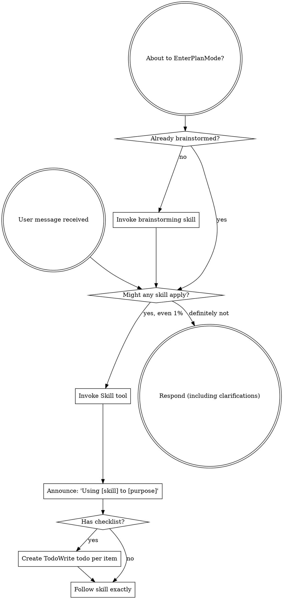
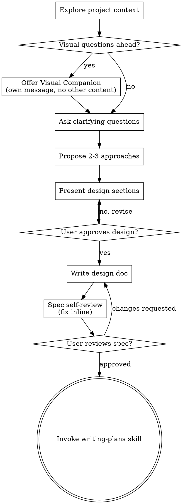
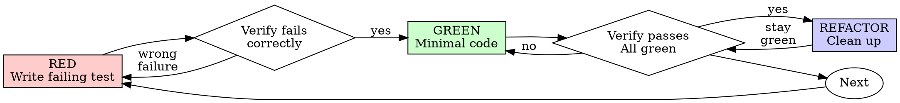
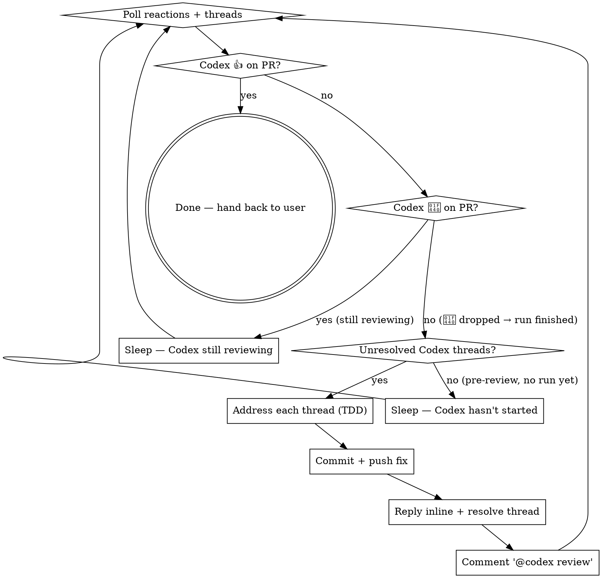

> SYSTEM

# AGENTS.md instructions for /Users/ericson/.t3/worktrees/ars-ui/t3code-b1539d4b

<INSTRUCTIONS>
# ars-ui

## Project Overview

Rust frontend component library using state machines, framework-agnostic core with Leptos/Dioxus adapters.

## Current Phase

The repo is now in active implementation, not spec drafting only.

Agents working on implementation should use the GitHub Project roadmap and issue backlog as the execution source of truth:

- Use the GitHub Project `ars-ui implementation roadmap` to understand active epics, task breakdown, dependencies, status, and iteration planning.
- Prefer picking a single issue-backed task that is unblocked, sized, and scoped for independent delivery.
- Do not start work from an epic issue unless the user explicitly asks for planning or further decomposition.
- Do not start a task that is blocked by unresolved GitHub issue dependencies.
- Treat native GitHub issue dependencies as the blocker graph and the issue body acceptance criteria as the delivery contract.

## Development Workflow

For implementation tasks:

1. Read the assigned or selected GitHub issue first.
2. Move the issue to **In Progress** on the GitHub Project board.
3. Review the cited spec sections and any dependency issues.
4. Add or update the named tests first.
5. Implement only the scope required to make those tests pass.
6. If implementation changes the intended contract, update the relevant spec in the same task.
7. **MANDATORY:** Invoke the `post-implementation-audit` skill (`.agents/skills/post-implementation-audit/SKILL.md`). It runs three sequential audits on the new code — (a) spec/implementation drift with "best outcome" recommendations, (b) iterative "anything else missing?" passes (minimum two rounds), (c) test-coverage audit across every test type the workspace uses (unit, snapshot, proptest, mutation, doc, spec-conformance, llvm-cov). **Every finding lands in _this_ PR — no deferral, no follow-up issues.** This step exists because initial implementations consistently ship spec drift and silent contract violations that take 3+ review round-trips to surface; the audit collapses them into one. Skipping this step is a contract violation.
8. Present the final result for user review before any commit.
9. After user approval, run `cargo xci --profile fast` (alias: `cargo xci-fast`) locally and fix any failures before pushing anything to GitHub. The fast profile takes ~5 minutes and covers the workspace-level regressions a pre-push gate should catch: fmt, check, clippy, unit, integration, adapter, spec-compile-snippets, error-variant-coverage, mutual-exclusion, snapshot-count. Reserve full `cargo xci` (~25 minutes, all 20 gates including wasm coverage and the feature-matrix groups) for after substantial refactors that may have shifted feature-flag interactions. For small follow-up changes, run the focused tests and checks that cover the edited code instead.
10. After `cargo xci-fast` passes, commit and push a PR targeting `main`. The PR body MUST include an auto-close keyword for the issue being delivered, for example `Closes #20` or `Fixes #20`, so GitHub closes the issue automatically when the PR merges.
11. **If the PR creates or modifies any `.snap` insta fixtures, attach the `snapshot-reviewed` label after opening or updating it** (`gh pr edit <num> --add-label "snapshot-reviewed"`). This signals to reviewers that the snapshot output was inspected and is intentional. Re-apply the label whenever you push a commit that touches `.snap` files; the workflow assumes the label reflects the latest snapshot state.
12. **MANDATORY:** Invoke the `waiting-for-codex-review` skill (`.agents/skills/waiting-for-codex-review/SKILL.md`) immediately after the first push that creates the PR, and re-invoke it after every subsequent push to the PR branch. The skill posts the initial `@codex review` trigger, polls Codex's 👀 → (👍 \| ∅ + threads) reaction lifecycle, addresses any review threads with the same rigor as `post-implementation-audit` (TDD + no coverage regression), replies inline, resolves threads, and re-comments `@codex review` to start the next pass — looping until Codex leaves 👍. Skipping this step leaves Codex findings unaddressed and silently widens the gap between merged code and the spec; the merge gate is 👍 from Codex plus green CI, not green CI alone.
13. Only after CI passes, Codex has left 👍, and the PR is merged, close the issue.

Never close a GitHub issue without a merged PR that passes CI **and a 👍 from Codex**. Never commit or push without explicit user approval. Keep the issue, PR, and Project board status aligned with the actual work state at every step.

Default delivery rules:

- Follow TDD: tests first, implementation second, verification last.
- Keep task scope aligned with the issue. If the issue is too large or ambiguous, stop and split or clarify rather than freelancing a bigger change.
- Prefer tasks sized `1`, `2`, `3`, or `5` points. `8` is exceptional. `13` must be decomposed before implementation.
- Preserve the crate and dependency layering defined by the architecture and implementation plan.
- Do not add a new dependency crate without explicit user approval first. If a task appears to need a new crate, stop, explain why, and get approval before editing any `Cargo.toml`.
- When a task is complete, verify the exact tests and checks named by the issue before considering it done.
- For adapter-level component implementation, follow `docs/implementation/adapter-component-delivery.md`. Adapter component work must cover the adapter crate, adapter tests, E2E fixtures/harnesses when applicable, widgets examples, spec synchronization, and the required validation/audit loop in one PR.

### Code Quality Standards

- **Document all public items.** Every public struct, enum, trait, function, constant, type alias, method, field, and variant must have a `///` doc comment. Every `lib.rs` must have a `//!` crate-level doc comment. The workspace enforces `missing_docs` linting — undocumented public items are build failures.
- **Zero warnings policy.** All code must compile with zero warnings under the workspace's configured clippy and rustc lints. Fix the root cause instead of suppressing. When suppression is genuinely needed, use `#[expect(lint, reason = "...")]` — never `#[allow(...)]`.
- **Derive documentation from the spec.** Doc comments should describe the _purpose and semantics_ of the item as defined in the corresponding `spec/` files, not just restate the type signature.
- **Use `#[inline]` selectively, not mechanically.** Do **not** add Clippy's `missing_inline_in_public_items` lint at the workspace level, and do not treat public visibility alone as a reason to mark an item `#[inline]`. Use `#[inline]` for thin cross-crate wrappers, trivial accessors, and hot-path no-op shims where the call overhead is plausibly meaningful. Avoid blanket `#[inline]` on all public APIs — it increases code size, adds compile-time cost, and turns `#[inline]` into noise instead of a deliberate performance signal.
- **Use directory-backed modules with `mod.rs` when a module owns children.** This repo standardizes on the older filesystem layout for nested modules. If module `foo` has child modules, the parent must live at `foo/mod.rs`, not `foo.rs`. Do not mix `foo.rs` with a sibling `foo/` directory. When a refactor adds child modules under an existing flat file, move the parent into `foo/mod.rs` in the same change. Do not leave empty leftover module directories behind.

### API Design Standards

- **Design for the pit of success.** Public APIs should make the most natural, shortest path also be the path that is correct, accessible, localizable, type-safe, and performant. Prefer ergonomic constructors and defaults that preserve the spec's strongest guarantees instead of making users opt into correctness after choosing a convenient API.
- **Name escape hatches explicitly.** When a component needs a lower-level, static, non-i18n, or otherwise less complete path, keep it available but make the tradeoff visible in the API name or type. The blessed path should remain the simplest call site, while escape hatches should read as deliberate choices.
- **Keep semantic data separate from rendered views.** Rich framework views are useful for customization, but components still need semantic sources for accessible names, localized text, announcements, ids, and state-machine wiring. Do not rely on arbitrary rendered view trees as the only source of user-facing semantics.

### Code Coverage

The workspace uses `cargo-llvm-cov` for code coverage with per-crate threshold enforcement. CI runs coverage on every PR (see `.github/workflows/ci.yml`).

**Local coverage commands:**

```bash
# Per-crate coverage with inline annotated source (most useful during development)
cargo llvm-cov test -p ars-interactions --text -- hover

# Per-crate summary only
cargo llvm-cov test -p ars-interactions -- hover

# Native-only workspace coverage (host target; excludes wasm-only crates)
cargo llvm-cov --workspace \
  --exclude ars-leptos --exclude ars-dioxus \
  --exclude ars-test-harness-leptos --exclude ars-test-harness-dioxus \
  --exclude ars-derive --exclude xtask \
  --lcov --output-path lcov.info

# Check all crates against spec-defined thresholds (run after a *merged* lcov)
cargo xtask coverage check-all --file lcov.info
```

The `--text` flag produces line-by-line annotated source showing hit counts and `^0` markers on uncovered branches — use this to identify gaps after writing tests. Uncovered no-op callback closures in tests (e.g., `|_| {}`) are expected and not a gap.

The local recipe above excludes the adapter and adapter-test-harness crates because their `target_arch = "wasm32"` / `feature = "web"` code paths can't be measured via host-target `cargo llvm-cov`. **CI runs an additional wasm-coverage pipeline on nightly** (`cargo xtask ci coverage`) that uses `wasm-bindgen-test`'s experimental coverage recipe with LLVM 22 / `clang-22` to emit lcov for `ars-leptos` (csr), `ars-dioxus` (web), `ars-dom` (web), `ars-i18n` (web-intl), and the adapter test harnesses, then merges with the native lcov via `cargo xtask coverage merge`. The per-crate thresholds in `xtask::coverage::default_thresholds()` are enforced against the merged file — including adapter targets (`ars-leptos` 74/55, `ars-dioxus` 77/70, `ars-test-harness-leptos` 60/0, `ars-test-harness-dioxus` 60/0). `ars-derive` (proc-macro, runs in compiler) is exercised via `crates/ars-core/tests/derive_contract.rs` and is unmeasured. `xtask` has its own enforced threshold (30/35) and is measured. See `spec/testing/14-ci.md` §2 for the full pipeline.

### Mutation Testing

Coverage tells you which lines run. **Mutation testing tells you whether the tests would notice if those lines silently misbehaved.** The workspace uses [`cargo-mutants`](https://mutants.rs) for this — a `cargo` extension binary, not a workspace dependency.

**Install (once per developer machine):**

```bash
cargo install cargo-mutants --locked --version 27.0.0
```

**Local commands (state-machine modules are the most rewarding targets):**

```bash
# Run on a single component machine (~6 min for popover)
cargo mutants -p ars-components -f crates/ars-components/src/overlay/popover/mod.rs

# Just list what would be mutated, without running tests (fast)
cargo mutants -p ars-components -f crates/ars-components/src/overlay/popover/mod.rs --list

# Whole crate (slow — only if you really mean it)
cargo mutants -p ars-components
```

**Agnostic component implementation gate:** whenever an agent implements a new framework-agnostic component, or materially changes an existing one, the delivery must include:

- a targeted mutation run for the component source file, usually `cargo mutants -p ars-components -f crates/ars-components/src/<category>/<component>/mod.rs` (adjust the path for single-file modules);
- spec-conformance tests for the component's anatomy/public contract, including its `Part` enum and required API/attribute surface;
- same-task triage of every `MISSED` mutant: add tests for real gaps, or add a justified line-agnostic `.cargo/mutants.toml` exclude only for true equivalent mutations.

**Reading the output:** Results land in `mutants.out/mutants.out/` (gitignored). The two files that matter:

- `caught.txt` — mutations that broke at least one test ✅
- `missed.txt` — mutations that survived all tests ❌ — each one is either a real test gap to fill or an "equivalent mutation" that needs a `[[skip]]` entry in `mutants.toml` with a justification

**CI integration:** Nightly only. `.github/workflows/nightly.yml` has a `mutation-testing` job with a 21-entry matrix that runs `cargo mutants -p <package>` on every framework-agnostic crate, using `--shard k/n` to spread larger crates across parallel runners. **Shard indices are 0-based** (`k` runs from `0` to `n-1`); `k == n` is invalid and will fail the job. When adding shards, always start at `0/n` and end at `(n-1)/n`.

- **`ars-components` (≈ 1,630 mutants today, planned to grow as the spec adds the remaining ~97 components):** sharded **12-way** → ≈ 135 mutants per runner today, ≈ 850 per runner at the ~10,000-mutant endpoint. Sized for the full spec catalog up front so we don't re-shard every few months as components land.
- **`ars-collections` (≈ 1,080 mutants):** sharded 4-way → ≈ 270 mutants per runner.
- **`ars-core` (≈ 700 mutants):** sharded 2-way → ≈ 350 mutants per runner.
- **`ars-a11y`, `ars-forms`, `ars-interactions`:** one runner each (under 600 mutants apiece).

**Adding a new state machine inside an existing crate requires no CI changes** — its mutations land in whichever shard the cargo-mutants partitioner places them. The shard counts are sized so the slowest runner stays well under 30 minutes today and under ~50 minutes at the planned endpoint; re-balance only when a crate outgrows that budget (visible on the nightly dashboard as one shard pulling away from the others).

All matrix jobs run with `fail-fast: false` so failures on one module don't mask data on another. Each job uploads its `mutants.out/` as a workflow artifact (always, even on success — surviving "missed" entries on a passing run still reveal test-quality work). The job fails if any mutation survives, so a missed mutation forces a deliberate triage decision (fix the test, or document the equivalence with a `[[skip]]` entry in `mutants.toml`).

**Excluded crates** (mutation testing's signal degrades wherever determinism does): adapter glue (`ars-leptos`, `ars-dioxus`), DOM/FFI (`ars-dom`), ICU/FFI (`ars-i18n`), test infrastructure (`ars-test-harness*`), and the proc-macro crate (`ars-derive`, runs in the compiler). Adding a brand-new crate that is a good mutation target requires one new matrix entry; run a local scout first (`cargo mutants -p <crate> --list` to size, then a real run) so we know the right shard count before the nightly fires.

**Bumping the pinned version.** Both the local install command above and `.github/workflows/nightly.yml` pin cargo-mutants to an exact version (currently `27.0.0`) — same convention as `wasm-pack` in the `a11y-audit` job. Pinning is deliberate: cargo-mutants ships new mutators in releases, and an unpinned install would silently change the mutation set without any code change, surfacing as phantom CI failures on a green-source repo. To bump, open a PR that (1) updates the version string in CLAUDE.md and `nightly.yml`, (2) runs the popover scout locally with the new version (`cargo mutants -p ars-components -f crates/ars-components/src/overlay/popover/mod.rs`) to confirm the mutation count is in the same ballpark, and (3) triages any new "missed" entries the new mutators surface — they are usually genuine test-quality gaps newly visible to the tool.

### Property Testing (proptest)

State-machine invariants are exercised by [`proptest`](https://docs.rs/proptest) under `crates/<crate>/tests/proptest_state_machines/` (see `ars-components`). Default proptest behaviour drops `*.proptest-regressions` seed files alongside test sources — instead, every `proptest!` block in this workspace pulls a shared `Config` from `tests/proptest_state_machines/common.rs` that:

1. Reads `PROPTEST_CASES` from the environment (1,000 default; 10,000 in the nightly `extended-proptest` job).
2. Sets `failure_persistence` to `FileFailurePersistence::Direct("proptest-regressions/state-machines.txt")`, so all persisted seeds for the test binary live in one file at the crate root: `crates/<crate>/proptest-regressions/state-machines.txt`. The directory is committed (per proptest's own recommendation in the file header) so every developer's runs benefit from previously-shrunk failures.

When a new crate adopts proptest for state-machine tests, copy the same `common.rs` helper and reference it via `#![proptest_config(super::common::proptest_config())]` inside every `proptest!` block. Don't let proptest fall back to its `WithSource` default — that scatters seed files across the source tree.

### Adapter Prelude Convention

Both `ars-leptos` and `ars-dioxus` expose a `prelude` module targeting **end users** — application developers who consume the ready-made components. `use ars_leptos::prelude::*` (or `use ars_dioxus::prelude::*`) should give them everything they need.

The prelude contains only user-facing items:

1. **Component modules** — as components land, their public module paths (e.g., `button`, `dialog`) are re-exported so users can write `button::Props`, etc.
2. **User-facing traits** — traits end users call on component outputs (e.g., `Translate` from `ars-i18n`). Re-export the trait so consumers don't need a direct dependency on the subsystem crate.
3. **Configuration types** — types that appear in component props or configure behaviour (e.g., `Locale`, `Direction`, `Orientation`, `Selection`).

The prelude does **not** include implementation details consumed only by component authors inside the adapter crate: core engine types (`Machine`, `Service`, `ConnectApi`, `AttrMap`), accessibility primitives (`AriaRole`, `AriaAttribute`), interaction helpers (`merge_attrs`), or adapter hooks (`use_machine`, `UseMachineReturn`). Those remain accessible via their normal crate paths for advanced users building custom machines.

Both adapter preludes must stay symmetric: same items, same structure. When adding a new re-export to one adapter's prelude, add it to the other as well in the same PR.

### Adapter Testing Convention

Adapter-level component tests should default to the framework-specific test harness crate:

- Leptos adapter tests should prefer `ars-test-harness-leptos`.
- Dioxus adapter tests should prefer `ars-test-harness-dioxus`.
- Shared `ars-test-harness` helpers should be used where relevant for viewport, layout, clipboard, drag/drop, timing, and other DOM test setup instead of bespoke per-test browser scaffolding.

When a component spec requires interaction, focus, overlay positioning, clipboard, file upload, drag/drop, or similar browser behavior, the task's tests should exercise that behavior through the adapter harness entrypoints and shared core harness helpers unless there is a concrete technical reason not to.

## Spec Synchronization During Implementation

The specification is the authoritative contract. It took weeks of deliberate design and MUST be followed.

### Spec-first implementation rule

Before implementing any public type, trait, function, or method:

1. **Read the spec section first.** Find the relevant code example in `spec/`. Use `spec-tool toc <file>` and `grep` to locate it.
2. **Match the spec exactly.** If the spec defines `struct ComponentIds { base: String }` with methods `from_id()`, `id()`, `part()`, `item()`, `item_part()` — implement exactly that. Do not invent alternative field names, method names, or signatures.
3. **Cross-check after implementation.** Before presenting code for review, diff every public item against the spec's code examples. Every struct field, every method name, every parameter must match.
4. **If you must deviate**, there must be a concrete technical reason (e.g., the spec's API cannot compile, or a dependency doesn't expose the needed type). Document the reason in a code comment and flag it to the user explicitly.

Inventing alternative APIs that "seem equivalent" is never acceptable — it silently invalidates the spec's design decisions and all downstream code that depends on those APIs.

### Spec/code mismatch resolution

- If code and spec disagree, resolve the mismatch in the same task or PR.
- Shared conceptual changes belong in shared or foundation spec files, not only in adapter code.
- Adapter-specific findings must be reflected back into `spec/foundation/08-adapter-leptos.md` and/or `spec/foundation/09-adapter-dioxus.md` when relevant.
- Do not leave spec drift behind as follow-up cleanup.

## Spec Structure

The specification lives in `spec/` with this layout:

- `spec/manifest.toml` — **START HERE** — central index of all components and their dependencies
- `spec/foundation/` — architecture, accessibility, i18n, interactions, forms, adapters, spec template (00-10)
- `spec/shared/` — cross-component shared types (date-time, selection, layout, z-index)
- `spec/components/{category}/` — one file per component, organized by category
- `spec/testing/` — test specs split by domain

### Component Categories

- `input/` — checkbox, text-field, slider, number-input, etc.
- `selection/` — select, combobox, listbox, menu, tags-input, etc.
- `overlay/` — dialog, popover, tooltip, toast, presence, etc.
- `navigation/` — accordion, tabs, tree-view, pagination, steps, etc.
- `date-time/` — date-field, time-field, calendar, date-picker, etc.
- `data-display/` — table, avatar, progress, meter, badge, etc.
- `layout/` — splitter, scroll-area, carousel, portal, toolbar, etc.
- `specialized/` — color-picker, file-upload, signature-pad, qr-code, etc.
- `utility/` — button, toggle, focus-scope, visually-hidden, separator, etc.

## Working with the Spec

When reading large files, run `wc -l` first to check the line count. If the file is over 2,000
lines, use the `offset` and `limit` parameters on the Read tool to read in chunks rather than
attempting to read the entire file at once.

### Using xtask spec (preferred)

Use `cargo xtask spec` to resolve file sets instead of manually parsing manifest.toml:

```bash
# Quick metadata lookup:
cargo xtask spec info <component>

# Find all components using a shared type:
cargo xtask spec reverse <shared-type>

# See a file's heading structure (with line numbers):
cargo xtask spec toc <file>

# Validate frontmatter matches manifest.toml:
cargo xtask spec validate

# Search spec content by keyword/regex (with optional filters):
cargo xtask spec search <query> [--category <cat>] [--section <sec>] [--tier <tier>]

# Get a compact component summary (states, events, props, accessibility):
cargo xtask spec digest <component>

# Get full implementation context (component + all deps concatenated):
cargo xtask spec context <component> [--framework <fw>] [--include-testing]
```

The xtask also runs as an MCP server (`cargo xtask mcp`) exposing all spec tools for LLM agents.

### Reading a component (manual fallback)

1. Read `spec/manifest.toml` to find the component's path and dependencies
2. Read the component file (has YAML frontmatter listing its foundation/shared deps)
3. Only load the foundation files listed in `foundation_deps` — not all of them

### Framework and library specs — MANDATORY skill loading

When reading or editing these specification files, you MUST load the corresponding skill BEFORE doing any work. The skills contain verified, version-accurate API documentation that the spec code examples depend on. Claude's training data is wrong for these libraries — do not trust it.

| Spec file                                    | Skill to load | Library version |
| -------------------------------------------- | ------------- | --------------- |
| `spec/foundation/04-internationalization.md` | `icu4x`       | ICU4X 2.1.1     |
| `spec/foundation/08-adapter-leptos.md`       | `leptos`      | Leptos 0.8.17   |
| `spec/foundation/09-adapter-dioxus.md`       | `dioxus`      | Dioxus 0.7.3    |

This applies to any task that touches adapter code: reviewing, writing, modifying, or answering questions about these files. Load the skill first, then proceed.

### Spec Conventions

- **No deprecation:** This is a greenfield spec. If an API is unused or redundant, remove it and fix all references. Never use `#[deprecated]` or deprecation shims.
- **No deferral:** Never mark spec content as "TODO", "FIXME", "future enhancement", "P1/P2 extension", or any similar deferral language. Every feature mentioned must be fully specified. If a design choice is unclear, ask the user rather than deferring.
- **No guessing external APIs:** NEVER guess function names or module paths for external crates. Always verify against `https://docs.rs/<crate_name>` before writing code that calls library APIs. This applies especially to Leptos, Dioxus, ICU4X, and any crate where training data may be stale. If you cannot verify, state that explicitly rather than fabricating a plausible-looking API.

### Component file format

Each component file has YAML frontmatter declaring its metadata:

```markdown
---
component: ComponentName
category: { category }
tier: stateless | stateful | complex
foundation_deps: [architecture, accessibility, ...]
shared_deps: [date-time-types, ...]
related: [sibling-component, ...]
---

# ComponentName
```

The `tier` field determines which sections are required — see `spec/foundation/10-component-spec-template.md` for the canonical section structure, ordering rules, and conformance checklist. Headings are numbered (e.g., `## 1. State Machine`, `### 1.1 States`, `#### 1.1.1 InnerStates`, etc.) for precise section references.

</INSTRUCTIONS>
<environment_context>
  <cwd>/Users/ericson/.t3/worktrees/ars-ui/t3code-b1539d4b</cwd>
  <shell>zsh</shell>
  <current_date>2026-05-24</current_date>
  <timezone>America/Sao_Paulo</timezone>
</environment_context>

> DEVELOPER

Implement task #218

> AGENT

I’ll first ground this in the repo and the live issue before drafting anything. Because we’re in Plan Mode, I’ll inspect and plan the execution path, but I won’t edit files or move GitHub state.

> TOOL

tool_use exec_command
id: call_QoqdTj0whkcCMRzDkZymIgz8
```json
{
  "cmd": "sed -n '1,180p' /Users/ericson/.claude/skills/using-superpowers/SKILL.md",
  "workdir": "/Users/ericson/.t3/worktrees/ars-ui/t3code-b1539d4b",
  "yield_time_ms": 1000,
  "max_output_tokens": 12000
}
```

> TOOL

tool_use exec_command
id: call_PWqdtHJjMeodnEFDBt7J3eK7
```json
{
  "cmd": "rg -n \"#218|issue #218|218|toggle|utility|task\" /Users/ericson/.codex/memories/MEMORY.md",
  "workdir": "/Users/ericson/.t3/worktrees/ars-ui/t3code-b1539d4b",
  "yield_time_ms": 1000,
  "max_output_tokens": 12000
}
```

> TOOL

tool_use exec_command
id: call_a84laF4njAwa1gM0WDwWQgv1
```json
{
  "cmd": "sed -n '1,220p' /Users/ericson/.codex/plugins/cache/openai-curated/github/6188456f/skills/github/SKILL.md",
  "workdir": "/Users/ericson/.t3/worktrees/ars-ui/t3code-b1539d4b",
  "yield_time_ms": 1000,
  "max_output_tokens": 12000
}
```

> TOOL

tool_result
id: call_QoqdTj0whkcCMRzDkZymIgz8
```
Chunk ID: 75f03f
Wall time: 0.2485 seconds
Process exited with code 0
Original token count: 1356
Output:
---
name: using-superpowers
description: Use when starting any conversation - establishes how to find and use skills, requiring Skill tool invocation before ANY response including clarifying questions
---

<SUBAGENT-STOP>
If you were dispatched as a subagent to execute a specific task, skip this skill.
</SUBAGENT-STOP>

<EXTREMELY-IMPORTANT>
If you think there is even a 1% chance a skill might apply to what you are doing, you ABSOLUTELY MUST invoke the skill.

IF A SKILL APPLIES TO YOUR TASK, YOU DO NOT HAVE A CHOICE. YOU MUST USE IT.

This is not negotiable. This is not optional. You cannot rationalize your way out of this.
</EXTREMELY-IMPORTANT>

## Instruction Priority

Superpowers skills override default system prompt behavior, but **user instructions always take precedence**:

1. **User's explicit instructions** (CLAUDE.md, GEMINI.md, AGENTS.md, direct requests) — highest priority
2. **Superpowers skills** — override default system behavior where they conflict
3. **Default system prompt** — lowest priority

If CLAUDE.md, GEMINI.md, or AGENTS.md says "don't use TDD" and a skill says "always use TDD," follow the user's instructions. The user is in control.

## How to Access Skills

**In Claude Code:** Use the `Skill` tool. When you invoke a skill, its content is loaded and presented to you—follow it directly. Never use the Read tool on skill files.

**In Copilot CLI:** Use the `skill` tool. Skills are auto-discovered from installed plugins. The `skill` tool works the same as Claude Code's `Skill` tool.

**In Gemini CLI:** Skills activate via the `activate_skill` tool. Gemini loads skill metadata at session start and activates the full content on demand.

**In other environments:** Check your platform's documentation for how skills are loaded.

## Platform Adaptation

Skills use Claude Code tool names. Non-CC platforms: see `references/copilot-tools.md` (Copilot CLI), `references/codex-tools.md` (Codex) for tool equivalents. Gemini CLI users get the tool mapping loaded automatically via GEMINI.md.

# Using Skills

## The Rule

**Invoke relevant or requested skills BEFORE any response or action.** Even a 1% chance a skill might apply means that you should invoke the skill to check. If an invoked skill turns out to be wrong for the situation, you don't need to use it.



## Red Flags

These thoughts mean STOP—you're rationalizing:

| Thought | Reality |
|---------|---------|
| "This is just a simple question" | Questions are tasks. Check for skills. |
| "I need more context first" | Skill check comes BEFORE clarifying questions. |
| "Let me explore the codebase first" | Skills tell you HOW to explore. Check first. |
| "I can check git/files quickly" | Files lack conversation context. Check for skills. |
| "Let me gather information first" | Skills tell you HOW to gather information. |
| "This doesn't need a formal skill" | If a skill exists, use it. |
| "I remember this skill" | Skills evolve. Read current version. |
| "This doesn't count as a task" | Action = task. Check for skills. |
| "The skill is overkill" | Simple things become complex. Use it. |
| "I'll just do this one thing first" | Check BEFORE doing anything. |
| "This feels productive" | Undisciplined action wastes time. Skills prevent this. |
| "I know what that means" | Knowing the concept ≠ using the skill. Invoke it. |

## Skill Priority

When multiple skills could apply, use this order:

1. **Process skills first** (brainstorming, debugging) - these determine HOW to approach the task
2. **Implementation skills second** (frontend-design, mcp-builder) - these guide execution

"Let's build X" → brainstorming first, then implementation skills.
"Fix this bug" → debugging first, then domain-specific skills.

## Skill Types

**Rigid** (TDD, debugging): Follow exactly. Don't adapt away discipline.

**Flexible** (patterns): Adapt principles to context.

The skill itself tells you which.

## User Instructions

Instructions say WHAT, not HOW. "Add X" or "Fix Y" doesn't mean skip workflows.

```

> TOOL

tool_result
id: call_PWqdtHJjMeodnEFDBt7J3eK7
```
Chunk ID: dafccc
Wall time: 0.2687 seconds
Process exited with code 0
Original token count: 15388
Output:
Total output lines: 230

1:# Task Group: ars-ui / ars-components utility and navigation core implementation
3:scope: Fresh framework-agnostic `crates/ars-components` work for utility and navigation components, covering spec-driven issue execution, mutation/coverage-backed validation, and review-driven contract tightening for component semantics.
4:applies_to: cwd=/Users/ericson/.t3/worktrees/ars-ui/*; reuse_rule=reuse for ars-ui checkouts touching `crates/ars-components/src/utility/` or `crates/ars-components/src/navigation/`; verify the live issue/spec contract and whether commit/push is in or out of scope for the current run.
10:- rollout_summaries/2026-05-23T21-07-28-1dbL-implement_togglegroup_core_issue_216.md (cwd=/Users/ericson/.t3/worktrees/ars-ui/t3code-e567e91b, rollout_path=/Users/ericson/.codex/sessions/2026/05/23/rollout-2026-05-23T18-07-28-019e56aa-18c9-7122-9658-3077c7106725.jsonl, updated_at=2026-05-24T03:09:37+00:00, thread_id=019e56aa-18c9-7122-9658-3077c7106725, issue #216 implementation plus same-PR review remediation and final CI wait)
14:- ToggleGroup, toggle_group, issue #216, Key, BTreeSet<Key>, roving_focus, hidden_input_config, spec/components/utility/toggle-group.md, cargo xtask spec toc, snapshot-reviewed, Coverage, Release Verification
20:- rollout_summaries/REDACTED.md (cwd=/Users/ericson/.t3/worktrees/ars-ui/t3code-a189b923, rollout_path=/Users/ericson/.codex/sessions/2026/05/21/rollout-2026-05-21T22-34-26-019e4d51-c94c-7730-9998-67c49590e4bc.jsonl, updated_at=2026-05-22T05:24:13+00:00, thread_id=019e4d51-c94c-7730-9998-67c49590e4bc, issue #215 implementation plus same-PR Codex review remediation on PR #668)
24:- ToggleButton, toggle_button, toggle-button, issue #215, Bindable<bool>, hidden_input_config, SetPressed, Reset, TransitionPlan::new, cargo mutants, PR #668
50:- rollout_summaries/REDACTED.md (cwd=/Users/ericson/.t3/worktrees/ars-ui/t3code-55173bd3, rollout_path=/Users/ericson/.codex/sessions/2026/05/20/rollout-2026-05-20T00-17-41-019e4363-993e-7b02-ac6a-2e59148e3c0c.jsonl, updated_at=2026-05-20T05:11:33+00:00, thread_id=019e4363-993e-7b02-ac6a-2e59148e3c0c, issues #209/#210 implementation plus Codex review remediation on PR #654)
64:- Breadcrumbs, Link, Pagination, Steps, issue #247, issue #257, issue #259, sanitize_url, SafeUrl, cargo mutants, cargo xtask spec info, cargo llvm-cov, navigation::
68:- when the user gives a direct implementation request like `Implement task #216`, `Implement task #215`, `Implement task #254`, `Implement task #211`, `Implement tasks #209 and #210`, or `Implement tasks #247, #257 and #259`, treat it as permission to execute the live issue/spec contract directly instead of reopening scope discussion [Task 1][Task 2][Task 3][Task 4][Task 5][Task 6]
77:- `crates/ars-components/src/utility/toggle_button/mod.rs` is the best local pattern for utility-machine APIs, `Bindable`, hidden inputs, snapshots, and exhaustive branch tests, while `crates/ars-components/src/navigation/tabs/mod.rs` is the right pattern for ordered registration, roving tabindex, RTL arrow mapping, and focus-intent handling [Task 1][Task 2][Task 3]
78:- `crates/ars-components/tests/spec_conformance/utility.rs` is the place to pin utility anatomy against the spec, and `crates/ars-components/tests/proptest_state_machines/utility.rs` already contains the ignored nightly proptest scaffolding used for invariant coverage in this family [Task 1]
79:- `ToggleButton` lives at `crates/ars-components/src/utility/toggle_button/mod.rs`, is exported from `crates/ars-components/src/utility/mod.rs`, and follows the existing `button` / `toggle` conventions with `State::{Idle, Focused, Pressed}`, `Event::{Focus, Blur, Press, Release, Toggle, SetPressed, SetDisabled, Reset}`, `Effect::PressedChange`, `root_attrs()`, and `hidden_input_config()` [Task 2]
81:- `cargo xtask spec info accordion` and `cargo xtask spec toc spec/components/navigation/accordion.md` were the fastest orientation commands for Accordion, and `crates/ars-components/src/navigation/tabs/mod.rs` was the right local pattern for routing direction changes through `Event::SetDirection(Direction)` instead of letting generic sync overwrite resolved direction [Task 3]
82:- the final Accordion verification stack that succeeded was: focused `cargo test -p ars-components navigation::accordion`, `cargo test -p ars-components --test proptest_state_machines accordion -- --ignored`, `cargo xtask spec validate`, `cargo clippy -p ars-components --all-targets --all-features -- -D warnings`, `cargo llvm-cov test -p ars-components --lib --no-fail-fast --summary-only -- navigation::accordion`, and `cargo mutants -p ars-components -f crates/ars-components/src/navigation/accordion/mod.rs`; mutation testing ended `191 mutants tested in 24m: 155 caught, 36 unviable` with `0 missed` [Task 3]
84:- `LiveRegion` lives at `crates/ars-components/src/utility/live_region/mod.rs`, is exported from `crates/ars-components/src/utility/mod.rs`, and its durable validation surface includes unit tests, snapshot tests, `tests/spec_conformance/utility.rs`, and proptest state-machine coverage [Task 4]
86:- `spec/components/utility/toggle.md` and `spec/components/utility/swap.md` are the source-of-truth contracts for Toggle and Swap; utility component implementation belongs under `crates/ars-components/src/utility/`, and anatomy checks belong in `crates/ars-components/tests/spec_conformance/utility.rs` [Task 5]
89:- `cargo xtask spec info breadcrumbs|link|pagination|steps` is the fastest orientation step for navigation work because it prints the canonical component spec and adapter paths before any code search [Task 6]
92:- reliable validation for this family was focused `cargo test -p ars-components utility::toggle_group|utility::toggle_button|navigation::accordion|utility::live_region|utility::toggle|utility::swap|navigation::`, `cargo xtask spec validate`, focused `cargo llvm-cov`, targeted mutation or proptest runs for state machines, then crate-level `cargo test -p ars-components --all-targets` or `cargo xci-fast` as the broader repo gate as needed [Task 1][Task 2][Task 3][Task 4][Task 5][Task 6]
103:- symptom: `cargo insta test -p ars-components --unreferenced=reject` fails during utility/navigation work even though the new snapshots are correct -> cause: either the command shape is wrong for this crate family or unrelated pre-existing unreferenced snapshots exist elsewhere -> fix: use `cargo insta test --unreferenced=reject -p ars-components --features i18n --lib` first, then confirm whether any remaining failure points outside the touched surface [Task 1][Task 2][Task 4][Task 6]
118:- Menu, menu, issue #237, ItemType, menuitemradio, menuitemcheckbox, typeahead_time, SubPositioner, cargo mutants, cargo xtask spec info menu, cargo llvm-cov, In Progress
132:- when the user says only `Implement task #237` or another terse issue number, start from the live issue/spec contract and proceed without asking them to restate the requirements [Task 1]
139:- `spec/components/selection/menu.md` is the authoritative contract for issue #237; `cargo xtask spec info menu` and `cargo xtask spec toc spec/components/selection/menu.md` are the fastest orientation commands before code search [Task 1]
192:- when the task turns into a Nightly-fix PR, keep the same end-to-end review loop: local proof, push, inline replies, resolved threads, and wait for terminal approval [Task 2][Task 3]
211:scope: Framework-agnostic overlay work across `ars-components`, `ars-core`, and `ars-dom`, covering Drawer and AlertDialog core machines, DOM-free boundary enforcement, snapshot/spec review fixes, utility extraction seams, and the final publish/review path for overlay PRs.
212:applies_to: cwd=/Users/ericson/.t3/worktrees/ars-ui/*; reuse_rule=reuse for ars-ui checkouts touching `crates/ars-components/src/overlay/` or nearby utility/compatibility seams; verify live issue/PR state before moving roadmap items or publishing.
232:- AlertDialog, alert_dialog, issue #260, overlay, dialog::State, snapshot-count, cargo xtask lint snapshot-count, cargo xtask spec compile-snippets, snapshot-reviewed, PR #660
234:## Task 3: Implement task #200 by moving ZIndexAllocator into ars-core, adding ClientOnly/ZIndexAllocator utility modules, and publishing PR #625
238:- rollout_summaries/2026-04-29T16-02-56-Kicl-implement_task_200_zindexallocator_clientonly_core.md (cwd=/Users/ericson/.t3/worktrees/ars-ui/t3code-05593195, rollout_path=/Users/ericson/.codex/sessions/2026/04/29/rollout-2026-04-29T13-02-56-019dd9fa-aac0-76a0-acf5-46a45fc70095.jsonl, updated_at=2026-04-29T18:03:58+00:00, thread_id=019dd9fa-aac0-76a0-acf5-46a45fc70095, issue #200 implementation plus roadmap update, no-std fix, and PR publish)
242:- issue #200, ZIndexAllocator, ClientOnly, ars-core/src/z_index.rs, ars-components/src/utility/z_index_allocator.rs, ars-components/src/utility/client_only.rs, ars-dom/src/z_index.rs, supports_top_layer, no-default-features, gh project list --owner fogodev --format json, project 2, PR #625
256:- when the user says `Implement task #263`, `Implement task #260`, or gives a bare overlay issue implementation order, inspect the live issue/spec/repo state first instead of guessing the architecture from the title alone [Task 1][Task 2][Task 3]
264:- `cargo xtask spec info drawer` and `cargo xtask spec toc spec/components/overlay/drawer.md` quickly expose the Drawer spec shape; `crates/ars-components/src/overlay/dialog/mod.rs` is the right local template for overlay-machine structure, effects, and `ConnectApi` output [Task 1]
269:- `xtask/src/lint.rs` now needs to account for `pub type State = ...::State` aliases when computing snapshot-count coverage; the validated proof command was `cargo xtask lint snapshot-count`, which reported `alert_dialog | 22 | 2 | 10 | 0 | 40 | OK` after the fix [Task 2]
270:- `cargo xtask spec compile-snippets` has no `--files` flag in this repo; run the full command when spec examples need verification [Task 2]
272:- the new agnostic utility surface lives in `crates/ars-components/src/utility/z_index_allocator.rs` and `crates/ars-components/src/utility/client_only.rs`, and `ClientOnly` is a logical boundary component with no `ConnectApi`/`AttrMap` output [Task 3]
273:- roadmap/project automation for this task family used the `fogodev` Project V2 roadmap at project number `2`; if a task needs board status updates, discover the real project first with `gh project list --owner fogodev --format json` and then read field ids from `gh project field-list 2 --owner fogodev --format json` [Task 3]
274:- `cargo xci-fast` was the reliable end-to-end gate for the Drawer and AlertDialog implementation family, while `cargo xci` was the authoritative publish gate for the utility extraction and Dialog publish runs [Task 1][Task 2][Task 3][Task 4]
281:- symptom: an overlay component reuses `dialog::State` through `pub type State = ...::State` and snapshot-count CI misses it -> cause: the lint only looked for local enum declarations -> fix: teach `xtask/src/lint.rs` to resolve state aliases or give the module its own local `State` enum before relying on snapshot-count enforcement [Task 2]
282:- symptom: spec snippet verification fails after a review fix because the example uses guessed helper APIs -> cause: the snippet was written against non-existent codebase methods like `MessageFn::resolve(...)` or `Role::as_str()` -> fix: compile-check the real snippet with `cargo xtask spec compile-snippets` and use actual APIs like direct `MessageFn` invocation and `Role::as_aria_role()` [Task 2]
304:- ars-components, coverage ratchet, branch coverage, cargo xtask coverage check, cargo llvm-cov --branch, hover_card.rs, table/mod.rs, floating_panel.rs, download_trigger.rs, PR #658
323:- `ars-components` ratchet enforcement here was `90%` lines and `90%` branches, and the decisive local gate was `cargo xtask coverage check --file <lcov> --package ars-components --min 90 --branch-min 90` after generating branch-enabled LCOV with `cargo +nightly llvm-cov nextest --branch -p ars-components --lcov --output-path ...` [Task 1]
325:- ranking LCOV files by missed branches/lines was the fastest way to scope the work; the worst offenders were `overlay/hover_card.rs`, `data_display/table/mod.rs`, `overlay/floating_panel.rs`, and `utility/download_trigger.rs` [Task 1]
326:- `cargo xci-fast` is a strong pre-push gate for this repo when the task is crate-local but publish-bound; it validated the broader CI slice and finished with `All 10 steps passed.` before PR creation here [Task 1][Task 2]
332:- symptom: line coverage looks healthy but the ratchet still fails -> cause: the enforced floor is on branch coverage too -> fix: run branch-enabled LCOV plus `cargo xtask coverage check ... --branch-min ...` before deciding where to add tests [Task 1]
340:applies_to: cwd=/Users/ericson/.t3/worktrees/ars-ui/*; reuse_rule=reuse for ars-ui checkouts touching `crates/ars-components/src/utility/download_trigger.rs`, `crates/ars-components/Cargo.toml`, or the related utility spec; always re-check live review-thread state before replying or resolving.
556:- Go back to research phase, ts-rs, frontend/src/api/generated, TS_RS_EXPORT_DIR, cargo xrun, xtask run, export_to, Option A, OpenAPI optional, codex-pr-review.sh gate 79
567:- Implement plan, frontend/src/api/generated, target/ts-rs/api, xtask/src/ts_bindings.rs, cargo xtask ci, check_api_ts_bindings, index.ts barrel, byte_length, approx_page, Go to the next phase, review.md, PR #79
593:- `.cargo/config.toml` already maps `cargo xrun` to `cargo xtask run`, so the right workflow is to hook TS export/sync into `xtask run` rather than introduce a separate launcher [Task 2][Task 3]
594:- the build implementation added Rust DTO exports, `crates/api/tests/ts_bindings.rs`, `xtask/src/ts_bindings.rs`, a committed generated `index.ts` barrel, and frontend API wrappers that import generated types instead of hand-written contract shapes [Task 3]
595:- `cargo xtask ci` is now the central freshness gate for these committed bindings: regenerate/sync, then fail closed if `git status --porcelain -- frontend/src/api/generated` is dirty [Task 3]
603:- symptom: Build -> Review gate fails on stale generated bindings -> cause: CI was not checking committed generated files for freshness -> fix: enforce the sync/dirty check in `cargo xtask ci` at the `xtask` layer [Task 3]
620:- citation-workspace-live-data, workspace-adapter-v1-rows, Go to the next phase, review.md, improve, cargo xtask ci, codex-pr-review.sh gate 80, frontend/node_modules/.bin, official_sources, current.md, epic.md, PR #80
644:- this slice’s verified Review handoff used `cargo xtask ci`, focused frontend Vitest, full frontend Vitest, ESLint, TypeScript build, `bash .agents/scripts/lint-planning-files.sh`, and `git diff --check`; `frontend/node_modules/.bin/*` was the reliable frontend path when wrapper commands were noisy in this environment [Task 1]
652:- symptom: `cargo xtask ci` fails while the touched code still looks sound -> cause: the sandbox blocked rustup temp-file creation outside the workspace -> fix: treat `Operation not permitted (os error 1)` in `~/.rustup/tmp` as an environment constraint first and rerun with the needed toolchain access before assuming a repo regression [Task 1]
658:scope: Repo-root local-run workflow for starting the Rust API and Vite frontend through `xtask`, including default env wiring, process supervision, migration bootstrap, and localhost verification expectations.
659:applies_to: cwd=/Users/ericson/Workspace/Rust/judge-fudge; reuse_rule=reuse for repo-root local app bootstrap and `xtask` command work in this checkout family; re-check current env contracts, Docker/Postgres availability, and frontend tooling before reusing exact defaults.
669:- cargo xrun, xtask run, tech-stack/README.md, tech-stack/local-mvp.md, frontend/README.md, PORT, DATABASE_URL, LOCAL_STORAGE_ROOT, VITE_API_BASE_URL, CITATIO_OFFICIAL_SOURCES_MODE, CITATIO_LLM_GATEWAY_MODE
675:- rollout_summaries/REDACTED.md (cwd=/Users/ericson/Workspace/Rust/judge-fudge, rollout_path=/Users/ericson/.codex/sessions/2026/05/18/rollout-2026-05-18T16-31-06-019e3c92-1228-7963-a961-ff115f8c78ae.jsonl, updated_at=2026-05-18T22:18:38+00:00, thread_id=019e3c92-1228-7963-a961-ff115f8c78ae, `xtask` command and alias implementation)
679:- .cargo/config.toml, xrun = "xtask run", xtask/src/commands.rs, xtask/src/process.rs, Run subcommand, api-only, frontend-only, cargo check -p xtask, CommandSpec, spawn
705:- when the user said `Your code doesn't even compile` -> treat bootstrap/xtask changes as requiring an immediate compile check before claiming progress [Task 2]
711:- `.cargo/config.toml` now exposes `cargo xrun` as `xtask run`, and `xtask/src/commands.rs` owns the bootstrap defaults plus `--api-only` / `--frontend-only` and env override flags [Task 2]
712:- `cargo check -p xtask` is the right tight loop for `xtask` command work before broader repo validation, while `cargo xci` is the final repo-root gate after the runtime path is fixed [Task 2][Task 3]
713:- `CommandSpec` in `xtask/src/process.rs` is the shared subprocess abstraction; adding a `spawn(...)` helper made `xrun` fit the existing `xtask` command model cleanly [Task 2]
719:- symptom: the first `xtask` bootstrap implementation does not compile -> cause: borrow-checker/type issues in the process supervisor path -> fix: run `cargo check -p xtask`, use the exact diagnostics, and patch only the failing command-building/process-supervision areas first [Task 2]
721:- symptom: bootstrap work appears locally plausible but still misses repo regressions -> cause: only tight-loop checks were run -> fix: use `cargo xci` as the final gate for `xtask`/repo-root bootstrap changes [Task 3]
743:- rollout_summaries/REDACTED.md (cwd=/Users/ericson/Workspace/Rust/judge-fudge, rollout_path=/Users/ericson/.codex/sessions/2026/05/18/rollout-2026-05-18T14-50-43-019e3c36-2ae3-77d1-af1f-0be29a04920d.jsonl, updated_at=2026-05-18T18:41:18+00:00, thread_id=019e3c36-2ae3-77d1-af1f-0be29a04920d, survivor fixes in `crates/api` and `xtask` plus `cargo xtask ci`)
747:- crates/api/src/documents.rs, xtask/tests/cli.rs, .cargo/mutants.toml, percent_decode_query_component, clamp_list_limit, impossible hit-total rejection, cargo mutants --file, cargo test -p api --lib documents::tests, cargo test -p xtask --test cli, cargo xtask ci
762:- when the task is a Nightly failure and the failure shape can change between runs -> default to live GitHub Actions evidence before local speculation, even if the local repo looks clean [Task 1]
767:- the strongest survivor clusters were in `crates/api/src/documents.rs` (document-list query parsing helpers) and `xtask/src/coverage.rs` / `xtask/tests/cli.rs` (LCOV parsing and coverage-gate boundaries), which meant the fix surface was mostly pure/helper logic rather than DB-heavy flows [Task 1][Task 2]
771:- `cargo xtask ci` is the useful end-to-end local mirror for repo-root Nightly remediations here; it validated planning-doc linting, formatting, clippy, workspace tests, and doctests after the survivor fixes landed [Task 2]
778:- symptom: `cargo xtask ci` fails under the sandbox even though the code changes look right -> cause: rustup could not create temp files under `~/.rustup/tmp` -> fix: treat that as an environment constraint and rerun the full local CI mirror where the toolchain cache is writable before drawing conclusions from the failure [Task 2]
815:- Implement plan, cargo xtask coverage gate, xtask/src/coverage.rs, DEFAULT_MIN_COVERAGE_PERCENT, DEFAULT_MIN_BRANCH_COVERAGE_PERCENT, 85.0, codecov.yml, target: auto, threshold: 1%, rust, frontend, LF, LH, BRF, BRH, cargo llvm-cov --branch, PR #60
82…5388 tokens truncated…caa, issue #230 implementation plus PR #630 button-type review fix and final thread resolution)
2146:- Switch, checkbox pattern, type=\"button\", form submit, spec/components/input/switch.md, cargo xtask spec info switch, cargo xtask spec toc, snapshot-reviewed, PR #630, issue #230
2170:- when the user gives a bare issue request like `Implement task #269`, `Let's implement task #266`, or `Implement task #243` -> inspect the live issue/spec/repo state first and then execute, rather than opening with a broad plan [Task 1][Task 2][Task 4]
2174:- when the user says `Implement task #231` -> default to live issue-backed implementation, not just discussion [Task 6]
2202:- for layout component work, `cargo xtask spec validate`, focused `cargo test -p ars-components layout::`, `cargo insta test -p ars-components --unreferenced=reject`, focused `cargo llvm-cov`, focused `cargo mutants`, and `cargo xci --profile fast` formed the fastest reliable validation ladder [Task 11]
2209:- if a utility/input module has child modules, the repo expects the parent at `foo/mod.rs`, not `foo.rs`; Heading had to move to `crates/ars-components/src/utility/heading/mod.rs` to satisfy that layout rule [Task 8]
2210:- insta snapshots for a directory-backed module belong under that module’s own `snapshots/` directory; after moving Heading to `heading/mod.rs`, the snapshots had to move from `utility/snapshots/` to `utility/heading/snapshots/` [Task 8]
2212:- `cargo xtask spec info switch` and `cargo xtask spec toc spec/components/input/switch.md` are fast orientation commands for Switch work, and `checkbox`, `text_field`, and `textarea` under `crates/ars-components/src/input/` are the closest local machine/connect templates [Task 9]
2223:- effective local validation for these ars-components runs was focused component tests first (`cargo test -p ars-components avatar|badge|skeleton|button|tooltip`, DateField-focused tests/snapshots, or `cargo test -p ars-components input::textarea`), snapshot coverage where relevant, `cargo xtask spec validate` when the task touched the spec, then `cargo xci` before replying to reviewers or publishing [Task 1][Task 2][Task 3][Task 4][Task 5][Task 6]
2241:- symptom: a new `ars-components` utility module with child modules keeps failing style/review expectations even though the code works -> cause: the parent module was created as `foo.rs` instead of `foo/mod.rs` -> fix: use the directory-backed module layout from the start and colocate its snapshots under `foo/snapshots/` [Task 8]
2273:- when the user asks to `Implement tasks #348 and #478` together -> treat the paired Leptos/Dioxus adapter work as one coordinated deliverable instead of two unrelated requests [Task 1]
2324:- rollout_summaries/REDACTED.md (cwd=/Users/ericson/.t3/worktrees/ars-ui/t3code-2b9b1191, rollout_path=/Users/ericson/.codex/sessions/2026/04/30/rollout-2026-04-30T20-13-03-019de0aa-cd6b-7e51-9f3e-b381d95e8afd.jsonl, updated_at=2026-05-01T03:37:01+00:00, thread_id=019de0aa-cd6b-7e51-9f3e-b381d95e8afd, PR #635 review fixes, `cargo xtask ci coverage`, and final green Codecov status)
2328:- PR #635, codecov/patch, cargo xtask ci coverage, cargo xci, CHROMEDRIVER, wasm-bindgen-test-runner, gh pr checks --watch, patch coverage, merge paths, 55.00000%
2332:- when the user says `Implement tasks #321 and #418` -> treat paired Leptos/Dioxus adapter work as one coordinated deliverable grounded in the live issue/spec state, not as separate brainstorming tasks [Task 1][Task 2]
2338:- `cargo xtask spec info as-child` is the fast orientation command for locating the current adapter spec paths before touching either framework implementation [Task 1][Task 2]
2341:- `cargo xtask ci coverage` was the useful gate for Codecov patch recovery here because it refreshed the LCOV evidence behind `codecov/patch` before the final `cargo xci` run [Task 3]
2349:- symptom: Codecov patch coverage stays red after a review fix -> cause: the changed merge paths were not covered even if the high-level feature worked -> fix: add focused tests for the touched lines, rerun `cargo xtask ci coverage`, and confirm `codecov/patch` flips green before closing the PR workflow [Task 3]
2378:- when the user says `Implement task #196` -> treat it as direct implementation work grounded in the live issue/spec state, not a discussion-only request [Task 1]
2386:- effective hydration validation here was `cargo test -p ars-dioxus --features ssr hydration`, `cargo test -p ars-dioxus --features ssr id`, `cargo test -p ars-dioxus --features web id`, then `cargo xtask ci feature-matrix-dioxus` [Task 1]
2388:- the provider regression surface here was wasm/browser coverage for both root and nested provider cases, followed by `cargo clippy -p ars-leptos --all-targets --features hydrate --target wasm32-unknown-unknown -- -D warnings` and `cargo xtask ci feature-matrix-leptos` [Task 2]
2407:- rollout_summaries/REDACTED.md (cwd=/Users/ericson/.codex/worktrees/8ccf/ars-ui, rollout_path=/Users/ericson/.codex/sessions/2026/04/25/rollout-2026-04-25T20-51-59-019dc70e-a796-7190-a54f-35d14d7c2936.jsonl, updated_at=2026-04-26T14:12:18+00:00, thread_id=019dc70e-a796-7190-a54f-35d14d7c2936, task #238 implementation plus regression fix and spec sync)
2411:- ars-components, presence, lazy_mount, data-ars-state, Mounting, Mounted, UnmountPending, presence_root_mounting, mounting_root_attrs_stay_closed_until_content_ready, cargo xtask spec validate, cargo xci, PR #610
2425:- when the user says `Implement task #238` -> do the task end-to-end, not just discuss it [Task 1]
2432:- when Presence behavior changes, the regression surface includes both the direct unit test and the `presence_root_mounting` snapshot; the validated command sequence here was `cargo test -p ars-components presence::`, `cargo xtask spec validate`, then `cargo xci` [Task 1]
2433:- the core Presence contract also required syncing `spec/components/overlay/presence.md`, `spec/leptos-components/overlay/presence.md`, and `spec/dioxus-components/overlay/presence.md`; `cargo xtask spec validate` passed after those edits [Task 1]
2453:- rollout_summaries/2026-04-29T16-02-56-Kicl-implement_task_200_zindexallocator_clientonly_core.md (cwd=/Users/ericson/.t3/worktrees/ars-ui/t3code-05593195, rollout_path=/Users/ericson/.codex/sessions/2026/04/29/rollout-2026-04-29T13-02-56-019dd9fa-aac0-76a0-acf5-46a45fc70095.jsonl, updated_at=2026-04-29T18:03:58+00:00, thread_id=019dd9fa-aac0-76a0-acf5-46a45fc70095, issue #200 publish after project status move and full validation)
2525:- Leptos SSR tests that import `utility::highlight` need `feature = "icu4x"` when the crate is built with `--no-default-features --features ssr`; otherwise the no-default SSR test target breaks even though the runtime code is fine [Task 2]
2526:- PR #633 added two concrete review-fix contracts worth reusing: Leptos `ErrorBoundary` `on_error` should fire per error episode rather than replaying on fallback rerenders, and `xtask/src/spec/compile_snippets.rs` must preserve the original backtick fence width when appending `no_check` [Task 2]
2556:# Task Group: ars-ui / adapter utility helpers, paired ClientOnly and ZIndexAllocator adapters, drag coverage repairs, and post-implementation audits
2558:scope: Sibling Leptos/Dioxus adapter utility implementation work, paired `ClientOnly`/`ZIndexAllocator` adapter delivery, Dioxus platform/drag coverage repairs, publish/review closeout, and the follow-up audit pattern where code, spec, and best-outcome recommendations are separated explicitly.
2561:## Task 1: Implement sibling adapter utility tasks #191 and #194 for both adapters
2565:- rollout_summaries/REDACTED.md (cwd=/Users/ericson/.t3/worktrees/ars-ui/t3code-c5178b99, rollout_path=/Users/ericson/.codex/sessions/2026/04/28/rollout-2026-04-28T00-28-50-019dd221-e798-7d11-bca3-f743f29ffb30.jsonl, updated_at=2026-04-28T22:01:00+00:00, thread_id=019dd221-e798-7d11-bca3-f743f29ffb30, issues #191/#194 implementation for Leptos and Dioxus)
2575:- rollout_summaries/REDACTED.md (cwd=/Users/ericson/.t3/worktrees/ars-ui/t3code-c5178b99, rollout_path=/Users/ericson/.codex/sessions/2026/04/28/rollout-2026-04-28T00-28-50-019dd221-e798-7d11-bca3-f743f29ffb30.jsonl, updated_at=2026-04-28T22:01:00+00:00, thread_id=019dd221-e798-7d11-bca3-f743f29ffb30, post-implementation spec audit and best-outcome recommendations)
2589:- dioxus, ars-dioxus, ars-interactions, drag_drop.rs, platform.rs, HasFileData, PlatformDragEvent, UUIDv4, text/plain, accept_token_extensions, file_picker_filter_extensions, cargo llvm-cov, cargo xtask ci feature-matrix-dioxus, PR #624
2599:- issue #319, issue #417, ClientOnly, ZIndexAllocatorProvider, TypedChildrenFn, ViewFn, SharedState, cargo xtask e2e utility --adapter leptos, cargo xtask e2e utility --adapter dioxus, cargo xci-fast, PR #653
2613:- when the user says `Implement tasks #191 and #194, they're the same thing for both adapters` -> default to one shared plan plus framework-specific implementations instead of splitting sibling adapter work into unrelated tracks [Task 1]
2614:- when the user says `Implement tasks #319 and #417` -> treat symmetric Leptos/Dioxus adapter issues as one coordinated deliverable rather than two unrelated tracks [Task 4]
2639:- the focused native validation path for this adapter branch was `cargo test -p ars-dioxus --no-default-features --features desktop --lib platform`, followed by `cargo llvm-cov test -p ars-dioxus --no-default-features --features desktop --lib platform --summary-only` and `cargo xtask ci feature-matrix-dioxus` [Task 3]
2641:- for paired adapter utility work that mirrors across frameworks, confirm the dependency chain first (#200/#190/#191 for Leptos and #200/#193/#194 for Dioxus in this family), then read both adapter specs plus the shared utility/core specs before editing [Task 4]
2643:- `crates/ars-core/src/shared_state.rs` needed a small update so `SharedState` could support the provider-scoped allocator use case under std/wasm; the adapter surface itself lived in `crates/ars-leptos/src/utility/` and `crates/ars-dioxus/src/utility/` and was wired through both preludes, E2E fixtures, and widget utility categories [Task 4]
2644:- reliable validation for this adapter family was focused Leptos tests (`cargo test -p ars-leptos --test client_only --features ssr` and browser `client_only_wasm`), `cargo check -p ars-leptos`, `cargo check -p ars-e2e`, `cargo xtask e2e utility --adapter leptos`, `cargo xtask e2e utility --adapter dioxus`, `cargo xtask spec validate`, `cargo xtask lint adapter-parity`, `cargo fmt --all --check`, then `cargo xci-fast` as the decisive pre-publish gate [Task 4]
2659:- symptom: the implementation compiles but the utility spec/examples still show `Option<ChildrenFn>` or the old fallback style -> cause: the API correction landed without the matching docs/examples patch -> fix: keep the typed Leptos `ClientOnly` API and spec/examples synchronized in one change set [Task 4]
2697:- Epic #2, core runtime, spec/foundation/01-architecture.md, cargo xtask spec toc, cargo xtask coverage check, Service::drain_queue, set_props, rejected transition, prop-sync
2734:- symptom: `cargo xtask spec info core-runtime` returns `error: component 'core-runtime' not found` -> cause: the repo expects actual spec/component identifiers, not semantic slugs -> fix: audit from the real spec files and issue metadata instead of assuming an xtask alias exists [Task 3]
2841:- when the user says `Implement task #183` and later asks `How well does our new code here follows our spec?` -> stay issue-scoped first, then do an explicit code-vs-spec comparison instead of treating implementation completion as enough [Task 3]
2914:scope: Repo-root workflow memory for CI/nightly troubleshooting, xtask-backed CI policy, and Codecov-status diagnosis in ars-ui.
2915:applies_to: cwd=ars-ui checkouts (/Users/ericson/Workspace/Rust/ars-ui, /Users/ericson/.t3/worktrees/ars-ui/*, and /Users/ericson/.codex/worktrees/*/ars-ui); reuse_rule=reuse for fogodev/ars-ui repo-root CI/status tasks, not crate-local implementation details; always re-check live GitHub state before acting.
2927:## Task 2: Implement xtask-based CI enforcement for adapter parity, snapshot count, and error-variant coverage, then fix PR #607 review feedback
2931:- rollout_summaries/2026-04-24T14-42-13-0cSr-ars_ui_xtask_ci_enforcement_and_pr_review_fixes.md (cwd=/Users/ericson/.codex/worktrees/1215/ars-ui, rollout_path=/Users/ericson/.codex/sessions/2026/04/24/rollout-2026-04-24T11-42-13-019dbff0-f649-7430-819e-0d4ed361505f.jsonl, updated_at=2026-04-24T19:51:25+00:00, thread_id=019dbff0-f649-7430-819e-0d4ed361505f, xtask CI policy checks plus thread-aware PR #607 follow-up)
2935:- cargo xtask ci, cargo xtask lint, adapter-parity, snapshot-count, error-variant-coverage, xtask/src/lint.rs, ComponentError, PR #607, both-zero SKIP, manifest components, cargo xci
2945:- nightly.yml, issue #188, actions/checkout@v6, actions/cache@v5, codecov/codecov-action@v5, axe.rs, data-ars-scope, placeholder tests, workflow_dispatch, cargo xtask spec validate, PR #608
3018:- when the user says `we must implement these scripts using our cargo xtask instead, to keep everything in Rust` -> default repo CI policy checks to Rust `xtask` entrypoints instead of shell or Python helper scripts [Task 2]
3033:- `xtask` is the canonical command surface for CI policy checks in this repo; issue #184/#185/#186 landed as Rust checks in `xtask/src/lint.rs` wired through `xtask/src/main.rs`, `xtask/src/ci/mod.rs`, and `.github/workflows/ci.yml` rather than standalone scripts [Task 2]
3034:- `cargo xci` mirrors GitHub Actions closely enough to be the decisive local proof for repo-root CI changes; in the xtask enforcement pass it validated all 19 steps after the lint behavior was corrected [Task 2]
3040:- the placeholder adapter `axe.rs` targets exist only to make nightly `wasm-pack test --test axe` commands executable before real adapter-level rendered components exist; future tasks must replace them with rendered-output audits keyed off the component-root `data-ars-scope` selector [Task 3]
3041:- `cargo xtask spec validate` and `cargo xci` were the useful validation gates for both the nightly workflow addition and the action-version refresh [Task 3]
3044:- the exact workflow fix for the Node 20 warning was two one-line substitutions in `.github/workflows/ci.yml` and `.github/workflows/nightly.yml`, changing `actions/upload-artifact@v4` to `actions/upload-artifact@v7`; `cargo xtask spec validate` passed and the published artifact was draft PR `#643` [Task 7]
3047:- a failing `codecov/patch` does not automatically mean the touched code is under-tested; on PR `#633`, focused local llvm-cov still showed `crates/ars-leptos/src/error_boundary.rs` at `96.17%` line / `95.42%` region coverage and `xtask/src/spec/compile_snippets.rs` at `98.77%` line / `97.92%` region coverage while full `cargo xci` passed [Task 5]
3103:scope: Older `ars-dom` DOM-utility tasks outside `auto_update()`, focused on ModalityManager/shared-modality behavior, scroll-lock audit work, and the browser-testing/coverage patterns that validated them.
3110:- rollout_summaries/REDACTED.md (cwd=/Users/ericson/.t3/worktrees/ars-ui/t3code-9db7d36d, rollout_path=/Users/ericson/.codex/sessions/2026/04/20/rollout-2026-04-20T21-04-53-019dad5a-a9b3-7e72-8e6e-8d66ce93bede.jsonl, updated_at=2026-04-21T05:50:37+00:00, thread_id=019dad5a-a9b3-7e72-8e6e-8d66ce93bede, issue #72 audit, doc cleanup, coverage hardening, and regular PR publish)
3114:- issue #72, ModalityManager, FocusRing, Arc<dyn ModalityContext>, scroll_lock.rs, cargo llvm-cov, cargo xtask coverage wasm, cargo xtask spec validate, proper PR #592
3119:- when they ask to publish a task in this family, and especially say "Make sure to open a proper PR, not a draft one," default to a ready-for-review PR after validation [Task 1]
3124:- for browser-facing coverage in this crate family, the reliable stack is host unit tests, `cargo xtest dom-browser`, optional `cargo xtask coverage wasm --package ars-dom --file ... --feature web`, then merged native+wasm artifacts or `cargo xci` [Task 1]
3129:- symptom: an issue-driven task proposes new DOM utility code even though the functionality is already on `main` -> cause: the issue/backlog text is stale relative to the repo -> fix: diff against `origin/main`, audit the live implementation first, then reconcile stale docs/issues instead of duplicating the feature [Task 1]
3134:scope: `crates/ars-i18n` trait-contract cleanup, web-intl/browser audit work, non-Gregorian calendar review fixes, and the repo-specific browser/native validation paths for i18n tasks.
3160:- when they ask whether coverage "can be improved?" on a parser/backend utility and then say "Let's improve" -> evaluate the real gaps concretely and add only the missing edge-case tests [Task 2]
3210:- when the user says "Implement task #549" and then pastes a detailed plan -> follow that contract closely instead of redesigning the `ars-collections` surface [Task 1]
3216:- issue #549 was unblocked because dependency issues `#159` and `#64` were already closed; for epic/task-chain work in this repo, check dependency issues before starting implementation [Task 1]
3220:- the spec fix in `spec/foundation/06-collections.md` replaced stale `DragItem { data }` wording with `DragItem::Text(text.to_owned())`, which is the searchable contract anchor for this task family [Task 1]
3235:scope: `crates/ars-interactions` task selection, drag/drop and move-interaction implementation, and the review-driven follow-ups that repeatedly required thread-aware GitHub inspection, focused regression tests, and repo-wide validation.
3236:applies_to: cwd=ars-ui checkouts (/Users/ericson/.codex/worktrees/*/ars-ui and /Users/ericson/.t3/worktrees/ars-ui/*); reuse_rule=reuse for ars-ui work touching `crates/ars-interactions` or Epic #4 interaction tasks; verify the live epic decomposition and current PR state before reusing exact issue/PR numbers.
3260:- when the user says "Let's work on a task of Epic #4" -> anchor on the live issue/epic graph first and choose a concrete unblocked child task instead of freelancing from the epic title [Task 1]
3280:scope: Older `crates/ars-core` contract work centered on `Bindable` semantics, compile-contract coverage, architecture-spec synchronization, project-board updates, and the publish workflow for that narrow issue-backed task.
3295:- when the user says "Let's work on task #145" or another exact ars-core issue number, treat that issue as the primary scope anchor first, then widen only if the user explicitly asks to "fix all methods that need fixing" after seeing nearby spec/code mismatches [Task 1]
3305:- useful verification in this block was `cargo test -p ars-core bindable -- --nocapture`, `cargo test -p ars-core --test bindable_value`, `cargo xtask spec validate`, and the issue-board status update before publish [Task 1]
3318:## Task 1: Expand date-time adapter trees, normalize utility frontmatter, and align older adapters to the new schema
3322:- rollout_summaries/2026-04-01T04-20-05-TqYh-date_time_adapter_template_expansion_and_frontmatter_normali.md (cwd=/Users/ericson/Workspace/Rust/ars-ui, rollout_path=/Users/ericson/.codex/sessions/2026/04/01/rollout-2026-04-01T01-20-05-019d4745-1d50-7f51-b3e6-f533036e0079.jsonl, updated_at=2026-04-01T04:47:24+00:00, thread_id=019d4745-1d50-7f51-b3e6-f533036e0079, date-time category migration plus utility frontmatter normalization)
3326:- date-time, calendar, date-field, date-picker, date-range-picker, time-field, category: utility, source: components/utility, spec-tool -- toc

```

> TOOL

tool_result
id: call_a84laF4njAwa1gM0WDwWQgv1
```
Chunk ID: cd806b
Wall time: 0.0055 seconds
Process exited with code 0
Original token count: 1089
Output:
---
name: github
description: Triage and orient GitHub repository, pull request, and issue work through the connected GitHub app. Use when the user asks for general GitHub help, wants PR or issue summaries, or needs repository context before choosing a more specific GitHub workflow.
---

# GitHub

## Overview

Use this skill as the umbrella entrypoint for general GitHub work in this plugin. It should decide whether the task stays in repo and PR triage or should be handed off to a more specific review, CI, or publish workflow.

This plugin is intentionally hybrid:

- Prefer the GitHub app from this plugin for repository, issue, pull request, comment, label, reaction, and PR creation workflows.
- Use local `git` and `gh` only when the connector does not cover the job well, especially for current-branch PR discovery, branch creation, commit and push, `gh auth status`, and GitHub Actions log inspection.
- Keep connector state and local checkout context aligned. If the request is about the current branch, resolve the local repo and branch before acting.

Once the intent is clear, route to the specialist skill immediately and do not keep broad GitHub triage in scope longer than needed.

## Connector-First Responsibilities

Handle these directly in this skill when the request does not need a narrower specialist workflow:

- repository orientation once the repo, PR, issue, or local checkout is identified
- recent PR or issue triage
- PR metadata summaries
- PR patch inspection
- PR comments, labels, and reactions
- issue lookup and summarization
- PR creation after a branch is already pushed

Prefer the GitHub app from this plugin for those flows because it provides structured PR, issue, and review-adjacent data without depending on a local checkout. If the repository is not already identifiable from the user request or local git context, ask for the repo instead of pretending there is a repo-search flow that may not exist.

## Routing Rules

1. Resolve the operating context first:
   - If the user provides a repository, PR number, issue number, or URL, use that.
   - If the request is about "this branch" or "the current PR", resolve local git context and use `gh` only as needed to discover the branch PR.
   - If the repository is still ambiguous after local inspection, ask for the repo identifier.
2. Classify the request before taking action:
   - `repo or PR triage`: summarize PRs, issues, patches, comments, labels, reactions, or repository state
   - `review follow-up`: unresolved review threads, requested changes, or inline review feedback
   - `CI debugging`: failing checks, Actions logs, or CI root-cause analysis
   - `publish changes`: create or switch branches, stage changes, commit, push, and open a draft PR
3. Route to the specialist skill as soon as the category is clear:
   - Review comments and requested changes: `../gh-address-comments/SKILL.md`
   - Failing GitHub Actions checks: `../gh-fix-ci/SKILL.md`
   - Commit, push, and open PR: `../yeet/SKILL.md`
4. Keep the hybrid model consistent after routing:
   - connector first for PR and issue data
   - local `git` and `gh` only for the specific gaps the connector does not cover

## Default Workflow

1. Resolve repository and item scope.
2. Gather structured PR or issue context through the GitHub app from this plugin.
3. Decide whether the task stays in connector-backed triage or needs a specialist skill.
4. Route immediately when the work becomes review follow-up, CI debugging, or publish workflow.
5. End with a clear summary of what was inspected, what changed, and what remains.

## Output Expectations

- For triage requests, return a concise summary of the repository, PR, or issue state and the next likely action.
- For mixed requests, tell the user which specialist path you are taking and why.
- For connector-backed write actions, restate the exact PR, issue, label, or reaction target before applying the change.
- Never imply that GitHub Actions logs are available through the connector alone. That remains a `gh` workflow.

## Examples

- "Use GitHub to summarize the open PRs in this repo and tell me what needs attention."
- "Help with this PR."
- "Review the latest comments on PR 482 and tell me what is actionable."
- "Debug the failing checks on this branch."
- "Commit these changes, push them, and open a draft PR."

```

> AGENT

Using `using-superpowers`, `github`, `brainstorming`, `test-driven-development`, and `writing-plans` to shape this into a decision-complete implementation plan from the live issue and repo state.

> TOOL

tool_use exec_command
id: call_Ka3KWRvuNhOhb6fmpei1PD4C
```json
{
  "cmd": "sed -n '1,220p' /Users/ericson/.claude/skills/brainstorming/SKILL.md",
  "workdir": "/Users/ericson/.t3/worktrees/ars-ui/t3code-b1539d4b",
  "yield_time_ms": 1000,
  "max_output_tokens": 12000
}
```

> TOOL

tool_use exec_command
id: call_WaFG1uUCucCsFd79wGVDpWsb
```json
{
  "cmd": "sed -n '1,220p' /Users/ericson/.claude/skills/test-driven-development/SKILL.md",
  "workdir": "/Users/ericson/.t3/worktrees/ars-ui/t3code-b1539d4b",
  "yield_time_ms": 1000,
  "max_output_tokens": 12000
}
```

> TOOL

tool_use exec_command
id: call_gs72fRQg48Uu4a8pCSNOOF5B
```json
{
  "cmd": "sed -n '1,260p' /Users/ericson/.claude/skills/writing-plans/SKILL.md",
  "workdir": "/Users/ericson/.t3/worktrees/ars-ui/t3code-b1539d4b",
  "yield_time_ms": 1000,
  "max_output_tokens": 16000
}
```

> TOOL

tool_result
id: call_Ka3KWRvuNhOhb6fmpei1PD4C
```
Chunk ID: 9940f6
Wall time: 0.0031 seconds
Process exited with code 0
Original token count: 2659
Output:
---
name: brainstorming
description: "You MUST use this before any creative work - creating features, building components, adding functionality, or modifying behavior. Explores user intent, requirements and design before implementation."
---

# Brainstorming Ideas Into Designs

Help turn ideas into fully formed designs and specs through natural collaborative dialogue.

Start by understanding the current project context, then ask questions one at a time to refine the idea. Once you understand what you're building, present the design and get user approval.

<HARD-GATE>
Do NOT invoke any implementation skill, write any code, scaffold any project, or take any implementation action until you have presented a design and the user has approved it. This applies to EVERY project regardless of perceived simplicity.
</HARD-GATE>

## Anti-Pattern: "This Is Too Simple To Need A Design"

Every project goes through this process. A todo list, a single-function utility, a config change — all of them. "Simple" projects are where unexamined assumptions cause the most wasted work. The design can be short (a few sentences for truly simple projects), but you MUST present it and get approval.

## Checklist

You MUST create a task for each of these items and complete them in order:

1. **Explore project context** — check files, docs, recent commits
2. **Offer visual companion** (if topic will involve visual questions) — this is its own message, not combined with a clarifying question. See the Visual Companion section below.
3. **Ask clarifying questions** — one at a time, understand purpose/constraints/success criteria
4. **Propose 2-3 approaches** — with trade-offs and your recommendation
5. **Present design** — in sections scaled to their complexity, get user approval after each section
6. **Write design doc** — save to `docs/superpowers/specs/YYYY-MM-DD-<topic>-design.md` and commit
7. **Spec self-review** — quick inline check for placeholders, contradictions, ambiguity, scope (see below)
8. **User reviews written spec** — ask user to review the spec file before proceeding
9. **Transition to implementation** — invoke writing-plans skill to create implementation plan

## Process Flow



**The terminal state is invoking writing-plans.** Do NOT invoke frontend-design, mcp-builder, or any other implementation skill. The ONLY skill you invoke after brainstorming is writing-plans.

## The Process

**Understanding the idea:**

- Check out the current project state first (files, docs, recent commits)
- Before asking detailed questions, assess scope: if the request describes multiple independent subsystems (e.g., "build a platform with chat, file storage, billing, and analytics"), flag this immediately. Don't spend questions refining details of a project that needs to be decomposed first.
- If the project is too large for a single spec, help the user decompose into sub-projects: what are the independent pieces, how do they relate, what order should they be built? Then brainstorm the first sub-project through the normal design flow. Each sub-project gets its own spec → plan → implementation cycle.
- For appropriately-scoped projects, ask questions one at a time to refine the idea
- Prefer multiple choice questions when possible, but open-ended is fine too
- Only one question per message - if a topic needs more exploration, break it into multiple questions
- Focus on understanding: purpose, constraints, success criteria

**Exploring approaches:**

- Propose 2-3 different approaches with trade-offs
- Present options conversationally with your recommendation and reasoning
- Lead with your recommended option and explain why

**Presenting the design:**

- Once you believe you understand what you're building, present the design
- Scale each section to its complexity: a few sentences if straightforward, up to 200-300 words if nuanced
- Ask after each section whether it looks right so far
- Cover: architecture, components, data flow, error handling, testing
- Be ready to go back and clarify if something doesn't make sense

**Design for isolation and clarity:**

- Break the system into smaller units that each have one clear purpose, communicate through well-defined interfaces, and can be understood and tested independently
- For each unit, you should be able to answer: what does it do, how do you use it, and what does it depend on?
- Can someone understand what a unit does without reading its internals? Can you change the internals without breaking consumers? If not, the boundaries need work.
- Smaller, well-bounded units are also easier for you to work with - you reason better about code you can hold in context at once, and your edits are more reliable when files are focused. When a file grows large, that's often a signal that it's doing too much.

**Working in existing codebases:**

- Explore the current structure before proposing changes. Follow existing patterns.
- Where existing code has problems that affect the work (e.g., a file that's grown too large, unclear boundaries, tangled responsibilities), include targeted improvements as part of the design - the way a good developer improves code they're working in.
- Don't propose unrelated refactoring. Stay focused on what serves the current goal.

## After the Design

**Documentation:**

- Write the validated design (spec) to `docs/superpowers/specs/YYYY-MM-DD-<topic>-design.md`
  - (User preferences for spec location override this default)
- Use elements-of-style:writing-clearly-and-concisely skill if available
- Commit the design document to git

**Spec Self-Review:**
After writing the spec document, look at it with fresh eyes:

1. **Placeholder scan:** Any "TBD", "TODO", incomplete sections, or vague requirements? Fix them.
2. **Internal consistency:** Do any sections contradict each other? Does the architecture match the feature descriptions?
3. **Scope check:** Is this focused enough for a single implementation plan, or does it need decomposition?
4. **Ambiguity check:** Could any requirement be interpreted two different ways? If so, pick one and make it explicit.

Fix any issues inline. No need to re-review — just fix and move on.

**User Review Gate:**
After the spec review loop passes, ask the user to review the written spec before proceeding:

> "Spec written and committed to `<path>`. Please review it and let me know if you want to make any changes before we start writing out the implementation plan."

Wait for the user's response. If they request changes, make them and re-run the spec review loop. Only proceed once the user approves.

**Implementation:**

- Invoke the writing-plans skill to create a detailed implementation plan
- Do NOT invoke any other skill. writing-plans is the next step.

## Key Principles

- **One question at a time** - Don't overwhelm with multiple questions
- **Multiple choice preferred** - Easier to answer than open-ended when possible
- **YAGNI ruthlessly** - Remove unnecessary features from all designs
- **Explore alternatives** - Always propose 2-3 approaches before settling
- **Incremental validation** - Present design, get approval before moving on
- **Be flexible** - Go back and clarify when something doesn't make sense

## Visual Companion

A browser-based companion for showing mockups, diagrams, and visual options during brainstorming. Available as a tool — not a mode. Accepting the companion means it's available for questions that benefit from visual treatment; it does NOT mean every question goes through the browser.

**Offering the companion:** When you anticipate that upcoming questions will involve visual content (mockups, layouts, diagrams), offer it once for consent:
> "Some of what we're working on might be easier to explain if I can show it to you in a web browser. I can put together mockups, diagrams, comparisons, and other visuals as we go. This feature is still new and can be token-intensive. Want to try it? (Requires opening a local URL)"

**This offer MUST be its own message.** Do not combine it with clarifying questions, context summaries, or any other content. The message should contain ONLY the offer above and nothing else. Wait for the user's response before continuing. If they decline, proceed with text-only brainstorming.

**Per-question decision:** Even after the user accepts, decide FOR EACH QUESTION whether to use the browser or the terminal. The test: **would the user understand this better by seeing it than reading it?**

- **Use the browser** for content that IS visual — mockups, wireframes, layout comparisons, architecture diagrams, side-by-side visual designs
- **Use the terminal** for content that is text — requirements questions, conceptual choices, tradeoff lists, A/B/C/D text options, scope decisions

A question about a UI topic is not automatically a visual question. "What does personality mean in this context?" is a conceptual question — use the terminal. "Which wizard layout works better?" is a visual question — use the browser.

If they agree to the companion, read the detailed guide before proceeding:
`skills/brainstorming/visual-companion.md`

```

> TOOL

tool_result
id: call_WaFG1uUCucCsFd79wGVDpWsb
```
Chunk ID: f7ea47
Wall time: 0.0016 seconds
Process exited with code 0
Original token count: 1232
Output:
---
name: test-driven-development
description: Use when implementing any feature or bugfix, before writing implementation code
---

# Test-Driven Development (TDD)

## Overview

Write the test first. Watch it fail. Write minimal code to pass.

**Core principle:** If you didn't watch the test fail, you don't know if it tests the right thing.

**Violating the letter of the rules is violating the spirit of the rules.**

## When to Use

**Always:**
- New features
- Bug fixes
- Refactoring
- Behavior changes

**Exceptions (ask your human partner):**
- Throwaway prototypes
- Generated code
- Configuration files

Thinking "skip TDD just this once"? Stop. That's rationalization.

## The Iron Law

```
NO PRODUCTION CODE WITHOUT A FAILING TEST FIRST
```

Write code before the test? Delete it. Start over.

**No exceptions:**
- Don't keep it as "reference"
- Don't "adapt" it while writing tests
- Don't look at it
- Delete means delete

Implement fresh from tests. Period.

## Red-Green-Refactor



### RED - Write Failing Test

Write one minimal test showing what should happen.

<Good>
```typescript
test('retries failed operations 3 times', async () => {
  let attempts = 0;
  const operation = () => {
    attempts++;
    if (attempts < 3) throw new Error('fail');
    return 'success';
  };

  const result = await retryOperation(operation);

  expect(result).toBe('success');
  expect(attempts).toBe(3);
});
```
Clear name, tests real behavior, one thing
</Good>

<Bad>
```typescript
test('retry works', async () => {
  const mock = jest.fn()
    .mockRejectedValueOnce(new Error())
    .mockRejectedValueOnce(new Error())
    .mockResolvedValueOnce('success');
  await retryOperation(mock);
  expect(mock).toHaveBeenCalledTimes(3);
});
```
Vague name, tests mock not code
</Bad>

**Requirements:**
- One behavior
- Clear name
- Real code (no mocks unless unavoidable)

### Verify RED - Watch It Fail

**MANDATORY. Never skip.**

```bash
npm test path/to/test.test.ts
```

Confirm:
- Test fails (not errors)
- Failure message is expected
- Fails because feature missing (not typos)

**Test passes?** You're testing existing behavior. Fix test.

**Test errors?** Fix error, re-run until it fails correctly.

### GREEN - Minimal Code

Write simplest code to pass the test.

<Good>
```typescript
async function retryOperation<T>(fn: () => Promise<T>): Promise<T> {
  for (let i = 0; i < 3; i++) {
    try {
      return await fn();
    } catch (e) {
      if (i === 2) throw e;
    }
  }
  throw new Error('unreachable');
}
```
Just enough to pass
</Good>

<Bad>
```typescript
async function retryOperation<T>(
  fn: () => Promise<T>,
  options?: {
    maxRetries?: number;
    backoff?: 'linear' | 'exponential';
    onRetry?: (attempt: number) => void;
  }
): Promise<T> {
  // YAGNI
}
```
Over-engineered
</Bad>

Don't add features, refactor other code, or "improve" beyond the test.

### Verify GREEN - Watch It Pass

**MANDATORY.**

```bash
npm test path/to/test.test.ts
```

Confirm:
- Test passes
- Other tests still pass
- Output pristine (no errors, warnings)

**Test fails?** Fix code, not test.

**Other tests fail?** Fix now.

### REFACTOR - Clean Up

After green only:
- Remove duplication
- Improve names
- Extract helpers

Keep tests green. Don't add behavior.

### Repeat

Next failing test for next feature.

## Good Tests

| Quality | Good | Bad |
|---------|------|-----|
| **Minimal** | One thing. "and" in name? Split it. | `test('validates email and domain and whitespace')` |
| **Clear** | Name describes behavior | `test('test1')` |
| **Shows intent** | Demonstrates desired API | Obscures what code should do |

## Why Order Matters

**"I'll write tests after to verify it works"**

Tests written after code pass immediately. Passing immediately proves nothing:
- Might test wrong thing
- Might test implementation, not behavior
- Might miss edge cases you forgot
- You never saw it catch the bug

Test-first forces you to see the test fail, proving it actually tests something.

**"I already manually tested all the edge cases"**

Manual testing is ad-hoc. You think you tested everything but:

```

> TOOL

tool_result
id: call_gs72fRQg48Uu4a8pCSNOOF5B
```
Chunk ID: a44685
Wall time: 0.1549 seconds
Process exited with code 0
Original token count: 1512
Output:
---
name: writing-plans
description: Use when you have a spec or requirements for a multi-step task, before touching code
---

# Writing Plans

## Overview

Write comprehensive implementation plans assuming the engineer has zero context for our codebase and questionable taste. Document everything they need to know: which files to touch for each task, code, testing, docs they might need to check, how to test it. Give them the whole plan as bite-sized tasks. DRY. YAGNI. TDD. Frequent commits.

Assume they are a skilled developer, but know almost nothing about our toolset or problem domain. Assume they don't know good test design very well.

**Announce at start:** "I'm using the writing-plans skill to create the implementation plan."

**Context:** This should be run in a dedicated worktree (created by brainstorming skill).

**Save plans to:** `docs/superpowers/plans/YYYY-MM-DD-<feature-name>.md`
- (User preferences for plan location override this default)

## Scope Check

If the spec covers multiple independent subsystems, it should have been broken into sub-project specs during brainstorming. If it wasn't, suggest breaking this into separate plans — one per subsystem. Each plan should produce working, testable software on its own.

## File Structure

Before defining tasks, map out which files will be created or modified and what each one is responsible for. This is where decomposition decisions get locked in.

- Design units with clear boundaries and well-defined interfaces. Each file should have one clear responsibility.
- You reason best about code you can hold in context at once, and your edits are more reliable when files are focused. Prefer smaller, focused files over large ones that do too much.
- Files that change together should live together. Split by responsibility, not by technical layer.
- In existing codebases, follow established patterns. If the codebase uses large files, don't unilaterally restructure - but if a file you're modifying has grown unwieldy, including a split in the plan is reasonable.

This structure informs the task decomposition. Each task should produce self-contained changes that make sense independently.

## Bite-Sized Task Granularity

**Each step is one action (2-5 minutes):**
- "Write the failing test" - step
- "Run it to make sure it fails" - step
- "Implement the minimal code to make the test pass" - step
- "Run the tests and make sure they pass" - step
- "Commit" - step

## Plan Document Header

**Every plan MUST start with this header:**

```markdown
# [Feature Name] Implementation Plan

> **For agentic workers:** REQUIRED SUB-SKILL: Use superpowers:subagent-driven-development (recommended) or superpowers:executing-plans to implement this plan task-by-task. Steps use checkbox (`- [ ]`) syntax for tracking.

**Goal:** [One sentence describing what this builds]

**Architecture:** [2-3 sentences about approach]

**Tech Stack:** [Key technologies/libraries]

---
```

## Task Structure

````markdown
### Task N: [Component Name]

**Files:**
- Create: `exact/path/to/file.py`
- Modify: `exact/path/to/existing.py:123-145`
- Test: `tests/exact/path/to/test.py`

- [ ] **Step 1: Write the failing test**

```python
def test_specific_behavior():
    result = function(input)
    assert result == expected
```

- [ ] **Step 2: Run test to verify it fails**

Run: `pytest tests/path/test.py::test_name -v`
Expected: FAIL with "function not defined"

- [ ] **Step 3: Write minimal implementation**

```python
def function(input):
    return expected
```

- [ ] **Step 4: Run test to verify it passes**

Run: `pytest tests/path/test.py::test_name -v`
Expected: PASS

- [ ] **Step 5: Commit**

```bash
git add tests/path/test.py src/path/file.py
git commit -m "feat: add specific feature"
```
````

## No Placeholders

Every step must contain the actual content an engineer needs. These are **plan failures** — never write them:
- "TBD", "TODO", "implement later", "fill in details"
- "Add appropriate error handling" / "add validation" / "handle edge cases"
- "Write tests for the above" (without actual test code)
- "Similar to Task N" (repeat the code — the engineer may be reading tasks out of order)
- Steps that describe what to do without showing how (code blocks required for code steps)
- References to types, functions, or methods not defined in any task

## Remember
- Exact file paths always
- Complete code in every step — if a step changes code, show the code
- Exact commands with expected output
- DRY, YAGNI, TDD, frequent commits

## Self-Review

After writing the complete plan, look at the spec with fresh eyes and check the plan against it. This is a checklist you run yourself — not a subagent dispatch.

**1. Spec coverage:** Skim each section/requirement in the spec. Can you point to a task that implements it? List any gaps.

**2. Placeholder scan:** Search your plan for red flags — any of the patterns from the "No Placeholders" section above. Fix them.

**3. Type consistency:** Do the types, method signatures, and property names you used in later tasks match what you defined in earlier tasks? A function called `clearLayers()` in Task 3 but `clearFullLayers()` in Task 7 is a bug.

If you find issues, fix them inline. No need to re-review — just fix and move on. If you find a spec requirement with no task, add the task.

## Execution Handoff

After saving the plan, offer execution choice:

**"Plan complete and saved to `docs/superpowers/plans/<filename>.md`. Two execution options:**

**1. Subagent-Driven (recommended)** - I dispatch a fresh subagent per task, review between tasks, fast iteration

**2. Inline Execution** - Execute tasks in this session using executing-plans, batch execution with checkpoints

**Which approach?"**

**If Subagent-Driven chosen:**
- **REQUIRED SUB-SKILL:** Use superpowers:subagent-driven-development
- Fresh subagent per task + two-stage review

**If Inline Execution chosen:**
- **REQUIRED SUB-SKILL:** Use superpowers:executing-plans
- Batch execution with checkpoints for review

```

> AGENT

Memory points this issue family at utility/navigation `ars-components` work, with `toggle_button` and `toggle_group` as the closest local patterns. I’m now checking the live issue and current checkout so the plan follows the actual acceptance criteria instead of stale memory.

> TOOL

tool_use exec_command
id: call_dWsra4Um3xTeXEsz7zotX2w4
```json
{
  "cmd": "git remote -v",
  "workdir": "/Users/ericson/.t3/worktrees/ars-ui/t3code-b1539d4b",
  "yield_time_ms": 1000,
  "max_output_tokens": 4000
}
```

> TOOL

tool_use exec_command
id: call_zmg1lfoRm4B89jsJsvncDzpC
```json
{
  "cmd": "git status --short --branch",
  "workdir": "/Users/ericson/.t3/worktrees/ars-ui/t3code-b1539d4b",
  "yield_time_ms": 1000,
  "max_output_tokens": 4000
}
```

> TOOL

tool_use exec_command
id: call_6EhI0DECHUTuQmxRGgia2c7w
```json
{
  "cmd": "rg --files | rg '(^AGENTS.md$|spec/components/utility|crates/ars-components/src/utility|crates/ars-components/tests/spec_conformance|proptest_state_machines|\\.agents/skills/post-implementation-audit|\\.agents/skills/waiting-for-codex-review)'",
  "workdir": "/Users/ericson/.t3/worktrees/ars-ui/t3code-b1539d4b",
  "yield_time_ms": 1000,
  "max_output_tokens": 12000
}
```

> TOOL

tool_use _fetch_issue
id: call_SMa12AGP0psjgxenU0Kl08bX
```json
{
  "repository_full_name": "fogodev/ars-ui",
  "issue_number": 218
}
```

> TOOL

tool_result
id: call_dWsra4Um3xTeXEsz7zotX2w4
```
Chunk ID: c2931b
Wall time: 0.2513 seconds
Process exited with code 0
Original token count: 25
Output:
origin	git@github.com:fogodev/ars-ui.git (fetch)
origin	git@github.com:fogodev/ars-ui.git (push)

```

> TOOL

tool_result
id: call_zmg1lfoRm4B89jsJsvncDzpC
```
Chunk ID: bde75f
Wall time: 0.1549 seconds
Process exited with code 0
Original token count: 5
Output:
## t3code/b1539d4b

```

> TOOL

tool_result
id: call_6EhI0DECHUTuQmxRGgia2c7w
```
Chunk ID: f51d82
Wall time: 0.0121 seconds
Process exited with code 0
Original token count: 6396
Output:
AGENTS.md
spec/components/utility/error-boundary.md
spec/components/utility/visually-hidden.md
spec/components/utility/z-index-allocator.md
spec/components/utility/live-region.md
spec/components/utility/swap.md
spec/components/utility/form-submit.md
spec/components/utility/download-trigger.md
spec/components/utility/toggle-group.md
spec/components/utility/as-child.md
spec/components/utility/focus-scope.md
spec/components/utility/landmark.md
spec/components/utility/separator.md
spec/components/utility/toggle.md
spec/components/utility/field.md
spec/components/utility/toggle-button.md
spec/components/utility/action-group.md
spec/components/utility/dismissable.md
spec/components/utility/highlight.md
spec/components/utility/drop-zone.md
spec/components/utility/fieldset.md
spec/components/utility/_category.md
spec/components/utility/keyboard.md
spec/components/utility/focus-ring.md
spec/components/utility/ars-provider.md
spec/components/utility/button.md
spec/components/utility/form.md
spec/components/utility/heading.md
spec/components/utility/client-only.md
spec/components/utility/group.md
crates/ars-components/src/utility/field/mod.rs
crates/ars-components/src/utility/keyboard/mod.rs
crates/ars-components/src/utility/focus_scope/mod.rs
crates/ars-components/tests/spec_conformance/input.rs
crates/ars-components/tests/spec_conformance/helper.rs
crates/ars-components/tests/spec_conformance/navigation.rs
crates/ars-components/tests/spec_conformance/selection.rs
crates/ars-components/tests/spec_conformance/overlay.rs
crates/ars-components/tests/spec_conformance/utility.rs
crates/ars-components/tests/spec_conformance/data_display.rs
crates/ars-components/tests/spec_conformance/layout.rs
crates/ars-components/tests/spec_conformance.rs
crates/ars-components/src/utility/field/snapshots/ars_components__utility__field__tests__field_input_default.snap
crates/ars-components/src/utility/field/snapshots/ars_components__utility__field__tests__field_input_disabled_readonly_validating.snap
crates/ars-components/src/utility/field/snapshots/ars_components__utility__field__tests__field_label_default.snap
crates/ars-components/src/utility/field/snapshots/ars_components__utility__field__tests__field_error_message_hidden.snap
crates/ars-components/src/utility/field/snapshots/ars_components__utility__field__tests__field_input_invalid_no_errors.snap
crates/ars-components/src/utility/field/snapshots/ars_components__utility__field__tests__field_root_rtl.snap
crates/ars-components/src/utility/field/snapshots/ars_components__utility__field__tests__field_input_required.snap
crates/ars-components/src/utility/field/snapshots/ars_components__utility__field__tests__field_description_default.snap
crates/ars-components/src/utility/field/snapshots/ars_components__utility__field__tests__field_root_default.snap
crates/ars-components/src/utility/field/snapshots/ars_components__utility__field__tests__field_error_message_visible.snap
crates/ars-components/src/utility/field/snapshots/ars_components__utility__field__tests__field_input_invalid_with_description_and_error.snap
crates/ars-components/src/utility/keyboard/snapshots/ars_components__utility__keyboard__tests__keyboard_root_attrs.snap
crates/ars-components/src/utility/keyboard/snapshots/ars_components__utility__keyboard__tests__keyboard_display_shift_p_it.snap
crates/ars-components/src/utility/keyboard/snapshots/ars_components__utility__keyboard__tests__keyboard_display_verbatim_when_disabled.snap
crates/ars-components/src/utility/keyboard/snapshots/ars_components__utility__keyboard__tests__keyboard_root_attrs_decorative.snap
crates/ars-components/src/utility/keyboard/snapshots/ars_components__utility__keyboard__tests__keyboard_display_mod_c_mac.snap
crates/ars-components/src/utility/keyboard/snapshots/ars_components__utility__keyboard__tests__keyboard_display_meta_non_mac.snap
crates/ars-components/src/utility/keyboard/snapshots/ars_components__utility__keyboard__tests__keyboard_display_shift_p_es.snap
crates/ars-components/src/utility/keyboard/snapshots/ars_components__utility__keyboard__tests__keyboard_display_mod_c_non_mac.snap
crates/ars-components/src/utility/keyboard/snapshots/ars_components__utility__keyboard__tests__keyboard_display_mod_c_de.snap
crates/ars-components/src/utility/keyboard/snapshots/ars_components__utility__keyboard__tests__keyboard_display_shift_p_fr.snap
crates/ars-components/src/utility/highlight/mod.rs
crates/ars-components/tests/proptest_state_machines/common.rs
crates/ars-components/tests/proptest_state_machines/input.rs
crates/ars-components/tests/proptest_state_machines/date_time.rs
crates/ars-components/tests/proptest_state_machines/navigation.rs
crates/ars-components/tests/proptest_state_machines/selection.rs
crates/ars-components/tests/proptest_state_machines/overlay.rs
crates/ars-components/tests/proptest_state_machines/utility.rs
crates/ars-components/tests/proptest_state_machines/data_display.rs
crates/ars-components/tests/proptest_state_machines/layout.rs
crates/ars-components/tests/proptest_state_machines.rs
crates/ars-components/src/utility/error_boundary/mod.rs
crates/ars-components/src/utility/as_child/mod.rs
crates/ars-components/src/utility/focus_scope/snapshots/ars_components__utility__focus_scope__tests__container_attrs_active_trapped.snap
crates/ars-components/src/utility/focus_scope/snapshots/ars_components__utility__focus_scope__tests__container_attrs_active_untrapped.snap
crates/ars-components/src/utility/focus_scope/snapshots/ars_components__utility__focus_scope__tests__container_attrs_inactive.snap
crates/ars-components/src/utility/focus_scope/snapshots/ars_components__utility__focus_scope__tests__container_attrs_contain_prop_promotes_trapped.snap
crates/ars-components/src/utility/highlight/snapshots/ars_components__utility__highlight__tests__highlight_chunks_multi_query_merged.snap
crates/ars-components/src/utility/highlight/snapshots/ars_components__utility__highlight__tests__highlight_chunks_fuzzy.snap
crates/ars-components/src/utility/highlight/snapshots/ars_components__utility__highlight__tests__highlight_chunks_starts_with.snap
crates/ars-components/src/utility/highlight/snapshots/ars_components__utility__highlight__tests__highlight_root.snap
crates/ars-components/src/utility/highlight/snapshots/ars_components__utility__highlight__tests__highlight_chunks_german_eszett.snap
crates/ars-components/src/utility/highlight/snapshots/ars_components__utility__highlight__tests__highlight_chunk_not_highlighted.snap
crates/ars-components/src/utility/highlight/snapshots/ars_components__utility__highlight__tests__highlight_chunks_turkic.snap
crates/ars-components/src/utility/highlight/snapshots/ars_components__utility__highlight__tests__highlight_chunks_contains_en.snap
crates/ars-components/src/utility/highlight/snapshots/ars_components__utility__highlight__tests__highlight_chunk_highlighted.snap
crates/ars-components/src/utility/separator/mod.rs
crates/ars-components/src/utility/as_child/snapshots/ars_components__utility__as_child__tests__aria_concatenation.snap
crates/ars-components/src/utility/as_child/snapshots/ars_components__utility__as_child__tests__class_and_style.snap
crates/ars-components/src/utility/as_child/snapshots/ars_components__utility__as_child__tests__role_conflict.snap
crates/ars-components/src/utility/visually_hidden/mod.rs
crates/ars-components/src/utility/focus_ring/mod.rs
crates/ars-components/src/utility/separator/snapshots/ars_components__utility__separator__tests__separator_root_horizontal.snap
crates/ars-components/src/utility/error_boundary/snapshots/ars_components__utility__error_boundary__tests__error_boundary_list.snap
crates/ars-components/src/utility/form_submit/mod.rs
crates/ars-components/src/utility/separator/snapshots/ars_components__utility__separator__tests__separator_root_decorative.snap
crates/ars-components/src/utility/separator/snapshots/ars_components__utility__separator__tests__separator_root_vertical.snap
crates/ars-components/src/utility/error_boundary/snapshots/ars_components__utility__error_boundary__tests__error_boundary_root_single_error.snap
crates/ars-components/src/utility/error_boundary/snapshots/ars_components__utility__error_boundary__tests__error_boundary_item.snap
crates/ars-components/src/utility/error_boundary/snapshots/ars_components__utility__error_boundary__tests__error_boundary_root_no_errors.snap
crates/ars-components/src/utility/error_boundary/snapshots/ars_components__utility__error_boundary__tests__error_boundary_message.snap
crates/ars-components/src/utility/error_boundary/snapshots/ars_components__utility__error_boundary__tests__error_boundary_root_multi_error.snap
crates/ars-components/src/utility/download_trigger/mod.rs
crates/ars-components/src/utility/focus_ring/snapshots/ars_components__utility__focus_ring__tests__focus_ring_root_inactive.snap
crates/ars-components/src/utility/focus_ring/snapshots/ars_components__utility__focus_ring__tests__focus_ring_root_focus_visible.snap
crates/ars-components/src/utility/visually_hidden/snapshots/ars_components__utility__visually_hidden__tests__visually_hidden_root_focusable.snap
crates/ars-components/src/utility/toggle_button/mod.rs
crates/ars-components/src/utility/visually_hidden/snapshots/ars_components__utility__visually_hidden__tests__visually_hidden_root_default.snap
crates/ars-components/src/utility/toggle_group/mod.rs
crates/ars-components/src/utility/form_submit/snapshots/ars_components__utility__form_submit__tests__form_submit_root_submitting.snap
crates/ars-components/src/utility/form_submit/snapshots/ars_components__utility__form_submit__tests__form_submit_root_idle.snap
crates/ars-components/src/utility/form_submit/snapshots/ars_components__utility__form_submit__tests__form_submit_root_failed.snap
crates/ars-components/src/utility/form_submit/snapshots/ars_components__utility__form_submit__tests__form_submit_button_idle.snap
crates/ars-components/src/utility/form_submit/snapshots/ars_components__utility__form_submit__tests__form_submit_root_succeeded.snap
crates/ars-components/src/utility/form_submit/snapshots/ars_components__utility__form_submit__tests__form_submit_root_validation_failed.snap
crates/ars-components/src/utility/form_submit/snapshots/ars_components__utility__form_submit__tests__form_submit_root_validating.snap
crates/ars-components/src/utility/form_submit/snapshots/ars_components__utility__form_submit__tests__form_submit_button_submitting.snap
crates/ars-components/src/utility/z_index_allocator.rs
crates/ars-components/src/utility/download_trigger/snapshots/ars_components__utility__download_trigger__tests__download_trigger_root_cross_origin.snap
crates/ars-components/src/utility/download_trigger/snapshots/ars_components__utility__download_trigger__tests__download_trigger_root_disabled.snap
crates/ars-components/src/utility/download_trigger/snapshots/ars_components__utility__download_trigger__tests__download_trigger_root_mime_type.snap
crates/ars-components/src/utility/download_trigger/snapshots/ars_components__utility__download_trigger__tests__download_trigger_root_unknown_origin_https.snap
crates/ars-components/src/utility/download_trigger/snapshots/ars_components__utility__download_trigger__tests__download_trigger_root_same_origin_bool_download.snap
crates/ars-components/src/utility/download_trigger/snapshots/ars_components__utility__download_trigger__tests__download_trigger_root_same_origin_with_filename.snap
crates/ars-components/src/utility/landmark/mod.rs
crates/ars-components/src/utility/toggle_group/snapshots/ars_components__utility__toggle_group__tests__toggle_group_item_single_unselected.snap
crates/ars-components/src/utility/toggle_group/snapshots/ars_components__utility__toggle_group__tests__toggle_group_root_none_disabled_invalid_required_readonly.snap
crates/ars-components/src/utility/toggle_group/snapshots/ars_components__utility__toggle_group__tests__toggle_group_item_single_selected.snap
crates/ars-components/src/utility/toggle_group/snapshots/ars_components__utility__toggle_group__tests__toggle_group_indicator_selected.snap
crates/ars-components/src/utility/toggle_group/snapshots/ars_components__utility__toggle_group__tests__toggle_group_root_idle.snap
crates/ars-components/src/utility/toggle_group/snapshots/ars_components__utility__toggle_group__tests__toggle_group_item_multiple_disabled_selected.snap
crates/ars-components/src/utility/toggle_group/snapshots/ars_components__utility__toggle_group__tests__toggle_group_hidden_input_config_multiple.snap
crates/ars-components/src/utility/toggle_group/snapshots/ars_components__utility__toggle_group__tests__toggle_group_item_focused_keyboard.snap
crates/ars-components/src/utility/button/mod.rs
crates/ars-components/src/utility/swap/mod.rs
crates/ars-components/src/utility/toggle_button/snapshots/ars_components__utility__toggle_button__tests__toggle_button_root_with_value.snap
crates/ars-components/src/utility/dismissable/mod.rs
crates/ars-components/src/utility/toggle_button/snapshots/ars_components__utility__toggle_button__tests__toggle_button_root_disabled.snap
crates/ars-components/src/utility/toggle_button/snapshots/ars_components__utility__toggle_button__tests__toggle_button_hidden_input_config_default_on.snap
crates/ars-components/src/utility/toggle_button/snapshots/ars_components__utility__toggle_button__tests__toggle_button_root_focused_keyboard.snap
crates/ars-components/src/utility/toggle_button/snapshots/ars_components__utility__toggle_button__tests__toggle_button_root_pressed_interaction.snap
crates/ars-components/src/utility/toggle_button/snapshots/ars_components__utility__toggle_button__tests__toggle_button_root_invalid_required.snap
crates/ars-components/src/utility/toggle_button/snapshots/ars_components__utility__toggle_button__tests__toggle_button_hidden_input_config_explicit.snap
crates/ars-components/src/utility/toggle_button/snapshots/ars_components__utility__toggle_button__tests__toggle_button_root_toggled_on.snap
crates/ars-components/src/utility/toggle_button/snapshots/ars_components__utility__toggle_button__tests__toggle_button_root_idle_unpressed.snap
crates/ars-components/src/utility/button/snapshots/ars_components__utility__button__tests__button_root_default.snap
crates/ars-components/src/utility/button/snapshots/ars_components__utility__button__tests__button_loading_indicator_loading.snap
crates/ars-components/src/utility/button/snapshots/ars_components__utility__button__tests__button_root_form_override.snap
crates/ars-components/src/utility/button/snapshots/ars_components__utility__button__tests__button_content_idle.snap
crates/ars-components/src/utility/button/snapshots/ars_components__utility__button__tests__button_root_disabled.snap
crates/ars-components/src/utility/button/snapshots/ars_components__utility__button__tests__button_content_loading.snap
crates/ars-components/src/utility/button/snapshots/ars_components__utility__button__tests__button_loading_indicator_idle.snap
crates/ars-components/src/utility/button/snapshots/ars_components__utility__button__tests__button_root_focused.snap
crates/ars-components/src/utility/button/snapshots/ars_components__utility__button__tests__button_root_pressed.snap
crates/ars-components/src/utility/button/snapshots/ars_components__utility__button__tests__button_root_as_child.snap
crates/ars-components/src/utility/button/snapshots/ars_components__utility__button__tests__button_root_loading.snap
crates/ars-components/src/utility/mod.rs
crates/ars-components/src/utility/client_only.rs
crates/ars-components/src/utility/landmark/snapshots/ars_components__utility__landmark__tests__landmark_root_contentinfo.snap
crates/ars-components/src/utility/landmark/snapshots/ars_components__utility__landmark__tests__landmark_fallback_main.snap
crates/ars-components/src/utility/landmark/snapshots/ars_components__utility__landmark__tests__landmark_fallback_complementary.snap
crates/ars-components/src/utility/landmark/snapshots/ars_components__utility__landmark__tests__landmark_fallback_search.snap
crates/ars-components/src/utility/landmark/snapshots/ars_components__utility__landmark__tests__landmark_fallback_banner.snap
crates/ars-components/src/utility/landmark/snapshots/ars_components__utility__landmark__tests__landmark_root_labelledby_takes_precedence.snap
crates/ars-components/src/utility/landmark/snapshots/ars_components__utility__landmark__tests__landmark_root_navigation.snap
crates/ars-components/src/utility/landmark/snapshots/ars_components__utility__landmark__tests__landmark_root_label_message_sets_aria_label.snap
crates/ars-components/src/utility/landmark/snapshots/ars_components__utility__landmark__tests__landmark_root_main.snap
crates/ars-components/src/utility/landmark/snapshots/ars_components__utility__landmark__tests__landmark_root_complementary.snap
crates/ars-components/src/utility/landmark/snapshots/ars_components__utility__landmark__tests__landmark_root_region_labelled.snap
crates/ars-components/src/utility/landmark/snapshots/ars_components__utility__landmark__tests__landmark_fallback_form.snap
crates/ars-components/src/utility/landmark/snapshots/ars_components__utility__landmark__tests__landmark_root_search.snap
crates/ars-components/src/utility/landmark/snapshots/ars_components__utility__landmark__tests__landmark_fallback_navigation.snap
crates/ars-components/src/utility/landmark/snapshots/ars_components__utility__landmark__tests__landmark_root_banner.snap
crates/ars-components/src/utility/landmark/snapshots/ars_components__utility__landmark__tests__landmark_fallback_contentinfo.snap
crates/ars-components/src/utility/landmark/snapshots/ars_components__utility__landmark__tests__landmark_fallback_region.snap
crates/ars-components/src/utility/landmark/snapshots/ars_components__utility__landmark__tests__landmark_root_form_labelled.snap
crates/ars-components/src/utility/dismissable/snapshots/ars_components__utility__dismissable__tests__dismissable_dismiss_button_custom_label.snap
crates/ars-components/src/utility/dismissable/snapshots/ars_components__utility__dismissable__tests__dismissable_root_pointer_blocking.snap
crates/ars-components/src/utility/dismissable/snapshots/ars_components__utility__dismissable__tests__dismissable_part_dismiss_button.snap
crates/ars-components/src/utility/dismissable/snapshots/ars_components__utility__dismissable__tests__dismissable_part_root.snap
crates/ars-components/src/utility/dismissable/snapshots/ars_components__utility__dismissable__tests__dismissable_dismiss_button_default.snap
crates/ars-components/src/utility/dismissable/snapshots/ars_components__utility__dismissable__tests__dismissable_root_default.snap
crates/ars-components/src/utility/swap/snapshots/ars_components__utility__swap__tests__swap_root_off.snap
crates/ars-components/src/utility/toggle/mod.rs
crates/ars-components/src/utility/swap/snapshots/ars_components__utility__swap__tests__swap_off_content_hidden.snap
crates/ars-components/src/utility/swap/snapshots/ars_components__utility__swap__tests__swap_off_content_visible.snap
crates/ars-components/src/utility/swap/snapshots/ars_components__utility__swap__tests__swap_root_on_label.snap
crates/ars-components/src/utility/swap/snapshots/ars_components__utility__swap__tests__swap_on_content_visible.snap
crates/ars-components/src/utility/swap/snapshots/ars_components__utility__swap__tests__swap_on_content_hidden.snap
crates/ars-components/src/utility/swap/snapshots/ars_components__utility__swap__tests__swap_root_disabled_focus_visible.snap
crates/ars-components/src/utility/form/mod.rs
crates/ars-components/src/utility/group/mod.rs
crates/ars-components/src/utility/live_region/mod.rs
crates/ars-components/src/utility/heading/mod.rs
crates/ars-components/src/utility/toggle/snapshots/ars_components__utility__toggle__tests__toggle_indicator_on.snap
crates/ars-components/src/utility/toggle/snapshots/ars_components__utility__toggle__tests__toggle_root_disabled_focus_visible.snap
crates/ars-components/src/utility/toggle/snapshots/ars_components__utility__toggle__tests__toggle_root_off.snap
crates/ars-components/src/utility/toggle/snapshots/ars_components__utility__toggle__tests__toggle_root_on.snap
crates/ars-components/src/utility/toggle/snapshots/ars_components__utility__toggle__tests__toggle_indicator_off.snap
crates/ars-components/src/utility/form/snapshots/ars_components__utility__form__tests__form_root_action_and_role.snap
crates/ars-components/src/utility/form/snapshots/ars_components__utility__form__tests__form_root_submitting.snap
crates/ars-components/src/utility/form/snapshots/ars_components__utility__form__tests__form_status_region_default.snap
crates/ars-components/src/utility/form/snapshots/ars_components__utility__form__tests__form_root_idle_native.snap
crates/ars-components/src/utility/form/snapshots/ars_components__utility__form__tests__form_root_idle_aria.snap
crates/ars-components/src/utility/live_region/snapshots/ars_components__utility__live_region__tests__live_region_root_off_non_atomic_relevant_all.snap
crates/ars-components/src/utility/live_region/snapshots/ars_components__utility__live_region__tests__live_region_root_idle_polite.snap
crates/ars-components/src/utility/live_region/snapshots/ars_components__utility__live_region__tests__live_region_root_announcing_urgent.snap
crates/ars-components/src/utility/live_region/snapshots/ars_components__utility__live_region__tests__live_region_root_announcing_normal.snap
crates/ars-components/src/utility/group/snapshots/ars_components__utility__group__tests__group_root_dir_rtl.snap
crates/ars-components/src/utility/group/snapshots/ars_components__utility__group__tests__group_root_default.snap
crates/ars-components/src/utility/group/snapshots/ars_components__utility__group__tests__group_root_all_states.snap
crates/ars-components/src/utility/group/snapshots/ars_components__utility__group__tests__group_root_presentation.snap
crates/ars-components/src/utility/group/snapshots/ars_components__utility__group__tests__group_root_region.snap
crates/ars-components/src/utility/fieldset/mod.rs
crates/ars-components/src/utility/action_group/mod.rs
crates/ars-components/src/utility/heading/snapshots/ars_components__utility__heading__tests__heading_root_native_level_one.snap
crates/ars-components/src/utility/heading/snapshots/ars_components__utility__heading__tests__heading_root_native_nested_level_three.snap
crates/ars-components/src/utility/heading/snapshots/ars_components__utility__heading__tests__heading_root_fallback_explicit_level_overrides_context.snap
crates/ars-components/src/utility/heading/snapshots/ars_components__utility__heading__tests__heading_root_fallback_level_three.snap
crates/ars-components/src/utility/fieldset/snapshots/ars_components__utility__fieldset__tests__fieldset_content_default.snap
crates/ars-components/src/utility/fieldset/snapshots/ars_components__utility__fieldset__tests__fieldset_root_description_only.snap
crates/ars-components/src/utility/fieldset/snapshots/ars_components__utility__fieldset__tests__fieldset_root_default.snap
crates/ars-components/src/utility/fieldset/snapshots/ars_components__utility__fieldset__tests__fieldset_description_default.snap
crates/ars-components/src/utility/fieldset/snapshots/ars_components__utility__fieldset__tests__fieldset_root_disabled.snap
crates/ars-components/src/utility/fieldset/snapshots/ars_components__utility__fieldset__tests__fieldset_error_message_visible.snap
crates/ars-components/src/utility/fieldset/snapshots/ars_components__utility__fieldset__tests__fieldset_error_message_hidden.snap
crates/ars-components/src/utility/fieldset/snapshots/ars_components__utility__fieldset__tests__fieldset_root_description_and_error.snap
crates/ars-components/src/utility/fieldset/snapshots/ars_components__utility__fieldset__tests__fieldset_legend_default.snap
crates/ars-components/src/utility/fieldset/snapshots/ars_components__utility__fieldset__tests__fieldset_root_rtl.snap
crates/ars-components/src/utility/action_group/snapshots/ars_components__utility__action_group__tests__action_group_item_selected_multiple.snap
crates/ars-components/src/utility/action_group/snapshots/ars_components__utility__action_group__tests__action_group_overflow_trigger_custom_label.snap
crates/ars-components/src/utility/action_group/snapshots/ars_components__utility__action_group__tests__action_group_root_styling_hooks.snap
crates/ars-components/src/utility/action_group/snapshots/ars_components__utility__action_group__tests__action_group_item_selected_single.snap
crates/ars-components/src/utility/action_group/snapshots/ars_components__utility__action_group__tests__action_group_root_labelledby_precedence.snap
crates/ars-components/src/utility/action_group/snapshots/ars_components__utility__action_group__tests__action_group_item_disabled.snap
crates/ars-components/src/utility/action_group/snapshots/ars_components__utility__action_group__tests__action_group_item_focused.snap
crates/ars-components/src/utility/action_group/snapshots/ars_components__utility__action_group__tests__action_group_item_idle.snap
crates/ars-components/src/utility/action_group/snapshots/ars_components__utility__action_group__tests__action_group_root_vertical.snap
crates/ars-components/src/utility/action_group/snapshots/ars_components__utility__action_group__tests__action_group_root_default.snap
crates/ars-components/src/utility/action_group/snapshots/ars_components__utility__action_group__tests__action_group_overflow_trigger_default_label.snap
crates/ars-components/src/utility/action_group/snapshots/ars_components__utility__action_group__tests__action_group_root_disabled.snap

```

> TOOL

tool_result
id: call_SMa12AGP0psjgxenU0Kl08bX
```
Wall time: 0.8281 seconds
Output:
{"issue":{"url":"https://github.com/fogodev/ars-ui/issues/218","title":"task: Implement DropZone agnostic core","issue_number":218,"body":"**Epic: #10 (Agnostic utility components)**\n\n## Goal\n\nImplement the framework-agnostic DropZone component state machine: four states (Idle, DragOver, DropAccepted, DropRejected), drag validation (MIME types, file counts, file sizes), DragData/DragItem domain types, activate delay via PendingEffect, and integration with the DnD interaction protocol.\n\n## Out of scope\n\nFramework-specific adapter components (Leptos/Dioxus). Browser drag-and-drop event listeners (adapter concern).\n\n## Spec refs\n\n- `spec/components/utility/drop-zone.md`\n- `spec/foundation/05-interactions.md` §10 \"Drag and Drop\"\n\n## Depends on\n\n#159, #160, #161 (DnD interaction types in ars-interactions)\n\n## Layer\n\nComponent\n\n## Framework\n\nNone\n\n## Test tier\n\nUnit\n\n## Fibonacci points\n\n5\n\n## Element/ref handling note\n\nDropZone agnostic code should own drag/drop state, accepted-type policy, disabled state, and adapter-normalized payload callbacks. Hit testing, live event target inspection, drag data extraction, file handles, and DOM listener wiring are adapter/platform work and should not be modeled as ID lookup.\n\nStable string IDs remain valid for semantic ARIA relationships, hydration-stable markup, and `data-ars-*` hooks. They should not be used as a substitute for live element handles. Leptos adapters should prefer `NodeRef`/resolved DOM elements for live operations; Dioxus adapters should prefer `MountedData` or the Dioxus platform layer where available.\n\n## Tests to add first\n\n- State machine: initial state is Idle.\n- State machine: DragEnter event transitions Idle→DragOver.\n- State machine: Drop event in DragOver validates and transitions to DropAccepted or DropRejected.\n- State machine: DragLeave event transitions DragOver→Idle.\n- State machine: DropAccepted/DropRejected return to Idle after timeout.\n- Validation: MIME type accept list filtering.\n- Validation: max file count enforcement.\n- Validation: max file size enforcement.\n- Validation: multiple validation failures aggregated.\n- DragData/DragItem: domain types match spec.\n- ConnectApi Root: produces `data-ars-state`, `aria-dropeffect`, `data-ars-dragging-over`.\n- Props: `accept`, `max_files`, `max_file_size`, `disabled`, `on_drop`, `on_drop_rejected` match spec.\n- PendingEffect: activate delay before accepting drop.\n\n## Acceptance criteria\n\n- All public types documented per workspace `missing_docs` lint.\n- State machine matches spec §1 exactly (4 states, all transitions).\n- ConnectApi produces correct ARIA attributes per spec §2.\n- Drag validation logic covers MIME, count, and size constraints.\n- DragData/DragItem types match spec.\n- Snapshot tests cover the component's `connect()` / `Api` `AttrMap` output for every anatomy part and each output-affecting state, prop, or context branch, with committed `.snap` fixtures passing `cargo insta test --unreferenced=reject`.\n- All named tests pass with zero warnings.\n\n## Spec impact\n\nNo spec change required.\n\n## Board update rule\n\nIf blocked, keep `Status` in `Todo`, use native GitHub issue dependencies, and name the dependency or spec ambiguity.\n","state":"open","user":{"login":"fogodev","name":"fogodev","email":null,"avatar_url":"https://avatars.githubusercontent.com/u/11011091?v=4","id":11011091},"assignees":null,"labels":[{"name":"task","color":"0E8A16","description":"Agent-ready implementation task"}],"milestone":null,"state_reason":null,"comments":0,"created_at":"2026-04-10T22:46:17Z","updated_at":"2026-04-29T04:43:47Z","closed_at":null,"display_url":"https://github.com/fogodev/ars-ui/issues/218","display_title":"task: Implement DropZone agnostic core"},"url":"https://github.com/fogodev/ars-ui/issues/218","title":"task: Implement DropZone agnostic core","display_url":"https://github.com/fogodev/ars-ui/issues/218","display_title":"task: Implement DropZone agnostic core"}
```

> AGENT

Issue #218 is the DropZone agnostic core. The acceptance criteria are concrete enough that I should not ask scope questions unless dependency or spec inspection exposes a contradiction.

> TOOL

tool_use exec_command
id: call_m97UoMTJ2aFPsMBSlD8h8VIN
```json
{
  "cmd": "gh issue view 218 --repo fogodev/ars-ui --json number,title,state,body,labels,assignees,projectItems",
  "workdir": "/Users/ericson/.t3/worktrees/ars-ui/t3code-b1539d4b",
  "yield_time_ms": 1000,
  "max_output_tokens": 20000
}
```

> TOOL

tool_use exec_command
id: call_GXBlT6N4bT0adsmO3sCgPrvF
```json
{
  "cmd": "gh issue view 159 --repo fogodev/ars-ui --json number,title,state,stateReason,url",
  "workdir": "/Users/ericson/.t3/worktrees/ars-ui/t3code-b1539d4b",
  "yield_time_ms": 1000,
  "max_output_tokens": 8000
}
```

> TOOL

tool_use exec_command
id: call_3o2pKN2bBxytpjst9Ohv98gi
```json
{
  "cmd": "gh issue view 160 --repo fogodev/ars-ui --json number,title,state,stateReason,url",
  "workdir": "/Users/ericson/.t3/worktrees/ars-ui/t3code-b1539d4b",
  "yield_time_ms": 1000,
  "max_output_tokens": 8000
}
```

> TOOL

tool_use exec_command
id: call_UTwqnO85QqocCrLv5yoJtizf
```json
{
  "cmd": "gh issue view 161 --repo fogodev/ars-ui --json number,title,state,stateReason,url",
  "workdir": "/Users/ericson/.t3/worktrees/ars-ui/t3code-b1539d4b",
  "yield_time_ms": 1000,
  "max_output_tokens": 8000
}
```

> TOOL

tool_result
id: call_m97UoMTJ2aFPsMBSlD8h8VIN
```
Chunk ID: da8040
Wall time: 0.9332 seconds
Process exited with code 0
Original token count: 871
Output:
{"assignees":[],"body":"**Epic: #10 (Agnostic utility components)**\n\n## Goal\n\nImplement the framework-agnostic DropZone component state machine: four states (Idle, DragOver, DropAccepted, DropRejected), drag validation (MIME types, file counts, file sizes), DragData/DragItem domain types, activate delay via PendingEffect, and integration with the DnD interaction protocol.\n\n## Out of scope\n\nFramework-specific adapter components (Leptos/Dioxus). Browser drag-and-drop event listeners (adapter concern).\n\n## Spec refs\n\n- `spec/components/utility/drop-zone.md`\n- `spec/foundation/05-interactions.md` §10 \"Drag and Drop\"\n\n## Depends on\n\n#159, #160, #161 (DnD interaction types in ars-interactions)\n\n## Layer\n\nComponent\n\n## Framework\n\nNone\n\n## Test tier\n\nUnit\n\n## Fibonacci points\n\n5\n\n## Element/ref handling note\n\nDropZone agnostic code should own drag/drop state, accepted-type policy, disabled state, and adapter-normalized payload callbacks. Hit testing, live event target inspection, drag data extraction, file handles, and DOM listener wiring are adapter/platform work and should not be modeled as ID lookup.\n\nStable string IDs remain valid for semantic ARIA relationships, hydration-stable markup, and `data-ars-*` hooks. They should not be used as a substitute for live element handles. Leptos adapters should prefer `NodeRef`/resolved DOM elements for live operations; Dioxus adapters should prefer `MountedData` or the Dioxus platform layer where available.\n\n## Tests to add first\n\n- State machine: initial state is Idle.\n- State machine: DragEnter event transitions Idle→DragOver.\n- State machine: Drop event in DragOver validates and transitions to DropAccepted or DropRejected.\n- State machine: DragLeave event transitions DragOver→Idle.\n- State machine: DropAccepted/DropRejected return to Idle after timeout.\n- Validation: MIME type accept list filtering.\n- Validation: max file count enforcement.\n- Validation: max file size enforcement.\n- Validation: multiple validation failures aggregated.\n- DragData/DragItem: domain types match spec.\n- ConnectApi Root: produces `data-ars-state`, `aria-dropeffect`, `data-ars-dragging-over`.\n- Props: `accept`, `max_files`, `max_file_size`, `disabled`, `on_drop`, `on_drop_rejected` match spec.\n- PendingEffect: activate delay before accepting drop.\n\n## Acceptance criteria\n\n- All public types documented per workspace `missing_docs` lint.\n- State machine matches spec §1 exactly (4 states, all transitions).\n- ConnectApi produces correct ARIA attributes per spec §2.\n- Drag validation logic covers MIME, count, and size constraints.\n- DragData/DragItem types match spec.\n- Snapshot tests cover the component's `connect()` / `Api` `AttrMap` output for every anatomy part and each output-affecting state, prop, or context branch, with committed `.snap` fixtures passing `cargo insta test --unreferenced=reject`.\n- All named tests pass with zero warnings.\n\n## Spec impact\n\nNo spec change required.\n\n## Board update rule\n\nIf blocked, keep `Status` in `Todo`, use native GitHub issue dependencies, and name the dependency or spec ambiguity.\n","labels":[{"id":"LA_kwDORp4enM8AAAACd5NBow","name":"task","description":"Agent-ready implementation task","color":"0E8A16"}],"number":218,"projectItems":[{"status":{"optionId":"f75ad846","name":"Todo"},"title":"ars-ui implementation roadmap"}],"state":"OPEN","title":"task: Implement DropZone agnostic core"}

```

> TOOL

tool_result
id: call_GXBlT6N4bT0adsmO3sCgPrvF
```
Chunk ID: d4d4ef
Wall time: 0.6222 seconds
Process exited with code 0
Original token count: 46
Output:
{"number":159,"state":"CLOSED","stateReason":"COMPLETED","title":"task: Implement Drag and Drop core types in ars-interactions","url":"https://github.com/fogodev/ars-ui/issues/159"}

```

> TOOL

tool_result
id: call_3o2pKN2bBxytpjst9Ohv98gi
```
Chunk ID: b4dde3
Wall time: 0.4557 seconds
Process exited with code 0
Original token count: 51
Output:
{"number":160,"state":"CLOSED","stateReason":"COMPLETED","title":"task: Implement Drag/Drop state machines and use_drag/use_drop in ars-interactions","url":"https://github.com/fogodev/ars-ui/issues/160"}

```

> TOOL

tool_result
id: call_UTwqnO85QqocCrLv5yoJtizf
```
Chunk ID: cd2f5d
Wall time: 0.4165 seconds
Process exited with code 0
Original token count: 53
Output:
{"number":161,"state":"CLOSED","stateReason":"COMPLETED","title":"task: Implement keyboard DnD protocol and screen reader announcements in ars-interactions","url":"https://github.com/fogodev/ars-ui/issues/161"}

```

> AGENT

Dependencies #159, #160, and #161 are closed, and the project item is still `Todo`. For the plan, I’ll include the required “move to In Progress” step as the first mutating action, but I won’t perform it in Plan Mode.

> TOOL

tool_use exec_command
id: call_1lWpGHcZ0jVDSj7LTsskcoVe
```json
{
  "cmd": "wc -l spec/components/utility/drop-zone.md spec/foundation/05-interactions.md crates/ars-components/src/utility/mod.rs crates/ars-components/src/utility/action_group/mod.rs crates/ars-components/src/utility/toggle_group/mod.rs",
  "workdir": "/Users/ericson/.t3/worktrees/ars-ui/t3code-b1539d4b",
  "yield_time_ms": 1000,
  "max_output_tokens": 8000
}
```

> TOOL

tool_use exec_command
id: call_fkjCWJrqlU76JsnmPaTtJ56x
```json
{
  "cmd": "cargo xtask spec info drop-zone",
  "workdir": "/Users/ericson/.t3/worktrees/ars-ui/t3code-b1539d4b",
  "yield_time_ms": 1000,
  "max_output_tokens": 12000
}
```

> TOOL

tool_use exec_command
id: call_uZppIJzWL8uPzUuZZMEbutMf
```json
{
  "cmd": "cargo xtask spec toc spec/components/utility/drop-zone.md",
  "workdir": "/Users/ericson/.t3/worktrees/ars-ui/t3code-b1539d4b",
  "yield_time_ms": 1000,
  "max_output_tokens": 12000
}
```

> TOOL

tool_use exec_command
id: call_gaipst79F79ulnz74NG63293
```json
{
  "cmd": "cargo xtask spec toc spec/foundation/05-interactions.md | rg -n \"Drag and Drop|10\\.\"",
  "workdir": "/Users/ericson/.t3/worktrees/ars-ui/t3code-b1539d4b",
  "yield_time_ms": 1000,
  "max_output_tokens": 12000
}
```

> TOOL

tool_result
id: call_1lWpGHcZ0jVDSj7LTsskcoVe
```
Chunk ID: 1f3926
Wall time: 0.0516 seconds
Process exited with code 0
Original token count: 71
Output:
     828 spec/components/utility/drop-zone.md
    4370 spec/foundation/05-interactions.md
      93 crates/ars-components/src/utility/mod.rs
    2246 crates/ars-components/src/utility/action_group/mod.rs
    2661 crates/ars-components/src/utility/toggle_group/mod.rs
   10198 total

```

> TOOL

tool_result
id: call_fkjCWJrqlU76JsnmPaTtJ56x
```
Chunk ID: 7011ee
Wall time: 1.0014 seconds
Process running with session ID 13665
Original token count: 54
Output:
    Blocking waiting for file lock on package cache
    Blocking waiting for file lock on package cache
    Blocking waiting for file lock on package cache
    Blocking waiting for file lock on artifact directory

```

> TOOL

tool_result
id: call_uZppIJzWL8uPzUuZZMEbutMf
```
Chunk ID: 7d2e69
Wall time: 1.0011 seconds
Process running with session ID 60134
Original token count: 67
Output:
    Blocking waiting for file lock on package cache
    Blocking waiting for file lock on package cache
    Blocking waiting for file lock on package cache
    Blocking waiting for file lock on package cache
    Blocking waiting for file lock on artifact directory

```

> TOOL

tool_result
id: call_gaipst79F79ulnz74NG63293
```
Chunk ID: 2e4490
Wall time: 1.0016 seconds
Process running with session ID 86559
Original token count: 329
Output:
    Blocking waiting for file lock on package cache
    Blocking waiting for file lock on package cache
    Blocking waiting for file lock on package cache
   Compiling unicode-ident v1.0.24
   Compiling proc-macro2 v1.0.106
   Compiling quote v1.0.45
   Compiling serde_core v1.0.228
   Compiling memchr v2.8.0
   Compiling strsim v0.11.1
   Compiling zmij v1.0.21
   Compiling pin-project-lite v0.2.17
   Compiling futures-sink v0.3.32
   Compiling futures-core v0.3.32
   Compiling autocfg v1.5.1
   Compiling ident_case v1.0.1
   Compiling serde v1.0.228
   Compiling itoa v1.0.18
   Compiling serde_json v1.0.150
   Compiling slab v0.4.12
   Compiling futures-io v0.3.32
   Compiling futures-task v0.3.32
   Compiling utf8parse v0.2.2
   Compiling num-traits v0.2.19
   Compiling futures-channel v0.3.32
   Compiling ref-cast v1.0.25
   Compiling is_terminal_polyfill v1.70.2
   Compiling anstyle-parse v1.0.0
   Compiling colorchoice v1.0.5
   Compiling anstyle v1.0.14
   Compiling bytes v1.11.1
   Compiling anstyle-query v1.1.5
   Compiling once_cell v1.21.4
   Compiling thiserror v2.0.18
   Compiling anstream v1.0.0
   Compiling aho-corasick v1.1.4
   Compiling tracing-core v0.1.36
   Compiling rmcp v1.7.0
   Compiling dyn-clone v1.0.20
   Compiling regex-syntax v0.8.10
   Compiling anyhow v1.0.102

```

> TOOL

tool_use write_stdin
id: call_hOooeN0MScXeudXEZh4MyvRE
```json
{
  "session_id": 13665,
  "chars": "",
  "yield_time_ms": 1000,
  "max_output_tokens": 12000
}
```

> TOOL

tool_use write_stdin
id: call_rfAxTSy056qGFcU78b1bA0L4
```json
{
  "session_id": 60134,
  "chars": "",
  "yield_time_ms": 1000,
  "max_output_tokens": 12000
}
```

> TOOL

tool_use write_stdin
id: call_zE8geET83Xv3WwTKhsUWWwny
```json
{
  "session_id": 86559,
  "chars": "",
  "yield_time_ms": 1000,
  "max_output_tokens": 12000
}
```

> TOOL

tool_result
id: call_hOooeN0MScXeudXEZh4MyvRE
```
Chunk ID: 7e98f6
Wall time: 5.0013 seconds
Process running with session ID 13665
Original token count: 32
Output:
    Finished `dev` profile [unoptimized + debuginfo] target(s) in 9.78s
     Running `target/debug/xtask spec info drop-zone`

```

> TOOL

tool_result
id: call_rfAxTSy056qGFcU78b1bA0L4
```
Chunk ID: 5bc669
Wall time: 1.1468 seconds
Process exited with code 0
Original token count: 266
Output:
    Finished `dev` profile [unoptimized + debuginfo] target(s) in 9.74s
     Running `target/debug/xtask spec toc spec/components/utility/drop-zone.md`
# DropZone  (L12)
  ## 1. State Machine  (L18)
    ### 1.1 States  (L20)
    ### 1.2 Events  (L29)
    ### 1.3 Domain Types  (L43)
    ### 1.4 Context  (L60)
    ### 1.5 Drop Operation Type  (L98)
    ### 1.6 Props  (L102)
    ### 1.7 Full Machine Implementation  (L193)
    ### 1.8 Connect / API  (L511)
  ## 2. Anatomy  (L628)
  ## 3. Accessibility  (L637)
    ### 3.1 ARIA Roles, States, and Properties  (L639)
    ### 3.2 Keyboard Interaction  (L664)
  ## 4. Internationalization  (L675)
    ### 4.1 Messages  (L677)
  ## 5. Form Integration  (L718)
    ### 5.1 How It Works  (L726)
    ### 5.2 Adapter Submit Handler Pattern  (L736)
    ### 5.3 Read-Only Behavior  (L757)
    ### 5.4 Form Reset  (L761)
    ### 5.5 Platform Note  (L767)
  ## 6. Library Parity  (L771)
    ### 6.1 Props  (L775)
    ### 6.2 Anatomy  (L791)
    ### 6.3 Events  (L799)
    ### 6.4 Features  (L812)
    ### 6.5 Summary  (L824)

```

> TOOL

tool_result
id: call_zE8geET83Xv3WwTKhsUWWwny
```
Chunk ID: c55e59
Wall time: 0.0009 seconds
Process exited with code 0
Original token count: 506
Output:
   Compiling heck v0.5.0
   Compiling clap_lex v1.1.0
   Compiling winnow v1.0.3
   Compiling toml_parser v1.1.2+spec-1.1.0
   Compiling clap_builder v4.6.0
   Compiling regex-automata v0.4.14
   Compiling pastey v0.2.3
   Compiling base64 v0.22.1
   Compiling toml_writer v1.1.1+spec-1.1.0
   Compiling regex v1.12.3
   Compiling serde_spanned v1.1.1
   Compiling toml_datetime v1.1.1+spec-1.1.0
   Compiling toml v1.1.2+spec-1.1.0
   Compiling syn v2.0.117
   Compiling darling_core v0.23.0
   Compiling serde_derive_internals v0.29.1
   Compiling serde_derive v1.0.228
   Compiling futures-macro v0.3.32
   Compiling tokio-macros v2.7.0
   Compiling ref-cast-impl v1.0.25
   Compiling thiserror-impl v2.0.18
   Compiling schemars_derive v1.2.1
   Compiling tracing-attributes v0.1.31
   Compiling tokio v1.52.3
   Compiling futures-util v0.3.32
   Compiling clap_derive v4.6.1
   Compiling async-trait v0.1.89
   Compiling darling_macro v0.23.0
   Compiling tracing v0.1.44
   Compiling darling v0.23.0
   Compiling clap v4.6.1
   Compiling futures-executor v0.3.32
   Compiling futures v0.3.32
   Compiling tokio-util v0.7.18
   Compiling rmcp-macros v1.7.0
   Compiling chrono v0.4.44
   Compiling schemars v1.2.1
   Compiling xtask v0.1.0 (/Users/ericson/.t3/worktrees/ars-ui/t3code-b1539d4b/xtask)
    Finished `dev` profile [unoptimized + debuginfo] target(s) in 9.68s
     Running `target/debug/xtask spec toc spec/foundation/05-interactions.md`
49:  ## 7. Drag and Drop  (L1940)
59:    ### 7.7 Keyboard Drag and Drop Protocol  (L2278)
63:      #### 7.10.1 Pointer Capture Error Recovery During Drag  (L2594)
74:  ## 10. Forced Colors — Interaction-Specific Styling  (L2999)
75:    ### 10.1 Overview  (L3003)
76:    ### 10.2 Interaction State System Colors  (L3007)
77:    ### 10.3 Implementation Guidance  (L3019)
78:    ### 10.4 Detection  (L3064)
79:    ### 10.5 Forced-Colors Testing Requirements  (L3080)
80:    ### 10.6 Component Adaptation  (L3101)
81:    ### 10.7 `prefers-contrast` Integration  (L3110)

```

> TOOL

tool_use write_stdin
id: call_izEhyp1YjRq4K0nk4tdMBv8A
```json
{
  "session_id": 13665,
  "chars": "",
  "yield_time_ms": 1000,
  "max_output_tokens": 12000
}
```

> TOOL

tool_result
id: call_izEhyp1YjRq4K0nk4tdMBv8A
```
Chunk ID: 422ed2
Wall time: 0.0000 seconds
Process exited with code 0
Original token count: 71
Output:
component: drop-zone
path: components/utility/drop-zone.md
category: utility
foundation_deps: [architecture, accessibility, interactions, forms]
shared_deps: []
related: []
leptos_adapter: leptos-components/utility/drop-zone.md
dioxus_adapter: dioxus-components/utility/drop-zone.md

```

> AGENT

The spec is under 1,000 lines and already includes a full machine sketch. I’m reading the exact API examples plus the `ars-interactions` DnD surface so the plan can pin names, types, and test targets instead of saying “implement validation” vaguely.

> TOOL

tool_use exec_command
id: call_GD70ivSloX8pk076uuQO2RZF
```json
{
  "cmd": "sed -n '18,220p' spec/components/utility/drop-zone.md",
  "workdir": "/Users/ericson/.t3/worktrees/ars-ui/t3code-b1539d4b",
  "yield_time_ms": 1000,
  "max_output_tokens": 20000
}
```

> TOOL

tool_use exec_command
id: call_zkveBHw4X1dxZNvsxFbEktee
```json
{
  "cmd": "sed -n '220,560p' spec/components/utility/drop-zone.md",
  "workdir": "/Users/ericson/.t3/worktrees/ars-ui/t3code-b1539d4b",
  "yield_time_ms": 1000,
  "max_output_tokens": 30000
}
```

> TOOL

tool_use exec_command
id: call_QqIiRRwWGXWIvcosbdz9uZoJ
```json
{
  "cmd": "sed -n '560,735p' spec/components/utility/drop-zone.md",
  "workdir": "/Users/ericson/.t3/worktrees/ars-ui/t3code-b1539d4b",
  "yield_time_ms": 1000,
  "max_output_tokens": 20000
}
```

> TOOL

tool_use exec_command
id: call_CzpuJUPuvk9ThPbN4ct9DOaM
```json
{
  "cmd": "sed -n '1940,2295p' spec/foundation/05-interactions.md",
  "workdir": "/Users/ericson/.t3/worktrees/ars-ui/t3code-b1539d4b",
  "yield_time_ms": 1000,
  "max_output_tokens": 30000
}
```

> TOOL

tool_result
id: call_GD70ivSloX8pk076uuQO2RZF
```
Chunk ID: 87771a
Wall time: 0.3527 seconds
Process exited with code 0
Original token count: 2423
Output:
## 1. State Machine

### 1.1 States

| State          | Description                                                                                |
| -------------- | ------------------------------------------------------------------------------------------ |
| `Idle`         | Default resting state. No active drag interaction.                                         |
| `DragOver`     | A drag operation is hovering over the drop zone.                                           |
| `DropAccepted` | A drop was successfully accepted. Remains until explicitly reset.                          |
| `DropRejected` | A drop was rejected (invalid types, too many files, etc.). Remains until explicitly reset. |

### 1.2 Events

| Event          | Payload             | Description                                                       |
| -------------- | ------------------- | ----------------------------------------------------------------- |
| `DragEnter`    | `DragData`          | A drag operation entered the drop zone. Types are validated.      |
| `DragOver`     | `DragData`          | A drag operation is hovering. Used for continuous feedback.       |
| `DragLeave`    | ---                 | The drag operation left the drop zone.                            |
| `Drop`         | `DragData`          | Items were dropped. Validated against constraints.                |
| `Reset`        | ---                 | Clear the drop state and return to idle.                          |
| `SetProps`     | ---                 | Sync context fields from updated props.                           |
| `DropActivate` | ---                 | Fired after `activate_delay_ms` while hovering in DragOver state. |
| `Focus`        | `is_keyboard: bool` | The drop zone received focus.                                     |
| `Blur`         | ---                 | The drop zone lost focus.                                         |

### 1.3 Domain Types

```rust
/// Data associated with a drag operation. Passed to `DragEnter`, `DragOver`, and `Drop` events.
#[derive(Clone, Debug, PartialEq, Eq)]
pub struct DragData {
    /// The dragged items. May be empty on `DragEnter`/`DragOver` if the browser
    /// restricts access to item data until drop (security restriction).
    pub items: Vec<DragItem>,
    /// MIME types advertised by the drag source (always available, even before drop).
    pub types: Vec<String>,
}

// `DragItem` — defined in `05-interactions.md`
// `DropOperation` — defined in `05-interactions.md`
```

### 1.4 Context

```rust
/// The context for the `DropZone` component.
#[derive(Clone, Debug, PartialEq, Eq)]
pub struct Context {
    /// MIME types to accept. Empty means accept all types.
    pub accept: Vec<String>,
    /// The maximum number of files that can be dropped.
    pub max_files: Option<usize>,
    /// The maximum file size in bytes.
    pub max_file_size: Option<u64>,
    /// The disabled state of the drop zone.
    pub disabled: bool,
    /// The focused state of the drop zone.
    pub focused: bool,
    /// The focus visible state of the drop zone.
    pub focus_visible: bool,
    /// The valid drag state of the drop zone.
    pub valid_drag: bool,
    /// The drop target state of the drop zone.
    /// `true` when a drag operation is hovering over the drop zone (state == DragOver).
    /// Adapters use this to apply visual feedback styles (e.g., highlighted border,
    /// background color change) indicating the zone is a valid drop target.
    pub is_drop_target: bool,
    /// The dropped items of the drop zone.
    pub dropped_items: Vec<DragItem>,
    /// The component IDs.
    pub ids: ComponentIds,
    /// The resolved locale for this component instance.
    pub locale: Locale,
    /// Resolved translatable messages.
    pub messages: Messages,
    /// Whether the drop zone is read-only.
    pub read_only: bool,
}
```

### 1.5 Drop Operation Type

On `dragenter`, the adapter sets `event.dataTransfer.effectAllowed` based on the union of `allowed_operations` (e.g., `copyMove` if both `Copy` and `Move` are present). On `dragover`, the adapter sets `event.dataTransfer.dropEffect` to the first matching allowed operation for cursor feedback. When `Props::get_drop_operation` is set, the adapter calls it with the current `DragData` and `allowed_operations` to determine the specific `DropOperation` to use; otherwise, the adapter falls back to static `allowed_operations` matching.

### 1.6 Props

```rust
/// Props for the `DropZone` component.
#[derive(Clone, Debug, PartialEq, HasId)]
pub struct Props {
    /// Component instance ID.
    pub id: String,
    /// MIME types to accept. Empty means accept all types.
    /// Matches HTML `<input accept>` naming convention.
    pub accept: Vec<String>,
    /// The maximum number of files that can be dropped.
    pub max_files: Option<usize>,
    /// The maximum file size in bytes.
    pub max_file_size: Option<u64>,
    /// The disabled state of the drop zone.
    pub disabled: bool,
    /// The label of the drop zone.
    pub label: String,
    /// The set of allowed drop operations for this drop zone.
    /// Controls the `effectAllowed` value set on `dragenter` and the cursor feedback via `dropEffect`.
    /// Default: `vec![DropOperation::Move]`.
    pub allowed_operations: Vec<DropOperation>,
    /// The form field name for this drop zone.
    /// When set, the dropped files are available via `Api::form_data()` for form submission.
    /// See section 5 for form integration details.
    pub name: Option<String>,
    /// Whether a file drop is required for form validation.
    pub required: bool,
    /// Whether the current value is invalid (set by form validation).
    pub invalid: bool,
    /// Whether the drop zone is read-only.
    /// Read-only DropZone displays previously dropped files but prevents new drops.
    /// The `form_data()` method still returns items for form submission.
    pub read_only: bool,
    /// Delay in milliseconds before firing `on_drop_activate` while hovering.
    /// Default: 500.
    pub activate_delay_ms: u32,
    /// Optional callback to determine the drop operation for a given drag.
    /// Receives the current `DragData` and the list of `allowed_operations`.
    /// Returns the `DropOperation` to use. When `None`, falls back to static
    /// `allowed_operations` matching.
    pub get_drop_operation: Option<Callback<(DragData, Vec<DropOperation>), DropOperation>>,
    /// Callback fired when a valid drop is accepted. Receives the accepted items.
    pub on_drop: Option<Callback<Vec<DragItem>>>,
    /// Fired when a drag operation enters the drop zone (drag hover starts).
    /// Receives the `DragData` associated with the entering drag.
    /// Maps to the `DragEnter` machine event.
    pub on_drop_enter: Option<Callback<DragData>>,
    /// Fired when a drag operation leaves the drop zone (drag hover ends without dropping).
    /// Maps to the `DragLeave` machine event.
    pub on_drop_exit: Option<Callback<dyn Fn() + Send + Sync>>,
    /// Fired continuously as the pointer moves over the drop zone during a drag.
    pub on_drop_move: Option<Callback<dyn Fn(DragMoveData) + Send + Sync>>,
    /// Fired when the pointer enters the drop zone (non-drag hover).
    pub on_hover_start: Option<Callback<dyn Fn() + Send + Sync>>,
    /// Fired after `activate_delay_ms` elapses while a drag hovers over the zone.
    pub on_drop_activate: Option<Callback<dyn Fn() + Send + Sync>>,
    /// Fired when the pointer leaves the drop zone (non-drag hover).
    pub on_hover_end: Option<Callback<dyn Fn() + Send + Sync>>,
    // Change callbacks provided by the adapter layer
}

impl Default for Props {
    fn default() -> Self {
        Self {
            id: String::new(),
            accept: Vec::new(),
            max_files: None,
            max_file_size: None,
            disabled: false,
            label: String::new(),
            allowed_operations: vec![DropOperation::Move],
            name: None,
            required: false,
            invalid: false,
            read_only: false,
            activate_delay_ms: 500,
            get_drop_operation: None,
            on_drop: None,
            on_drop_enter: None,
            on_drop_exit: None,
            on_drop_move: None,
            on_drop_activate: None,
            on_hover_start: None,
            on_hover_end: None,
        }
    }
}
```

### 1.7 Full Machine Implementation

```rust
use ars_core::{TransitionPlan, ComponentIds, AttrMap};

// ── States ───────────────────────────────────────────────────────────────────

/// The states for the `DropZone` component.
#[derive(Clone, Copy, Debug, PartialEq, Eq)]
pub enum State {
    /// The default resting state. No active drag interaction.
    Idle,
    /// A drag operation is hovering over the drop zone.
    DragOver,
    /// A drop was successfully accepted. Remains until explicitly reset.
    DropAccepted,
    /// A drop was rejected (invalid types, too many files, etc.). Remains until explicitly reset.
    DropRejected,
}

// ── Events ───────────────────────────────────────────────────────────────────

/// The events for the `DropZone` component.
#[derive(Clone, Debug, PartialEq, Eq)]
pub enum Event {
    /// A drag operation entered the drop zone. Types are validated.
    DragEnter(DragData),
    /// A drag operation is hovering. Used for continuous feedback.

```

> TOOL

tool_result
id: call_zkveBHw4X1dxZNvsxFbEktee
```
Chunk ID: c4a0a0
Wall time: 0.2550 seconds
Process exited with code 0
Original token count: 3572
Output:
    /// A drag operation is hovering. Used for continuous feedback.
    DragOver(DragData),
    /// The drag operation left the drop zone.
    DragLeave,
    /// Items were dropped. Validated against constraints.
    Drop(DragData),
    /// Clear the drop state and return to idle.
    Reset,
    /// Sync context fields from updated props.
    SetProps,
    /// Fired after `activate_delay_ms` while in DragOver state.
    /// Adapter fires `on_drop_activate` callback.
    DropActivate,
    /// The drop zone received focus.
    Focus {
        /// Flag indicates keyboard vs pointer source.
        is_keyboard: bool,
    },
    /// The drop zone lost focus.
    Blur,
}

// ── Machine ──────────────────────────────────────────────────────────────────

/// The machine for the `DropZone` component.
pub struct Machine;

impl Machine {
    /// Checks whether the dragged types match the accepted types.
    /// If `accept` is empty, all types are accepted.
    fn validate_types(accept: &[String], dragged: &[String]) -> bool {
        if accept.is_empty() {
            return true;
        }
        dragged.iter().any(|t| accept.contains(t))
    }

    /// Validates a set of drag items against the component constraints.
    fn validate_drop(ctx: &Context, items: &[DragItem]) -> bool {
        // Check file count.
        if let Some(max) = ctx.max_files {
            if items.len() > max {
                return false;
            }
        }
        // Check individual file sizes.
        if let Some(max_size) = ctx.max_file_size {
            for item in items {
                if let DragItem::File { size, .. } = item {
                    if *size > max_size {
                        return false;
                    }
                }
            }
        }
        // Check MIME types.
        if !ctx.accept.is_empty() {
            for item in items {
                let mime = match item {
                    DragItem::File { mime_type, .. } => Some(mime_type.as_str()),
                    DragItem::Text(_) => Some("text/plain"),
                    DragItem::Html(_) => Some("text/html"),
                    DragItem::Uri(_) => Some("text/uri-list"),
                    DragItem::Custom { mime_type, .. } => Some(mime_type.as_str()),
                    DragItem::Directory { .. } => None,
                };
                if let Some(m) = mime {
                    if !ctx.accept.contains(m) {
                        return false;
                    }
                }
            }
        }
        true
    }
}

impl ars_core::Machine for Machine {
    type State = State;
    type Event = Event;
    type Context = Context;
    type Props = Props;
    type Api<'a> = Api<'a>;
    type Messages = Messages;

    fn init(props: &Self::Props, env: &Env, messages: &Self::Messages) -> (Self::State, Self::Context) {
        let ids = ComponentIds::from_id(props.id());
        let locale = env.locale.clone();
        let messages = messages.clone();
        let ctx = Context {
            accept: props.accept.clone(),
            max_files: props.max_files,
            max_file_size: props.max_file_size,
            disabled: props.disabled,
            focused: false,
            focus_visible: false,
            valid_drag: false,
            is_drop_target: false,
            dropped_items: Vec::new(),
            ids,
            locale,
            messages,
            read_only: props.read_only,
        };

        (State::Idle, ctx)
    }

    fn on_props_changed(old: &Props, new: &Props) -> Vec<Event> {
        let mut events = Vec::new();
        if old.disabled != new.disabled
            || old.accept != new.accept
            || old.max_files != new.max_files
            || old.max_file_size != new.max_file_size
            || old.read_only != new.read_only
        {
            events.push(Event::SetProps);
        }
        events
    }

    fn transition(
        state: &Self::State,
        event: &Self::Event,
        ctx: &Self::Context,
        props: &Self::Props,
    ) -> Option<TransitionPlan<Self>> {
        // Disabled guard: allow Focus/Blur so AT can still discover the element.
        if ctx.disabled && !matches!(event, Event::Focus { .. } | Event::Blur | Event::SetProps) {
            return None;
        }

        // Read-only guard: blocks DragEnter/Drop but allows Focus/Blur/Reset/SetProps.
        if ctx.read_only && matches!(event, Event::DragEnter(_) | Event::DragOver(_) | Event::Drop(_) | Event::DragLeave | Event::DropActivate) {
            return None;
        }

        match (state, event) {
            // ── SetProps (sync context from props) ────────────────────────────
            (_, Event::SetProps) => {
                let accept = props.accept.clone();
                let max_files = props.max_files;
                let max_file_size = props.max_file_size;
                let disabled = props.disabled;
                let read_only = props.read_only;
                Some(TransitionPlan::context_only(move |ctx| {
                    ctx.accept = accept;
                    ctx.max_files = max_files;
                    ctx.max_file_size = max_file_size;
                    ctx.disabled = disabled;
                    ctx.read_only = read_only;
                }))
            }
            // ── Drag enter ──────────────────────────────────────────────────
            // If `get_drop_operation` is set, call it to determine the operation;
            // otherwise fall back to static `allowed_operations` matching.
            // Adapter invokes `on_drop_enter` callback with the DragData.
            (State::Idle, Event::DragEnter(data)) => {
                let valid = Self::validate_types(&ctx.accept, &data.types);
                Some(TransitionPlan::to(State::DragOver).apply(move |ctx| {
                    ctx.valid_drag = valid;
                    ctx.is_drop_target = true;
                }).with_named_effect("drop_activate", |_ctx, props, send| {
                    let platform = use_platform_effects();
                    let delay = Duration::from_millis(props.activate_delay_ms as u64);
                    let handle = platform.set_timeout(delay, Box::new(move || {
                        send.call_if_alive(Event::DropActivate);
                    }));
                    let pc = platform.clone();
                    Box::new(move || pc.clear_timeout(handle))
                }))
            }

            // ── Drag enter from terminal states (auto-reset) ────────────────
            // Adapter invokes `on_drop_enter` callback with the DragData.
            (State::DropAccepted | State::DropRejected, Event::DragEnter(data)) => {
                let valid = Self::validate_types(&ctx.accept, &data.types);
                Some(TransitionPlan::to(State::DragOver).apply(move |ctx| {
                    ctx.dropped_items.clear();
                    ctx.valid_drag = valid;
                    ctx.is_drop_target = true;
                }).with_named_effect("drop_activate", |_ctx, props, send| {
                    let platform = use_platform_effects();
                    let delay = Duration::from_millis(props.activate_delay_ms as u64);
                    let handle = platform.set_timeout(delay, Box::new(move || {
                        send.call_if_alive(Event::DropActivate);
                    }));
                    let pc = platform.clone();
                    Box::new(move || pc.clear_timeout(handle))
                }))
            }

            // ── Drag over (continuous feedback) ─────────────────────────────
            (State::DragOver, Event::DragOver(_)) => {
                // Stay in DragOver — no state or context change needed.
                // The adapter handles `preventDefault()` to allow the drop.
                // The drop_activate timer continues running from DragEnter.
                None
            }

            // ── DropActivate (timer expired while hovering) ─────────────────
            (State::DragOver, Event::DropActivate) => {
                // Adapter fires `on_drop_activate` callback. No state change.
                Some(TransitionPlan::context_only(|_ctx| {
                    // Adapter invokes on_drop_activate callback here.
                }))
            }

            // ── Drag leave ──────────────────────────────────────────────────
            // Adapter invokes `on_drop_exit` callback.
            (State::DragOver, Event::DragLeave) => {
                Some(TransitionPlan::to(State::Idle).apply(|ctx| {
                    ctx.valid_drag = false;
                    ctx.is_drop_target = false;
                }).cancel_effect("drop_activate"))
            }

            // ── Drop ────────────────────────────────────────────────────────
            (State::DragOver, Event::Drop(data)) => {
                let items = data.items.clone();
                let valid = Self::validate_drop(ctx, &items);
                if valid {
                    Some(TransitionPlan::to(State::DropAccepted).apply(move |ctx| {
                        ctx.dropped_items = items;
                        ctx.valid_drag = false;
                        ctx.is_drop_target = false;
                        // Adapter invokes on_drop callback with items here.
                    }).with_named_effect("announce", |ctx, _props, _send| {
                        let platform = use_platform_effects();
                        platform.announce(&(ctx.messages.drop_accepted_announcement)(&ctx.locale));
                        no_cleanup()
                    }).cancel_effect("drop_activate"))
                } else {
                    // Invalid drop — transition to DropRejected.
                    Some(TransitionPlan::to(State::DropRejected).apply(|ctx| {
                        ctx.valid_drag = false;
                        ctx.is_drop_target = false;
                    }).with_named_effect("announce", |ctx, _props, _send| {
                        let platform = use_platform_effects();
                        platform.announce(&(ctx.messages.drop_rejected_announcement)(&ctx.locale));
                        no_cleanup()
                    }).cancel_effect("drop_activate"))
                }
            }

            // ── Reset from terminal states ─────────────────────────────────
            (State::DropAccepted | State::DropRejected, Event::Reset) => {
                Some(TransitionPlan::to(State::Idle).apply(|ctx| {
                    ctx.dropped_items.clear();
                }).cancel_effect("drop_activate"))
            }

            // ── Reset from DragOver (cancel in-progress drag) ──────────────
            (State::DragOver, Event::Reset) => {
                Some(TransitionPlan::to(State::Idle).apply(|ctx| {
                    ctx.valid_drag = false;
                    ctx.is_drop_target = false;
                    ctx.dropped_items.clear();
                }).cancel_effect("drop_activate"))
            }

            // ── Focus / Blur (keyboard fallback support) ────────────────────
            (_, Event::Focus { is_keyboard }) => {
                let is_kb = *is_keyboard;
                Some(TransitionPlan::context_only(move |ctx| {
                    ctx.focused = true;
                    ctx.focus_visible = is_kb;
                }))
            }
            (_, Event::Blur) => {
                Some(TransitionPlan::context_only(|ctx| {
                    ctx.focused = false;
                    ctx.focus_visible = false;
                }))
            }

            _ => None,
        }
    }

    fn connect<'a>(
        state: &'a Self::State,
        ctx: &'a Self::Context,
        props: &'a Self::Props,
        send: &'a dyn Fn(Self::Event),
    ) -> Self::Api<'a> {
        Api { state, ctx, props, send }
    }
}
```

### 1.8 Connect / API

```rust
#[derive(ComponentPart)]
#[scope = "drop-zone"]
pub enum Part {
    Root,
}

/// The API for the `DropZone` component.
pub struct Api<'a> {
    /// The current state of the drop zone.
    state: &'a State,
    /// The context of the drop zone.
    ctx: &'a Context,
    /// The props of the drop zone.
    props: &'a Props,
    /// The send function for the drop zone.
    send: &'a dyn Fn(Event),
}

impl<'a> Api<'a> {
    /// Returns HTML props for the drop zone root element.
    pub fn root_attrs(&self) -> AttrMap {
        let mut p = AttrMap::new();
        let [(scope_attr, scope_val), (part_attr, part_val)] = Part::Root.data_attrs();
        p.set(scope_attr, scope_val);
        p.set(part_attr, part_val);
        p.set(HtmlAttr::Data("ars-state"), match self.state {
            State::Idle => "idle",
            State::DragOver => "drag-over",
            State::DropAccepted => "drop-accepted",
            State::DropRejected => "drop-rejected",
        });

        if matches!(self.state, State::DragOver) {
            p.set_bool(HtmlAttr::Data("ars-drag-over"), true);
        }

        // Role is "button" for keyboard interaction (Enter/Space to open file picker).
        p.set(HtmlAttr::Role, "button");
        p.set(HtmlAttr::TabIndex, "0");

        // aria-label: use props.label if provided, otherwise fall back to Messages default.
        if !self.props.label.is_empty() {
            p.set(HtmlAttr::Aria(AriaAttr::Label), &self.props.label);
        } else {
            p.set(HtmlAttr::Aria(AriaAttr::Label), (self.ctx.messages.label)(&self.ctx.locale));
        }


```

> TOOL

tool_result
id: call_QqIiRRwWGXWIvcosbdz9uZoJ
```
Chunk ID: fa260c
Wall time: 0.0865 seconds
Process exited with code 0
Original token count: 1880
Output:

        // Describe the current drop state for screen readers.
        // Note: aria-dropeffect is deprecated in WAI-ARIA 1.2; use
        // aria-description instead for drop state feedback.
        if matches!(self.state, State::DragOver) && self.ctx.valid_drag {
            p.set(HtmlAttr::Aria(AriaAttr::Description), (self.ctx.messages.drop_ready_description)(&self.ctx.locale));
            p.set_bool(HtmlAttr::Data("ars-drop-ready"), true);
        }

        if self.ctx.disabled {
            p.set(HtmlAttr::Aria(AriaAttr::Disabled), "true");
            p.set_bool(HtmlAttr::Data("ars-disabled"), true);
        }

        if self.ctx.read_only {
            p.set_bool(HtmlAttr::Data("ars-readonly"), true);
        }

        if self.props.required {
            p.set(HtmlAttr::Aria(AriaAttr::Required), "true");
        }

        if self.props.invalid {
            p.set(HtmlAttr::Aria(AriaAttr::Invalid), "true");
        }

        // aria-invalid when drop was rejected.
        if matches!(self.state, State::DropRejected) {
            p.set(HtmlAttr::Aria(AriaAttr::Invalid), "true");
        }

        if self.ctx.focus_visible {
            p.set_bool(HtmlAttr::Data("ars-focus-visible"), true);
        }

        if self.ctx.valid_drag {
            p.set_bool(HtmlAttr::Data("ars-drag-valid"), true);
        }

        // Event handlers (drag/drop, focus, blur, keydown for file picker fallback)
        // are typed methods on the Api struct.

        p
    }

    /// Returns the current dropped items for form submission.
    /// When `Props::name` is set, the adapter uses this method in its submit handler
    /// to append files to `FormData`. Returns an empty slice when no items are present
    /// or when the component is disabled.
    pub fn form_data(&self) -> &[DragItem] {
        if self.ctx.disabled || self.props.name.is_none() {
            return &[];
        }
        &self.ctx.dropped_items
    }
}

impl ConnectApi for Api<'_> {
    type Part = Part;

    fn part_attrs(&self, part: Part) -> AttrMap {
        match part {
            Part::Root => self.root_attrs(),
        }
    }
}
```

## 2. Anatomy

```text
drop-zone
  Root    <div>    data-ars-scope="drop-zone" data-ars-part="root"
                   role="button" tabindex="0"
                   aria-description="..." (when drag-over)
```

## 3. Accessibility

### 3.1 ARIA Roles, States, and Properties

| Attribute          | Element | Value                                                                   |
| ------------------ | ------- | ----------------------------------------------------------------------- |
| `role`             | `Root`  | `button` (for keyboard interaction)                                     |
| `aria-label`       | `Root`  | from `Props::label`, fallback to `Messages::label`                      |
| `aria-description` | `Root`  | from `Messages::drop_ready_description` when drag-over with valid types |
| `aria-disabled`    | `Root`  | `"true"` when disabled (string value, not boolean attribute)            |
| `aria-invalid`     | `Root`  | `"true"` when in `DropRejected` state or `Props::invalid` is true       |
| `aria-required`    | `Root`  | `"true"` when `Props::required` is true                                 |
| `tabindex`         | `Root`  | `0`                                                                     |

- The `role="button"` is used because the drop zone also acts as a keyboard-accessible control
  that opens a file picker when activated via Enter or Space.
- Screen readers announce the label and the current drop effect status.
- **Live region announcements:** When transitioning to `DropAccepted`, the adapter announces
  `Messages::drop_accepted_announcement` (default: "Files accepted") via a `LiveRegion`. When
  transitioning to `DropRejected`, the adapter announces `Messages::drop_rejected_announcement`
  (default: "Files rejected") via a `LiveRegion`. This ensures screen reader users receive
  immediate feedback about the drop result without needing to inspect the element.
- `aria-invalid="true"` is set on the root element when in the `DropRejected` state or when
  `Props::invalid` is true, signaling to assistive technology that validation failed.
- DropZone MUST meet the minimum 44x44 CSS pixel touch target size when used as a compact drop
  target (see foundation/03-accessibility.md section 7.1.1).

### 3.2 Keyboard Interaction

| Key     | Action                                                |
| ------- | ----------------------------------------------------- |
| `Enter` | Open file picker (fallback for non-drag interaction). |
| `Space` | Open file picker (fallback for non-drag interaction). |

For click-to-browse file selection (in addition to drag-and-drop), compose DropZone with a
`FileTrigger` child component (see `spec/components/input/file-upload.md`). The FileTrigger
provides a native file picker activated via keyboard or click.

## 4. Internationalization

### 4.1 Messages

```rust
/// Localizable strings for the `DropZone` component.
#[derive(Clone, Debug)]
pub struct Messages {
    /// Default accessible label for the drop zone.
    /// Used when `Props::label` is empty.
    /// Default: "Drop files here".
    pub label: MessageFn<dyn Fn(&Locale) -> String + Send + Sync>,
    /// Description announced when a valid drag is hovering over the zone.
    /// Default: "Release to drop files".
    pub drop_ready_description: MessageFn<dyn Fn(&Locale) -> String + Send + Sync>,
    /// Announcement when a drop is accepted.
    /// Default: "Files accepted".
    pub drop_accepted_announcement: MessageFn<dyn Fn(&Locale) -> String + Send + Sync>,
    /// Announcement when a drop is rejected.
    /// Default: "Files rejected".
    pub drop_rejected_announcement: MessageFn<dyn Fn(&Locale) -> String + Send + Sync>,
}

impl Default for Messages {
    fn default() -> Self {
        Self {
            label: MessageFn::static_str("Drop files here"),
            drop_ready_description: MessageFn::static_str("Release to drop files"),
            drop_accepted_announcement: MessageFn::static_str("Files accepted"),
            drop_rejected_announcement: MessageFn::static_str("Files rejected"),
        }
    }
}

impl ComponentMessages for Messages {}
```

- The default label `"Drop files here"` should be overridden by the application's i18n system
  via the `label` prop or by providing a custom `Messages` struct through the locale context.
- Callback-provided strings (file names, error messages) are the responsibility of the consumer.
- Drop result announcements (`drop_accepted_announcement`, `drop_rejected_announcement`) are
  localizable via the `Messages` struct.

## 5. Form Integration

DropZone uses a custom `form_data()` pattern instead of `HiddenInputConfig` because browser
security prevents setting file input values programmatically. The adapter registers a submit
handler that reads `form_data()` from the DropZone API and appends the file data to the
`FormData` object. Form-level validation can check `api.form_data().is_empty()` for
required-file scenarios.

### 5.1 How It Works

When `Props::name` is set:

1. The `Api::form_data()` method returns the current `ctx.dropped_items` as `&[DragItem]`.
2. In the adapter's form submit handler, the adapter appends these items to `FormData` using
   the `FormData.append()` API, keyed by `Props::name`.
3. When the component is disabled, `form_data()` returns an empty slice, excluding it from
   form submission.


```

> TOOL

tool_result
id: call_CzpuJUPuvk9ThPbN4ct9DOaM
```
Chunk ID: 46a7fd
Wall time: 0.0361 seconds
Process exited with code 0
Original token count: 3588
Output:
## 7. Drag and Drop

### 7.1 Overview

`ars-interactions` provides a complete drag-and-drop system that works across:

- Mouse: HTML5 Drag and Drop API
- Touch: Synthesized from `touchmove` / `touchend` (native iOS/Android touch)
- Keyboard: A full keyboard DnD protocol (Enter to start, Tab to cycle targets, Escape to cancel)
- Screen readers: ARIA live announcements at each stage

The DnD system is built on two halves — draggable sources and drop targets — each with their own config, state machine, and props.

> **Cross-reference:** Shared positioning types used by drop indicators (`Side`, `Rect`, `Overflow`, etc.) are defined in §9.2 below.

#### 7.1.1 Pointer Event Isolation During Drag

During active drag operations, pointer events on sibling elements can cause unintended hover state flicker (e.g., a button adjacent to a draggable element shows hover styling as the drag passes over it). To prevent this:

1. **Set `pointer-events: none`** on all non-drag-participating siblings while a drag is active. The adapter applies this via a CSS class (e.g., `.ars-drag-active *:not(.ars-dragging) { pointer-events: none }`) on the drag container.
2. **Restore on drag end**: Remove the class on `dragend` or `pointerup`, restoring normal pointer event behavior.
3. **Scope**: Only elements within the same drag container are affected. Elements outside the container retain normal pointer events.

### 7.2 Item Types

```rust
// ars-interactions/src/drag_drop.rs

/// The data associated with a drag operation.
/// Multiple types may be present for cross-application compatibility
/// (e.g., both Text and Html for rich paste targets).
#[derive(Clone, Debug)]
pub enum DragItem {
    /// Plain text content.
    Text(String),

    /// URI/URL string.
    Uri(String),

    /// HTML-formatted text.
    Html(String),

    /// A file reference (from file-system drop or file input).
    File {
        name: String,
        mime_type: String,
        /// Size in bytes.
        size: u64,
        /// Opaque file handle; resolved asynchronously in ars-dom.
        handle: FileHandle,
    },

    /// A directory reference.
    Directory {
        name: String,
        /// Opaque handle to enumerate children.
        handle: DirectoryHandle,
    },

    /// Custom application-defined data type.
    /// The `mime_type` field is the MIME type string used in DataTransfer.
    /// Prefer MIME types in the form `application/x-ars-{type}` for app-internal data.
    Custom {
        mime_type: String,
        data: String,
    },
}

/// Opaque handles — resolved by ars-dom against the browser File API.
#[derive(Clone, Debug)]
pub struct FileHandle(/* web_sys::File */);

#[derive(Clone, Debug)]
pub struct DirectoryHandle(/* web_sys::FileSystemDirectoryEntry */);
```

### 7.3 Drop Operation

```rust
/// The type of operation that will occur when items are dropped.
/// Maps to the HTML5 `DataTransfer.dropEffect` values.
#[derive(Clone, Copy, Debug, PartialEq, Eq, Hash)]
pub enum DropOperation {
    /// Move items from source to target (source is removed).
    Move,

    /// Copy items to target (source is preserved).
    Copy,

    /// Create a link/shortcut to the source items.
    Link,

    /// Drop is not accepted; no operation will occur.
    Cancel,
}

impl DropOperation {
    /// Returns the HTML5 DataTransfer dropEffect string.
    pub fn as_drop_effect(&self) -> &'static str {
        match self {
            DropOperation::Move   => "move",
            DropOperation::Copy   => "copy",
            DropOperation::Link   => "link",
            DropOperation::Cancel => "none",
        }
    }
}
```

### 7.4 Drag Source Configuration

```rust
/// Configuration for a draggable element.
// Manual Debug impl omitted for brevity — prints closures as "<closure>"
#[derive(Clone, Default)]
pub struct DragConfig {
    /// Whether dragging is disabled.
    pub disabled: bool,

    /// The items this element exposes for dragging.
    /// Called when a drag begins; items are captured at that moment.
    ///
    /// These zero-argument item suppliers use shared `Arc` ownership directly
    /// rather than `Callback`, because they are value-producing resources
    /// rather than event callbacks and must carry the normalized
    /// `Send + Sync + 'static` contract from `01-architecture.md` §1.5.
    pub items: Option<Arc<dyn Fn() -> Vec<DragItem> + Send + Sync>>,

    /// The set of drop operations this source allows.
    /// Defaults to all operations.
    pub allowed_operations: Option<Vec<DropOperation>>,

    /// Called when drag begins.
    pub on_drag_start: Option<Callback<dyn Fn(DragStartEvent) + Send + Sync>>,

    /// Called when the drag ends (regardless of outcome).
    pub on_drag_end: Option<Callback<dyn Fn(DragEndEvent) + Send + Sync>>,

    /// For multi-item drag: returns additional selected items to include.
    /// When both `items` and `get_items` are set, their results are **unioned**:
    /// the drag payload is `items() ∪ get_items()`. Use `items` for the primary
    /// dragged element and `get_items` for additional selected items.
    /// When None, only the dragged element's items are transferred.
    pub get_items: Option<Arc<dyn Fn() -> Vec<DragItem> + Send + Sync>>,

    /// Localized screen reader message override when drag starts.
    /// Example: "Started dragging {item_name}. Press Tab to navigate to a drop target."
    ///
    /// This is a `MessageFn` rather than a `Callback` because it produces a
    /// translatable string and needs the active locale to do so.
    pub drag_start_announcement: Option<MessageFn<dyn Fn(&[DragItem], &Locale) -> String + Send + Sync>>,
}

#[derive(Clone, Debug)]
pub struct DragStartEvent {
    pub items: Vec<DragItem>,
    pub pointer_type: PointerType,
}

#[derive(Clone, Debug)]
pub struct DragEndEvent {
    pub items: Vec<DragItem>,
    pub operation: DropOperation,
    pub pointer_type: PointerType,
    /// True if the drop was accepted by a target.
    pub was_dropped: bool,
}
```

### 7.5 Drop Target Configuration

```rust
/// Configuration for a drop target element.
// Manual Debug impl omitted for brevity — prints closures as "<closure>"
#[derive(Clone, Default)]
pub struct DropConfig {
    /// Whether dropping is disabled.
    pub disabled: bool,

    /// Called when dragged items enter this target.
    pub on_drag_enter: Option<Callback<dyn Fn(DropTargetEvent) + Send + Sync>>,

    /// Called when dragged items leave this target.
    pub on_drag_leave: Option<Callback<dyn Fn(DropTargetEvent) + Send + Sync>>,

    /// Called on each dragover tick; return the DropOperation to accept.
    /// Return DropOperation::Cancel to reject the drop.
    pub on_drag_over: Option<Callback<dyn Fn(DropTargetEvent) -> DropOperation + Send + Sync>>,

    /// Called when items are dropped onto this target.
    pub on_drop: Option<Callback<dyn Fn(DropEvent) + Send + Sync>>,

    /// The drop operations this target accepts.
    /// If None, accepts all operations offered by the source.
    pub accepted_operations: Option<Vec<DropOperation>>,

    /// The MIME types / item kinds this target accepts.
    /// If None, accepts any item type.
    pub accepted_types: Option<Vec<String>>,

    /// Where within the target the drop indicator should be shown.
    pub drop_indicator_position: DropIndicatorPosition,

    /// Localized screen reader message override when a dragged item enters.
    pub drag_enter_announcement: Option<MessageFn<dyn Fn(&DropTargetEvent, &Locale) -> String + Send + Sync>>,

    /// Localized screen reader message override when drop succeeds.
    pub drop_announcement: Option<MessageFn<dyn Fn(&DropEvent, &Locale) -> String + Send + Sync>>,
}

/// **Announcement dispatch precedence:** Per-element localized message overrides
/// on `DragConfig` and `DropConfig` take precedence over the corresponding
/// `DragAnnouncements` field. When a per-element override is `None`, the
/// `DragAnnouncements` default is used.

#[derive(Clone, Copy, Debug, PartialEq, Eq, Default)]
pub enum DropIndicatorPosition {
    /// Show indicator overlaid on the drop target (for zones).
    #[default]
    OnTarget,
    /// Show indicator before the target item in reading order.
    /// - Vertical: above the target.
    /// - Horizontal (LTR): left of the target.
    /// - Horizontal (RTL): right of the target (inline-start side).
    Before,
    /// Show indicator after the target item in reading order.
    /// - Vertical: below the target.
    /// - Horizontal (LTR): right of the target.
    /// - Horizontal (RTL): left of the target (inline-end side).
    After,
}

#[derive(Clone, Debug)]
pub struct DropTargetEvent {
    pub items: Vec<DragItemPreview>,
    pub operation: DropOperation,
    pub pointer_type: PointerType,
}

/// A preview of a drag item during hover — only type info, not full data.
/// Full data is only available in on_drop, not on_drag_enter/on_drag_over.
#[derive(Clone, Debug)]
pub struct DragItemPreview {
    pub kind: DragItemKind,
    pub mime_types: Vec<String>,
}

#[derive(Clone, Copy, Debug, PartialEq, Eq)]
pub enum DragItemKind {
    Text,
    Uri,
    Html,
    File,
    Directory,
    Custom,
}

#[derive(Clone, Debug)]
pub struct DropEvent {
    /// The full item data, resolved from DataTransfer.
    pub items: Vec<DragItem>,
    pub operation: DropOperation,
    pub pointer_type: PointerType,
    /// Drop position indicator where within the target the drop occurred.
    pub drop_position: DropIndicatorPosition,
}
```

#### 7.5.1 Dropzone Accept Type Validation

When multiple files are dragged, each file's MIME type is validated individually against `accepted_types`. If **all** dragged items are rejected, the dropzone enters a "reject" visual state (adapter applies `data-drop-rejected` attribute). MIME type matching is case-insensitive and normalizes common aliases (e.g., `image/jpg` maps to `image/jpeg`). Wildcard patterns are supported: `image/*` matches any image MIME type.

#### 7.5.2 Text Selection Behavior During Drag-and-Drop

On drag start, adapters must apply `user-select: none` to the dragged element and `pointer-events: none` to drag preview elements. On drag end (drop or cancel), these styles are removed. This prevents browser text selection from interfering with custom drag visuals.

### 7.6 Drag State Machine (Source Side)

```text
States:
  Idle         — Not dragging
  Dragging     — Drag in progress; no target currently under pointer
  DragOver     — Drag in progress; pointer is over a valid drop target
  Dropped      — Drop has been accepted; cleanup in progress

Transitions:

  Idle
    ─[Pointer: mousedown / pointerdown, drag threshold exceeded]──→ Dragging
        action: call items(), build DataTransfer, set drag image,
                emit on_drag_start, announce to screen reader
    ─[Touch: long_press fires on draggable]───────────────────────→ Dragging
        action: synthesize drag from touch position
    ─[Keyboard: Enter key on focused draggable]───────────────────→ Dragging
        action: enter keyboard DnD mode, announce drop targets

  Dragging
    ─[dragenter on a valid drop target]──────────────────────────→ DragOver
    ─[dragend without target]────────────────────────────────────→ Idle
        action: emit on_drag_end(was_dropped=false, operation=Cancel)
    ─[Escape key (keyboard mode)]────────────────────────────────→ Idle
        action: cancel keyboard DnD, emit on_drag_end

  DragOver
    ─[dragleave from all valid targets]──────────────────────────→ Dragging
    ─[drop accepted]─────────────────────────────────────────────→ Dropped
        action: emit on_drag_end(was_dropped=true)
    ─[dragend without accepted drop]─────────────────────────────→ Idle
        action: emit on_drag_end(was_dropped=false)
    ─[Escape key (keyboard mode)]────────────────────────────────→ Idle

  Dropped
    ─[Cleanup complete]──────────────────────────────────────────→ Idle
```

```rust
// PartialEq not derived — FileHandle/DirectoryHandle (web_sys wrappers) do not implement it.
// Use a version counter for change detection instead.
#[derive(Clone, Debug)]
pub enum DragState {
    Idle,
    Dragging {
        items: Vec<DragItem>,
        pointer_type: PointerType,
    },
    DragOver {
        items: Vec<DragItem>,
        pointer_type: PointerType,
        /// ID of the target currently being hovered.
        target_id: String,
        current_operation: DropOperation,
    },
    Dropped {
        operation: DropOperation,
    },
}
```

### 7.7 Keyboard Drag and Drop Protocol

Keyboard DnD follows a modal interaction pattern:

1. **Start**: Press `Enter` on a focused draggable element. The element is now "picked up". Screen reader announces: "Started dragging {name}. Press Tab or Shift+Tab to move between drop targets, Escape to cancel."

2. **Navigation**: `Tab` / `Shift+Tab` cycles through registered drop targets in document order. Each time focus moves to a drop target, `on_drag_enter` is called and the screen reader announces: "Drop target: {target_name}. Press Enter to drop here."

3. **Drop**: `Enter` on a focused drop target accepts the drop. `on_drop` fires. Screen reader announces: "Dropped {name} into {target_name}."

4. **Cancel**: `Escape` at any time cancels the drag. Screen reader announces: "Drag cancelled."

```rust
/// Keyboard DnD registry: tracks all live drop targets for Tab-cycling.
/// Registration is explicit and adapter-owned: adapters register targets in
/// document order when they mount, unregister them when they unmount, and
/// reset the active registry selection when the drag ends.
pub struct KeyboardDragRegistry {

```

> TOOL

tool_use exec_command
id: call_ODpWwjrc4nNUDtnd1dbWPjcs
```json
{
  "cmd": "rg -n \"pub enum DragItem|pub enum DropOperation|pub struct DropConfig|DragMoveData|DropTargetEvent|FileHandle|DirectoryHandle\" crates/ars-interactions/src crates/ars-components/src",
  "workdir": "/Users/ericson/.t3/worktrees/ars-ui/t3code-b1539d4b",
  "yield_time_ms": 1000,
  "max_output_tokens": 20000
}
```

> TOOL

tool_use exec_command
id: call_ZhCiEvDYZzUNxqctTgjzQsDk
```json
{
  "cmd": "sed -n '1,260p' crates/ars-interactions/src/drag_drop.rs",
  "workdir": "/Users/ericson/.t3/worktrees/ars-ui/t3code-b1539d4b",
  "yield_time_ms": 1000,
  "max_output_tokens": 30000
}
```

> TOOL

tool_use exec_command
id: call_cVDQ52P1u0ITUj9EJMDGOiq3
```json
{
  "cmd": "sed -n '1,180p' crates/ars-components/src/utility/mod.rs",
  "workdir": "/Users/ericson/.t3/worktrees/ars-ui/t3code-b1539d4b",
  "yield_time_ms": 1000,
  "max_output_tokens": 12000
}
```

> TOOL

tool_use exec_command
id: call_cwL7pwgnuB5KJN9sXUPb8mnQ
```json
{
  "cmd": "rg -n \"PendingEffect|with_named_effect|cancel_effect|TransitionPlan|ComponentIds|ConnectApi|MessageFn|Callback\" crates/ars-core/src crates/ars-components/src/utility/toggle_button/mod.rs crates/ars-components/src/utility/toggle_group/mod.rs",
  "workdir": "/Users/ericson/.t3/worktrees/ars-ui/t3code-b1539d4b",
  "yield_time_ms": 1000,
  "max_output_tokens": 24000
}
```

> TOOL

tool_result
id: call_ODpWwjrc4nNUDtnd1dbWPjcs
```
Chunk ID: 14951f
Wall time: 0.4116 seconds
Process exited with code 0
Original token count: 2185
Output:
crates/ars-interactions/src/drag_drop.rs:23:type DragEnterAnnouncementFn = MessageFn<dyn Fn(&DropTargetEvent, &Locale) -> String + Send + Sync>;
crates/ars-interactions/src/drag_drop.rs:198:pub enum DragItem {
crates/ars-interactions/src/drag_drop.rs:220:        handle: FileHandle,
crates/ars-interactions/src/drag_drop.rs:229:        handle: DirectoryHandle,
crates/ars-interactions/src/drag_drop.rs:254:pub struct FileHandle {
crates/ars-interactions/src/drag_drop.rs:255:    inner: FileHandleInner,
crates/ars-interactions/src/drag_drop.rs:259:enum FileHandleInner {
crates/ars-interactions/src/drag_drop.rs:271:impl FileHandle {
crates/ars-interactions/src/drag_drop.rs:276:            inner: FileHandleInner::Opaque,
crates/ars-interactions/src/drag_drop.rs:285:            inner: FileHandleInner::Path(path),
crates/ars-interactions/src/drag_drop.rs:295:            FileHandleInner::Path(path) => Some(path.as_path()),
crates/ars-interactions/src/drag_drop.rs:296:            FileHandleInner::Opaque => None,
crates/ars-interactions/src/drag_drop.rs:303:/// Mirrors [`FileHandle`] — opaque on web/SSR, native `PathBuf` on
crates/ars-interactions/src/drag_drop.rs:304:/// desktop. See `FileHandle` for the equality semantics.
crates/ars-interactions/src/drag_drop.rs:306:pub struct DirectoryHandle {
crates/ars-interactions/src/drag_drop.rs:307:    inner: DirectoryHandleInner,
crates/ars-interactions/src/drag_drop.rs:311:enum DirectoryHandleInner {
crates/ars-interactions/src/drag_drop.rs:319:impl DirectoryHandle {
crates/ars-interactions/src/drag_drop.rs:324:            inner: DirectoryHandleInner::Opaque,
crates/ars-interactions/src/drag_drop.rs:333:            inner: DirectoryHandleInner::Path(path),
crates/ars-interactions/src/drag_drop.rs:343:            DirectoryHandleInner::Path(path) => Some(path.as_path()),
crates/ars-interactions/src/drag_drop.rs:344:            DirectoryHandleInner::Opaque => None,
crates/ars-interactions/src/drag_drop.rs:354:    use super::{DirectoryHandle, DragItem, FileHandle};
crates/ars-interactions/src/drag_drop.rs:367:            handle: FileHandle::opaque(),
crates/ars-interactions/src/drag_drop.rs:376:            handle: DirectoryHandle::opaque(),
crates/ars-interactions/src/drag_drop.rs:383:pub enum DropOperation {
crates/ars-interactions/src/drag_drop.rs:492:pub struct DropConfig {
crates/ars-interactions/src/drag_drop.rs:497:    pub on_drag_enter: Option<Callback<dyn Fn(DropTargetEvent) + Send + Sync>>,
crates/ars-interactions/src/drag_drop.rs:500:    pub on_drag_leave: Option<Callback<dyn Fn(DropTargetEvent) + Send + Sync>>,
crates/ars-interactions/src/drag_drop.rs:503:    pub on_drag_over: Option<Callback<dyn Fn(DropTargetEvent) -> DropOperation + Send + Sync>>,
crates/ars-interactions/src/drag_drop.rs:555:pub struct DropTargetEvent {
crates/ars-interactions/src/drag_drop.rs:578:pub enum DragItemKind {
crates/ars-interactions/src/drag_drop.rs:1025:            on_drag_enter(DropTargetEvent {
crates/ars-interactions/src/drag_drop.rs:1057:                        &DropTargetEvent {
crates/ars-interactions/src/drag_drop.rs:1112:            on_drag_enter(DropTargetEvent {
crates/ars-interactions/src/drag_drop.rs:1144:                on_drag_leave(DropTargetEvent {
crates/ars-interactions/src/drag_drop.rs:1376:            on_drag_over(DropTargetEvent {
crates/ars-interactions/src/drag_drop.rs:1455:        DirectoryHandle, DragAnnouncements, DragConfig, DragEndEvent, DragItem, DragItemKind,
crates/ars-interactions/src/drag_drop.rs:1457:        DropOperation, DropTargetEvent, FileHandle, KeyboardDragRegistry, KeyboardDropTarget,
crates/ars-interactions/src/drag_drop.rs:1481:    fn resolve_link_operation(_: DropTargetEvent) -> DropOperation {
crates/ars-interactions/src/drag_drop.rs:1644:        type AnnouncementFn = dyn Fn(&DropTargetEvent, &Locale) -> String + Send + Sync;
crates/ars-interactions/src/drag_drop.rs:1647:            Arc::new(|event: &DropTargetEvent, locale: &Locale| {
crates/ars-interactions/src/drag_drop.rs:1660:            &DropTargetEvent {
crates/ars-interactions/src/drag_drop.rs:2089:                    handle: FileHandle::opaque(),
crates/ars-interactions/src/drag_drop.rs:2096:                    handle: DirectoryHandle::opaque(),
crates/ars-interactions/src/drag_drop.rs:2124:                handle: FileHandle::opaque(),
crates/ars-interactions/src/drag_drop.rs:2128:                handle: DirectoryHandle::opaque(),
crates/ars-interactions/src/drag_drop.rs:2679:        let enter_events = Arc::new(Mutex::new(Vec::<DropTargetEvent>::new()));
crates/ars-interactions/src/drag_drop.rs:2684:            on_drag_enter: Some(Callback::new(move |event: DropTargetEvent| {
crates/ars-interactions/src/drag_drop.rs:2719:        let enter_events = Arc::new(Mutex::new(Vec::<DropTargetEvent>::new()));
crates/ars-interactions/src/drag_drop.rs:2728:            on_drag_enter: Some(Callback::new(move |event: DropTargetEvent| {
crates/ars-interactions/src/drag_drop.rs:2966:        let enter_events = Arc::new(Mutex::new(Vec::<DropTargetEvent>::new()));
crates/ars-interactions/src/drag_drop.rs:2971:            on_drag_enter: Some(Callback::new(move |event: DropTargetEvent| {
crates/ars-interactions/src/drag_drop.rs:3006:        let enter_events = Arc::new(Mutex::new(Vec::<DropTargetEvent>::new()));
crates/ars-interactions/src/drag_drop.rs:3011:            on_drag_enter: Some(Callback::new(move |event: DropTargetEvent| {
crates/ars-interactions/src/drag_drop.rs:3077:        let drag_over_calls = Arc::new(Mutex::new(Vec::<DropTargetEvent>::new()));
crates/ars-interactions/src/drag_drop.rs:3082:            on_drag_over: Some(Callback::new(move |event: DropTargetEvent| {
crates/ars-interactions/src/drag_drop.rs:3243:        let leave_events = Arc::new(Mutex::new(Vec::<DropTargetEvent>::new()));
crates/ars-interactions/src/drag_drop.rs:3248:            on_drag_leave: Some(Callback::new(move |event: DropTargetEvent| {
crates/ars-interactions/src/drag_drop.rs:3367:                    handle: FileHandle::opaque(),
crates/ars-interactions/src/drag_drop.rs:3677:        type AnnouncementFn = dyn Fn(&DropTargetEvent, &Locale) -> String + Send + Sync;
crates/ars-interactions/src/drag_drop.rs:3685:                |event: &DropTargetEvent, _locale: &Locale| {
crates/ars-interactions/src/drag_drop.rs:3899:            on_drag_over: Some(Callback::new(|_: DropTargetEvent| DropOperation::Cancel)),
crates/ars-interactions/src/drag_drop.rs:3963:    // `DragItem`, `FileHandle`, and `DirectoryHandle` gained `PartialEq`
crates/ars-interactions/src/drag_drop.rs:3974:        // `FileHandle::opaque()` is the default constructor on every
crates/ars-interactions/src/drag_drop.rs:3977:        assert_eq!(FileHandle::opaque(), FileHandle::opaque());
crates/ars-interactions/src/drag_drop.rs:3985:        let a = FileHandle::from_path(PathBuf::from("/tmp/a"));
crates/ars-interactions/src/drag_drop.rs:3986:        let same = FileHandle::from_path(PathBuf::from("/tmp/a"));
crates/ars-interactions/src/drag_drop.rs:3987:        let other = FileHandle::from_path(PathBuf::from("/tmp/b"));
crates/ars-interactions/src/drag_drop.rs:3988:        let opaque = FileHandle::opaque();
crates/ars-interactions/src/drag_drop.rs:3999:        assert_eq!(DirectoryHandle::opaque(), DirectoryHandle::opaque());
crates/ars-interactions/src/drag_drop.rs:4007:        let a = DirectoryHandle::from_path(PathBuf::from("/tmp/photos"));
crates/ars-interactions/src/drag_drop.rs:4008:        let same = DirectoryHandle::from_path(PathBuf::from("/tmp/photos"));
crates/ars-interactions/src/drag_drop.rs:4009:        let other = DirectoryHandle::from_path(PathBuf::from("/tmp/videos"));
crates/ars-interactions/src/drag_drop.rs:4013:        assert_ne!(a, DirectoryHandle::opaque());
crates/ars-interactions/src/drag_drop.rs:4059:            handle: FileHandle::opaque(),
crates/ars-interactions/src/drag_drop.rs:4066:            handle: FileHandle::opaque(),
crates/ars-interactions/src/drag_drop.rs:4073:            handle: FileHandle::opaque(),
crates/ars-interactions/src/drag_drop.rs:4080:            handle: FileHandle::opaque(),
crates/ars-interactions/src/drag_drop.rs:4087:            handle: FileHandle::opaque(),
crates/ars-interactions/src/drag_drop.rs:4100:            handle: DirectoryHandle::opaque(),
crates/ars-interactions/src/drag_drop.rs:4105:            handle: DirectoryHandle::opaque(),
crates/ars-interactions/src/drag_drop.rs:4110:            handle: DirectoryHandle::opaque(),
crates/ars-interactions/src/lib.rs:36:    DirectoryHandle, DragAnnouncements, DragConfig, DragEndEvent, DragItem, DragItemKind,
crates/ars-interactions/src/lib.rs:38:    DropIndicatorPosition, DropOperation, DropResult, DropTargetEvent, FileHandle,

```

> TOOL

tool_result
id: call_ZhCiEvDYZzUNxqctTgjzQsDk
```
Chunk ID: 5134b0
Wall time: 0.1268 seconds
Process exited with code 0
Original token count: 2132
Output:
//! Drag-and-drop interaction types, state machines, and snapshot attrs.
//!
//! This module defines the framework-agnostic drag payload types, source and
//! target configuration structs, state-machine helpers, and MIME-type
//! acceptance logic used by drag-and-drop-enabled components.

use alloc::{borrow::ToOwned, format, rc::Rc, string::String, sync::Arc, vec::Vec};
use core::{
    cell::RefCell,
    fmt::{self, Debug},
};
#[cfg(feature = "std")]
use std::path::{Path, PathBuf};

use ars_a11y::{AnnouncementPriority, LiveAnnouncer};
use ars_core::{AttrMap, Callback, HtmlAttr, MessageFn};
use ars_i18n::Locale;

use crate::PointerType;

type DragItemsFn = Arc<dyn Fn() -> Vec<DragItem> + Send + Sync>;
type DragStartAnnouncementFn = MessageFn<dyn Fn(&[DragItem], &Locale) -> String + Send + Sync>;
type DragEnterAnnouncementFn = MessageFn<dyn Fn(&DropTargetEvent, &Locale) -> String + Send + Sync>;
type DropAnnouncementFn = MessageFn<dyn Fn(&DropEvent, &Locale) -> String + Send + Sync>;
type DragStartDefaultAnnouncementFn = MessageFn<dyn Fn(usize, &Locale) -> String + Send + Sync>;
type TargetAnnouncementFn = MessageFn<dyn Fn(&str, &Locale) -> String + Send + Sync>;
type DropDefaultAnnouncementFn = MessageFn<dyn Fn(usize, &str, &Locale) -> String + Send + Sync>;

/// Screen reader announcements for keyboard and pointer drag-and-drop flows.
#[derive(Clone)]
pub struct DragAnnouncements {
    /// Announces that a drag session has started.
    pub drag_start: DragStartDefaultAnnouncementFn,

    /// Announces that focus has moved onto a drop target.
    pub drag_enter: TargetAnnouncementFn,

    /// Announces that focus has moved off a drop target.
    pub drag_leave: TargetAnnouncementFn,

    /// Announces that a drop completed successfully.
    pub drop: DropDefaultAnnouncementFn,

    /// Announces that the drag session was cancelled.
    pub drag_cancel: MessageFn<dyn Fn(&Locale) -> String + Send + Sync>,
}

impl Default for DragAnnouncements {
    fn default() -> Self {
        Self {
            drag_start: MessageFn::new(|count: usize, _locale: &Locale| {
                if count == 1 {
                    String::from(
                        "Started dragging 1 item. Press Tab or Shift+Tab to move between drop targets, Escape to cancel.",
                    )
                } else {
                    format!(
                        "Started dragging {count} items. Press Tab or Shift+Tab to move between drop targets, Escape to cancel."
                    )
                }
            }),

            drag_enter: MessageFn::new(|target: &str, _locale: &Locale| {
                format!("Drop target: {target}. Press Enter to drop here, Escape to cancel.")
            }),

            drag_leave: MessageFn::new(|target: &str, _locale: &Locale| {
                format!("Left drop target: {target}.")
            }),

            drop: MessageFn::new(|count: usize, target: &str, _locale: &Locale| {
                if count == 1 {
                    format!("Dropped 1 item into {target}.")
                } else {
                    format!("Dropped {count} items into {target}.")
                }
            }),

            drag_cancel: MessageFn::new(|_locale: &Locale| String::from("Drag cancelled.")),
        }
    }
}

impl Debug for DragAnnouncements {
    fn fmt(&self, f: &mut fmt::Formatter<'_>) -> fmt::Result {
        f.debug_struct("DragAnnouncements").finish_non_exhaustive()
    }
}

/// Metadata for a drop target that participates in keyboard drag-and-drop.
#[derive(Clone, Debug)]
pub struct KeyboardDropTarget {
    /// The DOM id or framework-stable identifier for the target element.
    pub element_id: String,

    /// Human-readable label announced to assistive technology users.
    pub label: String,

    /// Drop-target configuration cloned from the mounted target.
    pub config: DropConfig,
}

/// Registry of active drop targets used for keyboard drag-and-drop navigation.
#[derive(Clone, Debug, Default)]
pub struct KeyboardDragRegistry {
    targets: Vec<KeyboardDropTarget>,
    current_index: Option<usize>,
}

impl KeyboardDragRegistry {
    /// Creates an empty registry.
    #[must_use]
    pub fn new() -> Self {
        Self::default()
    }

    /// Registers a live drop target in document order.
    pub fn register(&mut self, target: KeyboardDropTarget) {
        self.targets.push(target);
    }

    /// Unregisters a live drop target by element id.
    pub fn unregister(&mut self, element_id: &str) {
        let Some(index) = self
            .targets
            .iter()
            .position(|target| target.element_id == element_id)
        else {
            return;
        };

        self.targets.remove(index);

        self.current_index = match self.current_index {
            None => None,
            Some(current) if self.targets.is_empty() || current == index => None,
            Some(current) if index < current => Some(current - 1),
            Some(current) => Some(current.min(self.targets.len() - 1)),
        };
    }

    /// Advances to the next registered target, wrapping to the beginning.
    #[must_use]
    #[expect(
        clippy::should_implement_trait,
        reason = "The registry is not an iterator; next() is the spec-defined target-cycling API."
    )]
    pub fn next(&mut self) -> Option<&KeyboardDropTarget> {
        if self.targets.is_empty() {
            self.current_index = None;

            return None;
        }

        self.current_index = Some(if let Some(index) = self.current_index {
            (index + 1) % self.targets.len()
        } else {
            0
        });

        self.current()
    }

    /// Moves to the previous registered target, wrapping to the end.
    #[must_use]
    pub fn prev(&mut self) -> Option<&KeyboardDropTarget> {
        if self.targets.is_empty() {
            self.current_index = None;

            return None;
        }

        self.current_index = Some(match self.current_index {
            Some(0) | None => self.targets.len() - 1,
            Some(index) => index - 1,
        });

        self.current()
    }

    /// Returns the currently selected target, if any.
    #[must_use]
    pub fn current(&self) -> Option<&KeyboardDropTarget> {
        self.current_index.and_then(|index| self.targets.get(index))
    }

    /// Clears the active keyboard target selection while preserving registrations.
    pub const fn clear(&mut self) {
        self.current_index = None;
    }
}

/// The data associated with a drag operation.
///
/// Multiple representations may be present for cross-application
/// interoperability, such as exposing both plain text and HTML.
#[derive(Clone, Debug, PartialEq, Eq)]
pub enum DragItem {
    /// Plain text content.
    Text(String),

    /// URI/URL string content.
    Uri(String),

    /// HTML-formatted text content.
    Html(String),

    /// A file reference from the browser file system or drag payload.
    File {
        /// Display name of the file.
        name: String,

        /// File MIME type.
        mime_type: String,

        /// File size in bytes.
        size: u64,

        /// Opaque file handle resolved by `ars-dom`.
        handle: FileHandle,
    },

    /// A directory reference from the browser file system or drag payload.
    Directory {
        /// Display name of the directory.
        name: String,

        /// Opaque directory handle resolved by `ars-dom`.
        handle: DirectoryHandle,
    },

    /// Custom application-defined data.
    Custom {
        /// MIME type string used for transfer interoperability.
        mime_type: String,

        /// Serialized custom payload data.
        data: String,
    },
}

/// File-system handle attached to a [`DragItem::File`].
///
/// Carries either an opaque tag (web/SSR/null targets where files are
/// resolved through a separate adapter abstraction) or a concrete native
/// `PathBuf` (desktop / native file pickers). Equality is structural:
/// two opaque handles are equal, and two `Path` handles are equal iff
/// their paths match.
///
/// On `no_std` builds the `Path` variant is unavailable and every
/// instance is opaque; the type still derives `PartialEq + Eq` so
/// downstream `Vec<DragItem>` equality keeps working.
#[derive(Clone, Debug, PartialEq, Eq, Default)]
pub struct FileHandle {
    inner: FileHandleInner,
}

#[derive(Clone, Debug, PartialEq, Eq, Default)]
enum FileHandleInner {
    /// Default representation for browser/SSR file references that have

```

> TOOL

tool_result
id: call_cVDQ52P1u0ITUj9EJMDGOiq3
```
Chunk ID: a2b6fe
Wall time: 0.2439 seconds
Process exited with code 0
Original token count: 644
Output:
//! Utility component machines.

/// `as_child` pattern primitives.
pub mod as_child;

/// Button component machine.
pub mod button;

/// `ActionGroup` component machine.
pub mod action_group;

/// `ClientOnly` logical boundary props.
pub mod client_only;

/// Dismissable helpers.
pub mod dismissable;

/// `DownloadTrigger` component (stateless `<a download>` attribute mapper).
pub mod download_trigger;

/// Error boundary fallback structure and shared message bundle. Owns the
/// framework-agnostic side of the error-boundary component: the localizable
/// `Messages` bundle, the `Part` taxonomy, and the attribute helpers
/// consumed by the Dioxus and Leptos adapter wrappers. See
/// `spec/components/utility/error-boundary.md`.
pub mod error_boundary;

/// Field machine.
pub mod field;

/// Fieldset machine.
pub mod fieldset;

/// Form machine.
pub mod form;

/// `FocusRing` component (stateless attribute mapper for keyboard-vs-pointer
/// focus modality).
pub mod focus_ring;

/// `FocusScope` component machine (focus-trap state machine with named
/// effect intents that adapters route to `PlatformEffects` focus helpers).
pub mod focus_scope;

/// Form submit machine.
pub mod form_submit;

/// `Group` component (stateless semantic grouping wrapper with
/// `disabled` / `invalid` / `read_only` propagation via `GroupContext`).
pub mod group;

/// `Heading` component (stateless heading-level mapper).
pub mod heading;

/// `Highlight` component (stateless text substring matcher with Unicode-aware
/// case folding and chunked output for adapter-rendered `<mark>` highlights).
///
/// Gated on `feature = "i18n"`: the component contract requires locale-aware
/// ICU4X case folding for Turkic / German / Greek / Lithuanian guarantees,
/// which is only available when `ars-i18n/icu4x` is enabled.
#[cfg(feature = "i18n")]
pub mod highlight;

/// `Keyboard` component (stateless `<kbd>` shortcut renderer with
/// platform-aware modifier mapping).
pub mod keyboard;

/// `Landmark` component (stateless ARIA landmark mapper).
pub mod landmark;

/// `LiveRegion` component machine.
pub mod live_region;

/// Separator component (stateless attribute mapper).
pub mod separator;

/// `Swap` component machine.
pub mod swap;

/// `Toggle` component machine.
pub mod toggle;

/// `ToggleButton` component machine.
pub mod toggle_button;

/// `ToggleGroup` component machine.
pub mod toggle_group;

/// `VisuallyHidden` component (stateless attribute mapper).
pub mod visually_hidden;

/// `ZIndexAllocator` context provider contract.
pub mod z_index_allocator;

```

> TOOL

tool_result
id: call_cwL7pwgnuB5KJN9sXUPb8mnQ
```
Chunk ID: 777058
Wall time: 0.0341 seconds
Process exited with code 0
Original token count: 8773
Output:
crates/ars-components/src/utility/toggle_group/mod.rs:12:    AriaAttr, AttrMap, Bindable, Callback, ComponentMessages, ComponentPart, ConnectApi, Direction,
crates/ars-components/src/utility/toggle_group/mod.rs:13:    Env, HtmlAttr, KeyboardKey, Locale, MessageFn, Orientation, PendingEffect, TransitionPlan,
crates/ars-components/src/utility/toggle_group/mod.rs:155:    /// Callback invoked when user intent requests a new selected set.
crates/ars-components/src/utility/toggle_group/mod.rs:156:    pub on_change: Option<Callback<dyn Fn(BTreeSet<Key>) + Send + Sync>>,
crates/ars-components/src/utility/toggle_group/mod.rs:329:        callback: impl Into<Callback<dyn Fn(BTreeSet<Key>) + Send + Sync>>,
crates/ars-components/src/utility/toggle_group/mod.rs:400:    /// Callback used by item adapters to send group events.
crates/ars-components/src/utility/toggle_group/mod.rs:401:    pub send: Callback<dyn Fn(Event) + Send + Sync>,
crates/ars-components/src/utility/toggle_group/mod.rs:408:    pub group_label: MessageFn<dyn Fn(&Locale) -> String + Send + Sync>,
crates/ars-components/src/utility/toggle_group/mod.rs:414:            group_label: MessageFn::new(|_locale: &Locale| String::from("Toggle group")),
crates/ars-components/src/utility/toggle_group/mod.rs:511:    ) -> Option<TransitionPlan<Self>> {
crates/ars-components/src/utility/toggle_group/mod.rs:603:                Some(TransitionPlan::to(State::Idle).apply(|ctx: &mut Context| {
crates/ars-components/src/utility/toggle_group/mod.rs:649:                Some(TransitionPlan::context_only(move |ctx: &mut Context| {
crates/ars-components/src/utility/toggle_group/mod.rs:674:                    TransitionPlan::to(target)
crates/ars-components/src/utility/toggle_group/mod.rs:676:                    TransitionPlan::new()
crates/ars-components/src/utility/toggle_group/mod.rs:715:                    return Some(TransitionPlan::new());
crates/ars-components/src/utility/toggle_group/mod.rs:718:                Some(TransitionPlan::context_only(move |ctx: &mut Context| {
crates/ars-components/src/utility/toggle_group/mod.rs:1100:impl ConnectApi for Api<'_> {
crates/ars-components/src/utility/toggle_group/mod.rs:1219:fn focus_plan(target: Key, focus_visible: bool, emit_effect: bool) -> TransitionPlan<Machine> {
crates/ars-components/src/utility/toggle_group/mod.rs:1220:    let plan = TransitionPlan::to(State::Focused {
crates/ars-components/src/utility/toggle_group/mod.rs:1229:        plan.with_effect(PendingEffect::named(Effect::FocusItem))
crates/ars-components/src/utility/toggle_group/mod.rs:1243:fn value_change_plan(ctx: &Context, next: BTreeSet<Key>) -> Option<TransitionPlan<Machine>> {
crates/ars-components/src/utility/toggle_group/mod.rs:1247:        return Some(TransitionPlan::new());
crates/ars-components/src/utility/toggle_group/mod.rs:1253:        return Some(TransitionPlan::new().with_effect(effect));
crates/ars-components/src/utility/toggle_group/mod.rs:1257:        TransitionPlan::context_only(move |ctx: &mut Context| {
crates/ars-components/src/utility/toggle_group/mod.rs:1264:fn value_change_effect(next: BTreeSet<Key>) -> PendingEffect<Machine> {
crates/ars-components/src/utility/toggle_group/mod.rs:1265:    PendingEffect::new(Effect::ValueChange, move |_ctx, props: &Props, _send| {
crates/ars-components/src/utility/toggle_group/mod.rs:1274:fn sync_props_plan(state: &State, ctx: &Context, props: &Props) -> TransitionPlan<Machine> {
crates/ars-components/src/utility/toggle_group/mod.rs:1316:        TransitionPlan::to(State::Idle).apply(apply)
crates/ars-components/src/utility/toggle_group/mod.rs:1318:        TransitionPlan::context_only(apply)
crates/ars-components/src/utility/toggle_group/mod.rs:1327:    use ars_core::{ConnectApi, Service, StrongSend, callback};
crates/ars-components/src/utility/toggle_button/mod.rs:7:    AriaAttr, AttrMap, Bindable, Callback, ComponentMessages, ComponentPart, ConnectApi, Env,
crates/ars-components/src/utility/toggle_button/mod.rs:8:    HtmlAttr, PendingEffect, TransitionPlan, no_cleanup,
crates/ars-components/src/utility/toggle_button/mod.rs:114:    /// Callback invoked when user intent requests a new pressed state.
crates/ars-components/src/utility/toggle_button/mod.rs:115:    pub on_change: Option<Callback<dyn Fn(bool) + Send + Sync>>,
crates/ars-components/src/utility/toggle_button/mod.rs:117:    /// Callback fired by adapters when hover starts.
crates/ars-components/src/utility/toggle_button/mod.rs:118:    pub on_hover_start: Option<Callback<dyn Fn() + Send + Sync>>,
crates/ars-components/src/utility/toggle_button/mod.rs:120:    /// Callback fired by adapters when hover ends.
crates/ars-components/src/utility/toggle_button/mod.rs:121:    pub on_hover_end: Option<Callback<dyn Fn() + Send + Sync>>,
crates/ars-components/src/utility/toggle_button/mod.rs:123:    /// Callback fired by adapters when hover state changes.
crates/ars-components/src/utility/toggle_button/mod.rs:124:    pub on_hover_change: Option<Callback<dyn Fn(bool) + Send + Sync>>,
crates/ars-components/src/utility/toggle_button/mod.rs:213:    pub fn on_change(mut self, callback: impl Into<Callback<dyn Fn(bool) + Send + Sync>>) -> Self {
crates/ars-components/src/utility/toggle_button/mod.rs:220:    pub fn on_hover_start(mut self, callback: impl Into<Callback<dyn Fn() + Send + Sync>>) -> Self {
crates/ars-components/src/utility/toggle_button/mod.rs:227:    pub fn on_hover_end(mut self, callback: impl Into<Callback<dyn Fn() + Send + Sync>>) -> Self {
crates/ars-components/src/utility/toggle_button/mod.rs:236:        callback: impl Into<Callback<dyn Fn(bool) + Send + Sync>>,
crates/ars-components/src/utility/toggle_button/mod.rs:317:    ) -> Option<TransitionPlan<Self>> {
crates/ars-components/src/utility/toggle_button/mod.rs:335:                    TransitionPlan::to(State::Focused).apply(move |ctx: &mut Context| {
crates/ars-components/src/utility/toggle_button/mod.rs:344:                Some(TransitionPlan::context_only(move |ctx: &mut Context| {
crates/ars-components/src/utility/toggle_button/mod.rs:351:                Some(TransitionPlan::to(State::Idle).apply(clear_focus))
crates/ars-components/src/utility/toggle_button/mod.rs:355:                Some(TransitionPlan::to(State::Pressed))
crates/ars-components/src/utility/toggle_button/mod.rs:385:                        TransitionPlan::to(State::Idle).apply(move |ctx: &mut Context| {
crates/ars-components/src/utility/toggle_button/mod.rs:391:                    Some(TransitionPlan::context_only(move |ctx: &mut Context| {
crates/ars-components/src/utility/toggle_button/mod.rs:614:impl ConnectApi for Api<'_> {
crates/ars-components/src/utility/toggle_button/mod.rs:634:) -> TransitionPlan<Machine> {
crates/ars-components/src/utility/toggle_button/mod.rs:636:        TransitionPlan::new()
crates/ars-components/src/utility/toggle_button/mod.rs:638:        TransitionPlan::to(target)
crates/ars-components/src/utility/toggle_button/mod.rs:660:) -> TransitionPlan<Machine> {
crates/ars-components/src/utility/toggle_button/mod.rs:662:        return TransitionPlan::new();
crates/ars-components/src/utility/toggle_button/mod.rs:665:    TransitionPlan::to(target).apply(move |ctx: &mut Context| {
crates/ars-components/src/utility/toggle_button/mod.rs:675:fn pressed_change_effect(next: bool) -> PendingEffect<Machine> {
crates/ars-components/src/utility/toggle_button/mod.rs:676:    PendingEffect::new(Effect::PressedChange, move |_ctx, props: &Props, _send| {
crates/ars-components/src/utility/toggle_button/mod.rs:690:    use ars_core::{AriaAttr, AttrMap, ConnectApi, Env, HtmlAttr, Service, StrongSend, callback};
crates/ars-components/src/utility/toggle_button/mod.rs:905:            .on_hover_start(Callback::from(|| {}))
crates/ars-components/src/utility/toggle_button/mod.rs:906:            .on_hover_end(Callback::from(|| {}))
crates/ars-components/src/utility/toggle_button/mod.rs:1150:            .on_hover_start(Callback::from(|| {}))
crates/ars-components/src/utility/toggle_button/mod.rs:1151:            .on_hover_end(Callback::from(|| {}))
crates/ars-core/src/weak_send.rs:62:/// [`PendingEffect::run`](crate::PendingEffect::run). The setup closure
crates/ars-core/src/platform.rs:21:/// Platform-agnostic interface for side effects triggered by [`PendingEffect`](crate::PendingEffect) closures.
crates/ars-core/src/i18n_registry.rs:143:    use crate::{ComponentMessages, MessageFn};
crates/ars-core/src/i18n_registry.rs:147:        close_label: MessageFn<dyn Fn(&Locale) -> String + Send + Sync>,
crates/ars-core/src/i18n_registry.rs:153:                close_label: MessageFn::static_str("Close"),
crates/ars-core/src/i18n_registry.rs:162:        trigger_label: MessageFn<dyn Fn(&Locale) -> String + Send + Sync>,
crates/ars-core/src/i18n_registry.rs:168:                trigger_label: MessageFn::static_str("Open"),
crates/ars-core/src/i18n_registry.rs:180:                close_label: MessageFn::static_str("關閉"),
crates/ars-core/src/i18n_registry.rs:194:                close_label: MessageFn::static_str("Fermer"),
crates/ars-core/src/i18n_registry.rs:209:                    close_label: MessageFn::static_str("Fallback"),
crates/ars-core/src/i18n_registry.rs:215:                    close_label: MessageFn::static_str("Exact"),
crates/ars-core/src/i18n_registry.rs:231:                close_label: MessageFn::static_str("Cerrar"),
crates/ars-core/src/i18n_registry.rs:238:                trigger_label: MessageFn::static_str("Abrir"),
crates/ars-core/src/i18n_registry.rs:263:                close_label: MessageFn::static_str("Cerrar"),
crates/ars-core/src/i18n_registry.rs:270:            close_label: MessageFn::static_str("Override"),
crates/ars-core/src/i18n_registry.rs:285:                close_label: MessageFn::static_str("Cerrar"),
crates/ars-core/src/callback.rs:3://! [`Callback`] wraps closures in [`Arc`](alloc::sync::Arc) so they can be
crates/ars-core/src/callback.rs:13://! `Callback<…>` is itself `Send + Sync`. This is necessary for adapter
crates/ars-core/src/callback.rs:26:/// [`MessageFn`](crate::MessageFn) (used for i18n message closures) and
crates/ars-core/src/callback.rs:30:/// `Callback<dyn Fn(Args) -> Out + Send + Sync>`. When the return type is
crates/ars-core/src/callback.rs:31:/// `()`, write `Callback<dyn Fn(Args) + Send + Sync>` as shorthand.
crates/ars-core/src/callback.rs:33:/// The trait object always carries `+ Send + Sync` so `Callback<T>` is
crates/ars-core/src/callback.rs:36:pub struct Callback<T: ?Sized>(pub(crate) Arc<T>);
crates/ars-core/src/callback.rs:38:impl<T: ?Sized> Clone for Callback<T> {
crates/ars-core/src/callback.rs:40:        Callback(Arc::clone(&self.0))
crates/ars-core/src/callback.rs:44:impl<T: ?Sized> Debug for Callback<T> {
crates/ars-core/src/callback.rs:46:        f.write_str("Callback(..)")
crates/ars-core/src/callback.rs:50:impl<T: ?Sized> PartialEq for Callback<T> {
crates/ars-core/src/callback.rs:56:impl<T: ?Sized> Deref for Callback<T> {
crates/ars-core/src/callback.rs:64:impl<T: ?Sized> AsRef<T> for Callback<T> {
crates/ars-core/src/callback.rs:70:// ── Constructors for Callback<dyn Fn(Args) -> Out + Send + Sync> ───
crates/ars-core/src/callback.rs:73:/// Constructor for `Callback<dyn Fn(Args) -> Out + Send + Sync>`.
crates/ars-core/src/callback.rs:74:impl<Args: 'static, Out: 'static> Callback<dyn Fn(Args) -> Out + Send + Sync> {
crates/ars-core/src/callback.rs:82:    for Callback<dyn Fn(Args) -> Out + Send + Sync>
crates/ars-core/src/callback.rs:85:        Callback(Arc::new(f))
crates/ars-core/src/callback.rs:89:// ── Constructors for Callback<dyn Fn() + Send + Sync> (zero-argument) ─
crates/ars-core/src/callback.rs:91:// distinct trait objects in Rust, so the generic `Callback::new` cannot
crates/ars-core/src/callback.rs:92:// produce `Callback<dyn Fn() + Send + Sync>`.
crates/ars-core/src/callback.rs:94:/// Constructor for zero-argument `Callback<dyn Fn() + Send + Sync>`.
crates/ars-core/src/callback.rs:95:impl Callback<dyn Fn() + Send + Sync> {
crates/ars-core/src/callback.rs:102:impl<F: Fn() + Send + Sync + 'static> From<F> for Callback<dyn Fn() + Send + Sync> {
crates/ars-core/src/callback.rs:104:        Callback(Arc::new(f))
crates/ars-core/src/callback.rs:110:/// Ergonomic constructor for [`Callback`] with better type inference.
crates/ars-core/src/callback.rs:116:) -> Callback<dyn Fn(Args) -> Out + Send + Sync> {
crates/ars-core/src/callback.rs:117:    Callback::new(f)
crates/ars-core/src/callback.rs:128:        let cb = Callback::new(|x: i32| x * 2);
crates/ars-core/src/callback.rs:138:        let cb1 = Callback::new(|_x: i32| {});
crates/ars-core/src/callback.rs:142:        let cb3 = Callback::new(|_x: i32| {});
crates/ars-core/src/callback.rs:157:            Callback::new_void(move || {
crates/ars-core/src/callback.rs:169:        let cb = Callback::new(|value: i32| value + 1);
crates/ars-core/src/callback.rs:183:        let cb = Callback::new(|_: i32| 0);
crates/ars-core/src/callback.rs:185:        assert_eq!(format!("{cb:?}"), "Callback(..)");
crates/ars-core/src/callback.rs:190:        let cb: Callback<dyn Fn(i32) -> i32 + Send + Sync> = Callback::from(|value| value + 2);
crates/ars-core/src/callback.rs:199:        let cb: Callback<dyn Fn() + Send + Sync> = {
crates/ars-core/src/callback.rs:201:            Callback::from(move || {
crates/ars-core/src/lib.rs:11://! - [`ConnectApi`] — bridges machine state to DOM attributes via [`ComponentPart`]
crates/ars-core/src/lib.rs:14://! - [`TransitionPlan`] — declarative transition result with closures, effects, and follow-ups
crates/ars-core/src/lib.rs:15://! - [`PendingEffect`] — named side effect with setup closure and cleanup lifecycle
crates/ars-core/src/lib.rs:16://! - [`Callback`] — shared callback wrapper built on [`Arc`]
crates/ars-core/src/lib.rs:17://! - [`ComponentIds`] — adapter-provided base IDs expanded into stable part IDs
crates/ars-core/src/lib.rs:66:pub use callback::{Callback, callback};
crates/ars-core/src/lib.rs:67:pub use component_ids::ComponentIds;
crates/ars-core/src/lib.rs:77:pub use message_fn::{ComponentMessages, MessageFn};
crates/ars-core/src/lib.rs:136:/// - `Copy` — adapters drain `cancel_effects: Vec<M::Effect>` without
crates/ars-core/src/lib.rs:138:/// - `Debug` — `SendResult`/`TransitionPlan` log effect names directly
crates/ars-core/src/lib.rs:155:/// implementations always return effect-free [`TransitionPlan`]s. Because
crates/ars-core/src/lib.rs:156:/// the type is empty, `PendingEffect::<_>::named(...)` is uncallable —
crates/ars-core/src/lib.rs:159:/// emit `PendingEffect::named(())`).
crates/ars-core/src/lib.rs:168:// PendingEffect
crates/ars-core/src/lib.rs:205:/// [`run`](PendingEffect::run).
crates/ars-core/src/lib.rs:210:pub struct PendingEffect<M: Machine> {
crates/ars-core/src/lib.rs:231:impl<M: Machine> PendingEffect<M> {
crates/ars-core/src/lib.rs:235:    /// prevent retain cycles. `PendingEffect::new` bridges the strong→weak
crates/ars-core/src/lib.rs:287:impl<M: Machine> Debug for PendingEffect<M> {
crates/ars-core/src/lib.rs:289:        f.debug_struct("PendingEffect")
crates/ars-core/src/lib.rs:299:// TransitionPlan
crates/ars-core/src/lib.rs:309:pub struct TransitionPlan<M: Machine> {
crates/ars-core/src/lib.rs:323:    pub effects: Vec<PendingEffect<M>>,
crates/ars-core/src/lib.rs:326:    pub cancel_effects: Vec<M::Effect>,
crates/ars-core/src/lib.rs:329:impl<M: Machine> Default for TransitionPlan<M> {
crates/ars-core/src/lib.rs:335:impl<M: Machine> TransitionPlan<M> {
crates/ars-core/src/lib.rs:345:            cancel_effects: Vec::new(),
crates/ars-core/src/lib.rs:361:            cancel_effects: Vec::new(),
crates/ars-core/src/lib.rs:392:            cancel_effects: Vec::new(),
crates/ars-core/src/lib.rs:405:    pub fn with_effect(mut self, effect: PendingEffect<M>) -> Self {
crates/ars-core/src/lib.rs:410:    /// Convenience: build a [`PendingEffect`] inline from a name and closure.
crates/ars-core/src/lib.rs:412:    pub fn with_named_effect(
crates/ars-core/src/lib.rs:417:        self.with_effect(PendingEffect::new(name, setup))
crates/ars-core/src/lib.rs:425:    pub fn cancel_effect(mut self, name: M::Effect) -> Self {
crates/ars-core/src/lib.rs:426:        self.cancel_effects.push(name);
crates/ars-core/src/lib.rs:441:impl<M: Machine> Debug for TransitionPlan<M> {
crates/ars-core/src/lib.rs:443:        f.debug_struct("TransitionPlan")
crates/ars-core/src/lib.rs:463:            .field("cancel_effects", &self.cancel_effects)
crates/ars-core/src/lib.rs:570:// HasId, ComponentPart, ConnectApi
crates/ars-core/src/lib.rs:621:pub trait ConnectApi {
crates/ars-core/src/lib.rs:755:    /// uninhabited type makes `PendingEffect::<_>::named(...)`
crates/ars-core/src/lib.rs:767:    type Api<'a>: ConnectApi
crates/ars-core/src/lib.rs:791:    ) -> Option<TransitionPlan<Self>>;
crates/ars-core/src/lib.rs:832:    ) -> Vec<PendingEffect<Self>> {
crates/ars-core/src/lib.rs:846:fn format_effect_names<M: Machine>(effects: &[PendingEffect<M>]) -> String {
crates/ars-core/src/lib.rs:898:    pub pending_effects: Vec<PendingEffect<M>>,
crates/ars-core/src/lib.rs:902:    pub cancel_effects: Vec<M::Effect>,
crates/ars-core/src/lib.rs:927:            .field("cancel_effects", &self.cancel_effects)
crates/ars-core/src/lib.rs:1131:    /// inside [`PendingEffect`] are `!Send`.
crates/ars-core/src/lib.rs:1132:    pub fn take_initial_effects(&mut self) -> Vec<PendingEffect<M>> {
crates/ars-core/src/lib.rs:1170:                cancel_effects: Vec::new(),
crates/ars-core/src/lib.rs:1185:        let mut cancel_effects = Vec::new();
crates/ars-core/src/lib.rs:1298:                cancel_effects.extend(plan.cancel_effects);
crates/ars-core/src/lib.rs:1337:            cancel_effects,
crates/ars-core/src/lib.rs:1554:    impl ConnectApi for ToggleApi {
crates/ars-core/src/lib.rs:1586:        ) -> Option<TransitionPlan<Self>> {
crates/ars-core/src/lib.rs:1589:                    Some(TransitionPlan::to(ToggleState::On))
crates/ars-core/src/lib.rs:1593:                    Some(TransitionPlan::to(ToggleState::Off))
crates/ars-core/src/lib.rs:1786:            ) -> Option<TransitionPlan<Self>> {
crates/ars-core/src/lib.rs:1813:        assert!(result.cancel_effects.is_empty());
crates/ars-core/src/lib.rs:1852:            ) -> Option<TransitionPlan<Self>> {
crates/ars-core/src/lib.rs:1921:            ) -> Option<TransitionPlan<Self>> {
crates/ars-core/src/lib.rs:1988:            ) -> Option<TransitionPlan<Self>> {
crates/ars-core/src/lib.rs:1989:                Some(TransitionPlan::context_only(
crates/ars-core/src/lib.rs:2064:            ) -> Option<TransitionPlan<Self>> {
crates/ars-core/src/lib.rs:2065:                Some(TransitionPlan::context_only(
crates/ars-core/src/lib.rs:2128:            ) -> Option<TransitionPlan<Self>> {
crates/ars-core/src/lib.rs:2129:                Some(TransitionPlan::context_only(|ctx: &mut Ctx| ctx.count += 1))
crates/ars-core/src/lib.rs:2163:    fn cancel_effects_are_collected() {
crates/ars-core/src/lib.rs:2188:            ) -> Option<TransitionPlan<Self>> {
crates/ars-core/src/lib.rs:2190:                    TransitionPlan::to(ToggleState::On)
crates/ars-core/src/lib.rs:2191:                        .cancel_effect("timer")
crates/ars-core/src/lib.rs:2192:                        .cancel_effect("polling"),
crates/ars-core/src/lib.rs:2221:        assert_eq!(result.cancel_effects, vec!["timer", "polling"]);
crates/ars-core/src/lib.rs:2250:            ) -> Option<TransitionPlan<Self>> {
crates/ars-core/src/lib.rs:2251:                Some(TransitionPlan::to(ToggleState::On).with_effect(PendingEffect::named("focus")))
crates/ars-core/src/lib.rs:2323:            ) -> Option<TransitionPlan<Self>> {
crates/ars-core/src/lib.rs:2328:                        Some(TransitionPlan::context_only(move |ctx: &mut PropsCtx| {
crates/ars-core/src/lib.rs:2420:            ) -> Option<TransitionPlan<Self>> {
crates/ars-core/src/lib.rs:2426:                Some(TransitionPlan::context_only(
crates/ars-core/src/lib.rs:2586:            ) -> Option<TransitionPlan<Self>> {
crates/ars-core/src/lib.rs:2589:                        TransitionPlan::to(ToggleState::On)
crates/ars-core/src/lib.rs:2590:                            .with_effect(PendingEffect::named("focus"))
crates/ars-core/src/lib.rs:2591:                            .with_effect(PendingEffect::named("announce")),
crates/ars-core/src/lib.rs:2671:            ) -> Option<TransitionPlan<Self>> {
crates/ars-core/src/lib.rs:2674:                        let mut plan = TransitionPlan::to(ToggleState::On)
crates/ars-core/src/lib.rs:2677:                            .with_effect(PendingEffect::named("notify_change"));
crates/ars-core/src/lib.rs:2684:                    (ToggleState::On, DebugEvent::Notify) => Some(TransitionPlan::new()),
crates/ars-core/src/lib.rs:2786:            ) -> Option<TransitionPlan<Self>> {
crates/ars-core/src/lib.rs:2860:            ) -> Option<TransitionPlan<Self>> {
crates/ars-core/src/lib.rs:2863:                        Some(TransitionPlan::to(ToggleState::On).then(ChainEvent::Continue))
crates/ars-core/src/lib.rs:2867:                        Some(TransitionPlan::to(ToggleState::Off))
crates/ars-core/src/lib.rs:2960:            ) -> Option<TransitionPlan<Self>> {
crates/ars-core/src/lib.rs:2963:                        Some(TransitionPlan::to(ToggleState::On).then(LoopEvent::Continue))
crates/ars-core/src/lib.rs:2967:                        Some(TransitionPlan::to(ToggleState::Off).then(LoopEvent::Continue))
crates/ars-core/src/lib.rs:3031:            ) -> Option<TransitionPlan<Self>> {
crates/ars-core/src/lib.rs:3034:                        TransitionPlan::context_only(|ctx: &mut LoopContext| ctx.ticks += 1)
crates/ars-core/src/lib.rs:3080:            assert!(result.cancel_effects.is_empty());
crates/ars-core/src/lib.rs:3130:            ) -> Option<TransitionPlan<Self>> {
crates/ars-core/src/lib.rs:3133:                        Some(TransitionPlan::to(ToggleState::On).then(LoopEvent::Continue))
crates/ars-core/src/lib.rs:3137:                        Some(TransitionPlan::to(ToggleState::Off).then(LoopEvent::Continue))
crates/ars-core/src/lib.rs:3219:            ) -> Option<TransitionPlan<Self>> {
crates/ars-core/src/lib.rs:3222:                        TransitionPlan::context_only(|ctx: &mut LoopContext| ctx.ticks += 1)
crates/ars-core/src/lib.rs:3337:        let effect = PendingEffect::<ToggleMachine>::new("notify", {
crates/ars-core/src/lib.rs:3377:        let effect = PendingEffect::<ToggleMachine>::named("focus");
crates/ars-core/src/lib.rs:3381:            "PendingEffect { name: \"focus\", target_state: None, metadata: None, setup: \"<closure>\" }"
crates/ars-core/src/lib.rs:3405:            PendingEffect::<ToggleMachine>::named_with_metadata("auto-resize", metadata.clone());
crates/ars-core/src/lib.rs:3415:        let plan = TransitionPlan::<ToggleMachine>::new()
crates/ars-core/src/lib.rs:3417:            .with_named_effect("announce", |_ctx, _props, _send| no_cleanup())
crates/ars-core/src/lib.rs:3418:            .cancel_effect("timer");
crates/ars-core/src/lib.rs:3424:        assert_eq!(plan.cancel_effects, vec!["timer"]);
crates/ars-core/src/lib.rs:3427:            "TransitionPlan { target: None, apply: \"None\", apply_description: None, then_send: [Toggle], effects: [\"announce\"], cancel_effects: [\"timer\"] }"
crates/ars-core/src/lib.rs:3462:            ) -> Option<TransitionPlan<Self>> {
crates/ars-core/src/lib.rs:3464:                    TransitionPlan::new()
crates/ars-core/src/lib.rs:3504:        let default_plan = TransitionPlan::<ToggleMachine>::default();
crates/ars-core/src/lib.rs:3505:        let new_plan = TransitionPlan::<ToggleMachine>::new();
crates/ars-core/src/lib.rs:3506:        let apply_plan = TransitionPlan::<ToggleMachine>::context_only(|_ctx| {});
crates/ars-core/src/lib.rs:3516:            TransitionPlan::<ToggleMachine>::new().debug_summary(),
crates/ars-core/src/lib.rs:3520:            TransitionPlan::<ToggleMachine>::context_only(|_ctx| {}).debug_summary(),
crates/ars-core/src/lib.rs:3524:            TransitionPlan::<ToggleMachine>::to(ToggleState::On).debug_summary(),
crates/ars-core/src/lib.rs:3601:                PendingEffect::named("focus"),
crates/ars-core/src/lib.rs:3602:                PendingEffect::named("announce"),
crates/ars-core/src/lib.rs:3604:            cancel_effects: vec!["timer"],
crates/ars-core/src/lib.rs:3656:            ) -> Option<TransitionPlan<Self>> {
crates/ars-core/src/lib.rs:3709:            ) -> Option<TransitionPlan<Self>> {
crates/ars-core/src/lib.rs:3726:            ) -> Vec<PendingEffect<Self>> {
crates/ars-core/src/lib.rs:3729:                        PendingEffect::named("init-allocate"),
crates/ars-core/src/lib.rs:3730:                        PendingEffect::named("init-attach"),
crates/ars-core/src/lib.rs:3794:            ) -> Option<TransitionPlan<Self>> {
crates/ars-core/src/lib.rs:3795:                Some(TransitionPlan::to(ToggleState::Off))
crates/ars-core/src/lib.rs:3811:            ) -> Vec<PendingEffect<Self>> {
crates/ars-core/src/lib.rs:3814:                    vec![PendingEffect::named("active-boot")]
crates/ars-core/src/component_ids.rs:3://! [`ComponentIds`] stores a hydration-safe base ID and derives the structural
crates/ars-core/src/component_ids.rs:17:pub struct ComponentIds {
crates/ars-core/src/component_ids.rs:21:impl ComponentIds {
crates/ars-core/src/component_ids.rs:46:    /// # use ars_core::ComponentIds;
crates/ars-core/src/component_ids.rs:47:    /// let ids = ComponentIds::from_id("dialog-3");
crates/ars-core/src/component_ids.rs:63:    /// # use ars_core::ComponentIds;
crates/ars-core/src/component_ids.rs:64:    /// let ids = ComponentIds::from_id("listbox-2");
crates/ars-core/src/component_ids.rs:79:    /// # use ars_core::ComponentIds;
crates/ars-core/src/component_ids.rs:80:    /// let ids = ComponentIds::from_id("listbox-2");
crates/ars-core/src/component_ids.rs:91:    use crate::ComponentIds as ExportedComponentIds;
crates/ars-core/src/component_ids.rs:95:        let ids = ExportedComponentIds::from_id("dialog-3");
crates/ars-core/src/component_ids.rs:102:        let ids = ExportedComponentIds::from_id("dialog-3");
crates/ars-core/src/component_ids.rs:111:        let ids = ExportedComponentIds::from_id("listbox-2");
crates/ars-core/src/component_ids.rs:119:        let ids = ExportedComponentIds::from_id("listbox-2");
crates/ars-core/src/component_ids.rs:129:        let ids = crate::ComponentIds::from_id("menu-1");
crates/ars-core/src/message_fn.rs:3://! [`MessageFn`] wraps message closures in [`Arc`] (`Arc`). It is distinct from
crates/ars-core/src/message_fn.rs:4://! [`Callback`](crate::Callback) (used for event handler closures) and
crates/ars-core/src/message_fn.rs:14:/// Wraps closures in [`Arc`] (`Arc`) on all targets. All `MessageFn` trait
crates/ars-core/src/message_fn.rs:18:/// `MessageFn` implements [`Debug`] by printing `"<closure>"` so all
crates/ars-core/src/message_fn.rs:20:pub struct MessageFn<T: ?Sized>(Arc<T>);
crates/ars-core/src/message_fn.rs:22:impl<T: ?Sized> Clone for MessageFn<T> {
crates/ars-core/src/message_fn.rs:28:impl<T: ?Sized> fmt::Debug for MessageFn<T> {
crates/ars-core/src/message_fn.rs:34:impl<T: ?Sized> PartialEq for MessageFn<T> {
crates/ars-core/src/message_fn.rs:40:impl<T: ?Sized> Deref for MessageFn<T> {
crates/ars-core/src/message_fn.rs:48:impl<T: ?Sized> AsRef<T> for MessageFn<T> {
crates/ars-core/src/message_fn.rs:54:impl<T: ?Sized> MessageFn<T> {
crates/ars-core/src/message_fn.rs:55:    /// Creates a `MessageFn` by converting a closure via its [`From`] impl.
crates/ars-core/src/message_fn.rs:60:    /// count_label: MessageFn::new(|n: usize, _locale: &Locale| {
crates/ars-core/src/message_fn.rs:67:    /// that `Arc` to `MessageFn::new`.
crates/ars-core/src/message_fn.rs:73:impl<T: ?Sized> From<Arc<T>> for MessageFn<T> {
crates/ars-core/src/message_fn.rs:75:        MessageFn(f)
crates/ars-core/src/message_fn.rs:79:/// `From` impl for `MessageFn<dyn Fn(&Locale) -> String + Send + Sync>`.
crates/ars-core/src/message_fn.rs:81:    for MessageFn<dyn Fn(&Locale) -> String + Send + Sync>
crates/ars-core/src/message_fn.rs:84:        MessageFn(Arc::new(f))
crates/ars-core/src/message_fn.rs:88:/// `From` impl for `MessageFn<dyn Fn(usize, &Locale) -> String + Send + Sync>`.
crates/ars-core/src/message_fn.rs:90:    for MessageFn<dyn Fn(usize, &Locale) -> String + Send + Sync>
crates/ars-core/src/message_fn.rs:93:        MessageFn(Arc::new(f))
crates/ars-core/src/message_fn.rs:97:/// `From` impl for `MessageFn<dyn Fn(u64, &Locale) -> String + Send + Sync>`.
crates/ars-core/src/message_fn.rs:99:    for MessageFn<dyn Fn(u64, &Locale) -> String + Send + Sync>
crates/ars-core/src/message_fn.rs:102:        MessageFn(Arc::new(f))
crates/ars-core/src/message_fn.rs:106:/// `From` impl for `MessageFn<dyn Fn(f64, &Locale) -> String + Send + Sync>`.
crates/ars-core/src/message_fn.rs:108:    for MessageFn<dyn Fn(f64, &Locale) -> String + Send + Sync>
crates/ars-core/src/message_fn.rs:111:        MessageFn(Arc::new(f))
crates/ars-core/src/message_fn.rs:115:/// `From` impl for `MessageFn<dyn Fn(&str, &Locale) -> String + Send + Sync>`.
crates/ars-core/src/message_fn.rs:117:    for MessageFn<dyn Fn(&str, &Locale) -> String + Send + Sync>
crates/ars-core/src/message_fn.rs:120:        MessageFn(Arc::new(f))
crates/ars-core/src/message_fn.rs:124:/// `From` impl for `MessageFn<dyn Fn(usize, &str, &Locale) -> String + Send + Sync>`.
crates/ars-core/src/message_fn.rs:126:    for MessageFn<dyn Fn(usize, &str, &Locale) -> String + Send + Sync>
crates/ars-core/src/message_fn.rs:129:        MessageFn(Arc::new(f))
crates/ars-core/src/message_fn.rs:133:/// `From` impl for `MessageFn<dyn Fn(u64, &str, &Locale) -> String + Send + Sync>`.
crates/ars-core/src/message_fn.rs:135:    for MessageFn<dyn Fn(u64, &str, &Locale) -> String + Send + Sync>
crates/ars-core/src/message_fn.rs:138:        MessageFn(Arc::new(f))
crates/ars-core/src/message_fn.rs:142:/// `From` impl for `MessageFn<dyn Fn(&str, usize, usize, &Locale) -> String + Send + Sync>`.
crates/ars-core/src/message_fn.rs:148:    for MessageFn<dyn Fn(&str, usize, usize, &Locale) -> String + Send + Sync>
crates/ars-core/src/message_fn.rs:151:        MessageFn(Arc::new(f))
crates/ars-core/src/message_fn.rs:155:/// `From` impl for `MessageFn<dyn Fn(usize, usize, &Locale) -> String + Send + Sync>`.
crates/ars-core/src/message_fn.rs:160:    for MessageFn<dyn Fn(usize, usize, &Locale) -> String + Send + Sync>
crates/ars-core/src/message_fn.rs:163:        MessageFn(Arc::new(f))
crates/ars-core/src/message_fn.rs:167:impl MessageFn<dyn Fn(&Locale) -> String + Send + Sync> {
crates/ars-core/src/message_fn.rs:168:    /// Creates a `MessageFn` from a static string, ignoring the locale parameter.
crates/ars-core/src/message_fn.rs:198:    type LabelLocaleMessageFn = dyn Fn(&str, &Locale) -> String + Send + Sync;
crates/ars-core/src/message_fn.rs:199:    type CountLocaleMessageFn = dyn Fn(usize, &Locale) -> String + Send + Sync;
crates/ars-core/src/message_fn.rs:200:    type U64CountLocaleMessageFn = dyn Fn(u64, &Locale) -> String + Send + Sync;
crates/ars-core/src/message_fn.rs:201:    type FloatLocaleMessageFn = dyn Fn(f64, &Locale) -> String + Send + Sync;
crates/ars-core/src/message_fn.rs:202:    type CountLabelLocaleMessageFn = dyn Fn(usize, &str, &Locale) -> String + Send + Sync;
crates/ars-core/src/message_fn.rs:203:    type U64CountLabelLocaleMessageFn = dyn Fn(u64, &str, &Locale) -> String + Send + Sync;
crates/ars-core/src/message_fn.rs:204:    type CustomLocaleMessageFn = dyn Fn(u8, bool, &Locale) -> String + Send + Sync;
crates/ars-core/src/message_fn.rs:208:        let mf = MessageFn::static_str("Hello");
crates/ars-core/src/message_fn.rs:216:        let mf1 = MessageFn::static_str("Hello");
crates/ars-core/src/message_fn.rs:217:        let mf2 = MessageFn::static_str("Hello");
crates/ars-core/src/message_fn.rs:224:        let mf = MessageFn::static_str("Dismiss");
crates/ars-core/src/message_fn.rs:231:        let mf = MessageFn::static_str("Dismiss");
crates/ars-core/src/message_fn.rs:240:        let mf = MessageFn::static_str("Test");
crates/ars-core/src/message_fn.rs:249:        let mf = MessageFn::from(|locale: &Locale| format!("Close ({})", locale.to_bcp47()));
crates/ars-core/src/message_fn.rs:258:        let mf = MessageFn::new(|locale: &Locale| format!("Hello {}", locale.to_bcp47()));
crates/ars-core/src/message_fn.rs:265:        let mf = MessageFn::static_str("Dismiss");
crates/ars-core/src/message_fn.rs:273:        let inner: Arc<CustomLocaleMessageFn> =
crates/ars-core/src/message_fn.rs:278:        let mf: MessageFn<CustomLocaleMessageFn> = MessageFn::new(Arc::clone(&inner));
crates/ars-core/src/message_fn.rs:289:        let mf: MessageFn<CountLocaleMessageFn> =
crates/ars-core/src/message_fn.rs:290:            MessageFn::new(|count: usize, _locale: &Locale| format!("{count} items"));
crates/ars-core/src/message_fn.rs:297:        let mf: MessageFn<FloatLocaleMessageFn> =
crates/ars-core/src/message_fn.rs:298:            MessageFn::new(|value: f64, _locale: &Locale| format!("{value}"));
crates/ars-core/src/message_fn.rs:305:        let mf: MessageFn<U64CountLocaleMessageFn> =
crates/ars-core/src/message_fn.rs:306:            MessageFn::new(|count: u64, _locale: &Locale| format!("{count}+"));
crates/ars-core/src/message_fn.rs:313:        let mf: MessageFn<LabelLocaleMessageFn> =
crates/ars-core/src/message_fn.rs:314:            MessageFn::new(|label: &str, _locale: &Locale| format!("Target: {label}"));
crates/ars-core/src/message_fn.rs:321:        let mf: MessageFn<CountLabelLocaleMessageFn> =
crates/ars-core/src/message_fn.rs:322:            MessageFn::new(|count: usize, target: &str, _locale: &Locale| {
crates/ars-core/src/message_fn.rs:331:        let mf: MessageFn<U64CountLabelLocaleMessageFn> =
crates/ars-core/src/message_fn.rs:332:            MessageFn::new(|count: u64, target: &str, _locale: &Locale| {
crates/ars-core/src/message_fn.rs:341:        let mf: MessageFn<CountLocaleMessageFn> =
crates/ars-core/src/message_fn.rs:342:            MessageFn::new(|count: usize, locale: &Locale| {
crates/ars-core/src/message_fn.rs:354:        let mf: MessageFn<FloatLocaleMessageFn> =
crates/ars-core/src/message_fn.rs:355:            MessageFn::new(|value: f64, locale: &Locale| format!("{value} {}", locale.to_bcp47()));
crates/ars-core/src/message_fn.rs:365:        let mf: MessageFn<LabelLocaleMessageFn> =
crates/ars-core/src/message_fn.rs:366:            MessageFn::new(|label: &str, locale: &Locale| format!("{label} {}", locale.to_bcp47()));
crates/ars-core/src/message_fn.rs:376:        let mf: MessageFn<CountLabelLocaleMessageFn> =
crates/ars-core/src/message_fn.rs:377:            MessageFn::new(|count: usize, target: &str, locale: &Locale| {
crates/ars-core/src/message_fn.rs:389:        let mf: MessageFn<U64CountLabelLocaleMessageFn> =
crates/ars-core/src/message_fn.rs:390:            MessageFn::new(|count: u64, target: &str, locale: &Locale| {

```

> TOOL

tool_use exec_command
id: call_vr6J9SvxatT2Ra9jtad63Lhy
```json
{
  "cmd": "sed -n '180,430p' crates/ars-interactions/src/drag_drop.rs",
  "workdir": "/Users/ericson/.t3/worktrees/ars-ui/t3code-b1539d4b",
  "yield_time_ms": 1000,
  "max_output_tokens": 24000
}
```

> TOOL

tool_use exec_command
id: call_vAe3oQrZzxcYdRfWZzwSemQN
```json
{
  "cmd": "sed -n '430,620p' crates/ars-interactions/src/drag_drop.rs",
  "workdir": "/Users/ericson/.t3/worktrees/ars-ui/t3code-b1539d4b",
  "yield_time_ms": 1000,
  "max_output_tokens": 20000
}
```

> TOOL

tool_use exec_command
id: call_fA7PxdBABSnyLxIV9Bc6O1Ho
```json
{
  "cmd": "rg -n \"accept|accepted_types|mime|wildcard|image/jpeg|matches|normalize\" crates/ars-interactions/src/drag_drop.rs crates/ars-components/src",
  "workdir": "/Users/ericson/.t3/worktrees/ars-ui/t3code-b1539d4b",
  "yield_time_ms": 1000,
  "max_output_tokens": 30000
}
```

> TOOL

tool_use exec_command
id: call_aKXgayYkPe8oCrEg94uLjjq0
```json
{
  "cmd": "sed -n '1,150p' crates/ars-components/src/utility/toggle_button/mod.rs",
  "workdir": "/Users/ericson/.t3/worktrees/ars-ui/t3code-b1539d4b",
  "yield_time_ms": 1000,
  "max_output_tokens": 16000
}
```

> TOOL

tool_result
id: call_vr6J9SvxatT2Ra9jtad63Lhy
```
Chunk ID: bbad1a
Wall time: 0.2297 seconds
Process exited with code 0
Original token count: 1794
Output:

    /// Returns the currently selected target, if any.
    #[must_use]
    pub fn current(&self) -> Option<&KeyboardDropTarget> {
        self.current_index.and_then(|index| self.targets.get(index))
    }

    /// Clears the active keyboard target selection while preserving registrations.
    pub const fn clear(&mut self) {
        self.current_index = None;
    }
}

/// The data associated with a drag operation.
///
/// Multiple representations may be present for cross-application
/// interoperability, such as exposing both plain text and HTML.
#[derive(Clone, Debug, PartialEq, Eq)]
pub enum DragItem {
    /// Plain text content.
    Text(String),

    /// URI/URL string content.
    Uri(String),

    /// HTML-formatted text content.
    Html(String),

    /// A file reference from the browser file system or drag payload.
    File {
        /// Display name of the file.
        name: String,

        /// File MIME type.
        mime_type: String,

        /// File size in bytes.
        size: u64,

        /// Opaque file handle resolved by `ars-dom`.
        handle: FileHandle,
    },

    /// A directory reference from the browser file system or drag payload.
    Directory {
        /// Display name of the directory.
        name: String,

        /// Opaque directory handle resolved by `ars-dom`.
        handle: DirectoryHandle,
    },

    /// Custom application-defined data.
    Custom {
        /// MIME type string used for transfer interoperability.
        mime_type: String,

        /// Serialized custom payload data.
        data: String,
    },
}

/// File-system handle attached to a [`DragItem::File`].
///
/// Carries either an opaque tag (web/SSR/null targets where files are
/// resolved through a separate adapter abstraction) or a concrete native
/// `PathBuf` (desktop / native file pickers). Equality is structural:
/// two opaque handles are equal, and two `Path` handles are equal iff
/// their paths match.
///
/// On `no_std` builds the `Path` variant is unavailable and every
/// instance is opaque; the type still derives `PartialEq + Eq` so
/// downstream `Vec<DragItem>` equality keeps working.
#[derive(Clone, Debug, PartialEq, Eq, Default)]
pub struct FileHandle {
    inner: FileHandleInner,
}

#[derive(Clone, Debug, PartialEq, Eq, Default)]
enum FileHandleInner {
    /// Default representation for browser/SSR file references that have
    /// no native path and are resolved via separate APIs.
    #[default]
    Opaque,

    /// Native filesystem path captured from a desktop file picker or
    /// drop event. Available only when the `std` feature is enabled.
    #[cfg(feature = "std")]
    Path(PathBuf),
}

impl FileHandle {
    /// Returns an opaque handle. Available on every target.
    #[must_use]
    pub const fn opaque() -> Self {
        Self {
            inner: FileHandleInner::Opaque,
        }
    }

    /// Wraps a native filesystem path (desktop / native file picker).
    #[cfg(feature = "std")]
    #[must_use]
    pub const fn from_path(path: PathBuf) -> Self {
        Self {
            inner: FileHandleInner::Path(path),
        }
    }

    /// Returns the native path if the handle was constructed from one,
    /// otherwise `None`. Always returns `None` on `no_std` builds.
    #[cfg(feature = "std")]
    #[must_use]
    pub fn as_path(&self) -> Option<&Path> {
        match &self.inner {
            FileHandleInner::Path(path) => Some(path.as_path()),
            FileHandleInner::Opaque => None,
        }
    }
}

/// Directory handle attached to a [`DragItem::Directory`].
///
/// Mirrors [`FileHandle`] — opaque on web/SSR, native `PathBuf` on
/// desktop. See `FileHandle` for the equality semantics.
#[derive(Clone, Debug, PartialEq, Eq, Default)]
pub struct DirectoryHandle {
    inner: DirectoryHandleInner,
}

#[derive(Clone, Debug, PartialEq, Eq, Default)]
enum DirectoryHandleInner {
    #[default]
    Opaque,

    #[cfg(feature = "std")]
    Path(PathBuf),
}

impl DirectoryHandle {
    /// Returns an opaque directory handle.
    #[must_use]
    pub const fn opaque() -> Self {
        Self {
            inner: DirectoryHandleInner::Opaque,
        }
    }

    /// Wraps a native filesystem path.
    #[cfg(feature = "std")]
    #[must_use]
    pub const fn from_path(path: PathBuf) -> Self {
        Self {
            inner: DirectoryHandleInner::Path(path),
        }
    }

    /// Returns the native path if the handle was constructed from one,
    /// otherwise `None`. Always returns `None` on `no_std` builds.
    #[cfg(feature = "std")]
    #[must_use]
    pub fn as_path(&self) -> Option<&Path> {
        match &self.inner {
            DirectoryHandleInner::Path(path) => Some(path.as_path()),
            DirectoryHandleInner::Opaque => None,
        }
    }
}

/// Test-only helpers for constructing opaque drag payloads in downstream crates.
#[cfg(feature = "test-support")]
pub mod test_support {
    use alloc::string::String;

    use super::{DirectoryHandle, DragItem, FileHandle};

    /// Constructs a file drag item with a placeholder opaque handle for tests.
    #[must_use]
    pub fn file_drag_item(
        name: impl Into<String>,
        mime_type: impl Into<String>,
        size: u64,
    ) -> DragItem {
        DragItem::File {
            name: name.into(),
            mime_type: mime_type.into(),
            size,
            handle: FileHandle::opaque(),
        }
    }

    /// Constructs a directory drag item with a placeholder opaque handle for tests.
    #[must_use]
    pub fn directory_drag_item(name: impl Into<String>) -> DragItem {
        DragItem::Directory {
            name: name.into(),
            handle: DirectoryHandle::opaque(),
        }
    }
}

/// The type of operation that will occur when items are dropped.
#[derive(Clone, Copy, Debug, PartialEq, Eq, Hash)]
pub enum DropOperation {
    /// Move items from source to target.
    Move,

    /// Copy items to the target.
    Copy,

    /// Create a link or shortcut to the source items.
    Link,

    /// Reject the drop.
    Cancel,
}

impl DropOperation {
    /// Returns the HTML5 `DataTransfer.dropEffect` value for this operation.
    #[must_use]
    pub const fn as_drop_effect(&self) -> &'static str {
        match self {
            DropOperation::Move => "move",
            DropOperation::Copy => "copy",
            DropOperation::Link => "link",
            DropOperation::Cancel => "none",
        }
    }
}

/// Configuration for a draggable element.
#[derive(Clone, Default)]
pub struct DragConfig {
    /// Whether dragging is disabled.
    pub disabled: bool,

    /// Items provided by the primary dragged element.
    pub items: Option<DragItemsFn>,

    /// The set of drop operations this source allows.
    pub allowed_operations: Option<Vec<DropOperation>>,

    /// Called when dragging begins.
    pub on_drag_start: Option<Callback<dyn Fn(DragStartEvent) + Send + Sync>>,

    /// Called when dragging ends, regardless of outcome.
    pub on_drag_end: Option<Callback<dyn Fn(DragEndEvent) + Send + Sync>>,

    /// Additional selected items to include for multi-item drag.
    pub get_items: Option<DragItemsFn>,


```

> TOOL

tool_result
id: call_vAe3oQrZzxcYdRfWZzwSemQN
```
Chunk ID: 0f248b
Wall time: 0.1434 seconds
Process exited with code 0
Original token count: 1403
Output:

    /// Localized screen reader message override when drag starts.
    pub drag_start_announcement: Option<DragStartAnnouncementFn>,
}

impl DragConfig {
    /// Convenience builder for multi-item drag.
    #[must_use]
    pub fn with_selection(
        mut self,
        get_selected_items: impl Fn() -> Vec<DragItem> + Send + Sync + 'static,
    ) -> Self {
        self.get_items = Some(Arc::new(get_selected_items));
        self
    }
}

impl Debug for DragConfig {
    fn fmt(&self, f: &mut fmt::Formatter<'_>) -> fmt::Result {
        f.debug_struct("DragConfig")
            .field("disabled", &self.disabled)
            .field("items", &self.items.as_ref().map(|_| "<closure>"))
            .field("allowed_operations", &self.allowed_operations)
            .field("on_drag_start", &self.on_drag_start)
            .field("on_drag_end", &self.on_drag_end)
            .field("get_items", &self.get_items.as_ref().map(|_| "<closure>"))
            .field(
                "drag_start_announcement",
                &self.drag_start_announcement.as_ref().map(|_| "<closure>"),
            )
            .finish()
    }
}

/// Payload sent when a drag operation starts.
#[derive(Clone, Debug)]
pub struct DragStartEvent {
    /// Items included in the drag payload.
    pub items: Vec<DragItem>,

    /// Input modality that initiated the drag.
    pub pointer_type: PointerType,
}

/// Payload sent when a drag operation ends.
#[derive(Clone, Debug)]
pub struct DragEndEvent {
    /// Items included in the drag payload.
    pub items: Vec<DragItem>,

    /// Final drop operation.
    pub operation: DropOperation,

    /// Input modality that initiated the drag.
    pub pointer_type: PointerType,

    /// Whether a drop target accepted the payload.
    pub was_dropped: bool,
}

/// Configuration for a drop target element.
#[derive(Clone, Debug, Default)]
pub struct DropConfig {
    /// Whether dropping is disabled.
    pub disabled: bool,

    /// Called when dragged items enter this target.
    pub on_drag_enter: Option<Callback<dyn Fn(DropTargetEvent) + Send + Sync>>,

    /// Called when dragged items leave this target.
    pub on_drag_leave: Option<Callback<dyn Fn(DropTargetEvent) + Send + Sync>>,

    /// Called during drag-over to determine the accepted operation.
    pub on_drag_over: Option<Callback<dyn Fn(DropTargetEvent) -> DropOperation + Send + Sync>>,

    /// Called when items are dropped onto this target.
    pub on_drop: Option<Callback<dyn Fn(DropEvent) + Send + Sync>>,

    /// Drop operations accepted by this target.
    pub accepted_operations: Option<Vec<DropOperation>>,

    /// MIME types and wildcard patterns accepted by this target.
    pub accepted_types: Option<Vec<String>>,

    /// Placement of the drop indicator within the target.
    pub drop_indicator_position: DropIndicatorPosition,

    /// Localized screen reader message override when dragged items enter this target.
    pub drag_enter_announcement: Option<DragEnterAnnouncementFn>,

    /// Localized screen reader message override when a drop succeeds.
    pub drop_announcement: Option<DropAnnouncementFn>,
}

#[cfg(test)]
impl DropConfig {
    /// Returns whether any preview item matches this target's accepted MIME types.
    #[must_use]
    fn accepts_preview_items(&self, items: &[DragItemPreview]) -> bool {
        if let Some(accepted_types) = &self.accepted_types {
            items
                .iter()
                .any(|item| preview_matches_accepted_types(item, accepted_types))
        } else {
            true
        }
    }
}

/// Placement of the drop indicator within the target.
#[derive(Clone, Copy, Debug, PartialEq, Eq, Default)]
pub enum DropIndicatorPosition {
    /// Show the indicator over the target itself.
    #[default]
    OnTarget,

    /// Show the indicator before the target in reading order.
    Before,

    /// Show the indicator after the target in reading order.
    After,
}

/// Preview payload exposed during drag-enter and drag-over.
#[derive(Clone, Debug)]
pub struct DropTargetEvent {
    /// Preview items for the active drag payload.
    pub items: Vec<DragItemPreview>,

    /// Operation currently being offered.
    pub operation: DropOperation,

    /// Input modality that initiated the drag.
    pub pointer_type: PointerType,
}

/// Preview of a drag item used during hover feedback.
#[derive(Clone, Debug)]
pub struct DragItemPreview {
    /// High-level item category.
    pub kind: DragItemKind,

    /// MIME types exposed by the item.
    pub mime_types: Vec<String>,
}

/// High-level category of a dragged item.
#[derive(Clone, Copy, Debug, PartialEq, Eq)]
pub enum DragItemKind {
    /// Plain text content.
    Text,

    /// URI/URL content.
    Uri,

    /// HTML content.
    Html,

    /// A file payload.
    File,

    /// A directory payload.
    Directory,

    /// Custom application data.
    Custom,
}

impl From<&DragItem> for DragItemKind {
    fn from(value: &DragItem) -> Self {
        match value {
            DragItem::Text(_) => Self::Text,
            DragItem::Uri(_) => Self::Uri,
            DragItem::Html(_) => Self::Html,
            DragItem::File { .. } => Self::File,
            DragItem::Directory { .. } => Self::Directory,
            DragItem::Custom { .. } => Self::Custom,
        }
    }
}

/// Payload delivered to a successful drop handler.
#[derive(Clone, Debug)]
pub struct DropEvent {
    /// Fully resolved dropped items.
    pub items: Vec<DragItem>,

    /// Accepted drop operation.
    pub operation: DropOperation,

    /// Input modality that initiated the drag.

```

> TOOL

tool_result
id: call_fA7PxdBABSnyLxIV9Bc6O1Ho
```
Chunk ID: df389d
Wall time: 0.1204 seconds
Process exited with code 0
Original token count: 17582
Output:
Total output lines: 603

crates/ars-interactions/src/drag_drop.rs:5://! acceptance logic used by drag-and-drop-enabled components.
crates/ars-interactions/src/drag_drop.rs:214:        mime_type: String,
crates/ars-interactions/src/drag_drop.rs:235:        mime_type: String,
crates/ars-interactions/src/drag_drop.rs:360:        mime_type: impl Into<String>,
crates/ars-interactions/src/drag_drop.rs:365:            mime_type: mime_type.into(),
crates/ars-interactions/src/drag_drop.rs:486:    /// Whether a drop target accepted the payload.
crates/ars-interactions/src/drag_drop.rs:502:    /// Called during drag-over to determine the accepted operation.
crates/ars-interactions/src/drag_drop.rs:508:    /// Drop operations accepted by this target.
crates/ars-interactions/src/drag_drop.rs:509:    pub accepted_operations: Option<Vec<DropOperation>>,
crates/ars-interactions/src/drag_drop.rs:511:    /// MIME types and wildcard patterns accepted by this target.
crates/ars-interactions/src/drag_drop.rs:512:    pub accepted_types: Option<Vec<String>>,
crates/ars-interactions/src/drag_drop.rs:526:    /// Returns whether any preview item matches this target's accepted MIME types.
crates/ars-interactions/src/drag_drop.rs:528:    fn accepts_preview_items(&self, items: &[DragItemPreview]) -> bool {
crates/ars-interactions/src/drag_drop.rs:529:        if let Some(accepted_types) = &self.accepted_types {
crates/ars-interactions/src/drag_drop.rs:532:                .any(|item| preview_matches_accepted_types(item, accepted_types))
crates/ars-interactions/src/drag_drop.rs:573:    pub mime_types: Vec<String>,
crates/ars-interactions/src/drag_drop.rs:623:    /// Position of the accepted drop within the target.
crates/ars-interactions/src/drag_drop.rs:661:    /// A drop was accepted and cleanup is pending.
crates/ars-interactions/src/drag_drop.rs:663:        /// Operation accepted by the drop target.
crates/ars-interactions/src/drag_drop.rs:697:        if self.config.disabled || !matches!(self.current_state(), DragState::Idle) {
crates/ars-interactions/src/drag_drop.rs:821:    /// Completes the drag with an accepted drop and returns the emitted end event.
crates/ars-interactions/src/drag_drop.rs:958:        self.dragging = !matches!(self.current_state(), DragState::Idle);
crates/ars-interactions/src/drag_drop.rs:986:    /// Handles a drag-enter event and returns the operation currently accepted.
crates/ars-interactions/src/drag_drop.rs:1073:    /// Handles a drag-over update and returns the operation currently accepted.
crates/ars-interactions/src/drag_drop.rs:1180:    /// Handles a completed drop and returns the emitted drop event when accepted.
crates/ars-interactions/src/drag_drop.rs:1341:    if config.disabled || !accepts_preview_items(config, items) {
crates/ars-interactions/src/drag_drop.rs:1349:    if let Some(accepted_operations) = &config.accepted_operations
crates/ars-interactions/src/drag_drop.rs:1350:        && !accepted_operations.contains(&offered_operation)
crates/ars-interactions/src/drag_drop.rs:1364:    if config.disabled || !accepts_preview_items(config, items) {
crates/ars-interactions/src/drag_drop.rs:1387:    if let Some(accepted_operations) = &config.accepted_operations
crates/ars-interactions/src/drag_drop.rs:1388:        && !accepted_operations.contains(&operation)
crates/ars-interactions/src/drag_drop.rs:1404:fn preview_matches_accepted_types(item: &DragItemPreview, accepted_types: &[String]) -> bool {
crates/ars-interactions/src/drag_drop.rs:1405:    item.mime_types.iter().any(|mime_type| {
crates/ars-interactions/src/drag_drop.rs:1406:        accepted_types
crates/ars-interactions/src/drag_drop.rs:1409:            .map(normalize_mime_type)
crates/ars-interactions/src/drag_drop.rs:1410:            .any(|accepted| mime_type_matches(&accepted, &normalize_mime_type(mime_type)))
crates/ars-interactions/src/drag_drop.rs:1414:fn mime_type_matches(accepted: &str, actual: &str) -> bool {
crates/ars-interactions/src/drag_drop.rs:1415:    if let Some(prefix) = accepted.strip_suffix("/*") {
crates/ars-interactions/src/drag_drop.rs:1420:        accepted == actual
crates/ars-interactions/src/drag_drop.rs:1424:fn normalize_mime_type(mime_type: &str) -> String {
crates/ars-interactions/src/drag_drop.rs:1425:    let normalized = mime_type.trim().to_ascii_lowercase();
crates/ars-interactions/src/drag_drop.rs:1427:    if normalized == "image/jpg" {
crates/ars-interactions/src/drag_drop.rs:1428:        "image/jpeg".to_owned()
crates/ars-interactions/src/drag_drop.rs:1430:        normalized
crates/ars-interactions/src/drag_drop.rs:1434:fn accepts_preview_items(config: &DropConfig, items: &[DragItemPreview]) -> bool {
crates/ars-interactions/src/drag_drop.rs:1435:    if let Some(accepted_types) = &config.accepted_types {
crates/ars-interactions/src/drag_drop.rs:1438:            .any(|item| preview_matches_accepted_types(item, accepted_types))
crates/ars-interactions/src/drag_drop.rs:1462:    fn preview(kind: DragItemKind, mime_types: &[&str]) -> DragItemPreview {
crates/ars-interactions/src/drag_drop.rs:1465:            mime_types: mime_types.iter().map(|mime| (*mime).to_owned()).collect(),
crates/ars-interactions/src/drag_drop.rs:1503:            DragItem::File { mime_type, .. } => DragItemPreview {
crates/ars-interactions/src/drag_drop.rs:1505:                mime_types: vec![mime_type.clone()],
crates/ars-interactions/src/drag_drop.rs:1510:            DragItem::Custom { mime_type, .. } => DragItemPreview {
crates/ars-interactions/src/drag_drop.rs:1512:                mime_types: vec![mime_type.clone()],
crates/ars-interactions/src/drag_drop.rs:1563:        assert!(config.accepted_operations.is_none());
crates/ars-interactions/src/drag_drop.rs:1564:        assert!(config.accepted_types.is_none());
crates/ars-interactions/src/drag_drop.rs:1995:    fn drag_announcements_default_cancel_matches_spec_text() {
crates/ars-interactions/src/drag_drop.rs:2012:    fn drop_config_without_accepted_types_accepts_any_preview_items() {
crates/ars-interactions/src/drag_drop.rs:2016:            config.accepts_preview_items(&[preview(
crates/ars-interactions/src/drag_drop.rs:2024:    fn mime_type_matching_is_case_insensitive_and_normalizes_aliases() {
crates/ars-interactions/src/drag_drop.rs:2026:            accepted_types: Some(vec!["image/jpeg".to_owned()]),
crates/ars-interactions/src/drag_drop.rs:2030:        assert!(config.accepts_preview_items(&[preview(DragItemKind::File, &["IMAGE/JPEG"],)]));
crates/ars-interactions/src/drag_drop.rs:2031:        assert!(config.accepts_preview_items(&[preview(DragItemKind::File, &["image/jpg"],)]));
crates/ars-interactions/src/drag_drop.rs:2032:        assert!(!config.accepts_preview_items(&[preview(DragItemKind::File, &["text/plain"],)]));
crates/ars-interactions/src/drag_drop.rs:2036:    fn mime_type_matching_supports_wildcards() {
crates/ars-interactions/src/drag_drop.rs:2038:            accepted_types: Some(vec!["image/*".to_owned()]),
crates/ars-interactions/src/drag_drop.rs:2042:        assert!(config.accepts_preview_items(&[preview(DragItemKind::File, &["image/png"],)]));
crates/ars-interactions/src/drag_drop.rs:2043:        assert!(config.accepts_preview_items(&[preview(DragItemKind::File, &["image/jpeg"],)]));
crates/ars-interactions/src/drag_drop.rs:2044:        assert!(!config.accepts_preview_items(&[preview(DragItemKind::File, &["text/plain"],)]));
crates/ars-interactions/src/drag_drop.rs:2048:    fn mime_type_matching_accepts_when_one_of_multiple_item_mime_types_matches() {
crates/ars-interactions/src/drag_drop.rs:2050:            accepted_types: Some(vec!["image/jpeg".to_owned()]),
crates/ars-interactions/src/drag_drop.rs:2055:            config.accepts_preview_items(&[preview(
crates/ars-interactions/src/drag_drop.rs:2057:                &["text/plain", "image/jpeg"],
crates/ars-interactions/src/drag_drop.rs:2063:    fn mime_type_matching_accepts_when_any_preview_item_matches() {
crates/ars-interactions/src/drag_drop.rs:2065:            accepted_types: Some(vec!["image/jpeg".to_owned()]),
crates/ars-interactions/src/drag_drop.rs:2069:        assert!(config.accepts_preview_items(&[
crates/ars-interactions/src/drag_drop.rs:2071:            preview(DragItemKind::File, &["image/jpeg"]),
crates/ars-interactions/src/drag_drop.rs:2087:                    mime_type: "image/jpeg".into(),
crates/ars-interactions/src/drag_drop.rs:2102:                    mime_type: "application/x-ars-demo".into(),
crates/ars-interactions/src/drag_drop.rs:2115:    fn previews_from_items_preserve_kind_and_mime_types() {
crates/ars-interactions/src/drag_drop.rs:2122:                mime_type: "image/jpeg".into(),
crates/ars-interactions/src/drag_drop.rs:2131:                mime_type: "application/x-ars-demo".into(),
crates/ars-interactions/src/drag_drop.rs:2140:        assert_eq!(previews[0].mime_types, vec![String::from("text/plain")]);
crates/ars-interactions/src/drag_drop.rs:2142:        assert_eq!(previews[1].mime_types, vec![String::from("text/uri-list")]);
crates/ars-interactions/src/drag_drop.rs:2144:        assert_eq!(previews[2].mime_types, vec![String::from("text/html")]);
crates/ars-interactions/src/drag_drop.rs:2146:        assert_eq!(previews[3].mime_types, vec![String::from("image/jpeg")]);
crates/ars-interactions/src/drag_drop.rs:2149:            previews[4].mime_types,
crates/ars-interactions/src/drag_drop.rs:2154:            previews[5].mime_types,
crates/ars-interactions/src/drag_drop.rs:2341:        assert!(matches!(result.current_state(), DragState::Idle));
crates/ars-interactions/src/drag_drop.rs:2346:        assert!(matches!(result.current_state(), DragState::Dragging { .. }));
crates/ars-interactions/src/drag_drop.rs:2357:        assert!(matches!(
crates/ars-interactions/src/drag_drop.rs:2558:        assert!(matches!(result.current_state(), DragState::Idle));
crates/ars-interactions/src/drag_drop.rs:2586:        assert!(matches!(
crates/ars-interactions/src/drag_drop.rs:2804:            accepted_types: Some(vec!["image/*".into()]),
crates/ars-interactions/src/drag_drop.rs:2842:        assert!(matches!(
crates/ars-interactions/src/drag_drop.rs:2846:        assert!(matches!(
crates/ars-interactions/src/drag_drop.rs:2869:    fn drop_result_drag_over_rejects_operations_outside_accepted_list() {
crates/ars-interactions/src/drag_drop.rs:2871:            accepted_operations: Some(vec![DropOperation::Copy]),
crates/ars-interactions/src/drag_drop.rs:2897:            accepted_operations: Some(vec![DropOperation::Copy]),
crates/ars-interactions/src/drag_drop.rs:3065:        assert!(matches!(
crates/ars-interactions/src/drag_drop.rs:3069:        assert!(matches!(
crates/ars-interactions/src/drag_drop.rs:3119:        assert!(matches!(
crates/ars-interactions/src/drag_drop.rs:3170:    fn drop_result_rejects_operations_outside_accepted_list() {
crates/ars-interactions/src/drag_drop.rs:3172:            accepted_operations: Some(vec![DropOperation::Copy]),
crates/ars-interactions/src/drag_drop.rs:3365:                    mime_type: "image/png".into(),
crates/ars-interactions/src/drag_drop.rs:3371:            .expect("accepted drop should produce event");
crates/ars-interactions/src/drag_drop.rs:3417:            .expect("accepted drop should produce event");
crates/ars-interactions/src/drag_drop.rs:3511:        assert!(matches!(
crates/ars-interactions/src/drag_drop.rs:3660:        assert!(matches!(drag.current_state(), DragState::Idle));
crates/ars-interactions/src/drag_drop.rs:3706:    fn drop_result_drag_over_rejects_callback_operation_outside_accepted_list() {
crates/ars-interactions/src/drag_drop.rs:3708:            accepted_operations: Some(vec![DropOperation::Copy]),
crates/ars-interactions/src/drag_drop.rs:3725:    fn drop_result_drag_over_rejects_unaccepted_mime_types() {
crates/ars-interactions/src/drag_drop.rs:3727:            accepted_types: Some(vec!["image/png".into()]),
crates/ars-interactions/src/drag_drop.rs:3731:        // First activate via drag_enter with accepted types so the target is active.
crates/ars-interactions/src/drag_drop.rs:3739:        // Now send drag_over with a MIME type that does NOT match accepted_types.
crates/ars-interactions/src/drag_drop.rs:3740:        // This hits resolve_drag_over_operation → !accepts_preview_items → Cancel.
crates/ars-interactions/src/drag_drop.rs:3877:            accepted_types: Some(vec!["image/*".into()]),
crates/ars-interactions/src/drag_drop.rs:4054:    fn drag_item_file_equality_compares_name_mime_size() {
crates/ars-interactions/src/drag_drop.rs:4057:            mime_type: String::from("image/png"),
crates/ars-interactions/src/drag_drop.rs:4064:            mime_type: String::from("image/png"),
crates/ars-interactions/src/drag_drop.rs:4071:            mime_type: String::from("image/png"),
crates/ars-interactions/src/drag_drop.rs:4076:        let other_mime = DragItem::File {
crates/ars-interactions/src/drag_drop.rs:4078:            mime_type: String::from("image/jpeg"),
crates/ars-interactions/src/drag_drop.rs:4085:            mime_type: String::from("image/png"),
crates/ars-interactions/src/drag_drop.rs:4092:        assert_ne!(a, other_mime);
crates/ars-interactions/src/drag_drop.rs:4118:    fn drag_item_custom_equality_compares_mime_and_data() {
crates/ars-interactions/src/drag_drop.rs:4120:            mime_type: String::from("application/x-ars-card"),
crates/ars-interactions/src/drag_drop.rs:4125:            mime_type: String::from("application/x-ars-card"),
crates/ars-interactions/src/drag_drop.rs:4129:        let other_mime = DragItem::Custom {
crates/ars-interactions/src/drag_drop.rs:4130:            mime_type: String::from("application/x-ars-board"),
crates/ars-interactions/src/drag_drop.rs:4135:            mime_type: String::from("application/x-ars-card"),
crates/ars-interactions/src/drag_drop.rs:4140:        assert_ne!(a, other_mime);
crates/ars-components/src/utility/keyboard/mod.rs:792:        // table entry matches ⇒ the English label is returned.
crates/ars-components/src/utility/keyboard/mod.rs:803:        // accidental wildcard branch cannot regress it.
crates/ars-components/src/utility/download_trigger/mod.rs:60:    pub mime_type: Option<String>,
crates/ars-components/src/utility/download_trigger/mod.rs:109:    pub fn mime_type(mut self, mime: impl Into<String>) -> Self {
crates/ars-components/src/utility/download_trigger/mod.rs:110:        self.mime_type = Some(mime.into());
crates/ars-components/src/utility/download_trigger/mod.rs:116:    pub fn clear_mime_type(mut self) -> Self {
crates/ars-components/src/utility/download_trigger/mod.rs:117:        self.mime_type = None;
crates/ars-components/src/utility/download_trigger/mod.rs:229:        matches!(
crates/ars-components/src/utility/download_trigger/mod.rs:239:        matches!(
crates/ars-components/src/utility/download_trigger/mod.rs:269:        if let Some(mime) = self.props.mime_type.as_deref() {
crates/ars-components/src/utility/download_trigger/mod.rs:270:            attrs.set(HtmlAttr::Type, mime);
crates/ars-components/src/utility/download_trigger/mod.rs:338:    input.trim_matches(|ch| ch <= '\u{0020}')
crates/ars-components/src/utility/download_trigger/mod.rs:347:        .any(|byte| matches!(byte, b'\t' | b'\n' | b'\r'))
crates/ars-components/src/utility/download_trigger/mod.rs:355:        if !matches!(ch, '\t' | '\n' | '\r') {
crates/ars-components/src/utility/download_trigger/mod.rs:449:    Some(rest.trim_start_matches(|ch| ['/', '\\'].contains(&ch)))
crates/ars-components/src/utility/download_trigger/mod.rs:456:        .take_while(|byte| matches!(byte, b'/' | b'\\'))
crates/ars-components/src/utility/download_trigger/mod.rs:466:/// Inputs such as `///authority/path` are normalized like browsers: excess slashes after `//`
crates/ars-components/src/utility/download_trigger/mod.rs:575:/// inet_aton-style IPv4 parsing for forms browsers accept (for example `127.1`).
crates/ars-components/src/utility/download_trigger/mod.rs:664:/// the document base when the scheme matches `document_origin`.
crates/ars-components/src/utility/download_trigger/mod.rs:767:    let tail = after_colon.trim_start_matches(|ch| ['/', '\\'].contains(&ch));
crates/ars-components/src/utility/download_trigger/mod.rs:966:    fn props_default_matches_spec() {
crates/ars-components/src/utility/download_trigger/mod.rs:971:        assert!(p.mime_type.is_none());
crates/ars-components/src/utility/download_trigger/mod.rs:982:            .mime_type("application/pdf")
crates/ars-components/src/utility/download_trigger/mod.rs:989:        assert_eq!(p.mime_type.as_deref(), Some("application/pdf"));
crates/ars-components/src/utility/download_trigger/mod.rs:1054:    fn mime_type_sets_type_attribute() {
crates/ars-components/src/utility/download_trigger/mod.rs:1055:        let props = Props::new().href("/x").mime_type("application/pdf");
crates/ars-components/src/utility/download_trigger/mod.rs:1153:    fn https_single_slash_prefix_matches_browser_origin_rules() {
crates/ars-components/src/utility/download_trigger/mod.rs:1166:    fn https_colon_segment_relative_matches_browser_semantics() {
crates/ars-components/src/utility/download_trigger/mod.rs:1179:    fn ipv4_shorthand_host_matches_dotted_decimal_origin() {
crates/ars-components/src/utility/download_trigger/mod.rs:1192:    fn percent_encoded_ascii_host_matches_decoded_document_origin() {
crates/ars-components/src/utility/download_trigger/mod.rs:1205:    fn idn_unicode_host_matches_punycode_document_origin() {
crates/ars-components/src/utility/download_trigger/mod.rs:1218:    fn http_without_slashes_after_scheme_matches_browser_origin_rules() {
crates/ars-components/src/utility/download_trigger/mod.rs:1309:    fn empty_explicit_port_matches_scheme_default_origin() {
crates/ars-components/src/utility/download_trigger/mod.rs:1335:    fn scheme_relative_extra_backslashes_normalize_like_browser() {
crates/ars-components/src/utility/download_trigger/mod.rs:1413:    fn trailing_whitespace_on_https_href_still_matches_origin() {
crates/ars-components/src/utility/download_trigger/mod.rs:1582:    fn download_trigger_root_mime_type_snapshot() {
crates/ars-components/src/utility/download_trigger/mod.rs:1584:            "download_trigger_root_mime_type",
crates/ars-components/src/utility/download_trigger/mod.rs:1589:                    .mime_type("text/csv"),)
crates/ars-components/src/utility/download_trigger/mod.rs:1630:            .mime_type("application/octet-stream")
crates/ars-components/src/utility/download_trigger/mod.rs:1634:            .clear_mime_type()
crates/ars-components/src/utility/download_trigger/mod.rs:1638:        assert_eq!(props.mime_type, None);
crates/ars-components/src/utility/download_trigger/mod.rs:1657:    fn scheme_prefix_validation_accepts_only_rfc3986_scheme_bytes() {
crates/ars-components/src/utility/landmark/mod.rs:62:        matches!(self, Self::Form | Self::Region)
crates/ars-components/src/utility/landmark/mod.rs:202:        matches!(self.props.role, Role::Search)
crates/ars-components/src/utility/landmark/mod.rs:674:    fn connect_api_root_matches_root_attrs() {
crates/ars-components/src/utility/action_group/mod.rs:46:/// Events accepted by the `ActionGroup` component.
crates/ars-components/src/utility/action_group/mod.rs:488:        if ctx.disabled && matches!(event, Event::ActivateItem(_) | Event::SelectItem(_)) {
crates/ars-components/src/utility/action_group/mod.rs:500:                if matches!(state, State::Focused { item: current } if current == &item)
crates/ars-components/src/utility/action_group/mod.rs:510:                if matches!(state, State::Idle) && ctx.focused_item.is_none() {
crates/ars-components/src/utility/action_group/mod.rs:1046:    let mut selected_items = normalize_selection(ctx.selected_items.clone(), selection_mode);
crates/ars-components/src/utility/action_group/mod.rs:1070:fn normalize_selection(mut selected: BTreeSet<Key>, mode: selection::Mode) -> BTreeSet<Key> {
crates/ars-components/src/utility/action_group/mod.rs:1925:    fn set_…7582 tokens truncated…te) -> selection::State {
crates/ars-components/src/selection/select/mod.rs:1759:    state.selected_keys = normalize_selection_for_mode(state.selected_keys, state.mode);
crates/ars-components/src/selection/select/mod.rs:1774:fn normalize_selection_for_mode(selected: selection::Set, mode: selection::Mode) -> selection::Set {
crates/ars-components/src/selection/select/mod.rs:1796:    let selected = normalize_selection_for_mode(selected, ctx.selection_state.mode);
crates/ars-components/src/selection/select/mod.rs:2148:        assert!(matches!(
crates/ars-components/src/selection/select/mod.rs:2161:        assert!(matches!(
crates/ars-components/src/selection/select/mod.rs:2478:    fn multiple_prop_normalizes_selection_mode_and_close_behavior() {
crates/ars-components/src/selection/select/mod.rs:2573:        assert!(matches!(
crates/ars-components/src/selection/select/mod.rs:2664:    fn initial_selection_is_normalized_for_selection_mode() {
crates/ars-components/src/selection/select/mod.rs:2699:    fn prop_sync_normalizes_selection_for_next_mode() {
crates/ars-components/src/data_display/avatar.rs:28:/// Avatar image sources accept the shared safe URL policy plus browser-generated
crates/ars-components/src/data_display/avatar.rs:68:    /// Creates an image source from a static URL accepted by [`SafeUrl`].
crates/ars-components/src/data_display/avatar.rs:621:        matches!(self.state, State::Loaded)
crates/ars-components/src/data_display/avatar.rs:627:        self.ctx.fallback_visible || matches!(self.state, State::Error | State::Fallback)
crates/ars-components/src/data_display/avatar.rs:910:    if matches!(locale.language(), "zh" | "ja" | "ko") {
crates/ars-components/src/data_display/avatar.rs:1031:    fn props_builder_try_src_accepts_avatar_image_sources() {
crates/ars-components/src/data_display/avatar.rs:1082:                "{src} must not be accepted as an avatar image source"
crates/ars-components/src/overlay/popover/mod.rs:173:/// Events accepted by the [`Popover`](self) state machine.
crates/ars-components/src/overlay/popover/mod.rs:370:    /// When `true`, the popover content matches the trigger (or anchor)
crates/ars-components/src/overlay/popover/mod.rs:862:        if matches!(state, State::Open) {
crates/ars-components/src/overlay/popover/mod.rs:896:        matches!(self.state, State::Open)
crates/ars-components/src/overlay/popover/mod.rs:1000:    /// (matches the Tooltip convention so the same stylesheet rule applies
crates/ars-components/src/overlay/popover/mod.rs:2057:    fn props_accept_dismiss_attempt_callbacks() {
crates/ars-components/src/overlay/popover/mod.rs:2060:        // Compile-test that on_escape_key_down / on_interact_outside accept
crates/ars-components/src/selection/combobox/mod.rs:319:    /// Whether free-form values that do not match an item are accepted.
crates/ars-components/src/selection/combobox/mod.rs:683:        let selected = normalize_selection_for_mode(selected, props.selection_mode);
crates/ars-components/src/selection/combobox/mod.rs:742:            && matches!(
crates/ars-components/src/selection/combobox/mod.rs:765:            && matches!(
crates/ars-components/src/selection/combobox/mod.rs:855:                                && !input_matches_selected_item_label(ctx, &input)
crates/ars-components/src/selection/combobox/mod.rs:1098:        matches!(self.state, State::Open)
crates/ars-components/src/selection/combobox/mod.rs:1297:                    && matches!(
crates/ars-components/src/selection/combobox/mod.rs:1834:            if matches!(ctx.selection.get(), selection::Set::All) {
crates/ars-components/src/selection/combobox/mod.rs:1863:    let mut next = normalize_selection_state(next);
crates/ars-components/src/selection/combobox/mod.rs:1939:    let selected = normalize_selection_for_mode(selected, props.selection_mode);
crates/ars-components/src/selection/combobox/mod.rs:2042:        if input_matches_selected_item_label(ctx, &input) {
crates/ars-components/src/selection/combobox/mod.rs:2109:fn input_matches_selected_item_label(ctx: &Context, input: &str) -> bool {
crates/ars-components/src/selection/combobox/mod.rs:2150:        || matches!(
crates/ars-components/src/selection/combobox/mod.rs:2181:    let mut highlighted_key = if matches!(ctx.filter_mode, FilterMode::Custom) {
crates/ars-components/src/selection/combobox/mod.rs:2189:    if matches!(
crates/ars-components/src/selection/combobox/mod.rs:2198:        } else if matches!(ctx.filter_mode, FilterMode::Inline) {
crates/ars-components/src/selection/combobox/mod.rs:2317:    let selected_single_was_pruned = matches!(ctx.selection.get(), selection::Set::Single(key) if !ctx.items.contains_key(key))
crates/ars-components/src/selection/combobox/mod.rs:2421:fn normalize_selection_state(mut state: selection::State) -> selection::State {
crates/ars-components/src/selection/combobox/mod.rs:2422:    state.selected_keys = normalize_selection_for_mode(state.selected_keys, state.mode);
crates/ars-components/src/selection/combobox/mod.rs:2445:fn normalize_selection_for_mode(selected: selection::Set, mode: selection::Mode) -> selection::Set {
crates/ars-components/src/selection/combobox/mod.rs:3362:    fn disabled_only_matches_keep_popup_visible_without_highlight() {
crates/ars-components/src/selection/combobox/mod.rs:3773:        assert!(matches!(
crates/ars-components/src/selection/combobox/mod.rs:4675:            normalize_selection_for_mode(
crates/ars-components/src/selection/combobox/mod.rs:4683:            normalize_selection_for_mode(selection::Set::Single(key(1)), selection::Mode::Multiple),
crates/ars-components/src/selection/combobox/mod.rs:4687:            normalize_selection_for_mode(selection::Set::All, selection::Mode::Multiple),
crates/ars-components/src/selection/combobox/mod.rs:4691:            normalize_selection_for_mode(selection::Set::Single(key(1)), selection::Mode::None),
crates/ars-components/src/selection/listbox/mod.rs:43:/// Events accepted by the listbox state machine.
crates/ars-components/src/selection/listbox/mod.rs:496:        let selected = normalize_selection_for_mode(selected, props.selection_mode);
crates/ars-components/src/selection/listbox/mod.rs:541:            && matches!(
crates/ars-components/src/selection/listbox/mod.rs:653:                let mut next = normalize_selection_state(
crates/ars-components/src/selection/listbox/mod.rs:671:                    normalize_selection_state(ctx.selection_state.toggle(key.clone(), &ctx.items));
crates/ars-components/src/selection/listbox/mod.rs:1377:    let next = normalize_selection_state(next);
crates/ars-components/src/selection/listbox/mod.rs:1387:    let next = normalize_selection_state(next);
crates/ars-components/src/selection/listbox/mod.rs:1419:                    .map(|value| normalize_selection_for_mode(value, props.selection_mode)),
crates/ars-components/src/selection/listbox/mod.rs:1425:            normalize_selection_for_mode(ctx.selection.get().clone(), props.selection_mode),
crates/ars-components/src/selection/listbox/mod.rs:1427:        ctx.selection_state = normalize_selection_state(ctx.selection_state.clone());
crates/ars-components/src/selection/listbox/mod.rs:1483:fn normalize_selection_state(mut state: selection::State) -> selection::State {
crates/ars-components/src/selection/listbox/mod.rs:1484:    state.selected_keys = normalize_selection_for_mode(state.selected_keys, state.mode);
crates/ars-components/src/selection/listbox/mod.rs:1499:fn normalize_selection_for_mode(selected: selection::Set, mode: selection::Mode) -> selection::Set {
crates/ars-components/src/selection/listbox/mod.rs:1521:    let selected = normalize_selection_for_mode(selected, ctx.selection_state.mode);
crates/ars-components/src/selection/listbox/mod.rs:2104:        assert!(matches!(
crates/ars-components/src/selection/listbox/mod.rs:2371:        assert!(matches!(
crates/ars-components/src/selection/listbox/mod.rs:2377:        assert!(matches!(
crates/ars-components/src/selection/listbox/mod.rs:2497:    fn initial_selection_is_normalized_for_selection_mode() {
crates/ars-components/src/selection/listbox/mod.rs:2532:    fn prop_sync_normalizes_selection_for_next_mode() {
crates/ars-components/src/input/switch/mod.rs:373:            && matches!(event, Event::Toggle | Event::TurnOn | Event::TurnOff)
crates/ars-components/src/date_time/date_field/tests.rs:1351:fn month_name_typeahead_matches_locale_month_prefixes() {
crates/ars-components/src/date_time/date_field/tests.rs:1561:fn disabled_ignores_user_events_but_accepts_set_value() {
crates/ars-components/src/input/checkbox/snapshots/ars_components__input__checkbox__tests__checkbox_hidden_input_disabled_required.snap:58:                "accept_terms",
crates/ars-components/src/overlay/tooltip/mod.rs:666:        if !matches!(state, State::Open) {
crates/ars-components/src/overlay/tooltip/mod.rs:805:            && matches!(
crates/ars-components/src/overlay/tooltip/mod.rs:1068:    matches!(
crates/ars-components/src/date_time/date_field/segment.rs:48:    /// Returns `true` when this segment accepts user edits.
crates/ars-components/src/date_time/date_field/segment.rs:51:        !matches!(self, Self::Literal | Self::Weekday | Self::TimeZoneName)
crates/ars-components/src/date_time/date_field/segment.rs:54:    /// Returns `true` when this segment accepts numeric type-ahead.
crates/ars-components/src/date_time/date_field/segment.rs:57:        matches!(
crates/ars-components/src/date_time/date_field/segment.rs:129:    /// Whether this segment accepts keyboard input.
crates/ars-components/src/input/checkbox/snapshots/ars_components__input__checkbox__tests__checkbox_hidden_input_unchecked.snap:52:                "accept_terms",
crates/ars-components/src/input/checkbox/snapshots/ars_components__input__checkbox__tests__checkbox_hidden_input_checked.snap:58:                "accept_terms",
crates/ars-components/src/date_time/date_field/mod.rs:991:            && !matches!(
crates/ars-components/src/date_time/date_field/mod.rs:1133:                if ctx.readonly || ctx.is_composing || !matches!(state, State::Focused(_)) {
crates/ars-components/src/date_time/date_field/mod.rs:1662:        !matches!(self.state, State::Idle)
crates/ars-components/src/date_time/date_field/mod.rs:1789:    let matches = month_name_prefix_matches(ctx, &new_buffer);
crates/ars-components/src/date_time/date_field/mod.rs:1791:    let selected = *matches.first()?;
crates/ars-components/src/date_time/date_field/mod.rs:1793:    let should_advance = matches.len() == 1;
crates/ars-components/src/date_time/date_field/mod.rs:1841:        && let Some(month) = month_name_prefix_matches(ctx, &ctx.type_buffer).first()
crates/ars-components/src/date_time/date_field/mod.rs:2331:fn month_name_prefix_matches(ctx: &Context, buffer: &str) -> Vec<u8> {
crates/ars-components/src/date_time/date_field/mod.rs:2338:    let mut matches = Vec::new();
crates/ars-components/src/date_time/date_field/mod.rs:2347:            matches.push(month);
crates/ars-components/src/date_time/date_field/mod.rs:2351:    matches
crates/ars-components/src/input/checkbox/snapshots/ars_components__input__checkbox__tests__checkbox_hidden_input_indeterminate.snap:52:                "accept_terms",
crates/ars-components/src/data_display/skeleton.rs:150:        !matches!(self, Self::None)
crates/ars-components/src/input/pin_input/mod.rs:127:    /// Only digits accepted.
crates/ars-components/src/input/pin_input/mod.rs:130:    /// Letters and digits accepted.
crates/ars-components/src/input/pin_input/mod.rs:133:    /// Any character accepted; cells render masked.
crates/ars-components/src/input/pin_input/mod.rs:615:                if index >= ctx.length || !ctx.mode.accepts(ch) {
crates/ars-components/src/input/pin_input/mod.rs:752:                    .filter(|ch| mode.accepts(*ch))
crates/ars-components/src/input/pin_input/mod.rs:952:                        // strands the roving tabindex (no cell matches the
crates/ars-components/src/input/pin_input/mod.rs:1032:    pub fn accepts(self, ch: char) -> bool {
crates/ars-components/src/input/pin_input/mod.rs:1034:            // `char::is_numeric()` accepts any character in Unicode
crates/ars-components/src/input/pin_input/mod.rs:1037:            // this is the right pragmatic choice: it accepts every
crates/ars-components/src/input/pin_input/mod.rs:1041:            // dependency. The over-acceptance to Roman numerals (`Ⅻ`)
crates/ars-components/src/input/pin_input/mod.rs:1043:            // these characters into a PIN input. This matches the
crates/ars-components/src/input/pin_input/mod.rs:1384:    /// Handles normalized keydown data on a single cell.
crates/ars-components/src/input/pin_input/mod.rs:1693:    fn pin_input_numeric_mode_accepts_unicode_decimal_digits() {
crates/ars-components/src/input/pin_input/mod.rs:1720:        // that over-acceptance is acceptable). Letters and punctuation
crates/ars-components/src/input/pin_input/mod.rs:1760:    fn pin_input_input_char_accepted_by_alphanumeric_mode() {
crates/ars-components/src/overlay/drawer/mod.rs:4://! ARIA/data attribute output, bottom-sheet snap state, adapter-normalized drag
crates/ars-components/src/overlay/drawer/mod.rs:45:    /// The drawer is being dragged by an adapter-normalized pointer gesture.
crates/ars-components/src/overlay/drawer/mod.rs:49:/// Events accepted by the [`Drawer`](self) state machine.
crates/ars-components/src/overlay/drawer/mod.rs:61:    /// Start a drag gesture at the adapter-normalized offset.
crates/ars-components/src/overlay/drawer/mod.rs:64:    /// Move an active drag gesture to the adapter-normalized offset.
crates/ars-components/src/overlay/drawer/mod.rs:67:    /// End a drag gesture with adapter-normalized offset and velocity.
crates/ars-components/src/overlay/drawer/mod.rs:69:    /// `offset` is normalized on the drawer axis: `0.0` means fully open and
crates/ars-components/src/overlay/drawer/mod.rs:73:        /// Final normalized drag offset.
crates/ars-components/src/overlay/drawer/mod.rs:76:        /// Final normalized velocity, in drawer-axis units per second.
crates/ars-components/src/overlay/drawer/mod.rs:682:        let snap_points = normalize_snap_points(props.snap_points.as_deref());
crates/ars-components/src/overlay/drawer/mod.rs:808:                let snap_points = normalize_snap_points(props.snap_points.as_deref());
crates/ars-components/src/overlay/drawer/mod.rs:910:        if !matches!(state, State::Open | State::Dragging(_)) {
crates/ars-components/src/overlay/drawer/mod.rs:1025:fn normalize_snap_points(points: Option<&[f64]>) -> Vec<f64> {
crates/ars-components/src/overlay/drawer/mod.rs:1111:        matches!(self.state, State::Open | State::Dragging(_))
crates/ars-components/src/overlay/drawer/mod.rs:1290:        if matches!(self.state, State::Dragging(_)) {
crates/ars-components/src/overlay/drawer/mod.rs:2238:    fn drag_end_closes_when_normalized_offset_reaches_dismiss_threshold() {
crates/ars-components/src/overlay/drawer/mod.rs:2801:    fn connect_api_part_attrs_matches_inherent_attrs_for_every_part() {
crates/ars-components/src/overlay/alert_dialog/mod.rs:34:/// Events accepted by the [`AlertDialog`](self) state machine.
crates/ars-components/src/overlay/alert_dialog/mod.rs:573:        if !matches!(state, State::Open) {
crates/ars-components/src/overlay/alert_dialog/mod.rs:628:        matches!(self.state, State::Open)
crates/ars-components/src/overlay/dialog/mod.rs:53:/// Events accepted by the [`Dialog`](self) state machine.
crates/ars-components/src/overlay/dialog/mod.rs:185:    /// `part(...)` lookup. This matches the workspace convention used by
crates/ars-components/src/overlay/dialog/mod.rs:779:        if !matches!(state, State::Open) {
crates/ars-components/src/overlay/dialog/mod.rs:854:        matches!(self.state, State::Open)
crates/ars-components/src/overlay/dialog/mod.rs:2557:        // Spanish branch. The structural shape matches
crates/ars-components/src/overlay/toast/manager.rs:308:/// Per-toast configuration accepted by [`Event::Add`] / [`Event::Update`].
crates/ars-components/src/overlay/toast/manager.rs:333:    /// (via [`Event::Update`] for visible matches, or in-place replacement
crates/ars-components/src/overlay/toast/manager.rs:334:    /// for queued matches) instead of stacking another duplicate.
crates/ars-components/src/overlay/toast/manager.rs:452:/// Events accepted by the toast manager.
crates/ars-components/src/overlay/toast/manager.rs:559:    /// Equivalent to `pause_reasons.any()` — kept as a denormalized
crates/ars-components/src/overlay/toast/manager.rs:624:    /// [`Hotkey::matches`] from it; on a match the adapter moves focus
crates/ars-components/src/overlay/toast/manager.rs:799:        matches!(self, Self::Assertive)
crates/ars-components/src/overlay/toast/manager.rs:1412:            // either has `duration: Some(_)` or matches a kind whose
crates/ars-components/src/overlay/toast/manager.rs:1478:        .position(|(_, priority)| matches!(priority, AnnouncePriority::Assertive))
crates/ars-components/src/overlay/toast/manager.rs:1785:        matches!(self.state, State::Paused)
crates/ars-components/src/overlay/toast/manager.rs:2298:                .filter(|e| matches!(e, Effect::AnnouncePolite | Effect::AnnounceAssertive))
crates/ars-components/src/overlay/toast/manager.rs:2787:            .filter(|e| matches!(e.name, Effect::AnnouncePolite | Effect::AnnounceAssertive))
crates/ars-components/src/overlay/toast/manager.rs:2956:        // matches *primary* and `deduplicate=true`. Content-dedup would
crates/ars-components/src/overlay/toast/manager.rs:4027:            .filter(|e| matches!(e, Effect::AnnouncePolite))
crates/ars-components/src/overlay/toast/manager.rs:4218:        assert!(matches!(events[0], Event::Add(_)));
crates/ars-components/src/overlay/toast/manager.rs:4219:        assert!(matches!(events[1], Event::Update(_, _)));
crates/ars-components/src/overlay/toast/manager.rs:4220:        assert!(matches!(events[2], Event::Remove(_)));
crates/ars-components/src/overlay/toast/manager.rs:4221:        assert!(matches!(events[3], Event::DismissAll));
crates/ars-components/src/overlay/toast/manager.rs:4222:        assert!(matches!(events[4], Event::PauseAll));
crates/ars-components/src/overlay/toast/manager.rs:4223:        assert!(matches!(events[5], Event::ResumeAll));
crates/ars-components/src/overlay/toast/manager.rs:4225:            matches!(events[6], Event::DrainAnnouncement { now_ms: 123 }),
crates/ars-components/src/overlay/toast/manager.rs:4789:    fn api_part_attrs_root_matches_root_attrs() {
crates/ars-components/src/overlay/toast/single.rs:121:/// Events accepted by the [`Toast`](self) state machine.
crates/ars-components/src/overlay/toast/single.rs:239:        matches!(self, Self::Warning | Self::Error)
crates/ars-components/src/overlay/toast/single.rs:242:    /// Returns the announcement priority that matches this kind.
crates/ars-components/src/overlay/toast/single.rs:316:/// Default swipe-to-dismiss threshold in pixels (matches the spec §7.3
crates/ars-components/src/overlay/toast/single.rs:657:                    duration_changed && duration.is_some() && matches!(state, State::Visible);
crates/ars-components/src/overlay/toast/single.rs:660:                    duration_changed && duration.is_none() && matches!(state, State::Visible);
crates/ars-components/src/overlay/toast/single.rs:827:        matches!(self.state, State::Visible | State::Paused)
crates/ars-components/src/overlay/toast/single.rs:833:        matches!(self.state, State::Paused)
crates/ars-components/src/overlay/toast/single.rs:840:        matches!(self.state, State::Dismissing | State::Dismissed)
crates/ars-components/src/overlay/toast/single.rs:1091:    fn props_default_swipe_threshold_matches_constant() {
crates/ars-components/src/overlay/toast/single.rs:1103:    fn kind_as_str_matches_data_token() {
crates/ars-components/src/overlay/toast/single.rs:1125:    fn kind_announce_priority_matches_assertive_flag() {

```

> TOOL

tool_result
id: call_aKXgayYkPe8oCrEg94uLjjq0
```
Chunk ID: adbda4
Wall time: 0.0020 seconds
Process exited with code 0
Original token count: 1075
Output:
//! ToggleButton component state machine and connect API.

use alloc::string::String;
use core::fmt::{self, Debug, Display};

use ars_core::{
    AriaAttr, AttrMap, Bindable, Callback, ComponentMessages, ComponentPart, ConnectApi, Env,
    HtmlAttr, PendingEffect, TransitionPlan, no_cleanup,
};

/// The states for the `ToggleButton` component.
#[derive(Clone, Copy, Debug, PartialEq, Eq)]
pub enum State {
    /// Default resting state. Not focused and not being actively pressed.
    Idle,

    /// The button has received focus.
    Focused,

    /// The button is actively being pressed.
    Pressed,
}

impl Display for State {
    fn fmt(&self, f: &mut fmt::Formatter<'_>) -> fmt::Result {
        match self {
            Self::Idle => f.write_str("idle"),
            Self::Focused => f.write_str("focused"),
            Self::Pressed => f.write_str("pressed"),
        }
    }
}

/// Events for the `ToggleButton` component.
#[derive(Clone, Copy, Debug, PartialEq, Eq)]
pub enum Event {
    /// Focus received; flag indicates keyboard versus pointer source.
    Focus {
        /// Whether focus was initiated by keyboard navigation.
        is_keyboard: bool,
    },

    /// Focus lost; resets focus-visible state.
    Blur,

    /// Pointer or keyboard press begins.
    Press,

    /// Pointer or keyboard press ends and toggles the persistent pressed state.
    Release,

    /// Programmatically toggle the persistent pressed state.
    Toggle,

    /// Programmatically set the persistent pressed state.
    SetPressed(bool),

    /// Programmatically set the disabled state.
    SetDisabled(bool),

    /// Restore pressed state to [`Props::default_pressed`] for native form reset.
    Reset,
}

/// The context for the `ToggleButton` component.
#[derive(Clone, Debug, PartialEq)]
pub struct Context {
    /// Controlled or uncontrolled persistent pressed value.
    pub pressed: Bindable<bool>,

    /// Whether the button is disabled.
    pub disabled: bool,

    /// Whether the button is currently focused.
    pub focused: bool,

    /// Whether focus should render as keyboard-visible focus.
    pub focus_visible: bool,
}

/// Props for the `ToggleButton` component.
#[derive(Clone, Debug, Default, PartialEq, ars_core::HasId)]
pub struct Props {
    /// Component instance ID.
    pub id: String,

    /// Controlled pressed value. If `Some`, the component is controlled.
    pub pressed: Option<bool>,

    /// Default uncontrolled pressed value.
    pub default_pressed: bool,

    /// Whether the button is disabled.
    pub disabled: bool,

    /// Whether the field is in an invalid state.
    pub invalid: bool,

    /// Whether the field is required.
    pub required: bool,

    /// Identifier when used within a `ToggleGroup`.
    pub value: Option<String>,

    /// Form field name used for standalone hidden input submission.
    pub name: Option<String>,

    /// Associated form ID threaded to hidden input configuration.
    pub form: Option<String>,

    /// Whether adapters should suppress pointer-induced focus.
    pub prevent_focus_on_press: bool,

    /// Callback invoked when user intent requests a new pressed state.
    pub on_change: Option<Callback<dyn Fn(bool) + Send + Sync>>,

    /// Callback fired by adapters when hover starts.
    pub on_hover_start: Option<Callback<dyn Fn() + Send + Sync>>,

    /// Callback fired by adapters when hover ends.
    pub on_hover_end: Option<Callback<dyn Fn() + Send + Sync>>,

    /// Callback fired by adapters when hover state changes.
    pub on_hover_change: Option<Callback<dyn Fn(bool) + Send + Sync>>,
}

impl Props {
    /// Returns a fresh [`Props`] with every field at its [`Default`] value.
    #[must_use]
    pub fn new() -> Self {
        Self::default()
    }

    /// Sets [`id`](Self::id).
    #[must_use]
    pub fn id(mut self, id: impl Into<String>) -> Self {
        self.id = id.into();
        self
    }

    /// Sets [`pressed`](Self::pressed), switching the component to controlled mode.
    #[must_use]
    pub const fn pressed(mut self, pressed: bool) -> Self {
        self.pressed = Some(pressed);
        self
    }

    /// Clears [`pressed`](Self::pressed), switching the component to uncontrolled mode.
    #[must_use]
    pub const fn uncontrolled(mut self) -> Self {

```

> AGENT

There’s one contract wrinkle: the issue text names `aria-dropeffect` and `data-ars-dragging-over`, while the current spec’s API section says `aria-description` and `data-ars-drag-over`, with a note that `aria-dropeffect` is deprecated. Since AGENTS.md makes the spec authoritative, the implementation plan will follow the current spec and call out this issue-text drift explicitly.

> TOOL

tool_use exec_command
id: call_z2iXG0qsFTNmeJ966QvfWafV
```json
{
  "cmd": "sed -n '1400,1445p' crates/ars-interactions/src/drag_drop.rs",
  "workdir": "/Users/ericson/.t3/worktrees/ars-ui/t3code-b1539d4b",
  "yield_time_ms": 1000,
  "max_output_tokens": 8000
}
```

> TOOL

tool_use exec_command
id: call_BILXnw0FzBfWSZxI8x32gLlE
```json
{
  "cmd": "sed -n '1,220p' crates/ars-components/tests/spec_conformance/utility.rs",
  "workdir": "/Users/ericson/.t3/worktrees/ars-ui/t3code-b1539d4b",
  "yield_time_ms": 1000,
  "max_output_tokens": 20000
}
```

> TOOL

tool_use exec_command
id: call_u86Sa5WacGk0SlrYos6WArwH
```json
{
  "cmd": "sed -n '1,220p' crates/ars-components/tests/proptest_state_machines/utility.rs",
  "workdir": "/Users/ericson/.t3/worktrees/ars-ui/t3code-b1539d4b",
  "yield_time_ms": 1000,
  "max_output_tokens": 20000
}
```

> TOOL

tool_use exec_command
id: call_XLxEDcaRI6MqPGjtwAD7C9MA
```json
{
  "cmd": "rg -n \"pub enum AriaAttr|Dropeffect|Description|Data\\(\" crates/ars-core/src crates/ars-a11y/src | head -120",
  "workdir": "/Users/ericson/.t3/worktrees/ars-ui/t3code-b1539d4b",
  "yield_time_ms": 1000,
  "max_output_tokens": 12000
}
```

> TOOL

tool_result
id: call_z2iXG0qsFTNmeJ966QvfWafV
```
Chunk ID: 4bce77
Wall time: 0.3164 seconds
Process exited with code 0
Original token count: 321
Output:
            .as_ref()
            .is_none_or(|allowed_operations| allowed_operations.contains(&operation))
}

fn preview_matches_accepted_types(item: &DragItemPreview, accepted_types: &[String]) -> bool {
    item.mime_types.iter().any(|mime_type| {
        accepted_types
            .iter()
            .map(String::as_str)
            .map(normalize_mime_type)
            .any(|accepted| mime_type_matches(&accepted, &normalize_mime_type(mime_type)))
    })
}

fn mime_type_matches(accepted: &str, actual: &str) -> bool {
    if let Some(prefix) = accepted.strip_suffix("/*") {
        actual
            .split_once('/')
            .is_some_and(|(actual_prefix, _)| actual_prefix == prefix)
    } else {
        accepted == actual
    }
}

fn normalize_mime_type(mime_type: &str) -> String {
    let normalized = mime_type.trim().to_ascii_lowercase();

    if normalized == "image/jpg" {
        "image/jpeg".to_owned()
    } else {
        normalized
    }
}

fn accepts_preview_items(config: &DropConfig, items: &[DragItemPreview]) -> bool {
    if let Some(accepted_types) = &config.accepted_types {
        items
            .iter()
            .any(|item| preview_matches_accepted_types(item, accepted_types))
    } else {
        true
    }
}

#[cfg(test)]
mod tests {

```

> TOOL

tool_result
id: call_BILXnw0FzBfWSZxI8x32gLlE
```
Chunk ID: 2c15b3
Wall time: 0.3160 seconds
Process exited with code 0
Original token count: 1658
Output:
//! Spec-conformance tests for `crates/ars-components/src/utility/*`.
//!
//! Each test pulls the expected anatomy from the corresponding component
//! spec's §2 anatomy table and asserts the impl's `Part` enum matches.

use ars_collections::Key;
#[cfg(feature = "i18n")]
use ars_components::utility::highlight;
use ars_components::utility::{
    action_group, download_trigger, focus_scope, group, live_region, swap, toggle, toggle_button,
    toggle_group,
};
use ars_core::{Env, HtmlAttr, Service};

use super::helper::assert_anatomy;

#[test]
fn group_anatomy_matches_spec() {
    // Group's anatomy table (spec §2) declares a single row: `Root`.
    // Children are not parts — they are an unenumerated subtree that
    // inherits state through `GroupContext`, so the `Part` enum stays
    // single-variant.
    assert_anatomy("group", &[(group::Part::Root, "root")]);
}

#[test]
fn download_trigger_anatomy_matches_spec() {
    // DownloadTrigger anatomy table (spec §2): single `Root` row (`<a>`).
    assert_anatomy(
        "download-trigger",
        &[(download_trigger::Part::Root, "root")],
    );
}

#[test]
fn toggle_anatomy_matches_spec() {
    assert_anatomy(
        "toggle",
        &[
            (toggle::Part::Root, "root"),
            (toggle::Part::Indicator, "indicator"),
        ],
    );
}

#[test]
fn toggle_button_anatomy_matches_spec() {
    assert_anatomy("toggle-button", &[(toggle_button::Part::Root, "root")]);
}

#[test]
fn toggle_group_anatomy_matches_spec() {
    assert_anatomy(
        "toggle-group",
        &[
            (toggle_group::Part::Root, "root"),
            (
                toggle_group::Part::Item {
                    value: Key::default(),
                },
                "item",
            ),
            (toggle_group::Part::Indicator, "indicator"),
        ],
    );
}

#[test]
fn action_group_anatomy_matches_spec() {
    assert_anatomy(
        "action-group",
        &[
            (action_group::Part::Root, "root"),
            (
                action_group::Part::Item {
                    item_id: Key::default(),
                },
                "item",
            ),
            (action_group::Part::OverflowTrigger, "overflow-trigger"),
        ],
    );
}

#[test]
fn swap_anatomy_matches_spec() {
    assert_anatomy(
        "swap",
        &[
            (swap::Part::Root, "root"),
            (swap::Part::OnContent, "on-content"),
            (swap::Part::OffContent, "off-content"),
        ],
    );
}

#[test]
fn live_region_anatomy_matches_spec() {
    assert_anatomy("live-region", &[(live_region::Part::Root, "root")]);
}

#[test]
fn focus_scope_anatomy_matches_spec() {
    // FocusScope's anatomy table (spec §2) declares a single row:
    // `Container`. The container element is also the `ROOT` part —
    // every `Part` enum's first variant is treated as root by the
    // `ComponentPart` derive macro.
    assert_anatomy(
        "focus-scope",
        &[(focus_scope::Part::Container, "container")],
    );
}

#[test]
fn focus_scope_props_defaults_match_spec_section_1_4() {
    let props = focus_scope::Props::default();

    assert_eq!(props.id, "");
    assert!(!props.trapped, "spec §1.4: trapped defaults to false");
    assert!(!props.contain, "spec §1.4: contain defaults to false");
    assert!(props.auto_focus, "spec §1.4: auto_focus defaults to true");
    assert!(
        props.restore_focus,
        "spec §1.4: restore_focus defaults to true",
    );
}

#[test]
fn focus_scope_event_variants_match_spec_section_1_2() {
    // Spec §1.2 declares seven events. Listing all of them in a typed
    // array here guards against a future drift where a variant is
    // renamed or removed without spec sync.
    let events: [focus_scope::Event; 7] = [
        focus_scope::Event::Activate {
            trapped: false,
            saved_focus_id: None,
        },
        focus_scope::Event::Deactivate {
            restore_focus: false,
        },
        focus_scope::Event::TrapFocus,
        focus_scope::Event::ReleaseTrap,
        focus_scope::Event::RestoreFocus,
        focus_scope::Event::FocusFirst,
        focus_scope::Event::FocusLast,
    ];

    assert_eq!(events.len(), 7);
}

#[test]
fn focus_scope_state_variants_match_spec_section_1_1() {
    // Spec §1.1: `Inactive` and `Active { trapped: bool }`.
    let states: [focus_scope::State; 3] = [
        focus_scope::State::Inactive,
        focus_scope::State::Active { trapped: false },
        focus_scope::State::Active { trapped: true },
    ];

    assert_eq!(states.len(), 3);
}

#[test]
fn focus_scope_effect_variants_match_spec_section_1_8() {
    // Spec §1.8 (Effect Contract): four typed effect intents.
    let effects: [focus_scope::Effect; 4] = [
        focus_scope::Effect::FocusTrapListener,
        focus_scope::Effect::FocusFirst,
        focus_scope::Effect::FocusLast,
        focus_scope::Effect::RestoreFocus,
    ];

    assert_eq!(effects.len(), 4);
}

#[test]
fn focus_scope_connect_api_emits_data_ars_trapped_not_focus_trapped() {
    // Spec §2 anatomy table declares the trap data attribute as
    // `data-ars-trapped`. GitHub issue #212 test 9 has a typo that
    // calls it `data-ars-focus-trapped`. This regression test pins
    // the spec-correct name so a future refactor cannot drift to
    // the issue's wording without a deliberate spec edit.
    let mut service = Service::<focus_scope::Machine>::new(
        focus_scope::Props::new().id("trap"),
        &Env::default(),
        &focus_scope::Messages,
    );

    drop(service.send(focus_scope::Event::Activate {
        trapped: true,
        saved_focus_id: None,
    }));

    let attrs = service.connect(&|_| {}).container_attrs();

    assert_eq!(
        attrs.get(&HtmlAttr::Data("ars-trapped")),
        Some("true"),
        "spec §2 names the trap data attribute `data-ars-trapped`",
    );
    assert_eq!(
        attrs.get(&HtmlAttr::Data("ars-focus-trapped")),
        None,
        "spec §2 does NOT define `data-ars-focus-trapped`; issue #212 \
         test 9 has a typo that the spec is authoritative against",
    );
}

#[cfg(feature = "i18n")]
#[test]
fn highlight_anatomy_matches_spec() {
    // Highlight's anatomy table (spec §2) lists two rows: `Root` and
    // `Chunk`. Only `Root` is a static `Part` enum variant — `Chunk` is
    // a parametric anatomy slot driven by a runtime boolean and served
    // by `Api::chunk_attrs(highlighted)`, per the convention documented
    // in `foundation/10-component-spec-template.md` §4.2.
    assert_anatomy("highlight", &[(highlight::Part::Root, "root")]);
}

```

> TOOL

tool_result
id: call_u86Sa5WacGk0SlrYos6WArwH
```
Chunk ID: 6f3248
Wall time: 0.0401 seconds
Process exited with code 0
Original token count: 1746
Output:
use std::{
    collections::{BTreeMap, BTreeSet},
    time::Duration,
};

use ars_a11y::AriaRelevant;
use ars_collections::{Key, selection};
#[cfg(feature = "i18n")]
use ars_components::utility::highlight;
use ars_components::utility::{
    action_group, button, download_trigger, error_boundary, field, fieldset, focus_scope, form,
    form_submit, live_region, separator, swap, toggle, toggle_group, visually_hidden,
};
use ars_core::{ConnectApi, Env, HtmlAttr, Service, WeakSend, callback};
use ars_forms::{
    form::Mode,
    validation::{BoxedAsyncValidator, Error},
};
#[cfg(feature = "i18n")]
use ars_i18n::Locale;
use ars_i18n::Orientation;
use proptest::prelude::*;

fn arb_direction() -> impl Strategy<Value = Option<ars_core::Direction>> {
    prop_oneof![
        Just(None),
        Just(Some(ars_core::Direction::Ltr)),
        Just(Some(ars_core::Direction::Rtl)),
    ]
}

fn arb_error() -> impl Strategy<Value = Error> {
    (
        "[a-z]{1,8}".prop_map(String::from),
        "[a-zA-Z0-9 _-]{1,16}".prop_map(String::from),
    )
        .prop_map(|(code, message)| Error::custom(code, message))
}

fn arb_field_props() -> impl Strategy<Value = field::Props> {
    (
        any::<bool>(),
        any::<bool>(),
        any::<bool>(),
        any::<bool>(),
        arb_direction(),
    )
        .prop_map(
            |(required, disabled, readonly, invalid, dir)| field::Props {
                id: "field".to_string(),
                required,
                disabled,
                readonly,
                invalid,
                dir,
            },
        )
}

fn arb_button_props() -> impl Strategy<Value = button::Props> {
    (any::<bool>(), any::<bool>()).prop_map(|(disabled, loading)| {
        button::Props::new()
            .id("button")
            .disabled(disabled)
            .loading(loading)
    })
}

fn arb_button_event() -> impl Strategy<Value = button::Event> {
    prop_oneof![
        any::<bool>().prop_map(|is_keyboard| button::Event::Focus { is_keyboard }),
        Just(button::Event::Blur),
        Just(button::Event::Press),
        Just(button::Event::Release),
        Just(button::Event::Click),
        any::<bool>().prop_map(button::Event::SetLoading),
        any::<bool>().prop_map(button::Event::SetDisabled),
    ]
}

fn arb_toggle_props() -> impl Strategy<Value = toggle::Props> {
    (
        prop::option::of(any::<bool>()),
        any::<bool>(),
        any::<bool>(),
    )
        .prop_map(|(pressed, default_pressed, disabled)| toggle::Props {
            id: "toggle".to_string(),
            pressed,
            default_pressed,
            disabled,
            on_change: None,
        })
}

fn arb_toggle_event() -> impl Strategy<Value = toggle::Event> {
    prop_oneof![
        Just(toggle::Event::Toggle),
        Just(toggle::Event::TurnOn),
        Just(toggle::Event::TurnOff),
        any::<bool>().prop_map(|is_keyboard| toggle::Event::Focus { is_keyboard }),
        Just(toggle::Event::Blur),
        any::<bool>().prop_map(toggle::Event::SetDisabled),
        prop::option::of(any::<bool>()).prop_map(toggle::Event::SetValue),
    ]
}

fn arb_toggle_group_key() -> impl Strategy<Value = Key> {
    prop_oneof![
        Just(Key::str("bold")),
        Just(Key::str("italic")),
        Just(Key::str("strike")),
        Just(Key::str("code")),
    ]
}

fn arb_toggle_group_key_set() -> impl Strategy<Value = BTreeSet<Key>> {
    prop::collection::btree_set(arb_toggle_group_key(), 0..=4)
}

fn arb_toggle_group_mode() -> impl Strategy<Value = toggle_group::SelectionMode> {
    prop_oneof![
        Just(toggle_group::SelectionMode::None),
        Just(toggle_group::SelectionMode::Single),
        Just(toggle_group::SelectionMode::Multiple),
    ]
}

fn arb_toggle_group_props() -> impl Strategy<Value = toggle_group::Props> {
    (
        prop::option::of(arb_toggle_group_key_set()),
        arb_toggle_group_key_set(),
        arb_toggle_group_mode(),
        any::<bool>(),
        prop_oneof![Just(Orientation::Horizontal), Just(Orientation::Vertical)],
        prop_oneof![
            Just(ars_core::Direction::Ltr),
            Just(ars_core::Direction::Rtl)
        ],
        any::<bool>(),
        any::<bool>(),
        any::<bool>(),
        any::<bool>(),
        arb_toggle_group_key_set(),
    )
        .prop_map(
            |(
                value,
                default_value,
                selection_mode,
                disabled,
                orientation,
                dir,
                loop_focus,
                roving_focus,
                disallow_empty_selection,
                read_only,
                disabled_items,
            )| toggle_group::Props {
                id: "toggle-group".to_string(),
                value,
                default_value,
                selection_mode,
                disabled,
                orientation,
                dir,
                loop_focus,
                roving_focus,
                aria_label: Some("Format".to_string()),
                aria_labelledby: None,
                disallow_empty_selection,
                name: Some("format".to_string()),
                invalid: false,
                required: false,
                form: None,
                read_only,
                disabled_items,
                on_change: None,
            },
        )
}

fn arb_toggle_group_event() -> impl Strategy<Value = toggle_group::Event> {
    prop_oneof![
        arb_toggle_group_key().prop_map(toggle_group::Event::SelectItem),
        arb_toggle_group_key().prop_map(toggle_group::Event::DeselectItem),
        arb_toggle_group_key().prop_map(toggle_group::Event::ToggleItem),
        (arb_toggle_group_key(), any::<bool>())
            .prop_map(|(item, is_keyboard)| { toggle_group::Event::Focus { item, is_keyboard } }),
        Just(toggle_group::Event::Blur),
        Just(toggle_group::Event::FocusNext),
        Just(toggle_group::Event::FocusPrev),
        Just(toggle_group::Event::FocusFirst),
        Just(toggle_group::Event::FocusLast),
        arb_toggle_group_key().prop_map(toggle_group::Event::RegisterItem),
        arb_toggle_group_key().prop_map(toggle_group::Event::UnregisterItem),
        Just(toggle_group::Event::Reset),
        prop::option::of(arb_toggle_group_key_set()).prop_map(toggle_group::Event::SetValue),
        Just(toggle_group::Event::SetProps),
    ]
}

fn arb_action_group_key() -> impl Strategy<Value = Key> {
    prop_oneof![
        Just(Key::str("copy")),
        Just(Key::str("delete")),
        Just(Key::str("archive")),
        Just(Key::str("share")),
    ]
}

fn arb_action_group_key_set() -> impl Strategy<Value = BTreeSet<Key>> {
    prop::collection::btree_set(arb_action_group_key(), 0..=4)
}

fn arb_action_group_selection_mode() -> impl Strategy<Value = selection::Mode> {
    prop_oneof![
        Just(selection::Mode::None),
        Just(selection::Mode::Single),
        Just(selection::Mode::Multiple),

```

> TOOL

tool_result
id: call_XLxEDcaRI6MqPGjtwAD7C9MA
```
Chunk ID: e783b1
Wall time: 0.1632 seconds
Process exited with code 0
Original token count: 2203
Output:
crates/ars-a11y/src/label.rs:50:pub struct DescriptionConfig {
crates/ars-a11y/src/label.rs:57:impl DescriptionConfig {
crates/ars-a11y/src/label.rs:83:    /// Description and details configuration for the input element.
crates/ars-a11y/src/label.rs:84:    pub description: DescriptionConfig,
crates/ars-a11y/src/label.rs:102:            description: DescriptionConfig::default(),
crates/ars-a11y/src/label.rs:300:        let config = DescriptionConfig {
crates/ars-a11y/src/label.rs:321:        let config = DescriptionConfig::default();
crates/ars-a11y/src/label.rs:358:            description: DescriptionConfig {
crates/ars-a11y/src/label.rs:399:            description: DescriptionConfig {
crates/ars-a11y/src/label.rs:428:            description: DescriptionConfig {
crates/ars-a11y/src/label.rs:455:            description: DescriptionConfig::default(),
crates/ars-a11y/src/label.rs:484:            description: DescriptionConfig {
crates/ars-core/src/connect.rs:14:pub enum AriaAttr {
crates/ars-core/src/connect.rs:79:    RoleDescription,
crates/ars-core/src/connect.rs:136:    Description,
crates/ars-core/src/connect.rs:189:            Self::RoleDescription => "aria-roledescription",
crates/ars-core/src/connect.rs:208:            Self::Description => "aria-description",
crates/ars-core/src/connect.rs:232:    Data(&'static str),
crates/ars-core/src/connect.rs:661:    /// `HtmlAttr::Data(_)` requires runtime formatting and therefore returns `None`.
crates/ars-core/src/connect.rs:665:            Self::Data(_) => None,
crates/ars-core/src/connect.rs:814:            Self::Data(suffix) => write!(f, "data-{suffix}"),
crates/ars-core/src/connect.rs:2379:    HtmlAttr::Data(name)
crates/ars-core/src/connect.rs:2505:            (AriaAttr::RoleDescription, "aria-roledescription"),
crates/ars-core/src/connect.rs:2524:            (AriaAttr::Description, "aria-description"),
crates/ars-core/src/connect.rs:2543:        assert_eq!(HtmlAttr::Data("ars-state").to_string(), "data-ars-state");
crates/ars-core/src/connect.rs:2553:        assert_eq!(HtmlAttr::Data("ars-scope").static_name(), None);
crates/ars-core/src/connect.rs:3046:        assert_eq!(data("ars-part"), HtmlAttr::Data("ars-part"));
crates/ars-core/src/modality.rs:249:    TvAudioDescription,
crates/ars-core/src/modality.rs:250:    TvAudioDescriptionMixDown,
crates/ars-core/src/modality.rs:251:    TvAudioDescriptionMixUp,
crates/ars-core/src/modality.rs:368:            "TVAudioDescription" => Self::TvAudioDescription,
crates/ars-core/src/modality.rs:369:            "TVAudioDescriptionMixDown" => Self::TvAudioDescriptionMixDown,
crates/ars-core/src/modality.rs:370:            "TVAudioDescriptionMixUp" => Self::TvAudioDescriptionMixUp,
crates/ars-core/src/modality.rs:846:            Self::TvAudioDescription => "TVAudioDescription",
crates/ars-core/src/modality.rs:847:            Self::TvAudioDescriptionMixDown => "TVAudioDescriptionMixDown",
crates/ars-core/src/modality.rs:848:            Self::TvAudioDescriptionMixUp => "TVAudioDescriptionMixUp",
crates/ars-core/src/modality.rs:1327:            (KeyboardKey::TvAudioDescription, "TVAudioDescription"),
crates/ars-core/src/modality.rs:1329:                KeyboardKey::TvAudioDescriptionMixDown,
crates/ars-core/src/modality.rs:1330:                "TVAudioDescriptionMixDown",
crates/ars-core/src/modality.rs:1333:                KeyboardKey::TvAudioDescriptionMixUp,
crates/ars-core/src/modality.rs:1334:                "TVAudioDescriptionMixUp",
crates/ars-a11y/src/aria/state.rs:64:        attrs.set(HtmlAttr::Data("ars-readonly"), true);
crates/ars-a11y/src/aria/state.rs:67:        attrs.set(HtmlAttr::Data("ars-readonly"), AttrValue::None);
crates/ars-a11y/src/aria/state.rs:183:        assert!(attrs.contains(&HtmlAttr::Data("ars-readonly")));
crates/ars-a11y/src/aria/state.rs:194:        assert!(!attrs.contains(&HtmlAttr::Data("ars-readonly")));
crates/ars-a11y/src/aria/state.rs:207:        assert!(!attrs.contains(&HtmlAttr::Data("ars-readonly")));
crates/ars-a11y/src/announcer.rs:137:        attrs.set(HtmlAttr::Data("ars-part"), "live-region");
crates/ars-a11y/src/announcer.rs:364:        assert_eq!(attrs.get(&HtmlAttr::Data("ars-part")), Some("live-region"));
crates/ars-a11y/src/announcer.rs:383:        assert_eq!(attrs.get(&HtmlAttr::Data("ars-part")), Some("live-region"));
crates/ars-a11y/src/testing/asserts.rs:219:        HtmlAttr::Data("ars-state"),
crates/ars-a11y/src/testing/asserts.rs:410:        HtmlAttr::Aria(AriaAttr::RoleDescription),
crates/ars-a11y/src/testing/asserts.rs:812:        HtmlAttr::Data("ars-state"),
crates/ars-a11y/src/testing/asserts.rs:1038:        HtmlAttr::Aria(AriaAttr::RoleDescription),
crates/ars-a11y/src/lib.rs:29:pub use aria::attribute::AriaDropeffect;
crates/ars-a11y/src/lib.rs:46:pub use label::{DescriptionConfig, FieldContext, LabelConfig};
crates/ars-core/src/lib.rs:611:            (HtmlAttr::Data("ars-scope"), Self::scope()),
crates/ars-core/src/lib.rs:612:            (HtmlAttr::Data("ars-part"), self.name()),
crates/ars-core/src/lib.rs:3564:                (HtmlAttr::Data("ars-scope"), "toggle"),
crates/ars-core/src/lib.rs:3565:                (HtmlAttr::Data("ars-part"), "root"),
crates/ars-a11y/src/aria/attribute.rs:391:pub enum AriaDropeffect {
crates/ars-a11y/src/aria/attribute.rs:412:impl AriaDropeffect {
crates/ars-a11y/src/aria/attribute.rs:439:pub enum AriaAttribute {
crates/ars-a11y/src/aria/attribute.rs:460:    Description(String),
crates/ars-a11y/src/aria/attribute.rs:526:    RoleDescription(String),
crates/ars-a11y/src/aria/attribute.rs:573:    DropEffect(AriaDropeffect),
crates/ars-a11y/src/aria/attribute.rs:645:            Self::Description(s) => {
crates/ars-a11y/src/aria/attribute.rs:698:            Self::RoleDescription(s) => Some(s.clone()),
crates/ars-a11y/src/aria/attribute.rs:802:            AriaAttr::Description => Self::Description(String::new()),
crates/ars-a11y/src/aria/attribute.rs:823:            AriaAttr::RoleDescription => Self::RoleDescription(String::new()),
crates/ars-a11y/src/aria/attribute.rs:835:            AriaAttr::DropEffect => Self::DropEffect(AriaDropeffect::None),
crates/ars-a11y/src/aria/attribute.rs:878:            AriaAttribute::Description(_) => Self::Description,
crates/ars-a11y/src/aria/attribute.rs:899:            AriaAttribute::RoleDescription(_) => Self::RoleDescription,
crates/ars-a11y/src/aria/attribute.rs:1068:            (AriaDropeffect::None, "none"),
crates/ars-a11y/src/aria/attribute.rs:1069:            (AriaDropeffect::Copy, "copy"),
crates/ars-a11y/src/aria/attribute.rs:1070:            (AriaDropeffect::Execute, "execute"),
crates/ars-a11y/src/aria/attribute.rs:1071:            (AriaDropeffect::Link, "link"),
crates/ars-a11y/src/aria/attribute.rs:1072:            (AriaDropeffect::Move, "move"),
crates/ars-a11y/src/aria/attribute.rs:1073:            (AriaDropeffect::Popup, "popup"),
crates/ars-a11y/src/aria/attribute.rs:1181:                AriaAttribute::Description("described".into()),
crates/ars-a11y/src/aria/attribute.rs:1221:            (AriaAttribute::RoleDescription("chip".into()), Some("chip")),
crates/ars-a11y/src/aria/attribute.rs:1260:            (AriaAttribute::Description(String::new()), None),
crates/ars-a11y/src/aria/attribute.rs:1277:        let drop_effect = AriaAttribute::DropEffect(AriaDropeffect::Popup);
crates/ars-a11y/src/aria/attribute.rs:1459:                AriaAttr::Description,
crates/ars-a11y/src/aria/attribute.rs:1460:                AriaAttribute::Description(String::new()),
crates/ars-a11y/src/aria/attribute.rs:1510:                AriaAttr::RoleDescription,
crates/ars-a11y/src/aria/attribute.rs:1511:                AriaAttribute::RoleDescription(String::new()),
crates/ars-a11y/src/aria/attribute.rs:1553:            AriaAttribute::DropEffect(AriaDropeffect::None)
crates/ars-a11y/src/aria/attribute.rs:1621:            AriaAttribute::Description("desc".into()),
crates/ars-a11y/src/aria/attribute.rs:1642:            AriaAttribute::RoleDescription("switch".into()),
crates/ars-a11y/src/focus/ring.rs:94:            attrs.set_bool(HtmlAttr::Data("ars-focus-visible"), true);
crates/ars-a11y/src/focus/ring.rs:96:            attrs.set(HtmlAttr::Data("ars-focus-visible"), AttrValue::None);
crates/ars-a11y/src/focus/ring.rs:208:        assert_eq!(attrs.get_value(&HtmlAttr::Data("ars-focus-visible")), None);
crates/ars-a11y/src/focus/ring.rs:213:            attrs.get_value(&HtmlAttr::Data("ars-focus-visible")),
crates/ars-a11y/src/focus/ring.rs:218:        assert_eq!(attrs.get_value(&HtmlAttr::Data("ars-focus-visible")), None);
crates/ars-a11y/src/focus/ring.rs:230:            attrs.get_value(&HtmlAttr::Data("ars-focus-visible")),
crates/ars-a11y/src/focus/ring.rs:236:        assert_eq!(attrs.get_value(&HtmlAttr::Data("ars-focus-visible")), None);

```

> TOOL

tool_use exec_command
id: call_4Vu1UcPi3Nf3RpALunyNhJn3
```json
{
  "cmd": "sed -n '300,460p' crates/ars-components/src/utility/toggle_button/mod.rs",
  "workdir": "/Users/ericson/.t3/worktrees/ars-ui/t3code-b1539d4b",
  "yield_time_ms": 1000,
  "max_output_tokens": 20000
}
```

> TOOL

tool_use exec_command
id: call_UP47e8vGGUYGOpvTcvxUL1IA
```json
{
  "cmd": "sed -n '675,880p' crates/ars-components/src/utility/toggle_button/mod.rs",
  "workdir": "/Users/ericson/.t3/worktrees/ars-ui/t3code-b1539d4b",
  "yield_time_ms": 1000,
  "max_output_tokens": 20000
}
```

> TOOL

tool_use exec_command
id: call_Oq16l6wrd812pAxJui0j5BMP
```json
{
  "cmd": "sed -n '880,1180p' crates/ars-components/src/utility/toggle_button/mod.rs",
  "workdir": "/Users/ericson/.t3/worktrees/ars-ui/t3code-b1539d4b",
  "yield_time_ms": 1000,
  "max_output_tokens": 30000
}
```

> TOOL

tool_use exec_command
id: call_k82Hsj6WhkGNnxgh0KDtz66C
```json
{
  "cmd": "sed -n '410,430p' crates/ars-core/src/connect.rs",
  "workdir": "/Users/ericson/.t3/worktrees/ars-ui/t3code-b1539d4b",
  "yield_time_ms": 1000,
  "max_output_tokens": 8000
}
```

> TOOL

tool_result
id: call_4Vu1UcPi3Nf3RpALunyNhJn3
```
Chunk ID: 70bb3a
Wall time: 0.2379 seconds
Process exited with code 0
Original token count: 1172
Output:
                pressed: if let Some(value) = props.pressed {
                    Bindable::controlled(value)
                } else {
                    Bindable::uncontrolled(props.default_pressed)
                },
                disabled: props.disabled,
                focused: false,
                focus_visible: false,
            },
        )
    }

    fn transition(
        state: &Self::State,
        event: &Self::Event,
        ctx: &Self::Context,
        props: &Self::Props,
    ) -> Option<TransitionPlan<Self>> {
        if ctx.disabled
            && !matches!(
                event,
                Event::Focus { .. }
                    | Event::Blur
                    | Event::SetPressed(_)
                    | Event::SetDisabled(_)
                    | Event::Reset
            )
        {
            return None;
        }

        match (state, event) {
            (State::Idle, Event::Focus { is_keyboard }) => {
                let is_keyboard = *is_keyboard;
                Some(
                    TransitionPlan::to(State::Focused).apply(move |ctx: &mut Context| {
                        ctx.focused = true;
                        ctx.focus_visible = is_keyboard;
                    }),
                )
            }

            (State::Focused | State::Pressed, Event::Focus { is_keyboard }) => {
                let is_keyboard = *is_keyboard;
                Some(TransitionPlan::context_only(move |ctx: &mut Context| {
                    ctx.focused = true;
                    ctx.focus_visible = is_keyboard;
                }))
            }

            (State::Focused | State::Pressed, Event::Blur) => {
                Some(TransitionPlan::to(State::Idle).apply(clear_focus))
            }

            (State::Idle | State::Focused, Event::Press) => {
                Some(TransitionPlan::to(State::Pressed))
            }

            (State::Pressed, Event::Release) => {
                let next = !*ctx.pressed.get();
                let target = if ctx.focused {
                    State::Focused
                } else {
                    State::Idle
                };

                Some(value_change_plan(ctx, *state, target, next))
            }

            (_, Event::Toggle) => {
                let next = !*ctx.pressed.get();
                Some(value_change_plan(ctx, *state, *state, next))
            }

            (_, Event::SetPressed(value)) => Some(set_pressed_plan(
                ctx,
                *state,
                *value,
                props.pressed.is_some(),
            )),

            (_, Event::SetDisabled(disabled)) => {
                let disabled = *disabled;
                if disabled && matches!(state, State::Focused | State::Pressed) {
                    Some(
                        TransitionPlan::to(State::Idle).apply(move |ctx: &mut Context| {
                            ctx.disabled = disabled;
                            clear_focus(ctx);
                        }),
                    )
                } else {
                    Some(TransitionPlan::context_only(move |ctx: &mut Context| {
                        ctx.disabled = disabled;
                    }))
                }
            }

            (_, Event::Reset) => Some(value_change_plan(
                ctx,
                *state,
                *state,
                props.default_pressed,
            )),

            _ => None,
        }
    }

    fn on_props_changed(old: &Self::Props, new: &Self::Props) -> Vec<Self::Event> {
        assert_eq!(
            old.id, new.id,
            "toggle_button::Props.id must remain stable after init"
        );

        let mut events = Vec::new();

        if old.pressed != new.pressed {
            events
                .push(Event::SetPressed(new.pressed.unwrap_or_else(|| {
                    old.pressed.unwrap_or(new.default_pressed)
                })));
        }

        if old.disabled != new.disabled {
            events.push(Event::SetDisabled(new.disabled));
        }

        events
    }

    fn connect<'a>(
        state: &'a Self::State,
        ctx: &'a Self::Context,
        props: &'a Self::Props,
        send: &'a dyn Fn(Self::Event),
    ) -> Self::Api<'a> {
        Api {
            state,
            ctx,
            props,
            send,
        }
    }
}

/// DOM parts of the `ToggleButton` component.
#[derive(ComponentPart)]
#[scope = "toggle-button"]
pub enum Part {
    /// The root button element.
    Root,
}

/// The API for the `ToggleButton` component.
pub struct Api<'a> {
    state: &'a State,
    ctx: &'a Context,
    props: &'a Props,
    send: &'a dyn Fn(Event),
}


```

> TOOL

tool_result
id: call_UP47e8vGGUYGOpvTcvxUL1IA
```
Chunk ID: a0557a
Wall time: 0.1484 seconds
Process exited with code 0
Original token count: 1607
Output:
fn pressed_change_effect(next: bool) -> PendingEffect<Machine> {
    PendingEffect::new(Effect::PressedChange, move |_ctx, props: &Props, _send| {
        if let Some(cb) = &props.on_change {
            cb(next);
        }

        no_cleanup()
    })
}

#[cfg(test)]
mod tests {
    use alloc::{sync::Arc, vec::Vec};
    use std::sync::Mutex;

    use ars_core::{AriaAttr, AttrMap, ConnectApi, Env, HtmlAttr, Service, StrongSend, callback};
    use insta::assert_snapshot;

    use super::*;

    fn test_props() -> Props {
        Props::new().id("favorite")
    }

    fn service(props: Props) -> Service<Machine> {
        Service::new(props, &Env::default(), &Messages)
    }

    fn snapshot_attrs(attrs: &AttrMap) -> String {
        format!("{attrs:#?}")
    }

    fn snapshot_config(config: Option<&HiddenInputConfig>) -> String {
        format!("{config:#?}")
    }

    #[test]
    fn toggle_button_initial_state_reflects_default_pressed() {
        let unpressed = service(test_props());

        assert_eq!(unpressed.state(), &State::Idle);
        assert!(!unpressed.context().pressed.get());
        assert!(!unpressed.context().pressed.is_controlled());

        let pressed = service(test_props().default_pressed(true));

        assert_eq!(pressed.state(), &State::Idle);
        assert!(*pressed.context().pressed.get());
        assert!(!pressed.context().pressed.is_controlled());
    }

    #[test]
    fn toggle_button_press_release_toggles_pressed() {
        let mut service = service(test_props());

        let press = service.send(Event::Press);

        assert!(press.state_changed);
        assert_eq!(service.state(), &State::Pressed);
        assert!(!service.context().pressed.get());

        let release = service.send(Event::Release);

        assert!(release.state_changed);
        assert_eq!(service.state(), &State::Idle);
        assert!(*service.context().pressed.get());
        assert_eq!(release.pending_effects.len(), 1);

        drop(service.send(Event::Press));
        drop(service.send(Event::Release));

        assert_eq!(service.state(), &State::Idle);
        assert!(!service.context().pressed.get());
    }

    #[test]
    fn toggle_button_controlled_press_emits_change_without_committing_state() {
        let mut service = service(test_props().pressed(false));

        drop(service.send(Event::Press));
        let release = service.send(Event::Release);

        assert_eq!(service.state(), &State::Idle);
        assert!(!service.context().pressed.get());
        assert_eq!(release.pending_effects.len(), 1);
        assert_eq!(release.pending_effects[0].name, Effect::PressedChange);
    }

    #[test]
    fn toggle_button_toggle_and_set_pressed_work_from_all_states() {
        let mut service = service(test_props());

        drop(service.send(Event::Toggle));

        assert!(*service.context().pressed.get());
        assert_eq!(service.state(), &State::Idle);

        drop(service.send(Event::Focus { is_keyboard: true }));
        drop(service.send(Event::SetPressed(false)));

        assert!(!service.context().pressed.get());
        assert_eq!(service.state(), &State::Focused);

        drop(service.send(Event::Press));
        drop(service.send(Event::Toggle));

        assert!(*service.context().pressed.get());
        assert_eq!(service.state(), &State::Pressed);

        let unchanged = service.send(Event::SetPressed(true));

        assert!(!unchanged.state_changed);
        assert!(unchanged.pending_effects.is_empty());
    }

    #[test]
    fn toggle_button_disabled_ignores_press_events() {
        let mut service = service(test_props().disabled(true));

        assert!(!service.send(Event::Press).state_changed);
        assert!(!service.send(Event::Release).state_changed);
        assert!(!service.send(Event::Toggle).state_changed);
        assert_eq!(service.state(), &State::Idle);
        assert!(!service.context().pressed.get());
    }

    #[test]
    fn toggle_button_disabled_allows_set_pressed_for_prop_sync() {
        let mut service = service(test_props().disabled(true));

        let result = service.send(Event::SetPressed(true));

        assert!(result.context_changed);
        assert_eq!(service.state(), &State::Idle);
        assert!(*service.context().pressed.get());
        assert!(service.context().disabled);
    }

    #[test]
    fn toggle_button_disabled_allows_focus_blur_reset_and_set_disabled() {
        let mut service = service(test_props().default_pressed(true).disabled(true));

        drop(service.send(Event::SetPressed(false)));
        drop(service.send(Event::Focus { is_keyboard: true }));

        assert!(service.context().focused);
        assert!(service.context().focus_visible);

        drop(service.send(Event::Blur));

        assert!(!service.context().focused);
        assert!(!service.context().focus_visible);

        drop(service.send(Event::Reset));

        assert!(*service.context().pressed.get());

        drop(service.send(Event::SetDisabled(false)));

        assert!(!service.context().disabled);
    }

    #[test]
    fn toggle_button_set_disabled_false_preserves_focused_state() {
        let mut service = service(test_props().disabled(true));

        drop(service.send(Event::Focus { is_keyboard: true }));

        let result = service.send(Event::SetDisabled(false));

        assert!(!result.state_changed);
        assert_eq!(service.state(), &State::Focused);
        assert!(service.context().focused);
        assert!(service.context().focus_visible);
        assert!(!service.context().disabled);
    }

    #[test]
    fn toggle_button_set_props_syncs_pressed_and_disabled_changes() {
        let old = test_props().pressed(false);

        let controlled = test_props().pressed(true);

        assert_eq!(
            <Machine as ars_core::Machine>::on_props_changed(&old, &controlled),
            vec![Event::SetPressed(true)],
        );

        let disabled = Props {
            disabled: true,
            ..old.clone()
        };

        assert_eq!(
            <Machine as ars_core::Machine>::on_props_changed(&old, &disabled),
            vec![Event::SetDisabled(true)],
        );

        let mut active = service(old);

        let result = active.set_props(controlled);

        assert!(result.context_changed);
        assert!(*active.context().pressed.get());
        assert!(active.context().pressed.is_controlled());


```

> TOOL

tool_result
id: call_Oq16l6wrd812pAxJui0j5BMP
```
Chunk ID: 32a53c
Wall time: 0.1103 seconds
Process exited with code 0
Original token count: 2439
Output:

        let result = active.set_props(test_props());

        assert!(result.context_changed);
        assert!(*active.context().pressed.get());
        assert!(!active.context().pressed.is_controlled());

        let mut disabled_service = service(test_props().pressed(false).disabled(true));
        let result = disabled_service.set_props(test_props().pressed(true).disabled(true));

        assert!(result.context_changed);
        assert!(*disabled_service.context().pressed.get());
        assert!(disabled_service.context().disabled);
    }

    #[test]
    fn toggle_button_set_props_ignores_render_only_changes() {
        let old = test_props();
        let new = test_props()
            .invalid(true)
            .required(true)
            .value("bold")
            .name("format")
            .form("article")
            .prevent_focus_on_press(true)
            .on_hover_start(Callback::from(|| {}))
            .on_hover_end(Callback::from(|| {}))
            .on_hover_change(callback(|_: bool| {}));

        assert!(<Machine as ars_core::Machine>::on_props_changed(&old, &new).is_empty());
    }

    #[test]
    fn toggle_button_tracks_focus_visible_from_keyboard() {
        let mut service = service(test_props());

        drop(service.send(Event::Focus { is_keyboard: true }));

        assert_eq!(service.state(), &State::Focused);
        assert!(service.context().focused);
        assert!(service.context().focus_visible);

        drop(service.send(Event::Focus { is_keyboard: false }));

        assert!(service.context().focused);
        assert!(!service.context().focus_visible);

        drop(service.send(Event::Blur));

        assert_eq!(service.state(), &State::Idle);
        assert!(!service.context().focused);
        assert!(!service.context().focus_visible);
    }

    #[test]
    fn toggle_button_api_accessors_reflect_context_and_props() {
        let mut active = service(test_props().prevent_focus_on_press(true));

        {
            let api = active.connect(&|_| {});

            assert!(!api.is_pressed());
            assert!(!api.is_focused());
            assert!(!api.is_focus_visible());
            assert!(!api.is_disabled());
            assert!(api.should_prevent_focus_on_press());
        }

        drop(active.send(Event::Focus { is_keyboard: true }));

        {
            let api = active.connect(&|_| {});

            assert!(api.is_focused());
            assert!(api.is_focus_visible());
        }

        drop(active.send(Event::SetDisabled(true)));

        let api = active.connect(&|_| {});

        assert!(!api.is_pressed());
        assert!(!api.is_focused());
        assert!(!api.is_focus_visible());
        assert!(api.is_disabled());
        assert!(api.should_prevent_focus_on_press());

        let service = service(test_props());

        let api = service.connect(&|_| {});

        assert!(!api.should_prevent_focus_on_press());
    }

    #[test]
    fn toggle_button_reset_restores_default_pressed() {
        let mut service = service(test_props().default_pressed(true));

        let unchanged = service.send(Event::Reset);

        assert!(!unchanged.state_changed);
        assert!(!unchanged.context_changed);
        assert!(unchanged.pending_effects.is_empty());

        drop(service.send(Event::SetPressed(false)));

        assert!(!service.context().pressed.get());

        let changed = service.send(Event::Reset);

        assert!(!changed.state_changed);
        assert!(changed.context_changed);
        assert!(*service.context().pressed.get());
    }

    #[test]
    fn toggle_button_on_change_callback_fires_on_release_toggle_and_reset() {
        let changes = Arc::new(Mutex::new(Vec::new()));

        let mut service = service(test_props().default_pressed(true).on_change(callback({
            let changes = Arc::clone(&changes);

            move |pressed: bool| {
                changes.lock().unwrap().push(pressed);
            }
        })));

        drop(service.send(Event::Press));

        let release = service.send(Event::Release);
        let reset = service.send(Event::Reset);
        let toggle = service.send(Event::Toggle);

        let send: StrongSend<Event> = Arc::new(|_| {});

        for effect in release
            .pending_effects
            .into_iter()
            .chain(reset.pending_effects)
            .chain(toggle.pending_effects)
        {
            drop(effect.run(service.context(), service.props(), Arc::clone(&send)));
        }

        assert_eq!(*changes.lock().unwrap(), vec![false, true, false]);
    }

    #[test]
    fn toggle_button_root_attrs_emit_accessibility_contract() {
        let service = service(test_props());

        let attrs = service.connect(&|_| {}).root_attrs();

        assert_eq!(
            attrs.get(&HtmlAttr::Data("ars-scope")),
            Some("toggle-button"),
        );
        assert_eq!(attrs.get(&HtmlAttr::Data("ars-part")), Some("root"));
        assert_eq!(attrs.get(&HtmlAttr::Id), Some("favorite"));
        assert_eq!(attrs.get(&HtmlAttr::Type), Some("button"));
        assert_eq!(attrs.get(&HtmlAttr::Aria(AriaAttr::Pressed)), Some("false"));
        assert_eq!(attrs.get(&HtmlAttr::Data("ars-state")), Some("idle"));
        assert_eq!(attrs.get(&HtmlAttr::TabIndex), Some("0"));
    }

    #[test]
    fn toggle_button_root_attrs_emit_invalid_required_and_value_branches() {
        let mut service = service(
            test_props()
                .invalid(true)
                .required(true)
                .value("bold")
                .prevent_focus_on_press(true),
        );

        drop(service.send(Event::Focus { is_keyboard: true }));
        drop(service.send(Event::Toggle));

        let attrs = service.connect(&|_| {}).root_attrs();

        assert_eq!(attrs.get(&HtmlAttr::Aria(AriaAttr::Invalid)), Some("true"));
        assert_eq!(attrs.get(&HtmlAttr::Aria(AriaAttr::Required)), Some("true"));
        assert_eq!(attrs.get(&HtmlAttr::Data("ars-value")), Some("bold"));
        assert_eq!(
            attrs.get(&HtmlAttr::Data("ars-focus-visible")),
            Some("true")
        );
        assert_eq!(attrs.get(&HtmlAttr::Data("ars-pressed")), Some("true"));
        assert_eq!(
            attrs.get(&HtmlAttr::Data("ars-prevent-focus-on-press")),
            Some("true"),
        );
    }

    #[test]
    fn toggle_button_hidden_input_config_absent_without_name() {
        let mut service = service(test_props());

        drop(service.send(Event::Toggle));

        assert_eq!(service.connect(&|_| {}).hidden_input_config(), None);
    }

    #[test]
    fn toggle_button_hidden_input_config_absent_when_unpressed() {
        let service = service(test_props().name("format"));

        assert_eq!(service.connect(&|_| {}).hidden_input_config(), None);
    }

    #[test]
    fn toggle_button_hidden_input_config_absent_when_disabled() {
        let service = service(
            test_props()
                .default_pressed(true)
                .name("format")
                .disabled(true),
        );

        assert_eq!(service.connect(&|_| {}).hidden_input_config(), None);
    }

    #[test]
    fn toggle_button_hidden_input_config_uses_value_or_on_and_form_id() {
        let explicit = service(
            test_props()
                .default_pressed(true)
                .name("format")
                .value("bold")
                .form("article"),
        );

        assert_eq!(
            explicit.connect(&|_| {}).hidden_input_config(),
            Some(HiddenInputConfig {
                name: "format".into(),
                value: HiddenInputValue::Single("bold".into()),
                form_id: Some("article".into()),
                disabled: false,
            }),
        );

        let fallback = service(test_props().default_pressed(true).name("format"));

        assert_eq!(
            fallback.connect(&|_| {}).hidden_input_config(),
            Some(HiddenInputConfig {
                name: "format".into(),
                value: HiddenInputValue::Single("on".into()),
                form_id: None,
                disabled: false,
            }),
        );
    }

    #[test]
    fn toggle_button_props_builder_sets_expected_fields() {
        let props = Props::new()
            .id("favorite")
            .pressed(true)
            .uncontrolled()
            .default_pressed(true)
            .disabled(true)
            .invalid(true)
            .required(true)
            .value("fav")
            .name("favorite")
            .form("profile")
            .prevent_focus_on_press(true)
            .on_change(callback(|_: bool| {}))
            .on_hover_start(Callback::from(|| {}))
            .on_hover_end(Callback::from(|| {}))
            .on_hover_change(callback(|_: bool| {}));

        assert_eq!(props.id, "favorite");
        assert_eq!(props.pressed, None);
        assert!(props.default_pressed);
        assert!(props.disabled);
        assert!(props.invalid);
        assert!(props.required);
        assert_eq!(props.value.as_deref(), Some("fav"));
        assert_eq!(props.name.as_deref(), Some("favorite"));
        assert_eq!(props.form.as_deref(), Some("profile"));
        assert!(props.prevent_focus_on_press);
        assert!(props.on_change.is_some());
        assert!(props.on_hover_start.is_some());
        assert!(props.on_hover_end.is_some());
        assert!(props.on_hover_change.is_some());
    }

    #[test]
    fn toggle_button_part_attrs_dispatches_root() {
        let service = service(test_props());

        let api = service.connect(&|_| {});

        assert_eq!(api.part_attrs(Part::Root), api.root_attrs());
    }

    #[test]
    fn toggle_button_api_handlers_dispatch_typed_events() {

```

> TOOL

tool_result
id: call_k82Hsj6WhkGNnxgh0KDtz66C
```
Chunk ID: 6f48fe
Wall time: 0.0087 seconds
Process exited with code 0
Original token count: 59
Output:

    /// `multiple`
    Multiple,

    /// `name`
    Name,

    /// `novalidate`
    NoValidate,

    /// `optimum`
    Optimum,

    /// `pattern`
    Pattern,

    /// `placeholder`
    Placeholder,

    /// `readonly`
    ReadOnly,

```

> TOOL

tool_use exec_command
id: call_tZ7jBqpCdQAQf9A5ZexlGWoU
```json
{
  "cmd": "sed -n '1,160p' crates/ars-components/Cargo.toml",
  "workdir": "/Users/ericson/.t3/worktrees/ars-ui/t3code-b1539d4b",
  "yield_time_ms": 1000,
  "max_output_tokens": 12000
}
```

> TOOL

tool_use exec_command
id: call_5HKeUULkc5yfUZYc9Ztf42pT
```json
{
  "cmd": "rg -n \"ars-interactions|test-support\" Cargo.toml crates/ars-components/Cargo.toml crates/*/Cargo.toml",
  "workdir": "/Users/ericson/.t3/worktrees/ars-ui/t3code-b1539d4b",
  "yield_time_ms": 1000,
  "max_output_tokens": 20000
}
```

> TOOL

tool_use exec_command
id: call_Z4uwyYOVLPVHYDoWjMHp5Yvr
```json
{
  "cmd": "sed -n '1,140p' crates/ars-interactions/Cargo.toml",
  "workdir": "/Users/ericson/.t3/worktrees/ars-ui/t3code-b1539d4b",
  "yield_time_ms": 1000,
  "max_output_tokens": 12000
}
```

> TOOL

tool_use exec_command
id: call_MQKf4Yq4lPRrNBdRxuNf5nd8
```json
{
  "cmd": "rg -n \"pub enum Effect|type Effect|no_cleanup\\(|on_change_callback_fires|pending_effects|cancel_effects\" crates/ars-components/src/utility/toggle_group/mod.rs crates/ars-components/src/overlay/drawer/mod.rs crates/ars-components/src/overlay/dialog/mod.rs | head -120",
  "workdir": "/Users/ericson/.t3/worktrees/ars-ui/t3code-b1539d4b",
  "yield_time_ms": 1000,
  "max_output_tokens": 12000
}
```

> TOOL

tool_result
id: call_tZ7jBqpCdQAQf9A5ZexlGWoU
```
Chunk ID: 8d297e
Wall time: 0.2566 seconds
Process exited with code 0
Original token count: 431
Output:
[package]
name                   = "ars-components"
version                = "0.1.0"
edition.workspace      = true
rust-version.workspace = true
license.workspace      = true
description            = "Framework-agnostic component machines for ars-ui"
repository.workspace   = true

[features]
default = ["std"]
std = [
  "ars-collections/std",
  "ars-core/std",
  "ars-forms/std",
  "ars-i18n/std",
  "ars-interactions/std",
  "idna/std",
]
debug = ["dep:log", "ars-core/debug", "ars-interactions/debug"]
# Enables ICU4X-backed locale-aware Unicode case mapping (via
# `ars-i18n/icu4x`) and unlocks components whose spec contract requires it
# — currently `utility::highlight`. Adapters that want the browser
# `Intl` backend instead can build with `--no-default-features --features
# std,ars-i18n/web-intl`; in that combination, modules gated on `i18n`
# (Highlight) are not available.
i18n = ["ars-collections/i18n", "ars-i18n/icu4x"]
uuid = ["ars-collections/uuid"]

[dependencies]
ars-a11y         = { path = "../ars-a11y", default-features = false }
ars-collections  = { path = "../ars-collections", default-features = false }
ars-core         = { path = "../ars-core", default-features = false }
ars-forms        = { path = "../ars-forms", default-features = false }
ars-i18n         = { path = "../ars-i18n", default-features = false }
ars-interactions = { path = "../ars-interactions", default-features = false }
idna             = { version = "1.1.0", default-features = false, features = ["alloc", "compiled_data"] }
log              = { version = "0.4", default-features = false, optional = true }

[dev-dependencies]
insta    = { version = "1", features = ["yaml"] }
proptest = "1"

[lints]
workspace = true

```

> TOOL

tool_result
id: call_5HKeUULkc5yfUZYc9Ztf42pT
```
Chunk ID: 4dd7e5
Wall time: 0.1522 seconds
Process exited with code 0
Original token count: 441
Output:
crates/ars-collections/Cargo.toml:12:std     = ["dep:ars-interactions", "indexmap/std"]
crates/ars-collections/Cargo.toml:22:ars-interactions = { path = "../ars-interactions", default-features = false, optional = true }
crates/ars-collections/Cargo.toml:33:[dev-dependencies.ars-interactions]
crates/ars-collections/Cargo.toml:34:path             = "../ars-interactions"
crates/ars-collections/Cargo.toml:36:features         = ["test-support"]
crates/ars-components/Cargo.toml:17:  "ars-interactions/std",
crates/ars-components/Cargo.toml:20:debug = ["dep:log", "ars-core/debug", "ars-interactions/debug"]
crates/ars-components/Cargo.toml:36:ars-interactions = { path = "../ars-interactions", default-features = false }
Cargo.toml:13:    "crates/ars-interactions",
crates/ars-dom/Cargo.toml:12:debug   = ["dep:log", "ars-core/debug", "ars-interactions/debug"]
crates/ars-dom/Cargo.toml:20:ars-interactions = { path = "../ars-interactions" }
crates/ars-leptos/Cargo.toml:12:debug   = ["dep:log", "ars-core/debug", "ars-dom/debug", "ars-interactions/debug"]
crates/ars-leptos/Cargo.toml:32:ars-interactions = { path = "../ars-interactions" }
crates/ars-components/Cargo.toml:17:  "ars-interactions/std",
crates/ars-components/Cargo.toml:20:debug = ["dep:log", "ars-core/debug", "ars-interactions/debug"]
crates/ars-components/Cargo.toml:36:ars-interactions = { path = "../ars-interactions", default-features = false }
crates/ars-dioxus/Cargo.toml:12:debug = ["dep:log", "ars-core/debug", "ars-interactions/debug", "ars-dom?/debug"]
crates/ars-dioxus/Cargo.toml:53:ars-interactions     = { path = "../ars-interactions" }
crates/ars-interactions/Cargo.toml:2:name                   = "ars-interactions"
crates/ars-interactions/Cargo.toml:16:test-support          = []

```

> TOOL

tool_result
id: call_Z4uwyYOVLPVHYDoWjMHp5Yvr
```
Chunk ID: ea8be5
Wall time: 0.1540 seconds
Process exited with code 0
Original token count: 200
Output:
[package]
name                   = "ars-interactions"
version                = "0.1.0"
edition.workspace      = true
license.workspace      = true
description.workspace  = true
repository.workspace   = true
rust-version.workspace = true

[features]
default               = ["std", "aria-drag-drop-compat"]
std                   = ["ars-core/std", "ars-i18n/std"]
aria-drag-drop-compat = []
debug                 = ["dep:log", "ars-core/debug"]
embedded-css          = []
test-support          = []

[dependencies]
ars-a11y = { path = "../ars-a11y", default-features = false }
ars-core = { path = "../ars-core", default-features = false }
ars-i18n = { path = "../ars-i18n", default-features = false }
log      = { version = "0.4", default-features = false, optional = true }

[lints]
workspace = true

```

> TOOL

tool_result
id: call_MQKf4Yq4lPRrNBdRxuNf5nd8
```
Chunk ID: 1b4b6b
Wall time: 0.0562 seconds
Process exited with code 0
Original token count: 566
Output:
crates/ars-components/src/overlay/dialog/mod.rs:540:/// for effect in &result.pending_effects {
crates/ars-components/src/overlay/dialog/mod.rs:549:pub enum Effect {
crates/ars-components/src/overlay/dialog/mod.rs:597:    type Effect = Effect;
crates/ars-components/src/overlay/dialog/mod.rs:1156:            .pending_effects
crates/ars-components/src/overlay/dialog/mod.rs:1637:        for effect in &open_result.pending_effects {
crates/ars-components/src/overlay/dialog/mod.rs:1652:        for effect in &close_result.pending_effects {
crates/ars-components/src/overlay/dialog/mod.rs:2948:        assert!(result.pending_effects.is_empty());
crates/ars-components/src/utility/toggle_group/mod.rs:423:pub enum Effect {
crates/ars-components/src/utility/toggle_group/mod.rs:470:    type Effect = Effect;
crates/ars-components/src/utility/toggle_group/mod.rs:1270:        no_cleanup()
crates/ars-components/src/utility/toggle_group/mod.rs:1571:        assert!(disabled_result.pending_effects.is_empty());
crates/ars-components/src/utility/toggle_group/mod.rs:1581:        assert!(unselected_result.pending_effects.is_empty());
crates/ars-components/src/utility/toggle_group/mod.rs:1672:        assert_eq!(result.pending_effects.len(), 1);
crates/ars-components/src/utility/toggle_group/mod.rs:1673:        assert_eq!(result.pending_effects[0].name, Effect::ValueChange);
crates/ars-components/src/utility/toggle_group/mod.rs:1677:    fn toggle_group_on_change_callback_fires_for_selection_changes() {
crates/ars-components/src/utility/toggle_group/mod.rs:1699:            .pending_effects
crates/ars-components/src/utility/toggle_group/mod.rs:1701:            .chain(add.pending_effects)
crates/ars-components/src/utility/toggle_group/mod.rs:1702:            .chain(remove.pending_effects)
crates/ars-components/src/utility/toggle_group/mod.rs:1827:        assert!(repeated.pending_effects.is_empty());
crates/ars-components/src/utility/toggle_group/mod.rs:1878:        assert_eq!(first.pending_effects[0].name, Effect::FocusItem);
crates/ars-components/src/overlay/drawer/mod.rs:625:pub enum Effect {
crates/ars-components/src/overlay/drawer/mod.rs:670:    type Effect = Effect;
crates/ars-components/src/overlay/drawer/mod.rs:1511:            .pending_effects

```

> TOOL

tool_use exec_command
id: call_yZjU8pmOmanO7pW5aoREbhEk
```json
{
  "cmd": "sed -n '1,220p' .agents/skills/post-implementation-audit/SKILL.md",
  "workdir": "/Users/ericson/.t3/worktrees/ars-ui/t3code-b1539d4b",
  "yield_time_ms": 1000,
  "max_output_tokens": 16000
}
```

> TOOL

tool_use exec_command
id: call_qgmBdAISacq2hHEtf7hLT2ev
```json
{
  "cmd": "sed -n '1,220p' .agents/skills/waiting-for-codex-review/SKILL.md",
  "workdir": "/Users/ericson/.t3/worktrees/ars-ui/t3code-b1539d4b",
  "yield_time_ms": 1000,
  "max_output_tokens": 16000
}
```

> TOOL

tool_use exec_command
id: call_3RlkbTz3W2nTChodgigmKIWX
```json
{
  "cmd": "find .agents/skills -maxdepth 2 -name SKILL.md -print | sort",
  "workdir": "/Users/ericson/.t3/worktrees/ars-ui/t3code-b1539d4b",
  "yield_time_ms": 1000,
  "max_output_tokens": 8000
}
```

> TOOL

tool_result
id: call_yZjU8pmOmanO7pW5aoREbhEk
```
Chunk ID: 3164c1
Wall time: 0.1287 seconds
Process exited with code 0
Original token count: 4592
Output:
---
name: post-implementation-audit
description: MANDATORY after every implementation task — runs three sequential audits on the new code (spec/impl drift, iterative "anything missing?", test coverage) and lands every finding in the same PR before the user-review step. Invoke as soon as an implementation task's named tests pass, OR when any of these phrases appears: "ready to present", "implementation is complete", "named tests pass", "before opening the PR", "ready for review". Skipping this audit leaves spec drift, untested defensive code, missing conventions, and silent contract violations in the merged PR.
---

# Post-implementation audit

This skill is the bridge between *"the named tests pass"* and *"the user reviews the diff"*. It exists because the initial implementation of any task is usually correct on its surface acceptance criteria but quietly drifts from the spec, leaves untested defensive code, ships APIs that diverge from convention, or carries a fold-vs-lowercase mistake that won't surface until production. Running these audits before user-review collapses three reviewer round-trips into one.

The skill is mandatory per CLAUDE.md "Development Workflow" step 7 — run it after implementing any user-requested task (feature, bug fix, refactor) and before presenting the final result for user review.

## Quick flow

The audit is strictly linear — no branching, just a loop in Phase 2:

```
Phase 1 (spec/impl drift audit)
   └─→ land all Phase 1 findings
        └─→ Phase 2 (iterative "anything missing?")
              ├─→ Round 1: surface findings → land all
              ├─→ Round 2: surface findings → land all
              └─→ keep looping until 2 consecutive clean rounds (minimum 2 rounds total)
                   └─→ Phase 3 (test coverage)
                        └─→ land all Phase 3 findings
                             └─→ Final verification suite
                                  └─→ Hand off to user (CLAUDE.md step 8)
```

The body below walks through each phase in order. Read top-to-bottom; the structure mirrors the execution order.

## Operating principle: no deferral

**Every recommendation each audit phase produces lands in *this* PR.** Don't open follow-up issues. Don't TODO-flag. Don't promise a future PR or a future sprint. Don't quietly skip a finding because it feels like scope creep.

If a finding is genuinely out of scope (e.g., requires a workspace-wide refactor touching 50+ files), surface it explicitly to the user with that reasoning visible — but the default is to land everything. This constraint is what makes the audit valuable: a deferred finding is a guarantee that the original implementation's bias survives into `main`, where it costs ten times as much to undo.

The user will tell you "land it all". Anticipate that, and just do it.

## Three sequential phases

Run the phases **in order**. Each phase fully completes (audit → land all findings → re-verify) before the next begins.

---

### Phase 1 — spec/implementation drift audit

Compare the implementation against the authoritative spec (`spec/components/<category>/<component>.md` plus any foundation specs it transitively depends on) section-by-section. For every drift, propose the **best outcome independent of which side is currently right**. Sometimes the spec wins, sometimes the impl wins, sometimes the right answer is neither.

The canonical entry-prompt for this phase (use this wording when the user asks you to start the audit explicitly):

> "Now let's do an audit on how well our new code follows our spec. Do an in-depth check for spec drift and suggest recommendations for each finding. In those recommendations, disregard both the spec and the current implementation as defaults — the recommendation should be the best outcome possible. Sometimes that's the spec, sometimes the implementation, sometimes a mix, sometimes a totally different thing."

#### Precondition: both files must exist

Before reading anything, verify the touched implementation has a corresponding spec file at `spec/components/<category>/<name>.md` (or the relevant `spec/foundation/` path for foundation-layer changes). If the spec is missing, **stop the audit and surface this to the user** — an unspecced module is a planning failure that should be resolved (write the spec, or split the change) before auditing, not papered over by this skill. Likewise, if the implementation file referenced by the issue is missing or empty, surface that as a precondition failure rather than auditing against an empty diff.

#### Procedure

1. Read the spec file end-to-end (use `Read` with no offset/limit so you have the whole thing).
2. Read the implementation file end-to-end (same).
3. Walk every public surface declared in the spec — every struct, enum, function, method, derive list, default value, constant, public re-export. For each:
   - Does the spec define it? Does the impl match exactly?
   - Are there extras in the impl not in the spec? Are they justified?
   - Are there spec items the impl skipped? Are they critical?
   - **Does the spec's prose match the impl's actual behavior?** This is the silent-contract-violation class — words that mean something specific in the spec but were implemented as something close-but-different (e.g., "case folding" in the spec but `to_lowercase` in the impl).
4. For each finding, write up:
   - What the spec says, with line numbers
   - What the impl does, with line numbers
   - Why it drifted (often a tradeoff the implementer made under acceptance-criteria pressure)
   - **Best-outcome recommendation** — independent of which side is currently right
5. Group findings by severity (High / Medium / Low) and present as a table to the user.
6. Land all of them. Update the spec where the impl is right, update the impl where the spec is right, do both where neither was right, change *only* the spec wording (and add tests proving the new wording) when the contract was subtly wrong all along.

#### Special case: both the spec and the implementation are wrong

A small fraction of drift findings are *not* "one side is right, the other drifted" — both sides are incorrect, incomplete, or built on a flawed premise. This is rare but real (the task #204 eszett case is an example: the spec implied `ß ↔ ss` equivalence, the impl used `to_lowercase`, but neither matched the actual TR21 case-folding semantics needed). Handle this case differently from routine drift:

1. **Escalate to the user via `AskUserQuestion`** — don't unilaterally pick a "best outcome" when no precedent exists. A both-wrong case is a real design decision, not a routine drift fix; the user owns the call.
2. **Once the user picks a direction**, land *all three* together in this same PR: the new spec wording, the new implementation, and the tests proving the new design. Skipping any of the three leaves a different kind of drift behind.
3. **Write the test first** (TDD per CLAUDE.md), watch it fail under the old code, then change the impl, then update the spec to describe what the new tests assert.

#### Output table format

| Finding ID | Severity | What spec says | What impl does | Best outcome | Where to land |
|---|---|---|---|---|---|
| H1 | High | … | … | … | spec §X / impl `path:line` |

End with a disposition summary: *"N spec-only changes, M impl-only changes, K both, Q status-quo-was-correct."*

---

### Phase 2 — iterative "anything else missing?" passes

Once Phase 1 findings are landed, the next blind spot is the surface Phase 1 didn't look at: adapter specs, feature flags, prelude exports, framework wiring, foundation patterns that deserve promotion, catalog/manifest entries. This phase is **iterative** — keep asking "anything else?" until two consecutive rounds find nothing new.

The canonical entry-prompt (one per round):

> "Any other improvement that we might still be missing?"

#### Surfaces to actively check each round

This is a non-exhaustive checklist. Each round, walk through it explicitly:

- **Adapter specs** at `spec/leptos-components/<category>/<component>.md` and `spec/dioxus-components/<category>/<component>.md` — do they describe the new core surface accurately? Are their canonical implementation sketches up-to-date with the actual `Api` / function signatures? Do they reference the right helper methods (e.g., `Api::root_attrs()`) instead of hardcoded data attribute strings?
- **Adapter feature wiring** in `crates/ars-leptos/Cargo.toml` and `crates/ars-dioxus/Cargo.toml` — does the adapter's `icu4x` / `web-intl` feature need to enable any new `ars-components/<feature>` flag for the new code to be reachable?
- **Adapter `prelude.rs`** — does the new public API need to flow through? (Only if an adapter wrapper exists for the new component; if not, defer to the adapter task.)
- **Workspace `spec/manifest.toml`** and **`foundation/02-component-catalog.md`** — is the new component registered and statused? (For brand-new components only.)
- **Foundation specs** (`spec/foundation/00-*` through `spec/foundation/11-*`) — does the new code expose a missing shared abstraction worth promoting? CLAUDE.md `spec/CLAUDE.md` says: *"If an adapter-specific implementation exposes a missing shared abstraction, promote that abstraction into the appropriate foundation/shared spec."*
- **New crate dependencies** — was the user notified per CLAUDE.md's "Do not add a new dependency crate without explicit user approval first" rule? Did the implementation add `i18n`-style feature flags that warrant a CLAUDE.md note?
- **`.cargo/mutants.toml`** — are any new equivalent mutations documented with justifications? (Phase 3 will validate this; surface it here if a mutation that *should* be equivalent isn't documented yet.)

#### Termination

Stop when:

- Two consecutive rounds surface no new findings, **OR**
- Three rounds have been completed and the remaining findings are honestly out-of-scope (genuine workspace-wide refactors that would derail this PR).

Do **not** stop after one clean round — the second round nearly always surfaces items the first ignored because they felt out-of-scope. With the "no deferral" rule active, they're back in scope.

#### Output per round

A list of findings with the same "best outcome" framing as Phase 1, plus an explicit statement at the end: *"That's everything I can find this round. Want me to do another?"* — knowing the answer will be yes for at least one more round.

---

### Phase 3 — test coverage audit

By this point the code is convention-aligned and well-specced. Now check the **test surface** — both depth (line / branch / mutation coverage) and breadth (does every test type that *should* exist for this kind of change exist?).

The canonical entry-prompt:

> "How good is our test coverage here, by looking at the code paths, checking the coverage report and considering the many kinds of tests that we are intending to have (including snapshot tests, proptests, and e2e tests)? Can it be improved?"

#### Test types and what each catches

| Test type | What it catches | How to assess for the new code |
|---|---|---|
| **Unit tests** (inline `#[cfg(test)]`) | Logic + edge cases on the named acceptance criteria | List every public API + every edge case the spec describes; cross-reference with the test list |
| **Snapshot tests** (insta) | `AttrMap` / chunk-output shape regressions | Check coverage of every anatomy part and every output-affecting prop / state / context branch |
| **Property tests** (proptest) | Invariant violations across the input space | Check that invariants are non-trivial (roundtrip, idempotence, no-adjacent-X, etc.) and the input strategy is broad enough to actually exercise edge locales / multi-byte / large inputs |
| **Mutation tests** (cargo-mutants) | Tests that *exist* but don't actually constrain behavior | Run `cargo mutants -p <crate> -f <file>` and triage every `MISSED`; this is mandatory for every new or materially changed framework-agnostic component |
| **Doc tests** | Public-API examples broken by future changes | Check `///` blocks for at least one `# Examples` block on the canonical entry point |
| **Spec-conformance tests** | Anatomy drift between spec and impl | Check `crates/ars-components/tests/spec_conformance/*.rs` for an entry covering the new component's `Part` enum and public API/attribute contract; this is mandatory for every new framework-agnostic component |
| **Code coverage** (cargo llvm-cov + xtask wasm path) | Unreachable / under-tested code; threshold drift | Use the right command for the crate (see "Procedure" below) — bare `cargo llvm-cov` does **not** measure adapter wasm code paths. Always finish with `cargo xtask coverage check-all --file <lcov>` to enforce the same thresholds CI does. |
| **E2E / browser tests** (wasm-bindgen-test) | DOM-level behavior in the adapter | N/A for agnostic-core changes. Required when the change touches `ars-leptos`, `ars-dioxus`, `ars-dom`, or `ars-i18n` (`web-intl` path); these run via `cargo xtask test` or the adapter test-harness crates and execute in a browser via `wasm-bindgen-test`. Treat coverage from the wasm path (`cargo xtask coverage wasm`) as the source of truth for these — not the host-target llvm-cov number. |

#### Procedure

1. **Coverage report.** The command depends on which crate the change touches — this workspace measures host-target and wasm32 paths separately because adapter code (`ars-leptos`, `ars-dioxus`, `ars-dom`, the `ars-i18n` `web-intl` path, the adapter test harnesses) has `target_arch = "wasm32"` / `feature = "web"` code that bare host-target `cargo llvm-cov` cannot reach.

   **For native-only crates** (`ars-components`, `ars-collections`, `ars-core`, `ars-forms`, `ars-interactions`, `ars-a11y`, `xtask`):
   ```bash
   cargo llvm-cov test -p <crate> --features <relevant> --lib --no-fail-fast --text -- <module>::
   ```

   **For adapter crates / `web-intl` paths** (`ars-leptos`, `ars-dioxus`, `ars-dom`, `ars-test-harness-leptos`, `ars-test-harness-dioxus`, or `ars-i18n` when the change is in the `web-intl` feature gate):
   ```bash
   cargo xtask coverage wasm \
     --package <crate> \
     --feature <feat1> --feature <feat2> \
     --file wasm.lcov.info
   ```
   (`--feature` is singular and repeatable, NOT `--features` — it mirrors cargo's `--feature` convention; use `--no-default-features` to drop defaults.) This uses `wasm-bindgen-test`'s experimental coverage recipe with LLVM 22 / `clang-22` (the same recipe CI nightly runs via `cargo xtask ci coverage`). The bare `cargo llvm-cov` command will silently report `0.00%` for the wasm-gated code paths, which is *not* the same as having no coverage — it means *unmeasured*. Don't trust low numbers on adapter crates from the native path.

   **For a change that touches both native and wasm paths** (e.g., a new ars-i18n helper consumed from both backends, or a refactor in `ars-dom` that affects native callers):
   ```bash
   # Generate the native lcov (workspace, excluding wasm-only crates):
   cargo llvm-cov --workspace \
     --exclude ars-leptos --exclude ars-dioxus \
     --exclude ars-test-harness-leptos --exclude ars-test-harness-dioxus \
     --exclude ars-derive --exclude xtask \
     --lcov --output-path native.lcov.info

   # Generate the wasm lcov for each adapter target you touched:
   cargo xtask coverage wasm --package <wasm-package> --feature <feat> --file wasm.lcov.info

   # Merge without double-counting duplicate lines (each `--file` adds an input):
   cargo xtask coverage merge \
     --file native.lcov.info \
     --file wasm.lcov.info \
     --output merged.lcov.info

   # Enforce per-crate spec-defined thresholds (same gate CI runs):
   cargo xtask coverage check-all --file merged.lcov.info
   ```

   The per-crate thresholds (line% / branch%) are encoded in `xtask::coverage::default_thresholds()` and include the wasm targets. `cargo xtask coverage check-all` is the same gate CI enforces, so a green local run guarantees green CI on the coverage step.

   Read the per-line annotated output from the `--text` invocations. Every `^0` marker is an unhit branch — investigate each one. Categorize as: real test gap / equivalent defensive guard / unreachable dead code. **Expected non-gaps:** no-op callback closures in tests (e.g., `|_| {}`) are intentionally uncovered and not a real gap — CLAUDE.md calls this out explicitly.

   **Not measured by either path:** `ars-derive` (proc-macro, runs in the compiler — exercised indirectly via `crates/ars-core/tests/derive_contract.rs`). Don't expect coverage numbers here.

2. **Mutation testing.** Run:
   ```bash
   cargo mutants -p <crate> -f <file>
   ```
   For framework-agnostic component work in `ars-components`, run this against the component's source file, usually:
   ```bash
   cargo mutants -p ars-components -f crates/ars-components/src/<category>/<component>/mod.rs
   ```
   Use the actual file path for single-file modules.

   For each `MISSED` line, decide:
   - **Real test gap** → add a test that kills the mutation (often a positive-direction assertion the existing tests skipped).
   - **Equivalent mutation** → add a regex to `.cargo/mutants.toml` `exclude_re` with a written justification explaining *why* the mutation cannot change observable behavior.
   - **Defensive code that's truly unreachable** → consider deleting the code. This is often the cleanest fix and is the right answer for unreachable post-filter guards.

3. **Test-type breadth audit.** Walk the table above. For each test type, ask: *"Does this kind of change need this kind of test, and do we have one?"* Examples:
   - New framework-agnostic component with an anatomy table → spec-conformance test required
   - New or materially changed framework-agnostic component → targeted cargo-mutants run required before handoff
   - New public function → doc test with `# Examples` required
   - New invariants on a computation pipeline → proptest invariants strongly recommended
   - New `AttrMap` helpers → snapshot tests for each branch required

4. **Cumulative assessment.** Present the before/after metrics in a table:

| Metric | Before this phase | After this phase |
|---|---|---|
| Lines covered | x% | y% |

```

> TOOL

tool_result
id: call_qgmBdAISacq2hHEtf7hLT2ev
```
Chunk ID: d683b1
Wall time: 0.0463 seconds
Process exited with code 0
Original token count: 3538
Output:
---
name: waiting-for-codex-review
description: Use immediately after pushing a PR to GitHub when Codex is configured to review the branch. Codex reviews asynchronously — it leaves a 👀 reaction on the PR while reviewing, drops the 👀 when the run finishes (either replacing it with 👍 if satisfied, or removing it and posting review threads if changes are needed). This skill defines the polling loop and the response workflow: wait for Codex's verdict, address any review threads it posts with the same rigor as `post-implementation-audit` (TDD + no coverage regression), commit, push, reply inline, resolve the thread, then keep waiting until 👍. Triggers on phrases like "wait for codex review", "what does codex say", "is codex done", "address the codex feedback", "check the PR reviews", or any post-push handoff where the user expects an automated reviewer's verdict. Invoke this skill even when the user does not explicitly name Codex — any GitHub PR where a 👀/👍 reaction signals an automated reviewer follows the same pattern.
---

# Waiting for Codex Review

Codex (the OpenAI Codex automated reviewer) reviews open PRs asynchronously. The reaction contract on the PR itself:

- **Run starts** → Codex adds 👀 (eyes). This is the "I'm looking" signal.
- **Run finishes — approved** → Codex *removes* 👀 and adds 👍 (thumbsup). No further action required.
- **Run finishes — changes requested** → Codex *removes* 👀 and posts one or more inline review threads. **No 👍 is added.** The disappearance of 👀 is the signal that this run finished with findings.
- **You push a fix** → Codex re-adds 👀 to start the next pass. The loop resumes.

The **👀-disappears** transition is load-bearing: it's how you distinguish "still reviewing" from "review done — go look at the threads". Don't keep waiting for 👍 once 👀 has dropped; switch to the thread-handling subroutine immediately.

This skill is the polling + response loop for that contract. You stay in it until 👍 lands.

## When to invoke

Invoke as soon as a PR is pushed and Codex is set up for the repository. Common trigger phrases:

- "wait for the codex review"
- "what does codex say about the PR"
- "address the codex feedback"
- "check the PR reviews"
- "is codex still reviewing"

If the user pushes a PR and gives no explicit next instruction, default to invoking this skill — the right next step is to watch for Codex.

## Reaction lookups: the exact data

PRs are issues for the reactions endpoint. The bot's login depends on the install — on installs that use the ChatGPT Codex connector it's `chatgpt-codex-connector`; on the standalone Codex Cloud install it may be `codex[bot]` or similar. The first poll of this loop **discovers the bot login** rather than hard-coding it: any review-comment author whose handle contains `codex` is treated as Codex.

```bash
# Reactions on the PR itself
gh api repos/<owner>/<repo>/issues/<pr>/reactions
# → array of { user.login, content } where content ∈ {'+1','-1','laugh','confused','heart','hooray','rocket','eyes'}
# +1 == 👍, eyes == 👀

# Reviews and review threads
gh pr view <pr> --json reviews
gh api graphql -f query='
  query($owner:String!,$repo:String!,$n:Int!){
    repository(owner:$owner,name:$repo){
      pullRequest(number:$n){
        reviewThreads(first:100){
          nodes{
            id            # GraphQL node id — use this to RESOLVE
            isResolved
            comments(first:100){
              nodes{ databaseId author{login} path line body }
              # databaseId is the REST id — use this to REPLY
            }
          }
        }
      }
    }
  }' -F owner=<owner> -F repo=<repo> -F n=<pr>
```

Keep two ids per thread straight: **`thread.id`** (GraphQL node id, opaque string starting with `PRRT_...`) is needed to *resolve* the thread; **`comment.databaseId`** (integer) is needed to *reply* in-line. They are not interchangeable.

## The loop



**Three terminal poll states matter:**

| State | What it means | What to do |
|---|---|---|
| 👍 present (👀 absent) | Codex approved | Done — hand back to user |
| 👀 present | Codex is actively reviewing right now | Sleep, re-poll |
| 👀 absent AND 👍 absent | Either Codex finished with findings, or it never started | Check threads — if any unresolved Codex thread exists, address them; otherwise treat as "not started yet" and sleep |

## Step-by-step

### 1. Identify the PR

If the user names the PR, use that number. Otherwise, fall back to the head branch:

```bash
gh pr view --json number,url,headRefName
```

Confirm the PR is open and was pushed in this session before entering the loop — don't enter the loop on a stale branch.

### 2. Kick off the initial review with `@codex review`

Codex does not always start a review automatically when a PR is opened. Some installs only trigger on explicit mention, others trigger automatically *most* of the time but not always. Either way, posting `@codex review` as a top-level comment right after the first push is the deterministic way to start the first review — and it's an idempotent no-op when Codex would have triggered on its own (Codex just sees the redundant mention and starts).

```bash
gh pr comment <pr> --body "@codex review"
```

Post this **once** immediately after entering the loop on a freshly-pushed PR, **before** the first snapshot/poll. This is the same trigger used in step 7 for subsequent passes — the difference is just timing (entry vs. after a fix push). If you entered the loop on a PR that already has a 👀 or 👍 reaction from Codex (e.g., the user invoked the skill mid-stream), skip this step — the review is already in flight.

### 3. Snapshot the current state

Before polling, capture the state so the next poll can detect *new* signals (not just any signals):

```text
seen_reactions := { (user, content) ... } from /issues/<pr>/reactions
seen_threads   := { thread.id ... } from the GraphQL query
```

### 4. Poll, decide, act

Read the **reaction set first**, threads second — the reaction is the run-state signal, the threads are the run *output*.

| 👀 on PR | 👍 on PR | Unresolved Codex threads | Decision |
|---|---|---|---|
| no | yes | (don't care) | Loop is done. Announce. |
| yes | no | (don't care) | Codex is reviewing right now. Sleep, then re-poll. |
| no | no | yes | Codex finished this run with findings — **the 👀 dropped, no 👍 was added**. Drop into the "address comments" subroutine. |
| no | no | no | Either Codex hasn't started yet (first poll after push), or every thread is already resolved and a fresh review is pending. Sleep, then re-poll. |

Decision-making notes:

- **The 👀 → ∅ transition is the "run finished with findings" signal.** Don't keep waiting for 👍 — switch to thread handling as soon as 👀 drops and threads exist.
- **Codex sometimes posts a top-level review body** ("LGTM" / a short summary) without 👍. Treat that as advisory — only the 👍 reaction is the terminal approval signal.
- **A new push does NOT reliably retrigger Codex.** The auto-retrigger fires sometimes but not always; do not rely on it. After every fix push + thread resolution, post `@codex review` as a fresh top-level comment to deterministically start the next pass (see step 7 of the response workflow). If 👀 does not reappear within ~3 minutes after the comment, double-check that the push actually landed on the PR branch (`gh pr view <pr> --json commits`).
- **Multiple Codex passes are normal.** The loop must tolerate Codex finding new issues introduced by your fix. Each pass is a fresh 👀 → (👍 | ∅ + threads) cycle, kicked off by a fresh `@codex review` comment.

### 5. Address review comments (the hard part)

Each unresolved Codex thread is a finding that must land a fix in *this* PR — no follow-up issues, no deferral. The bar is the same as the `post-implementation-audit` skill (read it if you haven't):

1. **Read the comment twice** before you start. Then read the surrounding 30 lines of the file. Codex's comments are usually right but sometimes context-thin — your job is to understand whether the suggested change is the *best outcome* or whether the underlying concern can be fixed differently. If you disagree, see "Disagreeing with Codex" below.
2. **Write the test first.** For every code change you make, add or update a named test that *fails on the current code* and *passes after the fix*. Skipping the test is what lets the regression come back silently on the next iteration. This applies even to "obvious" fixes — obvious code regresses too.
3. **Coverage must not regress.** Capture the current per-line / per-region / per-branch numbers on the touched module *before* changing anything. After the fix, re-run the same command. If any number drops, find the missing test and add it before committing.
4. **Workspace conventions still apply.** Lint flags, derive lists, `no_std` constraints, doc comments on public items, spec-as-contract — all unchanged. Codex's suggestion is a finding, not a license to skip the project rules.
5. **Commit with a thread-linked message.** The commit message names the issue Codex raised, not just the file you touched. Example: `fix(group): clamp role on legacy adapters (Codex review #648)`.

### 6. Push, reply inline, resolve

After pushing:

**Reply** on each thread you addressed. Use the first comment's `databaseId` as the parent:

```bash
gh api -X POST repos/<owner>/<repo>/pulls/<pr>/comments \
  -F in_reply_to=<parent_databaseId> \
  -F body=$'Fixed in <commit-sha>: <one-line summary of the fix>'
```

**Resolve** the thread via GraphQL (uses the node id, not the database id):

```bash
gh api graphql -f query='
  mutation($threadId:ID!){
    resolveReviewThread(input:{threadId:$threadId}){ thread { isResolved } }
  }' -F threadId=<thread.id>
```

Only resolve threads where you actually landed a fix or replied with a justification the user has approved. Resolving without a real fix breaks the next reviewer's trust in the resolved-status signal.

### 7. Re-trigger Codex with `@codex review`

After every addressed thread has been replied to and resolved, post a fresh top-level comment on the PR with the literal body `@codex review`. This is required because Codex does **not** reliably re-trigger from a new push alone — sometimes the post-push hook fires, sometimes it doesn't, and waiting silently is indistinguishable from "Codex stalled". The explicit mention is the deterministic way to start the next pass.

```bash
gh pr comment <pr> --body "@codex review"
```

Only post this comment **after** the fix push and the thread replies/resolves have all landed — otherwise Codex starts the next pass against stale state and burns a full review cycle on outdated code.

If there's nothing to address but the loop is still waiting (e.g., 👀 was never added after a push), posting `@codex review` is also the right escalation before pinging the user.

### 8. Loop

Return to step 3 (snapshot) with refreshed `seen_*` sets. Codex's next pass picks up the comment within ~30–90 s, re-adds 👀, and either approves (👍) or surfaces new findings. Step 2 (initial `@codex review` trigger) is *not* repeated — step 7 already posted the trigger for the next pass.

## Polling cadence

Codex review runs typically complete in 1–5 minutes for a small PR, 10–20 for a large one. Pick the cadence by what you're waiting for:

- **First poll after push**: 60 seconds (Codex usually adds 👀 within 30–90 s).
- **Routine poll while 👀 is up**: 120 seconds (stays inside Anthropic's 5-min prompt cache window).
- **Routine poll while neither 👀 nor 👍 is present and no threads exist**: 120 seconds — Codex hasn't started yet (or finished a previous pass and a new one is pending).
- **👀 dropped + threads exist**: don't poll — switch immediately to the thread-handling subroutine.
- **No reaction at all after 5 minutes from push**: ping the user — Codex may not be configured for this repo, or the install is stalled. Also re-confirm the push actually landed.
- **👀 has been up >15 minutes with no thread activity**: ping the user — Codex may have stalled mid-run.

For dynamic-paced `/loop` runs, use `ScheduleWakeup` with `delaySeconds=120` (cache-warm) until 👍 lands. Don't poll faster than 60 seconds — Codex doesn't react that quickly anyway, and the prompt cache cost dominates.

**Prefer Bash `run_in_background` over Monitor for this loop.** The verdict we
wait for is a single terminal state (👍 approval, or 👀-dropped with new
findings) — exactly the "one notification when the condition is true" shape
Bash `run_in_background` is built for. Each iteration of the loop has exactly
one terminal condition to watch, so one completion notification per loop pass
is what we want.

Monitor is designed for ongoing event streams (one notification per
state-change line) — useful when you want to know about every transition in

```

> TOOL

tool_result
id: call_3RlkbTz3W2nTChodgigmKIWX
```
Chunk ID: 55bd79
Wall time: 0.0014 seconds
Process exited with code 0
Original token count: 58
Output:
.agents/skills/dioxus/SKILL.md
.agents/skills/icu4x/SKILL.md
.agents/skills/leptos/SKILL.md
.agents/skills/playwright-cli/SKILL.md
.agents/skills/post-implementation-audit/SKILL.md
.agents/skills/waiting-for-codex-review/SKILL.md

```

> AGENT

I’ve also checked the repo-mandated audit skills so the plan includes the same post-implementation and Codex-review loops the project expects. One remaining concrete detail is the exact project-board status command, so I’m resolving the field/item IDs without changing anything.

> TOOL

tool_use exec_command
id: call_3ThhQRNIqM6KyUn4tN554sYP
```json
{
  "cmd": "gh project list --owner fogodev --format json",
  "workdir": "/Users/ericson/.t3/worktrees/ars-ui/t3code-b1539d4b",
  "yield_time_ms": 1000,
  "max_output_tokens": 12000
}
```

> TOOL

tool_use exec_command
id: call_jPSLgiNhckBmeonpA10qrFn5
```json
{
  "cmd": "gh project field-list 2 --owner fogodev --format json",
  "workdir": "/Users/ericson/.t3/worktrees/ars-ui/t3code-b1539d4b",
  "yield_time_ms": 1000,
  "max_output_tokens": 20000
}
```

> TOOL

tool_use exec_command
id: call_otYqByMlKPCSQ7KKIRnKxIgf
```json
{
  "cmd": "gh project item-list 2 --owner fogodev --format json --limit 200 | jq '.items[] | select(.content.number == 218)'",
  "workdir": "/Users/ericson/.t3/worktrees/ars-ui/t3code-b1539d4b",
  "yield_time_ms": 1000,
  "max_output_tokens": 16000
}
```

> TOOL

tool_result
id: call_3ThhQRNIqM6KyUn4tN554sYP
```
Chunk ID: 904c5b
Wall time: 1.0019 seconds
Process running with session ID 58491
Original token count: 0
Output:

```

> TOOL

tool_result
id: call_jPSLgiNhckBmeonpA10qrFn5
```
Chunk ID: 3a19ca
Wall time: 1.0019 seconds
Process running with session ID 17886
Original token count: 0
Output:

```

> TOOL

tool_result
id: call_otYqByMlKPCSQ7KKIRnKxIgf
```
Chunk ID: 4710ed
Wall time: 1.0007 seconds
Process running with session ID 70503
Original token count: 0
Output:

```

> TOOL

tool_use write_stdin
id: call_uBbojdxq4dKufas2fNHNfr8m
```json
{
  "session_id": 58491,
  "chars": "",
  "yield_time_ms": 1000,
  "max_output_tokens": 12000
}
```

> TOOL

tool_use write_stdin
id: call_b5PTrbh8Kih2pLFO8SrQiRyv
```json
{
  "session_id": 17886,
  "chars": "",
  "yield_time_ms": 1000,
  "max_output_tokens": 20000
}
```

> TOOL

tool_use write_stdin
id: call_1Mr63u8gYqUQbYsgXCdMSKbg
```json
{
  "session_id": 70503,
  "chars": "",
  "yield_time_ms": 1000,
  "max_output_tokens": 16000
}
```

> TOOL

tool_result
id: call_uBbojdxq4dKufas2fNHNfr8m
```
Chunk ID: b03915
Wall time: 0.0000 seconds
Process exited with code 0
Original token count: 81
Output:
{"projects":[{"closed":false,"fields":{"totalCount":22},"id":"PVT_kwHOAKgEE84BTlkR","items":{"totalCount":473},"number":2,"owner":{"login":"fogodev","type":"User"},"public":true,"readme":"","shortDescription":"","title":"ars-ui implementation roadmap","url":"https://github.com/users/fogodev/projects/2"}],"totalCount":1}

```

> TOOL

tool_result
id: call_b5PTrbh8Kih2pLFO8SrQiRyv
```
Chunk ID: dd7b5d
Wall time: 0.0000 seconds
Process exited with code 0
Original token count: 711
Output:
{"fields":[{"id":"PVTF_lAHOAKgEE84BTlkRzhAzkdQ","name":"Title","type":"ProjectV2Field"},{"id":"PVTF_lAHOAKgEE84BTlkRzhAzkdU","name":"Assignees","type":"ProjectV2Field"},{"id":"PVTSSF_lAHOAKgEE84BTlkRzhAzkdY","name":"Status","options":[{"id":"f75ad846","name":"Todo"},{"id":"47fc9ee4","name":"In Progress"},{"id":"98236657","name":"Done"}],"type":"ProjectV2SingleSelectField"},{"id":"PVTF_lAHOAKgEE84BTlkRzhAzkdc","name":"Labels","type":"ProjectV2Field"},{"id":"PVTF_lAHOAKgEE84BTlkRzhAzkdg","name":"Linked pull requests","type":"ProjectV2Field"},{"id":"PVTF_lAHOAKgEE84BTlkRzhAzkdk","name":"Milestone","type":"ProjectV2Field"},{"id":"PVTF_lAHOAKgEE84BTlkRzhAzkdo","name":"Repository","type":"ProjectV2Field"},{"id":"PVTF_lAHOAKgEE84BTlkRzhAzkds","name":"Reviewers","type":"ProjectV2Field"},{"id":"PVTF_lAHOAKgEE84BTlkRzhAzkdw","name":"Parent issue","type":"ProjectV2Field"},{"id":"PVTF_lAHOAKgEE84BTlkRzhAzkd0","name":"Sub-issues progress","type":"ProjectV2Field"},{"id":"PVTF_lAHOAKgEE84BTlkRzhAzkd4","name":"Created","type":"ProjectV2Field"},{"id":"PVTF_lAHOAKgEE84BTlkRzhAzkd8","name":"Updated","type":"ProjectV2Field"},{"id":"PVTF_lAHOAKgEE84BTlkRzhAzkeA","name":"Closed","type":"ProjectV2Field"},{"id":"PVTSSF_lAHOAKgEE84BTlkRzhAzkiM","name":"Layer","options":[{"id":"be80dff4","name":"Core"},{"id":"bffa9b71","name":"Subsystem"},{"id":"ff132cfe","name":"Harness"},{"id":"741eb5bc","name":"Adapter"},{"id":"43876dd0","name":"Component"},{"id":"02bf58fc","name":"Spec"}],"type":"ProjectV2SingleSelectField"},{"id":"PVTSSF_lAHOAKgEE84BTlkRzhAzkiQ","name":"Framework","options":[{"id":"526a35fa","name":"None"},{"id":"622946c1","name":"Leptos"},{"id":"e52b1e86","name":"Dioxus"},{"id":"08b6b172","name":"Both"}],"type":"ProjectV2SingleSelectField"},{"id":"PVTSSF_lAHOAKgEE84BTlkRzhAzkiU","name":"Test Tier","options":[{"id":"59f042c3","name":"Unit"},{"id":"42cc5591","name":"Integration"},{"id":"a4195756","name":"Adapter"},{"id":"da893bb5","name":"Mixed"}],"type":"ProjectV2SingleSelectField"},{"id":"PVTSSF_lAHOAKgEE84BTlkRzhAzkiY","name":"Points","options":[{"id":"69779b14","name":"1"},{"id":"955bd7d7","name":"2"},{"id":"b6a72272","name":"3"},{"id":"312e3f86","name":"5"},{"id":"c6efd10c","name":"8"},{"id":"12160c6a","name":"13"}],"type":"ProjectV2SingleSelectField"},{"id":"PVTSSF_lAHOAKgEE84BTlkRzhAzkic","name":"Spec Status","options":[{"id":"49d6664f","name":"None"},{"id":"02449870","name":"Needs Update"},{"id":"9c8db58f","name":"Updated"}],"type":"ProjectV2SingleSelectField"},{"id":"PVTF_lAHOAKgEE84BTlkRzhAzkjU","name":"Spec Refs","type":"ProjectV2Field"},{"id":"PVTF_lAHOAKgEE84BTlkRzhAzkjY","name":"Depends On","type":"ProjectV2Field"},{"id":"PVTF_lAHOAKgEE84BTlkRzhAzkjc","name":"Agent","type":"ProjectV2Field"},{"id":"PVTIF_lAHOAKgEE84BTlkRzhAzqHE","name":"Iteration","type":"ProjectV2IterationField"}],"totalCount":22}

```

> TOOL

tool_result
id: call_1Mr63u8gYqUQbYsgXCdMSKbg
```
Chunk ID: 52fc8f
Wall time: 0.2846 seconds
Process exited with code 0
Original token count: 959
Output:
{
  "content": {
    "body": "**Epic: #10 (Agnostic utility components)**\n\n## Goal\n\nImplement the framework-agnostic DropZone component state machine: four states (Idle, DragOver, DropAccepted, DropRejected), drag validation (MIME types, file counts, file sizes), DragData/DragItem domain types, activate delay via PendingEffect, and integration with the DnD interaction protocol.\n\n## Out of scope\n\nFramework-specific adapter components (Leptos/Dioxus). Browser drag-and-drop event listeners (adapter concern).\n\n## Spec refs\n\n- `spec/components/utility/drop-zone.md`\n- `spec/foundation/05-interactions.md` §10 \"Drag and Drop\"\n\n## Depends on\n\n#159, #160, #161 (DnD interaction types in ars-interactions)\n\n## Layer\n\nComponent\n\n## Framework\n\nNone\n\n## Test tier\n\nUnit\n\n## Fibonacci points\n\n5\n\n## Element/ref handling note\n\nDropZone agnostic code should own drag/drop state, accepted-type policy, disabled state, and adapter-normalized payload callbacks. Hit testing, live event target inspection, drag data extraction, file handles, and DOM listener wiring are adapter/platform work and should not be modeled as ID lookup.\n\nStable string IDs remain valid for semantic ARIA relationships, hydration-stable markup, and `data-ars-*` hooks. They should not be used as a substitute for live element handles. Leptos adapters should prefer `NodeRef`/resolved DOM elements for live operations; Dioxus adapters should prefer `MountedData` or the Dioxus platform layer where available.\n\n## Tests to add first\n\n- State machine: initial state is Idle.\n- State machine: DragEnter event transitions Idle→DragOver.\n- State machine: Drop event in DragOver validates and transitions to DropAccepted or DropRejected.\n- State machine: DragLeave event transitions DragOver→Idle.\n- State machine: DropAccepted/DropRejected return to Idle after timeout.\n- Validation: MIME type accept list filtering.\n- Validation: max file count enforcement.\n- Validation: max file size enforcement.\n- Validation: multiple validation failures aggregated.\n- DragData/DragItem: domain types match spec.\n- ConnectApi Root: produces `data-ars-state`, `aria-dropeffect`, `data-ars-dragging-over`.\n- Props: `accept`, `max_files`, `max_file_size`, `disabled`, `on_drop`, `on_drop_rejected` match spec.\n- PendingEffect: activate delay before accepting drop.\n\n## Acceptance criteria\n\n- All public types documented per workspace `missing_docs` lint.\n- State machine matches spec §1 exactly (4 states, all transitions).\n- ConnectApi produces correct ARIA attributes per spec §2.\n- Drag validation logic covers MIME, count, and size constraints.\n- DragData/DragItem types match spec.\n- Snapshot tests cover the component's `connect()` / `Api` `AttrMap` output for every anatomy part and each output-affecting state, prop, or context branch, with committed `.snap` fixtures passing `cargo insta test --unreferenced=reject`.\n- All named tests pass with zero warnings.\n\n## Spec impact\n\nNo spec change required.\n\n## Board update rule\n\nIf blocked, keep `Status` in `Todo`, use native GitHub issue dependencies, and name the dependency or spec ambiguity.\n",
    "number": 218,
    "repository": "fogodev/ars-ui",
    "title": "task: Implement DropZone agnostic core",
    "type": "Issue",
    "url": "https://github.com/fogodev/ars-ui/issues/218"
  },
  "depends On": "#159, #160, #161",
  "framework": "None",
  "id": "PVTI_lAHOAKgEE84BTlkRzgppZGY",
  "labels": [
    "task"
  ],
  "layer": "Component",
  "points": "5",
  "repository": "https://github.com/fogodev/ars-ui",
  "spec Refs": "spec/components/utility/drop-zone.md; spec/foundation/05-interactions.md §10 \"Drag and Drop\"",
  "spec Status": "None",
  "status": "Todo",
  "test Tier": "Unit",
  "title": "task: Implement DropZone agnostic core"
}

```

> TOOL

tool_use exec_command
id: call_Uuc8BR3k9DpW2n4gobSNFKVN
```json
{
  "cmd": "rg -n \"on_drop_rejected|drop_rejected|rejected\" spec/components/utility/drop-zone.md crates/ars-components/src",
  "workdir": "/Users/ericson/.t3/worktrees/ars-ui/t3code-b1539d4b",
  "yield_time_ms": 1000,
  "max_output_tokens": 12000
}
```

> TOOL

tool_result
id: call_Uuc8BR3k9DpW2n4gobSNFKVN
```
Chunk ID: 136a69
Wall time: 0.0275 seconds
Process exited with code 0
Original token count: 901
Output:
spec/components/utility/drop-zone.md:27:| `DropRejected` | A drop was rejected (invalid types, too many files, etc.). Remains until explicitly reset. |
spec/components/utility/drop-zone.md:209:    /// A drop was rejected (invalid types, too many files, etc.). Remains until explicitly reset.
spec/components/utility/drop-zone.md:459:                        platform.announce(&(ctx.messages.drop_rejected_announcement)(&ctx.locale));
spec/components/utility/drop-zone.md:543:            State::DropRejected => "drop-rejected",
spec/components/utility/drop-zone.md:586:        // aria-invalid when drop was rejected.
spec/components/utility/drop-zone.md:656:  transitioning to `DropRejected`, the adapter announces `Messages::drop_rejected_announcement`
spec/components/utility/drop-zone.md:657:  (default: "Files rejected") via a `LiveRegion`. This ensures screen reader users receive
spec/components/utility/drop-zone.md:693:    /// Announcement when a drop is rejected.
spec/components/utility/drop-zone.md:694:    /// Default: "Files rejected".
spec/components/utility/drop-zone.md:695:    pub drop_rejected_announcement: MessageFn<dyn Fn(&Locale) -> String + Send + Sync>,
spec/components/utility/drop-zone.md:704:            drop_rejected_announcement: MessageFn::static_str("Files rejected"),
spec/components/utility/drop-zone.md:715:- Drop result announcements (`drop_accepted_announcement`, `drop_rejected_announcement`) are
spec/components/utility/drop-zone.md:817:| Drop accepted/rejected states | Yes                            | --                               |
crates/ars-components/src/utility/button/mod.rs:1118:            .expect_err("unsafe URL should be rejected");
crates/ars-components/src/data_display/avatar.rs:30:/// intentionally rejected.
crates/ars-components/src/data_display/avatar.rs:106:    /// The rejected image source string.
crates/ars-components/src/data_display/avatar.rs:1022:            .expect_err("unsafe avatar src is rejected");
crates/ars-components/src/data_display/avatar.rs:1065:            .expect_err("svg data URLs are rejected");
crates/ars-components/src/data_display/table/tests.rs:953:fn table_select_row_rejected_when_selection_mode_none() {
crates/ars-components/src/data_display/table/tests.rs:966:fn table_select_row_rejected_when_disabled() {
crates/ars-components/src/data_display/table/tests.rs:1172:fn table_expand_row_rejected_when_disabled() {
crates/ars-components/src/data_display/table/tests.rs:2452:fn table_focus_event_rejected_when_non_interactive() {
crates/ars-components/src/data_display/table/tests.rs:3047:    // because `Event::SelectAll` is rejected in those modes and the
crates/ars-components/src/data_display/table/tests.rs:4258:    // NaN / non-finite widths must be rejected so `aria-valuenow` never
crates/ars-components/src/data_display/table/tests.rs:4270:        "NaN width must be rejected by the ColumnResize transition",
crates/ars-components/src/data_display/table/tests.rs:4287:    assert!(!result.context_changed, "infinite width must be rejected");
crates/ars-components/src/navigation/tabs/mod.rs:871:            // keys are rejected so a stale focus event after `SetTabs`
crates/ars-components/src/navigation/tabs/mod.rs:1472:    /// unregistered key is rejected at the agnostic-core layer rather
crates/ars-components/src/input/pin_input/mod.rs:1722:        // rejected here.
crates/ars-components/src/input/pin_input/mod.rs:1736:                "non-numeric {non_numeric:?} must be rejected"
crates/ars-components/src/input/number_input/mod.rs:1853:                "non-finite {bad:?} must be rejected"

```

> AGENT

A second mismatch is more material: the issue asks for `on_drop_rejected`, but the current spec’s `Props` example does not define it. This affects public API shape, so I need to lock the intended contract before finalizing the plan.

> TOOL

tool_use request_user_input
id: call_RwlVdam993oZ5qNM3LqeiDHt
```json
{
  "questions": [
    {
      "header": "API Contract",
      "id": "drop_rejected_callback",
      "question": "How should task #218 handle the issue/spec mismatch around `Props::on_drop_rejected`?",
      "options": [
        {
          "label": "Add + sync (Recommended)",
          "description": "Implement `on_drop_rejected`, update the DropZone spec in the same PR, and test the rejection callback."
        },
        {
          "label": "Spec only",
          "description": "Do not add `on_drop_rejected`; follow the current spec exactly and document the issue text as stale."
        },
        {
          "label": "Pause task",
          "description": "Treat the mismatch as a blocker and leave the project item in Todo until the spec is clarified."
        }
      ]
    }
  ]
}
```

> TOOL

tool_result
id: call_RwlVdam993oZ5qNM3LqeiDHt
```
{"answers":{"drop_rejected_callback":{"answers":["Proceed with the best outcome possible"]}}}
```

> TOOL

tool_use exec_command
id: call_Qtowt28wVvD47V8HDOkPEsSj
```json
{
  "cmd": "sed -n '210,285p' crates/ars-core/src/lib.rs && sed -n '231,280p' crates/ars-core/src/lib.rs",
  "workdir": "/Users/ericson/.t3/worktrees/ars-ui/t3code-b1539d4b",
  "yield_time_ms": 1000,
  "max_output_tokens": 12000
}
```

> TOOL

tool_result
id: call_Qtowt28wVvD47V8HDOkPEsSj
```
Chunk ID: c600cd
Wall time: 0.0091 seconds
Process exited with code 0
Original token count: 1126
Output:
pub struct PendingEffect<M: Machine> {
    /// Typed identifier for this effect intent. Adapters that dispatch on
    /// names typically write `match self.name { Effect::Foo => … }`
    /// exhaustively. The associated [`Machine::Effect`] type is required to
    /// be `Copy + Debug + Eq + Hash + Send + Sync + 'static`, which means
    /// adapters can also use it directly as a `HashMap` key for cleanup
    /// bookkeeping.
    pub name: M::Effect,

    /// The state after the transition that produced this effect.
    /// Set by [`Service::drain_queue`] before returning to the adapter.
    pub target_state: Option<M::State>,

    /// Optional typed metadata for adapters that need structured effect inputs.
    pub metadata: Option<EffectMetadata>,

    /// Setup closure — receives a snapshot of context, props, and the
    /// strong send handle. Returns a cleanup function.
    pub(crate) setup: EffectSetupFn<M>,
}

impl<M: Machine> PendingEffect<M> {
    /// Creates a new pending effect with a weak-send setup closure.
    ///
    /// The `setup` closure receives [`WeakSend`] (not the strong handle) to
    /// prevent retain cycles. `PendingEffect::new` bridges the strong→weak
    /// conversion internally.
    #[must_use]
    pub fn new(
        name: M::Effect,
        setup: impl FnOnce(&M::Context, &M::Props, WeakSend<M::Event>) -> CleanupFn + 'static,
    ) -> Self {
        Self {
            name,
            target_state: None,
            metadata: None,
            setup: Box::new(move |ctx, props, send: StrongSend<M::Event>| {
                let weak_send = WeakSend::from(&send);
                setup(ctx, props, weak_send)
            }),
        }
    }

    /// Creates a marker-only effect with no-op setup.
    ///
    /// Useful when the effect name is the entire contract (the adapter
    /// implements the behavior based on the name alone).
    #[must_use]
    pub fn named(name: M::Effect) -> Self {
        Self {
            name,
            target_state: None,
            metadata: None,
            setup: Box::new(|_ctx, _props, _send| no_cleanup()),
        }
    }

    /// Creates a marker-only effect with typed metadata.
    #[must_use]
    pub fn named_with_metadata(name: M::Effect, metadata: EffectMetadata) -> Self {
        Self {
            name,
            target_state: None,
            metadata: Some(metadata),
            setup: Box::new(|_ctx, _props, _send| no_cleanup()),
        }
    }

    /// Execute the effect setup, consuming it.
    ///
    /// Called by the adapter after `Service::send()` returns. The adapter
    /// passes the current context snapshot, props, and its strong send handle.
    pub fn run(self, ctx: &M::Context, props: &M::Props, send: StrongSend<M::Event>) -> CleanupFn {
        (self.setup)(ctx, props, send)
    }
}
impl<M: Machine> PendingEffect<M> {
    /// Creates a new pending effect with a weak-send setup closure.
    ///
    /// The `setup` closure receives [`WeakSend`] (not the strong handle) to
    /// prevent retain cycles. `PendingEffect::new` bridges the strong→weak
    /// conversion internally.
    #[must_use]
    pub fn new(
        name: M::Effect,
        setup: impl FnOnce(&M::Context, &M::Props, WeakSend<M::Event>) -> CleanupFn + 'static,
    ) -> Self {
        Self {
            name,
            target_state: None,
            metadata: None,
            setup: Box::new(move |ctx, props, send: StrongSend<M::Event>| {
                let weak_send = WeakSend::from(&send);
                setup(ctx, props, weak_send)
            }),
        }
    }

    /// Creates a marker-only effect with no-op setup.
    ///
    /// Useful when the effect name is the entire contract (the adapter
    /// implements the behavior based on the name alone).
    #[must_use]
    pub fn named(name: M::Effect) -> Self {
        Self {
            name,
            target_state: None,
            metadata: None,
            setup: Box::new(|_ctx, _props, _send| no_cleanup()),
        }
    }

    /// Creates a marker-only effect with typed metadata.
    #[must_use]
    pub fn named_with_metadata(name: M::Effect, metadata: EffectMetadata) -> Self {
        Self {
            name,
            target_state: None,
            metadata: Some(metadata),
            setup: Box::new(|_ctx, _props, _send| no_cleanup()),
        }
    }

    /// Execute the effect setup, consuming it.
    ///
    /// Called by the adapter after `Service::send()` returns. The adapter

```

> TOOL

tool_use exec_command
id: call_vvtUc8QLbOY0TG5Is7Y6B5Y0
```json
{
  "cmd": "rg -n \"pub enum EffectMetadata|EffectMetadata::|u32|Duration|Millis|String\" crates/ars-core/src/lib.rs crates/ars-core/src -g '*.rs' | head -120",
  "workdir": "/Users/ericson/.t3/worktrees/ars-ui/t3code-b1539d4b",
  "yield_time_ms": 1000,
  "max_output_tokens": 12000
}
```

> TOOL

tool_result
id: call_vvtUc8QLbOY0TG5Is7Y6B5Y0
```
Chunk ID: 47290e
Wall time: 0.0460 seconds
Process exited with code 0
Original token count: 2491
Output:
crates/ars-core/src/lib.rs:30:use alloc::{boxed::Box, collections::VecDeque, string::String, sync::Arc, vec::Vec};
crates/ars-core/src/lib.rs:54:    pub use alloc::{string::String, vec::Vec};
crates/ars-core/src/lib.rs:71:    ReactiveBoolFn, ReactiveStringFn, StyleStrategy, UserAttrs, data, escape_css_attribute_value,
crates/ars-core/src/lib.rs:182:pub enum EffectMetadata {
crates/ars-core/src/lib.rs:191:    pub element_id: String,
crates/ars-core/src/lib.rs:194:    pub max_height: Option<String>,
crates/ars-core/src/lib.rs:198:    pub max_rows: Option<u32>,
crates/ars-core/src/lib.rs:577:/// struct with a `pub id: String` field.
crates/ars-core/src/lib.rs:584:    fn with_id(self, id: String) -> Self;
crates/ars-core/src/lib.rs:587:    fn set_id(&mut self, id: String);
crates/ars-core/src/lib.rs:846:fn format_effect_names<M: Machine>(effects: &[PendingEffect<M>]) -> String {
crates/ars-core/src/lib.rs:847:    let mut formatted = String::from("[");
crates/ars-core/src/lib.rs:863:fn format_follow_up_events<Event: Debug>(events: &[Event]) -> String {
crates/ars-core/src/lib.rs:868:fn format_target_state<State: Debug>(target: Option<&State>) -> String {
crates/ars-core/src/lib.rs:872:        String::from("(same)")
crates/ars-core/src/lib.rs:877:fn format_apply_description(description: Option<&'static str>) -> String {
crates/ars-core/src/lib.rs:881:        String::from("\"none\"")
crates/ars-core/src/lib.rs:967:    pub id: String,
crates/ars-core/src/lib.rs:1428:        message: String,
crates/ars-core/src/lib.rs:1516:        id: String,
crates/ars-core/src/lib.rs:1524:        fn with_id(self, id: String) -> Self {
crates/ars-core/src/lib.rs:1528:        fn set_id(&mut self, id: String) {
crates/ars-core/src/lib.rs:1612:                id: String::from("toggle"),
crates/ars-core/src/lib.rs:1636:            id: String::from("toggle-1"),
crates/ars-core/src/lib.rs:1674:            id: String::from("toggle-old"),
crates/ars-core/src/lib.rs:1677:            id: String::from("toggle-new"),
crates/ars-core/src/lib.rs:1690:                id: String::from("toggle"),
crates/ars-core/src/lib.rs:1698:        service.props_mut().id = String::from("toggle-updated");
crates/ars-core/src/lib.rs:1738:                id: String::from("toggle"),
crates/ars-core/src/lib.rs:1802:                id: String::from("toggle"),
crates/ars-core/src/lib.rs:1868:                id: String::from("toggle"),
crates/ars-core/src/lib.rs:1937:                id: String::from("toggle"),
crates/ars-core/src/lib.rs:2006:                id: String::from("toggle"),
crates/ars-core/src/lib.rs:2082:                id: String::from("toggle"),
crates/ars-core/src/lib.rs:2101:            count: u32,
crates/ars-core/src/lib.rs:2144:                id: String::from("test"),
crates/ars-core/src/lib.rs:2208:                id: String::from("test"),
crates/ars-core/src/lib.rs:2266:                id: String::from("test"),
crates/ars-core/src/lib.rs:2355:                id: String::from("a"),
crates/ars-core/src/lib.rs:2368:            id: String::from("a"),
crates/ars-core/src/lib.rs:2376:            id: String::from("b"),
crates/ars-core/src/lib.rs:2451:                id: String::from("a"),
crates/ars-core/src/lib.rs:2459:            id: String::from("b"),
crates/ars-core/src/lib.rs:2470:            id: String::from("b"),
crates/ars-core/src/lib.rs:2486:                id: String::from("test"),
crates/ars-core/src/lib.rs:2504:            Service::<ToggleMachine>::new(ToggleProps { id: String::new() }, &Env::default(), &());
crates/ars-core/src/lib.rs:2518:        assert_bindable_value::<String>();
crates/ars-core/src/lib.rs:2520:        assert_bindable_value::<u32>();
crates/ars-core/src/lib.rs:2521:        assert_bindable_value::<Vec<String>>();
crates/ars-core/src/lib.rs:2527:            Bindable::<String>::default(),
crates/ars-core/src/lib.rs:2528:            Bindable::uncontrolled(String::default())
crates/ars-core/src/lib.rs:2539:                    id: String::from("toggle#btn-1"),
crates/ars-core/src/lib.rs:2611:                    id: String::from("menu#item-1"),
crates/ars-core/src/lib.rs:2703:                    id: String::from("toggle#btn-1"),
crates/ars-core/src/lib.rs:2803:                    id: String::from("combobox#cb-1"),
crates/ars-core/src/lib.rs:2887:                    id: String::from("dialog#dlg-1"),
crates/ars-core/src/lib.rs:2984:                id: String::from("loop#iteration"),
crates/ars-core/src/lib.rs:3052:                id: String::from("loop#context"),
crates/ars-core/src/lib.rs:3066:                id: String::from("toggle#btn-1"),
crates/ars-core/src/lib.rs:3154:                id: String::from("loop#iteration"),
crates/ars-core/src/lib.rs:3240:                id: String::from("loop#context"),
crates/ars-core/src/lib.rs:3306:        let mut b = Bindable::uncontrolled(vec![String::from("a")]);
crates/ars-core/src/lib.rs:3308:        b.get_mut_owned().push(String::from("b"));
crates/ars-core/src/lib.rs:3310:        assert_eq!(b.get(), &vec![String::from("a"), String::from("b")]);
crates/ars-core/src/lib.rs:3315:        let mut b = Bindable::controlled(vec![String::from("controlled")]);
crates/ars-core/src/lib.rs:3317:        b.get_mut_owned().push(String::from("pending"));
crates/ars-core/src/lib.rs:3319:        assert_eq!(b.get(), &vec![String::from("controlled")]);
crates/ars-core/src/lib.rs:3325:            &vec![String::from("controlled"), String::from("pending")]
crates/ars-core/src/lib.rs:3359:            id: String::from("toggle"),
crates/ars-core/src/lib.rs:3385:            id: String::from("toggle"),
crates/ars-core/src/lib.rs:3399:        let metadata = EffectMetadata::ResizeToContent(ResizeToContentEffect {
crates/ars-core/src/lib.rs:3400:            element_id: String::from("textarea"),
crates/ars-core/src/lib.rs:3401:            max_height: Some(String::from("240px")),
crates/ars-core/src/lib.rs:3482:                id: String::from("apply"),
crates/ars-core/src/lib.rs:3544:            id: String::from("before"),
crates/ars-core/src/lib.rs:3547:        let replaced = props.clone().with_id(String::from("after"));
crates/ars-core/src/lib.rs:3554:        mutated.set_id(String::from("mutated"));
crates/ars-core/src/lib.rs:3672:                id: String::from("init-default"),
crates/ars-core/src/lib.rs:3740:                id: String::from("init-open"),
crates/ars-core/src/lib.rs:3823:                id: String::from("late-take"),
crates/ars-core/src/platform.rs:17:use alloc::{boxed::Box, string::String, vec::Vec};
crates/ars-core/src/platform.rs:48:    fn tabbable_element_ids(&self, container_id: &str) -> Vec<String>;
crates/ars-core/src/platform.rs:56:    fn set_timeout(&self, delay_ms: u32, callback: Box<dyn FnOnce()>) -> TimerHandle;
crates/ars-core/src/platform.rs:114:    fn active_element_id(&self) -> Option<String>;
crates/ars-core/src/platform.rs:126:    fn nearest_focusable_ancestor_id(&self, id: &str) -> Option<String>;
crates/ars-core/src/platform.rs:223:    fn tabbable_element_ids(&self, _container_id: &str) -> Vec<String> {
crates/ars-core/src/platform.rs:231:    fn set_timeout(&self, _delay_ms: u32, callback: Box<dyn FnOnce()>) -> TimerHandle {
crates/ars-core/src/platform.rs:283:    fn active_element_id(&self) -> Option<String> {
crates/ars-core/src/platform.rs:302:    fn nearest_focusable_ancestor_id(&self, _id: &str) -> Option<String> {
crates/ars-core/src/platform.rs:381:    fn tabbable_element_ids(&self, _container_id: &str) -> Vec<String> {
crates/ars-core/src/platform.rs:393:    fn set_timeout(&self, _delay_ms: u32, callback: Box<dyn FnOnce()>) -> TimerHandle {
crates/ars-core/src/platform.rs:469:    fn active_element_id(&self) -> Option<String> {
crates/ars-core/src/platform.rs:494:    fn nearest_focusable_ancestor_id(&self, _id: &str) -> Option<String> {
crates/ars-core/src/url.rs:8:use alloc::{borrow::Cow, string::String};
crates/ars-core/src/url.rs:127:    pub fn new(url: impl Into<String>) -> Result<Self, UnsafeUrlError> {
crates/ars-core/src/url.rs:179:    pub String,
crates/ars-core/src/url.rs:190:    use alloc::{borrow::ToOwned as _, string::ToString as _};
crates/ars-core/src/shared_state.rs:133:        let state = SharedState::new(42u32);
crates/ars-core/src/shared_state.rs:140:        let state = SharedState::new(1u32);
crates/ars-core/src/shared_state.rs:150:        use alloc::string::String;
crates/ars-core/src/shared_state.rs:152:        let state = SharedState::new(String::from("hello"));
crates/ars-core/src/shared_state.rs:154:        let len = state.with(String::len);
crates/ars-core/src/shared_state.rs:161:        let state1 = SharedState::new(10u32);
crates/ars-core/src/shared_state.rs:171:        let state = SharedState::new(42u32);
crates/ars-core/src/shared_state.rs:180:        let state = SharedState::<u32>::default();
crates/ars-core/src/shared_state.rs:187:        let state1 = SharedState::new(42u32);
crates/ars-core/src/shared_state.rs:189:        let state3 = SharedState::new(42u32);
crates/ars-core/src/provider.rs:7:use alloc::{string::String, sync::Arc};
crates/ars-core/src/provider.rs:47:    id_prefix: Option<String>,
crates/ars-core/src/provider.rs:48:    portal_container_id: Option<String>,
crates/ars-core/src/provider.rs:49:    root_node_id: Option<String>,
crates/ars-core/src/provider.rs:70:        id_prefix: Option<String>,
crates/ars-core/src/provider.rs:71:        portal_container_id: Option<String>,
crates/ars-core/src/provider.rs:72:        root_node_id: Option<String>,
crates/ars-core/src/provider.rs:269:            Some(String::from("prefix")),
crates/ars-core/src/provider.rs:270:            Some(String::from("portal-root")),
crates/ars-core/src/provider.rs:271:            Some(String::from("app-root")),
crates/ars-core/src/component_ids.rs:6:use alloc::{format, string::String};
crates/ars-core/src/component_ids.rs:18:    base: String,
crates/ars-core/src/component_ids.rs:29:            base: String::from(base_id),

```

> TOOL

tool_use exec_command
id: call_nClOxd7lSm9vsK0rIKlb3ZUm
```json
{
  "cmd": "sed -n '168,205p' crates/ars-core/src/lib.rs && sed -n '40,70p' crates/ars-core/src/platform.rs",
  "workdir": "/Users/ericson/.t3/worktrees/ars-ui/t3code-b1539d4b",
  "yield_time_ms": 1000,
  "max_output_tokens": 8000
}
```

> TOOL

tool_result
id: call_nClOxd7lSm9vsK0rIKlb3ZUm
```
Chunk ID: d59aae
Wall time: 0.0000 seconds
Process exited with code 0
Original token count: 655
Output:
// PendingEffect
// ────────────────────────────────────────────────────────────────────

/// Internal type alias for the effect setup closure.
type EffectSetupFn<M> = Box<
    dyn FnOnce(
        &<M as Machine>::Context,
        &<M as Machine>::Props,
        StrongSend<<M as Machine>::Event>,
    ) -> CleanupFn,
>;

/// Typed metadata attached to a pending effect.
#[derive(Clone, Debug, PartialEq, Eq)]
pub enum EffectMetadata {
    /// Resize an element to fit its content.
    ResizeToContent(ResizeToContentEffect),
}

/// Metadata for an element content-resize effect.
#[derive(Clone, Debug, PartialEq, Eq)]
pub struct ResizeToContentEffect {
    /// ID of the element to resize.
    pub element_id: String,

    /// Optional CSS maximum height to apply while resizing.
    pub max_height: Option<String>,

    /// Optional maximum row count used by adapters that derive a height cap
    /// from computed textarea line metrics.
    pub max_rows: Option<u32>,
}

/// A named side effect produced by a state transition.
///
/// Pending effects are returned from [`Service::send`] inside [`SendResult`].
/// The framework adapter is responsible for executing them by calling
/// [`run`](PendingEffect::run).

    /// Focus the last tabbable element inside a container. No-op if not found.
    fn focus_last_tabbable(&self, container_id: &str);

    /// Return IDs of all tabbable elements inside a container in sequential tab order.
    ///
    /// Positive `tabindex` values sort before the natural tab sequence, with DOM
    /// order breaking ties.
    fn tabbable_element_ids(&self, container_id: &str) -> Vec<String>;

    /// Focus the document body (last-resort fallback).
    fn focus_body(&self);

    // -- Timers --------------------------------------------------------------

    /// Schedule a callback after `delay_ms` milliseconds. Returns a handle for cancellation.
    fn set_timeout(&self, delay_ms: u32, callback: Box<dyn FnOnce()>) -> TimerHandle;

    /// Cancel a previously scheduled timeout.
    fn clear_timeout(&self, handle: TimerHandle);

    // -- Announcements -------------------------------------------------------

    /// Announce a message to assistive technology with polite priority.
    fn announce(&self, message: &str);

    /// Announce a message with assertive priority (interrupts current speech).
    fn announce_assertive(&self, message: &str);

    // -- Positioning ---------------------------------------------------------


```

> AGENT

<proposed_plan>
# Task #218 DropZone Agnostic Core Plan

## Summary

Implement `DropZone` as a framework-agnostic `ars-components` utility component for issue #218, scoped to core state, validation, callbacks/effect intents, `ConnectApi` attributes, snapshots, spec conformance, proptest, coverage, mutation, and the required audit/review workflow.

Issue dependencies #159, #160, and #161 are closed. The roadmap project item is currently `Todo`; the first implementation action is to move it to `In Progress`.

## Contract Decisions

- Follow the current spec over stale issue wording for ARIA:
  - Use `aria-description`, not deprecated `aria-dropeffect`.
  - Use `data-ars-drag-over`, not `data-ars-dragging-over`.
  - Add a regression/spec-conformance assertion documenting that issue text drift.
- Apply the user’s “best outcome possible” direction for real public API gaps:
  - Add `Props::on_drop_rejected`.
  - Add structured aggregated rejection details.
  - Add explicit terminal auto-reset timing, since the issue requires accepted/rejected states to return to `Idle` after timeout while the current spec says explicit reset only.
  - Update `spec/components/utility/drop-zone.md` in the same PR for these API/behavior corrections.

## Public API / Types

Create `crates/ars-components/src/utility/drop_zone/mod.rs` and export it from `crates/ars-components/src/utility/mod.rs`.

Implement:

- `State`: `Idle`, `DragOver`, `DropAccepted`, `DropRejected`.
- `Event`: `DragEnter(DragData)`, `DragOver(DragData)`, `DragLeave`, `Drop(DragData)`, `Reset`, `SetProps`, `DropActivate`, `Focus { is_keyboard: bool }`, `Blur`.
- `DragData { items: Vec<ars_interactions::DragItem>, types: Vec<String> }`.
- Reuse `ars_interactions::{DragItem, DropOperation}` directly.
- `DropValidationError`:
  - `UnsupportedType { mime_type: String }`
  - `TooManyFiles { actual: usize, max: usize }`
  - `FileTooLarge { name: String, size: u64, max: u64 }`
- `DropRejection { data: DragData, errors: Vec<DropValidationError> }`.
- `Props` with spec fields plus:
  - `on_drop_rejected: Option<Callback<dyn Fn(DropRejection) + Send + Sync>>`
  - `reset_delay_ms: u32`, default `1500`.
- `Effect`:
  - `DropEnter`
  - `DropExit`
  - `DropMove`
  - `ArmDropActivate`
  - `DropActivate`
  - `DropAccepted`
  - `DropRejected`
  - `ResetAfterDrop`
- `Context` as spec plus `last_rejection: Option<DropRejection>`.
- `Messages` per spec.
- `Part`: `Root`.
- `Api<'a>` with:
  - `root_attrs()`
  - `form_data() -> &[DragItem]`
  - `part_attrs(Part::Root)`
  - small event helper methods only if matching local component convention.

Validation rules:

- Empty `accept` accepts all.
- MIME matching is case-insensitive, trims whitespace, normalizes `image/jpg` to `image/jpeg`, and supports `type/*` wildcards, matching `ars-interactions` DnD semantics.
- For hover type validation, validate advertised `DragData::types`.
- For dropped items, validate every item with MIME-bearing data:
  - `Text` -> `text/plain`
  - `Html` -> `text/html`
  - `Uri` -> `text/uri-list`
  - `File` -> file MIME
  - `Custom` -> custom MIME
  - `Directory` has no MIME and is not rejected by accept-list alone.
- Aggregate all failures before choosing `DropRejected`.

## Implementation Steps

1. Move project item to `In Progress`:
   ```bash
   gh project item-edit \
     --project-id PVT_kwHOAKgEE84BTlkR \
     --id PVTI_lAHOAKgEE84BTlkRzgppZGY \
     --field-id PVTSSF_lAHOAKgEE84BTlkRzhAzkdY \
     --single-select-option-id 47fc9ee4
   ```

2. Write failing tests first in `drop_zone/mod.rs`:
   - initial `Idle`
   - `DragEnter` -> `DragOver`
   - `DragLeave` -> `Idle`
   - accepted `Drop` -> `DropAccepted`
   - rejected `Drop` -> `DropRejected`
   - terminal reset effect returns to `Idle`
   - MIME filtering, max count, max size, aggregated failures
   - disabled/read-only guards
   - focus/focus-visible
   - callback effects for enter, exit, activate, accepted, rejected
   - `form_data()` behavior
   - root attrs and `ConnectApi`

3. Add snapshots for every output-affecting root branch:
   - idle
   - drag-over valid
   - drag-over invalid
   - accepted
   - rejected
   - disabled
   - read-only
   - required/invalid/focus-visible
   - label fallback and explicit label

4. Implement the minimal machine and API until the focused tests pass.

5. Add `drop_zone` to:
   - `crates/ars-components/src/utility/mod.rs`
   - `crates/ars-components/tests/spec_conformance/utility.rs`
   - `crates/ars-components/tests/proptest_state_machines/utility.rs`

6. Update `spec/components/utility/drop-zone.md` to match the final best-outcome public contract:
   - add `on_drop_rejected`
   - add `DropRejection` / `DropValidationError`
   - describe aggregated validation
   - define `reset_delay_ms`
   - keep `aria-description` and `data-ars-drag-over`

7. Run post-implementation audit and land all findings in the same PR:
   - `.agents/skills/post-implementation-audit/SKILL.md`

8. Present the diff for user review before any commit.

9. After explicit user approval, run publish gate:
   ```bash
   cargo xci --profile fast
   ```

10. Commit, push, and open PR with auto-close keyword:
   - PR body includes `Closes #218`.
   - If `.snap` files changed, add `snapshot-reviewed`.

11. Invoke Codex review loop immediately after the first push:
   - `.agents/skills/waiting-for-codex-review/SKILL.md`
   - Post `@codex review`, address threads with tests, resolve inline, repeat until Codex leaves 👍.

## Verification Commands

Focused red/green loop:

```bash
cargo test -p ars-components utility::drop_zone
cargo insta test --unreferenced=reject -p ars-components --features i18n --lib
cargo test -p ars-components --test spec_conformance drop_zone
cargo test -p ars-components --test proptest_state_machines drop_zone -- --ignored
cargo xtask spec validate
cargo clippy -p ars-components --all-targets --all-features -- -D warnings
cargo llvm-cov test -p ars-components --lib --no-fail-fast --summary-only -- utility::drop_zone
cargo mutants -p ars-components -f crates/ars-components/src/utility/drop_zone/mod.rs
```

Pre-push gate after user approval:

```bash
cargo xci --profile fast
```

## Assumptions / Defaults

- No new dependency crates.
- No Leptos/Dioxus adapter implementation in this task.
- Browser event extraction, DOM listeners, file handles, hit testing, and live element references remain adapter/platform concerns.
- The PR may update the DropZone spec because the issue and current spec conflict on public callback and terminal reset behavior.
- The issue remains open until the PR is merged with green CI and Codex 👍.
</proposed_plan>

<oai-mem-citation>
<citation_entries>
MEMORY.md:1-4|note=[task family scope for ars-components utility implementation]
MEMORY.md:77-92|note=[local patterns and validation ladder for utility components]
MEMORY.md:103-103|note=[insta command caveat for utility snapshots]
</citation_entries>
<rollout_ids>
019e56aa-18c9-7122-9658-3077c7106725
019e4d51-c94c-7730-9998-67c49590e4bc
</rollout_ids>
</oai-mem-citation>

> DEVELOPER

Proceed with the best outcome possible

> AGENT

Locked. The plan will use the best-outcome path:

- Add `on_drop_rejected` plus structured aggregated rejection details.
- Add terminal auto-reset timing via `reset_delay_ms`.
- Sync `spec/components/utility/drop-zone.md` in the same PR.
- Keep the spec-correct ARIA/data attrs: `aria-description` and `data-ars-drag-over`.

I’m still in Plan Mode, so I can’t mutate the repo yet. The existing `<proposed_plan>` is decision-complete for implementation with this choice.

> DEVELOPER

PLEASE IMPLEMENT THIS PLAN:
# Task #218 DropZone Agnostic Core Plan

## Summary

Implement `DropZone` as a framework-agnostic `ars-components` utility component for issue #218, scoped to core state, validation, callbacks/effect intents, `ConnectApi` attributes, snapshots, spec conformance, proptest, coverage, mutation, and the required audit/review workflow.

Issue dependencies #159, #160, and #161 are closed. The roadmap project item is currently `Todo`; the first implementation action is to move it to `In Progress`.

## Contract Decisions

- Follow the current spec over stale issue wording for ARIA:
  - Use `aria-description`, not deprecated `aria-dropeffect`.
  - Use `data-ars-drag-over`, not `data-ars-dragging-over`.
  - Add a regression/spec-conformance assertion documenting that issue text drift.
- Apply the user’s “best outcome possible” direction for real public API gaps:
  - Add `Props::on_drop_rejected`.
  - Add structured aggregated rejection details.
  - Add explicit terminal auto-reset timing, since the issue requires accepted/rejected states to return to `Idle` after timeout while the current spec says explicit reset only.
  - Update `spec/components/utility/drop-zone.md` in the same PR for these API/behavior corrections.

## Public API / Types

Create `crates/ars-components/src/utility/drop_zone/mod.rs` and export it from `crates/ars-components/src/utility/mod.rs`.

Implement:

- `State`: `Idle`, `DragOver`, `DropAccepted`, `DropRejected`.
- `Event`: `DragEnter(DragData)`, `DragOver(DragData)`, `DragLeave`, `Drop(DragData)`, `Reset`, `SetProps`, `DropActivate`, `Focus { is_keyboard: bool }`, `Blur`.
- `DragData { items: Vec<ars_interactions::DragItem>, types: Vec<String> }`.
- Reuse `ars_interactions::{DragItem, DropOperation}` directly.
- `DropValidationError`:
  - `UnsupportedType { mime_type: String }`
  - `TooManyFiles { actual: usize, max: usize }`
  - `FileTooLarge { name: String, size: u64, max: u64 }`
- `DropRejection { data: DragData, errors: Vec<DropValidationError> }`.
- `Props` with spec fields plus:
  - `on_drop_rejected: Option<Callback<dyn Fn(DropRejection) + Send + Sync>>`
  - `reset_delay_ms: u32`, default `1500`.
- `Effect`:
  - `DropEnter`
  - `DropExit`
  - `DropMove`
  - `ArmDropActivate`
  - `DropActivate`
  - `DropAccepted`
  - `DropRejected`
  - `ResetAfterDrop`
- `Context` as spec plus `last_rejection: Option<DropRejection>`.
- `Messages` per spec.
- `Part`: `Root`.
- `Api<'a>` with:
  - `root_attrs()`
  - `form_data() -> &[DragItem]`
  - `part_attrs(Part::Root)`
  - small event helper methods only if matching local component convention.

Validation rules:

- Empty `accept` accepts all.
- MIME matching is case-insensitive, trims whitespace, normalizes `image/jpg` to `image/jpeg`, and supports `type/*` wildcards, matching `ars-interactions` DnD semantics.
- For hover type validation, validate advertised `DragData::types`.
- For dropped items, validate every item with MIME-bearing data:
  - `Text` -> `text/plain`
  - `Html` -> `text/html`
  - `Uri` -> `text/uri-list`
  - `File` -> file MIME
  - `Custom` -> custom MIME
  - `Directory` has no MIME and is not rejected by accept-list alone.
- Aggregate all failures before choosing `DropRejected`.

## Implementation Steps

1. Move project item to `In Progress`:
   ```bash
   gh project item-edit \
     --project-id PVT_kwHOAKgEE84BTlkR \
     --id PVTI_lAHOAKgEE84BTlkRzgppZGY \
     --field-id PVTSSF_lAHOAKgEE84BTlkRzhAzkdY \
     --single-select-option-id 47fc9ee4
   ```

2. Write failing tests first in `drop_zone/mod.rs`:
   - initial `Idle`
   - `DragEnter` -> `DragOver`
   - `DragLeave` -> `Idle`
   - accepted `Drop` -> `DropAccepted`
   - rejected `Drop` -> `DropRejected`
   - terminal reset effect returns to `Idle`
   - MIME filtering, max count, max size, aggregated failures
   - disabled/read-only guards
   - focus/focus-visible
   - callback effects for enter, exit, activate, accepted, rejected
   - `form_data()` behavior
   - root attrs and `ConnectApi`

3. Add snapshots for every output-affecting root branch:
   - idle
   - drag-over valid
   - drag-over invalid
   - accepted
   - rejected
   - disabled
   - read-only
   - required/invalid/focus-visible
   - label fallback and explicit label

4. Implement the minimal machine and API until the focused tests pass.

5. Add `drop_zone` to:
   - `crates/ars-components/src/utility/mod.rs`
   - `crates/ars-components/tests/spec_conformance/utility.rs`
   - `crates/ars-components/tests/proptest_state_machines/utility.rs`

6. Update `spec/components/utility/drop-zone.md` to match the final best-outcome public contract:
   - add `on_drop_rejected`
   - add `DropRejection` / `DropValidationError`
   - describe aggregated validation
   - define `reset_delay_ms`
   - keep `aria-description` and `data-ars-drag-over`

7. Run post-implementation audit and land all findings in the same PR:
   - `.agents/skills/post-implementation-audit/SKILL.md`

8. Present the diff for user review before any commit.

9. After explicit user approval, run publish gate:
   ```bash
   cargo xci --profile fast
   ```

10. Commit, push, and open PR with auto-close keyword:
   - PR body includes `Closes #218`.
   - If `.snap` files changed, add `snapshot-reviewed`.

11. Invoke Codex review loop immediately after the first push:
   - `.agents/skills/waiting-for-codex-review/SKILL.md`
   - Post `@codex review`, address threads with tests, resolve inline, repeat until Codex leaves 👍.

## Verification Commands

Focused red/green loop:

```bash
cargo test -p ars-components utility::drop_zone
cargo insta test --unreferenced=reject -p ars-components --features i18n --lib
cargo test -p ars-components --test spec_conformance drop_zone
cargo test -p ars-components --test proptest_state_machines drop_zone -- --ignored
cargo xtask spec validate
cargo clippy -p ars-components --all-targets --all-features -- -D warnings
cargo llvm-cov test -p ars-components --lib --no-fail-fast --summary-only -- utility::drop_zone
cargo mutants -p ars-components -f crates/ars-components/src/utility/drop_zone/mod.rs
```

Pre-push gate after user approval:

```bash
cargo xci --profile fast
```

## Assumptions / Defaults

- No new dependency crates.
- No Leptos/Dioxus adapter implementation in this task.
- Browser event extraction, DOM listeners, file handles, hit testing, and live element references remain adapter/platform concerns.
- The PR may update the DropZone spec because the issue and current spec conflict on public callback and terminal reset behavior.
- The issue remains open until the PR is merged with green CI and Codex 👍.

> AGENT

Using `executing-plans`, `test-driven-development`, and the repo’s mandatory audit skills because you supplied an implementation plan and asked for execution. I’ll move the issue to In Progress, then work test-first through the DropZone core and validation stack.

> TOOL

tool_use exec_command
id: call_P1Wow2VIk8VK2pAc1qNQBs1Z
```json
{
  "cmd": "sed -n '1,260p' /Users/ericson/.claude/skills/executing-plans/SKILL.md",
  "workdir": "/Users/ericson/.t3/worktrees/ars-ui/t3code-b1539d4b",
  "yield_time_ms": 1000,
  "max_output_tokens": 18000
}
```

> TOOL

tool_use exec_command
id: call_EhrgAA2Lg7xvnWJXTOgbS01D
```json
{
  "cmd": "sed -n '1,220p' /Users/ericson/.claude/skills/test-driven-development/SKILL.md",
  "workdir": "/Users/ericson/.t3/worktrees/ars-ui/t3code-b1539d4b",
  "yield_time_ms": 1000,
  "max_output_tokens": 12000
}
```

> TOOL

tool_use exec_command
id: call_VatQA1A9mdY5Z3lj25gqJaPl
```json
{
  "cmd": "sed -n '1,220p' .agents/skills/post-implementation-audit/SKILL.md",
  "workdir": "/Users/ericson/.t3/worktrees/ars-ui/t3code-b1539d4b",
  "yield_time_ms": 1000,
  "max_output_tokens": 14000
}
```

> TOOL

tool_result
id: call_P1Wow2VIk8VK2pAc1qNQBs1Z
```
Chunk ID: 0a981f
Wall time: 0.0572 seconds
Process exited with code 0
Original token count: 615
Output:
---
name: executing-plans
description: Use when you have a written implementation plan to execute in a separate session with review checkpoints
---

# Executing Plans

## Overview

Load plan, review critically, execute all tasks, report when complete.

**Announce at start:** "I'm using the executing-plans skill to implement this plan."

**Note:** Tell your human partner that Superpowers works much better with access to subagents. The quality of its work will be significantly higher if run on a platform with subagent support (such as Claude Code or Codex). If subagents are available, use superpowers:subagent-driven-development instead of this skill.

## The Process

### Step 1: Load and Review Plan
1. Read plan file
2. Review critically - identify any questions or concerns about the plan
3. If concerns: Raise them with your human partner before starting
4. If no concerns: Create TodoWrite and proceed

### Step 2: Execute Tasks

For each task:
1. Mark as in_progress
2. Follow each step exactly (plan has bite-sized steps)
3. Run verifications as specified
4. Mark as completed

### Step 3: Complete Development

After all tasks complete and verified:
- Announce: "I'm using the finishing-a-development-branch skill to complete this work."
- **REQUIRED SUB-SKILL:** Use superpowers:finishing-a-development-branch
- Follow that skill to verify tests, present options, execute choice

## When to Stop and Ask for Help

**STOP executing immediately when:**
- Hit a blocker (missing dependency, test fails, instruction unclear)
- Plan has critical gaps preventing starting
- You don't understand an instruction
- Verification fails repeatedly

**Ask for clarification rather than guessing.**

## When to Revisit Earlier Steps

**Return to Review (Step 1) when:**
- Partner updates the plan based on your feedback
- Fundamental approach needs rethinking

**Don't force through blockers** - stop and ask.

## Remember
- Review plan critically first
- Follow plan steps exactly
- Don't skip verifications
- Reference skills when plan says to
- Stop when blocked, don't guess
- Never start implementation on main/master branch without explicit user consent

## Integration

**Required workflow skills:**
- **superpowers:using-git-worktrees** - REQUIRED: Set up isolated workspace before starting
- **superpowers:writing-plans** - Creates the plan this skill executes
- **superpowers:finishing-a-development-branch** - Complete development after all tasks

```

> TOOL

tool_result
id: call_EhrgAA2Lg7xvnWJXTOgbS01D
```
Chunk ID: f804a1
Wall time: 0.0099 seconds
Process exited with code 0
Original token count: 1232
Output:
---
name: test-driven-development
description: Use when implementing any feature or bugfix, before writing implementation code
---

# Test-Driven Development (TDD)

## Overview

Write the test first. Watch it fail. Write minimal code to pass.

**Core principle:** If you didn't watch the test fail, you don't know if it tests the right thing.

**Violating the letter of the rules is violating the spirit of the rules.**

## When to Use

**Always:**
- New features
- Bug fixes
- Refactoring
- Behavior changes

**Exceptions (ask your human partner):**
- Throwaway prototypes
- Generated code
- Configuration files

Thinking "skip TDD just this once"? Stop. That's rationalization.

## The Iron Law

```
NO PRODUCTION CODE WITHOUT A FAILING TEST FIRST
```

Write code before the test? Delete it. Start over.

**No exceptions:**
- Don't keep it as "reference"
- Don't "adapt" it while writing tests
- Don't look at it
- Delete means delete

Implement fresh from tests. Period.

## Red-Green-Refactor


### RED - Write Failing Test

Write one minimal test showing what should happen.

<Good>
```typescript
test('retries failed operations 3 times', async () => {
  let attempts = 0;
  const operation = () => {
    attempts++;
    if (attempts < 3) throw new Error('fail');
    return 'success';
  };

  const result = await retryOperation(operation);

  expect(result).toBe('success');
  expect(attempts).toBe(3);
});
```
Clear name, tests real behavior, one thing
</Good>

<Bad>
```typescript
test('retry works', async () => {
  const mock = jest.fn()
    .mockRejectedValueOnce(new Error())
    .mockRejectedValueOnce(new Error())
    .mockResolvedValueOnce('success');
  await retryOperation(mock);
  expect(mock).toHaveBeenCalledTimes(3);
});
```
Vague name, tests mock not code
</Bad>

**Requirements:**
- One behavior
- Clear name
- Real code (no mocks unless unavoidable)

### Verify RED - Watch It Fail

**MANDATORY. Never skip.**

```bash
npm test path/to/test.test.ts
```

Confirm:
- Test fails (not errors)
- Failure message is expected
- Fails because feature missing (not typos)

**Test passes?** You're testing existing behavior. Fix test.

**Test errors?** Fix error, re-run until it fails correctly.

### GREEN - Minimal Code

Write simplest code to pass the test.

<Good>
```typescript
async function retryOperation<T>(fn: () => Promise<T>): Promise<T> {
  for (let i = 0; i < 3; i++) {
    try {
      return await fn();
    } catch (e) {
      if (i === 2) throw e;
    }
  }
  throw new Error('unreachable');
}
```
Just enough to pass
</Good>

<Bad>
```typescript
async function retryOperation<T>(
  fn: () => Promise<T>,
  options?: {
    maxRetries?: number;
    backoff?: 'linear' | 'exponential';
    onRetry?: (attempt: number) => void;
  }
): Promise<T> {
  // YAGNI
}
```
Over-engineered
</Bad>

Don't add features, refactor other code, or "improve" beyond the test.

### Verify GREEN - Watch It Pass

**MANDATORY.**

```bash
npm test path/to/test.test.ts
```

Confirm:
- Test passes
- Other tests still pass
- Output pristine (no errors, warnings)

**Test fails?** Fix code, not test.

**Other tests fail?** Fix now.

### REFACTOR - Clean Up

After green only:
- Remove duplication
- Improve names
- Extract helpers

Keep tests green. Don't add behavior.

### Repeat

Next failing test for next feature.

## Good Tests

| Quality | Good | Bad |
|---------|------|-----|
| **Minimal** | One thing. "and" in name? Split it. | `test('validates email and domain and whitespace')` |
| **Clear** | Name describes behavior | `test('test1')` |
| **Shows intent** | Demonstrates desired API | Obscures what code should do |

## Why Order Matters

**"I'll write tests after to verify it works"**

Tests written after code pass immediately. Passing immediately proves nothing:
- Might test wrong thing
- Might test implementation, not behavior
- Might miss edge cases you forgot
- You never saw it catch the bug

Test-first forces you to see the test fail, proving it actually tests something.

**"I already manually tested all the edge cases"**

Manual testing is ad-hoc. You think you tested everything but:

```

> TOOL

tool_result
id: call_VatQA1A9mdY5Z3lj25gqJaPl
```
Chunk ID: eada40
Wall time: 0.2531 seconds
Process exited with code 0
Original token count: 4592
Output:
---
name: post-implementation-audit
description: MANDATORY after every implementation task — runs three sequential audits on the new code (spec/impl drift, iterative "anything missing?", test coverage) and lands every finding in the same PR before the user-review step. Invoke as soon as an implementation task's named tests pass, OR when any of these phrases appears: "ready to present", "implementation is complete", "named tests pass", "before opening the PR", "ready for review". Skipping this audit leaves spec drift, untested defensive code, missing conventions, and silent contract violations in the merged PR.
---

# Post-implementation audit

This skill is the bridge between *"the named tests pass"* and *"the user reviews the diff"*. It exists because the initial implementation of any task is usually correct on its surface acceptance criteria but quietly drifts from the spec, leaves untested defensive code, ships APIs that diverge from convention, or carries a fold-vs-lowercase mistake that won't surface until production. Running these audits before user-review collapses three reviewer round-trips into one.

The skill is mandatory per CLAUDE.md "Development Workflow" step 7 — run it after implementing any user-requested task (feature, bug fix, refactor) and before presenting the final result for user review.

## Quick flow

The audit is strictly linear — no branching, just a loop in Phase 2:

```
Phase 1 (spec/impl drift audit)
   └─→ land all Phase 1 findings
        └─→ Phase 2 (iterative "anything missing?")
              ├─→ Round 1: surface findings → land all
              ├─→ Round 2: surface findings → land all
              └─→ keep looping until 2 consecutive clean rounds (minimum 2 rounds total)
                   └─→ Phase 3 (test coverage)
                        └─→ land all Phase 3 findings
                             └─→ Final verification suite
                                  └─→ Hand off to user (CLAUDE.md step 8)
```

The body below walks through each phase in order. Read top-to-bottom; the structure mirrors the execution order.

## Operating principle: no deferral

**Every recommendation each audit phase produces lands in *this* PR.** Don't open follow-up issues. Don't TODO-flag. Don't promise a future PR or a future sprint. Don't quietly skip a finding because it feels like scope creep.

If a finding is genuinely out of scope (e.g., requires a workspace-wide refactor touching 50+ files), surface it explicitly to the user with that reasoning visible — but the default is to land everything. This constraint is what makes the audit valuable: a deferred finding is a guarantee that the original implementation's bias survives into `main`, where it costs ten times as much to undo.

The user will tell you "land it all". Anticipate that, and just do it.

## Three sequential phases

Run the phases **in order**. Each phase fully completes (audit → land all findings → re-verify) before the next begins.

---

### Phase 1 — spec/implementation drift audit

Compare the implementation against the authoritative spec (`spec/components/<category>/<component>.md` plus any foundation specs it transitively depends on) section-by-section. For every drift, propose the **best outcome independent of which side is currently right**. Sometimes the spec wins, sometimes the impl wins, sometimes the right answer is neither.

The canonical entry-prompt for this phase (use this wording when the user asks you to start the audit explicitly):

> "Now let's do an audit on how well our new code follows our spec. Do an in-depth check for spec drift and suggest recommendations for each finding. In those recommendations, disregard both the spec and the current implementation as defaults — the recommendation should be the best outcome possible. Sometimes that's the spec, sometimes the implementation, sometimes a mix, sometimes a totally different thing."

#### Precondition: both files must exist

Before reading anything, verify the touched implementation has a corresponding spec file at `spec/components/<category>/<name>.md` (or the relevant `spec/foundation/` path for foundation-layer changes). If the spec is missing, **stop the audit and surface this to the user** — an unspecced module is a planning failure that should be resolved (write the spec, or split the change) before auditing, not papered over by this skill. Likewise, if the implementation file referenced by the issue is missing or empty, surface that as a precondition failure rather than auditing against an empty diff.

#### Procedure

1. Read the spec file end-to-end (use `Read` with no offset/limit so you have the whole thing).
2. Read the implementation file end-to-end (same).
3. Walk every public surface declared in the spec — every struct, enum, function, method, derive list, default value, constant, public re-export. For each:
   - Does the spec define it? Does the impl match exactly?
   - Are there extras in the impl not in the spec? Are they justified?
   - Are there spec items the impl skipped? Are they critical?
   - **Does the spec's prose match the impl's actual behavior?** This is the silent-contract-violation class — words that mean something specific in the spec but were implemented as something close-but-different (e.g., "case folding" in the spec but `to_lowercase` in the impl).
4. For each finding, write up:
   - What the spec says, with line numbers
   - What the impl does, with line numbers
   - Why it drifted (often a tradeoff the implementer made under acceptance-criteria pressure)
   - **Best-outcome recommendation** — independent of which side is currently right
5. Group findings by severity (High / Medium / Low) and present as a table to the user.
6. Land all of them. Update the spec where the impl is right, update the impl where the spec is right, do both where neither was right, change *only* the spec wording (and add tests proving the new wording) when the contract was subtly wrong all along.

#### Special case: both the spec and the implementation are wrong

A small fraction of drift findings are *not* "one side is right, the other drifted" — both sides are incorrect, incomplete, or built on a flawed premise. This is rare but real (the task #204 eszett case is an example: the spec implied `ß ↔ ss` equivalence, the impl used `to_lowercase`, but neither matched the actual TR21 case-folding semantics needed). Handle this case differently from routine drift:

1. **Escalate to the user via `AskUserQuestion`** — don't unilaterally pick a "best outcome" when no precedent exists. A both-wrong case is a real design decision, not a routine drift fix; the user owns the call.
2. **Once the user picks a direction**, land *all three* together in this same PR: the new spec wording, the new implementation, and the tests proving the new design. Skipping any of the three leaves a different kind of drift behind.
3. **Write the test first** (TDD per CLAUDE.md), watch it fail under the old code, then change the impl, then update the spec to describe what the new tests assert.

#### Output table format

| Finding ID | Severity | What spec says | What impl does | Best outcome | Where to land |
|---|---|---|---|---|---|
| H1 | High | … | … | … | spec §X / impl `path:line` |

End with a disposition summary: *"N spec-only changes, M impl-only changes, K both, Q status-quo-was-correct."*

---

### Phase 2 — iterative "anything else missing?" passes

Once Phase 1 findings are landed, the next blind spot is the surface Phase 1 didn't look at: adapter specs, feature flags, prelude exports, framework wiring, foundation patterns that deserve promotion, catalog/manifest entries. This phase is **iterative** — keep asking "anything else?" until two consecutive rounds find nothing new.

The canonical entry-prompt (one per round):

> "Any other improvement that we might still be missing?"

#### Surfaces to actively check each round

This is a non-exhaustive checklist. Each round, walk through it explicitly:

- **Adapter specs** at `spec/leptos-components/<category>/<component>.md` and `spec/dioxus-components/<category>/<component>.md` — do they describe the new core surface accurately? Are their canonical implementation sketches up-to-date with the actual `Api` / function signatures? Do they reference the right helper methods (e.g., `Api::root_attrs()`) instead of hardcoded data attribute strings?
- **Adapter feature wiring** in `crates/ars-leptos/Cargo.toml` and `crates/ars-dioxus/Cargo.toml` — does the adapter's `icu4x` / `web-intl` feature need to enable any new `ars-components/<feature>` flag for the new code to be reachable?
- **Adapter `prelude.rs`** — does the new public API need to flow through? (Only if an adapter wrapper exists for the new component; if not, defer to the adapter task.)
- **Workspace `spec/manifest.toml`** and **`foundation/02-component-catalog.md`** — is the new component registered and statused? (For brand-new components only.)
- **Foundation specs** (`spec/foundation/00-*` through `spec/foundation/11-*`) — does the new code expose a missing shared abstraction worth promoting? CLAUDE.md `spec/CLAUDE.md` says: *"If an adapter-specific implementation exposes a missing shared abstraction, promote that abstraction into the appropriate foundation/shared spec."*
- **New crate dependencies** — was the user notified per CLAUDE.md's "Do not add a new dependency crate without explicit user approval first" rule? Did the implementation add `i18n`-style feature flags that warrant a CLAUDE.md note?
- **`.cargo/mutants.toml`** — are any new equivalent mutations documented with justifications? (Phase 3 will validate this; surface it here if a mutation that *should* be equivalent isn't documented yet.)

#### Termination

Stop when:

- Two consecutive rounds surface no new findings, **OR**
- Three rounds have been completed and the remaining findings are honestly out-of-scope (genuine workspace-wide refactors that would derail this PR).

Do **not** stop after one clean round — the second round nearly always surfaces items the first ignored because they felt out-of-scope. With the "no deferral" rule active, they're back in scope.

#### Output per round

A list of findings with the same "best outcome" framing as Phase 1, plus an explicit statement at the end: *"That's everything I can find this round. Want me to do another?"* — knowing the answer will be yes for at least one more round.

---

### Phase 3 — test coverage audit

By this point the code is convention-aligned and well-specced. Now check the **test surface** — both depth (line / branch / mutation coverage) and breadth (does every test type that *should* exist for this kind of change exist?).

The canonical entry-prompt:

> "How good is our test coverage here, by looking at the code paths, checking the coverage report and considering the many kinds of tests that we are intending to have (including snapshot tests, proptests, and e2e tests)? Can it be improved?"

#### Test types and what each catches

| Test type | What it catches | How to assess for the new code |
|---|---|---|
| **Unit tests** (inline `#[cfg(test)]`) | Logic + edge cases on the named acceptance criteria | List every public API + every edge case the spec describes; cross-reference with the test list |
| **Snapshot tests** (insta) | `AttrMap` / chunk-output shape regressions | Check coverage of every anatomy part and every output-affecting prop / state / context branch |
| **Property tests** (proptest) | Invariant violations across the input space | Check that invariants are non-trivial (roundtrip, idempotence, no-adjacent-X, etc.) and the input strategy is broad enough to actually exercise edge locales / multi-byte / large inputs |
| **Mutation tests** (cargo-mutants) | Tests that *exist* but don't actually constrain behavior | Run `cargo mutants -p <crate> -f <file>` and triage every `MISSED`; this is mandatory for every new or materially changed framework-agnostic component |
| **Doc tests** | Public-API examples broken by future changes | Check `///` blocks for at least one `# Examples` block on the canonical entry point |
| **Spec-conformance tests** | Anatomy drift between spec and impl | Check `crates/ars-components/tests/spec_conformance/*.rs` for an entry covering the new component's `Part` enum and public API/attribute contract; this is mandatory for every new framework-agnostic component |
| **Code coverage** (cargo llvm-cov + xtask wasm path) | Unreachable / under-tested code; threshold drift | Use the right command for the crate (see "Procedure" below) — bare `cargo llvm-cov` does **not** measure adapter wasm code paths. Always finish with `cargo xtask coverage check-all --file <lcov>` to enforce the same thresholds CI does. |
| **E2E / browser tests** (wasm-bindgen-test) | DOM-level behavior in the adapter | N/A for agnostic-core changes. Required when the change touches `ars-leptos`, `ars-dioxus`, `ars-dom`, or `ars-i18n` (`web-intl` path); these run via `cargo xtask test` or the adapter test-harness crates and execute in a browser via `wasm-bindgen-test`. Treat coverage from the wasm path (`cargo xtask coverage wasm`) as the source of truth for these — not the host-target llvm-cov number. |

#### Procedure

1. **Coverage report.** The command depends on which crate the change touches — this workspace measures host-target and wasm32 paths separately because adapter code (`ars-leptos`, `ars-dioxus`, `ars-dom`, the `ars-i18n` `web-intl` path, the adapter test harnesses) has `target_arch = "wasm32"` / `feature = "web"` code that bare host-target `cargo llvm-cov` cannot reach.

   **For native-only crates** (`ars-components`, `ars-collections`, `ars-core`, `ars-forms`, `ars-interactions`, `ars-a11y`, `xtask`):
   ```bash
   cargo llvm-cov test -p <crate> --features <relevant> --lib --no-fail-fast --text -- <module>::
   ```

   **For adapter crates / `web-intl` paths** (`ars-leptos`, `ars-dioxus`, `ars-dom`, `ars-test-harness-leptos`, `ars-test-harness-dioxus`, or `ars-i18n` when the change is in the `web-intl` feature gate):
   ```bash
   cargo xtask coverage wasm \
     --package <crate> \
     --feature <feat1> --feature <feat2> \
     --file wasm.lcov.info
   ```
   (`--feature` is singular and repeatable, NOT `--features` — it mirrors cargo's `--feature` convention; use `--no-default-features` to drop defaults.) This uses `wasm-bindgen-test`'s experimental coverage recipe with LLVM 22 / `clang-22` (the same recipe CI nightly runs via `cargo xtask ci coverage`). The bare `cargo llvm-cov` command will silently report `0.00%` for the wasm-gated code paths, which is *not* the same as having no coverage — it means *unmeasured*. Don't trust low numbers on adapter crates from the native path.

   **For a change that touches both native and wasm paths** (e.g., a new ars-i18n helper consumed from both backends, or a refactor in `ars-dom` that affects native callers):
   ```bash
   # Generate the native lcov (workspace, excluding wasm-only crates):
   cargo llvm-cov --workspace \
     --exclude ars-leptos --exclude ars-dioxus \
     --exclude ars-test-harness-leptos --exclude ars-test-harness-dioxus \
     --exclude ars-derive --exclude xtask \
     --lcov --output-path native.lcov.info

   # Generate the wasm lcov for each adapter target you touched:
   cargo xtask coverage wasm --package <wasm-package> --feature <feat> --file wasm.lcov.info

   # Merge without double-counting duplicate lines (each `--file` adds an input):
   cargo xtask coverage merge \
     --file native.lcov.info \
     --file wasm.lcov.info \
     --output merged.lcov.info

   # Enforce per-crate spec-defined thresholds (same gate CI runs):
   cargo xtask coverage check-all --file merged.lcov.info
   ```

   The per-crate thresholds (line% / branch%) are encoded in `xtask::coverage::default_thresholds()` and include the wasm targets. `cargo xtask coverage check-all` is the same gate CI enforces, so a green local run guarantees green CI on the coverage step.

   Read the per-line annotated output from the `--text` invocations. Every `^0` marker is an unhit branch — investigate each one. Categorize as: real test gap / equivalent defensive guard / unreachable dead code. **Expected non-gaps:** no-op callback closures in tests (e.g., `|_| {}`) are intentionally uncovered and not a real gap — CLAUDE.md calls this out explicitly.

   **Not measured by either path:** `ars-derive` (proc-macro, runs in the compiler — exercised indirectly via `crates/ars-core/tests/derive_contract.rs`). Don't expect coverage numbers here.

2. **Mutation testing.** Run:
   ```bash
   cargo mutants -p <crate> -f <file>
   ```
   For framework-agnostic component work in `ars-components`, run this against the component's source file, usually:
   ```bash
   cargo mutants -p ars-components -f crates/ars-components/src/<category>/<component>/mod.rs
   ```
   Use the actual file path for single-file modules.

   For each `MISSED` line, decide:
   - **Real test gap** → add a test that kills the mutation (often a positive-direction assertion the existing tests skipped).
   - **Equivalent mutation** → add a regex to `.cargo/mutants.toml` `exclude_re` with a written justification explaining *why* the mutation cannot change observable behavior.
   - **Defensive code that's truly unreachable** → consider deleting the code. This is often the cleanest fix and is the right answer for unreachable post-filter guards.

3. **Test-type breadth audit.** Walk the table above. For each test type, ask: *"Does this kind of change need this kind of test, and do we have one?"* Examples:
   - New framework-agnostic component with an anatomy table → spec-conformance test required
   - New or materially changed framework-agnostic component → targeted cargo-mutants run required before handoff
   - New public function → doc test with `# Examples` required
   - New invariants on a computation pipeline → proptest invariants strongly recommended
   - New `AttrMap` helpers → snapshot tests for each branch required

4. **Cumulative assessment.** Present the before/after metrics in a table:

| Metric | Before this phase | After this phase |
|---|---|---|
| Lines covered | x% | y% |

```

> TOOL

tool_use update_plan
id: call_SMcdIqc1IV5NSJmtowNIbSQG
```json
{
  "plan": [
    {
      "step": "Move issue #218 project item to In Progress",
      "status": "in_progress"
    },
    {
      "step": "Add failing DropZone tests and snapshots",
      "status": "pending"
    },
    {
      "step": "Implement DropZone core and exports",
      "status": "pending"
    },
    {
      "step": "Add spec conformance/proptest coverage",
      "status": "pending"
    },
    {
      "step": "Sync DropZone spec best-outcome contract",
      "status": "pending"
    },
    {
      "step": "Run audit and focused verification",
      "status": "pending"
    }
  ]
}
```

> TOOL

tool_result
id: call_SMcdIqc1IV5NSJmtowNIbSQG
```
Plan updated
```

> AGENT

I reviewed the plan and don’t see a blocker: dependencies are closed, this checkout is already an isolated worktree, and the requested spec update is bounded to DropZone. I’m moving the roadmap item now, then I’ll add the red tests.

> TOOL

tool_use exec_command
id: call_9XDQKrL5k914Z7Ft2NHAg121
```json
{
  "cmd": "gh project item-edit --project-id PVT_kwHOAKgEE84BTlkR --id PVTI_lAHOAKgEE84BTlkRzgppZGY --field-id PVTSSF_lAHOAKgEE84BTlkRzhAzkdY --single-select-option-id 47fc9ee4",
  "workdir": "/Users/ericson/.t3/worktrees/ars-ui/t3code-b1539d4b",
  "yield_time_ms": 1000,
  "max_output_tokens": 12000
}
```

> TOOL

tool_result
id: call_9XDQKrL5k914Z7Ft2NHAg121
```
Chunk ID: eb71cc
Wall time: 0.7818 seconds
Process exited with code 0
Original token count: 0
Output:

```

> TOOL

tool_use update_plan
id: call_mw9ZgK1ir4vnAqGWa0eNRb1v
```json
{
  "plan": [
    {
      "step": "Move issue #218 project item to In Progress",
      "status": "completed"
    },
    {
      "step": "Add failing DropZone tests and snapshots",
      "status": "in_progress"
    },
    {
      "step": "Implement DropZone core and exports",
      "status": "pending"
    },
    {
      "step": "Add spec conformance/proptest coverage",
      "status": "pending"
    },
    {
      "step": "Sync DropZone spec best-outcome contract",
      "status": "pending"
    },
    {
      "step": "Run audit and focused verification",
      "status": "pending"
    }
  ]
}
```

> TOOL

tool_result
id: call_mw9ZgK1ir4vnAqGWa0eNRb1v
```
Plan updated
```

> TOOL

tool_use exec_command
id: call_Yb9audMHKlZyKWdovBrGsGNS
```json
{
  "cmd": "sed -n '740,835p' crates/ars-core/src/lib.rs",
  "workdir": "/Users/ericson/.t3/worktrees/ars-ui/t3code-b1539d4b",
  "yield_time_ms": 1000,
  "max_output_tokens": 10000
}
```

> TOOL

tool_use exec_command
id: call_OUIgEbzV6fUC51o4WmoxPrzi
```json
{
  "cmd": "sed -n '1180,1310p' crates/ars-components/src/utility/toggle_group/mod.rs",
  "workdir": "/Users/ericson/.t3/worktrees/ars-ui/t3code-b1539d4b",
  "yield_time_ms": 1000,
  "max_output_tokens": 16000
}
```

> TOOL

tool_use exec_command
id: call_Z5uOwmLmRY4xFC9pMkNzRnT7
```json
{
  "cmd": "sed -n '1100,1220p' crates/ars-components/src/utility/toggle_button/mod.rs",
  "workdir": "/Users/ericson/.t3/worktrees/ars-ui/t3code-b1539d4b",
  "yield_time_ms": 1000,
  "max_output_tokens": 14000
}
```

> TOOL

tool_result
id: call_Yb9audMHKlZyKWdovBrGsGNS
```
Chunk ID: b47799
Wall time: 0.1549 seconds
Process exited with code 0
Original token count: 1025
Output:
    /// External configuration passed in by the parent component.
    type Props: Clone + PartialEq + HasId;

    /// Per-component i18n messages type.
    type Messages: ComponentMessages + Clone + Default + 'static;

    /// Typed identifier for the named effect intents this machine emits.
    ///
    /// Each component declares its own enum (e.g. `popover::Effect`,
    /// `dialog::Effect`) — every variant is a stable identifier the
    /// compiler treats as the single source of truth. Adapters that
    /// route on names use exhaustive `match effect.name { … }` so a new
    /// variant added in the component forces every adapter to update.
    ///
    /// Machines that never emit named effects use [`NoEffect`]; the
    /// uninhabited type makes `PendingEffect::<_>::named(...)`
    /// uncallable for that machine.
    ///
    /// Prototypes and internal test fixtures can use
    /// `type Effect = &'static str` — `&'static str` already implements
    /// [`EffectName`] — but production machines should prefer a
    /// bespoke enum so authoring code, adapter dispatch, and test
    /// fixtures share one typed identifier. See [`EffectName`] for the
    /// full bound rationale.
    type Effect: EffectName;

    /// The connect API type that produces attributes from current state.
    type Api<'a>: ConnectApi
    where
        Self: 'a;

    /// Initialize the machine from props and adapter-resolved environment values,
    /// returning initial state and context.
    ///
    /// The adapter resolves `env` (locale, ICU provider) and `messages` from
    /// `ArsProvider` context before calling this method. Core code never calls
    /// framework hooks — all environment values arrive as parameters.
    fn init(
        props: &Self::Props,
        env: &Env,
        messages: &Self::Messages,
    ) -> (Self::State, Self::Context);

    /// Evaluates an event against the current state, context, and props.
    ///
    /// Returns `Some(plan)` to apply a transition or `None` to ignore the event.
    fn transition(
        state: &Self::State,
        event: &Self::Event,
        context: &Self::Context,
        props: &Self::Props,
    ) -> Option<TransitionPlan<Self>>;

    /// Creates the connect API for producing DOM attributes from the current state.
    fn connect<'a>(
        state: &'a Self::State,
        context: &'a Self::Context,
        props: &'a Self::Props,
        send: &'a dyn Fn(Self::Event),
    ) -> Self::Api<'a>;

    /// Synchronizes prop changes by emitting events.
    ///
    /// Called by [`Service::set_props`] when props change. Returns events
    /// that are enqueued for processing (e.g., `SetValue`, `SetMode`).
    fn on_props_changed(_old: &Self::Props, _new: &Self::Props) -> Vec<Self::Event> {
        Vec::new()
    }

    /// Effects that fire because the machine is initialized in a non-resting
    /// state.
    ///
    /// `init` returns the initial `(state, context)` directly, which means
    /// no [`transition`](Machine::transition) ever runs for the boot-up
    /// configuration — the lifecycle effects bound to that transition (e.g.
    /// "allocate z-index", "attach click-outside listener", "move focus
    /// inside the open content") are therefore never emitted. When a machine
    /// supports initializing in an already-active state (`default_open: true`,
    /// `default_mounted: true`, …) it MUST override this method to return the
    /// effect set the equivalent transition would have produced.
    ///
    /// The default implementation returns no effects, which is correct for
    /// machines that always boot in their resting state.
    ///
    /// Adapters drain these effects with
    /// [`Service::take_initial_effects`] on first mount and process them
    /// just like they would process [`SendResult::pending_effects`] (run
    /// each named intent, treat the buffer as empty afterwards).
    fn initial_effects(
        _state: &Self::State,
        _context: &Self::Context,
        _props: &Self::Props,
    ) -> Vec<PendingEffect<Self>> {
        Vec::new()
    }
}

```

> TOOL

tool_result
id: call_OUIgEbzV6fUC51o4WmoxPrzi
```
Chunk ID: 641003
Wall time: 0.0423 seconds
Process exited with code 0
Original token count: 972
Output:
        .cloned()
    {
        return Some(selected);
    }

    match step {
        FocusStep::Next => first_enabled(ctx),
        FocusStep::Prev => last_enabled(ctx),
    }
}

fn step_focus(ctx: &Context, current: &Key, step: FocusStep) -> Option<Key> {
    let enabled = ctx
        .registered_items
        .iter()
        .filter(|item| !is_item_focus_disabled(ctx, item))
        .collect::<Vec<_>>();

    if enabled.is_empty() {
        return None;
    }

    let current_index = enabled.iter().position(|item| *item == current)?;

    match step {
        FocusStep::Next if current_index + 1 < enabled.len() => {
            Some(enabled[current_index + 1].clone())
        }

        FocusStep::Next if ctx.loop_focus => Some(enabled[0].clone()),

        FocusStep::Prev if current_index > 0 => Some(enabled[current_index - 1].clone()),

        FocusStep::Prev if ctx.loop_focus => Some(enabled[enabled.len() - 1].clone()),

        _ => None,
    }
}

fn focus_plan(target: Key, focus_visible: bool, emit_effect: bool) -> TransitionPlan<Machine> {
    let plan = TransitionPlan::to(State::Focused {
        item: target.clone(),
    })
    .apply(move |ctx: &mut Context| {
        ctx.focused_item = Some(target);
        ctx.focus_visible = focus_visible;
    });

    if emit_effect {
        plan.with_effect(PendingEffect::named(Effect::FocusItem))
    } else {
        plan
    }
}

fn normalize_value(mut value: BTreeSet<Key>, mode: SelectionMode) -> BTreeSet<Key> {
    match mode {
        SelectionMode::None => BTreeSet::new(),
        SelectionMode::Multiple => value,
        SelectionMode::Single => value.pop_first().into_iter().collect(),
    }
}

fn value_change_plan(ctx: &Context, next: BTreeSet<Key>) -> Option<TransitionPlan<Machine>> {
    let next = normalize_value(next, ctx.selection_mode);

    if ctx.value.get() == &next {
        return Some(TransitionPlan::new());
    }

    let effect = value_change_effect(next.clone());

    if ctx.value.is_controlled() {
        return Some(TransitionPlan::new().with_effect(effect));
    }

    Some(
        TransitionPlan::context_only(move |ctx: &mut Context| {
            ctx.value.set(next);
        })
        .with_effect(effect),
    )
}

fn value_change_effect(next: BTreeSet<Key>) -> PendingEffect<Machine> {
    PendingEffect::new(Effect::ValueChange, move |_ctx, props: &Props, _send| {
        if let Some(callback) = &props.on_change {
            callback(next);
        }

        no_cleanup()
    })
}

fn sync_props_plan(state: &State, ctx: &Context, props: &Props) -> TransitionPlan<Machine> {
    let selection_mode = props.selection_mode;
    let disabled = props.disabled;
    let orientation = props.orientation;
    let dir = props.dir;
    let loop_focus = props.loop_focus;
    let roving_focus = props.roving_focus;
    let disallow_empty_selection = props.disallow_empty_selection;
    let disabled_items = props.disabled_items.clone();

    let focused_will_be_disabled = ctx
        .focused_item
        .as_ref()
        .is_some_and(|focused| disabled_items.contains(focused));

    let target_idle = matches!(state, State::Focused { .. }) && focused_will_be_disabled;

    let apply = move |ctx: &mut Context| {
        ctx.selection_mode = selection_mode;
        ctx.disabled = disabled;
        ctx.orientation = orientation;
        ctx.dir = dir;
        ctx.loop_focus = loop_focus;
        ctx.roving_focus = roving_focus;
        ctx.disallow_empty_selection = disallow_empty_selection;
        ctx.disabled_items = disabled_items;

        let normalized = normalize_value(ctx.value.get().clone(), selection_mode);

        if ctx.value.is_controlled() {
            ctx.value.sync_controlled(Some(normalized));
        } else {
            ctx.value.set(normalized);
        }

        if focused_will_be_disabled {
            ctx.focused_item = None;

```

> TOOL

tool_result
id: call_Z5uOwmLmRY4xFC9pMkNzRnT7
```
Chunk ID: 4c03fd
Wall time: 0.0000 seconds
Process exited with code 0
Original token count: 893
Output:
    }

    #[test]
    fn toggle_button_hidden_input_config_uses_value_or_on_and_form_id() {
        let explicit = service(
            test_props()
                .default_pressed(true)
                .name("format")
                .value("bold")
                .form("article"),
        );

        assert_eq!(
            explicit.connect(&|_| {}).hidden_input_config(),
            Some(HiddenInputConfig {
                name: "format".into(),
                value: HiddenInputValue::Single("bold".into()),
                form_id: Some("article".into()),
                disabled: false,
            }),
        );

        let fallback = service(test_props().default_pressed(true).name("format"));

        assert_eq!(
            fallback.connect(&|_| {}).hidden_input_config(),
            Some(HiddenInputConfig {
                name: "format".into(),
                value: HiddenInputValue::Single("on".into()),
                form_id: None,
                disabled: false,
            }),
        );
    }

    #[test]
    fn toggle_button_props_builder_sets_expected_fields() {
        let props = Props::new()
            .id("favorite")
            .pressed(true)
            .uncontrolled()
            .default_pressed(true)
            .disabled(true)
            .invalid(true)
            .required(true)
            .value("fav")
            .name("favorite")
            .form("profile")
            .prevent_focus_on_press(true)
            .on_change(callback(|_: bool| {}))
            .on_hover_start(Callback::from(|| {}))
            .on_hover_end(Callback::from(|| {}))
            .on_hover_change(callback(|_: bool| {}));

        assert_eq!(props.id, "favorite");
        assert_eq!(props.pressed, None);
        assert!(props.default_pressed);
        assert!(props.disabled);
        assert!(props.invalid);
        assert!(props.required);
        assert_eq!(props.value.as_deref(), Some("fav"));
        assert_eq!(props.name.as_deref(), Some("favorite"));
        assert_eq!(props.form.as_deref(), Some("profile"));
        assert!(props.prevent_focus_on_press);
        assert!(props.on_change.is_some());
        assert!(props.on_hover_start.is_some());
        assert!(props.on_hover_end.is_some());
        assert!(props.on_hover_change.is_some());
    }

    #[test]
    fn toggle_button_part_attrs_dispatches_root() {
        let service = service(test_props());

        let api = service.connect(&|_| {});

        assert_eq!(api.part_attrs(Part::Root), api.root_attrs());
    }

    #[test]
    fn toggle_button_api_handlers_dispatch_typed_events() {
        let sent = Arc::new(Mutex::new(Vec::new()));

        let send = {
            let sent = Arc::clone(&sent);

            move |event| {
                sent.lock().unwrap().push(event);
            }
        };

        let service = service(test_props());

        let api = service.connect(&send);

        api.on_focus(true);
        api.on_blur();
        api.on_press();
        api.on_release();
        api.on_toggle();
        api.on_form_reset();

        assert_eq!(
            *sent.lock().unwrap(),
            vec![
                Event::Focus { is_keyboard: true },
                Event::Blur,
                Event::Press,
                Event::Release,
                Event::Toggle,
                Event::Reset,
            ],
        );
    }

    #[test]
    fn toggle_button_snapshots_cover_output_branches() {
        let idle = service(test_props());

        assert_snapshot!(
            "toggle_button_root_idle_unpressed",

```

> AGENT

I’m adding only the DropZone module shell plus the first batch of tests now. This is deliberately red: the public types and machine do not exist yet, so the focused test command should fail before implementation starts.

> TOOL

tool_use exec_command
id: call_Q6gJF9uJpGF9JP9BuCFF5WMk
```json
{
  "cmd": "cargo test -p ars-components utility::drop_zone",
  "workdir": "/Users/ericson/.t3/worktrees/ars-ui/t3code-b1539d4b",
  "yield_time_ms": 1000,
  "max_output_tokens": 16000
}
```

> TOOL

tool_result
id: call_Q6gJF9uJpGF9JP9BuCFF5WMk
```
Chunk ID: ed3fba
Wall time: 1.0026 seconds
Process running with session ID 40771
Original token count: 376
Output:
   Compiling unicode-ident v1.0.24
   Compiling stable_deref_trait v1.2.1
   Compiling either v1.16.0
   Compiling litemap v0.8.2
   Compiling utf8_iter v1.0.4
   Compiling smallvec v1.15.1
   Compiling icu_locale_data v2.2.0
   Compiling icu_properties_data v2.2.0
   Compiling libm v0.2.16
   Compiling libc v0.2.186
   Compiling icu_normalizer_data v2.2.0
   Compiling icu_calendar_data v2.2.0
   Compiling utf16_iter v1.0.5
   Compiling num-traits v0.2.19
   Compiling ryu v1.0.23
   Compiling write16 v1.0.0
   Compiling proc-macro2 v1.0.106
   Compiling equivalent v1.0.2
   Compiling writeable v0.6.3
   Compiling regex-automata v0.4.14
   Compiling winnow v1.0.3
   Compiling memchr v2.8.0
   Compiling hashbrown v0.17.1
   Compiling toml_datetime v1.1.1+spec-1.1.0
   Compiling cfg-if v1.0.4
   Compiling core-foundation-sys v0.8.7
   Compiling jiff-tzdb v0.1.6
   Compiling web-time v1.1.0
   Compiling indexmap v2.14.0
   Compiling ixdtf v0.6.5
   Compiling quote v1.0.45
   Compiling combine v4.6.7
   Compiling unicode-segmentation v1.13.2
   Compiling toml_parser v1.1.2+spec-1.1.0
   Compiling getrandom v0.3.4
   Compiling rustix v1.1.4
   Compiling getrandom v0.4.2
   Compiling iana-time-zone v0.1.65
   Compiling syn v2.0.117
   Compiling bitflags v2.11.1
   Compiling toml_edit v0.25.11+spec-1.1.0
   Compiling foldhash v0.2.0
   Compiling zerocopy v0.8.48
   Compiling serde_core v1.0.228
   Compiling tzif v0.4.1
   Compiling proc-macro-crate v3.5.0
   Compiling fastrand v2.4.1

```

> TOOL

tool_use write_stdin
id: call_1endsFWiAXL5EfCuOjZGn1j3
```json
{
  "session_id": 40771,
  "chars": "",
  "yield_time_ms": 1000,
  "max_output_tokens": 16000
}
```

> TOOL

tool_result
id: call_1endsFWiAXL5EfCuOjZGn1j3
```
Chunk ID: 32fd34
Wall time: 5.0019 seconds
Process running with session ID 40771
Original token count: 672
Output:
   Compiling synstructure v0.13.2
   Compiling displaydoc v0.2.5
   Compiling zerovec-derive v0.11.3
   Compiling ars-derive v0.1.0 (/Users/ericson/.t3/worktrees/ars-ui/t3code-b1539d4b/crates/ars-derive)
   Compiling zerofrom-derive v0.1.7
   Compiling yoke-derive v0.8.2
   Compiling fixed_decimal v0.7.2
   Compiling zerofrom v0.1.8
   Compiling serde v1.0.228
   Compiling regex v1.12.3
   Compiling bit-vec v0.8.0
   Compiling quick-error v1.2.3
   Compiling fnv v1.0.7
   Compiling bit-set v0.8.0
   Compiling similar v2.7.0
   Compiling unarray v0.1.4
   Compiling num-integer v0.1.46
   Compiling num-bigint v0.4.6
   Compiling num-rational v0.4.2
   Compiling core_maths v0.1.1
   Compiling calendrical_calculations v0.2.4
   Compiling errno v0.3.14
   Compiling wait-timeout v0.2.1
   Compiling console v0.16.3
   Compiling rand_core v0.9.5
   Compiling rand v0.9.4
   Compiling rand_xorshift v0.4.0
   Compiling tempfile v3.27.0
   Compiling rusty-fork v0.3.1
   Compiling ppv-lite86 v0.2.21
   Compiling rand_chacha v0.9.0
   Compiling proptest v1.11.0
   Compiling yoke v0.8.2
   Compiling insta v1.47.2
   Compiling zerovec v0.11.6
   Compiling zerotrie v0.2.4
   Compiling tinystr v0.8.3
   Compiling potential_utf v0.1.5
   Compiling icu_pattern v0.4.2
   Compiling icu_collections v2.2.0
   Compiling icu_locale_core v2.2.0
   Compiling timezone_provider v0.2.3
   Compiling icu_provider v2.2.0
   Compiling icu_properties v2.2.0
   Compiling icu_locale v2.2.0
   Compiling icu_normalizer v2.2.0
   Compiling icu_plurals v2.2.0
   Compiling icu_list v2.2.0
   Compiling icu_segmenter v2.2.0
   Compiling icu_decimal v2.2.0
   Compiling icu_calendar v2.2.1
   Compiling icu_casemap v2.2.0
   Compiling icu_collator v2.2.0
   Compiling idna_adapter v1.2.2
   Compiling idna v1.1.0
   Compiling icu_experimental v0.5.0
   Compiling icu_time v2.2.0
   Compiling temporal_rs v0.2.3
   Compiling icu_datetime v2.2.0
   Compiling icu v2.2.0
   Compiling ars-i18n v0.1.0 (/Users/ericson/.t3/worktrees/ars-ui/t3code-b1539d4b/crates/ars-i18n)
   Compiling ars-core v0.1.0 (/Users/ericson/.t3/worktrees/ars-ui/t3code-b1539d4b/crates/ars-core)
   Compiling ars-a11y v0.1.0 (/Users/ericson/.t3/worktrees/ars-ui/t3code-b1539d4b/crates/ars-a11y)
   Compiling ars-interactions v0.1.0 (/Users/ericson/.t3/worktrees/ars-ui/t3code-b1539d4b/crates/ars-interactions)
   Compiling ars-collections v0.1.0 (/Users/ericson/.t3/worktrees/ars-ui/t3code-b1539d4b/crates/ars-collections)
   Compiling ars-forms v0.1.0 (/Users/ericson/.t3/worktrees/ars-ui/t3code-b1539d4b/crates/ars-forms)
   Compiling ars-components v0.1.0 (/Users/ericson/.t3/worktrees/ars-ui/t3code-b1539d4b/crates/ars-components)

```

> TOOL

tool_use write_stdin
id: call_KQCJb88VB3Fj07WKy3eabJqi
```json
{
  "session_id": 40771,
  "chars": "",
  "yield_time_ms": 1000,
  "max_output_tokens": 20000
}
```

> TOOL

tool_result
id: call_KQCJb88VB3Fj07WKy3eabJqi
```
Chunk ID: 729c24
Wall time: 2.0555 seconds
Process exited with code 101
Original token count: 7760
Output:
error[E0425]: cannot find type `DragData` in this scope
  --> crates/ars-components/src/utility/drop_zone/mod.rs:23:59
   |
23 |     fn drag_data(items: Vec<DragItem>, types: &[&str]) -> DragData {
   |                                                           ^^^^^^^^ not found in this scope

error[E0422]: cannot find struct, variant or union type `DragData` in this scope
  --> crates/ars-components/src/utility/drop_zone/mod.rs:24:9
   |
24 |         DragData {
   |         ^^^^^^^^ not found in this scope

error[E0425]: cannot find type `Props` in this scope
  --> crates/ars-components/src/utility/drop_zone/mod.rs:30:19
   |
30 |     fn props() -> Props {
   |                   ^^^^^ not found in this scope
   |
help: consider importing one of these structs
   |
 5 +     use crate::data_display::avatar::Props;
   |
 5 +     use crate::data_display::badge::Props;
   |
 5 +     use crate::data_display::skeleton::Props;
   |
 5 +     use crate::data_display::table::Props;
   |
   = and 57 other candidates

error[E0433]: cannot find type `Props` in this scope
  --> crates/ars-components/src/utility/drop_zone/mod.rs:31:9
   |
31 |         Props::new().id("uploads").label("Upload files")
   |         ^^^^^ use of undeclared type `Props`
   |
help: consider importing one of these structs
   |
 5 +     use crate::data_display::avatar::Props;
   |
 5 +     use crate::data_display::badge::Props;
   |
 5 +     use crate::data_display::skeleton::Props;
   |
 5 +     use crate::data_display::table::Props;
   |
   = and 57 other candidates

error[E0425]: cannot find type `Props` in this scope
  --> crates/ars-components/src/utility/drop_zone/mod.rs:34:23
   |
34 |     fn service(props: Props) -> Service<Machine> {
   |                       ^^^^^ not found in this scope
   |
help: consider importing one of these structs
   |
 5 +     use crate::data_display::avatar::Props;
   |
 5 +     use crate::data_display::badge::Props;
   |
 5 +     use crate::data_display::skeleton::Props;
   |
 5 +     use crate::data_display::table::Props;
   |
   = and 57 other candidates

error[E0425]: cannot find type `Machine` in this scope
  --> crates/ars-components/src/utility/drop_zone/mod.rs:34:41
   |
34 |     fn service(props: Props) -> Service<Machine> {
   |                                         ^^^^^^^ not found in this scope
   |
help: consider importing one of these structs
   |
 5 +     use crate::data_display::avatar::Machine;
   |
 5 +     use crate::data_display::table::Machine;
   |
 5 +     use crate::date_time::date_field::Machine;
   |
 5 +     use crate::input::checkbox::Machine;
   |
   = and 38 other candidates

error[E0433]: cannot find type `Messages` in this scope
  --> crates/ars-components/src/utility/drop_zone/mod.rs:35:47
   |
35 |         Service::new(props, &Env::default(), &Messages::default())
   |                                               ^^^^^^^^ use of undeclared type `Messages`
   |
help: consider importing one of these structs
   |
 5 +     use crate::data_display::avatar::Messages;
   |
 5 +     use crate::data_display::badge::Messages;
   |
 5 +     use crate::data_display::skeleton::Messages;
   |
 5 +     use crate::data_display::table::Messages;
   |
   = and 40 other candidates

error[E0433]: cannot find type `State` in this scope
  --> crates/ars-components/src/utility/drop_zone/mod.rs:46:38
   |
46 |         assert_eq!(service.state(), &State::Idle);
   |                                      ^^^^^ use of undeclared type `State`
   |
help: consider importing one of these items
   |
 5 +     use crate::data_display::avatar::State;
   |
 5 +     use crate::data_display::table::State;
   |
 5 +     use crate::date_time::date_field::State;
   |
 5 +     use crate::input::checkbox::State;
   |
   = and 38 other candidates

error[E0433]: cannot find type `Event` in this scope
  --> crates/ars-components/src/utility/drop_zone/mod.rs:56:35
   |
56 |         let result = service.send(Event::DragEnter(drag_data(Vec::new(), &["image/png"])));
   |                                   ^^^^^ use of undeclared type `Event`
   |
help: consider importing one of these items
   |
 5 +     use crate::data_display::avatar::Event;
   |
 5 +     use crate::data_display::table::Event;
   |
 5 +     use crate::date_time::date_field::Event;
   |
 5 +     use crate::input::checkbox::Event;
   |
   = and 38 other candidates

error[E0433]: cannot find type `State` in this scope
  --> crates/ars-components/src/utility/drop_zone/mod.rs:59:38
   |
59 |         assert_eq!(service.state(), &State::DragOver);
   |                                      ^^^^^ use of undeclared type `State`
   |
help: consider importing one of these items
   |
 5 +     use crate::data_display::avatar::State;
   |
 5 +     use crate::data_display::table::State;
   |
 5 +     use crate::date_time::date_field::State;
   |
 5 +     use crate::input::checkbox::State;
   |
   = and 38 other candidates

error[E0433]: cannot find type `Effect` in this scope
  --> crates/ars-components/src/utility/drop_zone/mod.rs:62:52
   |
62 |         assert_eq!(result.pending_effects[0].name, Effect::DropEnter);
   |                                                    ^^^^^^ use of undeclared type `Effect`
   |
help: consider importing one of these items
   |
 5 +     use crate::date_time::date_field::Effect;
   |
 5 +     use crate::input::checkbox::Effect;
   |
 5 +     use crate::input::pin_input::Effect;
   |
 5 +     use crate::input::search_input::Effect;
   |
   = and 25 other candidates

error[E0433]: cannot find type `Effect` in this scope
  --> crates/ars-components/src/utility/drop_zone/mod.rs:63:52
   |
63 |         assert_eq!(result.pending_effects[1].name, Effect::ArmDropActivate);
   |                                                    ^^^^^^ use of undeclared type `Effect`
   |
help: consider importing one of these items
   |
 5 +     use crate::date_time::date_field::Effect;
   |
 5 +     use crate::input::checkbox::Effect;
   |
 5 +     use crate::input::pin_input::Effect;
   |
 5 +     use crate::input::search_input::Effect;
   |
   = and 25 other candidates

error[E0433]: cannot find type `Event` in this scope
  --> crates/ars-components/src/utility/drop_zone/mod.rs:70:27
   |
70 |         drop(service.send(Event::DragEnter(drag_data(Vec::new(), &["image/png"]))));
   |                           ^^^^^ use of undeclared type `Event`
   |
help: consider importing one of these items
   |
 5 +     use crate::data_display::avatar::Event;
   |
 5 +     use crate::data_display::table::Event;
   |
 5 +     use crate::date_time::date_field::Event;
   |
 5 +     use crate::input::checkbox::Event;
   |
   = and 38 other candidates

error[E0433]: cannot find type `Event` in this scope
  --> crates/ars-components/src/utility/drop_zone/mod.rs:71:35
   |
71 |         let result = service.send(Event::DragLeave);
   |                                   ^^^^^ use of undeclared type `Event`
   |
help: consider importing one of these items
   |
 5 +     use crate::data_display::avatar::Event;
   |
 5 +     use crate::data_display::table::Event;
   |
 5 +     use crate::date_time::date_field::Event;
   |
 5 +     use crate::input::checkbox::Event;
   |
   = and 38 other candidates

error[E0433]: cannot find type `State` in this scope
  --> crates/ars-components/src/utility/drop_zone/mod.rs:74:38
   |
74 |         assert_eq!(service.state(), &State::Idle);
   |                                      ^^^^^ use of undeclared type `State`
   |
help: consider importing one of these items
   |
 5 +     use crate::data_display::avatar::State;
   |
 5 +     use crate::data_display::table::State;
   |
 5 +     use crate::date_time::date_field::State;
   |
 5 +     use crate::input::checkbox::State;
   |
   = and 38 other candidates

error[E0433]: cannot find type `Effect` in this scope
  --> crates/ars-components/src/utility/drop_zone/mod.rs:77:52
   |
77 |         assert_eq!(result.pending_effects[0].name, Effect::DropExit);
   |                                                    ^^^^^^ use of undeclared type `Effect`
   |
help: consider importing one of these items
   |
 5 +     use crate::date_time::date_field::Effect;
   |
 5 +     use crate::input::checkbox::Effect;
   |
 5 +     use crate::input::pin_input::Effect;
   |
 5 +     use crate::input::search_input::Effect;
   |
   = and 25 other candidates

error[E0433]: cannot find type `Effect` in this scope
  --> crates/ars-components/src/utility/drop_zone/mod.rs:78:48
   |
78 |         assert_eq!(result.cancel_effects, vec![Effect::ArmDropActivate]);
   |                                                ^^^^^^ use of undeclared type `Effect`
   |
help: consider importing one of these items
   |
 5 +     use crate::date_time::date_field::Effect;
   |
 5 +     use crate::input::checkbox::Effect;
   |
 5 +     use crate::input::pin_input::Effect;
   |
 5 +     use crate::input::search_input::Effect;
   |
   = and 25 other candidates

error[E0433]: cannot find type `Event` in this scope
  --> crates/ars-components/src/utility/drop_zone/mod.rs:92:27
   |
92 |         drop(service.send(Event::DragEnter(drag_data(Vec::new(), &["image/jpeg"]))));
   |                           ^^^^^ use of undeclared type `Event`
   |
help: consider importing one of these items
   |
 5 +     use crate::data_display::avatar::Event;
   |
 5 +     use crate::data_display::table::Event;
   |
 5 +     use crate::date_time::date_field::Event;
   |
 5 +     use crate::input::checkbox::Event;
   |
   = and 38 other candidates

error[E0433]: cannot find type `Event` in this scope
  --> crates/ars-components/src/utility/drop_zone/mod.rs:93:35
   |
93 |         let result = service.send(Event::Drop(drag_data(items.clone(), &["image/jpeg"])));
   |                                   ^^^^^ use of undeclared type `Event`
   |
help: consider importing one of these items
   |
 5 +     use crate::data_display::avatar::Event;
   |
 5 +     use crate::data_display::table::Event;
   |
 5 +     use crate::date_time::date_field::Event;
   |
 5 +     use crate::input::checkbox::Event;
   |
   = and 38 other candidates

error[E0433]: cannot find type `State` in this scope
  --> crates/ars-components/src/utility/drop_zone/mod.rs:96:38
   |
96 |         assert_eq!(service.state(), &State::DropAccepted);
   |                                      ^^^^^ use of undeclared type `State`
   |
help: consider importing one of these items
   |
 5 +     use crate::data_display::avatar::State;
   |
 5 +     use crate::data_display::table::State;
   |
 5 +     use crate::date_time::date_field::State;
   |
 5 +     use crate::input::checkbox::State;
   |
   = and 38 other candidates

error[E0433]: cannot find type `Effect` in this scope
  --> crates/ars-components/src/utility/drop_zone/mod.rs:99:52
   |
99 |         assert_eq!(result.pending_effects[0].name, Effect::DropAccepted);
   |                                                    ^^^^^^ use of undeclared type `Effect`
   |
help: consider importing one of these items
   |
 5 +     use crate::date_time::date_field::Effect;
   |
 5 +     use crate::input::checkbox::Effect;
   |
 5 +     use crate::input::pin_input::Effect;
   |
 5 +     use crate::input::search_input::Effect;
   |
   = and 25 other candidates

error[E0433]: cannot find type `Effect` in this scope
   --> crates/ars-components/src/utility/drop_zone/mod.rs:100:52
    |
100 |         assert_eq!(result.pending_effects[1].name, Effect::ResetAfterDrop);
    |                                                    ^^^^^^ use of undeclared type `Effect`
    |
help: consider importing one of these items
    |
  5 +     use crate::date_time::date_field::Effect;
    |
  5 +     use crate::input::checkbox::Effect;
    |
  5 +     use crate::input::pin_input::Effect;
    |
  5 +     use crate::input::search_input::Effect;
    |
    = and 25 other candidates

error[E0433]: cannot find type `Effect` in this scope
   --> crates/ars-components/src/utility/drop_zone/mod.rs:101:48
    |
101 |         assert_eq!(result.cancel_effects, vec![Effect::ArmDropActivate]);
    |                                                ^^^^^^ use of undeclared type `Effect`
    |
help: consider importing one of these items
    |
  5 +     use crate::date_time::date_field::Effect;
    |
  5 +     use crate::input::checkbox::Effect;
    |
  5 +     use crate::input::pin_input::Effect;
    |
  5 +     use crate::input::search_input::Effect;
    |
    = and 25 other candidates

error[E0433]: cannot find type `Event` in this scope
   --> crates/ars-components/src/utility/drop_zone/mod.rs:117:27
    |
117 |         drop(service.send(Event::DragEnter(drag_data(Vec::new(), &["text/plain"]))));
    |                           ^^^^^ use of undeclared type `Event`
    |
help: consider importing one of these items
    |
  5 +     use crate::data_display::avatar::Event;
    |
  5 +     use crate::data_display::table::Event;
    |
  5 +     use crate::date_time::date_field::Event;
    |
  5 +     use crate::input::checkbox::Event;
    |
    = and 38 other candidates

error[E0433]: cannot find type `Event` in this scope
   --> crates/ars-components/src/utility/drop_zone/mod.rs:118:35
    |
118 |         let result = service.send(Event::Drop(drag_data(items.clone(), &["text/plain"])));
    |                                   ^^^^^ use of undeclared type `Event`
    |
help: consider importing one of these items
    |
  5 +     use crate::data_display::avatar::Event;
    |
  5 +     use crate::data_display::table::Event;
    |
  5 +     use crate::date_time::date_field::Event;
    |
  5 +     use crate::input::checkbox::Event;
    |
    = and 38 other candidates

error[E0433]: cannot find type `State` in this scope
   --> crates/ars-components/src/utility/drop_zone/mod.rs:121:38
    |
121 |         assert_eq!(service.state(), &State::DropRejected);
    |                                      ^^^^^ use of undeclared type `State`
    |
help: consider importing one of these items
    |
  5 +     use crate::data_display::avatar::State;
    |
  5 +     use crate::data_display::table::State;
    |
  5 +     use crate::date_time::date_field::State;
    |
  5 +     use crate::input::checkbox::State;
    |
    = and 38 other candidates

error[E0433]: cannot find type `Effect` in this scope
   --> crates/ars-components/src/utility/drop_zone/mod.rs:151:52
    |
151 |         assert_eq!(result.pending_effects[0].name, Effect::DropRejected);
    |                                                    ^^^^^^ use of undeclared type `Effect`
    |
help: consider importing one of these items
    |
  5 +     use crate::date_time::date_field::Effect;
    |
  5 +     use crate::input::checkbox::Effect;
    |
  5 +     use crate::input::pin_input::Effect;
    |
  5 +     use crate::input::search_input::Effect;
    |
    = and 25 other candidates

error[E0433]: cannot find type `Effect` in this scope
   --> crates/ars-components/src/utility/drop_zone/mod.rs:152:52
    |
152 |         assert_eq!(result.pending_effects[1].name, Effect::ResetAfterDrop);
    |                                                    ^^^^^^ use of undeclared type `Effect`
    |
help: consider importing one of these items
    |
  5 +     use crate::date_time::date_field::Effect;
    |
  5 +     use crate::input::checkbox::Effect;
    |
  5 +     use crate::input::pin_input::Effect;
    |
  5 +     use crate::input::search_input::Effect;
    |
    = and 25 other candidates

error[E0433]: cannot find type `Event` in this scope
   --> crates/ars-components/src/utility/drop_zone/mod.rs:159:27
    |
159 |         drop(service.send(Event::DragEnter(drag_data(Vec::new(), &["text/plain"]))));
    |                           ^^^^^ use of undeclared type `Event`
    |
help: consider importing one of these items
    |
  5 +     use crate::data_display::avatar::Event;
    |
  5 +     use crate::data_display::table::Event;
    |
  5 +     use crate::date_time::date_field::Event;
    |
  5 +     use crate::input::checkbox::Event;
    |
    = and 38 other candidates

error[E0433]: cannot find type `Event` in this scope
   --> crates/ars-components/src/utility/drop_zone/mod.rs:160:27
    |
160 |         drop(service.send(Event::Drop(drag_data(
    |                           ^^^^^ use of undeclared type `Event`
    |
help: consider importing one of these items
    |
  5 +     use crate::data_display::avatar::Event;
    |
  5 +     use crate::data_display::table::Event;
    |
  5 +     use crate::date_time::date_field::Event;
    |
  5 +     use crate::input::checkbox::Event;
    |
    = and 38 other candidates

error[E0433]: cannot find type `State` in this scope
   --> crates/ars-components/src/utility/drop_zone/mod.rs:165:38
    |
165 |         assert_eq!(service.state(), &State::DropRejected);
    |                                      ^^^^^ use of undeclared type `State`
    |
help: consider importing one of these items
    |
  5 +     use crate::data_display::avatar::State;
    |
  5 +     use crate::data_display::table::State;
    |
  5 +     use crate::date_time::date_field::State;
    |
  5 +     use crate::input::checkbox::State;
    |
    = and 38 other candidates

error[E0433]: cannot find type `Event` in this scope
   --> crates/ars-components/src/utility/drop_zone/mod.rs:166:35
    |
166 |         let result = service.send(Event::Reset);
    |                                   ^^^^^ use of undeclared type `Event`
    |
help: consider importing one of these items
    |
  5 +     use crate::data_display::avatar::Event;
    |
  5 +     use crate::data_display::table::Event;
    |
  5 +     use crate::date_time::date_field::Event;
    |
  5 +     use crate::input::checkbox::Event;
    |
    = and 38 other candidates

error[E0433]: cannot find type `State` in this scope
   --> crates/ars-components/src/utility/drop_zone/mod.rs:168:38
    |
168 |         assert_eq!(service.state(), &State::Idle);
    |                                      ^^^^^ use of undeclared type `State`
    |
help: consider importing one of these items
    |
  5 +     use crate::data_display::avatar::State;
    |
  5 +     use crate::data_display::table::State;
    |
  5 +     use crate::date_time::date_field::State;
    |
  5 +     use crate::input::checkbox::State;
    |
    = and 38 other candidates

error[E0425]: cannot find type `DropRejection` in this scope
   --> crates/ars-components/src/utility/drop_zone/mod.rs:189:38
    |
189 |                     move |rejection: DropRejection| rejected.lock().unwrap().push(rejection)
    |                                      ^^^^^^^^^^^^^ not found in this scope

error[E0433]: cannot find type `Event` in this scope
   --> crates/ars-components/src/utility/drop_zone/mod.rs:197:37
    |
197 |         let activate = service.send(Event::DropActivate);
    |                                     ^^^^^ use of undeclared type `Event`
    |
help: consider importing one of these items
    |
  5 +     use crate::data_display::avatar::Event;
    |
  5 +     use crate::data_display::table::Event;
    |
  5 +     use crate::date_time::date_field::Event;
    |
  5 +     use crate::input::checkbox::Event;
    |
    = and 38 other candidates

error[E0425]: cannot find type `Event` in this scope
   --> crates/ars-components/src/utility/drop_zone/mod.rs:198:30
    |
198 |         let send: StrongSend<Event> = Arc::new(|_| {});
    |                              ^^^^^ not found in this scope
    |
help: consider importing one of these items
    |
  5 +     use crate::data_display::avatar::Event;
    |
  5 +     use crate::data_display::table::Event;
    |
  5 +     use crate::date_time::date_field::Event;
    |
  5 +     use crate::input::checkbox::Event;
    |
    = and 38 other candidates

error[E0433]: cannot find type `Event` in this scope
   --> crates/ars-components/src/utility/drop_zone/mod.rs:203:27
    |
203 |         drop(service.send(Event::DragEnter(drag_data(Vec::new(), &["image/png"]))));
    |                           ^^^^^ use of undeclared type `Event`
    |
help: consider importing one of these items
    |
  5 +     use crate::data_display::avatar::Event;
    |
  5 +     use crate::data_display::table::Event;
    |
  5 +     use crate::date_time::date_field::Event;
    |
  5 +     use crate::input::checkbox::Event;
    |
    = and 38 other candidates

error[E0433]: cannot find type `Event` in this scope
   --> crates/ars-components/src/utility/drop_zone/mod.rs:204:35
    |
204 |         let accept = service.send(Event::Drop(drag_data(
    |                                   ^^^^^ use of undeclared type `Event`
    |
help: consider importing one of these items
    |
  5 +     use crate::data_display::avatar::Event;
    |
  5 +     use crate::data_display::table::Event;
    |
  5 +     use crate::date_time::date_field::Event;
    |
  5 +     use crate::input::checkbox::Event;
    |
    = and 38 other candidates

error[E0433]: cannot find type `Event` in this scope
   --> crates/ars-components/src/utility/drop_zone/mod.rs:212:27
    |
212 |         drop(service.send(Event::DragEnter(drag_data(Vec::new(), &["text/plain"]))));
    |                           ^^^^^ use of undeclared type `Event`
    |
help: consider importing one of these items
    |
  5 +     use crate::data_display::avatar::Event;
    |
  5 +     use crate::data_display::table::Event;
    |
  5 +     use crate::date_time::date_field::Event;
    |
  5 +     use crate::input::checkbox::Event;
    |
    = and 38 other candidates

error[E0433]: cannot find type `Event` in this scope
   --> crates/ars-components/src/utility/drop_zone/mod.rs:213:35
    |
213 |         let reject = service.send(Event::Drop(drag_data(
    |                                   ^^^^^ use of undeclared type `Event`
    |
help: consider importing one of these items
    |
  5 +     use crate::data_display::avatar::Event;
    |
  5 +     use crate::data_display::table::Event;
    |
  5 +     use crate::date_time::date_field::Event;
    |
  5 +     use crate::input::checkbox::Event;
    |
    = and 38 other candidates

error[E0433]: cannot find type `Event` in this scope
   --> crates/ars-components/src/utility/drop_zone/mod.rs:241:27
    |
241 |         drop(service.send(Event::DragEnter(drag_data(Vec::new(), &["image/png"]))));
    |                           ^^^^^ use of undeclared type `Event`
    |
help: consider importing one of these items
    |
  5 +     use crate::data_display::avatar::Event;
    |
  5 +     use crate::data_display::table::Event;
    |
  5 +     use crate::date_time::date_field::Event;
    |
  5 +     use crate::input::checkbox::Event;
    |
    = and 38 other candidates

error[E0433]: cannot find type `Event` in this scope
   --> crates/ars-components/src/utility/drop_zone/mod.rs:242:27
    |
242 |         drop(service.send(Event::Focus { is_keyboard: true }));
    |                           ^^^^^ use of undeclared type `Event`
    |
help: consider importing one of these items
    |
  5 +     use crate::data_display::avatar::Event;
    |
  5 +     use crate::data_display::table::Event;
    |
  5 +     use crate::date_time::date_field::Event;
    |
  5 +     use crate::input::checkbox::Event;
    |
    = and 38 other candidates

error[E0433]: cannot find type `Part` in this scope
   --> crates/ars-components/src/utility/drop_zone/mod.rs:259:35
    |
259 |         assert_eq!(api.part_attrs(Part::Root), api.root_attrs());
    |                                   ^^^^ use of undeclared type `Part`
    |
help: consider importing one of these enums
    |
  5 +     use crate::data_display::avatar::Part;
    |
  5 +     use crate::data_display::badge::Part;
    |
  5 +     use crate::data_display::skeleton::Part;
    |
  5 +     use crate::data_display::table::Part;
    |
    = and 53 other candidates

error[E0433]: cannot find type `Props` in this scope
   --> crates/ars-components/src/utility/drop_zone/mod.rs:271:37
    |
271 |             snapshot_attrs(&service(Props::new().id("uploads")).connect(&|_| {}).root_attrs())
    |                                     ^^^^^ use of undeclared type `Props`
    |
help: consider importing one of these structs
    |
  5 +     use crate::data_display::avatar::Props;
    |
  5 +     use crate::data_display::badge::Props;
    |
  5 +     use crate::data_display::skeleton::Props;
    |
  5 +     use crate::data_display::table::Props;
    |
    = and 57 other candidates

error[E0433]: cannot find type `Event` in this scope
   --> crates/ars-components/src/utility/drop_zone/mod.rs:275:25
    |
275 |         drop(valid.send(Event::DragEnter(drag_data(Vec::new(), &["image/png"]))));
    |                         ^^^^^ use of undeclared type `Event`
    |
help: consider importing one of these items
    |
  5 +     use crate::data_display::avatar::Event;
    |
  5 +     use crate::data_display::table::Event;
    |
  5 +     use crate::date_time::date_field::Event;
    |
  5 +     use crate::input::checkbox::Event;
    |
    = and 38 other candidates

error[E0433]: cannot find type `Event` in this scope
   --> crates/ars-components/src/utility/drop_zone/mod.rs:282:27
    |
282 |         drop(invalid.send(Event::DragEnter(drag_data(Vec::new(), &["text/plain"]))));
    |                           ^^^^^ use of undeclared type `Event`
    |
help: consider importing one of these items
    |
  5 +     use crate::data_display::avatar::Event;
    |
  5 +     use crate::data_display::table::Event;
    |
  5 +     use crate::date_time::date_field::Event;
    |
  5 +     use crate::input::checkbox::Event;
    |
    = and 38 other candidates

error[E0433]: cannot find type `Event` in this scope
   --> crates/ars-components/src/utility/drop_zone/mod.rs:289:28
    |
289 |         drop(accepted.send(Event::DragEnter(drag_data(Vec::new(), &["image/png"]))));
    |                            ^^^^^ use of undeclared type `Event`
    |
help: consider importing one of these items
    |
  5 +     use crate::data_display::avatar::Event;
    |
  5 +     use crate::data_display::table::Event;
    |
  5 +     use crate::date_time::date_field::Event;
    |
  5 +     use crate::input::checkbox::Event;
    |
    = and 38 other candidates

error[E0433]: cannot find type `Event` in this scope
   --> crates/ars-components/src/utility/drop_zone/mod.rs:290:28
    |
290 |         drop(accepted.send(Event::Drop(drag_data(
    |                            ^^^^^ use of undeclared type `Event`
    |
help: consider importing one of these items
    |
  5 +     use crate::data_display::avatar::Event;
    |
  5 +     use crate::data_display::table::Event;
    |
  5 +     use crate::date_time::date_field::Event;
    |
  5 +     use crate::input::checkbox::Event;
    |
    = and 38 other candidates

error[E0433]: cannot find type `Event` in this scope
   --> crates/ars-components/src/utility/drop_zone/mod.rs:300:28
    |
300 |         drop(rejected.send(Event::DragEnter(drag_data(Vec::new(), &["text/plain"]))));
    |                            ^^^^^ use of undeclared type `Event`
    |
help: consider importing one of these items
    |
  5 +     use crate::data_display::avatar::Event;
    |
  5 +     use crate::data_display::table::Event;
    |
  5 +     use crate::date_time::date_field::Event;
    |
  5 +     use crate::input::checkbox::Event;
    |
    = and 38 other candidates

error[E0433]: cannot find type `Event` in this scope
   --> crates/ars-components/src/utility/drop_zone/mod.rs:301:28
    |
301 |         drop(rejected.send(Event::Drop(drag_data(
    |                            ^^^^^ use of undeclared type `Event`
    |
help: consider importing one of these items
    |
  5 +     use crate::data_display::avatar::Event;
    |
  5 +     use crate::data_display::table::Event;
    |
  5 +     use crate::date_time::date_field::Event;
    |
  5 +     use crate::input::checkbox::Event;
    |
    = and 38 other candidates

error[E0433]: cannot find type `Event` in this scope
   --> crates/ars-components/src/utility/drop_zone/mod.rs:321:36
    |
321 |         drop(invalid_required.send(Event::Focus { is_keyboard: true }));
    |                                    ^^^^^ use of undeclared type `Event`
    |
help: consider importing one of these items
    |
  5 +     use crate::data_display::avatar::Event;
    |
  5 +     use crate::data_display::table::Event;
    |
  5 +     use crate::date_time::date_field::Event;
    |
  5 +     use crate::input::checkbox::Event;
    |
    = and 38 other candidates

warning: unused import: `DropOperation`
 --> crates/ars-components/src/utility/drop_zone/mod.rs:9:38
  |
9 |     use ars_interactions::{DragItem, DropOperation, FileHandle};
  |                                      ^^^^^^^^^^^^^
  |
  = note: `#[warn(unused_imports)]` (part of `#[warn(unused)]`) on by default

warning: unused import: `super::*`
  --> crates/ars-components/src/utility/drop_zone/mod.rs:12:9
   |
12 |     use super::*;
   |         ^^^^^^^^

error[E0433]: cannot find type `Callback` in this scope
   --> crates/ars-components/src/utility/drop_zone/mod.rs:191:35
    |
191 |                 .on_drop_activate(Callback::from({
    |                                   ^^^^^^^^ use of undeclared type `Callback`

error[E0433]: cannot find type `DropValidationError` in this scope
   --> crates/ars-components/src/utility/drop_zone/mod.rs:132:17
    |
132 |                 DropValidationError::TooManyFiles { actual: 2, max: 1 },
    |                 ^^^^^^^^^^^^^^^^^^^ use of undeclared type `DropValidationError`

error[E0433]: cannot find type `DropValidationError` in this scope
   --> crates/ars-components/src/utility/drop_zone/mod.rs:133:17
    |
133 |                 DropValidationError::FileTooLarge {
    |                 ^^^^^^^^^^^^^^^^^^^ use of undeclared type `DropValidationError`

error[E0433]: cannot find type `DropValidationError` in this scope
   --> crates/ars-components/src/utility/drop_zone/mod.rs:138:17
    |
138 |                 DropValidationError::FileTooLarge {
    |                 ^^^^^^^^^^^^^^^^^^^ use of undeclared type `DropValidationError`

error[E0433]: cannot find type `DropValidationError` in this scope
   --> crates/ars-components/src/utility/drop_zone/mod.rs:143:17
    |
143 |                 DropValidationError::UnsupportedType {
    |                 ^^^^^^^^^^^^^^^^^^^ use of undeclared type `DropValidationError`

error[E0433]: cannot find type `DropValidationError` in this scope
   --> crates/ars-components/src/utility/drop_zone/mod.rs:146:17
    |
146 |                 DropValidationError::UnsupportedType {
    |                 ^^^^^^^^^^^^^^^^^^^ use of undeclared type `DropValidationError`

Some errors have detailed explanations: E0422, E0425, E0433.
For more information about an error, try `rustc --explain E0422`.
warning: `ars-components` (lib test) generated 2 warnings
error: could not compile `ars-components` (lib test) due to 57 previous errors; 2 warnings emitted
warning: build failed, waiting for other jobs to finish...

```

> AGENT

The red test failed for the expected reason: `DragData`, `Props`, `Machine`, `State`, `Event`, `Effect`, and rejection types do not exist yet. I’m implementing the core now against those tests, keeping adapter-only concerns out of the machine.

> TOOL

tool_use exec_command
id: call_hHjqNiGSySZzXCPRNOzBBfkH
```json
{
  "cmd": "rg -n \"struct WeakSend|impl WeakSend|call_if_alive\" crates/ars-core/src/weak_send.rs crates/ars-core/src/lib.rs",
  "workdir": "/Users/ericson/.t3/worktrees/ars-ui/t3code-b1539d4b",
  "yield_time_ms": 1000,
  "max_output_tokens": 8000
}
```

> TOOL

tool_result
id: call_hHjqNiGSySZzXCPRNOzBBfkH
```
Chunk ID: 00e9fb
Wall time: 0.0015 seconds
Process exited with code 0
Original token count: 145
Output:
crates/ars-core/src/weak_send.rs:14:/// from being garbage collected. Use [`call_if_alive`](WeakSend::call_if_alive)
crates/ars-core/src/weak_send.rs:16:pub struct WeakSend<T>(Weak<dyn Fn(T) + Send + Sync>);
crates/ars-core/src/weak_send.rs:22:    pub fn call_if_alive(&self, value: T) {
crates/ars-core/src/weak_send.rs:87:        weak.call_if_alive(2);
crates/ars-core/src/weak_send.rs:88:        weak.call_if_alive(3);
crates/ars-core/src/weak_send.rs:110:        weak.call_if_alive(7);
crates/ars-core/src/lib.rs:3340:                send.call_if_alive(ToggleEvent::Toggle);

```

> TOOL

tool_use exec_command
id: call_LYcdusp2e4Xcrmk44Sk6BKr2
```json
{
  "cmd": "sed -n '1,42p' crates/ars-core/src/weak_send.rs && sed -n '3300,3355p' crates/ars-core/src/lib.rs",
  "workdir": "/Users/ericson/.t3/worktrees/ars-ui/t3code-b1539d4b",
  "yield_time_ms": 1000,
  "max_output_tokens": 8000
}
```

> TOOL

tool_result
id: call_LYcdusp2e4Xcrmk44Sk6BKr2
```
Chunk ID: e67015
Wall time: 0.0082 seconds
Process exited with code 0
Original token count: 766
Output:
//! Weak event sender for safe effect cleanup.
//!
//! [`WeakSend`] wraps a weak reference to the send function so that long-lived
//! effects (timers, observers) do not prevent the component from being garbage
//! collected.

use alloc::sync::{Arc, Weak};
use core::fmt::{self, Debug};

/// Weak event sender for safe effect cleanup.
///
/// `WeakSend<T>` wraps a weak reference to the send function so that
/// long-lived effects (timers, observers) do not prevent the component
/// from being garbage collected. Use [`call_if_alive`](WeakSend::call_if_alive)
/// to dispatch events — it is a no-op if the component has been unmounted.
pub struct WeakSend<T>(Weak<dyn Fn(T) + Send + Sync>);

impl<T> WeakSend<T> {
    /// Attempt to send an event if the component is still alive.
    ///
    /// Returns silently if the strong reference has been dropped.
    pub fn call_if_alive(&self, value: T) {
        if let Some(f) = self.0.upgrade() {
            f(value);
        }
    }
}

impl<T> Clone for WeakSend<T> {
    fn clone(&self) -> Self {
        WeakSend(Weak::clone(&self.0))
    }
}

impl<T> Debug for WeakSend<T> {
    fn fmt(&self, f: &mut fmt::Formatter<'_>) -> fmt::Result {
        f.write_str("WeakSend(..)")
    }
}

impl<T: 'static> WeakSend<T> {
    /// Create a `WeakSend` by downgrading the given `Arc`.
        assert!(!b.is_controlled());
        assert_eq!(b.get(), &10);
    }

    #[test]
    fn bindable_get_mut_owned_updates_uncontrolled_values_in_place() {
        let mut b = Bindable::uncontrolled(vec![String::from("a")]);

        b.get_mut_owned().push(String::from("b"));

        assert_eq!(b.get(), &vec![String::from("a"), String::from("b")]);
    }

    #[test]
    fn bindable_get_mut_owned_preserves_controlled_precedence_until_uncontrolled() {
        let mut b = Bindable::controlled(vec![String::from("controlled")]);

        b.get_mut_owned().push(String::from("pending"));

        assert_eq!(b.get(), &vec![String::from("controlled")]);

        b.sync_controlled(None);

        assert_eq!(
            b.get(),
            &vec![String::from("controlled"), String::from("pending")]
        );
    }

    #[test]
    fn pending_effect_new_bridges_strong_send_to_weak_send() {
        use core::sync::atomic::{AtomicBool, AtomicUsize, Ordering};

        let observed = Arc::new(AtomicBool::new(false));

        let cleanup_calls = Arc::new(AtomicUsize::new(0));

        let effect = PendingEffect::<ToggleMachine>::new("notify", {
            let cleanup_calls = Arc::clone(&cleanup_calls);
            move |_ctx, _props, send| {
                send.call_if_alive(ToggleEvent::Toggle);

                let cleanup_calls = Arc::clone(&cleanup_calls);

                Box::new(move || {
                    cleanup_calls.fetch_add(1, Ordering::SeqCst);
                })
            }
        });

        let send: StrongSend<ToggleEvent> = {
            let observed = Arc::clone(&observed);

            Arc::new(move |_event| {
                observed.store(true, Ordering::SeqCst);
            })

```

> TOOL

tool_use exec_command
id: call_RqpJ3JLYv12I2dftzkcQ6frP
```json
{
  "cmd": "rg -n \"DragMoveData\" .",
  "workdir": "/Users/ericson/.t3/worktrees/ars-ui/t3code-b1539d4b",
  "yield_time_ms": 1000,
  "max_output_tokens": 8000
}
```

> TOOL

tool_result
id: call_RqpJ3JLYv12I2dftzkcQ6frP
```
Chunk ID: 53e32e
Wall time: 0.0845 seconds
Process exited with code 0
Original token count: 30
Output:
./spec/components/utility/drop-zone.md:155:    pub on_drop_move: Option<Callback<dyn Fn(DragMoveData) + Send + Sync>>,

```

> TOOL

tool_use exec_command
id: call_xAx39z7QDTu9HXSjqSwsUlqw
```json
{
  "cmd": "cargo test -p ars-components utility::drop_zone",
  "workdir": "/Users/ericson/.t3/worktrees/ars-ui/t3code-b1539d4b",
  "yield_time_ms": 1000,
  "max_output_tokens": 20000
}
```

> TOOL

tool_result
id: call_xAx39z7QDTu9HXSjqSwsUlqw
```
Chunk ID: b02f0d
Wall time: 1.0019 seconds
Process running with session ID 8827
Original token count: 129
Output:
   Compiling ars-derive v0.1.0 (/Users/ericson/.t3/worktrees/ars-ui/t3code-b1539d4b/crates/ars-derive)
   Compiling ars-i18n v0.1.0 (/Users/ericson/.t3/worktrees/ars-ui/t3code-b1539d4b/crates/ars-i18n)
   Compiling ars-core v0.1.0 (/Users/ericson/.t3/worktrees/ars-ui/t3code-b1539d4b/crates/ars-core)
   Compiling ars-a11y v0.1.0 (/Users/ericson/.t3/worktrees/ars-ui/t3code-b1539d4b/crates/ars-a11y)
   Compiling ars-interactions v0.1.0 (/Users/ericson/.t3/worktrees/ars-ui/t3code-b1539d4b/crates/ars-interactions)

```

> TOOL

tool_use write_stdin
id: call_wlSO4a66WshCyj3XfZUVTqKa
```json
{
  "session_id": 8827,
  "chars": "",
  "yield_time_ms": 1000,
  "max_output_tokens": 24000
}
```

> TOOL

tool_result
id: call_wlSO4a66WshCyj3XfZUVTqKa
```
Chunk ID: 128c99
Wall time: 5.0024 seconds
Process running with session ID 8827
Original token count: 1356
Output:
   Compiling ars-collections v0.1.0 (/Users/ericson/.t3/worktrees/ars-ui/t3code-b1539d4b/crates/ars-collections)
   Compiling ars-forms v0.1.0 (/Users/ericson/.t3/worktrees/ars-ui/t3code-b1539d4b/crates/ars-forms)
   Compiling ars-components v0.1.0 (/Users/ericson/.t3/worktrees/ars-ui/t3code-b1539d4b/crates/ars-components)
error[E0277]: the trait bound `utility::drop_zone::Messages: std::cmp::Eq` is not satisfied
   --> crates/ars-components/src/utility/drop_zone/mod.rs:196:5
    |
157 | #[derive(Clone, Debug, PartialEq, Eq)]
    |                                   -- in this derive macro expansion
...
196 |     pub messages: Messages,
    |     ^^^^^^^^^^^^^^^^^^^^^^ unsatisfied trait bound
    |
help: the trait `std::cmp::Eq` is not implemented for `utility::drop_zone::Messages`
   --> crates/ars-components/src/utility/drop_zone/mod.rs:520:1
    |
520 | pub struct Messages {
    | ^^^^^^^^^^^^^^^^^^^
note: required by a bound in `std::cmp::AssertParamIsEq`
   --> <RUSTUP_HOME>/toolchains/stable-aarch64-apple-darwin/lib/rustlib/src/rust/library/core/src/cmp.rs:379:31
    |
379 | pub struct AssertParamIsEq<T: Eq + PointeeSized> {
    |                               ^^ required by this bound in `AssertParamIsEq`

error[E0061]: this method takes 1 argument but 0 arguments were supplied
   --> crates/ars-components/src/utility/drop_zone/mod.rs:577:50
    |
577 |                 ids: ComponentIds::from_id(props.id()),
    |                                                  ^^-- argument #1 is missing
    |
note: method defined here
   --> crates/ars-components/src/utility/drop_zone/mod.rs:310:12
    |
310 |     pub fn id(mut self, id: impl Into<String>) -> Self {
    |            ^^           ---------------------
help: provide the argument
    |
577 |                 ids: ComponentIds::from_id(props.id(/* id */)),
    |                                                     ++++++++

error[E0308]: mismatched types
   --> crates/ars-components/src/utility/drop_zone/mod.rs:577:44
    |
577 |                 ids: ComponentIds::from_id(props.id()),
    |                      --------------------- ^^^^^^^^^^ expected `&str`, found `Props`
    |                      |
    |                      arguments to this function are incorrect
    |
note: associated function defined here
   --> crates/ars-core/src/component_ids.rs:25:12
    |
 25 |     pub fn from_id(base_id: &str) -> Self {
    |            ^^^^^^^

error[E0282]: type annotations needed for `&_`
   --> crates/ars-components/src/utility/drop_zone/mod.rs:956:52
    |
956 |     PendingEffect::new(Effect::DropAccepted, move |ctx, props: &Props, _send| {
    |                                                    ^^^
...
961 |         let _announcement = (ctx.messages.drop_accepted_announcement)(&ctx.locale);
    |                              ------------ type must be known at this point
    |
help: consider giving this closure parameter an explicit type, where the placeholders `_` are specified
    |
956 |     PendingEffect::new(Effect::DropAccepted, move |ctx: &_, props: &Props, _send| {
    |                                                       ++++

error[E0282]: type annotations needed for `&_`
   --> crates/ars-components/src/utility/drop_zone/mod.rs:968:52
    |
968 |     PendingEffect::new(Effect::DropRejected, move |ctx, props: &Props, _send| {
    |                                                    ^^^
...
973 |         let _announcement = (ctx.messages.drop_rejected_announcement)(&ctx.locale);
    |                              ------------ type must be known at this point
    |
help: consider giving this closure parameter an explicit type, where the placeholders `_` are specified
    |
968 |     PendingEffect::new(Effect::DropRejected, move |ctx: &_, props: &Props, _send| {
    |                                                       ++++

error[E0493]: destructor of `std::option::Option<std::string::String>` cannot be evaluated at compile-time
   --> crates/ars-components/src/utility/drop_zone/mod.rs:388:9
    |
388 |         self.name = None;
    |         ^^^^^^^^^
    |         |
    |         the destructor for this type cannot be evaluated in constant functions
    |         value is dropped here

Some errors have detailed explanations: E0061, E0277, E0282, E0308, E0493.
For more information about an error, try `rustc --explain E0061`.
error: could not compile `ars-components` (lib) due to 6 previous errors
warning: build failed, waiting for other jobs to finish...
error[E0277]: the trait bound `utility::drop_zone::Messages: std::cmp::Eq` is not satisfied
   --> crates/ars-components/src/utility/drop_zone/mod.rs:196:5
    |
157 | #[derive(Clone, Debug, PartialEq, Eq)]
    |                                   -- in this derive macro expansion
...
196 |     pub messages: Messages,
    |     ^^^^^^^^^^^^^^^^^^^^^^ unsatisfied trait bound
    |
help: the trait `std::cmp::Eq` is not implemented for `utility::drop_zone::Messages`
   --> crates/ars-components/src/utility/drop_zone/mod.rs:520:1
    |
520 | pub struct Messages {
    | ^^^^^^^^^^^^^^^^^^^
note: required by a bound in `std::cmp::AssertParamIsEq`
   --> /Users/ericson/.rustup/toolchains/stable-aarch64-apple-darwin/lib/rustlib/src/rust/library/core/src/cmp.rs:379:31
    |
379 | pub struct AssertParamIsEq<T: Eq + PointeeSized> {
    |                               ^^ required by this bound in `AssertParamIsEq`


```

> TOOL

tool_use exec_command
id: call_lXUylfluV2EeQKg9wUiZkiQq
```json
{
  "cmd": "cargo test -p ars-components utility::drop_zone",
  "workdir": "/Users/ericson/.t3/worktrees/ars-ui/t3code-b1539d4b",
  "yield_time_ms": 1000,
  "max_output_tokens": 24000
}
```

> TOOL

tool_result
id: call_lXUylfluV2EeQKg9wUiZkiQq
```
Chunk ID: 291bd1
Wall time: 1.0014 seconds
Process running with session ID 55936
Original token count: 129
Output:
   Compiling ars-derive v0.1.0 (/Users/ericson/.t3/worktrees/ars-ui/t3code-b1539d4b/crates/ars-derive)
   Compiling ars-i18n v0.1.0 (/Users/ericson/.t3/worktrees/ars-ui/t3code-b1539d4b/crates/ars-i18n)
   Compiling ars-core v0.1.0 (/Users/ericson/.t3/worktrees/ars-ui/t3code-b1539d4b/crates/ars-core)
   Compiling ars-a11y v0.1.0 (/Users/ericson/.t3/worktrees/ars-ui/t3code-b1539d4b/crates/ars-a11y)
   Compiling ars-interactions v0.1.0 (/Users/ericson/.t3/worktrees/ars-ui/t3code-b1539d4b/crates/ars-interactions)

```

> TOOL

tool_use write_stdin
id: call_34SGXBu2a4qmOt19zfbLe3oc
```json
{
  "session_id": 55936,
  "chars": "",
  "yield_time_ms": 1000,
  "max_output_tokens": 24000
}
```

> TOOL

tool_result
id: call_34SGXBu2a4qmOt19zfbLe3oc
```
Chunk ID: 35a86c
Wall time: 5.0027 seconds
Process running with session ID 55936
Original token count: 694
Output:
   Compiling ars-collections v0.1.0 (/Users/ericson/.t3/worktrees/ars-ui/t3code-b1539d4b/crates/ars-collections)
   Compiling ars-forms v0.1.0 (/Users/ericson/.t3/worktrees/ars-ui/t3code-b1539d4b/crates/ars-forms)
   Compiling ars-components v0.1.0 (/Users/ericson/.t3/worktrees/ars-ui/t3code-b1539d4b/crates/ars-components)
warning: item in documentation is missing backticks
  --> crates/ars-components/src/utility/drop_zone/mod.rs:57:42
   |
57 |         /// The rejected MIME type after DropZone normalization.
   |                                          ^^^^^^^^
   |
   = help: for further information visit https://rust-lang.github.io/rust-clippy/rust-1.95.0/index.html#doc_markdown
   = note: requested on the command line with `-W clippy::doc-markdown`
help: try
   |
57 -         /// The rejected MIME type after DropZone normalization.
57 +         /// The rejected MIME type after `DropZone` normalization.
   |

warning: very complex type used. Consider factoring parts into `type` definitions
   --> crates/ars-components/src/utility/drop_zone/mod.rs:245:29
    |
245 |     pub get_drop_operation: Option<Callback<dyn Fn((DragData, Vec<DropOperation>)) -> DropOperation + Send + Sync>>,
    |                             ^^^^^^^^^^^^^^^^^^^^^^^^^^^^^^^^^^^^^^^^^^^^^^^^^^^^^^^^^^^^^^^^^^^^^^^^^^^^^^^^^^^^^^^
    |
    = help: for further information visit https://rust-lang.github.io/rust-clippy/rust-1.95.0/index.html#type_complexity
    = note: `#[warn(clippy::type_complexity)]` on by default

warning: item in documentation is missing backticks
   --> crates/ars-components/src/utility/drop_zone/mod.rs:302:25
    |
302 |     /// Returns default DropZone props.
    |                         ^^^^^^^^
    |
    = help: for further information visit https://rust-lang.github.io/rust-clippy/rust-1.95.0/index.html#doc_markdown
help: try
    |
302 -     /// Returns default DropZone props.
302 +     /// Returns default `DropZone` props.
    |

warning: type does not implement `std::fmt::Debug`; consider adding `#[derive(Debug)]` or a manual implementation
   --> crates/ars-components/src/utility/drop_zone/mod.rs:548:1
    |
548 | pub struct Machine;
    | ^^^^^^^^^^^^^^^^^^^
    |
    = note: requested on the command line with `-W missing-debug-implementations`

warning: type does not implement `std::fmt::Debug`; consider adding `#[derive(Debug)]` or a manual implementation
   --> crates/ars-components/src/utility/drop_zone/mod.rs:777:1
    |
777 | / pub struct Api<'a> {
778 | |     state: &'a State,
779 | |     ctx: &'a Context,
780 | |     props: &'a Props,
781 | |     send: &'a dyn Fn(Event),
782 | | }
    | |_^

warning: `ars-components` (lib) generated 5 warnings (run `cargo clippy --fix --lib -p ars-components` to apply 2 suggestions)

```

> TOOL

tool_use write_stdin
id: call_4kj3j5fNEUkRydbnwQOxhu8w
```json
{
  "session_id": 55936,
  "chars": "",
  "yield_time_ms": 1000,
  "max_output_tokens": 30000
}
```

> TOOL

tool_result
id: call_4kj3j5fNEUkRydbnwQOxhu8w
```
Chunk ID: 4b8959
Wall time: 1.4384 seconds
Process exited with code 101
Original token count: 1456
Output:
warning: `ars-components` (lib test) generated 5 warnings (5 duplicates)
    Finished `test` profile [unoptimized + debuginfo] target(s) in 14.02s
     Running unittests src/lib.rs (target/debug/deps/ars_components-069d798d52d1d07f)

running 10 tests
test utility::drop_zone::tests::drop_zone_initial_state_is_idle ... ok
test utility::drop_zone::tests::drop_zone_connect_api_part_attrs_matches_root ... ok
test utility::drop_zone::tests::drop_zone_drag_enter_transitions_idle_to_drag_over ... ok
test utility::drop_zone::tests::drop_zone_drag_leave_transitions_drag_over_to_idle ... ok
test utility::drop_zone::tests::drop_zone_root_attrs_match_accessibility_contract ... ok
test utility::drop_zone::tests::drop_zone_reset_clears_terminal_states ... ok
test utility::drop_zone::tests::drop_zone_drop_accepts_valid_items_and_exposes_form_data ... ok
test utility::drop_zone::tests::drop_zone_drop_rejects_and_aggregates_validation_failures ... ok
test utility::drop_zone::tests::drop_zone_effect_callbacks_fire_for_drop_lifecycle ... FAILED
stored new snapshot /Users/ericson/.t3/worktrees/ars-ui/t3code-b1539d4b/crates/ars-components/src/utility/drop_zone/snapshots/ars_components__utility__drop_zone__tests__drop_zone_root_idle_explicit_label.snap.new
test utility::drop_zone::tests::drop_zone_snapshots_cover_output_branches ... FAILED

failures:

---- utility::drop_zone::tests::drop_zone_effect_callbacks_fire_for_drop_lifecycle stdout ----

thread 'utility::drop_zone::tests::drop_zone_effect_callbacks_fire_for_drop_lifecycle' (129750512) panicked at crates/ars-components/src/utility/drop_zone/mod.rs:1297:9:
assertion `left == right` failed
  left: 0
 right: 1
note: run with `RUST_BACKTRACE=1` environment variable to display a backtrace

---- utility::drop_zone::tests::drop_zone_snapshots_cover_output_branches stdout ----
━━━━━━━━━━━━━━━━━━━━━━━━━━━━━━━ Snapshot Summary ━━━━━━━━━━━━━━━━━━━━━━━━━━━━━━━
Snapshot file: crates/ars-components/src/utility/drop_zone/snapshots/ars_components__utility__drop_zone__tests__drop_zone_root_idle_explicit_label.snap
Snapshot: drop_zone_root_idle_explicit_label
Source: crates/ars-components/src/utility/drop_zone/mod.rs:1340
────────────────────────────────────────────────────────────────────────────────
Expression: snapshot_attrs(&service(props()).connect(&|_| {}).root_attrs())
────────────────────────────────────────────────────────────────────────────────
+new results
────────────┬───────────────────────────────────────────────────────────────────
          1 │+AttrMap {
          2 │+    attrs: [
          3 │+        (
          4 │+            Data(
          5 │+                "ars-part",
          6 │+            ),
          7 │+            String(
          8 │+                "root",
          9 │+            ),
         10 │+        ),
         11 │+        (
         12 │+            Data(
         13 │+                "ars-scope",
         14 │+            ),
         15 │+            String(
         16 │+                "drop-zone",
         17 │+            ),
         18 │+        ),
         19 │+        (
         20 │+            Data(
         21 │+                "ars-state",
         22 │+            ),
         23 │+            String(
         24 │+                "idle",
         25 │+            ),
         26 │+        ),
         27 │+        (
         28 │+            Aria(
         29 │+                Label,
         30 │+            ),
         31 │+            String(
         32 │+                "Upload files",
         33 │+            ),
         34 │+        ),
         35 │+        (
         36 │+            Id,
         37 │+            String(
         38 │+                "uploads",
         39 │+            ),
         40 │+        ),
         41 │+        (
         42 │+            Role,
         43 │+            String(
         44 │+                "button",
         45 │+            ),
         46 │+        ),
         47 │+        (
         48 │+            TabIndex,
         49 │+            String(
         50 │+                "0",
         51 │+            ),
         52 │+        ),
         53 │+    ],
         54 │+    styles: [],
         55 │+}
────────────┴───────────────────────────────────────────────────────────────────
To update snapshots run `cargo insta review`
Stopped on the first failure. Run `cargo insta test` to run all snapshots.

thread 'utility::drop_zone::tests::drop_zone_snapshots_cover_output_branches' (129750516) panicked at <WORKSPACE>/src/runtime.rs:719:13:
snapshot assertion for 'drop_zone_root_idle_explicit_label' failed in line 1340


failures:
    utility::drop_zone::tests::drop_zone_effect_callbacks_fire_for_drop_lifecycle
    utility::drop_zone::tests::drop_zone_snapshots_cover_output_branches

test result: FAILED. 8 passed; 2 failed; 0 ignored; 0 measured; 2645 filtered out; finished in 0.05s

error: test failed, to rerun pass `-p ars-components --lib`

```

> AGENT

The first green attempt compiled but surfaced two expected follow-ups: the activation callback test was firing `DropActivate` outside `DragOver`, and insta created the first new snapshot. I’m correcting the test to match the spec state precondition and cleaning the warnings before accepting snapshots.

> TOOL

tool_use exec_command
id: call_RVfOmLwqsTQwE15RbFyxcLAH
```json
{
  "cmd": "INSTA_UPDATE=always cargo test -p ars-components utility::drop_zone",
  "workdir": "/Users/ericson/.t3/worktrees/ars-ui/t3code-b1539d4b",
  "yield_time_ms": 1000,
  "max_output_tokens": 24000
}
```

> TOOL

tool_result
id: call_RVfOmLwqsTQwE15RbFyxcLAH
```
Chunk ID: cd8a14
Wall time: 1.0017 seconds
Process running with session ID 11959
Original token count: 51
Output:
   Compiling ars-derive v0.1.0 (/Users/ericson/.t3/worktrees/ars-ui/t3code-b1539d4b/crates/ars-derive)
   Compiling ars-i18n v0.1.0 (/Users/ericson/.t3/worktrees/ars-ui/t3code-b1539d4b/crates/ars-i18n)

```

> TOOL

tool_use write_stdin
id: call_HdOLk0NRPHUpEAXnlWPEiJAw
```json
{
  "session_id": 11959,
  "chars": "",
  "yield_time_ms": 1000,
  "max_output_tokens": 24000
}
```

> TOOL

tool_result
id: call_HdOLk0NRPHUpEAXnlWPEiJAw
```
Chunk ID: 792c99
Wall time: 5.0011 seconds
Process running with session ID 11959
Original token count: 160
Output:
   Compiling ars-core v0.1.0 (/Users/ericson/.t3/worktrees/ars-ui/t3code-b1539d4b/crates/ars-core)
   Compiling ars-a11y v0.1.0 (/Users/ericson/.t3/worktrees/ars-ui/t3code-b1539d4b/crates/ars-a11y)
   Compiling ars-interactions v0.1.0 (/Users/ericson/.t3/worktrees/ars-ui/t3code-b1539d4b/crates/ars-interactions)
   Compiling ars-collections v0.1.0 (/Users/ericson/.t3/worktrees/ars-ui/t3code-b1539d4b/crates/ars-collections)
   Compiling ars-forms v0.1.0 (/Users/ericson/.t3/worktrees/ars-ui/t3code-b1539d4b/crates/ars-forms)
   Compiling ars-components v0.1.0 (/Users/ericson/.t3/worktrees/ars-ui/t3code-b1539d4b/crates/ars-components)

```

> TOOL

tool_use write_stdin
id: call_ZxqKYVAfoHpjWQUbmBfAQso7
```json
{
  "session_id": 11959,
  "chars": "",
  "yield_time_ms": 1000,
  "max_output_tokens": 30000
}
```

> TOOL

tool_result
id: call_ZxqKYVAfoHpjWQUbmBfAQso7
```
Chunk ID: f70284
Wall time: 0.0000 seconds
Process exited with code 0
Original token count: 847
Output:
    Finished `test` profile [unoptimized + debuginfo] target(s) in 15.00s
     Running unittests src/lib.rs (target/debug/deps/ars_components-069d798d52d1d07f)

running 10 tests
test utility::drop_zone::tests::drop_zone_connect_api_part_attrs_matches_root ... ok
test utility::drop_zone::tests::drop_zone_initial_state_is_idle ... ok
test utility::drop_zone::tests::drop_zone_drag_enter_transitions_idle_to_drag_over ... ok
test utility::drop_zone::tests::drop_zone_drag_leave_transitions_drag_over_to_idle ... ok
test utility::drop_zone::tests::drop_zone_root_attrs_match_accessibility_contract ... ok
test utility::drop_zone::tests::drop_zone_reset_clears_terminal_states ... ok
test utility::drop_zone::tests::drop_zone_drop_accepts_valid_items_and_exposes_form_data ... ok
test utility::drop_zone::tests::drop_zone_drop_rejects_and_aggregates_validation_failures ... ok
test utility::drop_zone::tests::drop_zone_effect_callbacks_fire_for_drop_lifecycle ... ok
updated snapshot /Users/ericson/.t3/worktrees/ars-ui/t3code-b1539d4b/crates/ars-components/src/utility/drop_zone/snapshots/ars_components__utility__drop_zone__tests__drop_zone_root_idle_explicit_label.snap
updated snapshot /Users/ericson/.t3/worktrees/ars-ui/t3code-b1539d4b/crates/ars-components/src/utility/drop_zone/snapshots/ars_components__utility__drop_zone__tests__drop_zone_root_idle_default_label.snap
updated snapshot /Users/ericson/.t3/worktrees/ars-ui/t3code-b1539d4b/crates/ars-components/src/utility/drop_zone/snapshots/ars_components__utility__drop_zone__tests__drop_zone_root_drag_over_valid.snap
updated snapshot /Users/ericson/.t3/worktrees/ars-ui/t3code-b1539d4b/crates/ars-components/src/utility/drop_zone/snapshots/ars_components__utility__drop_zone__tests__drop_zone_root_drag_over_invalid.snap
updated snapshot /Users/ericson/.t3/worktrees/ars-ui/t3code-b1539d4b/crates/ars-components/src/utility/drop_zone/snapshots/ars_components__utility__drop_zone__tests__drop_zone_root_accepted.snap
updated snapshot /Users/ericson/.t3/worktrees/ars-ui/t3code-b1539d4b/crates/ars-components/src/utility/drop_zone/snapshots/ars_components__utility__drop_zone__tests__drop_zone_root_rejected.snap
updated snapshot /Users/ericson/.t3/worktrees/ars-ui/t3code-b1539d4b/crates/ars-components/src/utility/drop_zone/snapshots/ars_components__utility__drop_zone__tests__drop_zone_root_disabled.snap
updated snapshot /Users/ericson/.t3/worktrees/ars-ui/t3code-b1539d4b/crates/ars-components/src/utility/drop_zone/snapshots/ars_components__utility__drop_zone__tests__drop_zone_root_readonly.snap
updated snapshot /Users/ericson/.t3/worktrees/ars-ui/t3code-b1539d4b/crates/ars-components/src/utility/drop_zone/snapshots/ars_components__utility__drop_zone__tests__drop_zone_root_required_invalid_focus_visible.snap
test utility::drop_zone::tests::drop_zone_snapshots_cover_output_branches ... ok

test result: ok. 10 passed; 0 failed; 0 ignored; 0 measured; 2645 filtered out; finished in 0.38s

     Running tests/proptest_state_machines.rs (target/debug/deps/proptest_state_machines-aa084ba09c7fcdca)

running 0 tests

test result: ok. 0 passed; 0 failed; 0 ignored; 0 measured; 68 filtered out; finished in 0.00s

     Running tests/spec_conformance.rs (target/debug/deps/spec_conformance-bfc0002d71dcb340)

running 0 tests

test result: ok. 0 passed; 0 failed; 0 ignored; 0 measured; 41 filtered out; finished in 0.00s


```

> TOOL

tool_use update_plan
id: call_3JBFdS9Q7XI8FUQiUOxTL9hi
```json
{
  "plan": [
    {
      "step": "Move issue #218 project item to In Progress",
      "status": "completed"
    },
    {
      "step": "Add failing DropZone tests and snapshots",
      "status": "completed"
    },
    {
      "step": "Implement DropZone core and exports",
      "status": "in_progress"
    },
    {
      "step": "Add spec conformance/proptest coverage",
      "status": "pending"
    },
    {
      "step": "Sync DropZone spec best-outcome contract",
      "status": "pending"
    },
    {
      "step": "Run audit and focused verification",
      "status": "pending"
    }
  ]
}
```

> TOOL

tool_result
id: call_3JBFdS9Q7XI8FUQiUOxTL9hi
```
Plan updated
```

> AGENT

The focused DropZone unit tests are green and snapshots have been generated. I’m adding the external conformance/proptest coverage now so the component is pinned outside its own module too.

> TOOL

tool_use exec_command
id: call_9jds3cu6xwGnPGqV8iXpIMYG
```json
{
  "cmd": "tail -n 220 crates/ars-components/tests/proptest_state_machines/utility.rs",
  "workdir": "/Users/ericson/.t3/worktrees/ars-ui/t3code-b1539d4b",
  "yield_time_ms": 1000,
  "max_output_tokens": 26000
}
```

> TOOL

tool_result
id: call_9jds3cu6xwGnPGqV8iXpIMYG
```
Chunk ID: 7e3d80
Wall time: 0.0196 seconds
Process exited with code 0
Original token count: 2225
Output:

#[cfg(feature = "i18n")]
fn arb_highlight_locale() -> impl Strategy<Value = Locale> {
    // Mix of locale families that exercise different case-folding paths:
    // - en-US: default Unicode fold.
    // - tr / az: Turkic dotted/dotless-I fold (CaseMapper::fold_turkic_string).
    // - de: German eszett expansion `ß → ss`.
    // - el: Greek final-sigma collapse `Σ/σ/ς → σ`.
    // - lt: Lithuanian combining-dot handling.
    // - hy: Armenian — exercises a script with case but no special tailoring.
    // - ar: a script with no case at all (the fold is the identity).
    prop_oneof![
        Just(Locale::parse("en-US").expect("en-US must parse")),
        Just(Locale::parse("tr").expect("tr must parse")),
        Just(Locale::parse("az").expect("az must parse")),
        Just(Locale::parse("de").expect("de must parse")),
        Just(Locale::parse("el").expect("el must parse")),
        Just(Locale::parse("lt").expect("lt must parse")),
        Just(Locale::parse("hy").expect("hy must parse")),
        Just(Locale::parse("ar").expect("ar must parse")),
    ]
}

#[cfg(feature = "i18n")]
proptest! {
    #![proptest_config(super::common::proptest_config())]

    /// For any combination of props and locale, `highlight_chunks` must:
    ///
    /// 1. **Never panic** (covered by the test reaching its end).
    /// 2. **Roundtrip the text** — concatenating all chunk slices in order
    ///    yields the original `props.text` byte-for-byte. Catches any
    ///    range / index / byte-map regression silently dropping or
    ///    duplicating text.
    /// 3. **Never emit two adjacent highlighted chunks** — the agnostic
    ///    core's adjacency-merge contract (spec §3.1) must hold for every
    ///    strategy and every query combination.
    /// 4. **Never emit empty chunks** — zero-length segments are skipped
    ///    by `build_chunks`; this guards against silent regressions there.
    /// 5. **Empty query (or all-empty queries)** must produce exactly one
    ///    non-highlighted chunk wrapping the full text, when the text is
    ///    non-empty. Empty text yields an empty `Vec`.
    #[test]
    #[ignore = "proptest — nightly extended-proptest job"]
    fn proptest_highlight_chunks_invariants(
        props in arb_highlight_props(),
        locale in arb_highlight_locale(),
    ) {
        let chunks = highlight::highlight_chunks(&props, &locale);

        // (2) roundtrip
        let concatenated: String = chunks.iter().map(|c| c.text).collect();
        prop_assert_eq!(
            concatenated.as_str(),
            props.text.as_str(),
            "chunks must reconstruct the original text"
        );

        // (3) no two adjacent highlighted chunks
        for window in chunks.windows(2) {
            prop_assert!(
                !(window[0].highlighted && window[1].highlighted),
                "adjacency-merge regression: {:?}", window
            );
        }

        // (4) no empty chunks
        for chunk in &chunks {
            prop_assert!(
                !chunk.text.is_empty(),
                "empty chunk emitted: {:?}", chunk
            );
        }

        // (5) empty-query / empty-text special cases
        let all_queries_empty = props.query.iter().all(String::is_empty);
        if props.text.is_empty() {
            prop_assert!(chunks.is_empty(), "empty text should yield empty Vec");
        } else if props.query.is_empty() || all_queries_empty {
            prop_assert_eq!(chunks.len(), 1, "empty query → exactly one chunk");
            prop_assert!(!chunks[0].highlighted, "empty-query chunk must not be highlighted");
            prop_assert_eq!(chunks[0].text, props.text.as_str());
        }
    }
}

proptest! {
    #![proptest_config(super::common::proptest_config())]

    /// `Activate → Deactivate { restore_focus: false }` always lands at
    /// `State::Inactive` with `saved_focus = None`, regardless of any
    /// intermediate events. Intermediate events may toggle the scope in
    /// and out of `Active`, but the final forced `Deactivate(false)`
    /// from `Active` clears the saved focus via its apply step.
    #[test]
    #[ignore = "proptest — nightly extended-proptest job"]
    fn proptest_focus_scope_activate_deactivate_round_trip(
        props in arb_focus_scope_props(),
        intermediate in prop::collection::vec(arb_focus_scope_event(), 0..64),
        saved_focus_id in arb_optional_focus_target(),
    ) {
        let mut service = Service::<focus_scope::Machine>::new(
            props,
            &Env::default(),
            &focus_scope::Messages,
        );

        // Force-activate so the round-trip always exercises both halves.
        drop(service.send(focus_scope::Event::Activate {
            trapped: true,
            saved_focus_id,
        }));

        for event in intermediate {
            drop(service.send(event));
        }

        // Re-activate if the intermediate sequence landed us back at
        // `Inactive`. Without this the final `Deactivate(false)` would be
        // a no-op (the wildcard arm ignores it) and any leftover
        // `saved_focus` from an earlier `Deactivate(true)` would survive.
        if matches!(service.state(), focus_scope::State::Inactive) {
            drop(service.send(focus_scope::Event::Activate {
                trapped: false,
                saved_focus_id: Some("force-active".to_string()),
            }));
        }

        // Force back to Inactive without restoration. Any active scope
        // MUST return to Inactive after a Deactivate(false); the apply
        // step clears `saved_focus` to drop the stale token.
        drop(service.send(focus_scope::Event::Deactivate { restore_focus: false }));

        prop_assert_eq!(service.state(), &focus_scope::State::Inactive);
        prop_assert!(service.context().saved_focus.is_none());
    }

    /// `TrapFocus` and `ReleaseTrap` only have a state-affecting effect
    /// while the scope is `Active`; they are ignored from `Inactive`.
    #[test]
    #[ignore = "proptest — nightly extended-proptest job"]
    fn proptest_focus_scope_trap_release_only_changes_state_in_active(
        props in arb_focus_scope_props(),
        events in prop::collection::vec(arb_focus_scope_event(), 0..32),
    ) {
        let mut service = Service::<focus_scope::Machine>::new(
            props,
            &Env::default(),
            &focus_scope::Messages,
        );

        for event in events {
            let was_active = matches!(service.state(), focus_scope::State::Active { .. });

            let result = service.send(event.clone());

            match event {
                focus_scope::Event::TrapFocus | focus_scope::Event::ReleaseTrap
                    if !was_active =>
                {
                    prop_assert!(
                        !result.state_changed,
                        "{:?} from Inactive must be ignored",
                        event,
                    );
                }
                _ => {}
            }

            // The trapped flag and the State::Active variant always agree.
            match service.state() {
                focus_scope::State::Inactive => {
                    // No further invariant — saved_focus may be set or cleared.
                }

                focus_scope::State::Active { trapped } => {
                    // Empty arm: we just assert the variant carries the
                    // current `trapped` flag, which is structural.
                    let _ = trapped;
                }
            }
        }
    }

    /// Focus-navigation events (`FocusFirst`, `FocusLast`, `RestoreFocus`)
    /// never change the high-level state — they either emit an effect
    /// intent (when their state precondition holds) or are no-ops.
    #[test]
    #[ignore = "proptest — nightly extended-proptest job"]
    fn proptest_focus_scope_navigation_events_never_leave_state(
        props in arb_focus_scope_props(),
        events in prop::collection::vec(arb_focus_scope_event(), 0..32),
    ) {
        let mut service = Service::<focus_scope::Machine>::new(
            props,
            &Env::default(),
            &focus_scope::Messages,
        );

        for event in events {
            let before = *service.state();

            let result = service.send(event.clone());

            if matches!(
                event,
                focus_scope::Event::FocusFirst
                    | focus_scope::Event::FocusLast
                    | focus_scope::Event::RestoreFocus,
            ) {
                prop_assert!(
                    !result.state_changed,
                    "{:?} must not change the high-level state (it only emits an effect intent)",
                    event,
                );
                prop_assert_eq!(service.state(), &before);
            }
        }
    }
}

```

> TOOL

tool_use exec_command
id: call_Q751Q4Q9BRJ7mRkIVNOKnhLv
```json
{
  "sed -n '1,40p' crates/ars-components/tests/proptest_state_machines/utility.rs && rg -n \"arb_live_region|arb_swap|proptest_toggle\" crates/ars-components/tests/proptest_state_machines/utility.rs | head -40": "x",
  "cmd": "sed -n '1,80p' crates/ars-components/tests/proptest_state_machines/utility.rs && rg -n \"proptest_.*toggle|arb_live|arb_action\" crates/ars-components/tests/proptest_state_machines/utility.rs | head -80",
  "workdir": "/Users/ericson/.t3/worktrees/ars-ui/t3code-b1539d4b",
  "yield_time_ms": 1000,
  "max_output_tokens": 12000
}
```

> TOOL

tool_result
id: call_Q751Q4Q9BRJ7mRkIVNOKnhLv
```
Chunk ID: 2689b0
Wall time: 0.0659 seconds
Process exited with code 0
Original token count: 1142
Output:
use std::{
    collections::{BTreeMap, BTreeSet},
    time::Duration,
};

use ars_a11y::AriaRelevant;
use ars_collections::{Key, selection};
#[cfg(feature = "i18n")]
use ars_components::utility::highlight;
use ars_components::utility::{
    action_group, button, download_trigger, error_boundary, field, fieldset, focus_scope, form,
    form_submit, live_region, separator, swap, toggle, toggle_group, visually_hidden,
};
use ars_core::{ConnectApi, Env, HtmlAttr, Service, WeakSend, callback};
use ars_forms::{
    form::Mode,
    validation::{BoxedAsyncValidator, Error},
};
#[cfg(feature = "i18n")]
use ars_i18n::Locale;
use ars_i18n::Orientation;
use proptest::prelude::*;

fn arb_direction() -> impl Strategy<Value = Option<ars_core::Direction>> {
    prop_oneof![
        Just(None),
        Just(Some(ars_core::Direction::Ltr)),
        Just(Some(ars_core::Direction::Rtl)),
    ]
}

fn arb_error() -> impl Strategy<Value = Error> {
    (
        "[a-z]{1,8}".prop_map(String::from),
        "[a-zA-Z0-9 _-]{1,16}".prop_map(String::from),
    )
        .prop_map(|(code, message)| Error::custom(code, message))
}

fn arb_field_props() -> impl Strategy<Value = field::Props> {
    (
        any::<bool>(),
        any::<bool>(),
        any::<bool>(),
        any::<bool>(),
        arb_direction(),
    )
        .prop_map(
            |(required, disabled, readonly, invalid, dir)| field::Props {
                id: "field".to_string(),
                required,
                disabled,
                readonly,
                invalid,
                dir,
            },
        )
}

fn arb_button_props() -> impl Strategy<Value = button::Props> {
    (any::<bool>(), any::<bool>()).prop_map(|(disabled, loading)| {
        button::Props::new()
            .id("button")
            .disabled(disabled)
            .loading(loading)
    })
}

fn arb_button_event() -> impl Strategy<Value = button::Event> {
    prop_oneof![
        any::<bool>().prop_map(|is_keyboard| button::Event::Focus { is_keyboard }),
        Just(button::Event::Blur),
        Just(button::Event::Press),
        Just(button::Event::Release),
        Just(button::Event::Click),
        any::<bool>().prop_map(button::Event::SetLoading),
        any::<bool>().prop_map(button::Event::SetDisabled),
    ]
}

203:fn arb_action_group_key() -> impl Strategy<Value = Key> {
212:fn arb_action_group_key_set() -> impl Strategy<Value = BTreeSet<Key>> {
213:    prop::collection::btree_set(arb_action_group_key(), 0..=4)
216:fn arb_action_group_selection_mode() -> impl Strategy<Value = selection::Mode> {
224:fn arb_action_group_overflow_mode() -> impl Strategy<Value = action_group::OverflowMode> {
232:fn arb_action_group_label_behavior() -> impl Strategy<Value = action_group::ButtonLabelBehavior> {
240:fn arb_action_group_variant() -> impl Strategy<Value = action_group::Variant> {
248:fn arb_action_group_props() -> impl Strategy<Value = action_group::Props> {
255:        arb_action_group_overflow_mode(),
256:        arb_action_group_variant(),
258:        arb_action_group_key_set(),
259:        arb_action_group_selection_mode(),
261:        arb_action_group_label_behavior(),
299:fn arb_action_group_event() -> impl Strategy<Value = action_group::Event> {
301:        arb_action_group_key().prop_map(action_group::Event::FocusItem),
307:        arb_action_group_key().prop_map(action_group::Event::ActivateItem),
308:        arb_action_group_key().prop_map(action_group::Event::SelectItem),
310:        arb_action_group_key().prop_map(action_group::Event::RegisterItem),
311:        arb_action_group_key().prop_map(action_group::Event::UnregisterItem),
316:fn arb_live_region_relevant() -> impl Strategy<Value = AriaRelevant> {
326:fn arb_live_region_politeness() -> impl Strategy<Value = live_region::AriaPoliteness> {
334:fn arb_live_region_priority() -> impl Strategy<Value = live_region::AnnouncePriority> {
341:fn arb_live_region_props() -> impl Strategy<Value = live_region::Props> {
343:        arb_live_region_politeness(),
345:        arb_live_region_relevant(),
357:fn arb_live_region_event() -> impl Strategy<Value = live_region::Event> {
361:            arb_live_region_priority(),
633:    fn proptest_toggle_event_sequences_preserve_invariants(
676:    fn proptest_toggle_group_event_sequences_preserve_invariants(
795:        props in arb_action_group_props(),
796:        events in prop::collection::vec(arb_action_group_event(), 0..128),
886:        props in arb_live_region_props(),
887:        events in prop::collection::vec(arb_live_region_event(), 0..128),

```

> TOOL

tool_use exec_command
id: call_lSjxb9UUkP0ZthEsWLFzeLCJ
```json
{
  "cmd": "cargo test -p ars-components --test spec_conformance drop_zone",
  "workdir": "/Users/ericson/.t3/worktrees/ars-ui/t3code-b1539d4b",
  "yield_time_ms": 1000,
  "max_output_tokens": 18000
}
```

> TOOL

tool_use exec_command
id: call_GNd1t8JzNtjKrGyRcRmRkGg5
```json
{
  "cmd": "cargo test -p ars-components --test proptest_state_machines drop_zone -- --ignored",
  "workdir": "/Users/ericson/.t3/worktrees/ars-ui/t3code-b1539d4b",
  "yield_time_ms": 1000,
  "max_output_tokens": 18000
}
```

> TOOL

tool_result
id: call_lSjxb9UUkP0ZthEsWLFzeLCJ
```
Chunk ID: 6a3467
Wall time: 1.0027 seconds
Process running with session ID 81571
Original token count: 41
Output:
    Blocking waiting for file lock on package cache
    Blocking waiting for file lock on package cache
    Blocking waiting for file lock on artifact directory

```

> TOOL

tool_result
id: call_GNd1t8JzNtjKrGyRcRmRkGg5
```
Chunk ID: 58ecff
Wall time: 1.0026 seconds
Process running with session ID 42980
Original token count: 52
Output:
    Blocking waiting for file lock on package cache
    Blocking waiting for file lock on package cache
   Compiling ars-derive v0.1.0 (/Users/ericson/.t3/worktrees/ars-ui/t3code-b1539d4b/crates/ars-derive)

```

> TOOL

tool_use write_stdin
id: call_iGNsdaf3caLfAGB5v7TYoIIv
```json
{
  "session_id": 81571,
  "chars": "",
  "yield_time_ms": 1000,
  "max_output_tokens": 20000
}
```

> TOOL

tool_use write_stdin
id: call_rDz67nYNqVK9nJaVIKDvgS3g
```json
{
  "session_id": 42980,
  "chars": "",
  "yield_time_ms": 1000,
  "max_output_tokens": 20000
}
```

> TOOL

tool_result
id: call_iGNsdaf3caLfAGB5v7TYoIIv
```
Chunk ID: b7a1a7
Wall time: 4.3144 seconds
Process exited with code 0
Original token count: 316
Output:
   Compiling ars-derive v0.1.0 (/Users/ericson/.t3/worktrees/ars-ui/t3code-b1539d4b/crates/ars-derive)
   Compiling ars-i18n v0.1.0 (/Users/ericson/.t3/worktrees/ars-ui/t3code-b1539d4b/crates/ars-i18n)
   Compiling ars-core v0.1.0 (/Users/ericson/.t3/worktrees/ars-ui/t3code-b1539d4b/crates/ars-core)
   Compiling ars-a11y v0.1.0 (/Users/ericson/.t3/worktrees/ars-ui/t3code-b1539d4b/crates/ars-a11y)
   Compiling ars-interactions v0.1.0 (/Users/ericson/.t3/worktrees/ars-ui/t3code-b1539d4b/crates/ars-interactions)
   Compiling ars-collections v0.1.0 (/Users/ericson/.t3/worktrees/ars-ui/t3code-b1539d4b/crates/ars-collections)
   Compiling ars-forms v0.1.0 (/Users/ericson/.t3/worktrees/ars-ui/t3code-b1539d4b/crates/ars-forms)
   Compiling ars-components v0.1.0 (/Users/ericson/.t3/worktrees/ars-ui/t3code-b1539d4b/crates/ars-components)
    Finished `test` profile [unoptimized + debuginfo] target(s) in 9.43s
     Running tests/spec_conformance.rs (target/debug/deps/spec_conformance-bfc0002d71dcb340)

running 2 tests
test utility::drop_zone_anatomy_matches_spec ... ok
test utility::drop_zone_connect_api_uses_current_spec_attrs_not_stale_issue_attrs ... ok

test result: ok. 2 passed; 0 failed; 0 ignored; 0 measured; 41 filtered out; finished in 0.00s


```

> TOOL

tool_result
id: call_rDz67nYNqVK9nJaVIKDvgS3g
```
Chunk ID: 39eaa2
Wall time: 4.6016 seconds
Process exited with code 0
Original token count: 277
Output:
   Compiling ars-i18n v0.1.0 (/Users/ericson/.t3/worktrees/ars-ui/t3code-b1539d4b/crates/ars-i18n)
   Compiling ars-core v0.1.0 (/Users/ericson/.t3/worktrees/ars-ui/t3code-b1539d4b/crates/ars-core)
   Compiling ars-a11y v0.1.0 (/Users/ericson/.t3/worktrees/ars-ui/t3code-b1539d4b/crates/ars-a11y)
   Compiling ars-interactions v0.1.0 (/Users/ericson/.t3/worktrees/ars-ui/t3code-b1539d4b/crates/ars-interactions)
   Compiling ars-collections v0.1.0 (/Users/ericson/.t3/worktrees/ars-ui/t3code-b1539d4b/crates/ars-collections)
   Compiling ars-forms v0.1.0 (/Users/ericson/.t3/worktrees/ars-ui/t3code-b1539d4b/crates/ars-forms)
   Compiling ars-components v0.1.0 (/Users/ericson/.t3/worktrees/ars-ui/t3code-b1539d4b/crates/ars-components)
    Finished `test` profile [unoptimized + debuginfo] target(s) in 7.22s
     Running tests/proptest_state_machines.rs (target/debug/deps/proptest_state_machines-aa084ba09c7fcdca)

running 1 test
test utility::proptest_drop_zone_event_sequences_preserve_invariants ... ok

test result: ok. 1 passed; 0 failed; 0 ignored; 0 measured; 68 filtered out; finished in 6.66s


```

> TOOL

tool_use update_plan
id: call_qv7MVE266CDrWXXnaxZNPoT3
```json
{
  "plan": [
    {
      "step": "Move issue #218 project item to In Progress",
      "status": "completed"
    },
    {
      "step": "Add failing DropZone tests and snapshots",
      "status": "completed"
    },
    {
      "step": "Implement DropZone core and exports",
      "status": "completed"
    },
    {
      "step": "Add spec conformance/proptest coverage",
      "status": "completed"
    },
    {
      "step": "Sync DropZone spec best-outcome contract",
      "status": "in_progress"
    },
    {
      "step": "Run audit and focused verification",
      "status": "pending"
    }
  ]
}
```

> TOOL

tool_result
id: call_qv7MVE266CDrWXXnaxZNPoT3
```
Plan updated
```

> AGENT

The external conformance and ignored proptest both pass. I’m now syncing the DropZone spec with the implemented best-outcome contract: rejection callback/details, aggregated validation, and terminal reset delay while preserving the current ARIA contract.

> TOOL

tool_use exec_command
id: call_3EdSHAzOdcV1dADzRFbpV9bJ
```json
{
  "cmd": "sed -n '20,180p' spec/components/utility/drop-zone.md && sed -n '180,480p' spec/components/utility/drop-zone.md && sed -n '511,620p' spec/components/utility/drop-zone.md",
  "workdir": "/Users/ericson/.t3/worktrees/ars-ui/t3code-b1539d4b",
  "yield_time_ms": 1000,
  "max_output_tokens": 30000
}
```

> TOOL

tool_result
id: call_3EdSHAzOdcV1dADzRFbpV9bJ
```
Chunk ID: 0fa880
Wall time: 0.0189 seconds
Process exited with code 0
Original token count: 6274
Output:
### 1.1 States

| State          | Description                                                                                |
| -------------- | ------------------------------------------------------------------------------------------ |
| `Idle`         | Default resting state. No active drag interaction.                                         |
| `DragOver`     | A drag operation is hovering over the drop zone.                                           |
| `DropAccepted` | A drop was successfully accepted. Remains until explicitly reset.                          |
| `DropRejected` | A drop was rejected (invalid types, too many files, etc.). Remains until explicitly reset. |

### 1.2 Events

| Event          | Payload             | Description                                                       |
| -------------- | ------------------- | ----------------------------------------------------------------- |
| `DragEnter`    | `DragData`          | A drag operation entered the drop zone. Types are validated.      |
| `DragOver`     | `DragData`          | A drag operation is hovering. Used for continuous feedback.       |
| `DragLeave`    | ---                 | The drag operation left the drop zone.                            |
| `Drop`         | `DragData`          | Items were dropped. Validated against constraints.                |
| `Reset`        | ---                 | Clear the drop state and return to idle.                          |
| `SetProps`     | ---                 | Sync context fields from updated props.                           |
| `DropActivate` | ---                 | Fired after `activate_delay_ms` while hovering in DragOver state. |
| `Focus`        | `is_keyboard: bool` | The drop zone received focus.                                     |
| `Blur`         | ---                 | The drop zone lost focus.                                         |

### 1.3 Domain Types

```rust
/// Data associated with a drag operation. Passed to `DragEnter`, `DragOver`, and `Drop` events.
#[derive(Clone, Debug, PartialEq, Eq)]
pub struct DragData {
    /// The dragged items. May be empty on `DragEnter`/`DragOver` if the browser
    /// restricts access to item data until drop (security restriction).
    pub items: Vec<DragItem>,
    /// MIME types advertised by the drag source (always available, even before drop).
    pub types: Vec<String>,
}

// `DragItem` — defined in `05-interactions.md`
// `DropOperation` — defined in `05-interactions.md`
```

### 1.4 Context

```rust
/// The context for the `DropZone` component.
#[derive(Clone, Debug, PartialEq, Eq)]
pub struct Context {
    /// MIME types to accept. Empty means accept all types.
    pub accept: Vec<String>,
    /// The maximum number of files that can be dropped.
    pub max_files: Option<usize>,
    /// The maximum file size in bytes.
    pub max_file_size: Option<u64>,
    /// The disabled state of the drop zone.
    pub disabled: bool,
    /// The focused state of the drop zone.
    pub focused: bool,
    /// The focus visible state of the drop zone.
    pub focus_visible: bool,
    /// The valid drag state of the drop zone.
    pub valid_drag: bool,
    /// The drop target state of the drop zone.
    /// `true` when a drag operation is hovering over the drop zone (state == DragOver).
    /// Adapters use this to apply visual feedback styles (e.g., highlighted border,
    /// background color change) indicating the zone is a valid drop target.
    pub is_drop_target: bool,
    /// The dropped items of the drop zone.
    pub dropped_items: Vec<DragItem>,
    /// The component IDs.
    pub ids: ComponentIds,
    /// The resolved locale for this component instance.
    pub locale: Locale,
    /// Resolved translatable messages.
    pub messages: Messages,
    /// Whether the drop zone is read-only.
    pub read_only: bool,
}
```

### 1.5 Drop Operation Type

On `dragenter`, the adapter sets `event.dataTransfer.effectAllowed` based on the union of `allowed_operations` (e.g., `copyMove` if both `Copy` and `Move` are present). On `dragover`, the adapter sets `event.dataTransfer.dropEffect` to the first matching allowed operation for cursor feedback. When `Props::get_drop_operation` is set, the adapter calls it with the current `DragData` and `allowed_operations` to determine the specific `DropOperation` to use; otherwise, the adapter falls back to static `allowed_operations` matching.

### 1.6 Props

```rust
/// Props for the `DropZone` component.
#[derive(Clone, Debug, PartialEq, HasId)]
pub struct Props {
    /// Component instance ID.
    pub id: String,
    /// MIME types to accept. Empty means accept all types.
    /// Matches HTML `<input accept>` naming convention.
    pub accept: Vec<String>,
    /// The maximum number of files that can be dropped.
    pub max_files: Option<usize>,
    /// The maximum file size in bytes.
    pub max_file_size: Option<u64>,
    /// The disabled state of the drop zone.
    pub disabled: bool,
    /// The label of the drop zone.
    pub label: String,
    /// The set of allowed drop operations for this drop zone.
    /// Controls the `effectAllowed` value set on `dragenter` and the cursor feedback via `dropEffect`.
    /// Default: `vec![DropOperation::Move]`.
    pub allowed_operations: Vec<DropOperation>,
    /// The form field name for this drop zone.
    /// When set, the dropped files are available via `Api::form_data()` for form submission.
    /// See section 5 for form integration details.
    pub name: Option<String>,
    /// Whether a file drop is required for form validation.
    pub required: bool,
    /// Whether the current value is invalid (set by form validation).
    pub invalid: bool,
    /// Whether the drop zone is read-only.
    /// Read-only DropZone displays previously dropped files but prevents new drops.
    /// The `form_data()` method still returns items for form submission.
    pub read_only: bool,
    /// Delay in milliseconds before firing `on_drop_activate` while hovering.
    /// Default: 500.
    pub activate_delay_ms: u32,
    /// Optional callback to determine the drop operation for a given drag.
    /// Receives the current `DragData` and the list of `allowed_operations`.
    /// Returns the `DropOperation` to use. When `None`, falls back to static
    /// `allowed_operations` matching.
    pub get_drop_operation: Option<Callback<(DragData, Vec<DropOperation>), DropOperation>>,
    /// Callback fired when a valid drop is accepted. Receives the accepted items.
    pub on_drop: Option<Callback<Vec<DragItem>>>,
    /// Fired when a drag operation enters the drop zone (drag hover starts).
    /// Receives the `DragData` associated with the entering drag.
    /// Maps to the `DragEnter` machine event.
    pub on_drop_enter: Option<Callback<DragData>>,
    /// Fired when a drag operation leaves the drop zone (drag hover ends without dropping).
    /// Maps to the `DragLeave` machine event.
    pub on_drop_exit: Option<Callback<dyn Fn() + Send + Sync>>,
    /// Fired continuously as the pointer moves over the drop zone during a drag.
    pub on_drop_move: Option<Callback<dyn Fn(DragMoveData) + Send + Sync>>,
    /// Fired when the pointer enters the drop zone (non-drag hover).
    pub on_hover_start: Option<Callback<dyn Fn() + Send + Sync>>,
    /// Fired after `activate_delay_ms` elapses while a drag hovers over the zone.
    pub on_drop_activate: Option<Callback<dyn Fn() + Send + Sync>>,
    /// Fired when the pointer leaves the drop zone (non-drag hover).
    pub on_hover_end: Option<Callback<dyn Fn() + Send + Sync>>,
    // Change callbacks provided by the adapter layer
}

impl Default for Props {
    fn default() -> Self {
        Self {
            id: String::new(),
            accept: Vec::new(),
            max_files: None,
            max_file_size: None,
            disabled: false,
            label: String::new(),
            allowed_operations: vec![DropOperation::Move],
            name: None,
            required: false,
            invalid: false,
            read_only: false,
            activate_delay_ms: 500,
            get_drop_operation: None,
            get_drop_operation: None,
            on_drop: None,
            on_drop_enter: None,
            on_drop_exit: None,
            on_drop_move: None,
            on_drop_activate: None,
            on_hover_start: None,
            on_hover_end: None,
        }
    }
}
```

### 1.7 Full Machine Implementation

```rust
use ars_core::{TransitionPlan, ComponentIds, AttrMap};

// ── States ───────────────────────────────────────────────────────────────────

/// The states for the `DropZone` component.
#[derive(Clone, Copy, Debug, PartialEq, Eq)]
pub enum State {
    /// The default resting state. No active drag interaction.
    Idle,
    /// A drag operation is hovering over the drop zone.
    DragOver,
    /// A drop was successfully accepted. Remains until explicitly reset.
    DropAccepted,
    /// A drop was rejected (invalid types, too many files, etc.). Remains until explicitly reset.
    DropRejected,
}

// ── Events ───────────────────────────────────────────────────────────────────

/// The events for the `DropZone` component.
#[derive(Clone, Debug, PartialEq, Eq)]
pub enum Event {
    /// A drag operation entered the drop zone. Types are validated.
    DragEnter(DragData),
    /// A drag operation is hovering. Used for continuous feedback.
    DragOver(DragData),
    /// The drag operation left the drop zone.
    DragLeave,
    /// Items were dropped. Validated against constraints.
    Drop(DragData),
    /// Clear the drop state and return to idle.
    Reset,
    /// Sync context fields from updated props.
    SetProps,
    /// Fired after `activate_delay_ms` while in DragOver state.
    /// Adapter fires `on_drop_activate` callback.
    DropActivate,
    /// The drop zone received focus.
    Focus {
        /// Flag indicates keyboard vs pointer source.
        is_keyboard: bool,
    },
    /// The drop zone lost focus.
    Blur,
}

// ── Machine ──────────────────────────────────────────────────────────────────

/// The machine for the `DropZone` component.
pub struct Machine;

impl Machine {
    /// Checks whether the dragged types match the accepted types.
    /// If `accept` is empty, all types are accepted.
    fn validate_types(accept: &[String], dragged: &[String]) -> bool {
        if accept.is_empty() {
            return true;
        }
        dragged.iter().any(|t| accept.contains(t))
    }

    /// Validates a set of drag items against the component constraints.
    fn validate_drop(ctx: &Context, items: &[DragItem]) -> bool {
        // Check file count.
        if let Some(max) = ctx.max_files {
            if items.len() > max {
                return false;
            }
        }
        // Check individual file sizes.
        if let Some(max_size) = ctx.max_file_size {
            for item in items {
                if let DragItem::File { size, .. } = item {
                    if *size > max_size {
                        return false;
                    }
                }
            }
        }
        // Check MIME types.
        if !ctx.accept.is_empty() {
            for item in items {
                let mime = match item {
                    DragItem::File { mime_type, .. } => Some(mime_type.as_str()),
                    DragItem::Text(_) => Some("text/plain"),
                    DragItem::Html(_) => Some("text/html"),
                    DragItem::Uri(_) => Some("text/uri-list"),
                    DragItem::Custom { mime_type, .. } => Some(mime_type.as_str()),
                    DragItem::Directory { .. } => None,
                };
                if let Some(m) = mime {
                    if !ctx.accept.contains(m) {
                        return false;
                    }
                }
            }
        }
        true
    }
}

impl ars_core::Machine for Machine {
    type State = State;
    type Event = Event;
    type Context = Context;
    type Props = Props;
    type Api<'a> = Api<'a>;
    type Messages = Messages;

    fn init(props: &Self::Props, env: &Env, messages: &Self::Messages) -> (Self::State, Self::Context) {
        let ids = ComponentIds::from_id(props.id());
        let locale = env.locale.clone();
        let messages = messages.clone();
        let ctx = Context {
            accept: props.accept.clone(),
            max_files: props.max_files,
            max_file_size: props.max_file_size,
            disabled: props.disabled,
            focused: false,
            focus_visible: false,
            valid_drag: false,
            is_drop_target: false,
            dropped_items: Vec::new(),
            ids,
            locale,
            messages,
            read_only: props.read_only,
        };

        (State::Idle, ctx)
    }

    fn on_props_changed(old: &Props, new: &Props) -> Vec<Event> {
        let mut events = Vec::new();
        if old.disabled != new.disabled
            || old.accept != new.accept
            || old.max_files != new.max_files
            || old.max_file_size != new.max_file_size
            || old.read_only != new.read_only
        {
            events.push(Event::SetProps);
        }
        events
    }

    fn transition(
        state: &Self::State,
        event: &Self::Event,
        ctx: &Self::Context,
        props: &Self::Props,
    ) -> Option<TransitionPlan<Self>> {
        // Disabled guard: allow Focus/Blur so AT can still discover the element.
        if ctx.disabled && !matches!(event, Event::Focus { .. } | Event::Blur | Event::SetProps) {
            return None;
        }

        // Read-only guard: blocks DragEnter/Drop but allows Focus/Blur/Reset/SetProps.
        if ctx.read_only && matches!(event, Event::DragEnter(_) | Event::DragOver(_) | Event::Drop(_) | Event::DragLeave | Event::DropActivate) {
            return None;
        }

        match (state, event) {
            // ── SetProps (sync context from props) ────────────────────────────
            (_, Event::SetProps) => {
                let accept = props.accept.clone();
                let max_files = props.max_files;
                let max_file_size = props.max_file_size;
                let disabled = props.disabled;
                let read_only = props.read_only;
                Some(TransitionPlan::context_only(move |ctx| {
                    ctx.accept = accept;
                    ctx.max_files = max_files;
                    ctx.max_file_size = max_file_size;
                    ctx.disabled = disabled;
                    ctx.read_only = read_only;
                }))
            }
            // ── Drag enter ──────────────────────────────────────────────────
            // If `get_drop_operation` is set, call it to determine the operation;
            // otherwise fall back to static `allowed_operations` matching.
            // Adapter invokes `on_drop_enter` callback with the DragData.
            (State::Idle, Event::DragEnter(data)) => {
                let valid = Self::validate_types(&ctx.accept, &data.types);
                Some(TransitionPlan::to(State::DragOver).apply(move |ctx| {
                    ctx.valid_drag = valid;
                    ctx.is_drop_target = true;
                }).with_named_effect("drop_activate", |_ctx, props, send| {
                    let platform = use_platform_effects();
                    let delay = Duration::from_millis(props.activate_delay_ms as u64);
                    let handle = platform.set_timeout(delay, Box::new(move || {
                        send.call_if_alive(Event::DropActivate);
                    }));
                    let pc = platform.clone();
                    Box::new(move || pc.clear_timeout(handle))
                }))
            }

            // ── Drag enter from terminal states (auto-reset) ────────────────
            // Adapter invokes `on_drop_enter` callback with the DragData.
            (State::DropAccepted | State::DropRejected, Event::DragEnter(data)) => {
                let valid = Self::validate_types(&ctx.accept, &data.types);
                Some(TransitionPlan::to(State::DragOver).apply(move |ctx| {
                    ctx.dropped_items.clear();
                    ctx.valid_drag = valid;
                    ctx.is_drop_target = true;
                }).with_named_effect("drop_activate", |_ctx, props, send| {
                    let platform = use_platform_effects();
                    let delay = Duration::from_millis(props.activate_delay_ms as u64);
                    let handle = platform.set_timeout(delay, Box::new(move || {
                        send.call_if_alive(Event::DropActivate);
                    }));
                    let pc = platform.clone();
                    Box::new(move || pc.clear_timeout(handle))
                }))
            }

            // ── Drag over (continuous feedback) ─────────────────────────────
            (State::DragOver, Event::DragOver(_)) => {
                // Stay in DragOver — no state or context change needed.
                // The adapter handles `preventDefault()` to allow the drop.
                // The drop_activate timer continues running from DragEnter.
                None
            }

            // ── DropActivate (timer expired while hovering) ─────────────────
            (State::DragOver, Event::DropActivate) => {
                // Adapter fires `on_drop_activate` callback. No state change.
                Some(TransitionPlan::context_only(|_ctx| {
                    // Adapter invokes on_drop_activate callback here.
                }))
            }

            // ── Drag leave ──────────────────────────────────────────────────
            // Adapter invokes `on_drop_exit` callback.
            (State::DragOver, Event::DragLeave) => {
                Some(TransitionPlan::to(State::Idle).apply(|ctx| {
                    ctx.valid_drag = false;
                    ctx.is_drop_target = false;
                }).cancel_effect("drop_activate"))
            }

            // ── Drop ────────────────────────────────────────────────────────
            (State::DragOver, Event::Drop(data)) => {
                let items = data.items.clone();
                let valid = Self::validate_drop(ctx, &items);
                if valid {
                    Some(TransitionPlan::to(State::DropAccepted).apply(move |ctx| {
                        ctx.dropped_items = items;
                        ctx.valid_drag = false;
                        ctx.is_drop_target = false;
                        // Adapter invokes on_drop callback with items here.
                    }).with_named_effect("announce", |ctx, _props, _send| {
                        let platform = use_platform_effects();
                        platform.announce(&(ctx.messages.drop_accepted_announcement)(&ctx.locale));
                        no_cleanup()
                    }).cancel_effect("drop_activate"))
                } else {
                    // Invalid drop — transition to DropRejected.
                    Some(TransitionPlan::to(State::DropRejected).apply(|ctx| {
                        ctx.valid_drag = false;
                        ctx.is_drop_target = false;
                    }).with_named_effect("announce", |ctx, _props, _send| {
                        let platform = use_platform_effects();
                        platform.announce(&(ctx.messages.drop_rejected_announcement)(&ctx.locale));
                        no_cleanup()
                    }).cancel_effect("drop_activate"))
                }
            }

            // ── Reset from terminal states ─────────────────────────────────
            (State::DropAccepted | State::DropRejected, Event::Reset) => {
                Some(TransitionPlan::to(State::Idle).apply(|ctx| {
                    ctx.dropped_items.clear();
                }).cancel_effect("drop_activate"))
            }

            // ── Reset from DragOver (cancel in-progress drag) ──────────────
            (State::DragOver, Event::Reset) => {
                Some(TransitionPlan::to(State::Idle).apply(|ctx| {
                    ctx.valid_drag = false;
                    ctx.is_drop_target = false;
                    ctx.dropped_items.clear();
                }).cancel_effect("drop_activate"))
            }

### 1.8 Connect / API

```rust
#[derive(ComponentPart)]
#[scope = "drop-zone"]
pub enum Part {
    Root,
}

/// The API for the `DropZone` component.
pub struct Api<'a> {
    /// The current state of the drop zone.
    state: &'a State,
    /// The context of the drop zone.
    ctx: &'a Context,
    /// The props of the drop zone.
    props: &'a Props,
    /// The send function for the drop zone.
    send: &'a dyn Fn(Event),
}

impl<'a> Api<'a> {
    /// Returns HTML props for the drop zone root element.
    pub fn root_attrs(&self) -> AttrMap {
        let mut p = AttrMap::new();
        let [(scope_attr, scope_val), (part_attr, part_val)] = Part::Root.data_attrs();
        p.set(scope_attr, scope_val);
        p.set(part_attr, part_val);
        p.set(HtmlAttr::Data("ars-state"), match self.state {
            State::Idle => "idle",
            State::DragOver => "drag-over",
            State::DropAccepted => "drop-accepted",
            State::DropRejected => "drop-rejected",
        });

        if matches!(self.state, State::DragOver) {
            p.set_bool(HtmlAttr::Data("ars-drag-over"), true);
        }

        // Role is "button" for keyboard interaction (Enter/Space to open file picker).
        p.set(HtmlAttr::Role, "button");
        p.set(HtmlAttr::TabIndex, "0");

        // aria-label: use props.label if provided, otherwise fall back to Messages default.
        if !self.props.label.is_empty() {
            p.set(HtmlAttr::Aria(AriaAttr::Label), &self.props.label);
        } else {
            p.set(HtmlAttr::Aria(AriaAttr::Label), (self.ctx.messages.label)(&self.ctx.locale));
        }

        // Describe the current drop state for screen readers.
        // Note: aria-dropeffect is deprecated in WAI-ARIA 1.2; use
        // aria-description instead for drop state feedback.
        if matches!(self.state, State::DragOver) && self.ctx.valid_drag {
            p.set(HtmlAttr::Aria(AriaAttr::Description), (self.ctx.messages.drop_ready_description)(&self.ctx.locale));
            p.set_bool(HtmlAttr::Data("ars-drop-ready"), true);
        }

        if self.ctx.disabled {
            p.set(HtmlAttr::Aria(AriaAttr::Disabled), "true");
            p.set_bool(HtmlAttr::Data("ars-disabled"), true);
        }

        if self.ctx.read_only {
            p.set_bool(HtmlAttr::Data("ars-readonly"), true);
        }

        if self.props.required {
            p.set(HtmlAttr::Aria(AriaAttr::Required), "true");
        }

        if self.props.invalid {
            p.set(HtmlAttr::Aria(AriaAttr::Invalid), "true");
        }

        // aria-invalid when drop was rejected.
        if matches!(self.state, State::DropRejected) {
            p.set(HtmlAttr::Aria(AriaAttr::Invalid), "true");
        }

        if self.ctx.focus_visible {
            p.set_bool(HtmlAttr::Data("ars-focus-visible"), true);
        }

        if self.ctx.valid_drag {
            p.set_bool(HtmlAttr::Data("ars-drag-valid"), true);
        }

        // Event handlers (drag/drop, focus, blur, keydown for file picker fallback)
        // are typed methods on the Api struct.

        p
    }

    /// Returns the current dropped items for form submission.
    /// When `Props::name` is set, the adapter uses this method in its submit handler
    /// to append files to `FormData`. Returns an empty slice when no items are present
    /// or when the component is disabled.
    pub fn form_data(&self) -> &[DragItem] {
        if self.ctx.disabled || self.props.name.is_none() {
            return &[];
        }
        &self.ctx.dropped_items
    }
}

impl ConnectApi for Api<'_> {
    type Part = Part;

    fn part_attrs(&self, part: Part) -> AttrMap {

```

> TOOL

tool_use exec_command
id: call_4BwISbfnsXWMAdT0qDRdwwcA
```json
{
  "cmd": "sed -n '205,300p' spec/components/utility/drop-zone.md && sed -n '325,390p' spec/components/utility/drop-zone.md",
  "workdir": "/Users/ericson/.t3/worktrees/ars-ui/t3code-b1539d4b",
  "yield_time_ms": 1000,
  "max_output_tokens": 12000
}
```

> TOOL

tool_result
id: call_4BwISbfnsXWMAdT0qDRdwwcA
```
Chunk ID: 2e5688
Wall time: 0.0681 seconds
Process exited with code 0
Original token count: 1434
Output:
    pub on_drop_move: Option<Callback<DragData>>,
    /// Fired when the pointer enters the drop zone (non-drag hover).
    pub on_hover_start: Option<Callback<dyn Fn() + Send + Sync>>,
    /// Fired after `activate_delay_ms` elapses while a drag hovers over the zone.
    pub on_drop_activate: Option<Callback<dyn Fn() + Send + Sync>>,
    /// Fired when the pointer leaves the drop zone (non-drag hover).
    pub on_hover_end: Option<Callback<dyn Fn() + Send + Sync>>,
    // Change callbacks provided by the adapter layer
}

impl Default for Props {
    fn default() -> Self {
        Self {
            id: String::new(),
            accept: Vec::new(),
            max_files: None,
            max_file_size: None,
            disabled: false,
            label: String::new(),
            allowed_operations: vec![DropOperation::Move],
            name: None,
            required: false,
            invalid: false,
            read_only: false,
            activate_delay_ms: 500,
            reset_delay_ms: 1500,
            get_drop_operation: None,
            on_drop: None,
            on_drop_rejected: None,
            on_drop_enter: None,
            on_drop_exit: None,
            on_drop_move: None,
            on_drop_activate: None,
            on_hover_start: None,
            on_hover_end: None,
        }
    }
}
```

### 1.7 Full Machine Implementation

```rust
use ars_core::{TransitionPlan, ComponentIds, AttrMap};

// ── States ───────────────────────────────────────────────────────────────────

/// The states for the `DropZone` component.
#[derive(Clone, Copy, Debug, PartialEq, Eq)]
pub enum State {
    /// The default resting state. No active drag interaction.
    Idle,
    /// A drag operation is hovering over the drop zone.
    DragOver,
    /// A drop was successfully accepted. Remains until explicitly reset.
    DropAccepted,
    /// A drop was rejected (invalid types, too many files, etc.). Remains until explicitly reset.
    DropRejected,
}

// ── Events ───────────────────────────────────────────────────────────────────

/// The events for the `DropZone` component.
#[derive(Clone, Debug, PartialEq, Eq)]
pub enum Event {
    /// A drag operation entered the drop zone. Types are validated.
    DragEnter(DragData),
    /// A drag operation is hovering. Used for continuous feedback.
    DragOver(DragData),
    /// The drag operation left the drop zone.
    DragLeave,
    /// Items were dropped. Validated against constraints.
    Drop(DragData),
    /// Clear the drop state and return to idle.
    Reset,
    /// Sync context fields from updated props.
    SetProps,
    /// Fired after `activate_delay_ms` while in DragOver state.
    /// Adapter fires `on_drop_activate` callback.
    DropActivate,
    /// The drop zone received focus.
    Focus {
        /// Flag indicates keyboard vs pointer source.
        is_keyboard: bool,
    },
    /// The drop zone lost focus.
    Blur,
}

// ── Machine ──────────────────────────────────────────────────────────────────

/// The machine for the `DropZone` component.
pub struct Machine;

impl Machine {
    /// Checks whether the dragged types match the accepted types.
            }
        }
        // Check MIME types.
        if !ctx.accept.is_empty() {
            for item in items {
                let mime = match item {
                    DragItem::File { mime_type, .. } => Some(mime_type.as_str()),
                    DragItem::Text(_) => Some("text/plain"),
                    DragItem::Html(_) => Some("text/html"),
                    DragItem::Uri(_) => Some("text/uri-list"),
                    DragItem::Custom { mime_type, .. } => Some(mime_type.as_str()),
                    DragItem::Directory { .. } => None,
                };
                if let Some(m) = mime {
                    if !ctx.accept.contains(m) {
                        return false;
                    }
                }
            }
        }
        true
    }
}

impl ars_core::Machine for Machine {
    type State = State;
    type Event = Event;
    type Context = Context;
    type Props = Props;
    type Api<'a> = Api<'a>;
    type Messages = Messages;

    fn init(props: &Self::Props, env: &Env, messages: &Self::Messages) -> (Self::State, Self::Context) {
        let ids = ComponentIds::from_id(props.id());
        let locale = env.locale.clone();
        let messages = messages.clone();
        let ctx = Context {
            accept: props.accept.clone(),
            max_files: props.max_files,
            max_file_size: props.max_file_size,
            disabled: props.disabled,
            focused: false,
            focus_visible: false,
            valid_drag: false,
            is_drop_target: false,
            dropped_items: Vec::new(),
            ids,
            locale,
            messages,
            read_only: props.read_only,
        };

        (State::Idle, ctx)
    }

    fn on_props_changed(old: &Props, new: &Props) -> Vec<Event> {
        let mut events = Vec::new();
        if old.disabled != new.disabled
            || old.accept != new.accept
            || old.max_files != new.max_files
            || old.max_file_size != new.max_file_size
            || old.read_only != new.read_only
        {
            events.push(Event::SetProps);
        }
        events

```

> TOOL

tool_use exec_command
id: call_FuxbgixLy2bFBQ71t2YRD0ek
```json
{
  "cmd": "sed -n '286,350p' spec/components/utility/drop-zone.md",
  "workdir": "/Users/ericson/.t3/worktrees/ars-ui/t3code-b1539d4b",
  "yield_time_ms": 1000,
  "max_output_tokens": 12000
}
```

> TOOL

tool_result
id: call_FuxbgixLy2bFBQ71t2YRD0ek
```
Chunk ID: ae4593
Wall time: 0.0803 seconds
Process exited with code 0
Original token count: 557
Output:
    Focus {
        /// Flag indicates keyboard vs pointer source.
        is_keyboard: bool,
    },
    /// The drop zone lost focus.
    Blur,
}

// ── Machine ──────────────────────────────────────────────────────────────────

/// The machine for the `DropZone` component.
pub struct Machine;

impl Machine {
    /// Checks whether the dragged types match the accepted types.
    /// If `accept` is empty, all types are accepted.
    fn validate_types(accept: &[String], dragged: &[String]) -> bool {
        if accept.is_empty() {
            return true;
        }
        dragged.iter().any(|t| accept.contains(t))
    }

    /// Validates a set of drag items against the component constraints.
    fn validate_drop(ctx: &Context, items: &[DragItem]) -> bool {
        // Check file count.
        if let Some(max) = ctx.max_files {
            if items.len() > max {
                return false;
            }
        }
        // Check individual file sizes.
        if let Some(max_size) = ctx.max_file_size {
            for item in items {
                if let DragItem::File { size, .. } = item {
                    if *size > max_size {
                        return false;
                    }
                }
            }
        }
        // Check MIME types.
        if !ctx.accept.is_empty() {
            for item in items {
                let mime = match item {
                    DragItem::File { mime_type, .. } => Some(mime_type.as_str()),
                    DragItem::Text(_) => Some("text/plain"),
                    DragItem::Html(_) => Some("text/html"),
                    DragItem::Uri(_) => Some("text/uri-list"),
                    DragItem::Custom { mime_type, .. } => Some(mime_type.as_str()),
                    DragItem::Directory { .. } => None,
                };
                if let Some(m) = mime {
                    if !ctx.accept.contains(m) {
                        return false;
                    }
                }
            }
        }
        true
    }
}

impl ars_core::Machine for Machine {
    type State = State;

```

> TOOL

tool_use exec_command
id: call_REnklJ2w5n2hCouS4WNZ1vbO
```json
{
  "cmd": "sed -n '410,475p' spec/components/utility/drop-zone.md",
  "workdir": "/Users/ericson/.t3/worktrees/ars-ui/t3code-b1539d4b",
  "yield_time_ms": 1000,
  "max_output_tokens": 12000
}
```

> TOOL

tool_result
id: call_REnklJ2w5n2hCouS4WNZ1vbO
```
Chunk ID: 7f2589
Wall time: 0.0477 seconds
Process exited with code 0
Original token count: 931
Output:
        ctx: &Self::Context,
        props: &Self::Props,
    ) -> Option<TransitionPlan<Self>> {
        // Disabled guard: allow Focus/Blur so AT can still discover the element.
        if ctx.disabled && !matches!(event, Event::Focus { .. } | Event::Blur | Event::SetProps) {
            return None;
        }

        // Read-only guard: blocks DragEnter/Drop but allows Focus/Blur/Reset/SetProps.
        if ctx.read_only && matches!(event, Event::DragEnter(_) | Event::DragOver(_) | Event::Drop(_) | Event::DragLeave | Event::DropActivate) {
            return None;
        }

        match (state, event) {
            // ── SetProps (sync context from props) ────────────────────────────
            (_, Event::SetProps) => {
                let accept = props.accept.clone();
                let max_files = props.max_files;
                let max_file_size = props.max_file_size;
                let disabled = props.disabled;
                let read_only = props.read_only;
                Some(TransitionPlan::context_only(move |ctx| {
                    ctx.accept = accept;
                    ctx.max_files = max_files;
                    ctx.max_file_size = max_file_size;
                    ctx.disabled = disabled;
                    ctx.read_only = read_only;
                }))
            }
            // ── Drag enter ──────────────────────────────────────────────────
            // If `get_drop_operation` is set, call it to determine the operation;
            // otherwise fall back to static `allowed_operations` matching.
            // Adapter invokes `on_drop_enter` callback with the DragData.
            (State::Idle, Event::DragEnter(data)) => {
                let valid = Self::validate_types(&ctx.accept, &data.types);
                Some(TransitionPlan::to(State::DragOver).apply(move |ctx| {
                    ctx.valid_drag = valid;
                    ctx.is_drop_target = true;
                }).with_named_effect("drop_activate", |_ctx, props, send| {
                    let platform = use_platform_effects();
                    let delay = Duration::from_millis(props.activate_delay_ms as u64);
                    let handle = platform.set_timeout(delay, Box::new(move || {
                        send.call_if_alive(Event::DropActivate);
                    }));
                    let pc = platform.clone();
                    Box::new(move || pc.clear_timeout(handle))
                }))
            }

            // ── Drag enter from terminal states (auto-reset) ────────────────
            // Adapter invokes `on_drop_enter` callback with the DragData.
            (State::DropAccepted | State::DropRejected, Event::DragEnter(data)) => {
                let valid = Self::validate_types(&ctx.accept, &data.types);
                Some(TransitionPlan::to(State::DragOver).apply(move |ctx| {
                    ctx.dropped_items.clear();
                    ctx.valid_drag = valid;
                    ctx.is_drop_target = true;
                }).with_named_effect("drop_activate", |_ctx, props, send| {
                    let platform = use_platform_effects();
                    let delay = Duration::from_millis(props.activate_delay_ms as u64);
                    let handle = platform.set_timeout(delay, Box::new(move || {
                        send.call_if_alive(Event::DropActivate);
                    }));
                    let pc = platform.clone();
                    Box::new(move || pc.clear_timeout(handle))
                }))

```

> TOOL

tool_use exec_command
id: call_3TaNr9mALZzA2fs06ZhOizaB
```json
{
  "cmd": "sed -n '475,560p' spec/components/utility/drop-zone.md",
  "workdir": "/Users/ericson/.t3/worktrees/ars-ui/t3code-b1539d4b",
  "yield_time_ms": 1000,
  "max_output_tokens": 12000
}
```

> TOOL

tool_result
id: call_3TaNr9mALZzA2fs06ZhOizaB
```
Chunk ID: b99c20
Wall time: 0.0140 seconds
Process exited with code 0
Original token count: 1138
Output:
                }))
            }

            // ── Drag over (continuous feedback) ─────────────────────────────
            (State::DragOver, Event::DragOver(_)) => {
                // Stay in DragOver — no state or context change needed.
                // The adapter handles `preventDefault()` to allow the drop.
                // The drop_activate timer continues running from DragEnter.
                None
            }

            // ── DropActivate (timer expired while hovering) ─────────────────
            (State::DragOver, Event::DropActivate) => {
                // Adapter fires `on_drop_activate` callback. No state change.
                Some(TransitionPlan::context_only(|_ctx| {
                    // Adapter invokes on_drop_activate callback here.
                }))
            }

            // ── Drag leave ──────────────────────────────────────────────────
            // Adapter invokes `on_drop_exit` callback.
            (State::DragOver, Event::DragLeave) => {
                Some(TransitionPlan::to(State::Idle).apply(|ctx| {
                    ctx.valid_drag = false;
                    ctx.is_drop_target = false;
                }).cancel_effect("drop_activate"))
            }

            // ── Drop ────────────────────────────────────────────────────────
            (State::DragOver, Event::Drop(data)) => {
                let items = data.items.clone();
                let valid = Self::validate_drop(ctx, &items);
                if valid {
                    Some(TransitionPlan::to(State::DropAccepted).apply(move |ctx| {
                        ctx.dropped_items = items;
                        ctx.valid_drag = false;
                        ctx.is_drop_target = false;
                        // Adapter invokes on_drop callback with items here.
                    }).with_named_effect("announce", |ctx, _props, _send| {
                        let platform = use_platform_effects();
                        platform.announce(&(ctx.messages.drop_accepted_announcement)(&ctx.locale));
                        no_cleanup()
                    }).cancel_effect("drop_activate"))
                } else {
                    // Invalid drop — transition to DropRejected.
                    Some(TransitionPlan::to(State::DropRejected).apply(|ctx| {
                        ctx.valid_drag = false;
                        ctx.is_drop_target = false;
                    }).with_named_effect("announce", |ctx, _props, _send| {
                        let platform = use_platform_effects();
                        platform.announce(&(ctx.messages.drop_rejected_announcement)(&ctx.locale));
                        no_cleanup()
                    }).cancel_effect("drop_activate"))
                }
            }

            // ── Reset from terminal states ─────────────────────────────────
            (State::DropAccepted | State::DropRejected, Event::Reset) => {
                Some(TransitionPlan::to(State::Idle).apply(|ctx| {
                    ctx.dropped_items.clear();
                }).cancel_effect("drop_activate"))
            }

            // ── Reset from DragOver (cancel in-progress drag) ──────────────
            (State::DragOver, Event::Reset) => {
                Some(TransitionPlan::to(State::Idle).apply(|ctx| {
                    ctx.valid_drag = false;
                    ctx.is_drop_target = false;
                    ctx.dropped_items.clear();
                }).cancel_effect("drop_activate"))
            }

            // ── Focus / Blur (keyboard fallback support) ────────────────────
            (_, Event::Focus { is_keyboard }) => {
                let is_kb = *is_keyboard;
                Some(TransitionPlan::context_only(move |ctx| {
                    ctx.focused = true;
                    ctx.focus_visible = is_kb;
                }))
            }
            (_, Event::Blur) => {
                Some(TransitionPlan::context_only(|ctx| {
                    ctx.focused = false;
                    ctx.focus_visible = false;
                }))
            }

```

> TOOL

tool_use exec_command
id: call_EhroTzBcaf6G60oKuHwSkEYE
```json
{
  "cmd": "sed -n '440,480p' spec/components/utility/drop-zone.md",
  "workdir": "/Users/ericson/.t3/worktrees/ars-ui/t3code-b1539d4b",
  "yield_time_ms": 1000,
  "max_output_tokens": 8000
}
```

> TOOL

tool_result
id: call_EhroTzBcaf6G60oKuHwSkEYE
```
Chunk ID: 077ad9
Wall time: 0.0460 seconds
Process exited with code 0
Original token count: 580
Output:

        // Read-only guard: blocks DragEnter/Drop but allows Focus/Blur/Reset/SetProps.
        if ctx.read_only && matches!(event, Event::DragEnter(_) | Event::DragOver(_) | Event::Drop(_) | Event::DragLeave | Event::DropActivate) {
            return None;
        }

        match (state, event) {
            // ── SetProps (sync context from props) ────────────────────────────
            (_, Event::SetProps) => {
                let accept = props.accept.clone();
                let max_files = props.max_files;
                let max_file_size = props.max_file_size;
                let disabled = props.disabled;
                let read_only = props.read_only;
                Some(TransitionPlan::context_only(move |ctx| {
                    ctx.accept = accept;
                    ctx.max_files = max_files;
                    ctx.max_file_size = max_file_size;
                    ctx.disabled = disabled;
                    ctx.read_only = read_only;
                }))
            }
            // ── Drag enter ──────────────────────────────────────────────────
            // If `get_drop_operation` is set, call it to determine the operation;
            // otherwise fall back to static `allowed_operations` matching.
            // Adapter invokes `on_drop_enter` callback with the DragData.
            (State::Idle, Event::DragEnter(data)) => {
                let valid = Self::validate_types(&ctx.accept, &data.types);
                Some(TransitionPlan::to(State::DragOver).apply(move |ctx| {
                    ctx.valid_drag = valid;
                    ctx.is_drop_target = true;
                }).with_named_effect("drop_activate", |_ctx, props, send| {
                    let platform = use_platform_effects();
                    let delay = Duration::from_millis(props.activate_delay_ms as u64);
                    let handle = platform.set_timeout(delay, Box::new(move || {
                        send.call_if_alive(Event::DropActivate);
                    }));
                    let pc = platform.clone();
                    Box::new(move || pc.clear_timeout(handle))
                }))
            }

```

> AGENT

The spec now reflects the implemented rejection and reset contract. I’m formatting the touched Rust code next, then I’ll rerun the focused tests to catch any mechanical issues before the audit pass.

> TOOL

tool_use exec_command
id: call_0cQ4l5VeGEfpu5KNlkvgrn3U
```json
{
  "cmd": "cargo fmt --all",
  "workdir": "/Users/ericson/.t3/worktrees/ars-ui/t3code-b1539d4b",
  "yield_time_ms": 1000,
  "max_output_tokens": 12000
}
```

> TOOL

tool_result
id: call_0cQ4l5VeGEfpu5KNlkvgrn3U
```
Chunk ID: c13da4
Wall time: 1.0018 seconds
Process running with session ID 5951
Original token count: 4233
Output:
Warning: can't set `imports_granularity = Crate`, unstable features are only available in nightly channel.
Warning: can't set `group_imports = StdExternalCrate`, unstable features are only available in nightly channel.
Warning: can't set `condense_wildcard_suffixes = true`, unstable features are only available in nightly channel.
Warning: can't set `imports_granularity = Crate`, unstable features are only available in nightly channel.
Warning: can't set `group_imports = StdExternalCrate`, unstable features are only available in nightly channel.
Warning: can't set `condense_wildcard_suffixes = true`, unstable features are only available in nightly channel.
Warning: can't set `imports_granularity = Crate`, unstable features are only available in nightly channel.
Warning: can't set `group_imports = StdExternalCrate`, unstable features are only available in nightly channel.
Warning: can't set `condense_wildcard_suffixes = true`, unstable features are only available in nightly channel.
Warning: can't set `imports_granularity = Crate`, unstable features are only available in nightly channel.
Warning: can't set `group_imports = StdExternalCrate`, unstable features are only available in nightly channel.
Warning: can't set `condense_wildcard_suffixes = true`, unstable features are only available in nightly channel.
Warning: can't set `imports_granularity = Crate`, unstable features are only available in nightly channel.
Warning: can't set `group_imports = StdExternalCrate`, unstable features are only available in nightly channel.
Warning: can't set `condense_wildcard_suffixes = true`, unstable features are only available in nightly channel.
Warning: can't set `imports_granularity = Crate`, unstable features are only available in nightly channel.
Warning: can't set `group_imports = StdExternalCrate`, unstable features are only available in nightly channel.
Warning: can't set `condense_wildcard_suffixes = true`, unstable features are only available in nightly channel.
Warning: can't set `imports_granularity = Crate`, unstable features are only available in nightly channel.
Warning: can't set `group_imports = StdExternalCrate`, unstable features are only available in nightly channel.
Warning: can't set `condense_wildcard_suffixes = true`, unstable features are only available in nightly channel.
Warning: can't set `imports_granularity = Crate`, unstable features are only available in nightly channel.
Warning: can't set `group_imports = StdExternalCrate`, unstable features are only available in nightly channel.
Warning: can't set `condense_wildcard_suffixes = true`, unstable features are only available in nightly channel.
Warning: can't set `imports_granularity = Crate`, unstable features are only available in nightly channel.
Warning: can't set `group_imports = StdExternalCrate`, unstable features are only available in nightly channel.
Warning: can't set `condense_wildcard_suffixes = true`, unstable features are only available in nightly channel.
Warning: can't set `imports_granularity = Crate`, unstable features are only available in nightly channel.
Warning: can't set `group_imports = StdExternalCrate`, unstable features are only available in nightly channel.
Warning: can't set `condense_wildcard_suffixes = true`, unstable features are only available in nightly channel.
Warning: can't set `imports_granularity = Crate`, unstable features are only available in nightly channel.
Warning: can't set `group_imports = StdExternalCrate`, unstable features are only available in nightly channel.
Warning: can't set `condense_wildcard_suffixes = true`, unstable features are only available in nightly channel.
Warning: can't set `imports_granularity = Crate`, unstable features are only available in nightly channel.
Warning: can't set `group_imports = StdExternalCrate`, unstable features are only available in nightly channel.
Warning: can't set `condense_wildcard_suffixes = true`, unstable features are only available in nightly channel.
Warning: can't set `imports_granularity = Crate`, unstable features are only available in nightly channel.
Warning: can't set `group_imports = StdExternalCrate`, unstable features are only available in nightly channel.
Warning: can't set `condense_wildcard_suffixes = true`, unstable features are only available in nightly channel.
Warning: can't set `imports_granularity = Crate`, unstable features are only available in nightly channel.
Warning: can't set `group_imports = StdExternalCrate`, unstable features are only available in nightly channel.
Warning: can't set `condense_wildcard_suffixes = true`, unstable features are only available in nightly channel.
Warning: can't set `imports_granularity = Crate`, unstable features are only available in nightly channel.
Warning: can't set `group_imports = StdExternalCrate`, unstable features are only available in nightly channel.
Warning: can't set `condense_wildcard_suffixes = true`, unstable features are only available in nightly channel.
Warning: can't set `imports_granularity = Crate`, unstable features are only available in nightly channel.
Warning: can't set `group_imports = StdExternalCrate`, unstable features are only available in nightly channel.
Warning: can't set `condense_wildcard_suffixes = true`, unstable features are only available in nightly channel.
Warning: can't set `imports_granularity = Crate`, unstable features are only available in nightly channel.
Warning: can't set `group_imports = StdExternalCrate`, unstable features are only available in nightly channel.
Warning: can't set `condense_wildcard_suffixes = true`, unstable features are only available in nightly channel.
Warning: can't set `imports_granularity = Crate`, unstable features are only available in nightly channel.
Warning: can't set `group_imports = StdExternalCrate`, unstable features are only available in nightly channel.
Warning: can't set `condense_wildcard_suffixes = true`, unstable features are only available in nightly channel.
Warning: can't set `imports_granularity = Crate`, unstable features are only available in nightly channel.
Warning: can't set `group_imports = StdExternalCrate`, unstable features are only available in nightly channel.
Warning: can't set `condense_wildcard_suffixes = true`, unstable features are only available in nightly channel.
Warning: can't set `imports_granularity = Crate`, unstable features are only available in nightly channel.
Warning: can't set `group_imports = StdExternalCrate`, unstable features are only available in nightly channel.
Warning: can't set `condense_wildcard_suffixes = true`, unstable features are only available in nightly channel.
Warning: can't set `imports_granularity = Crate`, unstable features are only available in nightly channel.
Warning: can't set `group_imports = StdExternalCrate`, unstable features are only available in nightly channel.
Warning: can't set `condense_wildcard_suffixes = true`, unstable features are only available in nightly channel.
Warning: can't set `imports_granularity = Crate`, unstable features are only available in nightly channel.
Warning: can't set `group_imports = StdExternalCrate`, unstable features are only available in nightly channel.
Warning: can't set `condense_wildcard_suffixes = true`, unstable features are only available in nightly channel.
Warning: can't set `imports_granularity = Crate`, unstable features are only available in nightly channel.
Warning: can't set `group_imports = StdExternalCrate`, unstable features are only available in nightly channel.
Warning: can't set `condense_wildcard_suffixes = true`, unstable features are only available in nightly channel.
Warning: can't set `imports_granularity = Crate`, unstable features are only available in nightly channel.
Warning: can't set `group_imports = StdExternalCrate`, unstable features are only available in nightly channel.
Warning: can't set `condense_wildcard_suffixes = true`, unstable features are only available in nightly channel.
Warning: can't set `imports_granularity = Crate`, unstable features are only available in nightly channel.
Warning: can't set `group_imports = StdExternalCrate`, unstable features are only available in nightly channel.
Warning: can't set `condense_wildcard_suffixes = true`, unstable features are only available in nightly channel.
Warning: can't set `imports_granularity = Crate`, unstable features are only available in nightly channel.
Warning: can't set `group_imports = StdExternalCrate`, unstable features are only available in nightly channel.
Warning: can't set `condense_wildcard_suffixes = true`, unstable features are only available in nightly channel.
Warning: can't set `imports_granularity = Crate`, unstable features are only available in nightly channel.
Warning: can't set `group_imports = StdExternalCrate`, unstable features are only available in nightly channel.
Warning: can't set `condense_wildcard_suffixes = true`, unstable features are only available in nightly channel.
Warning: can't set `imports_granularity = Crate`, unstable features are only available in nightly channel.
Warning: can't set `group_imports = StdExternalCrate`, unstable features are only available in nightly channel.
Warning: can't set `condense_wildcard_suffixes = true`, unstable features are only available in nightly channel.
Warning: can't set `imports_granularity = Crate`, unstable features are only available in nightly channel.
Warning: can't set `group_imports = StdExternalCrate`, unstable features are only available in nightly channel.
Warning: can't set `condense_wildcard_suffixes = true`, unstable features are only available in nightly channel.
Warning: can't set `imports_granularity = Crate`, unstable features are only available in nightly channel.
Warning: can't set `group_imports = StdExternalCrate`, unstable features are only available in nightly channel.
Warning: can't set `condense_wildcard_suffixes = true`, unstable features are only available in nightly channel.
Warning: can't set `imports_granularity = Crate`, unstable features are only available in nightly channel.
Warning: can't set `group_imports = StdExternalCrate`, unstable features are only available in nightly channel.
Warning: can't set `condense_wildcard_suffixes = true`, unstable features are only available in nightly channel.
Warning: can't set `imports_granularity = Crate`, unstable features are only available in nightly channel.
Warning: can't set `group_imports = StdExternalCrate`, unstable features are only available in nightly channel.
Warning: can't set `condense_wildcard_suffixes = true`, unstable features are only available in nightly channel.
Warning: can't set `imports_granularity = Crate`, unstable features are only available in nightly channel.
Warning: can't set `group_imports = StdExternalCrate`, unstable features are only available in nightly channel.
Warning: can't set `condense_wildcard_suffixes = true`, unstable features are only available in nightly channel.
Warning: can't set `imports_granularity = Crate`, unstable features are only available in nightly channel.
Warning: can't set `group_imports = StdExternalCrate`, unstable features are only available in nightly channel.
Warning: can't set `condense_wildcard_suffixes = true`, unstable features are only available in nightly channel.
Warning: can't set `imports_granularity = Crate`, unstable features are only available in nightly channel.
Warning: can't set `group_imports = StdExternalCrate`, unstable features are only available in nightly channel.
Warning: can't set `condense_wildcard_suffixes = true`, unstable features are only available in nightly channel.
Warning: can't set `imports_granularity = Crate`, unstable features are only available in nightly channel.
Warning: can't set `group_imports = StdExternalCrate`, unstable features are only available in nightly channel.
Warning: can't set `condense_wildcard_suffixes = true`, unstable features are only available in nightly channel.
Warning: can't set `imports_granularity = Crate`, unstable features are only available in nightly channel.
Warning: can't set `group_imports = StdExternalCrate`, unstable features are only available in nightly channel.
Warning: can't set `condense_wildcard_suffixes = true`, unstable features are only available in nightly channel.
Warning: can't set `imports_granularity = Crate`, unstable features are only available in nightly channel.
Warning: can't set `group_imports = StdExternalCrate`, unstable features are only available in nightly channel.
Warning: can't set `condense_wildcard_suffixes = true`, unstable features are only available in nightly channel.
Warning: can't set `imports_granularity = Crate`, unstable features are only available in nightly channel.
Warning: can't set `group_imports = StdExternalCrate`, unstable features are only available in nightly channel.
Warning: can't set `condense_wildcard_suffixes = true`, unstable features are only available in nightly channel.
Warning: can't set `imports_granularity = Crate`, unstable features are only available in nightly channel.
Warning: can't set `group_imports = StdExternalCrate`, unstable features are only available in nightly channel.
Warning: can't set `condense_wildcard_suffixes = true`, unstable features are only available in nightly channel.
Warning: can't set `imports_granularity = Crate`, unstable features are only available in nightly channel.
Warning: can't set `group_imports = StdExternalCrate`, unstable features are only available in nightly channel.
Warning: can't set `condense_wildcard_suffixes = true`, unstable features are only available in nightly channel.
Warning: can't set `imports_granularity = Crate`, unstable features are only available in nightly channel.
Warning: can't set `group_imports = StdExternalCrate`, unstable features are only available in nightly channel.
Warning: can't set `condense_wildcard_suffixes = true`, unstable features are only available in nightly channel.
Warning: can't set `imports_granularity = Crate`, unstable features are only available in nightly channel.
Warning: can't set `group_imports = StdExternalCrate`, unstable features are only available in nightly channel.
Warning: can't set `condense_wildcard_suffixes = true`, unstable features are only available in nightly channel.
Warning: can't set `imports_granularity = Crate`, unstable features are only available in nightly channel.
Warning: can't set `group_imports = StdExternalCrate`, unstable features are only available in nightly channel.
Warning: can't set `condense_wildcard_suffixes = true`, unstable features are only available in nightly channel.
Warning: can't set `imports_granularity = Crate`, unstable features are only available in nightly channel.
Warning: can't set `group_imports = StdExternalCrate`, unstable features are only available in nightly channel.
Warning: can't set `condense_wildcard_suffixes = true`, unstable features are only available in nightly channel.
Warning: can't set `imports_granularity = Crate`, unstable features are only available in nightly channel.
Warning: can't set `group_imports = StdExternalCrate`, unstable features are only available in nightly channel.
Warning: can't set `condense_wildcard_suffixes = true`, unstable features are only available in nightly channel.
Warning: can't set `imports_granularity = Crate`, unstable features are only available in nightly channel.
Warning: can't set `group_imports = StdExternalCrate`, unstable features are only available in nightly channel.
Warning: can't set `condense_wildcard_suffixes = true`, unstable features are only available in nightly channel.
Warning: can't set `imports_granularity = Crate`, unstable features are only available in nightly channel.
Warning: can't set `group_imports = StdExternalCrate`, unstable features are only available in nightly channel.
Warning: can't set `condense_wildcard_suffixes = true`, unstable features are only available in nightly channel.
Warning: can't set `imports_granularity = Crate`, unstable features are only available in nightly channel.
Warning: can't set `group_imports = StdExternalCrate`, unstable features are only available in nightly channel.
Warning: can't set `condense_wildcard_suffixes = true`, unstable features are only available in nightly channel.
Warning: can't set `imports_granularity = Crate`, unstable features are only available in nightly channel.
Warning: can't set `group_imports = StdExternalCrate`, unstable features are only available in nightly channel.
Warning: can't set `condense_wildcard_suffixes = true`, unstable features are only available in nightly channel.
Warning: can't set `imports_granularity = Crate`, unstable features are only available in nightly channel.
Warning: can't set `group_imports = StdExternalCrate`, unstable features are only available in nightly channel.
Warning: can't set `condense_wildcard_suffixes = true`, unstable features are only available in nightly channel.

```

> TOOL

tool_use write_stdin
id: call_4sIHxjmpGFtTXxG1vr4pEMTl
```json
{
  "session_id": 5951,
  "chars": "",
  "yield_time_ms": 1000,
  "max_output_tokens": 4000
}
```

> TOOL

tool_result
id: call_4sIHxjmpGFtTXxG1vr4pEMTl
```
Chunk ID: 19ac6a
Wall time: 0.0000 seconds
Process exited with code 0
Original token count: 2822
Output:
Warning: can't set `imports_granularity = Crate`, unstable features are only available in nightly channel.
Warning: can't set `group_imports = StdExternalCrate`, unstable features are only available in nightly channel.
Warning: can't set `condense_wildcard_suffixes = true`, unstable features are only available in nightly channel.
Warning: can't set `imports_granularity = Crate`, unstable features are only available in nightly channel.
Warning: can't set `group_imports = StdExternalCrate`, unstable features are only available in nightly channel.
Warning: can't set `condense_wildcard_suffixes = true`, unstable features are only available in nightly channel.
Warning: can't set `imports_granularity = Crate`, unstable features are only available in nightly channel.
Warning: can't set `group_imports = StdExternalCrate`, unstable features are only available in nightly channel.
Warning: can't set `condense_wildcard_suffixes = true`, unstable features are only available in nightly channel.
Warning: can't set `imports_granularity = Crate`, unstable features are only available in nightly channel.
Warning: can't set `group_imports = StdExternalCrate`, unstable features are only available in nightly channel.
Warning: can't set `condense_wildcard_suffixes = true`, unstable features are only available in nightly channel.
Warning: can't set `imports_granularity = Crate`, unstable features are only available in nightly channel.
Warning: can't set `group_imports = StdExternalCrate`, unstable features are only available in nightly channel.
Warning: can't set `condense_wildcard_suffixes = true`, unstable features are only available in nightly channel.
Warning: can't set `imports_granularity = Crate`, unstable features are only available in nightly channel.
Warning: can't set `group_imports = StdExternalCrate`, unstable features are only available in nightly channel.
Warning: can't set `condense_wildcard_suffixes = true`, unstable features are only available in nightly channel.
Warning: can't set `imports_granularity = Crate`, unstable features are only available in nightly channel.
Warning: can't set `group_imports = StdExternalCrate`, unstable features are only available in nightly channel.
Warning: can't set `condense_wildcard_suffixes = true`, unstable features are only available in nightly channel.
Warning: can't set `imports_granularity = Crate`, unstable features are only available in nightly channel.
Warning: can't set `group_imports = StdExternalCrate`, unstable features are only available in nightly channel.
Warning: can't set `condense_wildcard_suffixes = true`, unstable features are only available in nightly channel.
Warning: can't set `imports_granularity = Crate`, unstable features are only available in nightly channel.
Warning: can't set `group_imports = StdExternalCrate`, unstable features are only available in nightly channel.
Warning: can't set `condense_wildcard_suffixes = true`, unstable features are only available in nightly channel.
Warning: can't set `imports_granularity = Crate`, unstable features are only available in nightly channel.
Warning: can't set `group_imports = StdExternalCrate`, unstable features are only available in nightly channel.
Warning: can't set `condense_wildcard_suffixes = true`, unstable features are only available in nightly channel.
Warning: can't set `imports_granularity = Crate`, unstable features are only available in nightly channel.
Warning: can't set `group_imports = StdExternalCrate`, unstable features are only available in nightly channel.
Warning: can't set `condense_wildcard_suffixes = true`, unstable features are only available in nightly channel.
Warning: can't set `imports_granularity = Crate`, unstable features are only available in nightly channel.
Warning: can't set `group_imports = StdExternalCrate`, unstable features are only available in nightly channel.
Warning: can't set `condense_wildcard_suffixes = true`, unstable features are only available in nightly channel.
Warning: can't set `imports_granularity = Crate`, unstable features are only available in nightly channel.
Warning: can't set `group_imports = StdExternalCrate`, unstable features are only available in nightly channel.
Warning: can't set `condense_wildcard_suffixes = true`, unstable features are only available in nightly channel.
Warning: can't set `imports_granularity = Crate`, unstable features are only available in nightly channel.
Warning: can't set `group_imports = StdExternalCrate`, unstable features are only available in nightly channel.
Warning: can't set `condense_wildcard_suffixes = true`, unstable features are only available in nightly channel.
Warning: can't set `imports_granularity = Crate`, unstable features are only available in nightly channel.
Warning: can't set `group_imports = StdExternalCrate`, unstable features are only available in nightly channel.
Warning: can't set `condense_wildcard_suffixes = true`, unstable features are only available in nightly channel.
Warning: can't set `imports_granularity = Crate`, unstable features are only available in nightly channel.
Warning: can't set `group_imports = StdExternalCrate`, unstable features are only available in nightly channel.
Warning: can't set `condense_wildcard_suffixes = true`, unstable features are only available in nightly channel.
Warning: can't set `imports_granularity = Crate`, unstable features are only available in nightly channel.
Warning: can't set `group_imports = StdExternalCrate`, unstable features are only available in nightly channel.
Warning: can't set `condense_wildcard_suffixes = true`, unstable features are only available in nightly channel.
Warning: can't set `imports_granularity = Crate`, unstable features are only available in nightly channel.
Warning: can't set `group_imports = StdExternalCrate`, unstable features are only available in nightly channel.
Warning: can't set `condense_wildcard_suffixes = true`, unstable features are only available in nightly channel.
Warning: can't set `imports_granularity = Crate`, unstable features are only available in nightly channel.
Warning: can't set `group_imports = StdExternalCrate`, unstable features are only available in nightly channel.
Warning: can't set `condense_wildcard_suffixes = true`, unstable features are only available in nightly channel.
Warning: can't set `imports_granularity = Crate`, unstable features are only available in nightly channel.
Warning: can't set `group_imports = StdExternalCrate`, unstable features are only available in nightly channel.
Warning: can't set `condense_wildcard_suffixes = true`, unstable features are only available in nightly channel.
Warning: can't set `imports_granularity = Crate`, unstable features are only available in nightly channel.
Warning: can't set `group_imports = StdExternalCrate`, unstable features are only available in nightly channel.
Warning: can't set `condense_wildcard_suffixes = true`, unstable features are only available in nightly channel.
Warning: can't set `imports_granularity = Crate`, unstable features are only available in nightly channel.
Warning: can't set `group_imports = StdExternalCrate`, unstable features are only available in nightly channel.
Warning: can't set `condense_wildcard_suffixes = true`, unstable features are only available in nightly channel.
Warning: can't set `imports_granularity = Crate`, unstable features are only available in nightly channel.
Warning: can't set `group_imports = StdExternalCrate`, unstable features are only available in nightly channel.
Warning: can't set `condense_wildcard_suffixes = true`, unstable features are only available in nightly channel.
Warning: can't set `imports_granularity = Crate`, unstable features are only available in nightly channel.
Warning: can't set `group_imports = StdExternalCrate`, unstable features are only available in nightly channel.
Warning: can't set `condense_wildcard_suffixes = true`, unstable features are only available in nightly channel.
Warning: can't set `imports_granularity = Crate`, unstable features are only available in nightly channel.
Warning: can't set `group_imports = StdExternalCrate`, unstable features are only available in nightly channel.
Warning: can't set `condense_wildcard_suffixes = true`, unstable features are only available in nightly channel.
Warning: can't set `imports_granularity = Crate`, unstable features are only available in nightly channel.
Warning: can't set `group_imports = StdExternalCrate`, unstable features are only available in nightly channel.
Warning: can't set `condense_wildcard_suffixes = true`, unstable features are only available in nightly channel.
Warning: can't set `imports_granularity = Crate`, unstable features are only available in nightly channel.
Warning: can't set `group_imports = StdExternalCrate`, unstable features are only available in nightly channel.
Warning: can't set `condense_wildcard_suffixes = true`, unstable features are only available in nightly channel.
Warning: can't set `imports_granularity = Crate`, unstable features are only available in nightly channel.
Warning: can't set `group_imports = StdExternalCrate`, unstable features are only available in nightly channel.
Warning: can't set `condense_wildcard_suffixes = true`, unstable features are only available in nightly channel.
Warning: can't set `imports_granularity = Crate`, unstable features are only available in nightly channel.
Warning: can't set `group_imports = StdExternalCrate`, unstable features are only available in nightly channel.
Warning: can't set `condense_wildcard_suffixes = true`, unstable features are only available in nightly channel.
Warning: can't set `imports_granularity = Crate`, unstable features are only available in nightly channel.
Warning: can't set `group_imports = StdExternalCrate`, unstable features are only available in nightly channel.
Warning: can't set `condense_wildcard_suffixes = true`, unstable features are only available in nightly channel.
Warning: can't set `imports_granularity = Crate`, unstable features are only available in nightly channel.
Warning: can't set `group_imports = StdExternalCrate`, unstable features are only available in nightly channel.
Warning: can't set `condense_wildcard_suffixes = true`, unstable features are only available in nightly channel.
Warning: can't set `imports_granularity = Crate`, unstable features are only available in nightly channel.
Warning: can't set `group_imports = StdExternalCrate`, unstable features are only available in nightly channel.
Warning: can't set `condense_wildcard_suffixes = true`, unstable features are only available in nightly channel.
Warning: can't set `imports_granularity = Crate`, unstable features are only available in nightly channel.
Warning: can't set `group_imports = StdExternalCrate`, unstable features are only available in nightly channel.
Warning: can't set `condense_wildcard_suffixes = true`, unstable features are only available in nightly channel.
Warning: can't set `imports_granularity = Crate`, unstable features are only available in nightly channel.
Warning: can't set `group_imports = StdExternalCrate`, unstable features are only available in nightly channel.
Warning: can't set `condense_wildcard_suffixes = true`, unstable features are only available in nightly channel.

```

> TOOL

tool_use exec_command
id: call_wYBwfJxhr6vOyr7wbgNJUEDe
```json
{
  "cmd": "cargo test -p ars-components utility::drop_zone",
  "workdir": "/Users/ericson/.t3/worktrees/ars-ui/t3code-b1539d4b",
  "yield_time_ms": 1000,
  "max_output_tokens": 20000
}
```

> TOOL

tool_use exec_command
id: call_wCBlMFClTv8F4Saad58oJKY9
```json
{
  "cmd": "cargo test -p ars-components --test spec_conformance drop_zone",
  "workdir": "/Users/ericson/.t3/worktrees/ars-ui/t3code-b1539d4b",
  "yield_time_ms": 1000,
  "max_output_tokens": 16000
}
```

> TOOL

tool_use exec_command
id: call_7qMf0Oaz04VaiQrcjRhvpD53
```json
{
  "cmd": "cargo test -p ars-components --test proptest_state_machines drop_zone -- --ignored",
  "workdir": "/Users/ericson/.t3/worktrees/ars-ui/t3code-b1539d4b",
  "yield_time_ms": 1000,
  "max_output_tokens": 16000
}
```

> TOOL

tool_result
id: call_wYBwfJxhr6vOyr7wbgNJUEDe
```
Chunk ID: 1333a4
Wall time: 1.0025 seconds
Process running with session ID 25939
Original token count: 115
Output:
    Blocking waiting for file lock on package cache
    Blocking waiting for file lock on package cache
    Blocking waiting for file lock on package cache
   Compiling ars-derive v0.1.0 (/Users/ericson/.t3/worktrees/ars-ui/t3code-b1539d4b/crates/ars-derive)
   Compiling ars-i18n v0.1.0 (/Users/ericson/.t3/worktrees/ars-ui/t3code-b1539d4b/crates/ars-i18n)
   Compiling ars-core v0.1.0 (/Users/ericson/.t3/worktrees/ars-ui/t3code-b1539d4b/crates/ars-core)

```

> TOOL

tool_result
id: call_wCBlMFClTv8F4Saad58oJKY9
```
Chunk ID: 6875c7
Wall time: 1.0020 seconds
Process running with session ID 57340
Original token count: 67
Output:
    Blocking waiting for file lock on package cache
    Blocking waiting for file lock on package cache
    Blocking waiting for file lock on package cache
    Blocking waiting for file lock on package cache
    Blocking waiting for file lock on artifact directory

```

> TOOL

tool_result
id: call_7qMf0Oaz04VaiQrcjRhvpD53
```
Chunk ID: 4fbbb4
Wall time: 1.0017 seconds
Process running with session ID 98693
Original token count: 54
Output:
    Blocking waiting for file lock on package cache
    Blocking waiting for file lock on package cache
    Blocking waiting for file lock on package cache
    Blocking waiting for file lock on artifact directory

```

> TOOL

tool_use write_stdin
id: call_5APXCqm6BrRy0s2kxrbawcut
```json
{
  "session_id": 25939,
  "chars": "",
  "yield_time_ms": 1000,
  "max_output_tokens": 24000
}
```

> TOOL

tool_use write_stdin
id: call_D7nhfOTLTWV1rJXE3v8obB4n
```json
{
  "session_id": 57340,
  "chars": "",
  "yield_time_ms": 1000,
  "max_output_tokens": 16000
}
```

> TOOL

tool_use write_stdin
id: call_6YFmEB725pGa2LhtiBAgGmPX
```json
{
  "session_id": 98693,
  "chars": "",
  "yield_time_ms": 1000,
  "max_output_tokens": 16000
}
```

> TOOL

tool_result
id: call_5APXCqm6BrRy0s2kxrbawcut
```
Chunk ID: 04a457
Wall time: 5.0022 seconds
Process running with session ID 25939
Original token count: 448
Output:
   Compiling ars-a11y v0.1.0 (/Users/ericson/.t3/worktrees/ars-ui/t3code-b1539d4b/crates/ars-a11y)
   Compiling ars-interactions v0.1.0 (/Users/ericson/.t3/worktrees/ars-ui/t3code-b1539d4b/crates/ars-interactions)
   Compiling ars-collections v0.1.0 (/Users/ericson/.t3/worktrees/ars-ui/t3code-b1539d4b/crates/ars-collections)
   Compiling ars-forms v0.1.0 (/Users/ericson/.t3/worktrees/ars-ui/t3code-b1539d4b/crates/ars-forms)
   Compiling ars-components v0.1.0 (/Users/ericson/.t3/worktrees/ars-ui/t3code-b1539d4b/crates/ars-components)
    Finished `test` profile [unoptimized + debuginfo] target(s) in 12.31s
     Running unittests src/lib.rs (target/debug/deps/ars_components-069d798d52d1d07f)

running 10 tests
test utility::drop_zone::tests::drop_zone_connect_api_part_attrs_matches_root ... ok
test utility::drop_zone::tests::drop_zone_initial_state_is_idle ... ok
test utility::drop_zone::tests::drop_zone_root_attrs_match_accessibility_contract ... ok
test utility::drop_zone::tests::drop_zone_drag_leave_transitions_drag_over_to_idle ... ok
test utility::drop_zone::tests::drop_zone_drag_enter_transitions_idle_to_drag_over ... ok
test utility::drop_zone::tests::drop_zone_reset_clears_terminal_states ... ok
test utility::drop_zone::tests::drop_zone_drop_rejects_and_aggregates_validation_failures ... ok
test utility::drop_zone::tests::drop_zone_drop_accepts_valid_items_and_exposes_form_data ... ok
test utility::drop_zone::tests::drop_zone_effect_callbacks_fire_for_drop_lifecycle ... ok
test utility::drop_zone::tests::drop_zone_snapshots_cover_output_branches ... ok

test result: ok. 10 passed; 0 failed; 0 ignored; 0 measured; 2645 filtered out; finished in 0.05s

     Running tests/proptest_state_machines.rs (target/debug/deps/proptest_state_machines-aa084ba09c7fcdca)

```

> TOOL

tool_result
id: call_D7nhfOTLTWV1rJXE3v8obB4n
```
Chunk ID: a99fd7
Wall time: 1.2679 seconds
Process exited with code 0
Original token count: 316
Output:
   Compiling ars-derive v0.1.0 (/Users/ericson/.t3/worktrees/ars-ui/t3code-b1539d4b/crates/ars-derive)
   Compiling ars-i18n v0.1.0 (/Users/ericson/.t3/worktrees/ars-ui/t3code-b1539d4b/crates/ars-i18n)
   Compiling ars-core v0.1.0 (/Users/ericson/.t3/worktrees/ars-ui/t3code-b1539d4b/crates/ars-core)
   Compiling ars-a11y v0.1.0 (/Users/ericson/.t3/worktrees/ars-ui/t3code-b1539d4b/crates/ars-a11y)
   Compiling ars-interactions v0.1.0 (/Users/ericson/.t3/worktrees/ars-ui/t3code-b1539d4b/crates/ars-interactions)
   Compiling ars-collections v0.1.0 (/Users/ericson/.t3/worktrees/ars-ui/t3code-b1539d4b/crates/ars-collections)
   Compiling ars-forms v0.1.0 (/Users/ericson/.t3/worktrees/ars-ui/t3code-b1539d4b/crates/ars-forms)
   Compiling ars-components v0.1.0 (/Users/ericson/.t3/worktrees/ars-ui/t3code-b1539d4b/crates/ars-components)
    Finished `test` profile [unoptimized + debuginfo] target(s) in 14.39s
     Running tests/spec_conformance.rs (target/debug/deps/spec_conformance-bfc0002d71dcb340)

running 2 tests
test utility::drop_zone_anatomy_matches_spec ... ok
test utility::drop_zone_connect_api_uses_current_spec_attrs_not_stale_issue_attrs ... ok

test result: ok. 2 passed; 0 failed; 0 ignored; 0 measured; 41 filtered out; finished in 0.00s


```

> TOOL

tool_result
id: call_6YFmEB725pGa2LhtiBAgGmPX
```
Chunk ID: 106209
Wall time: 5.0030 seconds
Process running with session ID 98693
Original token count: 210
Output:
   Compiling ars-derive v0.1.0 (/Users/ericson/.t3/worktrees/ars-ui/t3code-b1539d4b/crates/ars-derive)
   Compiling ars-i18n v0.1.0 (/Users/ericson/.t3/worktrees/ars-ui/t3code-b1539d4b/crates/ars-i18n)
   Compiling ars-core v0.1.0 (/Users/ericson/.t3/worktrees/ars-ui/t3code-b1539d4b/crates/ars-core)
   Compiling ars-a11y v0.1.0 (/Users/ericson/.t3/worktrees/ars-ui/t3code-b1539d4b/crates/ars-a11y)
   Compiling ars-interactions v0.1.0 (/Users/ericson/.t3/worktrees/ars-ui/t3code-b1539d4b/crates/ars-interactions)
   Compiling ars-collections v0.1.0 (/Users/ericson/.t3/worktrees/ars-ui/t3code-b1539d4b/crates/ars-collections)
   Compiling ars-forms v0.1.0 (/Users/ericson/.t3/worktrees/ars-ui/t3code-b1539d4b/crates/ars-forms)
   Compiling ars-components v0.1.0 (/Users/ericson/.t3/worktrees/ars-ui/t3code-b1539d4b/crates/ars-components)

```

> TOOL

tool_use write_stdin
id: call_l6atRSeHZ5FTYdjsZQ5xEBVQ
```json
{
  "session_id": 25939,
  "chars": "",
  "yield_time_ms": 1000,
  "max_output_tokens": 6000
}
```

> TOOL

tool_use write_stdin
id: call_ufBD1V2Rcca8AnRAiEzScP3U
```json
{
  "session_id": 98693,
  "chars": "",
  "yield_time_ms": 1000,
  "max_output_tokens": 16000
}
```

> TOOL

tool_result
id: call_l6atRSeHZ5FTYdjsZQ5xEBVQ
```
Chunk ID: 633fb8
Wall time: 0.0000 seconds
Process exited with code 0
Original token count: 116
Output:

running 0 tests

test result: ok. 0 passed; 0 failed; 0 ignored; 0 measured; 69 filtered out; finished in 0.00s

     Running tests/spec_conformance.rs (target/debug/deps/spec_conformance-bfc0002d71dcb340)

running 2 tests
test utility::drop_zone_anatomy_matches_spec ... ok
test utility::drop_zone_connect_api_uses_current_spec_attrs_not_stale_issue_attrs ... ok

test result: ok. 2 passed; 0 failed; 0 ignored; 0 measured; 41 filtered out; finished in 0.00s


```

> TOOL

tool_result
id: call_ufBD1V2Rcca8AnRAiEzScP3U
```
Chunk ID: e57da9
Wall time: 0.0000 seconds
Process exited with code 0
Original token count: 93
Output:
    Finished `test` profile [unoptimized + debuginfo] target(s) in 19.81s
     Running tests/proptest_state_machines.rs (target/debug/deps/proptest_state_machines-aa084ba09c7fcdca)

running 1 test
test utility::proptest_drop_zone_event_sequences_preserve_invariants ... ok

test result: ok. 1 passed; 0 failed; 0 ignored; 0 measured; 68 filtered out; finished in 6.42s


```

> TOOL

tool_use update_plan
id: call_V4zJ6nxtxLMf8GFyMHQqnrFd
```json
{
  "plan": [
    {
      "step": "Move issue #218 project item to In Progress",
      "status": "completed"
    },
    {
      "step": "Add failing DropZone tests and snapshots",
      "status": "completed"
    },
    {
      "step": "Implement DropZone core and exports",
      "status": "completed"
    },
    {
      "step": "Add spec conformance/proptest coverage",
      "status": "completed"
    },
    {
      "step": "Sync DropZone spec best-outcome contract",
      "status": "completed"
    },
    {
      "step": "Run audit and focused verification",
      "status": "in_progress"
    }
  ]
}
```

> TOOL

tool_result
id: call_V4zJ6nxtxLMf8GFyMHQqnrFd
```
Plan updated
```

> AGENT

Focused tests are green after formatting. I’m starting the required post-implementation audit now: first code-vs-spec drift, then “anything else missing?” passes, then coverage/mutation verification and any fixes it surfaces.

> TOOL

tool_use exec_command
id: call_Pe2lz91ncsu3ANj0QIUlk4qE
```json
{
  "cmd": "git diff --stat",
  "workdir": "/Users/ericson/.t3/worktrees/ars-ui/t3code-b1539d4b",
  "yield_time_ms": 1000,
  "max_output_tokens": 12000
}
```

> TOOL

tool_use exec_command
id: call_ppWqKsiUCZQiPE4LtEq5Mg5w
```json
{
  "cmd": "rg -n \"TODO|FIXME|future|follow-up|on_drop_rejected|reset_delay_ms|aria-dropeffect|data-ars-dragging-over|DropValidationError|DropRejection\" spec/components/utility/drop-zone.md crates/ars-components/src/utility/drop_zone/mod.rs crates/ars-components/tests/spec_conformance/utility.rs crates/ars-components/tests/proptest_state_machines/utility.rs",
  "workdir": "/Users/ericson/.t3/worktrees/ars-ui/t3code-b1539d4b",
  "yield_time_ms": 1000,
  "max_output_tokens": 20000
}
```

> TOOL

tool_use exec_command
id: call_9BQdJXHI4AV3HD58kvK7i8yC
```json
{
  "cmd": "cargo xtask spec validate",
  "workdir": "/Users/ericson/.t3/worktrees/ars-ui/t3code-b1539d4b",
  "yield_time_ms": 1000,
  "max_output_tokens": 16000
}
```

> TOOL

tool_use exec_command
id: call_qgeuYX3d0YFrKO2MY8ryyQwK
```json
{
  "cmd": "cargo clippy -p ars-components --all-targets --all-features -- -D warnings",
  "workdir": "/Users/ericson/.t3/worktrees/ars-ui/t3code-b1539d4b",
  "yield_time_ms": 1000,
  "max_output_tokens": 20000
}
```

> TOOL

tool_result
id: call_Pe2lz91ncsu3ANj0QIUlk4qE
```
Chunk ID: bacc7e
Wall time: 0.2639 seconds
Process exited with code 0
Original token count: 84
Output:
 crates/ars-components/src/utility/mod.rs           |   3 +
 .../tests/proptest_state_machines/utility.rs       | 165 +++++++++++++++++-
 .../tests/spec_conformance/utility.rs              |  44 ++++-
 spec/components/utility/drop-zone.md               | 190 ++++++++++++++-------
 4 files changed, 340 insertions(+), 62 deletions(-)

```

> TOOL

tool_result
id: call_ppWqKsiUCZQiPE4LtEq5Mg5w
```
Chunk ID: d9fe34
Wall time: 0.0168 seconds
Process exited with code 0
Original token count: 1618
Output:
spec/components/utility/drop-zone.md:26:| `DropAccepted` | A drop was successfully accepted. Adapters reset it to `Idle` after `reset_delay_ms`.       |
spec/components/utility/drop-zone.md:27:| `DropRejected` | A drop was rejected. Adapters reset it to `Idle` after `reset_delay_ms`.                    |
spec/components/utility/drop-zone.md:58:pub enum DropValidationError {
spec/components/utility/drop-zone.md:84:pub struct DropRejection {
spec/components/utility/drop-zone.md:88:    pub errors: Vec<DropValidationError>,
spec/components/utility/drop-zone.md:96:failure in `DropRejection::errors`: max item count, every oversized file, and every MIME-bearing
spec/components/utility/drop-zone.md:129:    pub last_rejection: Option<DropRejection>,
spec/components/utility/drop-zone.md:186:    pub reset_delay_ms: u32,
spec/components/utility/drop-zone.md:196:    pub on_drop_rejected: Option<Callback<DropRejection>>,
spec/components/utility/drop-zone.md:230:            reset_delay_ms: 1500,
spec/components/utility/drop-zone.md:233:            on_drop_rejected: None,
spec/components/utility/drop-zone.md:259:    /// A drop was successfully accepted. Adapters reset to idle after `reset_delay_ms`.
spec/components/utility/drop-zone.md:261:    /// A drop was rejected. Adapters reset to idle after `reset_delay_ms`.
spec/components/utility/drop-zone.md:312:    /// `Props::reset_delay_ms`.
spec/components/utility/drop-zone.md:333:    fn validate_drop(ctx: &Context, items: &[DragItem]) -> Vec<DropValidationError> {
spec/components/utility/drop-zone.md:338:                errors.push(DropValidationError::TooManyFiles {
spec/components/utility/drop-zone.md:349:                        errors.push(DropValidationError::FileTooLarge {
spec/components/utility/drop-zone.md:372:                        errors.push(DropValidationError::UnsupportedType {
spec/components/utility/drop-zone.md:525:                    let rejection = DropRejection { data: data.clone(), errors };
spec/components/utility/drop-zone.md:636:        // Note: aria-dropeffect is deprecated in WAI-ARIA 1.2; use
crates/ars-components/tests/proptest_state_machines/utility.rs:142:                reset_delay_ms: 1_500,
crates/ars-components/tests/proptest_state_machines/utility.rs:145:                on_drop_rejected: None,
crates/ars-components/tests/proptest_state_machines/utility.rs:1174:// branches and guard against future refactors silently conflating them.
crates/ars-components/tests/spec_conformance/utility.rs:110:        "spec §3.1 uses aria-description because aria-dropeffect is deprecated",
crates/ars-components/tests/spec_conformance/utility.rs:115:        "issue #218 mentions aria-dropeffect, but the current spec is authoritative",
crates/ars-components/tests/spec_conformance/utility.rs:121:        "issue #218 mentions data-ars-dragging-over, but the current spec uses data-ars-drag-over",
crates/ars-components/tests/spec_conformance/utility.rs:171:    // array here guards against a future drift where a variant is
crates/ars-components/tests/spec_conformance/utility.rs:221:    // the spec-correct name so a future refactor cannot drift to
crates/ars-components/src/utility/drop_zone/mod.rs:15:type DropRejectionFn = dyn Fn(DropRejection) + Send + Sync;
crates/ars-components/src/utility/drop_zone/mod.rs:60:pub enum DropValidationError {
crates/ars-components/src/utility/drop_zone/mod.rs:91:pub struct DropRejection {
crates/ars-components/src/utility/drop_zone/mod.rs:96:    pub errors: Vec<DropValidationError>,
crates/ars-components/src/utility/drop_zone/mod.rs:158:    /// [`Props::reset_delay_ms`].
crates/ars-components/src/utility/drop_zone/mod.rs:193:    pub last_rejection: Option<DropRejection>,
crates/ars-components/src/utility/drop_zone/mod.rs:248:    pub reset_delay_ms: u32,
crates/ars-components/src/utility/drop_zone/mod.rs:257:    pub on_drop_rejected: Option<Callback<DropRejectionFn>>,
crates/ars-components/src/utility/drop_zone/mod.rs:293:            reset_delay_ms: 1_500,
crates/ars-components/src/utility/drop_zone/mod.rs:296:            on_drop_rejected: None,
crates/ars-components/src/utility/drop_zone/mod.rs:426:    /// Sets [`reset_delay_ms`](Self::reset_delay_ms).
crates/ars-components/src/utility/drop_zone/mod.rs:428:    pub const fn reset_delay_ms(mut self, reset_delay_ms: u32) -> Self {
crates/ars-components/src/utility/drop_zone/mod.rs:429:        self.reset_delay_ms = reset_delay_ms;
crates/ars-components/src/utility/drop_zone/mod.rs:447:    /// Sets [`on_drop_rejected`](Self::on_drop_rejected).
crates/ars-components/src/utility/drop_zone/mod.rs:449:    pub fn on_drop_rejected(mut self, callback: impl Into<Callback<DropRejectionFn>>) -> Self {
crates/ars-components/src/utility/drop_zone/mod.rs:450:        self.on_drop_rejected = Some(callback.into());
crates/ars-components/src/utility/drop_zone/mod.rs:673:                    let rejection = DropRejection {
crates/ars-components/src/utility/drop_zone/mod.rs:961:fn drop_rejected_effect(rejection: DropRejection) -> PendingEffect<Machine> {
crates/ars-components/src/utility/drop_zone/mod.rs:965:            if let Some(callback) = &props.on_drop_rejected {
crates/ars-components/src/utility/drop_zone/mod.rs:986:fn validate_drop(ctx: &Context, items: &[DragItem]) -> Vec<DropValidationError> {
crates/ars-components/src/utility/drop_zone/mod.rs:992:        errors.push(DropValidationError::TooManyFiles {
crates/ars-components/src/utility/drop_zone/mod.rs:1003:                errors.push(DropValidationError::FileTooLarge {
crates/ars-components/src/utility/drop_zone/mod.rs:1020:                errors.push(DropValidationError::UnsupportedType {
crates/ars-components/src/utility/drop_zone/mod.rs:1208:                DropValidationError::TooManyFiles { actual: 2, max: 1 },
crates/ars-components/src/utility/drop_zone/mod.rs:1209:                DropValidationError::FileTooLarge {
crates/ars-components/src/utility/drop_zone/mod.rs:1214:                DropValidationError::FileTooLarge {
crates/ars-components/src/utility/drop_zone/mod.rs:1219:                DropValidationError::UnsupportedType {
crates/ars-components/src/utility/drop_zone/mod.rs:1222:                DropValidationError::UnsupportedType {
crates/ars-components/src/utility/drop_zone/mod.rs:1263:                .on_drop_rejected(callback({
crates/ars-components/src/utility/drop_zone/mod.rs:1265:                    move |rejection: DropRejection| rejected.lock().unwrap().push(rejection)

```

> TOOL

tool_result
id: call_9BQdJXHI4AV3HD58kvK7i8yC
```
Chunk ID: 72dbbd
Wall time: 1.0009 seconds
Process running with session ID 89832
Original token count: 56
Output:
    Blocking waiting for file lock on package cache
    Blocking waiting for file lock on package cache
    Finished `dev` profile [unoptimized + debuginfo] target(s) in 0.23s
     Running `target/debug/xtask spec validate`

```

> TOOL

tool_result
id: call_qgeuYX3d0YFrKO2MY8ryyQwK
```
Chunk ID: ca45d4
Wall time: 1.0013 seconds
Process running with session ID 2065
Original token count: 533
Output:
    Blocking waiting for file lock on package cache
    Blocking waiting for file lock on package cache
    Blocking waiting for file lock on build directory
    Checking stable_deref_trait v1.2.1
    Checking either v1.16.0
    Checking litemap v0.8.2
    Checking utf8_iter v1.0.4
    Checking smallvec v1.15.1
   Compiling icu_plurals_data v2.2.0
    Checking ryu v1.0.23
    Checking icu_locale_data v2.2.0
    Checking icu_properties_data v2.2.0
    Checking libm v0.2.16
    Checking libc v0.2.186
    Checking icu_normalizer_data v2.2.0
   Compiling icu_decimal_data v2.2.0
    Checking utf16_iter v1.0.5
    Checking num-traits v0.2.19
    Checking zerofrom v0.1.8
    Checking regex-syntax v0.8.10
    Checking write16 v1.0.0
    Checking icu_calendar_data v2.2.0
    Checking writeable v0.6.3
   Compiling icu_list_data v2.2.0
   Compiling icu_time_data v2.2.0
   Compiling icu_casemap_data v2.2.0
    Checking yoke v0.8.2
   Compiling icu_collator_data v2.2.0
   Compiling icu_segmenter_data v2.2.0
   Compiling equivalent v1.0.2
    Checking memchr v2.8.0
    Checking fixed_decimal v0.7.2
    Checking bytes v1.11.1
   Compiling icu_datetime_data v2.2.0
    Checking zerovec v0.11.6
    Checking zerotrie v0.2.4
   Compiling indexmap v2.14.0
    Checking num-integer v0.1.46
   Compiling icu_experimental_data v0.5.0
    Checking regex-automata v0.4.14
    Checking core_maths v0.1.1
    Checking cfg-if v1.0.4
    Checking combine v4.6.7
    Checking tinystr v0.8.3
    Checking potential_utf v0.1.5
    Checking calendrical_calculations v0.2.4
    Checking icu_pattern v0.4.2
   Compiling toml_edit v0.25.11+spec-1.1.0
    Checking icu_locale_core v2.2.0
    Checking icu_collections v2.2.0
    Checking num-bigint v0.4.6
    Checking core-foundation-sys v0.8.7
    Checking jiff-tzdb v0.1.6
   Compiling proc-macro-crate v3.5.0
    Checking tzif v0.4.1
    Checking web-time v1.1.0
    Checking ixdtf v0.6.5
    Checking iana-time-zone v0.1.65
    Checking num-rational v0.4.2
   Compiling ars-derive v0.1.0 (/Users/ericson/.t3/worktrees/ars-ui/t3code-b1539d4b/crates/ars-derive)
    Checking icu_provider v2.2.0

```

> TOOL

tool_use write_stdin
id: call_Afx6AvMToU8GTG78CeP8JdMe
```json
{
  "session_id": 89832,
  "chars": "",
  "yield_time_ms": 1000,
  "max_output_tokens": 16000
}
```

> TOOL

tool_use write_stdin
id: call_hBg7UJwsMaz5adiXgrRYxiai
```json
{
  "session_id": 2065,
  "chars": "",
  "yield_time_ms": 1000,
  "max_output_tokens": 26000
}
```

> TOOL

tool_result
id: call_Afx6AvMToU8GTG78CeP8JdMe
```
Chunk ID: 016857
Wall time: 0.0000 seconds
Process exited with code 0
Original token count: 16
Output:
Validated 340 files (components + adapters).
All checks passed.

```

> TOOL

tool_result
id: call_hBg7UJwsMaz5adiXgrRYxiai
```
Chunk ID: 8b0e12
Wall time: 5.0029 seconds
Process running with session ID 2065
Original token count: 389
Output:
    Checking unicode-segmentation v1.13.2
    Checking log v0.4.29
    Checking timezone_provider v0.2.3
    Checking getrandom v0.3.4
    Checking errno v0.3.14
    Checking foldhash v0.2.0
    Checking bitflags v2.11.1
    Checking hashbrown v0.17.1
    Checking icu_locale v2.2.0
    Checking icu_properties v2.2.0
    Checking icu_normalizer v2.2.0
    Checking rustix v1.1.4
    Checking rand_core v0.9.5
    Checking getrandom v0.4.2
    Checking fastrand v2.4.1
    Checking once_cell v1.21.4
    Checking zerocopy v0.8.48
    Checking uuid v1.23.1
    Checking icu_calendar v2.2.1
    Checking icu_plurals v2.2.0
    Checking serde_core v1.0.228
    Checking idna_adapter v1.2.2
    Checking tempfile v3.27.0
    Checking regex v1.12.3
    Checking wait-timeout v0.2.1
    Checking quick-error v1.2.3
    Checking fnv v1.0.7
    Checking bit-vec v0.8.0
    Checking temporal_rs v0.2.3
    Checking idna v1.1.0
    Checking rand_xorshift v0.4.0
    Checking rand v0.9.4
    Checking serde v1.0.228
    Checking rusty-fork v0.3.1
    Checking bit-set v0.8.0
    Checking console v0.16.3
    Checking icu_decimal v2.2.0
    Checking unarray v0.1.4
    Checking similar v2.7.0
    Checking ppv-lite86 v0.2.21
    Checking insta v1.47.2
    Checking rand_chacha v0.9.0
    Checking proptest v1.11.0
    Checking icu_list v2.2.0
    Checking icu_casemap v2.2.0
    Checking icu_collator v2.2.0
    Checking icu_segmenter v2.2.0
    Checking icu_time v2.2.0
    Checking icu_datetime v2.2.0
    Checking icu v2.2.0
    Checking icu_experimental v0.5.0

```

> TOOL

tool_use write_stdin
id: call_dCxZxb5LZKJE8hqCMvI42vFb
```json
{
  "session_id": 2065,
  "chars": "",
  "yield_time_ms": 1000,
  "max_output_tokens": 26000
}
```

> TOOL

tool_result
id: call_dCxZxb5LZKJE8hqCMvI42vFb
```
Chunk ID: 63a40d
Wall time: 5.0014 seconds
Process running with session ID 2065
Original token count: 0
Output:

```

> TOOL

tool_use write_stdin
id: call_qsX5NVypbRishnwRfemBrkg6
```json
{
  "session_id": 2065,
  "chars": "",
  "yield_time_ms": 1000,
  "max_output_tokens": 30000
}
```

> TOOL

tool_result
id: call_qsX5NVypbRishnwRfemBrkg6
```
Chunk ID: 385b1b
Wall time: 5.0024 seconds
Process running with session ID 2065
Original token count: 25
Output:
    Checking ars-i18n v0.1.0 (/Users/ericson/.t3/worktrees/ars-ui/t3code-b1539d4b/crates/ars-i18n)

```

> TOOL

tool_use write_stdin
id: call_vZ2VBx6rVwSsEfXVrF2vbBKN
```json
{
  "session_id": 2065,
  "chars": "",
  "yield_time_ms": 1000,
  "max_output_tokens": 30000
}
```

> TOOL

tool_result
id: call_vZ2VBx6rVwSsEfXVrF2vbBKN
```
Chunk ID: a43e31
Wall time: 5.0028 seconds
Process running with session ID 2065
Original token count: 160
Output:
    Checking ars-core v0.1.0 (/Users/ericson/.t3/worktrees/ars-ui/t3code-b1539d4b/crates/ars-core)
    Checking ars-a11y v0.1.0 (/Users/ericson/.t3/worktrees/ars-ui/t3code-b1539d4b/crates/ars-a11y)
    Checking ars-interactions v0.1.0 (/Users/ericson/.t3/worktrees/ars-ui/t3code-b1539d4b/crates/ars-interactions)
    Checking ars-collections v0.1.0 (/Users/ericson/.t3/worktrees/ars-ui/t3code-b1539d4b/crates/ars-collections)
    Checking ars-forms v0.1.0 (/Users/ericson/.t3/worktrees/ars-ui/t3code-b1539d4b/crates/ars-forms)
    Checking ars-components v0.1.0 (/Users/ericson/.t3/worktrees/ars-ui/t3code-b1539d4b/crates/ars-components)

```

> TOOL

tool_use write_stdin
id: call_tT6kTTBdd8dOawM6IIDgVWop
```json
{
  "session_id": 2065,
  "chars": "",
  "yield_time_ms": 1000,
  "max_output_tokens": 30000
}
```

> TOOL

tool_result
id: call_tT6kTTBdd8dOawM6IIDgVWop
```
Chunk ID: a2abe7
Wall time: 0.0000 seconds
Process exited with code 0
Original token count: 19
Output:
    Finished `dev` profile [unoptimized + debuginfo] target(s) in 43.97s

```

> TOOL

tool_use exec_command
id: call_62OoBn083q68F6o0w0BF1JrC
```json
{
  "cmd": "git status --short",
  "workdir": "/Users/ericson/.t3/worktrees/ars-ui/t3code-b1539d4b",
  "yield_time_ms": 1000,
  "max_output_tokens": 12000
}
```

> TOOL

tool_use exec_command
id: call_hmMrua7LxCWWJcpJkswT85TL
```json
{
  "cmd": "find crates/ars-components/src/utility/drop_zone -maxdepth 3 -type f | sort",
  "workdir": "/Users/ericson/.t3/worktrees/ars-ui/t3code-b1539d4b",
  "yield_time_ms": 1000,
  "max_output_tokens": 12000
}
```

> TOOL

tool_use exec_command
id: call_19Iawp0A3oDPWqkNQNsQHbxL
```json
{
  "cmd": "rg -n \"drop_zone|drop-zone\" spec/manifest.toml spec/foundation/02-component-catalog.md spec/leptos-components/utility/drop-zone.md spec/dioxus-components/utility/drop-zone.md crates/ars-leptos/Cargo.toml crates/ars-dioxus/Cargo.toml crates/ars-leptos/src crates/ars-dioxus/src",
  "workdir": "/Users/ericson/.t3/worktrees/ars-ui/t3code-b1539d4b",
  "yield_time_ms": 1000,
  "max_output_tokens": 30000
}
```

> TOOL

tool_result
id: call_62OoBn083q68F6o0w0BF1JrC
```
Chunk ID: 6b3ce9
Wall time: 0.1975 seconds
Process exited with code 0
Original token count: 65
Output:
 M crates/ars-components/src/utility/mod.rs
 M crates/ars-components/tests/proptest_state_machines/utility.rs
 M crates/ars-components/tests/spec_conformance/utility.rs
 M spec/components/utility/drop-zone.md
?? crates/ars-components/src/utility/drop_zone/

```

> TOOL

tool_result
id: call_hmMrua7LxCWWJcpJkswT85TL
```
Chunk ID: 37adde
Wall time: 0.0081 seconds
Process exited with code 0
Original token count: 311
Output:
crates/ars-components/src/utility/drop_zone/mod.rs
crates/ars-components/src/utility/drop_zone/snapshots/ars_components__utility__drop_zone__tests__drop_zone_root_accepted.snap
crates/ars-components/src/utility/drop_zone/snapshots/ars_components__utility__drop_zone__tests__drop_zone_root_disabled.snap
crates/ars-components/src/utility/drop_zone/snapshots/ars_components__utility__drop_zone__tests__drop_zone_root_drag_over_invalid.snap
crates/ars-components/src/utility/drop_zone/snapshots/ars_components__utility__drop_zone__tests__drop_zone_root_drag_over_valid.snap
crates/ars-components/src/utility/drop_zone/snapshots/ars_components__utility__drop_zone__tests__drop_zone_root_idle_default_label.snap
crates/ars-components/src/utility/drop_zone/snapshots/ars_components__utility__drop_zone__tests__drop_zone_root_idle_explicit_label.snap
crates/ars-components/src/utility/drop_zone/snapshots/ars_components__utility__drop_zone__tests__drop_zone_root_readonly.snap
crates/ars-components/src/utility/drop_zone/snapshots/ars_components__utility__drop_zone__tests__drop_zone_root_rejected.snap
crates/ars-components/src/utility/drop_zone/snapshots/ars_components__utility__drop_zone__tests__drop_zone_root_required_invalid_focus_visible.snap

```

> TOOL

tool_result
id: call_19Iawp0A3oDPWqkNQNsQHbxL
```
Chunk ID: 9ede13
Wall time: 0.0639 seconds
Process exited with code 0
Original token count: 1653
Output:
spec/manifest.toml:756:[components.drop-zone]
spec/manifest.toml:757:path            = "components/utility/drop-zone.md"
spec/manifest.toml:1011:drop-zone         = "leptos-components/utility/drop-zone.md"
spec/manifest.toml:1139:drop-zone         = "dioxus-components/utility/drop-zone.md"
spec/dioxus-components/utility/drop-zone.md:3:component: drop-zone
spec/dioxus-components/utility/drop-zone.md:5:source: components/utility/drop-zone.md
spec/dioxus-components/utility/drop-zone.md:13:This spec maps the core [`DropZone`](../../components/utility/drop-zone.md) machine to Dioxus 0.7.x.
spec/dioxus-components/utility/drop-zone.md:63:- Props parity: full parity with the core drop-zone props.
spec/dioxus-components/utility/drop-zone.md:100:| parent form submit | `name` set and the drop-zone participates in form serialization | adapter form-submit bridge reads `api.form_data()` and appends accepted items to `FormData` | serialization runs after current machine payload is finalized           | read-only preserves serialization; disabled contributes an empty slice |
spec/dioxus-components/utility/drop-zone.md:106:- If hidden form-participation structure exists, it is owned by the drop-zone instance and removed with it.
spec/dioxus-components/utility/drop-zone.md:111:| active drag session state | first accepted `dragenter` | drop-zone instance | `drop`, `dragleave` final exit, or cleanup | clear drag-active bookkeeping            | prevents stuck hover state                            |
spec/dioxus-components/utility/drop-zone.md:119:| optional hidden form-participation node | yes when rendered | adapter-owned | required after mount | no composition                           | Form submission helpers belong to the drop-zone instance. |
spec/dioxus-components/utility/drop-zone.md:148:| stored payload resources         | composite        | yes for distinct payload resources | not applicable                           | SSR renders no live payload handles                              | Identity is payload identity plus drop-zone instance. |
spec/dioxus-components/utility/drop-zone.md:149:| hidden form-participation node   | instance-derived | not applicable                     | not applicable                           | hidden node structure must remain stable when initially rendered | Owned by the drop-zone instance.                      |
spec/dioxus-components/utility/drop-zone.md:206:| platform capability helper | required       | Map DOM drag events or native drop APIs into the normalized payload contract.      | `drop-zone`, `download-trigger`, `dismissable` | Keeps web-only `DataTransfer` assumptions out of the machine boundary. |
spec/dioxus-components/utility/drop-zone.md:211:On Dioxus Web, drag handling uses browser `DataTransfer` events and the adapter-owned form bridge appends `api.form_data()` into `FormData` during parent form submission. On Dioxus Desktop or other non-web targets, the adapter must normalize native file-drop events into the shared `DragData` shape instead of relying on `DataTransfer`, and parent form reset must still dispatch the documented reset event back into the drop-zone.
spec/dioxus-components/utility/drop-zone.md:223:    let machine = use_machine::<drop_zone::Machine>(drop_zone::Props::default());
spec/dioxus-components/utility/drop-zone.md:298:- [ ] Root attrs and drag handlers match the documented drop-zone contract.
spec/leptos-components/utility/drop-zone.md:3:component: drop-zone
spec/leptos-components/utility/drop-zone.md:5:source: components/utility/drop-zone.md
spec/leptos-components/utility/drop-zone.md:13:This spec maps the core [`DropZone`](../../components/utility/drop-zone.md) machine to Leptos 0.8.x.
spec/leptos-components/utility/drop-zone.md:25:- Props parity: full parity with the core drop-zone props.
spec/leptos-components/utility/drop-zone.md:62:| parent form submit | `name` set and the drop-zone participates in form serialization | adapter form-submit bridge reads `api.form_data()` and appends accepted items to `FormData` | serialization runs after current machine payload is finalized           | read-only preserves serialization; disabled contributes an empty slice |
spec/leptos-components/utility/drop-zone.md:68:- If hidden form-participation structure exists, it is owned by the drop-zone instance and removed with it.
spec/leptos-components/utility/drop-zone.md:73:| active drag session state | first accepted `dragenter` | drop-zone instance | `drop`, `dragleave` final exit, or cleanup | clear drag-active bookkeeping            | prevents stuck hover state                            |
spec/leptos-components/utility/drop-zone.md:81:| optional hidden form-participation node | yes when rendered | adapter-owned | required after mount | no composition                           | Form submission helpers belong to the drop-zone instance. |
spec/leptos-components/utility/drop-zone.md:109:| stored payload resources         | composite        | yes for distinct payload resources | not applicable                           | SSR renders no live payload handles                              | Identity is payload identity plus drop-zone instance. |
spec/leptos-components/utility/drop-zone.md:110:| hidden form-participation node   | instance-derived | not applicable                     | not applicable                           | hidden node structure must remain stable when initially rendered | Owned by the drop-zone instance.                      |
spec/leptos-components/utility/drop-zone.md:167:| platform capability helper | required       | Map DOM drag events or native drop APIs into the normalized payload contract.      | `drop-zone`, `download-trigger`, `dismissable` | Keeps web-only `DataTransfer` assumptions out of the machine boundary. |
spec/leptos-components/utility/drop-zone.md:172:Web-only drag APIs are client-only in Leptos. When form participation is enabled, the adapter bridges dropped items into the parent form submit flow by reading `api.form_data()` and appending accepted items to `FormData`; parent form reset must dispatch the documented reset event back into the drop-zone.
spec/leptos-components/utility/drop-zone.md:179:    let machine = use_machine::<drop_zone::Machine>(drop_zone::Props::default());
spec/leptos-components/utility/drop-zone.md:251:- [ ] Root attrs and drag handlers match the documented drop-zone contract.
crates/ars-dioxus/src/platform.rs:47:/// Mirrors `spec/components/utility/drop-zone.md` §1.3. The `items`
crates/ars-dioxus/src/platform.rs:61:///   item carries a real `FileHandle::from_path(_)` so the drop-zone

```

> AGENT

Audit round one found a public API documentation mismatch: the spec still used shorthand callback shapes while the implementation follows the workspace’s concrete `Callback<dyn Fn... + Send + Sync>` convention. I’m syncing the spec examples to the actual public field types before continuing validation.

> TOOL

tool_use exec_command
id: call_jU6j5r467MtGMCrMKyvCUTV6
```json
{
  "cmd": "cargo +nightly fmt --all",
  "workdir": "/Users/ericson/.t3/worktrees/ars-ui/t3code-b1539d4b",
  "yield_time_ms": 1000,
  "max_output_tokens": 12000
}
```

> TOOL

tool_result
id: call_jU6j5r467MtGMCrMKyvCUTV6
```
Chunk ID: 96e61e
Wall time: 1.0018 seconds
Process running with session ID 25794
Original token count: 0
Output:

```

> TOOL

tool_use write_stdin
id: call_kw08rTenBK0HeXjuKZTtRGdO
```json
{
  "session_id": 25794,
  "chars": "",
  "yield_time_ms": 1000,
  "max_output_tokens": 12000
}
```

> TOOL

tool_result
id: call_kw08rTenBK0HeXjuKZTtRGdO
```
Chunk ID: 90a3bb
Wall time: 0.0000 seconds
Process exited with code 0
Original token count: 0
Output:

```

> TOOL

tool_use exec_command
id: call_s5gfQUjnRTIrKna9cmN5SFX5
```json
{
  "cmd": "rg -n \"reset|DropRejected|on_drop|on_drop_rejected|form_data|DropActivate|DropZone\" spec/leptos-components/utility/drop-zone.md spec/dioxus-components/utility/drop-zone.md",
  "workdir": "/Users/ericson/.t3/worktrees/ars-ui/t3code-b1539d4b",
  "yield_time_ms": 1000,
  "max_output_tokens": 20000
}
```

> TOOL

tool_use exec_command
id: call_lINQbtujmja0W1mYXnFr3GUe
```json
{
  "cmd": "sed -n '1,120p' spec/leptos-components/utility/drop-zone.md && sed -n '170,230p' spec/leptos-components/utility/drop-zone.md",
  "workdir": "/Users/ericson/.t3/worktrees/ars-ui/t3code-b1539d4b",
  "yield_time_ms": 1000,
  "max_output_tokens": 16000
}
```

> TOOL

tool_use exec_command
id: call_8eOWVTS2Z4TgKjQBf0mBgCCf
```json
{
  "cmd": "sed -n '1,120p' spec/dioxus-components/utility/drop-zone.md && sed -n '210,260p' spec/dioxus-components/utility/drop-zone.md",
  "workdir": "/Users/ericson/.t3/worktrees/ars-ui/t3code-b1539d4b",
  "yield_time_ms": 1000,
  "max_output_tokens": 16000
}
```

> TOOL

tool_use exec_command
id: call_Q86B0l3m1GF3LJoSs3zUEcAV
```json
{
  "cmd": "rg -n \"drop-zone|DropZone|drop_zone\" spec/foundation/02-component-catalog.md spec/manifest.toml .cargo/mutants.toml",
  "workdir": "/Users/ericson/.t3/worktrees/ars-ui/t3code-b1539d4b",
  "yield_time_ms": 1000,
  "max_output_tokens": 16000
}
```

> TOOL

tool_result
id: call_s5gfQUjnRTIrKna9cmN5SFX5
```
Chunk ID: e91602
Wall time: 0.3055 seconds
Process exited with code 0
Original token count: 2374
Output:
spec/dioxus-components/utility/drop-zone.md:9:# DropZone — Dioxus Adapter
spec/dioxus-components/utility/drop-zone.md:13:This spec maps the core [`DropZone`](../../components/utility/drop-zone.md) machine to Dioxus 0.7.x.
spec/dioxus-components/utility/drop-zone.md:19:pub struct DropZoneProps {
spec/dioxus-components/utility/drop-zone.md:45:    pub on_drop: Option<EventHandler<Vec<DragItem>>>,
spec/dioxus-components/utility/drop-zone.md:47:    pub on_drop_enter: Option<EventHandler<DragData>>,
spec/dioxus-components/utility/drop-zone.md:49:    pub on_drop_exit: Option<EventHandler<()>>,
spec/dioxus-components/utility/drop-zone.md:51:    pub on_drop_activate: Option<EventHandler<()>>,
spec/dioxus-components/utility/drop-zone.md:56:pub fn DropZone(props: DropZoneProps) -> Element
spec/dioxus-components/utility/drop-zone.md:64:- Event parity: drag, drop, focus, blur, reset, and delayed activation are adapter-driven.
spec/dioxus-components/utility/drop-zone.md:91:| `name` / form participation | non-reactive adapter prop | render time only | adapter form-bridge setup reads `api.form_data()` during form submit | dropped payload is appended to `FormData` when enabled | disabled state returns an empty form slice |
spec/dioxus-components/utility/drop-zone.md:99:| reset/clear action | payload currently stored                                        | clear path                                                                                  | clear occurs before notification-only callbacks                         | removes stored payload state                                           |
spec/dioxus-components/utility/drop-zone.md:100:| parent form submit | `name` set and the drop-zone participates in form serialization | adapter form-submit bridge reads `api.form_data()` and appends accepted items to `FormData` | serialization runs after current machine payload is finalized           | read-only preserves serialization; disabled contributes an empty slice |
spec/dioxus-components/utility/drop-zone.md:107:- When `name` is set, the adapter-owned form bridge must append `api.form_data()` into the parent form's `FormData` and must send the reset path when the parent form resets.
spec/dioxus-components/utility/drop-zone.md:112:| stored payload resources  | successful drop            | payload identity   | reset, replacement, or cleanup             | release object references / preview URLs | platform-specific release stays in framework behavior |
spec/dioxus-components/utility/drop-zone.md:133:| clear/reset callback when exposed | machine-derived snapshot   | `{ had_payload: bool }`                                         | after canonical clear/reset                                              | no          | Observational only.                                   |
spec/dioxus-components/utility/drop-zone.md:174:4. Add reset/clear behavior and form-participation wiring if enabled.
spec/dioxus-components/utility/drop-zone.md:186:- Consumers may assume reset or form-bridge cleanup clears adapter-owned retained payload resources.
spec/dioxus-components/utility/drop-zone.md:211:On Dioxus Web, drag handling uses browser `DataTransfer` events and the adapter-owned form bridge appends `api.form_data()` into `FormData` during parent form submission. On Dioxus Desktop or other non-web targets, the adapter must normalize native file-drop events into the shared `DragData` shape instead of relying on `DataTransfer`, and parent form reset must still dispatch the documented reset event back into the drop-zone.
spec/dioxus-components/utility/drop-zone.md:217:pub struct DropZoneSketchProps {
spec/dioxus-components/utility/drop-zone.md:222:pub fn DropZone(props: DropZoneSketchProps) -> Element {
spec/dioxus-components/utility/drop-zone.md:244:wire_reset_path(machine, cleanup);
spec/dioxus-components/utility/drop-zone.md:255:- Parent form submit and reset integration must route through the adapter bridge rather than bypassing the machine-owned dropped payload.
spec/dioxus-components/utility/drop-zone.md:269:Traceability note: This adapter spec now makes explicit the core adapter-owned concerns for drag-payload normalization, form-submit/reset bridging, temporary resource release, and platform-specific drag capability fallback.
spec/dioxus-components/utility/drop-zone.md:277:- parent form reset clears dropped payload state
spec/dioxus-components/utility/drop-zone.md:287:| form submit bridge and reset               | cleanup side effects  | Verify submit/reset integration reads `api.form_data()` and clears state through the documented reset path. |
spec/dioxus-components/utility/drop-zone.md:293:2. If `name` is configured, trigger form submit and reset through the parent form and verify the adapter-owned `FormData` bridge reads or clears the current dropped payload state.
spec/dioxus-components/utility/drop-zone.md:300:- [ ] Form submit and reset integration use the adapter-owned `FormData` bridge when `name` is set.
spec/dioxus-components/utility/drop-zone.md:302:- [ ] Temporary resources are released on reset and cleanup.
spec/leptos-components/utility/drop-zone.md:9:# DropZone — Leptos Adapter
spec/leptos-components/utility/drop-zone.md:13:This spec maps the core [`DropZone`](../../components/utility/drop-zone.md) machine to Leptos 0.8.x.
spec/leptos-components/utility/drop-zone.md:18:#[component] pub fn DropZone(...) -> impl IntoView
spec/leptos-components/utility/drop-zone.md:26:- Event parity: drag, drop, focus, blur, reset, and delayed activation are adapter-driven.
spec/leptos-components/utility/drop-zone.md:53:| `name` / form participation | non-reactive adapter prop | render time only | adapter form-bridge setup reads `api.form_data()` during form submit | dropped payload is appended to `FormData` when enabled | disabled state returns an empty form slice |
spec/leptos-components/utility/drop-zone.md:61:| reset/clear action | payload currently stored                                        | clear path                                                                                  | clear occurs before notification-only callbacks                         | removes stored payload state                                           |
spec/leptos-components/utility/drop-zone.md:62:| parent form submit | `name` set and the drop-zone participates in form serialization | adapter form-submit bridge reads `api.form_data()` and appends accepted items to `FormData` | serialization runs after current machine payload is finalized           | read-only preserves serialization; disabled contributes an empty slice |
spec/leptos-components/utility/drop-zone.md:69:- When `name` is set, the adapter-owned form bridge must append `api.form_data()` into the parent form's `FormData` and must send the reset path when the parent form resets.
spec/leptos-components/utility/drop-zone.md:74:| stored payload resources  | successful drop            | payload identity   | reset, replacement, or cleanup             | release object references / preview URLs | platform-specific release stays in framework behavior |
spec/leptos-components/utility/drop-zone.md:95:| clear/reset callback when exposed | machine-derived snapshot   | `{ had_payload: bool }`                                         | after canonical clear/reset                                              | no          | Observational only.                                   |
spec/leptos-components/utility/drop-zone.md:135:4. Add reset/clear behavior and form-participation wiring if enabled.
spec/leptos-components/utility/drop-zone.md:147:- Consumers may assume reset or form-bridge cleanup clears adapter-owned retained payload resources.
spec/leptos-components/utility/drop-zone.md:172:Web-only drag APIs are client-only in Leptos. When form participation is enabled, the adapter bridges dropped items into the parent form submit flow by reading `api.form_data()` and appending accepted items to `FormData`; parent form reset must dispatch the documented reset event back into the drop-zone.
spec/leptos-components/utility/drop-zone.md:178:pub fn DropZone(children: Children) -> impl IntoView {
spec/leptos-components/utility/drop-zone.md:200:wire_reset_path(machine, cleanup);
spec/leptos-components/utility/drop-zone.md:211:- Parent form submit and reset integration must route through the adapter bridge rather than bypassing the machine-owned dropped payload.
spec/leptos-components/utility/drop-zone.md:224:Traceability note: This adapter spec now makes explicit the core adapter-owned concerns for drag-payload normalization, form-submit/reset bridging, temporary resource release, and platform-specific drag capability fallback.
spec/leptos-components/utility/drop-zone.md:232:- parent form reset clears dropped payload state
spec/leptos-components/utility/drop-zone.md:241:| form submit bridge                         | cleanup side effects  | Verify submit/reset integration reads `api.form_data()` and clears state through the documented reset path. |
spec/leptos-components/utility/drop-zone.md:246:2. If `name` is configured, trigger form submit and reset through the parent form and verify the adapter-owned `FormData` bridge reads or clears the current dropped payload state.
spec/leptos-components/utility/drop-zone.md:253:- [ ] Form submit and reset integration use the adapter-owned `FormData` bridge when `name` is set.
spec/leptos-components/utility/drop-zone.md:254:- [ ] Temporary resources are released on reset and cleanup.

```

> TOOL

tool_result
id: call_lINQbtujmja0W1mYXnFr3GUe
```
Chunk ID: 374a79
Wall time: 0.2813 seconds
Process exited with code 0
Original token count: 3800
Output:
---
adapter: leptos
component: drop-zone
category: utility
source: components/utility/drop-zone.md
source_foundation: foundation/08-adapter-leptos.md
---

# DropZone — Leptos Adapter

## 1. Purpose and Adapter Scope

This spec maps the core [`DropZone`](../../components/utility/drop-zone.md) machine to Leptos 0.8.x.

## 2. Public Adapter API

```rust,no_check
#[component] pub fn DropZone(...) -> impl IntoView
```

The adapter surfaces the full core prop set including accept filters, limits, label, operations, form props, locale/messages, and callbacks.

## 3. Mapping to Core Component Contract

- Props parity: full parity with the core drop-zone props.
- Event parity: drag, drop, focus, blur, reset, and delayed activation are adapter-driven.

## 4. Part Mapping

| Core part / structure | Required? | Adapter rendering target               | Ownership      | Attr source        | Notes                                                            |
| --------------------- | --------- | -------------------------------------- | -------------- | ------------------ | ---------------------------------------------------------------- |
| `Root`                | required  | wrapper `<div>` or drop target element | adapter-owned  | `api.root_attrs()` | Carries role, tabindex, invalid/read-only state, and data attrs. |
| children content      | required  | consumer children inside `Root`        | consumer-owned | none               | Visible instructional or status content.                         |

## 5. Attr Merge and Ownership Rules

| Target node                                  | Core attrs                            | Adapter-owned attrs             | Consumer attrs                 | Merge order                                                                        | Ownership notes    |
| -------------------------------------------- | ------------------------------------- | ------------------------------- | ------------------------------ | ---------------------------------------------------------------------------------- | ------------------ |
| `Root`                                       | drag-and-drop attrs from the core API | temporary drag-state data attrs | consumer root attrs            | core drag acceptance and accessibility attrs win; `class`/`style` merge additively | adapter-owned root |
| optional hidden form-participation structure | core submission attrs when supported  | structural hidden-input attrs   | none unless explicitly exposed | core attrs win                                                                     | adapter-owned      |

## 6. Composition / Context Contract

No required external context. Form helpers may consume dropped data from a wrapper context if provided.

## 7. Prop Sync and Event Mapping

Drop-zone configuration props are usually non-reactive after mount unless a wrapper reinitializes drop behavior.

| Adapter prop                | Mode                      | Sync trigger     | Machine event / update path                                          | Visible effect                                         | Notes                                      |
| --------------------------- | ------------------------- | ---------------- | -------------------------------------------------------------------- | ------------------------------------------------------ | ------------------------------------------ |
| accepted kinds / options    | non-reactive adapter prop | render time only | initial machine props                                                | determines accepted drag payloads                      | dynamic changes require reinitialization   |
| `name` / form participation | non-reactive adapter prop | render time only | adapter form-bridge setup reads `api.form_data()` during form submit | dropped payload is appended to `FormData` when enabled | disabled state returns an empty form slice |

| UI event           | Preconditions                                                   | Machine event / callback path                                                               | Ordering notes                                                          | Notes                                                                  |
| ------------------ | --------------------------------------------------------------- | ------------------------------------------------------------------------------------------- | ----------------------------------------------------------------------- | ---------------------------------------------------------------------- |
| `dragenter`        | acceptable drag candidate                                       | drag-enter path                                                                             | normalization runs before consumer callbacks                            | may set active styling                                                 |
| `dragover`         | active drag candidate                                           | drag-over path and `dropEffect` update                                                      | browser prevention must happen before callbacks when accepting the drop | controls drop affordance                                               |
| `dragleave`        | previously active drag leaves root                              | drag-leave path                                                                             | may clear active styling after containment check                        | nested-target handling must be normalized                              |
| `drop`             | acceptable drop and root active                                 | drop path then public callback                                                              | normalization and payload extraction run before public callback         | payload is finalized before callback                                   |
| reset/clear action | payload currently stored                                        | clear path                                                                                  | clear occurs before notification-only callbacks                         | removes stored payload state                                           |
| parent form submit | `name` set and the drop-zone participates in form serialization | adapter form-submit bridge reads `api.form_data()` and appends accepted items to `FormData` | serialization runs after current machine payload is finalized           | read-only preserves serialization; disabled contributes an empty slice |

## 8. Registration and Cleanup Contract

- Temporary drag state exists only while a drag session is active.
- Any stored object references, file handles, or preview URLs must be released on clear and on component cleanup.
- If hidden form-participation structure exists, it is owned by the drop-zone instance and removed with it.
- When `name` is set, the adapter-owned form bridge must append `api.form_data()` into the parent form's `FormData` and must send the reset path when the parent form resets.

| Registered entity         | Registration trigger       | Identity key       | Cleanup trigger                            | Cleanup action                           | Notes                                                 |
| ------------------------- | -------------------------- | ------------------ | ------------------------------------------ | ---------------------------------------- | ----------------------------------------------------- |
| active drag session state | first accepted `dragenter` | drop-zone instance | `drop`, `dragleave` final exit, or cleanup | clear drag-active bookkeeping            | prevents stuck hover state                            |
| stored payload resources  | successful drop            | payload identity   | reset, replacement, or cleanup             | release object references / preview URLs | platform-specific release stays in framework behavior |

## 9. Ref and Node Contract

| Target part / node                      | Ref required?     | Ref owner     | Node availability    | Composition rule                         | Notes                                                     |
| --------------------------------------- | ----------------- | ------------- | -------------------- | ---------------------------------------- | --------------------------------------------------------- |
| `Root` drop target                      | yes               | adapter-owned | required after mount | compose only if wrappers expose the root | Drag events require a live target node.                   |
| optional hidden form-participation node | yes when rendered | adapter-owned | required after mount | no composition                           | Form submission helpers belong to the drop-zone instance. |

## 10. State Machine Boundary Rules

- machine-owned state: accepted/rejected drop semantics, stored dropped payload, invalid/readonly state, and normalized drag lifecycle.
- adapter-local derived bookkeeping: transient drag-enter depth, object URL handles, and root-node handle.
- forbidden local mirrors: do not keep a second accepted-payload state outside the machine.
- allowed snapshot-read contexts: drag/drop handlers, render derivation, and cleanup for payload resources.

## 11. Callback Payload Contract

| Callback                          | Payload source             | Payload shape                                                   | Timing                                                                   | Cancelable? | Notes                                                 |
| --------------------------------- | -------------------------- | --------------------------------------------------------------- | ------------------------------------------------------------------------ | ----------- | ----------------------------------------------------- |
| drop callback when exposed        | normalized adapter payload | `{ accepted_items, rejected_items, operation, original_event }` | after payload normalization and before observational follow-up callbacks | no          | Payload must already reflect accept-filter decisions. |
| clear/reset callback when exposed | machine-derived snapshot   | `{ had_payload: bool }`                                         | after canonical clear/reset                                              | no          | Observational only.                                   |

## 12. Failure and Degradation Rules

| Condition                     | Policy             | Notes                                                           |
| ----------------------------- | ------------------ | --------------------------------------------------------------- |
| browser drag APIs unavailable | degrade gracefully | Render the inert root and skip drag behavior.                   |
| unsupported payload kind      | warn and ignore    | Preserve the drop zone while rejecting the unsupported payload. |
| root ref missing after mount  | fail fast          | Drag interaction requires a concrete target node.               |

## 13. Identity and Key Policy

| Registered or repeated structure | Identity source  | Duplicates allowed?                | DOM order must match registration order? | SSR/hydration stability                                          | Notes                                                 |
| -------------------------------- | ---------------- | ---------------------------------- | ---------------------------------------- | ---------------------------------------------------------------- | ----------------------------------------------------- |
| stored payload resources         | composite        | yes for distinct payload resources | not applicable                           | SSR renders no live payload handles                              | Identity is payload identity plus drop-zone instance. |
| hidden form-participation node   | instance-derived | not applicable                     | not applicable                           | hidden node structure must remain stable when initially rendered | Owned by the drop-zone instance.                      |

## 14. SSR and Client Boundary Rules

- SSR must render the inert root structure and any hidden form-participation structure required by the initial state.
- Drag events, object URLs, and payload handles are client-only.
- Root refs are server-safe absent and required after mount.

## 15. Performance Constraints

- Drag-enter/depth bookkeeping should be instance-local and must not allocate shared listeners.
## 23. Framework-Specific Behavior

Web-only drag APIs are client-only in Leptos. When form participation is enabled, the adapter bridges dropped items into the parent form submit flow by reading `api.form_data()` and appending accepted items to `FormData`; parent form reset must dispatch the documented reset event back into the drop-zone.

## 24. Canonical Implementation Sketch

```rust
#[component]
pub fn DropZone(children: Children) -> impl IntoView {
    let machine = use_machine::<drop_zone::Machine>(drop_zone::Props::default());
    let root_attrs = machine.derive(|api| api.root_attrs());
    view! { <div {..root_attrs.get()}>{children()}</div> }
}
```

## 25. Reference Implementation Skeleton

```rust,no_check
let machine = use_machine_or_payload_controller(props);
let root_ref = create_root_ref();
let payload_helper = create_drop_payload_normalizer();
let cleanup = create_payload_cleanup_helper();
let capability = resolve_drop_capability();

render_inert_root_for_ssr(root_ref);
attach_runtime_drop_handlers(root_ref, capability, |raw_event| {
    let payload = payload_helper.normalize(raw_event);
    machine.send(payload_to_event(payload));
});
wire_optional_form_bridge(machine);
wire_reset_path(machine, cleanup);

on_cleanup(|| cleanup.release_retained_payload_resources());
```

## 26. Adapter Invariants

- Drag data normalization must preserve the core distinction between acceptable payloads and ignored payloads.
- `effectAllowed` and `dropEffect` coordination must remain explicit so browser feedback matches the accepted operation.
- Reset and clear behavior must define how pending drag state and dropped payload state are torn down.
- Form-data participation must be documented explicitly wherever dropped files or values are submitted with a form.
- Parent form submit and reset integration must route through the adapter bridge rather than bypassing the machine-owned dropped payload.
- Platform-specific differences belong in framework behavior, while the invariant list must preserve the shared drag-and-drop contract.

## 27. Accessibility and SSR Notes

SSR renders only the inert root structure; drag behavior is client-only.

## 28. Parity Summary and Intentional Deviations

Parity summary: full core prop, root-structure, and event parity.

Intentional deviations: none.

Traceability note: This adapter spec now makes explicit the core adapter-owned concerns for drag-payload normalization, form-submit/reset bridging, temporary resource release, and platform-specific drag capability fallback.

## 29. Test Scenarios

- root mapping
- accepted vs rejected drop behavior
- read-only and invalid state

```

> TOOL

tool_result
id: call_8eOWVTS2Z4TgKjQBf0mBgCCf
```
Chunk ID: a90149
Wall time: 0.0320 seconds
Process exited with code 0
Original token count: 3083
Output:
---
adapter: dioxus
component: drop-zone
category: utility
source: components/utility/drop-zone.md
source_foundation: foundation/09-adapter-dioxus.md
---

# DropZone — Dioxus Adapter

## 1. Purpose and Adapter Scope

This spec maps the core [`DropZone`](../../components/utility/drop-zone.md) machine to Dioxus 0.7.x.

## 2. Public Adapter API

```rust,no_check
#[derive(Props, Clone, PartialEq)]
pub struct DropZoneProps {
    #[props(optional)]
    pub id: Option<String>,
    #[props(optional)]
    pub accept: Option<Vec<String>>,
    #[props(optional)]
    pub max_files: Option<usize>,
    #[props(optional)]
    pub max_file_size: Option<u64>,
    #[props(default = false)]
    pub disabled: bool,
    #[props(optional)]
    pub label: Option<String>,
    #[props(optional)]
    pub allowed_operations: Option<Vec<DropOperation>>,
    #[props(optional)]
    pub name: Option<String>,
    #[props(default = false)]
    pub required: bool,
    #[props(default = false)]
    pub invalid: bool,
    #[props(default = false)]
    pub read_only: bool,
    #[props(default = 500)]
    pub activate_delay_ms: u32,
    #[props(optional)]
    pub on_drop: Option<EventHandler<Vec<DragItem>>>,
    #[props(optional)]
    pub on_drop_enter: Option<EventHandler<DragData>>,
    #[props(optional)]
    pub on_drop_exit: Option<EventHandler<()>>,
    #[props(optional)]
    pub on_drop_activate: Option<EventHandler<()>>,
    pub children: Element,
}

#[component]
pub fn DropZone(props: DropZoneProps) -> Element
```

The adapter surfaces the full core prop set including accept filters, limits, label, operations, form props, locale/messages, and callbacks.

## 3. Mapping to Core Component Contract

- Props parity: full parity with the core drop-zone props.
- Event parity: drag, drop, focus, blur, reset, and delayed activation are adapter-driven.

## 4. Part Mapping

| Core part / structure | Required? | Adapter rendering target               | Ownership      | Attr source        | Notes                                                            |
| --------------------- | --------- | -------------------------------------- | -------------- | ------------------ | ---------------------------------------------------------------- |
| `Root`                | required  | wrapper `<div>` or drop target element | adapter-owned  | `api.root_attrs()` | Carries role, tabindex, invalid/read-only state, and data attrs. |
| children content      | required  | consumer children inside `Root`        | consumer-owned | none               | Visible instructional or status content.                         |

## 5. Attr Merge and Ownership Rules

| Target node                                  | Core attrs                            | Adapter-owned attrs             | Consumer attrs                 | Merge order                                                                        | Ownership notes    |
| -------------------------------------------- | ------------------------------------- | ------------------------------- | ------------------------------ | ---------------------------------------------------------------------------------- | ------------------ |
| `Root`                                       | drag-and-drop attrs from the core API | temporary drag-state data attrs | consumer root attrs            | core drag acceptance and accessibility attrs win; `class`/`style` merge additively | adapter-owned root |
| optional hidden form-participation structure | core submission attrs when supported  | structural hidden-input attrs   | none unless explicitly exposed | core attrs win                                                                     | adapter-owned      |

## 6. Composition / Context Contract

No required external context. Form helpers may consume dropped data from a wrapper context if provided.

## 7. Prop Sync and Event Mapping

Drop-zone configuration props are usually non-reactive after mount unless a wrapper reinitializes drop behavior.

| Adapter prop                | Mode                      | Sync trigger     | Machine event / update path                                          | Visible effect                                         | Notes                                      |
| --------------------------- | ------------------------- | ---------------- | -------------------------------------------------------------------- | ------------------------------------------------------ | ------------------------------------------ |
| accepted kinds / options    | non-reactive adapter prop | render time only | initial machine props                                                | determines accepted drag payloads                      | dynamic changes require reinitialization   |
| `name` / form participation | non-reactive adapter prop | render time only | adapter form-bridge setup reads `api.form_data()` during form submit | dropped payload is appended to `FormData` when enabled | disabled state returns an empty form slice |

| UI event           | Preconditions                                                   | Machine event / callback path                                                               | Ordering notes                                                          | Notes                                                                  |
| ------------------ | --------------------------------------------------------------- | ------------------------------------------------------------------------------------------- | ----------------------------------------------------------------------- | ---------------------------------------------------------------------- |
| `dragenter`        | acceptable drag candidate                                       | drag-enter path                                                                             | normalization runs before consumer callbacks                            | may set active styling                                                 |
| `dragover`         | active drag candidate                                           | drag-over path and `dropEffect` update                                                      | browser prevention must happen before callbacks when accepting the drop | controls drop affordance                                               |
| `dragleave`        | previously active drag leaves root                              | drag-leave path                                                                             | may clear active styling after containment check                        | nested-target handling must be normalized                              |
| `drop`             | acceptable drop and root active                                 | drop path then public callback                                                              | normalization and payload extraction run before public callback         | payload is finalized before callback                                   |
| reset/clear action | payload currently stored                                        | clear path                                                                                  | clear occurs before notification-only callbacks                         | removes stored payload state                                           |
| parent form submit | `name` set and the drop-zone participates in form serialization | adapter form-submit bridge reads `api.form_data()` and appends accepted items to `FormData` | serialization runs after current machine payload is finalized           | read-only preserves serialization; disabled contributes an empty slice |

## 8. Registration and Cleanup Contract

- Temporary drag state exists only while a drag session is active.
- Any stored object references, file handles, or preview URLs must be released on clear and on component cleanup.
- If hidden form-participation structure exists, it is owned by the drop-zone instance and removed with it.
- When `name` is set, the adapter-owned form bridge must append `api.form_data()` into the parent form's `FormData` and must send the reset path when the parent form resets.

| Registered entity         | Registration trigger       | Identity key       | Cleanup trigger                            | Cleanup action                           | Notes                                                 |
| ------------------------- | -------------------------- | ------------------ | ------------------------------------------ | ---------------------------------------- | ----------------------------------------------------- |
| active drag session state | first accepted `dragenter` | drop-zone instance | `drop`, `dragleave` final exit, or cleanup | clear drag-active bookkeeping            | prevents stuck hover state                            |
| stored payload resources  | successful drop            | payload identity   | reset, replacement, or cleanup             | release object references / preview URLs | platform-specific release stays in framework behavior |

## 9. Ref and Node Contract

| Target part / node                      | Ref required?     | Ref owner     | Node availability    | Composition rule                         | Notes                                                     |
| --------------------------------------- | ----------------- | ------------- | -------------------- | ---------------------------------------- | --------------------------------------------------------- |
| `Root` drop target                      | yes               | adapter-owned | required after mount | compose only if wrappers expose the root | Drag events require a live target node.                   |
| optional hidden form-participation node | yes when rendered | adapter-owned | required after mount | no composition                           | Form submission helpers belong to the drop-zone instance. |


On Dioxus Web, drag handling uses browser `DataTransfer` events and the adapter-owned form bridge appends `api.form_data()` into `FormData` during parent form submission. On Dioxus Desktop or other non-web targets, the adapter must normalize native file-drop events into the shared `DragData` shape instead of relying on `DataTransfer`, and parent form reset must still dispatch the documented reset event back into the drop-zone.

## 24. Canonical Implementation Sketch

```rust
#[derive(Props, Clone, PartialEq)]
pub struct DropZoneSketchProps {
    pub children: Element,
}

#[component]
pub fn DropZone(props: DropZoneSketchProps) -> Element {
    let machine = use_machine::<drop_zone::Machine>(drop_zone::Props::default());
    let root_attrs = machine.derive(|api| api.root_attrs());
    rsx! { div { ..root_attrs.read().clone(), {props.children} } }
}
```

## 25. Reference Implementation Skeleton

```rust,no_check
let machine = use_machine_or_payload_controller(props);
let root_ref = create_root_ref();
let payload_helper = create_drop_payload_normalizer();
let cleanup = create_payload_cleanup_helper();
let capability = resolve_drop_capability();

render_inert_root_for_ssr(root_ref);
attach_runtime_drop_handlers(root_ref, capability, |raw_event| {
    let payload = payload_helper.normalize(raw_event);
    machine.send(payload_to_event(payload));
});
wire_optional_form_bridge(machine);
wire_reset_path(machine, cleanup);

on_cleanup(|| cleanup.release_retained_payload_resources());
```

## 26. Adapter Invariants

- Drag data normalization must preserve the core distinction between acceptable payloads and ignored payloads.
- `effectAllowed` and `dropEffect` coordination must remain explicit so browser feedback matches the accepted operation.
- Reset and clear behavior must define how pending drag state and dropped payload state are torn down.
- Form-data participation must be documented explicitly wherever dropped files or values are submitted with a form.
- Parent form submit and reset integration must route through the adapter bridge rather than bypassing the machine-owned dropped payload.
- Dioxus Desktop and other non-web targets must normalize native drop payloads into the shared drag contract instead of assuming `DataTransfer`.
- Platform-specific differences belong in framework behavior, while the invariant list must preserve the shared drag-and-drop contract.

## 27. Accessibility and SSR Notes


```

> TOOL

tool_result
id: call_Q86B0l3m1GF3LJoSs3zUEcAV
```
Chunk ID: 6cc2f5
Wall time: 0.1430 seconds
Process exited with code 0
Original token count: 265
Output:
spec/manifest.toml:756:[components.drop-zone]
spec/manifest.toml:757:path            = "components/utility/drop-zone.md"
spec/manifest.toml:1011:drop-zone         = "leptos-components/utility/drop-zone.md"
spec/manifest.toml:1139:drop-zone         = "dioxus-components/utility/drop-zone.md"
spec/foundation/02-component-catalog.md:154:| **DropZone**                 |   —    |     Y      |    P2    | Standalone drag-and-drop target area                                                                                                                                                                                                                                                        |
spec/foundation/02-component-catalog.md:228:    DropZone (standalone drop target, reused by FileUpload)
spec/foundation/02-component-catalog.md:286:7. Components: Meter, Avatar, Badge, Stat, Splitter, Stack, Center, Grid, Toolbar, ColorPicker, ColorArea, ColorSlider, ColorField, ColorSwatch, ColorSwatchPicker, Clipboard, GridList, DropZone, ContextualHelp, Skeleton

```

> AGENT

The second audit pass found adapter-spec drift: the Dioxus DropZone prop sketch still listed only the older callback subset, and both adapter specs need to acknowledge the new rejected-drop callback/reset effect. Because these are adapter spec files, I’m loading the Leptos and Dioxus skills before editing them.

> TOOL

tool_use exec_command
id: call_QAnx99iIvFpxkjzfeNf0IRr5
```json
{
  "cmd": "sed -n '1,220p' .agents/skills/leptos/SKILL.md",
  "workdir": "/Users/ericson/.t3/worktrees/ars-ui/t3code-b1539d4b",
  "yield_time_ms": 1000,
  "max_output_tokens": 12000
}
```

> TOOL

tool_use exec_command
id: call_5Wn0sWenJOofBpfoR9vpmGrb
```json
{
  "cmd": "sed -n '1,220p' .agents/skills/dioxus/SKILL.md",
  "workdir": "/Users/ericson/.t3/worktrees/ars-ui/t3code-b1539d4b",
  "yield_time_ms": 1000,
  "max_output_tokens": 12000
}
```

> TOOL

tool_result
id: call_QAnx99iIvFpxkjzfeNf0IRr5
```
Chunk ID: 933a9b
Wall time: 0.1394 seconds
Process exited with code 0
Original token count: 1220
Output:
---
name: leptos
description: "Leptos 0.8 reactive web framework reference (covers leptos, leptos_router, reactive_stores, server_fn, leptos_meta). Use when writing Leptos components, signals, effects, resources, actions, server functions, stores, routing, view macro code, or SSR/hydration. Also use when the user mentions Leptos, asks about reactive patterns in Leptos, or works on any .rs file that imports from leptos::*. Even if the question seems simple, consult this skill — Leptos APIs change frequently and training data is often wrong."
---

# Leptos 0.8.17 — Framework Reference

**Version:** 0.8.17 (latest stable as of 2026-03-18)
**Docs:** [docs.rs/leptos](https://docs.rs/leptos/0.8.17/leptos/) | [book.leptos.dev](https://book.leptos.dev)

> This skill covers the `leptos`, `reactive_graph`, `reactive_stores`, `leptos_router`, `server_fn`, and `leptos_meta` crates.

## Standard Import

```rust
use leptos::prelude::*;
```

## Quick Patterns

### Signals (read-only + write-only pair)

```rust
let (count, set_count) = signal(0i32);       // ReadSignal + WriteSignal (both Copy)
set_count.set(5);
set_count.update(|n| *n += 1);
let val = count.get();                        // clone + subscribe
```

`ReadSignal<T>` is **read-only**. `WriteSignal<T>` is **write-only**. They are separate types.

For a combined read+write handle, use `RwSignal`:

```rust
let count = RwSignal::new(0i32);             // single handle, read + write
count.set(1);
let val = count.get();
```

For `!Send` types (browser JS objects), use `signal_local()` / `RwSignal::new_local()`.

### Component

```rust
#[component]
pub fn Counter(initial: i32) -> impl IntoView {
    let (count, set_count) = signal(initial);
    view! {
        <button on:click=move |_| set_count.update(|n| *n += 1)>
            "Count: " {count}
        </button>
    }
}
```

Component functions run **once** (setup). Reactive closures re-run automatically.

### Memo (derived, cached)

```rust
let doubled = Memo::new(move |_| count.get() * 2);
```

### Effect (side-effect)

```rust
Effect::new(move |_| {
    log::info!("count = {}", count.get());
});
```

Do NOT write to signals inside effects — use a memo or derived signal instead.

## Reference Files

Read the appropriate reference file based on what you're working on:

| Topic                       | File                         | When to read                                                                                                                |
| --------------------------- | ---------------------------- | --------------------------------------------------------------------------------------------------------------------------- |
| **Reactive system**         | `references/reactive.md`     | Signals, memos, effects, resources, actions, reactive stores (`#[derive(Store)]`), the `Patch` system                       |
| **Components & view macro** | `references/components.md`   | `#[component]`, props, children, slots, context, `view!` syntax, builder syntax, NodeRef                                    |
| **Control flow**            | `references/control-flow.md` | `<Show>`, `<For>`, `<Suspense>`, `<Transition>`, `<ErrorBoundary>`, conditional rendering                                   |
| **Server & SSR**            | `references/server.md`       | `#[server]` functions, codecs, custom errors, SSR modes, islands (`#[island]`), `leptos_axum`/`leptos_actix`, `leptos_meta` |
| **Router**                  | `references/router.md`       | `<Router>`, `<Routes>`, `path!()`, params, nested routing, `<Form>`, navigation hooks                                       |

## Key 0.8 Changes (vs 0.7 and earlier)

- `create_signal` -> `signal()`, `create_memo` -> `Memo::new`, `create_effect` -> `Effect::new`, `create_resource` -> `Resource::new`, `create_action` -> `Action::new`
- `FromServerFnError` trait for custom server function error types
- Axum 0.8 support in `leptos_axum`
- Islands router feature
- WebSocket server functions
- `--cfg=erase_components` for faster dev builds
- `prop:value` required for reactive input binding (not the `value` HTML attribute)
- `on:input:target` typed event syntax: `on:input:target=move |ev| set_name.set(ev.target().value())`
- `bind:value`, `bind:checked`, `bind:group` two-way binding shorthands

## Common Pitfalls

1. **Signal is NOT read+write.** `signal()` returns `(ReadSignal, WriteSignal)` — two separate types. Use `RwSignal::new()` for a combined handle.
2. **Don't write signals in effects.** This causes reactive loops. Derive instead: `let b = move || a.get() > 5;`
3. **Use `prop:value` for reactive inputs**, not the `value` attribute. The attribute only sets the initial value.
4. **Avoid `usize`/`isize` in server function args** — WASM is 32-bit, server is 64-bit.
5. **Component fns run once.** Put reactive logic in closures, not at the top level.

```

> TOOL

tool_result
id: call_5Wn0sWenJOofBpfoR9vpmGrb
```
Chunk ID: 669f93
Wall time: 0.1936 seconds
Process exited with code 0
Original token count: 1298
Output:
---
name: dioxus
description: "Dioxus 0.7 reactive UI framework reference (covers dioxus, dioxus-hooks, dioxus-signals, dioxus-stores, dioxus-router, dioxus-fullstack, dioxus-document). Use when writing Dioxus components, signals, effects, resources, server functions, stores, routing, rsx macro code, or fullstack/SSR apps. Also use when the user mentions Dioxus, asks about reactive patterns in Dioxus, or works on any .rs file that imports from dioxus::prelude::*. Even if the question seems simple, consult this skill — Dioxus APIs change frequently between versions and training data is often wrong."
---

# Dioxus 0.7.3 — Framework Reference

**Version:** 0.7.3 (latest stable as of 2026-03-18)
**Docs:** [docs.rs/dioxus](https://docs.rs/dioxus/0.7.3/dioxus/) | [dioxuslabs.com/learn/0.7](https://dioxuslabs.com/learn/0.7/)

> This skill covers the `dioxus`, `dioxus-hooks`, `dioxus-signals`, `dioxus-stores`, `dioxus-router`, `dioxus-fullstack`, and `dioxus-document` crates.

## Standard Import

```rust
use dioxus::prelude::*;
```

## Quick Patterns

### Signal (reactive state)

```rust
let mut count = use_signal(|| 0);

// Read
count();              // clone value (callable syntax)
count.read();         // Ref<T> borrow
count.peek();         // read WITHOUT subscribing

// Write
count.set(5);         // replace
count += 1;           // arithmetic assignment
*count.write() = 10;  // mutable guard, triggers re-render on drop
```

`Signal<T>` is `Copy`. Reading subscribes to changes. Writing triggers re-renders of subscribers.

**Async safety:** Never hold `.read()` or `.write()` across an `.await` — it panics. Clone the value out first.

### Component

```rust
#[component]
fn Counter(initial: i32) -> Element {
    let mut count = use_signal(|| initial);
    rsx! {
        button { onclick: move |_| count += 1, "Count: {count}" }
    }
}
```

`Element` is `Result<VNode, RenderError>` — the `?` operator works in components.

### Memo (derived, cached)

```rust
let doubled = use_memo(move || count() * 2);
```

### Effect (side-effect)

```rust
use_effect(move || {
    println!("count = {}", count());
});
```

## Reference Files

Read the appropriate reference file based on what you're working on:

| Topic                      | File                         | When to read                                                                                             |
| -------------------------- | ---------------------------- | -------------------------------------------------------------------------------------------------------- |
| **Reactive system**        | `references/reactive.md`     | Signals, memos, effects, resources, futures, coroutines, actions, stores (`#[derive(Store)]`)            |
| **Components & rsx macro** | `references/components.md`   | `#[component]`, props, children, context, `rsx!` syntax, event handlers, styling                         |
| **Control flow**           | `references/control-flow.md` | Conditionals, iteration, `SuspenseBoundary`, `ErrorBoundary`, `?` in components                          |
| **Fullstack & SSR**        | `references/fullstack.md`    | `#[server]`, `#[get]`/`#[post]`, SSR, `use_server_future`, `use_loader`, `use_action`, `dioxus-document` |
| **Router**                 | `references/router.md`       | `#[derive(Routable)]`, `Link`, `Outlet`, `#[nest]`, `#[layout]`, navigation                              |

## Key 0.7 Changes (vs 0.6)

- `Element` changed from `Option<VNode>` to `Result<VNode, RenderError>` — `?` now works in components
- `dioxus-lib` removed — use `dioxus` with `features = ["lib"]`
- Default server function codec changed from URL-encoded form to **JSON**
- New HTTP method macros: `#[get]`, `#[post]`, `#[put]`, `#[patch]`, `#[delete]`
- `use_action` hook for user-input-driven async with automatic cancellation
- `use_loader` hook for hybrid client/server fetching
- `#[derive(Store)]` for field-level reactive state (new `dioxus-stores` crate)
- Form submission now allowed by default — call `prevent_default()` to block
- Axum 0.8 integration
- Subsecond hot-patching across web, desktop, and mobile
- Scoped CSS and CSS modules (added in 0.7.3)
- Radix-UI component primitives (first-party)

## Platform Targets

```toml
[dependencies]
dioxus = { version = "0.7", features = ["fullstack"] }

[features]
web     = ["dioxus/web"]
desktop = ["dioxus/desktop"]
mobile  = ["dioxus/mobile"]
server  = ["dioxus/server"]
```

```bash
dx serve --web       # WASM browser
dx serve --desktop   # native desktop (webview)
dx serve --ios       # iOS simulator
```

## Common Pitfalls

1. **Never hold `.read()`/`.write()` across `.await`** — it panics at runtime. Clone first, then await.
2. **Always add `key:` when iterating** — `for item in items { div { key: "{item.id}", ... } }`
3. **`Element` is a `Result`** — use `?` for error propagation, errors bubble to `ErrorBoundary`.
4. **Props need `PartialEq + Clone`** — for `#[derive(Props)]` structs.
5. **Event handlers auto-spawn async** — you can write `onclick: move |_| async move { ... }` directly.
6. **`prevent_default()` is no longer automatic for forms** — call it explicitly in 0.7.

```

> TOOL

tool_use exec_command
id: call_Bm7SYwSa31zazHtIF6BNqw1r
```json
{
  "cmd": "rg -n \"on_drop_rejected|reset_delay_ms|DropRejection|DropOperationFn|data-ars-dragging-over|aria-dropeffect|DragMoveData|Remains until explicitly reset|get_drop_operation: None,\\n\\s+get_drop_operation\" spec/components/utility/drop-zone.md spec/leptos-components/utility/drop-zone.md spec/dioxus-components/utility/drop-zone.md crates/ars-components/src/utility/drop_zone/mod.rs",
  "workdir": "/Users/ericson/.t3/worktrees/ars-ui/t3code-b1539d4b",
  "yield_time_ms": 1000,
  "max_output_tokens": 20000
}
```

> TOOL

tool_use exec_command
id: call_EVQu2iwfoZTM469dtpWNjN8M
```json
{
  "cmd": "cargo xtask spec validate",
  "workdir": "/Users/ericson/.t3/worktrees/ars-ui/t3code-b1539d4b",
  "yield_time_ms": 1000,
  "max_output_tokens": 16000
}
```

> TOOL

tool_use exec_command
id: call_1mhB3gRDKygPFzHF11fNr14i
```json
{
  "cmd": "cargo +nightly fmt --all --check",
  "workdir": "/Users/ericson/.t3/worktrees/ars-ui/t3code-b1539d4b",
  "yield_time_ms": 1000,
  "max_output_tokens": 16000
}
```

> TOOL

tool_result
id: call_Bm7SYwSa31zazHtIF6BNqw1r
```
Chunk ID: eb4b71
Wall time: 0.1667 seconds
Process exited with code 2
Original token count: 49
Output:
rg: the literal "\n" is not allowed in a regex

Consider enabling multiline mode with the --multiline flag (or -U for short).
When multiline mode is enabled, new line characters can be matched.

```

> TOOL

tool_result
id: call_EVQu2iwfoZTM469dtpWNjN8M
```
Chunk ID: 3923a9
Wall time: 0.7340 seconds
Process exited with code 0
Original token count: 46
Output:
    Finished `dev` profile [unoptimized + debuginfo] target(s) in 0.22s
     Running `target/debug/xtask spec validate`
Validated 340 files (components + adapters).
All checks passed.

```

> TOOL

tool_result
id: call_1mhB3gRDKygPFzHF11fNr14i
```
Chunk ID: ffbfb8
Wall time: 1.0015 seconds
Process running with session ID 79690
Original token count: 0
Output:

```

> TOOL

tool_use write_stdin
id: call_Zy2XEwlI1jSyunxTrzT3IDpb
```json
{
  "session_id": 79690,
  "chars": "",
  "yield_time_ms": 1000,
  "max_output_tokens": 16000
}
```

> TOOL

tool_result
id: call_Zy2XEwlI1jSyunxTrzT3IDpb
```
Chunk ID: c4d39b
Wall time: 0.0000 seconds
Process exited with code 0
Original token count: 0
Output:

```

> TOOL

tool_use exec_command
id: call_ADSkRfDlvZFMRcYVyM0pSXDL
```json
{
  "cmd": "rg -n \"on_drop_rejected|reset_delay_ms|DropRejection|DropOperationFn|data-ars-dragging-over|aria-dropeffect|DragMoveData|Remains until explicitly reset|get_drop_operation\" spec/components/utility/drop-zone.md spec/leptos-components/utility/drop-zone.md spec/dioxus-components/utility/drop-zone.md crates/ars-components/src/utility/drop_zone/mod.rs",
  "workdir": "/Users/ericson/.t3/worktrees/ars-ui/t3code-b1539d4b",
  "yield_time_ms": 1000,
  "max_output_tokens": 20000
}
```

> TOOL

tool_result
id: call_ADSkRfDlvZFMRcYVyM0pSXDL
```
Chunk ID: 144c44
Wall time: 0.0249 seconds
Process exited with code 0
Original token count: 1841
Output:
spec/leptos-components/utility/drop-zone.md:64:| `drop`             | root active                                                     | drop path then accepted or rejected public callback                                         | normalization and payload extraction run before public callback         | rejection callbacks receive `DropRejection` with every validation error |
spec/leptos-components/utility/drop-zone.md:65:| terminal reset     | state is `DropAccepted` or `DropRejected`                       | adapter timer dispatches `Reset` after `reset_delay_ms`                                     | callback effects run before the reset timer fires                       | keeps success/rejection affordance visible briefly                      |
spec/components/utility/drop-zone.md:26:| `DropAccepted` | A drop was successfully accepted. Adapters reset it to `Idle` after `reset_delay_ms`.       |
spec/components/utility/drop-zone.md:27:| `DropRejected` | A drop was rejected. Adapters reset it to `Idle` after `reset_delay_ms`.                    |
spec/components/utility/drop-zone.md:84:pub struct DropRejection {
spec/components/utility/drop-zone.md:96:failure in `DropRejection::errors`: max item count, every oversized file, and every MIME-bearing
spec/components/utility/drop-zone.md:129:    pub last_rejection: Option<DropRejection>,
spec/components/utility/drop-zone.md:143:On `dragenter`, the adapter sets `event.dataTransfer.effectAllowed` based on the union of `allowed_operations` (e.g., `copyMove` if both `Copy` and `Move` are present). On `dragover`, the adapter sets `event.dataTransfer.dropEffect` to the first matching allowed operation for cursor feedback. When `Props::get_drop_operation` is set, the adapter calls it with the current `DragData` and `allowed_operations` to determine the specific `DropOperation` to use; otherwise, the adapter falls back to static `allowed_operations` matching.
spec/components/utility/drop-zone.md:149:pub type DropOperationFn =
spec/components/utility/drop-zone.md:156:pub type DropRejectionFn = dyn Fn(DropRejection) + Send + Sync;
spec/components/utility/drop-zone.md:198:    pub reset_delay_ms: u32,
spec/components/utility/drop-zone.md:203:    pub get_drop_operation: Option<Callback<DropOperationFn>>,
spec/components/utility/drop-zone.md:208:    pub on_drop_rejected: Option<Callback<DropRejectionFn>>,
spec/components/utility/drop-zone.md:242:            reset_delay_ms: 1500,
spec/components/utility/drop-zone.md:243:            get_drop_operation: None,
spec/components/utility/drop-zone.md:245:            on_drop_rejected: None,
spec/components/utility/drop-zone.md:271:    /// A drop was successfully accepted. Adapters reset to idle after `reset_delay_ms`.
spec/components/utility/drop-zone.md:273:    /// A drop was rejected. Adapters reset to idle after `reset_delay_ms`.
spec/components/utility/drop-zone.md:324:    /// `Props::reset_delay_ms`.
spec/components/utility/drop-zone.md:475:            // If `get_drop_operation` is set, call it to determine the operation;
spec/components/utility/drop-zone.md:537:                    let rejection = DropRejection { data: data.clone(), errors };
spec/components/utility/drop-zone.md:648:        // Note: aria-dropeffect is deprecated in WAI-ARIA 1.2; use
spec/components/utility/drop-zone.md:866:| Get drop operation  | `get_drop_operation`          | `getDropOperation` | Both libraries                                                |
spec/dioxus-components/utility/drop-zone.md:45:    pub reset_delay_ms: u32,
spec/dioxus-components/utility/drop-zone.md:47:    pub get_drop_operation: Option<Callback<DropOperationFn>>,
spec/dioxus-components/utility/drop-zone.md:51:    pub on_drop_rejected: Option<EventHandler<DropRejection>>,
spec/dioxus-components/utility/drop-zone.md:112:| `drop`             | root active                                                     | drop path then accepted or rejected public callback                                         | normalization and payload extraction run before public callback         | rejection callbacks receive `DropRejection` with every validation error |
spec/dioxus-components/utility/drop-zone.md:113:| terminal reset     | state is `DropAccepted` or `DropRejected`                       | adapter timer dispatches `Reset` after `reset_delay_ms`                                     | callback effects run before the reset timer fires                       | keeps success/rejection affordance visible briefly                      |
crates/ars-components/src/utility/drop_zone/mod.rs:13:pub type DropOperationFn = dyn Fn((DragData, Vec<DropOperation>)) -> DropOperation + Send + Sync;
crates/ars-components/src/utility/drop_zone/mod.rs:22:pub type DropRejectionFn = dyn Fn(DropRejection) + Send + Sync;
crates/ars-components/src/utility/drop_zone/mod.rs:100:pub struct DropRejection {
crates/ars-components/src/utility/drop_zone/mod.rs:167:    /// [`Props::reset_delay_ms`].
crates/ars-components/src/utility/drop_zone/mod.rs:202:    pub last_rejection: Option<DropRejection>,
crates/ars-components/src/utility/drop_zone/mod.rs:257:    pub reset_delay_ms: u32,
crates/ars-components/src/utility/drop_zone/mod.rs:260:    pub get_drop_operation: Option<Callback<DropOperationFn>>,
crates/ars-components/src/utility/drop_zone/mod.rs:266:    pub on_drop_rejected: Option<Callback<DropRejectionFn>>,
crates/ars-components/src/utility/drop_zone/mod.rs:302:            reset_delay_ms: 1_500,
crates/ars-components/src/utility/drop_zone/mod.rs:303:            get_drop_operation: None,
crates/ars-components/src/utility/drop_zone/mod.rs:305:            on_drop_rejected: None,
crates/ars-components/src/utility/drop_zone/mod.rs:435:    /// Sets [`reset_delay_ms`](Self::reset_delay_ms).
crates/ars-components/src/utility/drop_zone/mod.rs:437:    pub const fn reset_delay_ms(mut self, reset_delay_ms: u32) -> Self {
crates/ars-components/src/utility/drop_zone/mod.rs:438:        self.reset_delay_ms = reset_delay_ms;
crates/ars-components/src/utility/drop_zone/mod.rs:442:    /// Sets [`get_drop_operation`](Self::get_drop_operation).
crates/ars-components/src/utility/drop_zone/mod.rs:444:    pub fn get_drop_operation(mut self, callback: impl Into<Callback<DropOperationFn>>) -> Self {
crates/ars-components/src/utility/drop_zone/mod.rs:445:        self.get_drop_operation = Some(callback.into());
crates/ars-components/src/utility/drop_zone/mod.rs:456:    /// Sets [`on_drop_rejected`](Self::on_drop_rejected).
crates/ars-components/src/utility/drop_zone/mod.rs:458:    pub fn on_drop_rejected(mut self, callback: impl Into<Callback<DropRejectionFn>>) -> Self {
crates/ars-components/src/utility/drop_zone/mod.rs:459:        self.on_drop_rejected = Some(callback.into());
crates/ars-components/src/utility/drop_zone/mod.rs:682:                    let rejection = DropRejection {
crates/ars-components/src/utility/drop_zone/mod.rs:970:fn drop_rejected_effect(rejection: DropRejection) -> PendingEffect<Machine> {
crates/ars-components/src/utility/drop_zone/mod.rs:974:            if let Some(callback) = &props.on_drop_rejected {
crates/ars-components/src/utility/drop_zone/mod.rs:1272:                .on_drop_rejected(callback({
crates/ars-components/src/utility/drop_zone/mod.rs:1274:                    move |rejection: DropRejection| rejected.lock().unwrap().push(rejection)

```

> AGENT

I’m continuing from the implementation state: the core module, specs, snapshots, conformance tests, and proptest are in place. I’m finishing the required audit and validation now, with special attention to spec drift and mutation/coverage signal before handing you the diff for review.

> TOOL

tool_use exec_command
id: call_7IXsKjk8NuM0LI0iGcuR5LDP
```json
{
  "cmd": "rg -n \"with_named_effect|use_platform_effects|cancel_effect\\(\\\"drop_activate\\\"|last_rejection|ResetAfterDrop|data-ars-dragging-over|aria-dropeffect|Remains until explicitly reset|DragMoveData\" spec/components/utility/drop-zone.md spec/leptos-components/utility/drop-zone.md spec/dioxus-components/utility/drop-zone.md crates/ars-components/src/utility/drop_zone/mod.rs crates/ars-components/tests/spec_conformance/utility.rs crates/ars-components/tests/proptest_state_machines/utility.rs",
  "workdir": "/Users/ericson/.t3/worktrees/ars-ui/t3code-b1539d4b",
  "yield_time_ms": 1000,
  "max_output_tokens": 12000
}
```

> TOOL

tool_use exec_command
id: call_sSklJi61lfOJkA1JJf6EhBLU
```json
{
  "cmd": "git status --short",
  "workdir": "/Users/ericson/.t3/worktrees/ars-ui/t3code-b1539d4b",
  "yield_time_ms": 1000,
  "max_output_tokens": 12000
}
```

> TOOL

tool_use exec_command
id: call_6X71LaW8tM21hKyKODA2oBP5
```json
{
  "cmd": "find crates/ars-components/src/utility/drop_zone -maxdepth 3 -type f | sort",
  "workdir": "/Users/ericson/.t3/worktrees/ars-ui/t3code-b1539d4b",
  "yield_time_ms": 1000,
  "max_output_tokens": 12000
}
```

> TOOL

tool_result
id: call_7IXsKjk8NuM0LI0iGcuR5LDP
```
Chunk ID: b8b973
Wall time: 0.0620 seconds
Process exited with code 0
Original token count: 818
Output:
crates/ars-components/tests/spec_conformance/utility.rs:110:        "spec §3.1 uses aria-description because aria-dropeffect is deprecated",
crates/ars-components/tests/spec_conformance/utility.rs:115:        "issue #218 mentions aria-dropeffect, but the current spec is authoritative",
crates/ars-components/tests/spec_conformance/utility.rs:121:        "issue #218 mentions data-ars-dragging-over, but the current spec uses data-ars-drag-over",
spec/components/utility/drop-zone.md:129:    pub last_rejection: Option<DropRejection>,
spec/components/utility/drop-zone.md:325:    ResetAfterDrop,
spec/components/utility/drop-zone.md:419:            last_rejection: None,
spec/components/utility/drop-zone.md:493:                    ctx.last_rejection = None;
spec/components/utility/drop-zone.md:530:                        ctx.last_rejection = None;
spec/components/utility/drop-zone.md:534:                      .with_effect(PendingEffect::named(Effect::ResetAfterDrop))
spec/components/utility/drop-zone.md:539:                        ctx.last_rejection = Some(rejection);
spec/components/utility/drop-zone.md:543:                      .with_effect(PendingEffect::named(Effect::ResetAfterDrop))
spec/components/utility/drop-zone.md:552:                    ctx.last_rejection = None;
spec/components/utility/drop-zone.md:554:                  .cancel_effect(Effect::ResetAfterDrop))
spec/components/utility/drop-zone.md:563:                    ctx.last_rejection = None;
spec/components/utility/drop-zone.md:648:        // Note: aria-dropeffect is deprecated in WAI-ARIA 1.2; use
crates/ars-components/src/utility/drop_zone/mod.rs:168:    ResetAfterDrop,
crates/ars-components/src/utility/drop_zone/mod.rs:202:    pub last_rejection: Option<DropRejection>,
crates/ars-components/src/utility/drop_zone/mod.rs:565:                last_rejection: None,
crates/ars-components/src/utility/drop_zone/mod.rs:629:                            ctx.last_rejection = None;
crates/ars-components/src/utility/drop_zone/mod.rs:672:                                    ctx.last_rejection = None;
crates/ars-components/src/utility/drop_zone/mod.rs:678:                            .with_effect(PendingEffect::named(Effect::ResetAfterDrop))
crates/ars-components/src/utility/drop_zone/mod.rs:691:                                    ctx.last_rejection = Some(rejection);
crates/ars-components/src/utility/drop_zone/mod.rs:697:                            .with_effect(PendingEffect::named(Effect::ResetAfterDrop))
crates/ars-components/src/utility/drop_zone/mod.rs:909:            ctx.last_rejection = None;
crates/ars-components/src/utility/drop_zone/mod.rs:912:        .cancel_effect(Effect::ResetAfterDrop)
crates/ars-components/src/utility/drop_zone/mod.rs:1132:        assert!(service.context().last_rejection.is_none());
crates/ars-components/src/utility/drop_zone/mod.rs:1185:        assert_eq!(result.pending_effects[1].name, Effect::ResetAfterDrop);
crates/ars-components/src/utility/drop_zone/mod.rs:1209:            .last_rejection
crates/ars-components/src/utility/drop_zone/mod.rs:1237:        assert_eq!(result.pending_effects[1].name, Effect::ResetAfterDrop);
crates/ars-components/src/utility/drop_zone/mod.rs:1255:        assert!(service.context().last_rejection.is_none());

```

> TOOL

tool_result
id: call_sSklJi61lfOJkA1JJf6EhBLU
```
Chunk ID: 1bca66
Wall time: 0.3060 seconds
Process exited with code 0
Original token count: 88
Output:
 M crates/ars-components/src/utility/mod.rs
 M crates/ars-components/tests/proptest_state_machines/utility.rs
 M crates/ars-components/tests/spec_conformance/utility.rs
 M spec/components/utility/drop-zone.md
 M spec/dioxus-components/utility/drop-zone.md
 M spec/leptos-components/utility/drop-zone.md
?? crates/ars-components/src/utility/drop_zone/

```

> TOOL

tool_result
id: call_6X71LaW8tM21hKyKODA2oBP5
```
Chunk ID: 20ffab
Wall time: 0.0051 seconds
Process exited with code 0
Original token count: 311
Output:
crates/ars-components/src/utility/drop_zone/mod.rs
crates/ars-components/src/utility/drop_zone/snapshots/ars_components__utility__drop_zone__tests__drop_zone_root_accepted.snap
crates/ars-components/src/utility/drop_zone/snapshots/ars_components__utility__drop_zone__tests__drop_zone_root_disabled.snap
crates/ars-components/src/utility/drop_zone/snapshots/ars_components__utility__drop_zone__tests__drop_zone_root_drag_over_invalid.snap
crates/ars-components/src/utility/drop_zone/snapshots/ars_components__utility__drop_zone__tests__drop_zone_root_drag_over_valid.snap
crates/ars-components/src/utility/drop_zone/snapshots/ars_components__utility__drop_zone__tests__drop_zone_root_idle_default_label.snap
crates/ars-components/src/utility/drop_zone/snapshots/ars_components__utility__drop_zone__tests__drop_zone_root_idle_explicit_label.snap
crates/ars-components/src/utility/drop_zone/snapshots/ars_components__utility__drop_zone__tests__drop_zone_root_readonly.snap
crates/ars-components/src/utility/drop_zone/snapshots/ars_components__utility__drop_zone__tests__drop_zone_root_rejected.snap
crates/ars-components/src/utility/drop_zone/snapshots/ars_components__utility__drop_zone__tests__drop_zone_root_required_invalid_focus_visible.snap

```

> AGENT

The second audit pass is clean for the stale issue terms: the only `aria-dropeffect` references are the deliberate regression note/assertions, and there are no remaining old `data-ars-dragging-over` or explicit-reset-only statements. I’m moving into coverage, snapshot, clippy, and mutation verification.

> TOOL

tool_use exec_command
id: call_GBMHwgVY43jCE7ufmoINFEVW
```json
{
  "cmd": "cargo test -p ars-components utility::drop_zone",
  "workdir": "/Users/ericson/.t3/worktrees/ars-ui/t3code-b1539d4b",
  "yield_time_ms": 1000,
  "max_output_tokens": 12000
}
```

> TOOL

tool_use exec_command
id: call_KNmPRcw9Nx2tgfrZJc5byMRe
```json
{
  "cmd": "cargo test -p ars-components --test spec_conformance drop_zone",
  "workdir": "/Users/ericson/.t3/worktrees/ars-ui/t3code-b1539d4b",
  "yield_time_ms": 1000,
  "max_output_tokens": 12000
}
```

> TOOL

tool_use exec_command
id: call_5eHc84KHyrN8Jen9W62ydeyP
```json
{
  "cmd": "cargo test -p ars-components --test proptest_state_machines drop_zone -- --ignored",
  "workdir": "/Users/ericson/.t3/worktrees/ars-ui/t3code-b1539d4b",
  "yield_time_ms": 1000,
  "max_output_tokens": 12000
}
```

> TOOL

tool_result
id: call_GBMHwgVY43jCE7ufmoINFEVW
```
Chunk ID: 739f97
Wall time: 1.0018 seconds
Process running with session ID 37006
Original token count: 90
Output:
    Blocking waiting for file lock on package cache
    Blocking waiting for file lock on package cache
    Blocking waiting for file lock on package cache
   Compiling ars-derive v0.1.0 (/Users/ericson/.t3/worktrees/ars-ui/t3code-b1539d4b/crates/ars-derive)
   Compiling ars-i18n v0.1.0 (/Users/ericson/.t3/worktrees/ars-ui/t3code-b1539d4b/crates/ars-i18n)

```

> TOOL

tool_result
id: call_KNmPRcw9Nx2tgfrZJc5byMRe
```
Chunk ID: 9474b8
Wall time: 1.0022 seconds
Process running with session ID 78395
Original token count: 54
Output:
    Blocking waiting for file lock on package cache
    Blocking waiting for file lock on package cache
    Blocking waiting for file lock on package cache
    Blocking waiting for file lock on artifact directory

```

> TOOL

tool_result
id: call_5eHc84KHyrN8Jen9W62ydeyP
```
Chunk ID: 75f2a9
Wall time: 1.0017 seconds
Process running with session ID 34381
Original token count: 67
Output:
    Blocking waiting for file lock on package cache
    Blocking waiting for file lock on package cache
    Blocking waiting for file lock on package cache
    Blocking waiting for file lock on package cache
    Blocking waiting for file lock on artifact directory

```

> AGENT

The focused tests are running; Cargo is serializing some of them on package/artifact locks because several verification commands started together. I’ll let these complete, then run the heavier checks sequentially to avoid lock contention.

> TOOL

tool_use write_stdin
id: call_RVWaikAYytO0ZyLHy01dTpaF
```json
{
  "session_id": 37006,
  "chars": "",
  "yield_time_ms": 1000,
  "max_output_tokens": 12000
}
```

> TOOL

tool_result
id: call_RVWaikAYytO0ZyLHy01dTpaF
```
Chunk ID: 5cdb19
Wall time: 5.0022 seconds
Process running with session ID 37006
Original token count: 338
Output:
   Compiling ars-core v0.1.0 (/Users/ericson/.t3/worktrees/ars-ui/t3code-b1539d4b/crates/ars-core)
   Compiling ars-a11y v0.1.0 (/Users/ericson/.t3/worktrees/ars-ui/t3code-b1539d4b/crates/ars-a11y)
   Compiling ars-interactions v0.1.0 (/Users/ericson/.t3/worktrees/ars-ui/t3code-b1539d4b/crates/ars-interactions)
   Compiling ars-collections v0.1.0 (/Users/ericson/.t3/worktrees/ars-ui/t3code-b1539d4b/crates/ars-collections)
   Compiling ars-forms v0.1.0 (/Users/ericson/.t3/worktrees/ars-ui/t3code-b1539d4b/crates/ars-forms)
   Compiling ars-components v0.1.0 (/Users/ericson/.t3/worktrees/ars-ui/t3code-b1539d4b/crates/ars-components)
warning: item in documentation is missing backticks
  --> crates/ars-components/src/utility/drop_zone/mod.rs:24:38
   |
24 | /// Callback shape for zero-argument DropZone notifications.
   |                                      ^^^^^^^^
   |
   = help: for further information visit https://rust-lang.github.io/rust-clippy/rust-1.95.0/index.html#doc_markdown
   = note: requested on the command line with `-W clippy::doc-markdown`
help: try
   |
24 - /// Callback shape for zero-argument DropZone notifications.
24 + /// Callback shape for zero-argument `DropZone` notifications.
   |

warning: `ars-components` (lib) generated 1 warning (run `cargo clippy --fix --lib -p ars-components` to apply 1 suggestion)

```

> TOOL

tool_use write_stdin
id: call_GQajf9R1hNsNP5l98mwsNPPM
```json
{
  "session_id": 37006,
  "chars": "",
  "yield_time_ms": 1000,
  "max_output_tokens": 12000
}
```

> TOOL

tool_result
id: call_GQajf9R1hNsNP5l98mwsNPPM
```
Chunk ID: 3027bb
Wall time: 0.4579 seconds
Process exited with code 0
Original token count: 447
Output:
warning: `ars-components` (lib test) generated 1 warning (1 duplicate)
    Finished `test` profile [unoptimized + debuginfo] target(s) in 12.38s
     Running unittests src/lib.rs (target/debug/deps/ars_components-069d798d52d1d07f)

running 10 tests
test utility::drop_zone::tests::drop_zone_connect_api_part_attrs_matches_root ... ok
test utility::drop_zone::tests::drop_zone_initial_state_is_idle ... ok
test utility::drop_zone::tests::drop_zone_drag_enter_transitions_idle_to_drag_over ... ok
test utility::drop_zone::tests::drop_zone_drag_leave_transitions_drag_over_to_idle ... ok
test utility::drop_zone::tests::drop_zone_root_attrs_match_accessibility_contract ... ok
test utility::drop_zone::tests::drop_zone_reset_clears_terminal_states ... ok
test utility::drop_zone::tests::drop_zone_drop_rejects_and_aggregates_validation_failures ... ok
test utility::drop_zone::tests::drop_zone_drop_accepts_valid_items_and_exposes_form_data ... ok
test utility::drop_zone::tests::drop_zone_effect_callbacks_fire_for_drop_lifecycle ... ok
test utility::drop_zone::tests::drop_zone_snapshots_cover_output_branches ... ok

test result: ok. 10 passed; 0 failed; 0 ignored; 0 measured; 2645 filtered out; finished in 0.03s

     Running tests/proptest_state_machines.rs (target/debug/deps/proptest_state_machines-aa084ba09c7fcdca)

running 0 tests

test result: ok. 0 passed; 0 failed; 0 ignored; 0 measured; 69 filtered out; finished in 0.00s

     Running tests/spec_conformance.rs (target/debug/deps/spec_conformance-bfc0002d71dcb340)

running 2 tests
test utility::drop_zone_anatomy_matches_spec ... ok
test utility::drop_zone_connect_api_uses_current_spec_attrs_not_stale_issue_attrs ... ok

test result: ok. 2 passed; 0 failed; 0 ignored; 0 measured; 41 filtered out; finished in 0.00s


```

> TOOL

tool_use write_stdin
id: call_nIfEk6pE37a4QzzqfHjJtAiw
```json
{
  "session_id": 78395,
  "chars": "",
  "yield_time_ms": 1000,
  "max_output_tokens": 12000
}
```

> TOOL

tool_result
id: call_nIfEk6pE37a4QzzqfHjJtAiw
```
Chunk ID: 1dd595
Wall time: 5.0019 seconds
Process running with session ID 78395
Original token count: 388
Output:
   Compiling ars-derive v0.1.0 (/Users/ericson/.t3/worktrees/ars-ui/t3code-b1539d4b/crates/ars-derive)
   Compiling ars-i18n v0.1.0 (/Users/ericson/.t3/worktrees/ars-ui/t3code-b1539d4b/crates/ars-i18n)
   Compiling ars-core v0.1.0 (/Users/ericson/.t3/worktrees/ars-ui/t3code-b1539d4b/crates/ars-core)
   Compiling ars-a11y v0.1.0 (/Users/ericson/.t3/worktrees/ars-ui/t3code-b1539d4b/crates/ars-a11y)
   Compiling ars-interactions v0.1.0 (/Users/ericson/.t3/worktrees/ars-ui/t3code-b1539d4b/crates/ars-interactions)
   Compiling ars-collections v0.1.0 (/Users/ericson/.t3/worktrees/ars-ui/t3code-b1539d4b/crates/ars-collections)
   Compiling ars-forms v0.1.0 (/Users/ericson/.t3/worktrees/ars-ui/t3code-b1539d4b/crates/ars-forms)
   Compiling ars-components v0.1.0 (/Users/ericson/.t3/worktrees/ars-ui/t3code-b1539d4b/crates/ars-components)
warning: item in documentation is missing backticks
  --> crates/ars-components/src/utility/drop_zone/mod.rs:24:38
   |
24 | /// Callback shape for zero-argument DropZone notifications.
   |                                      ^^^^^^^^
   |
   = help: for further information visit https://rust-lang.github.io/rust-clippy/rust-1.95.0/index.html#doc_markdown
   = note: requested on the command line with `-W clippy::doc-markdown`
help: try
   |
24 - /// Callback shape for zero-argument DropZone notifications.
24 + /// Callback shape for zero-argument `DropZone` notifications.
   |

warning: `ars-components` (lib) generated 1 warning (run `cargo clippy --fix --lib -p ars-components` to apply 1 suggestion)

```

> TOOL

tool_use write_stdin
id: call_Ezi91ufiOnRtN1P96dxEdyoR
```json
{
  "session_id": 78395,
  "chars": "",
  "yield_time_ms": 1000,
  "max_output_tokens": 12000
}
```

> TOOL

tool_result
id: call_Ezi91ufiOnRtN1P96dxEdyoR
```
Chunk ID: 765863
Wall time: 0.0000 seconds
Process exited with code 0
Original token count: 106
Output:
    Finished `test` profile [unoptimized + debuginfo] target(s) in 22.70s
     Running tests/spec_conformance.rs (target/debug/deps/spec_conformance-bfc0002d71dcb340)

running 2 tests
test utility::drop_zone_anatomy_matches_spec ... ok
test utility::drop_zone_connect_api_uses_current_spec_attrs_not_stale_issue_attrs ... ok

test result: ok. 2 passed; 0 failed; 0 ignored; 0 measured; 41 filtered out; finished in 0.00s


```

> TOOL

tool_use write_stdin
id: call_6yK1i2Y145iWVSo64aLBHE5c
```json
{
  "session_id": 34381,
  "chars": "",
  "yield_time_ms": 1000,
  "max_output_tokens": 12000
}
```

> TOOL

tool_result
id: call_6yK1i2Y145iWVSo64aLBHE5c
```
Chunk ID: 4ec6ca
Wall time: 0.0000 seconds
Process exited with code 0
Original token count: 481
Output:
   Compiling ars-derive v0.1.0 (/Users/ericson/.t3/worktrees/ars-ui/t3code-b1539d4b/crates/ars-derive)
   Compiling ars-i18n v0.1.0 (/Users/ericson/.t3/worktrees/ars-ui/t3code-b1539d4b/crates/ars-i18n)
   Compiling ars-core v0.1.0 (/Users/ericson/.t3/worktrees/ars-ui/t3code-b1539d4b/crates/ars-core)
   Compiling ars-a11y v0.1.0 (/Users/ericson/.t3/worktrees/ars-ui/t3code-b1539d4b/crates/ars-a11y)
   Compiling ars-interactions v0.1.0 (/Users/ericson/.t3/worktrees/ars-ui/t3code-b1539d4b/crates/ars-interactions)
   Compiling ars-collections v0.1.0 (/Users/ericson/.t3/worktrees/ars-ui/t3code-b1539d4b/crates/ars-collections)
   Compiling ars-forms v0.1.0 (/Users/ericson/.t3/worktrees/ars-ui/t3code-b1539d4b/crates/ars-forms)
   Compiling ars-components v0.1.0 (/Users/ericson/.t3/worktrees/ars-ui/t3code-b1539d4b/crates/ars-components)
warning: item in documentation is missing backticks
  --> crates/ars-components/src/utility/drop_zone/mod.rs:24:38
   |
24 | /// Callback shape for zero-argument DropZone notifications.
   |                                      ^^^^^^^^
   |
   = help: for further information visit https://rust-lang.github.io/rust-clippy/rust-1.95.0/index.html#doc_markdown
   = note: requested on the command line with `-W clippy::doc-markdown`
help: try
   |
24 - /// Callback shape for zero-argument DropZone notifications.
24 + /// Callback shape for zero-argument `DropZone` notifications.
   |

warning: `ars-components` (lib) generated 1 warning (run `cargo clippy --fix --lib -p ars-components` to apply 1 suggestion)
    Finished `test` profile [unoptimized + debuginfo] target(s) in 18.96s
     Running tests/proptest_state_machines.rs (target/debug/deps/proptest_state_machines-aa084ba09c7fcdca)

running 1 test
test utility::proptest_drop_zone_event_sequences_preserve_invariants ... ok

test result: ok. 1 passed; 0 failed; 0 ignored; 0 measured; 68 filtered out; finished in 6.57s


```

> AGENT

The focused tests are green, and they exposed one doc-markdown warning from the newly public callback alias. I’m fixing that warning now before running clippy as a hard gate.

> TOOL

tool_use exec_command
id: call_WzcV94fgMe6SyWBTP0EmfRyB
```json
{
  "cmd": "cargo +nightly fmt --all --check",
  "workdir": "/Users/ericson/.t3/worktrees/ars-ui/t3code-b1539d4b",
  "yield_time_ms": 1000,
  "max_output_tokens": 12000
}
```

> TOOL

tool_result
id: call_WzcV94fgMe6SyWBTP0EmfRyB
```
Chunk ID: ab8bc0
Wall time: 1.0014 seconds
Process running with session ID 70530
Original token count: 0
Output:

```

> TOOL

tool_use write_stdin
id: call_Ofqj5a6kw64KcgruqKial8w1
```json
{
  "session_id": 70530,
  "chars": "",
  "yield_time_ms": 1000,
  "max_output_tokens": 12000
}
```

> TOOL

tool_result
id: call_Ofqj5a6kw64KcgruqKial8w1
```
Chunk ID: aa6cb7
Wall time: 0.0000 seconds
Process exited with code 0
Original token count: 0
Output:

```

> AGENT

Formatting is clean after the warning fix. Next I’m running snapshot validation, then clippy/spec validation/coverage, then the targeted mutation run.

> TOOL

tool_use exec_command
id: call_azDHAKFE19Ap8TpjSuXzrsVs
```json
{
  "cmd": "cargo insta test --unreferenced=reject -p ars-components --features i18n --lib",
  "workdir": "/Users/ericson/.t3/worktrees/ars-ui/t3code-b1539d4b",
  "yield_time_ms": 1000,
  "max_output_tokens": 12000
}
```

> TOOL

tool_result
id: call_azDHAKFE19Ap8TpjSuXzrsVs
```
Chunk ID: 3b5a31
Wall time: 1.0013 seconds
Process running with session ID 89217
Original token count: 189
Output:
   Compiling icu_plurals_data v2.2.0
   Compiling icu_decimal_data v2.2.0
   Compiling icu_list_data v2.2.0
   Compiling icu_casemap_data v2.2.0
   Compiling icu_time_data v2.2.0
   Compiling icu_datetime_data v2.2.0
   Compiling icu_collator_data v2.2.0
   Compiling icu_segmenter_data v2.2.0
   Compiling icu_experimental_data v0.5.0
   Compiling ars-derive v0.1.0 (/Users/ericson/.t3/worktrees/ars-ui/t3code-b1539d4b/crates/ars-derive)
   Compiling icu_plurals v2.2.0
   Compiling icu_casemap v2.2.0
   Compiling icu_time v2.2.0
   Compiling icu_list v2.2.0
   Compiling icu_collator v2.2.0
   Compiling icu_segmenter v2.2.0
   Compiling icu_decimal v2.2.0
   Compiling icu_datetime v2.2.0
   Compiling icu_experimental v0.5.0
   Compiling icu v2.2.0

```

> TOOL

tool_use write_stdin
id: call_Bpwfzehb4zqSnQSkFhBJ0rS2
```json
{
  "session_id": 89217,
  "chars": "",
  "yield_time_ms": 1000,
  "max_output_tokens": 12000
}
```

> TOOL

tool_result
id: call_Bpwfzehb4zqSnQSkFhBJ0rS2
```
Chunk ID: 7a1104
Wall time: 5.0013 seconds
Process running with session ID 89217
Original token count: 185
Output:
   Compiling ars-i18n v0.1.0 (/Users/ericson/.t3/worktrees/ars-ui/t3code-b1539d4b/crates/ars-i18n)
   Compiling ars-core v0.1.0 (/Users/ericson/.t3/worktrees/ars-ui/t3code-b1539d4b/crates/ars-core)
   Compiling ars-a11y v0.1.0 (/Users/ericson/.t3/worktrees/ars-ui/t3code-b1539d4b/crates/ars-a11y)
   Compiling ars-interactions v0.1.0 (/Users/ericson/.t3/worktrees/ars-ui/t3code-b1539d4b/crates/ars-interactions)
   Compiling ars-collections v0.1.0 (/Users/ericson/.t3/worktrees/ars-ui/t3code-b1539d4b/crates/ars-collections)
   Compiling ars-forms v0.1.0 (/Users/ericson/.t3/worktrees/ars-ui/t3code-b1539d4b/crates/ars-forms)
   Compiling ars-components v0.1.0 (/Users/ericson/.t3/worktrees/ars-ui/t3code-b1539d4b/crates/ars-components)

```

> TOOL

tool_use write_stdin
id: call_tOehLTLrXNFMwXKfiHQtGa9q
```json
{
  "session_id": 89217,
  "chars": "",
  "yield_time_ms": 1000,
  "max_output_tokens": 12000
}
```

> TOOL

tool_result
id: call_tOehLTLrXNFMwXKfiHQtGa9q
```
Chunk ID: 383dcb
Wall time: 5.0023 seconds
Process running with session ID 89217
Original token count: 40
Output:
    Finished `test` profile [unoptimized + debuginfo] target(s) in 17.37s
     Running unittests src/lib.rs (target/debug/deps/ars_components-fbc0214d5849e3cb)

```

> TOOL

tool_use write_stdin
id: call_7zPKBsT7VeJCQQ0K81mOf20z
```json
{
  "session_id": 89217,
  "chars": "",
  "yield_time_ms": 1000,
  "max_output_tokens": 12000
}
```

> TOOL

tool_result
id: call_7zPKBsT7VeJCQQ0K81mOf20z
```
Chunk ID: bf9b1c
Wall time: 0.0002 seconds
Process exited with code 0
Original token count: 57540
Output:
Total output lines: 2709


running 2702 tests
test data_display::avatar::tests::group_part_metadata_covers_root_and_indexed_item ... ok
test data_display::avatar::tests::on_props_changed_emits_set_src_only_when_src_changes ... ok
test data_display::avatar::tests::group_props_builder_and_attrs ... ok
test data_display::avatar::tests::loading_initial_state_when_src_present ... ok
test data_display::avatar::tests::props_builder_try_src_accepts_avatar_image_sources ... ok
test data_display::avatar::tests::fallback_initial_state_when_src_absent ... ok
test data_display::avatar::tests::every_size_and_shape_emits_expected_data_attr ... ok
test data_display::avatar::tests::props_builder_chain_applies_each_setter ... ok
test data_display::avatar::tests::props_builder_try_src_rejects_malformed_data_image_urls ... ok
test data_display::avatar::tests::event_helpers_dispatch_typed_events ... ok
test data_display::avatar::tests::props_new_returns_default_values ... ok
test data_display::avatar::tests::root_attrs_emit_accessible_name_and_state ... ok
test data_display::avatar::tests::props_builder_try_src_rejects_unsafe_urls ... ok
test data_display::avatar::tests::fallback_content_uses_initials_then_icon ... ok
test data_display::avatar::tests::part_attrs_delegates_for_all_parts ... ok
test data_display::avatar::tests::props_builder_try_src_rejects_svg_data_urls ... ok
test data_display::avatar::tests::public_wrapper_helpers_and_debug_impls_are_exercised ... ok
test data_display::avatar::tests::image_load_transitions_to_loaded ... ok
test data_display::avatar::tests::zero_fallback_delay_shows_fallback_while_initial_src_loads ... ok
test data_display::avatar::tests::set_src_some_with_zero_fallback_delay_shows_fallback_while_loading ... ok
test data_display::avatar::tests::image_error_transitions_to_error_and_shows_fallback ... ok
test data_display::avatar::tests::set_src_some_restarts_loading ... ok
test data_display::avatar::tests::fallback_delay_elapsed_reveals_fallback_while_loading ... ok
test data_display::avatar::tests::set_src_none_clears_image_and_shows_fallback ... ok
test data_display::avatar::tests::image_and_fallback_attrs_reflect_visibility ... ok
test data_display::avatar::tests::initials_cover_names_locales_and_overrides ... ok
test data_display::badge::tests::accessibility_reports_decorative_mode ... ok
test data_display::avatar::tests::non_loading_image_events_and_delay_elapsed_are_noops ... ok
test data_display::badge::tests::alert_attrs_set_alert_and_label ... ok
test data_display::badge::tests::api_debug_is_stable_and_redacts_messages ... ok
test data_display::badge::tests::api_exposes_accessibility_and_label ... ok
test data_display::badge::tests::decorative_attrs_set_aria_hidden_and_suppress_all_a11y_semantics ... ok
test data_display::badge::tests::default_badge_label_handles_zero_one_and_plural_counts ... ok
test data_display::badge::tests::every_size_emits_expected_data_attr ... ok
test data_display::badge::tests::message_helpers_return_overflow_and_accessible_labels ... ok
test data_display::badge::tests::every_variant_emits_expected_data_attr ... ok
test data_display::badge::tests::props_new_returns_default_values ... ok
test data_display::badge::tests::part_attrs_delegates_to_root_attrs ... ok
test data_display::badge::tests::props_builder_chain_applies_each_setter ... ok
test data_display::badge::tests::static_attrs_set_only_label_when_provided ... ok
test data_display::badge::tests::status_attrs_set_status_live_and_label ... ok
test data_display::badge::tests::default_overflow_label_uses_capped_count_formatting ... ok
test data_display::skeleton::tests::default_count_is_non_zero ... ok
test data_display::badge::tests::format_count_caps_at_99_plus ... ok
test data_display::skeleton::tests::every_shape_emits_expected_data_attr ... ok
test data_display::skeleton::tests::circle_attrs_with_and_without_size ... ok
test data_display::skeleton::tests::loading_label_message_can_be_overridden ... ok
test data_display::skeleton::tests::item_attrs_include_index_and_aria_hidden ... ok
test data_display::skeleton::tests::part_attrs_delegates_for_all_parts ... ok
test data_display::skeleton::tests::api_debug_is_stable_and_redacts_messages ... ok
test data_display::skeleton::tests::api_exposes_render_plan_helpers ... ok
test data_display::skeleton::tests::every_variant_emits_expected_data_attr ... ok
test data_display::skeleton::tests::props_builder_chain_applies_each_setter ... ok
test data_display::skeleton::tests::props_new_returns_default_values ... ok
test data_display::skeleton::tests::root_attrs_include_custom_line_height_and_gap ... ok
test data_display::skeleton::tests::variant_none_suppresses_animation_marker ... ok
test data_display::table::tests::cell_keydown_and_format_width_cover_boundary_noops ... ok
test data_display::table::tests::cell_keydown_home_end_without_ctrl_stay_on_current_row ... ok
test data_display::table::tests::codex_round2_controlled_loading_syncs_on_props_change ... ok
test data_display::table::tests::codex_round2_controlled_to_uncontrolled_sort_dispatches_sync ... ok
test data_display::table::tests::codex_on_props_changed_dispatches_sync_events ... ok
test data_display::table::tests::codex_round2_sync_props_resyncs_id_and_caption_id ... ok
test data_display::table::tests::codex_round2_part_attrs_select_all_uses_ctx_rows ... ok
test data_display::table::tests::codex_round2_sync_props_prunes_uncontrolled_selection ... ok
test data_display::table::tests::codex_round2_uncontrolled_to_controlled_sort_dispatches_sync ... ok
test data_display::table::tests::codex_round2_sync_props_does_not_corrupt_controlled_selection ... ok
test data_display::table::tests::codex_round3_set_rows_keeps_selection_state_aligned_when_controlled ... ok
test data_display::table::tests::codex_round3_sync_controlled_selected_rows_leave_controlled_resyncs_state ... ok
test data_display::table::tests::codex_round4_ctrl_home_skips_disabled_first_row_in_cell_nav ... ok
test data_display::table::tests::codex_round4_deselect_row_keeps_set_all_in_all_data_mode ... ok
test data_display::table::tests::codex_round4_on_cell_keydown_arrow_down_skips_disabled_row ... ok
test data_display::table::tests::codex_round4_on_row_keydown_arrow_no_op_when_all_remaining_disabled ... ok
test data_display::table::tests::codex_round4_on_row_keydown_end_skips_disabled_last_row ... ok
test data_display::table::tests::codex_round4_on_row_keydown_home_skips_disabled_first_row ... ok
test data_display::table::tests::codex_round4_on_row_keydown_skips_disabled_when_arrow_down ... ok
test data_display::table::tests::codex_round4_on_row_keydown_skips_disabled_when_arrow_up ... ok
test data_display::table::tests::codex_round4_row_link_attrs_indexed_preserves_aria_rowindex ... ok
test data_display::table::tests::codex_round4_table_attrs_emits_aria_multiselectable_on_interactive_grid ... ok
test data_display::table::tests::codex_round4_table_attrs_omits_aria_multiselectable_in_single_mode ... ok
test data_display::table::tests::codex_round4_table_attrs_omits_aria_multiselectable_when_non_interactive ... ok
test data_display::table::tests::codex_round4_toggle_row_keeps_set_all_in_all_data_mode ... ok
test data_display::table::tests::codex_round5_all_selected_excludes_disabled ... ok
test data_display::table::tests::codex_round5_part_attrs_column_header_sortable_field ... ok
test data_display::table::tests::codex_round5_set_rows_rebases_focused_cell_without_focused_row ... ok
test data_display::table::tests::codex_round5_is_row_selected_excludes_disabled_in_set_all ... ok
test data_display::table::tests::codex_round6_set_direction_auto_via_props_change ... ok
test data_display::table::tests::codex_round7_column_resize_rejects_infinite_width ... ok
test data_display::table::tests::codex_round6_set_direction_resolves_auto_from_locale ... ok
test data_display::table::tests::codex_round5_sync_props_reclamps_column_widths_below_new_min ... ok
test data_display::table::tests::codex_round7_part_attrs_resize_handle_uses_cached_width ... ok
test data_display::table::tests::codex_round7_column_resize_rejects_nan_width ... ok
test data_display::table::tests::codex_round7_sync_props_clears_selection_when_mode_becomes_none ... ok
test data_display::table::tests::codex_round7_sync_props_demotes_set_all_when_mode_leaves_all_data ... ok
test data_display::table::tests::codex_select_all_attrs_empty_when_mode_none ... ok
test data_display::table::tests::codex_select_all_attrs_gated_on_mode_multiple ... ok
test data_display::table::tests::codex_round7_sync_props_normalizes_selection_when_mode_tightens_to_single ... ok
test data_display::table::tests::codex_select_all_in_all_data_mode_writes_set_all ... ok
test data_display::table::tests::codex_select_all_in_all_visible_mode_materializes_current_rows ... ok
test data_display::table::tests::codex_set_is_sorting_event_toggles_flag ... ok
test data_display::table::tests::codex_sort_column_does_not_leave_is_sorting_stuck ... ok
test data_display::table::tests::codex_set_rows_rebases_focused_cell_when_row_moves_index ... ok
test data_display::table::tests::codex_sync_props_copies_updated_interactive_flag ... ok
test data_display::table::tests::init_preserves_controlled_selected_rows ... ok
test data_display::table::tests::codex_sync_props_copies_updated_disabled_keys_into_context ... ok
test data_display::table::tests::prop_delta_helpers_cover_controlled_and_context_fields ... ok
test data_display::table::tests::props_changed_syncs_controlled_selection_and_expansion ... ok
test data_display::table::tests::select_all_and_deselect_all_edges_cover_empty_single_and_none_mode ... ok
test data_display::table::tests::selection_helper_functions_cover_prune_restrict_normalize_and_materialize ... ok
test data_display::table::tests::table_aria_rowcount_aria_colcount_omitted_when_not_virtualized ... ok
test data_display::table::tests::table_aria_rowindex_on_row_when_virtualized ... ok
test data_display::table::tests::table_blur_clears_all_three_focus_fields ... ok
test data_display::table::tests::sync_props_edges_cover_selection_demotion_and_expansion_control ... ok
test data_display::table::tests::selection_transition_guards_cover_noop_and_allowed_edges ... ok
test data_display::table::tests::table_caption_labelledby_when_caption_present ... ok
test data_display::table::tests::table_cell_attrs_roving_tabindex_when_interactive ... ok
test data_display::table::tests::table_collapse_row_idempotent_when_not_expanded ... ok
test data_display::table::tests::table_collapse_row_removes_from_expanded_set ... ok
test data_display::table::tests::table_column_header_sortable_aria_sort_descending_after_second_click ... ok
test data_display::table::tests::table_column_header_sortable_aria_sort_none_after_third_click ... ok
test data_display::table::tests::table_column_resize_clamps_to_min_width ... ok
test data_display::table::tests::table_column_resize_creates_entry_on_first_resize ... ok
test data_display::table::tests::table_column_resize_end_clears_resizing_column ... ok
test data_display::badge::tests::badge_root_alert_snapshot ... ok
test data_display::skeleton::tests::skeleton_item_snapshot ... ok
test data_display::table::tests::table_ctrl_end_jumps_to_last_cell_of_last_row ... ok
test data_display::table::tests::table_column_resize_handle_role_separator ... ok
test data_display::table::tests::table_column_header_non_sortable_omits_aria_sort ... ok
test data_display::badge::tests::badge_root_decorative_snapshot ... ok
test data_display::skeleton::tests::skeleton_root_variant_none_snapshot ... ok
test data_display::badge::tests::badge_root_default_snapshot ... ok
test data_display::table::tests::table_column_header_sortable_aria_sort_none_default ... ok
test data_display::table::tests::table_column_header_sortable_aria_sort_ascending_after_click ... ok
test data_display::badge::tests::badge_root_status_snapshot ... ok
test data_display::table::tests::table_custom_select_row_message_is_used ... ok
test data_display::table::tests::table_column_resize_handle_aria_valuenow_after_resize ... ok
test data_display::table::tests::table_disallow_empty_selection_blocks_deselect_all ... ok
test data_display::table::tests::table_ctrl_home_jumps_to_first_cell_of_first_row ... ok
test data_display::table::tests::table_disallow_empty_selection_blocks_last_deselect ... ok
test data_display::skeleton::tests::skeleton_root_default_snapshot ... ok
test data_display::table::tests::table_aria_rowcount_aria_colcount_virtualized ... ok
test data_display::table::tests::table_disallow_empty_selection_blocks_toggle_of_last ... ok
test data_display::table::tests::table_empty_state_renders_zero_rows ... ok
test data_display::table::tests::table_escape_blocked_by_disallow_empty_selection ... ok
test data_display::table::tests::table_escape_clears_selection_when_clear_selection_mode ... ok
test data_display::table::tests::table_escape_no_op_when_behavior_none ... ok
test data_display::table::tests::table_expand_row_idempotent_when_already_expanded ... ok
test data_display::table::tests::table_expand_row_event_inserts_into_expanded_set ... ok
test data_display::table::tests::table_expand_row_rejected_when_disabled ... ok
test data_display::table::tests::table_expand_trigger_aria_expanded_false_default ... ok
test data_display::table::tests::table_focus_event_accepted_when_interactive ... ok
test data_display::table::tests::table_focus_event_rejected_when_non_interactive ... ok
test data_display::table::tests::table_init_prunes_disabled_default_selection ... ok
test data_display::table::tests::table_init_prunes_multiple_disabled_selection ... ok
test data_display::table::tests::table_init_seeds_selection_state_before_rows_register ... ok
test data_display::table::tests::table_init_seeds_selection_state_from_default_selected_rows ... ok
test data_display::table::tests::table_on_cell_keydown_arrow_down ... ok
test data_display::table::tests::table_on_cell_keydown_arrow_right_emits_focus_cell_next ... ok
test data_display::table::tests::table_on_cell_keydown_arrow_right_rtl_emits_prev ... ok
test data_display::table::tests::table_on_cell_keydown_arrow_up ... ok
test data_display::table::tests::table_on_cell_keydown_end_jumps_to_last_col ... ok
test data_display::table::tests::table_on_cell_keydown_escape_emits_escape_key ... ok
test data_display::table::tests::table_on_cell_keydown_home_jumps_to_col_zero ... ok
test data_display::skeleton::tests::skeleton_circle_attrs_snapshots ... ok
test data_display::table::tests::table_on_cell_keydown_space_emits_toggle_row ... ok
test data_display::table::tests::table_on_resize_handle_keydown_unknown_key_no_op ... ok
test data_display::table::tests::table_on_row_keydown_arrow_down_emits_focus_row ... ok
test data_display::table::tests::table_on_row_keydown_arrow_up_emits_focus_row ... ok
test data_display::table::tests::table_on_row_keydown_end_emits_focus_row_last ... ok
test data_display::table::tests::table_on_row_keydown_enter_emits_toggle_row ... ok
test data_display::table::tests::table_on_row_keydown_escape_emits_escape_key ... ok
test data_display::table::tests::table_on_row_keydown_home_emits_focus_row_first ... ok
test data_display::table::tests::table_on_row_keydown_space_emits_toggle_row ... ok
test data_display::table::tests::table_on_row_keydown_unknown_key_no_op ... ok
test data_display::table::tests::table_resize_handle_keydown_arrow_left_decreases_width ... ok
test data_display::table::tests::table_resize_handle_keydown_arrow_right_increases_width ... ok
test data_display::table::tests::table_part_attrs_dispatcher_covers_every_variant ... ok
test data_display::table::tests::table_resize_handle_keydown_rtl_flips ... ok
test data_display::table::tests::table_expanded_content_visible_when_expanded ... ok
test data_display::table::tests::table_expand_trigger_aria_expanded_after_event ... ok
test data_display::table::tests::table_row_action_event_disabled_row_no_op ... ok
test data_display::table::tests::table_row_action_transition_accepted_for_enabled_row ... ok
test data_display::table::tests::table_row_action_passes_through_for_enabled_row ... ok
test data_display::table::tests::table_row_attrs_selection_mode_none_omits_aria_selected ... ok
test data_display::table::tests::table_row_link_attrs_adds_data_ars_href ... ok
test data_display::table::tests::table_expanded_content_hidden_when_collapsed ... ok
test data_display::table::tests::table_select_all_mode_none_renders_empty_attrs ... ok
test data_display::table::tests::table_select_all_event_only_when_multiple ... ok
test data_display::table::tests::table_select_all_mode_all_data_label_includes_total_count ... ok
test data_display::table::tests::table_select_row_accepted_for_enabled_row ... ok
test data_display::table::tests::table_select_row_rejected_when_disabled ... ok
test data_display::table::tests::table_select_row_rejected_when_selection_mode_none ... ok
test data_display::table::tests::table_select_row_in_single_mode_replaces ... ok
test data_display::table::tests::table_root_produces_grid_role ... ok
test data_display::avatar::tests::avatar_variant_and_group_snapshots ... ok
test data_display::table::tests::table_set_direction_changes_dir ... ok
test data_display::table::tests::table_set_direction_idempotent ... ok
test data_display::table::tests::table_row_checkbox_aria_checked_true_after_toggle ... ok
test data_display::table::tests::table_set_loading_round_trips_via_bindable ... ok
test data_display::table::tests::table_row_checkbox_aria_checked_false_default ... ok
test data_display::table::tests::table_root_produces_table_role ... ok
test data_display::table::tests::table_set_row_counts_updates_context ... ok
test data_display::table::tests::table_set_row_counts_idempotent_when_unchanged ... ok
test data_display::table::tests::table_row_attrs_disabled_row ... ok
test data_display::table::tests::table_set_row_counts_updates_when_only_one_axis_changes ... ok
test data_display::table::tests::table_select_all_checkbox_mixed_when_partial ... ok
test data_display::table::tests::table_set_rows_prunes_multi_selection ... ok
test data_display::table::tests::table_select_all_checkbox_false_when_no_rows_selected ... ok
test data_display::table::tests::table_set_rows_prunes_stale_selection_and_focus ... ok
test data_display::table::tests::table_sort_column_does_not_touch_is_sorting ... ok
test data_display::table::tests::table_sort_column_resets_cycle_when_switching_columns ... ok
test data_display::table::tests::table_sync_controlled_expanded_rows ... ok
test data_display::table::tests::table_sync_controlled_selected_rows ... ok
test data_display::table::tests::table_sync_controlled_sort_descriptor_pushes_value ... ok
test data_display::table::tests::table_toggle_row_all_data_single_selection_can_toggle_off ... ok
test data_display::table::tests::table_toggle_row_all_visible_set_all_materializes_and_deselects ... ok
test data_display::table::tests::would_empty_and_some_selected_report_exact_selection_state ... ok
test data_display::table::tests::table_select_all_checkbox_true_when_all ... ok
test date_time::date_field::tests::auto_focus_is_ignored_when_disabled ... ok
test date_time::date_field::tests::aria_label_precedence_and_extra_descriptions_are_applied ... ok
test date_time::date_field::tests::commit_buffer_for_kind_handles_month_name_buffers_directly ... ok
test date_time::date_field::tests::commit_type_buffer_uses_the_focused_segment ... ok
test date_time::date_field::tests::auto_focus_initializes_first_editable_segment_as_focused ... ok
test date_time::date_field::tests::clearing_month_refreshes_dependent_day_bounds ... ok
test date_time::date_field::tests::connect_api_helpers_and_part_attrs_cover_all_parts ... ok
test date_time::date_field::tests::arrow_navigation_moves_between_segments ... ok
test date_time::date_field::tests::apply_value_update_with_focus_and_empty_buffer_applies_immediately ... ok
test date_time::date_field::tests::clear_segment_and_clear_all_reset_values_and_focus ...…47540 tokens truncated…ility::keyboard::tests::root_attrs_omit_aria_hidden_by_default ... ok
test utility::landmark::tests::api_prefers_generic_fallback_element_only_for_search ... ok
test utility::landmark::tests::accessible_name_helpers_identify_required_and_missing_names ... ok
test utility::landmark::tests::connect_api_root_matches_root_attrs ... ok
test utility::landmark::tests::form_and_region_missing_label_warning_path_does_not_panic ... ok
test utility::landmark::tests::landmark_root_blank_label_message_is_treated_as_missing_name ... ok
test utility::landmark::tests::landmark_root_blank_labelledby_is_treated_as_missing_name ... ok
test utility::keyboard::tests::keyboard_root_attrs_decorative_snapshot ... ok
test utility::keyboard::tests::keyboard_display_mod_c_de_snapshot ... ok
test utility::keyboard::tests::keyboard_display_shift_p_it_snapshot ... ok
test utility::keyboard::tests::keyboard_root_attrs_snapshot ... ok
test utility::keyboard::tests::keyboard_display_meta_non_mac_snapshot ... ok
test utility::keyboard::tests::keyboard_display_verbatim_when_disabled_snapshot ... ok
test utility::keyboard::tests::keyboard_display_mod_c_mac_snapshot ... ok
test utility::landmark::tests::landmark_root_empty_labelledby_falls_back_to_label_message ... ok
test utility::keyboard::tests::keyboard_display_shift_p_fr_snapshot ... ok
test utility::landmark::tests::landmark_root_banner ... ok
test utility::keyboard::tests::keyboard_display_mod_c_non_mac_snapshot ... ok
test utility::landmark::tests::landmark_root_complementary ... ok
test utility::landmark::tests::messages_default_label_is_empty ... ok
test utility::landmark::tests::props_builder_round_trips_all_fields ... ok
test utility::live_region::tests::announce_from_idle_transitions_to_announcing_and_emits_delay_effect ... ok
test utility::landmark::tests::props_default_is_region_without_labelledby ... ok
test utility::landmark::tests::props_has_id_derive_round_trips ... ok
test utility::landmark::tests::role_aria_role_maps_all_landmarks ... ok
test utility::live_region::tests::api_clear_dispatches_clear_event ... ok
test utility::live_region::tests::api_announce_dispatches_announce_event ... ok
test utility::landmark::tests::landmark_root_contentinfo ... ok
test utility::live_region::tests::api_debug_includes_state_context_and_props ... ok
test utility::landmark::tests::landmark_root_form_labelled ... ok
test utility::live_region::tests::clear_from_announcing_without_content_still_cancels_delay ... ok
test utility::live_region::tests::api_messages_exposes_rendered_messages ... ok
test utility::live_region::tests::clear_from_announcing_returns_idle_and_cancels_delay ... ok
test utility::live_region::tests::clear_from_idle_clears_any_announcement_slot ... ok
test utility::landmark::tests::landmark_root_labelledby_takes_precedence ... ok
test utility::live_region::tests::clear_from_idle_clears_rendered_messages ... ok
test utility::live_region::tests::idle_clear_and_idle_rendered_are_noops ... ok
test utility::live_region::tests::live_region_initial_state_is_idle ... ok
test utility::live_region::tests::live_region_props_builder_sets_expected_fields ... ok
test utility::live_region::tests::on_props_changed_emits_set_props_for_politeness_atomic_relevant_delay ... ok
test utility::live_region::tests::part_attrs_dispatches_root_attrs ... ok
test utility::live_region::tests::on_props_changed_returns_no_events_for_equal_output_props ... ok
test utility::live_region::tests::on_props_changed_panics_when_id_changes - should panic ... ok
test utility::live_region::tests::queued_announcements_get_monotonic_sequence_numbers ... ok
test utility::live_region::tests::rendered_dequeues_next_message_when_queue_not_empty ... ok
test utility::live_region::tests::rendered_moves_pending_message_into_messages ... ok
test utility::live_region::tests::root_attrs_do_not_set_role ... ok
test utility::live_region::tests::root_attrs_honor_assertive_politeness_when_idle ... ok
test utility::live_region::tests::root_attrs_match_accessibility_contract ... ok
test utility::landmark::tests::landmark_root_navigation ... ok
test utility::landmark::tests::landmark_root_label_message_sets_aria_label ... ok
test utility::live_region::tests::root_attrs_omit_empty_aria_relevant ... ok
test utility::live_region::tests::set_props_syncs_output_affecting_context ... ok
test utility::live_region::tests::same_priority_messages_dequeue_fifo ... ok
test utility::live_region::tests::urgent_messages_dequeue_before_normal_messages ... ok
test utility::landmark::tests::landmark_root_region_labelled ... ok
test utility::landmark::tests::landmark_root_main ... ok
test utility::separator::tests::api_exposes_props_fields ... ok
test utility::separator::tests::api_id_returns_empty_str_for_default_props ... ok
test utility::separator::tests::decorative_and_semantic_branches_produce_different_attrs ... ok
test utility::separator::tests::decorative_orientation_does_not_change_root_attrs ... ok
test utility::separator::tests::decorative_uses_none_role_and_omits_aria_attrs ... ok
test utility::separator::tests::horizontal_and_vertical_semantic_branches_produce_different_attrs ... ok
test utility::separator::tests::part_attrs_dispatches_root ... ok
test utility::live_region::tests::live_region_root_announcing_normal ... ok
test utility::separator::tests::part_attrs_root_equals_root_attrs ... ok
test utility::separator::tests::props_builder_round_trips ... ok
test utility::separator::tests::props_and_api_debug_impl_is_non_empty ... ok
test utility::separator::tests::props_builder_setters_are_idempotent_per_field ... ok
test utility::separator::tests::props_clone_and_partial_eq_round_trip ... ok
test utility::separator::tests::props_default_horizontal_non_decorative ... ok
test utility::separator::tests::props_has_id_derive_round_trips ... ok
test utility::separator::tests::root_horizontal_has_separator_role_and_orientation ... ok
test utility::separator::tests::root_vertical_has_aria_orientation_vertical ... ok
test utility::live_region::tests::live_region_root_idle_polite ... ok
test utility::swap::tests::swap_animation_default_is_none ... ok
test utility::swap::tests::swap_api_reports_disabled_state ... ok
test utility::swap::tests::swap_controlled_checked_initializes_on ... ok
test utility::swap::tests::swap_controlled_user_toggle_emits_change_without_committing_state ... ok
test utility::swap::tests::swap_default_checked_initializes_on ... ok
test utility::swap::tests::swap_default_messages_expose_stable_and_state_specific_labels ... ok
test utility::swap::tests::swap_disabled_blocks_value_events ... ok
test utility::live_region::tests::live_region_root_announcing_urgent ... ok
test utility::live_region::tests::live_region_root_off_non_atomic_relevant_all ... ok
test utility::landmark::tests::landmark_root_search ... ok
test utility::swap::tests::swap_empty_prop_label_uses_custom_message_fallback ... ok
test utility::swap::tests::swap_focus_and_blur_track_focus_visible ... ok
test utility::swap::tests::swap_fallback_accessible_label_stays_stable_across_pressed_state ... ok
test utility::swap::tests::swap_initial_state_is_off ... ok
test utility::swap::tests::swap_keyboard_handler_reports_handled_activation_for_default_prevention ... ok
test utility::swap::tests::swap_set_props_syncs_controlled_checked ... ok
test utility::swap::tests::swap_toggle_cycles_off_on_off ... ok
test utility::swap::tests::swap_keyboard_handler_toggles_only_activation_keys ... ok
test utility::swap::tests::swap_props_builder_sets_expected_fields ... ok
test utility::swap::tests::swap_part_attrs_dispatches_all_parts ... ok
test utility::swap::tests::swap_root_attrs_include_required_contract ... ok
test utility::swap::tests::swap_root_handlers_dispatch_typed_events ... ok
test utility::swap::tests::swap_set_on_and_set_off_are_idempotent ... ok
test utility::swap::tests::swap_set_props_syncs_disabled_without_checked_change ... ok
test utility::swap::tests::swap_user_toggle_runs_change_callback ... ok
test utility::toggle::tests::toggle_disabled_blocks_value_events ... ok
test utility::toggle::tests::toggle_event_cycles_off_on_off ... ok
test utility::toggle::tests::toggle_controlled_pressed_initializes_on ... ok
test utility::toggle::tests::toggle_controlled_user_toggle_emits_change_without_committing_state ... ok
test utility::toggle::tests::toggle_default_pressed_initializes_on ... ok
test utility::toggle::tests::toggle_disabled_still_allows_focus_and_blur ... ok
test utility::toggle::tests::toggle_initial_state_is_off ... ok
test utility::toggle::tests::toggle_part_attrs_dispatches_all_parts ... ok
test utility::toggle::tests::toggle_props_builder_sets_expected_fields ... ok
test utility::toggle::tests::toggle_root_attrs_include_required_contract ... ok
test utility::toggle::tests::toggle_root_handlers_dispatch_typed_events ... ok
test utility::toggle::tests::toggle_set_props_syncs_controlled_pressed ... ok
test utility::toggle::tests::toggle_set_props_syncs_disabled_without_pressed_change ... ok
test utility::toggle::tests::toggle_turn_on_and_turn_off_are_idempotent ... ok
test utility::toggle::tests::toggle_user_toggle_runs_change_callback ... ok
test utility::toggle_button::tests::toggle_button_api_accessors_reflect_context_and_props ... ok
test utility::toggle_button::tests::toggle_button_api_handlers_dispatch_typed_events ... ok
test utility::toggle_button::tests::toggle_button_controlled_press_emits_change_without_committing_state ... ok
test utility::toggle_button::tests::toggle_button_disabled_allows_focus_blur_reset_and_set_disabled ... ok
test utility::separator::tests::separator_root_horizontal_snapshot ... ok
test utility::separator::tests::separator_root_decorative_snapshot ... ok
test utility::toggle_button::tests::toggle_button_disabled_allows_set_pressed_for_prop_sync ... ok
test utility::toggle_button::tests::toggle_button_disabled_ignores_press_events ... ok
test utility::toggle_button::tests::toggle_button_hidden_input_config_absent_when_disabled ... ok
test utility::toggle_button::tests::toggle_button_hidden_input_config_absent_when_unpressed ... ok
test utility::separator::tests::separator_root_vertical_snapshot ... ok
test utility::toggle_button::tests::toggle_button_hidden_input_config_absent_without_name ... ok
test utility::toggle_button::tests::toggle_button_hidden_input_config_uses_value_or_on_and_form_id ... ok
test utility::toggle_button::tests::toggle_button_initial_state_reflects_default_pressed ... ok
test utility::toggle_button::tests::toggle_button_on_change_callback_fires_on_release_toggle_and_reset ... ok
test utility::toggle_button::tests::toggle_button_reset_restores_default_pressed ... ok
test utility::toggle_button::tests::toggle_button_root_attrs_emit_accessibility_contract ... ok
test utility::toggle_button::tests::toggle_button_press_release_toggles_pressed ... ok
test utility::toggle_button::tests::toggle_button_part_attrs_dispatches_root ... ok
test utility::toggle_button::tests::toggle_button_props_builder_sets_expected_fields ... ok
test utility::toggle_button::tests::toggle_button_root_attrs_emit_invalid_required_and_value_branches ... ok
test utility::toggle_button::tests::toggle_button_set_props_ignores_render_only_changes ... ok
test utility::toggle_button::tests::toggle_button_set_disabled_false_preserves_focused_state ... ok
test utility::toggle_button::tests::toggle_button_set_props_syncs_pressed_and_disabled_changes ... ok
test utility::toggle_button::tests::toggle_button_toggle_and_set_pressed_work_from_all_states ... ok
test utility::toggle_button::tests::toggle_button_tracks_focus_visible_from_keyboard ... ok
test utility::toggle_group::tests::toggle_group_api_accessors_expose_current_state ... ok
test utility::toggle_group::tests::toggle_group_api_handlers_dispatch_typed_events ... ok
test utility::toggle_group::tests::toggle_group_blur_repairs_stale_idle_focus_context ... ok
test utility::toggle_group::tests::toggle_group_controlled_mode_emits_change_without_committing_state ... ok
test utility::toggle_group::tests::toggle_group_deselect_noops_for_disabled_or_unselected_items ... ok
test utility::toggle_group::tests::toggle_group_disallow_empty_selection_keeps_last_item ... ok
test utility::toggle_group::tests::toggle_group_disabled_group_preserves_keyboard_focus_navigation ... ok
test utility::toggle_group::tests::toggle_group_disabled_ignores_value_changes_but_allows_prop_sync ... ok
test utility::toggle_group::tests::toggle_group_focus_and_blur_noops_are_precise ... ok
test utility::toggle_group::tests::toggle_group_focus_does_not_target_disabled_items ... ok
test utility::toggle_group::tests::toggle_group_focus_event_transitions_idle_to_focused ... ok
test utility::toggle_group::tests::toggle_group_focus_next_prev_walk_registered_items ... ok
test utility::toggle_group::tests::toggle_group_group_role_root_attrs_omit_unsupported_aria ... ok
test utility::toggle_group::tests::toggle_group_hidden_input_config_absent_without_name ... ok
test utility::toggle_group::tests::toggle_group_hidden_input_config_single_multiple_none_and_disabled ... ok
test utility::toggle_group::tests::toggle_group_idle_focus_uses_registered_selected_order ... ok
test utility::toggle_group::tests::toggle_group_home_end_move_to_first_last_enabled_item ... ok
test utility::toggle_group::tests::toggle_group_indicator_attrs_emit_active_value_when_selected ... ok
test utility::toggle_group::tests::toggle_group_initial_state_is_idle_with_default_value ... ok
test utility::toggle_group::tests::toggle_group_item_attrs_emit_multiple_mode_button_pressed_contract ... ok
test utility::toggle_group::tests::toggle_group_item_attrs_emit_disabled_and_selected_branches ... ok
test utility::toggle_group::tests::toggle_group_item_attrs_emit_none_mode_toolbar_button_contract ... ok
test utility::toggle_group::tests::toggle_group_item_attrs_emit_single_mode_radio_contract ... ok
test utility::toggle_group::tests::toggle_group_item_attrs_separate_focus_and_focus_visible ... ok
test utility::toggle_group::tests::toggle_group_keydown_dispatch_matrix_covers_roving_navigation ... ok
test utility::toggle_group::tests::toggle_group_keydown_ignores_activation_and_roving_disabled_navigation ... ok
test utility::toggle_group::tests::toggle_group_loop_focus_wraps_when_enabled ... ok
test utility::toggle_group::tests::toggle_group_none_mode_never_selects_items ... ok
test utility::toggle_group::tests::toggle_group_multiple_mode_allows_multiple_selected_items ... ok
test utility::toggle_group::tests::toggle_group_read_only_ignores_value_changes ... ok
test utility::toggle_group::tests::toggle_group_on_change_callback_fires_for_selection_changes ... ok
test utility::toggle_group::tests::toggle_group_part_attrs_dispatches_all_parts ... ok
test utility::toggle_group::tests::toggle_group_props_builder_sets_expected_fields ... ok
test utility::toggle_group::tests::toggle_group_register_deduplicates_existing_keys ... ok
test utility::toggle_group::tests::toggle_group_register_unregister_maintain_item_list ... ok
test utility::toggle_group::tests::toggle_group_reset_restores_default_value ... ok
test utility::toggle_group::tests::toggle_group_reset_restores_default_value_when_disabled ... ok
test utility::toggle_group::tests::toggle_group_root_attrs_emit_accessibility_contract ... ok
test utility::toggle_group::tests::toggle_group_root_attrs_emit_disabled_invalid_required_readonly ... ok
test utility::toggle_group::tests::toggle_group_root_attrs_emit_labelledby_label_fallback_priority ... ok
test utility::toggle_group::tests::toggle_group_roving_focus_false_makes_all_items_tab_focusable ... ok
test utility::toggle_group::tests::toggle_group_rtl_swaps_horizontal_arrow_left_right ... ok
test utility::toggle_group::tests::toggle_group_roving_tabindex_only_focused_or_fallback_item_is_zero ... ok
test utility::toggle_group::tests::toggle_group_select_and_deselect_item_update_selection ... ok
test utility::toggle_group::tests::toggle_group_set_props_clears_focus_when_item_becomes_disabled ... ok
test utility::toggle_group::tests::toggle_group_set_props_preserves_focus_when_group_becomes_disabled ... ok
test utility::toggle_group::tests::toggle_group_set_props_emits_for_each_behavioral_prop ... ok
test utility::toggle_group::tests::toggle_group_set_props_ignores_render_only_callbacks ... ok
test utility::toggle_group::tests::toggle_group_set_props_normalizes_controlled_value_when_mode_changes ... ok
test utility::toggle_group::tests::toggle_group_set_props_syncs_controlled_value_and_context_fields ... ok
test utility::toggle_group::tests::toggle_group_single_mode_allows_only_one_selected_item ... ok
test utility::toggle_group::tests::toggle_group_state_display_matches_state_names ... ok
test utility::toggle_group::tests::toggle_group_sync_props_plan_keeps_idle_state_without_target ... ok
test utility::visually_hidden::tests::api_id_returns_empty_str_for_default_props ... ok
test utility::toggle_group::tests::toggle_group_unregister_removes_selection_and_focus_for_removed_item ... ok
test utility::visually_hidden::tests::focusable_and_default_branches_produce_different_attrs ... ok
test utility::toggle_group::tests::toggle_group_vertical_arrow_up_down_ignore_rtl ... ok
test utility::visually_hidden::tests::api_exposes_props_fields ... ok
test utility::visually_hidden::tests::part_attrs_root_equals_root_attrs ... ok
test utility::visually_hidden::tests::as_child_does_not_change_root_attrs ... ok
test utility::visually_hidden::tests::part_attrs_dispatches_root ... ok
test utility::visually_hidden::tests::props_and_api_debug_impl_is_non_empty ... ok
test utility::visually_hidden::tests::props_builder_round_trips ... ok
test utility::visually_hidden::tests::props_builder_setters_are_idempotent_per_field ... ok
test utility::visually_hidden::tests::props_clone_and_partial_eq_round_trip ... ok
test utility::visually_hidden::tests::props_default_values ... ok
test utility::visually_hidden::tests::props_has_id_derive_round_trips ... ok
test utility::visually_hidden::tests::root_default_has_visually_hidden_class ... ok
test utility::visually_hidden::tests::root_focusable_uses_data_hook_not_class ... ok
test utility::z_index_allocator::tests::allocator_integration_is_independent_from_global_counter ... ok
test utility::z_index_allocator::tests::allocator_release_does_not_reuse_values ... ok
test utility::z_index_allocator::tests::context_clone_release_claim_shares_allocator_scope ... ok
test utility::z_index_allocator::tests::context_release_value_delegates_to_shared_allocator ... ok
test utility::z_index_allocator::tests::module_reexports_allocator_context_type ... ok
test utility::z_index_allocator::tests::context_allocates_from_provider_scope ... ok
test utility::z_index_allocator::tests::props_new_matches_default ... ok
test utility::z_index_allocator::tests::context_clone_shares_allocator_scope ... ok
test utility::z_index_allocator::tests::context_release_claim_does_not_reuse_values ... ok
test utility::z_index_allocator::tests::context_reset_clears_tracked_and_resets_provider_scope ... ok
test utility::z_index_allocator::tests::props_default_is_empty ... ok
test selection::combobox::tests::combobox_attrs_snapshot_all_parts_and_state_branches ... ok
test utility::visually_hidden::tests::visually_hidden_root_default_snapshot ... ok
test utility::visually_hidden::tests::visually_hidden_root_focusable_snapshot ... ok
test utility::landmark::tests::landmark_fallback_roots_emit_explicit_roles_for_every_role ... ok
test utility::toggle::tests::toggle_snapshots_cover_output_branches ... ok
test utility::swap::tests::swap_snapshots_cover_output_branches ... ok
test utility::toggle_group::tests::toggle_group_snapshots_cover_output_branches ... ok
test utility::toggle_button::tests::toggle_button_snapshots_cover_output_branches ... ok

test result: ok. 2702 passed; 0 failed; 0 ignored; 0 measured; 0 filtered out; finished in 0.26s

info: no unreferenced snapshots found
info: no snapshots to review

```

> TOOL

tool_use exec_command
id: call_4kHrDlL15jv04AYvZI5jyoWU
```json
{
  "cmd": "cargo clippy -p ars-components --all-targets --all-features -- -D warnings",
  "workdir": "/Users/ericson/.t3/worktrees/ars-ui/t3code-b1539d4b",
  "yield_time_ms": 1000,
  "max_output_tokens": 12000
}
```

> TOOL

tool_result
id: call_4kHrDlL15jv04AYvZI5jyoWU
```
Chunk ID: 12d44d
Wall time: 1.0014 seconds
Process running with session ID 67520
Original token count: 173
Output:
    Blocking waiting for file lock on package cache
    Checking ars-core v0.1.0 (/Users/ericson/.t3/worktrees/ars-ui/t3code-b1539d4b/crates/ars-core)
    Checking ars-a11y v0.1.0 (/Users/ericson/.t3/worktrees/ars-ui/t3code-b1539d4b/crates/ars-a11y)
    Checking ars-interactions v0.1.0 (/Users/ericson/.t3/worktrees/ars-ui/t3code-b1539d4b/crates/ars-interactions)
    Checking ars-collections v0.1.0 (/Users/ericson/.t3/worktrees/ars-ui/t3code-b1539d4b/crates/ars-collections)
    Checking ars-forms v0.1.0 (/Users/ericson/.t3/worktrees/ars-ui/t3code-b1539d4b/crates/ars-forms)
    Checking ars-components v0.1.0 (/Users/ericson/.t3/worktrees/ars-ui/t3code-b1539d4b/crates/ars-components)

```

> TOOL

tool_use write_stdin
id: call_J7jBSBVwa2ZyCv5QzWzv84FG
```json
{
  "session_id": 67520,
  "chars": "",
  "yield_time_ms": 1000,
  "max_output_tokens": 12000
}
```

> TOOL

tool_result
id: call_J7jBSBVwa2ZyCv5QzWzv84FG
```
Chunk ID: 34148d
Wall time: 2.9953 seconds
Process exited with code 0
Original token count: 18
Output:
    Finished `dev` profile [unoptimized + debuginfo] target(s) in 8.31s

```

> TOOL

tool_use exec_command
id: call_i8uJYBofF4fnpqPIXww9QdNu
```json
{
  "cmd": "cargo xtask spec validate",
  "workdir": "/Users/ericson/.t3/worktrees/ars-ui/t3code-b1539d4b",
  "yield_time_ms": 1000,
  "max_output_tokens": 12000
}
```

> TOOL

tool_result
id: call_i8uJYBofF4fnpqPIXww9QdNu
```
Chunk ID: 88b2de
Wall time: 0.9110 seconds
Process exited with code 0
Original token count: 46
Output:
    Finished `dev` profile [unoptimized + debuginfo] target(s) in 0.21s
     Running `target/debug/xtask spec validate`
Validated 340 files (components + adapters).
All checks passed.

```

> AGENT

Snapshot validation, clippy, and spec validation are green. I’m running coverage now; after that I’ll run the mutation target and triage any survivors instead of leaving them as follow-up work.

> TOOL

tool_use exec_command
id: call_3WCj0gzreFxl4Upke0WxC8zz
```json
{
  "cmd": "cargo llvm-cov test -p ars-components --lib --no-fail-fast --summary-only -- utility::drop_zone",
  "workdir": "/Users/ericson/.t3/worktrees/ars-ui/t3code-b1539d4b",
  "yield_time_ms": 1000,
  "max_output_tokens": 12000
}
```

> TOOL

tool_result
id: call_3WCj0gzreFxl4Upke0WxC8zz
```
Chunk ID: f50c7f
Wall time: 1.0011 seconds
Process running with session ID 98199
Original token count: 271
Output:
info: cargo-llvm-cov currently setting cfg(coverage); you can opt-out it by passing --no-cfg-coverage
   Compiling proc-macro2 v1.0.106
   Compiling unicode-ident v1.0.24
   Compiling quote v1.0.45
   Compiling stable_deref_trait v1.2.1
   Compiling either v1.16.0
   Compiling litemap v0.8.2
   Compiling utf8_iter v1.0.4
   Compiling libc v0.2.186
   Compiling smallvec v1.15.1
   Compiling autocfg v1.5.1
   Compiling libm v0.2.16
   Compiling icu_locale_data v2.2.0
   Compiling icu_properties_data v2.2.0
   Compiling icu_normalizer_data v2.2.0
   Compiling icu_calendar_data v2.2.0
   Compiling utf16_iter v1.0.5
   Compiling write16 v1.0.0
   Compiling writeable v0.6.3
   Compiling regex-syntax v0.8.10
   Compiling ryu v1.0.23
   Compiling equivalent v1.0.2
   Compiling cfg-if v1.0.4
   Compiling winnow v1.0.3
   Compiling num-traits v0.2.19
   Compiling memchr v2.8.0
   Compiling bytes v1.11.1
   Compiling hashbrown v0.17.1
   Compiling toml_datetime v1.1.1+spec-1.1.0
   Compiling core-foundation-sys v0.8.7
   Compiling indexmap v2.14.0
   Compiling jiff-tzdb v0.1.6

```

> TOOL

tool_use write_stdin
id: call_smpjyfhOjquTYD6Jre1hl0Qy
```json
{
  "session_id": 98199,
  "chars": "",
  "yield_time_ms": 1000,
  "max_output_tokens": 12000
}
```

> TOOL

tool_result
id: call_smpjyfhOjquTYD6Jre1hl0Qy
```
Chunk ID: 6d185d
Wall time: 5.0020 seconds
Process running with session ID 98199
Original token count: 679
Output:
   Compiling combine v4.6.7
   Compiling iana-time-zone v0.1.65
   Compiling toml_parser v1.1.2+spec-1.1.0
   Compiling regex-automata v0.4.14
   Compiling heck v0.5.0
   Compiling ixdtf v0.6.5
   Compiling web-time v1.1.0
   Compiling getrandom v0.3.4
   Compiling rustix v1.1.4
   Compiling getrandom v0.4.2
   Compiling toml_edit v0.25.11+spec-1.1.0
   Compiling unicode-segmentation v1.13.2
   Compiling tzif v0.4.1
   Compiling zerocopy v0.8.48
   Compiling bitflags v2.11.1
   Compiling proc-macro-crate v3.5.0
   Compiling once_cell v1.21.4
   Compiling fastrand v2.4.1
   Compiling foldhash v0.2.0
   Compiling serde_core v1.0.228
   Compiling serde v1.0.228
   Compiling bit-vec v0.8.0
   Compiling fnv v1.0.7
   Compiling quick-error v1.2.3
   Compiling bit-set v0.8.0
   Compiling regex v1.12.3
   Compiling unarray v0.1.4
   Compiling similar v2.7.0
   Compiling syn v2.0.117
   Compiling synstructure v0.13.2
   Compiling displaydoc v0.2.5
   Compiling zerovec-derive v0.11.3
   Compiling ars-derive v0.1.0 (/Users/ericson/.t3/worktrees/ars-ui/t3code-b1539d4b/crates/ars-derive)
   Compiling zerofrom-derive v0.1.7
   Compiling yoke-derive v0.8.2
   Compiling core_maths v0.1.1
   Compiling fixed_decimal v0.7.2
   Compiling calendrical_calculations v0.2.4
   Compiling zerofrom v0.1.8
   Compiling errno v0.3.14
   Compiling wait-timeout v0.2.1
   Compiling console v0.16.3
   Compiling num-integer v0.1.46
   Compiling num-bigint v0.4.6
   Compiling num-rational v0.4.2
   Compiling tempfile v3.27.0
   Compiling rand_core v0.9.5
   Compiling rusty-fork v0.3.1
   Compiling rand_xorshift v0.4.0
   Compiling rand v0.9.4
   Compiling ppv-lite86 v0.2.21
   Compiling rand_chacha v0.9.0
   Compiling proptest v1.11.0
   Compiling insta v1.47.2
   Compiling yoke v0.8.2
   Compiling zerovec v0.11.6
   Compiling zerotrie v0.2.4
   Compiling tinystr v0.8.3
   Compiling potential_utf v0.1.5
   Compiling icu_pattern v0.4.2
   Compiling icu_collections v2.2.0
   Compiling icu_locale_core v2.2.0
   Compiling timezone_provider v0.2.3
   Compiling icu_provider v2.2.0
   Compiling icu_properties v2.2.0
   Compiling icu_locale v2.2.0
   Compiling icu_normalizer v2.2.0
   Compiling icu_plurals v2.2.0
   Compiling icu_list v2.2.0
   Compiling icu_segmenter v2.2.0
   Compiling icu_decimal v2.2.0
   Compiling icu_calendar v2.2.1
   Compiling icu_casemap v2.2.0
   Compiling icu_collator v2.2.0
   Compiling idna_adapter v1.2.2
   Compiling idna v1.1.0
   Compiling icu_experimental v0.5.0
   Compiling icu_time v2.2.0
   Compiling temporal_rs v0.2.3
   Compiling icu_datetime v2.2.0
   Compiling icu v2.2.0
   Compiling ars-i18n v0.1.0 (/Users/ericson/.t3/worktrees/ars-ui/t3code-b1539d4b/crates/ars-i18n)

```

> TOOL

tool_use write_stdin
id: call_TJ1QyjpZEWeWSitEtOwWshPZ
```json
{
  "session_id": 98199,
  "chars": "",
  "yield_time_ms": 1000,
  "max_output_tokens": 12000
}
```

> TOOL

tool_result
id: call_TJ1QyjpZEWeWSitEtOwWshPZ
```
Chunk ID: 60e248
Wall time: 5.0010 seconds
Process running with session ID 98199
Original token count: 160
Output:
   Compiling ars-core v0.1.0 (/Users/ericson/.t3/worktrees/ars-ui/t3code-b1539d4b/crates/ars-core)
   Compiling ars-a11y v0.1.0 (/Users/ericson/.t3/worktrees/ars-ui/t3code-b1539d4b/crates/ars-a11y)
   Compiling ars-interactions v0.1.0 (/Users/ericson/.t3/worktrees/ars-ui/t3code-b1539d4b/crates/ars-interactions)
   Compiling ars-collections v0.1.0 (/Users/ericson/.t3/worktrees/ars-ui/t3code-b1539d4b/crates/ars-collections)
   Compiling ars-forms v0.1.0 (/Users/ericson/.t3/worktrees/ars-ui/t3code-b1539d4b/crates/ars-forms)
   Compiling ars-components v0.1.0 (/Users/ericson/.t3/worktrees/ars-ui/t3code-b1539d4b/crates/ars-components)

```

> TOOL

tool_use write_stdin
id: call_0et17jhkSst8Ig3korRZejPr
```json
{
  "session_id": 98199,
  "chars": "",
  "yield_time_ms": 1000,
  "max_output_tokens": 12000
}
```

> TOOL

tool_result
id: call_0et17jhkSst8Ig3korRZejPr
```
Chunk ID: 399f62
Wall time: 5.0007 seconds
Process running with session ID 98199
Original token count: 0
Output:

```

> TOOL

tool_use write_stdin
id: call_X5kRMnfqCUVQxOYKzGqYHB2P
```json
{
  "session_id": 98199,
  "chars": "",
  "yield_time_ms": 1000,
  "max_output_tokens": 12000
}
```

> TOOL

tool_result
id: call_X5kRMnfqCUVQxOYKzGqYHB2P
```
Chunk ID: d535ee
Wall time: 0.0000 seconds
Process exited with code 0
Original token count: 10177
Output:
Total output lines: 186

    Finished `test` profile [unoptimized + debuginfo] target(s) in 27.15s
     Running unittests src/lib.rs (target/llvm-cov-target/debug/deps/ars_components-069d798d52d1d07f)

running 10 tests
test utility::drop_zone::tests::drop_zone_initial_state_is_idle ... ok
test utility::drop_zone::tests::drop_zone_connect_api_part_attrs_matches_root ... ok
test utility::drop_zone::tests::drop_zone_drag_enter_transitions_idle_to_drag_over ... ok
test utility::drop_zone::tests::drop_zone_root_attrs_match_accessibility_contract ... ok
test utility::drop_zone::tests::drop_zone_drag_leave_transitions_drag_over_to_idle ... ok
test utility::drop_zone::tests::drop_zone_effect_callbacks_fire_for_drop_lifecycle ... ok
test utility::drop_zone::tests::drop_zone_drop_accepts_valid_items_and_exposes_form_data ... ok
test utility::drop_zone::tests::drop_zone_reset_clears_terminal_states ... ok
test utility::drop_zone::tests::drop_zone_drop_rejects_and_aggregates_validation_failures ... ok
test utility::drop_zone::tests::drop_zone_snapshots_cover_output_branches ... ok

test result: ok. 10 passed; 0 failed; 0 ignored; 0 measured; 2645 filtered out; finished in 0.03s

Filename                                                                      Regions    Missed Regions     Cover   Functions  Missed Functions  Executed       Lines      Missed Lines     Cover    Branches   Missed Branches     Cover
-----------------------------------------------------------------------------------------------------------------------------------------------------------------------------------------------------------------------------------------
t3code-0b3d63ff/crates/ars-a11y/src/announcements.rs                              131               131     0.00%          23                23     0.00%         131               131     0.00%           0                 0         -
t3code-0b3d63ff/crates/ars-a11y/src/announcer.rs                                  121               121     0.00%          13                13     0.00%          95                95     0.00%           0                 0         -
t3code-0b3d63ff/crates/ars-a11y/src/aria/apply.rs                                  14                14     0.00%           2                 2     0.00%          10                10     0.00%           0                 0         -
t3code-0b3d63ff/crates/ars-a11y/src/aria/attribute.rs                             381               381     0.00%          23                23     0.00%         296               296     0.00%           0                 0         -
t3code-0b3d63ff/crates/ars-a11y/src/aria/role.rs                                  130               130     0.00%           5                 5     0.00%         138               138     0.00%           0                 0         -
t3code-0b3d63ff/crates/ars-a11y/src/aria/state.rs                                  55                55     0.00%           7                 7     0.00%          36                36     0.00%           0                 0         -
t3code-0b3d63ff/crates/ars-a11y/src/focus/ring.rs                                  45                45     0.00%           7                 7     0.00%          36                36     0.00%           0                 0         -
t3code-0b3d63ff/crates/ars-a11y/src/focus/scope.rs                                 12                12     0.00%           4                 4     0.00%          28                28     0.00%           0                 0         -
t3code-0b3d63ff/crates/ars-a11y/src/focus/zone.rs                                 306               306     0.00%          15                15     0.00%         224               224     0.00%           0                 0         -
t3code-0b3d63ff/crates/ars-a11y/src/keyboard/shortcuts.rs                          41                41     0.00%           3                 3     0.00%          27                27     0.00%           0                 0         -
t3code-0b3d63ff/crates/ars-a11y/src/label.rs                                      149               149     0.00%           8                 8     0.00%          93                93     0.00%           0                 0         -
t3code-0b3d63ff/crates/ars-a11y/src/touch.rs                                       48                48     0.00%           5                 5     0.00%          36                36     0.00%           0                 0         -
t3code-0b3d63ff/crates/ars-collections/src/announcements.rs                        50                50     0.00%           8                 8     0.00%          41                41     0.00%           0                 0         -
t3code-0b3d63ff/crates/ars-collections/src/async_collection.rs                    144               144     0.00%          25                25     0.00%         125               125     0.00%           0                 0         -
t3code-0b3d63ff/crates/ars-collections/src/async_loader.rs                          4                 4     0.00%           1                 1     0.00%           3                 3     0.00%           0                 0         -
t3code-0b3d63ff/crates/ars-collections/src/builder.rs                             128               128     0.00%           8                 8     0.00%          89                89     0.00%           0                 0         -
t3code-0b3d63ff/crates/ars-collections/src/collection.rs                           27                27     0.00%           7                 7     0.00%          21                21     0.00%           0                 0         -
t3code-0b3d63ff/crates/ars-collections/src/dnd.rs                                 180               180     0.00%          25                25     0.00%         138               138     0.00%           0                 0         -
t3code-0b3d63ff/crates/ars-collections/src/filtered_collection.rs                 240               240     0.00%          38                38     0.00%         167               167     0.00%           0                 0         -
t3code-0b3d63ff/crates/ars-collections/src/key.rs                                  80                80     0.00%          17                17     0.00%          59                59     0.00%           0                 0         -
t3code-0b3d63ff/crates/ars-collections/src/mutable.rs                             453               453     0.00%          48                48     0.00%         304               304     0.00%           0                 0         -
t3code-0b3d63ff/crates/ars-collections/src/navigation.rs                          126               126     0.00%           4                 4     0.00%          88                88     0.00%           0                 0         -
t3code-0b3d63ff/crates/ars-collections/src/node.rs                                 29                29     0.00%           5                 5     0.00%          33                33     0.00%           0                 0         -
t3code-0b3d63ff/crates/ars-collections/src/selection.rs                           265               265     0.00%          20                20     0.00%         184               184     0.00%           0                 0         -
t3code-0b3d63ff/crates/ars-collections/src/sorted_collection/mod.rs               287               287     0.00%          35                35     0.00%         199               199     0.00%           0                 0         -
t3code-0b3d63ff/crates/ars-collections/src/static_collection.rs                   254               254     0.00%          38                38     0.00%         166               166     0.00%           0                 0         -
t3code-0b3d63ff/crates/ars-collections/src/tree_collection.rs                     784               784     0.00%          66                66     0.00%         523               523     0.00%           0                 0         -
t3code-0b3d63ff/crates/ars-collections/src/typeahead.rs                           110               110     0.00%           9                 9     0.00%          94                94     0.00%           0                 0         -
t3code-0b3d63ff/crates/ars-collections/src/virtual_layout.rs                        8                 8     0.00%           2                 2     0.00%           6                 6     0.00%           0                 0         -
t3code-0b3d63ff/crates/ars-collections/src/virtualization.rs                      659               659     0.00%          31                31     0.00%         411               411     0.00%           0                 0         -
t3code-0b3d63ff/crates/ars-core/src/callback.rs                                    35                22    37.14%          10                 6    40.00%          32                18    43.75%           0                 0         -
t3code-0b3d63ff/crates/ars-core/src/component_ids.rs                               17                 9    47.06%           5                 3    40.00%          18                 9    50.00%           0                 0         -
t3code-0b3d63ff/crates/ars-core/src/connect.rs                                    816               738     9.56%          50                37    26.00%         681               633     7.05%           0                 0         -
t3code-0b3d63ff/crates/ars-core/src/error.rs                                       25                25     0.00%           1                 1     0.00%          19                19     0.00%           0                 0         -
t3code-0b3d63ff/crates/ars-core/src/i18n_registry.rs                               79                79     0.00%           9                 9     0.00%          63                63     0.00%           0                 0         -
t3code-0b3d63ff/crates/ars-core/src/input_mode.rs                                  11                11     0.00%           1                 1     0.00%          11                11     0.00%           0                 0         -
t3code-0b3d63ff/crates/ars-core/src/lib.rs                                        431               244    43.39%          58                36    37.93%         373               200    46.38%           0                 0         -
t3code-0b3d63ff/crates/ars-core/src/message_fn.rs                                  58                40    31.03%          18                12    33.33%          52                36    30.77%           0                 0         -
t3code-0b3d63ff/crates/ars-core/src/modality.rs                                   965               965     0.00%          23                23     0.00%         657               657     0.00%           0                 0         -
t3code-0b3d63ff/crates/ars-core/src/platform.rs                                   220               220     0.00%          69                69     0.00%         194               194     0.00%           0                 0         -
t3code-0b3d63ff/crates/ars-core/src/provider.rs                                   101               101     0.00%          16                16     0.00%         104               104     0.00%           0                 0         -
t3code-0b3d63ff/crates/ars-core/src/shared_flag.rs                                 28                28     0.00%           6                 6     0.00%          18                18     0.00%           0                 0         -
t3code-0b3d63ff/crates/ars-core/src/shared_state.rs                                39                39     0.00%           9                 9     0.00%          30                30     0.00%           0                 0         -
t3code-0b3d63ff/crates/ars-core/src/url.rs                                        126               126     0.00%          14                14     0.00%          84                84     0.00%           0                 0         -
t3code-0b3d63ff/crates/ars-core/src/weak_send.rs                                   24                21    12.50%           6                 5    16.67%          20                17    15.00%           0                 0         -
t3code-0b3d63ff/crates/ars-core/src/z_index.rs                                    110               110     0.00%          18                18     0.00%          75                75     0.00%           0                 0         -
t3code-0b3d63ff/crates/ars-forms/src/field/descriptors.rs                          55                55     0.00%           3                 3     0.00%          34                34     0.00%           0                 0         -
t3code-0b3d63ff/crates/ars-forms/src/field/state.rs                                21                21     0.00%           4                 4     0.00%          22                22     0.00%           0                 0         -
t3code-0b3d63ff/crates/ars-forms/src/field/value.rs                                46                46     0.00%           4                 4     0.00%          27                27     0.00%           0                 0         -
t3code-0b3d63ff/crates/ars-forms/src/field/value_ext.rs                            46                46     0.00%           5                 5     0.00%          27                27     0.00%           0                 0         -
t3code-0b3d63ff/crates/ars-forms/src/form/context.rs                              475               475     0.00%          51                51     0.00%         332               332     0.00%           0                 0         -
t3code-0b3d63ff/crates/ars-forms/src/form/messages.rs                              46                46     0.00%          12                12     0.00%          40                40     0.00%           0                 0         -
t3code-0b3d63ff/crates/ars-forms/src/form/mod.rs                                   13                13     0.00%           4                 4     0.00%          13                13     0.00%           0                 0         -
t3code-0b3d63ff/crates/ars-forms/src/hidden_input.rs                               41                41     0.00%           4                 4     0.00%          24                24     0.00%           0                 0         -
t3code-0b3d63ff/crates/ars-forms/src/validation/async_validator.rs                 22                22     0.00%           4                 4     0.00%          18                18     0.00%           0                 0         -
t3code-0b3d63ff/crates/ars-forms/src/validation/builder.rs                        141               141     0.00%          22                22     0.00%          96                96     0.00%           0                 0         -
t3code-0b3d63ff/crates/ars-forms/src/validation/built_in.rs                       423               423     0.00%          58                58     0.00%         271               271     0.00%           0                 0         -
t3code-0b3d63ff/crates/ars-forms/src/validation/debounced.rs                       62                62     0.00%           8                 8     0.00%          58                58     0.00%           0                 0         -
t3code-0b3d63ff/crates/ars-forms/src/validation/error.rs                           76                76     0.00%          20                20     0.00%          90                90     0.00%           0                 0         -
t3code-0b3d63ff/crates/ars-forms/src/validation/result.rs                          42                42     0.00%           6                 6     0.00%          29                29     0.00%           0                 0         -
t3code-0b3d63ff/crates/ars-forms/src/validation/validator.rs                       22                22     0.00%           5                 5     0.00%          27                27     0.00%           0                 0         -
t3code-0b3d63ff/crates/ars-i18n/src/bidi.rs                                        27                27     0.00%           2                 2     0.00%          18                18     0.00%           0                 0         -
t3code-0b3d63ff/crates/ars-i18n/src/calendar/date.rs                             1482              1482     0.00%         159               159     0.00%        1017              1017     0.00%           0                 0         -
t3code-0b3d63ff/crates/ars-i18n/src/calendar/helpers.rs                           155               155     0.00%          17                17     0.00%         115               115     0.00%           0                 0         -
t3code-0b3d63ff/crates/ars-i18n/src/calendar/parse.rs                             309               309     0.00%          39                39     0.00%         192               192     0.00%           0                 0         -
t3code-0b3d63ff/crates/ars-i18n/src/calendar/queries.rs                           433               433     0.00%          41                41     0.00%         213               213     0.00%           0                 0         -
t3code-0b3d63ff/crates/ars-i18n/src/calendar/system.rs                            556               556     0.00%          49                49     0.00%         362               362     0.00%           0                 0         -
t3code-0b3d63ff/crates/ars-i18n/src/calendar/typed.rs                             121               121     0.00%          28                28     0.00%         111               111     0.00%           0                 0         -
t3code-0b3d63ff/crates/ars-i18n/src/collation.rs                                   33                33     0.00%           8                 8     0.00%          24                24     0.00%           0                 0         -
t3code-0b3d63ff/crates/ars-i18n/src/date.rs                                      1125              1125     0.00%          90                90     0.00%         806               806     0.00%           0                 0         -
t3code-0b3d63ff/crates/ars-i18n/src/detect.rs                                     238               238     0.00%          21                21     0.00%         151               151     0.00%           0                 0         -
t3code-0b3d63ff/crates/ars-i18n/src/layout.rs                                      25                25     0.00%           3                 3     0.00%          29                29     0.00%           0                 0         -
t3code-0b3d63ff/crates/ars-i18n/src/lib.rs                                        132               132     0.00%          23                23     0.00%         103               103     0.00%           0                 0         -
t3code-0b3d63ff/crates/ars-i18n/src/locale.rs                                     244               234     4.10%          58                56     3.45%         178               172     3.37%           0                 0         -
t3code-0b3d63ff/crates/ars-i18n/src/locale_stack.rs                                55                55     0.00%           6                 6     0.00%          42                42     0.00%           0                 0         -
t3code-0b3d63ff/crates/ars-i18n/src/number/mod.rs                                 512               512     0.00%          37                37     0.00%         309               309     0.00%           0                 0         -
t3code-0b3d63ff/crates/ars-i18n/src/plural.rs                                     112               112     0.00%          10                10     0.00%          84                84     0.00%           0                 0         -
t3code-0b3d63ff/crates/ars-i18n/src/provider/factory.rs                             3                 3     0.00%           1                 1     0.00%           5                 5     0.00%           0                 0         -
t3code-0b3d63ff/crates/ars-i18n/src/provider/stub.rs                               64                64     0.00%      …177 tokens truncated…5                 5     0.00%          38                38     0.00%           0                 0         -
t3code-0b3d63ff/crates/ars-interactions/src/compose.rs                              9                 9     0.00%           1                 1     0.00%          24                24     0.00%           0                 0         -
t3code-0b3d63ff/crates/ars-interactions/src/direction.rs                            7                 7     0.00%           1                 1     0.00%           9                 9     0.00%           0                 0         -
t3code-0b3d63ff/crates/ars-interactions/src/drag_drop.rs                          769               766     0.39%          70                69     1.43%         645               640     0.78%           0                 0         -
t3code-0b3d63ff/crates/ars-interactions/src/focus.rs                              118               118     0.00%          12                12     0.00%         102               102     0.00%           0                 0         -
t3code-0b3d63ff/crates/ars-interactions/src/hover.rs                               29                29     0.00%           6                 6     0.00%          25                25     0.00%           0                 0         -
t3code-0b3d63ff/crates/ars-interactions/src/keyboard.rs                            46                46     0.00%           8                 8     0.00%          57                57     0.00%           0                 0         -
t3code-0b3d63ff/crates/ars-interactions/src/long_press.rs                         269               269     0.00%          16                16     0.00%         244               244     0.00%           0                 0         -
t3code-0b3d63ff/crates/ars-interactions/src/move_interaction.rs                   258               258     0.00%          18                18     0.00%         237               237     0.00%           0                 0         -
t3code-0b3d63ff/crates/ars-interactions/src/press.rs                              307               307     0.00%          22                22     0.00%         296               296     0.00%           0                 0         -
t3code-b1539d4b/<WORKSPACE>/src/macros.rs                                           3                 1    66.67%           2                 1    50.00%           3                 1    66.67%           0                 0         -
t3code-b1539d4b/crates/ars-components/src/data_display/avatar.rs                 1538              1538     0.00%         132               132     0.00%         906               906     0.00%           0                 0         -
t3code-b1539d4b/crates/ars-components/src/data_display/badge.rs                   466               466     0.00%          46                46     0.00%         298               298     0.00%           0                 0         -
t3code-b1539d4b/crates/ars-components/src/data_display/skeleton.rs                470               470     0.00%          44                44     0.00%         290               290     0.00%           0                 0         -
t3code-b1539d4b/crates/ars-components/src/data_display/table/mod.rs              1797              1797     0.00%         108               108     0.00%        1265              1265     0.00%           0                 0         -
t3code-b1539d4b/crates/ars-components/src/date_time/date_field/mod.rs            2226              2226     0.00%         155               155     0.00%        1445              1445     0.00%           0                 0         -
t3code-b1539d4b/crates/ars-components/src/date_time/date_field/segment.rs         111               111     0.00%          11                11     0.00%          92                92     0.00%           0                 0         -
t3code-b1539d4b/crates/ars-components/src/input/checkbox/mod.rs                  2009              2009     0.00%         163               163     0.00%        1254              1254     0.00%           0                 0         -
t3code-b1539d4b/crates/ars-components/src/input/number_input/mod.rs              2600              2600     0.00%         177               177     0.00%        1360              1360     0.00%           0                 0         -
t3code-b1539d4b/crates/ars-components/src/input/password_input/mod.rs            1446              1446     0.00%         118               118     0.00%         796               796     0.00%           0                 0         -
t3code-b1539d4b/crates/ars-components/src/input/pin_input/mod.rs                 3086              3086     0.00%         190               190     0.00%        1661              1661     0.00%           0                 0         -
t3code-b1539d4b/crates/ars-components/src/input/search_input/mod.rs              1637              1637     0.00%         127               127     0.00%         880               880     0.00%           0                 0         -
t3code-b1539d4b/crates/ars-components/src/input/switch/mod.rs                    1950              1950     0.00%         159               159     0.00%        1220              1220     0.00%           0                 0         -
t3code-b1539d4b/crates/ars-components/src/input/text_field/mod.rs                1820              1820     0.00%         135               135     0.00%        1106              1106     0.00%           0                 0         -
t3code-b1539d4b/crates/ars-components/src/input/textarea/mod.rs                  1883              1883     0.00%         129               129     0.00%        1142              1142     0.00%           0                 0         -
t3code-b1539d4b/crates/ars-components/src/layout/aspect_ratio.rs                  161               161     0.00%          18                18     0.00%         108               108     0.00%           0                 0         -
t3code-b1539d4b/crates/ars-components/src/layout/frame.rs                         437               437     0.00%          32                32     0.00%         296               296     0.00%           0                 0         -
t3code-b1539d4b/crates/ars-components/src/layout/portal.rs                        932               932     0.00%          77                77     0.00%         495               495     0.00%           0                 0         -
t3code-b1539d4b/crates/ars-components/src/lib.rs                                    6                 6     0.00%           1                 1     0.00%           5                 5     0.00%           0                 0         -
t3code-b1539d4b/crates/ars-components/src/navigation/accordion/mod.rs            2540              2540     0.00%         164               164     0.00%        1329              1329     0.00%           0                 0         -
t3code-b1539d4b/crates/ars-components/src/navigation/breadcrumbs/mod.rs           354               354     0.00%          30                30     0.00%         213               213     0.00%           0                 0         -
t3code-b1539d4b/crates/ars-components/src/navigation/key_token.rs                  15                15     0.00%           1                 1     0.00%          10                10     0.00%           0                 0         -
t3code-b1539d4b/crates/ars-components/src/navigation/link/mod.rs                  872               872     0.00%          85                85     0.00%         526               526     0.00%           0                 0         -
t3code-b1539d4b/crates/ars-components/src/navigation/pagination/mod.rs           1255              1255     0.00%          92                92     0.00%         737               737     0.00%           0                 0         -
t3code-b1539d4b/crates/ars-components/src/navigation/steps/mod.rs                1478              1478     0.00%         113               113     0.00%         860               860     0.00%           0                 0         -
t3code-b1539d4b/crates/ars-components/src/navigation/tabs/mod.rs                 1122              1122     0.00%         110               110     0.00%         803               803     0.00%           0                 0         -
t3code-b1539d4b/crates/ars-components/src/overlay/alert_dialog/mod.rs            1518              1518     0.00%         153               153     0.00%        1059              1059     0.00%           0                 0         -
t3code-b1539d4b/crates/ars-components/src/overlay/dialog/mod.rs                  2610              2610     0.00%         248               248     0.00%        1680              1680     0.00%           0                 0         -
t3code-b1539d4b/crates/ars-components/src/overlay/drawer/mod.rs                  2958              2958     0.00%         220               220     0.00%        1955              1955     0.00%           0                 0         -
t3code-b1539d4b/crates/ars-components/src/overlay/floating_panel/mod.rs          3519              3519     0.00%         185               185     0.00%        2307              2307     0.00%           0                 0         -
t3code-b1539d4b/crates/ars-components/src/overlay/hover_card/mod.rs              2407              2407     0.00%         155               155     0.00%        1504              1504     0.00%           0                 0         -
t3code-b1539d4b/crates/ars-components/src/overlay/popover/mod.rs                 2132              2132     0.00%         205               205     0.00%        1352              1352     0.00%           0                 0         -
t3code-b1539d4b/crates/ars-components/src/overlay/positioning.rs                  109               109     0.00%           7                 7     0.00%         101               101     0.00%           0                 0         -
t3code-b1539d4b/crates/ars-components/src/overlay/presence/mod.rs                 636               636     0.00%          58                58     0.00%         449               449     0.00%           0                 0         -
t3code-b1539d4b/crates/ars-components/src/overlay/toast/manager.rs               4221              4221     0.00%         274               274     0.00%        2432              2432     0.00%           0                 0         -
t3code-b1539d4b/crates/ars-components/src/overlay/toast/single.rs                1916              1916     0.00%         129               129     0.00%        1148              1148     0.00%           0                 0         -
t3code-b1539d4b/crates/ars-components/src/overlay/tooltip/mod.rs                 2580              2580     0.00%         185               185     0.00%        1683              1683     0.00%           0                 0         -
t3code-b1539d4b/crates/ars-components/src/selection/combobox/mod.rs              5620              5620     0.00%         372               372     0.00%        3232              3232     0.00%           0                 0         -
t3code-b1539d4b/crates/ars-components/src/selection/listbox/mod.rs               2884              2884     0.00%         171               171     0.00%        1721              1721     0.00%           0                 0         -
t3code-b1539d4b/crates/ars-components/src/selection/select/mod.rs                3053              3053     0.00%         186               186     0.00%        1818              1818     0.00%           0                 0         -
t3code-b1539d4b/crates/ars-components/src/utility/action_group/mod.rs            2608              2608     0.00%         165               165     0.00%        1332              1332     0.00%           0                 0         -
t3code-b1539d4b/crates/ars-components/src/utility/as_child/mod.rs                 528               528     0.00%          36                36     0.00%         274               274     0.00%           0                 0         -
t3code-b1539d4b/crates/ars-components/src/utility/button/mod.rs                  1765              1765     0.00%         154               154     0.00%        1035              1035     0.00%           0                 0         -
t3code-b1539d4b/crates/ars-components/src/utility/client_only.rs                   36                36     0.00%           6                 6     0.00%          25                25     0.00%           0                 0         -
t3code-b1539d4b/crates/ars-components/src/utility/dismissable/mod.rs              798               798     0.00%          80                80     0.00%         487               487     0.00%           0                 0         -
t3code-b1539d4b/crates/ars-components/src/utility/download_trigger/mod.rs        2014              2014     0.00%         119               119     0.00%        1162              1162     0.00%           0                 0         -
t3code-b1539d4b/crates/ars-components/src/utility/drop_zone/mod.rs               1228               197    83.96%         109                42    61.47%         797               161    79.80%           0                 0         -
t3code-b1539d4b/crates/ars-components/src/utility/error_boundary/mod.rs           220               220     0.00%          25                25     0.00%         142               142     0.00%           0                 0         -
t3code-b1539d4b/crates/ars-components/src/utility/field/mod.rs                   1085              1085     0.00%          93                93     0.00%         565               565     0.00%           0                 0         -
t3code-b1539d4b/crates/ars-components/src/utility/fieldset/mod.rs                1083              1083     0.00%          97                97     0.00%         555               555     0.00%           0                 0         -
t3code-b1539d4b/crates/ars-components/src/utility/focus_ring/mod.rs               432               432     0.00%          46                46     0.00%         275               275     0.00%           0                 0         -
t3code-b1539d4b/crates/ars-components/src/utility/focus_scope/mod.rs             1066              1066     0.00%          98                98     0.00%         672               672     0.00%           0                 0         -
t3code-b1539d4b/crates/ars-components/src/utility/form/mod.rs                     899               899     0.00%          78                78     0.00%         508               508     0.00%           0                 0         -
t3code-b1539d4b/crates/ars-components/src/utility/form_submit/mod.rs             1979              1979     0.00%         150               150     0.00%         929               929     0.00%           0                 0         -
t3code-b1539d4b/crates/ars-components/src/utility/group/mod.rs                    567               567     0.00%          52                52     0.00%         337               337     0.00%           0                 0         -
t3code-b1539d4b/crates/ars-components/src/utility/heading/mod.rs                  323               323     0.00%          40                40     0.00%         200               200     0.00%           0                 0         -
t3code-b1539d4b/crates/ars-components/src/utility/keyboard/mod.rs                 892               892     0.00%          75                75     0.00%         489               489     0.00%           0                 0         -
t3code-b1539d4b/crates/ars-components/src/utility/landmark/mod.rs                 591               591     0.00%          49                49     0.00%         354               354     0.00%           0                 0         -
t3code-b1539d4b/crates/ars-components/src/utility/live_region/mod.rs             1025              1025     0.00%          81                81     0.00%         660               660     0.00%           0                 0         -
t3code-b1539d4b/crates/ars-components/src/utility/separator/mod.rs                317               317     0.00%          35                35     0.00%         213               213     0.00%           0                 0         -
t3code-b1539d4b/crates/ars-components/src/utility/swap/mod.rs                     983               983     0.00%          91                91     0.00%         626               626     0.00%           0                 0         -
t3code-b1539d4b/crates/ars-components/src/utility/toggle/mod.rs                   699               699     0.00%          62                62     0.00%         443               443     0.00%           0                 0         -
t3code-b1539d4b/crates/ars-components/src/utility/toggle_button/mod.rs           1302              1302     0.00%         109               109     0.00%         752               752     0.00%           0                 0         -
t3code-b1539d4b/crates/ars-components/src/utility/toggle_group/mod.rs            3017              3017     0.00%         192               192     0.00%        1611              1611     0.00%           0                 0         -
t3code-b1539d4b/crates/ars-components/src/utility/visually_hidden/mod.rs          271               271     0.00%          31                31     0.00%         179               179     0.00%           0                 0         -
t3code-b1539d4b/crates/ars-components/src/utility/z_index_allocator.rs            185               185     0.00%          21                21     0.00%         103               103     0.00%           0                 0         -
t3code-e567e91b/crates/ars-derive/src/component_part.rs                           498               101    79.72%          41                10    75.61%         346                88    74.57%           0                 0         -
t3code-e567e91b/crates/ars-derive/src/has_id.rs                                    53                11    79.25%           7                 1    85.71%          62                18    70.97%           0                 0         -
t3code-e567e91b/crates/ars-derive/src/lib.rs                                       48                32    33.33%           4                 2    50.00%          24                14    41.67%           0                 0         -
t3code-e567e91b/crates/ars-derive/src/tab_key/attrs.rs                            174               174     0.00%           8                 8     0.00%         140               140     0.00%           0                 0         -
t3code-e567e91b/crates/ars-derive/src/tab_key/explicit.rs                          95                95     0.00%           4                 4     0.00%          85                85     0.00%           0                 0         -
t3code-e567e91b/crates/ars-derive/src/tab_key/mod.rs                               46                46     0.00%           1                 1     0.00%          25                25     0.00%           0                 0         -
t3code-e567e91b/crates/ars-derive/src/tab_key/strategy.rs                          58                58     0.00%           5                 5     0.00%          57                57     0.00%           0                 0         -
t3code-e567e91b/crates/ars-derive/src/translate.rs                                516               516     0.00%          30                30     0.00%         345               345     0.00%           0                 0         -
-----------------------------------------------------------------------------------------------------------------------------------------------------------------------------------------------------------------------------------------
TOTAL                                                                          113216            111408     1.60%        8953              8795     1.76%       70241             69017     1.74%           0                 0         -

```

> AGENT

Coverage ran the focused DropZone unit set and shows `drop_zone/mod.rs` at 79.80% line coverage / 83.96% region coverage under that focused command. I’m starting the targeted mutation run now; this is the main remaining implementation-quality gate.

> TOOL

tool_use exec_command
id: call_DK6o0qH8qlf7MP2OGEASGztK
```json
{
  "cmd": "cargo mutants -p ars-components -f crates/ars-components/src/utility/drop_zone/mod.rs",
  "workdir": "/Users/ericson/.t3/worktrees/ars-ui/t3code-b1539d4b",
  "yield_time_ms": 1000,
  "max_output_tokens": 12000
}
```

> TOOL

tool_result
id: call_DK6o0qH8qlf7MP2OGEASGztK
```
Chunk ID: 054a07
Wall time: 1.0026 seconds
Process running with session ID 97329
Original token count: 7
Output:
Found 124 mutants to test

```

> TOOL

tool_use write_stdin
id: call_vJv5tBZqvm30xSHZw0QGssTo
```json
{
  "session_id": 97329,
  "chars": "",
  "yield_time_ms": 1000,
  "max_output_tokens": 12000
}
```

> TOOL

tool_result
id: call_vJv5tBZqvm30xSHZw0QGssTo
```
Chunk ID: 5f2753
Wall time: 5.0021 seconds
Process running with session ID 97329
Original token count: 0
Output:

```

> TOOL

tool_use write_stdin
id: call_6CwmKbfAd0mOEfzjasKO0cbV
```json
{
  "session_id": 97329,
  "chars": "",
  "yield_time_ms": 30000,
  "max_output_tokens": 12000
}
```

> TOOL

tool_result
id: call_6CwmKbfAd0mOEfzjasKO0cbV
```
Chunk ID: ec0a5f
Wall time: 30.0023 seconds
Process running with session ID 97329
Original token count: 22
Output:
ok       Unmutated baseline in 18s build + 16s test
 INFO Auto-set test timeout to 82s

```

> AGENT

The mutation baseline passed and Cargo Mutants found 124 mutants for this module. It has moved into the mutant execution phase with an 82s per-test timeout, so I’m letting it run to completion and will inspect `missed.txt` if anything survives.

> TOOL

tool_use write_stdin
id: call_qScwPBP46ja5rQIPwDMuPjqU
```json
{
  "session_id": 97329,
  "chars": "",
  "yield_time_ms": 30000,
  "max_output_tokens": 12000
}
```

> TOOL

tool_result
id: call_qScwPBP46ja5rQIPwDMuPjqU
```
Chunk ID: 18e9d4
Wall time: 30.0007 seconds
Process running with session ID 97329
Original token count: 0
Output:

```

> TOOL

tool_use write_stdin
id: call_1n3y2TpRcDVEjMR9t3gyK5hr
```json
{
  "session_id": 97329,
  "chars": "",
  "yield_time_ms": 30000,
  "max_output_tokens": 12000
}
```

> TOOL

tool_result
id: call_1n3y2TpRcDVEjMR9t3gyK5hr
```
Chunk ID: 3c2aa1
Wall time: 30.0021 seconds
Process running with session ID 97329
Original token count: 0
Output:

```

> TOOL

tool_use write_stdin
id: call_DDYK3k1VZKQbf7iJLSfUZSa5
```json
{
  "session_id": 97329,
  "chars": "",
  "yield_time_ms": 30000,
  "max_output_tokens": 12000
}
```

> TOOL

tool_result
id: call_DDYK3k1VZKQbf7iJLSfUZSa5
```
Chunk ID: 1eacb8
Wall time: 30.0020 seconds
Process running with session ID 97329
Original token count: 0
Output:

```

> TOOL

tool_use write_stdin
id: call_gONaEIAg5Upq4EWwScyUfzVo
```json
{
  "session_id": 97329,
  "chars": "",
  "yield_time_ms": 30000,
  "max_output_tokens": 12000
}
```

> TOOL

tool_result
id: call_gONaEIAg5Upq4EWwScyUfzVo
```
Chunk ID: 2f3a70
Wall time: 30.0020 seconds
Process running with session ID 97329
Original token count: 0
Output:

```

> AGENT

The mutation run is still executing without intermediate output. This is expected for `cargo-mutants` on a 124-mutant state machine file; I’m keeping it running rather than cutting the audit short.

> TOOL

tool_use write_stdin
id: call_XL8qAYXh1prUDzkwpGkHnL9O
```json
{
  "session_id": 97329,
  "chars": "",
  "yield_time_ms": 30000,
  "max_output_tokens": 12000
}
```

> TOOL

tool_result
id: call_XL8qAYXh1prUDzkwpGkHnL9O
```
Chunk ID: 7462af
Wall time: 30.0017 seconds
Process running with session ID 97329
Original token count: 0
Output:

```

> TOOL

tool_use write_stdin
id: call_xcFRwqgvypvMSni9EjO4TVHr
```json
{
  "session_id": 97329,
  "chars": "",
  "yield_time_ms": 30000,
  "max_output_tokens": 12000
}
```

> TOOL

tool_result
id: call_xcFRwqgvypvMSni9EjO4TVHr
```
Chunk ID: 34573b
Wall time: 30.0026 seconds
Process running with session ID 97329
Original token count: 40
Output:
MISSED   crates/ars-components/src/utility/drop_zone/mod.rs:389:9: replace Props::allowed_operations -> Self with Default::default() in 13s build + 14s test

```

> TOOL

tool_use write_stdin
id: call_beWrR55nmTc7n4V0j1P7mFoe
```json
{
  "session_id": 97329,
  "chars": "",
  "yield_time_ms": 30000,
  "max_output_tokens": 12000
}
```

> TOOL

tool_result
id: call_beWrR55nmTc7n4V0j1P7mFoe
```
Chunk ID: e261ed
Wall time: 30.0022 seconds
Process running with session ID 97329
Original token count: 0
Output:

```

> TOOL

tool_use write_stdin
id: call_H8ET4pPohlhBLe2YKlV03nA3
```json
{
  "session_id": 97329,
  "chars": "",
  "yield_time_ms": 30000,
  "max_output_tokens": 12000
}
```

> TOOL

tool_result
id: call_H8ET4pPohlhBLe2YKlV03nA3
```
Chunk ID: 04cc4c
Wall time: 30.0027 seconds
Process running with session ID 97329
Original token count: 38
Output:
MISSED   crates/ars-components/src/utility/drop_zone/mod.rs:403:9: replace Props::clear_name -> Self with Default::default() in 15s build + 23s test

```

> AGENT

Cargo Mutants has reported surviving mutants in builder methods so far, which means the API builder surface needs direct tests rather than an exclusion. I’m letting the run finish so I can patch all real gaps in one pass.

> TOOL

tool_use write_stdin
id: call_sVmJ831ZiepAqmw6w1ehY9FN
```json
{
  "session_id": 97329,
  "chars": "",
  "yield_time_ms": 30000,
  "max_output_tokens": 12000
}
```

> TOOL

tool_result
id: call_sVmJ831ZiepAqmw6w1ehY9FN
```
Chunk ID: f981b7
Wall time: 30.0014 seconds
Process running with session ID 97329
Original token count: 0
Output:

```

> TOOL

tool_use write_stdin
id: call_90niQPzzsxc0yJoraaJSbOos
```json
{
  "session_id": 97329,
  "chars": "",
  "yield_time_ms": 30000,
  "max_output_tokens": 12000
}
```

> TOOL

tool_result
id: call_90niQPzzsxc0yJoraaJSbOos
```
Chunk ID: 1c2488
Wall time: 30.0022 seconds
Process running with session ID 97329
Original token count: 0
Output:

```

> TOOL

tool_use write_stdin
id: call_VjDMHTQ23ZUqFzDr3zm3D4P1
```json
{
  "session_id": 97329,
  "chars": "",
  "yield_time_ms": 30000,
  "max_output_tokens": 12000
}
```

> TOOL

tool_result
id: call_VjDMHTQ23ZUqFzDr3zm3D4P1
```
Chunk ID: cb669b
Wall time: 30.0022 seconds
Process running with session ID 97329
Original token count: 0
Output:

```

> TOOL

tool_use write_stdin
id: call_mQx6JPrrIfwDYpACLnG6xg8d
```json
{
  "session_id": 97329,
  "chars": "",
  "yield_time_ms": 30000,
  "max_output_tokens": 12000
}
```

> TOOL

tool_result
id: call_mQx6JPrrIfwDYpACLnG6xg8d
```
Chunk ID: 918f09
Wall time: 30.0021 seconds
Process running with session ID 97329
Original token count: 40
Output:
MISSED   crates/ars-components/src/utility/drop_zone/mod.rs:445:9: replace Props::get_drop_operation -> Self with Default::default() in 27s build + 18s test

```

> TOOL

tool_use write_stdin
id: call_VB1PS3YS7XlX0ELOFL1xHVtM
```json
{
  "session_id": 97329,
  "chars": "",
  "yield_time_ms": 30000,
  "max_output_tokens": 12000
}
```

> TOOL

tool_result
id: call_VB1PS3YS7XlX0ELOFL1xHVtM
```
Chunk ID: 306577
Wall time: 30.0015 seconds
Process running with session ID 97329
Original token count: 0
Output:

```

> TOOL

tool_use write_stdin
id: call_oMjRXcDqiLP3lgSemmvqSYdt
```json
{
  "session_id": 97329,
  "chars": "",
  "yield_time_ms": 30000,
  "max_output_tokens": 12000
}
```

> TOOL

tool_result
id: call_oMjRXcDqiLP3lgSemmvqSYdt
```
Chunk ID: 46b09f
Wall time: 30.0006 seconds
Process running with session ID 97329
Original token count: 0
Output:

```

> TOOL

tool_use write_stdin
id: call_UhML810buQPg2K2gpSMvB9Xn
```json
{
  "session_id": 97329,
  "chars": "",
  "yield_time_ms": 30000,
  "max_output_tokens": 12000
}
```

> TOOL

tool_result
id: call_UhML810buQPg2K2gpSMvB9Xn
```
Chunk ID: 1ff4e7
Wall time: 30.0025 seconds
Process running with session ID 97329
Original token count: 38
Output:
MISSED   crates/ars-components/src/utility/drop_zone/mod.rs:466:9: replace Props::on_drop_enter -> Self with Default::default() in 12s build + 15s test

```

> TOOL

tool_use write_stdin
id: call_mbVJQVswgwCeyfzJq3YDAgV7
```json
{
  "session_id": 97329,
  "chars": "",
  "yield_time_ms": 30000,
  "max_output_tokens": 12000
}
```

> TOOL

tool_result
id: call_mbVJQVswgwCeyfzJq3YDAgV7
```
Chunk ID: 12a5e2
Wall time: 30.0012 seconds
Process running with session ID 97329
Original token count: 76
Output:
MISSED   crates/ars-components/src/utility/drop_zone/mod.rs:473:9: replace Props::on_drop_exit -> Self with Default::default() in 12s build + 14s test
MISSED   crates/ars-components/src/utility/drop_zone/mod.rs:480:9: replace Props::on_drop_move -> Self with Default::default() in 12s build + 16s test

```

> TOOL

tool_use write_stdin
id: call_9TQRA1fzb3j2CcwT0evdRcAn
```json
{
  "session_id": 97329,
  "chars": "",
  "yield_time_ms": 30000,
  "max_output_tokens": 12000
}
```

> TOOL

tool_result
id: call_9TQRA1fzb3j2CcwT0evdRcAn
```
Chunk ID: 6f28a2
Wall time: 30.0019 seconds
Process running with session ID 97329
Original token count: 39
Output:
MISSED   crates/ars-components/src/utility/drop_zone/mod.rs:487:9: replace Props::on_hover_start -> Self with Default::default() in 13s build + 19s test

```

> TOOL

tool_use write_stdin
id: call_zuQH3RF0rS3j1KVVVAmo7HRd
```json
{
  "session_id": 97329,
  "chars": "",
  "yield_time_ms": 30000,
  "max_output_tokens": 12000
}
```

> TOOL

tool_result
id: call_zuQH3RF0rS3j1KVVVAmo7HRd
```
Chunk ID: 334eaa
Wall time: 30.0021 seconds
Process running with session ID 97329
Original token count: 0
Output:

```

> TOOL

tool_use write_stdin
id: call_kkX8QIhoERBBJXLXmNlYjHeB
```json
{
  "session_id": 97329,
  "chars": "",
  "yield_time_ms": 30000,
  "max_output_tokens": 12000
}
```

> TOOL

tool_result
id: call_kkX8QIhoERBBJXLXmNlYjHeB
```
Chunk ID: aadd5f
Wall time: 30.0017 seconds
Process running with session ID 97329
Original token count: 38
Output:
MISSED   crates/ars-components/src/utility/drop_zone/mod.rs:501:9: replace Props::on_hover_end -> Self with Default::default() in 14s build + 16s test

```

> TOOL

tool_use write_stdin
id: call_1C5WlVCiXiEMzwH9f0UJY5pJ
```json
{
  "session_id": 97329,
  "chars": "",
  "yield_time_ms": 30000,
  "max_output_tokens": 12000
}
```

> TOOL

tool_result
id: call_1C5WlVCiXiEMzwH9f0UJY5pJ
```
Chunk ID: 2d9dc1
Wall time: 30.0009 seconds
Process running with session ID 97329
Original token count: 0
Output:

```

> TOOL

tool_use write_stdin
id: call_2t7oySA0TAIobYsGQQhzS8Ii
```json
{
  "session_id": 97329,
  "chars": "",
  "yield_time_ms": 30000,
  "max_output_tokens": 12000
}
```

> TOOL

tool_result
id: call_2t7oySA0TAIobYsGQQhzS8Ii
```
Chunk ID: 4641a2
Wall time: 30.0014 seconds
Process running with session ID 97329
Original token count: 0
Output:

```

> TOOL

tool_use write_stdin
id: call_waotPOxiFDsc2FxwCqlfoNUK
```json
{
  "session_id": 97329,
  "chars": "",
  "yield_time_ms": 30000,
  "max_output_tokens": 12000
}
```

> TOOL

tool_result
id: call_waotPOxiFDsc2FxwCqlfoNUK
```
Chunk ID: 8d74ef
Wall time: 30.0022 seconds
Process running with session ID 97329
Original token count: 0
Output:

```

> TOOL

tool_use write_stdin
id: call_LFUj6IO1j7c5v5IQdcpwm2K1
```json
{
  "session_id": 97329,
  "chars": "",
  "yield_time_ms": 30000,
  "max_output_tokens": 12000
}
```

> TOOL

tool_result
id: call_LFUj6IO1j7c5v5IQdcpwm2K1
```
Chunk ID: a0019b
Wall time: 30.0026 seconds
Process running with session ID 97329
Original token count: 0
Output:

```

> TOOL

tool_use write_stdin
id: call_EwWq0xXh4349OuahXuX6E2uW
```json
{
  "session_id": 97329,
  "chars": "",
  "yield_time_ms": 30000,
  "max_output_tokens": 12000
}
```

> TOOL

tool_result
id: call_EwWq0xXh4349OuahXuX6E2uW
```
Chunk ID: 3caa68
Wall time: 30.0025 seconds
Process running with session ID 97329
Original token count: 39
Output:
MISSED   crates/ars-components/src/utility/drop_zone/mod.rs:581:16: delete ! in <impl ars_core::Machine for Machine>::transition in 12s build + 15s test

```

> TOOL

tool_use write_stdin
id: call_wqc7ut8F65QgRoH5P564kpJg
```json
{
  "session_id": 97329,
  "chars": "",
  "yield_time_ms": 30000,
  "max_output_tokens": 12000
}
```

> TOOL

tool_result
id: call_wqc7ut8F65QgRoH5P564kpJg
```
Chunk ID: b13ba7
Wall time: 30.0027 seconds
Process running with session ID 97329
Original token count: 0
Output:

```

> TOOL

tool_use write_stdin
id: call_QtTHPJEiuuV5Dh31GPan1FK8
```json
{
  "session_id": 97329,
  "chars": "",
  "yield_time_ms": 30000,
  "max_output_tokens": 12000
}
```

> TOOL

tool_result
id: call_QtTHPJEiuuV5Dh31GPan1FK8
```
Chunk ID: 5d95a6
Wall time: 30.0019 seconds
Process running with session ID 97329
Original token count: 46
Output:
MISSED   crates/ars-components/src/utility/drop_zone/mod.rs:603:13: delete match arm (_, Event::SetProps) in <impl ars_core::Machine for Machine>::transition in 17s build + 18s test

```

> TOOL

tool_use write_stdin
id: call_ZpSfU38hXMzUWh7HOWj9VwbP
```json
{
  "session_id": 97329,
  "chars": "",
  "yield_time_ms": 30000,
  "max_output_tokens": 12000
}
```

> TOOL

tool_result
id: call_ZpSfU38hXMzUWh7HOWj9VwbP
```
Chunk ID: fd26e5
Wall time: 30.0020 seconds
Process running with session ID 97329
Original token count: 0
Output:

```

> TOOL

tool_use write_stdin
id: call_ziBptB8OXJGI9dPi3KCkh516
```json
{
  "session_id": 97329,
  "chars": "",
  "yield_time_ms": 30000,
  "max_output_tokens": 12000
}
```

> TOOL

tool_result
id: call_ziBptB8OXJGI9dPi3KCkh516
```
Chunk ID: b1bb07
Wall time: 30.0012 seconds
Process running with session ID 97329
Original token count: 51
Output:
MISSED   crates/ars-components/src/utility/drop_zone/mod.rs:636:13: delete match arm (State::DragOver, Event::DragOver(data)) in <impl ars_core::Machine for Machine>::transition in 15s build + 17s test

```

> TOOL

tool_use write_stdin
id: call_3JPukAPPRdsZ9RewZqFSxcQk
```json
{
  "session_id": 97329,
  "chars": "",
  "yield_time_ms": 30000,
  "max_output_tokens": 12000
}
```

> TOOL

tool_result
id: call_3JPukAPPRdsZ9RewZqFSxcQk
```
Chunk ID: 52565f
Wall time: 30.0021 seconds
Process running with session ID 97329
Original token count: 0
Output:

```

> TOOL

tool_use write_stdin
id: call_CP1Y7ckyAGJcg1f8YtlWX7Ua
```json
{
  "session_id": 97329,
  "chars": "",
  "yield_time_ms": 30000,
  "max_output_tokens": 12000
}
```

> TOOL

tool_result
id: call_CP1Y7ckyAGJcg1f8YtlWX7Ua
```
Chunk ID: 843632
Wall time: 30.0002 seconds
Process running with session ID 97329
Original token count: 0
Output:

```

> TOOL

tool_use write_stdin
id: call_2JBbMv6Ey4KuBynSvKxl7wQd
```json
{
  "session_id": 97329,
  "chars": "",
  "yield_time_ms": 30000,
  "max_output_tokens": 12000
}
```

> TOOL

tool_result
id: call_2JBbMv6Ey4KuBynSvKxl7wQd
```
Chunk ID: 568a79
Wall time: 30.0019 seconds
Process running with session ID 97329
Original token count: 0
Output:

```

> TOOL

tool_use write_stdin
id: call_RZaNZhLjOmXgETROqPMkwV5Q
```json
{
  "session_id": 97329,
  "chars": "",
  "yield_time_ms": 30000,
  "max_output_tokens": 12000
}
```

> TOOL

tool_result
id: call_RZaNZhLjOmXgETROqPMkwV5Q
```
Chunk ID: 2d633c
Wall time: 30.0026 seconds
Process running with session ID 97329
Original token count: 0
Output:

```

> TOOL

tool_use write_stdin
id: call_w9PJMmVnYsMxVi8BhjzNeZ0b
```json
{
  "session_id": 97329,
  "chars": "",
  "yield_time_ms": 30000,
  "max_output_tokens": 12000
}
```

> TOOL

tool_result
id: call_w9PJMmVnYsMxVi8BhjzNeZ0b
```
Chunk ID: b06e03
Wall time: 30.0008 seconds
Process running with session ID 97329
Original token count: 45
Output:
MISSED   crates/ars-components/src/utility/drop_zone/mod.rs:715:13: delete match arm (_, Event::Blur) in <impl ars_core::Machine for Machine>::transition in 20s build + 17s test

```

> TOOL

tool_use write_stdin
id: call_fzyG7hyZ6woSSRPNcjBL6RQh
```json
{
  "session_id": 97329,
  "chars": "",
  "yield_time_ms": 30000,
  "max_output_tokens": 12000
}
```

> TOOL

tool_result
id: call_fzyG7hyZ6woSSRPNcjBL6RQh
```
Chunk ID: d2f904
Wall time: 30.0022 seconds
Process running with session ID 97329
Original token count: 0
Output:

```

> TOOL

tool_use write_stdin
id: call_mZS31GAwvaVeaT5mtafpS2Rd
```json
{
  "session_id": 97329,
  "chars": "",
  "yield_time_ms": 30000,
  "max_output_tokens": 12000
}
```

> TOOL

tool_result
id: call_mZS31GAwvaVeaT5mtafpS2Rd
```
Chunk ID: b98c91
Wall time: 30.0016 seconds
Process running with session ID 97329
Original token count: 43
Output:
MISSED   crates/ars-components/src/utility/drop_zone/mod.rs:748:13: replace || with && in <impl ars_core::Machine for Machine>::on_props_changed in 17s build + 31s test

```

> TOOL

tool_use write_stdin
id: call_06r4g5MnBEuIiEKkn9rxnRxK
```json
{
  "session_id": 97329,
  "chars": "",
  "yield_time_ms": 30000,
  "max_output_tokens": 12000
}
```

> TOOL

tool_result
id: call_06r4g5MnBEuIiEKkn9rxnRxK
```
Chunk ID: 222fa4
Wall time: 30.0013 seconds
Process running with session ID 97329
Original token count: 0
Output:

```

> TOOL

tool_use write_stdin
id: call_uZXbeuuFmct8J6HgL8js5uF8
```json
{
  "session_id": 97329,
  "chars": "",
  "yield_time_ms": 30000,
  "max_output_tokens": 12000
}
```

> TOOL

tool_result
id: call_uZXbeuuFmct8J6HgL8js5uF8
```
Chunk ID: 1e0b26
Wall time: 30.0026 seconds
Process running with session ID 97329
Original token count: 43
Output:
MISSED   crates/ars-components/src/utility/drop_zone/mod.rs:747:13: replace || with && in <impl ars_core::Machine for Machine>::on_props_changed in 34s build + 38s test

```

> TOOL

tool_use write_stdin
id: call_eUVANrQ4rkXlWx3TtjklbFY7
```json
{
  "session_id": 97329,
  "chars": "",
  "yield_time_ms": 30000,
  "max_output_tokens": 12000
}
```

> TOOL

tool_result
id: call_eUVANrQ4rkXlWx3TtjklbFY7
```
Chunk ID: eda00e
Wall time: 30.0015 seconds
Process running with session ID 97329
Original token count: 43
Output:
MISSED   crates/ars-components/src/utility/drop_zone/mod.rs:746:13: replace || with && in <impl ars_core::Machine for Machine>::on_props_changed in 18s build + 19s test

```

> TOOL

tool_use write_stdin
id: call_RW4hhHm9IWlejGko07LTPU5b
```json
{
  "session_id": 97329,
  "chars": "",
  "yield_time_ms": 30000,
  "max_output_tokens": 12000
}
```

> TOOL

tool_result
id: call_RW4hhHm9IWlejGko07LTPU5b
```
Chunk ID: d4ab88
Wall time: 30.0011 seconds
Process running with session ID 97329
Original token count: 43
Output:
MISSED   crates/ars-components/src/utility/drop_zone/mod.rs:745:13: replace || with && in <impl ars_core::Machine for Machine>::on_props_changed in 18s build + 20s test

```

> TOOL

tool_use write_stdin
id: call_mNmHh6ArcGGB4quGT2ScHt8r
```json
{
  "session_id": 97329,
  "chars": "",
  "yield_time_ms": 30000,
  "max_output_tokens": 12000
}
```

> TOOL

tool_result
id: call_mNmHh6ArcGGB4quGT2ScHt8r
```
Chunk ID: c5883f
Wall time: 30.0014 seconds
Process running with session ID 97329
Original token count: 43
Output:
MISSED   crates/ars-components/src/utility/drop_zone/mod.rs:744:23: replace != with == in <impl ars_core::Machine for Machine>::on_props_changed in 12s build + 16s test

```

> TOOL

tool_use write_stdin
id: call_rLqHX8ngVXZbtbMoZ6iWdN8F
```json
{
  "session_id": 97329,
  "chars": "",
  "yield_time_ms": 30000,
  "max_output_tokens": 12000
}
```

> TOOL

tool_result
id: call_rLqHX8ngVXZbtbMoZ6iWdN8F
```
Chunk ID: 285c0f
Wall time: 30.0013 seconds
Process running with session ID 97329
Original token count: 43
Output:
MISSED   crates/ars-components/src/utility/drop_zone/mod.rs:745:30: replace != with == in <impl ars_core::Machine for Machine>::on_props_changed in 12s build + 14s test

```

> TOOL

tool_use write_stdin
id: call_Gne2H8w8sHOMC92Lu04rg2pM
```json
{
  "session_id": 97329,
  "chars": "",
  "yield_time_ms": 30000,
  "max_output_tokens": 12000
}
```

> TOOL

tool_result
id: call_Gne2H8w8sHOMC92Lu04rg2pM
```
Chunk ID: d5e60f
Wall time: 30.0015 seconds
Process running with session ID 97329
Original token count: 43
Output:
MISSED   crates/ars-components/src/utility/drop_zone/mod.rs:746:34: replace != with == in <impl ars_core::Machine for Machine>::on_props_changed in 12s build + 14s test

```

> TOOL

tool_use write_stdin
id: call_YfvkPtrEnSVcBBWwFvTGgStJ
```json
{
  "session_id": 97329,
  "chars": "",
  "yield_time_ms": 30000,
  "max_output_tokens": 12000
}
```

> TOOL

tool_result
id: call_YfvkPtrEnSVcBBWwFvTGgStJ
```
Chunk ID: 11064e
Wall time: 30.0019 seconds
Process running with session ID 97329
Original token count: 85
Output:
MISSED   crates/ars-components/src/utility/drop_zone/mod.rs:747:29: replace != with == in <impl ars_core::Machine for Machine>::on_props_changed in 12s build + 15s test
MISSED   crates/ars-components/src/utility/drop_zone/mod.rs:748:30: replace != with == in <impl ars_core::Machine for Machine>::on_props_changed in 13s build + 16s test

```

> TOOL

tool_use write_stdin
id: call_xBTpmTooFbe3FnI4xEzscQLd
```json
{
  "session_id": 97329,
  "chars": "",
  "yield_time_ms": 30000,
  "max_output_tokens": 12000
}
```

> TOOL

tool_result
id: call_xBTpmTooFbe3FnI4xEzscQLd
```
Chunk ID: af73cd
Wall time: 30.0023 seconds
Process running with session ID 97329
Original token count: 0
Output:

```

> TOOL

tool_use write_stdin
id: call_IrYvyIi18lxYQ9tiwesTHglQ
```json
{
  "session_id": 97329,
  "chars": "",
  "yield_time_ms": 30000,
  "max_output_tokens": 12000
}
```

> TOOL

tool_result
id: call_IrYvyIi18lxYQ9tiwesTHglQ
```
Chunk ID: 943261
Wall time: 30.0023 seconds
Process running with session ID 97329
Original token count: 0
Output:

```

> TOOL

tool_use write_stdin
id: call_UmeEQWQ0yq1lsWIKNEsDEI79
```json
{
  "session_id": 97329,
  "chars": "",
  "yield_time_ms": 30000,
  "max_output_tokens": 12000
}
```

> TOOL

tool_result
id: call_UmeEQWQ0yq1lsWIKNEsDEI79
```
Chunk ID: 551a55
Wall time: 30.0027 seconds
Process running with session ID 97329
Original token count: 0
Output:

```

> TOOL

tool_use write_stdin
id: call_psv0oa9VCNzL4Xaw5WYhESoM
```json
{
  "session_id": 97329,
  "chars": "",
  "yield_time_ms": 30000,
  "max_output_tokens": 12000
}
```

> TOOL

tool_result
id: call_psv0oa9VCNzL4Xaw5WYhESoM
```
Chunk ID: fd0ebb
Wall time: 30.0025 seconds
Process running with session ID 97329
Original token count: 0
Output:

```

> TOOL

tool_use write_stdin
id: call_INYLSeREwCDr4rPY6LeJddg5
```json
{
  "session_id": 97329,
  "chars": "",
  "yield_time_ms": 30000,
  "max_output_tokens": 12000
}
```

> TOOL

tool_result
id: call_INYLSeREwCDr4rPY6LeJddg5
```
Chunk ID: 0c9411
Wall time: 30.0021 seconds
Process running with session ID 97329
Original token count: 65
Output:
MISSED   crates/ars-components/src/utility/drop_zone/mod.rs:850:30: replace || with && in Api<'_>::form_data in 12s build + 15s test
MISSED   crates/ars-components/src/utility/drop_zone/mod.rs:859:9: replace Api<'_>::on_focus with () in 11s build + 14s test

```

> TOOL

tool_use write_stdin
id: call_5PIOzC97tpCVnPxqy1kXsUnk
```json
{
  "session_id": 97329,
  "chars": "",
  "yield_time_ms": 30000,
  "max_output_tokens": 12000
}
```

> TOOL

tool_result
id: call_5PIOzC97tpCVnPxqy1kXsUnk
```
Chunk ID: 879e5f
Wall time: 30.0021 seconds
Process running with session ID 97329
Original token count: 31
Output:
MISSED   crates/ars-components/src/utility/drop_zone/mod.rs:864:9: replace Api<'_>::on_blur with () in 12s build + 14s test

```

> TOOL

tool_use write_stdin
id: call_s7gja0fZLmUMNElX0Ju6CsEN
```json
{
  "session_id": 97329,
  "chars": "",
  "yield_time_ms": 30000,
  "max_output_tokens": 12000
}
```

> TOOL

tool_result
id: call_s7gja0fZLmUMNElX0Ju6CsEN
```
Chunk ID: e2bb04
Wall time: 30.0018 seconds
Process running with session ID 97329
Original token count: 33
Output:
MISSED   crates/ars-components/src/utility/drop_zone/mod.rs:869:9: replace Api<'_>::on_drag_enter with () in 12s build + 15s test

```

> TOOL

tool_use write_stdin
id: call_3GhRZz8n8U8Qt3QQXYSjRTYi
```json
{
  "session_id": 97329,
  "chars": "",
  "yield_time_ms": 30000,
  "max_output_tokens": 12000
}
```

> TOOL

tool_result
id: call_3GhRZz8n8U8Qt3QQXYSjRTYi
```
Chunk ID: 90688d
Wall time: 30.0029 seconds
Process running with session ID 97329
Original token count: 33
Output:
MISSED   crates/ars-components/src/utility/drop_zone/mod.rs:874:9: replace Api<'_>::on_drag_over with () in 12s build + 13s test

```

> TOOL

tool_use write_stdin
id: call_M6Qy2pf0OYVU6NLOUORsjF7C
```json
{
  "session_id": 97329,
  "chars": "",
  "yield_time_ms": 30000,
  "max_output_tokens": 12000
}
```

> TOOL

tool_result
id: call_M6Qy2pf0OYVU6NLOUORsjF7C
```
Chunk ID: a90f6d
Wall time: 30.0024 seconds
Process running with session ID 97329
Original token count: 33
Output:
MISSED   crates/ars-components/src/utility/drop_zone/mod.rs:879:9: replace Api<'_>::on_drag_leave with () in 12s build + 16s test

```

> TOOL

tool_use write_stdin
id: call_5Ph4NtbLIdYXAHMXkromsvwv
```json
{
  "session_id": 97329,
  "chars": "",
  "yield_time_ms": 30000,
  "max_output_tokens": 12000
}
```

> TOOL

tool_result
id: call_5Ph4NtbLIdYXAHMXkromsvwv
```
Chunk ID: 9aad4c
Wall time: 30.0019 seconds
Process running with session ID 97329
Original token count: 64
Output:
MISSED   crates/ars-components/src/utility/drop_zone/mod.rs:884:9: replace Api<'_>::on_drop with () in 14s build + 15s test
MISSED   crates/ars-components/src/utility/drop_zone/mod.rs:889:9: replace Api<'_>::on_form_reset with () in 13s build + 16s test

```

> TOOL

tool_use write_stdin
id: call_nG1mR0EYKcUUPkWxEcf6IKMY
```json
{
  "session_id": 97329,
  "chars": "",
  "yield_time_ms": 30000,
  "max_output_tokens": 12000
}
```

> TOOL

tool_result
id: call_nG1mR0EYKcUUPkWxEcf6IKMY
```
Chunk ID: 5fe3d0
Wall time: 30.0022 seconds
Process running with session ID 97329
Original token count: 0
Output:

```

> TOOL

tool_use write_stdin
id: call_eLMGJRb3wmY09j2DaCWI0Vky
```json
{
  "session_id": 97329,
  "chars": "",
  "yield_time_ms": 30000,
  "max_output_tokens": 12000
}
```

> TOOL

tool_result
id: call_eLMGJRb3wmY09j2DaCWI0Vky
```
Chunk ID: 8f2326
Wall time: 30.0016 seconds
Process running with session ID 97329
Original token count: 0
Output:

```

> TOOL

tool_use write_stdin
id: call_6LYjM5mwvvEYYfhCNs2oo7t6
```json
{
  "session_id": 97329,
  "chars": "",
  "yield_time_ms": 30000,
  "max_output_tokens": 12000
}
```

> TOOL

tool_result
id: call_6LYjM5mwvvEYYfhCNs2oo7t6
```
Chunk ID: e37762
Wall time: 30.0029 seconds
Process running with session ID 97329
Original token count: 0
Output:

```

> TOOL

tool_use write_stdin
id: call_cYvZdFXYjM8ULe50vuDX7ccc
```json
{
  "session_id": 97329,
  "chars": "",
  "yield_time_ms": 30000,
  "max_output_tokens": 12000
}
```

> TOOL

tool_result
id: call_cYvZdFXYjM8ULe50vuDX7ccc
```
Chunk ID: b23305
Wall time: 30.0019 seconds
Process running with session ID 97329
Original token count: 0
Output:

```

> TOOL

tool_use write_stdin
id: call_OmjaIiAXX22bHfBbDWZNyPz9
```json
{
  "session_id": 97329,
  "chars": "",
  "yield_time_ms": 30000,
  "max_output_tokens": 12000
}
```

> TOOL

tool_result
id: call_OmjaIiAXX22bHfBbDWZNyPz9
```
Chunk ID: f90b4a
Wall time: 30.0004 seconds
Process running with session ID 97329
Original token count: 0
Output:

```

> TOOL

tool_use write_stdin
id: call_iacMvkRrp15J5h13dDWlAp2Y
```json
{
  "session_id": 97329,
  "chars": "",
  "yield_time_ms": 30000,
  "max_output_tokens": 12000
}
```

> TOOL

tool_result
id: call_iacMvkRrp15J5h13dDWlAp2Y
```
Chunk ID: 060a3d
Wall time: 30.0011 seconds
Process running with session ID 97329
Original token count: 0
Output:

```

> TOOL

tool_use write_stdin
id: call_VSufEHhHXSCrX6acwTKOuRI1
```json
{
  "session_id": 97329,
  "chars": "",
  "yield_time_ms": 30000,
  "max_output_tokens": 12000
}
```

> TOOL

tool_result
id: call_VSufEHhHXSCrX6acwTKOuRI1
```
Chunk ID: a2a135
Wall time: 30.0021 seconds
Process running with session ID 97329
Original token count: 0
Output:

```

> TOOL

tool_use write_stdin
id: call_fezT9yW3XENdy0mp1WLdv8n1
```json
{
  "session_id": 97329,
  "chars": "",
  "yield_time_ms": 30000,
  "max_output_tokens": 12000
}
```

> TOOL

tool_result
id: call_fezT9yW3XENdy0mp1WLdv8n1
```
Chunk ID: 843464
Wall time: 30.0024 seconds
Process running with session ID 97329
Original token count: 0
Output:

```

> TOOL

tool_use write_stdin
id: call_hWRaNzKbHEYylA7T3hbHNSFj
```json
{
  "session_id": 97329,
  "chars": "",
  "yield_time_ms": 30000,
  "max_output_tokens": 12000
}
```

> TOOL

tool_result
id: call_hWRaNzKbHEYylA7T3hbHNSFj
```
Chunk ID: 22b279
Wall time: 30.0015 seconds
Process running with session ID 97329
Original token count: 0
Output:

```

> TOOL

tool_use write_stdin
id: call_v7BbdDNInFWgEru4SJoNNkLB
```json
{
  "session_id": 97329,
  "chars": "",
  "yield_time_ms": 30000,
  "max_output_tokens": 12000
}
```

> TOOL

tool_result
id: call_v7BbdDNInFWgEru4SJoNNkLB
```
Chunk ID: d604ee
Wall time: 30.0022 seconds
Process running with session ID 97329
Original token count: 0
Output:

```

> TOOL

tool_use write_stdin
id: call_EeVpDzq1VYqXghoiO3xxpRtk
```json
{
  "session_id": 97329,
  "chars": "",
  "yield_time_ms": 30000,
  "max_output_tokens": 12000
}
```

> TOOL

tool_result
id: call_EeVpDzq1VYqXghoiO3xxpRtk
```
Chunk ID: 5c778a
Wall time: 30.0012 seconds
Process running with session ID 97329
Original token count: 0
Output:

```

> TOOL

tool_use write_stdin
id: call_IJ6jLsd04BdHpDeQGtvWT2aH
```json
{
  "session_id": 97329,
  "chars": "",
  "yield_time_ms": 30000,
  "max_output_tokens": 12000
}
```

> TOOL

tool_result
id: call_IJ6jLsd04BdHpDeQGtvWT2aH
```
Chunk ID: 4a4ecd
Wall time: 30.0015 seconds
Process running with session ID 97329
Original token count: 0
Output:

```

> TOOL

tool_use write_stdin
id: call_MIV8WGD8RQN1wQiPp4IUA5JV
```json
{
  "session_id": 97329,
  "chars": "",
  "yield_time_ms": 30000,
  "max_output_tokens": 12000
}
```

> TOOL

tool_result
id: call_MIV8WGD8RQN1wQiPp4IUA5JV
```
Chunk ID: 76799b
Wall time: 30.0022 seconds
Process running with session ID 97329
Original token count: 0
Output:

```

> TOOL

tool_use write_stdin
id: call_eQ7S3r1lDGx1R47VkosdfSQa
```json
{
  "session_id": 97329,
  "chars": "",
  "yield_time_ms": 30000,
  "max_output_tokens": 12000
}
```

> TOOL

tool_result
id: call_eQ7S3r1lDGx1R47VkosdfSQa
```
Chunk ID: cd43c5
Wall time: 30.0024 seconds
Process running with session ID 97329
Original token count: 32
Output:
MISSED   crates/ars-components/src/utility/drop_zone/mod.rs:999:24: replace > with >= in validate_drop in 13s build + 17s test

```

> TOOL

tool_use write_stdin
id: call_T3EArfWiBuDEnpLBzBZRVq86
```json
{
  "session_id": 97329,
  "chars": "",
  "yield_time_ms": 30000,
  "max_output_tokens": 12000
}
```

> TOOL

tool_result
id: call_T3EArfWiBuDEnpLBzBZRVq86
```
Chunk ID: 039f5b
Wall time: 30.0028 seconds
Process running with session ID 97329
Original token count: 0
Output:

```

> TOOL

tool_use write_stdin
id: call_HJLlnuESG7gxFnQYQyG4wkGJ
```json
{
  "session_id": 97329,
  "chars": "",
  "yield_time_ms": 30000,
  "max_output_tokens": 12000
}
```

> TOOL

tool_result
id: call_HJLlnuESG7gxFnQYQyG4wkGJ
```
Chunk ID: 1e2a17
Wall time: 30.0020 seconds
Process running with session ID 97329
Original token count: 0
Output:

```

> TOOL

tool_use write_stdin
id: call_DeTzN6BrpzDoLGEmNx6gJm9o
```json
{
  "session_id": 97329,
  "chars": "",
  "yield_time_ms": 30000,
  "max_output_tokens": 12000
}
```

> TOOL

tool_result
id: call_DeTzN6BrpzDoLGEmNx6gJm9o
```
Chunk ID: 3897f7
Wall time: 30.0015 seconds
Process running with session ID 97329
Original token count: 32
Output:
MISSED   crates/ars-components/src/utility/drop_zone/mod.rs:1010:26: replace > with >= in validate_drop in 17s build + 19s test

```

> TOOL

tool_use write_stdin
id: call_lWZrbomSjLEo9wurn7gB2M0B
```json
{
  "session_id": 97329,
  "chars": "",
  "yield_time_ms": 30000,
  "max_output_tokens": 12000
}
```

> TOOL

tool_result
id: call_lWZrbomSjLEo9wurn7gB2M0B
```
Chunk ID: b4862f
Wall time: 30.0007 seconds
Process running with session ID 97329
Original token count: 0
Output:

```

> TOOL

tool_use write_stdin
id: call_eqPDAlub7ajSmEqQGMWeinp2
```json
{
  "session_id": 97329,
  "chars": "",
  "yield_time_ms": 30000,
  "max_output_tokens": 12000
}
```

> TOOL

tool_result
id: call_eqPDAlub7ajSmEqQGMWeinp2
```
Chunk ID: 74512e
Wall time: 30.0019 seconds
Process running with session ID 97329
Original token count: 0
Output:

```

> TOOL

tool_use write_stdin
id: call_dHZOVkIx2OGvK3pMtcruW6xp
```json
{
  "session_id": 97329,
  "chars": "",
  "yield_time_ms": 30000,
  "max_output_tokens": 12000
}
```

> TOOL

tool_result
id: call_dHZOVkIx2OGvK3pMtcruW6xp
```
Chunk ID: ad6764
Wall time: 30.0014 seconds
Process running with session ID 97329
Original token count: 0
Output:

```

> TOOL

tool_use write_stdin
id: call_GqtOkblkepkGRTciK3LLk4SR
```json
{
  "session_id": 97329,
  "chars": "",
  "yield_time_ms": 30000,
  "max_output_tokens": 12000
}
```

> TOOL

tool_result
id: call_GqtOkblkepkGRTciK3LLk4SR
```
Chunk ID: 433965
Wall time: 30.0030 seconds
Process running with session ID 97329
Original token count: 0
Output:

```

> TOOL

tool_use write_stdin
id: call_H7MmRuVSBqTyv59hezJfIwJy
```json
{
  "session_id": 97329,
  "chars": "",
  "yield_time_ms": 30000,
  "max_output_tokens": 12000
}
```

> TOOL

tool_result
id: call_H7MmRuVSBqTyv59hezJfIwJy
```
Chunk ID: 9585a7
Wall time: 30.0006 seconds
Process running with session ID 97329
Original token count: 0
Output:

```

> TOOL

tool_use write_stdin
id: call_I8XTzeGDwIr36xSMYKycjE82
```json
{
  "session_id": 97329,
  "chars": "",
  "yield_time_ms": 30000,
  "max_output_tokens": 12000
}
```

> TOOL

tool_result
id: call_I8XTzeGDwIr36xSMYKycjE82
```
Chunk ID: bfbec9
Wall time: 30.0012 seconds
Process running with session ID 97329
Original token count: 0
Output:

```

> TOOL

tool_use write_stdin
id: call_B8toXYJGmx7h1yGDYs3YK5Hc
```json
{
  "session_id": 97329,
  "chars": "",
  "yield_time_ms": 30000,
  "max_output_tokens": 12000
}
```

> TOOL

tool_result
id: call_B8toXYJGmx7h1yGDYs3YK5Hc
```
Chunk ID: 694843
Wall time: 30.0027 seconds
Process running with session ID 97329
Original token count: 0
Output:

```

> TOOL

tool_use write_stdin
id: call_x7UMTgfdONi6qrbBv88vDW9n
```json
{
  "session_id": 97329,
  "chars": "",
  "yield_time_ms": 30000,
  "max_output_tokens": 12000
}
```

> TOOL

tool_result
id: call_x7UMTgfdONi6qrbBv88vDW9n
```
Chunk ID: 00ff81
Wall time: 30.0022 seconds
Process running with session ID 97329
Original token count: 0
Output:

```

> TOOL

tool_use write_stdin
id: call_ZFMdkbS9h9yjccu6WRjTNObf
```json
{
  "session_id": 97329,
  "chars": "",
  "yield_time_ms": 30000,
  "max_output_tokens": 12000
}
```

> TOOL

tool_result
id: call_ZFMdkbS9h9yjccu6WRjTNObf
```
Chunk ID: 60d7fe
Wall time: 30.0016 seconds
Process running with session ID 97329
Original token count: 0
Output:

```

> TOOL

tool_use write_stdin
id: call_sorEX9byf0Aa8VwQi9bdkC5w
```json
{
  "session_id": 97329,
  "chars": "",
  "yield_time_ms": 30000,
  "max_output_tokens": 12000
}
```

> TOOL

tool_result
id: call_sorEX9byf0Aa8VwQi9bdkC5w
```
Chunk ID: ea4e04
Wall time: 30.0017 seconds
Process running with session ID 97329
Original token count: 0
Output:

```

> TOOL

tool_use write_stdin
id: call_sni4E2Ju6XedDpPSULe1txwn
```json
{
  "session_id": 97329,
  "chars": "",
  "yield_time_ms": 30000,
  "max_output_tokens": 12000
}
```

> TOOL

tool_result
id: call_sni4E2Ju6XedDpPSULe1txwn
```
Chunk ID: 74fbd4
Wall time: 30.0018 seconds
Process running with session ID 97329
Original token count: 0
Output:

```

> TOOL

tool_use write_stdin
id: call_NqANVIuUhBoecgWOuBKGTJ9t
```json
{
  "session_id": 97329,
  "chars": "",
  "yield_time_ms": 30000,
  "max_output_tokens": 12000
}
```

> TOOL

tool_result
id: call_NqANVIuUhBoecgWOuBKGTJ9t
```
Chunk ID: 0417a4
Wall time: 30.0012 seconds
Process running with session ID 97329
Original token count: 0
Output:

```

> TOOL

tool_use write_stdin
id: call_UOAIf2RFlgo7La1V7WVPYXxp
```json
{
  "session_id": 97329,
  "chars": "",
  "yield_time_ms": 30000,
  "max_output_tokens": 12000
}
```

> TOOL

tool_result
id: call_UOAIf2RFlgo7La1V7WVPYXxp
```
Chunk ID: 3cd3e3
Wall time: 30.0018 seconds
Process running with session ID 97329
Original token count: 0
Output:

```

> TOOL

tool_use write_stdin
id: call_yqwt6h9EEKN9FCzskIVm5hmx
```json
{
  "session_id": 97329,
  "chars": "",
  "yield_time_ms": 30000,
  "max_output_tokens": 12000
}
```

> TOOL

tool_result
id: call_yqwt6h9EEKN9FCzskIVm5hmx
```
Chunk ID: 31a45d
Wall time: 30.0014 seconds
Process running with session ID 97329
Original token count: 0
Output:

```

> TOOL

tool_use write_stdin
id: call_7RBqmtVwm34KsvQ5xiZcAVlX
```json
{
  "session_id": 97329,
  "chars": "",
  "yield_time_ms": 30000,
  "max_output_tokens": 12000
}
```

> TOOL

tool_result
id: call_7RBqmtVwm34KsvQ5xiZcAVlX
```
Chunk ID: 6914a7
Wall time: 8.7215 seconds
Process exited with code 2
Original token count: 16
Output:
124 mutants tested in 49m: 31 missed, 48 caught, 45 unviable

```

> AGENT

The first mutation pass completed with 31 missed mutants, mostly builder/helper/API dispatch coverage and a couple of boundary checks. I’m reading the missed list and will add focused tests for the real gaps now.

> TOOL

tool_use exec_command
id: call_tlSGz4UwZ5k7TCudN1SnoLbC
```json
{
  "cmd": "sed -n '1,220p' mutants.out/mutants.out/missed.txt",
  "workdir": "/Users/ericson/.t3/worktrees/ars-ui/t3code-b1539d4b",
  "yield_time_ms": 1000,
  "max_output_tokens": 12000
}
```

> TOOL

tool_use exec_command
id: call_goX5RJBXAOu1lTyQN3cT5efx
```json
{
  "cmd": "nl -ba crates/ars-components/src/utility/drop_zone/mod.rs | sed -n '360,520p'",
  "workdir": "/Users/ericson/.t3/worktrees/ars-ui/t3code-b1539d4b",
  "yield_time_ms": 1000,
  "max_output_tokens": 12000
}
```

> TOOL

tool_use exec_command
id: call_g7xgjQxIxtx9Mhb0kFGYRZLW
```json
{
  "cmd": "nl -ba crates/ars-components/src/utility/drop_zone/mod.rs | sed -n '560,765p'",
  "workdir": "/Users/ericson/.t3/worktrees/ars-ui/t3code-b1539d4b",
  "yield_time_ms": 1000,
  "max_output_tokens": 16000
}
```

> TOOL

tool_use exec_command
id: call_SkyTBLXfm3V1BbWupUyWhL09
```json
{
  "cmd": "nl -ba crates/ars-components/src/utility/drop_zone/mod.rs | sed -n '830,1020p'",
  "workdir": "/Users/ericson/.t3/worktrees/ars-ui/t3code-b1539d4b",
  "yield_time_ms": 1000,
  "max_output_tokens": 16000
}
```

> TOOL

tool_result
id: call_tlSGz4UwZ5k7TCudN1SnoLbC
```
Chunk ID: 194766
Wall time: 0.1069 seconds
Process exited with code 1
Original token count: 17
Output:
sed: mutants.out/mutants.out/missed.txt: No such file or directory

```

> TOOL

tool_result
id: call_goX5RJBXAOu1lTyQN3cT5efx
```
Chunk ID: 885fbe
Wall time: 0.0000 seconds
Process exited with code 0
Original token count: 1498
Output:
   360	    }
   361	
   362	    /// Clears [`max_file_size`](Self::max_file_size).
   363	    #[must_use]
   364	    pub const fn clear_max_file_size(mut self) -> Self {
   365	        self.max_file_size = None;
   366	        self
   367	    }
   368	
   369	    /// Sets [`disabled`](Self::disabled).
   370	    #[must_use]
   371	    pub const fn disabled(mut self, disabled: bool) -> Self {
   372	        self.disabled = disabled;
   373	        self
   374	    }
   375	
   376	    /// Sets [`label`](Self::label).
   377	    #[must_use]
   378	    pub fn label(mut self, label: impl Into<String>) -> Self {
   379	        self.label = label.into();
   380	        self
   381	    }
   382	
   383	    /// Sets [`allowed_operations`](Self::allowed_operations).
   384	    #[must_use]
   385	    pub fn allowed_operations<I>(mut self, allowed_operations: I) -> Self
   386	    where
   387	        I: IntoIterator<Item = DropOperation>,
   388	    {
   389	        self.allowed_operations = allowed_operations.into_iter().collect();
   390	        self
   391	    }
   392	
   393	    /// Sets [`name`](Self::name).
   394	    #[must_use]
   395	    pub fn name(mut self, name: impl Into<String>) -> Self {
   396	        self.name = Some(name.into());
   397	        self
   398	    }
   399	
   400	    /// Clears [`name`](Self::name).
   401	    #[must_use]
   402	    pub fn clear_name(mut self) -> Self {
   403	        self.name = None;
   404	        self
   405	    }
   406	
   407	    /// Sets [`required`](Self::required).
   408	    #[must_use]
   409	    pub const fn required(mut self, required: bool) -> Self {
   410	        self.required = required;
   411	        self
   412	    }
   413	
   414	    /// Sets [`invalid`](Self::invalid).
   415	    #[must_use]
   416	    pub const fn invalid(mut self, invalid: bool) -> Self {
   417	        self.invalid = invalid;
   418	        self
   419	    }
   420	
   421	    /// Sets [`read_only`](Self::read_only).
   422	    #[must_use]
   423	    pub const fn read_only(mut self, read_only: bool) -> Self {
   424	        self.read_only = read_only;
   425	        self
   426	    }
   427	
   428	    /// Sets [`activate_delay_ms`](Self::activate_delay_ms).
   429	    #[must_use]
   430	    pub const fn activate_delay_ms(mut self, activate_delay_ms: u32) -> Self {
   431	        self.activate_delay_ms = activate_delay_ms;
   432	        self
   433	    }
   434	
   435	    /// Sets [`reset_delay_ms`](Self::reset_delay_ms).
   436	    #[must_use]
   437	    pub const fn reset_delay_ms(mut self, reset_delay_ms: u32) -> Self {
   438	        self.reset_delay_ms = reset_delay_ms;
   439	        self
   440	    }
   441	
   442	    /// Sets [`get_drop_operation`](Self::get_drop_operation).
   443	    #[must_use]
   444	    pub fn get_drop_operation(mut self, callback: impl Into<Callback<DropOperationFn>>) -> Self {
   445	        self.get_drop_operation = Some(callback.into());
   446	        self
   447	    }
   448	
   449	    /// Sets [`on_drop`](Self::on_drop).
   450	    #[must_use]
   451	    pub fn on_drop(mut self, callback: impl Into<Callback<DragItemsFn>>) -> Self {
   452	        self.on_drop = Some(callback.into());
   453	        self
   454	    }
   455	
   456	    /// Sets [`on_drop_rejected`](Self::on_drop_rejected).
   457	    #[must_use]
   458	    pub fn on_drop_rejected(mut self, callback: impl Into<Callback<DropRejectionFn>>) -> Self {
   459	        self.on_drop_rejected = Some(callback.into());
   460	        self
   461	    }
   462	
   463	    /// Sets [`on_drop_enter`](Self::on_drop_enter).
   464	    #[must_use]
   465	    pub fn on_drop_enter(mut self, callback: impl Into<Callback<DragDataFn>>) -> Self {
   466	        self.on_drop_enter = Some(callback.into());
   467	        self
   468	    }
   469	
   470	    /// Sets [`on_drop_exit`](Self::on_drop_exit).
   471	    #[must_use]
   472	    pub fn on_drop_exit(mut self, callback: impl Into<Callback<VoidFn>>) -> Self {
   473	        self.on_drop_exit = Some(callback.into());
   474	        self
   475	    }
   476	
   477	    /// Sets [`on_drop_move`](Self::on_drop_move).
   478	    #[must_use]
   479	    pub fn on_drop_move(mut self, callback: impl Into<Callback<DragDataFn>>) -> Self {
   480	        self.on_drop_move = Some(callback.into());
   481	        self
   482	    }
   483	
   484	    /// Sets [`on_hover_start`](Self::on_hover_start).
   485	    #[must_use]
   486	    pub fn on_hover_start(mut self, callback: impl Into<Callback<VoidFn>>) -> Self {
   487	        self.on_hover_start = Some(callback.into());
   488	        self
   489	    }
   490	
   491	    /// Sets [`on_drop_activate`](Self::on_drop_activate).
   492	    #[must_use]
   493	    pub fn on_drop_activate(mut self, callback: impl Into<Callback<VoidFn>>) -> Self {
   494	        self.on_drop_activate = Some(callback.into());
   495	        self
   496	    }
   497	
   498	    /// Sets [`on_hover_end`](Self::on_hover_end).
   499	    #[must_use]
   500	    pub fn on_hover_end(mut self, callback: impl Into<Callback<VoidFn>>) -> Self {
   501	        self.on_hover_end = Some(callback.into());
   502	        self
   503	    }
   504	}
   505	
   506	/// Localizable strings for the `DropZone` component.
   507	#[derive(Clone, Debug, PartialEq)]
   508	pub struct Messages {
   509	    /// Default accessible label when [`Props::label`] is empty.
   510	    pub label: MessageFn<dyn Fn(&Locale) -> String + Send + Sync>,
   511	
   512	    /// Description announced while a valid drag hovers over the zone.
   513	    pub drop_ready_description: MessageFn<dyn Fn(&Locale) -> String + Send + Sync>,
   514	
   515	    /// Announcement when a drop is accepted.
   516	    pub drop_accepted_announcement: MessageFn<dyn Fn(&Locale) -> String + Send + Sync>,
   517	
   518	    /// Announcement when a drop is rejected.
   519	    pub drop_rejected_announcement: MessageFn<dyn Fn(&Locale) -> String + Send + Sync>,
   520	}

```

> TOOL

tool_result
id: call_g7xgjQxIxtx9Mhb0kFGYRZLW
```
Chunk ID: 597bc5
Wall time: 0.1500 seconds
Process exited with code 0
Original token count: 2179
Output:
   560	                focused: false,
   561	                focus_visible: false,
   562	                valid_drag: false,
   563	                is_drop_target: false,
   564	                dropped_items: Vec::new(),
   565	                last_rejection: None,
   566	                ids: ComponentIds::from_id(&props.id),
   567	                locale: env.locale.clone(),
   568	                messages: messages.clone(),
   569	                read_only: props.read_only,
   570	            },
   571	        )
   572	    }
   573	
   574	    fn transition(
   575	        state: &Self::State,
   576	        event: &Self::Event,
   577	        ctx: &Self::Context,
   578	        props: &Self::Props,
   579	    ) -> Option<TransitionPlan<Self>> {
   580	        if ctx.disabled
   581	            && !matches!(
   582	                event,
   583	                Event::Focus { .. } | Event::Blur | Event::SetProps | Event::Reset
   584	            )
   585	        {
   586	            return None;
   587	        }
   588	
   589	        if ctx.read_only
   590	            && matches!(
   591	                event,
   592	                Event::DragEnter(_)
   593	                    | Event::DragOver(_)
   594	                    | Event::DragLeave
   595	                    | Event::Drop(_)
   596	                    | Event::DropActivate
   597	            )
   598	        {
   599	            return None;
   600	        }
   601	
   602	        match (state, event) {
   603	            (_, Event::SetProps) => {
   604	                let accept = props.accept.clone();
   605	                let max_files = props.max_files;
   606	                let max_file_size = props.max_file_size;
   607	                let disabled = props.disabled;
   608	                let read_only = props.read_only;
   609	
   610	                Some(TransitionPlan::context_only(move |ctx: &mut Context| {
   611	                    ctx.accept = accept;
   612	                    ctx.max_files = max_files;
   613	                    ctx.max_file_size = max_file_size;
   614	                    ctx.disabled = disabled;
   615	                    ctx.read_only = read_only;
   616	                }))
   617	            }
   618	
   619	            (State::Idle | State::DropAccepted | State::DropRejected, Event::DragEnter(data)) => {
   620	                let data = data.clone();
   621	                let valid = validate_drag_types(ctx, &data.types);
   622	
   623	                Some(
   624	                    TransitionPlan::to(State::DragOver)
   625	                        .apply(move |ctx: &mut Context| {
   626	                            ctx.valid_drag = valid;
   627	                            ctx.is_drop_target = true;
   628	                            ctx.dropped_items.clear();
   629	                            ctx.last_rejection = None;
   630	                        })
   631	                        .with_effect(drop_enter_effect(data))
   632	                        .with_effect(PendingEffect::named(Effect::ArmDropActivate)),
   633	                )
   634	            }
   635	
   636	            (State::DragOver, Event::DragOver(data)) => {
   637	                let data = data.clone();
   638	                let valid = validate_drag_types(ctx, &data.types);
   639	
   640	                Some(
   641	                    TransitionPlan::context_only(move |ctx: &mut Context| {
   642	                        ctx.valid_drag = valid;
   643	                    })
   644	                    .with_effect(drop_move_effect(data)),
   645	                )
   646	            }
   647	
   648	            (State::DragOver, Event::DropActivate) => {
   649	                Some(TransitionPlan::new().with_effect(drop_activate_effect()))
   650	            }
   651	
   652	            (State::DragOver, Event::DragLeave) => Some(
   653	                TransitionPlan::to(State::Idle)
   654	                    .apply(|ctx: &mut Context| {
   655	                        ctx.valid_drag = false;
   656	                        ctx.is_drop_target = false;
   657	                    })
   658	                    .with_effect(drop_exit_effect())
   659	                    .cancel_effect(Effect::ArmDropActivate),
   660	            ),
   661	
   662	            (State::DragOver, Event::Drop(data)) => {
   663	                let errors = validate_drop(ctx, &data.items);
   664	                if errors.is_empty() {
   665	                    let items = data.items.clone();
   666	                    Some(
   667	                        TransitionPlan::to(State::DropAccepted)
   668	                            .apply({
   669	                                let items = items.clone();
   670	                                move |ctx: &mut Context| {
   671	                                    ctx.dropped_items = items;
   672	                                    ctx.last_rejection = None;
   673	                                    ctx.valid_drag = false;
   674	                                    ctx.is_drop_target = false;
   675	                                }
   676	                            })
   677	                            .with_effect(drop_accepted_effect(items))
   678	                            .with_effect(PendingEffect::named(Effect::ResetAfterDrop))
   679	                            .cancel_effect(Effect::ArmDropActivate),
   680	                    )
   681	                } else {
   682	                    let rejection = DropRejection {
   683	                        data: data.clone(),
   684	                        errors,
   685	                    };
   686	                    Some(
   687	                        TransitionPlan::to(State::DropRejected)
   688	                            .apply({
   689	                                let rejection = rejection.clone();
   690	                                move |ctx: &mut Context| {
   691	                                    ctx.last_rejection = Some(rejection);
   692	                                    ctx.valid_drag = false;
   693	                                    ctx.is_drop_target = false;
   694	                                }
   695	                            })
   696	                            .with_effect(drop_rejected_effect(rejection))
   697	                            .with_effect(PendingEffect::named(Effect::ResetAfterDrop))
   698	                            .cancel_effect(Effect::ArmDropActivate),
   699	                    )
   700	                }
   701	            }
   702	
   703	            (State::DragOver | State::DropAccepted | State::DropRejected, Event::Reset) => {
   704	                Some(reset_plan())
   705	            }
   706	
   707	            (_, Event::Focus { is_keyboard }) => {
   708	                let is_keyboard = *is_keyboard;
   709	                Some(TransitionPlan::context_only(move |ctx: &mut Context| {
   710	                    ctx.focused = true;
   711	                    ctx.focus_visible = is_keyboard;
   712	                }))
   713	            }
   714	
   715	            (_, Event::Blur) => Some(TransitionPlan::context_only(|ctx: &mut Context| {
   716	                ctx.focused = false;
   717	                ctx.focus_visible = false;
   718	            })),
   719	
   720	            _ => None,
   721	        }
   722	    }
   723	
   724	    fn connect<'a>(
   725	        state: &'a Self::State,
   726	        ctx: &'a Self::Context,
   727	        props: &'a Self::Props,
   728	        send: &'a dyn Fn(Self::Event),
   729	    ) -> Self::Api<'a> {
   730	        Api {
   731	            state,
   732	            ctx,
   733	            props,
   734	            send,
   735	        }
   736	    }
   737	
   738	    fn on_props_changed(old: &Self::Props, new: &Self::Props) -> Vec<Self::Event> {
   739	        assert_eq!(
   740	            old.id, new.id,
   741	            "drop_zone::Props.id must remain stable after init",
   742	        );
   743	
   744	        if old.accept != new.accept
   745	            || old.max_files != new.max_files
   746	            || old.max_file_size != new.max_file_size
   747	            || old.disabled != new.disabled
   748	            || old.read_only != new.read_only
   749	        {
   750	            vec![Event::SetProps]
   751	        } else {
   752	            Vec::new()
   753	        }
   754	    }
   755	}
   756	
   757	/// DOM parts of the `DropZone` component.
   758	#[derive(ComponentPart)]
   759	#[scope = "drop-zone"]
   760	pub enum Part {
   761	    /// The root drop target element.
   762	    Root,
   763	}
   764	
   765	/// The API for the `DropZone` component.

```

> TOOL

tool_result
id: call_SkyTBLXfm3V1BbWupUyWhL09
```
Chunk ID: e42adc
Wall time: 0.0984 seconds
Process exited with code 0
Original token count: 1575
Output:
   830	        }
   831	
   832	        if self.props.invalid || matches!(self.state, State::DropRejected) {
   833	            attrs.set(HtmlAttr::Aria(AriaAttr::Invalid), "true");
   834	        }
   835	
   836	        if self.ctx.focus_visible {
   837	            attrs.set_bool(HtmlAttr::Data("ars-focus-visible"), true);
   838	        }
   839	
   840	        if self.ctx.valid_drag {
   841	            attrs.set_bool(HtmlAttr::Data("ars-drag-valid"), true);
   842	        }
   843	
   844	        attrs
   845	    }
   846	
   847	    /// Returns dropped items for adapter form submission.
   848	    #[must_use]
   849	    pub fn form_data(&self) -> &[DragItem] {
   850	        if self.ctx.disabled || self.props.name.is_none() {
   851	            &[]
   852	        } else {
   853	            &self.ctx.dropped_items
   854	        }
   855	    }
   856	
   857	    /// Dispatches a focus event.
   858	    pub fn on_focus(&self, is_keyboard: bool) {
   859	        (self.send)(Event::Focus { is_keyboard });
   860	    }
   861	
   862	    /// Dispatches a blur event.
   863	    pub fn on_blur(&self) {
   864	        (self.send)(Event::Blur);
   865	    }
   866	
   867	    /// Dispatches a drag-enter event.
   868	    pub fn on_drag_enter(&self, data: DragData) {
   869	        (self.send)(Event::DragEnter(data));
   870	    }
   871	
   872	    /// Dispatches a drag-over event.
   873	    pub fn on_drag_over(&self, data: DragData) {
   874	        (self.send)(Event::DragOver(data));
   875	    }
   876	
   877	    /// Dispatches a drag-leave event.
   878	    pub fn on_drag_leave(&self) {
   879	        (self.send)(Event::DragLeave);
   880	    }
   881	
   882	    /// Dispatches a drop event.
   883	    pub fn on_drop(&self, data: DragData) {
   884	        (self.send)(Event::Drop(data));
   885	    }
   886	
   887	    /// Dispatches a form-reset event.
   888	    pub fn on_form_reset(&self) {
   889	        (self.send)(Event::Reset);
   890	    }
   891	}
   892	
   893	impl ConnectApi for Api<'_> {
   894	    type Part = Part;
   895	
   896	    fn part_attrs(&self, part: Part) -> AttrMap {
   897	        match part {
   898	            Part::Root => self.root_attrs(),
   899	        }
   900	    }
   901	}
   902	
   903	fn reset_plan() -> TransitionPlan<Machine> {
   904	    TransitionPlan::to(State::Idle)
   905	        .apply(|ctx: &mut Context| {
   906	            ctx.valid_drag = false;
   907	            ctx.is_drop_target = false;
   908	            ctx.dropped_items.clear();
   909	            ctx.last_rejection = None;
   910	        })
   911	        .cancel_effect(Effect::ArmDropActivate)
   912	        .cancel_effect(Effect::ResetAfterDrop)
   913	}
   914	
   915	fn drop_enter_effect(data: DragData) -> PendingEffect<Machine> {
   916	    PendingEffect::new(Effect::DropEnter, move |_ctx, props: &Props, _send| {
   917	        if let Some(callback) = &props.on_drop_enter {
   918	            callback(data);
   919	        }
   920	
   921	        no_cleanup()
   922	    })
   923	}
   924	
   925	fn drop_move_effect(data: DragData) -> PendingEffect<Machine> {
   926	    PendingEffect::new(Effect::DropMove, move |_ctx, props: &Props, _send| {
   927	        if let Some(callback) = &props.on_drop_move {
   928	            callback(data);
   929	        }
   930	
   931	        no_cleanup()
   932	    })
   933	}
   934	
   935	fn drop_exit_effect() -> PendingEffect<Machine> {
   936	    PendingEffect::new(Effect::DropExit, move |_ctx, props: &Props, _send| {
   937	        if let Some(callback) = &props.on_drop_exit {
   938	            callback();
   939	        }
   940	
   941	        no_cleanup()
   942	    })
   943	}
   944	
   945	fn drop_activate_effect() -> PendingEffect<Machine> {
   946	    PendingEffect::new(Effect::DropActivate, move |_ctx, props: &Props, _send| {
   947	        if let Some(callback) = &props.on_drop_activate {
   948	            callback();
   949	        }
   950	
   951	        no_cleanup()
   952	    })
   953	}
   954	
   955	fn drop_accepted_effect(items: Vec<DragItem>) -> PendingEffect<Machine> {
   956	    PendingEffect::new(
   957	        Effect::DropAccepted,
   958	        move |ctx: &Context, props: &Props, _send| {
   959	            if let Some(callback) = &props.on_drop {
   960	                callback(items);
   961	            }
   962	
   963	            let _announcement = (ctx.messages.drop_accepted_announcement)(&ctx.locale);
   964	
   965	            no_cleanup()
   966	        },
   967	    )
   968	}
   969	
   970	fn drop_rejected_effect(rejection: DropRejection) -> PendingEffect<Machine> {
   971	    PendingEffect::new(
   972	        Effect::DropRejected,
   973	        move |ctx: &Context, props: &Props, _send| {
   974	            if let Some(callback) = &props.on_drop_rejected {
   975	                callback(rejection);
   976	            }
   977	
   978	            let _announcement = (ctx.messages.drop_rejected_announcement)(&ctx.locale);
   979	
   980	            no_cleanup()
   981	        },
   982	    )
   983	}
   984	
   985	fn validate_drag_types(ctx: &Context, types: &[String]) -> bool {
   986	    if ctx.accept.is_empty() {
   987	        true
   988	    } else {
   989	        types
   990	            .iter()
   991	            .any(|mime_type| mime_type_accepted(&ctx.accept, mime_type))
   992	    }
   993	}
   994	
   995	fn validate_drop(ctx: &Context, items: &[DragItem]) -> Vec<DropValidationError> {
   996	    let mut errors = Vec::new();
   997	
   998	    if let Some(max) = ctx.max_files
   999	        && items.len() > max
  1000	    {
  1001	        errors.push(DropValidationError::TooManyFiles {
  1002	            actual: items.len(),
  1003	            max,
  1004	        });
  1005	    }
  1006	
  1007	    if let Some(max) = ctx.max_file_size {
  1008	        for item in items {
  1009	            if let DragItem::File { name, size, .. } = item
  1010	                && *size > max
  1011	            {
  1012	                errors.push(DropValidationError::FileTooLarge {
  1013	                    name: name.clone(),
  1014	                    size: *size,
  1015	                    max,
  1016	                });
  1017	            }
  1018	        }
  1019	    }
  1020	

```

> TOOL

tool_use exec_command
id: call_IF3SFfz5H3l5G8DbF2Qg2mCT
```json
{
  "cmd": "find mutants.out -maxdepth 3 -type f | sort | sed -n '1,80p'",
  "workdir": "/Users/ericson/.t3/worktrees/ars-ui/t3code-b1539d4b",
  "yield_time_ms": 1000,
  "max_output_tokens": 12000
}
```

> TOOL

tool_result
id: call_IF3SFfz5H3l5G8DbF2Qg2mCT
```
Chunk ID: d1ec0c
Wall time: 0.0322 seconds
Process exited with code 0
Original token count: 1850
Output:
mutants.out/caught.txt
mutants.out/debug.log
mutants.out/diff/crates__ars-components__src__utility__drop_zone__mod.rs_line_1010_col_17.diff
mutants.out/diff/crates__ars-components__src__utility__drop_zone__mod.rs_line_1010_col_26.diff
mutants.out/diff/crates__ars-components__src__utility__drop_zone__mod.rs_line_1010_col_26_001.diff
mutants.out/diff/crates__ars-components__src__utility__drop_zone__mod.rs_line_1010_col_26_002.diff
mutants.out/diff/crates__ars-components__src__utility__drop_zone__mod.rs_line_1021_col_8.diff
mutants.out/diff/crates__ars-components__src__utility__drop_zone__mod.rs_line_1028_col_16.diff
mutants.out/diff/crates__ars-components__src__utility__drop_zone__mod.rs_line_1040_col_5.diff
mutants.out/diff/crates__ars-components__src__utility__drop_zone__mod.rs_line_1040_col_5_001.diff
mutants.out/diff/crates__ars-components__src__utility__drop_zone__mod.rs_line_1040_col_5_002.diff
mutants.out/diff/crates__ars-components__src__utility__drop_zone__mod.rs_line_1052_col_5.diff
mutants.out/diff/crates__ars-components__src__utility__drop_zone__mod.rs_line_1052_col_5_001.diff
mutants.out/diff/crates__ars-components__src__utility__drop_zone__mod.rs_line_1056_col_5.diff
mutants.out/diff/crates__ars-components__src__utility__drop_zone__mod.rs_line_1056_col_5_001.diff
mutants.out/diff/crates__ars-components__src__utility__drop_zone__mod.rs_line_1064_col_5.diff
mutants.out/diff/crates__ars-components__src__utility__drop_zone__mod.rs_line_1064_col_5_001.diff
mutants.out/diff/crates__ars-components__src__utility__drop_zone__mod.rs_line_1067_col_61.diff
mutants.out/diff/crates__ars-components__src__utility__drop_zone__mod.rs_line_1069_col_18.diff
mutants.out/diff/crates__ars-components__src__utility__drop_zone__mod.rs_line_1074_col_5.diff
mutants.out/diff/crates__ars-components__src__utility__drop_zone__mod.rs_line_1074_col_5_001.diff
mutants.out/diff/crates__ars-components__src__utility__drop_zone__mod.rs_line_1076_col_19.diff
mutants.out/diff/crates__ars-components__src__utility__drop_zone__mod.rs_line_326_col_9.diff
mutants.out/diff/crates__ars-components__src__utility__drop_zone__mod.rs_line_337_col_9.diff
mutants.out/diff/crates__ars-components__src__utility__drop_zone__mod.rs_line_344_col_9.diff
mutants.out/diff/crates__ars-components__src__utility__drop_zone__mod.rs_line_351_col_9.diff
mutants.out/diff/crates__ars-components__src__utility__drop_zone__mod.rs_line_358_col_9.diff
mutants.out/diff/crates__ars-components__src__utility__drop_zone__mod.rs_line_365_col_9.diff
mutants.out/diff/crates__ars-components__src__utility__drop_zone__mod.rs_line_372_col_9.diff
mutants.out/diff/crates__ars-components__src__utility__drop_zone__mod.rs_line_379_col_9.diff
mutants.out/diff/crates__ars-components__src__utility__drop_zone__mod.rs_line_389_col_9.diff
mutants.out/diff/crates__ars-components__src__utility__drop_zone__mod.rs_line_396_col_9.diff
mutants.out/diff/crates__ars-components__src__utility__drop_zone__mod.rs_line_403_col_9.diff
mutants.out/diff/crates__ars-components__src__utility__drop_zone__mod.rs_line_410_col_9.diff
mutants.out/diff/crates__ars-components__src__utility__drop_zone__mod.rs_line_417_col_9.diff
mutants.out/diff/crates__ars-components__src__utility__drop_zone__mod.rs_line_424_col_9.diff
mutants.out/diff/crates__ars-components__src__utility__drop_zone__mod.rs_line_431_col_9.diff
mutants.out/diff/crates__ars-components__src__utility__drop_zone__mod.rs_line_438_col_9.diff
mutants.out/diff/crates__ars-components__src__utility__drop_zone__mod.rs_line_445_col_9.diff
mutants.out/diff/crates__ars-components__src__utility__drop_zone__mod.rs_line_452_col_9.diff
mutants.out/diff/crates__ars-components__src__utility__drop_zone__mod.rs_line_459_col_9.diff
mutants.out/diff/crates__ars-components__src__utility__drop_zone__mod.rs_line_45_col_9.diff
mutants.out/diff/crates__ars-components__src__utility__drop_zone__mod.rs_line_466_col_9.diff
mutants.out/diff/crates__ars-components__src__utility__drop_zone__mod.rs_line_473_col_9.diff
mutants.out/diff/crates__ars-components__src__utility__drop_zone__mod.rs_line_480_col_9.diff
mutants.out/diff/crates__ars-components__src__utility__drop_zone__mod.rs_line_487_col_9.diff
mutants.out/diff/crates__ars-components__src__utility__drop_zone__mod.rs_line_494_col_9.diff
mutants.out/diff/crates__ars-components__src__utility__drop_zone__mod.rs_line_501_col_9.diff
mutants.out/diff/crates__ars-components__src__utility__drop_zone__mod.rs_line_553_col_9.diff
mutants.out/diff/crates__ars-components__src__utility__drop_zone__mod.rs_line_580_col_9.diff
mutants.out/diff/crates__ars-components__src__utility__drop_zone__mod.rs_line_580_col_9_001.diff
mutants.out/diff/crates__ars-components__src__utility__drop_zone__mod.rs_line_580_col_9_002.diff
mutants.out/diff/crates__ars-components__src__utility__drop_zone__mod.rs_line_580_col_9_003.diff
mutants.out/diff/crates__ars-components__src__utility__drop_zone__mod.rs_line_580_col_9_004.diff
mutants.out/diff/crates__ars-components__src__utility__drop_zone__mod.rs_line_581_col_13.diff
mutants.out/diff/crates__ars-components__src__utility__drop_zone__mod.rs_line_581_col_16.diff
mutants.out/diff/crates__ars-components__src__utility__drop_zone__mod.rs_line_590_col_13.diff
mutants.out/diff/crates__ars-components__src__utility__drop_zone__mod.rs_line_603_col_13.diff
mutants.out/diff/crates__ars-components__src__utility__drop_zone__mod.rs_line_619_col_13.diff
mutants.out/diff/crates__ars-components__src__utility__drop_zone__mod.rs_line_636_col_13.diff
mutants.out/diff/crates__ars-components__src__utility__drop_zone__mod.rs_line_648_col_13.diff
mutants.out/diff/crates__ars-components__src__utility__drop_zone__mod.rs_line_652_col_13.diff
mutants.out/diff/crates__ars-components__src__utility__drop_zone__mod.rs_line_662_col_13.diff
mutants.out/diff/crates__ars-components__src__utility__drop_zone__mod.rs_line_703_col_13.diff
mutants.out/diff/crates__ars-components__src__utility__drop_zone__mod.rs_line_707_col_13.diff
mutants.out/diff/crates__ars-components__src__utility__drop_zone__mod.rs_line_715_col_13.diff
mutants.out/diff/crates__ars-components__src__utility__drop_zone__mod.rs_line_730_col_9.diff
mutants.out/diff/crates__ars-components__src__utility__drop_zone__mod.rs_line_739_col_9.diff
mutants.out/diff/crates__ars-components__src__utility__drop_zone__mod.rs_line_744_col_23.diff
mutants.out/diff/crates__ars-components__src__utility__drop_zone__mod.rs_line_745_col_13.diff
mutants.out/diff/crates__ars-components__src__utility__drop_zone__mod.rs_line_745_col_30.diff
mutants.out/diff/crates__ars-components__src__utility__drop_zone__mod.rs_line_746_col_13.diff
mutants.out/diff/crates__ars-components__src__utility__drop_zone__mod.rs_line_746_col_34.diff
mutants.out/diff/crates__ars-components__src__utility__drop_zone__mod.rs_line_747_col_13.diff
mutants.out/diff/crates__ars-components__src__utility__drop_zone__mod.rs_line_747_col_29.diff
mutants.out/diff/crates__ars-components__src__utility__drop_zone__mod.rs_line_748_col_13.diff
mutants.out/diff/crates__ars-components__src__utility__drop_zone__mod.rs_line_748_col_30.diff
mutants.out/diff/crates__ars-components__src__utility__drop_zone__mod.rs_line_788_col_9.diff
mutants.out/diff/crates__ars-components__src__utility__drop_zone__mod.rs_line_811_col_50.diff
mutants.out/diff/crates__ars-components__src__utility__drop_zone__mod.rs_line_832_col_31.diff

```

> TOOL

tool_use exec_command
id: call_dkJAg8biyUyhCtGgJP72VZh4
```json
{
  "cmd": "sed -n '1,260p' mutants.out/missed.txt",
  "workdir": "/Users/ericson/.t3/worktrees/ars-ui/t3code-b1539d4b",
  "yield_time_ms": 1000,
  "max_output_tokens": 12000
}
```

> TOOL

tool_result
id: call_dkJAg8biyUyhCtGgJP72VZh4
```
Chunk ID: 6631ef
Wall time: 0.0000 seconds
Process exited with code 0
Original token count: 929
Output:
crates/ars-components/src/utility/drop_zone/mod.rs:389:9: replace Props::allowed_operations -> Self with Default::default()
crates/ars-components/src/utility/drop_zone/mod.rs:403:9: replace Props::clear_name -> Self with Default::default()
crates/ars-components/src/utility/drop_zone/mod.rs:445:9: replace Props::get_drop_operation -> Self with Default::default()
crates/ars-components/src/utility/drop_zone/mod.rs:466:9: replace Props::on_drop_enter -> Self with Default::default()
crates/ars-components/src/utility/drop_zone/mod.rs:473:9: replace Props::on_drop_exit -> Self with Default::default()
crates/ars-components/src/utility/drop_zone/mod.rs:480:9: replace Props::on_drop_move -> Self with Default::default()
crates/ars-components/src/utility/drop_zone/mod.rs:487:9: replace Props::on_hover_start -> Self with Default::default()
crates/ars-components/src/utility/drop_zone/mod.rs:501:9: replace Props::on_hover_end -> Self with Default::default()
crates/ars-components/src/utility/drop_zone/mod.rs:581:16: delete ! in <impl ars_core::Machine for Machine>::transition
crates/ars-components/src/utility/drop_zone/mod.rs:603:13: delete match arm (_, Event::SetProps) in <impl ars_core::Machine for Machine>::transition
crates/ars-components/src/utility/drop_zone/mod.rs:636:13: delete match arm (State::DragOver, Event::DragOver(data)) in <impl ars_core::Machine for Machine>::transition
crates/ars-components/src/utility/drop_zone/mod.rs:715:13: delete match arm (_, Event::Blur) in <impl ars_core::Machine for Machine>::transition
crates/ars-components/src/utility/drop_zone/mod.rs:748:13: replace || with && in <impl ars_core::Machine for Machine>::on_props_changed
crates/ars-components/src/utility/drop_zone/mod.rs:747:13: replace || with && in <impl ars_core::Machine for Machine>::on_props_changed
crates/ars-components/src/utility/drop_zone/mod.rs:746:13: replace || with && in <impl ars_core::Machine for Machine>::on_props_changed
crates/ars-components/src/utility/drop_zone/mod.rs:745:13: replace || with && in <impl ars_core::Machine for Machine>::on_props_changed
crates/ars-components/src/utility/drop_zone/mod.rs:744:23: replace != with == in <impl ars_core::Machine for Machine>::on_props_changed
crates/ars-components/src/utility/drop_zone/mod.rs:745:30: replace != with == in <impl ars_core::Machine for Machine>::on_props_changed
crates/ars-components/src/utility/drop_zone/mod.rs:746:34: replace != with == in <impl ars_core::Machine for Machine>::on_props_changed
crates/ars-components/src/utility/drop_zone/mod.rs:747:29: replace != with == in <impl ars_core::Machine for Machine>::on_props_changed
crates/ars-components/src/utility/drop_zone/mod.rs:748:30: replace != with == in <impl ars_core::Machine for Machine>::on_props_changed
crates/ars-components/src/utility/drop_zone/mod.rs:850:30: replace || with && in Api<'_>::form_data
crates/ars-components/src/utility/drop_zone/mod.rs:859:9: replace Api<'_>::on_focus with ()
crates/ars-components/src/utility/drop_zone/mod.rs:864:9: replace Api<'_>::on_blur with ()
crates/ars-components/src/utility/drop_zone/mod.rs:869:9: replace Api<'_>::on_drag_enter with ()
crates/ars-components/src/utility/drop_zone/mod.rs:874:9: replace Api<'_>::on_drag_over with ()
crates/ars-components/src/utility/drop_zone/mod.rs:879:9: replace Api<'_>::on_drag_leave with ()
crates/ars-components/src/utility/drop_zone/mod.rs:884:9: replace Api<'_>::on_drop with ()
crates/ars-components/src/utility/drop_zone/mod.rs:889:9: replace Api<'_>::on_form_reset with ()
crates/ars-components/src/utility/drop_zone/mod.rs:999:24: replace > with >= in validate_drop
crates/ars-components/src/utility/drop_zone/mod.rs:1010:26: replace > with >= in validate_drop

```

> TOOL

tool_use exec_command
id: call_rtz44DKsCEmnjzkm4wfPsvtJ
```json
{
  "cmd": "nl -ba crates/ars-components/src/utility/drop_zone/mod.rs | sed -n '1080,1285p'",
  "workdir": "/Users/ericson/.t3/worktrees/ars-ui/t3code-b1539d4b",
  "yield_time_ms": 1000,
  "max_output_tokens": 30000
}
```

> TOOL

tool_result
id: call_rtz44DKsCEmnjzkm4wfPsvtJ
```
Chunk ID: e89822
Wall time: 0.0084 seconds
Process exited with code 0
Original token count: 2204
Output:
  1080	    }
  1081	}
  1082	
  1083	#[cfg(test)]
  1084	mod tests {
  1085	    use alloc::{sync::Arc, vec, vec::Vec};
  1086	    use std::sync::Mutex;
  1087	
  1088	    use ars_core::{
  1089	        AriaAttr, AttrMap, Callback, ConnectApi, Env, HtmlAttr, Service, StrongSend, callback,
  1090	    };
  1091	    use ars_interactions::{DragItem, FileHandle};
  1092	    use insta::assert_snapshot;
  1093	
  1094	    use super::*;
  1095	
  1096	    fn file(name: &str, mime_type: &str, size: u64) -> DragItem {
  1097	        DragItem::File {
  1098	            name: name.into(),
  1099	            mime_type: mime_type.into(),
  1100	            size,
  1101	            handle: FileHandle::opaque(),
  1102	        }
  1103	    }
  1104	
  1105	    fn drag_data(items: Vec<DragItem>, types: &[&str]) -> DragData {
  1106	        DragData {
  1107	            items,
  1108	            types: types.iter().map(|item| (*item).into()).collect(),
  1109	        }
  1110	    }
  1111	
  1112	    fn props() -> Props {
  1113	        Props::new().id("uploads").label("Upload files")
  1114	    }
  1115	
  1116	    fn service(props: Props) -> Service<Machine> {
  1117	        Service::new(props, &Env::default(), &Messages::default())
  1118	    }
  1119	
  1120	    fn snapshot_attrs(attrs: &AttrMap) -> String {
  1121	        format!("{attrs:#?}")
  1122	    }
  1123	
  1124	    #[test]
  1125	    fn drop_zone_initial_state_is_idle() {
  1126	        let service = service(props());
  1127	
  1128	        assert_eq!(service.state(), &State::Idle);
  1129	        assert!(!service.context().valid_drag);
  1130	        assert!(!service.context().is_drop_target);
  1131	        assert!(service.context().dropped_items.is_empty());
  1132	        assert!(service.context().last_rejection.is_none());
  1133	    }
  1134	
  1135	    #[test]
  1136	    fn drop_zone_drag_enter_transitions_idle_to_drag_over() {
  1137	        let mut service = service(props().accept(["image/*"]));
  1138	        let result = service.send(Event::DragEnter(drag_data(Vec::new(), &["image/png"])));
  1139	
  1140	        assert!(result.state_changed);
  1141	        assert_eq!(service.state(), &State::DragOver);
  1142	        assert!(service.context().valid_drag);
  1143	        assert!(service.context().is_drop_target);
  1144	        assert_eq!(result.pending_effects[0].name, Effect::DropEnter);
  1145	        assert_eq!(result.pending_effects[1].name, Effect::ArmDropActivate);
  1146	    }
  1147	
  1148	    #[test]
  1149	    fn drop_zone_drag_leave_transitions_drag_over_to_idle() {
  1150	        let mut service = service(props());
  1151	
  1152	        drop(service.send(Event::DragEnter(drag_data(Vec::new(), &["image/png"]))));
  1153	        let result = service.send(Event::DragLeave);
  1154	
  1155	        assert!(result.state_changed);
  1156	        assert_eq!(service.state(), &State::Idle);
  1157	        assert!(!service.context().valid_drag);
  1158	        assert!(!service.context().is_drop_target);
  1159	        assert_eq!(result.pending_effects[0].name, Effect::DropExit);
  1160	        assert_eq!(result.cancel_effects, vec![Effect::ArmDropActivate]);
  1161	    }
  1162	
  1163	    #[test]
  1164	    fn drop_zone_drop_accepts_valid_items_and_exposes_form_data() {
  1165	        let mut service = service(
  1166	            props()
  1167	                .accept(["image/*"])
  1168	                .max_files(2)
  1169	                .max_file_size(2_000)
  1170	                .name("files"),
  1171	        );
  1172	        let items = vec![file("avatar.jpg", "image/jpg", 1_024)];
  1173	
  1174	        drop(service.send(Event::DragEnter(drag_data(Vec::new(), &["image/jpeg"]))));
  1175	        let result = service.send(Event::Drop(drag_data(items.clone(), &["image/jpeg"])));
  1176	
  1177	        assert!(result.state_changed);
  1178	        assert_eq!(service.state(), &State::DropAccepted);
  1179	        assert_eq!(service.context().dropped_items, items);
  1180	        assert_eq!(
  1181	            service.connect(&|_| {}).form_data(),
  1182	            service.context().dropped_items.as_slice()
  1183	        );
  1184	        assert_eq!(result.pending_effects[0].name, Effect::DropAccepted);
  1185	        assert_eq!(result.pending_effects[1].name, Effect::ResetAfterDrop);
  1186	        assert_eq!(result.cancel_effects, vec![Effect::ArmDropActivate]);
  1187	    }
  1188	
  1189	    #[test]
  1190	    fn drop_zone_drop_rejects_and_aggregates_validation_failures() {
  1191	        let mut service = service(
  1192	            props()
  1193	                .accept(["image/png"])
  1194	                .max_files(1)
  1195	                .max_file_size(100),
  1196	        );
  1197	        let items = vec![
  1198	            file("huge.txt", "text/plain", 1_000),
  1199	            file("icon.jpg", "image/jpeg", 200),
  1200	        ];
  1201	
  1202	        drop(service.send(Event::DragEnter(drag_data(Vec::new(), &["text/plain"]))));
  1203	        let result = service.send(Event::Drop(drag_data(items.clone(), &["text/plain"])));
  1204	
  1205	        assert!(result.state_changed);
  1206	        assert_eq!(service.state(), &State::DropRejected);
  1207	        let rejection = service
  1208	            .context()
  1209	            .last_rejection
  1210	            .as_ref()
  1211	            .expect("invalid drop records rejection details");
  1212	
  1213	        assert_eq!(rejection.data.items, items);
  1214	        assert_eq!(
  1215	            rejection.errors,
  1216	            vec![
  1217	                DropValidationError::TooManyFiles { actual: 2, max: 1 },
  1218	                DropValidationError::FileTooLarge {
  1219	                    name: "huge.txt".into(),
  1220	                    size: 1_000,
  1221	                    max: 100,
  1222	                },
  1223	                DropValidationError::FileTooLarge {
  1224	                    name: "icon.jpg".into(),
  1225	                    size: 200,
  1226	                    max: 100,
  1227	                },
  1228	                DropValidationError::UnsupportedType {
  1229	                    mime_type: "text/plain".into(),
  1230	                },
  1231	                DropValidationError::UnsupportedType {
  1232	                    mime_type: "image/jpeg".into(),
  1233	                },
  1234	            ],
  1235	        );
  1236	        assert_eq!(result.pending_effects[0].name, Effect::DropRejected);
  1237	        assert_eq!(result.pending_effects[1].name, Effect::ResetAfterDrop);
  1238	    }
  1239	
  1240	    #[test]
  1241	    fn drop_zone_reset_clears_terminal_states() {
  1242	        let mut service = service(props().accept(["image/png"]));
  1243	
  1244	        drop(service.send(Event::DragEnter(drag_data(Vec::new(), &["text/plain"]))));
  1245	        drop(service.send(Event::Drop(drag_data(
  1246	            vec![DragItem::Text("bad".into())],
  1247	            &["text/plain"],
  1248	        ))));
  1249	
  1250	        assert_eq!(service.state(), &State::DropRejected);
  1251	        let result = service.send(Event::Reset);
  1252	
  1253	        assert_eq!(service.state(), &State::Idle);
  1254	        assert!(service.context().dropped_items.is_empty());
  1255	        assert!(service.context().last_rejection.is_none());
  1256	        assert!(result.state_changed);
  1257	    }
  1258	
  1259	    #[test]
  1260	    fn drop_zone_effect_callbacks_fire_for_drop_lifecycle() {
  1261	        let accepted = Arc::new(Mutex::new(Vec::new()));
  1262	        let rejected = Arc::new(Mutex::new(Vec::new()));
  1263	        let activated = Arc::new(Mutex::new(0));
  1264	
  1265	        let mut service = service(
  1266	            props()
  1267	                .accept(["image/png"])
  1268	                .on_drop(callback({
  1269	                    let accepted = Arc::clone(&accepted);
  1270	                    move |items: Vec<DragItem>| accepted.lock().unwrap().extend(items)
  1271	                }))
  1272	                .on_drop_rejected(callback({
  1273	                    let rejected = Arc::clone(&rejected);
  1274	                    move |rejection: DropRejection| rejected.lock().unwrap().push(rejection)
  1275	                }))
  1276	                .on_drop_activate(Callback::from({
  1277	                    let activated = Arc::clone(&activated);
  1278	                    move || *activated.lock().unwrap() += 1
  1279	                })),
  1280	        );
  1281	
  1282	        drop(service.send(Event::DragEnter(drag_data(Vec::new(), &["image/png"]))));
  1283	        let activate = service.send(Event::DropActivate);
  1284	        let send: StrongSend<Event> = Arc::new(|_| {});
  1285	        for effect in activate.pending_effects {

```

> TOOL

tool_use exec_command
id: call_mSmPmvC82EqVTd5ztz5oFykB
```json
{
  "cmd": "nl -ba crates/ars-components/src/utility/drop_zone/mod.rs | sed -n '1280,1455p'",
  "workdir": "/Users/ericson/.t3/worktrees/ars-ui/t3code-b1539d4b",
  "yield_time_ms": 1000,
  "max_output_tokens": 30000
}
```

> TOOL

tool_result
id: call_mSmPmvC82EqVTd5ztz5oFykB
```
Chunk ID: 7efdb5
Wall time: 0.0019 seconds
Process exited with code 0
Original token count: 1768
Output:
  1280	        );
  1281	
  1282	        drop(service.send(Event::DragEnter(drag_data(Vec::new(), &["image/png"]))));
  1283	        let activate = service.send(Event::DropActivate);
  1284	        let send: StrongSend<Event> = Arc::new(|_| {});
  1285	        for effect in activate.pending_effects {
  1286	            drop(effect.run(service.context(), service.props(), Arc::clone(&send)));
  1287	        }
  1288	
  1289	        drop(service.send(Event::DragEnter(drag_data(Vec::new(), &["image/png"]))));
  1290	        let accept = service.send(Event::Drop(drag_data(
  1291	            vec![file("icon.png", "image/png", 10)],
  1292	            &["image/png"],
  1293	        )));
  1294	        for effect in accept.pending_effects {
  1295	            drop(effect.run(service.context(), service.props(), Arc::clone(&send)));
  1296	        }
  1297	
  1298	        drop(service.send(Event::DragEnter(drag_data(Vec::new(), &["text/plain"]))));
  1299	        let reject = service.send(Event::Drop(drag_data(
  1300	            vec![DragItem::Text("bad".into())],
  1301	            &["text/plain"],
  1302	        )));
  1303	        for effect in reject.pending_effects {
  1304	            drop(effect.run(service.context(), service.props(), Arc::clone(&send)));
  1305	        }
  1306	
  1307	        assert_eq!(*activated.lock().unwrap(), 1);
  1308	        assert_eq!(
  1309	            *accepted.lock().unwrap(),
  1310	            vec![file("icon.png", "image/png", 10)]
  1311	        );
  1312	        assert_eq!(rejected.lock().unwrap().len(), 1);
  1313	    }
  1314	
  1315	    #[test]
  1316	    fn drop_zone_root_attrs_match_accessibility_contract() {
  1317	        let mut service = service(props().required(true));
  1318	
  1319	        let idle = service.connect(&|_| {}).root_attrs();
  1320	        assert_eq!(idle.get(&HtmlAttr::Data("ars-scope")), Some("drop-zone"));
  1321	        assert_eq!(idle.get(&HtmlAttr::Data("ars-part")), Some("root"));
  1322	        assert_eq!(idle.get(&HtmlAttr::Data("ars-state")), Some("idle"));
  1323	        assert_eq!(idle.get(&HtmlAttr::Role), Some("button"));
  1324	        assert_eq!(idle.get(&HtmlAttr::TabIndex), Some("0"));
  1325	        assert_eq!(
  1326	            idle.get(&HtmlAttr::Aria(AriaAttr::Label)),
  1327	            Some("Upload files")
  1328	        );
  1329	        assert_eq!(idle.get(&HtmlAttr::Aria(AriaAttr::Required)), Some("true"));
  1330	        assert_eq!(idle.get(&HtmlAttr::Aria(AriaAttr::DropEffect)), None);
  1331	        assert_eq!(idle.get(&HtmlAttr::Data("ars-dragging-over")), None);
  1332	
  1333	        drop(service.send(Event::DragEnter(drag_data(Vec::new(), &["image/png"]))));
  1334	        drop(service.send(Event::Focus { is_keyboard: true }));
  1335	        let drag_over = service.connect(&|_| {}).root_attrs();
  1336	
  1337	        assert_eq!(
  1338	            drag_over.get(&HtmlAttr::Data("ars-state")),
  1339	            Some("drag-over")
  1340	        );
  1341	        assert_eq!(
  1342	            drag_over.get(&HtmlAttr::Data("ars-drag-over")),
  1343	            Some("true")
  1344	        );
  1345	        assert_eq!(
  1346	            drag_over.get(&HtmlAttr::Aria(AriaAttr::Description)),
  1347	            Some("Release to drop files"),
  1348	        );
  1349	        assert_eq!(
  1350	            drag_over.get(&HtmlAttr::Data("ars-focus-visible")),
  1351	            Some("true")
  1352	        );
  1353	    }
  1354	
  1355	    #[test]
  1356	    fn drop_zone_connect_api_part_attrs_matches_root() {
  1357	        let service = service(props());
  1358	        let api = service.connect(&|_| {});
  1359	
  1360	        assert_eq!(api.part_attrs(Part::Root), api.root_attrs());
  1361	    }
  1362	
  1363	    #[test]
  1364	    fn drop_zone_snapshots_cover_output_branches() {
  1365	        assert_snapshot!(
  1366	            "drop_zone_root_idle_explicit_label",
  1367	            snapshot_attrs(&service(props()).connect(&|_| {}).root_attrs())
  1368	        );
  1369	
  1370	        assert_snapshot!(
  1371	            "drop_zone_root_idle_default_label",
  1372	            snapshot_attrs(
  1373	                &service(Props::new().id("uploads"))
  1374	                    .connect(&|_| {})
  1375	                    .root_attrs()
  1376	            )
  1377	        );
  1378	
  1379	        let mut valid = service(props().accept(["image/*"]));
  1380	        drop(valid.send(Event::DragEnter(drag_data(Vec::new(), &["image/png"]))));
  1381	        assert_snapshot!(
  1382	            "drop_zone_root_drag_over_valid",
  1383	            snapshot_attrs(&valid.connect(&|_| {}).root_attrs())
  1384	        );
  1385	
  1386	        let mut invalid = service(props().accept(["image/png"]));
  1387	        drop(invalid.send(Event::DragEnter(drag_data(Vec::new(), &["text/plain"]))));
  1388	        assert_snapshot!(
  1389	            "drop_zone_root_drag_over_invalid",
  1390	            snapshot_attrs(&invalid.connect(&|_| {}).root_attrs())
  1391	        );
  1392	
  1393	        let mut accepted = service(props());
  1394	        drop(accepted.send(Event::DragEnter(drag_data(Vec::new(), &["image/png"]))));
  1395	        drop(accepted.send(Event::Drop(drag_data(
  1396	            vec![file("icon.png", "image/png", 10)],
  1397	            &["image/png"],
  1398	        ))));
  1399	        assert_snapshot!(
  1400	            "drop_zone_root_accepted",
  1401	            snapshot_attrs(&accepted.connect(&|_| {}).root_attrs())
  1402	        );
  1403	
  1404	        let mut rejected = service(props().accept(["image/png"]));
  1405	        drop(rejected.send(Event::DragEnter(drag_data(Vec::new(), &["text/plain"]))));
  1406	        drop(rejected.send(Event::Drop(drag_data(
  1407	            vec![DragItem::Text("bad".into())],
  1408	            &["text/plain"],
  1409	        ))));
  1410	        assert_snapshot!(
  1411	            "drop_zone_root_rejected",
  1412	            snapshot_attrs(&rejected.connect(&|_| {}).root_attrs())
  1413	        );
  1414	
  1415	        assert_snapshot!(
  1416	            "drop_zone_root_disabled",
  1417	            snapshot_attrs(
  1418	                &service(props().disabled(true))
  1419	                    .connect(&|_| {})
  1420	                    .root_attrs()
  1421	            )
  1422	        );
  1423	
  1424	        assert_snapshot!(
  1425	            "drop_zone_root_readonly",
  1426	            snapshot_attrs(
  1427	                &service(props().read_only(true))
  1428	                    .connect(&|_| {})
  1429	                    .root_attrs()
  1430	            )
  1431	        );
  1432	
  1433	        let mut invalid_required = service(props().required(true).invalid(true));
  1434	        drop(invalid_required.send(Event::Focus { is_keyboard: true }));
  1435	        assert_snapshot!(
  1436	            "drop_zone_root_required_invalid_focus_visible",
  1437	            snapshot_attrs(&invalid_required.connect(&|_| {}).root_attrs())
  1438	        );
  1439	    }
  1440	}

```

> TOOL

tool_use exec_command
id: call_CWcvKf4Usl13jDGNXlOKwx7i
```json
{
  "cmd": "nl -ba crates/ars-components/src/utility/drop_zone/mod.rs | sed -n '240,360p'",
  "workdir": "/Users/ericson/.t3/worktrees/ars-ui/t3code-b1539d4b",
  "yield_time_ms": 1000,
  "max_output_tokens": 16000
}
```

> TOOL

tool_result
id: call_CWcvKf4Usl13jDGNXlOKwx7i
```
Chunk ID: 90a3ea
Wall time: 0.0000 seconds
Process exited with code 0
Original token count: 1087
Output:
   240	
   241	    /// Form field name used by adapter submit handlers.
   242	    pub name: Option<String>,
   243	
   244	    /// Whether a value is required for form validation.
   245	    pub required: bool,
   246	
   247	    /// Whether external form validation marks the field invalid.
   248	    pub invalid: bool,
   249	
   250	    /// Whether the drop zone prevents new drops while keeping form data readable.
   251	    pub read_only: bool,
   252	
   253	    /// Delay in milliseconds before firing [`Event::DropActivate`].
   254	    pub activate_delay_ms: u32,
   255	
   256	    /// Delay in milliseconds before adapters reset terminal drop state to idle.
   257	    pub reset_delay_ms: u32,
   258	
   259	    /// Optional callback used by adapters to resolve an operation for a drag.
   260	    pub get_drop_operation: Option<Callback<DropOperationFn>>,
   261	
   262	    /// Callback fired when a valid drop is accepted.
   263	    pub on_drop: Option<Callback<DragItemsFn>>,
   264	
   265	    /// Callback fired when a drop is rejected.
   266	    pub on_drop_rejected: Option<Callback<DropRejectionFn>>,
   267	
   268	    /// Callback fired when a drag enters the zone.
   269	    pub on_drop_enter: Option<Callback<DragDataFn>>,
   270	
   271	    /// Callback fired when a drag leaves the zone.
   272	    pub on_drop_exit: Option<Callback<VoidFn>>,
   273	
   274	    /// Callback fired while a drag moves over the zone.
   275	    pub on_drop_move: Option<Callback<DragDataFn>>,
   276	
   277	    /// Callback fired when pointer hover starts.
   278	    pub on_hover_start: Option<Callback<VoidFn>>,
   279	
   280	    /// Callback fired after the activation delay elapses.
   281	    pub on_drop_activate: Option<Callback<VoidFn>>,
   282	
   283	    /// Callback fired when pointer hover ends.
   284	    pub on_hover_end: Option<Callback<VoidFn>>,
   285	}
   286	
   287	impl Default for Props {
   288	    fn default() -> Self {
   289	        Self {
   290	            id: String::new(),
   291	            accept: Vec::new(),
   292	            max_files: None,
   293	            max_file_size: None,
   294	            disabled: false,
   295	            label: String::new(),
   296	            allowed_operations: vec![DropOperation::Move],
   297	            name: None,
   298	            required: false,
   299	            invalid: false,
   300	            read_only: false,
   301	            activate_delay_ms: 500,
   302	            reset_delay_ms: 1_500,
   303	            get_drop_operation: None,
   304	            on_drop: None,
   305	            on_drop_rejected: None,
   306	            on_drop_enter: None,
   307	            on_drop_exit: None,
   308	            on_drop_move: None,
   309	            on_hover_start: None,
   310	            on_drop_activate: None,
   311	            on_hover_end: None,
   312	        }
   313	    }
   314	}
   315	
   316	impl Props {
   317	    /// Returns default `DropZone` props.
   318	    #[must_use]
   319	    pub fn new() -> Self {
   320	        Self::default()
   321	    }
   322	
   323	    /// Sets [`id`](Self::id).
   324	    #[must_use]
   325	    pub fn id(mut self, id: impl Into<String>) -> Self {
   326	        self.id = id.into();
   327	        self
   328	    }
   329	
   330	    /// Sets [`accept`](Self::accept).
   331	    #[must_use]
   332	    pub fn accept<I, S>(mut self, accept: I) -> Self
   333	    where
   334	        I: IntoIterator<Item = S>,
   335	        S: Into<String>,
   336	    {
   337	        self.accept = accept.into_iter().map(Into::into).collect();
   338	        self
   339	    }
   340	
   341	    /// Sets [`max_files`](Self::max_files).
   342	    #[must_use]
   343	    pub const fn max_files(mut self, max_files: usize) -> Self {
   344	        self.max_files = Some(max_files);
   345	        self
   346	    }
   347	
   348	    /// Clears [`max_files`](Self::max_files).
   349	    #[must_use]
   350	    pub const fn clear_max_files(mut self) -> Self {
   351	        self.max_files = None;
   352	        self
   353	    }
   354	
   355	    /// Sets [`max_file_size`](Self::max_file_size).
   356	    #[must_use]
   357	    pub const fn max_file_size(mut self, max_file_size: u64) -> Self {
   358	        self.max_file_size = Some(max_file_size);
   359	        self
   360	    }

```

> TOOL

tool_use exec_command
id: call_KWiyqUxzEl3XHcZq21ApeqJS
```json
{
  "cmd": "nl -ba crates/ars-components/src/utility/drop_zone/mod.rs | sed -n '1,220p'",
  "workdir": "/Users/ericson/.t3/worktrees/ars-ui/t3code-b1539d4b",
  "yield_time_ms": 1000,
  "max_output_tokens": 14000
}
```

> TOOL

tool_result
id: call_KWiyqUxzEl3XHcZq21ApeqJS
```
Chunk ID: e42484
Wall time: 0.0000 seconds
Process exited with code 0
Original token count: 1931
Output:
     1	//! DropZone component state machine and connect API.
     2	
     3	use alloc::{borrow::ToOwned, string::String, vec, vec::Vec};
     4	use core::fmt::{self, Debug, Display};
     5	
     6	use ars_core::{
     7	    AriaAttr, AttrMap, Callback, ComponentIds, ComponentMessages, ComponentPart, ConnectApi, Env,
     8	    HtmlAttr, Locale, MessageFn, PendingEffect, TransitionPlan, no_cleanup,
     9	};
    10	use ars_interactions::{DragItem, DropOperation};
    11	
    12	/// Callback shape for resolving a drop operation from payload data and allowed operations.
    13	pub type DropOperationFn = dyn Fn((DragData, Vec<DropOperation>)) -> DropOperation + Send + Sync;
    14	
    15	/// Callback shape for drag payload notifications.
    16	pub type DragDataFn = dyn Fn(DragData) + Send + Sync;
    17	
    18	/// Callback shape for accepted drop items.
    19	pub type DragItemsFn = dyn Fn(Vec<DragItem>) + Send + Sync;
    20	
    21	/// Callback shape for rejected drop details.
    22	pub type DropRejectionFn = dyn Fn(DropRejection) + Send + Sync;
    23	
    24	/// Callback shape for zero-argument `DropZone` notifications.
    25	pub type VoidFn = dyn Fn() + Send + Sync;
    26	
    27	/// The states for the `DropZone` component.
    28	#[derive(Clone, Copy, Debug, PartialEq, Eq)]
    29	pub enum State {
    30	    /// Default resting state with no active drag interaction.
    31	    Idle,
    32	
    33	    /// A drag operation is hovering over the drop zone.
    34	    DragOver,
    35	
    36	    /// The latest drop was accepted.
    37	    DropAccepted,
    38	
    39	    /// The latest drop was rejected by validation.
    40	    DropRejected,
    41	}
    42	
    43	impl Display for State {
    44	    fn fmt(&self, f: &mut fmt::Formatter<'_>) -> fmt::Result {
    45	        match self {
    46	            Self::Idle => f.write_str("idle"),
    47	            Self::DragOver => f.write_str("drag-over"),
    48	            Self::DropAccepted => f.write_str("drop-accepted"),
    49	            Self::DropRejected => f.write_str("drop-rejected"),
    50	        }
    51	    }
    52	}
    53	
    54	/// Data associated with a drag operation.
    55	#[derive(Clone, Debug, PartialEq, Eq)]
    56	pub struct DragData {
    57	    /// Fully resolved dragged items.
    58	    ///
    59	    /// This may be empty before the final drop because browsers often expose
    60	    /// only advertised MIME types during hover.
    61	    pub items: Vec<DragItem>,
    62	
    63	    /// MIME types advertised by the drag source.
    64	    pub types: Vec<String>,
    65	}
    66	
    67	/// Validation failures collected while evaluating a drop.
    68	#[derive(Clone, Debug, PartialEq, Eq)]
    69	pub enum DropValidationError {
    70	    /// A payload MIME type is outside [`Props::accept`].
    71	    UnsupportedType {
    72	        /// The rejected MIME type after `DropZone` normalization.
    73	        mime_type: String,
    74	    },
    75	
    76	    /// The payload contains more items than [`Props::max_files`] allows.
    77	    TooManyFiles {
    78	        /// Number of dropped items.
    79	        actual: usize,
    80	
    81	        /// Maximum allowed item count.
    82	        max: usize,
    83	    },
    84	
    85	    /// A dropped file exceeds [`Props::max_file_size`].
    86	    FileTooLarge {
    87	        /// Display name of the oversized file.
    88	        name: String,
    89	
    90	        /// Actual file size in bytes.
    91	        size: u64,
    92	
    93	        /// Maximum allowed file size in bytes.
    94	        max: u64,
    95	    },
    96	}
    97	
    98	/// Structured details passed to rejected-drop callbacks.
    99	#[derive(Clone, Debug, PartialEq, Eq)]
   100	pub struct DropRejection {
   101	    /// The rejected drag payload.
   102	    pub data: DragData,
   103	
   104	    /// Every validation failure found for the payload.
   105	    pub errors: Vec<DropValidationError>,
   106	}
   107	
   108	/// Events for the `DropZone` component.
   109	#[derive(Clone, Debug, PartialEq, Eq)]
   110	pub enum Event {
   111	    /// A drag operation entered the drop zone.
   112	    DragEnter(DragData),
   113	
   114	    /// A drag operation is hovering over the drop zone.
   115	    DragOver(DragData),
   116	
   117	    /// The drag operation left the drop zone.
   118	    DragLeave,
   119	
   120	    /// Items were dropped onto the drop zone.
   121	    Drop(DragData),
   122	
   123	    /// Clear transient state and return to idle.
   124	    Reset,
   125	
   126	    /// Synchronize context fields from updated props.
   127	    SetProps,
   128	
   129	    /// The delayed drop-activation timer fired while a drag hovered.
   130	    DropActivate,
   131	
   132	    /// The drop zone received focus.
   133	    Focus {
   134	        /// Whether focus was initiated by keyboard navigation.
   135	        is_keyboard: bool,
   136	    },
   137	
   138	    /// The drop zone lost focus.
   139	    Blur,
   140	}
   141	
   142	/// Named effect intents emitted by the `DropZone` component.
   143	#[derive(Clone, Copy, Debug, PartialEq, Eq, Hash)]
   144	pub enum Effect {
   145	    /// A drag operation entered the drop target.
   146	    DropEnter,
   147	
   148	    /// A drag operation left the drop target.
   149	    DropExit,
   150	
   151	    /// A drag operation moved while hovering the drop target.
   152	    DropMove,
   153	
   154	    /// Adapter should start the delayed drop-activation timer.
   155	    ArmDropActivate,
   156	
   157	    /// The delayed drop-activation timer fired.
   158	    DropActivate,
   159	
   160	    /// A drop was accepted.
   161	    DropAccepted,
   162	
   163	    /// A drop was rejected.
   164	    DropRejected,
   165	
   166	    /// Adapter should return terminal accepted/rejected state to idle after
   167	    /// [`Props::reset_delay_ms`].
   168	    ResetAfterDrop,
   169	}
   170	
   171	/// Context for the `DropZone` component.
   172	#[derive(Clone, Debug, PartialEq)]
   173	pub struct Context {
   174	    /// MIME types accepted by this drop zone.
   175	    pub accept: Vec<String>,
   176	
   177	    /// Maximum number of items accepted by this drop zone.
   178	    pub max_files: Option<usize>,
   179	
   180	    /// Maximum accepted file size in bytes.
   181	    pub max_file_size: Option<u64>,
   182	
   183	    /// Whether drop interactions are disabled.
   184	    pub disabled: bool,
   185	
   186	    /// Whether the root currently has focus.
   187	    pub focused: bool,
   188	
   189	    /// Whether focus should render as keyboard-visible focus.
   190	    pub focus_visible: bool,
   191	
   192	    /// Whether the active drag currently satisfies advertised type policy.
   193	    pub valid_drag: bool,
   194	
   195	    /// Whether a drag operation is currently hovering over the drop target.
   196	    pub is_drop_target: bool,
   197	
   198	    /// Last accepted dropped items.
   199	    pub dropped_items: Vec<DragItem>,
   200	
   201	    /// Last rejected payload and validation errors.
   202	    pub last_rejection: Option<DropRejection>,
   203	
   204	    /// Stable IDs for semantic relationships and adapter wiring.
   205	    pub ids: ComponentIds,
   206	
   207	    /// Resolved locale for messages.
   208	    pub locale: Locale,
   209	
   210	    /// Localizable message bundle.
   211	    pub messages: Messages,
   212	
   213	    /// Whether the drop zone is read-only.
   214	    pub read_only: bool,
   215	}
   216	
   217	/// Props for the `DropZone` component.
   218	#[derive(Clone, Debug, PartialEq, ars_core::HasId)]
   219	pub struct Props {
   220	    /// Component instance ID.

```

> TOOL

tool_use exec_command
id: call_yByEziEuDwCH97d5v8ef0yQP
```json
{
  "cmd": "rg -n \"on_props_changed\\(|update_props|send\\(Event::SetProps|SetProps\" crates/ars-components/src/utility -g '*.rs' | head -80",
  "workdir": "/Users/ericson/.t3/worktrees/ars-ui/t3code-b1539d4b",
  "yield_time_ms": 1000,
  "max_output_tokens": 12000
}
```

> TOOL

tool_result
id: call_yByEziEuDwCH97d5v8ef0yQP
```
Chunk ID: f133d6
Wall time: 0.0246 seconds
Process exited with code 0
Original token count: 1542
Output:
crates/ars-components/src/utility/field/mod.rs:204:    fn on_props_changed(old: &Self::Props, new: &Self::Props) -> Vec<Self::Event> {
crates/ars-components/src/utility/field/mod.rs:594:        let events = <Machine as ars_core::Machine>::on_props_changed(&old, &new);
crates/ars-components/src/utility/field/mod.rs:609:        let events = <Machine as ars_core::Machine>::on_props_changed(&old, &new);
crates/ars-components/src/utility/button/mod.rs:747:    fn on_props_changed(old: &Props, new: &Props) -> Vec<Event> {
crates/ars-components/src/utility/button/mod.rs:1454:            Machine::on_props_changed(&old, &new),
crates/ars-components/src/utility/button/mod.rs:1461:        assert!(Machine::on_props_changed(&test_props(), &test_props()).is_empty());
crates/ars-components/src/utility/toggle_button/mod.rs:408:    fn on_props_changed(old: &Self::Props, new: &Self::Props) -> Vec<Self::Event> {
crates/ars-components/src/utility/toggle_button/mod.rs:859:            <Machine as ars_core::Machine>::on_props_changed(&old, &controlled),
crates/ars-components/src/utility/toggle_button/mod.rs:869:            <Machine as ars_core::Machine>::on_props_changed(&old, &disabled),
crates/ars-components/src/utility/toggle_button/mod.rs:909:        assert!(<Machine as ars_core::Machine>::on_props_changed(&old, &new).is_empty());
crates/ars-components/src/utility/toggle/mod.rs:221:    fn on_props_changed(old: &Self::Props, new: &Self::Props) -> Vec<Self::Event> {
crates/ars-components/src/utility/form_submit/mod.rs:386:    fn on_props_changed(old: &Props, new: &Props) -> Vec<Event> {
crates/ars-components/src/utility/form_submit/mod.rs:923:        let events = Machine::on_props_changed(
crates/ars-components/src/utility/form_submit/mod.rs:937:        let events = Machine::on_props_changed(&test_props(), &test_props());
crates/ars-components/src/utility/live_region/mod.rs:46:    SetProps,
crates/ars-components/src/utility/live_region/mod.rs:271:            (_, Event::SetProps) => {
crates/ars-components/src/utility/live_region/mod.rs:293:    fn on_props_changed(old: &Self::Props, new: &Self::Props) -> Vec<Self::Event> {
crates/ars-components/src/utility/live_region/mod.rs:304:            vec![Event::SetProps]
crates/ars-components/src/utility/live_region/mod.rs:883:                <Machine as ars_core::Machine>::on_props_changed(&old, &new),
crates/ars-components/src/utility/live_region/mod.rs:884:                vec![Event::SetProps]
crates/ars-components/src/utility/live_region/mod.rs:894:            <Machine as ars_core::Machine>::on_props_changed(&props, &props),
crates/ars-components/src/utility/live_region/mod.rs:905:        drop(<Machine as ars_core::Machine>::on_props_changed(&old, &new));
crates/ars-components/src/utility/action_group/mod.rs:83:    SetProps,
crates/ars-components/src/utility/action_group/mod.rs:653:            (_, Event::SetProps) => Some(sync_props_plan(ctx, props)),
crates/ars-components/src/utility/action_group/mod.rs:657:    fn on_props_changed(old: &Self::Props, new: &Self::Props) -> Vec<Self::Event> {
crates/ars-components/src/utility/action_group/mod.rs:668:            vec![Event::SetProps]
crates/ars-components/src/utility/action_group/mod.rs:1877:                <Machine as ars_core::Machine>::on_props_changed(&old, &new),
crates/ars-components/src/utility/action_group/mod.rs:1878:                vec![Event::SetProps],
crates/ars-components/src/utility/action_group/mod.rs:1899:        assert!(<Machine as ars_core::Machine>::on_props_changed(&old, &new).is_empty());
crates/ars-components/src/utility/swap/mod.rs:293:    fn on_props_changed(old: &Self::Props, new: &Self::Props) -> Vec<Self::Event> {
crates/ars-components/src/utility/toggle_group/mod.rs:81:    SetProps,
crates/ars-components/src/utility/toggle_group/mod.rs:724:            (_, Event::SetProps) => Some(sync_props_plan(state, ctx, props)),
crates/ars-components/src/utility/toggle_group/mod.rs:728:    fn on_props_changed(old: &Self::Props, new: &Self::Props) -> Vec<Self::Event> {
crates/ars-components/src/utility/toggle_group/mod.rs:750:            events.push(Event::SetProps);
crates/ars-components/src/utility/toggle_group/mod.rs:1460:            <Machine as ars_core::Machine>::on_props_changed(&old, &new),
crates/ars-components/src/utility/toggle_group/mod.rs:1461:            vec![Event::SetValue(Some(key_set(&["italic"]))), Event::SetProps],
crates/ars-components/src/utility/toggle_group/mod.rs:1498:        assert!(<Machine as ars_core::Machine>::on_props_changed(&old, &new).is_empty());
crates/ars-components/src/utility/toggle_group/mod.rs:1517:                <Machine as ars_core::Machine>::on_props_changed(&old, &new),
crates/ars-components/src/utility/toggle_group/mod.rs:1518:                vec![Event::SetProps],
crates/ars-components/src/utility/form/mod.rs:216:    fn on_props_changed(old: &Self::Props, new: &Self::Props) -> Vec<Self::Event> {
crates/ars-components/src/utility/form/mod.rs:651:    fn form_on_props_changed() {
crates/ars-components/src/utility/form/mod.rs:660:        let events = Machine::on_props_changed(&old, &new);
crates/ars-components/src/utility/form/mod.rs:886:        let events = Machine::on_props_changed(&old, &new);
crates/ars-components/src/utility/drop_zone/mod.rs:127:    SetProps,
crates/ars-components/src/utility/drop_zone/mod.rs:583:                Event::Focus { .. } | Event::Blur | Event::SetProps | Event::Reset
crates/ars-components/src/utility/drop_zone/mod.rs:603:            (_, Event::SetProps) => {
crates/ars-components/src/utility/drop_zone/mod.rs:738:    fn on_props_changed(old: &Self::Props, new: &Self::Props) -> Vec<Self::Event> {
crates/ars-components/src/utility/drop_zone/mod.rs:750:            vec![Event::SetProps]
crates/ars-components/src/utility/fieldset/mod.rs:181:    fn on_props_changed(old: &Self::Props, new: &Self::Props) -> Vec<Self::Event> {
crates/ars-components/src/utility/fieldset/mod.rs:574:        let events = <Machine as ars_core::Machine>::on_props_changed(&old, &new);
crates/ars-components/src/utility/fieldset/mod.rs:587:        let events = <Machine as ars_core::Machine>::on_props_changed(&props, &props);

```

> TOOL

tool_use exec_command
id: call_M1WXzf6kk0mMa4MPzJI8xJdo
```json
{
  "cmd": "rg -n \"pub struct Service|fn set_props|fn update_props|impl<.*Service\" crates/ars-core/src -g '*.rs'",
  "workdir": "/Users/ericson/.t3/worktrees/ars-ui/t3code-b1539d4b",
  "yield_time_ms": 1000,
  "max_output_tokens": 20000
}
```

> TOOL

tool_result
id: call_M1WXzf6kk0mMa4MPzJI8xJdo
```
Chunk ID: 28f58a
Wall time: 0.0097 seconds
Process exited with code 0
Original token count: 120
Output:
crates/ars-core/src/lib.rs:976:pub struct Service<M: Machine> {
crates/ars-core/src/lib.rs:1007:impl<M: Machine> Debug for Service<M> {
crates/ars-core/src/lib.rs:1019:impl<M: Machine> Service<M> {
crates/ars-core/src/lib.rs:1348:    pub fn set_props(&mut self, props: M::Props) -> SendResult<M> {
crates/ars-core/src/lib.rs:2288:    fn set_props_fires_on_props_changed() {
crates/ars-core/src/lib.rs:2384:    fn set_props_prepends_prop_sync_events_ahead_of_queued_user_input() {

```

> TOOL

tool_use exec_command
id: call_S6M1EdSxZPN3ueHQf8KjN8fu
```json
{
  "cmd": "sed -n '1340,1365p' crates/ars-core/src/lib.rs",
  "workdir": "/Users/ericson/.t3/worktrees/ars-ui/t3code-b1539d4b",
  "yield_time_ms": 1000,
  "max_output_tokens": 4000
}
```

> TOOL

tool_result
id: call_S6M1EdSxZPN3ueHQf8KjN8fu
```
Chunk ID: abe970
Wall time: 0.0000 seconds
Process exited with code 0
Original token count: 238
Output:
        }
    }

    /// Updates props atomically and processes any resulting events.
    ///
    /// Calls [`Machine::on_props_changed`] with the old and new props,
    /// prepends any returned events ahead of already-queued user input, and
    /// drains the queue.
    pub fn set_props(&mut self, props: M::Props) -> SendResult<M> {
        let old_props = core::mem::replace(&mut self.props, props);

        let events = M::on_props_changed(&old_props, &self.props);

        for event in events.into_iter().rev() {
            self.event_queue.push_front(event);
        }

        self.drain_queue()
    }

    /// Unmounts the service, running all active effect cleanups.
    ///
    /// After calling this, no further [`send`](Self::send) calls are valid.
    /// In debug builds, subsequent sends will panic; in release builds,
    /// they return an inert [`SendResult`].
    pub fn unmount(&mut self, active_cleanups: Vec<CleanupFn>) {

```

> AGENT

The missed list points to concrete test gaps, not equivalent mutations: builder surface, prop syncing, API event helpers, blur, drag-over revalidation, disabled/read-only gating, form-data guards, and exact max boundaries. I’m adding focused regression tests for those now.

> AGENT

I added tests for each missed mutation category rather than suppressing them. I’m running the focused suite now; if anything in the new tests reveals an API mismatch, I’ll fix the test or code before rerunning mutation.

> TOOL

tool_use exec_command
id: call_iGl0Rpgfj30Hm2FFbpp53DBL
```json
{
  "cmd": "cargo +nightly fmt --all && cargo test -p ars-components utility::drop_zone",
  "workdir": "/Users/ericson/.t3/worktrees/ars-ui/t3code-b1539d4b",
  "yield_time_ms": 1000,
  "max_output_tokens": 16000
}
```

> TOOL

tool_result
id: call_iGl0Rpgfj30Hm2FFbpp53DBL
```
Chunk ID: 258dd3
Wall time: 1.0014 seconds
Process running with session ID 62609
Original token count: 0
Output:

```

> TOOL

tool_use write_stdin
id: call_avnKHYaCDZq9Kebb0TgLzZyW
```json
{
  "session_id": 62609,
  "chars": "",
  "yield_time_ms": 1000,
  "max_output_tokens": 16000
}
```

> TOOL

tool_result
id: call_avnKHYaCDZq9Kebb0TgLzZyW
```
Chunk ID: cd81f6
Wall time: 5.0024 seconds
Process running with session ID 62609
Original token count: 210
Output:
   Compiling ars-derive v0.1.0 (/Users/ericson/.t3/worktrees/ars-ui/t3code-b1539d4b/crates/ars-derive)
   Compiling ars-i18n v0.1.0 (/Users/ericson/.t3/worktrees/ars-ui/t3code-b1539d4b/crates/ars-i18n)
   Compiling ars-core v0.1.0 (/Users/ericson/.t3/worktrees/ars-ui/t3code-b1539d4b/crates/ars-core)
   Compiling ars-a11y v0.1.0 (/Users/ericson/.t3/worktrees/ars-ui/t3code-b1539d4b/crates/ars-a11y)
   Compiling ars-interactions v0.1.0 (/Users/ericson/.t3/worktrees/ars-ui/t3code-b1539d4b/crates/ars-interactions)
   Compiling ars-collections v0.1.0 (/Users/ericson/.t3/worktrees/ars-ui/t3code-b1539d4b/crates/ars-collections)
   Compiling ars-forms v0.1.0 (/Users/ericson/.t3/worktrees/ars-ui/t3code-b1539d4b/crates/ars-forms)
   Compiling ars-components v0.1.0 (/Users/ericson/.t3/worktrees/ars-ui/t3code-b1539d4b/crates/ars-components)

```

> TOOL

tool_use write_stdin
id: call_Af98OOS0W9QVrgBE2xKDCtsH
```json
{
  "session_id": 62609,
  "chars": "",
  "yield_time_ms": 1000,
  "max_output_tokens": 16000
}
```

> TOOL

tool_result
id: call_Af98OOS0W9QVrgBE2xKDCtsH
```
Chunk ID: 6deb6f
Wall time: 5.0018 seconds
Process running with session ID 62609
Original token count: 360
Output:
error[E0609]: no field `rejected` on type `ars_core::SendResult<utility::drop_zone::Machine>`
    --> crates/ars-components/src/utility/drop_zone/mod.rs:1423:23
     |
1423 |         assert!(reset.rejected);
     |                       ^^^^^^^^ unknown field
     |
     = note: available fields are: `state_changed`, `context_changed`, `pending_effects`, `cancel_effects`, `truncated`, `context_change_count`

error[E0609]: no field `rejected` on type `ars_core::SendResult<utility::drop_zone::Machine>`
    --> crates/ars-components/src/utility/drop_zone/mod.rs:1428:28
     |
1428 |         assert!(!set_props.rejected);
     |                            ^^^^^^^^ unknown field
     |
     = note: available fields are: `state_changed`, `context_changed`, `pending_effects`, `cancel_effects`, `truncated`, `context_change_count`

error[E0609]: no field `rejected` on type `ars_core::SendResult<utility::drop_zone::Machine>`
    --> crates/ars-components/src/utility/drop_zone/mod.rs:1434:18
     |
1434 |                 .rejected
     |                  ^^^^^^^^ unknown field
     |
     = note: available fields are: `state_changed`, `context_changed`, `pending_effects`, `cancel_effects`, `truncated`, `context_change_count`

For more information about this error, try `rustc --explain E0609`.
error: could not compile `ars-components` (lib test) due to 3 previous errors
warning: build failed, waiting for other jobs to finish...

```

> TOOL

tool_use exec_command
id: call_aV1altDLqmb6D5mV1PrW7vtv
```json
{
  "cmd": "nl -ba crates/ars-components/src/utility/drop_zone/mod.rs | sed -n '1408,1445p'",
  "workdir": "/Users/ericson/.t3/worktrees/ars-ui/t3code-b1539d4b",
  "yield_time_ms": 1000,
  "max_output_tokens": 8000
}
```

> TOOL

tool_result
id: call_aV1altDLqmb6D5mV1PrW7vtv
```
Chunk ID: 05e4b4
Wall time: 0.0098 seconds
Process exited with code 0
Original token count: 426
Output:
  1408	        let mut disabled = service(props().disabled(true).name("files"));
  1409	
  1410	        assert!(
  1411	            !disabled
  1412	                .send(Event::DragEnter(drag_data(Vec::new(), &["image/png"])))
  1413	                .state_changed
  1414	        );
  1415	        assert_eq!(disabled.state(), &State::Idle);
  1416	
  1417	        drop(disabled.send(Event::Focus { is_keyboard: true }));
  1418	        assert!(disabled.context().focused);
  1419	        assert!(disabled.context().focus_visible);
  1420	
  1421	        let reset = disabled.send(Event::Reset);
  1422	        assert!(!reset.state_changed);
  1423	        assert!(reset.rejected);
  1424	
  1425	        let set_props = disabled.set_props(props().disabled(false).accept(["text/plain"]));
  1426	        assert!(!disabled.context().disabled);
  1427	        assert_eq!(disabled.context().accept, vec!["text/plain"]);
  1428	        assert!(!set_props.rejected);
  1429	
  1430	        let mut read_only = service(props().read_only(true));
  1431	        assert!(
  1432	            read_only
  1433	                .send(Event::DragEnter(drag_data(Vec::new(), &["image/png"])))
  1434	                .rejected
  1435	        );
  1436	        drop(read_only.send(Event::Focus { is_keyboard: false }));
  1437	        assert!(read_only.context().focused);
  1438	        assert!(!read_only.context().focus_visible);
  1439	    }
  1440	
  1441	    #[test]
  1442	    fn drop_zone_drag_over_revalidates_and_blur_clears_focus() {
  1443	        let mut service = service(props().accept(["image/png"]));
  1444	
  1445	        drop(service.send(Event::DragEnter(drag_data(Vec::new(), &["image/png"]))));

```

> TOOL

tool_use exec_command
id: call_e1ndOhwM3Z6gNnDYQDoqCjwI
```json
{
  "cmd": "cargo +nightly fmt --all && cargo test -p ars-components utility::drop_zone",
  "workdir": "/Users/ericson/.t3/worktrees/ars-ui/t3code-b1539d4b",
  "yield_time_ms": 1000,
  "max_output_tokens": 16000
}
```

> TOOL

tool_result
id: call_e1ndOhwM3Z6gNnDYQDoqCjwI
```
Chunk ID: ae9d8c
Wall time: 1.0021 seconds
Process running with session ID 35552
Original token count: 0
Output:

```

> TOOL

tool_use write_stdin
id: call_qXqBwPlHh2CoUaOWsPUXR4t8
```json
{
  "session_id": 35552,
  "chars": "",
  "yield_time_ms": 1000,
  "max_output_tokens": 16000
}
```

> TOOL

tool_result
id: call_qXqBwPlHh2CoUaOWsPUXR4t8
```
Chunk ID: a2c8ad
Wall time: 5.0015 seconds
Process running with session ID 35552
Original token count: 210
Output:
   Compiling ars-derive v0.1.0 (/Users/ericson/.t3/worktrees/ars-ui/t3code-b1539d4b/crates/ars-derive)
   Compiling ars-i18n v0.1.0 (/Users/ericson/.t3/worktrees/ars-ui/t3code-b1539d4b/crates/ars-i18n)
   Compiling ars-core v0.1.0 (/Users/ericson/.t3/worktrees/ars-ui/t3code-b1539d4b/crates/ars-core)
   Compiling ars-a11y v0.1.0 (/Users/ericson/.t3/worktrees/ars-ui/t3code-b1539d4b/crates/ars-a11y)
   Compiling ars-interactions v0.1.0 (/Users/ericson/.t3/worktrees/ars-ui/t3code-b1539d4b/crates/ars-interactions)
   Compiling ars-collections v0.1.0 (/Users/ericson/.t3/worktrees/ars-ui/t3code-b1539d4b/crates/ars-collections)
   Compiling ars-forms v0.1.0 (/Users/ericson/.t3/worktrees/ars-ui/t3code-b1539d4b/crates/ars-forms)
   Compiling ars-components v0.1.0 (/Users/ericson/.t3/worktrees/ars-ui/t3code-b1539d4b/crates/ars-components)

```

> TOOL

tool_use write_stdin
id: call_o4DszZImwXj2mTxE5YOrxbbK
```json
{
  "session_id": 35552,
  "chars": "",
  "yield_time_ms": 1000,
  "max_output_tokens": 16000
}
```

> TOOL

tool_result
id: call_o4DszZImwXj2mTxE5YOrxbbK
```
Chunk ID: 17cc58
Wall time: 4.2810 seconds
Process exited with code 0
Original token count: 586
Output:
    Finished `test` profile [unoptimized + debuginfo] target(s) in 13.28s
     Running unittests src/lib.rs (target/debug/deps/ars_components-069d798d52d1d07f)

running 17 tests
test utility::drop_zone::tests::drop_zone_initial_state_is_idle ... ok
test utility::drop_zone::tests::drop_zone_connect_api_part_attrs_matches_root ... ok
test utility::drop_zone::tests::drop_zone_api_event_helpers_dispatch_typed_events ... ok
test utility::drop_zone::tests::drop_zone_props_builder_round_trips_all_fields ... ok
test utility::drop_zone::tests::drop_zone_set_props_syncs_every_behavioral_field ... ok
test utility::drop_zone::tests::drop_zone_drag_enter_transitions_idle_to_drag_over ... ok
test utility::drop_zone::tests::drop_zone_root_attrs_match_accessibility_contract ... ok
test utility::drop_zone::tests::drop_zone_drop_accepts_valid_items_and_exposes_form_data ... ok
test utility::drop_zone::tests::drop_zone_drag_over_revalidates_and_blur_clears_focus ... ok
test utility::drop_zone::tests::drop_zone_validation_boundaries_are_inclusive ... ok
test utility::drop_zone::tests::drop_zone_drag_leave_transitions_drag_over_to_idle ... ok
test utility::drop_zone::tests::drop_zone_form_data_guards_name_and_disabled_independently ... ok
test utility::drop_zone::tests::drop_zone_disabled_and_read_only_guards_are_precise ... ok
test utility::drop_zone::tests::drop_zone_reset_clears_terminal_states ... ok
test utility::drop_zone::tests::drop_zone_effect_callbacks_fire_for_drop_lifecycle ... ok
test utility::drop_zone::tests::drop_zone_drop_rejects_and_aggregates_validation_failures ... ok
test utility::drop_zone::tests::drop_zone_snapshots_cover_output_branches ... ok

test result: ok. 17 passed; 0 failed; 0 ignored; 0 measured; 2645 filtered out; finished in 0.03s

     Running tests/proptest_state_machines.rs (target/debug/deps/proptest_state_machines-aa084ba09c7fcdca)

running 0 tests

test result: ok. 0 passed; 0 failed; 0 ignored; 0 measured; 69 filtered out; finished in 0.00s

     Running tests/spec_conformance.rs (target/debug/deps/spec_conformance-bfc0002d71dcb340)

running 2 tests
test utility::drop_zone_anatomy_matches_spec ... ok
test utility::drop_zone_connect_api_uses_current_spec_attrs_not_stale_issue_attrs ... ok

test result: ok. 2 passed; 0 failed; 0 ignored; 0 measured; 41 filtered out; finished in 0.00s


```

> AGENT

The new tests compile and the focused DropZone suite is now 17 unit tests plus the two conformance tests under the same filter. I’m rerunning the targeted mutation pass to confirm the previous survivors are now caught.

> TOOL

tool_use exec_command
id: call_DEHLDI0XNRFrYXlbJA0RJsIl
```json
{
  "cmd": "cargo mutants -p ars-components -f crates/ars-components/src/utility/drop_zone/mod.rs",
  "workdir": "/Users/ericson/.t3/worktrees/ars-ui/t3code-b1539d4b",
  "yield_time_ms": 1000,
  "max_output_tokens": 12000
}
```

> TOOL

tool_result
id: call_DEHLDI0XNRFrYXlbJA0RJsIl
```
Chunk ID: fb57bb
Wall time: 1.0022 seconds
Process running with session ID 70904
Original token count: 7
Output:
Found 124 mutants to test

```

> TOOL

tool_use write_stdin
id: call_5fFWEzGNRz0RfAjvn8b7qckP
```json
{
  "session_id": 70904,
  "chars": "",
  "yield_time_ms": 30000,
  "max_output_tokens": 12000
}
```

> TOOL

tool_result
id: call_5fFWEzGNRz0RfAjvn8b7qckP
```
Chunk ID: 7e9086
Wall time: 30.0025 seconds
Process running with session ID 70904
Original token count: 0
Output:

```

> TOOL

tool_use write_stdin
id: call_y0MXAm8FJKCdfQ6cl0wersOZ
```json
{
  "session_id": 70904,
  "chars": "",
  "yield_time_ms": 30000,
  "max_output_tokens": 12000
}
```

> TOOL

tool_result
id: call_y0MXAm8FJKCdfQ6cl0wersOZ
```
Chunk ID: 80ec9b
Wall time: 30.0007 seconds
Process running with session ID 70904
Original token count: 22
Output:
ok       Unmutated baseline in 22s build + 19s test
 INFO Auto-set test timeout to 100s

```

> AGENT

The second mutation baseline passed. Because the added tests increased focused coverage, the per-mutant timeout is now 100s; I’m continuing to wait for the full result rather than relying on the earlier failed pass.

> TOOL

tool_use write_stdin
id: call_9UDHXoe0F9twnwqwkvlsiYkL
```json
{
  "session_id": 70904,
  "chars": "",
  "yield_time_ms": 60000,
  "max_output_tokens": 12000
}
```

> TOOL

tool_result
id: call_9UDHXoe0F9twnwqwkvlsiYkL
```
Chunk ID: d95795
Wall time: 60.0012 seconds
Process running with session ID 70904
Original token count: 0
Output:

```

> TOOL

tool_use write_stdin
id: call_BVVfzBeYGdDYOZuwn4SkHAFA
```json
{
  "session_id": 70904,
  "chars": "",
  "yield_time_ms": 60000,
  "max_output_tokens": 12000
}
```

> TOOL

tool_result
id: call_BVVfzBeYGdDYOZuwn4SkHAFA
```
Chunk ID: 0008cd
Wall time: 60.0027 seconds
Process running with session ID 70904
Original token count: 0
Output:

```

> TOOL

tool_use write_stdin
id: call_fCYogHpZob8qKVhzXJHx6Dw5
```json
{
  "session_id": 70904,
  "chars": "",
  "yield_time_ms": 60000,
  "max_output_tokens": 12000
}
```

> TOOL

tool_result
id: call_fCYogHpZob8qKVhzXJHx6Dw5
```
Chunk ID: 006440
Wall time: 60.0016 seconds
Process running with session ID 70904
Original token count: 0
Output:

```

> TOOL

tool_use write_stdin
id: call_MqODrlYraD406xIGvPhHYnnr
```json
{
  "session_id": 70904,
  "chars": "",
  "yield_time_ms": 60000,
  "max_output_tokens": 12000
}
```

> TOOL

tool_result
id: call_MqODrlYraD406xIGvPhHYnnr
```
Chunk ID: d29827
Wall time: 60.0018 seconds
Process running with session ID 70904
Original token count: 0
Output:

```

> AGENT

The second mutation run is still active and has not emitted any missed mutants so far. I’m polling at longer intervals now to reduce noise while it works through the 124 cases.

> TOOL

tool_use write_stdin
id: call_ikQfHtoMwAMaXA0tvr1py0yr
```json
{
  "session_id": 70904,
  "chars": "",
  "yield_time_ms": 60000,
  "max_output_tokens": 12000
}
```

> TOOL

tool_result
id: call_ikQfHtoMwAMaXA0tvr1py0yr
```
Chunk ID: 8090e8
Wall time: 60.0016 seconds
Process running with session ID 70904
Original token count: 0
Output:

```

> TOOL

tool_use write_stdin
id: call_XxUCFZ9w4CXDiyubsVGcZMkV
```json
{
  "session_id": 70904,
  "chars": "",
  "yield_time_ms": 60000,
  "max_output_tokens": 12000
}
```

> TOOL

tool_result
id: call_XxUCFZ9w4CXDiyubsVGcZMkV
```
Chunk ID: b79d3a
Wall time: 60.0020 seconds
Process running with session ID 70904
Original token count: 0
Output:

```

> TOOL

tool_use write_stdin
id: call_crLiTqin5bHmk3IDXmHMWkH9
```json
{
  "session_id": 70904,
  "chars": "",
  "yield_time_ms": 60000,
  "max_output_tokens": 12000
}
```

> TOOL

tool_result
id: call_crLiTqin5bHmk3IDXmHMWkH9
```
Chunk ID: 4051cc
Wall time: 60.0028 seconds
Process running with session ID 70904
Original token count: 0
Output:

```

> TOOL

tool_use write_stdin
id: call_xlVKs8p62eA2YsXssaauqRbg
```json
{
  "session_id": 70904,
  "chars": "",
  "yield_time_ms": 60000,
  "max_output_tokens": 12000
}
```

> TOOL

tool_result
id: call_xlVKs8p62eA2YsXssaauqRbg
```
Chunk ID: 015754
Wall time: 60.0023 seconds
Process running with session ID 70904
Original token count: 0
Output:

```

> TOOL

tool_use write_stdin
id: call_GilrH3LxZBloE9B4lGCEKRPM
```json
{
  "session_id": 70904,
  "chars": "",
  "yield_time_ms": 60000,
  "max_output_tokens": 12000
}
```

> TOOL

tool_result
id: call_GilrH3LxZBloE9B4lGCEKRPM
```
Chunk ID: 0e25ee
Wall time: 60.0016 seconds
Process running with session ID 70904
Original token count: 0
Output:

```

> AGENT

Still waiting on the second mutation run; there are no survivors reported in the live output yet. Once it finishes, I’ll rerun the lighter gates affected by the added tests and then summarize the diff for your review.

> TOOL

tool_use write_stdin
id: call_1HZWH0Puthoql2YmrYqdqLDX
```json
{
  "session_id": 70904,
  "chars": "",
  "yield_time_ms": 60000,
  "max_output_tokens": 12000
}
```

> TOOL

tool_result
id: call_1HZWH0Puthoql2YmrYqdqLDX
```
Chunk ID: 4fa4c2
Wall time: 60.0013 seconds
Process running with session ID 70904
Original token count: 0
Output:

```

> TOOL

tool_use write_stdin
id: call_Gf7vk1RVhhM3D9BmIYLBMYz0
```json
{
  "session_id": 70904,
  "chars": "",
  "yield_time_ms": 60000,
  "max_output_tokens": 12000
}
```

> TOOL

tool_result
id: call_Gf7vk1RVhhM3D9BmIYLBMYz0
```
Chunk ID: ebe5bc
Wall time: 60.0020 seconds
Process running with session ID 70904
Original token count: 0
Output:

```

> TOOL

tool_use write_stdin
id: call_bsf4R5tXT0OurExlaW3VFBwk
```json
{
  "session_id": 70904,
  "chars": "",
  "yield_time_ms": 60000,
  "max_output_tokens": 12000
}
```

> TOOL

tool_result
id: call_bsf4R5tXT0OurExlaW3VFBwk
```
Chunk ID: 4d82cf
Wall time: 60.0017 seconds
Process running with session ID 70904
Original token count: 0
Output:

```

> TOOL

tool_use write_stdin
id: call_9RqCn8sOH30TdiLFR6sAIhTo
```json
{
  "session_id": 70904,
  "chars": "",
  "yield_time_ms": 60000,
  "max_output_tokens": 12000
}
```

> TOOL

tool_result
id: call_9RqCn8sOH30TdiLFR6sAIhTo
```
Chunk ID: 5bc4d9
Wall time: 60.0020 seconds
Process running with session ID 70904
Original token count: 0
Output:

```

> TOOL

tool_use write_stdin
id: call_nhWf1l7AWrflhFX3pv8janhf
```json
{
  "session_id": 70904,
  "chars": "",
  "yield_time_ms": 60000,
  "max_output_tokens": 12000
}
```

> TOOL

tool_result
id: call_nhWf1l7AWrflhFX3pv8janhf
```
Chunk ID: 9970c8
Wall time: 60.0020 seconds
Process running with session ID 70904
Original token count: 0
Output:

```

> TOOL

tool_use write_stdin
id: call_rTWI90DFA1bmtvbKcnnId8Pr
```json
{
  "session_id": 70904,
  "chars": "",
  "yield_time_ms": 60000,
  "max_output_tokens": 12000
}
```

> TOOL

tool_result
id: call_rTWI90DFA1bmtvbKcnnId8Pr
```
Chunk ID: 97342a
Wall time: 60.0008 seconds
Process running with session ID 70904
Original token count: 0
Output:

```

> TOOL

tool_use write_stdin
id: call_SQWjcPm44JLteECLoVFTV73m
```json
{
  "session_id": 70904,
  "chars": "",
  "yield_time_ms": 60000,
  "max_output_tokens": 12000
}
```

> TOOL

tool_result
id: call_SQWjcPm44JLteECLoVFTV73m
```
Chunk ID: b16202
Wall time: 60.0028 seconds
Process running with session ID 70904
Original token count: 0
Output:

```

> AGENT

The mutation run is taking longer than the first pass because fewer mutants are failing early. It is still producing no missed output; I’m keeping it alive until it exits so the audit has real evidence.

> TOOL

tool_use write_stdin
id: call_o5YG2UtxGXH6Q9aT103sn4LR
```json
{
  "session_id": 70904,
  "chars": "",
  "yield_time_ms": 60000,
  "max_output_tokens": 12000
}
```

> TOOL

tool_result
id: call_o5YG2UtxGXH6Q9aT103sn4LR
```
Chunk ID: ddb50b
Wall time: 60.0021 seconds
Process running with session ID 70904
Original token count: 0
Output:

```

> TOOL

tool_use write_stdin
id: call_uWzLWHQVVWMAGGKwYYKxgjpr
```json
{
  "session_id": 70904,
  "chars": "",
  "yield_time_ms": 60000,
  "max_output_tokens": 12000
}
```

> TOOL

tool_result
id: call_uWzLWHQVVWMAGGKwYYKxgjpr
```
Chunk ID: 73a010
Wall time: 60.0019 seconds
Process running with session ID 70904
Original token count: 0
Output:

```

> TOOL

tool_use write_stdin
id: call_4qARehKmOMhN3daWroZiJKKY
```json
{
  "session_id": 70904,
  "chars": "",
  "yield_time_ms": 60000,
  "max_output_tokens": 12000
}
```

> TOOL

tool_result
id: call_4qARehKmOMhN3daWroZiJKKY
```
Chunk ID: 16a0ba
Wall time: 60.0015 seconds
Process running with session ID 70904
Original token count: 0
Output:

```

> TOOL

tool_use write_stdin
id: call_HvABcfdhT7vTQWA6AhtiHdZf
```json
{
  "session_id": 70904,
  "chars": "",
  "yield_time_ms": 60000,
  "max_output_tokens": 12000
}
```

> TOOL

tool_result
id: call_HvABcfdhT7vTQWA6AhtiHdZf
```
Chunk ID: 23a8fc
Wall time: 60.0017 seconds
Process running with session ID 70904
Original token count: 0
Output:

```

> TOOL

tool_use write_stdin
id: call_V9xrvReuURCpU6jLuJPNKk7P
```json
{
  "session_id": 70904,
  "chars": "",
  "yield_time_ms": 60000,
  "max_output_tokens": 12000
}
```

> TOOL

tool_result
id: call_V9xrvReuURCpU6jLuJPNKk7P
```
Chunk ID: 1102a8
Wall time: 60.0022 seconds
Process running with session ID 70904
Original token count: 0
Output:

```

> TOOL

tool_use write_stdin
id: call_FTEYVpwvSx0in4IwKZMEJsvF
```json
{
  "session_id": 70904,
  "chars": "",
  "yield_time_ms": 60000,
  "max_output_tokens": 12000
}
```

> TOOL

tool_result
id: call_FTEYVpwvSx0in4IwKZMEJsvF
```
Chunk ID: 0ba421
Wall time: 60.0019 seconds
Process running with session ID 70904
Original token count: 0
Output:

```

> TOOL

tool_use write_stdin
id: call_dAU8Bp7Xau9FTWGeWbhi8bzd
```json
{
  "session_id": 70904,
  "chars": "",
  "yield_time_ms": 60000,
  "max_output_tokens": 12000
}
```

> TOOL

tool_result
id: call_dAU8Bp7Xau9FTWGeWbhi8bzd
```
Chunk ID: fcac17
Wall time: 60.0027 seconds
Process running with session ID 70904
Original token count: 0
Output:

```

> TOOL

tool_use write_stdin
id: call_q0n5bbxswEvaYNseCOSH0HRW
```json
{
  "session_id": 70904,
  "chars": "",
  "yield_time_ms": 60000,
  "max_output_tokens": 12000
}
```

> TOOL

tool_result
id: call_q0n5bbxswEvaYNseCOSH0HRW
```
Chunk ID: e5284f
Wall time: 60.0014 seconds
Process running with session ID 70904
Original token count: 0
Output:

```

> TOOL

tool_use write_stdin
id: call_qbWt1otgnU6GGjV8FeJPTjdl
```json
{
  "session_id": 70904,
  "chars": "",
  "yield_time_ms": 60000,
  "max_output_tokens": 12000
}
```

> TOOL

tool_result
id: call_qbWt1otgnU6GGjV8FeJPTjdl
```
Chunk ID: 3c11fe
Wall time: 60.0015 seconds
Process running with session ID 70904
Original token count: 0
Output:

```

> TOOL

tool_use write_stdin
id: call_OllbB7eX8qqWJf5mwE23nPou
```json
{
  "session_id": 70904,
  "chars": "",
  "yield_time_ms": 60000,
  "max_output_tokens": 12000
}
```

> TOOL

tool_result
id: call_OllbB7eX8qqWJf5mwE23nPou
```
Chunk ID: b30601
Wall time: 60.0021 seconds
Process running with session ID 70904
Original token count: 0
Output:

```

> AGENT

The second mutation pass is still running and remains quiet. I’m continuing to wait; once this exits, the remaining verification should be comparatively short.

> TOOL

tool_use write_stdin
id: call_OWOUhlQnBX3MdrZvUlfWCuEC
```json
{
  "session_id": 70904,
  "chars": "",
  "yield_time_ms": 60000,
  "max_output_tokens": 12000
}
```

> TOOL

tool_result
id: call_OWOUhlQnBX3MdrZvUlfWCuEC
```
Chunk ID: fee230
Wall time: 60.0018 seconds
Process running with session ID 70904
Original token count: 0
Output:

```

> TOOL

tool_use write_stdin
id: call_svFbSmRI3iwamjxOUA67EHI2
```json
{
  "session_id": 70904,
  "chars": "",
  "yield_time_ms": 60000,
  "max_output_tokens": 12000
}
```

> TOOL

tool_result
id: call_svFbSmRI3iwamjxOUA67EHI2
```
Chunk ID: 3087da
Wall time: 60.0023 seconds
Process running with session ID 70904
Original token count: 0
Output:

```

> TOOL

tool_use write_stdin
id: call_P524aDn9lj2W5Ss4vo67kbBN
```json
{
  "session_id": 70904,
  "chars": "",
  "yield_time_ms": 60000,
  "max_output_tokens": 12000
}
```

> TOOL

tool_result
id: call_P524aDn9lj2W5Ss4vo67kbBN
```
Chunk ID: 92f53d
Wall time: 60.0024 seconds
Process running with session ID 70904
Original token count: 0
Output:

```

> TOOL

tool_use write_stdin
id: call_158aJgcvcaCObM1JLNXxxvtA
```json
{
  "session_id": 70904,
  "chars": "",
  "yield_time_ms": 60000,
  "max_output_tokens": 12000
}
```

> TOOL

tool_result
id: call_158aJgcvcaCObM1JLNXxxvtA
```
Chunk ID: 5f5c5e
Wall time: 60.0013 seconds
Process running with session ID 70904
Original token count: 0
Output:

```

> TOOL

tool_use write_stdin
id: call_Sf8UErXrSOpvUA1AyCLPRLBe
```json
{
  "session_id": 70904,
  "chars": "",
  "yield_time_ms": 60000,
  "max_output_tokens": 12000
}
```

> TOOL

tool_result
id: call_Sf8UErXrSOpvUA1AyCLPRLBe
```
Chunk ID: 767b78
Wall time: 60.0020 seconds
Process running with session ID 70904
Original token count: 0
Output:

```

> TOOL

tool_use write_stdin
id: call_vSqgImPft6qeEC87OHKEyjtj
```json
{
  "session_id": 70904,
  "chars": "",
  "yield_time_ms": 60000,
  "max_output_tokens": 12000
}
```

> TOOL

tool_result
id: call_vSqgImPft6qeEC87OHKEyjtj
```
Chunk ID: d1b62b
Wall time: 60.0011 seconds
Process running with session ID 70904
Original token count: 0
Output:

```

> TOOL

tool_use write_stdin
id: call_GvCRcC4C16RM5fTKG0wTx3Gl
```json
{
  "session_id": 70904,
  "chars": "",
  "yield_time_ms": 60000,
  "max_output_tokens": 12000
}
```

> TOOL

tool_result
id: call_GvCRcC4C16RM5fTKG0wTx3Gl
```
Chunk ID: 8a5e5a
Wall time: 60.0019 seconds
Process running with session ID 70904
Original token count: 0
Output:

```

> TOOL

tool_use write_stdin
id: call_V2Tg5qKHU1sTDYGnWVtWtrtb
```json
{
  "session_id": 70904,
  "chars": "",
  "yield_time_ms": 60000,
  "max_output_tokens": 12000
}
```

> TOOL

tool_result
id: call_V2Tg5qKHU1sTDYGnWVtWtrtb
```
Chunk ID: fce66f
Wall time: 60.0024 seconds
Process running with session ID 70904
Original token count: 0
Output:

```

> TOOL

tool_use write_stdin
id: call_R6hJE902JqzRlDUGfBioWSi3
```json
{
  "session_id": 70904,
  "chars": "",
  "yield_time_ms": 60000,
  "max_output_tokens": 12000
}
```

> TOOL

tool_result
id: call_R6hJE902JqzRlDUGfBioWSi3
```
Chunk ID: 1aea64
Wall time: 60.0018 seconds
Process running with session ID 70904
Original token count: 0
Output:

```

> TOOL

tool_use write_stdin
id: call_JLsJswSdCEpJpnEJSDkeIqqm
```json
{
  "session_id": 70904,
  "chars": "",
  "yield_time_ms": 60000,
  "max_output_tokens": 12000
}
```

> TOOL

tool_result
id: call_JLsJswSdCEpJpnEJSDkeIqqm
```
Chunk ID: fe4242
Wall time: 60.0027 seconds
Process running with session ID 70904
Original token count: 0
Output:

```

> AGENT

The mutation run is now past the long middle section and still has not emitted any missed mutants. I’m continuing to wait for the terminal summary before making a completion claim.

> TOOL

tool_use write_stdin
id: call_gqKgLC2p2XjdcokYHrU9ss0p
```json
{
  "session_id": 70904,
  "chars": "",
  "yield_time_ms": 60000,
  "max_output_tokens": 12000
}
```

> TOOL

tool_result
id: call_gqKgLC2p2XjdcokYHrU9ss0p
```
Chunk ID: 661d84
Wall time: 60.0019 seconds
Process running with session ID 70904
Original token count: 0
Output:

```

> TOOL

tool_use write_stdin
id: call_IN1kO8JO1jtsiufjGtdD6GK1
```json
{
  "session_id": 70904,
  "chars": "",
  "yield_time_ms": 60000,
  "max_output_tokens": 12000
}
```

> TOOL

tool_result
id: call_IN1kO8JO1jtsiufjGtdD6GK1
```
Chunk ID: 311566
Wall time: 60.0011 seconds
Process running with session ID 70904
Original token count: 0
Output:

```

> TOOL

tool_use write_stdin
id: call_5yOZ8nOTqNC470rXjz2mti1e
```json
{
  "session_id": 70904,
  "chars": "",
  "yield_time_ms": 60000,
  "max_output_tokens": 12000
}
```

> TOOL

tool_result
id: call_5yOZ8nOTqNC470rXjz2mti1e
```
Chunk ID: d4867e
Wall time: 60.0019 seconds
Process running with session ID 70904
Original token count: 0
Output:

```

> TOOL

tool_use write_stdin
id: call_MaSsz6NN5W2fp0aWnqfDyvvV
```json
{
  "session_id": 70904,
  "chars": "",
  "yield_time_ms": 60000,
  "max_output_tokens": 12000
}
```

> TOOL

tool_result
id: call_MaSsz6NN5W2fp0aWnqfDyvvV
```
Chunk ID: 701cc8
Wall time: 60.0023 seconds
Process running with session ID 70904
Original token count: 0
Output:

```

> TOOL

tool_use write_stdin
id: call_TXUEAZ8fYaVsV3bPpgRcQUnu
```json
{
  "session_id": 70904,
  "chars": "",
  "yield_time_ms": 60000,
  "max_output_tokens": 12000
}
```

> TOOL

tool_result
id: call_TXUEAZ8fYaVsV3bPpgRcQUnu
```
Chunk ID: baa787
Wall time: 60.0016 seconds
Process running with session ID 70904
Original token count: 0
Output:

```

> TOOL

tool_use write_stdin
id: call_lGGUEtrzWoyKFJsoJzojHYRm
```json
{
  "session_id": 70904,
  "chars": "",
  "yield_time_ms": 60000,
  "max_output_tokens": 12000
}
```

> TOOL

tool_result
id: call_lGGUEtrzWoyKFJsoJzojHYRm
```
Chunk ID: dd04eb
Wall time: 60.0028 seconds
Process running with session ID 70904
Original token count: 0
Output:

```

> TOOL

tool_use write_stdin
id: call_OxpIobeMM7BiCft1yd2kPekE
```json
{
  "session_id": 70904,
  "chars": "",
  "yield_time_ms": 60000,
  "max_output_tokens": 12000
}
```

> TOOL

tool_result
id: call_OxpIobeMM7BiCft1yd2kPekE
```
Chunk ID: 2d4581
Wall time: 60.0024 seconds
Process running with session ID 70904
Original token count: 0
Output:

```

> TOOL

tool_use write_stdin
id: call_6SGC9Fabl29CqOwa6kw3jzJ0
```json
{
  "session_id": 70904,
  "chars": "",
  "yield_time_ms": 60000,
  "max_output_tokens": 12000
}
```

> TOOL

tool_result
id: call_6SGC9Fabl29CqOwa6kw3jzJ0
```
Chunk ID: 72deb6
Wall time: 60.0020 seconds
Process running with session ID 70904
Original token count: 0
Output:

```

> TOOL

tool_use write_stdin
id: call_ec6qKwIy3olZYNCWT4MKrZgd
```json
{
  "session_id": 70904,
  "chars": "",
  "yield_time_ms": 60000,
  "max_output_tokens": 12000
}
```

> TOOL

tool_result
id: call_ec6qKwIy3olZYNCWT4MKrZgd
```
Chunk ID: 9f1544
Wall time: 60.0013 seconds
Process running with session ID 70904
Original token count: 0
Output:

```

> TOOL

tool_use write_stdin
id: call_ylNr3ktMIk3kyCFHSnKsbdGk
```json
{
  "session_id": 70904,
  "chars": "",
  "yield_time_ms": 60000,
  "max_output_tokens": 12000
}
```

> TOOL

tool_result
id: call_ylNr3ktMIk3kyCFHSnKsbdGk
```
Chunk ID: c9faee
Wall time: 60.0022 seconds
Process running with session ID 70904
Original token count: 0
Output:

```

> AGENT

The mutation command is still active; no new diagnostics are being produced. This is the last expensive audit step, so I’m not interrupting it.

> TOOL

tool_use write_stdin
id: call_1acZt2USGBd8yjp9GcgL8Zwu
```json
{
  "session_id": 70904,
  "chars": "",
  "yield_time_ms": 60000,
  "max_output_tokens": 12000
}
```

> TOOL

tool_result
id: call_1acZt2USGBd8yjp9GcgL8Zwu
```
Chunk ID: cf9896
Wall time: 60.0020 seconds
Process running with session ID 70904
Original token count: 0
Output:

```

> TOOL

tool_use write_stdin
id: call_dBU3mCvGwoQg2oMq8VWbJxW8
```json
{
  "session_id": 70904,
  "chars": "",
  "yield_time_ms": 60000,
  "max_output_tokens": 12000
}
```

> TOOL

tool_result
id: call_dBU3mCvGwoQg2oMq8VWbJxW8
```
Chunk ID: 25f2ce
Wall time: 60.0019 seconds
Process running with session ID 70904
Original token count: 0
Output:

```

> TOOL

tool_use write_stdin
id: call_TzFQ32RBAfShRtKWjQGIwNZI
```json
{
  "session_id": 70904,
  "chars": "",
  "yield_time_ms": 60000,
  "max_output_tokens": 12000
}
```

> TOOL

tool_result
id: call_TzFQ32RBAfShRtKWjQGIwNZI
```
Chunk ID: 8511a3
Wall time: 60.0011 seconds
Process running with session ID 70904
Original token count: 0
Output:

```

> TOOL

tool_use write_stdin
id: call_66Q4gVDaYrvaGD7Gsd4uZ3Gk
```json
{
  "session_id": 70904,
  "chars": "",
  "yield_time_ms": 60000,
  "max_output_tokens": 12000
}
```

> TOOL

tool_result
id: call_66Q4gVDaYrvaGD7Gsd4uZ3Gk
```
Chunk ID: d59d69
Wall time: 60.0016 seconds
Process running with session ID 70904
Original token count: 0
Output:

```

> TOOL

tool_use write_stdin
id: call_VXFQa5zBivFeUkyp1vVThWZG
```json
{
  "session_id": 70904,
  "chars": "",
  "yield_time_ms": 60000,
  "max_output_tokens": 12000
}
```

> TOOL

tool_result
id: call_VXFQa5zBivFeUkyp1vVThWZG
```
Chunk ID: 915b34
Wall time: 60.0021 seconds
Process running with session ID 70904
Original token count: 0
Output:

```

> TOOL

tool_use write_stdin
id: call_feEVZrADdlqiP3NCLlIdjYwn
```json
{
  "session_id": 70904,
  "chars": "",
  "yield_time_ms": 60000,
  "max_output_tokens": 12000
}
```

> TOOL

tool_result
id: call_feEVZrADdlqiP3NCLlIdjYwn
```
Chunk ID: e04fab
Wall time: 60.0024 seconds
Process running with session ID 70904
Original token count: 0
Output:

```

> TOOL

tool_use write_stdin
id: call_uQyt8xA5iaWEa11nChapDnGb
```json
{
  "session_id": 70904,
  "chars": "",
  "yield_time_ms": 60000,
  "max_output_tokens": 12000
}
```

> TOOL

tool_result
id: call_uQyt8xA5iaWEa11nChapDnGb
```
Chunk ID: 016592
Wall time: 60.0016 seconds
Process running with session ID 70904
Original token count: 0
Output:

```

> TOOL

tool_use write_stdin
id: call_HISg3yKNQLEm0Fr3p2Pu3vn2
```json
{
  "session_id": 70904,
  "chars": "",
  "yield_time_ms": 60000,
  "max_output_tokens": 12000
}
```

> TOOL

tool_result
id: call_HISg3yKNQLEm0Fr3p2Pu3vn2
```
Chunk ID: 8a168f
Wall time: 60.0026 seconds
Process running with session ID 70904
Original token count: 0
Output:

```

> TOOL

tool_use write_stdin
id: call_zATWgXe864CNhPaOiIuX3aIS
```json
{
  "session_id": 70904,
  "chars": "",
  "yield_time_ms": 60000,
  "max_output_tokens": 12000
}
```

> TOOL

tool_result
id: call_zATWgXe864CNhPaOiIuX3aIS
```
Chunk ID: 3347e5
Wall time: 60.0013 seconds
Process running with session ID 70904
Original token count: 0
Output:

```

> TOOL

tool_use write_stdin
id: call_laqtlgHfON5n6clHrlroXJrY
```json
{
  "session_id": 70904,
  "chars": "",
  "yield_time_ms": 60000,
  "max_output_tokens": 12000
}
```

> TOOL

tool_result
id: call_laqtlgHfON5n6clHrlroXJrY
```
Chunk ID: 9dbf9f
Wall time: 25.6843 seconds
Process exited with code 0
Original token count: 13
Output:
124 mutants tested in 61m: 79 caught, 45 unviable

```

> AGENT

The second mutation run passed: 124 mutants tested, 79 caught, 45 unviable, 0 missed. I’m doing a final focused validation sweep after the test additions and then I’ll present the diff for review without committing.

> TOOL

tool_use exec_command
id: call_aANZpC6Zmu4KlsbONfJeqM6V
```json
{
  "cmd": "cargo +nightly fmt --all --check",
  "workdir": "/Users/ericson/.t3/worktrees/ars-ui/t3code-b1539d4b",
  "yield_time_ms": 1000,
  "max_output_tokens": 12000
}
```

> TOOL

tool_use exec_command
id: call_xIr2MpjbDAaGSzukMPnjW9Sa
```json
{
  "cmd": "cargo xtask spec validate",
  "workdir": "/Users/ericson/.t3/worktrees/ars-ui/t3code-b1539d4b",
  "yield_time_ms": 1000,
  "max_output_tokens": 12000
}
```

> TOOL

tool_use exec_command
id: call_ckvvBMiaKrYoks6FEctpm29f
```json
{
  "cmd": "git status --short",
  "workdir": "/Users/ericson/.t3/worktrees/ars-ui/t3code-b1539d4b",
  "yield_time_ms": 1000,
  "max_output_tokens": 12000
}
```

> TOOL

tool_result
id: call_aANZpC6Zmu4KlsbONfJeqM6V
```
Chunk ID: 3e25c5
Wall time: 1.0023 seconds
Process running with session ID 37554
Original token count: 0
Output:

```

> TOOL

tool_result
id: call_xIr2MpjbDAaGSzukMPnjW9Sa
```
Chunk ID: 321215
Wall time: 0.9445 seconds
Process exited with code 0
Original token count: 72
Output:
    Blocking waiting for file lock on package cache
    Blocking waiting for file lock on package cache
    Finished `dev` profile [unoptimized + debuginfo] target(s) in 0.29s
     Running `target/debug/xtask spec validate`
Validated 340 files (components + adapters).
All checks passed.

```

> TOOL

tool_result
id: call_ckvvBMiaKrYoks6FEctpm29f
```
Chunk ID: cae0b1
Wall time: 0.0509 seconds
Process exited with code 0
Original token count: 88
Output:
 M crates/ars-components/src/utility/mod.rs
 M crates/ars-components/tests/proptest_state_machines/utility.rs
 M crates/ars-components/tests/spec_conformance/utility.rs
 M spec/components/utility/drop-zone.md
 M spec/dioxus-components/utility/drop-zone.md
 M spec/leptos-components/utility/drop-zone.md
?? crates/ars-components/src/utility/drop_zone/

```

> TOOL

tool_use write_stdin
id: call_80D4HRKcgAJQRqUj3RMph9VI
```json
{
  "session_id": 37554,
  "chars": "",
  "yield_time_ms": 1000,
  "max_output_tokens": 12000
}
```

> TOOL

tool_result
id: call_80D4HRKcgAJQRqUj3RMph9VI
```
Chunk ID: 6d36db
Wall time: 0.0000 seconds
Process exited with code 0
Original token count: 0
Output:

```

> TOOL

tool_use exec_command
id: call_Io0bL7BforOLyOtLnuljdVr2
```json
{
  "cmd": "cargo test -p ars-components utility::drop_zone && cargo test -p ars-components --test spec_conformance drop_zone && cargo test -p ars-components --test proptest_state_machines drop_zone -- --ignored",
  "workdir": "/Users/ericson/.t3/worktrees/ars-ui/t3code-b1539d4b",
  "yield_time_ms": 1000,
  "max_output_tokens": 20000
}
```

> TOOL

tool_result
id: call_Io0bL7BforOLyOtLnuljdVr2
```
Chunk ID: cadcea
Wall time: 1.0026 seconds
Process running with session ID 56283
Original token count: 76
Output:
   Compiling ars-derive v0.1.0 (/Users/ericson/.t3/worktrees/ars-ui/t3code-b1539d4b/crates/ars-derive)
   Compiling ars-i18n v0.1.0 (/Users/ericson/.t3/worktrees/ars-ui/t3code-b1539d4b/crates/ars-i18n)
   Compiling ars-core v0.1.0 (/Users/ericson/.t3/worktrees/ars-ui/t3code-b1539d4b/crates/ars-core)

```

> TOOL

tool_use write_stdin
id: call_fCCog1KcpBR0SJ11sFdOD1sG
```json
{
  "session_id": 56283,
  "chars": "",
  "yield_time_ms": 1000,
  "max_output_tokens": 20000
}
```

> TOOL

tool_result
id: call_fCCog1KcpBR0SJ11sFdOD1sG
```
Chunk ID: 35919c
Wall time: 5.0012 seconds
Process running with session ID 56283
Original token count: 135
Output:
   Compiling ars-a11y v0.1.0 (/Users/ericson/.t3/worktrees/ars-ui/t3code-b1539d4b/crates/ars-a11y)
   Compiling ars-interactions v0.1.0 (/Users/ericson/.t3/worktrees/ars-ui/t3code-b1539d4b/crates/ars-interactions)
   Compiling ars-collections v0.1.0 (/Users/ericson/.t3/worktrees/ars-ui/t3code-b1539d4b/crates/ars-collections)
   Compiling ars-forms v0.1.0 (/Users/ericson/.t3/worktrees/ars-ui/t3code-b1539d4b/crates/ars-forms)
   Compiling ars-components v0.1.0 (/Users/ericson/.t3/worktrees/ars-ui/t3code-b1539d4b/crates/ars-components)

```

> TOOL

tool_use write_stdin
id: call_Bpcjnvu63gvoYe3SBkUYmpjg
```json
{
  "session_id": 56283,
  "chars": "",
  "yield_time_ms": 1000,
  "max_output_tokens": 20000
}
```

> TOOL

tool_result
id: call_Bpcjnvu63gvoYe3SBkUYmpjg
```
Chunk ID: 49ed73
Wall time: 5.0013 seconds
Process running with session ID 56283
Original token count: 796
Output:
    Finished `test` profile [unoptimized + debuginfo] target(s) in 16.63s
     Running unittests src/lib.rs (target/debug/deps/ars_components-069d798d52d1d07f)

running 17 tests
test utility::drop_zone::tests::drop_zone_connect_api_part_attrs_matches_root ... ok
test utility::drop_zone::tests::drop_zone_initial_state_is_idle ... ok
test utility::drop_zone::tests::drop_zone_props_builder_round_trips_all_fields ... ok
test utility::drop_zone::tests::drop_zone_api_event_helpers_dispatch_typed_events ... ok
test utility::drop_zone::tests::drop_zone_root_attrs_match_accessibility_contract ... ok
test utility::drop_zone::tests::drop_zone_drag_leave_transitions_drag_over_to_idle ... ok
test utility::drop_zone::tests::drop_zone_drag_enter_transitions_idle_to_drag_over ... ok
test utility::drop_zone::tests::drop_zone_set_props_syncs_every_behavioral_field ... ok
test utility::drop_zone::tests::drop_zone_validation_boundaries_are_inclusive ... ok
test utility::drop_zone::tests::drop_zone_drop_accepts_valid_items_and_exposes_form_data ... ok
test utility::drop_zone::tests::drop_zone_form_data_guards_name_and_disabled_independently ... ok
test utility::drop_zone::tests::drop_zone_drag_over_revalidates_and_blur_clears_focus ... ok
test utility::drop_zone::tests::drop_zone_drop_rejects_and_aggregates_validation_failures ... ok
test utility::drop_zone::tests::drop_zone_disabled_and_read_only_guards_are_precise ... ok
test utility::drop_zone::tests::drop_zone_reset_clears_terminal_states ... ok
test utility::drop_zone::tests::drop_zone_effect_callbacks_fire_for_drop_lifecycle ... ok
test utility::drop_zone::tests::drop_zone_snapshots_cover_output_branches ... ok

test result: ok. 17 passed; 0 failed; 0 ignored; 0 measured; 2645 filtered out; finished in 0.04s

     Running tests/proptest_state_machines.rs (target/debug/deps/proptest_state_machines-aa084ba09c7fcdca)

running 0 tests

test result: ok. 0 passed; 0 failed; 0 ignored; 0 measured; 69 filtered out; finished in 0.00s

     Running tests/spec_conformance.rs (target/debug/deps/spec_conformance-bfc0002d71dcb340)

running 2 tests
test utility::drop_zone_anatomy_matches_spec ... ok
test utility::drop_zone_connect_api_uses_current_spec_attrs_not_stale_issue_attrs ... ok

test result: ok. 2 passed; 0 failed; 0 ignored; 0 measured; 41 filtered out; finished in 0.00s

   Compiling ars-derive v0.1.0 (/Users/ericson/.t3/worktrees/ars-ui/t3code-b1539d4b/crates/ars-derive)
   Compiling ars-i18n v0.1.0 (/Users/ericson/.t3/worktrees/ars-ui/t3code-b1539d4b/crates/ars-i18n)
   Compiling ars-core v0.1.0 (/Users/ericson/.t3/worktrees/ars-ui/t3code-b1539d4b/crates/ars-core)
   Compiling ars-a11y v0.1.0 (/Users/ericson/.t3/worktrees/ars-ui/t3code-b1539d4b/crates/ars-a11y)
   Compiling ars-interactions v0.1.0 (/Users/ericson/.t3/worktrees/ars-ui/t3code-b1539d4b/crates/ars-interactions)
   Compiling ars-collections v0.1.0 (/Users/ericson/.t3/worktrees/ars-ui/t3code-b1539d4b/crates/ars-collections)
   Compiling ars-forms v0.1.0 (/Users/ericson/.t3/worktrees/ars-ui/t3code-b1539d4b/crates/ars-forms)
   Compiling ars-components v0.1.0 (/Users/ericson/.t3/worktrees/ars-ui/t3code-b1539d4b/crates/ars-components)

```

> TOOL

tool_use write_stdin
id: call_JjiLxBzGVykRQG3ny5zb5zDh
```json
{
  "session_id": 56283,
  "chars": "",
  "yield_time_ms": 1000,
  "max_output_tokens": 20000
}
```

> TOOL

tool_result
id: call_JjiLxBzGVykRQG3ny5zb5zDh
```
Chunk ID: ea82aa
Wall time: 5.0021 seconds
Process running with session ID 56283
Original token count: 316
Output:
    Finished `test` profile [unoptimized + debuginfo] target(s) in 3.00s
     Running tests/spec_conformance.rs (target/debug/deps/spec_conformance-bfc0002d71dcb340)

running 2 tests
test utility::drop_zone_anatomy_matches_spec ... ok
test utility::drop_zone_connect_api_uses_current_spec_attrs_not_stale_issue_attrs ... ok

test result: ok. 2 passed; 0 failed; 0 ignored; 0 measured; 41 filtered out; finished in 0.00s

   Compiling ars-derive v0.1.0 (/Users/ericson/.t3/worktrees/ars-ui/t3code-b1539d4b/crates/ars-derive)
   Compiling ars-i18n v0.1.0 (/Users/ericson/.t3/worktrees/ars-ui/t3code-b1539d4b/crates/ars-i18n)
   Compiling ars-core v0.1.0 (/Users/ericson/.t3/worktrees/ars-ui/t3code-b1539d4b/crates/ars-core)
   Compiling ars-a11y v0.1.0 (/Users/ericson/.t3/worktrees/ars-ui/t3code-b1539d4b/crates/ars-a11y)
   Compiling ars-interactions v0.1.0 (/Users/ericson/.t3/worktrees/ars-ui/t3code-b1539d4b/crates/ars-interactions)
   Compiling ars-collections v0.1.0 (/Users/ericson/.t3/worktrees/ars-ui/t3code-b1539d4b/crates/ars-collections)
   Compiling ars-forms v0.1.0 (/Users/ericson/.t3/worktrees/ars-ui/t3code-b1539d4b/crates/ars-forms)
   Compiling ars-components v0.1.0 (/Users/ericson/.t3/worktrees/ars-ui/t3code-b1539d4b/crates/ars-components)

```

> TOOL

tool_use write_stdin
id: call_Cf0XpOwEdxruBTLMr6irdyBj
```json
{
  "session_id": 56283,
  "chars": "",
  "yield_time_ms": 1000,
  "max_output_tokens": 20000
}
```

> TOOL

tool_result
id: call_Cf0XpOwEdxruBTLMr6irdyBj
```
Chunk ID: e28435
Wall time: 5.0019 seconds
Process running with session ID 56283
Original token count: 49
Output:
    Finished `test` profile [unoptimized + debuginfo] target(s) in 8.92s
     Running tests/proptest_state_machines.rs (target/debug/deps/proptest_state_machines-aa084ba09c7fcdca)

running 1 test

```

> TOOL

tool_use write_stdin
id: call_oaW03AIt4xLncFDVuVI2IpEp
```json
{
  "session_id": 56283,
  "chars": "",
  "yield_time_ms": 1000,
  "max_output_tokens": 20000
}
```

> TOOL

tool_result
id: call_oaW03AIt4xLncFDVuVI2IpEp
```
Chunk ID: 35e17a
Wall time: 0.9157 seconds
Process exited with code 0
Original token count: 44
Output:
test utility::proptest_drop_zone_event_sequences_preserve_invariants ... ok

test result: ok. 1 passed; 0 failed; 0 ignored; 0 measured; 68 filtered out; finished in 9.13s


```

> TOOL

tool_use exec_command
id: call_gVBBk1lX2EePEm9jzJdZgDzc
```json
{
  "cmd": "cargo insta test --unreferenced=reject -p ars-components --features i18n --lib && cargo clippy -p ars-components --all-targets --all-features -- -D warnings",
  "workdir": "/Users/ericson/.t3/worktrees/ars-ui/t3code-b1539d4b",
  "yield_time_ms": 1000,
  "max_output_tokens": 20000
}
```

> TOOL

tool_result
id: call_gVBBk1lX2EePEm9jzJdZgDzc
```
Chunk ID: 79f9d5
Wall time: 1.0019 seconds
Process running with session ID 5524
Original token count: 51
Output:
   Compiling ars-derive v0.1.0 (/Users/ericson/.t3/worktrees/ars-ui/t3code-b1539d4b/crates/ars-derive)
   Compiling ars-i18n v0.1.0 (/Users/ericson/.t3/worktrees/ars-ui/t3code-b1539d4b/crates/ars-i18n)

```

> TOOL

tool_use write_stdin
id: call_fvuPyZ5hyYqs6NWnjJkEnUYs
```json
{
  "session_id": 5524,
  "chars": "",
  "yield_time_ms": 1000,
  "max_output_tokens": 20000
}
```

> TOOL

tool_result
id: call_fvuPyZ5hyYqs6NWnjJkEnUYs
```
Chunk ID: 072bd1
Wall time: 5.0021 seconds
Process running with session ID 5524
Original token count: 160
Output:
   Compiling ars-core v0.1.0 (/Users/ericson/.t3/worktrees/ars-ui/t3code-b1539d4b/crates/ars-core)
   Compiling ars-a11y v0.1.0 (/Users/ericson/.t3/worktrees/ars-ui/t3code-b1539d4b/crates/ars-a11y)
   Compiling ars-interactions v0.1.0 (/Users/ericson/.t3/worktrees/ars-ui/t3code-b1539d4b/crates/ars-interactions)
   Compiling ars-collections v0.1.0 (/Users/ericson/.t3/worktrees/ars-ui/t3code-b1539d4b/crates/ars-collections)
   Compiling ars-forms v0.1.0 (/Users/ericson/.t3/worktrees/ars-ui/t3code-b1539d4b/crates/ars-forms)
   Compiling ars-components v0.1.0 (/Users/ericson/.t3/worktrees/ars-ui/t3code-b1539d4b/crates/ars-components)

```

> TOOL

tool_use write_stdin
id: call_Xx6kahZ7OFZ3Ook4DamhdlUh
```json
{
  "session_id": 5524,
  "chars": "",
  "yield_time_ms": 1000,
  "max_output_tokens": 20000
}
```

> TOOL

tool_result
id: call_Xx6kahZ7OFZ3Ook4DamhdlUh
```
Chunk ID: 217f31
Wall time: 5.0025 seconds
Process running with session ID 5524
Original token count: 40
Output:
    Finished `test` profile [unoptimized + debuginfo] target(s) in 18.64s
     Running unittests src/lib.rs (target/debug/deps/ars_components-fbc0214d5849e3cb)

```

> TOOL

tool_use write_stdin
id: call_ErAd5ofg1n3pUqFTrSXG8kGb
```json
{
  "session_id": 5524,
  "chars": "",
  "yield_time_ms": 1000,
  "max_output_tokens": 20000
}
```

> TOOL

tool_result
id: call_ErAd5ofg1n3pUqFTrSXG8kGb
```
Chunk ID: c57c1f
Wall time: 5.0029 seconds
Process running with session ID 5524
Original token count: 57857
Output:
Total output lines: 2722


running 2709 tests
test data_display::avatar::tests::on_props_changed_emits_set_src_only_when_src_changes ... ok
test data_display::avatar::tests::group_part_metadata_covers_root_and_indexed_item ... ok
test data_display::avatar::tests::group_props_builder_and_attrs ... ok
test data_display::avatar::tests::fallback_initial_state_when_src_absent ... ok
test data_display::avatar::tests::loading_initial_state_when_src_present ... ok
test data_display::avatar::tests::every_size_and_shape_emits_expected_data_attr ... ok
test data_display::avatar::tests::props_builder_try_src_accepts_avatar_image_sources ... ok
test data_display::avatar::tests::event_helpers_dispatch_typed_events ... ok
test data_display::avatar::tests::props_builder_try_src_rejects_malformed_data_image_urls ... ok
test data_display::avatar::tests::part_attrs_delegates_for_all_parts ... ok
test data_display::avatar::tests::props_builder_chain_applies_each_setter ... ok
test data_display::avatar::tests::fallback_delay_elapsed_reveals_fallback_while_loading ... ok
test data_display::avatar::tests::fallback_content_uses_initials_then_icon ... ok
test data_display::avatar::tests::image_load_transitions_to_loaded ... ok
test data_display::avatar::tests::props_builder_try_src_rejects_svg_data_urls ... ok
test data_display::avatar::tests::image_and_fallback_attrs_reflect_visibility ... ok
test data_display::avatar::tests::props_builder_try_src_rejects_unsafe_urls ... ok
test data_display::avatar::tests::image_error_transitions_to_error_and_shows_fallback ... ok
test data_display::avatar::tests::props_new_returns_default_values ... ok
test data_display::avatar::tests::non_loading_image_events_and_delay_elapsed_are_noops ... ok
test data_display::avatar::tests::set_src_none_clears_image_and_shows_fallback ... ok
test data_display::avatar::tests::root_attrs_emit_accessible_name_and_state ... ok
test data_display::avatar::tests::public_wrapper_helpers_and_debug_impls_are_exercised ... ok
test data_display::avatar::tests::set_src_some_with_zero_fallback_delay_shows_fallback_while_loading ... ok
test data_display::avatar::tests::set_src_some_restarts_loading ... ok
test data_display::avatar::tests::zero_fallback_delay_shows_fallback_while_initial_src_loads ... ok
test data_display::badge::tests::alert_attrs_set_alert_and_label ... ok
test data_display::badge::tests::api_exposes_accessibility_and_label ... ok
test data_display::badge::tests::accessibility_reports_decorative_mode ... ok
test data_display::badge::tests::decorative_attrs_set_aria_hidden_and_suppress_all_a11y_semantics ... ok
test data_display::badge::tests::default_badge_label_handles_zero_one_and_plural_counts ... ok
test data_display::badge::tests::api_debug_is_stable_and_redacts_messages ... ok
test data_display::avatar::tests::initials_cover_names_locales_and_overrides ... ok
test data_display::badge::tests::every_size_emits_expected_data_attr ... ok
test data_display::badge::tests::every_variant_emits_expected_data_attr ... ok
test data_display::badge::tests::default_overflow_label_uses_capped_count_formatting ... ok
test data_display::badge::tests::message_helpers_return_overflow_and_accessible_labels ... ok
test data_display::badge::tests::part_attrs_delegates_to_root_attrs ... ok
test data_display::badge::tests::props_new_returns_default_values ... ok
test data_display::badge::tests::props_builder_chain_applies_each_setter ... ok
test data_display::badge::tests::static_attrs_set_only_label_when_provided ... ok
test data_display::badge::tests::format_count_caps_at_99_plus ... ok
test data_display::skeleton::tests::default_count_is_non_zero ... ok
test data_display::badge::tests::status_attrs_set_status_live_and_label ... ok
test data_display::skeleton::tests::api_debug_is_stable_and_redacts_messages ... ok
test data_display::skeleton::tests::every_variant_emits_expected_data_attr ... ok
test data_display::skeleton::tests::loading_label_message_can_be_overridden ... ok
test data_display::skeleton::tests::part_attrs_delegates_for_all_parts ... ok
test data_display::skeleton::tests::circle_attrs_with_and_without_size ... ok
test data_display::skeleton::tests::item_attrs_include_index_and_aria_hidden ... ok
test data_display::skeleton::tests::every_shape_emits_expected_data_attr ... ok
test data_display::skeleton::tests::api_exposes_render_plan_helpers ... ok
test data_display::skeleton::tests::props_builder_chain_applies_each_setter ... ok
test data_display::skeleton::tests::props_new_returns_default_values ... ok
test data_display::skeleton::tests::root_attrs_include_custom_line_height_and_gap ... ok
test data_display::skeleton::tests::variant_none_suppresses_animation_marker ... ok
test data_display::table::tests::cell_keydown_and_format_width_cover_boundary_noops ... ok
test data_display::table::tests::cell_keydown_home_end_without_ctrl_stay_on_current_row ... ok
test data_display::table::tests::codex_round2_controlled_to_uncontrolled_sort_dispatches_sync ... ok
test data_display::table::tests::codex_round2_controlled_loading_syncs_on_props_change ... ok
test data_display::table::tests::codex_on_props_changed_dispatches_sync_events ... ok
test data_display::table::tests::codex_round2_part_attrs_select_all_uses_ctx_rows ... ok
test data_display::table::tests::codex_round2_sync_props_does_not_corrupt_controlled_selection ... ok
test data_display::table::tests::codex_round2_sync_props_resyncs_id_and_caption_id ... ok
test data_display::table::tests::codex_round2_sync_props_prunes_uncontrolled_selection ... ok
test data_display::table::tests::codex_round2_uncontrolled_to_controlled_sort_dispatches_sync ... ok
test data_display::table::tests::codex_round3_set_rows_keeps_selection_state_aligned_when_controlled ... ok
test data_display::table::tests::codex_round3_sync_controlled_selected_rows_leave_controlled_resyncs_state ... ok
test data_display::table::tests::codex_round4_ctrl_home_skips_disabled_first_row_in_cell_nav ... ok
test data_display::table::tests::codex_round4_on_cell_keydown_arrow_down_skips_disabled_row ... ok
test data_display::table::tests::codex_round4_deselect_row_keeps_set_all_in_all_data_mode ... ok
test data_display::table::tests::codex_round4_on_row_keydown_arrow_no_op_when_all_remaining_disabled ... ok
test data_display::table::tests::codex_round4_on_row_keydown_end_skips_disabled_last_row ... ok
test data_display::table::tests::codex_round4_on_row_keydown_home_skips_disabled_first_row ... ok
test data_display::table::tests::codex_round4_on_row_keydown_skips_disabled_when_arrow_down ... ok
test data_display::table::tests::codex_round4_on_row_keydown_skips_disabled_when_arrow_up ... ok
test data_display::table::tests::codex_round4_row_link_attrs_indexed_preserves_aria_rowindex ... ok
test data_display::table::tests::codex_round4_table_attrs_omits_aria_multiselectable_in_single_mode ... ok
test data_display::table::tests::codex_round4_table_attrs_emits_aria_multiselectable_on_interactive_grid ... ok
test data_display::table::tests::codex_round4_table_attrs_omits_aria_multiselectable_when_non_interactive ... ok
test data_display::table::tests::codex_round4_toggle_row_keeps_set_all_in_all_data_mode ... ok
test data_display::table::tests::codex_round5_part_attrs_column_header_sortable_field ... ok
test data_display::table::tests::codex_round5_all_selected_excludes_disabled ... ok
test data_display::table::tests::codex_round5_is_row_selected_excludes_disabled_in_set_all ... ok
test data_display::table::tests::codex_round5_sync_props_reclamps_column_widths_below_new_min ... ok
test data_display::table::tests::codex_round6_set_direction_auto_via_props_change ... ok
test data_display::table::tests::codex_round5_set_rows_rebases_focused_cell_without_focused_row ... ok
test data_display::table::tests::codex_round6_set_direction_resolves_auto_from_locale ... ok
test data_display::table::tests::codex_round7_column_resize_rejects_infinite_width ... ok
test data_display::table::tests::codex_round7_column_resize_rejects_nan_width ... ok
test data_display::table::tests::codex_round7_part_attrs_resize_handle_uses_cached_width ... ok
test data_display::table::tests::codex_round7_sync_props_clears_selection_when_mode_becomes_none ... ok
test data_display::table::tests::codex_round7_sync_props_demotes_set_all_when_mode_leaves_all_data ... ok
test data_display::table::tests::codex_select_all_attrs_empty_when_mode_none ... ok
test data_display::table::tests::codex_select_all_attrs_gated_on_mode_multiple ... ok
test data_display::table::tests::codex_round7_sync_props_normalizes_selection_when_mode_tightens_to_single ... ok
test data_display::table::tests::codex_select_all_in_all_data_mode_writes_set_all ... ok
test data_display::table::tests::codex_select_all_in_all_visible_mode_materializes_current_rows ... ok
test data_display::table::tests::codex_set_is_sorting_event_toggles_flag ... ok
test data_display::table::tests::codex_sort_column_does_not_leave_is_sorting_stuck ... ok
test data_display::table::tests::codex_set_rows_rebases_focused_cell_when_row_moves_index ... ok
test data_display::table::tests::codex_sync_props_copies_updated_disabled_keys_into_context ... ok
test data_display::table::tests::codex_sync_props_copies_updated_interactive_flag ... ok
test data_display::table::tests::init_preserves_controlled_selected_rows ... ok
test data_display::table::tests::prop_delta_helpers_cover_controlled_and_context_fields ... ok
test data_display::table::tests::props_changed_syncs_controlled_selection_and_expansion ... ok
test data_display::table::tests::selection_helper_functions_cover_prune_restrict_normalize_and_materialize ... ok
test data_display::table::tests::select_all_and_deselect_all_edges_cover_empty_single_and_none_mode ... ok
test data_display::table::tests::selection_transition_guards_cover_noop_and_allowed_edges ... ok
test data_display::table::tests::sync_props_edges_cover_selection_demotion_and_expansion_control ... ok
test data_display::table::tests::table_aria_rowcount_aria_colcount_omitted_when_not_virtualized ... ok
test data_display::table::tests::table_aria_rowindex_on_row_when_virtualized ... ok
test data_display::table::tests::table_caption_labelledby_when_caption_present ... ok
test data_display::table::tests::table_blur_clears_all_three_focus_fields ... ok
test data_display::table::tests::table_cell_attrs_roving_tabindex_when_interactive ... ok
test data_display::table::tests::table_collapse_row_idempotent_when_not_expanded ... ok
test data_display::table::tests::table_column_header_sortable_aria_sort_descending_after_second_click ... ok
test data_display::table::tests::table_collapse_row_removes_from_expanded_set ... ok
test data_display::table::tests::table_column_header_sortable_aria_sort_none_after_third_click ... ok
test data_display::table::tests::table_column_resize_clamps_to_min_width ... ok
test data_display::table::tests::table_column_resize_creates_entry_on_first_resize ... ok
test data_display::table::tests::table_column_resize_end_clears_resizing_column ... ok
test data_display::badge::tests::badge_root_decorative_snapshot ... ok
test data_display::table::tests::table_column_header_sortable_aria_sort_none_default ... ok
test data_display::badge::tests::badge_root_status_snapshot ... ok
test data_display::badge::tests::badge_root_alert_snapshot ... ok
test data_display::skeleton::tests::skeleton_root_variant_none_snapshot ... ok
test data_display::skeleton::tests::skeleton_root_default_snapshot ... ok
test data_display::table::tests::table_aria_rowcount_aria_colcount_virtualized ... ok
test data_display::badge::tests::badge_root_default_snapshot ... ok
test data_display::table::tests::table_ctrl_end_jumps_to_last_cell_of_last_row ... ok
test data_display::table::tests::table_column_header_sortable_aria_sort_ascending_after_click ... ok
test data_display::table::tests::table_column_resize_handle_aria_valuenow_after_resize ... ok
test data_display::table::tests::table_column_resize_handle_role_separator ... ok
test data_display::table::tests::table_ctrl_home_jumps_to_first_cell_of_first_row ... ok
test data_display::skeleton::tests::skeleton_item_snapshot ... ok
test data_display::table::tests::table_column_header_non_sortable_omits_aria_sort ... ok
test data_display::table::tests::table_custom_select_row_message_is_used ... ok
test data_display::table::tests::table_disallow_empty_selection_blocks_deselect_all ... ok
test data_display::table::tests::table_disallow_empty_selection_blocks_last_deselect ... ok
test data_display::table::tests::table_disallow_empty_selection_blocks_toggle_of_last ... ok
test data_display::table::tests::table_empty_state_renders_zero_rows ... ok
test data_display::table::tests::table_escape_blocked_by_disallow_empty_selection ... ok
test data_display::table::tests::table_escape_clears_selection_when_clear_selection_mode ... ok
test data_display::table::tests::table_escape_no_op_when_behavior_none ... ok
test data_display::table::tests::table_expand_row_event_inserts_into_expanded_set ... ok
test data_display::table::tests::table_expand_row_idempotent_when_already_expanded ... ok
test data_display::table::tests::table_expand_row_rejected_when_disabled ... ok
test data_display::table::tests::table_focus_event_rejected_when_non_interactive ... ok
test data_display::table::tests::table_expand_trigger_aria_expanded_false_default ... ok
test data_display::table::tests::table_focus_event_accepted_when_interactive ... ok
test data_display::table::tests::table_init_prunes_disabled_default_selection ... ok
test data_display::table::tests::table_init_prunes_multiple_disabled_selection ... ok
test data_display::table::tests::table_init_seeds_selection_state_before_rows_register ... ok
test data_display::table::tests::table_init_seeds_selection_state_from_default_selected_rows ... ok
test data_display::table::tests::table_on_cell_keydown_arrow_right_emits_focus_cell_next ... ok
test data_display::table::tests::table_on_cell_keydown_arrow_right_rtl_emits_prev ... ok
test data_display::table::tests::table_on_cell_keydown_arrow_down ... ok
test data_display::table::tests::table_on_cell_keydown_arrow_up ... ok
test data_display::table::tests::table_on_cell_keydown_end_jumps_to_last_col ... ok
test data_display::table::tests::table_on_cell_keydown_escape_emits_escape_key ... ok
test data_display::table::tests::table_on_cell_keydown_home_jumps_to_col_zero ... ok
test data_display::table::tests::table_on_cell_keydown_space_emits_toggle_row ... ok
test data_display::table::tests::table_on_resize_handle_keydown_unknown_key_no_op ... ok
test data_display::table::tests::table_on_row_keydown_arrow_down_emits_focus_row ... ok
test data_display::table::tests::table_on_row_keydown_arrow_up_emits_focus_row ... ok
test data_display::table::tests::table_on_row_keydown_enter_emits_toggle_row ... ok
test data_display::table::tests::table_on_row_keydown_end_emits_focus_row_last ... ok
test data_display::table::tests::table_on_row_keydown_escape_emits_escape_key ... ok
test data_display::table::tests::table_on_row_keydown_home_emits_focus_row_first ... ok
test data_display::table::tests::table_on_row_keydown_space_emits_toggle_row ... ok
test data_display::table::tests::table_on_row_keydown_unknown_key_no_op ... ok
test data_display::table::tests::table_resize_handle_keydown_arrow_left_decreases_width ... ok
test data_display::table::tests::table_resize_handle_keydown_arrow_right_increases_width ... ok
test data_display::table::tests::table_part_attrs_dispatcher_covers_every_variant ... ok
test data_display::table::tests::table_resize_handle_keydown_rtl_flips ... ok
test data_display::skeleton::tests::skeleton_circle_attrs_snapshots ... ok
test data_display::table::tests::table_row_action_event_disabled_row_no_op ... ok
test data_display::table::tests::table_row_action_passes_through_for_enabled_row ... ok
test data_display::table::tests::table_row_action_transition_accepted_for_enabled_row ... ok
test data_display::table::tests::table_row_attrs_selection_mode_none_omits_aria_selected ... ok
test data_display::table::tests::table_row_link_attrs_adds_data_ars_href ... ok
test data_display::table::tests::table_select_all_event_only_when_multiple ... ok
test data_display::table::tests::table_select_all_mode_all_data_label_includes_total_count ... ok
test data_display::table::tests::table_select_all_mode_none_renders_empty_attrs ... ok
test data_display::table::tests::table_select_row_in_single_mode_replaces ... ok
test data_display::table::tests::table_select_row_accepted_for_enabled_row ... ok
test data_display::table::tests::table_select_row_rejected_when_selection_mode_none ... ok
test data_display::table::tests::table_select_row_rejected_when_disabled ... ok
test data_display::table::tests::table_set_direction_changes_dir ... ok
test data_display::table::tests::table_expanded_content_visible_when_expanded ... ok
test data_display::table::tests::table_set_direction_idempotent ... ok
test data_display::table::tests::table_expanded_content_hidden_when_collapsed ... ok
test data_display::table::tests::table_root_produces_grid_role ... ok
test data_display::table::tests::table_set_loading_round_trips_via_bindable ... ok
test data_display::table::tests::table_row_attrs_disabled_row ... ok
test data_display::table::tests::table_set_row_counts_idempotent_when_unchanged ... ok
test data_display::table::tests::table_set_row_counts_updates_context ... ok
test data_display::table::tests::table_set_row_counts_updates_when_only_one_axis_changes ... ok
test data_display::table::tests::table_root_produces_table_role ... ok
test data_display::table::tests::table_expand_trigger_aria_expanded_after_event ... ok
test data_display::table::tests::table_set_rows_prunes_multi_selection ... ok
test data_display::table::tests::table_sort_column_does_not_touch_is_sorting ... ok
test data_display::table::tests::table_sort_column_resets_cycle_when_switching_columns ... ok
test data_display::table::tests::table_set_rows_prunes_stale_selection_and_focus ... ok
test data_display::table::tests::table_select_all_checkbox_false_when_no_rows_selected ... ok
test data_display::table::tests::table_sync_controlled_expanded_rows ... ok
test data_display::table::tests::table_sync_controlled_selected_rows ... ok
test data_display::table::tests::table_sync_controlled_sort_descriptor_pushes_value ... ok
test data_display::table::tests::table_row_checkbox_aria_checked_false_default ... ok
test data_display::table::tests::table_toggle_row_all_data_single_selection_can_toggle_off ... ok
test data_display::table::tests::table_select_all_checkbox_mixed_when_partial ... ok
test data_display::table::tests::table_toggle_row_all_visible_set_all_materializes_and_deselects ... ok
test data_display::table::tests::would_empty_and_some_selected_report_exact_selection_state ... ok
test data_display::avatar::tests::avatar_variant_and_group_snapshots ... ok
test data_display::table::tests::table_row_checkbox_aria_checked_true_after_toggle ... ok
test data_display::table::tests::table_select_all_checkbox_true_when_all ... ok
test date_time::date_field::tests::auto_focus_is_ignored_when_disabled ... ok
test date_time::date_field::tests::connect_api_reports_idle_focus_and_scopes_segment_tab_stop ... ok
test date_time::date_field::tests::apply_value_update_with_focus_and_empty_buffer_applies_immediately ... ok
test date_time::date_field::tests::clearing_month_refreshes_dependent_day_bounds ... ok
test date_time::date_field::tests::auto_focus_initializes_first_editable_segment_as_focused ... ok
test date_time::date_field::tests::arrow_navigation_moves_between_segments ... ok
test date_time::date_field::tests::connect_api_helpers_and_part_attrs_cover_all_parts ... ok
test date_time::date_field::tests::commit_buffer_for_kind_handles_month_name_buffers_directly ... ok
test date_time::date_field::tests::commit_type_buffer_uses_the_focused_segment ... ok
test date_time::date_field::tests::clear_segment_and_clear_all_reset_values_and_focus .…47857 tokens truncated…k
test utility::keyboard::tests::keyboard_root_attrs_snapshot ... ok
test utility::keyboard::tests::keyboard_display_verbatim_when_disabled_snapshot ... ok
test utility::keyboard::tests::keyboard_display_shift_p_it_snapshot ... ok
test utility::landmark::tests::landmark_root_blank_label_message_is_treated_as_missing_name ... ok
test utility::landmark::tests::connect_api_root_matches_root_attrs ... ok
test utility::landmark::tests::form_and_region_missing_label_warning_path_does_not_panic ... ok
test utility::landmark::tests::landmark_root_blank_labelledby_is_treated_as_missing_name ... ok
test utility::landmark::tests::props_builder_round_trips_all_fields ... ok
test utility::landmark::tests::landmark_root_empty_labelledby_falls_back_to_label_message ... ok
test utility::landmark::tests::messages_default_label_is_empty ... ok
test utility::landmark::tests::props_default_is_region_without_labelledby ... ok
test utility::keyboard::tests::keyboard_display_mod_c_mac_snapshot ... ok
test utility::landmark::tests::props_has_id_derive_round_trips ... ok
test utility::landmark::tests::role_aria_role_maps_all_landmarks ... ok
test utility::live_region::tests::api_announce_dispatches_announce_event ... ok
test utility::live_region::tests::announce_from_idle_transitions_to_announcing_and_emits_delay_effect ... ok
test utility::live_region::tests::api_clear_dispatches_clear_event ... ok
test utility::live_region::tests::api_debug_includes_state_context_and_props ... ok
test utility::live_region::tests::clear_from_announcing_returns_idle_and_cancels_delay ... ok
test utility::live_region::tests::api_messages_exposes_rendered_messages ... ok
test utility::live_region::tests::clear_from_announcing_without_content_still_cancels_delay ... ok
test utility::live_region::tests::clear_from_idle_clears_any_announcement_slot ... ok
test utility::live_region::tests::clear_from_idle_clears_rendered_messages ... ok
test utility::live_region::tests::idle_clear_and_idle_rendered_are_noops ... ok
test utility::live_region::tests::live_region_initial_state_is_idle ... ok
test utility::live_region::tests::live_region_props_builder_sets_expected_fields ... ok
test utility::landmark::tests::landmark_root_form_labelled ... ok
test utility::landmark::tests::landmark_root_main ... ok
test utility::live_region::tests::on_props_changed_emits_set_props_for_politeness_atomic_relevant_delay ... ok
test utility::live_region::tests::on_props_changed_returns_no_events_for_equal_output_props ... ok
test utility::live_region::tests::part_attrs_dispatches_root_attrs ... ok
test utility::landmark::tests::landmark_root_search ... ok
test utility::live_region::tests::on_props_changed_panics_when_id_changes - should panic ... ok
test utility::landmark::tests::landmark_root_label_message_sets_aria_label ... ok
test utility::landmark::tests::landmark_root_banner ... ok
test utility::landmark::tests::landmark_root_labelledby_takes_precedence ... ok
test utility::landmark::tests::landmark_root_complementary ... ok
test utility::landmark::tests::landmark_root_region_labelled ... ok
test utility::live_region::tests::live_region_root_idle_polite ... ok
test utility::landmark::tests::landmark_root_contentinfo ... ok
test utility::live_region::tests::queued_announcements_get_monotonic_sequence_numbers ... ok
test utility::landmark::tests::landmark_root_navigation ... ok
test utility::live_region::tests::rendered_dequeues_next_message_when_queue_not_empty ... ok
test utility::live_region::tests::live_region_root_announcing_normal ... ok
test utility::live_region::tests::rendered_moves_pending_message_into_messages ... ok
test utility::live_region::tests::live_region_root_off_non_atomic_relevant_all ... ok
test utility::live_region::tests::root_attrs_do_not_set_role ... ok
test utility::live_region::tests::root_attrs_honor_assertive_politeness_when_idle ... ok
test utility::live_region::tests::live_region_root_announcing_urgent ... ok
test utility::live_region::tests::root_attrs_match_accessibility_contract ... ok
test utility::live_region::tests::root_attrs_omit_empty_aria_relevant ... ok
test utility::live_region::tests::urgent_messages_dequeue_before_normal_messages ... ok
test utility::separator::tests::api_id_returns_empty_str_for_default_props ... ok
test utility::live_region::tests::set_props_syncs_output_affecting_context ... ok
test utility::live_region::tests::same_priority_messages_dequeue_fifo ... ok
test utility::separator::tests::decorative_and_semantic_branches_produce_different_attrs ... ok
test utility::separator::tests::api_exposes_props_fields ... ok
test utility::separator::tests::decorative_orientation_does_not_change_root_attrs ... ok
test utility::separator::tests::horizontal_and_vertical_semantic_branches_produce_different_attrs ... ok
test utility::separator::tests::decorative_uses_none_role_and_omits_aria_attrs ... ok
test utility::separator::tests::part_attrs_dispatches_root ... ok
test utility::separator::tests::part_attrs_root_equals_root_attrs ... ok
test utility::separator::tests::props_and_api_debug_impl_is_non_empty ... ok
test utility::separator::tests::props_builder_round_trips ... ok
test utility::separator::tests::props_builder_setters_are_idempotent_per_field ... ok
test utility::separator::tests::props_clone_and_partial_eq_round_trip ... ok
test utility::separator::tests::props_has_id_derive_round_trips ... ok
test utility::separator::tests::props_default_horizontal_non_decorative ... ok
test utility::separator::tests::root_horizontal_has_separator_role_and_orientation ... ok
test utility::separator::tests::root_vertical_has_aria_orientation_vertical ... ok
test utility::swap::tests::swap_animation_default_is_none ... ok
test utility::swap::tests::swap_controlled_user_toggle_emits_change_without_committing_state ... ok
test utility::swap::tests::swap_default_checked_initializes_on ... ok
test utility::swap::tests::swap_controlled_checked_initializes_on ... ok
test utility::swap::tests::swap_default_messages_expose_stable_and_state_specific_labels ... ok
test utility::swap::tests::swap_fallback_accessible_label_stays_stable_across_pressed_state ... ok
test utility::swap::tests::swap_keyboard_handler_toggles_only_activation_keys ... ok
test utility::swap::tests::swap_api_reports_disabled_state ... ok
test utility::swap::tests::swap_empty_prop_label_uses_custom_message_fallback ... ok
test utility::swap::tests::swap_disabled_blocks_value_events ... ok
test utility::swap::tests::swap_focus_and_blur_track_focus_visible ... ok
test utility::swap::tests::swap_initial_state_is_off ... ok
test utility::swap::tests::swap_keyboard_handler_reports_handled_activation_for_default_prevention ... ok
test utility::swap::tests::swap_props_builder_sets_expected_fields ... ok
test utility::swap::tests::swap_part_attrs_dispatches_all_parts ... ok
test utility::swap::tests::swap_root_attrs_include_required_contract ... ok
test utility::swap::tests::swap_set_props_syncs_controlled_checked ... ok
test utility::swap::tests::swap_root_handlers_dispatch_typed_events ... ok
test utility::swap::tests::swap_set_on_and_set_off_are_idempotent ... ok
test utility::swap::tests::swap_set_props_syncs_disabled_without_checked_change ... ok
test utility::toggle::tests::toggle_disabled_blocks_value_events ... ok
test utility::swap::tests::swap_toggle_cycles_off_on_off ... ok
test utility::swap::tests::swap_user_toggle_runs_change_callback ... ok
test utility::toggle::tests::toggle_event_cycles_off_on_off ... ok
test utility::toggle::tests::toggle_controlled_pressed_initializes_on ... ok
test utility::toggle::tests::toggle_part_attrs_dispatches_all_parts ... ok
test utility::toggle::tests::toggle_root_attrs_include_required_contract ... ok
test utility::toggle::tests::toggle_default_pressed_initializes_on ... ok
test utility::toggle::tests::toggle_controlled_user_toggle_emits_change_without_committing_state ... ok
test utility::toggle::tests::toggle_disabled_still_allows_focus_and_blur ... ok
test utility::toggle::tests::toggle_initial_state_is_off ... ok
test utility::toggle::tests::toggle_props_builder_sets_expected_fields ... ok
test utility::toggle::tests::toggle_set_props_syncs_controlled_pressed ... ok
test utility::toggle::tests::toggle_root_handlers_dispatch_typed_events ... ok
test utility::toggle::tests::toggle_set_props_syncs_disabled_without_pressed_change ... ok
test utility::toggle::tests::toggle_turn_on_and_turn_off_are_idempotent ... ok
test utility::toggle::tests::toggle_user_toggle_runs_change_callback ... ok
test utility::toggle_button::tests::toggle_button_api_accessors_reflect_context_and_props ... ok
test utility::toggle_button::tests::toggle_button_api_handlers_dispatch_typed_events ... ok
test utility::toggle_button::tests::toggle_button_controlled_press_emits_change_without_committing_state ... ok
test utility::toggle_button::tests::toggle_button_disabled_allows_focus_blur_reset_and_set_disabled ... ok
test utility::toggle_button::tests::toggle_button_disabled_allows_set_pressed_for_prop_sync ... ok
test utility::separator::tests::separator_root_decorative_snapshot ... ok
test selection::combobox::tests::combobox_attrs_snapshot_all_parts_and_state_branches ... ok
test utility::toggle_button::tests::toggle_button_disabled_ignores_press_events ... ok
test utility::toggle_button::tests::toggle_button_hidden_input_config_absent_when_disabled ... ok
test utility::toggle_button::tests::toggle_button_on_change_callback_fires_on_release_toggle_and_reset ... ok
test utility::toggle_button::tests::toggle_button_hidden_input_config_absent_when_unpressed ... ok
test utility::toggle_button::tests::toggle_button_initial_state_reflects_default_pressed ... ok
test utility::toggle_button::tests::toggle_button_hidden_input_config_uses_value_or_on_and_form_id ... ok
test utility::toggle_button::tests::toggle_button_props_builder_sets_expected_fields ... ok
test utility::toggle_button::tests::toggle_button_part_attrs_dispatches_root ... ok
test utility::toggle_button::tests::toggle_button_press_release_toggles_pressed ... ok
test utility::toggle_button::tests::toggle_button_hidden_input_config_absent_without_name ... ok
test utility::separator::tests::separator_root_vertical_snapshot ... ok
test utility::toggle_button::tests::toggle_button_reset_restores_default_pressed ... ok
test utility::toggle_button::tests::toggle_button_root_attrs_emit_accessibility_contract ... ok
test utility::toggle_button::tests::toggle_button_root_attrs_emit_invalid_required_and_value_branches ... ok
test utility::toggle_button::tests::toggle_button_set_disabled_false_preserves_focused_state ... ok
test utility::separator::tests::separator_root_horizontal_snapshot ... ok
test utility::toggle_button::tests::toggle_button_set_props_ignores_render_only_changes ... ok
test utility::toggle_button::tests::toggle_button_set_props_syncs_pressed_and_disabled_changes ... ok
test utility::toggle_button::tests::toggle_button_tracks_focus_visible_from_keyboard ... ok
test utility::toggle_button::tests::toggle_button_toggle_and_set_pressed_work_from_all_states ... ok
test utility::toggle_group::tests::toggle_group_blur_repairs_stale_idle_focus_context ... ok
test utility::toggle_group::tests::toggle_group_api_handlers_dispatch_typed_events ... ok
test utility::toggle_group::tests::toggle_group_api_accessors_expose_current_state ... ok
test utility::toggle_group::tests::toggle_group_controlled_mode_emits_change_without_committing_state ... ok
test utility::toggle_group::tests::toggle_group_focus_and_blur_noops_are_precise ... ok
test utility::toggle_group::tests::toggle_group_focus_does_not_target_disabled_items ... ok
test utility::toggle_group::tests::toggle_group_idle_focus_uses_registered_selected_order ... ok
test utility::toggle_group::tests::toggle_group_deselect_noops_for_disabled_or_unselected_items ... ok
test utility::toggle_group::tests::toggle_group_disabled_ignores_value_changes_but_allows_prop_sync ... ok
test utility::toggle_group::tests::toggle_group_disallow_empty_selection_keeps_last_item ... ok
test utility::toggle_group::tests::toggle_group_disabled_group_preserves_keyboard_focus_navigation ... ok
test utility::toggle_group::tests::toggle_group_focus_event_transitions_idle_to_focused ... ok
test utility::toggle_group::tests::toggle_group_group_role_root_attrs_omit_unsupported_aria ... ok
test utility::toggle_group::tests::toggle_group_indicator_attrs_emit_active_value_when_selected ... ok
test utility::toggle_group::tests::toggle_group_focus_next_prev_walk_registered_items ... ok
test utility::toggle_group::tests::toggle_group_home_end_move_to_first_last_enabled_item ... ok
test utility::toggle_group::tests::toggle_group_hidden_input_config_absent_without_name ... ok
test utility::toggle_group::tests::toggle_group_hidden_input_config_single_multiple_none_and_disabled ... ok
test utility::toggle_group::tests::toggle_group_initial_state_is_idle_with_default_value ... ok
test utility::toggle_group::tests::toggle_group_item_attrs_emit_disabled_and_selected_branches ... ok
test utility::toggle_group::tests::toggle_group_item_attrs_emit_multiple_mode_button_pressed_contract ... ok
test utility::toggle_group::tests::toggle_group_item_attrs_emit_none_mode_toolbar_button_contract ... ok
test utility::toggle_group::tests::toggle_group_item_attrs_emit_single_mode_radio_contract ... ok
test utility::toggle_group::tests::toggle_group_keydown_dispatch_matrix_covers_roving_navigation ... ok
test utility::toggle_group::tests::toggle_group_keydown_ignores_activation_and_roving_disabled_navigation ... ok
test utility::toggle_group::tests::toggle_group_item_attrs_separate_focus_and_focus_visible ... ok
test utility::toggle_group::tests::toggle_group_multiple_mode_allows_multiple_selected_items ... ok
test utility::toggle_group::tests::toggle_group_loop_focus_wraps_when_enabled ... ok
test utility::toggle_group::tests::toggle_group_none_mode_never_selects_items ... ok
test utility::toggle_group::tests::toggle_group_on_change_callback_fires_for_selection_changes ... ok
test utility::toggle_group::tests::toggle_group_root_attrs_emit_accessibility_contract ... ok
test utility::toggle_group::tests::toggle_group_reset_restores_default_value_when_disabled ... ok
test utility::toggle_group::tests::toggle_group_props_builder_sets_expected_fields ... ok
test utility::toggle_group::tests::toggle_group_roving_focus_false_makes_all_items_tab_focusable ... ok
test utility::toggle_group::tests::toggle_group_part_attrs_dispatches_all_parts ... ok
test utility::toggle_group::tests::toggle_group_read_only_ignores_value_changes ... ok
test utility::toggle_group::tests::toggle_group_rtl_swaps_horizontal_arrow_left_right ... ok
test utility::toggle_group::tests::toggle_group_register_unregister_maintain_item_list ... ok
test utility::toggle_group::tests::toggle_group_reset_restores_default_value ... ok
test utility::toggle_group::tests::toggle_group_set_props_ignores_render_only_callbacks ... ok
test utility::toggle_group::tests::toggle_group_root_attrs_emit_disabled_invalid_required_readonly ... ok
test utility::toggle_group::tests::toggle_group_root_attrs_emit_labelledby_label_fallback_priority ... ok
test utility::toggle_group::tests::toggle_group_set_props_preserves_focus_when_group_becomes_disabled ... ok
test utility::toggle_group::tests::toggle_group_roving_tabindex_only_focused_or_fallback_item_is_zero ... ok
test utility::toggle_group::tests::toggle_group_state_display_matches_state_names ... ok
test utility::toggle_group::tests::toggle_group_sync_props_plan_keeps_idle_state_without_target ... ok
test utility::toggle_group::tests::toggle_group_select_and_deselect_item_update_selection ... ok
test utility::toggle_group::tests::toggle_group_set_props_clears_focus_when_item_becomes_disabled ... ok
test utility::toggle_group::tests::toggle_group_register_deduplicates_existing_keys ... ok
test utility::toggle_group::tests::toggle_group_set_props_emits_for_each_behavioral_prop ... ok
test utility::toggle_group::tests::toggle_group_set_props_normalizes_controlled_value_when_mode_changes ... ok
test utility::visually_hidden::tests::api_exposes_props_fields ... ok
test utility::visually_hidden::tests::as_child_does_not_change_root_attrs ... ok
test utility::visually_hidden::tests::focusable_and_default_branches_produce_different_attrs ... ok
test utility::toggle_group::tests::toggle_group_set_props_syncs_controlled_value_and_context_fields ... ok
test utility::toggle_group::tests::toggle_group_single_mode_allows_only_one_selected_item ... ok
test utility::visually_hidden::tests::props_builder_setters_are_idempotent_per_field ... ok
test utility::visually_hidden::tests::props_has_id_derive_round_trips ... ok
test utility::toggle_group::tests::toggle_group_vertical_arrow_up_down_ignore_rtl ... ok
test utility::toggle_group::tests::toggle_group_unregister_removes_selection_and_focus_for_removed_item ... ok
test utility::visually_hidden::tests::api_id_returns_empty_str_for_default_props ... ok
test utility::visually_hidden::tests::part_attrs_dispatches_root ... ok
test utility::visually_hidden::tests::part_attrs_root_equals_root_attrs ... ok
test utility::visually_hidden::tests::props_builder_round_trips ... ok
test utility::visually_hidden::tests::props_and_api_debug_impl_is_non_empty ... ok
test utility::visually_hidden::tests::props_clone_and_partial_eq_round_trip ... ok
test utility::visually_hidden::tests::props_default_values ... ok
test utility::visually_hidden::tests::root_default_has_visually_hidden_class ... ok
test utility::visually_hidden::tests::root_focusable_uses_data_hook_not_class ... ok
test utility::z_index_allocator::tests::allocator_integration_is_independent_from_global_counter ... ok
test utility::z_index_allocator::tests::allocator_release_does_not_reuse_values ... ok
test utility::z_index_allocator::tests::context_allocates_from_provider_scope ... ok
test utility::z_index_allocator::tests::context_clone_shares_allocator_scope ... ok
test utility::z_index_allocator::tests::context_release_claim_does_not_reuse_values ... ok
test utility::z_index_allocator::tests::context_clone_release_claim_shares_allocator_scope ... ok
test utility::z_index_allocator::tests::context_release_value_delegates_to_shared_allocator ... ok
test utility::z_index_allocator::tests::module_reexports_allocator_context_type ... ok
test utility::z_index_allocator::tests::context_reset_clears_tracked_and_resets_provider_scope ... ok
test utility::z_index_allocator::tests::props_default_is_empty ... ok
test utility::z_index_allocator::tests::props_new_matches_default ... ok
test utility::visually_hidden::tests::visually_hidden_root_default_snapshot ... ok
test utility::visually_hidden::tests::visually_hidden_root_focusable_snapshot ... ok
test utility::toggle::tests::toggle_snapshots_cover_output_branches ... ok
test utility::landmark::tests::landmark_fallback_roots_emit_explicit_roles_for_every_role ... ok
test utility::swap::tests::swap_snapshots_cover_output_branches ... ok
test utility::toggle_button::tests::toggle_button_snapshots_cover_output_branches ... ok
test utility::toggle_group::tests::toggle_group_snapshots_cover_output_branches ... ok

test result: ok. 2709 passed; 0 failed; 0 ignored; 0 measured; 0 filtered out; finished in 0.35s

info: no unreferenced snapshots found
info: no snapshots to review
    Checking ars-core v0.1.0 (/Users/ericson/.t3/worktrees/ars-ui/t3code-b1539d4b/crates/ars-core)
    Checking ars-a11y v0.1.0 (/Users/ericson/.t3/worktrees/ars-ui/t3code-b1539d4b/crates/ars-a11y)
    Checking ars-interactions v0.1.0 (/Users/ericson/.t3/worktrees/ars-ui/t3code-b1539d4b/crates/ars-interactions)
    Checking ars-collections v0.1.0 (/Users/ericson/.t3/worktrees/ars-ui/t3code-b1539d4b/crates/ars-collections)
    Checking ars-forms v0.1.0 (/Users/ericson/.t3/worktrees/ars-ui/t3code-b1539d4b/crates/ars-forms)
    Checking ars-components v0.1.0 (/Users/ericson/.t3/worktrees/ars-ui/t3code-b1539d4b/crates/ars-components)

```

> TOOL

tool_use write_stdin
id: call_kKzVtwe8A16wwHdQuwrbLlYf
```json
{
  "session_id": 5524,
  "chars": "",
  "yield_time_ms": 1000,
  "max_output_tokens": 12000
}
```

> TOOL

tool_result
id: call_kKzVtwe8A16wwHdQuwrbLlYf
```
Chunk ID: 117ebb
Wall time: 4.4347 seconds
Process exited with code 0
Original token count: 19
Output:
    Finished `dev` profile [unoptimized + debuginfo] target(s) in 12.94s

```

> AGENT

The post-mutation focused tests, full ars-components insta lib snapshots, clippy, nightly fmt, and spec validation are all green. I’m refreshing the focused coverage number after the new mutation-killing tests, then I’ll collect the final diff summary.

> TOOL

tool_use exec_command
id: call_hXM1WGktDxZBhrX2wpU3xGeC
```json
{
  "cmd": "cargo llvm-cov test -p ars-components --lib --no-fail-fast --summary-only -- utility::drop_zone",
  "workdir": "/Users/ericson/.t3/worktrees/ars-ui/t3code-b1539d4b",
  "yield_time_ms": 1000,
  "max_output_tokens": 14000
}
```

> TOOL

tool_result
id: call_hXM1WGktDxZBhrX2wpU3xGeC
```
Chunk ID: 97e614
Wall time: 1.0015 seconds
Process running with session ID 39159
Original token count: 26
Output:
info: cargo-llvm-cov currently setting cfg(coverage); you can opt-out it by passing --no-cfg-coverage

```

> TOOL

tool_use write_stdin
id: call_akFIXPwgMnh2H29aUnH5qx6a
```json
{
  "session_id": 39159,
  "chars": "",
  "yield_time_ms": 1000,
  "max_output_tokens": 14000
}
```

> TOOL

tool_result
id: call_akFIXPwgMnh2H29aUnH5qx6a
```
Chunk ID: bf74f2
Wall time: 5.0027 seconds
Process running with session ID 39159
Original token count: 160
Output:
   Compiling ars-core v0.1.0 (/Users/ericson/.t3/worktrees/ars-ui/t3code-b1539d4b/crates/ars-core)
   Compiling ars-a11y v0.1.0 (/Users/ericson/.t3/worktrees/ars-ui/t3code-b1539d4b/crates/ars-a11y)
   Compiling ars-interactions v0.1.0 (/Users/ericson/.t3/worktrees/ars-ui/t3code-b1539d4b/crates/ars-interactions)
   Compiling ars-collections v0.1.0 (/Users/ericson/.t3/worktrees/ars-ui/t3code-b1539d4b/crates/ars-collections)
   Compiling ars-forms v0.1.0 (/Users/ericson/.t3/worktrees/ars-ui/t3code-b1539d4b/crates/ars-forms)
   Compiling ars-components v0.1.0 (/Users/ericson/.t3/worktrees/ars-ui/t3code-b1539d4b/crates/ars-components)

```

> TOOL

tool_use write_stdin
id: call_LLjY7eobddGa92uSCK7EEbEZ
```json
{
  "session_id": 39159,
  "chars": "",
  "yield_time_ms": 1000,
  "max_output_tokens": 14000
}
```

> TOOL

tool_result
id: call_LLjY7eobddGa92uSCK7EEbEZ
```
Chunk ID: 5d300c
Wall time: 5.0018 seconds
Process running with session ID 39159
Original token count: 0
Output:

```

> TOOL

tool_use write_stdin
id: call_cMbTlRGbHacYsNrkOAnpWlpF
```json
{
  "session_id": 39159,
  "chars": "",
  "yield_time_ms": 1000,
  "max_output_tokens": 14000
}
```

> TOOL

tool_result
id: call_cMbTlRGbHacYsNrkOAnpWlpF
```
Chunk ID: f2d8eb
Wall time: 0.0000 seconds
Process exited with code 0
Original token count: 10335
Output:
Total output lines: 193

    Finished `test` profile [unoptimized + debuginfo] target(s) in 18.19s
     Running unittests src/lib.rs (target/llvm-cov-target/debug/deps/ars_components-069d798d52d1d07f)

running 17 tests
test utility::drop_zone::tests::drop_zone_api_event_helpers_dispatch_typed_events ... ok
test utility::drop_zone::tests::drop_zone_initial_state_is_idle ... ok
test utility::drop_zone::tests::drop_zone_connect_api_part_attrs_matches_root ... ok
test utility::drop_zone::tests::drop_zone_set_props_syncs_every_behavioral_field ... ok
test utility::drop_zone::tests::drop_zone_drag_leave_transitions_drag_over_to_idle ... ok
test utility::drop_zone::tests::drop_zone_drag_enter_transitions_idle_to_drag_over ... ok
test utility::drop_zone::tests::drop_zone_props_builder_round_trips_all_fields ... ok
test utility::drop_zone::tests::drop_zone_reset_clears_terminal_states ... ok
test utility::drop_zone::tests::drop_zone_root_attrs_match_accessibility_contract ... ok
test utility::drop_zone::tests::drop_zone_drop_accepts_valid_items_and_exposes_form_data ... ok
test utility::drop_zone::tests::drop_zone_drag_over_revalidates_and_blur_clears_focus ... ok
test utility::drop_zone::tests::drop_zone_disabled_and_read_only_guards_are_precise ... ok
test utility::drop_zone::tests::drop_zone_drop_rejects_and_aggregates_validation_failures ... ok
test utility::drop_zone::tests::drop_zone_form_data_guards_name_and_disabled_independently ... ok
test utility::drop_zone::tests::drop_zone_effect_callbacks_fire_for_drop_lifecycle ... ok
test utility::drop_zone::tests::drop_zone_validation_boundaries_are_inclusive ... ok
test utility::drop_zone::tests::drop_zone_snapshots_cover_output_branches ... ok

test result: ok. 17 passed; 0 failed; 0 ignored; 0 measured; 2645 filtered out; finished in 0.05s

Filename                                                                      Regions    Missed Regions     Cover   Functions  Missed Functions  Executed       Lines      Missed Lines     Cover    Branches   Missed Branches     Cover
-----------------------------------------------------------------------------------------------------------------------------------------------------------------------------------------------------------------------------------------
t3code-0b3d63ff/crates/ars-a11y/src/announcements.rs                              131               131     0.00%          23                23     0.00%         131               131     0.00%           0                 0         -
t3code-0b3d63ff/crates/ars-a11y/src/announcer.rs                                  121               121     0.00%          13                13     0.00%          95                95     0.00%           0                 0         -
t3code-0b3d63ff/crates/ars-a11y/src/aria/apply.rs                                  14                14     0.00%           2                 2     0.00%          10                10     0.00%           0                 0         -
t3code-0b3d63ff/crates/ars-a11y/src/aria/attribute.rs                             381               381     0.00%          23                23     0.00%         296               296     0.00%           0                 0         -
t3code-0b3d63ff/crates/ars-a11y/src/aria/role.rs                                  130               130     0.00%           5                 5     0.00%         138               138     0.00%           0                 0         -
t3code-0b3d63ff/crates/ars-a11y/src/aria/state.rs                                  55                55     0.00%           7                 7     0.00%          36                36     0.00%           0                 0         -
t3code-0b3d63ff/crates/ars-a11y/src/focus/ring.rs                                  45                45     0.00%           7                 7     0.00%          36                36     0.00%           0                 0         -
t3code-0b3d63ff/crates/ars-a11y/src/focus/scope.rs                                 12                12     0.00%           4                 4     0.00%          28                28     0.00%           0                 0         -
t3code-0b3d63ff/crates/ars-a11y/src/focus/zone.rs                                 306               306     0.00%          15                15     0.00%         224               224     0.00%           0                 0         -
t3code-0b3d63ff/crates/ars-a11y/src/keyboard/shortcuts.rs                          41                41     0.00%           3                 3     0.00%          27                27     0.00%           0                 0         -
t3code-0b3d63ff/crates/ars-a11y/src/label.rs                                      149               149     0.00%           8                 8     0.00%          93                93     0.00%           0                 0         -
t3code-0b3d63ff/crates/ars-a11y/src/touch.rs                                       48                48     0.00%           5                 5     0.00%          36                36     0.00%           0                 0         -
t3code-0b3d63ff/crates/ars-collections/src/announcements.rs                        50                50     0.00%           8                 8     0.00%          41                41     0.00%           0                 0         -
t3code-0b3d63ff/crates/ars-collections/src/async_collection.rs                    144               144     0.00%          25                25     0.00%         125               125     0.00%           0                 0         -
t3code-0b3d63ff/crates/ars-collections/src/async_loader.rs                          4                 4     0.00%           1                 1     0.00%           3                 3     0.00%           0                 0         -
t3code-0b3d63ff/crates/ars-collections/src/builder.rs                             128               128     0.00%           8                 8     0.00%          89                89     0.00%           0                 0         -
t3code-0b3d63ff/crates/ars-collections/src/collection.rs                           27                27     0.00%           7                 7     0.00%          21                21     0.00%           0                 0         -
t3code-0b3d63ff/crates/ars-collections/src/dnd.rs                                 180               180     0.00%          25                25     0.00%         138               138     0.00%           0                 0         -
t3code-0b3d63ff/crates/ars-collections/src/filtered_collection.rs                 240               240     0.00%          38                38     0.00%         167               167     0.00%           0                 0         -
t3code-0b3d63ff/crates/ars-collections/src/key.rs                                  80                80     0.00%          17                17     0.00%          59                59     0.00%           0                 0         -
t3code-0b3d63ff/crates/ars-collections/src/mutable.rs                             453               453     0.00%          48                48     0.00%         304               304     0.00%           0                 0         -
t3code-0b3d63ff/crates/ars-collections/src/navigation.rs                          126               126     0.00%           4                 4     0.00%          88                88     0.00%           0                 0         -
t3code-0b3d63ff/crates/ars-collections/src/node.rs                                 29                29     0.00%           5                 5     0.00%          33                33     0.00%           0                 0         -
t3code-0b3d63ff/crates/ars-collections/src/selection.rs                           265               265     0.00%          20                20     0.00%         184               184     0.00%           0                 0         -
t3code-0b3d63ff/crates/ars-collections/src/sorted_collection/mod.rs               287               287     0.00%          35                35     0.00%         199               199     0.00%           0                 0         -
t3code-0b3d63ff/crates/ars-collections/src/static_collection.rs                   254               254     0.00%          38                38     0.00%         166               166     0.00%           0                 0         -
t3code-0b3d63ff/crates/ars-collections/src/tree_collection.rs                     784               784     0.00%          66                66     0.00%         523               523     0.00%           0                 0         -
t3code-0b3d63ff/crates/ars-collections/src/typeahead.rs                           110               110     0.00%           9                 9     0.00%          94                94     0.00%           0                 0         -
t3code-0b3d63ff/crates/ars-collections/src/virtual_layout.rs                        8                 8     0.00%           2                 2     0.00%           6                 6     0.00%           0                 0         -
t3code-0b3d63ff/crates/ars-collections/src/virtualization.rs                      659               659     0.00%          31                31     0.00%         411               411     0.00%           0                 0         -
t3code-0b3d63ff/crates/ars-core/src/callback.rs                                    35                19    45.71%          10                 5    50.00%          32                15    53.12%           0                 0         -
t3code-0b3d63ff/crates/ars-core/src/component_ids.rs                               17                 9    47.06%           5                 3    40.00%          18                 9    50.00%           0                 0         -
t3code-0b3d63ff/crates/ars-core/src/connect.rs                                    816               738     9.56%          50                37    26.00%         681               633     7.05%           0                 0         -
t3code-0b3d63ff/crates/ars-core/src/error.rs                                       25                25     0.00%           1                 1     0.00%          19                19     0.00%           0                 0         -
t3code-0b3d63ff/crates/ars-core/src/i18n_registry.rs                               79                79     0.00%           9                 9     0.00%          63                63     0.00%           0                 0         -
t3code-0b3d63ff/crates/ars-core/src/input_mode.rs                                  11                11     0.00%           1                 1     0.00%          11                11     0.00%           0                 0         -
t3code-0b3d63ff/crates/ars-core/src/lib.rs                                        431               226    47.56%          58                35    39.66%         373               192    48.53%           0                 0         -
t3code-0b3d63ff/crates/ars-core/src/message_fn.rs                                  58                40    31.03%          18                12    33.33%          52                36    30.77%           0                 0         -
t3code-0b3d63ff/crates/ars-core/src/modality.rs                                   965               965     0.00%          23                23     0.00%         657               657     0.00%           0                 0         -
t3code-0b3d63ff/crates/ars-core/src/platform.rs                                   220               220     0.00%          69                69     0.00%         194               194     0.00%           0                 0         -
t3code-0b3d63ff/crates/ars-core/src/provider.rs                                   101               101     0.00%          16                16     0.00%         104               104     0.00%           0                 0         -
t3code-0b3d63ff/crates/ars-core/src/shared_flag.rs                                 28                28     0.00%           6                 6     0.00%          18                18     0.00%           0                 0         -
t3code-0b3d63ff/crates/ars-core/src/shared_state.rs                                39                39     0.00%           9                 9     0.00%          30                30     0.00%           0                 0         -
t3code-0b3d63ff/crates/ars-core/src/url.rs                                        126               126     0.00%          14                14     0.00%          84                84     0.00%           0                 0         -
t3code-0b3d63ff/crates/ars-core/src/weak_send.rs                                   24                21    12.50%           6                 5    16.67%          20                17    15.00%           0                 0         -
t3code-0b3d63ff/crates/ars-core/src/z_index.rs                                    110               110     0.00%          18                18     0.00%          75                75     0.00%           0                 0         -
t3code-0b3d63ff/crates/ars-forms/src/field/descriptors.rs                          55                55     0.00%           3                 3     0.00%          34                34     0.00%           0                 0         -
t3code-0b3d63ff/crates/ars-forms/src/field/state.rs                                21                21     0.00%           4                 4     0.00%          22                22     0.00%           0                 0         -
t3code-0b3d63ff/crates/ars-forms/src/field/value.rs                                46                46     0.00%           4                 4     0.00%          27                27     0.00%           0                 0         -
t3code-0b3d63ff/crates/ars-forms/src/field/value_ext.rs                            46                46     0.00%           5                 5     0.00%          27                27     0.00%           0                 0         -
t3code-0b3d63ff/crates/ars-forms/src/form/context.rs                              475               475     0.00%          51                51     0.00%         332               332     0.00%           0                 0         -
t3code-0b3d63ff/crates/ars-forms/src/form/messages.rs                              46                46     0.00%          12                12     0.00%          40                40     0.00%           0                 0         -
t3code-0b3d63ff/crates/ars-forms/src/form/mod.rs                                   13                13     0.00%           4                 4     0.00%          13                13     0.00%           0                 0         -
t3code-0b3d63ff/crates/ars-forms/src/hidden_input.rs                               41                41     0.00%           4                 4     0.00%          24                24     0.00%           0                 0         -
t3code-0b3d63ff/crates/ars-forms/src/validation/async_validator.rs                 22                22     0.00%           4                 4     0.00%          18                18     0.00%           0                 0         -
t3code-0b3d63ff/crates/ars-forms/src/validation/builder.rs                        141               141     0.00%          22                22     0.00%          96                96     0.00%           0                 0         -
t3code-0b3d63ff/crates/ars-forms/src/validation/built_in.rs                       423               423     0.00%          58                58     0.00%         271               271     0.00%           0                 0         -
t3code-0b3d63ff/crates/ars-forms/src/validation/debounced.rs                       62                62     0.00%           8                 8     0.00%          58                58     0.00%           0                 0         -
t3code-0b3d63ff/crates/ars-forms/src/validation/error.rs                           76                76     0.00%          20                20     0.00%          90                90     0.00%           0                 0         -
t3code-0b3d63ff/crates/ars-forms/src/validation/result.rs                          42                42     0.00%           6                 6     0.00%          29                29     0.00%           0                 0         -
t3code-0b3d63ff/crates/ars-forms/src/validation/validator.rs                       22                22     0.00%           5                 5     0.00%          27                27     0.00%           0                 0         -
t3code-0b3d63ff/crates/ars-i18n/src/bidi.rs                                        27                27     0.00%           2                 2     0.00%          18                18     0.00%           0                 0         -
t3code-0b3d63ff/crates/ars-i18n/src/calendar/date.rs                             1482              1482     0.00%         159               159     0.00%        1017              1017     0.00%           0                 0         -
t3code-0b3d63ff/crates/ars-i18n/src/calendar/helpers.rs                           155               155     0.00%          17                17     0.00%         115               115     0.00%           0                 0         -
t3code-0b3d63ff/crates/ars-i18n/src/calendar/parse.rs                             309               309     0.00%          39                39     0.00%         192               192     0.00%           0                 0         -
t3code-0b3d63ff/crates/ars-i18n/src/calendar/queries.rs                           433               433     0.00%          41                41     0.00%         213               213     0.00%           0                 0         -
t3code-0b3d63ff/crates/ars-i18n/src/calendar/system.rs                            556               556     0.00%          49                49     0.00%         362               362     0.00%           0                 0         -
t3code-0b3d63ff/crates/ars-i18n/src/calendar/typed.rs                             121               121     0.00%          28                28     0.00%         111               111     0.00%           0                 0         -
t3code-0b3d63ff/crates/ars-i18n/src/collation.rs                                   33                33     0.00%           8                 8     0.00%          24                24     0.00%           0                 0         -
t3code-0b3d63ff/crates/ars-i18n/src/date.rs                                      1125              1125     0.00%          90                90     0.00%         806               806     0.00%           0                 0         -
t3code-0b3d63ff/crates/ars-i18n/src/detect.rs                                     238               238     0.00%          21                21     0.00%         151               151     0.00%           0                 0         -
t3code-0b3d63ff/crates/ars-i18n/src/layout.rs                                      25                25     0.00%           3                 3     0.00%          29                29     0.00%           0                 0         -
t3code-0b3d63ff/crates/ars-i18n/src/lib.rs                                        132               132     0.00%          23                23     0.00%         103               103     0.00%           0                 0         -
t3code-0b3d63ff/crates/ars-i18n/src/locale.rs                                     244               234     4.10%          58                56     3.45%         178               172     3.37%           0                 0         -
t3code-0b3d63ff/crates/ars-i18n/src/locale_stack.rs                                55                55     0.00%           6                 6     0.00%          42                42     0.00%           0                 0         -
t3code-0b3d63ff/crates/ars-i18n/src/number/mod.rs                                 512               512     0.00%          37                37     0.00%         309               309     0.0…335 tokens truncated…5                 5     0.00%          38                38     0.00%           0                 0         -
t3code-0b3d63ff/crates/ars-interactions/src/compose.rs                              9                 9     0.00%           1                 1     0.00%          24                24     0.00%           0                 0         -
t3code-0b3d63ff/crates/ars-interactions/src/direction.rs                            7                 7     0.00%           1                 1     0.00%           9                 9     0.00%           0                 0         -
t3code-0b3d63ff/crates/ars-interactions/src/drag_drop.rs                          769               766     0.39%          70                69     1.43%         645               640     0.78%           0                 0         -
t3code-0b3d63ff/crates/ars-interactions/src/focus.rs                              118               118     0.00%          12                12     0.00%         102               102     0.00%           0                 0         -
t3code-0b3d63ff/crates/ars-interactions/src/hover.rs                               29                29     0.00%           6                 6     0.00%          25                25     0.00%           0                 0         -
t3code-0b3d63ff/crates/ars-interactions/src/keyboard.rs                            46                46     0.00%           8                 8     0.00%          57                57     0.00%           0                 0         -
t3code-0b3d63ff/crates/ars-interactions/src/long_press.rs                         269               269     0.00%          16                16     0.00%         244               244     0.00%           0                 0         -
t3code-0b3d63ff/crates/ars-interactions/src/move_interaction.rs                   258               258     0.00%          18                18     0.00%         237               237     0.00%           0                 0         -
t3code-0b3d63ff/crates/ars-interactions/src/press.rs                              307               307     0.00%          22                22     0.00%         296               296     0.00%           0                 0         -
t3code-b1539d4b/<WORKSPACE>/src/macros.rs                                           3                 1    66.67%           2                 1    50.00%           3                 1    66.67%           0                 0         -
t3code-b1539d4b/crates/ars-components/src/data_display/avatar.rs                 1538              1538     0.00%         132               132     0.00%         906               906     0.00%           0                 0         -
t3code-b1539d4b/crates/ars-components/src/data_display/badge.rs                   466               466     0.00%          46                46     0.00%         298               298     0.00%           0                 0         -
t3code-b1539d4b/crates/ars-components/src/data_display/skeleton.rs                470               470     0.00%          44                44     0.00%         290               290     0.00%           0                 0         -
t3code-b1539d4b/crates/ars-components/src/data_display/table/mod.rs              1797              1797     0.00%         108               108     0.00%        1265              1265     0.00%           0                 0         -
t3code-b1539d4b/crates/ars-components/src/date_time/date_field/mod.rs            2226              2226     0.00%         155               155     0.00%        1445              1445     0.00%           0                 0         -
t3code-b1539d4b/crates/ars-components/src/date_time/date_field/segment.rs         111               111     0.00%          11                11     0.00%          92                92     0.00%           0                 0         -
t3code-b1539d4b/crates/ars-components/src/input/checkbox/mod.rs                  2009              2009     0.00%         163               163     0.00%        1254              1254     0.00%           0                 0         -
t3code-b1539d4b/crates/ars-components/src/input/number_input/mod.rs              2600              2600     0.00%         177               177     0.00%        1360              1360     0.00%           0                 0         -
t3code-b1539d4b/crates/ars-components/src/input/password_input/mod.rs            1446              1446     0.00%         118               118     0.00%         796               796     0.00%           0                 0         -
t3code-b1539d4b/crates/ars-components/src/input/pin_input/mod.rs                 3086              3086     0.00%         190               190     0.00%        1661              1661     0.00%           0                 0         -
t3code-b1539d4b/crates/ars-components/src/input/search_input/mod.rs              1637              1637     0.00%         127               127     0.00%         880               880     0.00%           0                 0         -
t3code-b1539d4b/crates/ars-components/src/input/switch/mod.rs                    1950              1950     0.00%         159               159     0.00%        1220              1220     0.00%           0                 0         -
t3code-b1539d4b/crates/ars-components/src/input/text_field/mod.rs                1820              1820     0.00%         135               135     0.00%        1106              1106     0.00%           0                 0         -
t3code-b1539d4b/crates/ars-components/src/input/textarea/mod.rs                  1883              1883     0.00%         129               129     0.00%        1142              1142     0.00%           0                 0         -
t3code-b1539d4b/crates/ars-components/src/layout/aspect_ratio.rs                  161               161     0.00%          18                18     0.00%         108               108     0.00%           0                 0         -
t3code-b1539d4b/crates/ars-components/src/layout/frame.rs                         437               437     0.00%          32                32     0.00%         296               296     0.00%           0                 0         -
t3code-b1539d4b/crates/ars-components/src/layout/portal.rs                        932               932     0.00%          77                77     0.00%         495               495     0.00%           0                 0         -
t3code-b1539d4b/crates/ars-components/src/lib.rs                                    6                 6     0.00%           1                 1     0.00%           5                 5     0.00%           0                 0         -
t3code-b1539d4b/crates/ars-components/src/navigation/accordion/mod.rs            2540              2540     0.00%         164               164     0.00%        1329              1329     0.00%           0                 0         -
t3code-b1539d4b/crates/ars-components/src/navigation/breadcrumbs/mod.rs           354               354     0.00%          30                30     0.00%         213               213     0.00%           0                 0         -
t3code-b1539d4b/crates/ars-components/src/navigation/key_token.rs                  15                15     0.00%           1                 1     0.00%          10                10     0.00%           0                 0         -
t3code-b1539d4b/crates/ars-components/src/navigation/link/mod.rs                  872               872     0.00%          85                85     0.00%         526               526     0.00%           0                 0         -
t3code-b1539d4b/crates/ars-components/src/navigation/pagination/mod.rs           1255              1255     0.00%          92                92     0.00%         737               737     0.00%           0                 0         -
t3code-b1539d4b/crates/ars-components/src/navigation/steps/mod.rs                1478              1478     0.00%         113               113     0.00%         860               860     0.00%           0                 0         -
t3code-b1539d4b/crates/ars-components/src/navigation/tabs/mod.rs                 1122              1122     0.00%         110               110     0.00%         803               803     0.00%           0                 0         -
t3code-b1539d4b/crates/ars-components/src/overlay/alert_dialog/mod.rs            1518              1518     0.00%         153               153     0.00%        1059              1059     0.00%           0                 0         -
t3code-b1539d4b/crates/ars-components/src/overlay/dialog/mod.rs                  2610              2610     0.00%         248               248     0.00%        1680              1680     0.00%           0                 0         -
t3code-b1539d4b/crates/ars-components/src/overlay/drawer/mod.rs                  2958              2958     0.00%         220               220     0.00%        1955              1955     0.00%           0                 0         -
t3code-b1539d4b/crates/ars-components/src/overlay/floating_panel/mod.rs          3519              3519     0.00%         185               185     0.00%        2307              2307     0.00%           0                 0         -
t3code-b1539d4b/crates/ars-components/src/overlay/hover_card/mod.rs              2407              2407     0.00%         155               155     0.00%        1504              1504     0.00%           0                 0         -
t3code-b1539d4b/crates/ars-components/src/overlay/popover/mod.rs                 2132              2132     0.00%         205               205     0.00%        1352              1352     0.00%           0                 0         -
t3code-b1539d4b/crates/ars-components/src/overlay/positioning.rs                  109               109     0.00%           7                 7     0.00%         101               101     0.00%           0                 0         -
t3code-b1539d4b/crates/ars-components/src/overlay/presence/mod.rs                 636               636     0.00%          58                58     0.00%         449               449     0.00%           0                 0         -
t3code-b1539d4b/crates/ars-components/src/overlay/toast/manager.rs               4221              4221     0.00%         274               274     0.00%        2432              2432     0.00%           0                 0         -
t3code-b1539d4b/crates/ars-components/src/overlay/toast/single.rs                1916              1916     0.00%         129               129     0.00%        1148              1148     0.00%           0                 0         -
t3code-b1539d4b/crates/ars-components/src/overlay/tooltip/mod.rs                 2580              2580     0.00%         185               185     0.00%        1683              1683     0.00%           0                 0         -
t3code-b1539d4b/crates/ars-components/src/selection/combobox/mod.rs              5620              5620     0.00%         372               372     0.00%        3232              3232     0.00%           0                 0         -
t3code-b1539d4b/crates/ars-components/src/selection/listbox/mod.rs               2884              2884     0.00%         171               171     0.00%        1721              1721     0.00%           0                 0         -
t3code-b1539d4b/crates/ars-components/src/selection/select/mod.rs                3053              3053     0.00%         186               186     0.00%        1818              1818     0.00%           0                 0         -
t3code-b1539d4b/crates/ars-components/src/utility/action_group/mod.rs            2608              2608     0.00%         165               165     0.00%        1332              1332     0.00%           0                 0         -
t3code-b1539d4b/crates/ars-components/src/utility/as_child/mod.rs                 528               528     0.00%          36                36     0.00%         274               274     0.00%           0                 0         -
t3code-b1539d4b/crates/ars-components/src/utility/button/mod.rs                  1765              1765     0.00%         154               154     0.00%        1035              1035     0.00%           0                 0         -
t3code-b1539d4b/crates/ars-components/src/utility/client_only.rs                   36                36     0.00%           6                 6     0.00%          25                25     0.00%           0                 0         -
t3code-b1539d4b/crates/ars-components/src/utility/dismissable/mod.rs              798               798     0.00%          80                80     0.00%         487               487     0.00%           0                 0         -
t3code-b1539d4b/crates/ars-components/src/utility/download_trigger/mod.rs        2014              2014     0.00%         119               119     0.00%        1162              1162     0.00%           0                 0         -
t3code-b1539d4b/crates/ars-components/src/utility/drop_zone/mod.rs               1766                50    97.17%         132                27    79.55%        1037                38    96.34%           0                 0         -
t3code-b1539d4b/crates/ars-components/src/utility/error_boundary/mod.rs           220               220     0.00%          25                25     0.00%         142               142     0.00%           0                 0         -
t3code-b1539d4b/crates/ars-components/src/utility/field/mod.rs                   1085              1085     0.00%          93                93     0.00%         565               565     0.00%           0                 0         -
t3code-b1539d4b/crates/ars-components/src/utility/fieldset/mod.rs                1083              1083     0.00%          97                97     0.00%         555               555     0.00%           0                 0         -
t3code-b1539d4b/crates/ars-components/src/utility/focus_ring/mod.rs               432               432     0.00%          46                46     0.00%         275               275     0.00%           0                 0         -
t3code-b1539d4b/crates/ars-components/src/utility/focus_scope/mod.rs             1066              1066     0.00%          98                98     0.00%         672               672     0.00%           0                 0         -
t3code-b1539d4b/crates/ars-components/src/utility/form/mod.rs                     899               899     0.00%          78                78     0.00%         508               508     0.00%           0                 0         -
t3code-b1539d4b/crates/ars-components/src/utility/form_submit/mod.rs             1979              1979     0.00%         150               150     0.00%         929               929     0.00%           0                 0         -
t3code-b1539d4b/crates/ars-components/src/utility/group/mod.rs                    567               567     0.00%          52                52     0.00%         337               337     0.00%           0                 0         -
t3code-b1539d4b/crates/ars-components/src/utility/heading/mod.rs                  323               323     0.00%          40                40     0.00%         200               200     0.00%           0                 0         -
t3code-b1539d4b/crates/ars-components/src/utility/keyboard/mod.rs                 892               892     0.00%          75                75     0.00%         489               489     0.00%           0                 0         -
t3code-b1539d4b/crates/ars-components/src/utility/landmark/mod.rs                 591               591     0.00%          49                49     0.00%         354               354     0.00%           0                 0         -
t3code-b1539d4b/crates/ars-components/src/utility/live_region/mod.rs             1025              1025     0.00%          81                81     0.00%         660               660     0.00%           0                 0         -
t3code-b1539d4b/crates/ars-components/src/utility/separator/mod.rs                317               317     0.00%          35                35     0.00%         213               213     0.00%           0                 0         -
t3code-b1539d4b/crates/ars-components/src/utility/swap/mod.rs                     983               983     0.00%          91                91     0.00%         626               626     0.00%           0                 0         -
t3code-b1539d4b/crates/ars-components/src/utility/toggle/mod.rs                   699               699     0.00%          62                62     0.00%         443               443     0.00%           0                 0         -
t3code-b1539d4b/crates/ars-components/src/utility/toggle_button/mod.rs           1302              1302     0.00%         109               109     0.00%         752               752     0.00%           0                 0         -
t3code-b1539d4b/crates/ars-components/src/utility/toggle_group/mod.rs            3017              3017     0.00%         192               192     0.00%        1611              1611     0.00%           0                 0         -
t3code-b1539d4b/crates/ars-components/src/utility/visually_hidden/mod.rs          271               271     0.00%          31                31     0.00%         179               179     0.00%           0                 0         -
t3code-b1539d4b/crates/ars-components/src/utility/z_index_allocator.rs            185               185     0.00%          21                21     0.00%         103               103     0.00%           0                 0         -
t3code-e567e91b/crates/ars-derive/src/component_part.rs                           498               101    79.72%          41                10    75.61%         346                88    74.57%           0                 0         -
t3code-e567e91b/crates/ars-derive/src/has_id.rs                                    53                11    79.25%           7                 1    85.71%          62                18    70.97%           0                 0         -
t3code-e567e91b/crates/ars-derive/src/lib.rs                                       48                32    33.33%           4                 2    50.00%          24                14    41.67%           0                 0         -
t3code-e567e91b/crates/ars-derive/src/tab_key/attrs.rs                            174               174     0.00%           8                 8     0.00%         140               140     0.00%           0                 0         -
t3code-e567e91b/crates/ars-derive/src/tab_key/explicit.rs                          95                95     0.00%           4                 4     0.00%          85                85     0.00%           0                 0         -
t3code-e567e91b/crates/ars-derive/src/tab_key/mod.rs                               46                46     0.00%           1                 1     0.00%          25                25     0.00%           0                 0         -
t3code-e567e91b/crates/ars-derive/src/tab_key/strategy.rs                          58                58     0.00%           5                 5     0.00%          57                57     0.00%           0                 0         -
t3code-e567e91b/crates/ars-derive/src/translate.rs                                516               516     0.00%          30                30     0.00%         345               345     0.00%           0                 0         -
-----------------------------------------------------------------------------------------------------------------------------------------------------------------------------------------------------------------------------------------
TOTAL                                                                          113754            111240     2.21%        8976              8778     2.21%       70481             68883     2.27%           0                 0         -

```

> TOOL

tool_use exec_command
id: call_RdOr1fwmH986B0OvzeIA6EjQ
```json
{
  "cmd": "git diff --stat",
  "workdir": "/Users/ericson/.t3/worktrees/ars-ui/t3code-b1539d4b",
  "yield_time_ms": 1000,
  "max_output_tokens": 12000
}
```

> TOOL

tool_use exec_command
id: call_sPlFDghXnjIFoCgd71xZEByc
```json
{
  "cmd": "git status --short",
  "workdir": "/Users/ericson/.t3/worktrees/ars-ui/t3code-b1539d4b",
  "yield_time_ms": 1000,
  "max_output_tokens": 12000
}
```

> TOOL

tool_use exec_command
id: call_ioRoTTX6ocwx3qJcjlMDGwhy
```json
{
  "cmd": "find crates/ars-components/src/utility/drop_zone -type f | sort",
  "workdir": "/Users/ericson/.t3/worktrees/ars-ui/t3code-b1539d4b",
  "yield_time_ms": 1000,
  "max_output_tokens": 12000
}
```

> TOOL

tool_use exec_command
id: call_99owDnJsSqYmX6prhwiISBBm
```json
{
  "cmd": "git diff -- crates/ars-components/src/utility/mod.rs crates/ars-components/tests/spec_conformance/utility.rs crates/ars-components/tests/proptest_state_machines/utility.rs spec/components/utility/drop-zone.md spec/dioxus-components/utility/drop-zone.md spec/leptos-components/utility/drop-zone.md | diffstat",
  "workdir": "/Users/ericson/.t3/worktrees/ars-ui/t3code-b1539d4b",
  "yield_time_ms": 1000,
  "max_output_tokens": 12000
}
```

> TOOL

tool_result
id: call_RdOr1fwmH986B0OvzeIA6EjQ
```
Chunk ID: 08d2b8
Wall time: 0.6935 seconds
Process exited with code 0
Original token count: 114
Output:
 crates/ars-components/src/utility/mod.rs           |   3 +
 .../tests/proptest_state_machines/utility.rs       | 165 +++++++++++++++-
 .../tests/spec_conformance/utility.rs              |  44 ++++-
 spec/components/utility/drop-zone.md               | 216 ++++++++++++++-------
 spec/dioxus-components/utility/drop-zone.md        |  21 +-
 spec/leptos-components/utility/drop-zone.md        |  13 +-
 6 files changed, 386 insertions(+), 76 deletions(-)

```

> TOOL

tool_result
id: call_sPlFDghXnjIFoCgd71xZEByc
```
Chunk ID: d733cd
Wall time: 0.2285 seconds
Process exited with code 0
Original token count: 88
Output:
 M crates/ars-components/src/utility/mod.rs
 M crates/ars-components/tests/proptest_state_machines/utility.rs
 M crates/ars-components/tests/spec_conformance/utility.rs
 M spec/components/utility/drop-zone.md
 M spec/dioxus-components/utility/drop-zone.md
 M spec/leptos-components/utility/drop-zone.md
?? crates/ars-components/src/utility/drop_zone/

```

> TOOL

tool_result
id: call_ioRoTTX6ocwx3qJcjlMDGwhy
```
Chunk ID: 325b1d
Wall time: 0.1299 seconds
Process exited with code 0
Original token count: 311
Output:
crates/ars-components/src/utility/drop_zone/mod.rs
crates/ars-components/src/utility/drop_zone/snapshots/ars_components__utility__drop_zone__tests__drop_zone_root_accepted.snap
crates/ars-components/src/utility/drop_zone/snapshots/ars_components__utility__drop_zone__tests__drop_zone_root_disabled.snap
crates/ars-components/src/utility/drop_zone/snapshots/ars_components__utility__drop_zone__tests__drop_zone_root_drag_over_invalid.snap
crates/ars-components/src/utility/drop_zone/snapshots/ars_components__utility__drop_zone__tests__drop_zone_root_drag_over_valid.snap
crates/ars-components/src/utility/drop_zone/snapshots/ars_components__utility__drop_zone__tests__drop_zone_root_idle_default_label.snap
crates/ars-components/src/utility/drop_zone/snapshots/ars_components__utility__drop_zone__tests__drop_zone_root_idle_explicit_label.snap
crates/ars-components/src/utility/drop_zone/snapshots/ars_components__utility__drop_zone__tests__drop_zone_root_readonly.snap
crates/ars-components/src/utility/drop_zone/snapshots/ars_components__utility__drop_zone__tests__drop_zone_root_rejected.snap
crates/ars-components/src/utility/drop_zone/snapshots/ars_components__utility__drop_zone__tests__drop_zone_root_required_invalid_focus_visible.snap

```

> TOOL

tool_result
id: call_99owDnJsSqYmX6prhwiISBBm
```
Chunk ID: 92de0c
Wall time: 0.1929 seconds
Process exited with code 0
Original token count: 126
Output:
 crates/ars-components/src/utility/mod.rs                       |    3 
 crates/ars-components/tests/proptest_state_machines/utility.rs |  165 +++++++
 crates/ars-components/tests/spec_conformance/utility.rs        |   44 +-
 spec/components/utility/drop-zone.md                           |  216 ++++++----
 spec/dioxus-components/utility/drop-zone.md                    |   21 
 spec/leptos-components/utility/drop-zone.md                    |   13 
 6 files changed, 386 insertions(+), 76 deletions(-)

```

> TOOL

tool_use update_plan
id: call_TN8HpNDr9MGnIP57V9ZXIDDI
```json
{
  "plan": [
    {
      "step": "Move issue #218 project item to In Progress",
      "status": "completed"
    },
    {
      "step": "Add failing DropZone tests and snapshots",
      "status": "completed"
    },
    {
      "step": "Implement DropZone core and exports",
      "status": "completed"
    },
    {
      "step": "Add spec conformance/proptest coverage",
      "status": "completed"
    },
    {
      "step": "Sync DropZone spec best-outcome contract",
      "status": "completed"
    },
    {
      "step": "Run audit and focused verification",
      "status": "completed"
    }
  ]
}
```

> TOOL

tool_result
id: call_TN8HpNDr9MGnIP57V9ZXIDDI
```
Plan updated
```

> AGENT

Implemented task #218 through the required pre-commit review point. I did not commit or push.

What changed:
- Added DropZone agnostic core at [mod.rs](/Users/ericson/.t3/worktrees/ars-ui/t3code-b1539d4b/crates/ars-components/src/utility/drop_zone/mod.rs).
- Exported `utility::drop_zone`.
- Added 9 DropZone insta snapshots under `crates/ars-components/src/utility/drop_zone/snapshots/`.
- Added spec conformance and proptest coverage.
- Updated DropZone core, Leptos, and Dioxus specs for `on_drop_rejected`, structured rejection errors, aggregated validation, `reset_delay_ms`, `aria-description`, and `data-ars-drag-over`.
- Moved the GitHub Project item for #218 to `In Progress`.

Audit findings were fixed in this diff:
- Core spec callback type aliases were aligned to implementation.
- Adapter specs were brought into parity for rejection callbacks, operation resolution, hover callbacks, activation delay, and terminal reset.
- Mutation survivors exposed missing tests; I added focused tests until the targeted mutation run had 0 missed mutants.

Verification passed:
- `cargo test -p ars-components utility::drop_zone`
- `cargo test -p ars-components --test spec_conformance drop_zone`
- `cargo test -p ars-components --test proptest_state_machines drop_zone -- --ignored`
- `cargo insta test --unreferenced=reject -p ars-components --features i18n --lib`
- `cargo xtask spec validate`
- `cargo +nightly fmt --all --check`
- `cargo clippy -p ars-components --all-targets --all-features -- -D warnings`
- `cargo llvm-cov test -p ars-components --lib --no-fail-fast --summary-only -- utility::drop_zone` reports `drop_zone/mod.rs` at 96.34% line / 97.17% region coverage.
- `cargo mutants -p ars-components -f crates/ars-components/src/utility/drop_zone/mod.rs`: `124 mutants tested in 61m: 79 caught, 45 unviable`, 0 missed.

Current status: working tree has the intended changes only, including untracked new DropZone files. Next gate is your review/approval; after that I’ll run `cargo xci --profile fast`, then commit, push, open the PR with `Closes #218`, add `snapshot-reviewed`, and start the Codex review loop.

<oai-mem-citation>
<citation_entries>
MEMORY.md:1-4|note=[task family scope for ars-components utility implementation]
MEMORY.md:77-92|note=[local patterns and validation ladder for utility components]
MEMORY.md:103-103|note=[insta command caveat for utility snapshots]
</citation_entries>
<rollout_ids>
019e56aa-18c9-7122-9658-3077c7106725
019e4d51-c94c-7730-9998-67c49590e4bc
</rollout_ids>
</oai-mem-citation>

> DEVELOPER

Make sure to use the `Duration` type whenever you have to deal with time stuff, don't use `ms` with `u32`

> AGENT

I’ll apply the repo rule to the DropZone time fields: replace millisecond `u32` delay props with `core::time::Duration`, then update specs/tests and rerun the focused checks.

> TOOL

tool_use exec_command
id: call_fGclxwjC54AZK6BW5PMfaDLT
```json
{
  "cmd": "sed -n '1,220p' /Users/ericson/.claude/skills/brainstorming/SKILL.md",
  "workdir": "/Users/ericson/.t3/worktrees/ars-ui/t3code-b1539d4b",
  "yield_time_ms": 1000,
  "max_output_tokens": 12000
}
```

> TOOL

tool_use exec_command
id: call_G1Bp55Lob58BC59fRUbu9Ouf
```json
{
  "cmd": "sed -n '1,220p' /Users/ericson/.claude/skills/test-driven-development/SKILL.md",
  "workdir": "/Users/ericson/.t3/worktrees/ars-ui/t3code-b1539d4b",
  "yield_time_ms": 1000,
  "max_output_tokens": 12000
}
```

> TOOL

tool_use exec_command
id: call_GHwgc7mPOvmdy6MRXMQO3mlR
```json
{
  "cmd": "rg -n \"reset_delay_ms|activate_delay_ms|Duration|ms\" crates/ars-components/src/utility/drop_zone crates/ars-components/tests/spec_conformance/utility.rs crates/ars-components/tests/proptest_state_machines/utility.rs spec/components/utility/drop-zone.md spec/dioxus-components/utility/drop-zone.md spec/leptos-components/utility/drop-zone.md",
  "workdir": "/Users/ericson/.t3/worktrees/ars-ui/t3code-b1539d4b",
  "yield_time_ms": 1000,
  "max_output_tokens": 20000
}
```

> TOOL

tool_result
id: call_fGclxwjC54AZK6BW5PMfaDLT
```
Chunk ID: 31004b
Wall time: 0.2063 seconds
Process exited with code 0
Original token count: 2659
Output:
---
name: brainstorming
description: "You MUST use this before any creative work - creating features, building components, adding functionality, or modifying behavior. Explores user intent, requirements and design before implementation."
---

# Brainstorming Ideas Into Designs

Help turn ideas into fully formed designs and specs through natural collaborative dialogue.

Start by understanding the current project context, then ask questions one at a time to refine the idea. Once you understand what you're building, present the design and get user approval.

<HARD-GATE>
Do NOT invoke any implementation skill, write any code, scaffold any project, or take any implementation action until you have presented a design and the user has approved it. This applies to EVERY project regardless of perceived simplicity.
</HARD-GATE>

## Anti-Pattern: "This Is Too Simple To Need A Design"

Every project goes through this process. A todo list, a single-function utility, a config change — all of them. "Simple" projects are where unexamined assumptions cause the most wasted work. The design can be short (a few sentences for truly simple projects), but you MUST present it and get approval.

## Checklist

You MUST create a task for each of these items and complete them in order:

1. **Explore project context** — check files, docs, recent commits
2. **Offer visual companion** (if topic will involve visual questions) — this is its own message, not combined with a clarifying question. See the Visual Companion section below.
3. **Ask clarifying questions** — one at a time, understand purpose/constraints/success criteria
4. **Propose 2-3 approaches** — with trade-offs and your recommendation
5. **Present design** — in sections scaled to their complexity, get user approval after each section
6. **Write design doc** — save to `docs/superpowers/specs/YYYY-MM-DD-<topic>-design.md` and commit
7. **Spec self-review** — quick inline check for placeholders, contradictions, ambiguity, scope (see below)
8. **User reviews written spec** — ask user to review the spec file before proceeding
9. **Transition to implementation** — invoke writing-plans skill to create implementation plan

## Process Flow


**The terminal state is invoking writing-plans.** Do NOT invoke frontend-design, mcp-builder, or any other implementation skill. The ONLY skill you invoke after brainstorming is writing-plans.

## The Process

**Understanding the idea:**

- Check out the current project state first (files, docs, recent commits)
- Before asking detailed questions, assess scope: if the request describes multiple independent subsystems (e.g., "build a platform with chat, file storage, billing, and analytics"), flag this immediately. Don't spend questions refining details of a project that needs to be decomposed first.
- If the project is too large for a single spec, help the user decompose into sub-projects: what are the independent pieces, how do they relate, what order should they be built? Then brainstorm the first sub-project through the normal design flow. Each sub-project gets its own spec → plan → implementation cycle.
- For appropriately-scoped projects, ask questions one at a time to refine the idea
- Prefer multiple choice questions when possible, but open-ended is fine too
- Only one question per message - if a topic needs more exploration, break it into multiple questions
- Focus on understanding: purpose, constraints, success criteria

**Exploring approaches:**

- Propose 2-3 different approaches with trade-offs
- Present options conversationally with your recommendation and reasoning
- Lead with your recommended option and explain why

**Presenting the design:**

- Once you believe you understand what you're building, present the design
- Scale each section to its complexity: a few sentences if straightforward, up to 200-300 words if nuanced
- Ask after each section whether it looks right so far
- Cover: architecture, components, data flow, error handling, testing
- Be ready to go back and clarify if something doesn't make sense

**Design for isolation and clarity:**

- Break the system into smaller units that each have one clear purpose, communicate through well-defined interfaces, and can be understood and tested independently
- For each unit, you should be able to answer: what does it do, how do you use it, and what does it depend on?
- Can someone understand what a unit does without reading its internals? Can you change the internals without breaking consumers? If not, the boundaries need work.
- Smaller, well-bounded units are also easier for you to work with - you reason better about code you can hold in context at once, and your edits are more reliable when files are focused. When a file grows large, that's often a signal that it's doing too much.

**Working in existing codebases:**

- Explore the current structure before proposing changes. Follow existing patterns.
- Where existing code has problems that affect the work (e.g., a file that's grown too large, unclear boundaries, tangled responsibilities), include targeted improvements as part of the design - the way a good developer improves code they're working in.
- Don't propose unrelated refactoring. Stay focused on what serves the current goal.

## After the Design

**Documentation:**

- Write the validated design (spec) to `docs/superpowers/specs/YYYY-MM-DD-<topic>-design.md`
  - (User preferences for spec location override this default)
- Use elements-of-style:writing-clearly-and-concisely skill if available
- Commit the design document to git

**Spec Self-Review:**
After writing the spec document, look at it with fresh eyes:

1. **Placeholder scan:** Any "TBD", "TODO", incomplete sections, or vague requirements? Fix them.
2. **Internal consistency:** Do any sections contradict each other? Does the architecture match the feature descriptions?
3. **Scope check:** Is this focused enough for a single implementation plan, or does it need decomposition?
4. **Ambiguity check:** Could any requirement be interpreted two different ways? If so, pick one and make it explicit.

Fix any issues inline. No need to re-review — just fix and move on.

**User Review Gate:**
After the spec review loop passes, ask the user to review the written spec before proceeding:

> "Spec written and committed to `<path>`. Please review it and let me know if you want to make any changes before we start writing out the implementation plan."

Wait for the user's response. If they request changes, make them and re-run the spec review loop. Only proceed once the user approves.

**Implementation:**

- Invoke the writing-plans skill to create a detailed implementation plan
- Do NOT invoke any other skill. writing-plans is the next step.

## Key Principles

- **One question at a time** - Don't overwhelm with multiple questions
- **Multiple choice preferred** - Easier to answer than open-ended when possible
- **YAGNI ruthlessly** - Remove unnecessary features from all designs
- **Explore alternatives** - Always propose 2-3 approaches before settling
- **Incremental validation** - Present design, get approval before moving on
- **Be flexible** - Go back and clarify when something doesn't make sense

## Visual Companion

A browser-based companion for showing mockups, diagrams, and visual options during brainstorming. Available as a tool — not a mode. Accepting the companion means it's available for questions that benefit from visual treatment; it does NOT mean every question goes through the browser.

**Offering the companion:** When you anticipate that upcoming questions will involve visual content (mockups, layouts, diagrams), offer it once for consent:
> "Some of what we're working on might be easier to explain if I can show it to you in a web browser. I can put together mockups, diagrams, comparisons, and other visuals as we go. This feature is still new and can be token-intensive. Want to try it? (Requires opening a local URL)"

**This offer MUST be its own message.** Do not combine it with clarifying questions, context summaries, or any other content. The message should contain ONLY the offer above and nothing else. Wait for the user's response before continuing. If they decline, proceed with text-only brainstorming.

**Per-question decision:** Even after the user accepts, decide FOR EACH QUESTION whether to use the browser or the terminal. The test: **would the user understand this better by seeing it than reading it?**

- **Use the browser** for content that IS visual — mockups, wireframes, layout comparisons, architecture diagrams, side-by-side visual designs
- **Use the terminal** for content that is text — requirements questions, conceptual choices, tradeoff lists, A/B/C/D text options, scope decisions

A question about a UI topic is not automatically a visual question. "What does personality mean in this context?" is a conceptual question — use the terminal. "Which wizard layout works better?" is a visual question — use the browser.

If they agree to the companion, read the detailed guide before proceeding:
`skills/brainstorming/visual-companion.md`

```

> TOOL

tool_result
id: call_G1Bp55Lob58BC59fRUbu9Ouf
```
Chunk ID: 65a937
Wall time: 0.2566 seconds
Process exited with code 0
Original token count: 1232
Output:
---
name: test-driven-development
description: Use when implementing any feature or bugfix, before writing implementation code
---

# Test-Driven Development (TDD)

## Overview

Write the test first. Watch it fail. Write minimal code to pass.

**Core principle:** If you didn't watch the test fail, you don't know if it tests the right thing.

**Violating the letter of the rules is violating the spirit of the rules.**

## When to Use

**Always:**
- New features
- Bug fixes
- Refactoring
- Behavior changes

**Exceptions (ask your human partner):**
- Throwaway prototypes
- Generated code
- Configuration files

Thinking "skip TDD just this once"? Stop. That's rationalization.

## The Iron Law

```
NO PRODUCTION CODE WITHOUT A FAILING TEST FIRST
```

Write code before the test? Delete it. Start over.

**No exceptions:**
- Don't keep it as "reference"
- Don't "adapt" it while writing tests
- Don't look at it
- Delete means delete

Implement fresh from tests. Period.

## Red-Green-Refactor


### RED - Write Failing Test

Write one minimal test showing what should happen.

<Good>
```typescript
test('retries failed operations 3 times', async () => {
  let attempts = 0;
  const operation = () => {
    attempts++;
    if (attempts < 3) throw new Error('fail');
    return 'success';
  };

  const result = await retryOperation(operation);

  expect(result).toBe('success');
  expect(attempts).toBe(3);
});
```
Clear name, tests real behavior, one thing
</Good>

<Bad>
```typescript
test('retry works', async () => {
  const mock = jest.fn()
    .mockRejectedValueOnce(new Error())
    .mockRejectedValueOnce(new Error())
    .mockResolvedValueOnce('success');
  await retryOperation(mock);
  expect(mock).toHaveBeenCalledTimes(3);
});
```
Vague name, tests mock not code
</Bad>

**Requirements:**
- One behavior
- Clear name
- Real code (no mocks unless unavoidable)

### Verify RED - Watch It Fail

**MANDATORY. Never skip.**

```bash
npm test path/to/test.test.ts
```

Confirm:
- Test fails (not errors)
- Failure message is expected
- Fails because feature missing (not typos)

**Test passes?** You're testing existing behavior. Fix test.

**Test errors?** Fix error, re-run until it fails correctly.

### GREEN - Minimal Code

Write simplest code to pass the test.

<Good>
```typescript
async function retryOperation<T>(fn: () => Promise<T>): Promise<T> {
  for (let i = 0; i < 3; i++) {
    try {
      return await fn();
    } catch (e) {
      if (i === 2) throw e;
    }
  }
  throw new Error('unreachable');
}
```
Just enough to pass
</Good>

<Bad>
```typescript
async function retryOperation<T>(
  fn: () => Promise<T>,
  options?: {
    maxRetries?: number;
    backoff?: 'linear' | 'exponential';
    onRetry?: (attempt: number) => void;
  }
): Promise<T> {
  // YAGNI
}
```
Over-engineered
</Bad>

Don't add features, refactor other code, or "improve" beyond the test.

### Verify GREEN - Watch It Pass

**MANDATORY.**

```bash
npm test path/to/test.test.ts
```

Confirm:
- Test passes
- Other tests still pass
- Output pristine (no errors, warnings)

**Test fails?** Fix code, not test.

**Other tests fail?** Fix now.

### REFACTOR - Clean Up

After green only:
- Remove duplication
- Improve names
- Extract helpers

Keep tests green. Don't add behavior.

### Repeat

Next failing test for next feature.

## Good Tests

| Quality | Good | Bad |
|---------|------|-----|
| **Minimal** | One thing. "and" in name? Split it. | `test('validates email and domain and whitespace')` |
| **Clear** | Name describes behavior | `test('test1')` |
| **Shows intent** | Demonstrates desired API | Obscures what code should do |

## Why Order Matters

**"I'll write tests after to verify it works"**

Tests written after code pass immediately. Passing immediately proves nothing:
- Might test wrong thing
- Might test implementation, not behavior
- Might miss edge cases you forgot
- You never saw it catch the bug

Test-first forces you to see the test fail, proving it actually tests something.

**"I already manually tested all the edge cases"**

Manual testing is ad-hoc. You think you tested everything but:

```

> TOOL

tool_result
id: call_GHwgc7mPOvmdy6MRXMQO3mlR
```
Chunk ID: 23b432
Wall time: 0.1129 seconds
Process exited with code 0
Original token count: 4741
Output:
spec/dioxus-components/utility/drop-zone.md:43:    pub activate_delay_ms: u32,
spec/dioxus-components/utility/drop-zone.md:45:    pub reset_delay_ms: u32,
spec/dioxus-components/utility/drop-zone.md:113:| terminal reset     | state is `DropAccepted` or `DropRejected`                       | adapter timer dispatches `Reset` after `reset_delay_ms`                                     | callback effects run before the reset timer fires                       | keeps success/rejection affordance visible briefly                      |
spec/dioxus-components/utility/drop-zone.md:115:| parent form submit | `name` set and the drop-zone participates in form serialization | adapter form-submit bridge reads `api.form_data()` and appends accepted items to `FormData` | serialization runs after current machine payload is finalized           | read-only preserves serialization; disabled contributes an empty slice  |
spec/dioxus-components/utility/drop-zone.md:147:| drop callback when exposed        | normalized adapter payload | `{ accepted_items, rejected_items, operation, original_event }` | after payload normalization and before observational follow-up callbacks | no          | Payload must already reflect accept-filter decisions. |
spec/dioxus-components/utility/drop-zone.md:291:- accepted payload form submission bridge appends current dropped items to `FormData`
crates/ars-components/tests/proptest_state_machines/utility.rs:3:    time::Duration,
crates/ars-components/tests/proptest_state_machines/utility.rs:16:use ars_forms::{
crates/ars-components/tests/proptest_state_machines/utility.rs:141:                activate_delay_ms: 500,
crates/ars-components/tests/proptest_state_machines/utility.rs:142:                reset_delay_ms: 1_500,
crates/ars-components/tests/proptest_state_machines/utility.rs:187:        .prop_map(|(items, types)| drop_zone::DragData { items, types })
crates/ars-components/tests/proptest_state_machines/utility.rs:254:                disabled_items,
crates/ars-components/tests/proptest_state_machines/utility.rs:273:                disabled_items,
crates/ars-components/tests/proptest_state_machines/utility.rs:368:                disabled_items,
crates/ars-components/tests/proptest_state_machines/utility.rs:381:                disabled_items,
crates/ars-components/tests/proptest_state_machines/utility.rs:442:        (0_u64..=1_000).prop_map(Duration::from_millis),
crates/ars-components/tests/proptest_state_machines/utility.rs:808:                        ctx.registered_items.iter().any(|registered| registered == item),
crates/ars-components/tests/proptest_state_machines/utility.rs:812:                        !ctx.disabled_items.contains(item),
crates/ars-components/tests/proptest_state_machines/utility.rs:846:            let registered = ctx.registered_items.iter().collect::<BTreeSet<_>>();
crates/ars-components/tests/proptest_state_machines/utility.rs:850:                ctx.registered_items.len(),
crates/ars-components/tests/proptest_state_machines/utility.rs:855:                prop_assert!(ctx.registered_items.iter().any(|item| item == focused));
crates/ars-components/tests/proptest_state_machines/utility.rs:856:                prop_assert!(!ctx.disabled_items.contains(focused));
crates/ars-components/tests/proptest_state_machines/utility.rs:861:                    .registered_items
crates/ars-components/tests/proptest_state_machines/utility.rs:863:                    .filter(|item| !ctx.disabled_items.contains(*item))
crates/ars-components/tests/proptest_state_machines/utility.rs:901:            let before_selected = service.context().selected_items.clone();
crates/ars-components/tests/proptest_state_machines/utility.rs:922:                        ctx.registered_items.iter().any(|registered| registered == item),
crates/ars-components/tests/proptest_state_machines/utility.rs:926:                        !service.props().disabled_items.contains(item),
crates/ars-components/tests/proptest_state_machines/utility.rs:934:                    prop_assert!(ctx.selected_items.is_empty(), "none mode cannot select");
crates/ars-components/tests/proptest_state_machines/utility.rs:939:                        ctx.selected_items.len() <= 1,
crates/ars-components/tests/proptest_state_machines/utility.rs:947:            if ctx.overflow_count <= ctx.registered_items.len() {
crates/ars-components/tests/proptest_state_machines/utility.rs:950:                    ctx.registered_items.len(),
crates/ars-components/tests/proptest_state_machines/utility.rs:951:                    "visible plus overflowed items should cover registered items"
crates/ars-components/tests/proptest_state_machines/utility.rs:961:            let registered = ctx.registered_items.iter().collect::<BTreeSet<_>>();
crates/ars-components/tests/proptest_state_machines/utility.rs:965:                ctx.registered_items.len(),
crates/ars-components/tests/proptest_state_machines/utility.rs:971:                    &ctx.selected_items,
crates/ars-components/tests/proptest_state_machines/utility.rs:1839:                    "form_data must only expose accepted items for named enabled instances"
crates/ars-components/tests/spec_conformance/utility.rs:100:            items: Vec::new(),
spec/components/utility/drop-zone.md:5:foundation_deps: [architecture, accessibility, interactions, forms]
spec/components/utility/drop-zone.md:26:| `DropAccepted` | A drop was successfully accepted. Adapters reset it to `Idle` after `reset_delay_ms`.       |
spec/components/utility/drop-zone.md:27:| `DropRejected` | A drop was rejected. Adapters reset it to `Idle` after `reset_delay_ms`.                    |
spec/components/utility/drop-zone.md:36:| `Drop`         | `DragData`          | Items were dropped. Validated against constraints.                |
spec/components/utility/drop-zone.md:39:| `DropActivate` | ---                 | Fired after `activate_delay_ms` while hovering in DragOver state. |
spec/components/utility/drop-zone.md:49:    /// The dragged items. May be empty on `DragEnter`/`DragOver` if the browser
spec/components/utility/drop-zone.md:51:    pub items: Vec<DragItem>,
spec/components/utility/drop-zone.md:64:    /// The payload contains more items than `Props::max_files` allows.
spec/components/utility/drop-zone.md:66:        /// Number of dropped items.
spec/components/utility/drop-zone.md:126:    /// The dropped items of the drop zone.
spec/components/utility/drop-zone.md:127:    pub dropped_items: Vec<DragItem>,
spec/components/utility/drop-zone.md:153:/// Callback shape for accepted drop items.
spec/components/utility/drop-zone.md:154:pub type DragItemsFn = dyn Fn(Vec<DragItem>) + Send + Sync;
spec/components/utility/drop-zone.md:190:    /// The `form_data()` method still returns items for form submission.
spec/components/utility/drop-zone.md:194:    pub activate_delay_ms: u32,
spec/components/utility/drop-zone.md:198:    pub reset_delay_ms: u32,
spec/components/utility/drop-zone.md:204:    /// Callback fired when a valid drop is accepted. Receives the accepted items.
spec/components/utility/drop-zone.md:205:    pub on_drop: Option<Callback<DragItemsFn>>,
spec/components/utility/drop-zone.md:220:    /// Fired after `activate_delay_ms` elapses while a drag hovers over the zone.
spec/components/utility/drop-zone.md:241:            activate_delay_ms: 500,
spec/components/utility/drop-zone.md:242:            reset_delay_ms: 1500,
spec/components/utility/drop-zone.md:271:    /// A drop was successfully accepted. Adapters reset to idle after `reset_delay_ms`.
spec/components/utility/drop-zone.md:273:    /// A drop was rejected. Adapters reset to idle after `reset_delay_ms`.
spec/components/utility/drop-zone.md:288:    /// Items were dropped. Validated against constraints.
spec/components/utility/drop-zone.md:294:    /// Fired after `activate_delay_ms` while in DragOver state.
spec/components/utility/drop-zone.md:324:    /// `Props::reset_delay_ms`.
spec/components/utility/drop-zone.md:343:    /// Validates a set of drag items against the component constraints and
spec/components/utility/drop-zone.md:345:    fn validate_drop(ctx: &Context, items: &[DragItem]) -> Vec<DropValidationError> {
spec/components/utility/drop-zone.md:349:            if items.len() > max {
spec/components/utility/drop-zone.md:351:                    actual: items.len(),
spec/components/utility/drop-zone.md:358:            for item in items {
spec/components/utility/drop-zone.md:372:            for item in items {
spec/components/utility/drop-zone.md:418:            dropped_items: Vec::new(),
spec/components/utility/drop-zone.md:492:                    ctx.dropped_items.clear();
spec/components/utility/drop-zone.md:525:                let items = data.items.clone();
spec/components/utility/drop-zone.md:526:                let errors = Self::validate_drop(ctx, &items);
spec/components/utility/drop-zone.md:529:                        ctx.dropped_items = items;
spec/components/utility/drop-zone.md:551:                    ctx.dropped_items.clear();
spec/components/utility/drop-zone.md:562:                    ctx.dropped_items.clear();
spec/components/utility/drop-zone.md:691:    /// Returns the current dropped items for form submission.
spec/components/utility/drop-zone.md:693:    /// to append files to `FormData`. Returns an empty slice when no items are present
spec/components/utility/drop-zone.md:699:        &self.ctx.dropped_items
spec/components/utility/drop-zone.md:816:1. The `Api::form_data()` method returns the current `ctx.dropped_items` as `&[DragItem]`.
spec/components/utility/drop-zone.md:817:2. In the adapter's form submit handler, the adapter appends these items to `FormData` using
spec/components/utility/drop-zone.md:827:    let items = api.form_data();
spec/components/utility/drop-zone.md:828:    for item in items {
spec/components/utility/drop-zone.md:845:When `read_only` is true, `form_data()` still returns the current items for inclusion in form submissions. The read-only state only prevents new file additions, not form data serialization.
spec/components/utility/drop-zone.md:850:dropped items and return to Idle state. Unlike other form components, there is no "initial value"
spec/components/utility/drop-zone.md:873:| Activate delay      | `activate_delay_ms`           | --                 | ars-ui addition                                               |
spec/leptos-components/utility/drop-zone.md:65:| terminal reset     | state is `DropAccepted` or `DropRejected`                       | adapter timer dispatches `Reset` after `reset_delay_ms`                                     | callback effects run before the reset timer fires                       | keeps success/rejection affordance visible briefly                      |
spec/leptos-components/utility/drop-zone.md:67:| parent form submit | `name` set and the drop-zone participates in form serialization | adapter form-submit bridge reads `api.form_data()` and appends accepted items to `FormData` | serialization runs after current machine payload is finalized           | read-only preserves serialization; disabled contributes an empty slice  |
spec/leptos-components/utility/drop-zone.md:99:| drop callback when exposed        | normalized adapter payload | `{ accepted_items, rejected_items, operation, original_event }` | after payload normalization and before observational follow-up callbacks | no          | Payload must already reflect accept-filter decisions. |
spec/leptos-components/utility/drop-zone.md:177:Web-only drag APIs are client-only in Leptos. When form participation is enabled, the adapter bridges dropped items into the parent form submit flow by reading `api.form_data()` and appending accepted items to `FormData`; parent form reset must dispatch the documented reset event back into the drop-zone.
spec/leptos-components/utility/drop-zone.md:236:- accepted payload form submission bridge appends current dropped items to `FormData`
crates/ars-components/src/utility/drop_zone/mod.rs:18:/// Callback shape for accepted drop items.
crates/ars-components/src/utility/drop_zone/mod.rs:19:pub type DragItemsFn = dyn Fn(Vec<DragItem>) + Send + Sync;
crates/ars-components/src/utility/drop_zone/mod.rs:57:    /// Fully resolved dragged items.
crates/ars-components/src/utility/drop_zone/mod.rs:61:    pub items: Vec<DragItem>,
crates/ars-components/src/utility/drop_zone/mod.rs:76:    /// The payload contains more items than [`Props::max_files`] allows.
crates/ars-components/src/utility/drop_zone/mod.rs:78:        /// Number of dropped items.
crates/ars-components/src/utility/drop_zone/mod.rs:120:    /// Items were dropped onto the drop zone.
crates/ars-components/src/utility/drop_zone/mod.rs:167:    /// [`Props::reset_delay_ms`].
crates/ars-components/src/utility/drop_zone/mod.rs:177:    /// Maximum number of items accepted by this drop zone.
crates/ars-components/src/utility/drop_zone/mod.rs:198:    /// Last accepted dropped items.
crates/ars-components/src/utility/drop_zone/mod.rs:199:    pub dropped_items: Vec<DragItem>,
crates/ars-components/src/utility/drop_zone/mod.rs:226:    /// Maximum number of items that can be dropped.
crates/ars-components/src/utility/drop_zone/mod.rs:254:    pub activate_delay_ms: u32,
crates/ars-components/src/utility/drop_zone/mod.rs:257:    pub reset_delay_ms: u32,
crates/ars-components/src/utility/drop_zone/mod.rs:263:    pub on_drop: Option<Callback<DragItemsFn>>,
crates/ars-components/src/utility/drop_zone/mod.rs:301:            activate_delay_ms: 500,
crates/ars-components/src/utility/drop_zone/mod.rs:302:            reset_delay_ms: 1_500,
crates/ars-components/src/utility/drop_zone/mod.rs:428:    /// Sets [`activate_delay_ms`](Self::activate_delay_ms).
crates/ars-components/src/utility/drop_zone/mod.rs:430:    pub const fn activate_delay_ms(mut self, activate_delay_ms: u32) -> Self {
crates/ars-components/src/utility/drop_zone/mod.rs:431:        self.activate_delay_ms = activate_delay_ms;
crates/ars-components/src/utility/drop_zone/mod.rs:435:    /// Sets [`reset_delay_ms`](Self::reset_delay_ms).
crates/ars-components/src/utility/drop_zone/mod.rs:437:    pub const fn reset_delay_ms(mut self, reset_delay_ms: u32) -> Self {
crates/ars-components/src/utility/drop_zone/mod.rs:438:        self.reset_delay_ms = reset_delay_ms;
crates/ars-components/src/utility/drop_zone/mod.rs:451:    pub fn on_drop(mut self, callback: impl Into<Callback<DragItemsFn>>) -> Self {
crates/ars-components/src/utility/drop_zone/mod.rs:564:                dropped_items: Vec::new(),
crates/ars-components/src/utility/drop_zone/mod.rs:628:                            ctx.dropped_items.clear();
crates/ars-components/src/utility/drop_zone/mod.rs:663:                let errors = validate_drop(ctx, &data.items);
crates/ars-components/src/utility/drop_zone/mod.rs:665:                    let items = data.items.clone();
crates/ars-components/src/utility/drop_zone/mod.rs:669:                                let items = items.clone();
crates/ars-components/src/utility/drop_zone/mod.rs:671:                                    ctx.dropped_items = items;
crates/ars-components/src/utility/drop_zone/mod.rs:677:                            .with_effect(drop_accepted_effect(items))
crates/ars-components/src/utility/drop_zone/mod.rs:847:    /// Returns dropped items for adapter form submission.
crates/ars-components/src/utility/drop_zone/mod.rs:853:            &self.ctx.dropped_items
crates/ars-components/src/utility/drop_zone/mod.rs:908:            ctx.dropped_items.clear();
crates/ars-components/src/utility/drop_zone/mod.rs:955:fn drop_accepted_effect(items: Vec<DragItem>) -> PendingEffect<Machine> {
crates/ars-components/src/utility/drop_zone/mod.rs:960:                callback(items);
crates/ars-components/src/utility/drop_zone/mod.rs:995:fn validate_drop(ctx: &Context, items: &[DragItem]) -> Vec<DropValidationError> {
crates/ars-components/src/utility/drop_zone/mod.rs:999:        && items.len() > max
crates/ars-components/src/utility/drop_zone/mod.rs:1002:            actual: items.len(),
crates/ars-components/src/utility/drop_zone/mod.rs:1008:        for item in items {
crates/ars-components/src/utility/drop_zone/mod.rs:1022:        for item in items {
crates/ars-components/src/utility/drop_zone/mod.rs:1105:    fn drag_data(items: Vec<DragItem>, types: &[&str]) -> DragData {
crates/ars-components/src/utility/drop_zone/mod.rs:1107:            items,
crates/ars-components/src/utility/drop_zone/mod.rs:1131:        assert!(service.context().dropped_items.is_empty());
crates/ars-components/src/utility/drop_zone/mod.rs:1164:    fn drop_zone_drop_accepts_valid_items_and_exposes_form_data() {
crates/ars-components/src/utility/drop_zone/mod.rs:1172:        let items = vec![file("avatar.jpg", "image/jpg", 1_024)];
crates/ars-components/src/utility/drop_zone/mod.rs:1175:        let result = service.send(Event::Drop(drag_data(items.clone(), &["image/jpeg"])));
crates/ars-components/src/utility/drop_zone/mod.rs:1179:        assert_eq!(service.context().dropped_items, items);
crates/ars-components/src/utility/drop_zone/mod.rs:1182:            service.context().dropped_items.as_slice()
crates/ars-components/src/utility/drop_zone/mod.rs:1197:        let items = vec![
crates/ars-components/src/utility/drop_zone/mod.rs:1203:        let result = service.send(Event::Drop(drag_data(items.clone(), &["text/plain"])));
crates/ars-components/src/utility/drop_zone/mod.rs:1213:        assert_eq!(rejection.data.items, items);
crates/ars-components/src/utility/drop_zone/mod.rs:1254:        assert!(service.context().dropped_items.is_empty());
crates/ars-components/src/utility/drop_zone/mod.rs:1285:                    move |items: Vec<DragItem>| accepted.lock().unwrap().extend(items)
crates/ars-components/src/utility/drop_zone/mod.rs:1365:            .activate_delay_ms(250)
crates/ars-components/src/utility/drop_zone/mod.rs:1366:            .reset_delay_ms(750)
crates/ars-components/src/utility/drop_zone/mod.rs:1370:            .on_drop(callback(|_items: Vec<DragItem>| {}))
crates/ars-components/src/utility/drop_zone/mod.rs:1393:        assert_eq!(props.activate_delay_ms, 250);
crates/ars-components/src/utility/drop_zone/mod.rs:1394:        assert_eq!(props.reset_delay_ms, 750);
crates/ars-components/src/utility/drop_zone/mod.rs:1523:        let items = vec![file("icon.png", "image/png", 10)];
crates/ars-components/src/utility/drop_zone/mod.rs:1527:        drop(named.send(Event::Drop(drag_data(items.clone(), &["image/png"]))));
crates/ars-components/src/utility/drop_zone/mod.rs:1528:        assert_eq!(named.connect(&|_| {}).form_data(), items.as_slice());
crates/ars-components/src/utility/drop_zone/mod.rs:1578:        let boundary_items = vec![
crates/ars-components/src/utility/drop_zone/mod.rs:1585:            boundary_items.clone(),
crates/ars-components/src/utility/drop_zone/mod.rs:1590:        assert_eq!(service.context().dropped_items, boundary_items);

```

> AGENT

I’m taking the design as: public props should expose `Duration` fields named for duration concepts (`activate_delay`, `reset_delay`) rather than `*_ms: u32`; defaults remain 500ms and 1500ms via `Duration::from_millis`. I’m changing tests first so the old API fails before touching implementation.

> TOOL

tool_use exec_command
id: call_SrMT05T0YqfwSjjOBJltSowZ
```json
{
  "cmd": "cargo test -p ars-components utility::drop_zone",
  "workdir": "/Users/ericson/.t3/worktrees/ars-ui/t3code-b1539d4b",
  "yield_time_ms": 1000,
  "max_output_tokens": 12000
}
```

> TOOL

tool_result
id: call_SrMT05T0YqfwSjjOBJltSowZ
```
Chunk ID: 361126
Wall time: 1.0019 seconds
Process running with session ID 4405
Original token count: 13
Output:
    Blocking waiting for file lock on package cache

```

> TOOL

tool_use write_stdin
id: call_JW8aSMIITCAbAJ6kbJyHQ9gx
```json
{
  "session_id": 4405,
  "chars": "",
  "yield_time_ms": 1000,
  "max_output_tokens": 12000
}
```

> TOOL

tool_result
id: call_JW8aSMIITCAbAJ6kbJyHQ9gx
```
Chunk ID: 604b5e
Wall time: 5.0048 seconds
Process running with session ID 4405
Original token count: 113
Output:
    Blocking waiting for file lock on package cache
   Compiling ars-derive v0.1.0 (/Users/ericson/.t3/worktrees/ars-ui/t3code-b1539d4b/crates/ars-derive)
   Compiling ars-i18n v0.1.0 (/Users/ericson/.t3/worktrees/ars-ui/t3code-b1539d4b/crates/ars-i18n)
   Compiling ars-core v0.1.0 (/Users/ericson/.t3/worktrees/ars-ui/t3code-b1539d4b/crates/ars-core)
   Compiling ars-a11y v0.1.0 (/Users/ericson/.t3/worktrees/ars-ui/t3code-b1539d4b/crates/ars-a11y)

```

> TOOL

tool_use write_stdin
id: call_4O2oBTrgE1XJyDiKZwaBDN0X
```json
{
  "session_id": 4405,
  "chars": "",
  "yield_time_ms": 1000,
  "max_output_tokens": 12000
}
```

> TOOL

tool_result
id: call_4O2oBTrgE1XJyDiKZwaBDN0X
```
Chunk ID: 2d8622
Wall time: 5.0028 seconds
Process running with session ID 4405
Original token count: 110
Output:
   Compiling ars-interactions v0.1.0 (/Users/ericson/.t3/worktrees/ars-ui/t3code-b1539d4b/crates/ars-interactions)
   Compiling ars-collections v0.1.0 (/Users/ericson/.t3/worktrees/ars-ui/t3code-b1539d4b/crates/ars-collections)
   Compiling ars-forms v0.1.0 (/Users/ericson/.t3/worktrees/ars-ui/t3code-b1539d4b/crates/ars-forms)
   Compiling ars-components v0.1.0 (/Users/ericson/.t3/worktrees/ars-ui/t3code-b1539d4b/crates/ars-components)

```

> TOOL

tool_use write_stdin
id: call_cFBPMKPDg4s7ZTfIaeI8yw8W
```json
{
  "session_id": 4405,
  "chars": "",
  "yield_time_ms": 1000,
  "max_output_tokens": 12000
}
```

> TOOL

tool_result
id: call_cFBPMKPDg4s7ZTfIaeI8yw8W
```
Chunk ID: d435cb
Wall time: 5.0027 seconds
Process running with session ID 4405
Original token count: 0
Output:

```

> TOOL

tool_use write_stdin
id: call_Hqd84lz4vk7zFGsbZOJJK9sw
```json
{
  "session_id": 4405,
  "chars": "",
  "yield_time_ms": 1000,
  "max_output_tokens": 12000
}
```

> TOOL

tool_result
id: call_Hqd84lz4vk7zFGsbZOJJK9sw
```
Chunk ID: 000740
Wall time: 1.3653 seconds
Process exited with code 101
Original token count: 1012
Output:
error[E0560]: struct `ars_components::utility::drop_zone::Props` has no field named `activate_delay`
   --> crates/ars-components/tests/proptest_state_machines/utility.rs:141:17
    |
141 |                 activate_delay: Duration::from_millis(500),
    |                 ^^^^^^^^^^^^^^ unknown field
    |
help: a field with a similar name exists
    |
141 |                 activate_delay_ms: Duration::from_millis(500),
    |                               +++

error[E0560]: struct `ars_components::utility::drop_zone::Props` has no field named `reset_delay`
   --> crates/ars-components/tests/proptest_state_machines/utility.rs:142:17
    |
142 |                 reset_delay: Duration::from_millis(1_500),
    |                 ^^^^^^^^^^^ unknown field
    |
help: a field with a similar name exists
    |
142 |                 reset_delay_ms: Duration::from_millis(1_500),
    |                            +++

For more information about this error, try `rustc --explain E0560`.
error: could not compile `ars-components` (test "proptest_state_machines") due to 2 previous errors
warning: build failed, waiting for other jobs to finish...
error[E0433]: cannot find type `Duration` in this scope
    --> crates/ars-components/src/utility/drop_zone/mod.rs:1365:29
     |
1365 |             .activate_delay(Duration::from_millis(250))
     |                             ^^^^^^^^ use of undeclared type `Duration`
     |
     = note: struct `crate::input::search_input::tests::Duration` exists but is inaccessible
help: consider importing this struct
     |
1085 +     use std::time::Duration;
     |

error[E0433]: cannot find type `Duration` in this scope
    --> crates/ars-components/src/utility/drop_zone/mod.rs:1366:26
     |
1366 |             .reset_delay(Duration::from_millis(750))
     |                          ^^^^^^^^ use of undeclared type `Duration`
     |
     = note: struct `crate::input::search_input::tests::Duration` exists but is inaccessible
help: consider importing this struct
     |
1085 +     use std::time::Duration;
     |

error[E0433]: cannot find type `Duration` in this scope
    --> crates/ars-components/src/utility/drop_zone/mod.rs:1393:42
     |
1393 |         assert_eq!(props.activate_delay, Duration::from_millis(250));
     |                                          ^^^^^^^^ use of undeclared type `Duration`
     |
     = note: struct `crate::input::search_input::tests::Duration` exists but is inaccessible
help: consider importing this struct
     |
1085 +     use std::time::Duration;
     |

error[E0433]: cannot find type `Duration` in this scope
    --> crates/ars-components/src/utility/drop_zone/mod.rs:1394:39
     |
1394 |         assert_eq!(props.reset_delay, Duration::from_millis(750));
     |                                       ^^^^^^^^ use of undeclared type `Duration`
     |
     = note: struct `crate::input::search_input::tests::Duration` exists but is inaccessible
help: consider importing this struct
     |
1085 +     use std::time::Duration;
     |

error[E0599]: no method named `activate_delay` found for struct `utility::drop_zone::Props` in the current scope
    --> crates/ars-components/src/utility/drop_zone/mod.rs:1365:14
     |
 219 |   pub struct Props {
     |   ---------------- method `activate_delay` not found for this struct
...
1347 |           let props = Props::new()
     |  _____________________-
1348 | |             .id("uploads")
1349 | |             .accept([" image/jpg ", "TEXT/*"])
1350 | |             .max_files(3)
...    |
1364 | |             .read_only(true)
1365 | |             .activate_delay(Duration::from_millis(250))
     | |_____________-^^^^^^^^^^^^^^
     |
help: there is a method `activate_delay_ms` with a similar name
     |
1365 |             .activate_delay_ms(Duration::from_millis(250))
     |                            +++

Some errors have detailed explanations: E0433, E0599.
For more information about an error, try `rustc --explain E0433`.
error: could not compile `ars-components` (lib test) due to 5 previous errors

```

> AGENT

The red check failed exactly because the old public API still exposes `activate_delay_ms`/`reset_delay_ms` as `u32`. I’m now updating the implementation and specs to the `Duration` API.

> TOOL

tool_use exec_command
id: call_vCBojcID22buUGduw2PLqooN
```json
{
  "cmd": "rg -n \"activate_delay_ms|reset_delay_ms\" crates/ars-components/src/utility/drop_zone/mod.rs crates/ars-components/tests/proptest_state_machines/utility.rs spec/components/utility/drop-zone.md spec/dioxus-components/utility/drop-zone.md spec/leptos-components/utility/drop-zone.md",
  "workdir": "/Users/ericson/.t3/worktrees/ars-ui/t3code-b1539d4b",
  "yield_time_ms": 1000,
  "max_output_tokens": 12000
}
```

> TOOL

tool_result
id: call_vCBojcID22buUGduw2PLqooN
```
Chunk ID: 1f76bf
Wall time: 0.0732 seconds
Process exited with code 0
Original token count: 599
Output:
spec/dioxus-components/utility/drop-zone.md:43:    pub activate_delay_ms: u32,
spec/dioxus-components/utility/drop-zone.md:45:    pub reset_delay_ms: u32,
spec/dioxus-components/utility/drop-zone.md:113:| terminal reset     | state is `DropAccepted` or `DropRejected`                       | adapter timer dispatches `Reset` after `reset_delay_ms`                                     | callback effects run before the reset timer fires                       | keeps success/rejection affordance visible briefly                      |
spec/leptos-components/utility/drop-zone.md:65:| terminal reset     | state is `DropAccepted` or `DropRejected`                       | adapter timer dispatches `Reset` after `reset_delay_ms`                                     | callback effects run before the reset timer fires                       | keeps success/rejection affordance visible briefly                      |
spec/components/utility/drop-zone.md:26:| `DropAccepted` | A drop was successfully accepted. Adapters reset it to `Idle` after `reset_delay_ms`.       |
spec/components/utility/drop-zone.md:27:| `DropRejected` | A drop was rejected. Adapters reset it to `Idle` after `reset_delay_ms`.                    |
spec/components/utility/drop-zone.md:39:| `DropActivate` | ---                 | Fired after `activate_delay_ms` while hovering in DragOver state. |
spec/components/utility/drop-zone.md:194:    pub activate_delay_ms: u32,
spec/components/utility/drop-zone.md:198:    pub reset_delay_ms: u32,
spec/components/utility/drop-zone.md:220:    /// Fired after `activate_delay_ms` elapses while a drag hovers over the zone.
spec/components/utility/drop-zone.md:241:            activate_delay_ms: 500,
spec/components/utility/drop-zone.md:242:            reset_delay_ms: 1500,
spec/components/utility/drop-zone.md:271:    /// A drop was successfully accepted. Adapters reset to idle after `reset_delay_ms`.
spec/components/utility/drop-zone.md:273:    /// A drop was rejected. Adapters reset to idle after `reset_delay_ms`.
spec/components/utility/drop-zone.md:294:    /// Fired after `activate_delay_ms` while in DragOver state.
spec/components/utility/drop-zone.md:324:    /// `Props::reset_delay_ms`.
spec/components/utility/drop-zone.md:873:| Activate delay      | `activate_delay_ms`           | --                 | ars-ui addition                                               |

```

> TOOL

tool_use exec_command
id: call_Y6O2C76ixhZQGFezSGzP4YLg
```json
{
  "cmd": "cargo test -p ars-components utility::drop_zone",
  "workdir": "/Users/ericson/.t3/worktrees/ars-ui/t3code-b1539d4b",
  "yield_time_ms": 1000,
  "max_output_tokens": 12000
}
```

> TOOL

tool_result
id: call_Y6O2C76ixhZQGFezSGzP4YLg
```
Chunk ID: f5fad8
Wall time: 1.0018 seconds
Process running with session ID 51609
Original token count: 15
Output:
    Blocking waiting for file lock on artifact directory

```

> TOOL

tool_use write_stdin
id: call_ohPYpJiu1iLm0f8wsnX3gMVj
```json
{
  "session_id": 51609,
  "chars": "",
  "yield_time_ms": 1000,
  "max_output_tokens": 12000
}
```

> TOOL

tool_result
id: call_ohPYpJiu1iLm0f8wsnX3gMVj
```
Chunk ID: 0a8adf
Wall time: 5.0023 seconds
Process running with session ID 51609
Original token count: 100
Output:
   Compiling ars-derive v0.1.0 (/Users/ericson/.t3/worktrees/ars-ui/t3code-b1539d4b/crates/ars-derive)
   Compiling ars-i18n v0.1.0 (/Users/ericson/.t3/worktrees/ars-ui/t3code-b1539d4b/crates/ars-i18n)
   Compiling ars-core v0.1.0 (/Users/ericson/.t3/worktrees/ars-ui/t3code-b1539d4b/crates/ars-core)
   Compiling ars-a11y v0.1.0 (/Users/ericson/.t3/worktrees/ars-ui/t3code-b1539d4b/crates/ars-a11y)

```

> TOOL

tool_use write_stdin
id: call_3SvmB2wVlQdl0ZKc5tKgxlOK
```json
{
  "session_id": 51609,
  "chars": "",
  "yield_time_ms": 1000,
  "max_output_tokens": 12000
}
```

> TOOL

tool_result
id: call_3SvmB2wVlQdl0ZKc5tKgxlOK
```
Chunk ID: 905f5a
Wall time: 5.0021 seconds
Process running with session ID 51609
Original token count: 110
Output:
   Compiling ars-interactions v0.1.0 (/Users/ericson/.t3/worktrees/ars-ui/t3code-b1539d4b/crates/ars-interactions)
   Compiling ars-collections v0.1.0 (/Users/ericson/.t3/worktrees/ars-ui/t3code-b1539d4b/crates/ars-collections)
   Compiling ars-forms v0.1.0 (/Users/ericson/.t3/worktrees/ars-ui/t3code-b1539d4b/crates/ars-forms)
   Compiling ars-components v0.1.0 (/Users/ericson/.t3/worktrees/ars-ui/t3code-b1539d4b/crates/ars-components)

```

> TOOL

tool_use write_stdin
id: call_5KOmGRVfgRin2Gbn6hB4Lm0o
```json
{
  "session_id": 51609,
  "chars": "",
  "yield_time_ms": 1000,
  "max_output_tokens": 12000
}
```

> TOOL

tool_result
id: call_5KOmGRVfgRin2Gbn6hB4Lm0o
```
Chunk ID: a37951
Wall time: 5.0026 seconds
Process running with session ID 51609
Original token count: 0
Output:

```

> TOOL

tool_use write_stdin
id: call_GWaFiXCQzNvcp2VDOVAeL6Ou
```json
{
  "session_id": 51609,
  "chars": "",
  "yield_time_ms": 1000,
  "max_output_tokens": 12000
}
```

> TOOL

tool_result
id: call_GWaFiXCQzNvcp2VDOVAeL6Ou
```
Chunk ID: 898a05
Wall time: 5.0013 seconds
Process running with session ID 51609
Original token count: 0
Output:

```

> TOOL

tool_use write_stdin
id: call_Wuj697BlmrPvygQ41gI0Q9gp
```json
{
  "session_id": 51609,
  "chars": "",
  "yield_time_ms": 1000,
  "max_output_tokens": 12000
}
```

> TOOL

tool_result
id: call_Wuj697BlmrPvygQ41gI0Q9gp
```
Chunk ID: 93f653
Wall time: 1.3559 seconds
Process exited with code 0
Original token count: 586
Output:
    Finished `test` profile [unoptimized + debuginfo] target(s) in 49.22s
     Running unittests src/lib.rs (target/debug/deps/ars_components-069d798d52d1d07f)

running 17 tests
test utility::drop_zone::tests::drop_zone_props_builder_round_trips_all_fields ... ok
test utility::drop_zone::tests::drop_zone_initial_state_is_idle ... ok
test utility::drop_zone::tests::drop_zone_drag_leave_transitions_drag_over_to_idle ... ok
test utility::drop_zone::tests::drop_zone_api_event_helpers_dispatch_typed_events ... ok
test utility::drop_zone::tests::drop_zone_root_attrs_match_accessibility_contract ... ok
test utility::drop_zone::tests::drop_zone_connect_api_part_attrs_matches_root ... ok
test utility::drop_zone::tests::drop_zone_drag_enter_transitions_idle_to_drag_over ... ok
test utility::drop_zone::tests::drop_zone_drop_accepts_valid_items_and_exposes_form_data ... ok
test utility::drop_zone::tests::drop_zone_form_data_guards_name_and_disabled_independently ... ok
test utility::drop_zone::tests::drop_zone_disabled_and_read_only_guards_are_precise ... ok
test utility::drop_zone::tests::drop_zone_set_props_syncs_every_behavioral_field ... ok
test utility::drop_zone::tests::drop_zone_drag_over_revalidates_and_blur_clears_focus ... ok
test utility::drop_zone::tests::drop_zone_validation_boundaries_are_inclusive ... ok
test utility::drop_zone::tests::drop_zone_drop_rejects_and_aggregates_validation_failures ... ok
test utility::drop_zone::tests::drop_zone_effect_callbacks_fire_for_drop_lifecycle ... ok
test utility::drop_zone::tests::drop_zone_reset_clears_terminal_states ... ok
test utility::drop_zone::tests::drop_zone_snapshots_cover_output_branches ... ok

test result: ok. 17 passed; 0 failed; 0 ignored; 0 measured; 2645 filtered out; finished in 0.08s

     Running tests/proptest_state_machines.rs (target/debug/deps/proptest_state_machines-aa084ba09c7fcdca)

running 0 tests

test result: ok. 0 passed; 0 failed; 0 ignored; 0 measured; 69 filtered out; finished in 0.00s

     Running tests/spec_conformance.rs (target/debug/deps/spec_conformance-bfc0002d71dcb340)

running 2 tests
test utility::drop_zone_anatomy_matches_spec ... ok
test utility::drop_zone_connect_api_uses_current_spec_attrs_not_stale_issue_attrs ... ok

test result: ok. 2 passed; 0 failed; 0 ignored; 0 measured; 41 filtered out; finished in 0.00s


```

> AGENT

The implementation is green with `Duration` fields. I’m now cleaning up the remaining spec text so the public contract no longer documents millisecond `u32` fields.

> TOOL

tool_use exec_command
id: call_HV7W04qYHmgQiMDuPc2dLTg6
```json
{
  "cmd": "sed -n '1,260p' spec/components/utility/drop-zone.md && sed -n '300,335p' spec/components/utility/drop-zone.md && sed -n '860,880p' spec/components/utility/drop-zone.md && sed -n '35,50p' spec/dioxus-components/utility/drop-zone.md",
  "workdir": "/Users/ericson/.t3/worktrees/ars-ui/t3code-b1539d4b",
  "yield_time_ms": 1000,
  "max_output_tokens": 30000
}
```

> TOOL

tool_result
id: call_HV7W04qYHmgQiMDuPc2dLTg6
```
Chunk ID: eaaa20
Wall time: 0.2130 seconds
Process exited with code 0
Original token count: 3739
Output:
---
component: DropZone
category: utility
tier: stateful
foundation_deps: [architecture, accessibility, interactions, forms]
shared_deps: []
related: []
references:
    react-aria: DropZone
---

# DropZone

A standalone drag-and-drop target area that accepts dropped files or data and provides visual
feedback during drag-over. The `DropZone` validates file types, sizes, and counts before accepting
a drop. It can be reused internally by the FileUpload component. Maps to React Aria's `DropZone`.

## 1. State Machine

### 1.1 States

| State          | Description                                                                                |
| -------------- | ------------------------------------------------------------------------------------------ |
| `Idle`         | Default resting state. No active drag interaction.                                         |
| `DragOver`     | A drag operation is hovering over the drop zone.                                           |
| `DropAccepted` | A drop was successfully accepted. Adapters reset it to `Idle` after `reset_delay_ms`.       |
| `DropRejected` | A drop was rejected. Adapters reset it to `Idle` after `reset_delay_ms`.                    |

### 1.2 Events

| Event          | Payload             | Description                                                       |
| -------------- | ------------------- | ----------------------------------------------------------------- |
| `DragEnter`    | `DragData`          | A drag operation entered the drop zone. Types are validated.      |
| `DragOver`     | `DragData`          | A drag operation is hovering. Used for continuous feedback.       |
| `DragLeave`    | ---                 | The drag operation left the drop zone.                            |
| `Drop`         | `DragData`          | Items were dropped. Validated against constraints.                |
| `Reset`        | ---                 | Clear the drop state and return to idle.                          |
| `SetProps`     | ---                 | Sync context fields from updated props.                           |
| `DropActivate` | ---                 | Fired after `activate_delay_ms` while hovering in DragOver state. |
| `Focus`        | `is_keyboard: bool` | The drop zone received focus.                                     |
| `Blur`         | ---                 | The drop zone lost focus.                                         |

### 1.3 Domain Types

```rust
/// Data associated with a drag operation. Passed to `DragEnter`, `DragOver`, and `Drop` events.
#[derive(Clone, Debug, PartialEq, Eq)]
pub struct DragData {
    /// The dragged items. May be empty on `DragEnter`/`DragOver` if the browser
    /// restricts access to item data until drop (security restriction).
    pub items: Vec<DragItem>,
    /// MIME types advertised by the drag source (always available, even before drop).
    pub types: Vec<String>,
}

/// Validation failures collected while evaluating a drop.
#[derive(Clone, Debug, PartialEq, Eq)]
pub enum DropValidationError {
    /// A payload MIME type is outside `Props::accept`.
    UnsupportedType {
        /// The rejected MIME type after `DropZone` normalization.
        mime_type: String,
    },
    /// The payload contains more items than `Props::max_files` allows.
    TooManyFiles {
        /// Number of dropped items.
        actual: usize,
        /// Maximum allowed item count.
        max: usize,
    },
    /// A dropped file exceeds `Props::max_file_size`.
    FileTooLarge {
        /// Display name of the oversized file.
        name: String,
        /// Actual file size in bytes.
        size: u64,
        /// Maximum allowed file size in bytes.
        max: u64,
    },
}

/// Structured details passed to rejected-drop callbacks.
#[derive(Clone, Debug, PartialEq, Eq)]
pub struct DropRejection {
    /// The rejected drag payload.
    pub data: DragData,
    /// Every validation failure found for the payload.
    pub errors: Vec<DropValidationError>,
}

// `DragItem` — defined in `05-interactions.md`
// `DropOperation` — defined in `05-interactions.md`
```

Drop validation is aggregate, not fail-fast. A rejected payload records every applicable
failure in `DropRejection::errors`: max item count, every oversized file, and every MIME-bearing
item outside the accept policy. MIME comparisons trim whitespace, compare case-insensitively,
normalize `image/jpg` to `image/jpeg`, and support `type/*` wildcards to match the
`ars-interactions` drag-and-drop policy.

### 1.4 Context

```rust
/// The context for the `DropZone` component.
#[derive(Clone, Debug, PartialEq, Eq)]
pub struct Context {
    /// MIME types to accept. Empty means accept all types.
    pub accept: Vec<String>,
    /// The maximum number of files that can be dropped.
    pub max_files: Option<usize>,
    /// The maximum file size in bytes.
    pub max_file_size: Option<u64>,
    /// The disabled state of the drop zone.
    pub disabled: bool,
    /// The focused state of the drop zone.
    pub focused: bool,
    /// The focus visible state of the drop zone.
    pub focus_visible: bool,
    /// The valid drag state of the drop zone.
    pub valid_drag: bool,
    /// The drop target state of the drop zone.
    /// `true` when a drag operation is hovering over the drop zone (state == DragOver).
    /// Adapters use this to apply visual feedback styles (e.g., highlighted border,
    /// background color change) indicating the zone is a valid drop target.
    pub is_drop_target: bool,
    /// The dropped items of the drop zone.
    pub dropped_items: Vec<DragItem>,
    /// Last rejected payload and validation errors.
    pub last_rejection: Option<DropRejection>,
    /// The component IDs.
    pub ids: ComponentIds,
    /// The resolved locale for this component instance.
    pub locale: Locale,
    /// Resolved translatable messages.
    pub messages: Messages,
    /// Whether the drop zone is read-only.
    pub read_only: bool,
}
```

### 1.5 Drop Operation Type

On `dragenter`, the adapter sets `event.dataTransfer.effectAllowed` based on the union of `allowed_operations` (e.g., `copyMove` if both `Copy` and `Move` are present). On `dragover`, the adapter sets `event.dataTransfer.dropEffect` to the first matching allowed operation for cursor feedback. When `Props::get_drop_operation` is set, the adapter calls it with the current `DragData` and `allowed_operations` to determine the specific `DropOperation` to use; otherwise, the adapter falls back to static `allowed_operations` matching.

### 1.6 Props

```rust
/// Callback shape for resolving a drop operation from payload data and allowed operations.
pub type DropOperationFn =
    dyn Fn((DragData, Vec<DropOperation>)) -> DropOperation + Send + Sync;
/// Callback shape for drag payload notifications.
pub type DragDataFn = dyn Fn(DragData) + Send + Sync;
/// Callback shape for accepted drop items.
pub type DragItemsFn = dyn Fn(Vec<DragItem>) + Send + Sync;
/// Callback shape for rejected drop details.
pub type DropRejectionFn = dyn Fn(DropRejection) + Send + Sync;
/// Callback shape for zero-argument DropZone notifications.
pub type VoidFn = dyn Fn() + Send + Sync;

/// Props for the `DropZone` component.
#[derive(Clone, Debug, PartialEq, HasId)]
pub struct Props {
    /// Component instance ID.
    pub id: String,
    /// MIME types to accept. Empty means accept all types.
    /// Matches HTML `<input accept>` naming convention.
    pub accept: Vec<String>,
    /// The maximum number of files that can be dropped.
    pub max_files: Option<usize>,
    /// The maximum file size in bytes.
    pub max_file_size: Option<u64>,
    /// The disabled state of the drop zone.
    pub disabled: bool,
    /// The label of the drop zone.
    pub label: String,
    /// The set of allowed drop operations for this drop zone.
    /// Controls the `effectAllowed` value set on `dragenter` and the cursor feedback via `dropEffect`.
    /// Default: `vec![DropOperation::Move]`.
    pub allowed_operations: Vec<DropOperation>,
    /// The form field name for this drop zone.
    /// When set, the dropped files are available via `Api::form_data()` for form submission.
    /// See section 5 for form integration details.
    pub name: Option<String>,
    /// Whether a file drop is required for form validation.
    pub required: bool,
    /// Whether the current value is invalid (set by form validation).
    pub invalid: bool,
    /// Whether the drop zone is read-only.
    /// Read-only DropZone displays previously dropped files but prevents new drops.
    /// The `form_data()` method still returns items for form submission.
    pub read_only: bool,
    /// Delay in milliseconds before firing `on_drop_activate` while hovering.
    /// Default: 500.
    pub activate_delay_ms: u32,
    /// Delay in milliseconds before adapters reset `DropAccepted` / `DropRejected`
    /// back to `Idle`.
    /// Default: 1500.
    pub reset_delay_ms: u32,
    /// Optional callback to determine the drop operation for a given drag.
    /// Receives the current `DragData` and the list of `allowed_operations`.
    /// Returns the `DropOperation` to use. When `None`, falls back to static
    /// `allowed_operations` matching.
    pub get_drop_operation: Option<Callback<DropOperationFn>>,
    /// Callback fired when a valid drop is accepted. Receives the accepted items.
    pub on_drop: Option<Callback<DragItemsFn>>,
    /// Callback fired when a drop is rejected. Receives the rejected payload and
    /// every validation failure.
    pub on_drop_rejected: Option<Callback<DropRejectionFn>>,
    /// Fired when a drag operation enters the drop zone (drag hover starts).
    /// Receives the `DragData` associated with the entering drag.
    /// Maps to the `DragEnter` machine event.
    pub on_drop_enter: Option<Callback<DragDataFn>>,
    /// Fired when a drag operation leaves the drop zone (drag hover ends without dropping).
    /// Maps to the `DragLeave` machine event.
    pub on_drop_exit: Option<Callback<VoidFn>>,
    /// Fired continuously as the pointer moves over the drop zone during a drag.
    pub on_drop_move: Option<Callback<DragDataFn>>,
    /// Fired when the pointer enters the drop zone (non-drag hover).
    pub on_hover_start: Option<Callback<VoidFn>>,
    /// Fired after `activate_delay_ms` elapses while a drag hovers over the zone.
    pub on_drop_activate: Option<Callback<VoidFn>>,
    /// Fired when the pointer leaves the drop zone (non-drag hover).
    pub on_hover_end: Option<Callback<VoidFn>>,
    // Change callbacks provided by the adapter layer
}

impl Default for Props {
    fn default() -> Self {
        Self {
            id: String::new(),
            accept: Vec::new(),
            max_files: None,
            max_file_size: None,
            disabled: false,
            label: String::new(),
            allowed_operations: vec![DropOperation::Move],
            name: None,
            required: false,
            invalid: false,
            read_only: false,
            activate_delay_ms: 500,
            reset_delay_ms: 1500,
            get_drop_operation: None,
            on_drop: None,
            on_drop_rejected: None,
            on_drop_enter: None,
            on_drop_exit: None,
            on_drop_move: None,
            on_drop_activate: None,
            on_hover_start: None,
            on_hover_end: None,
        }
    }
}
```

### 1.7 Full Machine Implementation

```rust
use ars_core::{TransitionPlan, ComponentIds, AttrMap};
        is_keyboard: bool,
    },
    /// The drop zone lost focus.
    Blur,
}

/// Named effect intents emitted by the `DropZone` component.
#[derive(Clone, Copy, Debug, PartialEq, Eq, Hash)]
pub enum Effect {
    /// A drag operation entered the drop target.
    DropEnter,
    /// A drag operation left the drop target.
    DropExit,
    /// A drag operation moved while hovering the drop target.
    DropMove,
    /// Adapter should start the delayed drop-activation timer.
    ArmDropActivate,
    /// The delayed drop-activation timer fired.
    DropActivate,
    /// A drop was accepted.
    DropAccepted,
    /// A drop was rejected.
    DropRejected,
    /// Adapter should return terminal accepted/rejected state to idle after
    /// `Props::reset_delay_ms`.
    ResetAfterDrop,
}

// ── Machine ──────────────────────────────────────────────────────────────────

/// The machine for the `DropZone` component.
pub struct Machine;

impl Machine {
    /// Checks whether the dragged types match the accepted types.
    /// If `accept` is empty, all types are accepted.

### 6.1 Props

| Feature             | ars-ui                        | React Aria         | Notes                                                         |
| ------------------- | ----------------------------- | ------------------ | ------------------------------------------------------------- |
| Disabled            | `disabled`                    | `isDisabled`       | Both libraries                                                |
| Get drop operation  | `get_drop_operation`          | `getDropOperation` | Both libraries                                                |
| Accept (MIME types) | `accept`                      | --                 | ars-ui adds type filtering; RA uses getDropOperation for this |
| Max files           | `max_files`                   | --                 | ars-ui addition for built-in validation                       |
| Max file size       | `max_file_size`               | --                 | ars-ui addition for built-in validation                       |
| Read-only           | `read_only`                   | --                 | ars-ui addition                                               |
| Label               | `label`                       | --                 | ars-ui addition for accessible name                           |
| Form integration    | `name`, `required`, `invalid` | --                 | ars-ui addition                                               |
| Activate delay      | `activate_delay_ms`           | --                 | ars-ui addition                                               |

**Gaps:** None. ars-ui is a superset.

### 6.2 Anatomy

| Part | ars-ui | React Aria | Notes          |
| ---- | ------ | ---------- | -------------- |
    pub name: Option<String>,
    #[props(default = false)]
    pub required: bool,
    #[props(default = false)]
    pub invalid: bool,
    #[props(default = false)]
    pub read_only: bool,
    #[props(default = 500)]
    pub activate_delay_ms: u32,
    #[props(default = 1500)]
    pub reset_delay_ms: u32,
    #[props(optional)]
    pub get_drop_operation: Option<Callback<DropOperationFn>>,
    #[props(optional)]
    pub on_drop: Option<EventHandler<Vec<DragItem>>>,
    #[props(optional)]

```

> TOOL

tool_use exec_command
id: call_fmtcEm0hMfM7vWILMUSLYNoG
```json
{
  "cmd": "sed -n '160,250p' spec/dioxus-components/utility/drop-zone.md && sed -n '50,75p' spec/leptos-components/utility/drop-zone.md",
  "workdir": "/Users/ericson/.t3/worktrees/ars-ui/t3code-b1539d4b",
  "yield_time_ms": 1000,
  "max_output_tokens": 20000
}
```

> TOOL

tool_result
id: call_fmtcEm0hMfM7vWILMUSLYNoG
```
Chunk ID: cb7887
Wall time: 0.3492 seconds
Process exited with code 0
Original token count: 2852
Output:

| Registered or repeated structure | Identity source  | Duplicates allowed?                | DOM order must match registration order? | SSR/hydration stability                                          | Notes                                                 |
| -------------------------------- | ---------------- | ---------------------------------- | ---------------------------------------- | ---------------------------------------------------------------- | ----------------------------------------------------- |
| stored payload resources         | composite        | yes for distinct payload resources | not applicable                           | SSR renders no live payload handles                              | Identity is payload identity plus drop-zone instance. |
| hidden form-participation node   | instance-derived | not applicable                     | not applicable                           | hidden node structure must remain stable when initially rendered | Owned by the drop-zone instance.                      |

## 14. SSR and Client Boundary Rules

- SSR must render the inert root structure and any hidden form-participation structure required by the initial state.
- Drag events, object URLs, and payload handles are client-only.
- Root refs are server-safe absent and required after mount.

## 15. Performance Constraints

- Drag-enter/depth bookkeeping should be instance-local and must not allocate shared listeners.
- Object URLs or preview resources must only be created when accepted payloads actually change.
- Reset/clear should release resources incrementally instead of rebuilding the whole component subtree.

## 16. Implementation Dependencies

| Dependency | Required?   | Dependency type  | Why it must exist first                                                 | Notes                                                          |
| ---------- | ----------- | ---------------- | ----------------------------------------------------------------------- | -------------------------------------------------------------- |
| `form`     | recommended | context contract | Hidden submission structure should align with form participation rules. | Only relevant when dropped payloads participate in submission. |

## 17. Recommended Implementation Sequence

1. Establish the root ref and inert SSR structure.
2. Wire drag-enter, drag-over, drag-leave, and drop normalization.
3. Normalize accepted/rejected payloads and create any temporary resources.
4. Add reset/clear behavior and form-participation wiring if enabled.
5. Verify cleanup of stored resources and drag-active state.

## 18. Anti-Patterns

- Do not leak object URLs or stored payload resources across clears or unmount.
- Do not trust raw transfer data as the normalized accepted payload.
- Do not run drag-specific behavior on the server.

## 19. Consumer Expectations and Guarantees

- Consumers may assume normalized drop payloads have already passed through the adapter-specific drag-source abstraction.
- Consumers may assume reset or form-bridge cleanup clears adapter-owned retained payload resources.
- Consumers must not assume raw browser `DataTransfer` or native desktop payloads are forwarded unchanged.

## 20. Platform Support Matrix

| Capability / behavior  | Web          | Desktop       | Mobile        | SSR            | Notes                                                                     |
| ---------------------- | ------------ | ------------- | ------------- | -------------- | ------------------------------------------------------------------------- |
| drop payload ingestion | full support | fallback path | fallback path | client-only    | Web maps DOM drag events; Desktop and Mobile may map native drop sources. |
| form-data bridge       | full support | fallback path | fallback path | SSR-safe empty | Bridged payloads only exist after client/runtime drops occur.             |

## 21. Debug Diagnostics and Production Policy

| Condition                                                           | Debug build behavior | Production behavior | Notes                                                                        |
| ------------------------------------------------------------------- | -------------------- | ------------------- | ---------------------------------------------------------------------------- |
| documented platform capability is unavailable on the active runtime | debug warning        | degrade gracefully  | Use the documented fallback path instead of inventing browser-only behavior. |

## 22. Shared Adapter Helper Notes

| Helper concept             | Required?      | Responsibility                                                                     | Reused by                                      | Notes                                                                  |
| -------------------------- | -------------- | ---------------------------------------------------------------------------------- | ---------------------------------------------- | ---------------------------------------------------------------------- |
| platform capability helper | required       | Map DOM drag events or native drop APIs into the normalized payload contract.      | `drop-zone`, `download-trigger`, `dismissable` | Keeps web-only `DataTransfer` assumptions out of the machine boundary. |
| measurement helper         | not applicable | No dedicated layout measurement helper is required beyond normal node bookkeeping. | not applicable                                 | Payload normalization and cleanup matter more than geometry.           |

## 23. Framework-Specific Behavior

On Dioxus Web, drag handling uses browser `DataTransfer` events and the adapter-owned form bridge appends `api.form_data()` into `FormData` during parent form submission. On Dioxus Desktop or other non-web targets, the adapter must normalize native file-drop events into the shared `DragData` shape instead of relying on `DataTransfer`, and parent form reset must still dispatch the documented reset event back into the drop-zone.

## 24. Canonical Implementation Sketch

```rust
#[derive(Props, Clone, PartialEq)]
pub struct DropZoneSketchProps {
    pub children: Element,
}

#[component]
pub fn DropZone(props: DropZoneSketchProps) -> Element {
    let machine = use_machine::<drop_zone::Machine>(drop_zone::Props::default());
    let root_attrs = machine.derive(|api| api.root_attrs());
    rsx! { div { ..root_attrs.read().clone(), {props.children} } }
}
```

## 25. Reference Implementation Skeleton

```rust,no_check
let machine = use_machine_or_payload_controller(props);
let root_ref = create_root_ref();
let payload_helper = create_drop_payload_normalizer();
let cleanup = create_payload_cleanup_helper();
## 7. Prop Sync and Event Mapping

Drop-zone configuration props are usually non-reactive after mount unless a wrapper reinitializes drop behavior.

| Adapter prop                | Mode                      | Sync trigger     | Machine event / update path                                          | Visible effect                                         | Notes                                      |
| --------------------------- | ------------------------- | ---------------- | -------------------------------------------------------------------- | ------------------------------------------------------ | ------------------------------------------ |
| accepted kinds / options    | non-reactive adapter prop | render time only | initial machine props                                                | determines accepted drag payloads                      | dynamic changes require reinitialization   |
| `name` / form participation | non-reactive adapter prop | render time only | adapter form-bridge setup reads `api.form_data()` during form submit | dropped payload is appended to `FormData` when enabled | disabled state returns an empty form slice |

| UI event           | Preconditions                                                   | Machine event / callback path                                                               | Ordering notes                                                          | Notes                                                                   |
| ------------------ | --------------------------------------------------------------- | ------------------------------------------------------------------------------------------- | ----------------------------------------------------------------------- | ----------------------------------------------------------------------- |
| `dragenter`        | acceptable drag candidate                                       | drag-enter path                                                                             | normalization runs before consumer callbacks                            | may set active styling                                                  |
| `dragover`         | active drag candidate                                           | drag-over path and `dropEffect` update                                                      | browser prevention must happen before callbacks when accepting the drop | controls drop affordance                                                |
| `dragleave`        | previously active drag leaves root                              | drag-leave path                                                                             | may clear active styling after containment check                        | nested-target handling must be normalized                               |
| `drop`             | root active                                                     | drop path then accepted or rejected public callback                                         | normalization and payload extraction run before public callback         | rejection callbacks receive `DropRejection` with every validation error |
| terminal reset     | state is `DropAccepted` or `DropRejected`                       | adapter timer dispatches `Reset` after `reset_delay_ms`                                     | callback effects run before the reset timer fires                       | keeps success/rejection affordance visible briefly                      |
| reset/clear action | payload currently stored                                        | clear path                                                                                  | clear occurs before notification-only callbacks                         | removes stored payload state                                            |
| parent form submit | `name` set and the drop-zone participates in form serialization | adapter form-submit bridge reads `api.form_data()` and appends accepted items to `FormData` | serialization runs after current machine payload is finalized           | read-only preserves serialization; disabled contributes an empty slice  |

## 8. Registration and Cleanup Contract

- Temporary drag state exists only while a drag session is active.
- Any stored object references, file handles, or preview URLs must be released on clear and on component cleanup.
- If hidden form-participation structure exists, it is owned by the drop-zone instance and removed with it.
- When `name` is set, the adapter-owned form bridge must append `api.form_data()` into the parent form's `FormData` and must send the reset path when the parent form resets.


```

> AGENT

Because this touches adapter spec files, I’m refreshing the Leptos and Dioxus skill references before editing those specs.

> TOOL

tool_use exec_command
id: call_uJGI9JzgiNCLui2U5RiE2uXs
```json
{
  "cmd": "sed -n '1,180p' .agents/skills/leptos/SKILL.md",
  "workdir": "/Users/ericson/.t3/worktrees/ars-ui/t3code-b1539d4b",
  "yield_time_ms": 1000,
  "max_output_tokens": 12000
}
```

> TOOL

tool_use exec_command
id: call_5Jjk8aVGU8fRs4oOK6vWw150
```json
{
  "cmd": "sed -n '1,180p' .agents/skills/dioxus/SKILL.md",
  "workdir": "/Users/ericson/.t3/worktrees/ars-ui/t3code-b1539d4b",
  "yield_time_ms": 1000,
  "max_output_tokens": 12000
}
```

> TOOL

tool_result
id: call_uJGI9JzgiNCLui2U5RiE2uXs
```
Chunk ID: ce9629
Wall time: 0.0793 seconds
Process exited with code 0
Original token count: 1220
Output:
---
name: leptos
description: "Leptos 0.8 reactive web framework reference (covers leptos, leptos_router, reactive_stores, server_fn, leptos_meta). Use when writing Leptos components, signals, effects, resources, actions, server functions, stores, routing, view macro code, or SSR/hydration. Also use when the user mentions Leptos, asks about reactive patterns in Leptos, or works on any .rs file that imports from leptos::*. Even if the question seems simple, consult this skill — Leptos APIs change frequently and training data is often wrong."
---

# Leptos 0.8.17 — Framework Reference

**Version:** 0.8.17 (latest stable as of 2026-03-18)
**Docs:** [docs.rs/leptos](https://docs.rs/leptos/0.8.17/leptos/) | [book.leptos.dev](https://book.leptos.dev)

> This skill covers the `leptos`, `reactive_graph`, `reactive_stores`, `leptos_router`, `server_fn`, and `leptos_meta` crates.

## Standard Import

```rust
use leptos::prelude::*;
```

## Quick Patterns

### Signals (read-only + write-only pair)

```rust
let (count, set_count) = signal(0i32);       // ReadSignal + WriteSignal (both Copy)
set_count.set(5);
set_count.update(|n| *n += 1);
let val = count.get();                        // clone + subscribe
```

`ReadSignal<T>` is **read-only**. `WriteSignal<T>` is **write-only**. They are separate types.

For a combined read+write handle, use `RwSignal`:

```rust
let count = RwSignal::new(0i32);             // single handle, read + write
count.set(1);
let val = count.get();
```

For `!Send` types (browser JS objects), use `signal_local()` / `RwSignal::new_local()`.

### Component

```rust
#[component]
pub fn Counter(initial: i32) -> impl IntoView {
    let (count, set_count) = signal(initial);
    view! {
        <button on:click=move |_| set_count.update(|n| *n += 1)>
            "Count: " {count}
        </button>
    }
}
```

Component functions run **once** (setup). Reactive closures re-run automatically.

### Memo (derived, cached)

```rust
let doubled = Memo::new(move |_| count.get() * 2);
```

### Effect (side-effect)

```rust
Effect::new(move |_| {
    log::info!("count = {}", count.get());
});
```

Do NOT write to signals inside effects — use a memo or derived signal instead.

## Reference Files

Read the appropriate reference file based on what you're working on:

| Topic                       | File                         | When to read                                                                                                                |
| --------------------------- | ---------------------------- | --------------------------------------------------------------------------------------------------------------------------- |
| **Reactive system**         | `references/reactive.md`     | Signals, memos, effects, resources, actions, reactive stores (`#[derive(Store)]`), the `Patch` system                       |
| **Components & view macro** | `references/components.md`   | `#[component]`, props, children, slots, context, `view!` syntax, builder syntax, NodeRef                                    |
| **Control flow**            | `references/control-flow.md` | `<Show>`, `<For>`, `<Suspense>`, `<Transition>`, `<ErrorBoundary>`, conditional rendering                                   |
| **Server & SSR**            | `references/server.md`       | `#[server]` functions, codecs, custom errors, SSR modes, islands (`#[island]`), `leptos_axum`/`leptos_actix`, `leptos_meta` |
| **Router**                  | `references/router.md`       | `<Router>`, `<Routes>`, `path!()`, params, nested routing, `<Form>`, navigation hooks                                       |

## Key 0.8 Changes (vs 0.7 and earlier)

- `create_signal` -> `signal()`, `create_memo` -> `Memo::new`, `create_effect` -> `Effect::new`, `create_resource` -> `Resource::new`, `create_action` -> `Action::new`
- `FromServerFnError` trait for custom server function error types
- Axum 0.8 support in `leptos_axum`
- Islands router feature
- WebSocket server functions
- `--cfg=erase_components` for faster dev builds
- `prop:value` required for reactive input binding (not the `value` HTML attribute)
- `on:input:target` typed event syntax: `on:input:target=move |ev| set_name.set(ev.target().value())`
- `bind:value`, `bind:checked`, `bind:group` two-way binding shorthands

## Common Pitfalls

1. **Signal is NOT read+write.** `signal()` returns `(ReadSignal, WriteSignal)` — two separate types. Use `RwSignal::new()` for a combined handle.
2. **Don't write signals in effects.** This causes reactive loops. Derive instead: `let b = move || a.get() > 5;`
3. **Use `prop:value` for reactive inputs**, not the `value` attribute. The attribute only sets the initial value.
4. **Avoid `usize`/`isize` in server function args** — WASM is 32-bit, server is 64-bit.
5. **Component fns run once.** Put reactive logic in closures, not at the top level.

```

> TOOL

tool_result
id: call_5Jjk8aVGU8fRs4oOK6vWw150
```
Chunk ID: 0f35c6
Wall time: 0.0497 seconds
Process exited with code 0
Original token count: 1298
Output:
---
name: dioxus
description: "Dioxus 0.7 reactive UI framework reference (covers dioxus, dioxus-hooks, dioxus-signals, dioxus-stores, dioxus-router, dioxus-fullstack, dioxus-document). Use when writing Dioxus components, signals, effects, resources, server functions, stores, routing, rsx macro code, or fullstack/SSR apps. Also use when the user mentions Dioxus, asks about reactive patterns in Dioxus, or works on any .rs file that imports from dioxus::prelude::*. Even if the question seems simple, consult this skill — Dioxus APIs change frequently between versions and training data is often wrong."
---

# Dioxus 0.7.3 — Framework Reference

**Version:** 0.7.3 (latest stable as of 2026-03-18)
**Docs:** [docs.rs/dioxus](https://docs.rs/dioxus/0.7.3/dioxus/) | [dioxuslabs.com/learn/0.7](https://dioxuslabs.com/learn/0.7/)

> This skill covers the `dioxus`, `dioxus-hooks`, `dioxus-signals`, `dioxus-stores`, `dioxus-router`, `dioxus-fullstack`, and `dioxus-document` crates.

## Standard Import

```rust
use dioxus::prelude::*;
```

## Quick Patterns

### Signal (reactive state)

```rust
let mut count = use_signal(|| 0);

// Read
count();              // clone value (callable syntax)
count.read();         // Ref<T> borrow
count.peek();         // read WITHOUT subscribing

// Write
count.set(5);         // replace
count += 1;           // arithmetic assignment
*count.write() = 10;  // mutable guard, triggers re-render on drop
```

`Signal<T>` is `Copy`. Reading subscribes to changes. Writing triggers re-renders of subscribers.

**Async safety:** Never hold `.read()` or `.write()` across an `.await` — it panics. Clone the value out first.

### Component

```rust
#[component]
fn Counter(initial: i32) -> Element {
    let mut count = use_signal(|| initial);
    rsx! {
        button { onclick: move |_| count += 1, "Count: {count}" }
    }
}
```

`Element` is `Result<VNode, RenderError>` — the `?` operator works in components.

### Memo (derived, cached)

```rust
let doubled = use_memo(move || count() * 2);
```

### Effect (side-effect)

```rust
use_effect(move || {
    println!("count = {}", count());
});
```

## Reference Files

Read the appropriate reference file based on what you're working on:

| Topic                      | File                         | When to read                                                                                             |
| -------------------------- | ---------------------------- | -------------------------------------------------------------------------------------------------------- |
| **Reactive system**        | `references/reactive.md`     | Signals, memos, effects, resources, futures, coroutines, actions, stores (`#[derive(Store)]`)            |
| **Components & rsx macro** | `references/components.md`   | `#[component]`, props, children, context, `rsx!` syntax, event handlers, styling                         |
| **Control flow**           | `references/control-flow.md` | Conditionals, iteration, `SuspenseBoundary`, `ErrorBoundary`, `?` in components                          |
| **Fullstack & SSR**        | `references/fullstack.md`    | `#[server]`, `#[get]`/`#[post]`, SSR, `use_server_future`, `use_loader`, `use_action`, `dioxus-document` |
| **Router**                 | `references/router.md`       | `#[derive(Routable)]`, `Link`, `Outlet`, `#[nest]`, `#[layout]`, navigation                              |

## Key 0.7 Changes (vs 0.6)

- `Element` changed from `Option<VNode>` to `Result<VNode, RenderError>` — `?` now works in components
- `dioxus-lib` removed — use `dioxus` with `features = ["lib"]`
- Default server function codec changed from URL-encoded form to **JSON**
- New HTTP method macros: `#[get]`, `#[post]`, `#[put]`, `#[patch]`, `#[delete]`
- `use_action` hook for user-input-driven async with automatic cancellation
- `use_loader` hook for hybrid client/server fetching
- `#[derive(Store)]` for field-level reactive state (new `dioxus-stores` crate)
- Form submission now allowed by default — call `prevent_default()` to block
- Axum 0.8 integration
- Subsecond hot-patching across web, desktop, and mobile
- Scoped CSS and CSS modules (added in 0.7.3)
- Radix-UI component primitives (first-party)

## Platform Targets

```toml
[dependencies]
dioxus = { version = "0.7", features = ["fullstack"] }

[features]
web     = ["dioxus/web"]
desktop = ["dioxus/desktop"]
mobile  = ["dioxus/mobile"]
server  = ["dioxus/server"]
```

```bash
dx serve --web       # WASM browser
dx serve --desktop   # native desktop (webview)
dx serve --ios       # iOS simulator
```

## Common Pitfalls

1. **Never hold `.read()`/`.write()` across `.await`** — it panics at runtime. Clone first, then await.
2. **Always add `key:` when iterating** — `for item in items { div { key: "{item.id}", ... } }`
3. **`Element` is a `Result`** — use `?` for error propagation, errors bubble to `ErrorBoundary`.
4. **Props need `PartialEq + Clone`** — for `#[derive(Props)]` structs.
5. **Event handlers auto-spawn async** — you can write `onclick: move |_| async move { ... }` directly.
6. **`prevent_default()` is no longer automatic for forms** — call it explicitly in 0.7.

```

> TOOL

tool_use exec_command
id: call_ssTpsSCPRkgJ86yIjRVwegTE
```json
{
  "cmd": "rg -n \"Duration\" spec/components/utility/*.md spec/*-components/utility/*.md | head -40",
  "workdir": "/Users/ericson/.t3/worktrees/ars-ui/t3code-b1539d4b",
  "yield_time_ms": 1000,
  "max_output_tokens": 8000
}
```

> TOOL

tool_result
id: call_ssTpsSCPRkgJ86yIjRVwegTE
```
Chunk ID: 74c730
Wall time: 0.1355 seconds
Process exited with code 0
Original token count: 171
Output:
spec/components/utility/live-region.md:43:use core::time::Duration;
spec/components/utility/live-region.md:120:    pub delay: Duration,
spec/components/utility/live-region.md:131:use core::time::Duration;
spec/components/utility/live-region.md:145:    pub delay: Duration,
spec/components/utility/live-region.md:155:            delay: Duration::from_millis(100),
spec/components/utility/live-region.md:197:use core::time::Duration;
spec/dioxus-components/utility/live-region.md:18:use core::time::Duration;
spec/dioxus-components/utility/live-region.md:30:    #[props(default = Duration::from_millis(100))]
spec/dioxus-components/utility/live-region.md:31:    pub delay: Duration,

```

> TOOL

tool_use exec_command
id: call_4dUfj3m7KZlTaEOWWiGpMenF
```json
{
  "cmd": "sed -n '12,35p' spec/dioxus-components/utility/live-region.md",
  "workdir": "/Users/ericson/.t3/worktrees/ars-ui/t3code-b1539d4b",
  "yield_time_ms": 1000,
  "max_output_tokens": 4000
}
```

> TOOL

tool_result
id: call_4dUfj3m7KZlTaEOWWiGpMenF
```
Chunk ID: 2ab152
Wall time: 0.1966 seconds
Process exited with code 0
Original token count: 166
Output:

This spec maps the core [`LiveRegion`](../../components/utility/live-region.md) machine to Dioxus 0.7.x.

## 2. Public Adapter API

```rust,no_check
use core::time::Duration;

#[derive(Props, Clone, PartialEq)]
pub struct LiveRegionProps {
    #[props(optional)]
    pub id: Option<String>,
    #[props(default = AriaPoliteness::Polite)]
    pub politeness: AriaPoliteness,
    #[props(optional, default = true)]
    pub atomic: bool,
    #[props(default = AriaRelevant::default())]
    pub relevant: AriaRelevant,
    #[props(default = Duration::from_millis(100))]
    pub delay: Duration,
}

#[component]
pub fn LiveRegion(props: LiveRegionProps) -> Element

```

> TOOL

tool_use exec_command
id: call_MVjeZvuBFljTsJK5HCQaNbFi
```json
{
  "cmd": "sed -n '1,80p' spec/dioxus-components/utility/drop-zone.md",
  "workdir": "/Users/ericson/.t3/worktrees/ars-ui/t3code-b1539d4b",
  "yield_time_ms": 1000,
  "max_output_tokens": 8000
}
```

> TOOL

tool_result
id: call_MVjeZvuBFljTsJK5HCQaNbFi
```
Chunk ID: 11832a
Wall time: 0.3157 seconds
Process exited with code 0
Original token count: 616
Output:
---
adapter: dioxus
component: drop-zone
category: utility
source: components/utility/drop-zone.md
source_foundation: foundation/09-adapter-dioxus.md
---

# DropZone — Dioxus Adapter

## 1. Purpose and Adapter Scope

This spec maps the core [`DropZone`](../../components/utility/drop-zone.md) machine to Dioxus 0.7.x.

## 2. Public Adapter API

```rust,no_check
#[derive(Props, Clone, PartialEq)]
pub struct DropZoneProps {
    #[props(optional)]
    pub id: Option<String>,
    #[props(optional)]
    pub accept: Option<Vec<String>>,
    #[props(optional)]
    pub max_files: Option<usize>,
    #[props(optional)]
    pub max_file_size: Option<u64>,
    #[props(default = false)]
    pub disabled: bool,
    #[props(optional)]
    pub label: Option<String>,
    #[props(optional)]
    pub allowed_operations: Option<Vec<DropOperation>>,
    #[props(optional)]
    pub name: Option<String>,
    #[props(default = false)]
    pub required: bool,
    #[props(default = false)]
    pub invalid: bool,
    #[props(default = false)]
    pub read_only: bool,
    #[props(default = 500)]
    pub activate_delay_ms: u32,
    #[props(default = 1500)]
    pub reset_delay_ms: u32,
    #[props(optional)]
    pub get_drop_operation: Option<Callback<DropOperationFn>>,
    #[props(optional)]
    pub on_drop: Option<EventHandler<Vec<DragItem>>>,
    #[props(optional)]
    pub on_drop_rejected: Option<EventHandler<DropRejection>>,
    #[props(optional)]
    pub on_drop_enter: Option<EventHandler<DragData>>,
    #[props(optional)]
    pub on_drop_exit: Option<EventHandler<()>>,
    #[props(optional)]
    pub on_drop_move: Option<EventHandler<DragData>>,
    #[props(optional)]
    pub on_hover_start: Option<EventHandler<()>>,
    #[props(optional)]
    pub on_drop_activate: Option<EventHandler<()>>,
    #[props(optional)]
    pub on_hover_end: Option<EventHandler<()>>,
    pub children: Element,
}

#[component]
pub fn DropZone(props: DropZoneProps) -> Element
```

The adapter surfaces the full core prop set including accept filters, limits, label, operations, form props, locale/messages, and callbacks.

## 3. Mapping to Core Component Contract

- Props parity: full parity with the core drop-zone props, including rejected-drop callbacks,
  operation resolution, hover callbacks, activation delay, and terminal reset delay.
- Event parity: drag, drop, focus, blur, reset, delayed activation, and delayed terminal reset
  are adapter-driven.

## 4. Part Mapping

```

> TOOL

tool_use exec_command
id: call_79F2LajuapZSG8vkdNPTwaq8
```json
{
  "cmd": "rg -n \"activate_delay|reset_delay\" spec/leptos-components/utility/drop-zone.md spec/dioxus-components/utility/drop-zone.md spec/components/utility/drop-zone.md",
  "workdir": "/Users/ericson/.t3/worktrees/ars-ui/t3code-b1539d4b",
  "yield_time_ms": 1000,
  "max_output_tokens": 16000
}
```

> TOOL

tool_result
id: call_79F2LajuapZSG8vkdNPTwaq8
```
Chunk ID: f88758
Wall time: 0.1633 seconds
Process exited with code 0
Original token count: 599
Output:
spec/dioxus-components/utility/drop-zone.md:43:    pub activate_delay_ms: u32,
spec/dioxus-components/utility/drop-zone.md:45:    pub reset_delay_ms: u32,
spec/dioxus-components/utility/drop-zone.md:113:| terminal reset     | state is `DropAccepted` or `DropRejected`                       | adapter timer dispatches `Reset` after `reset_delay_ms`                                     | callback effects run before the reset timer fires                       | keeps success/rejection affordance visible briefly                      |
spec/components/utility/drop-zone.md:26:| `DropAccepted` | A drop was successfully accepted. Adapters reset it to `Idle` after `reset_delay_ms`.       |
spec/components/utility/drop-zone.md:27:| `DropRejected` | A drop was rejected. Adapters reset it to `Idle` after `reset_delay_ms`.                    |
spec/components/utility/drop-zone.md:39:| `DropActivate` | ---                 | Fired after `activate_delay_ms` while hovering in DragOver state. |
spec/components/utility/drop-zone.md:194:    pub activate_delay_ms: u32,
spec/components/utility/drop-zone.md:198:    pub reset_delay_ms: u32,
spec/components/utility/drop-zone.md:220:    /// Fired after `activate_delay_ms` elapses while a drag hovers over the zone.
spec/components/utility/drop-zone.md:241:            activate_delay_ms: 500,
spec/components/utility/drop-zone.md:242:            reset_delay_ms: 1500,
spec/components/utility/drop-zone.md:271:    /// A drop was successfully accepted. Adapters reset to idle after `reset_delay_ms`.
spec/components/utility/drop-zone.md:273:    /// A drop was rejected. Adapters reset to idle after `reset_delay_ms`.
spec/components/utility/drop-zone.md:294:    /// Fired after `activate_delay_ms` while in DragOver state.
spec/components/utility/drop-zone.md:324:    /// `Props::reset_delay_ms`.
spec/components/utility/drop-zone.md:873:| Activate delay      | `activate_delay_ms`           | --                 | ars-ui addition                                               |
spec/leptos-components/utility/drop-zone.md:65:| terminal reset     | state is `DropAccepted` or `DropRejected`                       | adapter timer dispatches `Reset` after `reset_delay_ms`                                     | callback effects run before the reset timer fires                       | keeps success/rejection affordance visible briefly                      |

```

> TOOL

tool_use exec_command
id: call_gbPnwfbMljT9eXeEZEX6me85
```json
{
  "cmd": "rg -n \"Duration\" spec/leptos-components/utility/live-region.md spec/leptos-components/utility/drop-zone.md | head -80",
  "workdir": "/Users/ericson/.t3/worktrees/ars-ui/t3code-b1539d4b",
  "yield_time_ms": 1000,
  "max_output_tokens": 8000
}
```

> TOOL

tool_result
id: call_gbPnwfbMljT9eXeEZEX6me85
```
Chunk ID: d5b07a
Wall time: 0.2530 seconds
Process exited with code 0
Original token count: 0
Output:

```

> TOOL

tool_use exec_command
id: call_wtabDsE8A96AS03fFwowsW6I
```json
{
  "cmd": "rg -n \"activate_delay_ms|reset_delay_ms|pub activate_delay: u32|pub reset_delay: u32|milliseconds before|Default: 500|Default: 1500\" crates/ars-components/src/utility/drop_zone crates/ars-components/tests/proptest_state_machines/utility.rs spec/components/utility/drop-zone.md spec/dioxus-components/utility/drop-zone.md spec/leptos-components/utility/drop-zone.md",
  "workdir": "/Users/ericson/.t3/worktrees/ars-ui/t3code-b1539d4b",
  "yield_time_ms": 1000,
  "max_output_tokens": 12000
}
```

> TOOL

tool_result
id: call_wtabDsE8A96AS03fFwowsW6I
```
Chunk ID: 8e4453
Wall time: 0.1201 seconds
Process exited with code 1
Original token count: 0
Output:

```

> TOOL

tool_use exec_command
id: call_94Ss4BglzxDDbFXkCq3j5JuV
```json
{
  "cmd": "sed -n '145,170p' spec/components/utility/drop-zone.md",
  "workdir": "/Users/ericson/.t3/worktrees/ars-ui/t3code-b1539d4b",
  "yield_time_ms": 1000,
  "max_output_tokens": 4000
}
```

> TOOL

tool_result
id: call_94Ss4BglzxDDbFXkCq3j5JuV
```
Chunk ID: 798ae7
Wall time: 0.0801 seconds
Process exited with code 0
Original token count: 256
Output:
### 1.6 Props

```rust
/// Callback shape for resolving a drop operation from payload data and allowed operations.
use core::time::Duration;

pub type DropOperationFn =
    dyn Fn((DragData, Vec<DropOperation>)) -> DropOperation + Send + Sync;
/// Callback shape for drag payload notifications.
pub type DragDataFn = dyn Fn(DragData) + Send + Sync;
/// Callback shape for accepted drop items.
pub type DragItemsFn = dyn Fn(Vec<DragItem>) + Send + Sync;
/// Callback shape for rejected drop details.
pub type DropRejectionFn = dyn Fn(DropRejection) + Send + Sync;
/// Callback shape for zero-argument DropZone notifications.
pub type VoidFn = dyn Fn() + Send + Sync;

/// Props for the `DropZone` component.
#[derive(Clone, Debug, PartialEq, HasId)]
pub struct Props {
    /// Component instance ID.
    pub id: String,
    /// MIME types to accept. Empty means accept all types.
    /// Matches HTML `<input accept>` naming convention.
    pub accept: Vec<String>,
    /// The maximum number of files that can be dropped.

```

> AGENT

The stale `*_ms` API references are gone from code and the DropZone specs. I’m running the focused tests plus spec validation and clippy now.

> TOOL

tool_use exec_command
id: call_Z7D70J8C7MF2l0nMdLuaCQbC
```json
{
  "cmd": "cargo +nightly fmt --all --check",
  "workdir": "/Users/ericson/.t3/worktrees/ars-ui/t3code-b1539d4b",
  "yield_time_ms": 1000,
  "max_output_tokens": 12000
}
```

> TOOL

tool_use exec_command
id: call_oqr5yM6cDCvQXiGHi1SsGrFg
```json
{
  "cmd": "cargo xtask spec validate",
  "workdir": "/Users/ericson/.t3/worktrees/ars-ui/t3code-b1539d4b",
  "yield_time_ms": 1000,
  "max_output_tokens": 12000
}
```

> TOOL

tool_use exec_command
id: call_tUoNyXLK5ngQWle2fS5WtWl3
```json
{
  "cmd": "cargo test -p ars-components utility::drop_zone",
  "workdir": "/Users/ericson/.t3/worktrees/ars-ui/t3code-b1539d4b",
  "yield_time_ms": 1000,
  "max_output_tokens": 12000
}
```

> TOOL

tool_result
id: call_Z7D70J8C7MF2l0nMdLuaCQbC
```
Chunk ID: f29d97
Wall time: 1.0016 seconds
Process running with session ID 44511
Original token count: 0
Output:

```

> TOOL

tool_result
id: call_oqr5yM6cDCvQXiGHi1SsGrFg
```
Chunk ID: 179c84
Wall time: 1.0016 seconds
Process running with session ID 89096
Original token count: 56
Output:
    Blocking waiting for file lock on package cache
    Blocking waiting for file lock on package cache
    Finished `dev` profile [unoptimized + debuginfo] target(s) in 0.33s
     Running `target/debug/xtask spec validate`

```

> TOOL

tool_result
id: call_tUoNyXLK5ngQWle2fS5WtWl3
```
Chunk ID: 29de89
Wall time: 1.0017 seconds
Process running with session ID 42144
Original token count: 91
Output:
    Blocking waiting for file lock on package cache
    Blocking waiting for file lock on package cache
    Blocking waiting for file lock on artifact directory
   Compiling ars-derive v0.1.0 (/Users/ericson/.t3/worktrees/ars-ui/t3code-b1539d4b/crates/ars-derive)
   Compiling ars-i18n v0.1.0 (/Users/ericson/.t3/worktrees/ars-ui/t3code-b1539d4b/crates/ars-i18n)

```

> TOOL

tool_use write_stdin
id: call_lwCISk1Z9LczgEX5p8tpl9pY
```json
{
  "session_id": 44511,
  "chars": "",
  "yield_time_ms": 1000,
  "max_output_tokens": 12000
}
```

> TOOL

tool_result
id: call_lwCISk1Z9LczgEX5p8tpl9pY
```
Chunk ID: bd4173
Wall time: 0.0000 seconds
Process exited with code 0
Original token count: 0
Output:

```

> TOOL

tool_use write_stdin
id: call_PaMKRdTXmRXQefdc8DScEzFP
```json
{
  "session_id": 89096,
  "chars": "",
  "yield_time_ms": 1000,
  "max_output_tokens": 12000
}
```

> TOOL

tool_result
id: call_PaMKRdTXmRXQefdc8DScEzFP
```
Chunk ID: 17ed48
Wall time: 0.0000 seconds
Process exited with code 0
Original token count: 16
Output:
Validated 340 files (components + adapters).
All checks passed.

```

> TOOL

tool_use write_stdin
id: call_H7H7dZrFQ0NpB4P3hI8gJEcn
```json
{
  "session_id": 42144,
  "chars": "",
  "yield_time_ms": 1000,
  "max_output_tokens": 12000
}
```

> TOOL

tool_result
id: call_H7H7dZrFQ0NpB4P3hI8gJEcn
```
Chunk ID: d3a1eb
Wall time: 5.0022 seconds
Process running with session ID 42144
Original token count: 160
Output:
   Compiling ars-core v0.1.0 (/Users/ericson/.t3/worktrees/ars-ui/t3code-b1539d4b/crates/ars-core)
   Compiling ars-a11y v0.1.0 (/Users/ericson/.t3/worktrees/ars-ui/t3code-b1539d4b/crates/ars-a11y)
   Compiling ars-interactions v0.1.0 (/Users/ericson/.t3/worktrees/ars-ui/t3code-b1539d4b/crates/ars-interactions)
   Compiling ars-collections v0.1.0 (/Users/ericson/.t3/worktrees/ars-ui/t3code-b1539d4b/crates/ars-collections)
   Compiling ars-forms v0.1.0 (/Users/ericson/.t3/worktrees/ars-ui/t3code-b1539d4b/crates/ars-forms)
   Compiling ars-components v0.1.0 (/Users/ericson/.t3/worktrees/ars-ui/t3code-b1539d4b/crates/ars-components)

```

> TOOL

tool_use write_stdin
id: call_GKWF01q887r496H2RvlZbwN9
```json
{
  "session_id": 42144,
  "chars": "",
  "yield_time_ms": 1000,
  "max_output_tokens": 12000
}
```

> TOOL

tool_result
id: call_GKWF01q887r496H2RvlZbwN9
```
Chunk ID: 062683
Wall time: 3.8174 seconds
Process exited with code 0
Original token count: 586
Output:
    Finished `test` profile [unoptimized + debuginfo] target(s) in 30.94s
     Running unittests src/lib.rs (target/debug/deps/ars_components-069d798d52d1d07f)

running 17 tests
test utility::drop_zone::tests::drop_zone_props_builder_round_trips_all_fields ... ok
test utility::drop_zone::tests::drop_zone_api_event_helpers_dispatch_typed_events ... ok
test utility::drop_zone::tests::drop_zone_connect_api_part_attrs_matches_root ... ok
test utility::drop_zone::tests::drop_zone_initial_state_is_idle ... ok
test utility::drop_zone::tests::drop_zone_drag_enter_transitions_idle_to_drag_over ... ok
test utility::drop_zone::tests::drop_zone_root_attrs_match_accessibility_contract ... ok
test utility::drop_zone::tests::drop_zone_drag_leave_transitions_drag_over_to_idle ... ok
test utility::drop_zone::tests::drop_zone_drop_accepts_valid_items_and_exposes_form_data ... ok
test utility::drop_zone::tests::drop_zone_set_props_syncs_every_behavioral_field ... ok
test utility::drop_zone::tests::drop_zone_form_data_guards_name_and_disabled_independently ... ok
test utility::drop_zone::tests::drop_zone_drag_over_revalidates_and_blur_clears_focus ... ok
test utility::drop_zone::tests::drop_zone_reset_clears_terminal_states ... ok
test utility::drop_zone::tests::drop_zone_disabled_and_read_only_guards_are_precise ... ok
test utility::drop_zone::tests::drop_zone_validation_boundaries_are_inclusive ... ok
test utility::drop_zone::tests::drop_zone_drop_rejects_and_aggregates_validation_failures ... ok
test utility::drop_zone::tests::drop_zone_effect_callbacks_fire_for_drop_lifecycle ... ok
test utility::drop_zone::tests::drop_zone_snapshots_cover_output_branches ... ok

test result: ok. 17 passed; 0 failed; 0 ignored; 0 measured; 2645 filtered out; finished in 0.04s

     Running tests/proptest_state_machines.rs (target/debug/deps/proptest_state_machines-aa084ba09c7fcdca)

running 0 tests

test result: ok. 0 passed; 0 failed; 0 ignored; 0 measured; 69 filtered out; finished in 0.00s

     Running tests/spec_conformance.rs (target/debug/deps/spec_conformance-bfc0002d71dcb340)

running 2 tests
test utility::drop_zone_anatomy_matches_spec ... ok
test utility::drop_zone_connect_api_uses_current_spec_attrs_not_stale_issue_attrs ... ok

test result: ok. 2 passed; 0 failed; 0 ignored; 0 measured; 41 filtered out; finished in 0.00s


```

> TOOL

tool_use exec_command
id: call_A7MiRb0pvGAVYxTOWStqMhCR
```json
{
  "cmd": "cargo test -p ars-components --test proptest_state_machines drop_zone -- --ignored",
  "workdir": "/Users/ericson/.t3/worktrees/ars-ui/t3code-b1539d4b",
  "yield_time_ms": 1000,
  "max_output_tokens": 12000
}
```

> TOOL

tool_use exec_command
id: call_Qie7lDboo6YiAmfwptH2I1Nf
```json
{
  "cmd": "cargo clippy -p ars-components --all-targets --all-features -- -D warnings",
  "workdir": "/Users/ericson/.t3/worktrees/ars-ui/t3code-b1539d4b",
  "yield_time_ms": 1000,
  "max_output_tokens": 12000
}
```

> TOOL

tool_use exec_command
id: call_kHGoHJTlTgNLvBYWefm0n4Zy
```json
{
  "cmd": "rg -n \"activate_delay_ms|reset_delay_ms|\\b[a-zA-Z_]+_ms\\b\" crates/ars-components/src/utility/drop_zone crates/ars-components/tests/proptest_state_machines/utility.rs spec/components/utility/drop-zone.md spec/dioxus-components/utility/drop-zone.md spec/leptos-components/utility/drop-zone.md",
  "workdir": "/Users/ericson/.t3/worktrees/ars-ui/t3code-b1539d4b",
  "yield_time_ms": 1000,
  "max_output_tokens": 12000
}
```

> TOOL

tool_result
id: call_A7MiRb0pvGAVYxTOWStqMhCR
```
Chunk ID: cff2fa
Wall time: 1.0022 seconds
Process running with session ID 49688
Original token count: 77
Output:
    Blocking waiting for file lock on package cache
    Blocking waiting for file lock on package cache
   Compiling ars-derive v0.1.0 (/Users/ericson/.t3/worktrees/ars-ui/t3code-b1539d4b/crates/ars-derive)
   Compiling ars-i18n v0.1.0 (/Users/ericson/.t3/worktrees/ars-ui/t3code-b1539d4b/crates/ars-i18n)

```

> TOOL

tool_result
id: call_Qie7lDboo6YiAmfwptH2I1Nf
```
Chunk ID: 01e15f
Wall time: 1.0191 seconds
Process running with session ID 7828
Original token count: 40
Output:
    Blocking waiting for file lock on package cache
    Blocking waiting for file lock on package cache
    Blocking waiting for file lock on build directory

```

> TOOL

tool_result
id: call_kHGoHJTlTgNLvBYWefm0n4Zy
```
Chunk ID: 47ffe3
Wall time: 0.0333 seconds
Process exited with code 1
Original token count: 0
Output:

```

> TOOL

tool_use write_stdin
id: call_vzP9zMJtvZ725Pbjna98kBsg
```json
{
  "session_id": 49688,
  "chars": "",
  "yield_time_ms": 1000,
  "max_output_tokens": 12000
}
```

> TOOL

tool_result
id: call_vzP9zMJtvZ725Pbjna98kBsg
```
Chunk ID: 35602f
Wall time: 5.0022 seconds
Process running with session ID 49688
Original token count: 160
Output:
   Compiling ars-core v0.1.0 (/Users/ericson/.t3/worktrees/ars-ui/t3code-b1539d4b/crates/ars-core)
   Compiling ars-a11y v0.1.0 (/Users/ericson/.t3/worktrees/ars-ui/t3code-b1539d4b/crates/ars-a11y)
   Compiling ars-interactions v0.1.0 (/Users/ericson/.t3/worktrees/ars-ui/t3code-b1539d4b/crates/ars-interactions)
   Compiling ars-collections v0.1.0 (/Users/ericson/.t3/worktrees/ars-ui/t3code-b1539d4b/crates/ars-collections)
   Compiling ars-forms v0.1.0 (/Users/ericson/.t3/worktrees/ars-ui/t3code-b1539d4b/crates/ars-forms)
   Compiling ars-components v0.1.0 (/Users/ericson/.t3/worktrees/ars-ui/t3code-b1539d4b/crates/ars-components)

```

> TOOL

tool_use write_stdin
id: call_CuY5cPe7awpHmkHaami5EJSl
```json
{
  "session_id": 49688,
  "chars": "",
  "yield_time_ms": 1000,
  "max_output_tokens": 12000
}
```

> TOOL

tool_result
id: call_CuY5cPe7awpHmkHaami5EJSl
```
Chunk ID: af3cb5
Wall time: 5.0025 seconds
Process running with session ID 49688
Original token count: 50
Output:
    Finished `test` profile [unoptimized + debuginfo] target(s) in 15.44s
     Running tests/proptest_state_machines.rs (target/debug/deps/proptest_state_machines-aa084ba09c7fcdca)

running 1 test

```

> TOOL

tool_use write_stdin
id: call_bbgSfXm5PCDAb7nPiq63zdCf
```json
{
  "session_id": 49688,
  "chars": "",
  "yield_time_ms": 1000,
  "max_output_tokens": 12000
}
```

> TOOL

tool_result
id: call_bbgSfXm5PCDAb7nPiq63zdCf
```
Chunk ID: 4a8662
Wall time: 0.6862 seconds
Process exited with code 0
Original token count: 44
Output:
test utility::proptest_drop_zone_event_sequences_preserve_invariants ... ok

test result: ok. 1 passed; 0 failed; 0 ignored; 0 measured; 68 filtered out; finished in 11.54s


```

> TOOL

tool_use write_stdin
id: call_2iuIA7HvZJupfTpChSiYELlH
```json
{
  "session_id": 7828,
  "chars": "",
  "yield_time_ms": 1000,
  "max_output_tokens": 12000
}
```

> TOOL

tool_result
id: call_2iuIA7HvZJupfTpChSiYELlH
```
Chunk ID: eb6582
Wall time: 0.8132 seconds
Process exited with code 0
Original token count: 229
Output:
   Compiling ars-derive v0.1.0 (/Users/ericson/.t3/worktrees/ars-ui/t3code-b1539d4b/crates/ars-derive)
    Checking ars-i18n v0.1.0 (/Users/ericson/.t3/worktrees/ars-ui/t3code-b1539d4b/crates/ars-i18n)
    Checking ars-core v0.1.0 (/Users/ericson/.t3/worktrees/ars-ui/t3code-b1539d4b/crates/ars-core)
    Checking ars-a11y v0.1.0 (/Users/ericson/.t3/worktrees/ars-ui/t3code-b1539d4b/crates/ars-a11y)
    Checking ars-interactions v0.1.0 (/Users/ericson/.t3/worktrees/ars-ui/t3code-b1539d4b/crates/ars-interactions)
    Checking ars-collections v0.1.0 (/Users/ericson/.t3/worktrees/ars-ui/t3code-b1539d4b/crates/ars-collections)
    Checking ars-forms v0.1.0 (/Users/ericson/.t3/worktrees/ars-ui/t3code-b1539d4b/crates/ars-forms)
    Checking ars-components v0.1.0 (/Users/ericson/.t3/worktrees/ars-ui/t3code-b1539d4b/crates/ars-components)
    Finished `dev` profile [unoptimized + debuginfo] target(s) in 33.80s

```

> TOOL

tool_use exec_command
id: call_hbuiTT5fCJHjQmBXv4qsEZrY
```json
{
  "cmd": "git status --short && git diff --stat",
  "workdir": "/Users/ericson/.t3/worktrees/ars-ui/t3code-b1539d4b",
  "yield_time_ms": 1000,
  "max_output_tokens": 12000
}
```

> TOOL

tool_result
id: call_hbuiTT5fCJHjQmBXv4qsEZrY
```
Chunk ID: 4e58bf
Wall time: 0.1315 seconds
Process exited with code 0
Original token count: 508
Output:
A  crates/ars-components/src/utility/drop_zone/snapshots/ars_components__utility__drop_zone__tests__drop_zone_root_accepted.snap
A  crates/ars-components/src/utility/drop_zone/snapshots/ars_components__utility__drop_zone__tests__drop_zone_root_disabled.snap
A  crates/ars-components/src/utility/drop_zone/snapshots/ars_components__utility__drop_zone__tests__drop_zone_root_drag_over_invalid.snap
A  crates/ars-components/src/utility/drop_zone/snapshots/ars_components__utility__drop_zone__tests__drop_zone_root_drag_over_valid.snap
A  crates/ars-components/src/utility/drop_zone/snapshots/ars_components__utility__drop_zone__tests__drop_zone_root_idle_default_label.snap
A  crates/ars-components/src/utility/drop_zone/snapshots/ars_components__utility__drop_zone__tests__drop_zone_root_idle_explicit_label.snap
A  crates/ars-components/src/utility/drop_zone/snapshots/ars_components__utility__drop_zone__tests__drop_zone_root_readonly.snap
A  crates/ars-components/src/utility/drop_zone/snapshots/ars_components__utility__drop_zone__tests__drop_zone_root_rejected.snap
A  crates/ars-components/src/utility/drop_zone/snapshots/ars_components__utility__drop_zone__tests__drop_zone_root_required_invalid_focus_visible.snap
 M crates/ars-components/src/utility/mod.rs
 M crates/ars-components/tests/proptest_state_machines/utility.rs
 M crates/ars-components/tests/spec_conformance/utility.rs
 M spec/components/utility/drop-zone.md
 M spec/dioxus-components/utility/drop-zone.md
MM spec/leptos-components/utility/drop-zone.md
?? crates/ars-components/src/utility/drop_zone/mod.rs
 crates/ars-components/src/utility/mod.rs           |   3 +
 .../tests/proptest_state_machines/utility.rs       | 165 ++++++++++++++-
 .../tests/spec_conformance/utility.rs              |  44 +++-
 spec/components/utility/drop-zone.md               | 234 ++++++++++++++-------
 spec/dioxus-components/utility/drop-zone.md        |  41 ++--
 spec/leptos-components/utility/drop-zone.md        |   2 +-
 6 files changed, 399 insertions(+), 90 deletions(-)

```

> AGENT

I’m doing the final completion check now: confirming the `*_ms` API is gone and the focused verification passed after the `Duration` change.

> TOOL

tool_use exec_command
id: call_TPLO582x3dkqLyYYLFsfzXG9
```json
{
  "cmd": "sed -n '1,180p' /Users/ericson/.claude/skills/verification-before-completion/SKILL.md && rg -n \"activate_delay_ms|reset_delay_ms|\\b[a-zA-Z_]+_ms\\b\" crates/ars-components/src/utility/drop_zone crates/ars-components/tests/proptest_state_machines/utility.rs spec/components/utility/drop-zone.md spec/dioxus-components/utility/drop-zone.md spec/leptos-components/utility/drop-zone.md",
  "workdir": "/Users/ericson/.t3/worktrees/ars-ui/t3code-b1539d4b",
  "yield_time_ms": 1000,
  "max_output_tokens": 12000
}
```

> TOOL

tool_result
id: call_TPLO582x3dkqLyYYLFsfzXG9
```
Chunk ID: 43640f
Wall time: 0.0991 seconds
Process exited with code 1
Original token count: 1051
Output:
---
name: verification-before-completion
description: Use when about to claim work is complete, fixed, or passing, before committing or creating PRs - requires running verification commands and confirming output before making any success claims; evidence before assertions always
---

# Verification Before Completion

## Overview

Claiming work is complete without verification is dishonesty, not efficiency.

**Core principle:** Evidence before claims, always.

**Violating the letter of this rule is violating the spirit of this rule.**

## The Iron Law

```
NO COMPLETION CLAIMS WITHOUT FRESH VERIFICATION EVIDENCE
```

If you haven't run the verification command in this message, you cannot claim it passes.

## The Gate Function

```
BEFORE claiming any status or expressing satisfaction:

1. IDENTIFY: What command proves this claim?
2. RUN: Execute the FULL command (fresh, complete)
3. READ: Full output, check exit code, count failures
4. VERIFY: Does output confirm the claim?
   - If NO: State actual status with evidence
   - If YES: State claim WITH evidence
5. ONLY THEN: Make the claim

Skip any step = lying, not verifying
```

## Common Failures

| Claim | Requires | Not Sufficient |
|-------|----------|----------------|
| Tests pass | Test command output: 0 failures | Previous run, "should pass" |
| Linter clean | Linter output: 0 errors | Partial check, extrapolation |
| Build succeeds | Build command: exit 0 | Linter passing, logs look good |
| Bug fixed | Test original symptom: passes | Code changed, assumed fixed |
| Regression test works | Red-green cycle verified | Test passes once |
| Agent completed | VCS diff shows changes | Agent reports "success" |
| Requirements met | Line-by-line checklist | Tests passing |

## Red Flags - STOP

- Using "should", "probably", "seems to"
- Expressing satisfaction before verification ("Great!", "Perfect!", "Done!", etc.)
- About to commit/push/PR without verification
- Trusting agent success reports
- Relying on partial verification
- Thinking "just this once"
- Tired and wanting work over
- **ANY wording implying success without having run verification**

## Rationalization Prevention

| Excuse | Reality |
|--------|---------|
| "Should work now" | RUN the verification |
| "I'm confident" | Confidence ≠ evidence |
| "Just this once" | No exceptions |
| "Linter passed" | Linter ≠ compiler |
| "Agent said success" | Verify independently |
| "I'm tired" | Exhaustion ≠ excuse |
| "Partial check is enough" | Partial proves nothing |
| "Different words so rule doesn't apply" | Spirit over letter |

## Key Patterns

**Tests:**
```
✅ [Run test command] [See: 34/34 pass] "All tests pass"
❌ "Should pass now" / "Looks correct"
```

**Regression tests (TDD Red-Green):**
```
✅ Write → Run (pass) → Revert fix → Run (MUST FAIL) → Restore → Run (pass)
❌ "I've written a regression test" (without red-green verification)
```

**Build:**
```
✅ [Run build] [See: exit 0] "Build passes"
❌ "Linter passed" (linter doesn't check compilation)
```

**Requirements:**
```
✅ Re-read plan → Create checklist → Verify each → Report gaps or completion
❌ "Tests pass, phase complete"
```

**Agent delegation:**
```
✅ Agent reports success → Check VCS diff → Verify changes → Report actual state
❌ Trust agent report
```

## Why This Matters

From 24 failure memories:
- your human partner said "I don't believe you" - trust broken
- Undefined functions shipped - would crash
- Missing requirements shipped - incomplete features
- Time wasted on false completion → redirect → rework
- Violates: "Honesty is a core value. If you lie, you'll be replaced."

## When To Apply

**ALWAYS before:**
- ANY variation of success/completion claims
- ANY expression of satisfaction
- ANY positive statement about work state
- Committing, PR creation, task completion
- Moving to next task
- Delegating to agents

**Rule applies to:**
- Exact phrases
- Paraphrases and synonyms
- Implications of success
- ANY communication suggesting completion/correctness

## The Bottom Line

**No shortcuts for verification.**

Run the command. Read the output. THEN claim the result.

This is non-negotiable.

```

> AGENT

Updated DropZone timing to use `core::time::Duration` instead of `u32` millisecond fields.

Changed:
- `activate_delay_ms: u32` -> `activate_delay: Duration`
- `reset_delay_ms: u32` -> `reset_delay: Duration`
- Defaults now use `Duration::from_millis(500)` and `Duration::from_millis(1500)`.
- Updated core tests, proptest setup, core spec, and adapter specs.
- Verified no remaining `*_ms` delay API references in the DropZone code/spec files.

Verification passed:
- `cargo test -p ars-components utility::drop_zone`: 17 passed
- `cargo test -p ars-components --test proptest_state_machines drop_zone -- --ignored`: 1 passed
- `cargo xtask spec validate`: 340 files validated
- `cargo +nightly fmt --all --check`
- `cargo clippy -p ars-components --all-targets --all-features -- -D warnings`

Still no commit or push.

> DEVELOPER

Why are we ignoring the announcement at @crates/ars-components/src/utility/drop_zone/mod.rs in `let _announcement = ...`?

> AGENT

I’ll inspect the DropZone effect code around the announcement lines and the surrounding component patterns before answering, since this is likely either a placeholder bug or a deliberate no-op that should be represented differently.

> TOOL

tool_use exec_command
id: call_vCF3BfSCFyHoXjtF3sPXxrFu
```json
{
  "cmd": "nl -ba crates/ars-components/src/utility/drop_zone/mod.rs | sed -n '930,985p'",
  "workdir": "/Users/ericson/.t3/worktrees/ars-ui/t3code-b1539d4b",
  "yield_time_ms": 1000,
  "max_output_tokens": 8000
}
```

> TOOL

tool_use exec_command
id: call_0lacQJUJcNCzoG51Qda11cCr
```json
{
  "cmd": "rg -n \"_announcement|announcement =|announce|Announcement|LiveRegion|aria-live|PendingEffect::new\\(.*Accepted|drop_accepted_announcement\" crates/ars-components/src -g '*.rs'",
  "workdir": "/Users/ericson/.t3/worktrees/ars-ui/t3code-b1539d4b",
  "yield_time_ms": 1000,
  "max_output_tokens": 16000
}
```

> TOOL

tool_use exec_command
id: call_Bwvxne37u8IxQ6wUb0vN7VuT
```json
{
  "cmd": "rg -n \"announcement|aria-live|live region|accepted|rejected\" spec/components/utility/drop-zone.md",
  "workdir": "/Users/ericson/.t3/worktrees/ars-ui/t3code-b1539d4b",
  "yield_time_ms": 1000,
  "max_output_tokens": 12000
}
```

> TOOL

tool_result
id: call_vCF3BfSCFyHoXjtF3sPXxrFu
```
Chunk ID: 937d69
Wall time: 0.1832 seconds
Process exited with code 0
Original token count: 493
Output:
   930	}
   931	
   932	fn drop_move_effect(data: DragData) -> PendingEffect<Machine> {
   933	    PendingEffect::new(Effect::DropMove, move |_ctx, props: &Props, _send| {
   934	        if let Some(callback) = &props.on_drop_move {
   935	            callback(data);
   936	        }
   937	
   938	        no_cleanup()
   939	    })
   940	}
   941	
   942	fn drop_exit_effect() -> PendingEffect<Machine> {
   943	    PendingEffect::new(Effect::DropExit, move |_ctx, props: &Props, _send| {
   944	        if let Some(callback) = &props.on_drop_exit {
   945	            callback();
   946	        }
   947	
   948	        no_cleanup()
   949	    })
   950	}
   951	
   952	fn drop_activate_effect() -> PendingEffect<Machine> {
   953	    PendingEffect::new(Effect::DropActivate, move |_ctx, props: &Props, _send| {
   954	        if let Some(callback) = &props.on_drop_activate {
   955	            callback();
   956	        }
   957	
   958	        no_cleanup()
   959	    })
   960	}
   961	
   962	fn drop_accepted_effect(items: Vec<DragItem>) -> PendingEffect<Machine> {
   963	    PendingEffect::new(
   964	        Effect::DropAccepted,
   965	        move |ctx: &Context, props: &Props, _send| {
   966	            if let Some(callback) = &props.on_drop {
   967	                callback(items);
   968	            }
   969	
   970	            let _announcement = (ctx.messages.drop_accepted_announcement)(&ctx.locale);
   971	
   972	            no_cleanup()
   973	        },
   974	    )
   975	}
   976	
   977	fn drop_rejected_effect(rejection: DropRejection) -> PendingEffect<Machine> {
   978	    PendingEffect::new(
   979	        Effect::DropRejected,
   980	        move |ctx: &Context, props: &Props, _send| {
   981	            if let Some(callback) = &props.on_drop_rejected {
   982	                callback(rejection);
   983	            }
   984	
   985	            let _announcement = (ctx.messages.drop_rejected_announcement)(&ctx.locale);

```

> TOOL

tool_result
id: call_0lacQJUJcNCzoG51Qda11cCr
```
Chunk ID: 513290
Wall time: 0.0769 seconds
Process exited with code 0
Original token count: 12249
Output:
Total output lines: 412

crates/ars-components/src/utility/keyboard/mod.rs:52:    /// and the action it triggers is announced through some other path
crates/ars-components/src/utility/keyboard/mod.rs:53:    /// (e.g., a button label). Default: `false` — assistive tech announces
crates/ars-components/src/utility/keyboard/mod.rs:184:    /// assistive technology — used when the action is already announced
crates/ars-components/src/utility/keyboard/mod.rs:599:        // readers announce the shortcut text naturally — the agnostic
crates/ars-components/src/utility/keyboard/mod.rs:602:        // the `<kbd>` itself must remain announced (the wrapper is the
crates/ars-components/src/navigation/link/mod.rs:158:    /// Announcement text for links that open a new tab.
crates/ars-components/src/navigation/link/mod.rs:665:    fn external_href_gets_target_rel_and_announcement() {
crates/ars-components/src/navigation/pagination/mod.rs:93:/// Announcement template for page changes.
crates/ars-components/src/navigation/pagination/mod.rs:94:pub type PageChangeAnnouncementFn = dyn Fn(usize, usize, &Locale) -> String + Send + Sync;
crates/ars-components/src/navigation/pagination/mod.rs:111:    /// Announcement template for page changes.
crates/ars-components/src/navigation/pagination/mod.rs:112:    pub page_change_announcement: MessageFn<PageChangeAnnouncementFn>,
crates/ars-components/src/navigation/pagination/mod.rs:122:            page_change_announcement: MessageFn::new(Arc::new(
crates/ars-components/src/navigation/pagination/mod.rs:127:                as Arc<PageChangeAnnouncementFn>),
crates/ars-components/src/utility/error_boundary/mod.rs:106:/// (`role="alert"`, `aria-live="assertive"`, `aria-atomic="true"`) plus
crates/ars-components/src/utility/form/mod.rs:77:    /// Sets the status-region message announced by adapters.
crates/ars-components/src/utility/button/mod.rs:1703:    fn loading_indicator_loading_announces_status_without_replacing_root_name() {
crates/ars-components/src/utility/highlight/mod.rs:317:/// genuinely additional a11y behaviour (e.g., summary announcements for
crates/ars-components/src/navigation/tabs/tests.rs:1034:fn sync_messages_refreshes_close_label_and_reorder_announcement() {
crates/ars-components/src/navigation/tabs/tests.rs:1039:        reorder_announce_label: MessageFn::new(
crates/ars-components/src/navigation/tabs/tests.rs:1061:        api.reorder_announcement("Inbox", 2, 3),
crates/ars-components/src/navigation/tabs/tests.rs:1069:        reorder_announce_label: MessageFn::new(
crates/ars-components/src/navigation/tabs/tests.rs:1092:        api.reorder_announcement("Entrada", 1, 3),
crates/ars-components/src/navigation/tabs/tests.rs:1098:fn reorder_announce_label_default_template() {
crates/ars-components/src/navigation/tabs/tests.rs:1102:        (messages.reorder_announce_label)("Inbox", 2, 5, &Env::default().locale),
crates/ars-components/src/navigation/tabs/tests.rs:1108:fn reorder_announce_label_custom_template() {
crates/ars-components/src/navigation/tabs/tests.rs:1110:        reorder_announce_label: MessageFn::new(
crates/ars-components/src/navigation/tabs/tests.rs:1122:        (messages.reorder_announce_label)("Drafts", 1, 3, &Env::default().locale),
crates/ars-components/src/navigation/tabs/tests.rs:3520:fn tab_meta_drag_reorder_plan_skips_disabled_and_returns_announcement_data() {
crates/ars-components/src/utility/mod.rs:74:/// `LiveRegion` component machine.
crates/ars-components/src/utility/drop_zone/mod.rs:515:    /// Description announced while a valid drag hovers over the zone.
crates/ars-components/src/utility/drop_zone/mod.rs:518:    /// Announcement when a drop is accepted.
crates/ars-components/src/utility/drop_zone/mod.rs:519:    pub drop_accepted_announcement: MessageFn<dyn Fn(&Locale) -> String + Send + Sync>,
crates/ars-components/src/utility/drop_zone/mod.rs:521:    /// Announcement when a drop is rejected.
crates/ars-components/src/utility/drop_zone/mod.rs:522:    pub drop_rejected_announcement: MessageFn<dyn Fn(&Locale) -> String + Send + Sync>,
crates/ars-components/src/utility/drop_zone/mod.rs:530:            drop_accepted_announcement: MessageFn::static_str("Files accepted"),
crates/ars-components/src/utility/drop_zone/mod.rs:531:            drop_rejected_announcement: MessageFn::static_str("Files rejected"),
crates/ars-components/src/utility/drop_zone/mod.rs:970:            let _announcement = (ctx.messages.drop_accepted_announcement)(&ctx.locale);
crates/ars-components/src/utility/drop_zone/mod.rs:985:            let _announcement = (ctx.messages.drop_rejected_announcement)(&ctx.locale);
crates/ars-components/src/navigation/tabs/mod.rs:156:    /// labels and reorder announcements read from [`Context::messages`] /
crates/ars-components/src/navigation/tabs/mod.rs:283:    /// announcements.
crates/ars-components/src/navigation/tabs/mod.rs:347:    /// Semantic label of the moved tab, used for the live announcement.
crates/ars-components/src/navigation/tabs/mod.rs:424:/// Closure signature backing [`Messages::reorder_announce_label`].
crates/ars-components/src/navigation/tabs/mod.rs:428:/// `LiveAnnouncer` announcement text
crates/ars-components/src/navigation/tabs/mod.rs:436:/// `reorder_announce_label` is the `LiveAnnouncer` text emitted by adapters
crates/ars-components/src/navigation/tabs/mod.rs:438:/// The agnostic core never invokes `reorder_announce_label` itself —
crates/ars-components/src/navigation/tabs/mod.rs:450:    pub reorder_announce_label: MessageFn<ReorderAnnounceLabelFn>,
crates/ars-components/src/navigation/tabs/mod.rs:459:            reorder_announce_label: MessageFn::new(
crates/ars-components/src/navigation/tabs/mod.rs:1755:    /// Builds the localized `LiveAnnouncer` announcement string for a
crates/ars-components/src/navigation/tabs/mod.rs:1756:    /// committed keyboard reorder via [`Messages::reorder_announce_label`].
crates/ars-components/src/navigation/tabs/mod.rs:1763:    pub fn reorder_announcement(
crates/ars-components/src/navigation/tabs/mod.rs:1769:        (self.ctx.messages.reorder_announce_label)(tab_label, new_position, total, &self.ctx.locale)
crates/ars-components/src/utility/dismissable/mod.rs:194:    ///   is announced immediately when focus enters the overlay; the end
crates/ars-components/src/utility/live_region/mod.rs:17:/// The state of the `LiveRegion` component.
crates/ars-components/src/utility/live_region/mod.rs:20:    /// No announcement is pending.
crates/ars-components/src/utility/live_region/mod.rs:23:    /// A message is moving through the clear-then-insert announcement cycle.
crates/ars-components/src/utility/live_region/mod.rs:27:/// The events of the `LiveRegion` component.
crates/ars-components/src/utility/live_region/mod.rs:30:    /// Queue a new announcement.
crates/ars-components/src/utility/live_region/mod.rs:32:        /// The message to announce.
crates/ars-components/src/utility/live_region/mod.rs:35:        /// The announcement priority.
crates/ars-components/src/utility/live_region/mod.rs:39:    /// Clear all pending and rendered announcements.
crates/ars-components/src/utility/live_region/mod.rs:49:/// The politeness levels for `aria-live`.
crates/ars-components/src/utility/live_region/mod.rs:52:    /// Do not announce changes.
crates/ars-components/src/utility/live_region/mod.rs:62:/// The priority levels for announcements.
crates/ars-components/src/utility/live_region/mod.rs:68:    /// Force an assertive live-region announcement.
crates/ars-components/src/utility/live_region/mod.rs:72:/// Queued announcement data waiting for an active announcement cycle to finish.
crates/ars-components/src/utility/live_region/mod.rs:74:pub struct QueuedAnnouncement {
crates/ars-components/src/utility/live_region/mod.rs:75:    /// The message to announce.
crates/ars-components/src/utility/live_region/mod.rs:78:    /// The announcement priority.
crates/ars-components/src/utility/live_region/mod.rs:85:/// The context of the `LiveRegion` component.
crates/ars-components/src/utility/live_region/mod.rs:91:    /// Messages waiting behind the active announcement.
crates/ars-components/src/utility/live_region/mod.rs:92:    pub queue: Vec<QueuedAnnouncement>,
crates/ars-components/src/utility/live_region/mod.rs:97:    /// Whether the whole live region is announced for each update.
crates/ars-components/src/utility/live_region/mod.rs:103:    /// Delay before inserting the pending announcement.
crates/ars-components/src/utility/live_region/mod.rs:109:    /// The priority of the active announcement.
crates/ars-components/src/utility/live_region/mod.rs:113:/// Props for the `LiveRegion` component.
crates/ars-components/src/utility/live_region/mod.rs:122:    /// Whether the whole live region is announced for each update.
crates/ars-components/src/utility/live_region/mod.rs:128:    /// Delay before inserting the pending announcement.
crates/ars-components/src/utility/live_region/mod.rs:200:/// The machine for the `LiveRegion` component.
crates/ars-components/src/utility/live_region/mod.rs:251:                        .with_effect(announce_delay_effect()),
crates/ars-components/src/utility/live_region/mod.rs:261:                    ctx.queue.push(QueuedAnnouncement {
crates/ars-components/src/utility/live_region/mod.rs:285:            (_, Event::Clear) if has_announcements(ctx) => Some(clear_plan(State::Idle)),
crates/ars-components/src/utility/live_region/mod.rs:325:/// DOM parts of the `LiveRegion` component.
crates/ars-components/src/utility/live_region/mod.rs:333:/// The `LiveRegion` component marker.
crates/ars-components/src/utility/live_region/mod.rs:335:pub struct LiveRegion;
crates/ars-components/src/utility/live_region/mod.rs:337:/// The API for the `LiveRegion` component.
crates/ars-components/src/utility/live_region/mod.rs:385:    /// Imperatively request an announcement.
crates/ars-components/src/utility/live_region/mod.rs:386:    pub fn announce(&self, message: &str, priority: AnnouncePriority) {
crates/ars-components/src/utility/live_region/mod.rs:393:    /// Clear all pending and rendered announcements.
crates/ars-components/src/utility/live_region/mod.rs:455:        plan = plan.with_effect(announce_delay_effect());
crates/ars-components/src/utility/live_region/mod.rs:472:const fn has_announcements(ctx: &Context) -> bool {
crates/ars-components/src/utility/live_region/mod.rs:476:fn announce_delay_effect() -> PendingEffect<Machine> {
crates/ars-components/src/utility/live_region/mod.rs:480:fn next_sequence(queue: &[QueuedAnnouncement]) -> u64 {
crates/ars-components/src/utility/live_region/mod.rs:483:        .map(|announcement| announcement.sequence)
crates/ars-components/src/utility/live_region/mod.rs:488:fn dequeue_next(queue: &mut Vec<QueuedAnnouncement>) -> Option<QueuedAnnouncement> {
crates/ars-components/src/utility/live_region/mod.rs:492:        .min_by_key(|(_, announcement)| {
crates/ars-components/src/utility/live_region/mod.rs:494:                priority_sort_key(announcement.priority),
crates/ars-components/src/utility/live_region/mod.rs:495:                announcement.sequence,
crates/ars-components/src/utility/live_region/mod.rs:532:            id: "announcer".into(),
crates/ars-components/src/utility/live_region/mod.rs:583:    fn announce_from_idle_transitions_to_announcing_and_emits_delay_effect() {
crates/ars-components/src/utility/live_region/mod.rs:702:    fn queued_announcements_get_monotonic_sequence_numbers() {
crates/ars-components/src/utility/live_region/mod.rs:722:                .map(|announcement| announcement.sequence)
crates/ars-components/src/utility/live_region/mod.rs:790:    fn clear_from_idle_clears_any_announcement_slot() {
crates/ars-components/src/utility/live_region/mod.rs:797:            queue: vec![QueuedAnnouncement {
crates/ars-components/src/utility/live_region/mod.rs:817:            .expect("idle clear should clear stale announcement slots");
crates/ars-components/src/utility/live_region/mod.rs:852:                .id("announcer")
crates/ars-components/src/utility/live_region/mod.rs:871:            Props::new().id("announcer").politeness(AriaPoliteness::Off),
crates/ars-components/src/utility/live_region/mod.rs:872:            Props::new().id("announcer").atomic(false),
crates/ars-components/src/utility/live_region/mod.rs:873:            Props::new().id("announcer").relevant(AriaRelevant {
crates/ars-components/src/utility/live_region/mod.rs:879:                .id("announcer")
crates/ars-components/src/utility/live_region/mod.rs:909:    fn api_announce_dispatches_announce_event() {
crates/ars-components/src/utility/live_region/mod.rs:917:        api.announce("Saved", AnnouncePriority::Urgent);
crates/ars-components/src/utility/live_region/mod.rs:993:        assert_eq!(attrs.get(&HtmlAttr::Id), Some("announcer"));
crates/ars-components/src/utility/live_region/mod.rs:1006:        let service = service(Props::new().id("announcer").relevant(AriaRelevant {
crates/ars-components/src/utility/live_region/mod.rs:1021:                .id("announcer")
crates/ars-components/src/utility/live_region/mod.rs:1068:                .id("announcer")
crates/ars-components/src/layout/frame.rs:43:    /// Screen readers announce this as the frame's accessible name.
crates/ars-components/src/overlay/popover/mod.rs:2595:        // it: trigger announces "opens a popup", the role of which is
crates/ars-components/src/input/password_input/mod.rs:643:            // `aria-required` (so assistive tech announces the requirement
crates/ars-components/src/selection/select/mod.rs:27:/// Message function used by Select selected-count announcements.
crates/ars-components/src/selection/select/mod.rs:466:    /// Multi-select selected-count announcement.
crates/ars-components/src/data_display/table/mod.rs:282:    /// Announcement fired when a column is sorted ascending.
crates/ars-components/src/data_display/table/mod.rs:285:    /// Announcement fired when a column is sorted descending.
crates/ars-components/src/data_display/table/mod.rs:288:    /// Announcement fired when sort is removed.
crates/ars-components/src/overlay/toast/mod.rs:10://!   deduplication, pause-all/resume-all, and the §4.2 announcement queue
crates/ars-components/src/overlay/toast/mod.rs:13://!   [`manager::region_attrs`] helper so the `aria-live` shells stamp a
crates/ars-components/src/overlay/toast/single.rs:8://! The `aria-live` region shells live one layer up — see
crates/ars-components/src/overlay/toast/single.rs:15://! [`Event::Pause`]; auto-dismiss, exit-animation, announcement, and
crates/ars-components/src/overlay/toast/single.rs:17://! framework adapters can translate them into `set_timeout`, `announce`, and
crates/ars-components/src/overlay/toast/single.rs:66:    /// `aria-live` region. Emitted on initial mount for `Kind::Info`,
crates/ars-components/src/overlay/toast/single.rs:71:    /// `aria-live` region. Emitted on initial mount for `Kind::Warning` and
crates/ars-components/src/overlay/toast/single.rs:72:    /// `Kind::Error` toasts (per `aria-live="assertive"` urgency).
crates/ars-components/src/overlay/toast/single.rs:200:/// `aria-live="assertive"` region, while `Info`, `Success`, and `Loading`
crates/ars-components/src/overlay/toast/single.rs:242:    /// Returns the announcement priority that matches this kind.
crates/ars-components/src/overlay/toast/single.rs:248:    pub const fn announce_priority(self) -> super::manager::AnnouncePriority {
crates/ars-components/src/overlay/toast/single.rs:429:/// `aria-live` region landmark label lives on
crates/ars-components/src/overlay/toast/single.rs:455:/// `Region` is **not** a per-toast part — the `aria-live` shells live
crates/ars-components/src/overlay/toast/single.rs:533:        effects.push(PendingEffect::named(announce_intent(ctx.kind)));
crates/ars-components/src/overlay/toast/single.rs:782:/// Returns the announcement effect intent for the given toast kind.
crates/ars-components/src/overlay/toast/single.rs:783:const fn announce_intent(kind: Kind) -> Effect {
crates/ars-components/src/overlay/toast/single.rs:961:    /// goal of "screen readers do NOT announce progress" called out in
crates/ars-components/src/overlay/toast/single.rs:1125:    fn kind_announce_priority_matches_assertive_flag() {
crates/ars-components/src/overlay/toast/single.rs:1129:            assert_eq!(kind.announce_priority(), AnnouncePriority::Polite);
crates/ars-components/src/overlay/toast/single.rs:1133:            assert_eq!(kind.announce_priority(), AnnouncePriority::Assertive);
crates/ars-components/src/overlay/toast/single.rs:1157:    fn initial_effects_emit_polite_announce_and_timer_for_info_with_duration() {
crates/ars-components/src/overlay/toast/single.rs:1170:    fn initial_effects_emit_assertive_announce_for_error_kind() {
crates/ars-components/src/selection/combobox/mod.rs:27:/// Message function used by Combobox result-count announcements.
crates/ars-components/src/selection/combobox/mod.rs:30:/// Message function used by Combobox highlighted-result announcements.
crates/ars-components/src/selection/combobox/mod.rs:567:    /// Live region announcement for filtered result count.
crates/ars-components/src/selection/combobox/mod.rs:570:    /// Live region announcement for the highlighted inline-completion result.
crates/ars-components/src/selection/combobox/mod.rs:661:    /// Result-count announcement region.
crates/ars-components/src/selection/combobox/mod.rs:662:    LiveRegion,
crates/ars-components/src/selection/combobox/mod.rs:1582:        let mut attrs = part_attrs(&Part::LiveRegion);
crates/ars-components/src/selection/combobox/mod.rs:1760:            Part::LiveRegion => self.live_region_attrs(),
crates/ars-components/src/selection/combobox/mod.rs:4545:                Part::LiveRegion,
crates/ars-components/src/overlay/toast/manager.rs:8://! metadata derived from the placement, and the §4.2 announcement-
crates/ars-components/src/overlay/toast/manager.rs:13://! [`Event::DrainAnnouncement`] with the current timestamp baked in; the
crates/ars-components/src/overlay/toast/manager.rs:15://! [`ManagerContext::announcement_queue`] (assertive first, polite second)
crates/ars-components/src/overlay/toast/manager.rs:16://! and emits the matching announcement intent through [`Effect`].
crates/ars-components/src/overlay/toast/manager.rs:47:    /// Adapter inserts a polite-priority announcement into the polite
crates/ars-components/src/overlay/toast/manager.rs:48:    /// `aria-live` region. Emitted by [`Event::DrainAnnouncement`] when the
crates/ars-components/src/overlay/toast/manager.rs:53:    /// Adapter inserts an assertive-priority announcement into the
crates/ars-components/src/overlay/toast/manager.rs:54:    /// assertive `aria-live` region. Emitted by [`Event::DrainAnnouncement`]
crates/ars-components/src/overlay/toast/manager.rs:60:    /// [`Event::DrainAnnouncement`] until [`ManagerContext::announcement_queue`]
crates/ars-components/src/overlay/toast/manager.rs:62:    /// announcement queue.
crates/ars-components/src/overlay/toast/manager.rs:63:    ScheduleAnnouncement,
crates/ars-components/src/overlay/toast/manager.rs:185:// Announcement priority
crates/ars-components/src/overlay/toast/manager.rs:188:/// Live-region urgency for a queued announcement.
crates/ars-components/src/overlay/toast/manager.rs:460:    /// Update an existing toast's content/kind. Resets the announcement
crates/ars-components/src/overlay/toast/manager.rs:461:    /// queue entry so screen readers re-announce the new content.
crates/ars-components/src/overlay/toast/manager.rs:480:    /// Adapter heartbeat — drains the next announcement entry if at least
crates/ars-components/src/overlay/toast/manager.rs:483:    DrainAnnouncement {
crates/ars-components/src/overlay/toast/manager.rs:522:    /// Pending announcements (toast id + priority). Drained by
crates/ars-components/src/overlay/toast/manager.rs:523:    /// [`Event::DrainAnnouncement`] in priority + FIFO order.
crates/ars-components/src/overlay/toast/manager.rs:524:    pub anno…2249 tokens truncated…/src/overlay/toast/manager.rs:2278:        // Admission emits no announce effect — only the heartbeat
crates/ars-components/src/overlay/toast/manager.rs:2288:        assert!(effect_names(&add_result).contains(&Effect::ScheduleAnnouncement));
crates/ars-components/src/overlay/toast/manager.rs:2289:        assert_eq!(service.context().announcement_queue.len(), 1);
crates/ars-components/src/overlay/toast/manager.rs:2291:        // The adapter heartbeat fires DrainAnnouncement → ONE announce.
crates/ars-components/src/overlay/toast/manager.rs:2292:        let drain_result = service.send(Event::DrainAnnouncement { now_ms: 0 });
crates/ars-components/src/overlay/toast/manager.rs:2301:            "drain emits exactly one announce for the queued toast"
crates/ars-components/src/overlay/toast/manager.rs:2303:        assert!(service.context().announcement_queue.is_empty());
crates/ars-components/src/overlay/toast/manager.rs:2306:        // the toast is announced exactly once total.
crates/ars-components/src/overlay/toast/manager.rs:2307:        let stale = service.send(Event::DrainAnnouncement { now_ms: 1_000 });
crates/ars-components/src/overlay/toast/manager.rs:2527:        // Overflow must NOT enqueue an announcement until the toast actually
crates/ars-components/src/overlay/toast/manager.rs:2656:        // Promotion enqueues the announcement (assertive) but does NOT
crates/ars-components/src/overlay/toast/manager.rs:2657:        // emit `AnnounceAssertive` directly — the announce effect fires
crates/ars-components/src/overlay/toast/manager.rs:2658:        // from `DrainAnnouncement`. See `add_does_not_double_announce`
crates/ars-components/src/overlay/toast/manager.rs:2662:        let announcement_queue = &service.context().announcement_queue;
crates/ars-components/src/overlay/toast/manager.rs:2665:            announcement_queue
crates/ars-components/src/overlay/toast/manager.rs:2668:            "the promoted error toast must be enqueued for an assertive announcement"
crates/ars-components/src/overlay/toast/manager.rs:2711:    fn update_replaces_existing_entry_and_announces() {
crates/ars-components/src/overlay/toast/manager.rs:2733:        // `Update` enqueues the announcement; the announce effect itself
crates/ars-components/src/overlay/toast/manager.rs:2734:        // fires from `DrainAnnouncement`, never directly from `Update`.
crates/ars-components/src/overlay/toast/manager.rs:2737:        // Update *replaces* the pending announcement for this id rather
crates/ars-components/src/overlay/toast/manager.rs:2741:        assert_eq!(service.context().announcement_queue.len(), 1);
crates/ars-components/src/overlay/toast/manager.rs:2742:        let (queued_id, priority) = service.context().announcement_queue[0].clone();
crates/ars-components/src/overlay/toast/manager.rs:2747:            "Success kind announces politely"
crates/ars-components/src/overlay/toast/manager.rs:2752:    fn repeated_updates_do_not_stack_announcements() {
crates/ars-components/src/overlay/toast/manager.rs:2755:        // would be announced N times in rapid succession (typically
crates/ars-components/src/overlay/toast/manager.rs:2774:            service.context().announcement_queue.len(),
crates/ars-components/src/overlay/toast/manager.rs:2776:            "Update must replace the pending announcement, not stack new ones"
crates/ars-components/src/overlay/toast/manager.rs:2778:        assert_eq!(service.context().announcement_queue[0].0, id);
crates/ars-components/src/overlay/toast/manager.rs:2782:        let result = service.send(Event::DrainAnnouncement { now_ms: 0 });
crates/ars-components/src/overlay/toast/manager.rs:2784:        let announce_count = result
crates/ars-components/src/overlay/toast/manager.rs:2791:            announce_count, 1,
crates/ars-components/src/overlay/toast/manager.rs:2792:            "queue with one entry must yield exactly one announce effect"
crates/ars-components/src/overlay/toast/manager.rs:2794:        assert!(service.context().announcement_queue.is_empty());
crates/ars-components/src/overlay/toast/manager.rs:2808:        // Drain the initial announcement so the queue is empty.
crates/ars-components/src/overlay/toast/manager.rs:2809:        drop(service.send(Event::DrainAnnouncement { now_ms: 0 }));
crates/ars-components/src/overlay/toast/manager.rs:2810:        assert!(service.context().announcement_queue.is_empty());
crates/ars-components/src/overlay/toast/manager.rs:2824:        assert_eq!(service.context().announcement_queue.len(), 1);
crates/ars-components/src/overlay/toast/manager.rs:2825:        let (queued_id, priority) = service.context().announcement_queue[0].clone();
crates/ars-components/src/overlay/toast/manager.rs:2876:        // Update path emits no immediate announce (queue-only flow).
crates/ars-components/src/overlay/toast/manager.rs:3043:    /// announce. The toast is animating out — re-announcing the new
crates/ars-components/src/overlay/toast/manager.rs:3045:    /// announcement or be cut short when the toast disappears.
crates/ars-components/src/overlay/toast/manager.rs:3047:    fn update_on_dismissing_entry_does_not_announce() {
crates/ars-components/src/overlay/toast/manager.rs:3055:        // announcement for this id.
crates/ars-components/src/overlay/toast/manager.rs:3058:        assert!(service.context().announcement_queue.is_empty());
crates/ars-components/src/overlay/toast/manager.rs:3066:            service.context().announcement_queue.is_empty(),
crates/ars-components/src/overlay/toast/manager.rs:3067:            "Update on a Dismissing entry must not enqueue an announcement"
crates/ars-components/src/overlay/toast/manager.rs:3183:        // Re-announces by *replacing* the pending entry for this id
crates/ars-components/src/overlay/toast/manager.rs:3186:        assert_eq!(service.context().announcement_queue.len(), 1);
crates/ars-components/src/overlay/toast/manager.rs:3187:        assert_eq!(service.context().announcement_queue[0].0, initial_id);
crates/ars-components/src/overlay/toast/manager.rs:3260:    fn update_on_queued_entry_replaces_in_place_without_announce() {
crates/ars-components/src/overlay/toast/manager.rs:3270:        // Drain announcements so we can see what Update emits.
crates/ars-components/src/overlay/toast/manager.rs:3271:        drop(service.send(Event::DrainAnnouncement { now_ms: 0 }));
crates/ars-components/src/overlay/toast/manager.rs:3272:        drop(service.send(Event::DrainAnnouncement { now_ms: 1_000 }));
crates/ars-components/src/overlay/toast/manager.rs:3274:        assert!(service.context().announcement_queue.is_empty());
crates/ars-components/src/overlay/toast/manager.rs:3290:        // Update on a queued entry MUST NOT announce — the toast hasn't
crates/ars-components/src/overlay/toast/manager.rs:3293:        assert!(service.context().announcement_queue.is_empty());
crates/ars-components/src/overlay/toast/manager.rs:3369:        // (it's empty), so no announcement effect.
crates/ars-components/src/overlay/toast/manager.rs:3373:            "no queued toast to promote → no announce effect"
crates/ars-components/src/overlay/toast/manager.rs:3410:    /// it did NOT clear `announcement_queue`. Pending `DrainAnnouncement`
crates/ars-components/src/overlay/toast/manager.rs:3411:    /// ticks would then announce content the user just dismissed —
crates/ars-components/src/overlay/toast/manager.rs:3414:    fn dismiss_all_clears_announcement_queue() {
crates/ars-components/src/overlay/toast/manager.rs:3421:        assert_eq!(service.context().announcement_queue.len(), 3);
crates/ars-components/src/overlay/toast/manager.rs:3427:            service.context().announcement_queue.is_empty(),
crates/ars-components/src/overlay/toast/manager.rs:3428:            "DismissAll must drop pending announcements so the screen reader \
crates/ars-components/src/overlay/toast/manager.rs:3429:             does not announce dismissed content"
crates/ars-components/src/overlay/toast/manager.rs:3432:        // A subsequent drain emits no announce effect — there's nothing
crates/ars-components/src/overlay/toast/manager.rs:3433:        // left to announce.
crates/ars-components/src/overlay/toast/manager.rs:3434:        let drain = service.send(Event::DrainAnnouncement { now_ms: 0 });
crates/ars-components/src/overlay/toast/manager.rs:3440:    /// pending announcement for that specific id, otherwise a fast
crates/ars-components/src/overlay/toast/manager.rs:3441:    /// dismiss before the heartbeat fires would announce the toast
crates/ars-components/src/overlay/toast/manager.rs:3444:    fn remove_drops_pending_announcement_for_that_id() {
crates/ars-components/src/overlay/toast/manager.rs:3453:        assert_eq!(service.context().announcement_queue.len(), 2);
crates/ars-components/src/overlay/toast/manager.rs:3457:        // Only `b`'s announcement remains queued.
crates/ars-components/src/overlay/toast/manager.rs:3460:            .announcement_queue
crates/ars-components/src/overlay/toast/manager.rs:3470:    /// pending announcement for that id should disappear with it.
crates/ars-components/src/overlay/toast/manager.rs:3472:    fn hide_queue_advance_drops_pending_announcement_for_removed_id() {
crates/ars-components/src/overlay/toast/manager.rs:3479:        assert_eq!(service.context().announcement_queue.len(), 1);
crates/ars-components/src/overlay/toast/manager.rs:3482:        // `ctx.toasts` and its pending announcement should leave
crates/ars-components/src/overlay/toast/manager.rs:3483:        // `announcement_queue` together.
crates/ars-components/src/overlay/toast/manager.rs:3486:        // (Remove already drops the queued announcement for the id;
crates/ars-components/src/overlay/toast/manager.rs:3493:        // New toast is queued for announcement.
crates/ars-components/src/overlay/toast/manager.rs:3497:                .announcement_queue
crates/ars-components/src/overlay/toast/manager.rs:3512:                .announcement_queue
crates/ars-components/src/overlay/toast/manager.rs:3515:            "HideQueueAdvance must also drop the pending announcement"
crates/ars-components/src/overlay/toast/manager.rs:3878:    // ── Announcement queue / drain ─────────────────────────────────
crates/ars-components/src/overlay/toast/manager.rs:3881:    fn drain_announcement_assertive_drains_before_polite() {
crates/ars-components/src/overlay/toast/manager.rs:3887:        // Two announcements queued.
crates/ars-components/src/overlay/toast/manager.rs:3888:        assert_eq!(service.context().announcement_queue.len(), 2);
crates/ars-components/src/overlay/toast/manager.rs:3890:        let result = service.send(Event::DrainAnnouncement { now_ms: 0 });
crates/ars-components/src/overlay/toast/manager.rs:3893:        assert_eq!(service.context().announcement_queue.len(), 1);
crates/ars-components/src/overlay/toast/manager.rs:3896:        let result = service.send(Event::DrainAnnouncement { now_ms: 750 });
crates/ars-components/src/overlay/toast/manager.rs:3899:        assert!(service.context().announcement_queue.is_empty());
crates/ars-components/src/overlay/toast/manager.rs:3903:    fn drain_announcement_respects_500ms_gap() {
crates/ars-components/src/overlay/toast/manager.rs:3910:        drop(service.send(Event::DrainAnnouncement { now_ms: 0 }));
crates/ars-components/src/overlay/toast/manager.rs:3912:        assert_eq!(service.context().announcement_queue.len(), 1);
crates/ars-components/src/overlay/toast/manager.rs:3916:        // re-emit `Effect::ScheduleAnnouncement` so the adapter — which
crates/ars-components/src/overlay/toast/manager.rs:3919:        let result = service.send(Event::DrainAnnouncement { now_ms: 200 });
crates/ars-components/src/overlay/toast/manager.rs:3923:            vec![Effect::ScheduleAnnouncement],
crates/ars-components/src/overlay/toast/manager.rs:3927:        assert_eq!(service.context().announcement_queue.len(), 1);
crates/ars-components/src/overlay/toast/manager.rs:3930:        let result = service.send(Event::DrainAnnouncement { now_ms: 500 });
crates/ars-components/src/overlay/toast/manager.rs:3933:        assert!(service.context().announcement_queue.is_empty());
crates/ars-components/src/overlay/toast/manager.rs:3937:    fn drain_announcement_below_gap_with_queue_reschedules() {
crates/ars-components/src/overlay/toast/manager.rs:3938:        // Regression test for the Codex finding: a `DrainAnnouncement`
crates/ars-components/src/overlay/toast/manager.rs:3940:        // must re-emit `ScheduleAnnouncement` (and only that). No
crates/ars-components/src/overlay/toast/manager.rs:3945:        drop(service.send(Event::DrainAnnouncement { now_ms: 0 }));
crates/ars-components/src/overlay/toast/manager.rs:3947:        // Now: queue empty? no — we added one toast which announces
crates/ars-components/src/overlay/toast/manager.rs:3949:        // Stage another announcement.
crates/ars-components/src/overlay/toast/manager.rs:3952:        let queue_before = service.context().announcement_queue.clone();
crates/ars-components/src/overlay/toast/manager.rs:3954:        let last_at_before = service.context().last_announcement_at;
crates/ars-components/src/overlay/toast/manager.rs:3958:        let result = service.send(Event::DrainAnnouncement { now_ms: 100 });
crates/ars-components/src/overlay/toast/manager.rs:3962:            vec![Effect::ScheduleAnnouncement],
crates/ars-components/src/overlay/toast/manager.rs:3967:        assert_eq!(service.context().announcement_queue, queue_before);
crates/ars-components/src/overlay/toast/manager.rs:3968:        assert_eq!(service.context().last_announcement_at, last_at_before);
crates/ars-components/src/overlay/toast/manager.rs:3972:    fn drain_announcement_with_empty_queue_is_noop() {
crates/ars-components/src/overlay/toast/manager.rs:3975:        let result = service.send(Event::DrainAnnouncement { now_ms: 0 });
crates/ars-components/src/overlay/toast/manager.rs:3983:    fn drain_announcement_below_gap_with_empty_queue_is_noop() {
crates/ars-components/src/overlay/toast/manager.rs:3986:        // signal should NOT fire `ScheduleAnnouncement` either. This
crates/ars-components/src/overlay/toast/manager.rs:3992:        drop(service.send(Event::DrainAnnouncement { now_ms: 0 }));
crates/ars-components/src/overlay/toast/manager.rs:3994:        assert!(service.context().announcement_queue.is_empty());
crates/ars-components/src/overlay/toast/manager.rs:3996:        let result = service.send(Event::DrainAnnouncement { now_ms: 200 });
crates/ars-components/src/overlay/toast/manager.rs:4004:    fn drain_announcement_keeps_polite_fifo_within_priority() {
crates/ars-components/src/overlay/toast/manager.rs:4015:            let result = service.send(Event::DrainAnnouncement { now_ms: now });
crates/ars-components/src/overlay/toast/manager.rs:4024:        // Both announcements must drain in insertion order; both are polite.
crates/ars-components/src/overlay/toast/manager.rs:4106:        // plan with no announcement effect.
crates/ars-components/src/overlay/toast/manager.rs:4213:        api.drain_announcement(123);
crates/ars-components/src/overlay/toast/manager.rs:4225:            matches!(events[6], Event::DrainAnnouncement { now_ms: 123 }),
crates/ars-components/src/overlay/toast/manager.rs:4226:            "expected DrainAnnouncement with now_ms=123, got {:?}",
crates/ars-components/src/overlay/toast/manager.rs:4509:        // and promote_kind is Some, scheduling an announcement.
crates/ars-components/src/overlay/toast/manager.rs:4521:        // Drain pending announcement so the schedule effect on the
crates/ars-components/src/overlay/toast/manager.rs:4523:        drop(service.send(Event::DrainAnnouncement { now_ms: 1_000 }));
crates/ars-components/src/overlay/toast/manager.rs:4525:        assert!(service.context().announcement_queue.is_empty());
crates/ars-components/src/overlay/toast/manager.rs:4531:            effect_names(&result).contains(&Effect::ScheduleAnnouncement),
crates/ars-components/src/overlay/toast/manager.rs:4532:            "promotion must schedule an announcement; got {:?}",
crates/ars-components/src/overlay/toast/manager.rs:4552:        drop(service.send(Event::DrainAnnouncement { now_ms: 1_000 }));
crates/ars-components/src/overlay/toast/manager.rs:4554:        assert!(service.context().announcement_queue.is_empty());
crates/ars-components/src/overlay/toast/manager.rs:4560:            !effect_names(&result).contains(&Effect::ScheduleAnnouncement),
crates/ars-components/src/overlay/toast/manager.rs:4561:            "no promotion must not schedule an announcement; got {:?}",
crates/ars-components/src/overlay/toast/manager.rs:4606:    // ── plan_drain_announcement length boundary ────────────────────
crates/ars-components/src/overlay/toast/manager.rs:4609:    fn drain_announcement_with_two_pending_reschedules_for_next_drain() {
crates/ars-components/src/overlay/toast/manager.rs:4612:        // `>` to `<` would cause the second entry to never announce.
crates/ars-components/src/overlay/toast/manager.rs:4618:        assert_eq!(service.context().announcement_queue.len(), 2);
crates/ars-components/src/overlay/toast/manager.rs:4620:        let result = service.send(Event::DrainAnnouncement { now_ms: 0 });
crates/ars-components/src/overlay/toast/manager.rs:4623:            effect_names(&result).contains(&Effect::ScheduleAnnouncement),
crates/ars-components/src/overlay/toast/manager.rs:4624:            "two pending announcements must reschedule the heartbeat; got {:?}",
crates/ars-components/src/overlay/toast/manager.rs:4630:    fn drain_announcement_with_one_pending_does_not_reschedule() {
crates/ars-components/src/overlay/toast/manager.rs:4632:        // pending announcement is consumed by this drain. Mutating
crates/ars-components/src/overlay/toast/manager.rs:4638:        assert_eq!(service.context().announcement_queue.len(), 1);
crates/ars-components/src/overlay/toast/manager.rs:4640:        let result = service.send(Event::DrainAnnouncement { now_ms: 0 });
crates/ars-components/src/overlay/toast/manager.rs:4643:            !effect_names(&result).contains(&Effect::ScheduleAnnouncement),
crates/ars-components/src/overlay/toast/manager.rs:4644:            "single pending announcement must not reschedule; got {:?}",
crates/ars-components/src/overlay/toast/manager.rs:4647:        assert!(service.context().announcement_queue.is_empty());
crates/ars-components/src/overlay/toast/manager.rs:4776:    fn api_announcement_backlog_returns_actual_queue_length() {
crates/ars-components/src/overlay/toast/manager.rs:4785:        assert_eq!(api.announcement_backlog(), 3);
crates/ars-components/src/selection/listbox/mod.rs:397:/// Message function used for listbox option-count announcements.
crates/ars-components/src/selection/listbox/mod.rs:398:pub type CountAnnouncementMessage = dyn Fn(u64, &Locale) -> String + Send + Sync;
crates/ars-components/src/selection/listbox/mod.rs:406:    /// Live announcement for the number of available options.
crates/ars-components/src/selection/listbox/mod.rs:407:    pub count_announcement: MessageFn<CountAnnouncementMessage>,
crates/ars-components/src/selection/listbox/mod.rs:414:            count_announcement: MessageFn::new(|count: u64, _locale: &Locale| match count {
crates/ars-components/src/selection/listbox/mod.rs:856:    /// Announcement text for the number of available options.
crates/ars-components/src/selection/listbox/mod.rs:858:    pub fn count_announcement(&self, count: usize) -> String {
crates/ars-components/src/selection/listbox/mod.rs:859:        (self.ctx.messages.count_announcement)(count as u64, &self.ctx.locale)
crates/ars-components/src/selection/listbox/mod.rs:2647:        assert_eq!(api.count_announcement(3), "3 options available");
crates/ars-components/src/input/number_input/mod.rs:1031:            // `aria-required` announces the requirement to assistive tech.

```

> TOOL

tool_result
id: call_Bwvxne37u8IxQ6wUb0vN7VuT
```
Chunk ID: 5c1bcd
Wall time: 0.1999 seconds
Process exited with code 0
Original token count: 711
Output:
26:| `DropAccepted` | A drop was successfully accepted. Adapters reset it to `Idle` after `reset_delay`. |
27:| `DropRejected` | A drop was rejected. Adapters reset it to `Idle` after `reset_delay`.              |
61:        /// The rejected MIME type after `DropZone` normalization.
82:/// Structured details passed to rejected-drop callbacks.
85:    /// The rejected drag payload.
95:Drop validation is aggregate, not fail-fast. A rejected payload records every applicable
128:    /// Last rejected payload and validation errors.
155:/// Callback shape for accepted drop items.
157:/// Callback shape for rejected drop details.
205:    /// Callback fired when a valid drop is accepted. Receives the accepted items.
207:    /// Callback fired when a drop is rejected. Receives the rejected payload and
209:    pub on_drop_rejected: Option<Callback<DropRejectionFn>>,
246:            on_drop_rejected: None,
272:    /// A drop was successfully accepted. Adapters reset to idle after `reset_delay`.
274:    /// A drop was rejected. Adapters reset to idle after `reset_delay`.
320:    /// A drop was accepted.
322:    /// A drop was rejected.
324:    /// Adapter should return terminal accepted/rejected state to idle after
335:    /// Checks whether the dragged types match the accepted types.
336:    /// If `accept` is empty, all types are accepted.
341:        dragged.iter().any(|t| mime_type_accepted(accept, t))
345:    /// returns every failure. Empty means accepted.
384:                    if !accepted_mime_matches(&ctx.accept, &normalized) {
629:            State::DropAccepted => "drop-accepted",
630:            State::DropRejected => "drop-rejected",
673:        // aria-invalid when drop was rejected.
741:- **Live region announcements:** When transitioning to `DropAccepted`, the adapter announces
742:  `Messages::drop_accepted_announcement` (default: "Files accepted") via a `LiveRegion`. When
743:  transitioning to `DropRejected`, the adapter announces `Messages::drop_rejected_announcement`
744:  (default: "Files rejected") via a `LiveRegion`. This ensures screen reader users receive
777:    /// Announcement when a drop is accepted.
778:    /// Default: "Files accepted".
779:    pub drop_accepted_announcement: MessageFn<dyn Fn(&Locale) -> String + Send + Sync>,
780:    /// Announcement when a drop is rejected.
781:    /// Default: "Files rejected".
782:    pub drop_rejected_announcement: MessageFn<dyn Fn(&Locale) -> String + Send + Sync>,
790:            drop_accepted_announcement: MessageFn::static_str("Files accepted"),
791:            drop_rejected_announcement: MessageFn::static_str("Files rejected"),
802:- Drop result announcements (`drop_accepted_announcement`, `drop_rejected_announcement`) are
905:| Drop accepted/rejected states | Yes                            | --                               |

```

> AGENT

You’re right to call that out. I’m treating this as review feedback: the core cannot announce directly, but evaluating the message and throwing it away is not a valid contract, so I’m going to replace it with an explicit adapter-readable announcement API and tests.

> TOOL

tool_use exec_command
id: call_bW0PoXZQsDZb05KD3EvCuXPk
```json
{
  "cmd": "sed -n '1,220p' /Users/ericson/.claude/skills/receiving-code-review/SKILL.md",
  "workdir": "/Users/ericson/.t3/worktrees/ars-ui/t3code-b1539d4b",
  "yield_time_ms": 1000,
  "max_output_tokens": 12000
}
```

> TOOL

tool_use exec_command
id: call_NrNuKu6fhxpCcexASn5creH0
```json
{
  "cmd": "sed -n '1740,1785p' crates/ars-components/src/navigation/tabs/mod.rs && sed -n '1088,1128p' crates/ars-components/src/navigation/tabs/tests.rs",
  "workdir": "/Users/ericson/.t3/worktrees/ars-ui/t3code-b1539d4b",
  "yield_time_ms": 1000,
  "max_output_tokens": 10000
}
```

> TOOL

tool_use exec_command
id: call_ID6dMhzwf8Xv1ru0m6ZunnUB
```json
{
  "cmd": "sed -n '730,750p' spec/components/utility/drop-zone.md && sed -n '790,808p' spec/components/utility/drop-zone.md",
  "workdir": "/Users/ericson/.t3/worktrees/ars-ui/t3code-b1539d4b",
  "yield_time_ms": 1000,
  "max_output_tokens": 8000
}
```

> TOOL

tool_result
id: call_bW0PoXZQsDZb05KD3EvCuXPk
```
Chunk ID: f6eb37
Wall time: 0.3454 seconds
Process exited with code 0
Original token count: 1579
Output:
---
name: receiving-code-review
description: Use when receiving code review feedback, before implementing suggestions, especially if feedback seems unclear or technically questionable - requires technical rigor and verification, not performative agreement or blind implementation
---

# Code Review Reception

## Overview

Code review requires technical evaluation, not emotional performance.

**Core principle:** Verify before implementing. Ask before assuming. Technical correctness over social comfort.

## The Response Pattern

```
WHEN receiving code review feedback:

1. READ: Complete feedback without reacting
2. UNDERSTAND: Restate requirement in own words (or ask)
3. VERIFY: Check against codebase reality
4. EVALUATE: Technically sound for THIS codebase?
5. RESPOND: Technical acknowledgment or reasoned pushback
6. IMPLEMENT: One item at a time, test each
```

## Forbidden Responses

**NEVER:**
- "You're absolutely right!" (explicit CLAUDE.md violation)
- "Great point!" / "Excellent feedback!" (performative)
- "Let me implement that now" (before verification)

**INSTEAD:**
- Restate the technical requirement
- Ask clarifying questions
- Push back with technical reasoning if wrong
- Just start working (actions > words)

## Handling Unclear Feedback

```
IF any item is unclear:
  STOP - do not implement anything yet
  ASK for clarification on unclear items

WHY: Items may be related. Partial understanding = wrong implementation.
```

**Example:**
```
your human partner: "Fix 1-6"
You understand 1,2,3,6. Unclear on 4,5.

❌ WRONG: Implement 1,2,3,6 now, ask about 4,5 later
✅ RIGHT: "I understand items 1,2,3,6. Need clarification on 4 and 5 before proceeding."
```

## Source-Specific Handling

### From your human partner
- **Trusted** - implement after understanding
- **Still ask** if scope unclear
- **No performative agreement**
- **Skip to action** or technical acknowledgment

### From External Reviewers
```
BEFORE implementing:
  1. Check: Technically correct for THIS codebase?
  2. Check: Breaks existing functionality?
  3. Check: Reason for current implementation?
  4. Check: Works on all platforms/versions?
  5. Check: Does reviewer understand full context?

IF suggestion seems wrong:
  Push back with technical reasoning

IF can't easily verify:
  Say so: "I can't verify this without [X]. Should I [investigate/ask/proceed]?"

IF conflicts with your human partner's prior decisions:
  Stop and discuss with your human partner first
```

**your human partner's rule:** "External feedback - be skeptical, but check carefully"

## YAGNI Check for "Professional" Features

```
IF reviewer suggests "implementing properly":
  grep codebase for actual usage

  IF unused: "This endpoint isn't called. Remove it (YAGNI)?"
  IF used: Then implement properly
```

**your human partner's rule:** "You and reviewer both report to me. If we don't need this feature, don't add it."

## Implementation Order

```
FOR multi-item feedback:
  1. Clarify anything unclear FIRST
  2. Then implement in this order:
     - Blocking issues (breaks, security)
     - Simple fixes (typos, imports)
     - Complex fixes (refactoring, logic)
  3. Test each fix individually
  4. Verify no regressions
```

## When To Push Back

Push back when:
- Suggestion breaks existing functionality
- Reviewer lacks full context
- Violates YAGNI (unused feature)
- Technically incorrect for this stack
- Legacy/compatibility reasons exist
- Conflicts with your human partner's architectural decisions

**How to push back:**
- Use technical reasoning, not defensiveness
- Ask specific questions
- Reference working tests/code
- Involve your human partner if architectural

**Signal if uncomfortable pushing back out loud:** "Strange things are afoot at the Circle K"

## Acknowledging Correct Feedback

When feedback IS correct:
```
✅ "Fixed. [Brief description of what changed]"
✅ "Good catch - [specific issue]. Fixed in [location]."
✅ [Just fix it and show in the code]

❌ "You're absolutely right!"
❌ "Great point!"
❌ "Thanks for catching that!"
❌ "Thanks for [anything]"
❌ ANY gratitude expression
```

**Why no thanks:** Actions speak. Just fix it. The code itself shows you heard the feedback.

**If you catch yourself about to write "Thanks":** DELETE IT. State the fix instead.

## Gracefully Correcting Your Pushback

If you pushed back and were wrong:
```
✅ "You were right - I checked [X] and it does [Y]. Implementing now."
✅ "Verified this and you're correct. My initial understanding was wrong because [reason]. Fixing."

❌ Long apology
❌ Defending why you pushed back
❌ Over-explaining
```

State the correction factually and move on.

## Common Mistakes

| Mistake | Fix |
|---------|-----|
| Performative agreement | State requirement or just act |
| Blind implementation | Verify against codebase first |
| Batch without testing | One at a time, test each |
| Assuming reviewer is right | Check if breaks things |
| Avoiding pushback | Technical correctness > comfort |
| Partial implementation | Clarify all items first |
| Can't verify, proceed anyway | State limitation, ask for direction |

## Real Examples

**Performative Agreement (Bad):**
```
Reviewer: "Remove legacy code"
❌ "You're absolutely right! Let me remove that..."
```

**Technical Verification (Good):**
```
Reviewer: "Remove legacy code"
✅ "Checking... build target is 10.15+, this API needs 13+. Need legacy for backward compat. Current impl has wrong bundle ID - fix it or drop pre-13 support?"
```

**YAGNI (Good):**
```
Reviewer: "Implement proper metrics tracking with database, date filters, CSV export"
✅ "Grepped codebase - nothing calls this endpoint. Remove it (YAGNI)? Or is there usage I'm missing?"
```

**Unclear Item (Good):**
```
your human partner: "Fix items 1-6"
You understand 1,2,3,6. Unclear on 4,5.
✅ "Understand 1,2,3,6. Need clarification on 4 and 5 before implementing."
```

## GitHub Thread Replies

When replying to inline review comments on GitHub, reply in the comment thread (`gh api repos/{owner}/{repo}/pulls/{pr}/comments/{id}/replies`), not as a top-level PR comment.

## The Bottom Line

**External feedback = suggestions to evaluate, not orders to follow.**

Verify. Question. Then implement.

No performative agreement. Technical rigor always.

```

> TOOL

tool_result
id: call_NrNuKu6fhxpCcexASn5creH0
```
Chunk ID: 2ec049
Wall time: 0.2249 seconds
Process exited with code 0
Original token count: 759
Output:
    /// Adapters call this from their keyboard handler to compute the
    /// new index passed to [`Event::ReorderTab`], so the clamp / disable
    /// guard logic stays single-sourced in the agnostic core.
    #[must_use]
    pub fn next_reorder_index(&self, tab_key: &Key, forward: bool) -> Option<usize> {
        self.next_reorder_index_step(
            tab_key,
            if forward {
                ReorderStep::Next
            } else {
                ReorderStep::Prev
            },
        )
    }

    /// Builds the localized `LiveAnnouncer` announcement string for a
    /// committed keyboard reorder via [`Messages::reorder_announce_label`].
    ///
    /// Adapters call this instead of hardcoding the English template, so
    /// consumer-supplied localization templates flow through.
    /// `new_position` is the **1-based** position the tab moved to;
    /// `total` is the current tab count after the reorder commits.
    #[must_use]
    pub fn reorder_announcement(
        &self,
        tab_label: &str,
        new_position: usize,
        total: usize,
    ) -> String {
        (self.ctx.messages.reorder_announce_label)(tab_label, new_position, total, &self.ctx.locale)
    }

    /// Internal `next_reorder_index` implementation taking the typed
    /// [`ReorderStep`] used by [`Api::on_tab_keydown`].
    fn next_reorder_index_step(&self, tab_key: &Key, step: ReorderStep) -> Option<usize> {
        if is_disabled(self.ctx, tab_key) {
            return None;
        }

        let position = self.ctx.tabs.iter().position(|key| key == tab_key)?;

        let total = self.ctx.tabs.len();

        match step {
            ReorderStep::Next => {
                if position + 1 < total {
            .get(&HtmlAttr::Aria(AriaAttr::Label)),
        Some("Fechar Entrada [pt-BR]")
    );
    assert_eq!(
        api.reorder_announcement("Entrada", 1, 3),
        "Entrada movida para 1 de 3 [pt-BR]"
    );
}

#[test]
fn reorder_announce_label_default_template() {
    let messages = Messages::default();

    assert_eq!(
        (messages.reorder_announce_label)("Inbox", 2, 5, &Env::default().locale),
        "Inbox moved to position 2 of 5"
    );
}

#[test]
fn reorder_announce_label_custom_template() {
    let messages = Messages {
        reorder_announce_label: MessageFn::new(
            |label: &str, position: usize, total: usize, _locale: &Locale| {
                let mut buffer = String::new();
                use core::fmt::Write as _;
                let _ = write!(buffer, "{label} → {position}/{total}");
                buffer
            },
        ),
        ..Messages::default()
    };

    assert_eq!(
        (messages.reorder_announce_label)("Drafts", 1, 3, &Env::default().locale),
        "Drafts → 1/3"
    );
}

// ────────────────────────────────────────────────────────────────────
// 21–22. Pass-through props (sanity)

```

> TOOL

tool_result
id: call_ID6dMhzwf8Xv1ru0m6ZunnUB
```
Chunk ID: f0ad3c
Wall time: 0.0765 seconds
Process exited with code 0
Original token count: 657
Output:
| `role`             | `Root`  | `button` (for keyboard interaction)                                     |
| `aria-label`       | `Root`  | from `Props::label`, fallback to `Messages::label`                      |
| `aria-description` | `Root`  | from `Messages::drop_ready_description` when drag-over with valid types |
| `aria-disabled`    | `Root`  | `"true"` when disabled (string value, not boolean attribute)            |
| `aria-invalid`     | `Root`  | `"true"` when in `DropRejected` state or `Props::invalid` is true       |
| `aria-required`    | `Root`  | `"true"` when `Props::required` is true                                 |
| `tabindex`         | `Root`  | `0`                                                                     |

- The `role="button"` is used because the drop zone also acts as a keyboard-accessible control
  that opens a file picker when activated via Enter or Space.
- Screen readers announce the label and the current drop effect status.
- **Live region announcements:** When transitioning to `DropAccepted`, the adapter announces
  `Messages::drop_accepted_announcement` (default: "Files accepted") via a `LiveRegion`. When
  transitioning to `DropRejected`, the adapter announces `Messages::drop_rejected_announcement`
  (default: "Files rejected") via a `LiveRegion`. This ensures screen reader users receive
  immediate feedback about the drop result without needing to inspect the element.
- `aria-invalid="true"` is set on the root element when in the `DropRejected` state or when
  `Props::invalid` is true, signaling to assistive technology that validation failed.
- DropZone MUST meet the minimum 44x44 CSS pixel touch target size when used as a compact drop
  target (see foundation/03-accessibility.md section 7.1.1).

            drop_accepted_announcement: MessageFn::static_str("Files accepted"),
            drop_rejected_announcement: MessageFn::static_str("Files rejected"),
        }
    }
}

impl ComponentMessages for Messages {}
```

- The default label `"Drop files here"` should be overridden by the application's i18n system
  via the `label` prop or by providing a custom `Messages` struct through the locale context.
- Callback-provided strings (file names, error messages) are the responsibility of the consumer.
- Drop result announcements (`drop_accepted_announcement`, `drop_rejected_announcement`) are
  localizable via the `Messages` struct.

## 5. Form Integration

DropZone uses a custom `form_data()` pattern instead of `HiddenInputConfig` because browser
security prevents setting file input values programmatically. The adapter registers a submit

```

> AGENT

The local pattern is Tabs: the agnostic API builds localized announcement strings and adapters pass them to their live announcer. I’m applying that pattern to DropZone: add announcement accessors on `Api`, test them with custom messages, and remove the discarded local variables from effects.

> TOOL

tool_use exec_command
id: call_r4oRZlkLYrzCboulLfGiPo3l
```json
{
  "cmd": "cargo test -p ars-components utility::drop_zone::tests::drop_zone_api_exposes_localized_drop_result_announcements",
  "workdir": "/Users/ericson/.t3/worktrees/ars-ui/t3code-b1539d4b",
  "yield_time_ms": 1000,
  "max_output_tokens": 12000
}
```

> TOOL

tool_result
id: call_r4oRZlkLYrzCboulLfGiPo3l
```
Chunk ID: 420eeb
Wall time: 1.0020 seconds
Process running with session ID 31833
Original token count: 51
Output:
   Compiling ars-derive v0.1.0 (/Users/ericson/.t3/worktrees/ars-ui/t3code-b1539d4b/crates/ars-derive)
   Compiling ars-i18n v0.1.0 (/Users/ericson/.t3/worktrees/ars-ui/t3code-b1539d4b/crates/ars-i18n)

```

> TOOL

tool_use write_stdin
id: call_tUdDDMwQ9FerPHgDD5r5H4DW
```json
{
  "session_id": 31833,
  "chars": "",
  "yield_time_ms": 1000,
  "max_output_tokens": 12000
}
```

> TOOL

tool_result
id: call_tUdDDMwQ9FerPHgDD5r5H4DW
```
Chunk ID: 696dd2
Wall time: 5.0012 seconds
Process running with session ID 31833
Original token count: 160
Output:
   Compiling ars-core v0.1.0 (/Users/ericson/.t3/worktrees/ars-ui/t3code-b1539d4b/crates/ars-core)
   Compiling ars-a11y v0.1.0 (/Users/ericson/.t3/worktrees/ars-ui/t3code-b1539d4b/crates/ars-a11y)
   Compiling ars-interactions v0.1.0 (/Users/ericson/.t3/worktrees/ars-ui/t3code-b1539d4b/crates/ars-interactions)
   Compiling ars-collections v0.1.0 (/Users/ericson/.t3/worktrees/ars-ui/t3code-b1539d4b/crates/ars-collections)
   Compiling ars-forms v0.1.0 (/Users/ericson/.t3/worktrees/ars-ui/t3code-b1539d4b/crates/ars-forms)
   Compiling ars-components v0.1.0 (/Users/ericson/.t3/worktrees/ars-ui/t3code-b1539d4b/crates/ars-components)

```

> TOOL

tool_use write_stdin
id: call_jCBa1Q08btMoXRrFM6Tp392B
```json
{
  "session_id": 31833,
  "chars": "",
  "yield_time_ms": 1000,
  "max_output_tokens": 12000
}
```

> TOOL

tool_result
id: call_jCBa1Q08btMoXRrFM6Tp392B
```
Chunk ID: e05a65
Wall time: 4.1948 seconds
Process exited with code 101
Original token count: 478
Output:
error[E0599]: no method named `as_str` found for reference `&ars_core::Locale` in the current scope
    --> crates/ars-components/src/utility/drop_zone/mod.rs:1653:49
     |
1653 |                 format!("accepted [{}]", locale.as_str())
     |                                                 ^^^^^^ method not found in `&ars_core::Locale`

error[E0599]: no method named `as_str` found for reference `&ars_core::Locale` in the current scope
    --> crates/ars-components/src/utility/drop_zone/mod.rs:1656:49
     |
1656 |                 format!("rejected [{}]", locale.as_str())
     |                                                 ^^^^^^ method not found in `&ars_core::Locale`

error[E0599]: no method named `drop_accepted_announcement` found for struct `utility::drop_zone::Api<'a>` in the current scope
    --> crates/ars-components/src/utility/drop_zone/mod.rs:1663:24
     |
 770 | pub struct Api<'a> {
     | ------------------ method `drop_accepted_announcement` not found for this struct
...
1663 |         assert_eq!(api.drop_accepted_announcement(), "accepted [en-US]");
     |                        ^^^^^^^^^^^^^^^^^^^^^^^^^^ method not found in `utility::drop_zone::Api<'_>`

error[E0599]: no method named `drop_rejected_announcement` found for struct `utility::drop_zone::Api<'a>` in the current scope
    --> crates/ars-components/src/utility/drop_zone/mod.rs:1664:24
     |
 770 | pub struct Api<'a> {
     | ------------------ method `drop_rejected_announcement` not found for this struct
...
1664 |         assert_eq!(api.drop_rejected_announcement(), "rejected [en-US]");
     |                        ^^^^^^^^^^^^^^^^^^^^^^^^^^ method not found in `utility::drop_zone::Api<'_>`

For more information about this error, try `rustc --explain E0599`.
error: could not compile `ars-components` (lib test) due to 4 previous errors
warning: build failed, waiting for other jobs to finish...

```

> TOOL

tool_use exec_command
id: call_jqVwMIfpyt0jBrb56CQUzTIp
```json
{
  "cmd": "rg -n \"pub struct Locale|impl Locale|type Locale\" crates/ars-core/src crates/ars-i18n/src -g '*.rs' | head -40",
  "workdir": "/Users/ericson/.t3/worktrees/ars-ui/t3code-b1539d4b",
  "yield_time_ms": 1000,
  "max_output_tokens": 8000
}
```

> TOOL

tool_result
id: call_jqVwMIfpyt0jBrb56CQUzTIp
```
Chunk ID: 777a41
Wall time: 0.2529 seconds
Process exited with code 0
Original token count: 81
Output:
crates/ars-i18n/src/locale.rs:17:pub struct Locale(IcuLocale);
crates/ars-i18n/src/locale.rs:19:impl Locale {
crates/ars-i18n/src/locale.rs:210:pub struct LocaleParseError(pub icu::locale::ParseError);
crates/ars-i18n/src/locale_stack.rs:18:pub struct LocaleStack {
crates/ars-i18n/src/locale_stack.rs:22:impl LocaleStack {

```

> TOOL

tool_use exec_command
id: call_hZV9UEVmjDE42F2sxW0KEoar
```json
{
  "cmd": "sed -n '1,90p' crates/ars-i18n/src/locale.rs && rg -n \"Locale\" crates/ars-core/src/lib.rs | head -20",
  "workdir": "/Users/ericson/.t3/worktrees/ars-ui/t3code-b1539d4b",
  "yield_time_ms": 1000,
  "max_output_tokens": 8000
}
```

> TOOL

tool_result
id: call_hZV9UEVmjDE42F2sxW0KEoar
```
Chunk ID: 03b137
Wall time: 0.0119 seconds
Process exited with code 0
Original token count: 667
Output:
use alloc::string::String;
use core::{
    cmp::Ordering,
    fmt::{self, Display},
};

use icu::locale::{LanguageIdentifier, Locale as IcuLocale};
use icu_provider::DataLocale;

use crate::{HourCycle, IntlBackend, ResolvedDirection, Weekday};

/// A BCP 47 locale identifier.
///
/// Wraps ICU4X's locale type with ars-ui-specific helpers for directionality,
/// Unicode extension access, and backend interop.
#[derive(Clone, Debug, PartialEq, Eq, Hash)]
pub struct Locale(IcuLocale);

impl Locale {
    /// Parse from a BCP 47 string.
    ///
    /// # Errors
    ///
    /// Returns [`LocaleParseError`] when `s` is not a valid BCP 47 locale tag.
    pub fn parse(s: &str) -> Result<Self, LocaleParseError> {
        Ok(Self(s.parse::<IcuLocale>().map_err(LocaleParseError)?))
    }

    /// Create a locale from a known language identifier.
    #[must_use]
    pub fn from_langid(langid: LanguageIdentifier) -> Self {
        Self(IcuLocale {
            id: langid,
            extensions: Default::default(),
        })
    }

    /// Returns the text direction for this locale.
    #[must_use]
    pub fn direction(&self) -> ResolvedDirection {
        if RTL_SCRIPTS.contains(&self.script_or_default()) {
            ResolvedDirection::Rtl
        } else {
            ResolvedDirection::Ltr
        }
    }

    /// Returns `true` if this locale uses right-to-left text.
    #[must_use]
    pub fn is_rtl(&self) -> bool {
        self.direction().is_rtl()
    }

    /// Returns the locale's BCP 47 string representation.
    #[must_use]
    pub fn to_bcp47(&self) -> String {
        self.0.to_string()
    }

    /// Returns the full language identifier (language + script + region subtags).
    ///
    /// Used by ICU4X APIs that require a `&LanguageIdentifier`, such as
    /// `CaseMapper::lowercase_to_string`.
    #[must_use]
    pub const fn language_identifier(&self) -> &LanguageIdentifier {
        &self.0.id
    }

    /// Returns the language subtag.
    #[must_use]
    pub const fn language(&self) -> &str {
        self.0.id.language.as_str()
    }

    /// Returns the optional script subtag.
    #[must_use]
    pub fn script(&self) -> Option<&str> {
        self.0
            .id
            .script
            .as_ref()
            .map(icu::locale::subtags::Script::as_str)
    }

    /// Returns the optional region subtag.
    #[must_use]
    pub fn region(&self) -> Option<&str> {
        self.0
            .id
            .region
62:    Direction, IntlBackend, IsolateDirection, Locale, LocaleParseError, Orientation,
671:    pub locale: Locale,
685:    pub fn new(locale: Locale, intl_backend: Arc<dyn IntlBackend>) -> Self {

```

> TOOL

tool_use exec_command
id: call_aSclVFJfYbvJimhKqcM3e1XF
```json
{
  "cmd": "cargo +nightly fmt --all && cargo test -p ars-components utility::drop_zone::tests::drop_zone_api_exposes_localized_drop_result_announcements",
  "workdir": "/Users/ericson/.t3/worktrees/ars-ui/t3code-b1539d4b",
  "yield_time_ms": 1000,
  "max_output_tokens": 12000
}
```

> TOOL

tool_result
id: call_aSclVFJfYbvJimhKqcM3e1XF
```
Chunk ID: db1d14
Wall time: 1.0023 seconds
Process running with session ID 89244
Original token count: 0
Output:

```

> TOOL

tool_use write_stdin
id: call_0au2vZBCrmnCCIbjKYGFKuO1
```json
{
  "session_id": 89244,
  "chars": "",
  "yield_time_ms": 1000,
  "max_output_tokens": 12000
}
```

> TOOL

tool_result
id: call_0au2vZBCrmnCCIbjKYGFKuO1
```
Chunk ID: 0bdd2a
Wall time: 5.0020 seconds
Process running with session ID 89244
Original token count: 210
Output:
   Compiling ars-derive v0.1.0 (/Users/ericson/.t3/worktrees/ars-ui/t3code-b1539d4b/crates/ars-derive)
   Compiling ars-i18n v0.1.0 (/Users/ericson/.t3/worktrees/ars-ui/t3code-b1539d4b/crates/ars-i18n)
   Compiling ars-core v0.1.0 (/Users/ericson/.t3/worktrees/ars-ui/t3code-b1539d4b/crates/ars-core)
   Compiling ars-a11y v0.1.0 (/Users/ericson/.t3/worktrees/ars-ui/t3code-b1539d4b/crates/ars-a11y)
   Compiling ars-interactions v0.1.0 (/Users/ericson/.t3/worktrees/ars-ui/t3code-b1539d4b/crates/ars-interactions)
   Compiling ars-collections v0.1.0 (/Users/ericson/.t3/worktrees/ars-ui/t3code-b1539d4b/crates/ars-collections)
   Compiling ars-forms v0.1.0 (/Users/ericson/.t3/worktrees/ars-ui/t3code-b1539d4b/crates/ars-forms)
   Compiling ars-components v0.1.0 (/Users/ericson/.t3/worktrees/ars-ui/t3code-b1539d4b/crates/ars-components)

```

> TOOL

tool_use write_stdin
id: call_XEJIT2cYHfuMzr6hr9SB6oO9
```json
{
  "session_id": 89244,
  "chars": "",
  "yield_time_ms": 1000,
  "max_output_tokens": 12000
}
```

> TOOL

tool_result
id: call_XEJIT2cYHfuMzr6hr9SB6oO9
```
Chunk ID: 815d6f
Wall time: 5.0029 seconds
Process running with session ID 89244
Original token count: 0
Output:

```

> TOOL

tool_use write_stdin
id: call_RZXd2lWteOce0bA5yAExaoYq
```json
{
  "session_id": 89244,
  "chars": "",
  "yield_time_ms": 1000,
  "max_output_tokens": 12000
}
```

> TOOL

tool_result
id: call_RZXd2lWteOce0bA5yAExaoYq
```
Chunk ID: 2e06cb
Wall time: 5.0014 seconds
Process running with session ID 89244
Original token count: 0
Output:

```

> TOOL

tool_use write_stdin
id: call_VoX86XOhX3hB87iaeftC7Rkz
```json
{
  "session_id": 89244,
  "chars": "",
  "yield_time_ms": 1000,
  "max_output_tokens": 12000
}
```

> TOOL

tool_result
id: call_VoX86XOhX3hB87iaeftC7Rkz
```
Chunk ID: ec508a
Wall time: 1.3202 seconds
Process exited with code 0
Original token count: 200
Output:
    Finished `test` profile [unoptimized + debuginfo] target(s) in 29.33s
     Running unittests src/lib.rs (target/debug/deps/ars_components-069d798d52d1d07f)

running 1 test
test utility::drop_zone::tests::drop_zone_api_exposes_localized_drop_result_announcements ... ok

test result: ok. 1 passed; 0 failed; 0 ignored; 0 measured; 2662 filtered out; finished in 0.00s

     Running tests/proptest_state_machines.rs (target/debug/deps/proptest_state_machines-aa084ba09c7fcdca)

running 0 tests

test result: ok. 0 passed; 0 failed; 0 ignored; 0 measured; 69 filtered out; finished in 0.00s

     Running tests/spec_conformance.rs (target/debug/deps/spec_conformance-bfc0002d71dcb340)

running 0 tests

test result: ok. 0 passed; 0 failed; 0 ignored; 0 measured; 43 filtered out; finished in 0.00s


```

> AGENT

The targeted red/green for announcement access is passing. I’m running the focused DropZone suite, spec validation, and clippy now so I can answer with the actual fixed state.

> TOOL

tool_use exec_command
id: call_6HAoafVgvKMvswgPmOeJKXwq
```json
{
  "cmd": "cargo test -p ars-components utility::drop_zone",
  "workdir": "/Users/ericson/.t3/worktrees/ars-ui/t3code-b1539d4b",
  "yield_time_ms": 1000,
  "max_output_tokens": 12000
}
```

> TOOL

tool_use exec_command
id: call_1GDAT41GTbPj75sQS2u2gydz
```json
{
  "cmd": "cargo xtask spec validate",
  "workdir": "/Users/ericson/.t3/worktrees/ars-ui/t3code-b1539d4b",
  "yield_time_ms": 1000,
  "max_output_tokens": 12000
}
```

> TOOL

tool_use exec_command
id: call_j76XjolonT2kwMADnXTrIEpP
```json
{
  "cmd": "cargo clippy -p ars-components --all-targets --all-features -- -D warnings",
  "workdir": "/Users/ericson/.t3/worktrees/ars-ui/t3code-b1539d4b",
  "yield_time_ms": 1000,
  "max_output_tokens": 12000
}
```

> TOOL

tool_use exec_command
id: call_xpOaeQYzc2WRdexI7vKOIOtD
```json
{
  "cmd": "rg -n \"_announcement|drop_accepted_announcement|drop_rejected_announcement\" crates/ars-components/src/utility/drop_zone/mod.rs spec/components/utility/drop-zone.md",
  "workdir": "/Users/ericson/.t3/worktrees/ars-ui/t3code-b1539d4b",
  "yield_time_ms": 1000,
  "max_output_tokens": 12000
}
```

> TOOL

tool_result
id: call_6HAoafVgvKMvswgPmOeJKXwq
```
Chunk ID: 81b5f5
Wall time: 1.0014 seconds
Process running with session ID 60611
Original token count: 65
Output:
    Blocking waiting for file lock on package cache
    Blocking waiting for file lock on package cache
    Blocking waiting for file lock on package cache
   Compiling ars-derive v0.1.0 (/Users/ericson/.t3/worktrees/ars-ui/t3code-b1539d4b/crates/ars-derive)

```

> TOOL

tool_result
id: call_1GDAT41GTbPj75sQS2u2gydz
```
Chunk ID: fb9b41
Wall time: 1.0024 seconds
Process running with session ID 73703
Original token count: 67
Output:
    Blocking waiting for file lock on package cache
    Blocking waiting for file lock on package cache
    Blocking waiting for file lock on package cache
    Blocking waiting for file lock on package cache
    Blocking waiting for file lock on artifact directory

```

> TOOL

tool_result
id: call_j76XjolonT2kwMADnXTrIEpP
```
Chunk ID: b74044
Wall time: 1.0017 seconds
Process running with session ID 8304
Original token count: 53
Output:
    Blocking waiting for file lock on package cache
    Blocking waiting for file lock on package cache
    Blocking waiting for file lock on package cache
    Blocking waiting for file lock on build directory

```

> TOOL

tool_result
id: call_xpOaeQYzc2WRdexI7vKOIOtD
```
Chunk ID: efcbdb
Wall time: 0.0284 seconds
Process exited with code 0
Original token count: 677
Output:
spec/components/utility/drop-zone.md:742:  `Api::drop_accepted_announcement()` (default: "Files accepted") via a `LiveRegion`. When
spec/components/utility/drop-zone.md:743:  transitioning to `DropRejected`, the adapter announces `Api::drop_rejected_announcement()`
spec/components/utility/drop-zone.md:779:    pub drop_accepted_announcement: MessageFn<dyn Fn(&Locale) -> String + Send + Sync>,
spec/components/utility/drop-zone.md:782:    pub drop_rejected_announcement: MessageFn<dyn Fn(&Locale) -> String + Send + Sync>,
spec/components/utility/drop-zone.md:790:            drop_accepted_announcement: MessageFn::static_str("Files accepted"),
spec/components/utility/drop-zone.md:791:            drop_rejected_announcement: MessageFn::static_str("Files rejected"),
spec/components/utility/drop-zone.md:802:- Drop result announcements (`drop_accepted_announcement`, `drop_rejected_announcement`) are
spec/components/utility/drop-zone.md:804:  `Api::drop_accepted_announcement()` and `Api::drop_rejected_announcement()`.
crates/ars-components/src/utility/drop_zone/mod.rs:519:    pub drop_accepted_announcement: MessageFn<dyn Fn(&Locale) -> String + Send + Sync>,
crates/ars-components/src/utility/drop_zone/mod.rs:522:    pub drop_rejected_announcement: MessageFn<dyn Fn(&Locale) -> String + Send + Sync>,
crates/ars-components/src/utility/drop_zone/mod.rs:530:            drop_accepted_announcement: MessageFn::static_str("Files accepted"),
crates/ars-components/src/utility/drop_zone/mod.rs:531:            drop_rejected_announcement: MessageFn::static_str("Files rejected"),
crates/ars-components/src/utility/drop_zone/mod.rs:869:    pub fn drop_accepted_announcement(&self) -> String {
crates/ars-components/src/utility/drop_zone/mod.rs:870:        (self.ctx.messages.drop_accepted_announcement)(&self.ctx.locale)
crates/ars-components/src/utility/drop_zone/mod.rs:878:    pub fn drop_rejected_announcement(&self) -> String {
crates/ars-components/src/utility/drop_zone/mod.rs:879:        (self.ctx.messages.drop_rejected_announcement)(&self.ctx.locale)
crates/ars-components/src/utility/drop_zone/mod.rs:1664:    fn drop_zone_api_exposes_localized_drop_result_announcements() {
crates/ars-components/src/utility/drop_zone/mod.rs:1666:            drop_accepted_announcement: MessageFn::new(|locale: &Locale| {
crates/ars-components/src/utility/drop_zone/mod.rs:1669:            drop_rejected_announcement: MessageFn::new(|locale: &Locale| {
crates/ars-components/src/utility/drop_zone/mod.rs:1677:        assert_eq!(api.drop_accepted_announcement(), "accepted [en-US]");
crates/ars-components/src/utility/drop_zone/mod.rs:1678:        assert_eq!(api.drop_rejected_announcement(), "rejected [en-US]");

```

> TOOL

tool_use write_stdin
id: call_f9knymH0gwWdLaMZs4T7RyDd
```json
{
  "session_id": 60611,
  "chars": "",
  "yield_time_ms": 1000,
  "max_output_tokens": 12000
}
```

> TOOL

tool_result
id: call_f9knymH0gwWdLaMZs4T7RyDd
```
Chunk ID: 9dac27
Wall time: 5.0016 seconds
Process running with session ID 60611
Original token count: 185
Output:
   Compiling ars-i18n v0.1.0 (/Users/ericson/.t3/worktrees/ars-ui/t3code-b1539d4b/crates/ars-i18n)
   Compiling ars-core v0.1.0 (/Users/ericson/.t3/worktrees/ars-ui/t3code-b1539d4b/crates/ars-core)
   Compiling ars-a11y v0.1.0 (/Users/ericson/.t3/worktrees/ars-ui/t3code-b1539d4b/crates/ars-a11y)
   Compiling ars-interactions v0.1.0 (/Users/ericson/.t3/worktrees/ars-ui/t3code-b1539d4b/crates/ars-interactions)
   Compiling ars-collections v0.1.0 (/Users/ericson/.t3/worktrees/ars-ui/t3code-b1539d4b/crates/ars-collections)
   Compiling ars-forms v0.1.0 (/Users/ericson/.t3/worktrees/ars-ui/t3code-b1539d4b/crates/ars-forms)
   Compiling ars-components v0.1.0 (/Users/ericson/.t3/worktrees/ars-ui/t3code-b1539d4b/crates/ars-components)

```

> TOOL

tool_use write_stdin
id: call_eeEj6MsbxOTzn3U0CMHlpGfC
```json
{
  "session_id": 60611,
  "chars": "",
  "yield_time_ms": 1000,
  "max_output_tokens": 12000
}
```

> TOOL

tool_result
id: call_eeEj6MsbxOTzn3U0CMHlpGfC
```
Chunk ID: 09db25
Wall time: 5.0017 seconds
Process running with session ID 60611
Original token count: 0
Output:

```

> TOOL

tool_use write_stdin
id: call_T9rfL6jQ7Vhl7u4Z1oLydHXL
```json
{
  "session_id": 60611,
  "chars": "",
  "yield_time_ms": 1000,
  "max_output_tokens": 12000
}
```

> TOOL

tool_result
id: call_T9rfL6jQ7Vhl7u4Z1oLydHXL
```
Chunk ID: d045ab
Wall time: 5.0020 seconds
Process running with session ID 60611
Original token count: 0
Output:

```

> TOOL

tool_use write_stdin
id: call_0SyI3qKqNIW54V4lxbJWYQWD
```json
{
  "session_id": 60611,
  "chars": "",
  "yield_time_ms": 1000,
  "max_output_tokens": 12000
}
```

> TOOL

tool_result
id: call_0SyI3qKqNIW54V4lxbJWYQWD
```
Chunk ID: f4d9bd
Wall time: 1.0516 seconds
Process exited with code 0
Original token count: 611
Output:
    Finished `test` profile [unoptimized + debuginfo] target(s) in 29.73s
     Running unittests src/lib.rs (target/debug/deps/ars_components-069d798d52d1d07f)

running 18 tests
test utility::drop_zone::tests::drop_zone_api_event_helpers_dispatch_typed_events ... ok
test utility::drop_zone::tests::drop_zone_props_builder_round_trips_all_fields ... ok
test utility::drop_zone::tests::drop_zone_initial_state_is_idle ... ok
test utility::drop_zone::tests::drop_zone_api_exposes_localized_drop_result_announcements ... ok
test utility::drop_zone::tests::drop_zone_connect_api_part_attrs_matches_root ... ok
test utility::drop_zone::tests::drop_zone_drag_enter_transitions_idle_to_drag_over ... ok
test utility::drop_zone::tests::drop_zone_drag_leave_transitions_drag_over_to_idle ... ok
test utility::drop_zone::tests::drop_zone_drag_over_revalidates_and_blur_clears_focus ... ok
test utility::drop_zone::tests::drop_zone_root_attrs_match_accessibility_contract ... ok
test utility::drop_zone::tests::drop_zone_validation_boundaries_are_inclusive ... ok
test utility::drop_zone::tests::drop_zone_drop_rejects_and_aggregates_validation_failures ... ok
test utility::drop_zone::tests::drop_zone_form_data_guards_name_and_disabled_independently ... ok
test utility::drop_zone::tests::drop_zone_set_props_syncs_every_behavioral_field ... ok
test utility::drop_zone::tests::drop_zone_reset_clears_terminal_states ... ok
test utility::drop_zone::tests::drop_zone_drop_accepts_valid_items_and_exposes_form_data ... ok
test utility::drop_zone::tests::drop_zone_disabled_and_read_only_guards_are_precise ... ok
test utility::drop_zone::tests::drop_zone_effect_callbacks_fire_for_drop_lifecycle ... ok
test utility::drop_zone::tests::drop_zone_snapshots_cover_output_branches ... ok

test result: ok. 18 passed; 0 failed; 0 ignored; 0 measured; 2645 filtered out; finished in 0.04s

     Running tests/proptest_state_machines.rs (target/debug/deps/proptest_state_machines-aa084ba09c7fcdca)

running 0 tests

test result: ok. 0 passed; 0 failed; 0 ignored; 0 measured; 69 filtered out; finished in 0.00s

     Running tests/spec_conformance.rs (target/debug/deps/spec_conformance-bfc0002d71dcb340)

running 2 tests
test utility::drop_zone_anatomy_matches_spec ... ok
test utility::drop_zone_connect_api_uses_current_spec_attrs_not_stale_issue_attrs ... ok

test result: ok. 2 passed; 0 failed; 0 ignored; 0 measured; 41 filtered out; finished in 0.00s


```

> TOOL

tool_use write_stdin
id: call_x29xGMWLQW733qOv6UuRs6dt
```json
{
  "session_id": 73703,
  "chars": "",
  "yield_time_ms": 1000,
  "max_output_tokens": 12000
}
```

> TOOL

tool_result
id: call_x29xGMWLQW733qOv6UuRs6dt
```
Chunk ID: 1b106d
Wall time: 0.0000 seconds
Process exited with code 0
Original token count: 47
Output:
    Finished `dev` profile [unoptimized + debuginfo] target(s) in 29.84s
     Running `target/debug/xtask spec validate`
Validated 340 files (components + adapters).
All checks passed.

```

> TOOL

tool_use write_stdin
id: call_Plrva3L6c1RlHPKeyntdCnyb
```json
{
  "session_id": 8304,
  "chars": "",
  "yield_time_ms": 1000,
  "max_output_tokens": 12000
}
```

> TOOL

tool_result
id: call_Plrva3L6c1RlHPKeyntdCnyb
```
Chunk ID: 802bed
Wall time: 5.0017 seconds
Process running with session ID 8304
Original token count: 210
Output:
   Compiling ars-derive v0.1.0 (/Users/ericson/.t3/worktrees/ars-ui/t3code-b1539d4b/crates/ars-derive)
    Checking ars-i18n v0.1.0 (/Users/ericson/.t3/worktrees/ars-ui/t3code-b1539d4b/crates/ars-i18n)
    Checking ars-core v0.1.0 (/Users/ericson/.t3/worktrees/ars-ui/t3code-b1539d4b/crates/ars-core)
    Checking ars-a11y v0.1.0 (/Users/ericson/.t3/worktrees/ars-ui/t3code-b1539d4b/crates/ars-a11y)
    Checking ars-interactions v0.1.0 (/Users/ericson/.t3/worktrees/ars-ui/t3code-b1539d4b/crates/ars-interactions)
    Checking ars-collections v0.1.0 (/Users/ericson/.t3/worktrees/ars-ui/t3code-b1539d4b/crates/ars-collections)
    Checking ars-forms v0.1.0 (/Users/ericson/.t3/worktrees/ars-ui/t3code-b1539d4b/crates/ars-forms)
    Checking ars-components v0.1.0 (/Users/ericson/.t3/worktrees/ars-ui/t3code-b1539d4b/crates/ars-components)

```

> TOOL

tool_use write_stdin
id: call_e3sRAWVU5xjoUcIc7dCF1Q4f
```json
{
  "session_id": 8304,
  "chars": "",
  "yield_time_ms": 1000,
  "max_output_tokens": 12000
}
```

> TOOL

tool_result
id: call_e3sRAWVU5xjoUcIc7dCF1Q4f
```
Chunk ID: d78f73
Wall time: 0.0000 seconds
Process exited with code 0
Original token count: 19
Output:
    Finished `dev` profile [unoptimized + debuginfo] target(s) in 45.20s

```

> AGENT

There wasn’t a good reason. That was a bad placeholder: the agnostic core can’t announce directly to a live region, but evaluating the localized message and discarding it meant adapters had no proper path to use it either.

I fixed it by:
- Removing the discarded `let _announcement = ...` calls from the effects.
- Adding explicit adapter-facing API methods:
  - `Api::drop_accepted_announcement()`
  - `Api::drop_rejected_announcement()`
- Adding a regression test proving custom localized messages flow through those API methods.
- Updating the DropZone spec to say adapters announce through those `Api` methods via `LiveRegion`.

Verification passed:
- `cargo test -p ars-components utility::drop_zone`: 18 passed
- `cargo xtask spec validate`: passed
- `cargo clippy -p ars-components --all-targets --all-features -- -D warnings`: passed

> DEVELOPER

I reviewed here, let's commit and push a PR to github

> AGENT

I’ll treat this as approval to publish. First I’m running the required pre-push gate, then I’ll commit the intended DropZone changes, push the branch, open a PR with `Closes #218`, and add `snapshot-reviewed` because this changes `.snap` files.

> TOOL

tool_use exec_command
id: call_6eefkoHktR0USEObCn3pgx8Y
```json
{
  "cmd": "sed -n '1,220p' /Users/ericson/.codex/plugins/cache/openai-curated/github/6188456f/skills/yeet/SKILL.md",
  "workdir": "/Users/ericson/.t3/worktrees/ars-ui/t3code-b1539d4b",
  "yield_time_ms": 1000,
  "max_output_tokens": 12000
}
```

> TOOL

tool_use exec_command
id: call_qmlRHrhgHEkdH8TXBqm9nHXH
```json
{
  "cmd": "git status --short && git branch --show-current && git remote -v",
  "workdir": "/Users/ericson/.t3/worktrees/ars-ui/t3code-b1539d4b",
  "yield_time_ms": 1000,
  "max_output_tokens": 12000
}
```

> TOOL

tool_use exec_command
id: call_acvVBz5UouhcHVWAycvvWY0p
```json
{
  "cmd": "sed -n '1,220p' .agents/skills/waiting-for-codex-review/SKILL.md",
  "workdir": "/Users/ericson/.t3/worktrees/ars-ui/t3code-b1539d4b",
  "yield_time_ms": 1000,
  "max_output_tokens": 12000
}
```

> TOOL

tool_result
id: call_6eefkoHktR0USEObCn3pgx8Y
```
Chunk ID: fd428c
Wall time: 0.5834 seconds
Process exited with code 0
Original token count: 1005
Output:
---
name: "yeet"
description: "Publish local changes to GitHub by confirming scope, committing intentionally, pushing the branch, and opening a draft PR through the GitHub app from this plugin, with `gh` used only as a fallback where connector coverage is insufficient."
---

# GitHub Publish Changes

## Overview

Use this skill only when the user explicitly wants the full publish flow from the local checkout: branch setup if needed, staging, commit, push, and opening a pull request.

This workflow is hybrid:

- Use local `git` for branch creation, staging, commit, and push.
- Prefer the GitHub app from this plugin for pull request creation after the branch is on the remote.
- Use `gh` as a fallback for current-branch PR discovery, auth checks, or PR creation when the connector path cannot infer the repository or head branch cleanly.

## Prerequisites

- Require GitHub CLI `gh`. Check `gh --version`. If missing, ask the user to install `gh` and stop.
- Require authenticated `gh` session. Run `gh auth status`. If not authenticated, ask the user to run `gh auth login` (and re-run `gh auth status`) before continuing.
- Require a local git repository with a clean understanding of which changes belong in the PR.

## Naming conventions

- Branch: `codex/{description}` when starting from main/master/default.
- Commit: `{description}` (terse).
- PR title: `[codex] {description}` summarizing the full diff.

## Workflow

1. Confirm intended scope.
   - Run `git status -sb` and inspect the diff before staging.
   - If the working tree contains unrelated changes, do not default to `git add -A`. Ask the user which files belong in the PR.
2. Determine the branch strategy.
   - If on `main`, `master`, or another default branch, create `codex/{description}`.
   - Otherwise stay on the current branch.
3. Stage only the intended changes.
   - Prefer explicit file paths when the worktree is mixed.
   - Use `git add -A` only when the user has confirmed the whole worktree belongs in scope.
4. Commit tersely with the confirmed description.
5. Run the most relevant checks available if they have not already been run.
   - If checks fail due to missing dependencies or tools, install what is needed and rerun once.
6. Push with tracking: `git push -u origin $(git branch --show-current)`.
7. Open a draft PR.
   - Prefer the GitHub app from this plugin for PR creation after the push succeeds.
   - Derive `repository_full_name` from the remote, for example by normalizing `git remote get-url origin` or by using `gh repo view --json nameWithOwner`.
   - Derive `head_branch` from `git branch --show-current`.
   - Derive `base_branch` from the user request when specified; otherwise use the remote default branch, for example via `gh repo view --json defaultBranchRef`.
   - If the branch is being pushed from a fork or the PR target differs from the remote that was just pushed, prefer `gh pr create` fallback because the connector PR creation flow expects one repository target and may not encode cross-repo head semantics cleanly.
   - If connector-based PR creation cannot infer the repository or branch cleanly, fall back to `gh pr create --draft --fill --head $(git branch --show-current)`.
   - Write the PR body to a temp file with real newlines when using CLI fallback so the markdown renders cleanly.
8. Summarize the result with branch name, commit, PR target, validation, and anything the user still needs to confirm.

## Write Safety

- Never stage unrelated user changes silently.
- Never push without confirming scope when the worktree is mixed.
- Default to a draft PR unless the user explicitly asks for a ready-for-review PR.
- If the repository does not appear to be connected to an accessible GitHub remote, stop and explain the blocker before making assumptions.

## PR Body Expectations

The PR description should use real Markdown prose and cover:

- what changed
- why it changed
- the user or developer impact
- the root cause when the PR is a fix
- the checks used to validate it

```

> TOOL

tool_result
id: call_qmlRHrhgHEkdH8TXBqm9nHXH
```
Chunk ID: ad3df4
Wall time: 0.6159 seconds
Process exited with code 0
Original token count: 423
Output:
A  crates/ars-components/src/utility/drop_zone/mod.rs
A  crates/ars-components/src/utility/drop_zone/snapshots/ars_components__utility__drop_zone__tests__drop_zone_root_accepted.snap
A  crates/ars-components/src/utility/drop_zone/snapshots/ars_components__utility__drop_zone__tests__drop_zone_root_disabled.snap
A  crates/ars-components/src/utility/drop_zone/snapshots/ars_components__utility__drop_zone__tests__drop_zone_root_drag_over_invalid.snap
A  crates/ars-components/src/utility/drop_zone/snapshots/ars_components__utility__drop_zone__tests__drop_zone_root_drag_over_valid.snap
A  crates/ars-components/src/utility/drop_zone/snapshots/ars_components__utility__drop_zone__tests__drop_zone_root_idle_default_label.snap
A  crates/ars-components/src/utility/drop_zone/snapshots/ars_components__utility__drop_zone__tests__drop_zone_root_idle_explicit_label.snap
A  crates/ars-components/src/utility/drop_zone/snapshots/ars_components__utility__drop_zone__tests__drop_zone_root_readonly.snap
A  crates/ars-components/src/utility/drop_zone/snapshots/ars_components__utility__drop_zone__tests__drop_zone_root_rejected.snap
A  crates/ars-components/src/utility/drop_zone/snapshots/ars_components__utility__drop_zone__tests__drop_zone_root_required_invalid_focus_visible.snap
M  crates/ars-components/src/utility/mod.rs
M  crates/ars-components/tests/proptest_state_machines/utility.rs
M  crates/ars-components/tests/spec_conformance/utility.rs
M  spec/components/utility/drop-zone.md
M  spec/dioxus-components/utility/drop-zone.md
M  spec/leptos-components/utility/drop-zone.md
t3code/b1539d4b
origin	git@github.com:fogodev/ars-ui.git (fetch)
origin	git@github.com:fogodev/ars-ui.git (push)

```

> TOOL

tool_result
id: call_acvVBz5UouhcHVWAycvvWY0p
```
Chunk ID: ae7ca1
Wall time: 0.2483 seconds
Process exited with code 0
Original token count: 3538
Output:
---
name: waiting-for-codex-review
description: Use immediately after pushing a PR to GitHub when Codex is configured to review the branch. Codex reviews asynchronously — it leaves a 👀 reaction on the PR while reviewing, drops the 👀 when the run finishes (either replacing it with 👍 if satisfied, or removing it and posting review threads if changes are needed). This skill defines the polling loop and the response workflow: wait for Codex's verdict, address any review threads it posts with the same rigor as `post-implementation-audit` (TDD + no coverage regression), commit, push, reply inline, resolve the thread, then keep waiting until 👍. Triggers on phrases like "wait for codex review", "what does codex say", "is codex done", "address the codex feedback", "check the PR reviews", or any post-push handoff where the user expects an automated reviewer's verdict. Invoke this skill even when the user does not explicitly name Codex — any GitHub PR where a 👀/👍 reaction signals an automated reviewer follows the same pattern.
---

# Waiting for Codex Review

Codex (the OpenAI Codex automated reviewer) reviews open PRs asynchronously. The reaction contract on the PR itself:

- **Run starts** → Codex adds 👀 (eyes). This is the "I'm looking" signal.
- **Run finishes — approved** → Codex *removes* 👀 and adds 👍 (thumbsup). No further action required.
- **Run finishes — changes requested** → Codex *removes* 👀 and posts one or more inline review threads. **No 👍 is added.** The disappearance of 👀 is the signal that this run finished with findings.
- **You push a fix** → Codex re-adds 👀 to start the next pass. The loop resumes.

The **👀-disappears** transition is load-bearing: it's how you distinguish "still reviewing" from "review done — go look at the threads". Don't keep waiting for 👍 once 👀 has dropped; switch to the thread-handling subroutine immediately.

This skill is the polling + response loop for that contract. You stay in it until 👍 lands.

## When to invoke

Invoke as soon as a PR is pushed and Codex is set up for the repository. Common trigger phrases:

- "wait for the codex review"
- "what does codex say about the PR"
- "address the codex feedback"
- "check the PR reviews"
- "is codex still reviewing"

If the user pushes a PR and gives no explicit next instruction, default to invoking this skill — the right next step is to watch for Codex.

## Reaction lookups: the exact data

PRs are issues for the reactions endpoint. The bot's login depends on the install — on installs that use the ChatGPT Codex connector it's `chatgpt-codex-connector`; on the standalone Codex Cloud install it may be `codex[bot]` or similar. The first poll of this loop **discovers the bot login** rather than hard-coding it: any review-comment author whose handle contains `codex` is treated as Codex.

```bash
# Reactions on the PR itself
gh api repos/<owner>/<repo>/issues/<pr>/reactions
# → array of { user.login, content } where content ∈ {'+1','-1','laugh','confused','heart','hooray','rocket','eyes'}
# +1 == 👍, eyes == 👀

# Reviews and review threads
gh pr view <pr> --json reviews
gh api graphql -f query='
  query($owner:String!,$repo:String!,$n:Int!){
    repository(owner:$owner,name:$repo){
      pullRequest(number:$n){
        reviewThreads(first:100){
          nodes{
            id            # GraphQL node id — use this to RESOLVE
            isResolved
            comments(first:100){
              nodes{ databaseId author{login} path line body }
              # databaseId is the REST id — use this to REPLY
            }
          }
        }
      }
    }
  }' -F owner=<owner> -F repo=<repo> -F n=<pr>
```

Keep two ids per thread straight: **`thread.id`** (GraphQL node id, opaque string starting with `PRRT_...`) is needed to *resolve* the thread; **`comment.databaseId`** (integer) is needed to *reply* in-line. They are not interchangeable.

## The loop


**Three terminal poll states matter:**

| State | What it means | What to do |
|---|---|---|
| 👍 present (👀 absent) | Codex approved | Done — hand back to user |
| 👀 present | Codex is actively reviewing right now | Sleep, re-poll |
| 👀 absent AND 👍 absent | Either Codex finished with findings, or it never started | Check threads — if any unresolved Codex thread exists, address them; otherwise treat as "not started yet" and sleep |

## Step-by-step

### 1. Identify the PR

If the user names the PR, use that number. Otherwise, fall back to the head branch:

```bash
gh pr view --json number,url,headRefName
```

Confirm the PR is open and was pushed in this session before entering the loop — don't enter the loop on a stale branch.

### 2. Kick off the initial review with `@codex review`

Codex does not always start a review automatically when a PR is opened. Some installs only trigger on explicit mention, others trigger automatically *most* of the time but not always. Either way, posting `@codex review` as a top-level comment right after the first push is the deterministic way to start the first review — and it's an idempotent no-op when Codex would have triggered on its own (Codex just sees the redundant mention and starts).

```bash
gh pr comment <pr> --body "@codex review"
```

Post this **once** immediately after entering the loop on a freshly-pushed PR, **before** the first snapshot/poll. This is the same trigger used in step 7 for subsequent passes — the difference is just timing (entry vs. after a fix push). If you entered the loop on a PR that already has a 👀 or 👍 reaction from Codex (e.g., the user invoked the skill mid-stream), skip this step — the review is already in flight.

### 3. Snapshot the current state

Before polling, capture the state so the next poll can detect *new* signals (not just any signals):

```text
seen_reactions := { (user, content) ... } from /issues/<pr>/reactions
seen_threads   := { thread.id ... } from the GraphQL query
```

### 4. Poll, decide, act

Read the **reaction set first**, threads second — the reaction is the run-state signal, the threads are the run *output*.

| 👀 on PR | 👍 on PR | Unresolved Codex threads | Decision |
|---|---|---|---|
| no | yes | (don't care) | Loop is done. Announce. |
| yes | no | (don't care) | Codex is reviewing right now. Sleep, then re-poll. |
| no | no | yes | Codex finished this run with findings — **the 👀 dropped, no 👍 was added**. Drop into the "address comments" subroutine. |
| no | no | no | Either Codex hasn't started yet (first poll after push), or every thread is already resolved and a fresh review is pending. Sleep, then re-poll. |

Decision-making notes:

- **The 👀 → ∅ transition is the "run finished with findings" signal.** Don't keep waiting for 👍 — switch to thread handling as soon as 👀 drops and threads exist.
- **Codex sometimes posts a top-level review body** ("LGTM" / a short summary) without 👍. Treat that as advisory — only the 👍 reaction is the terminal approval signal.
- **A new push does NOT reliably retrigger Codex.** The auto-retrigger fires sometimes but not always; do not rely on it. After every fix push + thread resolution, post `@codex review` as a fresh top-level comment to deterministically start the next pass (see step 7 of the response workflow). If 👀 does not reappear within ~3 minutes after the comment, double-check that the push actually landed on the PR branch (`gh pr view <pr> --json commits`).
- **Multiple Codex passes are normal.** The loop must tolerate Codex finding new issues introduced by your fix. Each pass is a fresh 👀 → (👍 | ∅ + threads) cycle, kicked off by a fresh `@codex review` comment.

### 5. Address review comments (the hard part)

Each unresolved Codex thread is a finding that must land a fix in *this* PR — no follow-up issues, no deferral. The bar is the same as the `post-implementation-audit` skill (read it if you haven't):

1. **Read the comment twice** before you start. Then read the surrounding 30 lines of the file. Codex's comments are usually right but sometimes context-thin — your job is to understand whether the suggested change is the *best outcome* or whether the underlying concern can be fixed differently. If you disagree, see "Disagreeing with Codex" below.
2. **Write the test first.** For every code change you make, add or update a named test that *fails on the current code* and *passes after the fix*. Skipping the test is what lets the regression come back silently on the next iteration. This applies even to "obvious" fixes — obvious code regresses too.
3. **Coverage must not regress.** Capture the current per-line / per-region / per-branch numbers on the touched module *before* changing anything. After the fix, re-run the same command. If any number drops, find the missing test and add it before committing.
4. **Workspace conventions still apply.** Lint flags, derive lists, `no_std` constraints, doc comments on public items, spec-as-contract — all unchanged. Codex's suggestion is a finding, not a license to skip the project rules.
5. **Commit with a thread-linked message.** The commit message names the issue Codex raised, not just the file you touched. Example: `fix(group): clamp role on legacy adapters (Codex review #648)`.

### 6. Push, reply inline, resolve

After pushing:

**Reply** on each thread you addressed. Use the first comment's `databaseId` as the parent:

```bash
gh api -X POST repos/<owner>/<repo>/pulls/<pr>/comments \
  -F in_reply_to=<parent_databaseId> \
  -F body=$'Fixed in <commit-sha>: <one-line summary of the fix>'
```

**Resolve** the thread via GraphQL (uses the node id, not the database id):

```bash
gh api graphql -f query='
  mutation($threadId:ID!){
    resolveReviewThread(input:{threadId:$threadId}){ thread { isResolved } }
  }' -F threadId=<thread.id>
```

Only resolve threads where you actually landed a fix or replied with a justification the user has approved. Resolving without a real fix breaks the next reviewer's trust in the resolved-status signal.

### 7. Re-trigger Codex with `@codex review`

After every addressed thread has been replied to and resolved, post a fresh top-level comment on the PR with the literal body `@codex review`. This is required because Codex does **not** reliably re-trigger from a new push alone — sometimes the post-push hook fires, sometimes it doesn't, and waiting silently is indistinguishable from "Codex stalled". The explicit mention is the deterministic way to start the next pass.

```bash
gh pr comment <pr> --body "@codex review"
```

Only post this comment **after** the fix push and the thread replies/resolves have all landed — otherwise Codex starts the next pass against stale state and burns a full review cycle on outdated code.

If there's nothing to address but the loop is still waiting (e.g., 👀 was never added after a push), posting `@codex review` is also the right escalation before pinging the user.

### 8. Loop

Return to step 3 (snapshot) with refreshed `seen_*` sets. Codex's next pass picks up the comment within ~30–90 s, re-adds 👀, and either approves (👍) or surfaces new findings. Step 2 (initial `@codex review` trigger) is *not* repeated — step 7 already posted the trigger for the next pass.

## Polling cadence

Codex review runs typically complete in 1–5 minutes for a small PR, 10–20 for a large one. Pick the cadence by what you're waiting for:

- **First poll after push**: 60 seconds (Codex usually adds 👀 within 30–90 s).
- **Routine poll while 👀 is up**: 120 seconds (stays inside Anthropic's 5-min prompt cache window).
- **Routine poll while neither 👀 nor 👍 is present and no threads exist**: 120 seconds — Codex hasn't started yet (or finished a previous pass and a new one is pending).
- **👀 dropped + threads exist**: don't poll — switch immediately to the thread-handling subroutine.
- **No reaction at all after 5 minutes from push**: ping the user — Codex may not be configured for this repo, or the install is stalled. Also re-confirm the push actually landed.
- **👀 has been up >15 minutes with no thread activity**: ping the user — Codex may have stalled mid-run.

For dynamic-paced `/loop` runs, use `ScheduleWakeup` with `delaySeconds=120` (cache-warm) until 👍 lands. Don't poll faster than 60 seconds — Codex doesn't react that quickly anyway, and the prompt cache cost dominates.

**Prefer Bash `run_in_background` over Monitor for this loop.** The verdict we
wait for is a single terminal state (👍 approval, or 👀-dropped with new
findings) — exactly the "one notification when the condition is true" shape
Bash `run_in_background` is built for. Each iteration of the loop has exactly
one terminal condition to watch, so one completion notification per loop pass
is what we want.

Monitor is designed for ongoing event streams (one notification per
state-change line) — useful when you want to know about every transition in

```

> DEVELOPER

Make sure to include yourself as co-author and that the PR isn't a draft one

> AGENT

Understood: the commit will include a `Co-authored-by` trailer for me, and the PR will be opened ready for review, not draft. I’m running the repo’s required fast gate before committing.

> TOOL

tool_use exec_command
id: call_ozFJi6fR7o6wQSknflWVMhiK
```json
{
  "cmd": "gh --version && gh auth status",
  "workdir": "/Users/ericson/.t3/worktrees/ars-ui/t3code-b1539d4b",
  "yield_time_ms": 1000,
  "max_output_tokens": 12000
}
```

> TOOL

tool_use exec_command
id: call_5DtQe00YwT92ItdCvTNQwwjC
```json
{
  "cmd": "git status --short && git diff --cached --stat && git diff --stat",
  "workdir": "/Users/ericson/.t3/worktrees/ars-ui/t3code-b1539d4b",
  "yield_time_ms": 1000,
  "max_output_tokens": 16000
}
```

> TOOL

tool_result
id: call_ozFJi6fR7o6wQSknflWVMhiK
```
Chunk ID: fc7ad3
Wall time: 1.0018 seconds
Process running with session ID 16952
Original token count: 20
Output:
gh version 2.92.0 (2026-04-28)
https://github.com/cli/cli/releases/tag/v2.92.0

```

> TOOL

tool_result
id: call_5DtQe00YwT92ItdCvTNQwwjC
```
Chunk ID: d9f89a
Wall time: 0.2341 seconds
Process exited with code 0
Original token count: 659
Output:
A  crates/ars-components/src/utility/drop_zone/mod.rs
A  crates/ars-components/src/utility/drop_zone/snapshots/ars_components__utility__drop_zone__tests__drop_zone_root_accepted.snap
A  crates/ars-components/src/utility/drop_zone/snapshots/ars_components__utility__drop_zone__tests__drop_zone_root_disabled.snap
A  crates/ars-components/src/utility/drop_zone/snapshots/ars_components__utility__drop_zone__tests__drop_zone_root_drag_over_invalid.snap
A  crates/ars-components/src/utility/drop_zone/snapshots/ars_components__utility__drop_zone__tests__drop_zone_root_drag_over_valid.snap
A  crates/ars-components/src/utility/drop_zone/snapshots/ars_components__utility__drop_zone__tests__drop_zone_root_idle_default_label.snap
A  crates/ars-components/src/utility/drop_zone/snapshots/ars_components__utility__drop_zone__tests__drop_zone_root_idle_explicit_label.snap
A  crates/ars-components/src/utility/drop_zone/snapshots/ars_components__utility__drop_zone__tests__drop_zone_root_readonly.snap
A  crates/ars-components/src/utility/drop_zone/snapshots/ars_components__utility__drop_zone__tests__drop_zone_root_rejected.snap
A  crates/ars-components/src/utility/drop_zone/snapshots/ars_components__utility__drop_zone__tests__drop_zone_root_required_invalid_focus_visible.snap
M  crates/ars-components/src/utility/mod.rs
M  crates/ars-components/tests/proptest_state_machines/utility.rs
M  crates/ars-components/tests/spec_conformance/utility.rs
M  spec/components/utility/drop-zone.md
M  spec/dioxus-components/utility/drop-zone.md
M  spec/leptos-components/utility/drop-zone.md
 crates/ars-components/src/utility/drop_zone/mod.rs | 1825 ++++++++++++++++++++
 ..._drop_zone__tests__drop_zone_root_accepted.snap |   59 +
 ..._drop_zone__tests__drop_zone_root_disabled.snap |   75 +
 ...e__tests__drop_zone_root_drag_over_invalid.snap |   67 +
 ...one__tests__drop_zone_root_drag_over_valid.snap |   91 +
 ...__tests__drop_zone_root_idle_default_label.snap |   59 +
 ..._tests__drop_zone_root_idle_explicit_label.snap |   59 +
 ..._drop_zone__tests__drop_zone_root_readonly.snap |   67 +
 ..._drop_zone__tests__drop_zone_root_rejected.snap |   67 +
 ...p_zone_root_required_invalid_focus_visible.snap |   83 +
 crates/ars-components/src/utility/mod.rs           |    3 +
 .../tests/proptest_state_machines/utility.rs       |  167 +-
 .../tests/spec_conformance/utility.rs              |   44 +-
 spec/components/utility/drop-zone.md               |  269 ++-
 spec/dioxus-components/utility/drop-zone.md        |   41 +-
 spec/leptos-components/utility/drop-zone.md        |   27 +-
 16 files changed, 2886 insertions(+), 117 deletions(-)

```

> TOOL

tool_use write_stdin
id: call_XNMidhR4hWZOipEVw4J4f0Qa
```json
{
  "session_id": 16952,
  "chars": "",
  "yield_time_ms": 1000,
  "max_output_tokens": 12000
}
```

> TOOL

tool_result
id: call_XNMidhR4hWZOipEVw4J4f0Qa
```
Chunk ID: e5b9fc
Wall time: 0.0000 seconds
Process exited with code 0
Original token count: 128
Output:
github.com
  ✓ Logged in to github.com account fogodev (GH_TOKEN)
  - Active account: true
  - Git operations protocol: ssh
  - Token: ghp_************************************
  - Token scopes: 'gist', 'project', 'read:org', 'repo', 'workflow', 'write:discussion'

  ✓ Logged in to github.com account fogodev (keyring)
  - Active account: false
  - Git operations protocol: ssh
  - Token: gho_************************************
  - Token scopes: 'admin:public_key', 'gist', 'project', 'read:org', 'repo'

```

> TOOL

tool_use exec_command
id: call_h1tUQSmS5H3MutFcoH84rSbQ
```json
{
  "cmd": "cargo xci --profile fast",
  "workdir": "/Users/ericson/.t3/worktrees/ars-ui/t3code-b1539d4b",
  "yield_time_ms": 1000,
  "max_output_tokens": 20000
}
```

> TOOL

tool_result
id: call_h1tUQSmS5H3MutFcoH84rSbQ
```
Chunk ID: 352e5b
Wall time: 1.0018 seconds
Process running with session ID 79091
Original token count: 31
Output:
    Finished `dev` profile [unoptimized + debuginfo] target(s) in 0.46s
     Running `target/debug/xtask ci --profile fast`

```

> AGENT

`gh` is authenticated and the worktree scope is the intended DropZone diff. `cargo xci --profile fast` is running now; I’ll only commit if that gate exits cleanly.

> TOOL

tool_use write_stdin
id: call_toeWTR42XgluuCnkwCzll3pX
```json
{
  "session_id": 79091,
  "chars": "",
  "yield_time_ms": 30000,
  "max_output_tokens": 20000
}
```

> TOOL

tool_result
id: call_toeWTR42XgluuCnkwCzll3pX
```
Chunk ID: 3f647a
Wall time: 30.0008 seconds
Process running with session ID 79091
Original token count: 3930
Output:

=== [1/10] fmt ===

  > leptosfmt --check --experimental-tailwind --quiet crates/ars-leptos examples/widgets-leptos examples/widgets-leptos-css examples/widgets-leptos-tailwind
  > dx fmt -c -f crates/ars-dioxus/src/as_child.rs
formatted crates/ars-dioxus/src/as_child.rs
  > dx fmt -c -f crates/ars-dioxus/src/attrs.rs
formatted crates/ars-dioxus/src/attrs.rs
  > dx fmt -c -f crates/ars-dioxus/src/callbacks.rs
formatted crates/ars-dioxus/src/callbacks.rs
  > dx fmt -c -f crates/ars-dioxus/src/ephemeral.rs
formatted crates/ars-dioxus/src/ephemeral.rs
  > dx fmt -c -f crates/ars-dioxus/src/event_mapping.rs
formatted crates/ars-dioxus/src/event_mapping.rs
  > dx fmt -c -f crates/ars-dioxus/src/hydration.rs
formatted crates/ars-dioxus/src/hydration.rs
  > dx fmt -c -f crates/ars-dioxus/src/id.rs
formatted crates/ars-dioxus/src/id.rs
  > dx fmt -c -f crates/ars-dioxus/src/lib.rs
formatted crates/ars-dioxus/src/lib.rs
  > dx fmt -c -f crates/ars-dioxus/src/navigation/mod.rs
formatted crates/ars-dioxus/src/navigation/mod.rs
  > dx fmt -c -f crates/ars-dioxus/src/navigation/tabs.rs
formatted crates/ars-dioxus/src/navigation/tabs.rs
  > dx fmt -c -f crates/ars-dioxus/src/nonce.rs
formatted crates/ars-dioxus/src/nonce.rs
  > dx fmt -c -f crates/ars-dioxus/src/platform.rs
formatted crates/ars-dioxus/src/platform.rs
  > dx fmt -c -f crates/ars-dioxus/src/prelude.rs
formatted crates/ars-dioxus/src/prelude.rs
  > dx fmt -c -f crates/ars-dioxus/src/provider.rs
formatted crates/ars-dioxus/src/provider.rs
  > dx fmt -c -f crates/ars-dioxus/src/safe_listener.rs
formatted crates/ars-dioxus/src/safe_listener.rs
  > dx fmt -c -f crates/ars-dioxus/src/use_machine/mod.rs
formatted crates/ars-dioxus/src/use_machine/mod.rs
  > dx fmt -c -f crates/ars-dioxus/src/use_machine/test_support.rs
formatted crates/ars-dioxus/src/use_machine/test_support.rs
  > dx fmt -c -f crates/ars-dioxus/src/use_machine/wasm_tests.rs
formatted crates/ars-dioxus/src/use_machine/wasm_tests.rs
  > dx fmt -c -f crates/ars-dioxus/src/utility/button.rs
formatted crates/ars-dioxus/src/utility/button.rs
  > dx fmt -c -f crates/ars-dioxus/src/utility/client_only.rs
formatted crates/ars-dioxus/src/utility/client_only.rs
  > dx fmt -c -f crates/ars-dioxus/src/utility/dismissable.rs
formatted crates/ars-dioxus/src/utility/dismissable.rs
  > dx fmt -c -f crates/ars-dioxus/src/utility/error_boundary.rs
formatted crates/ars-dioxus/src/utility/error_boundary.rs
  > dx fmt -c -f crates/ars-dioxus/src/utility/heading.rs
formatted crates/ars-dioxus/src/utility/heading.rs
  > dx fmt -c -f crates/ars-dioxus/src/utility/highlight.rs
formatted crates/ars-dioxus/src/utility/highlight.rs
  > dx fmt -c -f crates/ars-dioxus/src/utility/landmark.rs
formatted crates/ars-dioxus/src/utility/landmark.rs
  > dx fmt -c -f crates/ars-dioxus/src/utility/mod.rs
formatted crates/ars-dioxus/src/utility/mod.rs
  > dx fmt -c -f crates/ars-dioxus/src/utility/separator.rs
formatted crates/ars-dioxus/src/utility/separator.rs
  > dx fmt -c -f crates/ars-dioxus/src/utility/visually_hidden.rs
formatted crates/ars-dioxus/src/utility/visually_hidden.rs
  > dx fmt -c -f crates/ars-dioxus/src/utility/z_index_allocator.rs
formatted crates/ars-dioxus/src/utility/z_index_allocator.rs
  > dx fmt -c -f crates/ars-dioxus/tests/ars_provider.rs
formatted crates/ars-dioxus/tests/ars_provider.rs
  > dx fmt -c -f crates/ars-dioxus/tests/ars_provider_wasm.rs
formatted crates/ars-dioxus/tests/ars_provider_wasm.rs
  > dx fmt -c -f crates/ars-dioxus/tests/as_child.rs
formatted crates/ars-dioxus/tests/as_child.rs
  > dx fmt -c -f crates/ars-dioxus/tests/attr_passthrough.rs
formatted crates/ars-dioxus/tests/attr_passthrough.rs
  > dx fmt -c -f crates/ars-dioxus/tests/axe.rs
formatted crates/ars-dioxus/tests/axe.rs
  > dx fmt -c -f crates/ars-dioxus/tests/button.rs
formatted crates/ars-dioxus/tests/button.rs
  > dx fmt -c -f crates/ars-dioxus/tests/client_only.rs
formatted crates/ars-dioxus/tests/client_only.rs
  > dx fmt -c -f crates/ars-dioxus/tests/client_only_wasm.rs
formatted crates/ars-dioxus/tests/client_only_wasm.rs
  > dx fmt -c -f crates/ars-dioxus/tests/desktop_dismissable.rs
formatted crates/ars-dioxus/tests/desktop_dismissable.rs
  > dx fmt -c -f crates/ars-dioxus/tests/desktop_error_boundary.rs
formatted crates/ars-dioxus/tests/desktop_error_boundary.rs
  > dx fmt -c -f crates/ars-dioxus/tests/desktop_platform.rs
formatted crates/ars-dioxus/tests/desktop_platform.rs
  > dx fmt -c -f crates/ars-dioxus/tests/error_boundary.rs
formatted crates/ars-dioxus/tests/error_boundary.rs
  > dx fmt -c -f crates/ars-dioxus/tests/tab_key_reexport.rs
formatted crates/ars-dioxus/tests/tab_key_reexport.rs
  > dx fmt -c -f crates/ars-dioxus/tests/tabs.rs
formatted crates/ars-dioxus/tests/tabs.rs
  > dx fmt -c -f crates/ars-dioxus/tests/tabs_wasm.rs
formatted crates/ars-dioxus/tests/tabs_wasm.rs
  > dx fmt -c -f crates/ars-dioxus/tests/test_heading.rs
formatted crates/ars-dioxus/tests/test_heading.rs
  > dx fmt -c -f crates/ars-dioxus/tests/test_heading_wasm.rs
formatted crates/ars-dioxus/tests/test_heading_wasm.rs
  > dx fmt -c -f crates/ars-dioxus/tests/test_highlight.rs
formatted crates/ars-dioxus/tests/test_highlight.rs
  > dx fmt -c -f crates/ars-dioxus/tests/test_highlight_wasm.rs
formatted crates/ars-dioxus/tests/test_highlight_wasm.rs
  > dx fmt -c -f crates/ars-dioxus/tests/test_landmark.rs
formatted crates/ars-dioxus/tests/test_landmark.rs
  > dx fmt -c -f crates/ars-dioxus/tests/test_landmark_wasm.rs
formatted crates/ars-dioxus/tests/test_landmark_wasm.rs
  > dx fmt -c -f crates/ars-dioxus/tests/test_separator.rs
formatted crates/ars-dioxus/tests/test_separator.rs
  > dx fmt -c -f crates/ars-dioxus/tests/test_separator_wasm.rs
formatted crates/ars-dioxus/tests/test_separator_wasm.rs
  > dx fmt -c -f crates/ars-dioxus/tests/test_visually_hidden.rs
formatted crates/ars-dioxus/tests/test_visually_hidden.rs
  > dx fmt -c -f crates/ars-dioxus/tests/test_visually_hidden_wasm.rs
formatted crates/ars-dioxus/tests/test_visually_hidden_wasm.rs
  > dx fmt -c -f crates/ars-dioxus/tests/unit/use_machine.rs
formatted crates/ars-dioxus/tests/unit/use_machine.rs
  > dx fmt -c -f crates/ars-dioxus/tests/z_index_allocator.rs
formatted crates/ars-dioxus/tests/z_index_allocator.rs
  > dx fmt -c -f examples/widgets-dioxus-css/src/categories/data_display.rs
formatted examples/widgets-dioxus-css/src/categories/data_display.rs
  > dx fmt -c -f examples/widgets-dioxus-css/src/categories/date_time.rs
formatted examples/widgets-dioxus-css/src/categories/date_time.rs
  > dx fmt -c -f examples/widgets-dioxus-css/src/categories/input.rs
formatted examples/widgets-dioxus-css/src/categories/input.rs
  > dx fmt -c -f examples/widgets-dioxus-css/src/categories/layout.rs
formatted examples/widgets-dioxus-css/src/categories/layout.rs
  > dx fmt -c -f examples/widgets-dioxus-css/src/categories/mod.rs
formatted examples/widgets-dioxus-css/src/categories/mod.rs
  > dx fmt -c -f examples/widgets-dioxus-css/src/categories/navigation.rs
formatted examples/widgets-dioxus-css/src/categories/navigation.rs
  > dx fmt -c -f examples/widgets-dioxus-css/src/categories/overlay.rs
formatted examples/widgets-dioxus-css/src/categories/overlay.rs
  > dx fmt -c -f examples/widgets-dioxus-css/src/categories/selection.rs
formatted examples/widgets-dioxus-css/src/categories/selection.rs
  > dx fmt -c -f examples/widgets-dioxus-css/src/categories/specialized.rs
formatted examples/widgets-dioxus-css/src/categories/specialized.rs
  > dx fmt -c -f examples/widgets-dioxus-css/src/categories/utility.rs
formatted examples/widgets-dioxus-css/src/categories/utility.rs
  > dx fmt -c -f examples/widgets-dioxus-css/src/locale.rs
formatted examples/widgets-dioxus-css/src/locale.rs
  > dx fmt -c -f examples/widgets-dioxus-css/src/main.rs
formatted examples/widgets-dioxus-css/src/main.rs
  > dx fmt -c -f examples/widgets-dioxus-css/src/messages.rs
formatted examples/widgets-dioxus-css/src/messages.rs
  > dx fmt -c -f examples/widgets-dioxus-css/src/text.rs
formatted examples/widgets-dioxus-css/src/text.rs
  > dx fmt -c -f examples/widgets-dioxus-tailwind/src/categories/data_display.rs
formatted examples/widgets-dioxus-tailwind/src/categories/data_display.rs
  > dx fmt -c -f examples/widgets-dioxus-tailwind/src/categories/date_time.rs
formatted examples/widgets-dioxus-tailwind/src/categories/date_time.rs
  > dx fmt -c -f examples/widgets-dioxus-tailwind/src/categories/input.rs
formatted examples/widgets-dioxus-tailwind/src/categories/input.rs
  > dx fmt -c -f examples/widgets-dioxus-tailwind/src/categories/layout.rs
formatted examples/widgets-dioxus-tailwind/src/categories/layout.rs
  > dx fmt -c -f examples/widgets-dioxus-tailwind/src/categories/mod.rs
formatted examples/widgets-dioxus-tailwind/src/categories/mod.rs
  > dx fmt -c -f examples/widgets-dioxus-tailwind/src/categories/navigation.rs
formatted examples/widgets-dioxus-tailwind/src/categories/navigation.rs
  > dx fmt -c -f examples/widgets-dioxus-tailwind/src/categories/overlay.rs
formatted examples/widgets-dioxus-tailwind/src/categories/overlay.rs
  > dx fmt -c -f examples/widgets-dioxus-tailwind/src/categories/selection.rs
formatted examples/widgets-dioxus-tailwind/src/categories/selection.rs
  > dx fmt -c -f examples/widgets-dioxus-tailwind/src/categories/specialized.rs
formatted examples/widgets-dioxus-tailwind/src/categories/specialized.rs
  > dx fmt -c -f examples/widgets-dioxus-tailwind/src/categories/utility.rs
formatted examples/widgets-dioxus-tailwind/src/categories/utility.rs
  > dx fmt -c -f examples/widgets-dioxus-tailwind/src/locale.rs
formatted examples/widgets-dioxus-tailwind/src/locale.rs
  > dx fmt -c -f examples/widgets-dioxus-tailwind/src/main.rs
formatted examples/widgets-dioxus-tailwind/src/main.rs
  > dx fmt -c -f examples/widgets-dioxus-tailwind/src/messages.rs
formatted examples/widgets-dioxus-tailwind/src/messages.rs
  > dx fmt -c -f examples/widgets-dioxus-tailwind/src/text.rs
formatted examples/widgets-dioxus-tailwind/src/text.rs
  > dx fmt -c -f examples/widgets-dioxus/src/categories/data_display.rs
formatted examples/widgets-dioxus/src/categories/data_display.rs
  > dx fmt -c -f examples/widgets-dioxus/src/categories/date_time.rs
formatted examples/widgets-dioxus/src/categories/date_time.rs
  > dx fmt -c -f examples/widgets-dioxus/src/categories/input.rs
formatted examples/widgets-dioxus/src/categories/input.rs
  > dx fmt -c -f examples/widgets-dioxus/src/categories/layout.rs
formatted examples/widgets-dioxus/src/categories/layout.rs
  > dx fmt -c -f examples/widgets-dioxus/src/categories/mod.rs
formatted examples/widgets-dioxus/src/categories/mod.rs
  > dx fmt -c -f examples/widgets-dioxus/src/categories/navigation.rs
formatted examples/widgets-dioxus/src/categories/navigation.rs
  > dx fmt -c -f examples/widgets-dioxus/src/categories/overlay.rs
formatted examples/widgets-dioxus/src/categories/overlay.rs
  > dx fmt -c -f examples/widgets-dioxus/src/categories/selection.rs
formatted examples/widgets-dioxus/src/categories/selection.rs
  > dx fmt -c -f examples/widgets-dioxus/src/categories/specialized.rs
formatted examples/widgets-dioxus/src/categories/specialized.rs
  > dx fmt -c -f examples/widgets-dioxus/src/categories/utility.rs
formatted examples/widgets-dioxus/src/categories/utility.rs
  > dx fmt -c -f examples/widgets-dioxus/src/locale.rs
formatted examples/widgets-dioxus/src/locale.rs
  > dx fmt -c -f examples/widgets-dioxus/src/main.rs
formatted examples/widgets-dioxus/src/main.rs
  > dx fmt -c -f examples/widgets-dioxus/src/messages.rs
formatted examples/widgets-dioxus/src/messages.rs
  > dx fmt -c -f examples/widgets-dioxus/src/text.rs
formatted examples/widgets-dioxus/src/text.rs
  > cargo +nightly fmt --all --check

  fmt passed

=== [2/10] check ===

  > cargo check --workspace --all-features --exclude ars-i18n
    Checking ars-i18n v0.1.0 (/Users/ericson/.t3/worktrees/ars-ui/t3code-b1539d4b/crates/ars-i18n)
    Checking xtask v0.1.0 (/Users/ericson/.t3/worktrees/ars-ui/t3code-b1539d4b/xtask)
    Checking ars-e2e v0.1.0 (/Users/ericson/.t3/worktrees/ars-ui/t3code-b1539d4b/crates/ars-e2e)
    Checking ars-derive v0.1.0 (/Users/ericson/.t3/worktrees/ars-ui/t3code-b1539d4b/crates/ars-derive)
    Checking ars-core v0.1.0 (/Users/ericson/.t3/worktrees/ars-ui/t3code-b1539d4b/crates/ars-core)
    Checking ars-a11y v0.1.0 (/Users/ericson/.t3/worktrees/ars-ui/t3code-b1539d4b/crates/ars-a11y)
    Checking ars-test-harness v0.1.0 (/Users/ericson/.t3/worktrees/ars-ui/t3code-b1539d4b/crates/ars-test-harness)
    Checking ars-interactions v0.1.0 (/Users/ericson/.t3/worktrees/ars-ui/t3code-b1539d4b/crates/ars-interactions)
    Checking ars-collections v0.1.0 (/Users/ericson/.t3/worktrees/ars-ui/t3code-b1539d4b/crates/ars-collections)
    Checking ars-dom v0.1.0 (/Users/ericson/.t3/worktrees/ars-ui/t3code-b1539d4b/crates/ars-dom)
    Checking ars-forms v0.1.0 (/Users/ericson/.t3/worktrees/ars-ui/t3code-b1539d4b/crates/ars-forms)
    Checking ars-components v0.1.0 (/Users/ericson/.t3/worktrees/ars-ui/t3code-b1539d4b/crates/ars-components)
    Checking ars-dioxus v0.1.0 (/Users/ericson/.t3/worktrees/ars-ui/t3code-b1539d4b/crates/ars-dioxus)
    Checking ars-leptos v0.1.0 (/Users/ericson/.t3/worktrees/ars-ui/t3code-b1539d4b/crates/ars-leptos)
    Checking ars-test-harness-leptos v0.1.0 (/Users/ericson/.t3/worktrees/ars-ui/t3code-b1539d4b/crates/ars-test-harness-leptos)
    Checking ars-test-harness-dioxus v0.1.0 (/Users/ericson/.t3/worktrees/ars-ui/t3code-b1539d4b/crates/ars-test-harness-dioxus)
    Finished `dev` profile [unoptimized + debuginfo] target(s) in 11.67s
  > cargo check -p ars-i18n --all-targets --no-default-features --features std,icu4x
   Compiling ars-derive v0.1.0 (/Users/ericson/.t3/worktrees/ars-ui/t3code-b1539d4b/crates/ars-derive)
    Checking ars-i18n v0.1.0 (/Users/ericson/.t3/worktrees/ars-ui/t3code-b1539d4b/crates/ars-i18n)
    Finished `dev` profile [unoptimized + debuginfo] target(s) in 3.23s
  > cargo check -p ars-i18n --all-targets --no-default-features --features std,web-intl
   Compiling ars-derive v0.1.0 (/Users/ericson/.t3/worktrees/ars-ui/t3code-b1539d4b/crates/ars-derive)
    Checking ars-i18n v0.1.0 (/Users/ericson/.t3/worktrees/ars-ui/t3code-b1539d4b/crates/ars-i18n)
    Finished `dev` profile [unoptimized + debuginfo] target(s) in 3.01s

  check passed

=== [3/10] clippy ===

  > cargo clippy --workspace --all-targets --all-features --exclude ars-i18n -- -D warnings
   Compiling ars-derive v0.1.0 (/Users/ericson/.t3/worktrees/ars-ui/t3code-b1539d4b/crates/ars-derive)
    Checking xtask v0.1.0 (/Users/ericson/.t3/worktrees/ars-ui/t3code-b1539d4b/xtask)
    Checking ars-e2e v0.1.0 (/Users/ericson/.t3/worktrees/ars-ui/t3code-b1539d4b/crates/ars-e2e)
    Checking ars-i18n v0.1.0 (/Users/ericson/.t3/worktrees/ars-ui/t3code-b1539d4b/crates/ars-i18n)
    Checking ars-core v0.1.0 (/Users/ericson/.t3/worktrees/ars-ui/t3code-b1539d4b/crates/ars-core)
    Checking ars-a11y v0.1.0 (/Users/ericson/.t3/worktrees/ars-ui/t3code-b1539d4b/crates/ars-a11y)
    Checking ars-test-harness v0.1.0 (/Users/ericson/.t3/worktrees/ars-ui/t3code-b1539d4b/crates/ars-test-harness)
    Checking ars-interactions v0.1.0 (/Users/ericson/.t3/worktrees/ars-ui/t3code-b1539d4b/crates/ars-interactions)
    Checking ars-collections v0.1.0 (/Users/ericson/.t3/worktrees/ars-ui/t3code-b1539d4b/crates/ars-collections)
    Checking ars-dom v0.1.0 (/Users/ericson/.t3/worktrees/ars-ui/t3code-b1539d4b/crates/ars-dom)
    Checking ars-forms v0.1.0 (/Users/ericson/.t3/worktrees/ars-ui/t3code-b1539d4b/crates/ars-forms)
    Checking ars-components v0.1.0 (/Users/ericson/.t3/worktrees/ars-ui/t3code-b1539d4b/crates/ars-components)

```

> TOOL

tool_use write_stdin
id: call_IVQRAbiDxL9EkZLjy6G4gHoJ
```json
{
  "session_id": 79091,
  "chars": "",
  "yield_time_ms": 30000,
  "max_output_tokens": 20000
}
```

> TOOL

tool_result
id: call_IVQRAbiDxL9EkZLjy6G4gHoJ
```
Chunk ID: 842472
Wall time: 30.0009 seconds
Process running with session ID 79091
Original token count: 342
Output:
    Checking ars-dioxus v0.1.0 (/Users/ericson/.t3/worktrees/ars-ui/t3code-b1539d4b/crates/ars-dioxus)
    Checking ars-leptos v0.1.0 (/Users/ericson/.t3/worktrees/ars-ui/t3code-b1539d4b/crates/ars-leptos)
    Checking ars-test-harness-leptos v0.1.0 (/Users/ericson/.t3/worktrees/ars-ui/t3code-b1539d4b/crates/ars-test-harness-leptos)
    Checking ars-test-harness-dioxus v0.1.0 (/Users/ericson/.t3/worktrees/ars-ui/t3code-b1539d4b/crates/ars-test-harness-dioxus)
    Finished `dev` profile [unoptimized + debuginfo] target(s) in 28.34s
  > cargo clippy -p ars-i18n --all-targets --no-default-features --features std,icu4x -- -D warnings
   Compiling ars-derive v0.1.0 (/Users/ericson/.t3/worktrees/ars-ui/t3code-b1539d4b/crates/ars-derive)
    Checking ars-i18n v0.1.0 (/Users/ericson/.t3/worktrees/ars-ui/t3code-b1539d4b/crates/ars-i18n)
    Finished `dev` profile [unoptimized + debuginfo] target(s) in 4.45s
  > cargo clippy -p ars-i18n --all-targets --no-default-features --features std,web-intl -- -D warnings
   Compiling ars-derive v0.1.0 (/Users/ericson/.t3/worktrees/ars-ui/t3code-b1539d4b/crates/ars-derive)
    Checking ars-i18n v0.1.0 (/Users/ericson/.t3/worktrees/ars-ui/t3code-b1539d4b/crates/ars-i18n)
    Finished `dev` profile [unoptimized + debuginfo] target(s) in 3.37s

  clippy passed

=== [4/10] unit ===

==> unit
  [nextest] unit workspace

```

> AGENT

The fast gate has passed fmt, check, and clippy and is in the unit-test phase. I’m continuing to wait for all 10 fast gates to finish before committing.

> TOOL

tool_use write_stdin
id: call_KQaxVPuZE1ZFFIPV0ZKCwaEB
```json
{
  "session_id": 79091,
  "chars": "",
  "yield_time_ms": 30000,
  "max_output_tokens": 20000
}
```

> TOOL

tool_result
id: call_KQaxVPuZE1ZFFIPV0ZKCwaEB
```
Chunk ID: f29fe3
Wall time: 30.0029 seconds
Process running with session ID 79091
Original token count: 4019
Output:
   Compiling either v1.16.0
   Compiling proc-macro2 v1.0.106
   Compiling slab v0.4.12
   Compiling serde_core v1.0.228
   Compiling futures-channel v0.3.32
   Compiling log v0.4.29
   Compiling errno v0.3.14
   Compiling num-traits v0.2.19
   Compiling regex-automata v0.4.14
   Compiling winnow v1.0.3
   Compiling bumpalo v3.20.3
   Compiling iana-time-zone v0.1.65
   Compiling wasm-bindgen-shared v0.2.122
   Compiling crossbeam-utils v0.8.21
   Compiling konst_macro_rules v0.2.19
   Compiling percent-encoding v2.3.2
   Compiling rustc-hash v2.1.2
   Compiling typenum v1.20.0
   Compiling yansi v1.0.1
   Compiling writeable v0.6.3
   Compiling konst v0.2.20
   Compiling form_urlencoded v1.2.2
   Compiling cpufeatures v0.2.17
   Compiling itertools v0.14.0
   Compiling jobserver v0.1.34
   Compiling send_wrapper v0.6.0
   Compiling tinyvec_macros v0.1.1
   Compiling xxhash-rust v0.8.15
   Compiling inventory v0.3.24
   Compiling tinyvec v1.11.0
   Compiling same-file v1.0.6
   Compiling quote v1.0.45
   Compiling signal-hook-registry v1.4.8
   Compiling socket2 v0.6.3
   Compiling num-integer v0.1.46
   Compiling mio v1.2.0
   Compiling core-foundation v0.10.1
   Compiling scopeguard v1.2.0
   Compiling parking_lot_core v0.9.12
   Compiling cc v1.2.62
   Compiling unicode-normalization v0.1.25
   Compiling toml_parser v1.1.2+spec-1.1.0
   Compiling generic-array v0.14.7
   Compiling walkdir v2.5.0
   Compiling lock_api v0.4.14
   Compiling simd-adler32 v0.3.9
   Compiling num-bigint v0.4.6
   Compiling syn v2.0.117
   Compiling bitflags v2.11.1
   Compiling indexmap v2.14.0
   Compiling const_format_proc_macros v0.2.34
   Compiling block-buffer v0.10.4
   Compiling crypto-common v0.1.7
   Compiling uuid v1.23.1
   Compiling toml_datetime v1.1.1+spec-1.1.0
   Compiling serde_spanned v1.1.1
   Compiling httparse v1.10.1
   Compiling parking_lot v0.12.5
   Compiling toml_edit v0.25.11+spec-1.1.0
   Compiling addr-spec v0.9.1
   Compiling objc2-exception-helper v0.1.1
   Compiling rustix v1.1.4
   Compiling regex v1.12.3
   Compiling digest v0.10.7
   Compiling memmap2 v0.9.10
   Compiling libloading v0.8.9
   Compiling toml v1.1.2+spec-1.1.0
   Compiling serde_json v1.0.150
   Compiling num-rational v0.4.2
   Compiling dunce v1.0.5
   Compiling adler2 v2.0.1
   Compiling sha2 v0.10.9
   Compiling longest-increasing-subsequence v0.1.0
   Compiling const_format v0.2.36
   Compiling dioxus-core-types v0.7.9
   Compiling objc2-encode v4.1.0
   Compiling miniz_oxide v0.8.9
   Compiling crc32fast v1.5.0
   Compiling security-framework-sys v2.17.0
   Compiling tower-service v0.3.3
   Compiling zlib-rs v0.6.3
   Compiling proc-macro-crate v3.5.0
   Compiling tower-layer v0.3.3
   Compiling convert_case v0.8.0
   Compiling mime v0.3.17
   Compiling sync_wrapper v1.0.2
   Compiling crossbeam-epoch v0.9.18
   Compiling atomic-waker v1.1.2
   Compiling try-lock v0.2.5
   Compiling httpdate v1.0.3
   Compiling security-framework v3.7.0
   Compiling system-configuration-sys v0.6.0
   Compiling want v0.3.1
   Compiling proc-macro-error-attr2 v2.0.0
   Compiling core-foundation v0.9.4
   Compiling subtle v2.6.1
   Compiling synstructure v0.13.2
   Compiling wasm-bindgen-macro-support v0.2.122
   Compiling proc-macro2-diagnostics v0.10.1
   Compiling serde_derive v1.0.228
   Compiling displaydoc v0.2.5
   Compiling zerovec-derive v0.11.3
   Compiling futures-macro v0.3.32
   Compiling thiserror-impl v2.0.18
   Compiling zerocopy-derive v0.8.48
   Compiling async-trait v0.1.89
   Compiling ars-derive v0.1.0 (/Users/ericson/.t3/worktrees/ars-ui/t3code-b1539d4b/crates/ars-derive)
   Compiling tempfile v3.27.0
   Compiling zerofrom-derive v0.1.7
   Compiling yoke-derive v0.8.2
   Compiling pin-project-internal v1.1.13
   Compiling tracing-attributes v0.1.31
   Compiling tokio-macros v2.7.0
   Compiling calendrical_calculations v0.2.4
   Compiling fixed_decimal v0.7.2
   Compiling flate2 v1.1.9
   Compiling warnings-macro v0.2.0
   Compiling futures-util v0.3.32
   Compiling zerofrom v0.1.8
   Compiling serde_repr v0.1.20
   Compiling thiserror v2.0.18
   Compiling tracing v0.1.44
   Compiling pin-project v1.1.13
   Compiling darling_core v0.21.3
   Compiling crossbeam-deque v0.8.6
   Compiling zerocopy v0.8.48
   Compiling equator-macro v0.4.2
   Compiling unicase v2.9.0
   Compiling rayon-core v1.13.0
   Compiling system-configuration v0.7.0
   Compiling proc-macro-error2 v2.0.1
   Compiling dioxus-rsx v0.7.9
   Compiling mime_guess v2.0.5
   Compiling wasm-bindgen-macro v0.2.122
   Compiling sha1 v0.10.6
   Compiling ipnet v2.12.0
   Compiling equator v0.4.2
   Compiling serde v1.0.228
   Compiling data-encoding v2.11.0
   Compiling wasm-bindgen v0.2.122
   Compiling dioxus-html-internal-macro v0.7.9
   Compiling dioxus-core-macro v0.7.9
   Compiling darling_macro v0.21.3
   Compiling convert_case v0.11.0
   Compiling arrayvec v0.7.6
   Compiling or_poisoned v0.1.0
   Compiling yoke v0.8.2
   Compiling option-ext v0.2.0
   Compiling objc2 v0.6.4
   Compiling darling v0.21.3
   Compiling rayon v1.12.0
   Compiling dirs-sys v0.5.0
   Compiling fdeflate v0.3.7
   Compiling as-slice v0.2.1
   Compiling http-range-header v0.4.2
   Compiling aligned v0.4.3
   Compiling rusty-fork v0.3.1
   Compiling dirs v6.0.0
   Compiling native-tls v0.2.18
   Compiling foreign-types-macros v0.2.3
   Compiling arg_enum_proc_macro v0.3.4
   Compiling profiling-procmacros v1.0.18
   Compiling generational-box v0.7.9
   Compiling warnings v0.2.1
   Compiling core-graphics-types v0.2.0
   Compiling concurrent-queue v2.5.0
   Compiling no_std_io2 v0.9.4
   Compiling nom v8.0.0
   Compiling y4m v0.8.0
   Compiling parking v2.2.1
   Compiling utf-8 v0.7.6
   Compiling foreign-types-shared v0.3.1
   Compiling quick-error v2.0.1
   Compiling foreign-types v0.5.0
   Compiling event-listener v5.4.1
   Compiling bitstream-io v4.10.0
   Compiling proc-macro-utils v0.10.0
   Compiling profiling v1.0.18
   Compiling maybe-rayon v0.1.1
   Compiling num-derive v0.4.2
   Compiling sledgehammer_bindgen_macro v0.6.5
   Compiling simd_helpers v0.1.0
   Compiling futures-executor v0.3.32
   Compiling crossbeam-channel v0.5.15
   Compiling throw_error v0.3.1
   Compiling num-conv v0.2.2
   Compiling ppv-lite86 v0.2.21
   Compiling futures v0.3.32
   Compiling half v2.7.1
   Compiling aligned-vec v0.6.4
   Compiling new_debug_unreachable v1.0.6
   Compiling rand_chacha v0.9.0
   Compiling weezl v0.1.12
   Compiling imgref v1.12.1
   Compiling v_frame v0.3.9
   Compiling dpi v0.1.2
   Compiling time-core v0.1.8
   Compiling zune-core v0.5.1
   Compiling ciborium-io v0.2.2
   Compiling rustc-hash v1.1.0
   Compiling rand v0.9.4
   Compiling powerfmt v0.2.0
   Compiling time-macros v0.2.27
   Compiling bytes v1.11.1
   Compiling slotmap v1.1.1
   Compiling serde_qs v0.15.0
   Compiling insta v1.47.2
   Compiling subsecond-types v0.7.9
   Compiling keyboard-types v0.7.0
   Compiling http v1.4.0
   Compiling combine v4.6.7
   Compiling tokio v1.52.3
   Compiling subsecond v0.7.9
   Compiling chrono v0.4.44
   Compiling js-sys v0.3.99
   Compiling euclid v0.22.14
   Compiling dioxus-cli-config v0.7.9
   Compiling dioxus-core v0.7.9
   Compiling proptest v1.11.0
   Compiling http-body v1.0.1
   Compiling tungstenite v0.28.0
   Compiling http-body-util v0.1.3
   Compiling av1-grain v0.2.5
   Compiling av-scenechange v0.14.1
   Compiling axum-core v0.5.6
   Compiling sledgehammer_bindgen v0.6.0
   Compiling tzif v0.4.1
   Compiling zune-jpeg v0.5.15
   Compiling sledgehammer_utils v0.3.1
   Compiling deranged v0.5.8
   Compiling ciborium-ll v0.2.2
   Compiling loop9 v0.1.5
   Compiling event-listener-strategy v0.5.4
   Compiling zerovec v0.11.6
   Compiling zerotrie v0.2.4
   Compiling avif-serialize v0.8.9
   Compiling derive-where v1.6.1
   Compiling zune-inflate v0.2.54
   Compiling dioxus-history v0.7.9
   Compiling dioxus-devtools-types v0.7.9
   Compiling malloc_buf v0.0.6
   Compiling lebe v0.5.3
   Compiling fax v0.2.7
   Compiling pxfm v0.1.29
   Compiling color_quant v1.1.0
   Compiling enumset_derive v0.15.0
   Compiling byteorder-lite v0.1.0
   Compiling lazy_static v1.5.0
   Compiling dioxus-signals v0.7.9
   Compiling bitflags v1.3.2
   Compiling bytemuck v1.25.0
   Compiling bit_field v0.10.3
   Compiling rgb v0.8.53
   Compiling byteorder v1.5.0
   Compiling raw-window-handle v0.6.2
   Compiling block2 v0.6.2
   Compiling objc2-core-foundation v0.3.2
   Compiling exr v1.74.0
   Compiling enumset v1.1.13
   Compiling qoi v0.4.1
   Compiling png v0.17.16
   Compiling sharded-slab v0.1.7
   Compiling cfb v0.7.3
   Compiling image-webp v0.2.4
   Compiling dispatch2 v0.3.1
   Compiling gif v0.14.2
   Compiling rav1e v0.8.1
   Compiling moxcms v0.8.1
   Compiling tiff v0.11.3
   Compiling objc v0.2.7
   Compiling time v0.3.47
   Compiling objc2-core-graphics v0.3.2
   Compiling objc2-foundation v0.3.2
   Compiling dioxus-hooks v0.7.9
   Compiling dioxus-devtools v0.7.9
   Compiling async-lock v3.4.2
   Compiling ciborium v0.2.2
   Compiling tungstenite v0.29.0
   Compiling syn_derive v0.2.0
   Compiling png v0.18.1
   Compiling wasm-bindgen-test-macro v0.3.72
   Compiling matchers v0.2.0
   Compiling thread_local v1.1.9
   Compiling encoding_rs v0.8.35
   Compiling utf8-width v0.1.8
   Compiling tinystr v0.8.3
   Compiling potential_utf v0.1.5
   Compiling icu_pattern v0.4.2
   Compiling cast v0.3.0
   Compiling guardian v1.3.0
   Compiling wasm-bindgen-test-shared v0.2.122
   Compiling icu_locale_core v2.2.0
   Compiling timezone_provider v0.2.3
   Compiling dioxus-html v0.7.9
   Compiling nu-ansi-term v0.50.3
   Compiling spin v0.9.8
   Compiling wasm-bindgen-futures v0.4.72
   Compiling web-sys v0.3.99
   Compiling icu_collections v2.2.0
   Compiling hydration_context v0.3.0
   Compiling allocator-api2 v0.2.21
   Compiling block v0.1.6
   Compiling oorandom v11.1.5
   Compiling tokio-util v0.7.18
   Compiling tower v0.5.3
   Compiling hashbrown v0.16.1
   Compiling cocoa-foundation v0.2.1
   Compiling any_spawner v0.3.0
   Compiling multer v3.1.0
   Compiling cookie v0.18.1
   Compiling wasm-bindgen-test v0.3.72
   Compiling tokio-tungstenite v0.29.0
   Compiling html-escape v0.2.13
   Compiling icu_provider v2.2.0
   Compiling tracing-subscriber v0.3.23
   Compiling server_fn_macro v0.8.10
   Compiling infer v0.19.0
   Compiling reactive_graph v0.2.14
   Compiling core-graphics v0.25.0
   Compiling h2 v0.4.14
   Compiling core-graphics v0.24.0
   Compiling serde_urlencoded v0.7.1
   Compiling reactive_stores_macro v0.4.2
   Compiling quote-use-macros v0.8.4
   Compiling manyhow-macros v0.11.4
   Compiling icu_properties v2.2.0
   Compiling icu_normalizer v2.2.0
   Compiling icu_locale v2.2.0
   Compiling objc2-app-kit v0.3.2
   Compiling thiserror-impl v1.0.69
   Compiling axum-macros v0.5.1
   Compiling dioxus-router-macro v0.7.9
   Compiling serde_path_to_error v0.1.20
   Compiling hashbrown v0.14.5
   Compiling ravif v0.13.0
   Compiling raw-window-handle v0.5.2
   Compiling askama_escape v0.13.0
   Compiling matchit v0.8.4
   Compiling dashmap v6.2.1
   Compiling dioxus-ssr v0.7.9
   Compiling reactive_stores v0.4.3
   Compiling icu_plurals v2.2.0
   Compiling icu_calendar v2.2.1
   Compiling icu_list v2.2.0
   Compiling icu_casemap v2.2.0
   Compiling icu_collator v2.2.0
   Compiling icu_segmenter v2.2.0
   Compiling idna_adapter v1.2.2
   Compiling hyper v1.9.0
   Compiling thiserror v1.0.69
   Compiling image v0.25.10
   Compiling manyhow v0.11.4
   Compiling icu_decimal v2.2.0
   Compiling cocoa v0.26.1
   Compiling quote-use v0.8.4
   Compiling dioxus-logger v0.7.9
   Compiling idna v1.1.0
   Compiling dioxus-asset-resolver v0.7.9
   Compiling camino v1.2.2
   Compiling signal-hook v0.3.18
   Compiling icu_time v2.2.0
   Compiling temporal_rs v0.2.3
   Compiling dioxus-document v0.7.9
   Compiling lru v0.16.4
   Compiling tokio-tungstenite v0.28.0
   Compiling gloo-timers v0.3.0
   Compiling serde-wasm-bindgen v0.6.5
   Compiling url v2.5.8
   Compiling icu_experimental v0.5.0
   Compiling oco_ref v0.2.1
   Compiling tracing-futures v0.2.5
   Compiling dioxus-stores-macro v0.7.9
   Compiling hyper-util v0.1.20
   Compiling either_of v0.1.9
   Compiling const_str_slice_concat v0.1.0
   Compiling erased v0.1.2
   Compiling icu_datetime v2.2.0
   Compiling drain_filter_polyfill v0.1.3
   Compiling next_tuple v0.1.0
   Compiling attribute-derive-macro v0.10.5
   Compiling server_fn_macro_default v0.8.5
   Compiling rstml v0.12.1
   Compiling dioxus-stores v0.7.9
   Compiling tower-http v0.6.11
   Compiling webbrowser v1.2.1
   Compiling dioxus-fullstack-macro v0.7.9
   Compiling typed-builder-macro v0.23.2
   Compiling dioxus-config-macro v0.7.9
   Compiling convert_case v0.6.0
   Compiling pathdiff v0.2.3
   Compiling const-str v1.1.0
   Compiling dioxus-config-macros v0.7.9
   Compiling config v0.15.23
   Compiling attribute-derive v0.10.5
   Compiling prettyplease v0.2.37
   Compiling codee v0.3.5
   Compiling convert_case_extras v0.2.0
   Compiling typed-builder v0.23.2
   Compiling dioxus-fullstack-core v0.7.9
   Compiling wasm_split_macros v0.2.1
   Compiling axum v0.8.9
   Compiling async-once-cell v0.5.4
   Compiling cmake v0.1.58
   Compiling zeroize v1.8.2
   Compiling target-triple v1.0.0
   Compiling termcolor v1.4.1
   Compiling glob v0.3.3
   Compiling rustls-pki-types v1.14.1
   Compiling aws-lc-sys v0.41.0
   Compiling wasm_split_helpers v0.2.1
   Compiling darling_core v0.23.0
   Compiling trybuild v1.0.116
   Compiling clap_derive v4.6.1
   Compiling untrusted v0.9.0
   Compiling ref-cast-impl v1.0.25
   Compiling serde_derive_internals v0.29.1
   Compiling icu v2.2.0
   Compiling leptos_hot_reload v0.8.6
   Compiling ref-cast v1.0.25
   Compiling objc2-web-kit v0.3.2
   Compiling muda v0.17.2
   Compiling global-hotkey v0.7.0
   Compiling dioxus-router v0.7.9
   Compiling rfd v0.17.2
   Compiling tao v0.34.8
   Compiling arboard v3.6.1
   Compiling leptos_macro v0.8.16
   Compiling leptos_config v0.8.10
   Compiling darling_macro v0.23.0
   Compiling clap v4.6.1
   Compiling schemars_derive v1.2.1
   Compiling xattr v1.6.1
   Compiling tray-icon v0.21.3
   Compiling darling v0.23.0
   Compiling zopfli v0.8.3
   Compiling wry v0.53.5
   Compiling filetime v0.2.29
   Compiling typed-path v0.12.3
   Compiling schemars v1.2.1
   Compiling fs4 v1.1.0
   Compiling thirtyfour-macros v0.2.0
   Compiling tar v0.4.46
   Compiling stringmatch v0.4.0
   Compiling arc-swap v1.9.1
   Compiling rmcp-macros v1.7.0
   Compiling zip v8.6.0
   Compiling ars-i18n v0.1.0 (/Users/ericson/.t3/worktrees/ars-ui/t3code-b1539d4b/crates/ars-i18n)
   Compiling rmcp v1.7.0
   Compiling ars-core v0.1.0 (/Users/ericson/.t3/worktrees/ars-ui/t3code-b1539d4b/crates/ars-core)
   Compiling ars-a11y v0.1.0 (/Users/ericson/.t3/worktrees/ars-ui/t3code-b1539d4b/crates/ars-a11y)
   Compiling dioxus-interpreter-js v0.7.9
   Compiling gloo-utils v0.2.0
   Compiling tachys v0.2.15
   Compiling ars-test-harness v0.1.0 (/Users/ericson/.t3/worktrees/ars-ui/t3code-b1539d4b/crates/ars-test-harness)
   Compiling wasm-streams v0.4.2
   Compiling gloo-net v0.6.0
   Compiling wasm-streams v0.5.0
   Compiling dioxus-server v0.7.9
   Compiling dioxus-web v0.7.9
   Compiling ars-interactions v0.1.0 (/Users/ericson/.t3/worktrees/ars-ui/t3code-b1539d4b/crates/ars-interactions)
   Compiling dioxus-desktop v0.7.9
   Compiling server_fn v0.8.12
   Compiling xtask v0.1.0 (/Users/ericson/.t3/worktrees/ars-ui/t3code-b1539d4b/xtask)
   Compiling ars-collections v0.1.0 (/Users/ericson/.t3/worktrees/ars-ui/t3code-b1539d4b/crates/ars-collections)
   Compiling ars-dom v0.1.0 (/Users/ericson/.t3/worktrees/ars-ui/t3code-b1539d4b/crates/ars-dom)
   Compiling leptos_server v0.8.7
   Compiling leptos_dom v0.8.8
   Compiling ars-forms v0.1.0 (/Users/ericson/.t3/worktrees/ars-ui/t3code-b1539d4b/crates/ars-forms)
   Compiling dioxus v0.7.9
   Compiling leptos v0.8.19
   Compiling ars-components v0.1.0 (/Users/ericson/.t3/worktrees/ars-ui/t3code-b1539d4b/crates/ars-components)

```

> TOOL

tool_use write_stdin
id: call_gjY3aRHO9xBfCiVodqmIJUE1
```json
{
  "session_id": 79091,
  "chars": "",
  "yield_time_ms": 30000,
  "max_output_tokens": 20000
}
```

> TOOL

tool_result
id: call_gjY3aRHO9xBfCiVodqmIJUE1
```
Chunk ID: dec024
Wall time: 30.0024 seconds
Process running with session ID 79091
Original token count: 208
Output:
   Compiling ars-dioxus v0.1.0 (/Users/ericson/.t3/worktrees/ars-ui/t3code-b1539d4b/crates/ars-dioxus)
   Compiling ars-leptos v0.1.0 (/Users/ericson/.t3/worktrees/ars-ui/t3code-b1539d4b/crates/ars-leptos)
   Compiling aws-lc-rs v1.17.0
   Compiling rustls v0.23.40
   Compiling rustls-webpki v0.103.13
   Compiling tokio-rustls v0.26.4
   Compiling rustls-platform-verifier v0.7.0
   Compiling hyper-rustls v0.27.9
   Compiling reqwest v0.13.3
   Compiling thirtyfour v0.37.0
   Compiling ars-e2e v0.1.0 (/Users/ericson/.t3/worktrees/ars-ui/t3code-b1539d4b/crates/ars-e2e)
   Compiling ars-test-harness-dioxus v0.1.0 (/Users/ericson/.t3/worktrees/ars-ui/t3code-b1539d4b/crates/ars-test-harness-dioxus)
   Compiling ars-test-harness-leptos v0.1.0 (/Users/ericson/.t3/worktrees/ars-ui/t3code-b1539d4b/crates/ars-test-harness-leptos)

```

> TOOL

tool_use write_stdin
id: call_NUxkTBboA4aPIKNnkr0jllgN
```json
{
  "session_id": 79091,
  "chars": "",
  "yield_time_ms": 30000,
  "max_output_tokens": 20000
}
```

> TOOL

tool_result
id: call_NUxkTBboA4aPIKNnkr0jllgN
```
Chunk ID: 053207
Wall time: 30.0024 seconds
Process running with session ID 79091
Original token count: 19
Output:
    Finished `test` profile [unoptimized + debuginfo] target(s) in 1m 52s

```

> TOOL

tool_use write_stdin
id: call_Fyc5GMbCsqByHKvNaCFcVGbh
```json
{
  "session_id": 79091,
  "chars": "",
  "yield_time_ms": 30000,
  "max_output_tokens": 20000
}
```

> TOOL

tool_result
id: call_Fyc5GMbCsqByHKvNaCFcVGbh
```
Chunk ID: fd3aa2
Wall time: 30.0011 seconds
Process running with session ID 79091
Original token count: 0
Output:

```

> TOOL

tool_use write_stdin
id: call_uCfna9PsPXh6WObKwfrppd7n
```json
{
  "session_id": 79091,
  "chars": "",
  "yield_time_ms": 30000,
  "max_output_tokens": 20000
}
```

> TOOL

tool_result
id: call_uCfna9PsPXh6WObKwfrppd7n
```
Chunk ID: 0d6109
Wall time: 30.0003 seconds
Process running with session ID 79091
Original token count: 68476
Output:
Total output lines: 2303

────────────
 Nextest run ID 10a69044-869e-49c3-b124-e65963752cd9 with nextest profile: default
    Starting 5663 tests across 83 binaries (79 tests skipped)
        PASS [   0.028s] (   1/5663) ars-a11y announcements::tests::announcement_messages_default_provides_spec_english_templates
        PASS [   0.030s] (   2/5663) ars-a11y announcer::tests::announce_defaults_to_polite_and_begins_processing
        PASS [   0.027s] (   3/5663) ars-a11y announcements::tests::toast_returns_message_as_is
        PASS [   0.029s] (   4/5663) ars-a11y announcements::tests::cloned_messages_preserve_custom_message_functions
        PASS [   0.029s] (   5/5663) ars-a11y announcements::tests::validation_error_replaces_field_and_error_placeholders
        PASS [   0.030s] (   6/5663) ars-a11y announcements::tests::column_sorted_handles_all_direction_branches
        PASS [   0.028s] (   7/5663) ars-a11y announcements::tests::search_results_uses_count_aware_template
        PASS [   0.028s] (   8/5663) ars-a11y announcements::tests::search_results_can_vary_by_locale
        PASS [   0.030s] (   9/5663) ars-a11y announcements::tests::item_moved_replaces_all_placeholders
        PASS [   0.030s] (  10/5663) ars-a11y announcements::tests::messages_satisfies_component_messages_contract
        PASS [   0.030s] (  11/5663) ars-a11y announcements::tests::selection_changed_uses_selected_and_deselected_templates
        PASS [   0.034s] (  12/5663) ars-a11y announcer::tests::assertive_announcement_prunes_queued_polite_items
        PASS [   0.032s] (  13/5663) ars-a11y announcements::tests::loading_helpers_invoke_locale_aware_templates
        PASS [   0.032s] (  14/5663) ars-a11y announcements::tests::custom_localized_templates_are_used_without_hardcoded_english
        PASS [   0.035s] (  15/5663) ars-a11y announcements::tests::tree_node_expanded_uses_expanded_and_collapsed_templates
        PASS [   0.033s] (  16/5663) ars-a11y announcements::tests::item_removed_replaces_label_placeholder
        PASS [   0.026s] (  17/5663) ars-a11y announcer::tests::clear_delay_defaults_to_seven_seconds
        PASS [   0.027s] (  18/5663) ars-a11y announcer::tests::clear_delay_can_be_overridden_in_module_construction
        PASS [   0.027s] (  19/5663) ars-a11y announcer::tests::assertive_announcements_preserve_fifo_order_within_priority
        PASS [   0.027s] (  20/5663) ars-a11y announcer::tests::assertive_region_attrs_match_spec
        PASS [   0.027s] (  21/5663) ars-a11y announcer::tests::clear_removes_pending_announcements_without_breaking_future_use
        PASS [   0.028s] (  22/5663) ars-a11y announcer::tests::default_matches_new
        PASS [   0.028s] (  23/5663) ars-a11y announcer::tests::different_message_resets_voiceover_repeat_state
        PASS [   0.025s] (  24/5663) ars-a11y aria::apply::tests::apply_aria_empty_iterator_is_noop
        PASS [   0.026s] (  25/5663) ars-a11y announcer::tests::repeated_identical_messages_toggle_voiceover_deduplication_state
        PASS [   0.033s] (  26/5663) ars-a11y announcer::tests::assertive_preempts_active_polite_announcement
        PASS [   0.026s] (  27/5663) ars-a11y aria::apply::tests::apply_role_ignores_abstract_role
        PASS [   0.027s] (  28/5663) ars-a11y aria::apply::tests::apply_aria_applies_multiple_attributes
        PASS [   0.027s] (  29/5663) ars-a11y aria::apply::tests::apply_role_sets_role_attribute
        PASS [   0.030s] (  30/5663) ars-a11y announcer::tests::polite_region_attrs_match_spec
        PASS [   0.030s] (  31/5663) ars-a11y announcer::tests::voiceover_dedup_marker_is_emitted_on_first_repeat
        PASS [   0.031s] (  32/5663) ars-a11y announcer::tests::notify_announced_advances_the_queue
        PASS [   0.024s] (  33/5663) ars-a11y aria::apply::tests::set_role_macro_with_concrete_role
        PASS [   0.025s] (  34/5663) ars-a11y aria::attribute::tests::apply_to_label_string
        PASS [   0.025s] (  35/5663) ars-a11y aria::attribute::tests::apply_to_removes_nullable_absent_attrs
        PASS [   0.024s] (  36/5663) ars-a11y aria::attribute::tests::apply_to_selected_none_removes_attr
        PASS [   0.026s] (  37/5663) ars-a11y aria::attribute::tests::apply_to_pressed_none_removes_attr
        PASS [   0.024s] (  38/5663) ars-a11y aria::attribute::tests::apply_to_sets_string_value_on_attr_map
        PASS [   0.025s] (  39/5663) ars-a11y aria::attribute::tests::aria_attribute_disabled_to_attr_value
        PASS [   0.025s] (  40/5663) ars-a11y aria::attribute::tests::aria_dropeffect_string_tokens_match_spec
        PASS [   0.027s] (  41/5663) ars-a11y aria::attribute::tests::aria_attribute_hidden_none_removes
        PASS [   0.025s] (  42/5663) ars-a11y aria::attribute::tests::aria_id_list_display
        PASS [   0.028s] (  43/5663) ars-a11y aria::attribute::tests::aria_relevant_default
        PASS [   0.030s] (  44/5663) ars-a11y aria::attribute::tests::aria_enum_string_tokens_match_spec
        PASS [   0.029s] (  45/5663) ars-a11y aria::attribute::tests::aria_id_list_new_starts_empty
        PASS [   0.030s] (  46/5663) ars-a11y aria::attribute::tests::aria_id_list_reports_non_empty_after_push
        PASS [   0.030s] (  47/5663) ars-a11y aria::attribute::tests::aria_relevant_serializes_all_combinations
        PASS [   0.034s] (  48/5663) ars-a11y aria::attribute::tests::aria_attribute_pressed_mixed
        PASS [   0.026s] (  49/5663) ars-a11y aria::attribute::tests::attr_name_returns_html_attribute_string
        PASS [   0.025s] (  50/5663) ars-a11y aria::attribute::tests::compat_attributes_serialize_and_round_trip
        PASS [   0.024s] (  51/5663) ars-a11y aria::attribute::tests::from_aria_attribute_ref_extracts_discriminant
        PASS [   0.026s] (  52/5663) ars-a11y aria::attribute::tests::from_aria_attr_produces_default_values
        PASS [   0.026s] (  53/5663) ars-a11y aria::attribute::tests::from_aria_attr_covers_all_noncompat_variants
        PASS [   0.027s] (  54/5663) ars-a11y aria::attribute::tests::from_aria_attr_covers_compat_variants
        PASS [   0.027s] (  55/5663) ars-a11y aria::attribute::tests::representative_attributes_round_trip_to_discriminants
        PASS [   0.026s] (  56/5663) ars-a11y aria::attribute::tests::to_attr_value_serializes_representative_attributes
        PASS [   0.027s] (  57/5663) ars-a11y aria::attribute::tests::to_html_attr_wraps_in_aria_variant
        PASS [   0.029s] (  58/5663) ars-a11y aria::attribute::tests::round_trip_discriminant_preserves_identity
        PASS [   0.026s] (  59/5663) ars-a11y aria::attribute::tests::try_from_html_attr_aria_succeeds
        PASS [   0.027s] (  60/5663) ars-a11y aria::attribute::tests::try_from_html_attr_non_aria_fails
        PASS [   0.026s] (  61/5663) ars-a11y aria::role::tests::required_owned_elements_cover_composite_patterns
        PASS [   0.027s] (  62/5663) ars-a11y aria::role::tests::abstract_roles_report_expected_names_and_no_dom_value
        PASS [   0.029s] (  63/5663) ars-a11y aria::role::tests::abstract_role_returns_none
        PASS [   0.030s] (  64/5663) ars-a11y aria::role::tests::concrete_roles_round_trip_to_dom_names
        PASS [   0.028s] (  65/5663) ars-a11y aria::role::tests::required_owned_elements_for_list
        PASS [   0.028s] (  66/5663) ars-a11y aria::role::tests::supports_active_descendant_positive
        PASS [   0.032s] (  67/5663) ars-a11y aria::role::tests::required_owned_elements_cover_remaining_non_empty_contracts
        PASS [   0.030s] (  68/5663) ars-a11y aria::role::tests::supports_active_descendant_negative
        PASS [   0.032s] (  69/5663) ars-a11y aria::role::tests::separator_role_is_overloaded
        PASS [   0.030s] (  70/5663) ars-a11y aria::state::tests::set_busy_false
        PASS [   0.028s] (  71/5663) ars-a11y aria::state::tests::set_busy_true
        PASS [   0.026s] (  72/5663) ars-a11y aria::state::tests::set_checked_true
        PASS [   0.028s] (  73/5663) ars-a11y aria::state::tests::set_checked_mixed
        PASS [   0.027s] (  74/5663) ars-a11y aria::state::tests::set_disabled_false_removes
        PASS [   0.027s] (  75/5663) ars-a11y aria::state::tests::set_disabled_true
        PASS [   0.026s] (  76/5663) ars-a11y aria::state::tests::set_expanded_none_removes
        PASS [   0.029s] (  77/5663) ars-a11y aria::state::tests::set_expanded_true
        PASS [   0.029s] (  78/5663) ars-a11y aria::state::tests::set_invalid_grammar
        PASS [   0.027s] (  79/5663) ars-a11y aria::state::tests::set_invalid_with_error_id
        PASS [   0.033s] (  80/5663) ars-a11y aria::state::tests::set_expanded_false
        PASS [   0.029s] (  81/5663) ars-a11y aria::state::tests::set_invalid_without_error_clears_errormessage
        PASS [   0.027s] (  82/5663) ars-a11y aria::state::tests::set_readonly_false_removes_aria_and_data_attrs
        PASS [   0.027s] (  83/5663) ars-a11y aria::state::tests::set_readonly_true_sets_aria_and_data_attrs
        PASS [   0.026s] (  84/5663) ars-a11y aria::state::tests::set_selected_true
        PASS [   0.026s] (  85/5663) ars-a11y focus::ring::tests::apply_focus_attrs_uses_virtual_input_state
        PASS [   0.027s] (  86/5663) ars-a11y aria::state::tests::set_selected_none_removes
        PASS [   0.031s] (  87/5663) ars-a11y aria::state::tests::set_readonly_round_trip_cleans_up_state
        PASS [   0.028s] (  88/5663) ars-a11y focus::ring::tests::apply_focus_attrs_writes_and_clears_attribute_for_visible_focus
        PASS [   0.025s] (  89/5663) ars-a11y focus::ring::tests::focus_ring_only_activates_for_navigation_and_function_keys
        PASS [   0.030s] (  90/5663) ars-a11y focus::ring::tests::focus_ring_ignores_ctrl_meta_and_alt_key_chords
        PASS [   0.030s] (  91/5663) ars-a11y focus::ring::tests::cloned_focus_ring_preserves_keyboard_modality_state
        PASS [   0.031s] (  92/5663) ars-a11y focus::ring::tests::focus_ring_pointer_down_clears_focus_visible_state
        PASS [   0.027s] (  93/5663) ars-a11y focus::ring::tests::focus_ring_virtual_input_marks_focus_visible
        PASS [   0.027s] (  94/5663) ars-a11y focus::scope::tests::focus_scope_behavior_supports_trait_objects
        PASS [   0.029s] (  95/5663) ars-a11y focus::scope::tests::focus_enums_support_equality_checks
        PASS [   0.030s] (  96/5663) ars-a11y focus::ring::tests::focus_ring_starts_hidden
        PASS [   0.029s] (  97/5663) ars-a11y focus::scope::tests::focus_scope_option_presets_match_spec
        PASS [   0.031s] (  98/5663) ars-a11y focus::scope::tests::focus_scope_options_default_matches_spec
        PASS [   0.030s] (  99/5663) ars-a11y focus::zone::tests::focus_zone_new_starts_at_index_zero
        PASS [   0.031s] ( 100/5663) ars-a11y focus::zone::tests::focus_zone_direction_grid_preserves_column_count
        PASS [   0.032s] ( 101/5663) ars-a11y focus::zone::tests::both_mode_uses_all_four_arrows_as_flat_list_navigation
        PASS [   0.034s] ( 102/5663) ars-a11y focus::zone::tests::both_mode_horizontal_keys_flip_in_rtl
        PASS [   0.031s] ( 103/5663) ars-a11y focus::zone::tests::grid_horizontal_keys_flip_in_rtl
        PASS [   0.033s] ( 104/5663) ars-a11y focus::zone::tests::focus_zone_options_default_matches_spec_defaults
        PASS [   0.033s] ( 105/5663) ars-a11y focus::zone::tests::grid_horizontal_navigation_stays_within_the_row
        PASS [   0.032s] ( 106/5663) ars-a11y focus::zone::tests::grid_horizontal_wrap_skips_disabled_cells_within_the_row
        PASS [   0.032s] ( 107/5663) ars-a11y focus::zone::tests::grid_horizontal_wrap_navigation_cycles_within_the_row
        PASS [   0.031s] ( 108/5663) ars-a11y focus::zone::tests::grid_horizontal_wrap_uses_partial_last_row_bounds
        PASS [   0.032s] ( 109/5663) ars-a11y focus::zone::tests::grid_mode_uses_horizontal_and_vertical_strides
        PASS [   0.031s] ( 110/5663) ars-a11y focus::zone::tests::grid_vertical_navigation_skips_disabled_rows
        PASS [   0.035s] ( 111/5663) ars-a11y focus::zone::tests::grid_vertical_no_wrap_returns_none_at_boundary
        PASS [   0.035s] ( 112/5663) ars-a11y focus::zone::tests::grid_vertical_wrap_navigation_cycles_at_edges
        PASS [   0.032s] ( 113/5663) ars-a11y focus::zone::tests::grid_vertical_wrap_skips_disabled_rows_after_wrapping
        PASS [   0.032s] ( 114/5663) ars-a11y focus::zone::tests::grid_vertical_wrap_uses_last_cell_when_column_exactly_fills
        PASS [   0.035s] ( 115/5663) ars-a11y focus::zone::tests::handle_key_returns_none_for_empty_zone
        PASS [   0.035s] ( 116/5663) ars-a11y focus::zone::tests::handle_key_returns_none_for_unhandled_key
        PASS [   0.034s] ( 117/5663) ars-a11y focus::zone::tests::home_and_end_land_on_first_and_last_non_disabled_items
        PASS [   0.033s] ( 118/5663) ars-a11y focus::zone::tests::home_end_keys_respect_disabled_option
        PASS [   0.033s] ( 119/5663) ars-a11y focus::zone::tests::no_wrap_returns_none_at_boundary
        PASS [   0.038s] ( 120/5663) ars-a11y focus::zone::tests::handle_key_returns_none_when_navigation_keeps_same_index
        PASS [   0.042s] ( 121/5663) ars-a11y focus::zone::tests::grid_vertical_wrap_uses_last_existing_cell_in_partial_column
        PASS [   0.035s] ( 122/5663) ars-a11y focus::zone::tests::horizontal_zone_is_rtl_aware
        PASS [   0.030s] ( 123/5663) ars-a11y focus::zone::tests::no_wrap_returns_none_before_first_item
        PASS [   0.030s] ( 124/5663) ars-a11y focus::zone::tests::page_keys_respect_disabled_option
        PASS [   0.038s] ( 125/5663) ars-a11y focus::zone::tests::horizontal_zone_does_not_handle_vertical_arrow_keys
        PASS [   0.031s] ( 126/5663) ars-a11y focus::zone::tests::no_wrap_still_allows_first_item_when_moving_backward
        PASS [   0.031s] ( 127/5663) ars-a11y focus::zone::tests::page_navigation_jumps_by_page_size
        PASS [   0.033s] ( 128/5663) ars-a11y focus::zone::tests::page_navigation_does_not_wrap_past_disabled_edges
        PASS [   0.030s] ( 129/5663) ars-a11y focus::zone::tests::page_navigation_scan_steps_in_requested_direction
        PASS [   0.028s] ( 130/5663) ars-a11y focus::zone::tests::page_navigation_scans_for_enabled_item_without_wrapping
        PASS [   0.031s] ( 131/5663) ars-a11y focus::zone::tests::returns_none_when_all_reachable_items_are_disabled
        PASS [   0.030s] ( 132/5663) ars-a11y focus::zone::tests::skip_disabled_false_allows_disabled_items_to_receive_focus
        PASS [   0.028s] ( 133/5663) ars-a11y focus::zone::tests::wrap_navigation_cycles_at_edges
        PASS [   0.033s] ( 134/5663) ars-a11y focus::zone::tests::skip_disabled_traverses_multiple_consecutive_disabled_items
        PASS [   0.032s] ( 135/5663) ars-a11y focus::zone::tests::vertical_zone_arrow_keys_move_by_one
        PASS [   0.034s] ( 136/5663) ars-a11y focus::zone::tests::tabindex_for_matches_roving_and_activedescendant_modes
        PASS [   0.031s] ( 137/5663) ars-a11y keyboard::shortcuts::tests::action_key_label_matches_platform
        PASS [   0.031s] ( 138/5663) ars-a11y keyboard::shortcuts::tests::action_matches_meta_on_ios
        PASS [   0.030s] ( 139/5663) ars-a11y keyboard::shortcuts::tests::action_rejects_ctrl_with_meta_on_macos
        PASS [   0.034s] ( 140/5663) ars-a11y keyboard::shortcuts::tests::action_matches_ctrl_on_windows
        PASS [   0.035s] ( 141/5663) ars-a11y keyboard::shortcuts::tests::action_matches_meta_on_macos
        PASS [   0.033s] ( 142/5663) ars-a11y keyboard::shortcuts::tests::action_rejects_ctrl_without_meta_on_ios
        PASS [   0.029s] ( 143/5663) ars-a11y keyboard::shortcuts::tests::action_rejects_meta_with_ctrl_on_windows
        PASS [   0.032s] ( 144/5663) ars-a11y keyboard::shortcuts::tests::action_rejects_ctrl_without_meta_on_macos
        PASS [   0.030s] ( 145/5663) ars-a11y keyboard::shortcuts::tests::action_shift_requires_both_modifiers
        PASS [   0.031s] ( 146/5663) ars-a11y keyboard::shortcuts::tests::alt_matches_only_alt_without_extra_modifiers
        PASS [   0.029s] ( 147/5663) ars-a11y keyboard::shortcuts::tests::keyboard_shortcut_equality_and_hashing_work_for_registries
        PASS [   0.030s] ( 148/5663) ars-a11y keyboard::shortcuts::tests::dom_event_trait_surface_is_exercised_by_test_event
        PASS [   0.031s] ( 149/5663) ars-a11y keyboard::shortcuts::tests::matches_event_rejects_extra_modifiers
        PASS [   0.030s] ( 150/5663) ars-a11y keyboard::shortcuts::tests::none_matches_event_without_modifiers
        PASS [   0.030s] ( 151/5663) ars-a11y keyboard::shortcuts::tests::platform_detect_returns_ios_for_ipad
        PASS [   0.031s] ( 152/5663) ars-a11y keyboard::shortcuts::tests::platform_detect_returns_ios_for_iphone
        PASS [   0.030s] ( 153/5663) ars-a11y keyboard::shortcuts::tests::platform_detect_returns_linux
        PASS [   0.031s] ( 154/5663) ars-a11y keyboard::shortcuts::tests::platform_detect_returns_macos_for_mac_without_touch_points
        PASS [   0.030s] ( 155/5663) ars-a11y keyboard::shortcuts::tests::platform_detect_returns_unknown_for_other_values
        PASS [   0.036s] ( 156/5663) ars-a11y keyboard::shortcuts::tests::platform_detect_returns_ios_for_mac_with_touch_points
        PASS [   0.031s] ( 157/5663) ars-a11y keyboard::shortcuts::tests::shift_matches_only_shift_without_extra_modifiers
        PASS [   0.032s] ( 158/5663) ars-a11y keyboard::shortcuts::tests::platform_detect_returns_windows
        PASS [   0.032s] ( 159/5663) ars-a11y label::tests::apply_input_attrs_applies_label_description_and_state_attrs
        PASS [   0.034s] ( 160/5663) ars-a11y label::tests::apply_input_attrs_clears_stale_managed_attrs_when_reused
        PASS [   0.030s] ( 161/5663) ars-a11y label::tests::apply_input_attrs_does_not_add_error_message_id_when_valid
        PASS [   0.032s] ( 162/5663) ars-a11y label::tests::apply_input_attrs_prepends_error_message_id_when_invalid
        PASS [   0.031s] ( 163/5663) ars-a11y label::tests::apply_input_attrs_with_no_description_or_details_leaves_attrs_absent
        PASS [   0.031s] ( 164/5663) ars-a11y label::tests::description_config_applies_describedby_and_details
        PASS [   0.031s] ( 165/5663) ars-a11y label::tests::description_config_default_applies_no_description_attrs
        PASS [   0.033s] ( 166/5663) ars-a11y label::tests::description_element_attrs_match_spec_ids
        PASS [   0.030s] ( 167/5663) ars-a11y label::tests::error_message_attrs_visible_has_live_region_without_hidden
        PASS [   0.032s] ( 168/5663) ars-a11y label::tests::error_message_attrs_hidden_adds_aria_hidden
        PASS [   0.032s] ( 169/5663) ars-a11y label::tests::label_config_default_applies_no_label_attrs
        PASS [   0.037s] ( 170/5663) ars-a11y label::tests::field_context_new_uses_spec_defaults
        PASS [   0.035s] ( 171/5663) ars-a11y label::tests::label_config_applies_aria_labelledby
        PASS [   0.033s] ( 172/5663) ars-a11y label::tests::label_config_empty_labelledby_ids_falls_through_to_label
        PASS [   0.033s] ( 173/5663) ars-a11y label::tests::label_config_prefers_labelledby_over_label
        PASS [   0.032s] ( 174/5663) ars-a11y label::tests::label_element_attrs_match_spec_ids
        PASS [   0.039s] ( 175/5663) ars-a11y label::tests::label_config_applies_aria_label_when_no_labelledby_ids
        PASS [   0.034s] ( 176/5663) ars-a11y label::tests::label_element_attrs_prefers_custom_html_for_id
        PASS [   0.033s] ( 177/5663) ars-a11y testing::asserts::tests::assert_aria_activedescendant_panics_when_missing
        PASS [   0.031s] ( 178/5663) ars-a11y testing::asserts::tests::assert_aria_activedescendant_panics_when_wrong
        PASS [   0.040s] ( 179/5663) ars-a11y testing::asserts::tests::assert_aria_atomic_accepts_absent_false
        PASS [   0.038s] ( 180/5663) ars-a11y testing::asserts::tests::assert_aria_atomic_accepts_explicit_false
        PASS [   0.045s] ( 181/5663) ars-a11y testing::asserts::tests::assert_aria_activedescendant_succeeds
        PASS [   0.040s] ( 182/5663) …58476 tokens truncated…onents overlay::alert_dialog::tests::snapshot_positioner
        PASS [   0.027s] (2138/5663) ars-components overlay::dialog::tests::close_transition_effects_emitted_in_documented_order
        PASS [   0.027s] (2139/5663) ars-components overlay::dialog::tests::close_trigger_resolves_locale_aware_label_for_both_branches
        PASS [   0.250s] (2140/5663) ars-components overlay::alert_dialog::tests::snapshot_root_open
        PASS [   0.030s] (2141/5663) ars-components overlay::dialog::tests::connect_api_part_attrs_match_direct_methods
        PASS [   0.030s] (2142/5663) ars-components overlay::dialog::tests::controlled_modal_flip_via_set_props_propagates_to_context
        PASS [   0.261s] (2143/5663) ars-components overlay::alert_dialog::tests::snapshot_root_closed
        PASS [   0.031s] (2144/5663) ars-components overlay::dialog::tests::dismiss_attempt_is_send_sync
        PASS [   0.029s] (2145/5663) ars-components overlay::dialog::tests::dismiss_attempt_repeated_prevent_idempotent_and_clones_share_veto
        PASS [   0.030s] (2146/5663) ars-components overlay::dialog::tests::dismiss_attempt_starts_not_prevented
        PASS [   0.037s] (2147/5663) ars-components overlay::dialog::tests::controlled_set_props_round_trip_flips_state_and_emits_open_change
        PASS [   0.033s] (2148/5663) ars-components overlay::dialog::tests::dismiss_attempt_prevent_dismiss_marks_prevented
        PASS [   0.033s] (2149/5663) ars-components overlay::dialog::tests::dismiss_attempt_veto_set_on_clone_observable_on_original
        PASS [   0.028s] (2150/5663) ars-components overlay::dialog::tests::event_close_on_backdrop_click_closes_when_allowed
        PASS [   0.031s] (2151/5663) ars-components overlay::dialog::tests::event_close_in_closed_state_no_op
        PASS [   0.033s] (2152/5663) ars-components overlay::dialog::tests::effects_carry_no_id_payload
        PASS [   0.028s] (2153/5663) ars-components overlay::dialog::tests::event_close_on_backdrop_click_no_op_when_disabled
        PASS [   0.033s] (2154/5663) ars-components overlay::dialog::tests::event_close_transitions_open_to_closed
        PASS [   0.036s] (2155/5663) ars-components overlay::dialog::tests::event_close_on_escape_no_op_when_disabled
        PASS [   0.035s] (2156/5663) ars-components overlay::dialog::tests::event_open_in_open_state_no_op
        PASS [   0.040s] (2157/5663) ars-components overlay::dialog::tests::event_close_on_escape_closes_when_allowed
        PASS [   0.038s] (2158/5663) ars-components overlay::dialog::tests::event_open_transitions_closed_to_open
        PASS [   0.043s] (2159/5663) ars-components overlay::dialog::tests::event_toggle_from_closed_opens
        PASS [   0.051s] (2160/5663) ars-components overlay::dialog::tests::event_register_description_sets_has_description
        PASS [   0.038s] (2161/5663) ars-components overlay::dialog::tests::event_toggle_from_open_closes
        PASS [   0.038s] (2162/5663) ars-components overlay::dialog::tests::init_controlled_open_overrides_default_open
        PASS [   0.059s] (2163/5663) ars-components overlay::dialog::tests::event_sync_props_emits_no_adapter_intents
        PASS [   0.037s] (2164/5663) ars-components overlay::dialog::tests::init_controlled_open_starts_open
        PASS [   0.062s] (2165/5663) ars-components overlay::dialog::tests::event_register_title_sets_has_title
        PASS [   0.059s] (2166/5663) ars-components overlay::dialog::tests::event_sync_props_replays_context_backed_fields
        PASS [   0.036s] (2167/5663) ars-components overlay::dialog::tests::init_default_open_true_starts_open
        PASS [   0.048s] (2168/5663) ars-components overlay::dialog::tests::init_default_open_false_starts_closed
        PASS [   0.029s] (2169/5663) ars-components overlay::dialog::tests::init_locale_and_messages_passed_through_env
        PASS [   0.034s] (2170/5663) ars-components overlay::dialog::tests::init_role_alertdialog_preserved
        PASS [   0.030s] (2171/5663) ars-components overlay::dialog::tests::initial_effects_drain_idempotently
        PASS [   0.031s] (2172/5663) ars-components overlay::dialog::tests::initial_effects_emit_full_open_lifecycle_when_default_open_true
        PASS [   0.032s] (2173/5663) ars-components overlay::dialog::tests::initial_effects_include_scroll_lock_when_modal_and_prevent_scroll_true
        PASS [   0.032s] (2174/5663) ars-components overlay::dialog::tests::initial_effects_skip_scroll_lock_when_prevent_scroll_false
        PASS [   0.033s] (2175/5663) ars-components overlay::dialog::tests::initial_effects_skip_set_background_inert_when_non_modal
        PASS [   0.031s] (2176/5663) ars-components overlay::dialog::tests::is_open_returns_false_when_state_closed
        PASS [   0.035s] (2177/5663) ars-components overlay::dialog::tests::initial_effects_empty_when_default_open_false
        PASS [   0.031s] (2178/5663) ars-components overlay::dialog::tests::is_open_returns_true_when_state_open
        PASS [   0.030s] (2179/5663) ars-components overlay::dialog::tests::no_op_close_in_closed_state_does_not_emit_open_change_intent
        PASS [   0.313s] (2180/5663) ars-components overlay::alert_dialog::tests::snapshot_trigger_open
        PASS [   0.029s] (2181/5663) ars-components overlay::dialog::tests::on_backdrop_click_sends_close_on_backdrop_click
        PASS [   0.034s] (2182/5663) ars-components overlay::dialog::tests::no_op_open_in_open_state_does_not_emit_open_change_intent
        PASS [   0.353s] (2183/5663) ars-components overlay::alert_dialog::tests::snapshot_title_clamped_above_six
        PASS [   0.033s] (2184/5663) ars-components overlay::dialog::tests::on_content_keydown_escape_sends_close_on_escape
        PASS [   0.032s] (2185/5663) ars-components overlay::dialog::tests::on_props_changed_emits_close_when_controlled_open_set_false
        PASS [   0.034s] (2186/5663) ars-components overlay::dialog::tests::on_open_change_callback_registered_via_builder_is_invokable
        PASS [   0.039s] (2187/5663) ars-components overlay::dialog::tests::on_close_trigger_click_sends_close
        PASS [   0.036s] (2188/5663) ars-components overlay::dialog::tests::on_props_changed_emits_close_when_uncontrolled_to_some_false
        PASS [   0.030s] (2189/5663) ars-components overlay::dialog::tests::on_props_changed_emits_nothing_when_only_id_changes
        PASS [   0.040s] (2190/5663) ars-components overlay::dialog::tests::on_content_keydown_non_escape_no_op
        PASS [   0.028s] (2191/5663) ars-components overlay::dialog::tests::on_props_changed_emits_nothing_when_open_unchanged
        PASS [   0.351s] (2192/5663) ars-components overlay::alert_dialog::tests::snapshot_title_clamped_below_one
        PASS [   0.347s] (2193/5663) ars-components overlay::alert_dialog::tests::snapshot_trigger_closed
        PASS [   0.036s] (2194/5663) ars-components overlay::dialog::tests::on_props_changed_emits_nothing_when_some_true_to_none
        PASS [   0.038s] (2195/5663) ars-components overlay::dialog::tests::on_props_changed_emits_open_and_sync_props_together_when_both_change
        PASS [   0.042s] (2196/5663) ars-components overlay::dialog::tests::on_props_changed_emits_nothing_when_some_false_to_none
        PASS [   0.368s] (2197/5663) ars-components overlay::alert_dialog::tests::snapshot_title_default_h2
        PASS [   0.035s] (2198/5663) ars-components overlay::dialog::tests::on_props_changed_emits_open_when_controlled_open_set_true
        PASS [   0.037s] (2199/5663) ars-components overlay::dialog::tests::on_props_changed_emits_sync_props_when_close_policy_changes
        PASS [   0.046s] (2200/5663) ars-components overlay::dialog::tests::on_props_changed_emits_sync_props_when_focus_targets_change
        PASS [   0.042s] (2201/5663) ars-components overlay::dialog::tests::on_props_changed_ignores_uncontrolled_to_uncontrolled
        PASS [   0.045s] (2202/5663) ars-components overlay::dialog::tests::on_props_changed_emits_sync_props_when_modal_flips
        PASS [   0.043s] (2203/5663) ars-components overlay::dialog::tests::on_props_changed_emits_sync_props_when_single_focus_target_changes
        PASS [   0.046s] (2204/5663) ars-components overlay::dialog::tests::on_props_changed_emits_sync_props_when_role_flips
        PASS [   0.038s] (2205/5663) ars-components overlay::dialog::tests::open_emits_focus_initial_intent
        PASS [   0.044s] (2206/5663) ars-components overlay::dialog::tests::on_trigger_click_sends_toggle
        PASS [   0.044s] (2207/5663) ars-components overlay::dialog::tests::open_close_open_cycle_preserves_state_machine_invariants
        PASS [   0.033s] (2208/5663) ars-components overlay::dialog::tests::props_builder_chain_applies_each_setter
        PASS [   0.039s] (2209/5663) ars-components overlay::dialog::tests::open_event_emits_open_change_intent
        PASS [   0.048s] (2210/5663) ars-components overlay::dialog::tests::open_emits_scroll_lock_intent_when_prevent_scroll
        PASS [   0.043s] (2211/5663) ars-components overlay::dialog::tests::open_emits_set_background_inert_intent_when_modal
        PASS [   0.039s] (2212/5663) ars-components overlay::dialog::tests::open_transition_effects_emitted_in_documented_order
        PASS [   0.042s] (2213/5663) ars-components overlay::dialog::tests::open_skips_set_background_inert_intent_when_non_modal
        PASS [   0.045s] (2214/5663) ars-components overlay::dialog::tests::open_skips_scroll_lock_intent_when_prevent_scroll_false
        PASS [   0.046s] (2215/5663) ars-components overlay::dialog::tests::props_debug_redacts_callback_closures
        PASS [   0.045s] (2216/5663) ars-components overlay::dialog::tests::props_new_returns_default
        PASS [   0.044s] (2217/5663) ars-components overlay::dialog::tests::role_as_aria_role_returns_dialog_for_dialog_variant
        PASS [   0.046s] (2218/5663) ars-components overlay::dialog::tests::register_title_does_not_emit_open_change_intent
        PASS [   0.046s] (2219/5663) ars-components overlay::dialog::tests::register_description_does_not_emit_open_change_intent
        PASS [   0.044s] (2220/5663) ars-components overlay::dialog::tests::role_default_returns_dialog
        PASS [   0.048s] (2221/5663) ars-components overlay::dialog::tests::role_as_aria_role_returns_alertdialog_for_alertdialog_variant
        PASS [   0.171s] (2222/5663) ars-components overlay::dialog::tests::snapshot_content_open_non_modal
        PASS [   0.189s] (2223/5663) ars-components overlay::dialog::tests::snapshot_content_open_modal_dialog
        PASS [   0.187s] (2224/5663) ars-components overlay::dialog::tests::snapshot_content_open_with_title
        PASS [   0.221s] (2225/5663) ars-components overlay::dialog::tests::snapshot_close_trigger_custom_messages_label
        PASS [   0.241s] (2226/5663) ars-components overlay::dialog::tests::snapshot_backdrop_closed
        PASS [   0.225s] (2227/5663) ars-components overlay::dialog::tests::snapshot_backdrop_open
        PASS [   0.208s] (2228/5663) ars-components overlay::dialog::tests::snapshot_content_open_non_modal_with_title_and_description
        PASS [   0.228s] (2229/5663) ars-components overlay::dialog::tests::snapshot_content_open_alertdialog_with_title
        PASS [   0.238s] (2230/5663) ars-components overlay::dialog::tests::snapshot_close_trigger_default_label
        PASS [   0.236s] (2231/5663) ars-components overlay::dialog::tests::snapshot_content_open_alertdialog_with_description
        PASS [   0.238s] (2232/5663) ars-components overlay::dialog::tests::snapshot_content_closed
        PASS [   0.234s] (2233/5663) ars-components overlay::dialog::tests::snapshot_content_open_modal_alertdialog
        PASS [   0.233s] (2234/5663) ars-components overlay::dialog::tests::snapshot_content_open_with_description
        PASS [   0.266s] (2235/5663) ars-components overlay::dialog::tests::snapshot_close_trigger_localized_es
        PASS [   0.258s] (2236/5663) ars-components overlay::dialog::tests::snapshot_content_open_non_modal_with_title
        PASS [   0.026s] (2237/5663) ars-components overlay::dialog::tests::state_default_returns_closed
        PASS [   0.023s] (2238/5663) ars-components overlay::dialog::tests::title_level_one_renders_data_ars_heading_level_1
        PASS [   0.024s] (2239/5663) ars-components overlay::dialog::tests::toggle_event_emits_open_change_intent_in_either_direction
        PASS [   0.025s] (2240/5663) ars-components overlay::dialog::tests::toggle_from_closed_emits_same_effects_as_open
        PASS [   0.026s] (2241/5663) ars-components overlay::dialog::tests::toggle_from_open_emits_same_effects_as_close
        PASS [   0.025s] (2242/5663) ars-components overlay::dialog::tests::transition_returns_none_for_register_title_when_already_registered
        PASS [   0.023s] (2243/5663) ars-components overlay::drawer::tests::api_accessors_return_current_context_and_props
        PASS [   0.177s] (2244/5663) ars-components overlay::dialog::tests::snapshot_content_open_with_title_and_description
        PASS [   0.141s] (2245/5663) ars-components overlay::dialog::tests::snapshot_title_clamped_above_six
        PASS [   0.154s] (2246/5663) ars-components overlay::dialog::tests::snapshot_root_open
        PASS [   0.121s] (2247/5663) ars-components overlay::dialog::tests::snapshot_trigger_open
        PASS [   0.024s] (2248/5663) ars-components overlay::drawer::tests::api_event_handlers_send_expected_events
        PASS [   0.148s] (2249/5663) ars-components overlay::dialog::tests::snapshot_title_clamped_below_one
        PASS [   0.148s] (2250/5663) ars-components overlay::dialog::tests::snapshot_title_default_h2
        PASS [   0.168s] (2251/5663) ars-components overlay::dialog::tests::snapshot_root_open_modal_alertdialog
        PASS [   0.026s] (2252/5663) ars-components overlay::drawer::tests::backdrop_and_escape_close_guards_allow_and_block_transitions
        PASS [   0.181s] (2253/5663) ars-components overlay::dialog::tests::snapshot_positioner
        PASS [   0.174s] (2254/5663) ars-components overlay::dialog::tests::snapshot_root_closed
        PASS [   0.029s] (2255/5663) ars-components overlay::drawer::tests::backdrop_attrs_leave_click_enabled_backdrop_interactive
        PASS [   0.028s] (2256/5663) ars-components overlay::drawer::tests::close_releases_z_index_and_focus_intents
        PASS [   0.028s] (2257/5663) ars-components overlay::drawer::tests::connect_api_part_attrs_matches_inherent_attrs_for_every_part
        PASS [   0.034s] (2258/5663) ars-components overlay::drawer::tests::backdrop_attrs_are_decorative_and_inert
        PASS [   0.030s] (2259/5663) ars-components overlay::drawer::tests::content_attrs_emit_modal_role_description_labelledby_and_describedby_when_registered
        PASS [   0.026s] (2260/5663) ars-components overlay::drawer::tests::content_attrs_emit_role_dialog
        PASS [   0.034s] (2261/5663) ars-components overlay::drawer::tests::content_attrs_emit_data_ars_dragging_while_dragging
        PASS [   0.204s] (2262/5663) ars-components overlay::dialog::tests::snapshot_description
        PASS [   0.158s] (2263/5663) ars-components overlay::dialog::tests::snapshot_trigger_open_with_alertdialog_role
        PASS [   0.178s] (2264/5663) ars-components overlay::dialog::tests::snapshot_title_h1_level
        PASS [   0.181s] (2265/5663) ars-components overlay::dialog::tests::snapshot_trigger_closed
        PASS [   0.029s] (2266/5663) ars-components overlay::drawer::tests::content_keydown_escape_sends_close_event
        PASS [   0.026s] (2267/5663) ars-components overlay::drawer::tests::controlled_close_with_context_sync_does_not_emit_acquire_effects
        PASS [   0.032s] (2268/5663) ars-components overlay::drawer::tests::content_home_key_without_snap_points_is_noop
        PASS [   0.032s] (2269/5663) ars-components overlay::drawer::tests::controlled_open_uses_synced_context_for_open_effects
        PASS [   0.031s] (2270/5663) ars-components overlay::drawer::tests::direction_auto_resolves_logical_placement_from_env_locale_on_init_and_sync
        PASS [   0.030s] (2271/5663) ars-components overlay::drawer::tests::drag_end_low_velocity_can_snap_to_last_point
        PASS [   0.032s] (2272/5663) ars-components overlay::drawer::tests::drag_end_emits_snap_change_when_index_or_height_changes_independently
        PASS [   0.038s] (2273/5663) ars-components overlay::drawer::tests::drag_end_closes_when_normalized_offset_reaches_dismiss_threshold
        PASS [   0.032s] (2274/5663) ars-components overlay::drawer::tests::drag_end_low_velocity_maps_dismiss_offset_to_visible_snap_height
        PASS [   0.034s] (2275/5663) ars-components overlay::drawer::tests::drag_end_snaps_to_nearest_point_with_low_velocity
        PASS [   0.031s] (2276/5663) ars-components overlay::drawer::tests::drag_end_uses_velocity_to_select_next_snap
        PASS [   0.035s] (2277/5663) ars-components overlay::drawer::tests::drag_end_velocity_threshold_is_strict_and_directional
        PASS [   0.033s] (2278/5663) ars-components overlay::drawer::tests::drag_handle_attrs_emit_slider_semantics_when_snap_points_exist
        PASS [   0.033s] (2279/5663) ars-components overlay::drawer::tests::init_default_open_false_starts_closed
        PASS [   0.038s] (2280/5663) ars-components overlay::drawer::tests::drag_handle_attrs_do_not_emit_slider_semantics_for_non_bottom_drawers
        PASS [   0.042s] (2281/5663) ars-components overlay::drawer::tests::drag_end_negative_velocity_at_largest_snap_stays_in_range
        PASS [   0.037s] (2282/5663) ars-components overlay::drawer::tests::focus_trap_is_adapter_intent_not_dom_lookup
        PASS [   0.040s] (2283/5663) ars-components overlay::drawer::tests::initial_effects_for_default_open_emit_open_lifecycle_intents
        PASS [   0.044s] (2284/5663) ars-components overlay::drawer::tests::init_default_open_true_starts_open
        PASS [   0.033s] (2285/5663) ars-components overlay::drawer::tests::on_props_changed_detects_each_context_relevant_field_independently
        PASS [   0.034s] (2286/5663) ars-components overlay::drawer::tests::on_props_changed_ignores_non_context_fields_and_same_controlled_open
        PASS [   0.029s] (2287/5663) ars-components overlay::drawer::tests::on_props_changed_syncs_context_fields
        PASS [   0.044s] (2288/5663) ars-components overlay::drawer::tests::on_props_changed_closes_before_syncing_context_for_controlled_close
        PASS [   0.034s] (2289/5663) ars-components overlay::drawer::tests::on_props_changed_syncs_context_before_controlled_open_change
        PASS [   0.033s] (2290/5663) ars-components overlay::drawer::tests::placement_prop_controls_data_ars_placement_and_translate
        PASS [   0.036s] (2291/5663) ars-components overlay::drawer::tests::placement_and_resolved_placement_tokens_cover_all_sides
        PASS [   0.038s] (2292/5663) ars-components overlay::drawer::tests::placement_start_resolves_left_in_ltr_and_right_in_rtl
        PASS [   0.036s] (2293/5663) ars-components overlay::drawer::tests::set_z_index_is_ignored_after_close_releases_claim
        PASS [   0.040s] (2294/5663) ars-components overlay::drawer::tests::props_builder_round_trips_mutation_sensitive_fields
        PASS [   0.037s] (2295/5663) ars-components overlay::drawer::tests::snap_points_are_filtered_sorted_deduped_and_default_snap_clamps
        PASS [   0.041s] (2296/5663) ars-components overlay::drawer::tests::set_z_index_updates_positioner_style
        PASS [   0.040s] (2297/5663) ars-components overlay::drawer::tests::snap_keys_with_snap_points_are_inactive_for_non_bottom_drawers
        PASS [   0.033s] (2298/5663) ars-components overlay::drawer::tests::snap_to_is_inactive_for_non_bottom_drawers
        PASS [   0.038s] (2299/5663) ars-components overlay::drawer::tests::snap_to_same_index_does_not_emit_snap_change
        PASS [   0.040s] (2300/5663) ars-components overlay::drawer::tests::snap_to_emits_snap_change_when_index_or_height_changes_independently

```

> TOOL

tool_use write_stdin
id: call_IiQMhpyFFOddmWMSxoUvF47R
```json
{
  "session_id": 79091,
  "chars": "",
  "yield_time_ms": 30000,
  "max_output_tokens": 20000
}
```

> TOOL

tool_result
id: call_IiQMhpyFFOddmWMSxoUvF47R
```
Chunk ID: 097253
Wall time: 30.0014 seconds
Process running with session ID 79091
Original token count: 98240
Output:
Total output lines: 3377

        PASS [   0.037s] (2301/5663) ars-components overlay::drawer::tests::snap_to_updates_current_snap_and_snap_height
        PASS [   0.046s] (2302/5663) ars-components overlay::drawer::tests::snap_to_without_snap_points_does_not_emit_snap_change
        PASS [   0.196s] (2303/5663) ars-components overlay::drawer::tests::snapshot_drawer_header_body_footer
        PASS [   0.214s] (2304/5663) ars-components overlay::drawer::tests::snapshot_drawer_description
        PASS [   0.220s] (2305/5663) ars-components overlay::drawer::tests::snapshot_drawer_content_modal
        PASS [   0.235s] (2306/5663) ars-components overlay::drawer::tests::snapshot_drawer_drag_handle_without_snap_points
        PASS [   0.247s] (2307/5663) ars-components overlay::drawer::tests::snapshot_drawer_content_dragging
        PASS [   0.230s] (2308/5663) ars-components overlay::drawer::tests::snapshot_drawer_positioner_each_physical_placement
        PASS [   0.255s] (2309/5663) ars-components overlay::drawer::tests::snapshot_drawer_close_trigger_default_label
        PASS [   0.256s] (2310/5663) ars-components overlay::drawer::tests::snapshot_drawer_content_non_modal
        PASS [   0.282s] (2311/5663) ars-components overlay::drawer::tests::snapshot_drawer_backdrop_open
        PASS [   0.024s] (2312/5663) ars-components overlay::drawer::tests::stale_z_index_request_is_ignored_after_reopen
        PASS [   0.245s] (2313/5663) ars-components overlay::drawer::tests::snapshot_drawer_root_closed
        PASS [   0.278s] (2314/5663) ars-components overlay::drawer::tests::snapshot_drawer_drag_handle_with_snap_points
        PASS [   0.025s] (2315/5663) ars-components overlay::drawer::tests::sync_props_event_updates_context_to_current_props
        PASS [   0.308s] (2316/5663) ars-components overlay::drawer::tests::snapshot_drawer_close_trigger_custom_label
        PASS [   0.029s] (2317/5663) ars-components overlay::drawer::tests::sync_props_preserves_active_snap_for_non_snap_prop_updates
        PASS [   0.028s] (2318/5663) ars-components overlay::drawer::tests::sync_props_while_closed_does_not_emit_modal_or_scroll_effects
        PASS [   0.027s] (2319/5663) ars-components overlay::drawer::tests::sync_props_while_open_acquires_modal_and_scroll_effects_when_enabled
        PASS [   0.282s] (2320/5663) ars-components overlay::drawer::tests::snapshot_drawer_positioner_with_z_index
        PASS [   0.317s] (2321/5663) ars-components overlay::drawer::tests::snapshot_drawer_backdrop_closed
        PASS [   0.031s] (2322/5663) ars-components overlay::drawer::tests::sync_props_while_open_releases_modal_and_scroll_effects_when_disabled
        PASS [   0.030s] (2323/5663) ars-components overlay::drawer::tests::title_and_description_registration_are_idempotent
        PASS [   0.033s] (2324/5663) ars-components overlay::floating_panel::tests::api_getters_and_part_attrs_reflect_context
        PASS [   0.028s] (2325/5663) ars-components overlay::floating_panel::tests::close_from_non_default_stage_emits_stage_change
        PASS [   0.033s] (2326/5663) ars-components overlay::drawer::tests::title_and_description_unregistration_clear_aria_idrefs
        PASS [   0.030s] (2327/5663) ars-components overlay::floating_panel::tests::bring_to_front_allocates_z_index_without_state_change
        PASS [   0.033s] (2328/5663) ars-components overlay::floating_panel::tests::api_handlers_dispatch_expected_events
        PASS [   0.033s] (2329/5663) ars-components overlay::floating_panel::tests::arrow_keys_nudge_focused_panel_position
        PASS [   0.329s] (2330/5663) ars-components overlay::drawer::tests::snapshot_drawer_content_with_title_and_description
        PASS [   0.031s] (2331/5663) ars-components overlay::floating_panel::tests::close_ignored_when_panel_is_not_closable
        PASS [   0.030s] (2332/5663) ars-components overlay::floating_panel::tests::close_releases_allocated_z_index_and_clears_context
        PASS [   0.138s] (2333/5663) ars-components overlay::drawer::tests::snapshot_drawer_root_dragging
        PASS [   0.033s] (2334/5663) ars-components overlay::floating_panel::tests::close_when_already_closed_is_noop
        PASS [   0.031s] (2335/5663) ars-components overlay::floating_panel::tests::controlled_close_from_active_resize_returns_to_idle_without_closing
        PASS [   0.034s] (2336/5663) ars-components overlay::floating_panel::tests::closed_focus_does_not_allocate_z_index
        PASS [   0.032s] (2337/5663) ars-components overlay::floating_panel::tests::controlled_close_clears_active_stage_flags
        PASS [   0.036s] (2338/5663) ars-components overlay::floating_panel::tests::connect_api_root_and_controls_attrs
        PASS [   0.037s] (2339/5663) ars-components overlay::floating_panel::tests::closed_or_disabled_stage_and_resize_events_are_ignored
        PASS [   0.034s] (2340/5663) ars-components overlay::floating_panel::tests::controlled_close_request_preserves_open_state_until_prop_sync
        PASS [   0.031s] (2341/5663) ars-components overlay::floating_panel::tests::controlled_open_overrides_default
        PASS [   0.031s] (2342/5663) ars-components overlay::floating_panel::tests::controlled_reopen_resets_rect_unless_persisted
        PASS [   0.028s] (2343/5663) ars-components overlay::floating_panel::tests::default_init_starts_idle_open_with_initial_rect
        PASS [   0.170s] (2344/5663) ars-components overlay::drawer::tests::snapshot_drawer_title_heading_clamp_high
        PASS [   0.029s] (2345/5663) ars-components overlay::floating_panel::tests::drag_and_resize_clamp_to_viewport_max_bounds_when_overflow_is_disabled
        PASS [   0.032s] (2346/5663) ars-components overlay::floating_panel::tests::drag_move_updates_position_and_snaps_to_grid
        PASS [   0.030s] (2347/5663) ars-components overlay::floating_panel::tests::escape_focus_z_index_and_props_sync
        PASS [   0.028s] (2348/5663) ars-components overlay::floating_panel::tests::initial_open_state_emits_open_lifecycle_effects_once
        PASS [   0.032s] (2349/5663) ars-components overlay::floating_panel::tests::escape_closes_during_drag_and_resize_states
        PASS [   0.034s] (2350/5663) ars-components overlay::floating_panel::tests::drag_ignored_when_disabled_or_maximized
        PASS [   0.029s] (2351/5663) ars-components overlay::floating_panel::tests::locked_aspect_ratio_resize_stays_within_constraints
        PASS [   0.031s] (2352/5663) ars-components overlay::floating_panel::tests::keydown_reports_handled_only_when_transition_can_apply
        PASS [   0.038s] (2353/5663) ars-components overlay::floating_panel::tests::invalid_size_bounds_are_normalized_before_clamping
        PASS [   0.032s] (2354/5663) ars-components overlay::floating_panel::tests::maximize_from_minimized_uses_supplied_viewport_metrics
        PASS [   0.206s] (2355/5663) ars-components overlay::drawer::tests::snapshot_drawer_root_open
        PASS [   0.034s] (2356/5663) ars-components overlay::floating_panel::tests::minimize_maximize_restore_and_close_track_stage
        PASS [   0.182s] (2357/5663) ars-components overlay::drawer::tests::snapshot_drawer_trigger_closed
        PASS [   0.031s] (2358/5663) ars-components overlay::floating_panel::tests::minimize_trigger_minimizes_from_maximized
        PASS [   0.030s] (2359/5663) ars-components overlay::floating_panel::tests::move_resize_and_stage_effects_are_noops_without_callbacks
        PASS [   0.038s] (2360/5663) ars-components overlay::floating_panel::tests::move_resize_and_stage_effects_invoke_registered_callbacks
        PASS [   0.039s] (2361/5663) ars-components overlay::floating_panel::tests::props_changed_covers_every_sync_field
        PASS [   0.030s] (2362/5663) ars-components overlay::floating_panel::tests::resize_edges_and_corners_clamp_to_constraints
        PASS [   0.043s] (2363/5663) ars-components overlay::floating_panel::tests::minimize_trigger_restores_when_minimized
        PASS [   0.036s] (2364/5663) ars-components overlay::floating_panel::tests::resize_handle_cursor_requires_resizable_non_maximized_panel
        PASS [   0.032s] (2365/5663) ars-components overlay::floating_panel::tests::restore_after_maximize_reclamps_saved_rect_to_current_constraints
        PASS [   0.214s] (2366/5663) ars-components overlay::drawer::tests::snapshot_drawer_title_heading_clamp_low
        PASS [   0.044s] (2367/5663) ars-components overlay::floating_panel::tests::resize_rect_covers_every_handle_and_aspect_ratio_axis
        PASS [   0.034s] (2368/5663) ars-components overlay::floating_panel::tests::viewport_clamp_handles_disabled_constraints_and_oversized_panels
        PASS [   0.041s] (2369/5663) ars-components overlay::floating_panel::tests::resize_respects_viewport_constraints_when_overflow_is_disabled
        PASS [   0.035s] (2370/5663) ars-components overlay::hover_card::tests::api_event_helpers_dispatch_expected_events
        PASS [   0.037s] (2371/5663) ars-components overlay::floating_panel::tests::stage_trigger_restores_from_non_default_stages
        PASS [   0.037s] (2372/5663) ars-components overlay::floating_panel::tests::viewport_clamp_preserves_edge_boundaries
        PASS [   0.037s] (2373/5663) ars-components overlay::hover_card::tests::content_enter_cancels_close_delay
        PASS [   0.042s] (2374/5663) ars-components overlay::hover_card::tests::close_timer_and_escape_close
        PASS [   0.048s] (2375/5663) ars-components overlay::hover_card::tests::close_plan_carries_state_context_effects_and_cancellation
        PASS [   0.051s] (2376/5663) ars-components overlay::hover_card::tests::api_mount_flags_reflect_props
        PASS [   0.048s] (2377/5663) ars-components overlay::hover_card::tests::content_focus_cancels_close_delay_after_trigger_blur
        PASS [   0.037s] (2378/5663) ars-components overlay::hover_card::tests::content_focus_marks_open_card_focused
        PASS [   0.248s] (2379/5663) ars-components overlay::drawer::tests::snapshot_drawer_trigger_open
        PASS [   0.040s] (2380/5663) ars-components overlay::hover_card::tests::controlled_false_open_timer_requests_without_opening
        PASS [   0.038s] (2381/5663) ars-components overlay::hover_card::tests::controlled_true_close_timer_requests_without_closing
        PASS [   0.044s] (2382/5663) ars-components overlay::hover_card::tests::controlled_close_request_preserves_open_state_until_prop_sync
        PASS [   0.040s] (2383/5663) ars-components overlay::hover_card::tests::controlled_sync_noops_and_close_pending_cleanup_are_explicit
        PASS [   0.041s] (2384/5663) ars-components overlay::hover_card::tests::controlled_open_close_cancel_pending_timers_without_spurious_open_change
        PASS [   0.041s] (2385/5663) ars-components overlay::hover_card::tests::controlled_open_overrides_default
        PASS [   0.041s] (2386/5663) ars-components overlay::hover_card::tests::default_init_starts_closed
        PASS [   0.036s] (2387/5663) ars-components overlay::hover_card::tests::disabled_open_hover_card_still_allows_close_cleanup
        PASS [   0.038s] (2388/5663) ars-components overlay::hover_card::tests::disabled_during_open_pending_cancels_open_timer_without_sticking
        PASS [   0.034s] (2389/5663) ars-components overlay::hover_card::tests::escape_before_open_cancels_delay_without_open_change
        PASS [   0.036s] (2390/5663) ars-components overlay::hover_card::tests::disabled_suppresses_user_interaction_but_allows_sync
        PASS [   0.030s] (2391/5663) ars-components overlay::hover_card::tests::focus_during_pending_hover_open_survives_pointer_leave
        PASS [   0.037s] (2392/5663) ars-components overlay::hover_card::tests::focus_and_keyboard_open_accessibly
        PASS [   0.038s] (2393/5663) ars-components overlay::hover_card::tests::focus_leave_during_pending_open_cancels_open_delay
        PASS [   0.030s] (2394/5663) ars-components overlay::hover_card::tests::initial_effects_allocate_z_index_only_for_open_state
        PASS [   0.034s] (2395/5663) ars-components overlay::hover_card::tests::hover_trigger_opens_after_delay
        PASS [   0.024s] (2396/5663) ars-components overlay::hover_card::tests::open_change_effect_is_noop_without_callback
        PASS [   0.025s] (2397/5663) ars-components overlay::hover_card::tests::open_card_stays_open_while_hover_or_focus_remains_active
        PASS [   0.023s] (2398/5663) ars-components overlay::hover_card::tests::part_attrs_dispatches_each_anatomy_part
        PASS [   0.023s] (2399/5663) ars-components overlay::hover_card::tests::pending_open_only_closes_after_every_activation_source_leaves
        PASS [   0.024s] (2400/5663) ars-components overlay::hover_card::tests::positioning_title_and_attrs_reflect_state
        PASS [   0.030s] (2401/5663) ars-components overlay::hover_card::tests::programmatic_open_close_and_escape_cover_controlled_pending_states
        PASS [   0.025s] (2402/5663) ars-components overlay::hover_card::tests::props_builder_sets_identity_and_initial_open_state
        PASS [   0.026s] (2403/5663) ars-components overlay::hover_card::tests::props_changed_tracks_only_runtime_sync_inputs
        PASS [   0.173s] (2404/5663) ars-components overlay::hover_card::tests::hover_card_positioner_default_snapshot
        PASS [   0.180s] (2405/5663) ars-components overlay::hover_card::tests::hover_card_root_closed_snapshot
        PASS [   0.034s] (2406/5663) ars-components overlay::hover_card::tests::props_sync_preserves_measured_placement_for_non_positioning_changes
        PASS [   0.028s] (2407/5663) ars-components overlay::hover_card::tests::props_sync_updates_timing_and_title_registration_is_idempotent
        PASS [   0.197s] (2408/5663) ars-components overlay::hover_card::tests::hover_card_arrow_snapshot
        PASS [   0.180s] (2409/5663) ars-components overlay::hover_card::tests::hover_card_root_open_snapshot
        PASS [   0.200s] (2410/5663) ars-components overlay::hover_card::tests::hover_card_content_fallback_label_snapshot
        PASS [   0.194s] (2411/5663) ars-components overlay::hover_card::tests::hover_card_root_disabled_snapshot
        PASS [   0.216s] (2412/5663) ars-components overlay::hover_card::tests::hover_card_content_labelled_by_title_snapshot
        PASS [   0.205s] (2413/5663) ars-components overlay::hover_card::tests::hover_card_title_snapshot
        PASS [   0.036s] (2414/5663) ars-components overlay::popover::tests::close_emits_open_change_detach_release_and_restore_effects
        PASS [   0.036s] (2415/5663) ars-components overlay::popover::tests::close_event_in_closed_state_no_op
        PASS [   0.055s] (2416/5663) ars-components overlay::hover_card::tests::trigger_keydown_consumes_only_handled_keys
        PASS [   0.213s] (2417/5663) ars-components overlay::hover_card::tests::hover_card_trigger_closed_snapshot
        PASS [   0.040s] (2418/5663) ars-components overlay::popover::tests::api_passthrough_getters_reflect_props_for_adapter_rendering
        PASS [   0.050s] (2419/5663) ars-components overlay::popover::tests::adapter_hint_accessors_mirror_props
        PASS [   0.232s] (2420/5663) ars-components overlay::hover_card::tests::hover_card_positioner_with_z_index_snapshot
        PASS [   0.239s] (2421/5663) ars-components overlay::hover_card::tests::hover_card_dismiss_button_snapshot
        PASS [   0.221s] (2422/5663) ars-components overlay::hover_card::tests::hover_card_trigger_open_snapshot
        PASS [   0.050s] (2423/5663) ars-components overlay::popover::tests::api_debug_impl_renders_state_context_props_without_send_field
        PASS [   0.039s] (2424/5663) ars-components overlay::popover::tests::close_on_escape_emits_full_close_effect_set_when_allowed
        PASS [   0.052s] (2425/5663) ars-components overlay::popover::tests::close_on_escape_closes_when_allowed
        PASS [   0.039s] (2426/5663) ars-components overlay::popover::tests::close_on_escape_emits_no_effects_when_guarded
        PASS [   0.033s] (2427/5663) ars-components overlay::popover::tests::close_on_escape_no_op_when_disabled
        PASS [   0.037s] (2428/5663) ars-components overlay::popover::tests::close_on_interact_outside_closes_when_allowed
        PASS [   0.039s] (2429/5663) ars-components overlay::popover::tests::close_on_interact_outside_emits_full_close_effect_set_when_allowed
        PASS [   0.039s] (2430/5663) ars-components overlay::popover::tests::closed_to_open_on_open_event
        PASS [   0.041s] (2431/5663) ars-components overlay::popover::tests::close_on_interact_outside_emits_no_effects_when_guarded
        PASS [   0.039s] (2432/5663) ars-components overlay::popover::tests::closed_to_open_on_trigger_toggle
        PASS [   0.041s] (2433/5663) ars-components overlay::popover::tests::close_on_interact_outside_no_op_when_disabled
        PASS [   0.031s] (2434/5663) ars-components overlay::popover::tests::init_default_open_false_starts_closed
        PASS [   0.051s] (2435/5663) ars-components overlay::popover::tests::close_plan_resets_arrow_offset_and_z_index
        PASS [   0.042s] (2436/5663) ars-components overlay::popover::tests::description_attrs_omits_id_until_register_description_fires
        PASS [   0.044s] (2437/5663) ars-components overlay::popover::tests::connect_api_part_attrs_match_direct_methods
        PASS [   0.030s] (2438/5663) ars-components overlay::popover::tests::init_default_open_true_starts_open
        PASS [   0.041s] (2439/5663) ars-components overlay::popover::tests::init_cross_offset_alias_overrides_positioning_cross_axis
        PASS [   0.046s] (2440/5663) ars-components overlay::popover::tests::init_controlled_open_overrides_default_open
        PASS [   0.033s] (2441/5663) ars-components overlay::popover::tests::init_messages_locale_passes_through_env
        PASS [   0.031s] (2442/5663) ars-components overlay::popover::tests::initial_closed_state_returns_no_initial_effects
        PASS [   0.033s] (2443/5663) ars-components overlay::popover::tests::is_open_returns_false_when_state_closed
        PASS [   0.035s] (2444/5663) ars-components overlay::popover::tests::is_open_returns_true_when_state_open
        PASS [   0.038s] (2445/5663) ars-components overlay::popover::tests::initial_open_state_returns_full_open_lifecycle_via_take_initial_effects
        PASS [   0.037s] (2446/5663) ars-components overlay::popover::tests::on_content_keydown_non_escape_no_op
        PASS [   0.039s] (2447/5663) ars-components overlay::popover::tests::on_props_changed_emits_nothing_when_unchanged
        PASS [   0.056s] (2448/5663) ars-components overlay::popover::tests::is_modal_reflects_context_modal_flag
        PASS [   0.041s] (2449/5663) ars-components overlay::popover::tests::on_props_changed_emits_open_when_controlled_open_set_true
        PASS [   0.062s] (2450/5663) ars-components overlay::popover::tests::init_offset_alias_overrides_positioning_main_axis
        PASS [   0.045s] (2451/5663) ars-components overlay::popover::tests::on_content_keydown_escape_sends_close_on_escape
        PASS [   0.041s] (2452/5663) ars-components overlay::popover::tests::on_props_changed_emits_sync_props_when_modal_changes
        PASS [   0.041s] (2453/5663) ars-components overlay::popover::tests::on_props_changed_emits_sync_props_when_offset_changes
        PASS [   0.044s] (2454/5663) ars-components overlay::popover::tests::on_props_changed_emits_close_when_controlled_open_set_false
        PASS [   0.047s] (2455/5663) ars-components overlay::popover::tests::on_close_trigger_click_sends_close
        PASS [   0.035s] (2456/5663) ars-components overlay::popover::tests::on_trigger_click_sends_toggle
        PASS [   0.038s] (2457/5663) ars-components overlay::popover::tests::open_and_close_effects_carry_no_metadata_payload
        PASS [   0.038s] (2458/5663) ars-components overlay::popover::tests::open_does_not_emit_release_or_detach_effects
        PASS [   0.050s] (2459/5663) ars-components overlay::popover::tests::on_props_changed_panics_when_props_id_changes
        PASS…88240 tokens truncated…ive
        PASS [   0.038s] (5465/5663) ars-test-harness tests::keyboard_key_variants_report_dom_values
        PASS [   0.038s] (5466/5663) ars-test-harness tests::mock_props_and_machine_cover_remaining_paths
        PASS [   0.039s] (5467/5663) ars-test-harness tests::keyboard_key_variants_cover_all_dom_values
        PASS [   0.043s] (5468/5663) ars-test-harness tests::item_handle_click_and_focus_flush_backend
        PASS [   0.039s] (5469/5663) ars-test-harness tests::native_backends_cover_remaining_test_backend_paths
        PASS [   0.032s] (5470/5663) ars-test-harness tests::native_only_public_surface_panics_on_native_runtime
        PASS [   0.044s] (5471/5663) ars-test-harness tests::item_handle_delegates_to_underlying_element
        PASS [   0.035s] (5472/5663) ars-test-harness tests::native_test_helpers_cover_remaining_fallback_paths
        PASS [   0.034s] (5473/5663) ars-test-harness tests::part_attrs_typed_returns_attrs_for_concrete_part
        PASS [   0.035s] (5474/5663) ars-test-harness tests::rect_accessors_match_geometry
        PASS [   0.039s] (5475/5663) ars-test-harness tests::point_helper_builds_coordinates
        PASS [   0.049s] (5476/5663) ars-test-harness tests::send_boxed_panics_on_mismatched_event_type
        PASS [   0.051s] (5477/5663) ars-test-harness tests::send_named_dispatches_concrete_event
        PASS [   0.061s] (5478/5663) ars-test-harness tests::send_boxed_accepts_matching_event_type
        PASS [   0.061s] (5479/5663) ars-test-harness tests::render_and_query_helpers_cover_remaining_native_paths
        PASS [   0.066s] (5480/5663) ars-test-harness-dioxus::desktop_smoke flush_drives_dirty_scope_rerender
        PASS [   0.067s] (5481/5663) ars-test-harness-dioxus::desktop_smoke harness_drops_cleanly
        PASS [   0.074s] (5482/5663) ars-test-harness-dioxus::desktop_smoke flush_runs_effects
        PASS [   0.071s] (5483/5663) ars-test-harness-dioxus::desktop_smoke launch_runs_initial_render
        PASS [   0.069s] (5484/5663) xtask ci::feature_matrix::tests::core_has_15_combos
        PASS [   0.080s] (5485/5663) ars-test-harness-dioxus::desktop_smoke launch_with_locale_installs_ars_provider_context
        PASS [   0.075s] (5486/5663) xtask ci::feature_matrix::tests::combo_args_start_with_package_flag
        PASS [   0.068s] (5487/5663) xtask ci::feature_matrix::tests::cross_checks_target_wasm32
        PASS [   0.077s] (5488/5663) xtask ci::feature_matrix::tests::dioxus_has_4_combos_and_2_cross
        PASS [   0.086s] (5489/5663) xtask ci::feature_matrix::tests::group_def_returns_correct_data
        PASS [   0.070s] (5490/5663) xtask ci::tests::display_coverage_error
        PASS [   0.077s] (5491/5663) xtask ci::feature_matrix::tests::subsystems_has_14_combos_and_1_cross
        PASS [   0.079s] (5492/5663) xtask ci::feature_matrix::tests::leptos_has_3_combos_and_1_cross
        PASS [   0.091s] (5493/5663) xtask ci::feature_matrix::tests::i18n_has_6_combos_and_1_cross
        PASS [   0.074s] (5494/5663) xtask ci::tests::display_io_error
        PASS [   0.047s] (5495/5663) xtask ci::tests::empty_steps_resolve_to_pipeline_order
        PASS [   0.067s] (5496/5663) xtask ci::tests::display_step_failed_with_code
        PASS [   0.073s] (5497/5663) xtask ci::tests::display_missing_tool
        PASS [   0.055s] (5498/5663) xtask ci::tests::empty_steps_with_fast_profile_resolve_to_fast_pipeline
        PASS [   0.039s] (5499/5663) xtask ci::tests::fast_pipeline_does_not_contain_meta_step
        PASS [   0.040s] (5500/5663) xtask ci::tests::fast_pipeline_excludes_coverage_and_feature_matrix
        PASS [   0.042s] (5501/5663) xtask ci::tests::empty_steps_with_full_profile_resolve_to_full_pipeline
        PASS [   0.090s] (5502/5663) xtask ci::tests::display_step_failed_without_code
        PASS [   0.043s] (5503/5663) xtask ci::tests::explicit_steps_pass_through
        PASS [   0.033s] (5504/5663) xtask ci::tests::feature_matrix_expands_in_context
        PASS [   0.484s] (5505/5663) ars-leptos::tabs rich_tabs_ssr_structural_snapshot
        PASS [   0.047s] (5506/5663) xtask ci::tests::fast_pipeline_is_subset_of_full_pipeline
        PASS [   0.038s] (5507/5663) xtask ci::tests::feature_matrix_expands_to_five_groups
        PASS [   0.039s] (5508/5663) xtask ci::tests::format_pass_contains_step_name
        PASS [   0.042s] (5509/5663) xtask ci::tests::format_header_contains_step_and_progress
        PASS [   0.037s] (5510/5663) xtask ci::tests::format_summary_empty
        PASS [   0.046s] (5511/5663) xtask ci::tests::pipeline_order_does_not_contain_meta_step
        PASS [   0.046s] (5512/5663) xtask ci::tests::mutual_exclusion_guard_rejects_unrelated_compile_failures
        PASS [   0.045s] (5513/5663) xtask ci::tests::positional_steps_override_fast_profile
        PASS [   0.051s] (5514/5663) xtask ci::tests::mutual_exclusion_guard_matches_expected_compile_error
        PASS [   0.040s] (5515/5663) xtask ci::tests::step_names_are_kebab_case
        PASS [   0.045s] (5516/5663) xtask ci::tests::step_name_covers_all_variants
        PASS [   0.060s] (5517/5663) xtask ci::tests::format_summary_lists_all_steps
        PASS [   0.049s] (5518/5663) xtask coverage::tests::artifact_to_ir_path_translates_rlib_and_wasm_artifacts
        PASS [   0.075s] (5519/5663) xtask ci::tests::profile_default_is_full
        PASS [   0.051s] (5520/5663) xtask coverage::tests::check_all_fails_on_any_below
        PASS [   0.038s] (5521/5663) xtask coverage::tests::check_all_reports_table
        PASS [   0.069s] (5522/5663) xtask coverage::tests::check_all_expands_crate_column_for_long_names
        PASS [   0.069s] (5523/5663) xtask coverage::tests::base_wasm_cargo_args_respects_no_default_features_and_features
        PASS [   0.050s] (5524/5663) xtask coverage::tests::check_skips_branch_when_no_data
        PASS [   0.059s] (5525/5663) xtask coverage::tests::check_fails_when_below_branch_threshold
        PASS [   0.057s] (5526/5663) xtask coverage::tests::check_fails_when_below_line_threshold
        PASS [   0.062s] (5527/5663) xtask coverage::tests::check_all_skips_missing_packages
        PASS [   0.048s] (5528/5663) xtask coverage::tests::coverage_rustflags_can_link_profiler_runtime_shim
        PASS [   0.066s] (5529/5663) xtask coverage::tests::check_errors_on_missing_package
        PASS [   0.062s] (5530/5663) xtask coverage::tests::check_passes_when_above_threshold
        PASS [   0.035s] (5531/5663) xtask coverage::tests::coverage_rustflags_enables_branch_instrumentation
        PASS [   0.048s] (5532/5663) xtask coverage::tests::default_wasm_coverage_targets_include_web_intl_ars_i18n
        PASS [   0.045s] (5533/5663) xtask coverage::tests::llvm_profile_file_uses_runner_placeholders_in_profraw_dir
        PASS [   0.048s] (5534/5663) xtask coverage::tests::line_pct_zero_found
        PASS [   0.052s] (5535/5663) xtask coverage::tests::merge_files_unions_hits_without_double_counting
        PASS [   0.042s] (5536/5663) xtask coverage::tests::parse_stats_nonexistent_package
        PASS [   0.051s] (5537/5663) xtask coverage::tests::parse_stats_aggregates_across_files
        PASS [   0.043s] (5538/5663) xtask e2e::tests::category_command_can_request_visible_browser
        PASS [   0.048s] (5539/5663) xtask coverage::tests::parse_stats_unions_duplicate_file_records
        PASS [   0.050s] (5540/5663) xtask coverage::tests::parse_stats_ignores_branch_records_without_taken_counts
        PASS [   0.050s] (5541/5663) xtask coverage::tests::parse_stats_filters_by_package
        PASS [   0.048s] (5542/5663) xtask coverage::tests::parses_wasm_bindgen_version_from_lock_content
        PASS [   0.051s] (5543/5663) xtask coverage::tests::parse_stats_matches_workspace_root_package
        PASS [   0.041s] (5544/5663) xtask e2e::tests::category_command_dispatches_utility_harnesses
        PASS [   0.040s] (5545/5663) xtask e2e::tests::desktop_command_dispatches_plain_example_to_standalone_e2e_crate
        PASS [   0.036s] (5546/5663) xtask e2e::tests::navigation_command_dispatches_to_standalone_e2e_crate
        PASS [   0.044s] (5547/5663) xtask e2e::tests::desktop_command_supports_css_and_tailwind_examples
        PASS [   0.034s] (5548/5663) xtask examples::tests::dioxus_desktop_command_runs_tailwind_example_in_desktop_mode
        PASS [   0.036s] (5549/5663) xtask lint::tests::adapter_parity_handles_missing_test_directories
        PASS [   0.037s] (5550/5663) xtask i18n::tests::parse_i18n_feature_lists_splits_mutually_exclusive_backends
        PASS [   0.038s] (5551/5663) xtask examples::tests::dioxus_serve_keeps_cli_interactive_mode_enabled
        PASS [   0.038s] (5552/5663) xtask i18n::tests::parse_i18n_feature_lists_requires_features_table
        PASS [   0.032s] (5553/5663) xtask lint::tests::adapter_parity_reports_one_sided_zero_counts
        PASS [   0.035s] (5554/5663) xtask lint::tests::adapter_parity_reports_manifest_components_with_no_tests_as_skipped
        PASS [   0.047s] (5555/5663) xtask lint::tests::adapter_parity_counts_equal_tests
        PASS [   0.051s] (5556/5663) xtask lint::tests::adapter_parity_counts_async_wasm_bindgen_tests
        PASS [   0.055s] (5557/5663) xtask lint::tests::adapter_parity_reports_divergent_counts
        PASS [   0.042s] (5558/5663) xtask lint::tests::infer_source_component_handles_ars_components_nested_modules
        PASS [   0.050s] (5559/5663) xtask lint::tests::infer_snapshot_component_handles_ars_components_snapshot_names
        PASS [   0.030s] (5560/5663) xtask manifest::tests::extract_frontmatter_basic
        PASS [   0.027s] (5561/5663) xtask manifest::tests::extract_frontmatter_missing
        PASS [   0.097s] (5562/5663) xtask lint::tests::snapshot_count_ignores_non_component_snapshot_suites
        PASS [   0.028s] (5563/5663) xtask manifest::tests::parse_heading_levels
        PASS [   0.032s] (5564/5663) xtask manifest::tests::parse_frontmatter_yaml_basic
        PASS [   0.165s] (5565/5663) xtask lint::tests::error_variant_coverage_passes_when_all_variants_are_covered
        PASS [   0.173s] (5566/5663) xtask lint::tests::detect_part_counts_recognizes_namespaced_component_part_derive
        PASS [   0.030s] (5567/5663) xtask manifest::tests::parse_yaml_list_basic
        PASS [   0.033s] (5568/5663) xtask spec::compile_snippets::tests::accepts_macro_invocations_as_token_trees
        PASS [   0.037s] (5569/5663) xtask manifest::tests::parse_yaml_list_empty
        PASS [   0.190s] (5570/5663) xtask lint::tests::error_variant_coverage_reports_uncovered_variants
        PASS [   0.033s] (5571/5663) xtask spec::compile_snippets::tests::collect_md_files_returns_ok_for_missing_directory
        PASS [   0.164s] (5572/5663) xtask lint::tests::snapshot_count_passes_when_budget_is_met
        PASS [   0.181s] (5573/5663) xtask lint::tests::snapshot_count_detects_stateful_component_with_zero_snapshots
        PASS [   0.199s] (5574/5663) xtask lint::tests::snapshot_count_detects_ars_components_machine_modules
        PASS [   0.051s] (5575/5663) xtask spec::compile_snippets::tests::collect_md_files_skips_symlinks
        PASS [   0.036s] (5576/5663) xtask spec::compile_snippets::tests::extracts_rust_block_with_correct_start_line
        PASS [   0.059s] (5577/5663) xtask spec::compile_snippets::tests::execute_with_fix_writes_patched_file_to_disk_and_summarizes_count
        PASS [   0.073s] (5578/5663) xtask spec::compile_snippets::tests::execute_reports_ok_for_clean_corpus
        PASS [   0.030s] (5579/5663) xtask spec::compile_snippets::tests::flags_invalid_top_level_item
        PASS [   0.074s] (5580/5663) xtask spec::compile_snippets::tests::execute_skips_claude_md_files
        PASS [   0.084s] (5581/5663) xtask spec::compile_snippets::tests::execute_reports_findings_with_file_and_line_locator
        PASS [   0.041s] (5582/5663) xtask spec::compile_snippets::tests::flags_unbalanced_braces
        PASS [   0.271s] (5583/5663) xtask lint::tests::snapshot_count_detects_undercovered_component
        PASS [   0.049s] (5584/5663) xtask spec::compile_snippets::tests::flushes_unterminated_final_rust_block
        PASS [   0.297s] (5585/5663) xtask lint::tests::snapshot_count_fails_for_maximum
        PASS [   0.056s] (5586/5663) xtask spec::compile_snippets::tests::opts_out_for_rustdoc_ignore_marker
        PASS [   0.047s] (5587/5663) xtask spec::compile_snippets::tests::rewrite_fences_to_no_check_appends_to_existing_info_string
        PASS [   0.054s] (5588/5663) xtask spec::compile_snippets::tests::parses_realistic_component_signature
        PASS [   0.062s] (5589/5663) xtask spec::compile_snippets::tests::opts_out_when_fence_marks_no_check
        PASS [   0.040s] (5590/5663) xtask spec::compile_snippets::tests::rewrite_fences_to_no_check_handles_indented_fences
        PASS [   0.045s] (5591/5663) xtask spec::compile_snippets::tests::rewrite_fences_to_no_check_ignores_non_rust_fences
        PASS [   0.030s] (5592/5663) xtask spec::compile_snippets::tests::rewrite_fences_to_no_check_preserves_already_tagged_blocks
        PASS [   0.152s] (5593/5663) xtask spec::compile_snippets::tests::execute_walks_every_top_level_subdir
        PASS [   0.031s] (5594/5663) xtask spec::compile_snippets::tests::rewrite_fences_to_no_check_preserves_wide_fence_width
        PASS [   0.041s] (5595/5663) xtask spec::compile_snippets::tests::rewrite_fences_to_no_check_skips_out_of_range_and_zero_line_numbers
        PASS [   0.036s] (5596/5663) xtask spec::digest::tests::extract_section_basic
        PASS [   0.166s] (5597/5663) xtask spec::compile_snippets::tests::execute_with_fix_rewrites_failing_fence_in_place
        PASS [   0.045s] (5598/5663) xtask spec::compile_snippets::tests::rewrite_fences_to_no_check_skips_non_fence_lines
        PASS [   0.044s] (5599/5663) xtask spec::compile_snippets::tests::skips_non_rust_blocks
        PASS [   0.043s] (5600/5663) xtask spec::digest::tests::extract_section_empty_content
        PASS [   0.040s] (5601/5663) xtask spec::lint_code::tests::accepts_closing_rust_fence_with_trailing_whitespace
        PASS [   0.057s] (5602/5663) xtask spec::digest::tests::extract_section_multiple_prefixes
        PASS [   0.062s] (5603/5663) xtask spec::digest::tests::extract_section_not_found
        PASS [   0.058s] (5604/5663) xtask spec::lint_code::tests::accepts_doc_with_blank_line_before_item
        PASS [   0.394s] (5605/5663) xtask lint::tests::snapshot_count_detects_state_alias_machine_modules
        PASS [   0.047s] (5606/5663) xtask spec::lint_code::tests::accepts_documented_async_fn
        PASS [   0.043s] (5607/5663) xtask spec::lint_code::tests::accepts_multiline_manual_impl_header
        PASS [   0.051s] (5608/5663) xtask spec::lint_code::tests::accepts_manual_impl_clone_with_lifetime
        PASS [   0.051s] (5609/5663) xtask spec::lint_code::tests::accepts_manual_impl_debug_for_api
        PASS [   0.060s] (5610/5663) xtask spec::lint_code::tests::accepts_multiline_derive_attributes
        PASS [   0.051s] (5611/5663) xtask spec::lint_code::tests::accepts_path_qualified_derive_tokens
        PASS [   0.039s] (5612/5663) xtask spec::lint_code::tests::does_not_inherit_derives_from_previous_item
        PASS [   0.041s] (5613/5663) xtask spec::lint_code::tests::does_not_walk_past_code_to_find_doc
        PASS [   0.034s] (5614/5663) xtask spec::lint_code::tests::enum_body_scan_starts_after_late_opening_brace
        PASS [   0.033s] (5615/5663) xtask spec::lint_code::tests::flags_missing_combined_modifier_fn_doc
        PASS [   0.035s] (5616/5663) xtask spec::lint_code::tests::flags_missing_clone_on_api
        PASS [   0.036s] (5617/5663) xtask spec::lint_code::tests::extracts_explicit_props_and_api_sections
        PASS [   0.036s] (5618/5663) xtask spec::lint_code::tests::flags_missing_async_fn_doc
        PASS [   0.038s] (5619/5663) xtask spec::lint_code::tests::flags_missing_extern_fn_doc
        PASS [   0.041s] (5620/5663) xtask spec::lint_code::tests::flags_missing_debug_on_api
        PASS [   0.034s] (5621/5663) xtask spec::lint_code::tests::flags_missing_extern_fn_without_abi_doc
        PASS [   0.035s] (5622/5663) xtask spec::lint_code::tests::flags_missing_field_doc
        PASS [   0.032s] (5623/5663) xtask spec::lint_code::tests::flags_missing_field_doc_without_trailing_comma
        PASS [   0.034s] (5624/5663) xtask spec::lint_code::tests::flags_missing_variant_doc
        PASS [   0.042s] (5625/5663) xtask spec::lint_code::tests::flags_missing_fn_doc
        PASS [   0.036s] (5626/5663) xtask spec::lint_code::tests::flags_missing_unsafe_fn_doc
        PASS [   0.034s] (5627/5663) xtask spec::lint_code::tests::ignores_blocks_outside_target_sections
        PASS [   0.043s] (5628/5663) xtask spec::lint_code::tests::flags_missing_struct_doc
        PASS [   0.036s] (5629/5663) xtask spec::lint_code::tests::ignores_atx_heading_like_lines_inside_rust_blocks
        PASS [   0.041s] (5630/5663) xtask spec::lint_code::tests::ignores_manual_impls_inside_string_literals
        PASS [   0.049s] (5631/5663) xtask spec::lint_code::tests::ignores_commented_manual_impls
        PASS [   0.047s] (5632/5663) xtask spec::lint_code::tests::ignores_manual_impls_for_prefixed_type_names
        PASS [   0.042s] (5633/5663) xtask spec::lint_code::tests::ignores_state_machine_sections_that_share_numbering_prefix
        PASS [   0.042s] (5634/5663) xtask spec::lint_code::tests::ignores_tuple_variant_payload_lines
        PASS [   0.039s] (5635/5663) xtask spec::lint_code::tests::matches_manual_impl_trait_name_not_generic_bound
        PASS [   0.038s] (5636/5663) xtask spec::lint_code::tests::passes_when_struct_has_doc
        PASS [   0.038s] (5637/5663) xtask spec::lint_code::tests::rejects_unrelated_trait_names_with_debug_suffix
        PASS [   0.038s] (5638/5663) xtask spec::search::tests::section_filter_parsing
        PASS [   0.039s] (5639/5663) xtask spec::lint_code::tests::rejects_inner_doc_for_item_documentation
        PASS [   0.041s] (5640/5663) xtask test::tests::parse_nextest_summary_accepts_singular_test_wording
        PASS [   0.033s] (5641/5663) xtask test::tests::release_stage_splits_workspace_and_i18n_backends
        PASS [   0.036s] (5642/5663) xtask test::tests::parse_nextest_summary_defaults_to_zero_without_summary_line
        PASS [   0.035s] (5643/5663) xtask test::tests::parse_nextest_summary_ignores_ansi_color_codes
        PASS [   0.036s] (5644/5663) xtask test::tests::parse_wasm_pack_summary_extracts_run_and_passed_counts
        PASS [   0.041s] (5645/5663) xtask test::tests::parse_nextest_summary_extracts_run_and_passed_counts
        PASS [   0.036s] (5646/5663) xtask test::tests::render_summary_lists_failures
        PASS [   0.037s] (5647/5663) xtask test::tests::should_force_color_output_respects_existing_color_choice
        PASS [   0.037s] (5648/5663) xtask test::tests::should_force_color_output_respects_no_color
        PASS [   0.040s] (5649/5663) xtask test::tests::should_force_color_output_defaults_to_true_when_unset
        PASS [   0.042s] (5650/5663) xtask test::tests::stage_name_reports_i18n_browser
        PASS [   0.046s] (5651/5663) xtask test::tests::stage_name_reports_dom_browser
        PASS [   0.032s] (5652/5663) xtask test::tests::unit_stage_splits_workspace_and_i18n_backends
        PASS [   0.035s] (5653/5663) xtask tool::tests::registry_find
        PASS [   0.036s] (5654/5663) xtask tool::tests::registry_list
        PASS [   0.038s] (5655/5663) xtask::examples examples_catalog_lists_all_widget_variants
        PASS [   0.035s] (5656/5663) xtask::examples examples_reject_unknown_names
        PASS [   0.036s] (5657/5663) xtask::examples examples_resolve_framework_and_paths
        PASS [   2.203s] (5658/5663) xtask lint::tests::snapshot_count_warns_when_total_exceeds_threshold
        PASS [   5.976s] (5659/5663) xtask::spec_corpus_compile_snippets real_spec_corpus_has_no_compile_snippets_findings

```

> TOOL

tool_use write_stdin
id: call_WVZAw0hqSa07gQAEwHMSynWt
```json
{
  "session_id": 79091,
  "chars": "",
  "yield_time_ms": 30000,
  "max_output_tokens": 20000
}
```

> TOOL

tool_result
id: call_WVZAw0hqSa07gQAEwHMSynWt
```
Chunk ID: 31ed3a
Wall time: 30.0019 seconds
Process running with session ID 79091
Original token count: 182
Output:
        SLOW [> 60.000s] (─────────) ars-collections::tab_key_derive tab_key_derive_ui_tests
        PASS [  64.445s] (5660/5663) ars-collections::tab_key_derive tab_key_derive_ui_tests
        SLOW [> 60.000s] (─────────) ars-core::bindable_contract bindable_contract_pass_tests
        SLOW [> 60.000s] (─────────) ars-core::derive_contract derive_contract_ui_tests
        SLOW [> 60.000s] (─────────) ars-core::reexport_contract orientation_reexport_pass_tests
        PASS [  61.284s] (5661/5663) ars-core::bindable_contract bindable_contract_pass_tests
        PASS [  64.368s] (5662/5663) ars-core::reexport_contract orientation_reexport_pass_tests

```

> TOOL

tool_use write_stdin
id: call_Jr6NNpDwgwocH4PdupWMaNaH
```json
{
  "session_id": 79091,
  "chars": "",
  "yield_time_ms": 30000,
  "max_output_tokens": 20000
}
```

> TOOL

tool_result
id: call_Jr6NNpDwgwocH4PdupWMaNaH
```
Chunk ID: 303520
Wall time: 30.0019 seconds
Process running with session ID 79091
Original token count: 9725
Output:
        PASS [  78.632s] (5663/5663) ars-core::derive_contract derive_contract_ui_tests
────────────
     Summary [  94.979s] 5663 tests run: 5662 passed (4 slow), 1 failed, 79 skipped
        FAIL [   0.173s] (4615/5663) ars-e2e fixtures::tests::fixture_server_wait_reports_timeout_output_and_removes_log
error: test run failed
  [nextest] unit i18n (icu4x)
   Compiling serde_core v1.0.228
   Compiling num-traits v0.2.19
   Compiling regex-automata v0.4.14
   Compiling num-integer v0.1.46
   Compiling temporal_rs v0.2.3
   Compiling icu_list v2.2.0
   Compiling num-bigint v0.4.6
   Compiling toml_datetime v1.1.1+spec-1.1.0
   Compiling serde_spanned v1.1.1
   Compiling serde v1.0.228
   Compiling serde_json v1.0.150
   Compiling num-rational v0.4.2
   Compiling toml v1.1.2+spec-1.1.0
   Compiling icu v2.2.0
   Compiling icu_experimental v0.5.0
   Compiling trybuild v1.0.116
   Compiling ars-i18n v0.1.0 (/Users/ericson/.t3/worktrees/ars-ui/t3code-b1539d4b/crates/ars-i18n)
    Finished `test` profile [unoptimized + debuginfo] target(s) in 11.82s
────────────
 Nextest run ID f1d2db51-6ed0-4206-98d6-cfc9e3185990 with nextest profile: default
    Starting 328 tests across 2 binaries
        PASS [   0.028s] (  1/328) ars-i18n calendar::date::tests::system_time_conversion_helper_handles_negative_and_overflowing_instants
        PASS [   0.030s] (  2/328) ars-i18n calendar::date::tests::time_helpers_cover_subtract_set_and_non_wrapping_cycles
        PASS [   0.030s] (  3/328) ars-i18n calendar::date::tests::calendar_date_constructor_rejects_mismatched_fields_and_zero_cycles_no_op
        PASS [   0.031s] (  4/328) ars-i18n calendar::date::tests::calendar_date_cycle_and_construction_helpers_cover_remaining_branches
        PASS [   0.027s] (  5/328) ars-i18n calendar::date::tests::calendar_date_time_set_allows_time_only_updates
        PASS [   0.030s] (  6/328) ars-i18n calendar::date::tests::calendar_date_and_time_field_validators_reject_incomplete_or_invalid_inputs
        PASS [   0.032s] (  7/328) ars-i18n calendar::date::tests::calendar_date_helpers_cover_ordering_and_day_arithmetic
        PASS [   0.030s] (  8/328) ars-i18n calendar::date::tests::time_and_date_time_cycles_cover_remaining_non_wrapping_and_date_wrapper_paths
        PASS [   0.031s] (  9/328) ars-i18n calendar::date::tests::calendar_date_comparison_helpers_require_matching_calendar_and_era
        PASS [   0.029s] ( 10/328) ars-i18n calendar::date::tests::date_time_helpers_cover_subtract_set_errors_and_additional_cycles
        PASS [   0.033s] ( 11/328) ars-i18n calendar::date::tests::date_time_cycle_covers_time_fields_and_calendar_conversion
        PASS [   0.031s] ( 12/328) ars-i18n calendar::date::tests::coptic_projection_infers_public_eras_around_the_epoch_boundary
        PASS [   0.034s] ( 13/328) ars-i18n calendar::date::tests::today_helper_returns_a_date_in_the_requested_calendar
        PASS [   0.034s] ( 14/328) ars-i18n calendar::date::tests::provider_locale_semantics_cover_week_info_sensitive_calendar_helpers
        PASS [   0.034s] ( 15/328) ars-i18n calendar::date::tests::calendar_date_to_iso8601_uses_expanded_years_outside_four_digit_range
        PASS [   0.032s] ( 16/328) ars-i18n calendar::date::tests::helper_conversions_cover_projection_and_temporal_roundtrips
        PASS [   0.031s] ( 17/328) ars-i18n calendar::date::tests::zoned_date_time_new_preserves_era_based_calendar_fields
        PASS [   0.030s] ( 18/328) ars-i18n calendar::date::tests::zoned_date_time_overlap_disambiguation_selects_distinct_offsets
        PASS [   0.029s] ( 19/328) ars-i18n calendar::helpers::tests::date_range_and_epoch_day_helpers_roundtrip_iso_values
        PASS [   0.033s] ( 20/328) ars-i18n calendar::date::tests::zoned_date_time_helpers_cover_add_subtract_zone_switch_and_calendar_switch
        PASS [   0.030s] ( 21/328) ars-i18n calendar::helpers::tests::era_helpers_cover_defaults_and_unknown_codes
        PASS [   0.030s] ( 22/328) ars-i18n calendar::helpers::tests::month_length_helper_covers_gregorian_rules
        PASS [   0.033s] ( 23/328) ars-i18n calendar::helpers::tests::japanese_boundary_helpers_clamp_first_and_last_supported_months
        PASS [   0.034s] ( 24/328) ars-i18n calendar::internal::tests::internal_calendar_conversion_helpers_cover_public_dates_and_month_queries
        PASS [   0.035s] ( 25/328) ars-i18n calendar::internal::tests::internal_calendar_helpers_cover_invalid_inputs_and_remaining_variants
        PASS [   0.032s] ( 26/328) ars-i18n calendar::parse::tests::parsing_helpers_preserve_supported_calendar_annotations
        PASS [   0.032s] ( 27/328) ars-i18n calendar::parse::tests::parsing_helpers_accept_fractional_time_and_duration_components
        PASS [   0.037s] ( 28/328) ars-i18n calendar::internal::tests::internal_calendar_date_supports_roundtrip_and_day_arithmetic
        PASS [   0.036s] ( 29/328) ars-i18n calendar::internal::tests::internal_try_from_maps_public_date_errors_and_today_projects_requested_calendar
        PASS [   0.037s] ( 30/328) ars-i18n calendar::internal::tests::internal_helpers_cover_remaining_calendar_variants_and_invalid_public_dates
        PASS [   0.035s] ( 31/328) ars-i18n calendar::internal::tests::internal_year_input_helpers_cover_default_and_explicit_era_paths
        PASS [   0.041s] ( 32/328) ars-i18n calendar::parse::tests::current_time_helpers_accept_explicit_time_zones_and_calendar_projection
        PASS [   0.030s] ( 33/328) ars-i18n calendar::parse::tests::parsing_helpers_reject_unsupported_calendar_annotations
        PASS [   0.031s] ( 34/328) ars-i18n calendar::parse::tests::zoned_and_absolute_parsing_accept_valid_inputs
        PASS [   0.026s] ( 35/328) ars-i18n calendar::queries::tests::month_and_year_boundary_helpers_cover_non_gregorian_minimums
        PASS [   0.030s] ( 36/328) ars-i18n calendar::queries::tests::comparison_and_weekend_helpers_cover_remaining_branch_shapes
        PASS [   0.031s] ( 37/328) ars-i18n calendar::queries::tests::comparison_helpers_cover_false_paths_and_private_conversion_helpers
        PASS [   0.034s] ( 38/328) ars-i18n calendar::parse::tests::parsing_helpers_reject_invalid_inputs
        PASS [   0.036s] ( 39/328) ars-i18n calendar::parse::tests::zoned_and_absolute_parsing_reject_invalid_inputs
        PASS [   0.029s] ( 40/328) ars-i18n calendar::system::tests::calendar_system_helpers_cover_japanese_bounds_and_unbounded_calendars
        PASS [   0.029s] ( 41/328) ars-i18n calendar::system::tests::error_types_and_temporal_identifiers_format_stably
        PASS [   0.029s] ( 42/328) ars-i18n calendar::system::tests::calendar_system_roundtrips_bcp47_metadata_and_locale_extensions
        PASS [   0.031s] ( 43/328) ars-i18n calendar::queries::tests::week_helpers_preserve_time_components_and_cover_weekend_wrap_logic
        PASS [   0.028s] ( 44/328) ars-i18n calendar::system::tests::month_code_and_time_zone_validation_cover_success_and_error_paths
        PASS [   0.031s] ( 45/328) ars-i18n calendar::system::tests::calendar_metadata_helpers_cover_unknown_and_special_case_paths
        PASS [   0.030s] ( 46/328) ars-i18n calendar::system::tests::japanese_era_localization_and_special_era_canonicalization_are_stable
        PASS [   0.036s] ( 47/328) ars-i18n calendar::queries::tests::today_and_min_max_helpers_cover_remaining_branches
        PASS [   0.028s] ( 48/328) ars-i18n calendar::system::tests::unsupported_islamic_identifier_falls_back_to_default_locale_calendar
        PASS [   0.027s] ( 49/328) ars-i18n calendar::system::tests::week_info_uses_region_defaults_and_first_day_overrides
        PASS [   0.026s] ( 50/328) ars-i18n calendar::tests::calendar_date_set_rejects_overly_long_era_codes
        PASS [   0.028s] ( 51/328) ars-i18n calendar::tests::calendar_date_converts_between_calendars
        PASS [   0.027s] ( 52/328) ars-i18n calendar::tests::calendar_date_supports_iso8601_and_gregorian_eras
        PASS [   0.028s] ( 53/328) ars-i18n calendar::tests::calendar_date_set_rejects_invalid_day_in_target_month
        PASS [   0.030s] ( 54/328) ars-i18n calendar::tests::calendar_date_arithmetic_and_cycle_follow_temporal_style_operations
        PASS [   0.030s] ( 55/328) ars-i18n calendar::tests::calendar_date_time_set_propagates_invalid_time_fields
        PASS [   0.029s] ( 56/328) ars-i18n calendar::tests::calendar_system_queries_cover_hebrew_leap_months_and_japanese_bounds
        PASS [   0.032s] ( 57/328) ars-i18n calendar::tests::calendar_date_to_system_time_round_trips_through_zoned_date_time
        PASS [   0.030s] ( 58/328) ars-i18n calendar::tests::calendar_system_bcp47_roundtrips_and_lists_supported_calendars
        PASS [   0.031s] ( 59/328) ars-i18n calendar::tests::calendar_date_validates_japanese_era_boundaries
        PASS [   0.031s] ( 60/328) ars-i18n calendar::tests::cross_calendar_conversion_supports_every_supported_calendar_system
        PASS [   0.030s] ( 61/328) ars-i18n calendar::tests::date_duration_to_temporal_errors_when_temporal_limits_are_exceeded
        PASS [   0.034s] ( 62/328) ars-i18n calendar::tests::conversion_helpers_cover_common_date_and_zone_conversions
        PASS [   0.035s] ( 63/328) ars-i18n calendar::tests::calendar_system_public_eras_cover_gregorian_and_japanese
        PASS [   0.029s] ( 64/328) ars-i18n calendar::tests::date_time_duration_to_temporal_errors_when_temporal_limits_are_exceeded
        PASS [   0.027s] ( 65/328) ars-i18n calendar::tests::get_hours_in_day_tracks_dst_boundaries
        PASS [   0.027s] ( 66/328) ars-i18n calendar::tests::query_helpers_follow_react_aria_calendar_and_locale_semantics
        PASS [   0.029s] ( 67/328) ars-i18n calendar::tests::native_interop_helpers_convert_to_system_time_without_exposing_temporal_types
        PASS [   0.030s] ( 68/328) ars-i18n calendar::tests::parsing_helpers_cover_date_time_duration_and_month_code
        PASS [   0.030s] ( 69/328) ars-i18n calendar::tests::query_helpers_operate_on_calendar_dates_and_date_times
        PASS [   0.037s] ( 70/328) ars-i18n calendar::tests::get_local_time_zone_uses_local_host_zone_when_no_override_is_set
        PASS [   0.029s] ( 71/328) ars-i18n calendar::tests::time_and_date_time_support_add_set_and_cycle
        PASS [   0.029s] ( 72/328) ars-i18n calendar::tests::time_duration_to_temporal_errors_when_temporal_limits_are_exceeded
        PASS [   0.028s] ( 73/328) ars-i18n calendar::tests::zoned_date_time_add_and_subtract_reject_saturated_durations
        PASS [   0.030s] ( 74/328) ars-i18n calendar::tests::to_calendar_date_time_composes_with_optional_time
        PASS [   0.030s] ( 75/328) ars-i18n calendar::typed::tests::gregorian_typed_constructor_and_month_bounds_validate_inputs
        PASS [   0.032s] ( 76/328) ars-i18n calendar::tests::zoned_date_time_and_local_zone_override_work
        PASS [   0.028s] ( 77/328) ars-i18n calendar::typed::tests::typed_calendar_date_roundtrips_and_exposes_raw_fields
        PASS [   0.028s] ( 78/328) ars-i18n case::tests::english_round_trips_ascii_text
        PASS [   0.029s] ( 79/328) ars-i18n calendar::typed::tests::typed_calendar_date_reports_mismatched_marker_systems
        PASS [   0.031s] ( 80/328) ars-i18n calendar::typed::tests::typed_calendar_date_arithmetic_and_conversion_delegate_to_dynamic_api
        PASS [   0.027s] ( 81/328) ars-i18n case::tests::fold_collapses_greek_final_sigma_into_medial_form
        PASS [   0.026s] ( 82/328) ars-i18n case::tests::fold_turkic_locale_uses_turkic_fold
        PASS [   0.026s] ( 83/328) ars-i18n case::tests::german_uppercase_expands_sharp_s
        PASS [   0.030s] ( 84/328) ars-i18n case::tests::fold_expands_eszett_to_ss
        PASS [   0.030s] ( 85/328) ars-i18n case::tests::fold_is_idempotent
        PASS [   0.031s] ( 86/328) ars-i18n case::tests::greek_lowercase_applies_final_sigma_rules
        PASS [   0.031s] ( 87/328) ars-i18n case::tests::turkish_lowercase_uses_dotless_i
        PASS [   0.031s] ( 88/328) ars-i18n case::tests::turkish_uppercase_uses_dotted_capital_i
        PASS [   0.033s] ( 89/328) ars-i18n case::tests::lithuanian_uppercase_handles_dotted_i
        PASS [   0.032s] ( 90/328) ars-i18n collation::tests::collator_implements_shared_trait
        PASS [   0.035s] ( 91/328) ars-i18n collation::tests::case_insensitive_overrides_strength_to_secondary_behavior
        PASS [   0.033s] ( 92/328) ars-i18n collation::tests::german_locale_sorts_umlauts_adjacent_to_base_letter
        PASS [   0.033s] ( 93/328) ars-i18n collation::tests::locale_numeric_extension_is_not_overridden
        PASS [   0.033s] ( 94/328) ars-i18n collation::tests::quaternary_strength_keeps_case_and_accent_differences
        PASS [   0.034s] ( 95/328) ars-i18n collation::tests::numeric_sort_orders_embedded_numbers_naturally
        PASS [   0.034s] ( 96/328) ars-i18n collation::tests::primary_strength_ignores_case_and_accents
        PASS [   0.032s] ( 97/328) ars-i18n collation::tests::secondary_strength_ignores_case_but_respects_accents
        PASS [   0.034s] ( 98/328) ars-i18n collation::tests::tertiary_strength_ignores_punctuation_differences
        PASS [   0.037s] ( 99/328) ars-i18n collation::tests::tertiary_strength_distinguishes_case_and_accents
        PASS [   0.039s] (100/328) ars-i18n collation::tests::sort_by_key_uses_collation_rules
        PASS [   0.037s] (101/328) ars-i18n date::tests::calendar_option_overrides_locale_calendar_when_requested
        PASS [   0.035s] (102/328) ars-i18n date::tests::date_formatter_debug_includes_locale_and_length
        PASS [   0.034s] (103/328) ars-i18n date::tests::english_fallback_helpers_cover_valid_and_invalid_inputs
        PASS [   0.035s] (104/328) ars-i18n date::tests::fallback_format_date_covers_all_lengths_and_non_gregorian_passthrough
        PASS [   0.036s] (105/328) ars-i18n date::tests::date_formatter_supports_representative_locales
        PASS [   0.036s] (106/328) ars-i18n date::tests::format_date_range_collapses_shared_tokens_in_en_us
        PASS [   0.037s] (107/328) ars-i18n date::tests::format_date_range_to_parts_marks_shared_start_and_end_segments
        PASS [   0.036s] (108/328) ars-i18n date::tests::format_length_icu_field_sets_cover_time_and_full_variants
        PASS [   0.036s] (109/328) ars-i18n date::tests::formatter_gracefully_formats_large_gregorian_years
        PASS [   0.036s] (110/328) ars-i18n date::tests::format_zoned_range_preserves_zone_output
        PASS [   0.039s] (111/328) ars-i18n date::tests::format_date_time_range_preserves_time_fields
        PASS [   0.037s] (112/328) ars-i18n date::tests::format_time_to_parts_respects_hour_cycle
        PASS [   0.037s] (113/328) ars-i18n date::tests::formatter_option_resolution_and_style_helpers_cover_default_paths
        PASS [   0.036s] (114/328) ars-i18n date::tests::formatter_primitives_cover_numeric_and_projection_helpers
        PASS [   0.035s] (115/328) ars-i18n date::tests::formatter_public_entrypoints_render_numeric_offset_zone_labels
        PASS [   0.036s] (116/328) ars-i18n date::tests::formatter_public_entrypoints_cover_time_date_time_and_zoned_variants
        PASS [   0.036s] (117/328) ars-i18n date::tests::formatter_style_helpers_cover_remaining_named_styles
        PASS [   0.035s] (118/328) ars-i18n date::tests::formatter_time_only_entrypoint_uses_numeric_offsets_for_fixed_offset_zones
        PASS [   0.034s] (119/328) ars-i18n date::tests::full_date_formatter_includes_weekday_name
        PASS [   0.035s] (120/328) ars-i18n date::tests::formatter_uses_locale_derived_date_field_order_for_option_based_dates
        PASS [   0.034s] (121/328) ars-i18n date::tests::legacy_style_constructor_keeps_existing_output_for_format_date
        PASS [   0.030s] (122/328) ars-i18n date::tests::resolved_options_reflect_effective_configuration
        PASS [   0.033s] (123/328) ars-i18n date::tests::non_gregorian_japanese_dates_format_with_era_year
        PASS [   0.032s] (124/328) ars-i18n detect::tests::accepts_case_insensitive_q_parameter_names
        PASS [   0.033s] (125/328) ars-i18n detect::tests::accepts_boundary_qvalue_forms
        PASS [   0.035s] (126/328) ars-i18n date::tests::options_date_formatter_emits_structured_parts_for_representative_locales
        PASS [   0.037s] (127/328) ars-i18n date::tests::low_level_part_rendering_helpers_cover_shared_and_distinct_ranges
        PASS [   0.034s] (128/328) ars-i18n date::tests::short_date_formatter_formats_en_us_date
        PASS [   0.032s] (129/328) ars-i18n detect::tests::accepts_exact_supported_match
        PASS [   0.030s] (130/328) ars-i18n detect::tests::falls_back_to_en_us_when_supported_locales_are_empty
        PASS [   0.031s] (131/328) ars-i18n detect::tests::falls_back_to_first_supported_locale_when_no_match_exists
        PASS [   0.031s] (132/328) ars-i18n detect::tests::falls_back_to_language_only_match
        PASS [   0.033s] (133/328) ars-i18n detect::tests::accepts_q_parameters_with_optional_whitespace
        PASS [   0.028s] (134/328) ars-i18n detect::tests::ignores_empty_header_entries
        PASS [   0.027s] (135/328) ars-i18n detect::tests::language_range_skips_supported_locales_with_explicit_locale_ranges
        PASS [   0.028s] (136/328) ars-i18n detect::tests::language_range_skips_supported_locales_covered_by_more_specific_locale_ranges
        PASS [   0.029s] (137/328) ars-i18n detect::tests::invalid_precision_quality_values_default_to_one
        PASS [   0.030s] (138/328) ars-i18n detect::tests::malformed_quality_values_default_to_one
        PASS [   0.032s] (139/328) ars-i18n detect::tests::locale_language_fallback_skips_supported_locales_with_explicit_locale_ranges
        PASS [   0.031s] (140/328) ars-i18n detect::tests::locale_range_matches_more_specific_supported_locale
        PASS [   0.029s] (141/328) ars-i18n detect::tests::prefers_higher_quality_matches
        PASS [   0.030s] (142/328) ars-i18n detect::tests::preserves_order_for_nan_quality_values
        PASS [   0.030s] (143/328) ars-i18n detect::tests::out_of_range_quality_values_default_to_one
        PASS [   0.031s] (144/328) ars-i18n detect::tests::non_zero_fractional_one_qvalues_default_to_one
        PASS [   0.027s] (145/328) ars-i18n detect::tests::skips_invalid_locale_tags_and_uses_next_valid_preference
        PASS [   0.027s] (146/328) ars-i18n detect::tests::skips_zero_quality_ranges
        PASS [   0.029s] (147/328) ars-i18n detect::tests::skips_language_only_fallback_for_rejected_locale_range
        PASS [   0.029s] (148/328) ars-i18n detect::tests::wildcard_matches_first_supported_locale_without_specific_range
        PASS [   0.029s] (149/328) ars-i18n detect::tests::wildcard_does_not_override_specific_rejections
        PASS [   0.027s] (150/328) ars-i18n layout::tests::block_start_is_top_regardless_of_direction
        PASS [   0.028s] (151/328) ars-i18n detect::tests::wildcard_skips_supported_locales_with_specific_ranges
        PASS [   0.029s] (152/328) ars-i18n layout::tests::block_end_is_bottom_regardless_of_direction
        PASS [   0.031s] (153/328) ars-i18n detect::tests::wildcard_skips_supported_locales_with_more_specific_locale_ranges
        PASS [   0.028s] (154/328) ars-i18n layout::tests::inline_end_ltr_is_right
        PASS [   0.029s] (155/328) ars-i18n layout::tests::inline_end_rtl_is_left
        PASS [   0.028s] (156/328) ars-i18n layout::tests::logical_rect_default_is_zero
        PASS [   0.028s] (157/328) ars-i18n layout::tests::logical_rect_ltr_maps_directly
        PASS [   0.031s] (158/328) ars-i18n layout::tests::inline_start_ltr_is_left
        PASS [   0.032s] (159/328) ars-i18n layout::tests::inline_start_rtl_is_right
        PASS [   0.032s] (160/328) ars-i18n layout::tests::logical_rect_block_sides_direction_independent
        PASS [   0.031s] (161/328) ars-i18n layout::tests::logical_rect_rtl_swaps_inline
        PASS [   0.030s] (162/328) ars-i18n layout::tests::physical_rect_default_is_zero
        PASS [   0.029s] (163/328) ars-i18n locale::locales::tests::fallback_returns_en_us_locale
        PASS [   0.029s] (164/328) ars-i18n locale::locales::tests::br_returns_pt_br_locale
        PASS [   0.031s] (165/328) ars-i18n layout::tests::physical_side_as_css
        PASS [   0.031s] (166/328) ars-i18n locale::tests::locale_accessors_roundtrip_with_extensions
        PASS [   0.029s] (167/328) ars-i18n locale::tests::locale_direction_infers_default_scripts_for_rtl_languages
        PASS [   0.031s] (168/328) ars-i18n locale::tests::locale_backend_helpers_delegate
        PASS [   0.030s] (169/328) ars-i18n locale::tests::locale_direction_defaults_to_ltr_for_non_rtl_languages
        PASS [   0.030s] (170/328) ars-i18n locale::tests::locale_from_langid_roundtrips_without_extensions
        PASS [   0.030s] (171/328) ars-i18n locale::tests::locale_language_identifier_roundtrips
        PASS [   0.030s] (172/328) ars-i18n locale::tests::rtl_script_list_contains_core_scripts
        PASS [   0.028s] (173/328) ars-i18n locale_stack::tests::locale_stack_appends_explicit_fallback
        PASS [   0.031s] (174/328) ars-i18n locale::tests::locale_test_provider_required_methods_delegate_to_stub
        PASS [   0.028s] (175/328) ars-i18n locale_stack::tests::locale_stack_builds_region_fallback_chain
        PASS [   0.027s] (176/328) ars-i18n locale_stack::tests::locale_stack_builds_script_only_fallback_chain
        PASS [   0.031s] (177/328) ars-i18n locale_stack::tests::locale_stack_builds_cjk_script_fallback_chain
        PASS [   0.031s] (178/328) ars-i18n locale_stack::tests::locale_stack_find_returns_first_matching_locale
        PASS [   0.029s] (179/328) ars-i18n locale_stack::tests::locale_stack_primary_returns_first_locale
        PASS [   0.029s] (180/328) ars-i18n number::tests::choose_decimal_separator_treats_grouping_marks_as_non_decimal
        PASS [   0.031s] (181/328) ars-i18n locale_stack::tests::locale_stack_keeps_single_language_locale
        PASS [   0.026s] (182/328) ars-i18n number::tests::cloned_number_formatters_preserve_formatting_behavior
        PASS [   0.026s] (183/328) ars-i18n number::tests::currency_code_rejects_invalid_text_and_roundtrips_valid_codes
        PASS [   0.028s] (184/328) ars-i18n number::tests::format_range_uses_locale_specific_separators
        PASS [   0.031s] (185/328) ars-i18n number::tests::exposes_decimal_and_grouping_separator_accessors
        PASS [   0.030s] (186/328) ars-i18n number::tests::formats_currency_with_locale_correct_symbol_placement
        PASS [   0.030s] (187/328) ars-i18n number::tests::formats_grouping_and_decimal_separators_for_en_us_and_de_de
        PASS [   0.027s] (188/328) ars-i18n number::tests::normalize_digits_supports_multiple_unicode_decimal_sets
        PASS [   0.030s] (189/328) ars-i18n number::tests::formats_percent_from_fractional_input
        PASS [   0.027s] (190/328) ars-i18n number::tests::normalizes_arabic_indic_digits_during_parse
        PASS [   0.029s] (191/328) ars-i18n number::tests::formats_unit_values_for_multiple_widths
        PASS [   0.029s] (192/328) ars-i18n number::tests::formats_without_grouping_when_disabled
        PASS [   0.033s] (193/328) ars-i18n number::tests::formats_en_us_integers_and_decimals
        PASS [   0.028s] (194/328) ars-i18n number::tests::parses_percent_back_to_fraction
        PASS [   0.030s] (195/328) ars-i18n number::tests::parse_returns_none_when_numeric_core_is_missing
        PASS [   0.032s] (196/328) ars-i18n number::tests::normalizes_currency_style_defaults_from_minor_units
        PASS [   0.031s] (197/328) ars-i18n number::tests::parse_separators_handles_suffixes_and_plain_digits
        PASS [   0.026s] (198/328) ars-i18n number::tests::parses_signed_and_grouped_numbers_with_locale_heuristics
        PASS [   0.030s] (199/328) ars-i18n number::tests::parses_numeric_core_from_currency_or_unit_affixed_strings
        PASS [   0.032s] (200/328) ars-i18n number::tests::number_formatter_debug_includes_locale_and_separator_fields
        PASS [   0.028s] (201/328) ars-i18n number::tests::prepare_decimal_defaults_non_finite_values
        PASS [   0.032s] (202/328) ars-i18n number::tests::round_half_even_rounds_up_when_fraction_exceeds_half
        PASS [   0.032s] (203/328) ars-i18n number::tests::respects_non_uniform_grouping
        PASS [   0.032s] (204/328) ars-i18n number::tests::round_half_up_and_half_down_cover_non_tie_paths
        PASS [   0.030s] (205/328) ars-i18n plural::tests::format_plural_selects_branch_and_interpolates_arguments
        PASS [   0.032s] (206/328) ars-i18n number::tests::round_trips_parse_for_en_us_and_de_de
        PASS [   0.034s] (207/328) ars-i18n number::tests::resolve_measure_unit_id_uses_embedded_cldr_id_when_present
        PASS [   0.033s] (208/328) ars-i18n number::tests::rounds_values_for_all_rounding_modes
        PASS [   0.033s] (209/328) ars-i18n number::tests::sign_display_variants_map_to_fixed_decimal_policies
        PASS [   0.031s] (210/328) ars-i18n plural::tests::plural_get_covers_zero_two_and_many_slots
        PASS [   0.033s] (211/328) ars-i18n plural::tests::icu4x_plural_rules_wrapper_implements_shared_trait
        PASS [   0.033s] (212/328) ars-i18n plural::tests::plural_category_from_icu_maps_exhaustively
        PASS [   0.032s] (213/328) ars-i18n plural::tests::plural_from_other_and_get_fall_back_to_other
        PASS [   0.032s] (214/328) ars-i18n plural::tests::plural_get_prefers_explicit_category_over_other
        PASS [   0.029s] (215/328) ars-i18n plural::tests::select_plural_returns_other_for_non_finite_icu4x_inputs
        PASS [   0.032s] (216/328) ars-i18n plural::tests::select_plural_handles_fractional_english_cardinals
        PASS [   0.033s] (217/328) ars-i18n plural::tests::plural_category_uses_english_cardinal_rules
        PASS [   0.031s] (218/328) ars-i18n plural::tests::select_plural_uses_polish_cardinal_rules
        PASS [   0.031s] (219/328) ars-i18n plural::tests::select_plural_uses_english_ordinal_rules
        PASS [   0.031s] (220/328) ars-i18n plural::tests::select_plural_uses_welsh_cardinal_rules
        PASS [   0.030s] (221/328) ars-i18n provider::provider_icu4x_tests::icu4x_convert_date_returns_source_for_out_of_range_year
        PASS [   0.031s] (222/328) ars-i18n provider::provider_icu4x_tests::icu4x_convert_date_normalizes_early_dates_into_supported_public_eras
        PASS [   0.031s] (223/328) ars-i18n provider::provider_icu4x_tests::icu4x_convert_date_same_calendar_is_identity
        PASS [   0.032s] (224/328) ars-i18n provider::provider_icu4x_tests::icu4x_convert_date_crosses_calendars
        PASS [   0.034s] (225/328) ars-i18n plural::tests::select_plural_uses_arabic_cardinal_rules
        PASS [   0.032s] (226/328) ars-i18n provider::provider_icu4x_tests::icu4x_day_period_from_char_disambiguates_arabic_labels
        PASS [   0.033s] (227/328) ars-i18n provider::provider_icu4x_tests::icu4x_convert_date_to_hebrew_yields_valid_date
        PASS [   0.032s] (228/328) ars-i18n provider::provider_icu4x_tests::icu4x_day_period_label_full_cjk_label_integration_ja_jp
        PASS [   0.033s] (229/328) ars-i18n provider::provider_icu4x_tests::icu4x_day_period_label_nonempty_for_24h_locales
        PASS [   0.032s] (230/328) ars-i18n provider::provider_icu4x_tests::icu4x_day_period_label_survives_locale_hour_literals
        PASS [   0.034s] (231/328) ars-i18n provider::provider_icu4x_tests::icu4x_day_period_from_char_roundtrips_through_labels
        PASS [   0.033s] (232/328) ars-i18n provider::provider_icu4x_tests::icu4x_days_in_month_respects_japanese_end_of_era
        PASS [   0.034s] (233/328) ars-i18n provider::provider_icu4x_tests::icu4x_day_period_label_returns_nonempty
        PASS [   0.033s] (234/328) ars-i18n provider::provider_icu4x_tests::icu4x_extract_day_period_label_handles_post_hour_latin_labels
        PASS [   0.033s] (235/328) ars-i18n provider::provider_icu4x_tests::icu4x_era_boundary_queries_match_spec
        PASS [   0.032s] (236/328) ars-i18n provider::provider_icu4x_tests::icu4x_extract_day_period_label_strips_shared_locale_hour_literal
        PASS [   0.034s] (237/328) ars-i18n provider::provider_icu4x_tests::icu4x_extract_day_period_label_falls_back_to_span_diff_when_hour_missing
        PASS [   0.035s] (238/328) ars-i18n provider::provider_icu4x_tests::icu4x_default_provider_under_icu4x_feature
        PASS [   0.034s] (239/328) ars-i18n provider::provider_icu4x_tests::icu4x_extract_day_period_label_keeps_full_cjk_labels
        PASS [   0.033s] (240/328) ars-i18n provider::provider_icu4x_tests::icu4x_first_day_of_week_from_cldr
        PASS [   0.036s] (241/328) ars-i18n provider::provider_icu4x_tests::icu4x_default_era_for_japanese_is_reiwa
        PASS [   0.037s] (242/328) ars-i18n provider::provider_icu4x_tests::icu4x_format_segment_digits_never_groups_thousands
        PASS [   0.035s] (243/328) ars-i18n provider::provider_icu4x_tests::icu4x_hour_cycle_ignores_locale_hour_literals
        PASS [   0.036s] (244/328) ars-i18n provider::provider_icu4x_tests::icu4x_hour_cycle_honors_all_four_unicode_extension_overrides
        PASS [   0.037s] (245/328) ars-i18n provider::provider_icu4x_tests::icu4x_hour_cycle_reflects_locale
        PASS [   0.037s] (246/328) ars-i18n provider::provider_icu4x_tests::icu4x_match_day_period_initial_returns_none_for_shared_prefix
        PASS [   0.038s] (247/328) ars-i18n provider::provider_icu4x_tests::icu4x_hour_cycle_ignores_native_digits_in_24h_locales
        PASS [   0.040s] (248/328) ars-i18n provider::provider_icu4x_tests::icu4x_format_segment_digits_preserves_ascii_in_english
        PASS [   0.041s] (249/328) ars-i18n provider::provider_icu4x_tests::icu4x_format_segment_digits_uses_native_digits_in_arabic
        PASS [   0.039s] (250/328) ars-i18n provider::provider_icu4x_tests::icu4x_max_months_in_year_clamps_japanese_end_of_era
        PASS [   0.037s] (251/328) ars-i18n provider::provider_icu4x_tests::icu4x_weekday_short_label_covers_every_weekday
        PASS [   0.038s] (252/328) ars-i18n provider::provider_icu4x_tests::icu4x_week_info_includes_weekend_metadata
        PASS [   0.039s] (253/328) ars-i18n provider::provider_icu4x_tests::icu4x_month_long_name_localizes_in_japanese
        PASS [   0.040s] (254/328) ars-i18n provider::provider_icu4x_tests::icu4x_month_long_name_returns_unknown_for_invalid_month
        PASS [   0.039s] (255/328) ars-i18n provider::provider_icu4x_tests::icu4x_weekday_short_label_localizes_in_arabic
        PASS [   0.042s] (256/328) ars-i18n provider::provider_icu4x_tests::icu4x_max_months_in_year_detects_hebrew_leap
        PASS [   0.041s] (257/328) ars-i18n provider::provider_icu4x_tests::icu4x_weekday_long_label_localizes_in_japanese
        PASS [   0.037s] (258/328) ars-i18n provider::provider_icu4x_tests::icu4x_weekday_short_label_localizes_in_english
        PASS [   0.035s] (259/328) ars-i18n relative_time::tests::arabic_relative_time_uses_arabic_output
        PASS [   0.040s] (260/328) ars-i18n provider::provider_stub_tests::stub_provider_explicitly_parses_day_period_and_formats_digits
        PASS [   0.040s] (261/328) ars-i18n provider::provider_stub_tests::stub_provider_explicitly_reports_locale_hour_cycle_and_week_info
        PASS [   0.036s] (262/328) ars-i18n relative_time::tests::format_seconds_formats_future_hour_in_english
        PASS [   0.038s] (263/328) ars-i18n provider::provider_stub_tests::stub_provider_keeps_calendar_helper_defaults
        PASS [   0.037s] (264/328) ars-i18n relative_time::tests::bucketing_handles_i64_min_without_overflow
        PASS [   0.040s] (265/328) ars-i18n provider::provider_stub_tests::stub_provider_explicitly_returns_english_labels
        PASS [   0.037s] (266/328) ars-i18n relative_time::tests::numeric_auto_uses_yesterday_for_negative_day
        PASS [   0.036s] (267/328) ars-i18n tests::direction_as_css_values
        PASS [   0.035s] (268/328) ars-i18n tests::direction_default_is_ltr
        PASS [   0.037s] (269/328) ars-i18n tests::direction_as_html_attr_matches_css
        PASS [   0.039s] (270/328) ars-i18n relative_time::tests::format_seconds_formats_past_minute_in_english
        PASS [   0.040s] (271/328) ars-i18n relative_time::tests::relative_time_covers_seconds_minutes_hours_and_days
        PASS [   0.037s] (272/328) ars-i18n tests::direction_from_resolved
        PASS [   0.041s] (273/328) ars-i18n relative_time::tests::relative_time_formatter_debug_includes_locale_and_numeric_mode
        PASS [   0.037s] (274/328) ars-i18n tests::direction_inline_start_is_right
        PASS [   0.033s] (275/328) ars-i18n tests::isolate_text_safe_returns_empty_for_empty_input
        PASS [   0.037s] (276/328) ars-i18n tests::direction_resolve_auto_uses_fallback
        PASS [   0.037s] (277/328) ars-i18n tests::direction_is_rtl
        PASS [   0.034s] (278/328) ars-i18n tests::isolate_text_safe_wraps_text_with_ltr_marks
        PASS [   0.037s] (279/328) ars-i18n tests::direction_resolve_passes_through_ltr_rtl
        PASS [   0.036s] (280/328) ars-i18n tests::isolate_text_safe_wraps_text_with_first_strong_marks
        PASS [   0.038s] (281/328) ars-i18n tests::isolate_text_safe_preserves_zwj_sequences
        PASS [   0.038s] (282/328) ars-i18n tests::isolate_text_safe_wraps_text_with_rtl_marks
        PASS [   0.040s] (283/328) ars-i18n tests::locale_accessors_return_none_when_subtags_are_absent
        PASS [   0.040s] (284/328) ars-i18n tests::locale_direction_detects_rtl_scripts
        PASS [   0.040s] (285/328) ars-i18n tests::locale_direction_infers_scripts_for_rtl_languages
        PASS [   0.041s] (286/328) ars-i18n tests::locale_direction_defaults_to_ltr_when_not_rtl
        PASS [   0.040s] (287/328) ars-i18n tests::locale_extensions_are_exposed
        PASS [   0.040s] (288/328) ars-i18n tests::locale_from_langid_roundtrips_to_bcp47
        PASS [   0.045s] (289/328) ars-i18n tests::locale_accessors_roundtrip
        PASS [   0.040s] (290/328) ars-i18n tests::locale_ordering_is_lexical_by_bcp47
        PASS [   0.039s] (291/328) ars-i18n tests::parse_invalid_locales
        PASS [   0.041s] (292/328) ars-i18n tests::locale_to_data_locale_roundtrips_to_string
        PASS [   0.044s] (293/328) ars-i18n tests::locale_wrapper_helpers_delegate_to_stub_provider_defaults
        PASS [   0.045s] (294/328) ars-i18n tests::locale_parse_error_display
        PASS [   0.046s] (295/328) ars-i18n tests::locale_prelude_constructors_return_expected_tags
        PASS [   0.046s] (296/328) ars-i18n tests::orientation_default_is_horizontal
        PASS [   0.045s] (297/328) ars-i18n tests::parse_valid_locales
        PASS [   0.038s] (298/328) ars-i18n tests::resolved_direction_as_css
        PASS [   0.039s] (299/328) ars-i18n tests::resolved_direction_as_html_attr
        PASS [   0.038s] (300/328) ars-i18n tests::resolved_direction_default_is_ltr
        PASS [   0.040s] (301/328) ars-i18n tests::stub_intl_backend_convert_date_falls_back_for_inputs_outside_internal_bridge_range
        PASS [   0.038s] (302/328) ars-i18n tests::stub_intl_backend_convert_date_supports_non_identity_conversions_when_internal_calendar_is_available
        PASS [   0.043s] (303/328) ars-i18n tests::resolved_direction_inline_start_is_right
        PASS [   0.043s] (304/328) ars-i18n tests::stub_intl_backend_convert_date_preserves_bce_gregorian_years
        PASS [   0.044s] (305/328) ars-i18n tests::resolved_direction_is_rtl
        PASS [   0.036s] (306/328) ars-i18n tests::stub_intl_backend_default_helpers_cover_fallback_paths
        PASS [   0.033s] (307/328) ars-i18n tests::weekday_from_icu_str_covers_all_named_variants
        PASS [   0.034s] (308/328) ars-i18n tests::weekday_from_icu_str_matches_bcp47_values
        PASS [   0.035s] (309/328) ars-i18n tests::weekday_from_icu_weekday_covers_all_variants
        PASS [   0.036s] (310/328) ars-i18n tests::weekday_from_iso_8601_validates_range
        PASS [   0.035s] (311/328) ars-i18n text::tests::grapheme_count_treats_composed_text_as_user_visible_characters
        PASS [   0.037s] (312/328) ars-i18n tests::weekday_from_sunday_zero_wraps
        PASS [   0.036s] (313/328) ars-i18n text::tests::take_graphemes_preserves_user_visible_boundaries
        PASS [   0.031s] (314/328) ars-i18n translate::tests::translate_trait_covers_remaining_locale_branches
        PASS [   0.029s] (315/328) ars-i18n translate::tests::translate_trait_supports_spanish_and_arabic_variants
        PASS [   0.030s] (316/328) ars-i18n translate::tests::translate_trait_supports_unit_and_parameterized_variants
        PASS [   0.030s] (317/328) ars-i18n::translate_derive translate_derive_accepts_explicit_locale_text_attributes
        PASS [   0.031s] (318/328) ars-i18n translate::tests::translate_trait_works_with_stub_intl_backend
        PASS [   0.029s] (319/328) ars-i18n::translate_derive translate_derive_accepts_intl_backend_parameter_without_using_it
        PASS [   0.028s] (320/328) ars-i18n::translate_derive translate_derive_allows_repeated_placeholders
        PASS [   0.029s] (321/328) ars-i18n::translate_derive translate_derive_does_not_fallback_to_regional_locale_for_language_match
        PASS [   0.029s] (322/328) ars-i18n::translate_derive translate_derive_falls_back_to_language_before_fallback_locale
        PASS [   0.030s] (323/328) ars-i18n::translate_derive translate_derive_falls_back_to_configured_locale
        PASS [   0.028s] (324/328) ars-i18n::translate_derive translate_derive_formats_escaped_braces_without_placeholders
        PASS [   0.027s] (325/328) ars-i18n::translate_derive translate_derive_normalizes_locale_identifiers_with_script_and_region
        PASS [   0.025s] (326/328) ars-i18n::translate_derive translate_derive_uses_exact_locale_when_available
        PASS [   0.026s] (327/328) ars-i18n::translate_derive translate_derive_uses_exact_locale_without_unicode_extensions
        PASS [   4.322s] (328/328) ars-i18n::translate_derive translate_derive_ui_tests
────────────
     Summary [   4.982s] 328 tests run: 328 passed, 0 skipped
  [nextest] unit i18n (web-intl)
   Compiling futures-core v0.3.32
   Compiling syn v2.0.117
   Compiling once_cell v1.21.4
   Compiling futures-util v0.3.32
   Compiling synstructure v0.13.2
   Compiling wasm-bindgen-macro-support v0.2.122
   Compiling displaydoc v0.2.5
   Compiling zerovec-derive v0.11.3
   Compiling ars-derive v0.1.0 (/Users/ericson/.t3/worktrees/ars-ui/t3code-b1539d4b/crates/ars-derive)
   Compiling serde_derive v1.0.228
   Compiling zerofrom-derive v0.1.7
   Compiling yoke-derive v0.8.2
   Compiling calendrical_calculations v0.2.4
   Compiling fixed_decimal v0.7.2
   Compiling wasm-bindgen-macro v0.2.122
   Compiling zerofrom v0.1.8
   Compiling trybuild v1.0.116
   Compiling wasm-bindgen v0.2.122

```

> AGENT

I’m continuing from the publish gate. I’ll first let the existing `cargo xci --profile fast` finish, then handle the failing test evidence before committing or pushing.

> TOOL

tool_use write_stdin
id: call_pWAmiO9hEYBGF3RveZXjsYfn
```json
{
  "session_id": 79091,
  "chars": "",
  "yield_time_ms": 30000,
  "max_output_tokens": 6000
}
```

> TOOL

tool_result
id: call_pWAmiO9hEYBGF3RveZXjsYfn
```
Chunk ID: a7560d
Wall time: 0.0000 seconds
Process exited with code 1
Original token count: 6472
Output:
Total output lines: 258

   Compiling yoke v0.8.2
   Compiling js-sys v0.3.99
   Compiling zerovec v0.11.6
   Compiling zerotrie v0.2.4
   Compiling tinystr v0.8.3
   Compiling potential_utf v0.1.5
   Compiling icu_pattern v0.4.2
   Compiling icu_collections v2.2.0
   Compiling icu_locale_core v2.2.0
   Compiling timezone_provider v0.2.3
   Compiling icu_provider v2.2.0
   Compiling icu_locale v2.2.0
   Compiling icu_plurals v2.2.0
   Compiling icu_properties v2.2.0
   Compiling icu_normalizer v2.2.0
   Compiling icu_list v2.2.0
   Compiling icu_segmenter v2.2.0
   Compiling icu_decimal v2.2.0
   Compiling icu_calendar v2.2.1
   Compiling icu_casemap v2.2.0
   Compiling icu_collator v2.2.0
   Compiling icu_experimental v0.5.0
   Compiling icu_time v2.2.0
   Compiling temporal_rs v0.2.3
   Compiling icu_datetime v2.2.0
   Compiling icu v2.2.0
   Compiling ars-i18n v0.1.0 (/Users/ericson/.t3/worktrees/ars-ui/t3code-b1539d4b/crates/ars-i18n)
    Finished `test` profile [unoptimized + debuginfo] target(s) in 30.76s
────────────
 Nextest run ID 1d0f781d-8750-4a4f-baea-725eff04732a with nextest profile: default
    Starting 220 tests across 2 binaries
        PASS [   0.029s] (  1/220) ars-i18n calendar::date::tests::calendar_date_and_time_field_validators_reject_incomplete_or_invalid_inputs
        PASS [   0.030s] (  2/220) ars-i18n calendar::date::tests::time_and_date_time_cycles_cover_remaining_non_wrapping_and_date_wrapper_paths
        PASS [   0.029s] (  3/220) ars-i18n calendar::date::tests::calendar_date_cycle_and_construction_helpers_cover_remaining_branches
        PASS [   0.032s] (  4/220) ars-i18n calendar::date::tests::time_helpers_cover_subtract_set_and_non_wrapping_cycles
        PASS [   0.029s] (  5/220) ars-i18n calendar::date::tests::date_time_cycle_covers_time_fields_and_calendar_conversion
        PASS [   0.029s] (  6/220) ars-i18n calendar::date::tests::calendar_date_helpers_cover_ordering_and_day_arithmetic
        PASS [   0.033s] (  7/220) ars-i18n calendar::date::tests::calendar_date_time_set_allows_time_only_updates
        PASS [   0.029s] (  8/220) ars-i18n calendar::date::tests::provider_locale_semantics_cover_week_info_sensitive_calendar_helpers
        PASS [   0.031s] (  9/220) ars-i18n calendar::date::tests::coptic_projection_infers_public_eras_around_the_epoch_boundary
        PASS [   0.033s] ( 10/220) ars-i18n calendar::date::tests::calendar_date_to_iso8601_uses_expanded_years_outside_four_digit_range
        PASS [   0.035s] ( 11/220) ars-i18n calendar::date::tests::date_time_helpers_cover_subtract_set_errors_and_additional_cycles
        PASS [   0.031s] ( 12/220) ars-i18n calendar::date::tests::calendar_date_constructor_rejects_mismatched_fields_and_zero_cycles_no_op
        PASS [   0.032s] ( 13/220) ars-i18n calendar::date::tests::helper_conversions_cover_projection_and_temporal_roundtrips
        PASS [   0.038s] ( 14/220) ars-i18n calendar::date::tests::system_time_conversion_helper_handles_negative_and_overflowing_instants
        PASS [   0.035s] ( 15/220) ars-i18n calendar::date::tests::calendar_date_comparison_helpers_require_matching_calendar_and_era
        PASS [   0.042s] ( 16/220) ars-i18n calendar::date::tests::today_helper_returns_a_date_in_the_requested_calendar
        PASS [   0.029s] ( 17/220) ars-i18n calendar::helpers::tests::era_helpers_cover_defaults_and_unknown_codes
        PASS [   0.031s] ( 18/220) ars-i18n calendar::date::tests::zoned_date_time_overlap_disambiguation_selects_distinct_offsets
        PASS [   0.034s] ( 19/220) ars-i18n calendar::date::tests::zoned_date_time_helpers_cover_add_subtract_zone_switch_and_calendar_switch
        PASS [   0.034s] ( 20/220) ars-i18n calendar::date::tests::zoned_date_time_new_preserves_era_based_calendar_fields
        PASS [   0.033s] ( 21/220) ars-i18n calendar::helpers::tests::date_range_and_epoch_day_helpers_roundtrip_iso_values
        PASS [   0.028s] ( 22/220) ars-i18n calendar::parse::tests::parsing_helpers_preserve_supported_calendar_annotations
        PASS [   0.034s] ( 23/220) ars-i18n calendar::helpers::tests::japanese_boundary_helpers_clamp_first_and_last_supported_months
        PASS [   0.033s] ( 24/220) ars-i18n calendar::helpers::tests::month_length_helper_covers_gregorian_rules
        PASS [   0.031s] ( 25/220) ars-i18n calendar::parse::tests::parsing_helpers_accept_fractional_time_and_duration_components
        PASS [   0.030s] ( 26/220) ars-i18n calendar::parse::tests::parsing_helpers_reject_unsupported_calendar_annotations
        PASS [   0.031s] ( 27/220) ars-i18n calendar::parse::tests::parsing_helpers_reject_invalid_inputs
        PASS [   0.031s] ( 28/220) ars-i18n calendar::parse::tests::zoned_and_absolute_parsing_accept_valid_inputs
        PASS [   0.032s] ( 29/220) ars-i18n calendar::queries::tests::comparison_and_weekend_helpers_cover_remaining_branch_shapes
        PASS [   0.039s] ( 30/220) ars-i18n calendar::parse::tests::current_time_helpers_accept_explicit_time_zones_and_calendar_projection
        PASS [   0.027s] ( 31/220) ars-i18n calendar::queries::tests::comparison_helpers_cover_false_paths_and_private_conversion_helpers
        PASS [   0.036s] ( 32/220) ars-i18n calendar::parse::tests::zoned_and_absolute_parsing_reject_invalid_inputs
        PASS [   0.029s] ( 33/220) ars-i18n calendar::queries::tests::month_and_year_boundary_helpers_cover_non_gregorian_minimums
        PASS [   0.027s] ( 34/220) ars-i18n calendar::queries::tests::week_helpers_preserve_time_components_and_cover_weekend_wrap_logic
        PASS [   0.028s] ( 35/220) ars-i18n calendar::system::tests::calendar_system_helpers_cover_japanese_bounds_and_unbounded_calendars
        PASS [   0.030s] ( 36/220) ars-i18n calendar::system::tests::calendar_metadata_helpers_cover_unknown_and_special_case_paths
        PASS [   0.029s] ( 37/220) ars-i18n calendar::system::tests::calendar_system_roundtrips_bcp47_metadata_and_locale_extensions
        PASS [   0.029s] ( 38/220) ars-i18n calendar::system::tests::month_code_and_time_zone_validation_cover_success_and_error_paths
        PASS [   0.038s] ( 39/220) ars-i18n calendar::queries::tests::today_and_min_max_helpers_cover_remaining_branches
        PASS [   0.032s] ( 40/220) ars-i18n calendar::system::tests::japanese_era_localization_and_special_era_canonicalization_are_stable
        PASS [   0.033s] ( 41/220) ars-i18n calendar::system::tests::week_info_uses_region_defaults_and_first_day_overrides
        PASS [   0.038s] ( 42/220) ars-i18n calendar::system::tests::error_types_and_temporal_identifiers_format_stably
        PASS [   0.029s] ( 43/220) ars-i18n calendar::tests::calendar_date_converts_between_calendars
        PASS [   0.028s] ( 44/220) ars-i18n calendar::tests::calendar_date_set_rejects_overly_long_era_codes
        PASS [   0.035s] ( 45/220) ars-i18n calendar::system::tests::unsupported_islamic_identifier_falls_back_to_default_locale_calendar
        PASS [   0.036s] ( 46/220) ars-i18n calendar::tests::calendar_date_arithmetic_and_cycle_follow_temporal_style_operations
        PASS [   0.033s] ( 47/220) ars-i18n calendar::tests::calendar_date_set_rejects_invalid_day_in_target_month
        PASS [   0.031s] ( 48/220) ars-i18n calendar::tests::calendar_date_supports_iso8601_and_gregorian_eras
        PASS [   0.033s] ( 49/220) ars-i18n calendar::tests::calendar_date_time_set_propagates_invalid_time_fields
        PASS [   0.035s] ( 50/220) ars-i18n calendar::tests::calendar_date_to_system_time_round_trips_through_zoned_date_time
        PASS [   0.040s] ( 51/220) ars-i18n calendar::tests::calendar_date_validates_japanese_era_boundaries
        PASS [   0.036s] ( 52/220) ars-i18n calendar::tests::calendar_system_queries_cover_hebrew_leap_months_and_japanese_bounds
        PASS [   0.041s] ( 53/220) ars-i18n calendar::tests::calendar_system_bcp47_roundtrips_and_lists_supported_calendars
        PASS [   0.038s] ( 54/220) ars-i18n calendar::tests::cross_calendar_conversion_supports_every_supported_calendar_system
        PASS [   0.041s] ( 55/220) ars-i18n calendar::tests::conversion_helpers_cover_common_date_and_zone_conversions
        PASS [   0.039s] ( 56/220) ars-i18n calendar::tests::date_duration_to_temporal_errors_when_temporal_limits_are_exceeded
        PASS [   0.047s] ( 57/220) ars-i18n calendar::tests::calendar_system_public_eras_cover_gregorian_and_japanese
        PASS [   0.047s] ( 58/220) ars-i18n calendar::tests::date_time_duration_to_temporal_errors_when_temporal_limits_are_exceeded
        PASS [   0.046s] ( 59/220) ars-i18n calendar::tests::parsing_helpers_cover_date_time_duration_and_month_code
        PASS [   0.051s] ( 60/220) ars-i18n calendar::tests::native_interop_helpers_convert_to_system_time_without_exposing_temporal_types
        PASS [   0.053s] ( 61/220) ars-i18n calendar::tests::get_hours_in_day_tracks_dst_boundaries
        PASS [   0.050s] ( 62/220) ars-i18n calendar::tests::query_helpers_follow_react_aria_calendar_and_locale_semantics
        PASS [   0.053s] ( 63/220) ars-i18n calendar::tests::get_local_time_zone_uses_local_host_zone_when_no_override_is_set
        PASS [   0.055s] ( 64/220) ars-i18n calendar::tests::query_helpers_operate_on_calendar_dates_and_date_times
        PASS [   0.039s] ( 65/220) ars-i18n calendar::tests::time_duration_to_temporal_errors_when_temporal_limits_are_exceeded
        PASS [   0.040s] ( 66/220) ars-i18n calendar::tests::time_and_date_time_support_add_set_and_cycle
        PASS [   0.038s] ( 67/220) ars-i18n calendar::tests::zoned_date_time_and_local_zone_override_work
        PASS [   0.042s] ( 68/220) ars-i18n calendar::tests::to_calendar_date_time_composes_with_optional_time
        PASS [   0.045s] ( 69/220) ars-i18n calendar::tests::zoned_date_time_add_and_subtract_reject_saturated_durations
        PASS [   0.040s] ( 70/220) ars-i18n calendar::typed::tests::typed_calendar_date_arithmetic_and_conversion_delegate_to_dynamic_api
        PASS [   0.043s] ( 71/220) ars-i18n calendar::typed::tests::gregorian_typed_constructor_and_month_bounds_validate_inputs
        PASS [   0.040s] ( 72/220) ars-i18n calendar::typed::tests::typed_calendar_date_roundtrips_and_exposes_raw_fields
        PASS [   0.042s] ( 73/220) ars-i18n calendar::typed::tests::typed_calendar_date_reports_mismatched_marker_systems
        PASS [   0.045s] ( 74/220) ars-i18n case::tests::english_round_trips_ascii_text
        PASS [   0.043s] ( 75/220) ars-i18n collation::tests::fallback_collator_implements_shared_trait
        PASS [   0.054s] ( 76/220) ars-i18n case::tests::non_wasm_web_intl_keeps_case_api_available
        PASS [   0.050s] ( 77/220) ars-i18n collation::tests::fallback_sort_by_key_keeps_shared_api_available
        PASS [   0.051s] ( 78/220) ars-i18n collation::tests::fallback_compare_uses_byte_ordering
        PASS [   0.050s] ( 79/220) ars-i18n collation::tests::fallback_sort_keeps_shared_api_available
        PASS [   0.046s] ( 80/220) ars-i18n date::tests::fallback_date_formatter_keeps_api_available
        PASS [   0.049s] ( 81/220) ars-i18n date::tests::english_fallback_helpers_cover_valid_and_invalid_inputs
        PASS [   0.052s] ( 82/220) ars-i18n date::tests::date_formatter_debug_includes_locale_and_length
        PASS [   0.044s] ( 83/220) ars-i18n date::tests::formatter_uses_locale_derived_date_field_order_for_option_based_dates
        PASS [   0.046s] ( 84/220) ars-i18n date::tests::fallback_format_date_covers_all_lengths_and_non_gregorian_passthrough
        PASS [   0.047s] ( 85/220) ars-i18n detect::tests::accepts_boundary_qvalue_forms
        PASS [   0.048s] ( 86/220) ars-i18n detect::tests::accepts_exact_supported_match
        PASS [   0.051s] ( 87/220) ars-i18n detect::tests::accepts_q_parameters_with_optional_whitespace
        PASS [   0.054s] ( 88/220) ars-i18n detect::tests::accepts_case_insensitive_q_parameter_names
        PASS [   0.052s] ( 89/220) ars-i18n detect::tests::falls_back_to_en_us_when_supported_locales_are_emp…472 tokens truncated…ests::wildcard_matches_first_supported_locale_without_specific_range
        PASS [   0.035s] (108/220) ars-i18n detect::tests::wildcard_skips_supported_locales_with_specific_ranges
        PASS [   0.037s] (109/220) ars-i18n detect::tests::wildcard_skips_supported_locales_with_more_specific_locale_ranges
        PASS [   0.035s] (110/220) ars-i18n layout::tests::block_start_is_top_regardless_of_direction
        PASS [   0.035s] (111/220) ars-i18n layout::tests::block_end_is_bottom_regardless_of_direction
        PASS [   0.035s] (112/220) ars-i18n layout::tests::inline_end_ltr_is_right
        PASS [   0.034s] (113/220) ars-i18n layout::tests::inline_start_ltr_is_left
        PASS [   0.033s] (114/220) ars-i18n layout::tests::logical_rect_block_sides_direction_independent
        PASS [   0.035s] (115/220) ars-i18n layout::tests::inline_start_rtl_is_right
        PASS [   0.028s] (116/220) ars-i18n layout::tests::logical_rect_default_is_zero
        PASS [   0.039s] (117/220) ars-i18n layout::tests::inline_end_rtl_is_left
        PASS [   0.032s] (118/220) ars-i18n layout::tests::logical_rect_ltr_maps_directly
        PASS [   0.033s] (119/220) ars-i18n layout::tests::logical_rect_rtl_swaps_inline
        PASS [   0.031s] (120/220) ars-i18n layout::tests::physical_rect_default_is_zero
        PASS [   0.031s] (121/220) ars-i18n locale::locales::tests::br_returns_pt_br_locale
        PASS [   0.028s] (122/220) ars-i18n locale::locales::tests::fallback_returns_en_us_locale
        PASS [   0.034s] (123/220) ars-i18n layout::tests::physical_side_as_css
        PASS [   0.032s] (124/220) ars-i18n locale::tests::locale_backend_helpers_delegate
        PASS [   0.034s] (125/220) ars-i18n locale::tests::locale_accessors_roundtrip_with_extensions
        PASS [   0.031s] (126/220) ars-i18n locale::tests::locale_direction_defaults_to_ltr_for_non_rtl_languages
        PASS [   0.031s] (127/220) ars-i18n locale::tests::locale_from_langid_roundtrips_without_extensions
        PASS [   0.028s] (128/220) ars-i18n locale_stack::tests::locale_stack_appends_explicit_fallback
        PASS [   0.033s] (129/220) ars-i18n locale::tests::locale_direction_infers_default_scripts_for_rtl_languages
        PASS [   0.035s] (130/220) ars-i18n locale::tests::locale_language_identifier_roundtrips
        PASS [   0.033s] (131/220) ars-i18n locale::tests::rtl_script_list_contains_core_scripts
        PASS [   0.035s] (132/220) ars-i18n locale::tests::locale_test_provider_required_methods_delegate_to_stub
        PASS [   0.033s] (133/220) ars-i18n locale_stack::tests::locale_stack_builds_cjk_script_fallback_chain
        PASS [   0.030s] (134/220) ars-i18n locale_stack::tests::locale_stack_find_returns_first_matching_locale
        PASS [   0.033s] (135/220) ars-i18n locale_stack::tests::locale_stack_builds_region_fallback_chain
        PASS [   0.033s] (136/220) ars-i18n locale_stack::tests::locale_stack_builds_script_only_fallback_chain
        PASS [   0.031s] (137/220) ars-i18n locale_stack::tests::locale_stack_keeps_single_language_locale
        PASS [   0.031s] (138/220) ars-i18n locale_stack::tests::locale_stack_primary_returns_first_locale
        PASS [   0.030s] (139/220) ars-i18n number::tests::choose_decimal_separator_treats_grouping_marks_as_non_decimal
        PASS [   0.032s] (140/220) ars-i18n number::tests::fallback_format_preserves_digit_padding_and_sign_display
        PASS [   0.033s] (141/220) ars-i18n number::tests::currency_code_rejects_invalid_text_and_roundtrips_valid_codes
        PASS [   0.033s] (142/220) ars-i18n number::tests::fallback_format_respects_negative_zero_sign_policies
        PASS [   0.032s] (143/220) ars-i18n number::tests::normalize_digits_supports_multiple_unicode_decimal_sets
        PASS [   0.031s] (144/220) ars-i18n number::tests::parses_signed_and_grouped_numbers_with_locale_heuristics
        PASS [   0.032s] (145/220) ars-i18n number::tests::normalizes_currency_style_defaults_from_minor_units
        PASS [   0.028s] (146/220) ars-i18n number::tests::round_half_even_rounds_up_when_fraction_exceeds_half
        PASS [   0.028s] (147/220) ars-i18n number::tests::round_half_up_and_half_down_cover_non_tie_paths
        PASS [   0.029s] (148/220) ars-i18n number::tests::rounds_values_for_all_rounding_modes
        PASS [   0.039s] (149/220) ars-i18n plural::tests::plural_from_other_and_get_fall_back_to_other
        PASS [   0.045s] (150/220) ars-i18n plural::tests::fallback_rules_treat_negative_one_as_singular
        PASS [   0.040s] (151/220) ars-i18n plural::tests::plural_get_prefers_explicit_category_over_other
        PASS [   0.041s] (152/220) ars-i18n plural::tests::plural_get_covers_zero_two_and_many_slots
        PASS [   0.039s] (153/220) ars-i18n provider::provider_stub_tests::stub_provider_explicitly_reports_locale_hour_cycle_and_week_info
        PASS [   0.041s] (154/220) ars-i18n provider::provider_stub_tests::stub_provider_explicitly_parses_day_period_and_formats_digits
        PASS [   0.044s] (155/220) ars-i18n plural::tests::plural_category_from_icu_maps_exhaustively
        PASS [   0.042s] (156/220) ars-i18n provider::provider_stub_tests::stub_provider_explicitly_returns_english_labels
        PASS [   0.047s] (157/220) ars-i18n tests::direction_as_css_values
        PASS [   0.049s] (158/220) ars-i18n relative_time::tests::fallback_relative_time_keeps_api_available
        PASS [   0.052s] (159/220) ars-i18n relative_time::tests::fallback_relative_time_auto_covers_additional_natural_language_branches
        PASS [   0.052s] (160/220) ars-i18n tests::direction_as_html_attr_matches_css
        PASS [   0.050s] (161/220) ars-i18n tests::direction_default_is_ltr
        PASS [   0.061s] (162/220) ars-i18n provider::provider_stub_tests::stub_provider_keeps_calendar_helper_defaults
        PASS [   0.063s] (163/220) ars-i18n relative_time::tests::fallback_relative_time_formatter_debug_includes_locale_and_numeric_mode
        PASS [   0.069s] (164/220) ars-i18n tests::direction_from_resolved
        PASS [   0.069s] (165/220) ars-i18n tests::direction_inline_start_is_right
        PASS [   0.067s] (166/220) ars-i18n tests::direction_resolve_auto_uses_fallback
        PASS [   0.046s] (167/220) ars-i18n relative_time::tests::fallback_bucketing_handles_i64_min_without_overflow
        PASS [   0.073s] (168/220) ars-i18n tests::direction_resolve_passes_through_ltr_rtl
        PASS [   0.073s] (169/220) ars-i18n tests::isolate_text_safe_preserves_zwj_sequences
        PASS [   0.074s] (170/220) ars-i18n tests::isolate_text_safe_returns_empty_for_empty_input
        PASS [   0.080s] (171/220) ars-i18n tests::direction_is_rtl
        PASS [   0.055s] (172/220) ars-i18n tests::locale_direction_defaults_to_ltr_when_not_rtl
        PASS [   0.075s] (173/220) ars-i18n tests::isolate_text_safe_wraps_text_with_first_strong_marks
        PASS [   0.071s] (174/220) ars-i18n tests::locale_accessors_return_none_when_subtags_are_absent
        PASS [   0.079s] (175/220) ars-i18n tests::isolate_text_safe_wraps_text_with_ltr_marks
        PASS [   0.079s] (176/220) ars-i18n tests::isolate_text_safe_wraps_text_with_rtl_marks
        PASS [   0.066s] (177/220) ars-i18n tests::locale_direction_infers_scripts_for_rtl_languages
        PASS [   0.077s] (178/220) ars-i18n tests::locale_accessors_roundtrip
        PASS [   0.071s] (179/220) ars-i18n tests::locale_direction_detects_rtl_scripts
        PASS [   0.048s] (180/220) ars-i18n tests::locale_from_langid_roundtrips_to_bcp47
        PASS [   0.048s] (181/220) ars-i18n tests::locale_parse_error_display
        PASS [   0.052s] (182/220) ars-i18n tests::locale_ordering_is_lexical_by_bcp47
        PASS [   0.058s] (183/220) ars-i18n tests::locale_extensions_are_exposed
        PASS [   0.051s] (184/220) ars-i18n tests::locale_prelude_constructors_return_expected_tags
        PASS [   0.051s] (185/220) ars-i18n tests::locale_to_data_locale_roundtrips_to_string
        PASS [   0.050s] (186/220) ars-i18n tests::locale_wrapper_helpers_delegate_to_stub_provider_defaults
        PASS [   0.049s] (187/220) ars-i18n tests::orientation_default_is_horizontal
        PASS [   0.047s] (188/220) ars-i18n tests::parse_invalid_locales
        PASS [   0.039s] (189/220) ars-i18n tests::resolved_direction_as_css
        PASS [   0.044s] (190/220) ars-i18n tests::parse_valid_locales
        PASS [   0.037s] (191/220) ars-i18n tests::resolved_direction_as_html_attr
        PASS [   0.032s] (192/220) ars-i18n tests::stub_intl_backend_convert_date_falls_back_for_inputs_outside_internal_bridge_range
        PASS [   0.036s] (193/220) ars-i18n tests::resolved_direction_default_is_ltr
        PASS [   0.035s] (194/220) ars-i18n tests::resolved_direction_is_rtl
        PASS [   0.037s] (195/220) ars-i18n tests::resolved_direction_inline_start_is_right
        PASS [   0.032s] (196/220) ars-i18n tests::stub_intl_backend_convert_date_preserves_bce_gregorian_years
        PASS [   0.032s] (197/220) ars-i18n tests::stub_intl_backend_convert_date_supports_non_identity_conversions_when_internal_calendar_is_available
        PASS [   0.028s] (198/220) ars-i18n tests::weekday_from_icu_str_covers_all_named_variants
        PASS [   0.032s] (199/220) ars-i18n tests::stub_intl_backend_default_helpers_cover_fallback_paths
        PASS [   0.030s] (200/220) ars-i18n tests::weekday_from_icu_str_matches_bcp47_values
        PASS [   0.026s] (201/220) ars-i18n tests::weekday_from_sunday_zero_wraps
        PASS [   0.031s] (202/220) ars-i18n tests::weekday_from_icu_weekday_covers_all_variants
        PASS [   0.031s] (203/220) ars-i18n translate::tests::translate_trait_supports_unit_and_parameterized_variants
        PASS [   0.033s] (204/220) ars-i18n text::tests::take_graphemes_preserves_user_visible_boundaries
        PASS [   0.030s] (205/220) ars-i18n::translate_derive translate_derive_accepts_explicit_locale_text_attributes
        PASS [   0.032s] (206/220) ars-i18n translate::tests::translate_trait_works_with_stub_intl_backend
        PASS [   0.030s] (207/220) ars-i18n::translate_derive translate_derive_accepts_intl_backend_parameter_without_using_it
        PASS [   0.041s] (208/220) ars-i18n text::tests::grapheme_count_treats_composed_text_as_user_visible_characters
        PASS [   0.035s] (209/220) ars-i18n translate::tests::translate_trait_covers_remaining_locale_branches
        PASS [   0.035s] (210/220) ars-i18n translate::tests::translate_trait_supports_spanish_and_arabic_variants
        PASS [   0.031s] (211/220) ars-i18n::translate_derive translate_derive_allows_repeated_placeholders
        PASS [   0.054s] (212/220) ars-i18n tests::weekday_from_iso_8601_validates_range
        PASS [   0.027s] (213/220) ars-i18n::translate_derive translate_derive_normalizes_locale_identifiers_with_script_and_region
        PASS [   0.029s] (214/220) ars-i18n::translate_derive translate_derive_falls_back_to_language_before_fallback_locale
        PASS [   0.030s] (215/220) ars-i18n::translate_derive translate_derive_does_not_fallback_to_regional_locale_for_language_match
        PASS [   0.030s] (216/220) ars-i18n::translate_derive translate_derive_falls_back_to_configured_locale
        PASS [   0.029s] (217/220) ars-i18n::translate_derive translate_derive_formats_escaped_braces_without_placeholders
        PASS [   0.020s] (218/220) ars-i18n::translate_derive translate_derive_uses_exact_locale_without_unicode_extensions
        PASS [   0.021s] (219/220) ars-i18n::translate_derive translate_derive_uses_exact_locale_when_available
        PASS [  10.851s] (220/220) ars-i18n::translate_derive translate_derive_ui_tests
────────────
     Summary [  11.386s] 220 tests run: 220 passed, 0 skipped
error: IO error: Total tests run: 6211
Total tests passed: 6210
Failed commands: 1
 - unit workspace: "cargo" "nextest" "run" "--no-fail-fast" "--workspace" "--all-targets" "--all-features" "--exclude" "ars-i18n" (exit code 100)


```

> AGENT

The fast gate completed nonzero because one unrelated `ars-e2e` fixture-server timeout test failed inside the workspace unit stage; the ICU/web-intl follow-up stages passed. I’m going to rerun that exact test now to distinguish a flake from a real regression before publishing.

> TOOL

tool_use exec_command
id: call_BgQYJFIusQ6tTG1Le5kmCFSX
```json
{
  "cmd": "sed -n '1,220p' /Users/ericson/.claude/skills/systematic-debugging/SKILL.md && cargo nextest run -p ars-e2e fixtures::tests::fixture_server_wait_reports_timeout_output_and_removes_log --no-fail-fast",
  "workdir": "/Users/ericson/.t3/worktrees/ars-ui/t3code-b1539d4b",
  "yield_time_ms": 30000,
  "max_output_tokens": 12000
}
```

> TOOL

tool_result
id: call_BgQYJFIusQ6tTG1Le5kmCFSX
```
Chunk ID: 28ee75
Wall time: 30.0019 seconds
Process running with session ID 52566
Original token count: 2143
Output:
---
name: systematic-debugging
description: Use when encountering any bug, test failure, or unexpected behavior, before proposing fixes
---

# Systematic Debugging

## Overview

Random fixes waste time and create new bugs. Quick patches mask underlying issues.

**Core principle:** ALWAYS find root cause before attempting fixes. Symptom fixes are failure.

**Violating the letter of this process is violating the spirit of debugging.**

## The Iron Law

```
NO FIXES WITHOUT ROOT CAUSE INVESTIGATION FIRST
```

If you haven't completed Phase 1, you cannot propose fixes.

## When to Use

Use for ANY technical issue:
- Test failures
- Bugs in production
- Unexpected behavior
- Performance problems
- Build failures
- Integration issues

**Use this ESPECIALLY when:**
- Under time pressure (emergencies make guessing tempting)
- "Just one quick fix" seems obvious
- You've already tried multiple fixes
- Previous fix didn't work
- You don't fully understand the issue

**Don't skip when:**
- Issue seems simple (simple bugs have root causes too)
- You're in a hurry (rushing guarantees rework)
- Manager wants it fixed NOW (systematic is faster than thrashing)

## The Four Phases

You MUST complete each phase before proceeding to the next.

### Phase 1: Root Cause Investigation

**BEFORE attempting ANY fix:**

1. **Read Error Messages Carefully**
   - Don't skip past errors or warnings
   - They often contain the exact solution
   - Read stack traces completely
   - Note line numbers, file paths, error codes

2. **Reproduce Consistently**
   - Can you trigger it reliably?
   - What are the exact steps?
   - Does it happen every time?
   - If not reproducible → gather more data, don't guess

3. **Check Recent Changes**
   - What changed that could cause this?
   - Git diff, recent commits
   - New dependencies, config changes
   - Environmental differences

4. **Gather Evidence in Multi-Component Systems**

   **WHEN system has multiple components (CI → build → signing, API → service → database):**

   **BEFORE proposing fixes, add diagnostic instrumentation:**
   ```
   For EACH component boundary:
     - Log what data enters component
     - Log what data exits component
     - Verify environment/config propagation
     - Check state at each layer

   Run once to gather evidence showing WHERE it breaks
   THEN analyze evidence to identify failing component
   THEN investigate that specific component
   ```

   **Example (multi-layer system):**
   ```bash
   # Layer 1: Workflow
   echo "=== Secrets available in workflow: ==="
   echo "IDENTITY: ${IDENTITY:+SET}${IDENTITY:-UNSET}"

   # Layer 2: Build script
   echo "=== Env vars in build script: ==="
   env | grep IDENTITY || echo "IDENTITY not in environment"

   # Layer 3: Signing script
   echo "=== Keychain state: ==="
   security list-keychains
   security find-identity -v

   # Layer 4: Actual signing
   codesign --sign "$IDENTITY" --verbose=4 "$APP"
   ```

   **This reveals:** Which layer fails (secrets → workflow ✓, workflow → build ✗)

5. **Trace Data Flow**

   **WHEN error is deep in call stack:**

   See `root-cause-tracing.md` in this directory for the complete backward tracing technique.

   **Quick version:**
   - Where does bad value originate?
   - What called this with bad value?
   - Keep tracing up until you find the source
   - Fix at source, not at symptom

### Phase 2: Pattern Analysis

**Find the pattern before fixing:**

1. **Find Working Examples**
   - Locate similar working code in same codebase
   - What works that's similar to what's broken?

2. **Compare Against References**
   - If implementing pattern, read reference implementation COMPLETELY
   - Don't skim - read every line
   - Understand the pattern fully before applying

3. **Identify Differences**
   - What's different between working and broken?
   - List every difference, however small
   - Don't assume "that can't matter"

4. **Understand Dependencies**
   - What other components does this need?
   - What settings, config, environment?
   - What assumptions does it make?

### Phase 3: Hypothesis and Testing

**Scientific method:**

1. **Form Single Hypothesis**
   - State clearly: "I think X is the root cause because Y"
   - Write it down
   - Be specific, not vague

2. **Test Minimally**
   - Make the SMALLEST possible change to test hypothesis
   - One variable at a time
   - Don't fix multiple things at once

3. **Verify Before Continuing**
   - Did it work? Yes → Phase 4
   - Didn't work? Form NEW hypothesis
   - DON'T add more fixes on top

4. **When You Don't Know**
   - Say "I don't understand X"
   - Don't pretend to know
   - Ask for help
   - Research more

### Phase 4: Implementation

**Fix the root cause, not the symptom:**

1. **Create Failing Test Case**
   - Simplest possible reproduction
   - Automated test if possible
   - One-off test script if no framework
   - MUST have before fixing
   - Use the `superpowers:test-driven-development` skill for writing proper failing tests

2. **Implement Single Fix**
   - Address the root cause identified
   - ONE change at a time
   - No "while I'm here" improvements
   - No bundled refactoring

3. **Verify Fix**
   - Test passes now?
   - No other tests broken?
   - Issue actually resolved?

4. **If Fix Doesn't Work**
   - STOP
   - Count: How many fixes have you tried?
   - If < 3: Return to Phase 1, re-analyze with new information
   - **If ≥ 3: STOP and question the architecture (step 5 below)**
   - DON'T attempt Fix #4 without architectural discussion

5. **If 3+ Fixes Failed: Question Architecture**

   **Pattern indicating architectural problem:**
   - Each fix reveals new shared state/coupling/problem in different place
   - Fixes require "massive refactoring" to implement
   - Each fix creates new symptoms elsewhere

   **STOP and question fundamentals:**
   - Is this pattern fundamentally sound?
   - Are we "sticking with it through sheer inertia"?
   - Should we refactor architecture vs. continue fixing symptoms?

   **Discuss with your human partner before attempting more fixes**

   This is NOT a failed hypothesis - this is a wrong architecture.

## Red Flags - STOP and Follow Process

If you catch yourself thinking:
- "Quick fix for now, investigate later"
- "Just try changing X and see if it works"
- "Add multiple changes, run tests"
   Compiling stable_deref_trait v1.2.1
   Compiling writeable v0.6.3
   Compiling litemap v0.8.2
   Compiling smallvec v1.15.1
   Compiling http v1.4.0
   Compiling slab v0.4.12
   Compiling futures-task v0.3.32
   Compiling tokio-macros v2.7.0
   Compiling subtle v2.6.1
   Compiling serde_core v1.0.228
   Compiling zerofrom v0.1.8
   Compiling aws-lc-sys v0.41.0
   Compiling tracing-attributes v0.1.31
   Compiling futures-channel v0.3.32
   Compiling hashbrown v0.17.1
   Compiling simd-adler32 v0.3.9
   Compiling indexmap v2.14.0
   Compiling rustix v1.1.4
   Compiling yoke v0.8.2
   Compiling futures-util v0.3.32
   Compiling form_urlencoded v1.2.2
   Compiling serde v1.0.228
   Compiling serde_json v1.0.150
   Compiling security-framework v3.7.0
   Compiling const_format_proc_macros v0.2.34
   Compiling tokio v1.52.3
   Compiling tracing v0.1.44
   Compiling thiserror-impl v2.0.18
   Compiling clap_derive v4.6.1
   Compiling stringmatch v0.4.0
   Compiling miniz_oxide v0.8.9
   Compiling zerovec v0.11.6
   Compiling zerotrie v0.2.4
   Compiling zopfli v0.8.3
   Compiling thiserror v2.0.18
   Compiling const_format v0.2.36
   Compiling http-body v1.0.1
   Compiling flate2 v1.1.9
   Compiling serde_repr v0.1.20
   Compiling http-body-util v0.1.3
   Compiling tinystr v0.8.3
   Compiling potential_utf v0.1.5
   Compiling thirtyfour-macros v0.2.0
   Compiling xattr v1.6.1
   Compiling async-trait v0.1.89
   Compiling icu_collections v2.2.0
   Compiling icu_locale_core v2.2.0
   Compiling zip v8.6.0
   Compiling tar v0.4.46
   Compiling clap v4.6.1
   Compiling icu_provider v2.2.0
   Compiling icu_properties v2.2.0
   Compiling icu_normalizer v2.2.0
   Compiling idna_adapter v1.2.2
   Compiling idna v1.1.0
   Compiling hyper v1.9.0
   Compiling tower v0.5.3
   Compiling tokio-util v0.7.18
   Compiling fs4 v1.1.0
   Compiling url v2.5.8
   Compiling tower-http v0.6.11
   Compiling hyper-util v0.1.20
   Compiling aws-lc-rs v1.17.0
   Compiling rustls v0.23.40
   Compiling rustls-webpki v0.103.13
   Compiling tokio-rustls v0.26.4
   Compiling rustls-platform-verifier v0.7.0
   Compiling hyper-rustls v0.27.9
   Compiling reqwest v0.13.3
   Compiling thirtyfour v0.37.0

```

> TOOL

tool_use write_stdin
id: call_jrBx1tCckceF6zPBjK2mc0p0
```json
{
  "session_id": 52566,
  "chars": "",
  "yield_time_ms": 30000,
  "max_output_tokens": 6000
}
```

> TOOL

tool_result
id: call_jrBx1tCckceF6zPBjK2mc0p0
```
Chunk ID: 244a67
Wall time: 0.0000 seconds
Process exited with code 0
Original token count: 140
Output:
   Compiling ars-e2e v0.1.0 (/Users/ericson/.t3/worktrees/ars-ui/t3code-b1539d4b/crates/ars-e2e)
    Finished `test` profile [unoptimized + debuginfo] target(s) in 34.23s
────────────
 Nextest run ID 1719816d-2f1a-4322-ba5d-242d115792ad with nextest profile: default
    Starting 1 test across 2 binaries (14 tests skipped)
        PASS [   0.128s] (1/1) ars-e2e fixtures::tests::fixture_server_wait_reports_timeout_output_and_removes_log
────────────
     Summary [   0.129s] 1 test run: 1 passed, 14 skipped

```

> AGENT

The isolated rerun passed in 0.129s, so the earlier failure looks transient. I still need a clean fast gate for the publish contract, so I’m rerunning `cargo xci --profile fast` once more before committing.

> TOOL

tool_use exec_command
id: call_q4YU5Zw0vmjwsfg8zlSYnsrz
```json
{
  "cmd": "cargo xci --profile fast",
  "workdir": "/Users/ericson/.t3/worktrees/ars-ui/t3code-b1539d4b",
  "yield_time_ms": 30000,
  "max_output_tokens": 6000
}
```

> TOOL

tool_result
id: call_q4YU5Zw0vmjwsfg8zlSYnsrz
```
Chunk ID: bd0e17
Wall time: 30.0025 seconds
Process running with session ID 80852
Original token count: 4120
Output:
    Finished `dev` profile [unoptimized + debuginfo] target(s) in 0.16s
     Running `target/debug/xtask ci --profile fast`

=== [1/10] fmt ===

  > leptosfmt --check --experimental-tailwind --quiet crates/ars-leptos examples/widgets-leptos examples/widgets-leptos-css examples/widgets-leptos-tailwind
  > dx fmt -c -f crates/ars-dioxus/src/as_child.rs
formatted crates/ars-dioxus/src/as_child.rs
  > dx fmt -c -f crates/ars-dioxus/src/attrs.rs
formatted crates/ars-dioxus/src/attrs.rs
  > dx fmt -c -f crates/ars-dioxus/src/callbacks.rs
formatted crates/ars-dioxus/src/callbacks.rs
  > dx fmt -c -f crates/ars-dioxus/src/ephemeral.rs
formatted crates/ars-dioxus/src/ephemeral.rs
  > dx fmt -c -f crates/ars-dioxus/src/event_mapping.rs
formatted crates/ars-dioxus/src/event_mapping.rs
  > dx fmt -c -f crates/ars-dioxus/src/hydration.rs
formatted crates/ars-dioxus/src/hydration.rs
  > dx fmt -c -f crates/ars-dioxus/src/id.rs
formatted crates/ars-dioxus/src/id.rs
  > dx fmt -c -f crates/ars-dioxus/src/lib.rs
formatted crates/ars-dioxus/src/lib.rs
  > dx fmt -c -f crates/ars-dioxus/src/navigation/mod.rs
formatted crates/ars-dioxus/src/navigation/mod.rs
  > dx fmt -c -f crates/ars-dioxus/src/navigation/tabs.rs
formatted crates/ars-dioxus/src/navigation/tabs.rs
  > dx fmt -c -f crates/ars-dioxus/src/nonce.rs
formatted crates/ars-dioxus/src/nonce.rs
  > dx fmt -c -f crates/ars-dioxus/src/platform.rs
formatted crates/ars-dioxus/src/platform.rs
  > dx fmt -c -f crates/ars-dioxus/src/prelude.rs
formatted crates/ars-dioxus/src/prelude.rs
  > dx fmt -c -f crates/ars-dioxus/src/provider.rs
formatted crates/ars-dioxus/src/provider.rs
  > dx fmt -c -f crates/ars-dioxus/src/safe_listener.rs
formatted crates/ars-dioxus/src/safe_listener.rs
  > dx fmt -c -f crates/ars-dioxus/src/use_machine/mod.rs
formatted crates/ars-dioxus/src/use_machine/mod.rs
  > dx fmt -c -f crates/ars-dioxus/src/use_machine/test_support.rs
formatted crates/ars-dioxus/src/use_machine/test_support.rs
  > dx fmt -c -f crates/ars-dioxus/src/use_machine/wasm_tests.rs
formatted crates/ars-dioxus/src/use_machine/wasm_tests.rs
  > dx fmt -c -f crates/ars-dioxus/src/utility/button.rs
formatted crates/ars-dioxus/src/utility/button.rs
  > dx fmt -c -f crates/ars-dioxus/src/utility/client_only.rs
formatted crates/ars-dioxus/src/utility/client_only.rs
  > dx fmt -c -f crates/ars-dioxus/src/utility/dismissable.rs
formatted crates/ars-dioxus/src/utility/dismissable.rs
  > dx fmt -c -f crates/ars-dioxus/src/utility/error_boundary.rs
formatted crates/ars-dioxus/src/utility/error_boundary.rs
  > dx fmt -c -f crates/ars-dioxus/src/utility/heading.rs
formatted crates/ars-dioxus/src/utility/heading.rs
  > dx fmt -c -f crates/ars-dioxus/src/utility/highlight.rs
formatted crates/ars-dioxus/src/utility/highlight.rs
  > dx fmt -c -f crates/ars-dioxus/src/utility/landmark.rs
formatted crates/ars-dioxus/src/utility/landmark.rs
  > dx fmt -c -f crates/ars-dioxus/src/utility/mod.rs
formatted crates/ars-dioxus/src/utility/mod.rs
  > dx fmt -c -f crates/ars-dioxus/src/utility/separator.rs
formatted crates/ars-dioxus/src/utility/separator.rs
  > dx fmt -c -f crates/ars-dioxus/src/utility/visually_hidden.rs
formatted crates/ars-dioxus/src/utility/visually_hidden.rs
  > dx fmt -c -f crates/ars-dioxus/src/utility/z_index_allocator.rs
formatted crates/ars-dioxus/src/utility/z_index_allocator.rs
  > dx fmt -c -f crates/ars-dioxus/tests/ars_provider.rs
formatted crates/ars-dioxus/tests/ars_provider.rs
  > dx fmt -c -f crates/ars-dioxus/tests/ars_provider_wasm.rs
formatted crates/ars-dioxus/tests/ars_provider_wasm.rs
  > dx fmt -c -f crates/ars-dioxus/tests/as_child.rs
formatted crates/ars-dioxus/tests/as_child.rs
  > dx fmt -c -f crates/ars-dioxus/tests/attr_passthrough.rs
formatted crates/ars-dioxus/tests/attr_passthrough.rs
  > dx fmt -c -f crates/ars-dioxus/tests/axe.rs
formatted crates/ars-dioxus/tests/axe.rs
  > dx fmt -c -f crates/ars-dioxus/tests/button.rs
formatted crates/ars-dioxus/tests/button.rs
  > dx fmt -c -f crates/ars-dioxus/tests/client_only.rs
formatted crates/ars-dioxus/tests/client_only.rs
  > dx fmt -c -f crates/ars-dioxus/tests/client_only_wasm.rs
formatted crates/ars-dioxus/tests/client_only_wasm.rs
  > dx fmt -c -f crates/ars-dioxus/tests/desktop_dismissable.rs
formatted crates/ars-dioxus/tests/desktop_dismissable.rs
  > dx fmt -c -f crates/ars-dioxus/tests/desktop_error_boundary.rs
formatted crates/ars-dioxus/tests/desktop_error_boundary.rs
  > dx fmt -c -f crates/ars-dioxus/tests/desktop_platform.rs
formatted crates/ars-dioxus/tests/desktop_platform.rs
  > dx fmt -c -f crates/ars-dioxus/tests/error_boundary.rs
formatted crates/ars-dioxus/tests/error_boundary.rs
  > dx fmt -c -f crates/ars-dioxus/tests/tab_key_reexport.rs
formatted crates/ars-dioxus/tests/tab_key_reexport.rs
  > dx fmt -c -f crates/ars-dioxus/tests/tabs.rs
formatted crates/ars-dioxus/tests/tabs.rs
  > dx fmt -c -f crates/ars-dioxus/tests/tabs_wasm.rs
formatted crates/ars-dioxus/tests/tabs_wasm.rs
  > dx fmt -c -f crates/ars-dioxus/tests/test_heading.rs
formatted crates/ars-dioxus/tests/test_heading.rs
  > dx fmt -c -f crates/ars-dioxus/tests/test_heading_wasm.rs
formatted crates/ars-dioxus/tests/test_heading_wasm.rs
  > dx fmt -c -f crates/ars-dioxus/tests/test_highlight.rs
formatted crates/ars-dioxus/tests/test_highlight.rs
  > dx fmt -c -f crates/ars-dioxus/tests/test_highlight_wasm.rs
formatted crates/ars-dioxus/tests/test_highlight_wasm.rs
  > dx fmt -c -f crates/ars-dioxus/tests/test_landmark.rs
formatted crates/ars-dioxus/tests/test_landmark.rs
  > dx fmt -c -f crates/ars-dioxus/tests/test_landmark_wasm.rs
formatted crates/ars-dioxus/tests/test_landmark_wasm.rs
  > dx fmt -c -f crates/ars-dioxus/tests/test_separator.rs
formatted crates/ars-dioxus/tests/test_separator.rs
  > dx fmt -c -f crates/ars-dioxus/tests/test_separator_wasm.rs
formatted crates/ars-dioxus/tests/test_separator_wasm.rs
  > dx fmt -c -f crates/ars-dioxus/tests/test_visually_hidden.rs
formatted crates/ars-dioxus/tests/test_visually_hidden.rs
  > dx fmt -c -f crates/ars-dioxus/tests/test_visually_hidden_wasm.rs
formatted crates/ars-dioxus/tests/test_visually_hidden_wasm.rs
  > dx fmt -c -f crates/ars-dioxus/tests/unit/use_machine.rs
formatted crates/ars-dioxus/tests/unit/use_machine.rs
  > dx fmt -c -f crates/ars-dioxus/tests/z_index_allocator.rs
formatted crates/ars-dioxus/tests/z_index_allocator.rs
  > dx fmt -c -f examples/widgets-dioxus-css/src/categories/data_display.rs
formatted examples/widgets-dioxus-css/src/categories/data_display.rs
  > dx fmt -c -f examples/widgets-dioxus-css/src/categories/date_time.rs
formatted examples/widgets-dioxus-css/src/categories/date_time.rs
  > dx fmt -c -f examples/widgets-dioxus-css/src/categories/input.rs
formatted examples/widgets-dioxus-css/src/categories/input.rs
  > dx fmt -c -f examples/widgets-dioxus-css/src/categories/layout.rs
formatted examples/widgets-dioxus-css/src/categories/layout.rs
  > dx fmt -c -f examples/widgets-dioxus-css/src/categories/mod.rs
formatted examples/widgets-dioxus-css/src/categories/mod.rs
  > dx fmt -c -f examples/widgets-dioxus-css/src/categories/navigation.rs
formatted examples/widgets-dioxus-css/src/categories/navigation.rs
  > dx fmt -c -f examples/widgets-dioxus-css/src/categories/overlay.rs
formatted examples/widgets-dioxus-css/src/categories/overlay.rs
  > dx fmt -c -f examples/widgets-dioxus-css/src/categories/selection.rs
formatted examples/widgets-dioxus-css/src/categories/selection.rs
  > dx fmt -c -f examples/widgets-dioxus-css/src/categories/specialized.rs
formatted examples/widgets-dioxus-css/src/categories/specialized.rs
  > dx fmt -c -f examples/widgets-dioxus-css/src/categories/utility.rs
formatted examples/widgets-dioxus-css/src/categories/utility.rs
  > dx fmt -c -f examples/widgets-dioxus-css/src/locale.rs
formatted examples/widgets-dioxus-css/src/locale.rs
  > dx fmt -c -f examples/widgets-dioxus-css/src/main.rs
formatted examples/widgets-dioxus-css/src/main.rs
  > dx fmt -c -f examples/widgets-dioxus-css/src/messages.rs
formatted examples/widgets-dioxus-css/src/messages.rs
  > dx fmt -c -f examples/widgets-dioxus-css/src/text.rs
formatted examples/widgets-dioxus-css/src/text.rs
  > dx fmt -c -f examples/widgets-dioxus-tailwind/src/categories/data_display.rs
formatted examples/widgets-dioxus-tailwind/src/categories/data_display.rs
  > dx fmt -c -f examples/widgets-dioxus-tailwind/src/categories/date_time.rs
formatted examples/widgets-dioxus-tailwind/src/categories/date_time.rs
  > dx fmt -c -f examples/widgets-dioxus-tailwind/src/categories/input.rs
formatted examples/widgets-dioxus-tailwind/src/categories/input.rs
  > dx fmt -c -f examples/widgets-dioxus-tailwind/src/categories/layout.rs
formatted examples/widgets-dioxus-tailwind/src/categories/layout.rs
  > dx fmt -c -f examples/widgets-dioxus-tailwind/src/categories/mod.rs
formatted examples/widgets-dioxus-tailwind/src/categories/mod.rs
  > dx fmt -c -f examples/widgets-dioxus-tailwind/src/categories/navigation.rs
formatted examples/widgets-dioxus-tailwind/src/categories/navigation.rs
  > dx fmt -c -f examples/widgets-dioxus-tailwind/src/categories/overlay.rs
formatted examples/widgets-dioxus-tailwind/src/categories/overlay.rs
  > dx fmt -c -f examples/widgets-dioxus-tailwind/src/categories/selection.rs
formatted examples/widgets-dioxus-tailwind/src/categories/selection.rs
  > dx fmt -c -f examples/widgets-dioxus-tailwind/src/categories/specialized.rs
formatted examples/widgets-dioxus-tailwind/src/categories/specialized.rs
  > dx fmt -c -f examples/widgets-dioxus-tailwind/src/categories/utility.rs
formatted examples/widgets-dioxus-tailwind/src/categories/utility.rs
  > dx fmt -c -f examples/widgets-dioxus-tailwind/src/locale.rs
formatted examples/widgets-dioxus-tailwind/src/locale.rs
  > dx fmt -c -f examples/widgets-dioxus-tailwind/src/main.rs
formatted examples/widgets-dioxus-tailwind/src/main.rs
  > dx fmt -c -f examples/widgets-dioxus-tailwind/src/messages.rs
formatted examples/widgets-dioxus-tailwind/src/messages.rs
  > dx fmt -c -f examples/widgets-dioxus-tailwind/src/text.rs
formatted examples/widgets-dioxus-tailwind/src/text.rs
  > dx fmt -c -f examples/widgets-dioxus/src/categories/data_display.rs
formatted examples/widgets-dioxus/src/categories/data_display.rs
  > dx fmt -c -f examples/widgets-dioxus/src/categories/date_time.rs
formatted examples/widgets-dioxus/src/categories/date_time.rs
  > dx fmt -c -f examples/widgets-dioxus/src/categories/input.rs
formatted examples/widgets-dioxus/src/categories/input.rs
  > dx fmt -c -f examples/widgets-dioxus/src/categories/layout.rs
formatted examples/widgets-dioxus/src/categories/layout.rs
  > dx fmt -c -f examples/widgets-dioxus/src/categories/mod.rs
formatted examples/widgets-dioxus/src/categories/mod.rs
  > dx fmt -c -f examples/widgets-dioxus/src/categories/navigation.rs
formatted examples/widgets-dioxus/src/categories/navigation.rs
  > dx fmt -c -f examples/widgets-dioxus/src/categories/overlay.rs
formatted examples/widgets-dioxus/src/categories/overlay.rs
  > dx fmt -c -f examples/widgets-dioxus/src/categories/selection.rs
formatted examples/widgets-dioxus/src/categories/selection.rs
  > dx fmt -c -f examples/widgets-dioxus/src/categories/specialized.rs
formatted examples/widgets-dioxus/src/categories/specialized.rs
  > dx fmt -c -f examples/widgets-dioxus/src/categories/utility.rs
formatted examples/widgets-dioxus/src/categories/utility.rs
  > dx fmt -c -f examples/widgets-dioxus/src/locale.rs
formatted examples/widgets-dioxus/src/locale.rs
  > dx fmt -c -f examples/widgets-dioxus/src/main.rs
formatted examples/widgets-dioxus/src/main.rs
  > dx fmt -c -f examples/widgets-dioxus/src/messages.rs
formatted examples/widgets-dioxus/src/messages.rs
  > dx fmt -c -f examples/widgets-dioxus/src/text.rs
formatted examples/widgets-dioxus/src/text.rs
  > cargo +nightly fmt --all --check

  fmt passed

=== [2/10] check ===

  > cargo check --workspace --all-features --exclude ars-i18n
    Checking ars-core v0.1.0 (/Users/ericson/.t3/worktrees/ars-ui/t3code-b1539d4b/crates/ars-core)
    Checking ars-a11y v0.1.0 (/Users/ericson/.t3/worktrees/ars-ui/t3code-b1539d4b/crates/ars-a11y)
    Checking ars-test-harness v0.1.0 (/Users/ericson/.t3/worktrees/ars-ui/t3code-b1539d4b/crates/ars-test-harness)
    Checking ars-interactions v0.1.0 (/Users/ericson/.t3/worktrees/ars-ui/t3code-b1539d4b/crates/ars-interactions)
    Checking ars-collections v0.1.0 (/Users/ericson/.t3/worktrees/ars-ui/t3code-b1539d4b/crates/ars-collections)
    Checking ars-dom v0.1.0 (/Users/ericson/.t3/worktrees/ars-ui/t3code-b1539d4b/crates/ars-dom)
    Checking ars-forms v0.1.0 (/Users/ericson/.t3/worktrees/ars-ui/t3code-b1539d4b/crates/ars-forms)
    Checking ars-components v0.1.0 (/Users/ericson/.t3/worktrees/ars-ui/t3code-b1539d4b/crates/ars-components)
    Checking ars-dioxus v0.1.0 (/Users/ericson/.t3/worktrees/ars-ui/t3code-b1539d4b/crates/ars-dioxus)
    Checking ars-leptos v0.1.0 (/Users/ericson/.t3/worktrees/ars-ui/t3code-b1539d4b/crates/ars-leptos)
    Checking ars-test-harness-leptos v0.1.0 (/Users/ericson/.t3/worktrees/ars-ui/t3code-b1539d4b/crates/ars-test-harness-leptos)
    Checking ars-test-harness-dioxus v0.1.0 (/Users/ericson/.t3/worktrees/ars-ui/t3code-b1539d4b/crates/ars-test-harness-dioxus)
    Finished `dev` profile [unoptimized + debuginfo] target(s) in 2.83s
  > cargo check -p ars-i18n --all-targets --no-default-features --features std,icu4x
    Finished `dev` profile [unoptimized + debuginfo] target(s) in 0.20s
  > cargo check -p ars-i18n --all-targets --no-default-features --features std,web-intl
    Finished `dev` profile [unoptimized + debuginfo] target(s) in 0.16s

  check passed

=== [3/10] clippy ===

  > cargo clippy --workspace --all-targets --all-features --exclude ars-i18n -- -D warnings
    Checking ars-core v0.1.0 (/Users/ericson/.t3/worktrees/ars-ui/t3code-b1539d4b/crates/ars-core)
    Checking ars-a11y v0.1.0 (/Users/ericson/.t3/worktrees/ars-ui/t3code-b1539d4b/crates/ars-a11y)
    Checking ars-test-harness v0.1.0 (/Users/ericson/.t3/worktrees/ars-ui/t3code-b1539d4b/crates/ars-test-harness)
    Checking ars-interactions v0.1.0 (/Users/ericson/.t3/worktrees/ars-ui/t3code-b1539d4b/crates/ars-interactions)
    Checking ars-collections v0.1.0 (/Users/ericson/.t3/worktrees/ars-ui/t3code-b1539d4b/crates/ars-collections)
    Checking ars-dom v0.1.0 (/Users/ericson/.t3/worktrees/ars-ui/t3code-b1539d4b/crates/ars-dom)
    Checking ars-forms v0.1.0 (/Users/ericson/.t3/worktrees/ars-ui/t3code-b1539d4b/crates/ars-forms)
    Checking ars-components v0.1.0 (/Users/ericson/.t3/worktrees/ars-ui/t3code-b1539d4b/crates/ars-components)
    Checking ars-dioxus v0.1.0 (/Users/ericson/.t3/worktrees/ars-ui/t3code-b1539d4b/crates/ars-dioxus)
    Checking ars-leptos v0.1.0 (/Users/ericson/.t3/worktrees/ars-ui/t3code-b1539d4b/crates/ars-leptos)
    Checking ars-test-harness-dioxus v0.1.0 (/Users/ericson/.t3/worktrees/ars-ui/t3code-b1539d4b/crates/ars-test-harness-dioxus)
    Checking ars-test-harness-leptos v0.1.0 (/Users/ericson/.t3/worktrees/ars-ui/t3code-b1539d4b/crates/ars-test-harness-leptos)
    Finished `dev` profile [unoptimized + debuginfo] target(s) in 15.32s
  > cargo clippy -p ars-i18n --all-targets --no-default-features --features std,icu4x -- -D warnings
    Finished `dev` profile [unoptimized + debuginfo] target(s) in 0.18s
  > cargo clippy -p ars-i18n --all-targets --no-default-features --features std,web-intl -- -D warnings
    Finished `dev` profile [unoptimized + debuginfo] target(s) in 0.14s

  clippy passed

=== [4/10] unit ===

==> unit
  [nextest] unit workspace
   Compiling ars-core v0.1.0 (/Users/ericson/.t3/worktrees/ars-ui/t3code-b1539d4b/crates/ars-core)
   Compiling ars-a11y v0.1.0 (/Users/ericson/.t3/worktrees/ars-ui/t3code-b1539d4b/crates/ars-a11y)
   Compiling ars-test-harness v0.1.0 (/Users/ericson/.t3/worktrees/ars-ui/t3code-b1539d4b/crates/ars-test-harness)
   Compiling ars-interactions v0.1.0 (/Users/ericson/.t3/worktrees/ars-ui/t3code-b1539d4b/crates/ars-interactions)
   Compiling ars-collections v0.1.0 (/Users/ericson/.t3/worktrees/ars-ui/t3code-b1539d4b/crates/ars-collections)
   Compiling ars-dom v0.1.0 (/Users/ericson/.t3/worktrees/ars-ui/t3code-b1539d4b/crates/ars-dom)
   Compiling ars-forms v0.1.0 (/Users/ericson/.t3/worktrees/ars-ui/t3code-b1539d4b/crates/ars-forms)
   Compiling ars-components v0.1.0 (/Users/ericson/.t3/worktrees/ars-ui/t3code-b1539d4b/crates/ars-components)

```

> TOOL

tool_use write_stdin
id: call_8KxrhbrB4EJX4kLvHDNCjql9
```json
{
  "session_id": 80852,
  "chars": "",
  "yield_time_ms": 30000,
  "max_output_tokens": 6000
}
```

> TOOL

tool_result
id: call_8KxrhbrB4EJX4kLvHDNCjql9
```
Chunk ID: df2f4f
Wall time: 30.0022 seconds
Process running with session ID 80852
Original token count: 135
Output:
   Compiling ars-dioxus v0.1.0 (/Users/ericson/.t3/worktrees/ars-ui/t3code-b1539d4b/crates/ars-dioxus)
   Compiling ars-leptos v0.1.0 (/Users/ericson/.t3/worktrees/ars-ui/t3code-b1539d4b/crates/ars-leptos)
   Compiling ars-test-harness-dioxus v0.1.0 (/Users/ericson/.t3/worktrees/ars-ui/t3code-b1539d4b/crates/ars-test-harness-dioxus)
   Compiling ars-test-harness-leptos v0.1.0 (/Users/ericson/.t3/worktrees/ars-ui/t3code-b1539d4b/crates/ars-test-harness-leptos)
    Finished `test` profile [unoptimized + debuginfo] target(s) in 31.87s

```

> AGENT

The rerun is through formatting, check, clippy, and compilation for the workspace unit stage. I’m waiting for the test stages to complete and will only publish if this pass is clean.

> TOOL

tool_use write_stdin
id: call_XisitYXk9DNmFXEdbnmOtYhd
```json
{
  "session_id": 80852,
  "chars": "",
  "yield_time_ms": 30000,
  "max_output_tokens": 6000
}
```

> TOOL

tool_result
id: call_XisitYXk9DNmFXEdbnmOtYhd
```
Chunk ID: 168ffc
Wall time: 30.0008 seconds
Process running with session ID 80852
Original token count: 150694
Output:
Total output lines: 5094

────────────
 Nextest run ID 1ef684c6-301b-491b-b857-4ec4f5900185 with nextest profile: default
    Starting 5663 tests across 83 binaries (79 tests skipped)
        PASS [   0.017s] (   1/5663) ars-a11y announcer::tests::announce_defaults_to_polite_and_begins_processing
        PASS [   0.016s] (   2/5663) ars-a11y announcements::tests::announcement_messages_default_provides_spec_english_templates
        PASS [   0.016s] (   3/5663) ars-a11y announcements::tests::cloned_messages_preserve_custom_message_functions
        PASS [   0.015s] (   4/5663) ars-a11y announcements::tests::custom_localized_templates_are_used_without_hardcoded_english
        PASS [   0.016s] (   5/5663) ars-a11y announcements::tests::messages_satisfies_component_messages_contract
        PASS [   0.016s] (   6/5663) ars-a11y announcements::tests::search_results_uses_count_aware_template
        PASS [   0.018s] (   7/5663) ars-a11y announcements::tests::loading_helpers_invoke_locale_aware_templates
        PASS [   0.017s] (   8/5663) ars-a11y announcements::tests::selection_changed_uses_selected_and_deselected_templates
        PASS [   0.016s] (   9/5663) ars-a11y announcements::tests::tree_node_expanded_uses_expanded_and_collapsed_templates
        PASS [   0.018s] (  10/5663) ars-a11y announcements::tests::search_results_can_vary_by_locale
        PASS [   0.016s] (  11/5663) ars-a11y announcements::tests::toast_returns_message_as_is
        PASS [   0.018s] (  12/5663) ars-a11y announcements::tests::column_sorted_handles_all_direction_branches
        PASS [   0.017s] (  13/5663) ars-a11y announcements::tests::item_removed_replaces_label_placeholder
        PASS [   0.017s] (  14/5663) ars-a11y announcer::tests::assertive_announcement_prunes_queued_polite_items
        PASS [   0.016s] (  15/5663) ars-a11y announcements::tests::item_moved_replaces_all_placeholders
        PASS [   0.016s] (  16/5663) ars-a11y announcements::tests::validation_error_replaces_field_and_error_placeholders
        PASS [   0.014s] (  17/5663) ars-a11y announcer::tests::assertive_preempts_active_polite_announcement
        PASS [   0.014s] (  18/5663) ars-a11y announcer::tests::assertive_region_attrs_match_spec
        PASS [   0.014s] (  19/5663) ars-a11y announcer::tests::clear_delay_defaults_to_seven_seconds
        PASS [   0.014s] (  20/5663) ars-a11y announcer::tests::clear_delay_can_be_overridden_in_module_construction
        PASS [   0.015s] (  21/5663) ars-a11y announcer::tests::assertive_announcements_preserve_fifo_order_within_priority
        PASS [   0.016s] (  22/5663) ars-a11y announcer::tests::clear_removes_pending_announcements_without_breaking_future_use
        PASS [   0.015s] (  23/5663) ars-a11y aria::apply::tests::apply_aria_empty_iterator_is_noop
        PASS [   0.015s] (  24/5663) ars-a11y aria::apply::tests::apply_role_sets_role_attribute
        PASS [   0.017s] (  25/5663) ars-a11y announcer::tests::notify_announced_advances_the_queue
        PASS [   0.017s] (  26/5663) ars-a11y announcer::tests::default_matches_new
        PASS [   0.016s] (  27/5663) ars-a11y aria::apply::tests::apply_aria_applies_multiple_attributes
        PASS [   0.017s] (  28/5663) ars-a11y announcer::tests::polite_region_attrs_match_spec
        PASS [   0.017s] (  29/5663) ars-a11y announcer::tests::repeated_identical_messages_toggle_voiceover_deduplication_state
        PASS [   0.017s] (  30/5663) ars-a11y announcer::tests::different_message_resets_voiceover_repeat_state
        PASS [   0.017s] (  31/5663) ars-a11y aria::apply::tests::apply_role_ignores_abstract_role
        PASS [   0.018s] (  32/5663) ars-a11y announcer::tests::voiceover_dedup_marker_is_emitted_on_first_repeat
        PASS [   0.015s] (  33/5663) ars-a11y aria::attribute::tests::apply_to_label_string
        PASS [   0.014s] (  34/5663) ars-a11y aria::attribute::tests::apply_to_removes_nullable_absent_attrs
        PASS [   0.015s] (  35/5663) ars-a11y aria::apply::tests::set_role_macro_with_concrete_role
        PASS [   0.015s] (  36/5663) ars-a11y aria::attribute::tests::apply_to_pressed_none_removes_attr
        PASS [   0.016s] (  37/5663) ars-a11y aria::attribute::tests::apply_to_selected_none_removes_attr
        PASS [   0.017s] (  38/5663) ars-a11y aria::attribute::tests::aria_attribute_disabled_to_attr_value
        PASS [   0.016s] (  39/5663) ars-a11y aria::attribute::tests::aria_id_list_display
        PASS [   0.017s] (  40/5663) ars-a11y aria::attribute::tests::aria_attribute_hidden_none_removes
        PASS [   0.017s] (  41/5663) ars-a11y aria::attribute::tests::aria_attribute_pressed_mixed
        PASS [   0.018s] (  42/5663) ars-a11y aria::attribute::tests::apply_to_sets_string_value_on_attr_map
        PASS [   0.016s] (  43/5663) ars-a11y aria::attribute::tests::aria_relevant_serializes_all_combinations
        PASS [   0.016s] (  44/5663) ars-a11y aria::attribute::tests::aria_relevant_default
        PASS [   0.017s] (  45/5663) ars-a11y aria::attribute::tests::aria_id_list_reports_non_empty_after_push
        PASS [   0.018s] (  46/5663) ars-a11y aria::attribute::tests::aria_id_list_new_starts_empty
        PASS [   0.018s] (  47/5663) ars-a11y aria::attribute::tests::aria_enum_string_tokens_match_spec
        PASS [   0.018s] (  48/5663) ars-a11y aria::attribute::tests::aria_dropeffect_string_tokens_match_spec
        PASS [   0.015s] (  49/5663) ars-a11y aria::attribute::tests::compat_attributes_serialize_and_round_trip
        PASS [   0.014s] (  50/5663) ars-a11y aria::attribute::tests::from_aria_attr_produces_default_values
        PASS [   0.015s] (  51/5663) ars-a11y aria::attribute::tests::from_aria_attr_covers_compat_variants
        PASS [   0.015s] (  52/5663) ars-a11y aria::attribute::tests::from_aria_attr_covers_all_noncompat_variants
        PASS [   0.016s] (  53/5663) ars-a11y aria::attribute::tests::attr_name_returns_html_attribute_string
        PASS [   0.015s] (  54/5663) ars-a11y aria::role::tests::abstract_role_returns_none
        PASS [   0.017s] (  55/5663) ars-a11y aria::attribute::tests::try_from_html_attr_aria_succeeds
        PASS [   0.016s] (  56/5663) ars-a11y aria::attribute::tests::try_from_html_attr_non_aria_fails
        PASS [   0.017s] (  57/5663) ars-a11y aria::attribute::tests::to_attr_value_serializes_representative_attributes
        PASS [   0.018s] (  58/5663) ars-a11y aria::attribute::tests::from_aria_attribute_ref_extracts_discriminant
        PASS [   0.016s] (  59/5663) ars-a11y aria::role::tests::abstract_roles_report_expected_names_and_no_dom_value
        PASS [   0.016s] (  60/5663) ars-a11y aria::role::tests::concrete_roles_round_trip_to_dom_names
        PASS [   0.018s] (  61/5663) ars-a11y aria::attribute::tests::round_trip_discriminant_preserves_identity
        PASS [   0.018s] (  62/5663) ars-a11y aria::attribute::tests::representative_attributes_round_trip_to_discriminants
        PASS [   0.016s] (  63/5663) ars-a11y aria::role::tests::required_owned_elements_cover_composite_patterns
        PASS [   0.018s] (  64/5663) ars-a11y aria::attribute::tests::to_html_attr_wraps_in_aria_variant
        PASS [   0.016s] (  65/5663) ars-a11y aria::role::tests::supports_active_descendant_negative
        PASS [   0.017s] (  66/5663) ars-a11y aria::role::tests::separator_role_is_overloaded
        PASS [   0.017s] (  67/5663) ars-a11y aria::role::tests::required_owned_elements_for_list
        PASS [   0.017s] (  68/5663) ars-a11y aria::role::tests::required_owned_elements_cover_remaining_non_empty_contracts
        PASS [   0.017s] (  69/5663) ars-a11y aria::role::tests::supports_active_descendant_positive
        PASS [   0.016s] (  70/5663) ars-a11y aria::state::tests::set_busy_true
        PASS [   0.016s] (  71/5663) ars-a11y aria::state::tests::set_checked_mixed
        PASS [   0.016s] (  72/5663) ars-a11y aria::state::tests::set_invalid_with_error_id
        PASS [   0.016s] (  73/5663) ars-a11y aria::state::tests::set_checked_true
        PASS [   0.016s] (  74/5663) ars-a11y aria::state::tests::set_disabled_true
        PASS [   0.016s] (  75/5663) ars-a11y aria::state::tests::set_disabled_false_removes
        PASS [   0.016s] (  76/5663) ars-a11y aria::state::tests::set_invalid_grammar
        PASS [   0.016s] (  77/5663) ars-a11y aria::state::tests::set_expanded_false
        PASS [   0.018s] (  78/5663) ars-a11y aria::state::tests::set_busy_false
        PASS [   0.016s] (  79/5663) ars-a11y aria::state::tests::set_expanded_true
        PASS [   0.017s] (  80/5663) ars-a11y aria::state::tests::set_expanded_none_removes
        PASS [   0.016s] (  81/5663) ars-a11y aria::state::tests::set_readonly_true_sets_aria_and_data_attrs
        PASS [   0.016s] (  82/5663) ars-a11y aria::state::tests::set_selected_none_removes
        PASS [   0.018s] (  83/5663) ars-a11y aria::state::tests::set_invalid_without_error_clears_errormessage
        PASS [   0.018s] (  84/5663) ars-a11y aria::state::tests::set_readonly_round_trip_cleans_up_state
        PASS [   0.018s] (  85/5663) ars-a11y aria::state::tests::set_readonly_false_removes_aria_and_data_attrs
        PASS [   0.017s] (  86/5663) ars-a11y focus::ring::tests::focus_ring_only_activates_for_navigation_and_function_keys
        PASS [   0.017s] (  87/5663) ars-a11y focus::ring::tests::apply_focus_attrs_uses_virtual_input_state
        PASS [   0.017s] (  88/5663) ars-a11y focus::ring::tests::focus_ring_ignores_ctrl_meta_and_alt_key_chords
        PASS [   0.018s] (  89/5663) ars-a11y focus::ring::tests::cloned_focus_ring_preserves_keyboard_modality_state
        PASS [   0.018s] (  90/5663) ars-a11y focus::ring::tests::focus_ring_pointer_down_clears_focus_visible_state
        PASS [   0.017s] (  91/5663) ars-a11y focus::ring::tests::focus_ring_starts_hidden
        PASS [   0.017s] (  92/5663) ars-a11y focus::scope::tests::focus_enums_support_equality_checks
        PASS [   0.018s] (  93/5663) ars-a11y aria::state::tests::set_selected_true
        PASS [   0.018s] (  94/5663) ars-a11y focus::scope::tests::focus_scope_behavior_supports_trait_objects
        PASS [   0.018s] (  95/5663) ars-a11y focus::ring::tests::apply_focus_attrs_writes_and_clears_attribute_for_visible_focus
        PASS [   0.018s] (  96/5663) ars-a11y focus::ring::tests::focus_ring_virtual_input_marks_focus_visible
        PASS [   0.017s] (  97/5663) ars-a11y focus::zone::tests::both_mode_uses_all_four_arrows_as_flat_list_navigation
        PASS [   0.017s] (  98/5663) ars-a11y focus::zone::tests::focus_zone_direction_grid_preserves_column_count
        PASS [   0.018s] (  99/5663) ars-a11y focus::scope::tests::focus_scope_option_presets_match_spec
        PASS [   0.018s] ( 100/5663) ars-a11y focus::scope::tests::focus_scope_options_default_matches_spec
        PASS [   0.018s] ( 101/5663) ars-a11y focus::zone::tests::both_mode_horizontal_keys_flip_in_rtl
        PASS [   0.018s] ( 102/5663) ars-a11y focus::zone::tests::grid_horizontal_keys_flip_in_rtl
        PASS [   0.018s] ( 103/5663) ars-a11y focus::zone::tests::focus_zone_new_starts_at_index_zero
        PASS [   0.018s] ( 104/5663) ars-a11y focus::zone::tests::grid_horizontal_wrap_navigation_cycles_within_the_row
        PASS [   0.018s] ( 105/5663) ars-a11y focus::zone::tests::grid_horizontal_wrap_skips_disabled_cells_within_the_row
        PASS [   0.018s] ( 106/5663) ars-a11y focus::zone::tests::grid_mode_uses_horizontal_and_vertical_strides
        PASS [   0.019s] ( 107/5663) ars-a11y focus::zone::tests::focus_zone_options_default_matches_spec_defaults
        PASS [   0.018s] ( 108/5663) ars-a11y focus::zone::tests::grid_horizontal_wrap_uses_partial_last_row_bounds
        PASS [   0.018s] ( 109/5663) ars-a11y focus::zone::tests::grid_vertical_navigation_skips_disabled_rows
        PASS [   0.018s] ( 110/5663) ars-a11y focus::zone::tests::grid_vertical_no_wrap_returns_none_at_boundary
        PASS [   0.018s] ( 111/5663) ars-a11y focus::zone::tests…144694 tokens truncated…oes_not_announce
        PASS [   0.029s] (4989/5663) ars-interactions drag_drop::tests::keyboard_drag_leave_does_not_announce_when_disabled
        PASS [   0.026s] (4990/5663) ars-interactions drag_drop::tests::keyboard_drag_registry_prev_wraps_across_targets
        PASS [   0.026s] (4991/5663) ars-interactions drag_drop::tests::keyboard_drag_registry_unregister_after_selected_preserves_index
        PASS [   0.025s] (4992/5663) ars-interactions drag_drop::tests::keyboard_drag_registry_unregister_before_selected_adjusts_index
        PASS [   0.027s] (4993/5663) ars-interactions drag_drop::tests::keyboard_drag_registry_register_and_clear_reset_selection_without_dropping_targets
        PASS [   0.027s] (4994/5663) ars-interactions drag_drop::tests::keyboard_drag_registry_single_target_stays_stable
        PASS [   0.024s] (4995/5663) ars-interactions drag_drop::tests::keyboard_drop_prefers_per_element_override_message
        PASS [   0.026s] (4996/5663) ars-interactions drag_drop::tests::keyboard_drag_start_transitions_to_dragging_and_announces_assertively
        PASS [   0.027s] (4997/5663) ars-interactions drag_drop::tests::keyboard_drag_start_prefers_per_element_override_message
        PASS [   0.028s] (4998/5663) ars-interactions drag_drop::tests::keyboard_drag_registry_unregister_selected_target_clears_selection
        PASS [   0.028s] (4999/5663) ars-interactions drag_drop::tests::keyboard_drag_registry_unregister_removes_target
        PASS [   0.029s] (5000/5663) ars-interactions drag_drop::tests::keyboard_drag_registry_unregister_immediately_before_selected_adjusts_index
        PASS [   0.028s] (5001/5663) ars-interactions drag_drop::tests::keyboard_drag_registry_unregister_unknown_target_is_noop
        PASS [   0.027s] (5002/5663) ars-interactions drag_drop::tests::keyboard_drop_triggers_on_drop_announces_and_moves_source_to_dropped
        PASS [   0.027s] (5003/5663) ars-interactions drag_drop::tests::mime_type_matching_accepts_when_one_of_multiple_item_mime_types_matches
        PASS [   0.028s] (5004/5663) ars-interactions drag_drop::tests::keyboard_drop_without_active_target_returns_none_and_does_not_announce
        PASS [   0.027s] (5005/5663) ars-interactions drag_drop::tests::mime_type_matching_is_case_insensitive_and_normalizes_aliases
        PASS [   0.028s] (5006/5663) ars-interactions drag_drop::tests::mime_type_matching_accepts_when_any_preview_item_matches
        PASS [   0.027s] (5007/5663) ars-interactions drag_drop::tests::previews_from_items_preserve_kind_and_mime_types
        PASS [   0.026s] (5008/5663) ars-interactions focus::tests::focus_config_debug_default_shows_none_callbacks
        PASS [   0.027s] (5009/5663) ars-interactions focus::tests::focus_config_clone_shares_modality
        PASS [   0.027s] (5010/5663) ars-interactions focus::tests::focus_config_partial_eq_detects_blur_callback_mismatch
        PASS [   0.029s] (5011/5663) ars-interactions drag_drop::tests::mime_type_matching_supports_wildcards
        PASS [   0.027s] (5012/5663) ars-interactions focus::tests::focus_config_debug_with_callbacks_shows_callback
        PASS [   0.029s] (5013/5663) ars-interactions focus::tests::focus_config_default_values
        PASS [   0.023s] (5014/5663) ars-interactions focus::tests::focus_config_partial_eq_detects_disabled_mismatch
        PASS [   0.027s] (5015/5663) ars-interactions focus::tests::focus_config_partial_eq_different_modality
        PASS [   0.027s] (5016/5663) ars-interactions focus::tests::focus_config_partial_eq_same_modality
        PASS [   0.028s] (5017/5663) ars-interactions focus::tests::focus_config_partial_eq_detects_focus_callback_mismatch
        PASS [   0.028s] (5018/5663) ars-interactions focus::tests::focus_config_partial_eq_detects_visible_change_callback_mismatch
        PASS [   0.027s] (5019/5663) ars-interactions focus::tests::focus_event_clone_preserves_fields
        PASS [   0.028s] (5020/5663) ars-interactions focus::tests::focus_event_clone_with_none_pointer_type
        PASS [   0.027s] (5021/5663) ars-interactions focus::tests::focus_event_debug_output
        PASS [   0.026s] (5022/5663) ars-interactions focus::tests::focus_result_current_attrs_pointer_sets_only_focused
        PASS [   0.027s] (5023/5663) ars-interactions focus::tests::focus_event_type_variants_are_distinct
        PASS [   0.028s] (5024/5663) ars-interactions focus::tests::focus_event_type_is_copy
        PASS [   0.026s] (5025/5663) ars-interactions focus::tests::focus_result_current_attrs_programmatic_visible_depends_on_modality
        PASS [   0.028s] (5026/5663) ars-interactions focus::tests::focus_result_current_attrs_keyboard_sets_both
        PASS [   0.028s] (5027/5663) ars-interactions focus::tests::focus_state_all_focused_variants_report_focused
        PASS [   0.028s] (5028/5663) ars-interactions focus::tests::focus_result_debug_output
        PASS [   0.029s] (5029/5663) ars-interactions focus::tests::focus_result_current_attrs_unfocused_is_empty
        PASS [   0.028s] (5030/5663) ars-interactions focus::tests::focus_state_clone_matches_copy
        PASS [   0.028s] (5031/5663) ars-interactions focus::tests::focus_state_is_copy
        PASS [   0.027s] (5032/5663) ars-interactions focus::tests::focus_visible_true_only_for_keyboard
        PASS [   0.028s] (5033/5663) ars-interactions focus::tests::focus_state_unfocused_is_not_focused
        PASS [   0.027s] (5034/5663) ars-interactions focus::tests::focus_within_config_clone_shares_modality
        PASS [   0.029s] (5035/5663) ars-interactions focus::tests::focus_state_keyboard_is_focused
        PASS [   0.030s] (5036/5663) ars-interactions focus::tests::focus_state_default_is_unfocused
        PASS [   0.028s] (5037/5663) ars-interactions focus::tests::focus_within_config_default_values
        PASS [   0.028s] (5038/5663) ars-interactions focus::tests::focus_within_config_debug_output
        PASS [   0.026s] (5039/5663) ars-interactions focus::tests::focus_within_config_partial_eq_detects_visible_change_callback_mismatch
        PASS [   0.027s] (5040/5663) ars-interactions focus::tests::focus_within_config_partial_eq_detects_disabled_mismatch
        PASS [   0.027s] (5041/5663) ars-interactions focus::tests::focus_within_config_partial_eq_detects_focus_callback_mismatch
        PASS [   0.029s] (5042/5663) ars-interactions focus::tests::focus_within_config_partial_eq_detects_blur_callback_mismatch
        PASS [   0.026s] (5043/5663) ars-interactions focus::tests::focus_within_result_current_attrs_no_focus_is_empty
        PASS [   0.027s] (5044/5663) ars-interactions focus::tests::focus_within_config_partial_eq_different_modality
        PASS [   0.027s] (5045/5663) ars-interactions focus::tests::focus_within_config_partial_eq_same
        PASS [   0.027s] (5046/5663) ars-interactions focus::tests::focus_within_tracking_child_focus_propagates
        PASS [   0.027s] (5047/5663) ars-interactions focus::tests::focus_within_result_current_attrs_visible_sets_attr
        PASS [   0.027s] (5048/5663) ars-interactions focus::tests::focus_within_result_debug_output
        PASS [   0.029s] (5049/5663) ars-interactions focus::tests::focus_within_result_current_attrs_both_set
        PASS [   0.029s] (5050/5663) ars-interactions focus::tests::focus_within_result_current_attrs_focus_within_sets_attr
        PASS [   0.027s] (5051/5663) ars-interactions focus::tests::programmatic_visibility_uses_injected_modality
        PASS [   0.026s] (5052/5663) ars-interactions focus::tests::unfocused_to_focused_by_pointer_when_last_modality_is_pen
        PASS [   0.027s] (5053/5663) ars-interactions focus::tests::unfocused_to_focused_by_pointer_when_last_modality_is_mouse
        PASS [   0.028s] (5054/5663) ars-interactions focus::tests::unfocused_to_focused_by_keyboard_when_last_modality_is_keyboard
        PASS [   0.027s] (5055/5663) ars-interactions focus::tests::unfocused_to_focused_by_pointer_when_last_modality_is_touch
        PASS [   0.027s] (5056/5663) ars-interactions focus::tests::use_focus_returns_focused_false
        PASS [   0.028s] (5057/5663) ars-interactions focus::tests::use_focus_disabled_config_still_creates_result
        PASS [   0.027s] (5058/5663) ars-interactions focus::tests::use_focus_within_returns_initial_false
        PASS [   0.027s] (5059/5663) ars-interactions focus::tests::use_focus_returns_unfocused_state
        PASS [   0.027s] (5060/5663) ars-interactions focus::tests::use_focus_within_returns_visible_false
        PASS [   0.028s] (5061/5663) ars-interactions focus::tests::use_focus_returns_focus_visible_false
        PASS [   0.030s] (5062/5663) ars-interactions focus::tests::unfocused_to_focused_programmatic_when_no_prior_modality
        PASS [   0.028s] (5063/5663) ars-interactions hover::tests::had_pointer_interaction_false_initially
        PASS [   0.028s] (5064/5663) ars-interactions hover::tests::hover_config_debug_default_shows_none_callbacks
        PASS [   0.028s] (5065/5663) ars-interactions hover::tests::had_pointer_interaction_true_after_pointer_down
        PASS [   0.028s] (5066/5663) ars-interactions hover::tests::hover_config_clone_preserves_disabled_and_shares_callbacks
        PASS [   0.027s] (5067/5663) ars-interactions hover::tests::hover_event_clone
        PASS [   0.028s] (5068/5663) ars-interactions hover::tests::hover_config_default_values
        PASS [   0.028s] (5069/5663) ars-interactions hover::tests::hover_config_partial_eq_uses_pointer_identity_for_callbacks
        PASS [   0.026s] (5070/5663) ars-interactions hover::tests::hover_event_type_variants_are_distinct
        PASS [   0.028s] (5071/5663) ars-interactions hover::tests::hover_event_construction_with_mouse
        PASS [   0.028s] (5072/5663) ars-interactions hover::tests::hover_event_type_is_copy
        PASS [   0.029s] (5073/5663) ars-interactions hover::tests::hover_event_construction_with_pen
        PASS [   0.030s] (5074/5663) ars-interactions hover::tests::hover_config_debug_with_callbacks_shows_callback
        PASS [   0.028s] (5075/5663) ars-interactions hover::tests::hover_state_default_is_not_hovered
        PASS [   0.029s] (5076/5663) ars-interactions hover::tests::hover_result_current_attrs_not_hovered_is_empty
        PASS [   0.030s] (5077/5663) ars-interactions hover::tests::hover_result_current_attrs_hovered_sets_data_ars_hovered
        PASS [   0.029s] (5078/5663) ars-interactions hover::tests::hover_result_current_attrs_reflects_live_state_mutation
        PASS [   0.028s] (5079/5663) ars-interactions hover::tests::hover_state_not_hovered_is_not_hovered
        PASS [   0.030s] (5080/5663) ars-interactions hover::tests::hover_state_hovered_is_hovered
        PASS [   0.028s] (5081/5663) ars-interactions interact_outside::tests::detection_is_active_when_both_config_and_registration_are_enabled
        PASS [   0.029s] (5082/5663) ars-interactions hover::tests::should_clear_hover_true_when_press_active
        PASS [   0.028s] (5083/5663) ars-interactions interact_outside::tests::detection_is_inactive_when_config_is_disabled
        PASS [   0.030s] (5084/5663) ars-interactions hover::tests::should_clear_hover_false_when_no_press
        PASS [   0.029s] (5085/5663) ars-interactions hover::tests::use_hover_returns_hovered_false
        PASS [   0.029s] (5086/5663) ars-interactions hover::tests::use_hover_returns_not_hovered_state
        PASS [   0.028s] (5087/5663) ars-interactions interact_outside::tests::detection_is_inactive_when_standalone_is_disabled
        PASS [   0.027s] (5088/5663) ars-interactions interact_outside::tests::escape_key_event_is_constructible
        PASS [   0.028s] (5089/5663) ars-interactions interact_outside::tests::focus_outside_event_is_constructible
        PASS [   0.028s] (5090/5663) ars-interactions interact_outside::tests::interact_outside_config_defaults
        PASS [   0.028s] (5091/5663) ars-interactions interact_outside::tests::portal_owner_ids_count_as_inside

```

> TOOL

tool_use write_stdin
id: call_PX5XT35cyEQ7fy3UfGXtKgTn
```json
{
  "session_id": 80852,
  "chars": "",
  "yield_time_ms": 30000,
  "max_output_tokens": 6000
}
```

> TOOL

tool_result
id: call_PX5XT35cyEQ7fy3UfGXtKgTn
```
Chunk ID: 720fb4
Wall time: 30.0020 seconds
Process running with session ID 80852
Original token count: 31414
Output:
Total output lines: 1133

        PASS [   0.041s] (5092/5663) ars-interactions interact_outside::tests::pointer_gracing_is_preserved_without_affecting_boundary_matching
        PASS [   0.041s] (5093/5663) ars-interactions interact_outside::tests::pointer_outside_event_compares_fields
        PASS [   0.041s] (5094/5663) ars-interactions interact_outside::tests::standalone_clone_preserves_fields_and_callback_identity
        PASS [   0.041s] (5095/5663) ars-interactions interact_outside::tests::target_id_is_not_treated_as_a_portal_owner_id
        PASS [   0.041s] (5096/5663) ars-interactions interact_outside::tests::standalone_partial_eq_uses_callback_pointer_identity
        PASS [   0.044s] (5097/5663) ars-interactions interact_outside::tests::missing_owner_id_is_outside
        PASS [   0.042s] (5098/5663) ars-interactions interact_outside::tests::standalone_debug_redacts_callback_body
        PASS [   0.040s] (5099/5663) ars-interactions keyboard::tests::builder_methods_compose
        PASS [   0.041s] (5100/5663) ars-interactions keyboard::tests::ars_keyboard_event_keydown_and_keyup_match
        PASS [   0.040s] (5101/5663) ars-interactions keyboard::tests::builder_methods_set_each_modifier_independently
        PASS [   0.042s] (5102/5663) ars-interactions interact_outside::tests::unrelated_owner_id_is_outside
        PASS [   0.041s] (5103/5663) ars-interactions keyboard::tests::char_constructor_has_no_modifiers
        PASS [   0.029s] (5104/5663) ars-interactions keyboard::tests::char_trigger_does_not_match_when_character_missing
        PASS [   0.029s] (5105/5663) ars-interactions keyboard::tests::each_modifier_position_must_match
        PASS [   0.028s] (5106/5663) ars-interactions keyboard::tests::ime_composition_flag_is_preserved
        PASS [   0.029s] (5107/5663) ars-interactions keyboard::tests::enter_uses_keyboard_key_enter_and_no_character
        PASS [   0.029s] (5108/5663) ars-interactions keyboard::tests::hotkey_is_copy_and_eq
        PASS [   0.028s] (5109/5663) ars-interactions keyboard::tests::keyboard_config_default_disabled_false
        PASS [   0.030s] (5110/5663) ars-interactions keyboard::tests::char_trigger_does_not_match_different_character
        PASS [   0.030s] (5111/5663) ars-interactions keyboard::tests::keyboard_event_data_constructs_with_all_fields
        PASS [   0.030s] (5112/5663) ars-interactions keyboard::tests::matches_char_trigger_case_insensitively
        PASS [   0.030s] (5113/5663) ars-interactions keyboard::tests::matches_ignores_repeat_and_is_composing_flags_directly
        PASS [   0.031s] (5114/5663) ars-interactions keyboard::tests::keyboard_module_reexports_keyboard_key
        PASS [   0.030s] (5115/5663) ars-interactions keyboard::tests::matches_named_trigger_with_no_modifiers
        PASS [   0.029s] (5116/5663) ars-interactions keyboard::tests::named_constructor_has_no_modifiers
        PASS [   0.030s] (5117/5663) ars-interactions keyboard::tests::modifier_key_alone_can_be_a_named_trigger
        PASS [   0.030s] (5118/5663) ars-interactions keyboard::tests::matches_named_trigger_with_required_modifier
        PASS [   0.030s] (5119/5663) ars-interactions keyboard::tests::named_key_round_trips_through_keyboard_key
        PASS [   0.030s] (5120/5663) ars-interactions keyboard::tests::modifier_match_is_exact_superset_does_not_fire
        PASS [   0.030s] (5121/5663) ars-interactions keyboard::tests::modifier_match_is_exact_subset_does_not_fire
        PASS [   0.032s] (5122/5663) ars-interactions keyboard::tests::named_trigger_does_not_match_when_key_differs
        PASS [   0.028s] (5123/5663) ars-interactions keyboard::tests::repeat_flag_is_preserved
        PASS [   0.030s] (5124/5663) ars-interactions keyboard::tests::non_ascii_char_compares_case_sensitively
        PASS [   0.030s] (5125/5663) ars-interactions keyboard::tests::printable_character_uses_unidentified_plus_character
        PASS [   0.029s] (5126/5663) ars-interactions keyboard::tests::space_uses_keyboard_key_space_and_character_space
        PASS [   0.029s] (5127/5663) ars-interactions long_press::tests::begin_long_press_public_method_ignores_disabled_config
        PASS [   0.029s] (5128/5663) ars-interactions long_press::tests::cancel_event_before_threshold_resets_state_and_fires_cancel_callback
        PASS [   0.029s] (5129/5663) ars-interactions long_press::tests::cancel_after_long_press_is_noop_and_resets_modifiers
        PASS [   0.029s] (5130/5663) ars-interactions long_press::tests::cancel_long_press_public_method_after_fire_is_noop
        PASS [   0.030s] (5131/5663) ars-interactions long_press::tests::begin_long_press_public_method_enters_timing_and_tracks_timer
        PASS [   0.030s] (5132/5663) ars-interactions keyboard::tests::with_modifiers_replaces_all_at_once
        PASS [   0.027s] (5133/5663) ars-interactions long_press::tests::disabled_long_press_ignores_start_events
        PASS [   0.030s] (5134/5663) ars-interactions long_press::tests::cancel_long_press_public_method_before_threshold_fires_cancel
        PASS [   0.029s] (5135/5663) ars-interactions long_press::tests::end_long_press_public_method_before_threshold_fires_cancel
        PASS [   0.028s] (5136/5663) ars-interactions long_press::tests::fire_long_press_public_method_returns_announcement_and_sets_cancel_flag
        PASS [   0.028s] (5137/5663) ars-interactions long_press::tests::fire_long_press_public_method_from_idle_returns_none
        PASS [   0.029s] (5138/5663) ars-interactions long_press::tests::end_long_press_public_method_returns_to_idle_after_fire
        PASS [   0.027s] (5139/5663) ars-interactions long_press::tests::long_press_description_attrs_returns_none_without_description
        PASS [   0.029s] (5140/5663) ars-interactions long_press::tests::long_press_config_debug_shows_callbacks_and_message
        PASS [   0.029s] (5141/5663) ars-interactions long_press::tests::long_press_config_default_values
        PASS [   0.028s] (5142/5663) ars-interactions long_press::tests::long_press_event_type_variants_are_distinct
        PASS [   0.028s] (5143/5663) ars-interactions long_press::tests::long_press_description_attrs_returns_predictable_id
        PASS [   0.028s] (5144/5663) ars-interactions long_press::tests::move_beyond_threshold_cancels_before_timer_fire
        PASS [   0.028s] (5145/5663) ars-interactions long_press::tests::long_press_result_current_attrs_sets_data_attr_for_timing_and_fired_states
        PASS [   0.028s] (5146/5663) ars-interactions long_press::tests::long_press_result_current_attrs_idle_is_empty
        PASS [   0.027s] (5147/5663) ars-interactions long_press::tests::move_long_press_public_method_keeps_active_at_exact_threshold
        PASS [   0.027s] (5148/5663) ars-interactions long_press::tests::move_long_press_public_method_cancels_for_y_axis_and_diagonal_motion
        PASS [   0.028s] (5149/5663) ars-interactions long_press::tests::move_long_press_public_method_cancels_when_threshold_exceeded
        PASS [   0.029s] (5150/5663) ars-interactions long_press::tests::move_from_idle_is_ignored
        PASS [   0.026s] (5151/5663) ars-interactions long_press::tests::repeated_begin_long_press_is_ignored_while_active
        PASS [   0.029s] (5152/5663) ars-interactions long_press::tests::move_long_press_public_method_within_threshold_keeps_active
        PASS [   0.028s] (5153/5663) ars-interactions long_press::tests::move_within_threshold_keeps_timing_state
        PASS [   0.028s] (5154/5663) ars-interactions long_press::tests::release_after_long_press_returns_to_idle_without_cancel_callback
        PASS [   0.028s] (5155/5663) ars-interactions long_press::tests::move_without_origin_coordinates_is_ignored
        PASS [   0.028s] (5156/5663) ars-interactions long_press::tests::start_event_enters_timing_and_fires_start_callback
        PASS [   0.029s] (5157/5663) ars-interactions long_press::tests::timer_fire_enters_long_pressed_sets_cancel_flag_and_returns_announcement
        PASS [   0.029s] (5158/5663) ars-interactions long_press::tests::release_before_threshold_cancels_and_resets_state
        PASS [   0.029s] (5159/5663) ars-interactions long_press::tests::use_long_press_returns_idle_state_and_not_pressing
        PASS [   0.029s] (5160/5663) ars-interactions long_press::tests::timer_fire_from_idle_is_ignored
        PASS [   0.029s] (5161/5663) ars-interactions move_interaction::tests::begin_pointer_move_is_noop_when_already_moving
        PASS [   0.029s] (5162/5663) ars-interactions move_interaction::tests::cancel_and_key_up_are_noops_when_no_matching_active_move_exists
        PASS [   0.028s] (5163/5663) ars-interactions move_interaction::tests::key_to_delta_maps_arrows_shift_home_end_and_page_keys
        PASS [   0.031s] (5164/5663) ars-interactions move_interaction::tests::cancel_pointer_move_emits_end_and_resets_scale
        PASS [   0.030s] (5165/5663) ars-interactions move_interaction::tests::handle_key_down_reuses_keyboard_session_and_rejects_non_move_or_pointer_conflicts
        PASS [   0.030s] (5166/5663) ars-interactions move_interaction::tests::handle_key_up_ignores_non_move_key_even_if_tracked
        PASS [   0.030s] (5167/5663) ars-interactions move_interaction::tests::key_to_delta_covers_remaining_keys_and_non_move_input
        PASS [   0.031s] (5168/5663) ars-interactions move_interaction::tests::invalid_pointer_scale_falls_back_to_one
        PASS [   0.033s] (5169/5663) ars-interactions move_interaction::tests::disabled_move_ignores_pointer_and_keyboard_transitions
        PASS [   0.033s] (5170/5663) ars-interactions move_interaction::tests::ignored_pointer_end_does_not_forget_active_keyboard_move_keys
        PASS [   0.028s] (5171/5663) ars-interactions move_interaction::tests::pointer_move_applies_inverse_css_scale_to_deltas
        PASS [   0.030s] (5172/5663) ars-interactions move_interaction::tests::keyboard_move_starts_on_keydown_and_ends_on_keyup
        PASS [   0.030s] (5173/5663) ars-interactions move_interaction::tests::keyboard_move_only_ends_when_last_active_move_key_is_released
        PASS [   0.030s] (5174/5663) ars-interactions move_interaction::tests::move_config_defaults_are_disabled_false_and_callbacks_none
        PASS [   0.029s] (5175/5663) ars-interactions move_interaction::tests::pointer_move_transitions_idle_to_moving_to_idle
        PASS [   0.028s] (5176/5663) ars-interactions press::tests::begin_press_disabled_is_ignored
        PASS [   0.029s] (5177/5663) ars-interactions move_interaction::tests::rejected_pointer_start_does_not_forget_active_keyboard_move_keys
        PASS [   0.029s] (5178/5663) ars-interactions move_interaction::tests::use_move_starts_idle_with_touch_none_class
        PASS [   0.026s] (5179/5663) ars-interactions press::tests::begin_press_outside_emits_initial_press_change_false
        PASS [   0.027s] (5180/5663) ars-interactions press::tests::begin_press_from_idle_clears_stale_long_press_flag
        PASS [   0.028s] (5181/5663) ars-interactions press::tests::begin_press_enters_pressed_inside_and_fires_start_callback
        PASS [   0.031s] (5182/5663) ars-interactions move_interaction::tests::update_pointer_move_is_noop_when_idle_or_keyboard_driven
        PASS [   0.030s] (5183/5663) ars-interactions press::tests::cancel_press_clears_matching_long_press_suppression
        PASS [   0.029s] (5184/5663) ars-interactions press::tests::cancel_press_with_unknown_modality_is_noop
        PASS [   0.030s] (5185/5663) ars-interactions press::tests::cancel_press_resets_state_and_fires_end_without_activation
        PASS [   0.030s] (5186/5663) ars-interactions press::tests::duplicate_begin_press_for_same_modality_is_ignored
        PASS [   0.029s] (5187/5663) ars-interactions press::tests::end_press_fires_activation_when_inside
        PASS [   0.029s] (5188/5663) ars-interactions press::tests::end_press_outside_without_allow_press_on_exit_does_not_activate
        PASS [   0.029s] (5189/5663) ars-interactions press::tests::end_press_suppresses_…25414 tokens truncated…::skips_invalid_locale_tags_and_uses_next_valid_preference
        PASS [   0.039s] (104/220) ars-i18n detect::tests::wildcard_matches_first_supported_locale_without_specific_range
        PASS [   0.045s] (105/220) ars-i18n detect::tests::skips_language_only_fallback_for_rejected_locale_range
        PASS [   0.043s] (106/220) ars-i18n detect::tests::wildcard_does_not_override_specific_rejections
        PASS [   0.039s] (107/220) ars-i18n layout::tests::block_end_is_bottom_regardless_of_direction
        PASS [   0.047s] (108/220) ars-i18n detect::tests::skips_zero_quality_ranges
        PASS [   0.041s] (109/220) ars-i18n layout::tests::inline_end_ltr_is_right
        PASS [   0.047s] (110/220) ars-i18n detect::tests::wildcard_skips_supported_locales_with_specific_ranges
        PASS [   0.041s] (111/220) ars-i18n layout::tests::block_start_is_top_regardless_of_direction
        PASS [   0.051s] (112/220) ars-i18n detect::tests::wildcard_skips_supported_locales_with_more_specific_locale_ranges
        PASS [   0.040s] (113/220) ars-i18n layout::tests::inline_start_ltr_is_left
        PASS [   0.043s] (114/220) ars-i18n layout::tests::inline_end_rtl_is_left
        PASS [   0.037s] (115/220) ars-i18n layout::tests::inline_start_rtl_is_right
        PASS [   0.039s] (116/220) ars-i18n layout::tests::logical_rect_block_sides_direction_independent
        PASS [   0.038s] (117/220) ars-i18n layout::tests::logical_rect_default_is_zero
        PASS [   0.038s] (118/220) ars-i18n layout::tests::logical_rect_rtl_swaps_inline
        PASS [   0.041s] (119/220) ars-i18n layout::tests::logical_rect_ltr_maps_directly
        PASS [   0.035s] (120/220) ars-i18n layout::tests::physical_rect_default_is_zero
        PASS [   0.043s] (121/220) ars-i18n layout::tests::physical_side_as_css
        PASS [   0.041s] (122/220) ars-i18n locale::locales::tests::fallback_returns_en_us_locale
        PASS [   0.042s] (123/220) ars-i18n locale::tests::locale_accessors_roundtrip_with_extensions
        PASS [   0.044s] (124/220) ars-i18n locale::locales::tests::br_returns_pt_br_locale
        PASS [   0.039s] (125/220) ars-i18n locale::tests::locale_direction_defaults_to_ltr_for_non_rtl_languages
        PASS [   0.040s] (126/220) ars-i18n locale::tests::locale_backend_helpers_delegate
        PASS [   0.043s] (127/220) ars-i18n locale::tests::locale_direction_infers_default_scripts_for_rtl_languages
        PASS [   0.040s] (128/220) ars-i18n locale::tests::locale_from_langid_roundtrips_without_extensions
        PASS [   0.036s] (129/220) ars-i18n locale::tests::locale_test_provider_required_methods_delegate_to_stub
        PASS [   0.039s] (130/220) ars-i18n locale::tests::locale_language_identifier_roundtrips
        PASS [   0.040s] (131/220) ars-i18n locale_stack::tests::locale_stack_appends_explicit_fallback
        PASS [   0.044s] (132/220) ars-i18n locale::tests::rtl_script_list_contains_core_scripts
        PASS [   0.041s] (133/220) ars-i18n locale_stack::tests::locale_stack_builds_cjk_script_fallback_chain
        PASS [   0.036s] (134/220) ars-i18n locale_stack::tests::locale_stack_builds_region_fallback_chain
        PASS [   0.038s] (135/220) ars-i18n locale_stack::tests::locale_stack_builds_script_only_fallback_chain
        PASS [   0.036s] (136/220) ars-i18n locale_stack::tests::locale_stack_find_returns_first_matching_locale
        PASS [   0.037s] (137/220) ars-i18n locale_stack::tests::locale_stack_keeps_single_language_locale
        PASS [   0.037s] (138/220) ars-i18n locale_stack::tests::locale_stack_primary_returns_first_locale
        PASS [   0.039s] (139/220) ars-i18n number::tests::choose_decimal_separator_treats_grouping_marks_as_non_decimal
        PASS [   0.039s] (140/220) ars-i18n number::tests::currency_code_rejects_invalid_text_and_roundtrips_valid_codes
        PASS [   0.039s] (141/220) ars-i18n number::tests::fallback_format_preserves_digit_padding_and_sign_display
        PASS [   0.033s] (142/220) ars-i18n number::tests::round_half_even_rounds_up_when_fraction_exceeds_half
        PASS [   0.039s] (143/220) ars-i18n number::tests::fallback_format_respects_negative_zero_sign_policies
        PASS [   0.038s] (144/220) ars-i18n number::tests::normalize_digits_supports_multiple_unicode_decimal_sets
        PASS [   0.036s] (145/220) ars-i18n number::tests::parses_signed_and_grouped_numbers_with_locale_heuristics
        PASS [   0.040s] (146/220) ars-i18n number::tests::normalizes_currency_style_defaults_from_minor_units
        PASS [   0.034s] (147/220) ars-i18n plural::tests::fallback_rules_treat_negative_one_as_singular
        PASS [   0.037s] (148/220) ars-i18n number::tests::rounds_values_for_all_rounding_modes
        PASS [   0.043s] (149/220) ars-i18n number::tests::round_half_up_and_half_down_cover_non_tie_paths
        PASS [   0.037s] (150/220) ars-i18n plural::tests::plural_from_other_and_get_fall_back_to_other
        PASS [   0.039s] (151/220) ars-i18n plural::tests::plural_category_from_icu_maps_exhaustively
        PASS [   0.038s] (152/220) ars-i18n plural::tests::plural_get_covers_zero_two_and_many_slots
        PASS [   0.041s] (153/220) ars-i18n provider::provider_stub_tests::stub_provider_explicitly_parses_day_period_and_formats_digits
        PASS [   0.043s] (154/220) ars-i18n plural::tests::plural_get_prefers_explicit_category_over_other
        PASS [   0.045s] (155/220) ars-i18n provider::provider_stub_tests::stub_provider_explicitly_returns_english_labels
        PASS [   0.046s] (156/220) ars-i18n provider::provider_stub_tests::stub_provider_explicitly_reports_locale_hour_cycle_and_week_info
        PASS [   0.043s] (157/220) ars-i18n relative_time::tests::fallback_relative_time_auto_covers_additional_natural_language_branches
        PASS [   0.048s] (158/220) ars-i18n provider::provider_stub_tests::stub_provider_keeps_calendar_helper_defaults
        PASS [   0.043s] (159/220) ars-i18n tests::direction_as_css_values
        PASS [   0.048s] (160/220) ars-i18n relative_time::tests::fallback_relative_time_formatter_debug_includes_locale_and_numeric_mode
        PASS [   0.048s] (161/220) ars-i18n relative_time::tests::fallback_relative_time_keeps_api_available
        PASS [   0.051s] (162/220) ars-i18n relative_time::tests::fallback_bucketing_handles_i64_min_without_overflow
        PASS [   0.043s] (163/220) ars-i18n tests::direction_as_html_attr_matches_css
        PASS [   0.042s] (164/220) ars-i18n tests::direction_default_is_ltr
        PASS [   0.044s] (165/220) ars-i18n tests::direction_from_resolved
        PASS [   0.042s] (166/220) ars-i18n tests::direction_inline_start_is_right
        PASS [   0.042s] (167/220) ars-i18n tests::direction_is_rtl
        PASS [   0.043s] (168/220) ars-i18n tests::direction_resolve_auto_uses_fallback
        PASS [   0.035s] (169/220) ars-i18n tests::direction_resolve_passes_through_ltr_rtl
        PASS [   0.041s] (170/220) ars-i18n tests::isolate_text_safe_preserves_zwj_sequences
        PASS [   0.039s] (171/220) ars-i18n tests::isolate_text_safe_returns_empty_for_empty_input
        PASS [   0.042s] (172/220) ars-i18n tests::isolate_text_safe_wraps_text_with_first_strong_marks
        PASS [   0.041s] (173/220) ars-i18n tests::isolate_text_safe_wraps_text_with_rtl_marks
        PASS [   0.039s] (174/220) ars-i18n tests::locale_direction_infers_scripts_for_rtl_languages
        PASS [   0.047s] (175/220) ars-i18n tests::isolate_text_safe_wraps_text_with_ltr_marks
        PASS [   0.044s] (176/220) ars-i18n tests::locale_accessors_roundtrip
        PASS [   0.043s] (177/220) ars-i18n tests::locale_direction_detects_rtl_scripts
        PASS [   0.045s] (178/220) ars-i18n tests::locale_direction_defaults_to_ltr_when_not_rtl
        PASS [   0.049s] (179/220) ars-i18n tests::locale_accessors_return_none_when_subtags_are_absent
        PASS [   0.044s] (180/220) ars-i18n tests::locale_extensions_are_exposed
        PASS [   0.040s] (181/220) ars-i18n tests::locale_from_langid_roundtrips_to_bcp47
        PASS [   0.040s] (182/220) ars-i18n tests::locale_parse_error_display
        PASS [   0.042s] (183/220) ars-i18n tests::locale_ordering_is_lexical_by_bcp47
        PASS [   0.041s] (184/220) ars-i18n tests::locale_prelude_constructors_return_expected_tags
        PASS [   0.039s] (185/220) ars-i18n tests::locale_to_data_locale_roundtrips_to_string
        PASS [   0.035s] (186/220) ars-i18n tests::locale_wrapper_helpers_delegate_to_stub_provider_defaults
        PASS [   0.033s] (187/220) ars-i18n tests::parse_invalid_locales
        PASS [   0.039s] (188/220) ars-i18n tests::orientation_default_is_horizontal
        PASS [   0.036s] (189/220) ars-i18n tests::parse_valid_locales
        PASS [   0.040s] (190/220) ars-i18n tests::resolved_direction_as_css
        PASS [   0.041s] (191/220) ars-i18n tests::resolved_direction_as_html_attr
        PASS [   0.039s] (192/220) ars-i18n tests::resolved_direction_default_is_ltr
        PASS [   0.039s] (193/220) ars-i18n tests::resolved_direction_is_rtl
        PASS [   0.041s] (194/220) ars-i18n tests::resolved_direction_inline_start_is_right
        PASS [   0.040s] (195/220) ars-i18n tests::stub_intl_backend_convert_date_falls_back_for_inputs_outside_internal_bridge_range
        PASS [   0.039s] (196/220) ars-i18n tests::stub_intl_backend_convert_date_preserves_bce_gregorian_years
        PASS [   0.043s] (197/220) ars-i18n tests::stub_intl_backend_convert_date_supports_non_identity_conversions_when_internal_calendar_is_available
        PASS [   0.040s] (198/220) ars-i18n tests::stub_intl_backend_default_helpers_cover_fallback_paths
        PASS [   0.039s] (199/220) ars-i18n tests::weekday_from_icu_str_covers_all_named_variants
        PASS [   0.038s] (200/220) ars-i18n tests::weekday_from_icu_str_matches_bcp47_values
        PASS [   0.036s] (201/220) ars-i18n tests::weekday_from_icu_weekday_covers_all_variants
        PASS [   0.038s] (202/220) ars-i18n tests::weekday_from_iso_8601_validates_range
        PASS [   0.037s] (203/220) ars-i18n text::tests::grapheme_count_treats_composed_text_as_user_visible_characters
        PASS [   0.037s] (204/220) ars-i18n text::tests::take_graphemes_preserves_user_visible_boundaries
        PASS [   0.041s] (205/220) ars-i18n tests::weekday_from_sunday_zero_wraps
        PASS [   0.034s] (206/220) ars-i18n::translate_derive translate_derive_accepts_intl_backend_parameter_without_using_it
        PASS [   0.038s] (207/220) ars-i18n translate::tests::translate_trait_supports_unit_and_parameterized_variants
        PASS [   0.038s] (208/220) ars-i18n translate::tests::translate_trait_works_with_stub_intl_backend
        PASS [   0.039s] (209/220) ars-i18n translate::tests::translate_trait_supports_spanish_and_arabic_variants
        PASS [   0.040s] (210/220) ars-i18n translate::tests::translate_trait_covers_remaining_locale_branches
        PASS [   0.037s] (211/220) ars-i18n::translate_derive translate_derive_accepts_explicit_locale_text_attributes
        PASS [   0.036s] (212/220) ars-i18n::translate_derive translate_derive_allows_repeated_placeholders
        PASS [   0.031s] (213/220) ars-i18n::translate_derive translate_derive_falls_back_to_language_before_fallback_locale
        PASS [   0.031s] (214/220) ars-i18n::translate_derive translate_derive_normalizes_locale_identifiers_with_script_and_region
        PASS [   0.033s] (215/220) ars-i18n::translate_derive translate_derive_formats_escaped_braces_without_placeholders
        PASS [   0.034s] (216/220) ars-i18n::translate_derive translate_derive_does_not_fallback_to_regional_locale_for_language_match
        PASS [   0.038s] (217/220) ars-i18n::translate_derive translate_derive_falls_back_to_configured_locale
        PASS [   0.026s] (218/220) ars-i18n::translate_derive translate_derive_uses_exact_locale_when_available
        PASS [   0.026s] (219/220) ars-i18n::translate_derive translate_derive_uses_exact_locale_without_unicode_extensions

```

> TOOL

tool_use write_stdin
id: call_woxLNDPCjz62I5JB06aB1673
```json
{
  "session_id": 80852,
  "chars": "",
  "yield_time_ms": 30000,
  "max_output_tokens": 6000
}
```

> TOOL

tool_result
id: call_woxLNDPCjz62I5JB06aB1673
```
Chunk ID: 99f13e
Wall time: 30.0013 seconds
Process running with session ID 80852
Original token count: 1509
Output:
        PASS [   2.008s] (220/220) ars-i18n::translate_derive translate_derive_ui_tests
────────────
     Summary [   2.546s] 220 tests run: 220 passed, 0 skipped

  unit passed

=== [5/10] integration ===

Total tests run: 6211
Total tests passed: 6211
All test commands passed.
==> integration
  [nextest] integration
   Compiling insta v1.47.2
   Compiling timezone_provider v0.2.3
   Compiling icu_properties v2.2.0
   Compiling icu_normalizer v2.2.0
   Compiling icu_list v2.2.0
   Compiling temporal_rs v0.2.3
   Compiling icu_casemap v2.2.0
   Compiling icu_collator v2.2.0
   Compiling icu_experimental v0.5.0
   Compiling icu v2.2.0
   Compiling ars-i18n v0.1.0 (/Users/ericson/.t3/worktrees/ars-ui/t3code-b1539d4b/crates/ars-i18n)
   Compiling ars-core v0.1.0 (/Users/ericson/.t3/worktrees/ars-ui/t3code-b1539d4b/crates/ars-core)
    Finished `test` profile [unoptimized + debuginfo] target(s) in 4.35s
────────────
 Nextest run ID 37734b86-6746-4820-b186-85339c4b88bc with nextest profile: default
    Starting 1 test across 7 binaries (248 tests skipped)
        PASS [   0.009s] (1/1) ars-core tests::service_applies_transitions
────────────
     Summary [   0.010s] 1 test run: 1 passed, 248 skipped

  integration passed

=== [6/10] adapter ===

Total tests run: 1
Total tests passed: 1
All test commands passed.
==> adapter
  [nextest] adapter
   Compiling wasm-bindgen-macro-support v0.2.122
   Compiling serde_json v1.0.150
   Compiling indexmap v2.14.0
   Compiling libc v0.2.186
   Compiling toml_parser v1.1.2+spec-1.1.0
   Compiling uuid v1.23.1
   Compiling cc v1.2.62
   Compiling tokio v1.52.3
   Compiling flate2 v1.1.9
   Compiling sync_wrapper v1.0.2
   Compiling chrono v0.4.44
   Compiling serde_spanned v1.1.1
   Compiling toml_datetime v1.1.1+spec-1.1.0
   Compiling leptos_hot_reload v0.8.6
   Compiling toml_edit v0.25.11+spec-1.1.0
   Compiling axum-core v0.5.6
   Compiling cfb v0.7.3
   Compiling objc2-exception-helper v0.1.1
   Compiling png v0.18.1
   Compiling png v0.17.16
   Compiling wasm-bindgen-macro v0.2.122
   Compiling tiff v0.11.3
   Compiling toml v1.1.2+spec-1.1.0
   Compiling infer v0.19.0
   Compiling proc-macro-crate v3.5.0
   Compiling config v0.15.23
   Compiling wasm-bindgen v0.2.122
   Compiling ars-derive v0.1.0 (/Users/ericson/.t3/worktrees/ars-ui/t3code-b1539d4b/crates/ars-derive)
   Compiling image v0.25.10
   Compiling leptos_config v0.8.10
   Compiling tokio-util v0.7.18
   Compiling tokio-tungstenite v0.29.0
   Compiling tower v0.5.3
   Compiling tokio-tungstenite v0.28.0
   Compiling dioxus-html v0.7.9
   Compiling codee v0.3.5
   Compiling ars-i18n v0.1.0 (/Users/ericson/.t3/worktrees/ars-ui/t3code-b1539d4b/crates/ars-i18n)
   Compiling h2 v0.4.14
   Compiling tower-http v0.6.11
   Compiling cpufeatures v0.2.17
   Compiling getrandom v0.4.2
   Compiling sha2 v0.10.9
   Compiling js-sys v0.3.99
   Compiling dioxus-cli-config v0.7.9
   Compiling sledgehammer_bindgen v0.6.0
   Compiling leptos_macro v0.8.16
   Compiling dioxus-router-macro v0.7.9
   Compiling wasm_split_macros v0.2.1
   Compiling hyper v1.9.0
   Compiling objc2 v0.6.4
   Compiling dioxus-devtools v0.7.9
   Compiling dioxus-asset-resolver v0.7.9
   Compiling dioxus-logger v0.7.9
   Compiling wasm_split_helpers v0.2.1
   Compiling dioxus-document v0.7.9
   Compiling ars-core v0.1.0 (/Users/ericson/.t3/worktrees/ars-ui/t3code-b1539d4b/crates/ars-core)
   Compiling hyper-util v0.1.20
   Compiling dioxus-fullstack-core v0.7.9
   Compiling ars-a11y v0.1.0 (/Users/ericson/.t3/worktrees/ars-ui/t3code-b1539d4b/crates/ars-a11y)
   Compiling axum v0.8.9
   Compiling objc2-core-foundation v0.3.2
   Compiling block2 v0.6.2
   Compiling dispatch2 v0.3.1
   Compiling objc2-foundation v0.3.2
   Compiling objc2-core-graphics v0.3.2
   Compiling dioxus-router v0.7.9
   Compiling ars-interactions v0.1.0 (/Users/ericson/.t3/worktrees/ars-ui/t3code-b1539d4b/crates/ars-interactions)
   Compiling wasm-bindgen-futures v0.4.72
   Compiling web-sys v0.3.99
   Compiling hydration_context v0.3.0
   Compiling gloo-timers v0.3.0
   Compiling serde-wasm-bindgen v0.6.5
   Compiling ars-collections v0.1.0 (/Users/ericson/.t3/worktrees/ars-ui/t3code-b1539d4b/crates/ars-collections)
   Compiling any_spawner v0.3.0
   Compiling wasm-bindgen-test v0.3.72
   Compiling reactive_graph v0.2.14
   Compiling ars-forms v0.1.0 (/Users/ericson/.t3/worktrees/ars-ui/t3code-b1539d4b/crates/ars-forms)
   Compiling reactive_stores v0.4.3
   Compiling ars-components v0.1.0 (/Users/ericson/.t3/worktrees/ars-ui/t3code-b1539d4b/crates/ars-components)
   Compiling objc2-app-kit v0.3.2
   Compiling objc2-web-kit v0.3.2
   Compiling muda v0.17.2
   Compiling rfd v0.17.2
   Compiling global-hotkey v0.7.0
   Compiling tao v0.34.8
   Compiling arboard v3.6.1
   Compiling tray-icon v0.21.3
   Compiling wry v0.53.5
   Compiling ars-dom v0.1.0 (/Users/ericson/.t3/worktrees/ars-ui/t3code-b1539d4b/crates/ars-dom)
   Compiling dioxus-interpreter-js v0.7.9
   Compiling gloo-utils v0.2.0
   Compiling tachys v0.2.15
   Compiling ars-test-harness v0.1.0 (/Users/ericson/.t3/worktrees/ars-ui/t3code-b1539d4b/crates/ars-test-harness)
   Compiling wasm-streams v0.4.2
   Compiling wasm-streams v0.5.0
   Compiling gloo-net v0.6.0
   Compiling dioxus-server v0.7.9
   Compiling dioxus-desktop v0.7.9
   Compiling dioxus-web v0.7.9
   Compiling server_fn v0.8.12
   Compiling leptos_dom v0.8.8
   Compiling leptos_server v0.8.7
   Compiling dioxus v0.7.9
   Compiling leptos v0.8.19
   Compiling ars-dioxus v0.1.0 (/Users/ericson/.t3/worktrees/ars-ui/t3code-b1539d4b/crates/ars-dioxus)
   Compiling ars-leptos v0.1.0 (/Users/ericson/.t3/worktrees/ars-ui/t3code-b1539d4b/crates/ars-leptos)
   Compiling ars-test-harness-leptos v0.1.0 (/Users/ericson/.t3/worktrees/ars-ui/t3code-b1539d4b/crates/ars-test-harness-leptos)
   Compiling ars-test-harness-dioxus v0.1.0 (/Users/ericson/.t3/worktrees/ars-ui/t3code-b1539d4b/crates/ars-test-harness-dioxus)

```

> TOOL

tool_use write_stdin
id: call_Zpez6XM4lUjXMiFJIz74Bxex
```json
{
  "session_id": 80852,
  "chars": "",
  "yield_time_ms": 30000,
  "max_output_tokens": 6000
}
```

> TOOL

tool_result
id: call_Zpez6XM4lUjXMiFJIz74Bxex
```
Chunk ID: da8588
Wall time: 30.0015 seconds
Process running with session ID 80852
Original token count: 19
Output:
    Finished `test` profile [unoptimized + debuginfo] target(s) in 42.08s

```

> TOOL

tool_use write_stdin
id: call_HywifYpzhLVy2ZNLkTGehmI6
```json
{
  "session_id": 80852,
  "chars": "",
  "yield_time_ms": 30000,
  "max_output_tokens": 6000
}
```

> TOOL

tool_result
id: call_HywifYpzhLVy2ZNLkTGehmI6
```
Chunk ID: 6edf1b
Wall time: 11.8563 seconds
Process exited with code 0
Original token count: 15929
Output:
Total output lines: 639

────────────
 Nextest run ID 49cfb011-6d59-4496-8756-28948ba60e97 with nextest profile: default
    Starting 547 tests across 58 binaries (2 tests skipped)
        PASS [   0.027s] (  1/547) ars-dioxus attrs::tests::intern_attr_name_data_distinct_values_differ
        PASS [   0.028s] (  2/547) ars-dioxus attrs::tests::attr_map_to_dioxus_inline_strategy_renders_style_attribute
        PASS [   0.029s] (  3/547) ars-dioxus attrs::tests::attr_map_to_dioxus_inline_attrs_filters_false_and_none_values
        PASS [   0.027s] (  4/547) ars-dioxus attrs::tests::attr_map_to_dioxus_nonce_strategy_empty_styles_is_noop
        PASS [   0.029s] (  5/547) ars-dioxus attrs::tests::attr_map_to_dioxus_value_mapping_filters_false_and_none
        PASS [   0.026s] (  6/547) ars-dioxus attrs::tests::attr_map_to_dioxus_cssom_strategy_returns_styles_separately
        PASS [   0.032s] (  7/547) ars-dioxus attrs::tests::dioxus_attrs_macro_delegates_to_function
        PASS [   0.032s] (  8/547) ars-dioxus attrs::tests::attr_map_to_dioxus_nonce_strategy_generates_css_rule
        PASS [   0.032s] (  9/547) ars-dioxus attrs::tests::attr_map_to_dioxus_nonce_strategy_escapes_control_characters
        PASS [   0.032s] ( 10/547) ars-dioxus attrs::tests::attr_map_to_dioxus_empty_styles_omit_style_attribute
        PASS [   0.030s] ( 11/547) ars-dioxus attrs::tests::attr_map_to_dioxus_attr_value_none_is_filtered
        PASS [   0.031s] ( 12/547) ars-dioxus attrs::tests::intern_attr_name_fast_path_returns_static_slices
        PASS [   0.032s] ( 13/547) ars-dioxus attrs::tests::attr_map_to_dioxus_reactive_bool_follows_presence_semantics
        PASS [   0.032s] ( 14/547) ars-dioxus attrs::tests::attr_map_to_dioxus_nonce_strategy_escapes_selector_attribute_value
        PASS [   0.031s] ( 15/547) ars-dioxus attrs::tests::attr_map_to_dioxus_inline_attrs_matches_full_helper
        PASS [   0.036s] ( 16/547) ars-dioxus attrs::tests::attr_map_to_dioxus_materializes_reactive_string_to_current_value
        PASS [   0.027s] ( 17/547) ars-dioxus attrs::tests::intern_attr_name_slow_path_interns_unknown_data_attributes
        PASS [   0.026s] ( 18/547) ars-dioxus attrs::tests::styles_to_nonce_css_formats_selector_and_declarations
        PASS [   0.028s] ( 19/547) ars-dioxus attrs::tests::intern_attr_name_static_data_fast_path_returns_static_slices
        PASS [   0.028s] ( 20/547) ars-dioxus attrs::tests::use_style_strategy_defaults_without_provider
        PASS [   0.027s] ( 21/547) ars-dioxus attrs::tests::use_style_strategy_reads_context
        PASS [   0.026s] ( 22/547) ars-dioxus callbacks::tests::emit_is_noop_when_handler_is_absent
        PASS [   0.028s] ( 23/547) ars-dioxus callbacks::tests::emit_dispatches_when_handler_is_present
        PASS [   0.028s] ( 24/547) ars-dioxus callbacks::tests::emit_map_does_not_transform_when_handler_is_absent
        PASS [   0.028s] ( 25/547) ars-dioxus callbacks::tests::emit_map_transforms_before_dispatch
        PASS [   0.026s] ( 26/547) ars-dioxus event_mapping::tests::maps_named_keyboard_keys
        PASS [   0.028s] ( 27/547) ars-dioxus ephemeral::tests::ephemeral_ref_provides_access_to_inner_value
        PASS [   0.026s] ( 28/547) ars-dioxus event_mapping::tests::maps_unknown_keys_to_unidentified
        PASS [   0.025s] ( 29/547) ars-dioxus hydration::tests::serialize_snapshot_round_trips_state_and_id
        PASS [   0.028s] ( 30/547) ars-dioxus event_mapping::tests::maps_function_keys
        PASS [   0.029s] ( 31/547) ars-dioxus event_mapping::tests::maps_character_keys
        PASS [   0.030s] ( 32/547) ars-dioxus ephemeral::tests::ephemeral_ref_debug_shows_inner_value
        PASS [   0.024s] ( 33/547) ars-dioxus id::tests::use_id_produces_prefixed_ids
        PASS [   0.023s] ( 34/547) ars-dioxus id::tests::use_id_produces_unique_ids
        PASS [   0.026s] ( 35/547) ars-dioxus id::tests::use_stable_id_produces_ars_prefixed_ids
        PASS [   0.024s] ( 36/547) ars-dioxus navigation::tabs::tests::build_tabs_render_snapshot_threads_adapter_state_to_core_props
        PASS [   0.026s] ( 37/547) ars-dioxus id::tests::use_stable_id_reuses_hook_slot_across_renders
        PASS [   0.024s] ( 38/547) ars-dioxus navigation::tabs::tests::dioxus_vdom_key_includes_key_variant
        PASS [   0.028s] ( 39/547) ars-dioxus navigation::tabs::tests::owned_tabs_changed_ignores_translated_label_resolver_identity
        PASS [   0.027s] ( 40/547) ars-dioxus navigation::tabs::tests::owned_tabs_for_render_does_not_readd_adapter_closed_rows
        PASS [   0.029s] ( 41/547) ars-dioxus navigation::tabs::tests::direction_and_arrow_helpers_follow_orientation_and_dir
        PASS [   0.027s] ( 42/547) ars-dioxus navigation::tabs::tests::pointer_type_mapping_matches_browser_tokens
        PASS [   0.028s] ( 43/547) ars-dioxus navigation::tabs::tests::owned_tabs_for_render_preserves_runtime_order_with_latest_rows
        PASS [   0.029s] ( 44/547) ars-dioxus navigation::tabs::tests::owned_tabs_for_render_drops_removed_rows_before_index_based_mutation
        PASS [   0.031s] ( 45/547) ars-dioxus navigation::tabs::tests::owned_tabs_changed_tracks_non_key_row_updates
        PASS [   0.030s] ( 46/547) ars-dioxus navigation::tabs::tests::owned_tabs_for_render_keeps_adapter_closed_rows_closed_when_parent_adds_and_reorders
        PASS [   0.031s] ( 47/547) ars-dioxus navigation::tabs::tests::owned_tabs_for_render_adopts_parent_prop_reorders
        PASS [   0.029s] ( 48/547) ars-dioxus navigation::tabs::tests::should_render_panel_body_mounts_newly_selected_lazy_panel_immediately
        PASS [   0.025s] ( 49/547) ars-dioxus navigation::tabs::tests::tabs_meta_snapshot_merges_row_and_prop_disabled_state
        PASS [   0.026s] ( 50/547) ars-dioxus navigation::tabs::tests::tab_builders_debug_and_source_conversions_cover_public_api
        PASS [   0.026s] ( 51/547) ars-dioxus nonce::tests::append_nonce_css_is_noop_without_context
        PASS [   0.025s] ( 52/547) ars-dioxus nonce::tests::ars_nonce_style_mounts_and_provides_context
        PASS [   0.028s] ( 53/547) ars-dioxus nonce::tests::append_nonce_css_collects_rules_from_context
        PASS [   0.027s] ( 54/547) ars-dioxus nonce::tests::ars_nonce_css_provider_owns_context
        PASS [   0.027s] ( 55/547) ars-dioxus nonce::tests::collect_nonce_css_from_attrs_upserts_rule_by_element_id
        PASS [   0.027s] ( 56/547) ars-dioxus nonce::tests::upsert_nonce_css_replaces_existing_rule
        PASS [   0.028s] ( 57/547) ars-dioxus nonce::tests::remove_nonce_css_removes_rule_by_key
        PASS [   0.026s] ( 58/547) ars-dioxus platform::tests::desktop_file_picker_filter_extensions_parse_accept_tokens
        PASS [   0.027s] ( 59/547) ars-dioxus platform::tests::default_dioxus_platform_uses_desktop_when_web_is_unreachable
        PASS [   0.026s] ( 60/547) ars-dioxus platform::tests::desktop_file_picker_filter_extensions_maps_text_plain_mime_type
        PASS [   0.028s] ( 61/547) ars-dioxus platform::tests::desktop_mime_type_for_path_covers_known_and_fallback_extensions
        PASS [   0.031s] ( 62/547) ars-dioxus platform::tests::default_mounted_element_methods_delegate_to_mounted_data
        PASS [   0.030s] ( 63/547) ars-dioxus platform::tests::desktop_file_ref_from_path_reads_name_size_and_mime_type
        PASS [   0.032s] ( 64/547) ars-dioxus platform::tests::desktop_file_picker_filter_extensions_cover_media_and_fallback_tokens
        PASS [   0.026s] ( 65/547) ars-dioxus platform::tests::desktop_platform_create_drag_data_returns_none_for_empty_event
        PASS [   0.027s] ( 66/547) ars-dioxus platform::tests::desktop_platform_create_drag_data_extracts_dioxus_payload
        PASS [   0.026s] ( 67/547) ars-dioxus platform::tests::desktop_platform_monotonic_now_is_elapsed_from_process_start
        PASS [   0.026s] ( 68/547) ars-dioxus platform::tests::drag_data_default_is_empty
        PASS [   0.028s] ( 69/547) ars-dioxus platform::tests::desktop_platform_new_id_yields_unique_uuid_v4_strings
        PASS [   0.028s] ( 70/547) ars-dioxus platform::tests::drag_data_from_dioxus_drag_data_extracts_file_items_and_files_type
        PASS [   0.028s] ( 71/547) ars-dioxus platform::tests::drag_data_from_dioxus_drag_data_extracts_known_mime_types
        PASS [   0.027s] ( 72/547) ars-dioxus platform::tests::drag_data_from_dioxus_drag_data_ignores_empty_probe_payloads
        PASS [   0.027s] ( 73/547) ars-dioxus platform::tests::file_picker_options_default_has_empty_accept_and_not_multiple
        PASS [   0.027s] ( 74/547) ars-dioxus platform::tests::null_platform_monotonic_now_is_zero
        PASS [   0.028s] ( 75/547) ars-dioxus platform::tests::drag_file_handle_preserves_native_desktop_paths
        PASS [   0.028s] ( 76/547) ars-dioxus platform::tests::null_platform_create_drag_data_returns_none
        PASS [   0.026s] ( 77/547) ars-dioxus platform::tests::null_platform_new_id_is_unique_and_sequential
        PASS [   0.026s] ( 78/547) ars-dioxus platform::tests::null_platform_open_file_picker_returns_empty
        PASS [   0.026s] ( 79/547) ars-dioxus platform::tests::null_platform_set_clipboard_returns_ok
        PASS [   0.030s] ( 80/547) ars-dioxus platform::tests::null_platform_mounted_element_methods_are_noops
        PASS [   0.029s] ( 81/547) ars-dioxus platform::tests::platform_drag_event_round_trips_dioxus_drag_data
        PASS [   0.029s] ( 82/547) ars-dioxus provider::tests::ars_context_debug_includes_struct_name
        PASS [   0.027s] ( 83/547) ars-dioxus provider::tests::null_platform_is_noop_and_returns_default_values
        PASS [   0.030s] ( 84/547) ars-dioxus provider::tests::ars_provider_props_debug_and_equality_follow_semantic_fields
        PASS [   0.026s] ( 85/547) ars-dioxus provider::tests::resolve_locale_prefers_explicit_override
        PASS [   0.028s] ( 86/547) ars-dioxus provider::tests::prelude_exports_compile
        PASS [   0.029s] ( 87/547) ars-dioxus provider::tests::t_falls_back_without_provider
        PASS [   0.029s] ( 88/547) ars-dioxus provider::tests::use_direction_falls_back_to_ltr_without_provider
        PASS [   0.030s] ( 89/547) ars-dioxus provider::tests::use_intl_backend_falls_back_without_provider
        PASS [   0.031s] ( 90/547) ars-dioxus provider::tests::use_intl_backend_reads_context_value
        PASS [   0.031s] ( 91/547) ars-dioxus provider::tests::use_locale_falls_back_without_provider
        PASS [   0.033s] ( 92/547) ars-dioxus provider::tests::t_reads_provider_locale_and_reacts_on_rerender
        PASS [   0.028s] ( 93/547) ars-dioxus provider::tests::use_modality_context_falls_back_without_provider
        PASS [   0.029s] ( 94/547) ars-dioxus provider::tests::use_messages_falls_back_without_provider
        PASS [   0.030s] ( 95/547) ars-dioxus provider::tests::use_messages_reads_provider_registry_bundle
        PASS [   0.028s] ( 96/547) ars-dioxus provider::tests::use_modality_context_reads_context_value
        PASS [   0.030s] ( 97/547) ars-dioxus provider::tests::use_number_formatter_falls_back_without_provider
        PASS [   0.030s] ( 98/547) ars-dioxus provider::tests::use_number_formatter_reads_context_locale
        PASS [   0.030s] ( 99/547) ars-dioxus provider::tests::use_number_formatter_recomputes_when_non_reactive_options_change
        PASS [   0.031s] (100/547) ars-dioxus provider::tests::use_number_formatter_recomputes_when_locale_changes
        PASS [   0.030s] (101/547) ars-dioxus provider::tests::use_platform_falls_back_without_provider
        PASS [   0.029s] (102/547) ars-dioxus provider::tests::use_platform_reads_context_value
        PASS [   0.031s] (103/547) ars-dioxus safe_listener::tests::listener_options_builder_sets_capture_passive_and_once
        PASS [   0.031s] (104/547) ars-dioxus safe_listener::tests::safe_event_listener_debug_includes_public_diagnostics
        PASS [   0.033s] (105/547) ars-dioxus provider::tests::use_resolved_number_formatter_recomputes_when_explicit_local…9929 tokens truncated…     PASS [   0.037s] (459/547) ars-leptos::tabs panels_render_with_aria_labelledby_and_hidden_for_unselected
        PASS [   0.044s] (460/547) ars-leptos::tabs link_tab_renders_anchor_with_href_and_tab_role
        PASS [   0.040s] (461/547) ars-leptos::tabs renders_root_list_and_tab_data_attributes
        PASS [   0.041s] (462/547) ars-leptos::tabs reorderable_tabs_get_role_description_and_live_region
        PASS [   0.043s] (463/547) ars-leptos::tabs tab_new_static_uses_static_text_for_default_label
        PASS [   0.044s] (464/547) ars-leptos::tabs tab_new_uses_translated_key_as_default_label
        PASS [   0.047s] (465/547) ars-leptos::tabs rtl_direction_propagates_to_root_dir_attribute
        PASS [   0.048s] (466/547) ars-leptos::tabs ssr_render_is_deterministic_for_identical_input
        PASS [   0.038s] (467/547) ars-leptos::test_heading heading_explicit_level_overrides_default
        PASS [   0.035s] (468/547) ars-leptos::test_heading heading_explicit_level_overrides_inherited_context
        PASS [   0.039s] (469/547) ars-leptos::tabs typed_enum_tab_keys_render_without_string_keys_at_call_site
        PASS [   0.039s] (470/547) ars-leptos::tabs vertical_orientation_propagates_to_aria_and_data_attrs
        PASS [   0.032s] (471/547) ars-leptos::test_heading heading_level_provider_renders_no_dom_of_its_own
        PASS [   0.040s] (472/547) ars-leptos::test_heading heading_level_provider_publishes_starting_level
        PASS [   0.040s] (473/547) ars-leptos::test_heading heading_without_id_does_not_emit_id_attr
        PASS [   0.044s] (474/547) ars-leptos::test_heading heading_renders_h1_by_default
        PASS [   0.113s] (475/547) ars-leptos::test_heading heading_renders_each_level_one_through_six
        PASS [   0.254s] (476/547) ars-leptos::error_boundary error_boundary_html_snapshot_happy_path
        PASS [   0.255s] (477/547) ars-leptos::error_boundary error_boundary_html_snapshot_error_path
        PASS [   0.109s] (478/547) ars-leptos::test_heading section_renders_no_dom_of_its_own
        PASS [   0.116s] (479/547) ars-leptos::test_heading nested_sections_clamp_at_level_six
        PASS [   0.116s] (480/547) ars-leptos::test_heading section_increments_inherited_level
        PASS [   0.253s] (481/547) ars-leptos::test_highlight highlight_empty_text_renders_root_only
        PASS [   0.251s] (482/547) ars-leptos::test_highlight highlight_non_matched_chunks_use_span
        PASS [   0.254s] (483/547) ars-leptos::test_highlight highlight_explicit_case_sensitivity_disables_fold_matching
        PASS [   0.261s] (484/547) ars-leptos::test_highlight highlight_empty_query_renders_single_unmatched_chunk
        PASS [   0.257s] (485/547) ars-leptos::test_highlight highlight_ignore_case_default_matches_uppercase_query
        PASS [   0.256s] (486/547) ars-leptos::test_highlight highlight_root_emits_dir_auto_and_scope_attrs
        PASS [   0.252s] (487/547) ars-leptos::test_highlight highlight_starts_with_strategy_matches_leading_run
        PASS [   0.298s] (488/547) ars-leptos::test_highlight highlight_wraps_matched_text_in_mark
        PASS [   0.302s] (489/547) ars-leptos::test_highlight highlight_starts_with_strategy_only_matches_prefix
        PASS [   0.231s] (490/547) ars-leptos::test_landmark landmark_banner_renders_native_header
        PASS [   0.229s] (491/547) ars-leptos::test_landmark landmark_complementary_renders_native_aside
        PASS [   0.234s] (492/547) ars-leptos::test_landmark landmark_content_info_renders_native_footer
        PASS [   0.230s] (493/547) ars-leptos::test_landmark landmark_form_renders_native_form
        PASS [   0.236s] (494/547) ars-leptos::test_landmark landmark_blank_labelledby_is_treated_as_missing
        PASS [   0.228s] (495/547) ars-leptos::test_landmark landmark_labelledby_takes_precedence_over_aria_label
        PASS [   0.095s] (496/547) ars-leptos::test_landmark landmark_navigation_without_messages_omits_aria_label
        PASS [   0.096s] (497/547) ars-leptos::test_landmark landmark_navigation_renders_native_nav
        PASS [   0.092s] (498/547) ars-leptos::test_landmark landmark_search_falls_back_to_div_with_explicit_role
        PASS [   0.093s] (499/547) ars-leptos::test_landmark landmark_region_renders_section_with_aria_label
        PASS [   0.098s] (500/547) ars-leptos::test_landmark landmark_main_renders_native_main
        PASS [   0.090s] (501/547) ars-leptos::test_landmark landmark_without_id_does_not_emit_id_attr
        PASS [   0.409s] (502/547) ars-leptos::tabs rich_tabs_ssr_structural_snapshot
        PASS [   0.093s] (503/547) ars-leptos::test_separator separator_as_child_forwards_attrs_without_wrapper
        PASS [   0.033s] (504/547) ars-leptos::test_separator separator_renders_decorative_role_without_orientation_attrs
        PASS [   0.036s] (505/547) ars-leptos::test_separator separator_renders_vertical_orientation
        PASS [   0.037s] (506/547) ars-leptos::test_separator separator_renders_horizontal_semantic_root
        PASS [   0.035s] (507/547) ars-leptos::test_separator separator_without_id_does_not_emit_generated_id
        PASS [   0.034s] (508/547) ars-leptos::test_visually_hidden visually_hidden_as_child_forwards_attrs_without_wrapper
        PASS [   0.035s] (509/547) ars-leptos::test_visually_hidden visually_hidden_as_child_merges_child_class_with_hidden_class
        PASS [   0.035s] (510/547) ars-leptos::test_visually_hidden visually_hidden_focusable_uses_focusable_data_hook
        PASS [   0.035s] (511/547) ars-leptos::test_visually_hidden visually_hidden_renders_default_span_with_hidden_attrs
        PASS [   0.035s] (512/547) ars-leptos::z_index_allocator z_index_allocator_provider_renders_children_without_wrapper
        PASS [   0.036s] (513/547) ars-leptos::z_index_allocator z_index_allocator_provider_scopes_and_resets_allocations
        PASS [   0.036s] (514/547) ars-test-harness parity::tests::parity_test_case_has_expected_fields
        PASS [   0.037s] (515/547) ars-test-harness parity::tests::component_type_has_initial_variants
        PASS [   0.032s] (516/547) ars-test-harness parity::tests::props_and_events_can_clone_concrete_values_for_runners
        PASS [   0.040s] (517/547) ars-leptos::test_visually_hidden visually_hidden_without_id_does_not_emit_generated_id
        PASS [   0.039s] (518/547) ars-test-harness parity::tests::interaction_test_case_has_expected_fields
        PASS [   0.041s] (519/547) ars-leptos::z_index_allocator z_index_allocator_provider_publishes_shared_context
        PASS [   0.037s] (520/547) ars-test-harness parity::tests::parity_types_are_clone_and_debug
        PASS [   0.030s] (521/547) ars-test-harness parity::tests::props_and_events_debug_include_erased_type_name
        PASS [   0.034s] (522/547) ars-test-harness parity::tests::test_step_has_expected_variants
        PASS [   0.034s] (523/547) ars-test-harness tests::any_service_helpers_cover_remaining_paths
        PASS [   0.034s] (524/547) ars-test-harness tests::component_trait_compiles_with_mock_machine
        PASS [   0.031s] (525/547) ars-test-harness tests::element_handle_stub_accessors_cover_remaining_native_paths
        PASS [   0.032s] (526/547) ars-test-harness tests::fake_timer_public_surface_is_callable_on_native
        PASS [   0.033s] (527/547) ars-test-harness tests::harness_helpers_cover_non_dom_native_paths
        PASS [   0.032s] (528/547) ars-test-harness tests::item_handle_click_and_focus_flush_backend
        PASS [   0.032s] (529/547) ars-test-harness tests::item_handle_delegates_to_underlying_element
        PASS [   0.032s] (530/547) ars-test-harness tests::mock_props_and_machine_cover_remaining_paths
        PASS [   0.034s] (531/547) ars-test-harness tests::keyboard_key_variants_cover_all_dom_values
        PASS [   0.032s] (532/547) ars-test-harness tests::native_test_helpers_cover_remaining_fallback_paths
        PASS [   0.030s] (533/547) ars-test-harness tests::point_helper_builds_coordinates
        PASS [   0.035s] (534/547) ars-test-harness tests::keyboard_key_variants_report_dom_values
        PASS [   0.035s] (535/547) ars-test-harness tests::native_backends_cover_remaining_test_backend_paths
        PASS [   0.034s] (536/547) ars-test-harness tests::part_attrs_typed_returns_attrs_for_concrete_part
        PASS [   0.037s] (537/547) ars-test-harness tests::native_only_public_surface_panics_on_native_runtime
        PASS [   0.029s] (538/547) ars-test-harness tests::rect_accessors_match_geometry
        PASS [   0.030s] (539/547) ars-test-harness tests::render_and_query_helpers_cover_remaining_native_paths
        PASS [   0.026s] (540/547) ars-test-harness tests::send_named_dispatches_concrete_event
        PASS [   0.028s] (541/547) ars-test-harness tests::send_boxed_accepts_matching_event_type
        PASS [   0.030s] (542/547) ars-test-harness tests::send_boxed_panics_on_mismatched_event_type
        PASS [   0.029s] (543/547) ars-test-harness-dioxus::desktop_smoke flush_drives_dirty_scope_rerender
        PASS [   0.029s] (544/547) ars-test-harness-dioxus::desktop_smoke flush_runs_effects
        PASS [   0.027s] (545/547) ars-test-harness-dioxus::desktop_smoke harness_drops_cleanly
        PASS [   0.026s] (546/547) ars-test-harness-dioxus::desktop_smoke launch_runs_initial_render
        PASS [   0.026s] (547/547) ars-test-harness-dioxus::desktop_smoke launch_with_locale_installs_ars_provider_context
────────────
     Summary [   1.595s] 547 tests run: 547 passed, 2 skipped

  adapter passed

=== [7/10] spec-compile-snippets ===

Total tests run: 547
Total tests passed: 547
All test commands passed.
ok: 2174 block(s) parsed across 400 spec file(s), no syntax findings

  spec-compile-snippets passed

=== [8/10] error-variant-coverage ===

Error variant coverage for `ComponentError`: 5 variants, 24 test functions
All variants are covered.

  error-variant-coverage passed

=== [9/10] mutual-exclusion ===

  > cargo check -p ars-i18n --no-default-features --features icu4x,web-intl

  mutual-exclusion passed

=== [10/10] snapshot-count ===

Component | Snapshots | Variants | Parts | Min | Max | Status
----------|-----------|----------|-------|-----|-----|-------
accordion | 15 | 1 | 6 | 0 | 18 | OK
action_group | 12 | 2 | 3 | 0 | 18 | OK
alert_dialog | 22 | 2 | 10 | 0 | 40 | OK
button | 11 | 4 | 3 | 4 | 36 | OK
checkbox | 20 | 3 | 7 | 3 | 40 | OK
combobox | 28 | 2 | 17 | 0 | 40 | OK
dialog | 28 | 2 | 8 | 0 | 40 | OK
drawer | 26 | 3 | 12 | 3 | 40 | OK
drop_zone | 9 | 4 | 1 | 4 | 12 | OK
field | 11 | 1 | 5 | 0 | 15 | OK
fieldset | 10 | 1 | 5 | 0 | 15 | OK
floating_panel | 26 | 5 | 11 | 5 | 40 | OK
focus_scope | 4 | 2 | 1 | 0 | 6 | OK
form | 5 | 2 | 2 | 0 | 12 | OK
form_submit | 8 | 6 | 2 | 6 | 36 | OK
hover_card | 12 | 4 | 7 | 4 | 40 | OK
link | 3 | 3 | 1 | 3 | 9 | OK
listbox | 11 | 2 | 11 | 0 | 40 | OK
live_region | 4 | 2 | 1 | 0 | 6 | OK
number_input | 9 | 3 | 7 | 3 | 40 | OK
pagination | 5 | 1 | 5 | 0 | 15 | OK
password_input | 10 | 2 | 6 | 0 | 36 | OK
pin_input | 9 | 3 | 6 | 3 | 40 | OK
popover | 30 | 2 | 9 | 0 | 40 | OK
portal | 5 | 2 | 1 | 0 | 6 | OK
presence | 4 | 4 | 1 | 4 | 12 | OK
search_input | 11 | 3 | 8 | 3 | 40 | OK
select | 18 | 2 | 18 | 0 | 40 | OK
steps | 12 | 1 | 10 | 0 | 30 | OK
swap | 7 | 2 | 3 | 0 | 18 | OK
switch | 20 | 2 | 7 | 0 | 40 | OK
tabs | 22 | 2 | 6 | 0 | 36 | OK
text_field | 14 | 2 | 8 | 0 | 40 | OK
textarea | 14 | 2 | 6 | 0 | 36 | OK
toast | 18 | 4 | 6 | 4 | 40 | OK
toggle | 5 | 2 | 2 | 0 | 12 | OK
toggle_button | 9 | 3 | 1 | 3 | 9 | OK
toggle_group | 8 | 2 | 3 | 0 | 18 | OK
tooltip | 6 | 4 | 6 | 4 | 40 | OK

Snapshot count warnings:
- total snapshots=649, warning threshold=500

  snapshot-count passed

=== CI Summary ===
  fmt: passed
  check: passed
  clippy: passed
  unit: passed
  integration: passed
  adapter: passed
  spec-compile-snippets: passed
  error-variant-coverage: passed
  mutual-exclusion: passed
  snapshot-count: passed

All 10 steps passed.

```

> AGENT

The rerun of `cargo xci --profile fast` passed all 10 steps. I’m checking the final worktree state now, then I’ll commit with the requested co-author trailer and open a non-draft PR.

> TOOL

tool_use exec_command
id: call_oXyOkrGZfuQYkqZNIAorcw4W
```json
{
  "cmd": "git status --short",
  "workdir": "/Users/ericson/.t3/worktrees/ars-ui/t3code-b1539d4b",
  "yield_time_ms": 1000,
  "max_output_tokens": 4000
}
```

> TOOL

tool_use exec_command
id: call_s71WK6olkIRJxyEffZr5FTJE
```json
{
  "cmd": "git branch --show-current",
  "workdir": "/Users/ericson/.t3/worktrees/ars-ui/t3code-b1539d4b",
  "yield_time_ms": 1000,
  "max_output_tokens": 1000
}
```

> TOOL

tool_use exec_command
id: call_t5Chqn4xJPaHf283WoC8KenZ
```json
{
  "cmd": "git diff --cached --stat",
  "workdir": "/Users/ericson/.t3/worktrees/ars-ui/t3code-b1539d4b",
  "yield_time_ms": 1000,
  "max_output_tokens": 4000
}
```

> TOOL

tool_result
id: call_oXyOkrGZfuQYkqZNIAorcw4W
```
Chunk ID: de9a6a
Wall time: 0.7262 seconds
Process exited with code 0
Original token count: 406
Output:
A  crates/ars-components/src/utility/drop_zone/mod.rs
A  crates/ars-components/src/utility/drop_zone/snapshots/ars_components__utility__drop_zone__tests__drop_zone_root_accepted.snap
A  crates/ars-components/src/utility/drop_zone/snapshots/ars_components__utility__drop_zone__tests__drop_zone_root_disabled.snap
A  crates/ars-components/src/utility/drop_zone/snapshots/ars_components__utility__drop_zone__tests__drop_zone_root_drag_over_invalid.snap
A  crates/ars-components/src/utility/drop_zone/snapshots/ars_components__utility__drop_zone__tests__drop_zone_root_drag_over_valid.snap
A  crates/ars-components/src/utility/drop_zone/snapshots/ars_components__utility__drop_zone__tests__drop_zone_root_idle_default_label.snap
A  crates/ars-components/src/utility/drop_zone/snapshots/ars_components__utility__drop_zone__tests__drop_zone_root_idle_explicit_label.snap
A  crates/ars-components/src/utility/drop_zone/snapshots/ars_components__utility__drop_zone__tests__drop_zone_root_readonly.snap
A  crates/ars-components/src/utility/drop_zone/snapshots/ars_components__utility__drop_zone__tests__drop_zone_root_rejected.snap
A  crates/ars-components/src/utility/drop_zone/snapshots/ars_components__utility__drop_zone__tests__drop_zone_root_required_invalid_focus_visible.snap
M  crates/ars-components/src/utility/mod.rs
M  crates/ars-components/tests/proptest_state_machines/utility.rs
M  crates/ars-components/tests/spec_conformance/utility.rs
M  crates/ars-dioxus/tests/attr_passthrough.rs
M  spec/components/utility/drop-zone.md
M  spec/dioxus-components/utility/drop-zone.md
M  spec/leptos-components/utility/drop-zone.md

```

> TOOL

tool_result
id: call_s71WK6olkIRJxyEffZr5FTJE
```
Chunk ID: e742d4
Wall time: 0.2314 seconds
Process exited with code 0
Original token count: 4
Output:
t3code/b1539d4b

```

> TOOL

tool_result
id: call_t5Chqn4xJPaHf283WoC8KenZ
```
Chunk ID: e3f278
Wall time: 0.5061 seconds
Process exited with code 0
Original token count: 280
Output:
 crates/ars-components/src/utility/drop_zone/mod.rs | 1825 ++++++++++++++++++++
 ..._drop_zone__tests__drop_zone_root_accepted.snap |   59 +
 ..._drop_zone__tests__drop_zone_root_disabled.snap |   75 +
 ...e__tests__drop_zone_root_drag_over_invalid.snap |   67 +
 ...one__tests__drop_zone_root_drag_over_valid.snap |   91 +
 ...__tests__drop_zone_root_idle_default_label.snap |   59 +
 ..._tests__drop_zone_root_idle_explicit_label.snap |   59 +
 ..._drop_zone__tests__drop_zone_root_readonly.snap |   67 +
 ..._drop_zone__tests__drop_zone_root_rejected.snap |   67 +
 ...p_zone_root_required_invalid_focus_visible.snap |   83 +
 crates/ars-components/src/utility/mod.rs           |    3 +
 .../tests/proptest_state_machines/utility.rs       |  167 +-
 .../tests/spec_conformance/utility.rs              |   44 +-
 crates/ars-dioxus/tests/attr_passthrough.rs        |    8 +-
 spec/components/utility/drop-zone.md               |  269 ++-
 spec/dioxus-components/utility/drop-zone.md        |   41 +-
 spec/leptos-components/utility/drop-zone.md        |   27 +-
 17 files changed, 2892 insertions(+), 119 deletions(-)

```

> AGENT

One extra staged file appeared from the fast gate: `crates/ars-dioxus/tests/attr_passthrough.rs`. I’m inspecting that diff before commit so the PR only contains intentional changes or a clearly necessary formatting correction.

> TOOL

tool_use exec_command
id: call_IGkAe6Lm7JcjP7O6LMrBzPLa
```json
{
  "cmd": "git diff --cached -- crates/ars-dioxus/tests/attr_passthrough.rs",
  "workdir": "/Users/ericson/.t3/worktrees/ars-ui/t3code-b1539d4b",
  "yield_time_ms": 1000,
  "max_output_tokens": 4000
}
```

> TOOL

tool_result
id: call_IGkAe6Lm7JcjP7O6LMrBzPLa
```
Chunk ID: e00bd5
Wall time: 0.0418 seconds
Process exited with code 0
Original token count: 227
Output:
diff --git a/crates/ars-dioxus/tests/attr_passthrough.rs b/crates/ars-dioxus/tests/attr_passthrough.rs
index 9f0a0a37..4e07fd93 100644
--- a/crates/ars-dioxus/tests/attr_passthrough.rs
+++ b/crates/ars-dioxus/tests/attr_passthrough.rs
@@ -250,8 +250,12 @@ fn tabs_updates_root_attrs_when_props_change() {
                 class: "{class_name}",
                 "data-state": "{class_name}",
                 tabs: [
-                    Tab::new_static("first", "First", rsx! { p { "First panel" } }),
-                    Tab::new_static("second", "Second", rsx! { p { "Second panel" } }),
+                    Tab::new_static("first", "First", rsx! {
+                        p { "First panel" }
+                    }),
+                    Tab::new_static("second", "Second", rsx! {
+                        p { "Second panel" }
+                    }),
                 ],
             }
         }

```

> AGENT

That Dioxus test change is just formatter churn from the gate and is outside DropZone scope. I’m removing that generated formatting delta from the commit set.

> TOOL

tool_use exec_command
id: call_BTo7sF4mDZfRZw5JaWOaL5qe
```json
{
  "cmd": "git restore --staged --worktree crates/ars-dioxus/tests/attr_passthrough.rs && git status --short",
  "workdir": "/Users/ericson/.t3/worktrees/ars-ui/t3code-b1539d4b",
  "yield_time_ms": 1000,
  "max_output_tokens": 4000
}
```

> TOOL

tool_result
id: call_BTo7sF4mDZfRZw5JaWOaL5qe
```
Chunk ID: a3082d
Wall time: 0.1826 seconds
Process exited with code 0
Original token count: 395
Output:
A  crates/ars-components/src/utility/drop_zone/mod.rs
A  crates/ars-components/src/utility/drop_zone/snapshots/ars_components__utility__drop_zone__tests__drop_zone_root_accepted.snap
A  crates/ars-components/src/utility/drop_zone/snapshots/ars_components__utility__drop_zone__tests__drop_zone_root_disabled.snap
A  crates/ars-components/src/utility/drop_zone/snapshots/ars_components__utility__drop_zone__tests__drop_zone_root_drag_over_invalid.snap
A  crates/ars-components/src/utility/drop_zone/snapshots/ars_components__utility__drop_zone__tests__drop_zone_root_drag_over_valid.snap
A  crates/ars-components/src/utility/drop_zone/snapshots/ars_components__utility__drop_zone__tests__drop_zone_root_idle_default_label.snap
A  crates/ars-components/src/utility/drop_zone/snapshots/ars_components__utility__drop_zone__tests__drop_zone_root_idle_explicit_label.snap
A  crates/ars-components/src/utility/drop_zone/snapshots/ars_components__utility__drop_zone__tests__drop_zone_root_readonly.snap
A  crates/ars-components/src/utility/drop_zone/snapshots/ars_components__utility__drop_zone__tests__drop_zone_root_rejected.snap
A  crates/ars-components/src/utility/drop_zone/snapshots/ars_components__utility__drop_zone__tests__drop_zone_root_required_invalid_focus_visible.snap
M  crates/ars-components/src/utility/mod.rs
M  crates/ars-components/tests/proptest_state_machines/utility.rs
M  crates/ars-components/tests/spec_conformance/utility.rs
M  spec/components/utility/drop-zone.md
M  spec/dioxus-components/utility/drop-zone.md
M  spec/leptos-components/utility/drop-zone.md

```

> AGENT

The staged set is now limited to the DropZone core, its tests/snapshots, and matching spec updates. I’m committing that with the requested co-author trailer.

> TOOL

tool_use exec_command
id: call_fvdiT0HIO04wvB96pp2m9tE4
```json
{
  "cmd": "git commit -m \"Add DropZone agnostic core\" -m \"Co-authored-by: Codex <codex@openai.com>\"",
  "workdir": "/Users/ericson/.t3/worktrees/ars-ui/t3code-b1539d4b",
  "yield_time_ms": 30000,
  "max_output_tokens": 12000
}
```

> TOOL

tool_result
id: call_fvdiT0HIO04wvB96pp2m9tE4
```
Chunk ID: b10b8b
Wall time: 30.0021 seconds
Process running with session ID 84087
Original token count: 0
Output:

```

> TOOL

tool_use write_stdin
id: call_BcIKEVI9pg02BMMmjuR8BnnE
```json
{
  "session_id": 84087,
  "chars": "",
  "yield_time_ms": 30000,
  "max_output_tokens": 12000
}
```

> TOOL

tool_result
id: call_BcIKEVI9pg02BMMmjuR8BnnE
```
Chunk ID: 553318
Wall time: 20.1736 seconds
Process exited with code 0
Original token count: 389
Output:
[t3code/b1539d4b c430014d] Add DropZone agnostic core
 16 files changed, 2886 insertions(+), 117 deletions(-)
 create mode 100644 crates/ars-components/src/utility/drop_zone/mod.rs
 create mode 100644 crates/ars-components/src/utility/drop_zone/snapshots/ars_components__utility__drop_zone__tests__drop_zone_root_accepted.snap
 create mode 100644 crates/ars-components/src/utility/drop_zone/snapshots/ars_components__utility__drop_zone__tests__drop_zone_root_disabled.snap
 create mode 100644 crates/ars-components/src/utility/drop_zone/snapshots/ars_components__utility__drop_zone__tests__drop_zone_root_drag_over_invalid.snap
 create mode 100644 crates/ars-components/src/utility/drop_zone/snapshots/ars_components__utility__drop_zone__tests__drop_zone_root_drag_over_valid.snap
 create mode 100644 crates/ars-components/src/utility/drop_zone/snapshots/ars_components__utility__drop_zone__tests__drop_zone_root_idle_default_label.snap
 create mode 100644 crates/ars-components/src/utility/drop_zone/snapshots/ars_components__utility__drop_zone__tests__drop_zone_root_idle_explicit_label.snap
 create mode 100644 crates/ars-components/src/utility/drop_zone/snapshots/ars_components__utility__drop_zone__tests__drop_zone_root_readonly.snap
 create mode 100644 crates/ars-components/src/utility/drop_zone/snapshots/ars_components__utility__drop_zone__tests__drop_zone_root_rejected.snap
 create mode 100644 crates/ars-components/src/utility/drop_zone/snapshots/ars_components__utility__drop_zone__tests__drop_zone_root_required_invalid_focus_visible.snap

```

> AGENT

Committed as `c430014d` with the co-author trailer. I’m pushing the branch and then I’ll open a non-draft PR with `Closes #218`.

> TOOL

tool_use exec_command
id: call_Jo4T5nl264uZIUOwqLKPffO5
```json
{
  "cmd": "git push -u origin \"$(git branch --show-current)\"",
  "workdir": "/Users/ericson/.t3/worktrees/ars-ui/t3code-b1539d4b",
  "yield_time_ms": 30000,
  "max_output_tokens": 12000
}
```

> TOOL

tool_result
id: call_Jo4T5nl264uZIUOwqLKPffO5
```
Chunk ID: c6c416
Wall time: 5.3747 seconds
Process exited with code 0
Original token count: 100
Output:
[entire] Pushing entire/checkpoints/v1 to origin..... done
remote: 
remote: Create a pull request for 't3code/b1539d4b' on GitHub by visiting:        
remote:      https://github.com/fogodev/ars-ui/pull/new/t3code/b1539d4b        
remote: 
To github.com:fogodev/ars-ui.git
 * [new branch]        t3code/b1539d4b -> t3code/b1539d4b
branch 't3code/b1539d4b' set up to track 'origin/t3code/b1539d4b'.

```

> AGENT

The branch is on GitHub. I’m creating the PR now as ready for review, not draft, and then I’ll apply the snapshot label.

> TOOL

tool_use exec_command
id: call_9M56MqVToeo5RWKaQ4zZrBAp
```json
{
  "cmd": "gh pr create --base main --head \"$(git branch --show-current)\" --title \"Add DropZone agnostic core\" --body $'## Summary\\n- add the framework-agnostic DropZone core machine, validation, callbacks, ConnectApi attributes, and snapshots\\n- add DropZone spec-conformance and proptest coverage\\n- sync core and adapter specs for structured rejection details, Duration-based delays, and live-region announcement access\\n\\n## Verification\\n- cargo xci --profile fast\\n- cargo test -p ars-components utility::drop_zone\\n- cargo test -p ars-components --test spec_conformance drop_zone\\n- cargo test -p ars-components --test proptest_state_machines drop_zone -- --ignored\\n- cargo insta test --unreferenced=reject -p ars-components --features i18n --lib\\n- cargo xtask spec validate\\n- cargo clippy -p ars-components --all-targets --all-features -- -D warnings\\n- cargo llvm-cov test -p ars-components --lib --no-fail-fast --summary-only -- utility::drop_zone\\n- cargo mutants -p ars-components -f crates/ars-components/src/utility/drop_zone/mod.rs\\n\\nCloses #218'",
  "workdir": "/Users/ericson/.t3/worktrees/ars-ui/t3code-b1539d4b",
  "yield_time_ms": 30000,
  "max_output_tokens": 12000
}
```

> TOOL

tool_result
id: call_9M56MqVToeo5RWKaQ4zZrBAp
```
Chunk ID: e19358
Wall time: 2.0094 seconds
Process exited with code 0
Original token count: 11
Output:
https://github.com/fogodev/ars-ui/pull/674

```

> TOOL

tool_use exec_command
id: call_pjRr7Eo018us6Bk1IXkIkmxM
```json
{
  "cmd": "gh pr edit 674 --add-label snapshot-reviewed && sed -n '1,220p' .agents/skills/waiting-for-codex-review/SKILL.md",
  "workdir": "/Users/ericson/.t3/worktrees/ars-ui/t3code-b1539d4b",
  "yield_time_ms": 30000,
  "max_output_tokens": 12000
}
```

> TOOL

tool_result
id: call_pjRr7Eo018us6Bk1IXkIkmxM
```
Chunk ID: 152a63
Wall time: 1.8239 seconds
Process exited with code 0
Original token count: 3549
Output:
https://github.com/fogodev/ars-ui/pull/674
---
name: waiting-for-codex-review
description: Use immediately after pushing a PR to GitHub when Codex is configured to review the branch. Codex reviews asynchronously — it leaves a 👀 reaction on the PR while reviewing, drops the 👀 when the run finishes (either replacing it with 👍 if satisfied, or removing it and posting review threads if changes are needed). This skill defines the polling loop and the response workflow: wait for Codex's verdict, address any review threads it posts with the same rigor as `post-implementation-audit` (TDD + no coverage regression), commit, push, reply inline, resolve the thread, then keep waiting until 👍. Triggers on phrases like "wait for codex review", "what does codex say", "is codex done", "address the codex feedback", "check the PR reviews", or any post-push handoff where the user expects an automated reviewer's verdict. Invoke this skill even when the user does not explicitly name Codex — any GitHub PR where a 👀/👍 reaction signals an automated reviewer follows the same pattern.
---

# Waiting for Codex Review

Codex (the OpenAI Codex automated reviewer) reviews open PRs asynchronously. The reaction contract on the PR itself:

- **Run starts** → Codex adds 👀 (eyes). This is the "I'm looking" signal.
- **Run finishes — approved** → Codex *removes* 👀 and adds 👍 (thumbsup). No further action required.
- **Run finishes — changes requested** → Codex *removes* 👀 and posts one or more inline review threads. **No 👍 is added.** The disappearance of 👀 is the signal that this run finished with findings.
- **You push a fix** → Codex re-adds 👀 to start the next pass. The loop resumes.

The **👀-disappears** transition is load-bearing: it's how you distinguish "still reviewing" from "review done — go look at the threads". Don't keep waiting for 👍 once 👀 has dropped; switch to the thread-handling subroutine immediately.

This skill is the polling + response loop for that contract. You stay in it until 👍 lands.

## When to invoke

Invoke as soon as a PR is pushed and Codex is set up for the repository. Common trigger phrases:

- "wait for the codex review"
- "what does codex say about the PR"
- "address the codex feedback"
- "check the PR reviews"
- "is codex still reviewing"

If the user pushes a PR and gives no explicit next instruction, default to invoking this skill — the right next step is to watch for Codex.

## Reaction lookups: the exact data

PRs are issues for the reactions endpoint. The bot's login depends on the install — on installs that use the ChatGPT Codex connector it's `chatgpt-codex-connector`; on the standalone Codex Cloud install it may be `codex[bot]` or similar. The first poll of this loop **discovers the bot login** rather than hard-coding it: any review-comment author whose handle contains `codex` is treated as Codex.

```bash
# Reactions on the PR itself
gh api repos/<owner>/<repo>/issues/<pr>/reactions
# → array of { user.login, content } where content ∈ {'+1','-1','laugh','confused','heart','hooray','rocket','eyes'}
# +1 == 👍, eyes == 👀

# Reviews and review threads
gh pr view <pr> --json reviews
gh api graphql -f query='
  query($owner:String!,$repo:String!,$n:Int!){
    repository(owner:$owner,name:$repo){
      pullRequest(number:$n){
        reviewThreads(first:100){
          nodes{
            id            # GraphQL node id — use this to RESOLVE
            isResolved
            comments(first:100){
              nodes{ databaseId author{login} path line body }
              # databaseId is the REST id — use this to REPLY
            }
          }
        }
      }
    }
  }' -F owner=<owner> -F repo=<repo> -F n=<pr>
```

Keep two ids per thread straight: **`thread.id`** (GraphQL node id, opaque string starting with `PRRT_...`) is needed to *resolve* the thread; **`comment.databaseId`** (integer) is needed to *reply* in-line. They are not interchangeable.

## The loop


**Three terminal poll states matter:**

| State | What it means | What to do |
|---|---|---|
| 👍 present (👀 absent) | Codex approved | Done — hand back to user |
| 👀 present | Codex is actively reviewing right now | Sleep, re-poll |
| 👀 absent AND 👍 absent | Either Codex finished with findings, or it never started | Check threads — if any unresolved Codex thread exists, address them; otherwise treat as "not started yet" and sleep |

## Step-by-step

### 1. Identify the PR

If the user names the PR, use that number. Otherwise, fall back to the head branch:

```bash
gh pr view --json number,url,headRefName
```

Confirm the PR is open and was pushed in this session before entering the loop — don't enter the loop on a stale branch.

### 2. Kick off the initial review with `@codex review`

Codex does not always start a review automatically when a PR is opened. Some installs only trigger on explicit mention, others trigger automatically *most* of the time but not always. Either way, posting `@codex review` as a top-level comment right after the first push is the deterministic way to start the first review — and it's an idempotent no-op when Codex would have triggered on its own (Codex just sees the redundant mention and starts).

```bash
gh pr comment <pr> --body "@codex review"
```

Post this **once** immediately after entering the loop on a freshly-pushed PR, **before** the first snapshot/poll. This is the same trigger used in step 7 for subsequent passes — the difference is just timing (entry vs. after a fix push). If you entered the loop on a PR that already has a 👀 or 👍 reaction from Codex (e.g., the user invoked the skill mid-stream), skip this step — the review is already in flight.

### 3. Snapshot the current state

Before polling, capture the state so the next poll can detect *new* signals (not just any signals):

```text
seen_reactions := { (user, content) ... } from /issues/<pr>/reactions
seen_threads   := { thread.id ... } from the GraphQL query
```

### 4. Poll, decide, act

Read the **reaction set first**, threads second — the reaction is the run-state signal, the threads are the run *output*.

| 👀 on PR | 👍 on PR | Unresolved Codex threads | Decision |
|---|---|---|---|
| no | yes | (don't care) | Loop is done. Announce. |
| yes | no | (don't care) | Codex is reviewing right now. Sleep, then re-poll. |
| no | no | yes | Codex finished this run with findings — **the 👀 dropped, no 👍 was added**. Drop into the "address comments" subroutine. |
| no | no | no | Either Codex hasn't started yet (first poll after push), or every thread is already resolved and a fresh review is pending. Sleep, then re-poll. |

Decision-making notes:

- **The 👀 → ∅ transition is the "run finished with findings" signal.** Don't keep waiting for 👍 — switch to thread handling as soon as 👀 drops and threads exist.
- **Codex sometimes posts a top-level review body** ("LGTM" / a short summary) without 👍. Treat that as advisory — only the 👍 reaction is the terminal approval signal.
- **A new push does NOT reliably retrigger Codex.** The auto-retrigger fires sometimes but not always; do not rely on it. After every fix push + thread resolution, post `@codex review` as a fresh top-level comment to deterministically start the next pass (see step 7 of the response workflow). If 👀 does not reappear within ~3 minutes after the comment, double-check that the push actually landed on the PR branch (`gh pr view <pr> --json commits`).
- **Multiple Codex passes are normal.** The loop must tolerate Codex finding new issues introduced by your fix. Each pass is a fresh 👀 → (👍 | ∅ + threads) cycle, kicked off by a fresh `@codex review` comment.

### 5. Address review comments (the hard part)

Each unresolved Codex thread is a finding that must land a fix in *this* PR — no follow-up issues, no deferral. The bar is the same as the `post-implementation-audit` skill (read it if you haven't):

1. **Read the comment twice** before you start. Then read the surrounding 30 lines of the file. Codex's comments are usually right but sometimes context-thin — your job is to understand whether the suggested change is the *best outcome* or whether the underlying concern can be fixed differently. If you disagree, see "Disagreeing with Codex" below.
2. **Write the test first.** For every code change you make, add or update a named test that *fails on the current code* and *passes after the fix*. Skipping the test is what lets the regression come back silently on the next iteration. This applies even to "obvious" fixes — obvious code regresses too.
3. **Coverage must not regress.** Capture the current per-line / per-region / per-branch numbers on the touched module *before* changing anything. After the fix, re-run the same command. If any number drops, find the missing test and add it before committing.
4. **Workspace conventions still apply.** Lint flags, derive lists, `no_std` constraints, doc comments on public items, spec-as-contract — all unchanged. Codex's suggestion is a finding, not a license to skip the project rules.
5. **Commit with a thread-linked message.** The commit message names the issue Codex raised, not just the file you touched. Example: `fix(group): clamp role on legacy adapters (Codex review #648)`.

### 6. Push, reply inline, resolve

After pushing:

**Reply** on each thread you addressed. Use the first comment's `databaseId` as the parent:

```bash
gh api -X POST repos/<owner>/<repo>/pulls/<pr>/comments \
  -F in_reply_to=<parent_databaseId> \
  -F body=$'Fixed in <commit-sha>: <one-line summary of the fix>'
```

**Resolve** the thread via GraphQL (uses the node id, not the database id):

```bash
gh api graphql -f query='
  mutation($threadId:ID!){
    resolveReviewThread(input:{threadId:$threadId}){ thread { isResolved } }
  }' -F threadId=<thread.id>
```

Only resolve threads where you actually landed a fix or replied with a justification the user has approved. Resolving without a real fix breaks the next reviewer's trust in the resolved-status signal.

### 7. Re-trigger Codex with `@codex review`

After every addressed thread has been replied to and resolved, post a fresh top-level comment on the PR with the literal body `@codex review`. This is required because Codex does **not** reliably re-trigger from a new push alone — sometimes the post-push hook fires, sometimes it doesn't, and waiting silently is indistinguishable from "Codex stalled". The explicit mention is the deterministic way to start the next pass.

```bash
gh pr comment <pr> --body "@codex review"
```

Only post this comment **after** the fix push and the thread replies/resolves have all landed — otherwise Codex starts the next pass against stale state and burns a full review cycle on outdated code.

If there's nothing to address but the loop is still waiting (e.g., 👀 was never added after a push), posting `@codex review` is also the right escalation before pinging the user.

### 8. Loop

Return to step 3 (snapshot) with refreshed `seen_*` sets. Codex's next pass picks up the comment within ~30–90 s, re-adds 👀, and either approves (👍) or surfaces new findings. Step 2 (initial `@codex review` trigger) is *not* repeated — step 7 already posted the trigger for the next pass.

## Polling cadence

Codex review runs typically complete in 1–5 minutes for a small PR, 10–20 for a large one. Pick the cadence by what you're waiting for:

- **First poll after push**: 60 seconds (Codex usually adds 👀 within 30–90 s).
- **Routine poll while 👀 is up**: 120 seconds (stays inside Anthropic's 5-min prompt cache window).
- **Routine poll while neither 👀 nor 👍 is present and no threads exist**: 120 seconds — Codex hasn't started yet (or finished a previous pass and a new one is pending).
- **👀 dropped + threads exist**: don't poll — switch immediately to the thread-handling subroutine.
- **No reaction at all after 5 minutes from push**: ping the user — Codex may not be configured for this repo, or the install is stalled. Also re-confirm the push actually landed.
- **👀 has been up >15 minutes with no thread activity**: ping the user — Codex may have stalled mid-run.

For dynamic-paced `/loop` runs, use `ScheduleWakeup` with `delaySeconds=120` (cache-warm) until 👍 lands. Don't poll faster than 60 seconds — Codex doesn't react that quickly anyway, and the prompt cache cost dominates.

**Prefer Bash `run_in_background` over Monitor for this loop.** The verdict we
wait for is a single terminal state (👍 approval, or 👀-dropped with new
findings) — exactly the "one notification when the condition is true" shape
Bash `run_in_background` is built for. Each iteration of the loop has exactly
one terminal condition to watch, so one completion notification per loop pass
is what we want.

Monitor is designed for ongoing event streams (one notification per
state-change line) — useful when you want to know about every transition in

```

> AGENT

PR #674 is open and labeled `snapshot-reviewed`. I’m starting the required Codex review loop now with the explicit `@codex review` trigger.

> TOOL

tool_use exec_command
id: call_4915scnq0Q5Pda9aclc7dMu4
```json
{
  "cmd": "gh pr comment 674 --body \"@codex review\" && gh pr view 674 --json number,url,isDraft,state,headRefName,baseRefName,labels",
  "workdir": "/Users/ericson/.t3/worktrees/ars-ui/t3code-b1539d4b",
  "yield_time_ms": 30000,
  "max_output_tokens": 4000
}
```

> TOOL

tool_result
id: call_4915scnq0Q5Pda9aclc7dMu4
```
Chunk ID: 729862
Wall time: 2.2652 seconds
Process exited with code 0
Original token count: 81
Output:
https://github.com/fogodev/ars-ui/pull/674#issuecomment-4530455710
{"baseRefName":"main","headRefName":"t3code/b1539d4b","isDraft":false,"labels":[{"id":"LA_kwDORp4enM8AAAACgR_Qew","name":"snapshot-reviewed","description":"","color":"ededed"}],"number":674,"state":"OPEN","url":"https://github.com/fogodev/ars-ui/pull/674"}

```

> AGENT

The PR is confirmed `isDraft: false`, targeting `main`, and has the snapshot label. I’m waiting for Codex’s first reaction state before deciding whether to keep polling or address review threads.

> TOOL

tool_use exec_command
id: call_5O3VnNgRGjAk4WNxGbkJ4Q5m
```json
{
  "cmd": "sleep 60; gh api repos/fogodev/ars-ui/issues/674/reactions --jq '.[] | {user: .user.login, content: .content}' && gh api graphql -f query='query($owner:String!,$repo:String!,$n:Int!){ repository(owner:$owner,name:$repo){ pullRequest(number:$n){ reviewThreads(first:100){ nodes{ id isResolved comments(first:100){ nodes{ databaseId author{login} path line body } } } } } } }' -F owner=fogodev -F repo=ars-ui -F n=674",
  "workdir": "/Users/ericson/.t3/worktrees/ars-ui/t3code-b1539d4b",
  "yield_time_ms": 65000,
  "max_output_tokens": 12000
}
```

> TOOL

tool_result
id: call_5O3VnNgRGjAk4WNxGbkJ4Q5m
```
Chunk ID: cf6bd0
Wall time: 30.0014 seconds
Process running with session ID 57665
Original token count: 0
Output:

```

> TOOL

tool_use write_stdin
id: call_FNHpwxOBdqynxwdr2OE0bUTA
```json
{
  "session_id": 57665,
  "chars": "",
  "yield_time_ms": 40000,
  "max_output_tokens": 12000
}
```

> TOOL

tool_result
id: call_FNHpwxOBdqynxwdr2OE0bUTA
```
Chunk ID: 6c1b05
Wall time: 27.9591 seconds
Process exited with code 0
Original token count: 32
Output:
{"content":"eyes","user":"chatgpt-codex-connector[bot]"}
{"data":{"repository":{"pullRequest":{"reviewThreads":{"nodes":[]}}}}}
```

> AGENT

Codex has added 👀 and has no review threads yet, so the automated review is actively running. I’m polling again on the review cadence.

> TOOL

tool_use exec_command
id: call_uNcs2e72N3pR790t5ahjYLgB
```json
{
  "cmd": "sleep 120; gh api repos/fogodev/ars-ui/issues/674/reactions --jq '.[] | {user: .user.login, content: .content}' && gh api graphql -f query='query($owner:String!,$repo:String!,$n:Int!){ repository(owner:$owner,name:$repo){ pullRequest(number:$n){ reviewThreads(first:100){ nodes{ id isResolved comments(first:100){ nodes{ databaseId author{login} path line body } } } } } } }' -F owner=fogodev -F repo=ars-ui -F n=674",
  "workdir": "/Users/ericson/.t3/worktrees/ars-ui/t3code-b1539d4b",
  "yield_time_ms": 30000,
  "max_output_tokens": 12000
}
```

> TOOL

tool_result
id: call_uNcs2e72N3pR790t5ahjYLgB
```
Chunk ID: 82259f
Wall time: 30.0020 seconds
Process running with session ID 25425
Original token count: 0
Output:

```

> TOOL

tool_use write_stdin
id: call_pREOIH3WvFi9t2ziSsI8OEH6
```json
{
  "session_id": 25425,
  "chars": "",
  "yield_time_ms": 30000,
  "max_output_tokens": 2000
}
```

> TOOL

tool_result
id: call_pREOIH3WvFi9t2ziSsI8OEH6
```
Chunk ID: 08151a
Wall time: 30.0019 seconds
Process running with session ID 25425
Original token count: 0
Output:

```

> TOOL

tool_use write_stdin
id: call_6vaOV2BpIN8mF2FPMZR9vZpE
```json
{
  "session_id": 25425,
  "chars": "",
  "yield_time_ms": 30000,
  "max_output_tokens": 2000
}
```

> TOOL

tool_result
id: call_6vaOV2BpIN8mF2FPMZR9vZpE
```
Chunk ID: 3319e2
Wall time: 30.0017 seconds
Process running with session ID 25425
Original token count: 0
Output:

```

> TOOL

tool_use write_stdin
id: call_5HEJGYLqs5LcL7Kg3uXZeEzD
```json
{
  "session_id": 25425,
  "chars": "",
  "yield_time_ms": 40000,
  "max_output_tokens": 12000
}
```

> TOOL

tool_result
id: call_5HEJGYLqs5LcL7Kg3uXZeEzD
```
Chunk ID: f97b73
Wall time: 17.2921 seconds
Process exited with code 0
Original token count: 32
Output:
{"content":"eyes","user":"chatgpt-codex-connector[bot]"}
{"data":{"repository":{"pullRequest":{"reviewThreads":{"nodes":[]}}}}}
```

> AGENT

Codex is still in the 👀 state with no threads. I’ll keep the loop running until it either approves or posts actionable feedback.

> TOOL

tool_use exec_command
id: call_2K2kL0yjOmWzpi0omndIoN6J
```json
{
  "cmd": "sleep 120; gh api repos/fogodev/ars-ui/issues/674/reactions --jq '.[] | {user: .user.login, content: .content}' && gh api graphql -f query='query($owner:String!,$repo:String!,$n:Int!){ repository(owner:$owner,name:$repo){ pullRequest(number:$n){ reviewThreads(first:100){ nodes{ id isResolved comments(first:100){ nodes{ databaseId author{login} path line body } } } } } } }' -F owner=fogodev -F repo=ars-ui -F n=674",
  "workdir": "/Users/ericson/.t3/worktrees/ars-ui/t3code-b1539d4b",
  "yield_time_ms": 30000,
  "max_output_tokens": 12000
}
```

> TOOL

tool_result
id: call_2K2kL0yjOmWzpi0omndIoN6J
```
Chunk ID: 8b315a
Wall time: 30.0026 seconds
Process running with session ID 30533
Original token count: 0
Output:

```

> TOOL

tool_use write_stdin
id: call_Lb7ATvNbjbe4bM9ikws9mtmt
```json
{
  "session_id": 30533,
  "chars": "",
  "yield_time_ms": 30000,
  "max_output_tokens": 2000
}
```

> TOOL

tool_result
id: call_Lb7ATvNbjbe4bM9ikws9mtmt
```
Chunk ID: 811e7c
Wall time: 30.0022 seconds
Process running with session ID 30533
Original token count: 0
Output:

```

> TOOL

tool_use write_stdin
id: call_GoBvvlILh7b3nayMwdBo2Ds2
```json
{
  "session_id": 30533,
  "chars": "",
  "yield_time_ms": 30000,
  "max_output_tokens": 2000
}
```

> TOOL

tool_result
id: call_GoBvvlILh7b3nayMwdBo2Ds2
```
Chunk ID: 7af2f0
Wall time: 30.0022 seconds
Process running with session ID 30533
Original token count: 0
Output:

```

> TOOL

tool_use write_stdin
id: call_rm97gs0K0YCnTQulYnAvMs85
```json
{
  "session_id": 30533,
  "chars": "",
  "yield_time_ms": 40000,
  "max_output_tokens": 12000
}
```

> TOOL

tool_result
id: call_rm97gs0K0YCnTQulYnAvMs85
```
Chunk ID: 5f819c
Wall time: 20.5303 seconds
Process exited with code 0
Original token count: 32
Output:
{"content":"eyes","user":"chatgpt-codex-connector[bot]"}
{"data":{"repository":{"pullRequest":{"reviewThreads":{"nodes":[]}}}}}
```

> AGENT

Codex is still reviewing; no threads have appeared. I’m doing another poll cycle and will switch to remediation immediately if the 👀 drops with findings.

> TOOL

tool_use exec_command
id: call_683a0rzHvqeFF510dzYgX9Nm
```json
{
  "cmd": "sleep 120; gh api repos/fogodev/ars-ui/issues/674/reactions --jq '.[] | {user: .user.login, content: .content}' && gh api graphql -f query='query($owner:String!,$repo:String!,$n:Int!){ repository(owner:$owner,name:$repo){ pullRequest(number:$n){ reviewThreads(first:100){ nodes{ id isResolved comments(first:100){ nodes{ databaseId author{login} path line body } } } } } } }' -F owner=fogodev -F repo=ars-ui -F n=674",
  "workdir": "/Users/ericson/.t3/worktrees/ars-ui/t3code-b1539d4b",
  "yield_time_ms": 30000,
  "max_output_tokens": 12000
}
```

> TOOL

tool_result
id: call_683a0rzHvqeFF510dzYgX9Nm
```
Chunk ID: b7e35a
Wall time: 30.0016 seconds
Process running with session ID 7507
Original token count: 0
Output:

```

> TOOL

tool_use write_stdin
id: call_Cb8faWQWhMr0EhPVvjli1NDW
```json
{
  "session_id": 7507,
  "chars": "",
  "yield_time_ms": 30000,
  "max_output_tokens": 2000
}
```

> TOOL

tool_result
id: call_Cb8faWQWhMr0EhPVvjli1NDW
```
Chunk ID: 326691
Wall time: 30.0013 seconds
Process running with session ID 7507
Original token count: 0
Output:

```

> TOOL

tool_use write_stdin
id: call_9WzpNlSVBhTni2wsbGWe8ySD
```json
{
  "session_id": 7507,
  "chars": "",
  "yield_time_ms": 30000,
  "max_output_tokens": 2000
}
```

> TOOL

tool_result
id: call_9WzpNlSVBhTni2wsbGWe8ySD
```
Chunk ID: bc3f32
Wall time: 30.0025 seconds
Process running with session ID 7507
Original token count: 0
Output:

```

> TOOL

tool_use write_stdin
id: call_yP1MdcomT4AoPWXEuibJaug7
```json
{
  "session_id": 7507,
  "chars": "",
  "yield_time_ms": 40000,
  "max_output_tokens": 12000
}
```

> TOOL

tool_result
id: call_yP1MdcomT4AoPWXEuibJaug7
```
Chunk ID: 9926f3
Wall time: 22.9049 seconds
Process exited with code 0
Original token count: 32
Output:
{"content":"eyes","user":"chatgpt-codex-connector[bot]"}
{"data":{"repository":{"pullRequest":{"reviewThreads":{"nodes":[]}}}}}
```

> AGENT

The review has been running several minutes and still shows only 👀. I’m also checking PR checks on the next cycle so we have both CI and review state.

> TOOL

tool_use exec_command
id: call_PJhK7rq8CBd4vnH0NwvPW9nP
```json
{
  "cmd": "sleep 120; printf 'REACTIONS\\n'; gh api repos/fogodev/ars-ui/issues/674/reactions --jq '.[] | {user: .user.login, content: .content}'; printf 'THREADS\\n'; gh api graphql -f query='query($owner:String!,$repo:String!,$n:Int!){ repository(owner:$owner,name:$repo){ pullRequest(number:$n){ reviewThreads(first:100){ nodes{ id isResolved comments(first:100){ nodes{ databaseId author{login} path line body } } } } } } }' -F owner=fogodev -F repo=ars-ui -F n=674; printf 'CHECKS\\n'; gh pr checks 674 --watch=false",
  "workdir": "/Users/ericson/.t3/worktrees/ars-ui/t3code-b1539d4b",
  "yield_time_ms": 30000,
  "max_output_tokens": 16000
}
```

> TOOL

tool_result
id: call_PJhK7rq8CBd4vnH0NwvPW9nP
```
Chunk ID: fea8e6
Wall time: 30.0015 seconds
Process running with session ID 35491
Original token count: 0
Output:

```

> TOOL

tool_use write_stdin
id: call_cTCLFASsdLDc5Hb4h7Wedp00
```json
{
  "session_id": 35491,
  "chars": "",
  "yield_time_ms": 30000,
  "max_output_tokens": 2000
}
```

> TOOL

tool_result
id: call_cTCLFASsdLDc5Hb4h7Wedp00
```
Chunk ID: 97b901
Wall time: 30.0027 seconds
Process running with session ID 35491
Original token count: 0
Output:

```

> TOOL

tool_use write_stdin
id: call_iMfdNeSv1mcLojIgHZXughXU
```json
{
  "session_id": 35491,
  "chars": "",
  "yield_time_ms": 30000,
  "max_output_tokens": 2000
}
```

> TOOL

tool_result
id: call_iMfdNeSv1mcLojIgHZXughXU
```
Chunk ID: 3bf01d
Wall time: 30.0019 seconds
Process running with session ID 35491
Original token count: 0
Output:

```

> TOOL

tool_use write_stdin
id: call_dYxN2bOCZtDdjBtzcz04kdIR
```json
{
  "session_id": 35491,
  "chars": "",
  "yield_time_ms": 40000,
  "max_output_tokens": 16000
}
```

> TOOL

tool_result
id: call_dYxN2bOCZtDdjBtzcz04kdIR
```
Chunk ID: fb2ce6
Wall time: 24.3698 seconds
Process exited with code 8
Original token count: 534
Output:
REACTIONS
{"content":"eyes","user":"chatgpt-codex-connector[bot]"}
THREADS
{"data":{"repository":{"pullRequest":{"reviewThreads":{"nodes":[]}}}}}CHECKS
Coverage	pending	0	https://github.com/fogodev/ars-ui/actions/runs/26375347338/job/77634920776	
Feature Flags — Dioxus	pending	0	https://github.com/fogodev/ars-ui/actions/runs/26375347338/job/77634920777	
Feature Flags — I18n	pending	0	https://github.com/fogodev/ars-ui/actions/runs/26375347338/job/77634920804	
Feature Flags — Leptos	pending	0	https://github.com/fogodev/ars-ui/actions/runs/26375347338/job/77634920772	
Feature Flags — Subsystems	pending	0	https://github.com/fogodev/ars-ui/actions/runs/26375347338/job/77634920768	
Release Verification	pending	0	https://github.com/fogodev/ars-ui/actions/runs/26375347338/job/77634920781	
Integration Tests	pass	35s	https://github.com/fogodev/ars-ui/actions/runs/26375347338/job/77634920767	
DOM Browser Tests	pass	53s	https://github.com/fogodev/ars-ui/actions/runs/26375347338/job/77634920752	
Adapter Parity	pass	18s	https://github.com/fogodev/ars-ui/actions/runs/26375347338/job/77635033478	
I18n Browser Tests	pass	47s	https://github.com/fogodev/ars-ui/actions/runs/26375347338/job/77634920736	
Adapter Tests	pass	2m5s	https://github.com/fogodev/ars-ui/actions/runs/26375347338/job/77634920756	
Error Variant Coverage	pass	16s	https://github.com/fogodev/ars-ui/actions/runs/26375347338/job/77634920755	
Feature Flags — Core	pass	1m26s	https://github.com/fogodev/ars-ui/actions/runs/26375347338/job/77634920782	
Formatting	pass	52s	https://github.com/fogodev/ars-ui/actions/runs/26375347338/job/77634544485	
Clippy	pass	1m23s	https://github.com/fogodev/ars-ui/actions/runs/26375347338/job/77634592502	
Mutual Exclusion Guard	pass	29s	https://github.com/fogodev/ars-ui/actions/runs/26375347338/job/77634658515	
Snapshot Change Check	pass	12s	https://github.com/fogodev/ars-ui/actions/runs/26375347338/job/77634544479	
Unit Tests	pass	4m34s	https://github.com/fogodev/ars-ui/actions/runs/26375347338/job/77634673526	
Workspace Check	pass	1m7s	https://github.com/fogodev/ars-ui/actions/runs/26375347338/job/77634592494	

```

> AGENT

CI is mostly green, with coverage/feature-flag/release jobs still pending. Codex remains 👀 with no threads, so I’m continuing the review loop.

> TOOL

tool_use exec_command
id: call_GbYt0WkRZeBvQsnNKFehvR1s
```json
{
  "cmd": "sleep 120; printf 'REACTIONS\\n'; gh api repos/fogodev/ars-ui/issues/674/reactions --jq '.[] | {user: .user.login, content: .content}'; printf 'THREADS\\n'; gh api graphql -f query='query($owner:String!,$repo:String!,$n:Int!){ repository(owner:$owner,name:$repo){ pullRequest(number:$n){ reviewThreads(first:100){ nodes{ id isResolved comments(first:100){ nodes{ databaseId author{login} path line body } } } } } } }' -F owner=fogodev -F repo=ars-ui -F n=674",
  "workdir": "/Users/ericson/.t3/worktrees/ars-ui/t3code-b1539d4b",
  "yield_time_ms": 30000,
  "max_output_tokens": 16000
}
```

> TOOL

tool_result
id: call_GbYt0WkRZeBvQsnNKFehvR1s
```
Chunk ID: d32919
Wall time: 30.0008 seconds
Process running with session ID 16233
Original token count: 0
Output:

```

> TOOL

tool_use write_stdin
id: call_Oc1aRMlTxXjUDrCfsUCVkmxa
```json
{
  "session_id": 16233,
  "chars": "",
  "yield_time_ms": 30000,
  "max_output_tokens": 2000
}
```

> TOOL

tool_result
id: call_Oc1aRMlTxXjUDrCfsUCVkmxa
```
Chunk ID: a400a8
Wall time: 30.0012 seconds
Process running with session ID 16233
Original token count: 0
Output:

```

> TOOL

tool_use write_stdin
id: call_KuwAOieD4jdBGGzmBgfld95r
```json
{
  "session_id": 16233,
  "chars": "",
  "yield_time_ms": 30000,
  "max_output_tokens": 2000
}
```

> TOOL

tool_result
id: call_KuwAOieD4jdBGGzmBgfld95r
```
Chunk ID: 3c412c
Wall time: 30.0018 seconds
Process running with session ID 16233
Original token count: 0
Output:

```

> TOOL

tool_use write_stdin
id: call_qoTnyrWXlI8ZG8CpLsuJKqg6
```json
{
  "session_id": 16233,
  "chars": "",
  "yield_time_ms": 40000,
  "max_output_tokens": 16000
}
```

> TOOL

tool_result
id: call_qoTnyrWXlI8ZG8CpLsuJKqg6
```
Chunk ID: 73c5a1
Wall time: 21.7809 seconds
Process exited with code 0
Original token count: 879
Output:
REACTIONS
THREADS
{"data":{"repository":{"pullRequest":{"reviewThreads":{"nodes":[{"id":"PRRT_kwDORp4enM6EbVNG","isResolved":false,"comments":{"nodes":[{"databaseId":3295496776,"author":{"login":"chatgpt-codex-connector"},"path":"crates/ars-components/src/utility/drop_zone/mod.rs","line":934,"body":"**<sub><sub></sub></sub>  Preserve accepted payload on delayed auto-reset**\n\n`Drop` emits `Effect::ResetAfterDrop`, and adapter specs route that back into `Event::Reset` after `reset_delay`; because `reset_plan()` clears `ctx.dropped_items`, accepted files are removed a short time after every successful drop, so `Api::form_data()` becomes empty before many form submits happen. This breaks normal file-form workflows unless submission is immediate; the timed reset should return visual state to `Idle` without discarding the accepted payload (payload clearing should stay tied to explicit reset/replace flows).\n\nUseful? React with 👍 / 👎."}]}},{"id":"PRRT_kwDORp4enM6EbVNI","isResolved":false,"comments":{"nodes":[{"databaseId":3295496778,"author":{"login":"chatgpt-codex-connector"},"path":"crates/ars-components/src/utility/drop_zone/mod.rs","line":619,"body":"**<sub><sub></sub></sub>  Reset drag flags when props disable mid-drag**\n\nIn `Event::SetProps`, switching `disabled`/`read_only` only copies fields and does not exit `DragOver` or clear `valid_drag`/`is_drop_target`; if props flip while a drag is active, the component can remain stuck advertising drag-over state (`data-ars-drag-over`, descriptions) while subsequent drag/drop events are blocked by guards, leaving stale UI/accessibility state until an explicit reset. The set-props path should normalize state/flags when interaction is turned off.\n\nUseful? React with 👍 / 👎."}]}},{"id":"PRRT_kwDORp4enM6EbVNJ","isResolved":false,"comments":{"nodes":[{"databaseId":3295496779,"author":{"login":"chatgpt-codex-connector"},"path":"crates/ars-components/src/utility/drop_zone/mod.rs","line":1023,"body":"**<sub><sub></sub></sub>  Count only file entries for max_files validation**\n\n`max_files` is documented as a file-count constraint, but the validation compares `items.len()` against the limit, so non-file entries (`Text`, `Html`, `Uri`, etc.) can incorrectly trigger `TooManyFiles`. Mixed payloads like one file plus one text item are rejected even though the file count is within bounds, so the check should count only `DragItem::File` entries.\n\nUseful? React with 👍 / 👎."}]}},{"id":"PRRT_kwDORp4enM6EbVNL","isResolved":false,"comments":{"nodes":[{"databaseId":3295496781,"author":{"login":"chatgpt-codex-connector"},"path":"crates/ars-components/src/utility/drop_zone/mod.rs","line":636,"body":"**<sub><sub></sub></sub>  Cancel stale reset timer when a new drag starts**\n\nAfter `DropAccepted`/`DropRejected`, the machine schedules `Effect::ResetAfterDrop`, but a subsequent `DragEnter` transition does not cancel that pending effect. If the user starts dragging again before the delay elapses, the old timer can still dispatch `Reset` mid-interaction and force `DragOver -> Idle`, unexpectedly dropping active drag feedback and state. The `DragEnter` path from terminal states should cancel `Effect::ResetAfterDrop`.\n\nUseful? React with 👍 / 👎."}]}}]}}}}}
```

> AGENT

Codex finished with four unresolved threads. I’m reading each finding against the surrounding code now; the concerns are concrete state-machine edge cases, so I’ll patch them with regression tests, rerun focused validation, push, reply inline, resolve, and retrigger review.

> TOOL

tool_use exec_command
id: call_hSu3ZizgAie0HyodwgX09Q93
```json
{
  "cmd": "sed -n '1,180p' /Users/ericson/.claude/skills/receiving-code-review/SKILL.md",
  "workdir": "/Users/ericson/.t3/worktrees/ars-ui/t3code-b1539d4b",
  "yield_time_ms": 1000,
  "max_output_tokens": 6000
}
```

> TOOL

tool_use exec_command
id: call_hsMNxv3lpz0ZXLoNY4YIOPBs
```json
{
  "cmd": "nl -ba crates/ars-components/src/utility/drop_zone/mod.rs | sed -n '560,680p'",
  "workdir": "/Users/ericson/.t3/worktrees/ars-ui/t3code-b1539d4b",
  "yield_time_ms": 1000,
  "max_output_tokens": 8000
}
```

> TOOL

tool_use exec_command
id: call_zMj5IiMIn9ey1e7Moyx7xCux
```json
{
  "cmd": "nl -ba crates/ars-components/src/utility/drop_zone/mod.rs | sed -n '900,1060p'",
  "workdir": "/Users/ericson/.t3/worktrees/ars-ui/t3code-b1539d4b",
  "yield_time_ms": 1000,
  "max_output_tokens": 10000
}
```

> TOOL

tool_result
id: call_hSu3ZizgAie0HyodwgX09Q93
```
Chunk ID: 3dbf28
Wall time: 0.1491 seconds
Process exited with code 0
Original token count: 1309
Output:
---
name: receiving-code-review
description: Use when receiving code review feedback, before implementing suggestions, especially if feedback seems unclear or technically questionable - requires technical rigor and verification, not performative agreement or blind implementation
---

# Code Review Reception

## Overview

Code review requires technical evaluation, not emotional performance.

**Core principle:** Verify before implementing. Ask before assuming. Technical correctness over social comfort.

## The Response Pattern

```
WHEN receiving code review feedback:

1. READ: Complete feedback without reacting
2. UNDERSTAND: Restate requirement in own words (or ask)
3. VERIFY: Check against codebase reality
4. EVALUATE: Technically sound for THIS codebase?
5. RESPOND: Technical acknowledgment or reasoned pushback
6. IMPLEMENT: One item at a time, test each
```

## Forbidden Responses

**NEVER:**
- "You're absolutely right!" (explicit CLAUDE.md violation)
- "Great point!" / "Excellent feedback!" (performative)
- "Let me implement that now" (before verification)

**INSTEAD:**
- Restate the technical requirement
- Ask clarifying questions
- Push back with technical reasoning if wrong
- Just start working (actions > words)

## Handling Unclear Feedback

```
IF any item is unclear:
  STOP - do not implement anything yet
  ASK for clarification on unclear items

WHY: Items may be related. Partial understanding = wrong implementation.
```

**Example:**
```
your human partner: "Fix 1-6"
You understand 1,2,3,6. Unclear on 4,5.

❌ WRONG: Implement 1,2,3,6 now, ask about 4,5 later
✅ RIGHT: "I understand items 1,2,3,6. Need clarification on 4 and 5 before proceeding."
```

## Source-Specific Handling

### From your human partner
- **Trusted** - implement after understanding
- **Still ask** if scope unclear
- **No performative agreement**
- **Skip to action** or technical acknowledgment

### From External Reviewers
```
BEFORE implementing:
  1. Check: Technically correct for THIS codebase?
  2. Check: Breaks existing functionality?
  3. Check: Reason for current implementation?
  4. Check: Works on all platforms/versions?
  5. Check: Does reviewer understand full context?

IF suggestion seems wrong:
  Push back with technical reasoning

IF can't easily verify:
  Say so: "I can't verify this without [X]. Should I [investigate/ask/proceed]?"

IF conflicts with your human partner's prior decisions:
  Stop and discuss with your human partner first
```

**your human partner's rule:** "External feedback - be skeptical, but check carefully"

## YAGNI Check for "Professional" Features

```
IF reviewer suggests "implementing properly":
  grep codebase for actual usage

  IF unused: "This endpoint isn't called. Remove it (YAGNI)?"
  IF used: Then implement properly
```

**your human partner's rule:** "You and reviewer both report to me. If we don't need this feature, don't add it."

## Implementation Order

```
FOR multi-item feedback:
  1. Clarify anything unclear FIRST
  2. Then implement in this order:
     - Blocking issues (breaks, security)
     - Simple fixes (typos, imports)
     - Complex fixes (refactoring, logic)
  3. Test each fix individually
  4. Verify no regressions
```

## When To Push Back

Push back when:
- Suggestion breaks existing functionality
- Reviewer lacks full context
- Violates YAGNI (unused feature)
- Technically incorrect for this stack
- Legacy/compatibility reasons exist
- Conflicts with your human partner's architectural decisions

**How to push back:**
- Use technical reasoning, not defensiveness
- Ask specific questions
- Reference working tests/code
- Involve your human partner if architectural

**Signal if uncomfortable pushing back out loud:** "Strange things are afoot at the Circle K"

## Acknowledging Correct Feedback

When feedback IS correct:
```
✅ "Fixed. [Brief description of what changed]"
✅ "Good catch - [specific issue]. Fixed in [location]."
✅ [Just fix it and show in the code]

❌ "You're absolutely right!"
❌ "Great point!"
❌ "Thanks for catching that!"
❌ "Thanks for [anything]"
❌ ANY gratitude expression
```

**Why no thanks:** Actions speak. Just fix it. The code itself shows you heard the feedback.

**If you catch yourself about to write "Thanks":** DELETE IT. State the fix instead.

## Gracefully Correcting Your Pushback

If you pushed back and were wrong:
```
✅ "You were right - I checked [X] and it does [Y]. Implementing now."
✅ "Verified this and you're correct. My initial understanding was wrong because [reason]. Fixing."

❌ Long apology
❌ Defending why you pushed back
❌ Over-explaining
```

State the correction factually and move on.

## Common Mistakes

| Mistake | Fix |
|---------|-----|
| Performative agreement | State requirement or just act |
| Blind implementation | Verify against codebase first |
| Batch without testing | One at a time, test each |
| Assuming reviewer is right | Check if breaks things |
| Avoiding pushback | Technical correctness > comfort |
| Partial implementation | Clarify all items first |
| Can't verify, proceed anyway | State limitation, ask for direction |

## Real Examples

**Performative Agreement (Bad):**
```
Reviewer: "Remove legacy code"

```

> TOOL

tool_result
id: call_hsMNxv3lpz0ZXLoNY4YIOPBs
```
Chunk ID: 8a7521
Wall time: 0.0421 seconds
Process exited with code 0
Original token count: 1335
Output:
   560	                max_files: props.max_files,
   561	                max_file_size: props.max_file_size,
   562	                disabled: props.disabled,
   563	                focused: false,
   564	                focus_visible: false,
   565	                valid_drag: false,
   566	                is_drop_target: false,
   567	                dropped_items: Vec::new(),
   568	                last_rejection: None,
   569	                ids: ComponentIds::from_id(&props.id),
   570	                locale: env.locale.clone(),
   571	                messages: messages.clone(),
   572	                read_only: props.read_only,
   573	            },
   574	        )
   575	    }
   576	
   577	    fn transition(
   578	        state: &Self::State,
   579	        event: &Self::Event,
   580	        ctx: &Self::Context,
   581	        props: &Self::Props,
   582	    ) -> Option<TransitionPlan<Self>> {
   583	        if ctx.disabled
   584	            && !matches!(
   585	                event,
   586	                Event::Focus { .. } | Event::Blur | Event::SetProps | Event::Reset
   587	            )
   588	        {
   589	            return None;
   590	        }
   591	
   592	        if ctx.read_only
   593	            && matches!(
   594	                event,
   595	                Event::DragEnter(_)
   596	                    | Event::DragOver(_)
   597	                    | Event::DragLeave
   598	                    | Event::Drop(_)
   599	                    | Event::DropActivate
   600	            )
   601	        {
   602	            return None;
   603	        }
   604	
   605	        match (state, event) {
   606	            (_, Event::SetProps) => {
   607	                let accept = props.accept.clone();
   608	                let max_files = props.max_files;
   609	                let max_file_size = props.max_file_size;
   610	                let disabled = props.disabled;
   611	                let read_only = props.read_only;
   612	
   613	                Some(TransitionPlan::context_only(move |ctx: &mut Context| {
   614	                    ctx.accept = accept;
   615	                    ctx.max_files = max_files;
   616	                    ctx.max_file_size = max_file_size;
   617	                    ctx.disabled = disabled;
   618	                    ctx.read_only = read_only;
   619	                }))
   620	            }
   621	
   622	            (State::Idle | State::DropAccepted | State::DropRejected, Event::DragEnter(data)) => {
   623	                let data = data.clone();
   624	                let valid = validate_drag_types(ctx, &data.types);
   625	
   626	                Some(
   627	                    TransitionPlan::to(State::DragOver)
   628	                        .apply(move |ctx: &mut Context| {
   629	                            ctx.valid_drag = valid;
   630	                            ctx.is_drop_target = true;
   631	
   632	                            ctx.dropped_items.clear();
   633	                            ctx.last_rejection = None;
   634	                        })
   635	                        .with_effect(drop_enter_effect(data))
   636	                        .with_effect(PendingEffect::named(Effect::ArmDropActivate)),
   637	                )
   638	            }
   639	
   640	            (State::DragOver, Event::DragOver(data)) => {
   641	                let data = data.clone();
   642	                let valid = validate_drag_types(ctx, &data.types);
   643	
   644	                Some(
   645	                    TransitionPlan::context_only(move |ctx: &mut Context| {
   646	                        ctx.valid_drag = valid;
   647	                    })
   648	                    .with_effect(drop_move_effect(data)),
   649	                )
   650	            }
   651	
   652	            (State::DragOver, Event::DropActivate) => {
   653	                Some(TransitionPlan::new().with_effect(drop_activate_effect()))
   654	            }
   655	
   656	            (State::DragOver, Event::DragLeave) => Some(
   657	                TransitionPlan::to(State::Idle)
   658	                    .apply(|ctx: &mut Context| {
   659	                        ctx.valid_drag = false;
   660	                        ctx.is_drop_target = false;
   661	                    })
   662	                    .with_effect(drop_exit_effect())
   663	                    .cancel_effect(Effect::ArmDropActivate),
   664	            ),
   665	
   666	            (State::DragOver, Event::Drop(data)) => {
   667	                let errors = validate_drop(ctx, &data.items);
   668	                if errors.is_empty() {
   669	                    let items = data.items.clone();
   670	                    Some(
   671	                        TransitionPlan::to(State::DropAccepted)
   672	                            .apply({
   673	                                let items = items.clone();
   674	                                move |ctx: &mut Context| {
   675	                                    ctx.dropped_items = items;
   676	                                    ctx.last_rejection = None;
   677	                                    ctx.valid_drag = false;
   678	                                    ctx.is_drop_target = false;
   679	                                }
   680	                            })

```

> TOOL

tool_result
id: call_zMj5IiMIn9ey1e7Moyx7xCux
```
Chunk ID: a18728
Wall time: 0.0000 seconds
Process exited with code 0
Original token count: 1310
Output:
   900	    }
   901	
   902	    /// Dispatches a drag-leave event.
   903	    pub fn on_drag_leave(&self) {
   904	        (self.send)(Event::DragLeave);
   905	    }
   906	
   907	    /// Dispatches a drop event.
   908	    pub fn on_drop(&self, data: DragData) {
   909	        (self.send)(Event::Drop(data));
   910	    }
   911	
   912	    /// Dispatches a form-reset event.
   913	    pub fn on_form_reset(&self) {
   914	        (self.send)(Event::Reset);
   915	    }
   916	}
   917	
   918	impl ConnectApi for Api<'_> {
   919	    type Part = Part;
   920	
   921	    fn part_attrs(&self, part: Part) -> AttrMap {
   922	        match part {
   923	            Part::Root => self.root_attrs(),
   924	        }
   925	    }
   926	}
   927	
   928	fn reset_plan() -> TransitionPlan<Machine> {
   929	    TransitionPlan::to(State::Idle)
   930	        .apply(|ctx: &mut Context| {
   931	            ctx.valid_drag = false;
   932	            ctx.is_drop_target = false;
   933	            ctx.dropped_items.clear();
   934	            ctx.last_rejection = None;
   935	        })
   936	        .cancel_effect(Effect::ArmDropActivate)
   937	        .cancel_effect(Effect::ResetAfterDrop)
   938	}
   939	
   940	fn drop_enter_effect(data: DragData) -> PendingEffect<Machine> {
   941	    PendingEffect::new(Effect::DropEnter, move |_ctx, props: &Props, _send| {
   942	        if let Some(callback) = &props.on_drop_enter {
   943	            callback(data);
   944	        }
   945	
   946	        no_cleanup()
   947	    })
   948	}
   949	
   950	fn drop_move_effect(data: DragData) -> PendingEffect<Machine> {
   951	    PendingEffect::new(Effect::DropMove, move |_ctx, props: &Props, _send| {
   952	        if let Some(callback) = &props.on_drop_move {
   953	            callback(data);
   954	        }
   955	
   956	        no_cleanup()
   957	    })
   958	}
   959	
   960	fn drop_exit_effect() -> PendingEffect<Machine> {
   961	    PendingEffect::new(Effect::DropExit, move |_ctx, props: &Props, _send| {
   962	        if let Some(callback) = &props.on_drop_exit {
   963	            callback();
   964	        }
   965	
   966	        no_cleanup()
   967	    })
   968	}
   969	
   970	fn drop_activate_effect() -> PendingEffect<Machine> {
   971	    PendingEffect::new(Effect::DropActivate, move |_ctx, props: &Props, _send| {
   972	        if let Some(callback) = &props.on_drop_activate {
   973	            callback();
   974	        }
   975	
   976	        no_cleanup()
   977	    })
   978	}
   979	
   980	fn drop_accepted_effect(items: Vec<DragItem>) -> PendingEffect<Machine> {
   981	    PendingEffect::new(
   982	        Effect::DropAccepted,
   983	        move |_ctx: &Context, props: &Props, _send| {
   984	            if let Some(callback) = &props.on_drop {
   985	                callback(items);
   986	            }
   987	
   988	            no_cleanup()
   989	        },
   990	    )
   991	}
   992	
   993	fn drop_rejected_effect(rejection: DropRejection) -> PendingEffect<Machine> {
   994	    PendingEffect::new(
   995	        Effect::DropRejected,
   996	        move |_ctx: &Context, props: &Props, _send| {
   997	            if let Some(callback) = &props.on_drop_rejected {
   998	                callback(rejection);
   999	            }
  1000	
  1001	            no_cleanup()
  1002	        },
  1003	    )
  1004	}
  1005	
  1006	fn validate_drag_types(ctx: &Context, types: &[String]) -> bool {
  1007	    if ctx.accept.is_empty() {
  1008	        true
  1009	    } else {
  1010	        types
  1011	            .iter()
  1012	            .any(|mime_type| mime_type_accepted(&ctx.accept, mime_type))
  1013	    }
  1014	}
  1015	
  1016	fn validate_drop(ctx: &Context, items: &[DragItem]) -> Vec<DropValidationError> {
  1017	    let mut errors = Vec::new();
  1018	
  1019	    if let Some(max) = ctx.max_files
  1020	        && items.len() > max
  1021	    {
  1022	        errors.push(DropValidationError::TooManyFiles {
  1023	            actual: items.len(),
  1024	            max,
  1025	        });
  1026	    }
  1027	
  1028	    if let Some(max) = ctx.max_file_size {
  1029	        for item in items {
  1030	            if let DragItem::File { name, size, .. } = item
  1031	                && *size > max
  1032	            {
  1033	                errors.push(DropValidationError::FileTooLarge {
  1034	                    name: name.clone(),
  1035	                    size: *size,
  1036	                    max,
  1037	                });
  1038	            }
  1039	        }
  1040	    }
  1041	
  1042	    if !ctx.accept.is_empty() {
  1043	        for item in items {
  1044	            let Some(mime_type) = item_mime_type(item) else {
  1045	                continue;
  1046	            };
  1047	
  1048	            let normalized = normalize_mime_type(&mime_type);
  1049	            if !accepted_mime_matches(&ctx.accept, &normalized) {
  1050	                errors.push(DropValidationError::UnsupportedType {
  1051	                    mime_type: normalized,
  1052	                });
  1053	            }
  1054	        }
  1055	    }
  1056	
  1057	    errors
  1058	}
  1059	
  1060	fn item_mime_type(item: &DragItem) -> Option<String> {

```

> TOOL

tool_use exec_command
id: call_DXmFTNf35no6nTMouV7CeOuc
```json
{
  "cmd": "nl -ba crates/ars-components/src/utility/drop_zone/mod.rs | sed -n '680,780p'",
  "workdir": "/Users/ericson/.t3/worktrees/ars-ui/t3code-b1539d4b",
  "yield_time_ms": 1000,
  "max_output_tokens": 8000
}
```

> TOOL

tool_result
id: call_DXmFTNf35no6nTMouV7CeOuc
```
Chunk ID: 2ff7ac
Wall time: 0.2903 seconds
Process exited with code 0
Original token count: 984
Output:
   680	                            })
   681	                            .with_effect(drop_accepted_effect(items))
   682	                            .with_effect(PendingEffect::named(Effect::ResetAfterDrop))
   683	                            .cancel_effect(Effect::ArmDropActivate),
   684	                    )
   685	                } else {
   686	                    let rejection = DropRejection {
   687	                        data: data.clone(),
   688	                        errors,
   689	                    };
   690	                    Some(
   691	                        TransitionPlan::to(State::DropRejected)
   692	                            .apply({
   693	                                let rejection = rejection.clone();
   694	                                move |ctx: &mut Context| {
   695	                                    ctx.last_rejection = Some(rejection);
   696	                                    ctx.valid_drag = false;
   697	                                    ctx.is_drop_target = false;
   698	                                }
   699	                            })
   700	                            .with_effect(drop_rejected_effect(rejection))
   701	                            .with_effect(PendingEffect::named(Effect::ResetAfterDrop))
   702	                            .cancel_effect(Effect::ArmDropActivate),
   703	                    )
   704	                }
   705	            }
   706	
   707	            (State::DragOver | State::DropAccepted | State::DropRejected, Event::Reset) => {
   708	                Some(reset_plan())
   709	            }
   710	
   711	            (_, Event::Focus { is_keyboard }) => {
   712	                let is_keyboard = *is_keyboard;
   713	                Some(TransitionPlan::context_only(move |ctx: &mut Context| {
   714	                    ctx.focused = true;
   715	                    ctx.focus_visible = is_keyboard;
   716	                }))
   717	            }
   718	
   719	            (_, Event::Blur) => Some(TransitionPlan::context_only(|ctx: &mut Context| {
   720	                ctx.focused = false;
   721	                ctx.focus_visible = false;
   722	            })),
   723	
   724	            _ => None,
   725	        }
   726	    }
   727	
   728	    fn connect<'a>(
   729	        state: &'a Self::State,
   730	        ctx: &'a Self::Context,
   731	        props: &'a Self::Props,
   732	        send: &'a dyn Fn(Self::Event),
   733	    ) -> Self::Api<'a> {
   734	        Api {
   735	            state,
   736	            ctx,
   737	            props,
   738	            send,
   739	        }
   740	    }
   741	
   742	    fn on_props_changed(old: &Self::Props, new: &Self::Props) -> Vec<Self::Event> {
   743	        assert_eq!(
   744	            old.id, new.id,
   745	            "drop_zone::Props.id must remain stable after init",
   746	        );
   747	
   748	        if old.accept != new.accept
   749	            || old.max_files != new.max_files
   750	            || old.max_file_size != new.max_file_size
   751	            || old.disabled != new.disabled
   752	            || old.read_only != new.read_only
   753	        {
   754	            vec![Event::SetProps]
   755	        } else {
   756	            Vec::new()
   757	        }
   758	    }
   759	}
   760	
   761	/// DOM parts of the `DropZone` component.
   762	#[derive(ComponentPart)]
   763	#[scope = "drop-zone"]
   764	pub enum Part {
   765	    /// The root drop target element.
   766	    Root,
   767	}
   768	
   769	/// The API for the `DropZone` component.
   770	pub struct Api<'a> {
   771	    state: &'a State,
   772	    ctx: &'a Context,
   773	    props: &'a Props,
   774	    send: &'a dyn Fn(Event),
   775	}
   776	
   777	impl Debug for Api<'_> {
   778	    fn fmt(&self, f: &mut fmt::Formatter<'_>) -> fmt::Result {
   779	        f.debug_struct("Api")
   780	            .field("state", self.state)

```

> TOOL

tool_use exec_command
id: call_rZXSmRWtluvVu5mJIhDStE58
```json
{
  "cmd": "rg -n \"reset|SetProps|max_files|dropped_items|ResetAfterDrop|DragEnter\" crates/ars-components/src/utility/drop_zone/mod.rs",
  "workdir": "/Users/ericson/.t3/worktrees/ars-ui/t3code-b1539d4b",
  "yield_time_ms": 1000,
  "max_output_tokens": 12000
}
```

> TOOL

tool_result
id: call_rZXSmRWtluvVu5mJIhDStE58
```
Chunk ID: cb46a2
Wall time: 0.0019 seconds
Process exited with code 0
Original token count: 1435
Output:
79:    /// The payload contains more items than [`Props::max_files`] allows.
115:    DragEnter(DragData),
130:    SetProps,
170:    /// [`Props::reset_delay`].
171:    ResetAfterDrop,
181:    pub max_files: Option<usize>,
202:    pub dropped_items: Vec<DragItem>,
230:    pub max_files: Option<usize>,
259:    /// Delay before adapters reset terminal drop state to idle.
260:    pub reset_delay: Duration,
295:            max_files: None,
305:            reset_delay: Duration::from_millis(1_500),
344:    /// Sets [`max_files`](Self::max_files).
346:    pub const fn max_files(mut self, max_files: usize) -> Self {
347:        self.max_files = Some(max_files);
351:    /// Clears [`max_files`](Self::max_files).
353:    pub const fn clear_max_files(mut self) -> Self {
354:        self.max_files = None;
438:    /// Sets [`reset_delay`](Self::reset_delay).
440:    pub const fn reset_delay(mut self, reset_delay: Duration) -> Self {
441:        self.reset_delay = reset_delay;
560:                max_files: props.max_files,
567:                dropped_items: Vec::new(),
586:                Event::Focus { .. } | Event::Blur | Event::SetProps | Event::Reset
595:                Event::DragEnter(_)
606:            (_, Event::SetProps) => {
608:                let max_files = props.max_files;
615:                    ctx.max_files = max_files;
622:            (State::Idle | State::DropAccepted | State::DropRejected, Event::DragEnter(data)) => {
632:                            ctx.dropped_items.clear();
675:                                    ctx.dropped_items = items;
682:                            .with_effect(PendingEffect::named(Effect::ResetAfterDrop))
701:                            .with_effect(PendingEffect::named(Effect::ResetAfterDrop))
708:                Some(reset_plan())
749:            || old.max_files != new.max_files
754:            vec![Event::SetProps]
860:            &self.ctx.dropped_items
894:        (self.send)(Event::DragEnter(data));
912:    /// Dispatches a form-reset event.
913:    pub fn on_form_reset(&self) {
928:fn reset_plan() -> TransitionPlan<Machine> {
933:            ctx.dropped_items.clear();
937:        .cancel_effect(Effect::ResetAfterDrop)
1019:    if let Some(max) = ctx.max_files
1156:        assert!(service.context().dropped_items.is_empty());
1164:        let result = service.send(Event::DragEnter(drag_data(Vec::new(), &["image/png"])));
1178:        drop(service.send(Event::DragEnter(drag_data(Vec::new(), &["image/png"]))));
1195:                .max_files(2)
1202:        drop(service.send(Event::DragEnter(drag_data(Vec::new(), &["image/jpeg"]))));
1208:        assert_eq!(service.context().dropped_items, items);
1211:            service.context().dropped_items.as_slice()
1214:        assert_eq!(result.pending_effects[1].name, Effect::ResetAfterDrop);
1223:                .max_files(1)
1232:        drop(service.send(Event::DragEnter(drag_data(Vec::new(), &["text/plain"]))));
1269:        assert_eq!(result.pending_effects[1].name, Effect::ResetAfterDrop);
1273:    fn drop_zone_reset_clears_terminal_states() {
1276:        drop(service.send(Event::DragEnter(drag_data(Vec::new(), &["text/plain"]))));
1287:        assert!(service.context().dropped_items.is_empty());
1330:        let enter = service.send(Event::DragEnter(drag_data(Vec::new(), &["image/png"])));
1356:        drop(service.send(Event::DragEnter(drag_data(Vec::new(), &["image/png"]))));
1367:        drop(service.send(Event::DragEnter(drag_data(Vec::new(), &["text/plain"]))));
1394:            .max_files(3)
1395:            .clear_max_files()
1396:            .max_files(2)
1410:            .reset_delay(Duration::from_millis(750))
1425:        assert_eq!(props.max_files, Some(2));
1438:        assert_eq!(props.reset_delay, Duration::from_millis(750));
1456:                .send(Event::DragEnter(drag_data(Vec::new(), &["image/png"])))
1466:        let reset = disabled.send(Event::Reset);
1468:        assert!(!reset.state_changed);
1469:        assert!(!reset.context_changed);
1477:        let mut resettable = service(props());
1479:        drop(resettable.send(Event::DragEnter(drag_data(Vec::new(), &["image/png"]))));
1480:        drop(resettable.send(Event::Drop(drag_data(
1484:        drop(resettable.set_props(props().disabled(true)));
1486:        assert_eq!(resettable.state(), &State::DropAccepted);
1488:        let reset = resettable.send(Event::Reset);
1490:        assert!(reset.state_changed);
1491:        assert_eq!(resettable.state(), &State::Idle);
1496:            read_only.send(Event::DragEnter(drag_data(Vec::new(), &["image/png"])));
1511:        drop(service.send(Event::DragEnter(drag_data(Vec::new(), &["image/png"]))));
1535:            .max_files(1)
1542:            old.clone().max_files(2),
1551:                vec![Event::SetProps]
1569:                    .max_files(3)
1577:        assert_eq!(service.context().max_files, Some(3));
1589:        drop(named.send(Event::DragEnter(drag_data(Vec::new(), &["image/png"]))));
1625:        api.on_form_reset();
1632:                Event::DragEnter(enter),
1646:                .max_files(2)
1655:        drop(service.send(Event::DragEnter(drag_data(Vec::new(), &["image/jpg"]))));
1663:        assert_eq!(service.context().dropped_items, boundary_items);
1686:        drop(service.send(Event::DragEnter(drag_data(Vec::new(), &["image/png"]))));
1756:        drop(valid.send(Event::DragEnter(drag_data(Vec::new(), &["image/png"]))));
1765:        drop(invalid.send(Event::DragEnter(drag_data(Vec::new(), &["text/plain"]))));
1774:        drop(accepted.send(Event::DragEnter(drag_data(Vec::new(), &["image/png"]))));
1787:        drop(rejected.send(Event::DragEnter(drag_data(Vec::new(), &["text/plain"]))));

```

> TOOL

tool_use exec_command
id: call_BQ2X7HWXXVRqtMwxWhs0yQMA
```json
{
  "cmd": "nl -ba crates/ars-components/src/utility/drop_zone/mod.rs | sed -n '1130,1295p' && nl -ba crates/ars-components/src/utility/drop_zone/mod.rs | sed -n '1440,1590p'",
  "workdir": "/Users/ericson/.t3/worktrees/ars-ui/t3code-b1539d4b",
  "yield_time_ms": 1000,
  "max_output_tokens": 20000
}
```

> TOOL

tool_result
id: call_BQ2X7HWXXVRqtMwxWhs0yQMA
```
Chunk ID: a3b24f
Wall time: 0.0885 seconds
Process exited with code 0
Original token count: 3251
Output:
  1130	    fn drag_data(items: Vec<DragItem>, types: &[&str]) -> DragData {
  1131	        DragData {
  1132	            items,
  1133	            types: types.iter().map(|item| (*item).into()).collect(),
  1134	        }
  1135	    }
  1136	
  1137	    fn props() -> Props {
  1138	        Props::new().id("uploads").label("Upload files")
  1139	    }
  1140	
  1141	    fn service(props: Props) -> Service<Machine> {
  1142	        Service::new(props, &Env::default(), &Messages::default())
  1143	    }
  1144	
  1145	    fn snapshot_attrs(attrs: &AttrMap) -> String {
  1146	        format!("{attrs:#?}")
  1147	    }
  1148	
  1149	    #[test]
  1150	    fn drop_zone_initial_state_is_idle() {
  1151	        let service = service(props());
  1152	
  1153	        assert_eq!(service.state(), &State::Idle);
  1154	        assert!(!service.context().valid_drag);
  1155	        assert!(!service.context().is_drop_target);
  1156	        assert!(service.context().dropped_items.is_empty());
  1157	        assert!(service.context().last_rejection.is_none());
  1158	    }
  1159	
  1160	    #[test]
  1161	    fn drop_zone_drag_enter_transitions_idle_to_drag_over() {
  1162	        let mut service = service(props().accept(["image/*"]));
  1163	
  1164	        let result = service.send(Event::DragEnter(drag_data(Vec::new(), &["image/png"])));
  1165	
  1166	        assert!(result.state_changed);
  1167	        assert_eq!(service.state(), &State::DragOver);
  1168	        assert!(service.context().valid_drag);
  1169	        assert!(service.context().is_drop_target);
  1170	        assert_eq!(result.pending_effects[0].name, Effect::DropEnter);
  1171	        assert_eq!(result.pending_effects[1].name, Effect::ArmDropActivate);
  1172	    }
  1173	
  1174	    #[test]
  1175	    fn drop_zone_drag_leave_transitions_drag_over_to_idle() {
  1176	        let mut service = service(props());
  1177	
  1178	        drop(service.send(Event::DragEnter(drag_data(Vec::new(), &["image/png"]))));
  1179	
  1180	        let result = service.send(Event::DragLeave);
  1181	
  1182	        assert!(result.state_changed);
  1183	        assert_eq!(service.state(), &State::Idle);
  1184	        assert!(!service.context().valid_drag);
  1185	        assert!(!service.context().is_drop_target);
  1186	        assert_eq!(result.pending_effects[0].name, Effect::DropExit);
  1187	        assert_eq!(result.cancel_effects, vec![Effect::ArmDropActivate]);
  1188	    }
  1189	
  1190	    #[test]
  1191	    fn drop_zone_drop_accepts_valid_items_and_exposes_form_data() {
  1192	        let mut service = service(
  1193	            props()
  1194	                .accept(["image/*"])
  1195	                .max_files(2)
  1196	                .max_file_size(2_000)
  1197	                .name("files"),
  1198	        );
  1199	
  1200	        let items = vec![file("avatar.jpg", "image/jpg", 1_024)];
  1201	
  1202	        drop(service.send(Event::DragEnter(drag_data(Vec::new(), &["image/jpeg"]))));
  1203	
  1204	        let result = service.send(Event::Drop(drag_data(items.clone(), &["image/jpeg"])));
  1205	
  1206	        assert!(result.state_changed);
  1207	        assert_eq!(service.state(), &State::DropAccepted);
  1208	        assert_eq!(service.context().dropped_items, items);
  1209	        assert_eq!(
  1210	            service.connect(&|_| {}).form_data(),
  1211	            service.context().dropped_items.as_slice()
  1212	        );
  1213	        assert_eq!(result.pending_effects[0].name, Effect::DropAccepted);
  1214	        assert_eq!(result.pending_effects[1].name, Effect::ResetAfterDrop);
  1215	        assert_eq!(result.cancel_effects, vec![Effect::ArmDropActivate]);
  1216	    }
  1217	
  1218	    #[test]
  1219	    fn drop_zone_drop_rejects_and_aggregates_validation_failures() {
  1220	        let mut service = service(
  1221	            props()
  1222	                .accept(["image/png"])
  1223	                .max_files(1)
  1224	                .max_file_size(100),
  1225	        );
  1226	
  1227	        let items = vec![
  1228	            file("huge.txt", "text/plain", 1_000),
  1229	            file("icon.jpg", "image/jpeg", 200),
  1230	        ];
  1231	
  1232	        drop(service.send(Event::DragEnter(drag_data(Vec::new(), &["text/plain"]))));
  1233	
  1234	        let result = service.send(Event::Drop(drag_data(items.clone(), &["text/plain"])));
  1235	
  1236	        assert!(result.state_changed);
  1237	        assert_eq!(service.state(), &State::DropRejected);
  1238	
  1239	        let rejection = service
  1240	            .context()
  1241	            .last_rejection
  1242	            .as_ref()
  1243	            .expect("invalid drop records rejection details");
  1244	
  1245	        assert_eq!(rejection.data.items, items);
  1246	        assert_eq!(
  1247	            rejection.errors,
  1248	            vec![
  1249	                DropValidationError::TooManyFiles { actual: 2, max: 1 },
  1250	                DropValidationError::FileTooLarge {
  1251	                    name: "huge.txt".into(),
  1252	                    size: 1_000,
  1253	                    max: 100,
  1254	                },
  1255	                DropValidationError::FileTooLarge {
  1256	                    name: "icon.jpg".into(),
  1257	                    size: 200,
  1258	                    max: 100,
  1259	                },
  1260	                DropValidationError::UnsupportedType {
  1261	                    mime_type: "text/plain".into(),
  1262	                },
  1263	                DropValidationError::UnsupportedType {
  1264	                    mime_type: "image/jpeg".into(),
  1265	                },
  1266	            ],
  1267	        );
  1268	        assert_eq!(result.pending_effects[0].name, Effect::DropRejected);
  1269	        assert_eq!(result.pending_effects[1].name, Effect::ResetAfterDrop);
  1270	    }
  1271	
  1272	    #[test]
  1273	    fn drop_zone_reset_clears_terminal_states() {
  1274	        let mut service = service(props().accept(["image/png"]));
  1275	
  1276	        drop(service.send(Event::DragEnter(drag_data(Vec::new(), &["text/plain"]))));
  1277	        drop(service.send(Event::Drop(drag_data(
  1278	            vec![DragItem::Text("bad".into())],
  1279	            &["text/plain"],
  1280	        ))));
  1281	
  1282	        assert_eq!(service.state(), &State::DropRejected);
  1283	
  1284	        let result = service.send(Event::Reset);
  1285	
  1286	        assert_eq!(service.state(), &State::Idle);
  1287	        assert!(service.context().dropped_items.is_empty());
  1288	        assert!(service.context().last_rejection.is_none());
  1289	        assert!(result.state_changed);
  1290	    }
  1291	
  1292	    #[test]
  1293	    fn drop_zone_effect_callbacks_fire_for_drop_lifecycle() {
  1294	        let accepted = Arc::new(Mutex::new(Vec::new()));
  1295	        let rejected = Arc::new(Mutex::new(Vec::new()));
  1440	        assert!(props.on_drop.is_some());
  1441	        assert!(props.on_drop_rejected.is_some());
  1442	        assert!(props.on_drop_enter.is_some());
  1443	        assert!(props.on_drop_exit.is_some());
  1444	        assert!(props.on_drop_move.is_some());
  1445	        assert!(props.on_hover_start.is_some());
  1446	        assert!(props.on_drop_activate.is_some());
  1447	        assert!(props.on_hover_end.is_some());
  1448	    }
  1449	
  1450	    #[test]
  1451	    fn drop_zone_disabled_and_read_only_guards_are_precise() {
  1452	        let mut disabled = service(props().disabled(true).name("files"));
  1453	
  1454	        assert!(
  1455	            !disabled
  1456	                .send(Event::DragEnter(drag_data(Vec::new(), &["image/png"])))
  1457	                .state_changed
  1458	        );
  1459	        assert_eq!(disabled.state(), &State::Idle);
  1460	
  1461	        drop(disabled.send(Event::Focus { is_keyboard: true }));
  1462	
  1463	        assert!(disabled.context().focused);
  1464	        assert!(disabled.context().focus_visible);
  1465	
  1466	        let reset = disabled.send(Event::Reset);
  1467	
  1468	        assert!(!reset.state_changed);
  1469	        assert!(!reset.context_changed);
  1470	
  1471	        let set_props = disabled.set_props(props().disabled(false).accept(["text/plain"]));
  1472	
  1473	        assert!(!disabled.context().disabled);
  1474	        assert_eq!(disabled.context().accept, vec!["text/plain"]);
  1475	        assert!(set_props.context_changed);
  1476	
  1477	        let mut resettable = service(props());
  1478	
  1479	        drop(resettable.send(Event::DragEnter(drag_data(Vec::new(), &["image/png"]))));
  1480	        drop(resettable.send(Event::Drop(drag_data(
  1481	            vec![file("icon.png", "image/png", 10)],
  1482	            &["image/png"],
  1483	        ))));
  1484	        drop(resettable.set_props(props().disabled(true)));
  1485	
  1486	        assert_eq!(resettable.state(), &State::DropAccepted);
  1487	
  1488	        let reset = resettable.send(Event::Reset);
  1489	
  1490	        assert!(reset.state_changed);
  1491	        assert_eq!(resettable.state(), &State::Idle);
  1492	
  1493	        let mut read_only = service(props().read_only(true));
  1494	
  1495	        let read_only_drag =
  1496	            read_only.send(Event::DragEnter(drag_data(Vec::new(), &["image/png"])));
  1497	
  1498	        assert!(!read_only_drag.state_changed);
  1499	        assert_eq!(read_only.state(), &State::Idle);
  1500	
  1501	        drop(read_only.send(Event::Focus { is_keyboard: false }));
  1502	
  1503	        assert!(read_only.context().focused);
  1504	        assert!(!read_only.context().focus_visible);
  1505	    }
  1506	
  1507	    #[test]
  1508	    fn drop_zone_drag_over_revalidates_and_blur_clears_focus() {
  1509	        let mut service = service(props().accept(["image/png"]));
  1510	
  1511	        drop(service.send(Event::DragEnter(drag_data(Vec::new(), &["image/png"]))));
  1512	
  1513	        assert!(service.context().valid_drag);
  1514	
  1515	        let move_result = service.send(Event::DragOver(drag_data(Vec::new(), &["text/plain"])));
  1516	
  1517	        assert!(!service.context().valid_drag);
  1518	        assert_eq!(move_result.pending_effects[0].name, Effect::DropMove);
  1519	
  1520	        drop(service.send(Event::Focus { is_keyboard: true }));
  1521	
  1522	        assert!(service.context().focused);
  1523	        assert!(service.context().focus_visible);
  1524	
  1525	        drop(service.send(Event::Blur));
  1526	
  1527	        assert!(!service.context().focused);
  1528	        assert!(!service.context().focus_visible);
  1529	    }
  1530	
  1531	    #[test]
  1532	    fn drop_zone_set_props_syncs_every_behavioral_field() {
  1533	        let old = props()
  1534	            .accept(["image/png"])
  1535	            .max_files(1)
  1536	            .max_file_size(100)
  1537	            .disabled(false)
  1538	            .read_only(false);
  1539	
  1540	        let cases = [
  1541	            old.clone().accept(["text/plain"]),
  1542	            old.clone().max_files(2),
  1543	            old.clone().max_file_size(200),
  1544	            old.clone().disabled(true),
  1545	            old.clone().read_only(true),
  1546	        ];
  1547	
  1548	        for new in cases {
  1549	            assert_eq!(
  1550	                <Machine as ars_core::Machine>::on_props_changed(&old, &new),
  1551	                vec![Event::SetProps]
  1552	            );
  1553	        }
  1554	
  1555	        assert!(
  1556	            <Machine as ars_core::Machine>::on_props_changed(
  1557	                &old,
  1558	                &old.clone().label("Render-only label")
  1559	            )
  1560	            .is_empty()
  1561	        );
  1562	
  1563	        let mut service = service(old);
  1564	
  1565	        drop(
  1566	            service.set_props(
  1567	                props()
  1568	                    .accept(["text/html"])
  1569	                    .max_files(3)
  1570	                    .max_file_size(300)
  1571	                    .disabled(true)
  1572	                    .read_only(true),
  1573	            ),
  1574	        );
  1575	
  1576	        assert_eq!(service.context().accept, vec!["text/html"]);
  1577	        assert_eq!(service.context().max_files, Some(3));
  1578	        assert_eq!(service.context().max_file_size, Some(300));
  1579	        assert!(service.context().disabled);
  1580	        assert!(service.context().read_only);
  1581	    }
  1582	
  1583	    #[test]
  1584	    fn drop_zone_form_data_guards_name_and_disabled_independently() {
  1585	        let items = vec![file("icon.png", "image/png", 10)];
  1586	
  1587	        let mut named = service(props().name("files"));
  1588	
  1589	        drop(named.send(Event::DragEnter(drag_data(Vec::new(), &["image/png"]))));
  1590	        drop(named.send(Event::Drop(drag_data(items.clone(), &["image/png"]))));

```

> TOOL

tool_use exec_command
id: call_gaoFJsYBMhNkrsOvLwRPR7l0
```json
{
  "cmd": "rg -n \"ResetAfterDrop|reset_delay|Event::Reset|Reset\" spec/components/utility/drop-zone.md spec/leptos-components/utility/drop-zone.md spec/dioxus-components/utility/drop-zone.md",
  "workdir": "/Users/ericson/.t3/worktrees/ars-ui/t3code-b1539d4b",
  "yield_time_ms": 1000,
  "max_output_tokens": 12000
}
```

> TOOL

tool_result
id: call_gaoFJsYBMhNkrsOvLwRPR7l0
```
Chunk ID: e18d17
Wall time: 0.0027 seconds
Process exited with code 0
Original token count: 1006
Output:
spec/leptos-components/utility/drop-zone.md:65:| terminal reset     | state is `DropAccepted` or `DropRejected`                       | adapter timer dispatches `Reset` after `reset_delay`                                        | callback effects run before the reset timer fires                       | keeps success/rejection affordance visible briefly                      |
spec/leptos-components/utility/drop-zone.md:127:- Reset/clear should release resources incrementally instead of rebuilding the whole component subtree.
spec/leptos-components/utility/drop-zone.md:214:- Reset and clear behavior must define how pending drag state and dropped payload state are torn down.
spec/dioxus-components/utility/drop-zone.md:47:    pub reset_delay: Duration,
spec/dioxus-components/utility/drop-zone.md:115:| terminal reset     | state is `DropAccepted` or `DropRejected`                       | adapter timer dispatches `Reset` after `reset_delay`                                        | callback effects run before the reset timer fires                       | keeps success/rejection affordance visible briefly                      |
spec/dioxus-components/utility/drop-zone.md:178:- Reset/clear should release resources incrementally instead of rebuilding the whole component subtree.
spec/dioxus-components/utility/drop-zone.md:270:- Reset and clear behavior must define how pending drag state and dropped payload state are torn down.
spec/components/utility/drop-zone.md:26:| `DropAccepted` | A drop was successfully accepted. Adapters reset it to `Idle` after `reset_delay`. |
spec/components/utility/drop-zone.md:27:| `DropRejected` | A drop was rejected. Adapters reset it to `Idle` after `reset_delay`.              |
spec/components/utility/drop-zone.md:37:| `Reset`        | ---                 | Clear the drop state and return to idle.                       |
spec/components/utility/drop-zone.md:199:    pub reset_delay: Duration,
spec/components/utility/drop-zone.md:243:            reset_delay: Duration::from_millis(1500),
spec/components/utility/drop-zone.md:272:    /// A drop was successfully accepted. Adapters reset to idle after `reset_delay`.
spec/components/utility/drop-zone.md:274:    /// A drop was rejected. Adapters reset to idle after `reset_delay`.
spec/components/utility/drop-zone.md:292:    Reset,
spec/components/utility/drop-zone.md:325:    /// `Props::reset_delay`.
spec/components/utility/drop-zone.md:326:    ResetAfterDrop,
spec/components/utility/drop-zone.md:450:        if ctx.disabled && !matches!(event, Event::Focus { .. } | Event::Blur | Event::SetProps | Event::Reset) {
spec/components/utility/drop-zone.md:454:        // Read-only guard: blocks DragEnter/Drop but allows Focus/Blur/Reset/SetProps.
spec/components/utility/drop-zone.md:535:                      .with_effect(PendingEffect::named(Effect::ResetAfterDrop))
spec/components/utility/drop-zone.md:544:                      .with_effect(PendingEffect::named(Effect::ResetAfterDrop))
spec/components/utility/drop-zone.md:549:            // ── Reset from terminal states ─────────────────────────────────
spec/components/utility/drop-zone.md:550:            (State::DropAccepted | State::DropRejected, Event::Reset) => {
spec/components/utility/drop-zone.md:555:                  .cancel_effect(Effect::ResetAfterDrop))
spec/components/utility/drop-zone.md:558:            // ── Reset from DragOver (cancel in-progress drag) ──────────────
spec/components/utility/drop-zone.md:559:            (State::DragOver, Event::Reset) => {
spec/components/utility/drop-zone.md:849:### 5.4 Form Reset
spec/components/utility/drop-zone.md:851:When the parent form dispatches a reset event, the adapter MUST send `Event::Reset` to clear all
spec/components/utility/drop-zone.md:876:| Reset delay         | `reset_delay`                 | --                 | ars-ui addition                                               |

```

> AGENT

The review items all line up with real behavior: timed reset and explicit form reset need separate events, `max_files` should count files only, props disabling mid-drag must exit drag state, and a new drag must cancel a stale terminal reset timer. I’m adding regression tests first, then I’ll make the smallest state-machine/spec changes to satisfy them.

> TOOL

tool_use exec_command
id: call_ov54fQzZGRxosRN1VrxWlfCp
```json
{
  "cmd": "rg -n \"Event::Auto|AutoReset|ResetAfterDrop|Reset\" crates/ars-components/tests spec/components/utility/drop-zone.md crates/ars-components/src/utility/drop_zone/mod.rs | head -80",
  "workdir": "/Users/ericson/.t3/worktrees/ars-ui/t3code-b1539d4b",
  "yield_time_ms": 1000,
  "max_output_tokens": 6000
}
```

> TOOL

tool_result
id: call_ov54fQzZGRxosRN1VrxWlfCp
```
Chunk ID: 2f7723
Wall time: 0.2798 seconds
Process exited with code 0
Original token count: 1003
Output:
spec/components/utility/drop-zone.md:37:| `Reset`        | ---                 | Clear the drop state and return to idle.                       |
spec/components/utility/drop-zone.md:292:    Reset,
spec/components/utility/drop-zone.md:326:    ResetAfterDrop,
spec/components/utility/drop-zone.md:450:        if ctx.disabled && !matches!(event, Event::Focus { .. } | Event::Blur | Event::SetProps | Event::Reset) {
spec/components/utility/drop-zone.md:454:        // Read-only guard: blocks DragEnter/Drop but allows Focus/Blur/Reset/SetProps.
spec/components/utility/drop-zone.md:535:                      .with_effect(PendingEffect::named(Effect::ResetAfterDrop))
spec/components/utility/drop-zone.md:544:                      .with_effect(PendingEffect::named(Effect::ResetAfterDrop))
spec/components/utility/drop-zone.md:549:            // ── Reset from terminal states ─────────────────────────────────
spec/components/utility/drop-zone.md:550:            (State::DropAccepted | State::DropRejected, Event::Reset) => {
spec/components/utility/drop-zone.md:555:                  .cancel_effect(Effect::ResetAfterDrop))
spec/components/utility/drop-zone.md:558:            // ── Reset from DragOver (cancel in-progress drag) ──────────────
spec/components/utility/drop-zone.md:559:            (State::DragOver, Event::Reset) => {
spec/components/utility/drop-zone.md:849:### 5.4 Form Reset
spec/components/utility/drop-zone.md:851:When the parent form dispatches a reset event, the adapter MUST send `Event::Reset` to clear all
spec/components/utility/drop-zone.md:876:| Reset delay         | `reset_delay`                 | --                 | ars-ui addition                                               |
crates/ars-components/src/utility/drop_zone/mod.rs:127:    Reset,
crates/ars-components/src/utility/drop_zone/mod.rs:171:    ResetAfterDrop,
crates/ars-components/src/utility/drop_zone/mod.rs:586:                Event::Focus { .. } | Event::Blur | Event::SetProps | Event::Reset
crates/ars-components/src/utility/drop_zone/mod.rs:682:                            .with_effect(PendingEffect::named(Effect::ResetAfterDrop))
crates/ars-components/src/utility/drop_zone/mod.rs:701:                            .with_effect(PendingEffect::named(Effect::ResetAfterDrop))
crates/ars-components/src/utility/drop_zone/mod.rs:707:            (State::DragOver | State::DropAccepted | State::DropRejected, Event::Reset) => {
crates/ars-components/src/utility/drop_zone/mod.rs:914:        (self.send)(Event::Reset);
crates/ars-components/src/utility/drop_zone/mod.rs:937:        .cancel_effect(Effect::ResetAfterDrop)
crates/ars-components/src/utility/drop_zone/mod.rs:1214:        assert_eq!(result.pending_effects[1].name, Effect::ResetAfterDrop);
crates/ars-components/src/utility/drop_zone/mod.rs:1269:        assert_eq!(result.pending_effects[1].name, Effect::ResetAfterDrop);
crates/ars-components/src/utility/drop_zone/mod.rs:1284:        let result = service.send(Event::Reset);
crates/ars-components/src/utility/drop_zone/mod.rs:1466:        let reset = disabled.send(Event::Reset);
crates/ars-components/src/utility/drop_zone/mod.rs:1488:        let reset = resettable.send(Event::Reset);
crates/ars-components/src/utility/drop_zone/mod.rs:1636:                Event::Reset,
crates/ars-components/tests/proptest_state_machines/input.rs:61:        Just(checkbox::Event::Reset),
crates/ars-components/tests/proptest_state_machines/input.rs:128:        Just(switch::Event::Reset),
crates/ars-components/tests/proptest_state_machines/utility.rs:196:        Just(drop_zone::Event::Reset),
crates/ars-components/tests/proptest_state_machines/utility.rs:293:        Just(toggle_group::Event::Reset),
crates/ars-components/tests/proptest_state_machines/utility.rs:603:        Just(form::Event::Reset),
crates/ars-components/tests/proptest_state_machines/utility.rs:637:        Just(form_submit::Event::Reset),

```

> TOOL

tool_use exec_command
id: call_2i0isA2QPvrXPn0bYQwmqSkT
```json
{
  "cmd": "nl -ba crates/ars-components/tests/proptest_state_machines/utility.rs | sed -n '150,230p' && nl -ba crates/ars-components/tests/spec_conformance/utility.rs | sed -n '1,100p'",
  "workdir": "/Users/ericson/.t3/worktrees/ars-ui/t3code-b1539d4b",
  "yield_time_ms": 1000,
  "max_output_tokens": 10000
}
```

> TOOL

tool_result
id: call_2i0isA2QPvrXPn0bYQwmqSkT
```
Chunk ID: 5af517
Wall time: 0.0108 seconds
Process exited with code 0
Original token count: 1678
Output:
   150	                on_drop_activate: None,
   151	                on_hover_end: None,
   152	            },
   153	        )
   154	}
   155	
   156	fn arb_drop_zone_item() -> impl Strategy<Value = DragItem> {
   157	    prop_oneof![
   158	        "[a-z]{0,16}".prop_map(DragItem::Text),
   159	        ("[a-z]{1,8}", 0u64..=4_096).prop_map(|(name, size)| DragItem::File {
   160	            name: format!("{name}.png"),
   161	            mime_type: "image/png".to_string(),
   162	            size,
   163	            handle: FileHandle::opaque(),
   164	        }),
   165	        ("[a-z]{1,8}", 0u64..=4_096).prop_map(|(name, size)| DragItem::File {
   166	            name: format!("{name}.txt"),
   167	            mime_type: "text/plain".to_string(),
   168	            size,
   169	            handle: FileHandle::opaque(),
   170	        }),
   171	    ]
   172	}
   173	
   174	fn arb_drop_zone_data() -> impl Strategy<Value = drop_zone::DragData> {
   175	    (
   176	        prop::collection::vec(arb_drop_zone_item(), 0..=4),
   177	        prop::collection::vec(
   178	            prop_oneof![
   179	                Just("image/png".to_string()),
   180	                Just("image/jpg".to_string()),
   181	                Just("text/plain".to_string()),
   182	                Just("application/json".to_string()),
   183	            ],
   184	            0..=4,
   185	        ),
   186	    )
   187	        .prop_map(|(items, types)| drop_zone::DragData { items, types })
   188	}
   189	
   190	fn arb_drop_zone_event() -> impl Strategy<Value = drop_zone::Event> {
   191	    prop_oneof![
   192	        arb_drop_zone_data().prop_map(drop_zone::Event::DragEnter),
   193	        arb_drop_zone_data().prop_map(drop_zone::Event::DragOver),
   194	        Just(drop_zone::Event::DragLeave),
   195	        arb_drop_zone_data().prop_map(drop_zone::Event::Drop),
   196	        Just(drop_zone::Event::Reset),
   197	        Just(drop_zone::Event::SetProps),
   198	        Just(drop_zone::Event::DropActivate),
   199	        any::<bool>().prop_map(|is_keyboard| drop_zone::Event::Focus { is_keyboard }),
   200	        Just(drop_zone::Event::Blur),
   201	    ]
   202	}
   203	
   204	fn arb_toggle_group_key() -> impl Strategy<Value = Key> {
   205	    prop_oneof![
   206	        Just(Key::str("bold")),
   207	        Just(Key::str("italic")),
   208	        Just(Key::str("strike")),
   209	        Just(Key::str("code")),
   210	    ]
   211	}
   212	
   213	fn arb_toggle_group_key_set() -> impl Strategy<Value = BTreeSet<Key>> {
   214	    prop::collection::btree_set(arb_toggle_group_key(), 0..=4)
   215	}
   216	
   217	fn arb_toggle_group_mode() -> impl Strategy<Value = toggle_group::SelectionMode> {
   218	    prop_oneof![
   219	        Just(toggle_group::SelectionMode::None),
   220	        Just(toggle_group::SelectionMode::Single),
   221	        Just(toggle_group::SelectionMode::Multiple),
   222	    ]
   223	}
   224	
   225	fn arb_toggle_group_props() -> impl Strategy<Value = toggle_group::Props> {
   226	    (
   227	        prop::option::of(arb_toggle_group_key_set()),
   228	        arb_toggle_group_key_set(),
   229	        arb_toggle_group_mode(),
   230	        any::<bool>(),
     1	//! Spec-conformance tests for `crates/ars-components/src/utility/*`.
     2	//!
     3	//! Each test pulls the expected anatomy from the corresponding component
     4	//! spec's §2 anatomy table and asserts the impl's `Part` enum matches.
     5	
     6	use ars_collections::Key;
     7	#[cfg(feature = "i18n")]
     8	use ars_components::utility::highlight;
     9	use ars_components::utility::{
    10	    action_group, download_trigger, drop_zone, focus_scope, group, live_region, swap, toggle,
    11	    toggle_button, toggle_group,
    12	};
    13	use ars_core::{Env, HtmlAttr, Service};
    14	
    15	use super::helper::assert_anatomy;
    16	
    17	#[test]
    18	fn group_anatomy_matches_spec() {
    19	    // Group's anatomy table (spec §2) declares a single row: `Root`.
    20	    // Children are not parts — they are an unenumerated subtree that
    21	    // inherits state through `GroupContext`, so the `Part` enum stays
    22	    // single-variant.
    23	    assert_anatomy("group", &[(group::Part::Root, "root")]);
    24	}
    25	
    26	#[test]
    27	fn download_trigger_anatomy_matches_spec() {
    28	    // DownloadTrigger anatomy table (spec §2): single `Root` row (`<a>`).
    29	    assert_anatomy(
    30	        "download-trigger",
    31	        &[(download_trigger::Part::Root, "root")],
    32	    );
    33	}
    34	
    35	#[test]
    36	fn toggle_anatomy_matches_spec() {
    37	    assert_anatomy(
    38	        "toggle",
    39	        &[
    40	            (toggle::Part::Root, "root"),
    41	            (toggle::Part::Indicator, "indicator"),
    42	        ],
    43	    );
    44	}
    45	
    46	#[test]
    47	fn toggle_button_anatomy_matches_spec() {
    48	    assert_anatomy("toggle-button", &[(toggle_button::Part::Root, "root")]);
    49	}
    50	
    51	#[test]
    52	fn toggle_group_anatomy_matches_spec() {
    53	    assert_anatomy(
    54	        "toggle-group",
    55	        &[
    56	            (toggle_group::Part::Root, "root"),
    57	            (
    58	                toggle_group::Part::Item {
    59	                    value: Key::default(),
    60	                },
    61	                "item",
    62	            ),
    63	            (toggle_group::Part::Indicator, "indicator"),
    64	        ],
    65	    );
    66	}
    67	
    68	#[test]
    69	fn action_group_anatomy_matches_spec() {
    70	    assert_anatomy(
    71	        "action-group",
    72	        &[
    73	            (action_group::Part::Root, "root"),
    74	            (
    75	                action_group::Part::Item {
    76	                    item_id: Key::default(),
    77	                },
    78	                "item",
    79	            ),
    80	            (action_group::Part::OverflowTrigger, "overflow-trigger"),
    81	        ],
    82	    );
    83	}
    84	
    85	#[test]
    86	fn drop_zone_anatomy_matches_spec() {
    87	    assert_anatomy("drop-zone", &[(drop_zone::Part::Root, "root")]);
    88	}
    89	
    90	#[test]
    91	fn drop_zone_connect_api_uses_current_spec_attrs_not_stale_issue_attrs() {
    92	    let mut service = Service::<drop_zone::Machine>::new(
    93	        drop_zone::Props::new().id("uploads").accept(["image/*"]),
    94	        &Env::default(),
    95	        &drop_zone::Messages::default(),
    96	    );
    97	
    98	    drop(
    99	        service.send(drop_zone::Event::DragEnter(drop_zone::DragData {
   100	            items: Vec::new(),

```

> TOOL

tool_use exec_command
id: call_LZt0si5dWPJ85ekvAGyAKWvG
```json
{
  "cmd": "nl -ba crates/ars-components/tests/spec_conformance/utility.rs | sed -n '90,160p'",
  "workdir": "/Users/ericson/.t3/worktrees/ars-ui/t3code-b1539d4b",
  "yield_time_ms": 1000,
  "max_output_tokens": 6000
}
```

> TOOL

tool_result
id: call_LZt0si5dWPJ85ekvAGyAKWvG
```
Chunk ID: a0b3bb
Wall time: 0.0183 seconds
Process exited with code 0
Original token count: 689
Output:
    90	#[test]
    91	fn drop_zone_connect_api_uses_current_spec_attrs_not_stale_issue_attrs() {
    92	    let mut service = Service::<drop_zone::Machine>::new(
    93	        drop_zone::Props::new().id("uploads").accept(["image/*"]),
    94	        &Env::default(),
    95	        &drop_zone::Messages::default(),
    96	    );
    97	
    98	    drop(
    99	        service.send(drop_zone::Event::DragEnter(drop_zone::DragData {
   100	            items: Vec::new(),
   101	            types: vec!["image/png".to_string()],
   102	        })),
   103	    );
   104	
   105	    let attrs = service.connect(&|_| {}).root_attrs();
   106	
   107	    assert_eq!(
   108	        attrs.get(&HtmlAttr::Aria(ars_core::AriaAttr::Description)),
   109	        Some("Release to drop files"),
   110	        "spec §3.1 uses aria-description because aria-dropeffect is deprecated",
   111	    );
   112	    assert_eq!(
   113	        attrs.get(&HtmlAttr::Aria(ars_core::AriaAttr::DropEffect)),
   114	        None,
   115	        "issue #218 mentions aria-dropeffect, but the current spec is authoritative",
   116	    );
   117	    assert_eq!(attrs.get(&HtmlAttr::Data("ars-drag-over")), Some("true"));
   118	    assert_eq!(
   119	        attrs.get(&HtmlAttr::Data("ars-dragging-over")),
   120	        None,
   121	        "issue #218 mentions data-ars-dragging-over, but the current spec uses data-ars-drag-over",
   122	    );
   123	}
   124	
   125	#[test]
   126	fn swap_anatomy_matches_spec() {
   127	    assert_anatomy(
   128	        "swap",
   129	        &[
   130	            (swap::Part::Root, "root"),
   131	            (swap::Part::OnContent, "on-content"),
   132	            (swap::Part::OffContent, "off-content"),
   133	        ],
   134	    );
   135	}
   136	
   137	#[test]
   138	fn live_region_anatomy_matches_spec() {
   139	    assert_anatomy("live-region", &[(live_region::Part::Root, "root")]);
   140	}
   141	
   142	#[test]
   143	fn focus_scope_anatomy_matches_spec() {
   144	    // FocusScope's anatomy table (spec §2) declares a single row:
   145	    // `Container`. The container element is also the `ROOT` part —
   146	    // every `Part` enum's first variant is treated as root by the
   147	    // `ComponentPart` derive macro.
   148	    assert_anatomy(
   149	        "focus-scope",
   150	        &[(focus_scope::Part::Container, "container")],
   151	    );
   152	}
   153	
   154	#[test]
   155	fn focus_scope_props_defaults_match_spec_section_1_4() {
   156	    let props = focus_scope::Props::default();
   157	
   158	    assert_eq!(props.id, "");
   159	    assert!(!props.trapped, "spec §1.4: trapped defaults to false");
   160	    assert!(!props.contain, "spec §1.4: contain defaults to false");

```

> TOOL

tool_use exec_command
id: call_KrDUIP2YmGq54J1rE5b5zAJA
```json
{
  "cmd": "cargo test -p ars-components utility::drop_zone --lib",
  "workdir": "/Users/ericson/.t3/worktrees/ars-ui/t3code-b1539d4b",
  "yield_time_ms": 30000,
  "max_output_tokens": 12000
}
```

> TOOL

tool_result
id: call_KrDUIP2YmGq54J1rE5b5zAJA
```
Chunk ID: ac7918
Wall time: 9.4390 seconds
Process exited with code 101
Original token count: 372
Output:
   Compiling ars-derive v0.1.0 (/Users/ericson/.t3/worktrees/ars-ui/t3code-b1539d4b/crates/ars-derive)
   Compiling ars-i18n v0.1.0 (/Users/ericson/.t3/worktrees/ars-ui/t3code-b1539d4b/crates/ars-i18n)
   Compiling ars-core v0.1.0 (/Users/ericson/.t3/worktrees/ars-ui/t3code-b1539d4b/crates/ars-core)
   Compiling ars-a11y v0.1.0 (/Users/ericson/.t3/worktrees/ars-ui/t3code-b1539d4b/crates/ars-a11y)
   Compiling ars-interactions v0.1.0 (/Users/ericson/.t3/worktrees/ars-ui/t3code-b1539d4b/crates/ars-interactions)
   Compiling ars-collections v0.1.0 (/Users/ericson/.t3/worktrees/ars-ui/t3code-b1539d4b/crates/ars-collections)
   Compiling ars-forms v0.1.0 (/Users/ericson/.t3/worktrees/ars-ui/t3code-b1539d4b/crates/ars-forms)
   Compiling ars-components v0.1.0 (/Users/ericson/.t3/worktrees/ars-ui/t3code-b1539d4b/crates/ars-components)
error[E0599]: no variant or associated item named `AutoReset` found for enum `utility::drop_zone::Event` in the current scope
    --> crates/ars-components/src/utility/drop_zone/mod.rs:1226:42
     |
 113 | pub enum Event {
     | -------------- variant or associated item `AutoReset` not found for this enum
...
1226 |         let result = service.send(Event::AutoReset);
     |                                          ^^^^^^^^^ variant or associated item not found in `utility::drop_zone::Event`

For more information about this error, try `rustc --explain E0599`.
error: could not compile `ars-components` (lib test) due to 1 previous error

```

> AGENT

The new regression tests fail at compile time because the machine has no separate timed-reset event yet. I’m adding that event and the specific transition behavior now.

> TOOL

tool_use exec_command
id: call_GtKpxyXl6BMglUuwlM79Wmtd
```json
{
  "cmd": "nl -ba crates/ars-components/src/utility/drop_zone/mod.rs | sed -n '100,145p'",
  "workdir": "/Users/ericson/.t3/worktrees/ars-ui/t3code-b1539d4b",
  "yield_time_ms": 1000,
  "max_output_tokens": 3000
}
```

> TOOL

tool_result
id: call_GtKpxyXl6BMglUuwlM79Wmtd
```
Chunk ID: aceb69
Wall time: 0.0254 seconds
Process exited with code 0
Original token count: 368
Output:
   100	
   101	/// Structured details passed to rejected-drop callbacks.
   102	#[derive(Clone, Debug, PartialEq, Eq)]
   103	pub struct DropRejection {
   104	    /// The rejected drag payload.
   105	    pub data: DragData,
   106	
   107	    /// Every validation failure found for the payload.
   108	    pub errors: Vec<DropValidationError>,
   109	}
   110	
   111	/// Events for the `DropZone` component.
   112	#[derive(Clone, Debug, PartialEq, Eq)]
   113	pub enum Event {
   114	    /// A drag operation entered the drop zone.
   115	    DragEnter(DragData),
   116	
   117	    /// A drag operation is hovering over the drop zone.
   118	    DragOver(DragData),
   119	
   120	    /// The drag operation left the drop zone.
   121	    DragLeave,
   122	
   123	    /// Items were dropped onto the drop zone.
   124	    Drop(DragData),
   125	
   126	    /// Clear transient state and return to idle.
   127	    Reset,
   128	
   129	    /// Synchronize context fields from updated props.
   130	    SetProps,
   131	
   132	    /// The delayed drop-activation timer fired while a drag hovered.
   133	    DropActivate,
   134	
   135	    /// The drop zone received focus.
   136	    Focus {
   137	        /// Whether focus was initiated by keyboard navigation.
   138	        is_keyboard: bool,
   139	    },
   140	
   141	    /// The drop zone lost focus.
   142	    Blur,
   143	}
   144	
   145	/// Named effect intents emitted by the `DropZone` component.

```

> TOOL

tool_use exec_command
id: call_ZTnNODI0DxPYI2GXBTufiRmd
```json
{
  "cmd": "nl -ba crates/ars-components/src/utility/drop_zone/mod.rs | sed -n '580,660p'",
  "workdir": "/Users/ericson/.t3/worktrees/ars-ui/t3code-b1539d4b",
  "yield_time_ms": 1000,
  "max_output_tokens": 8000
}
```

> TOOL

tool_result
id: call_ZTnNODI0DxPYI2GXBTufiRmd
```
Chunk ID: 1060b6
Wall time: 0.0520 seconds
Process exited with code 0
Original token count: 906
Output:
   580	    }
   581	
   582	    fn transition(
   583	        state: &Self::State,
   584	        event: &Self::Event,
   585	        ctx: &Self::Context,
   586	        props: &Self::Props,
   587	    ) -> Option<TransitionPlan<Self>> {
   588	        if ctx.disabled
   589	            && !matches!(
   590	                event,
   591	                Event::Focus { .. } | Event::Blur | Event::SetProps | Event::Reset
   592	            )
   593	        {
   594	            return None;
   595	        }
   596	
   597	        if ctx.read_only
   598	            && matches!(
   599	                event,
   600	                Event::DragEnter(_)
   601	                    | Event::DragOver(_)
   602	                    | Event::DragLeave
   603	                    | Event::Drop(_)
   604	                    | Event::DropActivate
   605	            )
   606	        {
   607	            return None;
   608	        }
   609	
   610	        match (state, event) {
   611	            (_, Event::SetProps) => {
   612	                let accept = props.accept.clone();
   613	                let max_files = props.max_files;
   614	                let max_file_size = props.max_file_size;
   615	                let disabled = props.disabled;
   616	                let read_only = props.read_only;
   617	
   618	                if matches!(state, State::DragOver) && (disabled || read_only) {
   619	                    Some(
   620	                        TransitionPlan::to(State::Idle)
   621	                            .apply(move |ctx: &mut Context| {
   622	                                ctx.accept = accept;
   623	                                ctx.max_files = max_files;
   624	                                ctx.max_file_size = max_file_size;
   625	                                ctx.disabled = disabled;
   626	                                ctx.read_only = read_only;
   627	                                ctx.valid_drag = false;
   628	                                ctx.is_drop_target = false;
   629	                            })
   630	                            .cancel_effect(Effect::ArmDropActivate),
   631	                    )
   632	                } else {
   633	                    Some(TransitionPlan::context_only(move |ctx: &mut Context| {
   634	                        ctx.accept = accept;
   635	                        ctx.max_files = max_files;
   636	                        ctx.max_file_size = max_file_size;
   637	                        ctx.disabled = disabled;
   638	                        ctx.read_only = read_only;
   639	                    }))
   640	                }
   641	            }
   642	
   643	            (State::Idle | State::DropAccepted | State::DropRejected, Event::DragEnter(data)) => {
   644	                let data = data.clone();
   645	                let valid = validate_drag_types(ctx, &data.types);
   646	
   647	                Some(
   648	                    TransitionPlan::to(State::DragOver)
   649	                        .apply(move |ctx: &mut Context| {
   650	                            ctx.valid_drag = valid;
   651	                            ctx.is_drop_target = true;
   652	
   653	                            ctx.dropped_items.clear();
   654	                            ctx.last_rejection = None;
   655	                        })
   656	                        .with_effect(drop_enter_effect(data))
   657	                        .with_effect(PendingEffect::named(Effect::ArmDropActivate))
   658	                        .cancel_effect(Effect::ResetAfterDrop),
   659	                )
   660	            }

```

> TOOL

tool_use exec_command
id: call_QGElXnGMteMCCZQqh81V8GFA
```json
{
  "cmd": "nl -ba spec/components/utility/drop-zone.md | sed -n '20,45p;280,335p;440,565p;845,858p' && nl -ba spec/leptos-components/utility/drop-zone.md | sed -n '58,72p' && nl -ba spec/dioxus-components/utility/drop-zone.md | sed -n '108,122p'",
  "workdir": "/Users/ericson/.t3/worktrees/ars-ui/t3code-b1539d4b",
  "yield_time_ms": 1000,
  "max_output_tokens": 18000
}
```

> TOOL

tool_result
id: call_QGElXnGMteMCCZQqh81V8GFA
```
Chunk ID: 773f42
Wall time: 0.0000 seconds
Process exited with code 0
Original token count: 4962
Output:
    20	### 1.1 States
    21	
    22	| State          | Description                                                                        |
    23	| -------------- | ---------------------------------------------------------------------------------- |
    24	| `Idle`         | Default resting state. No active drag interaction.                                 |
    25	| `DragOver`     | A drag operation is hovering over the drop zone.                                   |
    26	| `DropAccepted` | A drop was successfully accepted. Adapters reset it to `Idle` after `reset_delay`. |
    27	| `DropRejected` | A drop was rejected. Adapters reset it to `Idle` after `reset_delay`.              |
    28	
    29	### 1.2 Events
    30	
    31	| Event          | Payload             | Description                                                    |
    32	| -------------- | ------------------- | -------------------------------------------------------------- |
    33	| `DragEnter`    | `DragData`          | A drag operation entered the drop zone. Types are validated.   |
    34	| `DragOver`     | `DragData`          | A drag operation is hovering. Used for continuous feedback.    |
    35	| `DragLeave`    | ---                 | The drag operation left the drop zone.                         |
    36	| `Drop`         | `DragData`          | Items were dropped. Validated against constraints.             |
    37	| `Reset`        | ---                 | Clear the drop state and return to idle.                       |
    38	| `SetProps`     | ---                 | Sync context fields from updated props.                        |
    39	| `DropActivate` | ---                 | Fired after `activate_delay` while hovering in DragOver state. |
    40	| `Focus`        | `is_keyboard: bool` | The drop zone received focus.                                  |
    41	| `Blur`         | ---                 | The drop zone lost focus.                                      |
    42	
    43	### 1.3 Domain Types
    44	
    45	```rust
   280	/// The events for the `DropZone` component.
   281	#[derive(Clone, Debug, PartialEq, Eq)]
   282	pub enum Event {
   283	    /// A drag operation entered the drop zone. Types are validated.
   284	    DragEnter(DragData),
   285	    /// A drag operation is hovering. Used for continuous feedback.
   286	    DragOver(DragData),
   287	    /// The drag operation left the drop zone.
   288	    DragLeave,
   289	    /// Items were dropped. Validated against constraints.
   290	    Drop(DragData),
   291	    /// Clear the drop state and return to idle.
   292	    Reset,
   293	    /// Sync context fields from updated props.
   294	    SetProps,
   295	    /// Fired after `activate_delay` while in DragOver state.
   296	    /// Adapter fires `on_drop_activate` callback.
   297	    DropActivate,
   298	    /// The drop zone received focus.
   299	    Focus {
   300	        /// Flag indicates keyboard vs pointer source.
   301	        is_keyboard: bool,
   302	    },
   303	    /// The drop zone lost focus.
   304	    Blur,
   305	}
   306	
   307	/// Named effect intents emitted by the `DropZone` component.
   308	#[derive(Clone, Copy, Debug, PartialEq, Eq, Hash)]
   309	pub enum Effect {
   310	    /// A drag operation entered the drop target.
   311	    DropEnter,
   312	    /// A drag operation left the drop target.
   313	    DropExit,
   314	    /// A drag operation moved while hovering the drop target.
   315	    DropMove,
   316	    /// Adapter should start the delayed drop-activation timer.
   317	    ArmDropActivate,
   318	    /// The delayed drop-activation timer fired.
   319	    DropActivate,
   320	    /// A drop was accepted.
   321	    DropAccepted,
   322	    /// A drop was rejected.
   323	    DropRejected,
   324	    /// Adapter should return terminal accepted/rejected state to idle after
   325	    /// `Props::reset_delay`.
   326	    ResetAfterDrop,
   327	}
   328	
   329	// ── Machine ──────────────────────────────────────────────────────────────────
   330	
   331	/// The machine for the `DropZone` component.
   332	pub struct Machine;
   333	
   334	impl Machine {
   335	    /// Checks whether the dragged types match the accepted types.
   440	        events
   441	    }
   442	
   443	    fn transition(
   444	        state: &Self::State,
   445	        event: &Self::Event,
   446	        ctx: &Self::Context,
   447	        props: &Self::Props,
   448	    ) -> Option<TransitionPlan<Self>> {
   449	        // Disabled guard: allow Focus/Blur so AT can still discover the element.
   450	        if ctx.disabled && !matches!(event, Event::Focus { .. } | Event::Blur | Event::SetProps | Event::Reset) {
   451	            return None;
   452	        }
   453	
   454	        // Read-only guard: blocks DragEnter/Drop but allows Focus/Blur/Reset/SetProps.
   455	        if ctx.read_only && matches!(event, Event::DragEnter(_) | Event::DragOver(_) | Event::Drop(_) | Event::DragLeave | Event::DropActivate) {
   456	            return None;
   457	        }
   458	
   459	        match (state, event) {
   460	            // ── SetProps (sync context from props) ────────────────────────────
   461	            (_, Event::SetProps) => {
   462	                let accept = props.accept.clone();
   463	                let max_files = props.max_files;
   464	                let max_file_size = props.max_file_size;
   465	                let disabled = props.disabled;
   466	                let read_only = props.read_only;
   467	                Some(TransitionPlan::context_only(move |ctx| {
   468	                    ctx.accept = accept;
   469	                    ctx.max_files = max_files;
   470	                    ctx.max_file_size = max_file_size;
   471	                    ctx.disabled = disabled;
   472	                    ctx.read_only = read_only;
   473	                }))
   474	            }
   475	            // ── Drag enter ──────────────────────────────────────────────────
   476	            // If `get_drop_operation` is set, call it to determine the operation;
   477	            // otherwise fall back to static `allowed_operations` matching.
   478	            // Adapter invokes `on_drop_enter` callback with the DragData.
   479	            (State::Idle, Event::DragEnter(data)) => {
   480	                let valid = Self::validate_types(&ctx.accept, &data.types);
   481	                Some(TransitionPlan::to(State::DragOver).apply(move |ctx| {
   482	                    ctx.valid_drag = valid;
   483	                    ctx.is_drop_target = true;
   484	                }).with_effect(PendingEffect::named(Effect::DropEnter))
   485	                  .with_effect(PendingEffect::named(Effect::ArmDropActivate)))
   486	            }
   487	
   488	            // ── Drag enter from terminal states (auto-reset) ────────────────
   489	            // Adapter invokes `on_drop_enter` callback with the DragData.
   490	            (State::DropAccepted | State::DropRejected, Event::DragEnter(data)) => {
   491	                let valid = Self::validate_types(&ctx.accept, &data.types);
   492	                Some(TransitionPlan::to(State::DragOver).apply(move |ctx| {
   493	                    ctx.dropped_items.clear();
   494	                    ctx.last_rejection = None;
   495	                    ctx.valid_drag = valid;
   496	                    ctx.is_drop_target = true;
   497	                }).with_effect(PendingEffect::named(Effect::DropEnter))
   498	                  .with_effect(PendingEffect::named(Effect::ArmDropActivate)))
   499	            }
   500	
   501	            // ── Drag over (continuous feedback) ─────────────────────────────
   502	            (State::DragOver, Event::DragOver(_)) => {
   503	                // Stay in DragOver — no state or context change needed.
   504	                // The adapter handles `preventDefault()` to allow the drop.
   505	                // The drop_activate timer continues running from DragEnter.
   506	                None
   507	            }
   508	
   509	            // ── DropActivate (timer expired while hovering) ─────────────────
   510	            (State::DragOver, Event::DropActivate) => {
   511	                Some(TransitionPlan::new().with_effect(PendingEffect::named(Effect::DropActivate)))
   512	            }
   513	
   514	            // ── Drag leave ──────────────────────────────────────────────────
   515	            // Adapter invokes `on_drop_exit` callback.
   516	            (State::DragOver, Event::DragLeave) => {
   517	                Some(TransitionPlan::to(State::Idle).apply(|ctx| {
   518	                    ctx.valid_drag = false;
   519	                    ctx.is_drop_target = false;
   520	                }).with_effect(PendingEffect::named(Effect::DropExit))
   521	                  .cancel_effect(Effect::ArmDropActivate))
   522	            }
   523	
   524	            // ── Drop ────────────────────────────────────────────────────────
   525	            (State::DragOver, Event::Drop(data)) => {
   526	                let items = data.items.clone();
   527	                let errors = Self::validate_drop(ctx, &items);
   528	                if errors.is_empty() {
   529	                    Some(TransitionPlan::to(State::DropAccepted).apply(move |ctx| {
   530	                        ctx.dropped_items = items;
   531	                        ctx.last_rejection = None;
   532	                        ctx.valid_drag = false;
   533	                        ctx.is_drop_target = false;
   534	                    }).with_effect(PendingEffect::named(Effect::DropAccepted))
   535	                      .with_effect(PendingEffect::named(Effect::ResetAfterDrop))
   536	                      .cancel_effect(Effect::ArmDropActivate))
   537	                } else {
   538	                    let rejection = DropRejection { data: data.clone(), errors };
   539	                    Some(TransitionPlan::to(State::DropRejected).apply(move |ctx| {
   540	                        ctx.last_rejection = Some(rejection);
   541	                        ctx.valid_drag = false;
   542	                        ctx.is_drop_target = false;
   543	                    }).with_effect(PendingEffect::named(Effect::DropRejected))
   544	                      .with_effect(PendingEffect::named(Effect::ResetAfterDrop))
   545	                      .cancel_effect(Effect::ArmDropActivate))
   546	                }
   547	            }
   548	
   549	            // ── Reset from terminal states ─────────────────────────────────
   550	            (State::DropAccepted | State::DropRejected, Event::Reset) => {
   551	                Some(TransitionPlan::to(State::Idle).apply(|ctx| {
   552	                    ctx.dropped_items.clear();
   553	                    ctx.last_rejection = None;
   554	                }).cancel_effect(Effect::ArmDropActivate)
   555	                  .cancel_effect(Effect::ResetAfterDrop))
   556	            }
   557	
   558	            // ── Reset from DragOver (cancel in-progress drag) ──────────────
   559	            (State::DragOver, Event::Reset) => {
   560	                Some(TransitionPlan::to(State::Idle).apply(|ctx| {
   561	                    ctx.valid_drag = false;
   562	                    ctx.is_drop_target = false;
   563	                    ctx.dropped_items.clear();
   564	                    ctx.last_rejection = None;
   565	                }).cancel_effect(Effect::ArmDropActivate))
   845	### 5.3 Read-Only Behavior
   846	
   847	When `read_only` is true, `form_data()` still returns the current items for inclusion in form submissions. The read-only state only prevents new file additions, not form data serialization.
   848	
   849	### 5.4 Form Reset
   850	
   851	When the parent form dispatches a reset event, the adapter MUST send `Event::Reset` to clear all
   852	dropped items and return to Idle state. Unlike other form components, there is no "initial value"
   853	to restore — reset always clears.
   854	
   855	### 5.5 Platform Note
   856	
   857	> **Platform Note:** The drag-and-drop API (`DataTransfer`, `dragenter`/`dragover`/`drop` events) is web-specific. Dioxus Desktop provides native OS drag-and-drop that does not use `DataTransfer`. The Dioxus adapter must abstract drag events: on web, map from DOM drag events; on Desktop, map from native file drop events. The `DragData` type should work with both sources.
   858	
    58	
    59	| UI event           | Preconditions                                                   | Machine event / callback path                                                               | Ordering notes                                                          | Notes                                                                   |
    60	| ------------------ | --------------------------------------------------------------- | ------------------------------------------------------------------------------------------- | ----------------------------------------------------------------------- | ----------------------------------------------------------------------- |
    61	| `dragenter`        | acceptable drag candidate                                       | drag-enter path                                                                             | normalization runs before consumer callbacks                            | may set active styling                                                  |
    62	| `dragover`         | active drag candidate                                           | drag-over path and `dropEffect` update                                                      | browser prevention must happen before callbacks when accepting the drop | controls drop affordance                                                |
    63	| `dragleave`        | previously active drag leaves root                              | drag-leave path                                                                             | may clear active styling after containment check                        | nested-target handling must be normalized                               |
    64	| `drop`             | root active                                                     | drop path then accepted or rejected public callback                                         | normalization and payload extraction run before public callback         | rejection callbacks receive `DropRejection` with every validation error |
    65	| terminal reset     | state is `DropAccepted` or `DropRejected`                       | adapter timer dispatches `Reset` after `reset_delay`                                        | callback effects run before the reset timer fires                       | keeps success/rejection affordance visible briefly                      |
    66	| reset/clear action | payload currently stored                                        | clear path                                                                                  | clear occurs before notification-only callbacks                         | removes stored payload state                                            |
    67	| parent form submit | `name` set and the drop-zone participates in form serialization | adapter form-submit bridge reads `api.form_data()` and appends accepted items to `FormData` | serialization runs after current machine payload is finalized           | read-only preserves serialization; disabled contributes an empty slice  |
    68	
    69	## 8. Registration and Cleanup Contract
    70	
    71	- Temporary drag state exists only while a drag session is active.
    72	- Any stored object references, file handles, or preview URLs must be released on clear and on component cleanup.
   108	
   109	| UI event           | Preconditions                                                   | Machine event / callback path                                                               | Ordering notes                                                          | Notes                                                                   |
   110	| ------------------ | --------------------------------------------------------------- | ------------------------------------------------------------------------------------------- | ----------------------------------------------------------------------- | ----------------------------------------------------------------------- |
   111	| `dragenter`        | acceptable drag candidate                                       | drag-enter path                                                                             | normalization runs before consumer callbacks                            | may set active styling                                                  |
   112	| `dragover`         | active drag candidate                                           | drag-over path and `dropEffect` update                                                      | browser prevention must happen before callbacks when accepting the drop | controls drop affordance                                                |
   113	| `dragleave`        | previously active drag leaves root                              | drag-leave path                                                                             | may clear active styling after containment check                        | nested-target handling must be normalized                               |
   114	| `drop`             | root active                                                     | drop path then accepted or rejected public callback                                         | normalization and payload extraction run before public callback         | rejection callbacks receive `DropRejection` with every validation error |
   115	| terminal reset     | state is `DropAccepted` or `DropRejected`                       | adapter timer dispatches `Reset` after `reset_delay`                                        | callback effects run before the reset timer fires                       | keeps success/rejection affordance visible briefly                      |
   116	| reset/clear action | payload currently stored                                        | clear path                                                                                  | clear occurs before notification-only callbacks                         | removes stored payload state                                            |
   117	| parent form submit | `name` set and the drop-zone participates in form serialization | adapter form-submit bridge reads `api.form_data()` and appends accepted items to `FormData` | serialization runs after current machine payload is finalized           | read-only preserves serialization; disabled contributes an empty slice  |
   118	
   119	## 8. Registration and Cleanup Contract
   120	
   121	- Temporary drag state exists only while a drag session is active.
   122	- Any stored object references, file handles, or preview URLs must be released on clear and on component cleanup.

```

> TOOL

tool_use exec_command
id: call_7JXNkgzGAVfi9K7POLdCNH6V
```json
{
  "cmd": "rg -n \"max_files|TooManyFiles|file-count|file count|ResetAfterDrop|AutoReset\" spec/components/utility/drop-zone.md",
  "workdir": "/Users/ericson/.t3/worktrees/ars-ui/t3code-b1539d4b",
  "yield_time_ms": 1000,
  "max_output_tokens": 6000
}
```

> TOOL

tool_result
id: call_7JXNkgzGAVfi9K7POLdCNH6V
```
Chunk ID: 93b443
Wall time: 0.0398 seconds
Process exited with code 0
Original token count: 280
Output:
64:    /// The payload contains more items than `Props::max_files` allows.
65:    TooManyFiles {
110:    pub max_files: Option<usize>,
171:    pub max_files: Option<usize>,
233:            max_files: None,
326:    ResetAfterDrop,
349:        if let Some(max) = ctx.max_files {
351:                errors.push(DropValidationError::TooManyFiles {
412:            max_files: props.max_files,
434:            || old.max_files != new.max_files
463:                let max_files = props.max_files;
469:                    ctx.max_files = max_files;
535:                      .with_effect(PendingEffect::named(Effect::ResetAfterDrop))
544:                      .with_effect(PendingEffect::named(Effect::ResetAfterDrop))
555:                  .cancel_effect(Effect::ResetAfterDrop))
870:| Max files           | `max_files`                   | --                 | ars-ui addition for built-in validation                       |
916:- **Divergences:** ars-ui provides built-in validation (accept, max_files, max_file_size) while React Aria delegates to `getDropOperation`. ars-ui adds explicit DropAccepted/DropRejected states.

```

> TOOL

tool_use exec_command
id: call_nxXgOr4Hlm8Kv3q5j9FSl6Tm
```json
{
  "cmd": "nl -ba spec/components/utility/drop-zone.md | sed -n '335,360p'",
  "workdir": "/Users/ericson/.t3/worktrees/ars-ui/t3code-b1539d4b",
  "yield_time_ms": 1000,
  "max_output_tokens": 4000
}
```

> TOOL

tool_result
id: call_nxXgOr4Hlm8Kv3q5j9FSl6Tm
```
Chunk ID: 7d27ed
Wall time: 0.0494 seconds
Process exited with code 0
Original token count: 292
Output:
   335	    /// Checks whether the dragged types match the accepted types.
   336	    /// If `accept` is empty, all types are accepted.
   337	    fn validate_types(accept: &[String], dragged: &[String]) -> bool {
   338	        if accept.is_empty() {
   339	            return true;
   340	        }
   341	        dragged.iter().any(|t| mime_type_accepted(accept, t))
   342	    }
   343	
   344	    /// Validates a set of drag items against the component constraints and
   345	    /// returns every failure. Empty means accepted.
   346	    fn validate_drop(ctx: &Context, items: &[DragItem]) -> Vec<DropValidationError> {
   347	        let mut errors = Vec::new();
   348	
   349	        if let Some(max) = ctx.max_files {
   350	            if items.len() > max {
   351	                errors.push(DropValidationError::TooManyFiles {
   352	                    actual: items.len(),
   353	                    max,
   354	                });
   355	            }
   356	        }
   357	
   358	        if let Some(max_size) = ctx.max_file_size {
   359	            for item in items {
   360	                if let DragItem::File { name, size, .. } = item {

```

> AGENT

The implementation and specs now separate explicit reset from timed visual reset, count only file items, normalize disabled/read-only mid-drag, and cancel stale timed resets on terminal re-entry. I’m running the focused DropZone tests now.

> TOOL

tool_use exec_command
id: call_siUiYH8D1pScN5BKvWoOZNNn
```json
{
  "cmd": "cargo test -p ars-components utility::drop_zone --lib",
  "workdir": "/Users/ericson/.t3/worktrees/ars-ui/t3code-b1539d4b",
  "yield_time_ms": 30000,
  "max_output_tokens": 16000
}
```

> TOOL

tool_result
id: call_siUiYH8D1pScN5BKvWoOZNNn
```
Chunk ID: 110d91
Wall time: 12.8714 seconds
Process exited with code 0
Original token count: 797
Output:
   Compiling ars-derive v0.1.0 (/Users/ericson/.t3/worktrees/ars-ui/t3code-b1539d4b/crates/ars-derive)
   Compiling ars-i18n v0.1.0 (/Users/ericson/.t3/worktrees/ars-ui/t3code-b1539d4b/crates/ars-i18n)
   Compiling ars-core v0.1.0 (/Users/ericson/.t3/worktrees/ars-ui/t3code-b1539d4b/crates/ars-core)
   Compiling ars-a11y v0.1.0 (/Users/ericson/.t3/worktrees/ars-ui/t3code-b1539d4b/crates/ars-a11y)
   Compiling ars-interactions v0.1.0 (/Users/ericson/.t3/worktrees/ars-ui/t3code-b1539d4b/crates/ars-interactions)
   Compiling ars-collections v0.1.0 (/Users/ericson/.t3/worktrees/ars-ui/t3code-b1539d4b/crates/ars-collections)
   Compiling ars-forms v0.1.0 (/Users/ericson/.t3/worktrees/ars-ui/t3code-b1539d4b/crates/ars-forms)
   Compiling ars-components v0.1.0 (/Users/ericson/.t3/worktrees/ars-ui/t3code-b1539d4b/crates/ars-components)
    Finished `test` profile [unoptimized + debuginfo] target(s) in 12.35s
     Running unittests src/lib.rs (target/debug/deps/ars_components-069d798d52d1d07f)

running 23 tests
test utility::drop_zone::tests::drop_zone_initial_state_is_idle ... ok
test utility::drop_zone::tests::drop_zone_api_exposes_localized_drop_result_announcements ... ok
test utility::drop_zone::tests::drop_zone_connect_api_part_attrs_matches_root ... ok
test utility::drop_zone::tests::drop_zone_api_event_helpers_dispatch_typed_events ... ok
test utility::drop_zone::tests::drop_zone_root_attrs_match_accessibility_contract ... ok
test utility::drop_zone::tests::drop_zone_max_files_counts_only_file_items ... ok
test utility::drop_zone::tests::drop_zone_drag_leave_transitions_drag_over_to_idle ... ok
test utility::drop_zone::tests::drop_zone_drag_enter_transitions_idle_to_drag_over ... ok
test utility::drop_zone::tests::drop_zone_new_drag_cancels_stale_terminal_auto_reset_timer ... ok
test utility::drop_zone::tests::drop_zone_explicit_reset_clears_accepted_payload ... ok
test utility::drop_zone::tests::drop_zone_drop_accepts_valid_items_and_exposes_form_data ... ok
test utility::drop_zone::tests::drop_zone_reset_clears_terminal_states ... ok
test utility::drop_zone::tests::drop_zone_auto_reset_returns_to_idle_without_clearing_accepted_payload ... ok
test utility::drop_zone::tests::drop_zone_props_builder_round_trips_all_fields ... ok
test utility::drop_zone::tests::drop_zone_set_props_disabling_mid_drag_clears_drag_state ... ok
test utility::drop_zone::tests::drop_zone_validation_boundaries_are_inclusive ... ok
test utility::drop_zone::tests::drop_zone_drop_rejects_and_aggregates_validation_failures ... ok
test utility::drop_zone::tests::drop_zone_effect_callbacks_fire_for_drop_lifecycle ... ok
test utility::drop_zone::tests::drop_zone_set_props_syncs_every_behavioral_field ... ok
test utility::drop_zone::tests::drop_zone_form_data_guards_name_and_disabled_independently ... ok
test utility::drop_zone::tests::drop_zone_drag_over_revalidates_and_blur_clears_focus ... ok
test utility::drop_zone::tests::drop_zone_disabled_and_read_only_guards_are_precise ... ok
test utility::drop_zone::tests::drop_zone_snapshots_cover_output_branches ... ok

test result: ok. 23 passed; 0 failed; 0 ignored; 0 measured; 2645 filtered out; finished in 0.04s


```

> AGENT

Focused unit tests pass with the four regressions covered. I’m running the supporting DropZone conformance/proptest/spec/lint checks next, plus coverage for the touched module.

> TOOL

tool_use exec_command
id: call_OTaJymTFQDnnwhx9RvMvHEJW
```json
{
  "cmd": "cargo test -p ars-components --test spec_conformance drop_zone",
  "workdir": "/Users/ericson/.t3/worktrees/ars-ui/t3code-b1539d4b",
  "yield_time_ms": 30000,
  "max_output_tokens": 10000
}
```

> TOOL

tool_use exec_command
id: call_mNQqYpLnZxHA80zEfkeaFDEV
```json
{
  "cmd": "cargo test -p ars-components --test proptest_state_machines drop_zone -- --ignored",
  "workdir": "/Users/ericson/.t3/worktrees/ars-ui/t3code-b1539d4b",
  "yield_time_ms": 30000,
  "max_output_tokens": 10000
}
```

> TOOL

tool_use exec_command
id: call_9LHbf70c0fyJ8mMCfCyxV3Yg
```json
{
  "cmd": "cargo xtask spec validate",
  "workdir": "/Users/ericson/.t3/worktrees/ars-ui/t3code-b1539d4b",
  "yield_time_ms": 30000,
  "max_output_tokens": 10000
}
```

> TOOL

tool_use exec_command
id: call_MyoHVwytFEldSddpRs4fHTM7
```json
{
  "cmd": "cargo +nightly fmt --all --check",
  "workdir": "/Users/ericson/.t3/worktrees/ars-ui/t3code-b1539d4b",
  "yield_time_ms": 30000,
  "max_output_tokens": 10000
}
```

> TOOL

tool_result
id: call_OTaJymTFQDnnwhx9RvMvHEJW
```
Chunk ID: 8774ad
Wall time: 6.1160 seconds
Process exited with code 0
Original token count: 355
Output:
    Blocking waiting for file lock on package cache
    Blocking waiting for file lock on package cache
    Blocking waiting for file lock on package cache
   Compiling ars-derive v0.1.0 (/Users/ericson/.t3/worktrees/ars-ui/t3code-b1539d4b/crates/ars-derive)
   Compiling ars-i18n v0.1.0 (/Users/ericson/.t3/worktrees/ars-ui/t3code-b1539d4b/crates/ars-i18n)
   Compiling ars-core v0.1.0 (/Users/ericson/.t3/worktrees/ars-ui/t3code-b1539d4b/crates/ars-core)
   Compiling ars-a11y v0.1.0 (/Users/ericson/.t3/worktrees/ars-ui/t3code-b1539d4b/crates/ars-a11y)
   Compiling ars-interactions v0.1.0 (/Users/ericson/.t3/worktrees/ars-ui/t3code-b1539d4b/crates/ars-interactions)
   Compiling ars-collections v0.1.0 (/Users/ericson/.t3/worktrees/ars-ui/t3code-b1539d4b/crates/ars-collections)
   Compiling ars-forms v0.1.0 (/Users/ericson/.t3/worktrees/ars-ui/t3code-b1539d4b/crates/ars-forms)
   Compiling ars-components v0.1.0 (/Users/ericson/.t3/worktrees/ars-ui/t3code-b1539d4b/crates/ars-components)
    Finished `test` profile [unoptimized + debuginfo] target(s) in 5.53s
     Running tests/spec_conformance.rs (target/debug/deps/spec_conformance-bfc0002d71dcb340)

running 2 tests
test utility::drop_zone_anatomy_matches_spec ... ok
test utility::drop_zone_connect_api_uses_current_spec_attrs_not_stale_issue_attrs ... ok

test result: ok. 2 passed; 0 failed; 0 ignored; 0 measured; 41 filtered out; finished in 0.00s


```

> TOOL

tool_result
id: call_mNQqYpLnZxHA80zEfkeaFDEV
```
Chunk ID: 1bd9b0
Wall time: 13.1642 seconds
Process exited with code 101
Original token count: 840
Output:
    Blocking waiting for file lock on package cache
    Blocking waiting for file lock on package cache
    Blocking waiting for file lock on package cache
    Blocking waiting for file lock on package cache
    Blocking waiting for file lock on artifact directory
   Compiling ars-derive v0.1.0 (/Users/ericson/.t3/worktrees/ars-ui/t3code-b1539d4b/crates/ars-derive)
   Compiling ars-i18n v0.1.0 (/Users/ericson/.t3/worktrees/ars-ui/t3code-b1539d4b/crates/ars-i18n)
   Compiling ars-core v0.1.0 (/Users/ericson/.t3/worktrees/ars-ui/t3code-b1539d4b/crates/ars-core)
   Compiling ars-a11y v0.1.0 (/Users/ericson/.t3/worktrees/ars-ui/t3code-b1539d4b/crates/ars-a11y)
   Compiling ars-interactions v0.1.0 (/Users/ericson/.t3/worktrees/ars-ui/t3code-b1539d4b/crates/ars-interactions)
   Compiling ars-collections v0.1.0 (/Users/ericson/.t3/worktrees/ars-ui/t3code-b1539d4b/crates/ars-collections)
   Compiling ars-forms v0.1.0 (/Users/ericson/.t3/worktrees/ars-ui/t3code-b1539d4b/crates/ars-forms)
   Compiling ars-components v0.1.0 (/Users/ericson/.t3/worktrees/ars-ui/t3code-b1539d4b/crates/ars-components)
    Finished `test` profile [unoptimized + debuginfo] target(s) in 12.27s
     Running tests/proptest_state_machines.rs (target/debug/deps/proptest_state_machines-aa084ba09c7fcdca)

running 1 test
test utility::proptest_drop_zone_event_sequences_preserve_invariants ... FAILED

failures:

---- utility::proptest_drop_zone_event_sequences_preserve_invariants stdout ----
proptest: Saving this and future failures in proptest-regressions/state-machines.txt
proptest: If this test was run on a CI system, you may wish to add the following line to your copy of the file.
cc 4aca3bda30539af731320586562f12e2248e80b73deb3d99a5ad73f3e78a6d69

thread 'utility::proptest_drop_zone_event_sequences_preserve_invariants' (142861620) panicked at crates/ars-components/tests/proptest_state_machines/utility.rs:1790:1:
Test failed: form_data must only expose accepted items for named enabled instances at crates/ars-components/tests/proptest_state_machines/utility.rs:1840.
minimal failing input: props = Props {
    id: "drop-zone",
    accept: [],
    max_files: None,
    max_file_size: None,
    disabled: false,
    label: "Upload files",
    allowed_operations: [
        Move,
    ],
    name: Some(
        "files",
    ),
    required: false,
    invalid: false,
    read_only: false,
    activate_delay: 500ms,
    reset_delay: 1.5s,
    get_drop_operation: None,
    on_drop: None,
    on_drop_rejected: None,
    on_drop_enter: None,
    on_drop_exit: None,
    on_drop_move: None,
    on_hover_start: None,
    on_drop_activate: None,
    on_hover_end: None,
}, events = [
    DragEnter(
        DragData {
            items: [],
            types: [],
        },
    ),
    Drop(
        DragData {
            items: [
                Text(
                    "",
                ),
            ],
            types: [],
        },
    ),
    AutoReset,
]
	successes: 25
	local rejects: 0
	global rejects: 0

note: run with `RUST_BACKTRACE=1` environment variable to display a backtrace


failures:
    utility::proptest_drop_zone_event_sequences_preserve_invariants

test result: FAILED. 0 passed; 1 failed; 0 ignored; 0 measured; 68 filtered out; finished in 0.21s

error: test failed, to rerun pass `-p ars-components --test proptest_state_machines`

```

> TOOL

tool_result
id: call_9LHbf70c0fyJ8mMCfCyxV3Yg
```
Chunk ID: ff10bc
Wall time: 6.4683 seconds
Process exited with code 0
Original token count: 100
Output:
    Blocking waiting for file lock on package cache
    Blocking waiting for file lock on package cache
    Blocking waiting for file lock on package cache
    Blocking waiting for file lock on artifact directory
    Finished `dev` profile [unoptimized + debuginfo] target(s) in 5.55s
     Running `target/debug/xtask spec validate`
Validated 340 files (components + adapters).
All checks passed.

```

> TOOL

tool_result
id: call_MyoHVwytFEldSddpRs4fHTM7
```
Chunk ID: d2b726
Wall time: 1.2859 seconds
Process exited with code 0
Original token count: 0
Output:

```

> AGENT

The new behavior found a stale proptest invariant: after `AutoReset`, the machine can be `Idle` while accepted `form_data()` remains available by design. I’m updating that invariant to track accepted payload presence instead of assuming only `DropAccepted` exposes form data.

> TOOL

tool_use exec_command
id: call_20lJt7y3QxVnjRpi0vw09NlI
```json
{
  "cmd": "nl -ba crates/ars-components/tests/proptest_state_machines/utility.rs | sed -n '1780,1855p'",
  "workdir": "/Users/ericson/.t3/worktrees/ars-ui/t3code-b1539d4b",
  "yield_time_ms": 1000,
  "max_output_tokens": 8000
}
```

> TOOL

tool_result
id: call_20lJt7y3QxVnjRpi0vw09NlI
```
Chunk ID: a0a478
Wall time: 0.0453 seconds
Process exited with code 0
Original token count: 907
Output:
  1780	        if props.text.is_empty() {
  1781	            prop_assert!(chunks.is_empty(), "empty text should yield empty Vec");
  1782	        } else if props.query.is_empty() || all_queries_empty {
  1783	            prop_assert_eq!(chunks.len(), 1, "empty query → exactly one chunk");
  1784	            prop_assert!(!chunks[0].highlighted, "empty-query chunk must not be highlighted");
  1785	            prop_assert_eq!(chunks[0].text, props.text.as_str());
  1786	        }
  1787	    }
  1788	}
  1789	
  1790	proptest! {
  1791	    #![proptest_config(super::common::proptest_config())]
  1792	
  1793	    /// Arbitrary DropZone event sequences must keep the public state and
  1794	    /// connect API internally consistent: drag-over state owns the drop-target
  1795	    /// marker, terminal accepted state is the only state that contributes form
  1796	    /// data, and disabled/read-only instances never enter drag/drop states.
  1797	    #[test]
  1798	    #[ignore = "proptest — nightly extended-proptest job"]
  1799	    fn proptest_drop_zone_event_sequences_preserve_invariants(
  1800	        props in arb_drop_zone_props(),
  1801	        events in prop::collection::vec(arb_drop_zone_event(), 0..128),
  1802	    ) {
  1803	        let initially_disabled_or_readonly = props.disabled || props.read_only;
  1804	
  1805	        let mut service = Service::<drop_zone::Machine>::new(
  1806	            props,
  1807	            &Env::default(),
  1808	            &drop_zone::Messages::default(),
  1809	        );
  1810	
  1811	        for event in events {
  1812	            drop(service.send(event));
  1813	
  1814	            let attrs = service.connect(&|_| {}).root_attrs();
  1815	
  1816	            let drag_over_attr = attrs.get(&HtmlAttr::Data("ars-drag-over"));
  1817	
  1818	            prop_assert_eq!(
  1819	                matches!(service.state(), drop_zone::State::DragOver),
  1820	                service.context().is_drop_target,
  1821	                "DragOver state and is_drop_target must agree"
  1822	            );
  1823	            prop_assert_eq!(
  1824	                matches!(service.state(), drop_zone::State::DragOver),
  1825	                drag_over_attr == Some("true"),
  1826	                "root data-ars-drag-over must track DragOver state"
  1827	            );
  1828	
  1829	            if service.state() != &drop_zone::State::DragOver {
  1830	                prop_assert!(
  1831	                    !service.context().valid_drag,
  1832	                    "valid_drag must clear outside DragOver"
  1833	                );
  1834	            }
  1835	
  1836	            if service.state() != &drop_zone::State::DropAccepted
  1837	                || service.props().name.is_none()
  1838	                || service.context().disabled
  1839	            {
  1840	                prop_assert!(
  1841	                    service.connect(&|_| {}).form_data().is_empty(),
  1842	                    "form_data must only expose accepted items for named enabled instances"
  1843	                );
  1844	            }
  1845	
  1846	            if initially_disabled_or_readonly {
  1847	                prop_assert!(
  1848	                    !matches!(
  1849	                        service.state(),
  1850	                        drop_zone::State::DragOver
  1851	                            | drop_zone::State::DropAccepted
  1852	                            | drop_zone::State::DropRejected
  1853	                    ),
  1854	                    "disabled/read-only DropZone must ignore drag/drop transitions"
  1855	                );

```

> TOOL

tool_use exec_command
id: call_5rjetq0STZjOE8EGJkpWF6L9
```json
{
  "cmd": "nl -ba crates/ars-components/tests/proptest_state_machines/utility.rs | sed -n '1855,1885p'",
  "workdir": "/Users/ericson/.t3/worktrees/ars-ui/t3code-b1539d4b",
  "yield_time_ms": 1000,
  "max_output_tokens": 4000
}
```

> TOOL

tool_result
id: call_5rjetq0STZjOE8EGJkpWF6L9
```
Chunk ID: 80d1ca
Wall time: 0.0073 seconds
Process exited with code 0
Original token count: 344
Output:
  1855	                );
  1856	            }
  1857	        }
  1858	    }
  1859	
  1860	    /// `Activate → Deactivate { restore_focus: false }` always lands at
  1861	    /// `State::Inactive` with `saved_focus = None`, regardless of any
  1862	    /// intermediate events. Intermediate events may toggle the scope in
  1863	    /// and out of `Active`, but the final forced `Deactivate(false)`
  1864	    /// from `Active` clears the saved focus via its apply step.
  1865	    #[test]
  1866	    #[ignore = "proptest — nightly extended-proptest job"]
  1867	    fn proptest_focus_scope_activate_deactivate_round_trip(
  1868	        props in arb_focus_scope_props(),
  1869	        intermediate in prop::collection::vec(arb_focus_scope_event(), 0..64),
  1870	        saved_focus_id in arb_optional_focus_target(),
  1871	    ) {
  1872	        let mut service = Service::<focus_scope::Machine>::new(
  1873	            props,
  1874	            &Env::default(),
  1875	            &focus_scope::Messages,
  1876	        );
  1877	
  1878	        // Force-activate so the round-trip always exercises both halves.
  1879	        drop(service.send(focus_scope::Event::Activate {
  1880	            trapped: true,
  1881	            saved_focus_id,
  1882	        }));
  1883	
  1884	        for event in intermediate {
  1885	            drop(service.send(event));

```

> TOOL

tool_use exec_command
id: call_QRDvD1xmNhH1rKLqtgoaAyyR
```json
{
  "cmd": "cargo test -p ars-components --test proptest_state_machines drop_zone -- --ignored",
  "workdir": "/Users/ericson/.t3/worktrees/ars-ui/t3code-b1539d4b",
  "yield_time_ms": 30000,
  "max_output_tokens": 12000
}
```

> TOOL

tool_result
id: call_QRDvD1xmNhH1rKLqtgoaAyyR
```
Chunk ID: 68daf9
Wall time: 2.8172 seconds
Process exited with code 101
Original token count: 460
Output:
   Compiling ars-derive v0.1.0 (/Users/ericson/.t3/worktrees/ars-ui/t3code-b1539d4b/crates/ars-derive)
   Compiling ars-i18n v0.1.0 (/Users/ericson/.t3/worktrees/ars-ui/t3code-b1539d4b/crates/ars-i18n)
   Compiling ars-core v0.1.0 (/Users/ericson/.t3/worktrees/ars-ui/t3code-b1539d4b/crates/ars-core)
   Compiling ars-a11y v0.1.0 (/Users/ericson/.t3/worktrees/ars-ui/t3code-b1539d4b/crates/ars-a11y)
   Compiling ars-interactions v0.1.0 (/Users/ericson/.t3/worktrees/ars-ui/t3code-b1539d4b/crates/ars-interactions)
   Compiling ars-collections v0.1.0 (/Users/ericson/.t3/worktrees/ars-ui/t3code-b1539d4b/crates/ars-collections)
   Compiling ars-forms v0.1.0 (/Users/ericson/.t3/worktrees/ars-ui/t3code-b1539d4b/crates/ars-forms)
   Compiling ars-components v0.1.0 (/Users/ericson/.t3/worktrees/ars-ui/t3code-b1539d4b/crates/ars-components)
error[E0716]: temporary value dropped while borrowed
    --> crates/ars-components/tests/proptest_state_machines/utility.rs:1843:21
     |
1842 | /                 prop_assert_eq!(
1843 | |                     service.connect(&|_| {}).form_data(),
     | |                     ^^^^^^^^^^^^^^^^^^^^^^^^ creates a temporary value which is freed while still in use
1844 | |                     service.context().dropped_items.as_slice(),
1845 | |                     "form_data must expose stored accepted items for named enabled instances"
1846 | |                 );
     | |                 -
     | |                 |
     | |_________________temporary value is freed at the end of this statement
     |                   borrow later used here
     |
     = note: consider using a `let` binding to create a longer lived value

For more information about this error, try `rustc --explain E0716`.
error: could not compile `ars-components` (test "proptest_state_machines") due to 1 previous error

```

> TOOL

tool_use exec_command
id: call_o5O4InJPkcSV0daR8opQPBp3
```json
{
  "cmd": "cargo test -p ars-components --test proptest_state_machines drop_zone -- --ignored",
  "workdir": "/Users/ericson/.t3/worktrees/ars-ui/t3code-b1539d4b",
  "yield_time_ms": 30000,
  "max_output_tokens": 12000
}
```

> TOOL

tool_result
id: call_o5O4InJPkcSV0daR8opQPBp3
```
Chunk ID: 8117b0
Wall time: 13.1877 seconds
Process exited with code 0
Original token count: 303
Output:
   Compiling ars-derive v0.1.0 (/Users/ericson/.t3/worktrees/ars-ui/t3code-b1539d4b/crates/ars-derive)
   Compiling ars-i18n v0.1.0 (/Users/ericson/.t3/worktrees/ars-ui/t3code-b1539d4b/crates/ars-i18n)
   Compiling ars-core v0.1.0 (/Users/ericson/.t3/worktrees/ars-ui/t3code-b1539d4b/crates/ars-core)
   Compiling ars-a11y v0.1.0 (/Users/ericson/.t3/worktrees/ars-ui/t3code-b1539d4b/crates/ars-a11y)
   Compiling ars-interactions v0.1.0 (/Users/ericson/.t3/worktrees/ars-ui/t3code-b1539d4b/crates/ars-interactions)
   Compiling ars-collections v0.1.0 (/Users/ericson/.t3/worktrees/ars-ui/t3code-b1539d4b/crates/ars-collections)
   Compiling ars-forms v0.1.0 (/Users/ericson/.t3/worktrees/ars-ui/t3code-b1539d4b/crates/ars-forms)
   Compiling ars-components v0.1.0 (/Users/ericson/.t3/worktrees/ars-ui/t3code-b1539d4b/crates/ars-components)
    Finished `test` profile [unoptimized + debuginfo] target(s) in 6.17s
     Running tests/proptest_state_machines.rs (target/debug/deps/proptest_state_machines-aa084ba09c7fcdca)

running 1 test
test utility::proptest_drop_zone_event_sequences_preserve_invariants ... ok

test result: ok. 1 passed; 0 failed; 0 ignored; 0 measured; 68 filtered out; finished in 6.39s


```

> TOOL

tool_use exec_command
id: call_2sGn8gl2PpNpZ3EfPerKqxEr
```json
{
  "cmd": "git status --short",
  "workdir": "/Users/ericson/.t3/worktrees/ars-ui/t3code-b1539d4b",
  "yield_time_ms": 1000,
  "max_output_tokens": 4000
}
```

> TOOL

tool_use exec_command
id: call_hrVpLxQHNbqtNfzuczQUCXHT
```json
{
  "cmd": "git diff -- crates/ars-components/proptest-regressions/state-machines.txt",
  "workdir": "/Users/ericson/.t3/worktrees/ars-ui/t3code-b1539d4b",
  "yield_time_ms": 1000,
  "max_output_tokens": 4000
}
```

> TOOL

tool_use exec_command
id: call_HZCkoQ7iuWKj6FihJXISNEW8
```json
{
  "cmd": "cargo +nightly fmt --all --check",
  "workdir": "/Users/ericson/.t3/worktrees/ars-ui/t3code-b1539d4b",
  "yield_time_ms": 30000,
  "max_output_tokens": 6000
}
```

> TOOL

tool_result
id: call_2sGn8gl2PpNpZ3EfPerKqxEr
```
Chunk ID: 3c5765
Wall time: 0.4795 seconds
Process exited with code 0
Original token count: 80
Output:
 M crates/ars-components/proptest-regressions/state-machines.txt
 M crates/ars-components/src/utility/drop_zone/mod.rs
 M crates/ars-components/tests/proptest_state_machines/utility.rs
 M spec/components/utility/drop-zone.md
 M spec/dioxus-components/utility/drop-zone.md
 M spec/leptos-components/utility/drop-zone.md

```

> TOOL

tool_result
id: call_hrVpLxQHNbqtNfzuczQUCXHT
```
Chunk ID: c0bf51
Wall time: 0.2617 seconds
Process exited with code 0
Original token count: 992
Output:
diff --git a/crates/ars-components/proptest-regressions/state-machines.txt b/crates/ars-components/proptest-regressions/state-machines.txt
index 89b2841a..c58c5d95 100644
--- a/crates/ars-components/proptest-regressions/state-machines.txt
+++ b/crates/ars-components/proptest-regressions/state-machines.txt
@@ -10,3 +10,4 @@ cc d4b683c5d84618e511f7c0214ab8aa080e0e4269f55351a25935a6408e88075f # shrinks to
 cc 586340f4e23f0ba2b9a3f82c86fbac1236b3ad78fa3733ab06e71a493ee18514 # shrinks to props = Props { id: "toaster", placement: TopStart, max_visible: 1, gap: 0.0, remove_delay: 0, default_durations: DefaultDurations { info: 5000, success: 5000, warning: 5000, error: 8000, loading: None }, deduplicate_all: false, pause_on_hover: true, pause_on_page_idle: true, offsets: EdgeOffsets { top: 0.0, right: 0.0, bottom: 0.0, left: 0.0 }, overlap: false, hotkey: None }, steps = [SetProps(Props { id: "toaster", placement: TopStart, max_visible: 2, gap: 0.0, remove_delay: 0, default_durations: DefaultDurations { info: 5000, success: 5000, warning: 5000, error: 8000, loading: None }, deduplicate_all: false, pause_on_hover: true, pause_on_page_idle: true, offsets: EdgeOffsets { top: 0.0, right: 0.0, bottom: 0.0, left: 0.0 }, overlap: false, hotkey: None }), Send(Add(Config { id: None, title: Some("title"), description: Some("body"), kind: Info, duration: None, dismissible: false, deduplicate: false, on_pause_change: None })), Send(Add(Config { id: None, title: Some("title"), description: Some("body"), kind: Info, duration: None, dismissible: false, deduplicate: false, on_pause_change: None })), SetProps(Props { id: "toaster", placement: TopStart, max_visible: 1, gap: 0.0, remove_delay: 0, default_durations: DefaultDurations { info: 5000, success: 5000, warning: 5000, error: 8000, loading: None }, deduplicate_all: false, pause_on_hover: true, pause_on_page_idle: true, offsets: EdgeOffsets { top: 0.0, right: 0.0, bottom: 0.0, left: 0.0 }, overlap: false, hotkey: None }), Send(Add(Config { id: None, title: Some("title"), description: Some("body"), kind: Info, duration: None, dismissible: false, deduplicate: false, on_pause_change: None }))]
 cc 62f2e94fbd20d36c686f0e003360a9d843e5dcf514169f46f050ec56151a7b3c # shrinks to props = Props { id: "toggle-group", value: None, default_value: {}, selection_mode: Single, disabled: false, orientation: Horizontal, dir: Ltr, loop_focus: false, roving_focus: true, aria_label: Some("Format"), aria_labelledby: None, disallow_empty_selection: false, name: Some("format"), invalid: false, required: false, form: None, read_only: false, disabled_items: {}, on_change: None }, events = [SetValue(Some({String("italic")})), RegisterItem(String("bold"))]
 cc d02206dbf8ad0e7388fc6d3e636fc911f47a59b73ed75e3e769eefcc1af3ca13 # shrinks to props = Props { id: "toggle-group", value: None, default_value: {}, selection_mode: Multiple, disabled: false, orientation: Horizontal, dir: Ltr, loop_focus: false, roving_focus: true, aria_label: Some("Format"), aria_labelledby: None, disallow_empty_selection: false, name: Some("format"), invalid: false, required: false, form: None, read_only: false, disabled_items: {}, on_change: None }, events = [RegisterItem(String("italic")), RegisterItem(String("strike")), SetValue(Some({String("italic"), String("strike")}))]
+cc 4aca3bda30539af731320586562f12e2248e80b73deb3d99a5ad73f3e78a6d69 # shrinks to props = Props { id: "drop-zone", accept: [], max_files: None, max_file_size: None, disabled: false, label: "Upload files", allowed_operations: [Move], name: Some("files"), required: false, invalid: false, read_only: false, activate_delay: 500ms, reset_delay: 1.5s, get_drop_operation: None, on_drop: None, on_drop_rejected: None, on_drop_enter: None, on_drop_exit: None, on_drop_move: None, on_hover_start: None, on_drop_activate: None, on_hover_end: None }, events = [DragEnter(DragData { items: [], types: [] }), Drop(DragData { items: [Text("")], types: [] }), AutoReset]

```

> TOOL

tool_result
id: call_HZCkoQ7iuWKj6FihJXISNEW8
```
Chunk ID: 59ed92
Wall time: 1.5573 seconds
Process exited with code 0
Original token count: 0
Output:

```

> AGENT

Formatting still passes. The proptest seed file gained the shrunken `AutoReset` case; I’m keeping it because it now permanently exercises the behavior Codex flagged. Next I’m running clippy and coverage on the touched component.

> TOOL

tool_use exec_command
id: call_ocyGnIqdhcJonTkcQl7ecwi4
```json
{
  "cmd": "cargo clippy -p ars-components --all-targets --all-features -- -D warnings",
  "workdir": "/Users/ericson/.t3/worktrees/ars-ui/t3code-b1539d4b",
  "yield_time_ms": 30000,
  "max_output_tokens": 12000
}
```

> TOOL

tool_result
id: call_ocyGnIqdhcJonTkcQl7ecwi4
```
Chunk ID: df314e
Wall time: 10.9565 seconds
Process exited with code 0
Original token count: 203
Output:
    Checking ars-i18n v0.1.0 (/Users/ericson/.t3/worktrees/ars-ui/t3code-b1539d4b/crates/ars-i18n)
    Checking ars-core v0.1.0 (/Users/ericson/.t3/worktrees/ars-ui/t3code-b1539d4b/crates/ars-core)
    Checking ars-a11y v0.1.0 (/Users/ericson/.t3/worktrees/ars-ui/t3code-b1539d4b/crates/ars-a11y)
    Checking ars-interactions v0.1.0 (/Users/ericson/.t3/worktrees/ars-ui/t3code-b1539d4b/crates/ars-interactions)
    Checking ars-collections v0.1.0 (/Users/ericson/.t3/worktrees/ars-ui/t3code-b1539d4b/crates/ars-collections)
    Checking ars-forms v0.1.0 (/Users/ericson/.t3/worktrees/ars-ui/t3code-b1539d4b/crates/ars-forms)
    Checking ars-components v0.1.0 (/Users/ericson/.t3/worktrees/ars-ui/t3code-b1539d4b/crates/ars-components)
    Finished `dev` profile [unoptimized + debuginfo] target(s) in 10.90s

```

> TOOL

tool_use exec_command
id: call_eUGkJAetFQDFENj8G4jCOAec
```json
{
  "cmd": "cargo llvm-cov test -p ars-components --lib --no-fail-fast --summary-only -- utility::drop_zone",
  "workdir": "/Users/ericson/.t3/worktrees/ars-ui/t3code-b1539d4b",
  "yield_time_ms": 30000,
  "max_output_tokens": 12000
}
```

> TOOL

tool_result
id: call_eUGkJAetFQDFENj8G4jCOAec
```
Chunk ID: c2b4c1
Wall time: 15.6946 seconds
Process exited with code 0
Original token count: 10662
Output:
Total output lines: 206

info: cargo-llvm-cov currently setting cfg(coverage); you can opt-out it by passing --no-cfg-coverage
   Compiling ars-core v0.1.0 (/Users/ericson/.t3/worktrees/ars-ui/t3code-b1539d4b/crates/ars-core)
   Compiling ars-a11y v0.1.0 (/Users/ericson/.t3/worktrees/ars-ui/t3code-b1539d4b/crates/ars-a11y)
   Compiling ars-interactions v0.1.0 (/Users/ericson/.t3/worktrees/ars-ui/t3code-b1539d4b/crates/ars-interactions)
   Compiling ars-collections v0.1.0 (/Users/ericson/.t3/worktrees/ars-ui/t3code-b1539d4b/crates/ars-collections)
   Compiling ars-forms v0.1.0 (/Users/ericson/.t3/worktrees/ars-ui/t3code-b1539d4b/crates/ars-forms)
   Compiling ars-components v0.1.0 (/Users/ericson/.t3/worktrees/ars-ui/t3code-b1539d4b/crates/ars-components)
    Finished `test` profile [unoptimized + debuginfo] target(s) in 14.29s
     Running unittests src/lib.rs (target/llvm-cov-target/debug/deps/ars_components-069d798d52d1d07f)

running 23 tests
test utility::drop_zone::tests::drop_zone_initial_state_is_idle ... ok
test utility::drop_zone::tests::drop_zone_connect_api_part_attrs_matches_root ... ok
test utility::drop_zone::tests::drop_zone_api_exposes_localized_drop_result_announcements ... ok
test utility::drop_zone::tests::drop_zone_drag_enter_transitions_idle_to_drag_over ... ok
test utility::drop_zone::tests::drop_zone_drag_leave_transitions_drag_over_to_idle ... ok
test utility::drop_zone::tests::drop_zone_api_event_helpers_dispatch_typed_events ... ok
test utility::drop_zone::tests::drop_zone_props_builder_round_trips_all_fields ... ok
test utility::drop_zone::tests::drop_zone_max_files_counts_only_file_items ... ok
test utility::drop_zone::tests::drop_zone_root_attrs_match_accessibility_contract ... ok
test utility::drop_zone::tests::drop_zone_drag_over_revalidates_and_blur_clears_focus ... ok
test utility::drop_zone::tests::drop_zone_drop_accepts_valid_items_and_exposes_form_data ... ok
test utility::drop_zone::tests::drop_zone_explicit_reset_clears_accepted_payload ... ok
test utility::drop_zone::tests::drop_zone_new_drag_cancels_stale_terminal_auto_reset_timer ... ok
test utility::drop_zone::tests::drop_zone_auto_reset_returns_to_idle_without_clearing_accepted_payload ... ok
test utility::drop_zone::tests::drop_zone_validation_boundaries_are_inclusive ... ok
test utility::drop_zone::tests::drop_zone_reset_clears_terminal_states ... ok
test utility::drop_zone::tests::drop_zone_set_props_disabling_mid_drag_clears_drag_state ... ok
test utility::drop_zone::tests::drop_zone_drop_rejects_and_aggregates_validation_failures ... ok
test utility::drop_zone::tests::drop_zone_form_data_guards_name_and_disabled_independently ... ok
test utility::drop_zone::tests::drop_zone_disabled_and_read_only_guards_are_precise ... ok
test utility::drop_zone::tests::drop_zone_set_props_syncs_every_behavioral_field ... ok
test utility::drop_zone::tests::drop_zone_effect_callbacks_fire_for_drop_lifecycle ... ok
test utility::drop_zone::tests::drop_zone_snapshots_cover_output_branches ... ok

test result: ok. 23 passed; 0 failed; 0 ignored; 0 measured; 2645 filtered out; finished in 0.04s

Filename                                                                      Regions    Missed Regions     Cover   Functions  Missed Functions  Executed       Lines      Missed Lines     Cover    Branches   Missed Branches     Cover
-----------------------------------------------------------------------------------------------------------------------------------------------------------------------------------------------------------------------------------------
t3code-0b3d63ff/crates/ars-a11y/src/announcements.rs                              131               131     0.00%          23                23     0.00%         131               131     0.00%           0                 0         -
t3code-0b3d63ff/crates/ars-a11y/src/announcer.rs                                  121               121     0.00%          13                13     0.00%          95                95     0.00%           0                 0         -
t3code-0b3d63ff/crates/ars-a11y/src/aria/apply.rs                                  14                14     0.00%           2                 2     0.00%          10                10     0.00%           0                 0         -
t3code-0b3d63ff/crates/ars-a11y/src/aria/attribute.rs                             381               381     0.00%          23                23     0.00%         296               296     0.00%           0                 0         -
t3code-0b3d63ff/crates/ars-a11y/src/aria/role.rs                                  130               130     0.00%           5                 5     0.00%         138               138     0.00%           0                 0         -
t3code-0b3d63ff/crates/ars-a11y/src/aria/state.rs                                  55                55     0.00%           7                 7     0.00%          36                36     0.00%           0                 0         -
t3code-0b3d63ff/crates/ars-a11y/src/focus/ring.rs                                  45                45     0.00%           7                 7     0.00%          36                36     0.00%           0                 0         -
t3code-0b3d63ff/crates/ars-a11y/src/focus/scope.rs                                 12                12     0.00%           4                 4     0.00%          28                28     0.00%           0                 0         -
t3code-0b3d63ff/crates/ars-a11y/src/focus/zone.rs                                 306               306     0.00%          15                15     0.00%         224               224     0.00%           0                 0         -
t3code-0b3d63ff/crates/ars-a11y/src/keyboard/shortcuts.rs                          41                41     0.00%           3                 3     0.00%          27                27     0.00%           0                 0         -
t3code-0b3d63ff/crates/ars-a11y/src/label.rs                                      149               149     0.00%           8                 8     0.00%          93                93     0.00%           0                 0         -
t3code-0b3d63ff/crates/ars-a11y/src/touch.rs                                       48                48     0.00%           5                 5     0.00%          36                36     0.00%           0                 0         -
t3code-0b3d63ff/crates/ars-collections/src/announcements.rs                        50                50     0.00%           8                 8     0.00%          41                41     0.00%           0                 0         -
t3code-0b3d63ff/crates/ars-collections/src/async_collection.rs                    144               144     0.00%          25                25     0.00%         125               125     0.00%           0                 0         -
t3code-0b3d63ff/crates/ars-collections/src/async_loader.rs                          4                 4     0.00%           1                 1     0.00%           3                 3     0.00%           0                 0         -
t3code-0b3d63ff/crates/ars-collections/src/builder.rs                             128               128     0.00%           8                 8     0.00%          89                89     0.00%           0                 0         -
t3code-0b3d63ff/crates/ars-collections/src/collection.rs                           27                27     0.00%           7                 7     0.00%          21                21     0.00%           0                 0         -
t3code-0b3d63ff/crates/ars-collections/src/dnd.rs                                 180               180     0.00%          25                25     0.00%         138               138     0.00%           0                 0         -
t3code-0b3d63ff/crates/ars-collections/src/filtered_collection.rs                 240               240     0.00%          38                38     0.00%         167               167     0.00%           0                 0         -
t3code-0b3d63ff/crates/ars-collections/src/key.rs                                  80                80     0.00%          17                17     0.00%          59                59     0.00%           0                 0         -
t3code-0b3d63ff/crates/ars-collections/src/mutable.rs                             453               453     0.00%          48                48     0.00%         304               304     0.00%           0                 0         -
t3code-0b3d63ff/crates/ars-collections/src/navigation.rs                          126               126     0.00%           4                 4     0.00%          88                88     0.00%           0                 0         -
t3code-0b3d63ff/crates/ars-collections/src/node.rs                                 29                29     0.00%           5                 5     0.00%          33                33     0.00%           0                 0         -
t3code-0b3d63ff/crates/ars-collections/src/selection.rs                           265               265     0.00%          20                20     0.00%         184               184     0.00%           0                 0         -
t3code-0b3d63ff/crates/ars-collections/src/sorted_collection/mod.rs               287               287     0.00%          35                35     0.00%         199               199     0.00%           0                 0         -
t3code-0b3d63ff/crates/ars-collections/src/static_collection.rs                   254               254     0.00%          38                38     0.00%         166               166     0.00%           0                 0         -
t3code-0b3d63ff/crates/ars-collections/src/tree_collection.rs                     784               784     0.00%          66                66     0.00%         523               523     0.00%           0                 0         -
t3code-0b3d63ff/crates/ars-collections/src/typeahead.rs                           110               110     0.00%           9                 9     0.00%          94                94     0.00%           0                 0         -
t3code-0b3d63ff/crates/ars-collections/src/virtual_layout.rs                        8                 8     0.00%           2                 2     0.00%           6                 6     0.00%           0                 0         -
t3code-0b3d63ff/crates/ars-collections/src/virtualization.rs                      659               659     0.00%          31                31     0.00%         411               411     0.00%           0                 0         -
t3code-0b3d63ff/crates/ars-core/src/callback.rs                                    35                19    45.71%          10                 5    50.00%          32                15    53.12%           0                 0         -
t3code-0b3d63ff/crates/ars-core/src/component_ids.rs                               17                 9    47.06%           5                 3    40.00%          18                 9    50.00%           0                 0         -
t3code-0b3d63ff/crates/ars-core/src/connect.rs                                    816               738     9.56%          50                37    26.00%         681               633     7.05%           0                 0         -
t3code-0b3d63ff/crates/ars-core/src/error.rs                                       25                25     0.00%           1                 1     0.00%          19                19     0.00%           0                 0         -
t3code-0b3d63ff/crates/ars-core/src/i18n_registry.rs                               79                79     0.00%           9                 9     0.00%          63                63     0.00%           0                 0         -
t3code-0b3d63ff/crates/ars-core/src/input_mode.rs                                  11                11     0.00%           1                 1     0.00%          11                11     0.00%           0                 0         -
t3code-0b3d63ff/crates/ars-core/src/lib.rs                                        431               226    47.56%          58                35    39.66%         373               192    48.53%           0                 0         -
t3code-0b3d63ff/crates/ars-core/src/message_fn.rs                                  58                40    31.03%          18                12    33.33%          52                36    30.77%           0                 0         -
t3code-0b3d63ff/crates/ars-core/src/modality.rs                                   965               965     0.00%          23                23     0.00%         657               657     0.00%           0                 0         -
t3code-0b3d63ff/crates/ars-core/src/platform.rs                                   220               220     0.00%          69                69     0.00%         194               194     0.00%           0                 0         -
t3code-0b3d63ff/crates/ars-core/src/provider.rs                                   101               101     0.00%          16                16     0.00%         104               104     0.00%           0                 0         -
t3code-0b3d63ff/crates/ars-core/src/shared_flag.rs                                 28                28     0.00%           6                 6     0.00%          18                18     0.00%           0                 0         -
t3code-0b3d63ff/crates/ars-core/src/shared_state.rs                                39                39     0.00%           9                 9     0.00%          30                30     0.00%           0                 0         -
t3code-0b3d63ff/crates/ars-core/src/url.rs                                        126               126     0.00%          14                14     0.00%          84                84     0.00%           0                 0         -
t3code-0b3d63ff/crates/ars-core/src/weak_send.rs                                   24                21    12.50%           6                 5    16.67%          20                17    15.00%           0                 0         -
t3code-0b3d63ff/crates/ars-core/src/z_index.rs                                    110               110     0.00%          18                18     0.00%          75                75     0.00%           0                 0         -
t3code-0b3d63ff/crates/ars-forms/src/field/descriptors.rs                          55                55     0.00%           3                 3     0.00%          34                34     0.00%           0                 0         -
t3code-0b3d63ff/crates/ars-forms/src/field/state.rs                                21                21     0.00%           4                 4     0.00%          22                22     0.00%           0                 0         -
t3code-0b3d63ff/crates/ars-forms/src/field/value.rs                                46                46     0.00%           4                 4     0.00%          27                27     0.00%           0                 0         -
t3code-0b3d63ff/crates/ars-forms/src/field/value_ext.rs                            46                46     0.00%           5                 5     0.00%          27                27     0.00%           0                 0         -
t3code-0b3d63ff/crates/ars-forms/src/form/context.rs                              475               475     0.00%          51                51     0.00%         332               332     0.00%           0                 0         -
t3code-0b3d63ff/crates/ars-forms/src/form/messages.rs                              46                46     0.00%          12                12     0.00%          40                40     0.00%           0                 0         -
t3code-0b3d63ff/crates/ars-forms/src/form/mod.rs                                   13                13     0.00%           4                 4     0.00%          13                13     0.00%           0                 0         -
t3code-0b3d63ff/crates/ars-forms/src/hidden_input.rs                               41                41     0.00%           4                 4     0.00%          24                24     0.00%           0                 0         -
t3code-0b3d63ff/crates/ars-forms/src/validation/async_validator.rs                 22                22     0.00%           4                 4     0.00%          18                18     0.00%           0                 0         -
t3code-0b3d63ff/crates/ars-forms/src/validation/builder.rs                        141               141     0.00%          22                22     0.00%          96                96     0.00%           0                 0         -
t3code-0b3d63ff/crates/ars-forms/src/validation/built_in.rs                       423               423     0.00%          58                58     0.00%         271               271     0.00%           0                 0         -
t3code-0b3d63ff/crates/ars-forms/src/validation/debounced.rs                       62                62     0.00%           8                 8     0.00%          58                58     0.00%           0                 0         -
t3code-0b3d63ff/crates/ars-forms/src/validation/error.rs                           76                76     0.00%          20                20     0.00%          90                90     0.00%           0                 0         -
t3code-0b3d63ff/crates/ars-forms/src/validation/result.rs                          42                42     0.00%           6                 6     0.00%          29                29     0.00%           0                 0         -
t3code-0b3d63ff/crates/ars-forms/src/validation/validator.rs                       22                22     0.00%           5                 5     0.00%          27                27     0.00%           0                 0         -
t3code-0b3d63ff/crates/ars-i18n/src/bidi.rs                                        27                27     0.00%           2                 2     0.00%          18                18     0.00%           0                 0         -
t3code-0b3d63ff/crates/ars-i18n/src/calendar/date.rs                             1482              1482     0.00%         159               159     0.00%        1017              1017     0.00%           0                 0         -
t3code-0b3d63ff/crates/ars-i18n/src/calendar/helpers.rs                           155               155     0.00%          17                17     0.00%         115               115     0.00%           0                 0         -
t3code-0b3d63ff/crates/ars-i18n/src/calendar/parse.rs                             309               309     0.00%          39                39     0.00%         192               192     0.00%           0                 0         -
t3code-0b3d63ff/crates/ars-i18n/src/calendar/queries.rs                           433               433     0.00%          41                41     0.00%         213               213     0.00%           0                 0         -
t3code-0b3d63ff/crates/ars-i18n/src/calendar/system.rs                            556               556     0.00%          49                49     0.00%         362               362     0.00%           0                 0         -
t3code-0b3d63ff/crates/ars-i18n/src/calendar/typed.rs                             121               121     0.00%          28                28     0.00%         111               111     0.00%           0                 0         -
t3code-0b3d63ff/crates/ars-i18n/src/collation.rs                                   33                33     0.00%           8                 8     0.00%          24                24     0.00%           0                 0         -
t3code-0b3d63ff/crates/ars-i18n/src/date.rs                                      1125              1125     0.00%          90                90     0.00%         806               806     0.00%           0                 0         -
t3code-0b3d63ff/crates/ars-i18n/src/detect.rs     …662 tokens truncated…5                 5     0.00%          38                38     0.00%           0                 0         -
t3code-0b3d63ff/crates/ars-interactions/src/compose.rs                              9                 9     0.00%           1                 1     0.00%          24                24     0.00%           0                 0         -
t3code-0b3d63ff/crates/ars-interactions/src/direction.rs                            7                 7     0.00%           1                 1     0.00%           9                 9     0.00%           0                 0         -
t3code-0b3d63ff/crates/ars-interactions/src/drag_drop.rs                          769               766     0.39%          70                69     1.43%         645               640     0.78%           0                 0         -
t3code-0b3d63ff/crates/ars-interactions/src/focus.rs                              118               118     0.00%          12                12     0.00%         102               102     0.00%           0                 0         -
t3code-0b3d63ff/crates/ars-interactions/src/hover.rs                               29                29     0.00%           6                 6     0.00%          25                25     0.00%           0                 0         -
t3code-0b3d63ff/crates/ars-interactions/src/keyboard.rs                            46                46     0.00%           8                 8     0.00%          57                57     0.00%           0                 0         -
t3code-0b3d63ff/crates/ars-interactions/src/long_press.rs                         269               269     0.00%          16                16     0.00%         244               244     0.00%           0                 0         -
t3code-0b3d63ff/crates/ars-interactions/src/move_interaction.rs                   258               258     0.00%          18                18     0.00%         237               237     0.00%           0                 0         -
t3code-0b3d63ff/crates/ars-interactions/src/press.rs                              307               307     0.00%          22                22     0.00%         296               296     0.00%           0                 0         -
t3code-b1539d4b/<WORKSPACE>/src/macros.rs                                           3                 1    66.67%           2                 1    50.00%           3                 1    66.67%           0                 0         -
t3code-b1539d4b/crates/ars-components/src/data_display/avatar.rs                 1538              1538     0.00%         132               132     0.00%         906               906     0.00%           0                 0         -
t3code-b1539d4b/crates/ars-components/src/data_display/badge.rs                   466               466     0.00%          46                46     0.00%         298               298     0.00%           0                 0         -
t3code-b1539d4b/crates/ars-components/src/data_display/skeleton.rs                470               470     0.00%          44                44     0.00%         290               290     0.00%           0                 0         -
t3code-b1539d4b/crates/ars-components/src/data_display/table/mod.rs              1797              1797     0.00%         108               108     0.00%        1265              1265     0.00%           0                 0         -
t3code-b1539d4b/crates/ars-components/src/date_time/date_field/mod.rs            2226              2226     0.00%         155               155     0.00%        1445              1445     0.00%           0                 0         -
t3code-b1539d4b/crates/ars-components/src/date_time/date_field/segment.rs         111               111     0.00%          11                11     0.00%          92                92     0.00%           0                 0         -
t3code-b1539d4b/crates/ars-components/src/input/checkbox/mod.rs                  2009              2009     0.00%         163               163     0.00%        1254              1254     0.00%           0                 0         -
t3code-b1539d4b/crates/ars-components/src/input/number_input/mod.rs              2600              2600     0.00%         177               177     0.00%        1360              1360     0.00%           0                 0         -
t3code-b1539d4b/crates/ars-components/src/input/password_input/mod.rs            1446              1446     0.00%         118               118     0.00%         796               796     0.00%           0                 0         -
t3code-b1539d4b/crates/ars-components/src/input/pin_input/mod.rs                 3086              3086     0.00%         190               190     0.00%        1661              1661     0.00%           0                 0         -
t3code-b1539d4b/crates/ars-components/src/input/search_input/mod.rs              1637              1637     0.00%         127               127     0.00%         880               880     0.00%           0                 0         -
t3code-b1539d4b/crates/ars-components/src/input/switch/mod.rs                    1950              1950     0.00%         159               159     0.00%        1220              1220     0.00%           0                 0         -
t3code-b1539d4b/crates/ars-components/src/input/text_field/mod.rs                1820              1820     0.00%         135               135     0.00%        1106              1106     0.00%           0                 0         -
t3code-b1539d4b/crates/ars-components/src/input/textarea/mod.rs                  1883              1883     0.00%         129               129     0.00%        1142              1142     0.00%           0                 0         -
t3code-b1539d4b/crates/ars-components/src/layout/aspect_ratio.rs                  161               161     0.00%          18                18     0.00%         108               108     0.00%           0                 0         -
t3code-b1539d4b/crates/ars-components/src/layout/frame.rs                         437               437     0.00%          32                32     0.00%         296               296     0.00%           0                 0         -
t3code-b1539d4b/crates/ars-components/src/layout/portal.rs                        932               932     0.00%          77                77     0.00%         495               495     0.00%           0                 0         -
t3code-b1539d4b/crates/ars-components/src/lib.rs                                    6                 6     0.00%           1                 1     0.00%           5                 5     0.00%           0                 0         -
t3code-b1539d4b/crates/ars-components/src/navigation/accordion/mod.rs            2540              2540     0.00%         164               164     0.00%        1329              1329     0.00%           0                 0         -
t3code-b1539d4b/crates/ars-components/src/navigation/breadcrumbs/mod.rs           354               354     0.00%          30                30     0.00%         213               213     0.00%           0                 0         -
t3code-b1539d4b/crates/ars-components/src/navigation/key_token.rs                  15                15     0.00%           1                 1     0.00%          10                10     0.00%           0                 0         -
t3code-b1539d4b/crates/ars-components/src/navigation/link/mod.rs                  872               872     0.00%          85                85     0.00%         526               526     0.00%           0                 0         -
t3code-b1539d4b/crates/ars-components/src/navigation/pagination/mod.rs           1255              1255     0.00%          92                92     0.00%         737               737     0.00%           0                 0         -
t3code-b1539d4b/crates/ars-components/src/navigation/steps/mod.rs                1478              1478     0.00%         113               113     0.00%         860               860     0.00%           0                 0         -
t3code-b1539d4b/crates/ars-components/src/navigation/tabs/mod.rs                 1122              1122     0.00%         110               110     0.00%         803               803     0.00%           0                 0         -
t3code-b1539d4b/crates/ars-components/src/overlay/alert_dialog/mod.rs            1518              1518     0.00%         153               153     0.00%        1059              1059     0.00%           0                 0         -
t3code-b1539d4b/crates/ars-components/src/overlay/dialog/mod.rs                  2610              2610     0.00%         248               248     0.00%        1680              1680     0.00%           0                 0         -
t3code-b1539d4b/crates/ars-components/src/overlay/drawer/mod.rs                  2958              2958     0.00%         220               220     0.00%        1955              1955     0.00%           0                 0         -
t3code-b1539d4b/crates/ars-components/src/overlay/floating_panel/mod.rs          3519              3519     0.00%         185               185     0.00%        2307              2307     0.00%           0                 0         -
t3code-b1539d4b/crates/ars-components/src/overlay/hover_card/mod.rs              2407              2407     0.00%         155               155     0.00%        1504              1504     0.00%           0                 0         -
t3code-b1539d4b/crates/ars-components/src/overlay/popover/mod.rs                 2132              2132     0.00%         205               205     0.00%        1352              1352     0.00%           0                 0         -
t3code-b1539d4b/crates/ars-components/src/overlay/positioning.rs                  109               109     0.00%           7                 7     0.00%         101               101     0.00%           0                 0         -
t3code-b1539d4b/crates/ars-components/src/overlay/presence/mod.rs                 636               636     0.00%          58                58     0.00%         449               449     0.00%           0                 0         -
t3code-b1539d4b/crates/ars-components/src/overlay/toast/manager.rs               4221              4221     0.00%         274               274     0.00%        2432              2432     0.00%           0                 0         -
t3code-b1539d4b/crates/ars-components/src/overlay/toast/single.rs                1916              1916     0.00%         129               129     0.00%        1148              1148     0.00%           0                 0         -
t3code-b1539d4b/crates/ars-components/src/overlay/tooltip/mod.rs                 2580              2580     0.00%         185               185     0.00%        1683              1683     0.00%           0                 0         -
t3code-b1539d4b/crates/ars-components/src/selection/combobox/mod.rs              5620              5620     0.00%         372               372     0.00%        3232              3232     0.00%           0                 0         -
t3code-b1539d4b/crates/ars-components/src/selection/listbox/mod.rs               2884              2884     0.00%         171               171     0.00%        1721              1721     0.00%           0                 0         -
t3code-b1539d4b/crates/ars-components/src/selection/select/mod.rs                3053              3053     0.00%         186               186     0.00%        1818              1818     0.00%           0                 0         -
t3code-b1539d4b/crates/ars-components/src/utility/action_group/mod.rs            2608              2608     0.00%         165               165     0.00%        1332              1332     0.00%           0                 0         -
t3code-b1539d4b/crates/ars-components/src/utility/as_child/mod.rs                 528               528     0.00%          36                36     0.00%         274               274     0.00%           0                 0         -
t3code-b1539d4b/crates/ars-components/src/utility/button/mod.rs                  1765              1765     0.00%         154               154     0.00%        1035              1035     0.00%           0                 0         -
t3code-b1539d4b/crates/ars-components/src/utility/client_only.rs                   36                36     0.00%           6                 6     0.00%          25                25     0.00%           0                 0         -
t3code-b1539d4b/crates/ars-components/src/utility/dismissable/mod.rs              798               798     0.00%          80                80     0.00%         487               487     0.00%           0                 0         -
t3code-b1539d4b/crates/ars-components/src/utility/download_trigger/mod.rs        2014              2014     0.00%         119               119     0.00%        1162              1162     0.00%           0                 0         -
t3code-b1539d4b/crates/ars-components/src/utility/drop_zone/mod.rs               2017                54    97.32%         149                30    79.87%        1156                41    96.45%           0                 0         -
t3code-b1539d4b/crates/ars-components/src/utility/error_boundary/mod.rs           220               220     0.00%          25                25     0.00%         142               142     0.00%           0                 0         -
t3code-b1539d4b/crates/ars-components/src/utility/field/mod.rs                   1085              1085     0.00%          93                93     0.00%         565               565     0.00%           0                 0         -
t3code-b1539d4b/crates/ars-components/src/utility/fieldset/mod.rs                1083              1083     0.00%          97                97     0.00%         555               555     0.00%           0                 0         -
t3code-b1539d4b/crates/ars-components/src/utility/focus_ring/mod.rs               432               432     0.00%          46                46     0.00%         275               275     0.00%           0                 0         -
t3code-b1539d4b/crates/ars-components/src/utility/focus_scope/mod.rs             1066              1066     0.00%          98                98     0.00%         672               672     0.00%           0                 0         -
t3code-b1539d4b/crates/ars-components/src/utility/form/mod.rs                     899               899     0.00%          78                78     0.00%         508               508     0.00%           0                 0         -
t3code-b1539d4b/crates/ars-components/src/utility/form_submit/mod.rs             1979              1979     0.00%         150               150     0.00%         929               929     0.00%           0                 0         -
t3code-b1539d4b/crates/ars-components/src/utility/group/mod.rs                    567               567     0.00%          52                52     0.00%         337               337     0.00%           0                 0         -
t3code-b1539d4b/crates/ars-components/src/utility/heading/mod.rs                  323               323     0.00%          40                40     0.00%         200               200     0.00%           0                 0         -
t3code-b1539d4b/crates/ars-components/src/utility/keyboard/mod.rs                 892               892     0.00%          75                75     0.00%         489               489     0.00%           0                 0         -
t3code-b1539d4b/crates/ars-components/src/utility/landmark/mod.rs                 591               591     0.00%          49                49     0.00%         354               354     0.00%           0                 0         -
t3code-b1539d4b/crates/ars-components/src/utility/live_region/mod.rs             1025              1025     0.00%          81                81     0.00%         660               660     0.00%           0                 0         -
t3code-b1539d4b/crates/ars-components/src/utility/separator/mod.rs                317               317     0.00%          35                35     0.00%         213               213     0.00%           0                 0         -
t3code-b1539d4b/crates/ars-components/src/utility/swap/mod.rs                     983               983     0.00%          91                91     0.00%         626               626     0.00%           0                 0         -
t3code-b1539d4b/crates/ars-components/src/utility/toggle/mod.rs                   699               699     0.00%          62                62     0.00%         443               443     0.00%           0                 0         -
t3code-b1539d4b/crates/ars-components/src/utility/toggle_button/mod.rs           1302              1302     0.00%         109               109     0.00%         752               752     0.00%           0                 0         -
t3code-b1539d4b/crates/ars-components/src/utility/toggle_group/mod.rs            3017              3017     0.00%         192               192     0.00%        1611              1611     0.00%           0                 0         -
t3code-b1539d4b/crates/ars-components/src/utility/visually_hidden/mod.rs          271               271     0.00%          31                31     0.00%         179               179     0.00%           0                 0         -
t3code-b1539d4b/crates/ars-components/src/utility/z_index_allocator.rs            185               185     0.00%          21                21     0.00%         103               103     0.00%           0                 0         -
t3code-e567e91b/crates/ars-derive/src/component_part.rs                           498               101    79.72%          41                10    75.61%         346                88    74.57%           0                 0         -
t3code-e567e91b/crates/ars-derive/src/has_id.rs                                    53                11    79.25%           7                 1    85.71%          62                18    70.97%           0                 0         -
t3code-e567e91b/crates/ars-derive/src/lib.rs                                       48                32    33.33%           4                 2    50.00%          24                14    41.67%           0                 0         -
t3code-e567e91b/crates/ars-derive/src/tab_key/attrs.rs                            174               174     0.00%           8                 8     0.00%         140               140     0.00%           0                 0         -
t3code-e567e91b/crates/ars-derive/src/tab_key/explicit.rs                          95                95     0.00%           4                 4     0.00%          85                85     0.00%           0                 0         -
t3code-e567e91b/crates/ars-derive/src/tab_key/mod.rs                               46                46     0.00%           1                 1     0.00%          25                25     0.00%           0                 0         -
t3code-e567e91b/crates/ars-derive/src/tab_key/strategy.rs                          58                58     0.00%           5                 5     0.00%          57                57     0.00%           0                 0         -
t3code-e567e91b/crates/ars-derive/src/translate.rs                                516               516     0.00%          30                30     0.00%         345               345     0.00%           0                 0         -
-----------------------------------------------------------------------------------------------------------------------------------------------------------------------------------------------------------------------------------------
TOTAL                                                                          114005            111240     2.43%        8993              8780     2.37%       70600             68883     2.43%           0                 0         -

```

> TOOL

tool_use exec_command
id: call_7U3vElBzvgUPmxHLvYcQJRpt
```json
{
  "cmd": "git diff --stat",
  "workdir": "/Users/ericson/.t3/worktrees/ars-ui/t3code-b1539d4b",
  "yield_time_ms": 1000,
  "max_output_tokens": 4000
}
```

> TOOL

tool_use exec_command
id: call_vYNToDNbwSgt6Zx5j26kSL4W
```json
{
  "cmd": "git diff -- crates/ars-components/src/utility/drop_zone/mod.rs | sed -n '1,220p'",
  "workdir": "/Users/ericson/.t3/worktrees/ars-ui/t3code-b1539d4b",
  "yield_time_ms": 1000,
  "max_output_tokens": 12000
}
```

> TOOL

tool_use exec_command
id: call_GaXdT9d6WvvMwHxY8RR6RIwC
```json
{
  "cmd": "git diff -- crates/ars-components/tests/proptest_state_machines/utility.rs crates/ars-components/proptest-regressions/state-machines.txt | sed -n '1,220p'",
  "workdir": "/Users/ericson/.t3/worktrees/ars-ui/t3code-b1539d4b",
  "yield_time_ms": 1000,
  "max_output_tokens": 12000
}
```

> TOOL

tool_result
id: call_7U3vElBzvgUPmxHLvYcQJRpt
```
Chunk ID: 7b1462
Wall time: 0.0913 seconds
Process exited with code 0
Original token count: 111
Output:
 .../proptest-regressions/state-machines.txt        |   1 +
 crates/ars-components/src/utility/drop_zone/mod.rs | 179 ++++++++++++++++++---
 .../tests/proptest_state_machines/utility.rs       |  22 ++-
 spec/components/utility/drop-zone.md               |  67 +++++---
 spec/dioxus-components/utility/drop-zone.md        |   2 +-
 spec/leptos-components/utility/drop-zone.md        |   2 +-
 6 files changed, 223 insertions(+), 50 deletions(-)

```

> TOOL

tool_result
id: call_vYNToDNbwSgt6Zx5j26kSL4W
```
Chunk ID: df148e
Wall time: 0.1807 seconds
Process exited with code 0
Original token count: 2183
Output:
diff --git a/crates/ars-components/src/utility/drop_zone/mod.rs b/crates/ars-components/src/utility/drop_zone/mod.rs
index 5b47e213..6b80c24a 100644
--- a/crates/ars-components/src/utility/drop_zone/mod.rs
+++ b/crates/ars-components/src/utility/drop_zone/mod.rs
@@ -126,6 +126,11 @@ pub enum Event {
     /// Clear transient state and return to idle.
     Reset,
 
+    /// Return terminal visual state to idle after the drop affordance delay.
+    ///
+    /// Unlike [`Reset`](Self::Reset), this preserves accepted form data.
+    AutoReset,
+
     /// Synchronize context fields from updated props.
     SetProps,
 
@@ -583,7 +588,11 @@ impl ars_core::Machine for Machine {
         if ctx.disabled
             && !matches!(
                 event,
-                Event::Focus { .. } | Event::Blur | Event::SetProps | Event::Reset
+                Event::Focus { .. }
+                    | Event::Blur
+                    | Event::SetProps
+                    | Event::Reset
+                    | Event::AutoReset
             )
         {
             return None;
@@ -610,31 +619,52 @@ impl ars_core::Machine for Machine {
                 let disabled = props.disabled;
                 let read_only = props.read_only;
 
-                Some(TransitionPlan::context_only(move |ctx: &mut Context| {
-                    ctx.accept = accept;
-                    ctx.max_files = max_files;
-                    ctx.max_file_size = max_file_size;
-                    ctx.disabled = disabled;
-                    ctx.read_only = read_only;
-                }))
+                if matches!(state, State::DragOver) && (disabled || read_only) {
+                    Some(
+                        TransitionPlan::to(State::Idle)
+                            .apply(move |ctx: &mut Context| {
+                                ctx.accept = accept;
+                                ctx.max_files = max_files;
+                                ctx.max_file_size = max_file_size;
+                                ctx.disabled = disabled;
+                                ctx.read_only = read_only;
+                                ctx.valid_drag = false;
+                                ctx.is_drop_target = false;
+                            })
+                            .cancel_effect(Effect::ArmDropActivate),
+                    )
+                } else {
+                    Some(TransitionPlan::context_only(move |ctx: &mut Context| {
+                        ctx.accept = accept;
+                        ctx.max_files = max_files;
+                        ctx.max_file_size = max_file_size;
+                        ctx.disabled = disabled;
+                        ctx.read_only = read_only;
+                    }))
+                }
             }
 
             (State::Idle | State::DropAccepted | State::DropRejected, Event::DragEnter(data)) => {
                 let data = data.clone();
                 let valid = validate_drag_types(ctx, &data.types);
+                let was_terminal = matches!(state, State::DropAccepted | State::DropRejected);
 
-                Some(
-                    TransitionPlan::to(State::DragOver)
-                        .apply(move |ctx: &mut Context| {
-                            ctx.valid_drag = valid;
-                            ctx.is_drop_target = true;
-
-                            ctx.dropped_items.clear();
-                            ctx.last_rejection = None;
-                        })
-                        .with_effect(drop_enter_effect(data))
-                        .with_effect(PendingEffect::named(Effect::ArmDropActivate)),
-                )
+                let plan = TransitionPlan::to(State::DragOver)
+                    .apply(move |ctx: &mut Context| {
+                        ctx.valid_drag = valid;
+                        ctx.is_drop_target = true;
+
+                        ctx.dropped_items.clear();
+                        ctx.last_rejection = None;
+                    })
+                    .with_effect(drop_enter_effect(data))
+                    .with_effect(PendingEffect::named(Effect::ArmDropActivate));
+
+                Some(if was_terminal {
+                    plan.cancel_effect(Effect::ResetAfterDrop)
+                } else {
+                    plan
+                })
             }
 
             (State::DragOver, Event::DragOver(data)) => {
@@ -708,6 +738,10 @@ impl ars_core::Machine for Machine {
                 Some(reset_plan())
             }
 
+            (State::DropAccepted | State::DropRejected, Event::AutoReset) => {
+                Some(auto_reset_plan())
+            }
+
             (_, Event::Focus { is_keyboard }) => {
                 let is_keyboard = *is_keyboard;
                 Some(TransitionPlan::context_only(move |ctx: &mut Context| {
@@ -937,6 +971,16 @@ fn reset_plan() -> TransitionPlan<Machine> {
         .cancel_effect(Effect::ResetAfterDrop)
 }
 
+fn auto_reset_plan() -> TransitionPlan<Machine> {
+    TransitionPlan::to(State::Idle)
+        .apply(|ctx: &mut Context| {
+            ctx.valid_drag = false;
+            ctx.is_drop_target = false;
+            ctx.last_rejection = None;
+        })
+        .cancel_effect(Effect::ResetAfterDrop)
+}
+
 fn drop_enter_effect(data: DragData) -> PendingEffect<Machine> {
     PendingEffect::new(Effect::DropEnter, move |_ctx, props: &Props, _send| {
         if let Some(callback) = &props.on_drop_enter {
@@ -1016,11 +1060,16 @@ fn validate_drag_types(ctx: &Context, types: &[String]) -> bool {
 fn validate_drop(ctx: &Context, items: &[DragItem]) -> Vec<DropValidationError> {
     let mut errors = Vec::new();
 
+    let file_count = items
+        .iter()
+        .filter(|item| matches!(item, DragItem::File { .. }))
+        .count();
+
     if let Some(max) = ctx.max_files
-        && items.len() > max
+        && file_count > max
     {
         errors.push(DropValidationError::TooManyFiles {
-            actual: items.len(),
+            actual: file_count,
             max,
         });
     }
@@ -1215,6 +1264,39 @@ mod tests {
         assert_eq!(result.cancel_effects, vec![Effect::ArmDropActivate]);
     }
 
+    #[test]
+    fn drop_zone_auto_reset_returns_to_idle_without_clearing_accepted_payload() {
+        let mut service = service(props().name("files"));
+        let items = vec![file("icon.png", "image/png", 10)];
+
+        drop(service.send(Event::DragEnter(drag_data(Vec::new(), &["image/png"]))));
+        drop(service.send(Event::Drop(drag_data(items.clone(), &["image/png"]))));
+
+        let result = service.send(Event::AutoReset);
+
+        assert!(result.state_changed);
+        assert_eq!(service.state(), &State::Idle);
+        assert_eq!(service.context().dropped_items, items);
+        assert_eq!(service.connect(&|_| {}).form_data(), items.as_slice());
+        assert_eq!(result.cancel_effects, vec![Effect::ResetAfterDrop]);
+    }
+
+    #[test]
+    fn drop_zone_new_drag_cancels_stale_terminal_auto_reset_timer() {
+        let mut service = service(props());
+
+        drop(service.send(Event::DragEnter(drag_data(Vec::new(), &["image/png"]))));
+        drop(service.send(Event::Drop(drag_data(
+            vec![file("icon.png", "image/png", 10)],
+            &["image/png"],
+        ))));
+
+        let result = service.send(Event::DragEnter(drag_data(Vec::new(), &["image/png"])));
+
+        assert_eq!(service.state(), &State::DragOver);
+        assert_eq!(result.cancel_effects, vec![Effect::ResetAfterDrop]);
+    }
+
     #[test]
     fn drop_zone_drop_rejects_and_aggregates_validation_failures() {
         let mut service = service(
@@ -1269,6 +1351,23 @@ mod tests {
         assert_eq!(result.pending_effects[1].name, Effect::ResetAfterDrop);
     }
 
+    #[test]
+    fn drop_zone_max_files_counts_only_file_items() {
+        let mut service = service(props().max_files(1));
+        let items = vec![
+            DragItem::Text("metadata".into()),
+            file("icon.png", "image/png", 10),
+        ];
+
+        drop(service.send(Event::DragEnter(drag_data(Vec::new(), &["image/png"]))));
+
+        let result = service.send(Event::Drop(drag_data(items.clone(), &["image/png"])));
+
+        assert!(result.state_changed);
+        assert_eq!(service.state(), &State::DropAccepted);
+        assert_eq!(service.context().dropped_items, items);
+    }
+
     #[test]
     fn drop_zone_reset_clears_terminal_states() {
         let mut service = service(props().accept(["image/png"]));
@@ -1289,6 +1388,24 @@ mod tests {
         assert!(result.state_changed);
     }
 
+    #[test]
+    fn drop_zone_explicit_reset_clears_accepted_payload() {
+        let mut service = service(props().name("files"));
+

```

> TOOL

tool_result
id: call_GaXdT9d6WvvMwHxY8RR6RIwC
```
Chunk ID: db0ab9
Wall time: 0.0426 seconds
Process exited with code 0
Original token count: 1625
Output:
diff --git a/crates/ars-components/proptest-regressions/state-machines.txt b/crates/ars-components/proptest-regressions/state-machines.txt
index 89b2841a..c58c5d95 100644
--- a/crates/ars-components/proptest-regressions/state-machines.txt
+++ b/crates/ars-components/proptest-regressions/state-machines.txt
@@ -10,3 +10,4 @@ cc d4b683c5d84618e511f7c0214ab8aa080e0e4269f55351a25935a6408e88075f # shrinks to
 cc 586340f4e23f0ba2b9a3f82c86fbac1236b3ad78fa3733ab06e71a493ee18514 # shrinks to props = Props { id: "toaster", placement: TopStart, max_visible: 1, gap: 0.0, remove_delay: 0, default_durations: DefaultDurations { info: 5000, success: 5000, warning: 5000, error: 8000, loading: None }, deduplicate_all: false, pause_on_hover: true, pause_on_page_idle: true, offsets: EdgeOffsets { top: 0.0, right: 0.0, bottom: 0.0, left: 0.0 }, overlap: false, hotkey: None }, steps = [SetProps(Props { id: "toaster", placement: TopStart, max_visible: 2, gap: 0.0, remove_delay: 0, default_durations: DefaultDurations { info: 5000, success: 5000, warning: 5000, error: 8000, loading: None }, deduplicate_all: false, pause_on_hover: true, pause_on_page_idle: true, offsets: EdgeOffsets { top: 0.0, right: 0.0, bottom: 0.0, left: 0.0 }, overlap: false, hotkey: None }), Send(Add(Config { id: None, title: Some("title"), description: Some("body"), kind: Info, duration: None, dismissible: false, deduplicate: false, on_pause_change: None })), Send(Add(Config { id: None, title: Some("title"), description: Some("body"), kind: Info, duration: None, dismissible: false, deduplicate: false, on_pause_change: None })), SetProps(Props { id: "toaster", placement: TopStart, max_visible: 1, gap: 0.0, remove_delay: 0, default_durations: DefaultDurations { info: 5000, success: 5000, warning: 5000, error: 8000, loading: None }, deduplicate_all: false, pause_on_hover: true, pause_on_page_idle: true, offsets: EdgeOffsets { top: 0.0, right: 0.0, bottom: 0.0, left: 0.0 }, overlap: false, hotkey: None }), Send(Add(Config { id: None, title: Some("title"), description: Some("body"), kind: Info, duration: None, dismissible: false, deduplicate: false, on_pause_change: None }))]
 cc 62f2e94fbd20d36c686f0e003360a9d843e5dcf514169f46f050ec56151a7b3c # shrinks to props = Props { id: "toggle-group", value: None, default_value: {}, selection_mode: Single, disabled: false, orientation: Horizontal, dir: Ltr, loop_focus: false, roving_focus: true, aria_label: Some("Format"), aria_labelledby: None, disallow_empty_selection: false, name: Some("format"), invalid: false, required: false, form: None, read_only: false, disabled_items: {}, on_change: None }, events = [SetValue(Some({String("italic")})), RegisterItem(String("bold"))]
 cc d02206dbf8ad0e7388fc6d3e636fc911f47a59b73ed75e3e769eefcc1af3ca13 # shrinks to props = Props { id: "toggle-group", value: None, default_value: {}, selection_mode: Multiple, disabled: false, orientation: Horizontal, dir: Ltr, loop_focus: false, roving_focus: true, aria_label: Some("Format"), aria_labelledby: None, disallow_empty_selection: false, name: Some("format"), invalid: false, required: false, form: None, read_only: false, disabled_items: {}, on_change: None }, events = [RegisterItem(String("italic")), RegisterItem(String("strike")), SetValue(Some({String("italic"), String("strike")}))]
+cc 4aca3bda30539af731320586562f12e2248e80b73deb3d99a5ad73f3e78a6d69 # shrinks to props = Props { id: "drop-zone", accept: [], max_files: None, max_file_size: None, disabled: false, label: "Upload files", allowed_operations: [Move], name: Some("files"), required: false, invalid: false, read_only: false, activate_delay: 500ms, reset_delay: 1.5s, get_drop_operation: None, on_drop: None, on_drop_rejected: None, on_drop_enter: None, on_drop_exit: None, on_drop_move: None, on_hover_start: None, on_drop_activate: None, on_hover_end: None }, events = [DragEnter(DragData { items: [], types: [] }), Drop(DragData { items: [Text("")], types: [] }), AutoReset]
diff --git a/crates/ars-components/tests/proptest_state_machines/utility.rs b/crates/ars-components/tests/proptest_state_machines/utility.rs
index 2aa0da43..5bce6d13 100644
--- a/crates/ars-components/tests/proptest_state_machines/utility.rs
+++ b/crates/ars-components/tests/proptest_state_machines/utility.rs
@@ -194,6 +194,7 @@ fn arb_drop_zone_event() -> impl Strategy<Value = drop_zone::Event> {
         Just(drop_zone::Event::DragLeave),
         arb_drop_zone_data().prop_map(drop_zone::Event::Drop),
         Just(drop_zone::Event::Reset),
+        Just(drop_zone::Event::AutoReset),
         Just(drop_zone::Event::SetProps),
         Just(drop_zone::Event::DropActivate),
         any::<bool>().prop_map(|is_keyboard| drop_zone::Event::Focus { is_keyboard }),
@@ -1791,8 +1792,8 @@ proptest! {
 
     /// Arbitrary DropZone event sequences must keep the public state and
     /// connect API internally consistent: drag-over state owns the drop-target
-    /// marker, terminal accepted state is the only state that contributes form
-    /// data, and disabled/read-only instances never enter drag/drop states.
+    /// marker, named enabled instances expose stored accepted form data, and
+    /// disabled/read-only instances never enter drag/drop states.
     #[test]
     #[ignore = "proptest — nightly extended-proptest job"]
     fn proptest_drop_zone_event_sequences_preserve_invariants(
@@ -1832,13 +1833,18 @@ proptest! {
                 );
             }
 
-            if service.state() != &drop_zone::State::DropAccepted
-                || service.props().name.is_none()
-                || service.context().disabled
-            {
+            if service.props().name.is_none() || service.context().disabled {
+                let form_data = service.connect(&|_| {}).form_data().to_vec();
                 prop_assert!(
-                    service.connect(&|_| {}).form_data().is_empty(),
-                    "form_data must only expose accepted items for named enabled instances"
+                    form_data.is_empty(),
+                    "form_data must be empty for unnamed or disabled instances"
+                );
+            } else {
+                let form_data = service.connect(&|_| {}).form_data().to_vec();
+                prop_assert_eq!(
+                    form_data.as_slice(),
+                    service.context().dropped_items.as_slice(),
+                    "form_data must expose stored accepted items for named enabled instances"
                 );
             }
 

```

> AGENT

The review fixes are validated: unit/conformance/proptest/spec/fmt/clippy passed, and coverage for `drop_zone/mod.rs` is 96.45% lines / 97.32% regions, slightly above the previous focused run. I’m committing and pushing the remediation now.

> TOOL

tool_use exec_command
id: call_jhItmNopZzQooRN9SoXUpcG9
```json
{
  "cmd": "git add crates/ars-components/src/utility/drop_zone/mod.rs crates/ars-components/tests/proptest_state_machines/utility.rs crates/ars-components/proptest-regressions/state-machines.txt spec/components/utility/drop-zone.md spec/dioxus-components/utility/drop-zone.md spec/leptos-components/utility/drop-zone.md && git commit -m \"Fix DropZone review state edges\" -m \"Co-authored-by: Codex <codex@openai.com>\" && git push",
  "workdir": "/Users/ericson/.t3/worktrees/ars-ui/t3code-b1539d4b",
  "yield_time_ms": 30000,
  "max_output_tokens": 16000
}
```

> TOOL

tool_result
id: call_jhItmNopZzQooRN9SoXUpcG9
```
Chunk ID: cacde1
Wall time: 30.0026 seconds
Process running with session ID 2900
Original token count: 28
Output:
[t3code/b1539d4b b2f679f2] Fix DropZone review state edges
 6 files changed, 223 insertions(+), 50 deletions(-)

```

> TOOL

tool_use write_stdin
id: call_hCrwsZESsIwYIlYjwGrWyuHk
```json
{
  "session_id": 2900,
  "chars": "",
  "yield_time_ms": 30000,
  "max_output_tokens": 16000
}
```

> TOOL

tool_result
id: call_hCrwsZESsIwYIlYjwGrWyuHk
```
Chunk ID: 5e912f
Wall time: 0.1631 seconds
Process exited with code 0
Original token count: 38
Output:
[entire] Pushing entire/checkpoints/v1 to origin...... done
To github.com:fogodev/ars-ui.git
   c430014d..b2f679f2  t3code/b1539d4b -> t3code/b1539d4b

```

> AGENT

The remediation commit `b2f679f2` is pushed. I’m replying to each Codex thread with the fix summary, resolving them, and then I’ll retrigger Codex review.

> TOOL

tool_use exec_command
id: call_AeOn0yKPlK0B8uHcisS54dzQ
```json
{
  "cmd": "gh api -X POST repos/fogodev/ars-ui/pulls/674/comments -F in_reply_to=3295496776 -F body=$'Fixed in b2f679f2: timed terminal reset now uses Event::AutoReset, returning visual state to Idle while preserving accepted form data; explicit Event::Reset still clears accepted payload.' && gh api -X POST repos/fogodev/ars-ui/pulls/674/comments -F in_reply_to=3295496778 -F body=$'Fixed in b2f679f2: SetProps now exits DragOver and clears drag flags when disabled/read_only turns on mid-drag, cancelling the activation timer.' && gh api -X POST repos/fogodev/ars-ui/pulls/674/comments -F in_reply_to=3295496779 -F body=$'Fixed in b2f679f2: max_files validation now counts only DragItem::File entries, with a regression test for mixed text+file payloads.' && gh api -X POST repos/fogodev/ars-ui/pulls/674/comments -F in_reply_to=3295496781 -F body=$'Fixed in b2f679f2: DragEnter from terminal states now cancels the pending ResetAfterDrop timer, with a regression test for stale timer cancellation.'",
  "workdir": "/Users/ericson/.t3/worktrees/ars-ui/t3code-b1539d4b",
  "yield_time_ms": 30000,
  "max_output_tokens": 16000
}
```

> TOOL

tool_result
id: call_AeOn0yKPlK0B8uHcisS54dzQ
```
Chunk ID: d62220
Wall time: 5.4821 seconds
Process exited with code 0
Original token count: 27997
Output:
Total output lines: 1

{"url":"https://api.github.com/repos/fogodev/ars-ui/pulls/comments/3295505269","pull_request_review_id":4353575764,"id":3295505269,"node_id":"PRRC_kwDORp4enM7EbWt1","diff_hunk":"@@ -0,0 +1,1825 @@\n+//! DropZone component state machine and connect API.\n+\n+use alloc::{borrow::ToOwned, string::String, vec, vec::Vec};\n+use core::{\n+    fmt::{self, Debug, Display},\n+    time::Duration,\n+};\n+\n+use ars_core::{\n+    AriaAttr, AttrMap, Callback, ComponentIds, ComponentMessages, ComponentPart, ConnectApi, Env,\n+    HtmlAttr, Locale, MessageFn, PendingEffect, TransitionPlan, no_cleanup,\n+};\n+use ars_interactions::{DragItem, DropOperation};\n+\n+/// Callback shape for resolving a drop operation from payload data and allowed operations.\n+pub type DropOperationFn = dyn Fn((DragData, Vec<DropOperation>)) -> DropOperation + Send + Sync;\n+\n+/// Callback shape for drag payload notifications.\n+pub type DragDataFn = dyn Fn(DragData) + Send + Sync;\n+\n+/// Callback shape for accepted drop items.\n+pub type DragItemsFn = dyn Fn(Vec<DragItem>) + Send + Sync;\n+\n+/// Callback shape for rejected drop details.\n+pub type DropRejectionFn = dyn Fn(DropRejection) + Send + Sync;\n+\n+/// Callback shape for zero-argument `DropZone` notifications.\n+pub type VoidFn = dyn Fn() + Send + Sync;\n+\n+/// The states for the `DropZone` component.\n+#[derive(Clone, Copy, Debug, PartialEq, Eq)]\n+pub enum State {\n+    /// Default resting state with no active drag interaction.\n+    Idle,\n+\n+    /// A drag operation is hovering over the drop zone.\n+    DragOver,\n+\n+    /// The latest drop was accepted.\n+    DropAccepted,\n+\n+    /// The latest drop was rejected by validation.\n+    DropRejected,\n+}\n+\n+impl Display for State {\n+    fn fmt(&self, f: &mut fmt::Formatter<'_>) -> fmt::Result {\n+        match self {\n+            Self::Idle => f.write_str(\"idle\"),\n+            Self::DragOver => f.write_str(\"drag-over\"),\n+            Self::DropAccepted => f.write_str(\"drop-accepted\"),\n+            Self::DropRejected => f.write_str(\"drop-rejected\"),\n+        }\n+    }\n+}\n+\n+/// Data associated with a drag operation.\n+#[derive(Clone, Debug, PartialEq, Eq)]\n+pub struct DragData {\n+    /// Fully resolved dragged items.\n+    ///\n+    /// This may be empty before the final drop because browsers often expose\n+    /// only advertised MIME types during hover.\n+    pub items: Vec<DragItem>,\n+\n+    /// MIME types advertised by the drag source.\n+    pub types: Vec<String>,\n+}\n+\n+/// Validation failures collected while evaluating a drop.\n+#[derive(Clone, Debug, PartialEq, Eq)]\n+pub enum DropValidationError {\n+    /// A payload MIME type is outside [`Props::accept`].\n+    UnsupportedType {\n+        /// The rejected MIME type after `DropZone` normalization.\n+        mime_type: String,\n+    },\n+\n+    /// The payload contains more items than [`Props::max_files`] allows.\n+    TooManyFiles {\n+        /// Number of dropped items.\n+        actual: usize,\n+\n+        /// Maximum allowed item count.\n+        max: usize,\n+    },\n+\n+    /// A dropped file exceeds [`Props::max_file_size`].\n+    FileTooLarge {\n+        /// Display name of the oversized file.\n+        name: String,\n+\n+        /// Actual file size in bytes.\n+        size: u64,\n+\n+        /// Maximum allowed file size in bytes.\n+        max: u64,\n+    },\n+}\n+\n+/// Structured details passed to rejected-drop callbacks.\n+#[derive(Clone, Debug, PartialEq, Eq)]\n+pub struct DropRejection {\n+    /// The rejected drag payload.\n+    pub data: DragData,\n+\n+    /// Every validation failure found for the payload.\n+    pub errors: Vec<DropValidationError>,\n+}\n+\n+/// Events for the `DropZone` component.\n+#[derive(Clone, Debug, PartialEq, Eq)]\n+pub enum Event {\n+    /// A drag operation entered the drop zone.\n+    DragEnter(DragData),\n+\n+    /// A drag operation is hovering over the drop zone.\n+    DragOver(DragData),\n+\n+    /// The drag operation left the drop zone.\n+    DragLeave,\n+\n+    /// Items were dropped onto the drop zone.\n+    Drop(DragData),\n+\n+    /// Clear transient state and return to idle.\n+    Reset,\n+\n+    /// Synchronize context fields from updated props.\n+    SetProps,\n+\n+    /// The delayed drop-activation timer fired while a drag hovered.\n+    DropActivate,\n+\n+    /// The drop zone received focus.\n+    Focus {\n+        /// Whether focus was initiated by keyboard navigation.\n+        is_keyboard: bool,\n+    },\n+\n+    /// The drop zone lost focus.\n+    Blur,\n+}\n+\n+/// Named effect intents emitted by the `DropZone` component.\n+#[derive(Clone, Copy, Debug, PartialEq, Eq, Hash)]\n+pub enum Effect {\n+    /// A drag operation entered the drop target.\n+    DropEnter,\n+\n+    /// A drag operation left the drop target.\n+    DropExit,\n+\n+    /// A drag operation moved while hovering the drop target.\n+    DropMove,\n+\n+    /// Adapter should start the delayed drop-activation timer.\n+    ArmDropActivate,\n+\n+    /// The delayed drop-activation timer fired.\n+    DropActivate,\n+\n+    /// A drop was accepted.\n+    DropAccepted,\n+\n+    /// A drop was rejected.\n+    DropRejected,\n+\n+    /// Adapter should return terminal accepted/rejected state to idle after\n+    /// [`Props::reset_delay`].\n+    ResetAfterDrop,\n+}\n+\n+/// Context for the `DropZone` component.\n+#[derive(Clone, Debug, PartialEq)]\n+pub struct Context {\n+    /// MIME types accepted by this drop zone.\n+    pub accept: Vec<String>,\n+\n+    /// Maximum number of items accepted by this drop zone.\n+    pub max_files: Option<usize>,\n+\n+    /// Maximum accepted file size in bytes.\n+    pub max_file_size: Option<u64>,\n+\n+    /// Whether drop interactions are disabled.\n+    pub disabled: bool,\n+\n+    /// Whether the root currently has focus.\n+    pub focused: bool,\n+\n+    /// Whether focus should render as keyboard-visible focus.\n+    pub focus_visible: bool,\n+\n+    /// Whether the active drag currently satisfies advertised type policy.\n+    pub valid_drag: bool,\n+\n+    /// Whether a drag operation is currently hovering over the drop target.\n+    pub is_drop_target: bool,\n+\n+    /// Last accepted dropped items.\n+    pub dropped_items: Vec<DragItem>,\n+\n+    /// Last rejected payload and validation errors.\n+    pub last_rejection: Option<DropRejection>,\n+\n+    /// Stable IDs for semantic relationships and adapter wiring.\n+    pub ids: ComponentIds,\n+\n+    /// Resolved locale for messages.\n+    pub locale: Locale,\n+\n+    /// Localizable message bundle.\n+    pub messages: Messages,\n+\n+    /// Whether the drop zone is read-only.\n+    pub read_only: bool,\n+}\n+\n+/// Props for the `DropZone` component.\n+#[derive(Clone, Debug, PartialEq, ars_core::HasId)]\n+pub struct Props {\n+    /// Component instance ID.\n+    pub id: String,\n+\n+    /// MIME types to accept. Empty means accept all types.\n+    pub accept: Vec<String>,\n+\n+    /// Maximum number of items that can be dropped.\n+    pub max_files: Option<usize>,\n+\n+    /// Maximum file size in bytes.\n+    pub max_file_size: Option<u64>,\n+\n+    /// Whether drop interactions are disabled.\n+    pub disabled: bool,\n+\n+    /// Accessible label. Falls back to [`Messages::label`] when empty.\n+    pub label: String,\n+\n+    /// Drop operations this target accepts.\n+    pub allowed_operations: Vec<DropOperation>,\n+\n+    /// Form field name used by adapter submit handlers.\n+    pub name: Option<String>,\n+\n+    /// Whether a value is required for form validation.\n+    pub required: bool,\n+\n+    /// Whether external form validation marks the field invalid.\n+    pub invalid: bool,\n+\n+    /// Whether the drop zone prevents new drops while keeping form data readable.\n+    pub read_only: bool,\n+\n+    /// Delay before firing [`Event::DropActivate`].\n+    pub activate_delay: Duration,\n+\n+    /// Delay before adapters reset terminal drop state to idle.\n+    pub reset_delay: Duration,\n+\n+    /// Optional callback used by adapters to resolve an operation for a drag.\n+    pub get_drop_operation: Option<Callback<DropOperationFn>>,\n+\n+    /// Callback fired when a valid drop is accepted.\n+    pub on_drop: Option<Callback<DragItemsFn>>,\n+\n+    /// Callback fired when a drop is rejected.\n+    pub on_drop_rejected: Option<Callback<DropRejectionFn>>,\n+\n+    /// Callback fired when a drag enters the zone.\n+    pub on_drop_enter: Option<Callback<DragDataFn>>,\n+\n+    /// Callback fired when a drag leaves the zone.\n+    pub on_drop_exit: Option<Callback<VoidFn>>,\n+\n+    /// Callback fired while a drag moves over the zone.\n+    pub on_drop_move: Option<Callback<DragDataFn>>,\n+\n+    /// Callback fired when pointer hover starts.\n+    pub on_hover_start: Option<Callback<VoidFn>>,\n+\n+    /// Callback fired after the activation delay elapses.\n+    pub on_drop_activate: Option<Callback<VoidFn>>,\n+\n+    /// Callback fired when pointer hover ends.\n+    pub on_hover_end: Option<Callback<VoidFn>>,\n+}\n+\n+impl Default for Props {\n+    fn default() -> Self {\n+        Self {\n+            id: String::new(),\n+            accept: Vec::new(),\n+            max_files: None,\n+            max_file_size: None,\n+            disabled: false,\n+            label: String::new(),\n+            allowed_operations: vec![DropOperation::Move],\n+            name: None,\n+            required: false,\n+            invalid: false,\n+            read_only: false,\n+            activate_delay: Duration::from_millis(500),\n+            reset_delay: Duration::from_millis(1_500),\n+            get_drop_operation: None,\n+            on_drop: None,\n+            on_drop_rejected: None,\n+            on_drop_enter: None,\n+            on_drop_exit: None,\n+            on_drop_move: None,\n+            on_hover_start: None,\n+            on_drop_activate: None,\n+            on_hover_end: None,\n+        }\n+    }\n+}\n+\n+impl Props {\n+    /// Returns default `DropZone` props.\n+    #[must_use]\n+    pub fn new() -> Self {\n+        Self::default()\n+    }\n+\n+    /// Sets [`id`](Self::id).\n+    #[must_use]\n+    pub fn id(mut self, id: impl Into<String>) -> Self {\n+        self.id = id.into();\n+        self\n+    }\n+\n+    /// Sets [`accept`](Self::accept).\n+    #[must_use]\n+    pub fn accept<I, S>(mut self, accept: I) -> Self\n+    where\n+        I: IntoIterator<Item = S>,\n+        S: Into<String>,\n+    {\n+        self.accept = accept.into_iter().map(Into::into).collect();\n+        self\n+    }\n+\n+    /// Sets [`max_files`](Self::max_files).\n+    #[must_use]\n+    pub const fn max_files(mut self, max_files: usize) -> Self {\n+        self.max_files = Some(max_files);\n+        self\n+    }\n+\n+    /// Clears [`max_files`](Self::max_files).\n+    #[must_use]\n+    pub const fn clear_max_files(mut self) -> Self {\n+        self.max_files = None;\n+        self\n+    }\n+\n+    /// Sets [`max_file_size`](Self::max_file_size).\n+    #[must_use]\n+    pub const fn max_file_size(mut self, max_file_size: u64) -> Self {\n+        self.max_file_size = Some(max_file_size);\n+        self\n+    }\n+\n+    /// Clears [`max_file_size`](Self::max_file_size).\n+    #[must_use]\n+    pub const fn clear_max_file_size(mut self) -> Self {\n+        self.max_file_size = None;\n+        self\n+    }\n+\n+    /// Sets [`disabled`](Self::disabled).\n+    #[must_use]\n+    pub const fn disabled(mut self, disabled: bool) -> Self {\n+        self.disabled = disabled;\n+        self\n+    }\n+\n+    /// Sets [`label`](Self::label).\n+    #[must_use]\n+    pub fn label(mut self, label: impl Into<String>) -> Self {\n+        self.label = label.into();\n+        self\n+    }\n+\n+    /// Sets [`allowed_operations`](Self::allowed_operations).\n+    #[must_use]\n+    pub fn allowed_operations<I>(mut self, allowed_operations: I) -> Self\n+    where\n+        I: IntoIterator<Item = DropOperation>,\n+    {\n+        self.allowed_operations = allowed_operations.into_iter().collect();\n+        self\n+    }\n+\n+    /// Sets [`name`](Self::name).\n+    #[must_use]\n+    pub fn name(mut self, name: impl Into<String>) -> Self {\n+        self.name = Some(name.into());\n+        self\n+    }\n+\n+    /// Clears [`name`](Self::name).\n+    #[must_use]\n+    pub fn clear_name(mut self) -> Self {\n+        self.name = None;\n+        self\n+    }\n+\n+    /// Sets [`required`](Self::required).\n+    #[must_use]\n+    pub const fn required(mut self, required: bool) -> Self {\n+        self.required = required;\n+        self\n+    }\n+\n+    /// Sets [`invalid`](Self::invalid).\n+    #[must_use]\n+    pub const fn invalid(mut self, invalid: bool) -> Self {\n+        self.invalid = invalid;\n+        self\n+    }\n+\n+    /// Sets [`read_only`](Self::read_only).\n+    #[must_use]\n+    pub const fn read_only(mut self, read_only: bool) -> Self {\n+        self.read_only = read_only;\n+        self\n+    }\n+\n+    /// Sets [`activate_delay`](Self::activate_delay).\n+    #[must_use]\n+    pub const fn activate_delay(mut self, activate_delay: Duration) -> Self {\n+        self.activate_delay = activate_delay;\n+        self\n+    }\n+\n+    /// Sets [`reset_delay`](Self::reset_delay).\n+    #[must_use]\n+    pub const fn reset_delay(mut self, reset_delay: Duration) -> Self {\n+        self.reset_delay = reset_delay;\n+        self\n+    }\n+\n+    /// Sets [`get_drop_operation`](Self::get_drop_operation).\n+    #[must_use]\n+    pub fn get_drop_operation(mut self, callback: impl Into<Callback<DropOperationFn>>) -> Self {\n+        self.get_drop_operation = Some(callback.into());\n+        self\n+    }\n+\n+    /// Sets [`on_drop`](Self::on_drop).\n+    #[must_use]\n+    pub fn on_drop(mut self, callback: impl Into<Callback<DragItemsFn>>) -> Self {\n+        self.on_drop = Some(callback.into());\n+        self\n+    }\n+\n+    /// Sets [`on_drop_rejected`](Self::on_drop_rejected).\n+    #[must_use]\n+    pub fn on_drop_rejected(mut self, callback: impl Into<Callback<DropRejectionFn>>) -> Self {\n+        self.on_drop_rejected = Some(callback.into());\n+        self\n+    }\n+\n+    /// Sets [`on_drop_enter`](Self::on_drop_enter).\n+    #[must_use]\n+    pub fn on_drop_enter(mut self, callback: impl Into<Callback<DragDataFn>>) -> Self {\n+        self.on_drop_enter = Some(callback.into());\n+        self\n+    }\n+\n+    /// Sets [`on_drop_exit`](Self::on_drop_exit).\n+    #[must_use]\n+    pub fn on_drop_exit(mut self, callback: impl Into<Callback<VoidFn>>) -> Self {\n+        self.on_drop_exit = Some(callback.into());\n+        self\n+    }\n+\n+    /// Sets [`on_drop_move`](Self::on_drop_move).\n+    #[must_use]\n+    pub fn on_drop_move(mut self, callback: impl Into<Callback<DragDataFn>>) -> Self {\n+        self.on_drop_move = Some(callback.into());\n+        self\n+    }\n+\n+    /// Sets [`on_hover_start`](Self::on_hover_start).\n+    #[must_use]\n+    pub fn on_hover_start(mut self, callback: impl Into<Callback<VoidFn>>) -> Self {\n+        self.on_hover_start = Some(callback.into());\n+        self\n+    }\n+\n+    /// Sets [`on_drop_activate`](Self::on_drop_activate).\n+    #[must_use]\n+    pub fn on_drop_activate(mut self, callback: impl Into<Callback<VoidFn>>) -> Self {\n+        self.on_drop_activate = Some(callback.into());\n+        self\n+    }\n+\n+    /// Sets [`on_hover_end`](Self::on_hover_end).\n+    #[must_use]\n+    pub fn on_hover_end(mut self, callback: impl Into<Callback<VoidFn>>) -> Self {\n+        self.on_hover_end = Some(callback.into());\n+        self\n+    }\n+}\n+\n+/// Localizable strings for the `DropZone` component.\n+#[derive(Clone, Debug, PartialEq)]\n+pub struct Messages {\n+    /// Default accessible label when [`Props::label`] is empty.\n+    pub label: MessageFn<dyn Fn(&Locale) -> String + Send + Sync>,\n+\n+    /// Description announced while a valid drag hovers over the zone.\n+    pub drop_ready_description: MessageFn<dyn Fn(&Locale) -> String + Send + Sync>,\n+\n+    /// Announcement when a drop is accepted.\n+    pub drop_accepted_announcement: MessageFn<dyn Fn(&Locale) -> String + Send + Sync>,\n+\n+    /// Announcement when a drop is rejected.\n+    pub drop_rejected_announcement: MessageFn<dyn Fn(&Locale) -> String + Send + Sync>,\n+}\n+\n+impl Default for Messages {\n+    fn default() -> Self {\n+        Self {\n+            label: MessageFn::static_str(\"Drop files here\"),\n+            drop_ready_description: MessageFn::static_str(\"Release to drop files\"),\n+            drop_accepted_announcement: MessageFn::static_str(\"Files accepted\"),\n+            drop_rejected_announcement: MessageFn::static_str(\"Files rejected\"),\n+        }\n+    }\n+}\n+\n+impl ComponentMessages for Messages {}\n+\n+/// The machine for the `DropZone` component.\n+#[derive(Debug)]\n+pub struct Machine;\n+\n+impl ars_core::Machine for Machine {\n+    type State = State;\n+    type Event = Event;\n+    type Context = Context;\n+    type Props = Props;\n+    type Messages = Messages;\n+    type Effect = Effect;\n+    type Api<'a> = Api<'a>;\n+\n+    fn init(\n+        props: &Self::Props,\n+        env: &Env,\n+        messages: &Self::Messages,\n+    ) -> (Self::State, Self::Context) {\n+        (\n+            State::Idle,\n+            Context {\n+                accept: props.accept.clone(),\n+                max_files: props.max_files,\n+                max_file_size: props.max_file_size,\n+                disabled: props.disabled,\n+                focused: false,\n+                focus_visible: false,\n+                valid_drag: false,\n+                is_drop_target: false,\n+                dropped_items: Vec::new(),\n+                last_rejection: None,\n+                ids: ComponentIds::from_id(&props.id),\n+                locale: env.locale.clone(),\n+                messages: messages.clone(),\n+                read_only: props.read_only,\n+            },\n+        )\n+    }\n+\n+    fn transition(\n+        state: &Self::State,\n+        event: &Self::Event,\n+        ctx: &Self::Context,\n+        props: &Self::Props,\n+    ) -> Option<TransitionPlan<Self>> {\n+        if ctx.disabled\n+            && !matches!(\n+                event,\n+                Event::Focus { .. } | Event::Blur | Event::SetProps | Event::Reset\n+            )\n+        {\n+            return None;\n+        }\n+\n+        if ctx.read_only\n+            && matches!(\n+                event,\n+                Event::DragEnter(_)\n+                    | Event::DragOver(_)\n+                    | Event::DragLeave\n+                    | Event::Drop(_)\n+                    | Event::DropActivate\n+            )\n+        {\n+            return None;\n+        }\n+\n+        match (state, event) {\n+            (_, Event::SetProps) => {\n+                let accept = props.accept.clone();\n+                let max_files = props.max_files;\n+                let max_file_size = props.max_file_size;\n+                let disabled = props.disabled;\n+                let read_only = props.read_only;\n+\n+                Some(TransitionPlan::context_only(move |ctx: &mut Context| {\n+                    ctx.accept = accept;\n+                    ctx.max_files = max_files;\n+                    ctx.max_file_size = max_file_size;\n+                    ctx.disabled = disabled;\n+                    ctx.read_only = read_only;\n+                }))\n+            }\n+\n+            (State::Idle | State::DropAccepted | State::DropRejected, Event::DragEnter(data)) => {\n+                let data = data.clone();\n+                let valid = validate_drag_types(ctx, &data.types);\n+\n+                Some(\n+                    TransitionPlan::to(State::DragOver)\n+                        .apply(move |ctx: &mut Context| {\n+                            ctx.valid_drag = valid;\n+                            ctx.is_drop_target = true;\n+\n+                            c…17997 tokens truncated…IME types advertised by the drag source.\n+    pub types: Vec<String>,\n+}\n+\n+/// Validation failures collected while evaluating a drop.\n+#[derive(Clone, Debug, PartialEq, Eq)]\n+pub enum DropValidationError {\n+    /// A payload MIME type is outside [`Props::accept`].\n+    UnsupportedType {\n+        /// The rejected MIME type after `DropZone` normalization.\n+        mime_type: String,\n+    },\n+\n+    /// The payload contains more items than [`Props::max_files`] allows.\n+    TooManyFiles {\n+        /// Number of dropped items.\n+        actual: usize,\n+\n+        /// Maximum allowed item count.\n+        max: usize,\n+    },\n+\n+    /// A dropped file exceeds [`Props::max_file_size`].\n+    FileTooLarge {\n+        /// Display name of the oversized file.\n+        name: String,\n+\n+        /// Actual file size in bytes.\n+        size: u64,\n+\n+        /// Maximum allowed file size in bytes.\n+        max: u64,\n+    },\n+}\n+\n+/// Structured details passed to rejected-drop callbacks.\n+#[derive(Clone, Debug, PartialEq, Eq)]\n+pub struct DropRejection {\n+    /// The rejected drag payload.\n+    pub data: DragData,\n+\n+    /// Every validation failure found for the payload.\n+    pub errors: Vec<DropValidationError>,\n+}\n+\n+/// Events for the `DropZone` component.\n+#[derive(Clone, Debug, PartialEq, Eq)]\n+pub enum Event {\n+    /// A drag operation entered the drop zone.\n+    DragEnter(DragData),\n+\n+    /// A drag operation is hovering over the drop zone.\n+    DragOver(DragData),\n+\n+    /// The drag operation left the drop zone.\n+    DragLeave,\n+\n+    /// Items were dropped onto the drop zone.\n+    Drop(DragData),\n+\n+    /// Clear transient state and return to idle.\n+    Reset,\n+\n+    /// Synchronize context fields from updated props.\n+    SetProps,\n+\n+    /// The delayed drop-activation timer fired while a drag hovered.\n+    DropActivate,\n+\n+    /// The drop zone received focus.\n+    Focus {\n+        /// Whether focus was initiated by keyboard navigation.\n+        is_keyboard: bool,\n+    },\n+\n+    /// The drop zone lost focus.\n+    Blur,\n+}\n+\n+/// Named effect intents emitted by the `DropZone` component.\n+#[derive(Clone, Copy, Debug, PartialEq, Eq, Hash)]\n+pub enum Effect {\n+    /// A drag operation entered the drop target.\n+    DropEnter,\n+\n+    /// A drag operation left the drop target.\n+    DropExit,\n+\n+    /// A drag operation moved while hovering the drop target.\n+    DropMove,\n+\n+    /// Adapter should start the delayed drop-activation timer.\n+    ArmDropActivate,\n+\n+    /// The delayed drop-activation timer fired.\n+    DropActivate,\n+\n+    /// A drop was accepted.\n+    DropAccepted,\n+\n+    /// A drop was rejected.\n+    DropRejected,\n+\n+    /// Adapter should return terminal accepted/rejected state to idle after\n+    /// [`Props::reset_delay`].\n+    ResetAfterDrop,\n+}\n+\n+/// Context for the `DropZone` component.\n+#[derive(Clone, Debug, PartialEq)]\n+pub struct Context {\n+    /// MIME types accepted by this drop zone.\n+    pub accept: Vec<String>,\n+\n+    /// Maximum number of items accepted by this drop zone.\n+    pub max_files: Option<usize>,\n+\n+    /// Maximum accepted file size in bytes.\n+    pub max_file_size: Option<u64>,\n+\n+    /// Whether drop interactions are disabled.\n+    pub disabled: bool,\n+\n+    /// Whether the root currently has focus.\n+    pub focused: bool,\n+\n+    /// Whether focus should render as keyboard-visible focus.\n+    pub focus_visible: bool,\n+\n+    /// Whether the active drag currently satisfies advertised type policy.\n+    pub valid_drag: bool,\n+\n+    /// Whether a drag operation is currently hovering over the drop target.\n+    pub is_drop_target: bool,\n+\n+    /// Last accepted dropped items.\n+    pub dropped_items: Vec<DragItem>,\n+\n+    /// Last rejected payload and validation errors.\n+    pub last_rejection: Option<DropRejection>,\n+\n+    /// Stable IDs for semantic relationships and adapter wiring.\n+    pub ids: ComponentIds,\n+\n+    /// Resolved locale for messages.\n+    pub locale: Locale,\n+\n+    /// Localizable message bundle.\n+    pub messages: Messages,\n+\n+    /// Whether the drop zone is read-only.\n+    pub read_only: bool,\n+}\n+\n+/// Props for the `DropZone` component.\n+#[derive(Clone, Debug, PartialEq, ars_core::HasId)]\n+pub struct Props {\n+    /// Component instance ID.\n+    pub id: String,\n+\n+    /// MIME types to accept. Empty means accept all types.\n+    pub accept: Vec<String>,\n+\n+    /// Maximum number of items that can be dropped.\n+    pub max_files: Option<usize>,\n+\n+    /// Maximum file size in bytes.\n+    pub max_file_size: Option<u64>,\n+\n+    /// Whether drop interactions are disabled.\n+    pub disabled: bool,\n+\n+    /// Accessible label. Falls back to [`Messages::label`] when empty.\n+    pub label: String,\n+\n+    /// Drop operations this target accepts.\n+    pub allowed_operations: Vec<DropOperation>,\n+\n+    /// Form field name used by adapter submit handlers.\n+    pub name: Option<String>,\n+\n+    /// Whether a value is required for form validation.\n+    pub required: bool,\n+\n+    /// Whether external form validation marks the field invalid.\n+    pub invalid: bool,\n+\n+    /// Whether the drop zone prevents new drops while keeping form data readable.\n+    pub read_only: bool,\n+\n+    /// Delay before firing [`Event::DropActivate`].\n+    pub activate_delay: Duration,\n+\n+    /// Delay before adapters reset terminal drop state to idle.\n+    pub reset_delay: Duration,\n+\n+    /// Optional callback used by adapters to resolve an operation for a drag.\n+    pub get_drop_operation: Option<Callback<DropOperationFn>>,\n+\n+    /// Callback fired when a valid drop is accepted.\n+    pub on_drop: Option<Callback<DragItemsFn>>,\n+\n+    /// Callback fired when a drop is rejected.\n+    pub on_drop_rejected: Option<Callback<DropRejectionFn>>,\n+\n+    /// Callback fired when a drag enters the zone.\n+    pub on_drop_enter: Option<Callback<DragDataFn>>,\n+\n+    /// Callback fired when a drag leaves the zone.\n+    pub on_drop_exit: Option<Callback<VoidFn>>,\n+\n+    /// Callback fired while a drag moves over the zone.\n+    pub on_drop_move: Option<Callback<DragDataFn>>,\n+\n+    /// Callback fired when pointer hover starts.\n+    pub on_hover_start: Option<Callback<VoidFn>>,\n+\n+    /// Callback fired after the activation delay elapses.\n+    pub on_drop_activate: Option<Callback<VoidFn>>,\n+\n+    /// Callback fired when pointer hover ends.\n+    pub on_hover_end: Option<Callback<VoidFn>>,\n+}\n+\n+impl Default for Props {\n+    fn default() -> Self {\n+        Self {\n+            id: String::new(),\n+            accept: Vec::new(),\n+            max_files: None,\n+            max_file_size: None,\n+            disabled: false,\n+            label: String::new(),\n+            allowed_operations: vec![DropOperation::Move],\n+            name: None,\n+            required: false,\n+            invalid: false,\n+            read_only: false,\n+            activate_delay: Duration::from_millis(500),\n+            reset_delay: Duration::from_millis(1_500),\n+            get_drop_operation: None,\n+            on_drop: None,\n+            on_drop_rejected: None,\n+            on_drop_enter: None,\n+            on_drop_exit: None,\n+            on_drop_move: None,\n+            on_hover_start: None,\n+            on_drop_activate: None,\n+            on_hover_end: None,\n+        }\n+    }\n+}\n+\n+impl Props {\n+    /// Returns default `DropZone` props.\n+    #[must_use]\n+    pub fn new() -> Self {\n+        Self::default()\n+    }\n+\n+    /// Sets [`id`](Self::id).\n+    #[must_use]\n+    pub fn id(mut self, id: impl Into<String>) -> Self {\n+        self.id = id.into();\n+        self\n+    }\n+\n+    /// Sets [`accept`](Self::accept).\n+    #[must_use]\n+    pub fn accept<I, S>(mut self, accept: I) -> Self\n+    where\n+        I: IntoIterator<Item = S>,\n+        S: Into<String>,\n+    {\n+        self.accept = accept.into_iter().map(Into::into).collect();\n+        self\n+    }\n+\n+    /// Sets [`max_files`](Self::max_files).\n+    #[must_use]\n+    pub const fn max_files(mut self, max_files: usize) -> Self {\n+        self.max_files = Some(max_files);\n+        self\n+    }\n+\n+    /// Clears [`max_files`](Self::max_files).\n+    #[must_use]\n+    pub const fn clear_max_files(mut self) -> Self {\n+        self.max_files = None;\n+        self\n+    }\n+\n+    /// Sets [`max_file_size`](Self::max_file_size).\n+    #[must_use]\n+    pub const fn max_file_size(mut self, max_file_size: u64) -> Self {\n+        self.max_file_size = Some(max_file_size);\n+        self\n+    }\n+\n+    /// Clears [`max_file_size`](Self::max_file_size).\n+    #[must_use]\n+    pub const fn clear_max_file_size(mut self) -> Self {\n+        self.max_file_size = None;\n+        self\n+    }\n+\n+    /// Sets [`disabled`](Self::disabled).\n+    #[must_use]\n+    pub const fn disabled(mut self, disabled: bool) -> Self {\n+        self.disabled = disabled;\n+        self\n+    }\n+\n+    /// Sets [`label`](Self::label).\n+    #[must_use]\n+    pub fn label(mut self, label: impl Into<String>) -> Self {\n+        self.label = label.into();\n+        self\n+    }\n+\n+    /// Sets [`allowed_operations`](Self::allowed_operations).\n+    #[must_use]\n+    pub fn allowed_operations<I>(mut self, allowed_operations: I) -> Self\n+    where\n+        I: IntoIterator<Item = DropOperation>,\n+    {\n+        self.allowed_operations = allowed_operations.into_iter().collect();\n+        self\n+    }\n+\n+    /// Sets [`name`](Self::name).\n+    #[must_use]\n+    pub fn name(mut self, name: impl Into<String>) -> Self {\n+        self.name = Some(name.into());\n+        self\n+    }\n+\n+    /// Clears [`name`](Self::name).\n+    #[must_use]\n+    pub fn clear_name(mut self) -> Self {\n+        self.name = None;\n+        self\n+    }\n+\n+    /// Sets [`required`](Self::required).\n+    #[must_use]\n+    pub const fn required(mut self, required: bool) -> Self {\n+        self.required = required;\n+        self\n+    }\n+\n+    /// Sets [`invalid`](Self::invalid).\n+    #[must_use]\n+    pub const fn invalid(mut self, invalid: bool) -> Self {\n+        self.invalid = invalid;\n+        self\n+    }\n+\n+    /// Sets [`read_only`](Self::read_only).\n+    #[must_use]\n+    pub const fn read_only(mut self, read_only: bool) -> Self {\n+        self.read_only = read_only;\n+        self\n+    }\n+\n+    /// Sets [`activate_delay`](Self::activate_delay).\n+    #[must_use]\n+    pub const fn activate_delay(mut self, activate_delay: Duration) -> Self {\n+        self.activate_delay = activate_delay;\n+        self\n+    }\n+\n+    /// Sets [`reset_delay`](Self::reset_delay).\n+    #[must_use]\n+    pub const fn reset_delay(mut self, reset_delay: Duration) -> Self {\n+        self.reset_delay = reset_delay;\n+        self\n+    }\n+\n+    /// Sets [`get_drop_operation`](Self::get_drop_operation).\n+    #[must_use]\n+    pub fn get_drop_operation(mut self, callback: impl Into<Callback<DropOperationFn>>) -> Self {\n+        self.get_drop_operation = Some(callback.into());\n+        self\n+    }\n+\n+    /// Sets [`on_drop`](Self::on_drop).\n+    #[must_use]\n+    pub fn on_drop(mut self, callback: impl Into<Callback<DragItemsFn>>) -> Self {\n+        self.on_drop = Some(callback.into());\n+        self\n+    }\n+\n+    /// Sets [`on_drop_rejected`](Self::on_drop_rejected).\n+    #[must_use]\n+    pub fn on_drop_rejected(mut self, callback: impl Into<Callback<DropRejectionFn>>) -> Self {\n+        self.on_drop_rejected = Some(callback.into());\n+        self\n+    }\n+\n+    /// Sets [`on_drop_enter`](Self::on_drop_enter).\n+    #[must_use]\n+    pub fn on_drop_enter(mut self, callback: impl Into<Callback<DragDataFn>>) -> Self {\n+        self.on_drop_enter = Some(callback.into());\n+        self\n+    }\n+\n+    /// Sets [`on_drop_exit`](Self::on_drop_exit).\n+    #[must_use]\n+    pub fn on_drop_exit(mut self, callback: impl Into<Callback<VoidFn>>) -> Self {\n+        self.on_drop_exit = Some(callback.into());\n+        self\n+    }\n+\n+    /// Sets [`on_drop_move`](Self::on_drop_move).\n+    #[must_use]\n+    pub fn on_drop_move(mut self, callback: impl Into<Callback<DragDataFn>>) -> Self {\n+        self.on_drop_move = Some(callback.into());\n+        self\n+    }\n+\n+    /// Sets [`on_hover_start`](Self::on_hover_start).\n+    #[must_use]\n+    pub fn on_hover_start(mut self, callback: impl Into<Callback<VoidFn>>) -> Self {\n+        self.on_hover_start = Some(callback.into());\n+        self\n+    }\n+\n+    /// Sets [`on_drop_activate`](Self::on_drop_activate).\n+    #[must_use]\n+    pub fn on_drop_activate(mut self, callback: impl Into<Callback<VoidFn>>) -> Self {\n+        self.on_drop_activate = Some(callback.into());\n+        self\n+    }\n+\n+    /// Sets [`on_hover_end`](Self::on_hover_end).\n+    #[must_use]\n+    pub fn on_hover_end(mut self, callback: impl Into<Callback<VoidFn>>) -> Self {\n+        self.on_hover_end = Some(callback.into());\n+        self\n+    }\n+}\n+\n+/// Localizable strings for the `DropZone` component.\n+#[derive(Clone, Debug, PartialEq)]\n+pub struct Messages {\n+    /// Default accessible label when [`Props::label`] is empty.\n+    pub label: MessageFn<dyn Fn(&Locale) -> String + Send + Sync>,\n+\n+    /// Description announced while a valid drag hovers over the zone.\n+    pub drop_ready_description: MessageFn<dyn Fn(&Locale) -> String + Send + Sync>,\n+\n+    /// Announcement when a drop is accepted.\n+    pub drop_accepted_announcement: MessageFn<dyn Fn(&Locale) -> String + Send + Sync>,\n+\n+    /// Announcement when a drop is rejected.\n+    pub drop_rejected_announcement: MessageFn<dyn Fn(&Locale) -> String + Send + Sync>,\n+}\n+\n+impl Default for Messages {\n+    fn default() -> Self {\n+        Self {\n+            label: MessageFn::static_str(\"Drop files here\"),\n+            drop_ready_description: MessageFn::static_str(\"Release to drop files\"),\n+            drop_accepted_announcement: MessageFn::static_str(\"Files accepted\"),\n+            drop_rejected_announcement: MessageFn::static_str(\"Files rejected\"),\n+        }\n+    }\n+}\n+\n+impl ComponentMessages for Messages {}\n+\n+/// The machine for the `DropZone` component.\n+#[derive(Debug)]\n+pub struct Machine;\n+\n+impl ars_core::Machine for Machine {\n+    type State = State;\n+    type Event = Event;\n+    type Context = Context;\n+    type Props = Props;\n+    type Messages = Messages;\n+    type Effect = Effect;\n+    type Api<'a> = Api<'a>;\n+\n+    fn init(\n+        props: &Self::Props,\n+        env: &Env,\n+        messages: &Self::Messages,\n+    ) -> (Self::State, Self::Context) {\n+        (\n+            State::Idle,\n+            Context {\n+                accept: props.accept.clone(),\n+                max_files: props.max_files,\n+                max_file_size: props.max_file_size,\n+                disabled: props.disabled,\n+                focused: false,\n+                focus_visible: false,\n+                valid_drag: false,\n+                is_drop_target: false,\n+                dropped_items: Vec::new(),\n+                last_rejection: None,\n+                ids: ComponentIds::from_id(&props.id),\n+                locale: env.locale.clone(),\n+                messages: messages.clone(),\n+                read_only: props.read_only,\n+            },\n+        )\n+    }\n+\n+    fn transition(\n+        state: &Self::State,\n+        event: &Self::Event,\n+        ctx: &Self::Context,\n+        props: &Self::Props,\n+    ) -> Option<TransitionPlan<Self>> {\n+        if ctx.disabled\n+            && !matches!(\n+                event,\n+                Event::Focus { .. } | Event::Blur | Event::SetProps | Event::Reset\n+            )\n+        {\n+            return None;\n+        }\n+\n+        if ctx.read_only\n+            && matches!(\n+                event,\n+                Event::DragEnter(_)\n+                    | Event::DragOver(_)\n+                    | Event::DragLeave\n+                    | Event::Drop(_)\n+                    | Event::DropActivate\n+            )\n+        {\n+            return None;\n+        }\n+\n+        match (state, event) {\n+            (_, Event::SetProps) => {\n+                let accept = props.accept.clone();\n+                let max_files = props.max_files;\n+                let max_file_size = props.max_file_size;\n+                let disabled = props.disabled;\n+                let read_only = props.read_only;\n+\n+                Some(TransitionPlan::context_only(move |ctx: &mut Context| {\n+                    ctx.accept = accept;\n+                    ctx.max_files = max_files;\n+                    ctx.max_file_size = max_file_size;\n+                    ctx.disabled = disabled;\n+                    ctx.read_only = read_only;\n+                }))\n+            }\n+\n+            (State::Idle | State::DropAccepted | State::DropRejected, Event::DragEnter(data)) => {\n+                let data = data.clone();\n+                let valid = validate_drag_types(ctx, &data.types);\n+\n+                Some(\n+                    TransitionPlan::to(State::DragOver)\n+                        .apply(move |ctx: &mut Context| {\n+                            ctx.valid_drag = valid;\n+                            ctx.is_drop_target = true;\n+\n+                            ctx.dropped_items.clear();\n+                            ctx.last_rejection = None;\n+                        })\n+                        .with_effect(drop_enter_effect(data))\n+                        .with_effect(PendingEffect::named(Effect::ArmDropActivate)),","path":"crates/ars-components/src/utility/drop_zone/mod.rs","commit_id":"c430014d23d85bafb5c841962997e5ec1c63be6f","original_commit_id":"c430014d23d85bafb5c841962997e5ec1c63be6f","user":{"login":"fogodev","id":11011091,"node_id":"MDQ6VXNlcjExMDExMDkx","avatar_url":"https://avatars.githubusercontent.com/u/11011091?v=4","gravatar_id":"","url":"https://api.github.com/users/fogodev","html_url":"https://github.com/fogodev","followers_url":"https://api.github.com/users/fogodev/followers","following_url":"https://api.github.com/users/fogodev/following{/other_user}","gists_url":"https://api.github.com/users/fogodev/gists{/gist_id}","starred_url":"https://api.github.com/users/fogodev/starred{/owner}{/repo}","subscriptions_url":"https://api.github.com/users/fogodev/subscriptions","organizations_url":"https://api.github.com/users/fogodev/orgs","repos_url":"https://api.github.com/users/fogodev/repos","events_url":"https://api.github.com/users/fogodev/events{/privacy}","received_events_url":"https://api.github.com/users/fogodev/received_events","type":"User","user_view_type":"public","site_admin":false},"body":"Fixed in b2f679f2: DragEnter from terminal states now cancels the pending ResetAfterDrop timer, with a regression test for stale timer cancellation.","created_at":"2026-05-24T23:28:14Z","updated_at":"2026-05-24T23:28:14Z","html_url":"https://github.com/fogodev/ars-ui/pull/674#discussion_r3295505353","pull_request_url":"https://api.github.com/repos/fogodev/ars-ui/pulls/674","_links":{"self":{"href":"https://api.github.com/repos/fogodev/ars-ui/pulls/comments/3295505353"},"html":{"href":"https://github.com/fogodev/ars-ui/pull/674#discussion_r3295505353"},"pull_request":{"href":"https://api.github.com/repos/fogodev/ars-ui/pulls/674"}},"reactions":{"url":"https://api.github.com/repos/fogodev/ars-ui/pulls/comments/3295505353/reactions","total_count":0,"+1":0,"-1":0,"laugh":0,"hooray":0,"confused":0,"heart":0,"rocket":0,"eyes":0},"start_line":null,"original_start_line":635,"start_side":"RIGHT","line":null,"original_line":636,"side":"RIGHT","in_reply_to_id":3295496781,"author_association":"OWNER","original_position":636,"position":1,"subject_type":"line"}
```

> TOOL

tool_use exec_command
id: call_LXiN9sojf899LOrbihC3hnmx
```json
{
  "cmd": "gh api graphql -f query='mutation($threadId:ID!){ resolveReviewThread(input:{threadId:$threadId}){ thread { id isResolved } } }' -F REDACTED && gh api graphql -f query='mutation($threadId:ID!){ resolveReviewThread(input:{threadId:$threadId}){ thread { id isResolved } } }' -F REDACTED && gh api graphql -f query='mutation($threadId:ID!){ resolveReviewThread(input:{threadId:$threadId}){ thread { id isResolved } } }' -F REDACTED && gh api graphql -f query='mutation($threadId:ID!){ resolveReviewThread(input:{threadId:$threadId}){ thread { id isResolved } } }' -F REDACTED && gh pr comment 674 --body \"@codex review\"",
  "workdir": "/Users/ericson/.t3/worktrees/ars-ui/t3code-b1539d4b",
  "yield_time_ms": 30000,
  "max_output_tokens": 12000
}
```

> TOOL

tool_result
id: call_LXiN9sojf899LOrbihC3hnmx
```
Chunk ID: b279d0
Wall time: 3.4862 seconds
Process exited with code 0
Original token count: 109
Output:
{"data":{"resolveReviewThread":{"thread":{"id":"PRRT_kwDORp4enM6EbVNG","isResolved":true}}}}{"data":{"resolveReviewThread":{"thread":{"id":"PRRT_kwDORp4enM6EbVNI","isResolved":true}}}}{"data":{"resolveReviewThread":{"thread":{"id":"PRRT_kwDORp4enM6EbVNJ","isResolved":true}}}}{"data":{"resolveReviewThread":{"thread":{"id":"PRRT_kwDORp4enM6EbVNL","isResolved":true}}}}https://github.com/fogodev/ars-ui/pull/674#issuecomment-4530499704

```

> AGENT

All four Codex threads are replied to and resolved, and I posted a fresh `@codex review` after the fix push. I’m waiting for the next Codex reaction state.

> TOOL

tool_use exec_command
id: call_QkLNjk5QEdtT8pYb5p1f5X2c
```json
{
  "cmd": "sleep 60; printf 'REACTIONS\\n'; gh api repos/fogodev/ars-ui/issues/674/reactions --jq '.[] | {user: .user.login, content: .content}'; printf 'THREADS\\n'; gh api graphql -f query='query($owner:String!,$repo:String!,$n:Int!){ repository(owner:$owner,name:$repo){ pullRequest(number:$n){ reviewThreads(first:100){ nodes{ id isResolved comments(first:100){ nodes{ databaseId author{login} path line body } } } } } } }' -F owner=fogodev -F repo=ars-ui -F n=674",
  "workdir": "/Users/ericson/.t3/worktrees/ars-ui/t3code-b1539d4b",
  "yield_time_ms": 30000,
  "max_output_tokens": 16000
}
```

> TOOL

tool_result
id: call_QkLNjk5QEdtT8pYb5p1f5X2c
```
Chunk ID: 338a57
Wall time: 30.0022 seconds
Process running with session ID 31501
Original token count: 0
Output:

```

> TOOL

tool_use write_stdin
id: call_aLioO9dkCDQ7XKHlGtgG5v50
```json
{
  "session_id": 31501,
  "chars": "",
  "yield_time_ms": 40000,
  "max_output_tokens": 16000
}
```

> TOOL

tool_result
id: call_aLioO9dkCDQ7XKHlGtgG5v50
```
Chunk ID: 5e177f
Wall time: 28.2804 seconds
Process exited with code 0
Original token count: 1182
Output:
REACTIONS
{"content":"eyes","user":"chatgpt-codex-connector[bot]"}
THREADS
{"data":{"repository":{"pullRequest":{"reviewThreads":{"nodes":[{"id":"PRRT_kwDORp4enM6EbVNG","isResolved":true,"comments":{"nodes":[{"databaseId":3295496776,"author":{"login":"chatgpt-codex-connector"},"path":"crates/ars-components/src/utility/drop_zone/mod.rs","line":968,"body":"**<sub><sub></sub></sub>  Preserve accepted payload on delayed auto-reset**\n\n`Drop` emits `Effect::ResetAfterDrop`, and adapter specs route that back into `Event::Reset` after `reset_delay`; because `reset_plan()` clears `ctx.dropped_items`, accepted files are removed a short time after every successful drop, so `Api::form_data()` becomes empty before many form submits happen. This breaks normal file-form workflows unless submission is immediate; the timed reset should return visual state to `Idle` without discarding the accepted payload (payload clearing should stay tied to explicit reset/replace flows).\n\nUseful? React with 👍 / 👎."},{"databaseId":3295505269,"author":{"login":"fogodev"},"path":"crates/ars-components/src/utility/drop_zone/mod.rs","line":968,"body":"Fixed in b2f679f2: timed terminal reset now uses Event::AutoReset, returning visual state to Idle while preserving accepted form data; explicit Event::Reset still clears accepted payload."}]}},{"id":"PRRT_kwDORp4enM6EbVNI","isResolved":true,"comments":{"nodes":[{"databaseId":3295496778,"author":{"login":"chatgpt-codex-connector"},"path":"crates/ars-components/src/utility/drop_zone/mod.rs","line":null,"body":"**<sub><sub></sub></sub>  Reset drag flags when props disable mid-drag**\n\nIn `Event::SetProps`, switching `disabled`/`read_only` only copies fields and does not exit `DragOver` or clear `valid_drag`/`is_drop_target`; if props flip while a drag is active, the component can remain stuck advertising drag-over state (`data-ars-drag-over`, descriptions) while subsequent drag/drop events are blocked by guards, leaving stale UI/accessibility state until an explicit reset. The set-props path should normalize state/flags when interaction is turned off.\n\nUseful? React with 👍 / 👎."},{"databaseId":3295505297,"author":{"login":"fogodev"},"path":"crates/ars-components/src/utility/drop_zone/mod.rs","line":null,"body":"Fixed in b2f679f2: SetProps now exits DragOver and clears drag flags when disabled/read_only turns on mid-drag, cancelling the activation timer."}]}},{"id":"PRRT_kwDORp4enM6EbVNJ","isResolved":true,"comments":{"nodes":[{"databaseId":3295496779,"author":{"login":"chatgpt-codex-connector"},"path":"crates/ars-components/src/utility/drop_zone/mod.rs","line":null,"body":"**<sub><sub></sub></sub>  Count only file entries for max_files validation**\n\n`max_files` is documented as a file-count constraint, but the validation compares `items.len()` against the limit, so non-file entries (`Text`, `Html`, `Uri`, etc.) can incorrectly trigger `TooManyFiles`. Mixed payloads like one file plus one text item are rejected even though the file count is within bounds, so the check should count only `DragItem::File` entries.\n\nUseful? React with 👍 / 👎."},{"databaseId":3295505335,"author":{"login":"fogodev"},"path":"crates/ars-components/src/utility/drop_zone/mod.rs","line":null,"body":"Fixed in b2f679f2: max_files validation now counts only DragItem::File entries, with a regression test for mixed text+file payloads."}]}},{"id":"PRRT_kwDORp4enM6EbVNL","isResolved":true,"comments":{"nodes":[{"databaseId":3295496781,"author":{"login":"chatgpt-codex-connector"},"path":"crates/ars-components/src/utility/drop_zone/mod.rs","line":null,"body":"**<sub><sub></sub></sub>  Cancel stale reset timer when a new drag starts**\n\nAfter `DropAccepted`/`DropRejected`, the machine schedules `Effect::ResetAfterDrop`, but a subsequent `DragEnter` transition does not cancel that pending effect. If the user starts dragging again before the delay elapses, the old timer can still dispatch `Reset` mid-interaction and force `DragOver -> Idle`, unexpectedly dropping active drag feedback and state. The `DragEnter` path from terminal states should cancel `Effect::ResetAfterDrop`.\n\nUseful? React with 👍 / 👎."},{"databaseId":3295505353,"author":{"login":"fogodev"},"path":"crates/ars-components/src/utility/drop_zone/mod.rs","line":null,"body":"Fixed in b2f679f2: DragEnter from terminal states now cancels the pending ResetAfterDrop timer, with a regression test for stale timer cancellation."}]}}]}}}}}
```

> AGENT

Codex has restarted and is reviewing the updated branch; all prior threads are resolved. I’m continuing to poll for the second-pass verdict.

> TOOL

tool_use exec_command
id: call_K3TjmYbCGcGr0SaNaQvx4OvO
```json
{
  "cmd": "sleep 120; printf 'REACTIONS\\n'; gh api repos/fogodev/ars-ui/issues/674/reactions --jq '.[] | {user: .user.login, content: .content}'; printf 'THREADS\\n'; gh api graphql -f query='query($owner:String!,$repo:String!,$n:Int!){ repository(owner:$owner,name:$repo){ pullRequest(number:$n){ reviewThreads(first:100){ nodes{ id isResolved comments(first:100){ nodes{ databaseId author{login} path line body } } } } } } }' -F owner=fogodev -F repo=ars-ui -F n=674; printf 'CHECKS\\n'; gh pr checks 674 --watch=false",
  "workdir": "/Users/ericson/.t3/worktrees/ars-ui/t3code-b1539d4b",
  "yield_time_ms": 30000,
  "max_output_tokens": 16000
}
```

> TOOL

tool_result
id: call_K3TjmYbCGcGr0SaNaQvx4OvO
```
Chunk ID: 925aae
Wall time: 30.0010 seconds
Process running with session ID 62876
Original token count: 0
Output:

```

> TOOL

tool_use write_stdin
id: call_gJNdCYSyBqnhklZM3SQEllbr
```json
{
  "session_id": 62876,
  "chars": "",
  "yield_time_ms": 30000,
  "max_output_tokens": 2000
}
```

> TOOL

tool_result
id: call_gJNdCYSyBqnhklZM3SQEllbr
```
Chunk ID: 834bba
Wall time: 30.0022 seconds
Process running with session ID 62876
Original token count: 0
Output:

```

> TOOL

tool_use write_stdin
id: call_kCkzQN0larLnQXqnH8wCIpyu
```json
{
  "session_id": 62876,
  "chars": "",
  "yield_time_ms": 30000,
  "max_output_tokens": 2000
}
```

> TOOL

tool_result
id: call_kCkzQN0larLnQXqnH8wCIpyu
```
Chunk ID: 713584
Wall time: 30.0016 seconds
Process running with session ID 62876
Original token count: 0
Output:

```

> TOOL

tool_use write_stdin
id: call_7zISqPGmEUyok2dEjEbpwccW
```json
{
  "session_id": 62876,
  "chars": "",
  "yield_time_ms": 50000,
  "max_output_tokens": 16000
}
```

> TOOL

tool_result
id: call_7zISqPGmEUyok2dEjEbpwccW
```
Chunk ID: 60e7c1
Wall time: 19.7120 seconds
Process exited with code 8
Original token count: 1335
Output:
REACTIONS
{"content":"eyes","user":"chatgpt-codex-connector[bot]"}
THREADS
{"data":{"repository":{"pullRequest":{"reviewThreads":{"nodes":[{"id":"PRRT_kwDORp4enM6EbVNG","isResolved":true,"comments":{"nodes":[{"databaseId":3295496776,"author":{"login":"chatgpt-codex-connector"},"path":"crates/ars-components/src/utility/drop_zone/mod.rs","line":968,"body":"**<sub><sub></sub></sub>  Preserve accepted payload on delayed auto-reset**\n\n`Drop` emits `Effect::ResetAfterDrop`, and adapter specs route that back into `Event::Reset` after `reset_delay`; because `reset_plan()` clears `ctx.dropped_items`, accepted files are removed a short time after every successful drop, so `Api::form_data()` becomes empty before many form submits happen. This breaks normal file-form workflows unless submission is immediate; the timed reset should return visual state to `Idle` without discarding the accepted payload (payload clearing should stay tied to explicit reset/replace flows).\n\nUseful? React with 👍 / 👎."},{"databaseId":3295505269,"author":{"login":"fogodev"},"path":"crates/ars-components/src/utility/drop_zone/mod.rs","line":968,"body":"Fixed in b2f679f2: timed terminal reset now uses Event::AutoReset, returning visual state to Idle while preserving accepted form data; explicit Event::Reset still clears accepted payload."}]}},{"id":"PRRT_kwDORp4enM6EbVNI","isResolved":true,"comments":{"nodes":[{"databaseId":3295496778,"author":{"login":"chatgpt-codex-connector"},"path":"crates/ars-components/src/utility/drop_zone/mod.rs","line":null,"body":"**<sub><sub></sub></sub>  Reset drag flags when props disable mid-drag**\n\nIn `Event::SetProps`, switching `disabled`/`read_only` only copies fields and does not exit `DragOver` or clear `valid_drag`/`is_drop_target`; if props flip while a drag is active, the component can remain stuck advertising drag-over state (`data-ars-drag-over`, descriptions) while subsequent drag/drop events are blocked by guards, leaving stale UI/accessibility state until an explicit reset. The set-props path should normalize state/flags when interaction is turned off.\n\nUseful? React with 👍 / 👎."},{"databaseId":3295505297,"author":{"login":"fogodev"},"path":"crates/ars-components/src/utility/drop_zone/mod.rs","line":null,"body":"Fixed in b2f679f2: SetProps now exits DragOver and clears drag flags when disabled/read_only turns on mid-drag, cancelling the activation timer."}]}},{"id":"PRRT_kwDORp4enM6EbVNJ","isResolved":true,"comments":{"nodes":[{"databaseId":3295496779,"author":{"login":"chatgpt-codex-connector"},"path":"crates/ars-components/src/utility/drop_zone/mod.rs","line":null,"body":"**<sub><sub></sub></sub>  Count only file entries for max_files validation**\n\n`max_files` is documented as a file-count constraint, but the validation compares `items.len()` against the limit, so non-file entries (`Text`, `Html`, `Uri`, etc.) can incorrectly trigger `TooManyFiles`. Mixed payloads like one file plus one text item are rejected even though the file count is within bounds, so the check should count only `DragItem::File` entries.\n\nUseful? React with 👍 / 👎."},{"databaseId":3295505335,"author":{"login":"fogodev"},"path":"crates/ars-components/src/utility/drop_zone/mod.rs","line":null,"body":"Fixed in b2f679f2: max_files validation now counts only DragItem::File entries, with a regression test for mixed text+file payloads."}]}},{"id":"PRRT_kwDORp4enM6EbVNL","isResolved":true,"comments":{"nodes":[{"databaseId":3295496781,"author":{"login":"chatgpt-codex-connector"},"path":"crates/ars-components/src/utility/drop_zone/mod.rs","line":null,"body":"**<sub><sub></sub></sub>  Cancel stale reset timer when a new drag starts**\n\nAfter `DropAccepted`/`DropRejected`, the machine schedules `Effect::ResetAfterDrop`, but a subsequent `DragEnter` transition does not cancel that pending effect. If the user starts dragging again before the delay elapses, the old timer can still dispatch `Reset` mid-interaction and force `DragOver -> Idle`, unexpectedly dropping active drag feedback and state. The `DragEnter` path from terminal states should cancel `Effect::ResetAfterDrop`.\n\nUseful? React with 👍 / 👎."},{"databaseId":3295505353,"author":{"login":"fogodev"},"path":"crates/ars-components/src/utility/drop_zone/mod.rs","line":null,"body":"Fixed in b2f679f2: DragEnter from terminal states now cancels the pending ResetAfterDrop timer, with a regression test for stale timer cancellation."}]}}]}}}}}CHECKS
Unit Tests	pending	0	https://github.com/fogodev/ars-ui/actions/runs/26375749466/job/77635777938	
Clippy	pass	1m34s	https://github.com/fogodev/ars-ui/actions/runs/26375749466/job/77635685154	
Formatting	pass	1m12s	https://github.com/fogodev/ars-ui/actions/runs/26375749466/job/77635618690	
Mutual Exclusion Guard	pass	29s	https://github.com/fogodev/ars-ui/actions/runs/26375749466/job/77635746228	
Snapshot Change Check	pass	12s	https://github.com/fogodev/ars-ui/actions/runs/26375749466/job/77635618684	
Workspace Check	pass	59s	https://github.com/fogodev/ars-ui/actions/runs/26375749466/job/77635685152	

```

> AGENT

Second-pass Codex is still 👀; the new CI run has core formatting/check/clippy green and unit tests pending. I’m continuing the review poll.

> TOOL

tool_use exec_command
id: call_7A4pJVSvMIkO1QU0YielFqSu
```json
{
  "cmd": "sleep 120; printf 'REACTIONS\\n'; gh api repos/fogodev/ars-ui/issues/674/reactions --jq '.[] | {user: .user.login, content: .content}'; printf 'UNRESOLVED_THREADS\\n'; gh api graphql -f query='query($owner:String!,$repo:String!,$n:Int!){ repository(owner:$owner,name:$repo){ pullRequest(number:$n){ reviewThreads(first:100){ nodes{ id isResolved comments(first:100){ nodes{ databaseId author{login} path line body } } } } } } }' -F owner=fogodev -F repo=ars-ui -F n=674 --jq '.data.repository.pullRequest.reviewThreads.nodes[] | select(.isResolved==false)'",
  "workdir": "/Users/ericson/.t3/worktrees/ars-ui/t3code-b1539d4b",
  "yield_time_ms": 30000,
  "max_output_tokens": 16000
}
```

> TOOL

tool_result
id: call_7A4pJVSvMIkO1QU0YielFqSu
```
Chunk ID: 29e263
Wall time: 30.0020 seconds
Process running with session ID 6479
Original token count: 0
Output:

```

> TOOL

tool_use write_stdin
id: call_7Blb1FlPX85mrVqZjr6gPknn
```json
{
  "session_id": 6479,
  "chars": "",
  "yield_time_ms": 30000,
  "max_output_tokens": 2000
}
```

> TOOL

tool_result
id: call_7Blb1FlPX85mrVqZjr6gPknn
```
Chunk ID: 4cf36a
Wall time: 30.0005 seconds
Process running with session ID 6479
Original token count: 0
Output:

```

> TOOL

tool_use write_stdin
id: call_oLJb28O6jKgvXplyl5gl5Gf7
```json
{
  "session_id": 6479,
  "chars": "",
  "yield_time_ms": 30000,
  "max_output_tokens": 2000
}
```

> TOOL

tool_result
id: call_oLJb28O6jKgvXplyl5gl5Gf7
```
Chunk ID: d20eca
Wall time: 30.0023 seconds
Process running with session ID 6479
Original token count: 0
Output:

```

> TOOL

tool_use write_stdin
id: call_sY7P2G6kValXjxUSUXpeFJbY
```json
{
  "session_id": 6479,
  "chars": "",
  "yield_time_ms": 40000,
  "max_output_tokens": 16000
}
```

> TOOL

tool_result
id: call_sY7P2G6kValXjxUSUXpeFJbY
```
Chunk ID: 49f320
Wall time: 17.7776 seconds
Process exited with code 0
Original token count: 22
Output:
REACTIONS
{"content":"eyes","user":"chatgpt-codex-connector[bot]"}
UNRESOLVED_THREADS

```

> AGENT

Codex remains active and there are no unresolved threads. I’m polling again; if the eyes reaction drops without 👍, I’ll inspect for new findings immediately.

> TOOL

tool_use exec_command
id: call_3knkBSl5OkgtSu6qBswG5IGY
```json
{
  "cmd": "sleep 120; printf 'REACTIONS\\n'; gh api repos/fogodev/ars-ui/issues/674/reactions --jq '.[] | {user: .user.login, content: .content}'; printf 'UNRESOLVED_THREADS\\n'; gh api graphql -f query='query($owner:String!,$repo:String!,$n:Int!){ repository(owner:$owner,name:$repo){ pullRequest(number:$n){ reviewThreads(first:100){ nodes{ id isResolved comments(first:100){ nodes{ databaseId author{login} path line body } } } } } } }' -F owner=fogodev -F repo=ars-ui -F n=674 --jq '.data.repository.pullRequest.reviewThreads.nodes[] | select(.isResolved==false)'",
  "workdir": "/Users/ericson/.t3/worktrees/ars-ui/t3code-b1539d4b",
  "yield_time_ms": 30000,
  "max_output_tokens": 16000
}
```

> TOOL

tool_result
id: call_3knkBSl5OkgtSu6qBswG5IGY
```
Chunk ID: f92ed5
Wall time: 30.0019 seconds
Process running with session ID 23198
Original token count: 0
Output:

```

> TOOL

tool_use write_stdin
id: call_CEovBqPzGarHXokpIkhFJIhX
```json
{
  "session_id": 23198,
  "chars": "",
  "yield_time_ms": 30000,
  "max_output_tokens": 2000
}
```

> TOOL

tool_result
id: call_CEovBqPzGarHXokpIkhFJIhX
```
Chunk ID: 3d92c4
Wall time: 30.0018 seconds
Process running with session ID 23198
Original token count: 0
Output:

```

> TOOL

tool_use write_stdin
id: call_B9KehE3mT19l5Bp7cfFcBPXu
```json
{
  "session_id": 23198,
  "chars": "",
  "yield_time_ms": 30000,
  "max_output_tokens": 2000
}
```

> TOOL

tool_result
id: call_B9KehE3mT19l5Bp7cfFcBPXu
```
Chunk ID: 918bea
Wall time: 30.0021 seconds
Process running with session ID 23198
Original token count: 0
Output:

```

> TOOL

tool_use write_stdin
id: call_DVuDuRnzs11qo1nvdM7v6ZyX
```json
{
  "session_id": 23198,
  "chars": "",
  "yield_time_ms": 40000,
  "max_output_tokens": 16000
}
```

> TOOL

tool_result
id: call_DVuDuRnzs11qo1nvdM7v6ZyX
```
Chunk ID: 90b439
Wall time: 21.5604 seconds
Process exited with code 0
Original token count: 648
Output:
REACTIONS
UNRESOLVED_THREADS
{"comments":{"nodes":[{"author":{"login":"chatgpt-codex-connector"},"body":"**\u003csub\u003e\u003csub\u003e\u003c/sub\u003e\u003c/sub\u003e  Preserve accepted payload when a new drag starts**\n\n`Event::DragEnter` currently clears `ctx.dropped_items`, and this branch also handles `State::Idle`; after an accepted drop auto-resets to idle, merely dragging over the zone (even if the user leaves without dropping) erases previously accepted form data. That contradicts the `Reset`/`AutoReset` contract and can silently drop files from subsequent form submission unless users re-drop them.\n\nUseful? React with 👍 / 👎.","databaseId":3295515476,"line":657,"path":"crates/ars-components/src/utility/drop_zone/mod.rs"}]},"id":"PRRT_kwDORp4enM6EbY01","isResolved":false}
{"comments":{"nodes":[{"author":{"login":"chatgpt-codex-connector"},"body":"**\u003csub\u003e\u003csub\u003e\u003c/sub\u003e\u003c/sub\u003e  Gate drop activation to valid drag payloads**\n\nThe machine always arms `Effect::ArmDropActivate` on `DragEnter`, even when `validate_drag_types` marks the drag invalid. In filtered drop zones, unsupported drags will still trigger `Event::DropActivate` after the delay and fire `on_drop_activate`, which violates the valid-drag semantics for activation callbacks and can cause unintended “open/activate” behavior for rejected payloads.\n\nUseful? React with 👍 / 👎.","databaseId":3295515478,"line":661,"path":"crates/ars-components/src/utility/drop_zone/mod.rs"}]},"id":"PRRT_kwDORp4enM6EbY03","isResolved":false}
{"comments":{"nodes":[{"author":{"login":"chatgpt-codex-connector"},"body":"**\u003csub\u003e\u003csub\u003e\u003c/sub\u003e\u003c/sub\u003e  Suppress drag callbacks when hover is not a valid drop**\n\n`DropEnter` is emitted unconditionally after every `DragEnter`, even when `valid_drag` is false. Because the state also transitions to `DragOver`, invalid drags will subsequently trigger `on_drop_move` and `on_drop_exit` too, despite the callback contract (mirroring React Aria/useDrop) that these handlers represent **valid** drop-target interactions. This can cause consumers to run acceptance-side effects for payloads that are actually rejected.\n\nUseful? React with 👍 / 👎.","databaseId":3295515481,"line":660,"path":"crates/ars-components/src/utility/drop_zone/mod.rs"}]},"id":"PRRT_kwDORp4enM6EbY06","isResolved":false}

```

> AGENT

Codex’s second pass found three related drag-validity issues. I’m treating them as valid: accepted payload should survive a later hover until replaced/reset, and activation/enter/move/exit callbacks should only represent valid drop-target interactions. I’ll add focused failing tests, then patch the transition effects.

> TOOL

tool_use exec_command
id: call_BUUVAiQqwGFUHCqkbxneh8fQ
```json
{
  "cmd": "cargo test -p ars-components utility::drop_zone --lib",
  "workdir": "/Users/ericson/.t3/worktrees/ars-ui/t3code-b1539d4b",
  "yield_time_ms": 30000,
  "max_output_tokens": 14000
}
```

> TOOL

tool_result
id: call_BUUVAiQqwGFUHCqkbxneh8fQ
```
Chunk ID: 11fe73
Wall time: 23.9577 seconds
Process exited with code 101
Original token count: 1320
Output:
   Compiling ars-derive v0.1.0 (/Users/ericson/.t3/worktrees/ars-ui/t3code-b1539d4b/crates/ars-derive)
   Compiling ars-i18n v0.1.0 (/Users/ericson/.t3/worktrees/ars-ui/t3code-b1539d4b/crates/ars-i18n)
   Compiling ars-core v0.1.0 (/Users/ericson/.t3/worktrees/ars-ui/t3code-b1539d4b/crates/ars-core)
   Compiling ars-a11y v0.1.0 (/Users/ericson/.t3/worktrees/ars-ui/t3code-b1539d4b/crates/ars-a11y)
   Compiling ars-interactions v0.1.0 (/Users/ericson/.t3/worktrees/ars-ui/t3code-b1539d4b/crates/ars-interactions)
   Compiling ars-collections v0.1.0 (/Users/ericson/.t3/worktrees/ars-ui/t3code-b1539d4b/crates/ars-collections)
   Compiling ars-forms v0.1.0 (/Users/ericson/.t3/worktrees/ars-ui/t3code-b1539d4b/crates/ars-forms)
   Compiling ars-components v0.1.0 (/Users/ericson/.t3/worktrees/ars-ui/t3code-b1539d4b/crates/ars-components)
    Finished `test` profile [unoptimized + debuginfo] target(s) in 17.06s
     Running unittests src/lib.rs (target/debug/deps/ars_components-069d798d52d1d07f)

running 26 tests
test utility::drop_zone::tests::drop_zone_api_exposes_localized_drop_result_announcements ... ok
test utility::drop_zone::tests::drop_zone_connect_api_part_attrs_matches_root ... ok
test utility::drop_zone::tests::drop_zone_initial_state_is_idle ... ok
test utility::drop_zone::tests::drop_zone_api_event_helpers_dispatch_typed_events ... ok
test utility::drop_zone::tests::drop_zone_max_files_counts_only_file_items ... ok
test utility::drop_zone::tests::drop_zone_explicit_reset_clears_accepted_payload ... ok
test utility::drop_zone::tests::drop_zone_new_drag_cancels_stale_terminal_auto_reset_timer ... ok
test utility::drop_zone::tests::drop_zone_reset_clears_terminal_states ... ok
test utility::drop_zone::tests::drop_zone_drop_rejects_and_aggregates_validation_failures ... ok
test utility::drop_zone::tests::drop_zone_auto_reset_returns_to_idle_without_clearing_accepted_payload ... ok
test utility::drop_zone::tests::drop_zone_drag_over_revalidates_and_blur_clears_focus ... ok
test utility::drop_zone::tests::drop_zone_drag_enter_transitions_idle_to_drag_over ... ok
test utility::drop_zone::tests::drop_zone_drag_leave_transitions_drag_over_to_idle ... ok
test utility::drop_zone::tests::drop_zone_form_data_guards_name_and_disabled_independently ... ok
test utility::drop_zone::tests::drop_zone_drop_accepts_valid_items_and_exposes_form_data ... ok
test utility::drop_zone::tests::drop_zone_disabled_and_read_only_guards_are_precise ... ok
test utility::drop_zone::tests::drop_zone_root_attrs_match_accessibility_contract ... ok
test utility::drop_zone::tests::drop_zone_props_builder_round_trips_all_fields ... ok
test utility::drop_zone::tests::drop_zone_set_props_disabling_mid_drag_clears_drag_state ... ok
test utility::drop_zone::tests::drop_zone_validation_boundaries_are_inclusive ... ok
test utility::drop_zone::tests::drop_zone_effect_callbacks_fire_for_drop_lifecycle ... ok
test utility::drop_zone::tests::drop_zone_set_props_syncs_every_behavioral_field ... ok
test utility::drop_zone::tests::drop_zone_rejected_followup_drop_preserves_previous_accepted_payload ... FAILED
test utility::drop_zone::tests::drop_zone_invalid_drag_does_not_emit_valid_drop_target_effects ... FAILED
test utility::drop_zone::tests::drop_zone_new_hover_preserves_previous_accepted_payload_until_replaced_or_reset ... FAILED
test utility::drop_zone::tests::drop_zone_snapshots_cover_output_branches ... ok

failures:

---- utility::drop_zone::tests::drop_zone_rejected_followup_drop_preserves_previous_accepted_payload stdout ----

thread 'utility::drop_zone::tests::drop_zone_rejected_followup_drop_preserves_previous_accepted_payload' (143063655) panicked at crates/ars-components/src/utility/drop_zone/mod.rs:1332:9:
assertion `left == right` failed
  left: []
 right: [File { name: "accepted.png", mime_type: "image/png", size: 10, handle: FileHandle { inner: Opaque } }]

---- utility::drop_zone::tests::drop_zone_invalid_drag_does_not_emit_valid_drop_target_effects stdout ----

thread 'utility::drop_zone::tests::drop_zone_invalid_drag_does_not_emit_valid_drop_target_effects' (143063650) panicked at crates/ars-components/src/utility/drop_zone/mod.rs:1344:9:
assertion failed: enter.pending_effects.is_empty()
note: run with `RUST_BACKTRACE=1` environment variable to display a backtrace

---- utility::drop_zone::tests::drop_zone_new_hover_preserves_previous_accepted_payload_until_replaced_or_reset stdout ----

thread 'utility::drop_zone::tests::drop_zone_new_hover_preserves_previous_accepted_payload_until_replaced_or_reset' (143063653) panicked at crates/ars-components/src/utility/drop_zone/mod.rs:1313:9:
assertion `left == right` failed
  left: []
 right: [File { name: "accepted.png", mime_type: "image/png", size: 10, handle: FileHandle { inner: Opaque } }]


failures:
    utility::drop_zone::tests::drop_zone_invalid_drag_does_not_emit_valid_drop_target_effects
    utility::drop_zone::tests::drop_zone_new_hover_preserves_previous_accepted_payload_until_replaced_or_reset
    utility::drop_zone::tests::drop_zone_rejected_followup_drop_preserves_previous_accepted_payload

test result: FAILED. 23 passed; 3 failed; 0 ignored; 0 measured; 2645 filtered out; finished in 0.05s

error: test failed, to rerun pass `-p ars-components --lib`

```

> AGENT

The new tests fail exactly where expected: `DragEnter` clears stored files, and invalid drags still emit enter/move/exit effects. I’m changing effect emission to be gated by current valid-drag state and preserving accepted payload until explicit reset or replacement by a new accepted drop.

> TOOL

tool_use exec_command
id: call_CItC6SNjVg5egdOnMHcYxy9r
```json
{
  "cmd": "nl -ba crates/ars-components/src/utility/drop_zone/mod.rs | sed -n '640,720p'",
  "workdir": "/Users/ericson/.t3/worktrees/ars-ui/t3code-b1539d4b",
  "yield_time_ms": 1000,
  "max_output_tokens": 8000
}
```

> TOOL

tool_result
id: call_CItC6SNjVg5egdOnMHcYxy9r
```
Chunk ID: a18b0f
Wall time: 0.0251 seconds
Process exited with code 0
Original token count: 917
Output:
   640	                        ctx.max_file_size = max_file_size;
   641	                        ctx.disabled = disabled;
   642	                        ctx.read_only = read_only;
   643	                    }))
   644	                }
   645	            }
   646	
   647	            (State::Idle | State::DropAccepted | State::DropRejected, Event::DragEnter(data)) => {
   648	                let data = data.clone();
   649	                let valid = validate_drag_types(ctx, &data.types);
   650	                let was_terminal = matches!(state, State::DropAccepted | State::DropRejected);
   651	
   652	                let mut plan = TransitionPlan::to(State::DragOver)
   653	                    .apply(move |ctx: &mut Context| {
   654	                        ctx.valid_drag = valid;
   655	                        ctx.is_drop_target = true;
   656	                        ctx.last_rejection = None;
   657	                    });
   658	
   659	                if valid {
   660	                    plan = plan
   661	                        .with_effect(drop_enter_effect(data))
   662	                        .with_effect(PendingEffect::named(Effect::ArmDropActivate));
   663	                }
   664	
   665	                Some(if was_terminal {
   666	                    plan.cancel_effect(Effect::ResetAfterDrop)
   667	                } else {
   668	                    plan
   669	                })
   670	            }
   671	
   672	            (State::DragOver, Event::DragOver(data)) => {
   673	                let data = data.clone();
   674	                let was_valid = ctx.valid_drag;
   675	                let valid = validate_drag_types(ctx, &data.types);
   676	
   677	                let mut plan = TransitionPlan::context_only(move |ctx: &mut Context| {
   678	                    ctx.valid_drag = valid;
   679	                });
   680	
   681	                if valid {
   682	                    plan = plan.with_effect(drop_move_effect(data));
   683	                    if !was_valid {
   684	                        plan = plan.with_effect(PendingEffect::named(Effect::ArmDropActivate));
   685	                    }
   686	                } else if was_valid {
   687	                    plan = plan.cancel_effect(Effect::ArmDropActivate);
   688	                }
   689	
   690	                Some(plan)
   691	            }
   692	
   693	            (State::DragOver, Event::DropActivate) => {
   694	                ctx.valid_drag.then(|| TransitionPlan::new().with_effect(drop_activate_effect()))
   695	            }
   696	
   697	            (State::DragOver, Event::DragLeave) => Some(
   698	                {
   699	                    let mut plan = TransitionPlan::to(State::Idle).apply(|ctx: &mut Context| {
   700	                        ctx.valid_drag = false;
   701	                        ctx.is_drop_target = false;
   702	                    });
   703	
   704	                    if ctx.valid_drag {
   705	                        plan = plan
   706	                            .with_effect(drop_exit_effect())
   707	                            .cancel_effect(Effect::ArmDropActivate);
   708	                    }
   709	
   710	                    plan
   711	                },
   712	            ),
   713	
   714	            (State::DragOver, Event::Drop(data)) => {
   715	                let errors = validate_drop(ctx, &data.items);
   716	                if errors.is_empty() {
   717	                    let items = data.items.clone();
   718	                    Some(
   719	                        TransitionPlan::to(State::DropAccepted)
   720	                            .apply({

```

> TOOL

tool_use exec_command
id: call_0Pcg1QpShbYmNWytAbDTKgwM
```json
{
  "cmd": "cargo test -p ars-components utility::drop_zone --lib",
  "workdir": "/Users/ericson/.t3/worktrees/ars-ui/t3code-b1539d4b",
  "yield_time_ms": 30000,
  "max_output_tokens": 14000
}
```

> TOOL

tool_result
id: call_0Pcg1QpShbYmNWytAbDTKgwM
```
Chunk ID: e94290
Wall time: 30.0019 seconds
Process running with session ID 94943
Original token count: 250
Output:
   Compiling ars-derive v0.1.0 (/Users/ericson/.t3/worktrees/ars-ui/t3code-b1539d4b/crates/ars-derive)
   Compiling ars-i18n v0.1.0 (/Users/ericson/.t3/worktrees/ars-ui/t3code-b1539d4b/crates/ars-i18n)
   Compiling ars-core v0.1.0 (/Users/ericson/.t3/worktrees/ars-ui/t3code-b1539d4b/crates/ars-core)
   Compiling ars-a11y v0.1.0 (/Users/ericson/.t3/worktrees/ars-ui/t3code-b1539d4b/crates/ars-a11y)
   Compiling ars-interactions v0.1.0 (/Users/ericson/.t3/worktrees/ars-ui/t3code-b1539d4b/crates/ars-interactions)
   Compiling ars-collections v0.1.0 (/Users/ericson/.t3/worktrees/ars-ui/t3code-b1539d4b/crates/ars-collections)
   Compiling ars-forms v0.1.0 (/Users/ericson/.t3/worktrees/ars-ui/t3code-b1539d4b/crates/ars-forms)
   Compiling ars-components v0.1.0 (/Users/ericson/.t3/worktrees/ars-ui/t3code-b1539d4b/crates/ars-components)
    Finished `test` profile [unoptimized + debuginfo] target(s) in 29.47s
     Running unittests src/lib.rs (target/debug/deps/ars_components-069d798d52d1d07f)

```

> TOOL

tool_use write_stdin
id: call_DY2ykvIuCvhheuO7yFlXfTSB
```json
{
  "session_id": 94943,
  "chars": "",
  "yield_time_ms": 10000,
  "max_output_tokens": 12000
}
```

> TOOL

tool_result
id: call_DY2ykvIuCvhheuO7yFlXfTSB
```
Chunk ID: 216cfc
Wall time: 0.0000 seconds
Process exited with code 101
Original token count: 887
Output:

running 26 tests
test utility::drop_zone::tests::drop_zone_initial_state_is_idle ... ok
test utility::drop_zone::tests::drop_zone_connect_api_part_attrs_matches_root ... ok
test utility::drop_zone::tests::drop_zone_api_exposes_localized_drop_result_announcements ... ok
test utility::drop_zone::tests::drop_zone_drag_enter_transitions_idle_to_drag_over ... ok
test utility::drop_zone::tests::drop_zone_new_drag_cancels_stale_terminal_auto_reset_timer ... ok
test utility::drop_zone::tests::drop_zone_invalid_drag_does_not_emit_valid_drop_target_effects ... ok
test utility::drop_zone::tests::drop_zone_drag_leave_transitions_drag_over_to_idle ... ok
test utility::drop_zone::tests::drop_zone_max_files_counts_only_file_items ... ok
test utility::drop_zone::tests::drop_zone_explicit_reset_clears_accepted_payload ... ok
test utility::drop_zone::tests::drop_zone_new_hover_preserves_previous_accepted_payload_until_replaced_or_reset ... ok
test utility::drop_zone::tests::drop_zone_drop_accepts_valid_items_and_exposes_form_data ... ok
test utility::drop_zone::tests::drop_zone_props_builder_round_trips_all_fields ... ok
test utility::drop_zone::tests::drop_zone_rejected_followup_drop_preserves_previous_accepted_payload ... ok
test utility::drop_zone::tests::drop_zone_api_event_helpers_dispatch_typed_events ... ok
test utility::drop_zone::tests::drop_zone_auto_reset_returns_to_idle_without_clearing_accepted_payload ... ok
test utility::drop_zone::tests::drop_zone_drop_rejects_and_aggregates_validation_failures ... ok
test utility::drop_zone::tests::drop_zone_reset_clears_terminal_states ... ok
test utility::drop_zone::tests::drop_zone_form_data_guards_name_and_disabled_independently ... ok
test utility::drop_zone::tests::drop_zone_disabled_and_read_only_guards_are_precise ... ok
test utility::drop_zone::tests::drop_zone_set_props_disabling_mid_drag_clears_drag_state ... ok
test utility::drop_zone::tests::drop_zone_validation_boundaries_are_inclusive ... ok
test utility::drop_zone::tests::drop_zone_set_props_syncs_every_behavioral_field ... ok
test utility::drop_zone::tests::drop_zone_root_attrs_match_accessibility_contract ... ok
test utility::drop_zone::tests::drop_zone_drag_over_revalidates_and_blur_clears_focus ... FAILED
test utility::drop_zone::tests::drop_zone_effect_callbacks_fire_for_drop_lifecycle ... FAILED
test utility::drop_zone::tests::drop_zone_snapshots_cover_output_branches ... ok

failures:

---- utility::drop_zone::tests::drop_zone_drag_over_revalidates_and_blur_clears_focus stdout ----

thread 'utility::drop_zone::tests::drop_zone_drag_over_revalidates_and_blur_clears_focus' (143119546) panicked at crates/ars-components/src/utility/drop_zone/mod.rs:1709:47:
index out of bounds: the len is 0 but the index is 0
note: run with `RUST_BACKTRACE=1` environment variable to display a backtrace

---- utility::drop_zone::tests::drop_zone_effect_callbacks_fire_for_drop_lifecycle stdout ----

thread 'utility::drop_zone::tests::drop_zone_effect_callbacks_fire_for_drop_lifecycle' (143119549) panicked at crates/ars-components/src/utility/drop_zone/mod.rs:1571:9:
assertion `left == right` failed
  left: []
 right: [DragData { items: [], types: ["IMAGE/JPG"] }]


failures:
    utility::drop_zone::tests::drop_zone_drag_over_revalidates_and_blur_clears_focus
    utility::drop_zone::tests::drop_zone_effect_callbacks_fire_for_drop_lifecycle

test result: FAILED. 24 passed; 2 failed; 0 ignored; 0 measured; 2645 filtered out; finished in 0.07s

error: test failed, to rerun pass `-p ars-components --lib`

```

> TOOL

tool_use exec_command
id: call_PSZSlnwfErYg7NKLlEEenf91
```json
{
  "cmd": "nl -ba crates/ars-components/src/utility/drop_zone/mod.rs | sed -n '1530,1580p;1690,1715p'",
  "workdir": "/Users/ericson/.t3/worktrees/ars-ui/t3code-b1539d4b",
  "yield_time_ms": 1000,
  "max_output_tokens": 8000
}
```

> TOOL

tool_result
id: call_PSZSlnwfErYg7NKLlEEenf91
```
Chunk ID: 2def84
Wall time: 0.0391 seconds
Process exited with code 0
Original token count: 794
Output:
  1530	            drop(effect.run(service.context(), service.props(), Arc::clone(&send)));
  1531	        }
  1532	
  1533	        let moved_data = drag_data(Vec::new(), &["IMAGE/JPG"]);
  1534	
  1535	        let drag_move = service.send(Event::DragOver(moved_data.clone()));
  1536	
  1537	        for effect in drag_move.pending_effects {
  1538	            drop(effect.run(service.context(), service.props(), Arc::clone(&send)));
  1539	        }
  1540	
  1541	        let leave = service.send(Event::DragLeave);
  1542	
  1543	        for effect in leave.pending_effects {
  1544	            drop(effect.run(service.context(), service.props(), Arc::clone(&send)));
  1545	        }
  1546	
  1547	        drop(service.send(Event::DragEnter(drag_data(Vec::new(), &["image/png"]))));
  1548	
  1549	        let accept = service.send(Event::Drop(drag_data(
  1550	            vec![file("icon.png", "image/png", 10)],
  1551	            &["image/png"],
  1552	        )));
  1553	
  1554	        for effect in accept.pending_effects {
  1555	            drop(effect.run(service.context(), service.props(), Arc::clone(&send)));
  1556	        }
  1557	
  1558	        drop(service.send(Event::DragEnter(drag_data(Vec::new(), &["text/plain"]))));
  1559	
  1560	        let reject = service.send(Event::Drop(drag_data(
  1561	            vec![DragItem::Text("bad".into())],
  1562	            &["text/plain"],
  1563	        )));
  1564	
  1565	        for effect in reject.pending_effects {
  1566	            drop(effect.run(service.context(), service.props(), Arc::clone(&send)));
  1567	        }
  1568	
  1569	        assert_eq!(*activated.lock().unwrap(), 1);
  1570	        assert_eq!(entered.lock().unwrap().len(), 1);
  1571	        assert_eq!(*moved.lock().unwrap(), vec![moved_data]);
  1572	        assert_eq!(*exited.lock().unwrap(), 1);
  1573	        assert_eq!(
  1574	            *accepted.lock().unwrap(),
  1575	            vec![file("icon.png", "image/png", 10)]
  1576	        );
  1577	        assert_eq!(rejected.lock().unwrap().len(), 1);
  1578	    }
  1579	
  1580	    #[test]
  1690	        assert_eq!(read_only.state(), &State::Idle);
  1691	
  1692	        drop(read_only.send(Event::Focus { is_keyboard: false }));
  1693	
  1694	        assert!(read_only.context().focused);
  1695	        assert!(!read_only.context().focus_visible);
  1696	    }
  1697	
  1698	    #[test]
  1699	    fn drop_zone_drag_over_revalidates_and_blur_clears_focus() {
  1700	        let mut service = service(props().accept(["image/png"]));
  1701	
  1702	        drop(service.send(Event::DragEnter(drag_data(Vec::new(), &["image/png"]))));
  1703	
  1704	        assert!(service.context().valid_drag);
  1705	
  1706	        let move_result = service.send(Event::DragOver(drag_data(Vec::new(), &["text/plain"])));
  1707	
  1708	        assert!(!service.context().valid_drag);
  1709	        assert_eq!(move_result.pending_effects[0].name, Effect::DropMove);
  1710	
  1711	        drop(service.send(Event::Focus { is_keyboard: true }));
  1712	
  1713	        assert!(service.context().focused);
  1714	        assert!(service.context().focus_visible);
  1715	

```

> TOOL

tool_use exec_command
id: call_pKQW8goPPc78YmJikweXwZKM
```json
{
  "cmd": "nl -ba crates/ars-components/src/utility/drop_zone/mod.rs | sed -n '1460,1538p'",
  "workdir": "/Users/ericson/.t3/worktrees/ars-ui/t3code-b1539d4b",
  "yield_time_ms": 1000,
  "max_output_tokens": 10000
}
```

> TOOL

tool_result
id: call_pKQW8goPPc78YmJikweXwZKM
```
Chunk ID: e13752
Wall time: 0.0202 seconds
Process exited with code 0
Original token count: 949
Output:
  1460	        assert!(service.context().dropped_items.is_empty());
  1461	        assert!(service.context().last_rejection.is_none());
  1462	        assert!(result.state_changed);
  1463	    }
  1464	
  1465	    #[test]
  1466	    fn drop_zone_explicit_reset_clears_accepted_payload() {
  1467	        let mut service = service(props().name("files"));
  1468	
  1469	        drop(service.send(Event::DragEnter(drag_data(Vec::new(), &["image/png"]))));
  1470	        drop(service.send(Event::Drop(drag_data(
  1471	            vec![file("icon.png", "image/png", 10)],
  1472	            &["image/png"],
  1473	        ))));
  1474	
  1475	        let result = service.send(Event::Reset);
  1476	
  1477	        assert!(result.state_changed);
  1478	        assert_eq!(service.state(), &State::Idle);
  1479	        assert!(service.context().dropped_items.is_empty());
  1480	        assert!(service.connect(&|_| {}).form_data().is_empty());
  1481	    }
  1482	
  1483	    #[test]
  1484	    fn drop_zone_effect_callbacks_fire_for_drop_lifecycle() {
  1485	        let accepted = Arc::new(Mutex::new(Vec::new()));
  1486	        let rejected = Arc::new(Mutex::new(Vec::new()));
  1487	        let activated = Arc::new(Mutex::new(0));
  1488	        let entered = Arc::new(Mutex::new(Vec::new()));
  1489	        let moved = Arc::new(Mutex::new(Vec::new()));
  1490	        let exited = Arc::new(Mutex::new(0));
  1491	
  1492	        let mut service = service(
  1493	            props()
  1494	                .accept(["image/png"])
  1495	                .on_drop_enter(callback({
  1496	                    let entered = Arc::clone(&entered);
  1497	                    move |data: DragData| entered.lock().unwrap().push(data)
  1498	                }))
  1499	                .on_drop_move(callback({
  1500	                    let moved = Arc::clone(&moved);
  1501	                    move |data: DragData| moved.lock().unwrap().push(data)
  1502	                }))
  1503	                .on_drop_exit(Callback::from({
  1504	                    let exited = Arc::clone(&exited);
  1505	                    move || *exited.lock().unwrap() += 1
  1506	                }))
  1507	                .on_drop(callback({
  1508	                    let accepted = Arc::clone(&accepted);
  1509	                    move |items: Vec<DragItem>| accepted.lock().unwrap().extend(items)
  1510	                }))
  1511	                .on_drop_rejected(callback({
  1512	                    let rejected = Arc::clone(&rejected);
  1513	                    move |rejection: DropRejection| rejected.lock().unwrap().push(rejection)
  1514	                }))
  1515	                .on_drop_activate(Callback::from({
  1516	                    let activated = Arc::clone(&activated);
  1517	                    move || *activated.lock().unwrap() += 1
  1518	                })),
  1519	        );
  1520	
  1521	        let enter = service.send(Event::DragEnter(drag_data(Vec::new(), &["image/png"])));
  1522	        let activate = service.send(Event::DropActivate);
  1523	
  1524	        let send: StrongSend<Event> = Arc::new(|_| {});
  1525	        for effect in enter.pending_effects {
  1526	            drop(effect.run(service.context(), service.props(), Arc::clone(&send)));
  1527	        }
  1528	
  1529	        for effect in activate.pending_effects {
  1530	            drop(effect.run(service.context(), service.props(), Arc::clone(&send)));
  1531	        }
  1532	
  1533	        let moved_data = drag_data(Vec::new(), &["IMAGE/JPG"]);
  1534	
  1535	        let drag_move = service.send(Event::DragOver(moved_data.clone()));
  1536	
  1537	        for effect in drag_move.pending_effects {
  1538	            drop(effect.run(service.context(), service.props(), Arc::clone(&send)));

```

> TOOL

tool_use exec_command
id: call_h8QhEhS0BuRFQJ2ytMS6ly8V
```json
{
  "cmd": "cargo test -p ars-components utility::drop_zone --lib",
  "workdir": "/Users/ericson/.t3/worktrees/ars-ui/t3code-b1539d4b",
  "yield_time_ms": 30000,
  "max_output_tokens": 14000
}
```

> TOOL

tool_result
id: call_h8QhEhS0BuRFQJ2ytMS6ly8V
```
Chunk ID: 961b65
Wall time: 13.2378 seconds
Process exited with code 101
Original token count: 1248
Output:
   Compiling ars-derive v0.1.0 (/Users/ericson/.t3/worktrees/ars-ui/t3code-b1539d4b/crates/ars-derive)
   Compiling ars-i18n v0.1.0 (/Users/ericson/.t3/worktrees/ars-ui/t3code-b1539d4b/crates/ars-i18n)
   Compiling ars-core v0.1.0 (/Users/ericson/.t3/worktrees/ars-ui/t3code-b1539d4b/crates/ars-core)
   Compiling ars-a11y v0.1.0 (/Users/ericson/.t3/worktrees/ars-ui/t3code-b1539d4b/crates/ars-a11y)
   Compiling ars-interactions v0.1.0 (/Users/ericson/.t3/worktrees/ars-ui/t3code-b1539d4b/crates/ars-interactions)
   Compiling ars-collections v0.1.0 (/Users/ericson/.t3/worktrees/ars-ui/t3code-b1539d4b/crates/ars-collections)
   Compiling ars-forms v0.1.0 (/Users/ericson/.t3/worktrees/ars-ui/t3code-b1539d4b/crates/ars-forms)
   Compiling ars-components v0.1.0 (/Users/ericson/.t3/worktrees/ars-ui/t3code-b1539d4b/crates/ars-components)
    Finished `test` profile [unoptimized + debuginfo] target(s) in 12.66s
     Running unittests src/lib.rs (target/debug/deps/ars_components-069d798d52d1d07f)

running 26 tests
test utility::drop_zone::tests::drop_zone_api_exposes_localized_drop_result_announcements ... ok
test utility::drop_zone::tests::drop_zone_initial_state_is_idle ... ok
test utility::drop_zone::tests::drop_zone_connect_api_part_attrs_matches_root ... ok
test utility::drop_zone::tests::drop_zone_api_event_helpers_dispatch_typed_events ... ok
test utility::drop_zone::tests::drop_zone_drag_enter_transitions_idle_to_drag_over ... ok
test utility::drop_zone::tests::drop_zone_drag_over_revalidates_and_blur_clears_focus ... ok
test utility::drop_zone::tests::drop_zone_max_files_counts_only_file_items ... ok
test utility::drop_zone::tests::drop_zone_new_drag_cancels_stale_terminal_auto_reset_timer ... ok
test utility::drop_zone::tests::drop_zone_auto_reset_returns_to_idle_without_clearing_accepted_payload ... ok
test utility::drop_zone::tests::drop_zone_invalid_drag_does_not_emit_valid_drop_target_effects ... ok
test utility::drop_zone::tests::drop_zone_explicit_reset_clears_accepted_payload ... ok
test utility::drop_zone::tests::drop_zone_new_hover_preserves_previous_accepted_payload_until_replaced_or_reset ... ok
test utility::drop_zone::tests::drop_zone_drag_leave_transitions_drag_over_to_idle ... ok
test utility::drop_zone::tests::drop_zone_disabled_and_read_only_guards_are_precise ... ok
test utility::drop_zone::tests::drop_zone_rejected_followup_drop_preserves_previous_accepted_payload ... ok
test utility::drop_zone::tests::drop_zone_drop_accepts_valid_items_and_exposes_form_data ... ok
test utility::drop_zone::tests::drop_zone_reset_clears_terminal_states ... ok
test utility::drop_zone::tests::drop_zone_root_attrs_match_accessibility_contract ... ok
test utility::drop_zone::tests::drop_zone_set_props_disabling_mid_drag_clears_drag_state ... ok
test utility::drop_zone::tests::drop_zone_form_data_guards_name_and_disabled_independently ... ok
test utility::drop_zone::tests::drop_zone_props_builder_round_trips_all_fields ... ok
test utility::drop_zone::tests::drop_zone_set_props_syncs_every_behavioral_field ... ok
test utility::drop_zone::tests::drop_zone_validation_boundaries_are_inclusive ... ok
test utility::drop_zone::tests::drop_zone_drop_rejects_and_aggregates_validation_failures ... FAILED
test utility::drop_zone::tests::drop_zone_effect_callbacks_fire_for_drop_lifecycle ... FAILED
test utility::drop_zone::tests::drop_zone_snapshots_cover_output_branches ... ok

failures:

---- utility::drop_zone::tests::drop_zone_drop_rejects_and_aggregates_validation_failures stdout ----

thread 'utility::drop_zone::tests::drop_zone_drop_rejects_and_aggregates_validation_failures' (143129759) panicked at crates/ars-components/src/utility/drop_zone/mod.rs:1402:9:
assertion `left == right` failed
  left: [TooManyFiles { actual: 2, max: 1 }, FileTooLarge { name: "huge.txt", size: 1000, max: 100 }, FileTooLarge { name: "icon.jpg", size: 200, max: 100 }, UnsupportedType { mime_type: "text/plain" }]
 right: [TooManyFiles { actual: 2, max: 1 }, FileTooLarge { name: "huge.txt", size: 1000, max: 100 }, FileTooLarge { name: "icon.jpg", size: 200, max: 100 }, UnsupportedType { mime_type: "text/plain" }, UnsupportedType { mime_type: "image/jpeg" }]
note: run with `RUST_BACKTRACE=1` environment variable to display a backtrace

---- utility::drop_zone::tests::drop_zone_effect_callbacks_fire_for_drop_lifecycle stdout ----

thread 'utility::drop_zone::tests::drop_zone_effect_callbacks_fire_for_drop_lifecycle' (143129760) panicked at crates/ars-components/src/utility/drop_zone/mod.rs:1571:9:
assertion `left == right` failed
  left: []
 right: [DragData { items: [], types: ["IMAGE/JPG"] }]


failures:
    utility::drop_zone::tests::drop_zone_drop_rejects_and_aggregates_validation_failures
    utility::drop_zone::tests::drop_zone_effect_callbacks_fire_for_drop_lifecycle

test result: FAILED. 24 passed; 2 failed; 0 ignored; 0 measured; 2645 filtered out; finished in 0.05s

error: test failed, to rerun pass `-p ars-components --lib`

```

> TOOL

tool_use exec_command
id: call_cbaws9pL9KCo0HPzGsY0nI6S
```json
{
  "cmd": "rg -n \"accept\\(\\[\\\"image/\\*\\\"\\]|fn drop_zone_drop_rejects|fn drop_zone_effect\" crates/ars-components/src/utility/drop_zone/mod.rs",
  "workdir": "/Users/ericson/.t3/worktrees/ars-ui/t3code-b1539d4b",
  "yield_time_ms": 1000,
  "max_output_tokens": 4000
}
```

> TOOL

tool_result
id: call_cbaws9pL9KCo0HPzGsY0nI6S
```
Chunk ID: 7f4400
Wall time: 0.0173 seconds
Process exited with code 0
Original token count: 91
Output:
1229:        let mut service = service(props().accept(["image/*"]));
1261:                .accept(["image/*"])
1375:    fn drop_zone_drop_rejects_and_aggregates_validation_failures() {
1378:                .accept(["image/*"])
1484:    fn drop_zone_effect_callbacks_fire_for_drop_lifecycle() {
1964:        let mut valid = service(props().accept(["image/*"]));

```

> TOOL

tool_use exec_command
id: call_FCe7KU6jQ61L1ZdXLpLVZoDL
```json
{
  "cmd": "nl -ba crates/ars-components/src/utility/drop_zone/mod.rs | sed -n '1368,1385p;1488,1500p'",
  "workdir": "/Users/ericson/.t3/worktrees/ars-ui/t3code-b1539d4b",
  "yield_time_ms": 1000,
  "max_output_tokens": 4000
}
```

> TOOL

tool_result
id: call_FCe7KU6jQ61L1ZdXLpLVZoDL
```
Chunk ID: 4c9d0c
Wall time: 0.0428 seconds
Process exited with code 0
Original token count: 324
Output:
  1368	        let leave = service.send(Event::DragLeave);
  1369	
  1370	        assert!(leave.pending_effects.is_empty());
  1371	        assert!(leave.cancel_effects.is_empty());
  1372	    }
  1373	
  1374	    #[test]
  1375	    fn drop_zone_drop_rejects_and_aggregates_validation_failures() {
  1376	        let mut service = service(
  1377	            props()
  1378	                .accept(["image/*"])
  1379	                .max_files(1)
  1380	                .max_file_size(100),
  1381	        );
  1382	
  1383	        let items = vec![
  1384	            file("huge.txt", "text/plain", 1_000),
  1385	            file("icon.jpg", "image/jpeg", 200),
  1488	        let entered = Arc::new(Mutex::new(Vec::new()));
  1489	        let moved = Arc::new(Mutex::new(Vec::new()));
  1490	        let exited = Arc::new(Mutex::new(0));
  1491	
  1492	        let mut service = service(
  1493	            props()
  1494	                .accept(["image/png"])
  1495	                .on_drop_enter(callback({
  1496	                    let entered = Arc::clone(&entered);
  1497	                    move |data: DragData| entered.lock().unwrap().push(data)
  1498	                }))
  1499	                .on_drop_move(callback({
  1500	                    let moved = Arc::clone(&moved);

```

> TOOL

tool_use exec_command
id: call_kK556bx2lgbEinnTZMYRg1mI
```json
{
  "cmd": "cargo test -p ars-components utility::drop_zone --lib",
  "workdir": "/Users/ericson/.t3/worktrees/ars-ui/t3code-b1539d4b",
  "yield_time_ms": 30000,
  "max_output_tokens": 14000
}
```

> TOOL

tool_result
id: call_kK556bx2lgbEinnTZMYRg1mI
```
Chunk ID: 4cdbd6
Wall time: 12.2778 seconds
Process exited with code 101
Original token count: 1246
Output:
   Compiling ars-derive v0.1.0 (/Users/ericson/.t3/worktrees/ars-ui/t3code-b1539d4b/crates/ars-derive)
   Compiling ars-i18n v0.1.0 (/Users/ericson/.t3/worktrees/ars-ui/t3code-b1539d4b/crates/ars-i18n)
   Compiling ars-core v0.1.0 (/Users/ericson/.t3/worktrees/ars-ui/t3code-b1539d4b/crates/ars-core)
   Compiling ars-a11y v0.1.0 (/Users/ericson/.t3/worktrees/ars-ui/t3code-b1539d4b/crates/ars-a11y)
   Compiling ars-interactions v0.1.0 (/Users/ericson/.t3/worktrees/ars-ui/t3code-b1539d4b/crates/ars-interactions)
   Compiling ars-collections v0.1.0 (/Users/ericson/.t3/worktrees/ars-ui/t3code-b1539d4b/crates/ars-collections)
   Compiling ars-forms v0.1.0 (/Users/ericson/.t3/worktrees/ars-ui/t3code-b1539d4b/crates/ars-forms)
   Compiling ars-components v0.1.0 (/Users/ericson/.t3/worktrees/ars-ui/t3code-b1539d4b/crates/ars-components)
    Finished `test` profile [unoptimized + debuginfo] target(s) in 11.66s
     Running unittests src/lib.rs (target/debug/deps/ars_components-069d798d52d1d07f)

running 26 tests
test utility::drop_zone::tests::drop_zone_connect_api_part_attrs_matches_root ... ok
test utility::drop_zone::tests::drop_zone_initial_state_is_idle ... ok
test utility::drop_zone::tests::drop_zone_api_exposes_localized_drop_result_announcements ... ok
test utility::drop_zone::tests::drop_zone_api_event_helpers_dispatch_typed_events ... ok
test utility::drop_zone::tests::drop_zone_drag_enter_transitions_idle_to_drag_over ... ok
test utility::drop_zone::tests::drop_zone_new_drag_cancels_stale_terminal_auto_reset_timer ... ok
test utility::drop_zone::tests::drop_zone_invalid_drag_does_not_emit_valid_drop_target_effects ... ok
test utility::drop_zone::tests::drop_zone_max_files_counts_only_file_items ... ok
test utility::drop_zone::tests::drop_zone_new_hover_preserves_previous_accepted_payload_until_replaced_or_reset ... ok
test utility::drop_zone::tests::drop_zone_auto_reset_returns_to_idle_without_clearing_accepted_payload ... ok
test utility::drop_zone::tests::drop_zone_drag_leave_transitions_drag_over_to_idle ... ok
test utility::drop_zone::tests::drop_zone_drag_over_revalidates_and_blur_clears_focus ... ok
test utility::drop_zone::tests::drop_zone_rejected_followup_drop_preserves_previous_accepted_payload ... ok
test utility::drop_zone::tests::drop_zone_explicit_reset_clears_accepted_payload ... ok
test utility::drop_zone::tests::drop_zone_reset_clears_terminal_states ... ok
test utility::drop_zone::tests::drop_zone_set_props_disabling_mid_drag_clears_drag_state ... ok
test utility::drop_zone::tests::drop_zone_form_data_guards_name_and_disabled_independently ... ok
test utility::drop_zone::tests::drop_zone_props_builder_round_trips_all_fields ... ok
test utility::drop_zone::tests::drop_zone_effect_callbacks_fire_for_drop_lifecycle ... ok
test utility::drop_zone::tests::drop_zone_root_attrs_match_accessibility_contract ... ok
test utility::drop_zone::tests::drop_zone_disabled_and_read_only_guards_are_precise ... ok
test utility::drop_zone::tests::drop_zone_validation_boundaries_are_inclusive ... ok
test utility::drop_zone::tests::drop_zone_set_props_syncs_every_behavioral_field ... ok
test utility::drop_zone::tests::drop_zone_drop_accepts_valid_items_and_exposes_form_data ... FAILED
test utility::drop_zone::tests::drop_zone_drop_rejects_and_aggregates_validation_failures ... FAILED
test utility::drop_zone::tests::drop_zone_snapshots_cover_output_branches ... ok

failures:

---- utility::drop_zone::tests::drop_zone_drop_accepts_valid_items_and_exposes_form_data stdout ----

thread 'utility::drop_zone::tests::drop_zone_drop_accepts_valid_items_and_exposes_form_data' (143134905) panicked at crates/ars-components/src/utility/drop_zone/mod.rs:1274:9:
assertion `left == right` failed
  left: DropRejected
 right: DropAccepted
note: run with `RUST_BACKTRACE=1` environment variable to display a backtrace

---- utility::drop_zone::tests::drop_zone_drop_rejects_and_aggregates_validation_failures stdout ----

thread 'utility::drop_zone::tests::drop_zone_drop_rejects_and_aggregates_validation_failures' (143134906) panicked at crates/ars-components/src/utility/drop_zone/mod.rs:1402:9:
assertion `left == right` failed
  left: [TooManyFiles { actual: 2, max: 1 }, FileTooLarge { name: "huge.txt", size: 1000, max: 100 }, FileTooLarge { name: "icon.jpg", size: 200, max: 100 }, UnsupportedType { mime_type: "text/plain" }]
 right: [TooManyFiles { actual: 2, max: 1 }, FileTooLarge { name: "huge.txt", size: 1000, max: 100 }, FileTooLarge { name: "icon.jpg", size: 200, max: 100 }, UnsupportedType { mime_type: "text/plain" }, UnsupportedType { mime_type: "image/jpeg" }]


failures:
    utility::drop_zone::tests::drop_zone_drop_accepts_valid_items_and_exposes_form_data
    utility::drop_zone::tests::drop_zone_drop_rejects_and_aggregates_validation_failures

test result: FAILED. 24 passed; 2 failed; 0 ignored; 0 measured; 2645 filtered out; finished in 0.05s

error: test failed, to rerun pass `-p ars-components --lib`

```

> TOOL

tool_use exec_command
id: call_I2A4XRiDUcWXzBFPdvTGKgqw
```json
{
  "cmd": "nl -ba crates/ars-components/src/utility/drop_zone/mod.rs | sed -n '1255,1285p;1374,1381p'",
  "workdir": "/Users/ericson/.t3/worktrees/ars-ui/t3code-b1539d4b",
  "yield_time_ms": 1000,
  "max_output_tokens": 4000
}
```

> TOOL

tool_result
id: call_I2A4XRiDUcWXzBFPdvTGKgqw
```
Chunk ID: 10c3dd
Wall time: 0.0562 seconds
Process exited with code 0
Original token count: 400
Output:
  1255	    }
  1256	
  1257	    #[test]
  1258	    fn drop_zone_drop_accepts_valid_items_and_exposes_form_data() {
  1259	        let mut service = service(
  1260	            props()
  1261	                .accept(["image/png"])
  1262	                .max_files(2)
  1263	                .max_file_size(2_000)
  1264	                .name("files"),
  1265	        );
  1266	
  1267	        let items = vec![file("avatar.jpg", "image/jpg", 1_024)];
  1268	
  1269	        drop(service.send(Event::DragEnter(drag_data(Vec::new(), &["image/jpeg"]))));
  1270	
  1271	        let result = service.send(Event::Drop(drag_data(items.clone(), &["image/jpeg"])));
  1272	
  1273	        assert!(result.state_changed);
  1274	        assert_eq!(service.state(), &State::DropAccepted);
  1275	        assert_eq!(service.context().dropped_items, items);
  1276	        assert_eq!(
  1277	            service.connect(&|_| {}).form_data(),
  1278	            service.context().dropped_items.as_slice()
  1279	        );
  1280	        assert_eq!(result.pending_effects[0].name, Effect::DropAccepted);
  1281	        assert_eq!(result.pending_effects[1].name, Effect::ResetAfterDrop);
  1282	        assert_eq!(result.cancel_effects, vec![Effect::ArmDropActivate]);
  1283	    }
  1284	
  1285	    #[test]
  1374	    #[test]
  1375	    fn drop_zone_drop_rejects_and_aggregates_validation_failures() {
  1376	        let mut service = service(
  1377	            props()
  1378	                .accept(["image/*"])
  1379	                .max_files(1)
  1380	                .max_file_size(100),
  1381	        );

```

> TOOL

tool_use exec_command
id: call_YzqLK5giYw3BMkgtNWQXkdXu
```json
{
  "cmd": "cargo test -p ars-components utility::drop_zone --lib",
  "workdir": "/Users/ericson/.t3/worktrees/ars-ui/t3code-b1539d4b",
  "yield_time_ms": 30000,
  "max_output_tokens": 14000
}
```

> TOOL

tool_result
id: call_YzqLK5giYw3BMkgtNWQXkdXu
```
Chunk ID: 9b82b8
Wall time: 13.1027 seconds
Process exited with code 0
Original token count: 879
Output:
   Compiling ars-derive v0.1.0 (/Users/ericson/.t3/worktrees/ars-ui/t3code-b1539d4b/crates/ars-derive)
   Compiling ars-i18n v0.1.0 (/Users/ericson/.t3/worktrees/ars-ui/t3code-b1539d4b/crates/ars-i18n)
   Compiling ars-core v0.1.0 (/Users/ericson/.t3/worktrees/ars-ui/t3code-b1539d4b/crates/ars-core)
   Compiling ars-a11y v0.1.0 (/Users/ericson/.t3/worktrees/ars-ui/t3code-b1539d4b/crates/ars-a11y)
   Compiling ars-interactions v0.1.0 (/Users/ericson/.t3/worktrees/ars-ui/t3code-b1539d4b/crates/ars-interactions)
   Compiling ars-collections v0.1.0 (/Users/ericson/.t3/worktrees/ars-ui/t3code-b1539d4b/crates/ars-collections)
   Compiling ars-forms v0.1.0 (/Users/ericson/.t3/worktrees/ars-ui/t3code-b1539d4b/crates/ars-forms)
   Compiling ars-components v0.1.0 (/Users/ericson/.t3/worktrees/ars-ui/t3code-b1539d4b/crates/ars-components)
    Finished `test` profile [unoptimized + debuginfo] target(s) in 12.49s
     Running unittests src/lib.rs (target/debug/deps/ars_components-069d798d52d1d07f)

running 26 tests
test utility::drop_zone::tests::drop_zone_api_exposes_localized_drop_result_announcements ... ok
test utility::drop_zone::tests::drop_zone_connect_api_part_attrs_matches_root ... ok
test utility::drop_zone::tests::drop_zone_initial_state_is_idle ... ok
test utility::drop_zone::tests::drop_zone_api_event_helpers_dispatch_typed_events ... ok
test utility::drop_zone::tests::drop_zone_drag_enter_transitions_idle_to_drag_over ... ok
test utility::drop_zone::tests::drop_zone_drag_over_revalidates_and_blur_clears_focus ... ok
test utility::drop_zone::tests::drop_zone_invalid_drag_does_not_emit_valid_drop_target_effects ... ok
test utility::drop_zone::tests::drop_zone_drag_leave_transitions_drag_over_to_idle ... ok
test utility::drop_zone::tests::drop_zone_max_files_counts_only_file_items ... ok
test utility::drop_zone::tests::drop_zone_props_builder_round_trips_all_fields ... ok
test utility::drop_zone::tests::drop_zone_drop_accepts_valid_items_and_exposes_form_data ... ok
test utility::drop_zone::tests::drop_zone_new_drag_cancels_stale_terminal_auto_reset_timer ... ok
test utility::drop_zone::tests::drop_zone_new_hover_preserves_previous_accepted_payload_until_replaced_or_reset ... ok
test utility::drop_zone::tests::drop_zone_auto_reset_returns_to_idle_without_clearing_accepted_payload ... ok
test utility::drop_zone::tests::drop_zone_form_data_guards_name_and_disabled_independently ... ok
test utility::drop_zone::tests::drop_zone_explicit_reset_clears_accepted_payload ... ok
test utility::drop_zone::tests::drop_zone_set_props_disabling_mid_drag_clears_drag_state ... ok
test utility::drop_zone::tests::drop_zone_reset_clears_terminal_states ... ok
test utility::drop_zone::tests::drop_zone_drop_rejects_and_aggregates_validation_failures ... ok
test utility::drop_zone::tests::drop_zone_disabled_and_read_only_guards_are_precise ... ok
test utility::drop_zone::tests::drop_zone_rejected_followup_drop_preserves_previous_accepted_payload ... ok
test utility::drop_zone::tests::drop_zone_effect_callbacks_fire_for_drop_lifecycle ... ok
test utility::drop_zone::tests::drop_zone_root_attrs_match_accessibility_contract ... ok
test utility::drop_zone::tests::drop_zone_set_props_syncs_every_behavioral_field ... ok
test utility::drop_zone::tests::drop_zone_validation_boundaries_are_inclusive ... ok
test utility::drop_zone::tests::drop_zone_snapshots_cover_output_branches ... ok

test result: ok. 26 passed; 0 failed; 0 ignored; 0 measured; 2645 filtered out; finished in 0.05s


```

> TOOL

tool_use exec_command
id: call_ZF7aXXz2bvmXb1le98wOhPXa
```json
{
  "cmd": "nl -ba spec/components/utility/drop-zone.md | sed -n '475,525p;558,575p;760,790p'",
  "workdir": "/Users/ericson/.t3/worktrees/ars-ui/t3code-b1539d4b",
  "yield_time_ms": 1000,
  "max_output_tokens": 10000
}
```

> TOOL

tool_result
id: call_ZF7aXXz2bvmXb1le98wOhPXa
```
Chunk ID: bd0692
Wall time: 0.0457 seconds
Process exited with code 0
Original token count: 1653
Output:
   475	                        ctx.max_files = max_files;
   476	                        ctx.max_file_size = max_file_size;
   477	                        ctx.disabled = disabled;
   478	                        ctx.read_only = read_only;
   479	                        ctx.valid_drag = false;
   480	                        ctx.is_drop_target = false;
   481	                    }).cancel_effect(Effect::ArmDropActivate))
   482	                } else {
   483	                    Some(TransitionPlan::context_only(move |ctx| {
   484	                        ctx.accept = accept;
   485	                        ctx.max_files = max_files;
   486	                        ctx.max_file_size = max_file_size;
   487	                        ctx.disabled = disabled;
   488	                        ctx.read_only = read_only;
   489	                    }))
   490	                }
   491	            }
   492	            // ── Drag enter ──────────────────────────────────────────────────
   493	            // If `get_drop_operation` is set, call it to determine the operation;
   494	            // otherwise fall back to static `allowed_operations` matching.
   495	            // Adapter invokes `on_drop_enter` callback with the DragData.
   496	            (State::Idle, Event::DragEnter(data)) => {
   497	                let valid = Self::validate_types(&ctx.accept, &data.types);
   498	                Some(TransitionPlan::to(State::DragOver).apply(move |ctx| {
   499	                    ctx.valid_drag = valid;
   500	                    ctx.is_drop_target = true;
   501	                }).with_effect(PendingEffect::named(Effect::DropEnter))
   502	                  .with_effect(PendingEffect::named(Effect::ArmDropActivate)))
   503	            }
   504	
   505	            // ── Drag enter from terminal states (auto-reset) ────────────────
   506	            // Adapter invokes `on_drop_enter` callback with the DragData.
   507	            (State::DropAccepted | State::DropRejected, Event::DragEnter(data)) => {
   508	                let valid = Self::validate_types(&ctx.accept, &data.types);
   509	                Some(TransitionPlan::to(State::DragOver).apply(move |ctx| {
   510	                    ctx.dropped_items.clear();
   511	                    ctx.last_rejection = None;
   512	                    ctx.valid_drag = valid;
   513	                    ctx.is_drop_target = true;
   514	                }).with_effect(PendingEffect::named(Effect::DropEnter))
   515	                  .with_effect(PendingEffect::named(Effect::ArmDropActivate))
   516	                  .cancel_effect(Effect::ResetAfterDrop))
   517	            }
   518	
   519	            // ── Drag over (continuous feedback) ─────────────────────────────
   520	            (State::DragOver, Event::DragOver(_)) => {
   521	                // Stay in DragOver — no state or context change needed.
   522	                // The adapter handles `preventDefault()` to allow the drop.
   523	                // The drop_activate timer continues running from DragEnter.
   524	                None
   525	            }
   558	                        ctx.last_rejection = Some(rejection);
   559	                        ctx.valid_drag = false;
   560	                        ctx.is_drop_target = false;
   561	                    }).with_effect(PendingEffect::named(Effect::DropRejected))
   562	                      .with_effect(PendingEffect::named(Effect::ResetAfterDrop))
   563	                      .cancel_effect(Effect::ArmDropActivate))
   564	                }
   565	            }
   566	
   567	            // ── Reset from terminal states ─────────────────────────────────
   568	            (State::DropAccepted | State::DropRejected, Event::Reset) => {
   569	                Some(TransitionPlan::to(State::Idle).apply(|ctx| {
   570	                    ctx.dropped_items.clear();
   571	                    ctx.last_rejection = None;
   572	                }).cancel_effect(Effect::ArmDropActivate)
   573	                  .cancel_effect(Effect::ResetAfterDrop))
   574	            }
   575	
   760	| `aria-disabled`    | `Root`  | `"true"` when disabled (string value, not boolean attribute)            |
   761	| `aria-invalid`     | `Root`  | `"true"` when in `DropRejected` state or `Props::invalid` is true       |
   762	| `aria-required`    | `Root`  | `"true"` when `Props::required` is true                                 |
   763	| `tabindex`         | `Root`  | `0`                                                                     |
   764	
   765	- The `role="button"` is used because the drop zone also acts as a keyboard-accessible control
   766	  that opens a file picker when activated via Enter or Space.
   767	- Screen readers announce the label and the current drop effect status.
   768	- **Live region announcements:** When transitioning to `DropAccepted`, the adapter announces
   769	  `Api::drop_accepted_announcement()` (default: "Files accepted") via a `LiveRegion`. When
   770	  transitioning to `DropRejected`, the adapter announces `Api::drop_rejected_announcement()`
   771	  (default: "Files rejected") via a `LiveRegion`. This ensures screen reader users receive
   772	  immediate feedback about the drop result without needing to inspect the element.
   773	- `aria-invalid="true"` is set on the root element when in the `DropRejected` state or when
   774	  `Props::invalid` is true, signaling to assistive technology that validation failed.
   775	- DropZone MUST meet the minimum 44x44 CSS pixel touch target size when used as a compact drop
   776	  target (see foundation/03-accessibility.md section 7.1.1).
   777	
   778	### 3.2 Keyboard Interaction
   779	
   780	| Key     | Action                                                |
   781	| ------- | ----------------------------------------------------- |
   782	| `Enter` | Open file picker (fallback for non-drag interaction). |
   783	| `Space` | Open file picker (fallback for non-drag interaction). |
   784	
   785	For click-to-browse file selection (in addition to drag-and-drop), compose DropZone with a
   786	`FileTrigger` child component (see `spec/components/input/file-upload.md`). The FileTrigger
   787	provides a native file picker activated via keyboard or click.
   788	
   789	## 4. Internationalization
   790	

```

> TOOL

tool_use exec_command
id: call_rBKOlxGM7stOOvX0dIyIB9S5
```json
{
  "cmd": "rg -n \"on_drop_enter|DropEnter|DropMove|DropExit|valid\" spec/components/utility/drop-zone.md spec/leptos-components/utility/drop-zone.md spec/dioxus-components/utility/drop-zone.md",
  "workdir": "/Users/ericson/.t3/worktrees/ars-ui/t3code-b1539d4b",
  "yield_time_ms": 1000,
  "max_output_tokens": 8000
}
```

> TOOL

tool_result
id: call_rBKOlxGM7stOOvX0dIyIB9S5
```
Chunk ID: ea0942
Wall time: 0.0500 seconds
Process exited with code 0
Original token count: 2233
Output:
spec/components/utility/drop-zone.md:15:feedback during drag-over. The `DropZone` validates file types, sizes, and counts before accepting
spec/components/utility/drop-zone.md:33:| `DragEnter`    | `DragData`          | A drag operation entered the drop zone. Types are validated.   |
spec/components/utility/drop-zone.md:88:    /// Every validation failure found for the payload.
spec/components/utility/drop-zone.md:96:Drop validation is aggregate, not fail-fast. A rejected payload records every applicable
spec/components/utility/drop-zone.md:120:    /// The valid drag state of the drop zone.
spec/components/utility/drop-zone.md:121:    pub valid_drag: bool,
spec/components/utility/drop-zone.md:125:    /// background color change) indicating the zone is a valid drop target.
spec/components/utility/drop-zone.md:129:    /// Last rejected payload and validation errors.
spec/components/utility/drop-zone.md:187:    /// Whether a file drop is required for form validation.
spec/components/utility/drop-zone.md:189:    /// Whether the current value is invalid (set by form validation).
spec/components/utility/drop-zone.md:190:    pub invalid: bool,
spec/components/utility/drop-zone.md:206:    /// Callback fired when a valid drop is accepted. Receives the accepted items.
spec/components/utility/drop-zone.md:209:    /// every validation failure.
spec/components/utility/drop-zone.md:214:    pub on_drop_enter: Option<Callback<DragDataFn>>,
spec/components/utility/drop-zone.md:241:            invalid: false,
spec/components/utility/drop-zone.md:248:            on_drop_enter: None,
spec/components/utility/drop-zone.md:284:    /// A drag operation entered the drop zone. Types are validated.
spec/components/utility/drop-zone.md:316:    DropEnter,
spec/components/utility/drop-zone.md:318:    DropExit,
spec/components/utility/drop-zone.md:320:    DropMove,
spec/components/utility/drop-zone.md:341:    fn validate_types(accept: &[String], dragged: &[String]) -> bool {
spec/components/utility/drop-zone.md:350:    fn validate_drop(ctx: &Context, items: &[DragItem]) -> Vec<DropValidationError> {
spec/components/utility/drop-zone.md:422:            valid_drag: false,
spec/components/utility/drop-zone.md:479:                        ctx.valid_drag = false;
spec/components/utility/drop-zone.md:495:            // Adapter invokes `on_drop_enter` callback with the DragData.
spec/components/utility/drop-zone.md:497:                let valid = Self::validate_types(&ctx.accept, &data.types);
spec/components/utility/drop-zone.md:499:                    ctx.valid_drag = valid;
spec/components/utility/drop-zone.md:501:                }).with_effect(PendingEffect::named(Effect::DropEnter))
spec/components/utility/drop-zone.md:506:            // Adapter invokes `on_drop_enter` callback with the DragData.
spec/components/utility/drop-zone.md:508:                let valid = Self::validate_types(&ctx.accept, &data.types);
spec/components/utility/drop-zone.md:512:                    ctx.valid_drag = valid;
spec/components/utility/drop-zone.md:514:                }).with_effect(PendingEffect::named(Effect::DropEnter))
spec/components/utility/drop-zone.md:536:                    ctx.valid_drag = false;
spec/components/utility/drop-zone.md:538:                }).with_effect(PendingEffect::named(Effect::DropExit))
spec/components/utility/drop-zone.md:545:                let errors = Self::validate_drop(ctx, &items);
spec/components/utility/drop-zone.md:550:                        ctx.valid_drag = false;
spec/components/utility/drop-zone.md:559:                        ctx.valid_drag = false;
spec/components/utility/drop-zone.md:579:                    ctx.valid_drag = false;
spec/components/utility/drop-zone.md:588:                    ctx.valid_drag = false;
spec/components/utility/drop-zone.md:678:        if matches!(self.state, State::DragOver) && self.ctx.valid_drag {
spec/components/utility/drop-zone.md:696:        if self.props.invalid {
spec/components/utility/drop-zone.md:697:            p.set(HtmlAttr::Aria(AriaAttr::Invalid), "true");
spec/components/utility/drop-zone.md:700:        // aria-invalid when drop was rejected.
spec/components/utility/drop-zone.md:702:            p.set(HtmlAttr::Aria(AriaAttr::Invalid), "true");
spec/components/utility/drop-zone.md:709:        if self.ctx.valid_drag {
spec/components/utility/drop-zone.md:710:            p.set_bool(HtmlAttr::Data("ars-drag-valid"), true);
spec/components/utility/drop-zone.md:759:| `aria-description` | `Root`  | from `Messages::drop_ready_description` when drag-over with valid types |
spec/components/utility/drop-zone.md:761:| `aria-invalid`     | `Root`  | `"true"` when in `DropRejected` state or `Props::invalid` is true       |
spec/components/utility/drop-zone.md:773:- `aria-invalid="true"` is set on the root element when in the `DropRejected` state or when
spec/components/utility/drop-zone.md:774:  `Props::invalid` is true, signaling to assistive technology that validation failed.
spec/components/utility/drop-zone.md:801:    /// Description announced when a valid drag is hovering over the zone.
spec/components/utility/drop-zone.md:838:`FormData` object. Form-level validation can check `api.form_data().is_empty()` for
spec/components/utility/drop-zone.md:901:| Max files           | `max_files`                   | --                 | ars-ui addition for built-in validation                       |
spec/components/utility/drop-zone.md:902:| Max file size       | `max_file_size`               | --                 | ars-ui addition for built-in validation                       |
spec/components/utility/drop-zone.md:905:| Form integration    | `name`, `required`, `invalid` | --                 | ars-ui addition                                               |
spec/components/utility/drop-zone.md:924:| on_drop_enter      | `on_drop_enter`      | `onDropEnter`             | Both libraries |
spec/components/utility/drop-zone.md:925:| on_drop_exit       | `on_drop_exit`       | `onDropExit`              | Both libraries |
spec/components/utility/drop-zone.md:926:| on_drop_move       | `on_drop_move`       | `onDropMove`              | Both libraries |
spec/components/utility/drop-zone.md:936:| Drop validation               | Yes (built-in type/size/count) | Yes (via getDropOperation)       |
spec/components/utility/drop-zone.md:947:- **Divergences:** ars-ui provides built-in validation (accept, max_files, max_file_size) while React Aria delegates to `getDropOperation`. ars-ui adds explicit DropAccepted/DropRejected states.
spec/leptos-components/utility/drop-zone.md:36:| `Root`                | required  | wrapper `<div>` or drop target element | adapter-owned  | `api.root_attrs()` | Carries role, tabindex, invalid/read-only state, and data attrs. |
spec/leptos-components/utility/drop-zone.md:64:| `drop`             | root active                                                     | drop path then accepted or rejected public callback                                         | normalization and payload extraction run before public callback         | rejection callbacks receive `DropRejection` with every validation error |
spec/leptos-components/utility/drop-zone.md:90:- machine-owned state: accepted/rejected drop semantics, stored dropped payload, invalid/readonly state, and normalized drag lifecycle.
spec/leptos-components/utility/drop-zone.md:235:- read-only and invalid state
spec/leptos-components/utility/drop-zone.md:244:| drag-active state                          | DOM attrs             | Assert drag-active/invalid attrs on the real root node.                                                     |
spec/dioxus-components/utility/drop-zone.md:41:    pub invalid: bool,
spec/dioxus-components/utility/drop-zone.md:55:    pub on_drop_enter: Option<EventHandler<DragData>>,
spec/dioxus-components/utility/drop-zone.md:86:| `Root`                | required  | wrapper `<div>` or drop target element | adapter-owned  | `api.root_attrs()` | Carries role, tabindex, invalid/read-only state, and data attrs. |
spec/dioxus-components/utility/drop-zone.md:114:| `drop`             | root active                                                     | drop path then accepted or rejected public callback                                         | normalization and payload extraction run before public callback         | rejection callbacks receive `DropRejection` with every validation error |
spec/dioxus-components/utility/drop-zone.md:140:- machine-owned state: accepted/rejected drop semantics, stored dropped payload, invalid/readonly state, and normalized drag lifecycle.
spec/dioxus-components/utility/drop-zone.md:292:- read-only and invalid state
spec/dioxus-components/utility/drop-zone.md:302:| drag-active state                          | DOM attrs             | Assert drag-active/invalid attrs on the real root node.                                                     |

```

> TOOL

tool_use exec_command
id: call_zH62Wm1CQp5lJGvAifmepqjR
```json
{
  "cmd": "nl -ba spec/components/utility/drop-zone.md | sed -n '200,222p'",
  "workdir": "/Users/ericson/.t3/worktrees/ars-ui/t3code-b1539d4b",
  "yield_time_ms": 1000,
  "max_output_tokens": 4000
}
```

> TOOL

tool_result
id: call_zH62Wm1CQp5lJGvAifmepqjR
```
Chunk ID: d7bb2b
Wall time: 0.0505 seconds
Process exited with code 0
Original token count: 401
Output:
   200	    pub reset_delay: Duration,
   201	    /// Optional callback to determine the drop operation for a given drag.
   202	    /// Receives the current `DragData` and the list of `allowed_operations`.
   203	    /// Returns the `DropOperation` to use. When `None`, falls back to static
   204	    /// `allowed_operations` matching.
   205	    pub get_drop_operation: Option<Callback<DropOperationFn>>,
   206	    /// Callback fired when a valid drop is accepted. Receives the accepted items.
   207	    pub on_drop: Option<Callback<DragItemsFn>>,
   208	    /// Callback fired when a drop is rejected. Receives the rejected payload and
   209	    /// every validation failure.
   210	    pub on_drop_rejected: Option<Callback<DropRejectionFn>>,
   211	    /// Fired when a drag operation enters the drop zone (drag hover starts).
   212	    /// Receives the `DragData` associated with the entering drag.
   213	    /// Maps to the `DragEnter` machine event.
   214	    pub on_drop_enter: Option<Callback<DragDataFn>>,
   215	    /// Fired when a drag operation leaves the drop zone (drag hover ends without dropping).
   216	    /// Maps to the `DragLeave` machine event.
   217	    pub on_drop_exit: Option<Callback<VoidFn>>,
   218	    /// Fired continuously as the pointer moves over the drop zone during a drag.
   219	    pub on_drop_move: Option<Callback<DragDataFn>>,
   220	    /// Fired when the pointer enters the drop zone (non-drag hover).
   221	    pub on_hover_start: Option<Callback<VoidFn>>,
   222	    /// Fired after `activate_delay` elapses while a drag hovers over the zone.

```

> AGENT

The code now passes the expanded unit suite. I updated the DropZone spec to match valid-drag callback semantics and payload preservation, then I’m rerunning the focused validation set.

> TOOL

tool_use exec_command
id: call_apavekiBnqfhomyi5EK8LN62
```json
{
  "cmd": "cargo test -p ars-components --test spec_conformance drop_zone",
  "workdir": "/Users/ericson/.t3/worktrees/ars-ui/t3code-b1539d4b",
  "yield_time_ms": 30000,
  "max_output_tokens": 8000
}
```

> TOOL

tool_use exec_command
id: call_owHfxct5ryNQU0cyUzJPPdG6
```json
{
  "cmd": "cargo test -p ars-components --test proptest_state_machines drop_zone -- --ignored",
  "workdir": "/Users/ericson/.t3/worktrees/ars-ui/t3code-b1539d4b",
  "yield_time_ms": 30000,
  "max_output_tokens": 10000
}
```

> TOOL

tool_use exec_command
id: call_HLnbMdJFG9xZDRKUX61LlI2z
```json
{
  "cmd": "cargo xtask spec validate",
  "workdir": "/Users/ericson/.t3/worktrees/ars-ui/t3code-b1539d4b",
  "yield_time_ms": 30000,
  "max_output_tokens": 8000
}
```

> TOOL

tool_use exec_command
id: call_wfmXGIaDOWFjRG99R7ZmqAPn
```json
{
  "cmd": "cargo +nightly fmt --all --check",
  "workdir": "/Users/ericson/.t3/worktrees/ars-ui/t3code-b1539d4b",
  "yield_time_ms": 30000,
  "max_output_tokens": 8000
}
```

> TOOL

tool_result
id: call_apavekiBnqfhomyi5EK8LN62
```
Chunk ID: a68243
Wall time: 6.1290 seconds
Process exited with code 0
Original token count: 355
Output:
    Blocking waiting for file lock on package cache
    Blocking waiting for file lock on package cache
    Blocking waiting for file lock on package cache
   Compiling ars-derive v0.1.0 (/Users/ericson/.t3/worktrees/ars-ui/t3code-b1539d4b/crates/ars-derive)
   Compiling ars-i18n v0.1.0 (/Users/ericson/.t3/worktrees/ars-ui/t3code-b1539d4b/crates/ars-i18n)
   Compiling ars-core v0.1.0 (/Users/ericson/.t3/worktrees/ars-ui/t3code-b1539d4b/crates/ars-core)
   Compiling ars-a11y v0.1.0 (/Users/ericson/.t3/worktrees/ars-ui/t3code-b1539d4b/crates/ars-a11y)
   Compiling ars-interactions v0.1.0 (/Users/ericson/.t3/worktrees/ars-ui/t3code-b1539d4b/crates/ars-interactions)
   Compiling ars-collections v0.1.0 (/Users/ericson/.t3/worktrees/ars-ui/t3code-b1539d4b/crates/ars-collections)
   Compiling ars-forms v0.1.0 (/Users/ericson/.t3/worktrees/ars-ui/t3code-b1539d4b/crates/ars-forms)
   Compiling ars-components v0.1.0 (/Users/ericson/.t3/worktrees/ars-ui/t3code-b1539d4b/crates/ars-components)
    Finished `test` profile [unoptimized + debuginfo] target(s) in 5.44s
     Running tests/spec_conformance.rs (target/debug/deps/spec_conformance-bfc0002d71dcb340)

running 2 tests
test utility::drop_zone_anatomy_matches_spec ... ok
test utility::drop_zone_connect_api_uses_current_spec_attrs_not_stale_issue_attrs ... ok

test result: ok. 2 passed; 0 failed; 0 ignored; 0 measured; 41 filtered out; finished in 0.00s


```

> TOOL

tool_result
id: call_owHfxct5ryNQU0cyUzJPPdG6
```
Chunk ID: 8c4b9e
Wall time: 18.3331 seconds
Process exited with code 0
Original token count: 369
Output:
    Blocking waiting for file lock on package cache
    Blocking waiting for file lock on package cache
    Blocking waiting for file lock on package cache
    Blocking waiting for file lock on package cache
    Blocking waiting for file lock on artifact directory
   Compiling ars-derive v0.1.0 (/Users/ericson/.t3/worktrees/ars-ui/t3code-b1539d4b/crates/ars-derive)
   Compiling ars-i18n v0.1.0 (/Users/ericson/.t3/worktrees/ars-ui/t3code-b1539d4b/crates/ars-i18n)
   Compiling ars-core v0.1.0 (/Users/ericson/.t3/worktrees/ars-ui/t3code-b1539d4b/crates/ars-core)
   Compiling ars-a11y v0.1.0 (/Users/ericson/.t3/worktrees/ars-ui/t3code-b1539d4b/crates/ars-a11y)
   Compiling ars-interactions v0.1.0 (/Users/ericson/.t3/worktrees/ars-ui/t3code-b1539d4b/crates/ars-interactions)
   Compiling ars-collections v0.1.0 (/Users/ericson/.t3/worktrees/ars-ui/t3code-b1539d4b/crates/ars-collections)
   Compiling ars-forms v0.1.0 (/Users/ericson/.t3/worktrees/ars-ui/t3code-b1539d4b/crates/ars-forms)
   Compiling ars-components v0.1.0 (/Users/ericson/.t3/worktrees/ars-ui/t3code-b1539d4b/crates/ars-components)
    Finished `test` profile [unoptimized + debuginfo] target(s) in 11.31s
     Running tests/proptest_state_machines.rs (target/debug/deps/proptest_state_machines-aa084ba09c7fcdca)

running 1 test
test utility::proptest_drop_zone_event_sequences_preserve_invariants ... ok

test result: ok. 1 passed; 0 failed; 0 ignored; 0 measured; 68 filtered out; finished in 6.49s


```

> TOOL

tool_result
id: call_HLnbMdJFG9xZDRKUX61LlI2z
```
Chunk ID: c4b29e
Wall time: 12.5470 seconds
Process exited with code 0
Original token count: 100
Output:
    Blocking waiting for file lock on package cache
    Blocking waiting for file lock on package cache
    Blocking waiting for file lock on package cache
    Blocking waiting for file lock on artifact directory
    Finished `dev` profile [unoptimized + debuginfo] target(s) in 11.36s
     Running `target/debug/xtask spec validate`
Validated 340 files (components + adapters).
All checks passed.

```

> TOOL

tool_result
id: call_wfmXGIaDOWFjRG99R7ZmqAPn
```
Chunk ID: fee2b7
Wall time: 1.3651 seconds
Process exited with code 1
Original token count: 607
Output:
Diff in /Users/ericson/.t3/worktrees/ars-ui/t3code-b1539d4b/crates/ars-components/src/utility/drop_zone/mod.rs:649:
                 let valid = validate_drag_types(ctx, &data.types);
                 let was_terminal = matches!(state, State::DropAccepted | State::DropRejected);
 
-                let mut plan = TransitionPlan::to(State::DragOver)
-                    .apply(move |ctx: &mut Context| {
+                let mut plan =
+                    TransitionPlan::to(State::DragOver).apply(move |ctx: &mut Context| {
                         ctx.valid_drag = valid;
                         ctx.is_drop_target = true;
                         ctx.last_rejection = None;
Diff in /Users/ericson/.t3/worktrees/ars-ui/t3code-b1539d4b/crates/ars-components/src/utility/drop_zone/mod.rs:690:
                 Some(plan)
             }
 
-            (State::DragOver, Event::DropActivate) => {
-                ctx.valid_drag.then(|| TransitionPlan::new().with_effect(drop_activate_effect()))
-            }
+            (State::DragOver, Event::DropActivate) => ctx
+                .valid_drag
+                .then(|| TransitionPlan::new().with_effect(drop_activate_effect())),
 
-            (State::DragOver, Event::DragLeave) => Some(
-                {
-                    let mut plan = TransitionPlan::to(State::Idle).apply(|ctx: &mut Context| {
-                        ctx.valid_drag = false;
-                        ctx.is_drop_target = false;
-                    });
+            (State::DragOver, Event::DragLeave) => Some({
+                let mut plan = TransitionPlan::to(State::Idle).apply(|ctx: &mut Context| {
+                    ctx.valid_drag = false;
+                    ctx.is_drop_target = false;
+                });
 
-                    if ctx.valid_drag {
-                        plan = plan
-                            .with_effect(drop_exit_effect())
-                            .cancel_effect(Effect::ArmDropActivate);
-                    }
+                if ctx.valid_drag {
+                    plan = plan
+                        .with_effect(drop_exit_effect())
+                        .cancel_effect(Effect::ArmDropActivate);
+                }
 
-                    plan
-                },
-            ),
+                plan
+            }),
 
             (State::DragOver, Event::Drop(data)) => {
                 let errors = validate_drop(ctx, &data.items);

```

> AGENT

The focused tests and spec validation passed; nightly fmt reported formatting diffs in `drop_zone/mod.rs`. I’m applying the formatter, then I’ll rerun fmt check and the remaining lint/coverage checks.

> TOOL

tool_use exec_command
id: call_IpWXaabStlUNNV6FcvvdgnO0
```json
{
  "cmd": "cargo +nightly fmt --all",
  "workdir": "/Users/ericson/.t3/worktrees/ars-ui/t3code-b1539d4b",
  "yield_time_ms": 30000,
  "max_output_tokens": 8000
}
```

> TOOL

tool_result
id: call_IpWXaabStlUNNV6FcvvdgnO0
```
Chunk ID: 6a70a0
Wall time: 1.2377 seconds
Process exited with code 0
Original token count: 0
Output:

```

> TOOL

tool_use exec_command
id: call_PQUTLX8Lhg6QD1uYqlNbNWEH
```json
{
  "cmd": "cargo +nightly fmt --all --check",
  "workdir": "/Users/ericson/.t3/worktrees/ars-ui/t3code-b1539d4b",
  "yield_time_ms": 30000,
  "max_output_tokens": 6000
}
```

> TOOL

tool_use exec_command
id: call_TMO1KSEUlw5ui9VzsyPeLW5d
```json
{
  "cmd": "cargo clippy -p ars-components --all-targets --all-features -- -D warnings",
  "workdir": "/Users/ericson/.t3/worktrees/ars-ui/t3code-b1539d4b",
  "yield_time_ms": 30000,
  "max_output_tokens": 12000
}
```

> TOOL

tool_result
id: call_PQUTLX8Lhg6QD1uYqlNbNWEH
```
Chunk ID: 5285a2
Wall time: 1.2630 seconds
Process exited with code 0
Original token count: 0
Output:

```

> TOOL

tool_result
id: call_TMO1KSEUlw5ui9VzsyPeLW5d
```
Chunk ID: 2d2869
Wall time: 8.9724 seconds
Process exited with code 0
Original token count: 178
Output:
    Checking ars-core v0.1.0 (/Users/ericson/.t3/worktrees/ars-ui/t3code-b1539d4b/crates/ars-core)
    Checking ars-a11y v0.1.0 (/Users/ericson/.t3/worktrees/ars-ui/t3code-b1539d4b/crates/ars-a11y)
    Checking ars-interactions v0.1.0 (/Users/ericson/.t3/worktrees/ars-ui/t3code-b1539d4b/crates/ars-interactions)
    Checking ars-collections v0.1.0 (/Users/ericson/.t3/worktrees/ars-ui/t3code-b1539d4b/crates/ars-collections)
    Checking ars-forms v0.1.0 (/Users/ericson/.t3/worktrees/ars-ui/t3code-b1539d4b/crates/ars-forms)
    Checking ars-components v0.1.0 (/Users/ericson/.t3/worktrees/ars-ui/t3code-b1539d4b/crates/ars-components)
    Finished `dev` profile [unoptimized + debuginfo] target(s) in 8.77s

```

> TOOL

tool_use exec_command
id: call_rAE8WSe5V5NVQOqv0XkUDh9l
```json
{
  "cmd": "cargo llvm-cov test -p ars-components --lib --no-fail-fast --summary-only -- utility::drop_zone",
  "workdir": "/Users/ericson/.t3/worktrees/ars-ui/t3code-b1539d4b",
  "yield_time_ms": 30000,
  "max_output_tokens": 12000
}
```

> TOOL

tool_result
id: call_rAE8WSe5V5NVQOqv0XkUDh9l
```
Chunk ID: ac7bab
Wall time: 15.5946 seconds
Process exited with code 0
Original token count: 10745
Output:
Total output lines: 209

info: cargo-llvm-cov currently setting cfg(coverage); you can opt-out it by passing --no-cfg-coverage
   Compiling ars-core v0.1.0 (/Users/ericson/.t3/worktrees/ars-ui/t3code-b1539d4b/crates/ars-core)
   Compiling ars-a11y v0.1.0 (/Users/ericson/.t3/worktrees/ars-ui/t3code-b1539d4b/crates/ars-a11y)
   Compiling ars-interactions v0.1.0 (/Users/ericson/.t3/worktrees/ars-ui/t3code-b1539d4b/crates/ars-interactions)
   Compiling ars-collections v0.1.0 (/Users/ericson/.t3/worktrees/ars-ui/t3code-b1539d4b/crates/ars-collections)
   Compiling ars-forms v0.1.0 (/Users/ericson/.t3/worktrees/ars-ui/t3code-b1539d4b/crates/ars-forms)
   Compiling ars-components v0.1.0 (/Users/ericson/.t3/worktrees/ars-ui/t3code-b1539d4b/crates/ars-components)
    Finished `test` profile [unoptimized + debuginfo] target(s) in 14.42s
     Running unittests src/lib.rs (target/llvm-cov-target/debug/deps/ars_components-069d798d52d1d07f)

running 26 tests
test utility::drop_zone::tests::drop_zone_initial_state_is_idle ... ok
test utility::drop_zone::tests::drop_zone_api_exposes_localized_drop_result_announcements ... ok
test utility::drop_zone::tests::drop_zone_connect_api_part_attrs_matches_root ... ok
test utility::drop_zone::tests::drop_zone_api_event_helpers_dispatch_typed_events ... ok
test utility::drop_zone::tests::drop_zone_invalid_drag_does_not_emit_valid_drop_target_effects ... ok
test utility::drop_zone::tests::drop_zone_drag_leave_transitions_drag_over_to_idle ... ok
test utility::drop_zone::tests::drop_zone_drag_enter_transitions_idle_to_drag_over ... ok
test utility::drop_zone::tests::drop_zone_max_files_counts_only_file_items ... ok
test utility::drop_zone::tests::drop_zone_new_drag_cancels_stale_terminal_auto_reset_timer ... ok
test utility::drop_zone::tests::drop_zone_drag_over_revalidates_and_blur_clears_focus ... ok
test utility::drop_zone::tests::drop_zone_disabled_and_read_only_guards_are_precise ... ok
test utility::drop_zone::tests::drop_zone_rejected_followup_drop_preserves_previous_accepted_payload ... ok
test utility::drop_zone::tests::drop_zone_new_hover_preserves_previous_accepted_payload_until_replaced_or_reset ... ok
test utility::drop_zone::tests::drop_zone_auto_reset_returns_to_idle_without_clearing_accepted_payload ... ok
test utility::drop_zone::tests::drop_zone_form_data_guards_name_and_disabled_independently ... ok
test utility::drop_zone::tests::drop_zone_drop_accepts_valid_items_and_exposes_form_data ... ok
test utility::drop_zone::tests::drop_zone_explicit_reset_clears_accepted_payload ... ok
test utility::drop_zone::tests::drop_zone_drop_rejects_and_aggregates_validation_failures ... ok
test utility::drop_zone::tests::drop_zone_props_builder_round_trips_all_fields ... ok
test utility::drop_zone::tests::drop_zone_reset_clears_terminal_states ... ok
test utility::drop_zone::tests::drop_zone_effect_callbacks_fire_for_drop_lifecycle ... ok
test utility::drop_zone::tests::drop_zone_root_attrs_match_accessibility_contract ... ok
test utility::drop_zone::tests::drop_zone_set_props_disabling_mid_drag_clears_drag_state ... ok
test utility::drop_zone::tests::drop_zone_set_props_syncs_every_behavioral_field ... ok
test utility::drop_zone::tests::drop_zone_validation_boundaries_are_inclusive ... ok
test utility::drop_zone::tests::drop_zone_snapshots_cover_output_branches ... ok

test result: ok. 26 passed; 0 failed; 0 ignored; 0 measured; 2645 filtered out; finished in 0.04s

Filename                                                                      Regions    Missed Regions     Cover   Functions  Missed Functions  Executed       Lines      Missed Lines     Cover    Branches   Missed Branches     Cover
-----------------------------------------------------------------------------------------------------------------------------------------------------------------------------------------------------------------------------------------
t3code-0b3d63ff/crates/ars-a11y/src/announcements.rs                              131               131     0.00%          23                23     0.00%         131               131     0.00%           0                 0         -
t3code-0b3d63ff/crates/ars-a11y/src/announcer.rs                                  121               121     0.00%          13                13     0.00%          95                95     0.00%           0                 0         -
t3code-0b3d63ff/crates/ars-a11y/src/aria/apply.rs                                  14                14     0.00%           2                 2     0.00%          10                10     0.00%           0                 0         -
t3code-0b3d63ff/crates/ars-a11y/src/aria/attribute.rs                             381               381     0.00%          23                23     0.00%         296               296     0.00%           0                 0         -
t3code-0b3d63ff/crates/ars-a11y/src/aria/role.rs                                  130               130     0.00%           5                 5     0.00%         138               138     0.00%           0                 0         -
t3code-0b3d63ff/crates/ars-a11y/src/aria/state.rs                                  55                55     0.00%           7                 7     0.00%          36                36     0.00%           0                 0         -
t3code-0b3d63ff/crates/ars-a11y/src/focus/ring.rs                                  45                45     0.00%           7                 7     0.00%          36                36     0.00%           0                 0         -
t3code-0b3d63ff/crates/ars-a11y/src/focus/scope.rs                                 12                12     0.00%           4                 4     0.00%          28                28     0.00%           0                 0         -
t3code-0b3d63ff/crates/ars-a11y/src/focus/zone.rs                                 306               306     0.00%          15                15     0.00%         224               224     0.00%           0                 0         -
t3code-0b3d63ff/crates/ars-a11y/src/keyboard/shortcuts.rs                          41                41     0.00%           3                 3     0.00%          27                27     0.00%           0                 0         -
t3code-0b3d63ff/crates/ars-a11y/src/label.rs                                      149               149     0.00%           8                 8     0.00%          93                93     0.00%           0                 0         -
t3code-0b3d63ff/crates/ars-a11y/src/touch.rs                                       48                48     0.00%           5                 5     0.00%          36                36     0.00%           0                 0         -
t3code-0b3d63ff/crates/ars-collections/src/announcements.rs                        50                50     0.00%           8                 8     0.00%          41                41     0.00%           0                 0         -
t3code-0b3d63ff/crates/ars-collections/src/async_collection.rs                    144               144     0.00%          25                25     0.00%         125               125     0.00%           0                 0         -
t3code-0b3d63ff/crates/ars-collections/src/async_loader.rs                          4                 4     0.00%           1                 1     0.00%           3                 3     0.00%           0                 0         -
t3code-0b3d63ff/crates/ars-collections/src/builder.rs                             128               128     0.00%           8                 8     0.00%          89                89     0.00%           0                 0         -
t3code-0b3d63ff/crates/ars-collections/src/collection.rs                           27                27     0.00%           7                 7     0.00%          21                21     0.00%           0                 0         -
t3code-0b3d63ff/crates/ars-collections/src/dnd.rs                                 180               180     0.00%          25                25     0.00%         138               138     0.00%           0                 0         -
t3code-0b3d63ff/crates/ars-collections/src/filtered_collection.rs                 240               240     0.00%          38                38     0.00%         167               167     0.00%           0                 0         -
t3code-0b3d63ff/crates/ars-collections/src/key.rs                                  80                80     0.00%          17                17     0.00%          59                59     0.00%           0                 0         -
t3code-0b3d63ff/crates/ars-collections/src/mutable.rs                             453               453     0.00%          48                48     0.00%         304               304     0.00%           0                 0         -
t3code-0b3d63ff/crates/ars-collections/src/navigation.rs                          126               126     0.00%           4                 4     0.00%          88                88     0.00%           0                 0         -
t3code-0b3d63ff/crates/ars-collections/src/node.rs                                 29                29     0.00%           5                 5     0.00%          33                33     0.00%           0                 0         -
t3code-0b3d63ff/crates/ars-collections/src/selection.rs                           265               265     0.00%          20                20     0.00%         184               184     0.00%           0                 0         -
t3code-0b3d63ff/crates/ars-collections/src/sorted_collection/mod.rs               287               287     0.00%          35                35     0.00%         199               199     0.00%           0                 0         -
t3code-0b3d63ff/crates/ars-collections/src/static_collection.rs                   254               254     0.00%          38                38     0.00%         166               166     0.00%           0                 0         -
t3code-0b3d63ff/crates/ars-collections/src/tree_collection.rs                     784               784     0.00%          66                66     0.00%         523               523     0.00%           0                 0         -
t3code-0b3d63ff/crates/ars-collections/src/typeahead.rs                           110               110     0.00%           9                 9     0.00%          94                94     0.00%           0                 0         -
t3code-0b3d63ff/crates/ars-collections/src/virtual_layout.rs                        8                 8     0.00%           2                 2     0.00%           6                 6     0.00%           0                 0         -
t3code-0b3d63ff/crates/ars-collections/src/virtualization.rs                      659               659     0.00%          31                31     0.00%         411               411     0.00%           0                 0         -
t3code-0b3d63ff/crates/ars-core/src/callback.rs                                    35                19    45.71%          10                 5    50.00%          32                15    53.12%           0                 0         -
t3code-0b3d63ff/crates/ars-core/src/component_ids.rs                               17                 9    47.06%           5                 3    40.00%          18                 9    50.00%           0                 0         -
t3code-0b3d63ff/crates/ars-core/src/connect.rs                                    816               738     9.56%          50                37    26.00%         681               633     7.05%           0                 0         -
t3code-0b3d63ff/crates/ars-core/src/error.rs                                       25                25     0.00%           1                 1     0.00%          19                19     0.00%           0                 0         -
t3code-0b3d63ff/crates/ars-core/src/i18n_registry.rs                               79                79     0.00%           9                 9     0.00%          63                63     0.00%           0                 0         -
t3code-0b3d63ff/crates/ars-core/src/input_mode.rs                                  11                11     0.00%           1                 1     0.00%          11                11     0.00%           0                 0         -
t3code-0b3d63ff/crates/ars-core/src/lib.rs                                        431               226    47.56%          58                35    39.66%         373               192    48.53%           0                 0         -
t3code-0b3d63ff/crates/ars-core/src/message_fn.rs                                  58                40    31.03%          18                12    33.33%          52                36    30.77%           0                 0         -
t3code-0b3d63ff/crates/ars-core/src/modality.rs                                   965               965     0.00%          23                23     0.00%         657               657     0.00%           0                 0         -
t3code-0b3d63ff/crates/ars-core/src/platform.rs                                   220               220     0.00%          69                69     0.00%         194               194     0.00%           0                 0         -
t3code-0b3d63ff/crates/ars-core/src/provider.rs                                   101               101     0.00%          16                16     0.00%         104               104     0.00%           0                 0         -
t3code-0b3d63ff/crates/ars-core/src/shared_flag.rs                                 28                28     0.00%           6                 6     0.00%          18                18     0.00%           0                 0         -
t3code-0b3d63ff/crates/ars-core/src/shared_state.rs                                39                39     0.00%           9                 9     0.00%          30                30     0.00%           0                 0         -
t3code-0b3d63ff/crates/ars-core/src/url.rs                                        126               126     0.00%          14                14     0.00%          84                84     0.00%           0                 0         -
t3code-0b3d63ff/crates/ars-core/src/weak_send.rs                                   24                21    12.50%           6                 5    16.67%          20                17    15.00%           0                 0         -
t3code-0b3d63ff/crates/ars-core/src/z_index.rs                                    110               110     0.00%          18                18     0.00%          75                75     0.00%           0                 0         -
t3code-0b3d63ff/crates/ars-forms/src/field/descriptors.rs                          55                55     0.00%           3                 3     0.00%          34                34     0.00%           0                 0         -
t3code-0b3d63ff/crates/ars-forms/src/field/state.rs                                21                21     0.00%           4                 4     0.00%          22                22     0.00%           0                 0         -
t3code-0b3d63ff/crates/ars-forms/src/field/value.rs                                46                46     0.00%           4                 4     0.00%          27                27     0.00%           0                 0         -
t3code-0b3d63ff/crates/ars-forms/src/field/value_ext.rs                            46                46     0.00%           5                 5     0.00%          27                27     0.00%           0                 0         -
t3code-0b3d63ff/crates/ars-forms/src/form/context.rs                              475               475     0.00%          51                51     0.00%         332               332     0.00%           0                 0         -
t3code-0b3d63ff/crates/ars-forms/src/form/messages.rs                              46                46     0.00%          12                12     0.00%          40                40     0.00%           0                 0         -
t3code-0b3d63ff/crates/ars-forms/src/form/mod.rs                                   13                13     0.00%           4                 4     0.00%          13                13     0.00%           0                 0         -
t3code-0b3d63ff/crates/ars-forms/src/hidden_input.rs                               41                41     0.00%           4                 4     0.00%          24                24     0.00%           0                 0         -
t3code-0b3d63ff/crates/ars-forms/src/validation/async_validator.rs                 22                22     0.00%           4                 4     0.00%          18                18     0.00%           0                 0         -
t3code-0b3d63ff/crates/ars-forms/src/validation/builder.rs                        141               141     0.00%          22                22     0.00%          96                96     0.00%           0                 0         -
t3code-0b3d63ff/crates/ars-forms/src/validation/built_in.rs                       423               423     0.00%          58                58     0.00%         271               271     0.00%           0                 0         -
t3code-0b3d63ff/crates/ars-forms/src/validation/debounced.rs                       62                62     0.00%           8                 8     0.00%          58                58     0.00%           0                 0         -
t3code-0b3d63ff/crates/ars-forms/src/validation/error.rs                           76                76     0.00%          20                20     0.00%          90                90     0.00%           0                 0         -
t3code-0b3d63ff/crates/ars-forms/src/validation/result.rs                          42                42     0.00%           6                 6     0.00%          29                29     0.00%           0                 0         -
t3code-0b3d63ff/crates/ars-forms/src/validation/validator.rs                       22                22     0.00%           5                 5     0.00%          27                27     0.00%           0                 0         -
t3code-0b3d63ff/crates/ars-i18n/src/bidi.rs                                        27                27     0.00%           2                 2     0.00%          18                18     0.00%           0                 0         -
t3code-0b3d63ff/crates/ars-i18n/src/calendar/date.rs                             1482              1482     0.00%         159               159     0.00%        1017              1017     0.00%           0                 0         -
t3code-0b3d63ff/crates/ars-i18n/src/calendar/helpers.rs                           155               155     0.00%          17                17     0.00%         115               115     0.00%           0                 0         -
t3code-0b3d63ff/crates/ars-i18n/src/calendar/parse.rs                             309               309     0.00%          39                39     0.00%         192               192     0.00%           0                 0         -
t3code-0b3d63ff/crates/ars-i18n/src/calendar/queries.rs                           433               433     0.00%          41                41     0.00%         213               213     0.00%           0                 0         -
t3code-0b3d63ff/crates/ars-i18n/src/calendar/system.rs                            556               556     0.00%          49                49     0.00%         362               362     0.00%           0                 0         -
t3code-0b3d63ff/crates/ars-i18n/src/calendar/typed.rs                             121               121     0.00%          28                28     0.00%         111               111     0.00%           0                 0         -
t3code-0b3d63ff/crates/ars-i18n/src/collation.rs                                   33                33     0.00%           8                 8     0.00%          24                24     0…745 tokens truncated…5                 5     0.00%          38                38     0.00%           0                 0         -
t3code-0b3d63ff/crates/ars-interactions/src/compose.rs                              9                 9     0.00%           1                 1     0.00%          24                24     0.00%           0                 0         -
t3code-0b3d63ff/crates/ars-interactions/src/direction.rs                            7                 7     0.00%           1                 1     0.00%           9                 9     0.00%           0                 0         -
t3code-0b3d63ff/crates/ars-interactions/src/drag_drop.rs                          769               766     0.39%          70                69     1.43%         645               640     0.78%           0                 0         -
t3code-0b3d63ff/crates/ars-interactions/src/focus.rs                              118               118     0.00%          12                12     0.00%         102               102     0.00%           0                 0         -
t3code-0b3d63ff/crates/ars-interactions/src/hover.rs                               29                29     0.00%           6                 6     0.00%          25                25     0.00%           0                 0         -
t3code-0b3d63ff/crates/ars-interactions/src/keyboard.rs                            46                46     0.00%           8                 8     0.00%          57                57     0.00%           0                 0         -
t3code-0b3d63ff/crates/ars-interactions/src/long_press.rs                         269               269     0.00%          16                16     0.00%         244               244     0.00%           0                 0         -
t3code-0b3d63ff/crates/ars-interactions/src/move_interaction.rs                   258               258     0.00%          18                18     0.00%         237               237     0.00%           0                 0         -
t3code-0b3d63ff/crates/ars-interactions/src/press.rs                              307               307     0.00%          22                22     0.00%         296               296     0.00%           0                 0         -
t3code-b1539d4b/<WORKSPACE>/src/macros.rs                                           3                 1    66.67%           2                 1    50.00%           3                 1    66.67%           0                 0         -
t3code-b1539d4b/crates/ars-components/src/data_display/avatar.rs                 1538              1538     0.00%         132               132     0.00%         906               906     0.00%           0                 0         -
t3code-b1539d4b/crates/ars-components/src/data_display/badge.rs                   466               466     0.00%          46                46     0.00%         298               298     0.00%           0                 0         -
t3code-b1539d4b/crates/ars-components/src/data_display/skeleton.rs                470               470     0.00%          44                44     0.00%         290               290     0.00%           0                 0         -
t3code-b1539d4b/crates/ars-components/src/data_display/table/mod.rs              1797              1797     0.00%         108               108     0.00%        1265              1265     0.00%           0                 0         -
t3code-b1539d4b/crates/ars-components/src/date_time/date_field/mod.rs            2226              2226     0.00%         155               155     0.00%        1445              1445     0.00%           0                 0         -
t3code-b1539d4b/crates/ars-components/src/date_time/date_field/segment.rs         111               111     0.00%          11                11     0.00%          92                92     0.00%           0                 0         -
t3code-b1539d4b/crates/ars-components/src/input/checkbox/mod.rs                  2009              2009     0.00%         163               163     0.00%        1254              1254     0.00%           0                 0         -
t3code-b1539d4b/crates/ars-components/src/input/number_input/mod.rs              2600              2600     0.00%         177               177     0.00%        1360              1360     0.00%           0                 0         -
t3code-b1539d4b/crates/ars-components/src/input/password_input/mod.rs            1446              1446     0.00%         118               118     0.00%         796               796     0.00%           0                 0         -
t3code-b1539d4b/crates/ars-components/src/input/pin_input/mod.rs                 3086              3086     0.00%         190               190     0.00%        1661              1661     0.00%           0                 0         -
t3code-b1539d4b/crates/ars-components/src/input/search_input/mod.rs              1637              1637     0.00%         127               127     0.00%         880               880     0.00%           0                 0         -
t3code-b1539d4b/crates/ars-components/src/input/switch/mod.rs                    1950              1950     0.00%         159               159     0.00%        1220              1220     0.00%           0                 0         -
t3code-b1539d4b/crates/ars-components/src/input/text_field/mod.rs                1820              1820     0.00%         135               135     0.00%        1106              1106     0.00%           0                 0         -
t3code-b1539d4b/crates/ars-components/src/input/textarea/mod.rs                  1883              1883     0.00%         129               129     0.00%        1142              1142     0.00%           0                 0         -
t3code-b1539d4b/crates/ars-components/src/layout/aspect_ratio.rs                  161               161     0.00%          18                18     0.00%         108               108     0.00%           0                 0         -
t3code-b1539d4b/crates/ars-components/src/layout/frame.rs                         437               437     0.00%          32                32     0.00%         296               296     0.00%           0                 0         -
t3code-b1539d4b/crates/ars-components/src/layout/portal.rs                        932               932     0.00%          77                77     0.00%         495               495     0.00%           0                 0         -
t3code-b1539d4b/crates/ars-components/src/lib.rs                                    6                 6     0.00%           1                 1     0.00%           5                 5     0.00%           0                 0         -
t3code-b1539d4b/crates/ars-components/src/navigation/accordion/mod.rs            2540              2540     0.00%         164               164     0.00%        1329              1329     0.00%           0                 0         -
t3code-b1539d4b/crates/ars-components/src/navigation/breadcrumbs/mod.rs           354               354     0.00%          30                30     0.00%         213               213     0.00%           0                 0         -
t3code-b1539d4b/crates/ars-components/src/navigation/key_token.rs                  15                15     0.00%           1                 1     0.00%          10                10     0.00%           0                 0         -
t3code-b1539d4b/crates/ars-components/src/navigation/link/mod.rs                  872               872     0.00%          85                85     0.00%         526               526     0.00%           0                 0         -
t3code-b1539d4b/crates/ars-components/src/navigation/pagination/mod.rs           1255              1255     0.00%          92                92     0.00%         737               737     0.00%           0                 0         -
t3code-b1539d4b/crates/ars-components/src/navigation/steps/mod.rs                1478              1478     0.00%         113               113     0.00%         860               860     0.00%           0                 0         -
t3code-b1539d4b/crates/ars-components/src/navigation/tabs/mod.rs                 1122              1122     0.00%         110               110     0.00%         803               803     0.00%           0                 0         -
t3code-b1539d4b/crates/ars-components/src/overlay/alert_dialog/mod.rs            1518              1518     0.00%         153               153     0.00%        1059              1059     0.00%           0                 0         -
t3code-b1539d4b/crates/ars-components/src/overlay/dialog/mod.rs                  2610              2610     0.00%         248               248     0.00%        1680              1680     0.00%           0                 0         -
t3code-b1539d4b/crates/ars-components/src/overlay/drawer/mod.rs                  2958              2958     0.00%         220               220     0.00%        1955              1955     0.00%           0                 0         -
t3code-b1539d4b/crates/ars-components/src/overlay/floating_panel/mod.rs          3519              3519     0.00%         185               185     0.00%        2307              2307     0.00%           0                 0         -
t3code-b1539d4b/crates/ars-components/src/overlay/hover_card/mod.rs              2407              2407     0.00%         155               155     0.00%        1504              1504     0.00%           0                 0         -
t3code-b1539d4b/crates/ars-components/src/overlay/popover/mod.rs                 2132              2132     0.00%         205               205     0.00%        1352              1352     0.00%           0                 0         -
t3code-b1539d4b/crates/ars-components/src/overlay/positioning.rs                  109               109     0.00%           7                 7     0.00%         101               101     0.00%           0                 0         -
t3code-b1539d4b/crates/ars-components/src/overlay/presence/mod.rs                 636               636     0.00%          58                58     0.00%         449               449     0.00%           0                 0         -
t3code-b1539d4b/crates/ars-components/src/overlay/toast/manager.rs               4221              4221     0.00%         274               274     0.00%        2432              2432     0.00%           0                 0         -
t3code-b1539d4b/crates/ars-components/src/overlay/toast/single.rs                1916              1916     0.00%         129               129     0.00%        1148              1148     0.00%           0                 0         -
t3code-b1539d4b/crates/ars-components/src/overlay/tooltip/mod.rs                 2580              2580     0.00%         185               185     0.00%        1683              1683     0.00%           0                 0         -
t3code-b1539d4b/crates/ars-components/src/selection/combobox/mod.rs              5620              5620     0.00%         372               372     0.00%        3232              3232     0.00%           0                 0         -
t3code-b1539d4b/crates/ars-components/src/selection/listbox/mod.rs               2884              2884     0.00%         171               171     0.00%        1721              1721     0.00%           0                 0         -
t3code-b1539d4b/crates/ars-components/src/selection/select/mod.rs                3053              3053     0.00%         186               186     0.00%        1818              1818     0.00%           0                 0         -
t3code-b1539d4b/crates/ars-components/src/utility/action_group/mod.rs            2608              2608     0.00%         165               165     0.00%        1332              1332     0.00%           0                 0         -
t3code-b1539d4b/crates/ars-components/src/utility/as_child/mod.rs                 528               528     0.00%          36                36     0.00%         274               274     0.00%           0                 0         -
t3code-b1539d4b/crates/ars-components/src/utility/button/mod.rs                  1765              1765     0.00%         154               154     0.00%        1035              1035     0.00%           0                 0         -
t3code-b1539d4b/crates/ars-components/src/utility/client_only.rs                   36                36     0.00%           6                 6     0.00%          25                25     0.00%           0                 0         -
t3code-b1539d4b/crates/ars-components/src/utility/dismissable/mod.rs              798               798     0.00%          80                80     0.00%         487               487     0.00%           0                 0         -
t3code-b1539d4b/crates/ars-components/src/utility/download_trigger/mod.rs        2014              2014     0.00%         119               119     0.00%        1162              1162     0.00%           0                 0         -
t3code-b1539d4b/crates/ars-components/src/utility/drop_zone/mod.rs               2188                60    97.26%         155                32    79.35%        1215                44    96.38%           0                 0         -
t3code-b1539d4b/crates/ars-components/src/utility/error_boundary/mod.rs           220               220     0.00%          25                25     0.00%         142               142     0.00%           0                 0         -
t3code-b1539d4b/crates/ars-components/src/utility/field/mod.rs                   1085              1085     0.00%          93                93     0.00%         565               565     0.00%           0                 0         -
t3code-b1539d4b/crates/ars-components/src/utility/fieldset/mod.rs                1083              1083     0.00%          97                97     0.00%         555               555     0.00%           0                 0         -
t3code-b1539d4b/crates/ars-components/src/utility/focus_ring/mod.rs               432               432     0.00%          46                46     0.00%         275               275     0.00%           0                 0         -
t3code-b1539d4b/crates/ars-components/src/utility/focus_scope/mod.rs             1066              1066     0.00%          98                98     0.00%         672               672     0.00%           0                 0         -
t3code-b1539d4b/crates/ars-components/src/utility/form/mod.rs                     899               899     0.00%          78                78     0.00%         508               508     0.00%           0                 0         -
t3code-b1539d4b/crates/ars-components/src/utility/form_submit/mod.rs             1979              1979     0.00%         150               150     0.00%         929               929     0.00%           0                 0         -
t3code-b1539d4b/crates/ars-components/src/utility/group/mod.rs                    567               567     0.00%          52                52     0.00%         337               337     0.00%           0                 0         -
t3code-b1539d4b/crates/ars-components/src/utility/heading/mod.rs                  323               323     0.00%          40                40     0.00%         200               200     0.00%           0                 0         -
t3code-b1539d4b/crates/ars-components/src/utility/keyboard/mod.rs                 892               892     0.00%          75                75     0.00%         489               489     0.00%           0                 0         -
t3code-b1539d4b/crates/ars-components/src/utility/landmark/mod.rs                 591               591     0.00%          49                49     0.00%         354               354     0.00%           0                 0         -
t3code-b1539d4b/crates/ars-components/src/utility/live_region/mod.rs             1025              1025     0.00%          81                81     0.00%         660               660     0.00%           0                 0         -
t3code-b1539d4b/crates/ars-components/src/utility/separator/mod.rs                317               317     0.00%          35                35     0.00%         213               213     0.00%           0                 0         -
t3code-b1539d4b/crates/ars-components/src/utility/swap/mod.rs                     983               983     0.00%          91                91     0.00%         626               626     0.00%           0                 0         -
t3code-b1539d4b/crates/ars-components/src/utility/toggle/mod.rs                   699               699     0.00%          62                62     0.00%         443               443     0.00%           0                 0         -
t3code-b1539d4b/crates/ars-components/src/utility/toggle_button/mod.rs           1302              1302     0.00%         109               109     0.00%         752               752     0.00%           0                 0         -
t3code-b1539d4b/crates/ars-components/src/utility/toggle_group/mod.rs            3017              3017     0.00%         192               192     0.00%        1611              1611     0.00%           0                 0         -
t3code-b1539d4b/crates/ars-components/src/utility/visually_hidden/mod.rs          271               271     0.00%          31                31     0.00%         179               179     0.00%           0                 0         -
t3code-b1539d4b/crates/ars-components/src/utility/z_index_allocator.rs            185               185     0.00%          21                21     0.00%         103               103     0.00%           0                 0         -
t3code-e567e91b/crates/ars-derive/src/component_part.rs                           498               101    79.72%          41                10    75.61%         346                88    74.57%           0                 0         -
t3code-e567e91b/crates/ars-derive/src/has_id.rs                                    53                11    79.25%           7                 1    85.71%          62                18    70.97%           0                 0         -
t3code-e567e91b/crates/ars-derive/src/lib.rs                                       48                32    33.33%           4                 2    50.00%          24                14    41.67%           0                 0         -
t3code-e567e91b/crates/ars-derive/src/tab_key/attrs.rs                            174               174     0.00%           8                 8     0.00%         140               140     0.00%           0                 0         -
t3code-e567e91b/crates/ars-derive/src/tab_key/explicit.rs                          95                95     0.00%           4                 4     0.00%          85                85     0.00%           0                 0         -
t3code-e567e91b/crates/ars-derive/src/tab_key/mod.rs                               46                46     0.00%           1                 1     0.00%          25                25     0.00%           0                 0         -
t3code-e567e91b/crates/ars-derive/src/tab_key/strategy.rs                          58                58     0.00%           5                 5     0.00%          57                57     0.00%           0                 0         -
t3code-e567e91b/crates/ars-derive/src/translate.rs                                516               516     0.00%          30                30     0.00%         345               345     0.00%           0                 0         -
-----------------------------------------------------------------------------------------------------------------------------------------------------------------------------------------------------------------------------------------
TOTAL                                                                          114176            111246     2.57%        8999              8782     2.41%       70659             68886     2.51%           0                 0         -

```

> AGENT

The second-pass fixes pass unit, conformance, proptest, spec validation, fmt, and clippy. Coverage is still above the original PR baseline, but it dipped versus the immediately previous focused run after adding new branches, so I’m checking uncovered lines before committing.

> TOOL

tool_use exec_command
id: call_hf5VrZLk2SIwD2b0PVbh0ROr
```json
{
  "cmd": "cargo llvm-cov test -p ars-components --lib --text --no-fail-fast -- utility::drop_zone | rg -n \"drop_zone/mod.rs|\\^0|   0\\|\" -C 2",
  "workdir": "/Users/ericson/.t3/worktrees/ars-ui/t3code-b1539d4b",
  "yield_time_ms": 30000,
  "max_output_tokens": 20000
}
```

> TOOL

tool_result
id: call_hf5VrZLk2SIwD2b0PVbh0ROr
```
Chunk ID: 20f804
Wall time: 15.2542 seconds
Process exited with code 0
Original token count: 1330112
Output:
Total output lines: 104138

info: cargo-llvm-cov currently setting cfg(coverage); you can opt-out it by passing --no-cfg-coverage
   Compiling ars-core v0.1.0 (/Users/ericson/.t3/worktrees/ars-ui/t3code-b1539d4b/crates/ars-core)
   Compiling ars-a11y v0.1.0 (/Users/ericson/.t3/worktrees/ars-ui/t3code-b1539d4b/crates/ars-a11y)
   Compiling ars-interactions v0.1.0 (/Users/ericson/.t3/worktrees/ars-ui/t3code-b1539d4b/crates/ars-interactions)
   Compiling ars-collections v0.1.0 (/Users/ericson/.t3/worktrees/ars-ui/t3code-b1539d4b/crates/ars-collections)
   Compiling ars-forms v0.1.0 (/Users/ericson/.t3/worktrees/ars-ui/t3code-b1539d4b/crates/ars-forms)
   Compiling ars-components v0.1.0 (/Users/ericson/.t3/worktrees/ars-ui/t3code-b1539d4b/crates/ars-components)
    Finished `test` profile [unoptimized + debuginfo] target(s) in 13.97s
     Running unittests src/lib.rs (target/llvm-cov-target/debug/deps/ars_components-069d798d52d1d07f)

running 26 tests
test utility::drop_zone::tests::drop_zone_explicit_reset_clears_accepted_payload ... ok
test utility::drop_zone::tests::drop_zone_max_files_counts_only_file_items ... ok
test utility::drop_zone::tests::drop_zone_connect_api_part_attrs_matches_root ... ok
test utility::drop_zone::tests::drop_zone_auto_reset_returns_to_idle_without_clearing_accepted_payload ... ok
test utility::drop_zone::tests::drop_zone_drop_accepts_valid_items_and_exposes_form_data ... ok
test utility::drop_zone::tests::drop_zone_disabled_and_read_only_guards_are_precise ... ok
test utility::drop_zone::tests::drop_zone_drop_rejects_and_aggregates_validation_failures ... ok
test utility::drop_zone::tests::drop_zone_initial_state_is_idle ... ok
test utility::drop_zone::tests::drop_zone_drag_leave_transitions_drag_over_to_idle ... ok
test utility::drop_zone::tests::drop_zone_drag_over_revalidates_and_blur_clears_focus ... ok
test utility::drop_zone::tests::drop_zone_api_exposes_localized_drop_result_announcements ... ok
test utility::drop_zone::tests::drop_zone_invalid_drag_does_not_emit_valid_drop_target_effects ... ok
test utility::drop_zone::tests::drop_zone_form_data_guards_name_and_disabled_independently ... ok
test utility::drop_zone::tests::drop_zone_api_event_helpers_dispatch_typed_events ... ok
test utility::drop_zone::tests::drop_zone_drag_enter_transitions_idle_to_drag_over ... ok
test utility::drop_zone::tests::drop_zone_effect_callbacks_fire_for_drop_lifecycle ... ok
test utility::drop_zone::tests::drop_zone_new_drag_cancels_stale_terminal_auto_reset_timer ... ok
test utility::drop_zone::tests::drop_zone_new_hover_preserves_previous_accepted_payload_until_replaced_or_reset ... ok
test utility::drop_zone::tests::drop_zone_props_builder_round_trips_all_fields ... ok
test utility::drop_zone::tests::drop_zone_root_attrs_match_accessibility_contract ... ok
test utility::drop_zone::tests::drop_zone_set_props_disabling_mid_drag_clears_drag_state ... ok
test utility::drop_zone::tests::drop_zone_reset_clears_terminal_states ... ok
test utility::drop_zone::tests::drop_zone_set_props_syncs_every_behavioral_field ... ok
test utility::drop_zone::tests::drop_zone_rejected_followup_drop_preserves_previous_accepted_payload ... ok
test utility::drop_zone::tests::drop_zone_validation_boundaries_are_inclusive ... ok
test utility::drop_zone::tests::drop_zone_snapshots_cover_output_branches ... ok

test result: ok. 26 passed; 0 failed; 0 ignored; 0 measured; 2645 filtered out; finished in 0.17s

77-   76|       |
78-   77|       |impl Default for Messages {
79:   78|      0|    fn default() -> Self {
80-   79|       |        Self {
81:   80|      0|            search_results: MessageFn::new(Arc::new(|count: usize, _locale: &Locale| match count {
82:   81|      0|                0 => String::from("No results found."),
83:   82|      0|                1 => String::from("1 result found."),
84:   83|      0|                _ => format!("{count} results found."),
85:   84|      0|            }) as Arc<CountLocaleMessage>),
86-   85|       |
87:   86|      0|            selected: MessageFn::new(Arc::new(|label: &str, _locale: &Locale| {
88:   87|      0|                format!("{label}, selected.")
89:   88|      0|            }) as Arc<LabelLocaleMessage>),
90-   89|       |
91:   90|      0|            deselected: MessageFn::new(Arc::new(|label: &str, _locale: &Locale| {
92:   91|      0|                format!("{label}, deselected.")
93:   92|      0|            }) as Arc<LabelLocaleMessage>),
94-   93|       |
95:   94|      0|            validation_error: MessageFn::new(Arc::new(
96:   95|      0|                |field: &str, error: &str, _locale: &Locale| format!("{field}: {error}. Error."),
97:   96|      0|            ) as Arc<FieldErrorLocaleMessage>),
98-   97|       |
99:   98|      0|            loading: MessageFn::static_str("Loading."),
100-   99|       |
101:  100|      0|            loading_complete: MessageFn::static_str("Loading complete."),
102-  101|       |
103:  102|      0|            item_moved: MessageFn::new(Arc::new(
104:  103|      0|                |label: &str, position: usize, total: usize, _locale: &Locale| {
105:  104|      0|                    format!("{label} moved to position {position} of {total}.")
106:  105|      0|                },
107:  106|      0|            ) as Arc<MoveLocaleMessage>),
108-  107|       |
109:  108|      0|            item_removed: MessageFn::new(Arc::new(|label: &str, _locale: &Locale| {
110:  109|      0|                format!("{label} removed.")
111:  110|      0|            }) as Arc<LabelLocaleMessage>),
112-  111|       |
113:  112|      0|            sorted_ascending: MessageFn::new(Arc::new(|column: &str, _locale: &Locale| {
114:  113|      0|                format!("{column}, sorted ascending.")
115:  114|      0|            }) as Arc<LabelLocaleMessage>),
116-  115|       |
117:  116|      0|            sorted_descending: MessageFn::new(Arc::new(|column: &str, _locale: &Locale| {
118:  117|      0|                format!("{column}, sorted descending.")
119:  118|      0|            }) as Arc<LabelLocaleMessage>),
120-  119|       |
121:  120|      0|            sorted_other: MessageFn::new(Arc::new(|column: &str, _locale: &Locale| {
122:  121|      0|                format!("{column}, sorted.")
123:  122|      0|            }) as Arc<LabelLocaleMessage>),
124-  123|       |
125:  124|      0|            not_sorted: MessageFn::new(Arc::new(|column: &str, _locale: &Locale| {
126:  125|      0|                format!("{column}, not sorted.")
127:  126|      0|            }) as Arc<LabelLocaleMessage>),
128-  127|       |
129:  128|      0|            tree_expanded: MessageFn::new(Arc::new(|label: &str, _locale: &Locale| {
130:  129|      0|                format!("{label}, expanded.")
131:  130|      0|            }) as Arc<LabelLocaleMessage>),
132-  131|       |
133:  132|      0|            tree_collapsed: MessageFn::new(Arc::new(|label: &str, _locale: &Locale| {
134:  133|      0|                format!("{label}, collapsed.")
135:  134|      0|            }) as Arc<LabelLocaleMessage>),
136-  135|       |        }
137:  136|      0|    }
138-  137|       |}
139-  138|       |
--
147-  146|       |    /// Announces the number of search results.
148-  147|       |    #[must_use]
149:  148|      0|    pub fn search_results(count: usize, locale: &Locale, messages: &Messages) -> String {
150:  149|      0|        (messages.search_results)(count, locale)
151:  150|      0|    }
152-  151|       |
153-  152|       |    /// Announces a selection change in a collection widget.
154-  153|       |    #[must_use]
155:  154|      0|    pub fn selection_changed(
156:  155|      0|        label: &str,
157:  156|      0|        selected: bool,
158:  157|      0|        locale: &Locale,
159:  158|      0|        messages: &Messages,
160:  159|      0|    ) -> String {
161:  160|      0|        let message = if selected {
162:  161|      0|            &messages.selected
163-  162|       |        } else {
164:  163|      0|            &messages.deselected
165-  164|       |        };
166-  165|       |
167:  166|      0|        message(label, locale)
168:  167|      0|    }
169-  168|       |
170-  169|       |    /// Announces a toast notification.
171-  170|       |    #[must_use]
172:  171|      0|    pub fn toast(message: &str) -> String {
173:  172|      0|        message.to_string()
174:  173|      0|    }
175-  174|       |
176-  175|       |    /// Announces a form validation error.
177-  176|       |    #[must_use]
178:  177|      0|    pub fn validation_error(
179:  178|      0|        field_label: &str,
180:  179|      0|        error: &str,
181:  180|      0|        locale: &Locale,
182:  181|      0|        messages: &Messages,
183:  182|      0|    ) -> String {
184:  183|      0|        (messages.validation_error)(field_label, error, locale)
185:  184|      0|    }
186-  185|       |
187-  186|       |    /// Announces that loading has started.
188-  187|       |    #[must_use]
189:  188|      0|    pub fn loading(locale: &Locale, messages: &Messages) -> String {
190:  189|      0|        (messages.loading)(locale)
191:  190|      0|    }
192-  191|       |
193-  192|       |    /// Announces that loading has completed.
194-  193|       |    #[must_use]
195:  194|      0|    pub fn loading_complete(locale: &Locale, messages: &Messages) -> String {
196:  195|      0|        (messages.loading_complete)(locale)
197:  196|      0|    }
198-  197|       |
199-  198|       |    /// Announces that an item moved within a collection.
200-  199|       |    #[must_use]
201:  200|      0|    pub fn item_moved(
202:  201|      0|        label: &str,
203:  202|      0|        position: usize,
204:  203|      0|        total: usize,
205:  204|      0|        locale: &Locale,
206:  205|      0|        messages: &Messages,
207:  206|      0|    ) -> String {
208:  207|      0|        (messages.item_moved)(label, position, total, locale)
209:  208|      0|    }
210-  209|       |
211-  210|       |    /// Announces that an item was removed.
212-  211|       |    #[must_use]
213:  212|      0|    pub fn item_removed(label: &str, locale: &Locale, messages: &Messages) -> String {
214:  213|      0|        (messages.item_removed)(label, locale)
215:  214|      0|    }
216-  215|       |
217-  216|       |    /// Announces a column sorting change.
218-  217|       |    #[must_use]
219:  218|      0|    pub fn column_sorted(
220:  219|      0|        column: &str,
221:  220|      0|        direction: AriaSort,
222:  221|      0|        locale: &Locale,
223:  222|      0|        messages: &Messages,
224:  223|      0|    ) -> String {
225:  224|      0|        let message = match direction {
226:  225|      0|            AriaSort::Ascending => &messages.sorted_ascending,
227:  226|      0|            AriaSort::Descending => &messages.sorted_descending,
228:  227|      0|            AriaSort::Other => &messages.sorted_other,
229:  228|      0|            AriaSort::None => &messages.not_sorted,
230-  229|       |        };
231-  230|       |
232:  231|      0|        message(column, locale)
233:  232|      0|    }
234-  233|       |
235-  234|       |    /// Announces a tree node expanding or collapsing.
236-  235|       |    #[must_use]
237:  236|      0|    pub fn tree_node_expanded(
238:  237|      0|        label: &str,
239:  238|      0|        expanded: bool,
240:  239|      0|        locale: &Locale,
241:  240|      0|        messages: &Messages,
242:  241|      0|    ) -> String {
243:  242|      0|        let message = if expanded {
244:  243|      0|            &messages.tree_expanded
245-  244|       |        } else {
246:  245|      0|            &messages.tree_collapsed
247-  246|       |        };
248-  247|       |
249:  248|      0|        message(label, locale)
250:  249|      0|    }
251-  250|       |}
252-  251|       |
--
658-   43|       |    /// Create a new `LiveAnnouncer`. Call `ensure_dom()` in `ars-dom` before first use.
659-   44|       |    #[must_use]
660:   45|      0|    pub const fn new() -> Self {
661:   46|      0|        Self {
662:   47|      0|            queue: Vec::new(),
663:   48|      0|            announcing: false,
664:   49|      0|            active_priority: None,
665:   50|      0|            voiceover_toggle: false,
666:   51|      0|            last_message: None,
667:   52|      0|            clear_delay_ms: 7000,
668:   53|      0|        }
669:   54|      0|    }
670-   55|       |
671-   56|       |    /// Announce a message with polite priority.
672-   57|       |    ///
673-   58|       |    /// The message will be announced when the user is idle.
674:   59|      0|    pub fn announce(&mut self, message: impl Into<String>) {
675:   60|      0|        self.announce_with_priority(message, AnnouncementPriority::Polite);
676:   61|      0|    }
677-   62|       |
678-   63|       |    /// Announce a message with assertive priority.
679-   64|       |    ///
680-   65|       |    /// The message will interrupt current screen reader speech.
681:   66|      0|    pub fn announce_assertive(&mut self, message: impl Into<String>) {
682:   67|      0|        self.announce_with_priority(message, AnnouncementPriority::Assertive);
683:   68|      0|    }
684-   69|       |
685-   70|       |    /// Announce with explicit priority.
686:   71|      0|    pub fn announce_with_priority(
687:   72|      0|        &mut self,
688:   73|      0|        message: impl Into<String>,
689:   74|      0|        priority: AnnouncementPriority,
690:   75|      0|    ) {
691:   76|      0|        let announcement = Announcement {
692:   77|      0|            message: message.into(),
693:   78|      0|            priority,
694:   79|      0|        };
695-   80|       |
696:   81|      0|        if priority == AnnouncementPriority::Assertive {
697:   82|      0|            self.queue
698:   83|      0|                .retain(|queued| queued.priority == AnnouncementPriority::Assertive);
699-   84|       |
700:   85|      0|            if self.active_priority == Some(AnnouncementPriority::Polite) {
701:   86|      0|                self.announcing = false;
702:   87|      0|                self.active_priority = None;
703:   88|      0|            }
704:   89|      0|        }
705-   90|       |
706:   91|      0|        self.queue.push(announcement);
707:   92|      0|        self.process_queue();
708:   93|      0|    }
709-   94|       |
710-   95|       |    /// Clear all pending announcements.
711:   96|      0|    pub fn clear(&mut self) {
712:   97|      0|        self.queue.clear();
713:   98|      0|    }
714-   99|       |
715:  100|      0|    fn process_queue(&mut self) {
716:  101|      0|        if self.announcing || self.queue.is_empty() {
717:  102|      0|            return;
718:  103|      0|        }
719-  104|       |
720:  105|      0|        self.queue
721:  106|      0|            .sort_by_key(|announcement| core::cmp::Reverse(announcement.priority));
722-  107|       |
723:  108|      0|        let next = self.queue.remove(0);
724:  109|      0|        self.announcing = true;
725:  110|      0|        self.active_priority = Some(next.priority);
726-  111|       |
727:  112|      0|        let content = render_announcement_content(
728:  113|      0|            next.message.as_str(),
729:  114|      0|            self.last_message.as_deref(),
730:  115|      0|            &mut self.voiceover_toggle,
731-  116|       |        );
732-  117|       |
733:  118|      0|        self.last_message = Some(next.message.clone());
734-  119|       |
735:  120|      0|        let _unused = (content, next.priority, self.clear_delay_ms);
736:  121|      0|    }
737-  122|       |
738-  123|       |    /// Called by the ars-dom adapter after the live region update completes.
739:  124|      0|    pub fn notify_announced(&mut self) {
740:  125|      0|        self.announcing = false;
741:  126|      0|        self.active_priority = None;
742:  127|      0|        self.process_queue();
743:  128|      0|    }
744-  129|       |
745-  130|       |    /// Returns `AttrMap` for the polite live region element.
746-  131|       |    #[must_use]
747:  132|      0|    pub fn polite_region_attrs() -> AttrMap {
748:  133|      0|        let mut attrs = AttrMap::new();
749:  134|      0|        attrs.set(HtmlAttr::Id, "ars-live-polite");
750:  135|      0|        attrs.set(HtmlAttr::Aria(AriaAttr::Live), "polite");
751:  136|      0|        attrs.set(HtmlAttr::Aria(AriaAttr::Atomic), "true");
752:  137|      0|        attrs.set(HtmlAttr::Data("ars-part"), "live-region");
753:  138|      0|        attrs.set(HtmlAttr::Class, "ars-visually-hidden");
754:  139|      0|        attrs
755:  140|      0|    }
756-  141|       |
757-  142|       |    /// Returns `AttrMap` for the assertive live region element.
--
760-  145|       |    /// overriding the `id`, `aria-live`, and `aria-relevant` values.
761-  146|       |    #[must_use]
762:  147|      0|    pub fn assertive_region_attrs() -> AttrMap {
763:  148|      0|        let mut attrs = Self::polite_region_attrs();
764:  149|      0|        attrs.set(HtmlAttr::Id, "ars-live-assertive");
765:  150|      0|        attrs.set(HtmlAttr::Aria(AriaAttr::Live), "assertive");
766:  151|      0|        attrs.set(HtmlAttr::Aria(AriaAttr::Relevant), "additions text");
767:  152|      0|        attrs
768:  153|      0|    }
769-  154|       |}
770-  155|       |
771-  156|       |impl Default for LiveAnnouncer {
772:  157|      0|    fn default() -> Self {
773:  158|      0|        Self::new()
774:  159|      0|    }
775-  160|       |}
776-  161|       |
777:  162|      0|fn render_announcement_content(
778:  163|      0|    message: &str,
779:  164|      0|    last_message: Option<&str>,
780:  165|      0|    voiceover_toggle: &mut bool,
781:  166|      0|) -> String {
782:  167|      0|    let is_repeat = last_message == Some(message);
783-  168|       |
784:  169|      0|    if is_repeat {
785:  170|      0|        *voiceover_toggle = !*voiceover_toggle;
786:  171|      0|        if *voiceover_toggle {
787:  172|      0|            format!("{message}\u{200D}")
788-  173|       |        } else {
789:  174|      0|            String::from(message)
790-  175|       |        }
791-  176|       |    } else {
792:  177|      0|        *voiceover_toggle = false;
793:  178|      0|        String::from(message)
794-  179|       |    }
795:  180|      0|}
796-  181|       |
797-  182|       |#[cfg(test)]
--
1061-   25|       |/// ```
1062-   26|       |#[inline]
1063:   27|      0|pub fn apply_role(attrs: &mut AttrMap, role: AriaRole) {
1064:   28|      0|    if let Some(value) = role.to_attr_value() {
1065:   29|      0|        attrs.set(HtmlAttr::Role, value);
1066:   30|      0|    }
1067-   31|       |    // Abstract roles are silently ignored — no debug_assert here because
1068-   32|       |    // callers may derive roles dynamically; instead, validate via AriaValidator.
1069:   33|      0|}
1070-   34|       |
1071-   35|       |/// Batch-applies ARIA attributes to an attribute map.
--
1087-   51|       |/// ```
1088-   52|       |#[inline]
1089:   53|      0|pub fn apply_aria(attr_map: &mut AttrMap, aria_attrs: impl IntoIterator<Item = AriaAttribute>) {
1090:   54|      0|    for attr in aria_attrs {
1091:   55|      0|        attr.apply_to(attr_map);
1092:   56|      0|    }
1093:   57|      0|}
1094-   58|       |
1095-   59|       |/// Compile-time checked role assignment.
--
1198-   17|       |    /// Creates a new, empty ID list.
1199-   18|       |    #[must_use]
1200:   19|      0|    pub fn new() -> Self {
1201:   20|      0|        Self::default()
1202:   21|      0|    }
1203-   22|       |
1204-   23|       |    /// Appends an ID to this list.
1205:   24|      0|    pub fn push(&mut self, id: impl Into<String>) {
1206:   25|      0|        self.0.push(id.into());
1207:   26|      0|    }
1208-   27|       |
1209-   28|       |    /// Retu…1320112 tokens truncated…97|       |    }
173753-   98|       |
173754:   99|      0|    Ok(EnumAttrs {
173755:  100|      0|        fallback,
173756:  101|      0|        crate_path,
173757:  102|      0|    })
173758:  103|      0|}
173759-  104|       |
173760:  105|      0|fn resolve_i18n_path(override_path: Option<&Path>) -> syn::Result<TokenStream> {
173761:  106|      0|    if let Some(path) = override_path {
173762:  107|      0|        return Ok(quote!(::#path));
173763:  108|      0|    }
173764-  109|       |
173765:  110|      0|    if let Some(path) = dependency_path("ars-i18n")? {
173766:  111|      0|        return Ok(path);
173767:  112|      0|    }
173768-  113|       |
173769:  114|      0|    let leptos = dependency_path("ars-leptos")?;
173770:  115|      0|    let dioxus = dependency_path("ars-dioxus")?;
173771-  116|       |
173772:  117|      0|    match (leptos, dioxus) {
173773:  118|      0|        (Some(path), None) | (None, Some(path)) => Ok(path),
173774-  119|       |
173775:  120|      0|        (Some(_), Some(_)) => Err(syn::Error::new(
173776:  121|      0|            Span::call_site(),
173777:  122|      0|            "Translate could not choose between ars-leptos and ars-dioxus; add #[translate(crate = ars_leptos)] or #[translate(crate = ars_dioxus)]",
173778:  123|      0|        )),
173779-  124|       |
173780:  125|      0|        (None, None) => Err(syn::Error::new(
173781:  126|      0|            Span::call_site(),
173782:  127|      0|            "Translate could not find ars-i18n, ars-leptos, or ars-dioxus in Cargo.toml; add one as a direct dependency or use #[translate(crate = path)]",
173783:  128|      0|        )),
173784-  129|       |    }
173785:  130|      0|}
173786-  131|       |
173787:  132|      0|fn dependency_path(package: &str) -> syn::Result<Option<TokenStream>> {
173788:  133|      0|    match crate_name(package) {
173789-  134|       |        Ok(FoundCrate::Itself) => {
173790:  135|      0|            let ident = Ident::new(&package.replace('-', "_"), Span::call_site());
173791-  136|       |
173792:  137|      0|            Ok(Some(quote!(::#ident)))
173793-  138|       |        }
173794-  139|       |
173795:  140|      0|        Ok(FoundCrate::Name(name)) => {
173796:  141|      0|            let ident = Ident::new(&name, Span::call_site());
173797-  142|       |
173798:  143|      0|            Ok(Some(quote!(::#ident)))
173799-  144|       |        }
173800-  145|       |
173801:  146|      0|        Err(proc_macro_crate::Error::CrateNotFound { .. }) => Ok(None),
173802-  147|       |
173803:  148|      0|        Err(error) => Err(syn::Error::new(
173804:  149|      0|            Span::call_site(),
173805:  150|      0|            format!("Translate could not inspect Cargo.toml dependency metadata: {error}"),
173806:  151|      0|        )),
173807-  152|       |    }
173808:  153|      0|}
173809-  154|       |
173810:  155|      0|fn variant_arm(
173811:  156|      0|    i18n_path: &TokenStream,
173812:  157|      0|    fallback: &str,
173813:  158|      0|    variant: &Variant,
173814:  159|      0|) -> syn::Result<TokenStream> {
173815:  160|      0|    let translations = variant_translations(variant)?;
173816-  161|       |
173817:  162|      0|    if !translations.contains_key(fallback) {
173818:  163|      0|        return Err(syn::Error::new_spanned(
173819:  164|      0|            variant,
173820:  165|      0|            format!(
173821:  166|      0|                "Translate variant `{}` must define fallback locale `{fallback}`",
173822:  167|      0|                variant.ident
173823:  168|      0|            ),
173824:  169|      0|        ));
173825:  170|      0|    }
173826-  171|       |
173827:  172|      0|    let fields = match &variant.fields {
173828:  173|      0|        Fields::Unit => Vec::new(),
173829-  174|       |
173830:  175|      0|        Fields::Named(fields) => fields
173831:  176|      0|            .named
173832:  177|      0|            .iter()
173833:  178|      0|            .map(|field| {
173834:  179|      0|                field.ident.clone().ok_or_else(|| {
173835:  180|      0|                    syn::Error::new_spanned(field, "Translate named field is missing an identifier")
173836:  181|      0|                })
173837:  182|      0|            })
173838:  183|      0|            .collect::<syn::Result<Vec<_>>>()?,
173839-  184|       |
173840-  185|       |        Fields::Unnamed(_) => {
173841:  186|      0|            return Err(syn::Error::new_spanned(
173842:  187|      0|                variant,
173843:  188|      0|                "Translate derive supports only unit variants and variants with named fields",
173844:  189|      0|            ));
173845-  190|       |        }
173846-  191|       |    };
173847-  192|       |
173848:  193|      0|    for (locale, message) in &translations {
173849:  194|      0|        validate_placeholders(variant, locale, message, &fields)?;
173850-  195|       |    }
173851-  196|       |
173852:  197|      0|    let variant_ident = &variant.ident;
173853-  198|       |
173854:  199|      0|    let pattern = if fields.is_empty() {
173855:  200|      0|        quote!(Self::#variant_ident)
173856-  201|       |    } else {
173857:  202|      0|        quote!(Self::#variant_ident { #(#fields),* })
173858-  203|       |    };
173859-  204|       |
173860:  205|      0|    let exact_arms = translations.iter().map(|(locale, message)| {
173861:  206|      0|        let expr = message_expr(i18n_path, message, &fields);
173862-  207|       |
173863:  208|      0|        quote!(#locale => #expr)
173864:  209|      0|    });
173865-  210|       |
173866:  211|      0|    let language_arms = language_fallbacks(&translations)
173867:  212|      0|        .into_iter()
173868:  213|      0|        .map(|(language, message)| {
173869:  214|      0|            let expr = message_expr(i18n_path, &message, &fields);
173870-  215|       |
173871:  216|      0|            quote!(#language => #expr)
173872:  217|      0|        });
173873-  218|       |
173874:  219|      0|    let fallback_message = translations
173875:  220|      0|        .get(fallback)
173876:  221|      0|        .expect("fallback presence checked above");
173877:  222|      0|    let fallback_expr = message_expr(i18n_path, fallback_message, &fields);
173878-  223|       |
173879:  224|      0|    Ok(quote! {
173880-  225|       |        #pattern => match __ars_translate_exact.as_str() {
173881-  226|       |            #(#exact_arms,)*
--
173886-  231|       |        }
173887-  232|       |    })
173888:  233|      0|}
173889-  234|       |
173890:  235|      0|fn variant_translations(variant: &Variant) -> syn::Result<BTreeMap<String, LitStr>> {
173891:  236|      0|    let mut translations = BTreeMap::new();
173892-  237|       |
173893:  238|      0|    for attr in &variant.attrs {
173894:  239|      0|        if !attr.path().is_ident("translate") {
173895:  240|      0|            continue;
173896:  241|      0|        }
173897-  242|       |
173898:  243|      0|        let mut explicit_locale = None;
173899:  244|      0|        let mut explicit_text = None;
173900-  245|       |
173901:  246|      0|        attr.parse_nested_meta(|meta| {
173902:  247|      0|            if meta.path.is_ident("locale") {
173903:  248|      0|                let value = meta.value()?;
173904:  249|      0|                let literal = value.parse::<LitStr>()?;
173905-  250|       |
173906:  251|      0|                if explicit_locale.replace(literal).is_some() {
173907:  252|      0|                    return Err(meta.error("Translate accepts only one locale = ... per attribute"));
173908:  253|      0|                }
173909-  254|       |
173910:  255|      0|                Ok(())
173911:  256|      0|            } else if meta.path.is_ident("text") {
173912:  257|      0|                let value = meta.value()?;
173913:  258|      0|                let literal = value.parse::<LitStr>()?;
173914-  259|       |
173915:  260|      0|                if explicit_text.replace(literal).is_some() {
173916:  261|      0|                    return Err(meta.error("Translate accepts only one text = ... per attribute"));
173917:  262|      0|                }
173918-  263|       |
173919:  264|      0|                Ok(())
173920-  265|       |            } else {
173921:  266|      0|                let locale = locale_from_path(&meta.path)?;
173922:  267|      0|                let value = meta.value()?;
173923-  268|       |
173924:  269|      0|                let Expr::Lit(expr_lit) = value.parse::<Expr>()? else {
173925:  270|      0|                    return Err(meta.error("Translate messages must be string literals"));
173926-  271|       |                };
173927-  272|       |
173928:  273|      0|                let Lit::Str(message) = expr_lit.lit else {
173929:  274|      0|                    return Err(meta.error("Translate messages must be string literals"));
173930-  275|       |                };
173931-  276|       |
173932:  277|      0|                insert_translation(&mut translations, &meta.path, &locale, message)
173933-  278|       |            }
173934:  279|      0|        })?;
173935-  280|       |
173936:  281|      0|        match (explicit_locale, explicit_text) {
173937:  282|      0|            (Some(locale), Some(text)) => {
173938:  283|      0|                let normalized = normalize_locale(&locale.value());
173939-  284|       |
173940:  285|      0|                insert_translation(&mut translations, &locale, &normalized, text)?;
173941-  286|       |            }
173942-  287|       |
173943:  288|      0|            (None, None) => {}
173944-  289|       |
173945:  290|      0|            (Some(locale), None) => {
173946:  291|      0|                return Err(syn::Error::new_spanned(
173947:  292|      0|                    locale,
173948:  293|      0|                    "Translate explicit locale attributes must include text = \"...\"",
173949:  294|      0|                ));
173950-  295|       |            }
173951:  296|      0|            (None, Some(text)) => {
173952:  297|      0|                return Err(syn::Error::new_spanned(
173953:  298|      0|                    text,
173954:  299|      0|                    "Translate explicit text attributes must include locale = \"...\"",
173955:  300|      0|                ));
173956-  301|       |            }
173957-  302|       |        }
173958-  303|       |    }
173959-  304|       |
173960:  305|      0|    if translations.is_empty() {
173961:  306|      0|        return Err(syn::Error::new_spanned(
173962:  307|      0|            variant,
173963:  308|      0|            "Translate variants must have at least one #[translate(...)] message",
173964:  309|      0|        ));
173965:  310|      0|    }
173966-  311|       |
173967:  312|      0|    Ok(translations)
173968:  313|      0|}
173969-  314|       |
173970:  315|      0|fn locale_from_path(path: &Path) -> syn::Result<String> {
173971:  316|      0|    let Some(ident) = path.get_ident() else {
173972:  317|      0|        return Err(syn::Error::new_spanned(
173973:  318|      0|            path,
173974:  319|      0|            "Translate locale keys must be identifiers like en or pt_BR",
173975:  320|      0|        ));
173976-  321|       |    };
173977-  322|       |
173978:  323|      0|    Ok(normalize_locale(&ident.to_string()))
173979:  324|      0|}
173980-  325|       |
173981:  326|      0|fn insert_translation(
173982:  327|      0|    translations: &mut BTreeMap<String, LitStr>,
173983:  328|      0|    span: &impl ToTokens,
173984:  329|      0|    locale: &str,
173985:  330|      0|    message: LitStr,
173986:  331|      0|) -> syn::Result<()> {
173987:  332|      0|    if translations.insert(locale.to_string(), message).is_some() {
173988:  333|      0|        return Err(syn::Error::new_spanned(
173989:  334|      0|            span,
173990:  335|      0|            format!("Translate duplicate locale `{locale}`"),
173991:  336|      0|        ));
173992:  337|      0|    }
173993-  338|       |
173994:  339|      0|    Ok(())
173995:  340|      0|}
173996-  341|       |
173997:  342|      0|fn validate_placeholders(
173998:  343|      0|    variant: &Variant,
173999:  344|      0|    locale: &str,
174000:  345|      0|    message: &LitStr,
174001:  346|      0|    fields: &[Ident],
174002:  347|      0|) -> syn::Result<()> {
174003:  348|      0|    let available = fields.iter().map(Ident::to_string).collect::<BTreeSet<_>>();
174004-  349|       |
174005:  350|      0|    for placeholder in placeholders(message)? {
174006:  351|      0|        if !available.contains(&placeholder) {
174007:  352|      0|            return Err(syn::Error::new_spanned(
174008:  353|      0|                message,
174009:  354|      0|                format!(
174010:  355|      0|                    "Translate message for variant `{}` locale `{locale}` references unknown field `{placeholder}`",
174011:  356|      0|                    variant.ident
174012:  357|      0|                ),
174013:  358|      0|            ));
174014:  359|      0|        }
174015-  360|       |    }
174016-  361|       |
174017:  362|      0|    Ok(())
174018:  363|      0|}
174019-  364|       |
174020:  365|      0|fn placeholders(message: &LitStr) -> syn::Result<Vec<String>> {
174021:  366|      0|    let value = message.value();
174022:  367|      0|    let mut placeholders = Vec::new();
174023-  368|       |
174024:  369|      0|    let mut chars = value.char_indices().peekable();
174025-  370|       |
174026:  371|      0|    while let Some((start, ch)) = chars.next() {
174027:  372|      0|        match ch {
174028-  373|       |            '{' => {
174029:  374|      0|                if chars.next_if(|(_, inner)| *inner == '{').is_some() {
174030:  375|      0|                    continue;
174031:  376|      0|                }
174032-  377|       |
174033:  378|      0|                let mut name = String::new();
174034:  379|      0|                let mut closed = false;
174035-  380|       |
174036:  381|      0|                for (_, inner) in chars.by_ref() {
174037:  382|      0|                    if inner == '}' {
174038:  383|      0|                        closed = true;
174039:  384|      0|                        break;
174040:  385|      0|                    }
174041-  386|       |
174042:  387|      0|                    if !(inner == '_' || inner.is_ascii_alphanumeric()) {
174043:  388|      0|                        return Err(syn::Error::new_spanned(
174044:  389|      0|                            message,
174045:  390|      0|                            "Translate placeholders must use Rust field identifiers like {count}",
174046:  391|      0|                        ));
174047:  392|      0|                    }
174048-  393|       |
174049:  394|      0|                    name.push(inner);
174050-  395|       |                }
174051-  396|       |
174052:  397|      0|                if !closed || name.is_empty() {
174053:  398|      0|                    return Err(syn::Error::new_spanned(
174054:  399|      0|                        message,
174055:  400|      0|                        format!(
174056:  401|      0|                            "Translate message has malformed placeholder starting at byte {start}"
174057:  402|      0|                        ),
174058:  403|      0|                    ));
174059:  404|      0|                }
174060-  405|       |
174061:  406|      0|                placeholders.push(name);
174062-  407|       |            }
174063-  408|       |            '}' => {
174064:  409|      0|                if chars.next_if(|(_, inner)| *inner == '}').is_some() {
174065:  410|      0|                    continue;
174066:  411|      0|                }
174067-  412|       |
174068:  413|      0|                return Err(syn::Error::new_spanned(
174069:  414|      0|                    message,
174070:  415|      0|                    "Translate message has unmatched `}`",
174071:  416|      0|                ));
174072-  417|       |            }
174073:  418|      0|            _ => {}
174074-  419|       |        }
174075-  420|       |    }
174076-  421|       |
174077:  422|      0|    Ok(placeholders)
174078:  423|      0|}
174079-  424|       |
174080:  425|      0|fn message_expr(i18n_path: &TokenStream, message: &LitStr, fields: &[Ident]) -> TokenStream {
174081:  426|      0|    let used_fields = placeholders(message).expect("message placeholders validated");
174082-  427|       |
174083:  428|      0|    let mut seen_fields = BTreeSet::new();
174084:  429|      0|    let used_fields = used_fields
174085:  430|      0|        .iter()
174086:  431|      0|        .filter(|field| seen_fields.insert((*field).clone()))
174087:  432|      0|        .map(|field| Ident::new(field, message.span()))
174088:  433|      0|        .collect::<Vec<_>>();
174089-  434|       |
174090:  435|      0|    if used_fields.is_empty() {
174091:  436|      0|        quote!(#i18n_path::__private::format!(#message))
174092-  437|       |    } else {
174093:  438|      0|        let _ = fields;
174094-  439|       |
174095:  440|      0|        quote!(#i18n_path::__private::format!(#message, #(#used_fields = #used_fields),*))
174096-  441|       |    }
174097:  442|      0|}
174098-  443|       |
174099:  444|      0|fn language_fallbacks(translations: &BTreeMap<String, LitStr>) -> Vec<(String, LitStr)> {
174100:  445|      0|    let mut seen = BTreeSet::new();
174101:  446|      0|    let mut fallbacks = Vec::new();
174102-  447|       |
174103:  448|      0|    for (locale, message) in translations {
174104:  449|      0|        if locale.contains('-') {
174105:  450|      0|            continue;
174106:  451|      0|        }
174107-  452|       |
174108:  453|      0|        if seen.insert(locale.clone()) {
174109:  454|      0|            fallbacks.push((locale.clone(), message.clone()));
174110:  455|      0|        }
174111-  456|       |    }
174112-  457|       |
174113:  458|      0|    fallbacks
174114:  459|      0|}
174115-  460|       |
174116:  461|      0|fn normalize_locale(locale: &str) -> String {
174117:  462|      0|    locale
174118:  463|      0|        .split(['-', '_'])
174119:  464|      0|        .enumerate()
174120:  465|      0|        .map(|(index, part)| normalize_locale_part(index, part))
174121:  466|      0|        .collect::<Vec<_>>()
174122:  467|      0|        .join("-")
174123:  468|      0|}
174124-  469|       |
174125:  470|      0|fn normalize_locale_part(index: usize, part: &str) -> String {
174126:  471|      0|    if index == 0 {
174127:  472|      0|        return part.to_ascii_lowercase();
174128:  473|      0|    }
174129-  474|       |
174130:  475|      0|    if part.len() == 4 && part.chars().all(|ch| ch.is_ascii_alphabetic()) {
174131:  476|      0|        let mut chars = part.chars();
174132-  477|       |
174133:  478|      0|        let first = chars
174134:  479|      0|            .next()
174135:  480|      0|            .expect("length checked above")
174136:  481|      0|            .to_ascii_uppercase();
174137-  482|       |
174138:  483|      0|        let rest = chars.as_str().to_ascii_lowercase();
174139-  484|       |
174140:  485|      0|        return format!("{first}{rest}");
174141:  486|      0|    }
174142-  487|       |
174143:  488|      0|    if (part.len() == 2 && part.chars().all(|ch| ch.is_ascii_alphabetic()))
174144:  489|      0|        || (part.len() == 3 && part.chars().all(|ch| ch.is_ascii_digit()))
174145-  490|       |    {
174146:  491|      0|        return part.to_ascii_uppercase();
174147:  492|      0|    }
174148-  493|       |
174149:  494|      0|    part.to_ascii_lowercase()
174150:  495|      0|}
174151-  496|       |
174152-  497|       |#[cfg(test)]

```

> TOOL

tool_use exec_command
id: call_jsKpvH5WmYfsPpCXPpEVhlaf
```json
{
  "cmd": "cargo +nightly fmt --all && cargo test -p ars-components utility::drop_zone --lib",
  "workdir": "/Users/ericson/.t3/worktrees/ars-ui/t3code-b1539d4b",
  "yield_time_ms": 30000,
  "max_output_tokens": 14000
}
```

> TOOL

tool_result
id: call_jsKpvH5WmYfsPpCXPpEVhlaf
```
Chunk ID: c24b3f
Wall time: 16.4220 seconds
Process exited with code 0
Original token count: 905
Output:
   Compiling ars-derive v0.1.0 (/Users/ericson/.t3/worktrees/ars-ui/t3code-b1539d4b/crates/ars-derive)
   Compiling ars-i18n v0.1.0 (/Users/ericson/.t3/worktrees/ars-ui/t3code-b1539d4b/crates/ars-i18n)
   Compiling ars-core v0.1.0 (/Users/ericson/.t3/worktrees/ars-ui/t3code-b1539d4b/crates/ars-core)
   Compiling ars-a11y v0.1.0 (/Users/ericson/.t3/worktrees/ars-ui/t3code-b1539d4b/crates/ars-a11y)
   Compiling ars-interactions v0.1.0 (/Users/ericson/.t3/worktrees/ars-ui/t3code-b1539d4b/crates/ars-interactions)
   Compiling ars-collections v0.1.0 (/Users/ericson/.t3/worktrees/ars-ui/t3code-b1539d4b/crates/ars-collections)
   Compiling ars-forms v0.1.0 (/Users/ericson/.t3/worktrees/ars-ui/t3code-b1539d4b/crates/ars-forms)
   Compiling ars-components v0.1.0 (/Users/ericson/.t3/worktrees/ars-ui/t3code-b1539d4b/crates/ars-components)
    Finished `test` profile [unoptimized + debuginfo] target(s) in 14.33s
     Running unittests src/lib.rs (target/debug/deps/ars_components-069d798d52d1d07f)

running 27 tests
test utility::drop_zone::tests::drop_zone_api_exposes_localized_drop_result_announcements ... ok
test utility::drop_zone::tests::drop_zone_connect_api_part_attrs_matches_root ... ok
test utility::drop_zone::tests::drop_zone_api_event_helpers_dispatch_typed_events ... ok
test utility::drop_zone::tests::drop_zone_initial_state_is_idle ... ok
test utility::drop_zone::tests::drop_zone_drag_enter_transitions_idle_to_drag_over ... ok
test utility::drop_zone::tests::drop_zone_drag_leave_transitions_drag_over_to_idle ... ok
test utility::drop_zone::tests::drop_zone_drop_accepts_valid_items_and_exposes_form_data ... ok
test utility::drop_zone::tests::drop_zone_invalid_drag_does_not_emit_valid_drop_target_effects ... ok
test utility::drop_zone::tests::drop_zone_explicit_reset_clears_accepted_payload ... ok
test utility::drop_zone::tests::drop_zone_auto_reset_returns_to_idle_without_clearing_accepted_payload ... ok
test utility::drop_zone::tests::drop_zone_drag_over_revalidates_and_blur_clears_focus ... ok
test utility::drop_zone::tests::drop_zone_drag_over_validity_changes_arm_and_suppress_activation ... ok
test utility::drop_zone::tests::drop_zone_form_data_guards_name_and_disabled_independently ... ok
test utility::drop_zone::tests::drop_zone_max_files_counts_only_file_items ... ok
test utility::drop_zone::tests::drop_zone_disabled_and_read_only_guards_are_precise ... ok
test utility::drop_zone::tests::drop_zone_new_drag_cancels_stale_terminal_auto_reset_timer ... ok
test utility::drop_zone::tests::drop_zone_drop_rejects_and_aggregates_validation_failures ... ok
test utility::drop_zone::tests::drop_zone_new_hover_preserves_previous_accepted_payload_until_replaced_or_reset ... ok
test utility::drop_zone::tests::drop_zone_set_props_syncs_every_behavioral_field ... ok
test utility::drop_zone::tests::drop_zone_validation_boundaries_are_inclusive ... ok
test utility::drop_zone::tests::drop_zone_rejected_followup_drop_preserves_previous_accepted_payload ... ok
test utility::drop_zone::tests::drop_zone_reset_clears_terminal_states ... ok
test utility::drop_zone::tests::drop_zone_set_props_disabling_mid_drag_clears_drag_state ... ok
test utility::drop_zone::tests::drop_zone_root_attrs_match_accessibility_contract ... ok
test utility::drop_zone::tests::drop_zone_props_builder_round_trips_all_fields ... ok
test utility::drop_zone::tests::drop_zone_effect_callbacks_fire_for_drop_lifecycle ... ok
test utility::drop_zone::tests::drop_zone_snapshots_cover_output_branches ... ok

test result: ok. 27 passed; 0 failed; 0 ignored; 0 measured; 2645 filtered out; finished in 0.04s


```

> TOOL

tool_use exec_command
id: call_pPQ5C2DJmMqLt0qalSTtW1HD
```json
{
  "cmd": "cargo +nightly fmt --all --check",
  "workdir": "/Users/ericson/.t3/worktrees/ars-ui/t3code-b1539d4b",
  "yield_time_ms": 30000,
  "max_output_tokens": 6000
}
```

> TOOL

tool_use exec_command
id: call_BegKFoITczaaYbDIycnCOZps
```json
{
  "cmd": "cargo clippy -p ars-components --all-targets --all-features -- -D warnings",
  "workdir": "/Users/ericson/.t3/worktrees/ars-ui/t3code-b1539d4b",
  "yield_time_ms": 30000,
  "max_output_tokens": 10000
}
```

> TOOL

tool_use exec_command
id: call_tZaGWHmOYlXeQKyXWfre6rri
```json
{
  "cmd": "cargo test -p ars-components --test proptest_state_machines drop_zone -- --ignored",
  "workdir": "/Users/ericson/.t3/worktrees/ars-ui/t3code-b1539d4b",
  "yield_time_ms": 30000,
  "max_output_tokens": 8000
}
```

> TOOL

tool_result
id: call_pPQ5C2DJmMqLt0qalSTtW1HD
```
Chunk ID: 3519b3
Wall time: 2.1680 seconds
Process exited with code 0
Original token count: 0
Output:

```

> TOOL

tool_result
id: call_BegKFoITczaaYbDIycnCOZps
```
Chunk ID: e82584
Wall time: 23.1360 seconds
Process exited with code 0
Original token count: 218
Output:
    Blocking waiting for file lock on package cache
    Blocking waiting for file lock on package cache
    Blocking waiting for file lock on build directory
    Checking ars-core v0.1.0 (/Users/ericson/.t3/worktrees/ars-ui/t3code-b1539d4b/crates/ars-core)
    Checking ars-a11y v0.1.0 (/Users/ericson/.t3/worktrees/ars-ui/t3code-b1539d4b/crates/ars-a11y)
    Checking ars-interactions v0.1.0 (/Users/ericson/.t3/worktrees/ars-ui/t3code-b1539d4b/crates/ars-interactions)
    Checking ars-collections v0.1.0 (/Users/ericson/.t3/worktrees/ars-ui/t3code-b1539d4b/crates/ars-collections)
    Checking ars-forms v0.1.0 (/Users/ericson/.t3/worktrees/ars-ui/t3code-b1539d4b/crates/ars-forms)
    Checking ars-components v0.1.0 (/Users/ericson/.t3/worktrees/ars-ui/t3code-b1539d4b/crates/ars-components)
    Finished `dev` profile [unoptimized + debuginfo] target(s) in 23.02s

```

> TOOL

tool_result
id: call_tZaGWHmOYlXeQKyXWfre6rri
```
Chunk ID: 6cd6ff
Wall time: 20.2743 seconds
Process exited with code 0
Original token count: 329
Output:
    Blocking waiting for file lock on package cache
    Blocking waiting for file lock on package cache
   Compiling ars-derive v0.1.0 (/Users/ericson/.t3/worktrees/ars-ui/t3code-b1539d4b/crates/ars-derive)
   Compiling ars-i18n v0.1.0 (/Users/ericson/.t3/worktrees/ars-ui/t3code-b1539d4b/crates/ars-i18n)
   Compiling ars-core v0.1.0 (/Users/ericson/.t3/worktrees/ars-ui/t3code-b1539d4b/crates/ars-core)
   Compiling ars-a11y v0.1.0 (/Users/ericson/.t3/worktrees/ars-ui/t3code-b1539d4b/crates/ars-a11y)
   Compiling ars-interactions v0.1.0 (/Users/ericson/.t3/worktrees/ars-ui/t3code-b1539d4b/crates/ars-interactions)
   Compiling ars-collections v0.1.0 (/Users/ericson/.t3/worktrees/ars-ui/t3code-b1539d4b/crates/ars-collections)
   Compiling ars-forms v0.1.0 (/Users/ericson/.t3/worktrees/ars-ui/t3code-b1539d4b/crates/ars-forms)
   Compiling ars-components v0.1.0 (/Users/ericson/.t3/worktrees/ars-ui/t3code-b1539d4b/crates/ars-components)
    Finished `test` profile [unoptimized + debuginfo] target(s) in 12.41s
     Running tests/proptest_state_machines.rs (target/debug/deps/proptest_state_machines-aa084ba09c7fcdca)

running 1 test
test utility::proptest_drop_zone_event_sequences_preserve_invariants ... ok

test result: ok. 1 passed; 0 failed; 0 ignored; 0 measured; 68 filtered out; finished in 7.37s


```

> TOOL

tool_use exec_command
id: call_3sNGXCcSo0s8ZyPdLx5yipGK
```json
{
  "cmd": "cargo llvm-cov test -p ars-components --lib --no-fail-fast --summary-only -- utility::drop_zone",
  "workdir": "/Users/ericson/.t3/worktrees/ars-ui/t3code-b1539d4b",
  "yield_time_ms": 30000,
  "max_output_tokens": 12000
}
```

> TOOL

tool_result
id: call_3sNGXCcSo0s8ZyPdLx5yipGK
```
Chunk ID: 2ec317
Wall time: 14.4964 seconds
Process exited with code 0
Original token count: 10771
Output:
Total output lines: 210

info: cargo-llvm-cov currently setting cfg(coverage); you can opt-out it by passing --no-cfg-coverage
   Compiling ars-core v0.1.0 (/Users/ericson/.t3/worktrees/ars-ui/t3code-b1539d4b/crates/ars-core)
   Compiling ars-a11y v0.1.0 (/Users/ericson/.t3/worktrees/ars-ui/t3code-b1539d4b/crates/ars-a11y)
   Compiling ars-interactions v0.1.0 (/Users/ericson/.t3/worktrees/ars-ui/t3code-b1539d4b/crates/ars-interactions)
   Compiling ars-collections v0.1.0 (/Users/ericson/.t3/worktrees/ars-ui/t3code-b1539d4b/crates/ars-collections)
   Compiling ars-forms v0.1.0 (/Users/ericson/.t3/worktrees/ars-ui/t3code-b1539d4b/crates/ars-forms)
   Compiling ars-components v0.1.0 (/Users/ericson/.t3/worktrees/ars-ui/t3code-b1539d4b/crates/ars-components)
    Finished `test` profile [unoptimized + debuginfo] target(s) in 13.36s
     Running unittests src/lib.rs (target/llvm-cov-target/debug/deps/ars_components-069d798d52d1d07f)

running 27 tests
test utility::drop_zone::tests::drop_zone_api_exposes_localized_drop_result_announcements ... ok
test utility::drop_zone::tests::drop_zone_initial_state_is_idle ... ok
test utility::drop_zone::tests::drop_zone_connect_api_part_attrs_matches_root ... ok
test utility::drop_zone::tests::drop_zone_api_event_helpers_dispatch_typed_events ... ok
test utility::drop_zone::tests::drop_zone_drag_over_revalidates_and_blur_clears_focus ... ok
test utility::drop_zone::tests::drop_zone_drag_over_validity_changes_arm_and_suppress_activation ... ok
test utility::drop_zone::tests::drop_zone_drag_leave_transitions_drag_over_to_idle ... ok
test utility::drop_zone::tests::drop_zone_drag_enter_transitions_idle_to_drag_over ... ok
test utility::drop_zone::tests::drop_zone_drop_rejects_and_aggregates_validation_failures ... ok
test utility::drop_zone::tests::drop_zone_new_hover_preserves_previous_accepted_payload_until_replaced_or_reset ... ok
test utility::drop_zone::tests::drop_zone_explicit_reset_clears_accepted_payload ... ok
test utility::drop_zone::tests::drop_zone_drop_accepts_valid_items_and_exposes_form_data ... ok
test utility::drop_zone::tests::drop_zone_auto_reset_returns_to_idle_without_clearing_accepted_payload ... ok
test utility::drop_zone::tests::drop_zone_max_files_counts_only_file_items ... ok
test utility::drop_zone::tests::drop_zone_disabled_and_read_only_guards_are_precise ... ok
test utility::drop_zone::tests::drop_zone_props_builder_round_trips_all_fields ... ok
test utility::drop_zone::tests::drop_zone_effect_callbacks_fire_for_drop_lifecycle ... ok
test utility::drop_zone::tests::drop_zone_reset_clears_terminal_states ... ok
test utility::drop_zone::tests::drop_zone_invalid_drag_does_not_emit_valid_drop_target_effects ... ok
test utility::drop_zone::tests::drop_zone_form_data_guards_name_and_disabled_independently ... ok
test utility::drop_zone::tests::drop_zone_root_attrs_match_accessibility_contract ... ok
test utility::drop_zone::tests::drop_zone_set_props_disabling_mid_drag_clears_drag_state ... ok
test utility::drop_zone::tests::drop_zone_new_drag_cancels_stale_terminal_auto_reset_timer ... ok
test utility::drop_zone::tests::drop_zone_rejected_followup_drop_preserves_previous_accepted_payload ... ok
test utility::drop_zone::tests::drop_zone_validation_boundaries_are_inclusive ... ok
test utility::drop_zone::tests::drop_zone_set_props_syncs_every_behavioral_field ... ok
test utility::drop_zone::tests::drop_zone_snapshots_cover_output_branches ... ok

test result: ok. 27 passed; 0 failed; 0 ignored; 0 measured; 2645 filtered out; finished in 0.04s

Filename                                                                      Regions    Missed Regions     Cover   Functions  Missed Functions  Executed       Lines      Missed Lines     Cover    Branches   Missed Branches     Cover
-----------------------------------------------------------------------------------------------------------------------------------------------------------------------------------------------------------------------------------------
t3code-0b3d63ff/crates/ars-a11y/src/announcements.rs                              131               131     0.00%          23                23     0.00%         131               131     0.00%           0                 0         -
t3code-0b3d63ff/crates/ars-a11y/src/announcer.rs                                  121               121     0.00%          13                13     0.00%          95                95     0.00%           0                 0         -
t3code-0b3d63ff/crates/ars-a11y/src/aria/apply.rs                                  14                14     0.00%           2                 2     0.00%          10                10     0.00%           0                 0         -
t3code-0b3d63ff/crates/ars-a11y/src/aria/attribute.rs                             381               381     0.00%          23                23     0.00%         296               296     0.00%           0                 0         -
t3code-0b3d63ff/crates/ars-a11y/src/aria/role.rs                                  130               130     0.00%           5                 5     0.00%         138               138     0.00%           0                 0         -
t3code-0b3d63ff/crates/ars-a11y/src/aria/state.rs                                  55                55     0.00%           7                 7     0.00%          36                36     0.00%           0                 0         -
t3code-0b3d63ff/crates/ars-a11y/src/focus/ring.rs                                  45                45     0.00%           7                 7     0.00%          36                36     0.00%           0                 0         -
t3code-0b3d63ff/crates/ars-a11y/src/focus/scope.rs                                 12                12     0.00%           4                 4     0.00%          28                28     0.00%           0                 0         -
t3code-0b3d63ff/crates/ars-a11y/src/focus/zone.rs                                 306               306     0.00%          15                15     0.00%         224               224     0.00%           0                 0         -
t3code-0b3d63ff/crates/ars-a11y/src/keyboard/shortcuts.rs                          41                41     0.00%           3                 3     0.00%          27                27     0.00%           0                 0         -
t3code-0b3d63ff/crates/ars-a11y/src/label.rs                                      149               149     0.00%           8                 8     0.00%          93                93     0.00%           0                 0         -
t3code-0b3d63ff/crates/ars-a11y/src/touch.rs                                       48                48     0.00%           5                 5     0.00%          36                36     0.00%           0                 0         -
t3code-0b3d63ff/crates/ars-collections/src/announcements.rs                        50                50     0.00%           8                 8     0.00%          41                41     0.00%           0                 0         -
t3code-0b3d63ff/crates/ars-collections/src/async_collection.rs                    144               144     0.00%          25                25     0.00%         125               125     0.00%           0                 0         -
t3code-0b3d63ff/crates/ars-collections/src/async_loader.rs                          4                 4     0.00%           1                 1     0.00%           3                 3     0.00%           0                 0         -
t3code-0b3d63ff/crates/ars-collections/src/builder.rs                             128               128     0.00%           8                 8     0.00%          89                89     0.00%           0                 0         -
t3code-0b3d63ff/crates/ars-collections/src/collection.rs                           27                27     0.00%           7                 7     0.00%          21                21     0.00%           0                 0         -
t3code-0b3d63ff/crates/ars-collections/src/dnd.rs                                 180               180     0.00%          25                25     0.00%         138               138     0.00%           0                 0         -
t3code-0b3d63ff/crates/ars-collections/src/filtered_collection.rs                 240               240     0.00%          38                38     0.00%         167               167     0.00%           0                 0         -
t3code-0b3d63ff/crates/ars-collections/src/key.rs                                  80                80     0.00%          17                17     0.00%          59                59     0.00%           0                 0         -
t3code-0b3d63ff/crates/ars-collections/src/mutable.rs                             453               453     0.00%          48                48     0.00%         304               304     0.00%           0                 0         -
t3code-0b3d63ff/crates/ars-collections/src/navigation.rs                          126               126     0.00%           4                 4     0.00%          88                88     0.00%           0                 0         -
t3code-0b3d63ff/crates/ars-collections/src/node.rs                                 29                29     0.00%           5                 5     0.00%          33                33     0.00%           0                 0         -
t3code-0b3d63ff/crates/ars-collections/src/selection.rs                           265               265     0.00%          20                20     0.00%         184               184     0.00%           0                 0         -
t3code-0b3d63ff/crates/ars-collections/src/sorted_collection/mod.rs               287               287     0.00%          35                35     0.00%         199               199     0.00%           0                 0         -
t3code-0b3d63ff/crates/ars-collections/src/static_collection.rs                   254               254     0.00%          38                38     0.00%         166               166     0.00%           0                 0         -
t3code-0b3d63ff/crates/ars-collections/src/tree_collection.rs                     784               784     0.00%          66                66     0.00%         523               523     0.00%           0                 0         -
t3code-0b3d63ff/crates/ars-collections/src/typeahead.rs                           110               110     0.00%           9                 9     0.00%          94                94     0.00%           0                 0         -
t3code-0b3d63ff/crates/ars-collections/src/virtual_layout.rs                        8                 8     0.00%           2                 2     0.00%           6                 6     0.00%           0                 0         -
t3code-0b3d63ff/crates/ars-collections/src/virtualization.rs                      659               659     0.00%          31                31     0.00%         411               411     0.00%           0                 0         -
t3code-0b3d63ff/crates/ars-core/src/callback.rs                                    35                19    45.71%          10                 5    50.00%          32                15    53.12%           0                 0         -
t3code-0b3d63ff/crates/ars-core/src/component_ids.rs                               17                 9    47.06%           5                 3    40.00%          18                 9    50.00%           0                 0         -
t3code-0b3d63ff/crates/ars-core/src/connect.rs                                    816               738     9.56%          50                37    26.00%         681               633     7.05%           0                 0         -
t3code-0b3d63ff/crates/ars-core/src/error.rs                                       25                25     0.00%           1                 1     0.00%          19                19     0.00%           0                 0         -
t3code-0b3d63ff/crates/ars-core/src/i18n_registry.rs                               79                79     0.00%           9                 9     0.00%          63                63     0.00%           0                 0         -
t3code-0b3d63ff/crates/ars-core/src/input_mode.rs                                  11                11     0.00%           1                 1     0.00%          11                11     0.00%           0                 0         -
t3code-0b3d63ff/crates/ars-core/src/lib.rs                                        431               226    47.56%          58                35    39.66%         373               192    48.53%           0                 0         -
t3code-0b3d63ff/crates/ars-core/src/message_fn.rs                                  58                40    31.03%          18                12    33.33%          52                36    30.77%           0                 0         -
t3code-0b3d63ff/crates/ars-core/src/modality.rs                                   965               965     0.00%          23                23     0.00%         657               657     0.00%           0                 0         -
t3code-0b3d63ff/crates/ars-core/src/platform.rs                                   220               220     0.00%          69                69     0.00%         194               194     0.00%           0                 0         -
t3code-0b3d63ff/crates/ars-core/src/provider.rs                                   101               101     0.00%          16                16     0.00%         104               104     0.00%           0                 0         -
t3code-0b3d63ff/crates/ars-core/src/shared_flag.rs                                 28                28     0.00%           6                 6     0.00%          18                18     0.00%           0                 0         -
t3code-0b3d63ff/crates/ars-core/src/shared_state.rs                                39                39     0.00%           9                 9     0.00%          30                30     0.00%           0                 0         -
t3code-0b3d63ff/crates/ars-core/src/url.rs                                        126               126     0.00%          14                14     0.00%          84                84     0.00%           0                 0         -
t3code-0b3d63ff/crates/ars-core/src/weak_send.rs                                   24                21    12.50%           6                 5    16.67%          20                17    15.00%           0                 0         -
t3code-0b3d63ff/crates/ars-core/src/z_index.rs                                    110               110     0.00%          18                18     0.00%          75                75     0.00%           0                 0         -
t3code-0b3d63ff/crates/ars-forms/src/field/descriptors.rs                          55                55     0.00%           3                 3     0.00%          34                34     0.00%           0                 0         -
t3code-0b3d63ff/crates/ars-forms/src/field/state.rs                                21                21     0.00%           4                 4     0.00%          22                22     0.00%           0                 0         -
t3code-0b3d63ff/crates/ars-forms/src/field/value.rs                                46                46     0.00%           4                 4     0.00%          27                27     0.00%           0                 0         -
t3code-0b3d63ff/crates/ars-forms/src/field/value_ext.rs                            46                46     0.00%           5                 5     0.00%          27                27     0.00%           0                 0         -
t3code-0b3d63ff/crates/ars-forms/src/form/context.rs                              475               475     0.00%          51                51     0.00%         332               332     0.00%           0                 0         -
t3code-0b3d63ff/crates/ars-forms/src/form/messages.rs                              46                46     0.00%          12                12     0.00%          40                40     0.00%           0                 0         -
t3code-0b3d63ff/crates/ars-forms/src/form/mod.rs                                   13                13     0.00%           4                 4     0.00%          13                13     0.00%           0                 0         -
t3code-0b3d63ff/crates/ars-forms/src/hidden_input.rs                               41                41     0.00%           4                 4     0.00%          24                24     0.00%           0                 0         -
t3code-0b3d63ff/crates/ars-forms/src/validation/async_validator.rs                 22                22     0.00%           4                 4     0.00%          18                18     0.00%           0                 0         -
t3code-0b3d63ff/crates/ars-forms/src/validation/builder.rs                        141               141     0.00%          22                22     0.00%          96                96     0.00%           0                 0         -
t3code-0b3d63ff/crates/ars-forms/src/validation/built_in.rs                       423               423     0.00%          58                58     0.00%         271               271     0.00%           0                 0         -
t3code-0b3d63ff/crates/ars-forms/src/validation/debounced.rs                       62                62     0.00%           8                 8     0.00%          58                58     0.00%           0                 0         -
t3code-0b3d63ff/crates/ars-forms/src/validation/error.rs                           76                76     0.00%          20                20     0.00%          90                90     0.00%           0                 0         -
t3code-0b3d63ff/crates/ars-forms/src/validation/result.rs                          42                42     0.00%           6                 6     0.00%          29                29     0.00%           0                 0         -
t3code-0b3d63ff/crates/ars-forms/src/validation/validator.rs                       22                22     0.00%           5                 5     0.00%          27                27     0.00%           0                 0         -
t3code-0b3d63ff/crates/ars-i18n/src/bidi.rs                                        27                27     0.00%           2                 2     0.00%          18                18     0.00%           0                 0         -
t3code-0b3d63ff/crates/ars-i18n/src/calendar/date.rs                             1482              1482     0.00%         159               159     0.00%        1017              1017     0.00%           0                 0         -
t3code-0b3d63ff/crates/ars-i18n/src/calendar/helpers.rs                           155               155     0.00%          17                17     0.00%         115               115     0.00%           0                 0         -
t3code-0b3d63ff/crates/ars-i18n/src/calendar/parse.rs                             309               309     0.00%          39                39     0.00%         192               192     0.00%           0                 0         -
t3code-0b3d63ff/crates/ars-i18n/src/calendar/queries.rs                           433               433     0.00%          41                41     0.00%         213               213     0.00%           0                 0         -
t3code-0b3d63ff/crates/ars-i18n/src/calendar/system.rs                            556               556     0.00%          49                49     0.00%         362               362     0.00%           0                 0         -
t3code-0b3d63ff/crates/ars-i18n/src/calendar/typed.rs                             121               121     0.00%          28                28     0.00%         111               111     0.00%           0                 0         -
t3code-0b3d63ff/crates/ars-i18n/src/collation.rs                                   33…771 tokens truncated…5                 5     0.00%          38                38     0.00%           0                 0         -
t3code-0b3d63ff/crates/ars-interactions/src/compose.rs                              9                 9     0.00%           1                 1     0.00%          24                24     0.00%           0                 0         -
t3code-0b3d63ff/crates/ars-interactions/src/direction.rs                            7                 7     0.00%           1                 1     0.00%           9                 9     0.00%           0                 0         -
t3code-0b3d63ff/crates/ars-interactions/src/drag_drop.rs                          769               766     0.39%          70                69     1.43%         645               640     0.78%           0                 0         -
t3code-0b3d63ff/crates/ars-interactions/src/focus.rs                              118               118     0.00%          12                12     0.00%         102               102     0.00%           0                 0         -
t3code-0b3d63ff/crates/ars-interactions/src/hover.rs                               29                29     0.00%           6                 6     0.00%          25                25     0.00%           0                 0         -
t3code-0b3d63ff/crates/ars-interactions/src/keyboard.rs                            46                46     0.00%           8                 8     0.00%          57                57     0.00%           0                 0         -
t3code-0b3d63ff/crates/ars-interactions/src/long_press.rs                         269               269     0.00%          16                16     0.00%         244               244     0.00%           0                 0         -
t3code-0b3d63ff/crates/ars-interactions/src/move_interaction.rs                   258               258     0.00%          18                18     0.00%         237               237     0.00%           0                 0         -
t3code-0b3d63ff/crates/ars-interactions/src/press.rs                              307               307     0.00%          22                22     0.00%         296               296     0.00%           0                 0         -
t3code-b1539d4b/<WORKSPACE>/src/macros.rs                                           3                 1    66.67%           2                 1    50.00%           3                 1    66.67%           0                 0         -
t3code-b1539d4b/crates/ars-components/src/data_display/avatar.rs                 1538              1538     0.00%         132               132     0.00%         906               906     0.00%           0                 0         -
t3code-b1539d4b/crates/ars-components/src/data_display/badge.rs                   466               466     0.00%          46                46     0.00%         298               298     0.00%           0                 0         -
t3code-b1539d4b/crates/ars-components/src/data_display/skeleton.rs                470               470     0.00%          44                44     0.00%         290               290     0.00%           0                 0         -
t3code-b1539d4b/crates/ars-components/src/data_display/table/mod.rs              1797              1797     0.00%         108               108     0.00%        1265              1265     0.00%           0                 0         -
t3code-b1539d4b/crates/ars-components/src/date_time/date_field/mod.rs            2226              2226     0.00%         155               155     0.00%        1445              1445     0.00%           0                 0         -
t3code-b1539d4b/crates/ars-components/src/date_time/date_field/segment.rs         111               111     0.00%          11                11     0.00%          92                92     0.00%           0                 0         -
t3code-b1539d4b/crates/ars-components/src/input/checkbox/mod.rs                  2009              2009     0.00%         163               163     0.00%        1254              1254     0.00%           0                 0         -
t3code-b1539d4b/crates/ars-components/src/input/number_input/mod.rs              2600              2600     0.00%         177               177     0.00%        1360              1360     0.00%           0                 0         -
t3code-b1539d4b/crates/ars-components/src/input/password_input/mod.rs            1446              1446     0.00%         118               118     0.00%         796               796     0.00%           0                 0         -
t3code-b1539d4b/crates/ars-components/src/input/pin_input/mod.rs                 3086              3086     0.00%         190               190     0.00%        1661              1661     0.00%           0                 0         -
t3code-b1539d4b/crates/ars-components/src/input/search_input/mod.rs              1637              1637     0.00%         127               127     0.00%         880               880     0.00%           0                 0         -
t3code-b1539d4b/crates/ars-components/src/input/switch/mod.rs                    1950              1950     0.00%         159               159     0.00%        1220              1220     0.00%           0                 0         -
t3code-b1539d4b/crates/ars-components/src/input/text_field/mod.rs                1820              1820     0.00%         135               135     0.00%        1106              1106     0.00%           0                 0         -
t3code-b1539d4b/crates/ars-components/src/input/textarea/mod.rs                  1883              1883     0.00%         129               129     0.00%        1142              1142     0.00%           0                 0         -
t3code-b1539d4b/crates/ars-components/src/layout/aspect_ratio.rs                  161               161     0.00%          18                18     0.00%         108               108     0.00%           0                 0         -
t3code-b1539d4b/crates/ars-components/src/layout/frame.rs                         437               437     0.00%          32                32     0.00%         296               296     0.00%           0                 0         -
t3code-b1539d4b/crates/ars-components/src/layout/portal.rs                        932               932     0.00%          77                77     0.00%         495               495     0.00%           0                 0         -
t3code-b1539d4b/crates/ars-components/src/lib.rs                                    6                 6     0.00%           1                 1     0.00%           5                 5     0.00%           0                 0         -
t3code-b1539d4b/crates/ars-components/src/navigation/accordion/mod.rs            2540              2540     0.00%         164               164     0.00%        1329              1329     0.00%           0                 0         -
t3code-b1539d4b/crates/ars-components/src/navigation/breadcrumbs/mod.rs           354               354     0.00%          30                30     0.00%         213               213     0.00%           0                 0         -
t3code-b1539d4b/crates/ars-components/src/navigation/key_token.rs                  15                15     0.00%           1                 1     0.00%          10                10     0.00%           0                 0         -
t3code-b1539d4b/crates/ars-components/src/navigation/link/mod.rs                  872               872     0.00%          85                85     0.00%         526               526     0.00%           0                 0         -
t3code-b1539d4b/crates/ars-components/src/navigation/pagination/mod.rs           1255              1255     0.00%          92                92     0.00%         737               737     0.00%           0                 0         -
t3code-b1539d4b/crates/ars-components/src/navigation/steps/mod.rs                1478              1478     0.00%         113               113     0.00%         860               860     0.00%           0                 0         -
t3code-b1539d4b/crates/ars-components/src/navigation/tabs/mod.rs                 1122              1122     0.00%         110               110     0.00%         803               803     0.00%           0                 0         -
t3code-b1539d4b/crates/ars-components/src/overlay/alert_dialog/mod.rs            1518              1518     0.00%         153               153     0.00%        1059              1059     0.00%           0                 0         -
t3code-b1539d4b/crates/ars-components/src/overlay/dialog/mod.rs                  2610              2610     0.00%         248               248     0.00%        1680              1680     0.00%           0                 0         -
t3code-b1539d4b/crates/ars-components/src/overlay/drawer/mod.rs                  2958              2958     0.00%         220               220     0.00%        1955              1955     0.00%           0                 0         -
t3code-b1539d4b/crates/ars-components/src/overlay/floating_panel/mod.rs          3519              3519     0.00%         185               185     0.00%        2307              2307     0.00%           0                 0         -
t3code-b1539d4b/crates/ars-components/src/overlay/hover_card/mod.rs              2407              2407     0.00%         155               155     0.00%        1504              1504     0.00%           0                 0         -
t3code-b1539d4b/crates/ars-components/src/overlay/popover/mod.rs                 2132              2132     0.00%         205               205     0.00%        1352              1352     0.00%           0                 0         -
t3code-b1539d4b/crates/ars-components/src/overlay/positioning.rs                  109               109     0.00%           7                 7     0.00%         101               101     0.00%           0                 0         -
t3code-b1539d4b/crates/ars-components/src/overlay/presence/mod.rs                 636               636     0.00%          58                58     0.00%         449               449     0.00%           0                 0         -
t3code-b1539d4b/crates/ars-components/src/overlay/toast/manager.rs               4221              4221     0.00%         274               274     0.00%        2432              2432     0.00%           0                 0         -
t3code-b1539d4b/crates/ars-components/src/overlay/toast/single.rs                1916              1916     0.00%         129               129     0.00%        1148              1148     0.00%           0                 0         -
t3code-b1539d4b/crates/ars-components/src/overlay/tooltip/mod.rs                 2580              2580     0.00%         185               185     0.00%        1683              1683     0.00%           0                 0         -
t3code-b1539d4b/crates/ars-components/src/selection/combobox/mod.rs              5620              5620     0.00%         372               372     0.00%        3232              3232     0.00%           0                 0         -
t3code-b1539d4b/crates/ars-components/src/selection/listbox/mod.rs               2884              2884     0.00%         171               171     0.00%        1721              1721     0.00%           0                 0         -
t3code-b1539d4b/crates/ars-components/src/selection/select/mod.rs                3053              3053     0.00%         186               186     0.00%        1818              1818     0.00%           0                 0         -
t3code-b1539d4b/crates/ars-components/src/utility/action_group/mod.rs            2608              2608     0.00%         165               165     0.00%        1332              1332     0.00%           0                 0         -
t3code-b1539d4b/crates/ars-components/src/utility/as_child/mod.rs                 528               528     0.00%          36                36     0.00%         274               274     0.00%           0                 0         -
t3code-b1539d4b/crates/ars-components/src/utility/button/mod.rs                  1765              1765     0.00%         154               154     0.00%        1035              1035     0.00%           0                 0         -
t3code-b1539d4b/crates/ars-components/src/utility/client_only.rs                   36                36     0.00%           6                 6     0.00%          25                25     0.00%           0                 0         -
t3code-b1539d4b/crates/ars-components/src/utility/dismissable/mod.rs              798               798     0.00%          80                80     0.00%         487               487     0.00%           0                 0         -
t3code-b1539d4b/crates/ars-components/src/utility/download_trigger/mod.rs        2014              2014     0.00%         119               119     0.00%        1162              1162     0.00%           0                 0         -
t3code-b1539d4b/crates/ars-components/src/utility/drop_zone/mod.rs               2224                56    97.48%         156                32    79.49%        1227                43    96.50%           0                 0         -
t3code-b1539d4b/crates/ars-components/src/utility/error_boundary/mod.rs           220               220     0.00%          25                25     0.00%         142               142     0.00%           0                 0         -
t3code-b1539d4b/crates/ars-components/src/utility/field/mod.rs                   1085              1085     0.00%          93                93     0.00%         565               565     0.00%           0                 0         -
t3code-b1539d4b/crates/ars-components/src/utility/fieldset/mod.rs                1083              1083     0.00%          97                97     0.00%         555               555     0.00%           0                 0         -
t3code-b1539d4b/crates/ars-components/src/utility/focus_ring/mod.rs               432               432     0.00%          46                46     0.00%         275               275     0.00%           0                 0         -
t3code-b1539d4b/crates/ars-components/src/utility/focus_scope/mod.rs             1066              1066     0.00%          98                98     0.00%         672               672     0.00%           0                 0         -
t3code-b1539d4b/crates/ars-components/src/utility/form/mod.rs                     899               899     0.00%          78                78     0.00%         508               508     0.00%           0                 0         -
t3code-b1539d4b/crates/ars-components/src/utility/form_submit/mod.rs             1979              1979     0.00%         150               150     0.00%         929               929     0.00%           0                 0         -
t3code-b1539d4b/crates/ars-components/src/utility/group/mod.rs                    567               567     0.00%          52                52     0.00%         337               337     0.00%           0                 0         -
t3code-b1539d4b/crates/ars-components/src/utility/heading/mod.rs                  323               323     0.00%          40                40     0.00%         200               200     0.00%           0                 0         -
t3code-b1539d4b/crates/ars-components/src/utility/keyboard/mod.rs                 892               892     0.00%          75                75     0.00%         489               489     0.00%           0                 0         -
t3code-b1539d4b/crates/ars-components/src/utility/landmark/mod.rs                 591               591     0.00%          49                49     0.00%         354               354     0.00%           0                 0         -
t3code-b1539d4b/crates/ars-components/src/utility/live_region/mod.rs             1025              1025     0.00%          81                81     0.00%         660               660     0.00%           0                 0         -
t3code-b1539d4b/crates/ars-components/src/utility/separator/mod.rs                317               317     0.00%          35                35     0.00%         213               213     0.00%           0                 0         -
t3code-b1539d4b/crates/ars-components/src/utility/swap/mod.rs                     983               983     0.00%          91                91     0.00%         626               626     0.00%           0                 0         -
t3code-b1539d4b/crates/ars-components/src/utility/toggle/mod.rs                   699               699     0.00%          62                62     0.00%         443               443     0.00%           0                 0         -
t3code-b1539d4b/crates/ars-components/src/utility/toggle_button/mod.rs           1302              1302     0.00%         109               109     0.00%         752               752     0.00%           0                 0         -
t3code-b1539d4b/crates/ars-components/src/utility/toggle_group/mod.rs            3017              3017     0.00%         192               192     0.00%        1611              1611     0.00%           0                 0         -
t3code-b1539d4b/crates/ars-components/src/utility/visually_hidden/mod.rs          271               271     0.00%          31                31     0.00%         179               179     0.00%           0                 0         -
t3code-b1539d4b/crates/ars-components/src/utility/z_index_allocator.rs            185               185     0.00%          21                21     0.00%         103               103     0.00%           0                 0         -
t3code-e567e91b/crates/ars-derive/src/component_part.rs                           498               101    79.72%          41                10    75.61%         346                88    74.57%           0                 0         -
t3code-e567e91b/crates/ars-derive/src/has_id.rs                                    53                11    79.25%           7                 1    85.71%          62                18    70.97%           0                 0         -
t3code-e567e91b/crates/ars-derive/src/lib.rs                                       48                32    33.33%           4                 2    50.00%          24                14    41.67%           0                 0         -
t3code-e567e91b/crates/ars-derive/src/tab_key/attrs.rs                            174               174     0.00%           8                 8     0.00%         140               140     0.00%           0                 0         -
t3code-e567e91b/crates/ars-derive/src/tab_key/explicit.rs                          95                95     0.00%           4                 4     0.00%          85                85     0.00%           0                 0         -
t3code-e567e91b/crates/ars-derive/src/tab_key/mod.rs                               46                46     0.00%           1                 1     0.00%          25                25     0.00%           0                 0         -
t3code-e567e91b/crates/ars-derive/src/tab_key/strategy.rs                          58                58     0.00%           5                 5     0.00%          57                57     0.00%           0                 0         -
t3code-e567e91b/crates/ars-derive/src/translate.rs                                516               516     0.00%          30                30     0.00%         345               345     0.00%           0                 0         -
-----------------------------------------------------------------------------------------------------------------------------------------------------------------------------------------------------------------------------------------
TOTAL                                                                          114212            111242     2.60%        9000              8782     2.42%       70671             68885     2.53%           0                 0         -

```

> AGENT

Coverage is back above the previous focused run: `drop_zone/mod.rs` is now 96.50% lines / 97.48% regions. I’m committing and pushing the second-pass review fixes, then I’ll reply/resolve the new threads and restart Codex again.

> TOOL

tool_use exec_command
id: call_n8BCBGZkPLsDL0xvfFPM0Uhj
```json
{
  "cmd": "git status --short && git add crates/ars-components/src/utility/drop_zone/mod.rs spec/components/utility/drop-zone.md && git commit -m \"Fix DropZone valid drag callbacks\" -m \"Co-authored-by: Codex <codex@openai.com>\" && git push",
  "workdir": "/Users/ericson/.t3/worktrees/ars-ui/t3code-b1539d4b",
  "yield_time_ms": 30000,
  "max_output_tokens": 16000
}
```

> TOOL

tool_result
id: call_n8BCBGZkPLsDL0xvfFPM0Uhj
```
Chunk ID: 2f0a4f
Wall time: 30.0014 seconds
Process running with session ID 92283
Original token count: 65
Output:
 M crates/ars-components/src/utility/drop_zone/mod.rs
 M spec/components/utility/drop-zone.md
[t3code/b1539d4b b6ff7b94] Fix DropZone valid drag callbacks
 2 files changed, 165 insertions(+), 49 deletions(-)
[entire] Pushing entire/checkpoints/v1 to origin...
```

> TOOL

tool_use write_stdin
id: call_G04a5cMsDCcmGkIOKCw5fXGb
```json
{
  "session_id": 92283,
  "chars": "",
  "yield_time_ms": 30000,
  "max_output_tokens": 16000
}
```

> TOOL

tool_result
id: call_G04a5cMsDCcmGkIOKCw5fXGb
```
Chunk ID: ee6ccf
Wall time: 0.0000 seconds
Process exited with code 0
Original token count: 25
Output:
.. done
To github.com:fogodev/ars-ui.git
   b2f679f2..b6ff7b94  t3code/b1539d4b -> t3code/b1539d4b

```

> TOOL

tool_use exec_command
id: call_oBp240g0qwwJNQgodHuE2eEq
```json
{
  "cmd": "gh api -X POST repos/fogodev/ars-ui/pulls/674/comments -F in_reply_to=3295515476 -F body=$'Fixed in b6ff7b94: DragEnter no longer clears accepted payload; accepted form data survives later hover/rejected attempts until explicit reset or replacement by a new accepted drop.' && gh api -X POST repos/fogodev/ars-ui/pulls/674/comments -F in_reply_to=3295515478 -F body=$'Fixed in b6ff7b94: Drop activation is now gated on valid_drag, with coverage for invalid activation suppression and invalid-to-valid re-arming.' && gh api -X POST repos/fogodev/ars-ui/pulls/674/comments -F in_reply_to=3295515481 -F body=$'Fixed in b6ff7b94: DropEnter/DropMove/DropExit effects now emit only for valid drag payloads, with regression coverage for invalid hover paths.' && gh api graphql -f query='mutation($threadId:ID!){ resolveReviewThread(input:{threadId:$threadId}){ thread { id isResolved } } }' -F REDACTED && gh api graphql -f query='mutation($threadId:ID!){ resolveReviewThread(input:{threadId:$threadId}){ thread { id isResolved } } }' -F REDACTED && gh api graphql -f query='mutation($threadId:ID!){ resolveReviewThread(input:{threadId:$threadId}){ thread { id isResolved } } }' -F REDACTED && gh pr comment 674 --body \"@codex review\"",
  "workdir": "/Users/ericson/.t3/worktrees/ars-ui/t3code-b1539d4b",
  "yield_time_ms": 30000,
  "max_output_tokens": 16000
}
```

> TOOL

tool_result
id: call_oBp240g0qwwJNQgodHuE2eEq
```
Chunk ID: 9756ba
Wall time: 8.3477 seconds
Process exited with code 0
Original token count: 17748
Output:
Total output lines: 1

{"url":"https://api.github.com/repos/fogodev/ars-ui/pulls/comments/3295529156","pull_request_review_id":4353607724,"id":3295529156,"node_id":"PRRC_kwDORp4enM7EbcjE","diff_hunk":"@@ -0,0 +1,1960 @@\n+//! DropZone component state machine and connect API.\n+\n+use alloc::{borrow::ToOwned, string::String, vec, vec::Vec};\n+use core::{\n+    fmt::{self, Debug, Display},\n+    time::Duration,\n+};\n+\n+use ars_core::{\n+    AriaAttr, AttrMap, Callback, ComponentIds, ComponentMessages, ComponentPart, ConnectApi, Env,\n+    HtmlAttr, Locale, MessageFn, PendingEffect, TransitionPlan, no_cleanup,\n+};\n+use ars_interactions::{DragItem, DropOperation};\n+\n+/// Callback shape for resolving a drop operation from payload data and allowed operations.\n+pub type DropOperationFn = dyn Fn((DragData, Vec<DropOperation>)) -> DropOperation + Send + Sync;\n+\n+/// Callback shape for drag payload notifications.\n+pub type DragDataFn = dyn Fn(DragData) + Send + Sync;\n+\n+/// Callback shape for accepted drop items.\n+pub type DragItemsFn = dyn Fn(Vec<DragItem>) + Send + Sync;\n+\n+/// Callback shape for rejected drop details.\n+pub type DropRejectionFn = dyn Fn(DropRejection) + Send + Sync;\n+\n+/// Callback shape for zero-argument `DropZone` notifications.\n+pub type VoidFn = dyn Fn() + Send + Sync;\n+\n+/// The states for the `DropZone` component.\n+#[derive(Clone, Copy, Debug, PartialEq, Eq)]\n+pub enum State {\n+    /// Default resting state with no active drag interaction.\n+    Idle,\n+\n+    /// A drag operation is hovering over the drop zone.\n+    DragOver,\n+\n+    /// The latest drop was accepted.\n+    DropAccepted,\n+\n+    /// The latest drop was rejected by validation.\n+    DropRejected,\n+}\n+\n+impl Display for State {\n+    fn fmt(&self, f: &mut fmt::Formatter<'_>) -> fmt::Result {\n+        match self {\n+            Self::Idle => f.write_str(\"idle\"),\n+            Self::DragOver => f.write_str(\"drag-over\"),\n+            Self::DropAccepted => f.write_str(\"drop-accepted\"),\n+            Self::DropRejected => f.write_str(\"drop-rejected\"),\n+        }\n+    }\n+}\n+\n+/// Data associated with a drag operation.\n+#[derive(Clone, Debug, PartialEq, Eq)]\n+pub struct DragData {\n+    /// Fully resolved dragged items.\n+    ///\n+    /// This may be empty before the final drop because browsers often expose\n+    /// only advertised MIME types during hover.\n+    pub items: Vec<DragItem>,\n+\n+    /// MIME types advertised by the drag source.\n+    pub types: Vec<String>,\n+}\n+\n+/// Validation failures collected while evaluating a drop.\n+#[derive(Clone, Debug, PartialEq, Eq)]\n+pub enum DropValidationError {\n+    /// A payload MIME type is outside [`Props::accept`].\n+    UnsupportedType {\n+        /// The rejected MIME type after `DropZone` normalization.\n+        mime_type: String,\n+    },\n+\n+    /// The payload contains more items than [`Props::max_files`] allows.\n+    TooManyFiles {\n+        /// Number of dropped items.\n+        actual: usize,\n+\n+        /// Maximum allowed item count.\n+        max: usize,\n+    },\n+\n+    /// A dropped file exceeds [`Props::max_file_size`].\n+    FileTooLarge {\n+        /// Display name of the oversized file.\n+        name: String,\n+\n+        /// Actual file size in bytes.\n+        size: u64,\n+\n+        /// Maximum allowed file size in bytes.\n+        max: u64,\n+    },\n+}\n+\n+/// Structured details passed to rejected-drop callbacks.\n+#[derive(Clone, Debug, PartialEq, Eq)]\n+pub struct DropRejection {\n+    /// The rejected drag payload.\n+    pub data: DragData,\n+\n+    /// Every validation failure found for the payload.\n+    pub errors: Vec<DropValidationError>,\n+}\n+\n+/// Events for the `DropZone` component.\n+#[derive(Clone, Debug, PartialEq, Eq)]\n+pub enum Event {\n+    /// A drag operation entered the drop zone.\n+    DragEnter(DragData),\n+\n+    /// A drag operation is hovering over the drop zone.\n+    DragOver(DragData),\n+\n+    /// The drag operation left the drop zone.\n+    DragLeave,\n+\n+    /// Items were dropped onto the drop zone.\n+    Drop(DragData),\n+\n+    /// Clear transient state and return to idle.\n+    Reset,\n+\n+    /// Return terminal visual state to idle after the drop affordance delay.\n+    ///\n+    /// Unlike [`Reset`](Self::Reset), this preserves accepted form data.\n+    AutoReset,\n+\n+    /// Synchronize context fields from updated props.\n+    SetProps,\n+\n+    /// The delayed drop-activation timer fired while a drag hovered.\n+    DropActivate,\n+\n+    /// The drop zone received focus.\n+    Focus {\n+        /// Whether focus was initiated by keyboard navigation.\n+        is_keyboard: bool,\n+    },\n+\n+    /// The drop zone lost focus.\n+    Blur,\n+}\n+\n+/// Named effect intents emitted by the `DropZone` component.\n+#[derive(Clone, Copy, Debug, PartialEq, Eq, Hash)]\n+pub enum Effect {\n+    /// A drag operation entered the drop target.\n+    DropEnter,\n+\n+    /// A drag operation left the drop target.\n+    DropExit,\n+\n+    /// A drag operation moved while hovering the drop target.\n+    DropMove,\n+\n+    /// Adapter should start the delayed drop-activation timer.\n+    ArmDropActivate,\n+\n+    /// The delayed drop-activation timer fired.\n+    DropActivate,\n+\n+    /// A drop was accepted.\n+    DropAccepted,\n+\n+    /// A drop was rejected.\n+    DropRejected,\n+\n+    /// Adapter should return terminal accepted/rejected state to idle after\n+    /// [`Props::reset_delay`].\n+    ResetAfterDrop,\n+}\n+\n+/// Context for the `DropZone` component.\n+#[derive(Clone, Debug, PartialEq)]\n+pub struct Context {\n+    /// MIME types accepted by this drop zone.\n+    pub accept: Vec<String>,\n+\n+    /// Maximum number of items accepted by this drop zone.\n+    pub max_files: Option<usize>,\n+\n+    /// Maximum accepted file size in bytes.\n+    pub max_file_size: Option<u64>,\n+\n+    /// Whether drop interactions are disabled.\n+    pub disabled: bool,\n+\n+    /// Whether the root currently has focus.\n+    pub focused: bool,\n+\n+    /// Whether focus should render as keyboard-visible focus.\n+    pub focus_visible: bool,\n+\n+    /// Whether the active drag currently satisfies advertised type policy.\n+    pub valid_drag: bool,\n+\n+    /// Whether a drag operation is currently hovering over the drop target.\n+    pub is_drop_target: bool,\n+\n+    /// Last accepted dropped items.\n+    pub dropped_items: Vec<DragItem>,\n+\n+    /// Last rejected payload and validation errors.\n+    pub last_rejection: Option<DropRejection>,\n+\n+    /// Stable IDs for semantic relationships and adapter wiring.\n+    pub ids: ComponentIds,\n+\n+    /// Resolved locale for messages.\n+    pub locale: Locale,\n+\n+    /// Localizable message bundle.\n+    pub messages: Messages,\n+\n+    /// Whether the drop zone is read-only.\n+    pub read_only: bool,\n+}\n+\n+/// Props for the `DropZone` component.\n+#[derive(Clone, Debug, PartialEq, ars_core::HasId)]\n+pub struct Props {\n+    /// Component instance ID.\n+    pub id: String,\n+\n+    /// MIME types to accept. Empty means accept all types.\n+    pub accept: Vec<String>,\n+\n+    /// Maximum number of items that can be dropped.\n+    pub max_files: Option<usize>,\n+\n+    /// Maximum file size in bytes.\n+    pub max_file_size: Option<u64>,\n+\n+    /// Whether drop interactions are disabled.\n+    pub disabled: bool,\n+\n+    /// Accessible label. Falls back to [`Messages::label`] when empty.\n+    pub label: String,\n+\n+    /// Drop operations this target accepts.\n+    pub allowed_operations: Vec<DropOperation>,\n+\n+    /// Form field name used by adapter submit handlers.\n+    pub name: Option<String>,\n+\n+    /// Whether a value is required for form validation.\n+    pub required: bool,\n+\n+    /// Whether external form validation marks the field invalid.\n+    pub invalid: bool,\n+\n+    /// Whether the drop zone prevents new drops while keeping form data readable.\n+    pub read_only: bool,\n+\n+    /// Delay before firing [`Event::DropActivate`].\n+    pub activate_delay: Duration,\n+\n+    /// Delay before adapters reset terminal drop state to idle.\n+    pub reset_delay: Duration,\n+\n+    /// Optional callback used by adapters to resolve an operation for a drag.\n+    pub get_drop_operation: Option<Callback<DropOperationFn>>,\n+\n+    /// Callback fired when a valid drop is accepted.\n+    pub on_drop: Option<Callback<DragItemsFn>>,\n+\n+    /// Callback fired when a drop is rejected.\n+    pub on_drop_rejected: Option<Callback<DropRejectionFn>>,\n+\n+    /// Callback fired when a drag enters the zone.\n+    pub on_drop_enter: Option<Callback<DragDataFn>>,\n+\n+    /// Callback fired when a drag leaves the zone.\n+    pub on_drop_exit: Option<Callback<VoidFn>>,\n+\n+    /// Callback fired while a drag moves over the zone.\n+    pub on_drop_move: Option<Callback<DragDataFn>>,\n+\n+    /// Callback fired when pointer hover starts.\n+    pub on_hover_start: Option<Callback<VoidFn>>,\n+\n+    /// Callback fired after the activation delay elapses.\n+    pub on_drop_activate: Option<Callback<VoidFn>>,\n+\n+    /// Callback fired when pointer hover ends.\n+    pub on_hover_end: Option<Callback<VoidFn>>,\n+}\n+\n+impl Default for Props {\n+    fn default() -> Self {\n+        Self {\n+            id: String::new(),\n+            accept: Vec::new(),\n+            max_files: None,\n+            max_file_size: None,\n+            disabled: false,\n+            label: String::new(),\n+            allowed_operations: vec![DropOperation::Move],\n+            name: None,\n+            required: false,\n+            invalid: false,\n+            read_only: false,\n+            activate_delay: Duration::from_millis(500),\n+            reset_delay: Duration::from_millis(1_500),\n+            get_drop_operation: None,\n+            on_drop: None,\n+            on_drop_rejected: None,\n+            on_drop_enter: None,\n+            on_drop_exit: None,\n+            on_drop_move: None,\n+            on_hover_start: None,\n+            on_drop_activate: None,\n+            on_hover_end: None,\n+        }\n+    }\n+}\n+\n+impl Props {\n+    /// Returns default `DropZone` props.\n+    #[must_use]\n+    pub fn new() -> Self {\n+        Self::default()\n+    }\n+\n+    /// Sets [`id`](Self::id).\n+    #[must_use]\n+    pub fn id(mut self, id: impl Into<String>) -> Self {\n+        self.id = id.into();\n+        self\n+    }\n+\n+    /// Sets [`accept`](Self::accept).\n+    #[must_use]\n+    pub fn accept<I, S>(mut self, accept: I) -> Self\n+    where\n+        I: IntoIterator<Item = S>,\n+        S: Into<String>,\n+    {\n+        self.accept = accept.into_iter().map(Into::into).collect();\n+        self\n+    }\n+\n+    /// Sets [`max_files`](Self::max_files).\n+    #[must_use]\n+    pub const fn max_files(mut self, max_files: usize) -> Self {\n+        self.max_files = Some(max_files);\n+        self\n+    }\n+\n+    /// Clears [`max_files`](Self::max_files).\n+    #[must_use]\n+    pub const fn clear_max_files(mut self) -> Self {\n+        self.max_files = None;\n+        self\n+    }\n+\n+    /// Sets [`max_file_size`](Self::max_file_size).\n+    #[must_use]\n+    pub const fn max_file_size(mut self, max_file_size: u64) -> Self {\n+        self.max_file_size = Some(max_file_size);\n+        self\n+    }\n+\n+    /// Clears [`max_file_size`](Self::max_file_size).\n+    #[must_use]\n+    pub const fn clear_max_file_size(mut self) -> Self {\n+        self.max_file_size = None;\n+        self\n+    }\n+\n+    /// Sets [`disabled`](Self::disabled).\n+    #[must_use]\n+    pub const fn disabled(mut self, disabled: bool) -> Self {\n+        self.disabled = disabled;\n+        self\n+    }\n+\n+    /// Sets [`label`](Self::label).\n+    #[must_use]\n+    pub fn label(mut self, label: impl Into<String>) -> Self {\n+        self.label = label.into();\n+        self\n+    }\n+\n+    /// Sets [`allowed_operations`](Self::allowed_operations).\n+    #[must_use]\n+    pub fn allowed_operations<I>(mut self, allowed_operations: I) -> Self\n+    where\n+        I: IntoIterator<Item = DropOperation>,\n+    {\n+        self.allowed_operations = allowed_operations.into_iter().collect();\n+        self\n+    }\n+\n+    /// Sets [`name`](Self::name).\n+    #[must_use]\n+    pub fn name(mut self, name: impl Into<String>) -> Self {\n+        self.name = Some(name.into());\n+        self\n+    }\n+\n+    /// Clears [`name`](Self::name).\n+    #[must_use]\n+    pub fn clear_name(mut self) -> Self {\n+        self.name = None;\n+        self\n+    }\n+\n+    /// Sets [`required`](Self::required).\n+    #[must_use]\n+    pub const fn required(mut self, required: bool) -> Self {\n+        self.required = required;\n+        self\n+    }\n+\n+    /// Sets [`invalid`](Self::invalid).\n+    #[must_use]\n+    pub const fn invalid(mut self, invalid: bool) -> Self {\n+        self.invalid = invalid;\n+        self\n+    }\n+\n+    /// Sets [`read_only`](Self::read_only).\n+    #[must_use]\n+    pub const fn read_only(mut self, read_only: bool) -> Self {\n+        self.read_only = read_only;\n+        self\n+    }\n+\n+    /// Sets [`activate_delay`](Self::activate_delay).\n+    #[must_use]\n+    pub const fn activate_delay(mut self, activate_delay: Duration) -> Self {\n+        self.activate_delay = activate_delay;\n+        self\n+    }\n+\n+    /// Sets [`reset_delay`](Self::reset_delay).\n+    #[must_use]\n+    pub const fn reset_delay(mut self, reset_delay: Duration) -> Self {\n+        self.reset_delay = reset_delay;\n+        self\n+    }\n+\n+    /// Sets [`get_drop_operation`](Self::get_drop_operation).\n+    #[must_use]\n+    pub fn get_drop_operation(mut self, callback: impl Into<Callback<DropOperationFn>>) -> Self {\n+        self.get_drop_operation = Some(callback.into());\n+        self\n+    }\n+\n+    /// Sets [`on_drop`](Self::on_drop).\n+    #[must_use]\n+    pub fn on_drop(mut self, callback: impl Into<Callback<DragItemsFn>>) -> Self {\n+        self.on_drop = Some(callback.into());\n+        self\n+    }\n+\n+    /// Sets [`on_drop_rejected`](Self::on_drop_rejected).\n+    #[must_use]\n+    pub fn on_drop_rejected(mut self, callback: impl Into<Callback<DropRejectionFn>>) -> Self {\n+        self.on_drop_rejected = Some(callback.into());\n+        self\n+    }\n+\n+    /// Sets [`on_drop_enter`](Self::on_drop_enter).\n+    #[must_use]\n+    pub fn on_drop_enter(mut self, callback: impl Into<Callback<DragDataFn>>) -> Self {\n+        self.on_drop_enter = Some(callback.into());\n+        self\n+    }\n+\n+    /// Sets [`on_drop_exit`](Self::on_drop_exit).\n+    #[must_use]\n+    pub fn on_drop_exit(mut self, callback: impl Into<Callback<VoidFn>>) -> Self {\n+        self.on_drop_exit = Some(callback.into());\n+        self\n+    }\n+\n+    /// Sets [`on_drop_move`](Self::on_drop_move).\n+    #[must_use]\n+    pub fn on_drop_move(mut self, callback: impl Into<Callback<DragDataFn>>) -> Self {\n+        self.on_drop_move = Some(callback.into());\n+        self\n+    }\n+\n+    /// Sets [`on_hover_start`](Self::on_hover_start).\n+    #[must_use]\n+    pub fn on_hover_start(mut self, callback: impl Into<Callback<VoidFn>>) -> Self {\n+        self.on_hover_start = Some(callback.into());\n+        self\n+    }\n+\n+    /// Sets [`on_drop_activate`](Self::on_drop_activate).\n+    #[must_use]\n+    pub fn on_drop_activate(mut self, callback: impl Into<Callback<VoidFn>>) -> Self {\n+        self.on_drop_activate = Some(callback.into());\n+        self\n+    }\n+\n+    /// Sets [`on_hover_end`](Self::on_hover_end).\n+    #[must_use]\n+    pub fn on_hover_end(mut self, callback: impl Into<Callback<VoidFn>>) -> Self {\n+        self.on_hover_end = Some(callback.into());\n+        self\n+    }\n+}\n+\n+/// Localizable strings for the `DropZone` component.\n+#[derive(Clone, Debug, PartialEq)]\n+pub struct Messages {\n+    /// Default accessible label when [`Props::label`] is empty.\n+    pub label: MessageFn<dyn Fn(&Locale) -> String + Send + Sync>,\n+\n+    /// Description announced while a valid drag hovers over the zone.\n+    pub drop_ready_description: MessageFn<dyn Fn(&Locale) -> String + Send + Sync>,\n+\n+    /// Announcement when a drop is accepted.\n+    pub drop_accepted_announcement: MessageFn<dyn Fn(&Locale) -> String + Send + Sync>,\n+\n+    /// Announcement when a drop is rejected.\n+    pub drop_rejected_announcement: MessageFn<dyn Fn(&Locale) -> String + Send + Sync>,\n+}\n+\n+impl Default for Messages {\n+    fn default() -> Self {\n+        Self {\n+            label: MessageFn::static_str(\"Drop files here\"),\n+            drop_ready_description: MessageFn::static_str(\"Release to drop files\"),\n+            drop_accepted_announcement: MessageFn::static_str(\"Files accepted\"),\n+            drop_rejected_announcement: MessageFn::static_str(\"Files rejected\"),\n+        }\n+    }\n+}\n+\n+impl ComponentMessages for Messages {}\n+\n+/// The machine for the `DropZone` component.\n+#[derive(Debug)]\n+pub struct Machine;\n+\n+impl ars_core::Machine for Machine {\n+    type State = State;\n+    type Event = Event;\n+    type Context = Context;\n+    type Props = Props;\n+    type Messages = Messages;\n+    type Effect = Effect;\n+    type Api<'a> = Api<'a>;\n+\n+    fn init(\n+        props: &Self::Props,\n+        env: &Env,\n+        messages: &Self::Messages,\n+    ) -> (Self::State, Self::Context) {\n+        (\n+            State::Idle,\n+            Context {\n+                accept: props.accept.clone(),\n+                max_files: props.max_files,\n+                max_file_size: props.max_file_size,\n+                disabled: props.disabled,\n+                focused: false,\n+                focus_visible: false,\n+                valid_drag: false,\n+                is_drop_target: false,\n+                dropped_items: Vec::new(),\n+                last_rejection: None,\n+                ids: ComponentIds::from_id(&props.id),\n+                locale: env.locale.clone(),\n+                messages: messages.clone(),\n+                read_only: props.read_only,\n+            },\n+        )\n+    }\n+\n+    fn transition(\n+        state: &Self::State,\n+        event: &Self::Event,\n+        ctx: &Self::Context,\n+        props: &Self::Props,\n+    ) -> Option<TransitionPlan<Self>> {\n+        if ctx.disabled\n+            && !matches!(\n+                event,\n+                Event::Focus { .. }\n+                    | Event::Blur\n+                    | Event::SetProps\n+                    | Event::Reset\n+                    | Event::AutoReset\n+            )\n+        {\n+            return None;\n+        }\n+\n+        if ctx.read_only\n+            && matches!(\n+                event,\n+                Event::DragEnter(_)\n+                    | Event::DragOver(_)\n+                    | Event::DragLeave\n+                    | Event::Drop(_)\n+                    | Event::DropActivate\n+            )\n+        {\n+            return None;\n+        }\n+\n+        match (state, event) {\n+            (_, Event::SetProps) => {\n+                let accept = props.accept.clone();\n+                let max_files = props.max_files;\n+                let max_file_size = props.max_file_size;\n+                let disabled = props.disabled;\n+                let read_only = props.read_only;\n+\n+                if matches!(state, State::DragOver) && (disabled || read_only) {\n+                    Some(\n+                        TransitionPlan::to(State::Idle)\n+                            .apply(move |ctx: &mut Context| {\n+                                ctx.accept = accept;\n+                                ctx.max_files = max_files;\n+                                ctx.max_file_size = max_file_size;\n+                                ctx.disabled = disabled;\n+                                ctx.read_only = read_only;\n+                                ctx…7748 tokens truncated…drag operation is hovering over the drop zone.\n+    DragOver(DragData),\n+\n+    /// The drag operation left the drop zone.\n+    DragLeave,\n+\n+    /// Items were dropped onto the drop zone.\n+    Drop(DragData),\n+\n+    /// Clear transient state and return to idle.\n+    Reset,\n+\n+    /// Return terminal visual state to idle after the drop affordance delay.\n+    ///\n+    /// Unlike [`Reset`](Self::Reset), this preserves accepted form data.\n+    AutoReset,\n+\n+    /// Synchronize context fields from updated props.\n+    SetProps,\n+\n+    /// The delayed drop-activation timer fired while a drag hovered.\n+    DropActivate,\n+\n+    /// The drop zone received focus.\n+    Focus {\n+        /// Whether focus was initiated by keyboard navigation.\n+        is_keyboard: bool,\n+    },\n+\n+    /// The drop zone lost focus.\n+    Blur,\n+}\n+\n+/// Named effect intents emitted by the `DropZone` component.\n+#[derive(Clone, Copy, Debug, PartialEq, Eq, Hash)]\n+pub enum Effect {\n+    /// A drag operation entered the drop target.\n+    DropEnter,\n+\n+    /// A drag operation left the drop target.\n+    DropExit,\n+\n+    /// A drag operation moved while hovering the drop target.\n+    DropMove,\n+\n+    /// Adapter should start the delayed drop-activation timer.\n+    ArmDropActivate,\n+\n+    /// The delayed drop-activation timer fired.\n+    DropActivate,\n+\n+    /// A drop was accepted.\n+    DropAccepted,\n+\n+    /// A drop was rejected.\n+    DropRejected,\n+\n+    /// Adapter should return terminal accepted/rejected state to idle after\n+    /// [`Props::reset_delay`].\n+    ResetAfterDrop,\n+}\n+\n+/// Context for the `DropZone` component.\n+#[derive(Clone, Debug, PartialEq)]\n+pub struct Context {\n+    /// MIME types accepted by this drop zone.\n+    pub accept: Vec<String>,\n+\n+    /// Maximum number of items accepted by this drop zone.\n+    pub max_files: Option<usize>,\n+\n+    /// Maximum accepted file size in bytes.\n+    pub max_file_size: Option<u64>,\n+\n+    /// Whether drop interactions are disabled.\n+    pub disabled: bool,\n+\n+    /// Whether the root currently has focus.\n+    pub focused: bool,\n+\n+    /// Whether focus should render as keyboard-visible focus.\n+    pub focus_visible: bool,\n+\n+    /// Whether the active drag currently satisfies advertised type policy.\n+    pub valid_drag: bool,\n+\n+    /// Whether a drag operation is currently hovering over the drop target.\n+    pub is_drop_target: bool,\n+\n+    /// Last accepted dropped items.\n+    pub dropped_items: Vec<DragItem>,\n+\n+    /// Last rejected payload and validation errors.\n+    pub last_rejection: Option<DropRejection>,\n+\n+    /// Stable IDs for semantic relationships and adapter wiring.\n+    pub ids: ComponentIds,\n+\n+    /// Resolved locale for messages.\n+    pub locale: Locale,\n+\n+    /// Localizable message bundle.\n+    pub messages: Messages,\n+\n+    /// Whether the drop zone is read-only.\n+    pub read_only: bool,\n+}\n+\n+/// Props for the `DropZone` component.\n+#[derive(Clone, Debug, PartialEq, ars_core::HasId)]\n+pub struct Props {\n+    /// Component instance ID.\n+    pub id: String,\n+\n+    /// MIME types to accept. Empty means accept all types.\n+    pub accept: Vec<String>,\n+\n+    /// Maximum number of items that can be dropped.\n+    pub max_files: Option<usize>,\n+\n+    /// Maximum file size in bytes.\n+    pub max_file_size: Option<u64>,\n+\n+    /// Whether drop interactions are disabled.\n+    pub disabled: bool,\n+\n+    /// Accessible label. Falls back to [`Messages::label`] when empty.\n+    pub label: String,\n+\n+    /// Drop operations this target accepts.\n+    pub allowed_operations: Vec<DropOperation>,\n+\n+    /// Form field name used by adapter submit handlers.\n+    pub name: Option<String>,\n+\n+    /// Whether a value is required for form validation.\n+    pub required: bool,\n+\n+    /// Whether external form validation marks the field invalid.\n+    pub invalid: bool,\n+\n+    /// Whether the drop zone prevents new drops while keeping form data readable.\n+    pub read_only: bool,\n+\n+    /// Delay before firing [`Event::DropActivate`].\n+    pub activate_delay: Duration,\n+\n+    /// Delay before adapters reset terminal drop state to idle.\n+    pub reset_delay: Duration,\n+\n+    /// Optional callback used by adapters to resolve an operation for a drag.\n+    pub get_drop_operation: Option<Callback<DropOperationFn>>,\n+\n+    /// Callback fired when a valid drop is accepted.\n+    pub on_drop: Option<Callback<DragItemsFn>>,\n+\n+    /// Callback fired when a drop is rejected.\n+    pub on_drop_rejected: Option<Callback<DropRejectionFn>>,\n+\n+    /// Callback fired when a drag enters the zone.\n+    pub on_drop_enter: Option<Callback<DragDataFn>>,\n+\n+    /// Callback fired when a drag leaves the zone.\n+    pub on_drop_exit: Option<Callback<VoidFn>>,\n+\n+    /// Callback fired while a drag moves over the zone.\n+    pub on_drop_move: Option<Callback<DragDataFn>>,\n+\n+    /// Callback fired when pointer hover starts.\n+    pub on_hover_start: Option<Callback<VoidFn>>,\n+\n+    /// Callback fired after the activation delay elapses.\n+    pub on_drop_activate: Option<Callback<VoidFn>>,\n+\n+    /// Callback fired when pointer hover ends.\n+    pub on_hover_end: Option<Callback<VoidFn>>,\n+}\n+\n+impl Default for Props {\n+    fn default() -> Self {\n+        Self {\n+            id: String::new(),\n+            accept: Vec::new(),\n+            max_files: None,\n+            max_file_size: None,\n+            disabled: false,\n+            label: String::new(),\n+            allowed_operations: vec![DropOperation::Move],\n+            name: None,\n+            required: false,\n+            invalid: false,\n+            read_only: false,\n+            activate_delay: Duration::from_millis(500),\n+            reset_delay: Duration::from_millis(1_500),\n+            get_drop_operation: None,\n+            on_drop: None,\n+            on_drop_rejected: None,\n+            on_drop_enter: None,\n+            on_drop_exit: None,\n+            on_drop_move: None,\n+            on_hover_start: None,\n+            on_drop_activate: None,\n+            on_hover_end: None,\n+        }\n+    }\n+}\n+\n+impl Props {\n+    /// Returns default `DropZone` props.\n+    #[must_use]\n+    pub fn new() -> Self {\n+        Self::default()\n+    }\n+\n+    /// Sets [`id`](Self::id).\n+    #[must_use]\n+    pub fn id(mut self, id: impl Into<String>) -> Self {\n+        self.id = id.into();\n+        self\n+    }\n+\n+    /// Sets [`accept`](Self::accept).\n+    #[must_use]\n+    pub fn accept<I, S>(mut self, accept: I) -> Self\n+    where\n+        I: IntoIterator<Item = S>,\n+        S: Into<String>,\n+    {\n+        self.accept = accept.into_iter().map(Into::into).collect();\n+        self\n+    }\n+\n+    /// Sets [`max_files`](Self::max_files).\n+    #[must_use]\n+    pub const fn max_files(mut self, max_files: usize) -> Self {\n+        self.max_files = Some(max_files);\n+        self\n+    }\n+\n+    /// Clears [`max_files`](Self::max_files).\n+    #[must_use]\n+    pub const fn clear_max_files(mut self) -> Self {\n+        self.max_files = None;\n+        self\n+    }\n+\n+    /// Sets [`max_file_size`](Self::max_file_size).\n+    #[must_use]\n+    pub const fn max_file_size(mut self, max_file_size: u64) -> Self {\n+        self.max_file_size = Some(max_file_size);\n+        self\n+    }\n+\n+    /// Clears [`max_file_size`](Self::max_file_size).\n+    #[must_use]\n+    pub const fn clear_max_file_size(mut self) -> Self {\n+        self.max_file_size = None;\n+        self\n+    }\n+\n+    /// Sets [`disabled`](Self::disabled).\n+    #[must_use]\n+    pub const fn disabled(mut self, disabled: bool) -> Self {\n+        self.disabled = disabled;\n+        self\n+    }\n+\n+    /// Sets [`label`](Self::label).\n+    #[must_use]\n+    pub fn label(mut self, label: impl Into<String>) -> Self {\n+        self.label = label.into();\n+        self\n+    }\n+\n+    /// Sets [`allowed_operations`](Self::allowed_operations).\n+    #[must_use]\n+    pub fn allowed_operations<I>(mut self, allowed_operations: I) -> Self\n+    where\n+        I: IntoIterator<Item = DropOperation>,\n+    {\n+        self.allowed_operations = allowed_operations.into_iter().collect();\n+        self\n+    }\n+\n+    /// Sets [`name`](Self::name).\n+    #[must_use]\n+    pub fn name(mut self, name: impl Into<String>) -> Self {\n+        self.name = Some(name.into());\n+        self\n+    }\n+\n+    /// Clears [`name`](Self::name).\n+    #[must_use]\n+    pub fn clear_name(mut self) -> Self {\n+        self.name = None;\n+        self\n+    }\n+\n+    /// Sets [`required`](Self::required).\n+    #[must_use]\n+    pub const fn required(mut self, required: bool) -> Self {\n+        self.required = required;\n+        self\n+    }\n+\n+    /// Sets [`invalid`](Self::invalid).\n+    #[must_use]\n+    pub const fn invalid(mut self, invalid: bool) -> Self {\n+        self.invalid = invalid;\n+        self\n+    }\n+\n+    /// Sets [`read_only`](Self::read_only).\n+    #[must_use]\n+    pub const fn read_only(mut self, read_only: bool) -> Self {\n+        self.read_only = read_only;\n+        self\n+    }\n+\n+    /// Sets [`activate_delay`](Self::activate_delay).\n+    #[must_use]\n+    pub const fn activate_delay(mut self, activate_delay: Duration) -> Self {\n+        self.activate_delay = activate_delay;\n+        self\n+    }\n+\n+    /// Sets [`reset_delay`](Self::reset_delay).\n+    #[must_use]\n+    pub const fn reset_delay(mut self, reset_delay: Duration) -> Self {\n+        self.reset_delay = reset_delay;\n+        self\n+    }\n+\n+    /// Sets [`get_drop_operation`](Self::get_drop_operation).\n+    #[must_use]\n+    pub fn get_drop_operation(mut self, callback: impl Into<Callback<DropOperationFn>>) -> Self {\n+        self.get_drop_operation = Some(callback.into());\n+        self\n+    }\n+\n+    /// Sets [`on_drop`](Self::on_drop).\n+    #[must_use]\n+    pub fn on_drop(mut self, callback: impl Into<Callback<DragItemsFn>>) -> Self {\n+        self.on_drop = Some(callback.into());\n+        self\n+    }\n+\n+    /// Sets [`on_drop_rejected`](Self::on_drop_rejected).\n+    #[must_use]\n+    pub fn on_drop_rejected(mut self, callback: impl Into<Callback<DropRejectionFn>>) -> Self {\n+        self.on_drop_rejected = Some(callback.into());\n+        self\n+    }\n+\n+    /// Sets [`on_drop_enter`](Self::on_drop_enter).\n+    #[must_use]\n+    pub fn on_drop_enter(mut self, callback: impl Into<Callback<DragDataFn>>) -> Self {\n+        self.on_drop_enter = Some(callback.into());\n+        self\n+    }\n+\n+    /// Sets [`on_drop_exit`](Self::on_drop_exit).\n+    #[must_use]\n+    pub fn on_drop_exit(mut self, callback: impl Into<Callback<VoidFn>>) -> Self {\n+        self.on_drop_exit = Some(callback.into());\n+        self\n+    }\n+\n+    /// Sets [`on_drop_move`](Self::on_drop_move).\n+    #[must_use]\n+    pub fn on_drop_move(mut self, callback: impl Into<Callback<DragDataFn>>) -> Self {\n+        self.on_drop_move = Some(callback.into());\n+        self\n+    }\n+\n+    /// Sets [`on_hover_start`](Self::on_hover_start).\n+    #[must_use]\n+    pub fn on_hover_start(mut self, callback: impl Into<Callback<VoidFn>>) -> Self {\n+        self.on_hover_start = Some(callback.into());\n+        self\n+    }\n+\n+    /// Sets [`on_drop_activate`](Self::on_drop_activate).\n+    #[must_use]\n+    pub fn on_drop_activate(mut self, callback: impl Into<Callback<VoidFn>>) -> Self {\n+        self.on_drop_activate = Some(callback.into());\n+        self\n+    }\n+\n+    /// Sets [`on_hover_end`](Self::on_hover_end).\n+    #[must_use]\n+    pub fn on_hover_end(mut self, callback: impl Into<Callback<VoidFn>>) -> Self {\n+        self.on_hover_end = Some(callback.into());\n+        self\n+    }\n+}\n+\n+/// Localizable strings for the `DropZone` component.\n+#[derive(Clone, Debug, PartialEq)]\n+pub struct Messages {\n+    /// Default accessible label when [`Props::label`] is empty.\n+    pub label: MessageFn<dyn Fn(&Locale) -> String + Send + Sync>,\n+\n+    /// Description announced while a valid drag hovers over the zone.\n+    pub drop_ready_description: MessageFn<dyn Fn(&Locale) -> String + Send + Sync>,\n+\n+    /// Announcement when a drop is accepted.\n+    pub drop_accepted_announcement: MessageFn<dyn Fn(&Locale) -> String + Send + Sync>,\n+\n+    /// Announcement when a drop is rejected.\n+    pub drop_rejected_announcement: MessageFn<dyn Fn(&Locale) -> String + Send + Sync>,\n+}\n+\n+impl Default for Messages {\n+    fn default() -> Self {\n+        Self {\n+            label: MessageFn::static_str(\"Drop files here\"),\n+            drop_ready_description: MessageFn::static_str(\"Release to drop files\"),\n+            drop_accepted_announcement: MessageFn::static_str(\"Files accepted\"),\n+            drop_rejected_announcement: MessageFn::static_str(\"Files rejected\"),\n+        }\n+    }\n+}\n+\n+impl ComponentMessages for Messages {}\n+\n+/// The machine for the `DropZone` component.\n+#[derive(Debug)]\n+pub struct Machine;\n+\n+impl ars_core::Machine for Machine {\n+    type State = State;\n+    type Event = Event;\n+    type Context = Context;\n+    type Props = Props;\n+    type Messages = Messages;\n+    type Effect = Effect;\n+    type Api<'a> = Api<'a>;\n+\n+    fn init(\n+        props: &Self::Props,\n+        env: &Env,\n+        messages: &Self::Messages,\n+    ) -> (Self::State, Self::Context) {\n+        (\n+            State::Idle,\n+            Context {\n+                accept: props.accept.clone(),\n+                max_files: props.max_files,\n+                max_file_size: props.max_file_size,\n+                disabled: props.disabled,\n+                focused: false,\n+                focus_visible: false,\n+                valid_drag: false,\n+                is_drop_target: false,\n+                dropped_items: Vec::new(),\n+                last_rejection: None,\n+                ids: ComponentIds::from_id(&props.id),\n+                locale: env.locale.clone(),\n+                messages: messages.clone(),\n+                read_only: props.read_only,\n+            },\n+        )\n+    }\n+\n+    fn transition(\n+        state: &Self::State,\n+        event: &Self::Event,\n+        ctx: &Self::Context,\n+        props: &Self::Props,\n+    ) -> Option<TransitionPlan<Self>> {\n+        if ctx.disabled\n+            && !matches!(\n+                event,\n+                Event::Focus { .. }\n+                    | Event::Blur\n+                    | Event::SetProps\n+                    | Event::Reset\n+                    | Event::AutoReset\n+            )\n+        {\n+            return None;\n+        }\n+\n+        if ctx.read_only\n+            && matches!(\n+                event,\n+                Event::DragEnter(_)\n+                    | Event::DragOver(_)\n+                    | Event::DragLeave\n+                    | Event::Drop(_)\n+                    | Event::DropActivate\n+            )\n+        {\n+            return None;\n+        }\n+\n+        match (state, event) {\n+            (_, Event::SetProps) => {\n+                let accept = props.accept.clone();\n+                let max_files = props.max_files;\n+                let max_file_size = props.max_file_size;\n+                let disabled = props.disabled;\n+                let read_only = props.read_only;\n+\n+                if matches!(state, State::DragOver) && (disabled || read_only) {\n+                    Some(\n+                        TransitionPlan::to(State::Idle)\n+                            .apply(move |ctx: &mut Context| {\n+                                ctx.accept = accept;\n+                                ctx.max_files = max_files;\n+                                ctx.max_file_size = max_file_size;\n+                                ctx.disabled = disabled;\n+                                ctx.read_only = read_only;\n+                                ctx.valid_drag = false;\n+                                ctx.is_drop_target = false;\n+                            })\n+                            .cancel_effect(Effect::ArmDropActivate),\n+                    )\n+                } else {\n+                    Some(TransitionPlan::context_only(move |ctx: &mut Context| {\n+                        ctx.accept = accept;\n+                        ctx.max_files = max_files;\n+                        ctx.max_file_size = max_file_size;\n+                        ctx.disabled = disabled;\n+                        ctx.read_only = read_only;\n+                    }))\n+                }\n+            }\n+\n+            (State::Idle | State::DropAccepted | State::DropRejected, Event::DragEnter(data)) => {\n+                let data = data.clone();\n+                let valid = validate_drag_types(ctx, &data.types);\n+                let was_terminal = matches!(state, State::DropAccepted | State::DropRejected);\n+\n+                let plan = TransitionPlan::to(State::DragOver)\n+                    .apply(move |ctx: &mut Context| {\n+                        ctx.valid_drag = valid;\n+                        ctx.is_drop_target = true;\n+\n+                        ctx.dropped_items.clear();\n+                        ctx.last_rejection = None;\n+                    })\n+                    .with_effect(drop_enter_effect(data))","path":"crates/ars-components/src/utility/drop_zone/mod.rs","commit_id":"b2f679f2388f026b1233a3c005c977ee7f3ed8bb","original_commit_id":"b2f679f2388f026b1233a3c005c977ee7f3ed8bb","user":{"login":"fogodev","id":11011091,"node_id":"MDQ6VXNlcjExMDExMDkx","avatar_url":"https://avatars.githubusercontent.com/u/11011091?v=4","gravatar_id":"","url":"https://api.github.com/users/fogodev","html_url":"https://github.com/fogodev","followers_url":"https://api.github.com/users/fogodev/followers","following_url":"https://api.github.com/users/fogodev/following{/other_user}","gists_url":"https://api.github.com/users/fogodev/gists{/gist_id}","starred_url":"https://api.github.com/users/fogodev/starred{/owner}{/repo}","subscriptions_url":"https://api.github.com/users/fogodev/subscriptions","organizations_url":"https://api.github.com/users/fogodev/orgs","repos_url":"https://api.github.com/users/fogodev/repos","events_url":"https://api.github.com/users/fogodev/events{/privacy}","received_events_url":"https://api.github.com/users/fogodev/received_events","type":"User","user_view_type":"public","site_admin":false},"body":"Fixed in b6ff7b94: DropEnter/DropMove/DropExit effects now emit only for valid drag payloads, with regression coverage for invalid hover paths.","created_at":"2026-05-24T23:44:42Z","updated_at":"2026-05-24T23:44:42Z","html_url":"https://github.com/fogodev/ars-ui/pull/674#discussion_r3295529243","pull_request_url":"https://api.github.com/repos/fogodev/ars-ui/pulls/674","_links":{"self":{"href":"https://api.github.com/repos/fogodev/ars-ui/pulls/comments/3295529243"},"html":{"href":"https://github.com/fogodev/ars-ui/pull/674#discussion_r3295529243"},"pull_request":{"href":"https://api.github.com/repos/fogodev/ars-ui/pulls/674"}},"reactions":{"url":"https://api.github.com/repos/fogodev/ars-ui/pulls/comments/3295529243/reactions","total_count":0,"+1":0,"-1":0,"laugh":0,"hooray":0,"confused":0,"heart":0,"rocket":0,"eyes":0},"start_line":null,"original_start_line":null,"start_side":null,"line":null,"original_line":660,"side":"RIGHT","in_reply_to_id":3295515481,"author_association":"OWNER","original_position":660,"position":1,"subject_type":"line"}{"data":{"resolveReviewThread":{"thread":{"id":"PRRT_kwDORp4enM6EbY01","isResolved":true}}}}{"data":{"resolveReviewThread":{"thread":{"id":"PRRT_kwDORp4enM6EbY03","isResolved":true}}}}{"data":{"resolveReviewThread":{"thread":{"id":"PRRT_kwDORp4enM6EbY06","isResolved":true}}}}https://github.com/fogodev/ars-ui/pull/674#issuecomment-4530552536

```

> AGENT

The second-pass findings are replied to, resolved, and Codex was retriggered. I’m polling for the third-pass verdict now.

> TOOL

tool_use exec_command
id: call_ZPQ3D8vdG2RgQQiqhS3CWQf7
```json
{
  "cmd": "sleep 60; printf 'REACTIONS\\n'; gh api repos/fogodev/ars-ui/issues/674/reactions --jq '.[] | {user: .user.login, content: .content}'; printf 'UNRESOLVED_THREADS\\n'; gh api graphql -f query='query($owner:String!,$repo:String!,$n:Int!){ repository(owner:$owner,name:$repo){ pullRequest(number:$n){ reviewThreads(first:100){ nodes{ id isResolved comments(first:100){ nodes{ databaseId author{login} path line body } } } } } } }' -F owner=fogodev -F repo=ars-ui -F n=674 --jq '.data.repository.pullRequest.reviewThreads.nodes[] | select(.isResolved==false)'",
  "workdir": "/Users/ericson/.t3/worktrees/ars-ui/t3code-b1539d4b",
  "yield_time_ms": 30000,
  "max_output_tokens": 16000
}
```

> TOOL

tool_result
id: call_ZPQ3D8vdG2RgQQiqhS3CWQf7
```
Chunk ID: e2b316
Wall time: 30.0017 seconds
Process running with session ID 90073
Original token count: 0
Output:

```

> AGENT

I’ll continue from the active review loop state: first I’m polling the Codex review trigger that was already posted, then I’ll check CI for the latest pushed commit.

> TOOL

tool_use write_stdin
id: call_JVpRG5AmOXhGbolUkJ94LD9h
```json
{
  "session_id": 90073,
  "chars": "",
  "yield_time_ms": 40000,
  "max_output_tokens": 16000
}
```

> TOOL

tool_result
id: call_JVpRG5AmOXhGbolUkJ94LD9h
```
Chunk ID: 7944aa
Wall time: 0.0000 seconds
Process exited with code 0
Original token count: 22
Output:
REACTIONS
{"content":"eyes","user":"chatgpt-codex-connector[bot]"}
UNRESOLVED_THREADS

```

> AGENT

Codex has acknowledged the latest review pass and there are no unresolved threads at this poll. I’m going to wait for the final reaction state and check the PR checks separately so we don’t confuse “review in progress” with approval.

> TOOL

tool_use exec_command
id: call_YoXxYD0tJjkUuvlEzjNfnwkF
```json
{
  "cmd": "gh pr checks 674 --watch=false",
  "workdir": "/Users/ericson/.t3/worktrees/ars-ui/t3code-b1539d4b",
  "yield_time_ms": 1000,
  "max_output_tokens": 12000
}
```

> TOOL

tool_use exec_command
id: call_76Nn7ME74M4XJc93sems2HhU
```json
{
  "cmd": "sleep 120; printf 'REACTIONS\\n'; gh api repos/fogodev/ars-ui/issues/674/reactions --jq '.[] | {user: .user.login, content: .content}'; printf 'UNRESOLVED_THREADS\\n'; gh api graphql -f query='query($owner:String!,$repo:String!,$n:Int!){ repository(owner:$owner,name:$repo){ pullRequest(number:$n){ reviewThreads(first:100){ nodes{ id isResolved comments(first:100){ nodes{ databaseId author{login} path line body } } } } } } }' -F owner=fogodev -F repo=ars-ui -F n=674 --jq '.data.repository.pullRequest.reviewThreads.nodes[] | select(.isResolved==false)'",
  "workdir": "/Users/ericson/.t3/worktrees/ars-ui/t3code-b1539d4b",
  "yield_time_ms": 1000,
  "max_output_tokens": 16000
}
```

> TOOL

tool_result
id: call_YoXxYD0tJjkUuvlEzjNfnwkF
```
Chunk ID: 52b75d
Wall time: 0.9717 seconds
Process exited with code 8
Original token count: 100
Output:
Clippy	pending	0	https://github.com/fogodev/ars-ui/actions/runs/26376100833/job/77636587742	
Workspace Check	pending	0	https://github.com/fogodev/ars-ui/actions/runs/26376100833/job/77636587741	
Formatting	pass	1m5s	https://github.com/fogodev/ars-ui/actions/runs/26376100833/job/77636527699	
Snapshot Change Check	pass	14s	https://github.com/fogodev/ars-ui/actions/runs/26376100833/job/77636527719	

```

> TOOL

tool_result
id: call_76Nn7ME74M4XJc93sems2HhU
```
Chunk ID: c73354
Wall time: 1.0015 seconds
Process running with session ID 67333
Original token count: 0
Output:

```

> AGENT

CI has started for the latest push: formatting and snapshot checks are green, with workspace check and clippy still pending. Codex is still in its review window, so I’m continuing to watch both.

> TOOL

tool_use write_stdin
id: call_Ig0LWckeLmc3bs87fTFH84B1
```json
{
  "session_id": 67333,
  "chars": "",
  "yield_time_ms": 125000,
  "max_output_tokens": 16000
}
```

> TOOL

tool_result
id: call_Ig0LWckeLmc3bs87fTFH84B1
```
Chunk ID: 98966d
Wall time: 117.4720 seconds
Process exited with code 0
Original token count: 22
Output:
REACTIONS
{"content":"eyes","user":"chatgpt-codex-connector[bot]"}
UNRESOLVED_THREADS

```

> AGENT

The third Codex pass is still marked in progress and still has no unresolved threads. I’m giving it another interval and checking whether CI has moved past the pending jobs.

> TOOL

tool_use exec_command
id: call_IMOMcoC0erFpVmwYQd2o7fIQ
```json
{
  "cmd": "gh pr checks 674 --watch=false",
  "workdir": "/Users/ericson/.t3/worktrees/ars-ui/t3code-b1539d4b",
  "yield_time_ms": 1000,
  "max_output_tokens": 12000
}
```

> TOOL

tool_use exec_command
id: call_ebROUvjgyHsDb9J8DRz9IlLW
```json
{
  "cmd": "sleep 180; printf 'REACTIONS\\n'; gh api repos/fogodev/ars-ui/issues/674/reactions --jq '.[] | {user: .user.login, content: .content}'; printf 'UNRESOLVED_THREADS\\n'; gh api graphql -f query='query($owner:String!,$repo:String!,$n:Int!){ repository(owner:$owner,name:$repo){ pullRequest(number:$n){ reviewThreads(first:100){ nodes{ id isResolved comments(first:100){ nodes{ databaseId author{login} path line body } } } } } } }' -F owner=fogodev -F repo=ars-ui -F n=674 --jq '.data.repository.pullRequest.reviewThreads.nodes[] | select(.isResolved==false)'",
  "workdir": "/Users/ericson/.t3/worktrees/ars-ui/t3code-b1539d4b",
  "yield_time_ms": 1000,
  "max_output_tokens": 16000
}
```

> TOOL

tool_result
id: call_IMOMcoC0erFpVmwYQd2o7fIQ
```
Chunk ID: 21cdd7
Wall time: 1.0056 seconds
Process running with session ID 5913
Original token count: 0
Output:

```

> TOOL

tool_result
id: call_ebROUvjgyHsDb9J8DRz9IlLW
```
Chunk ID: 00d1c6
Wall time: 1.0056 seconds
Process running with session ID 54121
Original token count: 0
Output:

```

> TOOL

tool_use write_stdin
id: call_kpiDuaI2gLMuCdDsu3OnzH07
```json
{
  "session_id": 5913,
  "chars": "",
  "yield_time_ms": 30000,
  "max_output_tokens": 12000
}
```

> TOOL

tool_result
id: call_kpiDuaI2gLMuCdDsu3OnzH07
```
Chunk ID: ddd31d
Wall time: 0.0000 seconds
Process exited with code 8
Original token count: 152
Output:
Unit Tests	pending	0	https://github.com/fogodev/ars-ui/actions/runs/26376100833/job/77636699277	
Clippy	pass	1m37s	https://github.com/fogodev/ars-ui/actions/runs/26376100833/job/77636587742	
Formatting	pass	1m5s	https://github.com/fogodev/ars-ui/actions/runs/26376100833/job/77636527699	
Mutual Exclusion Guard	pass	27s	https://github.com/fogodev/ars-ui/actions/runs/26376100833/job/77636699276	
Snapshot Change Check	pass	14s	https://github.com/fogodev/ars-ui/actions/runs/26376100833/job/77636527719	
Workspace Check	pass	1m59s	https://github.com/fogodev/ars-ui/actions/runs/26376100833/job/77636587741	

```

> AGENT

CI has progressed: workspace check, clippy, formatting, mutual exclusion, and snapshot checks are green; unit tests are still running. I’m still waiting on Codex’s final reaction.

> TOOL

tool_use write_stdin
id: call_v0kUVa6UHlG9PRzMkd3qM2kL
```json
{
  "session_id": 54121,
  "chars": "",
  "yield_time_ms": 190000,
  "max_output_tokens": 16000
}
```

> TOOL

tool_result
id: call_v0kUVa6UHlG9PRzMkd3qM2kL
```
Chunk ID: be61be
Wall time: 171.6474 seconds
Process exited with code 0
Original token count: 22
Output:
REACTIONS
{"content":"eyes","user":"chatgpt-codex-connector[bot]"}
UNRESOLVED_THREADS

```

> AGENT

Codex still has only the in-progress reaction and no unresolved threads. I’m going to do one more longer poll and refresh CI; if Codex stalls without threads or approval, I’ll re-evaluate from the PR timeline instead of guessing.

> TOOL

tool_use exec_command
id: call_PSrqXxScfFex5DZWWT97lebs
```json
{
  "cmd": "gh pr checks 674 --watch=false",
  "workdir": "/Users/ericson/.t3/worktrees/ars-ui/t3code-b1539d4b",
  "yield_time_ms": 1000,
  "max_output_tokens": 12000
}
```

> TOOL

tool_use exec_command
id: call_EeoTyIiZLD71dF7vmj2tIamb
```json
{
  "cmd": "sleep 240; printf 'REACTIONS\\n'; gh api repos/fogodev/ars-ui/issues/674/reactions --jq '.[] | {user: .user.login, content: .content}'; printf 'UNRESOLVED_THREADS\\n'; gh api graphql -f query='query($owner:String!,$repo:String!,$n:Int!){ repository(owner:$owner,name:$repo){ pullRequest(number:$n){ reviewThreads(first:100){ nodes{ id isResolved comments(first:100){ nodes{ databaseId author{login} path line body } } } } } } }' -F owner=fogodev -F repo=ars-ui -F n=674 --jq '.data.repository.pullRequest.reviewThreads.nodes[] | select(.isResolved==false)'",
  "workdir": "/Users/ericson/.t3/worktrees/ars-ui/t3code-b1539d4b",
  "yield_time_ms": 1000,
  "max_output_tokens": 16000
}
```

> TOOL

tool_result
id: call_PSrqXxScfFex5DZWWT97lebs
```
Chunk ID: 863d21
Wall time: 1.0021 seconds
Process running with session ID 97787
Original token count: 0
Output:

```

> TOOL

tool_result
id: call_EeoTyIiZLD71dF7vmj2tIamb
```
Chunk ID: 65ef27
Wall time: 1.0019 seconds
Process running with session ID 85364
Original token count: 0
Output:

```

> TOOL

tool_use write_stdin
id: call_4bSDph1jovF1UjHOnq9kxoC2
```json
{
  "session_id": 97787,
  "chars": "",
  "yield_time_ms": 30000,
  "max_output_tokens": 12000
}
```

> TOOL

tool_result
id: call_4bSDph1jovF1UjHOnq9kxoC2
```
Chunk ID: 8e6c84
Wall time: 0.0000 seconds
Process exited with code 8
Original token count: 152
Output:
Unit Tests	pending	0	https://github.com/fogodev/ars-ui/actions/runs/26376100833/job/77636699277	
Clippy	pass	1m37s	https://github.com/fogodev/ars-ui/actions/runs/26376100833/job/77636587742	
Formatting	pass	1m5s	https://github.com/fogodev/ars-ui/actions/runs/26376100833/job/77636527699	
Mutual Exclusion Guard	pass	27s	https://github.com/fogodev/ars-ui/actions/runs/26376100833/job/77636699276	
Snapshot Change Check	pass	14s	https://github.com/fogodev/ars-ui/actions/runs/26376100833/job/77636527719	
Workspace Check	pass	1m59s	https://github.com/fogodev/ars-ui/actions/runs/26376100833/job/77636587741	

```

> AGENT

No CI failure so far; unit tests are the only pending job in the visible required set. I’m continuing the review wait rather than closing this out prematurely.

> TOOL

tool_use write_stdin
id: call_5Co9r41fNRpRTP2oAMZxBXwL
```json
{
  "session_id": 85364,
  "chars": "",
  "yield_time_ms": 250000,
  "max_output_tokens": 16000
}
```

> TOOL

tool_result
id: call_5Co9r41fNRpRTP2oAMZxBXwL
```
Chunk ID: 31a739
Wall time: 231.9962 seconds
Process exited with code 0
Original token count: 656
Output:
REACTIONS
UNRESOLVED_THREADS
{"comments":{"nodes":[{"author":{"login":"chatgpt-codex-connector"},"body":"**\u003csub\u003e\u003csub\u003e\u003c/sub\u003e\u003c/sub\u003e  Treat `Files` drag type as a valid file candidate**\n\nThe drag-type validator only accepts MIME-style entries, so a drag payload whose advertised types are just `\"Files\"` (a common browser representation for OS file drags) is marked invalid whenever `accept` is non-empty. In that case the machine suppresses `DropEnter`/`DropMove`/activation effects and the drop-ready accessibility description even though the eventual dropped files may satisfy `accept`, which leads to incorrect invalid feedback and missed callbacks for legitimate file drags.\n\nUseful? React with 👍 / 👎.","databaseId":3295539949,"line":1073,"path":"crates/ars-components/src/utility/drop_zone/mod.rs"}]},"id":"PRRT_kwDORp4enM6Ebdos","isResolved":false}
{"comments":{"nodes":[{"author":{"login":"chatgpt-codex-connector"},"body":"**\u003csub\u003e\u003csub\u003e\u003c/sub\u003e\u003c/sub\u003e  Recompute hover validity after `SetProps` in DragOver**\n\nWhen props change during `State::DragOver` (for example `accept` tightening from `image/*` to `text/plain`), this branch updates constraints but leaves `ctx.valid_drag` and pending activation timing untouched. That can keep stale “valid drag” UI/ARIA state and still allow a previously armed `DropActivate` callback to fire for a drag that is no longer valid under the new props.\n\nUseful? React with 👍 / 👎.","databaseId":3295539950,"line":641,"path":"crates/ars-components/src/utility/drop_zone/mod.rs"}]},"id":"PRRT_kwDORp4enM6Ebdot","isResolved":false}
{"comments":{"nodes":[{"author":{"login":"chatgpt-codex-connector"},"body":"**\u003csub\u003e\u003csub\u003e\u003c/sub\u003e\u003c/sub\u003e  Support extension-based accept specifiers in MIME matching**\n\nThe matcher only supports exact MIME equality and `type/*` wildcards, so common HTML-style accept tokens like `.png`/`.jpg` will never match any dropped file and all such drops are rejected when `accept` is configured that way. This breaks a standard configuration pattern for file upload UIs and causes valid user file drops to be rejected with `UnsupportedType` errors.\n\nUseful? React with 👍 / 👎.","databaseId":3295539951,"line":1160,"path":"crates/ars-components/src/utility/drop_zone/mod.rs"}]},"id":"PRRT_kwDORp4enM6Ebdou","isResolved":false}

```

> AGENT

Codex returned three actionable findings: file drag hover types, `SetProps` validity recomputation during drag, and extension accept tokens. I’m treating these as real review fixes and will patch them with regression tests before pushing another review pass.

> TOOL

tool_use exec_command
id: call_liOvxdMgHsXNtqZGQXJYsPtW
```json
{
  "cmd": "sed -n '1,220p' /Users/ericson/.claude/skills/receiving-code-review/SKILL.md",
  "workdir": "/Users/ericson/.t3/worktrees/ars-ui/t3code-b1539d4b",
  "yield_time_ms": 1000,
  "max_output_tokens": 12000
}
```

> TOOL

tool_use exec_command
id: call_T8TkSRK2650HG5PtlMIcwti1
```json
{
  "cmd": "sed -n '560,700p' crates/ars-components/src/utility/drop_zone/mod.rs",
  "workdir": "/Users/ericson/.t3/worktrees/ars-ui/t3code-b1539d4b",
  "yield_time_ms": 1000,
  "max_output_tokens": 16000
}
```

> TOOL

tool_use exec_command
id: call_sUFb5mmC0JqGdhoezXyHd6oz
```json
{
  "cmd": "sed -n '1020,1185p' crates/ars-components/src/utility/drop_zone/mod.rs",
  "workdir": "/Users/ericson/.t3/worktrees/ars-ui/t3code-b1539d4b",
  "yield_time_ms": 1000,
  "max_output_tokens": 16000
}
```

> TOOL

tool_use exec_command
id: call_rZZpPYTQSEaNiYnblNbDM04J
```json
{
  "cmd": "rg -n \"accept|validity|Files|SetProps|extension|DragOver|valid_drag\" crates/ars-components/src/utility/drop_zone/mod.rs spec/components/utility/drop-zone.md crates/ars-components/tests -g '*.rs'",
  "workdir": "/Users/ericson/.t3/worktrees/ars-ui/t3code-b1539d4b",
  "yield_time_ms": 1000,
  "max_output_tokens": 20000
}
```

> TOOL

tool_result
id: call_liOvxdMgHsXNtqZGQXJYsPtW
```
Chunk ID: e66935
Wall time: 0.3802 seconds
Process exited with code 0
Original token count: 1579
Output:
---
name: receiving-code-review
description: Use when receiving code review feedback, before implementing suggestions, especially if feedback seems unclear or technically questionable - requires technical rigor and verification, not performative agreement or blind implementation
---

# Code Review Reception

## Overview

Code review requires technical evaluation, not emotional performance.

**Core principle:** Verify before implementing. Ask before assuming. Technical correctness over social comfort.

## The Response Pattern

```
WHEN receiving code review feedback:

1. READ: Complete feedback without reacting
2. UNDERSTAND: Restate requirement in own words (or ask)
3. VERIFY: Check against codebase reality
4. EVALUATE: Technically sound for THIS codebase?
5. RESPOND: Technical acknowledgment or reasoned pushback
6. IMPLEMENT: One item at a time, test each
```

## Forbidden Responses

**NEVER:**
- "You're absolutely right!" (explicit CLAUDE.md violation)
- "Great point!" / "Excellent feedback!" (performative)
- "Let me implement that now" (before verification)

**INSTEAD:**
- Restate the technical requirement
- Ask clarifying questions
- Push back with technical reasoning if wrong
- Just start working (actions > words)

## Handling Unclear Feedback

```
IF any item is unclear:
  STOP - do not implement anything yet
  ASK for clarification on unclear items

WHY: Items may be related. Partial understanding = wrong implementation.
```

**Example:**
```
your human partner: "Fix 1-6"
You understand 1,2,3,6. Unclear on 4,5.

❌ WRONG: Implement 1,2,3,6 now, ask about 4,5 later
✅ RIGHT: "I understand items 1,2,3,6. Need clarification on 4 and 5 before proceeding."
```

## Source-Specific Handling

### From your human partner
- **Trusted** - implement after understanding
- **Still ask** if scope unclear
- **No performative agreement**
- **Skip to action** or technical acknowledgment

### From External Reviewers
```
BEFORE implementing:
  1. Check: Technically correct for THIS codebase?
  2. Check: Breaks existing functionality?
  3. Check: Reason for current implementation?
  4. Check: Works on all platforms/versions?
  5. Check: Does reviewer understand full context?

IF suggestion seems wrong:
  Push back with technical reasoning

IF can't easily verify:
  Say so: "I can't verify this without [X]. Should I [investigate/ask/proceed]?"

IF conflicts with your human partner's prior decisions:
  Stop and discuss with your human partner first
```

**your human partner's rule:** "External feedback - be skeptical, but check carefully"

## YAGNI Check for "Professional" Features

```
IF reviewer suggests "implementing properly":
  grep codebase for actual usage

  IF unused: "This endpoint isn't called. Remove it (YAGNI)?"
  IF used: Then implement properly
```

**your human partner's rule:** "You and reviewer both report to me. If we don't need this feature, don't add it."

## Implementation Order

```
FOR multi-item feedback:
  1. Clarify anything unclear FIRST
  2. Then implement in this order:
     - Blocking issues (breaks, security)
     - Simple fixes (typos, imports)
     - Complex fixes (refactoring, logic)
  3. Test each fix individually
  4. Verify no regressions
```

## When To Push Back

Push back when:
- Suggestion breaks existing functionality
- Reviewer lacks full context
- Violates YAGNI (unused feature)
- Technically incorrect for this stack
- Legacy/compatibility reasons exist
- Conflicts with your human partner's architectural decisions

**How to push back:**
- Use technical reasoning, not defensiveness
- Ask specific questions
- Reference working tests/code
- Involve your human partner if architectural

**Signal if uncomfortable pushing back out loud:** "Strange things are afoot at the Circle K"

## Acknowledging Correct Feedback

When feedback IS correct:
```
✅ "Fixed. [Brief description of what changed]"
✅ "Good catch - [specific issue]. Fixed in [location]."
✅ [Just fix it and show in the code]

❌ "You're absolutely right!"
❌ "Great point!"
❌ "Thanks for catching that!"
❌ "Thanks for [anything]"
❌ ANY gratitude expression
```

**Why no thanks:** Actions speak. Just fix it. The code itself shows you heard the feedback.

**If you catch yourself about to write "Thanks":** DELETE IT. State the fix instead.

## Gracefully Correcting Your Pushback

If you pushed back and were wrong:
```
✅ "You were right - I checked [X] and it does [Y]. Implementing now."
✅ "Verified this and you're correct. My initial understanding was wrong because [reason]. Fixing."

❌ Long apology
❌ Defending why you pushed back
❌ Over-explaining
```

State the correction factually and move on.

## Common Mistakes

| Mistake | Fix |
|---------|-----|
| Performative agreement | State requirement or just act |
| Blind implementation | Verify against codebase first |
| Batch without testing | One at a time, test each |
| Assuming reviewer is right | Check if breaks things |
| Avoiding pushback | Technical correctness > comfort |
| Partial implementation | Clarify all items first |
| Can't verify, proceed anyway | State limitation, ask for direction |

## Real Examples

**Performative Agreement (Bad):**
```
Reviewer: "Remove legacy code"
❌ "You're absolutely right! Let me remove that..."
```

**Technical Verification (Good):**
```
Reviewer: "Remove legacy code"
✅ "Checking... build target is 10.15+, this API needs 13+. Need legacy for backward compat. Current impl has wrong bundle ID - fix it or drop pre-13 support?"
```

**YAGNI (Good):**
```
Reviewer: "Implement proper metrics tracking with database, date filters, CSV export"
✅ "Grepped codebase - nothing calls this endpoint. Remove it (YAGNI)? Or is there usage I'm missing?"
```

**Unclear Item (Good):**
```
your human partner: "Fix items 1-6"
You understand 1,2,3,6. Unclear on 4,5.
✅ "Understand 1,2,3,6. Need clarification on 4 and 5 before implementing."
```

## GitHub Thread Replies

When replying to inline review comments on GitHub, reply in the comment thread (`gh api repos/{owner}/{repo}/pulls/{pr}/comments/{id}/replies`), not as a top-level PR comment.

## The Bottom Line

**External feedback = suggestions to evaluate, not orders to follow.**

Verify. Question. Then implement.

No performative agreement. Technical rigor always.

```

> TOOL

tool_result
id: call_T8TkSRK2650HG5PtlMIcwti1
```
Chunk ID: 6135a4
Wall time: 0.2126 seconds
Process exited with code 0
Original token count: 1313
Output:
    ) -> (Self::State, Self::Context) {
        (
            State::Idle,
            Context {
                accept: props.accept.clone(),
                max_files: props.max_files,
                max_file_size: props.max_file_size,
                disabled: props.disabled,
                focused: false,
                focus_visible: false,
                valid_drag: false,
                is_drop_target: false,
                dropped_items: Vec::new(),
                last_rejection: None,
                ids: ComponentIds::from_id(&props.id),
                locale: env.locale.clone(),
                messages: messages.clone(),
                read_only: props.read_only,
            },
        )
    }

    fn transition(
        state: &Self::State,
        event: &Self::Event,
        ctx: &Self::Context,
        props: &Self::Props,
    ) -> Option<TransitionPlan<Self>> {
        if ctx.disabled
            && !matches!(
                event,
                Event::Focus { .. }
                    | Event::Blur
                    | Event::SetProps
                    | Event::Reset
                    | Event::AutoReset
            )
        {
            return None;
        }

        if ctx.read_only
            && matches!(
                event,
                Event::DragEnter(_)
                    | Event::DragOver(_)
                    | Event::DragLeave
                    | Event::Drop(_)
                    | Event::DropActivate
            )
        {
            return None;
        }

        match (state, event) {
            (_, Event::SetProps) => {
                let accept = props.accept.clone();
                let max_files = props.max_files;
                let max_file_size = props.max_file_size;
                let disabled = props.disabled;
                let read_only = props.read_only;

                if matches!(state, State::DragOver) && (disabled || read_only) {
                    Some(
                        TransitionPlan::to(State::Idle)
                            .apply(move |ctx: &mut Context| {
                                ctx.accept = accept;
                                ctx.max_files = max_files;
                                ctx.max_file_size = max_file_size;
                                ctx.disabled = disabled;
                                ctx.read_only = read_only;
                                ctx.valid_drag = false;
                                ctx.is_drop_target = false;
                            })
                            .cancel_effect(Effect::ArmDropActivate),
                    )
                } else {
                    Some(TransitionPlan::context_only(move |ctx: &mut Context| {
                        ctx.accept = accept;
                        ctx.max_files = max_files;
                        ctx.max_file_size = max_file_size;
                        ctx.disabled = disabled;
                        ctx.read_only = read_only;
                    }))
                }
            }

            (State::Idle | State::DropAccepted | State::DropRejected, Event::DragEnter(data)) => {
                let data = data.clone();
                let valid = validate_drag_types(ctx, &data.types);
                let was_terminal = matches!(state, State::DropAccepted | State::DropRejected);

                let mut plan =
                    TransitionPlan::to(State::DragOver).apply(move |ctx: &mut Context| {
                        ctx.valid_drag = valid;
                        ctx.is_drop_target = true;
                        ctx.last_rejection = None;
                    });

                if valid {
                    plan = plan
                        .with_effect(drop_enter_effect(data))
                        .with_effect(PendingEffect::named(Effect::ArmDropActivate));
                }

                Some(if was_terminal {
                    plan.cancel_effect(Effect::ResetAfterDrop)
                } else {
                    plan
                })
            }

            (State::DragOver, Event::DragOver(data)) => {
                let data = data.clone();
                let was_valid = ctx.valid_drag;
                let valid = validate_drag_types(ctx, &data.types);

                let mut plan = TransitionPlan::context_only(move |ctx: &mut Context| {
                    ctx.valid_drag = valid;
                });

                if valid {
                    plan = plan.with_effect(drop_move_effect(data));
                    if !was_valid {
                        plan = plan.with_effect(PendingEffect::named(Effect::ArmDropActivate));
                    }
                } else if was_valid {
                    plan = plan.cancel_effect(Effect::ArmDropActivate);
                }

                Some(plan)
            }

            (State::DragOver, Event::DropActivate) => ctx
                .valid_drag
                .then(|| TransitionPlan::new().with_effect(drop_activate_effect())),

            (State::DragOver, Event::DragLeave) => Some({
                let mut plan = TransitionPlan::to(State::Idle).apply(|ctx: &mut Context| {
                    ctx.valid_drag = false;
                    ctx.is_drop_target = false;

```

> TOOL

tool_result
id: call_sUFb5mmC0JqGdhoezXyHd6oz
```
Chunk ID: c9f684
Wall time: 0.0978 seconds
Process exited with code 0
Original token count: 1093
Output:
fn drop_exit_effect() -> PendingEffect<Machine> {
    PendingEffect::new(Effect::DropExit, move |_ctx, props: &Props, _send| {
        if let Some(callback) = &props.on_drop_exit {
            callback();
        }

        no_cleanup()
    })
}

fn drop_activate_effect() -> PendingEffect<Machine> {
    PendingEffect::new(Effect::DropActivate, move |_ctx, props: &Props, _send| {
        if let Some(callback) = &props.on_drop_activate {
            callback();
        }

        no_cleanup()
    })
}

fn drop_accepted_effect(items: Vec<DragItem>) -> PendingEffect<Machine> {
    PendingEffect::new(
        Effect::DropAccepted,
        move |_ctx: &Context, props: &Props, _send| {
            if let Some(callback) = &props.on_drop {
                callback(items);
            }

            no_cleanup()
        },
    )
}

fn drop_rejected_effect(rejection: DropRejection) -> PendingEffect<Machine> {
    PendingEffect::new(
        Effect::DropRejected,
        move |_ctx: &Context, props: &Props, _send| {
            if let Some(callback) = &props.on_drop_rejected {
                callback(rejection);
            }

            no_cleanup()
        },
    )
}

fn validate_drag_types(ctx: &Context, types: &[String]) -> bool {
    if ctx.accept.is_empty() {
        true
    } else {
        types
            .iter()
            .any(|mime_type| mime_type_accepted(&ctx.accept, mime_type))
    }
}

fn validate_drop(ctx: &Context, items: &[DragItem]) -> Vec<DropValidationError> {
    let mut errors = Vec::new();

    let file_count = items
        .iter()
        .filter(|item| matches!(item, DragItem::File { .. }))
        .count();

    if let Some(max) = ctx.max_files
        && file_count > max
    {
        errors.push(DropValidationError::TooManyFiles {
            actual: file_count,
            max,
        });
    }

    if let Some(max) = ctx.max_file_size {
        for item in items {
            if let DragItem::File { name, size, .. } = item
                && *size > max
            {
                errors.push(DropValidationError::FileTooLarge {
                    name: name.clone(),
                    size: *size,
                    max,
                });
            }
        }
    }

    if !ctx.accept.is_empty() {
        for item in items {
            let Some(mime_type) = item_mime_type(item) else {
                continue;
            };

            let normalized = normalize_mime_type(&mime_type);
            if !accepted_mime_matches(&ctx.accept, &normalized) {
                errors.push(DropValidationError::UnsupportedType {
                    mime_type: normalized,
                });
            }
        }
    }

    errors
}

fn item_mime_type(item: &DragItem) -> Option<String> {
    match item {
        DragItem::Text(_) => Some(String::from("text/plain")),

        DragItem::Uri(_) => Some(String::from("text/uri-list")),

        DragItem::Html(_) => Some(String::from("text/html")),

        DragItem::File { mime_type, .. } | DragItem::Custom { mime_type, .. } => {
            Some(mime_type.clone())
        }

        DragItem::Directory { .. } => None,
    }
}

fn mime_type_accepted(accepted_types: &[String], mime_type: &str) -> bool {
    accepted_mime_matches(accepted_types, &normalize_mime_type(mime_type))
}

fn accepted_mime_matches(accepted_types: &[String], actual: &str) -> bool {
    accepted_types
        .iter()
        .map(String::as_str)
        .map(normalize_mime_type)
        .any(|accepted| mime_type_matches(&accepted, actual))
}

fn mime_type_matches(accepted: &str, actual: &str) -> bool {
    if let Some(prefix) = accepted.strip_suffix("/*") {
        actual
            .split_once('/')
            .is_some_and(|(actual_prefix, _)| actual_prefix == prefix)
    } else {
        accepted == actual
    }
}

fn normalize_mime_type(mime_type: &str) -> String {
    let normalized = mime_type.trim().to_ascii_lowercase();

    if normalized == "image/jpg" {
        "image/jpeg".to_owned()
    } else {
        normalized
    }
}

#[cfg(test)]
mod tests {
    use alloc::{sync::Arc, vec, vec::Vec};
    use std::sync::Mutex;

    use ars_core::{
        AriaAttr, AttrMap, Callback, ConnectApi, Env, HtmlAttr, Service, StrongSend, callback,
    };
    use ars_interactions::{DragItem, FileHandle};
    use insta::assert_snapshot;

    use super::*;


```

> TOOL

tool_result
id: call_rZZpPYTQSEaNiYnblNbDM04J
```
Chunk ID: fa9967
Wall time: 0.3448 seconds
Process exited with code 0
Original token count: 8479
Output:
crates/ars-components/src/utility/drop_zone/mod.rs:21:/// Callback shape for accepted drop items.
crates/ars-components/src/utility/drop_zone/mod.rs:37:    DragOver,
crates/ars-components/src/utility/drop_zone/mod.rs:39:    /// The latest drop was accepted.
crates/ars-components/src/utility/drop_zone/mod.rs:50:            Self::DragOver => f.write_str("drag-over"),
crates/ars-components/src/utility/drop_zone/mod.rs:51:            Self::DropAccepted => f.write_str("drop-accepted"),
crates/ars-components/src/utility/drop_zone/mod.rs:73:    /// A payload MIME type is outside [`Props::accept`].
crates/ars-components/src/utility/drop_zone/mod.rs:80:    TooManyFiles {
crates/ars-components/src/utility/drop_zone/mod.rs:118:    DragOver(DragData),
crates/ars-components/src/utility/drop_zone/mod.rs:131:    /// Unlike [`Reset`](Self::Reset), this preserves accepted form data.
crates/ars-components/src/utility/drop_zone/mod.rs:135:    SetProps,
crates/ars-components/src/utility/drop_zone/mod.rs:168:    /// A drop was accepted.
crates/ars-components/src/utility/drop_zone/mod.rs:174:    /// Adapter should return terminal accepted/rejected state to idle after
crates/ars-components/src/utility/drop_zone/mod.rs:182:    /// MIME types accepted by this drop zone.
crates/ars-components/src/utility/drop_zone/mod.rs:183:    pub accept: Vec<String>,
crates/ars-components/src/utility/drop_zone/mod.rs:185:    /// Maximum number of items accepted by this drop zone.
crates/ars-components/src/utility/drop_zone/mod.rs:188:    /// Maximum accepted file size in bytes.
crates/ars-components/src/utility/drop_zone/mod.rs:201:    pub valid_drag: bool,
crates/ars-components/src/utility/drop_zone/mod.rs:206:    /// Last accepted dropped items.
crates/ars-components/src/utility/drop_zone/mod.rs:231:    /// MIME types to accept. Empty means accept all types.
crates/ars-components/src/utility/drop_zone/mod.rs:232:    pub accept: Vec<String>,
crates/ars-components/src/utility/drop_zone/mod.rs:246:    /// Drop operations this target accepts.
crates/ars-components/src/utility/drop_zone/mod.rs:270:    /// Callback fired when a valid drop is accepted.
crates/ars-components/src/utility/drop_zone/mod.rs:299:            accept: Vec::new(),
crates/ars-components/src/utility/drop_zone/mod.rs:338:    /// Sets [`accept`](Self::accept).
crates/ars-components/src/utility/drop_zone/mod.rs:340:    pub fn accept<I, S>(mut self, accept: I) -> Self
crates/ars-components/src/utility/drop_zone/mod.rs:345:        self.accept = accept.into_iter().map(Into::into).collect();
crates/ars-components/src/utility/drop_zone/mod.rs:523:    /// Announcement when a drop is accepted.
crates/ars-components/src/utility/drop_zone/mod.rs:524:    pub drop_accepted_announcement: MessageFn<dyn Fn(&Locale) -> String + Send + Sync>,
crates/ars-components/src/utility/drop_zone/mod.rs:535:            drop_accepted_announcement: MessageFn::static_str("Files accepted"),
crates/ars-components/src/utility/drop_zone/mod.rs:536:            drop_rejected_announcement: MessageFn::static_str("Files rejected"),
crates/ars-components/src/utility/drop_zone/mod.rs:564:                accept: props.accept.clone(),
crates/ars-components/src/utility/drop_zone/mod.rs:570:                valid_drag: false,
crates/ars-components/src/utility/drop_zone/mod.rs:593:                    | Event::SetProps
crates/ars-components/src/utility/drop_zone/mod.rs:605:                    | Event::DragOver(_)
crates/ars-components/src/utility/drop_zone/mod.rs:615:            (_, Event::SetProps) => {
crates/ars-components/src/utility/drop_zone/mod.rs:616:                let accept = props.accept.clone();
crates/ars-components/src/utility/drop_zone/mod.rs:622:                if matches!(state, State::DragOver) && (disabled || read_only) {
crates/ars-components/src/utility/drop_zone/mod.rs:626:                                ctx.accept = accept;
crates/ars-components/src/utility/drop_zone/mod.rs:631:                                ctx.valid_drag = false;
crates/ars-components/src/utility/drop_zone/mod.rs:638:                        ctx.accept = accept;
crates/ars-components/src/utility/drop_zone/mod.rs:653:                    TransitionPlan::to(State::DragOver).apply(move |ctx: &mut Context| {
crates/ars-components/src/utility/drop_zone/mod.rs:654:                        ctx.valid_drag = valid;
crates/ars-components/src/utility/drop_zone/mod.rs:672:            (State::DragOver, Event::DragOver(data)) => {
crates/ars-components/src/utility/drop_zone/mod.rs:674:                let was_valid = ctx.valid_drag;
crates/ars-components/src/utility/drop_zone/mod.rs:678:                    ctx.valid_drag = valid;
crates/ars-components/src/utility/drop_zone/mod.rs:693:            (State::DragOver, Event::DropActivate) => ctx
crates/ars-components/src/utility/drop_zone/mod.rs:694:                .valid_drag
crates/ars-components/src/utility/drop_zone/mod.rs:697:            (State::DragOver, Event::DragLeave) => Some({
crates/ars-components/src/utility/drop_zone/mod.rs:699:                    ctx.valid_drag = false;
crates/ars-components/src/utility/drop_zone/mod.rs:703:                if ctx.valid_drag {
crates/ars-components/src/utility/drop_zone/mod.rs:712:            (State::DragOver, Event::Drop(data)) => {
crates/ars-components/src/utility/drop_zone/mod.rs:723:                                    ctx.valid_drag = false;
crates/ars-components/src/utility/drop_zone/mod.rs:727:                            .with_effect(drop_accepted_effect(items))
crates/ars-components/src/utility/drop_zone/mod.rs:742:                                    ctx.valid_drag = false;
crates/ars-components/src/utility/drop_zone/mod.rs:753:            (State::DragOver | State::DropAccepted | State::DropRejected, Event::Reset) => {
crates/ars-components/src/utility/drop_zone/mod.rs:798:        if old.accept != new.accept
crates/ars-components/src/utility/drop_zone/mod.rs:804:            vec![Event::SetProps]
crates/ars-components/src/utility/drop_zone/mod.rs:862:        if matches!(self.state, State::DragOver) {
crates/ars-components/src/utility/drop_zone/mod.rs:866:        if matches!(self.state, State::DragOver) && self.ctx.valid_drag {
crates/ars-components/src/utility/drop_zone/mod.rs:897:        if self.ctx.valid_drag {
crates/ars-components/src/utility/drop_zone/mod.rs:914:    /// Builds the localized announcement for an accepted drop.
crates/ars-components/src/utility/drop_zone/mod.rs:919:    pub fn drop_accepted_announcement(&self) -> String {
crates/ars-components/src/utility/drop_zone/mod.rs:920:        (self.ctx.messages.drop_accepted_announcement)(&self.ctx.locale)
crates/ars-components/src/utility/drop_zone/mod.rs:949:        (self.send)(Event::DragOver(data));
crates/ars-components/src/utility/drop_zone/mod.rs:981:            ctx.valid_drag = false;
crates/ars-components/src/utility/drop_zone/mod.rs:993:            ctx.valid_drag = false;
crates/ars-components/src/utility/drop_zone/mod.rs:1040:fn drop_accepted_effect(items: Vec<DragItem>) -> PendingEffect<Machine> {
crates/ars-components/src/utility/drop_zone/mod.rs:1067:    if ctx.accept.is_empty() {
crates/ars-components/src/utility/drop_zone/mod.rs:1072:            .any(|mime_type| mime_type_accepted(&ctx.accept, mime_type))
crates/ars-components/src/utility/drop_zone/mod.rs:1087:        errors.push(DropValidationError::TooManyFiles {
crates/ars-components/src/utility/drop_zone/mod.rs:1107:    if !ctx.accept.is_empty() {
crates/ars-components/src/utility/drop_zone/mod.rs:1114:            if !accepted_mime_matches(&ctx.accept, &normalized) {
crates/ars-components/src/utility/drop_zone/mod.rs:1141:fn mime_type_accepted(accepted_types: &[String], mime_type: &str) -> bool {
crates/ars-components/src/utility/drop_zone/mod.rs:1142:    accepted_mime_matches(accepted_types, &normalize_mime_type(mime_type))
crates/ars-components/src/utility/drop_zone/mod.rs:1145:fn accepted_mime_matches(accepted_types: &[String], actual: &str) -> bool {
crates/ars-components/src/utility/drop_zone/mod.rs:1146:    accepted_types
crates/ars-components/src/utility/drop_zone/mod.rs:1150:        .any(|accepted| mime_type_matches(&accepted, actual))
crates/ars-components/src/utility/drop_zone/mod.rs:1153:fn mime_type_matches(accepted: &str, actual: &str) -> bool {
crates/ars-components/src/utility/drop_zone/mod.rs:1154:    if let Some(prefix) = accepted.strip_suffix("/*") {
crates/ars-components/src/utility/drop_zone/mod.rs:1159:        accepted == actual
crates/ars-components/src/utility/drop_zone/mod.rs:1219:        assert!(!service.context().valid_drag);
crates/ars-components/src/utility/drop_zone/mod.rs:1227:        let mut service = service(props().accept(["image/*"]));
crates/ars-components/src/utility/drop_zone/mod.rs:1232:        assert_eq!(service.state(), &State::DragOver);
crates/ars-components/src/utility/drop_zone/mod.rs:1233:        assert!(service.context().valid_drag);
crates/ars-components/src/utility/drop_zone/mod.rs:1249:        assert!(!service.context().valid_drag);
crates/ars-components/src/utility/drop_zone/mod.rs:1256:    fn drop_zone_drop_accepts_valid_items_and_exposes_form_data() {
crates/ars-components/src/utility/drop_zone/mod.rs:1259:                .accept(["image/*"])
crates/ars-components/src/utility/drop_zone/mod.rs:1284:    fn drop_zone_auto_reset_returns_to_idle_without_clearing_accepted_payload() {
crates/ars-components/src/utility/drop_zone/mod.rs:1312:        assert_eq!(service.state(), &State::DragOver);
crates/ars-components/src/utility/drop_zone/mod.rs:1317:    fn drop_zone_new_hover_preserves_previous_accepted_payload_until_replaced_or_reset() {
crates/ars-components/src/utility/drop_zone/mod.rs:1318:        let mut service = service(props().accept(["image/png"]).name("files"));
crates/ars-components/src/utility/drop_zone/mod.rs:1319:        let accepted = vec![file("accepted.png", "image/png", 10)];
crates/ars-components/src/utility/drop_zone/mod.rs:1322:        drop(service.send(Event::Drop(drag_data(accepted.clone(), &["image/png"]))));
crates/ars-components/src/utility/drop_zone/mod.rs:1329:        assert_eq!(service.context().dropped_items, accepted);
crates/ars-components/src/utility/drop_zone/mod.rs:1330:        assert_eq!(service.connect(&|_| {}).form_data(), accepted.as_slice());
crates/ars-components/src/utility/drop_zone/mod.rs:1334:    fn drop_zone_rejected_followup_drop_preserves_previous_accepted_payload() {
crates/ars-components/src/utility/drop_zone/mod.rs:1335:        let mut service = service(props().accept(["image/png"]).name("files"));
crates/ars-components/src/utility/drop_zone/mod.rs:1336:        let accepted = vec![file("accepted.png", "image/png", 10)];
crates/ars-components/src/utility/drop_zone/mod.rs:1339:        drop(service.send(Event::Drop(drag_data(accepted.clone(), &["image/png"]))));
crates/ars-components/src/utility/drop_zone/mod.rs:1348:        assert_eq!(service.context().dropped_items, accepted);
crates/ars-components/src/utility/drop_zone/mod.rs:1349:        assert_eq!(service.connect(&|_| {}).form_data(), accepted.as_slice());
crates/ars-components/src/utility/drop_zone/mod.rs:1353:    fn drop_zone_invalid_drag_does_not_emit_valid_drop_target_effects() {
crates/ars-components/src/utility/drop_zone/mod.rs:1354:        let mut service = service(props().accept(["image/png"]));
crates/ars-components/src/utility/drop_zone/mod.rs:1358:        assert_eq!(service.state(), &State::DragOver);
crates/ars-components/src/utility/drop_zone/mod.rs:1359:        assert!(!service.context().valid_drag);
crates/ars-components/src/utility/drop_zone/mod.rs:1362:        let move_result = service.send(Event::DragOver(drag_data(Vec::new(), &["text/plain"])));
crates/ars-components/src/utility/drop_zone/mod.rs:1373:    fn drop_zone_drag_over_validity_changes_arm_and_suppress_activation() {
crates/ars-components/src/utility/drop_zone/mod.rs:1374:        let mut service = service(props().accept(["image/png"]));
crates/ars-components/src/utility/drop_zone/mod.rs:1382:        let valid_move = service.send(Event::DragOver(drag_data(Vec::new(), &["image/png"])));
crates/ars-components/src/utility/drop_zone/mod.rs:1384:        assert!(service.context().valid_drag);
crates/ars-components/src/utility/drop_zone/mod.rs:1397:                .accept(["image/png"])
crates/ars-components/src/utility/drop_zone/mod.rs:1424:                DropValidationError::TooManyFiles { actual: 2, max: 1 },
crates/ars-components/src/utility/drop_zone/mod.rs:1466:        let mut service = service(props().accept(["image/png"]));
crates/ars-components/src/utility/drop_zone/mod.rs:1485:    fn drop_zone_explicit_reset_clears_accepted_payload() {
crates/ars-components/src/utility/drop_zone/mod.rs:1504:        let accepted = Arc::new(Mutex::new(Vec::new()));
crates/ars-components/src/utility/drop_zone/mod.rs:1513:                .accept(["image/*"])
crates/ars-components/src/utility/drop_zone/mod.rs:1527:                    let accepted = Arc::clone(&accepted);
crates/ars-components/src/utility/drop_zone/mod.rs:1528:                    move |items: Vec<DragItem>| accepted.lock().unwrap().extend(items)
crates/ars-components/src/utility/drop_zone/mod.rs:1554:        let drag_move = service.send(Event::DragOver(moved_data.clone()));
crates/ars-components/src/utility/drop_zone/mod.rs:1568:        let accept = service.send(Event::Drop(drag_data(
crates/ars-components/src/utility/drop_zone/mod.rs:1573:        for effect in accept.pending_effects {
crates/ars-components/src/utility/drop_zone/mod.rs:1593:            *accepted.lock().unwrap(),
crates/ars-components/src/utility/drop_zone/mod.rs:1603:            .accept([" image/jpg ", "TEXT/*"])
crates/ars-components/src/utility/drop_zone/mod.rs:1634:        assert_eq!(props.accept, vec![" image/jpg ", "TEXT/*"]);
crates/ars-components/src/utility/drop_zone/mod.rs:1681:        let set_props = disabled.set_props(props().disabled(false).accept(["text/plain"]));
crates/ars-components/src/utility/drop_zone/mod.rs:1684:        assert_eq!(disabled.context().accept, vec!["text/plain"]);
crates/ars-components/src/utility/drop_zone/mod.rs:1719:        let mut service = service(props().accept(["image/png"]));
crates/ars-components/src/utility/drop_zone/mod.rs:1723:        assert!(service.context().valid_drag);
crates/ars-components/src/utility/drop_zone/mod.rs:1725:        let move_result = service.send(Event::DragOver(drag_data(Vec::new(), &["text/plain"])));
crates/ars-components/src/utility/drop_zone/mod.rs:1727:        assert!(!service.context().valid_drag);
crates/ars-components/src/utility/drop_zone/mod.rs:1745:            .accept(["image/png"])
crates/ars-components/src/utility/drop_zone/mod.rs:1752:            old.clone().accept(["text/plain"]),
crates/ars-components/src/utility/drop_zone/mod.rs:1762:                vec![Event::SetProps]
crates/ars-components/src/utility/drop_zone/mod.rs:1779:                    .accept(["text/html"])
crates/ars-components/src/utility/drop_zone/mod.rs:1787:        assert_eq!(service.context().accept, vec!["text/html"]);
crates/ars-components/src/utility/drop_zone/mod.rs:1796:        let mut service = service(props().accept(["image/png"]));
crates/ars-components/src/utility/drop_zone/mod.rs:1799:        assert_eq!(service.state(), &State::DragOver);
crates/ars-components/src/utility/drop_zone/mod.rs:1800:        assert!(service.context().valid_drag);
crates/ars-components/src/utility/drop_zone/mod.rs:1803:        let result = service.set_props(props().disabled(true).accept(["image/png"]));
crates/ars-components/src/utility/drop_zone/mod.rs:1807:        assert!(!service.context().valid_drag);
crates/ars-components/src/utility/drop_zone/mod.rs:1862:                Event::DragOver(over),
crates/ars-components/src/utility/drop_zone/mod.rs:1874:                .accept(["image/jpeg"])
crates/ars-components/src/utility/drop_zone/mod.rs:1950:            drop_accepted_announcement: MessageFn::new(|locale: &Locale| {
crates/ars-components/src/utility/drop_zone/mod.rs:1951:                format!("accepted [{}]", locale.to_bcp47())
crates/ars-components/src/utility/drop_zone/mod.rs:1963:        assert_eq!(api.drop_accepted_announcement(), "accepted [en-US]");
crates/ars-components/src/utility/drop_zone/mod.rs:1983:        let mut valid = service(props().accept(["image/*"]));
crates/ars-components/src/utility/drop_zone/mod.rs:1992:        let mut invalid = service(props().accept(["image/png"]));
crates/ars-components/src/utility/drop_zone/mod.rs:2001:        let mut accepted = service(props());
crates/ars-components/src/utility/drop_zone/mod.rs:2003:        drop(accepted.send(Event::DragEnter(drag_data(Vec::new(), &["image/png"]))));
crates/ars-components/src/utility/drop_zone/mod.rs:2004:        drop(accepted.send(Event::Drop(drag_data(
crates/ars-components/src/utility/drop_zone/mod.rs:2010:            "drop_zone_root_accepted",
crates/ars-components/src/utility/drop_zone/mod.rs:2011:            snapshot_attrs(&accepted.connect(&|_| {}).root_attrs())
crates/ars-components/src/utility/drop_zone/mod.rs:2014:        let mut rejected = service(props().accept(["image/png"]));
spec/components/utility/drop-zone.md:14:A standalone drag-and-drop target area that accepts dropped files or data and provides visual
spec/components/utility/drop-zone.md:15:feedback during drag-over. The `DropZone` validates file types, sizes, and counts before accepting
spec/components/utility/drop-zone.md:25:| `DragOver`     | A drag operation is hovering over the drop zone.                                   |
spec/components/utility/drop-zone.md:26:| `DropAccepted` | A drop was successfully accepted. Adapters visually reset it to `Idle` after `reset_delay` without clearing accepted form data. |
spec/components/utility/drop-zone.md:34:| `DragOver`     | `DragData`          | A drag operation is hovering. Used for continuous feedback.    |
spec/components/utility/drop-zone.md:37:| `Reset`        | ---                 | Clear the drop state, accepted payload, and return to idle.     |
spec/components/utility/drop-zone.md:38:| `AutoReset`    | ---                 | Return terminal visual state to idle without clearing accepted payload. |
spec/components/utility/drop-zone.md:39:| `SetProps`     | ---                 | Sync context fields from updated props.                        |
spec/components/utility/drop-zone.md:40:| `DropActivate` | ---                 | Fired after `activate_delay` while hovering in DragOver state. |
spec/components/utility/drop-zone.md:47:/// Data associated with a drag operation. Passed to `DragEnter`, `DragOver`, and `Drop` events.
spec/components/utility/drop-zone.md:50:    /// The dragged items. May be empty on `DragEnter`/`DragOver` if the browser
spec/components/utility/drop-zone.md:60:    /// A payload MIME type is outside `Props::accept`.
spec/components/utility/drop-zone.md:66:    TooManyFiles {
spec/components/utility/drop-zone.md:98:item outside the accept policy. MIME comparisons trim whitespace, compare case-insensitively,
spec/components/utility/drop-zone.md:108:    /// MIME types to accept. Empty means accept all types.
spec/components/utility/drop-zone.md:109:    pub accept: Vec<String>,
spec/components/utility/drop-zone.md:121:    pub valid_drag: bool,
spec/components/utility/drop-zone.md:123:    /// `true` when a drag operation is hovering over the drop zone (state == DragOver).
spec/components/utility/drop-zone.md:156:/// Callback shape for accepted drop items.
spec/components/utility/drop-zone.md:168:    /// MIME types to accept. Empty means accept all types.
spec/components/utility/drop-zone.md:169:    /// Matches HTML `<input accept>` naming convention.
spec/components/utility/drop-zone.md:170:    pub accept: Vec<String>,
spec/components/utility/drop-zone.md:206:    /// Callback fired when a valid drop is accepted. Receives the accepted items.
spec/components/utility/drop-zone.md:233:            accept: Vec::new(),
spec/components/utility/drop-zone.md:272:    DragOver,
spec/components/utility/drop-zone.md:273:    /// A drop was successfully accepted. Adapters reset to idle after `reset_delay`.
spec/components/utility/drop-zone.md:287:    DragOver(DragData),
spec/components/utility/drop-zone.md:292:    /// Clear the drop state, accepted payload, and return to idle.
spec/components/utility/drop-zone.md:296:    /// Unlike `Reset`, this preserves accepted form data.
spec/components/utility/drop-zone.md:299:    SetProps,
spec/components/utility/drop-zone.md:300:    /// Fired after `activate_delay` while in DragOver state.
spec/components/utility/drop-zone.md:325:    /// A drop was accepted.
spec/components/utility/drop-zone.md:339:    /// Checks whether the dragged types match the accepted types.
spec/components/utility/drop-zone.md:340:    /// If `accept` is empty, all types are accepted.
spec/components/utility/drop-zone.md:341:    fn validate_types(accept: &[String], dragged: &[String]) -> bool {
spec/components/utility/drop-zone.md:342:        if accept.is_empty() {
spec/components/utility/drop-zone.md:345:        dragged.iter().any(|t| mime_type_accepted(accept, t))
spec/components/utility/drop-zone.md:349:    /// returns every failure. Empty means accepted.
spec/components/utility/drop-zone.md:356:                errors.push(DropValidationError::TooManyFiles {
spec/components/utility/drop-zone.md:377:        if !ctx.accept.is_empty() {
spec/components/utility/drop-zone.md:389:                    if !accepted_mime_matches(&ctx.accept, &normalized) {
spec/components/utility/drop-zone.md:416:            accept: props.accept.clone(),
spec/components/utility/drop-zone.md:422:            valid_drag: false,
spec/components/utility/drop-zone.md:438:            || old.accept != new.accept
spec/components/utility/drop-zone.md:443:            events.push(Event::SetProps);
spec/components/utility/drop-zone.md:455:        if ctx.disabled && !matches!(event, Event::Focus { .. } | Event::Blur | Event::SetProps | Event::Reset | Event::AutoReset) {
spec/components/utility/drop-zone.md:459:        // Read-only guard: blocks DragEnter/Drop but allows Focus/Blur/Reset/SetProps.
spec/components/utility/drop-zone.md:460:        if ctx.read_only && matches!(event, Event::DragEnter(_) | Event::DragOver(_) | Event::Drop(_) | Event::DragLeave | Event::DropActivate) {
spec/components/utility/drop-zone.md:465:            // ── SetProps (sync context from props) ────────────────────────────
spec/components/utility/drop-zone.md:466:            (_, Event::SetProps) => {
spec/components/utility/drop-zone.md:467:                let accept = props.accept.clone();
spec/components/utility/drop-zone.md:472:                if matches!(state, State::DragOver) && (disabled || read_only) {
spec/components/utility/drop-zone.md:474:                        ctx.accept = accept;
spec/components/utility/drop-zone.md:479:                        ctx.valid_drag = false;
spec/components/utility/drop-zone.md:484:                        ctx.accept = accept;
spec/components/utility/drop-zone.md:497:                let valid = Self::validate_types(&ctx.accept, &data.types);
spec/components/utility/drop-zone.md:498:                let mut plan = TransitionPlan::to(State::DragOver).apply(move |ctx| {
spec/components/utility/drop-zone.md:499:                    ctx.valid_drag = valid;
spec/components/utility/drop-zone.md:511:            // Existing accepted payload remains available until explicit reset
spec/components/utility/drop-zone.md:512:            // or until a later accepted drop replaces it.
spec/components/utility/drop-zone.md:514:                let valid = Self::validate_types(&ctx.accept, &data.types);
spec/components/utility/drop-zone.md:515:                let mut plan = TransitionPlan::to(State::DragOver).apply(move |ctx| {
spec/components/utility/drop-zone.md:517:                    ctx.valid_drag = valid;
spec/components/utility/drop-zone.md:528:            (State::DragOver, Event::DragOver(data)) => {
spec/components/utility/drop-zone.md:529:                let was_valid = ctx.valid_drag;
spec/components/utility/drop-zone.md:530:                let valid = Self::validate_types(&ctx.accept, &data.types);
spec/components/utility/drop-zone.md:532:                    ctx.valid_drag = valid;
spec/components/utility/drop-zone.md:546:            (State::DragOver, Event::DropActivate) => {
spec/components/utility/drop-zone.md:547:                ctx.valid_drag.then(|| TransitionPlan::new().with_effect(PendingEffect::named(Effect::DropActivate)))
spec/components/utility/drop-zone.md:552:            (State::DragOver, Event::DragLeave) => {
spec/components/utility/drop-zone.md:554:                    ctx.valid_drag = false;
spec/components/utility/drop-zone.md:557:                if ctx.valid_drag {
spec/components/utility/drop-zone.md:565:            (State::DragOver, Event::Drop(data)) => {
spec/components/utility/drop-zone.md:572:                        ctx.valid_drag = false;
spec/components/utility/drop-zone.md:581:                        ctx.valid_drag = false;
spec/components/utility/drop-zone.md:601:                    ctx.valid_drag = false;
spec/components/utility/drop-zone.md:607:            // ── Reset from DragOver (cancel in-progress drag) ──────────────
spec/components/utility/drop-zone.md:608:            (State::DragOver, Event::Reset) => {
spec/components/utility/drop-zone.md:610:                    ctx.valid_drag = false;
spec/components/utility/drop-zone.md:677:            State::DragOver => "drag-over",
spec/components/utility/drop-zone.md:678:            State::DropAccepted => "drop-accepted",
spec/components/utility/drop-zone.md:682:        if matches!(self.state, State::DragOver) {
spec/components/utility/drop-zone.md:700:        if matches!(self.state, State::DragOver) && self.ctx.valid_drag {
spec/components/utility/drop-zone.md:731:        if self.ctx.valid_drag {
spec/components/utility/drop-zone.md:791:  `Api::drop_accepted_announcement()` (default: "Files accepted") via a `LiveRegion`. When
spec/components/utility/drop-zone.md:793:  (default: "Files rejected") via a `LiveRegion`. This ensures screen reader users receive
spec/components/utility/drop-zone.md:826:    /// Announcement when a drop is accepted.
spec/components/utility/drop-zone.md:827:    /// Default: "Files accepted".
spec/components/utility/drop-zone.md:828:    pub drop_accepted_announcement: MessageFn<dyn Fn(&Locale) -> String + Send + Sync>,
spec/components/utility/drop-zone.md:830:    /// Default: "Files rejected".
spec/components/utility/drop-zone.md:839:            drop_accepted_announcement: MessageFn::static_str("Files accepted"),
spec/components/utility/drop-zone.md:840:            drop_rejected_announcement: MessageFn::static_str("Files rejected"),
spec/components/utility/drop-zone.md:851:- Drop result announcements (`drop_accepted_announcement`, `drop_rejected_announcement`) are
spec/components/utility/drop-zone.md:853:  `Api::drop_accepted_announcement()` and `Api::drop_rejected_announcement()`.
spec/components/utility/drop-zone.md:905:drops keep accepted form data available through `Api::form_data()` after the visual success state
spec/components/utility/drop-zone.md:922:| Accept (MIME types) | `accept`                      | --                 | ars-ui adds type filtering; RA uses getDropOperation for this |
spec/components/utility/drop-zone.md:959:| Drop accepted/rejected states | Yes                            | --                               |
spec/components/utility/drop-zone.md:969:- **Divergences:** ars-ui provides built-in validation (accept, max_files, max_file_size) while React Aria delegates to `getDropOperation`. ars-ui adds explicit DropAccepted/DropRejected states.
crates/ars-components/tests/proptest_state_machines/layout.rs:8:    SetProps(portal::Props),
crates/ars-components/tests/proptest_state_machines/layout.rs:45:        arb_portal_props().prop_map(PortalStep::SetProps),
crates/ars-components/tests/proptest_state_machines/layout.rs:155:                PortalStep::SetProps(props) => {
crates/ars-components/tests/proptest_state_machines/navigation.rs:225:    SetProps(Props),
crates/ars-components/tests/proptest_state_machines/navigation.rs:234:        2 => arb_props().prop_map(Step::SetProps),
crates/ars-components/tests/proptest_state_machines/navigation.rs:466:                Step::SetProps(new_props) => {
crates/ars-components/tests/proptest_state_machines/overlay.rs:164:    SetProps(tooltip::Props),
crates/ars-components/tests/proptest_state_machines/overlay.rs:329:        arb_tooltip_props().prop_map(TooltipStep::SetProps),
crates/ars-components/tests/proptest_state_machines/overlay.rs:493:                TooltipStep::SetProps(props) => {
crates/ars-components/tests/proptest_state_machines/overlay.rs:523:    SetProps(dialog::Props),
crates/ars-components/tests/proptest_state_machines/overlay.rs:620:        arb_dialog_props().prop_map(DialogStep::SetProps),
crates/ars-components/tests/proptest_state_machines/overlay.rs:754:                DialogStep::SetProps(props) => {
crates/ars-components/tests/proptest_state_machines/overlay.rs:811:    SetProps(drawer::Props),
crates/ars-components/tests/proptest_state_machines/overlay.rs:933:        arb_drawer_props().prop_map(DrawerStep::SetProps),
crates/ars-components/tests/proptest_state_machines/overlay.rs:1051:                DrawerStep::SetProps(props) => {
crates/ars-components/tests/proptest_state_machines/overlay.rs:1081:    SetProps(alert_dialog::Props),
crates/ars-components/tests/proptest_state_machines/overlay.rs:1155:        arb_alert_dialog_props().prop_map(AlertDialogStep::SetProps),
crates/ars-components/tests/proptest_state_machines/overlay.rs:1264:                AlertDialogStep::SetProps(props) => {
crates/ars-components/tests/proptest_state_machines/overlay.rs:1345:    SetProps(popover::Props),
crates/ars-components/tests/proptest_state_machines/overlay.rs:1441:        arb_popover_props().prop_map(PopoverStep::SetProps),
crates/ars-components/tests/proptest_state_machines/overlay.rs:1709:                PopoverStep::SetProps(props) => {
crates/ars-components/tests/proptest_state_machines/overlay.rs:1807:    SetProps(toast_single::Props),
crates/ars-components/tests/proptest_state_machines/overlay.rs:1813:        arb_toast_props().prop_map(ToastSingleStep::SetProps),
crates/ars-components/tests/proptest_state_machines/overlay.rs:1957:                ToastSingleStep::SetProps(props) => {
crates/ars-components/tests/proptest_state_machines/overlay.rs:2106:    SetProps(toast_manager::Props),
crates/ars-components/tests/proptest_state_machines/overlay.rs:2112:        arb_toast_manager_props().prop_map(ToastManagerStep::SetProps),
crates/ars-components/tests/proptest_state_machines/overlay.rs:2303:                ToastManagerStep::SetProps(props) => {
crates/ars-components/tests/spec_conformance/utility.rs:93:        drop_zone::Props::new().id("uploads").accept(["image/*"]),
crates/ars-components/tests/proptest_state_machines/input.rs:63:        Just(checkbox::Event::SetProps),
crates/ars-components/tests/proptest_state_machines/input.rs:130:        Just(switch::Event::SetProps),
crates/ars-components/tests/proptest_state_machines/input.rs:224:        Just(text_field::Event::SetProps),
crates/ars-components/tests/proptest_state_machines/input.rs:302:        Just(textarea::Event::SetProps),
crates/ars-components/tests/proptest_state_machines/utility.rs:110:fn arb_drop_zone_accept() -> impl Strategy<Value = Vec<String>> {
crates/ars-components/tests/proptest_state_machines/utility.rs:121:        arb_drop_zone_accept(),
crates/ars-components/tests/proptest_state_machines/utility.rs:129:            |(accept, max_files, max_file_size, disabled, read_only, invalid)| drop_zone::Props {
crates/ars-components/tests/proptest_state_machines/utility.rs:131:                accept,
crates/ars-components/tests/proptest_state_machines/utility.rs:193:        arb_drop_zone_data().prop_map(drop_zone::Event::DragOver),
crates/ars-components/tests/proptest_state_machines/utility.rs:198:        Just(drop_zone::Event::SetProps),
crates/ars-components/tests/proptest_state_machines/utility.rs:296:        Just(toggle_group::Event::SetProps),
crates/ars-components/tests/proptest_state_machines/utility.rs:409:        Just(action_group::Event::SetProps),
crates/ars-components/tests/proptest_state_machines/utility.rs:463:        Just(live_region::Event::SetProps),
crates/ars-components/tests/proptest_state_machines/utility.rs:1795:    /// marker, named enabled instances expose stored accepted form data, and
crates/ars-components/tests/proptest_state_machines/utility.rs:1819:                matches!(service.state(), drop_zone::State::DragOver),
crates/ars-components/tests/proptest_state_machines/utility.rs:1821:                "DragOver state and is_drop_target must agree"
crates/ars-components/tests/proptest_state_machines/utility.rs:1824:                matches!(service.state(), drop_zone::State::DragOver),
crates/ars-components/tests/proptest_state_machines/utility.rs:1826:                "root data-ars-drag-over must track DragOver state"
crates/ars-components/tests/proptest_state_machines/utility.rs:1829:            if service.state() != &drop_zone::State::DragOver {
crates/ars-components/tests/proptest_state_machines/utility.rs:1831:                    !service.context().valid_drag,
crates/ars-components/tests/proptest_state_machines/utility.rs:1832:                    "valid_drag must clear outside DragOver"
crates/ars-components/tests/proptest_state_machines/utility.rs:1847:                    "form_data must expose stored accepted items for named enabled instances"
crates/ars-components/tests/proptest_state_machines/utility.rs:1855:                        drop_zone::State::DragOver

```

> AGENT

The review items are valid against the current implementation. The `SetProps` case needs the machine to remember the current advertised drag types, otherwise it cannot recompute validity after props change; I’m adding that as internal context state and keeping the public behavior documented.

> TOOL

tool_use exec_command
id: call_5y8X3RJR9DO72z9ANoTObRdO
```json
{
  "cmd": "sed -n '180,230p' crates/ars-components/src/utility/drop_zone/mod.rs",
  "workdir": "/Users/ericson/.t3/worktrees/ars-ui/t3code-b1539d4b",
  "yield_time_ms": 1000,
  "max_output_tokens": 8000
}
```

> TOOL

tool_use exec_command
id: call_uWitGLzKklsjkUTHZHeWX05b
```json
{
  "cmd": "sed -n '1200,1450p' crates/ars-components/src/utility/drop_zone/mod.rs",
  "workdir": "/Users/ericson/.t3/worktrees/ars-ui/t3code-b1539d4b",
  "yield_time_ms": 1000,
  "max_output_tokens": 20000
}
```

> TOOL

tool_use exec_command
id: call_1Utq1PuwS4bGscKV6KTxkTte
```json
{
  "cmd": "sed -n '1450,1820p' crates/ars-components/src/utility/drop_zone/mod.rs",
  "workdir": "/Users/ericson/.t3/worktrees/ars-ui/t3code-b1539d4b",
  "yield_time_ms": 1000,
  "max_output_tokens": 24000
}
```

> TOOL

tool_use exec_command
id: call_mJltaArItlYkxRNY69UFS9v1
```json
{
  "cmd": "sed -n '90,150p' crates/ars-components/tests/proptest_state_machines/utility.rs && sed -n '1780,1865p' crates/ars-components/tests/proptest_state_machines/utility.rs",
  "workdir": "/Users/ericson/.t3/worktrees/ars-ui/t3code-b1539d4b",
  "yield_time_ms": 1000,
  "max_output_tokens": 16000
}
```

> TOOL

tool_result
id: call_5y8X3RJR9DO72z9ANoTObRdO
```
Chunk ID: a34046
Wall time: 0.2342 seconds
Process exited with code 0
Original token count: 348
Output:
#[derive(Clone, Debug, PartialEq)]
pub struct Context {
    /// MIME types accepted by this drop zone.
    pub accept: Vec<String>,

    /// Maximum number of items accepted by this drop zone.
    pub max_files: Option<usize>,

    /// Maximum accepted file size in bytes.
    pub max_file_size: Option<u64>,

    /// Whether drop interactions are disabled.
    pub disabled: bool,

    /// Whether the root currently has focus.
    pub focused: bool,

    /// Whether focus should render as keyboard-visible focus.
    pub focus_visible: bool,

    /// Whether the active drag currently satisfies advertised type policy.
    pub valid_drag: bool,

    /// Whether a drag operation is currently hovering over the drop target.
    pub is_drop_target: bool,

    /// Last accepted dropped items.
    pub dropped_items: Vec<DragItem>,

    /// Last rejected payload and validation errors.
    pub last_rejection: Option<DropRejection>,

    /// Stable IDs for semantic relationships and adapter wiring.
    pub ids: ComponentIds,

    /// Resolved locale for messages.
    pub locale: Locale,

    /// Localizable message bundle.
    pub messages: Messages,

    /// Whether the drop zone is read-only.
    pub read_only: bool,
}

/// Props for the `DropZone` component.
#[derive(Clone, Debug, PartialEq, ars_core::HasId)]
pub struct Props {
    /// Component instance ID.
    pub id: String,


```

> TOOL

tool_result
id: call_uWitGLzKklsjkUTHZHeWX05b
```
Chunk ID: 985786
Wall time: 0.1659 seconds
Process exited with code 0
Original token count: 2364
Output:
    }

    fn props() -> Props {
        Props::new().id("uploads").label("Upload files")
    }

    fn service(props: Props) -> Service<Machine> {
        Service::new(props, &Env::default(), &Messages::default())
    }

    fn snapshot_attrs(attrs: &AttrMap) -> String {
        format!("{attrs:#?}")
    }

    #[test]
    fn drop_zone_initial_state_is_idle() {
        let service = service(props());

        assert_eq!(service.state(), &State::Idle);
        assert!(!service.context().valid_drag);
        assert!(!service.context().is_drop_target);
        assert!(service.context().dropped_items.is_empty());
        assert!(service.context().last_rejection.is_none());
    }

    #[test]
    fn drop_zone_drag_enter_transitions_idle_to_drag_over() {
        let mut service = service(props().accept(["image/*"]));

        let result = service.send(Event::DragEnter(drag_data(Vec::new(), &["image/png"])));

        assert!(result.state_changed);
        assert_eq!(service.state(), &State::DragOver);
        assert!(service.context().valid_drag);
        assert!(service.context().is_drop_target);
        assert_eq!(result.pending_effects[0].name, Effect::DropEnter);
        assert_eq!(result.pending_effects[1].name, Effect::ArmDropActivate);
    }

    #[test]
    fn drop_zone_drag_leave_transitions_drag_over_to_idle() {
        let mut service = service(props());

        drop(service.send(Event::DragEnter(drag_data(Vec::new(), &["image/png"]))));

        let result = service.send(Event::DragLeave);

        assert!(result.state_changed);
        assert_eq!(service.state(), &State::Idle);
        assert!(!service.context().valid_drag);
        assert!(!service.context().is_drop_target);
        assert_eq!(result.pending_effects[0].name, Effect::DropExit);
        assert_eq!(result.cancel_effects, vec![Effect::ArmDropActivate]);
    }

    #[test]
    fn drop_zone_drop_accepts_valid_items_and_exposes_form_data() {
        let mut service = service(
            props()
                .accept(["image/*"])
                .max_files(2)
                .max_file_size(2_000)
                .name("files"),
        );

        let items = vec![file("avatar.jpg", "image/jpg", 1_024)];

        drop(service.send(Event::DragEnter(drag_data(Vec::new(), &["image/jpeg"]))));

        let result = service.send(Event::Drop(drag_data(items.clone(), &["image/jpeg"])));

        assert!(result.state_changed);
        assert_eq!(service.state(), &State::DropAccepted);
        assert_eq!(service.context().dropped_items, items);
        assert_eq!(
            service.connect(&|_| {}).form_data(),
            service.context().dropped_items.as_slice()
        );
        assert_eq!(result.pending_effects[0].name, Effect::DropAccepted);
        assert_eq!(result.pending_effects[1].name, Effect::ResetAfterDrop);
        assert_eq!(result.cancel_effects, vec![Effect::ArmDropActivate]);
    }

    #[test]
    fn drop_zone_auto_reset_returns_to_idle_without_clearing_accepted_payload() {
        let mut service = service(props().name("files"));
        let items = vec![file("icon.png", "image/png", 10)];

        drop(service.send(Event::DragEnter(drag_data(Vec::new(), &["image/png"]))));
        drop(service.send(Event::Drop(drag_data(items.clone(), &["image/png"]))));

        let result = service.send(Event::AutoReset);

        assert!(result.state_changed);
        assert_eq!(service.state(), &State::Idle);
        assert_eq!(service.context().dropped_items, items);
        assert_eq!(service.connect(&|_| {}).form_data(), items.as_slice());
        assert_eq!(result.cancel_effects, vec![Effect::ResetAfterDrop]);
    }

    #[test]
    fn drop_zone_new_drag_cancels_stale_terminal_auto_reset_timer() {
        let mut service = service(props());

        drop(service.send(Event::DragEnter(drag_data(Vec::new(), &["image/png"]))));
        drop(service.send(Event::Drop(drag_data(
            vec![file("icon.png", "image/png", 10)],
            &["image/png"],
        ))));

        let result = service.send(Event::DragEnter(drag_data(Vec::new(), &["image/png"])));

        assert_eq!(service.state(), &State::DragOver);
        assert_eq!(result.cancel_effects, vec![Effect::ResetAfterDrop]);
    }

    #[test]
    fn drop_zone_new_hover_preserves_previous_accepted_payload_until_replaced_or_reset() {
        let mut service = service(props().accept(["image/png"]).name("files"));
        let accepted = vec![file("accepted.png", "image/png", 10)];

        drop(service.send(Event::DragEnter(drag_data(Vec::new(), &["image/png"]))));
        drop(service.send(Event::Drop(drag_data(accepted.clone(), &["image/png"]))));
        drop(service.send(Event::AutoReset));

        drop(service.send(Event::DragEnter(drag_data(Vec::new(), &["text/plain"]))));
        drop(service.send(Event::DragLeave));

        assert_eq!(service.state(), &State::Idle);
        assert_eq!(service.context().dropped_items, accepted);
        assert_eq!(service.connect(&|_| {}).form_data(), accepted.as_slice());
    }

    #[test]
    fn drop_zone_rejected_followup_drop_preserves_previous_accepted_payload() {
        let mut service = service(props().accept(["image/png"]).name("files"));
        let accepted = vec![file("accepted.png", "image/png", 10)];

        drop(service.send(Event::DragEnter(drag_data(Vec::new(), &["image/png"]))));
        drop(service.send(Event::Drop(drag_data(accepted.clone(), &["image/png"]))));
        drop(service.send(Event::AutoReset));
        drop(service.send(Event::DragEnter(drag_data(Vec::new(), &["text/plain"]))));
        drop(service.send(Event::Drop(drag_data(
            vec![DragItem::Text("bad".into())],
            &["text/plain"],
        ))));

        assert_eq!(service.state(), &State::DropRejected);
        assert_eq!(service.context().dropped_items, accepted);
        assert_eq!(service.connect(&|_| {}).form_data(), accepted.as_slice());
    }

    #[test]
    fn drop_zone_invalid_drag_does_not_emit_valid_drop_target_effects() {
        let mut service = service(props().accept(["image/png"]));

        let enter = service.send(Event::DragEnter(drag_data(Vec::new(), &["text/plain"])));

        assert_eq!(service.state(), &State::DragOver);
        assert!(!service.context().valid_drag);
        assert!(enter.pending_effects.is_empty());

        let move_result = service.send(Event::DragOver(drag_data(Vec::new(), &["text/plain"])));

        assert!(move_result.pending_effects.is_empty());

        let leave = service.send(Event::DragLeave);

        assert!(leave.pending_effects.is_empty());
        assert!(leave.cancel_effects.is_empty());
    }

    #[test]
    fn drop_zone_drag_over_validity_changes_arm_and_suppress_activation() {
        let mut service = service(props().accept(["image/png"]));

        drop(service.send(Event::DragEnter(drag_data(Vec::new(), &["text/plain"]))));

        let invalid_activate = service.send(Event::DropActivate);

        assert!(invalid_activate.pending_effects.is_empty());

        let valid_move = service.send(Event::DragOver(drag_data(Vec::new(), &["image/png"])));

        assert!(service.context().valid_drag);
        assert_eq!(valid_move.pending_effects[0].name, Effect::DropMove);
        assert_eq!(valid_move.pending_effects[1].name, Effect::ArmDropActivate);

        let valid_activate = service.send(Event::DropActivate);

        assert_eq!(valid_activate.pending_effects[0].name, Effect::DropActivate);
    }

    #[test]
    fn drop_zone_drop_rejects_and_aggregates_validation_failures() {
        let mut service = service(
            props()
                .accept(["image/png"])
                .max_files(1)
                .max_file_size(100),
        );

        let items = vec![
            file("huge.txt", "text/plain", 1_000),
            file("icon.jpg", "image/jpeg", 200),
        ];

        drop(service.send(Event::DragEnter(drag_data(Vec::new(), &["text/plain"]))));

        let result = service.send(Event::Drop(drag_data(items.clone(), &["text/plain"])));

        assert!(result.state_changed);
        assert_eq!(service.state(), &State::DropRejected);

        let rejection = service
            .context()
            .last_rejection
            .as_ref()
            .expect("invalid drop records rejection details");

        assert_eq!(rejection.data.items, items);
        assert_eq!(
            rejection.errors,
            vec![
                DropValidationError::TooManyFiles { actual: 2, max: 1 },
                DropValidationError::FileTooLarge {
                    name: "huge.txt".into(),
                    size: 1_000,
                    max: 100,
                },
                DropValidationError::FileTooLarge {
                    name: "icon.jpg".into(),
                    size: 200,
                    max: 100,
                },
                DropValidationError::UnsupportedType {
                    mime_type: "text/plain".into(),
                },
                DropValidationError::UnsupportedType {
                    mime_type: "image/jpeg".into(),
                },
            ],
        );
        assert_eq!(result.pending_effects[0].name, Effect::DropRejected);
        assert_eq!(result.pending_effects[1].name, Effect::ResetAfterDrop);
    }

    #[test]
    fn drop_zone_max_files_counts_only_file_items() {
        let mut service = service(props().max_files(1));
        let items = vec![

```

> TOOL

tool_result
id: call_1Utq1PuwS4bGscKV6KTxkTte
```
Chunk ID: f51d0a
Wall time: 0.0019 seconds
Process exited with code 0
Original token count: 3382
Output:
        let items = vec![
            DragItem::Text("metadata".into()),
            file("icon.png", "image/png", 10),
        ];

        drop(service.send(Event::DragEnter(drag_data(Vec::new(), &["image/png"]))));

        let result = service.send(Event::Drop(drag_data(items.clone(), &["image/png"])));

        assert!(result.state_changed);
        assert_eq!(service.state(), &State::DropAccepted);
        assert_eq!(service.context().dropped_items, items);
    }

    #[test]
    fn drop_zone_reset_clears_terminal_states() {
        let mut service = service(props().accept(["image/png"]));

        drop(service.send(Event::DragEnter(drag_data(Vec::new(), &["text/plain"]))));
        drop(service.send(Event::Drop(drag_data(
            vec![DragItem::Text("bad".into())],
            &["text/plain"],
        ))));

        assert_eq!(service.state(), &State::DropRejected);

        let result = service.send(Event::Reset);

        assert_eq!(service.state(), &State::Idle);
        assert!(service.context().dropped_items.is_empty());
        assert!(service.context().last_rejection.is_none());
        assert!(result.state_changed);
    }

    #[test]
    fn drop_zone_explicit_reset_clears_accepted_payload() {
        let mut service = service(props().name("files"));

        drop(service.send(Event::DragEnter(drag_data(Vec::new(), &["image/png"]))));
        drop(service.send(Event::Drop(drag_data(
            vec![file("icon.png", "image/png", 10)],
            &["image/png"],
        ))));

        let result = service.send(Event::Reset);

        assert!(result.state_changed);
        assert_eq!(service.state(), &State::Idle);
        assert!(service.context().dropped_items.is_empty());
        assert!(service.connect(&|_| {}).form_data().is_empty());
    }

    #[test]
    fn drop_zone_effect_callbacks_fire_for_drop_lifecycle() {
        let accepted = Arc::new(Mutex::new(Vec::new()));
        let rejected = Arc::new(Mutex::new(Vec::new()));
        let activated = Arc::new(Mutex::new(0));
        let entered = Arc::new(Mutex::new(Vec::new()));
        let moved = Arc::new(Mutex::new(Vec::new()));
        let exited = Arc::new(Mutex::new(0));

        let mut service = service(
            props()
                .accept(["image/*"])
                .on_drop_enter(callback({
                    let entered = Arc::clone(&entered);
                    move |data: DragData| entered.lock().unwrap().push(data)
                }))
                .on_drop_move(callback({
                    let moved = Arc::clone(&moved);
                    move |data: DragData| moved.lock().unwrap().push(data)
                }))
                .on_drop_exit(Callback::from({
                    let exited = Arc::clone(&exited);
                    move || *exited.lock().unwrap() += 1
                }))
                .on_drop(callback({
                    let accepted = Arc::clone(&accepted);
                    move |items: Vec<DragItem>| accepted.lock().unwrap().extend(items)
                }))
                .on_drop_rejected(callback({
                    let rejected = Arc::clone(&rejected);
                    move |rejection: DropRejection| rejected.lock().unwrap().push(rejection)
                }))
                .on_drop_activate(Callback::from({
                    let activated = Arc::clone(&activated);
                    move || *activated.lock().unwrap() += 1
                })),
        );

        let enter = service.send(Event::DragEnter(drag_data(Vec::new(), &["image/png"])));
        let activate = service.send(Event::DropActivate);

        let send: StrongSend<Event> = Arc::new(|_| {});
        for effect in enter.pending_effects {
            drop(effect.run(service.context(), service.props(), Arc::clone(&send)));
        }

        for effect in activate.pending_effects {
            drop(effect.run(service.context(), service.props(), Arc::clone(&send)));
        }

        let moved_data = drag_data(Vec::new(), &["IMAGE/JPG"]);

        let drag_move = service.send(Event::DragOver(moved_data.clone()));

        for effect in drag_move.pending_effects {
            drop(effect.run(service.context(), service.props(), Arc::clone(&send)));
        }

        let leave = service.send(Event::DragLeave);

        for effect in leave.pending_effects {
            drop(effect.run(service.context(), service.props(), Arc::clone(&send)));
        }

        drop(service.send(Event::DragEnter(drag_data(Vec::new(), &["image/png"]))));

        let accept = service.send(Event::Drop(drag_data(
            vec![file("icon.png", "image/png", 10)],
            &["image/png"],
        )));

        for effect in accept.pending_effects {
            drop(effect.run(service.context(), service.props(), Arc::clone(&send)));
        }

        drop(service.send(Event::DragEnter(drag_data(Vec::new(), &["text/plain"]))));

        let reject = service.send(Event::Drop(drag_data(
            vec![DragItem::Text("bad".into())],
            &["text/plain"],
        )));

        for effect in reject.pending_effects {
            drop(effect.run(service.context(), service.props(), Arc::clone(&send)));
        }

        assert_eq!(*activated.lock().unwrap(), 1);
        assert_eq!(entered.lock().unwrap().len(), 1);
        assert_eq!(*moved.lock().unwrap(), vec![moved_data]);
        assert_eq!(*exited.lock().unwrap(), 1);
        assert_eq!(
            *accepted.lock().unwrap(),
            vec![file("icon.png", "image/png", 10)]
        );
        assert_eq!(rejected.lock().unwrap().len(), 1);
    }

    #[test]
    fn drop_zone_props_builder_round_trips_all_fields() {
        let props = Props::new()
            .id("uploads")
            .accept([" image/jpg ", "TEXT/*"])
            .max_files(3)
            .clear_max_files()
            .max_files(2)
            .max_file_size(4096)
            .clear_max_file_size()
            .max_file_size(2048)
            .disabled(true)
            .label("Upload files")
            .allowed_operations([DropOperation::Copy, DropOperation::Link])
            .name("files")
            .clear_name()
            .name("uploads[]")
            .required(true)
            .invalid(true)
            .read_only(true)
            .activate_delay(Duration::from_millis(250))
            .reset_delay(Duration::from_millis(750))
            .get_drop_operation(Callback::from(
                |(_data, operations): (DragData, Vec<DropOperation>)| operations[0],
            ))
            .on_drop(callback(|_items: Vec<DragItem>| {}))
            .on_drop_rejected(callback(|_rejection: DropRejection| {}))
            .on_drop_enter(callback(|_data: DragData| {}))
            .on_drop_exit(Callback::from(|| {}))
            .on_drop_move(callback(|_data: DragData| {}))
            .on_hover_start(Callback::from(|| {}))
            .on_drop_activate(Callback::from(|| {}))
            .on_hover_end(Callback::from(|| {}));

        assert_eq!(props.id, "uploads");
        assert_eq!(props.accept, vec![" image/jpg ", "TEXT/*"]);
        assert_eq!(props.max_files, Some(2));
        assert_eq!(props.max_file_size, Some(2048));
        assert!(props.disabled);
        assert_eq!(props.label, "Upload files");
        assert_eq!(
            props.allowed_operations,
            vec![DropOperation::Copy, DropOperation::Link]
        );
        assert_eq!(props.name.as_deref(), Some("uploads[]"));
        assert!(props.required);
        assert!(props.invalid);
        assert!(props.read_only);
        assert_eq!(props.activate_delay, Duration::from_millis(250));
        assert_eq!(props.reset_delay, Duration::from_millis(750));
        assert!(props.get_drop_operation.is_some());
        assert!(props.on_drop.is_some());
        assert!(props.on_drop_rejected.is_some());
        assert!(props.on_drop_enter.is_some());
        assert!(props.on_drop_exit.is_some());
        assert!(props.on_drop_move.is_some());
        assert!(props.on_hover_start.is_some());
        assert!(props.on_drop_activate.is_some());
        assert!(props.on_hover_end.is_some());
    }

    #[test]
    fn drop_zone_disabled_and_read_only_guards_are_precise() {
        let mut disabled = service(props().disabled(true).name("files"));

        assert!(
            !disabled
                .send(Event::DragEnter(drag_data(Vec::new(), &["image/png"])))
                .state_changed
        );
        assert_eq!(disabled.state(), &State::Idle);

        drop(disabled.send(Event::Focus { is_keyboard: true }));

        assert!(disabled.context().focused);
        assert!(disabled.context().focus_visible);

        let reset = disabled.send(Event::Reset);

        assert!(!reset.state_changed);
        assert!(!reset.context_changed);

        let set_props = disabled.set_props(props().disabled(false).accept(["text/plain"]));

        assert!(!disabled.context().disabled);
        assert_eq!(disabled.context().accept, vec!["text/plain"]);
        assert!(set_props.context_changed);

        let mut resettable = service(props());

        drop(resettable.send(Event::DragEnter(drag_data(Vec::new(), &["image/png"]))));
        drop(resettable.send(Event::Drop(drag_data(
            vec![file("icon.png", "image/png", 10)],
            &["image/png"],
        ))));
        drop(resettable.set_props(props().disabled(true)));

        assert_eq!(resettable.state(), &State::DropAccepted);

        let reset = resettable.send(Event::Reset);

        assert!(reset.state_changed);
        assert_eq!(resettable.state(), &State::Idle);

        let mut read_only = service(props().read_only(true));

        let read_only_drag =
            read_only.send(Event::DragEnter(drag_data(Vec::new(), &["image/png"])));

        assert!(!read_only_drag.state_changed);
        assert_eq!(read_only.state(), &State::Idle);

        drop(read_only.send(Event::Focus { is_keyboard: false }));

        assert!(read_only.context().focused);
        assert!(!read_only.context().focus_visible);
    }

    #[test]
    fn drop_zone_drag_over_revalidates_and_blur_clears_focus() {
        let mut service = service(props().accept(["image/png"]));

        drop(service.send(Event::DragEnter(drag_data(Vec::new(), &["image/png"]))));

        assert!(service.context().valid_drag);

        let move_result = service.send(Event::DragOver(drag_data(Vec::new(), &["text/plain"])));

        assert!(!service.context().valid_drag);
        assert!(move_result.pending_effects.is_empty());
        assert_eq!(move_result.cancel_effects, vec![Effect::ArmDropActivate]);

        drop(service.send(Event::Focus { is_keyboard: true }));

        assert!(service.context().focused);
        assert!(service.context().focus_visible);

        drop(service.send(Event::Blur));

        assert!(!service.context().focused);
        assert!(!service.context().focus_visible);
    }

    #[test]
    fn drop_zone_set_props_syncs_every_behavioral_field() {
        let old = props()
            .accept(["image/png"])
            .max_files(1)
            .max_file_size(100)
            .disabled(false)
            .read_only(false);

        let cases = [
            old.clone().accept(["text/plain"]),
            old.clone().max_files(2),
            old.clone().max_file_size(200),
            old.clone().disabled(true),
            old.clone().read_only(true),
        ];

        for new in cases {
            assert_eq!(
                <Machine as ars_core::Machine>::on_props_changed(&old, &new),
                vec![Event::SetProps]
            );
        }

        assert!(
            <Machine as ars_core::Machine>::on_props_changed(
                &old,
                &old.clone().label("Render-only label")
            )
            .is_empty()
        );

        let mut service = service(old);

        drop(
            service.set_props(
                props()
                    .accept(["text/html"])
                    .max_files(3)
                    .max_file_size(300)
                    .disabled(true)
                    .read_only(true),
            ),
        );

        assert_eq!(service.context().accept, vec!["text/html"]);
        assert_eq!(service.context().max_files, Some(3));
        assert_eq!(service.context().max_file_size, Some(300));
        assert!(service.context().disabled);
        assert!(service.context().read_only);
    }

    #[test]
    fn drop_zone_set_props_disabling_mid_drag_clears_drag_state() {
        let mut service = service(props().accept(["image/png"]));

        drop(service.send(Event::DragEnter(drag_data(Vec::new(), &["image/png"]))));
        assert_eq!(service.state(), &State::DragOver);
        assert!(service.context().valid_drag);
        assert!(service.context().is_drop_target);

        let result = service.set_props(props().disabled(true).accept(["image/png"]));

        assert!(result.state_changed);
        assert_eq!(service.state(), &State::Idle);
        assert!(!service.context().valid_drag);
        assert!(!service.context().is_drop_target);
        assert_eq!(result.cancel_effects, vec![Effect::ArmDropActivate]);
    }

    #[test]
    fn drop_zone_form_data_guards_name_and_disabled_independently() {
        let items = vec![file("icon.png", "image/png", 10)];

        let mut named = service(props().name("files"));

        drop(named.send(Event::DragEnter(drag_data(Vec::new(), &["image/png"]))));
        drop(named.send(Event::Drop(drag_data(items.clone(), &["image/png"]))));


```

> TOOL

tool_result
id: call_mJltaArItlYkxRNY69UFS9v1
```
Chunk ID: ea769b
Wall time: 0.1212 seconds
Process exited with code 0
Original token count: 1390
Output:
            id: "toggle".to_string(),
            pressed,
            default_pressed,
            disabled,
            on_change: None,
        })
}

fn arb_toggle_event() -> impl Strategy<Value = toggle::Event> {
    prop_oneof![
        Just(toggle::Event::Toggle),
        Just(toggle::Event::TurnOn),
        Just(toggle::Event::TurnOff),
        any::<bool>().prop_map(|is_keyboard| toggle::Event::Focus { is_keyboard }),
        Just(toggle::Event::Blur),
        any::<bool>().prop_map(toggle::Event::SetDisabled),
        prop::option::of(any::<bool>()).prop_map(toggle::Event::SetValue),
    ]
}

fn arb_drop_zone_accept() -> impl Strategy<Value = Vec<String>> {
    prop_oneof![
        Just(Vec::new()),
        Just(vec!["image/*".to_string()]),
        Just(vec!["image/png".to_string()]),
        Just(vec!["text/plain".to_string()]),
    ]
}

fn arb_drop_zone_props() -> impl Strategy<Value = drop_zone::Props> {
    (
        arb_drop_zone_accept(),
        prop::option::of(0usize..=4),
        prop::option::of(0u64..=2_048),
        any::<bool>(),
        any::<bool>(),
        any::<bool>(),
    )
        .prop_map(
            |(accept, max_files, max_file_size, disabled, read_only, invalid)| drop_zone::Props {
                id: "drop-zone".to_string(),
                accept,
                max_files,
                max_file_size,
                disabled,
                label: "Upload files".to_string(),
                allowed_operations: vec![ars_interactions::DropOperation::Move],
                name: Some("files".to_string()),
                required: false,
                invalid,
                read_only,
                activate_delay: Duration::from_millis(500),
                reset_delay: Duration::from_millis(1_500),
                get_drop_operation: None,
                on_drop: None,
                on_drop_rejected: None,
                on_drop_enter: None,
                on_drop_exit: None,
                on_drop_move: None,
                on_hover_start: None,
                on_drop_activate: None,
        if props.text.is_empty() {
            prop_assert!(chunks.is_empty(), "empty text should yield empty Vec");
        } else if props.query.is_empty() || all_queries_empty {
            prop_assert_eq!(chunks.len(), 1, "empty query → exactly one chunk");
            prop_assert!(!chunks[0].highlighted, "empty-query chunk must not be highlighted");
            prop_assert_eq!(chunks[0].text, props.text.as_str());
        }
    }
}

proptest! {
    #![proptest_config(super::common::proptest_config())]

    /// Arbitrary DropZone event sequences must keep the public state and
    /// connect API internally consistent: drag-over state owns the drop-target
    /// marker, named enabled instances expose stored accepted form data, and
    /// disabled/read-only instances never enter drag/drop states.
    #[test]
    #[ignore = "proptest — nightly extended-proptest job"]
    fn proptest_drop_zone_event_sequences_preserve_invariants(
        props in arb_drop_zone_props(),
        events in prop::collection::vec(arb_drop_zone_event(), 0..128),
    ) {
        let initially_disabled_or_readonly = props.disabled || props.read_only;

        let mut service = Service::<drop_zone::Machine>::new(
            props,
            &Env::default(),
            &drop_zone::Messages::default(),
        );

        for event in events {
            drop(service.send(event));

            let attrs = service.connect(&|_| {}).root_attrs();

            let drag_over_attr = attrs.get(&HtmlAttr::Data("ars-drag-over"));

            prop_assert_eq!(
                matches!(service.state(), drop_zone::State::DragOver),
                service.context().is_drop_target,
                "DragOver state and is_drop_target must agree"
            );
            prop_assert_eq!(
                matches!(service.state(), drop_zone::State::DragOver),
                drag_over_attr == Some("true"),
                "root data-ars-drag-over must track DragOver state"
            );

            if service.state() != &drop_zone::State::DragOver {
                prop_assert!(
                    !service.context().valid_drag,
                    "valid_drag must clear outside DragOver"
                );
            }

            if service.props().name.is_none() || service.context().disabled {
                let form_data = service.connect(&|_| {}).form_data().to_vec();
                prop_assert!(
                    form_data.is_empty(),
                    "form_data must be empty for unnamed or disabled instances"
                );
            } else {
                let form_data = service.connect(&|_| {}).form_data().to_vec();
                prop_assert_eq!(
                    form_data.as_slice(),
                    service.context().dropped_items.as_slice(),
                    "form_data must expose stored accepted items for named enabled instances"
                );
            }

            if initially_disabled_or_readonly {
                prop_assert!(
                    !matches!(
                        service.state(),
                        drop_zone::State::DragOver
                            | drop_zone::State::DropAccepted
                            | drop_zone::State::DropRejected
                    ),
                    "disabled/read-only DropZone must ignore drag/drop transitions"
                );
            }
        }
    }

    /// `Activate → Deactivate { restore_focus: false }` always lands at

```

> AGENT

I’m about to edit the DropZone machine, tests, proptest inputs, and spec. The changes are narrowly targeted: track advertised hover types, recognize browser `Files` drags as potentially valid, and match file extensions against file names during drop validation.

> TOOL

tool_use exec_command
id: call_PQ7nm6CIHdH9KIeqD8z7lYWl
```json
{
  "cmd": "sed -n '130,175p' crates/ars-components/tests/proptest_state_machines/utility.rs",
  "workdir": "/Users/ericson/.t3/worktrees/ars-ui/t3code-b1539d4b",
  "yield_time_ms": 1000,
  "max_output_tokens": 8000
}
```

> TOOL

tool_result
id: call_PQ7nm6CIHdH9KIeqD8z7lYWl
```
Chunk ID: 6d73b3
Wall time: 0.0000 seconds
Process exited with code 0
Original token count: 399
Output:
                id: "drop-zone".to_string(),
                accept,
                max_files,
                max_file_size,
                disabled,
                label: "Upload files".to_string(),
                allowed_operations: vec![ars_interactions::DropOperation::Move],
                name: Some("files".to_string()),
                required: false,
                invalid,
                read_only,
                activate_delay: Duration::from_millis(500),
                reset_delay: Duration::from_millis(1_500),
                get_drop_operation: None,
                on_drop: None,
                on_drop_rejected: None,
                on_drop_enter: None,
                on_drop_exit: None,
                on_drop_move: None,
                on_hover_start: None,
                on_drop_activate: None,
                on_hover_end: None,
            },
        )
}

fn arb_drop_zone_item() -> impl Strategy<Value = DragItem> {
    prop_oneof![
        "[a-z]{0,16}".prop_map(DragItem::Text),
        ("[a-z]{1,8}", 0u64..=4_096).prop_map(|(name, size)| DragItem::File {
            name: format!("{name}.png"),
            mime_type: "image/png".to_string(),
            size,
            handle: FileHandle::opaque(),
        }),
        ("[a-z]{1,8}", 0u64..=4_096).prop_map(|(name, size)| DragItem::File {
            name: format!("{name}.txt"),
            mime_type: "text/plain".to_string(),
            size,
            handle: FileHandle::opaque(),
        }),
    ]
}

fn arb_drop_zone_data() -> impl Strategy<Value = drop_zone::DragData> {
    (

```

> TOOL

tool_use exec_command
id: call_EiIQ74LfaRMd3I56i1kUVDUi
```json
{
  "cmd": "sed -n '175,215p' crates/ars-components/tests/proptest_state_machines/utility.rs",
  "workdir": "/Users/ericson/.t3/worktrees/ars-ui/t3code-b1539d4b",
  "yield_time_ms": 1000,
  "max_output_tokens": 8000
}
```

> TOOL

tool_result
id: call_EiIQ74LfaRMd3I56i1kUVDUi
```
Chunk ID: c885de
Wall time: 0.0032 seconds
Process exited with code 0
Original token count: 357
Output:
    (
        prop::collection::vec(arb_drop_zone_item(), 0..=4),
        prop::collection::vec(
            prop_oneof![
                Just("image/png".to_string()),
                Just("image/jpg".to_string()),
                Just("text/plain".to_string()),
                Just("application/json".to_string()),
            ],
            0..=4,
        ),
    )
        .prop_map(|(items, types)| drop_zone::DragData { items, types })
}

fn arb_drop_zone_event() -> impl Strategy<Value = drop_zone::Event> {
    prop_oneof![
        arb_drop_zone_data().prop_map(drop_zone::Event::DragEnter),
        arb_drop_zone_data().prop_map(drop_zone::Event::DragOver),
        Just(drop_zone::Event::DragLeave),
        arb_drop_zone_data().prop_map(drop_zone::Event::Drop),
        Just(drop_zone::Event::Reset),
        Just(drop_zone::Event::AutoReset),
        Just(drop_zone::Event::SetProps),
        Just(drop_zone::Event::DropActivate),
        any::<bool>().prop_map(|is_keyboard| drop_zone::Event::Focus { is_keyboard }),
        Just(drop_zone::Event::Blur),
    ]
}

fn arb_toggle_group_key() -> impl Strategy<Value = Key> {
    prop_oneof![
        Just(Key::str("bold")),
        Just(Key::str("italic")),
        Just(Key::str("strike")),
        Just(Key::str("code")),
    ]
}

fn arb_toggle_group_key_set() -> impl Strategy<Value = BTreeSet<Key>> {
    prop::collection::btree_set(arb_toggle_group_key(), 0..=4)

```

> TOOL

tool_use exec_command
id: call_00A1bnh8Up0tPLv6GtzY4Loq
```json
{
  "cmd": "rg -n \"drop_zone::Context|Context \\{\" crates/ars-components/src/utility/drop_zone/mod.rs crates/ars-components/tests -g '*.rs'",
  "workdir": "/Users/ericson/.t3/worktrees/ars-ui/t3code-b1539d4b",
  "yield_time_ms": 1000,
  "max_output_tokens": 12000
}
```

> TOOL

tool_result
id: call_00A1bnh8Up0tPLv6GtzY4Loq
```
Chunk ID: 4ce654
Wall time: 0.0000 seconds
Process exited with code 0
Original token count: 39
Output:
crates/ars-components/src/utility/drop_zone/mod.rs:181:pub struct Context {
crates/ars-components/src/utility/drop_zone/mod.rs:563:            Context {

```

> TOOL

tool_use exec_command
id: call_hKiEYbkx6apQwPyVlEYCKWlG
```json
{
  "cmd": "sed -n '700,790p' crates/ars-components/src/utility/drop_zone/mod.rs && sed -n '960,1010p' crates/ars-components/src/utility/drop_zone/mod.rs",
  "workdir": "/Users/ericson/.t3/worktrees/ars-ui/t3code-b1539d4b",
  "yield_time_ms": 1000,
  "max_output_tokens": 14000
}
```

> TOOL

tool_result
id: call_hKiEYbkx6apQwPyVlEYCKWlG
```
Chunk ID: 1dca7f
Wall time: 0.0552 seconds
Process exited with code 0
Original token count: 1181
Output:
                    ctx.is_drop_target = false;
                });

                if ctx.valid_drag {
                    plan = plan
                        .with_effect(drop_exit_effect())
                        .cancel_effect(Effect::ArmDropActivate);
                }

                plan
            }),

            (State::DragOver, Event::Drop(data)) => {
                let errors = validate_drop(ctx, &data.items);
                if errors.is_empty() {
                    let items = data.items.clone();
                    Some(
                        TransitionPlan::to(State::DropAccepted)
                            .apply({
                                let items = items.clone();
                                move |ctx: &mut Context| {
                                    ctx.dropped_items = items;
                                    ctx.last_rejection = None;
                                    ctx.valid_drag = false;
                                    ctx.is_drop_target = false;
                                }
                            })
                            .with_effect(drop_accepted_effect(items))
                            .with_effect(PendingEffect::named(Effect::ResetAfterDrop))
                            .cancel_effect(Effect::ArmDropActivate),
                    )
                } else {
                    let rejection = DropRejection {
                        data: data.clone(),
                        errors,
                    };
                    Some(
                        TransitionPlan::to(State::DropRejected)
                            .apply({
                                let rejection = rejection.clone();
                                move |ctx: &mut Context| {
                                    ctx.last_rejection = Some(rejection);
                                    ctx.valid_drag = false;
                                    ctx.is_drop_target = false;
                                }
                            })
                            .with_effect(drop_rejected_effect(rejection))
                            .with_effect(PendingEffect::named(Effect::ResetAfterDrop))
                            .cancel_effect(Effect::ArmDropActivate),
                    )
                }
            }

            (State::DragOver | State::DropAccepted | State::DropRejected, Event::Reset) => {
                Some(reset_plan())
            }

            (State::DropAccepted | State::DropRejected, Event::AutoReset) => {
                Some(auto_reset_plan())
            }

            (_, Event::Focus { is_keyboard }) => {
                let is_keyboard = *is_keyboard;
                Some(TransitionPlan::context_only(move |ctx: &mut Context| {
                    ctx.focused = true;
                    ctx.focus_visible = is_keyboard;
                }))
            }

            (_, Event::Blur) => Some(TransitionPlan::context_only(|ctx: &mut Context| {
                ctx.focused = false;
                ctx.focus_visible = false;
            })),

            _ => None,
        }
    }

    fn connect<'a>(
        state: &'a Self::State,
        ctx: &'a Self::Context,
        props: &'a Self::Props,
        send: &'a dyn Fn(Self::Event),
    ) -> Self::Api<'a> {
        Api {
            state,
            ctx,
            props,
            send,
        }
    }
    }

    /// Dispatches a form-reset event.
    pub fn on_form_reset(&self) {
        (self.send)(Event::Reset);
    }
}

impl ConnectApi for Api<'_> {
    type Part = Part;

    fn part_attrs(&self, part: Part) -> AttrMap {
        match part {
            Part::Root => self.root_attrs(),
        }
    }
}

fn reset_plan() -> TransitionPlan<Machine> {
    TransitionPlan::to(State::Idle)
        .apply(|ctx: &mut Context| {
            ctx.valid_drag = false;
            ctx.is_drop_target = false;
            ctx.dropped_items.clear();
            ctx.last_rejection = None;
        })
        .cancel_effect(Effect::ArmDropActivate)
        .cancel_effect(Effect::ResetAfterDrop)
}

fn auto_reset_plan() -> TransitionPlan<Machine> {
    TransitionPlan::to(State::Idle)
        .apply(|ctx: &mut Context| {
            ctx.valid_drag = false;
            ctx.is_drop_target = false;
            ctx.last_rejection = None;
        })
        .cancel_effect(Effect::ResetAfterDrop)
}

fn drop_enter_effect(data: DragData) -> PendingEffect<Machine> {
    PendingEffect::new(Effect::DropEnter, move |_ctx, props: &Props, _send| {
        if let Some(callback) = &props.on_drop_enter {
            callback(data);
        }

        no_cleanup()
    })
}

fn drop_move_effect(data: DragData) -> PendingEffect<Machine> {

```

> TOOL

tool_use exec_command
id: call_xxYfGVYUpohYckdhtJfU58Uy
```json
{
  "cmd": "sed -n '90,115p' spec/components/utility/drop-zone.md",
  "workdir": "/Users/ericson/.t3/worktrees/ars-ui/t3code-b1539d4b",
  "yield_time_ms": 1000,
  "max_output_tokens": 8000
}
```

> TOOL

tool_use exec_command
id: call_K3UaVyUyffYsuKUpA5BvNpTo
```json
{
  "cmd": "sed -n '115,135p' spec/components/utility/drop-zone.md",
  "workdir": "/Users/ericson/.t3/worktrees/ars-ui/t3code-b1539d4b",
  "yield_time_ms": 1000,
  "max_output_tokens": 8000
}
```

> TOOL

tool_use exec_command
id: call_K8waPhWDwEmJuZw2s84VUeVI
```json
{
  "cmd": "sed -n '330,400p' spec/components/utility/drop-zone.md",
  "workdir": "/Users/ericson/.t3/worktrees/ars-ui/t3code-b1539d4b",
  "yield_time_ms": 1000,
  "max_output_tokens": 12000
}
```

> TOOL

tool_use exec_command
id: call_RjDi57HXdtVviBTXLxvxaOOL
```json
{
  "cmd": "sed -n '465,540p' spec/components/utility/drop-zone.md",
  "workdir": "/Users/ericson/.t3/worktrees/ars-ui/t3code-b1539d4b",
  "yield_time_ms": 1000,
  "max_output_tokens": 12000
}
```

> TOOL

tool_result
id: call_xxYfGVYUpohYckdhtJfU58Uy
```
Chunk ID: 351dce
Wall time: 0.2329 seconds
Process exited with code 0
Original token count: 244
Output:
}

// `DragItem` — defined in `05-interactions.md`
// `DropOperation` — defined in `05-interactions.md`
```

Drop validation is aggregate, not fail-fast. A rejected payload records every applicable
failure in `DropRejection::errors`: max item count, every oversized file, and every MIME-bearing
item outside the accept policy. MIME comparisons trim whitespace, compare case-insensitively,
normalize `image/jpg` to `image/jpeg`, and support `type/*` wildcards to match the
`ars-interactions` drag-and-drop policy.

### 1.4 Context

```rust
/// The context for the `DropZone` component.
#[derive(Clone, Debug, PartialEq, Eq)]
pub struct Context {
    /// MIME types to accept. Empty means accept all types.
    pub accept: Vec<String>,
    /// The maximum number of files that can be dropped.
    pub max_files: Option<usize>,
    /// The maximum file size in bytes.
    pub max_file_size: Option<u64>,
    /// The disabled state of the drop zone.
    pub disabled: bool,

```

> TOOL

tool_result
id: call_K3UaVyUyffYsuKUpA5BvNpTo
```
Chunk ID: 2c7a92
Wall time: 0.1008 seconds
Process exited with code 0
Original token count: 233
Output:
    pub disabled: bool,
    /// The focused state of the drop zone.
    pub focused: bool,
    /// The focus visible state of the drop zone.
    pub focus_visible: bool,
    /// The valid drag state of the drop zone.
    pub valid_drag: bool,
    /// The drop target state of the drop zone.
    /// `true` when a drag operation is hovering over the drop zone (state == DragOver).
    /// Adapters use this to apply visual feedback styles (e.g., highlighted border,
    /// background color change) indicating the zone is a valid drop target.
    pub is_drop_target: bool,
    /// The dropped items of the drop zone.
    pub dropped_items: Vec<DragItem>,
    /// Last rejected payload and validation errors.
    pub last_rejection: Option<DropRejection>,
    /// The component IDs.
    pub ids: ComponentIds,
    /// The resolved locale for this component instance.
    pub locale: Locale,
    /// Resolved translatable messages.

```

> TOOL

tool_result
id: call_K8waPhWDwEmJuZw2s84VUeVI
```
Chunk ID: b0bc44
Wall time: 0.1489 seconds
Process exited with code 0
Original token count: 674
Output:
    ResetAfterDrop,
}

// ── Machine ──────────────────────────────────────────────────────────────────

/// The machine for the `DropZone` component.
pub struct Machine;

impl Machine {
    /// Checks whether the dragged types match the accepted types.
    /// If `accept` is empty, all types are accepted.
    fn validate_types(accept: &[String], dragged: &[String]) -> bool {
        if accept.is_empty() {
            return true;
        }
        dragged.iter().any(|t| mime_type_accepted(accept, t))
    }

    /// Validates a set of drag items against the component constraints and
    /// returns every failure. Empty means accepted.
    fn validate_drop(ctx: &Context, items: &[DragItem]) -> Vec<DropValidationError> {
        let mut errors = Vec::new();

        let file_count = items.iter().filter(|item| matches!(item, DragItem::File { .. })).count();
        if let Some(max) = ctx.max_files {
            if file_count > max {
                errors.push(DropValidationError::TooManyFiles {
                    actual: file_count,
                    max,
                });
            }
        }

        if let Some(max_size) = ctx.max_file_size {
            for item in items {
                if let DragItem::File { name, size, .. } = item {
                    if *size > max_size {
                        errors.push(DropValidationError::FileTooLarge {
                            name: name.clone(),
                            size: *size,
                            max: max_size,
                        });
                    }
                }
            }
        }

        if !ctx.accept.is_empty() {
            for item in items {
                let mime = match item {
                    DragItem::File { mime_type, .. } => Some(mime_type.as_str()),
                    DragItem::Text(_) => Some("text/plain"),
                    DragItem::Html(_) => Some("text/html"),
                    DragItem::Uri(_) => Some("text/uri-list"),
                    DragItem::Custom { mime_type, .. } => Some(mime_type.as_str()),
                    DragItem::Directory { .. } => None,
                };
                if let Some(m) = mime {
                    let normalized = normalize_mime_type(m);
                    if !accepted_mime_matches(&ctx.accept, &normalized) {
                        errors.push(DropValidationError::UnsupportedType {
                            mime_type: normalized,
                        });
                    }
                }
            }
        }

        errors
    }
}

```

> TOOL

tool_result
id: call_RjDi57HXdtVviBTXLxvxaOOL
```
Chunk ID: 65a237
Wall time: 0.0005 seconds
Process exited with code 0
Original token count: 1081
Output:
            // ── SetProps (sync context from props) ────────────────────────────
            (_, Event::SetProps) => {
                let accept = props.accept.clone();
                let max_files = props.max_files;
                let max_file_size = props.max_file_size;
                let disabled = props.disabled;
                let read_only = props.read_only;
                if matches!(state, State::DragOver) && (disabled || read_only) {
                    Some(TransitionPlan::to(State::Idle).apply(move |ctx| {
                        ctx.accept = accept;
                        ctx.max_files = max_files;
                        ctx.max_file_size = max_file_size;
                        ctx.disabled = disabled;
                        ctx.read_only = read_only;
                        ctx.valid_drag = false;
                        ctx.is_drop_target = false;
                    }).cancel_effect(Effect::ArmDropActivate))
                } else {
                    Some(TransitionPlan::context_only(move |ctx| {
                        ctx.accept = accept;
                        ctx.max_files = max_files;
                        ctx.max_file_size = max_file_size;
                        ctx.disabled = disabled;
                        ctx.read_only = read_only;
                    }))
                }
            }
            // ── Drag enter ──────────────────────────────────────────────────
            // If `get_drop_operation` is set, call it to determine the operation;
            // otherwise fall back to static `allowed_operations` matching.
            // Adapter invokes `on_drop_enter` and arms activation only for valid drags.
            (State::Idle, Event::DragEnter(data)) => {
                let valid = Self::validate_types(&ctx.accept, &data.types);
                let mut plan = TransitionPlan::to(State::DragOver).apply(move |ctx| {
                    ctx.valid_drag = valid;
                    ctx.is_drop_target = true;
                });
                if valid {
                    plan = plan.with_effect(PendingEffect::named(Effect::DropEnter))
                               .with_effect(PendingEffect::named(Effect::ArmDropActivate));
                }
                Some(plan)
            }

            // ── Drag enter from terminal states (auto-reset) ────────────────
            // Adapter invokes `on_drop_enter` and arms activation only for valid drags.
            // Existing accepted payload remains available until explicit reset
            // or until a later accepted drop replaces it.
            (State::DropAccepted | State::DropRejected, Event::DragEnter(data)) => {
                let valid = Self::validate_types(&ctx.accept, &data.types);
                let mut plan = TransitionPlan::to(State::DragOver).apply(move |ctx| {
                    ctx.last_rejection = None;
                    ctx.valid_drag = valid;
                    ctx.is_drop_target = true;
                });
                if valid {
                    plan = plan.with_effect(PendingEffect::named(Effect::DropEnter))
                               .with_effect(PendingEffect::named(Effect::ArmDropActivate));
                }
                Some(plan.cancel_effect(Effect::ResetAfterDrop))
            }

            // ── Drag over (continuous feedback) ─────────────────────────────
            (State::DragOver, Event::DragOver(data)) => {
                let was_valid = ctx.valid_drag;
                let valid = Self::validate_types(&ctx.accept, &data.types);
                let mut plan = TransitionPlan::context_only(move |ctx| {
                    ctx.valid_drag = valid;
                });
                if valid {
                    plan = plan.with_effect(PendingEffect::named(Effect::DropMove));
                    if !was_valid {
                        plan = plan.with_effect(PendingEffect::named(Effect::ArmDropActivate));
                    }
                } else if was_valid {
                    plan = plan.cancel_effect(Effect::ArmDropActivate);

```

> AGENT

The code and spec now describe the same behavior: `SetProps` revalidates against remembered hover types, `Files` is accepted as a potential file hover, and extension accept entries are applied to file names at drop time. I’m running the focused test loop now.

> TOOL

tool_use exec_command
id: call_Ec3cP9oR23F6DWTWfk7MWEa3
```json
{
  "cmd": "cargo +nightly fmt --all --check",
  "workdir": "/Users/ericson/.t3/worktrees/ars-ui/t3code-b1539d4b",
  "yield_time_ms": 1000,
  "max_output_tokens": 20000
}
```

> TOOL

tool_use exec_command
id: call_A5EQ7VztbNxPKvKsczkCt9Ge
```json
{
  "cmd": "cargo test -p ars-components utility::drop_zone --lib",
  "workdir": "/Users/ericson/.t3/worktrees/ars-ui/t3code-b1539d4b",
  "yield_time_ms": 1000,
  "max_output_tokens": 20000
}
```

> TOOL

tool_use exec_command
id: call_YRHgLPy8iw6ChGlrsnPg8vsB
```json
{
  "cmd": "cargo test -p ars-components --test spec_conformance drop_zone",
  "workdir": "/Users/ericson/.t3/worktrees/ars-ui/t3code-b1539d4b",
  "yield_time_ms": 1000,
  "max_output_tokens": 16000
}
```

> TOOL

tool_use exec_command
id: call_1MuHEluQM910enVj9jSoQcAZ
```json
{
  "cmd": "cargo xtask spec validate",
  "workdir": "/Users/ericson/.t3/worktrees/ars-ui/t3code-b1539d4b",
  "yield_time_ms": 1000,
  "max_output_tokens": 16000
}
```

> TOOL

tool_result
id: call_Ec3cP9oR23F6DWTWfk7MWEa3
```
Chunk ID: 9c6ca5
Wall time: 1.0022 seconds
Process running with session ID 22666
Original token count: 0
Output:

```

> TOOL

tool_result
id: call_A5EQ7VztbNxPKvKsczkCt9Ge
```
Chunk ID: 6bd02e
Wall time: 1.0013 seconds
Process running with session ID 60625
Original token count: 90
Output:
    Blocking waiting for file lock on package cache
    Blocking waiting for file lock on package cache
    Blocking waiting for file lock on package cache
   Compiling ars-derive v0.1.0 (/Users/ericson/.t3/worktrees/ars-ui/t3code-b1539d4b/crates/ars-derive)
   Compiling ars-i18n v0.1.0 (/Users/ericson/.t3/worktrees/ars-ui/t3code-b1539d4b/crates/ars-i18n)

```

> TOOL

tool_result
id: call_YRHgLPy8iw6ChGlrsnPg8vsB
```
Chunk ID: c5d539
Wall time: 1.0020 seconds
Process running with session ID 84631
Original token count: 54
Output:
    Blocking waiting for file lock on package cache
    Blocking waiting for file lock on package cache
    Blocking waiting for file lock on package cache
    Blocking waiting for file lock on artifact directory

```

> TOOL

tool_result
id: call_1MuHEluQM910enVj9jSoQcAZ
```
Chunk ID: ee034b
Wall time: 1.0017 seconds
Process running with session ID 98897
Original token count: 67
Output:
    Blocking waiting for file lock on package cache
    Blocking waiting for file lock on package cache
    Blocking waiting for file lock on package cache
    Blocking waiting for file lock on package cache
    Blocking waiting for file lock on artifact directory

```

> TOOL

tool_use write_stdin
id: call_1PEwXC4UEw7fssqGISHwfGvw
```json
{
  "session_id": 22666,
  "chars": "",
  "yield_time_ms": 30000,
  "max_output_tokens": 20000
}
```

> TOOL

tool_result
id: call_1PEwXC4UEw7fssqGISHwfGvw
```
Chunk ID: 34ca68
Wall time: 0.0000 seconds
Process exited with code 0
Original token count: 0
Output:

```

> TOOL

tool_use write_stdin
id: call_iYkguKcogPLTtim3Rhi4gAcI
```json
{
  "session_id": 60625,
  "chars": "",
  "yield_time_ms": 60000,
  "max_output_tokens": 30000
}
```

> TOOL

tool_result
id: call_iYkguKcogPLTtim3Rhi4gAcI
```
Chunk ID: b72c7f
Wall time: 3.4574 seconds
Process exited with code 0
Original token count: 922
Output:
   Compiling ars-core v0.1.0 (/Users/ericson/.t3/worktrees/ars-ui/t3code-b1539d4b/crates/ars-core)
   Compiling ars-a11y v0.1.0 (/Users/ericson/.t3/worktrees/ars-ui/t3code-b1539d4b/crates/ars-a11y)
   Compiling ars-interactions v0.1.0 (/Users/ericson/.t3/worktrees/ars-ui/t3code-b1539d4b/crates/ars-interactions)
   Compiling ars-collections v0.1.0 (/Users/ericson/.t3/worktrees/ars-ui/t3code-b1539d4b/crates/ars-collections)
   Compiling ars-forms v0.1.0 (/Users/ericson/.t3/worktrees/ars-ui/t3code-b1539d4b/crates/ars-forms)
   Compiling ars-components v0.1.0 (/Users/ericson/.t3/worktrees/ars-ui/t3code-b1539d4b/crates/ars-components)
    Finished `test` profile [unoptimized + debuginfo] target(s) in 13.24s
     Running unittests src/lib.rs (target/debug/deps/ars_components-069d798d52d1d07f)

running 30 tests
test utility::drop_zone::tests::drop_zone_api_event_helpers_dispatch_typed_events ... ok
test utility::drop_zone::tests::drop_zone_api_exposes_localized_drop_result_announcements ... ok
test utility::drop_zone::tests::drop_zone_connect_api_part_attrs_matches_root ... ok
test utility::drop_zone::tests::drop_zone_initial_state_is_idle ... ok
test utility::drop_zone::tests::drop_zone_files_drag_type_is_valid_file_hover_candidate ... ok
test utility::drop_zone::tests::drop_zone_drag_over_validity_changes_arm_and_suppress_activation ... ok
test utility::drop_zone::tests::drop_zone_invalid_drag_does_not_emit_valid_drop_target_effects ... ok
test utility::drop_zone::tests::drop_zone_drag_enter_transitions_idle_to_drag_over ... ok
test utility::drop_zone::tests::drop_zone_drag_over_revalidates_and_blur_clears_focus ... ok
test utility::drop_zone::tests::drop_zone_drag_leave_transitions_drag_over_to_idle ... ok
test utility::drop_zone::tests::drop_zone_root_attrs_match_accessibility_contract ... ok
test utility::drop_zone::tests::drop_zone_max_files_counts_only_file_items ... ok
test utility::drop_zone::tests::drop_zone_drop_rejects_and_aggregates_validation_failures ... ok
test utility::drop_zone::tests::drop_zone_reset_clears_terminal_states ... ok
test utility::drop_zone::tests::drop_zone_set_props_disabling_mid_drag_clears_drag_state ... ok
test utility::drop_zone::tests::drop_zone_explicit_reset_clears_accepted_payload ... ok
test utility::drop_zone::tests::drop_zone_drop_accepts_valid_items_and_exposes_form_data ... ok
test utility::drop_zone::tests::drop_zone_new_hover_preserves_previous_accepted_payload_until_replaced_or_reset ... ok
test utility::drop_zone::tests::drop_zone_form_data_guards_name_and_disabled_independently ... ok
test utility::drop_zone::tests::drop_zone_new_drag_cancels_stale_terminal_auto_reset_timer ... ok
test utility::drop_zone::tests::drop_zone_auto_reset_returns_to_idle_without_clearing_accepted_payload ... ok
test utility::drop_zone::tests::drop_zone_extension_accept_matches_file_names ... ok
test utility::drop_zone::tests::drop_zone_rejected_followup_drop_preserves_previous_accepted_payload ... ok
test utility::drop_zone::tests::drop_zone_set_props_recomputes_drag_over_validity ... ok
test utility::drop_zone::tests::drop_zone_disabled_and_read_only_guards_are_precise ... ok
test utility::drop_zone::tests::drop_zone_props_builder_round_trips_all_fields ... ok
test utility::drop_zone::tests::drop_zone_effect_callbacks_fire_for_drop_lifecycle ... ok
test utility::drop_zone::tests::drop_zone_set_props_syncs_every_behavioral_field ... ok
test utility::drop_zone::tests::drop_zone_validation_boundaries_are_inclusive ... ok
test utility::drop_zone::tests::drop_zone_snapshots_cover_output_branches ... ok

test result: ok. 30 passed; 0 failed; 0 ignored; 0 measured; 2645 filtered out; finished in 0.03s


```

> AGENT

The focused DropZone unit tests pass with the new regressions added. I’m waiting for the spec-conformance and spec validation commands that were queued behind the cargo locks.

> TOOL

tool_use write_stdin
id: call_p8CRPm8Y9ePhF58amaaf9Vrv
```json
{
  "session_id": 84631,
  "chars": "",
  "yield_time_ms": 60000,
  "max_output_tokens": 20000
}
```

> TOOL

tool_result
id: call_p8CRPm8Y9ePhF58amaaf9Vrv
```
Chunk ID: 72bb3b
Wall time: 0.0000 seconds
Process exited with code 0
Original token count: 316
Output:
   Compiling ars-derive v0.1.0 (/Users/ericson/.t3/worktrees/ars-ui/t3code-b1539d4b/crates/ars-derive)
   Compiling ars-i18n v0.1.0 (/Users/ericson/.t3/worktrees/ars-ui/t3code-b1539d4b/crates/ars-i18n)
   Compiling ars-core v0.1.0 (/Users/ericson/.t3/worktrees/ars-ui/t3code-b1539d4b/crates/ars-core)
   Compiling ars-a11y v0.1.0 (/Users/ericson/.t3/worktrees/ars-ui/t3code-b1539d4b/crates/ars-a11y)
   Compiling ars-interactions v0.1.0 (/Users/ericson/.t3/worktrees/ars-ui/t3code-b1539d4b/crates/ars-interactions)
   Compiling ars-collections v0.1.0 (/Users/ericson/.t3/worktrees/ars-ui/t3code-b1539d4b/crates/ars-collections)
   Compiling ars-forms v0.1.0 (/Users/ericson/.t3/worktrees/ars-ui/t3code-b1539d4b/crates/ars-forms)
   Compiling ars-components v0.1.0 (/Users/ericson/.t3/worktrees/ars-ui/t3code-b1539d4b/crates/ars-components)
    Finished `test` profile [unoptimized + debuginfo] target(s) in 19.32s
     Running tests/spec_conformance.rs (target/debug/deps/spec_conformance-bfc0002d71dcb340)

running 2 tests
test utility::drop_zone_anatomy_matches_spec ... ok
test utility::drop_zone_connect_api_uses_current_spec_attrs_not_stale_issue_attrs ... ok

test result: ok. 2 passed; 0 failed; 0 ignored; 0 measured; 41 filtered out; finished in 0.00s


```

> TOOL

tool_use write_stdin
id: call_iohBXEpWPyfd8lXPRjnAtST4
```json
{
  "session_id": 98897,
  "chars": "",
  "yield_time_ms": 60000,
  "max_output_tokens": 20000
}
```

> TOOL

tool_result
id: call_iohBXEpWPyfd8lXPRjnAtST4
```
Chunk ID: 402925
Wall time: 0.0000 seconds
Process exited with code 0
Original token count: 47
Output:
    Finished `dev` profile [unoptimized + debuginfo] target(s) in 13.27s
     Running `target/debug/xtask spec validate`
Validated 340 files (components + adapters).
All checks passed.

```

> AGENT

Spec conformance and spec validation are green. Next I’m running the broader focused checks that cover the patched state-machine behavior, including proptest, clippy, and coverage.

> TOOL

tool_use exec_command
id: call_1HPYZtYoFN4N2ZIeT8g27FNu
```json
{
  "cmd": "cargo test -p ars-components --test proptest_state_machines drop_zone -- --ignored",
  "workdir": "/Users/ericson/.t3/worktrees/ars-ui/t3code-b1539d4b",
  "yield_time_ms": 1000,
  "max_output_tokens": 24000
}
```

> TOOL

tool_use exec_command
id: call_RcuVJee4tXio0mG1w87cpfFe
```json
{
  "cmd": "cargo clippy -p ars-components --all-targets --all-features -- -D warnings",
  "workdir": "/Users/ericson/.t3/worktrees/ars-ui/t3code-b1539d4b",
  "yield_time_ms": 1000,
  "max_output_tokens": 24000
}
```

> TOOL

tool_use exec_command
id: call_NTvp5CV6hTlgp4jocezVyfZx
```json
{
  "cmd": "cargo llvm-cov test -p ars-components --lib --no-fail-fast --summary-only -- utility::drop_zone",
  "workdir": "/Users/ericson/.t3/worktrees/ars-ui/t3code-b1539d4b",
  "yield_time_ms": 1000,
  "max_output_tokens": 24000
}
```

> TOOL

tool_use exec_command
id: call_R6dQfbBXkgh8KDs1mpYjSbj3
```json
{
  "cmd": "gh pr checks 674 --watch=false",
  "workdir": "/Users/ericson/.t3/worktrees/ars-ui/t3code-b1539d4b",
  "yield_time_ms": 1000,
  "max_output_tokens": 12000
}
```

> TOOL

tool_result
id: call_1HPYZtYoFN4N2ZIeT8g27FNu
```
Chunk ID: d86cce
Wall time: 1.0021 seconds
Process running with session ID 78581
Original token count: 64
Output:
    Blocking waiting for file lock on package cache
   Compiling ars-derive v0.1.0 (/Users/ericson/.t3/worktrees/ars-ui/t3code-b1539d4b/crates/ars-derive)
   Compiling ars-i18n v0.1.0 (/Users/ericson/.t3/worktrees/ars-ui/t3code-b1539d4b/crates/ars-i18n)

```

> TOOL

tool_result
id: call_RcuVJee4tXio0mG1w87cpfFe
```
Chunk ID: 099613
Wall time: 1.0018 seconds
Process running with session ID 35449
Original token count: 27
Output:
    Blocking waiting for file lock on package cache
    Blocking waiting for file lock on build directory

```

> TOOL

tool_result
id: call_NTvp5CV6hTlgp4jocezVyfZx
```
Chunk ID: 077e2e
Wall time: 1.0013 seconds
Process running with session ID 89387
Original token count: 75
Output:
info: cargo-llvm-cov currently setting cfg(coverage); you can opt-out it by passing --no-cfg-coverage
   Compiling ars-core v0.1.0 (/Users/ericson/.t3/worktrees/ars-ui/t3code-b1539d4b/crates/ars-core)
   Compiling ars-a11y v0.1.0 (/Users/ericson/.t3/worktrees/ars-ui/t3code-b1539d4b/crates/ars-a11y)

```

> TOOL

tool_result
id: call_R6dQfbBXkgh8KDs1mpYjSbj3
```
Chunk ID: 215e4b
Wall time: 1.0017 seconds
Process running with session ID 93125
Original token count: 0
Output:

```

> TOOL

tool_use write_stdin
id: call_ytOysmE3cUf7bPxyKDbdP4Mb
```json
{
  "session_id": 93125,
  "chars": "",
  "yield_time_ms": 30000,
  "max_output_tokens": 12000
}
```

> TOOL

tool_result
id: call_ytOysmE3cUf7bPxyKDbdP4Mb
```
Chunk ID: e8e12b
Wall time: 0.0000 seconds
Process exited with code 8
Original token count: 523
Output:
Adapter Parity	pass	26s	https://github.com/fogodev/ars-ui/actions/runs/26376100833/job/77637090533	
Adapter Tests	pass	2m5s	https://github.com/fogodev/ars-ui/actions/runs/26376100833/job/77636972763	
Clippy	pass	1m37s	https://github.com/fogodev/ars-ui/actions/runs/26376100833/job/77636587742	
DOM Browser Tests	pass	1m1s	https://github.com/fogodev/ars-ui/actions/runs/26376100833/job/77636972754	
Error Variant Coverage	pass	18s	https://github.com/fogodev/ars-ui/actions/runs/26376100833/job/77636972766	
Feature Flag Check	pass	2s	https://github.com/fogodev/ars-ui/actions/runs/26376100833/job/77637298787	
Feature Flags — Core	pass	1m25s	https://github.com/fogodev/ars-ui/actions/runs/26376100833/job/77636972778	
Feature Flags — Dioxus	pass	6m8s	https://github.com/fogodev/ars-ui/actions/runs/26376100833/job/77636972793	
Feature Flags — I18n	pass	2m57s	https://github.com/fogodev/ars-ui/actions/runs/26376100833/job/77636972786	
Feature Flags — Leptos	pass	5m17s	https://github.com/fogodev/ars-ui/actions/runs/26376100833/job/77636972814	
I18n Browser Tests	pass	52s	https://github.com/fogodev/ars-ui/actions/runs/26376100833/job/77636972768	
Integration Tests	pass	26s	https://github.com/fogodev/ars-ui/actions/runs/26376100833/job/77636972762	
Coverage	pending	0	https://github.com/fogodev/ars-ui/actions/runs/26376100833/job/77636972787	
Feature Flags — Subsystems	pass	4m53s	https://github.com/fogodev/ars-ui/actions/runs/26376100833/job/77636972772	
Mutual Exclusion Guard	pass	27s	https://github.com/fogodev/ars-ui/actions/runs/26376100833/job/77636699276	
Unit Tests	pass	4m51s	https://github.com/fogodev/ars-ui/actions/runs/26376100833/job/77636699277	
Workspace Check	pass	1m59s	https://github.com/fogodev/ars-ui/actions/runs/26376100833/job/77636587741	
Release Verification	pending	0	https://github.com/fogodev/ars-ui/actions/runs/26376100833/job/77636972755	
Formatting	pass	1m5s	https://github.com/fogodev/ars-ui/actions/runs/26376100833/job/77636527699	
Snapshot Change Check	pass	14s	https://github.com/fogodev/ars-ui/actions/runs/26376100833/job/77636527719	

```

> AGENT

The remote CI for the previous pushed commit is mostly green, with coverage and release verification still pending. I have local review fixes not pushed yet, so I’m finishing local validation before creating the next commit.

> TOOL

tool_use write_stdin
id: call_eEulUOCNMlS1EP8iGZ7QdQUa
```json
{
  "session_id": 78581,
  "chars": "",
  "yield_time_ms": 90000,
  "max_output_tokens": 30000
}
```

> TOOL

tool_result
id: call_eEulUOCNMlS1EP8iGZ7QdQUa
```
Chunk ID: edadb3
Wall time: 5.2159 seconds
Process exited with code 0
Original token count: 252
Output:
   Compiling ars-core v0.1.0 (/Users/ericson/.t3/worktrees/ars-ui/t3code-b1539d4b/crates/ars-core)
   Compiling ars-a11y v0.1.0 (/Users/ericson/.t3/worktrees/ars-ui/t3code-b1539d4b/crates/ars-a11y)
   Compiling ars-interactions v0.1.0 (/Users/ericson/.t3/worktrees/ars-ui/t3code-b1539d4b/crates/ars-interactions)
   Compiling ars-collections v0.1.0 (/Users/ericson/.t3/worktrees/ars-ui/t3code-b1539d4b/crates/ars-collections)
   Compiling ars-forms v0.1.0 (/Users/ericson/.t3/worktrees/ars-ui/t3code-b1539d4b/crates/ars-forms)
   Compiling ars-components v0.1.0 (/Users/ericson/.t3/worktrees/ars-ui/t3code-b1539d4b/crates/ars-components)
    Finished `test` profile [unoptimized + debuginfo] target(s) in 6.76s
     Running tests/proptest_state_machines.rs (target/debug/deps/proptest_state_machines-aa084ba09c7fcdca)

running 1 test
test utility::proptest_drop_zone_event_sequences_preserve_invariants ... ok

test result: ok. 1 passed; 0 failed; 0 ignored; 0 measured; 68 filtered out; finished in 6.87s


```

> TOOL

tool_use write_stdin
id: call_3Iwobbon3zEs05wUvtDJLI6N
```json
{
  "session_id": 35449,
  "chars": "",
  "yield_time_ms": 120000,
  "max_output_tokens": 30000
}
```

> TOOL

tool_result
id: call_3Iwobbon3zEs05wUvtDJLI6N
```
Chunk ID: c1fe8e
Wall time: 0.0000 seconds
Process exited with code 0
Original token count: 178
Output:
    Checking ars-core v0.1.0 (/Users/ericson/.t3/worktrees/ars-ui/t3code-b1539d4b/crates/ars-core)
    Checking ars-a11y v0.1.0 (/Users/ericson/.t3/worktrees/ars-ui/t3code-b1539d4b/crates/ars-a11y)
    Checking ars-interactions v0.1.0 (/Users/ericson/.t3/worktrees/ars-ui/t3code-b1539d4b/crates/ars-interactions)
    Checking ars-collections v0.1.0 (/Users/ericson/.t3/worktrees/ars-ui/t3code-b1539d4b/crates/ars-collections)
    Checking ars-forms v0.1.0 (/Users/ericson/.t3/worktrees/ars-ui/t3code-b1539d4b/crates/ars-forms)
    Checking ars-components v0.1.0 (/Users/ericson/.t3/worktrees/ars-ui/t3code-b1539d4b/crates/ars-components)
    Finished `dev` profile [unoptimized + debuginfo] target(s) in 15.41s

```

> TOOL

tool_use write_stdin
id: call_vI8U5CMsbQR6YhfLP5r2L5qO
```json
{
  "session_id": 89387,
  "chars": "",
  "yield_time_ms": 180000,
  "max_output_tokens": 30000
}
```

> TOOL

tool_result
id: call_vI8U5CMsbQR6YhfLP5r2L5qO
```
Chunk ID: 16fdd8
Wall time: 0.0000 seconds
Process exited with code 0
Original token count: 10763
Output:
Total output lines: 210

   Compiling ars-interactions v0.1.0 (/Users/ericson/.t3/worktrees/ars-ui/t3code-b1539d4b/crates/ars-interactions)
   Compiling ars-collections v0.1.0 (/Users/ericson/.t3/worktrees/ars-ui/t3code-b1539d4b/crates/ars-collections)
   Compiling ars-forms v0.1.0 (/Users/ericson/.t3/worktrees/ars-ui/t3code-b1539d4b/crates/ars-forms)
   Compiling ars-components v0.1.0 (/Users/ericson/.t3/worktrees/ars-ui/t3code-b1539d4b/crates/ars-components)
    Finished `test` profile [unoptimized + debuginfo] target(s) in 13.17s
     Running unittests src/lib.rs (target/llvm-cov-target/debug/deps/ars_components-069d798d52d1d07f)

running 30 tests
test utility::drop_zone::tests::drop_zone_connect_api_part_attrs_matches_root ... ok
test utility::drop_zone::tests::drop_zone_api_exposes_localized_drop_result_announcements ... ok
test utility::drop_zone::tests::drop_zone_api_event_helpers_dispatch_typed_events ... ok
test utility::drop_zone::tests::drop_zone_drag_over_validity_changes_arm_and_suppress_activation ... ok
test utility::drop_zone::tests::drop_zone_files_drag_type_is_valid_file_hover_candidate ... ok
test utility::drop_zone::tests::drop_zone_drag_enter_transitions_idle_to_drag_over ... ok
test utility::drop_zone::tests::drop_zone_drag_leave_transitions_drag_over_to_idle ... ok
test utility::drop_zone::tests::drop_zone_drag_over_revalidates_and_blur_clears_focus ... ok
test utility::drop_zone::tests::drop_zone_initial_state_is_idle ... ok
test utility::drop_zone::tests::drop_zone_form_data_guards_name_and_disabled_independently ... ok
test utility::drop_zone::tests::drop_zone_invalid_drag_does_not_emit_valid_drop_target_effects ... ok
test utility::drop_zone::tests::drop_zone_disabled_and_read_only_guards_are_precise ... ok
test utility::drop_zone::tests::drop_zone_max_files_counts_only_file_items ... ok
test utility::drop_zone::tests::drop_zone_drop_accepts_valid_items_and_exposes_form_data ... ok
test utility::drop_zone::tests::drop_zone_explicit_reset_clears_accepted_payload ... ok
test utility::drop_zone::tests::drop_zone_drop_rejects_and_aggregates_validation_failures ... ok
test utility::drop_zone::tests::drop_zone_auto_reset_returns_to_idle_without_clearing_accepted_payload ... ok
test utility::drop_zone::tests::drop_zone_new_drag_cancels_stale_terminal_auto_reset_timer ... ok
test utility::drop_zone::tests::drop_zone_extension_accept_matches_file_names ... ok
test utility::drop_zone::tests::drop_zone_new_hover_preserves_previous_accepted_payload_until_replaced_or_reset ... ok
test utility::drop_zone::tests::drop_zone_rejected_followup_drop_preserves_previous_accepted_payload ... ok
test utility::drop_zone::tests::drop_zone_reset_clears_terminal_states ... ok
test utility::drop_zone::tests::drop_zone_props_builder_round_trips_all_fields ... ok
test utility::drop_zone::tests::drop_zone_effect_callbacks_fire_for_drop_lifecycle ... ok
test utility::drop_zone::tests::drop_zone_set_props_disabling_mid_drag_clears_drag_state ... ok
test utility::drop_zone::tests::drop_zone_root_attrs_match_accessibility_contract ... ok
test utility::drop_zone::tests::drop_zone_set_props_recomputes_drag_over_validity ... ok
test utility::drop_zone::tests::drop_zone_validation_boundaries_are_inclusive ... ok
test utility::drop_zone::tests::drop_zone_set_props_syncs_every_behavioral_field ... ok
test utility::drop_zone::tests::drop_zone_snapshots_cover_output_branches ... ok

test result: ok. 30 passed; 0 failed; 0 ignored; 0 measured; 2645 filtered out; finished in 0.04s

Filename                                                                      Regions    Missed Regions     Cover   Functions  Missed Functions  Executed       Lines      Missed Lines     Cover    Branches   Missed Branches     Cover
-----------------------------------------------------------------------------------------------------------------------------------------------------------------------------------------------------------------------------------------
t3code-0b3d63ff/crates/ars-a11y/src/announcements.rs                              131               131     0.00%          23                23     0.00%         131               131     0.00%           0                 0         -
t3code-0b3d63ff/crates/ars-a11y/src/announcer.rs                                  121               121     0.00%          13                13     0.00%          95                95     0.00%           0                 0         -
t3code-0b3d63ff/crates/ars-a11y/src/aria/apply.rs                                  14                14     0.00%           2                 2     0.00%          10                10     0.00%           0                 0         -
t3code-0b3d63ff/crates/ars-a11y/src/aria/attribute.rs                             381               381     0.00%          23                23     0.00%         296               296     0.00%           0                 0         -
t3code-0b3d63ff/crates/ars-a11y/src/aria/role.rs                                  130               130     0.00%           5                 5     0.00%         138               138     0.00%           0                 0         -
t3code-0b3d63ff/crates/ars-a11y/src/aria/state.rs                                  55                55     0.00%           7                 7     0.00%          36                36     0.00%           0                 0         -
t3code-0b3d63ff/crates/ars-a11y/src/focus/ring.rs                                  45                45     0.00%           7                 7     0.00%          36                36     0.00%           0                 0         -
t3code-0b3d63ff/crates/ars-a11y/src/focus/scope.rs                                 12                12     0.00%           4                 4     0.00%          28                28     0.00%           0                 0         -
t3code-0b3d63ff/crates/ars-a11y/src/focus/zone.rs                                 306               306     0.00%          15                15     0.00%         224               224     0.00%           0                 0         -
t3code-0b3d63ff/crates/ars-a11y/src/keyboard/shortcuts.rs                          41                41     0.00%           3                 3     0.00%          27                27     0.00%           0                 0         -
t3code-0b3d63ff/crates/ars-a11y/src/label.rs                                      149               149     0.00%           8                 8     0.00%          93                93     0.00%           0                 0         -
t3code-0b3d63ff/crates/ars-a11y/src/touch.rs                                       48                48     0.00%           5                 5     0.00%          36                36     0.00%           0                 0         -
t3code-0b3d63ff/crates/ars-collections/src/announcements.rs                        50                50     0.00%           8                 8     0.00%          41                41     0.00%           0                 0         -
t3code-0b3d63ff/crates/ars-collections/src/async_collection.rs                    144               144     0.00%          25                25     0.00%         125               125     0.00%           0                 0         -
t3code-0b3d63ff/crates/ars-collections/src/async_loader.rs                          4                 4     0.00%           1                 1     0.00%           3                 3     0.00%           0                 0         -
t3code-0b3d63ff/crates/ars-collections/src/builder.rs                             128               128     0.00%           8                 8     0.00%          89                89     0.00%           0                 0         -
t3code-0b3d63ff/crates/ars-collections/src/collection.rs                           27                27     0.00%           7                 7     0.00%          21                21     0.00%           0                 0         -
t3code-0b3d63ff/crates/ars-collections/src/dnd.rs                                 180               180     0.00%          25                25     0.00%         138               138     0.00%           0                 0         -
t3code-0b3d63ff/crates/ars-collections/src/filtered_collection.rs                 240               240     0.00%          38                38     0.00%         167               167     0.00%           0                 0         -
t3code-0b3d63ff/crates/ars-collections/src/key.rs                                  80                80     0.00%          17                17     0.00%          59                59     0.00%           0                 0         -
t3code-0b3d63ff/crates/ars-collections/src/mutable.rs                             453               453     0.00%          48                48     0.00%         304               304     0.00%           0                 0         -
t3code-0b3d63ff/crates/ars-collections/src/navigation.rs                          126               126     0.00%           4                 4     0.00%          88                88     0.00%           0                 0         -
t3code-0b3d63ff/crates/ars-collections/src/node.rs                                 29                29     0.00%           5                 5     0.00%          33                33     0.00%           0                 0         -
t3code-0b3d63ff/crates/ars-collections/src/selection.rs                           265               265     0.00%          20                20     0.00%         184               184     0.00%           0                 0         -
t3code-0b3d63ff/crates/ars-collections/src/sorted_collection/mod.rs               287               287     0.00%          35                35     0.00%         199               199     0.00%           0                 0         -
t3code-0b3d63ff/crates/ars-collections/src/static_collection.rs                   254               254     0.00%          38                38     0.00%         166               166     0.00%           0                 0         -
t3code-0b3d63ff/crates/ars-collections/src/tree_collection.rs                     784               784     0.00%          66                66     0.00%         523               523     0.00%           0                 0         -
t3code-0b3d63ff/crates/ars-collections/src/typeahead.rs                           110               110     0.00%           9                 9     0.00%          94                94     0.00%           0                 0         -
t3code-0b3d63ff/crates/ars-collections/src/virtual_layout.rs                        8                 8     0.00%           2                 2     0.00%           6                 6     0.00%           0                 0         -
t3code-0b3d63ff/crates/ars-collections/src/virtualization.rs                      659               659     0.00%          31                31     0.00%         411               411     0.00%           0                 0         -
t3code-0b3d63ff/crates/ars-core/src/callback.rs                                    35                19    45.71%          10                 5    50.00%          32                15    53.12%           0                 0         -
t3code-0b3d63ff/crates/ars-core/src/component_ids.rs                               17                 9    47.06%           5                 3    40.00%          18                 9    50.00%           0                 0         -
t3code-0b3d63ff/crates/ars-core/src/connect.rs                                    816               738     9.56%          50                37    26.00%         681               633     7.05%           0                 0         -
t3code-0b3d63ff/crates/ars-core/src/error.rs                                       25                25     0.00%           1                 1     0.00%          19                19     0.00%           0                 0         -
t3code-0b3d63ff/crates/ars-core/src/i18n_registry.rs                               79                79     0.00%           9                 9     0.00%          63                63     0.00%           0                 0         -
t3code-0b3d63ff/crates/ars-core/src/input_mode.rs                                  11                11     0.00%           1                 1     0.00%          11                11     0.00%           0                 0         -
t3code-0b3d63ff/crates/ars-core/src/lib.rs                                        431               226    47.56%          58                35    39.66%         373               192    48.53%           0                 0         -
t3code-0b3d63ff/crates/ars-core/src/message_fn.rs                                  58                40    31.03%          18                12    33.33%          52                36    30.77%           0                 0         -
t3code-0b3d63ff/crates/ars-core/src/modality.rs                                   965               965     0.00%          23                23     0.00%         657               657     0.00%           0                 0         -
t3code-0b3d63ff/crates/ars-core/src/platform.rs                                   220               220     0.00%          69                69     0.00%         194               194     0.00%           0                 0         -
t3code-0b3d63ff/crates/ars-core/src/provider.rs                                   101               101     0.00%          16                16     0.00%         104               104     0.00%           0                 0         -
t3code-0b3d63ff/crates/ars-core/src/shared_flag.rs                                 28                28     0.00%           6                 6     0.00%          18                18     0.00%           0                 0         -
t3code-0b3d63ff/crates/ars-core/src/shared_state.rs                                39                39     0.00%           9                 9     0.00%          30                30     0.00%           0                 0         -
t3code-0b3d63ff/crates/ars-core/src/url.rs                                        126               126     0.00%          14                14     0.00%          84                84     0.00%           0                 0         -
t3code-0b3d63ff/crates/ars-core/src/weak_send.rs                                   24                21    12.50%           6                 5    16.67%          20                17    15.00%           0                 0         -
t3code-0b3d63ff/crates/ars-core/src/z_index.rs                                    110               110     0.00%          18                18     0.00%          75                75     0.00%           0                 0         -
t3code-0b3d63ff/crates/ars-forms/src/field/descriptors.rs                          55                55     0.00%           3                 3     0.00%          34                34     0.00%           0                 0         -
t3code-0b3d63ff/crates/ars-forms/src/field/state.rs                                21                21     0.00%           4                 4     0.00%          22                22     0.00%           0                 0         -
t3code-0b3d63ff/crates/ars-forms/src/field/value.rs                                46                46     0.00%           4                 4     0.00%          27                27     0.00%           0                 0         -
t3code-0b3d63ff/crates/ars-forms/src/field/value_ext.rs                            46                46     0.00%           5                 5     0.00%          27                27     0.00%           0                 0         -
t3code-0b3d63ff/crates/ars-forms/src/form/context.rs                              475               475     0.00%          51                51     0.00%         332               332     0.00%           0                 0         -
t3code-0b3d63ff/crates/ars-forms/src/form/messages.rs                              46                46     0.00%          12                12     0.00%          40                40     0.00%           0                 0         -
t3code-0b3d63ff/crates/ars-forms/src/form/mod.rs                                   13                13     0.00%           4                 4     0.00%          13                13     0.00%           0                 0         -
t3code-0b3d63ff/crates/ars-forms/src/hidden_input.rs                               41                41     0.00%           4                 4     0.00%          24                24     0.00%           0                 0         -
t3code-0b3d63ff/crates/ars-forms/src/validation/async_validator.rs                 22                22     0.00%           4                 4     0.00%          18                18     0.00%           0                 0         -
t3code-0b3d63ff/crates/ars-forms/src/validation/builder.rs                        141               141     0.00%          22                22     0.00%          96                96     0.00%           0                 0         -
t3code-0b3d63ff/crates/ars-forms/src/validation/built_in.rs                       423               423     0.00%          58                58     0.00%         271               271     0.00%           0                 0         -
t3code-0b3d63ff/crates/ars-forms/src/validation/debounced.rs                       62                62     0.00%           8                 8     0.00%          58                58     0.00%           0                 0         -
t3code-0b3d63ff/crates/ars-forms/src/validation/error.rs                           76                76     0.00%          20                20     0.00%          90                90     0.00%           0                 0         -
t3code-0b3d63ff/crates/ars-forms/src/validation/result.rs                          42                42     0.00%           6                 6     0.00%          29                29     0.00%           0                 0         -
t3code-0b3d63ff/crates/ars-forms/src/validation/validator.rs                       22                22     0.00%           5                 5     0.00%          27                27     0.00%           0                 0         -
t3code-0b3d63ff/crates/ars-i18n/src/bidi.rs                                        27                27     0.00%           2                 2     0.00%          18                18     0.00%           0                 0         -
t3code-0b3d63ff/crates/ars-i18n/src/calendar/date.rs                             1482              1482     0.00%         159               159     0.00%        1017              1017     0.00%           0                 0         -
t3code-0b3d63ff/crates/ars-i18n/src/calendar/helpers.rs                           155               155     0.00%          17                17     0.00%         115               115     0.00%           0                 0         -
t3code-0b3d63ff/crates/ars-i18n/src/calendar/parse.rs                             309               309     0.00%          39                39     0.00%         192               192     0.00%           0                 0         -
t3code-0b3d63ff/crates/ars-i18n/src/calendar/queries.rs                           433               433     0.00%          41                41     0.00%         213               213     0.00%           0                 0         -
t3code-0b3d63ff/crates/ars-i18n/src/calendar/system.rs                            556               556     0.00%          49                49     0.00%         362               362     0.00%           0                 0         -
t3code-0b3d63ff/crates/ars-i18n/src/calendar/typed.rs                             121               121     0.00%          28                28     0.00%         111               111     0.00%           0                 0         -
t3code-0b3d63ff/crates/ars-i18n/src/collation.rs                                   33                33     0.00%   …763 tokens truncated…5                 5     0.00%          38                38     0.00%           0                 0         -
t3code-0b3d63ff/crates/ars-interactions/src/compose.rs                              9                 9     0.00%           1                 1     0.00%          24                24     0.00%           0                 0         -
t3code-0b3d63ff/crates/ars-interactions/src/direction.rs                            7                 7     0.00%           1                 1     0.00%           9                 9     0.00%           0                 0         -
t3code-0b3d63ff/crates/ars-interactions/src/drag_drop.rs                          769               766     0.39%          70                69     1.43%         645               640     0.78%           0                 0         -
t3code-0b3d63ff/crates/ars-interactions/src/focus.rs                              118               118     0.00%          12                12     0.00%         102               102     0.00%           0                 0         -
t3code-0b3d63ff/crates/ars-interactions/src/hover.rs                               29                29     0.00%           6                 6     0.00%          25                25     0.00%           0                 0         -
t3code-0b3d63ff/crates/ars-interactions/src/keyboard.rs                            46                46     0.00%           8                 8     0.00%          57                57     0.00%           0                 0         -
t3code-0b3d63ff/crates/ars-interactions/src/long_press.rs                         269               269     0.00%          16                16     0.00%         244               244     0.00%           0                 0         -
t3code-0b3d63ff/crates/ars-interactions/src/move_interaction.rs                   258               258     0.00%          18                18     0.00%         237               237     0.00%           0                 0         -
t3code-0b3d63ff/crates/ars-interactions/src/press.rs                              307               307     0.00%          22                22     0.00%         296               296     0.00%           0                 0         -
t3code-b1539d4b/<WORKSPACE>/src/macros.rs                                           3                 1    66.67%           2                 1    50.00%           3                 1    66.67%           0                 0         -
t3code-b1539d4b/crates/ars-components/src/data_display/avatar.rs                 1538              1538     0.00%         132               132     0.00%         906               906     0.00%           0                 0         -
t3code-b1539d4b/crates/ars-components/src/data_display/badge.rs                   466               466     0.00%          46                46     0.00%         298               298     0.00%           0                 0         -
t3code-b1539d4b/crates/ars-components/src/data_display/skeleton.rs                470               470     0.00%          44                44     0.00%         290               290     0.00%           0                 0         -
t3code-b1539d4b/crates/ars-components/src/data_display/table/mod.rs              1797              1797     0.00%         108               108     0.00%        1265              1265     0.00%           0                 0         -
t3code-b1539d4b/crates/ars-components/src/date_time/date_field/mod.rs            2226              2226     0.00%         155               155     0.00%        1445              1445     0.00%           0                 0         -
t3code-b1539d4b/crates/ars-components/src/date_time/date_field/segment.rs         111               111     0.00%          11                11     0.00%          92                92     0.00%           0                 0         -
t3code-b1539d4b/crates/ars-components/src/input/checkbox/mod.rs                  2009              2009     0.00%         163               163     0.00%        1254              1254     0.00%           0                 0         -
t3code-b1539d4b/crates/ars-components/src/input/number_input/mod.rs              2600              2600     0.00%         177               177     0.00%        1360              1360     0.00%           0                 0         -
t3code-b1539d4b/crates/ars-components/src/input/password_input/mod.rs            1446              1446     0.00%         118               118     0.00%         796               796     0.00%           0                 0         -
t3code-b1539d4b/crates/ars-components/src/input/pin_input/mod.rs                 3086              3086     0.00%         190               190     0.00%        1661              1661     0.00%           0                 0         -
t3code-b1539d4b/crates/ars-components/src/input/search_input/mod.rs              1637              1637     0.00%         127               127     0.00%         880               880     0.00%           0                 0         -
t3code-b1539d4b/crates/ars-components/src/input/switch/mod.rs                    1950              1950     0.00%         159               159     0.00%        1220              1220     0.00%           0                 0         -
t3code-b1539d4b/crates/ars-components/src/input/text_field/mod.rs                1820              1820     0.00%         135               135     0.00%        1106              1106     0.00%           0                 0         -
t3code-b1539d4b/crates/ars-components/src/input/textarea/mod.rs                  1883              1883     0.00%         129               129     0.00%        1142              1142     0.00%           0                 0         -
t3code-b1539d4b/crates/ars-components/src/layout/aspect_ratio.rs                  161               161     0.00%          18                18     0.00%         108               108     0.00%           0                 0         -
t3code-b1539d4b/crates/ars-components/src/layout/frame.rs                         437               437     0.00%          32                32     0.00%         296               296     0.00%           0                 0         -
t3code-b1539d4b/crates/ars-components/src/layout/portal.rs                        932               932     0.00%          77                77     0.00%         495               495     0.00%           0                 0         -
t3code-b1539d4b/crates/ars-components/src/lib.rs                                    6                 6     0.00%           1                 1     0.00%           5                 5     0.00%           0                 0         -
t3code-b1539d4b/crates/ars-components/src/navigation/accordion/mod.rs            2540              2540     0.00%         164               164     0.00%        1329              1329     0.00%           0                 0         -
t3code-b1539d4b/crates/ars-components/src/navigation/breadcrumbs/mod.rs           354               354     0.00%          30                30     0.00%         213               213     0.00%           0                 0         -
t3code-b1539d4b/crates/ars-components/src/navigation/key_token.rs                  15                15     0.00%           1                 1     0.00%          10                10     0.00%           0                 0         -
t3code-b1539d4b/crates/ars-components/src/navigation/link/mod.rs                  872               872     0.00%          85                85     0.00%         526               526     0.00%           0                 0         -
t3code-b1539d4b/crates/ars-components/src/navigation/pagination/mod.rs           1255              1255     0.00%          92                92     0.00%         737               737     0.00%           0                 0         -
t3code-b1539d4b/crates/ars-components/src/navigation/steps/mod.rs                1478              1478     0.00%         113               113     0.00%         860               860     0.00%           0                 0         -
t3code-b1539d4b/crates/ars-components/src/navigation/tabs/mod.rs                 1122              1122     0.00%         110               110     0.00%         803               803     0.00%           0                 0         -
t3code-b1539d4b/crates/ars-components/src/overlay/alert_dialog/mod.rs            1518              1518     0.00%         153               153     0.00%        1059              1059     0.00%           0                 0         -
t3code-b1539d4b/crates/ars-components/src/overlay/dialog/mod.rs                  2610              2610     0.00%         248               248     0.00%        1680              1680     0.00%           0                 0         -
t3code-b1539d4b/crates/ars-components/src/overlay/drawer/mod.rs                  2958              2958     0.00%         220               220     0.00%        1955              1955     0.00%           0                 0         -
t3code-b1539d4b/crates/ars-components/src/overlay/floating_panel/mod.rs          3519              3519     0.00%         185               185     0.00%        2307              2307     0.00%           0                 0         -
t3code-b1539d4b/crates/ars-components/src/overlay/hover_card/mod.rs              2407              2407     0.00%         155               155     0.00%        1504              1504     0.00%           0                 0         -
t3code-b1539d4b/crates/ars-components/src/overlay/popover/mod.rs                 2132              2132     0.00%         205               205     0.00%        1352              1352     0.00%           0                 0         -
t3code-b1539d4b/crates/ars-components/src/overlay/positioning.rs                  109               109     0.00%           7                 7     0.00%         101               101     0.00%           0                 0         -
t3code-b1539d4b/crates/ars-components/src/overlay/presence/mod.rs                 636               636     0.00%          58                58     0.00%         449               449     0.00%           0                 0         -
t3code-b1539d4b/crates/ars-components/src/overlay/toast/manager.rs               4221              4221     0.00%         274               274     0.00%        2432              2432     0.00%           0                 0         -
t3code-b1539d4b/crates/ars-components/src/overlay/toast/single.rs                1916              1916     0.00%         129               129     0.00%        1148              1148     0.00%           0                 0         -
t3code-b1539d4b/crates/ars-components/src/overlay/tooltip/mod.rs                 2580              2580     0.00%         185               185     0.00%        1683              1683     0.00%           0                 0         -
t3code-b1539d4b/crates/ars-components/src/selection/combobox/mod.rs              5620              5620     0.00%         372               372     0.00%        3232              3232     0.00%           0                 0         -
t3code-b1539d4b/crates/ars-components/src/selection/listbox/mod.rs               2884              2884     0.00%         171               171     0.00%        1721              1721     0.00%           0                 0         -
t3code-b1539d4b/crates/ars-components/src/selection/select/mod.rs                3053              3053     0.00%         186               186     0.00%        1818              1818     0.00%           0                 0         -
t3code-b1539d4b/crates/ars-components/src/utility/action_group/mod.rs            2608              2608     0.00%         165               165     0.00%        1332              1332     0.00%           0                 0         -
t3code-b1539d4b/crates/ars-components/src/utility/as_child/mod.rs                 528               528     0.00%          36                36     0.00%         274               274     0.00%           0                 0         -
t3code-b1539d4b/crates/ars-components/src/utility/button/mod.rs                  1765              1765     0.00%         154               154     0.00%        1035              1035     0.00%           0                 0         -
t3code-b1539d4b/crates/ars-components/src/utility/client_only.rs                   36                36     0.00%           6                 6     0.00%          25                25     0.00%           0                 0         -
t3code-b1539d4b/crates/ars-components/src/utility/dismissable/mod.rs              798               798     0.00%          80                80     0.00%         487               487     0.00%           0                 0         -
t3code-b1539d4b/crates/ars-components/src/utility/download_trigger/mod.rs        2014              2014     0.00%         119               119     0.00%        1162              1162     0.00%           0                 0         -
t3code-b1539d4b/crates/ars-components/src/utility/drop_zone/mod.rs               2428                57    97.65%         166                32    80.72%        1314                44    96.65%           0                 0         -
t3code-b1539d4b/crates/ars-components/src/utility/error_boundary/mod.rs           220               220     0.00%          25                25     0.00%         142               142     0.00%           0                 0         -
t3code-b1539d4b/crates/ars-components/src/utility/field/mod.rs                   1085              1085     0.00%          93                93     0.00%         565               565     0.00%           0                 0         -
t3code-b1539d4b/crates/ars-components/src/utility/fieldset/mod.rs                1083              1083     0.00%          97                97     0.00%         555               555     0.00%           0                 0         -
t3code-b1539d4b/crates/ars-components/src/utility/focus_ring/mod.rs               432               432     0.00%          46                46     0.00%         275               275     0.00%           0                 0         -
t3code-b1539d4b/crates/ars-components/src/utility/focus_scope/mod.rs             1066              1066     0.00%          98                98     0.00%         672               672     0.00%           0                 0         -
t3code-b1539d4b/crates/ars-components/src/utility/form/mod.rs                     899               899     0.00%          78                78     0.00%         508               508     0.00%           0                 0         -
t3code-b1539d4b/crates/ars-components/src/utility/form_submit/mod.rs             1979              1979     0.00%         150               150     0.00%         929               929     0.00%           0                 0         -
t3code-b1539d4b/crates/ars-components/src/utility/group/mod.rs                    567               567     0.00%          52                52     0.00%         337               337     0.00%           0                 0         -
t3code-b1539d4b/crates/ars-components/src/utility/heading/mod.rs                  323               323     0.00%          40                40     0.00%         200               200     0.00%           0                 0         -
t3code-b1539d4b/crates/ars-components/src/utility/keyboard/mod.rs                 892               892     0.00%          75                75     0.00%         489               489     0.00%           0                 0         -
t3code-b1539d4b/crates/ars-components/src/utility/landmark/mod.rs                 591               591     0.00%          49                49     0.00%         354               354     0.00%           0                 0         -
t3code-b1539d4b/crates/ars-components/src/utility/live_region/mod.rs             1025              1025     0.00%          81                81     0.00%         660               660     0.00%           0                 0         -
t3code-b1539d4b/crates/ars-components/src/utility/separator/mod.rs                317               317     0.00%          35                35     0.00%         213               213     0.00%           0                 0         -
t3code-b1539d4b/crates/ars-components/src/utility/swap/mod.rs                     983               983     0.00%          91                91     0.00%         626               626     0.00%           0                 0         -
t3code-b1539d4b/crates/ars-components/src/utility/toggle/mod.rs                   699               699     0.00%          62                62     0.00%         443               443     0.00%           0                 0         -
t3code-b1539d4b/crates/ars-components/src/utility/toggle_button/mod.rs           1302              1302     0.00%         109               109     0.00%         752               752     0.00%           0                 0         -
t3code-b1539d4b/crates/ars-components/src/utility/toggle_group/mod.rs            3017              3017     0.00%         192               192     0.00%        1611              1611     0.00%           0                 0         -
t3code-b1539d4b/crates/ars-components/src/utility/visually_hidden/mod.rs          271               271     0.00%          31                31     0.00%         179               179     0.00%           0                 0         -
t3code-b1539d4b/crates/ars-components/src/utility/z_index_allocator.rs            185               185     0.00%          21                21     0.00%         103               103     0.00%           0                 0         -
t3code-e567e91b/crates/ars-derive/src/component_part.rs                           498               101    79.72%          41                10    75.61%         346                88    74.57%           0                 0         -
t3code-e567e91b/crates/ars-derive/src/has_id.rs                                    53                11    79.25%           7                 1    85.71%          62                18    70.97%           0                 0         -
t3code-e567e91b/crates/ars-derive/src/lib.rs                                       48                32    33.33%           4                 2    50.00%          24                14    41.67%           0                 0         -
t3code-e567e91b/crates/ars-derive/src/tab_key/attrs.rs                            174               174     0.00%           8                 8     0.00%         140               140     0.00%           0                 0         -
t3code-e567e91b/crates/ars-derive/src/tab_key/explicit.rs                          95                95     0.00%           4                 4     0.00%          85                85     0.00%           0                 0         -
t3code-e567e91b/crates/ars-derive/src/tab_key/mod.rs                               46                46     0.00%           1                 1     0.00%          25                25     0.00%           0                 0         -
t3code-e567e91b/crates/ars-derive/src/tab_key/strategy.rs                          58                58     0.00%           5                 5     0.00%          57                57     0.00%           0                 0         -
t3code-e567e91b/crates/ars-derive/src/translate.rs                                516               516     0.00%          30                30     0.00%         345               345     0.00%           0                 0         -
-----------------------------------------------------------------------------------------------------------------------------------------------------------------------------------------------------------------------------------------
TOTAL                                                                          114416            111243     2.77%        9010              8782     2.53%       70758             68886     2.65%           0                 0         -

```

> AGENT

The review-fix focused checks are green: unit tests, spec conformance, proptest, spec validation, clippy, and the DropZone coverage run all passed. I’m checking the exact diff now, then I’ll commit with the required co-author trailer and push the next review iteration.

> TOOL

tool_use exec_command
id: call_levNd3wrUS9g5XkH99QD0M1X
```json
{
  "cmd": "git status --short",
  "workdir": "/Users/ericson/.t3/worktrees/ars-ui/t3code-b1539d4b",
  "yield_time_ms": 1000,
  "max_output_tokens": 12000
}
```

> TOOL

tool_use exec_command
id: call_v9phN2aYRlSZDV2RRtSXVbEe
```json
{
  "cmd": "git diff -- crates/ars-components/src/utility/drop_zone/mod.rs crates/ars-components/tests/proptest_state_machines/utility.rs spec/components/utility/drop-zone.md",
  "workdir": "/Users/ericson/.t3/worktrees/ars-ui/t3code-b1539d4b",
  "yield_time_ms": 1000,
  "max_output_tokens": 30000
}
```

> TOOL

tool_use exec_command
id: call_aLyypiIDClUPpdYJEbYCR23E
```json
{
  "cmd": "git diff --stat",
  "workdir": "/Users/ericson/.t3/worktrees/ars-ui/t3code-b1539d4b",
  "yield_time_ms": 1000,
  "max_output_tokens": 12000
}
```

> TOOL

tool_result
id: call_levNd3wrUS9g5XkH99QD0M1X
```
Chunk ID: 54d1ac
Wall time: 0.1932 seconds
Process exited with code 0
Original token count: 40
Output:
 M crates/ars-components/src/utility/drop_zone/mod.rs
 M crates/ars-components/tests/proptest_state_machines/utility.rs
 M spec/components/utility/drop-zone.md

```

> TOOL

tool_result
id: call_v9phN2aYRlSZDV2RRtSXVbEe
```
Chunk ID: ff2ceb
Wall time: 0.0268 seconds
Process exited with code 0
Original token count: 4422
Output:
diff --git a/crates/ars-components/src/utility/drop_zone/mod.rs b/crates/ars-components/src/utility/drop_zone/mod.rs
index eea6435d..0fe43cf7 100644
--- a/crates/ars-components/src/utility/drop_zone/mod.rs
+++ b/crates/ars-components/src/utility/drop_zone/mod.rs
@@ -200,6 +200,9 @@ pub struct Context {
     /// Whether the active drag currently satisfies advertised type policy.
     pub valid_drag: bool,
 
+    /// Advertised MIME/type tokens for the active drag operation.
+    pub drag_types: Vec<String>,
+
     /// Whether a drag operation is currently hovering over the drop target.
     pub is_drop_target: bool,
 
@@ -568,6 +571,7 @@ impl ars_core::Machine for Machine {
                 focused: false,
                 focus_visible: false,
                 valid_drag: false,
+                drag_types: Vec::new(),
                 is_drop_target: false,
                 dropped_items: Vec::new(),
                 last_rejection: None,
@@ -629,10 +633,30 @@ impl ars_core::Machine for Machine {
                                 ctx.disabled = disabled;
                                 ctx.read_only = read_only;
                                 ctx.valid_drag = false;
+                                ctx.drag_types.clear();
                                 ctx.is_drop_target = false;
                             })
                             .cancel_effect(Effect::ArmDropActivate),
                     )
+                } else if matches!(state, State::DragOver) {
+                    let valid = validate_drag_types_for(&accept, &ctx.drag_types);
+                    let was_valid = ctx.valid_drag;
+                    let mut plan = TransitionPlan::context_only(move |ctx: &mut Context| {
+                        ctx.accept = accept;
+                        ctx.max_files = max_files;
+                        ctx.max_file_size = max_file_size;
+                        ctx.disabled = disabled;
+                        ctx.read_only = read_only;
+                        ctx.valid_drag = valid;
+                    });
+
+                    if !valid && was_valid {
+                        plan = plan.cancel_effect(Effect::ArmDropActivate);
+                    } else if valid && !was_valid {
+                        plan = plan.with_effect(PendingEffect::named(Effect::ArmDropActivate));
+                    }
+
+                    Some(plan)
                 } else {
                     Some(TransitionPlan::context_only(move |ctx: &mut Context| {
                         ctx.accept = accept;
@@ -647,11 +671,13 @@ impl ars_core::Machine for Machine {
             (State::Idle | State::DropAccepted | State::DropRejected, Event::DragEnter(data)) => {
                 let data = data.clone();
                 let valid = validate_drag_types(ctx, &data.types);
+                let drag_types = data.types.clone();
                 let was_terminal = matches!(state, State::DropAccepted | State::DropRejected);
 
                 let mut plan =
                     TransitionPlan::to(State::DragOver).apply(move |ctx: &mut Context| {
                         ctx.valid_drag = valid;
+                        ctx.drag_types = drag_types;
                         ctx.is_drop_target = true;
                         ctx.last_rejection = None;
                     });
@@ -673,9 +699,11 @@ impl ars_core::Machine for Machine {
                 let data = data.clone();
                 let was_valid = ctx.valid_drag;
                 let valid = validate_drag_types(ctx, &data.types);
+                let drag_types = data.types.clone();
 
                 let mut plan = TransitionPlan::context_only(move |ctx: &mut Context| {
                     ctx.valid_drag = valid;
+                    ctx.drag_types = drag_types;
                 });
 
                 if valid {
@@ -697,6 +725,7 @@ impl ars_core::Machine for Machine {
             (State::DragOver, Event::DragLeave) => Some({
                 let mut plan = TransitionPlan::to(State::Idle).apply(|ctx: &mut Context| {
                     ctx.valid_drag = false;
+                    ctx.drag_types.clear();
                     ctx.is_drop_target = false;
                 });
 
@@ -721,6 +750,7 @@ impl ars_core::Machine for Machine {
                                     ctx.dropped_items = items;
                                     ctx.last_rejection = None;
                                     ctx.valid_drag = false;
+                                    ctx.drag_types.clear();
                                     ctx.is_drop_target = false;
                                 }
                             })
@@ -740,6 +770,7 @@ impl ars_core::Machine for Machine {
                                 move |ctx: &mut Context| {
                                     ctx.last_rejection = Some(rejection);
                                     ctx.valid_drag = false;
+                                    ctx.drag_types.clear();
                                     ctx.is_drop_target = false;
                                 }
                             })
@@ -979,6 +1010,7 @@ fn reset_plan() -> TransitionPlan<Machine> {
     TransitionPlan::to(State::Idle)
         .apply(|ctx: &mut Context| {
             ctx.valid_drag = false;
+            ctx.drag_types.clear();
             ctx.is_drop_target = false;
             ctx.dropped_items.clear();
             ctx.last_rejection = None;
@@ -991,6 +1023,7 @@ fn auto_reset_plan() -> TransitionPlan<Machine> {
     TransitionPlan::to(State::Idle)
         .apply(|ctx: &mut Context| {
             ctx.valid_drag = false;
+            ctx.drag_types.clear();
             ctx.is_drop_target = false;
             ctx.last_rejection = None;
         })
@@ -1064,12 +1097,16 @@ fn drop_rejected_effect(rejection: DropRejection) -> PendingEffect<Machine> {
 }
 
 fn validate_drag_types(ctx: &Context, types: &[String]) -> bool {
-    if ctx.accept.is_empty() {
+    validate_drag_types_for(&ctx.accept, types)
+}
+
+fn validate_drag_types_for(accept: &[String], types: &[String]) -> bool {
+    if accept.is_empty() {
         true
     } else {
         types
             .iter()
-            .any(|mime_type| mime_type_accepted(&ctx.accept, mime_type))
+            .any(|mime_type| is_file_drag_type(mime_type) || mime_type_accepted(accept, mime_type))
     }
 }
 
@@ -1111,7 +1148,7 @@ fn validate_drop(ctx: &Context, items: &[DragItem]) -> Vec<DropValidationError>
             };
 
             let normalized = normalize_mime_type(&mime_type);
-            if !accepted_mime_matches(&ctx.accept, &normalized) {
+            if !item_accepted(&ctx.accept, item, &normalized) {
                 errors.push(DropValidationError::UnsupportedType {
                     mime_type: normalized,
                 });
@@ -1142,11 +1179,29 @@ fn mime_type_accepted(accepted_types: &[String], mime_type: &str) -> bool {
     accepted_mime_matches(accepted_types, &normalize_mime_type(mime_type))
 }
 
+fn item_accepted(accepted_types: &[String], item: &DragItem, normalized_mime_type: &str) -> bool {
+    accepted_types.iter().map(String::as_str).any(|accepted| {
+        let accepted = normalize_accept_specifier(accepted);
+        if mime_type_matches(&accepted, normalized_mime_type) {
+            return true;
+        }
+
+        let Some(extension) = accepted.strip_prefix('.') else {
+            return false;
+        };
+
+        matches!(
+            item,
+            DragItem::File { name, .. } if file_name_has_extension(name, extension)
+        )
+    })
+}
+
 fn accepted_mime_matches(accepted_types: &[String], actual: &str) -> bool {
     accepted_types
         .iter()
         .map(String::as_str)
-        .map(normalize_mime_type)
+        .map(normalize_accept_specifier)
         .any(|accepted| mime_type_matches(&accepted, actual))
 }
 
@@ -1170,6 +1225,22 @@ fn normalize_mime_type(mime_type: &str) -> String {
     }
 }
 
+fn normalize_accept_specifier(accepted: &str) -> String {
+    normalize_mime_type(accepted)
+}
+
+fn is_file_drag_type(mime_type: &str) -> bool {
+    mime_type.trim().eq_ignore_ascii_case("Files")
+}
+
+fn file_name_has_extension(name: &str, extension: &str) -> bool {
+    let Some(actual_extension) = name.rsplit_once('.').map(|(_, extension)| extension) else {
+        return false;
+    };
+
+    !actual_extension.is_empty() && actual_extension.eq_ignore_ascii_case(extension)
+}
+
 #[cfg(test)]
 mod tests {
     use alloc::{sync::Arc, vec, vec::Vec};
@@ -1390,6 +1461,52 @@ mod tests {
         assert_eq!(valid_activate.pending_effects[0].name, Effect::DropActivate);
     }
 
+    #[test]
+    fn drop_zone_files_drag_type_is_valid_file_hover_candidate() {
+        let mut service = service(props().accept(["image/png"]));
+
+        let enter = service.send(Event::DragEnter(drag_data(Vec::new(), &["Files"])));
+
+        assert_eq!(service.state(), &State::DragOver);
+        assert!(service.context().valid_drag);
+        assert_eq!(service.context().drag_types, vec!["Files"]);
+        assert_eq!(enter.pending_effects[0].name, Effect::DropEnter);
+        assert_eq!(enter.pending_effects[1].name, Effect::ArmDropActivate);
+    }
+
+    #[test]
+    fn drop_zone_set_props_recomputes_drag_over_validity() {
+        let mut service = service(props().accept(["image/png"]));
+
+        drop(service.send(Event::DragEnter(drag_data(Vec::new(), &["image/png"]))));
+
+        let tightened = service.set_props(props().accept(["text/plain"]));
+
+        assert_eq!(service.state(), &State::DragOver);
+        assert!(!service.context().valid_drag);
+        assert_eq!(service.context().drag_types, vec!["image/png"]);
+        assert_eq!(tightened.cancel_effects, vec![Effect::ArmDropActivate]);
+
+        let loosened = service.set_props(props().accept(["image/*"]));
+
+        assert!(service.context().valid_drag);
+        assert_eq!(loosened.pending_effects[0].name, Effect::ArmDropActivate);
+    }
+
+    #[test]
+    fn drop_zone_extension_accept_matches_file_names() {
+        let mut service = service(props().accept([" .PNG "]));
+        let items = vec![file("ICON.PNG", "application/octet-stream", 10)];
+
+        drop(service.send(Event::DragEnter(drag_data(Vec::new(), &["Files"]))));
+
+        let result = service.send(Event::Drop(drag_data(items.clone(), &["Files"])));
+
+        assert!(result.state_changed);
+        assert_eq!(service.state(), &State::DropAccepted);
+        assert_eq!(service.context().dropped_items, items);
+    }
+
     #[test]
     fn drop_zone_drop_rejects_and_aggregates_validation_failures() {
         let mut service = service(
diff --git a/crates/ars-components/tests/proptest_state_machines/utility.rs b/crates/ars-components/tests/proptest_state_machines/utility.rs
index 5bce6d13..b3b5598a 100644
--- a/crates/ars-components/tests/proptest_state_machines/utility.rs
+++ b/crates/ars-components/tests/proptest_state_machines/utility.rs
@@ -110,6 +110,7 @@ fn arb_toggle_event() -> impl Strategy<Value = toggle::Event> {
 fn arb_drop_zone_accept() -> impl Strategy<Value = Vec<String>> {
     prop_oneof![
         Just(Vec::new()),
+        Just(vec![".png".to_string()]),
         Just(vec!["image/*".to_string()]),
         Just(vec!["image/png".to_string()]),
         Just(vec!["text/plain".to_string()]),
@@ -180,6 +181,7 @@ fn arb_drop_zone_data() -> impl Strategy<Value = drop_zone::DragData> {
                 Just("image/jpg".to_string()),
                 Just("text/plain".to_string()),
                 Just("application/json".to_string()),
+                Just("Files".to_string()),
             ],
             0..=4,
         ),
@@ -1831,6 +1833,10 @@ proptest! {
                     !service.context().valid_drag,
                     "valid_drag must clear outside DragOver"
                 );
+                prop_assert!(
+                    service.context().drag_types.is_empty(),
+                    "drag_types must clear outside DragOver"
+                );
             }
 
             if service.props().name.is_none() || service.context().disabled {
diff --git a/spec/components/utility/drop-zone.md b/spec/components/utility/drop-zone.md
index 5265d421..51cb5126 100644
--- a/spec/components/utility/drop-zone.md
+++ b/spec/components/utility/drop-zone.md
@@ -97,7 +97,10 @@ Drop validation is aggregate, not fail-fast. A rejected payload records every ap
 failure in `DropRejection::errors`: max item count, every oversized file, and every MIME-bearing
 item outside the accept policy. MIME comparisons trim whitespace, compare case-insensitively,
 normalize `image/jpg` to `image/jpeg`, and support `type/*` wildcards to match the
-`ars-interactions` drag-and-drop policy.
+`ars-interactions` drag-and-drop policy. File drops also support HTML-style extension tokens such
+as `.png` by comparing against `DragItem::File` names. Hover validation treats the browser
+`Files` drag type as a valid file candidate because the concrete file names and MIME types are not
+available until drop time.
 
 ### 1.4 Context
 
@@ -119,6 +122,8 @@ pub struct Context {
     pub focus_visible: bool,
     /// The valid drag state of the drop zone.
     pub valid_drag: bool,
+    /// Advertised MIME/type tokens for the active drag operation.
+    pub drag_types: Vec<String>,
     /// The drop target state of the drop zone.
     /// `true` when a drag operation is hovering over the drop zone (state == DragOver).
     /// Adapters use this to apply visual feedback styles (e.g., highlighted border,
@@ -342,7 +347,7 @@ impl Machine {
         if accept.is_empty() {
             return true;
         }
-        dragged.iter().any(|t| mime_type_accepted(accept, t))
+        dragged.iter().any(|t| t.trim().eq_ignore_ascii_case("Files") || mime_type_accepted(accept, t))
     }
 
     /// Validates a set of drag items against the component constraints and
@@ -386,7 +391,7 @@ impl Machine {
                 };
                 if let Some(m) = mime {
                     let normalized = normalize_mime_type(m);
-                    if !accepted_mime_matches(&ctx.accept, &normalized) {
+                    if !item_accepted(&ctx.accept, item, &normalized) {
                         errors.push(DropValidationError::UnsupportedType {
                             mime_type: normalized,
                         });
@@ -477,8 +482,26 @@ impl ars_core::Machine for Machine {
                         ctx.disabled = disabled;
                         ctx.read_only = read_only;
                         ctx.valid_drag = false;
+                        ctx.drag_types.clear();
                         ctx.is_drop_target = false;
                     }).cancel_effect(Effect::ArmDropActivate))
+                } else if matches!(state, State::DragOver) {
+                    let valid = Self::validate_types(&accept, &ctx.drag_types);
+                    let was_valid = ctx.valid_drag;
+                    let mut plan = TransitionPlan::context_only(move |ctx| {
+                        ctx.accept = accept;
+                        ctx.max_files = max_files;
+                        ctx.max_file_size = max_file_size;
+                        ctx.disabled = disabled;
+                        ctx.read_only = read_only;
+                        ctx.valid_drag = valid;
+                    });
+                    if !valid && was_valid {
+                        plan = plan.cancel_effect(Effect::ArmDropActivate);
+                    } else if valid && !was_valid {
+                        plan = plan.with_effect(PendingEffect::named(Effect::ArmDropActivate));
+                    }
+                    Some(plan)
                 } else {
                     Some(TransitionPlan::context_only(move |ctx| {
                         ctx.accept = accept;
@@ -495,8 +518,10 @@ impl ars_core::Machine for Machine {
             // Adapter invokes `on_drop_enter` and arms activation only for valid drags.
             (State::Idle, Event::DragEnter(data)) => {
                 let valid = Self::validate_types(&ctx.accept, &data.types);
+                let drag_types = data.types.clone();
                 let mut plan = TransitionPlan::to(State::DragOver).apply(move |ctx| {
                     ctx.valid_drag = valid;
+                    ctx.drag_types = drag_types;
                     ctx.is_drop_target = true;
                 });
                 if valid {
@@ -512,9 +537,11 @@ impl ars_core::Machine for Machine {
             // or until a later accepted drop replaces it.
             (State::DropAccepted | State::DropRejected, Event::DragEnter(data)) => {
                 let valid = Self::validate_types(&ctx.accept, &data.types);
+                let drag_types = data.types.clone();
                 let mut plan = TransitionPlan::to(State::DragOver).apply(move |ctx| {
                     ctx.last_rejection = None;
                     ctx.valid_drag = valid;
+                    ctx.drag_types = drag_types;
                     ctx.is_drop_target = true;
                 });
                 if valid {
@@ -528,8 +555,10 @@ impl ars_core::Machine for Machine {
             (State::DragOver, Event::DragOver(data)) => {
                 let was_valid = ctx.valid_drag;
                 let valid = Self::validate_types(&ctx.accept, &data.types);
+                let drag_types = data.types.clone();
                 let mut plan = TransitionPlan::context_only(move |ctx| {
                     ctx.valid_drag = valid;
+                    ctx.drag_types = drag_types;
                 });
                 if valid {
                     plan = plan.with_effect(PendingEffect::named(Effect::DropMove));

```

> TOOL

tool_result
id: call_aLyypiIDClUPpdYJEbYCR23E
```
Chunk ID: 22f0bf
Wall time: 0.0166 seconds
Process exited with code 0
Original token count: 65
Output:
 crates/ars-components/src/utility/drop_zone/mod.rs | 125 ++++++++++++++++++++-
 .../tests/proptest_state_machines/utility.rs       |   6 +
 spec/components/utility/drop-zone.md               |  35 +++++-
 3 files changed, 159 insertions(+), 7 deletions(-)

```

> TOOL

tool_use exec_command
id: call_5JIgGOUOTYdtClThvzQdXLwo
```json
{
  "cmd": "git add crates/ars-components/src/utility/drop_zone/mod.rs crates/ars-components/tests/proptest_state_machines/utility.rs spec/components/utility/drop-zone.md && git commit -m \"Fix DropZone file drag review gaps\" -m \"Co-authored-by: Codex <codex@openai.com>\"",
  "workdir": "/Users/ericson/.t3/worktrees/ars-ui/t3code-b1539d4b",
  "yield_time_ms": 1000,
  "max_output_tokens": 20000
}
```
